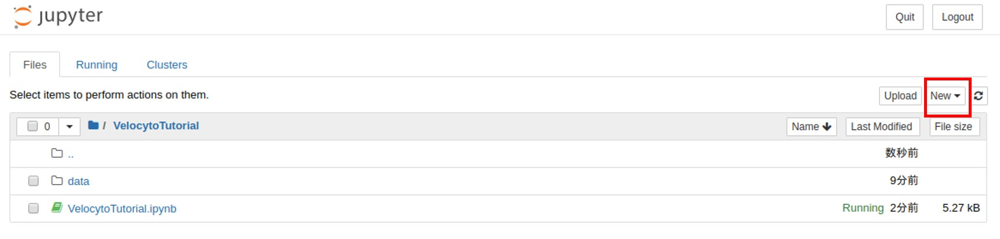

================================
Docker / Jupyter notebook
================================

このページではDockerを用いるための環境構築方法について説明します。Dockerの詳細については以下のような資料も参考にしてください。

* `Docker入門（第一回）～Dockerとは何か、何が良いのか～ <https://knowledge.sakura.ad.jp/13265/>`_
* `Dockerの全体像を理解する -前編- <https://qiita.com/kotaro-dr/items/b1024c7d200a75b992fc>`_
* `Dockerのインストール（中戸ブログ） <http://rnakato.hatenablog.jp/entry/2019/07/19/115538>`_

Dockerのインストール
--------------------------------

Mac, Windows10 Pro, Windows10 Homeでそれぞれインストール・設定方法が異なります。詳細は以下の林さん作成の資料を参照してください。

`技術講習会 docker環境の構築 改訂版 <./hayashi.pdf>`_

Dockerイメージのダウンロード
==============================

**rnakato/singlecell_jupyter** というのが、中戸作成の1細胞解析用Dockerイメージの名前になります。
以下のコマンドでダウンロードします。(ダウンロード済のイメージを最新版に更新したい場合も同様にpullします)

.. code-block:: sh

    docker pull rnakato/singlecell_jupyter

DockerからJupyterの起動
==========================
| 本資料ではDockerイメージからJupyterを起動し、Jupyter上で作業します。
| **Docker起動 -> Dockerイメージの起動 -> イメージ内でJupyter (R or Python) 起動 -> Jupyter上でツールを利用** という流れになります。

**-v** オプションをつけることで、コンテナ内のディレクトリをホストPCのフォルダと同期させることができます。こうしておかないと、Docker内で作成したjupyterファイルがDocker終了後消えてしまいますので注意してください。

Mac terminalの場合
^^^^^^^^^^^^^^^^^^^^^^

.. code-block:: sh

    docker run --rm -p 8888:8888 -v $(pwd):/opt/work rnakato/singlecell_jupyter jupyter notebook --allow-root

| その後、以下のように表示されますので、**http://127.0.0.1:8888/?token=~** の部分(URL)をコピーし、ブラウザで起動。

.. code-block:: sh

    To access the notebook, open this file in a browser:
        file:///home/jovyan/.local/share/jupyter/runtime/nbserver-6-open.html
    Or copy and paste one of these URLs:
        http://f6251475ae06:8888/?token=0b07988ac7e4cf803c53d07f4de0366cc20ed4568343d
     or http://127.0.0.1:8888/?token=0b07988ac7e4cf803c53d07f4de0366cc20ed4568343d

Windows10 Pro の場合
^^^^^^^^^^^^^^^^^^^^^^

あらかじめ Docker の "Setting" でCドライブをマウントしておいてください。
その後、(Windows Powershellなどで) 以下のコマンドを実行します。

.. code-block:: sh

    docker run --rm -p 8888:8888 -v c:/Users:/opt/work rnakato/singlecell_jupyter jupyter notebook --allow-root

Eドライブをマウントする場合は以下のようにします。（先にEドライブをマウントしておく）

.. code-block:: sh

    docker run --rm -p 8888:8888 -v e:\:/opt/work rnakato/singlecell_jupyter jupyter notebook --allow-root

参考：https://qiita.com/kikako/items/7b6301a140cf37a5b7ac

| その後、以下のように表示されますので、**http://127.0.0.1:8888/?token=~** の部分(URL)をコピーし、ブラウザで起動。

.. code-block:: sh

    To access the notebook, open this file in a browser:
        file:///home/jovyan/.local/share/jupyter/runtime/nbserver-6-open.html
    Or copy and paste one of these URLs:
        http://f6251475ae06:8888/?token=0b07988ac7e4cf803c53d07f4de0366cc20ed4568343d
     or http://127.0.0.1:8888/?token=0b07988ac7e4cf803c53d07f4de0366cc20ed4568343d

Windows10 Home (Windows7) の場合
^^^^^^^^^^^^^^^^^^^^^^^^^^^^^^^^^^^^^^^^^^^^
先にJupyter notebook用のフォルダを作成し、Virtual boxの設定でマウントしておくと良いです。
以下はVirtual box内でのマウントポイントを/jupyterにした場合です。

.. code-block:: sh

    docker run --rm -p 8888:8888 -v /jupyter:/opt/work rnakato/singlecell_jupyter jupyter notebook --allow-root

| その後、以下のように表示されますので、**http://127.0.0.1:8888/?token=~** の部分(URL)をコピーし、ブラウザで起動。
| （注：アクセスにlocalhost (127.0.0.1)ではなく 192.168.99.100 を指定する必要があるかもしれません。参考：https://qiita.com/hidao/items/cf4a3ed0d2a753a405a4）

.. code-block:: sh

    To access the notebook, open this file in a browser:
        file:///home/jovyan/.local/share/jupyter/runtime/nbserver-6-open.html
    Or copy and paste one of these URLs:
        http://f6251475ae06:8888/?token=0b07988ac7e4cf803c53d07f4de0366cc20ed4568343d
     or http://127.0.0.1:8888/?token=0b07988ac7e4cf803c53d07f4de0366cc20ed4568343d

Dockerについての補足
==========================

Tokenが要求される場合
^^^^^^^^^^^^^^^^^^^^^^^^^^^^^
Jupyterが開いた時に "password or token" を入力する画面になった時は、上記URLの "taken=" 以降の文字列をコピペして入力してください。

Dockerコンテナの確認
^^^^^^^^^^^^^^^^^^^^^^^^^^^^^

- コンテナの起動

.. code-block:: sh

    docker run -it --rm <コンテナ名> <コマンド> # コンテナを新規起動してコマンドを実行
    docker exec -it <コンテナ名> <コマンド> # 実行中のコンテナでコマンドを実行

- 現在存在するコンテナの確認

.. code-block:: sh

    docker ps    # アクティブなコンテナの一覧表示
    docker ps -a # 非アクティブなコンテナを含めた一覧表示

- コンテナの停止・削除

.. code-block:: sh

    docker stop <コンテナ名>  # 実行中のコンテナを停止
    docker start <コンテナ名> # 停止中のコンテナを起動
    docker rm <コンテナ名>   # コンテナの削除

- Dockerイメージの確認・削除

.. code-block:: sh

    docker images  # ダウンロードしたイメージの一覧表示
    docker rmi <image名>   # ダウンロード済イメージの削除

.. Note::

     過去に起動したコンテナが残ったままで同じコンテナ名をつけて実行すると、 「コンテナが既に存在するため作成できません」とエラーになります。その場合は ``docker stop <コンテナ名>`` として既存のコンテナを停止、 ``docker rm <コンテナ名>`` で削除してから、あらためて起動してください。

SingularityからJupyterの起動
========================================

本DockerイメージはSingularityを用いても実行可能です。
Singularityの詳細については以下のような資料を参考にしてください。

* `Singularityを使ったDocker環境の利用が楽ちんという話（中戸ブログ） <https://rnakato.hatenablog.jp/entry/2019/08/23/144656>`_
* `GPUユーザーは、すぐにdockerからsingularityに切り替えるべきだと思った８つのこと <https://www.ecomottblog.com/?p=3903>`_
* `Singularityの使い方（遺伝研） <https://sc.ddbj.nig.ac.jp/ja/guide/software/singularity>`_

Singularityイメージ (rnakato_singlecell_jupyter.img) の作成

.. code-block:: sh

    singularity build -F rnakato_singlecell_jupyter.img docker://rnakato/singlecell_jupyter

SingularityイメージからJupyterの起動

.. code-block:: sh

    singularity exec rnakato_singlecell_jupyter.img jupyternotebook.sh

ホストPCのGPUを利用する場合は ``--nv`` オプションを付加してください。

.. code-block:: sh

    singularity exec --nv rnakato_singlecell_jupyter.img jupyternotebook.sh

ホストPCの特定のディレクトリを利用する場合は ``--bind`` オプションを付加してマウントします。

.. code-block:: sh

    # ホストPCの /work ディレクトリをマウント
    singularity exec --bind /work rnakato_singlecell_jupyter.img jupyternotebook.sh

インストールされているLinuxコマンドを直接呼び出すことも可能です。

.. code-block:: sh

    # cellphonedbの起動
    singularity exec rnakato_singlecell_jupyter.img cellphonedb

Mac terminalの場合
^^^^^^^^^^^^^^^^^^^^^^

Jupyter notebookの使い方
================================

上がJupyterを起動した状態です。赤枠の "New" を選択し、 "R" または "Python3" の適切な方を選択すると notebook が新規作成されます。

セル内にコマンドを書き込み、上部の ">Run" をクリックするとセル内のコマンドが実行されます。
左のカッコ内が "\*" になっている間はコマンド実行中で、完了すると数字に変わります。

"+" ボタンを押すとセル追加、ハサミマークを押すと現在のセルが削除されます。
一番左のフロッピーマークが保存です。
実行中のセルで "■" ボタンを押すと実行を中止します。

参考： `jupyter notebookの基本的な使い方。起動と終了 <https://code-graffiti.com/how-to-use-jupyter-notebook/>`_

データの保存
^^^^^^^^^^^^^^^^^^^^^^^^^^^^^

Docker内で作成したファイルは、Docker終了時に消えてしまいます。
ファイルを永続化するために、上のコマンドでは ``-v`` オプションを付加し、
ホスト（PC）側のフォルダとDockerコンテナのopt/workディレクトリを同期しています。
opt/workディレクトリの中でファイルを作成すれば、同期したホスト側フォルダの中にファイルが残り、Docker終了後も消えることはありませんので、繰り返し用いることができます。

.. Note::

    | ``-v`` オプションで同期するホスト側のフォルダのパスに2バイト文字（ひらがな・カタカナ・漢字など）が含まれていると、同期に失敗するようです。
    | また、同期したフォルダの中に2バイト文字のファイル or フォルダが存在すると、workディレクトリ側からはフォルダが空に見えるようです。
    | ですので、cドライブ直下など、2バイト文字が存在しない場所を同期するようにしてください。
    | Windowsの場合はWSL2でLinux的に起動する方がよいかもしれません（あるいはSingularityを使う）。

Dead Kernel について
^^^^^^^^^^^^^^^^^^^^^^^^^^

| 使用しているPCのマシンリソースを超える作業をJupyter上で行った場合にJupyterが強制終了してしまうことがあります。
| (特にWin10 HomeでVirtual boxを起動している場合はスペック制限が厳しいです。)
| その場合、ページ上部のKernelが "Dead Kernel" という表示になり、作業が続けられません。
| この場合はNotebook上部のボタンからカーネルの再起動を実行するか、一旦Jupyterのホーム画面に戻り、Jupyterファイルをshutdownしてから再起動する必要があります。
| （重症の場合はJupyter ごと再起動した方がよい場合もある）
| 毎回同じ箇所で終了してしまう場合は、Virtual boxの設定から許容するCPU/メモリ数を多くするか、より高スペックのPCを使うことを検討してください。
