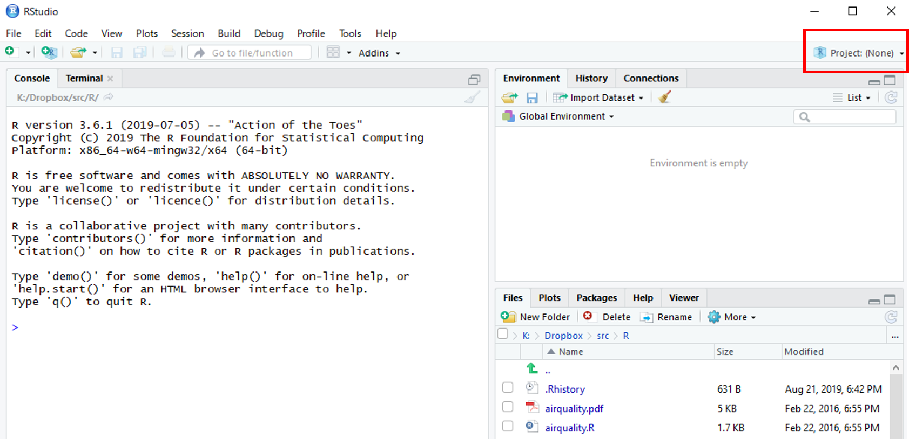

================================
Seurat Tutorial
================================

Seuratのチュートリアルで代表的な "`Guided tutorial <https://satijalab.org/seurat/v3.1/pbmc3k_tutorial.html>`_" を使って解析します。
シングルセルデータの品質評価（QC）、クラスタリングが含まれます。

| ここではRstudioを用います。Seurat, SleepWalkを用いますので、未インストールの場合は以下のコマンドでインストールしてください。
| (2019/12/12追記：Seuratのインストールに必要なmulttestがCRANから削除されてしまったようなので、暫定ですが、以下のように修正しました。)

.. code-block:: r

   install.packages("BiocManager")
   BiocManager::install("multtest")
   install.packages("Seurat")
   install.packages("sleepwalk")

Rstudio Projectの作成
--------------------------------------------

Rstudio起動後、以下の赤枠で囲われた"Project (None)"をクリックし、"New Project"を選択します。
"New Directory" -> "New Project" を選択し、データを保存しておきたいフォルダを新規作成します（どこでも構いません）。以後、作成されたProjectを起動すれば、自動的に指定した作業フォルダに移動し、それまでの作業履歴を確認できる状態になります。ここでは"Seurat"という名前のProjectを作成します。

作成後、"Project (None)" が "Seurat" に代わっていれば成功です。

シングルセルデータのダウンロード
--------------------------------------------
サンプルデータとして、10Xで生産された Peripheral Blood Mononuclear Cells (PBMC) 2,700細胞を用います。以下のURLからダウンロード後、解凍してください。

https://s3-us-west-2.amazonaws.com/10x.files/samples/cell/pbmc3k/pbmc3k_filtered_gene_bc_matrices.tar.gz

解凍後生成された "filtered_gene_bc_matrices" ディレクトリを、Projectのディレクトリに置けば準備完了です。
