# Details of Ligand Gene-centric Overview (all)

|Ligand Gene|Receptor Gene|
|---------------------------------|---------------------------------|
|[A1BG](https://www.ncbi.nlm.nih.gov/gene/1)|[CRK](https://www.ncbi.nlm.nih.gov/gene/1398) [CEACAM6](https://www.ncbi.nlm.nih.gov/gene/4680) [SRC](https://www.ncbi.nlm.nih.gov/gene/6714)|
|[A2M](https://www.ncbi.nlm.nih.gov/gene/2)|[RHOA](https://www.ncbi.nlm.nih.gov/gene/387) [RHOC](https://www.ncbi.nlm.nih.gov/gene/389) [RHOG](https://www.ncbi.nlm.nih.gov/gene/391) [CDC42](https://www.ncbi.nlm.nih.gov/gene/998) [LDLR](https://www.ncbi.nlm.nih.gov/gene/3949) [LRP6](https://www.ncbi.nlm.nih.gov/gene/4040) [OLR1](https://www.ncbi.nlm.nih.gov/gene/4973) [PSD](https://www.ncbi.nlm.nih.gov/gene/5662) [RAC1](https://www.ncbi.nlm.nih.gov/gene/5879) [LRP8](https://www.ncbi.nlm.nih.gov/gene/7804) [CACNA1G](https://www.ncbi.nlm.nih.gov/gene/8913) [PRND](https://www.ncbi.nlm.nih.gov/gene/23627) [RHOD](https://www.ncbi.nlm.nih.gov/gene/29984) [RHOF](https://www.ncbi.nlm.nih.gov/gene/54509) [RHOJ](https://www.ncbi.nlm.nih.gov/gene/57381) [RHOU](https://www.ncbi.nlm.nih.gov/gene/58480) [MYO1G](https://www.ncbi.nlm.nih.gov/gene/64005) [TMPRSS6](https://www.ncbi.nlm.nih.gov/gene/164656) [RHOV](https://www.ncbi.nlm.nih.gov/gene/171177)|
|[A2ML1](https://www.ncbi.nlm.nih.gov/gene/144568)|[DSG3](https://www.ncbi.nlm.nih.gov/gene/1830) [RIT1](https://www.ncbi.nlm.nih.gov/gene/6016) [RRAS](https://www.ncbi.nlm.nih.gov/gene/6237) [CACNA1G](https://www.ncbi.nlm.nih.gov/gene/8913) [MAL2](https://www.ncbi.nlm.nih.gov/gene/114569)|
|[AADACL2](https://www.ncbi.nlm.nih.gov/gene/344752)|[AAMP](https://www.ncbi.nlm.nih.gov/gene/14) [SUCNR1](https://www.ncbi.nlm.nih.gov/gene/56670)|
|[ABHD15](https://www.ncbi.nlm.nih.gov/gene/116236)|[ABHD17B](https://www.ncbi.nlm.nih.gov/gene/51104) [CACNG8](https://www.ncbi.nlm.nih.gov/gene/59283) [ABHD17A](https://www.ncbi.nlm.nih.gov/gene/81926) [TP53I13](https://www.ncbi.nlm.nih.gov/gene/90313)|
|[ABI3BP](https://www.ncbi.nlm.nih.gov/gene/25890)|[MXRA8](https://www.ncbi.nlm.nih.gov/gene/54587)|
|[ACAN](https://www.ncbi.nlm.nih.gov/gene/176)|[ALPL](https://www.ncbi.nlm.nih.gov/gene/249) [CD44](https://www.ncbi.nlm.nih.gov/gene/960) [CDH2](https://www.ncbi.nlm.nih.gov/gene/1000) [CSPG4](https://www.ncbi.nlm.nih.gov/gene/1464) [ENG](https://www.ncbi.nlm.nih.gov/gene/2022) [FGFR3](https://www.ncbi.nlm.nih.gov/gene/2261) [GUCY2C](https://www.ncbi.nlm.nih.gov/gene/2984) [IHH](https://www.ncbi.nlm.nih.gov/gene/3549) [ITGB1](https://www.ncbi.nlm.nih.gov/gene/3688) [MMP17](https://www.ncbi.nlm.nih.gov/gene/4326) [NT5E](https://www.ncbi.nlm.nih.gov/gene/4907) [HTRA1](https://www.ncbi.nlm.nih.gov/gene/5654) [PTPRC](https://www.ncbi.nlm.nih.gov/gene/5788) [SPAM1](https://www.ncbi.nlm.nih.gov/gene/6677) [THY1](https://www.ncbi.nlm.nih.gov/gene/7070) [HYAL2](https://www.ncbi.nlm.nih.gov/gene/8692) [PTOV1](https://www.ncbi.nlm.nih.gov/gene/53635) [CLSTN2](https://www.ncbi.nlm.nih.gov/gene/64084) [MMP25](https://www.ncbi.nlm.nih.gov/gene/64386)|
|[ACP7](https://www.ncbi.nlm.nih.gov/gene/390928)|[MRAS](https://www.ncbi.nlm.nih.gov/gene/22808) [LIN7B](https://www.ncbi.nlm.nih.gov/gene/64130)|
|[ACRBP](https://www.ncbi.nlm.nih.gov/gene/84519)|[ZAN](https://www.ncbi.nlm.nih.gov/gene/7455) [CD320](https://www.ncbi.nlm.nih.gov/gene/51293) [IZUMO1](https://www.ncbi.nlm.nih.gov/gene/284359)|
|[ADA2](https://www.ncbi.nlm.nih.gov/gene/51816)|[ADA](https://www.ncbi.nlm.nih.gov/gene/100) [ADORA1](https://www.ncbi.nlm.nih.gov/gene/134) [ADORA2A](https://www.ncbi.nlm.nih.gov/gene/135) [ADORA2B](https://www.ncbi.nlm.nih.gov/gene/136) [EDNRA](https://www.ncbi.nlm.nih.gov/gene/1909) [NT5E](https://www.ncbi.nlm.nih.gov/gene/4907) [CAP1](https://www.ncbi.nlm.nih.gov/gene/10487) [PVRIG](https://www.ncbi.nlm.nih.gov/gene/79037)|
|[ADAM12](https://www.ncbi.nlm.nih.gov/gene/8038)|[AQP4](https://www.ncbi.nlm.nih.gov/gene/361) [DAG1](https://www.ncbi.nlm.nih.gov/gene/1605) [DMD](https://www.ncbi.nlm.nih.gov/gene/1756) [ITGB1](https://www.ncbi.nlm.nih.gov/gene/3688) [SGCD](https://www.ncbi.nlm.nih.gov/gene/6444) [SNTA1](https://www.ncbi.nlm.nih.gov/gene/6640) [SRC](https://www.ncbi.nlm.nih.gov/gene/6714) [DLL1](https://www.ncbi.nlm.nih.gov/gene/28514) [TRPV2](https://www.ncbi.nlm.nih.gov/gene/51393)|
|[ADAM2](https://www.ncbi.nlm.nih.gov/gene/2515)|[SLCO6A1](https://www.ncbi.nlm.nih.gov/gene/133482)|
|[ADAM23](https://www.ncbi.nlm.nih.gov/gene/8745)|[DLG4](https://www.ncbi.nlm.nih.gov/gene/1742) [KCNA1](https://www.ncbi.nlm.nih.gov/gene/3736) [PRNP](https://www.ncbi.nlm.nih.gov/gene/5621) [RIMS2](https://www.ncbi.nlm.nih.gov/gene/9699) [CACNG4](https://www.ncbi.nlm.nih.gov/gene/27092) [ADAM22](https://www.ncbi.nlm.nih.gov/gene/53616) [PCDHB12](https://www.ncbi.nlm.nih.gov/gene/56124) [CACNG8](https://www.ncbi.nlm.nih.gov/gene/59283) [COL23A1](https://www.ncbi.nlm.nih.gov/gene/91522) [AMER2](https://www.ncbi.nlm.nih.gov/gene/219287) [DYTN](https://www.ncbi.nlm.nih.gov/gene/391475)|
|[ADAM28](https://www.ncbi.nlm.nih.gov/gene/10863)|[CD19](https://www.ncbi.nlm.nih.gov/gene/930) [ITGB1](https://www.ncbi.nlm.nih.gov/gene/3688) [KCNA1](https://www.ncbi.nlm.nih.gov/gene/3736) [RIMS2](https://www.ncbi.nlm.nih.gov/gene/9699) [NEU3](https://www.ncbi.nlm.nih.gov/gene/10825) [AMER2](https://www.ncbi.nlm.nih.gov/gene/219287) [DYTN](https://www.ncbi.nlm.nih.gov/gene/391475)|
|[ADAM9](https://www.ncbi.nlm.nih.gov/gene/8754)|[ADAM10](https://www.ncbi.nlm.nih.gov/gene/102) [FCER2](https://www.ncbi.nlm.nih.gov/gene/2208) [ITGA6](https://www.ncbi.nlm.nih.gov/gene/3655) [ITGA3](https://www.ncbi.nlm.nih.gov/gene/3675) [ITGAV](https://www.ncbi.nlm.nih.gov/gene/3685) [LIPE](https://www.ncbi.nlm.nih.gov/gene/3991) [BEST1](https://www.ncbi.nlm.nih.gov/gene/7439) [NEU3](https://www.ncbi.nlm.nih.gov/gene/10825) [BACE1](https://www.ncbi.nlm.nih.gov/gene/23621) [BACE2](https://www.ncbi.nlm.nih.gov/gene/25825) [OR2W1](https://www.ncbi.nlm.nih.gov/gene/26692) [OR5P3](https://www.ncbi.nlm.nih.gov/gene/120066)|
|[ADAMDEC1](https://www.ncbi.nlm.nih.gov/gene/27299)|[CCR5](https://www.ncbi.nlm.nih.gov/gene/1234)|
|[ADAMTS1](https://www.ncbi.nlm.nih.gov/gene/9510) 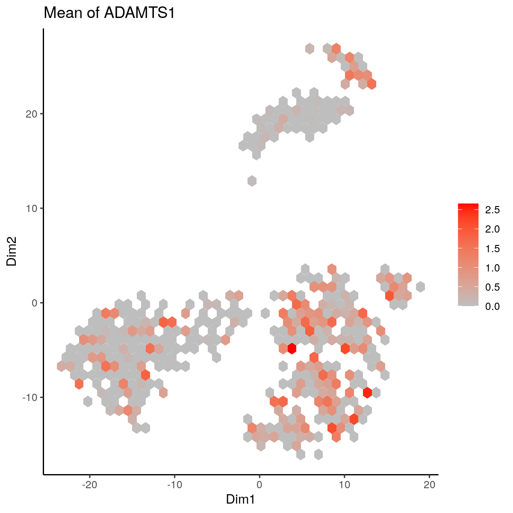|[ADAM10](https://www.ncbi.nlm.nih.gov/gene/102) [CCR10](https://www.ncbi.nlm.nih.gov/gene/2826)|
|[ADAMTS10](https://www.ncbi.nlm.nih.gov/gene/81794)|[ABHD17A](https://www.ncbi.nlm.nih.gov/gene/81926)|
|[ADAMTS12](https://www.ncbi.nlm.nih.gov/gene/81792)|[OR51G2](https://www.ncbi.nlm.nih.gov/gene/81282)|
|[ADAMTS13](https://www.ncbi.nlm.nih.gov/gene/11093)|[DSG3](https://www.ncbi.nlm.nih.gov/gene/1830) [GRIN2B](https://www.ncbi.nlm.nih.gov/gene/2904) [PHEX](https://www.ncbi.nlm.nih.gov/gene/5251) [SELP](https://www.ncbi.nlm.nih.gov/gene/6403) [CUBN](https://www.ncbi.nlm.nih.gov/gene/8029)|
|[ADAMTS14](https://www.ncbi.nlm.nih.gov/gene/140766)|[VIPR1](https://www.ncbi.nlm.nih.gov/gene/7433)|
|[ADAMTS15](https://www.ncbi.nlm.nih.gov/gene/170689)|[MCC](https://www.ncbi.nlm.nih.gov/gene/4163) [MMP17](https://www.ncbi.nlm.nih.gov/gene/4326) [OTOP2](https://www.ncbi.nlm.nih.gov/gene/92736)|
|[ADAMTS16](https://www.ncbi.nlm.nih.gov/gene/170690)|[MMP17](https://www.ncbi.nlm.nih.gov/gene/4326) [PCDH7](https://www.ncbi.nlm.nih.gov/gene/5099) [RFFL](https://www.ncbi.nlm.nih.gov/gene/117584)|
|[ADAMTS19](https://www.ncbi.nlm.nih.gov/gene/171019)|[OR9Q2](https://www.ncbi.nlm.nih.gov/gene/219957) [OR4X1](https://www.ncbi.nlm.nih.gov/gene/390113)|
|[ADAMTS2](https://www.ncbi.nlm.nih.gov/gene/9509)|[VIPR1](https://www.ncbi.nlm.nih.gov/gene/7433) [CUBN](https://www.ncbi.nlm.nih.gov/gene/8029) [ATP6V0A2](https://www.ncbi.nlm.nih.gov/gene/23545) [SLC36A2](https://www.ncbi.nlm.nih.gov/gene/153201)|
|[ADAMTS20](https://www.ncbi.nlm.nih.gov/gene/80070)|[LRIG1](https://www.ncbi.nlm.nih.gov/gene/26018) [CDH23](https://www.ncbi.nlm.nih.gov/gene/64072)|
|[ADAMTS3](https://www.ncbi.nlm.nih.gov/gene/9508)|[ADAM10](https://www.ncbi.nlm.nih.gov/gene/102) [EPHA5](https://www.ncbi.nlm.nih.gov/gene/2044) [IHH](https://www.ncbi.nlm.nih.gov/gene/3549) [MMP17](https://www.ncbi.nlm.nih.gov/gene/4326) [VIPR1](https://www.ncbi.nlm.nih.gov/gene/7433) [NPFFR2](https://www.ncbi.nlm.nih.gov/gene/10886)|
|[ADAMTS4](https://www.ncbi.nlm.nih.gov/gene/9507)|[ADAM10](https://www.ncbi.nlm.nih.gov/gene/102) [IHH](https://www.ncbi.nlm.nih.gov/gene/3549) [MMP17](https://www.ncbi.nlm.nih.gov/gene/4326) [ATP6V0A2](https://www.ncbi.nlm.nih.gov/gene/23545) [TSPAN15](https://www.ncbi.nlm.nih.gov/gene/23555) [CEMIP2](https://www.ncbi.nlm.nih.gov/gene/23670) [MMP25](https://www.ncbi.nlm.nih.gov/gene/64386)|
|[ADAMTS5](https://www.ncbi.nlm.nih.gov/gene/11096) 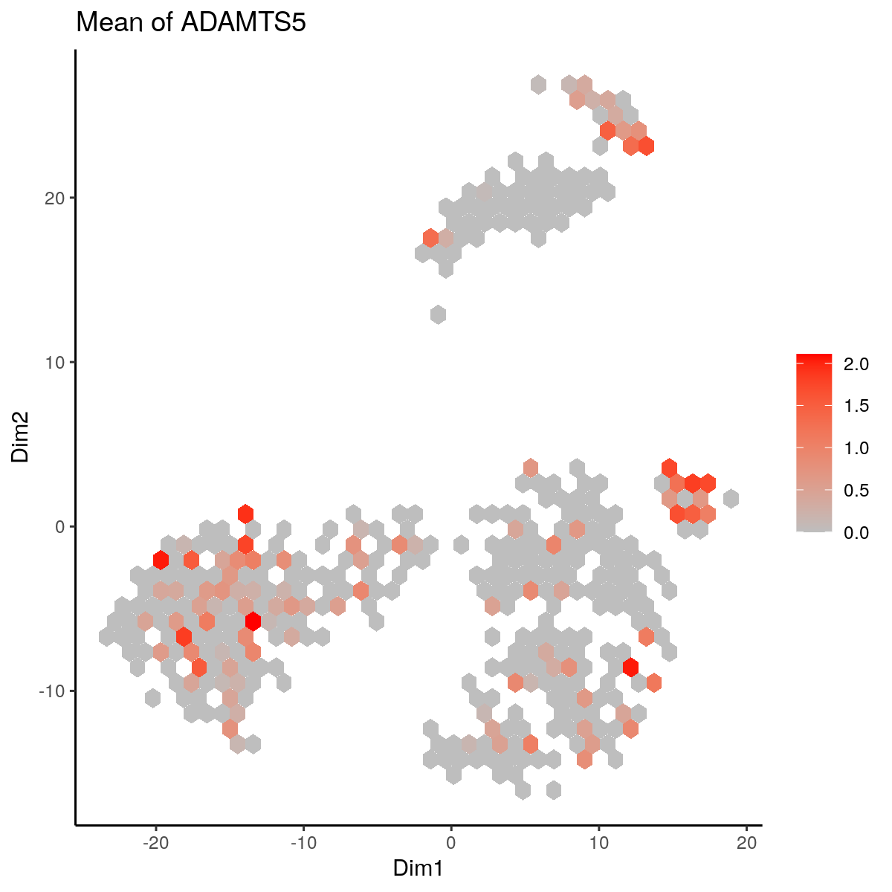|[ADAM10](https://www.ncbi.nlm.nih.gov/gene/102) [IHH](https://www.ncbi.nlm.nih.gov/gene/3549) [MMP17](https://www.ncbi.nlm.nih.gov/gene/4326) [DDR2](https://www.ncbi.nlm.nih.gov/gene/4921) [MMP25](https://www.ncbi.nlm.nih.gov/gene/64386)|
|[ADAMTS6](https://www.ncbi.nlm.nih.gov/gene/11174)|[HTRA1](https://www.ncbi.nlm.nih.gov/gene/5654) [SLC16A8](https://www.ncbi.nlm.nih.gov/gene/23539)|
|[ADAMTS7](https://www.ncbi.nlm.nih.gov/gene/11173)|[ADTRP](https://www.ncbi.nlm.nih.gov/gene/84830)|
|[ADAMTS8](https://www.ncbi.nlm.nih.gov/gene/11095)|[CSPG5](https://www.ncbi.nlm.nih.gov/gene/10675)|
|[ADAMTS9](https://www.ncbi.nlm.nih.gov/gene/56999)|[KCNQ1](https://www.ncbi.nlm.nih.gov/gene/3784) [MTNR1B](https://www.ncbi.nlm.nih.gov/gene/4544) [LGR5](https://www.ncbi.nlm.nih.gov/gene/8549) [SLC16A8](https://www.ncbi.nlm.nih.gov/gene/23539) [LRIG1](https://www.ncbi.nlm.nih.gov/gene/26018) [CDH23](https://www.ncbi.nlm.nih.gov/gene/64072) [SLC30A8](https://www.ncbi.nlm.nih.gov/gene/169026)|
|[ADAMTSL1](https://www.ncbi.nlm.nih.gov/gene/92949)|[OR8D4](https://www.ncbi.nlm.nih.gov/gene/338662)|
|[ADAMTSL3](https://www.ncbi.nlm.nih.gov/gene/57188)|[ADAM22](https://www.ncbi.nlm.nih.gov/gene/53616) [ADGRG6](https://www.ncbi.nlm.nih.gov/gene/57211)|
|[ADAMTSL5](https://www.ncbi.nlm.nih.gov/gene/339366)|[ACVRL1](https://www.ncbi.nlm.nih.gov/gene/94) [CMKLR1](https://www.ncbi.nlm.nih.gov/gene/1240) [IGDCC4](https://www.ncbi.nlm.nih.gov/gene/57722)|
|[ADCK1](https://www.ncbi.nlm.nih.gov/gene/57143)|[MAGI3](https://www.ncbi.nlm.nih.gov/gene/260425)|
|[ADCYAP1](https://www.ncbi.nlm.nih.gov/gene/116)|[ADCY3](https://www.ncbi.nlm.nih.gov/gene/109) [ADCY5](https://www.ncbi.nlm.nih.gov/gene/111) [ADCY6](https://www.ncbi.nlm.nih.gov/gene/112) [ADCY8](https://www.ncbi.nlm.nih.gov/gene/114) [ADCY9](https://www.ncbi.nlm.nih.gov/gene/115) [ADCYAP1R1](https://www.ncbi.nlm.nih.gov/gene/117) [ADD1](https://www.ncbi.nlm.nih.gov/gene/118) [ADORA2B](https://www.ncbi.nlm.nih.gov/gene/136) [ADRB1](https://www.ncbi.nlm.nih.gov/gene/153) [ADRB2](https://www.ncbi.nlm.nih.gov/gene/154) [ADRB3](https://www.ncbi.nlm.nih.gov/gene/155) [CALCR](https://www.ncbi.nlm.nih.gov/gene/799) [CRHR2](https://www.ncbi.nlm.nih.gov/gene/1395) [DPP4](https://www.ncbi.nlm.nih.gov/gene/1803) [DRD1](https://www.ncbi.nlm.nih.gov/gene/1812) [DRD4](https://www.ncbi.nlm.nih.gov/gene/1815) [DRD5](https://www.ncbi.nlm.nih.gov/gene/1816) [FSHR](https://www.ncbi.nlm.nih.gov/gene/2492) [GAP43](https://www.ncbi.nlm.nih.gov/gene/2596) [GCGR](https://www.ncbi.nlm.nih.gov/gene/2642) [GHRHR](https://www.ncbi.nlm.nih.gov/gene/2692) [GIPR](https://www.ncbi.nlm.nih.gov/gene/2696) [GLP1R](https://www.ncbi.nlm.nih.gov/gene/2740) [GNAS](https://www.ncbi.nlm.nih.gov/gene/2778) [GNG3](https://www.ncbi.nlm.nih.gov/gene/2785) [GNG4](https://www.ncbi.nlm.nih.gov/gene/2786) [GNG5](https://www.ncbi.nlm.nih.gov/gene/2787) [GNG7](https://www.ncbi.nlm.nih.gov/gene/2788) [GNG10](https://www.ncbi.nlm.nih.gov/gene/2790) [GNG11](https://www.ncbi.nlm.nih.gov/gene/2791) [GNGT1](https://www.ncbi.nlm.nih.gov/gene/2792) [GNGT2](https://www.ncbi.nlm.nih.gov/gene/2793) [GNRHR](https://www.ncbi.nlm.nih.gov/gene/2798) [NPBWR2](https://www.ncbi.nlm.nih.gov/gene/2832) [GPR15](https://www.ncbi.nlm.nih.gov/gene/2838) [GPR20](https://www.ncbi.nlm.nih.gov/gene/2843) [GPR25](https://www.ncbi.nlm.nih.gov/gene/2848) [GPR27](https://www.ncbi.nlm.nih.gov/gene/2850) [GPR32](https://www.ncbi.nlm.nih.gov/gene/2854) [GPR39](https://www.ncbi.nlm.nih.gov/gene/2863) [HRH2](https://www.ncbi.nlm.nih.gov/gene/3274) [HTR4](https://www.ncbi.nlm.nih.gov/gene/3360) [HTR6](https://www.ncbi.nlm.nih.gov/gene/3362) [HTR7](https://www.ncbi.nlm.nih.gov/gene/3363) [KCNA4](https://www.ncbi.nlm.nih.gov/gene/3739) [LHCGR](https://www.ncbi.nlm.nih.gov/gene/3973) [MC1R](https://www.ncbi.nlm.nih.gov/gene/4157) [MC2R](https://www.ncbi.nlm.nih.gov/gene/4158) [MC3R](https://www.ncbi.nlm.nih.gov/gene/4159) [MC4R](https://www.ncbi.nlm.nih.gov/gene/4160) [MC5R](https://www.ncbi.nlm.nih.gov/gene/4161) [MME](https://www.ncbi.nlm.nih.gov/gene/4311) [NPY1R](https://www.ncbi.nlm.nih.gov/gene/4886) [NPY2R](https://www.ncbi.nlm.nih.gov/gene/4887) [NPY5R](https://www.ncbi.nlm.nih.gov/gene/4889) [NTRK1](https://www.ncbi.nlm.nih.gov/gene/4914) [NTRK2](https://www.ncbi.nlm.nih.gov/gene/4915) [P2RY11](https://www.ncbi.nlm.nih.gov/gene/5032) [PTGDR](https://www.ncbi.nlm.nih.gov/gene/5729) [PTGER2](https://www.ncbi.nlm.nih.gov/gene/5732) [PTGER4](https://www.ncbi.nlm.nih.gov/gene/5734) [PTGIR](https://www.ncbi.nlm.nih.gov/gene/5739) [PTH1R](https://www.ncbi.nlm.nih.gov/gene/5745) [PTH2R](https://www.ncbi.nlm.nih.gov/gene/5746) [SCTR](https://www.ncbi.nlm.nih.gov/gene/6344) [TSHR](https://www.ncbi.nlm.nih.gov/gene/7253) [VIPR1](https://www.ncbi.nlm.nih.gov/gene/7433) [VIPR2](https://www.ncbi.nlm.nih.gov/gene/7434) [TAAR5](https://www.ncbi.nlm.nih.gov/gene/9038) [TAAR2](https://www.ncbi.nlm.nih.gov/gene/9287) [GLP2R](https://www.ncbi.nlm.nih.gov/gene/9340) [CALCRL](https://www.ncbi.nlm.nih.gov/gene/10203) [RAMP3](https://www.ncbi.nlm.nih.gov/gene/10268) [GPR83](https://www.ncbi.nlm.nih.gov/gene/10888) [GPR176](https://www.ncbi.nlm.nih.gov/gene/11245) [GPR45](https://www.ncbi.nlm.nih.gov/gene/11250) [GNG13](https://www.ncbi.nlm.nih.gov/gene/51764) [GPR84](https://www.ncbi.nlm.nih.gov/gene/53831) [GNG2](https://www.ncbi.nlm.nih.gov/gene/54331) [GNG12](https://www.ncbi.nlm.nih.gov/gene/55970) [RXFP1](https://www.ncbi.nlm.nih.gov/gene/59350) [TAAR8](https://www.ncbi.nlm.nih.gov/gene/83551) [RGS8](https://www.ncbi.nlm.nih.gov/gene/85397) [OPN4](https://www.ncbi.nlm.nih.gov/gene/94233) [GNG8](https://www.ncbi.nlm.nih.gov/gene/94235) [RXFP2](https://www.ncbi.nlm.nih.gov/gene/122042) [TAAR9](https://www.ncbi.nlm.nih.gov/gene/134860) [TAAR1](https://www.ncbi.nlm.nih.gov/gene/134864) [GPBAR1](https://www.ncbi.nlm.nih.gov/gene/151306) [ADCY4](https://www.ncbi.nlm.nih.gov/gene/196883) [GPR150](https://www.ncbi.nlm.nih.gov/gene/285601) [TAAR6](https://www.ncbi.nlm.nih.gov/gene/319100) [LINC02210-CRHR1](https://www.ncbi.nlm.nih.gov/gene/104909134)|
|[ADGRB1](https://www.ncbi.nlm.nih.gov/gene/575)|[AXL](https://www.ncbi.nlm.nih.gov/gene/558) [CRK](https://www.ncbi.nlm.nih.gov/gene/1398) [DLG4](https://www.ncbi.nlm.nih.gov/gene/1742) [PLSCR1](https://www.ncbi.nlm.nih.gov/gene/5359) [TYRO3](https://www.ncbi.nlm.nih.gov/gene/7301) [ELMO1](https://www.ncbi.nlm.nih.gov/gene/9844) [TM7SF3](https://www.ncbi.nlm.nih.gov/gene/51768) [XKR8](https://www.ncbi.nlm.nih.gov/gene/55113) [STAB2](https://www.ncbi.nlm.nih.gov/gene/55576) [MEGF10](https://www.ncbi.nlm.nih.gov/gene/84466) [GPR174](https://www.ncbi.nlm.nih.gov/gene/84636) [LYPD2](https://www.ncbi.nlm.nih.gov/gene/137797) [MAGI3](https://www.ncbi.nlm.nih.gov/gene/260425) [MYMK](https://www.ncbi.nlm.nih.gov/gene/389827)|
|[ADGRE3](https://www.ncbi.nlm.nih.gov/gene/84658)|[CD55](https://www.ncbi.nlm.nih.gov/gene/1604) [TLR6](https://www.ncbi.nlm.nih.gov/gene/10333) [FCRL4](https://www.ncbi.nlm.nih.gov/gene/83417) [ENPP7](https://www.ncbi.nlm.nih.gov/gene/339221)|
|[ADGRE5](https://www.ncbi.nlm.nih.gov/gene/976)|[CD47](https://www.ncbi.nlm.nih.gov/gene/961) [CD53](https://www.ncbi.nlm.nih.gov/gene/963) [CD59](https://www.ncbi.nlm.nih.gov/gene/966) [CDC42](https://www.ncbi.nlm.nih.gov/gene/998) [CD55](https://www.ncbi.nlm.nih.gov/gene/1604) [ITGB2](https://www.ncbi.nlm.nih.gov/gene/3689) [PTPRC](https://www.ncbi.nlm.nih.gov/gene/5788) [LYPD3](https://www.ncbi.nlm.nih.gov/gene/27076) [GPRC5B](https://www.ncbi.nlm.nih.gov/gene/51704)|
|[ADGRF1](https://www.ncbi.nlm.nih.gov/gene/266977)|[PTGER1](https://www.ncbi.nlm.nih.gov/gene/5731) [SSTR4](https://www.ncbi.nlm.nih.gov/gene/6754) [NTNG1](https://www.ncbi.nlm.nih.gov/gene/22854) [ADGRA2](https://www.ncbi.nlm.nih.gov/gene/25960) [GPR87](https://www.ncbi.nlm.nih.gov/gene/53836) [GPR135](https://www.ncbi.nlm.nih.gov/gene/64582) [NTNG2](https://www.ncbi.nlm.nih.gov/gene/84628) [GPR174](https://www.ncbi.nlm.nih.gov/gene/84636) [GPR139](https://www.ncbi.nlm.nih.gov/gene/124274) [GPR148](https://www.ncbi.nlm.nih.gov/gene/344561) [GPR141](https://www.ncbi.nlm.nih.gov/gene/353345)|
|[ADIPOQ](https://www.ncbi.nlm.nih.gov/gene/9370)|[ADRB3](https://www.ncbi.nlm.nih.gov/gene/155) [AGTR1](https://www.ncbi.nlm.nih.gov/gene/185) [AKT2](https://www.ncbi.nlm.nih.gov/gene/208) [CD36](https://www.ncbi.nlm.nih.gov/gene/948) [CDH13](https://www.ncbi.nlm.nih.gov/gene/1012) [CMKLR1](https://www.ncbi.nlm.nih.gov/gene/1240) [CNR1](https://www.ncbi.nlm.nih.gov/gene/1268) [ACE](https://www.ncbi.nlm.nih.gov/gene/1636) [DPP4](https://www.ncbi.nlm.nih.gov/gene/1803) [ADGRE1](https://www.ncbi.nlm.nih.gov/gene/2015) [ESR1](https://www.ncbi.nlm.nih.gov/gene/2099) [GGT1](https://www.ncbi.nlm.nih.gov/gene/2678) [GLP1R](https://www.ncbi.nlm.nih.gov/gene/2740) [HTR2A](https://www.ncbi.nlm.nih.gov/gene/3356) [INSR](https://www.ncbi.nlm.nih.gov/gene/3643) [LDLR](https://www.ncbi.nlm.nih.gov/gene/3949) [LIPE](https://www.ncbi.nlm.nih.gov/gene/3991) [MC4R](https://www.ncbi.nlm.nih.gov/gene/4160) [NOS3](https://www.ncbi.nlm.nih.gov/gene/4846) [OLR1](https://www.ncbi.nlm.nih.gov/gene/4973) [SELE](https://www.ncbi.nlm.nih.gov/gene/6401) [SELP](https://www.ncbi.nlm.nih.gov/gene/6403) [SLC2A1](https://www.ncbi.nlm.nih.gov/gene/6513) [SLC2A2](https://www.ncbi.nlm.nih.gov/gene/6514) [SLC2A4](https://www.ncbi.nlm.nih.gov/gene/6517) [SLC5A4](https://www.ncbi.nlm.nih.gov/gene/6527) [TLR4](https://www.ncbi.nlm.nih.gov/gene/7099) [ADIPOR1](https://www.ncbi.nlm.nih.gov/gene/51094) [PAQR5](https://www.ncbi.nlm.nih.gov/gene/54852) [ITLN1](https://www.ncbi.nlm.nih.gov/gene/55600) [PNPLA2](https://www.ncbi.nlm.nih.gov/gene/57104) [CXCL16](https://www.ncbi.nlm.nih.gov/gene/58191) [ADIPOR2](https://www.ncbi.nlm.nih.gov/gene/79602) [PAQR6](https://www.ncbi.nlm.nih.gov/gene/79957) [PAQR8](https://www.ncbi.nlm.nih.gov/gene/85315) [KLB](https://www.ncbi.nlm.nih.gov/gene/152831) [PAQR7](https://www.ncbi.nlm.nih.gov/gene/164091) [HCAR2](https://www.ncbi.nlm.nih.gov/gene/338442) [FFAR4](https://www.ncbi.nlm.nih.gov/gene/338557) [PAQR9](https://www.ncbi.nlm.nih.gov/gene/344838) [SLC27A1](https://www.ncbi.nlm.nih.gov/gene/376497) [CCR2](https://www.ncbi.nlm.nih.gov/gene/729230)|
|[ADM](https://www.ncbi.nlm.nih.gov/gene/133) 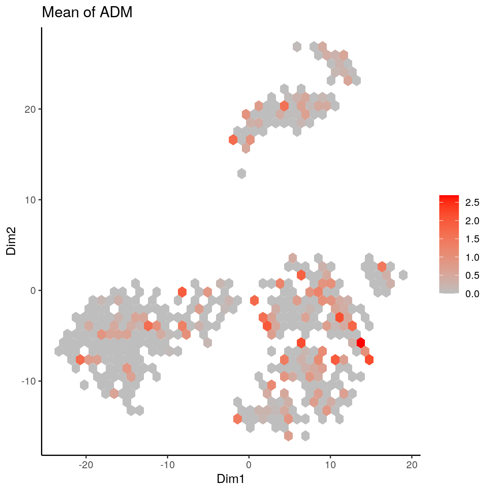|[ADCY3](https://www.ncbi.nlm.nih.gov/gene/109) [ADCY5](https://www.ncbi.nlm.nih.gov/gene/111) [ADCY6](https://www.ncbi.nlm.nih.gov/gene/112) [ADCY8](https://www.ncbi.nlm.nih.gov/gene/114) [ADCY9](https://www.ncbi.nlm.nih.gov/gene/115) [ADCYAP1R1](https://www.ncbi.nlm.nih.gov/gene/117) [ADORA2B](https://www.ncbi.nlm.nih.gov/gene/136) [ADRB1](https://www.ncbi.nlm.nih.gov/gene/153) [ADRB2](https://www.ncbi.nlm.nih.gov/gene/154) [ADRB3](https://www.ncbi.nlm.nih.gov/gene/155) [CALCR](https://www.ncbi.nlm.nih.gov/gene/799) [CRHR2](https://www.ncbi.nlm.nih.gov/gene/1395) [ACE](https://www.ncbi.nlm.nih.gov/gene/1636) [DRD1](https://www.ncbi.nlm.nih.gov/gene/1812) [DRD5](https://www.ncbi.nlm.nih.gov/gene/1816) [FSHR](https://www.ncbi.nlm.nih.gov/gene/2492) [GCGR](https://www.ncbi.nlm.nih.gov/gene/2642) [GHRHR](https://www.ncbi.nlm.nih.gov/gene/2692) [GIPR](https://www.ncbi.nlm.nih.gov/gene/2696) [GLP1R](https://www.ncbi.nlm.nih.gov/gene/2740) [GNAS](https://www.ncbi.nlm.nih.gov/gene/2778) [GNG3](https://www.ncbi.nlm.nih.gov/gene/2785) [GNG4](https://www.ncbi.nlm.nih.gov/gene/2786) [GNG5](https://www.ncbi.nlm.nih.gov/gene/2787) [GNG7](https://www.ncbi.nlm.nih.gov/gene/2788) [GNG10](https://www.ncbi.nlm.nih.gov/gene/2790) [GNG11](https://www.ncbi.nlm.nih.gov/gene/2791) [GNGT1](https://www.ncbi.nlm.nih.gov/gene/2792) [GNGT2](https://www.ncbi.nlm.nih.gov/gene/2793) [GPR15](https://www.ncbi.nlm.nih.gov/gene/2838) [GPR20](https://www.ncbi.nlm.nih.gov/gene/2843) [GPR25](https://www.ncbi.nlm.nih.gov/gene/2848) [GPR27](https://www.ncbi.nlm.nih.gov/gene/2850) [GPR32](https://www.ncbi.nlm.nih.gov/gene/2854) [GPR39](https://www.ncbi.nlm.nih.gov/gene/2863) [HRH2](https://www.ncbi.nlm.nih.gov/gene/3274) [HTR4](https://www.ncbi.nlm.nih.gov/gene/3360) [HTR6](https://www.ncbi.nlm.nih.gov/gene/3362) [HTR7](https://www.ncbi.nlm.nih.gov/gene/3363) [LHCGR](https://www.ncbi.nlm.nih.gov/gene/3973) [MC1R](https://www.ncbi.nlm.nih.gov/gene/4157) [MC2R](https://www.ncbi.nlm.nih.gov/gene/4158) [MC3R](https://www.ncbi.nlm.nih.gov/gene/4159) [MC4R](https://www.ncbi.nlm.nih.gov/gene/4160) [MC5R](https://www.ncbi.nlm.nih.gov/gene/4161) [MME](https://www.ncbi.nlm.nih.gov/gene/4311) [NOS3](https://www.ncbi.nlm.nih.gov/gene/4846) [OPRL1](https://www.ncbi.nlm.nih.gov/gene/4987) [P2RY11](https://www.ncbi.nlm.nih.gov/gene/5032) [PTGDR](https://www.ncbi.nlm.nih.gov/gene/5729) [PTGER2](https://www.ncbi.nlm.nih.gov/gene/5732) [PTGER4](https://www.ncbi.nlm.nih.gov/gene/5734) [PTGIR](https://www.ncbi.nlm.nih.gov/gene/5739) [PTH1R](https://www.ncbi.nlm.nih.gov/gene/5745) [PTH2R](https://www.ncbi.nlm.nih.gov/gene/5746) [SCTR](https://www.ncbi.nlm.nih.gov/gene/6344) [TSHR](https://www.ncbi.nlm.nih.gov/gene/7253) [VIPR1](https://www.ncbi.nlm.nih.gov/gene/7433) [VIPR2](https://www.ncbi.nlm.nih.gov/gene/7434) [TAAR5](https://www.ncbi.nlm.nih.gov/gene/9038) [TAAR2](https://www.ncbi.nlm.nih.gov/gene/9287) [GLP2R](https://www.ncbi.nlm.nih.gov/gene/9340) [CALCRL](https://www.ncbi.nlm.nih.gov/gene/10203) [RAMP3](https://www.ncbi.nlm.nih.gov/gene/10268) [GPR83](https://www.ncbi.nlm.nih.gov/gene/10888) [GPR176](https://www.ncbi.nlm.nih.gov/gene/11245) [GPR45](https://www.ncbi.nlm.nih.gov/gene/11250) [GPR182](https://www.ncbi.nlm.nih.gov/gene/11318) [CRCP](https://www.ncbi.nlm.nih.gov/gene/27297) [GNG13](https://www.ncbi.nlm.nih.gov/gene/51764) [GPR84](https://www.ncbi.nlm.nih.gov/gene/53831) [GNG2](https://www.ncbi.nlm.nih.gov/gene/54331) [GNG12](https://www.ncbi.nlm.nih.gov/gene/55970) [RXFP1](https://www.ncbi.nlm.nih.gov/gene/59350) [TAAR8](https://www.ncbi.nlm.nih.gov/gene/83551) [GNG8](https://www.ncbi.nlm.nih.gov/gene/94235) [RXFP2](https://www.ncbi.nlm.nih.gov/gene/122042) [TAAR9](https://www.ncbi.nlm.nih.gov/gene/134860) [TAAR1](https://www.ncbi.nlm.nih.gov/gene/134864) [GPBAR1](https://www.ncbi.nlm.nih.gov/gene/151306) [ADCY4](https://www.ncbi.nlm.nih.gov/gene/196883) [GPR150](https://www.ncbi.nlm.nih.gov/gene/285601) [TAAR6](https://www.ncbi.nlm.nih.gov/gene/319100) [LINC02210-CRHR1](https://www.ncbi.nlm.nih.gov/gene/104909134) [MRGPRX2](https://www.ncbi.nlm.nih.gov/gene/117194) [RAMP1](https://www.ncbi.nlm.nih.gov/gene/10267) [RAMP2](https://www.ncbi.nlm.nih.gov/gene/10266)|
|[ADM2](https://www.ncbi.nlm.nih.gov/gene/79924)|[ADCY3](https://www.ncbi.nlm.nih.gov/gene/109) [ADCY5](https://www.ncbi.nlm.nih.gov/gene/111) [ADCY6](https://www.ncbi.nlm.nih.gov/gene/112) [ADCY8](https://www.ncbi.nlm.nih.gov/gene/114) [ADCY9](https://www.ncbi.nlm.nih.gov/gene/115) [ADCYAP1R1](https://www.ncbi.nlm.nih.gov/gene/117) [ADORA2B](https://www.ncbi.nlm.nih.gov/gene/136) [ADRB1](https://www.ncbi.nlm.nih.gov/gene/153) [ADRB2](https://www.ncbi.nlm.nih.gov/gene/154) [ADRB3](https://www.ncbi.nlm.nih.gov/gene/155) [CALCR](https://www.ncbi.nlm.nih.gov/gene/799) [CRHR2](https://www.ncbi.nlm.nih.gov/gene/1395) [DRD1](https://www.ncbi.nlm.nih.gov/gene/1812) [DRD5](https://www.ncbi.nlm.nih.gov/gene/1816) [FSHR](https://www.ncbi.nlm.nih.gov/gene/2492) [GCGR](https://www.ncbi.nlm.nih.gov/gene/2642) [GHRHR](https://www.ncbi.nlm.nih.gov/gene/2692) [GIPR](https://www.ncbi.nlm.nih.gov/gene/2696) [GLP1R](https://www.ncbi.nlm.nih.gov/gene/2740) [GNAS](https://www.ncbi.nlm.nih.gov/gene/2778) [GNG3](https://www.ncbi.nlm.nih.gov/gene/2785) [GNG4](https://www.ncbi.nlm.nih.gov/gene/2786) [GNG5](https://www.ncbi.nlm.nih.gov/gene/2787) [GNG7](https://www.ncbi.nlm.nih.gov/gene/2788) [GNG10](https://www.ncbi.nlm.nih.gov/gene/2790) [GNG11](https://www.ncbi.nlm.nih.gov/gene/2791) [GNGT1](https://www.ncbi.nlm.nih.gov/gene/2792) [GNGT2](https://www.ncbi.nlm.nih.gov/gene/2793) [GPR15](https://www.ncbi.nlm.nih.gov/gene/2838) [GPR20](https://www.ncbi.nlm.nih.gov/gene/2843) [GPR25](https://www.ncbi.nlm.nih.gov/gene/2848) [GPR27](https://www.ncbi.nlm.nih.gov/gene/2850) [GPR32](https://www.ncbi.nlm.nih.gov/gene/2854) [GPR39](https://www.ncbi.nlm.nih.gov/gene/2863) [HRH2](https://www.ncbi.nlm.nih.gov/gene/3274) [HTR4](https://www.ncbi.nlm.nih.gov/gene/3360) [HTR6](https://www.ncbi.nlm.nih.gov/gene/3362) [HTR7](https://www.ncbi.nlm.nih.gov/gene/3363) [LHCGR](https://www.ncbi.nlm.nih.gov/gene/3973) [MC1R](https://www.ncbi.nlm.nih.gov/gene/4157) [MC2R](https://www.ncbi.nlm.nih.gov/gene/4158) [MC3R](https://www.ncbi.nlm.nih.gov/gene/4159) [MC4R](https://www.ncbi.nlm.nih.gov/gene/4160) [MC5R](https://www.ncbi.nlm.nih.gov/gene/4161) [P2RY11](https://www.ncbi.nlm.nih.gov/gene/5032) [PTGDR](https://www.ncbi.nlm.nih.gov/gene/5729) [PTGER2](https://www.ncbi.nlm.nih.gov/gene/5732) [PTGER4](https://www.ncbi.nlm.nih.gov/gene/5734) [PTGIR](https://www.ncbi.nlm.nih.gov/gene/5739) [PTH1R](https://www.ncbi.nlm.nih.gov/gene/5745) [PTH2R](https://www.ncbi.nlm.nih.gov/gene/5746) [SCTR](https://www.ncbi.nlm.nih.gov/gene/6344) [TSHR](https://www.ncbi.nlm.nih.gov/gene/7253) [VIPR1](https://www.ncbi.nlm.nih.gov/gene/7433) [VIPR2](https://www.ncbi.nlm.nih.gov/gene/7434) [TAAR5](https://www.ncbi.nlm.nih.gov/gene/9038) [TAAR2](https://www.ncbi.nlm.nih.gov/gene/9287) [GLP2R](https://www.ncbi.nlm.nih.gov/gene/9340) [CALCRL](https://www.ncbi.nlm.nih.gov/gene/10203) [RAMP3](https://www.ncbi.nlm.nih.gov/gene/10268) [GPR83](https://www.ncbi.nlm.nih.gov/gene/10888) [GPR176](https://www.ncbi.nlm.nih.gov/gene/11245) [GPR45](https://www.ncbi.nlm.nih.gov/gene/11250) [GNG13](https://www.ncbi.nlm.nih.gov/gene/51764) [GPR84](https://www.ncbi.nlm.nih.gov/gene/53831) [GNG2](https://www.ncbi.nlm.nih.gov/gene/54331) [GNG12](https://www.ncbi.nlm.nih.gov/gene/55970) [RXFP1](https://www.ncbi.nlm.nih.gov/gene/59350) [TAAR8](https://www.ncbi.nlm.nih.gov/gene/83551) [GNG8](https://www.ncbi.nlm.nih.gov/gene/94235) [RXFP2](https://www.ncbi.nlm.nih.gov/gene/122042) [TAAR9](https://www.ncbi.nlm.nih.gov/gene/134860) [TAAR1](https://www.ncbi.nlm.nih.gov/gene/134864) [GPBAR1](https://www.ncbi.nlm.nih.gov/gene/151306) [ADCY4](https://www.ncbi.nlm.nih.gov/gene/196883) [GPR150](https://www.ncbi.nlm.nih.gov/gene/285601) [TAAR6](https://www.ncbi.nlm.nih.gov/gene/319100) [LINC02210-CRHR1](https://www.ncbi.nlm.nih.gov/gene/104909134) [RAMP1](https://www.ncbi.nlm.nih.gov/gene/10267) [RAMP2](https://www.ncbi.nlm.nih.gov/gene/10266)|
|[ADM5](https://www.ncbi.nlm.nih.gov/gene/199800)|[GPM6B](https://www.ncbi.nlm.nih.gov/gene/2824) [TMEM65](https://www.ncbi.nlm.nih.gov/gene/157378)|
|[ADPGK](https://www.ncbi.nlm.nih.gov/gene/83440)|[PCDHGB4](https://www.ncbi.nlm.nih.gov/gene/8641) [LZTS1](https://www.ncbi.nlm.nih.gov/gene/11178) [NPC1L1](https://www.ncbi.nlm.nih.gov/gene/29881) [OR13A1](https://www.ncbi.nlm.nih.gov/gene/79290) [OR13C4](https://www.ncbi.nlm.nih.gov/gene/138804) [TMPRSS6](https://www.ncbi.nlm.nih.gov/gene/164656) [SCAMP5](https://www.ncbi.nlm.nih.gov/gene/192683) [OR4D10](https://www.ncbi.nlm.nih.gov/gene/390197)|
|[AFM](https://www.ncbi.nlm.nih.gov/gene/173)|[C8A](https://www.ncbi.nlm.nih.gov/gene/731)|
|[AFP](https://www.ncbi.nlm.nih.gov/gene/174)|[ACHE](https://www.ncbi.nlm.nih.gov/gene/43) [ADAM10](https://www.ncbi.nlm.nih.gov/gene/102) [ALPI](https://www.ncbi.nlm.nih.gov/gene/248) [ALPL](https://www.ncbi.nlm.nih.gov/gene/249) [ALPP](https://www.ncbi.nlm.nih.gov/gene/250) [APLP2](https://www.ncbi.nlm.nih.gov/gene/334) [CD44](https://www.ncbi.nlm.nih.gov/gene/960) [CDH2](https://www.ncbi.nlm.nih.gov/gene/1000) [CEACAM5](https://www.ncbi.nlm.nih.gov/gene/1048) [CCR5](https://www.ncbi.nlm.nih.gov/gene/1234) [ENO2](https://www.ncbi.nlm.nih.gov/gene/2026) [ESR1](https://www.ncbi.nlm.nih.gov/gene/2099) [GGT1](https://www.ncbi.nlm.nih.gov/gene/2678) [GPC3](https://www.ncbi.nlm.nih.gov/gene/2719) [EPCAM](https://www.ncbi.nlm.nih.gov/gene/4072) [MELTF](https://www.ncbi.nlm.nih.gov/gene/4241) [MME](https://www.ncbi.nlm.nih.gov/gene/4311) [MUC1](https://www.ncbi.nlm.nih.gov/gene/4582) [PTPRC](https://www.ncbi.nlm.nih.gov/gene/5788) [SRC](https://www.ncbi.nlm.nih.gov/gene/6714) [TDGF1](https://www.ncbi.nlm.nih.gov/gene/6997) [THY1](https://www.ncbi.nlm.nih.gov/gene/7070) [CXCR4](https://www.ncbi.nlm.nih.gov/gene/7852) [PROM1](https://www.ncbi.nlm.nih.gov/gene/8842) [TGOLN2](https://www.ncbi.nlm.nih.gov/gene/10618) [MXRA8](https://www.ncbi.nlm.nih.gov/gene/54587) [MRAP](https://www.ncbi.nlm.nih.gov/gene/56246) [PNPLA2](https://www.ncbi.nlm.nih.gov/gene/57104) [ANO8](https://www.ncbi.nlm.nih.gov/gene/57719) [CD24](https://www.ncbi.nlm.nih.gov/gene/100133941)|
|[AGER](https://www.ncbi.nlm.nih.gov/gene/177)|[ADAM10](https://www.ncbi.nlm.nih.gov/gene/102) [RHOA](https://www.ncbi.nlm.nih.gov/gene/387) [CYBB](https://www.ncbi.nlm.nih.gov/gene/1536) [ACE](https://www.ncbi.nlm.nih.gov/gene/1636) [DIAPH1](https://www.ncbi.nlm.nih.gov/gene/1729) [FPR2](https://www.ncbi.nlm.nih.gov/gene/2358) [ITGAM](https://www.ncbi.nlm.nih.gov/gene/3684) [ITGB2](https://www.ncbi.nlm.nih.gov/gene/3689) [S100A6](https://www.ncbi.nlm.nih.gov/gene/6277) [TLR1](https://www.ncbi.nlm.nih.gov/gene/7096) [TLR4](https://www.ncbi.nlm.nih.gov/gene/7099) [TLR5](https://www.ncbi.nlm.nih.gov/gene/7100) [TYRO3](https://www.ncbi.nlm.nih.gov/gene/7301) [TLR6](https://www.ncbi.nlm.nih.gov/gene/10333) [CD300A](https://www.ncbi.nlm.nih.gov/gene/11314) [BACE1](https://www.ncbi.nlm.nih.gov/gene/23621)|
|[AGR2](https://www.ncbi.nlm.nih.gov/gene/10551)|[CD59](https://www.ncbi.nlm.nih.gov/gene/966) [DAG1](https://www.ncbi.nlm.nih.gov/gene/1605) [ESR1](https://www.ncbi.nlm.nih.gov/gene/2099) [ITGA3](https://www.ncbi.nlm.nih.gov/gene/3675) [EPCAM](https://www.ncbi.nlm.nih.gov/gene/4072) [MUC1](https://www.ncbi.nlm.nih.gov/gene/4582) [CEACAM6](https://www.ncbi.nlm.nih.gov/gene/4680) [FXYD3](https://www.ncbi.nlm.nih.gov/gene/5349) [LYPD3](https://www.ncbi.nlm.nih.gov/gene/27076)|
|[AGRP](https://www.ncbi.nlm.nih.gov/gene/181)|[CNR1](https://www.ncbi.nlm.nih.gov/gene/1268) [GHSR](https://www.ncbi.nlm.nih.gov/gene/2693) [GLP1R](https://www.ncbi.nlm.nih.gov/gene/2740) [MCHR1](https://www.ncbi.nlm.nih.gov/gene/2847) [HCRTR1](https://www.ncbi.nlm.nih.gov/gene/3061) [HTR2C](https://www.ncbi.nlm.nih.gov/gene/3358) [MC1R](https://www.ncbi.nlm.nih.gov/gene/4157) [MC2R](https://www.ncbi.nlm.nih.gov/gene/4158) [MC3R](https://www.ncbi.nlm.nih.gov/gene/4159) [MC4R](https://www.ncbi.nlm.nih.gov/gene/4160) [MC5R](https://www.ncbi.nlm.nih.gov/gene/4161) [NPY1R](https://www.ncbi.nlm.nih.gov/gene/4886) [NPY5R](https://www.ncbi.nlm.nih.gov/gene/4889) [SDC3](https://www.ncbi.nlm.nih.gov/gene/9672) [MRAP2](https://www.ncbi.nlm.nih.gov/gene/112609)|
|[AGT](https://www.ncbi.nlm.nih.gov/gene/183)|[ADCY3](https://www.ncbi.nlm.nih.gov/gene/109) [ADCY5](https://www.ncbi.nlm.nih.gov/gene/111) [ADCY6](https://www.ncbi.nlm.nih.gov/gene/112) [ADCY8](https://www.ncbi.nlm.nih.gov/gene/114) [ADCY9](https://www.ncbi.nlm.nih.gov/gene/115) [ADD1](https://www.ncbi.nlm.nih.gov/gene/118) [ADORA1](https://www.ncbi.nlm.nih.gov/gene/134) [ADRA1D](https://www.ncbi.nlm.nih.gov/gene/146) [ADRA2A](https://www.ncbi.nlm.nih.gov/gene/150) [ADRA2B](https://www.ncbi.nlm.nih.gov/gene/151) [ADRA2C](https://www.ncbi.nlm.nih.gov/gene/152) [ADRB1](https://www.ncbi.nlm.nih.gov/gene/153) [ADRB2](https://www.ncbi.nlm.nih.gov/gene/154) [AP2A1](https://www.ncbi.nlm.nih.gov/gene/160) [AGTR1](https://www.ncbi.nlm.nih.gov/gene/185) [AGTR2](https://www.ncbi.nlm.nih.gov/gene/186) [APLNR](https://www.ncbi.nlm.nih.gov/gene/187) [ANPEP](https://www.ncbi.nlm.nih.gov/gene/290) [AQP1](https://www.ncbi.nlm.nih.gov/gene/358) [AQP2](https://www.ncbi.nlm.nih.gov/gene/359) [AQP4](https://www.ncbi.nlm.nih.gov/gene/361) [ARRB1](https://www.ncbi.nlm.nih.gov/gene/408) [AVPR1A](https://www.ncbi.nlm.nih.gov/gene/552) [AVPR1B](https://www.ncbi.nlm.nih.gov/gene/553) [BDKRB1](https://www.ncbi.nlm.nih.gov/gene/623) [BDKRB2](https://www.ncbi.nlm.nih.gov/gene/624) [CXCR5](https://www.ncbi.nlm.nih.gov/gene/643) [BRS3](https://www.ncbi.nlm.nih.gov/gene/680) [C3AR1](https://www.ncbi.nlm.nih.gov/gene/719) [C5AR1](https://www.ncbi.nlm.nih.gov/gene/728) [CASR](https://www.ncbi.nlm.nih.gov/gene/846) [CCKAR](https://www.ncbi.nlm.nih.gov/gene/886) [CCKBR](https://www.ncbi.nlm.nih.gov/gene/887) [CFTR](https://www.ncbi.nlm.nih.gov/gene/1080) [CHRM1](https://www.ncbi.nlm.nih.gov/gene/1128) [CHRM2](https://www.ncbi.nlm.nih.gov/gene/1129) [CHRM3](https://www.ncbi.nlm.nih.gov/gene/1131) [CHRM4](https://www.ncbi.nlm.nih.gov/gene/1132) [CHRM5](https://www.ncbi.nlm.nih.gov/gene/1133) [AP2M1](https://www.ncbi.nlm.nih.gov/gene/1173) [CCR1](https://www.ncbi.nlm.nih.gov/gene/1230) [CCR3](https://www.ncbi.nlm.nih.gov/gene/1232) [CCR4](https://www.ncbi.nlm.nih.gov/gene/1233) [CCR5](https://www.ncbi.nlm.nih.gov/gene/1234) [CCR7](https://www.ncbi.nlm.nih.gov/gene/1236) [CCR8](https://www.ncbi.nlm.nih.gov/gene/1237) [LTB4R](https://www.ncbi.nlm.nih.gov/gene/1241) [CNR1](https://www.ncbi.nlm.nih.gov/gene/1268) [CNR2](https://www.ncbi.nlm.nih.gov/gene/1269) [CX3CR1](https://www.ncbi.nlm.nih.gov/gene/1524) [CYBA](https://www.ncbi.nlm.nih.gov/gene/1535) [CYBB](https://www.ncbi.nlm.nih.gov/gene/1536) [ACE](https://www.ncbi.nlm.nih.gov/gene/1636) [DRD2](https://www.ncbi.nlm.nih.gov/gene/1813) [DRD3](https://www.ncbi.nlm.nih.gov/gene/1814) [DRD4](https://www.ncbi.nlm.nih.gov/gene/1815) [GPR183](https://www.ncbi.nlm.nih.gov/gene/1880) [ECE1](https://www.ncbi.nlm.nih.gov/gene/1889) [S1PR1](https://www.ncbi.nlm.nih.gov/gene/1901) [S1PR3](https://www.ncbi.nlm.nih.gov/gene/1903) [EDNRA](https://www.ncbi.nlm.nih.gov/gene/1909) [EDNRB](https://www.ncbi.nlm.nih.gov/gene/1910) [ENG](https://www.ncbi.nlm.nih.gov/gene/2022) [ENPEP](https://www.ncbi.nlm.nih.gov/gene/2028) [EPHB1](https://www.ncbi.nlm.nih.gov/gene/2047) [F2R](https://www.ncbi.nlm.nih.gov/gene/2149) [F2RL1](https://www.ncbi.nlm.nih.gov/gene/2150) [F2RL2](https://www.ncbi.nlm.nih.gov/gene/2151) [FGR](https://www.ncbi.nlm.nih.gov/gene/2268) [FPR1](https://www.ncbi.nlm.nih.gov/gene/2357) [FPR2](https://www.ncbi.nlm.nih.gov/gene/2358) [FPR3](https://www.ncbi.nlm.nih.gov/gene/2359) [FYN](https://www.ncbi.nlm.nih.gov/gene/2534) [GALR1](https://www.ncbi.nlm.nih.gov/gene/2587) [GCGR](https://www.ncbi.nlm.nih.gov/gene/2642) [GHSR](https://www.ncbi.nlm.nih.gov/gene/2693) [GJA1](https://www.ncbi.nlm.nih.gov/gene/2697) [GNA11](https://www.ncbi.nlm.nih.gov/gene/2767) [GNAS](https://www.ncbi.nlm.nih.gov/gene/2778) [GNG3](https://www.ncbi.nlm.nih.gov/gene/2785) [GNG4](https://www.ncbi.nlm.nih.gov/gene/2786) [GNG5](https://www.ncbi.nlm.nih.gov/gene/2787) [GNG7](https://www.ncbi.nlm.nih.gov/gene/2788) [GNG10](https://www.ncbi.nlm.nih.gov/gene/2790) [GNG11](https://www.ncbi.nlm.nih.gov/gene/2791) [GNGT1](https://www.ncbi.nlm.nih.gov/gene/2792) [GNGT2](https://www.ncbi.nlm.nih.gov/gene/2793) [GNRHR](https://www.ncbi.nlm.nih.gov/gene/2798) [CCR10](https://www.ncbi.nlm.nih.gov/gene/2826) [GPR4](https://www.ncbi.nlm.nih.gov/gene/2828) [XCR1](https://www.ncbi.nlm.nih.gov/gene/2829) [NPBWR1](https://www.ncbi.nlm.nih.gov/gene/2831) [NPBWR2](https://www.ncbi.nlm.nih.gov/gene/2832) [CXCR3](https://www.ncbi.nlm.nih.gov/gene/2833) [UTS2R](https://www.ncbi.nlm.nih.gov/gene/2837) [GPR17](https://www.ncbi.nlm.nih.gov/gene/2840) [GPR18](https://www.ncbi.nlm.nih.gov/gene/2841) [LPAR4](https://www.ncbi.nlm.nih.gov/gene/2846) [MCHR1](https://www.ncbi.nlm.nih.gov/gene/2847) [GPR31](https://www.ncbi.nlm.nih.gov/gene/2853) [GPR37](https://www.ncbi.nlm.nih.gov/gene/2861) [MLNR](https://www.ncbi.nlm.nih.gov/gene/2862) [GPR39](https://www.ncbi.nlm.nih.gov/gene/2863) [FFAR1](https://www.ncbi.nlm.nih.gov/gene/2864) [FFAR3](https://www.ncbi.nlm.nih.gov/gene/2865) [FFAR2](https://www.ncbi.nlm.nih.gov/gene/2867) [GRK5](https://www.ncbi.nlm.nih.gov/gene/2869) [GRM1](https://www.ncbi.nlm.nih.gov/gene/2911) [GRM2](https://www.ncbi.nlm.nih.gov/gene/2912) [GRM3](https://www.ncbi.nlm.nih.gov/gene/2913) [GRM4](https://www.ncbi.nlm.nih.gov/gene/2914) [GRM5](https://www.ncbi.nlm.nih.gov/gene/2915) [GRM6](https://www.ncbi.nlm.nih.gov/gene/2916) [GRM7](https://www.ncbi.nlm.nih.gov/gene/2917) [GRM8](https://www.ncbi.nlm.nih.gov/gene/2918) [GRPR](https://www.ncbi.nlm.nih.gov/gene/2925) [HCRTR1](https://www.ncbi.nlm.nih.gov/gene/3061) [HCRTR2](https://www.ncbi.nlm.nih.gov/gene/3062) [HRH1](https://www.ncbi.nlm.nih.gov/gene/3269) [HTR1A](https://www.ncbi.nlm.nih.gov/gene/3350) [HTR1B](https://www.ncbi.nlm.nih.gov/gene/3351) [HTR1D](https://www.ncbi.nlm.nih.gov/gene/3352) [HTR1E](https://www.ncbi.nlm.nih.gov/gene/3354) [HTR1F](https://www.ncbi.nlm.nih.gov/gene/3355) [HTR2A](https://www.ncbi.nlm.nih.gov/gene/3356) [HTR2B](https://www.ncbi.nlm.nih.gov/gene/3357) [HTR2C](https://www.ncbi.nlm.nih.gov/gene/3358) [HTR5A](https://www.ncbi.nlm.nih.gov/gene/3361) [CXCR1](https://www.ncbi.nlm.nih.gov/gene/3577) [CXCR2](https://www.ncbi.nlm.nih.gov/gene/3579) [KCNA5](https://www.ncbi.nlm.nih.gov/gene/3741) [LDLR](https://www.ncbi.nlm.nih.gov/gene/3949) [MAS1](https://www.ncbi.nlm.nih.gov/gene/4142) [MME](https://www.ncbi.nlm.nih.gov/gene/4311) [MTNR1A](https://www.ncbi.nlm.nih.gov/gene/4543) [MTNR1B](https://www.ncbi.nlm.nih.gov/gene/4544) [NMBR](https://www.ncbi.nlm.nih.gov/gene/4829) [NOS1](https://www.ncbi.nlm.nih.gov/gene/4842) [NOS3](https://www.ncbi.nlm.nih.gov/gene/4846) [NPHS1](https://www.ncbi.nlm.nih.gov/gene/4868) [NPY1R](https://www.ncbi.nlm.nih.gov/gene/4886) [NPY2R](https://www.ncbi.nlm.nih.gov/gene/4887) [NPY5R](https://www.ncbi.nlm.nih.gov/gene/4889) [NTSR1](https://www.ncbi.nlm.nih.gov/gene/4923) [OPRD1](https://www.ncbi.nlm.nih.gov/gene/4985) [OPRK1](https://www.ncbi.nlm.nih.gov/gene/4986) [OPRL1](https://www.ncbi.nlm.nih.gov/gene/4987) [OXTR](https://www.ncbi.nlm.nih.gov/gene/5021) [P2RY1](https://www.ncbi.nlm.nih.gov/gene/5028) [P2RY2](https://www.ncbi.nlm.nih.gov/gene/5029) [P2RY4](https://www.ncbi.nlm.nih.gov/gene/5030) [P2RY6](https://www.ncbi.nlm.nih.gov/gene/5031) [P2RY11](https://www.ncbi.nlm.nih.gov/gene/5032) [PRKAR1A](https://www.ncbi.nlm.nih.gov/gene/5573) [PRKAR1B](https://www.ncbi.nlm.nih.gov/gene/5575) [PTAFR](https://www.ncbi.nlm.nih.gov/gene/5724) [PTGER1](https://www.ncbi.nlm.nih.gov/gene/5731) [PTGER3](https://www.ncbi.nlm.nih.gov/gene/5733) [PTGFR](https://www.ncbi.nlm.nih.gov/gene/5737) [RAF1](https://www.ncbi.nlm.nih.gov/gene/5894) [SCNN1A](https://www.ncbi.nlm.nih.gov/gene/6337) [SCNN1G](https://www.ncbi.nlm.nih.gov/gene/6340) [SGK1](https://www.ncbi.nlm.nih.gov/gene/6446) [SLC9A3](https://www.ncbi.nlm.nih.gov/gene/6550) [SRC](https://www.ncbi.nlm.nih.gov/gene/6714) [SSTR1](https://www.ncbi.nlm.nih.gov/gene/6751) [SSTR2](https://www.ncbi.nlm.nih.gov/gene/6752) [SSTR3](https://www.ncbi.nlm.nih.gov/gene/6753) [SSTR4](https://www.ncbi.nlm.nih.gov/gene/6754) [SSTR5](https://www.ncbi.nlm.nih.gov/gene/6755) [TACR2](https://www.ncbi.nlm.nih.gov/gene/6865) [TACR1](https://www.ncbi.nlm.nih.gov/gene/6869) [TACR3](https://www.ncbi.nlm.nih.gov/gene/6870) [TBXA2R](https://www.ncbi.nlm.nih.gov/gene/6915) [TLR4](https://www.ncbi.nlm.nih.gov/gene/7099) [TRHR](https://www.ncbi.nlm.nih.gov/gene/7201) [EZR](https://www.ncbi.nlm.nih.gov/gene/7430) [BEST1](https://www.ncbi.nlm.nih.gov/gene/7439) [CXCR4](https://www.ncbi.nlm.nih.gov/gene/7852) [GPR68](https://www.ncbi.nlm.nih.gov/gene/8111) [SLC14A2](https://www.ncbi.nlm.nih.gov/gene/8170) [GPR65](https://www.ncbi.nlm.nih.gov/gene/8477) [GALR3](https://www.ncbi.nlm.nih.gov/gene/8484) [S1PR4](https://www.ncbi.nlm.nih.gov/gene/8698) [GALR2](https://www.ncbi.nlm.nih.gov/gene/8811) [HCAR3](https://www.ncbi.nlm.nih.gov/gene/8843) [F2RL3](https://www.ncbi.nlm.nih.gov/gene/9002) [GPR37L1](https://www.ncbi.nlm.nih.gov/gene/9283) [GPR55](https://www.ncbi.nlm.nih.gov/gene/9290) [ROCK2](https://www.ncbi.nlm.nih.gov/gene/9475) [GABBR2](https://www.ncbi.nlm.nih.gov/gene/9568) [P2RY14](https://www.ncbi.nlm.nih.gov/gene/9934) [LPAR6](https://www.ncbi.nlm.nih.gov/gene/10161) [NMUR1](https://www.ncbi.nlm.nih.gov/gene/10316) [CXCR6](https://www.ncbi.nlm.nih.gov/gene/10663) [CYSLTR1](https://www.ncbi.nlm.nih.gov/gene/10800) [CCR9](https://www.ncbi.nlm.nih.gov/gene/10803) [NPFFR2](https://www.ncbi.nlm.nih.gov/gene/10886) [PTGDR2](https://www.ncbi.nlm.nih.gov/gene/11251) [HRH3](https://www.ncbi.nlm.nih.gov/gene/11255) [LPAR3](https://www.ncbi.nlm.nih.gov/gene/23566) [NTSR2](https://www.ncbi.nlm.nih.gov/gene/23620) [HCAR1](https://www.ncbi.nlm.nih.gov/gene/27198) [OXGR1](https://www.ncbi.nlm.nih.gov/gene/27199) [P2RY10](https://www.ncbi.nlm.nih.gov/gene/27334) [GPR132](https://www.ncbi.nlm.nih.gov/gene/29933) [TAS2R16](https://www.ncbi.nlm.nih.gov/gene/50833) [ADIPOR1](https://www.ncbi.nlm.nih.gov/gene/51094) [RXFP3](https://www.ncbi.nlm.nih.gov/gene/51289) [GNG13](https://www.ncbi.nlm.nih.gov/gene/51764) [S1PR5](https://www.ncbi.nlm.nih.gov/gene/53637) [P2RY13](https://www.ncbi.nlm.nih.gov/gene/53829) [GNG2](https://www.ncbi.nlm.nih.gov/gene/54331) [BEST2](https://www.ncbi.nlm.nih.gov/gene/54831) [ITLN1](https://www.ncbi.nlm.nih.gov/gene/55600) [GNG12](https://www.ncbi.nlm.nih.gov/gene/55970) [LTB4R2](https://www.ncbi.nlm.nih.gov/gene/56413) [SUCNR1](https://www.ncbi.nlm.nih.gov/gene/56670) [NMUR2](https://www.ncbi.nlm.nih.gov/gene/56923) [ACKR3](https://www.ncbi.nlm.nih.gov/gene/57007) [CYSLTR2](https://www.ncbi.nlm.nih.gov/gene/57105) [LPAR5](https://www.ncbi.nlm.nih.gov/gene/57121) [CXCL16](https://www.ncbi.nlm.nih.gov/gene/58191) [ACE2](https://www.ncbi.nlm.nih.gov/gene/59272) [HRH4](https://www.ncbi.nlm.nih.gov/gene/59340) [NPFFR1](https://www.ncbi.nlm.nih.gov/gene/64106) [P2RY12](https://www.ncbi.nlm.nih.gov/gene/64805) [TAS1R2](https://www.ncbi.nlm.nih.gov/gene/80834) [TAS1R1](https://www.ncbi.nlm.nih.gov/gene/80835) [TAS1R3](https://www.ncbi.nlm.nih.gov/gene/83756) [QRFPR](https://www.ncbi.nlm.nih.gov/gene/84109) [MCHR2](https://www.ncbi.nlm.nih.gov/gene/84539) [KISS1R](https://www.ncbi.nlm.nih.gov/gene/84634) [OPN4](https://www.ncbi.nlm.nih.gov/gene/94233) [GNG8](https://www.ncbi.nlm.nih.gov/gene/94235) [ARHGEF25](https://www.ncbi.nlm.nih.gov/gene/115557) [PROKR2](https://www.ncbi.nlm.nih.gov/gene/128674) [OXER1](https://www.ncbi.nlm.nih.gov/gene/165140) [ADCY4](https://www.ncbi.nlm.nih.gov/gene/196883) [GPRC6A](https://www.ncbi.nlm.nih.gov/gene/222545) [HCAR2](https://www.ncbi.nlm.nih.gov/gene/338442) [FFAR4](https://www.ncbi.nlm.nih.gov/gene/338557) [RXFP4](https://www.ncbi.nlm.nih.gov/gene/339403) [CCR2](https://www.ncbi.nlm.nih.gov/gene/729230)|
|[AHSG](https://www.ncbi.nlm.nih.gov/gene/197)|[ADA](https://www.ncbi.nlm.nih.gov/gene/100) [ADAM10](https://www.ncbi.nlm.nih.gov/gene/102) [APLP2](https://www.ncbi.nlm.nih.gov/gene/334) [BMPR1A](https://www.ncbi.nlm.nih.gov/gene/657) [BMPR1B](https://www.ncbi.nlm.nih.gov/gene/658) [BMPR2](https://www.ncbi.nlm.nih.gov/gene/659) [C8A](https://www.ncbi.nlm.nih.gov/gene/731) [CDH2](https://www.ncbi.nlm.nih.gov/gene/1000) [GPC3](https://www.ncbi.nlm.nih.gov/gene/2719) [INSR](https://www.ncbi.nlm.nih.gov/gene/3643) [MC4R](https://www.ncbi.nlm.nih.gov/gene/4160) [MELTF](https://www.ncbi.nlm.nih.gov/gene/4241) [P2RX7](https://www.ncbi.nlm.nih.gov/gene/5027) [ABCB4](https://www.ncbi.nlm.nih.gov/gene/5244) [TLR4](https://www.ncbi.nlm.nih.gov/gene/7099) [TGOLN2](https://www.ncbi.nlm.nih.gov/gene/10618) [MXRA8](https://www.ncbi.nlm.nih.gov/gene/54587) [SLC38A4](https://www.ncbi.nlm.nih.gov/gene/55089) [RGMA](https://www.ncbi.nlm.nih.gov/gene/56963) [PNPLA2](https://www.ncbi.nlm.nih.gov/gene/57104) [ANO8](https://www.ncbi.nlm.nih.gov/gene/57719) [RXFP2](https://www.ncbi.nlm.nih.gov/gene/122042) [HJV](https://www.ncbi.nlm.nih.gov/gene/148738) [TMPRSS6](https://www.ncbi.nlm.nih.gov/gene/164656) [NEGR1](https://www.ncbi.nlm.nih.gov/gene/257194) [RGMB](https://www.ncbi.nlm.nih.gov/gene/285704) [FFAR4](https://www.ncbi.nlm.nih.gov/gene/338557) [IYD](https://www.ncbi.nlm.nih.gov/gene/389434)|
|[ALB](https://www.ncbi.nlm.nih.gov/gene/213)|[ACHE](https://www.ncbi.nlm.nih.gov/gene/43) [ADA](https://www.ncbi.nlm.nih.gov/gene/100) [ADAM10](https://www.ncbi.nlm.nih.gov/gene/102) [ADD1](https://www.ncbi.nlm.nih.gov/gene/118) [ADD2](https://www.ncbi.nlm.nih.gov/gene/119) [ADD3](https://www.ncbi.nlm.nih.gov/gene/120) [ADORA1](https://www.ncbi.nlm.nih.gov/gene/134) [ADORA2A](https://www.ncbi.nlm.nih.gov/gene/135) [ADRB2](https://www.ncbi.nlm.nih.gov/gene/154) [AGER](https://www.ncbi.nlm.nih.gov/gene/177) [AGTR1](https://www.ncbi.nlm.nih.gov/gene/185) [AGTR2](https://www.ncbi.nlm.nih.gov/gene/186) [ALK](https://www.ncbi.nlm.nih.gov/gene/238) [ALPI](https://www.ncbi.nlm.nih.gov/gene/248) [ALPL](https://www.ncbi.nlm.nih.gov/gene/249) [ALPP](https://www.ncbi.nlm.nih.gov/gene/250) [ALPG](https://www.ncbi.nlm.nih.gov/gene/251) [ANPEP](https://www.ncbi.nlm.nih.gov/gene/290) [APLP2](https://www.ncbi.nlm.nih.gov/gene/334) [AQP1](https://www.ncbi.nlm.nih.gov/gene/358) [AQP2](https://www.ncbi.nlm.nih.gov/gene/359) [AQP4](https://www.ncbi.nlm.nih.gov/gene/361) [AQP5](https://www.ncbi.nlm.nih.gov/gene/362) [RHOA](https://www.ncbi.nlm.nih.gov/gene/387) [ATP4A](https://www.ncbi.nlm.nih.gov/gene/495) [BSG](https://www.ncbi.nlm.nih.gov/gene/682) [C8A](https://www.ncbi.nlm.nih.gov/gene/731) [CA4](https://www.ncbi.nlm.nih.gov/gene/762) [CASR](https://www.ncbi.nlm.nih.gov/gene/846) [CD1A](https://www.ncbi.nlm.nih.gov/gene/909) [CD1B](https://www.ncbi.nlm.nih.gov/gene/910) [CD1C](https://www.ncbi.nlm.nih.gov/gene/911) [CD1D](https://www.ncbi.nlm.nih.gov/gene/912) [CD3E](https://www.ncbi.nlm.nih.gov/gene/916) [CD5](https://www.ncbi.nlm.nih.gov/gene/921) [CD9](https://www.ncbi.nlm.nih.gov/gene/928) [CD19](https://www.ncbi.nlm.nih.gov/gene/930) [CD86](https://www.ncbi.nlm.nih.gov/gene/942) [CD36](https://www.ncbi.nlm.nih.gov/gene/948) [SCARB1](https://www.ncbi.nlm.nih.gov/gene/949) [CD44](https://www.ncbi.nlm.nih.gov/gene/960) [CD59](https://www.ncbi.nlm.nih.gov/gene/966) [CD63](https://www.ncbi.nlm.nih.gov/gene/967) [CD81](https://www.ncbi.nlm.nih.gov/gene/975) [LRBA](https://www.ncbi.nlm.nih.gov/gene/987) [CDC42](https://www.ncbi.nlm.nih.gov/gene/998) [CDH2](https://www.ncbi.nlm.nih.gov/gene/1000) [CDH17](https://www.ncbi.nlm.nih.gov/gene/1015) [CEACAM5](https://www.ncbi.nlm.nih.gov/gene/1048) [CFTR](https://www.ncbi.nlm.nih.gov/gene/1080) [CCR5](https://www.ncbi.nlm.nih.gov/gene/1234) [CCR7](https://www.ncbi.nlm.nih.gov/gene/1236) [CNR1](https://www.ncbi.nlm.nih.gov/gene/1268) [CNR2](https://www.ncbi.nlm.nih.gov/gene/1269) [CR2](https://www.ncbi.nlm.nih.gov/gene/1380) [CSF1R](https://www.ncbi.nlm.nih.gov/gene/1436) [CX3CR1](https://www.ncbi.nlm.nih.gov/gene/1524) [CYBB](https://www.ncbi.nlm.nih.gov/gene/1536) [CD55](https://www.ncbi.nlm.nih.gov/gene/1604) [ACE](https://www.ncbi.nlm.nih.gov/gene/1636) [DLG4](https://www.ncbi.nlm.nih.gov/gene/1742) [DMD](https://www.ncbi.nlm.nih.gov/gene/1756) [DPP4](https://www.ncbi.nlm.nih.gov/gene/1803) [DRD2](https://www.ncbi.nlm.nih.gov/gene/1813) [EDNRB](https://www.ncbi.nlm.nih.gov/gene/1910) [ADGRE1](https://www.ncbi.nlm.nih.gov/gene/2015) [ENG](https://www.ncbi.nlm.nih.gov/gene/2022) [ENO2](https://www.ncbi.nlm.nih.gov/gene/2026) [ESR1](https://www.ncbi.nlm.nih.gov/gene/2099) [F2R](https://www.ncbi.nlm.nih.gov/gene/2149) [FCGR1A](https://www.ncbi.nlm.nih.gov/gene/2209) [FCGR2A](https://www.ncbi.nlm.nih.gov/gene/2212) [FCGR2B](https://www.ncbi.nlm.nih.gov/gene/2213) [FCGRT](https://www.ncbi.nlm.nih.gov/gene/2217) [FGFR1](https://www.ncbi.nlm.nih.gov/gene/2260) [FYN](https://www.ncbi.nlm.nih.gov/gene/2534) [GAP43](https://www.ncbi.nlm.nih.gov/gene/2596) [GGT1](https://www.ncbi.nlm.nih.gov/gene/2678) [GJA1](https://www.ncbi.nlm.nih.gov/gene/2697) [GPC3](https://www.ncbi.nlm.nih.gov/gene/2719) [GLP1R](https://www.ncbi.nlm.nih.gov/gene/2740) [GML](https://www.ncbi.nlm.nih.gov/gene/2765) [CXCR3](https://www.ncbi.nlm.nih.gov/gene/2833) [GRIA1](https://www.ncbi.nlm.nih.gov/gene/2890) [GRIN2B](https://www.ncbi.nlm.nih.gov/gene/2904) [GYPA](https://www.ncbi.nlm.nih.gov/gene/2993) [HTR7](https://www.ncbi.nlm.nih.gov/gene/3363) [CXCR1](https://www.ncbi.nlm.nih.gov/gene/3577) [CXCR2](https://www.ncbi.nlm.nih.gov/gene/3579) [ITGAL](https://www.ncbi.nlm.nih.gov/gene/3683) [ITGAM](https://www.ncbi.nlm.nih.gov/gene/3684) [ITGB1](https://www.ncbi.nlm.nih.gov/gene/3688) [ITGB3](https://www.ncbi.nlm.nih.gov/gene/3690) [KRAS](https://www.ncbi.nlm.nih.gov/gene/3845) [L1CAM](https://www.ncbi.nlm.nih.gov/gene/3897) [LAMP1](https://www.ncbi.nlm.nih.gov/gene/3916) [LAMP2](https://www.ncbi.nlm.nih.gov/gene/3920) [LCT](https://www.ncbi.nlm.nih.gov/gene/3938) [LDLR](https://www.ncbi.nlm.nih.gov/gene/3949) [LIPE](https://www.ncbi.nlm.nih.gov/gene/3991) [EPCAM](https://www.ncbi.nlm.nih.gov/gene/4072) [MELTF](https://www.ncbi.nlm.nih.gov/gene/4241) [MME](https://www.ncbi.nlm.nih.gov/gene/4311) [MMP17](https://www.ncbi.nlm.nih.gov/gene/4326) [MOG](https://www.ncbi.nlm.nih.gov/gene/4340) [CD200](https://www.ncbi.nlm.nih.gov/gene/4345) [MSN](https://www.ncbi.nlm.nih.gov/gene/4478) [MUC1](https://www.ncbi.nlm.nih.gov/gene/4582) [NGFR](https://www.ncbi.nlm.nih.gov/gene/4804) [NOS1](https://www.ncbi.nlm.nih.gov/gene/4842) [NOS3](https://www.ncbi.nlm.nih.gov/gene/4846) [NPHS1](https://www.ncbi.nlm.nih.gov/gene/4868) [NT5E](https://www.ncbi.nlm.nih.gov/gene/4907) [NTRK1](https://www.ncbi.nlm.nih.gov/gene/4914) [NTRK2](https://www.ncbi.nlm.nih.gov/gene/4915) [OPRK1](https://www.ncbi.nlm.nih.gov/gene/4986) [OPRL1](https://www.ncbi.nlm.nih.gov/gene/4987) [PDGFRB](https://www.ncbi.nlm.nih.gov/gene/5159) [ENPP3](https://www.ncbi.nlm.nih.gov/gene/5169) [ABCB1](https://www.ncbi.nlm.nih.gov/gene/5243) [PHEX](https://www.ncbi.nlm.nih.gov/gene/5251) [PIK3C2A](https://www.ncbi.nlm.nih.gov/gene/5286) [PLA2G2A](https://www.ncbi.nlm.nih.gov/gene/5320) [PODXL](https://www.ncbi.nlm.nih.gov/gene/5420) [PRNP](https://www.ncbi.nlm.nih.gov/gene/5621) [PTPRC](https://www.ncbi.nlm.nih.gov/gene/5788) [RAB5A](https://www.ncbi.nlm.nih.gov/gene/5868) [SCN10A](https://www.ncbi.nlm.nih.gov/gene/6336) [SELE](https://www.ncbi.nlm.nih.gov/gene/6401) [SELL](https://www.ncbi.nlm.nih.gov/gene/6402) [SELP](https://www.ncbi.nlm.nih.gov/gene/6403) [SI](https://www.ncbi.nlm.nih.gov/gene/6476) [SLC1A2](https://www.ncbi.nlm.nih.gov/gene/6506) [SLC1A3](https://www.ncbi.nlm.nih.gov/gene/6507) [SLC2A1](https://www.ncbi.nlm.nih.gov/gene/6513) [SLC2A2](https://www.ncbi.nlm.nih.gov/gene/6514) [SLC2A4](https://www.ncbi.nlm.nih.gov/gene/6517) [SLC5A4](https://www.ncbi.nlm.nih.gov/gene/6527) [SLC6A3](https://www.ncbi.nlm.nih.gov/gene/6531) [SLC6A4](https://www.ncbi.nlm.nih.gov/gene/6532) [SLC9A3](https://www.ncbi.nlm.nih.gov/gene/6550) [SLCO1A2](https://www.ncbi.nlm.nih.gov/gene/6579) [SPAM1](https://www.ncbi.nlm.nih.gov/gene/6677) [SRC](https://www.ncbi.nlm.nih.gov/gene/6714) [SYK](https://www.ncbi.nlm.nih.gov/gene/6850) [TEK](https://www.ncbi.nlm.nih.gov/gene/7010) [THY1](https://www.ncbi.nlm.nih.gov/gene/7070) [TIE1](https://www.ncbi.nlm.nih.gov/gene/7075) [TJP1](https://www.ncbi.nlm.nih.gov/gene/7082) [TLR1](https://www.ncbi.nlm.nih.gov/gene/7096) [TLR4](https://www.ncbi.nlm.nih.gov/gene/7099) [TLR5](https://www.ncbi.nlm.nih.gov/gene/7100) [TRPC6](https://www.ncbi.nlm.nih.gov/gene/7225) [TYRO3](https://www.ncbi.nlm.nih.gov/gene/7301) [VCL](https://www.ncbi.nlm.nih.gov/gene/7414) [EZR](https://www.ncbi.nlm.nih.gov/gene/7430) [CXCR4](https://www.ncbi.nlm.nih.gov/gene/7852) [CUBN](https://www.ncbi.nlm.nih.gov/gene/8029) [HYAL2](https://www.ncbi.nlm.nih.gov/gene/8692) [RAB11A](https://www.ncbi.nlm.nih.gov/gene/8766) [PROM1](https://www.ncbi.nlm.nih.gov/gene/8842) [MGAM](https://www.ncbi.nlm.nih.gov/gene/8972) [FCGR2C](https://www.ncbi.nlm.nih.gov/gene/9103) [CD163](https://www.ncbi.nlm.nih.gov/gene/9332) [ABCG2](https://www.ncbi.nlm.nih.gov/gene/9429) [TLR6](https://www.ncbi.nlm.nih.gov/gene/10333) [BASP1](https://www.ncbi.nlm.nih.gov/gene/10409) [SLCO1B1](https://www.ncbi.nlm.nih.gov/gene/10599) [TGOLN2](https://www.ncbi.nlm.nih.gov/gene/10618) [ATP11A](https://www.ncbi.nlm.nih.gov/gene/23250) [BACE1](https://www.ncbi.nlm.nih.gov/gene/23621) [DLL1](https://www.ncbi.nlm.nih.gov/gene/28514) [TRPM5](https://www.ncbi.nlm.nih.gov/gene/29850) [GPR132](https://www.ncbi.nlm.nih.gov/gene/29933) [RHOD](https://www.ncbi.nlm.nih.gov/gene/29984) [RHCG](https://www.ncbi.nlm.nih.gov/gene/51458) [PTOV1](https://www.ncbi.nlm.nih.gov/gene/53635) [MXRA8](https://www.ncbi.nlm.nih.gov/gene/54587) [STAB2](https://www.ncbi.nlm.nih.gov/gene/55576) [MREG](https://www.ncbi.nlm.nih.gov/gene/55686) [ADCY10](https://www.ncbi.nlm.nih.gov/gene/55811) [MRAP](https://www.ncbi.nlm.nih.gov/gene/56246) [PNPLA2](https://www.ncbi.nlm.nih.gov/gene/57104) [ANO8](https://www.ncbi.nlm.nih.gov/gene/57719) [CXCL16](https://www.ncbi.nlm.nih.gov/gene/58191) [ACE2](https://www.ncbi.nlm.nih.gov/gene/59272) [MMP25](https://www.ncbi.nlm.nih.gov/gene/64386) [SPNS2](https://www.ncbi.nlm.nih.gov/gene/124976) [GPR148](https://www.ncbi.nlm.nih.gov/gene/344561) [SLC26A5](https://www.ncbi.nlm.nih.gov/gene/375611) [CCR2](https://www.ncbi.nlm.nih.gov/gene/729230) [CD24](https://www.ncbi.nlm.nih.gov/gene/100133941) [OCLN](https://www.ncbi.nlm.nih.gov/gene/100506658)|
|[ALCAM](https://www.ncbi.nlm.nih.gov/gene/214)|[ACVR2B](https://www.ncbi.nlm.nih.gov/gene/93) [ACVRL1](https://www.ncbi.nlm.nih.gov/gene/94) [ANPEP](https://www.ncbi.nlm.nih.gov/gene/290) [CD9](https://www.ncbi.nlm.nih.gov/gene/928) [CD19](https://www.ncbi.nlm.nih.gov/gene/930) [CD44](https://www.ncbi.nlm.nih.gov/gene/960) [CD58](https://www.ncbi.nlm.nih.gov/gene/965) [CD59](https://www.ncbi.nlm.nih.gov/gene/966) [CD63](https://www.ncbi.nlm.nih.gov/gene/967) [CDH2](https://www.ncbi.nlm.nih.gov/gene/1000) [DPP4](https://www.ncbi.nlm.nih.gov/gene/1803) [DSCAM](https://www.ncbi.nlm.nih.gov/gene/1826) [ENG](https://www.ncbi.nlm.nih.gov/gene/2022) [ITGA6](https://www.ncbi.nlm.nih.gov/gene/3655) [ITGA3](https://www.ncbi.nlm.nih.gov/gene/3675) [ITGAM](https://www.ncbi.nlm.nih.gov/gene/3684) [ITGAV](https://www.ncbi.nlm.nih.gov/gene/3685) [ITGB1](https://www.ncbi.nlm.nih.gov/gene/3688) [L1CAM](https://www.ncbi.nlm.nih.gov/gene/3897) [EPCAM](https://www.ncbi.nlm.nih.gov/gene/4072) [MME](https://www.ncbi.nlm.nih.gov/gene/4311) [NGFR](https://www.ncbi.nlm.nih.gov/gene/4804) [NT5E](https://www.ncbi.nlm.nih.gov/gene/4907) [PDGFRB](https://www.ncbi.nlm.nih.gov/gene/5159) [PTPRC](https://www.ncbi.nlm.nih.gov/gene/5788) [THY1](https://www.ncbi.nlm.nih.gov/gene/7070) [CXCR4](https://www.ncbi.nlm.nih.gov/gene/7852) [LGR5](https://www.ncbi.nlm.nih.gov/gene/8549) [PROM1](https://www.ncbi.nlm.nih.gov/gene/8842) [ABCG2](https://www.ncbi.nlm.nih.gov/gene/9429) [ROCK2](https://www.ncbi.nlm.nih.gov/gene/9475) [FARP1](https://www.ncbi.nlm.nih.gov/gene/10160) [CNTN6](https://www.ncbi.nlm.nih.gov/gene/27255) [NRN1](https://www.ncbi.nlm.nih.gov/gene/51299) [PTOV1](https://www.ncbi.nlm.nih.gov/gene/53635) [ABCB5](https://www.ncbi.nlm.nih.gov/gene/340273) [CD24](https://www.ncbi.nlm.nih.gov/gene/100133941)|
|[ALKAL1](https://www.ncbi.nlm.nih.gov/gene/389658)|[ALK](https://www.ncbi.nlm.nih.gov/gene/238) [PCDHAC1](https://www.ncbi.nlm.nih.gov/gene/56135) [GPBAR1](https://www.ncbi.nlm.nih.gov/gene/151306)|
|[ALKAL2](https://www.ncbi.nlm.nih.gov/gene/285016)|[ALK](https://www.ncbi.nlm.nih.gov/gene/238) [PLXNA2](https://www.ncbi.nlm.nih.gov/gene/5362) [SLC14A2](https://www.ncbi.nlm.nih.gov/gene/8170) [GPBAR1](https://www.ncbi.nlm.nih.gov/gene/151306)|
|[ALOX5AP](https://www.ncbi.nlm.nih.gov/gene/241)|[ALOX5](https://www.ncbi.nlm.nih.gov/gene/240)|
|[AMBN](https://www.ncbi.nlm.nih.gov/gene/258)|[ADAM10](https://www.ncbi.nlm.nih.gov/gene/102) [APLP2](https://www.ncbi.nlm.nih.gov/gene/334) [CDH2](https://www.ncbi.nlm.nih.gov/gene/1000) [GPC3](https://www.ncbi.nlm.nih.gov/gene/2719) [MELTF](https://www.ncbi.nlm.nih.gov/gene/4241) [TGOLN2](https://www.ncbi.nlm.nih.gov/gene/10618) [MXRA8](https://www.ncbi.nlm.nih.gov/gene/54587) [PNPLA2](https://www.ncbi.nlm.nih.gov/gene/57104) [ANO8](https://www.ncbi.nlm.nih.gov/gene/57719) [MMP25](https://www.ncbi.nlm.nih.gov/gene/64386)|
|[AMBP](https://www.ncbi.nlm.nih.gov/gene/259)|[ADRA1D](https://www.ncbi.nlm.nih.gov/gene/146) [C8A](https://www.ncbi.nlm.nih.gov/gene/731) [CD19](https://www.ncbi.nlm.nih.gov/gene/930) [CD44](https://www.ncbi.nlm.nih.gov/gene/960) [CD79A](https://www.ncbi.nlm.nih.gov/gene/973) [CEACAM8](https://www.ncbi.nlm.nih.gov/gene/1088) [ENG](https://www.ncbi.nlm.nih.gov/gene/2022) [GYPA](https://www.ncbi.nlm.nih.gov/gene/2993) [ITGAM](https://www.ncbi.nlm.nih.gov/gene/3684) [EPCAM](https://www.ncbi.nlm.nih.gov/gene/4072) [NT5E](https://www.ncbi.nlm.nih.gov/gene/4907) [PTPRC](https://www.ncbi.nlm.nih.gov/gene/5788) [THY1](https://www.ncbi.nlm.nih.gov/gene/7070) [NAALADL1](https://www.ncbi.nlm.nih.gov/gene/10004) [ADGRG6](https://www.ncbi.nlm.nih.gov/gene/57211)|
|[AMELX](https://www.ncbi.nlm.nih.gov/gene/265)|[ADAM10](https://www.ncbi.nlm.nih.gov/gene/102) [APLP2](https://www.ncbi.nlm.nih.gov/gene/334) [SHROOM2](https://www.ncbi.nlm.nih.gov/gene/357) [CD63](https://www.ncbi.nlm.nih.gov/gene/967) [CDH2](https://www.ncbi.nlm.nih.gov/gene/1000) [GPC3](https://www.ncbi.nlm.nih.gov/gene/2719) [ANOS1](https://www.ncbi.nlm.nih.gov/gene/3730) [LAMP1](https://www.ncbi.nlm.nih.gov/gene/3916) [MELTF](https://www.ncbi.nlm.nih.gov/gene/4241) [XG](https://www.ncbi.nlm.nih.gov/gene/7499) [TGOLN2](https://www.ncbi.nlm.nih.gov/gene/10618) [CNNM4](https://www.ncbi.nlm.nih.gov/gene/26504) [MXRA8](https://www.ncbi.nlm.nih.gov/gene/54587) [PNPLA2](https://www.ncbi.nlm.nih.gov/gene/57104) [ANO8](https://www.ncbi.nlm.nih.gov/gene/57719) [MMP25](https://www.ncbi.nlm.nih.gov/gene/64386)|
|[AMELY](https://www.ncbi.nlm.nih.gov/gene/266)|[ADAM10](https://www.ncbi.nlm.nih.gov/gene/102) [APLP2](https://www.ncbi.nlm.nih.gov/gene/334) [SHROOM2](https://www.ncbi.nlm.nih.gov/gene/357) [CD63](https://www.ncbi.nlm.nih.gov/gene/967) [CDH2](https://www.ncbi.nlm.nih.gov/gene/1000) [GPC3](https://www.ncbi.nlm.nih.gov/gene/2719) [ANOS1](https://www.ncbi.nlm.nih.gov/gene/3730) [LAMP1](https://www.ncbi.nlm.nih.gov/gene/3916) [MELTF](https://www.ncbi.nlm.nih.gov/gene/4241) [XG](https://www.ncbi.nlm.nih.gov/gene/7499) [TGOLN2](https://www.ncbi.nlm.nih.gov/gene/10618) [CNNM4](https://www.ncbi.nlm.nih.gov/gene/26504) [MXRA8](https://www.ncbi.nlm.nih.gov/gene/54587) [PNPLA2](https://www.ncbi.nlm.nih.gov/gene/57104) [ANO8](https://www.ncbi.nlm.nih.gov/gene/57719) [MMP25](https://www.ncbi.nlm.nih.gov/gene/64386)|
|[AMH](https://www.ncbi.nlm.nih.gov/gene/268) |[ACVR1B](https://www.ncbi.nlm.nih.gov/gene/91) [ACVR2B](https://www.ncbi.nlm.nih.gov/gene/93) [ACVRL1](https://www.ncbi.nlm.nih.gov/gene/94) [BMPR1A](https://www.ncbi.nlm.nih.gov/gene/657) [BMPR1B](https://www.ncbi.nlm.nih.gov/gene/658) [BMPR2](https://www.ncbi.nlm.nih.gov/gene/659) [ESR1](https://www.ncbi.nlm.nih.gov/gene/2099) [FSHR](https://www.ncbi.nlm.nih.gov/gene/2492) [LHCGR](https://www.ncbi.nlm.nih.gov/gene/3973) [CLDN11](https://www.ncbi.nlm.nih.gov/gene/5010) [TGFBR1](https://www.ncbi.nlm.nih.gov/gene/7046) [TGFBR2](https://www.ncbi.nlm.nih.gov/gene/7048) [ZP3](https://www.ncbi.nlm.nih.gov/gene/7784) [RHCG](https://www.ncbi.nlm.nih.gov/gene/51458) [RGMA](https://www.ncbi.nlm.nih.gov/gene/56963) [RGMB](https://www.ncbi.nlm.nih.gov/gene/285704) [ACVR1](https://www.ncbi.nlm.nih.gov/gene/90) [AMHR2](https://www.ncbi.nlm.nih.gov/gene/269)|
|[AMN](https://www.ncbi.nlm.nih.gov/gene/81693)|[CD36](https://www.ncbi.nlm.nih.gov/gene/948) [GPR18](https://www.ncbi.nlm.nih.gov/gene/2841) [GPR39](https://www.ncbi.nlm.nih.gov/gene/2863) [CUBN](https://www.ncbi.nlm.nih.gov/gene/8029) [CDC42BPB](https://www.ncbi.nlm.nih.gov/gene/9578) [CD320](https://www.ncbi.nlm.nih.gov/gene/51293) [GPR84](https://www.ncbi.nlm.nih.gov/gene/53831) [GPR63](https://www.ncbi.nlm.nih.gov/gene/81491) [TMIGD1](https://www.ncbi.nlm.nih.gov/gene/388364)|
|[AMTN](https://www.ncbi.nlm.nih.gov/gene/401138)|[ADAM10](https://www.ncbi.nlm.nih.gov/gene/102) [APLP2](https://www.ncbi.nlm.nih.gov/gene/334) [CDH2](https://www.ncbi.nlm.nih.gov/gene/1000) [GPC3](https://www.ncbi.nlm.nih.gov/gene/2719) [MELTF](https://www.ncbi.nlm.nih.gov/gene/4241) [GPR68](https://www.ncbi.nlm.nih.gov/gene/8111) [TGOLN2](https://www.ncbi.nlm.nih.gov/gene/10618) [MXRA8](https://www.ncbi.nlm.nih.gov/gene/54587) [PNPLA2](https://www.ncbi.nlm.nih.gov/gene/57104) [ANO8](https://www.ncbi.nlm.nih.gov/gene/57719) [MMP25](https://www.ncbi.nlm.nih.gov/gene/64386)|
|[AMY1A](https://www.ncbi.nlm.nih.gov/gene/276)|[ALPI](https://www.ncbi.nlm.nih.gov/gene/248) [ALPG](https://www.ncbi.nlm.nih.gov/gene/251) [LCT](https://www.ncbi.nlm.nih.gov/gene/3938) [SI](https://www.ncbi.nlm.nih.gov/gene/6476) [MGAM](https://www.ncbi.nlm.nih.gov/gene/8972) [TREH](https://www.ncbi.nlm.nih.gov/gene/11181)|
|[AMY2A](https://www.ncbi.nlm.nih.gov/gene/279)|[ATP1A1](https://www.ncbi.nlm.nih.gov/gene/476) [ATP1A4](https://www.ncbi.nlm.nih.gov/gene/480) [CD2](https://www.ncbi.nlm.nih.gov/gene/914) [GP2](https://www.ncbi.nlm.nih.gov/gene/2813) [LCT](https://www.ncbi.nlm.nih.gov/gene/3938) [NRAS](https://www.ncbi.nlm.nih.gov/gene/4893) [SI](https://www.ncbi.nlm.nih.gov/gene/6476) [MGAM](https://www.ncbi.nlm.nih.gov/gene/8972) [TREH](https://www.ncbi.nlm.nih.gov/gene/11181)|
|[AMY2B](https://www.ncbi.nlm.nih.gov/gene/280)|[ALPI](https://www.ncbi.nlm.nih.gov/gene/248) [ALPG](https://www.ncbi.nlm.nih.gov/gene/251) [ATP1A1](https://www.ncbi.nlm.nih.gov/gene/476) [ATP1A4](https://www.ncbi.nlm.nih.gov/gene/480) [CALCR](https://www.ncbi.nlm.nih.gov/gene/799) [CD2](https://www.ncbi.nlm.nih.gov/gene/914) [NRAS](https://www.ncbi.nlm.nih.gov/gene/4893) [SI](https://www.ncbi.nlm.nih.gov/gene/6476) [MGAM](https://www.ncbi.nlm.nih.gov/gene/8972) [RAMP3](https://www.ncbi.nlm.nih.gov/gene/10268) [TREH](https://www.ncbi.nlm.nih.gov/gene/11181)|
|[ANGPT1](https://www.ncbi.nlm.nih.gov/gene/284)|[APLNR](https://www.ncbi.nlm.nih.gov/gene/187) [BMPR1A](https://www.ncbi.nlm.nih.gov/gene/657) [CDH2](https://www.ncbi.nlm.nih.gov/gene/1000) [CRK](https://www.ncbi.nlm.nih.gov/gene/1398) [CSF1R](https://www.ncbi.nlm.nih.gov/gene/1436) [EPHA2](https://www.ncbi.nlm.nih.gov/gene/1969) [ENG](https://www.ncbi.nlm.nih.gov/gene/2022) [FGFR1](https://www.ncbi.nlm.nih.gov/gene/2260) [FGFR3](https://www.ncbi.nlm.nih.gov/gene/2261) [INSR](https://www.ncbi.nlm.nih.gov/gene/3643) [ITGB1](https://www.ncbi.nlm.nih.gov/gene/3688) [KRAS](https://www.ncbi.nlm.nih.gov/gene/3845) [NGFR](https://www.ncbi.nlm.nih.gov/gene/4804) [NOS3](https://www.ncbi.nlm.nih.gov/gene/4846) [NRAS](https://www.ncbi.nlm.nih.gov/gene/4893) [NT5E](https://www.ncbi.nlm.nih.gov/gene/4907) [NTRK1](https://www.ncbi.nlm.nih.gov/gene/4914) [NTRK2](https://www.ncbi.nlm.nih.gov/gene/4915) [PDGFRA](https://www.ncbi.nlm.nih.gov/gene/5156) [PDGFRB](https://www.ncbi.nlm.nih.gov/gene/5159) [PTPRC](https://www.ncbi.nlm.nih.gov/gene/5788) [SELE](https://www.ncbi.nlm.nih.gov/gene/6401) [SELP](https://www.ncbi.nlm.nih.gov/gene/6403) [TEK](https://www.ncbi.nlm.nih.gov/gene/7010) [THY1](https://www.ncbi.nlm.nih.gov/gene/7070) [TIE1](https://www.ncbi.nlm.nih.gov/gene/7075) [TJP1](https://www.ncbi.nlm.nih.gov/gene/7082) [CXCR4](https://www.ncbi.nlm.nih.gov/gene/7852) [RECK](https://www.ncbi.nlm.nih.gov/gene/8434) [PROM1](https://www.ncbi.nlm.nih.gov/gene/8842) [DLL4](https://www.ncbi.nlm.nih.gov/gene/54567) [OCLN](https://www.ncbi.nlm.nih.gov/gene/100506658)|
|[ANGPT2](https://www.ncbi.nlm.nih.gov/gene/285) |[ACVRL1](https://www.ncbi.nlm.nih.gov/gene/94) [CSF1R](https://www.ncbi.nlm.nih.gov/gene/1436) [EPHA2](https://www.ncbi.nlm.nih.gov/gene/1969) [ENG](https://www.ncbi.nlm.nih.gov/gene/2022) [FGFR1](https://www.ncbi.nlm.nih.gov/gene/2260) [FGFR3](https://www.ncbi.nlm.nih.gov/gene/2261) [FYN](https://www.ncbi.nlm.nih.gov/gene/2534) [INSR](https://www.ncbi.nlm.nih.gov/gene/3643) [ITGAV](https://www.ncbi.nlm.nih.gov/gene/3685) [ITGB1](https://www.ncbi.nlm.nih.gov/gene/3688) [NGFR](https://www.ncbi.nlm.nih.gov/gene/4804) [NOS3](https://www.ncbi.nlm.nih.gov/gene/4846) [NTRK1](https://www.ncbi.nlm.nih.gov/gene/4914) [NTRK2](https://www.ncbi.nlm.nih.gov/gene/4915) [PDGFRA](https://www.ncbi.nlm.nih.gov/gene/5156) [PDGFRB](https://www.ncbi.nlm.nih.gov/gene/5159) [SELE](https://www.ncbi.nlm.nih.gov/gene/6401) [SELP](https://www.ncbi.nlm.nih.gov/gene/6403) [TEK](https://www.ncbi.nlm.nih.gov/gene/7010) [TIE1](https://www.ncbi.nlm.nih.gov/gene/7075) [CXCR4](https://www.ncbi.nlm.nih.gov/gene/7852) [DLL4](https://www.ncbi.nlm.nih.gov/gene/54567)|
|[ANGPT4](https://www.ncbi.nlm.nih.gov/gene/51378)|[CSF1R](https://www.ncbi.nlm.nih.gov/gene/1436) [EPHA2](https://www.ncbi.nlm.nih.gov/gene/1969) [FGFR1](https://www.ncbi.nlm.nih.gov/gene/2260) [FGFR3](https://www.ncbi.nlm.nih.gov/gene/2261) [INSR](https://www.ncbi.nlm.nih.gov/gene/3643) [NGFR](https://www.ncbi.nlm.nih.gov/gene/4804) [NTRK1](https://www.ncbi.nlm.nih.gov/gene/4914) [NTRK2](https://www.ncbi.nlm.nih.gov/gene/4915) [PDGFRA](https://www.ncbi.nlm.nih.gov/gene/5156) [PDGFRB](https://www.ncbi.nlm.nih.gov/gene/5159) [TEK](https://www.ncbi.nlm.nih.gov/gene/7010) [TIE1](https://www.ncbi.nlm.nih.gov/gene/7075)|
|[ANGPTL1](https://www.ncbi.nlm.nih.gov/gene/9068) 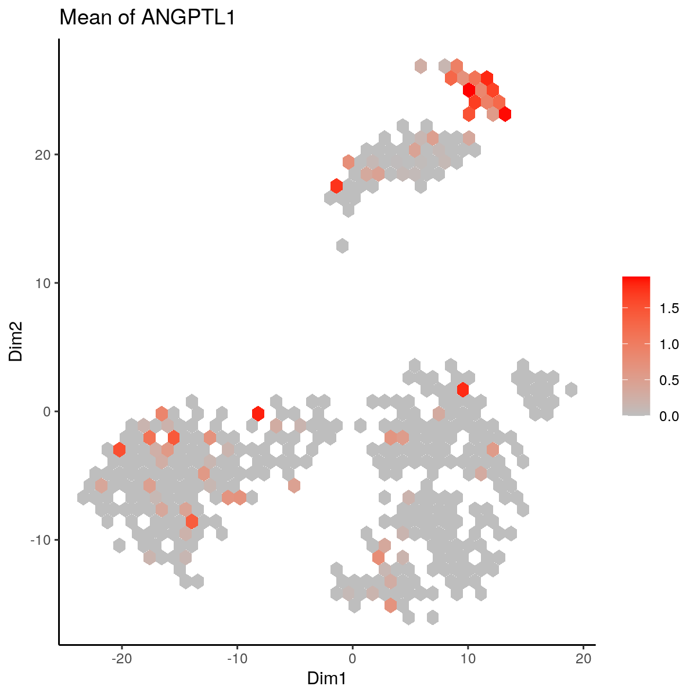|[ADGRB2](https://www.ncbi.nlm.nih.gov/gene/576) [TEK](https://www.ncbi.nlm.nih.gov/gene/7010) [TIE1](https://www.ncbi.nlm.nih.gov/gene/7075) [RALGPS2](https://www.ncbi.nlm.nih.gov/gene/55103) [RHOJ](https://www.ncbi.nlm.nih.gov/gene/57381)|
|[ANGPTL2](https://www.ncbi.nlm.nih.gov/gene/23452)|[AGTR1](https://www.ncbi.nlm.nih.gov/gene/185) [TEK](https://www.ncbi.nlm.nih.gov/gene/7010) [TIE1](https://www.ncbi.nlm.nih.gov/gene/7075) [CXCR4](https://www.ncbi.nlm.nih.gov/gene/7852)|
|[ANGPTL3](https://www.ncbi.nlm.nih.gov/gene/27329)|[C8A](https://www.ncbi.nlm.nih.gov/gene/731) [CELSR2](https://www.ncbi.nlm.nih.gov/gene/1952) [ITGAV](https://www.ncbi.nlm.nih.gov/gene/3685) [ITGB3](https://www.ncbi.nlm.nih.gov/gene/3690) [LDLR](https://www.ncbi.nlm.nih.gov/gene/3949) [LSP1](https://www.ncbi.nlm.nih.gov/gene/4046) [TEK](https://www.ncbi.nlm.nih.gov/gene/7010) [TIE1](https://www.ncbi.nlm.nih.gov/gene/7075) [LRP8](https://www.ncbi.nlm.nih.gov/gene/7804) [TMPRSS6](https://www.ncbi.nlm.nih.gov/gene/164656) [GPIHBP1](https://www.ncbi.nlm.nih.gov/gene/338328)|
|[ANGPTL4](https://www.ncbi.nlm.nih.gov/gene/51129) 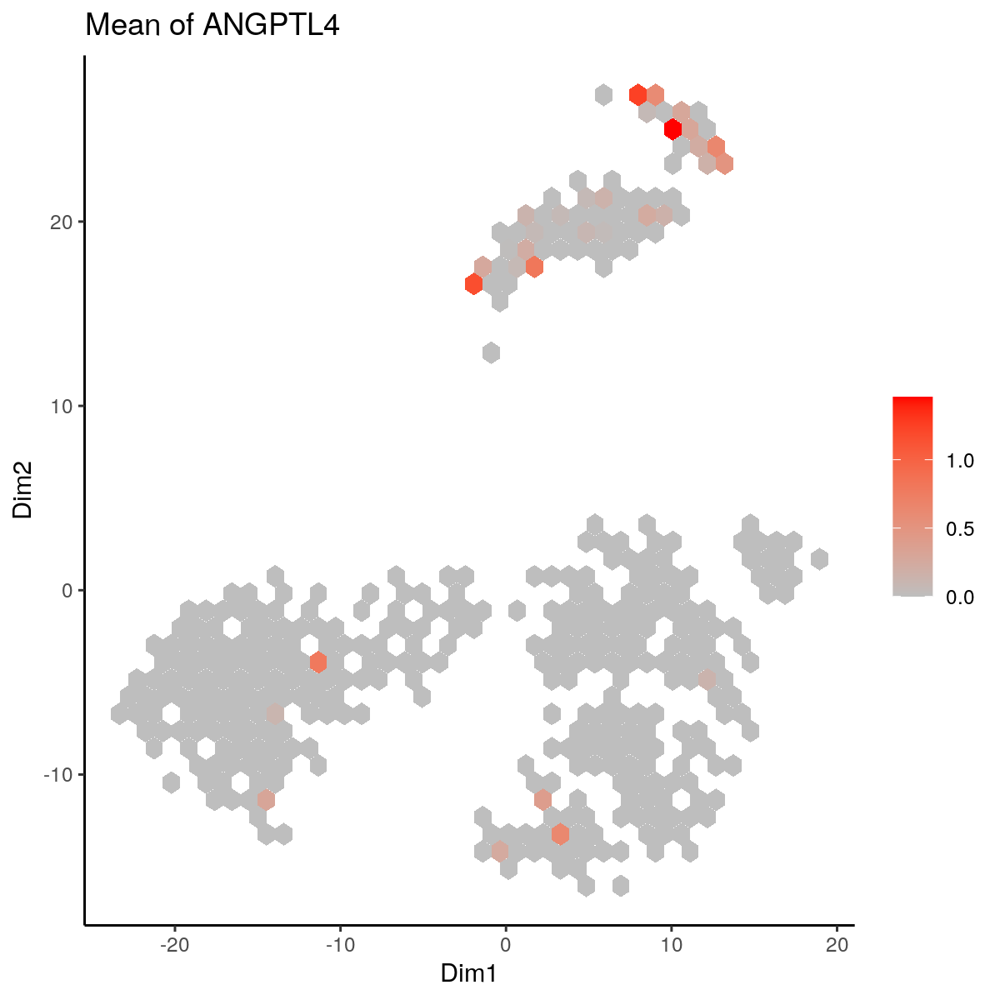|[BTC](https://www.ncbi.nlm.nih.gov/gene/685) [EREG](https://www.ncbi.nlm.nih.gov/gene/2069) [F2R](https://www.ncbi.nlm.nih.gov/gene/2149) [FFAR3](https://www.ncbi.nlm.nih.gov/gene/2865) [FFAR2](https://www.ncbi.nlm.nih.gov/gene/2867) [ITGB1](https://www.ncbi.nlm.nih.gov/gene/3688) [SLC2A1](https://www.ncbi.nlm.nih.gov/gene/6513) [TEK](https://www.ncbi.nlm.nih.gov/gene/7010) [TIE1](https://www.ncbi.nlm.nih.gov/gene/7075) [CXCR4](https://www.ncbi.nlm.nih.gov/gene/7852) [RAB35](https://www.ncbi.nlm.nih.gov/gene/11021) [PNPLA2](https://www.ncbi.nlm.nih.gov/gene/57104) [GPIHBP1](https://www.ncbi.nlm.nih.gov/gene/338328)|
|[ANGPTL5](https://www.ncbi.nlm.nih.gov/gene/253935)|[TEK](https://www.ncbi.nlm.nih.gov/gene/7010) [TIE1](https://www.ncbi.nlm.nih.gov/gene/7075) [GPIHBP1](https://www.ncbi.nlm.nih.gov/gene/338328)|
|[ANGPTL6](https://www.ncbi.nlm.nih.gov/gene/83854)|[TEK](https://www.ncbi.nlm.nih.gov/gene/7010) [TIE1](https://www.ncbi.nlm.nih.gov/gene/7075) [GPR45](https://www.ncbi.nlm.nih.gov/gene/11250)|
|[ANGPTL7](https://www.ncbi.nlm.nih.gov/gene/10218)|[TEK](https://www.ncbi.nlm.nih.gov/gene/7010) [TIE1](https://www.ncbi.nlm.nih.gov/gene/7075) [CLDN12](https://www.ncbi.nlm.nih.gov/gene/9069) [CD109](https://www.ncbi.nlm.nih.gov/gene/135228) [GPIHBP1](https://www.ncbi.nlm.nih.gov/gene/338328)|
|[ANGPTL8](https://www.ncbi.nlm.nih.gov/gene/55908)|[RIPK1](https://www.ncbi.nlm.nih.gov/gene/8737) [GPIHBP1](https://www.ncbi.nlm.nih.gov/gene/338328)|
|[ANTXR2](https://www.ncbi.nlm.nih.gov/gene/118429)|[RHOA](https://www.ncbi.nlm.nih.gov/gene/387) [RHOC](https://www.ncbi.nlm.nih.gov/gene/389) [LRP6](https://www.ncbi.nlm.nih.gov/gene/4040) [PTH1R](https://www.ncbi.nlm.nih.gov/gene/5745) [IL1R2](https://www.ncbi.nlm.nih.gov/gene/7850) [RAB35](https://www.ncbi.nlm.nih.gov/gene/11021) [ANTXR1](https://www.ncbi.nlm.nih.gov/gene/84168) [IL23R](https://www.ncbi.nlm.nih.gov/gene/149233) [ANO6](https://www.ncbi.nlm.nih.gov/gene/196527)|
|[ANXA1](https://www.ncbi.nlm.nih.gov/gene/301)|[FPR1](https://www.ncbi.nlm.nih.gov/gene/2357) [FPR2](https://www.ncbi.nlm.nih.gov/gene/2358) [FPR3](https://www.ncbi.nlm.nih.gov/gene/2359)|
|[ANXA2](https://www.ncbi.nlm.nih.gov/gene/302)|[ANXA13](https://www.ncbi.nlm.nih.gov/gene/312) [AQP3](https://www.ncbi.nlm.nih.gov/gene/360) [BSG](https://www.ncbi.nlm.nih.gov/gene/682) [CD9](https://www.ncbi.nlm.nih.gov/gene/928) [CD44](https://www.ncbi.nlm.nih.gov/gene/960) [CD63](https://www.ncbi.nlm.nih.gov/gene/967) [CD81](https://www.ncbi.nlm.nih.gov/gene/975) [CDC42](https://www.ncbi.nlm.nih.gov/gene/998) [CCR10](https://www.ncbi.nlm.nih.gov/gene/2826) [CD82](https://www.ncbi.nlm.nih.gov/gene/3732) [KCNK3](https://www.ncbi.nlm.nih.gov/gene/3777) [LYN](https://www.ncbi.nlm.nih.gov/gene/4067) [MSN](https://www.ncbi.nlm.nih.gov/gene/4478) [ABCB1](https://www.ncbi.nlm.nih.gov/gene/5243) [PODXL](https://www.ncbi.nlm.nih.gov/gene/5420) [S100A6](https://www.ncbi.nlm.nih.gov/gene/6277) [SCN10A](https://www.ncbi.nlm.nih.gov/gene/6336) [SRC](https://www.ncbi.nlm.nih.gov/gene/6714) [TLR4](https://www.ncbi.nlm.nih.gov/gene/7099) [EZR](https://www.ncbi.nlm.nih.gov/gene/7430) [CXCR4](https://www.ncbi.nlm.nih.gov/gene/7852) [DYSF](https://www.ncbi.nlm.nih.gov/gene/8291) [RAB11A](https://www.ncbi.nlm.nih.gov/gene/8766) [IQGAP1](https://www.ncbi.nlm.nih.gov/gene/8826) [FLOT1](https://www.ncbi.nlm.nih.gov/gene/10211) [RACK1](https://www.ncbi.nlm.nih.gov/gene/10399) [CAP1](https://www.ncbi.nlm.nih.gov/gene/10487) [MYOF](https://www.ncbi.nlm.nih.gov/gene/26509) [TMEM100](https://www.ncbi.nlm.nih.gov/gene/55273) [PLGRKT](https://www.ncbi.nlm.nih.gov/gene/55848) [TRPV5](https://www.ncbi.nlm.nih.gov/gene/56302) [MIEN1](https://www.ncbi.nlm.nih.gov/gene/84299) [PARD6G](https://www.ncbi.nlm.nih.gov/gene/84552) [TRIM72](https://www.ncbi.nlm.nih.gov/gene/493829)|
|[AOAH](https://www.ncbi.nlm.nih.gov/gene/313)|[CD14](https://www.ncbi.nlm.nih.gov/gene/929) [CSF1R](https://www.ncbi.nlm.nih.gov/gene/1436) [DLG2](https://www.ncbi.nlm.nih.gov/gene/1740) [FCGR3A](https://www.ncbi.nlm.nih.gov/gene/2214) [FGR](https://www.ncbi.nlm.nih.gov/gene/2268) [ITGAM](https://www.ncbi.nlm.nih.gov/gene/3684) [ITGB2](https://www.ncbi.nlm.nih.gov/gene/3689) [TLR4](https://www.ncbi.nlm.nih.gov/gene/7099) [TYROBP](https://www.ncbi.nlm.nih.gov/gene/7305) [NFAM1](https://www.ncbi.nlm.nih.gov/gene/150372)|
|[AOC1](https://www.ncbi.nlm.nih.gov/gene/26)|[CLCN1](https://www.ncbi.nlm.nih.gov/gene/1180) [HRH1](https://www.ncbi.nlm.nih.gov/gene/3269) [HRH2](https://www.ncbi.nlm.nih.gov/gene/3274) [LCT](https://www.ncbi.nlm.nih.gov/gene/3938) [RET](https://www.ncbi.nlm.nih.gov/gene/5979) [TJP1](https://www.ncbi.nlm.nih.gov/gene/7082) [VCL](https://www.ncbi.nlm.nih.gov/gene/7414) [GSDMD](https://www.ncbi.nlm.nih.gov/gene/79792) [GNG8](https://www.ncbi.nlm.nih.gov/gene/94235) [OSCAR](https://www.ncbi.nlm.nih.gov/gene/126014) [DAB2IP](https://www.ncbi.nlm.nih.gov/gene/153090) [TMEM65](https://www.ncbi.nlm.nih.gov/gene/157378) [OCLN](https://www.ncbi.nlm.nih.gov/gene/100506658)|
|[APCS](https://www.ncbi.nlm.nih.gov/gene/325)|[FCGR1A](https://www.ncbi.nlm.nih.gov/gene/2209) [FCGR2A](https://www.ncbi.nlm.nih.gov/gene/2212) [FCGR2B](https://www.ncbi.nlm.nih.gov/gene/2213) [FCGR3A](https://www.ncbi.nlm.nih.gov/gene/2214) [FCGR2C](https://www.ncbi.nlm.nih.gov/gene/9103)|
|[APELA](https://www.ncbi.nlm.nih.gov/gene/100506013)|[APLNR](https://www.ncbi.nlm.nih.gov/gene/187) [ACE](https://www.ncbi.nlm.nih.gov/gene/1636) [SLC4A1](https://www.ncbi.nlm.nih.gov/gene/6521) [SLC6A3](https://www.ncbi.nlm.nih.gov/gene/6531)|
|[APLN](https://www.ncbi.nlm.nih.gov/gene/8862)|[ADCY3](https://www.ncbi.nlm.nih.gov/gene/109) [ADCY5](https://www.ncbi.nlm.nih.gov/gene/111) [ADCY6](https://www.ncbi.nlm.nih.gov/gene/112) [ADCY8](https://www.ncbi.nlm.nih.gov/gene/114) [ADCY9](https://www.ncbi.nlm.nih.gov/gene/115) [ADORA1](https://www.ncbi.nlm.nih.gov/gene/134) [ADRA2A](https://www.ncbi.nlm.nih.gov/gene/150) [ADRA2B](https://www.ncbi.nlm.nih.gov/gene/151) [ADRA2C](https://www.ncbi.nlm.nih.gov/gene/152) [AGTR1](https://www.ncbi.nlm.nih.gov/gene/185) [AGTR2](https://www.ncbi.nlm.nih.gov/gene/186) [APLNR](https://www.ncbi.nlm.nih.gov/gene/187) [BDKRB1](https://www.ncbi.nlm.nih.gov/gene/623) [BDKRB2](https://www.ncbi.nlm.nih.gov/gene/624) [CXCR5](https://www.ncbi.nlm.nih.gov/gene/643) [C3AR1](https://www.ncbi.nlm.nih.gov/gene/719) [C5AR1](https://www.ncbi.nlm.nih.gov/gene/728) [CASR](https://www.ncbi.nlm.nih.gov/gene/846) [CHRM2](https://www.ncbi.nlm.nih.gov/gene/1129) [CHRM4](https://www.ncbi.nlm.nih.gov/gene/1132) [CCR1](https://www.ncbi.nlm.nih.gov/gene/1230) [CCR3](https://www.ncbi.nlm.nih.gov/gene/1232) [CCR4](https://www.ncbi.nlm.nih.gov/gene/1233) [CCR5](https://www.ncbi.nlm.nih.gov/gene/1234) [CCR7](https://www.ncbi.nlm.nih.gov/gene/1236) [CCR8](https://www.ncbi.nlm.nih.gov/gene/1237) [CNR1](https://www.ncbi.nlm.nih.gov/gene/1268) [CNR2](https://www.ncbi.nlm.nih.gov/gene/1269) [CX3CR1](https://www.ncbi.nlm.nih.gov/gene/1524) [ACE](https://www.ncbi.nlm.nih.gov/gene/1636) [DRD2](https://www.ncbi.nlm.nih.gov/gene/1813) [DRD3](https://www.ncbi.nlm.nih.gov/gene/1814) [DRD4](https://www.ncbi.nlm.nih.gov/gene/1815) [GPR183](https://www.ncbi.nlm.nih.gov/gene/1880) [S1PR1](https://www.ncbi.nlm.nih.gov/gene/1901) [S1PR3](https://www.ncbi.nlm.nih.gov/gene/1903) [FPR1](https://www.ncbi.nlm.nih.gov/gene/2357) [FPR2](https://www.ncbi.nlm.nih.gov/gene/2358) [FPR3](https://www.ncbi.nlm.nih.gov/gene/2359) [GALR1](https://www.ncbi.nlm.nih.gov/gene/2587) [GNG3](https://www.ncbi.nlm.nih.gov/gene/2785) [GNG4](https://www.ncbi.nlm.nih.gov/gene/2786) [GNG5](https://www.ncbi.nlm.nih.gov/gene/2787) [GNG7](https://www.ncbi.nlm.nih.gov/gene/2788) [GNG10](https://www.ncbi.nlm.nih.gov/gene/2790) [GNG11](https://www.ncbi.nlm.nih.gov/gene/2791) [GNGT1](https://www.ncbi.nlm.nih.gov/gene/2792) [GNGT2](https://www.ncbi.nlm.nih.gov/gene/2793) [CCR10](https://www.ncbi.nlm.nih.gov/gene/2826) [NPBWR1](https://www.ncbi.nlm.nih.gov/gene/2831) [NPBWR2](https://www.ncbi.nlm.nih.gov/gene/2832) [CXCR3](https://www.ncbi.nlm.nih.gov/gene/2833) [GPR17](https://www.ncbi.nlm.nih.gov/gene/2840) [GPR18](https://www.ncbi.nlm.nih.gov/gene/2841) [MCHR1](https://www.ncbi.nlm.nih.gov/gene/2847) [GPR31](https://www.ncbi.nlm.nih.gov/gene/2853) [GPR37](https://www.ncbi.nlm.nih.gov/gene/2861) [GRM2](https://www.ncbi.nlm.nih.gov/gene/2912) [GRM3](https://www.ncbi.nlm.nih.gov/gene/2913) [GRM4](https://www.ncbi.nlm.nih.gov/gene/2914) [GRM6](https://www.ncbi.nlm.nih.gov/gene/2916) [GRM7](https://www.ncbi.nlm.nih.gov/gene/2917) [GRM8](https://www.ncbi.nlm.nih.gov/gene/2918) [HTR1A](https://www.ncbi.nlm.nih.gov/gene/3350) [HTR1B](https://www.ncbi.nlm.nih.gov/gene/3351) [HTR1D](https://www.ncbi.nlm.nih.gov/gene/3352) [HTR1E](https://www.ncbi.nlm.nih.gov/gene/3354) [HTR1F](https://www.ncbi.nlm.nih.gov/gene/3355) [HTR5A](https://www.ncbi.nlm.nih.gov/gene/3361) [CXCR1](https://www.ncbi.nlm.nih.gov/gene/3577) [CXCR2](https://www.ncbi.nlm.nih.gov/gene/3579) [MAS1](https://www.ncbi.nlm.nih.gov/gene/4142) [MTNR1A](https://www.ncbi.nlm.nih.gov/gene/4543) [MTNR1B](https://www.ncbi.nlm.nih.gov/gene/4544) [NOS1](https://www.ncbi.nlm.nih.gov/gene/4842) [NOS3](https://www.ncbi.nlm.nih.gov/gene/4846) [NPY1R](https://www.ncbi.nlm.nih.gov/gene/4886) [NPY2R](https://www.ncbi.nlm.nih.gov/gene/4887) [NPY5R](https://www.ncbi.nlm.nih.gov/gene/4889) [OPRD1](https://www.ncbi.nlm.nih.gov/gene/4985) [OPRK1](https://www.ncbi.nlm.nih.gov/gene/4986) [OPRL1](https://www.ncbi.nlm.nih.gov/gene/4987) [P2RY4](https://www.ncbi.nlm.nih.gov/gene/5030) [PTGER3](https://www.ncbi.nlm.nih.gov/gene/5733) [SSTR1](https://www.ncbi.nlm.nih.gov/gene/6751) [SSTR2](https://www.ncbi.nlm.nih.gov/gene/6752) [SSTR3](https://www.ncbi.nlm.nih.gov/gene/6753) [SSTR4](https://www.ncbi.nlm.nih.gov/gene/6754) [SSTR5](https://www.ncbi.nlm.nih.gov/gene/6755) [CXCR4](https://www.ncbi.nlm.nih.gov/gene/7852) [GALR3](https://www.ncbi.nlm.nih.gov/gene/8484) [S1PR4](https://www.ncbi.nlm.nih.gov/gene/8698) [GALR2](https://www.ncbi.nlm.nih.gov/gene/8811) [HCAR3](https://www.ncbi.nlm.nih.gov/gene/8843) [GPR37L1](https://www.ncbi.nlm.nih.gov/gene/9283) [GPR55](https://www.ncbi.nlm.nih.gov/gene/9290) [GABBR2](https://www.ncbi.nlm.nih.gov/gene/9568) [P2RY14](https://www.ncbi.nlm.nih.gov/gene/9934) [NMUR1](https://www.ncbi.nlm.nih.gov/gene/10316) [CXCR6](https://www.ncbi.nlm.nih.gov/gene/10663) [CCR9](https://www.ncbi.nlm.nih.gov/gene/10803) [PTGDR2](https://www.ncbi.nlm.nih.gov/gene/11251) [HRH3](https://www.ncbi.nlm.nih.gov/gene/11255) [LPAR3](https://www.ncbi.nlm.nih.gov/gene/23566) [HCAR1](https://www.ncbi.nlm.nih.gov/gene/27198) [OXGR1](https://www.ncbi.nlm.nih.gov/gene/27199) [TAS2R16](https://www.ncbi.nlm.nih.gov/gene/50833) [RXFP3](https://www.ncbi.nlm.nih.gov/gene/51289) [GNG13](https://www.ncbi.nlm.nih.gov/gene/51764) [S1PR5](https://www.ncbi.nlm.nih.gov/gene/53637) [P2RY13](https://www.ncbi.nlm.nih.gov/gene/53829) [GNG2](https://www.ncbi.nlm.nih.gov/gene/54331) [ITLN1](https://www.ncbi.nlm.nih.gov/gene/55600) [GNG12](https://www.ncbi.nlm.nih.gov/gene/55970) [SUCNR1](https://www.ncbi.nlm.nih.gov/gene/56670) [NMUR2](https://www.ncbi.nlm.nih.gov/gene/56923) [ACKR3](https://www.ncbi.nlm.nih.gov/gene/57007) [LPAR5](https://www.ncbi.nlm.nih.gov/gene/57121) [CXCL16](https://www.ncbi.nlm.nih.gov/gene/58191) [ACE2](https://www.ncbi.nlm.nih.gov/gene/59272) [HRH4](https://www.ncbi.nlm.nih.gov/gene/59340) [P2RY12](https://www.ncbi.nlm.nih.gov/gene/64805) [TAS1R2](https://www.ncbi.nlm.nih.gov/gene/80834) [TAS1R1](https://www.ncbi.nlm.nih.gov/gene/80835) [TAS1R3](https://www.ncbi.nlm.nih.gov/gene/83756) [MCHR2](https://www.ncbi.nlm.nih.gov/gene/84539) [GNG8](https://www.ncbi.nlm.nih.gov/gene/94235) [OXER1](https://www.ncbi.nlm.nih.gov/gene/165140) [ADCY4](https://www.ncbi.nlm.nih.gov/gene/196883) [HCAR2](https://www.ncbi.nlm.nih.gov/gene/338442) [RXFP4](https://www.ncbi.nlm.nih.gov/gene/339403) [CCR2](https://www.ncbi.nlm.nih.gov/gene/729230)|
|[APOA1](https://www.ncbi.nlm.nih.gov/gene/335) 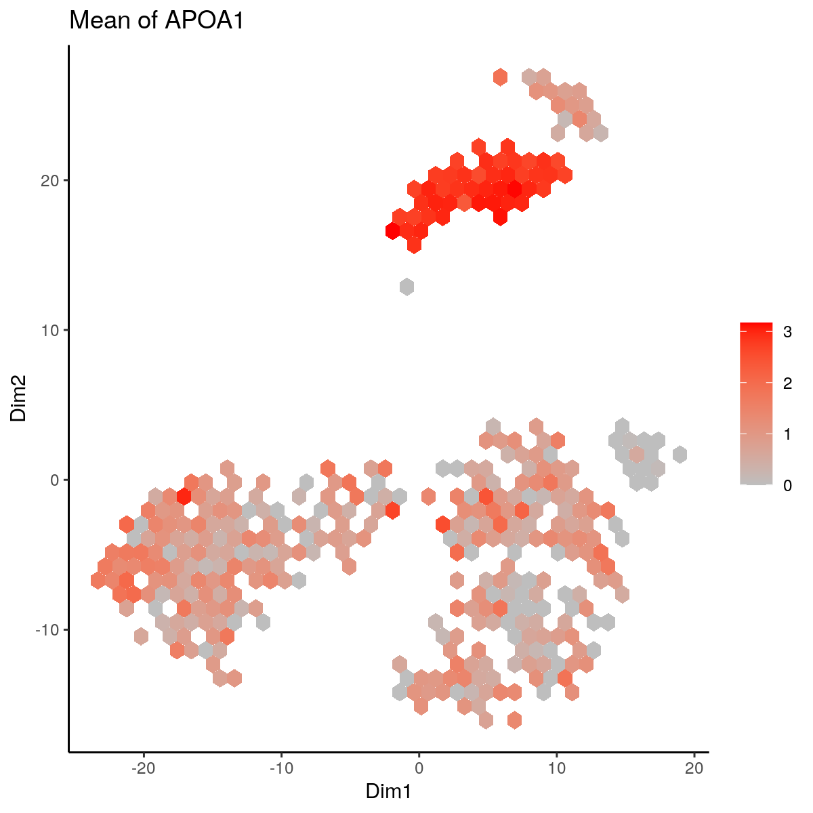|[ADAM10](https://www.ncbi.nlm.nih.gov/gene/102) [APLP2](https://www.ncbi.nlm.nih.gov/gene/334) [C8A](https://www.ncbi.nlm.nih.gov/gene/731) [CD3D](https://www.ncbi.nlm.nih.gov/gene/915) [CD36](https://www.ncbi.nlm.nih.gov/gene/948) [SCARB1](https://www.ncbi.nlm.nih.gov/gene/949) [CDH2](https://www.ncbi.nlm.nih.gov/gene/1000) [CSF1R](https://www.ncbi.nlm.nih.gov/gene/1436) [ACE](https://www.ncbi.nlm.nih.gov/gene/1636) [CELSR2](https://www.ncbi.nlm.nih.gov/gene/1952) [GGT1](https://www.ncbi.nlm.nih.gov/gene/2678) [GPC3](https://www.ncbi.nlm.nih.gov/gene/2719) [LDLR](https://www.ncbi.nlm.nih.gov/gene/3949) [MELTF](https://www.ncbi.nlm.nih.gov/gene/4241) [NOS3](https://www.ncbi.nlm.nih.gov/gene/4846) [SLC2A2](https://www.ncbi.nlm.nih.gov/gene/6514) [THY1](https://www.ncbi.nlm.nih.gov/gene/7070) [LRP8](https://www.ncbi.nlm.nih.gov/gene/7804) [CUBN](https://www.ncbi.nlm.nih.gov/gene/8029) [SDC3](https://www.ncbi.nlm.nih.gov/gene/9672) [TGOLN2](https://www.ncbi.nlm.nih.gov/gene/10618) [NPC1L1](https://www.ncbi.nlm.nih.gov/gene/29881) [LSR](https://www.ncbi.nlm.nih.gov/gene/51599) [MXRA8](https://www.ncbi.nlm.nih.gov/gene/54587) [APOBR](https://www.ncbi.nlm.nih.gov/gene/55911) [PNPLA2](https://www.ncbi.nlm.nih.gov/gene/57104) [ANO8](https://www.ncbi.nlm.nih.gov/gene/57719) [CXCL16](https://www.ncbi.nlm.nih.gov/gene/58191) [ABCG8](https://www.ncbi.nlm.nih.gov/gene/64241) [GPIHBP1](https://www.ncbi.nlm.nih.gov/gene/338328) [CAV1](https://www.ncbi.nlm.nih.gov/gene/857) [GPC1](https://www.ncbi.nlm.nih.gov/gene/2817)|
|[APOA2](https://www.ncbi.nlm.nih.gov/gene/336)|[ADAM10](https://www.ncbi.nlm.nih.gov/gene/102) [APLP2](https://www.ncbi.nlm.nih.gov/gene/334) [SCARB1](https://www.ncbi.nlm.nih.gov/gene/949) [CDH2](https://www.ncbi.nlm.nih.gov/gene/1000) [CFTR](https://www.ncbi.nlm.nih.gov/gene/1080) [CSF1R](https://www.ncbi.nlm.nih.gov/gene/1436) [GPC3](https://www.ncbi.nlm.nih.gov/gene/2719) [LDLR](https://www.ncbi.nlm.nih.gov/gene/3949) [LIPE](https://www.ncbi.nlm.nih.gov/gene/3991) [MELTF](https://www.ncbi.nlm.nih.gov/gene/4241) [LRP8](https://www.ncbi.nlm.nih.gov/gene/7804) [CUBN](https://www.ncbi.nlm.nih.gov/gene/8029) [SDC3](https://www.ncbi.nlm.nih.gov/gene/9672) [TGOLN2](https://www.ncbi.nlm.nih.gov/gene/10618) [LSR](https://www.ncbi.nlm.nih.gov/gene/51599) [MXRA8](https://www.ncbi.nlm.nih.gov/gene/54587) [APOBR](https://www.ncbi.nlm.nih.gov/gene/55911) [PNPLA2](https://www.ncbi.nlm.nih.gov/gene/57104) [ANO8](https://www.ncbi.nlm.nih.gov/gene/57719) [GPIHBP1](https://www.ncbi.nlm.nih.gov/gene/338328)|
|[APOA5](https://www.ncbi.nlm.nih.gov/gene/116519)|[ADAM10](https://www.ncbi.nlm.nih.gov/gene/102) [APLP2](https://www.ncbi.nlm.nih.gov/gene/334) [C8A](https://www.ncbi.nlm.nih.gov/gene/731) [SCARB1](https://www.ncbi.nlm.nih.gov/gene/949) [CDH2](https://www.ncbi.nlm.nih.gov/gene/1000) [CTNNA2](https://www.ncbi.nlm.nih.gov/gene/1496) [CELSR2](https://www.ncbi.nlm.nih.gov/gene/1952) [GPC3](https://www.ncbi.nlm.nih.gov/gene/2719) [LDLR](https://www.ncbi.nlm.nih.gov/gene/3949) [MELTF](https://www.ncbi.nlm.nih.gov/gene/4241) [TGOLN2](https://www.ncbi.nlm.nih.gov/gene/10618) [LSR](https://www.ncbi.nlm.nih.gov/gene/51599) [MXRA8](https://www.ncbi.nlm.nih.gov/gene/54587) [APOBR](https://www.ncbi.nlm.nih.gov/gene/55911) [PNPLA2](https://www.ncbi.nlm.nih.gov/gene/57104) [DSCAML1](https://www.ncbi.nlm.nih.gov/gene/57453) [ANO8](https://www.ncbi.nlm.nih.gov/gene/57719) [ABCG8](https://www.ncbi.nlm.nih.gov/gene/64241) [GPIHBP1](https://www.ncbi.nlm.nih.gov/gene/338328)|
|[APOC1](https://www.ncbi.nlm.nih.gov/gene/341)|[SCARB1](https://www.ncbi.nlm.nih.gov/gene/949) [CELSR2](https://www.ncbi.nlm.nih.gov/gene/1952) [LDLR](https://www.ncbi.nlm.nih.gov/gene/3949) [NECTIN2](https://www.ncbi.nlm.nih.gov/gene/5819) [SLC17A4](https://www.ncbi.nlm.nih.gov/gene/10050) [LSR](https://www.ncbi.nlm.nih.gov/gene/51599) [APOBR](https://www.ncbi.nlm.nih.gov/gene/55911) [ATP8B4](https://www.ncbi.nlm.nih.gov/gene/79895) [GPIHBP1](https://www.ncbi.nlm.nih.gov/gene/338328)|
|[APOC2](https://www.ncbi.nlm.nih.gov/gene/344)|[ATP1A3](https://www.ncbi.nlm.nih.gov/gene/478) [SCARB1](https://www.ncbi.nlm.nih.gov/gene/949) [GPC3](https://www.ncbi.nlm.nih.gov/gene/2719) [LDLR](https://www.ncbi.nlm.nih.gov/gene/3949) [NECTIN2](https://www.ncbi.nlm.nih.gov/gene/5819) [LRP8](https://www.ncbi.nlm.nih.gov/gene/7804) [SDC3](https://www.ncbi.nlm.nih.gov/gene/9672) [LSR](https://www.ncbi.nlm.nih.gov/gene/51599) [APOBR](https://www.ncbi.nlm.nih.gov/gene/55911) [ABCG8](https://www.ncbi.nlm.nih.gov/gene/64241) [GPIHBP1](https://www.ncbi.nlm.nih.gov/gene/338328)|
|[APOC3](https://www.ncbi.nlm.nih.gov/gene/345)|[ADRA1D](https://www.ncbi.nlm.nih.gov/gene/146) [C8A](https://www.ncbi.nlm.nih.gov/gene/731) [SCARB1](https://www.ncbi.nlm.nih.gov/gene/949) [CELSR2](https://www.ncbi.nlm.nih.gov/gene/1952) [GPC3](https://www.ncbi.nlm.nih.gov/gene/2719) [LDLR](https://www.ncbi.nlm.nih.gov/gene/3949) [LIPE](https://www.ncbi.nlm.nih.gov/gene/3991) [SLC2A2](https://www.ncbi.nlm.nih.gov/gene/6514) [LRP8](https://www.ncbi.nlm.nih.gov/gene/7804) [SDC3](https://www.ncbi.nlm.nih.gov/gene/9672) [NPC1L1](https://www.ncbi.nlm.nih.gov/gene/29881) [LSR](https://www.ncbi.nlm.nih.gov/gene/51599) [APOBR](https://www.ncbi.nlm.nih.gov/gene/55911) [DSCAML1](https://www.ncbi.nlm.nih.gov/gene/57453) [CXCL16](https://www.ncbi.nlm.nih.gov/gene/58191) [ABCG8](https://www.ncbi.nlm.nih.gov/gene/64241) [GPIHBP1](https://www.ncbi.nlm.nih.gov/gene/338328)|
|[APOC4](https://www.ncbi.nlm.nih.gov/gene/346)|[LDLR](https://www.ncbi.nlm.nih.gov/gene/3949) [LSR](https://www.ncbi.nlm.nih.gov/gene/51599) [APOBR](https://www.ncbi.nlm.nih.gov/gene/55911) [GPIHBP1](https://www.ncbi.nlm.nih.gov/gene/338328)|
|[APOD](https://www.ncbi.nlm.nih.gov/gene/347)|[SCARB1](https://www.ncbi.nlm.nih.gov/gene/949) [PRNP](https://www.ncbi.nlm.nih.gov/gene/5621) [PARK7](https://www.ncbi.nlm.nih.gov/gene/11315) [FAIM2](https://www.ncbi.nlm.nih.gov/gene/23017) [KCTD7](https://www.ncbi.nlm.nih.gov/gene/154881) [IFITM10](https://www.ncbi.nlm.nih.gov/gene/402778)|
|[APOE](https://www.ncbi.nlm.nih.gov/gene/348)|[ACHE](https://www.ncbi.nlm.nih.gov/gene/43) [ADAM10](https://www.ncbi.nlm.nih.gov/gene/102) [AGER](https://www.ncbi.nlm.nih.gov/gene/177) [AGTR1](https://www.ncbi.nlm.nih.gov/gene/185) [APBB1](https://www.ncbi.nlm.nih.gov/gene/322) [APLP2](https://www.ncbi.nlm.nih.gov/gene/334) [AQP4](https://www.ncbi.nlm.nih.gov/gene/361) [SCARB1](https://www.ncbi.nlm.nih.gov/gene/949) [CD44](https://www.ncbi.nlm.nih.gov/gene/960) [CD81](https://www.ncbi.nlm.nih.gov/gene/975) [CDH2](https://www.ncbi.nlm.nih.gov/gene/1000) [CCR5](https://www.ncbi.nlm.nih.gov/gene/1234) [COMT](https://www.ncbi.nlm.nih.gov/gene/1312) [CSF1R](https://www.ncbi.nlm.nih.gov/gene/1436) [CX3CR1](https://www.ncbi.nlm.nih.gov/gene/1524) [CYBA](https://www.ncbi.nlm.nih.gov/gene/1535) [CYBB](https://www.ncbi.nlm.nih.gov/gene/1536) [ACE](https://www.ncbi.nlm.nih.gov/gene/1636) [DLG4](https://www.ncbi.nlm.nih.gov/gene/1742) [DPP4](https://www.ncbi.nlm.nih.gov/gene/1803) [DRD2](https://www.ncbi.nlm.nih.gov/gene/1813) [CELSR2](https://www.ncbi.nlm.nih.gov/gene/1952) [EPHA1](https://www.ncbi.nlm.nih.gov/gene/2041) [ESR1](https://www.ncbi.nlm.nih.gov/gene/2099) [GPC3](https://www.ncbi.nlm.nih.gov/gene/2719) [HFE](https://www.ncbi.nlm.nih.gov/gene/3077) [HLA-DRB5](https://www.ncbi.nlm.nih.gov/gene/3127) [ITGAM](https://www.ncbi.nlm.nih.gov/gene/3684) [ANOS1](https://www.ncbi.nlm.nih.gov/gene/3730) [LDLR](https://www.ncbi.nlm.nih.gov/gene/3949) [LIPE](https://www.ncbi.nlm.nih.gov/gene/3991) [MELTF](https://www.ncbi.nlm.nih.gov/gene/4241) [MME](https://www.ncbi.nlm.nih.gov/gene/4311) [NOS3](https://www.ncbi.nlm.nih.gov/gene/4846) [OLR1](https://www.ncbi.nlm.nih.gov/gene/4973) [PRNP](https://www.ncbi.nlm.nih.gov/gene/5621) [PTPRC](https://www.ncbi.nlm.nih.gov/gene/5788) [NECTIN2](https://www.ncbi.nlm.nih.gov/gene/5819) [SELE](https://www.ncbi.nlm.nih.gov/gene/6401) [SELP](https://www.ncbi.nlm.nih.gov/gene/6403) [SLC6A3](https://www.ncbi.nlm.nih.gov/gene/6531) [SLC6A4](https://www.ncbi.nlm.nih.gov/gene/6532) [SRC](https://www.ncbi.nlm.nih.gov/gene/6714) [TLR1](https://www.ncbi.nlm.nih.gov/gene/7096) [TLR4](https://www.ncbi.nlm.nih.gov/gene/7099) [TLR5](https://www.ncbi.nlm.nih.gov/gene/7100) [TYROBP](https://www.ncbi.nlm.nih.gov/gene/7305) [LRP8](https://www.ncbi.nlm.nih.gov/gene/7804) [PICALM](https://www.ncbi.nlm.nih.gov/gene/8301) [RAB11A](https://www.ncbi.nlm.nih.gov/gene/8766) [SDC3](https://www.ncbi.nlm.nih.gov/gene/9672) [TLR6](https://www.ncbi.nlm.nih.gov/gene/10333) [TGOLN2](https://www.ncbi.nlm.nih.gov/gene/10618) [PARK7](https://www.ncbi.nlm.nih.gov/gene/11315) [BACE1](https://www.ncbi.nlm.nih.gov/gene/23621) [BACE2](https://www.ncbi.nlm.nih.gov/gene/25825) [NPC1L1](https://www.ncbi.nlm.nih.gov/gene/29881) [LSR](https://www.ncbi.nlm.nih.gov/gene/51599) [MXRA8](https://www.ncbi.nlm.nih.gov/gene/54587) [APOBR](https://www.ncbi.nlm.nih.gov/gene/55911) [PNPLA2](https://www.ncbi.nlm.nih.gov/gene/57104) [ANO8](https://www.ncbi.nlm.nih.gov/gene/57719) [CXCL16](https://www.ncbi.nlm.nih.gov/gene/58191) [ACE2](https://www.ncbi.nlm.nih.gov/gene/59272) [ABCG8](https://www.ncbi.nlm.nih.gov/gene/64241) [CALHM1](https://www.ncbi.nlm.nih.gov/gene/255022) [GPIHBP1](https://www.ncbi.nlm.nih.gov/gene/338328) [CCR2](https://www.ncbi.nlm.nih.gov/gene/729230) [OCLN](https://www.ncbi.nlm.nih.gov/gene/100506658) [CAV1](https://www.ncbi.nlm.nih.gov/gene/857) [GPC1](https://www.ncbi.nlm.nih.gov/gene/2817)|
|[APOF](https://www.ncbi.nlm.nih.gov/gene/319)|[LDLR](https://www.ncbi.nlm.nih.gov/gene/3949) [LSR](https://www.ncbi.nlm.nih.gov/gene/51599) [APOBR](https://www.ncbi.nlm.nih.gov/gene/55911) [GPIHBP1](https://www.ncbi.nlm.nih.gov/gene/338328)|
|[APOH](https://www.ncbi.nlm.nih.gov/gene/350)|[ENPEP](https://www.ncbi.nlm.nih.gov/gene/2028) [LDLR](https://www.ncbi.nlm.nih.gov/gene/3949) [LRP8](https://www.ncbi.nlm.nih.gov/gene/7804) [LSR](https://www.ncbi.nlm.nih.gov/gene/51599) [APOBR](https://www.ncbi.nlm.nih.gov/gene/55911) [GPIHBP1](https://www.ncbi.nlm.nih.gov/gene/338328)|
|[APOL1](https://www.ncbi.nlm.nih.gov/gene/8542)|[ADAM10](https://www.ncbi.nlm.nih.gov/gene/102) [APLP2](https://www.ncbi.nlm.nih.gov/gene/334) [CDH2](https://www.ncbi.nlm.nih.gov/gene/1000) [COMT](https://www.ncbi.nlm.nih.gov/gene/1312) [ACE](https://www.ncbi.nlm.nih.gov/gene/1636) [GPC3](https://www.ncbi.nlm.nih.gov/gene/2719) [LDLR](https://www.ncbi.nlm.nih.gov/gene/3949) [MELTF](https://www.ncbi.nlm.nih.gov/gene/4241) [NPHS1](https://www.ncbi.nlm.nih.gov/gene/4868) [TRPC6](https://www.ncbi.nlm.nih.gov/gene/7225) [CD163](https://www.ncbi.nlm.nih.gov/gene/9332) [TGOLN2](https://www.ncbi.nlm.nih.gov/gene/10618) [PLCE1](https://www.ncbi.nlm.nih.gov/gene/51196) [LSR](https://www.ncbi.nlm.nih.gov/gene/51599) [MXRA8](https://www.ncbi.nlm.nih.gov/gene/54587) [APOBR](https://www.ncbi.nlm.nih.gov/gene/55911) [PNPLA2](https://www.ncbi.nlm.nih.gov/gene/57104) [ANO8](https://www.ncbi.nlm.nih.gov/gene/57719) [GPIHBP1](https://www.ncbi.nlm.nih.gov/gene/338328)|
|[APOL4](https://www.ncbi.nlm.nih.gov/gene/80832)|[CHRM4](https://www.ncbi.nlm.nih.gov/gene/1132) [COMT](https://www.ncbi.nlm.nih.gov/gene/1312)|
|[APOM](https://www.ncbi.nlm.nih.gov/gene/55937)|[DDR1](https://www.ncbi.nlm.nih.gov/gene/780) [SCARB1](https://www.ncbi.nlm.nih.gov/gene/949) [S1PR1](https://www.ncbi.nlm.nih.gov/gene/1901) [S1PR3](https://www.ncbi.nlm.nih.gov/gene/1903) [LDLR](https://www.ncbi.nlm.nih.gov/gene/3949) [SKAP1](https://www.ncbi.nlm.nih.gov/gene/8631) [GPR132](https://www.ncbi.nlm.nih.gov/gene/29933) [LSR](https://www.ncbi.nlm.nih.gov/gene/51599) [APOBR](https://www.ncbi.nlm.nih.gov/gene/55911) [SPNS2](https://www.ncbi.nlm.nih.gov/gene/124976) [GPIHBP1](https://www.ncbi.nlm.nih.gov/gene/338328)|
|[APP](https://www.ncbi.nlm.nih.gov/gene/351)|[FPR2](https://www.ncbi.nlm.nih.gov/gene/2358)|
|[AREG](https://www.ncbi.nlm.nih.gov/gene/374)|[EGFR](https://www.ncbi.nlm.nih.gov/gene/1956)|
|[ARF1](https://www.ncbi.nlm.nih.gov/gene/375)|[PLD2](https://www.ncbi.nlm.nih.gov/gene/5338)|
|[ARSF](https://www.ncbi.nlm.nih.gov/gene/416)|[P2RY4](https://www.ncbi.nlm.nih.gov/gene/5030) [XG](https://www.ncbi.nlm.nih.gov/gene/7499) [IL1RAPL1](https://www.ncbi.nlm.nih.gov/gene/11141)|
|[ARSI](https://www.ncbi.nlm.nih.gov/gene/340075)|[FLRT1](https://www.ncbi.nlm.nih.gov/gene/23769)|
|[ARSJ](https://www.ncbi.nlm.nih.gov/gene/79642)|[CD55](https://www.ncbi.nlm.nih.gov/gene/1604) [NPFFR2](https://www.ncbi.nlm.nih.gov/gene/10886) [FLRT2](https://www.ncbi.nlm.nih.gov/gene/23768) [LYPD3](https://www.ncbi.nlm.nih.gov/gene/27076) [SLC38A6](https://www.ncbi.nlm.nih.gov/gene/145389) [SLC16A9](https://www.ncbi.nlm.nih.gov/gene/220963)|
|[ARSK](https://www.ncbi.nlm.nih.gov/gene/153642)|[GPC3](https://www.ncbi.nlm.nih.gov/gene/2719) [APOLD1](https://www.ncbi.nlm.nih.gov/gene/81575)|
|[ARTN](https://www.ncbi.nlm.nih.gov/gene/9048)|[GFRA1](https://www.ncbi.nlm.nih.gov/gene/2674) [GFRA2](https://www.ncbi.nlm.nih.gov/gene/2675) [GFRA3](https://www.ncbi.nlm.nih.gov/gene/2676) [KRAS](https://www.ncbi.nlm.nih.gov/gene/3845) [NRAS](https://www.ncbi.nlm.nih.gov/gene/4893) [NTRK1](https://www.ncbi.nlm.nih.gov/gene/4914) [NTRK2](https://www.ncbi.nlm.nih.gov/gene/4915) [RET](https://www.ncbi.nlm.nih.gov/gene/5979) [CXCR4](https://www.ncbi.nlm.nih.gov/gene/7852) [TRPA1](https://www.ncbi.nlm.nih.gov/gene/8989) [SDC3](https://www.ncbi.nlm.nih.gov/gene/9672) [TRPM8](https://www.ncbi.nlm.nih.gov/gene/79054) [CD24](https://www.ncbi.nlm.nih.gov/gene/100133941)|
|[ASAH2](https://www.ncbi.nlm.nih.gov/gene/56624)|[MGAM](https://www.ncbi.nlm.nih.gov/gene/8972) [SMPDL3B](https://www.ncbi.nlm.nih.gov/gene/27293) [SGMS2](https://www.ncbi.nlm.nih.gov/gene/166929) [ENPP7](https://www.ncbi.nlm.nih.gov/gene/339221)|
|[ASGR1](https://www.ncbi.nlm.nih.gov/gene/432)|[ATP1B2](https://www.ncbi.nlm.nih.gov/gene/482) [MUC4](https://www.ncbi.nlm.nih.gov/gene/4585) [NMBR](https://www.ncbi.nlm.nih.gov/gene/4829) [SLC22A1](https://www.ncbi.nlm.nih.gov/gene/6580) [CELSR1](https://www.ncbi.nlm.nih.gov/gene/9620) [CEMIP2](https://www.ncbi.nlm.nih.gov/gene/23670) [ATP10D](https://www.ncbi.nlm.nih.gov/gene/57205)|
|[ASIP](https://www.ncbi.nlm.nih.gov/gene/434)|[MC1R](https://www.ncbi.nlm.nih.gov/gene/4157) [MC2R](https://www.ncbi.nlm.nih.gov/gene/4158) [MC3R](https://www.ncbi.nlm.nih.gov/gene/4159) [MC4R](https://www.ncbi.nlm.nih.gov/gene/4160) [MC5R](https://www.ncbi.nlm.nih.gov/gene/4161) [SLC2A4](https://www.ncbi.nlm.nih.gov/gene/6517) [SDC3](https://www.ncbi.nlm.nih.gov/gene/9672) [MRAP](https://www.ncbi.nlm.nih.gov/gene/56246) [PARD6B](https://www.ncbi.nlm.nih.gov/gene/84612) [MRAP2](https://www.ncbi.nlm.nih.gov/gene/112609) [GPIHBP1](https://www.ncbi.nlm.nih.gov/gene/338328)|
|[ASPN](https://www.ncbi.nlm.nih.gov/gene/54829)|[CDH11](https://www.ncbi.nlm.nih.gov/gene/1009) [MC2R](https://www.ncbi.nlm.nih.gov/gene/4158) [PDGFRB](https://www.ncbi.nlm.nih.gov/gene/5159) [SLC16A2](https://www.ncbi.nlm.nih.gov/gene/6567) [ADGRL1](https://www.ncbi.nlm.nih.gov/gene/22859) [ADGRL3](https://www.ncbi.nlm.nih.gov/gene/23284) [TRPM4](https://www.ncbi.nlm.nih.gov/gene/54795) [ADCY4](https://www.ncbi.nlm.nih.gov/gene/196883)|
|[ATRN](https://www.ncbi.nlm.nih.gov/gene/8455)|[DPP4](https://www.ncbi.nlm.nih.gov/gene/1803) [GRIN1](https://www.ncbi.nlm.nih.gov/gene/2902) [MC1R](https://www.ncbi.nlm.nih.gov/gene/4157) [MC2R](https://www.ncbi.nlm.nih.gov/gene/4158) [MC3R](https://www.ncbi.nlm.nih.gov/gene/4159) [MC4R](https://www.ncbi.nlm.nih.gov/gene/4160) [MC5R](https://www.ncbi.nlm.nih.gov/gene/4161) [TRPM1](https://www.ncbi.nlm.nih.gov/gene/4308) [MGAM](https://www.ncbi.nlm.nih.gov/gene/8972) [TRPM6](https://www.ncbi.nlm.nih.gov/gene/140803) [MRGPRG](https://www.ncbi.nlm.nih.gov/gene/386746)|
|[AVP](https://www.ncbi.nlm.nih.gov/gene/551)|[ADCY3](https://www.ncbi.nlm.nih.gov/gene/109) [ADCY5](https://www.ncbi.nlm.nih.gov/gene/111) [ADCY6](https://www.ncbi.nlm.nih.gov/gene/112) [ADCY8](https://www.ncbi.nlm.nih.gov/gene/114) [ADCY9](https://www.ncbi.nlm.nih.gov/gene/115) [ADCYAP1R1](https://www.ncbi.nlm.nih.gov/gene/117) [ADORA2B](https://www.ncbi.nlm.nih.gov/gene/136) [ADRA1D](https://www.ncbi.nlm.nih.gov/gene/146) [ADRA2A](https://www.ncbi.nlm.nih.gov/gene/150) [ADRA2B](https://www.ncbi.nlm.nih.gov/gene/151) [ADRA2C](https://www.ncbi.nlm.nih.gov/gene/152) [ADRB1](https://www.ncbi.nlm.nih.gov/gene/153) [ADRB2](https://www.ncbi.nlm.nih.gov/gene/154) [ADRB3](https://www.ncbi.nlm.nih.gov/gene/155) [AP2A1](https://www.ncbi.nlm.nih.gov/gene/160) [AP2A2](https://www.ncbi.nlm.nih.gov/gene/161) [AP2B1](https://www.ncbi.nlm.nih.gov/gene/163) [AGTR1](https://www.ncbi.nlm.nih.gov/gene/185) [AQP1](https://www.ncbi.nlm.nih.gov/gene/358) [AQP2](https://www.ncbi.nlm.nih.gov/gene/359) [AQP3](https://www.ncbi.nlm.nih.gov/gene/360) [AQP4](https://www.ncbi.nlm.nih.gov/gene/361) [AQP5](https://www.ncbi.nlm.nih.gov/gene/362) [ARRB1](https://www.ncbi.nlm.nih.gov/gene/408) [ARRB2](https://www.ncbi.nlm.nih.gov/gene/409) [AVPR1A](https://www.ncbi.nlm.nih.gov/gene/552) [AVPR1B](https://www.ncbi.nlm.nih.gov/gene/553) [BDKRB1](https://www.ncbi.nlm.nih.gov/gene/623) [BDKRB2](https://www.ncbi.nlm.nih.gov/gene/624) [BRS3](https://www.ncbi.nlm.nih.gov/gene/680) [CALCR](https://www.ncbi.nlm.nih.gov/gene/799) [CASR](https://www.ncbi.nlm.nih.gov/gene/846) [CBL](https://www.ncbi.nlm.nih.gov/gene/867) [CCKAR](https://www.ncbi.nlm.nih.gov/gene/886) [CCKBR](https://www.ncbi.nlm.nih.gov/gene/887) [CD3D](https://www.ncbi.nlm.nih.gov/gene/915) [CD3G](https://www.ncbi.nlm.nih.gov/gene/917) [CD4](https://www.ncbi.nlm.nih.gov/gene/920) [CFTR](https://www.ncbi.nlm.nih.gov/gene/1080) [CHRM1](https://www.ncbi.nlm.nih.gov/gene/1128) [CHRM2](https://www.ncbi.nlm.nih.gov/gene/1129) [CHRM3](https://www.ncbi.nlm.nih.gov/gene/1131) [CHRM5](https://www.ncbi.nlm.nih.gov/gene/1133) [AP2M1](https://www.ncbi.nlm.nih.gov/gene/1173) [AP2S1](https://www.ncbi.nlm.nih.gov/gene/1175) [LTB4R](https://www.ncbi.nlm.nih.gov/gene/1241) [CRHR2](https://www.ncbi.nlm.nih.gov/gene/1395) [ACE](https://www.ncbi.nlm.nih.gov/gene/1636) [DRD1](https://www.ncbi.nlm.nih.gov/gene/1812) [DRD2](https://www.ncbi.nlm.nih.gov/gene/1813) [DRD5](https://www.ncbi.nlm.nih.gov/gene/1816) [DVL2](https://www.ncbi.nlm.nih.gov/gene/1856) [EDNRA](https://www.ncbi.nlm.nih.gov/gene/1909) [EDNRB](https://www.ncbi.nlm.nih.gov/gene/1910) [ENO2](https://www.ncbi.nlm.nih.gov/gene/2026) [F2R](https://www.ncbi.nlm.nih.gov/gene/2149) [F2RL1](https://www.ncbi.nlm.nih.gov/gene/2150) [F2RL2](https://www.ncbi.nlm.nih.gov/gene/2151) [FPR2](https://www.ncbi.nlm.nih.gov/gene/2358) [FSHR](https://www.ncbi.nlm.nih.gov/gene/2492) [GCGR](https://www.ncbi.nlm.nih.gov/gene/2642) [GHRHR](https://www.ncbi.nlm.nih.gov/gene/2692) [GHSR](https://www.ncbi.nlm.nih.gov/gene/2693) [GIPR](https://www.ncbi.nlm.nih.gov/gene/2696) [GLP1R](https://www.ncbi.nlm.nih.gov/gene/2740) [GNA11](https://www.ncbi.nlm.nih.gov/gene/2767) [GNAS](https://www.ncbi.nlm.nih.gov/gene/2778) [GNG3](https://www.ncbi.nlm.nih.gov/gene/2785) [GNG4](https://www.ncbi.nlm.nih.gov/gene/2786) [GNG5](https://www.ncbi.nlm.nih.gov/gene/2787) [GNG7](https://www.ncbi.nlm.nih.gov/gene/2788) [GNG10](https://www.ncbi.nlm.nih.gov/gene/2790) [GNG11](https://www.ncbi.nlm.nih.gov/gene/2791) [GNGT1](https://www.ncbi.nlm.nih.gov/gene/2792) [GNGT2](https://www.ncbi.nlm.nih.gov/gene/2793) [GNRHR](https://www.ncbi.nlm.nih.gov/gene/2798) [GPR4](https://www.ncbi.nlm.nih.gov/gene/2828) [XCR1](https://www.ncbi.nlm.nih.gov/gene/2829) [UTS2R](https://www.ncbi.nlm.nih.gov/gene/2837) [GPR15](https://www.ncbi.nlm.nih.gov/gene/2838) [GPR17](https://www.ncbi.nlm.nih.gov/gene/2840) [GPR20](https://www.ncbi.nlm.nih.gov/gene/2843) [LPAR4](https://www.ncbi.nlm.nih.gov/gene/2846) [MCHR1](https://www.ncbi.nlm.nih.gov/gene/2847) [GPR25](https://www.ncbi.nlm.nih.gov/gene/2848) [GPR27](https://www.ncbi.nlm.nih.gov/gene/2850) [GPR32](https://www.ncbi.nlm.nih.gov/gene/2854) [MLNR](https://www.ncbi.nlm.nih.gov/gene/2862) [GPR39](https://www.ncbi.nlm.nih.gov/gene/2863) [FFAR1](https://www.ncbi.nlm.nih.gov/gene/2864) [FFAR3](https://www.ncbi.nlm.nih.gov/gene/2865) [FFAR2](https://www.ncbi.nlm.nih.gov/gene/2867) [GRK5](https://www.ncbi.nlm.nih.gov/gene/2869) [GRM1](https://www.ncbi.nlm.nih.gov/gene/2911) [GRM2](https://www.ncbi.nlm.nih.gov/gene/2912) [GRM3](https://www.ncbi.nlm.nih.gov/gene/2913) [GRM4](https://www.ncbi.nlm.nih.gov/gene/2914) [GRM5](https://www.ncbi.nlm.nih.gov/gene/2915) [GRM6](https://www.ncbi.nlm.nih.gov/gene/2916) [GRM7](https://www.ncbi.nlm.nih.gov/gene/2917) [GRM8](https://www.ncbi.nlm.nih.gov/gene/2918) [GRPR](https://www.ncbi.nlm.nih.gov/gene/2925) [HCRTR1](https://www.ncbi.nlm.nih.gov/gene/3061) [HCRTR2](https://www.ncbi.nlm.nih.gov/gene/3062) [HRH1](https://www.ncbi.nlm.nih.gov/gene/3269) [HRH2](https://www.ncbi.nlm.nih.gov/gene/3274) [HTR1A](https://www.ncbi.nlm.nih.gov/gene/3350) [HTR2A](https://www.ncbi.nlm.nih.gov/gene/3356) [HTR2B](https://www.ncbi.nlm.nih.gov/gene/3357) [HTR2C](https://www.ncbi.nlm.nih.gov/gene/3358) [HTR4](https://www.ncbi.nlm.nih.gov/gene/3360) [HTR6](https://www.ncbi.nlm.nih.gov/gene/3362) [HTR7](https://www.ncbi.nlm.nih.gov/gene/3363) [CXCR1](https://www.ncbi.nlm.nih.gov/gene/3577) [CXCR2](https://www.ncbi.nlm.nih.gov/gene/3579) [LDLR](https://www.ncbi.nlm.nih.gov/gene/3949) [LHCGR](https://www.ncbi.nlm.nih.gov/gene/3973) [MC1R](https://www.ncbi.nlm.nih.gov/gene/4157) [MC2R](https://www.ncbi.nlm.nih.gov/gene/4158) [MC3R](https://www.ncbi.nlm.nih.gov/gene/4159) [MC4R](https://www.ncbi.nlm.nih.gov/gene/4160) [MC5R](https://www.ncbi.nlm.nih.gov/gene/4161) [NMBR](https://www.ncbi.nlm.nih.gov/gene/4829) [NTSR1](https://www.ncbi.nlm.nih.gov/gene/4923) [OXTR](https://www.ncbi.nlm.nih.gov/gene/5021) [P2RY1](https://www.ncbi.nlm.nih.gov/gene/5028) [P2RY2](https://www.ncbi.nlm.nih.gov/gene/5029) [P2RY6](https://www.ncbi.nlm.nih.gov/gene/5031) [P2RY11](https://www.ncbi.nlm.nih.gov/gene/5032) [PIK3C2A](https://www.ncbi.nlm.nih.gov/gene/5286) [PTAFR](https://www.ncbi.nlm.nih.gov/gene/5724) [PTGDR](https://www.ncbi.nlm.nih.gov/gene/5729) [PTGER1](https://www.ncbi.nlm.nih.gov/gene/5731) [PTGER2](https://www.ncbi.nlm.nih.gov/gene/5732) [PTGER4](https://www.ncbi.nlm.nih.gov/gene/5734) [PTGFR](https://www.ncbi.nlm.nih.gov/gene/5737) [PTGIR](https://www.ncbi.nlm.nih.gov/gene/5739) [PTH1R](https://www.ncbi.nlm.nih.gov/gene/5745) [PTH2R](https://www.ncbi.nlm.nih.gov/gene/5746) [RAB5A](https://www.ncbi.nlm.nih.gov/gene/5868) [RAB5B](https://www.ncbi.nlm.nih.gov/gene/5869) [RAB5C](https://www.ncbi.nlm.nih.gov/gene/5878) [SCNN1G](https://www.ncbi.nlm.nih.gov/gene/6340) [SCTR](https://www.ncbi.nlm.nih.gov/gene/6344) [SLC16A1](https://www.ncbi.nlm.nih.gov/gene/6566) [TACR2](https://www.ncbi.nlm.nih.gov/gene/6865) [TACR1](https://www.ncbi.nlm.nih.gov/gene/6869) [TACR3](https://www.ncbi.nlm.nih.gov/gene/6870) [TBXA2R](https://www.ncbi.nlm.nih.gov/gene/6915) [TRHR](https://www.ncbi.nlm.nih.gov/gene/7201) [TSHR](https://www.ncbi.nlm.nih.gov/gene/7253) [VIPR1](https://www.ncbi.nlm.nih.gov/gene/7433) [VIPR2](https://www.ncbi.nlm.nih.gov/gene/7434) [GPR68](https://www.ncbi.nlm.nih.gov/gene/8111) [SLC14A2](https://www.ncbi.nlm.nih.gov/gene/8170) [PICALM](https://www.ncbi.nlm.nih.gov/gene/8301) [GPR65](https://www.ncbi.nlm.nih.gov/gene/8477) [F2RL3](https://www.ncbi.nlm.nih.gov/gene/9002) [TAAR5](https://www.ncbi.nlm.nih.gov/gene/9038) [SLC16A4](https://www.ncbi.nlm.nih.gov/gene/9122) [TAAR2](https://www.ncbi.nlm.nih.gov/gene/9287) [GLP2R](https://www.ncbi.nlm.nih.gov/gene/9340) [KIAA0319](https://www.ncbi.nlm.nih.gov/gene/9856) [SNAP91](https://www.ncbi.nlm.nih.gov/gene/9892) [LPAR6](https://www.ncbi.nlm.nih.gov/gene/10161) [CALCRL](https://www.ncbi.nlm.nih.gov/gene/10203) [RAMP3](https://www.ncbi.nlm.nih.gov/gene/10268) [NMUR1](https://www.ncbi.nlm.nih.gov/gene/10316) [TGOLN2](https://www.ncbi.nlm.nih.gov/gene/10618) [CYSLTR1](https://www.ncbi.nlm.nih.gov/gene/10800) [NPFFR2](https://www.ncbi.nlm.nih.gov/gene/10886) [GPR83](https://www.ncbi.nlm.nih.gov/gene/10888) [GPR176](https://www.ncbi.nlm.nih.gov/gene/11245) [GPR45](https://www.ncbi.nlm.nih.gov/gene/11250) [AAK1](https://www.ncbi.nlm.nih.gov/gene/22848) [LPAR3](https://www.ncbi.nlm.nih.gov/gene/23566) [NTSR2](https://www.ncbi.nlm.nih.gov/gene/23620) [P2RY10](https://www.ncbi.nlm.nih.gov/gene/27334) [CDH19](https://www.ncbi.nlm.nih.gov/gene/28513) [EPN1](https://www.ncbi.nlm.nih.gov/gene/29924) [GPR132](https://www.ncbi.nlm.nih.gov/gene/29933) [SLC2A8](https://www.ncbi.nlm.nih.gov/gene/29988) [GNG13](https://www.ncbi.nlm.nih.gov/gene/51764) [GPR84](https://www.ncbi.nlm.nih.gov/gene/53831) [GNG2](https://www.ncbi.nlm.nih.gov/gene/54331) [GNG12](https://www.ncbi.nlm.nih.gov/gene/55970) [LTB4R2](https://www.ncbi.nlm.nih.gov/gene/56413) [NMUR2](https://www.ncbi.nlm.nih.gov/gene/56923) [CYSLTR2](https://www.ncbi.nlm.nih.gov/gene/57105) [LPAR5](https://www.ncbi.nlm.nih.gov/gene/57121) [EPS15L1](https://www.ncbi.nlm.nih.gov/gene/58513) [RXFP1](https://www.ncbi.nlm.nih.gov/gene/59350) [NPFFR1](https://www.ncbi.nlm.nih.gov/gene/64106) [CAPRIN2](https://www.ncbi.nlm.nih.gov/gene/65981) [TAAR8](https://www.ncbi.nlm.nih.gov/gene/83551) [QRFPR](https://www.ncbi.nlm.nih.gov/gene/84109) [MCHR2](https://www.ncbi.nlm.nih.gov/gene/84539) [KISS1R](https://www.ncbi.nlm.nih.gov/gene/84634) [SYT8](https://www.ncbi.nlm.nih.gov/gene/90019) [OPN4](https://www.ncbi.nlm.nih.gov/gene/94233) [GNG8](https://www.ncbi.nlm.nih.gov/gene/94235) [ARHGEF25](https://www.ncbi.nlm.nih.gov/gene/115557) [RXFP2](https://www.ncbi.nlm.nih.gov/gene/122042) [PROKR2](https://www.ncbi.nlm.nih.gov/gene/128674) [TAAR9](https://www.ncbi.nlm.nih.gov/gene/134860) [TAAR1](https://www.ncbi.nlm.nih.gov/gene/134864) [GPBAR1](https://www.ncbi.nlm.nih.gov/gene/151306) [ADCY4](https://www.ncbi.nlm.nih.gov/gene/196883) [OR5M11](https://www.ncbi.nlm.nih.gov/gene/219487) [GPRC6A](https://www.ncbi.nlm.nih.gov/gene/222545) [GPR150](https://www.ncbi.nlm.nih.gov/gene/285601) [TAAR6](https://www.ncbi.nlm.nih.gov/gene/319100) [FFAR4](https://www.ncbi.nlm.nih.gov/gene/338557) [LINC02210-CRHR1](https://www.ncbi.nlm.nih.gov/gene/104909134) [AVPR2](https://www.ncbi.nlm.nih.gov/gene/554)|
|[AZGP1](https://www.ncbi.nlm.nih.gov/gene/563)|[ACPP](https://www.ncbi.nlm.nih.gov/gene/55) [ADRB3](https://www.ncbi.nlm.nih.gov/gene/155) [DAG1](https://www.ncbi.nlm.nih.gov/gene/1605) [HPN](https://www.ncbi.nlm.nih.gov/gene/3249) [ITGAV](https://www.ncbi.nlm.nih.gov/gene/3685) [LIPE](https://www.ncbi.nlm.nih.gov/gene/3991) [SLC2A4](https://www.ncbi.nlm.nih.gov/gene/6517) [SNTA1](https://www.ncbi.nlm.nih.gov/gene/6640) [TMED1](https://www.ncbi.nlm.nih.gov/gene/11018) [PNPLA2](https://www.ncbi.nlm.nih.gov/gene/57104)|
|[BCHE](https://www.ncbi.nlm.nih.gov/gene/590)|[ADRA1D](https://www.ncbi.nlm.nih.gov/gene/146) [ADRA2A](https://www.ncbi.nlm.nih.gov/gene/150) [ADRA2B](https://www.ncbi.nlm.nih.gov/gene/151) [ADRA2C](https://www.ncbi.nlm.nih.gov/gene/152) [ADRB1](https://www.ncbi.nlm.nih.gov/gene/153) [ADRB2](https://www.ncbi.nlm.nih.gov/gene/154) [ADRB3](https://www.ncbi.nlm.nih.gov/gene/155) [ALPI](https://www.ncbi.nlm.nih.gov/gene/248) [ALPL](https://www.ncbi.nlm.nih.gov/gene/249) [ALPP](https://www.ncbi.nlm.nih.gov/gene/250) [ALPG](https://www.ncbi.nlm.nih.gov/gene/251) [BTC](https://www.ncbi.nlm.nih.gov/gene/685) [COMT](https://www.ncbi.nlm.nih.gov/gene/1312) [ACE](https://www.ncbi.nlm.nih.gov/gene/1636) [DRD1](https://www.ncbi.nlm.nih.gov/gene/1812) [DRD2](https://www.ncbi.nlm.nih.gov/gene/1813) [DRD3](https://www.ncbi.nlm.nih.gov/gene/1814) [DRD5](https://www.ncbi.nlm.nih.gov/gene/1816) [GGT1](https://www.ncbi.nlm.nih.gov/gene/2678) [GJA8](https://www.ncbi.nlm.nih.gov/gene/2703) [HTR1A](https://www.ncbi.nlm.nih.gov/gene/3350) [HTR7](https://www.ncbi.nlm.nih.gov/gene/3363) [PIK3C2A](https://www.ncbi.nlm.nih.gov/gene/5286) [RAPSN](https://www.ncbi.nlm.nih.gov/gene/5913) [SLC6A3](https://www.ncbi.nlm.nih.gov/gene/6531) [MGAM](https://www.ncbi.nlm.nih.gov/gene/8972) [RRAS2](https://www.ncbi.nlm.nih.gov/gene/22800) [BACE1](https://www.ncbi.nlm.nih.gov/gene/23621) [RIC8A](https://www.ncbi.nlm.nih.gov/gene/60626) [PRIMA1](https://www.ncbi.nlm.nih.gov/gene/145270) [DOK7](https://www.ncbi.nlm.nih.gov/gene/285489)|
|[BDNF](https://www.ncbi.nlm.nih.gov/gene/627)|[ACHE](https://www.ncbi.nlm.nih.gov/gene/43) [ADCY8](https://www.ncbi.nlm.nih.gov/gene/114) [ADORA1](https://www.ncbi.nlm.nih.gov/gene/134) [ADORA2A](https://www.ncbi.nlm.nih.gov/gene/135) [ADORA2B](https://www.ncbi.nlm.nih.gov/gene/136) [ADRA1D](https://www.ncbi.nlm.nih.gov/gene/146) [ADRA2A](https://www.ncbi.nlm.nih.gov/gene/150) [ADRA2C](https://www.ncbi.nlm.nih.gov/gene/152) [ADRB2](https://www.ncbi.nlm.nih.gov/gene/154) [AQP4](https://www.ncbi.nlm.nih.gov/gene/361) [RHOA](https://www.ncbi.nlm.nih.gov/gene/387) [CA4](https://www.ncbi.nlm.nih.gov/gene/762) [CACNA1C](https://www.ncbi.nlm.nih.gov/gene/775) [CAPN2](https://www.ncbi.nlm.nih.gov/gene/824) [CDC42](https://www.ncbi.nlm.nih.gov/gene/998) [CDH2](https://www.ncbi.nlm.nih.gov/gene/1000) [CNR1](https://www.ncbi.nlm.nih.gov/gene/1268) [COMT](https://www.ncbi.nlm.nih.gov/gene/1312) [CRHR2](https://www.ncbi.nlm.nih.gov/gene/1395) [CRK](https://www.ncbi.nlm.nih.gov/gene/1398) [CSF1R](https://www.ncbi.nlm.nih.gov/gene/1436) [CTNNA1](https://www.ncbi.nlm.nih.gov/gene/1495) [CX3CR1](https://www.ncbi.nlm.nih.gov/gene/1524) [DLG4](https://www.ncbi.nlm.nih.gov/gene/1742) [DRD1](https://www.ncbi.nlm.nih.gov/gene/1812) [DRD2](https://www.ncbi.nlm.nih.gov/gene/1813) [DRD3](https://www.ncbi.nlm.nih.gov/gene/1814) [DRD4](https://www.ncbi.nlm.nih.gov/gene/1815) [DRD5](https://www.ncbi.nlm.nih.gov/gene/1816) [EFNA2](https://www.ncbi.nlm.nih.gov/gene/1943) [EFNA3](https://www.ncbi.nlm.nih.gov/gene/1944) [EFNA5](https://www.ncbi.nlm.nih.gov/gene/1946) [EPHA2](https://www.ncbi.nlm.nih.gov/gene/1969) [ENO2](https://www.ncbi.nlm.nih.gov/gene/2026) [EPHA1](https://www.ncbi.nlm.nih.gov/gene/2041) [EPHA4](https://www.ncbi.nlm.nih.gov/gene/2043) [EPHA5](https://www.ncbi.nlm.nih.gov/gene/2044) [EPHA7](https://www.ncbi.nlm.nih.gov/gene/2045) [EPHA8](https://www.ncbi.nlm.nih.gov/gene/2046) [EPHB1](https://www.ncbi.nlm.nih.gov/gene/2047) [EPHB2](https://www.ncbi.nlm.nih.gov/gene/2048) [EPHB3](https://www.ncbi.nlm.nih.gov/gene/2049) [ESR1](https://www.ncbi.nlm.nih.gov/gene/2099) [FGFR1](https://www.ncbi.nlm.nih.gov/gene/2260) [FGFR3](https://www.ncbi.nlm.nih.gov/gene/2261) [FSHR](https://www.ncbi.nlm.nih.gov/gene/2492) [FYN](https://www.ncbi.nlm.nih.gov/gene/2534) [GAP43](https://www.ncbi.nlm.nih.gov/gene/2596) [GFRA1](https://www.ncbi.nlm.nih.gov/gene/2674) [GRIA1](https://www.ncbi.nlm.nih.gov/gene/2890) [GRIA2](https://www.ncbi.nlm.nih.gov/gene/2891) [GRIA3](https://www.ncbi.nlm.nih.gov/gene/2892) [GRIA4](https://www.ncbi.nlm.nih.gov/gene/2893) [GRIK2](https://www.ncbi.nlm.nih.gov/gene/2898) [GRIN1](https://www.ncbi.nlm.nih.gov/gene/2902) [GRIN2B](https://www.ncbi.nlm.nih.gov/gene/2904) [GRIN2C](https://www.ncbi.nlm.nih.gov/gene/2905) [GRIN2D](https://www.ncbi.nlm.nih.gov/gene/2906) [GRM1](https://www.ncbi.nlm.nih.gov/gene/2911) [GRM2](https://www.ncbi.nlm.nih.gov/gene/2912) [GRM3](https://www.ncbi.nlm.nih.gov/gene/2913) [GRM5](https://www.ncbi.nlm.nih.gov/gene/2915) [GRM7](https://www.ncbi.nlm.nih.gov/gene/2917) [GRM8](https://www.ncbi.nlm.nih.gov/gene/2918) [HTR1A](https://www.ncbi.nlm.nih.gov/gene/3350) [HTR1B](https://www.ncbi.nlm.nih.gov/gene/3351) [HTR2A](https://www.ncbi.nlm.nih.gov/gene/3356) [HTR2C](https://www.ncbi.nlm.nih.gov/gene/3358) [HTR7](https://www.ncbi.nlm.nih.gov/gene/3363) [INSR](https://www.ncbi.nlm.nih.gov/gene/3643) [ITGAM](https://www.ncbi.nlm.nih.gov/gene/3684) [KRAS](https://www.ncbi.nlm.nih.gov/gene/3845) [MAG](https://www.ncbi.nlm.nih.gov/gene/4099) [MC4R](https://www.ncbi.nlm.nih.gov/gene/4160) [MOG](https://www.ncbi.nlm.nih.gov/gene/4340) [NGFR](https://www.ncbi.nlm.nih.gov/gene/4804) [NKTR](https://www.ncbi.nlm.nih.gov/gene/4820) [NOS1](https://www.ncbi.nlm.nih.gov/gene/4842) [NOS3](https://www.ncbi.nlm.nih.gov/gene/4846) [NPY1R](https://www.ncbi.nlm.nih.gov/gene/4886) [NRAS](https://www.ncbi.nlm.nih.gov/gene/4893) [NRCAM](https://www.ncbi.nlm.nih.gov/gene/4897) [NT5E](https://www.ncbi.nlm.nih.gov/gene/4907) [NTRK1](https://www.ncbi.nlm.nih.gov/gene/4914) [NTRK2](https://www.ncbi.nlm.nih.gov/gene/4915) [NTSR1](https://www.ncbi.nlm.nih.gov/gene/4923) [OMG](https://www.ncbi.nlm.nih.gov/gene/4974) [OPRD1](https://www.ncbi.nlm.nih.gov/gene/4985) [OPRK1](https://www.ncbi.nlm.nih.gov/gene/4986) [OPRL1](https://www.ncbi.nlm.nih.gov/gene/4987) [OXTR](https://www.ncbi.nlm.nih.gov/gene/5021) [P2RX3](https://www.ncbi.nlm.nih.gov/gene/5024) [P2RX7](https://www.ncbi.nlm.nih.gov/gene/5027) [PDGFRA](https://www.ncbi.nlm.nih.gov/gene/5156) [PDGFRB](https://www.ncbi.nlm.nih.gov/gene/5159) [PTPRC](https://www.ncbi.nlm.nih.gov/gene/5788) [RAC1](https://www.ncbi.nlm.nih.gov/gene/5879) [RAP1A](https://www.ncbi.nlm.nih.gov/gene/5906) [RAP1B](https://www.ncbi.nlm.nih.gov/gene/5908) [RET](https://www.ncbi.nlm.nih.gov/gene/5979) [RIT1](https://www.ncbi.nlm.nih.gov/gene/6016) [SCN10A](https://www.ncbi.nlm.nih.gov/gene/6336) [SLC1A1](https://www.ncbi.nlm.nih.gov/gene/6505) [SLC1A2](https://www.ncbi.nlm.nih.gov/gene/6506) [SLC1A3](https://www.ncbi.nlm.nih.gov/gene/6507) [SLC6A1](https://www.ncbi.nlm.nih.gov/gene/6529) [SLC6A2](https://www.ncbi.nlm.nih.gov/gene/6530) [SLC6A3](https://www.ncbi.nlm.nih.gov/gene/6531) [SLC6A4](https://www.ncbi.nlm.nih.gov/gene/6532) [SRC](https://www.ncbi.nlm.nih.gov/gene/6714) [TEK](https://www.ncbi.nlm.nih.gov/gene/7010) [THY1](https://www.ncbi.nlm.nih.gov/gene/7070) [TIAM1](https://www.ncbi.nlm.nih.gov/gene/7074) [TLR4](https://www.ncbi.nlm.nih.gov/gene/7099) [TRPC6](https://www.ncbi.nlm.nih.gov/gene/7225) [TYRO3](https://www.ncbi.nlm.nih.gov/gene/7301) [ZP3](https://www.ncbi.nlm.nih.gov/gene/7784) [CXCR4](https://www.ncbi.nlm.nih.gov/gene/7852) [SEMA7A](https://www.ncbi.nlm.nih.gov/gene/8482) [TRPA1](https://www.ncbi.nlm.nih.gov/gene/8989) [MAGED1](https://www.ncbi.nlm.nih.gov/gene/9500) [SEMA6C](https://www.ncbi.nlm.nih.gov/gene/10500) [SEMA6B](https://www.ncbi.nlm.nih.gov/gene/10501) [SEMA4F](https://www.ncbi.nlm.nih.gov/gene/10505) [SEMA4D](https://www.ncbi.nlm.nih.gov/gene/10507) [SLC17A3](https://www.ncbi.nlm.nih.gov/gene/10786) [NLGN1](https://www.ncbi.nlm.nih.gov/gene/22871) [FAIM2](https://www.ncbi.nlm.nih.gov/gene/23017) [BACE1](https://www.ncbi.nlm.nih.gov/gene/23621) [PARD6A](https://www.ncbi.nlm.nih.gov/gene/50855) [NRN1](https://www.ncbi.nlm.nih.gov/gene/51299) [NLGN3](https://www.ncbi.nlm.nih.gov/gene/54413) [LGR4](https://www.ncbi.nlm.nih.gov/gene/55366) [MRAP](https://www.ncbi.nlm.nih.gov/gene/56246) [SORCS2](https://www.ncbi.nlm.nih.gov/gene/57537) [NLGN2](https://www.ncbi.nlm.nih.gov/gene/57555) [SEMA6A](https://www.ncbi.nlm.nih.gov/gene/57556) [SEMA4G](https://www.ncbi.nlm.nih.gov/gene/57715) [SEMA4A](https://www.ncbi.nlm.nih.gov/gene/64218) [RTN4R](https://www.ncbi.nlm.nih.gov/gene/65078) [LINGO1](https://www.ncbi.nlm.nih.gov/gene/84894) [GRIN3A](https://www.ncbi.nlm.nih.gov/gene/116443) [NEGR1](https://www.ncbi.nlm.nih.gov/gene/257194) [LINC02210-CRHR1](https://www.ncbi.nlm.nih.gov/gene/104909134) [CDH5](https://www.ncbi.nlm.nih.gov/gene/1003)|
|[BGLAP](https://www.ncbi.nlm.nih.gov/gene/632)|[ALPI](https://www.ncbi.nlm.nih.gov/gene/248) [ALPL](https://www.ncbi.nlm.nih.gov/gene/249) [ALPP](https://www.ncbi.nlm.nih.gov/gene/250) [ALPG](https://www.ncbi.nlm.nih.gov/gene/251) [CALCR](https://www.ncbi.nlm.nih.gov/gene/799) [CASR](https://www.ncbi.nlm.nih.gov/gene/846) [CD44](https://www.ncbi.nlm.nih.gov/gene/960) [ENG](https://www.ncbi.nlm.nih.gov/gene/2022) [ESR1](https://www.ncbi.nlm.nih.gov/gene/2099) [GGT1](https://www.ncbi.nlm.nih.gov/gene/2678) [GJA1](https://www.ncbi.nlm.nih.gov/gene/2697) [GJA3](https://www.ncbi.nlm.nih.gov/gene/2700) [GJA4](https://www.ncbi.nlm.nih.gov/gene/2701) [IHH](https://www.ncbi.nlm.nih.gov/gene/3549) [INSR](https://www.ncbi.nlm.nih.gov/gene/3643) [ITGB1](https://www.ncbi.nlm.nih.gov/gene/3688) [LRP6](https://www.ncbi.nlm.nih.gov/gene/4040) [NT5E](https://www.ncbi.nlm.nih.gov/gene/4907) [PHEX](https://www.ncbi.nlm.nih.gov/gene/5251) [PTH1R](https://www.ncbi.nlm.nih.gov/gene/5745) [PTPRC](https://www.ncbi.nlm.nih.gov/gene/5788) [SRC](https://www.ncbi.nlm.nih.gov/gene/6714) [THY1](https://www.ncbi.nlm.nih.gov/gene/7070) [VCL](https://www.ncbi.nlm.nih.gov/gene/7414) [TNFRSF11A](https://www.ncbi.nlm.nih.gov/gene/8792) [MGAM](https://www.ncbi.nlm.nih.gov/gene/8972) [PTOV1](https://www.ncbi.nlm.nih.gov/gene/53635) [GPRC6A](https://www.ncbi.nlm.nih.gov/gene/222545)|
|[BGN](https://www.ncbi.nlm.nih.gov/gene/633) |[CD14](https://www.ncbi.nlm.nih.gov/gene/929) [CD44](https://www.ncbi.nlm.nih.gov/gene/960) [CDH11](https://www.ncbi.nlm.nih.gov/gene/1009) [CSPG4](https://www.ncbi.nlm.nih.gov/gene/1464) [DAG1](https://www.ncbi.nlm.nih.gov/gene/1605) [ENG](https://www.ncbi.nlm.nih.gov/gene/2022) [GPC3](https://www.ncbi.nlm.nih.gov/gene/2719) [MAG](https://www.ncbi.nlm.nih.gov/gene/4099) [DDR2](https://www.ncbi.nlm.nih.gov/gene/4921) [PDGFRB](https://www.ncbi.nlm.nih.gov/gene/5159) [HTRA1](https://www.ncbi.nlm.nih.gov/gene/5654) [SGCA](https://www.ncbi.nlm.nih.gov/gene/6442) [THY1](https://www.ncbi.nlm.nih.gov/gene/7070) [TLR1](https://www.ncbi.nlm.nih.gov/gene/7096) [TLR4](https://www.ncbi.nlm.nih.gov/gene/7099) [ZP3](https://www.ncbi.nlm.nih.gov/gene/7784) [SDC3](https://www.ncbi.nlm.nih.gov/gene/9672) [CSPG5](https://www.ncbi.nlm.nih.gov/gene/10675) [ADGRL1](https://www.ncbi.nlm.nih.gov/gene/22859) [ADGRL3](https://www.ncbi.nlm.nih.gov/gene/23284) [MXRA8](https://www.ncbi.nlm.nih.gov/gene/54587) [LRRTM1](https://www.ncbi.nlm.nih.gov/gene/347730) [GPC1](https://www.ncbi.nlm.nih.gov/gene/2817)|
|[BMP10](https://www.ncbi.nlm.nih.gov/gene/27302)|[ACVR1B](https://www.ncbi.nlm.nih.gov/gene/91) [ACVR2B](https://www.ncbi.nlm.nih.gov/gene/93) [ACVRL1](https://www.ncbi.nlm.nih.gov/gene/94) [BMPR1A](https://www.ncbi.nlm.nih.gov/gene/657) [BMPR1B](https://www.ncbi.nlm.nih.gov/gene/658) [BMPR2](https://www.ncbi.nlm.nih.gov/gene/659) [ENG](https://www.ncbi.nlm.nih.gov/gene/2022) [TGFBR1](https://www.ncbi.nlm.nih.gov/gene/7046) [TGFBR2](https://www.ncbi.nlm.nih.gov/gene/7048) [HCN4](https://www.ncbi.nlm.nih.gov/gene/10021) [GJC1](https://www.ncbi.nlm.nih.gov/gene/10052) [SUCNR1](https://www.ncbi.nlm.nih.gov/gene/56670) [RGMB](https://www.ncbi.nlm.nih.gov/gene/285704) [ACVR1](https://www.ncbi.nlm.nih.gov/gene/90) [ACVR2A](https://www.ncbi.nlm.nih.gov/gene/92)|
|[BMP15](https://www.ncbi.nlm.nih.gov/gene/9210)|[ACVR1B](https://www.ncbi.nlm.nih.gov/gene/91) [ACVR2B](https://www.ncbi.nlm.nih.gov/gene/93) [ADAM10](https://www.ncbi.nlm.nih.gov/gene/102) [APLP2](https://www.ncbi.nlm.nih.gov/gene/334) [BMPR1A](https://www.ncbi.nlm.nih.gov/gene/657) [BMPR1B](https://www.ncbi.nlm.nih.gov/gene/658) [BMPR2](https://www.ncbi.nlm.nih.gov/gene/659) [CDH2](https://www.ncbi.nlm.nih.gov/gene/1000) [FSHR](https://www.ncbi.nlm.nih.gov/gene/2492) [GJA4](https://www.ncbi.nlm.nih.gov/gene/2701) [GPC3](https://www.ncbi.nlm.nih.gov/gene/2719) [GPR3](https://www.ncbi.nlm.nih.gov/gene/2827) [LHCGR](https://www.ncbi.nlm.nih.gov/gene/3973) [MELTF](https://www.ncbi.nlm.nih.gov/gene/4241) [TGFBR1](https://www.ncbi.nlm.nih.gov/gene/7046) [TGFBR2](https://www.ncbi.nlm.nih.gov/gene/7048) [ZP2](https://www.ncbi.nlm.nih.gov/gene/7783) [ZP3](https://www.ncbi.nlm.nih.gov/gene/7784) [TGOLN2](https://www.ncbi.nlm.nih.gov/gene/10618) [ZP1](https://www.ncbi.nlm.nih.gov/gene/22917) [MXRA8](https://www.ncbi.nlm.nih.gov/gene/54587) [PNPLA2](https://www.ncbi.nlm.nih.gov/gene/57104) [ANO8](https://www.ncbi.nlm.nih.gov/gene/57719) [ZP4](https://www.ncbi.nlm.nih.gov/gene/57829) [ACVR1](https://www.ncbi.nlm.nih.gov/gene/90)|
|[BMP2](https://www.ncbi.nlm.nih.gov/gene/650)|[ACVR1B](https://www.ncbi.nlm.nih.gov/gene/91) [ACVR2B](https://www.ncbi.nlm.nih.gov/gene/93) [ACVRL1](https://www.ncbi.nlm.nih.gov/gene/94) [ALK](https://www.ncbi.nlm.nih.gov/gene/238) [ALPI](https://www.ncbi.nlm.nih.gov/gene/248) [ALPL](https://www.ncbi.nlm.nih.gov/gene/249) [ALPP](https://www.ncbi.nlm.nih.gov/gene/250) [ALPG](https://www.ncbi.nlm.nih.gov/gene/251) [RHOA](https://www.ncbi.nlm.nih.gov/gene/387) [BMPR1A](https://www.ncbi.nlm.nih.gov/gene/657) [BMPR1B](https://www.ncbi.nlm.nih.gov/gene/658) [BMPR2](https://www.ncbi.nlm.nih.gov/gene/659) [CASR](https://www.ncbi.nlm.nih.gov/gene/846) [CD44](https://www.ncbi.nlm.nih.gov/gene/960) [CDH2](https://www.ncbi.nlm.nih.gov/gene/1000) [ENG](https://www.ncbi.nlm.nih.gov/gene/2022) [EPHB3](https://www.ncbi.nlm.nih.gov/gene/2049) [ESR1](https://www.ncbi.nlm.nih.gov/gene/2099) [FGFR1](https://www.ncbi.nlm.nih.gov/gene/2260) [FGFR3](https://www.ncbi.nlm.nih.gov/gene/2261) [GJA1](https://www.ncbi.nlm.nih.gov/gene/2697) [GPC3](https://www.ncbi.nlm.nih.gov/gene/2719) [IHH](https://www.ncbi.nlm.nih.gov/gene/3549) [INSR](https://www.ncbi.nlm.nih.gov/gene/3643) [ITGB1](https://www.ncbi.nlm.nih.gov/gene/3688) [LRP6](https://www.ncbi.nlm.nih.gov/gene/4040) [NEO1](https://www.ncbi.nlm.nih.gov/gene/4756) [NT5E](https://www.ncbi.nlm.nih.gov/gene/4907) [PTCH1](https://www.ncbi.nlm.nih.gov/gene/5727) [PTPRC](https://www.ncbi.nlm.nih.gov/gene/5788) [SFRP1](https://www.ncbi.nlm.nih.gov/gene/6422) [SRC](https://www.ncbi.nlm.nih.gov/gene/6714) [TGFBR1](https://www.ncbi.nlm.nih.gov/gene/7046) [TGFBR2](https://www.ncbi.nlm.nih.gov/gene/7048) [THY1](https://www.ncbi.nlm.nih.gov/gene/7070) [SLC30A1](https://www.ncbi.nlm.nih.gov/gene/7779) [CXCR4](https://www.ncbi.nlm.nih.gov/gene/7852) [FZD1](https://www.ncbi.nlm.nih.gov/gene/8321) [PARM1](https://www.ncbi.nlm.nih.gov/gene/25849) [PTOV1](https://www.ncbi.nlm.nih.gov/gene/53635) [LGR4](https://www.ncbi.nlm.nih.gov/gene/55366) [RGMA](https://www.ncbi.nlm.nih.gov/gene/56963) [STRA6](https://www.ncbi.nlm.nih.gov/gene/64220) [DSG4](https://www.ncbi.nlm.nih.gov/gene/147409) [HJV](https://www.ncbi.nlm.nih.gov/gene/148738) [RGMB](https://www.ncbi.nlm.nih.gov/gene/285704) [CDH1](https://www.ncbi.nlm.nih.gov/gene/999) [ACVR1](https://www.ncbi.nlm.nih.gov/gene/90) [ACVR2A](https://www.ncbi.nlm.nih.gov/gene/92)|
|[BMP3](https://www.ncbi.nlm.nih.gov/gene/651)|[ACVR1B](https://www.ncbi.nlm.nih.gov/gene/91) [ACVR2B](https://www.ncbi.nlm.nih.gov/gene/93) [ACVRL1](https://www.ncbi.nlm.nih.gov/gene/94) [ALK](https://www.ncbi.nlm.nih.gov/gene/238) [BMPR1A](https://www.ncbi.nlm.nih.gov/gene/657) [BMPR1B](https://www.ncbi.nlm.nih.gov/gene/658) [BMPR2](https://www.ncbi.nlm.nih.gov/gene/659) [CACNA1C](https://www.ncbi.nlm.nih.gov/gene/775) [CACNA1S](https://www.ncbi.nlm.nih.gov/gene/779) [KRAS](https://www.ncbi.nlm.nih.gov/gene/3845) [NEO1](https://www.ncbi.nlm.nih.gov/gene/4756) [PRKG2](https://www.ncbi.nlm.nih.gov/gene/5593) [TGFBR1](https://www.ncbi.nlm.nih.gov/gene/7046) [TGFBR2](https://www.ncbi.nlm.nih.gov/gene/7048) [HJV](https://www.ncbi.nlm.nih.gov/gene/148738) [RGMB](https://www.ncbi.nlm.nih.gov/gene/285704) [ACVR1](https://www.ncbi.nlm.nih.gov/gene/90)|
|[BMP4](https://www.ncbi.nlm.nih.gov/gene/652)|[ACVR1B](https://www.ncbi.nlm.nih.gov/gene/91) [ACVR2B](https://www.ncbi.nlm.nih.gov/gene/93) [ACVRL1](https://www.ncbi.nlm.nih.gov/gene/94) [ADAM10](https://www.ncbi.nlm.nih.gov/gene/102) [ALK](https://www.ncbi.nlm.nih.gov/gene/238) [ALPL](https://www.ncbi.nlm.nih.gov/gene/249) [APLP2](https://www.ncbi.nlm.nih.gov/gene/334) [BMPR1A](https://www.ncbi.nlm.nih.gov/gene/657) [BMPR1B](https://www.ncbi.nlm.nih.gov/gene/658) [BMPR2](https://www.ncbi.nlm.nih.gov/gene/659) [CD44](https://www.ncbi.nlm.nih.gov/gene/960) [CDH2](https://www.ncbi.nlm.nih.gov/gene/1000) [ENG](https://www.ncbi.nlm.nih.gov/gene/2022) [FGFR1](https://www.ncbi.nlm.nih.gov/gene/2260) [FGFR3](https://www.ncbi.nlm.nih.gov/gene/2261) [GJA1](https://www.ncbi.nlm.nih.gov/gene/2697) [GPC3](https://www.ncbi.nlm.nih.gov/gene/2719) [GNG11](https://www.ncbi.nlm.nih.gov/gene/2791) [GNRHR](https://www.ncbi.nlm.nih.gov/gene/2798) [IHH](https://www.ncbi.nlm.nih.gov/gene/3549) [INSR](https://www.ncbi.nlm.nih.gov/gene/3643) [ITGB1](https://www.ncbi.nlm.nih.gov/gene/3688) [KRAS](https://www.ncbi.nlm.nih.gov/gene/3845) [LRP6](https://www.ncbi.nlm.nih.gov/gene/4040) [EPCAM](https://www.ncbi.nlm.nih.gov/gene/4072) [MELTF](https://www.ncbi.nlm.nih.gov/gene/4241) [NEO1](https://www.ncbi.nlm.nih.gov/gene/4756) [NOS3](https://www.ncbi.nlm.nih.gov/gene/4846) [NT5E](https://www.ncbi.nlm.nih.gov/gene/4907) [NTRK1](https://www.ncbi.nlm.nih.gov/gene/4914) [PDGFRA](https://www.ncbi.nlm.nih.gov/gene/5156) [HTRA1](https://www.ncbi.nlm.nih.gov/gene/5654) [PTCH1](https://www.ncbi.nlm.nih.gov/gene/5727) [PTPRC](https://www.ncbi.nlm.nih.gov/gene/5788) [SFRP1](https://www.ncbi.nlm.nih.gov/gene/6422) [SRC](https://www.ncbi.nlm.nih.gov/gene/6714) [TDGF1](https://www.ncbi.nlm.nih.gov/gene/6997) [TEK](https://www.ncbi.nlm.nih.gov/gene/7010) [TGFBR1](https://www.ncbi.nlm.nih.gov/gene/7046) [TGFBR2](https://www.ncbi.nlm.nih.gov/gene/7048) [THY1](https://www.ncbi.nlm.nih.gov/gene/7070) [TRPC6](https://www.ncbi.nlm.nih.gov/gene/7225) [ZP2](https://www.ncbi.nlm.nih.gov/gene/7783) [CXCR4](https://www.ncbi.nlm.nih.gov/gene/7852) [FZD1](https://www.ncbi.nlm.nih.gov/gene/8321) [LGR5](https://www.ncbi.nlm.nih.gov/gene/8549) [PROM1](https://www.ncbi.nlm.nih.gov/gene/8842) [TGOLN2](https://www.ncbi.nlm.nih.gov/gene/10618) [DLL1](https://www.ncbi.nlm.nih.gov/gene/28514) [CRIM1](https://www.ncbi.nlm.nih.gov/gene/51232) [MXRA8](https://www.ncbi.nlm.nih.gov/gene/54587) [MRAP](https://www.ncbi.nlm.nih.gov/gene/56246) [RGMA](https://www.ncbi.nlm.nih.gov/gene/56963) [PNPLA2](https://www.ncbi.nlm.nih.gov/gene/57104) [ANO8](https://www.ncbi.nlm.nih.gov/gene/57719) [HJV](https://www.ncbi.nlm.nih.gov/gene/148738) [RGMB](https://www.ncbi.nlm.nih.gov/gene/285704) [CDH1](https://www.ncbi.nlm.nih.gov/gene/999) [CDH5](https://www.ncbi.nlm.nih.gov/gene/1003) [ACVR1](https://www.ncbi.nlm.nih.gov/gene/90) [ACVR2A](https://www.ncbi.nlm.nih.gov/gene/92)|
|[BMP5](https://www.ncbi.nlm.nih.gov/gene/653)|[ACVR1B](https://www.ncbi.nlm.nih.gov/gene/91) [ACVR2B](https://www.ncbi.nlm.nih.gov/gene/93) [ACVRL1](https://www.ncbi.nlm.nih.gov/gene/94) [BMPR1A](https://www.ncbi.nlm.nih.gov/gene/657) [BMPR1B](https://www.ncbi.nlm.nih.gov/gene/658) [BMPR2](https://www.ncbi.nlm.nih.gov/gene/659) [IHH](https://www.ncbi.nlm.nih.gov/gene/3549) [TGFBR1](https://www.ncbi.nlm.nih.gov/gene/7046) [TGFBR2](https://www.ncbi.nlm.nih.gov/gene/7048) [RGMA](https://www.ncbi.nlm.nih.gov/gene/56963) [HJV](https://www.ncbi.nlm.nih.gov/gene/148738) [RGMB](https://www.ncbi.nlm.nih.gov/gene/285704) [ACVR1](https://www.ncbi.nlm.nih.gov/gene/90) [ACVR2A](https://www.ncbi.nlm.nih.gov/gene/92)|
|[BMP6](https://www.ncbi.nlm.nih.gov/gene/654)|[ACVR1B](https://www.ncbi.nlm.nih.gov/gene/91) [ACVR2B](https://www.ncbi.nlm.nih.gov/gene/93) [ACVRL1](https://www.ncbi.nlm.nih.gov/gene/94) [ALK](https://www.ncbi.nlm.nih.gov/gene/238) [AQP5](https://www.ncbi.nlm.nih.gov/gene/362) [BMPR1A](https://www.ncbi.nlm.nih.gov/gene/657) [BMPR1B](https://www.ncbi.nlm.nih.gov/gene/658) [BMPR2](https://www.ncbi.nlm.nih.gov/gene/659) [ENG](https://www.ncbi.nlm.nih.gov/gene/2022) [FSHR](https://www.ncbi.nlm.nih.gov/gene/2492) [HFE](https://www.ncbi.nlm.nih.gov/gene/3077) [IHH](https://www.ncbi.nlm.nih.gov/gene/3549) [NEO1](https://www.ncbi.nlm.nih.gov/gene/4756) [TGFBR1](https://www.ncbi.nlm.nih.gov/gene/7046) [TGFBR2](https://www.ncbi.nlm.nih.gov/gene/7048) [SLC40A1](https://www.ncbi.nlm.nih.gov/gene/30061) [RGMA](https://www.ncbi.nlm.nih.gov/gene/56963) [HJV](https://www.ncbi.nlm.nih.gov/gene/148738) [TMPRSS6](https://www.ncbi.nlm.nih.gov/gene/164656) [RGMB](https://www.ncbi.nlm.nih.gov/gene/285704) [CDH1](https://www.ncbi.nlm.nih.gov/gene/999) [ACVR1](https://www.ncbi.nlm.nih.gov/gene/90) [ACVR2A](https://www.ncbi.nlm.nih.gov/gene/92)|
|[BMP7](https://www.ncbi.nlm.nih.gov/gene/655)|[ACVR1B](https://www.ncbi.nlm.nih.gov/gene/91) [ACVR2B](https://www.ncbi.nlm.nih.gov/gene/93) [ACVRL1](https://www.ncbi.nlm.nih.gov/gene/94) [ALK](https://www.ncbi.nlm.nih.gov/gene/238) [BMPR1A](https://www.ncbi.nlm.nih.gov/gene/657) [BMPR1B](https://www.ncbi.nlm.nih.gov/gene/658) [BMPR2](https://www.ncbi.nlm.nih.gov/gene/659) [CD44](https://www.ncbi.nlm.nih.gov/gene/960) [CDH2](https://www.ncbi.nlm.nih.gov/gene/1000) [ENG](https://www.ncbi.nlm.nih.gov/gene/2022) [FGFR1](https://www.ncbi.nlm.nih.gov/gene/2260) [FGFR3](https://www.ncbi.nlm.nih.gov/gene/2261) [FSHR](https://www.ncbi.nlm.nih.gov/gene/2492) [GJA1](https://www.ncbi.nlm.nih.gov/gene/2697) [IHH](https://www.ncbi.nlm.nih.gov/gene/3549) [PTCH1](https://www.ncbi.nlm.nih.gov/gene/5727) [TGFBR1](https://www.ncbi.nlm.nih.gov/gene/7046) [TGFBR2](https://www.ncbi.nlm.nih.gov/gene/7048) [SLC39A1](https://www.ncbi.nlm.nih.gov/gene/27173) [RGMA](https://www.ncbi.nlm.nih.gov/gene/56963) [KISS1R](https://www.ncbi.nlm.nih.gov/gene/84634) [HJV](https://www.ncbi.nlm.nih.gov/gene/148738) [RGMB](https://www.ncbi.nlm.nih.gov/gene/285704) [CDH1](https://www.ncbi.nlm.nih.gov/gene/999) [ACVR1](https://www.ncbi.nlm.nih.gov/gene/90) [ACVR2A](https://www.ncbi.nlm.nih.gov/gene/92)|
|[BMP8A](https://www.ncbi.nlm.nih.gov/gene/353500)|[ACVR1B](https://www.ncbi.nlm.nih.gov/gene/91) [ACVR2B](https://www.ncbi.nlm.nih.gov/gene/93) [BMPR1A](https://www.ncbi.nlm.nih.gov/gene/657) [BMPR1B](https://www.ncbi.nlm.nih.gov/gene/658) [BMPR2](https://www.ncbi.nlm.nih.gov/gene/659) [ACVR1](https://www.ncbi.nlm.nih.gov/gene/90) [ACVR2A](https://www.ncbi.nlm.nih.gov/gene/92) [ACVRL1](https://www.ncbi.nlm.nih.gov/gene/94)|
|[BMP8B](https://www.ncbi.nlm.nih.gov/gene/656)|[ASIC1](https://www.ncbi.nlm.nih.gov/gene/41) [ACVR1B](https://www.ncbi.nlm.nih.gov/gene/91) [ACVR2B](https://www.ncbi.nlm.nih.gov/gene/93) [BMPR1A](https://www.ncbi.nlm.nih.gov/gene/657) [BMPR1B](https://www.ncbi.nlm.nih.gov/gene/658) [BMPR2](https://www.ncbi.nlm.nih.gov/gene/659) [HTR2C](https://www.ncbi.nlm.nih.gov/gene/3358) [ATP10A](https://www.ncbi.nlm.nih.gov/gene/57194) [ACVR1](https://www.ncbi.nlm.nih.gov/gene/90) [ACVR2A](https://www.ncbi.nlm.nih.gov/gene/92) [ACVRL1](https://www.ncbi.nlm.nih.gov/gene/94)|
|[BMPER](https://www.ncbi.nlm.nih.gov/gene/168667)|[ACVR2B](https://www.ncbi.nlm.nih.gov/gene/93) [BMPR1A](https://www.ncbi.nlm.nih.gov/gene/657) [BMPR1B](https://www.ncbi.nlm.nih.gov/gene/658) [BMPR2](https://www.ncbi.nlm.nih.gov/gene/659) [EDNRA](https://www.ncbi.nlm.nih.gov/gene/1909) [NOS3](https://www.ncbi.nlm.nih.gov/gene/4846) [RALA](https://www.ncbi.nlm.nih.gov/gene/5898) [CDH26](https://www.ncbi.nlm.nih.gov/gene/60437)|
|[BPI](https://www.ncbi.nlm.nih.gov/gene/671)|[CEACAM8](https://www.ncbi.nlm.nih.gov/gene/1088) [TLR4](https://www.ncbi.nlm.nih.gov/gene/7099) [VCL](https://www.ncbi.nlm.nih.gov/gene/7414) [CAP1](https://www.ncbi.nlm.nih.gov/gene/10487) [GSDMD](https://www.ncbi.nlm.nih.gov/gene/79792) [OSCAR](https://www.ncbi.nlm.nih.gov/gene/126014)|
|[BPIFA1](https://www.ncbi.nlm.nih.gov/gene/51297)|[SCNN1B](https://www.ncbi.nlm.nih.gov/gene/6338) [TMEM8B](https://www.ncbi.nlm.nih.gov/gene/51754) [ADCY10](https://www.ncbi.nlm.nih.gov/gene/55811)|
|[BPIFA2](https://www.ncbi.nlm.nih.gov/gene/140683)|[AQP5](https://www.ncbi.nlm.nih.gov/gene/362)|
|[BPIFA3](https://www.ncbi.nlm.nih.gov/gene/128861)|[SNTA1](https://www.ncbi.nlm.nih.gov/gene/6640)|
|[BPIFB2](https://www.ncbi.nlm.nih.gov/gene/80341)|[ADAM10](https://www.ncbi.nlm.nih.gov/gene/102) [APLP2](https://www.ncbi.nlm.nih.gov/gene/334) [CDH2](https://www.ncbi.nlm.nih.gov/gene/1000) [GPC3](https://www.ncbi.nlm.nih.gov/gene/2719) [MELTF](https://www.ncbi.nlm.nih.gov/gene/4241) [TGOLN2](https://www.ncbi.nlm.nih.gov/gene/10618) [MXRA8](https://www.ncbi.nlm.nih.gov/gene/54587) [PNPLA2](https://www.ncbi.nlm.nih.gov/gene/57104) [ANO8](https://www.ncbi.nlm.nih.gov/gene/57719)|
|[BPIFB3](https://www.ncbi.nlm.nih.gov/gene/359710)|[OR5I1](https://www.ncbi.nlm.nih.gov/gene/10798) [OR2W1](https://www.ncbi.nlm.nih.gov/gene/26692) [PCDHB6](https://www.ncbi.nlm.nih.gov/gene/56130) [OR2B2](https://www.ncbi.nlm.nih.gov/gene/81697)|
|[BPIFB6](https://www.ncbi.nlm.nih.gov/gene/128859)|[GHRHR](https://www.ncbi.nlm.nih.gov/gene/2692) [GNRHR](https://www.ncbi.nlm.nih.gov/gene/2798) [SNTA1](https://www.ncbi.nlm.nih.gov/gene/6640) [CDK5R2](https://www.ncbi.nlm.nih.gov/gene/8941)|
|[BPIFC](https://www.ncbi.nlm.nih.gov/gene/254240)|[SORCS2](https://www.ncbi.nlm.nih.gov/gene/57537)|
|[BRINP2](https://www.ncbi.nlm.nih.gov/gene/57795)|[ASTN1](https://www.ncbi.nlm.nih.gov/gene/460) [GJA4](https://www.ncbi.nlm.nih.gov/gene/2701) [GPC3](https://www.ncbi.nlm.nih.gov/gene/2719) [GPR37](https://www.ncbi.nlm.nih.gov/gene/2861) [KCNA2](https://www.ncbi.nlm.nih.gov/gene/3737) [TAX1BP3](https://www.ncbi.nlm.nih.gov/gene/30851) [ENOX1](https://www.ncbi.nlm.nih.gov/gene/55068) [PGAP6](https://www.ncbi.nlm.nih.gov/gene/58986)|
|[BRINP3](https://www.ncbi.nlm.nih.gov/gene/339479)|[ASTN1](https://www.ncbi.nlm.nih.gov/gene/460) [PARM1](https://www.ncbi.nlm.nih.gov/gene/25849) [TMEM119](https://www.ncbi.nlm.nih.gov/gene/338773) [OR52E4](https://www.ncbi.nlm.nih.gov/gene/390081)|
|[BSPH1](https://www.ncbi.nlm.nih.gov/gene/100131137)|[LYPD3](https://www.ncbi.nlm.nih.gov/gene/27076) [SYT3](https://www.ncbi.nlm.nih.gov/gene/84258)|
|[BTBD17](https://www.ncbi.nlm.nih.gov/gene/388419)|[AP2B1](https://www.ncbi.nlm.nih.gov/gene/163) [DLGAP1](https://www.ncbi.nlm.nih.gov/gene/9229) [ANO8](https://www.ncbi.nlm.nih.gov/gene/57719) [TTYH2](https://www.ncbi.nlm.nih.gov/gene/94015) [OR4N5](https://www.ncbi.nlm.nih.gov/gene/390437)|
|[BTC](https://www.ncbi.nlm.nih.gov/gene/685)|[ADAM10](https://www.ncbi.nlm.nih.gov/gene/102) [RHOA](https://www.ncbi.nlm.nih.gov/gene/387) [DIAPH1](https://www.ncbi.nlm.nih.gov/gene/1729) [EREG](https://www.ncbi.nlm.nih.gov/gene/2069) [FSHR](https://www.ncbi.nlm.nih.gov/gene/2492) [FYN](https://www.ncbi.nlm.nih.gov/gene/2534) [KRAS](https://www.ncbi.nlm.nih.gov/gene/3845) [LIPE](https://www.ncbi.nlm.nih.gov/gene/3991) [NRAS](https://www.ncbi.nlm.nih.gov/gene/4893) [SRC](https://www.ncbi.nlm.nih.gov/gene/6714) [YES1](https://www.ncbi.nlm.nih.gov/gene/7525) [ENOX2](https://www.ncbi.nlm.nih.gov/gene/10495) [CSPG5](https://www.ncbi.nlm.nih.gov/gene/10675) [NRG3](https://www.ncbi.nlm.nih.gov/gene/10718) [ENOX1](https://www.ncbi.nlm.nih.gov/gene/55068) [EGFR](https://www.ncbi.nlm.nih.gov/gene/1956) [ERBB4](https://www.ncbi.nlm.nih.gov/gene/2066) [ERBB3](https://www.ncbi.nlm.nih.gov/gene/2065)|
|[BTD](https://www.ncbi.nlm.nih.gov/gene/686)|[SLC19A1](https://www.ncbi.nlm.nih.gov/gene/6573) [SLC19A2](https://www.ncbi.nlm.nih.gov/gene/10560) [PANX1](https://www.ncbi.nlm.nih.gov/gene/24145) [STRA6](https://www.ncbi.nlm.nih.gov/gene/64220) [TMEM67](https://www.ncbi.nlm.nih.gov/gene/91147)|
|[BTLA](https://www.ncbi.nlm.nih.gov/gene/151888)|[TNFRSF14](https://www.ncbi.nlm.nih.gov/gene/8764)|
|[C10orf99](https://www.ncbi.nlm.nih.gov/gene/387695)|[GPR15](https://www.ncbi.nlm.nih.gov/gene/2838) [SUSD2](https://www.ncbi.nlm.nih.gov/gene/56241)|
|[C11orf94](https://www.ncbi.nlm.nih.gov/gene/143678)|[ATP1B2](https://www.ncbi.nlm.nih.gov/gene/482) [SLC22A17](https://www.ncbi.nlm.nih.gov/gene/51310) [OR2A2](https://www.ncbi.nlm.nih.gov/gene/442361) [OPN1MW3](https://www.ncbi.nlm.nih.gov/gene/101060233)|
|[C16orf89](https://www.ncbi.nlm.nih.gov/gene/146556)|[GPR171](https://www.ncbi.nlm.nih.gov/gene/29909)|
|[C17orf67](https://www.ncbi.nlm.nih.gov/gene/339210)|[CDH7](https://www.ncbi.nlm.nih.gov/gene/1005) [CDH20](https://www.ncbi.nlm.nih.gov/gene/28316) [ADGRG6](https://www.ncbi.nlm.nih.gov/gene/57211)|
|[C1orf54](https://www.ncbi.nlm.nih.gov/gene/79630)|[PCDH17](https://www.ncbi.nlm.nih.gov/gene/27253)|
|[C1orf56](https://www.ncbi.nlm.nih.gov/gene/54964)|[ADGRG2](https://www.ncbi.nlm.nih.gov/gene/10149) [MRGPRF](https://www.ncbi.nlm.nih.gov/gene/116535)|
|[C1QA](https://www.ncbi.nlm.nih.gov/gene/712)|[C3AR1](https://www.ncbi.nlm.nih.gov/gene/719) [C5AR1](https://www.ncbi.nlm.nih.gov/gene/728) [CD4](https://www.ncbi.nlm.nih.gov/gene/920) [CD14](https://www.ncbi.nlm.nih.gov/gene/929) [CD86](https://www.ncbi.nlm.nih.gov/gene/942) [CD53](https://www.ncbi.nlm.nih.gov/gene/963) [CD74](https://www.ncbi.nlm.nih.gov/gene/972) [CCR1](https://www.ncbi.nlm.nih.gov/gene/1230) [CCR5](https://www.ncbi.nlm.nih.gov/gene/1234) [CSF1R](https://www.ncbi.nlm.nih.gov/gene/1436) [CSF3R](https://www.ncbi.nlm.nih.gov/gene/1441) [CYBB](https://www.ncbi.nlm.nih.gov/gene/1536) [FCER1G](https://www.ncbi.nlm.nih.gov/gene/2207) [FCGR1A](https://www.ncbi.nlm.nih.gov/gene/2209) [FCGR1B](https://www.ncbi.nlm.nih.gov/gene/2210) [FCGR2A](https://www.ncbi.nlm.nih.gov/gene/2212) [FCGR2B](https://www.ncbi.nlm.nih.gov/gene/2213) [FCGR3A](https://www.ncbi.nlm.nih.gov/gene/2214) [FCGR3B](https://www.ncbi.nlm.nih.gov/gene/2215) [FOLR2](https://www.ncbi.nlm.nih.gov/gene/2350) [FPR3](https://www.ncbi.nlm.nih.gov/gene/2359) [GPR34](https://www.ncbi.nlm.nih.gov/gene/2857) [HLA-DRA](https://www.ncbi.nlm.nih.gov/gene/3122) [HLA-DRB1](https://www.ncbi.nlm.nih.gov/gene/3123) [IL10RA](https://www.ncbi.nlm.nih.gov/gene/3587) [ITGAL](https://www.ncbi.nlm.nih.gov/gene/3683) [ITGAM](https://www.ncbi.nlm.nih.gov/gene/3684) [ITGB2](https://www.ncbi.nlm.nih.gov/gene/3689) [LDLR](https://www.ncbi.nlm.nih.gov/gene/3949) [PTPRC](https://www.ncbi.nlm.nih.gov/gene/5788) [RGS1](https://www.ncbi.nlm.nih.gov/gene/5996) [TLR4](https://www.ncbi.nlm.nih.gov/gene/7099) [TYROBP](https://www.ncbi.nlm.nih.gov/gene/7305) [MARCO](https://www.ncbi.nlm.nih.gov/gene/8685) [FCGR2C](https://www.ncbi.nlm.nih.gov/gene/9103) [CD163](https://www.ncbi.nlm.nih.gov/gene/9332) [SLCO2B1](https://www.ncbi.nlm.nih.gov/gene/11309) [CYTH4](https://www.ncbi.nlm.nih.gov/gene/27128) [MXRA8](https://www.ncbi.nlm.nih.gov/gene/54587)|
|[C1QB](https://www.ncbi.nlm.nih.gov/gene/713) 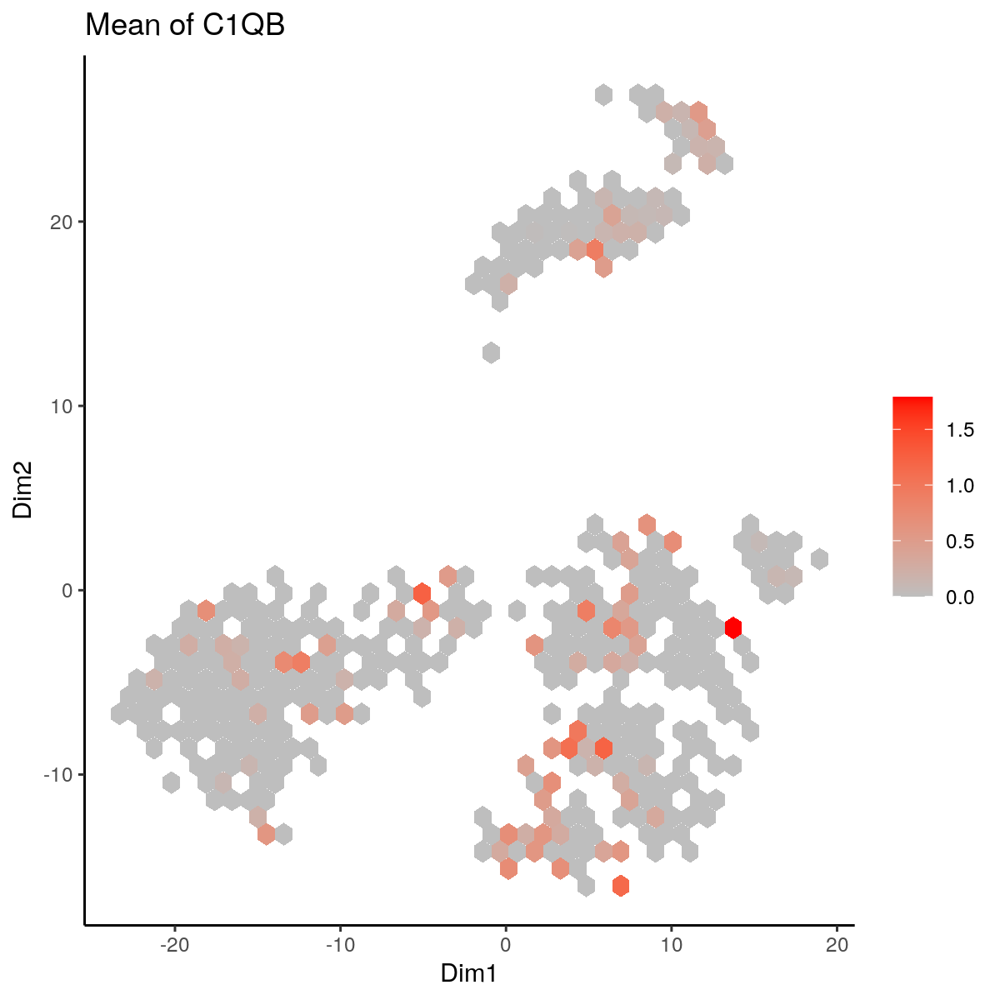|[C3AR1](https://www.ncbi.nlm.nih.gov/gene/719) [C5AR1](https://www.ncbi.nlm.nih.gov/gene/728) [CD14](https://www.ncbi.nlm.nih.gov/gene/929) [CD86](https://www.ncbi.nlm.nih.gov/gene/942) [CD53](https://www.ncbi.nlm.nih.gov/gene/963) [CD74](https://www.ncbi.nlm.nih.gov/gene/972) [CCR1](https://www.ncbi.nlm.nih.gov/gene/1230) [CCR5](https://www.ncbi.nlm.nih.gov/gene/1234) [CSF1R](https://www.ncbi.nlm.nih.gov/gene/1436) [CYBB](https://www.ncbi.nlm.nih.gov/gene/1536) [ADGRE1](https://www.ncbi.nlm.nih.gov/gene/2015) [F2R](https://www.ncbi.nlm.nih.gov/gene/2149) [FCER1G](https://www.ncbi.nlm.nih.gov/gene/2207) [FCGR1A](https://www.ncbi.nlm.nih.gov/gene/2209) [FCGR2A](https://www.ncbi.nlm.nih.gov/gene/2212) [FCGR2B](https://www.ncbi.nlm.nih.gov/gene/2213) [FCGR3A](https://www.ncbi.nlm.nih.gov/gene/2214) [FCGR3B](https://www.ncbi.nlm.nih.gov/gene/2215) [FOLR2](https://www.ncbi.nlm.nih.gov/gene/2350) [FPR3](https://www.ncbi.nlm.nih.gov/gene/2359) [GPR34](https://www.ncbi.nlm.nih.gov/gene/2857) [HLA-DPA1](https://www.ncbi.nlm.nih.gov/gene/3113) [HLA-DRA](https://www.ncbi.nlm.nih.gov/gene/3122) [HLA-DRB1](https://www.ncbi.nlm.nih.gov/gene/3123) [IL2RG](https://www.ncbi.nlm.nih.gov/gene/3561) [IL10RA](https://www.ncbi.nlm.nih.gov/gene/3587) [ITGAL](https://www.ncbi.nlm.nih.gov/gene/3683) [ITGB2](https://www.ncbi.nlm.nih.gov/gene/3689) [PTPRC](https://www.ncbi.nlm.nih.gov/gene/5788) [RGS1](https://www.ncbi.nlm.nih.gov/gene/5996) [TLR4](https://www.ncbi.nlm.nih.gov/gene/7099) [TYROBP](https://www.ncbi.nlm.nih.gov/gene/7305) [MARCO](https://www.ncbi.nlm.nih.gov/gene/8685) [SLC7A7](https://www.ncbi.nlm.nih.gov/gene/9056) [FCGR2C](https://www.ncbi.nlm.nih.gov/gene/9103) [CD163](https://www.ncbi.nlm.nih.gov/gene/9332) [SLCO2B1](https://www.ncbi.nlm.nih.gov/gene/11309) [CYTH4](https://www.ncbi.nlm.nih.gov/gene/27128) [MXRA8](https://www.ncbi.nlm.nih.gov/gene/54587) [LIN7C](https://www.ncbi.nlm.nih.gov/gene/55327)|
|[C1QC](https://www.ncbi.nlm.nih.gov/gene/714)|[C3AR1](https://www.ncbi.nlm.nih.gov/gene/719) [C5AR1](https://www.ncbi.nlm.nih.gov/gene/728) [C8A](https://www.ncbi.nlm.nih.gov/gene/731) [CD14](https://www.ncbi.nlm.nih.gov/gene/929) [CD74](https://www.ncbi.nlm.nih.gov/gene/972) [CCR1](https://www.ncbi.nlm.nih.gov/gene/1230) [CCR5](https://www.ncbi.nlm.nih.gov/gene/1234) [CSF1R](https://www.ncbi.nlm.nih.gov/gene/1436) [CSF3R](https://www.ncbi.nlm.nih.gov/gene/1441) [CYBB](https://www.ncbi.nlm.nih.gov/gene/1536) [ADGRE1](https://www.ncbi.nlm.nih.gov/gene/2015) [FCER1G](https://www.ncbi.nlm.nih.gov/gene/2207) [FCGR1A](https://www.ncbi.nlm.nih.gov/gene/2209) [FCGR1B](https://www.ncbi.nlm.nih.gov/gene/2210) [FCGR2A](https://www.ncbi.nlm.nih.gov/gene/2212) [FCGR2B](https://www.ncbi.nlm.nih.gov/gene/2213) [FCGR3A](https://www.ncbi.nlm.nih.gov/gene/2214) [FCGR3B](https://www.ncbi.nlm.nih.gov/gene/2215) [FOLR2](https://www.ncbi.nlm.nih.gov/gene/2350) [FPR3](https://www.ncbi.nlm.nih.gov/gene/2359) [GPR34](https://www.ncbi.nlm.nih.gov/gene/2857) [HLA-DPA1](https://www.ncbi.nlm.nih.gov/gene/3113) [HLA-DRA](https://www.ncbi.nlm.nih.gov/gene/3122) [ITGB2](https://www.ncbi.nlm.nih.gov/gene/3689) [PTPRC](https://www.ncbi.nlm.nih.gov/gene/5788) [TLR4](https://www.ncbi.nlm.nih.gov/gene/7099) [TYROBP](https://www.ncbi.nlm.nih.gov/gene/7305) [MARCO](https://www.ncbi.nlm.nih.gov/gene/8685) [FCGR2C](https://www.ncbi.nlm.nih.gov/gene/9103) [CD163](https://www.ncbi.nlm.nih.gov/gene/9332) [SLCO2B1](https://www.ncbi.nlm.nih.gov/gene/11309) [CYTH4](https://www.ncbi.nlm.nih.gov/gene/27128) [PCDH17](https://www.ncbi.nlm.nih.gov/gene/27253) [MXRA8](https://www.ncbi.nlm.nih.gov/gene/54587)|
|[C1QL1](https://www.ncbi.nlm.nih.gov/gene/10882)|[ADGRB3](https://www.ncbi.nlm.nih.gov/gene/577) [ANO4](https://www.ncbi.nlm.nih.gov/gene/121601)|
|[C1QL2](https://www.ncbi.nlm.nih.gov/gene/165257)|[SLC6A1](https://www.ncbi.nlm.nih.gov/gene/6529) [CNTN2](https://www.ncbi.nlm.nih.gov/gene/6900) [MXRA8](https://www.ncbi.nlm.nih.gov/gene/54587) [VANGL2](https://www.ncbi.nlm.nih.gov/gene/57216) [ISLR2](https://www.ncbi.nlm.nih.gov/gene/57611)|
|[C1QL3](https://www.ncbi.nlm.nih.gov/gene/389941)|[ADGRB3](https://www.ncbi.nlm.nih.gov/gene/577) [HCRTR1](https://www.ncbi.nlm.nih.gov/gene/3061) [KCNS1](https://www.ncbi.nlm.nih.gov/gene/3787) [GPR68](https://www.ncbi.nlm.nih.gov/gene/8111) [PARM1](https://www.ncbi.nlm.nih.gov/gene/25849) [CRIM1](https://www.ncbi.nlm.nih.gov/gene/51232) [TENM3](https://www.ncbi.nlm.nih.gov/gene/55714) [VANGL2](https://www.ncbi.nlm.nih.gov/gene/57216) [RGS8](https://www.ncbi.nlm.nih.gov/gene/85397)|
|[C1QL4](https://www.ncbi.nlm.nih.gov/gene/338761)|[MXRA8](https://www.ncbi.nlm.nih.gov/gene/54587) [VANGL2](https://www.ncbi.nlm.nih.gov/gene/57216)|
|[C1QTNF1](https://www.ncbi.nlm.nih.gov/gene/114897)|[CSPG4](https://www.ncbi.nlm.nih.gov/gene/1464)|
|[C1QTNF12](https://www.ncbi.nlm.nih.gov/gene/388581)|[CLTRN](https://www.ncbi.nlm.nih.gov/gene/57393) [CAPRIN2](https://www.ncbi.nlm.nih.gov/gene/65981) [TMPRSS6](https://www.ncbi.nlm.nih.gov/gene/164656)|
|[C1QTNF2](https://www.ncbi.nlm.nih.gov/gene/114898)|[ADIPOR1](https://www.ncbi.nlm.nih.gov/gene/51094)|
|[C1QTNF3](https://www.ncbi.nlm.nih.gov/gene/114899)|[KCNIP2](https://www.ncbi.nlm.nih.gov/gene/30819) [LYPD2](https://www.ncbi.nlm.nih.gov/gene/137797)|
|[C1QTNF4](https://www.ncbi.nlm.nih.gov/gene/114900)|[LRIG1](https://www.ncbi.nlm.nih.gov/gene/26018)|
|[C1QTNF5](https://www.ncbi.nlm.nih.gov/gene/114902)|[MFRP](https://www.ncbi.nlm.nih.gov/gene/83552)|
|[C1QTNF6](https://www.ncbi.nlm.nih.gov/gene/114904)|[PRKCQ](https://www.ncbi.nlm.nih.gov/gene/5588) [SLC14A1](https://www.ncbi.nlm.nih.gov/gene/6563)|
|[C1QTNF7](https://www.ncbi.nlm.nih.gov/gene/114905)|[C3AR1](https://www.ncbi.nlm.nih.gov/gene/719) [CD36](https://www.ncbi.nlm.nih.gov/gene/948) [KCNMA1](https://www.ncbi.nlm.nih.gov/gene/3778)|
|[C1QTNF8](https://www.ncbi.nlm.nih.gov/gene/390664)|[RXFP1](https://www.ncbi.nlm.nih.gov/gene/59350) [RXFP2](https://www.ncbi.nlm.nih.gov/gene/122042)|
|[C1QTNF9](https://www.ncbi.nlm.nih.gov/gene/338872)|[ADIPOR1](https://www.ncbi.nlm.nih.gov/gene/51094) [ADIPOR2](https://www.ncbi.nlm.nih.gov/gene/79602)|
|[C1QTNF9B](https://www.ncbi.nlm.nih.gov/gene/387911)|[SNTB1](https://www.ncbi.nlm.nih.gov/gene/6641)|
|[C1RL](https://www.ncbi.nlm.nih.gov/gene/51279)|[C8A](https://www.ncbi.nlm.nih.gov/gene/731) [CD59](https://www.ncbi.nlm.nih.gov/gene/966) [CD163](https://www.ncbi.nlm.nih.gov/gene/9332)|
|[C2](https://www.ncbi.nlm.nih.gov/gene/717)|[C3AR1](https://www.ncbi.nlm.nih.gov/gene/719) [C5AR1](https://www.ncbi.nlm.nih.gov/gene/728) [CD55](https://www.ncbi.nlm.nih.gov/gene/1604) [HTRA1](https://www.ncbi.nlm.nih.gov/gene/5654) [C5AR2](https://www.ncbi.nlm.nih.gov/gene/27202) [ANO2](https://www.ncbi.nlm.nih.gov/gene/57101)|
|[C2orf66](https://www.ncbi.nlm.nih.gov/gene/401027)|[SLC41A2](https://www.ncbi.nlm.nih.gov/gene/84102)|
|[C2orf69](https://www.ncbi.nlm.nih.gov/gene/205327)|[OSCP1](https://www.ncbi.nlm.nih.gov/gene/127700) [VSTM4](https://www.ncbi.nlm.nih.gov/gene/196740)|
|[C3](https://www.ncbi.nlm.nih.gov/gene/718)|[ADAM10](https://www.ncbi.nlm.nih.gov/gene/102) [ADCY3](https://www.ncbi.nlm.nih.gov/gene/109) [ADCY5](https://www.ncbi.nlm.nih.gov/gene/111) [ADCY6](https://www.ncbi.nlm.nih.gov/gene/112) [ADCY8](https://www.ncbi.nlm.nih.gov/gene/114) [ADCY9](https://www.ncbi.nlm.nih.gov/gene/115) [ADORA1](https://www.ncbi.nlm.nih.gov/gene/134) [ADRA2A](https://www.ncbi.nlm.nih.gov/gene/150) [ADRA2B](https://www.ncbi.nlm.nih.gov/gene/151) [ADRA2C](https://www.ncbi.nlm.nih.gov/gene/152) [AGTR1](https://www.ncbi.nlm.nih.gov/gene/185) [AGTR2](https://www.ncbi.nlm.nih.gov/gene/186) [APLNR](https://www.ncbi.nlm.nih.gov/gene/187) [APLP2](https://www.ncbi.nlm.nih.gov/gene/334) [BDKRB1](https://www.ncbi.nlm.nih.gov/gene/623) [BDKRB2](https://www.ncbi.nlm.nih.gov/gene/624) [CXCR5](https://www.ncbi.nlm.nih.gov/gene/643) [C3AR1](https://www.ncbi.nlm.nih.gov/gene/719) [C5AR1](https://www.ncbi.nlm.nih.gov/gene/728) [C8A](https://www.ncbi.nlm.nih.gov/gene/731) [CASR](https://www.ncbi.nlm.nih.gov/gene/846) [CD19](https://www.ncbi.nlm.nih.gov/gene/930) [CD59](https://www.ncbi.nlm.nih.gov/gene/966) [CD81](https://www.ncbi.nlm.nih.gov/gene/975) [CDH2](https://www.ncbi.nlm.nih.gov/gene/1000) [CHRM2](https://www.ncbi.nlm.nih.gov/gene/1129) [CHRM4](https://www.ncbi.nlm.nih.gov/gene/1132) [CCR1](https://www.ncbi.nlm.nih.gov/gene/1230) [CCR3](https://www.ncbi.nlm.nih.gov/gene/1232) [CCR4](https://www.ncbi.nlm.nih.gov/gene/1233) [CCR5](https://www.ncbi.nlm.nih.gov/gene/1234) [CCR7](https://www.ncbi.nlm.nih.gov/gene/1236) [CCR8](https://www.ncbi.nlm.nih.gov/gene/1237) [CNR1](https://www.ncbi.nlm.nih.gov/gene/1268) [CNR2](https://www.ncbi.nlm.nih.gov/gene/1269) [CR2](https://www.ncbi.nlm.nih.gov/gene/1380) [CX3CR1](https://www.ncbi.nlm.nih.gov/gene/1524) [CD55](https://www.ncbi.nlm.nih.gov/gene/1604) [ACE](https://www.ncbi.nlm.nih.gov/gene/1636) [DRD2](https://www.ncbi.nlm.nih.gov/gene/1813) [DRD3](https://www.ncbi.nlm.nih.gov/gene/1814) [DRD4](https://www.ncbi.nlm.nih.gov/gene/1815) [GPR183](https://www.ncbi.nlm.nih.gov/gene/1880) [S1PR1](https://www.ncbi.nlm.nih.gov/gene/1901) [S1PR3](https://www.ncbi.nlm.nih.gov/gene/1903) [FCGR1A](https://www.ncbi.nlm.nih.gov/gene/2209) [FCGR2B](https://www.ncbi.nlm.nih.gov/gene/2213) [FPR1](https://www.ncbi.nlm.nih.gov/gene/2357) [FPR2](https://www.ncbi.nlm.nih.gov/gene/2358) [FPR3](https://www.ncbi.nlm.nih.gov/gene/2359) [GALR1](https://www.ncbi.nlm.nih.gov/gene/2587) [GPC3](https://www.ncbi.nlm.nih.gov/gene/2719) [GNG3](https://www.ncbi.nlm.nih.gov/gene/2785) [GNG4](https://www.ncbi.nlm.nih.gov/gene/2786) [GNG5](https://www.ncbi.nlm.nih.gov/gene/2787) [GNG7](https://www.ncbi.nlm.nih.gov/gene/2788) [GNG10](https://www.ncbi.nlm.nih.gov/gene/2790) [GNG11](https://www.ncbi.nlm.nih.gov/gene/2791) [GNGT1](https://www.ncbi.nlm.nih.gov/gene/2792) [GNGT2](https://www.ncbi.nlm.nih.gov/gene/2793) [CCR10](https://www.ncbi.nlm.nih.gov/gene/2826) [NPBWR1](https://www.ncbi.nlm.nih.gov/gene/2831) [NPBWR2](https://www.ncbi.nlm.nih.gov/gene/2832) [CXCR3](https://www.ncbi.nlm.nih.gov/gene/2833) [GPR17](https://www.ncbi.nlm.nih.gov/gene/2840) [GPR18](https://www.ncbi.nlm.nih.gov/gene/2841) [MCHR1](https://www.ncbi.nlm.nih.gov/gene/2847) [GPR31](https://www.ncbi.nlm.nih.gov/gene/2853) [GPR37](https://www.ncbi.nlm.nih.gov/gene/2861) [GRM2](https://www.ncbi.nlm.nih.gov/gene/2912) [GRM3](https://www.ncbi.nlm.nih.gov/gene/2913) [GRM4](https://www.ncbi.nlm.nih.gov/gene/2914) [GRM6](https://www.ncbi.nlm.nih.gov/gene/2916) [GRM7](https://www.ncbi.nlm.nih.gov/gene/2917) [GRM8](https://www.ncbi.nlm.nih.gov/gene/2918) [HTR1A](https://www.ncbi.nlm.nih.gov/gene/3350) [HTR1B](https://www.ncbi.nlm.nih.gov/gene/3351) [HTR1D](https://www.ncbi.nlm.nih.gov/gene/3352) [HTR1E](https://www.ncbi.nlm.nih.gov/gene/3354) [HTR1F](https://www.ncbi.nlm.nih.gov/gene/3355) [HTR5A](https://www.ncbi.nlm.nih.gov/gene/3361) [CXCR1](https://www.ncbi.nlm.nih.gov/gene/3577) [CXCR2](https://www.ncbi.nlm.nih.gov/gene/3579) [ITGAM](https://www.ncbi.nlm.nih.gov/gene/3684) [ITGB2](https://www.ncbi.nlm.nih.gov/gene/3689) [MELTF](https://www.ncbi.nlm.nih.gov/gene/4241) [MTNR1A](https://www.ncbi.nlm.nih.gov/gene/4543) [MTNR1B](https://www.ncbi.nlm.nih.gov/gene/4544) [NPY1R](https://www.ncbi.nlm.nih.gov/gene/4886) [NPY2R](https://www.ncbi.nlm.nih.gov/gene/4887) [NPY5R](https://www.ncbi.nlm.nih.gov/gene/4889) [OPRD1](https://www.ncbi.nlm.nih.gov/gene/4985) [OPRK1](https://www.ncbi.nlm.nih.gov/gene/4986) [OPRL1](https://www.ncbi.nlm.nih.gov/gene/4987) [P2RY4](https://www.ncbi.nlm.nih.gov/gene/5030) [HTRA1](https://www.ncbi.nlm.nih.gov/gene/5654) [PTGER3](https://www.ncbi.nlm.nih.gov/gene/5733) [SELP](https://www.ncbi.nlm.nih.gov/gene/6403) [SSTR1](https://www.ncbi.nlm.nih.gov/gene/6751) [SSTR2](https://www.ncbi.nlm.nih.gov/gene/6752) [SSTR3](https://www.ncbi.nlm.nih.gov/gene/6753) [SSTR4](https://www.ncbi.nlm.nih.gov/gene/6754) [SSTR5](https://www.ncbi.nlm.nih.gov/gene/6755) [TLR1](https://www.ncbi.nlm.nih.gov/gene/7096) [TLR4](https://www.ncbi.nlm.nih.gov/gene/7099) [TLR5](https://www.ncbi.nlm.nih.gov/gene/7100) [CXCR4](https://www.ncbi.nlm.nih.gov/gene/7852) [GALR3](https://www.ncbi.nlm.nih.gov/gene/8484) [IFITM1](https://www.ncbi.nlm.nih.gov/gene/8519) [S1PR4](https://www.ncbi.nlm.nih.gov/gene/8698) [GALR2](https://www.ncbi.nlm.nih.gov/gene/8811) [HCAR3](https://www.ncbi.nlm.nih.gov/gene/8843) [MGAM](https://www.ncbi.nlm.nih.gov/gene/8972) [GPR37L1](https://www.ncbi.nlm.nih.gov/gene/9283) [GPR55](https://www.ncbi.nlm.nih.gov/gene/9290) [GABBR2](https://www.ncbi.nlm.nih.gov/gene/9568) [P2RY14](https://www.ncbi.nlm.nih.gov/gene/9934) [NMUR1](https://www.ncbi.nlm.nih.gov/gene/10316) [TLR6](https://www.ncbi.nlm.nih.gov/gene/10333) [CAP1](https://www.ncbi.nlm.nih.gov/gene/10487) [TGOLN2](https://www.ncbi.nlm.nih.gov/gene/10618) [CXCR6](https://www.ncbi.nlm.nih.gov/gene/10663) [CCR9](https://www.ncbi.nlm.nih.gov/gene/10803) [PTGDR2](https://www.ncbi.nlm.nih.gov/gene/11251) [HRH3](https://www.ncbi.nlm.nih.gov/gene/11255) [LPAR3](https://www.ncbi.nlm.nih.gov/gene/23566) [HCAR1](https://www.ncbi.nlm.nih.gov/gene/27198) [OXGR1](https://www.ncbi.nlm.nih.gov/gene/27199) [C5AR2](https://www.ncbi.nlm.nih.gov/gene/27202) [TAS2R16](https://www.ncbi.nlm.nih.gov/gene/50833) [RXFP3](https://www.ncbi.nlm.nih.gov/gene/51289) [GNG13](https://www.ncbi.nlm.nih.gov/gene/51764) [S1PR5](https://www.ncbi.nlm.nih.gov/gene/53637) [P2RY13](https://www.ncbi.nlm.nih.gov/gene/53829) [GNG2](https://www.ncbi.nlm.nih.gov/gene/54331) [MXRA8](https://www.ncbi.nlm.nih.gov/gene/54587) [GNG12](https://www.ncbi.nlm.nih.gov/gene/55970) [SUCNR1](https://www.ncbi.nlm.nih.gov/gene/56670) [NMUR2](https://www.ncbi.nlm.nih.gov/gene/56923) [ACKR3](https://www.ncbi.nlm.nih.gov/gene/57007) [PNPLA2](https://www.ncbi.nlm.nih.gov/gene/57104) [LPAR5](https://www.ncbi.nlm.nih.gov/gene/57121) [ANO8](https://www.ncbi.nlm.nih.gov/gene/57719) [CXCL16](https://www.ncbi.nlm.nih.gov/gene/58191) [HRH4](https://www.ncbi.nlm.nih.gov/gene/59340) [P2RY12](https://www.ncbi.nlm.nih.gov/gene/64805) [TAS1R2](https://www.ncbi.nlm.nih.gov/gene/80834) [TAS1R1](https://www.ncbi.nlm.nih.gov/gene/80835) [TAS1R3](https://www.ncbi.nlm.nih.gov/gene/83756) [MCHR2](https://www.ncbi.nlm.nih.gov/gene/84539) [GNG8](https://www.ncbi.nlm.nih.gov/gene/94235) [OXER1](https://www.ncbi.nlm.nih.gov/gene/165140) [ADCY4](https://www.ncbi.nlm.nih.gov/gene/196883) [HCAR2](https://www.ncbi.nlm.nih.gov/gene/338442) [RXFP4](https://www.ncbi.nlm.nih.gov/gene/339403) [CCR2](https://www.ncbi.nlm.nih.gov/gene/729230)|
|[C4A](https://www.ncbi.nlm.nih.gov/gene/720)|[ADAM10](https://www.ncbi.nlm.nih.gov/gene/102) [APLP2](https://www.ncbi.nlm.nih.gov/gene/334) [C3AR1](https://www.ncbi.nlm.nih.gov/gene/719) [C5AR1](https://www.ncbi.nlm.nih.gov/gene/728) [C8A](https://www.ncbi.nlm.nih.gov/gene/731) [CD59](https://www.ncbi.nlm.nih.gov/gene/966) [CDH2](https://www.ncbi.nlm.nih.gov/gene/1000) [CR2](https://www.ncbi.nlm.nih.gov/gene/1380) [CD55](https://www.ncbi.nlm.nih.gov/gene/1604) [ESR1](https://www.ncbi.nlm.nih.gov/gene/2099) [GPC3](https://www.ncbi.nlm.nih.gov/gene/2719) [HLA-A](https://www.ncbi.nlm.nih.gov/gene/3105) [HLA-DQA1](https://www.ncbi.nlm.nih.gov/gene/3117) [HLA-DRB1](https://www.ncbi.nlm.nih.gov/gene/3123) [MC4R](https://www.ncbi.nlm.nih.gov/gene/4160) [MELTF](https://www.ncbi.nlm.nih.gov/gene/4241) [RHD](https://www.ncbi.nlm.nih.gov/gene/6007) [TGOLN2](https://www.ncbi.nlm.nih.gov/gene/10618) [C5AR2](https://www.ncbi.nlm.nih.gov/gene/27202) [MXRA8](https://www.ncbi.nlm.nih.gov/gene/54587) [PNPLA2](https://www.ncbi.nlm.nih.gov/gene/57104) [ANO8](https://www.ncbi.nlm.nih.gov/gene/57719)|
|[C4BPA](https://www.ncbi.nlm.nih.gov/gene/722)|[BST1](https://www.ncbi.nlm.nih.gov/gene/683) [C8A](https://www.ncbi.nlm.nih.gov/gene/731) [S100A6](https://www.ncbi.nlm.nih.gov/gene/6277) [ZP1](https://www.ncbi.nlm.nih.gov/gene/22917)|
|[C4BPB](https://www.ncbi.nlm.nih.gov/gene/725)|[C8A](https://www.ncbi.nlm.nih.gov/gene/731)|
|[C5](https://www.ncbi.nlm.nih.gov/gene/727)|[ADCY3](https://www.ncbi.nlm.nih.gov/gene/109) [ADCY5](https://www.ncbi.nlm.nih.gov/gene/111) [ADCY6](https://www.ncbi.nlm.nih.gov/gene/112) [ADCY8](https://www.ncbi.nlm.nih.gov/gene/114) [ADCY9](https://www.ncbi.nlm.nih.gov/gene/115) [ADORA1](https://www.ncbi.nlm.nih.gov/gene/134) [ADRA2A](https://www.ncbi.nlm.nih.gov/gene/150) [ADRA2B](https://www.ncbi.nlm.nih.gov/gene/151) [ADRA2C](https://www.ncbi.nlm.nih.gov/gene/152) [AGTR1](https://www.ncbi.nlm.nih.gov/gene/185) [AGTR2](https://www.ncbi.nlm.nih.gov/gene/186) [APLNR](https://www.ncbi.nlm.nih.gov/gene/187) [BDKRB1](https://www.ncbi.nlm.nih.gov/gene/623) [BDKRB2](https://www.ncbi.nlm.nih.gov/gene/624) [CXCR5](https://www.ncbi.nlm.nih.gov/gene/643) [C3AR1](https://www.ncbi.nlm.nih.gov/gene/719) [C5AR1](https://www.ncbi.nlm.nih.gov/gene/728) [C8A](https://www.ncbi.nlm.nih.gov/gene/731) [CASR](https://www.ncbi.nlm.nih.gov/gene/846) [CD59](https://www.ncbi.nlm.nih.gov/gene/966) [CHRM2](https://www.ncbi.nlm.nih.gov/gene/1129) [CHRM4](https://www.ncbi.nlm.nih.gov/gene/1132) [CCR1](https://www.ncbi.nlm.nih.gov/gene/1230) [CCR3](https://www.ncbi.nlm.nih.gov/gene/1232) [CCR4](https://www.ncbi.nlm.nih.gov/gene/1233) [CCR5](https://www.ncbi.nlm.nih.gov/gene/1234) [CCR7](https://www.ncbi.nlm.nih.gov/gene/1236) [CCR8](https://www.ncbi.nlm.nih.gov/gene/1237) [LTB4R](https://www.ncbi.nlm.nih.gov/gene/1241) [CNR1](https://www.ncbi.nlm.nih.gov/gene/1268) [CNR2](https://www.ncbi.nlm.nih.gov/gene/1269) [CX3CR1](https://www.ncbi.nlm.nih.gov/gene/1524) [CD55](https://www.ncbi.nlm.nih.gov/gene/1604) [DRD2](https://www.ncbi.nlm.nih.gov/gene/1813) [DRD3](https://www.ncbi.nlm.nih.gov/gene/1814) [DRD4](https://www.ncbi.nlm.nih.gov/gene/1815) [GPR183](https://www.ncbi.nlm.nih.gov/gene/1880) [S1PR1](https://www.ncbi.nlm.nih.gov/gene/1901) [S1PR3](https://www.ncbi.nlm.nih.gov/gene/1903) [FPR1](https://www.ncbi.nlm.nih.gov/gene/2357) [FPR2](https://www.ncbi.nlm.nih.gov/gene/2358) [FPR3](https://www.ncbi.nlm.nih.gov/gene/2359) [GALR1](https://www.ncbi.nlm.nih.gov/gene/2587) [GNG3](https://www.ncbi.nlm.nih.gov/gene/2785) [GNG4](https://www.ncbi.nlm.nih.gov/gene/2786) [GNG5](https://www.ncbi.nlm.nih.gov/gene/2787) [GNG7](https://www.ncbi.nlm.nih.gov/gene/2788) [GNG10](https://www.ncbi.nlm.nih.gov/gene/2790) [GNG11](https://www.ncbi.nlm.nih.gov/gene/2791) [GNGT1](https://www.ncbi.nlm.nih.gov/gene/2792) [GNGT2](https://www.ncbi.nlm.nih.gov/gene/2793) [CCR10](https://www.ncbi.nlm.nih.gov/gene/2826) [NPBWR1](https://www.ncbi.nlm.nih.gov/gene/2831) [NPBWR2](https://www.ncbi.nlm.nih.gov/gene/2832) [CXCR3](https://www.ncbi.nlm.nih.gov/gene/2833) [GPR17](https://www.ncbi.nlm.nih.gov/gene/2840) [GPR18](https://www.ncbi.nlm.nih.gov/gene/2841) [MCHR1](https://www.ncbi.nlm.nih.gov/gene/2847) [GPR31](https://www.ncbi.nlm.nih.gov/gene/2853) [GPR37](https://www.ncbi.nlm.nih.gov/gene/2861) [GRM2](https://www.ncbi.nlm.nih.gov/gene/2912) [GRM3](https://www.ncbi.nlm.nih.gov/gene/2913) [GRM4](https://www.ncbi.nlm.nih.gov/gene/2914) [GRM6](https://www.ncbi.nlm.nih.gov/gene/2916) [GRM7](https://www.ncbi.nlm.nih.gov/gene/2917) [GRM8](https://www.ncbi.nlm.nih.gov/gene/2918) [HTR1A](https://www.ncbi.nlm.nih.gov/gene/3350) [HTR1B](https://www.ncbi.nlm.nih.gov/gene/3351) [HTR1D](https://www.ncbi.nlm.nih.gov/gene/3352) [HTR1E](https://www.ncbi.nlm.nih.gov/gene/3354) [HTR1F](https://www.ncbi.nlm.nih.gov/gene/3355) [HTR5A](https://www.ncbi.nlm.nih.gov/gene/3361) [CXCR1](https://www.ncbi.nlm.nih.gov/gene/3577) [CXCR2](https://www.ncbi.nlm.nih.gov/gene/3579) [MTNR1A](https://www.ncbi.nlm.nih.gov/gene/4543) [MTNR1B](https://www.ncbi.nlm.nih.gov/gene/4544) [NPY1R](https://www.ncbi.nlm.nih.gov/gene/4886) [NPY2R](https://www.ncbi.nlm.nih.gov/gene/4887) [NPY5R](https://www.ncbi.nlm.nih.gov/gene/4889) [OPRD1](https://www.ncbi.nlm.nih.gov/gene/4985) [OPRK1](https://www.ncbi.nlm.nih.gov/gene/4986) [OPRL1](https://www.ncbi.nlm.nih.gov/gene/4987) [P2RY4](https://www.ncbi.nlm.nih.gov/gene/5030) [PTGER3](https://www.ncbi.nlm.nih.gov/gene/5733) [SSTR1](https://www.ncbi.nlm.nih.gov/gene/6751) [SSTR2](https://www.ncbi.nlm.nih.gov/gene/6752) [SSTR3](https://www.ncbi.nlm.nih.gov/gene/6753) [SSTR4](https://www.ncbi.nlm.nih.gov/gene/6754) [SSTR5](https://www.ncbi.nlm.nih.gov/gene/6755) [CXCR4](https://www.ncbi.nlm.nih.gov/gene/7852) [GALR3](https://www.ncbi.nlm.nih.gov/gene/8484) [S1PR4](https://www.ncbi.nlm.nih.gov/gene/8698) [GALR2](https://www.ncbi.nlm.nih.gov/gene/8811) [HCAR3](https://www.ncbi.nlm.nih.gov/gene/8843) [GPR37L1](https://www.ncbi.nlm.nih.gov/gene/9283) [GPR55](https://www.ncbi.nlm.nih.gov/gene/9290) [GABBR2](https://www.ncbi.nlm.nih.gov/gene/9568) [P2RY14](https://www.ncbi.nlm.nih.gov/gene/9934) [NMUR1](https://www.ncbi.nlm.nih.gov/gene/10316) [CXCR6](https://www.ncbi.nlm.nih.gov/gene/10663) [CCR9](https://www.ncbi.nlm.nih.gov/gene/10803) [PTGDR2](https://www.ncbi.nlm.nih.gov/gene/11251) [HRH3](https://www.ncbi.nlm.nih.gov/gene/11255) [LPAR3](https://www.ncbi.nlm.nih.gov/gene/23566) [HCAR1](https://www.ncbi.nlm.nih.gov/gene/27198) [OXGR1](https://www.ncbi.nlm.nih.gov/gene/27199) [C5AR2](https://www.ncbi.nlm.nih.gov/gene/27202) [TAS2R16](https://www.ncbi.nlm.nih.gov/gene/50833) [RXFP3](https://www.ncbi.nlm.nih.gov/gene/51289) [GNG13](https://www.ncbi.nlm.nih.gov/gene/51764) [S1PR5](https://www.ncbi.nlm.nih.gov/gene/53637) [P2RY13](https://www.ncbi.nlm.nih.gov/gene/53829) [GNG2](https://www.ncbi.nlm.nih.gov/gene/54331) [GNG12](https://www.ncbi.nlm.nih.gov/gene/55970) [LTB4R2](https://www.ncbi.nlm.nih.gov/gene/56413) [SUCNR1](https://www.ncbi.nlm.nih.gov/gene/56670) [NMUR2](https://www.ncbi.nlm.nih.gov/gene/56923) [ACKR3](https://www.ncbi.nlm.nih.gov/gene/57007) [LPAR5](https://www.ncbi.nlm.nih.gov/gene/57121) [CXCL16](https://www.ncbi.nlm.nih.gov/gene/58191) [HRH4](https://www.ncbi.nlm.nih.gov/gene/59340) [P2RY12](https://www.ncbi.nlm.nih.gov/gene/64805) [TAS1R2](https://www.ncbi.nlm.nih.gov/gene/80834) [TAS1R1](https://www.ncbi.nlm.nih.gov/gene/80835) [TAS1R3](https://www.ncbi.nlm.nih.gov/gene/83756) [MCHR2](https://www.ncbi.nlm.nih.gov/gene/84539) [GNG8](https://www.ncbi.nlm.nih.gov/gene/94235) [OXER1](https://www.ncbi.nlm.nih.gov/gene/165140) [ADCY4](https://www.ncbi.nlm.nih.gov/gene/196883) [HCAR2](https://www.ncbi.nlm.nih.gov/gene/338442) [RXFP4](https://www.ncbi.nlm.nih.gov/gene/339403) [CCR2](https://www.ncbi.nlm.nih.gov/gene/729230)|
|[C5orf38](https://www.ncbi.nlm.nih.gov/gene/153571)|[FGFR1](https://www.ncbi.nlm.nih.gov/gene/2260) [VIPR1](https://www.ncbi.nlm.nih.gov/gene/7433)|
|[C5orf46](https://www.ncbi.nlm.nih.gov/gene/389336)|[GPR87](https://www.ncbi.nlm.nih.gov/gene/53836) [SLC47A1](https://www.ncbi.nlm.nih.gov/gene/55244) [CDHR1](https://www.ncbi.nlm.nih.gov/gene/92211) [LYNX1-SLURP2](https://www.ncbi.nlm.nih.gov/gene/111188157)|
|[C6](https://www.ncbi.nlm.nih.gov/gene/729)|[C8A](https://www.ncbi.nlm.nih.gov/gene/731) [CD59](https://www.ncbi.nlm.nih.gov/gene/966) [PTAFR](https://www.ncbi.nlm.nih.gov/gene/5724) [SLC2A2](https://www.ncbi.nlm.nih.gov/gene/6514) [TMPRSS6](https://www.ncbi.nlm.nih.gov/gene/164656) [IYD](https://www.ncbi.nlm.nih.gov/gene/389434)|
|[C6orf120](https://www.ncbi.nlm.nih.gov/gene/387263)|[CD55](https://www.ncbi.nlm.nih.gov/gene/1604) [GPR31](https://www.ncbi.nlm.nih.gov/gene/2853) [CAP1](https://www.ncbi.nlm.nih.gov/gene/10487) [EFR3B](https://www.ncbi.nlm.nih.gov/gene/22979) [UNC93A](https://www.ncbi.nlm.nih.gov/gene/54346)|
|[C6orf15](https://www.ncbi.nlm.nih.gov/gene/29113)|[LRBA](https://www.ncbi.nlm.nih.gov/gene/987) [MOG](https://www.ncbi.nlm.nih.gov/gene/4340) [CDH26](https://www.ncbi.nlm.nih.gov/gene/60437)|
|[C6orf58](https://www.ncbi.nlm.nih.gov/gene/352999)|[ALPP](https://www.ncbi.nlm.nih.gov/gene/250)|
|[C7](https://www.ncbi.nlm.nih.gov/gene/730)|[ACPP](https://www.ncbi.nlm.nih.gov/gene/55) [C8A](https://www.ncbi.nlm.nih.gov/gene/731) [CD59](https://www.ncbi.nlm.nih.gov/gene/966) [DSG1](https://www.ncbi.nlm.nih.gov/gene/1828)|
|[C8A](https://www.ncbi.nlm.nih.gov/gene/731)|[C5AR1](https://www.ncbi.nlm.nih.gov/gene/728) [CD59](https://www.ncbi.nlm.nih.gov/gene/966) [GGT1](https://www.ncbi.nlm.nih.gov/gene/2678) [HLA-DRB5](https://www.ncbi.nlm.nih.gov/gene/3127) [SLC2A2](https://www.ncbi.nlm.nih.gov/gene/6514) [SLCO1B1](https://www.ncbi.nlm.nih.gov/gene/10599) [TMPRSS6](https://www.ncbi.nlm.nih.gov/gene/164656) [IYD](https://www.ncbi.nlm.nih.gov/gene/389434)|
|[C8B](https://www.ncbi.nlm.nih.gov/gene/732)|[C8A](https://www.ncbi.nlm.nih.gov/gene/731) [CD59](https://www.ncbi.nlm.nih.gov/gene/966) [CD55](https://www.ncbi.nlm.nih.gov/gene/1604) [GGT1](https://www.ncbi.nlm.nih.gov/gene/2678) [GYPC](https://www.ncbi.nlm.nih.gov/gene/2995) [HLA-DRB5](https://www.ncbi.nlm.nih.gov/gene/3127) [ITGB2](https://www.ncbi.nlm.nih.gov/gene/3689) [IL18RAP](https://www.ncbi.nlm.nih.gov/gene/8807) [TAS1R2](https://www.ncbi.nlm.nih.gov/gene/80834) [OR52A5](https://www.ncbi.nlm.nih.gov/gene/390054)|
|[C9](https://www.ncbi.nlm.nih.gov/gene/735)|[C8A](https://www.ncbi.nlm.nih.gov/gene/731) [CD59](https://www.ncbi.nlm.nih.gov/gene/966) [CD79B](https://www.ncbi.nlm.nih.gov/gene/974) [DPP4](https://www.ncbi.nlm.nih.gov/gene/1803) [CD226](https://www.ncbi.nlm.nih.gov/gene/10666)|
|[C9orf47](https://www.ncbi.nlm.nih.gov/gene/286223)|[ADCY3](https://www.ncbi.nlm.nih.gov/gene/109) [ADCY5](https://www.ncbi.nlm.nih.gov/gene/111) [ADCY6](https://www.ncbi.nlm.nih.gov/gene/112) [ADCY8](https://www.ncbi.nlm.nih.gov/gene/114) [ADCY9](https://www.ncbi.nlm.nih.gov/gene/115) [ADORA1](https://www.ncbi.nlm.nih.gov/gene/134) [ADRA2A](https://www.ncbi.nlm.nih.gov/gene/150) [ADRA2B](https://www.ncbi.nlm.nih.gov/gene/151) [ADRA2C](https://www.ncbi.nlm.nih.gov/gene/152) [AGTR2](https://www.ncbi.nlm.nih.gov/gene/186) [APLNR](https://www.ncbi.nlm.nih.gov/gene/187) [RHOA](https://www.ncbi.nlm.nih.gov/gene/387) [BDKRB1](https://www.ncbi.nlm.nih.gov/gene/623) [BDKRB2](https://www.ncbi.nlm.nih.gov/gene/624) [CXCR5](https://www.ncbi.nlm.nih.gov/gene/643) [C3AR1](https://www.ncbi.nlm.nih.gov/gene/719) [C5AR1](https://www.ncbi.nlm.nih.gov/gene/728) [CASR](https://www.ncbi.nlm.nih.gov/gene/846) [CHRM2](https://www.ncbi.nlm.nih.gov/gene/1129) [CHRM4](https://www.ncbi.nlm.nih.gov/gene/1132) [CCR1](https://www.ncbi.nlm.nih.gov/gene/1230) [CCR3](https://www.ncbi.nlm.nih.gov/gene/1232) [CCR4](https://www.ncbi.nlm.nih.gov/gene/1233) [CCR5](https://www.ncbi.nlm.nih.gov/gene/1234) [CCR7](https://www.ncbi.nlm.nih.gov/gene/1236) [CCR8](https://www.ncbi.nlm.nih.gov/gene/1237) [CNR1](https://www.ncbi.nlm.nih.gov/gene/1268) [CNR2](https://www.ncbi.nlm.nih.gov/gene/1269) [CX3CR1](https://www.ncbi.nlm.nih.gov/gene/1524) [DRD2](https://www.ncbi.nlm.nih.gov/gene/1813) [DRD3](https://www.ncbi.nlm.nih.gov/gene/1814) [DRD4](https://www.ncbi.nlm.nih.gov/gene/1815) [GPR183](https://www.ncbi.nlm.nih.gov/gene/1880) [S1PR1](https://www.ncbi.nlm.nih.gov/gene/1901) [F2R](https://www.ncbi.nlm.nih.gov/gene/2149) [F2RL1](https://www.ncbi.nlm.nih.gov/gene/2150) [FPR1](https://www.ncbi.nlm.nih.gov/gene/2357) [FPR2](https://www.ncbi.nlm.nih.gov/gene/2358) [FPR3](https://www.ncbi.nlm.nih.gov/gene/2359) [GALR1](https://www.ncbi.nlm.nih.gov/gene/2587) [GNA11](https://www.ncbi.nlm.nih.gov/gene/2767) [GNA12](https://www.ncbi.nlm.nih.gov/gene/2768) [GNAO1](https://www.ncbi.nlm.nih.gov/gene/2775) [GNG3](https://www.ncbi.nlm.nih.gov/gene/2785) [GNG4](https://www.ncbi.nlm.nih.gov/gene/2786) [GNG5](https://www.ncbi.nlm.nih.gov/gene/2787) [GNG7](https://www.ncbi.nlm.nih.gov/gene/2788) [GNG10](https://www.ncbi.nlm.nih.gov/gene/2790) [GNG11](https://www.ncbi.nlm.nih.gov/gene/2791) [GNGT1](https://www.ncbi.nlm.nih.gov/gene/2792) [GNGT2](https://www.ncbi.nlm.nih.gov/gene/2793) [CCR10](https://www.ncbi.nlm.nih.gov/gene/2826) [NPBWR1](https://www.ncbi.nlm.nih.gov/gene/2831) [NPBWR2](https://www.ncbi.nlm.nih.gov/gene/2832) [CXCR3](https://www.ncbi.nlm.nih.gov/gene/2833) [GPR17](https://www.ncbi.nlm.nih.gov/gene/2840) [GPR18](https://www.ncbi.nlm.nih.gov/gene/2841) [LPAR4](https://www.ncbi.nlm.nih.gov/gene/2846) [MCHR1](https://www.ncbi.nlm.nih.gov/gene/2847) [GPR31](https://www.ncbi.nlm.nih.gov/gene/2853) [GPR37](https://www.ncbi.nlm.nih.gov/gene/2861) [GRM2](https://www.ncbi.nlm.nih.gov/gene/2912) [GRM3](https://www.ncbi.nlm.nih.gov/gene/2913) [GRM4](https://www.ncbi.nlm.nih.gov/gene/2914) [GRM6](https://www.ncbi.nlm.nih.gov/gene/2916) [GRM7](https://www.ncbi.nlm.nih.gov/gene/2917) [GRM8](https://www.ncbi.nlm.nih.gov/gene/2918) [HTR1A](https://www.ncbi.nlm.nih.gov/gene/3350) [HTR1B](https://www.ncbi.nlm.nih.gov/gene/3351) [HTR1D](https://www.ncbi.nlm.nih.gov/gene/3352) [HTR1E](https://www.ncbi.nlm.nih.gov/gene/3354) [HTR1F](https://www.ncbi.nlm.nih.gov/gene/3355) [HTR5A](https://www.ncbi.nlm.nih.gov/gene/3361) [CXCR1](https://www.ncbi.nlm.nih.gov/gene/3577) [CXCR2](https://www.ncbi.nlm.nih.gov/gene/3579) [MTNR1A](https://www.ncbi.nlm.nih.gov/gene/4543) [MTNR1B](https://www.ncbi.nlm.nih.gov/gene/4544) [NOS3](https://www.ncbi.nlm.nih.gov/gene/4846) [NPY1R](https://www.ncbi.nlm.nih.gov/gene/4886) [NPY2R](https://www.ncbi.nlm.nih.gov/gene/4887) [NPY5R](https://www.ncbi.nlm.nih.gov/gene/4889) [OPRD1](https://www.ncbi.nlm.nih.gov/gene/4985) [OPRK1](https://www.ncbi.nlm.nih.gov/gene/4986) [OPRL1](https://www.ncbi.nlm.nih.gov/gene/4987) [P2RY4](https://www.ncbi.nlm.nih.gov/gene/5030) [PTGER3](https://www.ncbi.nlm.nih.gov/gene/5733) [PTGIR](https://www.ncbi.nlm.nih.gov/gene/5739) [RAC1](https://www.ncbi.nlm.nih.gov/gene/5879) [SRC](https://www.ncbi.nlm.nih.gov/gene/6714) [SSTR1](https://www.ncbi.nlm.nih.gov/gene/6751) [SSTR2](https://www.ncbi.nlm.nih.gov/gene/6752) [SSTR3](https://www.ncbi.nlm.nih.gov/gene/6753) [SSTR4](https://www.ncbi.nlm.nih.gov/gene/6754) [SSTR5](https://www.ncbi.nlm.nih.gov/gene/6755) [CXCR4](https://www.ncbi.nlm.nih.gov/gene/7852) [GALR3](https://www.ncbi.nlm.nih.gov/gene/8484) [S1PR4](https://www.ncbi.nlm.nih.gov/gene/8698) [GALR2](https://www.ncbi.nlm.nih.gov/gene/8811) [HCAR3](https://www.ncbi.nlm.nih.gov/gene/8843) [GPR37L1](https://www.ncbi.nlm.nih.gov/gene/9283) [GPR55](https://www.ncbi.nlm.nih.gov/gene/9290) [GABBR2](https://www.ncbi.nlm.nih.gov/gene/9568) [P2RY14](https://www.ncbi.nlm.nih.gov/gene/9934) [NMUR1](https://www.ncbi.nlm.nih.gov/gene/10316) [CXCR6](https://www.ncbi.nlm.nih.gov/gene/10663) [GNA13](https://www.ncbi.nlm.nih.gov/gene/10672) [CCR9](https://www.ncbi.nlm.nih.gov/gene/10803) [PTGDR2](https://www.ncbi.nlm.nih.gov/gene/11251) [HRH3](https://www.ncbi.nlm.nih.gov/gene/11255) [LPAR3](https://www.ncbi.nlm.nih.gov/gene/23566) [HCAR1](https://www.ncbi.nlm.nih.gov/gene/27198) [OXGR1](https://www.ncbi.nlm.nih.gov/gene/27199) [TAS2R16](https://www.ncbi.nlm.nih.gov/gene/50833) [RXFP3](https://www.ncbi.nlm.nih.gov/gene/51289) [GNG13](https://www.ncbi.nlm.nih.gov/gene/51764) [S1PR5](https://www.ncbi.nlm.nih.gov/gene/53637) [P2RY13](https://www.ncbi.nlm.nih.gov/gene/53829) [GNG2](https://www.ncbi.nlm.nih.gov/gene/54331) [GNG12](https://www.ncbi.nlm.nih.gov/gene/55970) [SUCNR1](https://www.ncbi.nlm.nih.gov/gene/56670) [NMUR2](https://www.ncbi.nlm.nih.gov/gene/56923) [ACKR3](https://www.ncbi.nlm.nih.gov/gene/57007) [LPAR5](https://www.ncbi.nlm.nih.gov/gene/57121) [CXCL16](https://www.ncbi.nlm.nih.gov/gene/58191) [HRH4](https://www.ncbi.nlm.nih.gov/gene/59340) [P2RY12](https://www.ncbi.nlm.nih.gov/gene/64805) [TAS1R2](https://www.ncbi.nlm.nih.gov/gene/80834) [TAS1R1](https://www.ncbi.nlm.nih.gov/gene/80835) [TAS1R3](https://www.ncbi.nlm.nih.gov/gene/83756) [MCHR2](https://www.ncbi.nlm.nih.gov/gene/84539) [GNG8](https://www.ncbi.nlm.nih.gov/gene/94235) [SPNS2](https://www.ncbi.nlm.nih.gov/gene/124976) [OXER1](https://www.ncbi.nlm.nih.gov/gene/165140) [ADCY4](https://www.ncbi.nlm.nih.gov/gene/196883) [HCAR2](https://www.ncbi.nlm.nih.gov/gene/338442) [RXFP4](https://www.ncbi.nlm.nih.gov/gene/339403) [CCR2](https://www.ncbi.nlm.nih.gov/gene/729230)|
|[CA11](https://www.ncbi.nlm.nih.gov/gene/770)|[SLC9A3](https://www.ncbi.nlm.nih.gov/gene/6550) [SLC4A4](https://www.ncbi.nlm.nih.gov/gene/8671)|
|[CA6](https://www.ncbi.nlm.nih.gov/gene/765)|[EVC](https://www.ncbi.nlm.nih.gov/gene/2121) [HCRTR2](https://www.ncbi.nlm.nih.gov/gene/3062) [SLC2A5](https://www.ncbi.nlm.nih.gov/gene/6518) [SLC9A3](https://www.ncbi.nlm.nih.gov/gene/6550) [SLC4A4](https://www.ncbi.nlm.nih.gov/gene/8671) [ADCY10](https://www.ncbi.nlm.nih.gov/gene/55811) [ENPP6](https://www.ncbi.nlm.nih.gov/gene/133121)|
|[CALCA](https://www.ncbi.nlm.nih.gov/gene/796)|[ACHE](https://www.ncbi.nlm.nih.gov/gene/43) [ADCY3](https://www.ncbi.nlm.nih.gov/gene/109) [ADCY5](https://www.ncbi.nlm.nih.gov/gene/111) [ADCY6](https://www.ncbi.nlm.nih.gov/gene/112) [ADCY8](https://www.ncbi.nlm.nih.gov/gene/114) [ADCY9](https://www.ncbi.nlm.nih.gov/gene/115) [ADCYAP1R1](https://www.ncbi.nlm.nih.gov/gene/117) [ADORA2B](https://www.ncbi.nlm.nih.gov/gene/136) [ADRA1D](https://www.ncbi.nlm.nih.gov/gene/146) [ADRA2A](https://www.ncbi.nlm.nih.gov/gene/150) [ADRA2B](https://www.ncbi.nlm.nih.gov/gene/151) [ADRA2C](https://www.ncbi.nlm.nih.gov/gene/152) [ADRB1](https://www.ncbi.nlm.nih.gov/gene/153) [ADRB2](https://www.ncbi.nlm.nih.gov/gene/154) [ADRB3](https://www.ncbi.nlm.nih.gov/gene/155) [ATP4A](https://www.ncbi.nlm.nih.gov/gene/495) [CALCR](https://www.ncbi.nlm.nih.gov/gene/799) [CASR](https://www.ncbi.nlm.nih.gov/gene/846) [CEACAM5](https://www.ncbi.nlm.nih.gov/gene/1048) [CNR1](https://www.ncbi.nlm.nih.gov/gene/1268) [CRHR2](https://www.ncbi.nlm.nih.gov/gene/1395) [ACE](https://www.ncbi.nlm.nih.gov/gene/1636) [DRD1](https://www.ncbi.nlm.nih.gov/gene/1812) [DRD5](https://www.ncbi.nlm.nih.gov/gene/1816) [ECE1](https://www.ncbi.nlm.nih.gov/gene/1889) [ENO2](https://www.ncbi.nlm.nih.gov/gene/2026) [ESR1](https://www.ncbi.nlm.nih.gov/gene/2099) [F2RL1](https://www.ncbi.nlm.nih.gov/gene/2150) [FSHR](https://www.ncbi.nlm.nih.gov/gene/2492) [GAP43](https://www.ncbi.nlm.nih.gov/gene/2596) [GCGR](https://www.ncbi.nlm.nih.gov/gene/2642) [GHRHR](https://www.ncbi.nlm.nih.gov/gene/2692) [GIPR](https://www.ncbi.nlm.nih.gov/gene/2696) [GLP1R](https://www.ncbi.nlm.nih.gov/gene/2740) [GNAS](https://www.ncbi.nlm.nih.gov/gene/2778) [GNG3](https://www.ncbi.nlm.nih.gov/gene/2785) [GNG4](https://www.ncbi.nlm.nih.gov/gene/2786) [GNG5](https://www.ncbi.nlm.nih.gov/gene/2787) [GNG7](https://www.ncbi.nlm.nih.gov/gene/2788) [GNG10](https://www.ncbi.nlm.nih.gov/gene/2790) [GNG11](https://www.ncbi.nlm.nih.gov/gene/2791) [GNGT1](https://www.ncbi.nlm.nih.gov/gene/2792) [GNGT2](https://www.ncbi.nlm.nih.gov/gene/2793) [NPBWR1](https://www.ncbi.nlm.nih.gov/gene/2831) [NPBWR2](https://www.ncbi.nlm.nih.gov/gene/2832) [GPR15](https://www.ncbi.nlm.nih.gov/gene/2838) [GPR20](https://www.ncbi.nlm.nih.gov/gene/2843) [GPR25](https://www.ncbi.nlm.nih.gov/gene/2848) [GPR27](https://www.ncbi.nlm.nih.gov/gene/2850) [GPR32](https://www.ncbi.nlm.nih.gov/gene/2854) [GPR39](https://www.ncbi.nlm.nih.gov/gene/2863) [HRH2](https://www.ncbi.nlm.nih.gov/gene/3274) [HTR1B](https://www.ncbi.nlm.nih.gov/gene/3351) [HTR1D](https://www.ncbi.nlm.nih.gov/gene/3352) [HTR1F](https://www.ncbi.nlm.nih.gov/gene/3355) [HTR4](https://www.ncbi.nlm.nih.gov/gene/3360) [HTR6](https://www.ncbi.nlm.nih.gov/gene/3362) [HTR7](https://www.ncbi.nlm.nih.gov/gene/3363) [LHCGR](https://www.ncbi.nlm.nih.gov/gene/3973) [MC1R](https://www.ncbi.nlm.nih.gov/gene/4157) [MC2R](https://www.ncbi.nlm.nih.gov/gene/4158) [MC3R](https://www.ncbi.nlm.nih.gov/gene/4159) [MC4R](https://www.ncbi.nlm.nih.gov/gene/4160) [MC5R](https://www.ncbi.nlm.nih.gov/gene/4161) [MME](https://www.ncbi.nlm.nih.gov/gene/4311) [NGFR](https://www.ncbi.nlm.nih.gov/gene/4804) [NOS1](https://www.ncbi.nlm.nih.gov/gene/4842) [NOS3](https://www.ncbi.nlm.nih.gov/gene/4846) [NPY1R](https://www.ncbi.nlm.nih.gov/gene/4886) [NPY2R](https://www.ncbi.nlm.nih.gov/gene/4887) [NPY5R](https://www.ncbi.nlm.nih.gov/gene/4889) [NTRK1](https://www.ncbi.nlm.nih.gov/gene/4914) [NTRK2](https://www.ncbi.nlm.nih.gov/gene/4915) [OPRD1](https://www.ncbi.nlm.nih.gov/gene/4985) [OPRK1](https://www.ncbi.nlm.nih.gov/gene/4986) [OPRL1](https://www.ncbi.nlm.nih.gov/gene/4987) [P2RX3](https://www.ncbi.nlm.nih.gov/gene/5024) [P2RY11](https://www.ncbi.nlm.nih.gov/gene/5032) [PTGDR](https://www.ncbi.nlm.nih.gov/gene/5729) [PTGER2](https://www.ncbi.nlm.nih.gov/gene/5732) [PTGER4](https://www.ncbi.nlm.nih.gov/gene/5734) [PTGIR](https://www.ncbi.nlm.nih.gov/gene/5739) [PTH1R](https://www.ncbi.nlm.nih.gov/gene/5745) [PTH2R](https://www.ncbi.nlm.nih.gov/gene/5746) [RET](https://www.ncbi.nlm.nih.gov/gene/5979) [SCN9A](https://www.ncbi.nlm.nih.gov/gene/6335) [SCN10A](https://www.ncbi.nlm.nih.gov/gene/6336) [SCTR](https://www.ncbi.nlm.nih.gov/gene/6344) [SSTR1](https://www.ncbi.nlm.nih.gov/gene/6751) [SSTR2](https://www.ncbi.nlm.nih.gov/gene/6752) [SSTR3](https://www.ncbi.nlm.nih.gov/gene/6753) [SSTR4](https://www.ncbi.nlm.nih.gov/gene/6754) [SSTR5](https://www.ncbi.nlm.nih.gov/gene/6755) [TACR2](https://www.ncbi.nlm.nih.gov/gene/6865) [TACR1](https://www.ncbi.nlm.nih.gov/gene/6869) [TACR3](https://www.ncbi.nlm.nih.gov/gene/6870) [TSHR](https://www.ncbi.nlm.nih.gov/gene/7253) [VIPR1](https://www.ncbi.nlm.nih.gov/gene/7433) [VIPR2](https://www.ncbi.nlm.nih.gov/gene/7434) [MGAM](https://www.ncbi.nlm.nih.gov/gene/8972) [TRPA1](https://www.ncbi.nlm.nih.gov/gene/8989) [TAAR5](https://www.ncbi.nlm.nih.gov/gene/9038) [TAAR2](https://www.ncbi.nlm.nih.gov/gene/9287) [ASIC3](https://www.ncbi.nlm.nih.gov/gene/9311) [GLP2R](https://www.ncbi.nlm.nih.gov/gene/9340) [CALCRL](https://www.ncbi.nlm.nih.gov/gene/10203) [RAMP3](https://www.ncbi.nlm.nih.gov/gene/10268) [NPFFR2](https://www.ncbi.nlm.nih.gov/gene/10886) [GPR83](https://www.ncbi.nlm.nih.gov/gene/10888) [GPR176](https://www.ncbi.nlm.nih.gov/gene/11245) [GPR45](https://www.ncbi.nlm.nih.gov/gene/11250) [P2RX2](https://www.ncbi.nlm.nih.gov/gene/22953) [CRCP](https://www.ncbi.nlm.nih.gov/gene/27297) [TRPV2](https://www.ncbi.nlm.nih.gov/gene/51393) [GNG13](https://www.ncbi.nlm.nih.gov/gene/51764) [GPR84](https://www.ncbi.nlm.nih.gov/gene/53831) [GNG2](https://www.ncbi.nlm.nih.gov/gene/54331) [FLVCR2](https://www.ncbi.nlm.nih.gov/gene/55640) [GNG12](https://www.ncbi.nlm.nih.gov/gene/55970) [TRPC7](https://www.ncbi.nlm.nih.gov/gene/57113) [RXFP1](https://www.ncbi.nlm.nih.gov/gene/59350) [NPFFR1](https://www.ncbi.nlm.nih.gov/gene/64106) [TRPM8](https://www.ncbi.nlm.nih.gov/gene/79054) [TAAR8](https://www.ncbi.nlm.nih.gov/gene/83551) [GNG8](https://www.ncbi.nlm.nih.gov/gene/94235) [MRGPRD](https://www.ncbi.nlm.nih.gov/gene/116512) [RXFP2](https://www.ncbi.nlm.nih.gov/gene/122042) [TAAR9](https://www.ncbi.nlm.nih.gov/gene/134860) [TAAR1](https://www.ncbi.nlm.nih.gov/gene/134864) [GPBAR1](https://www.ncbi.nlm.nih.gov/gene/151306) [ADCY4](https://www.ncbi.nlm.nih.gov/gene/196883) [GPR150](https://www.ncbi.nlm.nih.gov/gene/285601) [TAAR6](https://www.ncbi.nlm.nih.gov/gene/319100) [LINC02210-CRHR1](https://www.ncbi.nlm.nih.gov/gene/104909134) [RAMP1](https://www.ncbi.nlm.nih.gov/gene/10267) [RAMP2](https://www.ncbi.nlm.nih.gov/gene/10266)|
|[CALCB](https://www.ncbi.nlm.nih.gov/gene/797)|[ADCY3](https://www.ncbi.nlm.nih.gov/gene/109) [ADCY5](https://www.ncbi.nlm.nih.gov/gene/111) [ADCY6](https://www.ncbi.nlm.nih.gov/gene/112) [ADCY8](https://www.ncbi.nlm.nih.gov/gene/114) [ADCY9](https://www.ncbi.nlm.nih.gov/gene/115) [ADCYAP1R1](https://www.ncbi.nlm.nih.gov/gene/117) [ADORA2B](https://www.ncbi.nlm.nih.gov/gene/136) [ADRB1](https://www.ncbi.nlm.nih.gov/gene/153) [ADRB2](https://www.ncbi.nlm.nih.gov/gene/154) [ADRB3](https://www.ncbi.nlm.nih.gov/gene/155) [CALCR](https://www.ncbi.nlm.nih.gov/gene/799) [CRHR2](https://www.ncbi.nlm.nih.gov/gene/1395) [DRD1](https://www.ncbi.nlm.nih.gov/gene/1812) [DRD5](https://www.ncbi.nlm.nih.gov/gene/1816) [FSHR](https://www.ncbi.nlm.nih.gov/gene/2492) [GCGR](https://www.ncbi.nlm.nih.gov/gene/2642) [GHRHR](https://www.ncbi.nlm.nih.gov/gene/2692) [GIPR](https://www.ncbi.nlm.nih.gov/gene/2696) [GLP1R](https://www.ncbi.nlm.nih.gov/gene/2740) [GNAS](https://www.ncbi.nlm.nih.gov/gene/2778) [GNG3](https://www.ncbi.nlm.nih.gov/gene/2785) [GNG4](https://www.ncbi.nlm.nih.gov/gene/2786) [GNG5](https://www.ncbi.nlm.nih.gov/gene/2787) [GNG7](https://www.ncbi.nlm.nih.gov/gene/2788) [GNG10](https://www.ncbi.nlm.nih.gov/gene/2790) [GNG11](https://www.ncbi.nlm.nih.gov/gene/2791) [GNGT1](https://www.ncbi.nlm.nih.gov/gene/2792) [GNGT2](https://www.ncbi.nlm.nih.gov/gene/2793) [GPR15](https://www.ncbi.nlm.nih.gov/gene/2838) [GPR20](https://www.ncbi.nlm.nih.gov/gene/2843) [GPR25](https://www.ncbi.nlm.nih.gov/gene/2848) [GPR27](https://www.ncbi.nlm.nih.gov/gene/2850) [GPR32](https://www.ncbi.nlm.nih.gov/gene/2854) [GPR39](https://www.ncbi.nlm.nih.gov/gene/2863) [HRH2](https://www.ncbi.nlm.nih.gov/gene/3274) [HTR4](https://www.ncbi.nlm.nih.gov/gene/3360) [HTR6](https://www.ncbi.nlm.nih.gov/gene/3362) [HTR7](https://www.ncbi.nlm.nih.gov/gene/3363) [LHCGR](https://www.ncbi.nlm.nih.gov/gene/3973) [MC1R](https://www.ncbi.nlm.nih.gov/gene/4157) [MC2R](https://www.ncbi.nlm.nih.gov/gene/4158) [MC3R](https://www.ncbi.nlm.nih.gov/gene/4159) [MC4R](https://www.ncbi.nlm.nih.gov/gene/4160) [MC5R](https://www.ncbi.nlm.nih.gov/gene/4161) [P2RY11](https://www.ncbi.nlm.nih.gov/gene/5032) [PTGDR](https://www.ncbi.nlm.nih.gov/gene/5729) [PTGER2](https://www.ncbi.nlm.nih.gov/gene/5732) [PTGER4](https://www.ncbi.nlm.nih.gov/gene/5734) [PTGIR](https://www.ncbi.nlm.nih.gov/gene/5739) [PTH1R](https://www.ncbi.nlm.nih.gov/gene/5745) [PTH2R](https://www.ncbi.nlm.nih.gov/gene/5746) [SCN10A](https://www.ncbi.nlm.nih.gov/gene/6336) [SCTR](https://www.ncbi.nlm.nih.gov/gene/6344) [TSHR](https://www.ncbi.nlm.nih.gov/gene/7253) [VIPR1](https://www.ncbi.nlm.nih.gov/gene/7433) [VIPR2](https://www.ncbi.nlm.nih.gov/gene/7434) [TAAR5](https://www.ncbi.nlm.nih.gov/gene/9038) [TAAR2](https://www.ncbi.nlm.nih.gov/gene/9287) [GLP2R](https://www.ncbi.nlm.nih.gov/gene/9340) [CALCRL](https://www.ncbi.nlm.nih.gov/gene/10203) [RAMP3](https://www.ncbi.nlm.nih.gov/gene/10268) [GPR83](https://www.ncbi.nlm.nih.gov/gene/10888) [GPR176](https://www.ncbi.nlm.nih.gov/gene/11245) [GPR45](https://www.ncbi.nlm.nih.gov/gene/11250) [SCN11A](https://www.ncbi.nlm.nih.gov/gene/11280) [GNG13](https://www.ncbi.nlm.nih.gov/gene/51764) [GPR84](https://www.ncbi.nlm.nih.gov/gene/53831) [GNG2](https://www.ncbi.nlm.nih.gov/gene/54331) [GNG12](https://www.ncbi.nlm.nih.gov/gene/55970) [RXFP1](https://www.ncbi.nlm.nih.gov/gene/59350) [TAAR8](https://www.ncbi.nlm.nih.gov/gene/83551) [GNG8](https://www.ncbi.nlm.nih.gov/gene/94235) [OR51F2](https://www.ncbi.nlm.nih.gov/gene/119694) [RXFP2](https://www.ncbi.nlm.nih.gov/gene/122042) [TAAR9](https://www.ncbi.nlm.nih.gov/gene/134860) [TAAR1](https://www.ncbi.nlm.nih.gov/gene/134864) [GPBAR1](https://www.ncbi.nlm.nih.gov/gene/151306) [ADCY4](https://www.ncbi.nlm.nih.gov/gene/196883) [GPR150](https://www.ncbi.nlm.nih.gov/gene/285601) [TAAR6](https://www.ncbi.nlm.nih.gov/gene/319100) [LINC02210-CRHR1](https://www.ncbi.nlm.nih.gov/gene/104909134) [RAMP1](https://www.ncbi.nlm.nih.gov/gene/10267) [RAMP2](https://www.ncbi.nlm.nih.gov/gene/10266)|
|[CALM1](https://www.ncbi.nlm.nih.gov/gene/801)|[MYLK](https://www.ncbi.nlm.nih.gov/gene/4638) [MYLK2](https://www.ncbi.nlm.nih.gov/gene/85366) [PDE1A](https://www.ncbi.nlm.nih.gov/gene/5136) [PDE1B](https://www.ncbi.nlm.nih.gov/gene/5153) [PDE1C](https://www.ncbi.nlm.nih.gov/gene/5137)|
|[CALM2](https://www.ncbi.nlm.nih.gov/gene/805)|[MYLK](https://www.ncbi.nlm.nih.gov/gene/4638) [MYLK2](https://www.ncbi.nlm.nih.gov/gene/85366) [PDE1A](https://www.ncbi.nlm.nih.gov/gene/5136) [PDE1B](https://www.ncbi.nlm.nih.gov/gene/5153) [PDE1C](https://www.ncbi.nlm.nih.gov/gene/5137)|
|[CALM3](https://www.ncbi.nlm.nih.gov/gene/808)|[MYLK](https://www.ncbi.nlm.nih.gov/gene/4638) [MYLK2](https://www.ncbi.nlm.nih.gov/gene/85366) [PDE1A](https://www.ncbi.nlm.nih.gov/gene/5136) [PDE1B](https://www.ncbi.nlm.nih.gov/gene/5153) [PDE1C](https://www.ncbi.nlm.nih.gov/gene/5137)|
|[CAMP](https://www.ncbi.nlm.nih.gov/gene/820)|[CD1A](https://www.ncbi.nlm.nih.gov/gene/909) [CD86](https://www.ncbi.nlm.nih.gov/gene/942) [CEACAM8](https://www.ncbi.nlm.nih.gov/gene/1088) [CCR6](https://www.ncbi.nlm.nih.gov/gene/1235) [DRD2](https://www.ncbi.nlm.nih.gov/gene/1813) [FPR1](https://www.ncbi.nlm.nih.gov/gene/2357) [FPR2](https://www.ncbi.nlm.nih.gov/gene/2358) [FPR3](https://www.ncbi.nlm.nih.gov/gene/2359) [HLA-DPA1](https://www.ncbi.nlm.nih.gov/gene/3113) [HLA-DQA1](https://www.ncbi.nlm.nih.gov/gene/3117) [HLA-DQA2](https://www.ncbi.nlm.nih.gov/gene/3118) [HLA-DRA](https://www.ncbi.nlm.nih.gov/gene/3122) [CXCR2](https://www.ncbi.nlm.nih.gov/gene/3579) [P2RX7](https://www.ncbi.nlm.nih.gov/gene/5027) [TLR1](https://www.ncbi.nlm.nih.gov/gene/7096) [TLR4](https://www.ncbi.nlm.nih.gov/gene/7099) [TLR5](https://www.ncbi.nlm.nih.gov/gene/7100) [VCL](https://www.ncbi.nlm.nih.gov/gene/7414) [CXCR4](https://www.ncbi.nlm.nih.gov/gene/7852) [SGCE](https://www.ncbi.nlm.nih.gov/gene/8910) [CCRL2](https://www.ncbi.nlm.nih.gov/gene/9034) [TLR6](https://www.ncbi.nlm.nih.gov/gene/10333) [VSIR](https://www.ncbi.nlm.nih.gov/gene/64115) [GSDMD](https://www.ncbi.nlm.nih.gov/gene/79792) [PRRT2](https://www.ncbi.nlm.nih.gov/gene/112476) [MRGPRX2](https://www.ncbi.nlm.nih.gov/gene/117194) [OSCAR](https://www.ncbi.nlm.nih.gov/gene/126014) [OPN1MW3](https://www.ncbi.nlm.nih.gov/gene/101060233)|
|[CARTPT](https://www.ncbi.nlm.nih.gov/gene/9607)|[ADRB2](https://www.ncbi.nlm.nih.gov/gene/154) [CD19](https://www.ncbi.nlm.nih.gov/gene/930) [CD22](https://www.ncbi.nlm.nih.gov/gene/933) [CEACAM5](https://www.ncbi.nlm.nih.gov/gene/1048) [CNR1](https://www.ncbi.nlm.nih.gov/gene/1268) [DRD1](https://www.ncbi.nlm.nih.gov/gene/1812) [GHSR](https://www.ncbi.nlm.nih.gov/gene/2693) [GNG3](https://www.ncbi.nlm.nih.gov/gene/2785) [MCHR1](https://www.ncbi.nlm.nih.gov/gene/2847) [GRM1](https://www.ncbi.nlm.nih.gov/gene/2911) [GRM5](https://www.ncbi.nlm.nih.gov/gene/2915) [HTR5A](https://www.ncbi.nlm.nih.gov/gene/3361) [L1CAM](https://www.ncbi.nlm.nih.gov/gene/3897) [MC3R](https://www.ncbi.nlm.nih.gov/gene/4159) [MC4R](https://www.ncbi.nlm.nih.gov/gene/4160) [MC5R](https://www.ncbi.nlm.nih.gov/gene/4161) [MUC1](https://www.ncbi.nlm.nih.gov/gene/4582) [PDCD1](https://www.ncbi.nlm.nih.gov/gene/5133) [PLXNB3](https://www.ncbi.nlm.nih.gov/gene/5365) [SELL](https://www.ncbi.nlm.nih.gov/gene/6402) [PSCA](https://www.ncbi.nlm.nih.gov/gene/8000) [HRH3](https://www.ncbi.nlm.nih.gov/gene/11255) [PDCD1LG2](https://www.ncbi.nlm.nih.gov/gene/80380) [OPALIN](https://www.ncbi.nlm.nih.gov/gene/93377) [IZUMO1R](https://www.ncbi.nlm.nih.gov/gene/390243) [KLRC4-KLRK1](https://www.ncbi.nlm.nih.gov/gene/100528032) [LINC02210-CRHR1](https://www.ncbi.nlm.nih.gov/gene/104909134)|
|[CBLIF](https://www.ncbi.nlm.nih.gov/gene/2694)|[ATP4A](https://www.ncbi.nlm.nih.gov/gene/495) [ATP4B](https://www.ncbi.nlm.nih.gov/gene/496) [LDLR](https://www.ncbi.nlm.nih.gov/gene/3949) [CUBN](https://www.ncbi.nlm.nih.gov/gene/8029) [CDC42BPB](https://www.ncbi.nlm.nih.gov/gene/9578) [SLC44A1](https://www.ncbi.nlm.nih.gov/gene/23446) [CD320](https://www.ncbi.nlm.nih.gov/gene/51293)|
|[CBLN1](https://www.ncbi.nlm.nih.gov/gene/869)|[ADCY8](https://www.ncbi.nlm.nih.gov/gene/114) [DPP6](https://www.ncbi.nlm.nih.gov/gene/1804) [GFRA1](https://www.ncbi.nlm.nih.gov/gene/2674) [GRIA2](https://www.ncbi.nlm.nih.gov/gene/2891) [GRID1](https://www.ncbi.nlm.nih.gov/gene/2894) [GRID2](https://www.ncbi.nlm.nih.gov/gene/2895) [GRIN1](https://www.ncbi.nlm.nih.gov/gene/2902) [GRIN2C](https://www.ncbi.nlm.nih.gov/gene/2905) [GRM1](https://www.ncbi.nlm.nih.gov/gene/2911) [KCNQ3](https://www.ncbi.nlm.nih.gov/gene/3786) [KCNS1](https://www.ncbi.nlm.nih.gov/gene/3787) [OPCML](https://www.ncbi.nlm.nih.gov/gene/4978) [SLC6A1](https://www.ncbi.nlm.nih.gov/gene/6529) [CNTN2](https://www.ncbi.nlm.nih.gov/gene/6900) [NLGN1](https://www.ncbi.nlm.nih.gov/gene/22871) [LRRTM2](https://www.ncbi.nlm.nih.gov/gene/26045) [NLGN3](https://www.ncbi.nlm.nih.gov/gene/54413) [AJAP1](https://www.ncbi.nlm.nih.gov/gene/55966) [NLGN4X](https://www.ncbi.nlm.nih.gov/gene/57502) [NLGN2](https://www.ncbi.nlm.nih.gov/gene/57555) [RGS8](https://www.ncbi.nlm.nih.gov/gene/85397) [LRRTM1](https://www.ncbi.nlm.nih.gov/gene/347730)|
|[CBLN2](https://www.ncbi.nlm.nih.gov/gene/147381)|[BMPR2](https://www.ncbi.nlm.nih.gov/gene/659) [GRID1](https://www.ncbi.nlm.nih.gov/gene/2894) [GRID2](https://www.ncbi.nlm.nih.gov/gene/2895) [KCNK3](https://www.ncbi.nlm.nih.gov/gene/3777) [NPY2R](https://www.ncbi.nlm.nih.gov/gene/4887) [ABCA8](https://www.ncbi.nlm.nih.gov/gene/10351) [LAMP5](https://www.ncbi.nlm.nih.gov/gene/24141) [TTYH3](https://www.ncbi.nlm.nih.gov/gene/80727) [OPALIN](https://www.ncbi.nlm.nih.gov/gene/93377) [CPO](https://www.ncbi.nlm.nih.gov/gene/130749) [LINC02210-CRHR1](https://www.ncbi.nlm.nih.gov/gene/104909134)|
|[CBLN4](https://www.ncbi.nlm.nih.gov/gene/140689)|[CHRM1](https://www.ncbi.nlm.nih.gov/gene/1128) [DIAPH1](https://www.ncbi.nlm.nih.gov/gene/1729) [DPP6](https://www.ncbi.nlm.nih.gov/gene/1804) [GPR6](https://www.ncbi.nlm.nih.gov/gene/2830) [GPR26](https://www.ncbi.nlm.nih.gov/gene/2849) [GRID2](https://www.ncbi.nlm.nih.gov/gene/2895) [HTR5A](https://www.ncbi.nlm.nih.gov/gene/3361) [KCNK1](https://www.ncbi.nlm.nih.gov/gene/3775) [KCNQ3](https://www.ncbi.nlm.nih.gov/gene/3786) [LY6H](https://www.ncbi.nlm.nih.gov/gene/4062) [MC3R](https://www.ncbi.nlm.nih.gov/gene/4159) [SLC6A1](https://www.ncbi.nlm.nih.gov/gene/6529) [HRH3](https://www.ncbi.nlm.nih.gov/gene/11255) [NTSR2](https://www.ncbi.nlm.nih.gov/gene/23620) [SLC13A3](https://www.ncbi.nlm.nih.gov/gene/64849) [OPALIN](https://www.ncbi.nlm.nih.gov/gene/93377)|
|[CCBE1](https://www.ncbi.nlm.nih.gov/gene/147372)|[FZD5](https://www.ncbi.nlm.nih.gov/gene/7855) [GJC2](https://www.ncbi.nlm.nih.gov/gene/57165)|
|[CCDC3](https://www.ncbi.nlm.nih.gov/gene/83643)|[SEPHS1](https://www.ncbi.nlm.nih.gov/gene/22929) [ADCY4](https://www.ncbi.nlm.nih.gov/gene/196883) [FAM171A1](https://www.ncbi.nlm.nih.gov/gene/221061)|
|[CCDC70](https://www.ncbi.nlm.nih.gov/gene/83446)|[IYD](https://www.ncbi.nlm.nih.gov/gene/389434)|
|[CCDC80](https://www.ncbi.nlm.nih.gov/gene/151887)|[BRS3](https://www.ncbi.nlm.nih.gov/gene/680) [CNR1](https://www.ncbi.nlm.nih.gov/gene/1268) [OR10A3](https://www.ncbi.nlm.nih.gov/gene/26496)|
|[CCK](https://www.ncbi.nlm.nih.gov/gene/885)|[ACHE](https://www.ncbi.nlm.nih.gov/gene/43) [ADRA1D](https://www.ncbi.nlm.nih.gov/gene/146) [ADRA2A](https://www.ncbi.nlm.nih.gov/gene/150) [ADRA2B](https://www.ncbi.nlm.nih.gov/gene/151) [ADRA2C](https://www.ncbi.nlm.nih.gov/gene/152) [ADRB1](https://www.ncbi.nlm.nih.gov/gene/153) [ADRB2](https://www.ncbi.nlm.nih.gov/gene/154) [ADRB3](https://www.ncbi.nlm.nih.gov/gene/155) [AGTR1](https://www.ncbi.nlm.nih.gov/gene/185) [AGTR2](https://www.ncbi.nlm.nih.gov/gene/186) [AQP4](https://www.ncbi.nlm.nih.gov/gene/361) [ATP2B3](https://www.ncbi.nlm.nih.gov/gene/492) [ATP4A](https://www.ncbi.nlm.nih.gov/gene/495) [AVPR1A](https://www.ncbi.nlm.nih.gov/gene/552) [AVPR1B](https://www.ncbi.nlm.nih.gov/gene/553) [BDKRB1](https://www.ncbi.nlm.nih.gov/gene/623) [BDKRB2](https://www.ncbi.nlm.nih.gov/gene/624) [BRS3](https://www.ncbi.nlm.nih.gov/gene/680) [CASR](https://www.ncbi.nlm.nih.gov/gene/846) [CCKAR](https://www.ncbi.nlm.nih.gov/gene/886) [CCKBR](https://www.ncbi.nlm.nih.gov/gene/887) [CHRM1](https://www.ncbi.nlm.nih.gov/gene/1128) [CHRM3](https://www.ncbi.nlm.nih.gov/gene/1131) [CHRM5](https://www.ncbi.nlm.nih.gov/gene/1133) [LTB4R](https://www.ncbi.nlm.nih.gov/gene/1241) [CNR1](https://www.ncbi.nlm.nih.gov/gene/1268) [CNR2](https://www.ncbi.nlm.nih.gov/gene/1269) [CNTFR](https://www.ncbi.nlm.nih.gov/gene/1271) [CRHR2](https://www.ncbi.nlm.nih.gov/gene/1395) [DPP4](https://www.ncbi.nlm.nih.gov/gene/1803) [DRD1](https://www.ncbi.nlm.nih.gov/gene/1812) [DRD2](https://www.ncbi.nlm.nih.gov/gene/1813) [DRD3](https://www.ncbi.nlm.nih.gov/gene/1814) [DRD4](https://www.ncbi.nlm.nih.gov/gene/1815) [DRD5](https://www.ncbi.nlm.nih.gov/gene/1816) [EDNRA](https://www.ncbi.nlm.nih.gov/gene/1909) [EDNRB](https://www.ncbi.nlm.nih.gov/gene/1910) [ENPEP](https://www.ncbi.nlm.nih.gov/gene/2028) [F2R](https://www.ncbi.nlm.nih.gov/gene/2149) [F2RL1](https://www.ncbi.nlm.nih.gov/gene/2150) [F2RL2](https://www.ncbi.nlm.nih.gov/gene/2151) [FPR2](https://www.ncbi.nlm.nih.gov/gene/2358) [GCGR](https://www.ncbi.nlm.nih.gov/gene/2642) [GHSR](https://www.ncbi.nlm.nih.gov/gene/2693) [GLP1R](https://www.ncbi.nlm.nih.gov/gene/2740) [GNA11](https://www.ncbi.nlm.nih.gov/gene/2767) [GNG3](https://www.ncbi.nlm.nih.gov/gene/2785) [GNG4](https://www.ncbi.nlm.nih.gov/gene/2786) [GNG5](https://www.ncbi.nlm.nih.gov/gene/2787) [GNG7](https://www.ncbi.nlm.nih.gov/gene/2788) [GNG10](https://www.ncbi.nlm.nih.gov/gene/2790) [GNG11](https://www.ncbi.nlm.nih.gov/gene/2791) [GNGT1](https://www.ncbi.nlm.nih.gov/gene/2792) [GNGT2](https://www.ncbi.nlm.nih.gov/gene/2793) [GNRHR](https://www.ncbi.nlm.nih.gov/gene/2798) [GPR4](https://www.ncbi.nlm.nih.gov/gene/2828) [XCR1](https://www.ncbi.nlm.nih.gov/gene/2829) [NPBWR1](https://www.ncbi.nlm.nih.gov/gene/2831) [NPBWR2](https://www.ncbi.nlm.nih.gov/gene/2832) [UTS2R](https://www.ncbi.nlm.nih.gov/gene/2837) [GPR17](https://www.ncbi.nlm.nih.gov/gene/2840) [LPAR4](https://www.ncbi.nlm.nih.gov/gene/2846) [MCHR1](https://www.ncbi.nlm.nih.gov/gene/2847) [MLNR](https://www.ncbi.nlm.nih.gov/gene/2862) [GPR39](https://www.ncbi.nlm.nih.gov/gene/2863) [FFAR1](https://www.ncbi.nlm.nih.gov/gene/2864) [FFAR3](https://www.ncbi.nlm.nih.gov/gene/2865) [FFAR2](https://www.ncbi.nlm.nih.gov/gene/2867) [GRK5](https://www.ncbi.nlm.nih.gov/gene/2869) [GRIA2](https://www.ncbi.nlm.nih.gov/gene/2891) [GRIN1](https://www.ncbi.nlm.nih.gov/gene/2902) [GRM1](https://www.ncbi.nlm.nih.gov/gene/2911) [GRM5](https://www.ncbi.nlm.nih.gov/gene/2915) [GRPR](https://www.ncbi.nlm.nih.gov/gene/2925) [HCRTR1](https://www.ncbi.nlm.nih.gov/gene/3061) [HCRTR2](https://www.ncbi.nlm.nih.gov/gene/3062) [HRH1](https://www.ncbi.nlm.nih.gov/gene/3269) [HTR1A](https://www.ncbi.nlm.nih.gov/gene/3350) [HTR1B](https://www.ncbi.nlm.nih.gov/gene/3351) [HTR2A](https://www.ncbi.nlm.nih.gov/gene/3356) [HTR2B](https://www.ncbi.nlm.nih.gov/gene/3357) [HTR2C](https://www.ncbi.nlm.nih.gov/gene/3358) [HTR5A](https://www.ncbi.nlm.nih.gov/gene/3361) [HTR7](https://www.ncbi.nlm.nih.gov/gene/3363) [KCNA1](https://www.ncbi.nlm.nih.gov/gene/3736) [KCNC1](https://www.ncbi.nlm.nih.gov/gene/3746) [KCNC2](https://www.ncbi.nlm.nih.gov/gene/3747) [LY6H](https://www.ncbi.nlm.nih.gov/gene/4062) [MAG](https://www.ncbi.nlm.nih.gov/gene/4099) [MC3R](https://www.ncbi.nlm.nih.gov/gene/4159) [MC4R](https://www.ncbi.nlm.nih.gov/gene/4160) [NMBR](https://www.ncbi.nlm.nih.gov/gene/4829) [NPY1R](https://www.ncbi.nlm.nih.gov/gene/4886) [NPY2R](https://www.ncbi.nlm.nih.gov/gene/4887) [NPY5R](https://www.ncbi.nlm.nih.gov/gene/4889) [NTRK2](https://www.ncbi.nlm.nih.gov/gene/4915) [NTSR1](https://www.ncbi.nlm.nih.gov/gene/4923) [OPRD1](https://www.ncbi.nlm.nih.gov/gene/4985) [OPRK1](https://www.ncbi.nlm.nih.gov/gene/4986) [OPRL1](https://www.ncbi.nlm.nih.gov/gene/4987) [OXTR](https://www.ncbi.nlm.nih.gov/gene/5021) [P2RY1](https://www.ncbi.nlm.nih.gov/gene/5028) [P2RY2](https://www.ncbi.nlm.nih.gov/gene/5029) [P2RY6](https://www.ncbi.nlm.nih.gov/gene/5031) [P2RY11](https://www.ncbi.nlm.nih.gov/gene/5032) [PTAFR](https://www.ncbi.nlm.nih.gov/gene/5724) [PTGER1](https://www.ncbi.nlm.nih.gov/gene/5731) [PTGFR](https://www.ncbi.nlm.nih.gov/gene/5737) [SCTR](https://www.ncbi.nlm.nih.gov/gene/6344) [SLC6A1](https://www.ncbi.nlm.nih.gov/gene/6529) [SLC8A2](https://www.ncbi.nlm.nih.gov/gene/6543) [SSTR1](https://www.ncbi.nlm.nih.gov/gene/6751) [SSTR2](https://www.ncbi.nlm.nih.gov/gene/6752) [SSTR3](https://www.ncbi.nlm.nih.gov/gene/6753) [SSTR4](https://www.ncbi.nlm.nih.gov/gene/6754) [SSTR5](https://www.ncbi.nlm.nih.gov/gene/6755) [TACR2](https://www.ncbi.nlm.nih.gov/gene/6865) [TACR1](https://www.ncbi.nlm.nih.gov/gene/6869) [TACR3](https://www.ncbi.nlm.nih.gov/gene/6870) [TBXA2R](https://www.ncbi.nlm.nih.gov/gene/6915) [TRHR](https://www.ncbi.nlm.nih.gov/gene/7201) [GPR68](https://www.ncbi.nlm.nih.gov/gene/8111) [GPR65](https://www.ncbi.nlm.nih.gov/gene/8477) [F2RL3](https://www.ncbi.nlm.nih.gov/gene/9002) [LPAR6](https://www.ncbi.nlm.nih.gov/gene/10161) [NMUR1](https://www.ncbi.nlm.nih.gov/gene/10316) [SLCO1B1](https://www.ncbi.nlm.nih.gov/gene/10599) [CSPG5](https://www.ncbi.nlm.nih.gov/gene/10675) [CYSLTR1](https://www.ncbi.nlm.nih.gov/gene/10800) [NPFFR2](https://www.ncbi.nlm.nih.gov/gene/10886) [PARK7](https://www.ncbi.nlm.nih.gov/gene/11315) [FAIM2](https://www.ncbi.nlm.nih.gov/gene/23017) [LPAR3](https://www.ncbi.nlm.nih.gov/gene/23566) [NTSR2](https://www.ncbi.nlm.nih.gov/gene/23620) [P2RY10](https://www.ncbi.nlm.nih.gov/gene/27334) [SLCO1B3](https://www.ncbi.nlm.nih.gov/gene/28234) [GPR132](https://www.ncbi.nlm.nih.gov/gene/29933) [GNG13](https://www.ncbi.nlm.nih.gov/gene/51764) [GNG2](https://www.ncbi.nlm.nih.gov/gene/54331) [GNG12](https://www.ncbi.nlm.nih.gov/gene/55970) [LTB4R2](https://www.ncbi.nlm.nih.gov/gene/56413) [NMUR2](https://www.ncbi.nlm.nih.gov/gene/56923) [CYSLTR2](https://www.ncbi.nlm.nih.gov/gene/57105) [LPAR5](https://www.ncbi.nlm.nih.gov/gene/57121) [NPFFR1](https://www.ncbi.nlm.nih.gov/gene/64106) [TAS1R2](https://www.ncbi.nlm.nih.gov/gene/80834) [TAS1R1](https://www.ncbi.nlm.nih.gov/gene/80835) [TAS1R3](https://www.ncbi.nlm.nih.gov/gene/83756) [QRFPR](https://www.ncbi.nlm.nih.gov/gene/84109) [MCHR2](https://www.ncbi.nlm.nih.gov/gene/84539) [KISS1R](https://www.ncbi.nlm.nih.gov/gene/84634) [OPALIN](https://www.ncbi.nlm.nih.gov/gene/93377) [OPN4](https://www.ncbi.nlm.nih.gov/gene/94233) [GNG8](https://www.ncbi.nlm.nih.gov/gene/94235) [ARHGEF25](https://www.ncbi.nlm.nih.gov/gene/115557) [PROKR2](https://www.ncbi.nlm.nih.gov/gene/128674) [GPR119](https://www.ncbi.nlm.nih.gov/gene/139760) [GPBAR1](https://www.ncbi.nlm.nih.gov/gene/151306) [GPRC6A](https://www.ncbi.nlm.nih.gov/gene/222545) [FFAR4](https://www.ncbi.nlm.nih.gov/gene/338557) [LINC02210-CRHR1](https://www.ncbi.nlm.nih.gov/gene/104909134) [ADRA1A](https://www.ncbi.nlm.nih.gov/gene/148)|
|[CCL1](https://www.ncbi.nlm.nih.gov/gene/6346)|[ADCY3](https://www.ncbi.nlm.nih.gov/gene/109) [ADCY5](https://www.ncbi.nlm.nih.gov/gene/111) [ADCY6](https://www.ncbi.nlm.nih.gov/gene/112) [ADCY8](https://www.ncbi.nlm.nih.gov/gene/114) [ADCY9](https://www.ncbi.nlm.nih.gov/gene/115) [ADORA1](https://www.ncbi.nlm.nih.gov/gene/134) [ADRA2A](https://www.ncbi.nlm.nih.gov/gene/150) [ADRA2B](https://www.ncbi.nlm.nih.gov/gene/151) [ADRA2C](https://www.ncbi.nlm.nih.gov/gene/152) [AGTR2](https://www.ncbi.nlm.nih.gov/gene/186) [APLNR](https://www.ncbi.nlm.nih.gov/gene/187) [BDKRB1](https://www.ncbi.nlm.nih.gov/gene/623) [BDKRB2](https://www.ncbi.nlm.nih.gov/gene/624) [CXCR5](https://www.ncbi.nlm.nih.gov/gene/643) [C3AR1](https://www.ncbi.nlm.nih.gov/gene/719) [C5AR1](https://www.ncbi.nlm.nih.gov/gene/728) [CASR](https://www.ncbi.nlm.nih.gov/gene/846) [CHRM2](https://www.ncbi.nlm.nih.gov/gene/1129) [CHRM4](https://www.ncbi.nlm.nih.gov/gene/1132) [CCR1](https://www.ncbi.nlm.nih.gov/gene/1230) [CCR3](https://www.ncbi.nlm.nih.gov/gene/1232) [CCR4](https://www.ncbi.nlm.nih.gov/gene/1233) [CCR5](https://www.ncbi.nlm.nih.gov/gene/1234) [CCR6](https://www.ncbi.nlm.nih.gov/gene/1235) [CCR7](https://www.ncbi.nlm.nih.gov/gene/1236) [CCR8](https://www.ncbi.nlm.nih.gov/gene/1237) [CNR1](https://www.ncbi.nlm.nih.gov/gene/1268) [CNR2](https://www.ncbi.nlm.nih.gov/gene/1269) [COMT](https://www.ncbi.nlm.nih.gov/gene/1312) [CX3CR1](https://www.ncbi.nlm.nih.gov/gene/1524) [DRD2](https://www.ncbi.nlm.nih.gov/gene/1813) [DRD3](https://www.ncbi.nlm.nih.gov/gene/1814) [DRD4](https://www.ncbi.nlm.nih.gov/gene/1815) [GPR183](https://www.ncbi.nlm.nih.gov/gene/1880) [S1PR1](https://www.ncbi.nlm.nih.gov/gene/1901) [S1PR3](https://www.ncbi.nlm.nih.gov/gene/1903) [FPR1](https://www.ncbi.nlm.nih.gov/gene/2357) [FPR2](https://www.ncbi.nlm.nih.gov/gene/2358) [FPR3](https://www.ncbi.nlm.nih.gov/gene/2359) [GALR1](https://www.ncbi.nlm.nih.gov/gene/2587) [GGT1](https://www.ncbi.nlm.nih.gov/gene/2678) [GNG3](https://www.ncbi.nlm.nih.gov/gene/2785) [GNG4](https://www.ncbi.nlm.nih.gov/gene/2786) [GNG5](https://www.ncbi.nlm.nih.gov/gene/2787) [GNG7](https://www.ncbi.nlm.nih.gov/gene/2788) [GNG10](https://www.ncbi.nlm.nih.gov/gene/2790) [GNG11](https://www.ncbi.nlm.nih.gov/gene/2791) [GNGT1](https://www.ncbi.nlm.nih.gov/gene/2792) [GNGT2](https://www.ncbi.nlm.nih.gov/gene/2793) [CCR10](https://www.ncbi.nlm.nih.gov/gene/2826) [XCR1](https://www.ncbi.nlm.nih.gov/gene/2829) [NPBWR1](https://www.ncbi.nlm.nih.gov/gene/2831) [NPBWR2](https://www.ncbi.nlm.nih.gov/gene/2832) [CXCR3](https://www.ncbi.nlm.nih.gov/gene/2833) [GPR17](https://www.ncbi.nlm.nih.gov/gene/2840) [GPR18](https://www.ncbi.nlm.nih.gov/gene/2841) [MCHR1](https://www.ncbi.nlm.nih.gov/gene/2847) [GPR31](https://www.ncbi.nlm.nih.gov/gene/2853) [GPR37](https://www.ncbi.nlm.nih.gov/gene/2861) [GRM2](https://www.ncbi.nlm.nih.gov/gene/2912) [GRM3](https://www.ncbi.nlm.nih.gov/gene/2913) [GRM4](https://www.ncbi.nlm.nih.gov/gene/2914) [GRM6](https://www.ncbi.nlm.nih.gov/gene/2916) [GRM7](https://www.ncbi.nlm.nih.gov/gene/2917) [GRM8](https://www.ncbi.nlm.nih.gov/gene/2918) [HTR1A](https://www.ncbi.nlm.nih.gov/gene/3350) [HTR1B](https://www.ncbi.nlm.nih.gov/gene/3351) [HTR1D](https://www.ncbi.nlm.nih.gov/gene/3352) [HTR1E](https://www.ncbi.nlm.nih.gov/gene/3354) [HTR1F](https://www.ncbi.nlm.nih.gov/gene/3355) [HTR5A](https://www.ncbi.nlm.nih.gov/gene/3361) [CXCR1](https://www.ncbi.nlm.nih.gov/gene/3577) [CXCR2](https://www.ncbi.nlm.nih.gov/gene/3579) [MTNR1A](https://www.ncbi.nlm.nih.gov/gene/4543) [MTNR1B](https://www.ncbi.nlm.nih.gov/gene/4544) [NPY1R](https://www.ncbi.nlm.nih.gov/gene/4886) [NPY2R](https://www.ncbi.nlm.nih.gov/gene/4887) [NPY5R](https://www.ncbi.nlm.nih.gov/gene/4889) [OPRD1](https://www.ncbi.nlm.nih.gov/gene/4985) [OPRK1](https://www.ncbi.nlm.nih.gov/gene/4986) [OPRL1](https://www.ncbi.nlm.nih.gov/gene/4987) [P2RY4](https://www.ncbi.nlm.nih.gov/gene/5030) [PTGER3](https://www.ncbi.nlm.nih.gov/gene/5733) [SSTR1](https://www.ncbi.nlm.nih.gov/gene/6751) [SSTR2](https://www.ncbi.nlm.nih.gov/gene/6752) [SSTR3](https://www.ncbi.nlm.nih.gov/gene/6753) [SSTR4](https://www.ncbi.nlm.nih.gov/gene/6754) [SSTR5](https://www.ncbi.nlm.nih.gov/gene/6755) [CXCR4](https://www.ncbi.nlm.nih.gov/gene/7852) [GALR3](https://www.ncbi.nlm.nih.gov/gene/8484) [S1PR4](https://www.ncbi.nlm.nih.gov/gene/8698) [GALR2](https://www.ncbi.nlm.nih.gov/gene/8811) [HCAR3](https://www.ncbi.nlm.nih.gov/gene/8843) [CCRL2](https://www.ncbi.nlm.nih.gov/gene/9034) [GPR37L1](https://www.ncbi.nlm.nih.gov/gene/9283) [GPR55](https://www.ncbi.nlm.nih.gov/gene/9290) [GABBR2](https://www.ncbi.nlm.nih.gov/gene/9568) [P2RY14](https://www.ncbi.nlm.nih.gov/gene/9934) [NMUR1](https://www.ncbi.nlm.nih.gov/gene/10316) [CXCR6](https://www.ncbi.nlm.nih.gov/gene/10663) [CCR9](https://www.ncbi.nlm.nih.gov/gene/10803) [PTGDR2](https://www.ncbi.nlm.nih.gov/gene/11251) [HRH3](https://www.ncbi.nlm.nih.gov/gene/11255) [LPAR3](https://www.ncbi.nlm.nih.gov/gene/23566) [HCAR1](https://www.ncbi.nlm.nih.gov/gene/27198) [OXGR1](https://www.ncbi.nlm.nih.gov/gene/27199) [TAS2R16](https://www.ncbi.nlm.nih.gov/gene/50833) [RXFP3](https://www.ncbi.nlm.nih.gov/gene/51289) [GNG13](https://www.ncbi.nlm.nih.gov/gene/51764) [S1PR5](https://www.ncbi.nlm.nih.gov/gene/53637) [P2RY13](https://www.ncbi.nlm.nih.gov/gene/53829) [GNG2](https://www.ncbi.nlm.nih.gov/gene/54331) [GNG12](https://www.ncbi.nlm.nih.gov/gene/55970) [SUCNR1](https://www.ncbi.nlm.nih.gov/gene/56670) [NMUR2](https://www.ncbi.nlm.nih.gov/gene/56923) [ACKR3](https://www.ncbi.nlm.nih.gov/gene/57007) [LPAR5](https://www.ncbi.nlm.nih.gov/gene/57121) [CXCL16](https://www.ncbi.nlm.nih.gov/gene/58191) [HRH4](https://www.ncbi.nlm.nih.gov/gene/59340) [P2RY12](https://www.ncbi.nlm.nih.gov/gene/64805) [TAS1R2](https://www.ncbi.nlm.nih.gov/gene/80834) [TAS1R1](https://www.ncbi.nlm.nih.gov/gene/80835) [TAS1R3](https://www.ncbi.nlm.nih.gov/gene/83756) [MCHR2](https://www.ncbi.nlm.nih.gov/gene/84539) [GNG8](https://www.ncbi.nlm.nih.gov/gene/94235) [OXER1](https://www.ncbi.nlm.nih.gov/gene/165140) [ADCY4](https://www.ncbi.nlm.nih.gov/gene/196883) [HCAR2](https://www.ncbi.nlm.nih.gov/gene/338442) [RXFP4](https://www.ncbi.nlm.nih.gov/gene/339403) [CCR2](https://www.ncbi.nlm.nih.gov/gene/729230)|
|[CCL11](https://www.ncbi.nlm.nih.gov/gene/6356)|[ADRB2](https://www.ncbi.nlm.nih.gov/gene/154) [AP2A1](https://www.ncbi.nlm.nih.gov/gene/160) [AGTR2](https://www.ncbi.nlm.nih.gov/gene/186) [ARRB1](https://www.ncbi.nlm.nih.gov/gene/408) [CXCR5](https://www.ncbi.nlm.nih.gov/gene/643) [CD86](https://www.ncbi.nlm.nih.gov/gene/942) [CFTR](https://www.ncbi.nlm.nih.gov/gene/1080) [CHRM1](https://www.ncbi.nlm.nih.gov/gene/1128) [AP2M1](https://www.ncbi.nlm.nih.gov/gene/1173) [CCR1](https://www.ncbi.nlm.nih.gov/gene/1230) [CCR3](https://www.ncbi.nlm.nih.gov/gene/1232) [CCR4](https://www.ncbi.nlm.nih.gov/gene/1233) [CCR5](https://www.ncbi.nlm.nih.gov/gene/1234) [CCR6](https://www.ncbi.nlm.nih.gov/gene/1235) [CCR7](https://www.ncbi.nlm.nih.gov/gene/1236) [CCR8](https://www.ncbi.nlm.nih.gov/gene/1237) [CX3CR1](https://www.ncbi.nlm.nih.gov/gene/1524) [DPP4](https://www.ncbi.nlm.nih.gov/gene/1803) [F2RL1](https://www.ncbi.nlm.nih.gov/gene/2150) [FGR](https://www.ncbi.nlm.nih.gov/gene/2268) [FPR1](https://www.ncbi.nlm.nih.gov/gene/2357) [GNAS](https://www.ncbi.nlm.nih.gov/gene/2778) [GNGT1](https://www.ncbi.nlm.nih.gov/gene/2792) [CCR10](https://www.ncbi.nlm.nih.gov/gene/2826) [XCR1](https://www.ncbi.nlm.nih.gov/gene/2829) [CXCR3](https://www.ncbi.nlm.nih.gov/gene/2833) [HTR2C](https://www.ncbi.nlm.nih.gov/gene/3358) [CXCR1](https://www.ncbi.nlm.nih.gov/gene/3577) [CXCR2](https://www.ncbi.nlm.nih.gov/gene/3579) [IL9R](https://www.ncbi.nlm.nih.gov/gene/3581) [ITGAM](https://www.ncbi.nlm.nih.gov/gene/3684) [P2RY2](https://www.ncbi.nlm.nih.gov/gene/5029) [PRKAR1A](https://www.ncbi.nlm.nih.gov/gene/5573) [PRKAR1B](https://www.ncbi.nlm.nih.gov/gene/5575) [PTGER1](https://www.ncbi.nlm.nih.gov/gene/5731) [PTPRC](https://www.ncbi.nlm.nih.gov/gene/5788) [RAF1](https://www.ncbi.nlm.nih.gov/gene/5894) [SELE](https://www.ncbi.nlm.nih.gov/gene/6401) [SELL](https://www.ncbi.nlm.nih.gov/gene/6402) [SELP](https://www.ncbi.nlm.nih.gov/gene/6403) [SRC](https://www.ncbi.nlm.nih.gov/gene/6714) [TLR1](https://www.ncbi.nlm.nih.gov/gene/7096) [TLR4](https://www.ncbi.nlm.nih.gov/gene/7099) [EZR](https://www.ncbi.nlm.nih.gov/gene/7430) [CXCR4](https://www.ncbi.nlm.nih.gov/gene/7852) [CCRL2](https://www.ncbi.nlm.nih.gov/gene/9034) [TLR6](https://www.ncbi.nlm.nih.gov/gene/10333) [CXCR6](https://www.ncbi.nlm.nih.gov/gene/10663) [CYSLTR1](https://www.ncbi.nlm.nih.gov/gene/10800) [CCR9](https://www.ncbi.nlm.nih.gov/gene/10803) [PTGDR2](https://www.ncbi.nlm.nih.gov/gene/11251) [GNG2](https://www.ncbi.nlm.nih.gov/gene/54331) [CXCL16](https://www.ncbi.nlm.nih.gov/gene/58191) [CCR2](https://www.ncbi.nlm.nih.gov/gene/729230)|
|[CCL13](https://www.ncbi.nlm.nih.gov/gene/6357)|[ADCY3](https://www.ncbi.nlm.nih.gov/gene/109) [ADCY5](https://www.ncbi.nlm.nih.gov/gene/111) [ADCY6](https://www.ncbi.nlm.nih.gov/gene/112) [ADCY8](https://www.ncbi.nlm.nih.gov/gene/114) [ADCY9](https://www.ncbi.nlm.nih.gov/gene/115) [ADORA1](https://www.ncbi.nlm.nih.gov/gene/134) [ADRA2A](https://www.ncbi.nlm.nih.gov/gene/150) [ADRA2B](https://www.ncbi.nlm.nih.gov/gene/151) [ADRA2C](https://www.ncbi.nlm.nih.gov/gene/152) [AGTR2](https://www.ncbi.nlm.nih.gov/gene/186) [APLNR](https://www.ncbi.nlm.nih.gov/gene/187) [BDKRB1](https://www.ncbi.nlm.nih.gov/gene/623) [BDKRB2](https://www.ncbi.nlm.nih.gov/gene/624) [CXCR5](https://www.ncbi.nlm.nih.gov/gene/643) [C3AR1](https://www.ncbi.nlm.nih.gov/gene/719) [C5AR1](https://www.ncbi.nlm.nih.gov/gene/728) [CASR](https://www.ncbi.nlm.nih.gov/gene/846) [CHRM2](https://www.ncbi.nlm.nih.gov/gene/1129) [CHRM4](https://www.ncbi.nlm.nih.gov/gene/1132) [CCR1](https://www.ncbi.nlm.nih.gov/gene/1230) [CCR3](https://www.ncbi.nlm.nih.gov/gene/1232) [CCR4](https://www.ncbi.nlm.nih.gov/gene/1233) [CCR5](https://www.ncbi.nlm.nih.gov/gene/1234) [CCR6](https://www.ncbi.nlm.nih.gov/gene/1235) [CCR7](https://www.ncbi.nlm.nih.gov/gene/1236) [CCR8](https://www.ncbi.nlm.nih.gov/gene/1237) [CNR1](https://www.ncbi.nlm.nih.gov/gene/1268) [CNR2](https://www.ncbi.nlm.nih.gov/gene/1269) [CX3CR1](https://www.ncbi.nlm.nih.gov/gene/1524) [DRD2](https://www.ncbi.nlm.nih.gov/gene/1813) [DRD3](https://www.ncbi.nlm.nih.gov/gene/1814) [DRD4](https://www.ncbi.nlm.nih.gov/gene/1815) [GPR183](https://www.ncbi.nlm.nih.gov/gene/1880) [S1PR1](https://www.ncbi.nlm.nih.gov/gene/1901) [S1PR3](https://www.ncbi.nlm.nih.gov/gene/1903) [FPR1](https://www.ncbi.nlm.nih.gov/gene/2357) [FPR2](https://www.ncbi.nlm.nih.gov/gene/2358) [FPR3](https://www.ncbi.nlm.nih.gov/gene/2359) [GALR1](https://www.ncbi.nlm.nih.gov/gene/2587) [GNG3](https://www.ncbi.nlm.nih.gov/gene/2785) [GNG4](https://www.ncbi.nlm.nih.gov/gene/2786) [GNG5](https://www.ncbi.nlm.nih.gov/gene/2787) [GNG7](https://www.ncbi.nlm.nih.gov/gene/2788) [GNG10](https://www.ncbi.nlm.nih.gov/gene/2790) [GNG11](https://www.ncbi.nlm.nih.gov/gene/2791) [GNGT1](https://www.ncbi.nlm.nih.gov/gene/2792) [GNGT2](https://www.ncbi.nlm.nih.gov/gene/2793) [CCR10](https://www.ncbi.nlm.nih.gov/gene/2826) [XCR1](https://www.ncbi.nlm.nih.gov/gene/2829) [NPBWR1](https://www.ncbi.nlm.nih.gov/gene/2831) [NPBWR2](https://www.ncbi.nlm.nih.gov/gene/2832) [CXCR3](https://www.ncbi.nlm.nih.gov/gene/2833) [GPR17](https://www.ncbi.nlm.nih.gov/gene/2840) [GPR18](https://www.ncbi.nlm.nih.gov/gene/2841) [MCHR1](https://www.ncbi.nlm.nih.gov/gene/2847) [GPR31](https://www.ncbi.nlm.nih.gov/gene/2853) [GPR37](https://www.ncbi.nlm.nih.gov/gene/2861) [GRM2](https://www.ncbi.nlm.nih.gov/gene/2912) [GRM3](https://www.ncbi.nlm.nih.gov/gene/2913) [GRM4](https://www.ncbi.nlm.nih.gov/gene/2914) [GRM6](https://www.ncbi.nlm.nih.gov/gene/2916) [GRM7](https://www.ncbi.nlm.nih.gov/gene/2917) [GRM8](https://www.ncbi.nlm.nih.gov/gene/2918) [HTR1A](https://www.ncbi.nlm.nih.gov/gene/3350) [HTR1B](https://www.ncbi.nlm.nih.gov/gene/3351) [HTR1D](https://www.ncbi.nlm.nih.gov/gene/3352) [HTR1E](https://www.ncbi.nlm.nih.gov/gene/3354) [HTR1F](https://www.ncbi.nlm.nih.gov/gene/3355) [HTR5A](https://www.ncbi.nlm.nih.gov/gene/3361) [CXCR1](https://www.ncbi.nlm.nih.gov/gene/3577) [CXCR2](https://www.ncbi.nlm.nih.gov/gene/3579) [MTNR1A](https://www.ncbi.nlm.nih.gov/gene/4543) [MTNR1B](https://www.ncbi.nlm.nih.gov/gene/4544) [NPY1R](https://www.ncbi.nlm.nih.gov/gene/4886) [NPY2R](https://www.ncbi.nlm.nih.gov/gene/4887) [NPY5R](https://www.ncbi.nlm.nih.gov/gene/4889) [OPRD1](https://www.ncbi.nlm.nih.gov/gene/4985) [OPRK1](https://www.ncbi.nlm.nih.gov/gene/4986) [OPRL1](https://www.ncbi.nlm.nih.gov/gene/4987) [P2RY4](https://www.ncbi.nlm.nih.gov/gene/5030) [PTGER3](https://www.ncbi.nlm.nih.gov/gene/5733) [SSTR1](https://www.ncbi.nlm.nih.gov/gene/6751) [SSTR2](https://www.ncbi.nlm.nih.gov/gene/6752) [SSTR3](https://www.ncbi.nlm.nih.gov/gene/6753) [SSTR4](https://www.ncbi.nlm.nih.gov/gene/6754) [SSTR5](https://www.ncbi.nlm.nih.gov/gene/6755) [CXCR4](https://www.ncbi.nlm.nih.gov/gene/7852) [GALR3](https://www.ncbi.nlm.nih.gov/gene/8484) [S1PR4](https://www.ncbi.nlm.nih.gov/gene/8698) [GALR2](https://www.ncbi.nlm.nih.gov/gene/8811) [HCAR3](https://www.ncbi.nlm.nih.gov/gene/8843) [CCRL2](https://www.ncbi.nlm.nih.gov/gene/9034) [GPR37L1](https://www.ncbi.nlm.nih.gov/gene/9283) [GPR55](https://www.ncbi.nlm.nih.gov/gene/9290) [GABBR2](https://www.ncbi.nlm.nih.gov/gene/9568) [P2RY14](https://www.ncbi.nlm.nih.gov/gene/9934) [NMUR1](https://www.ncbi.nlm.nih.gov/gene/10316) [CXCR6](https://www.ncbi.nlm.nih.gov/gene/10663) [CCR9](https://www.ncbi.nlm.nih.gov/gene/10803) [PTGDR2](https://www.ncbi.nlm.nih.gov/gene/11251) [HRH3](https://www.ncbi.nlm.nih.gov/gene/11255) [LPAR3](https://www.ncbi.nlm.nih.gov/gene/23566) [HCAR1](https://www.ncbi.nlm.nih.gov/gene/27198) [OXGR1](https://www.ncbi.nlm.nih.gov/gene/27199) [TAS2R16](https://www.ncbi.nlm.nih.gov/gene/50833) [RXFP3](https://www.ncbi.nlm.nih.gov/gene/51289) [GNG13](https://www.ncbi.nlm.nih.gov/gene/51764) [S1PR5](https://www.ncbi.nlm.nih.gov/gene/53637) [P2RY13](https://www.ncbi.nlm.nih.gov/gene/53829) [GNG2](https://www.ncbi.nlm.nih.gov/gene/54331) [GNG12](https://www.ncbi.nlm.nih.gov/gene/55970) [SUCNR1](https://www.ncbi.nlm.nih.gov/gene/56670) [NMUR2](https://www.ncbi.nlm.nih.gov/gene/56923) [ACKR3](https://www.ncbi.nlm.nih.gov/gene/57007) [LPAR5](https://www.ncbi.nlm.nih.gov/gene/57121) [CXCL16](https://www.ncbi.nlm.nih.gov/gene/58191) [HRH4](https://www.ncbi.nlm.nih.gov/gene/59340) [P2RY12](https://www.ncbi.nlm.nih.gov/gene/64805) [TAS1R2](https://www.ncbi.nlm.nih.gov/gene/80834) [TAS1R1](https://www.ncbi.nlm.nih.gov/gene/80835) [TAS1R3](https://www.ncbi.nlm.nih.gov/gene/83756) [MCHR2](https://www.ncbi.nlm.nih.gov/gene/84539) [GNG8](https://www.ncbi.nlm.nih.gov/gene/94235) [OXER1](https://www.ncbi.nlm.nih.gov/gene/165140) [ADCY4](https://www.ncbi.nlm.nih.gov/gene/196883) [HCAR2](https://www.ncbi.nlm.nih.gov/gene/338442) [RXFP4](https://www.ncbi.nlm.nih.gov/gene/339403) [CCR2](https://www.ncbi.nlm.nih.gov/gene/729230)|
|[CCL14](https://www.ncbi.nlm.nih.gov/gene/6358)|[CCR1](https://www.ncbi.nlm.nih.gov/gene/1230) [CCR3](https://www.ncbi.nlm.nih.gov/gene/1232) [CCR5](https://www.ncbi.nlm.nih.gov/gene/1234) [CXCR3](https://www.ncbi.nlm.nih.gov/gene/2833) [CXCR4](https://www.ncbi.nlm.nih.gov/gene/7852) [CXCL16](https://www.ncbi.nlm.nih.gov/gene/58191) [CCR2](https://www.ncbi.nlm.nih.gov/gene/729230)|
|[CCL15](https://www.ncbi.nlm.nih.gov/gene/6359)|[CXCR5](https://www.ncbi.nlm.nih.gov/gene/643) [CCR1](https://www.ncbi.nlm.nih.gov/gene/1230) [CCR3](https://www.ncbi.nlm.nih.gov/gene/1232) [CCR4](https://www.ncbi.nlm.nih.gov/gene/1233) [CCR5](https://www.ncbi.nlm.nih.gov/gene/1234) [CCR6](https://www.ncbi.nlm.nih.gov/gene/1235) [CCR7](https://www.ncbi.nlm.nih.gov/gene/1236) [CCR8](https://www.ncbi.nlm.nih.gov/gene/1237) [CX3CR1](https://www.ncbi.nlm.nih.gov/gene/1524) [CCR10](https://www.ncbi.nlm.nih.gov/gene/2826) [XCR1](https://www.ncbi.nlm.nih.gov/gene/2829) [CXCR3](https://www.ncbi.nlm.nih.gov/gene/2833) [CXCR1](https://www.ncbi.nlm.nih.gov/gene/3577) [CXCR2](https://www.ncbi.nlm.nih.gov/gene/3579) [CXCR4](https://www.ncbi.nlm.nih.gov/gene/7852) [CXCR6](https://www.ncbi.nlm.nih.gov/gene/10663) [CCR9](https://www.ncbi.nlm.nih.gov/gene/10803) [CXCL16](https://www.ncbi.nlm.nih.gov/gene/58191) [CCR2](https://www.ncbi.nlm.nih.gov/gene/729230)|
|[CCL16](https://www.ncbi.nlm.nih.gov/gene/6360)|[ADCY3](https://www.ncbi.nlm.nih.gov/gene/109) [ADCY5](https://www.ncbi.nlm.nih.gov/gene/111) [ADCY6](https://www.ncbi.nlm.nih.gov/gene/112) [ADCY8](https://www.ncbi.nlm.nih.gov/gene/114) [ADCY9](https://www.ncbi.nlm.nih.gov/gene/115) [ADORA1](https://www.ncbi.nlm.nih.gov/gene/134) [ADRA2A](https://www.ncbi.nlm.nih.gov/gene/150) [ADRA2B](https://www.ncbi.nlm.nih.gov/gene/151) [ADRA2C](https://www.ncbi.nlm.nih.gov/gene/152) [AGTR2](https://www.ncbi.nlm.nih.gov/gene/186) [APLNR](https://www.ncbi.nlm.nih.gov/gene/187) [BDKRB1](https://www.ncbi.nlm.nih.gov/gene/623) [BDKRB2](https://www.ncbi.nlm.nih.gov/gene/624) [CXCR5](https://www.ncbi.nlm.nih.gov/gene/643) [C3AR1](https://www.ncbi.nlm.nih.gov/gene/719) [C5AR1](https://www.ncbi.nlm.nih.gov/gene/728) [CASR](https://www.ncbi.nlm.nih.gov/gene/846) [CHRM2](https://www.ncbi.nlm.nih.gov/gene/1129) [CHRM4](https://www.ncbi.nlm.nih.gov/gene/1132) [CCR1](https://www.ncbi.nlm.nih.gov/gene/1230) [CCR3](https://www.ncbi.nlm.nih.gov/gene/1232) [CCR4](https://www.ncbi.nlm.nih.gov/gene/1233) [CCR5](https://www.ncbi.nlm.nih.gov/gene/1234) [CCR6](https://www.ncbi.nlm.nih.gov/gene/1235) [CCR7](https://www.ncbi.nlm.nih.gov/gene/1236) [CCR8](https://www.ncbi.nlm.nih.gov/gene/1237) [CNR1](https://www.ncbi.nlm.nih.gov/gene/1268) [CNR2](https://www.ncbi.nlm.nih.gov/gene/1269) [CX3CR1](https://www.ncbi.nlm.nih.gov/gene/1524) [DRD2](https://www.ncbi.nlm.nih.gov/gene/1813) [DRD3](https://www.ncbi.nlm.nih.gov/gene/1814) [DRD4](https://www.ncbi.nlm.nih.gov/gene/1815) [GPR183](https://www.ncbi.nlm.nih.gov/gene/1880) [S1PR1](https://www.ncbi.nlm.nih.gov/gene/1901) [S1PR3](https://www.ncbi.nlm.nih.gov/gene/1903) [FPR1](https://www.ncbi.nlm.nih.gov/gene/2357) [FPR2](https://www.ncbi.nlm.nih.gov/gene/2358) [FPR3](https://www.ncbi.nlm.nih.gov/gene/2359) [GALR1](https://www.ncbi.nlm.nih.gov/gene/2587) [GNG3](https://www.ncbi.nlm.nih.gov/gene/2785) [GNG4](https://www.ncbi.nlm.nih.gov/gene/2786) [GNG5](https://www.ncbi.nlm.nih.gov/gene/2787) [GNG7](https://www.ncbi.nlm.nih.gov/gene/2788) [GNG10](https://www.ncbi.nlm.nih.gov/gene/2790) [GNG11](https://www.ncbi.nlm.nih.gov/gene/2791) [GNGT1](https://www.ncbi.nlm.nih.gov/gene/2792) [GNGT2](https://www.ncbi.nlm.nih.gov/gene/2793) [CCR10](https://www.ncbi.nlm.nih.gov/gene/2826) [XCR1](https://www.ncbi.nlm.nih.gov/gene/2829) [NPBWR1](https://www.ncbi.nlm.nih.gov/gene/2831) [NPBWR2](https://www.ncbi.nlm.nih.gov/gene/2832) [CXCR3](https://www.ncbi.nlm.nih.gov/gene/2833) [GPR17](https://www.ncbi.nlm.nih.gov/gene/2840) [GPR18](https://www.ncbi.nlm.nih.gov/gene/2841) [MCHR1](https://www.ncbi.nlm.nih.gov/gene/2847) [GPR31](https://www.ncbi.nlm.nih.gov/gene/2853) [GPR37](https://www.ncbi.nlm.nih.gov/gene/2861) [GRM2](https://www.ncbi.nlm.nih.gov/gene/2912) [GRM3](https://www.ncbi.nlm.nih.gov/gene/2913) [GRM4](https://www.ncbi.nlm.nih.gov/gene/2914) [GRM6](https://www.ncbi.nlm.nih.gov/gene/2916) [GRM7](https://www.ncbi.nlm.nih.gov/gene/2917) [GRM8](https://www.ncbi.nlm.nih.gov/gene/2918) [HTR1A](https://www.ncbi.nlm.nih.gov/gene/3350) [HTR1B](https://www.ncbi.nlm.nih.gov/gene/3351) [HTR1D](https://www.ncbi.nlm.nih.gov/gene/3352) [HTR1E](https://www.ncbi.nlm.nih.gov/gene/3354) [HTR1F](https://www.ncbi.nlm.nih.gov/gene/3355) [HTR5A](https://www.ncbi.nlm.nih.gov/gene/3361) [CXCR1](https://www.ncbi.nlm.nih.gov/gene/3577) [CXCR2](https://www.ncbi.nlm.nih.gov/gene/3579) [MTNR1A](https://www.ncbi.nlm.nih.gov/gene/4543) [MTNR1B](https://www.ncbi.nlm.nih.gov/gene/4544) [NPY1R](https://www.ncbi.nlm.nih.gov/gene/4886) [NPY2R](https://www.ncbi.nlm.nih.gov/gene/4887) [NPY5R](https://www.ncbi.nlm.nih.gov/gene/4889) [OPRD1](https://www.ncbi.nlm.nih.gov/gene/4985) [OPRK1](https://www.ncbi.nlm.nih.gov/gene/4986) [OPRL1](https://www.ncbi.nlm.nih.gov/gene/4987) [P2RY4](https://www.ncbi.nlm.nih.gov/gene/5030) [PTGER3](https://www.ncbi.nlm.nih.gov/gene/5733) [SSTR1](https://www.ncbi.nlm.nih.gov/gene/6751) [SSTR2](https://www.ncbi.nlm.nih.gov/gene/6752) [SSTR3](https://www.ncbi.nlm.nih.gov/gene/6753) [SSTR4](https://www.ncbi.nlm.nih.gov/gene/6754) [SSTR5](https://www.ncbi.nlm.nih.gov/gene/6755) [CXCR4](https://www.ncbi.nlm.nih.gov/gene/7852) [GALR3](https://www.ncbi.nlm.nih.gov/gene/8484) [S1PR4](https://www.ncbi.nlm.nih.gov/gene/8698) [GALR2](https://www.ncbi.nlm.nih.gov/gene/8811) [HCAR3](https://www.ncbi.nlm.nih.gov/gene/8843) [GPR37L1](https://www.ncbi.nlm.nih.gov/gene/9283) [GPR55](https://www.ncbi.nlm.nih.gov/gene/9290) [GABBR2](https://www.ncbi.nlm.nih.gov/gene/9568) [P2RY14](https://www.ncbi.nlm.nih.gov/gene/9934) [NMUR1](https://www.ncbi.nlm.nih.gov/gene/10316) [CXCR6](https://www.ncbi.nlm.nih.gov/gene/10663) [CCR9](https://www.ncbi.nlm.nih.gov/gene/10803) [PTGDR2](https://www.ncbi.nlm.nih.gov/gene/11251) [HRH3](https://www.ncbi.nlm.nih.gov/gene/11255) [ADGRL1](https://www.ncbi.nlm.nih.gov/gene/22859) [ADGRL3](https://www.ncbi.nlm.nih.gov/gene/23284) [LPAR3](https://www.ncbi.nlm.nih.gov/gene/23566) [HCAR1](https://www.ncbi.nlm.nih.gov/gene/27198) [OXGR1](https://www.ncbi.nlm.nih.gov/gene/27199) [TAS2R16](https://www.ncbi.nlm.nih.gov/gene/50833) [RXFP3](https://www.ncbi.nlm.nih.gov/gene/51289) [GNG13](https://www.ncbi.nlm.nih.gov/gene/51764) [S1PR5](https://www.ncbi.nlm.nih.gov/gene/53637) [P2RY13](https://www.ncbi.nlm.nih.gov/gene/53829) [GNG2](https://www.ncbi.nlm.nih.gov/gene/54331) [GNG12](https://www.ncbi.nlm.nih.gov/gene/55970) [SUCNR1](https://www.ncbi.nlm.nih.gov/gene/56670) [NMUR2](https://www.ncbi.nlm.nih.gov/gene/56923) [ACKR3](https://www.ncbi.nlm.nih.gov/gene/57007) [LPAR5](https://www.ncbi.nlm.nih.gov/gene/57121) [CXCL16](https://www.ncbi.nlm.nih.gov/gene/58191) [HRH4](https://www.ncbi.nlm.nih.gov/gene/59340) [P2RY12](https://www.ncbi.nlm.nih.gov/gene/64805) [TAS1R2](https://www.ncbi.nlm.nih.gov/gene/80834) [TAS1R1](https://www.ncbi.nlm.nih.gov/gene/80835) [TAS1R3](https://www.ncbi.nlm.nih.gov/gene/83756) [MCHR2](https://www.ncbi.nlm.nih.gov/gene/84539) [GNG8](https://www.ncbi.nlm.nih.gov/gene/94235) [OXER1](https://www.ncbi.nlm.nih.gov/gene/165140) [ADCY4](https://www.ncbi.nlm.nih.gov/gene/196883) [HCAR2](https://www.ncbi.nlm.nih.gov/gene/338442) [RXFP4](https://www.ncbi.nlm.nih.gov/gene/339403) [CCR2](https://www.ncbi.nlm.nih.gov/gene/729230)|
|[CCL17](https://www.ncbi.nlm.nih.gov/gene/6361)|[CXCR5](https://www.ncbi.nlm.nih.gov/gene/643) [CD1C](https://www.ncbi.nlm.nih.gov/gene/911) [CD86](https://www.ncbi.nlm.nih.gov/gene/942) [CCR1](https://www.ncbi.nlm.nih.gov/gene/1230) [CCR3](https://www.ncbi.nlm.nih.gov/gene/1232) [CCR4](https://www.ncbi.nlm.nih.gov/gene/1233) [CCR5](https://www.ncbi.nlm.nih.gov/gene/1234) [CCR6](https://www.ncbi.nlm.nih.gov/gene/1235) [CCR7](https://www.ncbi.nlm.nih.gov/gene/1236) [CCR8](https://www.ncbi.nlm.nih.gov/gene/1237) [CX3CR1](https://www.ncbi.nlm.nih.gov/gene/1524) [CCR10](https://www.ncbi.nlm.nih.gov/gene/2826) [XCR1](https://www.ncbi.nlm.nih.gov/gene/2829) [CXCR3](https://www.ncbi.nlm.nih.gov/gene/2833) [CXCR1](https://www.ncbi.nlm.nih.gov/gene/3577) [CXCR2](https://www.ncbi.nlm.nih.gov/gene/3579) [IL9R](https://www.ncbi.nlm.nih.gov/gene/3581) [ITGAM](https://www.ncbi.nlm.nih.gov/gene/3684) [SELE](https://www.ncbi.nlm.nih.gov/gene/6401) [SELL](https://www.ncbi.nlm.nih.gov/gene/6402) [TLR4](https://www.ncbi.nlm.nih.gov/gene/7099) [CXCR4](https://www.ncbi.nlm.nih.gov/gene/7852) [CCRL2](https://www.ncbi.nlm.nih.gov/gene/9034) [CD163](https://www.ncbi.nlm.nih.gov/gene/9332) [CXCR6](https://www.ncbi.nlm.nih.gov/gene/10663) [CCR9](https://www.ncbi.nlm.nih.gov/gene/10803) [PTGDR2](https://www.ncbi.nlm.nih.gov/gene/11251) [CXCL16](https://www.ncbi.nlm.nih.gov/gene/58191) [CCR2](https://www.ncbi.nlm.nih.gov/gene/729230)|
|[CCL18](https://www.ncbi.nlm.nih.gov/gene/6362)|[CXCR5](https://www.ncbi.nlm.nih.gov/gene/643) [CD86](https://www.ncbi.nlm.nih.gov/gene/942) [CCR1](https://www.ncbi.nlm.nih.gov/gene/1230) [CCR3](https://www.ncbi.nlm.nih.gov/gene/1232) [CCR4](https://www.ncbi.nlm.nih.gov/gene/1233) [CCR5](https://www.ncbi.nlm.nih.gov/gene/1234) [CCR6](https://www.ncbi.nlm.nih.gov/gene/1235) [CCR7](https://www.ncbi.nlm.nih.gov/gene/1236) [CCR8](https://www.ncbi.nlm.nih.gov/gene/1237) [CSF1R](https://www.ncbi.nlm.nih.gov/gene/1436) [CX3CR1](https://www.ncbi.nlm.nih.gov/gene/1524) [CCR10](https://www.ncbi.nlm.nih.gov/gene/2826) [XCR1](https://www.ncbi.nlm.nih.gov/gene/2829) [CXCR3](https://www.ncbi.nlm.nih.gov/gene/2833) [CXCR1](https://www.ncbi.nlm.nih.gov/gene/3577) [CXCR2](https://www.ncbi.nlm.nih.gov/gene/3579) [MUC1](https://www.ncbi.nlm.nih.gov/gene/4582) [TLR4](https://www.ncbi.nlm.nih.gov/gene/7099) [CXCR4](https://www.ncbi.nlm.nih.gov/gene/7852) [MARCO](https://www.ncbi.nlm.nih.gov/gene/8685) [CCRL2](https://www.ncbi.nlm.nih.gov/gene/9034) [CD163](https://www.ncbi.nlm.nih.gov/gene/9332) [CXCR6](https://www.ncbi.nlm.nih.gov/gene/10663) [CCR9](https://www.ncbi.nlm.nih.gov/gene/10803) [CXCL16](https://www.ncbi.nlm.nih.gov/gene/58191) [CCR2](https://www.ncbi.nlm.nih.gov/gene/729230)|
|[CCL19](https://www.ncbi.nlm.nih.gov/gene/6363)|[ADCY3](https://www.ncbi.nlm.nih.gov/gene/109) [ADCY5](https://www.ncbi.nlm.nih.gov/gene/111) [ADCY6](https://www.ncbi.nlm.nih.gov/gene/112) [ADCY8](https://www.ncbi.nlm.nih.gov/gene/114) [ADCY9](https://www.ncbi.nlm.nih.gov/gene/115) [ADORA1](https://www.ncbi.nlm.nih.gov/gene/134) [ADRA2A](https://www.ncbi.nlm.nih.gov/gene/150) [ADRA2B](https://www.ncbi.nlm.nih.gov/gene/151) [ADRA2C](https://www.ncbi.nlm.nih.gov/gene/152) [AGTR2](https://www.ncbi.nlm.nih.gov/gene/186) [APLNR](https://www.ncbi.nlm.nih.gov/gene/187) [BDKRB1](https://www.ncbi.nlm.nih.gov/gene/623) [BDKRB2](https://www.ncbi.nlm.nih.gov/gene/624) [CXCR5](https://www.ncbi.nlm.nih.gov/gene/643) [C3AR1](https://www.ncbi.nlm.nih.gov/gene/719) [C5AR1](https://www.ncbi.nlm.nih.gov/gene/728) [CASR](https://www.ncbi.nlm.nih.gov/gene/846) [CD1A](https://www.ncbi.nlm.nih.gov/gene/909) [CD1B](https://www.ncbi.nlm.nih.gov/gene/910) [CD1C](https://www.ncbi.nlm.nih.gov/gene/911) [CD1D](https://www.ncbi.nlm.nih.gov/gene/912) [CD2](https://www.ncbi.nlm.nih.gov/gene/914) [CD19](https://www.ncbi.nlm.nih.gov/gene/930) [CD86](https://www.ncbi.nlm.nih.gov/gene/942) [CD44](https://www.ncbi.nlm.nih.gov/gene/960) [CHRM2](https://www.ncbi.nlm.nih.gov/gene/1129) [CHRM4](https://www.ncbi.nlm.nih.gov/gene/1132) [CCR1](https://www.ncbi.nlm.nih.gov/gene/1230) [CCR3](https://www.ncbi.nlm.nih.gov/gene/1232) [CCR4](https://www.ncbi.nlm.nih.gov/gene/1233) [CCR5](https://www.ncbi.nlm.nih.gov/gene/1234) [CCR6](https://www.ncbi.nlm.nih.gov/gene/1235) [CCR7](https://www.ncbi.nlm.nih.gov/gene/1236) [CCR8](https://www.ncbi.nlm.nih.gov/gene/1237) [CMKLR1](https://www.ncbi.nlm.nih.gov/gene/1240) [CNR1](https://www.ncbi.nlm.nih.gov/gene/1268) [CNR2](https://www.ncbi.nlm.nih.gov/gene/1269) [CR2](https://www.ncbi.nlm.nih.gov/gene/1380) [CSF1R](https://www.ncbi.nlm.nih.gov/gene/1436) [CX3CR1](https://www.ncbi.nlm.nih.gov/gene/1524) [DRD2](https://www.ncbi.nlm.nih.gov/gene/1813) [DRD3](https://www.ncbi.nlm.nih.gov/gene/1814) [DRD4](https://www.ncbi.nlm.nih.gov/gene/1815) [GPR183](https://www.ncbi.nlm.nih.gov/gene/1880) [S1PR1](https://www.ncbi.nlm.nih.gov/gene/1901) [S1PR3](https://www.ncbi.nlm.nih.gov/gene/1903) [FPR1](https://www.ncbi.nlm.nih.gov/gene/2357) [FPR2](https://www.ncbi.nlm.nih.gov/gene/2358) [FPR3](https://www.ncbi.nlm.nih.gov/gene/2359) [GALR1](https://www.ncbi.nlm.nih.gov/gene/2587) [GNG3](https://www.ncbi.nlm.nih.gov/gene/2785) [GNG4](https://www.ncbi.nlm.nih.gov/gene/2786) [GNG5](https://www.ncbi.nlm.nih.gov/gene/2787) [GNG7](https://www.ncbi.nlm.nih.gov/gene/2788) [GNG10](https://www.ncbi.nlm.nih.gov/gene/2790) [GNG11](https://www.ncbi.nlm.nih.gov/gene/2791) [GNGT1](https://www.ncbi.nlm.nih.gov/gene/2792) [GNGT2](https://www.ncbi.nlm.nih.gov/gene/2793) [CCR10](https://www.ncbi.nlm.nih.gov/gene/2826) [XCR1](https://www.ncbi.nlm.nih.gov/gene/2829) [NPBWR1](https://www.ncbi.nlm.nih.gov/gene/2831) [NPBWR2](https://www.ncbi.nlm.nih.gov/gene/2832) [CXCR3](https://www.ncbi.nlm.nih.gov/gene/2833) [GPR17](https://www.ncbi.nlm.nih.gov/gene/2840) [GPR18](https://www.ncbi.nlm.nih.gov/gene/2841) [MCHR1](https://www.ncbi.nlm.nih.gov/gene/2847) [GPR31](https://www.ncbi.nlm.nih.gov/gene/2853) [GPR37](https://www.ncbi.nlm.nih.gov/gene/2861) [GRM2](https://www.ncbi.nlm.nih.gov/gene/2912) [GRM3](https://www.ncbi.nlm.nih.gov/gene/2913) [GRM4](https://www.ncbi.nlm.nih.gov/gene/2914) [GRM6](https://www.ncbi.nlm.nih.gov/gene/2916) [GRM7](https://www.ncbi.nlm.nih.gov/gene/2917) [GRM8](https://www.ncbi.nlm.nih.gov/gene/2918) [HTR1A](https://www.ncbi.nlm.nih.gov/gene/3350) [HTR1B](https://www.ncbi.nlm.nih.gov/gene/3351) [HTR1D](https://www.ncbi.nlm.nih.gov/gene/3352) [HTR1E](https://www.ncbi.nlm.nih.gov/gene/3354) [HTR1F](https://www.ncbi.nlm.nih.gov/gene/3355) [HTR5A](https://www.ncbi.nlm.nih.gov/gene/3361) [IL2RB](https://www.ncbi.nlm.nih.gov/gene/3560) [CXCR1](https://www.ncbi.nlm.nih.gov/gene/3577) [CXCR2](https://www.ncbi.nlm.nih.gov/gene/3579) [ITGAM](https://www.ncbi.nlm.nih.gov/gene/3684) [MTNR1A](https://www.ncbi.nlm.nih.gov/gene/4543) [MTNR1B](https://www.ncbi.nlm.nih.gov/gene/4544) [NPY1R](https://www.ncbi.nlm.nih.gov/gene/4886) [NPY2R](https://www.ncbi.nlm.nih.gov/gene/4887) [NPY5R](https://www.ncbi.nlm.nih.gov/gene/4889) [OPRD1](https://www.ncbi.nlm.nih.gov/gene/4985) [OPRK1](https://www.ncbi.nlm.nih.gov/gene/4986) [OPRL1](https://www.ncbi.nlm.nih.gov/gene/4987) [P2RX7](https://www.ncbi.nlm.nih.gov/gene/5027) [P2RY4](https://www.ncbi.nlm.nih.gov/gene/5030) [PTGER3](https://www.ncbi.nlm.nih.gov/gene/5733) [PTPRC](https://www.ncbi.nlm.nih.gov/gene/5788) [SELE](https://www.ncbi.nlm.nih.gov/gene/6401) [SELL](https://www.ncbi.nlm.nih.gov/gene/6402) [SELP](https://www.ncbi.nlm.nih.gov/gene/6403) [SSTR1](https://www.ncbi.nlm.nih.gov/gene/6751) [SSTR2](https://www.ncbi.nlm.nih.gov/gene/6752) [SSTR3](https://www.ncbi.nlm.nih.gov/gene/6753) [SSTR4](https://www.ncbi.nlm.nih.gov/gene/6754) [SSTR5](https://www.ncbi.nlm.nih.gov/gene/6755) [TLR1](https://www.ncbi.nlm.nih.gov/gene/7096) [TLR4](https://www.ncbi.nlm.nih.gov/gene/7099) [CXCR4](https://www.ncbi.nlm.nih.gov/gene/7852) [GALR3](https://www.ncbi.nlm.nih.gov/gene/8484) [S1PR4](https://www.ncbi.nlm.nih.gov/gene/8698) [GALR2](https://www.ncbi.nlm.nih.gov/gene/8811) [HCAR3](https://www.ncbi.nlm.nih.gov/gene/8843) [CCRL2](https://www.ncbi.nlm.nih.gov/gene/9034) [GPR37L1](https://www.ncbi.nlm.nih.gov/gene/9283) [GPR55](https://www.ncbi.nlm.nih.gov/gene/9290) [GABBR2](https://www.ncbi.nlm.nih.gov/gene/9568) [P2RY14](https://www.ncbi.nlm.nih.gov/gene/9934) [NMUR1](https://www.ncbi.nlm.nih.gov/gene/10316) [CXCR6](https://www.ncbi.nlm.nih.gov/gene/10663) [CCR9](https://www.ncbi.nlm.nih.gov/gene/10803) [PTGDR2](https://www.ncbi.nlm.nih.gov/gene/11251) [HRH3](https://www.ncbi.nlm.nih.gov/gene/11255) [LPAR3](https://www.ncbi.nlm.nih.gov/gene/23566) [HCAR1](https://www.ncbi.nlm.nih.gov/gene/27198) [OXGR1](https://www.ncbi.nlm.nih.gov/gene/27199) [TAS2R16](https://www.ncbi.nlm.nih.gov/gene/50833) [RXFP3](https://www.ncbi.nlm.nih.gov/gene/51289) [GNG13](https://www.ncbi.nlm.nih.gov/gene/51764) [S1PR5](https://www.ncbi.nlm.nih.gov/gene/53637) [P2RY13](https://www.ncbi.nlm.nih.gov/gene/53829) [GNG2](https://www.ncbi.nlm.nih.gov/gene/54331) [GNG12](https://www.ncbi.nlm.nih.gov/gene/55970) [LTB4R2](https://www.ncbi.nlm.nih.gov/gene/56413) [SUCNR1](https://www.ncbi.nlm.nih.gov/gene/56670) [NMUR2](https://www.ncbi.nlm.nih.gov/gene/56923) [ACKR3](https://www.ncbi.nlm.nih.gov/gene/57007) [LPAR5](https://www.ncbi.nlm.nih.gov/gene/57121) [CXCL16](https://www.ncbi.nlm.nih.gov/gene/58191) [HRH4](https://www.ncbi.nlm.nih.gov/gene/59340) [P2RY12](https://www.ncbi.nlm.nih.gov/gene/64805) [TAS1R2](https://www.ncbi.nlm.nih.gov/gene/80834) [TAS1R1](https://www.ncbi.nlm.nih.gov/gene/80835) [TAS1R3](https://www.ncbi.nlm.nih.gov/gene/83756) [MCHR2](https://www.ncbi.nlm.nih.gov/gene/84539) [GNG8](https://www.ncbi.nlm.nih.gov/gene/94235) [OXER1](https://www.ncbi.nlm.nih.gov/gene/165140) [ADCY4](https://www.ncbi.nlm.nih.gov/gene/196883) [HCAR2](https://www.ncbi.nlm.nih.gov/gene/338442) [RXFP4](https://www.ncbi.nlm.nih.gov/gene/339403) [CCR2](https://www.ncbi.nlm.nih.gov/gene/729230) [ACKR4](https://www.ncbi.nlm.nih.gov/gene/51554)|
|[CCL2](https://www.ncbi.nlm.nih.gov/gene/6347)|[AGER](https://www.ncbi.nlm.nih.gov/gene/177) [AGTR1](https://www.ncbi.nlm.nih.gov/gene/185) [ALOX15](https://www.ncbi.nlm.nih.gov/gene/246) [RHOA](https://www.ncbi.nlm.nih.gov/gene/387) [CXCR5](https://www.ncbi.nlm.nih.gov/gene/643) [C3AR1](https://www.ncbi.nlm.nih.gov/gene/719) [C5AR1](https://www.ncbi.nlm.nih.gov/gene/728) [CD1C](https://www.ncbi.nlm.nih.gov/gene/911) [CD1D](https://www.ncbi.nlm.nih.gov/gene/912) [CD4](https://www.ncbi.nlm.nih.gov/gene/920) [CD19](https://www.ncbi.nlm.nih.gov/gene/930) [CD86](https://www.ncbi.nlm.nih.gov/gene/942) [SCARB1](https://www.ncbi.nlm.nih.gov/gene/949) [CD44](https://www.ncbi.nlm.nih.gov/gene/960) [CD47](https://www.ncbi.nlm.nih.gov/gene/961) [CD74](https://www.ncbi.nlm.nih.gov/gene/972) [CCR1](https://www.ncbi.nlm.nih.gov/gene/1230) [CCR3](https://www.ncbi.nlm.nih.gov/gene/1232) [CCR4](https://www.ncbi.nlm.nih.gov/gene/1233) [CCR5](https://www.ncbi.nlm.nih.gov/gene/1234) [CCR6](https://www.ncbi.nlm.nih.gov/gene/1235) [CCR7](https://www.ncbi.nlm.nih.gov/gene/1236) [CCR8](https://www.ncbi.nlm.nih.gov/gene/1237) [LTB4R](https://www.ncbi.nlm.nih.gov/gene/1241) [CSF1R](https://www.ncbi.nlm.nih.gov/gene/1436) [CX3CR1](https://www.ncbi.nlm.nih.gov/gene/1524) [CYBA](https://www.ncbi.nlm.nih.gov/gene/1535) [CYBB](https://www.ncbi.nlm.nih.gov/gene/1536) [ACE](https://www.ncbi.nlm.nih.gov/gene/1636) [DPP4](https://www.ncbi.nlm.nih.gov/gene/1803) [ADGRE1](https://www.ncbi.nlm.nih.gov/gene/2015) [ENG](https://www.ncbi.nlm.nih.gov/gene/2022) [ESR1](https://www.ncbi.nlm.nih.gov/gene/2099) [F2R](https://www.ncbi.nlm.nih.gov/gene/2149) [FCGR1A](https://www.ncbi.nlm.nih.gov/gene/2209) [FCGR2A](https://www.ncbi.nlm.nih.gov/gene/2212) [FCGR2B](https://www.ncbi.nlm.nih.gov/gene/2213) [FPR2](https://www.ncbi.nlm.nih.gov/gene/2358) [GGT1](https://www.ncbi.nlm.nih.gov/gene/2678) [GJA1](https://www.ncbi.nlm.nih.gov/gene/2697) [CCR10](https://www.ncbi.nlm.nih.gov/gene/2826) [XCR1](https://www.ncbi.nlm.nih.gov/gene/2829) [CXCR3](https://www.ncbi.nlm.nih.gov/gene/2833) [IFNAR1](https://www.ncbi.nlm.nih.gov/gene/3454) [IL2RB](https://www.ncbi.nlm.nih.gov/gene/3560) [CXCR1](https://www.ncbi.nlm.nih.gov/gene/3577) [CXCR2](https://www.ncbi.nlm.nih.gov/gene/3579) [IL10RA](https://www.ncbi.nlm.nih.gov/gene/3587) [ITGAL](https://www.ncbi.nlm.nih.gov/gene/3683) [ITGAM](https://www.ncbi.nlm.nih.gov/gene/3684) [ITGB1](https://www.ncbi.nlm.nih.gov/gene/3688) [ITGB2](https://www.ncbi.nlm.nih.gov/gene/3689) [LDLR](https://www.ncbi.nlm.nih.gov/gene/3949) [LIPE](https://www.ncbi.nlm.nih.gov/gene/3991) [MOG](https://www.ncbi.nlm.nih.gov/gene/4340) [NOS3](https://www.ncbi.nlm.nih.gov/gene/4846) [NPHS1](https://www.ncbi.nlm.nih.gov/gene/4868) [NT5E](https://www.ncbi.nlm.nih.gov/gene/4907) [OLR1](https://www.ncbi.nlm.nih.gov/gene/4973) [OXTR](https://www.ncbi.nlm.nih.gov/gene/5021) [P2RX7](https://www.ncbi.nlm.nih.gov/gene/5027) [PDGFRB](https://www.ncbi.nlm.nih.gov/gene/5159) [PTGER4](https://www.ncbi.nlm.nih.gov/gene/5734) [PTPRC](https://www.ncbi.nlm.nih.gov/gene/5788) [SELE](https://www.ncbi.nlm.nih.gov/gene/6401) [SELL](https://www.ncbi.nlm.nih.gov/gene/6402) [SELP](https://www.ncbi.nlm.nih.gov/gene/6403) [SLC2A4](https://www.ncbi.nlm.nih.gov/gene/6517) [SRC](https://www.ncbi.nlm.nih.gov/gene/6714) [SYK](https://www.ncbi.nlm.nih.gov/gene/6850) [TEK](https://www.ncbi.nlm.nih.gov/gene/7010) [THY1](https://www.ncbi.nlm.nih.gov/gene/7070) [TJP1](https://www.ncbi.nlm.nih.gov/gene/7082) [TLR1](https://www.ncbi.nlm.nih.gov/gene/7096) [TLR4](https://www.ncbi.nlm.nih.gov/gene/7099) [TLR5](https://www.ncbi.nlm.nih.gov/gene/7100) [IL1R2](https://www.ncbi.nlm.nih.gov/gene/7850) [CXCR4](https://www.ncbi.nlm.nih.gov/gene/7852) [TNFSF10](https://www.ncbi.nlm.nih.gov/gene/8743) [CCRL2](https://www.ncbi.nlm.nih.gov/gene/9034) [FCGR2C](https://www.ncbi.nlm.nih.gov/gene/9103) [CD163](https://www.ncbi.nlm.nih.gov/gene/9332) [ELMO1](https://www.ncbi.nlm.nih.gov/gene/9844) [TLR6](https://www.ncbi.nlm.nih.gov/gene/10333) [NOD1](https://www.ncbi.nlm.nih.gov/gene/10392) [CXCR6](https://www.ncbi.nlm.nih.gov/gene/10663) [CCR9](https://www.ncbi.nlm.nih.gov/gene/10803) [CADM1](https://www.ncbi.nlm.nih.gov/gene/23705) [DUOX2](https://www.ncbi.nlm.nih.gov/gene/50506) [ADIPOR1](https://www.ncbi.nlm.nih.gov/gene/51094) [DUOX1](https://www.ncbi.nlm.nih.gov/gene/53905) [DLL4](https://www.ncbi.nlm.nih.gov/gene/54567) [ACKR3](https://www.ncbi.nlm.nih.gov/gene/57007) [CXCL16](https://www.ncbi.nlm.nih.gov/gene/58191) [ADIPOR2](https://www.ncbi.nlm.nih.gov/gene/79602) [PDCD1LG2](https://www.ncbi.nlm.nih.gov/gene/80380) [DCSTAMP](https://www.ncbi.nlm.nih.gov/gene/81501) [CCR2](https://www.ncbi.nlm.nih.gov/gene/729230) [OCLN](https://www.ncbi.nlm.nih.gov/gene/100506658) [KLRC4-KLRK1](https://www.ncbi.nlm.nih.gov/gene/100528032)|
|[CCL20](https://www.ncbi.nlm.nih.gov/gene/6364)|[ADCY3](https://www.ncbi.nlm.nih.gov/gene/109) [ADCY5](https://www.ncbi.nlm.nih.gov/gene/111) [ADCY6](https://www.ncbi.nlm.nih.gov/gene/112) [ADCY8](https://www.ncbi.nlm.nih.gov/gene/114) [ADCY9](https://www.ncbi.nlm.nih.gov/gene/115) [ADORA1](https://www.ncbi.nlm.nih.gov/gene/134) [ADRA2A](https://www.ncbi.nlm.nih.gov/gene/150) [ADRA2B](https://www.ncbi.nlm.nih.gov/gene/151) [ADRA2C](https://www.ncbi.nlm.nih.gov/gene/152) [AGTR2](https://www.ncbi.nlm.nih.gov/gene/186) [APLNR](https://www.ncbi.nlm.nih.gov/gene/187) [BDKRB1](https://www.ncbi.nlm.nih.gov/gene/623) [BDKRB2](https://www.ncbi.nlm.nih.gov/gene/624) [CXCR5](https://www.ncbi.nlm.nih.gov/gene/643) [C3AR1](https://www.ncbi.nlm.nih.gov/gene/719) [C5AR1](https://www.ncbi.nlm.nih.gov/gene/728) [CASR](https://www.ncbi.nlm.nih.gov/gene/846) [CD1A](https://www.ncbi.nlm.nih.gov/gene/909) [CD1B](https://www.ncbi.nlm.nih.gov/gene/910) [CD1C](https://www.ncbi.nlm.nih.gov/gene/911) [CD1D](https://www.ncbi.nlm.nih.gov/gene/912) [CD86](https://www.ncbi.nlm.nih.gov/gene/942) [CHRM2](https://www.ncbi.nlm.nih.gov/gene/1129) [CHRM4](https://www.ncbi.nlm.nih.gov/gene/1132) [CCR1](https://www.ncbi.nlm.nih.gov/gene/1230) [CCR3](https://www.ncbi.nlm.nih.gov/gene/1232) [CCR4](https://www.ncbi.nlm.nih.gov/gene/1233) [CCR5](https://www.ncbi.nlm.nih.gov/gene/1234) [CCR6](https://www.ncbi.nlm.nih.gov/gene/1235) [CCR7](https://www.ncbi.nlm.nih.gov/gene/1236) [CCR8](https://www.ncbi.nlm.nih.gov/gene/1237) [CNR1](https://www.ncbi.nlm.nih.gov/gene/1268) [CNR2](https://www.ncbi.nlm.nih.gov/gene/1269) [CX3CR1](https://www.ncbi.nlm.nih.gov/gene/1524) [DRD2](https://www.ncbi.nlm.nih.gov/gene/1813) [DRD3](https://www.ncbi.nlm.nih.gov/gene/1814) [DRD4](https://www.ncbi.nlm.nih.gov/gene/1815) [GPR183](https://www.ncbi.nlm.nih.gov/gene/1880) [S1PR1](https://www.ncbi.nlm.nih.gov/gene/1901) [S1PR3](https://www.ncbi.nlm.nih.gov/gene/1903) [FPR1](https://www.ncbi.nlm.nih.gov/gene/2357) [FPR2](https://www.ncbi.nlm.nih.gov/gene/2358) [FPR3](https://www.ncbi.nlm.nih.gov/gene/2359) [GALR1](https://www.ncbi.nlm.nih.gov/gene/2587) [GNG3](https://www.ncbi.nlm.nih.gov/gene/2785) [GNG4](https://www.ncbi.nlm.nih.gov/gene/2786) [GNG5](https://www.ncbi.nlm.nih.gov/gene/2787) [GNG7](https://www.ncbi.nlm.nih.gov/gene/2788) [GNG10](https://www.ncbi.nlm.nih.gov/gene/2790) [GNG11](https://www.ncbi.nlm.nih.gov/gene/2791) [GNGT1](https://www.ncbi.nlm.nih.gov/gene/2792) [GNGT2](https://www.ncbi.nlm.nih.gov/gene/2793) [CCR10](https://www.ncbi.nlm.nih.gov/gene/2826) [XCR1](https://www.ncbi.nlm.nih.gov/gene/2829) [NPBWR1](https://www.ncbi.nlm.nih.gov/gene/2831) [NPBWR2](https://www.ncbi.nlm.nih.gov/gene/2832) [CXCR3](https://www.ncbi.nlm.nih.gov/gene/2833) [GPR17](https://www.ncbi.nlm.nih.gov/gene/2840) [GPR18](https://www.ncbi.nlm.nih.gov/gene/2841) [MCHR1](https://www.ncbi.nlm.nih.gov/gene/2847) [GPR31](https://www.ncbi.nlm.nih.gov/gene/2853) [GPR37](https://www.ncbi.nlm.nih.gov/gene/2861) [GRM2](https://www.ncbi.nlm.nih.gov/gene/2912) [GRM3](https://www.ncbi.nlm.nih.gov/gene/2913) [GRM4](https://www.ncbi.nlm.nih.gov/gene/2914) [GRM6](https://www.ncbi.nlm.nih.gov/gene/2916) [GRM7](https://www.ncbi.nlm.nih.gov/gene/2917) [GRM8](https://www.ncbi.nlm.nih.gov/gene/2918) [HTR1A](https://www.ncbi.nlm.nih.gov/gene/3350) [HTR1B](https://www.ncbi.nlm.nih.gov/gene/3351) [HTR1D](https://www.ncbi.nlm.nih.gov/gene/3352) [HTR1E](https://www.ncbi.nlm.nih.gov/gene/3354) [HTR1F](https://www.ncbi.nlm.nih.gov/gene/3355) [HTR5A](https://www.ncbi.nlm.nih.gov/gene/3361) [CXCR1](https://www.ncbi.nlm.nih.gov/gene/3577) [CXCR2](https://www.ncbi.nlm.nih.gov/gene/3579) [ITGAM](https://www.ncbi.nlm.nih.gov/gene/3684) [MTNR1A](https://www.ncbi.nlm.nih.gov/gene/4543) [MTNR1B](https://www.ncbi.nlm.nih.gov/gene/4544) [NPY1R](https://www.ncbi.nlm.nih.gov/gene/4886) [NPY2R](https://www.ncbi.nlm.nih.gov/gene/4887) [NPY5R](https://www.ncbi.nlm.nih.gov/gene/4889) [OPRD1](https://www.ncbi.nlm.nih.gov/gene/4985) [OPRK1](https://www.ncbi.nlm.nih.gov/gene/4986) [OPRL1](https://www.ncbi.nlm.nih.gov/gene/4987) [P2RY4](https://www.ncbi.nlm.nih.gov/gene/5030) [PTGER3](https://www.ncbi.nlm.nih.gov/gene/5733) [PTPRC](https://www.ncbi.nlm.nih.gov/gene/5788) [SELE](https://www.ncbi.nlm.nih.gov/gene/6401) [SELL](https://www.ncbi.nlm.nih.gov/gene/6402) [SSTR1](https://www.ncbi.nlm.nih.gov/gene/6751) [SSTR2](https://www.ncbi.nlm.nih.gov/gene/6752) [SSTR3](https://www.ncbi.nlm.nih.gov/gene/6753) [SSTR4](https://www.ncbi.nlm.nih.gov/gene/6754) [SSTR5](https://www.ncbi.nlm.nih.gov/gene/6755) [TLR1](https://www.ncbi.nlm.nih.gov/gene/7096) [TLR4](https://www.ncbi.nlm.nih.gov/gene/7099) [TLR5](https://www.ncbi.nlm.nih.gov/gene/7100) [IL1R2](https://www.ncbi.nlm.nih.gov/gene/7850) [CXCR4](https://www.ncbi.nlm.nih.gov/gene/7852) [GALR3](https://www.ncbi.nlm.nih.gov/gene/8484) [S1PR4](https://www.ncbi.nlm.nih.gov/gene/8698) [GALR2](https://www.ncbi.nlm.nih.gov/gene/8811) [HCAR3](https://www.ncbi.nlm.nih.gov/gene/8843) [CCRL2](https://www.ncbi.nlm.nih.gov/gene/9034) [GPR37L1](https://www.ncbi.nlm.nih.gov/gene/9283) [GPR55](https://www.ncbi.nlm.nih.gov/gene/9290) [GABBR2](https://www.ncbi.nlm.nih.gov/gene/9568) [P2RY14](https://www.ncbi.nlm.nih.gov/gene/9934) [NMUR1](https://www.ncbi.nlm.nih.gov/gene/10316) [TLR6](https://www.ncbi.nlm.nih.gov/gene/10333) [CXCR6](https://www.ncbi.nlm.nih.gov/gene/10663) [CCR9](https://www.ncbi.nlm.nih.gov/gene/10803) [PTGDR2](https://www.ncbi.nlm.nih.gov/gene/11251) [HRH3](https://www.ncbi.nlm.nih.gov/gene/11255) [LPAR3](https://www.ncbi.nlm.nih.gov/gene/23566) [HCAR1](https://www.ncbi.nlm.nih.gov/gene/27198) [OXGR1](https://www.ncbi.nlm.nih.gov/gene/27199) [TAS2R16](https://www.ncbi.nlm.nih.gov/gene/50833) [RXFP3](https://www.ncbi.nlm.nih.gov/gene/51289) [GNG13](https://www.ncbi.nlm.nih.gov/gene/51764) [S1PR5](https://www.ncbi.nlm.nih.gov/gene/53637) [P2RY13](https://www.ncbi.nlm.nih.gov/gene/53829) [GNG2](https://www.ncbi.nlm.nih.gov/gene/54331) [GNG12](https://www.ncbi.nlm.nih.gov/gene/55970) [SUCNR1](https://www.ncbi.nlm.nih.gov/gene/56670) [NMUR2](https://www.ncbi.nlm.nih.gov/gene/56923) [ACKR3](https://www.ncbi.nlm.nih.gov/gene/57007) [LPAR5](https://www.ncbi.nlm.nih.gov/gene/57121) [CXCL16](https://www.ncbi.nlm.nih.gov/gene/58191) [HRH4](https://www.ncbi.nlm.nih.gov/gene/59340) [P2RY12](https://www.ncbi.nlm.nih.gov/gene/64805) [TAS1R2](https://www.ncbi.nlm.nih.gov/gene/80834) [TAS1R1](https://www.ncbi.nlm.nih.gov/gene/80835) [TAS1R3](https://www.ncbi.nlm.nih.gov/gene/83756) [MCHR2](https://www.ncbi.nlm.nih.gov/gene/84539) [IL17RC](https://www.ncbi.nlm.nih.gov/gene/84818) [GNG8](https://www.ncbi.nlm.nih.gov/gene/94235) [IL23R](https://www.ncbi.nlm.nih.gov/gene/149233) [OXER1](https://www.ncbi.nlm.nih.gov/gene/165140) [ADCY4](https://www.ncbi.nlm.nih.gov/gene/196883) [HCAR2](https://www.ncbi.nlm.nih.gov/gene/338442) [RXFP4](https://www.ncbi.nlm.nih.gov/gene/339403) [CCR2](https://www.ncbi.nlm.nih.gov/gene/729230)|
|[CCL21](https://www.ncbi.nlm.nih.gov/gene/6366)|[ADCY3](https://www.ncbi.nlm.nih.gov/gene/109) [ADCY5](https://www.ncbi.nlm.nih.gov/gene/111) [ADCY6](https://www.ncbi.nlm.nih.gov/gene/112) [ADCY8](https://www.ncbi.nlm.nih.gov/gene/114) [ADCY9](https://www.ncbi.nlm.nih.gov/gene/115) [ADORA1](https://www.ncbi.nlm.nih.gov/gene/134) [ADRA2A](https://www.ncbi.nlm.nih.gov/gene/150) [ADRA2B](https://www.ncbi.nlm.nih.gov/gene/151) [ADRA2C](https://www.ncbi.nlm.nih.gov/gene/152) [AGTR2](https://www.ncbi.nlm.nih.gov/gene/186) [APLNR](https://www.ncbi.nlm.nih.gov/gene/187) [BDKRB1](https://www.ncbi.nlm.nih.gov/gene/623) [BDKRB2](https://www.ncbi.nlm.nih.gov/gene/624) [CXCR5](https://www.ncbi.nlm.nih.gov/gene/643) [C3AR1](https://www.ncbi.nlm.nih.gov/gene/719) [C5AR1](https://www.ncbi.nlm.nih.gov/gene/728) [CASR](https://www.ncbi.nlm.nih.gov/gene/846) [CD1C](https://www.ncbi.nlm.nih.gov/gene/911) [CD1D](https://www.ncbi.nlm.nih.gov/gene/912) [CD19](https://www.ncbi.nlm.nih.gov/gene/930) [CD86](https://www.ncbi.nlm.nih.gov/gene/942) [CD44](https://www.ncbi.nlm.nih.gov/gene/960) [CHRM2](https://www.ncbi.nlm.nih.gov/gene/1129) [CHRM4](https://www.ncbi.nlm.nih.gov/gene/1132) [CCR1](https://www.ncbi.nlm.nih.gov/gene/1230) [CCR3](https://www.ncbi.nlm.nih.gov/gene/1232) [CCR4](https://www.ncbi.nlm.nih.gov/gene/1233) [CCR5](https://www.ncbi.nlm.nih.gov/gene/1234) [CCR6](https://www.ncbi.nlm.nih.gov/gene/1235) [CCR7](https://www.ncbi.nlm.nih.gov/gene/1236) [CCR8](https://www.ncbi.nlm.nih.gov/gene/1237) [CNR1](https://www.ncbi.nlm.nih.gov/gene/1268) [CNR2](https://www.ncbi.nlm.nih.gov/gene/1269) [CR2](https://www.ncbi.nlm.nih.gov/gene/1380) [CX3CR1](https://www.ncbi.nlm.nih.gov/gene/1524) [DRD2](https://www.ncbi.nlm.nih.gov/gene/1813) [DRD3](https://www.ncbi.nlm.nih.gov/gene/1814) [DRD4](https://www.ncbi.nlm.nih.gov/gene/1815) [GPR183](https://www.ncbi.nlm.nih.gov/gene/1880) [S1PR1](https://www.ncbi.nlm.nih.gov/gene/1901) [S1PR3](https://www.ncbi.nlm.nih.gov/gene/1903) [FPR1](https://www.ncbi.nlm.nih.gov/gene/2357) [FPR2](https://www.ncbi.nlm.nih.gov/gene/2358) [FPR3](https://www.ncbi.nlm.nih.gov/gene/2359) [GALR1](https://www.ncbi.nlm.nih.gov/gene/2587) [GNG3](https://www.ncbi.nlm.nih.gov/gene/2785) [GNG4](https://www.ncbi.nlm.nih.gov/gene/2786) [GNG5](https://www.ncbi.nlm.nih.gov/gene/2787) [GNG7](https://www.ncbi.nlm.nih.gov/gene/2788) [GNG10](https://www.ncbi.nlm.nih.gov/gene/2790) [GNG11](https://www.ncbi.nlm.nih.gov/gene/2791) [GNGT1](https://www.ncbi.nlm.nih.gov/gene/2792) [GNGT2](https://www.ncbi.nlm.nih.gov/gene/2793) [CCR10](https://www.ncbi.nlm.nih.gov/gene/2826) [XCR1](https://www.ncbi.nlm.nih.gov/gene/2829) [NPBWR1](https://www.ncbi.nlm.nih.gov/gene/2831) [NPBWR2](https://www.ncbi.nlm.nih.gov/gene/2832) [CXCR3](https://www.ncbi.nlm.nih.gov/gene/2833) [GPR17](https://www.ncbi.nlm.nih.gov/gene/2840) [GPR18](https://www.ncbi.nlm.nih.gov/gene/2841) [MCHR1](https://www.ncbi.nlm.nih.gov/gene/2847) [GPR31](https://www.ncbi.nlm.nih.gov/gene/2853) [GPR37](https://www.ncbi.nlm.nih.gov/gene/2861) [GRM2](https://www.ncbi.nlm.nih.gov/gene/2912) [GRM3](https://www.ncbi.nlm.nih.gov/gene/2913) [GRM4](https://www.ncbi.nlm.nih.gov/gene/2914) [GRM6](https://www.ncbi.nlm.nih.gov/gene/2916) [GRM7](https://www.ncbi.nlm.nih.gov/gene/2917) [GRM8](https://www.ncbi.nlm.nih.gov/gene/2918) [HTR1A](https://www.ncbi.nlm.nih.gov/gene/3350) [HTR1B](https://www.ncbi.nlm.nih.gov/gene/3351) [HTR1D](https://www.ncbi.nlm.nih.gov/gene/3352) [HTR1E](https://www.ncbi.nlm.nih.gov/gene/3354) [HTR1F](https://www.ncbi.nlm.nih.gov/gene/3355) [HTR5A](https://www.ncbi.nlm.nih.gov/gene/3361) [CXCR1](https://www.ncbi.nlm.nih.gov/gene/3577) [CXCR2](https://www.ncbi.nlm.nih.gov/gene/3579) [ITGAM](https://www.ncbi.nlm.nih.gov/gene/3684) [KCNMA1](https://www.ncbi.nlm.nih.gov/gene/3778) [MTNR1A](https://www.ncbi.nlm.nih.gov/gene/4543) [MTNR1B](https://www.ncbi.nlm.nih.gov/gene/4544) [NPY1R](https://www.ncbi.nlm.nih.gov/gene/4886) [NPY2R](https://www.ncbi.nlm.nih.gov/gene/4887) [NPY5R](https://www.ncbi.nlm.nih.gov/gene/4889) [OPRD1](https://www.ncbi.nlm.nih.gov/gene/4985) [OPRK1](https://www.ncbi.nlm.nih.gov/gene/4986) [OPRL1](https://www.ncbi.nlm.nih.gov/gene/4987) [P2RY4](https://www.ncbi.nlm.nih.gov/gene/5030) [PTGER3](https://www.ncbi.nlm.nih.gov/gene/5733) [PTPRC](https://www.ncbi.nlm.nih.gov/gene/5788) [SELE](https://www.ncbi.nlm.nih.gov/gene/6401) [SELL](https://www.ncbi.nlm.nih.gov/gene/6402) [SELP](https://www.ncbi.nlm.nih.gov/gene/6403) [SSTR1](https://www.ncbi.nlm.nih.gov/gene/6751) [SSTR2](https://www.ncbi.nlm.nih.gov/gene/6752) [SSTR3](https://www.ncbi.nlm.nih.gov/gene/6753) [SSTR4](https://www.ncbi.nlm.nih.gov/gene/6754) [SSTR5](https://www.ncbi.nlm.nih.gov/gene/6755) [TLR4](https://www.ncbi.nlm.nih.gov/gene/7099) [CXCR4](https://www.ncbi.nlm.nih.gov/gene/7852) [GALR3](https://www.ncbi.nlm.nih.gov/gene/8484) [S1PR4](https://www.ncbi.nlm.nih.gov/gene/8698) [TNFRSF14](https://www.ncbi.nlm.nih.gov/gene/8764) [GALR2](https://www.ncbi.nlm.nih.gov/gene/8811) [HCAR3](https://www.ncbi.nlm.nih.gov/gene/8843) [CCRL2](https://www.ncbi.nlm.nih.gov/gene/9034) [GPR37L1](https://www.ncbi.nlm.nih.gov/gene/9283) [GPR55](https://www.ncbi.nlm.nih.gov/gene/9290) [GABBR2](https://www.ncbi.nlm.nih.gov/gene/9568) [P2RY14](https://www.ncbi.nlm.nih.gov/gene/9934) [NMUR1](https://www.ncbi.nlm.nih.gov/gene/10316) [CXCR6](https://www.ncbi.nlm.nih.gov/gene/10663) [CCR9](https://www.ncbi.nlm.nih.gov/gene/10803) [PTGDR2](https://www.ncbi.nlm.nih.gov/gene/11251) [HRH3](https://www.ncbi.nlm.nih.gov/gene/11255) [LPAR3](https://www.ncbi.nlm.nih.gov/gene/23566) [HCAR1](https://www.ncbi.nlm.nih.gov/gene/27198) [OXGR1](https://www.ncbi.nlm.nih.gov/gene/27199) [TAS2R16](https://www.ncbi.nlm.nih.gov/gene/50833) [RXFP3](https://www.ncbi.nlm.nih.gov/gene/51289) [GNG13](https://www.ncbi.nlm.nih.gov/gene/51764) [S1PR5](https://www.ncbi.nlm.nih.gov/gene/53637) [P2RY13](https://www.ncbi.nlm.nih.gov/gene/53829) [GNG2](https://www.ncbi.nlm.nih.gov/gene/54331) [GNG12](https://www.ncbi.nlm.nih.gov/gene/55970) [SUCNR1](https://www.ncbi.nlm.nih.gov/gene/56670) [NMUR2](https://www.ncbi.nlm.nih.gov/gene/56923) [ACKR3](https://www.ncbi.nlm.nih.gov/gene/57007) [LPAR5](https://www.ncbi.nlm.nih.gov/gene/57121) [CXCL16](https://www.ncbi.nlm.nih.gov/gene/58191) [HRH4](https://www.ncbi.nlm.nih.gov/gene/59340) [P2RY12](https://www.ncbi.nlm.nih.gov/gene/64805) [TAS1R2](https://www.ncbi.nlm.nih.gov/gene/80834) [TAS1R1](https://www.ncbi.nlm.nih.gov/gene/80835) [TAS1R3](https://www.ncbi.nlm.nih.gov/gene/83756) [MCHR2](https://www.ncbi.nlm.nih.gov/gene/84539) [GNG8](https://www.ncbi.nlm.nih.gov/gene/94235) [OXER1](https://www.ncbi.nlm.nih.gov/gene/165140) [ADCY4](https://www.ncbi.nlm.nih.gov/gene/196883) [HCAR2](https://www.ncbi.nlm.nih.gov/gene/338442) [RXFP4](https://www.ncbi.nlm.nih.gov/gene/339403) [CCR2](https://www.ncbi.nlm.nih.gov/gene/729230) [ACKR4](https://www.ncbi.nlm.nih.gov/gene/51554)|
|[CCL22](https://www.ncbi.nlm.nih.gov/gene/6367)|[CXCR5](https://www.ncbi.nlm.nih.gov/gene/643) [CD1C](https://www.ncbi.nlm.nih.gov/gene/911) [CD86](https://www.ncbi.nlm.nih.gov/gene/942) [CCR1](https://www.ncbi.nlm.nih.gov/gene/1230) [CCR3](https://www.ncbi.nlm.nih.gov/gene/1232) [CCR4](https://www.ncbi.nlm.nih.gov/gene/1233) [CCR5](https://www.ncbi.nlm.nih.gov/gene/1234) [CCR6](https://www.ncbi.nlm.nih.gov/gene/1235) [CCR7](https://www.ncbi.nlm.nih.gov/gene/1236) [CCR8](https://www.ncbi.nlm.nih.gov/gene/1237) [CX3CR1](https://www.ncbi.nlm.nih.gov/gene/1524) [DPP4](https://www.ncbi.nlm.nih.gov/gene/1803) [CCR10](https://www.ncbi.nlm.nih.gov/gene/2826) [XCR1](https://www.ncbi.nlm.nih.gov/gene/2829) [CXCR3](https://www.ncbi.nlm.nih.gov/gene/2833) [CXCR1](https://www.ncbi.nlm.nih.gov/gene/3577) [CXCR2](https://www.ncbi.nlm.nih.gov/gene/3579) [ITGAM](https://www.ncbi.nlm.nih.gov/gene/3684) [SELL](https://www.ncbi.nlm.nih.gov/gene/6402) [TLR1](https://www.ncbi.nlm.nih.gov/gene/7096) [TLR4](https://www.ncbi.nlm.nih.gov/gene/7099) [TLR5](https://www.ncbi.nlm.nih.gov/gene/7100) [CXCR4](https://www.ncbi.nlm.nih.gov/gene/7852) [CCRL2](https://www.ncbi.nlm.nih.gov/gene/9034) [CD163](https://www.ncbi.nlm.nih.gov/gene/9332) [CXCR6](https://www.ncbi.nlm.nih.gov/gene/10663) [CCR9](https://www.ncbi.nlm.nih.gov/gene/10803) [CXCL16](https://www.ncbi.nlm.nih.gov/gene/58191) [VTCN1](https://www.ncbi.nlm.nih.gov/gene/79679) [CCR2](https://www.ncbi.nlm.nih.gov/gene/729230)|
|[CCL23](https://www.ncbi.nlm.nih.gov/gene/6368)|[CCR1](https://www.ncbi.nlm.nih.gov/gene/1230) [CCR3](https://www.ncbi.nlm.nih.gov/gene/1232) [CCR5](https://www.ncbi.nlm.nih.gov/gene/1234) [CCR6](https://www.ncbi.nlm.nih.gov/gene/1235) [CCR7](https://www.ncbi.nlm.nih.gov/gene/1236) [CCRL2](https://www.ncbi.nlm.nih.gov/gene/9034) [CXCL16](https://www.ncbi.nlm.nih.gov/gene/58191) [CCR2](https://www.ncbi.nlm.nih.gov/gene/729230)|
|[CCL24](https://www.ncbi.nlm.nih.gov/gene/6369)|[CXCR5](https://www.ncbi.nlm.nih.gov/gene/643) [CCR1](https://www.ncbi.nlm.nih.gov/gene/1230) [CCR3](https://www.ncbi.nlm.nih.gov/gene/1232) [CCR4](https://www.ncbi.nlm.nih.gov/gene/1233) [CCR5](https://www.ncbi.nlm.nih.gov/gene/1234) [CCR6](https://www.ncbi.nlm.nih.gov/gene/1235) [CCR7](https://www.ncbi.nlm.nih.gov/gene/1236) [CCR8](https://www.ncbi.nlm.nih.gov/gene/1237) [CX3CR1](https://www.ncbi.nlm.nih.gov/gene/1524) [CCR10](https://www.ncbi.nlm.nih.gov/gene/2826) [XCR1](https://www.ncbi.nlm.nih.gov/gene/2829) [CXCR3](https://www.ncbi.nlm.nih.gov/gene/2833) [CXCR1](https://www.ncbi.nlm.nih.gov/gene/3577) [CXCR2](https://www.ncbi.nlm.nih.gov/gene/3579) [ITGAM](https://www.ncbi.nlm.nih.gov/gene/3684) [TLR4](https://www.ncbi.nlm.nih.gov/gene/7099) [CXCR4](https://www.ncbi.nlm.nih.gov/gene/7852) [CCRL2](https://www.ncbi.nlm.nih.gov/gene/9034) [NOD1](https://www.ncbi.nlm.nih.gov/gene/10392) [CXCR6](https://www.ncbi.nlm.nih.gov/gene/10663) [CCR9](https://www.ncbi.nlm.nih.gov/gene/10803) [CXCL16](https://www.ncbi.nlm.nih.gov/gene/58191) [CCR2](https://www.ncbi.nlm.nih.gov/gene/729230)|
|[CCL25](https://www.ncbi.nlm.nih.gov/gene/6370)|[ADCY3](https://www.ncbi.nlm.nih.gov/gene/109) [ADCY5](https://www.ncbi.nlm.nih.gov/gene/111) [ADCY6](https://www.ncbi.nlm.nih.gov/gene/112) [ADCY8](https://www.ncbi.nlm.nih.gov/gene/114) [ADCY9](https://www.ncbi.nlm.nih.gov/gene/115) [ADORA1](https://www.ncbi.nlm.nih.gov/gene/134) [ADRA2A](https://www.ncbi.nlm.nih.gov/gene/150) [ADRA2B](https://www.ncbi.nlm.nih.gov/gene/151) [ADRA2C](https://www.ncbi.nlm.nih.gov/gene/152) [AGTR2](https://www.ncbi.nlm.nih.gov/gene/186) [APLNR](https://www.ncbi.nlm.nih.gov/gene/187) [BDKRB1](https://www.ncbi.nlm.nih.gov/gene/623) [BDKRB2](https://www.ncbi.nlm.nih.gov/gene/624) [CXCR5](https://www.ncbi.nlm.nih.gov/gene/643) [C3AR1](https://www.ncbi.nlm.nih.gov/gene/719) [C5AR1](https://www.ncbi.nlm.nih.gov/gene/728) [CASR](https://www.ncbi.nlm.nih.gov/gene/846) [CHRM2](https://www.ncbi.nlm.nih.gov/gene/1129) [CHRM4](https://www.ncbi.nlm.nih.gov/gene/1132) [CCR1](https://www.ncbi.nlm.nih.gov/gene/1230) [CCR3](https://www.ncbi.nlm.nih.gov/gene/1232) [CCR4](https://www.ncbi.nlm.nih.gov/gene/1233) [CCR5](https://www.ncbi.nlm.nih.gov/gene/1234) [CCR6](https://www.ncbi.nlm.nih.gov/gene/1235) [CCR7](https://www.ncbi.nlm.nih.gov/gene/1236) [CCR8](https://www.ncbi.nlm.nih.gov/gene/1237) [CNR1](https://www.ncbi.nlm.nih.gov/gene/1268) [CNR2](https://www.ncbi.nlm.nih.gov/gene/1269) [CX3CR1](https://www.ncbi.nlm.nih.gov/gene/1524) [DRD2](https://www.ncbi.nlm.nih.gov/gene/1813) [DRD3](https://www.ncbi.nlm.nih.gov/gene/1814) [DRD4](https://www.ncbi.nlm.nih.gov/gene/1815) [GPR183](https://www.ncbi.nlm.nih.gov/gene/1880) [S1PR1](https://www.ncbi.nlm.nih.gov/gene/1901) [S1PR3](https://www.ncbi.nlm.nih.gov/gene/1903) [FPR1](https://www.ncbi.nlm.nih.gov/gene/2357) [FPR2](https://www.ncbi.nlm.nih.gov/gene/2358) [FPR3](https://www.ncbi.nlm.nih.gov/gene/2359) [GALR1](https://www.ncbi.nlm.nih.gov/gene/2587) [GNG3](https://www.ncbi.nlm.nih.gov/gene/2785) [GNG4](https://www.ncbi.nlm.nih.gov/gene/2786) [GNG5](https://www.ncbi.nlm.nih.gov/gene/2787) [GNG7](https://www.ncbi.nlm.nih.gov/gene/2788) [GNG10](https://www.ncbi.nlm.nih.gov/gene/2790) [GNG11](https://www.ncbi.nlm.nih.gov/gene/2791) [GNGT1](https://www.ncbi.nlm.nih.gov/gene/2792) [GNGT2](https://www.ncbi.nlm.nih.gov/gene/2793) [CCR10](https://www.ncbi.nlm.nih.gov/gene/2826) [XCR1](https://www.ncbi.nlm.nih.gov/gene/2829) [NPBWR1](https://www.ncbi.nlm.nih.gov/gene/2831) [NPBWR2](https://www.ncbi.nlm.nih.gov/gene/2832) [CXCR3](https://www.ncbi.nlm.nih.gov/gene/2833) [GPR17](https://www.ncbi.nlm.nih.gov/gene/2840) [GPR18](https://www.ncbi.nlm.nih.gov/gene/2841) [MCHR1](https://www.ncbi.nlm.nih.gov/gene/2847) [GPR31](https://www.ncbi.nlm.nih.gov/gene/2853) [GPR37](https://www.ncbi.nlm.nih.gov/gene/2861) [GRM2](https://www.ncbi.nlm.nih.gov/gene/2912) [GRM3](https://www.ncbi.nlm.nih.gov/gene/2913) [GRM4](https://www.ncbi.nlm.nih.gov/gene/2914) [GRM6](https://www.ncbi.nlm.nih.gov/gene/2916) [GRM7](https://www.ncbi.nlm.nih.gov/gene/2917) [GRM8](https://www.ncbi.nlm.nih.gov/gene/2918) [HTR1A](https://www.ncbi.nlm.nih.gov/gene/3350) [HTR1B](https://www.ncbi.nlm.nih.gov/gene/3351) [HTR1D](https://www.ncbi.nlm.nih.gov/gene/3352) [HTR1E](https://www.ncbi.nlm.nih.gov/gene/3354) [HTR1F](https://www.ncbi.nlm.nih.gov/gene/3355) [HTR5A](https://www.ncbi.nlm.nih.gov/gene/3361) [CXCR1](https://www.ncbi.nlm.nih.gov/gene/3577) [CXCR2](https://www.ncbi.nlm.nih.gov/gene/3579) [MTNR1A](https://www.ncbi.nlm.nih.gov/gene/4543) [MTNR1B](https://www.ncbi.nlm.nih.gov/gene/4544) [NPY1R](https://www.ncbi.nlm.nih.gov/gene/4886) [NPY2R](https://www.ncbi.nlm.nih.gov/gene/4887) [NPY5R](https://www.ncbi.nlm.nih.gov/gene/4889) [OPRD1](https://www.ncbi.nlm.nih.gov/gene/4985) [OPRK1](https://www.ncbi.nlm.nih.gov/gene/4986) [OPRL1](https://www.ncbi.nlm.nih.gov/gene/4987) [P2RY4](https://www.ncbi.nlm.nih.gov/gene/5030) [ABCB1](https://www.ncbi.nlm.nih.gov/gene/5243) [PTGER3](https://www.ncbi.nlm.nih.gov/gene/5733) [SELL](https://www.ncbi.nlm.nih.gov/gene/6402) [SELP](https://www.ncbi.nlm.nih.gov/gene/6403) [SSTR1](https://www.ncbi.nlm.nih.gov/gene/6751) [SSTR2](https://www.ncbi.nlm.nih.gov/gene/6752) [SSTR3](https://www.ncbi.nlm.nih.gov/gene/6753) [SSTR4](https://www.ncbi.nlm.nih.gov/gene/6754) [SSTR5](https://www.ncbi.nlm.nih.gov/gene/6755) [CXCR4](https://www.ncbi.nlm.nih.gov/gene/7852) [GALR3](https://www.ncbi.nlm.nih.gov/gene/8484) [S1PR4](https://www.ncbi.nlm.nih.gov/gene/8698) [GALR2](https://www.ncbi.nlm.nih.gov/gene/8811) [HCAR3](https://www.ncbi.nlm.nih.gov/gene/8843) [CCRL2](https://www.ncbi.nlm.nih.gov/gene/9034) [GPR37L1](https://www.ncbi.nlm.nih.gov/gene/9283) [GPR55](https://www.ncbi.nlm.nih.gov/gene/9290) [GABBR2](https://www.ncbi.nlm.nih.gov/gene/9568) [P2RY14](https://www.ncbi.nlm.nih.gov/gene/9934) [NMUR1](https://www.ncbi.nlm.nih.gov/gene/10316) [CXCR6](https://www.ncbi.nlm.nih.gov/gene/10663) [CCR9](https://www.ncbi.nlm.nih.gov/gene/10803) [PTGDR2](https://www.ncbi.nlm.nih.gov/gene/11251) [HRH3](https://www.ncbi.nlm.nih.gov/gene/11255) [LPAR3](https://www.ncbi.nlm.nih.gov/gene/23566) [HCAR1](https://www.ncbi.nlm.nih.gov/gene/27198) [OXGR1](https://www.ncbi.nlm.nih.gov/gene/27199) [TAS2R16](https://www.ncbi.nlm.nih.gov/gene/50833) [RXFP3](https://www.ncbi.nlm.nih.gov/gene/51289) [GNG13](https://www.ncbi.nlm.nih.gov/gene/51764) [S1PR5](https://www.ncbi.nlm.nih.gov/gene/53637) [P2RY13](https://www.ncbi.nlm.nih.gov/gene/53829) [GNG2](https://www.ncbi.nlm.nih.gov/gene/54331) [DLL4](https://www.ncbi.nlm.nih.gov/gene/54567) [GNG12](https://www.ncbi.nlm.nih.gov/gene/55970) [SUCNR1](https://www.ncbi.nlm.nih.gov/gene/56670) [NMUR2](https://www.ncbi.nlm.nih.gov/gene/56923) [ACKR3](https://www.ncbi.nlm.nih.gov/gene/57007) [LPAR5](https://www.ncbi.nlm.nih.gov/gene/57121) [CXCL16](https://www.ncbi.nlm.nih.gov/gene/58191) [HRH4](https://www.ncbi.nlm.nih.gov/gene/59340) [P2RY12](https://www.ncbi.nlm.nih.gov/gene/64805) [TAS1R2](https://www.ncbi.nlm.nih.gov/gene/80834) [TAS1R1](https://www.ncbi.nlm.nih.gov/gene/80835) [TAS1R3](https://www.ncbi.nlm.nih.gov/gene/83756) [MCHR2](https://www.ncbi.nlm.nih.gov/gene/84539) [GNG8](https://www.ncbi.nlm.nih.gov/gene/94235) [OXER1](https://www.ncbi.nlm.nih.gov/gene/165140) [ADCY4](https://www.ncbi.nlm.nih.gov/gene/196883) [HCAR2](https://www.ncbi.nlm.nih.gov/gene/338442) [RXFP4](https://www.ncbi.nlm.nih.gov/gene/339403) [CCR2](https://www.ncbi.nlm.nih.gov/gene/729230) [ACKR4](https://www.ncbi.nlm.nih.gov/gene/51554)|
|[CCL26](https://www.ncbi.nlm.nih.gov/gene/10344)|[ATP4A](https://www.ncbi.nlm.nih.gov/gene/495) [CXCR5](https://www.ncbi.nlm.nih.gov/gene/643) [C5AR1](https://www.ncbi.nlm.nih.gov/gene/728) [CCR1](https://www.ncbi.nlm.nih.gov/gene/1230) [CCR3](https://www.ncbi.nlm.nih.gov/gene/1232) [CCR4](https://www.ncbi.nlm.nih.gov/gene/1233) [CCR5](https://www.ncbi.nlm.nih.gov/gene/1234) [CCR6](https://www.ncbi.nlm.nih.gov/gene/1235) [CCR7](https://www.ncbi.nlm.nih.gov/gene/1236) [CCR8](https://www.ncbi.nlm.nih.gov/gene/1237) [CX3CR1](https://www.ncbi.nlm.nih.gov/gene/1524) [DSG1](https://www.ncbi.nlm.nih.gov/gene/1828) [CCR10](https://www.ncbi.nlm.nih.gov/gene/2826) [XCR1](https://www.ncbi.nlm.nih.gov/gene/2829) [CXCR3](https://www.ncbi.nlm.nih.gov/gene/2833) [CXCR1](https://www.ncbi.nlm.nih.gov/gene/3577) [CXCR2](https://www.ncbi.nlm.nih.gov/gene/3579) [CXCR4](https://www.ncbi.nlm.nih.gov/gene/7852) [CXCR6](https://www.ncbi.nlm.nih.gov/gene/10663) [CCR9](https://www.ncbi.nlm.nih.gov/gene/10803) [PTP4A3](https://www.ncbi.nlm.nih.gov/gene/11156) [CXCL16](https://www.ncbi.nlm.nih.gov/gene/58191) [CDH26](https://www.ncbi.nlm.nih.gov/gene/60437) [CCR2](https://www.ncbi.nlm.nih.gov/gene/729230)|
|[CCL27](https://www.ncbi.nlm.nih.gov/gene/10850)|[ADCY3](https://www.ncbi.nlm.nih.gov/gene/109) [ADCY5](https://www.ncbi.nlm.nih.gov/gene/111) [ADCY6](https://www.ncbi.nlm.nih.gov/gene/112) [ADCY8](https://www.ncbi.nlm.nih.gov/gene/114) [ADCY9](https://www.ncbi.nlm.nih.gov/gene/115) [ADORA1](https://www.ncbi.nlm.nih.gov/gene/134) [ADRA2A](https://www.ncbi.nlm.nih.gov/gene/150) [ADRA2B](https://www.ncbi.nlm.nih.gov/gene/151) [ADRA2C](https://www.ncbi.nlm.nih.gov/gene/152) [AGTR2](https://www.ncbi.nlm.nih.gov/gene/186) [APLNR](https://www.ncbi.nlm.nih.gov/gene/187) [BDKRB1](https://www.ncbi.nlm.nih.gov/gene/623) [BDKRB2](https://www.ncbi.nlm.nih.gov/gene/624) [CXCR5](https://www.ncbi.nlm.nih.gov/gene/643) [C3AR1](https://www.ncbi.nlm.nih.gov/gene/719) [C5AR1](https://www.ncbi.nlm.nih.gov/gene/728) [CASR](https://www.ncbi.nlm.nih.gov/gene/846) [CHRM2](https://www.ncbi.nlm.nih.gov/gene/1129) [CHRM4](https://www.ncbi.nlm.nih.gov/gene/1132) [CCR1](https://www.ncbi.nlm.nih.gov/gene/1230) [CCR3](https://www.ncbi.nlm.nih.gov/gene/1232) [CCR4](https://www.ncbi.nlm.nih.gov/gene/1233) [CCR5](https://www.ncbi.nlm.nih.gov/gene/1234) [CCR6](https://www.ncbi.nlm.nih.gov/gene/1235) [CCR7](https://www.ncbi.nlm.nih.gov/gene/1236) [CCR8](https://www.ncbi.nlm.nih.gov/gene/1237) [CNR1](https://www.ncbi.nlm.nih.gov/gene/1268) [CNR2](https://www.ncbi.nlm.nih.gov/gene/1269) [CX3CR1](https://www.ncbi.nlm.nih.gov/gene/1524) [DRD2](https://www.ncbi.nlm.nih.gov/gene/1813) [DRD3](https://www.ncbi.nlm.nih.gov/gene/1814) [DRD4](https://www.ncbi.nlm.nih.gov/gene/1815) [GPR183](https://www.ncbi.nlm.nih.gov/gene/1880) [S1PR1](https://www.ncbi.nlm.nih.gov/gene/1901) [S1PR3](https://www.ncbi.nlm.nih.gov/gene/1903) [FPR1](https://www.ncbi.nlm.nih.gov/gene/2357) [FPR2](https://www.ncbi.nlm.nih.gov/gene/2358) [FPR3](https://www.ncbi.nlm.nih.gov/gene/2359) [GALR1](https://www.ncbi.nlm.nih.gov/gene/2587) [GNG3](https://www.ncbi.nlm.nih.gov/gene/2785) [GNG4](https://www.ncbi.nlm.nih.gov/gene/2786) [GNG5](https://www.ncbi.nlm.nih.gov/gene/2787) [GNG7](https://www.ncbi.nlm.nih.gov/gene/2788) [GNG10](https://www.ncbi.nlm.nih.gov/gene/2790) [GNG11](https://www.ncbi.nlm.nih.gov/gene/2791) [GNGT1](https://www.ncbi.nlm.nih.gov/gene/2792) [GNGT2](https://www.ncbi.nlm.nih.gov/gene/2793) [CCR10](https://www.ncbi.nlm.nih.gov/gene/2826) [XCR1](https://www.ncbi.nlm.nih.gov/gene/2829) [NPBWR1](https://www.ncbi.nlm.nih.gov/gene/2831) [NPBWR2](https://www.ncbi.nlm.nih.gov/gene/2832) [CXCR3](https://www.ncbi.nlm.nih.gov/gene/2833) [GPR17](https://www.ncbi.nlm.nih.gov/gene/2840) [GPR18](https://www.ncbi.nlm.nih.gov/gene/2841) [MCHR1](https://www.ncbi.nlm.nih.gov/gene/2847) [GPR31](https://www.ncbi.nlm.nih.gov/gene/2853) [GPR37](https://www.ncbi.nlm.nih.gov/gene/2861) [GRM2](https://www.ncbi.nlm.nih.gov/gene/2912) [GRM3](https://www.ncbi.nlm.nih.gov/gene/2913) [GRM4](https://www.ncbi.nlm.nih.gov/gene/2914) [GRM6](https://www.ncbi.nlm.nih.gov/gene/2916) [GRM7](https://www.ncbi.nlm.nih.gov/gene/2917) [GRM8](https://www.ncbi.nlm.nih.gov/gene/2918) [HTR1A](https://www.ncbi.nlm.nih.gov/gene/3350) [HTR1B](https://www.ncbi.nlm.nih.gov/gene/3351) [HTR1D](https://www.ncbi.nlm.nih.gov/gene/3352) [HTR1E](https://www.ncbi.nlm.nih.gov/gene/3354) [HTR1F](https://www.ncbi.nlm.nih.gov/gene/3355) [HTR5A](https://www.ncbi.nlm.nih.gov/gene/3361) [CXCR1](https://www.ncbi.nlm.nih.gov/gene/3577) [CXCR2](https://www.ncbi.nlm.nih.gov/gene/3579) [ITGAL](https://www.ncbi.nlm.nih.gov/gene/3683) [ITGAM](https://www.ncbi.nlm.nih.gov/gene/3684) [MTNR1A](https://www.ncbi.nlm.nih.gov/gene/4543) [MTNR1B](https://www.ncbi.nlm.nih.gov/gene/4544) [NPY1R](https://www.ncbi.nlm.nih.gov/gene/4886) [NPY2R](https://www.ncbi.nlm.nih.gov/gene/4887) [NPY5R](https://www.ncbi.nlm.nih.gov/gene/4889) [OPRD1](https://www.ncbi.nlm.nih.gov/gene/4985) [OPRK1](https://www.ncbi.nlm.nih.gov/gene/4986) [OPRL1](https://www.ncbi.nlm.nih.gov/gene/4987) [P2RY4](https://www.ncbi.nlm.nih.gov/gene/5030) [PTGER3](https://www.ncbi.nlm.nih.gov/gene/5733) [PTPRC](https://www.ncbi.nlm.nih.gov/gene/5788) [SSTR1](https://www.ncbi.nlm.nih.gov/gene/6751) [SSTR2](https://www.ncbi.nlm.nih.gov/gene/6752) [SSTR3](https://www.ncbi.nlm.nih.gov/gene/6753) [SSTR4](https://www.ncbi.nlm.nih.gov/gene/6754) [SSTR5](https://www.ncbi.nlm.nih.gov/gene/6755) [THY1](https://www.ncbi.nlm.nih.gov/gene/7070) [CXCR4](https://www.ncbi.nlm.nih.gov/gene/7852) [GALR3](https://www.ncbi.nlm.nih.gov/gene/8484) [S1PR4](https://www.ncbi.nlm.nih.gov/gene/8698) [GALR2](https://www.ncbi.nlm.nih.gov/gene/8811) [HCAR3](https://www.ncbi.nlm.nih.gov/gene/8843) [CCRL2](https://www.ncbi.nlm.nih.gov/gene/9034) [IL1RL1](https://www.ncbi.nlm.nih.gov/gene/9173) [GPR37L1](https://www.ncbi.nlm.nih.gov/gene/9283) [GPR55](https://www.ncbi.nlm.nih.gov/gene/9290) [NCR2](https://www.ncbi.nlm.nih.gov/gene/9436) [NCR1](https://www.ncbi.nlm.nih.gov/gene/9437) [GABBR2](https://www.ncbi.nlm.nih.gov/gene/9568) [P2RY14](https://www.ncbi.nlm.nih.gov/gene/9934) [KLRG1](https://www.ncbi.nlm.nih.gov/gene/10219) [NMUR1](https://www.ncbi.nlm.nih.gov/gene/10316) [CXCR6](https://www.ncbi.nlm.nih.gov/gene/10663) [CCR9](https://www.ncbi.nlm.nih.gov/gene/10803) [PTGDR2](https://www.ncbi.nlm.nih.gov/gene/11251) [HRH3](https://www.ncbi.nlm.nih.gov/gene/11255) [LPAR3](https://www.ncbi.nlm.nih.gov/gene/23566) [HCAR1](https://www.ncbi.nlm.nih.gov/gene/27198) [OXGR1](https://www.ncbi.nlm.nih.gov/gene/27199) [TAS2R16](https://www.ncbi.nlm.nih.gov/gene/50833) [RXFP3](https://www.ncbi.nlm.nih.gov/gene/51289) [GNG13](https://www.ncbi.nlm.nih.gov/gene/51764) [S1PR5](https://www.ncbi.nlm.nih.gov/gene/53637) [P2RY13](https://www.ncbi.nlm.nih.gov/gene/53829) [GNG2](https://www.ncbi.nlm.nih.gov/gene/54331) [GNG12](https://www.ncbi.nlm.nih.gov/gene/55970) [SUCNR1](https://www.ncbi.nlm.nih.gov/gene/56670) [NMUR2](https://www.ncbi.nlm.nih.gov/gene/56923) [ACKR3](https://www.ncbi.nlm.nih.gov/gene/57007) [LPAR5](https://www.ncbi.nlm.nih.gov/gene/57121) [CXCL16](https://www.ncbi.nlm.nih.gov/gene/58191) [HRH4](https://www.ncbi.nlm.nih.gov/gene/59340) [P2RY12](https://www.ncbi.nlm.nih.gov/gene/64805) [TAS1R2](https://www.ncbi.nlm.nih.gov/gene/80834) [TAS1R1](https://www.ncbi.nlm.nih.gov/gene/80835) [TAS1R3](https://www.ncbi.nlm.nih.gov/gene/83756) [MCHR2](https://www.ncbi.nlm.nih.gov/gene/84539) [GNG8](https://www.ncbi.nlm.nih.gov/gene/94235) [IL23R](https://www.ncbi.nlm.nih.gov/gene/149233) [OXER1](https://www.ncbi.nlm.nih.gov/gene/165140) [ADCY4](https://www.ncbi.nlm.nih.gov/gene/196883) [HCAR2](https://www.ncbi.nlm.nih.gov/gene/338442) [RXFP4](https://www.ncbi.nlm.nih.gov/gene/339403) [CCR2](https://www.ncbi.nlm.nih.gov/gene/729230)|
|[CCL28](https://www.ncbi.nlm.nih.gov/gene/56477)|[ADCY3](https://www.ncbi.nlm.nih.gov/gene/109) [ADCY5](https://www.ncbi.nlm.nih.gov/gene/111) [ADCY6](https://www.ncbi.nlm.nih.gov/gene/112) [ADCY8](https://www.ncbi.nlm.nih.gov/gene/114) [ADCY9](https://www.ncbi.nlm.nih.gov/gene/115) [ADORA1](https://www.ncbi.nlm.nih.gov/gene/134) [ADRA2A](https://www.ncbi.nlm.nih.gov/gene/150) [ADRA2B](https://www.ncbi.nlm.nih.gov/gene/151) [ADRA2C](https://www.ncbi.nlm.nih.gov/gene/152) [AGTR2](https://www.ncbi.nlm.nih.gov/gene/186) [APLNR](https://www.ncbi.nlm.nih.gov/gene/187) [BDKRB1](https://www.ncbi.nlm.nih.gov/gene/623) [BDKRB2](https://www.ncbi.nlm.nih.gov/gene/624) [CXCR5](https://www.ncbi.nlm.nih.gov/gene/643) [C3AR1](https://www.ncbi.nlm.nih.gov/gene/719) [C5AR1](https://www.ncbi.nlm.nih.gov/gene/728) [CASR](https://www.ncbi.nlm.nih.gov/gene/846) [CCKAR](https://www.ncbi.nlm.nih.gov/gene/886) [CCKBR](https://www.ncbi.nlm.nih.gov/gene/887) [CHRM2](https://www.ncbi.nlm.nih.gov/gene/1129) [CHRM4](https://www.ncbi.nlm.nih.gov/gene/1132) [CCR1](https://www.ncbi.nlm.nih.gov/gene/1230) [CCR3](https://www.ncbi.nlm.nih.gov/gene/1232) [CCR4](https://www.ncbi.nlm.nih.gov/gene/1233) [CCR5](https://www.ncbi.nlm.nih.gov/gene/1234) [CCR6](https://www.ncbi.nlm.nih.gov/gene/1235) [CCR7](https://www.ncbi.nlm.nih.gov/gene/1236) [CCR8](https://www.ncbi.nlm.nih.gov/gene/1237) [CNR1](https://www.ncbi.nlm.nih.gov/gene/1268) [CNR2](https://www.ncbi.nlm.nih.gov/gene/1269) [CX3CR1](https://www.ncbi.nlm.nih.gov/gene/1524) [DRD2](https://www.ncbi.nlm.nih.gov/gene/1813) [DRD3](https://www.ncbi.nlm.nih.gov/gene/1814) [DRD4](https://www.ncbi.nlm.nih.gov/gene/1815) [GPR183](https://www.ncbi.nlm.nih.gov/gene/1880) [S1PR1](https://www.ncbi.nlm.nih.gov/gene/1901) [S1PR3](https://www.ncbi.nlm.nih.gov/gene/1903) [FPR1](https://www.ncbi.nlm.nih.gov/gene/2357) [FPR2](https://www.ncbi.nlm.nih.gov/gene/2358) [FPR3](https://www.ncbi.nlm.nih.gov/gene/2359) [GALR1](https://www.ncbi.nlm.nih.gov/gene/2587) [GNG3](https://www.ncbi.nlm.nih.gov/gene/2785) [GNG4](https://www.ncbi.nlm.nih.gov/gene/2786) [GNG5](https://www.ncbi.nlm.nih.gov/gene/2787) [GNG7](https://www.ncbi.nlm.nih.gov/gene/2788) [GNG10](https://www.ncbi.nlm.nih.gov/gene/2790) [GNG11](https://www.ncbi.nlm.nih.gov/gene/2791) [GNGT1](https://www.ncbi.nlm.nih.gov/gene/2792) [GNGT2](https://www.ncbi.nlm.nih.gov/gene/2793) [CCR10](https://www.ncbi.nlm.nih.gov/gene/2826) [XCR1](https://www.ncbi.nlm.nih.gov/gene/2829) [NPBWR1](https://www.ncbi.nlm.nih.gov/gene/2831) [NPBWR2](https://www.ncbi.nlm.nih.gov/gene/2832) [CXCR3](https://www.ncbi.nlm.nih.gov/gene/2833) [GPR17](https://www.ncbi.nlm.nih.gov/gene/2840) [GPR18](https://www.ncbi.nlm.nih.gov/gene/2841) [MCHR1](https://www.ncbi.nlm.nih.gov/gene/2847) [GPR31](https://www.ncbi.nlm.nih.gov/gene/2853) [GPR37](https://www.ncbi.nlm.nih.gov/gene/2861) [GRM2](https://www.ncbi.nlm.nih.gov/gene/2912) [GRM3](https://www.ncbi.nlm.nih.gov/gene/2913) [GRM4](https://www.ncbi.nlm.nih.gov/gene/2914) [GRM6](https://www.ncbi.nlm.nih.gov/gene/2916) [GRM7](https://www.ncbi.nlm.nih.gov/gene/2917) [GRM8](https://www.ncbi.nlm.nih.gov/gene/2918) [HTR1A](https://www.ncbi.nlm.nih.gov/gene/3350) [HTR1B](https://www.ncbi.nlm.nih.gov/gene/3351) [HTR1D](https://www.ncbi.nlm.nih.gov/gene/3352) [HTR1E](https://www.ncbi.nlm.nih.gov/gene/3354) [HTR1F](https://www.ncbi.nlm.nih.gov/gene/3355) [HTR5A](https://www.ncbi.nlm.nih.gov/gene/3361) [CXCR1](https://www.ncbi.nlm.nih.gov/gene/3577) [CXCR2](https://www.ncbi.nlm.nih.gov/gene/3579) [MTNR1A](https://www.ncbi.nlm.nih.gov/gene/4543) [MTNR1B](https://www.ncbi.nlm.nih.gov/gene/4544) [NPY1R](https://www.ncbi.nlm.nih.gov/gene/4886) [NPY2R](https://www.ncbi.nlm.nih.gov/gene/4887) [NPY5R](https://www.ncbi.nlm.nih.gov/gene/4889) [OPRD1](https://www.ncbi.nlm.nih.gov/gene/4985) [OPRK1](https://www.ncbi.nlm.nih.gov/gene/4986) [OPRL1](https://www.ncbi.nlm.nih.gov/gene/4987) [P2RY4](https://www.ncbi.nlm.nih.gov/gene/5030) [PTGER3](https://www.ncbi.nlm.nih.gov/gene/5733) [SSTR1](https://www.ncbi.nlm.nih.gov/gene/6751) [SSTR2](https://www.ncbi.nlm.nih.gov/gene/6752) [SSTR3](https://www.ncbi.nlm.nih.gov/gene/6753) [SSTR4](https://www.ncbi.nlm.nih.gov/gene/6754) [SSTR5](https://www.ncbi.nlm.nih.gov/gene/6755) [CXCR4](https://www.ncbi.nlm.nih.gov/gene/7852) [GALR3](https://www.ncbi.nlm.nih.gov/gene/8484) [S1PR4](https://www.ncbi.nlm.nih.gov/gene/8698) [GALR2](https://www.ncbi.nlm.nih.gov/gene/8811) [HCAR3](https://www.ncbi.nlm.nih.gov/gene/8843) [GPR37L1](https://www.ncbi.nlm.nih.gov/gene/9283) [GPR55](https://www.ncbi.nlm.nih.gov/gene/9290) [GABBR2](https://www.ncbi.nlm.nih.gov/gene/9568) [P2RY14](https://www.ncbi.nlm.nih.gov/gene/9934) [NMUR1](https://www.ncbi.nlm.nih.gov/gene/10316) [CXCR6](https://www.ncbi.nlm.nih.gov/gene/10663) [CCR9](https://www.ncbi.nlm.nih.gov/gene/10803) [PTGDR2](https://www.ncbi.nlm.nih.gov/gene/11251) [HRH3](https://www.ncbi.nlm.nih.gov/gene/11255) [LPAR3](https://www.ncbi.nlm.nih.gov/gene/23566) [HCAR1](https://www.ncbi.nlm.nih.gov/gene/27198) [OXGR1](https://www.ncbi.nlm.nih.gov/gene/27199) [TAS2R16](https://www.ncbi.nlm.nih.gov/gene/50833) [RXFP3](https://www.ncbi.nlm.nih.gov/gene/51289) [GNG13](https://www.ncbi.nlm.nih.gov/gene/51764) [S1PR5](https://www.ncbi.nlm.nih.gov/gene/53637) [P2RY13](https://www.ncbi.nlm.nih.gov/gene/53829) [GNG2](https://www.ncbi.nlm.nih.gov/gene/54331) [GNG12](https://www.ncbi.nlm.nih.gov/gene/55970) [SUCNR1](https://www.ncbi.nlm.nih.gov/gene/56670) [NMUR2](https://www.ncbi.nlm.nih.gov/gene/56923) [ACKR3](https://www.ncbi.nlm.nih.gov/gene/57007) [LPAR5](https://www.ncbi.nlm.nih.gov/gene/57121) [CXCL16](https://www.ncbi.nlm.nih.gov/gene/58191) [HRH4](https://www.ncbi.nlm.nih.gov/gene/59340) [P2RY12](https://www.ncbi.nlm.nih.gov/gene/64805) [TAS1R2](https://www.ncbi.nlm.nih.gov/gene/80834) [TAS1R1](https://www.ncbi.nlm.nih.gov/gene/80835) [TAS1R3](https://www.ncbi.nlm.nih.gov/gene/83756) [MCHR2](https://www.ncbi.nlm.nih.gov/gene/84539) [GNG8](https://www.ncbi.nlm.nih.gov/gene/94235) [OXER1](https://www.ncbi.nlm.nih.gov/gene/165140) [ADCY4](https://www.ncbi.nlm.nih.gov/gene/196883) [HCAR2](https://www.ncbi.nlm.nih.gov/gene/338442) [RXFP4](https://www.ncbi.nlm.nih.gov/gene/339403) [CCR2](https://www.ncbi.nlm.nih.gov/gene/729230)|
|[CCL3](https://www.ncbi.nlm.nih.gov/gene/6348)|[ADORA1](https://www.ncbi.nlm.nih.gov/gene/134) [ADORA2A](https://www.ncbi.nlm.nih.gov/gene/135) [ADORA2B](https://www.ncbi.nlm.nih.gov/gene/136) [CXCR5](https://www.ncbi.nlm.nih.gov/gene/643) [BTK](https://www.ncbi.nlm.nih.gov/gene/695) [C3AR1](https://www.ncbi.nlm.nih.gov/gene/719) [CD1C](https://www.ncbi.nlm.nih.gov/gene/911) [CD19](https://www.ncbi.nlm.nih.gov/gene/930) [CD86](https://www.ncbi.nlm.nih.gov/gene/942) [CD44](https://www.ncbi.nlm.nih.gov/gene/960) [CD48](https://www.ncbi.nlm.nih.gov/gene/962) [CCR1](https://www.ncbi.nlm.nih.gov/gene/1230) [CCR3](https://www.ncbi.nlm.nih.gov/gene/1232) [CCR4](https://www.ncbi.nlm.nih.gov/gene/1233) [CCR5](https://www.ncbi.nlm.nih.gov/gene/1234) [CCR6](https://www.ncbi.nlm.nih.gov/gene/1235) [CCR7](https://www.ncbi.nlm.nih.gov/gene/1236) [CCR8](https://www.ncbi.nlm.nih.gov/gene/1237) [CSF1R](https://www.ncbi.nlm.nih.gov/gene/1436) [CX3CR1](https://www.ncbi.nlm.nih.gov/gene/1524) [FCGR1A](https://www.ncbi.nlm.nih.gov/gene/2209) [FCGR2A](https://www.ncbi.nlm.nih.gov/gene/2212) [FCGR2B](https://www.ncbi.nlm.nih.gov/gene/2213) [FGFR3](https://www.ncbi.nlm.nih.gov/gene/2261) [CCR10](https://www.ncbi.nlm.nih.gov/gene/2826) [XCR1](https://www.ncbi.nlm.nih.gov/gene/2829) [CXCR3](https://www.ncbi.nlm.nih.gov/gene/2833) [CXCR1](https://www.ncbi.nlm.nih.gov/gene/3577) [CXCR2](https://www.ncbi.nlm.nih.gov/gene/3579) [IL10RA](https://www.ncbi.nlm.nih.gov/gene/3587) [ITGAL](https://www.ncbi.nlm.nih.gov/gene/3683) [ITGAM](https://www.ncbi.nlm.nih.gov/gene/3684) [ITGB2](https://www.ncbi.nlm.nih.gov/gene/3689) [PTPRC](https://www.ncbi.nlm.nih.gov/gene/5788) [RGS1](https://www.ncbi.nlm.nih.gov/gene/5996) [SELE](https://www.ncbi.nlm.nih.gov/gene/6401) [SELL](https://www.ncbi.nlm.nih.gov/gene/6402) [SELP](https://www.ncbi.nlm.nih.gov/gene/6403) [SLAMF1](https://www.ncbi.nlm.nih.gov/gene/6504) [SYK](https://www.ncbi.nlm.nih.gov/gene/6850) [TLR1](https://www.ncbi.nlm.nih.gov/gene/7096) [TLR4](https://www.ncbi.nlm.nih.gov/gene/7099) [TLR5](https://www.ncbi.nlm.nih.gov/gene/7100) [TYROBP](https://www.ncbi.nlm.nih.gov/gene/7305) [IL1R2](https://www.ncbi.nlm.nih.gov/gene/7850) [CXCR4](https://www.ncbi.nlm.nih.gov/gene/7852) [CCRL2](https://www.ncbi.nlm.nih.gov/gene/9034) [FCGR2C](https://www.ncbi.nlm.nih.gov/gene/9103) [CD163](https://www.ncbi.nlm.nih.gov/gene/9332) [TLR6](https://www.ncbi.nlm.nih.gov/gene/10333) [CXCR6](https://www.ncbi.nlm.nih.gov/gene/10663) [CCR9](https://www.ncbi.nlm.nih.gov/gene/10803) [GPR84](https://www.ncbi.nlm.nih.gov/gene/53831) [CXCL16](https://www.ncbi.nlm.nih.gov/gene/58191) [CCR2](https://www.ncbi.nlm.nih.gov/gene/729230) [KLRC4-KLRK1](https://www.ncbi.nlm.nih.gov/gene/100528032)|
|[CCL3L3](https://www.ncbi.nlm.nih.gov/gene/414062)|[CXCR5](https://www.ncbi.nlm.nih.gov/gene/643) [CCR1](https://www.ncbi.nlm.nih.gov/gene/1230) [CCR3](https://www.ncbi.nlm.nih.gov/gene/1232) [CCR4](https://www.ncbi.nlm.nih.gov/gene/1233) [CCR5](https://www.ncbi.nlm.nih.gov/gene/1234) [CCR6](https://www.ncbi.nlm.nih.gov/gene/1235) [CCR7](https://www.ncbi.nlm.nih.gov/gene/1236) [CCR8](https://www.ncbi.nlm.nih.gov/gene/1237) [CX3CR1](https://www.ncbi.nlm.nih.gov/gene/1524) [DPP4](https://www.ncbi.nlm.nih.gov/gene/1803) [FCGR3A](https://www.ncbi.nlm.nih.gov/gene/2214) [FCGR3B](https://www.ncbi.nlm.nih.gov/gene/2215) [CCR10](https://www.ncbi.nlm.nih.gov/gene/2826) [XCR1](https://www.ncbi.nlm.nih.gov/gene/2829) [CXCR3](https://www.ncbi.nlm.nih.gov/gene/2833) [CXCR1](https://www.ncbi.nlm.nih.gov/gene/3577) [CXCR2](https://www.ncbi.nlm.nih.gov/gene/3579) [CXCR4](https://www.ncbi.nlm.nih.gov/gene/7852) [CXCR6](https://www.ncbi.nlm.nih.gov/gene/10663) [CCR9](https://www.ncbi.nlm.nih.gov/gene/10803) [TBC1D3C](https://www.ncbi.nlm.nih.gov/gene/414060) [CCR2](https://www.ncbi.nlm.nih.gov/gene/729230) [TBC1D3D](https://www.ncbi.nlm.nih.gov/gene/101060389)|
|[CCL4](https://www.ncbi.nlm.nih.gov/gene/6351)|[CCR1](https://www.ncbi.nlm.nih.gov/gene/1230) [CCR5](https://www.ncbi.nlm.nih.gov/gene/1234)|
|[CCL4L1](https://www.ncbi.nlm.nih.gov/gene/388372)|[ADCY3](https://www.ncbi.nlm.nih.gov/gene/109) [ADCY5](https://www.ncbi.nlm.nih.gov/gene/111) [ADCY6](https://www.ncbi.nlm.nih.gov/gene/112) [ADCY8](https://www.ncbi.nlm.nih.gov/gene/114) [ADCY9](https://www.ncbi.nlm.nih.gov/gene/115) [ADORA1](https://www.ncbi.nlm.nih.gov/gene/134) [ADRA2A](https://www.ncbi.nlm.nih.gov/gene/150) [ADRA2B](https://www.ncbi.nlm.nih.gov/gene/151) [ADRA2C](https://www.ncbi.nlm.nih.gov/gene/152) [AGTR2](https://www.ncbi.nlm.nih.gov/gene/186) [APLNR](https://www.ncbi.nlm.nih.gov/gene/187) [BDKRB1](https://www.ncbi.nlm.nih.gov/gene/623) [BDKRB2](https://www.ncbi.nlm.nih.gov/gene/624) [CXCR5](https://www.ncbi.nlm.nih.gov/gene/643) [C3AR1](https://www.ncbi.nlm.nih.gov/gene/719) [C5AR1](https://www.ncbi.nlm.nih.gov/gene/728) [CASR](https://www.ncbi.nlm.nih.gov/gene/846) [CHRM2](https://www.ncbi.nlm.nih.gov/gene/1129) [CHRM4](https://www.ncbi.nlm.nih.gov/gene/1132) [CCR1](https://www.ncbi.nlm.nih.gov/gene/1230) [CCR3](https://www.ncbi.nlm.nih.gov/gene/1232) [CCR4](https://www.ncbi.nlm.nih.gov/gene/1233) [CCR5](https://www.ncbi.nlm.nih.gov/gene/1234) [CCR6](https://www.ncbi.nlm.nih.gov/gene/1235) [CCR7](https://www.ncbi.nlm.nih.gov/gene/1236) [CCR8](https://www.ncbi.nlm.nih.gov/gene/1237) [CNR1](https://www.ncbi.nlm.nih.gov/gene/1268) [CNR2](https://www.ncbi.nlm.nih.gov/gene/1269) [CX3CR1](https://www.ncbi.nlm.nih.gov/gene/1524) [DRD2](https://www.ncbi.nlm.nih.gov/gene/1813) [DRD3](https://www.ncbi.nlm.nih.gov/gene/1814) [DRD4](https://www.ncbi.nlm.nih.gov/gene/1815) [GPR183](https://www.ncbi.nlm.nih.gov/gene/1880) [S1PR1](https://www.ncbi.nlm.nih.gov/gene/1901) [S1PR3](https://www.ncbi.nlm.nih.gov/gene/1903) [FPR1](https://www.ncbi.nlm.nih.gov/gene/2357) [FPR2](https://www.ncbi.nlm.nih.gov/gene/2358) [FPR3](https://www.ncbi.nlm.nih.gov/gene/2359) [GALR1](https://www.ncbi.nlm.nih.gov/gene/2587) [GNG3](https://www.ncbi.nlm.nih.gov/gene/2785) [GNG4](https://www.ncbi.nlm.nih.gov/gene/2786) [GNG5](https://www.ncbi.nlm.nih.gov/gene/2787) [GNG7](https://www.ncbi.nlm.nih.gov/gene/2788) [GNG10](https://www.ncbi.nlm.nih.gov/gene/2790) [GNG11](https://www.ncbi.nlm.nih.gov/gene/2791) [GNGT1](https://www.ncbi.nlm.nih.gov/gene/2792) [GNGT2](https://www.ncbi.nlm.nih.gov/gene/2793) [CCR10](https://www.ncbi.nlm.nih.gov/gene/2826) [XCR1](https://www.ncbi.nlm.nih.gov/gene/2829) [NPBWR1](https://www.ncbi.nlm.nih.gov/gene/2831) [NPBWR2](https://www.ncbi.nlm.nih.gov/gene/2832) [CXCR3](https://www.ncbi.nlm.nih.gov/gene/2833) [GPR17](https://www.ncbi.nlm.nih.gov/gene/2840) [GPR18](https://www.ncbi.nlm.nih.gov/gene/2841) [MCHR1](https://www.ncbi.nlm.nih.gov/gene/2847) [GPR31](https://www.ncbi.nlm.nih.gov/gene/2853) [GPR37](https://www.ncbi.nlm.nih.gov/gene/2861) [GRM2](https://www.ncbi.nlm.nih.gov/gene/2912) [GRM3](https://www.ncbi.nlm.nih.gov/gene/2913) [GRM4](https://www.ncbi.nlm.nih.gov/gene/2914) [GRM6](https://www.ncbi.nlm.nih.gov/gene/2916) [GRM7](https://www.ncbi.nlm.nih.gov/gene/2917) [GRM8](https://www.ncbi.nlm.nih.gov/gene/2918) [HTR1A](https://www.ncbi.nlm.nih.gov/gene/3350) [HTR1B](https://www.ncbi.nlm.nih.gov/gene/3351) [HTR1D](https://www.ncbi.nlm.nih.gov/gene/3352) [HTR1E](https://www.ncbi.nlm.nih.gov/gene/3354) [HTR1F](https://www.ncbi.nlm.nih.gov/gene/3355) [HTR5A](https://www.ncbi.nlm.nih.gov/gene/3361) [CXCR1](https://www.ncbi.nlm.nih.gov/gene/3577) [CXCR2](https://www.ncbi.nlm.nih.gov/gene/3579) [LAMP1](https://www.ncbi.nlm.nih.gov/gene/3916) [MTNR1A](https://www.ncbi.nlm.nih.gov/gene/4543) [MTNR1B](https://www.ncbi.nlm.nih.gov/gene/4544) [NPY1R](https://www.ncbi.nlm.nih.gov/gene/4886) [NPY2R](https://www.ncbi.nlm.nih.gov/gene/4887) [NPY5R](https://www.ncbi.nlm.nih.gov/gene/4889) [OPRD1](https://www.ncbi.nlm.nih.gov/gene/4985) [OPRK1](https://www.ncbi.nlm.nih.gov/gene/4986) [OPRL1](https://www.ncbi.nlm.nih.gov/gene/4987) [P2RY4](https://www.ncbi.nlm.nih.gov/gene/5030) [PTGER3](https://www.ncbi.nlm.nih.gov/gene/5733) [SSTR1](https://www.ncbi.nlm.nih.gov/gene/6751) [SSTR2](https://www.ncbi.nlm.nih.gov/gene/6752) [SSTR3](https://www.ncbi.nlm.nih.gov/gene/6753) [SSTR4](https://www.ncbi.nlm.nih.gov/gene/6754) [SSTR5](https://www.ncbi.nlm.nih.gov/gene/6755) [TLR4](https://www.ncbi.nlm.nih.gov/gene/7099) [CXCR4](https://www.ncbi.nlm.nih.gov/gene/7852) [GALR3](https://www.ncbi.nlm.nih.gov/gene/8484) [S1PR4](https://www.ncbi.nlm.nih.gov/gene/8698) [GALR2](https://www.ncbi.nlm.nih.gov/gene/8811) [HCAR3](https://www.ncbi.nlm.nih.gov/gene/8843) [GPR37L1](https://www.ncbi.nlm.nih.gov/gene/9283) [GPR55](https://www.ncbi.nlm.nih.gov/gene/9290) [GABBR2](https://www.ncbi.nlm.nih.gov/gene/9568) [P2RY14](https://www.ncbi.nlm.nih.gov/gene/9934) [NMUR1](https://www.ncbi.nlm.nih.gov/gene/10316) [CXCR6](https://www.ncbi.nlm.nih.gov/gene/10663) [CCR9](https://www.ncbi.nlm.nih.gov/gene/10803) [PTGDR2](https://www.ncbi.nlm.nih.gov/gene/11251) [HRH3](https://www.ncbi.nlm.nih.gov/gene/11255) [LPAR3](https://www.ncbi.nlm.nih.gov/gene/23566) [HCAR1](https://www.ncbi.nlm.nih.gov/gene/27198) [OXGR1](https://www.ncbi.nlm.nih.gov/gene/27199) [TAS2R16](https://www.ncbi.nlm.nih.gov/gene/50833) [RXFP3](https://www.ncbi.nlm.nih.gov/gene/51289) [GNG13](https://www.ncbi.nlm.nih.gov/gene/51764) [S1PR5](https://www.ncbi.nlm.nih.gov/gene/53637) [P2RY13](https://www.ncbi.nlm.nih.gov/gene/53829) [GNG2](https://www.ncbi.nlm.nih.gov/gene/54331) [GNG12](https://www.ncbi.nlm.nih.gov/gene/55970) [SUCNR1](https://www.ncbi.nlm.nih.gov/gene/56670) [NMUR2](https://www.ncbi.nlm.nih.gov/gene/56923) [ACKR3](https://www.ncbi.nlm.nih.gov/gene/57007) [LPAR5](https://www.ncbi.nlm.nih.gov/gene/57121) [CXCL16](https://www.ncbi.nlm.nih.gov/gene/58191) [HRH4](https://www.ncbi.nlm.nih.gov/gene/59340) [P2RY12](https://www.ncbi.nlm.nih.gov/gene/64805) [TAS1R2](https://www.ncbi.nlm.nih.gov/gene/80834) [TAS1R1](https://www.ncbi.nlm.nih.gov/gene/80835) [TAS1R3](https://www.ncbi.nlm.nih.gov/gene/83756) [MCHR2](https://www.ncbi.nlm.nih.gov/gene/84539) [GNG8](https://www.ncbi.nlm.nih.gov/gene/94235) [OXER1](https://www.ncbi.nlm.nih.gov/gene/165140) [ADCY4](https://www.ncbi.nlm.nih.gov/gene/196883) [HCAR2](https://www.ncbi.nlm.nih.gov/gene/338442) [RXFP4](https://www.ncbi.nlm.nih.gov/gene/339403) [CCR2](https://www.ncbi.nlm.nih.gov/gene/729230)|
|[CCL5](https://www.ncbi.nlm.nih.gov/gene/6352)|[ADCY3](https://www.ncbi.nlm.nih.gov/gene/109) [ADCY5](https://www.ncbi.nlm.nih.gov/gene/111) [ADCY6](https://www.ncbi.nlm.nih.gov/gene/112) [ADCY8](https://www.ncbi.nlm.nih.gov/gene/114) [ADCY9](https://www.ncbi.nlm.nih.gov/gene/115) [ADORA1](https://www.ncbi.nlm.nih.gov/gene/134) [ADRA2A](https://www.ncbi.nlm.nih.gov/gene/150) [ADRA2B](https://www.ncbi.nlm.nih.gov/gene/151) [ADRA2C](https://www.ncbi.nlm.nih.gov/gene/152) [AGTR2](https://www.ncbi.nlm.nih.gov/gene/186) [APLNR](https://www.ncbi.nlm.nih.gov/gene/187) [BDKRB1](https://www.ncbi.nlm.nih.gov/gene/623) [BDKRB2](https://www.ncbi.nlm.nih.gov/gene/624) [CXCR5](https://www.ncbi.nlm.nih.gov/gene/643) [C3AR1](https://www.ncbi.nlm.nih.gov/gene/719) [C5AR1](https://www.ncbi.nlm.nih.gov/gene/728) [CASR](https://www.ncbi.nlm.nih.gov/gene/846) [CD1C](https://www.ncbi.nlm.nih.gov/gene/911) [CD1D](https://www.ncbi.nlm.nih.gov/gene/912) [CD2](https://www.ncbi.nlm.nih.gov/gene/914) [CD4](https://www.ncbi.nlm.nih.gov/gene/920) [CD19](https://www.ncbi.nlm.nih.gov/gene/930) [CD86](https://www.ncbi.nlm.nih.gov/gene/942) [CD44](https://www.ncbi.nlm.nih.gov/gene/960) [CD74](https://www.ncbi.nlm.nih.gov/gene/972) [CFTR](https://www.ncbi.nlm.nih.gov/gene/1080) [CHRM2](https://www.ncbi.nlm.nih.gov/gene/1129) [CHRM4](https://www.ncbi.nlm.nih.gov/gene/1132) [CCR1](https://www.ncbi.nlm.nih.gov/gene/1230) [CCR3](https://www.ncbi.nlm.nih.gov/gene/1232) [CCR4](https://www.ncbi.nlm.nih.gov/gene/1233) [CCR5](https://www.ncbi.nlm.nih.gov/gene/1234) [CCR6](https://www.ncbi.nlm.nih.gov/gene/1235) [CCR7](https://www.ncbi.nlm.nih.gov/gene/1236) [CCR8](https://www.ncbi.nlm.nih.gov/gene/1237) [CNR1](https://www.ncbi.nlm.nih.gov/gene/1268) [CNR2](https://www.ncbi.nlm.nih.gov/gene/1269) [CSF1R](https://www.ncbi.nlm.nih.gov/gene/1436) [CX3CR1](https://www.ncbi.nlm.nih.gov/gene/1524) [CYBB](https://www.ncbi.nlm.nih.gov/gene/1536) [DPP4](https://www.ncbi.nlm.nih.gov/gene/1803) [DRD2](https://www.ncbi.nlm.nih.gov/gene/1813) [DRD3](https://www.ncbi.nlm.nih.gov/gene/1814) [DRD4](https://www.ncbi.nlm.nih.gov/gene/1815) [GPR183](https://www.ncbi.nlm.nih.gov/gene/1880) [S1PR1](https://www.ncbi.nlm.nih.gov/gene/1901) [S1PR3](https://www.ncbi.nlm.nih.gov/gene/1903) [ADGRE1](https://www.ncbi.nlm.nih.gov/gene/2015) [F2R](https://www.ncbi.nlm.nih.gov/gene/2149) [FCGR2A](https://www.ncbi.nlm.nih.gov/gene/2212) [FCGR2B](https://www.ncbi.nlm.nih.gov/gene/2213) [FPR1](https://www.ncbi.nlm.nih.gov/gene/2357) [FPR2](https://www.ncbi.nlm.nih.gov/gene/2358) [FPR3](https://www.ncbi.nlm.nih.gov/gene/2359) [GALR1](https://www.ncbi.nlm.nih.gov/gene/2587) [GNG3](https://www.ncbi.nlm.nih.gov/gene/2785) [GNG4](https://www.ncbi.nlm.nih.gov/gene/2786) [GNG5](https://www.ncbi.nlm.nih.gov/gene/2787) [GNG7](https://www.ncbi.nlm.nih.gov/gene/2788) [GNG10](https://www.ncbi.nlm.nih.gov/gene/2790) [GNG11](https://www.ncbi.nlm.nih.gov/gene/2791) [GNGT1](https://www.ncbi.nlm.nih.gov/gene/2792) [GNGT2](https://www.ncbi.nlm.nih.gov/gene/2793) [CCR10](https://www.ncbi.nlm.nih.gov/gene/2826) [XCR1](https://www.ncbi.nlm.nih.gov/gene/2829) [NPBWR1](https://www.ncbi.nlm.nih.gov/gene/2831) [NPBWR2](https://www.ncbi.nlm.nih.gov/gene/2832) [CXCR3](https://www.ncbi.nlm.nih.gov/gene/2833) [GPR17](https://www.ncbi.nlm.nih.gov/gene/2840) [GPR18](https://www.ncbi.nlm.nih.gov/gene/2841) [MCHR1](https://www.ncbi.nlm.nih.gov/gene/2847) [GPR31](https://www.ncbi.nlm.nih.gov/gene/2853) [GPR37](https://www.ncbi.nlm.nih.gov/gene/2861) [GRM2](https://www.ncbi.nlm.nih.gov/gene/2912) [GRM3](https://www.ncbi.nlm.nih.gov/gene/2913) [GRM4](https://www.ncbi.nlm.nih.gov/gene/2914) [GRM6](https://www.ncbi.nlm.nih.gov/gene/2916) [GRM7](https://www.ncbi.nlm.nih.gov/gene/2917) [GRM8](https://www.ncbi.nlm.nih.gov/gene/2918) [HTR1A](https://www.ncbi.nlm.nih.gov/gene/3350) [HTR1B](https://www.ncbi.nlm.nih.gov/gene/3351) [HTR1D](https://www.ncbi.nlm.nih.gov/gene/3352) [HTR1E](https://www.ncbi.nlm.nih.gov/gene/3354) [HTR1F](https://www.ncbi.nlm.nih.gov/gene/3355) [HTR5A](https://www.ncbi.nlm.nih.gov/gene/3361) [IFNAR1](https://www.ncbi.nlm.nih.gov/gene/3454) [IFNGR2](https://www.ncbi.nlm.nih.gov/gene/3460) [IL2RB](https://www.ncbi.nlm.nih.gov/gene/3560) [CXCR1](https://www.ncbi.nlm.nih.gov/gene/3577) [CXCR2](https://www.ncbi.nlm.nih.gov/gene/3579) [IL10RA](https://www.ncbi.nlm.nih.gov/gene/3587) [ITGAL](https://www.ncbi.nlm.nih.gov/gene/3683) [ITGAM](https://www.ncbi.nlm.nih.gov/gene/3684) [ITGB2](https://www.ncbi.nlm.nih.gov/gene/3689) [KLRD1](https://www.ncbi.nlm.nih.gov/gene/3824) [MOG](https://www.ncbi.nlm.nih.gov/gene/4340) [MTNR1A](https://www.ncbi.nlm.nih.gov/gene/4543) [MTNR1B](https://www.ncbi.nlm.nih.gov/gene/4544) [NKG7](https://www.ncbi.nlm.nih.gov/gene/4818) [NPY1R](https://www.ncbi.nlm.nih.gov/gene/4886) [NPY2R](https://www.ncbi.nlm.nih.gov/gene/4887) [NPY5R](https://www.ncbi.nlm.nih.gov/gene/4889) [OPRD1](https://www.ncbi.nlm.nih.gov/gene/4985) [OPRK1](https://www.ncbi.nlm.nih.gov/gene/4986) [OPRL1](https://www.ncbi.nlm.nih.gov/gene/4987) [P2RY4](https://www.ncbi.nlm.nih.gov/gene/5030) [PIM1](https://www.ncbi.nlm.nih.gov/gene/5292) [PTAFR](https://www.ncbi.nlm.nih.gov/gene/5724) [PTGER3](https://www.ncbi.nlm.nih.gov/gene/5733) [PTPRC](https://www.ncbi.nlm.nih.gov/gene/5788) [SELE](https://www.ncbi.nlm.nih.gov/gene/6401) [SELL](https://www.ncbi.nlm.nih.gov/gene/6402) [SELP](https://www.ncbi.nlm.nih.gov/gene/6403) [SSTR1](https://www.ncbi.nlm.nih.gov/gene/6751) [SSTR2](https://www.ncbi.nlm.nih.gov/gene/6752) [SSTR3](https://www.ncbi.nlm.nih.gov/gene/6753) [SSTR4](https://www.ncbi.nlm.nih.gov/gene/6754) [SSTR5](https://www.ncbi.nlm.nih.gov/gene/6755) [SYK](https://www.ncbi.nlm.nih.gov/gene/6850) [TLR1](https://www.ncbi.nlm.nih.gov/gene/7096) [TLR4](https://www.ncbi.nlm.nih.gov/gene/7099) [TLR5](https://www.ncbi.nlm.nih.gov/gene/7100) [CXCR4](https://www.ncbi.nlm.nih.gov/gene/7852) [GALR3](https://www.ncbi.nlm.nih.gov/gene/8484) [S1PR4](https://www.ncbi.nlm.nih.gov/gene/8698) [TNFSF10](https://www.ncbi.nlm.nih.gov/gene/8743) [GALR2](https://www.ncbi.nlm.nih.gov/gene/8811) [HCAR3](https://www.ncbi.nlm.nih.gov/gene/8843) [CCRL2](https://www.ncbi.nlm.nih.gov/gene/9034) [FCGR2C](https://www.ncbi.nlm.nih.gov/gene/9103) [GPR37L1](https://www.ncbi.nlm.nih.gov/gene/9283) [GPR55](https://www.ncbi.nlm.nih.gov/gene/9290) [CD163](https://www.ncbi.nlm.nih.gov/gene/9332) [ABCG2](https://www.ncbi.nlm.nih.gov/gene/9429) [NCR1](https://www.ncbi.nlm.nih.gov/gene/9437) [GABBR2](https://www.ncbi.nlm.nih.gov/gene/9568) [P2RY14](https://www.ncbi.nlm.nih.gov/gene/9934) [NMUR1](https://www.ncbi.nlm.nih.gov/gene/10316) [TLR6](https://www.ncbi.nlm.nih.gov/gene/10333) [NOD1](https://www.ncbi.nlm.nih.gov/gene/10392) [CXCR6](https://www.ncbi.nlm.nih.gov/gene/10663) [CCR9](https://www.ncbi.nlm.nih.gov/gene/10803) [PTGDR2](https://www.ncbi.nlm.nih.gov/gene/11251) [HRH3](https://www.ncbi.nlm.nih.gov/gene/11255) [LPAR3](https://www.ncbi.nlm.nih.gov/gene/23566) [HCAR1](https://www.ncbi.nlm.nih.gov/gene/27198) [OXGR1](https://www.ncbi.nlm.nih.gov/gene/27199) [TAS2R16](https://www.ncbi.nlm.nih.gov/gene/50833) [RXFP3](https://www.ncbi.nlm.nih.gov/gene/51289) [GNG13](https://www.ncbi.nlm.nih.gov/gene/51764) [S1PR5](https://www.ncbi.nlm.nih.gov/gene/53637) [P2RY13](https://www.ncbi.nlm.nih.gov/gene/53829) [GNG2](https://www.ncbi.nlm.nih.gov/gene/54331) [GNG12](https://www.ncbi.nlm.nih.gov/gene/55970) [SUCNR1](https://www.ncbi.nlm.nih.gov/gene/56670) [NMUR2](https://www.ncbi.nlm.nih.gov/gene/56923) [ACKR3](https://www.ncbi.nlm.nih.gov/gene/57007) [LPAR5](https://www.ncbi.nlm.nih.gov/gene/57121) [CXCL16](https://www.ncbi.nlm.nih.gov/gene/58191) [HRH4](https://www.ncbi.nlm.nih.gov/gene/59340) [P2RY12](https://www.ncbi.nlm.nih.gov/gene/64805) [TAS1R2](https://www.ncbi.nlm.nih.gov/gene/80834) [TAS1R1](https://www.ncbi.nlm.nih.gov/gene/80835) [TAS1R3](https://www.ncbi.nlm.nih.gov/gene/83756) [MCHR2](https://www.ncbi.nlm.nih.gov/gene/84539) [GNG8](https://www.ncbi.nlm.nih.gov/gene/94235) [OXER1](https://www.ncbi.nlm.nih.gov/gene/165140) [ADCY4](https://www.ncbi.nlm.nih.gov/gene/196883) [HCAR2](https://www.ncbi.nlm.nih.gov/gene/338442) [RXFP4](https://www.ncbi.nlm.nih.gov/gene/339403) [CCR2](https://www.ncbi.nlm.nih.gov/gene/729230) [KLRC4-KLRK1](https://www.ncbi.nlm.nih.gov/gene/100528032) [GPR75](https://www.ncbi.nlm.nih.gov/gene/10936)|
|[CCL7](https://www.ncbi.nlm.nih.gov/gene/6354)|[CXCR5](https://www.ncbi.nlm.nih.gov/gene/643) [CD86](https://www.ncbi.nlm.nih.gov/gene/942) [CCR1](https://www.ncbi.nlm.nih.gov/gene/1230) [CCR3](https://www.ncbi.nlm.nih.gov/gene/1232) [CCR4](https://www.ncbi.nlm.nih.gov/gene/1233) [CCR5](https://www.ncbi.nlm.nih.gov/gene/1234) [CCR6](https://www.ncbi.nlm.nih.gov/gene/1235) [CCR7](https://www.ncbi.nlm.nih.gov/gene/1236) [CCR8](https://www.ncbi.nlm.nih.gov/gene/1237) [CX3CR1](https://www.ncbi.nlm.nih.gov/gene/1524) [CCR10](https://www.ncbi.nlm.nih.gov/gene/2826) [XCR1](https://www.ncbi.nlm.nih.gov/gene/2829) [CXCR3](https://www.ncbi.nlm.nih.gov/gene/2833) [CXCR1](https://www.ncbi.nlm.nih.gov/gene/3577) [CXCR2](https://www.ncbi.nlm.nih.gov/gene/3579) [ITGAM](https://www.ncbi.nlm.nih.gov/gene/3684) [PTPRC](https://www.ncbi.nlm.nih.gov/gene/5788) [TLR1](https://www.ncbi.nlm.nih.gov/gene/7096) [TLR4](https://www.ncbi.nlm.nih.gov/gene/7099) [CXCR4](https://www.ncbi.nlm.nih.gov/gene/7852) [CCRL2](https://www.ncbi.nlm.nih.gov/gene/9034) [CXCR6](https://www.ncbi.nlm.nih.gov/gene/10663) [CCR9](https://www.ncbi.nlm.nih.gov/gene/10803) [CXCL16](https://www.ncbi.nlm.nih.gov/gene/58191) [CCR2](https://www.ncbi.nlm.nih.gov/gene/729230)|
|[CCL8](https://www.ncbi.nlm.nih.gov/gene/6355)|[CXCR5](https://www.ncbi.nlm.nih.gov/gene/643) [CD86](https://www.ncbi.nlm.nih.gov/gene/942) [CCR1](https://www.ncbi.nlm.nih.gov/gene/1230) [CCR3](https://www.ncbi.nlm.nih.gov/gene/1232) [CCR4](https://www.ncbi.nlm.nih.gov/gene/1233) [CCR5](https://www.ncbi.nlm.nih.gov/gene/1234) [CCR6](https://www.ncbi.nlm.nih.gov/gene/1235) [CCR7](https://www.ncbi.nlm.nih.gov/gene/1236) [CCR8](https://www.ncbi.nlm.nih.gov/gene/1237) [CX3CR1](https://www.ncbi.nlm.nih.gov/gene/1524) [FPR3](https://www.ncbi.nlm.nih.gov/gene/2359) [CCR10](https://www.ncbi.nlm.nih.gov/gene/2826) [XCR1](https://www.ncbi.nlm.nih.gov/gene/2829) [CXCR3](https://www.ncbi.nlm.nih.gov/gene/2833) [CXCR1](https://www.ncbi.nlm.nih.gov/gene/3577) [CXCR2](https://www.ncbi.nlm.nih.gov/gene/3579) [OXTR](https://www.ncbi.nlm.nih.gov/gene/5021) [TLR4](https://www.ncbi.nlm.nih.gov/gene/7099) [CXCR4](https://www.ncbi.nlm.nih.gov/gene/7852) [CCRL2](https://www.ncbi.nlm.nih.gov/gene/9034) [CD163](https://www.ncbi.nlm.nih.gov/gene/9332) [CXCR6](https://www.ncbi.nlm.nih.gov/gene/10663) [CCR9](https://www.ncbi.nlm.nih.gov/gene/10803) [CXCL16](https://www.ncbi.nlm.nih.gov/gene/58191) [CCR2](https://www.ncbi.nlm.nih.gov/gene/729230)|
|[CCN1](https://www.ncbi.nlm.nih.gov/gene/3491) 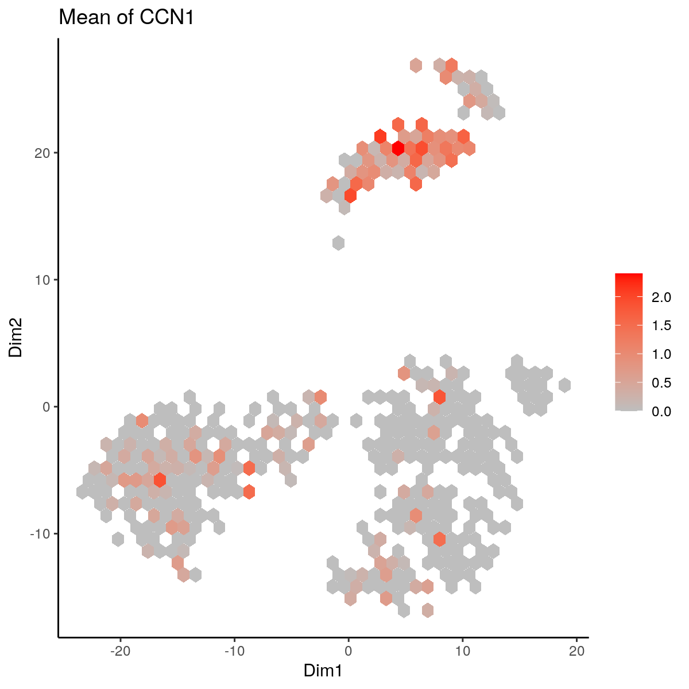|[ADAM10](https://www.ncbi.nlm.nih.gov/gene/102) [APLP2](https://www.ncbi.nlm.nih.gov/gene/334) [AXL](https://www.ncbi.nlm.nih.gov/gene/558) [CDH2](https://www.ncbi.nlm.nih.gov/gene/1000) [SLC29A1](https://www.ncbi.nlm.nih.gov/gene/2030) [GPC3](https://www.ncbi.nlm.nih.gov/gene/2719) [ITGAM](https://www.ncbi.nlm.nih.gov/gene/3684) [ITGAV](https://www.ncbi.nlm.nih.gov/gene/3685) [ITGB2](https://www.ncbi.nlm.nih.gov/gene/3689) [ITGB3](https://www.ncbi.nlm.nih.gov/gene/3690) [MELTF](https://www.ncbi.nlm.nih.gov/gene/4241) [TGOLN2](https://www.ncbi.nlm.nih.gov/gene/10618) [CRIM1](https://www.ncbi.nlm.nih.gov/gene/51232) [MXRA8](https://www.ncbi.nlm.nih.gov/gene/54587) [PNPLA2](https://www.ncbi.nlm.nih.gov/gene/57104) [ANO8](https://www.ncbi.nlm.nih.gov/gene/57719) [CAV1](https://www.ncbi.nlm.nih.gov/gene/857)|
|[CCN2](https://www.ncbi.nlm.nih.gov/gene/1490)|[AGTR1](https://www.ncbi.nlm.nih.gov/gene/185) [RHOA](https://www.ncbi.nlm.nih.gov/gene/387) [AXL](https://www.ncbi.nlm.nih.gov/gene/558) [CA4](https://www.ncbi.nlm.nih.gov/gene/762) [CD44](https://www.ncbi.nlm.nih.gov/gene/960) [CDC42](https://www.ncbi.nlm.nih.gov/gene/998) [CDH2](https://www.ncbi.nlm.nih.gov/gene/1000) [CDH8](https://www.ncbi.nlm.nih.gov/gene/1006) [CDH11](https://www.ncbi.nlm.nih.gov/gene/1009) [CYBB](https://www.ncbi.nlm.nih.gov/gene/1536) [ACE](https://www.ncbi.nlm.nih.gov/gene/1636) [S1PR1](https://www.ncbi.nlm.nih.gov/gene/1901) [ENG](https://www.ncbi.nlm.nih.gov/gene/2022) [FGFR3](https://www.ncbi.nlm.nih.gov/gene/2261) [GJA1](https://www.ncbi.nlm.nih.gov/gene/2697) [ITGAM](https://www.ncbi.nlm.nih.gov/gene/3684) [ITGAV](https://www.ncbi.nlm.nih.gov/gene/3685) [ITGB2](https://www.ncbi.nlm.nih.gov/gene/3689) [KRAS](https://www.ncbi.nlm.nih.gov/gene/3845) [LRP6](https://www.ncbi.nlm.nih.gov/gene/4040) [MMP17](https://www.ncbi.nlm.nih.gov/gene/4326) [MUC1](https://www.ncbi.nlm.nih.gov/gene/4582) [NOS3](https://www.ncbi.nlm.nih.gov/gene/4846) [NPHS1](https://www.ncbi.nlm.nih.gov/gene/4868) [NTRK1](https://www.ncbi.nlm.nih.gov/gene/4914) [PDGFRB](https://www.ncbi.nlm.nih.gov/gene/5159) [PTPRC](https://www.ncbi.nlm.nih.gov/gene/5788) [SCN5A](https://www.ncbi.nlm.nih.gov/gene/6331) [SGK1](https://www.ncbi.nlm.nih.gov/gene/6446) [SRC](https://www.ncbi.nlm.nih.gov/gene/6714) [TGFBR1](https://www.ncbi.nlm.nih.gov/gene/7046) [TGFBR2](https://www.ncbi.nlm.nih.gov/gene/7048) [THY1](https://www.ncbi.nlm.nih.gov/gene/7070) [TJP1](https://www.ncbi.nlm.nih.gov/gene/7082) [CXCR4](https://www.ncbi.nlm.nih.gov/gene/7852) [ROCK2](https://www.ncbi.nlm.nih.gov/gene/9475) [NTNG1](https://www.ncbi.nlm.nih.gov/gene/22854) [S1PR5](https://www.ncbi.nlm.nih.gov/gene/53637) [CLSTN2](https://www.ncbi.nlm.nih.gov/gene/64084) [DCSTAMP](https://www.ncbi.nlm.nih.gov/gene/81501) [NTNG2](https://www.ncbi.nlm.nih.gov/gene/84628) [CAV1](https://www.ncbi.nlm.nih.gov/gene/857) [CDH1](https://www.ncbi.nlm.nih.gov/gene/999)|
|[CCN3](https://www.ncbi.nlm.nih.gov/gene/4856)|[DDR1](https://www.ncbi.nlm.nih.gov/gene/780) [GJA1](https://www.ncbi.nlm.nih.gov/gene/2697) [ITGAV](https://www.ncbi.nlm.nih.gov/gene/3685) [PLXNA1](https://www.ncbi.nlm.nih.gov/gene/5361) [CADM1](https://www.ncbi.nlm.nih.gov/gene/23705) [DLL1](https://www.ncbi.nlm.nih.gov/gene/28514)|
|[CCN4](https://www.ncbi.nlm.nih.gov/gene/8840)|[LRP6](https://www.ncbi.nlm.nih.gov/gene/4040) [SFRP1](https://www.ncbi.nlm.nih.gov/gene/6422) [FZD1](https://www.ncbi.nlm.nih.gov/gene/8321)|
|[CCN5](https://www.ncbi.nlm.nih.gov/gene/8839)|[ESR1](https://www.ncbi.nlm.nih.gov/gene/2099) [CXCR4](https://www.ncbi.nlm.nih.gov/gene/7852)|
|[CCN6](https://www.ncbi.nlm.nih.gov/gene/8838)|[RHOC](https://www.ncbi.nlm.nih.gov/gene/389) [LRP6](https://www.ncbi.nlm.nih.gov/gene/4040) [MRAP2](https://www.ncbi.nlm.nih.gov/gene/112609) [CDH1](https://www.ncbi.nlm.nih.gov/gene/999)|
|[CD160](https://www.ncbi.nlm.nih.gov/gene/11126)|[CCR7](https://www.ncbi.nlm.nih.gov/gene/1236) [HLA-A](https://www.ncbi.nlm.nih.gov/gene/3105) [HLA-F](https://www.ncbi.nlm.nih.gov/gene/3134) [IL2RB](https://www.ncbi.nlm.nih.gov/gene/3560) [KIR2DL4](https://www.ncbi.nlm.nih.gov/gene/3805) [KLRD1](https://www.ncbi.nlm.nih.gov/gene/3824) [LAMP1](https://www.ncbi.nlm.nih.gov/gene/3916) [PDCD1](https://www.ncbi.nlm.nih.gov/gene/5133) [SELL](https://www.ncbi.nlm.nih.gov/gene/6402) [TNFRSF14](https://www.ncbi.nlm.nih.gov/gene/8764) [NCR1](https://www.ncbi.nlm.nih.gov/gene/9437) [KLRG1](https://www.ncbi.nlm.nih.gov/gene/10219) [CD226](https://www.ncbi.nlm.nih.gov/gene/10666) [PDCD1LG2](https://www.ncbi.nlm.nih.gov/gene/80380) [BTLA](https://www.ncbi.nlm.nih.gov/gene/151888) [TIGIT](https://www.ncbi.nlm.nih.gov/gene/201633) [KLRC4-KLRK1](https://www.ncbi.nlm.nih.gov/gene/100528032) [LOC102725035](https://www.ncbi.nlm.nih.gov/gene/102725035)|
|[CD163L1](https://www.ncbi.nlm.nih.gov/gene/283316)|[CD180](https://www.ncbi.nlm.nih.gov/gene/4064) [VTCN1](https://www.ncbi.nlm.nih.gov/gene/79679)|
|[CD164](https://www.ncbi.nlm.nih.gov/gene/8763)|[ANPEP](https://www.ncbi.nlm.nih.gov/gene/290) [CD63](https://www.ncbi.nlm.nih.gov/gene/967) [ITGA3](https://www.ncbi.nlm.nih.gov/gene/3675) [ENPP3](https://www.ncbi.nlm.nih.gov/gene/5169) [RAP1B](https://www.ncbi.nlm.nih.gov/gene/5908) [CXCR4](https://www.ncbi.nlm.nih.gov/gene/7852) [RAB11A](https://www.ncbi.nlm.nih.gov/gene/8766) [PROM1](https://www.ncbi.nlm.nih.gov/gene/8842) [ACKR3](https://www.ncbi.nlm.nih.gov/gene/57007) [CDH22](https://www.ncbi.nlm.nih.gov/gene/64405) [CD109](https://www.ncbi.nlm.nih.gov/gene/135228)|
|[CD200R1](https://www.ncbi.nlm.nih.gov/gene/131450)|[CD22](https://www.ncbi.nlm.nih.gov/gene/933) [CD86](https://www.ncbi.nlm.nih.gov/gene/942) [CD47](https://www.ncbi.nlm.nih.gov/gene/961) [CX3CR1](https://www.ncbi.nlm.nih.gov/gene/1524) [FCGR1A](https://www.ncbi.nlm.nih.gov/gene/2209) [FCGR2A](https://www.ncbi.nlm.nih.gov/gene/2212) [FCGR2B](https://www.ncbi.nlm.nih.gov/gene/2213) [ITGAM](https://www.ncbi.nlm.nih.gov/gene/3684) [CD200](https://www.ncbi.nlm.nih.gov/gene/4345) [PTPRC](https://www.ncbi.nlm.nih.gov/gene/5788) [TLR4](https://www.ncbi.nlm.nih.gov/gene/7099) [TYROBP](https://www.ncbi.nlm.nih.gov/gene/7305) [TNFRSF11A](https://www.ncbi.nlm.nih.gov/gene/8792) [FCGR2C](https://www.ncbi.nlm.nih.gov/gene/9103) [CD163](https://www.ncbi.nlm.nih.gov/gene/9332) [CD300A](https://www.ncbi.nlm.nih.gov/gene/11314) [CD300LB](https://www.ncbi.nlm.nih.gov/gene/124599) [CD300LF](https://www.ncbi.nlm.nih.gov/gene/146722) [CCR2](https://www.ncbi.nlm.nih.gov/gene/729230)|
|[CD209](https://www.ncbi.nlm.nih.gov/gene/30835)|[RHOA](https://www.ncbi.nlm.nih.gov/gene/387) [AXL](https://www.ncbi.nlm.nih.gov/gene/558) [CD1A](https://www.ncbi.nlm.nih.gov/gene/909) [CD1B](https://www.ncbi.nlm.nih.gov/gene/910) [CD1C](https://www.ncbi.nlm.nih.gov/gene/911) [CD1D](https://www.ncbi.nlm.nih.gov/gene/912) [CD4](https://www.ncbi.nlm.nih.gov/gene/920) [CD19](https://www.ncbi.nlm.nih.gov/gene/930) [CD22](https://www.ncbi.nlm.nih.gov/gene/933) [CD86](https://www.ncbi.nlm.nih.gov/gene/942) [SCARB1](https://www.ncbi.nlm.nih.gov/gene/949) [CD81](https://www.ncbi.nlm.nih.gov/gene/975) [CEACAM5](https://www.ncbi.nlm.nih.gov/gene/1048) [CCR5](https://www.ncbi.nlm.nih.gov/gene/1234) [CCR7](https://www.ncbi.nlm.nih.gov/gene/1236) [CSF1R](https://www.ncbi.nlm.nih.gov/gene/1436) [FCGR1A](https://www.ncbi.nlm.nih.gov/gene/2209) [FCGR2A](https://www.ncbi.nlm.nih.gov/gene/2212) [FCGR2B](https://www.ncbi.nlm.nih.gov/gene/2213) [HTR1B](https://www.ncbi.nlm.nih.gov/gene/3351) [ITGAM](https://www.ncbi.nlm.nih.gov/gene/3684) [KRAS](https://www.ncbi.nlm.nih.gov/gene/3845) [LAMP1](https://www.ncbi.nlm.nih.gov/gene/3916) [LSP1](https://www.ncbi.nlm.nih.gov/gene/4046) [NRAS](https://www.ncbi.nlm.nih.gov/gene/4893) [PTPRC](https://www.ncbi.nlm.nih.gov/gene/5788) [RAF1](https://www.ncbi.nlm.nih.gov/gene/5894) [SELP](https://www.ncbi.nlm.nih.gov/gene/6403) [SLAMF1](https://www.ncbi.nlm.nih.gov/gene/6504) [SYK](https://www.ncbi.nlm.nih.gov/gene/6850) [TLR1](https://www.ncbi.nlm.nih.gov/gene/7096) [TLR4](https://www.ncbi.nlm.nih.gov/gene/7099) [TLR5](https://www.ncbi.nlm.nih.gov/gene/7100) [TYRO3](https://www.ncbi.nlm.nih.gov/gene/7301) [CXCR4](https://www.ncbi.nlm.nih.gov/gene/7852) [FCGR2C](https://www.ncbi.nlm.nih.gov/gene/9103) [CD163](https://www.ncbi.nlm.nih.gov/gene/9332) [TLR6](https://www.ncbi.nlm.nih.gov/gene/10333) [LILRB4](https://www.ncbi.nlm.nih.gov/gene/11006) [CCR2](https://www.ncbi.nlm.nih.gov/gene/729230)|
|[CD274](https://www.ncbi.nlm.nih.gov/gene/29126)|[PDCD1](https://www.ncbi.nlm.nih.gov/gene/5133)|
|[CD40](https://www.ncbi.nlm.nih.gov/gene/958)|[TNFRSF17](https://www.ncbi.nlm.nih.gov/gene/608) [BLK](https://www.ncbi.nlm.nih.gov/gene/640) [CXCR5](https://www.ncbi.nlm.nih.gov/gene/643) [BTK](https://www.ncbi.nlm.nih.gov/gene/695) [CBL](https://www.ncbi.nlm.nih.gov/gene/867) [CD1A](https://www.ncbi.nlm.nih.gov/gene/909) [CD1B](https://www.ncbi.nlm.nih.gov/gene/910) [CD1C](https://www.ncbi.nlm.nih.gov/gene/911) [CD1D](https://www.ncbi.nlm.nih.gov/gene/912) [CD2](https://www.ncbi.nlm.nih.gov/gene/914) [CD3E](https://www.ncbi.nlm.nih.gov/gene/916) [CD4](https://www.ncbi.nlm.nih.gov/gene/920) [CD5](https://www.ncbi.nlm.nih.gov/gene/921) [CD9](https://www.ncbi.nlm.nih.gov/gene/928) [CD14](https://www.ncbi.nlm.nih.gov/gene/929) [CD19](https://www.ncbi.nlm.nih.gov/gene/930) [MS4A1](https://www.ncbi.nlm.nih.gov/gene/931) [CD22](https://www.ncbi.nlm.nih.gov/gene/933) [CD86](https://www.ncbi.nlm.nih.gov/gene/942) [CD44](https://www.ncbi.nlm.nih.gov/gene/960) [CD47](https://www.ncbi.nlm.nih.gov/gene/961) [CD48](https://www.ncbi.nlm.nih.gov/gene/962) [CD58](https://www.ncbi.nlm.nih.gov/gene/965) [CD74](https://www.ncbi.nlm.nih.gov/gene/972) [CD79A](https://www.ncbi.nlm.nih.gov/gene/973) [CD79B](https://www.ncbi.nlm.nih.gov/gene/974) [CD81](https://www.ncbi.nlm.nih.gov/gene/975) [CD52](https://www.ncbi.nlm.nih.gov/gene/1043) [CCR1](https://www.ncbi.nlm.nih.gov/gene/1230) [CCR3](https://www.ncbi.nlm.nih.gov/gene/1232) [CCR5](https://www.ncbi.nlm.nih.gov/gene/1234) [CCR6](https://www.ncbi.nlm.nih.gov/gene/1235) [CCR7](https://www.ncbi.nlm.nih.gov/gene/1236) [CR2](https://www.ncbi.nlm.nih.gov/gene/1380) [CSF1R](https://www.ncbi.nlm.nih.gov/gene/1436) [CX3CR1](https://www.ncbi.nlm.nih.gov/gene/1524) [ADGRE1](https://www.ncbi.nlm.nih.gov/gene/2015) [ENG](https://www.ncbi.nlm.nih.gov/gene/2022) [FCGR1A](https://www.ncbi.nlm.nih.gov/gene/2209) [FCGR2A](https://www.ncbi.nlm.nih.gov/gene/2212) [FCGR2B](https://www.ncbi.nlm.nih.gov/gene/2213) [CXCR3](https://www.ncbi.nlm.nih.gov/gene/2833) [HLA-A](https://www.ncbi.nlm.nih.gov/gene/3105) [HLA-DQA1](https://www.ncbi.nlm.nih.gov/gene/3117) [HLA-DQB1](https://www.ncbi.nlm.nih.gov/gene/3119) [HLA-DQB2](https://www.ncbi.nlm.nih.gov/gene/3120) [HLA-DRB1](https://www.ncbi.nlm.nih.gov/gene/3123) [IFNAR1](https://www.ncbi.nlm.nih.gov/gene/3454) [IL2RB](https://www.ncbi.nlm.nih.gov/gene/3560) [IL10RA](https://www.ncbi.nlm.nih.gov/gene/3587) [ITGAL](https://www.ncbi.nlm.nih.gov/gene/3683) [ITGAM](https://www.ncbi.nlm.nih.gov/gene/3684) [ITGB1](https://www.ncbi.nlm.nih.gov/gene/3688) [LAMP1](https://www.ncbi.nlm.nih.gov/gene/3916) [CD180](https://www.ncbi.nlm.nih.gov/gene/4064) [LYN](https://www.ncbi.nlm.nih.gov/gene/4067) [MME](https://www.ncbi.nlm.nih.gov/gene/4311) [MOG](https://www.ncbi.nlm.nih.gov/gene/4340) [CD200](https://www.ncbi.nlm.nih.gov/gene/4345) [NGFR](https://www.ncbi.nlm.nih.gov/gene/4804) [NT5E](https://www.ncbi.nlm.nih.gov/gene/4907) [OLR1](https://www.ncbi.nlm.nih.gov/gene/4973) [PDCD1](https://www.ncbi.nlm.nih.gov/gene/5133) [PTPRC](https://www.ncbi.nlm.nih.gov/gene/5788) [SELE](https://www.ncbi.nlm.nih.gov/gene/6401) [SELL](https://www.ncbi.nlm.nih.gov/gene/6402) [SELP](https://www.ncbi.nlm.nih.gov/gene/6403) [SLAMF1](https://www.ncbi.nlm.nih.gov/gene/6504) [SRC](https://www.ncbi.nlm.nih.gov/gene/6714) [SYK](https://www.ncbi.nlm.nih.gov/gene/6850) [THY1](https://www.ncbi.nlm.nih.gov/gene/7070) [TLR1](https://www.ncbi.nlm.nih.gov/gene/7096) [TLR4](https://www.ncbi.nlm.nih.gov/gene/7099) [TLR5](https://www.ncbi.nlm.nih.gov/gene/7100) [TSHR](https://www.ncbi.nlm.nih.gov/gene/7253) [UBE2D3](https://www.ncbi.nlm.nih.gov/gene/7323) [CXCR4](https://www.ncbi.nlm.nih.gov/gene/7852) [RIPK1](https://www.ncbi.nlm.nih.gov/gene/8737) [TNFSF10](https://www.ncbi.nlm.nih.gov/gene/8743) [TNFSF18](https://www.ncbi.nlm.nih.gov/gene/8995) [CCRL2](https://www.ncbi.nlm.nih.gov/gene/9034) [FCGR2C](https://www.ncbi.nlm.nih.gov/gene/9103) [CD163](https://www.ncbi.nlm.nih.gov/gene/9332) [NCR1](https://www.ncbi.nlm.nih.gov/gene/9437) [TLR6](https://www.ncbi.nlm.nih.gov/gene/10333) [CCR9](https://www.ncbi.nlm.nih.gov/gene/10803) [LILRB4](https://www.ncbi.nlm.nih.gov/gene/11006) [ICOSLG](https://www.ncbi.nlm.nih.gov/gene/23308) [CLEC4A](https://www.ncbi.nlm.nih.gov/gene/50856) [VTCN1](https://www.ncbi.nlm.nih.gov/gene/79679) [PDCD1LG2](https://www.ncbi.nlm.nih.gov/gene/80380) [FCRL3](https://www.ncbi.nlm.nih.gov/gene/115352) [IL23R](https://www.ncbi.nlm.nih.gov/gene/149233) [BTLA](https://www.ncbi.nlm.nih.gov/gene/151888) [CLECL1](https://www.ncbi.nlm.nih.gov/gene/160365) [CLEC4C](https://www.ncbi.nlm.nih.gov/gene/170482) [CCR2](https://www.ncbi.nlm.nih.gov/gene/729230) [CD24](https://www.ncbi.nlm.nih.gov/gene/100133941) [KLRC4-KLRK1](https://www.ncbi.nlm.nih.gov/gene/100528032)|
|[CD40LG](https://www.ncbi.nlm.nih.gov/gene/959)|[TNFRSF17](https://www.ncbi.nlm.nih.gov/gene/608) [CXCR5](https://www.ncbi.nlm.nih.gov/gene/643) [BTK](https://www.ncbi.nlm.nih.gov/gene/695) [CD1A](https://www.ncbi.nlm.nih.gov/gene/909) [CD1B](https://www.ncbi.nlm.nih.gov/gene/910) [CD1C](https://www.ncbi.nlm.nih.gov/gene/911) [CD1D](https://www.ncbi.nlm.nih.gov/gene/912) [CD2](https://www.ncbi.nlm.nih.gov/gene/914) [CD3E](https://www.ncbi.nlm.nih.gov/gene/916) [CD4](https://www.ncbi.nlm.nih.gov/gene/920) [CD5](https://www.ncbi.nlm.nih.gov/gene/921) [CD19](https://www.ncbi.nlm.nih.gov/gene/930) [CD22](https://www.ncbi.nlm.nih.gov/gene/933) [CD86](https://www.ncbi.nlm.nih.gov/gene/942) [CD44](https://www.ncbi.nlm.nih.gov/gene/960) [CD58](https://www.ncbi.nlm.nih.gov/gene/965) [CD63](https://www.ncbi.nlm.nih.gov/gene/967) [CD79B](https://www.ncbi.nlm.nih.gov/gene/974) [CD52](https://www.ncbi.nlm.nih.gov/gene/1043) [CCR1](https://www.ncbi.nlm.nih.gov/gene/1230) [CCR3](https://www.ncbi.nlm.nih.gov/gene/1232) [CCR5](https://www.ncbi.nlm.nih.gov/gene/1234) [CCR6](https://www.ncbi.nlm.nih.gov/gene/1235) [CCR7](https://www.ncbi.nlm.nih.gov/gene/1236) [CR2](https://www.ncbi.nlm.nih.gov/gene/1380) [CX3CR1](https://www.ncbi.nlm.nih.gov/gene/1524) [F2R](https://www.ncbi.nlm.nih.gov/gene/2149) [FCGR2A](https://www.ncbi.nlm.nih.gov/gene/2212) [FCGR2B](https://www.ncbi.nlm.nih.gov/gene/2213) [CXCR3](https://www.ncbi.nlm.nih.gov/gene/2833) [IL2RB](https://www.ncbi.nlm.nih.gov/gene/3560) [IL2RG](https://www.ncbi.nlm.nih.gov/gene/3561) [IL10RA](https://www.ncbi.nlm.nih.gov/gene/3587) [ITGAL](https://www.ncbi.nlm.nih.gov/gene/3683) [ITGAM](https://www.ncbi.nlm.nih.gov/gene/3684) [ITGB2](https://www.ncbi.nlm.nih.gov/gene/3689) [LAMP1](https://www.ncbi.nlm.nih.gov/gene/3916) [LYN](https://www.ncbi.nlm.nih.gov/gene/4067) [MOG](https://www.ncbi.nlm.nih.gov/gene/4340) [PDCD1](https://www.ncbi.nlm.nih.gov/gene/5133) [PTPRC](https://www.ncbi.nlm.nih.gov/gene/5788) [SELE](https://www.ncbi.nlm.nih.gov/gene/6401) [SELL](https://www.ncbi.nlm.nih.gov/gene/6402) [SELP](https://www.ncbi.nlm.nih.gov/gene/6403) [SLAMF1](https://www.ncbi.nlm.nih.gov/gene/6504) [SYK](https://www.ncbi.nlm.nih.gov/gene/6850) [TLR1](https://www.ncbi.nlm.nih.gov/gene/7096) [TLR4](https://www.ncbi.nlm.nih.gov/gene/7099) [TLR5](https://www.ncbi.nlm.nih.gov/gene/7100) [CXCR4](https://www.ncbi.nlm.nih.gov/gene/7852) [TNFSF10](https://www.ncbi.nlm.nih.gov/gene/8743) [TNFRSF14](https://www.ncbi.nlm.nih.gov/gene/8764) [TNFRSF11A](https://www.ncbi.nlm.nih.gov/gene/8792) [CD84](https://www.ncbi.nlm.nih.gov/gene/8832) [TNFSF18](https://www.ncbi.nlm.nih.gov/gene/8995) [CCRL2](https://www.ncbi.nlm.nih.gov/gene/9034) [FCGR2C](https://www.ncbi.nlm.nih.gov/gene/9103) [TLR6](https://www.ncbi.nlm.nih.gov/gene/10333) [CCR9](https://www.ncbi.nlm.nih.gov/gene/10803) [LILRB4](https://www.ncbi.nlm.nih.gov/gene/11006) [ICOSLG](https://www.ncbi.nlm.nih.gov/gene/23308) [P2RY12](https://www.ncbi.nlm.nih.gov/gene/64805) [PDCD1LG2](https://www.ncbi.nlm.nih.gov/gene/80380) [DCSTAMP](https://www.ncbi.nlm.nih.gov/gene/81501) [GPR174](https://www.ncbi.nlm.nih.gov/gene/84636) [BTLA](https://www.ncbi.nlm.nih.gov/gene/151888) [CLEC4C](https://www.ncbi.nlm.nih.gov/gene/170482) [CCR2](https://www.ncbi.nlm.nih.gov/gene/729230) [CD24](https://www.ncbi.nlm.nih.gov/gene/100133941) [KLRC4-KLRK1](https://www.ncbi.nlm.nih.gov/gene/100528032) [CD40](https://www.ncbi.nlm.nih.gov/gene/958)|
|[CD5L](https://www.ncbi.nlm.nih.gov/gene/922)|[CD5](https://www.ncbi.nlm.nih.gov/gene/921) [KIRREL1](https://www.ncbi.nlm.nih.gov/gene/55243) [ABCG8](https://www.ncbi.nlm.nih.gov/gene/64241) [FCRL2](https://www.ncbi.nlm.nih.gov/gene/79368)|
|[CD6](https://www.ncbi.nlm.nih.gov/gene/923)|[CD2](https://www.ncbi.nlm.nih.gov/gene/914) [CD3D](https://www.ncbi.nlm.nih.gov/gene/915) [CD3E](https://www.ncbi.nlm.nih.gov/gene/916) [CD4](https://www.ncbi.nlm.nih.gov/gene/920) [CD5](https://www.ncbi.nlm.nih.gov/gene/921) [CD19](https://www.ncbi.nlm.nih.gov/gene/930) [CD47](https://www.ncbi.nlm.nih.gov/gene/961) [CD58](https://www.ncbi.nlm.nih.gov/gene/965) [CR2](https://www.ncbi.nlm.nih.gov/gene/1380) [HLA-DPB1](https://www.ncbi.nlm.nih.gov/gene/3115) [PTPRC](https://www.ncbi.nlm.nih.gov/gene/5788) [PTPRJ](https://www.ncbi.nlm.nih.gov/gene/5795) [SKAP1](https://www.ncbi.nlm.nih.gov/gene/8631) [CNTN6](https://www.ncbi.nlm.nih.gov/gene/27255) [SEZ6](https://www.ncbi.nlm.nih.gov/gene/124925)|
|[CD70](https://www.ncbi.nlm.nih.gov/gene/970)|[CD27](https://www.ncbi.nlm.nih.gov/gene/939)|
|[CD8A](https://www.ncbi.nlm.nih.gov/gene/925)|[CBL](https://www.ncbi.nlm.nih.gov/gene/867) [CD2](https://www.ncbi.nlm.nih.gov/gene/914) [CD3D](https://www.ncbi.nlm.nih.gov/gene/915) [CD3E](https://www.ncbi.nlm.nih.gov/gene/916) [CD3G](https://www.ncbi.nlm.nih.gov/gene/917) [CD4](https://www.ncbi.nlm.nih.gov/gene/920) [CD5](https://www.ncbi.nlm.nih.gov/gene/921) [CD14](https://www.ncbi.nlm.nih.gov/gene/929) [CD19](https://www.ncbi.nlm.nih.gov/gene/930) [CD86](https://www.ncbi.nlm.nih.gov/gene/942) [CD44](https://www.ncbi.nlm.nih.gov/gene/960) [CCR5](https://www.ncbi.nlm.nih.gov/gene/1234) [CCR7](https://www.ncbi.nlm.nih.gov/gene/1236) [CSK](https://www.ncbi.nlm.nih.gov/gene/1445) [FCGR3A](https://www.ncbi.nlm.nih.gov/gene/2214) [FCGR3B](https://www.ncbi.nlm.nih.gov/gene/2215) [FYN](https://www.ncbi.nlm.nih.gov/gene/2534) [CXCR3](https://www.ncbi.nlm.nih.gov/gene/2833) [HLA-A](https://www.ncbi.nlm.nih.gov/gene/3105) [HLA-F](https://www.ncbi.nlm.nih.gov/gene/3134) [IL2RB](https://www.ncbi.nlm.nih.gov/gene/3560) [IL2RG](https://www.ncbi.nlm.nih.gov/gene/3561) [ITGAM](https://www.ncbi.nlm.nih.gov/gene/3684) [KLRD1](https://www.ncbi.nlm.nih.gov/gene/3824) [LAMP1](https://www.ncbi.nlm.nih.gov/gene/3916) [NKG7](https://www.ncbi.nlm.nih.gov/gene/4818) [PDCD1](https://www.ncbi.nlm.nih.gov/gene/5133) [PRKCQ](https://www.ncbi.nlm.nih.gov/gene/5588) [PTPRC](https://www.ncbi.nlm.nih.gov/gene/5788) [SELL](https://www.ncbi.nlm.nih.gov/gene/6402) [SYK](https://www.ncbi.nlm.nih.gov/gene/6850) [THY1](https://www.ncbi.nlm.nih.gov/gene/7070) [SKAP1](https://www.ncbi.nlm.nih.gov/gene/8631) [KLRG1](https://www.ncbi.nlm.nih.gov/gene/10219) [CXCR6](https://www.ncbi.nlm.nih.gov/gene/10663) [LAT](https://www.ncbi.nlm.nih.gov/gene/27040) [TRAT1](https://www.ncbi.nlm.nih.gov/gene/50852) [PAG1](https://www.ncbi.nlm.nih.gov/gene/55824) [IGSF8](https://www.ncbi.nlm.nih.gov/gene/93185)|
|[CD8B](https://www.ncbi.nlm.nih.gov/gene/926)|[CBL](https://www.ncbi.nlm.nih.gov/gene/867) [CD2](https://www.ncbi.nlm.nih.gov/gene/914) [CD3D](https://www.ncbi.nlm.nih.gov/gene/915) [CD3E](https://www.ncbi.nlm.nih.gov/gene/916) [CD3G](https://www.ncbi.nlm.nih.gov/gene/917) [CD4](https://www.ncbi.nlm.nih.gov/gene/920) [CD5](https://www.ncbi.nlm.nih.gov/gene/921) [CD19](https://www.ncbi.nlm.nih.gov/gene/930) [CD86](https://www.ncbi.nlm.nih.gov/gene/942) [CD44](https://www.ncbi.nlm.nih.gov/gene/960) [CD79B](https://www.ncbi.nlm.nih.gov/gene/974) [CSK](https://www.ncbi.nlm.nih.gov/gene/1445) [FYN](https://www.ncbi.nlm.nih.gov/gene/2534) [HLA-A](https://www.ncbi.nlm.nih.gov/gene/3105) [HLA-F](https://www.ncbi.nlm.nih.gov/gene/3134) [IL2RB](https://www.ncbi.nlm.nih.gov/gene/3560) [IL2RG](https://www.ncbi.nlm.nih.gov/gene/3561) [ITGAM](https://www.ncbi.nlm.nih.gov/gene/3684) [PRKCQ](https://www.ncbi.nlm.nih.gov/gene/5588) [PTPRC](https://www.ncbi.nlm.nih.gov/gene/5788) [SELL](https://www.ncbi.nlm.nih.gov/gene/6402) [SLC3A2](https://www.ncbi.nlm.nih.gov/gene/6520) [SYK](https://www.ncbi.nlm.nih.gov/gene/6850) [SKAP1](https://www.ncbi.nlm.nih.gov/gene/8631) [LAT](https://www.ncbi.nlm.nih.gov/gene/27040) [TRAT1](https://www.ncbi.nlm.nih.gov/gene/50852) [PAG1](https://www.ncbi.nlm.nih.gov/gene/55824)|
|[CDCP1](https://www.ncbi.nlm.nih.gov/gene/64866)|[CDH3](https://www.ncbi.nlm.nih.gov/gene/1001) [EPHA2](https://www.ncbi.nlm.nih.gov/gene/1969) [FYN](https://www.ncbi.nlm.nih.gov/gene/2534) [ITGA3](https://www.ncbi.nlm.nih.gov/gene/3675) [PTGER3](https://www.ncbi.nlm.nih.gov/gene/5733) [SRC](https://www.ncbi.nlm.nih.gov/gene/6714) [PLGRKT](https://www.ncbi.nlm.nih.gov/gene/55848)|
|[CDCP2](https://www.ncbi.nlm.nih.gov/gene/200008)|[PRRT1](https://www.ncbi.nlm.nih.gov/gene/80863)|
|[CDNF](https://www.ncbi.nlm.nih.gov/gene/441549)|[RET](https://www.ncbi.nlm.nih.gov/gene/5979) [MAGT1](https://www.ncbi.nlm.nih.gov/gene/84061)|
|[CDSN](https://www.ncbi.nlm.nih.gov/gene/1041)|[DSC1](https://www.ncbi.nlm.nih.gov/gene/1823) [DSC2](https://www.ncbi.nlm.nih.gov/gene/1824) [DSC3](https://www.ncbi.nlm.nih.gov/gene/1825) [DSG1](https://www.ncbi.nlm.nih.gov/gene/1828) [DSG3](https://www.ncbi.nlm.nih.gov/gene/1830) [HLA-A](https://www.ncbi.nlm.nih.gov/gene/3105) [KRT1](https://www.ncbi.nlm.nih.gov/gene/3848) [MOG](https://www.ncbi.nlm.nih.gov/gene/4340) [TSPAN5](https://www.ncbi.nlm.nih.gov/gene/10098) [DSG4](https://www.ncbi.nlm.nih.gov/gene/147409)|
|[CEACAM16](https://www.ncbi.nlm.nih.gov/gene/388551)|[ATP1A3](https://www.ncbi.nlm.nih.gov/gene/478) [CD79A](https://www.ncbi.nlm.nih.gov/gene/973) [GJB2](https://www.ncbi.nlm.nih.gov/gene/2706) [LIPE](https://www.ncbi.nlm.nih.gov/gene/3991) [TECTB](https://www.ncbi.nlm.nih.gov/gene/6975) [TECTA](https://www.ncbi.nlm.nih.gov/gene/7007) [CD163](https://www.ncbi.nlm.nih.gov/gene/9332) [OTOA](https://www.ncbi.nlm.nih.gov/gene/146183) [OTOG](https://www.ncbi.nlm.nih.gov/gene/340990) [SIGLEC14](https://www.ncbi.nlm.nih.gov/gene/100049587)|
|[CELA1](https://www.ncbi.nlm.nih.gov/gene/1990)|[SMPDL3B](https://www.ncbi.nlm.nih.gov/gene/27293)|
|[CELA2A](https://www.ncbi.nlm.nih.gov/gene/63036)|[DSC1](https://www.ncbi.nlm.nih.gov/gene/1823) [DSC2](https://www.ncbi.nlm.nih.gov/gene/1824) [DSC3](https://www.ncbi.nlm.nih.gov/gene/1825) [DSG1](https://www.ncbi.nlm.nih.gov/gene/1828) [DSG2](https://www.ncbi.nlm.nih.gov/gene/1829) [DSG3](https://www.ncbi.nlm.nih.gov/gene/1830) [DSG4](https://www.ncbi.nlm.nih.gov/gene/147409) [GAPT](https://www.ncbi.nlm.nih.gov/gene/202309)|
|[CELA2B](https://www.ncbi.nlm.nih.gov/gene/51032)|[GAPT](https://www.ncbi.nlm.nih.gov/gene/202309)|
|[CER1](https://www.ncbi.nlm.nih.gov/gene/9350)|[ACVR1B](https://www.ncbi.nlm.nih.gov/gene/91) [ACVR2B](https://www.ncbi.nlm.nih.gov/gene/93) [BMPR1A](https://www.ncbi.nlm.nih.gov/gene/657) [BMPR1B](https://www.ncbi.nlm.nih.gov/gene/658) [BMPR2](https://www.ncbi.nlm.nih.gov/gene/659) [TDGF1](https://www.ncbi.nlm.nih.gov/gene/6997) [CFC1](https://www.ncbi.nlm.nih.gov/gene/55997) [RGMA](https://www.ncbi.nlm.nih.gov/gene/56963) [HJV](https://www.ncbi.nlm.nih.gov/gene/148738) [RGMB](https://www.ncbi.nlm.nih.gov/gene/285704)|
|[CES4A](https://www.ncbi.nlm.nih.gov/gene/283848)|[GJA8](https://www.ncbi.nlm.nih.gov/gene/2703) [LIPE](https://www.ncbi.nlm.nih.gov/gene/3991)|
|[CES5A](https://www.ncbi.nlm.nih.gov/gene/221223)|[ALPI](https://www.ncbi.nlm.nih.gov/gene/248) [ALPP](https://www.ncbi.nlm.nih.gov/gene/250) [ALPG](https://www.ncbi.nlm.nih.gov/gene/251) [GJA8](https://www.ncbi.nlm.nih.gov/gene/2703) [LIPE](https://www.ncbi.nlm.nih.gov/gene/3991)|
|[CETP](https://www.ncbi.nlm.nih.gov/gene/1071)|[SCARB1](https://www.ncbi.nlm.nih.gov/gene/949) [CSF1R](https://www.ncbi.nlm.nih.gov/gene/1436) [ACE](https://www.ncbi.nlm.nih.gov/gene/1636) [CELSR2](https://www.ncbi.nlm.nih.gov/gene/1952) [LDLR](https://www.ncbi.nlm.nih.gov/gene/3949) [NPC1L1](https://www.ncbi.nlm.nih.gov/gene/29881) [LSR](https://www.ncbi.nlm.nih.gov/gene/51599) [APOBR](https://www.ncbi.nlm.nih.gov/gene/55911) [ABCG8](https://www.ncbi.nlm.nih.gov/gene/64241) [GPIHBP1](https://www.ncbi.nlm.nih.gov/gene/338328) [HCAR2](https://www.ncbi.nlm.nih.gov/gene/338442)|
|[CFB](https://www.ncbi.nlm.nih.gov/gene/629)|[C3AR1](https://www.ncbi.nlm.nih.gov/gene/719) [C5AR1](https://www.ncbi.nlm.nih.gov/gene/728) [CD59](https://www.ncbi.nlm.nih.gov/gene/966) [CD55](https://www.ncbi.nlm.nih.gov/gene/1604) [HLA-A](https://www.ncbi.nlm.nih.gov/gene/3105) [PKD1](https://www.ncbi.nlm.nih.gov/gene/5310) [HTRA1](https://www.ncbi.nlm.nih.gov/gene/5654) [SLC14A1](https://www.ncbi.nlm.nih.gov/gene/6563) [SLC16A8](https://www.ncbi.nlm.nih.gov/gene/23539)|
|[CFD](https://www.ncbi.nlm.nih.gov/gene/1675)|[C3AR1](https://www.ncbi.nlm.nih.gov/gene/719) [LIPE](https://www.ncbi.nlm.nih.gov/gene/3991) [SLC2A4](https://www.ncbi.nlm.nih.gov/gene/6517) [C5AR2](https://www.ncbi.nlm.nih.gov/gene/27202) [ITLN1](https://www.ncbi.nlm.nih.gov/gene/55600)|
|[CFH](https://www.ncbi.nlm.nih.gov/gene/3075)|[C3AR1](https://www.ncbi.nlm.nih.gov/gene/719) [C5AR1](https://www.ncbi.nlm.nih.gov/gene/728) [C8A](https://www.ncbi.nlm.nih.gov/gene/731) [CD59](https://www.ncbi.nlm.nih.gov/gene/966) [CSF1R](https://www.ncbi.nlm.nih.gov/gene/1436) [CX3CR1](https://www.ncbi.nlm.nih.gov/gene/1524) [FPR1](https://www.ncbi.nlm.nih.gov/gene/2357) [ITGAM](https://www.ncbi.nlm.nih.gov/gene/3684) [HTRA1](https://www.ncbi.nlm.nih.gov/gene/5654) [PTPRC](https://www.ncbi.nlm.nih.gov/gene/5788) [PTPRJ](https://www.ncbi.nlm.nih.gov/gene/5795) [SELL](https://www.ncbi.nlm.nih.gov/gene/6402) [TLR4](https://www.ncbi.nlm.nih.gov/gene/7099) [SLC16A8](https://www.ncbi.nlm.nih.gov/gene/23539) [TSPAN12](https://www.ncbi.nlm.nih.gov/gene/23554) [LYPD1](https://www.ncbi.nlm.nih.gov/gene/116372) [SLC30A8](https://www.ncbi.nlm.nih.gov/gene/169026)|
|[CFHR1](https://www.ncbi.nlm.nih.gov/gene/3078)|[CD59](https://www.ncbi.nlm.nih.gov/gene/966) [NIPA2](https://www.ncbi.nlm.nih.gov/gene/81614) [NIPA1](https://www.ncbi.nlm.nih.gov/gene/123606)|
|[CFHR2](https://www.ncbi.nlm.nih.gov/gene/3080)|[C8A](https://www.ncbi.nlm.nih.gov/gene/731) [TBC1D3I](https://www.ncbi.nlm.nih.gov/gene/102724862)|
|[CFHR3](https://www.ncbi.nlm.nih.gov/gene/10878)|[NIPA2](https://www.ncbi.nlm.nih.gov/gene/81614) [NIPA1](https://www.ncbi.nlm.nih.gov/gene/123606)|
|[CFHR4](https://www.ncbi.nlm.nih.gov/gene/10877)|[C8A](https://www.ncbi.nlm.nih.gov/gene/731) [OR2A14](https://www.ncbi.nlm.nih.gov/gene/135941)|
|[CFHR5](https://www.ncbi.nlm.nih.gov/gene/81494)|[C8A](https://www.ncbi.nlm.nih.gov/gene/731)|
|[CFI](https://www.ncbi.nlm.nih.gov/gene/3426) 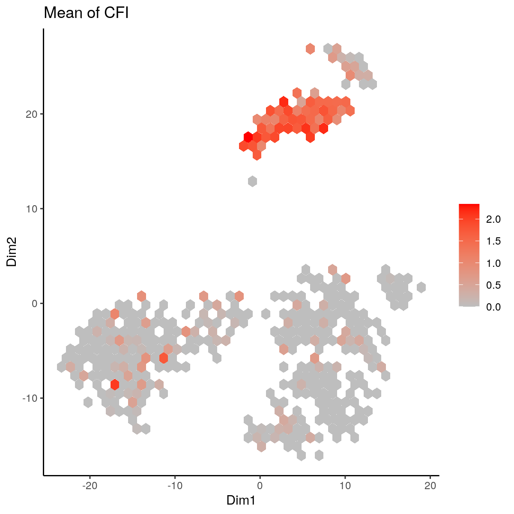|[ADORA1](https://www.ncbi.nlm.nih.gov/gene/134) [C8A](https://www.ncbi.nlm.nih.gov/gene/731) [CD59](https://www.ncbi.nlm.nih.gov/gene/966) [CD55](https://www.ncbi.nlm.nih.gov/gene/1604) [ENPEP](https://www.ncbi.nlm.nih.gov/gene/2028) [PDE6C](https://www.ncbi.nlm.nih.gov/gene/5146) [HTRA1](https://www.ncbi.nlm.nih.gov/gene/5654) [TIE1](https://www.ncbi.nlm.nih.gov/gene/7075) [SLC16A8](https://www.ncbi.nlm.nih.gov/gene/23539) [GPR160](https://www.ncbi.nlm.nih.gov/gene/26996) [RNF34](https://www.ncbi.nlm.nih.gov/gene/80196)|
|[CFP](https://www.ncbi.nlm.nih.gov/gene/5199)|[C3AR1](https://www.ncbi.nlm.nih.gov/gene/719) [C5AR1](https://www.ncbi.nlm.nih.gov/gene/728) [CD59](https://www.ncbi.nlm.nih.gov/gene/966) [AP2M1](https://www.ncbi.nlm.nih.gov/gene/1173) [CSF1R](https://www.ncbi.nlm.nih.gov/gene/1436) [CD55](https://www.ncbi.nlm.nih.gov/gene/1604) [VCL](https://www.ncbi.nlm.nih.gov/gene/7414) [S1PR4](https://www.ncbi.nlm.nih.gov/gene/8698) [MGAM](https://www.ncbi.nlm.nih.gov/gene/8972) [NCR1](https://www.ncbi.nlm.nih.gov/gene/9437) [NISCH](https://www.ncbi.nlm.nih.gov/gene/11188) [C5AR2](https://www.ncbi.nlm.nih.gov/gene/27202) [GSDMD](https://www.ncbi.nlm.nih.gov/gene/79792) [RXFP2](https://www.ncbi.nlm.nih.gov/gene/122042) [OSCAR](https://www.ncbi.nlm.nih.gov/gene/126014)|
|[CGA](https://www.ncbi.nlm.nih.gov/gene/1081)|[ADCY3](https://www.ncbi.nlm.nih.gov/gene/109) [ADCY5](https://www.ncbi.nlm.nih.gov/gene/111) [ADCY6](https://www.ncbi.nlm.nih.gov/gene/112) [ADCY8](https://www.ncbi.nlm.nih.gov/gene/114) [ADCY9](https://www.ncbi.nlm.nih.gov/gene/115) [ADCYAP1R1](https://www.ncbi.nlm.nih.gov/gene/117) [ADORA2B](https://www.ncbi.nlm.nih.gov/gene/136) [ADRB1](https://www.ncbi.nlm.nih.gov/gene/153) [ADRB2](https://www.ncbi.nlm.nih.gov/gene/154) [ADRB3](https://www.ncbi.nlm.nih.gov/gene/155) [ATP1A1](https://www.ncbi.nlm.nih.gov/gene/476) [ATP1A4](https://www.ncbi.nlm.nih.gov/gene/480) [AVPR1B](https://www.ncbi.nlm.nih.gov/gene/553) [BTC](https://www.ncbi.nlm.nih.gov/gene/685) [CALCR](https://www.ncbi.nlm.nih.gov/gene/799) [CRHR2](https://www.ncbi.nlm.nih.gov/gene/1395) [DRD1](https://www.ncbi.nlm.nih.gov/gene/1812) [DRD5](https://www.ncbi.nlm.nih.gov/gene/1816) [FSHR](https://www.ncbi.nlm.nih.gov/gene/2492) [GCGR](https://www.ncbi.nlm.nih.gov/gene/2642) [GGT1](https://www.ncbi.nlm.nih.gov/gene/2678) [GHRHR](https://www.ncbi.nlm.nih.gov/gene/2692) [GIPR](https://www.ncbi.nlm.nih.gov/gene/2696) [GLP1R](https://www.ncbi.nlm.nih.gov/gene/2740) [GNAS](https://www.ncbi.nlm.nih.gov/gene/2778) [GNG3](https://www.ncbi.nlm.nih.gov/gene/2785) [GNG4](https://www.ncbi.nlm.nih.gov/gene/2786) [GNG5](https://www.ncbi.nlm.nih.gov/gene/2787) [GNG7](https://www.ncbi.nlm.nih.gov/gene/2788) [GNG10](https://www.ncbi.nlm.nih.gov/gene/2790) [GNG11](https://www.ncbi.nlm.nih.gov/gene/2791) [GNGT1](https://www.ncbi.nlm.nih.gov/gene/2792) [GNGT2](https://www.ncbi.nlm.nih.gov/gene/2793) [GNRHR](https://www.ncbi.nlm.nih.gov/gene/2798) [GPR15](https://www.ncbi.nlm.nih.gov/gene/2838) [GPR20](https://www.ncbi.nlm.nih.gov/gene/2843) [GPR25](https://www.ncbi.nlm.nih.gov/gene/2848) [GPR27](https://www.ncbi.nlm.nih.gov/gene/2850) [GPR32](https://www.ncbi.nlm.nih.gov/gene/2854) [GPR39](https://www.ncbi.nlm.nih.gov/gene/2863) [GUCY2C](https://www.ncbi.nlm.nih.gov/gene/2984) [HRH2](https://www.ncbi.nlm.nih.gov/gene/3274) [HTR4](https://www.ncbi.nlm.nih.gov/gene/3360) [HTR6](https://www.ncbi.nlm.nih.gov/gene/3362) [HTR7](https://www.ncbi.nlm.nih.gov/gene/3363) [ANOS1](https://www.ncbi.nlm.nih.gov/gene/3730) [LHCGR](https://www.ncbi.nlm.nih.gov/gene/3973) [MC1R](https://www.ncbi.nlm.nih.gov/gene/4157) [MC2R](https://www.ncbi.nlm.nih.gov/gene/4158) [MC3R](https://www.ncbi.nlm.nih.gov/gene/4159) [MC4R](https://www.ncbi.nlm.nih.gov/gene/4160) [MC5R](https://www.ncbi.nlm.nih.gov/gene/4161) [P2RY11](https://www.ncbi.nlm.nih.gov/gene/5032) [PTGDR](https://www.ncbi.nlm.nih.gov/gene/5729) [PTGER2](https://www.ncbi.nlm.nih.gov/gene/5732) [PTGER4](https://www.ncbi.nlm.nih.gov/gene/5734) [PTGIR](https://www.ncbi.nlm.nih.gov/gene/5739) [PTH1R](https://www.ncbi.nlm.nih.gov/gene/5745) [PTH2R](https://www.ncbi.nlm.nih.gov/gene/5746) [SCTR](https://www.ncbi.nlm.nih.gov/gene/6344) [TSHR](https://www.ncbi.nlm.nih.gov/gene/7253) [VIPR1](https://www.ncbi.nlm.nih.gov/gene/7433) [VIPR2](https://www.ncbi.nlm.nih.gov/gene/7434) [TAAR5](https://www.ncbi.nlm.nih.gov/gene/9038) [TAAR2](https://www.ncbi.nlm.nih.gov/gene/9287) [GLP2R](https://www.ncbi.nlm.nih.gov/gene/9340) [CALCRL](https://www.ncbi.nlm.nih.gov/gene/10203) [RAMP3](https://www.ncbi.nlm.nih.gov/gene/10268) [GPR83](https://www.ncbi.nlm.nih.gov/gene/10888) [GPR176](https://www.ncbi.nlm.nih.gov/gene/11245) [GPR45](https://www.ncbi.nlm.nih.gov/gene/11250) [GNG13](https://www.ncbi.nlm.nih.gov/gene/51764) [GPR84](https://www.ncbi.nlm.nih.gov/gene/53831) [GNG2](https://www.ncbi.nlm.nih.gov/gene/54331) [FLVCR2](https://www.ncbi.nlm.nih.gov/gene/55640) [GNG12](https://www.ncbi.nlm.nih.gov/gene/55970) [RXFP1](https://www.ncbi.nlm.nih.gov/gene/59350) [TAAR8](https://www.ncbi.nlm.nih.gov/gene/83551) [GNG8](https://www.ncbi.nlm.nih.gov/gene/94235) [RXFP2](https://www.ncbi.nlm.nih.gov/gene/122042) [TAAR9](https://www.ncbi.nlm.nih.gov/gene/134860) [TAAR1](https://www.ncbi.nlm.nih.gov/gene/134864) [GPBAR1](https://www.ncbi.nlm.nih.gov/gene/151306) [ADCY4](https://www.ncbi.nlm.nih.gov/gene/196883) [GPR150](https://www.ncbi.nlm.nih.gov/gene/285601) [TAAR6](https://www.ncbi.nlm.nih.gov/gene/319100) [LINC02210-CRHR1](https://www.ncbi.nlm.nih.gov/gene/104909134)|
|[CGB1](https://www.ncbi.nlm.nih.gov/gene/114335)|[BTC](https://www.ncbi.nlm.nih.gov/gene/685) [EREG](https://www.ncbi.nlm.nih.gov/gene/2069) [FSHR](https://www.ncbi.nlm.nih.gov/gene/2492) [LYPD5](https://www.ncbi.nlm.nih.gov/gene/284348)|
|[CGB3](https://www.ncbi.nlm.nih.gov/gene/1082)|[EREG](https://www.ncbi.nlm.nih.gov/gene/2069) [FSHR](https://www.ncbi.nlm.nih.gov/gene/2492) [LHCGR](https://www.ncbi.nlm.nih.gov/gene/3973) [LGR5](https://www.ncbi.nlm.nih.gov/gene/8549) [ERVFRD-1](https://www.ncbi.nlm.nih.gov/gene/405754)|
|[CGB7](https://www.ncbi.nlm.nih.gov/gene/94027)|[EREG](https://www.ncbi.nlm.nih.gov/gene/2069) [FSHR](https://www.ncbi.nlm.nih.gov/gene/2492) [LHCGR](https://www.ncbi.nlm.nih.gov/gene/3973)|
|[CGREF1](https://www.ncbi.nlm.nih.gov/gene/10669)|[ADCY8](https://www.ncbi.nlm.nih.gov/gene/114)|
|[CHAD](https://www.ncbi.nlm.nih.gov/gene/1101)|[DPP4](https://www.ncbi.nlm.nih.gov/gene/1803) [ITGA6](https://www.ncbi.nlm.nih.gov/gene/3655) [ITGA3](https://www.ncbi.nlm.nih.gov/gene/3675) [ITGAV](https://www.ncbi.nlm.nih.gov/gene/3685) [ITGB1](https://www.ncbi.nlm.nih.gov/gene/3688) [ITGB3](https://www.ncbi.nlm.nih.gov/gene/3690) [ITGB4](https://www.ncbi.nlm.nih.gov/gene/3691) [ITGB8](https://www.ncbi.nlm.nih.gov/gene/3696) [ADGRL1](https://www.ncbi.nlm.nih.gov/gene/22859) [ADGRL3](https://www.ncbi.nlm.nih.gov/gene/23284)|
|[CHADL](https://www.ncbi.nlm.nih.gov/gene/150356)|[VIPR1](https://www.ncbi.nlm.nih.gov/gene/7433) [ADGRL1](https://www.ncbi.nlm.nih.gov/gene/22859) [ADGRL3](https://www.ncbi.nlm.nih.gov/gene/23284) [STK32A](https://www.ncbi.nlm.nih.gov/gene/202374)|
|[CHGA](https://www.ncbi.nlm.nih.gov/gene/1113) 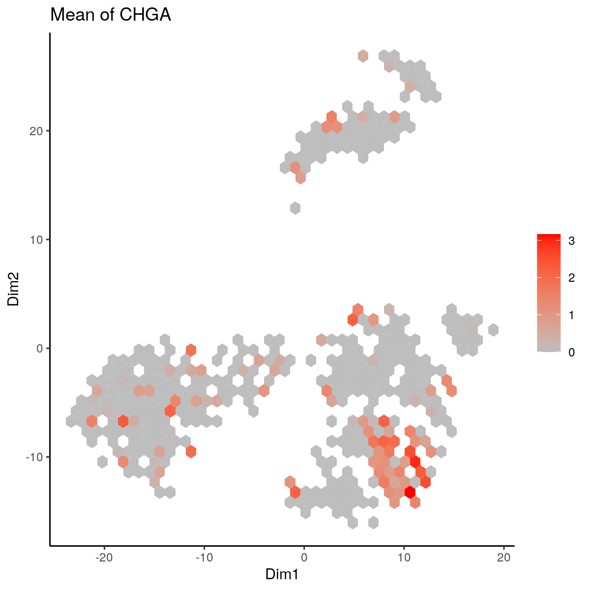|[ATP4A](https://www.ncbi.nlm.nih.gov/gene/495) [CCKBR](https://www.ncbi.nlm.nih.gov/gene/887) [CD79A](https://www.ncbi.nlm.nih.gov/gene/973) [CEACAM5](https://www.ncbi.nlm.nih.gov/gene/1048) [ENO2](https://www.ncbi.nlm.nih.gov/gene/2026) [GRIA2](https://www.ncbi.nlm.nih.gov/gene/2891) [GRIN1](https://www.ncbi.nlm.nih.gov/gene/2902) [HTR7](https://www.ncbi.nlm.nih.gov/gene/3363) [MME](https://www.ncbi.nlm.nih.gov/gene/4311) [MUC1](https://www.ncbi.nlm.nih.gov/gene/4582) [NOS3](https://www.ncbi.nlm.nih.gov/gene/4846) [PTPRC](https://www.ncbi.nlm.nih.gov/gene/5788) [RET](https://www.ncbi.nlm.nih.gov/gene/5979) [SSTR1](https://www.ncbi.nlm.nih.gov/gene/6751) [SSTR2](https://www.ncbi.nlm.nih.gov/gene/6752) [SSTR3](https://www.ncbi.nlm.nih.gov/gene/6753) [SSTR4](https://www.ncbi.nlm.nih.gov/gene/6754) [SSTR5](https://www.ncbi.nlm.nih.gov/gene/6755) [STX4](https://www.ncbi.nlm.nih.gov/gene/6810) [ABCC8](https://www.ncbi.nlm.nih.gov/gene/6833) [LGR5](https://www.ncbi.nlm.nih.gov/gene/8549) [CDK5R2](https://www.ncbi.nlm.nih.gov/gene/8941) [SYT7](https://www.ncbi.nlm.nih.gov/gene/9066) [SLC30A10](https://www.ncbi.nlm.nih.gov/gene/55532) [TMEM127](https://www.ncbi.nlm.nih.gov/gene/55654) [SYT3](https://www.ncbi.nlm.nih.gov/gene/84258) [SLC30A8](https://www.ncbi.nlm.nih.gov/gene/169026) [STX19](https://www.ncbi.nlm.nih.gov/gene/415117)|
|[CHGB](https://www.ncbi.nlm.nih.gov/gene/1114)|[ADAM10](https://www.ncbi.nlm.nih.gov/gene/102) [APLP2](https://www.ncbi.nlm.nih.gov/gene/334) [CDH2](https://www.ncbi.nlm.nih.gov/gene/1000) [ENO2](https://www.ncbi.nlm.nih.gov/gene/2026) [GPC3](https://www.ncbi.nlm.nih.gov/gene/2719) [MELTF](https://www.ncbi.nlm.nih.gov/gene/4241) [NPY2R](https://www.ncbi.nlm.nih.gov/gene/4887) [STX4](https://www.ncbi.nlm.nih.gov/gene/6810) [ABCC8](https://www.ncbi.nlm.nih.gov/gene/6833) [CDK5R2](https://www.ncbi.nlm.nih.gov/gene/8941) [SYT7](https://www.ncbi.nlm.nih.gov/gene/9066) [TGOLN2](https://www.ncbi.nlm.nih.gov/gene/10618) [MXRA8](https://www.ncbi.nlm.nih.gov/gene/54587) [PNPLA2](https://www.ncbi.nlm.nih.gov/gene/57104) [ANO8](https://www.ncbi.nlm.nih.gov/gene/57719) [SYT3](https://www.ncbi.nlm.nih.gov/gene/84258) [STX19](https://www.ncbi.nlm.nih.gov/gene/415117) [LINC02210-CRHR1](https://www.ncbi.nlm.nih.gov/gene/104909134)|
|[CHI3L1](https://www.ncbi.nlm.nih.gov/gene/1116)|[CD55](https://www.ncbi.nlm.nih.gov/gene/1604) [VCL](https://www.ncbi.nlm.nih.gov/gene/7414) [SEMA7A](https://www.ncbi.nlm.nih.gov/gene/8482) [CD163](https://www.ncbi.nlm.nih.gov/gene/9332) [GSDMD](https://www.ncbi.nlm.nih.gov/gene/79792) [TMEM219](https://www.ncbi.nlm.nih.gov/gene/124446) [OSCAR](https://www.ncbi.nlm.nih.gov/gene/126014)|
|[CHID1](https://www.ncbi.nlm.nih.gov/gene/66005)|[AP2A2](https://www.ncbi.nlm.nih.gov/gene/161) [KCTD3](https://www.ncbi.nlm.nih.gov/gene/51133)|
|[CHIT1](https://www.ncbi.nlm.nih.gov/gene/1118)|[ALPL](https://www.ncbi.nlm.nih.gov/gene/249) [ACE](https://www.ncbi.nlm.nih.gov/gene/1636) [VCL](https://www.ncbi.nlm.nih.gov/gene/7414) [GSDMD](https://www.ncbi.nlm.nih.gov/gene/79792) [OSCAR](https://www.ncbi.nlm.nih.gov/gene/126014)|
|[CHRD](https://www.ncbi.nlm.nih.gov/gene/8646)|[ACVR1B](https://www.ncbi.nlm.nih.gov/gene/91) [ACVR2B](https://www.ncbi.nlm.nih.gov/gene/93) [BMPR1A](https://www.ncbi.nlm.nih.gov/gene/657) [BMPR1B](https://www.ncbi.nlm.nih.gov/gene/658) [BMPR2](https://www.ncbi.nlm.nih.gov/gene/659) [CLCN2](https://www.ncbi.nlm.nih.gov/gene/1181) [IHH](https://www.ncbi.nlm.nih.gov/gene/3549) [MEP1B](https://www.ncbi.nlm.nih.gov/gene/4225) [TDGF1](https://www.ncbi.nlm.nih.gov/gene/6997) [TGFBR1](https://www.ncbi.nlm.nih.gov/gene/7046) [CDC42BPB](https://www.ncbi.nlm.nih.gov/gene/9578) [RGMA](https://www.ncbi.nlm.nih.gov/gene/56963) [HJV](https://www.ncbi.nlm.nih.gov/gene/148738) [RGMB](https://www.ncbi.nlm.nih.gov/gene/285704) [ASTL](https://www.ncbi.nlm.nih.gov/gene/431705)|
|[CHRDL1](https://www.ncbi.nlm.nih.gov/gene/91851)|[ADAM10](https://www.ncbi.nlm.nih.gov/gene/102) [APLP2](https://www.ncbi.nlm.nih.gov/gene/334) [BMPR1A](https://www.ncbi.nlm.nih.gov/gene/657) [BMPR1B](https://www.ncbi.nlm.nih.gov/gene/658) [BMPR2](https://www.ncbi.nlm.nih.gov/gene/659) [CDH2](https://www.ncbi.nlm.nih.gov/gene/1000) [GPC3](https://www.ncbi.nlm.nih.gov/gene/2719) [MELTF](https://www.ncbi.nlm.nih.gov/gene/4241) [TGOLN2](https://www.ncbi.nlm.nih.gov/gene/10618) [MXRA8](https://www.ncbi.nlm.nih.gov/gene/54587) [RGMA](https://www.ncbi.nlm.nih.gov/gene/56963) [PNPLA2](https://www.ncbi.nlm.nih.gov/gene/57104) [JPH3](https://www.ncbi.nlm.nih.gov/gene/57338) [ANO8](https://www.ncbi.nlm.nih.gov/gene/57719) [JPH4](https://www.ncbi.nlm.nih.gov/gene/84502) [HJV](https://www.ncbi.nlm.nih.gov/gene/148738) [RGMB](https://www.ncbi.nlm.nih.gov/gene/285704)|
|[CHRDL2](https://www.ncbi.nlm.nih.gov/gene/25884)|[ANPEP](https://www.ncbi.nlm.nih.gov/gene/290) [BMPR1A](https://www.ncbi.nlm.nih.gov/gene/657) [BMPR1B](https://www.ncbi.nlm.nih.gov/gene/658) [BMPR2](https://www.ncbi.nlm.nih.gov/gene/659) [ENPEP](https://www.ncbi.nlm.nih.gov/gene/2028)|
|[CHST9](https://www.ncbi.nlm.nih.gov/gene/83539)|[GPR22](https://www.ncbi.nlm.nih.gov/gene/2845)|
|[CILP](https://www.ncbi.nlm.nih.gov/gene/8483)|[AP2A1](https://www.ncbi.nlm.nih.gov/gene/160)|
|[CILP2](https://www.ncbi.nlm.nih.gov/gene/148113)|[CELSR2](https://www.ncbi.nlm.nih.gov/gene/1952) [HTRA1](https://www.ncbi.nlm.nih.gov/gene/5654)|
|[CLCA1](https://www.ncbi.nlm.nih.gov/gene/1179)|[CFTR](https://www.ncbi.nlm.nih.gov/gene/1080) [SLC26A3](https://www.ncbi.nlm.nih.gov/gene/1811) [SI](https://www.ncbi.nlm.nih.gov/gene/6476) [SLCO1A2](https://www.ncbi.nlm.nih.gov/gene/6579) [BEST1](https://www.ncbi.nlm.nih.gov/gene/7439) [MGAM](https://www.ncbi.nlm.nih.gov/gene/8972) [CSPG5](https://www.ncbi.nlm.nih.gov/gene/10675) [CLCA4](https://www.ncbi.nlm.nih.gov/gene/22802) [BEST2](https://www.ncbi.nlm.nih.gov/gene/54831) [ANO1](https://www.ncbi.nlm.nih.gov/gene/55107) [ANO10](https://www.ncbi.nlm.nih.gov/gene/55129) [ITLN1](https://www.ncbi.nlm.nih.gov/gene/55600) [ANO2](https://www.ncbi.nlm.nih.gov/gene/57101) [BEST3](https://www.ncbi.nlm.nih.gov/gene/144453) [SLC36A2](https://www.ncbi.nlm.nih.gov/gene/153201) [ANO6](https://www.ncbi.nlm.nih.gov/gene/196527) [BEST4](https://www.ncbi.nlm.nih.gov/gene/266675) [TMIGD1](https://www.ncbi.nlm.nih.gov/gene/388364)|
|[CLCF1](https://www.ncbi.nlm.nih.gov/gene/23529)|[CLCN1](https://www.ncbi.nlm.nih.gov/gene/1180) [CLCN2](https://www.ncbi.nlm.nih.gov/gene/1181) [CNTFR](https://www.ncbi.nlm.nih.gov/gene/1271) [NPHS1](https://www.ncbi.nlm.nih.gov/gene/4868) [PARK7](https://www.ncbi.nlm.nih.gov/gene/11315) [BEST2](https://www.ncbi.nlm.nih.gov/gene/54831) [BEST3](https://www.ncbi.nlm.nih.gov/gene/144453) [BEST4](https://www.ncbi.nlm.nih.gov/gene/266675) [IL6ST](https://www.ncbi.nlm.nih.gov/gene/3572) [LIFR](https://www.ncbi.nlm.nih.gov/gene/3977)|
|[CLEC3A](https://www.ncbi.nlm.nih.gov/gene/10143)|[CDH18](https://www.ncbi.nlm.nih.gov/gene/1016) [GPM6B](https://www.ncbi.nlm.nih.gov/gene/2824) [GRPR](https://www.ncbi.nlm.nih.gov/gene/2925) [TLR1](https://www.ncbi.nlm.nih.gov/gene/7096) [TLR4](https://www.ncbi.nlm.nih.gov/gene/7099) [TLR5](https://www.ncbi.nlm.nih.gov/gene/7100) [TLR6](https://www.ncbi.nlm.nih.gov/gene/10333) [NTNG1](https://www.ncbi.nlm.nih.gov/gene/22854) [CLEC4A](https://www.ncbi.nlm.nih.gov/gene/50856) [NTNG2](https://www.ncbi.nlm.nih.gov/gene/84628)|
|[CLEC3B](https://www.ncbi.nlm.nih.gov/gene/7123)|[LSR](https://www.ncbi.nlm.nih.gov/gene/51599)|
|[CLEC4M](https://www.ncbi.nlm.nih.gov/gene/10332) 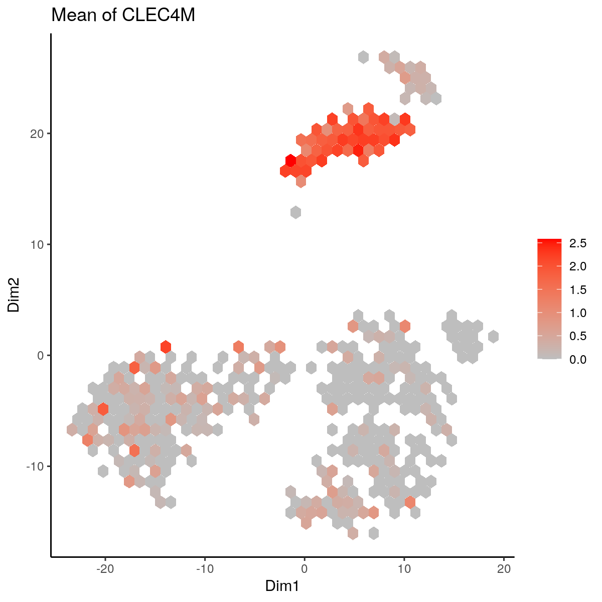|[ANPEP](https://www.ncbi.nlm.nih.gov/gene/290) [RHOA](https://www.ncbi.nlm.nih.gov/gene/387) [AXL](https://www.ncbi.nlm.nih.gov/gene/558) [SCARB1](https://www.ncbi.nlm.nih.gov/gene/949) [CD81](https://www.ncbi.nlm.nih.gov/gene/975) [AP2M1](https://www.ncbi.nlm.nih.gov/gene/1173) [GP2](https://www.ncbi.nlm.nih.gov/gene/2813) [ITGAM](https://www.ncbi.nlm.nih.gov/gene/3684) [LSP1](https://www.ncbi.nlm.nih.gov/gene/4046) [TYRO3](https://www.ncbi.nlm.nih.gov/gene/7301) [STAB2](https://www.ncbi.nlm.nih.gov/gene/55576) [ACE2](https://www.ncbi.nlm.nih.gov/gene/59272) [STXBP5](https://www.ncbi.nlm.nih.gov/gene/134957) [SCARA5](https://www.ncbi.nlm.nih.gov/gene/286133)|
|[CLPS](https://www.ncbi.nlm.nih.gov/gene/1208)|[CAPNS1](https://www.ncbi.nlm.nih.gov/gene/826) [CD19](https://www.ncbi.nlm.nih.gov/gene/930) [CD48](https://www.ncbi.nlm.nih.gov/gene/962) [IL2RB](https://www.ncbi.nlm.nih.gov/gene/3560) [ITGAM](https://www.ncbi.nlm.nih.gov/gene/3684) [PTPRC](https://www.ncbi.nlm.nih.gov/gene/5788) [SLAMF1](https://www.ncbi.nlm.nih.gov/gene/6504) [LY6D](https://www.ncbi.nlm.nih.gov/gene/8581) [ARL4C](https://www.ncbi.nlm.nih.gov/gene/10123) [CCR9](https://www.ncbi.nlm.nih.gov/gene/10803) [DLL1](https://www.ncbi.nlm.nih.gov/gene/28514)|
|[CLPSL1](https://www.ncbi.nlm.nih.gov/gene/340204)|[SLCO1B7](https://www.ncbi.nlm.nih.gov/gene/338821)|
|[CLUL1](https://www.ncbi.nlm.nih.gov/gene/27098)|[PIM1](https://www.ncbi.nlm.nih.gov/gene/5292) [YES1](https://www.ncbi.nlm.nih.gov/gene/7525) [DLGAP1](https://www.ncbi.nlm.nih.gov/gene/9229)|
|[CMA1](https://www.ncbi.nlm.nih.gov/gene/1215)|[AGTR1](https://www.ncbi.nlm.nih.gov/gene/185) [AGTR2](https://www.ncbi.nlm.nih.gov/gene/186) [CD4](https://www.ncbi.nlm.nih.gov/gene/920) [ACE](https://www.ncbi.nlm.nih.gov/gene/1636) [ENPEP](https://www.ncbi.nlm.nih.gov/gene/2028) [FCER1A](https://www.ncbi.nlm.nih.gov/gene/2205) [FYN](https://www.ncbi.nlm.nih.gov/gene/2534) [MME](https://www.ncbi.nlm.nih.gov/gene/4311) [ACE2](https://www.ncbi.nlm.nih.gov/gene/59272) [RASGRP4](https://www.ncbi.nlm.nih.gov/gene/115727) [MRGPRX2](https://www.ncbi.nlm.nih.gov/gene/117194)|
|[CNDP1](https://www.ncbi.nlm.nih.gov/gene/84735)|[ALDH3B1](https://www.ncbi.nlm.nih.gov/gene/221) [DPEP1](https://www.ncbi.nlm.nih.gov/gene/1800) [AKAP7](https://www.ncbi.nlm.nih.gov/gene/9465) [ELMO1](https://www.ncbi.nlm.nih.gov/gene/9844) [OR2AK2](https://www.ncbi.nlm.nih.gov/gene/391191)|
|[CNPY4](https://www.ncbi.nlm.nih.gov/gene/245812)|[TLR4](https://www.ncbi.nlm.nih.gov/gene/7099) [LRIG2](https://www.ncbi.nlm.nih.gov/gene/9860) [LRIG3](https://www.ncbi.nlm.nih.gov/gene/121227)|
|[CNTF](https://www.ncbi.nlm.nih.gov/gene/1270)|[CNTFR](https://www.ncbi.nlm.nih.gov/gene/1271) [IL6ST](https://www.ncbi.nlm.nih.gov/gene/3572) [LIFR](https://www.ncbi.nlm.nih.gov/gene/3977)|
|[CNTNAP3](https://www.ncbi.nlm.nih.gov/gene/79937)|[CNTN1](https://www.ncbi.nlm.nih.gov/gene/1272) [CNTN3](https://www.ncbi.nlm.nih.gov/gene/5067) [CNTN2](https://www.ncbi.nlm.nih.gov/gene/6900) [NFASC](https://www.ncbi.nlm.nih.gov/gene/23114) [CNTN5](https://www.ncbi.nlm.nih.gov/gene/53942) [LRRTM4](https://www.ncbi.nlm.nih.gov/gene/80059) [CNTN4](https://www.ncbi.nlm.nih.gov/gene/152330)|
|[COCH](https://www.ncbi.nlm.nih.gov/gene/1690)|[CCKAR](https://www.ncbi.nlm.nih.gov/gene/886) [GJB2](https://www.ncbi.nlm.nih.gov/gene/2706) [GJB3](https://www.ncbi.nlm.nih.gov/gene/2707) [TECTB](https://www.ncbi.nlm.nih.gov/gene/6975) [TECTA](https://www.ncbi.nlm.nih.gov/gene/7007) [CLRN1](https://www.ncbi.nlm.nih.gov/gene/7401) [KCNQ4](https://www.ncbi.nlm.nih.gov/gene/9132) [SLC22A17](https://www.ncbi.nlm.nih.gov/gene/51310) [CDH23](https://www.ncbi.nlm.nih.gov/gene/64072) [OPALIN](https://www.ncbi.nlm.nih.gov/gene/93377) [TMC1](https://www.ncbi.nlm.nih.gov/gene/117531) [OTOA](https://www.ncbi.nlm.nih.gov/gene/146183) [OTOG](https://www.ncbi.nlm.nih.gov/gene/340990)|
|[COL10A1](https://www.ncbi.nlm.nih.gov/gene/1300)|[ALPL](https://www.ncbi.nlm.nih.gov/gene/249) [COL13A1](https://www.ncbi.nlm.nih.gov/gene/1305) [FGFR3](https://www.ncbi.nlm.nih.gov/gene/2261) [IHH](https://www.ncbi.nlm.nih.gov/gene/3549) [PRKG2](https://www.ncbi.nlm.nih.gov/gene/5593) [PTH1R](https://www.ncbi.nlm.nih.gov/gene/5745) [SLC16A8](https://www.ncbi.nlm.nih.gov/gene/23539) [CDH19](https://www.ncbi.nlm.nih.gov/gene/28513) [MFRP](https://www.ncbi.nlm.nih.gov/gene/83552) [COL23A1](https://www.ncbi.nlm.nih.gov/gene/91522) [IFITM5](https://www.ncbi.nlm.nih.gov/gene/387733)|
|[COL11A1](https://www.ncbi.nlm.nih.gov/gene/1301)|[DDR1](https://www.ncbi.nlm.nih.gov/gene/780) [COL13A1](https://www.ncbi.nlm.nih.gov/gene/1305) [GNAS](https://www.ncbi.nlm.nih.gov/gene/2778) [HLA-DPA1](https://www.ncbi.nlm.nih.gov/gene/3113) [ITGAV](https://www.ncbi.nlm.nih.gov/gene/3685) [ITGB1](https://www.ncbi.nlm.nih.gov/gene/3688) [ITGB3](https://www.ncbi.nlm.nih.gov/gene/3690) [COL23A1](https://www.ncbi.nlm.nih.gov/gene/91522) [SLC30A8](https://www.ncbi.nlm.nih.gov/gene/169026)|
|[COL11A2](https://www.ncbi.nlm.nih.gov/gene/1302)|[COL13A1](https://www.ncbi.nlm.nih.gov/gene/1305) [GJB2](https://www.ncbi.nlm.nih.gov/gene/2706) [GJB3](https://www.ncbi.nlm.nih.gov/gene/2707) [HLA-DPB1](https://www.ncbi.nlm.nih.gov/gene/3115) [ITGAV](https://www.ncbi.nlm.nih.gov/gene/3685) [ITGB1](https://www.ncbi.nlm.nih.gov/gene/3688) [ITGB3](https://www.ncbi.nlm.nih.gov/gene/3690) [DDR2](https://www.ncbi.nlm.nih.gov/gene/4921) [TECTB](https://www.ncbi.nlm.nih.gov/gene/6975) [KCNQ4](https://www.ncbi.nlm.nih.gov/gene/9132) [CDH23](https://www.ncbi.nlm.nih.gov/gene/64072) [COL23A1](https://www.ncbi.nlm.nih.gov/gene/91522) [TMC1](https://www.ncbi.nlm.nih.gov/gene/117531) [OTOA](https://www.ncbi.nlm.nih.gov/gene/146183) [LHFPL5](https://www.ncbi.nlm.nih.gov/gene/222662) [OTOG](https://www.ncbi.nlm.nih.gov/gene/340990)|
|[COL12A1](https://www.ncbi.nlm.nih.gov/gene/1303)|[CDH11](https://www.ncbi.nlm.nih.gov/gene/1009) [COL13A1](https://www.ncbi.nlm.nih.gov/gene/1305) [FAT1](https://www.ncbi.nlm.nih.gov/gene/2195) [KIRREL1](https://www.ncbi.nlm.nih.gov/gene/55243) [COL23A1](https://www.ncbi.nlm.nih.gov/gene/91522)|
|[COL14A1](https://www.ncbi.nlm.nih.gov/gene/7373) 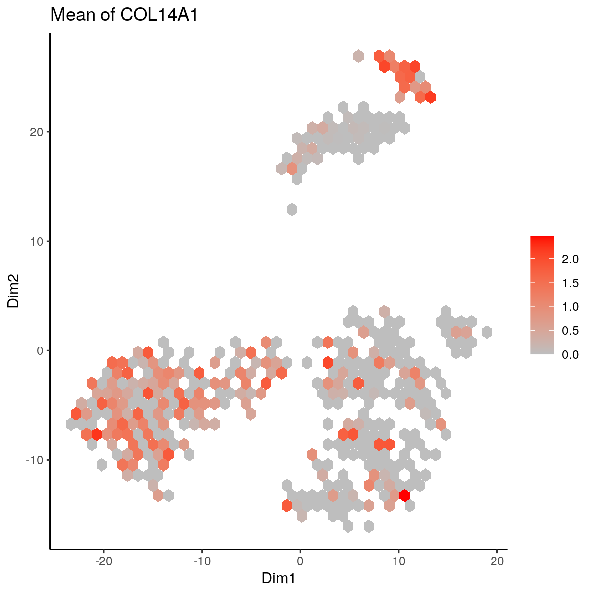|[CD44](https://www.ncbi.nlm.nih.gov/gene/960) [COL13A1](https://www.ncbi.nlm.nih.gov/gene/1305) [SDC3](https://www.ncbi.nlm.nih.gov/gene/9672) [COL23A1](https://www.ncbi.nlm.nih.gov/gene/91522) [IGSF8](https://www.ncbi.nlm.nih.gov/gene/93185)|
|[COL15A1](https://www.ncbi.nlm.nih.gov/gene/1306) 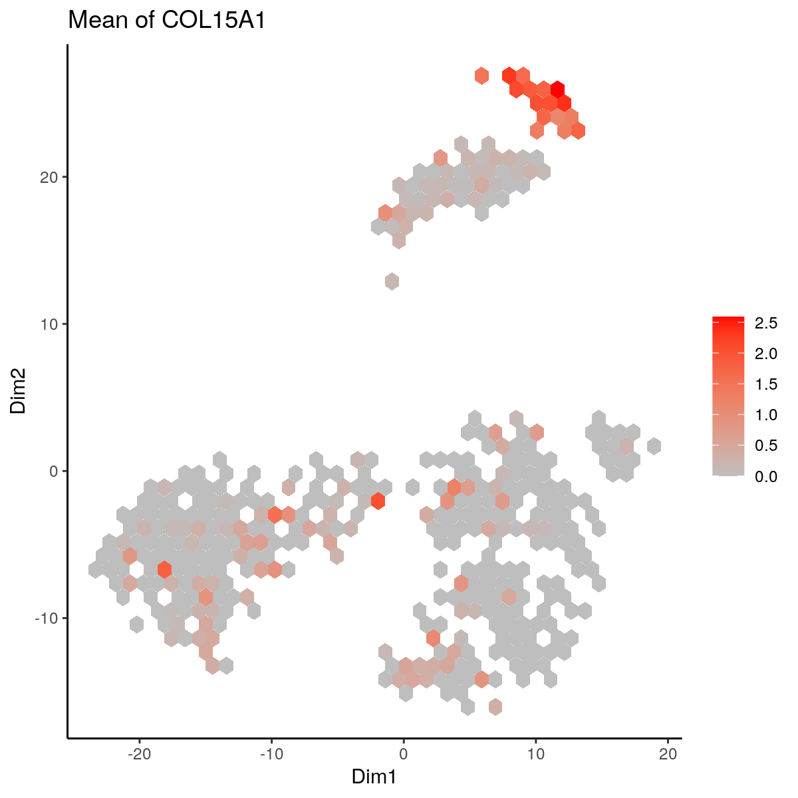|[COL13A1](https://www.ncbi.nlm.nih.gov/gene/1305) [COL23A1](https://www.ncbi.nlm.nih.gov/gene/91522)|
|[COL16A1](https://www.ncbi.nlm.nih.gov/gene/1307)|[COL13A1](https://www.ncbi.nlm.nih.gov/gene/1305) [ITGB1](https://www.ncbi.nlm.nih.gov/gene/3688) [COL23A1](https://www.ncbi.nlm.nih.gov/gene/91522) [MRGPRF](https://www.ncbi.nlm.nih.gov/gene/116535)|
|[COL18A1](https://www.ncbi.nlm.nih.gov/gene/80781)|[COL13A1](https://www.ncbi.nlm.nih.gov/gene/1305) [ENG](https://www.ncbi.nlm.nih.gov/gene/2022) [GPC3](https://www.ncbi.nlm.nih.gov/gene/2719) [ITGA3](https://www.ncbi.nlm.nih.gov/gene/3675) [ITGAV](https://www.ncbi.nlm.nih.gov/gene/3685) [ITGB1](https://www.ncbi.nlm.nih.gov/gene/3688) [ITGB3](https://www.ncbi.nlm.nih.gov/gene/3690) [NOS3](https://www.ncbi.nlm.nih.gov/gene/4846) [SLC19A1](https://www.ncbi.nlm.nih.gov/gene/6573) [TEK](https://www.ncbi.nlm.nih.gov/gene/7010) [GPNMB](https://www.ncbi.nlm.nih.gov/gene/10457) [RASD2](https://www.ncbi.nlm.nih.gov/gene/23551) [COL23A1](https://www.ncbi.nlm.nih.gov/gene/91522)|
|[COL19A1](https://www.ncbi.nlm.nih.gov/gene/1310)|[COL13A1](https://www.ncbi.nlm.nih.gov/gene/1305) [CDON](https://www.ncbi.nlm.nih.gov/gene/50937) [PCDH18](https://www.ncbi.nlm.nih.gov/gene/54510) [COL23A1](https://www.ncbi.nlm.nih.gov/gene/91522)|
|[COL1A1](https://www.ncbi.nlm.nih.gov/gene/1277) |[ALPL](https://www.ncbi.nlm.nih.gov/gene/249) [DDR1](https://www.ncbi.nlm.nih.gov/gene/780) [CD36](https://www.ncbi.nlm.nih.gov/gene/948) [CD44](https://www.ncbi.nlm.nih.gov/gene/960) [CDH11](https://www.ncbi.nlm.nih.gov/gene/1009) [CNR1](https://www.ncbi.nlm.nih.gov/gene/1268) [COL13A1](https://www.ncbi.nlm.nih.gov/gene/1305) [ENG](https://www.ncbi.nlm.nih.gov/gene/2022) [ESR1](https://www.ncbi.nlm.nih.gov/gene/2099) [FGFR1](https://www.ncbi.nlm.nih.gov/gene/2260) [GJA1](https://www.ncbi.nlm.nih.gov/gene/2697) [IHH](https://www.ncbi.nlm.nih.gov/gene/3549) [ITGA6](https://www.ncbi.nlm.nih.gov/gene/3655) [ITGA3](https://www.ncbi.nlm.nih.gov/gene/3675) [ITGAV](https://www.ncbi.nlm.nih.gov/gene/3685) [ITGB1](https://www.ncbi.nlm.nih.gov/gene/3688) [ITGB3](https://www.ncbi.nlm.nih.gov/gene/3690) [ITGB4](https://www.ncbi.nlm.nih.gov/gene/3691) [ITGB8](https://www.ncbi.nlm.nih.gov/gene/3696) [KCNG1](https://www.ncbi.nlm.nih.gov/gene/3755) [DDR2](https://www.ncbi.nlm.nih.gov/gene/4921) [PDGFRA](https://www.ncbi.nlm.nih.gov/gene/5156) [PDGFRB](https://www.ncbi.nlm.nih.gov/gene/5159) [PHEX](https://www.ncbi.nlm.nih.gov/gene/5251) [PKD1](https://www.ncbi.nlm.nih.gov/gene/5310) [HTRA1](https://www.ncbi.nlm.nih.gov/gene/5654) [PTH1R](https://www.ncbi.nlm.nih.gov/gene/5745) [PTPRC](https://www.ncbi.nlm.nih.gov/gene/5788) [TGFBR1](https://www.ncbi.nlm.nih.gov/gene/7046) [TGFBR2](https://www.ncbi.nlm.nih.gov/gene/7048) [THY1](https://www.ncbi.nlm.nih.gov/gene/7070) [GP6](https://www.ncbi.nlm.nih.gov/gene/51206) [PTOV1](https://www.ncbi.nlm.nih.gov/gene/53635) [MXRA8](https://www.ncbi.nlm.nih.gov/gene/54587) [DSCAML1](https://www.ncbi.nlm.nih.gov/gene/57453) [COL23A1](https://www.ncbi.nlm.nih.gov/gene/91522) [IFITM5](https://www.ncbi.nlm.nih.gov/gene/387733)|
|[COL1A2](https://www.ncbi.nlm.nih.gov/gene/1278) |[ALPL](https://www.ncbi.nlm.nih.gov/gene/249) [BTC](https://www.ncbi.nlm.nih.gov/gene/685) [CD44](https://www.ncbi.nlm.nih.gov/gene/960) [CDH11](https://www.ncbi.nlm.nih.gov/gene/1009) [COL13A1](https://www.ncbi.nlm.nih.gov/gene/1305) [GJA8](https://www.ncbi.nlm.nih.gov/gene/2703) [ITGA6](https://www.ncbi.nlm.nih.gov/gene/3655) [ITGA3](https://www.ncbi.nlm.nih.gov/gene/3675) [ITGAV](https://www.ncbi.nlm.nih.gov/gene/3685) [ITGB1](https://www.ncbi.nlm.nih.gov/gene/3688) [ITGB3](https://www.ncbi.nlm.nih.gov/gene/3690) [ITGB4](https://www.ncbi.nlm.nih.gov/gene/3691) [ITGB8](https://www.ncbi.nlm.nih.gov/gene/3696) [DDR2](https://www.ncbi.nlm.nih.gov/gene/4921) [PDGFRA](https://www.ncbi.nlm.nih.gov/gene/5156) [PDGFRB](https://www.ncbi.nlm.nih.gov/gene/5159) [TGFBR1](https://www.ncbi.nlm.nih.gov/gene/7046) [TGFBR2](https://www.ncbi.nlm.nih.gov/gene/7048) [THY1](https://www.ncbi.nlm.nih.gov/gene/7070) [GP6](https://www.ncbi.nlm.nih.gov/gene/51206) [COL23A1](https://www.ncbi.nlm.nih.gov/gene/91522) [IFITM5](https://www.ncbi.nlm.nih.gov/gene/387733)|
|[COL20A1](https://www.ncbi.nlm.nih.gov/gene/57642)|[COL13A1](https://www.ncbi.nlm.nih.gov/gene/1305) [OR2K2](https://www.ncbi.nlm.nih.gov/gene/26248) [COL23A1](https://www.ncbi.nlm.nih.gov/gene/91522)|
|[COL21A1](https://www.ncbi.nlm.nih.gov/gene/81578)|[COL13A1](https://www.ncbi.nlm.nih.gov/gene/1305) [ITGB1](https://www.ncbi.nlm.nih.gov/gene/3688) [PHKA2](https://www.ncbi.nlm.nih.gov/gene/5256) [OR7A17](https://www.ncbi.nlm.nih.gov/gene/26333) [OR10H3](https://www.ncbi.nlm.nih.gov/gene/26532) [GPRC5C](https://www.ncbi.nlm.nih.gov/gene/55890) [MCHR2](https://www.ncbi.nlm.nih.gov/gene/84539) [COL23A1](https://www.ncbi.nlm.nih.gov/gene/91522) [OR2T29](https://www.ncbi.nlm.nih.gov/gene/343563) [OR7A10](https://www.ncbi.nlm.nih.gov/gene/390892)|
|[COL22A1](https://www.ncbi.nlm.nih.gov/gene/169044)|[COL13A1](https://www.ncbi.nlm.nih.gov/gene/1305) [COL23A1](https://www.ncbi.nlm.nih.gov/gene/91522)|
|[COL24A1](https://www.ncbi.nlm.nih.gov/gene/255631)|[ATP1A4](https://www.ncbi.nlm.nih.gov/gene/480) [COL13A1](https://www.ncbi.nlm.nih.gov/gene/1305) [GNAS](https://www.ncbi.nlm.nih.gov/gene/2778) [TENM3](https://www.ncbi.nlm.nih.gov/gene/55714) [OR5V1](https://www.ncbi.nlm.nih.gov/gene/81696) [COL23A1](https://www.ncbi.nlm.nih.gov/gene/91522) [NEGR1](https://www.ncbi.nlm.nih.gov/gene/257194)|
|[COL26A1](https://www.ncbi.nlm.nih.gov/gene/136227)|[COL13A1](https://www.ncbi.nlm.nih.gov/gene/1305) [SMAGP](https://www.ncbi.nlm.nih.gov/gene/57228) [COL23A1](https://www.ncbi.nlm.nih.gov/gene/91522)|
|[COL27A1](https://www.ncbi.nlm.nih.gov/gene/85301)|[COL13A1](https://www.ncbi.nlm.nih.gov/gene/1305) [FAT2](https://www.ncbi.nlm.nih.gov/gene/2196) [TECTB](https://www.ncbi.nlm.nih.gov/gene/6975) [COL23A1](https://www.ncbi.nlm.nih.gov/gene/91522)|
|[COL28A1](https://www.ncbi.nlm.nih.gov/gene/340267)|[COL13A1](https://www.ncbi.nlm.nih.gov/gene/1305) [COL23A1](https://www.ncbi.nlm.nih.gov/gene/91522) [OR52I2](https://www.ncbi.nlm.nih.gov/gene/143502) [OR52I1](https://www.ncbi.nlm.nih.gov/gene/390037)|
|[COL2A1](https://www.ncbi.nlm.nih.gov/gene/1280)|[ALPL](https://www.ncbi.nlm.nih.gov/gene/249) [DDR1](https://www.ncbi.nlm.nih.gov/gene/780) [CD44](https://www.ncbi.nlm.nih.gov/gene/960) [COL13A1](https://www.ncbi.nlm.nih.gov/gene/1305) [ENG](https://www.ncbi.nlm.nih.gov/gene/2022) [FGFR3](https://www.ncbi.nlm.nih.gov/gene/2261) [IHH](https://www.ncbi.nlm.nih.gov/gene/3549) [ITGA6](https://www.ncbi.nlm.nih.gov/gene/3655) [ITGA3](https://www.ncbi.nlm.nih.gov/gene/3675) [ITGAV](https://www.ncbi.nlm.nih.gov/gene/3685) [ITGB1](https://www.ncbi.nlm.nih.gov/gene/3688) [ITGB3](https://www.ncbi.nlm.nih.gov/gene/3690) [ITGB4](https://www.ncbi.nlm.nih.gov/gene/3691) [ITGB8](https://www.ncbi.nlm.nih.gov/gene/3696) [MAG](https://www.ncbi.nlm.nih.gov/gene/4099) [NT5E](https://www.ncbi.nlm.nih.gov/gene/4907) [DDR2](https://www.ncbi.nlm.nih.gov/gene/4921) [PKD1](https://www.ncbi.nlm.nih.gov/gene/5310) [PRKG2](https://www.ncbi.nlm.nih.gov/gene/5593) [HTRA1](https://www.ncbi.nlm.nih.gov/gene/5654) [PTH1R](https://www.ncbi.nlm.nih.gov/gene/5745) [TECTB](https://www.ncbi.nlm.nih.gov/gene/6975) [THY1](https://www.ncbi.nlm.nih.gov/gene/7070) [GP6](https://www.ncbi.nlm.nih.gov/gene/51206) [PTOV1](https://www.ncbi.nlm.nih.gov/gene/53635) [CLSTN2](https://www.ncbi.nlm.nih.gov/gene/64084) [COL23A1](https://www.ncbi.nlm.nih.gov/gene/91522)|
|[COL3A1](https://www.ncbi.nlm.nih.gov/gene/1281) |[AP2B1](https://www.ncbi.nlm.nih.gov/gene/163) [DDR1](https://www.ncbi.nlm.nih.gov/gene/780) [CDH11](https://www.ncbi.nlm.nih.gov/gene/1009) [COL13A1](https://www.ncbi.nlm.nih.gov/gene/1305) [EDNRA](https://www.ncbi.nlm.nih.gov/gene/1909) [ITGAV](https://www.ncbi.nlm.nih.gov/gene/3685) [ITGB1](https://www.ncbi.nlm.nih.gov/gene/3688) [ITGB3](https://www.ncbi.nlm.nih.gov/gene/3690) [DDR2](https://www.ncbi.nlm.nih.gov/gene/4921) [PDGFRA](https://www.ncbi.nlm.nih.gov/gene/5156) [PDGFRB](https://www.ncbi.nlm.nih.gov/gene/5159) [HTRA1](https://www.ncbi.nlm.nih.gov/gene/5654) [TGFBR1](https://www.ncbi.nlm.nih.gov/gene/7046) [TGFBR2](https://www.ncbi.nlm.nih.gov/gene/7048) [GP6](https://www.ncbi.nlm.nih.gov/gene/51206) [MXRA8](https://www.ncbi.nlm.nih.gov/gene/54587) [COL23A1](https://www.ncbi.nlm.nih.gov/gene/91522)|
|[COL4A1](https://www.ncbi.nlm.nih.gov/gene/1282)|[ALPL](https://www.ncbi.nlm.nih.gov/gene/249) [AVPR1A](https://www.ncbi.nlm.nih.gov/gene/552) [DDR1](https://www.ncbi.nlm.nih.gov/gene/780) [CD44](https://www.ncbi.nlm.nih.gov/gene/960) [CD47](https://www.ncbi.nlm.nih.gov/gene/961) [COL13A1](https://www.ncbi.nlm.nih.gov/gene/1305) [GJA1](https://www.ncbi.nlm.nih.gov/gene/2697) [ITGA6](https://www.ncbi.nlm.nih.gov/gene/3655) [ITGA3](https://www.ncbi.nlm.nih.gov/gene/3675) [ITGAV](https://www.ncbi.nlm.nih.gov/gene/3685) [ITGB1](https://www.ncbi.nlm.nih.gov/gene/3688) [ITGB3](https://www.ncbi.nlm.nih.gov/gene/3690) [ITGB4](https://www.ncbi.nlm.nih.gov/gene/3691) [ITGB8](https://www.ncbi.nlm.nih.gov/gene/3696) [DDR2](https://www.ncbi.nlm.nih.gov/gene/4921) [PDGFRB](https://www.ncbi.nlm.nih.gov/gene/5159) [HTRA1](https://www.ncbi.nlm.nih.gov/gene/5654) [UNC13A](https://www.ncbi.nlm.nih.gov/gene/23025) [GP6](https://www.ncbi.nlm.nih.gov/gene/51206) [ABCG8](https://www.ncbi.nlm.nih.gov/gene/64241) [COL23A1](https://www.ncbi.nlm.nih.gov/gene/91522)|
|[COL4A2](https://www.ncbi.nlm.nih.gov/gene/1284)|[ALPL](https://www.ncbi.nlm.nih.gov/gene/249) [CD44](https://www.ncbi.nlm.nih.gov/gene/960) [CD47](https://www.ncbi.nlm.nih.gov/gene/961) [COL13A1](https://www.ncbi.nlm.nih.gov/gene/1305) [CSPG4](https://www.ncbi.nlm.nih.gov/gene/1464) [ITGA6](https://www.ncbi.nlm.nih.gov/gene/3655) [ITGA3](https://www.ncbi.nlm.nih.gov/gene/3675) [ITGAV](https://www.ncbi.nlm.nih.gov/gene/3685) [ITGB1](https://www.ncbi.nlm.nih.gov/gene/3688) [ITGB3](https://www.ncbi.nlm.nih.gov/gene/3690) [ITGB4](https://www.ncbi.nlm.nih.gov/gene/3691) [ITGB8](https://www.ncbi.nlm.nih.gov/gene/3696) [PDGFRB](https://www.ncbi.nlm.nih.gov/gene/5159) [HTRA1](https://www.ncbi.nlm.nih.gov/gene/5654) [GP6](https://www.ncbi.nlm.nih.gov/gene/51206) [COL23A1](https://www.ncbi.nlm.nih.gov/gene/91522)|
|[COL4A3](https://www.ncbi.nlm.nih.gov/gene/1285)|[ALPI](https://www.ncbi.nlm.nih.gov/gene/248) [ALPL](https://www.ncbi.nlm.nih.gov/gene/249) [CD44](https://www.ncbi.nlm.nih.gov/gene/960) [CD47](https://www.ncbi.nlm.nih.gov/gene/961) [COL13A1](https://www.ncbi.nlm.nih.gov/gene/1305) [ITGA6](https://www.ncbi.nlm.nih.gov/gene/3655) [ITGA3](https://www.ncbi.nlm.nih.gov/gene/3675) [ITGAV](https://www.ncbi.nlm.nih.gov/gene/3685) [ITGB1](https://www.ncbi.nlm.nih.gov/gene/3688) [ITGB3](https://www.ncbi.nlm.nih.gov/gene/3690) [ITGB4](https://www.ncbi.nlm.nih.gov/gene/3691) [ITGB8](https://www.ncbi.nlm.nih.gov/gene/3696) [NPHS1](https://www.ncbi.nlm.nih.gov/gene/4868) [MPDZ](https://www.ncbi.nlm.nih.gov/gene/8777) [GP6](https://www.ncbi.nlm.nih.gov/gene/51206) [COL23A1](https://www.ncbi.nlm.nih.gov/gene/91522)|
|[COL4A4](https://www.ncbi.nlm.nih.gov/gene/1286)|[ALPL](https://www.ncbi.nlm.nih.gov/gene/249) [CD44](https://www.ncbi.nlm.nih.gov/gene/960) [CD47](https://www.ncbi.nlm.nih.gov/gene/961) [COL13A1](https://www.ncbi.nlm.nih.gov/gene/1305) [ITGA6](https://www.ncbi.nlm.nih.gov/gene/3655) [ITGA3](https://www.ncbi.nlm.nih.gov/gene/3675) [ITGAV](https://www.ncbi.nlm.nih.gov/gene/3685) [ITGB1](https://www.ncbi.nlm.nih.gov/gene/3688) [ITGB3](https://www.ncbi.nlm.nih.gov/gene/3690) [ITGB4](https://www.ncbi.nlm.nih.gov/gene/3691) [ITGB8](https://www.ncbi.nlm.nih.gov/gene/3696) [NPHS1](https://www.ncbi.nlm.nih.gov/gene/4868) [TRPC6](https://www.ncbi.nlm.nih.gov/gene/7225) [IRS4](https://www.ncbi.nlm.nih.gov/gene/8471) [PLCE1](https://www.ncbi.nlm.nih.gov/gene/51196) [GP6](https://www.ncbi.nlm.nih.gov/gene/51206) [COL23A1](https://www.ncbi.nlm.nih.gov/gene/91522)|
|[COL4A5](https://www.ncbi.nlm.nih.gov/gene/1287)|[ALPL](https://www.ncbi.nlm.nih.gov/gene/249) [CD44](https://www.ncbi.nlm.nih.gov/gene/960) [CD47](https://www.ncbi.nlm.nih.gov/gene/961) [COL13A1](https://www.ncbi.nlm.nih.gov/gene/1305) [FCGR2B](https://www.ncbi.nlm.nih.gov/gene/2213) [GP2](https://www.ncbi.nlm.nih.gov/gene/2813) [ITGA6](https://www.ncbi.nlm.nih.gov/gene/3655) [ITGA3](https://www.ncbi.nlm.nih.gov/gene/3675) [ITGAV](https://www.ncbi.nlm.nih.gov/gene/3685) [ITGB1](https://www.ncbi.nlm.nih.gov/gene/3688) [ITGB3](https://www.ncbi.nlm.nih.gov/gene/3690) [ITGB4](https://www.ncbi.nlm.nih.gov/gene/3691) [ITGB8](https://www.ncbi.nlm.nih.gov/gene/3696) [LAMP2](https://www.ncbi.nlm.nih.gov/gene/3920) [NPHS1](https://www.ncbi.nlm.nih.gov/gene/4868) [GP6](https://www.ncbi.nlm.nih.gov/gene/51206) [COL23A1](https://www.ncbi.nlm.nih.gov/gene/91522)|
|[COL4A6](https://www.ncbi.nlm.nih.gov/gene/1288)|[ALPL](https://www.ncbi.nlm.nih.gov/gene/249) [CD44](https://www.ncbi.nlm.nih.gov/gene/960) [CD47](https://www.ncbi.nlm.nih.gov/gene/961) [COL13A1](https://www.ncbi.nlm.nih.gov/gene/1305) [ITGA6](https://www.ncbi.nlm.nih.gov/gene/3655) [ITGA3](https://www.ncbi.nlm.nih.gov/gene/3675) [ITGAV](https://www.ncbi.nlm.nih.gov/gene/3685) [ITGB1](https://www.ncbi.nlm.nih.gov/gene/3688) [ITGB3](https://www.ncbi.nlm.nih.gov/gene/3690) [ITGB4](https://www.ncbi.nlm.nih.gov/gene/3691) [ITGB8](https://www.ncbi.nlm.nih.gov/gene/3696) [XPNPEP2](https://www.ncbi.nlm.nih.gov/gene/7512) [IRS4](https://www.ncbi.nlm.nih.gov/gene/8471) [GP6](https://www.ncbi.nlm.nih.gov/gene/51206) [COL23A1](https://www.ncbi.nlm.nih.gov/gene/91522) [MAL2](https://www.ncbi.nlm.nih.gov/gene/114569) [OR6X1](https://www.ncbi.nlm.nih.gov/gene/390260)|
|[COL5A1](https://www.ncbi.nlm.nih.gov/gene/1289)|[DDR1](https://www.ncbi.nlm.nih.gov/gene/780) [CDH11](https://www.ncbi.nlm.nih.gov/gene/1009) [COL13A1](https://www.ncbi.nlm.nih.gov/gene/1305) [ENG](https://www.ncbi.nlm.nih.gov/gene/2022) [ITGAV](https://www.ncbi.nlm.nih.gov/gene/3685) [ITGB1](https://www.ncbi.nlm.nih.gov/gene/3688) [ITGB2](https://www.ncbi.nlm.nih.gov/gene/3689) [ITGB3](https://www.ncbi.nlm.nih.gov/gene/3690) [DDR2](https://www.ncbi.nlm.nih.gov/gene/4921) [MPDZ](https://www.ncbi.nlm.nih.gov/gene/8777) [SDC3](https://www.ncbi.nlm.nih.gov/gene/9672) [COL23A1](https://www.ncbi.nlm.nih.gov/gene/91522)|
|[COL5A2](https://www.ncbi.nlm.nih.gov/gene/1290)|[DDR1](https://www.ncbi.nlm.nih.gov/gene/780) [CDH11](https://www.ncbi.nlm.nih.gov/gene/1009) [COL13A1](https://www.ncbi.nlm.nih.gov/gene/1305) [ITGAV](https://www.ncbi.nlm.nih.gov/gene/3685) [ITGB1](https://www.ncbi.nlm.nih.gov/gene/3688) [ITGB3](https://www.ncbi.nlm.nih.gov/gene/3690) [DDR2](https://www.ncbi.nlm.nih.gov/gene/4921) [PDGFRB](https://www.ncbi.nlm.nih.gov/gene/5159) [EFR3A](https://www.ncbi.nlm.nih.gov/gene/23167) [COL23A1](https://www.ncbi.nlm.nih.gov/gene/91522)|
|[COL5A3](https://www.ncbi.nlm.nih.gov/gene/50509)|[COL13A1](https://www.ncbi.nlm.nih.gov/gene/1305) [OR10H3](https://www.ncbi.nlm.nih.gov/gene/26532) [COL23A1](https://www.ncbi.nlm.nih.gov/gene/91522) [OR7A10](https://www.ncbi.nlm.nih.gov/gene/390892)|
|[COL6A1](https://www.ncbi.nlm.nih.gov/gene/1291) 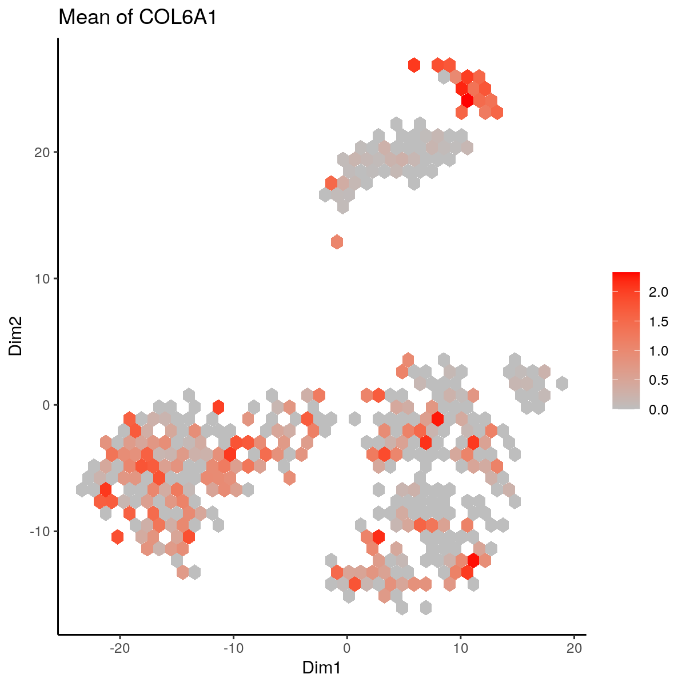|[CD44](https://www.ncbi.nlm.nih.gov/gene/960) [COL13A1](https://www.ncbi.nlm.nih.gov/gene/1305) [CSPG4](https://www.ncbi.nlm.nih.gov/gene/1464) [DMD](https://www.ncbi.nlm.nih.gov/gene/1756) [ITGA6](https://www.ncbi.nlm.nih.gov/gene/3655) [ITGA3](https://www.ncbi.nlm.nih.gov/gene/3675) [ITGAV](https://www.ncbi.nlm.nih.gov/gene/3685) [ITGB1](https://www.ncbi.nlm.nih.gov/gene/3688) [ITGB3](https://www.ncbi.nlm.nih.gov/gene/3690) [ITGB4](https://www.ncbi.nlm.nih.gov/gene/3691) [ITGB8](https://www.ncbi.nlm.nih.gov/gene/3696) [SLC40A1](https://www.ncbi.nlm.nih.gov/gene/30061) [GP6](https://www.ncbi.nlm.nih.gov/gene/51206) [MXRA8](https://www.ncbi.nlm.nih.gov/gene/54587) [KCNQ5](https://www.ncbi.nlm.nih.gov/gene/56479) [ANTXR1](https://www.ncbi.nlm.nih.gov/gene/84168) [COL23A1](https://www.ncbi.nlm.nih.gov/gene/91522)|
|[COL6A2](https://www.ncbi.nlm.nih.gov/gene/1292)|[CD44](https://www.ncbi.nlm.nih.gov/gene/960) [COL13A1](https://www.ncbi.nlm.nih.gov/gene/1305) [DMD](https://www.ncbi.nlm.nih.gov/gene/1756) [ITGA6](https://www.ncbi.nlm.nih.gov/gene/3655) [ITGA3](https://www.ncbi.nlm.nih.gov/gene/3675) [ITGAV](https://www.ncbi.nlm.nih.gov/gene/3685) [ITGB1](https://www.ncbi.nlm.nih.gov/gene/3688) [ITGB3](https://www.ncbi.nlm.nih.gov/gene/3690) [ITGB4](https://www.ncbi.nlm.nih.gov/gene/3691) [ITGB8](https://www.ncbi.nlm.nih.gov/gene/3696) [PDGFRB](https://www.ncbi.nlm.nih.gov/gene/5159) [GP6](https://www.ncbi.nlm.nih.gov/gene/51206) [COL23A1](https://www.ncbi.nlm.nih.gov/gene/91522)|
|[COL6A3](https://www.ncbi.nlm.nih.gov/gene/1293)|[CACNA1C](https://www.ncbi.nlm.nih.gov/gene/775) [CACNA1S](https://www.ncbi.nlm.nih.gov/gene/779) [CD3G](https://www.ncbi.nlm.nih.gov/gene/917) [CD44](https://www.ncbi.nlm.nih.gov/gene/960) [CDH11](https://www.ncbi.nlm.nih.gov/gene/1009) [COL13A1](https://www.ncbi.nlm.nih.gov/gene/1305) [CSPG4](https://www.ncbi.nlm.nih.gov/gene/1464) [DMD](https://www.ncbi.nlm.nih.gov/gene/1756) [FGFR1](https://www.ncbi.nlm.nih.gov/gene/2260) [ITGA6](https://www.ncbi.nlm.nih.gov/gene/3655) [ITGA3](https://www.ncbi.nlm.nih.gov/gene/3675) [ITGAV](https://www.ncbi.nlm.nih.gov/gene/3685) [ITGB1](https://www.ncbi.nlm.nih.gov/gene/3688) [ITGB3](https://www.ncbi.nlm.nih.gov/gene/3690) [ITGB4](https://www.ncbi.nlm.nih.gov/gene/3691) [ITGB8](https://www.ncbi.nlm.nih.gov/gene/3696) [PDGFRB](https://www.ncbi.nlm.nih.gov/gene/5159) [SCNN1G](https://www.ncbi.nlm.nih.gov/gene/6340) [SGCA](https://www.ncbi.nlm.nih.gov/gene/6442) [SGCB](https://www.ncbi.nlm.nih.gov/gene/6443) [SGCG](https://www.ncbi.nlm.nih.gov/gene/6445) [GP6](https://www.ncbi.nlm.nih.gov/gene/51206) [COL23A1](https://www.ncbi.nlm.nih.gov/gene/91522)|
|[COL6A5](https://www.ncbi.nlm.nih.gov/gene/256076)|[CD44](https://www.ncbi.nlm.nih.gov/gene/960) [COL13A1](https://www.ncbi.nlm.nih.gov/gene/1305) [ITGA6](https://www.ncbi.nlm.nih.gov/gene/3655) [ITGA3](https://www.ncbi.nlm.nih.gov/gene/3675) [ITGAV](https://www.ncbi.nlm.nih.gov/gene/3685) [ITGB1](https://www.ncbi.nlm.nih.gov/gene/3688) [ITGB3](https://www.ncbi.nlm.nih.gov/gene/3690) [ITGB4](https://www.ncbi.nlm.nih.gov/gene/3691) [ITGB8](https://www.ncbi.nlm.nih.gov/gene/3696) [GP6](https://www.ncbi.nlm.nih.gov/gene/51206) [COL23A1](https://www.ncbi.nlm.nih.gov/gene/91522)|
|[COL6A6](https://www.ncbi.nlm.nih.gov/gene/131873)|[CD44](https://www.ncbi.nlm.nih.gov/gene/960) [COL13A1](https://www.ncbi.nlm.nih.gov/gene/1305) [ITGA6](https://www.ncbi.nlm.nih.gov/gene/3655) [ITGA3](https://www.ncbi.nlm.nih.gov/gene/3675) [ITGAV](https://www.ncbi.nlm.nih.gov/gene/3685) [ITGB1](https://www.ncbi.nlm.nih.gov/gene/3688) [ITGB3](https://www.ncbi.nlm.nih.gov/gene/3690) [ITGB4](https://www.ncbi.nlm.nih.gov/gene/3691) [ITGB8](https://www.ncbi.nlm.nih.gov/gene/3696) [SCNN1G](https://www.ncbi.nlm.nih.gov/gene/6340) [GP6](https://www.ncbi.nlm.nih.gov/gene/51206) [COL23A1](https://www.ncbi.nlm.nih.gov/gene/91522) [OR2T4](https://www.ncbi.nlm.nih.gov/gene/127074)|
|[COL7A1](https://www.ncbi.nlm.nih.gov/gene/1294)|[CD59](https://www.ncbi.nlm.nih.gov/gene/966) [COL13A1](https://www.ncbi.nlm.nih.gov/gene/1305) [FOLR1](https://www.ncbi.nlm.nih.gov/gene/2348) [GRIA1](https://www.ncbi.nlm.nih.gov/gene/2890) [ITGA6](https://www.ncbi.nlm.nih.gov/gene/3655) [ITGA3](https://www.ncbi.nlm.nih.gov/gene/3675) [ITGAV](https://www.ncbi.nlm.nih.gov/gene/3685) [ITGB1](https://www.ncbi.nlm.nih.gov/gene/3688) [ITGB3](https://www.ncbi.nlm.nih.gov/gene/3690) [ITGB4](https://www.ncbi.nlm.nih.gov/gene/3691) [NAPA](https://www.ncbi.nlm.nih.gov/gene/8775) [BVES](https://www.ncbi.nlm.nih.gov/gene/11149) [OR10H3](https://www.ncbi.nlm.nih.gov/gene/26532) [MFRP](https://www.ncbi.nlm.nih.gov/gene/83552) [COL23A1](https://www.ncbi.nlm.nih.gov/gene/91522) [OR7A10](https://www.ncbi.nlm.nih.gov/gene/390892)|
|[COL8A1](https://www.ncbi.nlm.nih.gov/gene/1295)|[ATP1B3](https://www.ncbi.nlm.nih.gov/gene/483) [DDR1](https://www.ncbi.nlm.nih.gov/gene/780) [COL13A1](https://www.ncbi.nlm.nih.gov/gene/1305) [CSPG4](https://www.ncbi.nlm.nih.gov/gene/1464) [SLC16A8](https://www.ncbi.nlm.nih.gov/gene/23539) [MYOF](https://www.ncbi.nlm.nih.gov/gene/26509) [TAPBPL](https://www.ncbi.nlm.nih.gov/gene/55080) [SLC4A11](https://www.ncbi.nlm.nih.gov/gene/83959) [COL23A1](https://www.ncbi.nlm.nih.gov/gene/91522)|
|[COL8A2](https://www.ncbi.nlm.nih.gov/gene/1296)|[COL13A1](https://www.ncbi.nlm.nih.gov/gene/1305) [SLC4A4](https://www.ncbi.nlm.nih.gov/gene/8671) [SLC4A5](https://www.ncbi.nlm.nih.gov/gene/57835) [SLC4A11](https://www.ncbi.nlm.nih.gov/gene/83959) [COL23A1](https://www.ncbi.nlm.nih.gov/gene/91522)|
|[COL9A1](https://www.ncbi.nlm.nih.gov/gene/1297)|[CD44](https://www.ncbi.nlm.nih.gov/gene/960) [COL13A1](https://www.ncbi.nlm.nih.gov/gene/1305) [SLC26A2](https://www.ncbi.nlm.nih.gov/gene/1836) [ITGA6](https://www.ncbi.nlm.nih.gov/gene/3655) [ITGA3](https://www.ncbi.nlm.nih.gov/gene/3675) [ITGAV](https://www.ncbi.nlm.nih.gov/gene/3685) [ITGB1](https://www.ncbi.nlm.nih.gov/gene/3688) [ITGB3](https://www.ncbi.nlm.nih.gov/gene/3690) [ITGB4](https://www.ncbi.nlm.nih.gov/gene/3691) [ITGB8](https://www.ncbi.nlm.nih.gov/gene/3696) [GP6](https://www.ncbi.nlm.nih.gov/gene/51206) [COL23A1](https://www.ncbi.nlm.nih.gov/gene/91522)|
|[COL9A2](https://www.ncbi.nlm.nih.gov/gene/1298)|[CD44](https://www.ncbi.nlm.nih.gov/gene/960) [COL13A1](https://www.ncbi.nlm.nih.gov/gene/1305) [DRD1](https://www.ncbi.nlm.nih.gov/gene/1812) [SLC26A2](https://www.ncbi.nlm.nih.gov/gene/1836) [ITGA6](https://www.ncbi.nlm.nih.gov/gene/3655) [ITGA3](https://www.ncbi.nlm.nih.gov/gene/3675) [ITGAV](https://www.ncbi.nlm.nih.gov/gene/3685) [ITGB1](https://www.ncbi.nlm.nih.gov/gene/3688) [ITGB3](https://www.ncbi.nlm.nih.gov/gene/3690) [ITGB4](https://www.ncbi.nlm.nih.gov/gene/3691) [ITGB8](https://www.ncbi.nlm.nih.gov/gene/3696) [MAG](https://www.ncbi.nlm.nih.gov/gene/4099) [CSPG5](https://www.ncbi.nlm.nih.gov/gene/10675) [GP6](https://www.ncbi.nlm.nih.gov/gene/51206) [COL23A1](https://www.ncbi.nlm.nih.gov/gene/91522)|
|[COLEC10](https://www.ncbi.nlm.nih.gov/gene/10584)|[CD47](https://www.ncbi.nlm.nih.gov/gene/961) [KIR3DL1](https://www.ncbi.nlm.nih.gov/gene/3811) [BVES](https://www.ncbi.nlm.nih.gov/gene/11149) [CADM2](https://www.ncbi.nlm.nih.gov/gene/253559)|
|[COLEC11](https://www.ncbi.nlm.nih.gov/gene/78989)|[KIR3DL1](https://www.ncbi.nlm.nih.gov/gene/3811) [SNTG2](https://www.ncbi.nlm.nih.gov/gene/54221) [ADI1](https://www.ncbi.nlm.nih.gov/gene/55256) [CLEC12A](https://www.ncbi.nlm.nih.gov/gene/160364)|
|[COMP](https://www.ncbi.nlm.nih.gov/gene/1311)|[CD36](https://www.ncbi.nlm.nih.gov/gene/948) [CD47](https://www.ncbi.nlm.nih.gov/gene/961) [SLC26A2](https://www.ncbi.nlm.nih.gov/gene/1836) [ITGA6](https://www.ncbi.nlm.nih.gov/gene/3655) [ITGA3](https://www.ncbi.nlm.nih.gov/gene/3675) [ITGAV](https://www.ncbi.nlm.nih.gov/gene/3685) [ITGB1](https://www.ncbi.nlm.nih.gov/gene/3688) [ITGB3](https://www.ncbi.nlm.nih.gov/gene/3690) [ITGB4](https://www.ncbi.nlm.nih.gov/gene/3691) [ITGB8](https://www.ncbi.nlm.nih.gov/gene/3696) [TEK](https://www.ncbi.nlm.nih.gov/gene/7010)|
|[COPA](https://www.ncbi.nlm.nih.gov/gene/1314)|[AP2A1](https://www.ncbi.nlm.nih.gov/gene/160) [AP2A2](https://www.ncbi.nlm.nih.gov/gene/161) [AP2B1](https://www.ncbi.nlm.nih.gov/gene/163) [CD4](https://www.ncbi.nlm.nih.gov/gene/920) [CD59](https://www.ncbi.nlm.nih.gov/gene/966) [AP2M1](https://www.ncbi.nlm.nih.gov/gene/1173) [AP2S1](https://www.ncbi.nlm.nih.gov/gene/1175) [CD55](https://www.ncbi.nlm.nih.gov/gene/1604) [EREG](https://www.ncbi.nlm.nih.gov/gene/2069) [FOLR1](https://www.ncbi.nlm.nih.gov/gene/2348) [NTSR1](https://www.ncbi.nlm.nih.gov/gene/4923) [RAB5C](https://www.ncbi.nlm.nih.gov/gene/5878) [SPTBN1](https://www.ncbi.nlm.nih.gov/gene/6711) [NAPA](https://www.ncbi.nlm.nih.gov/gene/8775)|
|[CORT](https://www.ncbi.nlm.nih.gov/gene/1325)|[ADCY3](https://www.ncbi.nlm.nih.gov/gene/109) [ADCY5](https://www.ncbi.nlm.nih.gov/gene/111) [ADCY6](https://www.ncbi.nlm.nih.gov/gene/112) [ADCY8](https://www.ncbi.nlm.nih.gov/gene/114) [ADCY9](https://www.ncbi.nlm.nih.gov/gene/115) [ADORA1](https://www.ncbi.nlm.nih.gov/gene/134) [ADRA2A](https://www.ncbi.nlm.nih.gov/gene/150) [ADRA2B](https://www.ncbi.nlm.nih.gov/gene/151) [ADRA2C](https://www.ncbi.nlm.nih.gov/gene/152) [AGTR1](https://www.ncbi.nlm.nih.gov/gene/185) [AGTR2](https://www.ncbi.nlm.nih.gov/gene/186) [APLNR](https://www.ncbi.nlm.nih.gov/gene/187) [AVPR1B](https://www.ncbi.nlm.nih.gov/gene/553) [BDKRB1](https://www.ncbi.nlm.nih.gov/gene/623) [BDKRB2](https://www.ncbi.nlm.nih.gov/gene/624) [CXCR5](https://www.ncbi.nlm.nih.gov/gene/643) [C3AR1](https://www.ncbi.nlm.nih.gov/gene/719) [C5AR1](https://www.ncbi.nlm.nih.gov/gene/728) [CASR](https://www.ncbi.nlm.nih.gov/gene/846) [CDH2](https://www.ncbi.nlm.nih.gov/gene/1000) [CHRM2](https://www.ncbi.nlm.nih.gov/gene/1129) [CHRM4](https://www.ncbi.nlm.nih.gov/gene/1132) [CCR1](https://www.ncbi.nlm.nih.gov/gene/1230) [CCR3](https://www.ncbi.nlm.nih.gov/gene/1232) [CCR4](https://www.ncbi.nlm.nih.gov/gene/1233) [CCR5](https://www.ncbi.nlm.nih.gov/gene/1234) [CCR7](https://www.ncbi.nlm.nih.gov/gene/1236) [CCR8](https://www.ncbi.nlm.nih.gov/gene/1237) [CNR1](https://www.ncbi.nlm.nih.gov/gene/1268) [CNR2](https://www.ncbi.nlm.nih.gov/gene/1269) [CRHR2](https://www.ncbi.nlm.nih.gov/gene/1395) [CX3CR1](https://www.ncbi.nlm.nih.gov/gene/1524) [DRD2](https://www.ncbi.nlm.nih.gov/gene/1813) [DRD3](https://www.ncbi.nlm.nih.gov/gene/1814) [DRD4](https://www.ncbi.nlm.nih.gov/gene/1815) [GPR183](https://www.ncbi.nlm.nih.gov/gene/1880) [S1PR1](https://www.ncbi.nlm.nih.gov/gene/1901) [S1PR3](https://www.ncbi.nlm.nih.gov/gene/1903) [FPR1](https://www.ncbi.nlm.nih.gov/gene/2357) [FPR2](https://www.ncbi.nlm.nih.gov/gene/2358) [FPR3](https://www.ncbi.nlm.nih.gov/gene/2359) [GALR1](https://www.ncbi.nlm.nih.gov/gene/2587) [GHSR](https://www.ncbi.nlm.nih.gov/gene/2693) [GNG3](https://www.ncbi.nlm.nih.gov/gene/2785) [GNG4](https://www.ncbi.nlm.nih.gov/gene/2786) [GNG5](https://www.ncbi.nlm.nih.gov/gene/2787) [GNG7](https://www.ncbi.nlm.nih.gov/gene/2788) [GNG10](https://www.ncbi.nlm.nih.gov/gene/2790) [GNG11](https://www.ncbi.nlm.nih.gov/gene/2791) [GNGT1](https://www.ncbi.nlm.nih.gov/gene/2792) [GNGT2](https://www.ncbi.nlm.nih.gov/gene/2793) [CCR10](https://www.ncbi.nlm.nih.gov/gene/2826) [NPBWR1](https://www.ncbi.nlm.nih.gov/gene/2831) [NPBWR2](https://www.ncbi.nlm.nih.gov/gene/2832) [CXCR3](https://www.ncbi.nlm.nih.gov/gene/2833) [GPR17](https://www.ncbi.nlm.nih.gov/gene/2840) [GPR18](https://www.ncbi.nlm.nih.gov/gene/2841) [MCHR1](https://www.ncbi.nlm.nih.gov/gene/2847) [GPR31](https://www.ncbi.nlm.nih.gov/gene/2853) [GPR37](https://www.ncbi.nlm.nih.gov/gene/2861) [GRM2](https://www.ncbi.nlm.nih.gov/gene/2912) [GRM3](https://www.ncbi.nlm.nih.gov/gene/2913) [GRM4](https://www.ncbi.nlm.nih.gov/gene/2914) [GRM6](https://www.ncbi.nlm.nih.gov/gene/2916) [GRM7](https://www.ncbi.nlm.nih.gov/gene/2917) [GRM8](https://www.ncbi.nlm.nih.gov/gene/2918) [HTR1A](https://www.ncbi.nlm.nih.gov/gene/3350) [HTR1B](https://www.ncbi.nlm.nih.gov/gene/3351) [HTR1D](https://www.ncbi.nlm.nih.gov/gene/3352) [HTR1E](https://www.ncbi.nlm.nih.gov/gene/3354) [HTR1F](https://www.ncbi.nlm.nih.gov/gene/3355) [HTR5A](https://www.ncbi.nlm.nih.gov/gene/3361) [HTR7](https://www.ncbi.nlm.nih.gov/gene/3363) [CXCR1](https://www.ncbi.nlm.nih.gov/gene/3577) [CXCR2](https://www.ncbi.nlm.nih.gov/gene/3579) [MC2R](https://www.ncbi.nlm.nih.gov/gene/4158) [MTNR1A](https://www.ncbi.nlm.nih.gov/gene/4543) [MTNR1B](https://www.ncbi.nlm.nih.gov/gene/4544) [NPY1R](https://www.ncbi.nlm.nih.gov/gene/4886) [NPY2R](https://www.ncbi.nlm.nih.gov/gene/4887) [NPY5R](https://www.ncbi.nlm.nih.gov/gene/4889) [NTRK2](https://www.ncbi.nlm.nih.gov/gene/4915) [OPRD1](https://www.ncbi.nlm.nih.gov/gene/4985) [OPRK1](https://www.ncbi.nlm.nih.gov/gene/4986) [OPRL1](https://www.ncbi.nlm.nih.gov/gene/4987) [P2RY4](https://www.ncbi.nlm.nih.gov/gene/5030) [PTGER3](https://www.ncbi.nlm.nih.gov/gene/5733) [SCN9A](https://www.ncbi.nlm.nih.gov/gene/6335) [SSTR1](https://www.ncbi.nlm.nih.gov/gene/6751) [SSTR2](https://www.ncbi.nlm.nih.gov/gene/6752) [SSTR3](https://www.ncbi.nlm.nih.gov/gene/6753) [SSTR4](https://www.ncbi.nlm.nih.gov/gene/6754) [SSTR5](https://www.ncbi.nlm.nih.gov/gene/6755) [CXCR4](https://www.ncbi.nlm.nih.gov/gene/7852) [GALR3](https://www.ncbi.nlm.nih.gov/gene/8484) [S1PR4](https://www.ncbi.nlm.nih.gov/gene/8698) [GALR2](https://www.ncbi.nlm.nih.gov/gene/8811) [HCAR3](https://www.ncbi.nlm.nih.gov/gene/8843) [GPR37L1](https://www.ncbi.nlm.nih.gov/gene/9283) [GPR55](https://www.ncbi.nlm.nih.gov/gene/9290) [GABBR2](https://www.ncbi.nlm.nih.gov/gene/9568) [P2RY14](https://www.ncbi.nlm.nih.gov/gene/9934) [NMUR1](https://www.ncbi.nlm.nih.gov/gene/10316) [CXCR6](https://www.ncbi.nlm.nih.gov/gene/10663) [CCR9](https://www.ncbi.nlm.nih.gov/gene/10803) [PTGDR2](https://www.ncbi.nlm.nih.gov/gene/11251) [HRH3](https://www.ncbi.nlm.nih.gov/gene/11255) [LPAR3](https://www.ncbi.nlm.nih.gov/gene/23566) [HCAR1](https://www.ncbi.nlm.nih.gov/gene/27198) [OXGR1](https://www.ncbi.nlm.nih.gov/gene/27199) [TAS2R16](https://www.ncbi.nlm.nih.gov/gene/50833) [RXFP3](https://www.ncbi.nlm.nih.gov/gene/51289) [GNG13](https://www.ncbi.nlm.nih.gov/gene/51764) [S1PR5](https://www.ncbi.nlm.nih.gov/gene/53637) [P2RY13](https://www.ncbi.nlm.nih.gov/gene/53829) [GNG2](https://www.ncbi.nlm.nih.gov/gene/54331) [GNG12](https://www.ncbi.nlm.nih.gov/gene/55970) [SUCNR1](https://www.ncbi.nlm.nih.gov/gene/56670) [NMUR2](https://www.ncbi.nlm.nih.gov/gene/56923) [ACKR3](https://www.ncbi.nlm.nih.gov/gene/57007) [LPAR5](https://www.ncbi.nlm.nih.gov/gene/57121) [CXCL16](https://www.ncbi.nlm.nih.gov/gene/58191) [HRH4](https://www.ncbi.nlm.nih.gov/gene/59340) [P2RY12](https://www.ncbi.nlm.nih.gov/gene/64805) [TAS1R2](https://www.ncbi.nlm.nih.gov/gene/80834) [TAS1R1](https://www.ncbi.nlm.nih.gov/gene/80835) [TAS1R3](https://www.ncbi.nlm.nih.gov/gene/83756) [MCHR2](https://www.ncbi.nlm.nih.gov/gene/84539) [GNG8](https://www.ncbi.nlm.nih.gov/gene/94235) [MRGPRX2](https://www.ncbi.nlm.nih.gov/gene/117194) [OXER1](https://www.ncbi.nlm.nih.gov/gene/165140) [ADCY4](https://www.ncbi.nlm.nih.gov/gene/196883) [HCAR2](https://www.ncbi.nlm.nih.gov/gene/338442) [RXFP4](https://www.ncbi.nlm.nih.gov/gene/339403) [CCR2](https://www.ncbi.nlm.nih.gov/gene/729230) [LINC02210-CRHR1](https://www.ncbi.nlm.nih.gov/gene/104909134)|
|[CP](https://www.ncbi.nlm.nih.gov/gene/1356)|[ADAM10](https://www.ncbi.nlm.nih.gov/gene/102) [APLP2](https://www.ncbi.nlm.nih.gov/gene/334) [CDH2](https://www.ncbi.nlm.nih.gov/gene/1000) [SLC31A1](https://www.ncbi.nlm.nih.gov/gene/1317) [CYBB](https://www.ncbi.nlm.nih.gov/gene/1536) [GGT1](https://www.ncbi.nlm.nih.gov/gene/2678) [GPC3](https://www.ncbi.nlm.nih.gov/gene/2719) [HFE](https://www.ncbi.nlm.nih.gov/gene/3077) [MELTF](https://www.ncbi.nlm.nih.gov/gene/4241) [TGOLN2](https://www.ncbi.nlm.nih.gov/gene/10618) [SLC39A14](https://www.ncbi.nlm.nih.gov/gene/23516) [ATP6V0A2](https://www.ncbi.nlm.nih.gov/gene/23545) [SLC40A1](https://www.ncbi.nlm.nih.gov/gene/30061) [DUOX2](https://www.ncbi.nlm.nih.gov/gene/50506) [DUOX1](https://www.ncbi.nlm.nih.gov/gene/53905) [MXRA8](https://www.ncbi.nlm.nih.gov/gene/54587) [PNPLA2](https://www.ncbi.nlm.nih.gov/gene/57104) [ANO8](https://www.ncbi.nlm.nih.gov/gene/57719) [SLC46A1](https://www.ncbi.nlm.nih.gov/gene/113235) [RFFL](https://www.ncbi.nlm.nih.gov/gene/117584) [HJV](https://www.ncbi.nlm.nih.gov/gene/148738)|
|[CPA1](https://www.ncbi.nlm.nih.gov/gene/1357)|[CFTR](https://www.ncbi.nlm.nih.gov/gene/1080) [DSCAM](https://www.ncbi.nlm.nih.gov/gene/1826) [GP2](https://www.ncbi.nlm.nih.gov/gene/2813) [MEP1B](https://www.ncbi.nlm.nih.gov/gene/4225) [BFSP2](https://www.ncbi.nlm.nih.gov/gene/8419) [DSCAML1](https://www.ncbi.nlm.nih.gov/gene/57453) [SLC9B2](https://www.ncbi.nlm.nih.gov/gene/133308)|
|[CPA2](https://www.ncbi.nlm.nih.gov/gene/1358)|[XPNPEP2](https://www.ncbi.nlm.nih.gov/gene/7512) [SLC9B2](https://www.ncbi.nlm.nih.gov/gene/133308) [SLC9A4](https://www.ncbi.nlm.nih.gov/gene/389015)|
|[CPA4](https://www.ncbi.nlm.nih.gov/gene/51200)|[FCER1A](https://www.ncbi.nlm.nih.gov/gene/2205) [KCNQ1](https://www.ncbi.nlm.nih.gov/gene/3784) [SGCE](https://www.ncbi.nlm.nih.gov/gene/8910) [OR51L1](https://www.ncbi.nlm.nih.gov/gene/119682) [OR51A4](https://www.ncbi.nlm.nih.gov/gene/401666) [OR51A2](https://www.ncbi.nlm.nih.gov/gene/401667)|
|[CPA5](https://www.ncbi.nlm.nih.gov/gene/93979)|[ENPEP](https://www.ncbi.nlm.nih.gov/gene/2028) [AIG1](https://www.ncbi.nlm.nih.gov/gene/51390)|
|[CPB1](https://www.ncbi.nlm.nih.gov/gene/1360)|[ANPEP](https://www.ncbi.nlm.nih.gov/gene/290) [MEP1B](https://www.ncbi.nlm.nih.gov/gene/4225) [PLGRKT](https://www.ncbi.nlm.nih.gov/gene/55848)|
|[CPB2](https://www.ncbi.nlm.nih.gov/gene/1361)|[C8A](https://www.ncbi.nlm.nih.gov/gene/731) [CPM](https://www.ncbi.nlm.nih.gov/gene/1368) [F2R](https://www.ncbi.nlm.nih.gov/gene/2149) [GYPA](https://www.ncbi.nlm.nih.gov/gene/2993) [SLC2A2](https://www.ncbi.nlm.nih.gov/gene/6514) [ARL4C](https://www.ncbi.nlm.nih.gov/gene/10123) [SLC30A10](https://www.ncbi.nlm.nih.gov/gene/55532) [TMPRSS6](https://www.ncbi.nlm.nih.gov/gene/164656) [FFAR4](https://www.ncbi.nlm.nih.gov/gene/338557)|
|[CPN1](https://www.ncbi.nlm.nih.gov/gene/1369)|[BDKRB1](https://www.ncbi.nlm.nih.gov/gene/623) [BDKRB2](https://www.ncbi.nlm.nih.gov/gene/624) [ACE](https://www.ncbi.nlm.nih.gov/gene/1636) [MME](https://www.ncbi.nlm.nih.gov/gene/4311) [SEMA4G](https://www.ncbi.nlm.nih.gov/gene/57715)|
|[CPN2](https://www.ncbi.nlm.nih.gov/gene/1370)|[ADGRL1](https://www.ncbi.nlm.nih.gov/gene/22859) [ADGRL3](https://www.ncbi.nlm.nih.gov/gene/23284)|
|[CPXM2](https://www.ncbi.nlm.nih.gov/gene/119587)|[GPR26](https://www.ncbi.nlm.nih.gov/gene/2849)|
|[CPZ](https://www.ncbi.nlm.nih.gov/gene/8532)|[CNR1](https://www.ncbi.nlm.nih.gov/gene/1268) [GPR26](https://www.ncbi.nlm.nih.gov/gene/2849) [NPY1R](https://www.ncbi.nlm.nih.gov/gene/4886) [PLXNA2](https://www.ncbi.nlm.nih.gov/gene/5362) [SYK](https://www.ncbi.nlm.nih.gov/gene/6850) [SORCS2](https://www.ncbi.nlm.nih.gov/gene/57537)|
|[CRB1](https://www.ncbi.nlm.nih.gov/gene/23418)|[ADAM10](https://www.ncbi.nlm.nih.gov/gene/102) [CDC42](https://www.ncbi.nlm.nih.gov/gene/998) [CX3CR1](https://www.ncbi.nlm.nih.gov/gene/1524) [MSN](https://www.ncbi.nlm.nih.gov/gene/4478) [PDE6A](https://www.ncbi.nlm.nih.gov/gene/5145) [TJP1](https://www.ncbi.nlm.nih.gov/gene/7082) [CLRN1](https://www.ncbi.nlm.nih.gov/gene/7401) [EZR](https://www.ncbi.nlm.nih.gov/gene/7430) [BEST1](https://www.ncbi.nlm.nih.gov/gene/7439) [MPDZ](https://www.ncbi.nlm.nih.gov/gene/8777) [LIN7A](https://www.ncbi.nlm.nih.gov/gene/8825) [PROM1](https://www.ncbi.nlm.nih.gov/gene/8842) [TJP3](https://www.ncbi.nlm.nih.gov/gene/27134) [PARD6A](https://www.ncbi.nlm.nih.gov/gene/50855) [LIN7C](https://www.ncbi.nlm.nih.gov/gene/55327) [MFRP](https://www.ncbi.nlm.nih.gov/gene/83552) [PARD6G](https://www.ncbi.nlm.nih.gov/gene/84552) [PARD6B](https://www.ncbi.nlm.nih.gov/gene/84612) [CDHR1](https://www.ncbi.nlm.nih.gov/gene/92211) [CRB3](https://www.ncbi.nlm.nih.gov/gene/92359)|
|[CRB2](https://www.ncbi.nlm.nih.gov/gene/286204)|[ADAM10](https://www.ncbi.nlm.nih.gov/gene/102) [CDC42](https://www.ncbi.nlm.nih.gov/gene/998) [GPR21](https://www.ncbi.nlm.nih.gov/gene/2844) [MSN](https://www.ncbi.nlm.nih.gov/gene/4478) [NPHS1](https://www.ncbi.nlm.nih.gov/gene/4868) [TJP1](https://www.ncbi.nlm.nih.gov/gene/7082) [EZR](https://www.ncbi.nlm.nih.gov/gene/7430) [MPDZ](https://www.ncbi.nlm.nih.gov/gene/8777) [LIN7A](https://www.ncbi.nlm.nih.gov/gene/8825) [RAB35](https://www.ncbi.nlm.nih.gov/gene/11021) [SCRIB](https://www.ncbi.nlm.nih.gov/gene/23513) [PARD6A](https://www.ncbi.nlm.nih.gov/gene/50855) [LIN7C](https://www.ncbi.nlm.nih.gov/gene/55327) [PARD6G](https://www.ncbi.nlm.nih.gov/gene/84552) [PARD6B](https://www.ncbi.nlm.nih.gov/gene/84612) [CRB3](https://www.ncbi.nlm.nih.gov/gene/92359)|
|[CREG1](https://www.ncbi.nlm.nih.gov/gene/8804)|[CD44](https://www.ncbi.nlm.nih.gov/gene/960) [CD59](https://www.ncbi.nlm.nih.gov/gene/966) [CD79A](https://www.ncbi.nlm.nih.gov/gene/973) [CD79B](https://www.ncbi.nlm.nih.gov/gene/974) [HLA-A](https://www.ncbi.nlm.nih.gov/gene/3105) [KRAS](https://www.ncbi.nlm.nih.gov/gene/3845) [CAP1](https://www.ncbi.nlm.nih.gov/gene/10487) [MRAP](https://www.ncbi.nlm.nih.gov/gene/56246)|
|[CREG2](https://www.ncbi.nlm.nih.gov/gene/200407)|[GRID2](https://www.ncbi.nlm.nih.gov/gene/2895) [UBL3](https://www.ncbi.nlm.nih.gov/gene/5412) [DSCAML1](https://www.ncbi.nlm.nih.gov/gene/57453) [TLCD3A](https://www.ncbi.nlm.nih.gov/gene/79850) [ARHGEF39](https://www.ncbi.nlm.nih.gov/gene/84904) [RELL1](https://www.ncbi.nlm.nih.gov/gene/768211)|
|[CRH](https://www.ncbi.nlm.nih.gov/gene/1392)|[ADCY3](https://www.ncbi.nlm.nih.gov/gene/109) [ADCY5](https://www.ncbi.nlm.nih.gov/gene/111) [ADCY6](https://www.ncbi.nlm.nih.gov/gene/112) [ADCY8](https://www.ncbi.nlm.nih.gov/gene/114) [ADCY9](https://www.ncbi.nlm.nih.gov/gene/115) [ADCYAP1R1](https://www.ncbi.nlm.nih.gov/gene/117) [ADORA2B](https://www.ncbi.nlm.nih.gov/gene/136) [ADRA1D](https://www.ncbi.nlm.nih.gov/gene/146) [ADRA2A](https://www.ncbi.nlm.nih.gov/gene/150) [ADRA2B](https://www.ncbi.nlm.nih.gov/gene/151) [ADRA2C](https://www.ncbi.nlm.nih.gov/gene/152) [ADRB1](https://www.ncbi.nlm.nih.gov/gene/153) [ADRB2](https://www.ncbi.nlm.nih.gov/gene/154) [ADRB3](https://www.ncbi.nlm.nih.gov/gene/155) [AVPR1A](https://www.ncbi.nlm.nih.gov/gene/552) [AVPR1B](https://www.ncbi.nlm.nih.gov/gene/553) [CALCR](https://www.ncbi.nlm.nih.gov/gene/799) [CCKAR](https://www.ncbi.nlm.nih.gov/gene/886) [CCKBR](https://www.ncbi.nlm.nih.gov/gene/887) [CNR1](https://www.ncbi.nlm.nih.gov/gene/1268) [COMT](https://www.ncbi.nlm.nih.gov/gene/1312) [CRHR2](https://www.ncbi.nlm.nih.gov/gene/1395) [ACE](https://www.ncbi.nlm.nih.gov/gene/1636) [DRD1](https://www.ncbi.nlm.nih.gov/gene/1812) [DRD2](https://www.ncbi.nlm.nih.gov/gene/1813) [DRD3](https://www.ncbi.nlm.nih.gov/gene/1814) [DRD4](https://www.ncbi.nlm.nih.gov/gene/1815) [DRD5](https://www.ncbi.nlm.nih.gov/gene/1816) [ESR1](https://www.ncbi.nlm.nih.gov/gene/2099) [FSHR](https://www.ncbi.nlm.nih.gov/gene/2492) [GCGR](https://www.ncbi.nlm.nih.gov/gene/2642) [GHRHR](https://www.ncbi.nlm.nih.gov/gene/2692) [GHSR](https://www.ncbi.nlm.nih.gov/gene/2693) [GIPR](https://www.ncbi.nlm.nih.gov/gene/2696) [GLP1R](https://www.ncbi.nlm.nih.gov/gene/2740) [GNAS](https://www.ncbi.nlm.nih.gov/gene/2778) [GNG3](https://www.ncbi.nlm.nih.gov/gene/2785) [GNG4](https://www.ncbi.nlm.nih.gov/gene/2786) [GNG5](https://www.ncbi.nlm.nih.gov/gene/2787) [GNG7](https://www.ncbi.nlm.nih.gov/gene/2788) [GNG10](https://www.ncbi.nlm.nih.gov/gene/2790) [GNG11](https://www.ncbi.nlm.nih.gov/gene/2791) [GNGT1](https://www.ncbi.nlm.nih.gov/gene/2792) [GNGT2](https://www.ncbi.nlm.nih.gov/gene/2793) [GNRHR](https://www.ncbi.nlm.nih.gov/gene/2798) [NPBWR1](https://www.ncbi.nlm.nih.gov/gene/2831) [NPBWR2](https://www.ncbi.nlm.nih.gov/gene/2832) [GPR15](https://www.ncbi.nlm.nih.gov/gene/2838) [GPR20](https://www.ncbi.nlm.nih.gov/gene/2843) [GPR25](https://www.ncbi.nlm.nih.gov/gene/2848) [GPR27](https://www.ncbi.nlm.nih.gov/gene/2850) [GPR32](https://www.ncbi.nlm.nih.gov/gene/2854) [GPR39](https://www.ncbi.nlm.nih.gov/gene/2863) [GRIA1](https://www.ncbi.nlm.nih.gov/gene/2890) [GRIN2B](https://www.ncbi.nlm.nih.gov/gene/2904) [HCRTR1](https://www.ncbi.nlm.nih.gov/gene/3061) [HRH2](https://www.ncbi.nlm.nih.gov/gene/3274) [HTR1A](https://www.ncbi.nlm.nih.gov/gene/3350) [HTR1B](https://www.ncbi.nlm.nih.gov/gene/3351) [HTR2A](https://www.ncbi.nlm.nih.gov/gene/3356) [HTR2C](https://www.ncbi.nlm.nih.gov/gene/3358) [HTR4](https://www.ncbi.nlm.nih.gov/gene/3360) [HTR6](https://www.ncbi.nlm.nih.gov/gene/3362) [HTR7](https://www.ncbi.nlm.nih.gov/gene/3363) [LHCGR](https://www.ncbi.nlm.nih.gov/gene/3973) [MC1R](https://www.ncbi.nlm.nih.gov/gene/4157) [MC2R](https://www.ncbi.nlm.nih.gov/gene/4158) [MC3R](https://www.ncbi.nlm.nih.gov/gene/4159) [MC4R](https://www.ncbi.nlm.nih.gov/gene/4160) [MC5R](https://www.ncbi.nlm.nih.gov/gene/4161) [NPY1R](https://www.ncbi.nlm.nih.gov/gene/4886) [NPY2R](https://www.ncbi.nlm.nih.gov/gene/4887) [NPY5R](https://www.ncbi.nlm.nih.gov/gene/4889) [NTRK2](https://www.ncbi.nlm.nih.gov/gene/4915) [NTSR1](https://www.ncbi.nlm.nih.gov/gene/4923) [OPRD1](https://www.ncbi.nlm.nih.gov/gene/4985) [OPRK1](https://www.ncbi.nlm.nih.gov/gene/4986) [OPRL1](https://www.ncbi.nlm.nih.gov/gene/4987) [OXTR](https://www.ncbi.nlm.nih.gov/gene/5021) [P2RY11](https://www.ncbi.nlm.nih.gov/gene/5032) [PTGDR](https://www.ncbi.nlm.nih.gov/gene/5729) [PTGER1](https://www.ncbi.nlm.nih.gov/gene/5731) [PTGER2](https://www.ncbi.nlm.nih.gov/gene/5732) [PTGER4](https://www.ncbi.nlm.nih.gov/gene/5734) [PTGIR](https://www.ncbi.nlm.nih.gov/gene/5739) [PTH1R](https://www.ncbi.nlm.nih.gov/gene/5745) [PTH2R](https://www.ncbi.nlm.nih.gov/gene/5746) [S100A6](https://www.ncbi.nlm.nih.gov/gene/6277) [SCTR](https://www.ncbi.nlm.nih.gov/gene/6344) [SGK1](https://www.ncbi.nlm.nih.gov/gene/6446) [SLC6A2](https://www.ncbi.nlm.nih.gov/gene/6530) [SLC6A3](https://www.ncbi.nlm.nih.gov/gene/6531) [SLC6A4](https://www.ncbi.nlm.nih.gov/gene/6532) [SSTR1](https://www.ncbi.nlm.nih.gov/gene/6751) [SSTR2](https://www.ncbi.nlm.nih.gov/gene/6752) [TACR1](https://www.ncbi.nlm.nih.gov/gene/6869) [TLR4](https://www.ncbi.nlm.nih.gov/gene/7099) [TSHR](https://www.ncbi.nlm.nih.gov/gene/7253) [VIPR1](https://www.ncbi.nlm.nih.gov/gene/7433) [VIPR2](https://www.ncbi.nlm.nih.gov/gene/7434) [TAAR5](https://www.ncbi.nlm.nih.gov/gene/9038) [TAAR2](https://www.ncbi.nlm.nih.gov/gene/9287) [GLP2R](https://www.ncbi.nlm.nih.gov/gene/9340) [CALCRL](https://www.ncbi.nlm.nih.gov/gene/10203) [RAMP3](https://www.ncbi.nlm.nih.gov/gene/10268) [NPFFR2](https://www.ncbi.nlm.nih.gov/gene/10886) [GPR83](https://www.ncbi.nlm.nih.gov/gene/10888) [GPR176](https://www.ncbi.nlm.nih.gov/gene/11245) [GPR45](https://www.ncbi.nlm.nih.gov/gene/11250) [RXFP3](https://www.ncbi.nlm.nih.gov/gene/51289) [GNG13](https://www.ncbi.nlm.nih.gov/gene/51764) [GPR84](https://www.ncbi.nlm.nih.gov/gene/53831) [GNG2](https://www.ncbi.nlm.nih.gov/gene/54331) [GNG12](https://www.ncbi.nlm.nih.gov/gene/55970) [KCNT1](https://www.ncbi.nlm.nih.gov/gene/57582) [RXFP1](https://www.ncbi.nlm.nih.gov/gene/59350) [NPFFR1](https://www.ncbi.nlm.nih.gov/gene/64106) [TAAR8](https://www.ncbi.nlm.nih.gov/gene/83551) [GNG8](https://www.ncbi.nlm.nih.gov/gene/94235) [RXFP2](https://www.ncbi.nlm.nih.gov/gene/122042) [TAAR9](https://www.ncbi.nlm.nih.gov/gene/134860) [TAAR1](https://www.ncbi.nlm.nih.gov/gene/134864) [GPBAR1](https://www.ncbi.nlm.nih.gov/gene/151306) [ADCY4](https://www.ncbi.nlm.nih.gov/gene/196883) [GPR150](https://www.ncbi.nlm.nih.gov/gene/285601) [TAAR6](https://www.ncbi.nlm.nih.gov/gene/319100) [LINC02210-CRHR1](https://www.ncbi.nlm.nih.gov/gene/104909134) [CRHR1](https://www.ncbi.nlm.nih.gov/gene/1394)|
|[CRHBP](https://www.ncbi.nlm.nih.gov/gene/1393)|[CRHR2](https://www.ncbi.nlm.nih.gov/gene/1395) [GRIN2C](https://www.ncbi.nlm.nih.gov/gene/2905) [SLC6A4](https://www.ncbi.nlm.nih.gov/gene/6532) [F2RL3](https://www.ncbi.nlm.nih.gov/gene/9002) [SLC17A3](https://www.ncbi.nlm.nih.gov/gene/10786) [PRIMA1](https://www.ncbi.nlm.nih.gov/gene/145270) [LINC02210-CRHR1](https://www.ncbi.nlm.nih.gov/gene/104909134)|
|[CRISP2](https://www.ncbi.nlm.nih.gov/gene/7180)|[ADGRE1](https://www.ncbi.nlm.nih.gov/gene/2015) [ZAN](https://www.ncbi.nlm.nih.gov/gene/7455) [SLCO6A1](https://www.ncbi.nlm.nih.gov/gene/133482)|
|[CRISP3](https://www.ncbi.nlm.nih.gov/gene/10321)|[HPN](https://www.ncbi.nlm.nih.gov/gene/3249) [PODXL](https://www.ncbi.nlm.nih.gov/gene/5420) [VCL](https://www.ncbi.nlm.nih.gov/gene/7414) [GSDMD](https://www.ncbi.nlm.nih.gov/gene/79792) [OSCAR](https://www.ncbi.nlm.nih.gov/gene/126014)|
|[CRISPLD1](https://www.ncbi.nlm.nih.gov/gene/83690)|[TACR3](https://www.ncbi.nlm.nih.gov/gene/6870) [RASD1](https://www.ncbi.nlm.nih.gov/gene/51655) [JPH1](https://www.ncbi.nlm.nih.gov/gene/56704) [OR1Q1](https://www.ncbi.nlm.nih.gov/gene/158131)|
|[CRISPLD2](https://www.ncbi.nlm.nih.gov/gene/83716)|[FOLR1](https://www.ncbi.nlm.nih.gov/gene/2348) [SGCA](https://www.ncbi.nlm.nih.gov/gene/6442) [MAGED1](https://www.ncbi.nlm.nih.gov/gene/9500) [ENPP4](https://www.ncbi.nlm.nih.gov/gene/22875) [ANKRD13D](https://www.ncbi.nlm.nih.gov/gene/338692)|
|[CRLF1](https://www.ncbi.nlm.nih.gov/gene/9244)|[CNTFR](https://www.ncbi.nlm.nih.gov/gene/1271) [LCT](https://www.ncbi.nlm.nih.gov/gene/3938) [RASGRP1](https://www.ncbi.nlm.nih.gov/gene/10125) [RRAS2](https://www.ncbi.nlm.nih.gov/gene/22800) [IL6ST](https://www.ncbi.nlm.nih.gov/gene/3572) [LIFR](https://www.ncbi.nlm.nih.gov/gene/3977)|
|[CRLF2](https://www.ncbi.nlm.nih.gov/gene/64109)|[IL1RL1](https://www.ncbi.nlm.nih.gov/gene/9173) [PTGDR2](https://www.ncbi.nlm.nih.gov/gene/11251) [P2RY8](https://www.ncbi.nlm.nih.gov/gene/286530)|
|[CRP](https://www.ncbi.nlm.nih.gov/gene/1401)|[ADA](https://www.ncbi.nlm.nih.gov/gene/100) [AGER](https://www.ncbi.nlm.nih.gov/gene/177) [AGTR1](https://www.ncbi.nlm.nih.gov/gene/185) [ALPL](https://www.ncbi.nlm.nih.gov/gene/249) [ATP4A](https://www.ncbi.nlm.nih.gov/gene/495) [CD1A](https://www.ncbi.nlm.nih.gov/gene/909) [CD19](https://www.ncbi.nlm.nih.gov/gene/930) [CD59](https://www.ncbi.nlm.nih.gov/gene/966) [CDH2](https://www.ncbi.nlm.nih.gov/gene/1000) [CEACAM5](https://www.ncbi.nlm.nih.gov/gene/1048) [ACE](https://www.ncbi.nlm.nih.gov/gene/1636) [DPP4](https://www.ncbi.nlm.nih.gov/gene/1803) [ENO2](https://www.ncbi.nlm.nih.gov/gene/2026) [ESR1](https://www.ncbi.nlm.nih.gov/gene/2099) [F2R](https://www.ncbi.nlm.nih.gov/gene/2149) [FCGR1A](https://www.ncbi.nlm.nih.gov/gene/2209) [FCGR2A](https://www.ncbi.nlm.nih.gov/gene/2212) [FCGR2B](https://www.ncbi.nlm.nih.gov/gene/2213) [GGT1](https://www.ncbi.nlm.nih.gov/gene/2678) [HFE](https://www.ncbi.nlm.nih.gov/gene/3077) [HLA-DRB1](https://www.ncbi.nlm.nih.gov/gene/3123) [ITGAM](https://www.ncbi.nlm.nih.gov/gene/3684) [LDLR](https://www.ncbi.nlm.nih.gov/gene/3949) [MUC1](https://www.ncbi.nlm.nih.gov/gene/4582) [NOS3](https://www.ncbi.nlm.nih.gov/gene/4846) [OLR1](https://www.ncbi.nlm.nih.gov/gene/4973) [PIK3C2A](https://www.ncbi.nlm.nih.gov/gene/5286) [PLA2G2A](https://www.ncbi.nlm.nih.gov/gene/5320) [PTPRC](https://www.ncbi.nlm.nih.gov/gene/5788) [SELE](https://www.ncbi.nlm.nih.gov/gene/6401) [SELL](https://www.ncbi.nlm.nih.gov/gene/6402) [SELP](https://www.ncbi.nlm.nih.gov/gene/6403) [SLC2A4](https://www.ncbi.nlm.nih.gov/gene/6517) [TLR1](https://www.ncbi.nlm.nih.gov/gene/7096) [TLR4](https://www.ncbi.nlm.nih.gov/gene/7099) [TLR5](https://www.ncbi.nlm.nih.gov/gene/7100) [NAPA](https://www.ncbi.nlm.nih.gov/gene/8775) [MGAM](https://www.ncbi.nlm.nih.gov/gene/8972) [FCGR2C](https://www.ncbi.nlm.nih.gov/gene/9103) [CD163](https://www.ncbi.nlm.nih.gov/gene/9332) [TLR6](https://www.ncbi.nlm.nih.gov/gene/10333) [CADM1](https://www.ncbi.nlm.nih.gov/gene/23705) [ADIPOR1](https://www.ncbi.nlm.nih.gov/gene/51094) [GP6](https://www.ncbi.nlm.nih.gov/gene/51206) [ITLN1](https://www.ncbi.nlm.nih.gov/gene/55600) [MRAP](https://www.ncbi.nlm.nih.gov/gene/56246) [ACE2](https://www.ncbi.nlm.nih.gov/gene/59272) [ADIPOR2](https://www.ncbi.nlm.nih.gov/gene/79602) [ENTPD8](https://www.ncbi.nlm.nih.gov/gene/377841) [CCR2](https://www.ncbi.nlm.nih.gov/gene/729230)|
|[CRTAC1](https://www.ncbi.nlm.nih.gov/gene/55118)|[RAMP3](https://www.ncbi.nlm.nih.gov/gene/10268)|
|[CRTAP](https://www.ncbi.nlm.nih.gov/gene/10491)|[BSG](https://www.ncbi.nlm.nih.gov/gene/682) [COL13A1](https://www.ncbi.nlm.nih.gov/gene/1305) [COL23A1](https://www.ncbi.nlm.nih.gov/gene/91522) [IFITM5](https://www.ncbi.nlm.nih.gov/gene/387733)|
|[CSF1](https://www.ncbi.nlm.nih.gov/gene/1435)|[CSF1R](https://www.ncbi.nlm.nih.gov/gene/1436)|
|[CSF2](https://www.ncbi.nlm.nih.gov/gene/1437)|[ANPEP](https://www.ncbi.nlm.nih.gov/gene/290) [AXL](https://www.ncbi.nlm.nih.gov/gene/558) [CXCR5](https://www.ncbi.nlm.nih.gov/gene/643) [BMPR2](https://www.ncbi.nlm.nih.gov/gene/659) [CD1A](https://www.ncbi.nlm.nih.gov/gene/909) [CD1B](https://www.ncbi.nlm.nih.gov/gene/910) [CD1C](https://www.ncbi.nlm.nih.gov/gene/911) [CD1D](https://www.ncbi.nlm.nih.gov/gene/912) [CD2](https://www.ncbi.nlm.nih.gov/gene/914) [CD3E](https://www.ncbi.nlm.nih.gov/gene/916) [CD4](https://www.ncbi.nlm.nih.gov/gene/920) [CD5](https://www.ncbi.nlm.nih.gov/gene/921) [CD14](https://www.ncbi.nlm.nih.gov/gene/929) [CD19](https://www.ncbi.nlm.nih.gov/gene/930) [CD86](https://www.ncbi.nlm.nih.gov/gene/942) [CD44](https://www.ncbi.nlm.nih.gov/gene/960) [CD47](https://www.ncbi.nlm.nih.gov/gene/961) [CD58](https://www.ncbi.nlm.nih.gov/gene/965) [CEACAM5](https://www.ncbi.nlm.nih.gov/gene/1048) [CEACAM8](https://www.ncbi.nlm.nih.gov/gene/1088) [CCR1](https://www.ncbi.nlm.nih.gov/gene/1230) [CCR3](https://www.ncbi.nlm.nih.gov/gene/1232) [CCR5](https://www.ncbi.nlm.nih.gov/gene/1234) [CCR6](https://www.ncbi.nlm.nih.gov/gene/1235) [CCR7](https://www.ncbi.nlm.nih.gov/gene/1236) [CCR8](https://www.ncbi.nlm.nih.gov/gene/1237) [CNTFR](https://www.ncbi.nlm.nih.gov/gene/1271) [CSF1R](https://www.ncbi.nlm.nih.gov/gene/1436) [CSF3R](https://www.ncbi.nlm.nih.gov/gene/1441) [CX3CR1](https://www.ncbi.nlm.nih.gov/gene/1524) [CYBB](https://www.ncbi.nlm.nih.gov/gene/1536) [ADGRE1](https://www.ncbi.nlm.nih.gov/gene/2015) [ENG](https://www.ncbi.nlm.nih.gov/gene/2022) [F2RL1](https://www.ncbi.nlm.nih.gov/gene/2150) [FCGR1A](https://www.ncbi.nlm.nih.gov/gene/2209) [FCGR2A](https://www.ncbi.nlm.nih.gov/gene/2212) [FCGR2B](https://www.ncbi.nlm.nih.gov/gene/2213) [CXCR3](https://www.ncbi.nlm.nih.gov/gene/2833) [GYPA](https://www.ncbi.nlm.nih.gov/gene/2993) [HLA-A](https://www.ncbi.nlm.nih.gov/gene/3105) [IFNAR1](https://www.ncbi.nlm.nih.gov/gene/3454) [IFNGR1](https://www.ncbi.nlm.nih.gov/gene/3459) [IFNGR2](https://www.ncbi.nlm.nih.gov/gene/3460) [IL2RB](https://www.ncbi.nlm.nih.gov/gene/3560) [IL2RG](https://www.ncbi.nlm.nih.gov/gene/3561) [CXCR1](https://www.ncbi.nlm.nih.gov/gene/3577) [CXCR2](https://www.ncbi.nlm.nih.gov/gene/3579) [IL9R](https://www.ncbi.nlm.nih.gov/gene/3581) [IL10RA](https://www.ncbi.nlm.nih.gov/gene/3587) [ITGAL](https://www.ncbi.nlm.nih.gov/gene/3683) [ITGAM](https://www.ncbi.nlm.nih.gov/gene/3684) [ITGB1](https://www.ncbi.nlm.nih.gov/gene/3688) [KIR3DL2](https://www.ncbi.nlm.nih.gov/gene/3812) [KLRD1](https://www.ncbi.nlm.nih.gov/gene/3824) [KRAS](https://www.ncbi.nlm.nih.gov/gene/3845) [LAMP1](https://www.ncbi.nlm.nih.gov/gene/3916) [LYN](https://www.ncbi.nlm.nih.gov/gene/4067) [MOG](https://www.ncbi.nlm.nih.gov/gene/4340) [MPL](https://www.ncbi.nlm.nih.gov/gene/4352) [MUC1](https://www.ncbi.nlm.nih.gov/gene/4582) [NRAS](https://www.ncbi.nlm.nih.gov/gene/4893) [NT5E](https://www.ncbi.nlm.nih.gov/gene/4907) [PDCD1](https://www.ncbi.nlm.nih.gov/gene/5133) [PDGFRA](https://www.ncbi.nlm.nih.gov/gene/5156) [PDGFRB](https://www.ncbi.nlm.nih.gov/gene/5159) [PTPRC](https://www.ncbi.nlm.nih.gov/gene/5788) [SELE](https://www.ncbi.nlm.nih.gov/gene/6401) [SELL](https://www.ncbi.nlm.nih.gov/gene/6402) [SELP](https://www.ncbi.nlm.nih.gov/gene/6403) [SLAMF1](https://www.ncbi.nlm.nih.gov/gene/6504) [SRC](https://www.ncbi.nlm.nih.gov/gene/6714) [SYK](https://www.ncbi.nlm.nih.gov/gene/6850) [THY1](https://www.ncbi.nlm.nih.gov/gene/7070) [TJP1](https://www.ncbi.nlm.nih.gov/gene/7082) [TLR1](https://www.ncbi.nlm.nih.gov/gene/7096) [TLR4](https://www.ncbi.nlm.nih.gov/gene/7099) [TLR5](https://www.ncbi.nlm.nih.gov/gene/7100) [CXCR4](https://www.ncbi.nlm.nih.gov/gene/7852) [TNFSF10](https://www.ncbi.nlm.nih.gov/gene/8743) [PROM1](https://www.ncbi.nlm.nih.gov/gene/8842) [CCRL2](https://www.ncbi.nlm.nih.gov/gene/9034) [SLC7A7](https://www.ncbi.nlm.nih.gov/gene/9056) [FCGR2C](https://www.ncbi.nlm.nih.gov/gene/9103) [CD163](https://www.ncbi.nlm.nih.gov/gene/9332) [NCR2](https://www.ncbi.nlm.nih.gov/gene/9436) [NCR1](https://www.ncbi.nlm.nih.gov/gene/9437) [TLR6](https://www.ncbi.nlm.nih.gov/gene/10333) [ICOSLG](https://www.ncbi.nlm.nih.gov/gene/23308) [RGMA](https://www.ncbi.nlm.nih.gov/gene/56963) [CXCL16](https://www.ncbi.nlm.nih.gov/gene/58191) [VTCN1](https://www.ncbi.nlm.nih.gov/gene/79679) [PDCD1LG2](https://www.ncbi.nlm.nih.gov/gene/80380) [IL23R](https://www.ncbi.nlm.nih.gov/gene/149233) [CLEC4C](https://www.ncbi.nlm.nih.gov/gene/170482) [NCR3](https://www.ncbi.nlm.nih.gov/gene/259197) [CCR2](https://www.ncbi.nlm.nih.gov/gene/729230) [KLRC4-KLRK1](https://www.ncbi.nlm.nih.gov/gene/100528032) [CSF2RA](https://www.ncbi.nlm.nih.gov/gene/1438) [CSF2RB](https://www.ncbi.nlm.nih.gov/gene/1439)|
|[CSF2RA](https://www.ncbi.nlm.nih.gov/gene/1438)|[ADORA2B](https://www.ncbi.nlm.nih.gov/gene/136) [C5AR1](https://www.ncbi.nlm.nih.gov/gene/728) [CD1C](https://www.ncbi.nlm.nih.gov/gene/911) [CSF1R](https://www.ncbi.nlm.nih.gov/gene/1436) [CSF3R](https://www.ncbi.nlm.nih.gov/gene/1441) [FCGR2A](https://www.ncbi.nlm.nih.gov/gene/2212) [IL2RB](https://www.ncbi.nlm.nih.gov/gene/3560) [IL2RG](https://www.ncbi.nlm.nih.gov/gene/3561) [ITGAM](https://www.ncbi.nlm.nih.gov/gene/3684) [ITGB1](https://www.ncbi.nlm.nih.gov/gene/3688) [KRAS](https://www.ncbi.nlm.nih.gov/gene/3845) [RPSA](https://www.ncbi.nlm.nih.gov/gene/3921) [LYN](https://www.ncbi.nlm.nih.gov/gene/4067) [NRAS](https://www.ncbi.nlm.nih.gov/gene/4893) [PTPRC](https://www.ncbi.nlm.nih.gov/gene/5788) [SYK](https://www.ncbi.nlm.nih.gov/gene/6850) [FCGR2C](https://www.ncbi.nlm.nih.gov/gene/9103) [ADCY10](https://www.ncbi.nlm.nih.gov/gene/55811) [LYPD4](https://www.ncbi.nlm.nih.gov/gene/147719) [P2RY8](https://www.ncbi.nlm.nih.gov/gene/286530)|
|[CSF3](https://www.ncbi.nlm.nih.gov/gene/1440)|[ANPEP](https://www.ncbi.nlm.nih.gov/gene/290) [CD19](https://www.ncbi.nlm.nih.gov/gene/930) [CD86](https://www.ncbi.nlm.nih.gov/gene/942) [CD44](https://www.ncbi.nlm.nih.gov/gene/960) [CEACAM8](https://www.ncbi.nlm.nih.gov/gene/1088) [CCR5](https://www.ncbi.nlm.nih.gov/gene/1234) [CNTFR](https://www.ncbi.nlm.nih.gov/gene/1271) [CSF1R](https://www.ncbi.nlm.nih.gov/gene/1436) [CSF3R](https://www.ncbi.nlm.nih.gov/gene/1441) [DPP4](https://www.ncbi.nlm.nih.gov/gene/1803) [ENG](https://www.ncbi.nlm.nih.gov/gene/2022) [FCGR1A](https://www.ncbi.nlm.nih.gov/gene/2209) [FCGR2A](https://www.ncbi.nlm.nih.gov/gene/2212) [FCGR2B](https://www.ncbi.nlm.nih.gov/gene/2213) [GYPA](https://www.ncbi.nlm.nih.gov/gene/2993) [HLA-A](https://www.ncbi.nlm.nih.gov/gene/3105) [IFNAR1](https://www.ncbi.nlm.nih.gov/gene/3454) [IFNGR1](https://www.ncbi.nlm.nih.gov/gene/3459) [IFNGR2](https://www.ncbi.nlm.nih.gov/gene/3460) [IL2RB](https://www.ncbi.nlm.nih.gov/gene/3560) [IL2RG](https://www.ncbi.nlm.nih.gov/gene/3561) [CXCR2](https://www.ncbi.nlm.nih.gov/gene/3579) [IL9R](https://www.ncbi.nlm.nih.gov/gene/3581) [IL10RA](https://www.ncbi.nlm.nih.gov/gene/3587) [ITGAM](https://www.ncbi.nlm.nih.gov/gene/3684) [ITGB1](https://www.ncbi.nlm.nih.gov/gene/3688) [MME](https://www.ncbi.nlm.nih.gov/gene/4311) [MPL](https://www.ncbi.nlm.nih.gov/gene/4352) [NKG7](https://www.ncbi.nlm.nih.gov/gene/4818) [NOS3](https://www.ncbi.nlm.nih.gov/gene/4846) [P2RY11](https://www.ncbi.nlm.nih.gov/gene/5032) [PDGFRA](https://www.ncbi.nlm.nih.gov/gene/5156) [PDGFRB](https://www.ncbi.nlm.nih.gov/gene/5159) [PTPRC](https://www.ncbi.nlm.nih.gov/gene/5788) [SELE](https://www.ncbi.nlm.nih.gov/gene/6401) [SELL](https://www.ncbi.nlm.nih.gov/gene/6402) [SELP](https://www.ncbi.nlm.nih.gov/gene/6403) [SLAMF1](https://www.ncbi.nlm.nih.gov/gene/6504) [SRC](https://www.ncbi.nlm.nih.gov/gene/6714) [TEK](https://www.ncbi.nlm.nih.gov/gene/7010) [THY1](https://www.ncbi.nlm.nih.gov/gene/7070) [TLR1](https://www.ncbi.nlm.nih.gov/gene/7096) [TLR4](https://www.ncbi.nlm.nih.gov/gene/7099) [TLR5](https://www.ncbi.nlm.nih.gov/gene/7100) [CXCR4](https://www.ncbi.nlm.nih.gov/gene/7852) [PROM1](https://www.ncbi.nlm.nih.gov/gene/8842) [FCGR2C](https://www.ncbi.nlm.nih.gov/gene/9103) [TLR6](https://www.ncbi.nlm.nih.gov/gene/10333) [CD177](https://www.ncbi.nlm.nih.gov/gene/57126) [IL17RC](https://www.ncbi.nlm.nih.gov/gene/84818) [IL23R](https://www.ncbi.nlm.nih.gov/gene/149233) [CCR2](https://www.ncbi.nlm.nih.gov/gene/729230) [CSF2RA](https://www.ncbi.nlm.nih.gov/gene/1438) [CSF2RB](https://www.ncbi.nlm.nih.gov/gene/1439)|
|[CSF3R](https://www.ncbi.nlm.nih.gov/gene/1441)|[C3AR1](https://www.ncbi.nlm.nih.gov/gene/719) [C5AR1](https://www.ncbi.nlm.nih.gov/gene/728) [CSF1R](https://www.ncbi.nlm.nih.gov/gene/1436) [F2RL2](https://www.ncbi.nlm.nih.gov/gene/2151) [FCER1G](https://www.ncbi.nlm.nih.gov/gene/2207) [FCGR3B](https://www.ncbi.nlm.nih.gov/gene/2215) [FPR1](https://www.ncbi.nlm.nih.gov/gene/2357) [FPR2](https://www.ncbi.nlm.nih.gov/gene/2358) [CXCR1](https://www.ncbi.nlm.nih.gov/gene/3577) [CXCR2](https://www.ncbi.nlm.nih.gov/gene/3579) [IL10RA](https://www.ncbi.nlm.nih.gov/gene/3587) [ITGAM](https://www.ncbi.nlm.nih.gov/gene/3684) [LYN](https://www.ncbi.nlm.nih.gov/gene/4067) [MPL](https://www.ncbi.nlm.nih.gov/gene/4352) [P2RY2](https://www.ncbi.nlm.nih.gov/gene/5029) [PTPRC](https://www.ncbi.nlm.nih.gov/gene/5788) [SYK](https://www.ncbi.nlm.nih.gov/gene/6850) [TYROBP](https://www.ncbi.nlm.nih.gov/gene/7305) [IL1R2](https://www.ncbi.nlm.nih.gov/gene/7850) [CXCR4](https://www.ncbi.nlm.nih.gov/gene/7852)|
|[CSH1](https://www.ncbi.nlm.nih.gov/gene/1442)|[CEACAM5](https://www.ncbi.nlm.nih.gov/gene/1048) [CNTFR](https://www.ncbi.nlm.nih.gov/gene/1271) [CSF3R](https://www.ncbi.nlm.nih.gov/gene/1441) [GHRHR](https://www.ncbi.nlm.nih.gov/gene/2692) [IFNAR1](https://www.ncbi.nlm.nih.gov/gene/3454) [IFNGR1](https://www.ncbi.nlm.nih.gov/gene/3459) [IFNGR2](https://www.ncbi.nlm.nih.gov/gene/3460) [IL2RB](https://www.ncbi.nlm.nih.gov/gene/3560) [IL2RG](https://www.ncbi.nlm.nih.gov/gene/3561) [IL9R](https://www.ncbi.nlm.nih.gov/gene/3581) [IL10RA](https://www.ncbi.nlm.nih.gov/gene/3587) [MPL](https://www.ncbi.nlm.nih.gov/gene/4352) [PDGFRA](https://www.ncbi.nlm.nih.gov/gene/5156) [PDGFRB](https://www.ncbi.nlm.nih.gov/gene/5159) [CNTN5](https://www.ncbi.nlm.nih.gov/gene/53942) [IL23R](https://www.ncbi.nlm.nih.gov/gene/149233) [ERVFRD-1](https://www.ncbi.nlm.nih.gov/gene/405754) [PRLR](https://www.ncbi.nlm.nih.gov/gene/5618)|
|[CSH2](https://www.ncbi.nlm.nih.gov/gene/1443)|[PRLR](https://www.ncbi.nlm.nih.gov/gene/5618)|
|[CSHL1](https://www.ncbi.nlm.nih.gov/gene/1444)|[PRLR](https://www.ncbi.nlm.nih.gov/gene/5618)|
|[CSN1S1](https://www.ncbi.nlm.nih.gov/gene/1446)|[VCL](https://www.ncbi.nlm.nih.gov/gene/7414) [ABCG8](https://www.ncbi.nlm.nih.gov/gene/64241)|
|[CSN2](https://www.ncbi.nlm.nih.gov/gene/1447)|[ATP1A1](https://www.ncbi.nlm.nih.gov/gene/476) [ACE](https://www.ncbi.nlm.nih.gov/gene/1636) [HTR1B](https://www.ncbi.nlm.nih.gov/gene/3351) [HTRA1](https://www.ncbi.nlm.nih.gov/gene/5654) [SRC](https://www.ncbi.nlm.nih.gov/gene/6714) [TDGF1](https://www.ncbi.nlm.nih.gov/gene/6997) [CNTN5](https://www.ncbi.nlm.nih.gov/gene/53942)|
|[CSN3](https://www.ncbi.nlm.nih.gov/gene/1448)|[ATP1A1](https://www.ncbi.nlm.nih.gov/gene/476) [KCNA1](https://www.ncbi.nlm.nih.gov/gene/3736) [KCNA2](https://www.ncbi.nlm.nih.gov/gene/3737) [KCNA3](https://www.ncbi.nlm.nih.gov/gene/3738) [KCNA4](https://www.ncbi.nlm.nih.gov/gene/3739) [KCNA5](https://www.ncbi.nlm.nih.gov/gene/3741) [KCNB1](https://www.ncbi.nlm.nih.gov/gene/3745) [KCNC1](https://www.ncbi.nlm.nih.gov/gene/3746) [KCND2](https://www.ncbi.nlm.nih.gov/gene/3751) [KCND3](https://www.ncbi.nlm.nih.gov/gene/3752) [KCNH1](https://www.ncbi.nlm.nih.gov/gene/3756) [KCNH2](https://www.ncbi.nlm.nih.gov/gene/3757) [KCNK3](https://www.ncbi.nlm.nih.gov/gene/3777) [KCNMA1](https://www.ncbi.nlm.nih.gov/gene/3778) [KCNQ3](https://www.ncbi.nlm.nih.gov/gene/3786) [NOS3](https://www.ncbi.nlm.nih.gov/gene/4846) [MGAM](https://www.ncbi.nlm.nih.gov/gene/8972) [KCNK4](https://www.ncbi.nlm.nih.gov/gene/50801) [TRPM4](https://www.ncbi.nlm.nih.gov/gene/54795) [KCNT1](https://www.ncbi.nlm.nih.gov/gene/57582) [KCNU1](https://www.ncbi.nlm.nih.gov/gene/157855) [KCNT2](https://www.ncbi.nlm.nih.gov/gene/343450)|
|[CST1](https://www.ncbi.nlm.nih.gov/gene/1469)|[CCRL2](https://www.ncbi.nlm.nih.gov/gene/9034) [KCNG4](https://www.ncbi.nlm.nih.gov/gene/93107)|
|[CST3](https://www.ncbi.nlm.nih.gov/gene/1471)|[ADAM10](https://www.ncbi.nlm.nih.gov/gene/102) [APLP2](https://www.ncbi.nlm.nih.gov/gene/334) [CDH2](https://www.ncbi.nlm.nih.gov/gene/1000) [ACE](https://www.ncbi.nlm.nih.gov/gene/1636) [GPC3](https://www.ncbi.nlm.nih.gov/gene/2719) [MELTF](https://www.ncbi.nlm.nih.gov/gene/4241) [PDE4D](https://www.ncbi.nlm.nih.gov/gene/5144) [TGOLN2](https://www.ncbi.nlm.nih.gov/gene/10618) [MXRA8](https://www.ncbi.nlm.nih.gov/gene/54587) [PNPLA2](https://www.ncbi.nlm.nih.gov/gene/57104) [ANO8](https://www.ncbi.nlm.nih.gov/gene/57719) [GSDMD](https://www.ncbi.nlm.nih.gov/gene/79792) [OSCAR](https://www.ncbi.nlm.nih.gov/gene/126014)|
|[CST4](https://www.ncbi.nlm.nih.gov/gene/1472)|[CCRL2](https://www.ncbi.nlm.nih.gov/gene/9034) [KCNG4](https://www.ncbi.nlm.nih.gov/gene/93107)|
|[CST7](https://www.ncbi.nlm.nih.gov/gene/8530)|[ADORA2A](https://www.ncbi.nlm.nih.gov/gene/135) [CD2](https://www.ncbi.nlm.nih.gov/gene/914) [IL2RB](https://www.ncbi.nlm.nih.gov/gene/3560) [ITGB2](https://www.ncbi.nlm.nih.gov/gene/3689) [NKG7](https://www.ncbi.nlm.nih.gov/gene/4818) [S1PR4](https://www.ncbi.nlm.nih.gov/gene/8698) [IL18RAP](https://www.ncbi.nlm.nih.gov/gene/8807) [CORO1C](https://www.ncbi.nlm.nih.gov/gene/23603) [GPR174](https://www.ncbi.nlm.nih.gov/gene/84636) [CD300LF](https://www.ncbi.nlm.nih.gov/gene/146722) [STK32A](https://www.ncbi.nlm.nih.gov/gene/202374) [OR9Q2](https://www.ncbi.nlm.nih.gov/gene/219957)|
|[CST8](https://www.ncbi.nlm.nih.gov/gene/10047)|[PDE4D](https://www.ncbi.nlm.nih.gov/gene/5144)|
|[CST9](https://www.ncbi.nlm.nih.gov/gene/128822)|[CDH22](https://www.ncbi.nlm.nih.gov/gene/64405)|
|[CST9L](https://www.ncbi.nlm.nih.gov/gene/128821)|[CDH22](https://www.ncbi.nlm.nih.gov/gene/64405)|
|[CTF1](https://www.ncbi.nlm.nih.gov/gene/1489)|[ADAM10](https://www.ncbi.nlm.nih.gov/gene/102) [ALOX15B](https://www.ncbi.nlm.nih.gov/gene/247) [CNTFR](https://www.ncbi.nlm.nih.gov/gene/1271) [CSF3R](https://www.ncbi.nlm.nih.gov/gene/1441) [IFNAR1](https://www.ncbi.nlm.nih.gov/gene/3454) [IFNGR1](https://www.ncbi.nlm.nih.gov/gene/3459) [IFNGR2](https://www.ncbi.nlm.nih.gov/gene/3460) [IL2RB](https://www.ncbi.nlm.nih.gov/gene/3560) [IL2RG](https://www.ncbi.nlm.nih.gov/gene/3561) [IL9R](https://www.ncbi.nlm.nih.gov/gene/3581) [IL10RA](https://www.ncbi.nlm.nih.gov/gene/3587) [MPL](https://www.ncbi.nlm.nih.gov/gene/4352) [PDGFRA](https://www.ncbi.nlm.nih.gov/gene/5156) [PDGFRB](https://www.ncbi.nlm.nih.gov/gene/5159) [MRAP](https://www.ncbi.nlm.nih.gov/gene/56246) [IL23R](https://www.ncbi.nlm.nih.gov/gene/149233) [IL6ST](https://www.ncbi.nlm.nih.gov/gene/3572) [LIFR](https://www.ncbi.nlm.nih.gov/gene/3977)|
|[CTHRC1](https://www.ncbi.nlm.nih.gov/gene/115908)|[CDH8](https://www.ncbi.nlm.nih.gov/gene/1006) [CDH11](https://www.ncbi.nlm.nih.gov/gene/1009) [DVL1](https://www.ncbi.nlm.nih.gov/gene/1855) [DVL2](https://www.ncbi.nlm.nih.gov/gene/1856) [ROR2](https://www.ncbi.nlm.nih.gov/gene/4920) [PLA2G2A](https://www.ncbi.nlm.nih.gov/gene/5320) [FZD5](https://www.ncbi.nlm.nih.gov/gene/7855) [FZD7](https://www.ncbi.nlm.nih.gov/gene/8324) [FZD9](https://www.ncbi.nlm.nih.gov/gene/8326) [VANGL2](https://www.ncbi.nlm.nih.gov/gene/57216)|
|[CTRB1](https://www.ncbi.nlm.nih.gov/gene/1504)|[TMEM114](https://www.ncbi.nlm.nih.gov/gene/283953)|
|[CTRB2](https://www.ncbi.nlm.nih.gov/gene/440387)|[TMEM114](https://www.ncbi.nlm.nih.gov/gene/283953)|
|[CTSD](https://www.ncbi.nlm.nih.gov/gene/1509)|[BSG](https://www.ncbi.nlm.nih.gov/gene/682) [CAPN2](https://www.ncbi.nlm.nih.gov/gene/824) [CD63](https://www.ncbi.nlm.nih.gov/gene/967) [CD74](https://www.ncbi.nlm.nih.gov/gene/972) [ACE](https://www.ncbi.nlm.nih.gov/gene/1636) [ESR1](https://www.ncbi.nlm.nih.gov/gene/2099) [HLA-DPA1](https://www.ncbi.nlm.nih.gov/gene/3113) [HLA-DPB1](https://www.ncbi.nlm.nih.gov/gene/3115) [HLA-DQA1](https://www.ncbi.nlm.nih.gov/gene/3117) [HLA-DQA2](https://www.ncbi.nlm.nih.gov/gene/3118) [HLA-DQB1](https://www.ncbi.nlm.nih.gov/gene/3119) [HLA-DQB2](https://www.ncbi.nlm.nih.gov/gene/3120) [HLA-DRA](https://www.ncbi.nlm.nih.gov/gene/3122) [HLA-DRB1](https://www.ncbi.nlm.nih.gov/gene/3123) [HLA-DRB5](https://www.ncbi.nlm.nih.gov/gene/3127) [LAMP1](https://www.ncbi.nlm.nih.gov/gene/3916) [LAMP2](https://www.ncbi.nlm.nih.gov/gene/3920) [RAB5A](https://www.ncbi.nlm.nih.gov/gene/5868) [RAB5B](https://www.ncbi.nlm.nih.gov/gene/5869) [SCNN1G](https://www.ncbi.nlm.nih.gov/gene/6340) [SI](https://www.ncbi.nlm.nih.gov/gene/6476) [VCL](https://www.ncbi.nlm.nih.gov/gene/7414) [RAB11A](https://www.ncbi.nlm.nih.gov/gene/8766) [NAPA](https://www.ncbi.nlm.nih.gov/gene/8775) [TGOLN2](https://www.ncbi.nlm.nih.gov/gene/10618) [GSDMD](https://www.ncbi.nlm.nih.gov/gene/79792) [PAQR8](https://www.ncbi.nlm.nih.gov/gene/85315) [SPNS2](https://www.ncbi.nlm.nih.gov/gene/124976) [OSCAR](https://www.ncbi.nlm.nih.gov/gene/126014) [KCTD7](https://www.ncbi.nlm.nih.gov/gene/154881)|
|[CX3CL1](https://www.ncbi.nlm.nih.gov/gene/6376)|[ADAM10](https://www.ncbi.nlm.nih.gov/gene/102) [ADCY3](https://www.ncbi.nlm.nih.gov/gene/109) [ADCY5](https://www.ncbi.nlm.nih.gov/gene/111) [ADCY6](https://www.ncbi.nlm.nih.gov/gene/112) [ADCY8](https://www.ncbi.nlm.nih.gov/gene/114) [ADCY9](https://www.ncbi.nlm.nih.gov/gene/115) [ADORA1](https://www.ncbi.nlm.nih.gov/gene/134) [ADRA2A](https://www.ncbi.nlm.nih.gov/gene/150) [ADRA2B](https://www.ncbi.nlm.nih.gov/gene/151) [ADRA2C](https://www.ncbi.nlm.nih.gov/gene/152) [AGTR2](https://www.ncbi.nlm.nih.gov/gene/186) [APLNR](https://www.ncbi.nlm.nih.gov/gene/187) [BDKRB1](https://www.ncbi.nlm.nih.gov/gene/623) [BDKRB2](https://www.ncbi.nlm.nih.gov/gene/624) [CXCR5](https://www.ncbi.nlm.nih.gov/gene/643) [C3AR1](https://www.ncbi.nlm.nih.gov/gene/719) [C5AR1](https://www.ncbi.nlm.nih.gov/gene/728) [CASR](https://www.ncbi.nlm.nih.gov/gene/846) [CD86](https://www.ncbi.nlm.nih.gov/gene/942) [CD47](https://www.ncbi.nlm.nih.gov/gene/961) [CHRM2](https://www.ncbi.nlm.nih.gov/gene/1129) [CHRM4](https://www.ncbi.nlm.nih.gov/gene/1132) [CCR1](https://www.ncbi.nlm.nih.gov/gene/1230) [CCR3](https://www.ncbi.nlm.nih.gov/gene/1232) [CCR4](https://www.ncbi.nlm.nih.gov/gene/1233) [CCR5](https://www.ncbi.nlm.nih.gov/gene/1234) [CCR6](https://www.ncbi.nlm.nih.gov/gene/1235) [CCR7](https://www.ncbi.nlm.nih.gov/gene/1236) [CCR8](https://www.ncbi.nlm.nih.gov/gene/1237) [CNR1](https://www.ncbi.nlm.nih.gov/gene/1268) [CNR2](https://www.ncbi.nlm.nih.gov/gene/1269) [CSF1R](https://www.ncbi.nlm.nih.gov/gene/1436) [CX3CR1](https://www.ncbi.nlm.nih.gov/gene/1524) [DRD2](https://www.ncbi.nlm.nih.gov/gene/1813) [DRD3](https://www.ncbi.nlm.nih.gov/gene/1814) [DRD4](https://www.ncbi.nlm.nih.gov/gene/1815) [GPR183](https://www.ncbi.nlm.nih.gov/gene/1880) [S1PR1](https://www.ncbi.nlm.nih.gov/gene/1901) [S1PR3](https://www.ncbi.nlm.nih.gov/gene/1903) [EREG](https://www.ncbi.nlm.nih.gov/gene/2069) [FPR1](https://www.ncbi.nlm.nih.gov/gene/2357) [FPR2](https://www.ncbi.nlm.nih.gov/gene/2358) [FPR3](https://www.ncbi.nlm.nih.gov/gene/2359) [GALR1](https://www.ncbi.nlm.nih.gov/gene/2587) [GNG3](https://www.ncbi.nlm.nih.gov/gene/2785) [GNG4](https://www.ncbi.nlm.nih.gov/gene/2786) [GNG5](https://www.ncbi.nlm.nih.gov/gene/2787) [GNG7](https://www.ncbi.nlm.nih.gov/gene/2788) [GNG10](https://www.ncbi.nlm.nih.gov/gene/2790) [GNG11](https://www.ncbi.nlm.nih.gov/gene/2791) [GNGT1](https://www.ncbi.nlm.nih.gov/gene/2792) [GNGT2](https://www.ncbi.nlm.nih.gov/gene/2793) [CCR10](https://www.ncbi.nlm.nih.gov/gene/2826) [XCR1](https://www.ncbi.nlm.nih.gov/gene/2829) [NPBWR1](https://www.ncbi.nlm.nih.gov/gene/2831) [NPBWR2](https://www.ncbi.nlm.nih.gov/gene/2832) [CXCR3](https://www.ncbi.nlm.nih.gov/gene/2833) [GPR17](https://www.ncbi.nlm.nih.gov/gene/2840) [GPR18](https://www.ncbi.nlm.nih.gov/gene/2841) [MCHR1](https://www.ncbi.nlm.nih.gov/gene/2847) [GPR31](https://www.ncbi.nlm.nih.gov/gene/2853) [GPR37](https://www.ncbi.nlm.nih.gov/gene/2861) [GRM2](https://www.ncbi.nlm.nih.gov/gene/2912) [GRM3](https://www.ncbi.nlm.nih.gov/gene/2913) [GRM4](https://www.ncbi.nlm.nih.gov/gene/2914) [GRM6](https://www.ncbi.nlm.nih.gov/gene/2916) [GRM7](https://www.ncbi.nlm.nih.gov/gene/2917) [GRM8](https://www.ncbi.nlm.nih.gov/gene/2918) [HTR1A](https://www.ncbi.nlm.nih.gov/gene/3350) [HTR1B](https://www.ncbi.nlm.nih.gov/gene/3351) [HTR1D](https://www.ncbi.nlm.nih.gov/gene/3352) [HTR1E](https://www.ncbi.nlm.nih.gov/gene/3354) [HTR1F](https://www.ncbi.nlm.nih.gov/gene/3355) [HTR5A](https://www.ncbi.nlm.nih.gov/gene/3361) [CXCR1](https://www.ncbi.nlm.nih.gov/gene/3577) [CXCR2](https://www.ncbi.nlm.nih.gov/gene/3579) [ITGAM](https://www.ncbi.nlm.nih.gov/gene/3684) [ITGB1](https://www.ncbi.nlm.nih.gov/gene/3688) [ITGB2](https://www.ncbi.nlm.nih.gov/gene/3689) [ITGB3](https://www.ncbi.nlm.nih.gov/gene/3690) [CD200](https://www.ncbi.nlm.nih.gov/gene/4345) [MTNR1A](https://www.ncbi.nlm.nih.gov/gene/4543) [MTNR1B](https://www.ncbi.nlm.nih.gov/gene/4544) [NPY1R](https://www.ncbi.nlm.nih.gov/gene/4886) [NPY2R](https://www.ncbi.nlm.nih.gov/gene/4887) [NPY5R](https://www.ncbi.nlm.nih.gov/gene/4889) [OPRD1](https://www.ncbi.nlm.nih.gov/gene/4985) [OPRK1](https://www.ncbi.nlm.nih.gov/gene/4986) [OPRL1](https://www.ncbi.nlm.nih.gov/gene/4987) [P2RY4](https://www.ncbi.nlm.nih.gov/gene/5030) [PTGER3](https://www.ncbi.nlm.nih.gov/gene/5733) [PTPRC](https://www.ncbi.nlm.nih.gov/gene/5788) [SELE](https://www.ncbi.nlm.nih.gov/gene/6401) [SELL](https://www.ncbi.nlm.nih.gov/gene/6402) [SELP](https://www.ncbi.nlm.nih.gov/gene/6403) [SSTR1](https://www.ncbi.nlm.nih.gov/gene/6751) [SSTR2](https://www.ncbi.nlm.nih.gov/gene/6752) [SSTR3](https://www.ncbi.nlm.nih.gov/gene/6753) [SSTR4](https://www.ncbi.nlm.nih.gov/gene/6754) [SSTR5](https://www.ncbi.nlm.nih.gov/gene/6755) [TLR1](https://www.ncbi.nlm.nih.gov/gene/7096) [TLR4](https://www.ncbi.nlm.nih.gov/gene/7099) [CXCR4](https://www.ncbi.nlm.nih.gov/gene/7852) [GALR3](https://www.ncbi.nlm.nih.gov/gene/8484) [S1PR4](https://www.ncbi.nlm.nih.gov/gene/8698) [GALR2](https://www.ncbi.nlm.nih.gov/gene/8811) [HCAR3](https://www.ncbi.nlm.nih.gov/gene/8843) [CCRL2](https://www.ncbi.nlm.nih.gov/gene/9034) [GPR37L1](https://www.ncbi.nlm.nih.gov/gene/9283) [GPR55](https://www.ncbi.nlm.nih.gov/gene/9290) [GABBR2](https://www.ncbi.nlm.nih.gov/gene/9568) [P2RY14](https://www.ncbi.nlm.nih.gov/gene/9934) [NMUR1](https://www.ncbi.nlm.nih.gov/gene/10316) [TLR6](https://www.ncbi.nlm.nih.gov/gene/10333) [CXCR6](https://www.ncbi.nlm.nih.gov/gene/10663) [CCR9](https://www.ncbi.nlm.nih.gov/gene/10803) [PTGDR2](https://www.ncbi.nlm.nih.gov/gene/11251) [HRH3](https://www.ncbi.nlm.nih.gov/gene/11255) [LPAR3](https://www.ncbi.nlm.nih.gov/gene/23566) [HCAR1](https://www.ncbi.nlm.nih.gov/gene/27198) [OXGR1](https://www.ncbi.nlm.nih.gov/gene/27199) [TAS2R16](https://www.ncbi.nlm.nih.gov/gene/50833) [RXFP3](https://www.ncbi.nlm.nih.gov/gene/51289) [GNG13](https://www.ncbi.nlm.nih.gov/gene/51764) [S1PR5](https://www.ncbi.nlm.nih.gov/gene/53637) [P2RY13](https://www.ncbi.nlm.nih.gov/gene/53829) [GNG2](https://www.ncbi.nlm.nih.gov/gene/54331) [GNG12](https://www.ncbi.nlm.nih.gov/gene/55970) [SUCNR1](https://www.ncbi.nlm.nih.gov/gene/56670) [NMUR2](https://www.ncbi.nlm.nih.gov/gene/56923) [ACKR3](https://www.ncbi.nlm.nih.gov/gene/57007) [LPAR5](https://www.ncbi.nlm.nih.gov/gene/57121) [CXCL16](https://www.ncbi.nlm.nih.gov/gene/58191) [HRH4](https://www.ncbi.nlm.nih.gov/gene/59340) [P2RY12](https://www.ncbi.nlm.nih.gov/gene/64805) [TAS1R2](https://www.ncbi.nlm.nih.gov/gene/80834) [TAS1R1](https://www.ncbi.nlm.nih.gov/gene/80835) [TAS1R3](https://www.ncbi.nlm.nih.gov/gene/83756) [MCHR2](https://www.ncbi.nlm.nih.gov/gene/84539) [GNG8](https://www.ncbi.nlm.nih.gov/gene/94235) [OXER1](https://www.ncbi.nlm.nih.gov/gene/165140) [ADCY4](https://www.ncbi.nlm.nih.gov/gene/196883) [HCAR2](https://www.ncbi.nlm.nih.gov/gene/338442) [RXFP4](https://www.ncbi.nlm.nih.gov/gene/339403) [CCR2](https://www.ncbi.nlm.nih.gov/gene/729230)|
|[CXADR](https://www.ncbi.nlm.nih.gov/gene/1525)|[ADAM10](https://www.ncbi.nlm.nih.gov/gene/102) [CD59](https://www.ncbi.nlm.nih.gov/gene/966) [ADGRE5](https://www.ncbi.nlm.nih.gov/gene/976) [CD55](https://www.ncbi.nlm.nih.gov/gene/1604) [DSG2](https://www.ncbi.nlm.nih.gov/gene/1829) [TJP1](https://www.ncbi.nlm.nih.gov/gene/7082) [JAML](https://www.ncbi.nlm.nih.gov/gene/120425) [CD300LF](https://www.ncbi.nlm.nih.gov/gene/146722) [IGSF5](https://www.ncbi.nlm.nih.gov/gene/150084) [OCLN](https://www.ncbi.nlm.nih.gov/gene/100506658)|
|[CXCL1](https://www.ncbi.nlm.nih.gov/gene/2919)|[ADCY3](https://www.ncbi.nlm.nih.gov/gene/109) [ADCY5](https://www.ncbi.nlm.nih.gov/gene/111) [ADCY6](https://www.ncbi.nlm.nih.gov/gene/112) [ADCY8](https://www.ncbi.nlm.nih.gov/gene/114) [ADCY9](https://www.ncbi.nlm.nih.gov/gene/115) [ADORA1](https://www.ncbi.nlm.nih.gov/gene/134) [ADRA2A](https://www.ncbi.nlm.nih.gov/gene/150) [ADRA2B](https://www.ncbi.nlm.nih.gov/gene/151) [ADRA2C](https://www.ncbi.nlm.nih.gov/gene/152) [AGTR2](https://www.ncbi.nlm.nih.gov/gene/186) [APLNR](https://www.ncbi.nlm.nih.gov/gene/187) [ANPEP](https://www.ncbi.nlm.nih.gov/gene/290) [BDKRB1](https://www.ncbi.nlm.nih.gov/gene/623) [BDKRB2](https://www.ncbi.nlm.nih.gov/gene/624) [CXCR5](https://www.ncbi.nlm.nih.gov/gene/643) [C3AR1](https://www.ncbi.nlm.nih.gov/gene/719) [C5AR1](https://www.ncbi.nlm.nih.gov/gene/728) [CASR](https://www.ncbi.nlm.nih.gov/gene/846) [CD19](https://www.ncbi.nlm.nih.gov/gene/930) [CD86](https://www.ncbi.nlm.nih.gov/gene/942) [CD44](https://www.ncbi.nlm.nih.gov/gene/960) [CHRM2](https://www.ncbi.nlm.nih.gov/gene/1129) [CHRM4](https://www.ncbi.nlm.nih.gov/gene/1132) [CCR1](https://www.ncbi.nlm.nih.gov/gene/1230) [CCR3](https://www.ncbi.nlm.nih.gov/gene/1232) [CCR4](https://www.ncbi.nlm.nih.gov/gene/1233) [CCR5](https://www.ncbi.nlm.nih.gov/gene/1234) [CCR6](https://www.ncbi.nlm.nih.gov/gene/1235) [CCR7](https://www.ncbi.nlm.nih.gov/gene/1236) [CCR8](https://www.ncbi.nlm.nih.gov/gene/1237) [CNR1](https://www.ncbi.nlm.nih.gov/gene/1268) [CNR2](https://www.ncbi.nlm.nih.gov/gene/1269) [CSF1R](https://www.ncbi.nlm.nih.gov/gene/1436) [CX3CR1](https://www.ncbi.nlm.nih.gov/gene/1524) [DRD2](https://www.ncbi.nlm.nih.gov/gene/1813) [DRD3](https://www.ncbi.nlm.nih.gov/gene/1814) [DRD4](https://www.ncbi.nlm.nih.gov/gene/1815) [GPR183](https://www.ncbi.nlm.nih.gov/gene/1880) [S1PR1](https://www.ncbi.nlm.nih.gov/gene/1901) [S1PR3](https://www.ncbi.nlm.nih.gov/gene/1903) [EREG](https://www.ncbi.nlm.nih.gov/gene/2069) [FCGR2A](https://www.ncbi.nlm.nih.gov/gene/2212) [FCGR2B](https://www.ncbi.nlm.nih.gov/gene/2213) [FPR1](https://www.ncbi.nlm.nih.gov/gene/2357) [FPR2](https://www.ncbi.nlm.nih.gov/gene/2358) [FPR3](https://www.ncbi.nlm.nih.gov/gene/2359) [GALR1](https://www.ncbi.nlm.nih.gov/gene/2587) [GNG3](https://www.ncbi.nlm.nih.gov/gene/2785) [GNG4](https://www.ncbi.nlm.nih.gov/gene/2786) [GNG5](https://www.ncbi.nlm.nih.gov/gene/2787) [GNG7](https://www.ncbi.nlm.nih.gov/gene/2788) [GNG10](https://www.ncbi.nlm.nih.gov/gene/2790) [GNG11](https://www.ncbi.nlm.nih.gov/gene/2791) [GNGT1](https://www.ncbi.nlm.nih.gov/gene/2792) [GNGT2](https://www.ncbi.nlm.nih.gov/gene/2793) [CCR10](https://www.ncbi.nlm.nih.gov/gene/2826) [XCR1](https://www.ncbi.nlm.nih.gov/gene/2829) [NPBWR1](https://www.ncbi.nlm.nih.gov/gene/2831) [NPBWR2](https://www.ncbi.nlm.nih.gov/gene/2832) [CXCR3](https://www.ncbi.nlm.nih.gov/gene/2833) [GPR17](https://www.ncbi.nlm.nih.gov/gene/2840) [GPR18](https://www.ncbi.nlm.nih.gov/gene/2841) [MCHR1](https://www.ncbi.nlm.nih.gov/gene/2847) [GPR31](https://www.ncbi.nlm.nih.gov/gene/2853) [GPR37](https://www.ncbi.nlm.nih.gov/gene/2861) [GRM2](https://www.ncbi.nlm.nih.gov/gene/2912) [GRM3](https://www.ncbi.nlm.nih.gov/gene/2913) [GRM4](https://www.ncbi.nlm.nih.gov/gene/2914) [GRM6](https://www.ncbi.nlm.nih.gov/gene/2916) [GRM7](https://www.ncbi.nlm.nih.gov/gene/2917) [GRM8](https://www.ncbi.nlm.nih.gov/gene/2918) [HTR1A](https://www.ncbi.nlm.nih.gov/gene/3350) [HTR1B](https://www.ncbi.nlm.nih.gov/gene/3351) [HTR1D](https://www.ncbi.nlm.nih.gov/gene/3352) [HTR1E](https://www.ncbi.nlm.nih.gov/gene/3354) [HTR1F](https://www.ncbi.nlm.nih.gov/gene/3355) [HTR5A](https://www.ncbi.nlm.nih.gov/gene/3361) [CXCR1](https://www.ncbi.nlm.nih.gov/gene/3577) [CXCR2](https://www.ncbi.nlm.nih.gov/gene/3579) [ITGAM](https://www.ncbi.nlm.nih.gov/gene/3684) [ITGB2](https://www.ncbi.nlm.nih.gov/gene/3689) [KRAS](https://www.ncbi.nlm.nih.gov/gene/3845) [MTNR1A](https://www.ncbi.nlm.nih.gov/gene/4543) [MTNR1B](https://www.ncbi.nlm.nih.gov/gene/4544) [NPY1R](https://www.ncbi.nlm.nih.gov/gene/4886) [NPY2R](https://www.ncbi.nlm.nih.gov/gene/4887) [NPY5R](https://www.ncbi.nlm.nih.gov/gene/4889) [OLR1](https://www.ncbi.nlm.nih.gov/gene/4973) [OPRD1](https://www.ncbi.nlm.nih.gov/gene/4985) [OPRK1](https://www.ncbi.nlm.nih.gov/gene/4986) [OPRL1](https://www.ncbi.nlm.nih.gov/gene/4987) [P2RY4](https://www.ncbi.nlm.nih.gov/gene/5030) [PTGER3](https://www.ncbi.nlm.nih.gov/gene/5733) [PTPRC](https://www.ncbi.nlm.nih.gov/gene/5788) [SELE](https://www.ncbi.nlm.nih.gov/gene/6401) [SELL](https://www.ncbi.nlm.nih.gov/gene/6402) [SELP](https://www.ncbi.nlm.nih.gov/gene/6403) [SSTR1](https://www.ncbi.nlm.nih.gov/gene/6751) [SSTR2](https://www.ncbi.nlm.nih.gov/gene/6752) [SSTR3](https://www.ncbi.nlm.nih.gov/gene/6753) [SSTR4](https://www.ncbi.nlm.nih.gov/gene/6754) [SSTR5](https://www.ncbi.nlm.nih.gov/gene/6755) [SYK](https://www.ncbi.nlm.nih.gov/gene/6850) [TLR1](https://www.ncbi.nlm.nih.gov/gene/7096) [TLR4](https://www.ncbi.nlm.nih.gov/gene/7099) [TLR5](https://www.ncbi.nlm.nih.gov/gene/7100) [VCL](https://www.ncbi.nlm.nih.gov/gene/7414) [IL1R2](https://www.ncbi.nlm.nih.gov/gene/7850) [CXCR4](https://www.ncbi.nlm.nih.gov/gene/7852) [GALR3](https://www.ncbi.nlm.nih.gov/gene/8484) [S1PR4](https://www.ncbi.nlm.nih.gov/gene/8698) [GALR2](https://www.ncbi.nlm.nih.gov/gene/8811) [HCAR3](https://www.ncbi.nlm.nih.gov/gene/8843) [CCRL2](https://www.ncbi.nlm.nih.gov/gene/9034) [FCGR2C](https://www.ncbi.nlm.nih.gov/gene/9103) [GPR37L1](https://www.ncbi.nlm.nih.gov/gene/9283) [GPR55](https://www.ncbi.nlm.nih.gov/gene/9290) [ABCG2](https://www.ncbi.nlm.nih.gov/gene/9429) [GABBR2](https://www.ncbi.nlm.nih.gov/gene/9568) [SDC3](https://www.ncbi.nlm.nih.gov/gene/9672) [P2RY14](https://www.ncbi.nlm.nih.gov/gene/9934) [NMUR1](https://www.ncbi.nlm.nih.gov/gene/10316) [TLR6](https://www.ncbi.nlm.nih.gov/gene/10333) [NOD1](https://www.ncbi.nlm.nih.gov/gene/10392) [CXCR6](https://www.ncbi.nlm.nih.gov/gene/10663) [CCR9](https://www.ncbi.nlm.nih.gov/gene/10803) [PTGDR2](https://www.ncbi.nlm.nih.gov/gene/11251) [HRH3](https://www.ncbi.nlm.nih.gov/gene/11255) [LPAR3](https://www.ncbi.nlm.nih.gov/gene/23566) [HCAR1](https://www.ncbi.nlm.nih.gov/gene/27198) [OXGR1](https://www.ncbi.nlm.nih.gov/gene/27199) [TAS2R16](https://www.ncbi.nlm.nih.gov/gene/50833) [RXFP3](https://www.ncbi.nlm.nih.gov/gene/51289) [GNG13](https://www.ncbi.nlm.nih.gov/gene/51764) [S1PR5](https://www.ncbi.nlm.nih.gov/gene/53637) [P2RY13](https://www.ncbi.nlm.nih.gov/gene/53829) [GNG2](https://www.ncbi.nlm.nih.gov/gene/54331) [GNG12](https://www.ncbi.nlm.nih.gov/gene/55970) [SUCNR1](https://www.ncbi.nlm.nih.gov/gene/56670) [NMUR2](https://www.ncbi.nlm.nih.gov/gene/56923) [ACKR3](https://www.ncbi.nlm.nih.gov/gene/57007) [LPAR5](https://www.ncbi.nlm.nih.gov/gene/57121) [CXCL16](https://www.ncbi.nlm.nih.gov/gene/58191) [HRH4](https://www.ncbi.nlm.nih.gov/gene/59340) [P2RY12](https://www.ncbi.nlm.nih.gov/gene/64805) [GSDMD](https://www.ncbi.nlm.nih.gov/gene/79792) [TAS1R2](https://www.ncbi.nlm.nih.gov/gene/80834) [TAS1R1](https://www.ncbi.nlm.nih.gov/gene/80835) [TAS1R3](https://www.ncbi.nlm.nih.gov/gene/83756) [MCHR2](https://www.ncbi.nlm.nih.gov/gene/84539) [IL17RC](https://www.ncbi.nlm.nih.gov/gene/84818) [GNG8](https://www.ncbi.nlm.nih.gov/gene/94235) [OSCAR](https://www.ncbi.nlm.nih.gov/gene/126014) [OXER1](https://www.ncbi.nlm.nih.gov/gene/165140) [ADCY4](https://www.ncbi.nlm.nih.gov/gene/196883) [HCAR2](https://www.ncbi.nlm.nih.gov/gene/338442) [RXFP4](https://www.ncbi.nlm.nih.gov/gene/339403) [CCR2](https://www.ncbi.nlm.nih.gov/gene/729230)|
|[CXCL10](https://www.ncbi.nlm.nih.gov/gene/3627) |[ADCY3](https://www.ncbi.nlm.nih.gov/gene/109) [ADCY5](https://www.ncbi.nlm.nih.gov/gene/111) [ADCY6](https://www.ncbi.nlm.nih.gov/gene/112) [ADCY8](https://www.ncbi.nlm.nih.gov/gene/114) [ADCY9](https://www.ncbi.nlm.nih.gov/gene/115) [ADORA1](https://www.ncbi.nlm.nih.gov/gene/134) [ADRA2A](https://www.ncbi.nlm.nih.gov/gene/150) [ADRA2B](https://www.ncbi.nlm.nih.gov/gene/151) [ADRA2C](https://www.ncbi.nlm.nih.gov/gene/152) [AGTR2](https://www.ncbi.nlm.nih.gov/gene/186) [APLNR](https://www.ncbi.nlm.nih.gov/gene/187) [ARRB1](https://www.ncbi.nlm.nih.gov/gene/408) [BDKRB1](https://www.ncbi.nlm.nih.gov/gene/623) [BDKRB2](https://www.ncbi.nlm.nih.gov/gene/624) [CXCR5](https://www.ncbi.nlm.nih.gov/gene/643) [C3AR1](https://www.ncbi.nlm.nih.gov/gene/719) [C5AR1](https://www.ncbi.nlm.nih.gov/gene/728) [CASR](https://www.ncbi.nlm.nih.gov/gene/846) [CD1C](https://www.ncbi.nlm.nih.gov/gene/911) [CD1D](https://www.ncbi.nlm.nih.gov/gene/912) [CD19](https://www.ncbi.nlm.nih.gov/gene/930) [CD86](https://www.ncbi.nlm.nih.gov/gene/942) [CD44](https://www.ncbi.nlm.nih.gov/gene/960) [CHRM2](https://www.ncbi.nlm.nih.gov/gene/1129) [CHRM4](https://www.ncbi.nlm.nih.gov/gene/1132) [CCR1](https://www.ncbi.nlm.nih.gov/gene/1230) [CCR3](https://www.ncbi.nlm.nih.gov/gene/1232) [CCR4](https://www.ncbi.nlm.nih.gov/gene/1233) [CCR5](https://www.ncbi.nlm.nih.gov/gene/1234) [CCR6](https://www.ncbi.nlm.nih.gov/gene/1235) [CCR7](https://www.ncbi.nlm.nih.gov/gene/1236) [CCR8](https://www.ncbi.nlm.nih.gov/gene/1237) [CNR1](https://www.ncbi.nlm.nih.gov/gene/1268) [CNR2](https://www.ncbi.nlm.nih.gov/gene/1269) [CSF1R](https://www.ncbi.nlm.nih.gov/gene/1436) [CX3CR1](https://www.ncbi.nlm.nih.gov/gene/1524) [DPP4](https://www.ncbi.nlm.nih.gov/gene/1803) [DRD2](https://www.ncbi.nlm.nih.gov/gene/1813) [DRD3](https://www.ncbi.nlm.nih.gov/gene/1814) [DRD4](https://www.ncbi.nlm.nih.gov/gene/1815) [GPR183](https://www.ncbi.nlm.nih.gov/gene/1880) [S1PR1](https://www.ncbi.nlm.nih.gov/gene/1901) [S1PR3](https://www.ncbi.nlm.nih.gov/gene/1903) [EDNRA](https://www.ncbi.nlm.nih.gov/gene/1909) [ADGRE1](https://www.ncbi.nlm.nih.gov/gene/2015) [FCGR1A](https://www.ncbi.nlm.nih.gov/gene/2209) [FCGR2A](https://www.ncbi.nlm.nih.gov/gene/2212) [FCGR2B](https://www.ncbi.nlm.nih.gov/gene/2213) [FPR1](https://www.ncbi.nlm.nih.gov/gene/2357) [FPR2](https://www.ncbi.nlm.nih.gov/gene/2358) [FPR3](https://www.ncbi.nlm.nih.gov/gene/2359) [GALR1](https://www.ncbi.nlm.nih.gov/gene/2587) [GNG3](https://www.ncbi.nlm.nih.gov/gene/2785) [GNG4](https://www.ncbi.nlm.nih.gov/gene/2786) [GNG5](https://www.ncbi.nlm.nih.gov/gene/2787) [GNG7](https://www.ncbi.nlm.nih.gov/gene/2788) [GNG10](https://www.ncbi.nlm.nih.gov/gene/2790) [GNG11](https://www.ncbi.nlm.nih.gov/gene/2791) [GNGT1](https://www.ncbi.nlm.nih.gov/gene/2792) [GNGT2](https://www.ncbi.nlm.nih.gov/gene/2793) [CCR10](https://www.ncbi.nlm.nih.gov/gene/2826) [XCR1](https://www.ncbi.nlm.nih.gov/gene/2829) [NPBWR1](https://www.ncbi.nlm.nih.gov/gene/2831) [NPBWR2](https://www.ncbi.nlm.nih.gov/gene/2832) [CXCR3](https://www.ncbi.nlm.nih.gov/gene/2833) [GPR17](https://www.ncbi.nlm.nih.gov/gene/2840) [GPR18](https://www.ncbi.nlm.nih.gov/gene/2841) [MCHR1](https://www.ncbi.nlm.nih.gov/gene/2847) [GPR31](https://www.ncbi.nlm.nih.gov/gene/2853) [GPR37](https://www.ncbi.nlm.nih.gov/gene/2861) [GRM2](https://www.ncbi.nlm.nih.gov/gene/2912) [GRM3](https://www.ncbi.nlm.nih.gov/gene/2913) [GRM4](https://www.ncbi.nlm.nih.gov/gene/2914) [GRM6](https://www.ncbi.nlm.nih.gov/gene/2916) [GRM7](https://www.ncbi.nlm.nih.gov/gene/2917) [GRM8](https://www.ncbi.nlm.nih.gov/gene/2918) [HLA-DRA](https://www.ncbi.nlm.nih.gov/gene/3122) [HTR1A](https://www.ncbi.nlm.nih.gov/gene/3350) [HTR1B](https://www.ncbi.nlm.nih.gov/gene/3351) [HTR1D](https://www.ncbi.nlm.nih.gov/gene/3352) [HTR1E](https://www.ncbi.nlm.nih.gov/gene/3354) [HTR1F](https://www.ncbi.nlm.nih.gov/gene/3355) [HTR5A](https://www.ncbi.nlm.nih.gov/gene/3361) [IFNAR1](https://www.ncbi.nlm.nih.gov/gene/3454) [IFNGR1](https://www.ncbi.nlm.nih.gov/gene/3459) [CXCR1](https://www.ncbi.nlm.nih.gov/gene/3577) [CXCR2](https://www.ncbi.nlm.nih.gov/gene/3579) [IL10RA](https://www.ncbi.nlm.nih.gov/gene/3587) [ITGAM](https://www.ncbi.nlm.nih.gov/gene/3684) [MTNR1A](https://www.ncbi.nlm.nih.gov/gene/4543) [MTNR1B](https://www.ncbi.nlm.nih.gov/gene/4544) [NPY1R](https://www.ncbi.nlm.nih.gov/gene/4886) [NPY2R](https://www.ncbi.nlm.nih.gov/gene/4887) [NPY5R](https://www.ncbi.nlm.nih.gov/gene/4889) [OPRD1](https://www.ncbi.nlm.nih.gov/gene/4985) [OPRK1](https://www.ncbi.nlm.nih.gov/gene/4986) [OPRL1](https://www.ncbi.nlm.nih.gov/gene/4987) [OXTR](https://www.ncbi.nlm.nih.gov/gene/5021) [P2RY4](https://www.ncbi.nlm.nih.gov/gene/5030) [PTAFR](https://www.ncbi.nlm.nih.gov/gene/5724) [PTGER3](https://www.ncbi.nlm.nih.gov/gene/5733) [PTPRC](https://www.ncbi.nlm.nih.gov/gene/5788) [SELE](https://www.ncbi.nlm.nih.gov/gene/6401) [SELL](https://www.ncbi.nlm.nih.gov/gene/6402) [SELP](https://www.ncbi.nlm.nih.gov/gene/6403) [SRC](https://www.ncbi.nlm.nih.gov/gene/6714) [SSTR1](https://www.ncbi.nlm.nih.gov/gene/6751) [SSTR2](https://www.ncbi.nlm.nih.gov/gene/6752) [SSTR3](https://www.ncbi.nlm.nih.gov/gene/6753) [SSTR4](https://www.ncbi.nlm.nih.gov/gene/6754) [SSTR5](https://www.ncbi.nlm.nih.gov/gene/6755) [TLR1](https://www.ncbi.nlm.nih.gov/gene/7096) [TLR4](https://www.ncbi.nlm.nih.gov/gene/7099) [TLR5](https://www.ncbi.nlm.nih.gov/gene/7100) [IL1R2](https://www.ncbi.nlm.nih.gov/gene/7850) [CXCR4](https://www.ncbi.nlm.nih.gov/gene/7852) [GALR3](https://www.ncbi.nlm.nih.gov/gene/8484) [IFITM1](https://www.ncbi.nlm.nih.gov/gene/8519) [S1PR4](https://www.ncbi.nlm.nih.gov/gene/8698) [TNFSF10](https://www.ncbi.nlm.nih.gov/gene/8743) [GALR2](https://www.ncbi.nlm.nih.gov/gene/8811) [HCAR3](https://www.ncbi.nlm.nih.gov/gene/8843) [CCRL2](https://www.ncbi.nlm.nih.gov/gene/9034) [FCGR2C](https://www.ncbi.nlm.nih.gov/gene/9103) [GPR37L1](https://www.ncbi.nlm.nih.gov/gene/9283) [GPR55](https://www.ncbi.nlm.nih.gov/gene/9290) [CD163](https://www.ncbi.nlm.nih.gov/gene/9332) [NCR1](https://www.ncbi.nlm.nih.gov/gene/9437) [GABBR2](https://www.ncbi.nlm.nih.gov/gene/9568) [P2RY14](https://www.ncbi.nlm.nih.gov/gene/9934) [NMUR1](https://www.ncbi.nlm.nih.gov/gene/10316) [TLR6](https://www.ncbi.nlm.nih.gov/gene/10333) [IFITM3](https://www.ncbi.nlm.nih.gov/gene/10410) [CXCR6](https://www.ncbi.nlm.nih.gov/gene/10663) [CCR9](https://www.ncbi.nlm.nih.gov/gene/10803) [PTGDR2](https://www.ncbi.nlm.nih.gov/gene/11251) [HRH3](https://www.ncbi.nlm.nih.gov/gene/11255) [LPAR3](https://www.ncbi.nlm.nih.gov/gene/23566) [HCAR1](https://www.ncbi.nlm.nih.gov/gene/27198) [OXGR1](https://www.ncbi.nlm.nih.gov/gene/27199) [TAS2R16](https://www.ncbi.nlm.nih.gov/gene/50833) [RXFP3](https://www.ncbi.nlm.nih.gov/gene/51289) [GNG13](https://www.ncbi.nlm.nih.gov/gene/51764) [S1PR5](https://www.ncbi.nlm.nih.gov/gene/53637) [P2RY13](https://www.ncbi.nlm.nih.gov/gene/53829) [GNG2](https://www.ncbi.nlm.nih.gov/gene/54331) [ITLN1](https://www.ncbi.nlm.nih.gov/gene/55600) [GNG12](https://www.ncbi.nlm.nih.gov/gene/55970) [SUCNR1](https://www.ncbi.nlm.nih.gov/gene/56670) [NMUR2](https://www.ncbi.nlm.nih.gov/gene/56923) [ACKR3](https://www.ncbi.nlm.nih.gov/gene/57007) [LPAR5](https://www.ncbi.nlm.nih.gov/gene/57121) [CXCL16](https://www.ncbi.nlm.nih.gov/gene/58191) [HRH4](https://www.ncbi.nlm.nih.gov/gene/59340) [P2RY12](https://www.ncbi.nlm.nih.gov/gene/64805) [PDCD1LG2](https://www.ncbi.nlm.nih.gov/gene/80380) [TAS1R2](https://www.ncbi.nlm.nih.gov/gene/80834) [TAS1R1](https://www.ncbi.nlm.nih.gov/gene/80835) [TAS1R3](https://www.ncbi.nlm.nih.gov/gene/83756) [MCHR2](https://www.ncbi.nlm.nih.gov/gene/84539) [GNG8](https://www.ncbi.nlm.nih.gov/gene/94235) [OXER1](https://www.ncbi.nlm.nih.gov/gene/165140) [ADCY4](https://www.ncbi.nlm.nih.gov/gene/196883) [HCAR2](https://www.ncbi.nlm.nih.gov/gene/338442) [RXFP4](https://www.ncbi.nlm.nih.gov/gene/339403) [CCR2](https://www.ncbi.nlm.nih.gov/gene/729230) [KLRC4-KLRK1](https://www.ncbi.nlm.nih.gov/gene/100528032)|
|[CXCL11](https://www.ncbi.nlm.nih.gov/gene/6373)|[ADCY3](https://www.ncbi.nlm.nih.gov/gene/109) [ADCY5](https://www.ncbi.nlm.nih.gov/gene/111) [ADCY6](https://www.ncbi.nlm.nih.gov/gene/112) [ADCY8](https://www.ncbi.nlm.nih.gov/gene/114) [ADCY9](https://www.ncbi.nlm.nih.gov/gene/115) [ADORA1](https://www.ncbi.nlm.nih.gov/gene/134) [ADRA2A](https://www.ncbi.nlm.nih.gov/gene/150) [ADRA2B](https://www.ncbi.nlm.nih.gov/gene/151) [ADRA2C](https://www.ncbi.nlm.nih.gov/gene/152) [AGTR2](https://www.ncbi.nlm.nih.gov/gene/186) [APLNR](https://www.ncbi.nlm.nih.gov/gene/187) [BDKRB1](https://www.ncbi.nlm.nih.gov/gene/623) [BDKRB2](https://www.ncbi.nlm.nih.gov/gene/624) [CXCR5](https://www.ncbi.nlm.nih.gov/gene/643) [C3AR1](https://www.ncbi.nlm.nih.gov/gene/719) [C5AR1](https://www.ncbi.nlm.nih.gov/gene/728) [CASR](https://www.ncbi.nlm.nih.gov/gene/846) [CD86](https://www.ncbi.nlm.nih.gov/gene/942) [CHRM2](https://www.ncbi.nlm.nih.gov/gene/1129) [CHRM4](https://www.ncbi.nlm.nih.gov/gene/1132) [CCR1](https://www.ncbi.nlm.nih.gov/gene/1230) [CCR3](https://www.ncbi.nlm.nih.gov/gene/1232) [CCR4](https://www.ncbi.nlm.nih.gov/gene/1233) [CCR5](https://www.ncbi.nlm.nih.gov/gene/1234) [CCR6](https://www.ncbi.nlm.nih.gov/gene/1235) [CCR7](https://www.ncbi.nlm.nih.gov/gene/1236) [CCR8](https://www.ncbi.nlm.nih.gov/gene/1237) [CNR1](https://www.ncbi.nlm.nih.gov/gene/1268) [CNR2](https://www.ncbi.nlm.nih.gov/gene/1269) [CX3CR1](https://www.ncbi.nlm.nih.gov/gene/1524) [DPP4](https://www.ncbi.nlm.nih.gov/gene/1803) [DRD2](https://www.ncbi.nlm.nih.gov/gene/1813) [DRD3](https://www.ncbi.nlm.nih.gov/gene/1814) [DRD4](https://www.ncbi.nlm.nih.gov/gene/1815) [GPR183](https://www.ncbi.nlm.nih.gov/gene/1880) [S1PR1](https://www.ncbi.nlm.nih.gov/gene/1901) [S1PR3](https://www.ncbi.nlm.nih.gov/gene/1903) [FPR1](https://www.ncbi.nlm.nih.gov/gene/2357) [FPR2](https://www.ncbi.nlm.nih.gov/gene/2358) [FPR3](https://www.ncbi.nlm.nih.gov/gene/2359) [GALR1](https://www.ncbi.nlm.nih.gov/gene/2587) [GNG3](https://www.ncbi.nlm.nih.gov/gene/2785) [GNG4](https://www.ncbi.nlm.nih.gov/gene/2786) [GNG5](https://www.ncbi.nlm.nih.gov/gene/2787) [GNG7](https://www.ncbi.nlm.nih.gov/gene/2788) [GNG10](https://www.ncbi.nlm.nih.gov/gene/2790) [GNG11](https://www.ncbi.nlm.nih.gov/gene/2791) [GNGT1](https://www.ncbi.nlm.nih.gov/gene/2792) [GNGT2](https://www.ncbi.nlm.nih.gov/gene/2793) [CCR10](https://www.ncbi.nlm.nih.gov/gene/2826) [XCR1](https://www.ncbi.nlm.nih.gov/gene/2829) [NPBWR1](https://www.ncbi.nlm.nih.gov/gene/2831) [NPBWR2](https://www.ncbi.nlm.nih.gov/gene/2832) [CXCR3](https://www.ncbi.nlm.nih.gov/gene/2833) [GPR17](https://www.ncbi.nlm.nih.gov/gene/2840) [GPR18](https://www.ncbi.nlm.nih.gov/gene/2841) [MCHR1](https://www.ncbi.nlm.nih.gov/gene/2847) [GPR31](https://www.ncbi.nlm.nih.gov/gene/2853) [GPR37](https://www.ncbi.nlm.nih.gov/gene/2861) [GRM2](https://www.ncbi.nlm.nih.gov/gene/2912) [GRM3](https://www.ncbi.nlm.nih.gov/gene/2913) [GRM4](https://www.ncbi.nlm.nih.gov/gene/2914) [GRM6](https://www.ncbi.nlm.nih.gov/gene/2916) [GRM7](https://www.ncbi.nlm.nih.gov/gene/2917) [GRM8](https://www.ncbi.nlm.nih.gov/gene/2918) [HTR1A](https://www.ncbi.nlm.nih.gov/gene/3350) [HTR1B](https://www.ncbi.nlm.nih.gov/gene/3351) [HTR1D](https://www.ncbi.nlm.nih.gov/gene/3352) [HTR1E](https://www.ncbi.nlm.nih.gov/gene/3354) [HTR1F](https://www.ncbi.nlm.nih.gov/gene/3355) [HTR5A](https://www.ncbi.nlm.nih.gov/gene/3361) [CXCR1](https://www.ncbi.nlm.nih.gov/gene/3577) [CXCR2](https://www.ncbi.nlm.nih.gov/gene/3579) [ITGAM](https://www.ncbi.nlm.nih.gov/gene/3684) [MTNR1A](https://www.ncbi.nlm.nih.gov/gene/4543) [MTNR1B](https://www.ncbi.nlm.nih.gov/gene/4544) [NPY1R](https://www.ncbi.nlm.nih.gov/gene/4886) [NPY2R](https://www.ncbi.nlm.nih.gov/gene/4887) [NPY5R](https://www.ncbi.nlm.nih.gov/gene/4889) [OPRD1](https://www.ncbi.nlm.nih.gov/gene/4985) [OPRK1](https://www.ncbi.nlm.nih.gov/gene/4986) [OPRL1](https://www.ncbi.nlm.nih.gov/gene/4987) [P2RY4](https://www.ncbi.nlm.nih.gov/gene/5030) [PTGER3](https://www.ncbi.nlm.nih.gov/gene/5733) [SELE](https://www.ncbi.nlm.nih.gov/gene/6401) [SSTR1](https://www.ncbi.nlm.nih.gov/gene/6751) [SSTR2](https://www.ncbi.nlm.nih.gov/gene/6752) [SSTR3](https://www.ncbi.nlm.nih.gov/gene/6753) [SSTR4](https://www.ncbi.nlm.nih.gov/gene/6754) [SSTR5](https://www.ncbi.nlm.nih.gov/gene/6755) [TLR4](https://www.ncbi.nlm.nih.gov/gene/7099) [CXCR4](https://www.ncbi.nlm.nih.gov/gene/7852) [GALR3](https://www.ncbi.nlm.nih.gov/gene/8484) [S1PR4](https://www.ncbi.nlm.nih.gov/gene/8698) [TNFSF10](https://www.ncbi.nlm.nih.gov/gene/8743) [GALR2](https://www.ncbi.nlm.nih.gov/gene/8811) [HCAR3](https://www.ncbi.nlm.nih.gov/gene/8843) [CCRL2](https://www.ncbi.nlm.nih.gov/gene/9034) [GPR37L1](https://www.ncbi.nlm.nih.gov/gene/9283) [GPR55](https://www.ncbi.nlm.nih.gov/gene/9290) [CD163](https://www.ncbi.nlm.nih.gov/gene/9332) [GABBR2](https://www.ncbi.nlm.nih.gov/gene/9568) [P2RY14](https://www.ncbi.nlm.nih.gov/gene/9934) [NMUR1](https://www.ncbi.nlm.nih.gov/gene/10316) [CXCR6](https://www.ncbi.nlm.nih.gov/gene/10663) [VAMP5](https://www.ncbi.nlm.nih.gov/gene/10791) [CCR9](https://www.ncbi.nlm.nih.gov/gene/10803) [PTGDR2](https://www.ncbi.nlm.nih.gov/gene/11251) [HRH3](https://www.ncbi.nlm.nih.gov/gene/11255) [PARK7](https://www.ncbi.nlm.nih.gov/gene/11315) [LPAR3](https://www.ncbi.nlm.nih.gov/gene/23566) [HCAR1](https://www.ncbi.nlm.nih.gov/gene/27198) [OXGR1](https://www.ncbi.nlm.nih.gov/gene/27199) [TAS2R16](https://www.ncbi.nlm.nih.gov/gene/50833) [RXFP3](https://www.ncbi.nlm.nih.gov/gene/51289) [GNG13](https://www.ncbi.nlm.nih.gov/gene/51764) [S1PR5](https://www.ncbi.nlm.nih.gov/gene/53637) [P2RY13](https://www.ncbi.nlm.nih.gov/gene/53829) [GNG2](https://www.ncbi.nlm.nih.gov/gene/54331) [GNG12](https://www.ncbi.nlm.nih.gov/gene/55970) [SUCNR1](https://www.ncbi.nlm.nih.gov/gene/56670) [NMUR2](https://www.ncbi.nlm.nih.gov/gene/56923) [ACKR3](https://www.ncbi.nlm.nih.gov/gene/57007) [LPAR5](https://www.ncbi.nlm.nih.gov/gene/57121) [CXCL16](https://www.ncbi.nlm.nih.gov/gene/58191) [HRH4](https://www.ncbi.nlm.nih.gov/gene/59340) [P2RY12](https://www.ncbi.nlm.nih.gov/gene/64805) [TAS1R2](https://www.ncbi.nlm.nih.gov/gene/80834) [TAS1R1](https://www.ncbi.nlm.nih.gov/gene/80835) [TAS1R3](https://www.ncbi.nlm.nih.gov/gene/83756) [MCHR2](https://www.ncbi.nlm.nih.gov/gene/84539) [GNG8](https://www.ncbi.nlm.nih.gov/gene/94235) [OXER1](https://www.ncbi.nlm.nih.gov/gene/165140) [ADCY4](https://www.ncbi.nlm.nih.gov/gene/196883) [HCAR2](https://www.ncbi.nlm.nih.gov/gene/338442) [RXFP4](https://www.ncbi.nlm.nih.gov/gene/339403) [CCR2](https://www.ncbi.nlm.nih.gov/gene/729230)|
|[CXCL12](https://www.ncbi.nlm.nih.gov/gene/6387) |[ADCY3](https://www.ncbi.nlm.nih.gov/gene/109) [ADCY5](https://www.ncbi.nlm.nih.gov/gene/111) [ADCY6](https://www.ncbi.nlm.nih.gov/gene/112) [ADCY8](https://www.ncbi.nlm.nih.gov/gene/114) [ADCY9](https://www.ncbi.nlm.nih.gov/gene/115) [ADORA1](https://www.ncbi.nlm.nih.gov/gene/134) [ADRA2A](https://www.ncbi.nlm.nih.gov/gene/150) [ADRA2B](https://www.ncbi.nlm.nih.gov/gene/151) [ADRA2C](https://www.ncbi.nlm.nih.gov/gene/152) [ADRB2](https://www.ncbi.nlm.nih.gov/gene/154) [AP2A1](https://www.ncbi.nlm.nih.gov/gene/160) [AGTR2](https://www.ncbi.nlm.nih.gov/gene/186) [APLNR](https://www.ncbi.nlm.nih.gov/gene/187) [RHOA](https://www.ncbi.nlm.nih.gov/gene/387) [ARRB1](https://www.ncbi.nlm.nih.gov/gene/408) [ARRB2](https://www.ncbi.nlm.nih.gov/gene/409) [BDKRB1](https://www.ncbi.nlm.nih.gov/gene/623) [BDKRB2](https://www.ncbi.nlm.nih.gov/gene/624) [CXCR5](https://www.ncbi.nlm.nih.gov/gene/643) [BTK](https://www.ncbi.nlm.nih.gov/gene/695) [C3AR1](https://www.ncbi.nlm.nih.gov/gene/719) [C5AR1](https://www.ncbi.nlm.nih.gov/gene/728) [CASR](https://www.ncbi.nlm.nih.gov/gene/846) [CD4](https://www.ncbi.nlm.nih.gov/gene/920) [CD9](https://www.ncbi.nlm.nih.gov/gene/928) [CD19](https://www.ncbi.nlm.nih.gov/gene/930) [CD86](https://www.ncbi.nlm.nih.gov/gene/942) [CD44](https://www.ncbi.nlm.nih.gov/gene/960) [CDC42](https://www.ncbi.nlm.nih.gov/gene/998) [CDH2](https://www.ncbi.nlm.nih.gov/gene/1000) [CDH11](https://www.ncbi.nlm.nih.gov/gene/1009) [CFTR](https://www.ncbi.nlm.nih.gov/gene/1080) [CHRM1](https://www.ncbi.nlm.nih.gov/gene/1128) [CHRM2](https://www.ncbi.nlm.nih.gov/gene/1129) [CHRM4](https://www.ncbi.nlm.nih.gov/gene/1132) [AP2M1](https://www.ncbi.nlm.nih.gov/gene/1173) [CCR1](https://www.ncbi.nlm.nih.gov/gene/1230) [CCR3](https://www.ncbi.nlm.nih.gov/gene/1232) [CCR4](https://www.ncbi.nlm.nih.gov/gene/1233) [CCR5](https://www.ncbi.nlm.nih.gov/gene/1234) [CCR6](https://www.ncbi.nlm.nih.gov/gene/1235) [CCR7](https://www.ncbi.nlm.nih.gov/gene/1236) [CCR8](https://www.ncbi.nlm.nih.gov/gene/1237) [CMKLR1](https://www.ncbi.nlm.nih.gov/gene/1240) [CNR1](https://www.ncbi.nlm.nih.gov/gene/1268) [CNR2](https://www.ncbi.nlm.nih.gov/gene/1269) [CSF1R](https://www.ncbi.nlm.nih.gov/gene/1436) [CX3CR1](https://www.ncbi.nlm.nih.gov/gene/1524) [DPP4](https://www.ncbi.nlm.nih.gov/gene/1803) [DRD2](https://www.ncbi.nlm.nih.gov/gene/1813) [DRD3](https://www.ncbi.nlm.nih.gov/gene/1814) [DRD4](https://www.ncbi.nlm.nih.gov/gene/1815) [GPR183](https://www.ncbi.nlm.nih.gov/gene/1880) [S1PR1](https://www.ncbi.nlm.nih.gov/gene/1901) [S1PR3](https://www.ncbi.nlm.nih.gov/gene/1903) [ENG](https://www.ncbi.nlm.nih.gov/gene/2022) [EPHA1](https://www.ncbi.nlm.nih.gov/gene/2041) [ESR1](https://www.ncbi.nlm.nih.gov/gene/2099) [FGR](https://www.ncbi.nlm.nih.gov/gene/2268) [FPR1](https://www.ncbi.nlm.nih.gov/gene/2357) [FPR2](https://www.ncbi.nlm.nih.gov/gene/2358) [FPR3](https://www.ncbi.nlm.nih.gov/gene/2359) [GALR1](https://www.ncbi.nlm.nih.gov/gene/2587) [GJA1](https://www.ncbi.nlm.nih.gov/gene/2697) [GNAO1](https://www.ncbi.nlm.nih.gov/gene/2775) [GNAS](https://www.ncbi.nlm.nih.gov/gene/2778) [GNG3](https://www.ncbi.nlm.nih.gov/gene/2785) [GNG4](https://www.ncbi.nlm.nih.gov/gene/2786) [GNG5](https://www.ncbi.nlm.nih.gov/gene/2787) [GNG7](https://www.ncbi.nlm.nih.gov/gene/2788) [GNG10](https://www.ncbi.nlm.nih.gov/gene/2790) [GNG11](https://www.ncbi.nlm.nih.gov/gene/2791) [GNGT1](https://www.ncbi.nlm.nih.gov/gene/2792) [GNGT2](https://www.ncbi.nlm.nih.gov/gene/2793) [CCR10](https://www.ncbi.nlm.nih.gov/gene/2826) [XCR1](https://www.ncbi.nlm.nih.gov/gene/2829) [NPBWR1](https://www.ncbi.nlm.nih.gov/gene/2831) [NPBWR2](https://www.ncbi.nlm.nih.gov/gene/2832) [CXCR3](https://www.ncbi.nlm.nih.gov/gene/2833) [GPR17](https://www.ncbi.nlm.nih.gov/gene/2840) [GPR18](https://www.ncbi.nlm.nih.gov/gene/2841) [MCHR1](https://www.ncbi.nlm.nih.gov/gene/2847) [GPR31](https://www.ncbi.nlm.nih.gov/gene/2853) [GPR37](https://www.ncbi.nlm.nih.gov/gene/2861) [GRIN2B](https://www.ncbi.nlm.nih.gov/gene/2904) [GRM2](https://www.ncbi.nlm.nih.gov/gene/2912) [GRM3](https://www.ncbi.nlm.nih.gov/gene/2913) [GRM4](https://www.ncbi.nlm.nih.gov/gene/2914) [GRM6](https://www.ncbi.nlm.nih.gov/gene/2916) [GRM7](https://www.ncbi.nlm.nih.gov/gene/2917) [GRM8](https://www.ncbi.nlm.nih.gov/gene/2918) [HTR1A](https://www.ncbi.nlm.nih.gov/gene/3350) [HTR1B](https://www.ncbi.nlm.nih.gov/gene/3351) [HTR1D](https://www.ncbi.nlm.nih.gov/gene/3352) [HTR1E](https://www.ncbi.nlm.nih.gov/gene/3354) [HTR1F](https://www.ncbi.nlm.nih.gov/gene/3355) [HTR2C](https://www.ncbi.nlm.nih.gov/gene/3358) [HTR5A](https://www.ncbi.nlm.nih.gov/gene/3361) [CXCR1](https://www.ncbi.nlm.nih.gov/gene/3577) [CXCR2](https://www.ncbi.nlm.nih.gov/gene/3579) [ITGAM](https://www.ncbi.nlm.nih.gov/gene/3684) [ITGB1](https://www.ncbi.nlm.nih.gov/gene/3688) [MTNR1A](https://www.ncbi.nlm.nih.gov/gene/4543) [MTNR1B](https://www.ncbi.nlm.nih.gov/gene/4544) [MUC1](https://www.ncbi.nlm.nih.gov/gene/4582) [NOS3](https://www.ncbi.nlm.nih.gov/gene/4846) [NPY1R](https://www.ncbi.nlm.nih.gov/gene/4886) [NPY2R](https://www.ncbi.nlm.nih.gov/gene/4887) [NPY5R](https://www.ncbi.nlm.nih.gov/gene/4889) [NT5E](https://www.ncbi.nlm.nih.gov/gene/4907) [OPRD1](https://www.ncbi.nlm.nih.gov/gene/4985) [OPRK1](https://www.ncbi.nlm.nih.gov/gene/4986) [OPRL1](https://www.ncbi.nlm.nih.gov/gene/4987) [P2RY2](https://www.ncbi.nlm.nih.gov/gene/5029) [P2RY4](https://www.ncbi.nlm.nih.gov/gene/5030) [PDGFRA](https://www.ncbi.nlm.nih.gov/gene/5156) [PDGFRB](https://www.ncbi.nlm.nih.gov/gene/5159) [PRKAR1A](https://www.ncbi.nlm.nih.gov/gene/5573) [PRKAR1B](https://www.ncbi.nlm.nih.gov/gene/5575) [PTGER1](https://www.ncbi.nlm.nih.gov/gene/5731) [PTGER3](https://www.ncbi.nlm.nih.gov/gene/5733) [PTPRC](https://www.ncbi.nlm.nih.gov/gene/5788) [RAC1](https://www.ncbi.nlm.nih.gov/gene/5879) [RAF1](https://www.ncbi.nlm.nih.gov/gene/5894) [RALB](https://www.ncbi.nlm.nih.gov/gene/5899) [ROBO1](https://www.ncbi.nlm.nih.gov/gene/6091) [SELE](https://www.ncbi.nlm.nih.gov/gene/6401) [SELL](https://www.ncbi.nlm.nih.gov/gene/6402) [SELP](https://www.ncbi.nlm.nih.gov/gene/6403) [SLAMF1](https://www.ncbi.nlm.nih.gov/gene/6504) [SRC](https://www.ncbi.nlm.nih.gov/gene/6714) [SSTR1](https://www.ncbi.nlm.nih.gov/gene/6751) [SSTR2](https://www.ncbi.nlm.nih.gov/gene/6752) [SSTR3](https://www.ncbi.nlm.nih.gov/gene/6753) [SSTR4](https://www.ncbi.nlm.nih.gov/gene/6754) [SSTR5](https://www.ncbi.nlm.nih.gov/gene/6755) [SYK](https://www.ncbi.nlm.nih.gov/gene/6850) [TEK](https://www.ncbi.nlm.nih.gov/gene/7010) [TGFBR2](https://www.ncbi.nlm.nih.gov/gene/7048) [THY1](https://www.ncbi.nlm.nih.gov/gene/7070) [TLR1](https://www.ncbi.nlm.nih.gov/gene/7096) [TLR4](https://www.ncbi.nlm.nih.gov/gene/7099) [TLR5](https://www.ncbi.nlm.nih.gov/gene/7100) [EZR](https://www.ncbi.nlm.nih.gov/gene/7430) [CXCR4](https://www.ncbi.nlm.nih.gov/gene/7852) [GALR3](https://www.ncbi.nlm.nih.gov/gene/8484) [S1PR4](https://www.ncbi.nlm.nih.gov/gene/8698) [GALR2](https://www.ncbi.nlm.nih.gov/gene/8811) [PROM1](https://www.ncbi.nlm.nih.gov/gene/8842) [HCAR3](https://www.ncbi.nlm.nih.gov/gene/8843) [CCRL2](https://www.ncbi.nlm.nih.gov/gene/9034) [GPR37L1](https://www.ncbi.nlm.nih.gov/gene/9283) [GPR55](https://www.ncbi.nlm.nih.gov/gene/9290) [CD163](https://www.ncbi.nlm.nih.gov/gene/9332) [GABBR2](https://www.ncbi.nlm.nih.gov/gene/9568) [P2RY14](https://www.ncbi.nlm.nih.gov/gene/9934) [NMUR1](https://www.ncbi.nlm.nih.gov/gene/10316) [TLR6](https://www.ncbi.nlm.nih.gov/gene/10333) [CXCR6](https://www.ncbi.nlm.nih.gov/gene/10663) [GNA13](https://www.ncbi.nlm.nih.gov/gene/10672) [CCR9](https://www.ncbi.nlm.nih.gov/gene/10803) [PTGDR2](https://www.ncbi.nlm.nih.gov/gene/11251) [HRH3](https://www.ncbi.nlm.nih.gov/gene/11255) [ICOSLG](https://www.ncbi.nlm.nih.gov/gene/23308) [LPAR3](https://www.ncbi.nlm.nih.gov/gene/23566) [HCAR1](https://www.ncbi.nlm.nih.gov/gene/27198) [OXGR1](https://www.ncbi.nlm.nih.gov/gene/27199) [TAS2R16](https://www.ncbi.nlm.nih.gov/gene/50833) [RXFP3](https://www.ncbi.nlm.nih.gov/gene/51289) [GNG13](https://www.ncbi.nlm.nih.gov/gene/51764) [S1PR5](https://www.ncbi.nlm.nih.gov/gene/53637) [P2RY13](https://www.ncbi.nlm.nih.gov/gene/53829) [GNG2](https://www.ncbi.nlm.nih.gov/gene/54331) [DLL4](https://www.ncbi.nlm.nih.gov/gene/54567) [GNG12](https://www.ncbi.nlm.nih.gov/gene/55970) [SUCNR1](https://www.ncbi.nlm.nih.gov/gene/56670) [NMUR2](https://www.ncbi.nlm.nih.gov/gene/56923) [ACKR3](https://www.ncbi.nlm.nih.gov/gene/57007) [LPAR5](https://www.ncbi.nlm.nih.gov/gene/57121) [CXCL16](https://www.ncbi.nlm.nih.gov/gene/58191) [HRH4](https://www.ncbi.nlm.nih.gov/gene/59340) [P2RY12](https://www.ncbi.nlm.nih.gov/gene/64805) [TAS1R2](https://www.ncbi.nlm.nih.gov/gene/80834) [TAS1R1](https://www.ncbi.nlm.nih.gov/gene/80835) [TAS1R3](https://www.ncbi.nlm.nih.gov/gene/83756) [MCHR2](https://www.ncbi.nlm.nih.gov/gene/84539) [GNG8](https://www.ncbi.nlm.nih.gov/gene/94235) [OXER1](https://www.ncbi.nlm.nih.gov/gene/165140) [ADCY4](https://www.ncbi.nlm.nih.gov/gene/196883) [HCAR2](https://www.ncbi.nlm.nih.gov/gene/338442) [RXFP4](https://www.ncbi.nlm.nih.gov/gene/339403) [CCR2](https://www.ncbi.nlm.nih.gov/gene/729230) [CD24](https://www.ncbi.nlm.nih.gov/gene/100133941)|
|[CXCL13](https://www.ncbi.nlm.nih.gov/gene/10563)|[ADCY3](https://www.ncbi.nlm.nih.gov/gene/109) [ADCY5](https://www.ncbi.nlm.nih.gov/gene/111) [ADCY6](https://www.ncbi.nlm.nih.gov/gene/112) [ADCY8](https://www.ncbi.nlm.nih.gov/gene/114) [ADCY9](https://www.ncbi.nlm.nih.gov/gene/115) [ADORA1](https://www.ncbi.nlm.nih.gov/gene/134) [ADRA2A](https://www.ncbi.nlm.nih.gov/gene/150) [ADRA2B](https://www.ncbi.nlm.nih.gov/gene/151) [ADRA2C](https://www.ncbi.nlm.nih.gov/gene/152) [AGTR2](https://www.ncbi.nlm.nih.gov/gene/186) [APLNR](https://www.ncbi.nlm.nih.gov/gene/187) [BDKRB1](https://www.ncbi.nlm.nih.gov/gene/623) [BDKRB2](https://www.ncbi.nlm.nih.gov/gene/624) [CXCR5](https://www.ncbi.nlm.nih.gov/gene/643) [BTK](https://www.ncbi.nlm.nih.gov/gene/695) [C3AR1](https://www.ncbi.nlm.nih.gov/gene/719) [C5AR1](https://www.ncbi.nlm.nih.gov/gene/728) [CASR](https://www.ncbi.nlm.nih.gov/gene/846) [CD5](https://www.ncbi.nlm.nih.gov/gene/921) [CD19](https://www.ncbi.nlm.nih.gov/gene/930) [CD86](https://www.ncbi.nlm.nih.gov/gene/942) [CHRM2](https://www.ncbi.nlm.nih.gov/gene/1129) [CHRM4](https://www.ncbi.nlm.nih.gov/gene/1132) [CCR1](https://www.ncbi.nlm.nih.gov/gene/1230) [CCR3](https://www.ncbi.nlm.nih.gov/gene/1232) [CCR4](https://www.ncbi.nlm.nih.gov/gene/1233) [CCR5](https://www.ncbi.nlm.nih.gov/gene/1234) [CCR6](https://www.ncbi.nlm.nih.gov/gene/1235) [CCR7](https://www.ncbi.nlm.nih.gov/gene/1236) [CCR8](https://www.ncbi.nlm.nih.gov/gene/1237) [CNR1](https://www.ncbi.nlm.nih.gov/gene/1268) [CNR2](https://www.ncbi.nlm.nih.gov/gene/1269) [CR2](https://www.ncbi.nlm.nih.gov/gene/1380) [CX3CR1](https://www.ncbi.nlm.nih.gov/gene/1524) [DRD2](https://www.ncbi.nlm.nih.gov/gene/1813) [DRD3](https://www.ncbi.nlm.nih.gov/gene/1814) [DRD4](https://www.ncbi.nlm.nih.gov/gene/1815) [GPR183](https://www.ncbi.nlm.nih.gov/gene/1880) [S1PR1](https://www.ncbi.nlm.nih.gov/gene/1901) [S1PR3](https://www.ncbi.nlm.nih.gov/gene/1903) [FPR1](https://www.ncbi.nlm.nih.gov/gene/2357) [FPR2](https://www.ncbi.nlm.nih.gov/gene/2358) [FPR3](https://www.ncbi.nlm.nih.gov/gene/2359) [GALR1](https://www.ncbi.nlm.nih.gov/gene/2587) [GNG3](https://www.ncbi.nlm.nih.gov/gene/2785) [GNG4](https://www.ncbi.nlm.nih.gov/gene/2786) [GNG5](https://www.ncbi.nlm.nih.gov/gene/2787) [GNG7](https://www.ncbi.nlm.nih.gov/gene/2788) [GNG10](https://www.ncbi.nlm.nih.gov/gene/2790) [GNG11](https://www.ncbi.nlm.nih.gov/gene/2791) [GNGT1](https://www.ncbi.nlm.nih.gov/gene/2792) [GNGT2](https://www.ncbi.nlm.nih.gov/gene/2793) [CCR10](https://www.ncbi.nlm.nih.gov/gene/2826) [XCR1](https://www.ncbi.nlm.nih.gov/gene/2829) [NPBWR1](https://www.ncbi.nlm.nih.gov/gene/2831) [NPBWR2](https://www.ncbi.nlm.nih.gov/gene/2832) [CXCR3](https://www.ncbi.nlm.nih.gov/gene/2833) [GPR17](https://www.ncbi.nlm.nih.gov/gene/2840) [GPR18](https://www.ncbi.nlm.nih.gov/gene/2841) [MCHR1](https://www.ncbi.nlm.nih.gov/gene/2847) [GPR31](https://www.ncbi.nlm.nih.gov/gene/2853) [GPR37](https://www.ncbi.nlm.nih.gov/gene/2861) [GRM2](https://www.ncbi.nlm.nih.gov/gene/2912) [GRM3](https://www.ncbi.nlm.nih.gov/gene/2913) [GRM4](https://www.ncbi.nlm.nih.gov/gene/2914) [GRM6](https://www.ncbi.nlm.nih.gov/gene/2916) [GRM7](https://www.ncbi.nlm.nih.gov/gene/2917) [GRM8](https://www.ncbi.nlm.nih.gov/gene/2918) [HTR1A](https://www.ncbi.nlm.nih.gov/gene/3350) [HTR1B](https://www.ncbi.nlm.nih.gov/gene/3351) [HTR1D](https://www.ncbi.nlm.nih.gov/gene/3352) [HTR1E](https://www.ncbi.nlm.nih.gov/gene/3354) [HTR1F](https://www.ncbi.nlm.nih.gov/gene/3355) [HTR5A](https://www.ncbi.nlm.nih.gov/gene/3361) [CXCR1](https://www.ncbi.nlm.nih.gov/gene/3577) [CXCR2](https://www.ncbi.nlm.nih.gov/gene/3579) [ITGAM](https://www.ncbi.nlm.nih.gov/gene/3684) [MME](https://www.ncbi.nlm.nih.gov/gene/4311) [MTNR1A](https://www.ncbi.nlm.nih.gov/gene/4543) [MTNR1B](https://www.ncbi.nlm.nih.gov/gene/4544) [NPY1R](https://www.ncbi.nlm.nih.gov/gene/4886) [NPY2R](https://www.ncbi.nlm.nih.gov/gene/4887) [NPY5R](https://www.ncbi.nlm.nih.gov/gene/4889) [OPRD1](https://www.ncbi.nlm.nih.gov/gene/4985) [OPRK1](https://www.ncbi.nlm.nih.gov/gene/4986) [OPRL1](https://www.ncbi.nlm.nih.gov/gene/4987) [P2RY4](https://www.ncbi.nlm.nih.gov/gene/5030) [PDCD1](https://www.ncbi.nlm.nih.gov/gene/5133) [PTGER3](https://www.ncbi.nlm.nih.gov/gene/5733) [PTPRC](https://www.ncbi.nlm.nih.gov/gene/5788) [SELL](https://www.ncbi.nlm.nih.gov/gene/6402) [SSTR1](https://www.ncbi.nlm.nih.gov/gene/6751) [SSTR2](https://www.ncbi.nlm.nih.gov/gene/6752) [SSTR3](https://www.ncbi.nlm.nih.gov/gene/6753) [SSTR4](https://www.ncbi.nlm.nih.gov/gene/6754) [SSTR5](https://www.ncbi.nlm.nih.gov/gene/6755) [TLR4](https://www.ncbi.nlm.nih.gov/gene/7099) [CXCR4](https://www.ncbi.nlm.nih.gov/gene/7852) [GALR3](https://www.ncbi.nlm.nih.gov/gene/8484) [MARCO](https://www.ncbi.nlm.nih.gov/gene/8685) [S1PR4](https://www.ncbi.nlm.nih.gov/gene/8698) [GALR2](https://www.ncbi.nlm.nih.gov/gene/8811) [HCAR3](https://www.ncbi.nlm.nih.gov/gene/8843) [CCRL2](https://www.ncbi.nlm.nih.gov/gene/9034) [GPR37L1](https://www.ncbi.nlm.nih.gov/gene/9283) [GPR55](https://www.ncbi.nlm.nih.gov/gene/9290) [GABBR2](https://www.ncbi.nlm.nih.gov/gene/9568) [P2RY14](https://www.ncbi.nlm.nih.gov/gene/9934) [NMUR1](https://www.ncbi.nlm.nih.gov/gene/10316) [CXCR6](https://www.ncbi.nlm.nih.gov/gene/10663) [CCR9](https://www.ncbi.nlm.nih.gov/gene/10803) [PTGDR2](https://www.ncbi.nlm.nih.gov/gene/11251) [HRH3](https://www.ncbi.nlm.nih.gov/gene/11255) [ICOSLG](https://www.ncbi.nlm.nih.gov/gene/23308) [LPAR3](https://www.ncbi.nlm.nih.gov/gene/23566) [HCAR1](https://www.ncbi.nlm.nih.gov/gene/27198) [OXGR1](https://www.ncbi.nlm.nih.gov/gene/27199) [TAS2R16](https://www.ncbi.nlm.nih.gov/gene/50833) [RXFP3](https://www.ncbi.nlm.nih.gov/gene/51289) [GNG13](https://www.ncbi.nlm.nih.gov/gene/51764) [S1PR5](https://www.ncbi.nlm.nih.gov/gene/53637) [P2RY13](https://www.ncbi.nlm.nih.gov/gene/53829) [GNG2](https://www.ncbi.nlm.nih.gov/gene/54331) [GNG12](https://www.ncbi.nlm.nih.gov/gene/55970) [SUCNR1](https://www.ncbi.nlm.nih.gov/gene/56670) [NMUR2](https://www.ncbi.nlm.nih.gov/gene/56923) [ACKR3](https://www.ncbi.nlm.nih.gov/gene/57007) [LPAR5](https://www.ncbi.nlm.nih.gov/gene/57121) [CXCL16](https://www.ncbi.nlm.nih.gov/gene/58191) [HRH4](https://www.ncbi.nlm.nih.gov/gene/59340) [P2RY12](https://www.ncbi.nlm.nih.gov/gene/64805) [TAS1R2](https://www.ncbi.nlm.nih.gov/gene/80834) [TAS1R1](https://www.ncbi.nlm.nih.gov/gene/80835) [TAS1R3](https://www.ncbi.nlm.nih.gov/gene/83756) [MCHR2](https://www.ncbi.nlm.nih.gov/gene/84539) [GNG8](https://www.ncbi.nlm.nih.gov/gene/94235) [OXER1](https://www.ncbi.nlm.nih.gov/gene/165140) [ADCY4](https://www.ncbi.nlm.nih.gov/gene/196883) [HCAR2](https://www.ncbi.nlm.nih.gov/gene/338442) [RXFP4](https://www.ncbi.nlm.nih.gov/gene/339403) [CCR2](https://www.ncbi.nlm.nih.gov/gene/729230)|
|[CXCL14](https://www.ncbi.nlm.nih.gov/gene/9547)|[CXCR5](https://www.ncbi.nlm.nih.gov/gene/643) [CCR1](https://www.ncbi.nlm.nih.gov/gene/1230) [CCR3](https://www.ncbi.nlm.nih.gov/gene/1232) [CCR4](https://www.ncbi.nlm.nih.gov/gene/1233) [CCR5](https://www.ncbi.nlm.nih.gov/gene/1234) [CCR6](https://www.ncbi.nlm.nih.gov/gene/1235) [CCR7](https://www.ncbi.nlm.nih.gov/gene/1236) [CCR8](https://www.ncbi.nlm.nih.gov/gene/1237) [CX3CR1](https://www.ncbi.nlm.nih.gov/gene/1524) [CCR10](https://www.ncbi.nlm.nih.gov/gene/2826) [XCR1](https://www.ncbi.nlm.nih.gov/gene/2829) [CXCR3](https://www.ncbi.nlm.nih.gov/gene/2833) [CXCR1](https://www.ncbi.nlm.nih.gov/gene/3577) [CXCR2](https://www.ncbi.nlm.nih.gov/gene/3579) [PTGER2](https://www.ncbi.nlm.nih.gov/gene/5732) [PTGER4](https://www.ncbi.nlm.nih.gov/gene/5734) [CXCR4](https://www.ncbi.nlm.nih.gov/gene/7852) [CXCR6](https://www.ncbi.nlm.nih.gov/gene/10663) [CCR9](https://www.ncbi.nlm.nih.gov/gene/10803) [ACKR3](https://www.ncbi.nlm.nih.gov/gene/57007) [CXCL16](https://www.ncbi.nlm.nih.gov/gene/58191) [CCR2](https://www.ncbi.nlm.nih.gov/gene/729230)|
|[CXCL16](https://www.ncbi.nlm.nih.gov/gene/58191)|[CXCR6](https://www.ncbi.nlm.nih.gov/gene/10663)|
|[CXCL17](https://www.ncbi.nlm.nih.gov/gene/284340)|[GPR35](https://www.ncbi.nlm.nih.gov/gene/2859) [CXCL16](https://www.ncbi.nlm.nih.gov/gene/58191)|
|[CXCL2](https://www.ncbi.nlm.nih.gov/gene/2920)|[ADCY3](https://www.ncbi.nlm.nih.gov/gene/109) [ADCY5](https://www.ncbi.nlm.nih.gov/gene/111) [ADCY6](https://www.ncbi.nlm.nih.gov/gene/112) [ADCY8](https://www.ncbi.nlm.nih.gov/gene/114) [ADCY9](https://www.ncbi.nlm.nih.gov/gene/115) [ADORA1](https://www.ncbi.nlm.nih.gov/gene/134) [ADRA2A](https://www.ncbi.nlm.nih.gov/gene/150) [ADRA2B](https://www.ncbi.nlm.nih.gov/gene/151) [ADRA2C](https://www.ncbi.nlm.nih.gov/gene/152) [AGTR2](https://www.ncbi.nlm.nih.gov/gene/186) [APLNR](https://www.ncbi.nlm.nih.gov/gene/187) [ANPEP](https://www.ncbi.nlm.nih.gov/gene/290) [BDKRB1](https://www.ncbi.nlm.nih.gov/gene/623) [BDKRB2](https://www.ncbi.nlm.nih.gov/gene/624) [CXCR5](https://www.ncbi.nlm.nih.gov/gene/643) [C3AR1](https://www.ncbi.nlm.nih.gov/gene/719) [C5AR1](https://www.ncbi.nlm.nih.gov/gene/728) [CASR](https://www.ncbi.nlm.nih.gov/gene/846) [CD86](https://www.ncbi.nlm.nih.gov/gene/942) [CHRM2](https://www.ncbi.nlm.nih.gov/gene/1129) [CHRM4](https://www.ncbi.nlm.nih.gov/gene/1132) [CCR1](https://www.ncbi.nlm.nih.gov/gene/1230) [CCR3](https://www.ncbi.nlm.nih.gov/gene/1232) [CCR4](https://www.ncbi.nlm.nih.gov/gene/1233) [CCR5](https://www.ncbi.nlm.nih.gov/gene/1234) [CCR6](https://www.ncbi.nlm.nih.gov/gene/1235) [CCR7](https://www.ncbi.nlm.nih.gov/gene/1236) [CCR8](https://www.ncbi.nlm.nih.gov/gene/1237) [CNR1](https://www.ncbi.nlm.nih.gov/gene/1268) [CNR2](https://www.ncbi.nlm.nih.gov/gene/1269) [CX3CR1](https://www.ncbi.nlm.nih.gov/gene/1524) [DRD2](https://www.ncbi.nlm.nih.gov/gene/1813) [DRD3](https://www.ncbi.nlm.nih.gov/gene/1814) [DRD4](https://www.ncbi.nlm.nih.gov/gene/1815) [GPR183](https://www.ncbi.nlm.nih.gov/gene/1880) [S1PR1](https://www.ncbi.nlm.nih.gov/gene/1901) [S1PR3](https://www.ncbi.nlm.nih.gov/gene/1903) [FPR1](https://www.ncbi.nlm.nih.gov/gene/2357) [FPR2](https://www.ncbi.nlm.nih.gov/gene/2358) [FPR3](https://www.ncbi.nlm.nih.gov/gene/2359) [GALR1](https://www.ncbi.nlm.nih.gov/gene/2587) [GNG3](https://www.ncbi.nlm.nih.gov/gene/2785) [GNG4](https://www.ncbi.nlm.nih.gov/gene/2786) [GNG5](https://www.ncbi.nlm.nih.gov/gene/2787) [GNG7](https://www.ncbi.nlm.nih.gov/gene/2788) [GNG10](https://www.ncbi.nlm.nih.gov/gene/2790) [GNG11](https://www.ncbi.nlm.nih.gov/gene/2791) [GNGT1](https://www.ncbi.nlm.nih.gov/gene/2792) [GNGT2](https://www.ncbi.nlm.nih.gov/gene/2793) [CCR10](https://www.ncbi.nlm.nih.gov/gene/2826) [XCR1](https://www.ncbi.nlm.nih.gov/gene/2829) [NPBWR1](https://www.ncbi.nlm.nih.gov/gene/2831) [NPBWR2](https://www.ncbi.nlm.nih.gov/gene/2832) [CXCR3](https://www.ncbi.nlm.nih.gov/gene/2833) [GPR17](https://www.ncbi.nlm.nih.gov/gene/2840) [GPR18](https://www.ncbi.nlm.nih.gov/gene/2841) [MCHR1](https://www.ncbi.nlm.nih.gov/gene/2847) [GPR31](https://www.ncbi.nlm.nih.gov/gene/2853) [GPR37](https://www.ncbi.nlm.nih.gov/gene/2861) [GRM2](https://www.ncbi.nlm.nih.gov/gene/2912) [GRM3](https://www.ncbi.nlm.nih.gov/gene/2913) [GRM4](https://www.ncbi.nlm.nih.gov/gene/2914) [GRM6](https://www.ncbi.nlm.nih.gov/gene/2916) [GRM7](https://www.ncbi.nlm.nih.gov/gene/2917) [GRM8](https://www.ncbi.nlm.nih.gov/gene/2918) [HTR1A](https://www.ncbi.nlm.nih.gov/gene/3350) [HTR1B](https://www.ncbi.nlm.nih.gov/gene/3351) [HTR1D](https://www.ncbi.nlm.nih.gov/gene/3352) [HTR1E](https://www.ncbi.nlm.nih.gov/gene/3354) [HTR1F](https://www.ncbi.nlm.nih.gov/gene/3355) [HTR5A](https://www.ncbi.nlm.nih.gov/gene/3361) [CXCR1](https://www.ncbi.nlm.nih.gov/gene/3577) [CXCR2](https://www.ncbi.nlm.nih.gov/gene/3579) [ITGAM](https://www.ncbi.nlm.nih.gov/gene/3684) [MTNR1A](https://www.ncbi.nlm.nih.gov/gene/4543) [MTNR1B](https://www.ncbi.nlm.nih.gov/gene/4544) [NPY1R](https://www.ncbi.nlm.nih.gov/gene/4886) [NPY2R](https://www.ncbi.nlm.nih.gov/gene/4887) [NPY5R](https://www.ncbi.nlm.nih.gov/gene/4889) [OPRD1](https://www.ncbi.nlm.nih.gov/gene/4985) [OPRK1](https://www.ncbi.nlm.nih.gov/gene/4986) [OPRL1](https://www.ncbi.nlm.nih.gov/gene/4987) [P2RY4](https://www.ncbi.nlm.nih.gov/gene/5030) [PTGER3](https://www.ncbi.nlm.nih.gov/gene/5733) [PTPRC](https://www.ncbi.nlm.nih.gov/gene/5788) [SELE](https://www.ncbi.nlm.nih.gov/gene/6401) [SELL](https://www.ncbi.nlm.nih.gov/gene/6402) [SELP](https://www.ncbi.nlm.nih.gov/gene/6403) [SSTR1](https://www.ncbi.nlm.nih.gov/gene/6751) [SSTR2](https://www.ncbi.nlm.nih.gov/gene/6752) [SSTR3](https://www.ncbi.nlm.nih.gov/gene/6753) [SSTR4](https://www.ncbi.nlm.nih.gov/gene/6754) [SSTR5](https://www.ncbi.nlm.nih.gov/gene/6755) [SYK](https://www.ncbi.nlm.nih.gov/gene/6850) [TLR1](https://www.ncbi.nlm.nih.gov/gene/7096) [TLR4](https://www.ncbi.nlm.nih.gov/gene/7099) [TLR5](https://www.ncbi.nlm.nih.gov/gene/7100) [TRPM2](https://www.ncbi.nlm.nih.gov/gene/7226) [IL1R2](https://www.ncbi.nlm.nih.gov/gene/7850) [CXCR4](https://www.ncbi.nlm.nih.gov/gene/7852) [GALR3](https://www.ncbi.nlm.nih.gov/gene/8484) [S1PR4](https://www.ncbi.nlm.nih.gov/gene/8698) [GALR2](https://www.ncbi.nlm.nih.gov/gene/8811) [HCAR3](https://www.ncbi.nlm.nih.gov/gene/8843) [CCRL2](https://www.ncbi.nlm.nih.gov/gene/9034) [GPR37L1](https://www.ncbi.nlm.nih.gov/gene/9283) [GPR55](https://www.ncbi.nlm.nih.gov/gene/9290) [GABBR2](https://www.ncbi.nlm.nih.gov/gene/9568) [P2RY14](https://www.ncbi.nlm.nih.gov/gene/9934) [NMUR1](https://www.ncbi.nlm.nih.gov/gene/10316) [TLR6](https://www.ncbi.nlm.nih.gov/gene/10333) [NOD1](https://www.ncbi.nlm.nih.gov/gene/10392) [CXCR6](https://www.ncbi.nlm.nih.gov/gene/10663) [CCR9](https://www.ncbi.nlm.nih.gov/gene/10803) [PTGDR2](https://www.ncbi.nlm.nih.gov/gene/11251) [HRH3](https://www.ncbi.nlm.nih.gov/gene/11255) [LPAR3](https://www.ncbi.nlm.nih.gov/gene/23566) [HCAR1](https://www.ncbi.nlm.nih.gov/gene/27198) [OXGR1](https://www.ncbi.nlm.nih.gov/gene/27199) [TAS2R16](https://www.ncbi.nlm.nih.gov/gene/50833) [RXFP3](https://www.ncbi.nlm.nih.gov/gene/51289) [GNG13](https://www.ncbi.nlm.nih.gov/gene/51764) [S1PR5](https://www.ncbi.nlm.nih.gov/gene/53637) [P2RY13](https://www.ncbi.nlm.nih.gov/gene/53829) [GNG2](https://www.ncbi.nlm.nih.gov/gene/54331) [GNG12](https://www.ncbi.nlm.nih.gov/gene/55970) [SUCNR1](https://www.ncbi.nlm.nih.gov/gene/56670) [NMUR2](https://www.ncbi.nlm.nih.gov/gene/56923) [ACKR3](https://www.ncbi.nlm.nih.gov/gene/57007) [LPAR5](https://www.ncbi.nlm.nih.gov/gene/57121) [CXCL16](https://www.ncbi.nlm.nih.gov/gene/58191) [HRH4](https://www.ncbi.nlm.nih.gov/gene/59340) [P2RY12](https://www.ncbi.nlm.nih.gov/gene/64805) [TAS1R2](https://www.ncbi.nlm.nih.gov/gene/80834) [TAS1R1](https://www.ncbi.nlm.nih.gov/gene/80835) [TAS1R3](https://www.ncbi.nlm.nih.gov/gene/83756) [MCHR2](https://www.ncbi.nlm.nih.gov/gene/84539) [IL17RC](https://www.ncbi.nlm.nih.gov/gene/84818) [GNG8](https://www.ncbi.nlm.nih.gov/gene/94235) [OXER1](https://www.ncbi.nlm.nih.gov/gene/165140) [ADCY4](https://www.ncbi.nlm.nih.gov/gene/196883) [HCAR2](https://www.ncbi.nlm.nih.gov/gene/338442) [RXFP4](https://www.ncbi.nlm.nih.gov/gene/339403) [CCR2](https://www.ncbi.nlm.nih.gov/gene/729230)|
|[CXCL3](https://www.ncbi.nlm.nih.gov/gene/2921)|[ADCY3](https://www.ncbi.nlm.nih.gov/gene/109) [ADCY5](https://www.ncbi.nlm.nih.gov/gene/111) [ADCY6](https://www.ncbi.nlm.nih.gov/gene/112) [ADCY8](https://www.ncbi.nlm.nih.gov/gene/114) [ADCY9](https://www.ncbi.nlm.nih.gov/gene/115) [ADORA1](https://www.ncbi.nlm.nih.gov/gene/134) [ADRA2A](https://www.ncbi.nlm.nih.gov/gene/150) [ADRA2B](https://www.ncbi.nlm.nih.gov/gene/151) [ADRA2C](https://www.ncbi.nlm.nih.gov/gene/152) [AGTR2](https://www.ncbi.nlm.nih.gov/gene/186) [APLNR](https://www.ncbi.nlm.nih.gov/gene/187) [BDKRB1](https://www.ncbi.nlm.nih.gov/gene/623) [BDKRB2](https://www.ncbi.nlm.nih.gov/gene/624) [CXCR5](https://www.ncbi.nlm.nih.gov/gene/643) [C3AR1](https://www.ncbi.nlm.nih.gov/gene/719) [C5AR1](https://www.ncbi.nlm.nih.gov/gene/728) [CASR](https://www.ncbi.nlm.nih.gov/gene/846) [CHRM2](https://www.ncbi.nlm.nih.gov/gene/1129) [CHRM4](https://www.ncbi.nlm.nih.gov/gene/1132) [CCR1](https://www.ncbi.nlm.nih.gov/gene/1230) [CCR3](https://www.ncbi.nlm.nih.gov/gene/1232) [CCR4](https://www.ncbi.nlm.nih.gov/gene/1233) [CCR5](https://www.ncbi.nlm.nih.gov/gene/1234) [CCR6](https://www.ncbi.nlm.nih.gov/gene/1235) [CCR7](https://www.ncbi.nlm.nih.gov/gene/1236) [CCR8](https://www.ncbi.nlm.nih.gov/gene/1237) [CNR1](https://www.ncbi.nlm.nih.gov/gene/1268) [CNR2](https://www.ncbi.nlm.nih.gov/gene/1269) [CX3CR1](https://www.ncbi.nlm.nih.gov/gene/1524) [DRD2](https://www.ncbi.nlm.nih.gov/gene/1813) [DRD3](https://www.ncbi.nlm.nih.gov/gene/1814) [DRD4](https://www.ncbi.nlm.nih.gov/gene/1815) [GPR183](https://www.ncbi.nlm.nih.gov/gene/1880) [S1PR1](https://www.ncbi.nlm.nih.gov/gene/1901) [S1PR3](https://www.ncbi.nlm.nih.gov/gene/1903) [FPR1](https://www.ncbi.nlm.nih.gov/gene/2357) [FPR2](https://www.ncbi.nlm.nih.gov/gene/2358) [FPR3](https://www.ncbi.nlm.nih.gov/gene/2359) [GALR1](https://www.ncbi.nlm.nih.gov/gene/2587) [GNG3](https://www.ncbi.nlm.nih.gov/gene/2785) [GNG4](https://www.ncbi.nlm.nih.gov/gene/2786) [GNG5](https://www.ncbi.nlm.nih.gov/gene/2787) [GNG7](https://www.ncbi.nlm.nih.gov/gene/2788) [GNG10](https://www.ncbi.nlm.nih.gov/gene/2790) [GNG11](https://www.ncbi.nlm.nih.gov/gene/2791) [GNGT1](https://www.ncbi.nlm.nih.gov/gene/2792) [GNGT2](https://www.ncbi.nlm.nih.gov/gene/2793) [CCR10](https://www.ncbi.nlm.nih.gov/gene/2826) [XCR1](https://www.ncbi.nlm.nih.gov/gene/2829) [NPBWR1](https://www.ncbi.nlm.nih.gov/gene/2831) [NPBWR2](https://www.ncbi.nlm.nih.gov/gene/2832) [CXCR3](https://www.ncbi.nlm.nih.gov/gene/2833) [GPR17](https://www.ncbi.nlm.nih.gov/gene/2840) [GPR18](https://www.ncbi.nlm.nih.gov/gene/2841) [MCHR1](https://www.ncbi.nlm.nih.gov/gene/2847) [GPR31](https://www.ncbi.nlm.nih.gov/gene/2853) [GPR37](https://www.ncbi.nlm.nih.gov/gene/2861) [GRM2](https://www.ncbi.nlm.nih.gov/gene/2912) [GRM3](https://www.ncbi.nlm.nih.gov/gene/2913) [GRM4](https://www.ncbi.nlm.nih.gov/gene/2914) [GRM6](https://www.ncbi.nlm.nih.gov/gene/2916) [GRM7](https://www.ncbi.nlm.nih.gov/gene/2917) [GRM8](https://www.ncbi.nlm.nih.gov/gene/2918) [HTR1A](https://www.ncbi.nlm.nih.gov/gene/3350) [HTR1B](https://www.ncbi.nlm.nih.gov/gene/3351) [HTR1D](https://www.ncbi.nlm.nih.gov/gene/3352) [HTR1E](https://www.ncbi.nlm.nih.gov/gene/3354) [HTR1F](https://www.ncbi.nlm.nih.gov/gene/3355) [HTR5A](https://www.ncbi.nlm.nih.gov/gene/3361) [CXCR1](https://www.ncbi.nlm.nih.gov/gene/3577) [CXCR2](https://www.ncbi.nlm.nih.gov/gene/3579) [MTNR1A](https://www.ncbi.nlm.nih.gov/gene/4543) [MTNR1B](https://www.ncbi.nlm.nih.gov/gene/4544) [NPY1R](https://www.ncbi.nlm.nih.gov/gene/4886) [NPY2R](https://www.ncbi.nlm.nih.gov/gene/4887) [NPY5R](https://www.ncbi.nlm.nih.gov/gene/4889) [OPRD1](https://www.ncbi.nlm.nih.gov/gene/4985) [OPRK1](https://www.ncbi.nlm.nih.gov/gene/4986) [OPRL1](https://www.ncbi.nlm.nih.gov/gene/4987) [P2RY4](https://www.ncbi.nlm.nih.gov/gene/5030) [PTGER3](https://www.ncbi.nlm.nih.gov/gene/5733) [SSTR1](https://www.ncbi.nlm.nih.gov/gene/6751) [SSTR2](https://www.ncbi.nlm.nih.gov/gene/6752) [SSTR3](https://www.ncbi.nlm.nih.gov/gene/6753) [SSTR4](https://www.ncbi.nlm.nih.gov/gene/6754) [SSTR5](https://www.ncbi.nlm.nih.gov/gene/6755) [TLR4](https://www.ncbi.nlm.nih.gov/gene/7099) [CXCR4](https://www.ncbi.nlm.nih.gov/gene/7852) [GALR3](https://www.ncbi.nlm.nih.gov/gene/8484) [S1PR4](https://www.ncbi.nlm.nih.gov/gene/8698) [GALR2](https://www.ncbi.nlm.nih.gov/gene/8811) [HCAR3](https://www.ncbi.nlm.nih.gov/gene/8843) [CCRL2](https://www.ncbi.nlm.nih.gov/gene/9034) [GPR37L1](https://www.ncbi.nlm.nih.gov/gene/9283) [GPR55](https://www.ncbi.nlm.nih.gov/gene/9290) [GABBR2](https://www.ncbi.nlm.nih.gov/gene/9568) [P2RY14](https://www.ncbi.nlm.nih.gov/gene/9934) [NMUR1](https://www.ncbi.nlm.nih.gov/gene/10316) [CXCR6](https://www.ncbi.nlm.nih.gov/gene/10663) [CCR9](https://www.ncbi.nlm.nih.gov/gene/10803) [PTGDR2](https://www.ncbi.nlm.nih.gov/gene/11251) [HRH3](https://www.ncbi.nlm.nih.gov/gene/11255) [LPAR3](https://www.ncbi.nlm.nih.gov/gene/23566) [HCAR1](https://www.ncbi.nlm.nih.gov/gene/27198) [OXGR1](https://www.ncbi.nlm.nih.gov/gene/27199) [TAS2R16](https://www.ncbi.nlm.nih.gov/gene/50833) [RXFP3](https://www.ncbi.nlm.nih.gov/gene/51289) [GNG13](https://www.ncbi.nlm.nih.gov/gene/51764) [S1PR5](https://www.ncbi.nlm.nih.gov/gene/53637) [P2RY13](https://www.ncbi.nlm.nih.gov/gene/53829) [GNG2](https://www.ncbi.nlm.nih.gov/gene/54331) [GNG12](https://www.ncbi.nlm.nih.gov/gene/55970) [SUCNR1](https://www.ncbi.nlm.nih.gov/gene/56670) [NMUR2](https://www.ncbi.nlm.nih.gov/gene/56923) [ACKR3](https://www.ncbi.nlm.nih.gov/gene/57007) [LPAR5](https://www.ncbi.nlm.nih.gov/gene/57121) [CXCL16](https://www.ncbi.nlm.nih.gov/gene/58191) [HRH4](https://www.ncbi.nlm.nih.gov/gene/59340) [P2RY12](https://www.ncbi.nlm.nih.gov/gene/64805) [TAS1R2](https://www.ncbi.nlm.nih.gov/gene/80834) [TAS1R1](https://www.ncbi.nlm.nih.gov/gene/80835) [TAS1R3](https://www.ncbi.nlm.nih.gov/gene/83756) [MCHR2](https://www.ncbi.nlm.nih.gov/gene/84539) [GNG8](https://www.ncbi.nlm.nih.gov/gene/94235) [OXER1](https://www.ncbi.nlm.nih.gov/gene/165140) [ADCY4](https://www.ncbi.nlm.nih.gov/gene/196883) [HCAR2](https://www.ncbi.nlm.nih.gov/gene/338442) [RXFP4](https://www.ncbi.nlm.nih.gov/gene/339403) [CCR2](https://www.ncbi.nlm.nih.gov/gene/729230)|
|[CXCL5](https://www.ncbi.nlm.nih.gov/gene/6374)|[ADCY3](https://www.ncbi.nlm.nih.gov/gene/109) [ADCY5](https://www.ncbi.nlm.nih.gov/gene/111) [ADCY6](https://www.ncbi.nlm.nih.gov/gene/112) [ADCY8](https://www.ncbi.nlm.nih.gov/gene/114) [ADCY9](https://www.ncbi.nlm.nih.gov/gene/115) [ADORA1](https://www.ncbi.nlm.nih.gov/gene/134) [ADRA2A](https://www.ncbi.nlm.nih.gov/gene/150) [ADRA2B](https://www.ncbi.nlm.nih.gov/gene/151) [ADRA2C](https://www.ncbi.nlm.nih.gov/gene/152) [AGTR2](https://www.ncbi.nlm.nih.gov/gene/186) [APLNR](https://www.ncbi.nlm.nih.gov/gene/187) [BDKRB1](https://www.ncbi.nlm.nih.gov/gene/623) [BDKRB2](https://www.ncbi.nlm.nih.gov/gene/624) [CXCR5](https://www.ncbi.nlm.nih.gov/gene/643) [C3AR1](https://www.ncbi.nlm.nih.gov/gene/719) [C5AR1](https://www.ncbi.nlm.nih.gov/gene/728) [CASR](https://www.ncbi.nlm.nih.gov/gene/846) [CHRM2](https://www.ncbi.nlm.nih.gov/gene/1129) [CHRM4](https://www.ncbi.nlm.nih.gov/gene/1132) [CCR1](https://www.ncbi.nlm.nih.gov/gene/1230) [CCR3](https://www.ncbi.nlm.nih.gov/gene/1232) [CCR4](https://www.ncbi.nlm.nih.gov/gene/1233) [CCR5](https://www.ncbi.nlm.nih.gov/gene/1234) [CCR6](https://www.ncbi.nlm.nih.gov/gene/1235) [CCR7](https://www.ncbi.nlm.nih.gov/gene/1236) [CCR8](https://www.ncbi.nlm.nih.gov/gene/1237) [CNR1](https://www.ncbi.nlm.nih.gov/gene/1268) [CNR2](https://www.ncbi.nlm.nih.gov/gene/1269) [CX3CR1](https://www.ncbi.nlm.nih.gov/gene/1524) [DRD2](https://www.ncbi.nlm.nih.gov/gene/1813) [DRD3](https://www.ncbi.nlm.nih.gov/gene/1814) [DRD4](https://www.ncbi.nlm.nih.gov/gene/1815) [GPR183](https://www.ncbi.nlm.nih.gov/gene/1880) [S1PR1](https://www.ncbi.nlm.nih.gov/gene/1901) [S1PR3](https://www.ncbi.nlm.nih.gov/gene/1903) [FPR1](https://www.ncbi.nlm.nih.gov/gene/2357) [FPR2](https://www.ncbi.nlm.nih.gov/gene/2358) [FPR3](https://www.ncbi.nlm.nih.gov/gene/2359) [GALR1](https://www.ncbi.nlm.nih.gov/gene/2587) [GNG3](https://www.ncbi.nlm.nih.gov/gene/2785) [GNG4](https://www.ncbi.nlm.nih.gov/gene/2786) [GNG5](https://www.ncbi.nlm.nih.gov/gene/2787) [GNG7](https://www.ncbi.nlm.nih.gov/gene/2788) [GNG10](https://www.ncbi.nlm.nih.gov/gene/2790) [GNG11](https://www.ncbi.nlm.nih.gov/gene/2791) [GNGT1](https://www.ncbi.nlm.nih.gov/gene/2792) [GNGT2](https://www.ncbi.nlm.nih.gov/gene/2793) [CCR10](https://www.ncbi.nlm.nih.gov/gene/2826) [XCR1](https://www.ncbi.nlm.nih.gov/gene/2829) [NPBWR1](https://www.ncbi.nlm.nih.gov/gene/2831) [NPBWR2](https://www.ncbi.nlm.nih.gov/gene/2832) [CXCR3](https://www.ncbi.nlm.nih.gov/gene/2833) [GPR17](https://www.ncbi.nlm.nih.gov/gene/2840) [GPR18](https://www.ncbi.nlm.nih.gov/gene/2841) [MCHR1](https://www.ncbi.nlm.nih.gov/gene/2847) [GPR31](https://www.ncbi.nlm.nih.gov/gene/2853) [GPR37](https://www.ncbi.nlm.nih.gov/gene/2861) [GRM2](https://www.ncbi.nlm.nih.gov/gene/2912) [GRM3](https://www.ncbi.nlm.nih.gov/gene/2913) [GRM4](https://www.ncbi.nlm.nih.gov/gene/2914) [GRM6](https://www.ncbi.nlm.nih.gov/gene/2916) [GRM7](https://www.ncbi.nlm.nih.gov/gene/2917) [GRM8](https://www.ncbi.nlm.nih.gov/gene/2918) [HTR1A](https://www.ncbi.nlm.nih.gov/gene/3350) [HTR1B](https://www.ncbi.nlm.nih.gov/gene/3351) [HTR1D](https://www.ncbi.nlm.nih.gov/gene/3352) [HTR1E](https://www.ncbi.nlm.nih.gov/gene/3354) [HTR1F](https://www.ncbi.nlm.nih.gov/gene/3355) [HTR5A](https://www.ncbi.nlm.nih.gov/gene/3361) [CXCR1](https://www.ncbi.nlm.nih.gov/gene/3577) [CXCR2](https://www.ncbi.nlm.nih.gov/gene/3579) [ITGAM](https://www.ncbi.nlm.nih.gov/gene/3684) [MTNR1A](https://www.ncbi.nlm.nih.gov/gene/4543) [MTNR1B](https://www.ncbi.nlm.nih.gov/gene/4544) [NPY1R](https://www.ncbi.nlm.nih.gov/gene/4886) [NPY2R](https://www.ncbi.nlm.nih.gov/gene/4887) [NPY5R](https://www.ncbi.nlm.nih.gov/gene/4889) [OPRD1](https://www.ncbi.nlm.nih.gov/gene/4985) [OPRK1](https://www.ncbi.nlm.nih.gov/gene/4986) [OPRL1](https://www.ncbi.nlm.nih.gov/gene/4987) [P2RY4](https://www.ncbi.nlm.nih.gov/gene/5030) [PTGER3](https://www.ncbi.nlm.nih.gov/gene/5733) [PTPRC](https://www.ncbi.nlm.nih.gov/gene/5788) [SELE](https://www.ncbi.nlm.nih.gov/gene/6401) [SELP](https://www.ncbi.nlm.nih.gov/gene/6403) [SSTR1](https://www.ncbi.nlm.nih.gov/gene/6751) [SSTR2](https://www.ncbi.nlm.nih.gov/gene/6752) [SSTR3](https://www.ncbi.nlm.nih.gov/gene/6753) [SSTR4](https://www.ncbi.nlm.nih.gov/gene/6754) [SSTR5](https://www.ncbi.nlm.nih.gov/gene/6755) [TLR4](https://www.ncbi.nlm.nih.gov/gene/7099) [TLR5](https://www.ncbi.nlm.nih.gov/gene/7100) [CXCR4](https://www.ncbi.nlm.nih.gov/gene/7852) [GALR3](https://www.ncbi.nlm.nih.gov/gene/8484) [S1PR4](https://www.ncbi.nlm.nih.gov/gene/8698) [GALR2](https://www.ncbi.nlm.nih.gov/gene/8811) [HCAR3](https://www.ncbi.nlm.nih.gov/gene/8843) [CCRL2](https://www.ncbi.nlm.nih.gov/gene/9034) [GPR37L1](https://www.ncbi.nlm.nih.gov/gene/9283) [GPR55](https://www.ncbi.nlm.nih.gov/gene/9290) [GABBR2](https://www.ncbi.nlm.nih.gov/gene/9568) [P2RY14](https://www.ncbi.nlm.nih.gov/gene/9934) [NMUR1](https://www.ncbi.nlm.nih.gov/gene/10316) [CXCR6](https://www.ncbi.nlm.nih.gov/gene/10663) [CCR9](https://www.ncbi.nlm.nih.gov/gene/10803) [PTGDR2](https://www.ncbi.nlm.nih.gov/gene/11251) [HRH3](https://www.ncbi.nlm.nih.gov/gene/11255) [LPAR3](https://www.ncbi.nlm.nih.gov/gene/23566) [HCAR1](https://www.ncbi.nlm.nih.gov/gene/27198) [OXGR1](https://www.ncbi.nlm.nih.gov/gene/27199) [TAS2R16](https://www.ncbi.nlm.nih.gov/gene/50833) [RXFP3](https://www.ncbi.nlm.nih.gov/gene/51289) [GNG13](https://www.ncbi.nlm.nih.gov/gene/51764) [S1PR5](https://www.ncbi.nlm.nih.gov/gene/53637) [P2RY13](https://www.ncbi.nlm.nih.gov/gene/53829) [GNG2](https://www.ncbi.nlm.nih.gov/gene/54331) [GNG12](https://www.ncbi.nlm.nih.gov/gene/55970) [SUCNR1](https://www.ncbi.nlm.nih.gov/gene/56670) [NMUR2](https://www.ncbi.nlm.nih.gov/gene/56923) [ACKR3](https://www.ncbi.nlm.nih.gov/gene/57007) [LPAR5](https://www.ncbi.nlm.nih.gov/gene/57121) [CXCL16](https://www.ncbi.nlm.nih.gov/gene/58191) [HRH4](https://www.ncbi.nlm.nih.gov/gene/59340) [P2RY12](https://www.ncbi.nlm.nih.gov/gene/64805) [TAS1R2](https://www.ncbi.nlm.nih.gov/gene/80834) [TAS1R1](https://www.ncbi.nlm.nih.gov/gene/80835) [TAS1R3](https://www.ncbi.nlm.nih.gov/gene/83756) [MCHR2](https://www.ncbi.nlm.nih.gov/gene/84539) [IL17RC](https://www.ncbi.nlm.nih.gov/gene/84818) [GNG8](https://www.ncbi.nlm.nih.gov/gene/94235) [OXER1](https://www.ncbi.nlm.nih.gov/gene/165140) [ADCY4](https://www.ncbi.nlm.nih.gov/gene/196883) [HCAR2](https://www.ncbi.nlm.nih.gov/gene/338442) [RXFP4](https://www.ncbi.nlm.nih.gov/gene/339403) [CCR2](https://www.ncbi.nlm.nih.gov/gene/729230)|
|[CXCL6](https://www.ncbi.nlm.nih.gov/gene/6372)|[ADCY3](https://www.ncbi.nlm.nih.gov/gene/109) [ADCY5](https://www.ncbi.nlm.nih.gov/gene/111) [ADCY6](https://www.ncbi.nlm.nih.gov/gene/112) [ADCY8](https://www.ncbi.nlm.nih.gov/gene/114) [ADCY9](https://www.ncbi.nlm.nih.gov/gene/115) [ADORA1](https://www.ncbi.nlm.nih.gov/gene/134) [ADRA2A](https://www.ncbi.nlm.nih.gov/gene/150) [ADRA2B](https://www.ncbi.nlm.nih.gov/gene/151) [ADRA2C](https://www.ncbi.nlm.nih.gov/gene/152) [AGTR2](https://www.ncbi.nlm.nih.gov/gene/186) [APLNR](https://www.ncbi.nlm.nih.gov/gene/187) [BDKRB1](https://www.ncbi.nlm.nih.gov/gene/623) [BDKRB2](https://www.ncbi.nlm.nih.gov/gene/624) [CXCR5](https://www.ncbi.nlm.nih.gov/gene/643) [C3AR1](https://www.ncbi.nlm.nih.gov/gene/719) [C5AR1](https://www.ncbi.nlm.nih.gov/gene/728) [CASR](https://www.ncbi.nlm.nih.gov/gene/846) [CHRM2](https://www.ncbi.nlm.nih.gov/gene/1129) [CHRM4](https://www.ncbi.nlm.nih.gov/gene/1132) [CCR1](https://www.ncbi.nlm.nih.gov/gene/1230) [CCR3](https://www.ncbi.nlm.nih.gov/gene/1232) [CCR4](https://www.ncbi.nlm.nih.gov/gene/1233) [CCR5](https://www.ncbi.nlm.nih.gov/gene/1234) [CCR6](https://www.ncbi.nlm.nih.gov/gene/1235) [CCR7](https://www.ncbi.nlm.nih.gov/gene/1236) [CCR8](https://www.ncbi.nlm.nih.gov/gene/1237) [CNR1](https://www.ncbi.nlm.nih.gov/gene/1268) [CNR2](https://www.ncbi.nlm.nih.gov/gene/1269) [CX3CR1](https://www.ncbi.nlm.nih.gov/gene/1524) [DRD2](https://www.ncbi.nlm.nih.gov/gene/1813) [DRD3](https://www.ncbi.nlm.nih.gov/gene/1814) [DRD4](https://www.ncbi.nlm.nih.gov/gene/1815) [GPR183](https://www.ncbi.nlm.nih.gov/gene/1880) [S1PR1](https://www.ncbi.nlm.nih.gov/gene/1901) [S1PR3](https://www.ncbi.nlm.nih.gov/gene/1903) [FPR1](https://www.ncbi.nlm.nih.gov/gene/2357) [FPR2](https://www.ncbi.nlm.nih.gov/gene/2358) [FPR3](https://www.ncbi.nlm.nih.gov/gene/2359) [GALR1](https://www.ncbi.nlm.nih.gov/gene/2587) [GNG3](https://www.ncbi.nlm.nih.gov/gene/2785) [GNG4](https://www.ncbi.nlm.nih.gov/gene/2786) [GNG5](https://www.ncbi.nlm.nih.gov/gene/2787) [GNG7](https://www.ncbi.nlm.nih.gov/gene/2788) [GNG10](https://www.ncbi.nlm.nih.gov/gene/2790) [GNG11](https://www.ncbi.nlm.nih.gov/gene/2791) [GNGT1](https://www.ncbi.nlm.nih.gov/gene/2792) [GNGT2](https://www.ncbi.nlm.nih.gov/gene/2793) [CCR10](https://www.ncbi.nlm.nih.gov/gene/2826) [XCR1](https://www.ncbi.nlm.nih.gov/gene/2829) [NPBWR1](https://www.ncbi.nlm.nih.gov/gene/2831) [NPBWR2](https://www.ncbi.nlm.nih.gov/gene/2832) [CXCR3](https://www.ncbi.nlm.nih.gov/gene/2833) [GPR17](https://www.ncbi.nlm.nih.gov/gene/2840) [GPR18](https://www.ncbi.nlm.nih.gov/gene/2841) [MCHR1](https://www.ncbi.nlm.nih.gov/gene/2847) [GPR31](https://www.ncbi.nlm.nih.gov/gene/2853) [GPR37](https://www.ncbi.nlm.nih.gov/gene/2861) [GRM2](https://www.ncbi.nlm.nih.gov/gene/2912) [GRM3](https://www.ncbi.nlm.nih.gov/gene/2913) [GRM4](https://www.ncbi.nlm.nih.gov/gene/2914) [GRM6](https://www.ncbi.nlm.nih.gov/gene/2916) [GRM7](https://www.ncbi.nlm.nih.gov/gene/2917) [GRM8](https://www.ncbi.nlm.nih.gov/gene/2918) [HTR1A](https://www.ncbi.nlm.nih.gov/gene/3350) [HTR1B](https://www.ncbi.nlm.nih.gov/gene/3351) [HTR1D](https://www.ncbi.nlm.nih.gov/gene/3352) [HTR1E](https://www.ncbi.nlm.nih.gov/gene/3354) [HTR1F](https://www.ncbi.nlm.nih.gov/gene/3355) [HTR5A](https://www.ncbi.nlm.nih.gov/gene/3361) [CXCR1](https://www.ncbi.nlm.nih.gov/gene/3577) [CXCR2](https://www.ncbi.nlm.nih.gov/gene/3579) [MTNR1A](https://www.ncbi.nlm.nih.gov/gene/4543) [MTNR1B](https://www.ncbi.nlm.nih.gov/gene/4544) [NPY1R](https://www.ncbi.nlm.nih.gov/gene/4886) [NPY2R](https://www.ncbi.nlm.nih.gov/gene/4887) [NPY5R](https://www.ncbi.nlm.nih.gov/gene/4889) [OPRD1](https://www.ncbi.nlm.nih.gov/gene/4985) [OPRK1](https://www.ncbi.nlm.nih.gov/gene/4986) [OPRL1](https://www.ncbi.nlm.nih.gov/gene/4987) [P2RY4](https://www.ncbi.nlm.nih.gov/gene/5030) [PTGER3](https://www.ncbi.nlm.nih.gov/gene/5733) [SSTR1](https://www.ncbi.nlm.nih.gov/gene/6751) [SSTR2](https://www.ncbi.nlm.nih.gov/gene/6752) [SSTR3](https://www.ncbi.nlm.nih.gov/gene/6753) [SSTR4](https://www.ncbi.nlm.nih.gov/gene/6754) [SSTR5](https://www.ncbi.nlm.nih.gov/gene/6755) [TLR4](https://www.ncbi.nlm.nih.gov/gene/7099) [CXCR4](https://www.ncbi.nlm.nih.gov/gene/7852) [GALR3](https://www.ncbi.nlm.nih.gov/gene/8484) [S1PR4](https://www.ncbi.nlm.nih.gov/gene/8698) [GALR2](https://www.ncbi.nlm.nih.gov/gene/8811) [HCAR3](https://www.ncbi.nlm.nih.gov/gene/8843) [GPR37L1](https://www.ncbi.nlm.nih.gov/gene/9283) [GPR55](https://www.ncbi.nlm.nih.gov/gene/9290) [GABBR2](https://www.ncbi.nlm.nih.gov/gene/9568) [P2RY14](https://www.ncbi.nlm.nih.gov/gene/9934) [NMUR1](https://www.ncbi.nlm.nih.gov/gene/10316) [CXCR6](https://www.ncbi.nlm.nih.gov/gene/10663) [CCR9](https://www.ncbi.nlm.nih.gov/gene/10803) [PTGDR2](https://www.ncbi.nlm.nih.gov/gene/11251) [HRH3](https://www.ncbi.nlm.nih.gov/gene/11255) [LPAR3](https://www.ncbi.nlm.nih.gov/gene/23566) [HCAR1](https://www.ncbi.nlm.nih.gov/gene/27198) [OXGR1](https://www.ncbi.nlm.nih.gov/gene/27199) [TAS2R16](https://www.ncbi.nlm.nih.gov/gene/50833) [RXFP3](https://www.ncbi.nlm.nih.gov/gene/51289) [GNG13](https://www.ncbi.nlm.nih.gov/gene/51764) [S1PR5](https://www.ncbi.nlm.nih.gov/gene/53637) [P2RY13](https://www.ncbi.nlm.nih.gov/gene/53829) [GNG2](https://www.ncbi.nlm.nih.gov/gene/54331) [GNG12](https://www.ncbi.nlm.nih.gov/gene/55970) [SUCNR1](https://www.ncbi.nlm.nih.gov/gene/56670) [NMUR2](https://www.ncbi.nlm.nih.gov/gene/56923) [ACKR3](https://www.ncbi.nlm.nih.gov/gene/57007) [LPAR5](https://www.ncbi.nlm.nih.gov/gene/57121) [CXCL16](https://www.ncbi.nlm.nih.gov/gene/58191) [HRH4](https://www.ncbi.nlm.nih.gov/gene/59340) [P2RY12](https://www.ncbi.nlm.nih.gov/gene/64805) [TAS1R2](https://www.ncbi.nlm.nih.gov/gene/80834) [TAS1R1](https://www.ncbi.nlm.nih.gov/gene/80835) [TAS1R3](https://www.ncbi.nlm.nih.gov/gene/83756) [MCHR2](https://www.ncbi.nlm.nih.gov/gene/84539) [GNG8](https://www.ncbi.nlm.nih.gov/gene/94235) [OXER1](https://www.ncbi.nlm.nih.gov/gene/165140) [ADCY4](https://www.ncbi.nlm.nih.gov/gene/196883) [HCAR2](https://www.ncbi.nlm.nih.gov/gene/338442) [RXFP4](https://www.ncbi.nlm.nih.gov/gene/339403) [CCR2](https://www.ncbi.nlm.nih.gov/gene/729230)|
|[CXCL8](https://www.ncbi.nlm.nih.gov/gene/3576)|[ADCY3](https://www.ncbi.nlm.nih.gov/gene/109) [ADCY5](https://www.ncbi.nlm.nih.gov/gene/111) [ADCY6](https://www.ncbi.nlm.nih.gov/gene/112) [ADCY8](https://www.ncbi.nlm.nih.gov/gene/114) [ADCY9](https://www.ncbi.nlm.nih.gov/gene/115) [ADORA1](https://www.ncbi.nlm.nih.gov/gene/134) [ADORA2A](https://www.ncbi.nlm.nih.gov/gene/135) [ADRA2A](https://www.ncbi.nlm.nih.gov/gene/150) [ADRA2B](https://www.ncbi.nlm.nih.gov/gene/151) [ADRA2C](https://www.ncbi.nlm.nih.gov/gene/152) [AGER](https://www.ncbi.nlm.nih.gov/gene/177) [AGTR1](https://www.ncbi.nlm.nih.gov/gene/185) [AGTR2](https://www.ncbi.nlm.nih.gov/gene/186) [APLNR](https://www.ncbi.nlm.nih.gov/gene/187) [ANPEP](https://www.ncbi.nlm.nih.gov/gene/290) [RHOA](https://www.ncbi.nlm.nih.gov/gene/387) [ARRB1](https://www.ncbi.nlm.nih.gov/gene/408) [ARRB2](https://www.ncbi.nlm.nih.gov/gene/409) [ATP4A](https://www.ncbi.nlm.nih.gov/gene/495) [AVPR1A](https://www.ncbi.nlm.nih.gov/gene/552) [AVPR1B](https://www.ncbi.nlm.nih.gov/gene/553) [BDKRB1](https://www.ncbi.nlm.nih.gov/gene/623) [BDKRB2](https://www.ncbi.nlm.nih.gov/gene/624) [CXCR5](https://www.ncbi.nlm.nih.gov/gene/643) [C3AR1](https://www.ncbi.nlm.nih.gov/gene/719) [C5AR1](https://www.ncbi.nlm.nih.gov/gene/728) [CASR](https://www.ncbi.nlm.nih.gov/gene/846) [CD1A](https://www.ncbi.nlm.nih.gov/gene/909) [CD1B](https://www.ncbi.nlm.nih.gov/gene/910) [CD1C](https://www.ncbi.nlm.nih.gov/gene/911) [CD1D](https://www.ncbi.nlm.nih.gov/gene/912) [CD14](https://www.ncbi.nlm.nih.gov/gene/929) [CD19](https://www.ncbi.nlm.nih.gov/gene/930) [CD86](https://www.ncbi.nlm.nih.gov/gene/942) [CD44](https://www.ncbi.nlm.nih.gov/gene/960) [CD74](https://www.ncbi.nlm.nih.gov/gene/972) [CDC42](https://www.ncbi.nlm.nih.gov/gene/998) [CFTR](https://www.ncbi.nlm.nih.gov/gene/1080) [CEACAM8](https://www.ncbi.nlm.nih.gov/gene/1088) [CHRM2](https://www.ncbi.nlm.nih.gov/gene/1129) [CHRM4](https://www.ncbi.nlm.nih.gov/gene/1132) [CCR1](https://www.ncbi.nlm.nih.gov/gene/1230) [CCR3](https://www.ncbi.nlm.nih.gov/gene/1232) [CCR4](https://www.ncbi.nlm.nih.gov/gene/1233) [CCR5](https://www.ncbi.nlm.nih.gov/gene/1234) [CCR6](https://www.ncbi.nlm.nih.gov/gene/1235) [CCR7](https://www.ncbi.nlm.nih.gov/gene/1236) [CCR8](https://www.ncbi.nlm.nih.gov/gene/1237) [LTB4R](https://www.ncbi.nlm.nih.gov/gene/1241) [CNR1](https://www.ncbi.nlm.nih.gov/gene/1268) [CNR2](https://www.ncbi.nlm.nih.gov/gene/1269) [CSF1R](https://www.ncbi.nlm.nih.gov/gene/1436) [CX3CR1](https://www.ncbi.nlm.nih.gov/gene/1524) [CYBB](https://www.ncbi.nlm.nih.gov/gene/1536) [CD55](https://www.ncbi.nlm.nih.gov/gene/1604) [ACE](https://www.ncbi.nlm.nih.gov/gene/1636) [DRD2](https://www.ncbi.nlm.nih.gov/gene/1813) [DRD3](https://www.ncbi.nlm.nih.gov/gene/1814) [DRD4](https://www.ncbi.nlm.nih.gov/gene/1815) [GPR183](https://www.ncbi.nlm.nih.gov/gene/1880) [S1PR1](https://www.ncbi.nlm.nih.gov/gene/1901) [S1PR3](https://www.ncbi.nlm.nih.gov/gene/1903) [ENG](https://www.ncbi.nlm.nih.gov/gene/2022) [ENO2](https://www.ncbi.nlm.nih.gov/gene/2026) [EREG](https://www.ncbi.nlm.nih.gov/gene/2069) [ESR1](https://www.ncbi.nlm.nih.gov/gene/2099) [F2R](https://www.ncbi.nlm.nih.gov/gene/2149) [FCGR1A](https://www.ncbi.nlm.nih.gov/gene/2209) [FCGR2A](https://www.ncbi.nlm.nih.gov/gene/2212) [FCGR2B](https://www.ncbi.nlm.nih.gov/gene/2213) [FGR](https://www.ncbi.nlm.nih.gov/gene/2268) [FPR1](https://www.ncbi.nlm.nih.gov/gene/2357) [FPR2](https://www.ncbi.nlm.nih.gov/gene/2358) [FPR3](https://www.ncbi.nlm.nih.gov/gene/2359) [GALR1](https://www.ncbi.nlm.nih.gov/gene/2587) [GGT1](https://www.ncbi.nlm.nih.gov/gene/2678) [GNG3](https://www.ncbi.nlm.nih.gov/gene/2785) [GNG4](https://www.ncbi.nlm.nih.gov/gene/2786) [GNG5](https://www.ncbi.nlm.nih.gov/gene/2787) [GNG7](https://www.ncbi.nlm.nih.gov/gene/2788) [GNG10](https://www.ncbi.nlm.nih.gov/gene/2790) [GNG11](https://www.ncbi.nlm.nih.gov/gene/2791) [GNGT1](https://www.ncbi.nlm.nih.gov/gene/2792) [GNGT2](https://www.ncbi.nlm.nih.gov/gene/2793) [CCR10](https://www.ncbi.nlm.nih.gov/gene/2826) [XCR1](https://www.ncbi.nlm.nih.gov/gene/2829) [NPBWR1](https://www.ncbi.nlm.nih.gov/gene/2831) [NPBWR2](https://www.ncbi.nlm.nih.gov/gene/2832) [CXCR3](https://www.ncbi.nlm.nih.gov/gene/2833) [GPR17](https://www.ncbi.nlm.nih.gov/gene/2840) [GPR18](https://www.ncbi.nlm.nih.gov/gene/2841) [LPAR4](https://www.ncbi.nlm.nih.gov/gene/2846) [MCHR1](https://www.ncbi.nlm.nih.gov/gene/2847) [GPR31](https://www.ncbi.nlm.nih.gov/gene/2853) [GPR37](https://www.ncbi.nlm.nih.gov/gene/2861) [GRM1](https://www.ncbi.nlm.nih.gov/gene/2911) [GRM2](https://www.ncbi.nlm.nih.gov/gene/2912) [GRM3](https://www.ncbi.nlm.nih.gov/gene/2913) [GRM4](https://www.ncbi.nlm.nih.gov/gene/2914) [GRM5](https://www.ncbi.nlm.nih.gov/gene/2915) [GRM6](https://www.ncbi.nlm.nih.gov/gene/2916) [GRM7](https://www.ncbi.nlm.nih.gov/gene/2917) [GRM8](https://www.ncbi.nlm.nih.gov/gene/2918) [HTR1A](https://www.ncbi.nlm.nih.gov/gene/3350) [HTR1B](https://www.ncbi.nlm.nih.gov/gene/3351) [HTR1D](https://www.ncbi.nlm.nih.gov/gene/3352) [HTR1E](https://www.ncbi.nlm.nih.gov/gene/3354) [HTR1F](https://www.ncbi.nlm.nih.gov/gene/3355) [HTR5A](https://www.ncbi.nlm.nih.gov/gene/3361) [CXCR1](https://www.ncbi.nlm.nih.gov/gene/3577) [CXCR2](https://www.ncbi.nlm.nih.gov/gene/3579) [IL10RA](https://www.ncbi.nlm.nih.gov/gene/3587) [ITGAL](https://www.ncbi.nlm.nih.gov/gene/3683) [ITGAM](https://www.ncbi.nlm.nih.gov/gene/3684) [ITGB1](https://www.ncbi.nlm.nih.gov/gene/3688) [ITGB2](https://www.ncbi.nlm.nih.gov/gene/3689) [ITGB3](https://www.ncbi.nlm.nih.gov/gene/3690) [KRAS](https://www.ncbi.nlm.nih.gov/gene/3845) [LYN](https://www.ncbi.nlm.nih.gov/gene/4067) [EPCAM](https://www.ncbi.nlm.nih.gov/gene/4072) [MTNR1A](https://www.ncbi.nlm.nih.gov/gene/4543) [MTNR1B](https://www.ncbi.nlm.nih.gov/gene/4544) [MUC1](https://www.ncbi.nlm.nih.gov/gene/4582) [NOS3](https://www.ncbi.nlm.nih.gov/gene/4846) [NPY1R](https://www.ncbi.nlm.nih.gov/gene/4886) [NPY2R](https://www.ncbi.nlm.nih.gov/gene/4887) [NPY5R](https://www.ncbi.nlm.nih.gov/gene/4889) [NT5E](https://www.ncbi.nlm.nih.gov/gene/4907) [OLR1](https://www.ncbi.nlm.nih.gov/gene/4973) [OPRD1](https://www.ncbi.nlm.nih.gov/gene/4985) [OPRK1](https://www.ncbi.nlm.nih.gov/gene/4986) [OPRL1](https://www.ncbi.nlm.nih.gov/gene/4987) [P2RY2](https://www.ncbi.nlm.nih.gov/gene/5029) [P2RY4](https://www.ncbi.nlm.nih.gov/gene/5030) [P2RY6](https://www.ncbi.nlm.nih.gov/gene/5031) [PDGFRB](https://www.ncbi.nlm.nih.gov/gene/5159) [PTAFR](https://www.ncbi.nlm.nih.gov/gene/5724) [PTGER3](https://www.ncbi.nlm.nih.gov/gene/5733) [PTGER4](https://www.ncbi.nlm.nih.gov/gene/5734) [PTGFR](https://www.ncbi.nlm.nih.gov/gene/5737) [PTPRC](https://www.ncbi.nlm.nih.gov/gene/5788) [RAB5A](https://www.ncbi.nlm.nih.gov/gene/5868) [SELE](https://www.ncbi.nlm.nih.gov/gene/6401) [SELL](https://www.ncbi.nlm.nih.gov/gene/6402) [SELP](https://www.ncbi.nlm.nih.gov/gene/6403) [SRC](https://www.ncbi.nlm.nih.gov/gene/6714) [SSTR1](https://www.ncbi.nlm.nih.gov/gene/6751) [SSTR2](https://www.ncbi.nlm.nih.gov/gene/6752) [SSTR3](https://www.ncbi.nlm.nih.gov/gene/6753) [SSTR4](https://www.ncbi.nlm.nih.gov/gene/6754) [SSTR5](https://www.ncbi.nlm.nih.gov/gene/6755) [SYK](https://www.ncbi.nlm.nih.gov/gene/6850) [TEK](https://www.ncbi.nlm.nih.gov/gene/7010) [THY1](https://www.ncbi.nlm.nih.gov/gene/7070) [TJP1](https://www.ncbi.nlm.nih.gov/gene/7082) [TLR1](https://www.ncbi.nlm.nih.gov/gene/7096) [TLR4](https://www.ncbi.nlm.nih.gov/gene/7099) [TLR5](https://www.ncbi.nlm.nih.gov/gene/7100) [IL1R2](https://www.ncbi.nlm.nih.gov/gene/7850) [CXCR4](https://www.ncbi.nlm.nih.gov/gene/7852) [GPR68](https://www.ncbi.nlm.nih.gov/gene/8111) [GALR3](https://www.ncbi.nlm.nih.gov/gene/8484) [IFITM1](https://www.ncbi.nlm.nih.gov/gene/8519) [S1PR4](https://www.ncbi.nlm.nih.gov/gene/8698) [TNFSF10](https://www.ncbi.nlm.nih.gov/gene/8743) [RAB11A](https://www.ncbi.nlm.nih.gov/gene/8766) [GALR2](https://www.ncbi.nlm.nih.gov/gene/8811) [PROM1](https://www.ncbi.nlm.nih.gov/gene/8842) [HCAR3](https://www.ncbi.nlm.nih.gov/gene/8843) [CCRL2](https://www.ncbi.nlm.nih.gov/gene/9034) [FCGR2C](https://www.ncbi.nlm.nih.gov/gene/9103) [IL1RL1](https://www.ncbi.nlm.nih.gov/gene/9173) [GPR37L1](https://www.ncbi.nlm.nih.gov/gene/9283) [GPR55](https://www.ncbi.nlm.nih.gov/gene/9290) [CD163](https://www.ncbi.nlm.nih.gov/gene/9332) [ABCG2](https://www.ncbi.nlm.nih.gov/gene/9429) [GABBR2](https://www.ncbi.nlm.nih.gov/gene/9568) [SDC3](https://www.ncbi.nlm.nih.gov/gene/9672) [P2RY14](https://www.ncbi.nlm.nih.gov/gene/9934) [LPAR6](https://www.ncbi.nlm.nih.gov/gene/10161) [NMUR1](https://www.ncbi.nlm.nih.gov/gene/10316) [TLR6](https://www.ncbi.nlm.nih.gov/gene/10333) [NOD1](https://www.ncbi.nlm.nih.gov/gene/10392) [CXCR6](https://www.ncbi.nlm.nih.gov/gene/10663) [CCR9](https://www.ncbi.nlm.nih.gov/gene/10803) [PTGDR2](https://www.ncbi.nlm.nih.gov/gene/11251) [HRH3](https://www.ncbi.nlm.nih.gov/gene/11255) [LPAR3](https://www.ncbi.nlm.nih.gov/gene/23566) [CADM1](https://www.ncbi.nlm.nih.gov/gene/23705) [HCAR1](https://www.ncbi.nlm.nih.gov/gene/27198) [OXGR1](https://www.ncbi.nlm.nih.gov/gene/27199) [TAS2R16](https://www.ncbi.nlm.nih.gov/gene/50833) [RXFP3](https://www.ncbi.nlm.nih.gov/gene/51289) [GNG13](https://www.ncbi.nlm.nih.gov/gene/51764) [S1PR5](https://www.ncbi.nlm.nih.gov/gene/53637) [P2RY13](https://www.ncbi.nlm.nih.gov/gene/53829) [DUOX1](https://www.ncbi.nlm.nih.gov/gene/53905) [GNG2](https://www.ncbi.nlm.nih.gov/gene/54331) [GNG12](https://www.ncbi.nlm.nih.gov/gene/55970) [SUCNR1](https://www.ncbi.nlm.nih.gov/gene/56670) [NMUR2](https://www.ncbi.nlm.nih.gov/gene/56923) [ACKR3](https://www.ncbi.nlm.nih.gov/gene/57007) [LPAR5](https://www.ncbi.nlm.nih.gov/gene/57121) [CXCL16](https://www.ncbi.nlm.nih.gov/gene/58191) [HRH4](https://www.ncbi.nlm.nih.gov/gene/59340) [P2RY12](https://www.ncbi.nlm.nih.gov/gene/64805) [TAS1R2](https://www.ncbi.nlm.nih.gov/gene/80834) [TAS1R1](https://www.ncbi.nlm.nih.gov/gene/80835) [TAS1R3](https://www.ncbi.nlm.nih.gov/gene/83756) [MCHR2](https://www.ncbi.nlm.nih.gov/gene/84539) [IL17RC](https://www.ncbi.nlm.nih.gov/gene/84818) [GNG8](https://www.ncbi.nlm.nih.gov/gene/94235) [CD109](https://www.ncbi.nlm.nih.gov/gene/135228) [IL23R](https://www.ncbi.nlm.nih.gov/gene/149233) [OXER1](https://www.ncbi.nlm.nih.gov/gene/165140) [ADCY4](https://www.ncbi.nlm.nih.gov/gene/196883) [HCAR2](https://www.ncbi.nlm.nih.gov/gene/338442) [RXFP4](https://www.ncbi.nlm.nih.gov/gene/339403) [CCR2](https://www.ncbi.nlm.nih.gov/gene/729230) [OCLN](https://www.ncbi.nlm.nih.gov/gene/100506658) [KLRC4-KLRK1](https://www.ncbi.nlm.nih.gov/gene/100528032) [CAV1](https://www.ncbi.nlm.nih.gov/gene/857) [CDH1](https://www.ncbi.nlm.nih.gov/gene/999) [CDH5](https://www.ncbi.nlm.nih.gov/gene/1003) [CLDN5](https://www.ncbi.nlm.nih.gov/gene/7122)|
|[CXCL9](https://www.ncbi.nlm.nih.gov/gene/4283)|[ADCY3](https://www.ncbi.nlm.nih.gov/gene/109) [ADCY5](https://www.ncbi.nlm.nih.gov/gene/111) [ADCY6](https://www.ncbi.nlm.nih.gov/gene/112) [ADCY8](https://www.ncbi.nlm.nih.gov/gene/114) [ADCY9](https://www.ncbi.nlm.nih.gov/gene/115) [ADORA1](https://www.ncbi.nlm.nih.gov/gene/134) [ADRA2A](https://www.ncbi.nlm.nih.gov/gene/150) [ADRA2B](https://www.ncbi.nlm.nih.gov/gene/151) [ADRA2C](https://www.ncbi.nlm.nih.gov/gene/152) [AGTR2](https://www.ncbi.nlm.nih.gov/gene/186) [APLNR](https://www.ncbi.nlm.nih.gov/gene/187) [BDKRB1](https://www.ncbi.nlm.nih.gov/gene/623) [BDKRB2](https://www.ncbi.nlm.nih.gov/gene/624) [CXCR5](https://www.ncbi.nlm.nih.gov/gene/643) [C3AR1](https://www.ncbi.nlm.nih.gov/gene/719) [C5AR1](https://www.ncbi.nlm.nih.gov/gene/728) [CASR](https://www.ncbi.nlm.nih.gov/gene/846) [CD1C](https://www.ncbi.nlm.nih.gov/gene/911) [CD2](https://www.ncbi.nlm.nih.gov/gene/914) [CD19](https://www.ncbi.nlm.nih.gov/gene/930) [CD86](https://www.ncbi.nlm.nih.gov/gene/942) [CD44](https://www.ncbi.nlm.nih.gov/gene/960) [CD74](https://www.ncbi.nlm.nih.gov/gene/972) [CD79A](https://www.ncbi.nlm.nih.gov/gene/973) [CD79B](https://www.ncbi.nlm.nih.gov/gene/974) [CHRM2](https://www.ncbi.nlm.nih.gov/gene/1129) [CHRM4](https://www.ncbi.nlm.nih.gov/gene/1132) [CCR1](https://www.ncbi.nlm.nih.gov/gene/1230) [CCR3](https://www.ncbi.nlm.nih.gov/gene/1232) [CCR4](https://www.ncbi.nlm.nih.gov/gene/1233) [CCR5](https://www.ncbi.nlm.nih.gov/gene/1234) [CCR6](https://www.ncbi.nlm.nih.gov/gene/1235) [CCR7](https://www.ncbi.nlm.nih.gov/gene/1236) [CCR8](https://www.ncbi.nlm.nih.gov/gene/1237) [CNR1](https://www.ncbi.nlm.nih.gov/gene/1268) [CNR2](https://www.ncbi.nlm.nih.gov/gene/1269) [CSF1R](https://www.ncbi.nlm.nih.gov/gene/1436) [CX3CR1](https://www.ncbi.nlm.nih.gov/gene/1524) [DPP4](https://www.ncbi.nlm.nih.gov/gene/1803) [DRD2](https://www.ncbi.nlm.nih.gov/gene/1813) [DRD3](https://www.ncbi.nlm.nih.gov/gene/1814) [DRD4](https://www.ncbi.nlm.nih.gov/gene/1815) [GPR183](https://www.ncbi.nlm.nih.gov/gene/1880) [S1PR1](https://www.ncbi.nlm.nih.gov/gene/1901) [S1PR3](https://www.ncbi.nlm.nih.gov/gene/1903) [FCGR2A](https://www.ncbi.nlm.nih.gov/gene/2212) [FCGR2B](https://www.ncbi.nlm.nih.gov/gene/2213) [FPR1](https://www.ncbi.nlm.nih.gov/gene/2357) [FPR2](https://www.ncbi.nlm.nih.gov/gene/2358) [FPR3](https://www.ncbi.nlm.nih.gov/gene/2359) [GALR1](https://www.ncbi.nlm.nih.gov/gene/2587) [GNG3](https://www.ncbi.nlm.nih.gov/gene/2785) [GNG4](https://www.ncbi.nlm.nih.gov/gene/2786) [GNG5](https://www.ncbi.nlm.nih.gov/gene/2787) [GNG7](https://www.ncbi.nlm.nih.gov/gene/2788) [GNG10](https://www.ncbi.nlm.nih.gov/gene/2790) [GNG11](https://www.ncbi.nlm.nih.gov/gene/2791) [GNGT1](https://www.ncbi.nlm.nih.gov/gene/2792) [GNGT2](https://www.ncbi.nlm.nih.gov/gene/2793) [CCR10](https://www.ncbi.nlm.nih.gov/gene/2826) [XCR1](https://www.ncbi.nlm.nih.gov/gene/2829) [NPBWR1](https://www.ncbi.nlm.nih.gov/gene/2831) [NPBWR2](https://www.ncbi.nlm.nih.gov/gene/2832) [CXCR3](https://www.ncbi.nlm.nih.gov/gene/2833) [GPR17](https://www.ncbi.nlm.nih.gov/gene/2840) [GPR18](https://www.ncbi.nlm.nih.gov/gene/2841) [MCHR1](https://www.ncbi.nlm.nih.gov/gene/2847) [GPR31](https://www.ncbi.nlm.nih.gov/gene/2853) [GPR37](https://www.ncbi.nlm.nih.gov/gene/2861) [GRM2](https://www.ncbi.nlm.nih.gov/gene/2912) [GRM3](https://www.ncbi.nlm.nih.gov/gene/2913) [GRM4](https://www.ncbi.nlm.nih.gov/gene/2914) [GRM6](https://www.ncbi.nlm.nih.gov/gene/2916) [GRM7](https://www.ncbi.nlm.nih.gov/gene/2917) [GRM8](https://www.ncbi.nlm.nih.gov/gene/2918) [HLA-DRA](https://www.ncbi.nlm.nih.gov/gene/3122) [HTR1A](https://www.ncbi.nlm.nih.gov/gene/3350) [HTR1B](https://www.ncbi.nlm.nih.gov/gene/3351) [HTR1D](https://www.ncbi.nlm.nih.gov/gene/3352) [HTR1E](https://www.ncbi.nlm.nih.gov/gene/3354) [HTR1F](https://www.ncbi.nlm.nih.gov/gene/3355) [HTR5A](https://www.ncbi.nlm.nih.gov/gene/3361) [IFNAR1](https://www.ncbi.nlm.nih.gov/gene/3454) [CXCR1](https://www.ncbi.nlm.nih.gov/gene/3577) [CXCR2](https://www.ncbi.nlm.nih.gov/gene/3579) [IL10RA](https://www.ncbi.nlm.nih.gov/gene/3587) [ITGAM](https://www.ncbi.nlm.nih.gov/gene/3684) [MTNR1A](https://www.ncbi.nlm.nih.gov/gene/4543) [MTNR1B](https://www.ncbi.nlm.nih.gov/gene/4544) [NPY1R](https://www.ncbi.nlm.nih.gov/gene/4886) [NPY2R](https://www.ncbi.nlm.nih.gov/gene/4887) [NPY5R](https://www.ncbi.nlm.nih.gov/gene/4889) [OPRD1](https://www.ncbi.nlm.nih.gov/gene/4985) [OPRK1](https://www.ncbi.nlm.nih.gov/gene/4986) [OPRL1](https://www.ncbi.nlm.nih.gov/gene/4987) [P2RY4](https://www.ncbi.nlm.nih.gov/gene/5030) [PDCD1](https://www.ncbi.nlm.nih.gov/gene/5133) [PTGER3](https://www.ncbi.nlm.nih.gov/gene/5733) [PTPRC](https://www.ncbi.nlm.nih.gov/gene/5788) [SELE](https://www.ncbi.nlm.nih.gov/gene/6401) [SELL](https://www.ncbi.nlm.nih.gov/gene/6402) [SELP](https://www.ncbi.nlm.nih.gov/gene/6403) [SSTR1](https://www.ncbi.nlm.nih.gov/gene/6751) [SSTR2](https://www.ncbi.nlm.nih.gov/gene/6752) [SSTR3](https://www.ncbi.nlm.nih.gov/gene/6753) [SSTR4](https://www.ncbi.nlm.nih.gov/gene/6754) [SSTR5](https://www.ncbi.nlm.nih.gov/gene/6755) [TLR1](https://www.ncbi.nlm.nih.gov/gene/7096) [TLR4](https://www.ncbi.nlm.nih.gov/gene/7099) [TLR5](https://www.ncbi.nlm.nih.gov/gene/7100) [CXCR4](https://www.ncbi.nlm.nih.gov/gene/7852) [GALR3](https://www.ncbi.nlm.nih.gov/gene/8484) [S1PR4](https://www.ncbi.nlm.nih.gov/gene/8698) [TNFSF10](https://www.ncbi.nlm.nih.gov/gene/8743) [GALR2](https://www.ncbi.nlm.nih.gov/gene/8811) [HCAR3](https://www.ncbi.nlm.nih.gov/gene/8843) [CCRL2](https://www.ncbi.nlm.nih.gov/gene/9034) [FCGR2C](https://www.ncbi.nlm.nih.gov/gene/9103) [GPR37L1](https://www.ncbi.nlm.nih.gov/gene/9283) [GPR55](https://www.ncbi.nlm.nih.gov/gene/9290) [CD163](https://www.ncbi.nlm.nih.gov/gene/9332) [GABBR2](https://www.ncbi.nlm.nih.gov/gene/9568) [P2RY14](https://www.ncbi.nlm.nih.gov/gene/9934) [NMUR1](https://www.ncbi.nlm.nih.gov/gene/10316) [TLR6](https://www.ncbi.nlm.nih.gov/gene/10333) [CXCR6](https://www.ncbi.nlm.nih.gov/gene/10663) [VAMP5](https://www.ncbi.nlm.nih.gov/gene/10791) [CCR9](https://www.ncbi.nlm.nih.gov/gene/10803) [PTGDR2](https://www.ncbi.nlm.nih.gov/gene/11251) [HRH3](https://www.ncbi.nlm.nih.gov/gene/11255) [LPAR3](https://www.ncbi.nlm.nih.gov/gene/23566) [HCAR1](https://www.ncbi.nlm.nih.gov/gene/27198) [OXGR1](https://www.ncbi.nlm.nih.gov/gene/27199) [TAS2R16](https://www.ncbi.nlm.nih.gov/gene/50833) [RXFP3](https://www.ncbi.nlm.nih.gov/gene/51289) [GNG13](https://www.ncbi.nlm.nih.gov/gene/51764) [S1PR5](https://www.ncbi.nlm.nih.gov/gene/53637) [P2RY13](https://www.ncbi.nlm.nih.gov/gene/53829) [GNG2](https://www.ncbi.nlm.nih.gov/gene/54331) [GNG12](https://www.ncbi.nlm.nih.gov/gene/55970) [SUCNR1](https://www.ncbi.nlm.nih.gov/gene/56670) [NMUR2](https://www.ncbi.nlm.nih.gov/gene/56923) [ACKR3](https://www.ncbi.nlm.nih.gov/gene/57007) [LPAR5](https://www.ncbi.nlm.nih.gov/gene/57121) [CXCL16](https://www.ncbi.nlm.nih.gov/gene/58191) [HRH4](https://www.ncbi.nlm.nih.gov/gene/59340) [P2RY12](https://www.ncbi.nlm.nih.gov/gene/64805) [PDCD1LG2](https://www.ncbi.nlm.nih.gov/gene/80380) [TAS1R2](https://www.ncbi.nlm.nih.gov/gene/80834) [TAS1R1](https://www.ncbi.nlm.nih.gov/gene/80835) [TAS1R3](https://www.ncbi.nlm.nih.gov/gene/83756) [MCHR2](https://www.ncbi.nlm.nih.gov/gene/84539) [GNG8](https://www.ncbi.nlm.nih.gov/gene/94235) [OXER1](https://www.ncbi.nlm.nih.gov/gene/165140) [ADCY4](https://www.ncbi.nlm.nih.gov/gene/196883) [HCAR2](https://www.ncbi.nlm.nih.gov/gene/338442) [RXFP4](https://www.ncbi.nlm.nih.gov/gene/339403) [CCR2](https://www.ncbi.nlm.nih.gov/gene/729230) [KLRC4-KLRK1](https://www.ncbi.nlm.nih.gov/gene/100528032)|
|[CYB5D2](https://www.ncbi.nlm.nih.gov/gene/124936)|[GRM6](https://www.ncbi.nlm.nih.gov/gene/2916) [NEU3](https://www.ncbi.nlm.nih.gov/gene/10825) [PAQR5](https://www.ncbi.nlm.nih.gov/gene/54852) [PAQR6](https://www.ncbi.nlm.nih.gov/gene/79957) [RAB2B](https://www.ncbi.nlm.nih.gov/gene/84932) [PAQR8](https://www.ncbi.nlm.nih.gov/gene/85315) [PAQR7](https://www.ncbi.nlm.nih.gov/gene/164091) [PAQR9](https://www.ncbi.nlm.nih.gov/gene/344838)|
|[CYTL1](https://www.ncbi.nlm.nih.gov/gene/54360)|[COMT](https://www.ncbi.nlm.nih.gov/gene/1312) [CUBN](https://www.ncbi.nlm.nih.gov/gene/8029)|
|[DAND5](https://www.ncbi.nlm.nih.gov/gene/199699)|[ACVR1B](https://www.ncbi.nlm.nih.gov/gene/91) [ACVR2B](https://www.ncbi.nlm.nih.gov/gene/93) [ENO2](https://www.ncbi.nlm.nih.gov/gene/2026) [TDGF1](https://www.ncbi.nlm.nih.gov/gene/6997) [MGAM](https://www.ncbi.nlm.nih.gov/gene/8972) [CFC1](https://www.ncbi.nlm.nih.gov/gene/55997)|
|[DCN](https://www.ncbi.nlm.nih.gov/gene/1634) |[CD44](https://www.ncbi.nlm.nih.gov/gene/960) [CDH11](https://www.ncbi.nlm.nih.gov/gene/1009) [CSPG4](https://www.ncbi.nlm.nih.gov/gene/1464) [GPC3](https://www.ncbi.nlm.nih.gov/gene/2719) [INSR](https://www.ncbi.nlm.nih.gov/gene/3643) [DDR2](https://www.ncbi.nlm.nih.gov/gene/4921) [PDGFRA](https://www.ncbi.nlm.nih.gov/gene/5156) [PDGFRB](https://www.ncbi.nlm.nih.gov/gene/5159) [PLA2G2A](https://www.ncbi.nlm.nih.gov/gene/5320) [HTRA1](https://www.ncbi.nlm.nih.gov/gene/5654) [TGFBR1](https://www.ncbi.nlm.nih.gov/gene/7046) [TLR4](https://www.ncbi.nlm.nih.gov/gene/7099) [SDC3](https://www.ncbi.nlm.nih.gov/gene/9672) [CSPG5](https://www.ncbi.nlm.nih.gov/gene/10675) [ADGRL1](https://www.ncbi.nlm.nih.gov/gene/22859) [ADGRL3](https://www.ncbi.nlm.nih.gov/gene/23284) [MXRA8](https://www.ncbi.nlm.nih.gov/gene/54587) [BOC](https://www.ncbi.nlm.nih.gov/gene/91653) [MAL2](https://www.ncbi.nlm.nih.gov/gene/114569) [TMPRSS6](https://www.ncbi.nlm.nih.gov/gene/164656) [GPC1](https://www.ncbi.nlm.nih.gov/gene/2817)|
|[DDR1](https://www.ncbi.nlm.nih.gov/gene/780)|[ADAM10](https://www.ncbi.nlm.nih.gov/gene/102) [CDH2](https://www.ncbi.nlm.nih.gov/gene/1000) [RAB5A](https://www.ncbi.nlm.nih.gov/gene/5868) [SLC16A8](https://www.ncbi.nlm.nih.gov/gene/23539)|
|[DEFA3](https://www.ncbi.nlm.nih.gov/gene/1668)|[CD4](https://www.ncbi.nlm.nih.gov/gene/920) [CCR5](https://www.ncbi.nlm.nih.gov/gene/1234) [CXCR4](https://www.ncbi.nlm.nih.gov/gene/7852)|
|[DEFA4](https://www.ncbi.nlm.nih.gov/gene/1669)|[CEACAM8](https://www.ncbi.nlm.nih.gov/gene/1088) [CEACAM6](https://www.ncbi.nlm.nih.gov/gene/4680) [VCL](https://www.ncbi.nlm.nih.gov/gene/7414) [LRRC8A](https://www.ncbi.nlm.nih.gov/gene/56262) [GSDMD](https://www.ncbi.nlm.nih.gov/gene/79792) [OSCAR](https://www.ncbi.nlm.nih.gov/gene/126014)|
|[DEFA5](https://www.ncbi.nlm.nih.gov/gene/1670)|[PLA2G2A](https://www.ncbi.nlm.nih.gov/gene/5320) [SI](https://www.ncbi.nlm.nih.gov/gene/6476) [MUC13](https://www.ncbi.nlm.nih.gov/gene/56667) [TMIGD1](https://www.ncbi.nlm.nih.gov/gene/388364)|
|[DEFA6](https://www.ncbi.nlm.nih.gov/gene/1671)|[ALPI](https://www.ncbi.nlm.nih.gov/gene/248) [MEP1B](https://www.ncbi.nlm.nih.gov/gene/4225) [PLA2G2A](https://www.ncbi.nlm.nih.gov/gene/5320) [SI](https://www.ncbi.nlm.nih.gov/gene/6476) [MUC13](https://www.ncbi.nlm.nih.gov/gene/56667) [TMIGD1](https://www.ncbi.nlm.nih.gov/gene/388364)|
|[DEFB1](https://www.ncbi.nlm.nih.gov/gene/1672)|[CCR6](https://www.ncbi.nlm.nih.gov/gene/1235) [P2RX7](https://www.ncbi.nlm.nih.gov/gene/5027) [TLR1](https://www.ncbi.nlm.nih.gov/gene/7096) [TLR4](https://www.ncbi.nlm.nih.gov/gene/7099) [CCRL2](https://www.ncbi.nlm.nih.gov/gene/9034)|
|[DEFB103A](https://www.ncbi.nlm.nih.gov/gene/414325)|[CCR6](https://www.ncbi.nlm.nih.gov/gene/1235) [CCR7](https://www.ncbi.nlm.nih.gov/gene/1236) [FPR2](https://www.ncbi.nlm.nih.gov/gene/2358) [MC1R](https://www.ncbi.nlm.nih.gov/gene/4157) [MC2R](https://www.ncbi.nlm.nih.gov/gene/4158) [MC3R](https://www.ncbi.nlm.nih.gov/gene/4159) [MC4R](https://www.ncbi.nlm.nih.gov/gene/4160) [MC5R](https://www.ncbi.nlm.nih.gov/gene/4161) [TLR1](https://www.ncbi.nlm.nih.gov/gene/7096) [TLR4](https://www.ncbi.nlm.nih.gov/gene/7099) [CXCR4](https://www.ncbi.nlm.nih.gov/gene/7852) [CCRL2](https://www.ncbi.nlm.nih.gov/gene/9034) [CCR2](https://www.ncbi.nlm.nih.gov/gene/729230)|
|[DEFB110](https://www.ncbi.nlm.nih.gov/gene/245913)|[OR1J4](https://www.ncbi.nlm.nih.gov/gene/26219)|
|[DEFB113](https://www.ncbi.nlm.nih.gov/gene/245927)|[CNTN6](https://www.ncbi.nlm.nih.gov/gene/27255)|
|[DEFB114](https://www.ncbi.nlm.nih.gov/gene/245928)|[OR1J4](https://www.ncbi.nlm.nih.gov/gene/26219) [OR1J2](https://www.ncbi.nlm.nih.gov/gene/26740)|
|[DEFB115](https://www.ncbi.nlm.nih.gov/gene/245929)|[PARD6G](https://www.ncbi.nlm.nih.gov/gene/84552)|
|[DEFB126](https://www.ncbi.nlm.nih.gov/gene/81623)|[NEU3](https://www.ncbi.nlm.nih.gov/gene/10825) [IZUMO1](https://www.ncbi.nlm.nih.gov/gene/284359) [IZUMO1R](https://www.ncbi.nlm.nih.gov/gene/390243)|
|[DEFB127](https://www.ncbi.nlm.nih.gov/gene/140850)|[CNNM1](https://www.ncbi.nlm.nih.gov/gene/26507)|
|[DEFB4A](https://www.ncbi.nlm.nih.gov/gene/1673)|[CCR6](https://www.ncbi.nlm.nih.gov/gene/1235)|
|[DEFB4B](https://www.ncbi.nlm.nih.gov/gene/100289462)|[CCR6](https://www.ncbi.nlm.nih.gov/gene/1235) [FPR2](https://www.ncbi.nlm.nih.gov/gene/2358) [KCNA3](https://www.ncbi.nlm.nih.gov/gene/3738) [TLR1](https://www.ncbi.nlm.nih.gov/gene/7096) [TLR4](https://www.ncbi.nlm.nih.gov/gene/7099) [TLR5](https://www.ncbi.nlm.nih.gov/gene/7100) [CCRL2](https://www.ncbi.nlm.nih.gov/gene/9034) [TLR6](https://www.ncbi.nlm.nih.gov/gene/10333) [NOD1](https://www.ncbi.nlm.nih.gov/gene/10392)|
|[DHRS11](https://www.ncbi.nlm.nih.gov/gene/79154)|[ESR1](https://www.ncbi.nlm.nih.gov/gene/2099) [HSD17B7](https://www.ncbi.nlm.nih.gov/gene/51478)|
|[DHRS13](https://www.ncbi.nlm.nih.gov/gene/147015)|[FLOT2](https://www.ncbi.nlm.nih.gov/gene/2319)|
|[DHRS7C](https://www.ncbi.nlm.nih.gov/gene/201140)|[DSC1](https://www.ncbi.nlm.nih.gov/gene/1823) [JPH3](https://www.ncbi.nlm.nih.gov/gene/57338) [THEM4](https://www.ncbi.nlm.nih.gov/gene/117145)|
|[DHRSX](https://www.ncbi.nlm.nih.gov/gene/207063)|[PCDH11X](https://www.ncbi.nlm.nih.gov/gene/27328) [OR4P4](https://www.ncbi.nlm.nih.gov/gene/81300) [P2RY8](https://www.ncbi.nlm.nih.gov/gene/286530)|
|[DIPK2B](https://www.ncbi.nlm.nih.gov/gene/79742)|[PIP4K2A](https://www.ncbi.nlm.nih.gov/gene/5305) [HM13](https://www.ncbi.nlm.nih.gov/gene/81502)|
|[DKK1](https://www.ncbi.nlm.nih.gov/gene/22943)|[ALPL](https://www.ncbi.nlm.nih.gov/gene/249) [BMPR1A](https://www.ncbi.nlm.nih.gov/gene/657) [CD44](https://www.ncbi.nlm.nih.gov/gene/960) [CDH2](https://www.ncbi.nlm.nih.gov/gene/1000) [DVL1](https://www.ncbi.nlm.nih.gov/gene/1855) [DVL2](https://www.ncbi.nlm.nih.gov/gene/1856) [GPC3](https://www.ncbi.nlm.nih.gov/gene/2719) [IHH](https://www.ncbi.nlm.nih.gov/gene/3549) [LDLR](https://www.ncbi.nlm.nih.gov/gene/3949) [LRP6](https://www.ncbi.nlm.nih.gov/gene/4040) [SFRP1](https://www.ncbi.nlm.nih.gov/gene/6422) [TDGF1](https://www.ncbi.nlm.nih.gov/gene/6997) [FZD5](https://www.ncbi.nlm.nih.gov/gene/7855) [FZD1](https://www.ncbi.nlm.nih.gov/gene/8321) [FZD7](https://www.ncbi.nlm.nih.gov/gene/8324) [FZD9](https://www.ncbi.nlm.nih.gov/gene/8326) [LGR5](https://www.ncbi.nlm.nih.gov/gene/8549) [FZD10](https://www.ncbi.nlm.nih.gov/gene/11211) [PTOV1](https://www.ncbi.nlm.nih.gov/gene/53635) [LGR4](https://www.ncbi.nlm.nih.gov/gene/55366) [MRAP](https://www.ncbi.nlm.nih.gov/gene/56246) [KREMEN1](https://www.ncbi.nlm.nih.gov/gene/83999) [ZNRF3](https://www.ncbi.nlm.nih.gov/gene/84133) [NKD1](https://www.ncbi.nlm.nih.gov/gene/85407)|
|[DKK2](https://www.ncbi.nlm.nih.gov/gene/27123)|[LRP6](https://www.ncbi.nlm.nih.gov/gene/4040) [PTH1R](https://www.ncbi.nlm.nih.gov/gene/5745) [SFRP1](https://www.ncbi.nlm.nih.gov/gene/6422) [FZD1](https://www.ncbi.nlm.nih.gov/gene/8321) [FZD10](https://www.ncbi.nlm.nih.gov/gene/11211) [KREMEN1](https://www.ncbi.nlm.nih.gov/gene/83999) [ANTXR1](https://www.ncbi.nlm.nih.gov/gene/84168)|
|[DKK3](https://www.ncbi.nlm.nih.gov/gene/27122)|[DVL1](https://www.ncbi.nlm.nih.gov/gene/1855) [LRP6](https://www.ncbi.nlm.nih.gov/gene/4040) [SFRP1](https://www.ncbi.nlm.nih.gov/gene/6422) [FZD1](https://www.ncbi.nlm.nih.gov/gene/8321) [FZD7](https://www.ncbi.nlm.nih.gov/gene/8324) [FZD10](https://www.ncbi.nlm.nih.gov/gene/11211) [KREMEN1](https://www.ncbi.nlm.nih.gov/gene/83999) [NKD1](https://www.ncbi.nlm.nih.gov/gene/85407)|
|[DKK4](https://www.ncbi.nlm.nih.gov/gene/27121)|[LRP6](https://www.ncbi.nlm.nih.gov/gene/4040) [SFRP1](https://www.ncbi.nlm.nih.gov/gene/6422) [FZD1](https://www.ncbi.nlm.nih.gov/gene/8321) [FZD10](https://www.ncbi.nlm.nih.gov/gene/11211) [KREMEN1](https://www.ncbi.nlm.nih.gov/gene/83999)|
|[DKKL1](https://www.ncbi.nlm.nih.gov/gene/27120)|[CELSR2](https://www.ncbi.nlm.nih.gov/gene/1952) [KREMEN1](https://www.ncbi.nlm.nih.gov/gene/83999) [ADTRP](https://www.ncbi.nlm.nih.gov/gene/84830) [PALM2AKAP2](https://www.ncbi.nlm.nih.gov/gene/445815)|
|[DLK1](https://www.ncbi.nlm.nih.gov/gene/8788) 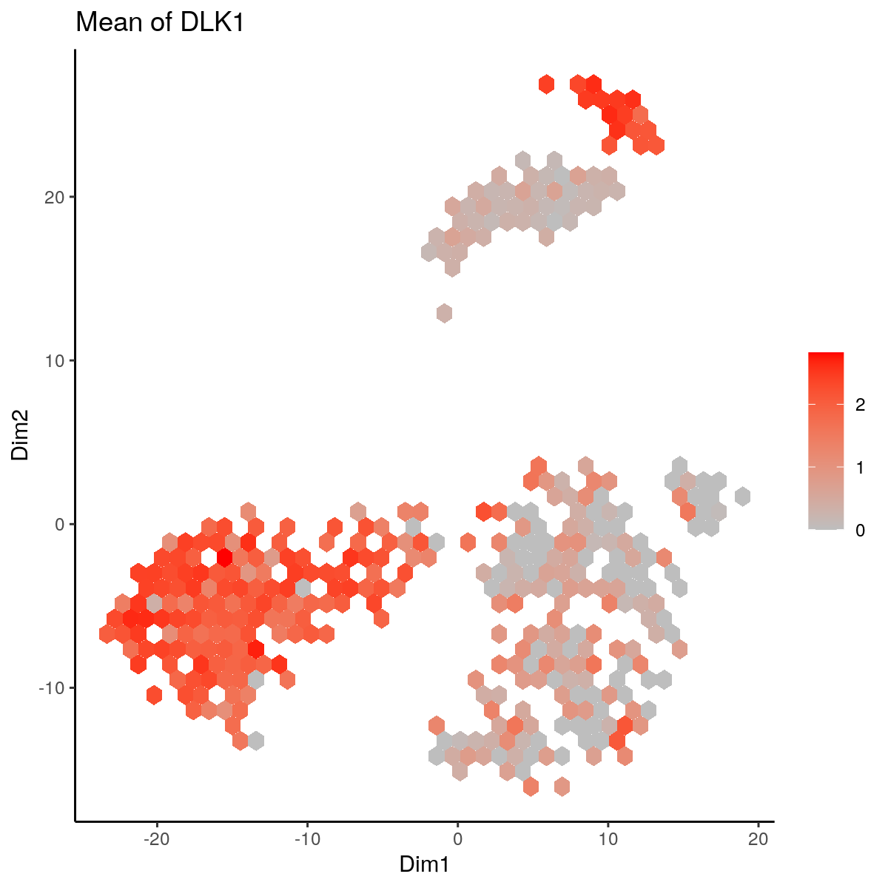|[NOTCH1](https://www.ncbi.nlm.nih.gov/gene/4851) [NOTCH2](https://www.ncbi.nlm.nih.gov/gene/4853) [NOTCH3](https://www.ncbi.nlm.nih.gov/gene/4854) [NOTCH4](https://www.ncbi.nlm.nih.gov/gene/4855)|
|[DLL1](https://www.ncbi.nlm.nih.gov/gene/28514)|[NOTCH1](https://www.ncbi.nlm.nih.gov/gene/4851) [NOTCH2](https://www.ncbi.nlm.nih.gov/gene/4853) [NOTCH3](https://www.ncbi.nlm.nih.gov/gene/4854) [NOTCH4](https://www.ncbi.nlm.nih.gov/gene/4855)|
|[DLL3](https://www.ncbi.nlm.nih.gov/gene/10683)|[NOTCH1](https://www.ncbi.nlm.nih.gov/gene/4851) [NOTCH2](https://www.ncbi.nlm.nih.gov/gene/4853) [NOTCH3](https://www.ncbi.nlm.nih.gov/gene/4854) [NOTCH4](https://www.ncbi.nlm.nih.gov/gene/4855)|
|[DLL4](https://www.ncbi.nlm.nih.gov/gene/54567)|[NOTCH1](https://www.ncbi.nlm.nih.gov/gene/4851) [NOTCH2](https://www.ncbi.nlm.nih.gov/gene/4853) [NOTCH3](https://www.ncbi.nlm.nih.gov/gene/4854) [NOTCH4](https://www.ncbi.nlm.nih.gov/gene/4855)|
|[DMBT1](https://www.ncbi.nlm.nih.gov/gene/1755)|[DUOX2](https://www.ncbi.nlm.nih.gov/gene/50506)|
|[DNASE1](https://www.ncbi.nlm.nih.gov/gene/1773)|[CD19](https://www.ncbi.nlm.nih.gov/gene/930) [CD44](https://www.ncbi.nlm.nih.gov/gene/960) [ADGRE1](https://www.ncbi.nlm.nih.gov/gene/2015) [FCGR2B](https://www.ncbi.nlm.nih.gov/gene/2213) [GGT1](https://www.ncbi.nlm.nih.gov/gene/2678) [ITGAM](https://www.ncbi.nlm.nih.gov/gene/3684) [PTPRC](https://www.ncbi.nlm.nih.gov/gene/5788) [THY1](https://www.ncbi.nlm.nih.gov/gene/7070) [MRAP](https://www.ncbi.nlm.nih.gov/gene/56246) [C14orf180](https://www.ncbi.nlm.nih.gov/gene/400258)|
|[DPT](https://www.ncbi.nlm.nih.gov/gene/1805)|[ACVRL1](https://www.ncbi.nlm.nih.gov/gene/94) [ANPEP](https://www.ncbi.nlm.nih.gov/gene/290) [SELL](https://www.ncbi.nlm.nih.gov/gene/6402) [TLR4](https://www.ncbi.nlm.nih.gov/gene/7099) [NAALAD2](https://www.ncbi.nlm.nih.gov/gene/10003) [SLC30A10](https://www.ncbi.nlm.nih.gov/gene/55532)|
|[DRAXIN](https://www.ncbi.nlm.nih.gov/gene/374946)|[DSCAM](https://www.ncbi.nlm.nih.gov/gene/1826) [EFNA2](https://www.ncbi.nlm.nih.gov/gene/1943) [NEO1](https://www.ncbi.nlm.nih.gov/gene/4756) [UNC5C](https://www.ncbi.nlm.nih.gov/gene/8633) [NTNG1](https://www.ncbi.nlm.nih.gov/gene/22854) [UNC5A](https://www.ncbi.nlm.nih.gov/gene/90249) [UNC5B](https://www.ncbi.nlm.nih.gov/gene/219699)|
|[DSCAM](https://www.ncbi.nlm.nih.gov/gene/1826)|[CDH8](https://www.ncbi.nlm.nih.gov/gene/1006) [FYN](https://www.ncbi.nlm.nih.gov/gene/2534) [NEO1](https://www.ncbi.nlm.nih.gov/gene/4756) [RAC1](https://www.ncbi.nlm.nih.gov/gene/5879) [SRC](https://www.ncbi.nlm.nih.gov/gene/6714) [SEMA7A](https://www.ncbi.nlm.nih.gov/gene/8482) [UNC5C](https://www.ncbi.nlm.nih.gov/gene/8633) [PROM1](https://www.ncbi.nlm.nih.gov/gene/8842) [FARP1](https://www.ncbi.nlm.nih.gov/gene/10160) [SEMA6C](https://www.ncbi.nlm.nih.gov/gene/10500) [SEMA6B](https://www.ncbi.nlm.nih.gov/gene/10501) [SEMA4F](https://www.ncbi.nlm.nih.gov/gene/10505) [SEMA4D](https://www.ncbi.nlm.nih.gov/gene/10507) [NTNG1](https://www.ncbi.nlm.nih.gov/gene/22854) [NLGN1](https://www.ncbi.nlm.nih.gov/gene/22871) [PCDH11X](https://www.ncbi.nlm.nih.gov/gene/27328) [UNC93A](https://www.ncbi.nlm.nih.gov/gene/54346) [SDK2](https://www.ncbi.nlm.nih.gov/gene/54549) [PCDHGC5](https://www.ncbi.nlm.nih.gov/gene/56097) [NLGN4X](https://www.ncbi.nlm.nih.gov/gene/57502) [NLGN2](https://www.ncbi.nlm.nih.gov/gene/57555) [SEMA6A](https://www.ncbi.nlm.nih.gov/gene/57556) [PCDH10](https://www.ncbi.nlm.nih.gov/gene/57575) [SEMA4G](https://www.ncbi.nlm.nih.gov/gene/57715) [SEMA4A](https://www.ncbi.nlm.nih.gov/gene/64218) [UNC5A](https://www.ncbi.nlm.nih.gov/gene/90249) [PLXNA4](https://www.ncbi.nlm.nih.gov/gene/91584) [OPN4](https://www.ncbi.nlm.nih.gov/gene/94233) [UNC5D](https://www.ncbi.nlm.nih.gov/gene/137970) [UNC5B](https://www.ncbi.nlm.nih.gov/gene/219699) [SDK1](https://www.ncbi.nlm.nih.gov/gene/221935)|
|[EBI3](https://www.ncbi.nlm.nih.gov/gene/10148)|[IL27RA](https://www.ncbi.nlm.nih.gov/gene/9466) [IL6ST](https://www.ncbi.nlm.nih.gov/gene/3572)|
|[ECM1](https://www.ncbi.nlm.nih.gov/gene/1893)|[CDH3](https://www.ncbi.nlm.nih.gov/gene/1001) [IL2RB](https://www.ncbi.nlm.nih.gov/gene/3560) [RAMP3](https://www.ncbi.nlm.nih.gov/gene/10268) [TEX101](https://www.ncbi.nlm.nih.gov/gene/83639)|
|[ECM2](https://www.ncbi.nlm.nih.gov/gene/1842)|[ADGRL1](https://www.ncbi.nlm.nih.gov/gene/22859) [ADGRL3](https://www.ncbi.nlm.nih.gov/gene/23284) [COL23A1](https://www.ncbi.nlm.nih.gov/gene/91522) [RAB39B](https://www.ncbi.nlm.nih.gov/gene/116442)|
|[ECRG4](https://www.ncbi.nlm.nih.gov/gene/84417)|[OLR1](https://www.ncbi.nlm.nih.gov/gene/4973)|
|[EDA](https://www.ncbi.nlm.nih.gov/gene/1896)|[ACE](https://www.ncbi.nlm.nih.gov/gene/1636) [SLC29A2](https://www.ncbi.nlm.nih.gov/gene/3177) [ITGAM](https://www.ncbi.nlm.nih.gov/gene/3684) [PTPRC](https://www.ncbi.nlm.nih.gov/gene/5788) [SLC4A1](https://www.ncbi.nlm.nih.gov/gene/6521) [CD163](https://www.ncbi.nlm.nih.gov/gene/9332) [GPR162](https://www.ncbi.nlm.nih.gov/gene/27239) [OR4K15](https://www.ncbi.nlm.nih.gov/gene/81127) [EDA2R](https://www.ncbi.nlm.nih.gov/gene/60401) [EDAR](https://www.ncbi.nlm.nih.gov/gene/10913)|
|[EDDM3A](https://www.ncbi.nlm.nih.gov/gene/10876)|[PTGER1](https://www.ncbi.nlm.nih.gov/gene/5731) [PTGER3](https://www.ncbi.nlm.nih.gov/gene/5733) [PTGER4](https://www.ncbi.nlm.nih.gov/gene/5734)|
|[EDDM3B](https://www.ncbi.nlm.nih.gov/gene/64184)|[PTGER3](https://www.ncbi.nlm.nih.gov/gene/5733)|
|[EDIL3](https://www.ncbi.nlm.nih.gov/gene/10085)|[F2RL2](https://www.ncbi.nlm.nih.gov/gene/2151) [ITGAV](https://www.ncbi.nlm.nih.gov/gene/3685) [ITGB2](https://www.ncbi.nlm.nih.gov/gene/3689) [ITGB3](https://www.ncbi.nlm.nih.gov/gene/3690) [RASGRF2](https://www.ncbi.nlm.nih.gov/gene/5924) [CLCA4](https://www.ncbi.nlm.nih.gov/gene/22802) [CNTN5](https://www.ncbi.nlm.nih.gov/gene/53942) [ARHGEF39](https://www.ncbi.nlm.nih.gov/gene/84904) [ANO6](https://www.ncbi.nlm.nih.gov/gene/196527)|
|[EDN1](https://www.ncbi.nlm.nih.gov/gene/1906)|[ADCY3](https://www.ncbi.nlm.nih.gov/gene/109) [ADCY5](https://www.ncbi.nlm.nih.gov/gene/111) [ADCY6](https://www.ncbi.nlm.nih.gov/gene/112) [ADCY8](https://www.ncbi.nlm.nih.gov/gene/114) [ADCY9](https://www.ncbi.nlm.nih.gov/gene/115) [ADORA1](https://www.ncbi.nlm.nih.gov/gene/134) [ADORA2A](https://www.ncbi.nlm.nih.gov/gene/135) [ADORA2B](https://www.ncbi.nlm.nih.gov/gene/136) [ADRA1D](https://www.ncbi.nlm.nih.gov/gene/146) [ADRA2A](https://www.ncbi.nlm.nih.gov/gene/150) [ADRA2B](https://www.ncbi.nlm.nih.gov/gene/151) [ADRA2C](https://www.ncbi.nlm.nih.gov/gene/152) [ADRB1](https://www.ncbi.nlm.nih.gov/gene/153) [ADRB2](https://www.ncbi.nlm.nih.gov/gene/154) [ADRB3](https://www.ncbi.nlm.nih.gov/gene/155) [AP2A1](https://www.ncbi.nlm.nih.gov/gene/160) [AGTR1](https://www.ncbi.nlm.nih.gov/gene/185) [AGTR2](https://www.ncbi.nlm.nih.gov/gene/186) [APLNR](https://www.ncbi.nlm.nih.gov/gene/187) [RHOA](https://www.ncbi.nlm.nih.gov/gene/387) [ARRB1](https://www.ncbi.nlm.nih.gov/gene/408) [AVPR1A](https://www.ncbi.nlm.nih.gov/gene/552) [AVPR1B](https://www.ncbi.nlm.nih.gov/gene/553) [BDKRB1](https://www.ncbi.nlm.nih.gov/gene/623) [BDKRB2](https://www.ncbi.nlm.nih.gov/gene/624) [BMPR2](https://www.ncbi.nlm.nih.gov/gene/659) [BRS3](https://www.ncbi.nlm.nih.gov/gene/680) [CASR](https://www.ncbi.nlm.nih.gov/gene/846) [CCKAR](https://www.ncbi.nlm.nih.gov/gene/886) [CCKBR](https://www.ncbi.nlm.nih.gov/gene/887) [CDC42](https://www.ncbi.nlm.nih.gov/gene/998) [CFTR](https://www.ncbi.nlm.nih.gov/gene/1080) [CHRM1](https://www.ncbi.nlm.nih.gov/gene/1128) [CHRM3](https://www.ncbi.nlm.nih.gov/gene/1131) [CHRM5](https://www.ncbi.nlm.nih.gov/gene/1133) [AP2M1](https://www.ncbi.nlm.nih.gov/gene/1173) [CCR3](https://www.ncbi.nlm.nih.gov/gene/1232) [CCR5](https://www.ncbi.nlm.nih.gov/gene/1234) [LTB4R](https://www.ncbi.nlm.nih.gov/gene/1241) [CYBA](https://www.ncbi.nlm.nih.gov/gene/1535) [CYBB](https://www.ncbi.nlm.nih.gov/gene/1536) [ACE](https://www.ncbi.nlm.nih.gov/gene/1636) [ECE1](https://www.ncbi.nlm.nih.gov/gene/1889) [EDNRA](https://www.ncbi.nlm.nih.gov/gene/1909) [EDNRB](https://www.ncbi.nlm.nih.gov/gene/1910) [ENG](https://www.ncbi.nlm.nih.gov/gene/2022) [ESR1](https://www.ncbi.nlm.nih.gov/gene/2099) [F2R](https://www.ncbi.nlm.nih.gov/gene/2149) [F2RL1](https://www.ncbi.nlm.nih.gov/gene/2150) [F2RL2](https://www.ncbi.nlm.nih.gov/gene/2151) [FGR](https://www.ncbi.nlm.nih.gov/gene/2268) [FPR1](https://www.ncbi.nlm.nih.gov/gene/2357) [FPR2](https://www.ncbi.nlm.nih.gov/gene/2358) [GCGR](https://www.ncbi.nlm.nih.gov/gene/2642) [GHSR](https://www.ncbi.nlm.nih.gov/gene/2693) [GJA1](https://www.ncbi.nlm.nih.gov/gene/2697) [GNA11](https://www.ncbi.nlm.nih.gov/gene/2767) [GNA12](https://www.ncbi.nlm.nih.gov/gene/2768) [GNAO1](https://www.ncbi.nlm.nih.gov/gene/2775) [GNAS](https://www.ncbi.nlm.nih.gov/gene/2778) [GNG3](https://www.ncbi.nlm.nih.gov/gene/2785) [GNG4](https://www.ncbi.nlm.nih.gov/gene/2786) [GNG5](https://www.ncbi.nlm.nih.gov/gene/2787) [GNG7](https://www.ncbi.nlm.nih.gov/gene/2788) [GNG10](https://www.ncbi.nlm.nih.gov/gene/2790) [GNG11](https://www.ncbi.nlm.nih.gov/gene/2791) [GNGT1](https://www.ncbi.nlm.nih.gov/gene/2792) [GNGT2](https://www.ncbi.nlm.nih.gov/gene/2793) [GNRHR](https://www.ncbi.nlm.nih.gov/gene/2798) [GPR1](https://www.ncbi.nlm.nih.gov/gene/2825) [GPR4](https://www.ncbi.nlm.nih.gov/gene/2828) [XCR1](https://www.ncbi.nlm.nih.gov/gene/2829) [UTS2R](https://www.ncbi.nlm.nih.gov/gene/2837) [GPR17](https://www.ncbi.nlm.nih.gov/gene/2840) [LPAR4](https://www.ncbi.nlm.nih.gov/gene/2846) [MCHR1](https://www.ncbi.nlm.nih.gov/gene/2847) [MLNR](https://www.ncbi.nlm.nih.gov/gene/2862) [GPR39](https://www.ncbi.nlm.nih.gov/gene/2863) [FFAR1](https://www.ncbi.nlm.nih.gov/gene/2864) [FFAR3](https://www.ncbi.nlm.nih.gov/gene/2865) [FFAR2](https://www.ncbi.nlm.nih.gov/gene/2867) [GRK5](https://www.ncbi.nlm.nih.gov/gene/2869) [GRM1](https://www.ncbi.nlm.nih.gov/gene/2911) [GRM5](https://www.ncbi.nlm.nih.gov/gene/2915) [GRPR](https://www.ncbi.nlm.nih.gov/gene/2925) [GUCY2C](https://www.ncbi.nlm.nih.gov/gene/2984) [HCRTR1](https://www.ncbi.nlm.nih.gov/gene/3061) [HCRTR2](https://www.ncbi.nlm.nih.gov/gene/3062) [ERAS](https://www.ncbi.nlm.nih.gov/gene/3266) [HRH1](https://www.ncbi.nlm.nih.gov/gene/3269) [HTR2A](https://www.ncbi.nlm.nih.gov/gene/3356) [HTR2B](https://www.ncbi.nlm.nih.gov/gene/3357) [HTR2C](https://www.ncbi.nlm.nih.gov/gene/3358) [HTR7](https://www.ncbi.nlm.nih.gov/gene/3363) [KCNA5](https://www.ncbi.nlm.nih.gov/gene/3741) [KEL](https://www.ncbi.nlm.nih.gov/gene/3792) [MC1R](https://www.ncbi.nlm.nih.gov/gene/4157) [MME](https://www.ncbi.nlm.nih.gov/gene/4311) [MMP17](https://www.ncbi.nlm.nih.gov/gene/4326) [NMBR](https://www.ncbi.nlm.nih.gov/gene/4829) [NOS1](https://www.ncbi.nlm.nih.gov/gene/4842) [NOS3](https://www.ncbi.nlm.nih.gov/gene/4846) [NPR2](https://www.ncbi.nlm.nih.gov/gene/4882) [NTSR1](https://www.ncbi.nlm.nih.gov/gene/4923) [OLR1](https://www.ncbi.nlm.nih.gov/gene/4973) [OPRK1](https://www.ncbi.nlm.nih.gov/gene/4986) [OPRL1](https://www.ncbi.nlm.nih.gov/gene/4987) [OXTR](https://www.ncbi.nlm.nih.gov/gene/5021) [P2RY1](https://www.ncbi.nlm.nih.gov/gene/5028) [P2RY2](https://www.ncbi.nlm.nih.gov/gene/5029) [P2RY6](https://www.ncbi.nlm.nih.gov/gene/5031) [P2RY11](https://www.ncbi.nlm.nih.gov/gene/5032) [PDGFRB](https://www.ncbi.nlm.nih.gov/gene/5159) [PRKAR1A](https://www.ncbi.nlm.nih.gov/gene/5573) [PRKAR1B](https://www.ncbi.nlm.nih.gov/gene/5575) [PTAFR](https://www.ncbi.nlm.nih.gov/gene/5724) [PTGER1](https://www.ncbi.nlm.nih.gov/gene/5731) [PTGFR](https://www.ncbi.nlm.nih.gov/gene/5737) [PTGIR](https://www.ncbi.nlm.nih.gov/gene/5739) [RAC1](https://www.ncbi.nlm.nih.gov/gene/5879) [RAF1](https://www.ncbi.nlm.nih.gov/gene/5894) [SCTR](https://www.ncbi.nlm.nih.gov/gene/6344) [SELE](https://www.ncbi.nlm.nih.gov/gene/6401) [SELP](https://www.ncbi.nlm.nih.gov/gene/6403) [SGK1](https://www.ncbi.nlm.nih.gov/gene/6446) [SLC2A1](https://www.ncbi.nlm.nih.gov/gene/6513) [SLC2A4](https://www.ncbi.nlm.nih.gov/gene/6517) [SLC9A3](https://www.ncbi.nlm.nih.gov/gene/6550) [SRC](https://www.ncbi.nlm.nih.gov/gene/6714) [TACR2](https://www.ncbi.nlm.nih.gov/gene/6865) [TACR1](https://www.ncbi.nlm.nih.gov/gene/6869) [TACR3](https://www.ncbi.nlm.nih.gov/gene/6870) [TBXA2R](https://www.ncbi.nlm.nih.gov/gene/6915) [TEK](https://www.ncbi.nlm.nih.gov/gene/7010) [TLR4](https://www.ncbi.nlm.nih.gov/gene/7099) [TRHR](https://www.ncbi.nlm.nih.gov/gene/7201) [TRPC6](https://www.ncbi.nlm.nih.gov/gene/7225) [EZR](https://www.ncbi.nlm.nih.gov/gene/7430) [CXCR4](https://www.ncbi.nlm.nih.gov/gene/7852) [GPR68](https://www.ncbi.nlm.nih.gov/gene/8111) [GPR65](https://www.ncbi.nlm.nih.gov/gene/8477) [F2RL3](https://www.ncbi.nlm.nih.gov/gene/9002) [ROCK2](https://www.ncbi.nlm.nih.gov/gene/9475) [LPAR6](https://www.ncbi.nlm.nih.gov/gene/10161) [NMUR1](https://www.ncbi.nlm.nih.gov/gene/10316) [CYSLTR1](https://www.ncbi.nlm.nih.gov/gene/10800) [NPFFR2](https://www.ncbi.nlm.nih.gov/gene/10886) [LPAR3](https://www.ncbi.nlm.nih.gov/gene/23566) [NTSR2](https://www.ncbi.nlm.nih.gov/gene/23620) [P2RY10](https://www.ncbi.nlm.nih.gov/gene/27334) [GPR132](https://www.ncbi.nlm.nih.gov/gene/29933) [GNG13](https://www.ncbi.nlm.nih.gov/gene/51764) [GNG2](https://www.ncbi.nlm.nih.gov/gene/54331) [GNG12](https://www.ncbi.nlm.nih.gov/gene/55970) [LTB4R2](https://www.ncbi.nlm.nih.gov/gene/56413) [NMUR2](https://www.ncbi.nlm.nih.gov/gene/56923) [CYSLTR2](https://www.ncbi.nlm.nih.gov/gene/57105) [LPAR5](https://www.ncbi.nlm.nih.gov/gene/57121) [ACE2](https://www.ncbi.nlm.nih.gov/gene/59272) [NPFFR1](https://www.ncbi.nlm.nih.gov/gene/64106) [ADGRL4](https://www.ncbi.nlm.nih.gov/gene/64123) [QRFPR](https://www.ncbi.nlm.nih.gov/gene/84109) [MCHR2](https://www.ncbi.nlm.nih.gov/gene/84539) [KISS1R](https://www.ncbi.nlm.nih.gov/gene/84634) [OPN4](https://www.ncbi.nlm.nih.gov/gene/94233) [GNG8](https://www.ncbi.nlm.nih.gov/gene/94235) [ARHGEF25](https://www.ncbi.nlm.nih.gov/gene/115557) [PROKR2](https://www.ncbi.nlm.nih.gov/gene/128674) [ADCY4](https://www.ncbi.nlm.nih.gov/gene/196883) [GPRC6A](https://www.ncbi.nlm.nih.gov/gene/222545) [FFAR4](https://www.ncbi.nlm.nih.gov/gene/338557)|
|[EDN2](https://www.ncbi.nlm.nih.gov/gene/1907)|[ADRA1D](https://www.ncbi.nlm.nih.gov/gene/146) [AGTR1](https://www.ncbi.nlm.nih.gov/gene/185) [AGTR2](https://www.ncbi.nlm.nih.gov/gene/186) [AVPR1A](https://www.ncbi.nlm.nih.gov/gene/552) [AVPR1B](https://www.ncbi.nlm.nih.gov/gene/553) [BDKRB1](https://www.ncbi.nlm.nih.gov/gene/623) [BDKRB2](https://www.ncbi.nlm.nih.gov/gene/624) [BRS3](https://www.ncbi.nlm.nih.gov/gene/680) [CASR](https://www.ncbi.nlm.nih.gov/gene/846) [CCKAR](https://www.ncbi.nlm.nih.gov/gene/886) [CCKBR](https://www.ncbi.nlm.nih.gov/gene/887) [CHRM1](https://www.ncbi.nlm.nih.gov/gene/1128) [CHRM3](https://www.ncbi.nlm.nih.gov/gene/1131) [CHRM5](https://www.ncbi.nlm.nih.gov/gene/1133) [LTB4R](https://www.ncbi.nlm.nih.gov/gene/1241) [ECE1](https://www.ncbi.nlm.nih.gov/gene/1889) [EDNRA](https://www.ncbi.nlm.nih.gov/gene/1909) [EDNRB](https://www.ncbi.nlm.nih.gov/gene/1910) [F2R](https://www.ncbi.nlm.nih.gov/gene/2149) [F2RL1](https://www.ncbi.nlm.nih.gov/gene/2150) [F2RL2](https://www.ncbi.nlm.nih.gov/gene/2151) [FPR2](https://www.ncbi.nlm.nih.gov/gene/2358) [GCGR](https://www.ncbi.nlm.nih.gov/gene/2642) [GHSR](https://www.ncbi.nlm.nih.gov/gene/2693) [GNA11](https://www.ncbi.nlm.nih.gov/gene/2767) [GNG3](https://www.ncbi.nlm.nih.gov/gene/2785) [GNG4](https://www.ncbi.nlm.nih.gov/gene/2786) [GNG5](https://www.ncbi.nlm.nih.gov/gene/2787) [GNG7](https://www.ncbi.nlm.nih.gov/gene/2788) [GNG10](https://www.ncbi.nlm.nih.gov/gene/2790) [GNG11](https://www.ncbi.nlm.nih.gov/gene/2791) [GNGT1](https://www.ncbi.nlm.nih.gov/gene/2792) [GNGT2](https://www.ncbi.nlm.nih.gov/gene/2793) [GNRHR](https://www.ncbi.nlm.nih.gov/gene/2798) [GPR4](https://www.ncbi.nlm.nih.gov/gene/2828) [XCR1](https://www.ncbi.nlm.nih.gov/gene/2829) [UTS2R](https://www.ncbi.nlm.nih.gov/gene/2837) [GPR17](https://www.ncbi.nlm.nih.gov/gene/2840) [LPAR4](https://www.ncbi.nlm.nih.gov/gene/2846) [MCHR1](https://www.ncbi.nlm.nih.gov/gene/2847) [MLNR](https://www.ncbi.nlm.nih.gov/gene/2862) [GPR39](https://www.ncbi.nlm.nih.gov/gene/2863) [FFAR1](https://www.ncbi.nlm.nih.gov/gene/2864) [FFAR3](https://www.ncbi.nlm.nih.gov/gene/2865) [FFAR2](https://www.ncbi.nlm.nih.gov/gene/2867) [GRK5](https://www.ncbi.nlm.nih.gov/gene/2869) [GRM1](https://www.ncbi.nlm.nih.gov/gene/2911) [GRM5](https://www.ncbi.nlm.nih.gov/gene/2915) [GRPR](https://www.ncbi.nlm.nih.gov/gene/2925) [HCRTR1](https://www.ncbi.nlm.nih.gov/gene/3061) [HCRTR2](https://www.ncbi.nlm.nih.gov/gene/3062) [HRH1](https://www.ncbi.nlm.nih.gov/gene/3269) [HTR2A](https://www.ncbi.nlm.nih.gov/gene/3356) [HTR2B](https://www.ncbi.nlm.nih.gov/gene/3357) [HTR2C](https://www.ncbi.nlm.nih.gov/gene/3358) [KEL](https://www.ncbi.nlm.nih.gov/gene/3792) [MME](https://www.ncbi.nlm.nih.gov/gene/4311) [NMBR](https://www.ncbi.nlm.nih.gov/gene/4829) [NTSR1](https://www.ncbi.nlm.nih.gov/gene/4923) [OXTR](https://www.ncbi.nlm.nih.gov/gene/5021) [P2RY1](https://www.ncbi.nlm.nih.gov/gene/5028) [P2RY2](https://www.ncbi.nlm.nih.gov/gene/5029) [P2RY6](https://www.ncbi.nlm.nih.gov/gene/5031) [P2RY11](https://www.ncbi.nlm.nih.gov/gene/5032) [PTAFR](https://www.ncbi.nlm.nih.gov/gene/5724) [PTGER1](https://www.ncbi.nlm.nih.gov/gene/5731) [PTGFR](https://www.ncbi.nlm.nih.gov/gene/5737) [SSTR3](https://www.ncbi.nlm.nih.gov/gene/6753) [TACR2](https://www.ncbi.nlm.nih.gov/gene/6865) [TACR1](https://www.ncbi.nlm.nih.gov/gene/6869) [TACR3](https://www.ncbi.nlm.nih.gov/gene/6870) [TBXA2R](https://www.ncbi.nlm.nih.gov/gene/6915) [TRHR](https://www.ncbi.nlm.nih.gov/gene/7201) [GPR68](https://www.ncbi.nlm.nih.gov/gene/8111) [GPR65](https://www.ncbi.nlm.nih.gov/gene/8477) [F2RL3](https://www.ncbi.nlm.nih.gov/gene/9002) [LPAR6](https://www.ncbi.nlm.nih.gov/gene/10161) [NMUR1](https://www.ncbi.nlm.nih.gov/gene/10316) [CYSLTR1](https://www.ncbi.nlm.nih.gov/gene/10800) [NPFFR2](https://www.ncbi.nlm.nih.gov/gene/10886) [LPAR3](https://www.ncbi.nlm.nih.gov/gene/23566) [NTSR2](https://www.ncbi.nlm.nih.gov/gene/23620) [P2RY10](https://www.ncbi.nlm.nih.gov/gene/27334) [GPR132](https://www.ncbi.nlm.nih.gov/gene/29933) [GNG13](https://www.ncbi.nlm.nih.gov/gene/51764) [GNG2](https://www.ncbi.nlm.nih.gov/gene/54331) [GNG12](https://www.ncbi.nlm.nih.gov/gene/55970) [LTB4R2](https://www.ncbi.nlm.nih.gov/gene/56413) [NMUR2](https://www.ncbi.nlm.nih.gov/gene/56923) [CYSLTR2](https://www.ncbi.nlm.nih.gov/gene/57105) [LPAR5](https://www.ncbi.nlm.nih.gov/gene/57121) [NPFFR1](https://www.ncbi.nlm.nih.gov/gene/64106) [QRFPR](https://www.ncbi.nlm.nih.gov/gene/84109) [MCHR2](https://www.ncbi.nlm.nih.gov/gene/84539) [KISS1R](https://www.ncbi.nlm.nih.gov/gene/84634) [OPN4](https://www.ncbi.nlm.nih.gov/gene/94233) [GNG8](https://www.ncbi.nlm.nih.gov/gene/94235) [ARHGEF25](https://www.ncbi.nlm.nih.gov/gene/115557) [PROKR2](https://www.ncbi.nlm.nih.gov/gene/128674) [STOML3](https://www.ncbi.nlm.nih.gov/gene/161003) [GPRC6A](https://www.ncbi.nlm.nih.gov/gene/222545) [FFAR4](https://www.ncbi.nlm.nih.gov/gene/338557)|
|[EDN3](https://www.ncbi.nlm.nih.gov/gene/1908)|[ADRA1D](https://www.ncbi.nlm.nih.gov/gene/146) [AGTR1](https://www.ncbi.nlm.nih.gov/gene/185) [AGTR2](https://www.ncbi.nlm.nih.gov/gene/186) [AVPR1A](https://www.ncbi.nlm.nih.gov/gene/552) [AVPR1B](https://www.ncbi.nlm.nih.gov/gene/553) [BDKRB1](https://www.ncbi.nlm.nih.gov/gene/623) [BDKRB2](https://www.ncbi.nlm.nih.gov/gene/624) [BRS3](https://www.ncbi.nlm.nih.gov/gene/680) [CASR](https://www.ncbi.nlm.nih.gov/gene/846) [CCKAR](https://www.ncbi.nlm.nih.gov/gene/886) [CCKBR](https://www.ncbi.nlm.nih.gov/gene/887) [CHRM1](https://www.ncbi.nlm.nih.gov/gene/1128) [CHRM3](https://www.ncbi.nlm.nih.gov/gene/1131) [CHRM5](https://www.ncbi.nlm.nih.gov/gene/1133) [LTB4R](https://www.ncbi.nlm.nih.gov/gene/1241) [ECE1](https://www.ncbi.nlm.nih.gov/gene/1889) [EDNRA](https://www.ncbi.nlm.nih.gov/gene/1909) [EDNRB](https://www.ncbi.nlm.nih.gov/gene/1910) [F2R](https://www.ncbi.nlm.nih.gov/gene/2149) [F2RL1](https://www.ncbi.nlm.nih.gov/gene/2150) [F2RL2](https://www.ncbi.nlm.nih.gov/gene/2151) [FPR2](https://www.ncbi.nlm.nih.gov/gene/2358) [GCGR](https://www.ncbi.nlm.nih.gov/gene/2642) [GFRA1](https://www.ncbi.nlm.nih.gov/gene/2674) [GHSR](https://www.ncbi.nlm.nih.gov/gene/2693) [GNA11](https://www.ncbi.nlm.nih.gov/gene/2767) [GNG3](https://www.ncbi.nlm.nih.gov/gene/2785) [GNG4](https://www.ncbi.nlm.nih.gov/gene/2786) [GNG5](https://www.ncbi.nlm.nih.gov/gene/2787) [GNG7](https://www.ncbi.nlm.nih.gov/gene/2788) [GNG10](https://www.ncbi.nlm.nih.gov/gene/2790) [GNG11](https://www.ncbi.nlm.nih.gov/gene/2791) [GNGT1](https://www.ncbi.nlm.nih.gov/gene/2792) [GNGT2](https://www.ncbi.nlm.nih.gov/gene/2793) [GNRHR](https://www.ncbi.nlm.nih.gov/gene/2798) [GPR1](https://www.ncbi.nlm.nih.gov/gene/2825) [GPR4](https://www.ncbi.nlm.nih.gov/gene/2828) [XCR1](https://www.ncbi.nlm.nih.gov/gene/2829) [UTS2R](https://www.ncbi.nlm.nih.gov/gene/2837) [GPR17](https://www.ncbi.nlm.nih.gov/gene/2840) [LPAR4](https://www.ncbi.nlm.nih.gov/gene/2846) [MCHR1](https://www.ncbi.nlm.nih.gov/gene/2847) [GPR37](https://www.ncbi.nlm.nih.gov/gene/2861) [MLNR](https://www.ncbi.nlm.nih.gov/gene/2862) [GPR39](https://www.ncbi.nlm.nih.gov/gene/2863) [FFAR1](https://www.ncbi.nlm.nih.gov/gene/2864) [FFAR3](https://www.ncbi.nlm.nih.gov/gene/2865) [FFAR2](https://www.ncbi.nlm.nih.gov/gene/2867) [GRK5](https://www.ncbi.nlm.nih.gov/gene/2869) [GRM1](https://www.ncbi.nlm.nih.gov/gene/2911) [GRM5](https://www.ncbi.nlm.nih.gov/gene/2915) [GRPR](https://www.ncbi.nlm.nih.gov/gene/2925) [HCRTR1](https://www.ncbi.nlm.nih.gov/gene/3061) [HCRTR2](https://www.ncbi.nlm.nih.gov/gene/3062) [HRH1](https://www.ncbi.nlm.nih.gov/gene/3269) [HTR2A](https://www.ncbi.nlm.nih.gov/gene/3356) [HTR2B](https://www.ncbi.nlm.nih.gov/gene/3357) [HTR2C](https://www.ncbi.nlm.nih.gov/gene/3358) [KEL](https://www.ncbi.nlm.nih.gov/gene/3792) [MC1R](https://www.ncbi.nlm.nih.gov/gene/4157) [MME](https://www.ncbi.nlm.nih.gov/gene/4311) [NMBR](https://www.ncbi.nlm.nih.gov/gene/4829) [NTSR1](https://www.ncbi.nlm.nih.gov/gene/4923) [OPRD1](https://www.ncbi.nlm.nih.gov/gene/4985) [OPRK1](https://www.ncbi.nlm.nih.gov/gene/4986) [OPRL1](https://www.ncbi.nlm.nih.gov/gene/4987) [OXTR](https://www.ncbi.nlm.nih.gov/gene/5021) [P2RY1](https://www.ncbi.nlm.nih.gov/gene/5028) [P2RY2](https://www.ncbi.nlm.nih.gov/gene/5029) [P2RY6](https://www.ncbi.nlm.nih.gov/gene/5031) [P2RY11](https://www.ncbi.nlm.nih.gov/gene/5032) [PTAFR](https://www.ncbi.nlm.nih.gov/gene/5724) [PTGER1](https://www.ncbi.nlm.nih.gov/gene/5731) [PTGFR](https://www.ncbi.nlm.nih.gov/gene/5737) [RET](https://www.ncbi.nlm.nih.gov/gene/5979) [TACR2](https://www.ncbi.nlm.nih.gov/gene/6865) [TACR1](https://www.ncbi.nlm.nih.gov/gene/6869) [TACR3](https://www.ncbi.nlm.nih.gov/gene/6870) [TBXA2R](https://www.ncbi.nlm.nih.gov/gene/6915) [TRHR](https://www.ncbi.nlm.nih.gov/gene/7201) [GPR68](https://www.ncbi.nlm.nih.gov/gene/8111) [GPR65](https://www.ncbi.nlm.nih.gov/gene/8477) [F2RL3](https://www.ncbi.nlm.nih.gov/gene/9002) [LPAR6](https://www.ncbi.nlm.nih.gov/gene/10161) [NMUR1](https://www.ncbi.nlm.nih.gov/gene/10316) [CYSLTR1](https://www.ncbi.nlm.nih.gov/gene/10800) [NPFFR2](https://www.ncbi.nlm.nih.gov/gene/10886) [LPAR3](https://www.ncbi.nlm.nih.gov/gene/23566) [NTSR2](https://www.ncbi.nlm.nih.gov/gene/23620) [P2RY10](https://www.ncbi.nlm.nih.gov/gene/27334) [GPR132](https://www.ncbi.nlm.nih.gov/gene/29933) [GNG13](https://www.ncbi.nlm.nih.gov/gene/51764) [GNG2](https://www.ncbi.nlm.nih.gov/gene/54331) [GNG12](https://www.ncbi.nlm.nih.gov/gene/55970) [LTB4R2](https://www.ncbi.nlm.nih.gov/gene/56413) [NMUR2](https://www.ncbi.nlm.nih.gov/gene/56923) [CYSLTR2](https://www.ncbi.nlm.nih.gov/gene/57105) [LPAR5](https://www.ncbi.nlm.nih.gov/gene/57121) [NPFFR1](https://www.ncbi.nlm.nih.gov/gene/64106) [QRFPR](https://www.ncbi.nlm.nih.gov/gene/84109) [MCHR2](https://www.ncbi.nlm.nih.gov/gene/84539) [KISS1R](https://www.ncbi.nlm.nih.gov/gene/84634) [OPN4](https://www.ncbi.nlm.nih.gov/gene/94233) [GNG8](https://www.ncbi.nlm.nih.gov/gene/94235) [ARHGEF25](https://www.ncbi.nlm.nih.gov/gene/115557) [PROKR2](https://www.ncbi.nlm.nih.gov/gene/128674) [GPRC6A](https://www.ncbi.nlm.nih.gov/gene/222545) [FFAR4](https://www.ncbi.nlm.nih.gov/gene/338557)|
|[EFEMP1](https://www.ncbi.nlm.nih.gov/gene/2202)|[LRP6](https://www.ncbi.nlm.nih.gov/gene/4040) [MFAP3](https://www.ncbi.nlm.nih.gov/gene/4238) [BEST1](https://www.ncbi.nlm.nih.gov/gene/7439) [PCDHGA12](https://www.ncbi.nlm.nih.gov/gene/26025) [PCDHB5](https://www.ncbi.nlm.nih.gov/gene/26167)|
|[EFEMP2](https://www.ncbi.nlm.nih.gov/gene/30008) 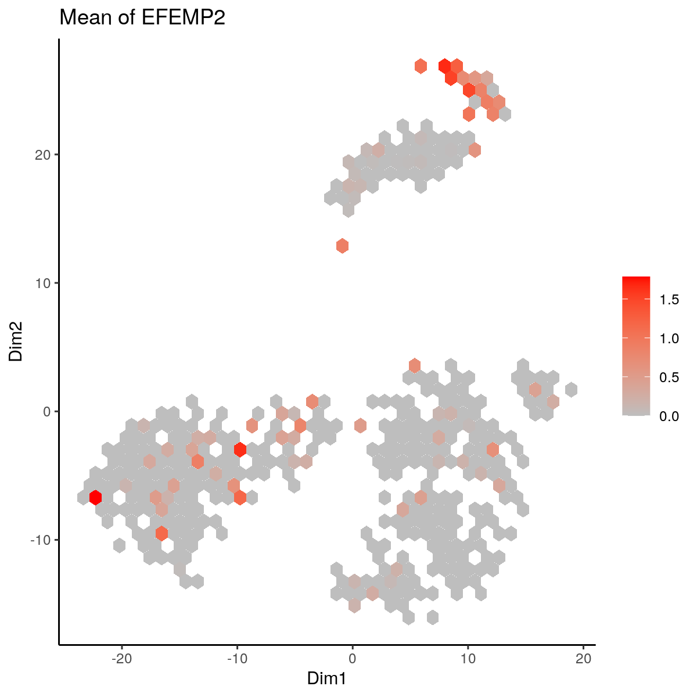|[ATP4A](https://www.ncbi.nlm.nih.gov/gene/495) [LRP6](https://www.ncbi.nlm.nih.gov/gene/4040) [MFAP3](https://www.ncbi.nlm.nih.gov/gene/4238) [TGFBR2](https://www.ncbi.nlm.nih.gov/gene/7048) [ATP6V0A2](https://www.ncbi.nlm.nih.gov/gene/23545) [MXRA8](https://www.ncbi.nlm.nih.gov/gene/54587) [TP53I13](https://www.ncbi.nlm.nih.gov/gene/90313) [COL23A1](https://www.ncbi.nlm.nih.gov/gene/91522) [MRGPRF](https://www.ncbi.nlm.nih.gov/gene/116535)|
|[EFNA1](https://www.ncbi.nlm.nih.gov/gene/1942)|[ADAM10](https://www.ncbi.nlm.nih.gov/gene/102) [RHOA](https://www.ncbi.nlm.nih.gov/gene/387) [BLK](https://www.ncbi.nlm.nih.gov/gene/640) [CBL](https://www.ncbi.nlm.nih.gov/gene/867) [CDH2](https://www.ncbi.nlm.nih.gov/gene/1000) [CSF1R](https://www.ncbi.nlm.nih.gov/gene/1436) [CTNNA1](https://www.ncbi.nlm.nih.gov/gene/1495) [EFNA2](https://www.ncbi.nlm.nih.gov/gene/1943) [EFNA3](https://www.ncbi.nlm.nih.gov/gene/1944) [EFNA5](https://www.ncbi.nlm.nih.gov/gene/1946) [EPHA2](https://www.ncbi.nlm.nih.gov/gene/1969) [EPHA1](https://www.ncbi.nlm.nih.gov/gene/2041) [EPHA4](https://www.ncbi.nlm.nih.gov/gene/2043) [EPHA5](https://www.ncbi.nlm.nih.gov/gene/2044) [EPHA7](https://www.ncbi.nlm.nih.gov/gene/2045) [EPHA8](https://www.ncbi.nlm.nih.gov/gene/2046) [EPHB1](https://www.ncbi.nlm.nih.gov/gene/2047) [EPHB2](https://www.ncbi.nlm.nih.gov/gene/2048) [EPHB3](https://www.ncbi.nlm.nih.gov/gene/2049) [EPHB4](https://www.ncbi.nlm.nih.gov/gene/2050) [FGFR1](https://www.ncbi.nlm.nih.gov/gene/2260) [FGFR3](https://www.ncbi.nlm.nih.gov/gene/2261) [FGR](https://www.ncbi.nlm.nih.gov/gene/2268) [FYN](https://www.ncbi.nlm.nih.gov/gene/2534) [INSR](https://www.ncbi.nlm.nih.gov/gene/3643) [LYN](https://www.ncbi.nlm.nih.gov/gene/4067) [MAG](https://www.ncbi.nlm.nih.gov/gene/4099) [NGFR](https://www.ncbi.nlm.nih.gov/gene/4804) [NTRK1](https://www.ncbi.nlm.nih.gov/gene/4914) [NTRK2](https://www.ncbi.nlm.nih.gov/gene/4915) [OMG](https://www.ncbi.nlm.nih.gov/gene/4974) [PDGFRA](https://www.ncbi.nlm.nih.gov/gene/5156) [PDGFRB](https://www.ncbi.nlm.nih.gov/gene/5159) [PLXNA1](https://www.ncbi.nlm.nih.gov/gene/5361) [PLXNA2](https://www.ncbi.nlm.nih.gov/gene/5362) [PLXNB3](https://www.ncbi.nlm.nih.gov/gene/5365) [RAC1](https://www.ncbi.nlm.nih.gov/gene/5879) [ROBO1](https://www.ncbi.nlm.nih.gov/gene/6091) [SRC](https://www.ncbi.nlm.nih.gov/gene/6714) [TEK](https://www.ncbi.nlm.nih.gov/gene/7010) [TIAM1](https://www.ncbi.nlm.nih.gov/gene/7074) [YES1](https://www.ncbi.nlm.nih.gov/gene/7525) [SEMA7A](https://www.ncbi.nlm.nih.gov/gene/8482) [SEMA6C](https://www.ncbi.nlm.nih.gov/gene/10500) [SEMA6B](https://www.ncbi.nlm.nih.gov/gene/10501) [SEMA4F](https://www.ncbi.nlm.nih.gov/gene/10505) [SEMA4D](https://www.ncbi.nlm.nih.gov/gene/10507) [NLGN1](https://www.ncbi.nlm.nih.gov/gene/22871) [PLXND1](https://www.ncbi.nlm.nih.gov/gene/23129) [PLXNB2](https://www.ncbi.nlm.nih.gov/gene/23654) [PLXNA3](https://www.ncbi.nlm.nih.gov/gene/55558) [NLGN4X](https://www.ncbi.nlm.nih.gov/gene/57502) [NLGN2](https://www.ncbi.nlm.nih.gov/gene/57555) [SEMA6A](https://www.ncbi.nlm.nih.gov/gene/57556) [SEMA4G](https://www.ncbi.nlm.nih.gov/gene/57715) [SEMA4A](https://www.ncbi.nlm.nih.gov/gene/64218) [PLXNA4](https://www.ncbi.nlm.nih.gov/gene/91584) [EPHA3](https://www.ncbi.nlm.nih.gov/gene/2042)|
|[EFNA2](https://www.ncbi.nlm.nih.gov/gene/1943)|[EPHA1](https://www.ncbi.nlm.nih.gov/gene/2041) [EPHA2](https://www.ncbi.nlm.nih.gov/gene/1969) [EPHA3](https://www.ncbi.nlm.nih.gov/gene/2042) [EPHA4](https://www.ncbi.nlm.nih.gov/gene/2043) [EPHA5](https://www.ncbi.nlm.nih.gov/gene/2044) [EPHA7](https://www.ncbi.nlm.nih.gov/gene/2045) [EPHA8](https://www.ncbi.nlm.nih.gov/gene/2046)|
|[EFNA3](https://www.ncbi.nlm.nih.gov/gene/1944)|[EPHA1](https://www.ncbi.nlm.nih.gov/gene/2041) [EPHA2](https://www.ncbi.nlm.nih.gov/gene/1969) [EPHA3](https://www.ncbi.nlm.nih.gov/gene/2042) [EPHA4](https://www.ncbi.nlm.nih.gov/gene/2043) [EPHA5](https://www.ncbi.nlm.nih.gov/gene/2044) [EPHA7](https://www.ncbi.nlm.nih.gov/gene/2045) [EPHA8](https://www.ncbi.nlm.nih.gov/gene/2046)|
|[EFNA4](https://www.ncbi.nlm.nih.gov/gene/1945)|[ADAM10](https://www.ncbi.nlm.nih.gov/gene/102) [RHOA](https://www.ncbi.nlm.nih.gov/gene/387) [CDH2](https://www.ncbi.nlm.nih.gov/gene/1000) [CSF1R](https://www.ncbi.nlm.nih.gov/gene/1436) [EFNA2](https://www.ncbi.nlm.nih.gov/gene/1943) [EFNA3](https://www.ncbi.nlm.nih.gov/gene/1944) [EFNA5](https://www.ncbi.nlm.nih.gov/gene/1946) [EPHA2](https://www.ncbi.nlm.nih.gov/gene/1969) [EPHA1](https://www.ncbi.nlm.nih.gov/gene/2041) [EPHA4](https://www.ncbi.nlm.nih.gov/gene/2043) [EPHA5](https://www.ncbi.nlm.nih.gov/gene/2044) [EPHA7](https://www.ncbi.nlm.nih.gov/gene/2045) [EPHA8](https://www.ncbi.nlm.nih.gov/gene/2046) [EPHB1](https://www.ncbi.nlm.nih.gov/gene/2047) [EPHB2](https://www.ncbi.nlm.nih.gov/gene/2048) [EPHB3](https://www.ncbi.nlm.nih.gov/gene/2049) [EPHB4](https://www.ncbi.nlm.nih.gov/gene/2050) [FGFR1](https://www.ncbi.nlm.nih.gov/gene/2260) [FGFR3](https://www.ncbi.nlm.nih.gov/gene/2261) [FYN](https://www.ncbi.nlm.nih.gov/gene/2534) [GNG3](https://www.ncbi.nlm.nih.gov/gene/2785) [INSR](https://www.ncbi.nlm.nih.gov/gene/3643) [MAG](https://www.ncbi.nlm.nih.gov/gene/4099) [NGFR](https://www.ncbi.nlm.nih.gov/gene/4804) [NTRK1](https://www.ncbi.nlm.nih.gov/gene/4914) [NTRK2](https://www.ncbi.nlm.nih.gov/gene/4915) [OMG](https://www.ncbi.nlm.nih.gov/gene/4974) [PDGFRA](https://www.ncbi.nlm.nih.gov/gene/5156) [PDGFRB](https://www.ncbi.nlm.nih.gov/gene/5159) [PLXNA1](https://www.ncbi.nlm.nih.gov/gene/5361) [PLXNA2](https://www.ncbi.nlm.nih.gov/gene/5362) [PLXNB3](https://www.ncbi.nlm.nih.gov/gene/5365) [ROBO1](https://www.ncbi.nlm.nih.gov/gene/6091) [SRC](https://www.ncbi.nlm.nih.gov/gene/6714) [TEK](https://www.ncbi.nlm.nih.gov/gene/7010) [SEMA7A](https://www.ncbi.nlm.nih.gov/gene/8482) [SEMA6C](https://www.ncbi.nlm.nih.gov/gene/10500) [SEMA6B](https://www.ncbi.nlm.nih.gov/gene/10501) [SEMA4F](https://www.ncbi.nlm.nih.gov/gene/10505) [SEMA4D](https://www.ncbi.nlm.nih.gov/gene/10507) [NLGN1](https://www.ncbi.nlm.nih.gov/gene/22871) [PLXND1](https://www.ncbi.nlm.nih.gov/gene/23129) [PLXNB2](https://www.ncbi.nlm.nih.gov/gene/23654) [RAB23](https://www.ncbi.nlm.nih.gov/gene/51715) [NLGN3](https://www.ncbi.nlm.nih.gov/gene/54413) [PLXNA3](https://www.ncbi.nlm.nih.gov/gene/55558) [NLGN4X](https://www.ncbi.nlm.nih.gov/gene/57502) [NLGN2](https://www.ncbi.nlm.nih.gov/gene/57555) [SEMA6A](https://www.ncbi.nlm.nih.gov/gene/57556) [SEMA4G](https://www.ncbi.nlm.nih.gov/gene/57715) [SEMA4A](https://www.ncbi.nlm.nih.gov/gene/64218) [PLXNA4](https://www.ncbi.nlm.nih.gov/gene/91584) [EPHA3](https://www.ncbi.nlm.nih.gov/gene/2042)|
|[EFNA5](https://www.ncbi.nlm.nih.gov/gene/1946)|[EPHA1](https://www.ncbi.nlm.nih.gov/gene/2041) [EPHA2](https://www.ncbi.nlm.nih.gov/gene/1969) [EPHA3](https://www.ncbi.nlm.nih.gov/gene/2042) [EPHA4](https://www.ncbi.nlm.nih.gov/gene/2043) [EPHA5](https://www.ncbi.nlm.nih.gov/gene/2044) [EPHA7](https://www.ncbi.nlm.nih.gov/gene/2045) [EPHA8](https://www.ncbi.nlm.nih.gov/gene/2046)|
|[EFNB1](https://www.ncbi.nlm.nih.gov/gene/1947)|[EPHA4](https://www.ncbi.nlm.nih.gov/gene/2043) [EPHB1](https://www.ncbi.nlm.nih.gov/gene/2047) [EPHB2](https://www.ncbi.nlm.nih.gov/gene/2048) [EPHB3](https://www.ncbi.nlm.nih.gov/gene/2049) [EPHB4](https://www.ncbi.nlm.nih.gov/gene/2050) [EPHB6](https://www.ncbi.nlm.nih.gov/gene/2051)|
|[EFNB2](https://www.ncbi.nlm.nih.gov/gene/1948)|[EPHA4](https://www.ncbi.nlm.nih.gov/gene/2043) [EPHB1](https://www.ncbi.nlm.nih.gov/gene/2047) [EPHB2](https://www.ncbi.nlm.nih.gov/gene/2048) [EPHB3](https://www.ncbi.nlm.nih.gov/gene/2049) [EPHB4](https://www.ncbi.nlm.nih.gov/gene/2050) [EPHB6](https://www.ncbi.nlm.nih.gov/gene/2051)|
|[EFNB3](https://www.ncbi.nlm.nih.gov/gene/1949)|[EPHA4](https://www.ncbi.nlm.nih.gov/gene/2043) [EPHB1](https://www.ncbi.nlm.nih.gov/gene/2047) [EPHB2](https://www.ncbi.nlm.nih.gov/gene/2048) [EPHB3](https://www.ncbi.nlm.nih.gov/gene/2049) [EPHB4](https://www.ncbi.nlm.nih.gov/gene/2050) [EPHB6](https://www.ncbi.nlm.nih.gov/gene/2051)|
|[EGF](https://www.ncbi.nlm.nih.gov/gene/1950)|[EGFR](https://www.ncbi.nlm.nih.gov/gene/1956)|
|[EGFL6](https://www.ncbi.nlm.nih.gov/gene/25975)|[AGER](https://www.ncbi.nlm.nih.gov/gene/177) [CELSR2](https://www.ncbi.nlm.nih.gov/gene/1952) [FREM2](https://www.ncbi.nlm.nih.gov/gene/341640)|
|[EGFL7](https://www.ncbi.nlm.nih.gov/gene/51162)|[CRK](https://www.ncbi.nlm.nih.gov/gene/1398) [DLL4](https://www.ncbi.nlm.nih.gov/gene/54567) [SPRED1](https://www.ncbi.nlm.nih.gov/gene/161742)|
|[EGFL8](https://www.ncbi.nlm.nih.gov/gene/80864)|[LIME1](https://www.ncbi.nlm.nih.gov/gene/54923) [LY6G6C](https://www.ncbi.nlm.nih.gov/gene/80740) [PRRT1](https://www.ncbi.nlm.nih.gov/gene/80863)|
|[EGFLAM](https://www.ncbi.nlm.nih.gov/gene/133584)|[DAG1](https://www.ncbi.nlm.nih.gov/gene/1605) [DMD](https://www.ncbi.nlm.nih.gov/gene/1756) [GRM6](https://www.ncbi.nlm.nih.gov/gene/2916) [LRP4](https://www.ncbi.nlm.nih.gov/gene/4038) [SSPN](https://www.ncbi.nlm.nih.gov/gene/8082) [KIRREL1](https://www.ncbi.nlm.nih.gov/gene/55243) [STAB2](https://www.ncbi.nlm.nih.gov/gene/55576) [ADGRV1](https://www.ncbi.nlm.nih.gov/gene/84059) [SUSD3](https://www.ncbi.nlm.nih.gov/gene/203328) [C14orf180](https://www.ncbi.nlm.nih.gov/gene/400258)|
|[EGFR](https://www.ncbi.nlm.nih.gov/gene/1956)|[ACVR1B](https://www.ncbi.nlm.nih.gov/gene/91) [ADAM10](https://www.ncbi.nlm.nih.gov/gene/102) [ADRB2](https://www.ncbi.nlm.nih.gov/gene/154) [AP2A1](https://www.ncbi.nlm.nih.gov/gene/160) [AP2A2](https://www.ncbi.nlm.nih.gov/gene/161) [AP2B1](https://www.ncbi.nlm.nih.gov/gene/163) [AGER](https://www.ncbi.nlm.nih.gov/gene/177) [AGTR1](https://www.ncbi.nlm.nih.gov/gene/185) [AKT2](https://www.ncbi.nlm.nih.gov/gene/208) [ALK](https://www.ncbi.nlm.nih.gov/gene/238) [RHOA](https://www.ncbi.nlm.nih.gov/gene/387) [RHOC](https://www.ncbi.nlm.nih.gov/gene/389) [ARRB1](https://www.ncbi.nlm.nih.gov/gene/408) [ARRB2](https://www.ncbi.nlm.nih.gov/gene/409) [ATP4A](https://www.ncbi.nlm.nih.gov/gene/495) [AXL](https://www.ncbi.nlm.nih.gov/gene/558) [BLK](https://www.ncbi.nlm.nih.gov/gene/640) [BRS3](https://www.ncbi.nlm.nih.gov/gene/680) [BSG](https://www.ncbi.nlm.nih.gov/gene/682) [BTC](https://www.ncbi.nlm.nih.gov/gene/685) [CBL](https://www.ncbi.nlm.nih.gov/gene/867) [CD3D](https://www.ncbi.nlm.nih.gov/gene/915) [CD3G](https://www.ncbi.nlm.nih.gov/gene/917) [CD4](https://www.ncbi.nlm.nih.gov/gene/920) [CD9](https://www.ncbi.nlm.nih.gov/gene/928) [CD19](https://www.ncbi.nlm.nih.gov/gene/930) [SCARB1](https://www.ncbi.nlm.nih.gov/gene/949) [CD44](https://www.ncbi.nlm.nih.gov/gene/960) [CD63](https://www.ncbi.nlm.nih.gov/gene/967) [CD74](https://www.ncbi.nlm.nih.gov/gene/972) [CD81](https://www.ncbi.nlm.nih.gov/gene/975) [LRBA](https://www.ncbi.nlm.nih.gov/gene/987) [CDC42](https://www.ncbi.nlm.nih.gov/gene/998) [CDH2](https://www.ncbi.nlm.nih.gov/gene/1000) [CDH3](https://www.ncbi.nlm.nih.gov/gene/1001) [CDH17](https://www.ncbi.nlm.nih.gov/gene/1015) [CEACAM5](https://www.ncbi.nlm.nih.gov/gene/1048) [CFTR](https://www.ncbi.nlm.nih.gov/gene/1080) [CHRM2](https://www.ncbi.nlm.nih.gov/gene/1129) [AP2M1](https://www.ncbi.nlm.nih.gov/gene/1173) [AP2S1](https://www.ncbi.nlm.nih.gov/gene/1175) [CRK](https://www.ncbi.nlm.nih.gov/gene/1398) [CSK](https://www.ncbi.nlm.nih.gov/gene/1445) [CSPG4](https://www.ncbi.nlm.nih.gov/gene/1464) [CTNNA1](https://www.ncbi.nlm.nih.gov/gene/1495) [DIAPH1](https://www.ncbi.nlm.nih.gov/gene/1729) [DSG2](https://www.ncbi.nlm.nih.gov/gene/1829) [DVL2](https://www.ncbi.nlm.nih.gov/gene/1856) [S1PR1](https://www.ncbi.nlm.nih.gov/gene/1901) [EDNRA](https://www.ncbi.nlm.nih.gov/gene/1909) [EFNA2](https://www.ncbi.nlm.nih.gov/gene/1943) [EFNA3](https://www.ncbi.nlm.nih.gov/gene/1944) [EFNA5](https://www.ncbi.nlm.nih.gov/gene/1946) [EPHA2](https://www.ncbi.nlm.nih.gov/gene/1969) [ENO2](https://www.ncbi.nlm.nih.gov/gene/2026) [EPHB4](https://www.ncbi.nlm.nih.gov/gene/2050) [EREG](https://www.ncbi.nlm.nih.gov/gene/2069) [ESR1](https://www.ncbi.nlm.nih.gov/gene/2099) [FAT1](https://www.ncbi.nlm.nih.gov/gene/2195) [FCGR1A](https://www.ncbi.nlm.nih.gov/gene/2209) [FCGR1B](https://www.ncbi.nlm.nih.gov/gene/2210) [FCGRT](https://www.ncbi.nlm.nih.gov/gene/2217) [FGFR1](https://www.ncbi.nlm.nih.gov/gene/2260) [FGFR3](https://www.ncbi.nlm.nih.gov/gene/2261) [FGR](https://www.ncbi.nlm.nih.gov/gene/2268) [FOLR1](https://www.ncbi.nlm.nih.gov/gene/2348) [FYN](https://www.ncbi.nlm.nih.gov/gene/2534) [GGT1](https://www.ncbi.nlm.nih.gov/gene/2678) [GJA1](https://www.ncbi.nlm.nih.gov/gene/2697) [GNA11](https://www.ncbi.nlm.nih.gov/gene/2767) [GNAS](https://www.ncbi.nlm.nih.gov/gene/2778) [GRPR](https://www.ncbi.nlm.nih.gov/gene/2925) [HPN](https://www.ncbi.nlm.nih.gov/gene/3249) [IHH](https://www.ncbi.nlm.nih.gov/gene/3549) [CXCR1](https://www.ncbi.nlm.nih.gov/gene/3577) [CXCR2](https://www.ncbi.nlm.nih.gov/gene/3579) [ITGA6](https://www.ncbi.nlm.nih.gov/gene/3655) [ITGA3](https://www.ncbi.nlm.nih.gov/gene/3675) [ITGB1](https://www.ncbi.nlm.nih.gov/gene/3688) [ITGB2](https://www.ncbi.nlm.nih.gov/gene/3689) [ITGB3](https://www.ncbi.nlm.nih.gov/gene/3690) [ITGB4](https://www.ncbi.nlm.nih.gov/gene/3691) [CD82](https://www.ncbi.nlm.nih.gov/gene/3732) [KRAS](https://www.ncbi.nlm.nih.gov/gene/3845) [KRT1](https://www.ncbi.nlm.nih.gov/gene/3848) [L1CAM](https://www.ncbi.nlm.nih.gov/gene/3897) [LAMP1](https://www.ncbi.nlm.nih.gov/gene/3916) [LDLR](https://www.ncbi.nlm.nih.gov/gene/3949) [LYN](https://www.ncbi.nlm.nih.gov/gene/4067) [EPCAM](https://www.ncbi.nlm.nih.gov/gene/4072) [MMP17](https://www.ncbi.nlm.nih.gov/gene/4326) [ABCC1](https://www.ncbi.nlm.nih.gov/gene/4363) [MSN](https://www.ncbi.nlm.nih.gov/gene/4478) [MUC1](https://www.ncbi.nlm.nih.gov/gene/4582) [MUC4](https://www.ncbi.nlm.nih.gov/gene/4585) [NEDD4](https://www.ncbi.nlm.nih.gov/gene/4734) [NGFR](https://www.ncbi.nlm.nih.gov/gene/4804) [NOS3](https://www.ncbi.nlm.nih.gov/gene/4846) [NRAS](https://www.ncbi.nlm.nih.gov/gene/4893) [NT5E](https://www.ncbi.nlm.nih.gov/gene/4907) [NTRK2](https://www.ncbi.nlm.nih.gov/gene/4915) [PDCD1](https://www.ncbi.nlm.nih.gov/gene/5133) [PDGFRA](https://www.ncbi.nlm.nih.gov/gene/5156) [PDGFRB](https://www.ncbi.nlm.nih.gov/gene/5159) [ABCB1](https://www.ncbi.nlm.nih.gov/gene/5243) [PIK3C2A](https://www.ncbi.nlm.nih.gov/gene/5286) [PIM1](https://www.ncbi.nlm.nih.gov/gene/5292) [PLSCR1](https://www.ncbi.nlm.nih.gov/gene/5359) [PRKAR1A](https://www.ncbi.nlm.nih.gov/gene/5573) [PTCH1](https://www.ncbi.nlm.nih.gov/gene/5727) [PTGER4](https://www.ncbi.nlm.nih.gov/gene/5734) [PTPN3](https://www.ncbi.nlm.nih.gov/gene/5774) [PTPRC](https://www.ncbi.nlm.nih.gov/gene/5788) [PTPRJ](https://www.ncbi.nlm.nih.gov/gene/5795) [RAB5A](https://www.ncbi.nlm.nih.gov/gene/5868) [RAB5B](https://www.ncbi.nlm.nih.gov/gene/5869) [RAB5C](https://www.ncbi.nlm.nih.gov/gene/5878) [RAC1](https://www.ncbi.nlm.nih.gov/gene/5879) [RAF1](https://www.ncbi.nlm.nih.gov/gene/5894) [RET](https://www.ncbi.nlm.nih.gov/gene/5979) [RGS2](https://www.ncbi.nlm.nih.gov/gene/5997) [ROS1](https://www.ncbi.nlm.nih.gov/gene/6098) [RRAD](https://www.ncbi.nlm.nih.gov/gene/6236) [RRAS](https://www.ncbi.nlm.nih.gov/gene/6237) [SFRP1](https://www.ncbi.nlm.nih.gov/gene/6422) [SHB](https://www.ncbi.nlm.nih.gov/gene/6461) [SLC1A2](https://www.ncbi.nlm.nih.gov/gene/6506) [SLC2A1](https://www.ncbi.nlm.nih.gov/gene/6513) [SRC](https://www.ncbi.nlm.nih.gov/gene/6714) [TACR1](https://www.ncbi.nlm.nih.gov/gene/6869) [CNTN2](https://www.ncbi.nlm.nih.gov/gene/6900) [TGFBR1](https://www.ncbi.nlm.nih.gov/gene/7046) [TGFBR2](https://www.ncbi.nlm.nih.gov/gene/7048) [TJP1](https://www.ncbi.nlm.nih.gov/gene/7082) [TLR4](https://www.ncbi.nlm.nih.gov/gene/7099) [TLR5](https://www.ncbi.nlm.nih.gov/gene/7100) [UBE2D3](https://www.ncbi.nlm.nih.gov/gene/7323) [VCL](https://www.ncbi.nlm.nih.gov/gene/7414) [EZR](https://www.ncbi.nlm.nih.gov/gene/7430) [YES1](https://www.ncbi.nlm.nih.gov/gene/7525) [ZP3](https://www.ncbi.nlm.nih.gov/gene/7784) [CXCR4](https://www.ncbi.nlm.nih.gov/gene/7852) [SLC7A5](https://www.ncbi.nlm.nih.gov/gene/8140) [PICALM](https://www.ncbi.nlm.nih.gov/gene/8301) [FZD1](https://www.ncbi.nlm.nih.gov/gene/8321) [LGR5](https://www.ncbi.nlm.nih.gov/gene/8549) [RIPK1](https://www.ncbi.nlm.nih.gov/gene/8737) [TNFSF10](https://www.ncbi.nlm.nih.gov/gene/8743) [RAB11A](https://www.ncbi.nlm.nih.gov/gene/8766) [LIN7A](https://www.ncbi.nlm.nih.gov/gene/8825) [IQGAP1](https://www.ncbi.nlm.nih.gov/gene/8826) [PROM1](https://www.ncbi.nlm.nih.gov/gene/8842) [GPRC5A](https://www.ncbi.nlm.nih.gov/gene/9052) [CYTH2](https://www.ncbi.nlm.nih.gov/gene/9266) [ABCG2](https://www.ncbi.nlm.nih.gov/gene/9429) [SDC3](https://www.ncbi.nlm.nih.gov/gene/9672) [DOCK4](https://www.ncbi.nlm.nih.gov/gene/9732) [KIAA0319](https://www.ncbi.nlm.nih.gov/gene/9856) [LRIG2](https://www.ncbi.nlm.nih.gov/gene/9860) [SNAP91](https://www.ncbi.nlm.nih.gov/gene/9892) [TNK2](https://www.ncbi.nlm.nih.gov/gene/10188) [RACK1](https://www.ncbi.nlm.nih.gov/gene/10399) [GPNMB](https://www.ncbi.nlm.nih.gov/gene/10457) [TGOLN2](https://www.ncbi.nlm.nih.gov/gene/10618) [NRG3](https://www.ncbi.nlm.nih.gov/gene/10718) [NEU3](https://www.ncbi.nlm.nih.gov/gene/10825) [WWP1](https://www.ncbi.nlm.nih.gov/gene/11059) [BVES](https://www.ncbi.nlm.nih.gov/gene/11149) [RRAS2](https://www.ncbi.nlm.nih.gov/gene/22800) [AAK1](https://www.ncbi.nlm.nih.gov/gene/22848) [ATP6V0A2](https://www.ncbi.nlm.nih.gov/gene/23545) [LPAR3](https://www.ncbi.nlm.nih.gov/gene/23566) [BACE1](https://www.ncbi.nlm.nih.gov/gene/23621) [LRIG1](https://www.ncbi.nlm.nih.gov/gene/26018) [IPCEF1](https://www.ncbi.nlm.nih.gov/gene/26034) [LAT](https://www.ncbi.nlm.nih.gov/gene/27040) [DLL1](https://www.ncbi.nlm.nih.gov/gene/28514) [NPC1L1](https://www.ncbi.nlm.nih.gov/gene/29881) [EPN1](https://www.ncbi.nlm.nih.gov/gene/29924) [RHOD](https://www.ncbi.nlm.nih.gov/gene/29984) [SLC2A8](https://www.ncbi.nlm.nih.gov/gene/29988) [SOCS7](https://www.ncbi.nlm.nih.gov/gene/30837) [ATP6V0A4](https://www.ncbi.nlm.nih.gov/gene/50617) [ANO1](https://www.ncbi.nlm.nih.gov/gene/55107) [LIN7C](https://www.ncbi.nlm.nih.gov/gene/55327) [PAG1](https://www.ncbi.nlm.nih.gov/gene/55824) [GNG12](https://www.ncbi.nlm.nih.gov/gene/55970) [MRAP](https://www.ncbi.nlm.nih.gov/gene/56246) [ACKR3](https://www.ncbi.nlm.nih.gov/gene/57007) [RAB25](https://www.ncbi.nlm.nih.gov/gene/57111) [RHOU](https://www.ncbi.nlm.nih.gov/gene/58480) [EPS15L1](https://www.ncbi.nlm.nih.gov/gene/58513) [LIN7B](https://www.ncbi.nlm.nih.gov/gene/64130) [MMP25](https://www.ncbi.nlm.nih.gov/gene/64386) [RAPH1](https://www.ncbi.nlm.nih.gov/gene/65059) [PDCD1LG2](https://www.ncbi.nlm.nih.gov/gene/80380) [KISS1R](https://www.ncbi.nlm.nih.gov/gene/84634) [LINGO1](https://www.ncbi.nlm.nih.gov/gene/84894) [ANKRD13A](https://www.ncbi.nlm.nih.gov/gene/88455) [SYT8](https://www.ncbi.nlm.nih.gov/gene/90019) [MUC16](https://www.ncbi.nlm.nih.gov/gene/94025) [LRIG3](https://www.ncbi.nlm.nih.gov/gene/121227) [FREM2](https://www.ncbi.nlm.nih.gov/gene/341640) [CD24](https://www.ncbi.nlm.nih.gov/gene/100133941) [OCLN](https://www.ncbi.nlm.nih.gov/gene/100506658)|
|[ELN](https://www.ncbi.nlm.nih.gov/gene/2006)|[AGTR1](https://www.ncbi.nlm.nih.gov/gene/185) [CD44](https://www.ncbi.nlm.nih.gov/gene/960) [ACE](https://www.ncbi.nlm.nih.gov/gene/1636) [ENG](https://www.ncbi.nlm.nih.gov/gene/2022) [LDLR](https://www.ncbi.nlm.nih.gov/gene/3949) [MFAP3](https://www.ncbi.nlm.nih.gov/gene/4238) [MMP17](https://www.ncbi.nlm.nih.gov/gene/4326) [NOS3](https://www.ncbi.nlm.nih.gov/gene/4846) [PDGFRB](https://www.ncbi.nlm.nih.gov/gene/5159) [PHEX](https://www.ncbi.nlm.nih.gov/gene/5251) [PTPRC](https://www.ncbi.nlm.nih.gov/gene/5788) [SELE](https://www.ncbi.nlm.nih.gov/gene/6401) [SPAM1](https://www.ncbi.nlm.nih.gov/gene/6677) [TGFBR1](https://www.ncbi.nlm.nih.gov/gene/7046) [TGFBR2](https://www.ncbi.nlm.nih.gov/gene/7048) [TLR4](https://www.ncbi.nlm.nih.gov/gene/7099) [AOC3](https://www.ncbi.nlm.nih.gov/gene/8639) [HYAL2](https://www.ncbi.nlm.nih.gov/gene/8692) [ATP6V0A2](https://www.ncbi.nlm.nih.gov/gene/23545) [MMP25](https://www.ncbi.nlm.nih.gov/gene/64386)|
|[ELSPBP1](https://www.ncbi.nlm.nih.gov/gene/64100)|[LAX1](https://www.ncbi.nlm.nih.gov/gene/54900) [TEX101](https://www.ncbi.nlm.nih.gov/gene/83639) [SYT3](https://www.ncbi.nlm.nih.gov/gene/84258)|
|[EMC10](https://www.ncbi.nlm.nih.gov/gene/284361)|[TRDN](https://www.ncbi.nlm.nih.gov/gene/10345) [SHANK2](https://www.ncbi.nlm.nih.gov/gene/22941) [SYT3](https://www.ncbi.nlm.nih.gov/gene/84258)|
|[EMCN](https://www.ncbi.nlm.nih.gov/gene/51705)|[MUC1](https://www.ncbi.nlm.nih.gov/gene/4582) [MUC4](https://www.ncbi.nlm.nih.gov/gene/4585) [NPY1R](https://www.ncbi.nlm.nih.gov/gene/4886) [PODXL](https://www.ncbi.nlm.nih.gov/gene/5420) [SELE](https://www.ncbi.nlm.nih.gov/gene/6401) [SELL](https://www.ncbi.nlm.nih.gov/gene/6402) [TEK](https://www.ncbi.nlm.nih.gov/gene/7010) [ADGRL4](https://www.ncbi.nlm.nih.gov/gene/64123) [PLVAP](https://www.ncbi.nlm.nih.gov/gene/83483) [CD300LG](https://www.ncbi.nlm.nih.gov/gene/146894) [ADGRF5](https://www.ncbi.nlm.nih.gov/gene/221395)|
|[EMILIN1](https://www.ncbi.nlm.nih.gov/gene/11117)|[ITGA3](https://www.ncbi.nlm.nih.gov/gene/3675) [ITGAL](https://www.ncbi.nlm.nih.gov/gene/3683) [ITGAM](https://www.ncbi.nlm.nih.gov/gene/3684) [ITGAV](https://www.ncbi.nlm.nih.gov/gene/3685) [ITGB1](https://www.ncbi.nlm.nih.gov/gene/3688) [ITGB2](https://www.ncbi.nlm.nih.gov/gene/3689) [ITGB3](https://www.ncbi.nlm.nih.gov/gene/3690) [ITGB4](https://www.ncbi.nlm.nih.gov/gene/3691) [ITGB8](https://www.ncbi.nlm.nih.gov/gene/3696) [NCAM2](https://www.ncbi.nlm.nih.gov/gene/4685) [RGS1](https://www.ncbi.nlm.nih.gov/gene/5996) [NPTN](https://www.ncbi.nlm.nih.gov/gene/27020)|
|[ENAM](https://www.ncbi.nlm.nih.gov/gene/10117)|[ADAM10](https://www.ncbi.nlm.nih.gov/gene/102) [ADRB1](https://www.ncbi.nlm.nih.gov/gene/153) [ADRB2](https://www.ncbi.nlm.nih.gov/gene/154) [APLP2](https://www.ncbi.nlm.nih.gov/gene/334) [CDH2](https://www.ncbi.nlm.nih.gov/gene/1000) [GPC3](https://www.ncbi.nlm.nih.gov/gene/2719) [MELTF](https://www.ncbi.nlm.nih.gov/gene/4241) [GPR68](https://www.ncbi.nlm.nih.gov/gene/8111) [TGOLN2](https://www.ncbi.nlm.nih.gov/gene/10618) [CNNM4](https://www.ncbi.nlm.nih.gov/gene/26504) [MXRA8](https://www.ncbi.nlm.nih.gov/gene/54587) [PNPLA2](https://www.ncbi.nlm.nih.gov/gene/57104) [ANO8](https://www.ncbi.nlm.nih.gov/gene/57719) [MMP25](https://www.ncbi.nlm.nih.gov/gene/64386)|
|[ENDOD1](https://www.ncbi.nlm.nih.gov/gene/23052)|[KIRREL1](https://www.ncbi.nlm.nih.gov/gene/55243) [RFFL](https://www.ncbi.nlm.nih.gov/gene/117584)|
|[ENHO](https://www.ncbi.nlm.nih.gov/gene/375704)|[PGAP6](https://www.ncbi.nlm.nih.gov/gene/58986) [GPR19](https://www.ncbi.nlm.nih.gov/gene/2842)|
|[ENOX2](https://www.ncbi.nlm.nih.gov/gene/10495)|[BTC](https://www.ncbi.nlm.nih.gov/gene/685) [ENOX1](https://www.ncbi.nlm.nih.gov/gene/55068)|
|[ENPP2](https://www.ncbi.nlm.nih.gov/gene/5168)|[LPAR4](https://www.ncbi.nlm.nih.gov/gene/2846) [ITGB4](https://www.ncbi.nlm.nih.gov/gene/3691) [PLA2G2A](https://www.ncbi.nlm.nih.gov/gene/5320) [PLPP1](https://www.ncbi.nlm.nih.gov/gene/8611) [LPAR6](https://www.ncbi.nlm.nih.gov/gene/10161) [PLAAT3](https://www.ncbi.nlm.nih.gov/gene/11145) [LPAR3](https://www.ncbi.nlm.nih.gov/gene/23566) [P2RY10](https://www.ncbi.nlm.nih.gov/gene/27334) [PLA2G3](https://www.ncbi.nlm.nih.gov/gene/50487) [GPR87](https://www.ncbi.nlm.nih.gov/gene/53836) [LPAR5](https://www.ncbi.nlm.nih.gov/gene/57121) [SPNS2](https://www.ncbi.nlm.nih.gov/gene/124976) [ENPP6](https://www.ncbi.nlm.nih.gov/gene/133121) [PLB1](https://www.ncbi.nlm.nih.gov/gene/151056)|
|[ENPP5](https://www.ncbi.nlm.nih.gov/gene/59084)|[KCNE1](https://www.ncbi.nlm.nih.gov/gene/3753) [SEZ6L2](https://www.ncbi.nlm.nih.gov/gene/26470) [CLIC6](https://www.ncbi.nlm.nih.gov/gene/54102) [ACE2](https://www.ncbi.nlm.nih.gov/gene/59272)|
|[EPGN](https://www.ncbi.nlm.nih.gov/gene/255324)|[BTC](https://www.ncbi.nlm.nih.gov/gene/685) [DAG1](https://www.ncbi.nlm.nih.gov/gene/1605) [KIAA0319](https://www.ncbi.nlm.nih.gov/gene/9856) [NRG3](https://www.ncbi.nlm.nih.gov/gene/10718) [EGFR](https://www.ncbi.nlm.nih.gov/gene/1956)|
|[EPHA10](https://www.ncbi.nlm.nih.gov/gene/284656)|[ADAM10](https://www.ncbi.nlm.nih.gov/gene/102) [RHOA](https://www.ncbi.nlm.nih.gov/gene/387) [CDC42](https://www.ncbi.nlm.nih.gov/gene/998) [CRK](https://www.ncbi.nlm.nih.gov/gene/1398) [EFNA2](https://www.ncbi.nlm.nih.gov/gene/1943) [EFNA3](https://www.ncbi.nlm.nih.gov/gene/1944) [EFNA5](https://www.ncbi.nlm.nih.gov/gene/1946) [EPHA2](https://www.ncbi.nlm.nih.gov/gene/1969) [EPHA1](https://www.ncbi.nlm.nih.gov/gene/2041) [EPHA4](https://www.ncbi.nlm.nih.gov/gene/2043) [EPHA5](https://www.ncbi.nlm.nih.gov/gene/2044) [EPHA7](https://www.ncbi.nlm.nih.gov/gene/2045) [EPHA8](https://www.ncbi.nlm.nih.gov/gene/2046) [EPHB1](https://www.ncbi.nlm.nih.gov/gene/2047) [EPHB2](https://www.ncbi.nlm.nih.gov/gene/2048) [EPHB3](https://www.ncbi.nlm.nih.gov/gene/2049) [EPHB4](https://www.ncbi.nlm.nih.gov/gene/2050) [PLXNA1](https://www.ncbi.nlm.nih.gov/gene/5361) [PLXNB3](https://www.ncbi.nlm.nih.gov/gene/5365) [SEMA7A](https://www.ncbi.nlm.nih.gov/gene/8482) [SEMA6C](https://www.ncbi.nlm.nih.gov/gene/10500) [SEMA6B](https://www.ncbi.nlm.nih.gov/gene/10501) [SEMA4F](https://www.ncbi.nlm.nih.gov/gene/10505) [SEMA4D](https://www.ncbi.nlm.nih.gov/gene/10507) [PLXND1](https://www.ncbi.nlm.nih.gov/gene/23129) [PLXNB2](https://www.ncbi.nlm.nih.gov/gene/23654) [PLXNA3](https://www.ncbi.nlm.nih.gov/gene/55558) [SEMA6A](https://www.ncbi.nlm.nih.gov/gene/57556) [SEMA4G](https://www.ncbi.nlm.nih.gov/gene/57715) [SEMA4A](https://www.ncbi.nlm.nih.gov/gene/64218) [PLXNA4](https://www.ncbi.nlm.nih.gov/gene/91584)|
|[EPHA3](https://www.ncbi.nlm.nih.gov/gene/2042)|[ADAM10](https://www.ncbi.nlm.nih.gov/gene/102) [RHOA](https://www.ncbi.nlm.nih.gov/gene/387) [BLK](https://www.ncbi.nlm.nih.gov/gene/640) [CBL](https://www.ncbi.nlm.nih.gov/gene/867) [CDC42](https://www.ncbi.nlm.nih.gov/gene/998) [CRK](https://www.ncbi.nlm.nih.gov/gene/1398) [EFNA2](https://www.ncbi.nlm.nih.gov/gene/1943) [EFNA3](https://www.ncbi.nlm.nih.gov/gene/1944) [EFNA5](https://www.ncbi.nlm.nih.gov/gene/1946) [EPHA2](https://www.ncbi.nlm.nih.gov/gene/1969) [EPHA1](https://www.ncbi.nlm.nih.gov/gene/2041) [EPHA4](https://www.ncbi.nlm.nih.gov/gene/2043) [EPHA5](https://www.ncbi.nlm.nih.gov/gene/2044) [EPHA7](https://www.ncbi.nlm.nih.gov/gene/2045) [EPHA8](https://www.ncbi.nlm.nih.gov/gene/2046) [EPHB1](https://www.ncbi.nlm.nih.gov/gene/2047) [EPHB2](https://www.ncbi.nlm.nih.gov/gene/2048) [EPHB3](https://www.ncbi.nlm.nih.gov/gene/2049) [EPHB4](https://www.ncbi.nlm.nih.gov/gene/2050) [FCER2](https://www.ncbi.nlm.nih.gov/gene/2208) [FGR](https://www.ncbi.nlm.nih.gov/gene/2268) [FYN](https://www.ncbi.nlm.nih.gov/gene/2534) [KRAS](https://www.ncbi.nlm.nih.gov/gene/3845) [LYN](https://www.ncbi.nlm.nih.gov/gene/4067) [PLXNA1](https://www.ncbi.nlm.nih.gov/gene/5361) [PLXNA2](https://www.ncbi.nlm.nih.gov/gene/5362) [PLXNB3](https://www.ncbi.nlm.nih.gov/gene/5365) [PTPN4](https://www.ncbi.nlm.nih.gov/gene/5775) [ROBO1](https://www.ncbi.nlm.nih.gov/gene/6091) [SRC](https://www.ncbi.nlm.nih.gov/gene/6714) [YES1](https://www.ncbi.nlm.nih.gov/gene/7525) [SEMA7A](https://www.ncbi.nlm.nih.gov/gene/8482) [SEMA6C](https://www.ncbi.nlm.nih.gov/gene/10500) [SEMA6B](https://www.ncbi.nlm.nih.gov/gene/10501) [SEMA4F](https://www.ncbi.nlm.nih.gov/gene/10505) [SEMA4D](https://www.ncbi.nlm.nih.gov/gene/10507) [PLXND1](https://www.ncbi.nlm.nih.gov/gene/23129) [SLCO3A1](https://www.ncbi.nlm.nih.gov/gene/28232) [PLXNA3](https://www.ncbi.nlm.nih.gov/gene/55558) [SEMA6A](https://www.ncbi.nlm.nih.gov/gene/57556) [SEMA4G](https://www.ncbi.nlm.nih.gov/gene/57715) [SEMA4A](https://www.ncbi.nlm.nih.gov/gene/64218) [DOK3](https://www.ncbi.nlm.nih.gov/gene/79930) [PLXNA4](https://www.ncbi.nlm.nih.gov/gene/91584)|
|[EPHB6](https://www.ncbi.nlm.nih.gov/gene/2051)|[AP2A1](https://www.ncbi.nlm.nih.gov/gene/160) [AP2A2](https://www.ncbi.nlm.nih.gov/gene/161) [AP2B1](https://www.ncbi.nlm.nih.gov/gene/163) [RHOA](https://www.ncbi.nlm.nih.gov/gene/387) [CBL](https://www.ncbi.nlm.nih.gov/gene/867) [AP2M1](https://www.ncbi.nlm.nih.gov/gene/1173) [AP2S1](https://www.ncbi.nlm.nih.gov/gene/1175) [CRK](https://www.ncbi.nlm.nih.gov/gene/1398) [EFNA2](https://www.ncbi.nlm.nih.gov/gene/1943) [EFNA3](https://www.ncbi.nlm.nih.gov/gene/1944) [EFNA5](https://www.ncbi.nlm.nih.gov/gene/1946) [EPHA2](https://www.ncbi.nlm.nih.gov/gene/1969) [EPHA1](https://www.ncbi.nlm.nih.gov/gene/2041) [EPHA4](https://www.ncbi.nlm.nih.gov/gene/2043) [EPHA5](https://www.ncbi.nlm.nih.gov/gene/2044) [EPHA7](https://www.ncbi.nlm.nih.gov/gene/2045) [EPHA8](https://www.ncbi.nlm.nih.gov/gene/2046) [EPHB1](https://www.ncbi.nlm.nih.gov/gene/2047) [EPHB2](https://www.ncbi.nlm.nih.gov/gene/2048) [EPHB3](https://www.ncbi.nlm.nih.gov/gene/2049) [EPHB4](https://www.ncbi.nlm.nih.gov/gene/2050) [FYN](https://www.ncbi.nlm.nih.gov/gene/2534) [CNTN3](https://www.ncbi.nlm.nih.gov/gene/5067) [PLXNA1](https://www.ncbi.nlm.nih.gov/gene/5361) [PLXNB3](https://www.ncbi.nlm.nih.gov/gene/5365) [RAC1](https://www.ncbi.nlm.nih.gov/gene/5879) [SEMA7A](https://www.ncbi.nlm.nih.gov/gene/8482) [SEMA6C](https://www.ncbi.nlm.nih.gov/gene/10500) [SEMA6B](https://www.ncbi.nlm.nih.gov/gene/10501) [SEMA4F](https://www.ncbi.nlm.nih.gov/gene/10505) [SEMA4D](https://www.ncbi.nlm.nih.gov/gene/10507) [PLXND1](https://www.ncbi.nlm.nih.gov/gene/23129) [PLXNB2](https://www.ncbi.nlm.nih.gov/gene/23654) [TRPV6](https://www.ncbi.nlm.nih.gov/gene/55503) [PLXNA3](https://www.ncbi.nlm.nih.gov/gene/55558) [SEMA6A](https://www.ncbi.nlm.nih.gov/gene/57556) [SEMA4G](https://www.ncbi.nlm.nih.gov/gene/57715) [SEMA4A](https://www.ncbi.nlm.nih.gov/gene/64218) [PLXNA4](https://www.ncbi.nlm.nih.gov/gene/91584)|
|[EPO](https://www.ncbi.nlm.nih.gov/gene/2056)|[AQP1](https://www.ncbi.nlm.nih.gov/gene/358) [AQP4](https://www.ncbi.nlm.nih.gov/gene/361) [BTK](https://www.ncbi.nlm.nih.gov/gene/695) [CBL](https://www.ncbi.nlm.nih.gov/gene/867) [SCARB1](https://www.ncbi.nlm.nih.gov/gene/949) [CNTFR](https://www.ncbi.nlm.nih.gov/gene/1271) [CSF3R](https://www.ncbi.nlm.nih.gov/gene/1441) [ACE](https://www.ncbi.nlm.nih.gov/gene/1636) [EFNA2](https://www.ncbi.nlm.nih.gov/gene/1943) [EFNA3](https://www.ncbi.nlm.nih.gov/gene/1944) [EFNA5](https://www.ncbi.nlm.nih.gov/gene/1946) [EPHA2](https://www.ncbi.nlm.nih.gov/gene/1969) [EPHA1](https://www.ncbi.nlm.nih.gov/gene/2041) [EPHA4](https://www.ncbi.nlm.nih.gov/gene/2043) [EPHB2](https://www.ncbi.nlm.nih.gov/gene/2048) [EPHB4](https://www.ncbi.nlm.nih.gov/gene/2050) [FCGRT](https://www.ncbi.nlm.nih.gov/gene/2217) [GAP43](https://www.ncbi.nlm.nih.gov/gene/2596) [GYPA](https://www.ncbi.nlm.nih.gov/gene/2993) [HFE](https://www.ncbi.nlm.nih.gov/gene/3077) [IFNAR1](https://www.ncbi.nlm.nih.gov/gene/3454) [IFNGR1](https://www.ncbi.nlm.nih.gov/gene/3459) [IFNGR2](https://www.ncbi.nlm.nih.gov/gene/3460) [IL2RB](https://www.ncbi.nlm.nih.gov/gene/3560) [IL2RG](https://www.ncbi.nlm.nih.gov/gene/3561) [IL9R](https://www.ncbi.nlm.nih.gov/gene/3581) [IL10RA](https://www.ncbi.nlm.nih.gov/gene/3587) [ITGAM](https://www.ncbi.nlm.nih.gov/gene/3684) [LYN](https://www.ncbi.nlm.nih.gov/gene/4067) [MPL](https://www.ncbi.nlm.nih.gov/gene/4352) [NOS3](https://www.ncbi.nlm.nih.gov/gene/4846) [PDGFRA](https://www.ncbi.nlm.nih.gov/gene/5156) [PDGFRB](https://www.ncbi.nlm.nih.gov/gene/5159) [PTPRC](https://www.ncbi.nlm.nih.gov/gene/5788) [RAP1A](https://www.ncbi.nlm.nih.gov/gene/5906) [SLC2A1](https://www.ncbi.nlm.nih.gov/gene/6513) [SRC](https://www.ncbi.nlm.nih.gov/gene/6714) [TEC](https://www.ncbi.nlm.nih.gov/gene/7006) [TEK](https://www.ncbi.nlm.nih.gov/gene/7010) [CXCR4](https://www.ncbi.nlm.nih.gov/gene/7852) [PROM1](https://www.ncbi.nlm.nih.gov/gene/8842) [NPTN](https://www.ncbi.nlm.nih.gov/gene/27020) [SLC40A1](https://www.ncbi.nlm.nih.gov/gene/30061) [HJV](https://www.ncbi.nlm.nih.gov/gene/148738) [IL23R](https://www.ncbi.nlm.nih.gov/gene/149233) [TMPRSS6](https://www.ncbi.nlm.nih.gov/gene/164656) [EPOR](https://www.ncbi.nlm.nih.gov/gene/2057)|
|[EPOR](https://www.ncbi.nlm.nih.gov/gene/2057)|[BTK](https://www.ncbi.nlm.nih.gov/gene/695) [CBL](https://www.ncbi.nlm.nih.gov/gene/867) [CSF1R](https://www.ncbi.nlm.nih.gov/gene/1436) [CSF3R](https://www.ncbi.nlm.nih.gov/gene/1441) [GYPA](https://www.ncbi.nlm.nih.gov/gene/2993) [LYN](https://www.ncbi.nlm.nih.gov/gene/4067) [NOS3](https://www.ncbi.nlm.nih.gov/gene/4846) [PDGFRB](https://www.ncbi.nlm.nih.gov/gene/5159) [RAP1A](https://www.ncbi.nlm.nih.gov/gene/5906) [SRC](https://www.ncbi.nlm.nih.gov/gene/6714) [SYK](https://www.ncbi.nlm.nih.gov/gene/6850) [TEC](https://www.ncbi.nlm.nih.gov/gene/7006) [TLR4](https://www.ncbi.nlm.nih.gov/gene/7099) [NPTN](https://www.ncbi.nlm.nih.gov/gene/27020)|
|[EPPIN-WFDC6](https://www.ncbi.nlm.nih.gov/gene/100526773)|[CLDN11](https://www.ncbi.nlm.nih.gov/gene/5010)|
|[EPYC](https://www.ncbi.nlm.nih.gov/gene/1833)|[LRBA](https://www.ncbi.nlm.nih.gov/gene/987) [ADGRL1](https://www.ncbi.nlm.nih.gov/gene/22859) [ADGRL3](https://www.ncbi.nlm.nih.gov/gene/23284) [BOC](https://www.ncbi.nlm.nih.gov/gene/91653) [LRRTM1](https://www.ncbi.nlm.nih.gov/gene/347730)|
|[ERBB3](https://www.ncbi.nlm.nih.gov/gene/2065)|[AGTR2](https://www.ncbi.nlm.nih.gov/gene/186) [AKT2](https://www.ncbi.nlm.nih.gov/gene/208) [RHOA](https://www.ncbi.nlm.nih.gov/gene/387) [RHOC](https://www.ncbi.nlm.nih.gov/gene/389) [BTC](https://www.ncbi.nlm.nih.gov/gene/685) [CBL](https://www.ncbi.nlm.nih.gov/gene/867) [CD44](https://www.ncbi.nlm.nih.gov/gene/960) [CDC42](https://www.ncbi.nlm.nih.gov/gene/998) [CRK](https://www.ncbi.nlm.nih.gov/gene/1398) [CSK](https://www.ncbi.nlm.nih.gov/gene/1445) [EFNA2](https://www.ncbi.nlm.nih.gov/gene/1943) [EFNA3](https://www.ncbi.nlm.nih.gov/gene/1944) [EFNA5](https://www.ncbi.nlm.nih.gov/gene/1946) [EREG](https://www.ncbi.nlm.nih.gov/gene/2069) [ESR1](https://www.ncbi.nlm.nih.gov/gene/2099) [FGFR1](https://www.ncbi.nlm.nih.gov/gene/2260) [FGFR3](https://www.ncbi.nlm.nih.gov/gene/2261) [ITGA6](https://www.ncbi.nlm.nih.gov/gene/3655) [ITGB4](https://www.ncbi.nlm.nih.gov/gene/3691) [CD82](https://www.ncbi.nlm.nih.gov/gene/3732) [KRAS](https://www.ncbi.nlm.nih.gov/gene/3845) [L1CAM](https://www.ncbi.nlm.nih.gov/gene/3897) [EPCAM](https://www.ncbi.nlm.nih.gov/gene/4072) [MUC1](https://www.ncbi.nlm.nih.gov/gene/4582) [MUC4](https://www.ncbi.nlm.nih.gov/gene/4585) [NEDD4](https://www.ncbi.nlm.nih.gov/gene/4734) [NRAS](https://www.ncbi.nlm.nih.gov/gene/4893) [SRC](https://www.ncbi.nlm.nih.gov/gene/6714) [LIN7A](https://www.ncbi.nlm.nih.gov/gene/8825) [CSPG5](https://www.ncbi.nlm.nih.gov/gene/10675) [NRG3](https://www.ncbi.nlm.nih.gov/gene/10718) [PARK7](https://www.ncbi.nlm.nih.gov/gene/11315) [RRAS2](https://www.ncbi.nlm.nih.gov/gene/22800) [LRIG1](https://www.ncbi.nlm.nih.gov/gene/26018) [EPN1](https://www.ncbi.nlm.nih.gov/gene/29924) [LIN7C](https://www.ncbi.nlm.nih.gov/gene/55327) [LIN7B](https://www.ncbi.nlm.nih.gov/gene/64130) [FREM2](https://www.ncbi.nlm.nih.gov/gene/341640)|
|[EREG](https://www.ncbi.nlm.nih.gov/gene/2069)|[EGFR](https://www.ncbi.nlm.nih.gov/gene/1956) [ERBB4](https://www.ncbi.nlm.nih.gov/gene/2066)|
|[ERFE](https://www.ncbi.nlm.nih.gov/gene/151176)|[HFE](https://www.ncbi.nlm.nih.gov/gene/3077) [SLC40A1](https://www.ncbi.nlm.nih.gov/gene/30061) [HJV](https://www.ncbi.nlm.nih.gov/gene/148738) [TMPRSS6](https://www.ncbi.nlm.nih.gov/gene/164656)|
|[ESM1](https://www.ncbi.nlm.nih.gov/gene/11082)|[ITGAL](https://www.ncbi.nlm.nih.gov/gene/3683) [ITGB2](https://www.ncbi.nlm.nih.gov/gene/3689) [NGFR](https://www.ncbi.nlm.nih.gov/gene/4804) [DLL4](https://www.ncbi.nlm.nih.gov/gene/54567)|
|[EXTL2](https://www.ncbi.nlm.nih.gov/gene/2135)|[GJC1](https://www.ncbi.nlm.nih.gov/gene/10052) [TMEM102](https://www.ncbi.nlm.nih.gov/gene/284114)|
|[F10](https://www.ncbi.nlm.nih.gov/gene/2159)|[DSG2](https://www.ncbi.nlm.nih.gov/gene/1829) [F2R](https://www.ncbi.nlm.nih.gov/gene/2149) [ITGAM](https://www.ncbi.nlm.nih.gov/gene/3684) [ITGB2](https://www.ncbi.nlm.nih.gov/gene/3689) [PALM](https://www.ncbi.nlm.nih.gov/gene/5064) [PRKAR1A](https://www.ncbi.nlm.nih.gov/gene/5573) [SELP](https://www.ncbi.nlm.nih.gov/gene/6403) [GPR75](https://www.ncbi.nlm.nih.gov/gene/10936)|
|[F11](https://www.ncbi.nlm.nih.gov/gene/2160)|[APLP2](https://www.ncbi.nlm.nih.gov/gene/334) [C8A](https://www.ncbi.nlm.nih.gov/gene/731) [F2R](https://www.ncbi.nlm.nih.gov/gene/2149) [CD200](https://www.ncbi.nlm.nih.gov/gene/4345) [SLC2A2](https://www.ncbi.nlm.nih.gov/gene/6514) [STXBP5L](https://www.ncbi.nlm.nih.gov/gene/9515) [TMPRSS6](https://www.ncbi.nlm.nih.gov/gene/164656)|
|[F12](https://www.ncbi.nlm.nih.gov/gene/2161)|[BDKRB1](https://www.ncbi.nlm.nih.gov/gene/623) [BDKRB2](https://www.ncbi.nlm.nih.gov/gene/624) [C8A](https://www.ncbi.nlm.nih.gov/gene/731) [ACE](https://www.ncbi.nlm.nih.gov/gene/1636) [F2R](https://www.ncbi.nlm.nih.gov/gene/2149) [KRT1](https://www.ncbi.nlm.nih.gov/gene/3848) [SLC22A18](https://www.ncbi.nlm.nih.gov/gene/5002) [SLC2A2](https://www.ncbi.nlm.nih.gov/gene/6514) [XPNPEP2](https://www.ncbi.nlm.nih.gov/gene/7512) [TMPRSS6](https://www.ncbi.nlm.nih.gov/gene/164656) [SLC51A](https://www.ncbi.nlm.nih.gov/gene/200931)|
|[F13A1](https://www.ncbi.nlm.nih.gov/gene/2162)|[APLNR](https://www.ncbi.nlm.nih.gov/gene/187) [CD14](https://www.ncbi.nlm.nih.gov/gene/929) [LTB4R](https://www.ncbi.nlm.nih.gov/gene/1241) [CSF1R](https://www.ncbi.nlm.nih.gov/gene/1436) [CYBB](https://www.ncbi.nlm.nih.gov/gene/1536) [FCGR3A](https://www.ncbi.nlm.nih.gov/gene/2214) [FOLR2](https://www.ncbi.nlm.nih.gov/gene/2350) [ITGAM](https://www.ncbi.nlm.nih.gov/gene/3684) [ITGB1](https://www.ncbi.nlm.nih.gov/gene/3688) [SELP](https://www.ncbi.nlm.nih.gov/gene/6403) [TYROBP](https://www.ncbi.nlm.nih.gov/gene/7305) [CD163](https://www.ncbi.nlm.nih.gov/gene/9332) [ENPP4](https://www.ncbi.nlm.nih.gov/gene/22875) [STEAP4](https://www.ncbi.nlm.nih.gov/gene/79689)|
|[F13B](https://www.ncbi.nlm.nih.gov/gene/2165)|[C8A](https://www.ncbi.nlm.nih.gov/gene/731) [SLC22A18](https://www.ncbi.nlm.nih.gov/gene/5002) [SLC2A2](https://www.ncbi.nlm.nih.gov/gene/6514) [XPNPEP2](https://www.ncbi.nlm.nih.gov/gene/7512) [TMPRSS6](https://www.ncbi.nlm.nih.gov/gene/164656) [SLC51A](https://www.ncbi.nlm.nih.gov/gene/200931) [IYD](https://www.ncbi.nlm.nih.gov/gene/389434)|
|[F2](https://www.ncbi.nlm.nih.gov/gene/2147)|[ACHE](https://www.ncbi.nlm.nih.gov/gene/43) [ADRA1D](https://www.ncbi.nlm.nih.gov/gene/146) [ADRB2](https://www.ncbi.nlm.nih.gov/gene/154) [AP2A1](https://www.ncbi.nlm.nih.gov/gene/160) [AGTR1](https://www.ncbi.nlm.nih.gov/gene/185) [AGTR2](https://www.ncbi.nlm.nih.gov/gene/186) [ALPI](https://www.ncbi.nlm.nih.gov/gene/248) [ALPL](https://www.ncbi.nlm.nih.gov/gene/249) [ALPP](https://www.ncbi.nlm.nih.gov/gene/250) [ALPG](https://www.ncbi.nlm.nih.gov/gene/251) [RHOA](https://www.ncbi.nlm.nih.gov/gene/387) [ARRB1](https://www.ncbi.nlm.nih.gov/gene/408) [ATP4A](https://www.ncbi.nlm.nih.gov/gene/495) [AVPR1A](https://www.ncbi.nlm.nih.gov/gene/552) [AVPR1B](https://www.ncbi.nlm.nih.gov/gene/553) [BDKRB1](https://www.ncbi.nlm.nih.gov/gene/623) [BDKRB2](https://www.ncbi.nlm.nih.gov/gene/624) [BRS3](https://www.ncbi.nlm.nih.gov/gene/680) [C8A](https://www.ncbi.nlm.nih.gov/gene/731) [CASR](https://www.ncbi.nlm.nih.gov/gene/846) [CCKAR](https://www.ncbi.nlm.nih.gov/gene/886) [CCKBR](https://www.ncbi.nlm.nih.gov/gene/887) [CEACAM5](https://www.ncbi.nlm.nih.gov/gene/1048) [CFTR](https://www.ncbi.nlm.nih.gov/gene/1080) [CHRM1](https://www.ncbi.nlm.nih.gov/gene/1128) [CHRM3](https://www.ncbi.nlm.nih.gov/gene/1131) [CHRM5](https://www.ncbi.nlm.nih.gov/gene/1133) [AP2M1](https://www.ncbi.nlm.nih.gov/gene/1173) [CCR3](https://www.ncbi.nlm.nih.gov/gene/1232) [CCR5](https://www.ncbi.nlm.nih.gov/gene/1234) [LTB4R](https://www.ncbi.nlm.nih.gov/gene/1241) [SLC31A1](https://www.ncbi.nlm.nih.gov/gene/1317) [ACE](https://www.ncbi.nlm.nih.gov/gene/1636) [EDNRA](https://www.ncbi.nlm.nih.gov/gene/1909) [EDNRB](https://www.ncbi.nlm.nih.gov/gene/1910) [F2R](https://www.ncbi.nlm.nih.gov/gene/2149) [F2RL1](https://www.ncbi.nlm.nih.gov/gene/2150) [F2RL2](https://www.ncbi.nlm.nih.gov/gene/2151) [FGR](https://www.ncbi.nlm.nih.gov/gene/2268) [FPR1](https://www.ncbi.nlm.nih.gov/gene/2357) [FPR2](https://www.ncbi.nlm.nih.gov/gene/2358) [FYN](https://www.ncbi.nlm.nih.gov/gene/2534) [GCGR](https://www.ncbi.nlm.nih.gov/gene/2642) [GGT1](https://www.ncbi.nlm.nih.gov/gene/2678) [GHSR](https://www.ncbi.nlm.nih.gov/gene/2693) [GPC3](https://www.ncbi.nlm.nih.gov/gene/2719) [GNA11](https://www.ncbi.nlm.nih.gov/gene/2767) [GNAS](https://www.ncbi.nlm.nih.gov/gene/2778) [GNG3](https://www.ncbi.nlm.nih.gov/gene/2785) [GNG4](https://www.ncbi.nlm.nih.gov/gene/2786) [GNG5](https://www.ncbi.nlm.nih.gov/gene/2787) [GNG7](https://www.ncbi.nlm.nih.gov/gene/2788) [GNG10](https://www.ncbi.nlm.nih.gov/gene/2790) [GNG11](https://www.ncbi.nlm.nih.gov/gene/2791) [GNGT1](https://www.ncbi.nlm.nih.gov/gene/2792) [GNGT2](https://www.ncbi.nlm.nih.gov/gene/2793) [GNRHR](https://www.ncbi.nlm.nih.gov/gene/2798) [GPR4](https://www.ncbi.nlm.nih.gov/gene/2828) [XCR1](https://www.ncbi.nlm.nih.gov/gene/2829) [UTS2R](https://www.ncbi.nlm.nih.gov/gene/2837) [GPR17](https://www.ncbi.nlm.nih.gov/gene/2840) [LPAR4](https://www.ncbi.nlm.nih.gov/gene/2846) [MCHR1](https://www.ncbi.nlm.nih.gov/gene/2847) [MLNR](https://www.ncbi.nlm.nih.gov/gene/2862) [GPR39](https://www.ncbi.nlm.nih.gov/gene/2863) [FFAR1](https://www.ncbi.nlm.nih.gov/gene/2864) [FFAR3](https://www.ncbi.nlm.nih.gov/gene/2865) [FFAR2](https://www.ncbi.nlm.nih.gov/gene/2867) [GRK5](https://www.ncbi.nlm.nih.gov/gene/2869) [GRM1](https://www.ncbi.nlm.nih.gov/gene/2911) [GRM5](https://www.ncbi.nlm.nih.gov/gene/2915) [GRPR](https://www.ncbi.nlm.nih.gov/gene/2925) [HCRTR1](https://www.ncbi.nlm.nih.gov/gene/3061) [HCRTR2](https://www.ncbi.nlm.nih.gov/gene/3062) [HRH1](https://www.ncbi.nlm.nih.gov/gene/3269) [HTR2A](https://www.ncbi.nlm.nih.gov/gene/3356) [HTR2B](https://www.ncbi.nlm.nih.gov/gene/3357) [HTR2C](https://www.ncbi.nlm.nih.gov/gene/3358) [ITGB3](https://www.ncbi.nlm.nih.gov/gene/3690) [NMBR](https://www.ncbi.nlm.nih.gov/gene/4829) [NPHS1](https://www.ncbi.nlm.nih.gov/gene/4868) [NTSR1](https://www.ncbi.nlm.nih.gov/gene/4923) [OXTR](https://www.ncbi.nlm.nih.gov/gene/5021) [P2RY1](https://www.ncbi.nlm.nih.gov/gene/5028) [P2RY2](https://www.ncbi.nlm.nih.gov/gene/5029) [P2RY6](https://www.ncbi.nlm.nih.gov/gene/5031) [P2RY11](https://www.ncbi.nlm.nih.gov/gene/5032) [PIK3C2A](https://www.ncbi.nlm.nih.gov/gene/5286) [PRKAR1A](https://www.ncbi.nlm.nih.gov/gene/5573) [PRKAR1B](https://www.ncbi.nlm.nih.gov/gene/5575) [PTAFR](https://www.ncbi.nlm.nih.gov/gene/5724) [PTGER1](https://www.ncbi.nlm.nih.gov/gene/5731) [PTGFR](https://www.ncbi.nlm.nih.gov/gene/5737) [RAF1](https://www.ncbi.nlm.nih.gov/gene/5894) [SELE](https://www.ncbi.nlm.nih.gov/gene/6401) [SELP](https://www.ncbi.nlm.nih.gov/gene/6403) [SRC](https://www.ncbi.nlm.nih.gov/gene/6714) [TACR2](https://www.ncbi.nlm.nih.gov/gene/6865) [TACR1](https://www.ncbi.nlm.nih.gov/gene/6869) [TACR3](https://www.ncbi.nlm.nih.gov/gene/6870) [TBXA2R](https://www.ncbi.nlm.nih.gov/gene/6915) [TLR4](https://www.ncbi.nlm.nih.gov/gene/7099) [TRHR](https://www.ncbi.nlm.nih.gov/gene/7201) [EZR](https://www.ncbi.nlm.nih.gov/gene/7430) [CXCR4](https://www.ncbi.nlm.nih.gov/gene/7852) [GPR68](https://www.ncbi.nlm.nih.gov/gene/8111) [GPR65](https://www.ncbi.nlm.nih.gov/gene/8477) [TNFRSF11A](https://www.ncbi.nlm.nih.gov/gene/8792) [MGAM](https://www.ncbi.nlm.nih.gov/gene/8972) [F2RL3](https://www.ncbi.nlm.nih.gov/gene/9002) [ROCK2](https://www.ncbi.nlm.nih.gov/gene/9475) [LPAR6](https://www.ncbi.nlm.nih.gov/gene/10161) [NMUR1](https://www.ncbi.nlm.nih.gov/gene/10316) [CYSLTR1](https://www.ncbi.nlm.nih.gov/gene/10800) [NPFFR2](https://www.ncbi.nlm.nih.gov/gene/10886) [ADGRL3](https://www.ncbi.nlm.nih.gov/gene/23284) [LPAR3](https://www.ncbi.nlm.nih.gov/gene/23566) [NTSR2](https://www.ncbi.nlm.nih.gov/gene/23620) [P2RY10](https://www.ncbi.nlm.nih.gov/gene/27334) [GPR132](https://www.ncbi.nlm.nih.gov/gene/29933) [GNG13](https://www.ncbi.nlm.nih.gov/gene/51764) [GNG2](https://www.ncbi.nlm.nih.gov/gene/54331) [MCOLN3](https://www.ncbi.nlm.nih.gov/gene/55283) [GNG12](https://www.ncbi.nlm.nih.gov/gene/55970) [LTB4R2](https://www.ncbi.nlm.nih.gov/gene/56413) [NMUR2](https://www.ncbi.nlm.nih.gov/gene/56923) [CYSLTR2](https://www.ncbi.nlm.nih.gov/gene/57105) [LPAR5](https://www.ncbi.nlm.nih.gov/gene/57121) [NPFFR1](https://www.ncbi.nlm.nih.gov/gene/64106) [P2RY12](https://www.ncbi.nlm.nih.gov/gene/64805) [QRFPR](https://www.ncbi.nlm.nih.gov/gene/84109) [MCHR2](https://www.ncbi.nlm.nih.gov/gene/84539) [KISS1R](https://www.ncbi.nlm.nih.gov/gene/84634) [SLC38A5](https://www.ncbi.nlm.nih.gov/gene/92745) [OPN4](https://www.ncbi.nlm.nih.gov/gene/94233) [GNG8](https://www.ncbi.nlm.nih.gov/gene/94235) [ARHGEF25](https://www.ncbi.nlm.nih.gov/gene/115557) [PROKR2](https://www.ncbi.nlm.nih.gov/gene/128674) [STOML3](https://www.ncbi.nlm.nih.gov/gene/161003) [GPRC6A](https://www.ncbi.nlm.nih.gov/gene/222545) [FFAR4](https://www.ncbi.nlm.nih.gov/gene/338557)|
|[F3](https://www.ncbi.nlm.nih.gov/gene/2152)|[ATP4A](https://www.ncbi.nlm.nih.gov/gene/495) [CD59](https://www.ncbi.nlm.nih.gov/gene/966) [CD63](https://www.ncbi.nlm.nih.gov/gene/967) [CD55](https://www.ncbi.nlm.nih.gov/gene/1604) [ACE](https://www.ncbi.nlm.nih.gov/gene/1636) [F2R](https://www.ncbi.nlm.nih.gov/gene/2149) [F2RL1](https://www.ncbi.nlm.nih.gov/gene/2150) [GGT1](https://www.ncbi.nlm.nih.gov/gene/2678) [ITGAM](https://www.ncbi.nlm.nih.gov/gene/3684) [ITGB3](https://www.ncbi.nlm.nih.gov/gene/3690) [NOS3](https://www.ncbi.nlm.nih.gov/gene/4846) [OLR1](https://www.ncbi.nlm.nih.gov/gene/4973) [PIK3C2A](https://www.ncbi.nlm.nih.gov/gene/5286) [SELE](https://www.ncbi.nlm.nih.gov/gene/6401) [SELL](https://www.ncbi.nlm.nih.gov/gene/6402) [SELP](https://www.ncbi.nlm.nih.gov/gene/6403) [TIE1](https://www.ncbi.nlm.nih.gov/gene/7075) [TLR4](https://www.ncbi.nlm.nih.gov/gene/7099) [ATP6V0A2](https://www.ncbi.nlm.nih.gov/gene/23545) [GP6](https://www.ncbi.nlm.nih.gov/gene/51206) [SUSD2](https://www.ncbi.nlm.nih.gov/gene/56241) [P2RY12](https://www.ncbi.nlm.nih.gov/gene/64805)|
|[F5](https://www.ncbi.nlm.nih.gov/gene/2153)|[ADAM10](https://www.ncbi.nlm.nih.gov/gene/102) [AGTR2](https://www.ncbi.nlm.nih.gov/gene/186) [APLP2](https://www.ncbi.nlm.nih.gov/gene/334) [CD59](https://www.ncbi.nlm.nih.gov/gene/966) [CDH2](https://www.ncbi.nlm.nih.gov/gene/1000) [FOLR1](https://www.ncbi.nlm.nih.gov/gene/2348) [GPC3](https://www.ncbi.nlm.nih.gov/gene/2719) [GRIA1](https://www.ncbi.nlm.nih.gov/gene/2890) [MELTF](https://www.ncbi.nlm.nih.gov/gene/4241) [OLR1](https://www.ncbi.nlm.nih.gov/gene/4973) [SELE](https://www.ncbi.nlm.nih.gov/gene/6401) [SELL](https://www.ncbi.nlm.nih.gov/gene/6402) [SELP](https://www.ncbi.nlm.nih.gov/gene/6403) [NAPA](https://www.ncbi.nlm.nih.gov/gene/8775) [TGOLN2](https://www.ncbi.nlm.nih.gov/gene/10618) [TJP3](https://www.ncbi.nlm.nih.gov/gene/27134) [MXRA8](https://www.ncbi.nlm.nih.gov/gene/54587) [PNPLA2](https://www.ncbi.nlm.nih.gov/gene/57104) [ANO8](https://www.ncbi.nlm.nih.gov/gene/57719)|
|[F7](https://www.ncbi.nlm.nih.gov/gene/2155)|[C8A](https://www.ncbi.nlm.nih.gov/gene/731) [F2R](https://www.ncbi.nlm.nih.gov/gene/2149) [F2RL1](https://www.ncbi.nlm.nih.gov/gene/2150) [HPN](https://www.ncbi.nlm.nih.gov/gene/3249) [SELP](https://www.ncbi.nlm.nih.gov/gene/6403) [TMPRSS6](https://www.ncbi.nlm.nih.gov/gene/164656)|
|[F8](https://www.ncbi.nlm.nih.gov/gene/2157)|[BTK](https://www.ncbi.nlm.nih.gov/gene/695) [CD59](https://www.ncbi.nlm.nih.gov/gene/966) [DMD](https://www.ncbi.nlm.nih.gov/gene/1756) [FCGRT](https://www.ncbi.nlm.nih.gov/gene/2217) [FOLR1](https://www.ncbi.nlm.nih.gov/gene/2348) [GRIA1](https://www.ncbi.nlm.nih.gov/gene/2890) [L1CAM](https://www.ncbi.nlm.nih.gov/gene/3897) [LDLR](https://www.ncbi.nlm.nih.gov/gene/3949) [MPP1](https://www.ncbi.nlm.nih.gov/gene/4354) [SELP](https://www.ncbi.nlm.nih.gov/gene/6403) [NAPA](https://www.ncbi.nlm.nih.gov/gene/8775) [NPTN](https://www.ncbi.nlm.nih.gov/gene/27020)|
|[F9](https://www.ncbi.nlm.nih.gov/gene/2158)|[C8A](https://www.ncbi.nlm.nih.gov/gene/731) [DMD](https://www.ncbi.nlm.nih.gov/gene/1756) [FCGRT](https://www.ncbi.nlm.nih.gov/gene/2217) [L1CAM](https://www.ncbi.nlm.nih.gov/gene/3897) [SLC2A2](https://www.ncbi.nlm.nih.gov/gene/6514) [MGAM](https://www.ncbi.nlm.nih.gov/gene/8972) [GPR50](https://www.ncbi.nlm.nih.gov/gene/9248) [SLCO1B1](https://www.ncbi.nlm.nih.gov/gene/10599) [SNTG2](https://www.ncbi.nlm.nih.gov/gene/54221) [TMPRSS6](https://www.ncbi.nlm.nih.gov/gene/164656) [ATP11C](https://www.ncbi.nlm.nih.gov/gene/286410) [IYD](https://www.ncbi.nlm.nih.gov/gene/389434)|
|[FAM180A](https://www.ncbi.nlm.nih.gov/gene/389558)|[NKAIN4](https://www.ncbi.nlm.nih.gov/gene/128414) [UPK3B](https://www.ncbi.nlm.nih.gov/gene/105375355)|
|[FAM180B](https://www.ncbi.nlm.nih.gov/gene/399888)|[ALOX15B](https://www.ncbi.nlm.nih.gov/gene/247)|
|[FAM20A](https://www.ncbi.nlm.nih.gov/gene/54757)|[ADAM10](https://www.ncbi.nlm.nih.gov/gene/102) [APLP2](https://www.ncbi.nlm.nih.gov/gene/334) [CDH2](https://www.ncbi.nlm.nih.gov/gene/1000) [GPC3](https://www.ncbi.nlm.nih.gov/gene/2719) [MELTF](https://www.ncbi.nlm.nih.gov/gene/4241) [GPR68](https://www.ncbi.nlm.nih.gov/gene/8111) [TGOLN2](https://www.ncbi.nlm.nih.gov/gene/10618) [CNNM4](https://www.ncbi.nlm.nih.gov/gene/26504) [MXRA8](https://www.ncbi.nlm.nih.gov/gene/54587) [RALGPS2](https://www.ncbi.nlm.nih.gov/gene/55103) [PNPLA2](https://www.ncbi.nlm.nih.gov/gene/57104) [ANO8](https://www.ncbi.nlm.nih.gov/gene/57719) [MMP25](https://www.ncbi.nlm.nih.gov/gene/64386)|
|[FAM20C](https://www.ncbi.nlm.nih.gov/gene/56975)|[ADAM10](https://www.ncbi.nlm.nih.gov/gene/102) [APLP2](https://www.ncbi.nlm.nih.gov/gene/334) [CDH2](https://www.ncbi.nlm.nih.gov/gene/1000) [GPC3](https://www.ncbi.nlm.nih.gov/gene/2719) [MELTF](https://www.ncbi.nlm.nih.gov/gene/4241) [PHEX](https://www.ncbi.nlm.nih.gov/gene/5251) [TGOLN2](https://www.ncbi.nlm.nih.gov/gene/10618) [MXRA8](https://www.ncbi.nlm.nih.gov/gene/54587) [PNPLA2](https://www.ncbi.nlm.nih.gov/gene/57104) [ANO8](https://www.ncbi.nlm.nih.gov/gene/57719)|
|[FAM24A](https://www.ncbi.nlm.nih.gov/gene/118670)|[PCDHGC5](https://www.ncbi.nlm.nih.gov/gene/56097)|
|[FAM24B](https://www.ncbi.nlm.nih.gov/gene/196792)|[HLA-DQB2](https://www.ncbi.nlm.nih.gov/gene/3120) [ABCA8](https://www.ncbi.nlm.nih.gov/gene/10351) [MCOLN3](https://www.ncbi.nlm.nih.gov/gene/55283) [MCOLN2](https://www.ncbi.nlm.nih.gov/gene/255231)|
|[FAM3B](https://www.ncbi.nlm.nih.gov/gene/54097)|[SLC22A6](https://www.ncbi.nlm.nih.gov/gene/9356) [BACE2](https://www.ncbi.nlm.nih.gov/gene/25825) [RHBG](https://www.ncbi.nlm.nih.gov/gene/57127)|
|[FAM3C](https://www.ncbi.nlm.nih.gov/gene/10447)|[RALA](https://www.ncbi.nlm.nih.gov/gene/5898) [FLOT1](https://www.ncbi.nlm.nih.gov/gene/10211) [FCRL1](https://www.ncbi.nlm.nih.gov/gene/115350)|
|[FAM3D](https://www.ncbi.nlm.nih.gov/gene/131177)|[OR4C46](https://www.ncbi.nlm.nih.gov/gene/119749)|
|[FAS](https://www.ncbi.nlm.nih.gov/gene/355)|[ALK](https://www.ncbi.nlm.nih.gov/gene/238) [RHOA](https://www.ncbi.nlm.nih.gov/gene/387) [CXCR5](https://www.ncbi.nlm.nih.gov/gene/643) [BTK](https://www.ncbi.nlm.nih.gov/gene/695) [CD1D](https://www.ncbi.nlm.nih.gov/gene/912) [CD2](https://www.ncbi.nlm.nih.gov/gene/914) [CD5](https://www.ncbi.nlm.nih.gov/gene/921) [CD19](https://www.ncbi.nlm.nih.gov/gene/930) [CD22](https://www.ncbi.nlm.nih.gov/gene/933) [CD86](https://www.ncbi.nlm.nih.gov/gene/942) [CD44](https://www.ncbi.nlm.nih.gov/gene/960) [CD47](https://www.ncbi.nlm.nih.gov/gene/961) [CD58](https://www.ncbi.nlm.nih.gov/gene/965) [CCR5](https://www.ncbi.nlm.nih.gov/gene/1234) [CCR6](https://www.ncbi.nlm.nih.gov/gene/1235) [CCR7](https://www.ncbi.nlm.nih.gov/gene/1236) [CR2](https://www.ncbi.nlm.nih.gov/gene/1380) [FCGR2B](https://www.ncbi.nlm.nih.gov/gene/2213) [FYN](https://www.ncbi.nlm.nih.gov/gene/2534) [CXCR3](https://www.ncbi.nlm.nih.gov/gene/2833) [IL2RB](https://www.ncbi.nlm.nih.gov/gene/3560) [ITGAL](https://www.ncbi.nlm.nih.gov/gene/3683) [ITGAM](https://www.ncbi.nlm.nih.gov/gene/3684) [LAMP1](https://www.ncbi.nlm.nih.gov/gene/3916) [MSN](https://www.ncbi.nlm.nih.gov/gene/4478) [NGFR](https://www.ncbi.nlm.nih.gov/gene/4804) [PDCD1](https://www.ncbi.nlm.nih.gov/gene/5133) [PTPRC](https://www.ncbi.nlm.nih.gov/gene/5788) [RAP1A](https://www.ncbi.nlm.nih.gov/gene/5906) [SELL](https://www.ncbi.nlm.nih.gov/gene/6402) [SRC](https://www.ncbi.nlm.nih.gov/gene/6714) [SYK](https://www.ncbi.nlm.nih.gov/gene/6850) [THY1](https://www.ncbi.nlm.nih.gov/gene/7070) [TLR4](https://www.ncbi.nlm.nih.gov/gene/7099) [EZR](https://www.ncbi.nlm.nih.gov/gene/7430) [YES1](https://www.ncbi.nlm.nih.gov/gene/7525) [CXCR4](https://www.ncbi.nlm.nih.gov/gene/7852) [RIPK1](https://www.ncbi.nlm.nih.gov/gene/8737) [TNFSF10](https://www.ncbi.nlm.nih.gov/gene/8743) [TNFRSF10C](https://www.ncbi.nlm.nih.gov/gene/8794) [CCRL2](https://www.ncbi.nlm.nih.gov/gene/9034) [FAIM2](https://www.ncbi.nlm.nih.gov/gene/23017) [TNFRSF21](https://www.ncbi.nlm.nih.gov/gene/27242) [MRAP](https://www.ncbi.nlm.nih.gov/gene/56246) [PDCD1LG2](https://www.ncbi.nlm.nih.gov/gene/80380) [SLC16A12](https://www.ncbi.nlm.nih.gov/gene/387700) [CD24](https://www.ncbi.nlm.nih.gov/gene/100133941) [KLRC4-KLRK1](https://www.ncbi.nlm.nih.gov/gene/100528032)|
|[FASLG](https://www.ncbi.nlm.nih.gov/gene/356)|[RPSA](https://www.ncbi.nlm.nih.gov/gene/3921) [FAS](https://www.ncbi.nlm.nih.gov/gene/355)|
|[FBLN1](https://www.ncbi.nlm.nih.gov/gene/2192)|[ITGB1](https://www.ncbi.nlm.nih.gov/gene/3688) [MFAP3](https://www.ncbi.nlm.nih.gov/gene/4238) [SNTA1](https://www.ncbi.nlm.nih.gov/gene/6640)|
|[FBLN2](https://www.ncbi.nlm.nih.gov/gene/2199)|[AQP4](https://www.ncbi.nlm.nih.gov/gene/361) [ITGB3](https://www.ncbi.nlm.nih.gov/gene/3690) [MFAP3](https://www.ncbi.nlm.nih.gov/gene/4238) [MUC4](https://www.ncbi.nlm.nih.gov/gene/4585) [TGFBR2](https://www.ncbi.nlm.nih.gov/gene/7048) [CSPG5](https://www.ncbi.nlm.nih.gov/gene/10675)|
|[FBLN5](https://www.ncbi.nlm.nih.gov/gene/10516)|[MFAP3](https://www.ncbi.nlm.nih.gov/gene/4238) [RAB5B](https://www.ncbi.nlm.nih.gov/gene/5869) [ATP6V0A2](https://www.ncbi.nlm.nih.gov/gene/23545)|
|[FBLN7](https://www.ncbi.nlm.nih.gov/gene/129804)|[NTRK2](https://www.ncbi.nlm.nih.gov/gene/4915) [CNTN3](https://www.ncbi.nlm.nih.gov/gene/5067) [FZD9](https://www.ncbi.nlm.nih.gov/gene/8326) [SLC4A4](https://www.ncbi.nlm.nih.gov/gene/8671) [FZD10](https://www.ncbi.nlm.nih.gov/gene/11211) [NTNG1](https://www.ncbi.nlm.nih.gov/gene/22854) [NTNG2](https://www.ncbi.nlm.nih.gov/gene/84628)|
|[FBN1](https://www.ncbi.nlm.nih.gov/gene/2200)|[ACHE](https://www.ncbi.nlm.nih.gov/gene/43) [ADAM10](https://www.ncbi.nlm.nih.gov/gene/102) [ADRB1](https://www.ncbi.nlm.nih.gov/gene/153) [ADRB2](https://www.ncbi.nlm.nih.gov/gene/154) [AGTR1](https://www.ncbi.nlm.nih.gov/gene/185) [APLP2](https://www.ncbi.nlm.nih.gov/gene/334) [CDH2](https://www.ncbi.nlm.nih.gov/gene/1000) [CDH11](https://www.ncbi.nlm.nih.gov/gene/1009) [ACE](https://www.ncbi.nlm.nih.gov/gene/1636) [GPC3](https://www.ncbi.nlm.nih.gov/gene/2719) [ITGAV](https://www.ncbi.nlm.nih.gov/gene/3685) [ITGB1](https://www.ncbi.nlm.nih.gov/gene/3688) [ITGB3](https://www.ncbi.nlm.nih.gov/gene/3690) [MFAP3](https://www.ncbi.nlm.nih.gov/gene/4238) [MELTF](https://www.ncbi.nlm.nih.gov/gene/4241) [TGFBR1](https://www.ncbi.nlm.nih.gov/gene/7046) [TGFBR2](https://www.ncbi.nlm.nih.gov/gene/7048) [TGOLN2](https://www.ncbi.nlm.nih.gov/gene/10618) [MXRA8](https://www.ncbi.nlm.nih.gov/gene/54587) [PNPLA2](https://www.ncbi.nlm.nih.gov/gene/57104) [ANO8](https://www.ncbi.nlm.nih.gov/gene/57719)|
|[FBN2](https://www.ncbi.nlm.nih.gov/gene/2201)|[ITGAV](https://www.ncbi.nlm.nih.gov/gene/3685) [ITGB1](https://www.ncbi.nlm.nih.gov/gene/3688) [ITGB3](https://www.ncbi.nlm.nih.gov/gene/3690) [MFAP3](https://www.ncbi.nlm.nih.gov/gene/4238) [SLC8A1](https://www.ncbi.nlm.nih.gov/gene/6546) [TBXA2R](https://www.ncbi.nlm.nih.gov/gene/6915) [TGFBR1](https://www.ncbi.nlm.nih.gov/gene/7046) [TGFBR2](https://www.ncbi.nlm.nih.gov/gene/7048) [CNNM2](https://www.ncbi.nlm.nih.gov/gene/54805) [OR5K4](https://www.ncbi.nlm.nih.gov/gene/403278)|
|[FBN3](https://www.ncbi.nlm.nih.gov/gene/84467)|[INSR](https://www.ncbi.nlm.nih.gov/gene/3643) [ITGAV](https://www.ncbi.nlm.nih.gov/gene/3685) [ITGB1](https://www.ncbi.nlm.nih.gov/gene/3688) [ITGB3](https://www.ncbi.nlm.nih.gov/gene/3690)|
|[FCAR](https://www.ncbi.nlm.nih.gov/gene/2204)|[ADAM10](https://www.ncbi.nlm.nih.gov/gene/102) [ALDH3B1](https://www.ncbi.nlm.nih.gov/gene/221) [BST1](https://www.ncbi.nlm.nih.gov/gene/683) [C3AR1](https://www.ncbi.nlm.nih.gov/gene/719) [CD36](https://www.ncbi.nlm.nih.gov/gene/948) [CD47](https://www.ncbi.nlm.nih.gov/gene/961) [CD53](https://www.ncbi.nlm.nih.gov/gene/963) [CD59](https://www.ncbi.nlm.nih.gov/gene/966) [CEACAM8](https://www.ncbi.nlm.nih.gov/gene/1088) [CYBA](https://www.ncbi.nlm.nih.gov/gene/1535) [CYBB](https://www.ncbi.nlm.nih.gov/gene/1536) [STOM](https://www.ncbi.nlm.nih.gov/gene/2040) [FCER1A](https://www.ncbi.nlm.nih.gov/gene/2205) [FCER1G](https://www.ncbi.nlm.nih.gov/gene/2207) [FCGR1A](https://www.ncbi.nlm.nih.gov/gene/2209) [FCGR2A](https://www.ncbi.nlm.nih.gov/gene/2212) [FCGR2B](https://www.ncbi.nlm.nih.gov/gene/2213) [FCGR3B](https://www.ncbi.nlm.nih.gov/gene/2215) [FCGRT](https://www.ncbi.nlm.nih.gov/gene/2217) [FPR2](https://www.ncbi.nlm.nih.gov/gene/2358) [ITGAL](https://www.ncbi.nlm.nih.gov/gene/3683) [ITGAM](https://www.ncbi.nlm.nih.gov/gene/3684) [ITGAV](https://www.ncbi.nlm.nih.gov/gene/3685) [ITGB2](https://www.ncbi.nlm.nih.gov/gene/3689) [LAIR1](https://www.ncbi.nlm.nih.gov/gene/3903) [LYN](https://www.ncbi.nlm.nih.gov/gene/4067) [MPP1](https://www.ncbi.nlm.nih.gov/gene/4354) [NRAS](https://www.ncbi.nlm.nih.gov/gene/4893) [OLR1](https://www.ncbi.nlm.nih.gov/gene/4973) [PTAFR](https://www.ncbi.nlm.nih.gov/gene/5724) [PTPRJ](https://www.ncbi.nlm.nih.gov/gene/5795) [RAP1A](https://www.ncbi.nlm.nih.gov/gene/5906) [SLC2A3](https://www.ncbi.nlm.nih.gov/gene/6515) [SLC2A5](https://www.ncbi.nlm.nih.gov/gene/6518) [STK10](https://www.ncbi.nlm.nih.gov/gene/6793) [TRPM2](https://www.ncbi.nlm.nih.gov/gene/7226) [TYROBP](https://www.ncbi.nlm.nih.gov/gene/7305) [SNAP23](https://www.ncbi.nlm.nih.gov/gene/8773) [MGAM](https://www.ncbi.nlm.nih.gov/gene/8972) [FCGR2C](https://www.ncbi.nlm.nih.gov/gene/9103) [CD300C](https://www.ncbi.nlm.nih.gov/gene/10871) [CD300A](https://www.ncbi.nlm.nih.gov/gene/11314) [EFR3B](https://www.ncbi.nlm.nih.gov/gene/22979) [ATP11A](https://www.ncbi.nlm.nih.gov/gene/23250) [CLEC5A](https://www.ncbi.nlm.nih.gov/gene/23601) [GPR132](https://www.ncbi.nlm.nih.gov/gene/29933) [GPR84](https://www.ncbi.nlm.nih.gov/gene/53831) [CMTM6](https://www.ncbi.nlm.nih.gov/gene/54918) [CD177](https://www.ncbi.nlm.nih.gov/gene/57126) [MMP25](https://www.ncbi.nlm.nih.gov/gene/64386) [ATP8B4](https://www.ncbi.nlm.nih.gov/gene/79895) [TSPAN14](https://www.ncbi.nlm.nih.gov/gene/81619) [FCAMR](https://www.ncbi.nlm.nih.gov/gene/83953) [OSCAR](https://www.ncbi.nlm.nih.gov/gene/126014) [MOSPD2](https://www.ncbi.nlm.nih.gov/gene/158747) [CLEC12A](https://www.ncbi.nlm.nih.gov/gene/160364) [CLEC4C](https://www.ncbi.nlm.nih.gov/gene/170482) [ANO6](https://www.ncbi.nlm.nih.gov/gene/196527) [ADGRG3](https://www.ncbi.nlm.nih.gov/gene/222487) [SLCO4C1](https://www.ncbi.nlm.nih.gov/gene/353189) [RAB44](https://www.ncbi.nlm.nih.gov/gene/401258) [TARM1](https://www.ncbi.nlm.nih.gov/gene/441864) [SIGLEC14](https://www.ncbi.nlm.nih.gov/gene/100049587)|
|[FCGBP](https://www.ncbi.nlm.nih.gov/gene/8857)|[CEACAM7](https://www.ncbi.nlm.nih.gov/gene/1087) [HLA-DPA1](https://www.ncbi.nlm.nih.gov/gene/3113) [MEP1B](https://www.ncbi.nlm.nih.gov/gene/4225) [CLCA4](https://www.ncbi.nlm.nih.gov/gene/22802) [PCDH17](https://www.ncbi.nlm.nih.gov/gene/27253) [IGSF8](https://www.ncbi.nlm.nih.gov/gene/93185)|
|[FCMR](https://www.ncbi.nlm.nih.gov/gene/9214)|[CD19](https://www.ncbi.nlm.nih.gov/gene/930) [KLRG1](https://www.ncbi.nlm.nih.gov/gene/10219) [RAB2B](https://www.ncbi.nlm.nih.gov/gene/84932)|
|[FCN1](https://www.ncbi.nlm.nih.gov/gene/2219)|[C5AR1](https://www.ncbi.nlm.nih.gov/gene/728) [CD14](https://www.ncbi.nlm.nih.gov/gene/929) [CSF3R](https://www.ncbi.nlm.nih.gov/gene/1441) [FCER1G](https://www.ncbi.nlm.nih.gov/gene/2207) [FGR](https://www.ncbi.nlm.nih.gov/gene/2268) [FPR1](https://www.ncbi.nlm.nih.gov/gene/2357) [KIR3DL1](https://www.ncbi.nlm.nih.gov/gene/3811) [TLR4](https://www.ncbi.nlm.nih.gov/gene/7099) [TYROBP](https://www.ncbi.nlm.nih.gov/gene/7305) [CLEC4A](https://www.ncbi.nlm.nih.gov/gene/50856) [CLEC12A](https://www.ncbi.nlm.nih.gov/gene/160364)|
|[FCN2](https://www.ncbi.nlm.nih.gov/gene/2220)|[C5AR1](https://www.ncbi.nlm.nih.gov/gene/728) [CD55](https://www.ncbi.nlm.nih.gov/gene/1604) [KIR3DL1](https://www.ncbi.nlm.nih.gov/gene/3811) [MXRA8](https://www.ncbi.nlm.nih.gov/gene/54587) [CLEC12A](https://www.ncbi.nlm.nih.gov/gene/160364)|
|[FCN3](https://www.ncbi.nlm.nih.gov/gene/8547)|[C5AR1](https://www.ncbi.nlm.nih.gov/gene/728) [KIR3DL1](https://www.ncbi.nlm.nih.gov/gene/3811)|
|[FETUB](https://www.ncbi.nlm.nih.gov/gene/26998)|[C8A](https://www.ncbi.nlm.nih.gov/gene/731) [SLC2A2](https://www.ncbi.nlm.nih.gov/gene/6514) [XPNPEP2](https://www.ncbi.nlm.nih.gov/gene/7512) [ZP2](https://www.ncbi.nlm.nih.gov/gene/7783) [TMPRSS6](https://www.ncbi.nlm.nih.gov/gene/164656) [SLC51A](https://www.ncbi.nlm.nih.gov/gene/200931) [IYD](https://www.ncbi.nlm.nih.gov/gene/389434) [ASTL](https://www.ncbi.nlm.nih.gov/gene/431705)|
|[FGB](https://www.ncbi.nlm.nih.gov/gene/2244)|[ARRB1](https://www.ncbi.nlm.nih.gov/gene/408) [ARRB2](https://www.ncbi.nlm.nih.gov/gene/409) [C8A](https://www.ncbi.nlm.nih.gov/gene/731) [CRK](https://www.ncbi.nlm.nih.gov/gene/1398) [CSK](https://www.ncbi.nlm.nih.gov/gene/1445) [ITGAM](https://www.ncbi.nlm.nih.gov/gene/3684) [ITGAV](https://www.ncbi.nlm.nih.gov/gene/3685) [ITGB1](https://www.ncbi.nlm.nih.gov/gene/3688) [ITGB2](https://www.ncbi.nlm.nih.gov/gene/3689) [ITGB3](https://www.ncbi.nlm.nih.gov/gene/3690) [KRAS](https://www.ncbi.nlm.nih.gov/gene/3845) [MARK3](https://www.ncbi.nlm.nih.gov/gene/4140) [NRAS](https://www.ncbi.nlm.nih.gov/gene/4893) [RAF1](https://www.ncbi.nlm.nih.gov/gene/5894) [RAP1A](https://www.ncbi.nlm.nih.gov/gene/5906) [RAP1B](https://www.ncbi.nlm.nih.gov/gene/5908) [SLC2A2](https://www.ncbi.nlm.nih.gov/gene/6514) [SRC](https://www.ncbi.nlm.nih.gov/gene/6714) [SYK](https://www.ncbi.nlm.nih.gov/gene/6850) [TLR4](https://www.ncbi.nlm.nih.gov/gene/7099) [VCL](https://www.ncbi.nlm.nih.gov/gene/7414) [IQGAP1](https://www.ncbi.nlm.nih.gov/gene/8826) [CORO1C](https://www.ncbi.nlm.nih.gov/gene/23603) [APBB1IP](https://www.ncbi.nlm.nih.gov/gene/54518) [TMPRSS6](https://www.ncbi.nlm.nih.gov/gene/164656)|
|[FGF1](https://www.ncbi.nlm.nih.gov/gene/2246)|[CBL](https://www.ncbi.nlm.nih.gov/gene/867) [CD14](https://www.ncbi.nlm.nih.gov/gene/929) [CD44](https://www.ncbi.nlm.nih.gov/gene/960) [CSF1R](https://www.ncbi.nlm.nih.gov/gene/1436) [EPHA2](https://www.ncbi.nlm.nih.gov/gene/1969) [ENG](https://www.ncbi.nlm.nih.gov/gene/2022) [FGFR1](https://www.ncbi.nlm.nih.gov/gene/2260) [FGFR3](https://www.ncbi.nlm.nih.gov/gene/2261) [INSR](https://www.ncbi.nlm.nih.gov/gene/3643) [ANOS1](https://www.ncbi.nlm.nih.gov/gene/3730) [KRAS](https://www.ncbi.nlm.nih.gov/gene/3845) [NGFR](https://www.ncbi.nlm.nih.gov/gene/4804) [NOS3](https://www.ncbi.nlm.nih.gov/gene/4846) [NRAS](https://www.ncbi.nlm.nih.gov/gene/4893) [NTRK1](https://www.ncbi.nlm.nih.gov/gene/4914) [NTRK2](https://www.ncbi.nlm.nih.gov/gene/4915) [PDGFRA](https://www.ncbi.nlm.nih.gov/gene/5156) [PDGFRB](https://www.ncbi.nlm.nih.gov/gene/5159) [RET](https://www.ncbi.nlm.nih.gov/gene/5979) [SRC](https://www.ncbi.nlm.nih.gov/gene/6714) [TEK](https://www.ncbi.nlm.nih.gov/gene/7010) [THY1](https://www.ncbi.nlm.nih.gov/gene/7070) [TIE1](https://www.ncbi.nlm.nih.gov/gene/7075) [FLRT3](https://www.ncbi.nlm.nih.gov/gene/23767) [FLRT2](https://www.ncbi.nlm.nih.gov/gene/23768) [FLRT1](https://www.ncbi.nlm.nih.gov/gene/23769) [CNNM2](https://www.ncbi.nlm.nih.gov/gene/54805) [KLB](https://www.ncbi.nlm.nih.gov/gene/152831) [CDH5](https://www.ncbi.nlm.nih.gov/gene/1003) [GPC1](https://www.ncbi.nlm.nih.gov/gene/2817) [FGFR2](https://www.ncbi.nlm.nih.gov/gene/2263) [FGFR4](https://www.ncbi.nlm.nih.gov/gene/2264)|
|[FGF10](https://www.ncbi.nlm.nih.gov/gene/2255)|[ALPL](https://www.ncbi.nlm.nih.gov/gene/249) [BMPR1A](https://www.ncbi.nlm.nih.gov/gene/657) [CBL](https://www.ncbi.nlm.nih.gov/gene/867) [CSF1R](https://www.ncbi.nlm.nih.gov/gene/1436) [EPHA2](https://www.ncbi.nlm.nih.gov/gene/1969) [FGFR1](https://www.ncbi.nlm.nih.gov/gene/2260) [FGFR3](https://www.ncbi.nlm.nih.gov/gene/2261) [IHH](https://www.ncbi.nlm.nih.gov/gene/3549) [INSR](https://www.ncbi.nlm.nih.gov/gene/3643) [KRAS](https://www.ncbi.nlm.nih.gov/gene/3845) [NGFR](https://www.ncbi.nlm.nih.gov/gene/4804) [NRAS](https://www.ncbi.nlm.nih.gov/gene/4893) [NTRK1](https://www.ncbi.nlm.nih.gov/gene/4914) [NTRK2](https://www.ncbi.nlm.nih.gov/gene/4915) [PDGFRA](https://www.ncbi.nlm.nih.gov/gene/5156) [PDGFRB](https://www.ncbi.nlm.nih.gov/gene/5159) [PTCH1](https://www.ncbi.nlm.nih.gov/gene/5727) [RET](https://www.ncbi.nlm.nih.gov/gene/5979) [TEK](https://www.ncbi.nlm.nih.gov/gene/7010) [TLR4](https://www.ncbi.nlm.nih.gov/gene/7099) [ZP2](https://www.ncbi.nlm.nih.gov/gene/7783) [FLRT3](https://www.ncbi.nlm.nih.gov/gene/23767) [FLRT2](https://www.ncbi.nlm.nih.gov/gene/23768) [FLRT1](https://www.ncbi.nlm.nih.gov/gene/23769) [MRAP](https://www.ncbi.nlm.nih.gov/gene/56246) [STRA6](https://www.ncbi.nlm.nih.gov/gene/64220) [FGFR2](https://www.ncbi.nlm.nih.gov/gene/2263) [FGFR4](https://www.ncbi.nlm.nih.gov/gene/2264)|
|[FGF11](https://www.ncbi.nlm.nih.gov/gene/2256)|[FGFR1](https://www.ncbi.nlm.nih.gov/gene/2260) [FGFR2](https://www.ncbi.nlm.nih.gov/gene/2263) [FGFR3](https://www.ncbi.nlm.nih.gov/gene/2261) [FGFR4](https://www.ncbi.nlm.nih.gov/gene/2264)|
|[FGF12](https://www.ncbi.nlm.nih.gov/gene/2257)|[FGFR1](https://www.ncbi.nlm.nih.gov/gene/2260) [FGFR2](https://www.ncbi.nlm.nih.gov/gene/2263) [FGFR3](https://www.ncbi.nlm.nih.gov/gene/2261) [FGFR4](https://www.ncbi.nlm.nih.gov/gene/2264)|
|[FGF13](https://www.ncbi.nlm.nih.gov/gene/2258)|[FGFR1](https://www.ncbi.nlm.nih.gov/gene/2260) [FGFR2](https://www.ncbi.nlm.nih.gov/gene/2263) [FGFR3](https://www.ncbi.nlm.nih.gov/gene/2261) [FGFR4](https://www.ncbi.nlm.nih.gov/gene/2264)|
|[FGF14](https://www.ncbi.nlm.nih.gov/gene/2259)|[FGFR1](https://www.ncbi.nlm.nih.gov/gene/2260) [FGFR2](https://www.ncbi.nlm.nih.gov/gene/2263) [FGFR3](https://www.ncbi.nlm.nih.gov/gene/2261) [FGFR4](https://www.ncbi.nlm.nih.gov/gene/2264)|
|[FGF16](https://www.ncbi.nlm.nih.gov/gene/8823)|[ALPL](https://www.ncbi.nlm.nih.gov/gene/249) [CBL](https://www.ncbi.nlm.nih.gov/gene/867) [CSF1R](https://www.ncbi.nlm.nih.gov/gene/1436) [EPHA2](https://www.ncbi.nlm.nih.gov/gene/1969) [FGFR1](https://www.ncbi.nlm.nih.gov/gene/2260) [FGFR3](https://www.ncbi.nlm.nih.gov/gene/2261) [INSR](https://www.ncbi.nlm.nih.gov/gene/3643) [KRAS](https://www.ncbi.nlm.nih.gov/gene/3845) [NGFR](https://www.ncbi.nlm.nih.gov/gene/4804) [NRAS](https://www.ncbi.nlm.nih.gov/gene/4893) [NTRK1](https://www.ncbi.nlm.nih.gov/gene/4914) [NTRK2](https://www.ncbi.nlm.nih.gov/gene/4915) [PDGFRA](https://www.ncbi.nlm.nih.gov/gene/5156) [PDGFRB](https://www.ncbi.nlm.nih.gov/gene/5159) [RET](https://www.ncbi.nlm.nih.gov/gene/5979) [TEK](https://www.ncbi.nlm.nih.gov/gene/7010) [PROM1](https://www.ncbi.nlm.nih.gov/gene/8842) [MRAP](https://www.ncbi.nlm.nih.gov/gene/56246) [KLB](https://www.ncbi.nlm.nih.gov/gene/152831) [FGFR2](https://www.ncbi.nlm.nih.gov/gene/2263) [FGFR4](https://www.ncbi.nlm.nih.gov/gene/2264)|
|[FGF17](https://www.ncbi.nlm.nih.gov/gene/8822)|[ATP2B3](https://www.ncbi.nlm.nih.gov/gene/492) [CSF1R](https://www.ncbi.nlm.nih.gov/gene/1436) [EPHA2](https://www.ncbi.nlm.nih.gov/gene/1969) [FGFR1](https://www.ncbi.nlm.nih.gov/gene/2260) [FGFR3](https://www.ncbi.nlm.nih.gov/gene/2261) [GNRHR](https://www.ncbi.nlm.nih.gov/gene/2798) [INSR](https://www.ncbi.nlm.nih.gov/gene/3643) [NGFR](https://www.ncbi.nlm.nih.gov/gene/4804) [NTRK1](https://www.ncbi.nlm.nih.gov/gene/4914) [NTRK2](https://www.ncbi.nlm.nih.gov/gene/4915) [PDGFRA](https://www.ncbi.nlm.nih.gov/gene/5156) [PDGFRB](https://www.ncbi.nlm.nih.gov/gene/5159) [TEK](https://www.ncbi.nlm.nih.gov/gene/7010) [PROM1](https://www.ncbi.nlm.nih.gov/gene/8842) [FLRT3](https://www.ncbi.nlm.nih.gov/gene/23767) [MRAP](https://www.ncbi.nlm.nih.gov/gene/56246) [KISS1R](https://www.ncbi.nlm.nih.gov/gene/84634) [FGFR2](https://www.ncbi.nlm.nih.gov/gene/2263) [FGFR4](https://www.ncbi.nlm.nih.gov/gene/2264)|
|[FGF18](https://www.ncbi.nlm.nih.gov/gene/8817)|[ALPL](https://www.ncbi.nlm.nih.gov/gene/249) [CBL](https://www.ncbi.nlm.nih.gov/gene/867) [CSF1R](https://www.ncbi.nlm.nih.gov/gene/1436) [EPHA2](https://www.ncbi.nlm.nih.gov/gene/1969) [FGFR1](https://www.ncbi.nlm.nih.gov/gene/2260) [FGFR3](https://www.ncbi.nlm.nih.gov/gene/2261) [IHH](https://www.ncbi.nlm.nih.gov/gene/3549) [INSR](https://www.ncbi.nlm.nih.gov/gene/3643) [KRAS](https://www.ncbi.nlm.nih.gov/gene/3845) [NGFR](https://www.ncbi.nlm.nih.gov/gene/4804) [NRAS](https://www.ncbi.nlm.nih.gov/gene/4893) [NTRK1](https://www.ncbi.nlm.nih.gov/gene/4914) [NTRK2](https://www.ncbi.nlm.nih.gov/gene/4915) [PDGFRA](https://www.ncbi.nlm.nih.gov/gene/5156) [PDGFRB](https://www.ncbi.nlm.nih.gov/gene/5159) [TEK](https://www.ncbi.nlm.nih.gov/gene/7010) [MRAP](https://www.ncbi.nlm.nih.gov/gene/56246) [KLB](https://www.ncbi.nlm.nih.gov/gene/152831) [FGFR2](https://www.ncbi.nlm.nih.gov/gene/2263) [FGFR4](https://www.ncbi.nlm.nih.gov/gene/2264)|
|[FGF19](https://www.ncbi.nlm.nih.gov/gene/9965)|[ALK](https://www.ncbi.nlm.nih.gov/gene/238) [CBL](https://www.ncbi.nlm.nih.gov/gene/867) [CD44](https://www.ncbi.nlm.nih.gov/gene/960) [CSF1R](https://www.ncbi.nlm.nih.gov/gene/1436) [EPHA2](https://www.ncbi.nlm.nih.gov/gene/1969) [FGFR1](https://www.ncbi.nlm.nih.gov/gene/2260) [FGFR3](https://www.ncbi.nlm.nih.gov/gene/2261) [INSR](https://www.ncbi.nlm.nih.gov/gene/3643) [KRAS](https://www.ncbi.nlm.nih.gov/gene/3845) [NGFR](https://www.ncbi.nlm.nih.gov/gene/4804) [NRAS](https://www.ncbi.nlm.nih.gov/gene/4893) [NTRK1](https://www.ncbi.nlm.nih.gov/gene/4914) [NTRK2](https://www.ncbi.nlm.nih.gov/gene/4915) [PDGFRA](https://www.ncbi.nlm.nih.gov/gene/5156) [PDGFRB](https://www.ncbi.nlm.nih.gov/gene/5159) [ABCB4](https://www.ncbi.nlm.nih.gov/gene/5244) [PTPRC](https://www.ncbi.nlm.nih.gov/gene/5788) [RET](https://www.ncbi.nlm.nih.gov/gene/5979) [TEK](https://www.ncbi.nlm.nih.gov/gene/7010) [PROM1](https://www.ncbi.nlm.nih.gov/gene/8842) [SDC3](https://www.ncbi.nlm.nih.gov/gene/9672) [ANO1](https://www.ncbi.nlm.nih.gov/gene/55107) [MRAP](https://www.ncbi.nlm.nih.gov/gene/56246) [SLC51B](https://www.ncbi.nlm.nih.gov/gene/123264) [GPBAR1](https://www.ncbi.nlm.nih.gov/gene/151306) [KLB](https://www.ncbi.nlm.nih.gov/gene/152831) [SLC51A](https://www.ncbi.nlm.nih.gov/gene/200931) [FGFR2](https://www.ncbi.nlm.nih.gov/gene/2263) [FGFR4](https://www.ncbi.nlm.nih.gov/gene/2264)|
|[FGF2](https://www.ncbi.nlm.nih.gov/gene/2247)|[AGER](https://www.ncbi.nlm.nih.gov/gene/177) [ALPL](https://www.ncbi.nlm.nih.gov/gene/249) [ANPEP](https://www.ncbi.nlm.nih.gov/gene/290) [AQP3](https://www.ncbi.nlm.nih.gov/gene/360) [RHOA](https://www.ncbi.nlm.nih.gov/gene/387) [BMPR1A](https://www.ncbi.nlm.nih.gov/gene/657) [BSG](https://www.ncbi.nlm.nih.gov/gene/682) [CBL](https://www.ncbi.nlm.nih.gov/gene/867) [CD44](https://www.ncbi.nlm.nih.gov/gene/960) [CDC42](https://www.ncbi.nlm.nih.gov/gene/998) [CDH2](https://www.ncbi.nlm.nih.gov/gene/1000) [CDH17](https://www.ncbi.nlm.nih.gov/gene/1015) [COMT](https://www.ncbi.nlm.nih.gov/gene/1312) [CSF1R](https://www.ncbi.nlm.nih.gov/gene/1436) [CSPG4](https://www.ncbi.nlm.nih.gov/gene/1464) [ACE](https://www.ncbi.nlm.nih.gov/gene/1636) [S1PR1](https://www.ncbi.nlm.nih.gov/gene/1901) [EDNRB](https://www.ncbi.nlm.nih.gov/gene/1910) [EPHA2](https://www.ncbi.nlm.nih.gov/gene/1969) [ENG](https://www.ncbi.nlm.nih.gov/gene/2022) [ENO2](https://www.ncbi.nlm.nih.gov/gene/2026) [ESR1](https://www.ncbi.nlm.nih.gov/gene/2099) [FGFR1](https://www.ncbi.nlm.nih.gov/gene/2260) [FGFR3](https://www.ncbi.nlm.nih.gov/gene/2261) [GAP43](https://www.ncbi.nlm.nih.gov/gene/2596) [GFRA1](https://www.ncbi.nlm.nih.gov/gene/2674) [GJA1](https://www.ncbi.nlm.nih.gov/gene/2697) [GJA3](https://www.ncbi.nlm.nih.gov/gene/2700) [GPC3](https://www.ncbi.nlm.nih.gov/gene/2719) [IHH](https://www.ncbi.nlm.nih.gov/gene/3549) [IL2RG](https://www.ncbi.nlm.nih.gov/gene/3561) [INSR](https://www.ncbi.nlm.nih.gov/gene/3643) [ITGA6](https://www.ncbi.nlm.nih.gov/gene/3655) [ITGAM](https://www.ncbi.nlm.nih.gov/gene/3684) [ITGAV](https://www.ncbi.nlm.nih.gov/gene/3685) [ITGB1](https://www.ncbi.nlm.nih.gov/gene/3688) [ITGB3](https://www.ncbi.nlm.nih.gov/gene/3690) [ANOS1](https://www.ncbi.nlm.nih.gov/gene/3730) [KRAS](https://www.ncbi.nlm.nih.gov/gene/3845) [LHCGR](https://www.ncbi.nlm.nih.gov/gene/3973) [EPCAM](https://www.ncbi.nlm.nih.gov/gene/4072) [MAG](https://www.ncbi.nlm.nih.gov/gene/4099) [MMP17](https://www.ncbi.nlm.nih.gov/gene/4326) [NGFR](https://www.ncbi.nlm.nih.gov/gene/4804) [NOS3](https://www.ncbi.nlm.nih.gov/gene/4846) [NRAS](https://www.ncbi.nlm.nih.gov/gene/4893) [NT5E](https://www.ncbi.nlm.nih.gov/gene/4907) [NTRK1](https://www.ncbi.nlm.nih.gov/gene/4914) [NTRK2](https://www.ncbi.nlm.nih.gov/gene/4915) [PDGFRA](https://www.ncbi.nlm.nih.gov/gene/5156) [PDGFRB](https://www.ncbi.nlm.nih.gov/gene/5159) [ABCB1](https://www.ncbi.nlm.nih.gov/gene/5243) [PODXL](https://www.ncbi.nlm.nih.gov/gene/5420) [PTCH1](https://www.ncbi.nlm.nih.gov/gene/5727) [PTPRC](https://www.ncbi.nlm.nih.gov/gene/5788) [RAF1](https://www.ncbi.nlm.nih.gov/gene/5894) [RET](https://www.ncbi.nlm.nih.gov/gene/5979) [SELE](https://www.ncbi.nlm.nih.gov/gene/6401) [SELP](https://www.ncbi.nlm.nih.gov/gene/6403) [SFRP1](https://www.ncbi.nlm.nih.gov/gene/6422) [SLC1A3](https://www.ncbi.nlm.nih.gov/gene/6507) [SLC2A1](https://www.ncbi.nlm.nih.gov/gene/6513) [SPAM1](https://www.ncbi.nlm.nih.gov/gene/6677) [SRC](https://www.ncbi.nlm.nih.gov/gene/6714) [TDGF1](https://www.ncbi.nlm.nih.gov/gene/6997) [TEK](https://www.ncbi.nlm.nih.gov/gene/7010) [TGFBR1](https://www.ncbi.nlm.nih.gov/gene/7046) [THY1](https://www.ncbi.nlm.nih.gov/gene/7070) [TIE1](https://www.ncbi.nlm.nih.gov/gene/7075) [TJP1](https://www.ncbi.nlm.nih.gov/gene/7082) [TLR4](https://www.ncbi.nlm.nih.gov/gene/7099) [VCL](https://www.ncbi.nlm.nih.gov/gene/7414) [CXCR4](https://www.ncbi.nlm.nih.gov/gene/7852) [PROM1](https://www.ncbi.nlm.nih.gov/gene/8842) [ABCG2](https://www.ncbi.nlm.nih.gov/gene/9429) [SDC3](https://www.ncbi.nlm.nih.gov/gene/9672) [BACE1](https://www.ncbi.nlm.nih.gov/gene/23621) [FLRT3](https://www.ncbi.nlm.nih.gov/gene/23767) [FLRT2](https://www.ncbi.nlm.nih.gov/gene/23768) [FLRT1](https://www.ncbi.nlm.nih.gov/gene/23769) [DLL1](https://www.ncbi.nlm.nih.gov/gene/28514) [PTOV1](https://www.ncbi.nlm.nih.gov/gene/53635) [DLL4](https://www.ncbi.nlm.nih.gov/gene/54567) [MRAP](https://www.ncbi.nlm.nih.gov/gene/56246) [MMP25](https://www.ncbi.nlm.nih.gov/gene/64386) [APOLD1](https://www.ncbi.nlm.nih.gov/gene/81575) [NKD2](https://www.ncbi.nlm.nih.gov/gene/85409) [KLB](https://www.ncbi.nlm.nih.gov/gene/152831) [SCARA5](https://www.ncbi.nlm.nih.gov/gene/286133) [CD24](https://www.ncbi.nlm.nih.gov/gene/100133941) [OCLN](https://www.ncbi.nlm.nih.gov/gene/100506658) [FGFR2](https://www.ncbi.nlm.nih.gov/gene/2263) [FGFR4](https://www.ncbi.nlm.nih.gov/gene/2264)|
|[FGF20](https://www.ncbi.nlm.nih.gov/gene/26281)|[ALPL](https://www.ncbi.nlm.nih.gov/gene/249) [CBL](https://www.ncbi.nlm.nih.gov/gene/867) [CSF1R](https://www.ncbi.nlm.nih.gov/gene/1436) [EPHA2](https://www.ncbi.nlm.nih.gov/gene/1969) [FGFR1](https://www.ncbi.nlm.nih.gov/gene/2260) [FGFR3](https://www.ncbi.nlm.nih.gov/gene/2261) [INSR](https://www.ncbi.nlm.nih.gov/gene/3643) [ANOS1](https://www.ncbi.nlm.nih.gov/gene/3730) [KRAS](https://www.ncbi.nlm.nih.gov/gene/3845) [NGFR](https://www.ncbi.nlm.nih.gov/gene/4804) [NRAS](https://www.ncbi.nlm.nih.gov/gene/4893) [NTRK1](https://www.ncbi.nlm.nih.gov/gene/4914) [NTRK2](https://www.ncbi.nlm.nih.gov/gene/4915) [PDGFRA](https://www.ncbi.nlm.nih.gov/gene/5156) [PDGFRB](https://www.ncbi.nlm.nih.gov/gene/5159) [RET](https://www.ncbi.nlm.nih.gov/gene/5979) [TEK](https://www.ncbi.nlm.nih.gov/gene/7010) [GPNMB](https://www.ncbi.nlm.nih.gov/gene/10457) [FLRT3](https://www.ncbi.nlm.nih.gov/gene/23767) [FLRT2](https://www.ncbi.nlm.nih.gov/gene/23768) [FLRT1](https://www.ncbi.nlm.nih.gov/gene/23769) [MRAP](https://www.ncbi.nlm.nih.gov/gene/56246) [ACKR3](https://www.ncbi.nlm.nih.gov/gene/57007) [KLB](https://www.ncbi.nlm.nih.gov/gene/152831)|
|[FGF21](https://www.ncbi.nlm.nih.gov/gene/26291)|[ALPL](https://www.ncbi.nlm.nih.gov/gene/249) [CSF1R](https://www.ncbi.nlm.nih.gov/gene/1436) [ACE](https://www.ncbi.nlm.nih.gov/gene/1636) [EPHA2](https://www.ncbi.nlm.nih.gov/gene/1969) [FGFR1](https://www.ncbi.nlm.nih.gov/gene/2260) [FGFR3](https://www.ncbi.nlm.nih.gov/gene/2261) [GCGR](https://www.ncbi.nlm.nih.gov/gene/2642) [INSR](https://www.ncbi.nlm.nih.gov/gene/3643) [LIPE](https://www.ncbi.nlm.nih.gov/gene/3991) [NGFR](https://www.ncbi.nlm.nih.gov/gene/4804) [NTRK1](https://www.ncbi.nlm.nih.gov/gene/4914) [NTRK2](https://www.ncbi.nlm.nih.gov/gene/4915) [PDGFRA](https://www.ncbi.nlm.nih.gov/gene/5156) [PDGFRB](https://www.ncbi.nlm.nih.gov/gene/5159) [SLC2A1](https://www.ncbi.nlm.nih.gov/gene/6513) [SLC2A4](https://www.ncbi.nlm.nih.gov/gene/6517) [TEK](https://www.ncbi.nlm.nih.gov/gene/7010) [LYPD3](https://www.ncbi.nlm.nih.gov/gene/27076) [ITLN1](https://www.ncbi.nlm.nih.gov/gene/55600) [MRAP](https://www.ncbi.nlm.nih.gov/gene/56246) [PNPLA2](https://www.ncbi.nlm.nih.gov/gene/57104) [GPBAR1](https://www.ncbi.nlm.nih.gov/gene/151306) [KLB](https://www.ncbi.nlm.nih.gov/gene/152831) [FFAR4](https://www.ncbi.nlm.nih.gov/gene/338557)|
|[FGF22](https://www.ncbi.nlm.nih.gov/gene/27006)|[HCN2](https://www.ncbi.nlm.nih.gov/gene/610) [CBL](https://www.ncbi.nlm.nih.gov/gene/867) [CSF1R](https://www.ncbi.nlm.nih.gov/gene/1436) [EPHA2](https://www.ncbi.nlm.nih.gov/gene/1969) [FGFR1](https://www.ncbi.nlm.nih.gov/gene/2260) [FGFR3](https://www.ncbi.nlm.nih.gov/gene/2261) [INSR](https://www.ncbi.nlm.nih.gov/gene/3643) [KRAS](https://www.ncbi.nlm.nih.gov/gene/3845) [NGFR](https://www.ncbi.nlm.nih.gov/gene/4804) [NRAS](https://www.ncbi.nlm.nih.gov/gene/4893) [NTRK1](https://www.ncbi.nlm.nih.gov/gene/4914) [NTRK2](https://www.ncbi.nlm.nih.gov/gene/4915) [PDGFRA](https://www.ncbi.nlm.nih.gov/gene/5156) [PDGFRB](https://www.ncbi.nlm.nih.gov/gene/5159) [TEK](https://www.ncbi.nlm.nih.gov/gene/7010) [PROM1](https://www.ncbi.nlm.nih.gov/gene/8842) [AAK1](https://www.ncbi.nlm.nih.gov/gene/22848) [NLGN1](https://www.ncbi.nlm.nih.gov/gene/22871) [FLRT3](https://www.ncbi.nlm.nih.gov/gene/23767) [FLRT2](https://www.ncbi.nlm.nih.gov/gene/23768) [FLRT1](https://www.ncbi.nlm.nih.gov/gene/23769) [MRAP](https://www.ncbi.nlm.nih.gov/gene/56246) [NLGN2](https://www.ncbi.nlm.nih.gov/gene/57555)|
|[FGF23](https://www.ncbi.nlm.nih.gov/gene/8074)|[ADAM10](https://www.ncbi.nlm.nih.gov/gene/102) [ALPL](https://www.ncbi.nlm.nih.gov/gene/249) [APLP2](https://www.ncbi.nlm.nih.gov/gene/334) [CASR](https://www.ncbi.nlm.nih.gov/gene/846) [CBL](https://www.ncbi.nlm.nih.gov/gene/867) [CDH2](https://www.ncbi.nlm.nih.gov/gene/1000) [CSF1R](https://www.ncbi.nlm.nih.gov/gene/1436) [ACE](https://www.ncbi.nlm.nih.gov/gene/1636) [DPEP1](https://www.ncbi.nlm.nih.gov/gene/1800) [EPHA2](https://www.ncbi.nlm.nih.gov/gene/1969) [FGFR1](https://www.ncbi.nlm.nih.gov/gene/2260) [FGFR3](https://www.ncbi.nlm.nih.gov/gene/2261) [GPC3](https://www.ncbi.nlm.nih.gov/gene/2719) [GNAS](https://www.ncbi.nlm.nih.gov/gene/2778) [LPAR4](https://www.ncbi.nlm.nih.gov/gene/2846) [INSR](https://www.ncbi.nlm.nih.gov/gene/3643) [ITGAM](https://www.ncbi.nlm.nih.gov/gene/3684) [ANOS1](https://www.ncbi.nlm.nih.gov/gene/3730) [KRAS](https://www.ncbi.nlm.nih.gov/gene/3845) [MELTF](https://www.ncbi.nlm.nih.gov/gene/4241) [NGFR](https://www.ncbi.nlm.nih.gov/gene/4804) [NOS3](https://www.ncbi.nlm.nih.gov/gene/4846) [NRAS](https://www.ncbi.nlm.nih.gov/gene/4893) [NTRK1](https://www.ncbi.nlm.nih.gov/gene/4914) [NTRK2](https://www.ncbi.nlm.nih.gov/gene/4915) [PDGFRA](https://www.ncbi.nlm.nih.gov/gene/5156) [PDGFRB](https://www.ncbi.nlm.nih.gov/gene/5159) [PHEX](https://www.ncbi.nlm.nih.gov/gene/5251) [PTH1R](https://www.ncbi.nlm.nih.gov/gene/5745) [SLC34A1](https://www.ncbi.nlm.nih.gov/gene/6569) [SLC20A2](https://www.ncbi.nlm.nih.gov/gene/6575) [TEK](https://www.ncbi.nlm.nih.gov/gene/7010) [SDC3](https://www.ncbi.nlm.nih.gov/gene/9672) [TGOLN2](https://www.ncbi.nlm.nih.gov/gene/10618) [FLRT3](https://www.ncbi.nlm.nih.gov/gene/23767) [FLRT2](https://www.ncbi.nlm.nih.gov/gene/23768) [FLRT1](https://www.ncbi.nlm.nih.gov/gene/23769) [MXRA8](https://www.ncbi.nlm.nih.gov/gene/54587) [TRPV6](https://www.ncbi.nlm.nih.gov/gene/55503) [TRPV5](https://www.ncbi.nlm.nih.gov/gene/56302) [PNPLA2](https://www.ncbi.nlm.nih.gov/gene/57104) [LPAR5](https://www.ncbi.nlm.nih.gov/gene/57121) [ANO8](https://www.ncbi.nlm.nih.gov/gene/57719) [KLB](https://www.ncbi.nlm.nih.gov/gene/152831) [GPRC6A](https://www.ncbi.nlm.nih.gov/gene/222545)|
|[FGF3](https://www.ncbi.nlm.nih.gov/gene/2248)|[CBL](https://www.ncbi.nlm.nih.gov/gene/867) [CD44](https://www.ncbi.nlm.nih.gov/gene/960) [CSF1R](https://www.ncbi.nlm.nih.gov/gene/1436) [EPHA2](https://www.ncbi.nlm.nih.gov/gene/1969) [FGFR1](https://www.ncbi.nlm.nih.gov/gene/2260) [FGFR3](https://www.ncbi.nlm.nih.gov/gene/2261) [FOLR1](https://www.ncbi.nlm.nih.gov/gene/2348) [FOLR2](https://www.ncbi.nlm.nih.gov/gene/2350) [INSR](https://www.ncbi.nlm.nih.gov/gene/3643) [KRAS](https://www.ncbi.nlm.nih.gov/gene/3845) [NGFR](https://www.ncbi.nlm.nih.gov/gene/4804) [NRAS](https://www.ncbi.nlm.nih.gov/gene/4893) [NTRK1](https://www.ncbi.nlm.nih.gov/gene/4914) [NTRK2](https://www.ncbi.nlm.nih.gov/gene/4915) [PDGFRA](https://www.ncbi.nlm.nih.gov/gene/5156) [PDGFRB](https://www.ncbi.nlm.nih.gov/gene/5159) [RET](https://www.ncbi.nlm.nih.gov/gene/5979) [TEK](https://www.ncbi.nlm.nih.gov/gene/7010) [PROM1](https://www.ncbi.nlm.nih.gov/gene/8842) [FLRT3](https://www.ncbi.nlm.nih.gov/gene/23767) [FLRT2](https://www.ncbi.nlm.nih.gov/gene/23768) [FLRT1](https://www.ncbi.nlm.nih.gov/gene/23769) [ANO1](https://www.ncbi.nlm.nih.gov/gene/55107) [MRAP](https://www.ncbi.nlm.nih.gov/gene/56246) [FGFR2](https://www.ncbi.nlm.nih.gov/gene/2263)|
|[FGF4](https://www.ncbi.nlm.nih.gov/gene/2249)|[ALPL](https://www.ncbi.nlm.nih.gov/gene/249) [CBL](https://www.ncbi.nlm.nih.gov/gene/867) [CSF1R](https://www.ncbi.nlm.nih.gov/gene/1436) [EPHA2](https://www.ncbi.nlm.nih.gov/gene/1969) [FGFR1](https://www.ncbi.nlm.nih.gov/gene/2260) [FGFR3](https://www.ncbi.nlm.nih.gov/gene/2261) [ERAS](https://www.ncbi.nlm.nih.gov/gene/3266) [IHH](https://www.ncbi.nlm.nih.gov/gene/3549) [INSR](https://www.ncbi.nlm.nih.gov/gene/3643) [ANOS1](https://www.ncbi.nlm.nih.gov/gene/3730) [KRAS](https://www.ncbi.nlm.nih.gov/gene/3845) [NGFR](https://www.ncbi.nlm.nih.gov/gene/4804) [NRAS](https://www.ncbi.nlm.nih.gov/gene/4893) [NTRK1](https://www.ncbi.nlm.nih.gov/gene/4914) [NTRK2](https://www.ncbi.nlm.nih.gov/gene/4915) [PDGFRA](https://www.ncbi.nlm.nih.gov/gene/5156) [PDGFRB](https://www.ncbi.nlm.nih.gov/gene/5159) [PTCH1](https://www.ncbi.nlm.nih.gov/gene/5727) [RET](https://www.ncbi.nlm.nih.gov/gene/5979) [TDGF1](https://www.ncbi.nlm.nih.gov/gene/6997) [TEK](https://www.ncbi.nlm.nih.gov/gene/7010) [THY1](https://www.ncbi.nlm.nih.gov/gene/7070) [ZP2](https://www.ncbi.nlm.nih.gov/gene/7783) [FLRT3](https://www.ncbi.nlm.nih.gov/gene/23767) [FLRT2](https://www.ncbi.nlm.nih.gov/gene/23768) [FLRT1](https://www.ncbi.nlm.nih.gov/gene/23769) [MRAP](https://www.ncbi.nlm.nih.gov/gene/56246) [KLB](https://www.ncbi.nlm.nih.gov/gene/152831) [FGFR2](https://www.ncbi.nlm.nih.gov/gene/2263) [FGFR4](https://www.ncbi.nlm.nih.gov/gene/2264)|
|[FGF5](https://www.ncbi.nlm.nih.gov/gene/2250)|[ALPL](https://www.ncbi.nlm.nih.gov/gene/249) [ATP2B1](https://www.ncbi.nlm.nih.gov/gene/490) [CSF1R](https://www.ncbi.nlm.nih.gov/gene/1436) [EPHA2](https://www.ncbi.nlm.nih.gov/gene/1969) [EPHB2](https://www.ncbi.nlm.nih.gov/gene/2048) [FGFR1](https://www.ncbi.nlm.nih.gov/gene/2260) [FGFR3](https://www.ncbi.nlm.nih.gov/gene/2261) [INSR](https://www.ncbi.nlm.nih.gov/gene/3643) [NGFR](https://www.ncbi.nlm.nih.gov/gene/4804) [NTRK1](https://www.ncbi.nlm.nih.gov/gene/4914) [NTRK2](https://www.ncbi.nlm.nih.gov/gene/4915) [PDGFRA](https://www.ncbi.nlm.nih.gov/gene/5156) [PDGFRB](https://www.ncbi.nlm.nih.gov/gene/5159) [TDGF1](https://www.ncbi.nlm.nih.gov/gene/6997) [TEK](https://www.ncbi.nlm.nih.gov/gene/7010) [MRAP](https://www.ncbi.nlm.nih.gov/gene/56246) [FGFR2](https://www.ncbi.nlm.nih.gov/gene/2263)|
|[FGF6](https://www.ncbi.nlm.nih.gov/gene/2251)|[ALPL](https://www.ncbi.nlm.nih.gov/gene/249) [CBL](https://www.ncbi.nlm.nih.gov/gene/867) [CSF1R](https://www.ncbi.nlm.nih.gov/gene/1436) [EPHA2](https://www.ncbi.nlm.nih.gov/gene/1969) [FGFR1](https://www.ncbi.nlm.nih.gov/gene/2260) [FGFR3](https://www.ncbi.nlm.nih.gov/gene/2261) [INSR](https://www.ncbi.nlm.nih.gov/gene/3643) [ANOS1](https://www.ncbi.nlm.nih.gov/gene/3730) [KRAS](https://www.ncbi.nlm.nih.gov/gene/3845) [NGFR](https://www.ncbi.nlm.nih.gov/gene/4804) [NRAS](https://www.ncbi.nlm.nih.gov/gene/4893) [NTRK1](https://www.ncbi.nlm.nih.gov/gene/4914) [NTRK2](https://www.ncbi.nlm.nih.gov/gene/4915) [PDGFRA](https://www.ncbi.nlm.nih.gov/gene/5156) [PDGFRB](https://www.ncbi.nlm.nih.gov/gene/5159) [RET](https://www.ncbi.nlm.nih.gov/gene/5979) [TEK](https://www.ncbi.nlm.nih.gov/gene/7010) [PROM1](https://www.ncbi.nlm.nih.gov/gene/8842) [FLRT3](https://www.ncbi.nlm.nih.gov/gene/23767) [FLRT2](https://www.ncbi.nlm.nih.gov/gene/23768) [FLRT1](https://www.ncbi.nlm.nih.gov/gene/23769) [MRAP](https://www.ncbi.nlm.nih.gov/gene/56246) [KLB](https://www.ncbi.nlm.nih.gov/gene/152831) [FGFR2](https://www.ncbi.nlm.nih.gov/gene/2263) [FGFR4](https://www.ncbi.nlm.nih.gov/gene/2264)|
|[FGF7](https://www.ncbi.nlm.nih.gov/gene/2252)|[ALPL](https://www.ncbi.nlm.nih.gov/gene/249) [AQP5](https://www.ncbi.nlm.nih.gov/gene/362) [CBL](https://www.ncbi.nlm.nih.gov/gene/867) [CD44](https://www.ncbi.nlm.nih.gov/gene/960) [CSF1R](https://www.ncbi.nlm.nih.gov/gene/1436) [EPHA2](https://www.ncbi.nlm.nih.gov/gene/1969) [ENG](https://www.ncbi.nlm.nih.gov/gene/2022) [ESR1](https://www.ncbi.nlm.nih.gov/gene/2099) [FGFR1](https://www.ncbi.nlm.nih.gov/gene/2260) [FGFR3](https://www.ncbi.nlm.nih.gov/gene/2261) [INSR](https://www.ncbi.nlm.nih.gov/gene/3643) [ITGB1](https://www.ncbi.nlm.nih.gov/gene/3688) [KRAS](https://www.ncbi.nlm.nih.gov/gene/3845) [KRT1](https://www.ncbi.nlm.nih.gov/gene/3848) [NGFR](https://www.ncbi.nlm.nih.gov/gene/4804) [NRAS](https://www.ncbi.nlm.nih.gov/gene/4893) [NT5E](https://www.ncbi.nlm.nih.gov/gene/4907) [NTRK1](https://www.ncbi.nlm.nih.gov/gene/4914) [NTRK2](https://www.ncbi.nlm.nih.gov/gene/4915) [PDGFRA](https://www.ncbi.nlm.nih.gov/gene/5156) [PDGFRB](https://www.ncbi.nlm.nih.gov/gene/5159) [PTPRC](https://www.ncbi.nlm.nih.gov/gene/5788) [TEK](https://www.ncbi.nlm.nih.gov/gene/7010) [THY1](https://www.ncbi.nlm.nih.gov/gene/7070) [PROM1](https://www.ncbi.nlm.nih.gov/gene/8842) [MRAP](https://www.ncbi.nlm.nih.gov/gene/56246) [FGFR2](https://www.ncbi.nlm.nih.gov/gene/2263)|
|[FGF8](https://www.ncbi.nlm.nih.gov/gene/2253)|[BMPR1A](https://www.ncbi.nlm.nih.gov/gene/657) [CSF1R](https://www.ncbi.nlm.nih.gov/gene/1436) [EPHA2](https://www.ncbi.nlm.nih.gov/gene/1969) [FGFR1](https://www.ncbi.nlm.nih.gov/gene/2260) [FGFR3](https://www.ncbi.nlm.nih.gov/gene/2261) [GNRHR](https://www.ncbi.nlm.nih.gov/gene/2798) [IHH](https://www.ncbi.nlm.nih.gov/gene/3549) [INSR](https://www.ncbi.nlm.nih.gov/gene/3643) [ANOS1](https://www.ncbi.nlm.nih.gov/gene/3730) [NGFR](https://www.ncbi.nlm.nih.gov/gene/4804) [NTRK1](https://www.ncbi.nlm.nih.gov/gene/4914) [NTRK2](https://www.ncbi.nlm.nih.gov/gene/4915) [PDGFRA](https://www.ncbi.nlm.nih.gov/gene/5156) [PDGFRB](https://www.ncbi.nlm.nih.gov/gene/5159) [PTCH1](https://www.ncbi.nlm.nih.gov/gene/5727) [RET](https://www.ncbi.nlm.nih.gov/gene/5979) [TACR3](https://www.ncbi.nlm.nih.gov/gene/6870) [TDGF1](https://www.ncbi.nlm.nih.gov/gene/6997) [TEK](https://www.ncbi.nlm.nih.gov/gene/7010) [ZP2](https://www.ncbi.nlm.nih.gov/gene/7783) [PROM1](https://www.ncbi.nlm.nih.gov/gene/8842) [FLRT3](https://www.ncbi.nlm.nih.gov/gene/23767) [DLL1](https://www.ncbi.nlm.nih.gov/gene/28514) [MRAP](https://www.ncbi.nlm.nih.gov/gene/56246) [KISS1R](https://www.ncbi.nlm.nih.gov/gene/84634) [PROKR2](https://www.ncbi.nlm.nih.gov/gene/128674) [FGFR2](https://www.ncbi.nlm.nih.gov/gene/2263) [FGFR4](https://www.ncbi.nlm.nih.gov/gene/2264)|
|[FGF9](https://www.ncbi.nlm.nih.gov/gene/2254)|[ALPL](https://www.ncbi.nlm.nih.gov/gene/249) [CBL](https://www.ncbi.nlm.nih.gov/gene/867) [CSF1R](https://www.ncbi.nlm.nih.gov/gene/1436) [EPHA2](https://www.ncbi.nlm.nih.gov/gene/1969) [FGFR1](https://www.ncbi.nlm.nih.gov/gene/2260) [FGFR3](https://www.ncbi.nlm.nih.gov/gene/2261) [IHH](https://www.ncbi.nlm.nih.gov/gene/3549) [INSR](https://www.ncbi.nlm.nih.gov/gene/3643) [ANOS1](https://www.ncbi.nlm.nih.gov/gene/3730) [KRAS](https://www.ncbi.nlm.nih.gov/gene/3845) [NGFR](https://www.ncbi.nlm.nih.gov/gene/4804) [NRAS](https://www.ncbi.nlm.nih.gov/gene/4893) [NTRK1](https://www.ncbi.nlm.nih.gov/gene/4914) [NTRK2](https://www.ncbi.nlm.nih.gov/gene/4915) [PDGFRA](https://www.ncbi.nlm.nih.gov/gene/5156) [PDGFRB](https://www.ncbi.nlm.nih.gov/gene/5159) [PTCH1](https://www.ncbi.nlm.nih.gov/gene/5727) [PTPRC](https://www.ncbi.nlm.nih.gov/gene/5788) [RET](https://www.ncbi.nlm.nih.gov/gene/5979) [TEK](https://www.ncbi.nlm.nih.gov/gene/7010) [PROM1](https://www.ncbi.nlm.nih.gov/gene/8842) [FLRT3](https://www.ncbi.nlm.nih.gov/gene/23767) [FLRT2](https://www.ncbi.nlm.nih.gov/gene/23768) [FLRT1](https://www.ncbi.nlm.nih.gov/gene/23769) [MRAP](https://www.ncbi.nlm.nih.gov/gene/56246) [KLB](https://www.ncbi.nlm.nih.gov/gene/152831) [FGFR2](https://www.ncbi.nlm.nih.gov/gene/2263) [FGFR4](https://www.ncbi.nlm.nih.gov/gene/2264)|
|[FGFBP2](https://www.ncbi.nlm.nih.gov/gene/83888)|[HTRA1](https://www.ncbi.nlm.nih.gov/gene/5654)|
|[FGFR2](https://www.ncbi.nlm.nih.gov/gene/2263)|[CBL](https://www.ncbi.nlm.nih.gov/gene/867) [CD44](https://www.ncbi.nlm.nih.gov/gene/960) [CRK](https://www.ncbi.nlm.nih.gov/gene/1398) [EFNA2](https://www.ncbi.nlm.nih.gov/gene/1943) [EFNA3](https://www.ncbi.nlm.nih.gov/gene/1944) [EFNA5](https://www.ncbi.nlm.nih.gov/gene/1946) [EPHA4](https://www.ncbi.nlm.nih.gov/gene/2043) [EREG](https://www.ncbi.nlm.nih.gov/gene/2069) [ESR1](https://www.ncbi.nlm.nih.gov/gene/2099) [FGFR3](https://www.ncbi.nlm.nih.gov/gene/2261) [FYN](https://www.ncbi.nlm.nih.gov/gene/2534) [GNA11](https://www.ncbi.nlm.nih.gov/gene/2767) [GNAS](https://www.ncbi.nlm.nih.gov/gene/2778) [IHH](https://www.ncbi.nlm.nih.gov/gene/3549) [ANOS1](https://www.ncbi.nlm.nih.gov/gene/3730) [KRAS](https://www.ncbi.nlm.nih.gov/gene/3845) [LSP1](https://www.ncbi.nlm.nih.gov/gene/4046) [LYN](https://www.ncbi.nlm.nih.gov/gene/4067) [NEDD4](https://www.ncbi.nlm.nih.gov/gene/4734) [NRAS](https://www.ncbi.nlm.nih.gov/gene/4893) [PTCH1](https://www.ncbi.nlm.nih.gov/gene/5727) [SRC](https://www.ncbi.nlm.nih.gov/gene/6714) [SLC4A7](https://www.ncbi.nlm.nih.gov/gene/9497) [SDC3](https://www.ncbi.nlm.nih.gov/gene/9672) [WWP1](https://www.ncbi.nlm.nih.gov/gene/11059) [FLRT2](https://www.ncbi.nlm.nih.gov/gene/23768) [EPN1](https://www.ncbi.nlm.nih.gov/gene/29924) [PLCE1](https://www.ncbi.nlm.nih.gov/gene/51196) [EPS15L1](https://www.ncbi.nlm.nih.gov/gene/58513) [STRA6](https://www.ncbi.nlm.nih.gov/gene/64220) [BOC](https://www.ncbi.nlm.nih.gov/gene/91653) [PIK3AP1](https://www.ncbi.nlm.nih.gov/gene/118788) [KLB](https://www.ncbi.nlm.nih.gov/gene/152831) [LRRTM1](https://www.ncbi.nlm.nih.gov/gene/347730)|
|[FGFR3](https://www.ncbi.nlm.nih.gov/gene/2261)|[CBL](https://www.ncbi.nlm.nih.gov/gene/867) [CRK](https://www.ncbi.nlm.nih.gov/gene/1398) [EFNA2](https://www.ncbi.nlm.nih.gov/gene/1943) [EFNA3](https://www.ncbi.nlm.nih.gov/gene/1944) [EFNA5](https://www.ncbi.nlm.nih.gov/gene/1946) [EPHA4](https://www.ncbi.nlm.nih.gov/gene/2043) [EREG](https://www.ncbi.nlm.nih.gov/gene/2069) [GPC3](https://www.ncbi.nlm.nih.gov/gene/2719) [GNA11](https://www.ncbi.nlm.nih.gov/gene/2767) [GNAS](https://www.ncbi.nlm.nih.gov/gene/2778) [IHH](https://www.ncbi.nlm.nih.gov/gene/3549) [ANOS1](https://www.ncbi.nlm.nih.gov/gene/3730) [KRAS](https://www.ncbi.nlm.nih.gov/gene/3845) [NEDD4](https://www.ncbi.nlm.nih.gov/gene/4734) [NRAS](https://www.ncbi.nlm.nih.gov/gene/4893) [PTCH1](https://www.ncbi.nlm.nih.gov/gene/5727) [PTH1R](https://www.ncbi.nlm.nih.gov/gene/5745) [SLC1A3](https://www.ncbi.nlm.nih.gov/gene/6507) [SRC](https://www.ncbi.nlm.nih.gov/gene/6714) [UPK2](https://www.ncbi.nlm.nih.gov/gene/7379) [SDC3](https://www.ncbi.nlm.nih.gov/gene/9672) [WWP1](https://www.ncbi.nlm.nih.gov/gene/11059) [EPN1](https://www.ncbi.nlm.nih.gov/gene/29924) [EPS15L1](https://www.ncbi.nlm.nih.gov/gene/58513) [PIK3AP1](https://www.ncbi.nlm.nih.gov/gene/118788) [KLB](https://www.ncbi.nlm.nih.gov/gene/152831)|
|[FGFR4](https://www.ncbi.nlm.nih.gov/gene/2264)|[CBL](https://www.ncbi.nlm.nih.gov/gene/867) [CDH2](https://www.ncbi.nlm.nih.gov/gene/1000) [CRK](https://www.ncbi.nlm.nih.gov/gene/1398) [EFNA2](https://www.ncbi.nlm.nih.gov/gene/1943) [EFNA3](https://www.ncbi.nlm.nih.gov/gene/1944) [EFNA5](https://www.ncbi.nlm.nih.gov/gene/1946) [EPHA4](https://www.ncbi.nlm.nih.gov/gene/2043) [EREG](https://www.ncbi.nlm.nih.gov/gene/2069) [FGFR3](https://www.ncbi.nlm.nih.gov/gene/2261) [ANOS1](https://www.ncbi.nlm.nih.gov/gene/3730) [KRAS](https://www.ncbi.nlm.nih.gov/gene/3845) [LCT](https://www.ncbi.nlm.nih.gov/gene/3938) [NEDD4](https://www.ncbi.nlm.nih.gov/gene/4734) [NRAS](https://www.ncbi.nlm.nih.gov/gene/4893) [ROS1](https://www.ncbi.nlm.nih.gov/gene/6098) [SDC3](https://www.ncbi.nlm.nih.gov/gene/9672) [WWP1](https://www.ncbi.nlm.nih.gov/gene/11059) [EPN1](https://www.ncbi.nlm.nih.gov/gene/29924) [EPS15L1](https://www.ncbi.nlm.nih.gov/gene/58513) [PIK3AP1](https://www.ncbi.nlm.nih.gov/gene/118788) [SLC51B](https://www.ncbi.nlm.nih.gov/gene/123264) [GPBAR1](https://www.ncbi.nlm.nih.gov/gene/151306) [KLB](https://www.ncbi.nlm.nih.gov/gene/152831)|
|[FGG](https://www.ncbi.nlm.nih.gov/gene/2266)|[ADAM10](https://www.ncbi.nlm.nih.gov/gene/102) [APLP2](https://www.ncbi.nlm.nih.gov/gene/334) [ARRB1](https://www.ncbi.nlm.nih.gov/gene/408) [ARRB2](https://www.ncbi.nlm.nih.gov/gene/409) [C8A](https://www.ncbi.nlm.nih.gov/gene/731) [CDH2](https://www.ncbi.nlm.nih.gov/gene/1000) [CRK](https://www.ncbi.nlm.nih.gov/gene/1398) [CSK](https://www.ncbi.nlm.nih.gov/gene/1445) [F2R](https://www.ncbi.nlm.nih.gov/gene/2149) [GPC3](https://www.ncbi.nlm.nih.gov/gene/2719) [ITGAM](https://www.ncbi.nlm.nih.gov/gene/3684) [ITGAV](https://www.ncbi.nlm.nih.gov/gene/3685) [ITGB1](https://www.ncbi.nlm.nih.gov/gene/3688) [ITGB2](https://www.ncbi.nlm.nih.gov/gene/3689) [ITGB3](https://www.ncbi.nlm.nih.gov/gene/3690) [KRAS](https://www.ncbi.nlm.nih.gov/gene/3845) [MARK3](https://www.ncbi.nlm.nih.gov/gene/4140) [MELTF](https://www.ncbi.nlm.nih.gov/gene/4241) [NRAS](https://www.ncbi.nlm.nih.gov/gene/4893) [RAF1](https://www.ncbi.nlm.nih.gov/gene/5894) [RAP1A](https://www.ncbi.nlm.nih.gov/gene/5906) [RAP1B](https://www.ncbi.nlm.nih.gov/gene/5908) [SRC](https://www.ncbi.nlm.nih.gov/gene/6714) [SYK](https://www.ncbi.nlm.nih.gov/gene/6850) [TLR4](https://www.ncbi.nlm.nih.gov/gene/7099) [VCL](https://www.ncbi.nlm.nih.gov/gene/7414) [IQGAP1](https://www.ncbi.nlm.nih.gov/gene/8826) [TGOLN2](https://www.ncbi.nlm.nih.gov/gene/10618) [APBB1IP](https://www.ncbi.nlm.nih.gov/gene/54518) [MXRA8](https://www.ncbi.nlm.nih.gov/gene/54587) [PNPLA2](https://www.ncbi.nlm.nih.gov/gene/57104) [ANO8](https://www.ncbi.nlm.nih.gov/gene/57719) [TMPRSS6](https://www.ncbi.nlm.nih.gov/gene/164656)|
|[FGL1](https://www.ncbi.nlm.nih.gov/gene/2267)|[OR2G3](https://www.ncbi.nlm.nih.gov/gene/81469)|
|[FGL2](https://www.ncbi.nlm.nih.gov/gene/10875)|[C3AR1](https://www.ncbi.nlm.nih.gov/gene/719) [CD14](https://www.ncbi.nlm.nih.gov/gene/929) [CD86](https://www.ncbi.nlm.nih.gov/gene/942) [CCR5](https://www.ncbi.nlm.nih.gov/gene/1234) [CSF1R](https://www.ncbi.nlm.nih.gov/gene/1436) [CSF3R](https://www.ncbi.nlm.nih.gov/gene/1441) [F2RL1](https://www.ncbi.nlm.nih.gov/gene/2150) [FCER1A](https://www.ncbi.nlm.nih.gov/gene/2205) [FCER1G](https://www.ncbi.nlm.nih.gov/gene/2207) [FCGR2B](https://www.ncbi.nlm.nih.gov/gene/2213) [FCGR3A](https://www.ncbi.nlm.nih.gov/gene/2214) [FGR](https://www.ncbi.nlm.nih.gov/gene/2268) [IL10RA](https://www.ncbi.nlm.nih.gov/gene/3587) [ITGB2](https://www.ncbi.nlm.nih.gov/gene/3689) [KEL](https://www.ncbi.nlm.nih.gov/gene/3792) [CD180](https://www.ncbi.nlm.nih.gov/gene/4064) [PTPRC](https://www.ncbi.nlm.nih.gov/gene/5788) [SELL](https://www.ncbi.nlm.nih.gov/gene/6402) [SELP](https://www.ncbi.nlm.nih.gov/gene/6403) [TYROBP](https://www.ncbi.nlm.nih.gov/gene/7305) [GPR65](https://www.ncbi.nlm.nih.gov/gene/8477) [SLC7A7](https://www.ncbi.nlm.nih.gov/gene/9056) [CD163](https://www.ncbi.nlm.nih.gov/gene/9332) [CLEC4A](https://www.ncbi.nlm.nih.gov/gene/50856) [P2RY13](https://www.ncbi.nlm.nih.gov/gene/53829) [MCOLN3](https://www.ncbi.nlm.nih.gov/gene/55283) [TIGIT](https://www.ncbi.nlm.nih.gov/gene/201633)|
|[FIBIN](https://www.ncbi.nlm.nih.gov/gene/387758) |[TBXA2R](https://www.ncbi.nlm.nih.gov/gene/6915)|
|[FJX1](https://www.ncbi.nlm.nih.gov/gene/24147)|[CELSR3](https://www.ncbi.nlm.nih.gov/gene/1951) [CELSR2](https://www.ncbi.nlm.nih.gov/gene/1952) [FAT1](https://www.ncbi.nlm.nih.gov/gene/2195) [FAT2](https://www.ncbi.nlm.nih.gov/gene/2196) [DCHS1](https://www.ncbi.nlm.nih.gov/gene/8642) [CELSR1](https://www.ncbi.nlm.nih.gov/gene/9620) [VANGL2](https://www.ncbi.nlm.nih.gov/gene/57216) [VANGL1](https://www.ncbi.nlm.nih.gov/gene/81839) [LDLRAD3](https://www.ncbi.nlm.nih.gov/gene/143458)|
|[FLT1](https://www.ncbi.nlm.nih.gov/gene/2321)|[CBL](https://www.ncbi.nlm.nih.gov/gene/867) [CD44](https://www.ncbi.nlm.nih.gov/gene/960) [CDC42](https://www.ncbi.nlm.nih.gov/gene/998) [CRK](https://www.ncbi.nlm.nih.gov/gene/1398) [CSK](https://www.ncbi.nlm.nih.gov/gene/1445) [EFNA2](https://www.ncbi.nlm.nih.gov/gene/1943) [EFNA3](https://www.ncbi.nlm.nih.gov/gene/1944) [EFNA5](https://www.ncbi.nlm.nih.gov/gene/1946) [ENG](https://www.ncbi.nlm.nih.gov/gene/2022) [SLC29A1](https://www.ncbi.nlm.nih.gov/gene/2030) [EREG](https://www.ncbi.nlm.nih.gov/gene/2069) [ESR1](https://www.ncbi.nlm.nih.gov/gene/2099) [FGFR1](https://www.ncbi.nlm.nih.gov/gene/2260) [FYN](https://www.ncbi.nlm.nih.gov/gene/2534) [ITGAM](https://www.ncbi.nlm.nih.gov/gene/3684) [KRAS](https://www.ncbi.nlm.nih.gov/gene/3845) [LDLR](https://www.ncbi.nlm.nih.gov/gene/3949) [NOS3](https://www.ncbi.nlm.nih.gov/gene/4846) [PLXNA1](https://www.ncbi.nlm.nih.gov/gene/5361) [PTPRC](https://www.ncbi.nlm.nih.gov/gene/5788) [PTPRJ](https://www.ncbi.nlm.nih.gov/gene/5795) [RET](https://www.ncbi.nlm.nih.gov/gene/5979) [SELE](https://www.ncbi.nlm.nih.gov/gene/6401) [SELP](https://www.ncbi.nlm.nih.gov/gene/6403) [SLC2A1](https://www.ncbi.nlm.nih.gov/gene/6513) [SRC](https://www.ncbi.nlm.nih.gov/gene/6714) [TEK](https://www.ncbi.nlm.nih.gov/gene/7010) [THY1](https://www.ncbi.nlm.nih.gov/gene/7070) [YES1](https://www.ncbi.nlm.nih.gov/gene/7525) [CXCR4](https://www.ncbi.nlm.nih.gov/gene/7852) [SEMA7A](https://www.ncbi.nlm.nih.gov/gene/8482) [PROM1](https://www.ncbi.nlm.nih.gov/gene/8842) [SEMA6C](https://www.ncbi.nlm.nih.gov/gene/10500) [SEMA6B](https://www.ncbi.nlm.nih.gov/gene/10501) [SEMA4D](https://www.ncbi.nlm.nih.gov/gene/10507) [PLXND1](https://www.ncbi.nlm.nih.gov/gene/23129) [EPN1](https://www.ncbi.nlm.nih.gov/gene/29924) [DLL4](https://www.ncbi.nlm.nih.gov/gene/54567) [SEMA6A](https://www.ncbi.nlm.nih.gov/gene/57556) [SEMA4G](https://www.ncbi.nlm.nih.gov/gene/57715) [SEMA4A](https://www.ncbi.nlm.nih.gov/gene/64218)|
|[FLT3LG](https://www.ncbi.nlm.nih.gov/gene/2323)|[CAPNS1](https://www.ncbi.nlm.nih.gov/gene/826) [CD1C](https://www.ncbi.nlm.nih.gov/gene/911) [CD19](https://www.ncbi.nlm.nih.gov/gene/930) [CD86](https://www.ncbi.nlm.nih.gov/gene/942) [CCR7](https://www.ncbi.nlm.nih.gov/gene/1236) [CSF1R](https://www.ncbi.nlm.nih.gov/gene/1436) [CX3CR1](https://www.ncbi.nlm.nih.gov/gene/1524) [EPHA2](https://www.ncbi.nlm.nih.gov/gene/1969) [FCGR1A](https://www.ncbi.nlm.nih.gov/gene/2209) [FGFR1](https://www.ncbi.nlm.nih.gov/gene/2260) [FGFR3](https://www.ncbi.nlm.nih.gov/gene/2261) [XCR1](https://www.ncbi.nlm.nih.gov/gene/2829) [GYPA](https://www.ncbi.nlm.nih.gov/gene/2993) [INSR](https://www.ncbi.nlm.nih.gov/gene/3643) [ITGAM](https://www.ncbi.nlm.nih.gov/gene/3684) [KRAS](https://www.ncbi.nlm.nih.gov/gene/3845) [NGFR](https://www.ncbi.nlm.nih.gov/gene/4804) [NRAS](https://www.ncbi.nlm.nih.gov/gene/4893) [NTRK1](https://www.ncbi.nlm.nih.gov/gene/4914) [NTRK2](https://www.ncbi.nlm.nih.gov/gene/4915) [PDGFRA](https://www.ncbi.nlm.nih.gov/gene/5156) [PDGFRB](https://www.ncbi.nlm.nih.gov/gene/5159) [PTPRC](https://www.ncbi.nlm.nih.gov/gene/5788) [SELL](https://www.ncbi.nlm.nih.gov/gene/6402) [SLAMF1](https://www.ncbi.nlm.nih.gov/gene/6504) [TEK](https://www.ncbi.nlm.nih.gov/gene/7010) [THY1](https://www.ncbi.nlm.nih.gov/gene/7070) [TLR4](https://www.ncbi.nlm.nih.gov/gene/7099) [CCR9](https://www.ncbi.nlm.nih.gov/gene/10803) [DLL1](https://www.ncbi.nlm.nih.gov/gene/28514) [MIEN1](https://www.ncbi.nlm.nih.gov/gene/84299) [CLEC4C](https://www.ncbi.nlm.nih.gov/gene/170482) [CCR2](https://www.ncbi.nlm.nih.gov/gene/729230) [CD24](https://www.ncbi.nlm.nih.gov/gene/100133941) [FLT3](https://www.ncbi.nlm.nih.gov/gene/2322)|
|[FLT4](https://www.ncbi.nlm.nih.gov/gene/2324)|[CASR](https://www.ncbi.nlm.nih.gov/gene/846) [CRK](https://www.ncbi.nlm.nih.gov/gene/1398) [CSK](https://www.ncbi.nlm.nih.gov/gene/1445) [EFNA2](https://www.ncbi.nlm.nih.gov/gene/1943) [EFNA3](https://www.ncbi.nlm.nih.gov/gene/1944) [EFNA5](https://www.ncbi.nlm.nih.gov/gene/1946) [ENG](https://www.ncbi.nlm.nih.gov/gene/2022) [EREG](https://www.ncbi.nlm.nih.gov/gene/2069) [FGFR1](https://www.ncbi.nlm.nih.gov/gene/2260) [FGFR3](https://www.ncbi.nlm.nih.gov/gene/2261) [ITGAM](https://www.ncbi.nlm.nih.gov/gene/3684) [ITGB1](https://www.ncbi.nlm.nih.gov/gene/3688) [KRAS](https://www.ncbi.nlm.nih.gov/gene/3845) [NOS3](https://www.ncbi.nlm.nih.gov/gene/4846) [PTPRC](https://www.ncbi.nlm.nih.gov/gene/5788) [RET](https://www.ncbi.nlm.nih.gov/gene/5979) [SRC](https://www.ncbi.nlm.nih.gov/gene/6714) [CXCR4](https://www.ncbi.nlm.nih.gov/gene/7852) [SEMA6C](https://www.ncbi.nlm.nih.gov/gene/10500) [EPN1](https://www.ncbi.nlm.nih.gov/gene/29924) [DLL4](https://www.ncbi.nlm.nih.gov/gene/54567) [GJC2](https://www.ncbi.nlm.nih.gov/gene/57165) [PLVAP](https://www.ncbi.nlm.nih.gov/gene/83483) [PRRT2](https://www.ncbi.nlm.nih.gov/gene/112476) [UNC5B](https://www.ncbi.nlm.nih.gov/gene/219699)|
|[FMOD](https://www.ncbi.nlm.nih.gov/gene/2331)|[DDR2](https://www.ncbi.nlm.nih.gov/gene/4921) [HTRA1](https://www.ncbi.nlm.nih.gov/gene/5654) [ADGRL1](https://www.ncbi.nlm.nih.gov/gene/22859) [ADGRL3](https://www.ncbi.nlm.nih.gov/gene/23284) [CNTN5](https://www.ncbi.nlm.nih.gov/gene/53942) [MXRA8](https://www.ncbi.nlm.nih.gov/gene/54587) [SLC36A2](https://www.ncbi.nlm.nih.gov/gene/153201)|
|[FN1](https://www.ncbi.nlm.nih.gov/gene/2335)|[ACVR1B](https://www.ncbi.nlm.nih.gov/gene/91) [ACVRL1](https://www.ncbi.nlm.nih.gov/gene/94) [ADAM10](https://www.ncbi.nlm.nih.gov/gene/102) [AGTR1](https://www.ncbi.nlm.nih.gov/gene/185) [AKT2](https://www.ncbi.nlm.nih.gov/gene/208) [ALK](https://www.ncbi.nlm.nih.gov/gene/238) [ALPL](https://www.ncbi.nlm.nih.gov/gene/249) [ANPEP](https://www.ncbi.nlm.nih.gov/gene/290) [APLP2](https://www.ncbi.nlm.nih.gov/gene/334) [RHOA](https://www.ncbi.nlm.nih.gov/gene/387) [RHOC](https://www.ncbi.nlm.nih.gov/gene/389) [RHOG](https://www.ncbi.nlm.nih.gov/gene/391) [ARRB1](https://www.ncbi.nlm.nih.gov/gene/408) [ARRB2](https://www.ncbi.nlm.nih.gov/gene/409) [AXL](https://www.ncbi.nlm.nih.gov/gene/558) [BLK](https://www.ncbi.nlm.nih.gov/gene/640) [BMPR1A](https://www.ncbi.nlm.nih.gov/gene/657) [BMPR2](https://www.ncbi.nlm.nih.gov/gene/659) [BSG](https://www.ncbi.nlm.nih.gov/gene/682) [BST1](https://www.ncbi.nlm.nih.gov/gene/683) [BTK](https://www.ncbi.nlm.nih.gov/gene/695) [CD9](https://www.ncbi.nlm.nih.gov/gene/928) [CD19](https://www.ncbi.nlm.nih.gov/gene/930) [CD86](https://www.ncbi.nlm.nih.gov/gene/942) [CD44](https://www.ncbi.nlm.nih.gov/gene/960) [CD47](https://www.ncbi.nlm.nih.gov/gene/961) [CD63](https://www.ncbi.nlm.nih.gov/gene/967) [CD79A](https://www.ncbi.nlm.nih.gov/gene/973) [CD81](https://www.ncbi.nlm.nih.gov/gene/975) [CDC42](https://www.ncbi.nlm.nih.gov/gene/998) [CDH2](https://www.ncbi.nlm.nih.gov/gene/1000) [CDH3](https://www.ncbi.nlm.nih.gov/gene/1001) [CDH11](https://www.ncbi.nlm.nih.gov/gene/1009) [CDH17](https://www.ncbi.nlm.nih.gov/gene/1015) [CEACAM5](https://www.ncbi.nlm.nih.gov/gene/1048) [CEACAM8](https://www.ncbi.nlm.nih.gov/gene/1088) [CCR1](https://www.ncbi.nlm.nih.gov/gene/1230) [CCR5](https://www.ncbi.nlm.nih.gov/gene/1234) [CCR7](https://www.ncbi.nlm.nih.gov/gene/1236) [COL13A1](https://www.ncbi.nlm.nih.gov/gene/1305) [CRK](https://www.ncbi.nlm.nih.gov/gene/1398) [CSF1R](https://www.ncbi.nlm.nih.gov/gene/1436) [CSK](https://www.ncbi.nlm.nih.gov/gene/1445) [CSPG4](https://www.ncbi.nlm.nih.gov/gene/1464) [CYBB](https://www.ncbi.nlm.nih.gov/gene/1536) [ACE](https://www.ncbi.nlm.nih.gov/gene/1636) [DMD](https://www.ncbi.nlm.nih.gov/gene/1756) [DPP4](https://www.ncbi.nlm.nih.gov/gene/1803) [EDNRA](https://www.ncbi.nlm.nih.gov/gene/1909) [EFNA2](https://www.ncbi.nlm.nih.gov/gene/1943) [EFNA3](https://www.ncbi.nlm.nih.gov/gene/1944) [EFNA5](https://www.ncbi.nlm.nih.gov/gene/1946) [EPHA2](https://www.ncbi.nlm.nih.gov/gene/1969) [ENG](https://www.ncbi.nlm.nih.gov/gene/2022) [EPHA1](https://www.ncbi.nlm.nih.gov/gene/2041) [EPHA4](https://www.ncbi.nlm.nih.gov/gene/2043) [EPHA5](https://www.ncbi.nlm.nih.gov/gene/2044) [EPHA7](https://www.ncbi.nlm.nih.gov/gene/2045) [EPHA8](https://www.ncbi.nlm.nih.gov/gene/2046) [EPHB1](https://www.ncbi.nlm.nih.gov/gene/2047) [EPHB2](https://www.ncbi.nlm.nih.gov/gene/2048) [EPHB3](https://www.ncbi.nlm.nih.gov/gene/2049) [EPHB4](https://www.ncbi.nlm.nih.gov/gene/2050) [ESR1](https://www.ncbi.nlm.nih.gov/gene/2099) [F2R](https://www.ncbi.nlm.nih.gov/gene/2149) [FGFR1](https://www.ncbi.nlm.nih.gov/gene/2260) [FGR](https://www.ncbi.nlm.nih.gov/gene/2268) [FYN](https://www.ncbi.nlm.nih.gov/gene/2534) [GGT1](https://www.ncbi.nlm.nih.gov/gene/2678) [GJA1](https://www.ncbi.nlm.nih.gov/gene/2697) [GPC3](https://www.ncbi.nlm.nih.gov/gene/2719) [CXCR1](https://www.ncbi.nlm.nih.gov/gene/3577) [CXCR2](https://www.ncbi.nlm.nih.gov/gene/3579) [INSR](https://www.ncbi.nlm.nih.gov/gene/3643) [ITGA6](https://www.ncbi.nlm.nih.gov/gene/3655) [ITGA3](https://www.ncbi.nlm.nih.gov/gene/3675) [ITGAL](https://www.ncbi.nlm.nih.gov/gene/3683) [ITGAM](https://www.ncbi.nlm.nih.gov/gene/3684) [ITGAV](https://www.ncbi.nlm.nih.gov/gene/3685) [ITGB1](https://www.ncbi.nlm.nih.gov/gene/3688) [ITGB2](https://www.ncbi.nlm.nih.gov/gene/3689) [ITGB3](https://www.ncbi.nlm.nih.gov/gene/3690) [CD82](https://www.ncbi.nlm.nih.gov/gene/3732) [KRAS](https://www.ncbi.nlm.nih.gov/gene/3845) [LDLR](https://www.ncbi.nlm.nih.gov/gene/3949) [LYN](https://www.ncbi.nlm.nih.gov/gene/4067) [EPCAM](https://www.ncbi.nlm.nih.gov/gene/4072) [MAG](https://www.ncbi.nlm.nih.gov/gene/4099) [MARK3](https://www.ncbi.nlm.nih.gov/gene/4140) [MEP1B](https://www.ncbi.nlm.nih.gov/gene/4225) [MELTF](https://www.ncbi.nlm.nih.gov/gene/4241) [MMP17](https://www.ncbi.nlm.nih.gov/gene/4326) [MSN](https://www.ncbi.nlm.nih.gov/gene/4478) [MUC1](https://www.ncbi.nlm.nih.gov/gene/4582) [CEACAM6](https://www.ncbi.nlm.nih.gov/gene/4680) [NGFR](https://www.ncbi.nlm.nih.gov/gene/4804) [NOS3](https://www.ncbi.nlm.nih.gov/gene/4846) [NPHS1](https://www.ncbi.nlm.nih.gov/gene/4868) [NRAS](https://www.ncbi.nlm.nih.gov/gene/4893) [NT5E](https://www.ncbi.nlm.nih.gov/gene/4907) [NTRK1](https://www.ncbi.nlm.nih.gov/gene/4914) [NTRK2](https://www.ncbi.nlm.nih.gov/gene/4915) [DDR2](https://www.ncbi.nlm.nih.gov/gene/4921) [P2RY1](https://www.ncbi.nlm.nih.gov/gene/5028) [PDGFRA](https://www.ncbi.nlm.nih.gov/gene/5156) [PDGFRB](https://www.ncbi.nlm.nih.gov/gene/5159) [PKD1](https://www.ncbi.nlm.nih.gov/gene/5310) [PODXL](https://www.ncbi.nlm.nih.gov/gene/5420) [PRKAR1A](https://www.ncbi.nlm.nih.gov/gene/5573) [PRKAR1B](https://www.ncbi.nlm.nih.gov/gene/5575) [HTRA1](https://www.ncbi.nlm.nih.gov/gene/5654) [PTPN3](https://www.ncbi.nlm.nih.gov/gene/5774) [PTPRC](https://www.ncbi.nlm.nih.gov/gene/5788) [PTPRJ](https://www.ncbi.nlm.nih.gov/gene/5795) [RAC1](https://www.ncbi.nlm.nih.gov/gene/5879) [RAF1](https://www.ncbi.nlm.nih.gov/gene/5894) [RAP1A](https://www.ncbi.nlm.nih.gov/gene/5906) [RAP1B](https://www.ncbi.nlm.nih.gov/gene/5908) [RGS1](https://www.ncbi.nlm.nih.gov/gene/5996) [SELE](https://www.ncbi.nlm.nih.gov/gene/6401) [SELL](https://www.ncbi.nlm.nih.gov/gene/6402) [SELP](https://www.ncbi.nlm.nih.gov/gene/6403) [SLC3A2](https://www.ncbi.nlm.nih.gov/gene/6520) [SRC](https://www.ncbi.nlm.nih.gov/gene/6714) [SYK](https://www.ncbi.nlm.nih.gov/gene/6850) [CNTN2](https://www.ncbi.nlm.nih.gov/gene/6900) [TEK](https://www.ncbi.nlm.nih.gov/gene/7010) [TGFBR1](https://www.ncbi.nlm.nih.gov/gene/7046) [TGFBR2](https://www.ncbi.nlm.nih.gov/gene/7048) [THY1](https://www.ncbi.nlm.nih.gov/gene/7070) [TIAM1](https://www.ncbi.nlm.nih.gov/gene/7074) [TIE1](https://www.ncbi.nlm.nih.gov/gene/7075) [TJP1](https://www.ncbi.nlm.nih.gov/gene/7082) [TLR1](https://www.ncbi.nlm.nih.gov/gene/7096) [TLR4](https://www.ncbi.nlm.nih.gov/gene/7099) [TLR5](https://www.ncbi.nlm.nih.gov/gene/7100) [TSHR](https://www.ncbi.nlm.nih.gov/gene/7253) [TYRO3](https://www.ncbi.nlm.nih.gov/gene/7301) [VCL](https://www.ncbi.nlm.nih.gov/gene/7414) [EZR](https://www.ncbi.nlm.nih.gov/gene/7430) [YES1](https://www.ncbi.nlm.nih.gov/gene/7525) [CXCR4](https://www.ncbi.nlm.nih.gov/gene/7852) [FZD7](https://www.ncbi.nlm.nih.gov/gene/8324) [HYAL2](https://www.ncbi.nlm.nih.gov/gene/8692) [IQGAP1](https://www.ncbi.nlm.nih.gov/gene/8826) [PROM1](https://www.ncbi.nlm.nih.gov/gene/8842) [MGAM](https://www.ncbi.nlm.nih.gov/gene/8972) [ABCG2](https://www.ncbi.nlm.nih.gov/gene/9429) [ROCK2](https://www.ncbi.nlm.nih.gov/gene/9475) [SDC3](https://www.ncbi.nlm.nih.gov/gene/9672) [TLR6](https://www.ncbi.nlm.nih.gov/gene/10333) [SEMA4F](https://www.ncbi.nlm.nih.gov/gene/10505) [TGOLN2](https://www.ncbi.nlm.nih.gov/gene/10618) [NFASC](https://www.ncbi.nlm.nih.gov/gene/23114) [FLRT3](https://www.ncbi.nlm.nih.gov/gene/23767) [FLRT2](https://www.ncbi.nlm.nih.gov/gene/23768) [RND1](https://www.ncbi.nlm.nih.gov/gene/27289) [PCDH11X](https://www.ncbi.nlm.nih.gov/gene/27328) [RHOD](https://www.ncbi.nlm.nih.gov/gene/29984) [TAX1BP3](https://www.ncbi.nlm.nih.gov/gene/30851) [GP6](https://www.ncbi.nlm.nih.gov/gene/51206) [PTOV1](https://www.ncbi.nlm.nih.gov/gene/53635) [RHOF](https://www.ncbi.nlm.nih.gov/gene/54509) [APBB1IP](https://www.ncbi.nlm.nih.gov/gene/54518) [MXRA8](https://www.ncbi.nlm.nih.gov/gene/54587) [KIRREL1](https://www.ncbi.nlm.nih.gov/gene/55243) [MRAP](https://www.ncbi.nlm.nih.gov/gene/56246) [PNPLA2](https://www.ncbi.nlm.nih.gov/gene/57104) [RHOJ](https://www.ncbi.nlm.nih.gov/gene/57381) [AMIGO1](https://www.ncbi.nlm.nih.gov/gene/57463) [ANO8](https://www.ncbi.nlm.nih.gov/gene/57719) [MMP25](https://www.ncbi.nlm.nih.gov/gene/64386) [MDGA2](https://www.ncbi.nlm.nih.gov/gene/161357) [TMPRSS6](https://www.ncbi.nlm.nih.gov/gene/164656) [RHOV](https://www.ncbi.nlm.nih.gov/gene/171177) [MDGA1](https://www.ncbi.nlm.nih.gov/gene/266727) [CCR2](https://www.ncbi.nlm.nih.gov/gene/729230) [CD24](https://www.ncbi.nlm.nih.gov/gene/100133941) [OCLN](https://www.ncbi.nlm.nih.gov/gene/100506658)|
|[FNDC1](https://www.ncbi.nlm.nih.gov/gene/84624)|[GNAS](https://www.ncbi.nlm.nih.gov/gene/2778) [OPCML](https://www.ncbi.nlm.nih.gov/gene/4978) [RASD1](https://www.ncbi.nlm.nih.gov/gene/51655) [GNG2](https://www.ncbi.nlm.nih.gov/gene/54331) [OR51E1](https://www.ncbi.nlm.nih.gov/gene/143503)|
|[FNDC5](https://www.ncbi.nlm.nih.gov/gene/252995)|[CYBB](https://www.ncbi.nlm.nih.gov/gene/1536) [NOS3](https://www.ncbi.nlm.nih.gov/gene/4846) [SLC2A4](https://www.ncbi.nlm.nih.gov/gene/6517) [TGFBR2](https://www.ncbi.nlm.nih.gov/gene/7048)|
|[FNDC7](https://www.ncbi.nlm.nih.gov/gene/163479)|[AIG1](https://www.ncbi.nlm.nih.gov/gene/51390)|
|[FOLR3](https://www.ncbi.nlm.nih.gov/gene/2352)|[SLC19A1](https://www.ncbi.nlm.nih.gov/gene/6573) [VCL](https://www.ncbi.nlm.nih.gov/gene/7414) [GSDMD](https://www.ncbi.nlm.nih.gov/gene/79792) [SLC46A1](https://www.ncbi.nlm.nih.gov/gene/113235) [OSCAR](https://www.ncbi.nlm.nih.gov/gene/126014) [OR51Q1](https://www.ncbi.nlm.nih.gov/gene/390061)|
|[FREM1](https://www.ncbi.nlm.nih.gov/gene/158326)|[CLDN7](https://www.ncbi.nlm.nih.gov/gene/1366) [IL1RAPL1](https://www.ncbi.nlm.nih.gov/gene/11141) [RAB23](https://www.ncbi.nlm.nih.gov/gene/51715) [FRAS1](https://www.ncbi.nlm.nih.gov/gene/80144) [FREM2](https://www.ncbi.nlm.nih.gov/gene/341640)|
|[FREM3](https://www.ncbi.nlm.nih.gov/gene/166752)|[ATP2B4](https://www.ncbi.nlm.nih.gov/gene/493) [GYPB](https://www.ncbi.nlm.nih.gov/gene/2994) [PROKR1](https://www.ncbi.nlm.nih.gov/gene/10887) [FRAS1](https://www.ncbi.nlm.nih.gov/gene/80144) [PROKR2](https://www.ncbi.nlm.nih.gov/gene/128674) [FREM2](https://www.ncbi.nlm.nih.gov/gene/341640)|
|[FRZB](https://www.ncbi.nlm.nih.gov/gene/2487)|[DVL1](https://www.ncbi.nlm.nih.gov/gene/1855) [DVL2](https://www.ncbi.nlm.nih.gov/gene/1856) [IHH](https://www.ncbi.nlm.nih.gov/gene/3549) [ITGA6](https://www.ncbi.nlm.nih.gov/gene/3655) [LDLR](https://www.ncbi.nlm.nih.gov/gene/3949) [LRP6](https://www.ncbi.nlm.nih.gov/gene/4040) [ROR2](https://www.ncbi.nlm.nih.gov/gene/4920) [VANGL2](https://www.ncbi.nlm.nih.gov/gene/57216) [ZP4](https://www.ncbi.nlm.nih.gov/gene/57829) [KREMEN1](https://www.ncbi.nlm.nih.gov/gene/83999) [NKD1](https://www.ncbi.nlm.nih.gov/gene/85407) [TRABD2A](https://www.ncbi.nlm.nih.gov/gene/129293)|
|[FSHB](https://www.ncbi.nlm.nih.gov/gene/2488)|[ADCY3](https://www.ncbi.nlm.nih.gov/gene/109) [ADCY5](https://www.ncbi.nlm.nih.gov/gene/111) [ADCY6](https://www.ncbi.nlm.nih.gov/gene/112) [ADCY8](https://www.ncbi.nlm.nih.gov/gene/114) [ADCY9](https://www.ncbi.nlm.nih.gov/gene/115) [ADCYAP1R1](https://www.ncbi.nlm.nih.gov/gene/117) [ADORA2A](https://www.ncbi.nlm.nih.gov/gene/135) [ADORA2B](https://www.ncbi.nlm.nih.gov/gene/136) [ADRB1](https://www.ncbi.nlm.nih.gov/gene/153) [ADRB2](https://www.ncbi.nlm.nih.gov/gene/154) [ADRB3](https://www.ncbi.nlm.nih.gov/gene/155) [AVPR1B](https://www.ncbi.nlm.nih.gov/gene/553) [CALCR](https://www.ncbi.nlm.nih.gov/gene/799) [CRHR2](https://www.ncbi.nlm.nih.gov/gene/1395) [DRD1](https://www.ncbi.nlm.nih.gov/gene/1812) [DRD5](https://www.ncbi.nlm.nih.gov/gene/1816) [FSHR](https://www.ncbi.nlm.nih.gov/gene/2492) [GCGR](https://www.ncbi.nlm.nih.gov/gene/2642) [GHRHR](https://www.ncbi.nlm.nih.gov/gene/2692) [GIPR](https://www.ncbi.nlm.nih.gov/gene/2696) [GLP1R](https://www.ncbi.nlm.nih.gov/gene/2740) [GNAS](https://www.ncbi.nlm.nih.gov/gene/2778) [GNG3](https://www.ncbi.nlm.nih.gov/gene/2785) [GNG4](https://www.ncbi.nlm.nih.gov/gene/2786) [GNG5](https://www.ncbi.nlm.nih.gov/gene/2787) [GNG7](https://www.ncbi.nlm.nih.gov/gene/2788) [GNG10](https://www.ncbi.nlm.nih.gov/gene/2790) [GNG11](https://www.ncbi.nlm.nih.gov/gene/2791) [GNGT1](https://www.ncbi.nlm.nih.gov/gene/2792) [GNGT2](https://www.ncbi.nlm.nih.gov/gene/2793) [GNRHR](https://www.ncbi.nlm.nih.gov/gene/2798) [GPR15](https://www.ncbi.nlm.nih.gov/gene/2838) [GPR20](https://www.ncbi.nlm.nih.gov/gene/2843) [GPR25](https://www.ncbi.nlm.nih.gov/gene/2848) [GPR27](https://www.ncbi.nlm.nih.gov/gene/2850) [GPR32](https://www.ncbi.nlm.nih.gov/gene/2854) [GPR39](https://www.ncbi.nlm.nih.gov/gene/2863) [HRH2](https://www.ncbi.nlm.nih.gov/gene/3274) [HTR4](https://www.ncbi.nlm.nih.gov/gene/3360) [HTR6](https://www.ncbi.nlm.nih.gov/gene/3362) [HTR7](https://www.ncbi.nlm.nih.gov/gene/3363) [INSR](https://www.ncbi.nlm.nih.gov/gene/3643) [KCNA4](https://www.ncbi.nlm.nih.gov/gene/3739) [LHCGR](https://www.ncbi.nlm.nih.gov/gene/3973) [MC1R](https://www.ncbi.nlm.nih.gov/gene/4157) [MC2R](https://www.ncbi.nlm.nih.gov/gene/4158) [MC3R](https://www.ncbi.nlm.nih.gov/gene/4159) [MC4R](https://www.ncbi.nlm.nih.gov/gene/4160) [MC5R](https://www.ncbi.nlm.nih.gov/gene/4161) [P2RY11](https://www.ncbi.nlm.nih.gov/gene/5032) [PTGDR](https://www.ncbi.nlm.nih.gov/gene/5729) [PTGER2](https://www.ncbi.nlm.nih.gov/gene/5732) [PTGER4](https://www.ncbi.nlm.nih.gov/gene/5734) [PTGIR](https://www.ncbi.nlm.nih.gov/gene/5739) [PTH1R](https://www.ncbi.nlm.nih.gov/gene/5745) [PTH2R](https://www.ncbi.nlm.nih.gov/gene/5746) [SCTR](https://www.ncbi.nlm.nih.gov/gene/6344) [TSHR](https://www.ncbi.nlm.nih.gov/gene/7253) [VIPR1](https://www.ncbi.nlm.nih.gov/gene/7433) [VIPR2](https://www.ncbi.nlm.nih.gov/gene/7434) [TAAR5](https://www.ncbi.nlm.nih.gov/gene/9038) [TAAR2](https://www.ncbi.nlm.nih.gov/gene/9287) [GLP2R](https://www.ncbi.nlm.nih.gov/gene/9340) [CALCRL](https://www.ncbi.nlm.nih.gov/gene/10203) [RAMP3](https://www.ncbi.nlm.nih.gov/gene/10268) [NMUR1](https://www.ncbi.nlm.nih.gov/gene/10316) [GPR83](https://www.ncbi.nlm.nih.gov/gene/10888) [GPR176](https://www.ncbi.nlm.nih.gov/gene/11245) [GPR45](https://www.ncbi.nlm.nih.gov/gene/11250) [GNG13](https://www.ncbi.nlm.nih.gov/gene/51764) [GPR84](https://www.ncbi.nlm.nih.gov/gene/53831) [GNG2](https://www.ncbi.nlm.nih.gov/gene/54331) [GNG12](https://www.ncbi.nlm.nih.gov/gene/55970) [RXFP1](https://www.ncbi.nlm.nih.gov/gene/59350) [TAAR8](https://www.ncbi.nlm.nih.gov/gene/83551) [KISS1R](https://www.ncbi.nlm.nih.gov/gene/84634) [GNG8](https://www.ncbi.nlm.nih.gov/gene/94235) [RXFP2](https://www.ncbi.nlm.nih.gov/gene/122042) [TAAR9](https://www.ncbi.nlm.nih.gov/gene/134860) [TAAR1](https://www.ncbi.nlm.nih.gov/gene/134864) [GPR119](https://www.ncbi.nlm.nih.gov/gene/139760) [GPBAR1](https://www.ncbi.nlm.nih.gov/gene/151306) [ADCY4](https://www.ncbi.nlm.nih.gov/gene/196883) [GPR150](https://www.ncbi.nlm.nih.gov/gene/285601) [TAAR6](https://www.ncbi.nlm.nih.gov/gene/319100) [LINC02210-CRHR1](https://www.ncbi.nlm.nih.gov/gene/104909134)|
|[FST](https://www.ncbi.nlm.nih.gov/gene/10468)|[ACVR1B](https://www.ncbi.nlm.nih.gov/gene/91) [ACVR2B](https://www.ncbi.nlm.nih.gov/gene/93) [BMPR1A](https://www.ncbi.nlm.nih.gov/gene/657) [BMPR1B](https://www.ncbi.nlm.nih.gov/gene/658) [BMPR2](https://www.ncbi.nlm.nih.gov/gene/659) [DMD](https://www.ncbi.nlm.nih.gov/gene/1756) [FSHR](https://www.ncbi.nlm.nih.gov/gene/2492) [GNRHR](https://www.ncbi.nlm.nih.gov/gene/2798) [NTSR1](https://www.ncbi.nlm.nih.gov/gene/4923) [OXTR](https://www.ncbi.nlm.nih.gov/gene/5021) [TDGF1](https://www.ncbi.nlm.nih.gov/gene/6997) [TGFBR1](https://www.ncbi.nlm.nih.gov/gene/7046) [RGMA](https://www.ncbi.nlm.nih.gov/gene/56963) [SLC22A12](https://www.ncbi.nlm.nih.gov/gene/116085) [HJV](https://www.ncbi.nlm.nih.gov/gene/148738) [RGMB](https://www.ncbi.nlm.nih.gov/gene/285704)|
|[FSTL1](https://www.ncbi.nlm.nih.gov/gene/11167)|[ACVR2B](https://www.ncbi.nlm.nih.gov/gene/93) [ADAM10](https://www.ncbi.nlm.nih.gov/gene/102) [APLP2](https://www.ncbi.nlm.nih.gov/gene/334) [BMPR1A](https://www.ncbi.nlm.nih.gov/gene/657) [CD14](https://www.ncbi.nlm.nih.gov/gene/929) [CD86](https://www.ncbi.nlm.nih.gov/gene/942) [CDH2](https://www.ncbi.nlm.nih.gov/gene/1000) [GJA1](https://www.ncbi.nlm.nih.gov/gene/2697) [GPC3](https://www.ncbi.nlm.nih.gov/gene/2719) [MELTF](https://www.ncbi.nlm.nih.gov/gene/4241) [TGFBR2](https://www.ncbi.nlm.nih.gov/gene/7048) [THY1](https://www.ncbi.nlm.nih.gov/gene/7070) [TLR1](https://www.ncbi.nlm.nih.gov/gene/7096) [TLR4](https://www.ncbi.nlm.nih.gov/gene/7099) [TLR5](https://www.ncbi.nlm.nih.gov/gene/7100) [TLR6](https://www.ncbi.nlm.nih.gov/gene/10333) [TGOLN2](https://www.ncbi.nlm.nih.gov/gene/10618) [MXRA8](https://www.ncbi.nlm.nih.gov/gene/54587) [KIRREL1](https://www.ncbi.nlm.nih.gov/gene/55243) [PNPLA2](https://www.ncbi.nlm.nih.gov/gene/57104) [ANO8](https://www.ncbi.nlm.nih.gov/gene/57719) [IL17RC](https://www.ncbi.nlm.nih.gov/gene/84818)|
|[FSTL3](https://www.ncbi.nlm.nih.gov/gene/10272)|[ACVR1B](https://www.ncbi.nlm.nih.gov/gene/91) [ACVR2B](https://www.ncbi.nlm.nih.gov/gene/93) [ADAM10](https://www.ncbi.nlm.nih.gov/gene/102) [APLP2](https://www.ncbi.nlm.nih.gov/gene/334) [BSG](https://www.ncbi.nlm.nih.gov/gene/682) [CDH2](https://www.ncbi.nlm.nih.gov/gene/1000) [GPC3](https://www.ncbi.nlm.nih.gov/gene/2719) [MELTF](https://www.ncbi.nlm.nih.gov/gene/4241) [TGOLN2](https://www.ncbi.nlm.nih.gov/gene/10618) [MXRA8](https://www.ncbi.nlm.nih.gov/gene/54587) [PNPLA2](https://www.ncbi.nlm.nih.gov/gene/57104) [ANO8](https://www.ncbi.nlm.nih.gov/gene/57719)|
|[FSTL5](https://www.ncbi.nlm.nih.gov/gene/56884)|[BMPR1B](https://www.ncbi.nlm.nih.gov/gene/658) [SLC26A3](https://www.ncbi.nlm.nih.gov/gene/1811) [MPDZ](https://www.ncbi.nlm.nih.gov/gene/8777) [STXBP5L](https://www.ncbi.nlm.nih.gov/gene/9515) [LRRTM2](https://www.ncbi.nlm.nih.gov/gene/26045) [GJD4](https://www.ncbi.nlm.nih.gov/gene/219770)|
|[FUCA2](https://www.ncbi.nlm.nih.gov/gene/2519)|[ADAM10](https://www.ncbi.nlm.nih.gov/gene/102) [APLP2](https://www.ncbi.nlm.nih.gov/gene/334) [CDH2](https://www.ncbi.nlm.nih.gov/gene/1000) [GPC3](https://www.ncbi.nlm.nih.gov/gene/2719) [MELTF](https://www.ncbi.nlm.nih.gov/gene/4241) [SI](https://www.ncbi.nlm.nih.gov/gene/6476) [CLDN12](https://www.ncbi.nlm.nih.gov/gene/9069) [CAP1](https://www.ncbi.nlm.nih.gov/gene/10487) [TGOLN2](https://www.ncbi.nlm.nih.gov/gene/10618) [NEU3](https://www.ncbi.nlm.nih.gov/gene/10825) [MXRA8](https://www.ncbi.nlm.nih.gov/gene/54587) [PNPLA2](https://www.ncbi.nlm.nih.gov/gene/57104) [ANO8](https://www.ncbi.nlm.nih.gov/gene/57719) [OR52N4](https://www.ncbi.nlm.nih.gov/gene/390072)|
|[GABBR1](https://www.ncbi.nlm.nih.gov/gene/2550)|[ADCY3](https://www.ncbi.nlm.nih.gov/gene/109) [ADCY5](https://www.ncbi.nlm.nih.gov/gene/111) [ADCY6](https://www.ncbi.nlm.nih.gov/gene/112) [ADCY8](https://www.ncbi.nlm.nih.gov/gene/114) [ADCY9](https://www.ncbi.nlm.nih.gov/gene/115) [ADORA1](https://www.ncbi.nlm.nih.gov/gene/134) [ADORA2A](https://www.ncbi.nlm.nih.gov/gene/135) [ADRA1D](https://www.ncbi.nlm.nih.gov/gene/146) [ADRA2A](https://www.ncbi.nlm.nih.gov/gene/150) [ADRA2B](https://www.ncbi.nlm.nih.gov/gene/151) [ADRA2C](https://www.ncbi.nlm.nih.gov/gene/152) [ADRB1](https://www.ncbi.nlm.nih.gov/gene/153) [ADRB2](https://www.ncbi.nlm.nih.gov/gene/154) [ADRB3](https://www.ncbi.nlm.nih.gov/gene/155) [AGTR2](https://www.ncbi.nlm.nih.gov/gene/186) [APLNR](https://www.ncbi.nlm.nih.gov/gene/187) [ATP1B1](https://www.ncbi.nlm.nih.gov/gene/481) [ATP1B2](https://www.ncbi.nlm.nih.gov/gene/482) [ATP1B3](https://www.ncbi.nlm.nih.gov/gene/483) [ATP4B](https://www.ncbi.nlm.nih.gov/gene/496) [BDKRB1](https://www.ncbi.nlm.nih.gov/gene/623) [BDKRB2](https://www.ncbi.nlm.nih.gov/gene/624) [CXCR5](https://www.ncbi.nlm.nih.gov/gene/643) [C3AR1](https://www.ncbi.nlm.nih.gov/gene/719) [C5AR1](https://www.ncbi.nlm.nih.gov/gene/728) [CACNA1A](https://www.ncbi.nlm.nih.gov/gene/773) [CALCR](https://www.ncbi.nlm.nih.gov/gene/799) [CASR](https://www.ncbi.nlm.nih.gov/gene/846) [CHRM1](https://www.ncbi.nlm.nih.gov/gene/1128) [CHRM2](https://www.ncbi.nlm.nih.gov/gene/1129) [CHRM4](https://www.ncbi.nlm.nih.gov/gene/1132) [CCR1](https://www.ncbi.nlm.nih.gov/gene/1230) [CCR3](https://www.ncbi.nlm.nih.gov/gene/1232) [CCR4](https://www.ncbi.nlm.nih.gov/gene/1233) [CCR5](https://www.ncbi.nlm.nih.gov/gene/1234) [CCR7](https://www.ncbi.nlm.nih.gov/gene/1236) [CCR8](https://www.ncbi.nlm.nih.gov/gene/1237) [CNR1](https://www.ncbi.nlm.nih.gov/gene/1268) [CNR2](https://www.ncbi.nlm.nih.gov/gene/1269) [CX3CR1](https://www.ncbi.nlm.nih.gov/gene/1524) [DLG4](https://www.ncbi.nlm.nih.gov/gene/1742) [DPP6](https://www.ncbi.nlm.nih.gov/gene/1804) [DRD1](https://www.ncbi.nlm.nih.gov/gene/1812) [DRD2](https://www.ncbi.nlm.nih.gov/gene/1813) [DRD3](https://www.ncbi.nlm.nih.gov/gene/1814) [DRD4](https://www.ncbi.nlm.nih.gov/gene/1815) [DRD5](https://www.ncbi.nlm.nih.gov/gene/1816) [GPR183](https://www.ncbi.nlm.nih.gov/gene/1880) [S1PR1](https://www.ncbi.nlm.nih.gov/gene/1901) [S1PR3](https://www.ncbi.nlm.nih.gov/gene/1903) [FPR1](https://www.ncbi.nlm.nih.gov/gene/2357) [FPR2](https://www.ncbi.nlm.nih.gov/gene/2358) [FPR3](https://www.ncbi.nlm.nih.gov/gene/2359) [GALR1](https://www.ncbi.nlm.nih.gov/gene/2587) [GNAO1](https://www.ncbi.nlm.nih.gov/gene/2775) [GNG3](https://www.ncbi.nlm.nih.gov/gene/2785) [GNG4](https://www.ncbi.nlm.nih.gov/gene/2786) [GNG5](https://www.ncbi.nlm.nih.gov/gene/2787) [GNG7](https://www.ncbi.nlm.nih.gov/gene/2788) [GNG10](https://www.ncbi.nlm.nih.gov/gene/2790) [GNG11](https://www.ncbi.nlm.nih.gov/gene/2791) [GNGT1](https://www.ncbi.nlm.nih.gov/gene/2792) [GNGT2](https://www.ncbi.nlm.nih.gov/gene/2793) [CCR10](https://www.ncbi.nlm.nih.gov/gene/2826) [NPBWR1](https://www.ncbi.nlm.nih.gov/gene/2831) [NPBWR2](https://www.ncbi.nlm.nih.gov/gene/2832) [CXCR3](https://www.ncbi.nlm.nih.gov/gene/2833) [GPR17](https://www.ncbi.nlm.nih.gov/gene/2840) [GPR18](https://www.ncbi.nlm.nih.gov/gene/2841) [MCHR1](https://www.ncbi.nlm.nih.gov/gene/2847) [GPR31](https://www.ncbi.nlm.nih.gov/gene/2853) [GPR37](https://www.ncbi.nlm.nih.gov/gene/2861) [GRIA1](https://www.ncbi.nlm.nih.gov/gene/2890) [GRIA2](https://www.ncbi.nlm.nih.gov/gene/2891) [GRIA4](https://www.ncbi.nlm.nih.gov/gene/2893) [GRIK1](https://www.ncbi.nlm.nih.gov/gene/2897) [GRIN1](https://www.ncbi.nlm.nih.gov/gene/2902) [GRIN2B](https://www.ncbi.nlm.nih.gov/gene/2904) [GRM1](https://www.ncbi.nlm.nih.gov/gene/2911) [GRM2](https://www.ncbi.nlm.nih.gov/gene/2912) [GRM3](https://www.ncbi.nlm.nih.gov/gene/2913) [GRM4](https://www.ncbi.nlm.nih.gov/gene/2914) [GRM5](https://www.ncbi.nlm.nih.gov/gene/2915) [GRM6](https://www.ncbi.nlm.nih.gov/gene/2916) [GRM7](https://www.ncbi.nlm.nih.gov/gene/2917) [GRM8](https://www.ncbi.nlm.nih.gov/gene/2918) [GYPC](https://www.ncbi.nlm.nih.gov/gene/2995) [HLA-F](https://www.ncbi.nlm.nih.gov/gene/3134) [HTR1A](https://www.ncbi.nlm.nih.gov/gene/3350) [HTR1B](https://www.ncbi.nlm.nih.gov/gene/3351) [HTR1D](https://www.ncbi.nlm.nih.gov/gene/3352) [HTR1E](https://www.ncbi.nlm.nih.gov/gene/3354) [HTR1F](https://www.ncbi.nlm.nih.gov/gene/3355) [HTR2A](https://www.ncbi.nlm.nih.gov/gene/3356) [HTR2C](https://www.ncbi.nlm.nih.gov/gene/3358) [HTR5A](https://www.ncbi.nlm.nih.gov/gene/3361) [HTR7](https://www.ncbi.nlm.nih.gov/gene/3363) [CXCR1](https://www.ncbi.nlm.nih.gov/gene/3577) [CXCR2](https://www.ncbi.nlm.nih.gov/gene/3579) [KCNJ4](https://www.ncbi.nlm.nih.gov/gene/3761) [MTNR1A](https://www.ncbi.nlm.nih.gov/gene/4543) [MTNR1B](https://www.ncbi.nlm.nih.gov/gene/4544) [NPY1R](https://www.ncbi.nlm.nih.gov/gene/4886) [NPY2R](https://www.ncbi.nlm.nih.gov/gene/4887) [NPY5R](https://www.ncbi.nlm.nih.gov/gene/4889) [OPRD1](https://www.ncbi.nlm.nih.gov/gene/4985) [OPRK1](https://www.ncbi.nlm.nih.gov/gene/4986) [OPRL1](https://www.ncbi.nlm.nih.gov/gene/4987) [P2RY4](https://www.ncbi.nlm.nih.gov/gene/5030) [PTGER3](https://www.ncbi.nlm.nih.gov/gene/5733) [SCN1A](https://www.ncbi.nlm.nih.gov/gene/6323) [SLC6A1](https://www.ncbi.nlm.nih.gov/gene/6529) [SLC6A4](https://www.ncbi.nlm.nih.gov/gene/6532) [SLC6A13](https://www.ncbi.nlm.nih.gov/gene/6540) [SSTR1](https://www.ncbi.nlm.nih.gov/gene/6751) [SSTR2](https://www.ncbi.nlm.nih.gov/gene/6752) [SSTR3](https://www.ncbi.nlm.nih.gov/gene/6753) [SSTR4](https://www.ncbi.nlm.nih.gov/gene/6754) [SSTR5](https://www.ncbi.nlm.nih.gov/gene/6755) [UBE2B](https://www.ncbi.nlm.nih.gov/gene/7320) [CXCR4](https://www.ncbi.nlm.nih.gov/gene/7852) [GALR3](https://www.ncbi.nlm.nih.gov/gene/8484) [S1PR4](https://www.ncbi.nlm.nih.gov/gene/8698) [MPDZ](https://www.ncbi.nlm.nih.gov/gene/8777) [GALR2](https://www.ncbi.nlm.nih.gov/gene/8811) [HCAR3](https://www.ncbi.nlm.nih.gov/gene/8843) [CACNA1G](https://www.ncbi.nlm.nih.gov/gene/8913) [MGAM](https://www.ncbi.nlm.nih.gov/gene/8972) [GPR37L1](https://www.ncbi.nlm.nih.gov/gene/9283) [GPR55](https://www.ncbi.nlm.nih.gov/gene/9290) [GABBR2](https://www.ncbi.nlm.nih.gov/gene/9568) [P2RY14](https://www.ncbi.nlm.nih.gov/gene/9934) [CALCRL](https://www.ncbi.nlm.nih.gov/gene/10203) [RAMP3](https://www.ncbi.nlm.nih.gov/gene/10268) [NMUR1](https://www.ncbi.nlm.nih.gov/gene/10316) [CXCR6](https://www.ncbi.nlm.nih.gov/gene/10663) [CCR9](https://www.ncbi.nlm.nih.gov/gene/10803) [PTGDR2](https://www.ncbi.nlm.nih.gov/gene/11251) [HRH3](https://www.ncbi.nlm.nih.gov/gene/11255) [LPAR3](https://www.ncbi.nlm.nih.gov/gene/23566) [HCAR1](https://www.ncbi.nlm.nih.gov/gene/27198) [OXGR1](https://www.ncbi.nlm.nih.gov/gene/27199) [GPR171](https://www.ncbi.nlm.nih.gov/gene/29909) [TAS2R16](https://www.ncbi.nlm.nih.gov/gene/50833) [RXFP3](https://www.ncbi.nlm.nih.gov/gene/51289) [GNG13](https://www.ncbi.nlm.nih.gov/gene/51764) [S1PR5](https://www.ncbi.nlm.nih.gov/gene/53637) [P2RY13](https://www.ncbi.nlm.nih.gov/gene/53829) [GPR88](https://www.ncbi.nlm.nih.gov/gene/54112) [GNG2](https://www.ncbi.nlm.nih.gov/gene/54331) [GNG12](https://www.ncbi.nlm.nih.gov/gene/55970) [SUCNR1](https://www.ncbi.nlm.nih.gov/gene/56670) [NMUR2](https://www.ncbi.nlm.nih.gov/gene/56923) [ACKR3](https://www.ncbi.nlm.nih.gov/gene/57007) [LPAR5](https://www.ncbi.nlm.nih.gov/gene/57121) [CXCL16](https://www.ncbi.nlm.nih.gov/gene/58191) [HRH4](https://www.ncbi.nlm.nih.gov/gene/59340) [P2RY12](https://www.ncbi.nlm.nih.gov/gene/64805) [TAS1R2](https://www.ncbi.nlm.nih.gov/gene/80834) [TAS1R1](https://www.ncbi.nlm.nih.gov/gene/80835) [MARVELD1](https://www.ncbi.nlm.nih.gov/gene/83742) [TAS1R3](https://www.ncbi.nlm.nih.gov/gene/83756) [MCHR2](https://www.ncbi.nlm.nih.gov/gene/84539) [GNG8](https://www.ncbi.nlm.nih.gov/gene/94235) [OXER1](https://www.ncbi.nlm.nih.gov/gene/165140) [GPR156](https://www.ncbi.nlm.nih.gov/gene/165829) [ADCY4](https://www.ncbi.nlm.nih.gov/gene/196883) [GPRC6A](https://www.ncbi.nlm.nih.gov/gene/222545) [HCAR2](https://www.ncbi.nlm.nih.gov/gene/338442) [RXFP4](https://www.ncbi.nlm.nih.gov/gene/339403) [CCR2](https://www.ncbi.nlm.nih.gov/gene/729230) [LINC02210-CRHR1](https://www.ncbi.nlm.nih.gov/gene/104909134)|
|[GAL](https://www.ncbi.nlm.nih.gov/gene/51083)|[ACHE](https://www.ncbi.nlm.nih.gov/gene/43) [ADCY3](https://www.ncbi.nlm.nih.gov/gene/109) [ADCY5](https://www.ncbi.nlm.nih.gov/gene/111) [ADCY6](https://www.ncbi.nlm.nih.gov/gene/112) [ADCY8](https://www.ncbi.nlm.nih.gov/gene/114) [ADCY9](https://www.ncbi.nlm.nih.gov/gene/115) [ADORA1](https://www.ncbi.nlm.nih.gov/gene/134) [ADRA1D](https://www.ncbi.nlm.nih.gov/gene/146) [ADRA2A](https://www.ncbi.nlm.nih.gov/gene/150) [ADRA2B](https://www.ncbi.nlm.nih.gov/gene/151) [ADRA2C](https://www.ncbi.nlm.nih.gov/gene/152) [AGTR1](https://www.ncbi.nlm.nih.gov/gene/185) [AGTR2](https://www.ncbi.nlm.nih.gov/gene/186) [APLNR](https://www.ncbi.nlm.nih.gov/gene/187) [BDKRB1](https://www.ncbi.nlm.nih.gov/gene/623) [BDKRB2](https://www.ncbi.nlm.nih.gov/gene/624) [CXCR5](https://www.ncbi.nlm.nih.gov/gene/643) [C3AR1](https://www.ncbi.nlm.nih.gov/gene/719) [C5AR1](https://www.ncbi.nlm.nih.gov/gene/728) [CASR](https://www.ncbi.nlm.nih.gov/gene/846) [CD22](https://www.ncbi.nlm.nih.gov/gene/933) [CHRM2](https://www.ncbi.nlm.nih.gov/gene/1129) [CHRM4](https://www.ncbi.nlm.nih.gov/gene/1132) [CCR1](https://www.ncbi.nlm.nih.gov/gene/1230) [CCR3](https://www.ncbi.nlm.nih.gov/gene/1232) [CCR4](https://www.ncbi.nlm.nih.gov/gene/1233) [CCR5](https://www.ncbi.nlm.nih.gov/gene/1234) [CCR7](https://www.ncbi.nlm.nih.gov/gene/1236) [CCR8](https://www.ncbi.nlm.nih.gov/gene/1237) [CNR1](https://www.ncbi.nlm.nih.gov/gene/1268) [CNR2](https://www.ncbi.nlm.nih.gov/gene/1269) [CX3CR1](https://www.ncbi.nlm.nih.gov/gene/1524) [DRD2](https://www.ncbi.nlm.nih.gov/gene/1813) [DRD3](https://www.ncbi.nlm.nih.gov/gene/1814) [DRD4](https://www.ncbi.nlm.nih.gov/gene/1815) [GPR183](https://www.ncbi.nlm.nih.gov/gene/1880) [S1PR1](https://www.ncbi.nlm.nih.gov/gene/1901) [S1PR3](https://www.ncbi.nlm.nih.gov/gene/1903) [FPR1](https://www.ncbi.nlm.nih.gov/gene/2357) [FPR2](https://www.ncbi.nlm.nih.gov/gene/2358) [FPR3](https://www.ncbi.nlm.nih.gov/gene/2359) [GALR1](https://www.ncbi.nlm.nih.gov/gene/2587) [GNG3](https://www.ncbi.nlm.nih.gov/gene/2785) [GNG4](https://www.ncbi.nlm.nih.gov/gene/2786) [GNG5](https://www.ncbi.nlm.nih.gov/gene/2787) [GNG7](https://www.ncbi.nlm.nih.gov/gene/2788) [GNG10](https://www.ncbi.nlm.nih.gov/gene/2790) [GNG11](https://www.ncbi.nlm.nih.gov/gene/2791) [GNGT1](https://www.ncbi.nlm.nih.gov/gene/2792) [GNGT2](https://www.ncbi.nlm.nih.gov/gene/2793) [CCR10](https://www.ncbi.nlm.nih.gov/gene/2826) [NPBWR1](https://www.ncbi.nlm.nih.gov/gene/2831) [NPBWR2](https://www.ncbi.nlm.nih.gov/gene/2832) [CXCR3](https://www.ncbi.nlm.nih.gov/gene/2833) [GPR17](https://www.ncbi.nlm.nih.gov/gene/2840) [GPR18](https://www.ncbi.nlm.nih.gov/gene/2841) [MCHR1](https://www.ncbi.nlm.nih.gov/gene/2847) [GPR31](https://www.ncbi.nlm.nih.gov/gene/2853) [GPR37](https://www.ncbi.nlm.nih.gov/gene/2861) [FFAR1](https://www.ncbi.nlm.nih.gov/gene/2864) [FFAR3](https://www.ncbi.nlm.nih.gov/gene/2865) [GPR42](https://www.ncbi.nlm.nih.gov/gene/2866) [FFAR2](https://www.ncbi.nlm.nih.gov/gene/2867) [GRM2](https://www.ncbi.nlm.nih.gov/gene/2912) [GRM3](https://www.ncbi.nlm.nih.gov/gene/2913) [GRM4](https://www.ncbi.nlm.nih.gov/gene/2914) [GRM6](https://www.ncbi.nlm.nih.gov/gene/2916) [GRM7](https://www.ncbi.nlm.nih.gov/gene/2917) [GRM8](https://www.ncbi.nlm.nih.gov/gene/2918) [HTR1A](https://www.ncbi.nlm.nih.gov/gene/3350) [HTR1B](https://www.ncbi.nlm.nih.gov/gene/3351) [HTR1D](https://www.ncbi.nlm.nih.gov/gene/3352) [HTR1E](https://www.ncbi.nlm.nih.gov/gene/3354) [HTR1F](https://www.ncbi.nlm.nih.gov/gene/3355) [HTR5A](https://www.ncbi.nlm.nih.gov/gene/3361) [HTR7](https://www.ncbi.nlm.nih.gov/gene/3363) [CXCR1](https://www.ncbi.nlm.nih.gov/gene/3577) [CXCR2](https://www.ncbi.nlm.nih.gov/gene/3579) [MTNR1A](https://www.ncbi.nlm.nih.gov/gene/4543) [MTNR1B](https://www.ncbi.nlm.nih.gov/gene/4544) [NPY1R](https://www.ncbi.nlm.nih.gov/gene/4886) [NPY2R](https://www.ncbi.nlm.nih.gov/gene/4887) [NPY5R](https://www.ncbi.nlm.nih.gov/gene/4889) [OPRD1](https://www.ncbi.nlm.nih.gov/gene/4985) [OPRK1](https://www.ncbi.nlm.nih.gov/gene/4986) [OPRL1](https://www.ncbi.nlm.nih.gov/gene/4987) [P2RY4](https://www.ncbi.nlm.nih.gov/gene/5030) [PTGER3](https://www.ncbi.nlm.nih.gov/gene/5733) [SSTR1](https://www.ncbi.nlm.nih.gov/gene/6751) [SSTR2](https://www.ncbi.nlm.nih.gov/gene/6752) [SSTR3](https://www.ncbi.nlm.nih.gov/gene/6753) [SSTR4](https://www.ncbi.nlm.nih.gov/gene/6754) [SSTR5](https://www.ncbi.nlm.nih.gov/gene/6755) [TACR1](https://www.ncbi.nlm.nih.gov/gene/6869) [TLR4](https://www.ncbi.nlm.nih.gov/gene/7099) [CXCR4](https://www.ncbi.nlm.nih.gov/gene/7852) [GALR3](https://www.ncbi.nlm.nih.gov/gene/8484) [S1PR4](https://www.ncbi.nlm.nih.gov/gene/8698) [GALR2](https://www.ncbi.nlm.nih.gov/gene/8811) [HCAR3](https://www.ncbi.nlm.nih.gov/gene/8843) [GPR37L1](https://www.ncbi.nlm.nih.gov/gene/9283) [GPR55](https://www.ncbi.nlm.nih.gov/gene/9290) [GABBR2](https://www.ncbi.nlm.nih.gov/gene/9568) [P2RY14](https://www.ncbi.nlm.nih.gov/gene/9934) [NMUR1](https://www.ncbi.nlm.nih.gov/gene/10316) [CXCR6](https://www.ncbi.nlm.nih.gov/gene/10663) [CCR9](https://www.ncbi.nlm.nih.gov/gene/10803) [NPFFR2](https://www.ncbi.nlm.nih.gov/gene/10886) [PTGDR2](https://www.ncbi.nlm.nih.gov/gene/11251) [HRH3](https://www.ncbi.nlm.nih.gov/gene/11255) [LPAR3](https://www.ncbi.nlm.nih.gov/gene/23566) [HCAR1](https://www.ncbi.nlm.nih.gov/gene/27198) [OXGR1](https://www.ncbi.nlm.nih.gov/gene/27199) [TAS2R16](https://www.ncbi.nlm.nih.gov/gene/50833) [RXFP3](https://www.ncbi.nlm.nih.gov/gene/51289) [GNG13](https://www.ncbi.nlm.nih.gov/gene/51764) [S1PR5](https://www.ncbi.nlm.nih.gov/gene/53637) [P2RY13](https://www.ncbi.nlm.nih.gov/gene/53829) [GNG2](https://www.ncbi.nlm.nih.gov/gene/54331) [GNG12](https://www.ncbi.nlm.nih.gov/gene/55970) [SUCNR1](https://www.ncbi.nlm.nih.gov/gene/56670) [NMUR2](https://www.ncbi.nlm.nih.gov/gene/56923) [ACKR3](https://www.ncbi.nlm.nih.gov/gene/57007) [LPAR5](https://www.ncbi.nlm.nih.gov/gene/57121) [CXCL16](https://www.ncbi.nlm.nih.gov/gene/58191) [HRH4](https://www.ncbi.nlm.nih.gov/gene/59340) [NPFFR1](https://www.ncbi.nlm.nih.gov/gene/64106) [P2RY12](https://www.ncbi.nlm.nih.gov/gene/64805) [TAS1R2](https://www.ncbi.nlm.nih.gov/gene/80834) [TAS1R1](https://www.ncbi.nlm.nih.gov/gene/80835) [TAS1R3](https://www.ncbi.nlm.nih.gov/gene/83756) [QRFPR](https://www.ncbi.nlm.nih.gov/gene/84109) [MCHR2](https://www.ncbi.nlm.nih.gov/gene/84539) [KISS1R](https://www.ncbi.nlm.nih.gov/gene/84634) [GNG8](https://www.ncbi.nlm.nih.gov/gene/94235) [GPR151](https://www.ncbi.nlm.nih.gov/gene/134391) [OXER1](https://www.ncbi.nlm.nih.gov/gene/165140) [ADCY4](https://www.ncbi.nlm.nih.gov/gene/196883) [GCSAM](https://www.ncbi.nlm.nih.gov/gene/257144) [HCAR2](https://www.ncbi.nlm.nih.gov/gene/338442) [RXFP4](https://www.ncbi.nlm.nih.gov/gene/339403) [CCR2](https://www.ncbi.nlm.nih.gov/gene/729230)|
|[GALP](https://www.ncbi.nlm.nih.gov/gene/85569)|[ASIC2](https://www.ncbi.nlm.nih.gov/gene/40) [GALR1](https://www.ncbi.nlm.nih.gov/gene/2587) [KCNB1](https://www.ncbi.nlm.nih.gov/gene/3745) [GALR3](https://www.ncbi.nlm.nih.gov/gene/8484) [GALR2](https://www.ncbi.nlm.nih.gov/gene/8811) [RXFP4](https://www.ncbi.nlm.nih.gov/gene/339403)|
|[GAS6](https://www.ncbi.nlm.nih.gov/gene/2621)|[ADAM10](https://www.ncbi.nlm.nih.gov/gene/102) [APLP2](https://www.ncbi.nlm.nih.gov/gene/334) [AXL](https://www.ncbi.nlm.nih.gov/gene/558) [CDH2](https://www.ncbi.nlm.nih.gov/gene/1000) [GALR1](https://www.ncbi.nlm.nih.gov/gene/2587) [GPC3](https://www.ncbi.nlm.nih.gov/gene/2719) [GPR34](https://www.ncbi.nlm.nih.gov/gene/2857) [IFNAR1](https://www.ncbi.nlm.nih.gov/gene/3454) [LAMP1](https://www.ncbi.nlm.nih.gov/gene/3916) [MELTF](https://www.ncbi.nlm.nih.gov/gene/4241) [PMP22](https://www.ncbi.nlm.nih.gov/gene/5376) [TYRO3](https://www.ncbi.nlm.nih.gov/gene/7301) [TGOLN2](https://www.ncbi.nlm.nih.gov/gene/10618) [MXRA8](https://www.ncbi.nlm.nih.gov/gene/54587) [PNPLA2](https://www.ncbi.nlm.nih.gov/gene/57104) [ANO8](https://www.ncbi.nlm.nih.gov/gene/57719) [MERTK](https://www.ncbi.nlm.nih.gov/gene/10461)|
|[GASK1A](https://www.ncbi.nlm.nih.gov/gene/729085)|[LRRC8D](https://www.ncbi.nlm.nih.gov/gene/55144)|
|[GAST](https://www.ncbi.nlm.nih.gov/gene/2520)|[ADRA1D](https://www.ncbi.nlm.nih.gov/gene/146) [AGTR1](https://www.ncbi.nlm.nih.gov/gene/185) [ATP4A](https://www.ncbi.nlm.nih.gov/gene/495) [ATP4B](https://www.ncbi.nlm.nih.gov/gene/496) [AVPR1A](https://www.ncbi.nlm.nih.gov/gene/552) [AVPR1B](https://www.ncbi.nlm.nih.gov/gene/553) [BDKRB1](https://www.ncbi.nlm.nih.gov/gene/623) [BDKRB2](https://www.ncbi.nlm.nih.gov/gene/624) [BRS3](https://www.ncbi.nlm.nih.gov/gene/680) [CASR](https://www.ncbi.nlm.nih.gov/gene/846) [CCKAR](https://www.ncbi.nlm.nih.gov/gene/886) [CCKBR](https://www.ncbi.nlm.nih.gov/gene/887) [CEACAM5](https://www.ncbi.nlm.nih.gov/gene/1048) [CHRM1](https://www.ncbi.nlm.nih.gov/gene/1128) [CHRM3](https://www.ncbi.nlm.nih.gov/gene/1131) [CHRM5](https://www.ncbi.nlm.nih.gov/gene/1133) [LTB4R](https://www.ncbi.nlm.nih.gov/gene/1241) [DRD1](https://www.ncbi.nlm.nih.gov/gene/1812) [DRD2](https://www.ncbi.nlm.nih.gov/gene/1813) [DRD3](https://www.ncbi.nlm.nih.gov/gene/1814) [DRD4](https://www.ncbi.nlm.nih.gov/gene/1815) [DRD5](https://www.ncbi.nlm.nih.gov/gene/1816) [EDNRA](https://www.ncbi.nlm.nih.gov/gene/1909) [EDNRB](https://www.ncbi.nlm.nih.gov/gene/1910) [ENO2](https://www.ncbi.nlm.nih.gov/gene/2026) [F2R](https://www.ncbi.nlm.nih.gov/gene/2149) [F2RL1](https://www.ncbi.nlm.nih.gov/gene/2150) [F2RL2](https://www.ncbi.nlm.nih.gov/gene/2151) [FPR2](https://www.ncbi.nlm.nih.gov/gene/2358) [GCGR](https://www.ncbi.nlm.nih.gov/gene/2642) [GHSR](https://www.ncbi.nlm.nih.gov/gene/2693) [GNA11](https://www.ncbi.nlm.nih.gov/gene/2767) [GNG3](https://www.ncbi.nlm.nih.gov/gene/2785) [GNG4](https://www.ncbi.nlm.nih.gov/gene/2786) [GNG5](https://www.ncbi.nlm.nih.gov/gene/2787) [GNG7](https://www.ncbi.nlm.nih.gov/gene/2788) [GNG10](https://www.ncbi.nlm.nih.gov/gene/2790) [GNG11](https://www.ncbi.nlm.nih.gov/gene/2791) [GNGT1](https://www.ncbi.nlm.nih.gov/gene/2792) [GNGT2](https://www.ncbi.nlm.nih.gov/gene/2793) [GNRHR](https://www.ncbi.nlm.nih.gov/gene/2798) [GPR4](https://www.ncbi.nlm.nih.gov/gene/2828) [XCR1](https://www.ncbi.nlm.nih.gov/gene/2829) [UTS2R](https://www.ncbi.nlm.nih.gov/gene/2837) [GPR17](https://www.ncbi.nlm.nih.gov/gene/2840) [LPAR4](https://www.ncbi.nlm.nih.gov/gene/2846) [MCHR1](https://www.ncbi.nlm.nih.gov/gene/2847) [GPR26](https://www.ncbi.nlm.nih.gov/gene/2849) [MLNR](https://www.ncbi.nlm.nih.gov/gene/2862) [GPR39](https://www.ncbi.nlm.nih.gov/gene/2863) [FFAR1](https://www.ncbi.nlm.nih.gov/gene/2864) [FFAR3](https://www.ncbi.nlm.nih.gov/gene/2865) [FFAR2](https://www.ncbi.nlm.nih.gov/gene/2867) [GRK5](https://www.ncbi.nlm.nih.gov/gene/2869) [GRM1](https://www.ncbi.nlm.nih.gov/gene/2911) [GRM5](https://www.ncbi.nlm.nih.gov/gene/2915) [GRPR](https://www.ncbi.nlm.nih.gov/gene/2925) [HCRTR1](https://www.ncbi.nlm.nih.gov/gene/3061) [HCRTR2](https://www.ncbi.nlm.nih.gov/gene/3062) [HRH1](https://www.ncbi.nlm.nih.gov/gene/3269) [HRH2](https://www.ncbi.nlm.nih.gov/gene/3274) [HTR2A](https://www.ncbi.nlm.nih.gov/gene/3356) [HTR2B](https://www.ncbi.nlm.nih.gov/gene/3357) [HTR2C](https://www.ncbi.nlm.nih.gov/gene/3358) [HTR5A](https://www.ncbi.nlm.nih.gov/gene/3361) [HTR7](https://www.ncbi.nlm.nih.gov/gene/3363) [KRAS](https://www.ncbi.nlm.nih.gov/gene/3845) [MME](https://www.ncbi.nlm.nih.gov/gene/4311) [NMBR](https://www.ncbi.nlm.nih.gov/gene/4829) [NTSR1](https://www.ncbi.nlm.nih.gov/gene/4923) [OXTR](https://www.ncbi.nlm.nih.gov/gene/5021) [P2RY1](https://www.ncbi.nlm.nih.gov/gene/5028) [P2RY2](https://www.ncbi.nlm.nih.gov/gene/5029) [P2RY6](https://www.ncbi.nlm.nih.gov/gene/5031) [P2RY11](https://www.ncbi.nlm.nih.gov/gene/5032) [PTAFR](https://www.ncbi.nlm.nih.gov/gene/5724) [PTGER1](https://www.ncbi.nlm.nih.gov/gene/5731) [PTGFR](https://www.ncbi.nlm.nih.gov/gene/5737) [SCTR](https://www.ncbi.nlm.nih.gov/gene/6344) [SSTR1](https://www.ncbi.nlm.nih.gov/gene/6751) [SSTR2](https://www.ncbi.nlm.nih.gov/gene/6752) [SSTR3](https://www.ncbi.nlm.nih.gov/gene/6753) [SSTR4](https://www.ncbi.nlm.nih.gov/gene/6754) [SSTR5](https://www.ncbi.nlm.nih.gov/gene/6755) [TACR2](https://www.ncbi.nlm.nih.gov/gene/6865) [TACR1](https://www.ncbi.nlm.nih.gov/gene/6869) [TACR3](https://www.ncbi.nlm.nih.gov/gene/6870) [TBXA2R](https://www.ncbi.nlm.nih.gov/gene/6915) [TRHR](https://www.ncbi.nlm.nih.gov/gene/7201) [EZR](https://www.ncbi.nlm.nih.gov/gene/7430) [GPR68](https://www.ncbi.nlm.nih.gov/gene/8111) [GPR65](https://www.ncbi.nlm.nih.gov/gene/8477) [LGR5](https://www.ncbi.nlm.nih.gov/gene/8549) [F2RL3](https://www.ncbi.nlm.nih.gov/gene/9002) [ABCG2](https://www.ncbi.nlm.nih.gov/gene/9429) [LPAR6](https://www.ncbi.nlm.nih.gov/gene/10161) [NMUR1](https://www.ncbi.nlm.nih.gov/gene/10316) [CYSLTR1](https://www.ncbi.nlm.nih.gov/gene/10800) [NEU3](https://www.ncbi.nlm.nih.gov/gene/10825) [NPFFR2](https://www.ncbi.nlm.nih.gov/gene/10886) [LPAR3](https://www.ncbi.nlm.nih.gov/gene/23566) [NTSR2](https://www.ncbi.nlm.nih.gov/gene/23620) [P2RY10](https://www.ncbi.nlm.nih.gov/gene/27334) [GPR132](https://www.ncbi.nlm.nih.gov/gene/29933) [GNG13](https://www.ncbi.nlm.nih.gov/gene/51764) [GNG2](https://www.ncbi.nlm.nih.gov/gene/54331) [GNG12](https://www.ncbi.nlm.nih.gov/gene/55970) [MRAP](https://www.ncbi.nlm.nih.gov/gene/56246) [LTB4R2](https://www.ncbi.nlm.nih.gov/gene/56413) [NMUR2](https://www.ncbi.nlm.nih.gov/gene/56923) [CYSLTR2](https://www.ncbi.nlm.nih.gov/gene/57105) [LPAR5](https://www.ncbi.nlm.nih.gov/gene/57121) [NPFFR1](https://www.ncbi.nlm.nih.gov/gene/64106) [QRFPR](https://www.ncbi.nlm.nih.gov/gene/84109) [MCHR2](https://www.ncbi.nlm.nih.gov/gene/84539) [KISS1R](https://www.ncbi.nlm.nih.gov/gene/84634) [OPN4](https://www.ncbi.nlm.nih.gov/gene/94233) [GNG8](https://www.ncbi.nlm.nih.gov/gene/94235) [ARHGEF25](https://www.ncbi.nlm.nih.gov/gene/115557) [PROKR2](https://www.ncbi.nlm.nih.gov/gene/128674) [GPRC6A](https://www.ncbi.nlm.nih.gov/gene/222545) [FFAR4](https://www.ncbi.nlm.nih.gov/gene/338557) [ADRA1A](https://www.ncbi.nlm.nih.gov/gene/148)|
|[GATD1](https://www.ncbi.nlm.nih.gov/gene/347862)|[DRD4](https://www.ncbi.nlm.nih.gov/gene/1815) [ECE1](https://www.ncbi.nlm.nih.gov/gene/1889) [CDHR5](https://www.ncbi.nlm.nih.gov/gene/53841) [SLC4A10](https://www.ncbi.nlm.nih.gov/gene/57282)|
|[GC](https://www.ncbi.nlm.nih.gov/gene/2638)|[C8A](https://www.ncbi.nlm.nih.gov/gene/731) [CASR](https://www.ncbi.nlm.nih.gov/gene/846) [SLC2A2](https://www.ncbi.nlm.nih.gov/gene/6514) [CUBN](https://www.ncbi.nlm.nih.gov/gene/8029) [NPFFR2](https://www.ncbi.nlm.nih.gov/gene/10886) [TMPRSS6](https://www.ncbi.nlm.nih.gov/gene/164656) [IYD](https://www.ncbi.nlm.nih.gov/gene/389434)|
|[GCG](https://www.ncbi.nlm.nih.gov/gene/2641)|[ADA](https://www.ncbi.nlm.nih.gov/gene/100) [ADCY3](https://www.ncbi.nlm.nih.gov/gene/109) [ADCY5](https://www.ncbi.nlm.nih.gov/gene/111) [ADCY6](https://www.ncbi.nlm.nih.gov/gene/112) [ADCY8](https://www.ncbi.nlm.nih.gov/gene/114) [ADCY9](https://www.ncbi.nlm.nih.gov/gene/115) [ADCYAP1R1](https://www.ncbi.nlm.nih.gov/gene/117) [ADORA2B](https://www.ncbi.nlm.nih.gov/gene/136) [ADRA1D](https://www.ncbi.nlm.nih.gov/gene/146) [ADRA2A](https://www.ncbi.nlm.nih.gov/gene/150) [ADRA2B](https://www.ncbi.nlm.nih.gov/gene/151) [ADRA2C](https://www.ncbi.nlm.nih.gov/gene/152) [ADRB1](https://www.ncbi.nlm.nih.gov/gene/153) [ADRB2](https://www.ncbi.nlm.nih.gov/gene/154) [ADRB3](https://www.ncbi.nlm.nih.gov/gene/155) [AGTR1](https://www.ncbi.nlm.nih.gov/gene/185) [AQP2](https://www.ncbi.nlm.nih.gov/gene/359) [ARRB2](https://www.ncbi.nlm.nih.gov/gene/409) [ATP4A](https://www.ncbi.nlm.nih.gov/gene/495) [AVPR1A](https://www.ncbi.nlm.nih.gov/gene/552) [AVPR1B](https://www.ncbi.nlm.nih.gov/gene/553) [BDKRB1](https://www.ncbi.nlm.nih.gov/gene/623) [BDKRB2](https://www.ncbi.nlm.nih.gov/gene/624) [BRS3](https://www.ncbi.nlm.nih.gov/gene/680) [BTC](https://www.ncbi.nlm.nih.gov/gene/685) [CALCR](https://www.ncbi.nlm.nih.gov/gene/799) [CASR](https://www.ncbi.nlm.nih.gov/gene/846) [CCKAR](https://www.ncbi.nlm.nih.gov/gene/886) [CCKBR](https://www.ncbi.nlm.nih.gov/gene/887) [CHRM1](https://www.ncbi.nlm.nih.gov/gene/1128) [CHRM3](https://www.ncbi.nlm.nih.gov/gene/1131) [CHRM5](https://www.ncbi.nlm.nih.gov/gene/1133) [LTB4R](https://www.ncbi.nlm.nih.gov/gene/1241) [CNR1](https://www.ncbi.nlm.nih.gov/gene/1268) [CRHR2](https://www.ncbi.nlm.nih.gov/gene/1395) [ACE](https://www.ncbi.nlm.nih.gov/gene/1636) [DPP4](https://www.ncbi.nlm.nih.gov/gene/1803) [DRD1](https://www.ncbi.nlm.nih.gov/gene/1812) [DRD5](https://www.ncbi.nlm.nih.gov/gene/1816) [EDNRA](https://www.ncbi.nlm.nih.gov/gene/1909) [EDNRB](https://www.ncbi.nlm.nih.gov/gene/1910) [ENO2](https://www.ncbi.nlm.nih.gov/gene/2026) [F2R](https://www.ncbi.nlm.nih.gov/gene/2149) [F2RL1](https://www.ncbi.nlm.nih.gov/gene/2150) [F2RL2](https://www.ncbi.nlm.nih.gov/gene/2151) [FPR2](https://www.ncbi.nlm.nih.gov/gene/2358) [FSHR](https://www.ncbi.nlm.nih.gov/gene/2492) [GCGR](https://www.ncbi.nlm.nih.gov/gene/2642) [GGT1](https://www.ncbi.nlm.nih.gov/gene/2678) [GHRHR](https://www.ncbi.nlm.nih.gov/gene/2692) [GHSR](https://www.ncbi.nlm.nih.gov/gene/2693) [GIPR](https://www.ncbi.nlm.nih.gov/gene/2696) [GLP1R](https://www.ncbi.nlm.nih.gov/gene/2740) [GNA11](https://www.ncbi.nlm.nih.gov/gene/2767) [GNAS](https://www.ncbi.nlm.nih.gov/gene/2778) [GNG3](https://www.ncbi.nlm.nih.gov/gene/2785) [GNG4](https://www.ncbi.nlm.nih.gov/gene/2786) [GNG5](https://www.ncbi.nlm.nih.gov/gene/2787) [GNG7](https://www.ncbi.nlm.nih.gov/gene/2788) [GNG10](https://www.ncbi.nlm.nih.gov/gene/2790) [GNG11](https://www.ncbi.nlm.nih.gov/gene/2791) [GNGT1](https://www.ncbi.nlm.nih.gov/gene/2792) [GNGT2](https://www.ncbi.nlm.nih.gov/gene/2793) [GNRHR](https://www.ncbi.nlm.nih.gov/gene/2798) [GPR4](https://www.ncbi.nlm.nih.gov/gene/2828) [XCR1](https://www.ncbi.nlm.nih.gov/gene/2829) [UTS2R](https://www.ncbi.nlm.nih.gov/gene/2837) [GPR15](https://www.ncbi.nlm.nih.gov/gene/2838) [GPR17](https://www.ncbi.nlm.nih.gov/gene/2840) [GPR20](https://www.ncbi.nlm.nih.gov/gene/2843) [LPAR4](https://www.ncbi.nlm.nih.gov/gene/2846) [MCHR1](https://www.ncbi.nlm.nih.gov/gene/2847) [GPR25](https://www.ncbi.nlm.nih.gov/gene/2848) [GPR27](https://www.ncbi.nlm.nih.gov/gene/2850) [GPR32](https://www.ncbi.nlm.nih.gov/gene/2854) [MLNR](https://www.ncbi.nlm.nih.gov/gene/2862) [GPR39](https://www.ncbi.nlm.nih.gov/gene/2863) [FFAR1](https://www.ncbi.nlm.nih.gov/gene/2864) [FFAR3](https://www.ncbi.nlm.nih.gov/gene/2865) [FFAR2](https://www.ncbi.nlm.nih.gov/gene/2867) [GRK5](https://www.ncbi.nlm.nih.gov/gene/2869) [GRM1](https://www.ncbi.nlm.nih.gov/gene/2911) [GRM5](https://www.ncbi.nlm.nih.gov/gene/2915) [GRPR](https://www.ncbi.nlm.nih.gov/gene/2925) [GUCY2C](https://www.ncbi.nlm.nih.gov/gene/2984) [HCRTR1](https://www.ncbi.nlm.nih.gov/gene/3061) [HCRTR2](https://www.ncbi.nlm.nih.gov/gene/3062) [HRH1](https://www.ncbi.nlm.nih.gov/gene/3269) [HRH2](https://www.ncbi.nlm.nih.gov/gene/3274) [HTR2A](https://www.ncbi.nlm.nih.gov/gene/3356) [HTR2B](https://www.ncbi.nlm.nih.gov/gene/3357) [HTR2C](https://www.ncbi.nlm.nih.gov/gene/3358) [HTR4](https://www.ncbi.nlm.nih.gov/gene/3360) [HTR6](https://www.ncbi.nlm.nih.gov/gene/3362) [HTR7](https://www.ncbi.nlm.nih.gov/gene/3363) [LHCGR](https://www.ncbi.nlm.nih.gov/gene/3973) [LIPE](https://www.ncbi.nlm.nih.gov/gene/3991) [MC1R](https://www.ncbi.nlm.nih.gov/gene/4157) [MC2R](https://www.ncbi.nlm.nih.gov/gene/4158) [MC3R](https://www.ncbi.nlm.nih.gov/gene/4159) [MC4R](https://www.ncbi.nlm.nih.gov/gene/4160) [MC5R](https://www.ncbi.nlm.nih.gov/gene/4161) [NMBR](https://www.ncbi.nlm.nih.gov/gene/4829) [NOS3](https://www.ncbi.nlm.nih.gov/gene/4846) [NTSR1](https://www.ncbi.nlm.nih.gov/gene/4923) [OXTR](https://www.ncbi.nlm.nih.gov/gene/5021) [P2RY1](https://www.ncbi.nlm.nih.gov/gene/5028) [P2RY2](https://www.ncbi.nlm.nih.gov/gene/5029) [P2RY6](https://www.ncbi.nlm.nih.gov/gene/5031) [P2RY11](https://www.ncbi.nlm.nih.gov/gene/5032) [PTAFR](https://www.ncbi.nlm.nih.gov/gene/5724) [PTGDR](https://www.ncbi.nlm.nih.gov/gene/5729) [PTGER1](https://www.ncbi.nlm.nih.gov/gene/5731) [PTGER2](https://www.ncbi.nlm.nih.gov/gene/5732) [PTGER4](https://www.ncbi.nlm.nih.gov/gene/5734) [PTGFR](https://www.ncbi.nlm.nih.gov/gene/5737) [PTGIR](https://www.ncbi.nlm.nih.gov/gene/5739) [PTH1R](https://www.ncbi.nlm.nih.gov/gene/5745) [PTH2R](https://www.ncbi.nlm.nih.gov/gene/5746) [SCTR](https://www.ncbi.nlm.nih.gov/gene/6344) [SI](https://www.ncbi.nlm.nih.gov/gene/6476) [SLC2A1](https://www.ncbi.nlm.nih.gov/gene/6513) [SLC2A2](https://www.ncbi.nlm.nih.gov/gene/6514) [SLC2A4](https://www.ncbi.nlm.nih.gov/gene/6517) [SLC2A5](https://www.ncbi.nlm.nih.gov/gene/6518) [SLC5A4](https://www.ncbi.nlm.nih.gov/gene/6527) [SSTR1](https://www.ncbi.nlm.nih.gov/gene/6751) [SSTR2](https://www.ncbi.nlm.nih.gov/gene/6752) [SSTR3](https://www.ncbi.nlm.nih.gov/gene/6753) [SSTR4](https://www.ncbi.nlm.nih.gov/gene/6754) [SSTR5](https://www.ncbi.nlm.nih.gov/gene/6755) [ABCC8](https://www.ncbi.nlm.nih.gov/gene/6833) [TACR2](https://www.ncbi.nlm.nih.gov/gene/6865) [TACR1](https://www.ncbi.nlm.nih.gov/gene/6869) [TACR3](https://www.ncbi.nlm.nih.gov/gene/6870) [TBXA2R](https://www.ncbi.nlm.nih.gov/gene/6915) [TJP1](https://www.ncbi.nlm.nih.gov/gene/7082) [TRHR](https://www.ncbi.nlm.nih.gov/gene/7201) [TSHR](https://www.ncbi.nlm.nih.gov/gene/7253) [VIPR1](https://www.ncbi.nlm.nih.gov/gene/7433) [VIPR2](https://www.ncbi.nlm.nih.gov/gene/7434) [GPR68](https://www.ncbi.nlm.nih.gov/gene/8111) [GPR65](https://www.ncbi.nlm.nih.gov/gene/8477) [MGAM](https://www.ncbi.nlm.nih.gov/gene/8972) [F2RL3](https://www.ncbi.nlm.nih.gov/gene/9002) [TAAR5](https://www.ncbi.nlm.nih.gov/gene/9038) [TAAR2](https://www.ncbi.nlm.nih.gov/gene/9287) [GLP2R](https://www.ncbi.nlm.nih.gov/gene/9340) [LPAR6](https://www.ncbi.nlm.nih.gov/gene/10161) [CALCRL](https://www.ncbi.nlm.nih.gov/gene/10203) [RAMP3](https://www.ncbi.nlm.nih.gov/gene/10268) [NMUR1](https://www.ncbi.nlm.nih.gov/gene/10316) [CYSLTR1](https://www.ncbi.nlm.nih.gov/gene/10800) [NPFFR2](https://www.ncbi.nlm.nih.gov/gene/10886) [GPR83](https://www.ncbi.nlm.nih.gov/gene/10888) [GPR176](https://www.ncbi.nlm.nih.gov/gene/11245) [GPR45](https://www.ncbi.nlm.nih.gov/gene/11250) [LPAR3](https://www.ncbi.nlm.nih.gov/gene/23566) [NTSR2](https://www.ncbi.nlm.nih.gov/gene/23620) [P2RY10](https://www.ncbi.nlm.nih.gov/gene/27334) [TRPM5](https://www.ncbi.nlm.nih.gov/gene/29850) [GPR132](https://www.ncbi.nlm.nih.gov/gene/29933) [GNG13](https://www.ncbi.nlm.nih.gov/gene/51764) [GPR84](https://www.ncbi.nlm.nih.gov/gene/53831) [GNG2](https://www.ncbi.nlm.nih.gov/gene/54331) [SLC30A10](https://www.ncbi.nlm.nih.gov/gene/55532) [FLVCR2](https://www.ncbi.nlm.nih.gov/gene/55640) [ADCY10](https://www.ncbi.nlm.nih.gov/gene/55811) [GNG12](https://www.ncbi.nlm.nih.gov/gene/55970) [LTB4R2](https://www.ncbi.nlm.nih.gov/gene/56413) [NMUR2](https://www.ncbi.nlm.nih.gov/gene/56923) [CYSLTR2](https://www.ncbi.nlm.nih.gov/gene/57105) [LPAR5](https://www.ncbi.nlm.nih.gov/gene/57121) [RXFP1](https://www.ncbi.nlm.nih.gov/gene/59350) [NPFFR1](https://www.ncbi.nlm.nih.gov/gene/64106) [TAS1R2](https://www.ncbi.nlm.nih.gov/gene/80834) [TAS1R1](https://www.ncbi.nlm.nih.gov/gene/80835) [TAAR8](https://www.ncbi.nlm.nih.gov/gene/83551) [TAS1R3](https://www.ncbi.nlm.nih.gov/gene/83756) [QRFPR](https://www.ncbi.nlm.nih.gov/gene/84109) [MCHR2](https://www.ncbi.nlm.nih.gov/gene/84539) [KISS1R](https://www.ncbi.nlm.nih.gov/gene/84634) [OPN4](https://www.ncbi.nlm.nih.gov/gene/94233) [GNG8](https://www.ncbi.nlm.nih.gov/gene/94235) [ARHGEF25](https://www.ncbi.nlm.nih.gov/gene/115557) [RXFP2](https://www.ncbi.nlm.nih.gov/gene/122042) [PROKR2](https://www.ncbi.nlm.nih.gov/gene/128674) [TAAR9](https://www.ncbi.nlm.nih.gov/gene/134860) [TAAR1](https://www.ncbi.nlm.nih.gov/gene/134864) [GPR119](https://www.ncbi.nlm.nih.gov/gene/139760) [GPBAR1](https://www.ncbi.nlm.nih.gov/gene/151306) [SLC30A8](https://www.ncbi.nlm.nih.gov/gene/169026) [ADCY4](https://www.ncbi.nlm.nih.gov/gene/196883) [GPRC6A](https://www.ncbi.nlm.nih.gov/gene/222545) [GPR150](https://www.ncbi.nlm.nih.gov/gene/285601) [TAAR6](https://www.ncbi.nlm.nih.gov/gene/319100) [FFAR4](https://www.ncbi.nlm.nih.gov/gene/338557) [LINC02210-CRHR1](https://www.ncbi.nlm.nih.gov/gene/104909134)|
|[GDF1](https://www.ncbi.nlm.nih.gov/gene/2657)|[ACVR1B](https://www.ncbi.nlm.nih.gov/gene/91) [ACVR2B](https://www.ncbi.nlm.nih.gov/gene/93) [ARRB2](https://www.ncbi.nlm.nih.gov/gene/409) [BMPR1A](https://www.ncbi.nlm.nih.gov/gene/657) [BMPR2](https://www.ncbi.nlm.nih.gov/gene/659) [GPC3](https://www.ncbi.nlm.nih.gov/gene/2719) [IHH](https://www.ncbi.nlm.nih.gov/gene/3549) [PTCH1](https://www.ncbi.nlm.nih.gov/gene/5727) [TDGF1](https://www.ncbi.nlm.nih.gov/gene/6997) [TGFBR1](https://www.ncbi.nlm.nih.gov/gene/7046) [CFC1](https://www.ncbi.nlm.nih.gov/gene/55997) [GPC1](https://www.ncbi.nlm.nih.gov/gene/2817) [ACVR1C](https://www.ncbi.nlm.nih.gov/gene/130399) [ACVR2A](https://www.ncbi.nlm.nih.gov/gene/92) [BMPR1B](https://www.ncbi.nlm.nih.gov/gene/658)|
|[GDF10](https://www.ncbi.nlm.nih.gov/gene/2662)|[ACVR1B](https://www.ncbi.nlm.nih.gov/gene/91) [ACVR2B](https://www.ncbi.nlm.nih.gov/gene/93) [BMPR1A](https://www.ncbi.nlm.nih.gov/gene/657) [BMPR1B](https://www.ncbi.nlm.nih.gov/gene/658) [BMPR2](https://www.ncbi.nlm.nih.gov/gene/659) [GAP43](https://www.ncbi.nlm.nih.gov/gene/2596) [MAG](https://www.ncbi.nlm.nih.gov/gene/4099) [OMG](https://www.ncbi.nlm.nih.gov/gene/4974) [TGFBR1](https://www.ncbi.nlm.nih.gov/gene/7046) [TGFBR2](https://www.ncbi.nlm.nih.gov/gene/7048) [RGMA](https://www.ncbi.nlm.nih.gov/gene/56963) [RGMB](https://www.ncbi.nlm.nih.gov/gene/285704) [ACVR1C](https://www.ncbi.nlm.nih.gov/gene/130399) [ACVR2A](https://www.ncbi.nlm.nih.gov/gene/92)|
|[GDF11](https://www.ncbi.nlm.nih.gov/gene/10220)|[ACVR1B](https://www.ncbi.nlm.nih.gov/gene/91) [ACVR2B](https://www.ncbi.nlm.nih.gov/gene/93) [BMPR1A](https://www.ncbi.nlm.nih.gov/gene/657) [BMPR1B](https://www.ncbi.nlm.nih.gov/gene/658) [BMPR2](https://www.ncbi.nlm.nih.gov/gene/659) [TGFBR1](https://www.ncbi.nlm.nih.gov/gene/7046) [TGFBR2](https://www.ncbi.nlm.nih.gov/gene/7048)|
|[GDF15](https://www.ncbi.nlm.nih.gov/gene/9518)|[ACVR1B](https://www.ncbi.nlm.nih.gov/gene/91) [ACVR2B](https://www.ncbi.nlm.nih.gov/gene/93) [BMPR2](https://www.ncbi.nlm.nih.gov/gene/659) [CD79B](https://www.ncbi.nlm.nih.gov/gene/974) [CCR7](https://www.ncbi.nlm.nih.gov/gene/1236) [HFE](https://www.ncbi.nlm.nih.gov/gene/3077) [KCNB1](https://www.ncbi.nlm.nih.gov/gene/3745) [TGFBR1](https://www.ncbi.nlm.nih.gov/gene/7046) [TGFBR2](https://www.ncbi.nlm.nih.gov/gene/7048) [ADCY10](https://www.ncbi.nlm.nih.gov/gene/55811) [HJV](https://www.ncbi.nlm.nih.gov/gene/148738) [TMPRSS6](https://www.ncbi.nlm.nih.gov/gene/164656) [GFRAL](https://www.ncbi.nlm.nih.gov/gene/389400)|
|[GDF2](https://www.ncbi.nlm.nih.gov/gene/2658)|[ACVR1B](https://www.ncbi.nlm.nih.gov/gene/91) [ACVR2B](https://www.ncbi.nlm.nih.gov/gene/93) [ACVRL1](https://www.ncbi.nlm.nih.gov/gene/94) [ALK](https://www.ncbi.nlm.nih.gov/gene/238) [BMPR1A](https://www.ncbi.nlm.nih.gov/gene/657) [BMPR1B](https://www.ncbi.nlm.nih.gov/gene/658) [BMPR2](https://www.ncbi.nlm.nih.gov/gene/659) [ENG](https://www.ncbi.nlm.nih.gov/gene/2022) [TGFBR1](https://www.ncbi.nlm.nih.gov/gene/7046) [TGFBR2](https://www.ncbi.nlm.nih.gov/gene/7048) [TLR4](https://www.ncbi.nlm.nih.gov/gene/7099) [TMEM100](https://www.ncbi.nlm.nih.gov/gene/55273) [RGMA](https://www.ncbi.nlm.nih.gov/gene/56963) [HJV](https://www.ncbi.nlm.nih.gov/gene/148738) [OR8U1](https://www.ncbi.nlm.nih.gov/gene/219417) [RGMB](https://www.ncbi.nlm.nih.gov/gene/285704) [ACVR1](https://www.ncbi.nlm.nih.gov/gene/90) [ACVR2A](https://www.ncbi.nlm.nih.gov/gene/92)|
|[GDF3](https://www.ncbi.nlm.nih.gov/gene/9573)|[ACVR1B](https://www.ncbi.nlm.nih.gov/gene/91) [ACVR2B](https://www.ncbi.nlm.nih.gov/gene/93) [BMPR2](https://www.ncbi.nlm.nih.gov/gene/659) [CD9](https://www.ncbi.nlm.nih.gov/gene/928) [ERAS](https://www.ncbi.nlm.nih.gov/gene/3266) [PODXL](https://www.ncbi.nlm.nih.gov/gene/5420) [TDGF1](https://www.ncbi.nlm.nih.gov/gene/6997) [TGFBR1](https://www.ncbi.nlm.nih.gov/gene/7046) [MFRP](https://www.ncbi.nlm.nih.gov/gene/83552) [ACVR1C](https://www.ncbi.nlm.nih.gov/gene/130399) [ACVR2A](https://www.ncbi.nlm.nih.gov/gene/92) [BMPR1A](https://www.ncbi.nlm.nih.gov/gene/657) [BMPR1B](https://www.ncbi.nlm.nih.gov/gene/658)|
|[GDF5](https://www.ncbi.nlm.nih.gov/gene/8200)|[ACVR1B](https://www.ncbi.nlm.nih.gov/gene/91) [ACVR2B](https://www.ncbi.nlm.nih.gov/gene/93) [ACVRL1](https://www.ncbi.nlm.nih.gov/gene/94) [BMPR1A](https://www.ncbi.nlm.nih.gov/gene/657) [BMPR1B](https://www.ncbi.nlm.nih.gov/gene/658) [BMPR2](https://www.ncbi.nlm.nih.gov/gene/659) [SLC26A2](https://www.ncbi.nlm.nih.gov/gene/1836) [GPR22](https://www.ncbi.nlm.nih.gov/gene/2845) [IHH](https://www.ncbi.nlm.nih.gov/gene/3549) [NPR2](https://www.ncbi.nlm.nih.gov/gene/4882) [ROR2](https://www.ncbi.nlm.nih.gov/gene/4920) [HTRA1](https://www.ncbi.nlm.nih.gov/gene/5654) [TGFBR1](https://www.ncbi.nlm.nih.gov/gene/7046) [TGFBR2](https://www.ncbi.nlm.nih.gov/gene/7048) [RGMA](https://www.ncbi.nlm.nih.gov/gene/56963) [TMEM102](https://www.ncbi.nlm.nih.gov/gene/284114) [RGMB](https://www.ncbi.nlm.nih.gov/gene/285704)|
|[GDF6](https://www.ncbi.nlm.nih.gov/gene/392255)|[ACVR1B](https://www.ncbi.nlm.nih.gov/gene/91) [ACVR2B](https://www.ncbi.nlm.nih.gov/gene/93) [ACVRL1](https://www.ncbi.nlm.nih.gov/gene/94) [BMPR1A](https://www.ncbi.nlm.nih.gov/gene/657) [BMPR1B](https://www.ncbi.nlm.nih.gov/gene/658) [BMPR2](https://www.ncbi.nlm.nih.gov/gene/659) [TGFBR1](https://www.ncbi.nlm.nih.gov/gene/7046) [ABCB6](https://www.ncbi.nlm.nih.gov/gene/10058) [STRA6](https://www.ncbi.nlm.nih.gov/gene/64220) [MFRP](https://www.ncbi.nlm.nih.gov/gene/83552) [ADTRP](https://www.ncbi.nlm.nih.gov/gene/84830) [CSMD3](https://www.ncbi.nlm.nih.gov/gene/114788)|
|[GDF7](https://www.ncbi.nlm.nih.gov/gene/151449)|[ACVR1B](https://www.ncbi.nlm.nih.gov/gene/91) [ACVR2B](https://www.ncbi.nlm.nih.gov/gene/93) [BMPR1A](https://www.ncbi.nlm.nih.gov/gene/657) [BMPR1B](https://www.ncbi.nlm.nih.gov/gene/658) [BMPR2](https://www.ncbi.nlm.nih.gov/gene/659) [RGMA](https://www.ncbi.nlm.nih.gov/gene/56963) [RGMB](https://www.ncbi.nlm.nih.gov/gene/285704) [ACVR1C](https://www.ncbi.nlm.nih.gov/gene/130399) [ACVR2A](https://www.ncbi.nlm.nih.gov/gene/92) [TGFBR1](https://www.ncbi.nlm.nih.gov/gene/7046)|
|[GDF9](https://www.ncbi.nlm.nih.gov/gene/2661)|[ACVR1B](https://www.ncbi.nlm.nih.gov/gene/91) [ACVR2B](https://www.ncbi.nlm.nih.gov/gene/93) [BMPR1A](https://www.ncbi.nlm.nih.gov/gene/657) [BMPR1B](https://www.ncbi.nlm.nih.gov/gene/658) [BMPR2](https://www.ncbi.nlm.nih.gov/gene/659) [FSHR](https://www.ncbi.nlm.nih.gov/gene/2492) [GJA1](https://www.ncbi.nlm.nih.gov/gene/2697) [GJA4](https://www.ncbi.nlm.nih.gov/gene/2701) [LHCGR](https://www.ncbi.nlm.nih.gov/gene/3973) [TGFBR1](https://www.ncbi.nlm.nih.gov/gene/7046) [TGFBR2](https://www.ncbi.nlm.nih.gov/gene/7048) [ZP2](https://www.ncbi.nlm.nih.gov/gene/7783) [ZP3](https://www.ncbi.nlm.nih.gov/gene/7784) [ZP1](https://www.ncbi.nlm.nih.gov/gene/22917) [ZP4](https://www.ncbi.nlm.nih.gov/gene/57829) [ACVR1C](https://www.ncbi.nlm.nih.gov/gene/130399) [ACVR2A](https://www.ncbi.nlm.nih.gov/gene/92)|
|[GDNF](https://www.ncbi.nlm.nih.gov/gene/2668)|[ADORA2A](https://www.ncbi.nlm.nih.gov/gene/135) [CNTFR](https://www.ncbi.nlm.nih.gov/gene/1271) [CRK](https://www.ncbi.nlm.nih.gov/gene/1398) [CTNNA1](https://www.ncbi.nlm.nih.gov/gene/1495) [DRD2](https://www.ncbi.nlm.nih.gov/gene/1813) [EDNRB](https://www.ncbi.nlm.nih.gov/gene/1910) [GAP43](https://www.ncbi.nlm.nih.gov/gene/2596) [GFRA1](https://www.ncbi.nlm.nih.gov/gene/2674) [GFRA2](https://www.ncbi.nlm.nih.gov/gene/2675) [GFRA3](https://www.ncbi.nlm.nih.gov/gene/2676) [KRAS](https://www.ncbi.nlm.nih.gov/gene/3845) [EPCAM](https://www.ncbi.nlm.nih.gov/gene/4072) [CD200](https://www.ncbi.nlm.nih.gov/gene/4345) [NGFR](https://www.ncbi.nlm.nih.gov/gene/4804) [NRAS](https://www.ncbi.nlm.nih.gov/gene/4893) [NTRK1](https://www.ncbi.nlm.nih.gov/gene/4914) [NTRK2](https://www.ncbi.nlm.nih.gov/gene/4915) [P2RX3](https://www.ncbi.nlm.nih.gov/gene/5024) [PDGFRB](https://www.ncbi.nlm.nih.gov/gene/5159) [RAP1A](https://www.ncbi.nlm.nih.gov/gene/5906) [RET](https://www.ncbi.nlm.nih.gov/gene/5979) [SCN10A](https://www.ncbi.nlm.nih.gov/gene/6336) [SLC1A2](https://www.ncbi.nlm.nih.gov/gene/6506) [SLC1A3](https://www.ncbi.nlm.nih.gov/gene/6507) [SLC6A3](https://www.ncbi.nlm.nih.gov/gene/6531) [SRC](https://www.ncbi.nlm.nih.gov/gene/6714) [THY1](https://www.ncbi.nlm.nih.gov/gene/7070) [TRPA1](https://www.ncbi.nlm.nih.gov/gene/8989) [MRAP](https://www.ncbi.nlm.nih.gov/gene/56246) [GFRAL](https://www.ncbi.nlm.nih.gov/gene/389400) [CDH1](https://www.ncbi.nlm.nih.gov/gene/999)|
|[GFER](https://www.ncbi.nlm.nih.gov/gene/2671)|[NOXA1](https://www.ncbi.nlm.nih.gov/gene/10811) [LZTS1](https://www.ncbi.nlm.nih.gov/gene/11178) [AIG1](https://www.ncbi.nlm.nih.gov/gene/51390) [GNG13](https://www.ncbi.nlm.nih.gov/gene/51764) [NOXO1](https://www.ncbi.nlm.nih.gov/gene/124056) [TMPRSS6](https://www.ncbi.nlm.nih.gov/gene/164656)|
|[GFOD1](https://www.ncbi.nlm.nih.gov/gene/54438)|[ATP1B2](https://www.ncbi.nlm.nih.gov/gene/482) [CDH13](https://www.ncbi.nlm.nih.gov/gene/1012) [CTNNA2](https://www.ncbi.nlm.nih.gov/gene/1496) [SLC6A2](https://www.ncbi.nlm.nih.gov/gene/6530)|
|[GFOD2](https://www.ncbi.nlm.nih.gov/gene/81577)|[BVES](https://www.ncbi.nlm.nih.gov/gene/11149) [ANO8](https://www.ncbi.nlm.nih.gov/gene/57719)|
|[GFRA4](https://www.ncbi.nlm.nih.gov/gene/64096)|[GFRA1](https://www.ncbi.nlm.nih.gov/gene/2674) [GFRA2](https://www.ncbi.nlm.nih.gov/gene/2675) [GFRA3](https://www.ncbi.nlm.nih.gov/gene/2676) [KRAS](https://www.ncbi.nlm.nih.gov/gene/3845) [NRAS](https://www.ncbi.nlm.nih.gov/gene/4893) [RET](https://www.ncbi.nlm.nih.gov/gene/5979) [OR10H5](https://www.ncbi.nlm.nih.gov/gene/284433)|
|[GGH](https://www.ncbi.nlm.nih.gov/gene/8836)|[ADD3](https://www.ncbi.nlm.nih.gov/gene/120) [ANPEP](https://www.ncbi.nlm.nih.gov/gene/290) [FOLR1](https://www.ncbi.nlm.nih.gov/gene/2348) [ABCB1](https://www.ncbi.nlm.nih.gov/gene/5243) [SLC19A1](https://www.ncbi.nlm.nih.gov/gene/6573) [VCL](https://www.ncbi.nlm.nih.gov/gene/7414) [S1PR4](https://www.ncbi.nlm.nih.gov/gene/8698) [CAP1](https://www.ncbi.nlm.nih.gov/gene/10487) [SMPDL3B](https://www.ncbi.nlm.nih.gov/gene/27293) [MRAP](https://www.ncbi.nlm.nih.gov/gene/56246) [GSDMD](https://www.ncbi.nlm.nih.gov/gene/79792) [SLC46A1](https://www.ncbi.nlm.nih.gov/gene/113235) [OSCAR](https://www.ncbi.nlm.nih.gov/gene/126014)|
|[GH1](https://www.ncbi.nlm.nih.gov/gene/2688)|[CD79B](https://www.ncbi.nlm.nih.gov/gene/974) [CNTFR](https://www.ncbi.nlm.nih.gov/gene/1271) [CSF3R](https://www.ncbi.nlm.nih.gov/gene/1441) [GHRHR](https://www.ncbi.nlm.nih.gov/gene/2692) [GHSR](https://www.ncbi.nlm.nih.gov/gene/2693) [IFNAR1](https://www.ncbi.nlm.nih.gov/gene/3454) [IFNGR1](https://www.ncbi.nlm.nih.gov/gene/3459) [IFNGR2](https://www.ncbi.nlm.nih.gov/gene/3460) [IL2RB](https://www.ncbi.nlm.nih.gov/gene/3560) [IL2RG](https://www.ncbi.nlm.nih.gov/gene/3561) [IL9R](https://www.ncbi.nlm.nih.gov/gene/3581) [IL10RA](https://www.ncbi.nlm.nih.gov/gene/3587) [LYN](https://www.ncbi.nlm.nih.gov/gene/4067) [MPL](https://www.ncbi.nlm.nih.gov/gene/4352) [PDGFRA](https://www.ncbi.nlm.nih.gov/gene/5156) [PDGFRB](https://www.ncbi.nlm.nih.gov/gene/5159) [SSTR1](https://www.ncbi.nlm.nih.gov/gene/6751) [SSTR2](https://www.ncbi.nlm.nih.gov/gene/6752) [SSTR3](https://www.ncbi.nlm.nih.gov/gene/6753) [SSTR4](https://www.ncbi.nlm.nih.gov/gene/6754) [SSTR5](https://www.ncbi.nlm.nih.gov/gene/6755) [CNTN5](https://www.ncbi.nlm.nih.gov/gene/53942) [IL23R](https://www.ncbi.nlm.nih.gov/gene/149233) [GHR](https://www.ncbi.nlm.nih.gov/gene/2690)|
|[GH2](https://www.ncbi.nlm.nih.gov/gene/2689)|[CD79B](https://www.ncbi.nlm.nih.gov/gene/974) [GHRHR](https://www.ncbi.nlm.nih.gov/gene/2692) [LYN](https://www.ncbi.nlm.nih.gov/gene/4067) [SSTR1](https://www.ncbi.nlm.nih.gov/gene/6751) [SSTR2](https://www.ncbi.nlm.nih.gov/gene/6752) [SSTR3](https://www.ncbi.nlm.nih.gov/gene/6753) [SSTR4](https://www.ncbi.nlm.nih.gov/gene/6754) [SSTR5](https://www.ncbi.nlm.nih.gov/gene/6755) [TACR1](https://www.ncbi.nlm.nih.gov/gene/6869) [CNTN5](https://www.ncbi.nlm.nih.gov/gene/53942) [GHR](https://www.ncbi.nlm.nih.gov/gene/2690)|
|[GHR](https://www.ncbi.nlm.nih.gov/gene/2690)|[GHRHR](https://www.ncbi.nlm.nih.gov/gene/2692) [GHSR](https://www.ncbi.nlm.nih.gov/gene/2693) [INSR](https://www.ncbi.nlm.nih.gov/gene/3643) [LYN](https://www.ncbi.nlm.nih.gov/gene/4067) [PTPN3](https://www.ncbi.nlm.nih.gov/gene/5774) [SOCS7](https://www.ncbi.nlm.nih.gov/gene/30837) [CNTN5](https://www.ncbi.nlm.nih.gov/gene/53942)|
|[GHRH](https://www.ncbi.nlm.nih.gov/gene/2691)|[ADCY3](https://www.ncbi.nlm.nih.gov/gene/109) [ADCY5](https://www.ncbi.nlm.nih.gov/gene/111) [ADCY6](https://www.ncbi.nlm.nih.gov/gene/112) [ADCY8](https://www.ncbi.nlm.nih.gov/gene/114) [ADCY9](https://www.ncbi.nlm.nih.gov/gene/115) [ADCYAP1R1](https://www.ncbi.nlm.nih.gov/gene/117) [ADORA2B](https://www.ncbi.nlm.nih.gov/gene/136) [ADRB1](https://www.ncbi.nlm.nih.gov/gene/153) [ADRB2](https://www.ncbi.nlm.nih.gov/gene/154) [ADRB3](https://www.ncbi.nlm.nih.gov/gene/155) [AVPR1A](https://www.ncbi.nlm.nih.gov/gene/552) [CALCR](https://www.ncbi.nlm.nih.gov/gene/799) [CASR](https://www.ncbi.nlm.nih.gov/gene/846) [CRHR2](https://www.ncbi.nlm.nih.gov/gene/1395) [DPP4](https://www.ncbi.nlm.nih.gov/gene/1803) [DRD1](https://www.ncbi.nlm.nih.gov/gene/1812) [DRD5](https://www.ncbi.nlm.nih.gov/gene/1816) [FSHR](https://www.ncbi.nlm.nih.gov/gene/2492) [GCGR](https://www.ncbi.nlm.nih.gov/gene/2642) [GHRHR](https://www.ncbi.nlm.nih.gov/gene/2692) [GHSR](https://www.ncbi.nlm.nih.gov/gene/2693) [GIPR](https://www.ncbi.nlm.nih.gov/gene/2696) [GLP1R](https://www.ncbi.nlm.nih.gov/gene/2740) [GNAS](https://www.ncbi.nlm.nih.gov/gene/2778) [GNG3](https://www.ncbi.nlm.nih.gov/gene/2785) [GNG4](https://www.ncbi.nlm.nih.gov/gene/2786) [GNG5](https://www.ncbi.nlm.nih.gov/gene/2787) [GNG7](https://www.ncbi.nlm.nih.gov/gene/2788) [GNG10](https://www.ncbi.nlm.nih.gov/gene/2790) [GNG11](https://www.ncbi.nlm.nih.gov/gene/2791) [GNGT1](https://www.ncbi.nlm.nih.gov/gene/2792) [GNGT2](https://www.ncbi.nlm.nih.gov/gene/2793) [GPR15](https://www.ncbi.nlm.nih.gov/gene/2838) [GPR20](https://www.ncbi.nlm.nih.gov/gene/2843) [GPR25](https://www.ncbi.nlm.nih.gov/gene/2848) [GPR27](https://www.ncbi.nlm.nih.gov/gene/2850) [GPR32](https://www.ncbi.nlm.nih.gov/gene/2854) [GPR39](https://www.ncbi.nlm.nih.gov/gene/2863) [HRH2](https://www.ncbi.nlm.nih.gov/gene/3274) [HTR4](https://www.ncbi.nlm.nih.gov/gene/3360) [HTR6](https://www.ncbi.nlm.nih.gov/gene/3362) [HTR7](https://www.ncbi.nlm.nih.gov/gene/3363) [LHCGR](https://www.ncbi.nlm.nih.gov/gene/3973) [MC1R](https://www.ncbi.nlm.nih.gov/gene/4157) [MC2R](https://www.ncbi.nlm.nih.gov/gene/4158) [MC3R](https://www.ncbi.nlm.nih.gov/gene/4159) [MC4R](https://www.ncbi.nlm.nih.gov/gene/4160) [MC5R](https://www.ncbi.nlm.nih.gov/gene/4161) [P2RY11](https://www.ncbi.nlm.nih.gov/gene/5032) [PTGDR](https://www.ncbi.nlm.nih.gov/gene/5729) [PTGER2](https://www.ncbi.nlm.nih.gov/gene/5732) [PTGER4](https://www.ncbi.nlm.nih.gov/gene/5734) [PTGIR](https://www.ncbi.nlm.nih.gov/gene/5739) [PTH1R](https://www.ncbi.nlm.nih.gov/gene/5745) [PTH2R](https://www.ncbi.nlm.nih.gov/gene/5746) [SCTR](https://www.ncbi.nlm.nih.gov/gene/6344) [SSTR1](https://www.ncbi.nlm.nih.gov/gene/6751) [SSTR2](https://www.ncbi.nlm.nih.gov/gene/6752) [SSTR3](https://www.ncbi.nlm.nih.gov/gene/6753) [SSTR4](https://www.ncbi.nlm.nih.gov/gene/6754) [SSTR5](https://www.ncbi.nlm.nih.gov/gene/6755) [TSHR](https://www.ncbi.nlm.nih.gov/gene/7253) [VIPR1](https://www.ncbi.nlm.nih.gov/gene/7433) [VIPR2](https://www.ncbi.nlm.nih.gov/gene/7434) [TAAR5](https://www.ncbi.nlm.nih.gov/gene/9038) [TAAR2](https://www.ncbi.nlm.nih.gov/gene/9287) [GLP2R](https://www.ncbi.nlm.nih.gov/gene/9340) [CALCRL](https://www.ncbi.nlm.nih.gov/gene/10203) [RAMP3](https://www.ncbi.nlm.nih.gov/gene/10268) [GPR83](https://www.ncbi.nlm.nih.gov/gene/10888) [GPR176](https://www.ncbi.nlm.nih.gov/gene/11245) [GPR45](https://www.ncbi.nlm.nih.gov/gene/11250) [GNG13](https://www.ncbi.nlm.nih.gov/gene/51764) [GPR84](https://www.ncbi.nlm.nih.gov/gene/53831) [GNG2](https://www.ncbi.nlm.nih.gov/gene/54331) [GNG12](https://www.ncbi.nlm.nih.gov/gene/55970) [RXFP1](https://www.ncbi.nlm.nih.gov/gene/59350) [GPR101](https://www.ncbi.nlm.nih.gov/gene/83550) [TAAR8](https://www.ncbi.nlm.nih.gov/gene/83551) [GNG8](https://www.ncbi.nlm.nih.gov/gene/94235) [MRGPRE](https://www.ncbi.nlm.nih.gov/gene/116534) [RXFP2](https://www.ncbi.nlm.nih.gov/gene/122042) [TAAR9](https://www.ncbi.nlm.nih.gov/gene/134860) [TAAR1](https://www.ncbi.nlm.nih.gov/gene/134864) [GPBAR1](https://www.ncbi.nlm.nih.gov/gene/151306) [ADCY4](https://www.ncbi.nlm.nih.gov/gene/196883) [GPR150](https://www.ncbi.nlm.nih.gov/gene/285601) [TAAR6](https://www.ncbi.nlm.nih.gov/gene/319100) [LINC02210-CRHR1](https://www.ncbi.nlm.nih.gov/gene/104909134)|
|[GHRL](https://www.ncbi.nlm.nih.gov/gene/51738)|[ADORA1](https://www.ncbi.nlm.nih.gov/gene/134) [ADRB2](https://www.ncbi.nlm.nih.gov/gene/154) [ATP4A](https://www.ncbi.nlm.nih.gov/gene/495) [CCKAR](https://www.ncbi.nlm.nih.gov/gene/886) [CCKBR](https://www.ncbi.nlm.nih.gov/gene/887) [CHRM1](https://www.ncbi.nlm.nih.gov/gene/1128) [CHRM2](https://www.ncbi.nlm.nih.gov/gene/1129) [CNR1](https://www.ncbi.nlm.nih.gov/gene/1268) [CRHR2](https://www.ncbi.nlm.nih.gov/gene/1395) [DPP4](https://www.ncbi.nlm.nih.gov/gene/1803) [DRD1](https://www.ncbi.nlm.nih.gov/gene/1812) [DRD2](https://www.ncbi.nlm.nih.gov/gene/1813) [DRD3](https://www.ncbi.nlm.nih.gov/gene/1814) [DRD4](https://www.ncbi.nlm.nih.gov/gene/1815) [DRD5](https://www.ncbi.nlm.nih.gov/gene/1816) [EDNRA](https://www.ncbi.nlm.nih.gov/gene/1909) [GCGR](https://www.ncbi.nlm.nih.gov/gene/2642) [GHRHR](https://www.ncbi.nlm.nih.gov/gene/2692) [GHSR](https://www.ncbi.nlm.nih.gov/gene/2693) [GJA1](https://www.ncbi.nlm.nih.gov/gene/2697) [GLP1R](https://www.ncbi.nlm.nih.gov/gene/2740) [MLNR](https://www.ncbi.nlm.nih.gov/gene/2862) [GPR39](https://www.ncbi.nlm.nih.gov/gene/2863) [FFAR1](https://www.ncbi.nlm.nih.gov/gene/2864) [FFAR3](https://www.ncbi.nlm.nih.gov/gene/2865) [FFAR2](https://www.ncbi.nlm.nih.gov/gene/2867) [GRIN2B](https://www.ncbi.nlm.nih.gov/gene/2904) [HCRTR1](https://www.ncbi.nlm.nih.gov/gene/3061) [HTR1A](https://www.ncbi.nlm.nih.gov/gene/3350) [HTR1B](https://www.ncbi.nlm.nih.gov/gene/3351) [HTR1D](https://www.ncbi.nlm.nih.gov/gene/3352) [HTR1E](https://www.ncbi.nlm.nih.gov/gene/3354) [HTR1F](https://www.ncbi.nlm.nih.gov/gene/3355) [HTR2B](https://www.ncbi.nlm.nih.gov/gene/3357) [HTR2C](https://www.ncbi.nlm.nih.gov/gene/3358) [HTR7](https://www.ncbi.nlm.nih.gov/gene/3363) [MC1R](https://www.ncbi.nlm.nih.gov/gene/4157) [MC2R](https://www.ncbi.nlm.nih.gov/gene/4158) [MC3R](https://www.ncbi.nlm.nih.gov/gene/4159) [MC4R](https://www.ncbi.nlm.nih.gov/gene/4160) [MC5R](https://www.ncbi.nlm.nih.gov/gene/4161) [NOS3](https://www.ncbi.nlm.nih.gov/gene/4846) [NPY1R](https://www.ncbi.nlm.nih.gov/gene/4886) [OPRD1](https://www.ncbi.nlm.nih.gov/gene/4985) [OPRL1](https://www.ncbi.nlm.nih.gov/gene/4987) [OXTR](https://www.ncbi.nlm.nih.gov/gene/5021) [PTGER3](https://www.ncbi.nlm.nih.gov/gene/5733) [PTGIR](https://www.ncbi.nlm.nih.gov/gene/5739) [SLC2A2](https://www.ncbi.nlm.nih.gov/gene/6514) [SLC2A4](https://www.ncbi.nlm.nih.gov/gene/6517) [SSTR1](https://www.ncbi.nlm.nih.gov/gene/6751) [SSTR2](https://www.ncbi.nlm.nih.gov/gene/6752) [SSTR3](https://www.ncbi.nlm.nih.gov/gene/6753) [SSTR4](https://www.ncbi.nlm.nih.gov/gene/6754) [SSTR5](https://www.ncbi.nlm.nih.gov/gene/6755) [HCAR3](https://www.ncbi.nlm.nih.gov/gene/8843) [GABBR2](https://www.ncbi.nlm.nih.gov/gene/9568) [HCAR1](https://www.ncbi.nlm.nih.gov/gene/27198) [TRPM5](https://www.ncbi.nlm.nih.gov/gene/29850) [SUCNR1](https://www.ncbi.nlm.nih.gov/gene/56670) [ACE2](https://www.ncbi.nlm.nih.gov/gene/59272) [TAS1R2](https://www.ncbi.nlm.nih.gov/gene/80834) [TAS1R1](https://www.ncbi.nlm.nih.gov/gene/80835) [TAS1R3](https://www.ncbi.nlm.nih.gov/gene/83756) [HCAR2](https://www.ncbi.nlm.nih.gov/gene/338442) [FFAR4](https://www.ncbi.nlm.nih.gov/gene/338557) [LINC02210-CRHR1](https://www.ncbi.nlm.nih.gov/gene/104909134)|
|[GIP](https://www.ncbi.nlm.nih.gov/gene/2695)|[ADCY3](https://www.ncbi.nlm.nih.gov/gene/109) [ADCY5](https://www.ncbi.nlm.nih.gov/gene/111) [ADCY6](https://www.ncbi.nlm.nih.gov/gene/112) [ADCY8](https://www.ncbi.nlm.nih.gov/gene/114) [ADCY9](https://www.ncbi.nlm.nih.gov/gene/115) [ADCYAP1R1](https://www.ncbi.nlm.nih.gov/gene/117) [ADORA2B](https://www.ncbi.nlm.nih.gov/gene/136) [ADRB1](https://www.ncbi.nlm.nih.gov/gene/153) [ADRB2](https://www.ncbi.nlm.nih.gov/gene/154) [ADRB3](https://www.ncbi.nlm.nih.gov/gene/155) [AVPR1A](https://www.ncbi.nlm.nih.gov/gene/552) [AVPR1B](https://www.ncbi.nlm.nih.gov/gene/553) [CXCR5](https://www.ncbi.nlm.nih.gov/gene/643) [C5AR1](https://www.ncbi.nlm.nih.gov/gene/728) [CALCR](https://www.ncbi.nlm.nih.gov/gene/799) [CCKAR](https://www.ncbi.nlm.nih.gov/gene/886) [CCKBR](https://www.ncbi.nlm.nih.gov/gene/887) [CRHR2](https://www.ncbi.nlm.nih.gov/gene/1395) [DPP4](https://www.ncbi.nlm.nih.gov/gene/1803) [DRD1](https://www.ncbi.nlm.nih.gov/gene/1812) [DRD5](https://www.ncbi.nlm.nih.gov/gene/1816) [FSHR](https://www.ncbi.nlm.nih.gov/gene/2492) [GCGR](https://www.ncbi.nlm.nih.gov/gene/2642) [GHRHR](https://www.ncbi.nlm.nih.gov/gene/2692) [GIPR](https://www.ncbi.nlm.nih.gov/gene/2696) [GLP1R](https://www.ncbi.nlm.nih.gov/gene/2740) [GNAS](https://www.ncbi.nlm.nih.gov/gene/2778) [GNG3](https://www.ncbi.nlm.nih.gov/gene/2785) [GNG4](https://www.ncbi.nlm.nih.gov/gene/2786) [GNG5](https://www.ncbi.nlm.nih.gov/gene/2787) [GNG7](https://www.ncbi.nlm.nih.gov/gene/2788) [GNG10](https://www.ncbi.nlm.nih.gov/gene/2790) [GNG11](https://www.ncbi.nlm.nih.gov/gene/2791) [GNGT1](https://www.ncbi.nlm.nih.gov/gene/2792) [GNGT2](https://www.ncbi.nlm.nih.gov/gene/2793) [GPR15](https://www.ncbi.nlm.nih.gov/gene/2838) [GPR20](https://www.ncbi.nlm.nih.gov/gene/2843) [GPR25](https://www.ncbi.nlm.nih.gov/gene/2848) [GPR27](https://www.ncbi.nlm.nih.gov/gene/2850) [GPR32](https://www.ncbi.nlm.nih.gov/gene/2854) [GPR39](https://www.ncbi.nlm.nih.gov/gene/2863) [FFAR1](https://www.ncbi.nlm.nih.gov/gene/2864) [FFAR3](https://www.ncbi.nlm.nih.gov/gene/2865) [FFAR2](https://www.ncbi.nlm.nih.gov/gene/2867) [HRH2](https://www.ncbi.nlm.nih.gov/gene/3274) [HTR4](https://www.ncbi.nlm.nih.gov/gene/3360) [HTR6](https://www.ncbi.nlm.nih.gov/gene/3362) [HTR7](https://www.ncbi.nlm.nih.gov/gene/3363) [LHCGR](https://www.ncbi.nlm.nih.gov/gene/3973) [MC1R](https://www.ncbi.nlm.nih.gov/gene/4157) [MC2R](https://www.ncbi.nlm.nih.gov/gene/4158) [MC3R](https://www.ncbi.nlm.nih.gov/gene/4159) [MC4R](https://www.ncbi.nlm.nih.gov/gene/4160) [MC5R](https://www.ncbi.nlm.nih.gov/gene/4161) [NPY1R](https://www.ncbi.nlm.nih.gov/gene/4886) [P2RY11](https://www.ncbi.nlm.nih.gov/gene/5032) [PTGDR](https://www.ncbi.nlm.nih.gov/gene/5729) [PTGER2](https://www.ncbi.nlm.nih.gov/gene/5732) [PTGER4](https://www.ncbi.nlm.nih.gov/gene/5734) [PTGIR](https://www.ncbi.nlm.nih.gov/gene/5739) [PTH1R](https://www.ncbi.nlm.nih.gov/gene/5745) [PTH2R](https://www.ncbi.nlm.nih.gov/gene/5746) [SCTR](https://www.ncbi.nlm.nih.gov/gene/6344) [SI](https://www.ncbi.nlm.nih.gov/gene/6476) [SLC2A2](https://www.ncbi.nlm.nih.gov/gene/6514) [SLC5A4](https://www.ncbi.nlm.nih.gov/gene/6527) [ABCC8](https://www.ncbi.nlm.nih.gov/gene/6833) [TSHR](https://www.ncbi.nlm.nih.gov/gene/7253) [VIPR1](https://www.ncbi.nlm.nih.gov/gene/7433) [VIPR2](https://www.ncbi.nlm.nih.gov/gene/7434) [TAAR5](https://www.ncbi.nlm.nih.gov/gene/9038) [TAAR2](https://www.ncbi.nlm.nih.gov/gene/9287) [GLP2R](https://www.ncbi.nlm.nih.gov/gene/9340) [CALCRL](https://www.ncbi.nlm.nih.gov/gene/10203) [RAMP3](https://www.ncbi.nlm.nih.gov/gene/10268) [GPR83](https://www.ncbi.nlm.nih.gov/gene/10888) [GPR176](https://www.ncbi.nlm.nih.gov/gene/11245) [GPR45](https://www.ncbi.nlm.nih.gov/gene/11250) [GNG13](https://www.ncbi.nlm.nih.gov/gene/51764) [GPR84](https://www.ncbi.nlm.nih.gov/gene/53831) [GNG2](https://www.ncbi.nlm.nih.gov/gene/54331) [GNG12](https://www.ncbi.nlm.nih.gov/gene/55970) [RXFP1](https://www.ncbi.nlm.nih.gov/gene/59350) [TAS1R2](https://www.ncbi.nlm.nih.gov/gene/80834) [TAAR8](https://www.ncbi.nlm.nih.gov/gene/83551) [TAS1R3](https://www.ncbi.nlm.nih.gov/gene/83756) [GNG8](https://www.ncbi.nlm.nih.gov/gene/94235) [RXFP2](https://www.ncbi.nlm.nih.gov/gene/122042) [TAAR9](https://www.ncbi.nlm.nih.gov/gene/134860) [TAAR1](https://www.ncbi.nlm.nih.gov/gene/134864) [GPR119](https://www.ncbi.nlm.nih.gov/gene/139760) [GPBAR1](https://www.ncbi.nlm.nih.gov/gene/151306) [ADCY4](https://www.ncbi.nlm.nih.gov/gene/196883) [GPR150](https://www.ncbi.nlm.nih.gov/gene/285601) [TAAR6](https://www.ncbi.nlm.nih.gov/gene/319100) [FFAR4](https://www.ncbi.nlm.nih.gov/gene/338557) [LINC02210-CRHR1](https://www.ncbi.nlm.nih.gov/gene/104909134)|
|[GKN1](https://www.ncbi.nlm.nih.gov/gene/56287)|[SLC40A1](https://www.ncbi.nlm.nih.gov/gene/30061) [TAS1R3](https://www.ncbi.nlm.nih.gov/gene/83756)|
|[GKN2](https://www.ncbi.nlm.nih.gov/gene/200504)|[SLC40A1](https://www.ncbi.nlm.nih.gov/gene/30061)|
|[GLB1L2](https://www.ncbi.nlm.nih.gov/gene/89944)|[MAGI3](https://www.ncbi.nlm.nih.gov/gene/260425) [TCAF2](https://www.ncbi.nlm.nih.gov/gene/285966)|
|[GLDN](https://www.ncbi.nlm.nih.gov/gene/342035)|[CNTN1](https://www.ncbi.nlm.nih.gov/gene/1272) [DLG2](https://www.ncbi.nlm.nih.gov/gene/1740) [KCNA1](https://www.ncbi.nlm.nih.gov/gene/3736) [KCNA2](https://www.ncbi.nlm.nih.gov/gene/3737) [KCNQ2](https://www.ncbi.nlm.nih.gov/gene/3785) [KCNQ3](https://www.ncbi.nlm.nih.gov/gene/3786) [MAG](https://www.ncbi.nlm.nih.gov/gene/4099) [NRCAM](https://www.ncbi.nlm.nih.gov/gene/4897) [OMG](https://www.ncbi.nlm.nih.gov/gene/4974) [PMP22](https://www.ncbi.nlm.nih.gov/gene/5376) [SCN2A](https://www.ncbi.nlm.nih.gov/gene/6326) [CNTN2](https://www.ncbi.nlm.nih.gov/gene/6900) [NFASC](https://www.ncbi.nlm.nih.gov/gene/23114) [FLRT3](https://www.ncbi.nlm.nih.gov/gene/23767) [ADAM22](https://www.ncbi.nlm.nih.gov/gene/53616)|
|[GLT1D1](https://www.ncbi.nlm.nih.gov/gene/144423)|[CTNNA1](https://www.ncbi.nlm.nih.gov/gene/1495) [MEGF11](https://www.ncbi.nlm.nih.gov/gene/84465) [MRGPRX4](https://www.ncbi.nlm.nih.gov/gene/117196)|
|[GNLY](https://www.ncbi.nlm.nih.gov/gene/10578)|[CD2](https://www.ncbi.nlm.nih.gov/gene/914) [CXCR3](https://www.ncbi.nlm.nih.gov/gene/2833) [IL2RB](https://www.ncbi.nlm.nih.gov/gene/3560) [KIR2DL4](https://www.ncbi.nlm.nih.gov/gene/3805) [KLRD1](https://www.ncbi.nlm.nih.gov/gene/3824) [NKG7](https://www.ncbi.nlm.nih.gov/gene/4818) [NCR1](https://www.ncbi.nlm.nih.gov/gene/9437) [DLL1](https://www.ncbi.nlm.nih.gov/gene/28514) [DLL4](https://www.ncbi.nlm.nih.gov/gene/54567) [KLRC4-KLRK1](https://www.ncbi.nlm.nih.gov/gene/100528032)|
|[GNPTG](https://www.ncbi.nlm.nih.gov/gene/84572)|[BSG](https://www.ncbi.nlm.nih.gov/gene/682) [SI](https://www.ncbi.nlm.nih.gov/gene/6476) [MGAM](https://www.ncbi.nlm.nih.gov/gene/8972)|
|[GNRH1](https://www.ncbi.nlm.nih.gov/gene/2796)|[ADCYAP1R1](https://www.ncbi.nlm.nih.gov/gene/117) [ADRA1D](https://www.ncbi.nlm.nih.gov/gene/146) [AGTR1](https://www.ncbi.nlm.nih.gov/gene/185) [ARRB2](https://www.ncbi.nlm.nih.gov/gene/409) [AVPR1A](https://www.ncbi.nlm.nih.gov/gene/552) [AVPR1B](https://www.ncbi.nlm.nih.gov/gene/553) [BDKRB1](https://www.ncbi.nlm.nih.gov/gene/623) [BDKRB2](https://www.ncbi.nlm.nih.gov/gene/624) [BRS3](https://www.ncbi.nlm.nih.gov/gene/680) [CASR](https://www.ncbi.nlm.nih.gov/gene/846) [CCKAR](https://www.ncbi.nlm.nih.gov/gene/886) [CCKBR](https://www.ncbi.nlm.nih.gov/gene/887) [CHRM1](https://www.ncbi.nlm.nih.gov/gene/1128) [CHRM3](https://www.ncbi.nlm.nih.gov/gene/1131) [CHRM5](https://www.ncbi.nlm.nih.gov/gene/1133) [LTB4R](https://www.ncbi.nlm.nih.gov/gene/1241) [DRD2](https://www.ncbi.nlm.nih.gov/gene/1813) [DRD4](https://www.ncbi.nlm.nih.gov/gene/1815) [ECE1](https://www.ncbi.nlm.nih.gov/gene/1889) [EDNRA](https://www.ncbi.nlm.nih.gov/gene/1909) [EDNRB](https://www.ncbi.nlm.nih.gov/gene/1910) [ESR1](https://www.ncbi.nlm.nih.gov/gene/2099) [F2R](https://www.ncbi.nlm.nih.gov/gene/2149) [F2RL1](https://www.ncbi.nlm.nih.gov/gene/2150) [F2RL2](https://www.ncbi.nlm.nih.gov/gene/2151) [FGFR1](https://www.ncbi.nlm.nih.gov/gene/2260) [FPR2](https://www.ncbi.nlm.nih.gov/gene/2358) [FSHR](https://www.ncbi.nlm.nih.gov/gene/2492) [GCGR](https://www.ncbi.nlm.nih.gov/gene/2642) [GHRHR](https://www.ncbi.nlm.nih.gov/gene/2692) [GHSR](https://www.ncbi.nlm.nih.gov/gene/2693) [GNA11](https://www.ncbi.nlm.nih.gov/gene/2767) [GNG3](https://www.ncbi.nlm.nih.gov/gene/2785) [GNG4](https://www.ncbi.nlm.nih.gov/gene/2786) [GNG5](https://www.ncbi.nlm.nih.gov/gene/2787) [GNG7](https://www.ncbi.nlm.nih.gov/gene/2788) [GNG10](https://www.ncbi.nlm.nih.gov/gene/2790) [GNG11](https://www.ncbi.nlm.nih.gov/gene/2791) [GNGT1](https://www.ncbi.nlm.nih.gov/gene/2792) [GNGT2](https://www.ncbi.nlm.nih.gov/gene/2793) [GNRHR](https://www.ncbi.nlm.nih.gov/gene/2798) [GPR4](https://www.ncbi.nlm.nih.gov/gene/2828) [XCR1](https://www.ncbi.nlm.nih.gov/gene/2829) [UTS2R](https://www.ncbi.nlm.nih.gov/gene/2837) [GPR17](https://www.ncbi.nlm.nih.gov/gene/2840) [LPAR4](https://www.ncbi.nlm.nih.gov/gene/2846) [MCHR1](https://www.ncbi.nlm.nih.gov/gene/2847) [MLNR](https://www.ncbi.nlm.nih.gov/gene/2862) [GPR39](https://www.ncbi.nlm.nih.gov/gene/2863) [FFAR1](https://www.ncbi.nlm.nih.gov/gene/2864) [FFAR3](https://www.ncbi.nlm.nih.gov/gene/2865) [FFAR2](https://www.ncbi.nlm.nih.gov/gene/2867) [GRK5](https://www.ncbi.nlm.nih.gov/gene/2869) [GRM1](https://www.ncbi.nlm.nih.gov/gene/2911) [GRM5](https://www.ncbi.nlm.nih.gov/gene/2915) [GRPR](https://www.ncbi.nlm.nih.gov/gene/2925) [HCRTR1](https://www.ncbi.nlm.nih.gov/gene/3061) [HCRTR2](https://www.ncbi.nlm.nih.gov/gene/3062) [HRH1](https://www.ncbi.nlm.nih.gov/gene/3269) [HTR2A](https://www.ncbi.nlm.nih.gov/gene/3356) [HTR2B](https://www.ncbi.nlm.nih.gov/gene/3357) [HTR2C](https://www.ncbi.nlm.nih.gov/gene/3358) [IHH](https://www.ncbi.nlm.nih.gov/gene/3549) [ANOS1](https://www.ncbi.nlm.nih.gov/gene/3730) [LHCGR](https://www.ncbi.nlm.nih.gov/gene/3973) [MME](https://www.ncbi.nlm.nih.gov/gene/4311) [MTNR1A](https://www.ncbi.nlm.nih.gov/gene/4543) [MTNR1B](https://www.ncbi.nlm.nih.gov/gene/4544) [NMBR](https://www.ncbi.nlm.nih.gov/gene/4829) [NOS1](https://www.ncbi.nlm.nih.gov/gene/4842) [NOS3](https://www.ncbi.nlm.nih.gov/gene/4846) [NPY1R](https://www.ncbi.nlm.nih.gov/gene/4886) [NPY2R](https://www.ncbi.nlm.nih.gov/gene/4887) [NTSR1](https://www.ncbi.nlm.nih.gov/gene/4923) [OPRD1](https://www.ncbi.nlm.nih.gov/gene/4985) [OPRK1](https://www.ncbi.nlm.nih.gov/gene/4986) [OPRL1](https://www.ncbi.nlm.nih.gov/gene/4987) [OXTR](https://www.ncbi.nlm.nih.gov/gene/5021) [P2RY1](https://www.ncbi.nlm.nih.gov/gene/5028) [P2RY2](https://www.ncbi.nlm.nih.gov/gene/5029) [P2RY6](https://www.ncbi.nlm.nih.gov/gene/5031) [P2RY11](https://www.ncbi.nlm.nih.gov/gene/5032) [PTAFR](https://www.ncbi.nlm.nih.gov/gene/5724) [PTGER1](https://www.ncbi.nlm.nih.gov/gene/5731) [PTGFR](https://www.ncbi.nlm.nih.gov/gene/5737) [RAP1B](https://www.ncbi.nlm.nih.gov/gene/5908) [RP2](https://www.ncbi.nlm.nih.gov/gene/6102) [SLC2A1](https://www.ncbi.nlm.nih.gov/gene/6513) [TACR2](https://www.ncbi.nlm.nih.gov/gene/6865) [TACR1](https://www.ncbi.nlm.nih.gov/gene/6869) [TACR3](https://www.ncbi.nlm.nih.gov/gene/6870) [TBXA2R](https://www.ncbi.nlm.nih.gov/gene/6915) [TRHR](https://www.ncbi.nlm.nih.gov/gene/7201) [TRPC6](https://www.ncbi.nlm.nih.gov/gene/7225) [GPR68](https://www.ncbi.nlm.nih.gov/gene/8111) [GPR65](https://www.ncbi.nlm.nih.gov/gene/8477) [F2RL3](https://www.ncbi.nlm.nih.gov/gene/9002) [LPAR6](https://www.ncbi.nlm.nih.gov/gene/10161) [NMUR1](https://www.ncbi.nlm.nih.gov/gene/10316) [CYSLTR1](https://www.ncbi.nlm.nih.gov/gene/10800) [SLC22A7](https://www.ncbi.nlm.nih.gov/gene/10864) [NPFFR2](https://www.ncbi.nlm.nih.gov/gene/10886) [LPAR3](https://www.ncbi.nlm.nih.gov/gene/23566) [NTSR2](https://www.ncbi.nlm.nih.gov/gene/23620) [P2RY10](https://www.ncbi.nlm.nih.gov/gene/27334) [GPR132](https://www.ncbi.nlm.nih.gov/gene/29933) [RHCG](https://www.ncbi.nlm.nih.gov/gene/51458) [GNG13](https://www.ncbi.nlm.nih.gov/gene/51764) [GNG2](https://www.ncbi.nlm.nih.gov/gene/54331) [GNG12](https://www.ncbi.nlm.nih.gov/gene/55970) [LTB4R2](https://www.ncbi.nlm.nih.gov/gene/56413) [NMUR2](https://www.ncbi.nlm.nih.gov/gene/56923) [CYSLTR2](https://www.ncbi.nlm.nih.gov/gene/57105) [TRPC7](https://www.ncbi.nlm.nih.gov/gene/57113) [LPAR5](https://www.ncbi.nlm.nih.gov/gene/57121) [NPFFR1](https://www.ncbi.nlm.nih.gov/gene/64106) [QRFPR](https://www.ncbi.nlm.nih.gov/gene/84109) [MCHR2](https://www.ncbi.nlm.nih.gov/gene/84539) [KISS1R](https://www.ncbi.nlm.nih.gov/gene/84634) [OPN4](https://www.ncbi.nlm.nih.gov/gene/94233) [GNG8](https://www.ncbi.nlm.nih.gov/gene/94235) [ARHGEF25](https://www.ncbi.nlm.nih.gov/gene/115557) [PROKR2](https://www.ncbi.nlm.nih.gov/gene/128674) [GPRC6A](https://www.ncbi.nlm.nih.gov/gene/222545) [FFAR4](https://www.ncbi.nlm.nih.gov/gene/338557)|
|[GNRH2](https://www.ncbi.nlm.nih.gov/gene/2797)|[ADRA1D](https://www.ncbi.nlm.nih.gov/gene/146) [AGTR1](https://www.ncbi.nlm.nih.gov/gene/185) [AVPR1A](https://www.ncbi.nlm.nih.gov/gene/552) [AVPR1B](https://www.ncbi.nlm.nih.gov/gene/553) [BDKRB1](https://www.ncbi.nlm.nih.gov/gene/623) [BDKRB2](https://www.ncbi.nlm.nih.gov/gene/624) [BRS3](https://www.ncbi.nlm.nih.gov/gene/680) [CASR](https://www.ncbi.nlm.nih.gov/gene/846) [CCKAR](https://www.ncbi.nlm.nih.gov/gene/886) [CCKBR](https://www.ncbi.nlm.nih.gov/gene/887) [CHRM1](https://www.ncbi.nlm.nih.gov/gene/1128) [CHRM3](https://www.ncbi.nlm.nih.gov/gene/1131) [CHRM5](https://www.ncbi.nlm.nih.gov/gene/1133) [LTB4R](https://www.ncbi.nlm.nih.gov/gene/1241) [EDNRA](https://www.ncbi.nlm.nih.gov/gene/1909) [EDNRB](https://www.ncbi.nlm.nih.gov/gene/1910) [F2R](https://www.ncbi.nlm.nih.gov/gene/2149) [F2RL1](https://www.ncbi.nlm.nih.gov/gene/2150) [F2RL2](https://www.ncbi.nlm.nih.gov/gene/2151) [FPR2](https://www.ncbi.nlm.nih.gov/gene/2358) [FSHR](https://www.ncbi.nlm.nih.gov/gene/2492) [GCGR](https://www.ncbi.nlm.nih.gov/gene/2642) [GHRHR](https://www.ncbi.nlm.nih.gov/gene/2692) [GHSR](https://www.ncbi.nlm.nih.gov/gene/2693) [GNA11](https://www.ncbi.nlm.nih.gov/gene/2767) [GNG3](https://www.ncbi.nlm.nih.gov/gene/2785) [GNG4](https://www.ncbi.nlm.nih.gov/gene/2786) [GNG5](https://www.ncbi.nlm.nih.gov/gene/2787) [GNG7](https://www.ncbi.nlm.nih.gov/gene/2788) [GNG10](https://www.ncbi.nlm.nih.gov/gene/2790) [GNG11](https://www.ncbi.nlm.nih.gov/gene/2791) [GNGT1](https://www.ncbi.nlm.nih.gov/gene/2792) [GNGT2](https://www.ncbi.nlm.nih.gov/gene/2793) [GNRHR](https://www.ncbi.nlm.nih.gov/gene/2798) [GPR4](https://www.ncbi.nlm.nih.gov/gene/2828) [XCR1](https://www.ncbi.nlm.nih.gov/gene/2829) [UTS2R](https://www.ncbi.nlm.nih.gov/gene/2837) [GPR17](https://www.ncbi.nlm.nih.gov/gene/2840) [LPAR4](https://www.ncbi.nlm.nih.gov/gene/2846) [MCHR1](https://www.ncbi.nlm.nih.gov/gene/2847) [MLNR](https://www.ncbi.nlm.nih.gov/gene/2862) [GPR39](https://www.ncbi.nlm.nih.gov/gene/2863) [FFAR1](https://www.ncbi.nlm.nih.gov/gene/2864) [FFAR3](https://www.ncbi.nlm.nih.gov/gene/2865) [FFAR2](https://www.ncbi.nlm.nih.gov/gene/2867) [GRK5](https://www.ncbi.nlm.nih.gov/gene/2869) [GRM1](https://www.ncbi.nlm.nih.gov/gene/2911) [GRM5](https://www.ncbi.nlm.nih.gov/gene/2915) [GRPR](https://www.ncbi.nlm.nih.gov/gene/2925) [HCRTR1](https://www.ncbi.nlm.nih.gov/gene/3061) [HCRTR2](https://www.ncbi.nlm.nih.gov/gene/3062) [HRH1](https://www.ncbi.nlm.nih.gov/gene/3269) [HTR2A](https://www.ncbi.nlm.nih.gov/gene/3356) [HTR2B](https://www.ncbi.nlm.nih.gov/gene/3357) [HTR2C](https://www.ncbi.nlm.nih.gov/gene/3358) [IHH](https://www.ncbi.nlm.nih.gov/gene/3549) [RPSA](https://www.ncbi.nlm.nih.gov/gene/3921) [NMBR](https://www.ncbi.nlm.nih.gov/gene/4829) [NTSR1](https://www.ncbi.nlm.nih.gov/gene/4923) [OXTR](https://www.ncbi.nlm.nih.gov/gene/5021) [P2RY1](https://www.ncbi.nlm.nih.gov/gene/5028) [P2RY2](https://www.ncbi.nlm.nih.gov/gene/5029) [P2RY6](https://www.ncbi.nlm.nih.gov/gene/5031) [P2RY11](https://www.ncbi.nlm.nih.gov/gene/5032) [PTAFR](https://www.ncbi.nlm.nih.gov/gene/5724) [PTGER1](https://www.ncbi.nlm.nih.gov/gene/5731) [PTGFR](https://www.ncbi.nlm.nih.gov/gene/5737) [TACR2](https://www.ncbi.nlm.nih.gov/gene/6865) [TACR1](https://www.ncbi.nlm.nih.gov/gene/6869) [TACR3](https://www.ncbi.nlm.nih.gov/gene/6870) [TBXA2R](https://www.ncbi.nlm.nih.gov/gene/6915) [TRHR](https://www.ncbi.nlm.nih.gov/gene/7201) [GPR68](https://www.ncbi.nlm.nih.gov/gene/8111) [GPR65](https://www.ncbi.nlm.nih.gov/gene/8477) [F2RL3](https://www.ncbi.nlm.nih.gov/gene/9002) [LPAR6](https://www.ncbi.nlm.nih.gov/gene/10161) [NMUR1](https://www.ncbi.nlm.nih.gov/gene/10316) [CYSLTR1](https://www.ncbi.nlm.nih.gov/gene/10800) [NPFFR2](https://www.ncbi.nlm.nih.gov/gene/10886) [LPAR3](https://www.ncbi.nlm.nih.gov/gene/23566) [NTSR2](https://www.ncbi.nlm.nih.gov/gene/23620) [P2RY10](https://www.ncbi.nlm.nih.gov/gene/27334) [GPR132](https://www.ncbi.nlm.nih.gov/gene/29933) [GNG13](https://www.ncbi.nlm.nih.gov/gene/51764) [GNG2](https://www.ncbi.nlm.nih.gov/gene/54331) [GNG12](https://www.ncbi.nlm.nih.gov/gene/55970) [LTB4R2](https://www.ncbi.nlm.nih.gov/gene/56413) [NMUR2](https://www.ncbi.nlm.nih.gov/gene/56923) [CYSLTR2](https://www.ncbi.nlm.nih.gov/gene/57105) [TRPC7](https://www.ncbi.nlm.nih.gov/gene/57113) [LPAR5](https://www.ncbi.nlm.nih.gov/gene/57121) [NPFFR1](https://www.ncbi.nlm.nih.gov/gene/64106) [QRFPR](https://www.ncbi.nlm.nih.gov/gene/84109) [MCHR2](https://www.ncbi.nlm.nih.gov/gene/84539) [KISS1R](https://www.ncbi.nlm.nih.gov/gene/84634) [OPN4](https://www.ncbi.nlm.nih.gov/gene/94233) [GNG8](https://www.ncbi.nlm.nih.gov/gene/94235) [ARHGEF25](https://www.ncbi.nlm.nih.gov/gene/115557) [PROKR2](https://www.ncbi.nlm.nih.gov/gene/128674) [GPRC6A](https://www.ncbi.nlm.nih.gov/gene/222545) [FFAR4](https://www.ncbi.nlm.nih.gov/gene/338557)|
|[GP2](https://www.ncbi.nlm.nih.gov/gene/2813)|[PRND](https://www.ncbi.nlm.nih.gov/gene/23627)|
|[GPC1](https://www.ncbi.nlm.nih.gov/gene/2817)|[ACVR1B](https://www.ncbi.nlm.nih.gov/gene/91) [BLK](https://www.ncbi.nlm.nih.gov/gene/640) [CD44](https://www.ncbi.nlm.nih.gov/gene/960) [CD59](https://www.ncbi.nlm.nih.gov/gene/966) [CSPG4](https://www.ncbi.nlm.nih.gov/gene/1464) [FGFR1](https://www.ncbi.nlm.nih.gov/gene/2260) [FGR](https://www.ncbi.nlm.nih.gov/gene/2268) [FYN](https://www.ncbi.nlm.nih.gov/gene/2534) [GPC3](https://www.ncbi.nlm.nih.gov/gene/2719) [LYN](https://www.ncbi.nlm.nih.gov/gene/4067) [PLA2G2A](https://www.ncbi.nlm.nih.gov/gene/5320) [PRNP](https://www.ncbi.nlm.nih.gov/gene/5621) [SRC](https://www.ncbi.nlm.nih.gov/gene/6714) [TDGF1](https://www.ncbi.nlm.nih.gov/gene/6997) [TGFBR1](https://www.ncbi.nlm.nih.gov/gene/7046) [TGFBR2](https://www.ncbi.nlm.nih.gov/gene/7048) [THY1](https://www.ncbi.nlm.nih.gov/gene/7070) [YES1](https://www.ncbi.nlm.nih.gov/gene/7525) [LRP8](https://www.ncbi.nlm.nih.gov/gene/7804) [SDC3](https://www.ncbi.nlm.nih.gov/gene/9672) [CSPG5](https://www.ncbi.nlm.nih.gov/gene/10675) [LRRTM2](https://www.ncbi.nlm.nih.gov/gene/26045) [LRRTM4](https://www.ncbi.nlm.nih.gov/gene/80059) [LRRTM3](https://www.ncbi.nlm.nih.gov/gene/347731)|
|[GPC2](https://www.ncbi.nlm.nih.gov/gene/221914)|[CD44](https://www.ncbi.nlm.nih.gov/gene/960) [CSPG4](https://www.ncbi.nlm.nih.gov/gene/1464) [GPC3](https://www.ncbi.nlm.nih.gov/gene/2719) [IHH](https://www.ncbi.nlm.nih.gov/gene/3549) [LRP8](https://www.ncbi.nlm.nih.gov/gene/7804) [SDC3](https://www.ncbi.nlm.nih.gov/gene/9672) [CSPG5](https://www.ncbi.nlm.nih.gov/gene/10675) [PVRIG](https://www.ncbi.nlm.nih.gov/gene/79037) [OR2AE1](https://www.ncbi.nlm.nih.gov/gene/81392) [OTOP2](https://www.ncbi.nlm.nih.gov/gene/92736)|
|[GPC4](https://www.ncbi.nlm.nih.gov/gene/2239)|[CD44](https://www.ncbi.nlm.nih.gov/gene/960) [CSPG4](https://www.ncbi.nlm.nih.gov/gene/1464) [GPR183](https://www.ncbi.nlm.nih.gov/gene/1880) [GPC3](https://www.ncbi.nlm.nih.gov/gene/2719) [GRID2](https://www.ncbi.nlm.nih.gov/gene/2895) [IHH](https://www.ncbi.nlm.nih.gov/gene/3549) [LRP8](https://www.ncbi.nlm.nih.gov/gene/7804) [FZD5](https://www.ncbi.nlm.nih.gov/gene/7855) [FZD1](https://www.ncbi.nlm.nih.gov/gene/8321) [FZD7](https://www.ncbi.nlm.nih.gov/gene/8324) [FZD9](https://www.ncbi.nlm.nih.gov/gene/8326) [SDC3](https://www.ncbi.nlm.nih.gov/gene/9672) [CSPG5](https://www.ncbi.nlm.nih.gov/gene/10675) [FZD10](https://www.ncbi.nlm.nih.gov/gene/11211) [VANGL2](https://www.ncbi.nlm.nih.gov/gene/57216) [LRRTM4](https://www.ncbi.nlm.nih.gov/gene/80059) [LRRTM3](https://www.ncbi.nlm.nih.gov/gene/347731)|
|[GPC5](https://www.ncbi.nlm.nih.gov/gene/2262)|[ADA](https://www.ncbi.nlm.nih.gov/gene/100) [CD44](https://www.ncbi.nlm.nih.gov/gene/960) [CSPG4](https://www.ncbi.nlm.nih.gov/gene/1464) [GPC3](https://www.ncbi.nlm.nih.gov/gene/2719) [IHH](https://www.ncbi.nlm.nih.gov/gene/3549) [PTCH1](https://www.ncbi.nlm.nih.gov/gene/5727) [LRP8](https://www.ncbi.nlm.nih.gov/gene/7804) [SDC3](https://www.ncbi.nlm.nih.gov/gene/9672) [CSPG5](https://www.ncbi.nlm.nih.gov/gene/10675) [TAX1BP3](https://www.ncbi.nlm.nih.gov/gene/30851) [SLC26A5](https://www.ncbi.nlm.nih.gov/gene/375611)|
|[GPC6](https://www.ncbi.nlm.nih.gov/gene/10082)|[CD44](https://www.ncbi.nlm.nih.gov/gene/960) [CSPG4](https://www.ncbi.nlm.nih.gov/gene/1464) [GPR183](https://www.ncbi.nlm.nih.gov/gene/1880) [GPC3](https://www.ncbi.nlm.nih.gov/gene/2719) [GRID2](https://www.ncbi.nlm.nih.gov/gene/2895) [IHH](https://www.ncbi.nlm.nih.gov/gene/3549) [PTCH1](https://www.ncbi.nlm.nih.gov/gene/5727) [LRP8](https://www.ncbi.nlm.nih.gov/gene/7804) [SDC3](https://www.ncbi.nlm.nih.gov/gene/9672) [CSPG5](https://www.ncbi.nlm.nih.gov/gene/10675) [LRRTM4](https://www.ncbi.nlm.nih.gov/gene/80059) [CSMD3](https://www.ncbi.nlm.nih.gov/gene/114788) [LRRTM3](https://www.ncbi.nlm.nih.gov/gene/347731)|
|[GPHA2](https://www.ncbi.nlm.nih.gov/gene/170589)|[ADCY3](https://www.ncbi.nlm.nih.gov/gene/109) [ADCY5](https://www.ncbi.nlm.nih.gov/gene/111) [ADCY6](https://www.ncbi.nlm.nih.gov/gene/112) [ADCY8](https://www.ncbi.nlm.nih.gov/gene/114) [ADCY9](https://www.ncbi.nlm.nih.gov/gene/115) [ADCYAP1R1](https://www.ncbi.nlm.nih.gov/gene/117) [ADORA2B](https://www.ncbi.nlm.nih.gov/gene/136) [ADRB1](https://www.ncbi.nlm.nih.gov/gene/153) [ADRB2](https://www.ncbi.nlm.nih.gov/gene/154) [ADRB3](https://www.ncbi.nlm.nih.gov/gene/155) [CALCR](https://www.ncbi.nlm.nih.gov/gene/799) [CRHR2](https://www.ncbi.nlm.nih.gov/gene/1395) [DRD1](https://www.ncbi.nlm.nih.gov/gene/1812) [DRD5](https://www.ncbi.nlm.nih.gov/gene/1816) [FSHR](https://www.ncbi.nlm.nih.gov/gene/2492) [GCGR](https://www.ncbi.nlm.nih.gov/gene/2642) [GHRHR](https://www.ncbi.nlm.nih.gov/gene/2692) [GIPR](https://www.ncbi.nlm.nih.gov/gene/2696) [GLP1R](https://www.ncbi.nlm.nih.gov/gene/2740) [GNAS](https://www.ncbi.nlm.nih.gov/gene/2778) [GNG3](https://www.ncbi.nlm.nih.gov/gene/2785) [GNG4](https://www.ncbi.nlm.nih.gov/gene/2786) [GNG5](https://www.ncbi.nlm.nih.gov/gene/2787) [GNG7](https://www.ncbi.nlm.nih.gov/gene/2788) [GNG10](https://www.ncbi.nlm.nih.gov/gene/2790) [GNG11](https://www.ncbi.nlm.nih.gov/gene/2791) [GNGT1](https://www.ncbi.nlm.nih.gov/gene/2792) [GNGT2](https://www.ncbi.nlm.nih.gov/gene/2793) [GPR1](https://www.ncbi.nlm.nih.gov/gene/2825) [GPR15](https://www.ncbi.nlm.nih.gov/gene/2838) [GPR20](https://www.ncbi.nlm.nih.gov/gene/2843) [GPR25](https://www.ncbi.nlm.nih.gov/gene/2848) [GPR27](https://www.ncbi.nlm.nih.gov/gene/2850) [GPR32](https://www.ncbi.nlm.nih.gov/gene/2854) [GPR39](https://www.ncbi.nlm.nih.gov/gene/2863) [HRH2](https://www.ncbi.nlm.nih.gov/gene/3274) [HTR4](https://www.ncbi.nlm.nih.gov/gene/3360) [HTR6](https://www.ncbi.nlm.nih.gov/gene/3362) [HTR7](https://www.ncbi.nlm.nih.gov/gene/3363) [LHCGR](https://www.ncbi.nlm.nih.gov/gene/3973) [MC1R](https://www.ncbi.nlm.nih.gov/gene/4157) [MC2R](https://www.ncbi.nlm.nih.gov/gene/4158) [MC3R](https://www.ncbi.nlm.nih.gov/gene/4159) [MC4R](https://www.ncbi.nlm.nih.gov/gene/4160) [MC5R](https://www.ncbi.nlm.nih.gov/gene/4161) [P2RY11](https://www.ncbi.nlm.nih.gov/gene/5032) [PTGDR](https://www.ncbi.nlm.nih.gov/gene/5729) [PTGER2](https://www.ncbi.nlm.nih.gov/gene/5732) [PTGER4](https://www.ncbi.nlm.nih.gov/gene/5734) [PTGIR](https://www.ncbi.nlm.nih.gov/gene/5739) [PTH1R](https://www.ncbi.nlm.nih.gov/gene/5745) [PTH2R](https://www.ncbi.nlm.nih.gov/gene/5746) [SCTR](https://www.ncbi.nlm.nih.gov/gene/6344) [TSHR](https://www.ncbi.nlm.nih.gov/gene/7253) [VIPR1](https://www.ncbi.nlm.nih.gov/gene/7433) [VIPR2](https://www.ncbi.nlm.nih.gov/gene/7434) [TAAR5](https://www.ncbi.nlm.nih.gov/gene/9038) [TAAR2](https://www.ncbi.nlm.nih.gov/gene/9287) [GLP2R](https://www.ncbi.nlm.nih.gov/gene/9340) [CALCRL](https://www.ncbi.nlm.nih.gov/gene/10203) [RAMP3](https://www.ncbi.nlm.nih.gov/gene/10268) [GPR83](https://www.ncbi.nlm.nih.gov/gene/10888) [GPR176](https://www.ncbi.nlm.nih.gov/gene/11245) [GPR45](https://www.ncbi.nlm.nih.gov/gene/11250) [CDH19](https://www.ncbi.nlm.nih.gov/gene/28513) [GNG13](https://www.ncbi.nlm.nih.gov/gene/51764) [GPR84](https://www.ncbi.nlm.nih.gov/gene/53831) [GNG2](https://www.ncbi.nlm.nih.gov/gene/54331) [GNG12](https://www.ncbi.nlm.nih.gov/gene/55970) [RXFP1](https://www.ncbi.nlm.nih.gov/gene/59350) [TAAR8](https://www.ncbi.nlm.nih.gov/gene/83551) [GNG8](https://www.ncbi.nlm.nih.gov/gene/94235) [RXFP2](https://www.ncbi.nlm.nih.gov/gene/122042) [TAAR9](https://www.ncbi.nlm.nih.gov/gene/134860) [TAAR1](https://www.ncbi.nlm.nih.gov/gene/134864) [GPBAR1](https://www.ncbi.nlm.nih.gov/gene/151306) [ADCY4](https://www.ncbi.nlm.nih.gov/gene/196883) [GPR150](https://www.ncbi.nlm.nih.gov/gene/285601) [TAAR6](https://www.ncbi.nlm.nih.gov/gene/319100) [LINC02210-CRHR1](https://www.ncbi.nlm.nih.gov/gene/104909134)|
|[GPHB5](https://www.ncbi.nlm.nih.gov/gene/122876)|[ADCY3](https://www.ncbi.nlm.nih.gov/gene/109) [ADCY5](https://www.ncbi.nlm.nih.gov/gene/111) [ADCY6](https://www.ncbi.nlm.nih.gov/gene/112) [ADCY8](https://www.ncbi.nlm.nih.gov/gene/114) [ADCY9](https://www.ncbi.nlm.nih.gov/gene/115) [ADCYAP1R1](https://www.ncbi.nlm.nih.gov/gene/117) [ADORA2B](https://www.ncbi.nlm.nih.gov/gene/136) [ADRB1](https://www.ncbi.nlm.nih.gov/gene/153) [ADRB2](https://www.ncbi.nlm.nih.gov/gene/154) [ADRB3](https://www.ncbi.nlm.nih.gov/gene/155) [CALCR](https://www.ncbi.nlm.nih.gov/gene/799) [CRHR2](https://www.ncbi.nlm.nih.gov/gene/1395) [DRD1](https://www.ncbi.nlm.nih.gov/gene/1812) [DRD5](https://www.ncbi.nlm.nih.gov/gene/1816) [FSHR](https://www.ncbi.nlm.nih.gov/gene/2492) [GCGR](https://www.ncbi.nlm.nih.gov/gene/2642) [GHRHR](https://www.ncbi.nlm.nih.gov/gene/2692) [GIPR](https://www.ncbi.nlm.nih.gov/gene/2696) [GLP1R](https://www.ncbi.nlm.nih.gov/gene/2740) [GNAS](https://www.ncbi.nlm.nih.gov/gene/2778) [GNG3](https://www.ncbi.nlm.nih.gov/gene/2785) [GNG4](https://www.ncbi.nlm.nih.gov/gene/2786) [GNG5](https://www.ncbi.nlm.nih.gov/gene/2787) [GNG7](https://www.ncbi.nlm.nih.gov/gene/2788) [GNG10](https://www.ncbi.nlm.nih.gov/gene/2790) [GNG11](https://www.ncbi.nlm.nih.gov/gene/2791) [GNGT1](https://www.ncbi.nlm.nih.gov/gene/2792) [GNGT2](https://www.ncbi.nlm.nih.gov/gene/2793) [GNRHR](https://www.ncbi.nlm.nih.gov/gene/2798) [GPR15](https://www.ncbi.nlm.nih.gov/gene/2838) [GPR20](https://www.ncbi.nlm.nih.gov/gene/2843) [GPR25](https://www.ncbi.nlm.nih.gov/gene/2848) [GPR27](https://www.ncbi.nlm.nih.gov/gene/2850) [GPR32](https://www.ncbi.nlm.nih.gov/gene/2854) [GPR39](https://www.ncbi.nlm.nih.gov/gene/2863) [HRH2](https://www.ncbi.nlm.nih.gov/gene/3274) [HTR4](https://www.ncbi.nlm.nih.gov/gene/3360) [HTR6](https://www.ncbi.nlm.nih.gov/gene/3362) [HTR7](https://www.ncbi.nlm.nih.gov/gene/3363) [LHCGR](https://www.ncbi.nlm.nih.gov/gene/3973) [MC1R](https://www.ncbi.nlm.nih.gov/gene/4157) [MC2R](https://www.ncbi.nlm.nih.gov/gene/4158) [MC3R](https://www.ncbi.nlm.nih.gov/gene/4159) [MC4R](https://www.ncbi.nlm.nih.gov/gene/4160) [MC5R](https://www.ncbi.nlm.nih.gov/gene/4161) [P2RY11](https://www.ncbi.nlm.nih.gov/gene/5032) [PTGDR](https://www.ncbi.nlm.nih.gov/gene/5729) [PTGER2](https://www.ncbi.nlm.nih.gov/gene/5732) [PTGER4](https://www.ncbi.nlm.nih.gov/gene/5734) [PTGIR](https://www.ncbi.nlm.nih.gov/gene/5739) [PTH1R](https://www.ncbi.nlm.nih.gov/gene/5745) [PTH2R](https://www.ncbi.nlm.nih.gov/gene/5746) [SCTR](https://www.ncbi.nlm.nih.gov/gene/6344) [TSHR](https://www.ncbi.nlm.nih.gov/gene/7253) [VIPR1](https://www.ncbi.nlm.nih.gov/gene/7433) [VIPR2](https://www.ncbi.nlm.nih.gov/gene/7434) [TAAR5](https://www.ncbi.nlm.nih.gov/gene/9038) [TAAR2](https://www.ncbi.nlm.nih.gov/gene/9287) [GLP2R](https://www.ncbi.nlm.nih.gov/gene/9340) [CALCRL](https://www.ncbi.nlm.nih.gov/gene/10203) [RAMP3](https://www.ncbi.nlm.nih.gov/gene/10268) [GPR83](https://www.ncbi.nlm.nih.gov/gene/10888) [GPR176](https://www.ncbi.nlm.nih.gov/gene/11245) [GPR45](https://www.ncbi.nlm.nih.gov/gene/11250) [GNG13](https://www.ncbi.nlm.nih.gov/gene/51764) [GPR84](https://www.ncbi.nlm.nih.gov/gene/53831) [GNG2](https://www.ncbi.nlm.nih.gov/gene/54331) [GNG12](https://www.ncbi.nlm.nih.gov/gene/55970) [RXFP1](https://www.ncbi.nlm.nih.gov/gene/59350) [TAAR8](https://www.ncbi.nlm.nih.gov/gene/83551) [KISS1R](https://www.ncbi.nlm.nih.gov/gene/84634) [GNG8](https://www.ncbi.nlm.nih.gov/gene/94235) [RXFP2](https://www.ncbi.nlm.nih.gov/gene/122042) [TAAR9](https://www.ncbi.nlm.nih.gov/gene/134860) [TAAR1](https://www.ncbi.nlm.nih.gov/gene/134864) [GPBAR1](https://www.ncbi.nlm.nih.gov/gene/151306) [ADCY4](https://www.ncbi.nlm.nih.gov/gene/196883) [GPR150](https://www.ncbi.nlm.nih.gov/gene/285601) [TAAR6](https://www.ncbi.nlm.nih.gov/gene/319100) [LINC02210-CRHR1](https://www.ncbi.nlm.nih.gov/gene/104909134)|
|[GPLD1](https://www.ncbi.nlm.nih.gov/gene/2822)|[ALPI](https://www.ncbi.nlm.nih.gov/gene/248) [ALPL](https://www.ncbi.nlm.nih.gov/gene/249) [ALPP](https://www.ncbi.nlm.nih.gov/gene/250) [ALPG](https://www.ncbi.nlm.nih.gov/gene/251) [ART3](https://www.ncbi.nlm.nih.gov/gene/419) [ART4](https://www.ncbi.nlm.nih.gov/gene/420) [BST1](https://www.ncbi.nlm.nih.gov/gene/683) [CD52](https://www.ncbi.nlm.nih.gov/gene/1043) [CEACAM5](https://www.ncbi.nlm.nih.gov/gene/1048) [CEACAM7](https://www.ncbi.nlm.nih.gov/gene/1087) [CPM](https://www.ncbi.nlm.nih.gov/gene/1368) [CD55](https://www.ncbi.nlm.nih.gov/gene/1604) [FCER1A](https://www.ncbi.nlm.nih.gov/gene/2205) [FCGR2B](https://www.ncbi.nlm.nih.gov/gene/2213) [FCGR3B](https://www.ncbi.nlm.nih.gov/gene/2215) [FOLR2](https://www.ncbi.nlm.nih.gov/gene/2350) [GP2](https://www.ncbi.nlm.nih.gov/gene/2813) [INPP5A](https://www.ncbi.nlm.nih.gov/gene/3632) [LSAMP](https://www.ncbi.nlm.nih.gov/gene/4045) [LY6E](https://www.ncbi.nlm.nih.gov/gene/4061) [LY6H](https://www.ncbi.nlm.nih.gov/gene/4062) [LYN](https://www.ncbi.nlm.nih.gov/gene/4067) [MEP1B](https://www.ncbi.nlm.nih.gov/gene/4225) [MELTF](https://www.ncbi.nlm.nih.gov/gene/4241) [OPCML](https://www.ncbi.nlm.nih.gov/gene/4978) [CNTN3](https://www.ncbi.nlm.nih.gov/gene/5067) [SYK](https://www.ncbi.nlm.nih.gov/gene/6850) [TECTB](https://www.ncbi.nlm.nih.gov/gene/6975) [TECTA](https://www.ncbi.nlm.nih.gov/gene/7007) [THY1](https://www.ncbi.nlm.nih.gov/gene/7070) [XPNPEP2](https://www.ncbi.nlm.nih.gov/gene/7512) [PSCA](https://www.ncbi.nlm.nih.gov/gene/8000) [RECK](https://www.ncbi.nlm.nih.gov/gene/8434) [LY6D](https://www.ncbi.nlm.nih.gov/gene/8581) [PLPP1](https://www.ncbi.nlm.nih.gov/gene/8611) [VNN2](https://www.ncbi.nlm.nih.gov/gene/8875) [VNN1](https://www.ncbi.nlm.nih.gov/gene/8876) [KIAA0319](https://www.ncbi.nlm.nih.gov/gene/9856) [PRSS21](https://www.ncbi.nlm.nih.gov/gene/10942) [NTNG1](https://www.ncbi.nlm.nih.gov/gene/22854) [PRND](https://www.ncbi.nlm.nih.gov/gene/23627) [LYPD3](https://www.ncbi.nlm.nih.gov/gene/27076) [NTM](https://www.ncbi.nlm.nih.gov/gene/50863) [NRN1](https://www.ncbi.nlm.nih.gov/gene/51299) [CNTN5](https://www.ncbi.nlm.nih.gov/gene/53942) [LY6G6D](https://www.ncbi.nlm.nih.gov/gene/58530) [ULBP2](https://www.ncbi.nlm.nih.gov/gene/80328) [LY6G6C](https://www.ncbi.nlm.nih.gov/gene/80740) [TEX101](https://www.ncbi.nlm.nih.gov/gene/83639) [NTNG2](https://www.ncbi.nlm.nih.gov/gene/84628) [LYPD1](https://www.ncbi.nlm.nih.gov/gene/116372) [NRN1L](https://www.ncbi.nlm.nih.gov/gene/123904) [LYPD6B](https://www.ncbi.nlm.nih.gov/gene/130576) [CD109](https://www.ncbi.nlm.nih.gov/gene/135228) [LYPD2](https://www.ncbi.nlm.nih.gov/gene/137797) [OTOA](https://www.ncbi.nlm.nih.gov/gene/146183) [RTN4RL1](https://www.ncbi.nlm.nih.gov/gene/146760) [LYPD4](https://www.ncbi.nlm.nih.gov/gene/147719) [CNTN4](https://www.ncbi.nlm.nih.gov/gene/152330) [RAET1L](https://www.ncbi.nlm.nih.gov/gene/154064) [MDGA2](https://www.ncbi.nlm.nih.gov/gene/161357) [SPACA4](https://www.ncbi.nlm.nih.gov/gene/171169) [NEGR1](https://www.ncbi.nlm.nih.gov/gene/257194) [MDGA1](https://www.ncbi.nlm.nih.gov/gene/266727) [LYPD5](https://www.ncbi.nlm.nih.gov/gene/284348) [GPIHBP1](https://www.ncbi.nlm.nih.gov/gene/338328) [PLET1](https://www.ncbi.nlm.nih.gov/gene/349633) [RTN4RL2](https://www.ncbi.nlm.nih.gov/gene/349667) [IZUMO1R](https://www.ncbi.nlm.nih.gov/gene/390243) [SPRN](https://www.ncbi.nlm.nih.gov/gene/503542) [LYPD8](https://www.ncbi.nlm.nih.gov/gene/646627) [LOC102724488](https://www.ncbi.nlm.nih.gov/gene/102724488)|
|[GPX3](https://www.ncbi.nlm.nih.gov/gene/2878)|[ALOX15](https://www.ncbi.nlm.nih.gov/gene/246) [ALOX15B](https://www.ncbi.nlm.nih.gov/gene/247) [C3AR1](https://www.ncbi.nlm.nih.gov/gene/719) [CD74](https://www.ncbi.nlm.nih.gov/gene/972) [CYBB](https://www.ncbi.nlm.nih.gov/gene/1536) [DIO3](https://www.ncbi.nlm.nih.gov/gene/1735) [SLC26A2](https://www.ncbi.nlm.nih.gov/gene/1836) [GGT1](https://www.ncbi.nlm.nih.gov/gene/2678) [PTCH1](https://www.ncbi.nlm.nih.gov/gene/5727) [PARK7](https://www.ncbi.nlm.nih.gov/gene/11315) [SEPHS1](https://www.ncbi.nlm.nih.gov/gene/22929)|
|[GPX5](https://www.ncbi.nlm.nih.gov/gene/2880)|[ACHE](https://www.ncbi.nlm.nih.gov/gene/43) [ALOX15](https://www.ncbi.nlm.nih.gov/gene/246) [ALOX15B](https://www.ncbi.nlm.nih.gov/gene/247) [CYBB](https://www.ncbi.nlm.nih.gov/gene/1536) [DIO3](https://www.ncbi.nlm.nih.gov/gene/1735) [GGT1](https://www.ncbi.nlm.nih.gov/gene/2678)|
|[GPX6](https://www.ncbi.nlm.nih.gov/gene/257202)|[ADCY3](https://www.ncbi.nlm.nih.gov/gene/109) [ALOX15](https://www.ncbi.nlm.nih.gov/gene/246) [ALOX15B](https://www.ncbi.nlm.nih.gov/gene/247) [CYBB](https://www.ncbi.nlm.nih.gov/gene/1536) [DIO3](https://www.ncbi.nlm.nih.gov/gene/1735) [GGT1](https://www.ncbi.nlm.nih.gov/gene/2678) [SEPHS1](https://www.ncbi.nlm.nih.gov/gene/22929) [OR51E2](https://www.ncbi.nlm.nih.gov/gene/81285) [OR10J5](https://www.ncbi.nlm.nih.gov/gene/127385)|
|[GPX7](https://www.ncbi.nlm.nih.gov/gene/2882)|[ACHE](https://www.ncbi.nlm.nih.gov/gene/43) [ALOX15](https://www.ncbi.nlm.nih.gov/gene/246) [ALOX15B](https://www.ncbi.nlm.nih.gov/gene/247) [CYBB](https://www.ncbi.nlm.nih.gov/gene/1536) [GGT1](https://www.ncbi.nlm.nih.gov/gene/2678) [NOS3](https://www.ncbi.nlm.nih.gov/gene/4846) [PARK7](https://www.ncbi.nlm.nih.gov/gene/11315)|
|[GREM2](https://www.ncbi.nlm.nih.gov/gene/64388)|[BMPR1B](https://www.ncbi.nlm.nih.gov/gene/658)|
|[GRN](https://www.ncbi.nlm.nih.gov/gene/2896)|[EPHA2](https://www.ncbi.nlm.nih.gov/gene/1969) [ENPEP](https://www.ncbi.nlm.nih.gov/gene/2028) [CXCR3](https://www.ncbi.nlm.nih.gov/gene/2833) [ITGB3](https://www.ncbi.nlm.nih.gov/gene/3690) [LAMP1](https://www.ncbi.nlm.nih.gov/gene/3916) [PRNP](https://www.ncbi.nlm.nih.gov/gene/5621) [SLC4A1](https://www.ncbi.nlm.nih.gov/gene/6521) [SRC](https://www.ncbi.nlm.nih.gov/gene/6714) [TRDN](https://www.ncbi.nlm.nih.gov/gene/10345) [CAP1](https://www.ncbi.nlm.nih.gov/gene/10487) [VSTM5](https://www.ncbi.nlm.nih.gov/gene/387804) [LOC102724488](https://www.ncbi.nlm.nih.gov/gene/102724488)|
|[GRP](https://www.ncbi.nlm.nih.gov/gene/2922)|[ADRA1D](https://www.ncbi.nlm.nih.gov/gene/146) [AGTR1](https://www.ncbi.nlm.nih.gov/gene/185) [AGTR2](https://www.ncbi.nlm.nih.gov/gene/186) [AVPR1A](https://www.ncbi.nlm.nih.gov/gene/552) [AVPR1B](https://www.ncbi.nlm.nih.gov/gene/553) [BDKRB1](https://www.ncbi.nlm.nih.gov/gene/623) [BDKRB2](https://www.ncbi.nlm.nih.gov/gene/624) [BRS3](https://www.ncbi.nlm.nih.gov/gene/680) [CASR](https://www.ncbi.nlm.nih.gov/gene/846) [CCKAR](https://www.ncbi.nlm.nih.gov/gene/886) [CCKBR](https://www.ncbi.nlm.nih.gov/gene/887) [CEACAM5](https://www.ncbi.nlm.nih.gov/gene/1048) [CHRM1](https://www.ncbi.nlm.nih.gov/gene/1128) [CHRM3](https://www.ncbi.nlm.nih.gov/gene/1131) [CHRM5](https://www.ncbi.nlm.nih.gov/gene/1133) [LTB4R](https://www.ncbi.nlm.nih.gov/gene/1241) [DPP4](https://www.ncbi.nlm.nih.gov/gene/1803) [EDNRA](https://www.ncbi.nlm.nih.gov/gene/1909) [EDNRB](https://www.ncbi.nlm.nih.gov/gene/1910) [ENO2](https://www.ncbi.nlm.nih.gov/gene/2026) [F2R](https://www.ncbi.nlm.nih.gov/gene/2149) [F2RL1](https://www.ncbi.nlm.nih.gov/gene/2150) [F2RL2](https://www.ncbi.nlm.nih.gov/gene/2151) [FPR2](https://www.ncbi.nlm.nih.gov/gene/2358) [GCGR](https://www.ncbi.nlm.nih.gov/gene/2642) [GHSR](https://www.ncbi.nlm.nih.gov/gene/2693) [GNA11](https://www.ncbi.nlm.nih.gov/gene/2767) [GNG3](https://www.ncbi.nlm.nih.gov/gene/2785) [GNG4](https://www.ncbi.nlm.nih.gov/gene/2786) [GNG5](https://www.ncbi.nlm.nih.gov/gene/2787) [GNG7](https://www.ncbi.nlm.nih.gov/gene/2788) [GNG10](https://www.ncbi.nlm.nih.gov/gene/2790) [GNG11](https://www.ncbi.nlm.nih.gov/gene/2791) [GNGT1](https://www.ncbi.nlm.nih.gov/gene/2792) [GNGT2](https://www.ncbi.nlm.nih.gov/gene/2793) [GNRHR](https://www.ncbi.nlm.nih.gov/gene/2798) [GPR1](https://www.ncbi.nlm.nih.gov/gene/2825) [GPR4](https://www.ncbi.nlm.nih.gov/gene/2828) [XCR1](https://www.ncbi.nlm.nih.gov/gene/2829) [NPBWR1](https://www.ncbi.nlm.nih.gov/gene/2831) [NPBWR2](https://www.ncbi.nlm.nih.gov/gene/2832) [UTS2R](https://www.ncbi.nlm.nih.gov/gene/2837) [GPR17](https://www.ncbi.nlm.nih.gov/gene/2840) [LPAR4](https://www.ncbi.nlm.nih.gov/gene/2846) [MCHR1](https://www.ncbi.nlm.nih.gov/gene/2847) [GPR37](https://www.ncbi.nlm.nih.gov/gene/2861) [MLNR](https://www.ncbi.nlm.nih.gov/gene/2862) [GPR39](https://www.ncbi.nlm.nih.gov/gene/2863) [FFAR1](https://www.ncbi.nlm.nih.gov/gene/2864) [FFAR3](https://www.ncbi.nlm.nih.gov/gene/2865) [FFAR2](https://www.ncbi.nlm.nih.gov/gene/2867) [GRK5](https://www.ncbi.nlm.nih.gov/gene/2869) [GRM1](https://www.ncbi.nlm.nih.gov/gene/2911) [GRM5](https://www.ncbi.nlm.nih.gov/gene/2915) [GRPR](https://www.ncbi.nlm.nih.gov/gene/2925) [HCRTR1](https://www.ncbi.nlm.nih.gov/gene/3061) [HCRTR2](https://www.ncbi.nlm.nih.gov/gene/3062) [HRH1](https://www.ncbi.nlm.nih.gov/gene/3269) [HTR2A](https://www.ncbi.nlm.nih.gov/gene/3356) [HTR2B](https://www.ncbi.nlm.nih.gov/gene/3357) [HTR2C](https://www.ncbi.nlm.nih.gov/gene/3358) [HTR7](https://www.ncbi.nlm.nih.gov/gene/3363) [MME](https://www.ncbi.nlm.nih.gov/gene/4311) [NMBR](https://www.ncbi.nlm.nih.gov/gene/4829) [NPY1R](https://www.ncbi.nlm.nih.gov/gene/4886) [NPY2R](https://www.ncbi.nlm.nih.gov/gene/4887) [NPY5R](https://www.ncbi.nlm.nih.gov/gene/4889) [NTSR1](https://www.ncbi.nlm.nih.gov/gene/4923) [OXTR](https://www.ncbi.nlm.nih.gov/gene/5021) [P2RY1](https://www.ncbi.nlm.nih.gov/gene/5028) [P2RY2](https://www.ncbi.nlm.nih.gov/gene/5029) [P2RY6](https://www.ncbi.nlm.nih.gov/gene/5031) [P2RY11](https://www.ncbi.nlm.nih.gov/gene/5032) [PTAFR](https://www.ncbi.nlm.nih.gov/gene/5724) [PTGER1](https://www.ncbi.nlm.nih.gov/gene/5731) [PTGFR](https://www.ncbi.nlm.nih.gov/gene/5737) [SRC](https://www.ncbi.nlm.nih.gov/gene/6714) [SSTR1](https://www.ncbi.nlm.nih.gov/gene/6751) [SSTR2](https://www.ncbi.nlm.nih.gov/gene/6752) [SSTR3](https://www.ncbi.nlm.nih.gov/gene/6753) [SSTR4](https://www.ncbi.nlm.nih.gov/gene/6754) [SSTR5](https://www.ncbi.nlm.nih.gov/gene/6755) [TACR2](https://www.ncbi.nlm.nih.gov/gene/6865) [TACR1](https://www.ncbi.nlm.nih.gov/gene/6869) [TACR3](https://www.ncbi.nlm.nih.gov/gene/6870) [TBXA2R](https://www.ncbi.nlm.nih.gov/gene/6915) [TRHR](https://www.ncbi.nlm.nih.gov/gene/7201) [VIPR2](https://www.ncbi.nlm.nih.gov/gene/7434) [GPR68](https://www.ncbi.nlm.nih.gov/gene/8111) [GPR65](https://www.ncbi.nlm.nih.gov/gene/8477) [IFITM1](https://www.ncbi.nlm.nih.gov/gene/8519) [F2RL3](https://www.ncbi.nlm.nih.gov/gene/9002) [CYTH3](https://www.ncbi.nlm.nih.gov/gene/9265) [LPAR6](https://www.ncbi.nlm.nih.gov/gene/10161) [NMUR1](https://www.ncbi.nlm.nih.gov/gene/10316) [CYSLTR1](https://www.ncbi.nlm.nih.gov/gene/10800) [NPFFR2](https://www.ncbi.nlm.nih.gov/gene/10886) [LPAR3](https://www.ncbi.nlm.nih.gov/gene/23566) [NTSR2](https://www.ncbi.nlm.nih.gov/gene/23620) [P2RY10](https://www.ncbi.nlm.nih.gov/gene/27334) [GPR132](https://www.ncbi.nlm.nih.gov/gene/29933) [GNG13](https://www.ncbi.nlm.nih.gov/gene/51764) [GNG2](https://www.ncbi.nlm.nih.gov/gene/54331) [GNG12](https://www.ncbi.nlm.nih.gov/gene/55970) [LTB4R2](https://www.ncbi.nlm.nih.gov/gene/56413) [NMUR2](https://www.ncbi.nlm.nih.gov/gene/56923) [CYSLTR2](https://www.ncbi.nlm.nih.gov/gene/57105) [TRPC7](https://www.ncbi.nlm.nih.gov/gene/57113) [LPAR5](https://www.ncbi.nlm.nih.gov/gene/57121) [NPFFR1](https://www.ncbi.nlm.nih.gov/gene/64106) [QRFPR](https://www.ncbi.nlm.nih.gov/gene/84109) [MCHR2](https://www.ncbi.nlm.nih.gov/gene/84539) [KISS1R](https://www.ncbi.nlm.nih.gov/gene/84634) [OPN4](https://www.ncbi.nlm.nih.gov/gene/94233) [GNG8](https://www.ncbi.nlm.nih.gov/gene/94235) [ARHGEF25](https://www.ncbi.nlm.nih.gov/gene/115557) [PROKR2](https://www.ncbi.nlm.nih.gov/gene/128674) [GPRC6A](https://www.ncbi.nlm.nih.gov/gene/222545) [MRGPRX1](https://www.ncbi.nlm.nih.gov/gene/259249) [FFAR4](https://www.ncbi.nlm.nih.gov/gene/338557)|
|[GSN](https://www.ncbi.nlm.nih.gov/gene/2934)|[RHOA](https://www.ncbi.nlm.nih.gov/gene/387) [CDC42](https://www.ncbi.nlm.nih.gov/gene/998) [CSK](https://www.ncbi.nlm.nih.gov/gene/1445) [GML](https://www.ncbi.nlm.nih.gov/gene/2765) [LSP1](https://www.ncbi.nlm.nih.gov/gene/4046) [MSN](https://www.ncbi.nlm.nih.gov/gene/4478) [PIP4K2A](https://www.ncbi.nlm.nih.gov/gene/5305) [SRC](https://www.ncbi.nlm.nih.gov/gene/6714) [SVIL](https://www.ncbi.nlm.nih.gov/gene/6840) [SYK](https://www.ncbi.nlm.nih.gov/gene/6850) [TJP1](https://www.ncbi.nlm.nih.gov/gene/7082) [VCL](https://www.ncbi.nlm.nih.gov/gene/7414) [EZR](https://www.ncbi.nlm.nih.gov/gene/7430) [PIP5K1A](https://www.ncbi.nlm.nih.gov/gene/8394) [IQGAP1](https://www.ncbi.nlm.nih.gov/gene/8826) [MYOT](https://www.ncbi.nlm.nih.gov/gene/9499) [RASGRP1](https://www.ncbi.nlm.nih.gov/gene/10125) [CORO1C](https://www.ncbi.nlm.nih.gov/gene/23603) [RHOU](https://www.ncbi.nlm.nih.gov/gene/58480)|
|[GUCA1A](https://www.ncbi.nlm.nih.gov/gene/2978)|[GUCY2D](https://www.ncbi.nlm.nih.gov/gene/3000) [GUCY2F](https://www.ncbi.nlm.nih.gov/gene/2986)|
|[GUCA1B](https://www.ncbi.nlm.nih.gov/gene/2979)|[GUCY2D](https://www.ncbi.nlm.nih.gov/gene/3000) [GUCY2F](https://www.ncbi.nlm.nih.gov/gene/2986)|
|[GUCA2A](https://www.ncbi.nlm.nih.gov/gene/2980)|[ADCY5](https://www.ncbi.nlm.nih.gov/gene/111) [ADCY9](https://www.ncbi.nlm.nih.gov/gene/115) [CFTR](https://www.ncbi.nlm.nih.gov/gene/1080) [SLC26A3](https://www.ncbi.nlm.nih.gov/gene/1811) [GUCY2C](https://www.ncbi.nlm.nih.gov/gene/2984) [NPR2](https://www.ncbi.nlm.nih.gov/gene/4882) [PRKG2](https://www.ncbi.nlm.nih.gov/gene/5593) [SI](https://www.ncbi.nlm.nih.gov/gene/6476) [SLC9A3](https://www.ncbi.nlm.nih.gov/gene/6550) [TAAR5](https://www.ncbi.nlm.nih.gov/gene/9038) [RASGRP1](https://www.ncbi.nlm.nih.gov/gene/10125) [CLCA4](https://www.ncbi.nlm.nih.gov/gene/22802) [ADCY10](https://www.ncbi.nlm.nih.gov/gene/55811) [CLSTN2](https://www.ncbi.nlm.nih.gov/gene/64084) [PDZD3](https://www.ncbi.nlm.nih.gov/gene/79849) [SYT8](https://www.ncbi.nlm.nih.gov/gene/90019) [ADCY4](https://www.ncbi.nlm.nih.gov/gene/196883) [TMIGD1](https://www.ncbi.nlm.nih.gov/gene/388364)|
|[GUCA2B](https://www.ncbi.nlm.nih.gov/gene/2981)|[CFTR](https://www.ncbi.nlm.nih.gov/gene/1080) [SLC26A3](https://www.ncbi.nlm.nih.gov/gene/1811) [GUCY2C](https://www.ncbi.nlm.nih.gov/gene/2984) [P2RY4](https://www.ncbi.nlm.nih.gov/gene/5030) [PRKG2](https://www.ncbi.nlm.nih.gov/gene/5593) [SLC9A3](https://www.ncbi.nlm.nih.gov/gene/6550) [CLCA4](https://www.ncbi.nlm.nih.gov/gene/22802) [SLC46A2](https://www.ncbi.nlm.nih.gov/gene/57864) [PDZD3](https://www.ncbi.nlm.nih.gov/gene/79849) [OTOP2](https://www.ncbi.nlm.nih.gov/gene/92736) [TMIGD1](https://www.ncbi.nlm.nih.gov/gene/388364)|
|[GZMA](https://www.ncbi.nlm.nih.gov/gene/3001)|[CD2](https://www.ncbi.nlm.nih.gov/gene/914) [CD3D](https://www.ncbi.nlm.nih.gov/gene/915) [CD3E](https://www.ncbi.nlm.nih.gov/gene/916) [CD3G](https://www.ncbi.nlm.nih.gov/gene/917) [CD19](https://www.ncbi.nlm.nih.gov/gene/930) [CD86](https://www.ncbi.nlm.nih.gov/gene/942) [CD36](https://www.ncbi.nlm.nih.gov/gene/948) [CD48](https://www.ncbi.nlm.nih.gov/gene/962) [CD52](https://www.ncbi.nlm.nih.gov/gene/1043) [CCR5](https://www.ncbi.nlm.nih.gov/gene/1234) [CCR7](https://www.ncbi.nlm.nih.gov/gene/1236) [F2R](https://www.ncbi.nlm.nih.gov/gene/2149) [F2RL1](https://www.ncbi.nlm.nih.gov/gene/2150) [F2RL2](https://www.ncbi.nlm.nih.gov/gene/2151) [FCGR2A](https://www.ncbi.nlm.nih.gov/gene/2212) [FCGR2B](https://www.ncbi.nlm.nih.gov/gene/2213) [FCGR3A](https://www.ncbi.nlm.nih.gov/gene/2214) [FCGR3B](https://www.ncbi.nlm.nih.gov/gene/2215) [FYN](https://www.ncbi.nlm.nih.gov/gene/2534) [CXCR3](https://www.ncbi.nlm.nih.gov/gene/2833) [IFNGR2](https://www.ncbi.nlm.nih.gov/gene/3460) [IL2RB](https://www.ncbi.nlm.nih.gov/gene/3560) [IL2RG](https://www.ncbi.nlm.nih.gov/gene/3561) [IL10RA](https://www.ncbi.nlm.nih.gov/gene/3587) [ITGAL](https://www.ncbi.nlm.nih.gov/gene/3683) [ITGAM](https://www.ncbi.nlm.nih.gov/gene/3684) [ITGB2](https://www.ncbi.nlm.nih.gov/gene/3689) [KIR2DL1](https://www.ncbi.nlm.nih.gov/gene/3802) [KIR2DL3](https://www.ncbi.nlm.nih.gov/gene/3804) [KIR3DL1](https://www.ncbi.nlm.nih.gov/gene/3811) [KLRD1](https://www.ncbi.nlm.nih.gov/gene/3824) [LAMP1](https://www.ncbi.nlm.nih.gov/gene/3916) [CD180](https://www.ncbi.nlm.nih.gov/gene/4064) [NKG7](https://www.ncbi.nlm.nih.gov/gene/4818) [PDCD1](https://www.ncbi.nlm.nih.gov/gene/5133) [PTPRC](https://www.ncbi.nlm.nih.gov/gene/5788) [SELL](https://www.ncbi.nlm.nih.gov/gene/6402) [TYROBP](https://www.ncbi.nlm.nih.gov/gene/7305) [TNFSF10](https://www.ncbi.nlm.nih.gov/gene/8743) [IL18RAP](https://www.ncbi.nlm.nih.gov/gene/8807) [F2RL3](https://www.ncbi.nlm.nih.gov/gene/9002) [FCGR2C](https://www.ncbi.nlm.nih.gov/gene/9103) [NCR1](https://www.ncbi.nlm.nih.gov/gene/9437) [KLRG1](https://www.ncbi.nlm.nih.gov/gene/10219) [CXCR6](https://www.ncbi.nlm.nih.gov/gene/10663) [CD226](https://www.ncbi.nlm.nih.gov/gene/10666) [CXCL16](https://www.ncbi.nlm.nih.gov/gene/58191) [NCR3](https://www.ncbi.nlm.nih.gov/gene/259197) [CCR2](https://www.ncbi.nlm.nih.gov/gene/729230) [KLRC4-KLRK1](https://www.ncbi.nlm.nih.gov/gene/100528032)|
|[GZMK](https://www.ncbi.nlm.nih.gov/gene/3003)|[CD2](https://www.ncbi.nlm.nih.gov/gene/914) [CD3D](https://www.ncbi.nlm.nih.gov/gene/915) [CD3E](https://www.ncbi.nlm.nih.gov/gene/916) [CD3G](https://www.ncbi.nlm.nih.gov/gene/917) [CCR5](https://www.ncbi.nlm.nih.gov/gene/1234) [CCR7](https://www.ncbi.nlm.nih.gov/gene/1236) [GPR183](https://www.ncbi.nlm.nih.gov/gene/1880) [CXCR3](https://www.ncbi.nlm.nih.gov/gene/2833) [IL2RB](https://www.ncbi.nlm.nih.gov/gene/3560) [IL10RA](https://www.ncbi.nlm.nih.gov/gene/3587) [ITGAL](https://www.ncbi.nlm.nih.gov/gene/3683) [ITGAM](https://www.ncbi.nlm.nih.gov/gene/3684) [KLRD1](https://www.ncbi.nlm.nih.gov/gene/3824) [NKG7](https://www.ncbi.nlm.nih.gov/gene/4818) [SELL](https://www.ncbi.nlm.nih.gov/gene/6402) [KLRG1](https://www.ncbi.nlm.nih.gov/gene/10219) [CXCR6](https://www.ncbi.nlm.nih.gov/gene/10663)|
|[GZMM](https://www.ncbi.nlm.nih.gov/gene/3004)|[CD3D](https://www.ncbi.nlm.nih.gov/gene/915) [CD3E](https://www.ncbi.nlm.nih.gov/gene/916) [EZR](https://www.ncbi.nlm.nih.gov/gene/7430) [BACE2](https://www.ncbi.nlm.nih.gov/gene/25825) [SLAMF6](https://www.ncbi.nlm.nih.gov/gene/114836)|
|[HABP2](https://www.ncbi.nlm.nih.gov/gene/3026)|[ADRB1](https://www.ncbi.nlm.nih.gov/gene/153) [AQP9](https://www.ncbi.nlm.nih.gov/gene/366) [C8A](https://www.ncbi.nlm.nih.gov/gene/731) [CD44](https://www.ncbi.nlm.nih.gov/gene/960) [SPAM1](https://www.ncbi.nlm.nih.gov/gene/6677) [TECTB](https://www.ncbi.nlm.nih.gov/gene/6975) [TECTA](https://www.ncbi.nlm.nih.gov/gene/7007) [HYAL2](https://www.ncbi.nlm.nih.gov/gene/8692) [KCNIP1](https://www.ncbi.nlm.nih.gov/gene/30820) [PAQR5](https://www.ncbi.nlm.nih.gov/gene/54852) [SLC38A4](https://www.ncbi.nlm.nih.gov/gene/55089) [TMPRSS6](https://www.ncbi.nlm.nih.gov/gene/164656)|
|[HAMP](https://www.ncbi.nlm.nih.gov/gene/57817)|[BDKRB2](https://www.ncbi.nlm.nih.gov/gene/624) [BMPR1A](https://www.ncbi.nlm.nih.gov/gene/657) [CD81](https://www.ncbi.nlm.nih.gov/gene/975) [GYPB](https://www.ncbi.nlm.nih.gov/gene/2994) [HFE](https://www.ncbi.nlm.nih.gov/gene/3077) [NEO1](https://www.ncbi.nlm.nih.gov/gene/4756) [PTGDR](https://www.ncbi.nlm.nih.gov/gene/5729) [TLR4](https://www.ncbi.nlm.nih.gov/gene/7099) [DOCK4](https://www.ncbi.nlm.nih.gov/gene/9732) [SLC39A14](https://www.ncbi.nlm.nih.gov/gene/23516) [SLC39A1](https://www.ncbi.nlm.nih.gov/gene/27173) [SLC40A1](https://www.ncbi.nlm.nih.gov/gene/30061) [RGMA](https://www.ncbi.nlm.nih.gov/gene/56963) [SLC46A1](https://www.ncbi.nlm.nih.gov/gene/113235) [HJV](https://www.ncbi.nlm.nih.gov/gene/148738) [TMPRSS6](https://www.ncbi.nlm.nih.gov/gene/164656) [RGMB](https://www.ncbi.nlm.nih.gov/gene/285704)|
|[HAPLN1](https://www.ncbi.nlm.nih.gov/gene/1404) 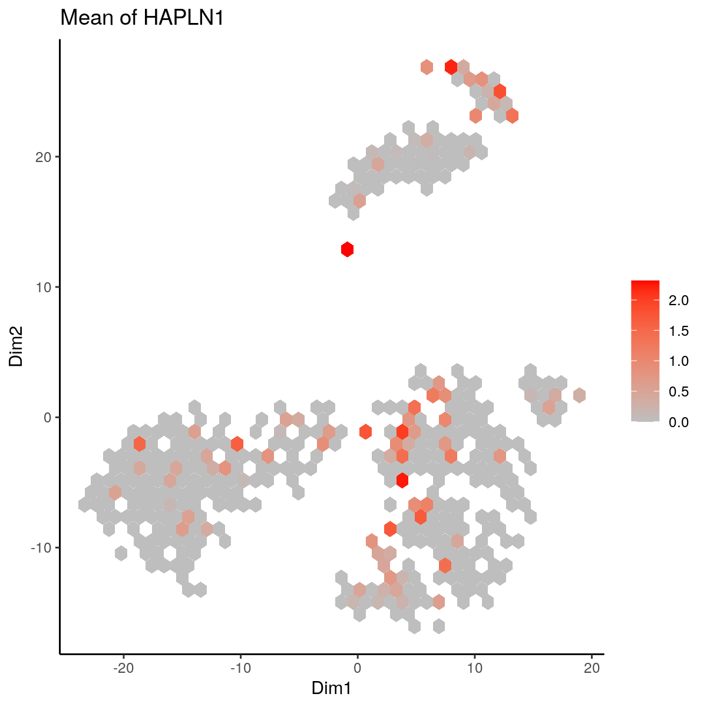|[CAPNS1](https://www.ncbi.nlm.nih.gov/gene/826) [HCRTR1](https://www.ncbi.nlm.nih.gov/gene/3061) [HCRTR2](https://www.ncbi.nlm.nih.gov/gene/3062) [RASGRF2](https://www.ncbi.nlm.nih.gov/gene/5924) [SLC7A2](https://www.ncbi.nlm.nih.gov/gene/6542) [ANO6](https://www.ncbi.nlm.nih.gov/gene/196527)|
|[HAPLN2](https://www.ncbi.nlm.nih.gov/gene/60484)|[AQP4](https://www.ncbi.nlm.nih.gov/gene/361) [ATP2B3](https://www.ncbi.nlm.nih.gov/gene/492) [CNTN1](https://www.ncbi.nlm.nih.gov/gene/1272) [DLG2](https://www.ncbi.nlm.nih.gov/gene/1740) [GPR37](https://www.ncbi.nlm.nih.gov/gene/2861) [GRIN1](https://www.ncbi.nlm.nih.gov/gene/2902) [HTR5A](https://www.ncbi.nlm.nih.gov/gene/3361) [KCNA1](https://www.ncbi.nlm.nih.gov/gene/3736) [KCNA2](https://www.ncbi.nlm.nih.gov/gene/3737) [KCNC1](https://www.ncbi.nlm.nih.gov/gene/3746) [KCNJ4](https://www.ncbi.nlm.nih.gov/gene/3761) [KCNQ2](https://www.ncbi.nlm.nih.gov/gene/3785) [KCNQ3](https://www.ncbi.nlm.nih.gov/gene/3786) [LY6H](https://www.ncbi.nlm.nih.gov/gene/4062) [MAG](https://www.ncbi.nlm.nih.gov/gene/4099) [NRCAM](https://www.ncbi.nlm.nih.gov/gene/4897) [OMG](https://www.ncbi.nlm.nih.gov/gene/4974) [PLP1](https://www.ncbi.nlm.nih.gov/gene/5354) [SCN2A](https://www.ncbi.nlm.nih.gov/gene/6326) [SLC6A1](https://www.ncbi.nlm.nih.gov/gene/6529) [CNTN2](https://www.ncbi.nlm.nih.gov/gene/6900) [FAIM2](https://www.ncbi.nlm.nih.gov/gene/23017) [NFASC](https://www.ncbi.nlm.nih.gov/gene/23114) [NTSR2](https://www.ncbi.nlm.nih.gov/gene/23620) [CDH19](https://www.ncbi.nlm.nih.gov/gene/28513) [CDH22](https://www.ncbi.nlm.nih.gov/gene/64405) [PSD2](https://www.ncbi.nlm.nih.gov/gene/84249) [BOC](https://www.ncbi.nlm.nih.gov/gene/91653) [OPALIN](https://www.ncbi.nlm.nih.gov/gene/93377) [RFFL](https://www.ncbi.nlm.nih.gov/gene/117584) [LRRTM1](https://www.ncbi.nlm.nih.gov/gene/347730) [LINC02210-CRHR1](https://www.ncbi.nlm.nih.gov/gene/104909134)|
|[HAPLN4](https://www.ncbi.nlm.nih.gov/gene/404037)|[KCNC1](https://www.ncbi.nlm.nih.gov/gene/3746) [KCNS2](https://www.ncbi.nlm.nih.gov/gene/3788) [CLSTN3](https://www.ncbi.nlm.nih.gov/gene/9746)|
|[HBEGF](https://www.ncbi.nlm.nih.gov/gene/1839)|[EGFR](https://www.ncbi.nlm.nih.gov/gene/1956) [ERBB4](https://www.ncbi.nlm.nih.gov/gene/2066)|
|[HCRT](https://www.ncbi.nlm.nih.gov/gene/3060)|[HCRTR1](https://www.ncbi.nlm.nih.gov/gene/3061) [HCRTR2](https://www.ncbi.nlm.nih.gov/gene/3062)|
|[HEBP1](https://www.ncbi.nlm.nih.gov/gene/50865)|[FPR3](https://www.ncbi.nlm.nih.gov/gene/2359)|
|[HEG1](https://www.ncbi.nlm.nih.gov/gene/57493)|[RHOA](https://www.ncbi.nlm.nih.gov/gene/387) [KRIT1](https://www.ncbi.nlm.nih.gov/gene/889) [DSG2](https://www.ncbi.nlm.nih.gov/gene/1829) [EDNRA](https://www.ncbi.nlm.nih.gov/gene/1909) [PTPRJ](https://www.ncbi.nlm.nih.gov/gene/5795) [RAP1A](https://www.ncbi.nlm.nih.gov/gene/5906) [RAP1B](https://www.ncbi.nlm.nih.gov/gene/5908) [RRAS](https://www.ncbi.nlm.nih.gov/gene/6237) [NPC1L1](https://www.ncbi.nlm.nih.gov/gene/29881) [RASD1](https://www.ncbi.nlm.nih.gov/gene/51655) [MUC16](https://www.ncbi.nlm.nih.gov/gene/94025)|
|[HGF](https://www.ncbi.nlm.nih.gov/gene/3082)|[MET](https://www.ncbi.nlm.nih.gov/gene/4233)|
|[HGFAC](https://www.ncbi.nlm.nih.gov/gene/3083)|[C8A](https://www.ncbi.nlm.nih.gov/gene/731) [LDLR](https://www.ncbi.nlm.nih.gov/gene/3949) [SLC22A18](https://www.ncbi.nlm.nih.gov/gene/5002) [SLC1A2](https://www.ncbi.nlm.nih.gov/gene/6506) [SLC1A3](https://www.ncbi.nlm.nih.gov/gene/6507) [SLC2A2](https://www.ncbi.nlm.nih.gov/gene/6514) [XPNPEP2](https://www.ncbi.nlm.nih.gov/gene/7512) [TMPRSS6](https://www.ncbi.nlm.nih.gov/gene/164656) [SLC51A](https://www.ncbi.nlm.nih.gov/gene/200931)|
|[HHIPL1](https://www.ncbi.nlm.nih.gov/gene/84439)|[BDKRB1](https://www.ncbi.nlm.nih.gov/gene/623) [CLDN7](https://www.ncbi.nlm.nih.gov/gene/1366) [KCNE2](https://www.ncbi.nlm.nih.gov/gene/9992) [SLC17A4](https://www.ncbi.nlm.nih.gov/gene/10050) [LRIG1](https://www.ncbi.nlm.nih.gov/gene/26018) [CNNM1](https://www.ncbi.nlm.nih.gov/gene/26507) [RASD1](https://www.ncbi.nlm.nih.gov/gene/51655) [CNNM2](https://www.ncbi.nlm.nih.gov/gene/54805)|
|[HHIPL2](https://www.ncbi.nlm.nih.gov/gene/79802)|[BDKRB1](https://www.ncbi.nlm.nih.gov/gene/623) [GPRC5B](https://www.ncbi.nlm.nih.gov/gene/51704) [RGMB](https://www.ncbi.nlm.nih.gov/gene/285704)|
|[HHLA1](https://www.ncbi.nlm.nih.gov/gene/10086)|[PLA2G2A](https://www.ncbi.nlm.nih.gov/gene/5320) [STK32A](https://www.ncbi.nlm.nih.gov/gene/202374)|
|[HILPDA](https://www.ncbi.nlm.nih.gov/gene/29923)|[FZD10](https://www.ncbi.nlm.nih.gov/gene/11211) [PNPLA2](https://www.ncbi.nlm.nih.gov/gene/57104) [PIK3IP1](https://www.ncbi.nlm.nih.gov/gene/113791)|
|[HMCN1](https://www.ncbi.nlm.nih.gov/gene/83872)|[FRAS1](https://www.ncbi.nlm.nih.gov/gene/80144) [CSMD2](https://www.ncbi.nlm.nih.gov/gene/114784) [FREM2](https://www.ncbi.nlm.nih.gov/gene/341640) [OR6F1](https://www.ncbi.nlm.nih.gov/gene/343169) [OR11L1](https://www.ncbi.nlm.nih.gov/gene/391189)|
|[HMSD](https://www.ncbi.nlm.nih.gov/gene/284293)|[IL2RG](https://www.ncbi.nlm.nih.gov/gene/3561) [MYO1G](https://www.ncbi.nlm.nih.gov/gene/64005)|
|[HP](https://www.ncbi.nlm.nih.gov/gene/3240)|[CD22](https://www.ncbi.nlm.nih.gov/gene/933) [CEACAM5](https://www.ncbi.nlm.nih.gov/gene/1048) [GGT1](https://www.ncbi.nlm.nih.gov/gene/2678) [MLNR](https://www.ncbi.nlm.nih.gov/gene/2862) [HFE](https://www.ncbi.nlm.nih.gov/gene/3077) [ITGAM](https://www.ncbi.nlm.nih.gov/gene/3684) [LDLR](https://www.ncbi.nlm.nih.gov/gene/3949) [SLC6A2](https://www.ncbi.nlm.nih.gov/gene/6530) [TLR4](https://www.ncbi.nlm.nih.gov/gene/7099) [VCL](https://www.ncbi.nlm.nih.gov/gene/7414) [CD163](https://www.ncbi.nlm.nih.gov/gene/9332) [LSR](https://www.ncbi.nlm.nih.gov/gene/51599) [APOBR](https://www.ncbi.nlm.nih.gov/gene/55911) [NLGN4X](https://www.ncbi.nlm.nih.gov/gene/57502) [CXCL16](https://www.ncbi.nlm.nih.gov/gene/58191) [GSDMD](https://www.ncbi.nlm.nih.gov/gene/79792) [OSCAR](https://www.ncbi.nlm.nih.gov/gene/126014) [GPIHBP1](https://www.ncbi.nlm.nih.gov/gene/338328) [OCLN](https://www.ncbi.nlm.nih.gov/gene/100506658)|
|[HPR](https://www.ncbi.nlm.nih.gov/gene/3250)|[FPR1](https://www.ncbi.nlm.nih.gov/gene/2357) [MLNR](https://www.ncbi.nlm.nih.gov/gene/2862) [LDLR](https://www.ncbi.nlm.nih.gov/gene/3949) [NTSR1](https://www.ncbi.nlm.nih.gov/gene/4923) [LSR](https://www.ncbi.nlm.nih.gov/gene/51599) [APOBR](https://www.ncbi.nlm.nih.gov/gene/55911) [CXCL16](https://www.ncbi.nlm.nih.gov/gene/58191) [GPIHBP1](https://www.ncbi.nlm.nih.gov/gene/338328)|
|[HPSE2](https://www.ncbi.nlm.nih.gov/gene/60495)|[GPC3](https://www.ncbi.nlm.nih.gov/gene/2719) [SDC3](https://www.ncbi.nlm.nih.gov/gene/9672) [LRIG2](https://www.ncbi.nlm.nih.gov/gene/9860) [CNNM4](https://www.ncbi.nlm.nih.gov/gene/26504) [CNNM3](https://www.ncbi.nlm.nih.gov/gene/26505) [CNNM1](https://www.ncbi.nlm.nih.gov/gene/26507) [CNNM2](https://www.ncbi.nlm.nih.gov/gene/54805)|
|[HPX](https://www.ncbi.nlm.nih.gov/gene/3263)|[HPN](https://www.ncbi.nlm.nih.gov/gene/3249) [PHEX](https://www.ncbi.nlm.nih.gov/gene/5251) [CD163](https://www.ncbi.nlm.nih.gov/gene/9332) [STXBP5L](https://www.ncbi.nlm.nih.gov/gene/9515) [SLC40A1](https://www.ncbi.nlm.nih.gov/gene/30061) [FLVCR2](https://www.ncbi.nlm.nih.gov/gene/55640) [MMP25](https://www.ncbi.nlm.nih.gov/gene/64386) [SLC46A1](https://www.ncbi.nlm.nih.gov/gene/113235)|
|[HRG](https://www.ncbi.nlm.nih.gov/gene/3273)|[C8A](https://www.ncbi.nlm.nih.gov/gene/731) [FCGR1A](https://www.ncbi.nlm.nih.gov/gene/2209) [SLC2A2](https://www.ncbi.nlm.nih.gov/gene/6514) [TMPRSS6](https://www.ncbi.nlm.nih.gov/gene/164656) [SLC51A](https://www.ncbi.nlm.nih.gov/gene/200931) [IYD](https://www.ncbi.nlm.nih.gov/gene/389434)|
|[HSD11B1L](https://www.ncbi.nlm.nih.gov/gene/374875)|[DYSF](https://www.ncbi.nlm.nih.gov/gene/8291)|
|[HSPG2](https://www.ncbi.nlm.nih.gov/gene/3339)|[ACHE](https://www.ncbi.nlm.nih.gov/gene/43) [ATP2B4](https://www.ncbi.nlm.nih.gov/gene/493) [CD44](https://www.ncbi.nlm.nih.gov/gene/960) [COL13A1](https://www.ncbi.nlm.nih.gov/gene/1305) [CSPG4](https://www.ncbi.nlm.nih.gov/gene/1464) [DAG1](https://www.ncbi.nlm.nih.gov/gene/1605) [DMD](https://www.ncbi.nlm.nih.gov/gene/1756) [FGFR1](https://www.ncbi.nlm.nih.gov/gene/2260) [FGFR3](https://www.ncbi.nlm.nih.gov/gene/2261) [GPC3](https://www.ncbi.nlm.nih.gov/gene/2719) [IHH](https://www.ncbi.nlm.nih.gov/gene/3549) [ITGAV](https://www.ncbi.nlm.nih.gov/gene/3685) [ITGB1](https://www.ncbi.nlm.nih.gov/gene/3688) [ITGB3](https://www.ncbi.nlm.nih.gov/gene/3690) [NOS3](https://www.ncbi.nlm.nih.gov/gene/4846) [VCL](https://www.ncbi.nlm.nih.gov/gene/7414) [LRP8](https://www.ncbi.nlm.nih.gov/gene/7804) [SDC3](https://www.ncbi.nlm.nih.gov/gene/9672) [CSPG5](https://www.ncbi.nlm.nih.gov/gene/10675) [MXRA8](https://www.ncbi.nlm.nih.gov/gene/54587) [GPIHBP1](https://www.ncbi.nlm.nih.gov/gene/338328)|
|[HTN3](https://www.ncbi.nlm.nih.gov/gene/3347)|[PIK3AP1](https://www.ncbi.nlm.nih.gov/gene/118788)|
|[HTRA4](https://www.ncbi.nlm.nih.gov/gene/203100)|[PLEKHA2](https://www.ncbi.nlm.nih.gov/gene/59339) [OR8H3](https://www.ncbi.nlm.nih.gov/gene/390152) [OR6M1](https://www.ncbi.nlm.nih.gov/gene/390261)|
|[HYAL1](https://www.ncbi.nlm.nih.gov/gene/3373)|[CD44](https://www.ncbi.nlm.nih.gov/gene/960) [PTPRC](https://www.ncbi.nlm.nih.gov/gene/5788) [RHCG](https://www.ncbi.nlm.nih.gov/gene/51458)|
|[HYAL3](https://www.ncbi.nlm.nih.gov/gene/8372)|[RHCG](https://www.ncbi.nlm.nih.gov/gene/51458)|
|[IAPP](https://www.ncbi.nlm.nih.gov/gene/3375)|[ADCY3](https://www.ncbi.nlm.nih.gov/gene/109) [ADCY5](https://www.ncbi.nlm.nih.gov/gene/111) [ADCY6](https://www.ncbi.nlm.nih.gov/gene/112) [ADCY8](https://www.ncbi.nlm.nih.gov/gene/114) [ADCY9](https://www.ncbi.nlm.nih.gov/gene/115) [ADCYAP1R1](https://www.ncbi.nlm.nih.gov/gene/117) [ADORA2B](https://www.ncbi.nlm.nih.gov/gene/136) [ADRB1](https://www.ncbi.nlm.nih.gov/gene/153) [ADRB2](https://www.ncbi.nlm.nih.gov/gene/154) [ADRB3](https://www.ncbi.nlm.nih.gov/gene/155) [CALCR](https://www.ncbi.nlm.nih.gov/gene/799) [CRHR2](https://www.ncbi.nlm.nih.gov/gene/1395) [DPP4](https://www.ncbi.nlm.nih.gov/gene/1803) [DRD1](https://www.ncbi.nlm.nih.gov/gene/1812) [DRD5](https://www.ncbi.nlm.nih.gov/gene/1816) [FSHR](https://www.ncbi.nlm.nih.gov/gene/2492) [GCGR](https://www.ncbi.nlm.nih.gov/gene/2642) [GHRHR](https://www.ncbi.nlm.nih.gov/gene/2692) [GIPR](https://www.ncbi.nlm.nih.gov/gene/2696) [GLP1R](https://www.ncbi.nlm.nih.gov/gene/2740) [GNAS](https://www.ncbi.nlm.nih.gov/gene/2778) [GNG3](https://www.ncbi.nlm.nih.gov/gene/2785) [GNG4](https://www.ncbi.nlm.nih.gov/gene/2786) [GNG5](https://www.ncbi.nlm.nih.gov/gene/2787) [GNG7](https://www.ncbi.nlm.nih.gov/gene/2788) [GNG10](https://www.ncbi.nlm.nih.gov/gene/2790) [GNG11](https://www.ncbi.nlm.nih.gov/gene/2791) [GNGT1](https://www.ncbi.nlm.nih.gov/gene/2792) [GNGT2](https://www.ncbi.nlm.nih.gov/gene/2793) [GPR15](https://www.ncbi.nlm.nih.gov/gene/2838) [GPR20](https://www.ncbi.nlm.nih.gov/gene/2843) [GPR25](https://www.ncbi.nlm.nih.gov/gene/2848) [GPR27](https://www.ncbi.nlm.nih.gov/gene/2850) [GPR32](https://www.ncbi.nlm.nih.gov/gene/2854) [GPR39](https://www.ncbi.nlm.nih.gov/gene/2863) [HRH2](https://www.ncbi.nlm.nih.gov/gene/3274) [HTR4](https://www.ncbi.nlm.nih.gov/gene/3360) [HTR6](https://www.ncbi.nlm.nih.gov/gene/3362) [HTR7](https://www.ncbi.nlm.nih.gov/gene/3363) [LHCGR](https://www.ncbi.nlm.nih.gov/gene/3973) [MC1R](https://www.ncbi.nlm.nih.gov/gene/4157) [MC2R](https://www.ncbi.nlm.nih.gov/gene/4158) [MC3R](https://www.ncbi.nlm.nih.gov/gene/4159) [MC4R](https://www.ncbi.nlm.nih.gov/gene/4160) [MC5R](https://www.ncbi.nlm.nih.gov/gene/4161) [P2RY11](https://www.ncbi.nlm.nih.gov/gene/5032) [PRNP](https://www.ncbi.nlm.nih.gov/gene/5621) [PTGDR](https://www.ncbi.nlm.nih.gov/gene/5729) [PTGER2](https://www.ncbi.nlm.nih.gov/gene/5732) [PTGER4](https://www.ncbi.nlm.nih.gov/gene/5734) [PTGIR](https://www.ncbi.nlm.nih.gov/gene/5739) [PTH1R](https://www.ncbi.nlm.nih.gov/gene/5745) [PTH2R](https://www.ncbi.nlm.nih.gov/gene/5746) [SCTR](https://www.ncbi.nlm.nih.gov/gene/6344) [SI](https://www.ncbi.nlm.nih.gov/gene/6476) [SLC2A2](https://www.ncbi.nlm.nih.gov/gene/6514) [SLC5A4](https://www.ncbi.nlm.nih.gov/gene/6527) [ABCC8](https://www.ncbi.nlm.nih.gov/gene/6833) [TSHR](https://www.ncbi.nlm.nih.gov/gene/7253) [VIPR1](https://www.ncbi.nlm.nih.gov/gene/7433) [VIPR2](https://www.ncbi.nlm.nih.gov/gene/7434) [TAAR5](https://www.ncbi.nlm.nih.gov/gene/9038) [TAAR2](https://www.ncbi.nlm.nih.gov/gene/9287) [GLP2R](https://www.ncbi.nlm.nih.gov/gene/9340) [CALCRL](https://www.ncbi.nlm.nih.gov/gene/10203) [RAMP3](https://www.ncbi.nlm.nih.gov/gene/10268) [GPR83](https://www.ncbi.nlm.nih.gov/gene/10888) [GPR176](https://www.ncbi.nlm.nih.gov/gene/11245) [GPR45](https://www.ncbi.nlm.nih.gov/gene/11250) [GNG13](https://www.ncbi.nlm.nih.gov/gene/51764) [GPR84](https://www.ncbi.nlm.nih.gov/gene/53831) [GNG2](https://www.ncbi.nlm.nih.gov/gene/54331) [SLC30A10](https://www.ncbi.nlm.nih.gov/gene/55532) [GNG12](https://www.ncbi.nlm.nih.gov/gene/55970) [RXFP1](https://www.ncbi.nlm.nih.gov/gene/59350) [TAAR8](https://www.ncbi.nlm.nih.gov/gene/83551) [GNG8](https://www.ncbi.nlm.nih.gov/gene/94235) [RXFP2](https://www.ncbi.nlm.nih.gov/gene/122042) [TAAR9](https://www.ncbi.nlm.nih.gov/gene/134860) [TAAR1](https://www.ncbi.nlm.nih.gov/gene/134864) [GPBAR1](https://www.ncbi.nlm.nih.gov/gene/151306) [SLC30A8](https://www.ncbi.nlm.nih.gov/gene/169026) [ADCY4](https://www.ncbi.nlm.nih.gov/gene/196883) [GPR150](https://www.ncbi.nlm.nih.gov/gene/285601) [TAAR6](https://www.ncbi.nlm.nih.gov/gene/319100) [LINC02210-CRHR1](https://www.ncbi.nlm.nih.gov/gene/104909134) [RAMP1](https://www.ncbi.nlm.nih.gov/gene/10267) [RAMP2](https://www.ncbi.nlm.nih.gov/gene/10266)|
|[IBSP](https://www.ncbi.nlm.nih.gov/gene/3381)|[ALPL](https://www.ncbi.nlm.nih.gov/gene/249) [ALPP](https://www.ncbi.nlm.nih.gov/gene/250) [CD44](https://www.ncbi.nlm.nih.gov/gene/960) [ENG](https://www.ncbi.nlm.nih.gov/gene/2022) [IHH](https://www.ncbi.nlm.nih.gov/gene/3549) [ITGA6](https://www.ncbi.nlm.nih.gov/gene/3655) [ITGA3](https://www.ncbi.nlm.nih.gov/gene/3675) [ITGAV](https://www.ncbi.nlm.nih.gov/gene/3685) [ITGB1](https://www.ncbi.nlm.nih.gov/gene/3688) [ITGB3](https://www.ncbi.nlm.nih.gov/gene/3690) [ITGB4](https://www.ncbi.nlm.nih.gov/gene/3691) [ITGB8](https://www.ncbi.nlm.nih.gov/gene/3696) [PHEX](https://www.ncbi.nlm.nih.gov/gene/5251) [PRKG2](https://www.ncbi.nlm.nih.gov/gene/5593) [PTH1R](https://www.ncbi.nlm.nih.gov/gene/5745) [THY1](https://www.ncbi.nlm.nih.gov/gene/7070) [PTOV1](https://www.ncbi.nlm.nih.gov/gene/53635) [MXRA8](https://www.ncbi.nlm.nih.gov/gene/54587)|
|[ICAM4](https://www.ncbi.nlm.nih.gov/gene/3386)|[CD47](https://www.ncbi.nlm.nih.gov/gene/961) [GYPA](https://www.ncbi.nlm.nih.gov/gene/2993) [ITGAL](https://www.ncbi.nlm.nih.gov/gene/3683) [ITGAM](https://www.ncbi.nlm.nih.gov/gene/3684) [ITGAV](https://www.ncbi.nlm.nih.gov/gene/3685) [ITGB1](https://www.ncbi.nlm.nih.gov/gene/3688) [ITGB2](https://www.ncbi.nlm.nih.gov/gene/3689)|
|[ICOS](https://www.ncbi.nlm.nih.gov/gene/29851)|[CXCR5](https://www.ncbi.nlm.nih.gov/gene/643) [CD2](https://www.ncbi.nlm.nih.gov/gene/914) [CD3D](https://www.ncbi.nlm.nih.gov/gene/915) [CD3E](https://www.ncbi.nlm.nih.gov/gene/916) [CD4](https://www.ncbi.nlm.nih.gov/gene/920) [CD5](https://www.ncbi.nlm.nih.gov/gene/921) [CD19](https://www.ncbi.nlm.nih.gov/gene/930) [MS4A1](https://www.ncbi.nlm.nih.gov/gene/931) [CD86](https://www.ncbi.nlm.nih.gov/gene/942) [CD44](https://www.ncbi.nlm.nih.gov/gene/960) [CD81](https://www.ncbi.nlm.nih.gov/gene/975) [CCR5](https://www.ncbi.nlm.nih.gov/gene/1234) [CCR6](https://www.ncbi.nlm.nih.gov/gene/1235) [CCR7](https://www.ncbi.nlm.nih.gov/gene/1236) [CXCR3](https://www.ncbi.nlm.nih.gov/gene/2833) [IL2RB](https://www.ncbi.nlm.nih.gov/gene/3560) [MELTF](https://www.ncbi.nlm.nih.gov/gene/4241) [PDCD1](https://www.ncbi.nlm.nih.gov/gene/5133) [PTPRC](https://www.ncbi.nlm.nih.gov/gene/5788) [SELL](https://www.ncbi.nlm.nih.gov/gene/6402) [SLAMF1](https://www.ncbi.nlm.nih.gov/gene/6504) [CCRL2](https://www.ncbi.nlm.nih.gov/gene/9034) [KLRG1](https://www.ncbi.nlm.nih.gov/gene/10219) [ICOSLG](https://www.ncbi.nlm.nih.gov/gene/23308) [TRAT1](https://www.ncbi.nlm.nih.gov/gene/50852) [VTCN1](https://www.ncbi.nlm.nih.gov/gene/79679) [PDCD1LG2](https://www.ncbi.nlm.nih.gov/gene/80380) [GPR174](https://www.ncbi.nlm.nih.gov/gene/84636) [TMIGD2](https://www.ncbi.nlm.nih.gov/gene/126259) [BTLA](https://www.ncbi.nlm.nih.gov/gene/151888) [TIGIT](https://www.ncbi.nlm.nih.gov/gene/201633)|
|[IFI30](https://www.ncbi.nlm.nih.gov/gene/10437)|[CD86](https://www.ncbi.nlm.nih.gov/gene/942) [CD44](https://www.ncbi.nlm.nih.gov/gene/960) [CD74](https://www.ncbi.nlm.nih.gov/gene/972) [CYBB](https://www.ncbi.nlm.nih.gov/gene/1536) [FCER1G](https://www.ncbi.nlm.nih.gov/gene/2207) [FCGR1A](https://www.ncbi.nlm.nih.gov/gene/2209) [FCGR1B](https://www.ncbi.nlm.nih.gov/gene/2210) [GYPC](https://www.ncbi.nlm.nih.gov/gene/2995) [HLA-A](https://www.ncbi.nlm.nih.gov/gene/3105) [HLA-DPA1](https://www.ncbi.nlm.nih.gov/gene/3113) [HLA-DPB1](https://www.ncbi.nlm.nih.gov/gene/3115) [HLA-DQA1](https://www.ncbi.nlm.nih.gov/gene/3117) [HLA-DQA2](https://www.ncbi.nlm.nih.gov/gene/3118) [HLA-DQB1](https://www.ncbi.nlm.nih.gov/gene/3119) [HLA-DQB2](https://www.ncbi.nlm.nih.gov/gene/3120) [HLA-DRA](https://www.ncbi.nlm.nih.gov/gene/3122) [HLA-DRB1](https://www.ncbi.nlm.nih.gov/gene/3123) [HLA-DRB5](https://www.ncbi.nlm.nih.gov/gene/3127) [HLA-F](https://www.ncbi.nlm.nih.gov/gene/3134) [ITGB2](https://www.ncbi.nlm.nih.gov/gene/3689) [NEDD4](https://www.ncbi.nlm.nih.gov/gene/4734) [PTAFR](https://www.ncbi.nlm.nih.gov/gene/5724) [TYROBP](https://www.ncbi.nlm.nih.gov/gene/7305) [IFITM1](https://www.ncbi.nlm.nih.gov/gene/8519) [IFITM3](https://www.ncbi.nlm.nih.gov/gene/10410) [DAGLB](https://www.ncbi.nlm.nih.gov/gene/221955)|
|[IFNA1](https://www.ncbi.nlm.nih.gov/gene/3439)|[AQP5](https://www.ncbi.nlm.nih.gov/gene/362) [AXL](https://www.ncbi.nlm.nih.gov/gene/558) [CD86](https://www.ncbi.nlm.nih.gov/gene/942) [CNTFR](https://www.ncbi.nlm.nih.gov/gene/1271) [CR2](https://www.ncbi.nlm.nih.gov/gene/1380) [CSF3R](https://www.ncbi.nlm.nih.gov/gene/1441) [IFNAR1](https://www.ncbi.nlm.nih.gov/gene/3454) [IFNGR1](https://www.ncbi.nlm.nih.gov/gene/3459) [IFNGR2](https://www.ncbi.nlm.nih.gov/gene/3460) [IL2RB](https://www.ncbi.nlm.nih.gov/gene/3560) [IL2RG](https://www.ncbi.nlm.nih.gov/gene/3561) [IL9R](https://www.ncbi.nlm.nih.gov/gene/3581) [IL10RA](https://www.ncbi.nlm.nih.gov/gene/3587) [ITGAM](https://www.ncbi.nlm.nih.gov/gene/3684) [LY6E](https://www.ncbi.nlm.nih.gov/gene/4061) [MPL](https://www.ncbi.nlm.nih.gov/gene/4352) [PDGFRA](https://www.ncbi.nlm.nih.gov/gene/5156) [PDGFRB](https://www.ncbi.nlm.nih.gov/gene/5159) [TLR1](https://www.ncbi.nlm.nih.gov/gene/7096) [TLR4](https://www.ncbi.nlm.nih.gov/gene/7099) [TLR5](https://www.ncbi.nlm.nih.gov/gene/7100) [CXCR4](https://www.ncbi.nlm.nih.gov/gene/7852) [TLR6](https://www.ncbi.nlm.nih.gov/gene/10333) [IL23R](https://www.ncbi.nlm.nih.gov/gene/149233) [CLEC4C](https://www.ncbi.nlm.nih.gov/gene/170482) [MICA](https://www.ncbi.nlm.nih.gov/gene/100507436) [IFNAR2](https://www.ncbi.nlm.nih.gov/gene/3455)|
|[IFNA10](https://www.ncbi.nlm.nih.gov/gene/3446)|[CNTFR](https://www.ncbi.nlm.nih.gov/gene/1271) [CSF3R](https://www.ncbi.nlm.nih.gov/gene/1441) [IFNAR1](https://www.ncbi.nlm.nih.gov/gene/3454) [IFNGR1](https://www.ncbi.nlm.nih.gov/gene/3459) [IFNGR2](https://www.ncbi.nlm.nih.gov/gene/3460) [IL2RB](https://www.ncbi.nlm.nih.gov/gene/3560) [IL2RG](https://www.ncbi.nlm.nih.gov/gene/3561) [IL9R](https://www.ncbi.nlm.nih.gov/gene/3581) [IL10RA](https://www.ncbi.nlm.nih.gov/gene/3587) [MPL](https://www.ncbi.nlm.nih.gov/gene/4352) [PDGFRA](https://www.ncbi.nlm.nih.gov/gene/5156) [PDGFRB](https://www.ncbi.nlm.nih.gov/gene/5159) [IL23R](https://www.ncbi.nlm.nih.gov/gene/149233) [IFNAR2](https://www.ncbi.nlm.nih.gov/gene/3455)|
|[IFNA13](https://www.ncbi.nlm.nih.gov/gene/3447)|[IFNAR1](https://www.ncbi.nlm.nih.gov/gene/3454) [IFNAR2](https://www.ncbi.nlm.nih.gov/gene/3455)|
|[IFNA14](https://www.ncbi.nlm.nih.gov/gene/3448)|[CNTFR](https://www.ncbi.nlm.nih.gov/gene/1271) [CSF3R](https://www.ncbi.nlm.nih.gov/gene/1441) [IFNAR1](https://www.ncbi.nlm.nih.gov/gene/3454) [IFNGR1](https://www.ncbi.nlm.nih.gov/gene/3459) [IFNGR2](https://www.ncbi.nlm.nih.gov/gene/3460) [IL2RB](https://www.ncbi.nlm.nih.gov/gene/3560) [IL2RG](https://www.ncbi.nlm.nih.gov/gene/3561) [IL9R](https://www.ncbi.nlm.nih.gov/gene/3581) [IL10RA](https://www.ncbi.nlm.nih.gov/gene/3587) [MPL](https://www.ncbi.nlm.nih.gov/gene/4352) [PDGFRA](https://www.ncbi.nlm.nih.gov/gene/5156) [PDGFRB](https://www.ncbi.nlm.nih.gov/gene/5159) [IL23R](https://www.ncbi.nlm.nih.gov/gene/149233) [IFNAR2](https://www.ncbi.nlm.nih.gov/gene/3455)|
|[IFNA16](https://www.ncbi.nlm.nih.gov/gene/3449)|[CNTFR](https://www.ncbi.nlm.nih.gov/gene/1271) [CSF3R](https://www.ncbi.nlm.nih.gov/gene/1441) [IFNAR1](https://www.ncbi.nlm.nih.gov/gene/3454) [IFNGR1](https://www.ncbi.nlm.nih.gov/gene/3459) [IFNGR2](https://www.ncbi.nlm.nih.gov/gene/3460) [IL2RB](https://www.ncbi.nlm.nih.gov/gene/3560) [IL2RG](https://www.ncbi.nlm.nih.gov/gene/3561) [IL9R](https://www.ncbi.nlm.nih.gov/gene/3581) [IL10RA](https://www.ncbi.nlm.nih.gov/gene/3587) [MPL](https://www.ncbi.nlm.nih.gov/gene/4352) [PDGFRA](https://www.ncbi.nlm.nih.gov/gene/5156) [PDGFRB](https://www.ncbi.nlm.nih.gov/gene/5159) [IL23R](https://www.ncbi.nlm.nih.gov/gene/149233) [IFNAR2](https://www.ncbi.nlm.nih.gov/gene/3455)|
|[IFNA17](https://www.ncbi.nlm.nih.gov/gene/3451)|[CNTFR](https://www.ncbi.nlm.nih.gov/gene/1271) [CR2](https://www.ncbi.nlm.nih.gov/gene/1380) [CSF3R](https://www.ncbi.nlm.nih.gov/gene/1441) [IFNAR1](https://www.ncbi.nlm.nih.gov/gene/3454) [IFNGR1](https://www.ncbi.nlm.nih.gov/gene/3459) [IFNGR2](https://www.ncbi.nlm.nih.gov/gene/3460) [IL2RB](https://www.ncbi.nlm.nih.gov/gene/3560) [IL2RG](https://www.ncbi.nlm.nih.gov/gene/3561) [IL9R](https://www.ncbi.nlm.nih.gov/gene/3581) [IL10RA](https://www.ncbi.nlm.nih.gov/gene/3587) [MPL](https://www.ncbi.nlm.nih.gov/gene/4352) [PDGFRA](https://www.ncbi.nlm.nih.gov/gene/5156) [PDGFRB](https://www.ncbi.nlm.nih.gov/gene/5159) [IFITM3](https://www.ncbi.nlm.nih.gov/gene/10410) [IFITM2](https://www.ncbi.nlm.nih.gov/gene/10581) [IL23R](https://www.ncbi.nlm.nih.gov/gene/149233) [IFNAR2](https://www.ncbi.nlm.nih.gov/gene/3455)|
|[IFNA2](https://www.ncbi.nlm.nih.gov/gene/3440)|[CNTFR](https://www.ncbi.nlm.nih.gov/gene/1271) [CR2](https://www.ncbi.nlm.nih.gov/gene/1380) [CSF3R](https://www.ncbi.nlm.nih.gov/gene/1441) [IFNAR1](https://www.ncbi.nlm.nih.gov/gene/3454) [IFNGR1](https://www.ncbi.nlm.nih.gov/gene/3459) [IFNGR2](https://www.ncbi.nlm.nih.gov/gene/3460) [IL2RB](https://www.ncbi.nlm.nih.gov/gene/3560) [IL2RG](https://www.ncbi.nlm.nih.gov/gene/3561) [IL9R](https://www.ncbi.nlm.nih.gov/gene/3581) [IL10RA](https://www.ncbi.nlm.nih.gov/gene/3587) [MPL](https://www.ncbi.nlm.nih.gov/gene/4352) [PDGFRA](https://www.ncbi.nlm.nih.gov/gene/5156) [PDGFRB](https://www.ncbi.nlm.nih.gov/gene/5159) [TLR4](https://www.ncbi.nlm.nih.gov/gene/7099) [IFITM3](https://www.ncbi.nlm.nih.gov/gene/10410) [IFITM2](https://www.ncbi.nlm.nih.gov/gene/10581) [IL23R](https://www.ncbi.nlm.nih.gov/gene/149233) [IFNAR2](https://www.ncbi.nlm.nih.gov/gene/3455)|
|[IFNA21](https://www.ncbi.nlm.nih.gov/gene/3452)|[CNTFR](https://www.ncbi.nlm.nih.gov/gene/1271) [CR2](https://www.ncbi.nlm.nih.gov/gene/1380) [CSF3R](https://www.ncbi.nlm.nih.gov/gene/1441) [IFNAR1](https://www.ncbi.nlm.nih.gov/gene/3454) [IFNGR1](https://www.ncbi.nlm.nih.gov/gene/3459) [IFNGR2](https://www.ncbi.nlm.nih.gov/gene/3460) [IL2RB](https://www.ncbi.nlm.nih.gov/gene/3560) [IL2RG](https://www.ncbi.nlm.nih.gov/gene/3561) [IL9R](https://www.ncbi.nlm.nih.gov/gene/3581) [IL10RA](https://www.ncbi.nlm.nih.gov/gene/3587) [MPL](https://www.ncbi.nlm.nih.gov/gene/4352) [PDGFRA](https://www.ncbi.nlm.nih.gov/gene/5156) [PDGFRB](https://www.ncbi.nlm.nih.gov/gene/5159) [IFITM3](https://www.ncbi.nlm.nih.gov/gene/10410) [IFITM2](https://www.ncbi.nlm.nih.gov/gene/10581) [IL23R](https://www.ncbi.nlm.nih.gov/gene/149233) [IFNAR2](https://www.ncbi.nlm.nih.gov/gene/3455)|
|[IFNA4](https://www.ncbi.nlm.nih.gov/gene/3441)|[CNTFR](https://www.ncbi.nlm.nih.gov/gene/1271) [CSF3R](https://www.ncbi.nlm.nih.gov/gene/1441) [IFNAR1](https://www.ncbi.nlm.nih.gov/gene/3454) [IFNGR1](https://www.ncbi.nlm.nih.gov/gene/3459) [IFNGR2](https://www.ncbi.nlm.nih.gov/gene/3460) [IL2RB](https://www.ncbi.nlm.nih.gov/gene/3560) [IL2RG](https://www.ncbi.nlm.nih.gov/gene/3561) [IL9R](https://www.ncbi.nlm.nih.gov/gene/3581) [IL10RA](https://www.ncbi.nlm.nih.gov/gene/3587) [MPL](https://www.ncbi.nlm.nih.gov/gene/4352) [PDGFRA](https://www.ncbi.nlm.nih.gov/gene/5156) [PDGFRB](https://www.ncbi.nlm.nih.gov/gene/5159) [IL23R](https://www.ncbi.nlm.nih.gov/gene/149233) [IFNAR2](https://www.ncbi.nlm.nih.gov/gene/3455)|
|[IFNA5](https://www.ncbi.nlm.nih.gov/gene/3442)|[CNTFR](https://www.ncbi.nlm.nih.gov/gene/1271) [CSF3R](https://www.ncbi.nlm.nih.gov/gene/1441) [IFNAR1](https://www.ncbi.nlm.nih.gov/gene/3454) [IFNGR1](https://www.ncbi.nlm.nih.gov/gene/3459) [IFNGR2](https://www.ncbi.nlm.nih.gov/gene/3460) [IL2RB](https://www.ncbi.nlm.nih.gov/gene/3560) [IL2RG](https://www.ncbi.nlm.nih.gov/gene/3561) [IL9R](https://www.ncbi.nlm.nih.gov/gene/3581) [IL10RA](https://www.ncbi.nlm.nih.gov/gene/3587) [MPL](https://www.ncbi.nlm.nih.gov/gene/4352) [PDGFRA](https://www.ncbi.nlm.nih.gov/gene/5156) [PDGFRB](https://www.ncbi.nlm.nih.gov/gene/5159) [IL23R](https://www.ncbi.nlm.nih.gov/gene/149233) [IFNAR2](https://www.ncbi.nlm.nih.gov/gene/3455)|
|[IFNA6](https://www.ncbi.nlm.nih.gov/gene/3443)|[CNTFR](https://www.ncbi.nlm.nih.gov/gene/1271) [CSF3R](https://www.ncbi.nlm.nih.gov/gene/1441) [IFNAR1](https://www.ncbi.nlm.nih.gov/gene/3454) [IFNGR1](https://www.ncbi.nlm.nih.gov/gene/3459) [IFNGR2](https://www.ncbi.nlm.nih.gov/gene/3460) [IL2RB](https://www.ncbi.nlm.nih.gov/gene/3560) [IL2RG](https://www.ncbi.nlm.nih.gov/gene/3561) [IL9R](https://www.ncbi.nlm.nih.gov/gene/3581) [IL10RA](https://www.ncbi.nlm.nih.gov/gene/3587) [MPL](https://www.ncbi.nlm.nih.gov/gene/4352) [PDGFRA](https://www.ncbi.nlm.nih.gov/gene/5156) [PDGFRB](https://www.ncbi.nlm.nih.gov/gene/5159) [IL23R](https://www.ncbi.nlm.nih.gov/gene/149233) [IFNAR2](https://www.ncbi.nlm.nih.gov/gene/3455)|
|[IFNA7](https://www.ncbi.nlm.nih.gov/gene/3444)|[CNTFR](https://www.ncbi.nlm.nih.gov/gene/1271) [CSF3R](https://www.ncbi.nlm.nih.gov/gene/1441) [IFNAR1](https://www.ncbi.nlm.nih.gov/gene/3454) [IFNGR1](https://www.ncbi.nlm.nih.gov/gene/3459) [IFNGR2](https://www.ncbi.nlm.nih.gov/gene/3460) [IL2RB](https://www.ncbi.nlm.nih.gov/gene/3560) [IL2RG](https://www.ncbi.nlm.nih.gov/gene/3561) [IL9R](https://www.ncbi.nlm.nih.gov/gene/3581) [IL10RA](https://www.ncbi.nlm.nih.gov/gene/3587) [MPL](https://www.ncbi.nlm.nih.gov/gene/4352) [PDGFRA](https://www.ncbi.nlm.nih.gov/gene/5156) [PDGFRB](https://www.ncbi.nlm.nih.gov/gene/5159) [IL23R](https://www.ncbi.nlm.nih.gov/gene/149233) [IFNAR2](https://www.ncbi.nlm.nih.gov/gene/3455)|
|[IFNA8](https://www.ncbi.nlm.nih.gov/gene/3445)|[CNTFR](https://www.ncbi.nlm.nih.gov/gene/1271) [CSF3R](https://www.ncbi.nlm.nih.gov/gene/1441) [IFNAR1](https://www.ncbi.nlm.nih.gov/gene/3454) [IFNGR1](https://www.ncbi.nlm.nih.gov/gene/3459) [IFNGR2](https://www.ncbi.nlm.nih.gov/gene/3460) [IL2RB](https://www.ncbi.nlm.nih.gov/gene/3560) [IL2RG](https://www.ncbi.nlm.nih.gov/gene/3561) [IL9R](https://www.ncbi.nlm.nih.gov/gene/3581) [IL10RA](https://www.ncbi.nlm.nih.gov/gene/3587) [MPL](https://www.ncbi.nlm.nih.gov/gene/4352) [PDGFRA](https://www.ncbi.nlm.nih.gov/gene/5156) [PDGFRB](https://www.ncbi.nlm.nih.gov/gene/5159) [IL23R](https://www.ncbi.nlm.nih.gov/gene/149233) [IFNAR2](https://www.ncbi.nlm.nih.gov/gene/3455)|
|[IFNAR2](https://www.ncbi.nlm.nih.gov/gene/3455)|[CD86](https://www.ncbi.nlm.nih.gov/gene/942) [CRHR2](https://www.ncbi.nlm.nih.gov/gene/1395) [HLA-DPA1](https://www.ncbi.nlm.nih.gov/gene/3113) [IFNAR1](https://www.ncbi.nlm.nih.gov/gene/3454) [IFNGR1](https://www.ncbi.nlm.nih.gov/gene/3459) [IFNGR2](https://www.ncbi.nlm.nih.gov/gene/3460) [IL10RA](https://www.ncbi.nlm.nih.gov/gene/3587) [TLR1](https://www.ncbi.nlm.nih.gov/gene/7096) [TLR4](https://www.ncbi.nlm.nih.gov/gene/7099) [TLR5](https://www.ncbi.nlm.nih.gov/gene/7100) [TLR6](https://www.ncbi.nlm.nih.gov/gene/10333) [RACK1](https://www.ncbi.nlm.nih.gov/gene/10399) [LINC02210-CRHR1](https://www.ncbi.nlm.nih.gov/gene/104909134)|
|[IFNB1](https://www.ncbi.nlm.nih.gov/gene/3456)|[AQP4](https://www.ncbi.nlm.nih.gov/gene/361) [AXL](https://www.ncbi.nlm.nih.gov/gene/558) [CD86](https://www.ncbi.nlm.nih.gov/gene/942) [CD52](https://www.ncbi.nlm.nih.gov/gene/1043) [CCR7](https://www.ncbi.nlm.nih.gov/gene/1236) [CNTFR](https://www.ncbi.nlm.nih.gov/gene/1271) [CSF3R](https://www.ncbi.nlm.nih.gov/gene/1441) [IFNAR1](https://www.ncbi.nlm.nih.gov/gene/3454) [IFNGR1](https://www.ncbi.nlm.nih.gov/gene/3459) [IFNGR2](https://www.ncbi.nlm.nih.gov/gene/3460) [IL2RB](https://www.ncbi.nlm.nih.gov/gene/3560) [IL2RG](https://www.ncbi.nlm.nih.gov/gene/3561) [IL9R](https://www.ncbi.nlm.nih.gov/gene/3581) [IL10RA](https://www.ncbi.nlm.nih.gov/gene/3587) [ITGAM](https://www.ncbi.nlm.nih.gov/gene/3684) [MOG](https://www.ncbi.nlm.nih.gov/gene/4340) [MPL](https://www.ncbi.nlm.nih.gov/gene/4352) [PDGFRA](https://www.ncbi.nlm.nih.gov/gene/5156) [PDGFRB](https://www.ncbi.nlm.nih.gov/gene/5159) [TLR1](https://www.ncbi.nlm.nih.gov/gene/7096) [TLR4](https://www.ncbi.nlm.nih.gov/gene/7099) [TLR5](https://www.ncbi.nlm.nih.gov/gene/7100) [TNFSF10](https://www.ncbi.nlm.nih.gov/gene/8743) [TNFSF18](https://www.ncbi.nlm.nih.gov/gene/8995) [SIRPB1](https://www.ncbi.nlm.nih.gov/gene/10326) [TLR6](https://www.ncbi.nlm.nih.gov/gene/10333) [IFITM3](https://www.ncbi.nlm.nih.gov/gene/10410) [IFITM2](https://www.ncbi.nlm.nih.gov/gene/10581) [IL23R](https://www.ncbi.nlm.nih.gov/gene/149233) [IFNAR2](https://www.ncbi.nlm.nih.gov/gene/3455)|
|[IFNE](https://www.ncbi.nlm.nih.gov/gene/338376)|[CNTFR](https://www.ncbi.nlm.nih.gov/gene/1271) [CSF3R](https://www.ncbi.nlm.nih.gov/gene/1441) [IFNAR1](https://www.ncbi.nlm.nih.gov/gene/3454) [IFNGR1](https://www.ncbi.nlm.nih.gov/gene/3459) [IFNGR2](https://www.ncbi.nlm.nih.gov/gene/3460) [IL2RB](https://www.ncbi.nlm.nih.gov/gene/3560) [IL2RG](https://www.ncbi.nlm.nih.gov/gene/3561) [IL9R](https://www.ncbi.nlm.nih.gov/gene/3581) [IL10RA](https://www.ncbi.nlm.nih.gov/gene/3587) [MPL](https://www.ncbi.nlm.nih.gov/gene/4352) [PDGFRA](https://www.ncbi.nlm.nih.gov/gene/5156) [PDGFRB](https://www.ncbi.nlm.nih.gov/gene/5159) [IL23R](https://www.ncbi.nlm.nih.gov/gene/149233)|
|[IFNG](https://www.ncbi.nlm.nih.gov/gene/3458)|[ADA](https://www.ncbi.nlm.nih.gov/gene/100) [AQP1](https://www.ncbi.nlm.nih.gov/gene/358) [CXCR5](https://www.ncbi.nlm.nih.gov/gene/643) [CAMK2D](https://www.ncbi.nlm.nih.gov/gene/817) [CBL](https://www.ncbi.nlm.nih.gov/gene/867) [CD1A](https://www.ncbi.nlm.nih.gov/gene/909) [CD1B](https://www.ncbi.nlm.nih.gov/gene/910) [CD1C](https://www.ncbi.nlm.nih.gov/gene/911) [CD1D](https://www.ncbi.nlm.nih.gov/gene/912) [CD2](https://www.ncbi.nlm.nih.gov/gene/914) [CD3E](https://www.ncbi.nlm.nih.gov/gene/916) [CD4](https://www.ncbi.nlm.nih.gov/gene/920) [CD5](https://www.ncbi.nlm.nih.gov/gene/921) [CD19](https://www.ncbi.nlm.nih.gov/gene/930) [CD86](https://www.ncbi.nlm.nih.gov/gene/942) [CD44](https://www.ncbi.nlm.nih.gov/gene/960) [CD58](https://www.ncbi.nlm.nih.gov/gene/965) [CD59](https://www.ncbi.nlm.nih.gov/gene/966) [CD74](https://www.ncbi.nlm.nih.gov/gene/972) [CEACAM5](https://www.ncbi.nlm.nih.gov/gene/1048) [CFTR](https://www.ncbi.nlm.nih.gov/gene/1080) [CCR1](https://www.ncbi.nlm.nih.gov/gene/1230) [CCR3](https://www.ncbi.nlm.nih.gov/gene/1232) [CCR5](https://www.ncbi.nlm.nih.gov/gene/1234) [CCR6](https://www.ncbi.nlm.nih.gov/gene/1235) [CCR7](https://www.ncbi.nlm.nih.gov/gene/1236) [CNTFR](https://www.ncbi.nlm.nih.gov/gene/1271) [CSF3R](https://www.ncbi.nlm.nih.gov/gene/1441) [CX3CR1](https://www.ncbi.nlm.nih.gov/gene/1524) [CYBB](https://www.ncbi.nlm.nih.gov/gene/1536) [ADGRE1](https://www.ncbi.nlm.nih.gov/gene/2015) [FCGR1A](https://www.ncbi.nlm.nih.gov/gene/2209) [FCGR2A](https://www.ncbi.nlm.nih.gov/gene/2212) [FCGR2B](https://www.ncbi.nlm.nih.gov/gene/2213) [CXCR3](https://www.ncbi.nlm.nih.gov/gene/2833) [HLA-A](https://www.ncbi.nlm.nih.gov/gene/3105) [HLA-DQA1](https://www.ncbi.nlm.nih.gov/gene/3117) [HLA-DQB1](https://www.ncbi.nlm.nih.gov/gene/3119) [HLA-DRA](https://www.ncbi.nlm.nih.gov/gene/3122) [HLA-DRB1](https://www.ncbi.nlm.nih.gov/gene/3123) [IFNAR1](https://www.ncbi.nlm.nih.gov/gene/3454) [IFNGR1](https://www.ncbi.nlm.nih.gov/gene/3459) [IFNGR2](https://www.ncbi.nlm.nih.gov/gene/3460) [IL2RB](https://www.ncbi.nlm.nih.gov/gene/3560) [IL2RG](https://www.ncbi.nlm.nih.gov/gene/3561) [CXCR2](https://www.ncbi.nlm.nih.gov/gene/3579) [IL9R](https://www.ncbi.nlm.nih.gov/gene/3581) [IL10RA](https://www.ncbi.nlm.nih.gov/gene/3587) [ITGAL](https://www.ncbi.nlm.nih.gov/gene/3683) [ITGAM](https://www.ncbi.nlm.nih.gov/gene/3684) [KIR2DL1](https://www.ncbi.nlm.nih.gov/gene/3802) [KIR2DL3](https://www.ncbi.nlm.nih.gov/gene/3804) [KLRD1](https://www.ncbi.nlm.nih.gov/gene/3824) [LAMP1](https://www.ncbi.nlm.nih.gov/gene/3916) [MOG](https://www.ncbi.nlm.nih.gov/gene/4340) [MPL](https://www.ncbi.nlm.nih.gov/gene/4352) [MUC1](https://www.ncbi.nlm.nih.gov/gene/4582) [NOS3](https://www.ncbi.nlm.nih.gov/gene/4846) [PDCD1](https://www.ncbi.nlm.nih.gov/gene/5133) [PDGFRA](https://www.ncbi.nlm.nih.gov/gene/5156) [PDGFRB](https://www.ncbi.nlm.nih.gov/gene/5159) [PTPRC](https://www.ncbi.nlm.nih.gov/gene/5788) [SECTM1](https://www.ncbi.nlm.nih.gov/gene/6398) [SELE](https://www.ncbi.nlm.nih.gov/gene/6401) [SELL](https://www.ncbi.nlm.nih.gov/gene/6402) [SELP](https://www.ncbi.nlm.nih.gov/gene/6403) [SLAMF1](https://www.ncbi.nlm.nih.gov/gene/6504) [THY1](https://www.ncbi.nlm.nih.gov/gene/7070) [TLR1](https://www.ncbi.nlm.nih.gov/gene/7096) [TLR4](https://www.ncbi.nlm.nih.gov/gene/7099) [TLR5](https://www.ncbi.nlm.nih.gov/gene/7100) [CXCR4](https://www.ncbi.nlm.nih.gov/gene/7852) [RIPK1](https://www.ncbi.nlm.nih.gov/gene/8737) [TNFSF10](https://www.ncbi.nlm.nih.gov/gene/8743) [IL18RAP](https://www.ncbi.nlm.nih.gov/gene/8807) [CCRL2](https://www.ncbi.nlm.nih.gov/gene/9034) [FCGR2C](https://www.ncbi.nlm.nih.gov/gene/9103) [CD163](https://www.ncbi.nlm.nih.gov/gene/9332) [NCR2](https://www.ncbi.nlm.nih.gov/gene/9436) [NCR1](https://www.ncbi.nlm.nih.gov/gene/9437) [KLRG1](https://www.ncbi.nlm.nih.gov/gene/10219) [TLR6](https://www.ncbi.nlm.nih.gov/gene/10333) [CXCR6](https://www.ncbi.nlm.nih.gov/gene/10663) [GPR132](https://www.ncbi.nlm.nih.gov/gene/29933) [CXCL16](https://www.ncbi.nlm.nih.gov/gene/58191) [PDCD1LG2](https://www.ncbi.nlm.nih.gov/gene/80380) [IL23R](https://www.ncbi.nlm.nih.gov/gene/149233) [NCR3](https://www.ncbi.nlm.nih.gov/gene/259197) [CCR2](https://www.ncbi.nlm.nih.gov/gene/729230) [KLRC4-KLRK1](https://www.ncbi.nlm.nih.gov/gene/100528032)|
|[IFNK](https://www.ncbi.nlm.nih.gov/gene/56832)|[CNTFR](https://www.ncbi.nlm.nih.gov/gene/1271) [CSF3R](https://www.ncbi.nlm.nih.gov/gene/1441) [IFNAR1](https://www.ncbi.nlm.nih.gov/gene/3454) [IFNGR1](https://www.ncbi.nlm.nih.gov/gene/3459) [IFNGR2](https://www.ncbi.nlm.nih.gov/gene/3460) [IL2RB](https://www.ncbi.nlm.nih.gov/gene/3560) [IL2RG](https://www.ncbi.nlm.nih.gov/gene/3561) [IL9R](https://www.ncbi.nlm.nih.gov/gene/3581) [IL10RA](https://www.ncbi.nlm.nih.gov/gene/3587) [MPL](https://www.ncbi.nlm.nih.gov/gene/4352) [PDGFRA](https://www.ncbi.nlm.nih.gov/gene/5156) [PDGFRB](https://www.ncbi.nlm.nih.gov/gene/5159) [IL23R](https://www.ncbi.nlm.nih.gov/gene/149233) [IFNAR2](https://www.ncbi.nlm.nih.gov/gene/3455)|
|[IFNL1](https://www.ncbi.nlm.nih.gov/gene/282618)|[CNTFR](https://www.ncbi.nlm.nih.gov/gene/1271) [CRHR2](https://www.ncbi.nlm.nih.gov/gene/1395) [CSF3R](https://www.ncbi.nlm.nih.gov/gene/1441) [F2R](https://www.ncbi.nlm.nih.gov/gene/2149) [IFNAR1](https://www.ncbi.nlm.nih.gov/gene/3454) [IFNGR1](https://www.ncbi.nlm.nih.gov/gene/3459) [IFNGR2](https://www.ncbi.nlm.nih.gov/gene/3460) [IL2RB](https://www.ncbi.nlm.nih.gov/gene/3560) [IL2RG](https://www.ncbi.nlm.nih.gov/gene/3561) [IL9R](https://www.ncbi.nlm.nih.gov/gene/3581) [IL10RA](https://www.ncbi.nlm.nih.gov/gene/3587) [MPL](https://www.ncbi.nlm.nih.gov/gene/4352) [PDGFRA](https://www.ncbi.nlm.nih.gov/gene/5156) [PDGFRB](https://www.ncbi.nlm.nih.gov/gene/5159) [TLR1](https://www.ncbi.nlm.nih.gov/gene/7096) [TLR4](https://www.ncbi.nlm.nih.gov/gene/7099) [TLR5](https://www.ncbi.nlm.nih.gov/gene/7100) [TLR6](https://www.ncbi.nlm.nih.gov/gene/10333) [IL23R](https://www.ncbi.nlm.nih.gov/gene/149233) [IFNLR1](https://www.ncbi.nlm.nih.gov/gene/163702) [IL10RB](https://www.ncbi.nlm.nih.gov/gene/3588)|
|[IFNL2](https://www.ncbi.nlm.nih.gov/gene/282616)|[CNTFR](https://www.ncbi.nlm.nih.gov/gene/1271) [CRHR2](https://www.ncbi.nlm.nih.gov/gene/1395) [CSF3R](https://www.ncbi.nlm.nih.gov/gene/1441) [IFNAR1](https://www.ncbi.nlm.nih.gov/gene/3454) [IFNGR1](https://www.ncbi.nlm.nih.gov/gene/3459) [IFNGR2](https://www.ncbi.nlm.nih.gov/gene/3460) [IL2RB](https://www.ncbi.nlm.nih.gov/gene/3560) [IL2RG](https://www.ncbi.nlm.nih.gov/gene/3561) [IL9R](https://www.ncbi.nlm.nih.gov/gene/3581) [IL10RA](https://www.ncbi.nlm.nih.gov/gene/3587) [MPL](https://www.ncbi.nlm.nih.gov/gene/4352) [PDGFRA](https://www.ncbi.nlm.nih.gov/gene/5156) [PDGFRB](https://www.ncbi.nlm.nih.gov/gene/5159) [IL23R](https://www.ncbi.nlm.nih.gov/gene/149233) [IFNLR1](https://www.ncbi.nlm.nih.gov/gene/163702) [IL10RB](https://www.ncbi.nlm.nih.gov/gene/3588)|
|[IFNL3](https://www.ncbi.nlm.nih.gov/gene/282617)|[CNTFR](https://www.ncbi.nlm.nih.gov/gene/1271) [CRHR2](https://www.ncbi.nlm.nih.gov/gene/1395) [CSF3R](https://www.ncbi.nlm.nih.gov/gene/1441) [IFNAR1](https://www.ncbi.nlm.nih.gov/gene/3454) [IFNGR1](https://www.ncbi.nlm.nih.gov/gene/3459) [IFNGR2](https://www.ncbi.nlm.nih.gov/gene/3460) [IL2RB](https://www.ncbi.nlm.nih.gov/gene/3560) [IL2RG](https://www.ncbi.nlm.nih.gov/gene/3561) [IL9R](https://www.ncbi.nlm.nih.gov/gene/3581) [IL10RA](https://www.ncbi.nlm.nih.gov/gene/3587) [KIR2DL3](https://www.ncbi.nlm.nih.gov/gene/3804) [MPL](https://www.ncbi.nlm.nih.gov/gene/4352) [PDGFRA](https://www.ncbi.nlm.nih.gov/gene/5156) [PDGFRB](https://www.ncbi.nlm.nih.gov/gene/5159) [IL23R](https://www.ncbi.nlm.nih.gov/gene/149233) [IFNLR1](https://www.ncbi.nlm.nih.gov/gene/163702) [IL10RB](https://www.ncbi.nlm.nih.gov/gene/3588)|
|[IFNW1](https://www.ncbi.nlm.nih.gov/gene/3467)|[CNTFR](https://www.ncbi.nlm.nih.gov/gene/1271) [CSF3R](https://www.ncbi.nlm.nih.gov/gene/1441) [IFNAR1](https://www.ncbi.nlm.nih.gov/gene/3454) [IFNGR1](https://www.ncbi.nlm.nih.gov/gene/3459) [IFNGR2](https://www.ncbi.nlm.nih.gov/gene/3460) [IL2RB](https://www.ncbi.nlm.nih.gov/gene/3560) [IL2RG](https://www.ncbi.nlm.nih.gov/gene/3561) [IL9R](https://www.ncbi.nlm.nih.gov/gene/3581) [IL10RA](https://www.ncbi.nlm.nih.gov/gene/3587) [MPL](https://www.ncbi.nlm.nih.gov/gene/4352) [OXTR](https://www.ncbi.nlm.nih.gov/gene/5021) [PDGFRA](https://www.ncbi.nlm.nih.gov/gene/5156) [PDGFRB](https://www.ncbi.nlm.nih.gov/gene/5159) [RACK1](https://www.ncbi.nlm.nih.gov/gene/10399) [IL23R](https://www.ncbi.nlm.nih.gov/gene/149233) [IFNAR2](https://www.ncbi.nlm.nih.gov/gene/3455)|
|[IGF1](https://www.ncbi.nlm.nih.gov/gene/3479) |[ACVR1B](https://www.ncbi.nlm.nih.gov/gene/91) [ACVR2B](https://www.ncbi.nlm.nih.gov/gene/93) [AGTR1](https://www.ncbi.nlm.nih.gov/gene/185) [APLNR](https://www.ncbi.nlm.nih.gov/gene/187) [AKT2](https://www.ncbi.nlm.nih.gov/gene/208) [ALK](https://www.ncbi.nlm.nih.gov/gene/238) [ALOX15B](https://www.ncbi.nlm.nih.gov/gene/247) [ALPL](https://www.ncbi.nlm.nih.gov/gene/249) [RHOA](https://www.ncbi.nlm.nih.gov/gene/387) [AXL](https://www.ncbi.nlm.nih.gov/gene/558) [BMPR1A](https://www.ncbi.nlm.nih.gov/gene/657) [BMPR1B](https://www.ncbi.nlm.nih.gov/gene/658) [BMPR2](https://www.ncbi.nlm.nih.gov/gene/659) [BSG](https://www.ncbi.nlm.nih.gov/gene/682) [CD44](https://www.ncbi.nlm.nih.gov/gene/960) [CDC42](https://www.ncbi.nlm.nih.gov/gene/998) [CDH2](https://www.ncbi.nlm.nih.gov/gene/1000) [CFTR](https://www.ncbi.nlm.nih.gov/gene/1080) [CRK](https://www.ncbi.nlm.nih.gov/gene/1398) [CSF1R](https://www.ncbi.nlm.nih.gov/gene/1436) [CSK](https://www.ncbi.nlm.nih.gov/gene/1445) [CTNNA1](https://www.ncbi.nlm.nih.gov/gene/1495) [ACE](https://www.ncbi.nlm.nih.gov/gene/1636) [EDNRB](https://www.ncbi.nlm.nih.gov/gene/1910) [EPHA2](https://www.ncbi.nlm.nih.gov/gene/1969) [ENG](https://www.ncbi.nlm.nih.gov/gene/2022) [EPHA1](https://www.ncbi.nlm.nih.gov/gene/2041) [EPHA4](https://www.ncbi.nlm.nih.gov/gene/2043) [EPHB1](https://www.ncbi.nlm.nih.gov/gene/2047) [EPHB2](https://www.ncbi.nlm.nih.gov/gene/2048) [EPHB4](https://www.ncbi.nlm.nih.gov/gene/2050) [ESR1](https://www.ncbi.nlm.nih.gov/gene/2099) [FCGR1A](https://www.ncbi.nlm.nih.gov/gene/2209) [FCGR1B](https://www.ncbi.nlm.nih.gov/gene/2210) [FGFR1](https://www.ncbi.nlm.nih.gov/gene/2260) [FGFR3](https://www.ncbi.nlm.nih.gov/gene/2261) [FGR](https://www.ncbi.nlm.nih.gov/gene/2268) [FSHR](https://www.ncbi.nlm.nih.gov/gene/2492) [FYN](https://www.ncbi.nlm.nih.gov/gene/2534) [GHRHR](https://www.ncbi.nlm.nih.gov/gene/2692) [GHSR](https://www.ncbi.nlm.nih.gov/gene/2693) [GJA1](https://www.ncbi.nlm.nih.gov/gene/2697) [IHH](https://www.ncbi.nlm.nih.gov/gene/3549) [INSR](https://www.ncbi.nlm.nih.gov/gene/3643) [ITGAM](https://www.ncbi.nlm.nih.gov/gene/3684) [ITGAV](https://www.ncbi.nlm.nih.gov/gene/3685) [ITGB1](https://www.ncbi.nlm.nih.gov/gene/3688) [ITGB3](https://www.ncbi.nlm.nih.gov/gene/3690) [KRAS](https://www.ncbi.nlm.nih.gov/gene/3845) [LHCGR](https://www.ncbi.nlm.nih.gov/gene/3973) [LYN](https://www.ncbi.nlm.nih.gov/gene/4067) [MUC1](https://www.ncbi.nlm.nih.gov/gene/4582) [NGFR](https://www.ncbi.nlm.nih.gov/gene/4804) [NOS3](https://www.ncbi.nlm.nih.gov/gene/4846) [NT5E](https://www.ncbi.nlm.nih.gov/gene/4907) [NTRK1](https://www.ncbi.nlm.nih.gov/gene/4914) [NTRK2](https://www.ncbi.nlm.nih.gov/gene/4915) [PDGFRA](https://www.ncbi.nlm.nih.gov/gene/5156) [PDGFRB](https://www.ncbi.nlm.nih.gov/gene/5159) [PDPK1](https://www.ncbi.nlm.nih.gov/gene/5170) [PTH1R](https://www.ncbi.nlm.nih.gov/gene/5745) [PTPRC](https://www.ncbi.nlm.nih.gov/gene/5788) [RAF1](https://www.ncbi.nlm.nih.gov/gene/5894) [SGK1](https://www.ncbi.nlm.nih.gov/gene/6446) [SLC2A1](https://www.ncbi.nlm.nih.gov/gene/6513) [SLC2A2](https://www.ncbi.nlm.nih.gov/gene/6514) [SLC2A3](https://www.ncbi.nlm.nih.gov/gene/6515) [SLC2A4](https://www.ncbi.nlm.nih.gov/gene/6517) [SRC](https://www.ncbi.nlm.nih.gov/gene/6714) [SSTR1](https://www.ncbi.nlm.nih.gov/gene/6751) [SSTR2](https://www.ncbi.nlm.nih.gov/gene/6752) [SSTR3](https://www.ncbi.nlm.nih.gov/gene/6753) [SSTR4](https://www.ncbi.nlm.nih.gov/gene/6754) [SSTR5](https://www.ncbi.nlm.nih.gov/gene/6755) [STIM1](https://www.ncbi.nlm.nih.gov/gene/6786) [TEK](https://www.ncbi.nlm.nih.gov/gene/7010) [TGFBR1](https://www.ncbi.nlm.nih.gov/gene/7046) [TGFBR2](https://www.ncbi.nlm.nih.gov/gene/7048) [THY1](https://www.ncbi.nlm.nih.gov/gene/7070) [TLR4](https://www.ncbi.nlm.nih.gov/gene/7099) [TSHR](https://www.ncbi.nlm.nih.gov/gene/7253) [CXCR4](https://www.ncbi.nlm.nih.gov/gene/7852) [IRS4](https://www.ncbi.nlm.nih.gov/gene/8471) [PROM1](https://www.ncbi.nlm.nih.gov/gene/8842) [SLC16A7](https://www.ncbi.nlm.nih.gov/gene/9194) [GLP2R](https://www.ncbi.nlm.nih.gov/gene/9340) [SLC12A6](https://www.ncbi.nlm.nih.gov/gene/9990) [RACK1](https://www.ncbi.nlm.nih.gov/gene/10399) [SEMA4D](https://www.ncbi.nlm.nih.gov/gene/10507) [BACE1](https://www.ncbi.nlm.nih.gov/gene/23621) [SOCS7](https://www.ncbi.nlm.nih.gov/gene/30837) [ADIPOR1](https://www.ncbi.nlm.nih.gov/gene/51094) [TRPV2](https://www.ncbi.nlm.nih.gov/gene/51393) [MRAP](https://www.ncbi.nlm.nih.gov/gene/56246) [ADIPOR2](https://www.ncbi.nlm.nih.gov/gene/79602) [SLC2A14](https://www.ncbi.nlm.nih.gov/gene/144195) [CAV1](https://www.ncbi.nlm.nih.gov/gene/857) [CDH1](https://www.ncbi.nlm.nih.gov/gene/999) [CDH5](https://www.ncbi.nlm.nih.gov/gene/1003) [IGF1R](https://www.ncbi.nlm.nih.gov/gene/3480)|
|[IGF2](https://www.ncbi.nlm.nih.gov/gene/3481)|[AKT2](https://www.ncbi.nlm.nih.gov/gene/208) [ALK](https://www.ncbi.nlm.nih.gov/gene/238) [AXL](https://www.ncbi.nlm.nih.gov/gene/558) [BSG](https://www.ncbi.nlm.nih.gov/gene/682) [CD44](https://www.ncbi.nlm.nih.gov/gene/960) [CSF1R](https://www.ncbi.nlm.nih.gov/gene/1436) [CTNNA1](https://www.ncbi.nlm.nih.gov/gene/1495) [DIO3](https://www.ncbi.nlm.nih.gov/gene/1735) [EPHA2](https://www.ncbi.nlm.nih.gov/gene/1969) [ESR1](https://www.ncbi.nlm.nih.gov/gene/2099) [FCGR1A](https://www.ncbi.nlm.nih.gov/gene/2209) [FCGR1B](https://www.ncbi.nlm.nih.gov/gene/2210) [FGFR1](https://www.ncbi.nlm.nih.gov/gene/2260) [FGFR3](https://www.ncbi.nlm.nih.gov/gene/2261) [GHRHR](https://www.ncbi.nlm.nih.gov/gene/2692) [GPC3](https://www.ncbi.nlm.nih.gov/gene/2719) [GNAS](https://www.ncbi.nlm.nih.gov/gene/2778) [INSR](https://www.ncbi.nlm.nih.gov/gene/3643) [KCNQ1](https://www.ncbi.nlm.nih.gov/gene/3784) [KRAS](https://www.ncbi.nlm.nih.gov/gene/3845) [EPCAM](https://www.ncbi.nlm.nih.gov/gene/4072) [MC4R](https://www.ncbi.nlm.nih.gov/gene/4160) [NGFR](https://www.ncbi.nlm.nih.gov/gene/4804) [NTRK1](https://www.ncbi.nlm.nih.gov/gene/4914) [NTRK2](https://www.ncbi.nlm.nih.gov/gene/4915) [SLC22A18](https://www.ncbi.nlm.nih.gov/gene/5002) [PDGFRA](https://www.ncbi.nlm.nih.gov/gene/5156) [PDGFRB](https://www.ncbi.nlm.nih.gov/gene/5159) [SFRP1](https://www.ncbi.nlm.nih.gov/gene/6422) [SLC2A1](https://www.ncbi.nlm.nih.gov/gene/6513) [SLC2A4](https://www.ncbi.nlm.nih.gov/gene/6517) [SRC](https://www.ncbi.nlm.nih.gov/gene/6714) [TEK](https://www.ncbi.nlm.nih.gov/gene/7010) [TGFBR1](https://www.ncbi.nlm.nih.gov/gene/7046) [TGFBR2](https://www.ncbi.nlm.nih.gov/gene/7048) [IRS4](https://www.ncbi.nlm.nih.gov/gene/8471) [PROM1](https://www.ncbi.nlm.nih.gov/gene/8842) [SGCE](https://www.ncbi.nlm.nih.gov/gene/8910) [CACNA1G](https://www.ncbi.nlm.nih.gov/gene/8913) [ABCG2](https://www.ncbi.nlm.nih.gov/gene/9429) [SLC38A4](https://www.ncbi.nlm.nih.gov/gene/55089) [CD24](https://www.ncbi.nlm.nih.gov/gene/100133941) [CDH1](https://www.ncbi.nlm.nih.gov/gene/999) [IGF1R](https://www.ncbi.nlm.nih.gov/gene/3480) [IGF2R](https://www.ncbi.nlm.nih.gov/gene/3482)|
|[IGFALS](https://www.ncbi.nlm.nih.gov/gene/3483)|[ARRB2](https://www.ncbi.nlm.nih.gov/gene/409) [GHRHR](https://www.ncbi.nlm.nih.gov/gene/2692) [SLC16A7](https://www.ncbi.nlm.nih.gov/gene/9194) [ADGRL1](https://www.ncbi.nlm.nih.gov/gene/22859) [ADGRL3](https://www.ncbi.nlm.nih.gov/gene/23284) [CEMIP2](https://www.ncbi.nlm.nih.gov/gene/23670) [CDH23](https://www.ncbi.nlm.nih.gov/gene/64072)|
|[IGFBP1](https://www.ncbi.nlm.nih.gov/gene/3484)|[ADAM10](https://www.ncbi.nlm.nih.gov/gene/102) [APLP2](https://www.ncbi.nlm.nih.gov/gene/334) [CDH2](https://www.ncbi.nlm.nih.gov/gene/1000) [CFTR](https://www.ncbi.nlm.nih.gov/gene/1080) [ESR1](https://www.ncbi.nlm.nih.gov/gene/2099) [GPC3](https://www.ncbi.nlm.nih.gov/gene/2719) [INSR](https://www.ncbi.nlm.nih.gov/gene/3643) [LHCGR](https://www.ncbi.nlm.nih.gov/gene/3973) [MEP1B](https://www.ncbi.nlm.nih.gov/gene/4225) [MELTF](https://www.ncbi.nlm.nih.gov/gene/4241) [RAB3B](https://www.ncbi.nlm.nih.gov/gene/5865) [TGOLN2](https://www.ncbi.nlm.nih.gov/gene/10618) [CLCA4](https://www.ncbi.nlm.nih.gov/gene/22802) [MXRA8](https://www.ncbi.nlm.nih.gov/gene/54587) [PNPLA2](https://www.ncbi.nlm.nih.gov/gene/57104) [ANO8](https://www.ncbi.nlm.nih.gov/gene/57719) [SLC36A2](https://www.ncbi.nlm.nih.gov/gene/153201)|
|[IGFBP2](https://www.ncbi.nlm.nih.gov/gene/3485)|[ESR1](https://www.ncbi.nlm.nih.gov/gene/2099) [SLC2A4](https://www.ncbi.nlm.nih.gov/gene/6517) [NIPA2](https://www.ncbi.nlm.nih.gov/gene/81614) [NIPA1](https://www.ncbi.nlm.nih.gov/gene/123606)|
|[IGFBP3](https://www.ncbi.nlm.nih.gov/gene/3486)|[ADAM10](https://www.ncbi.nlm.nih.gov/gene/102) [APLP2](https://www.ncbi.nlm.nih.gov/gene/334) [CD44](https://www.ncbi.nlm.nih.gov/gene/960) [CDH2](https://www.ncbi.nlm.nih.gov/gene/1000) [ESR1](https://www.ncbi.nlm.nih.gov/gene/2099) [FCGR1B](https://www.ncbi.nlm.nih.gov/gene/2210) [GHRHR](https://www.ncbi.nlm.nih.gov/gene/2692) [GPC3](https://www.ncbi.nlm.nih.gov/gene/2719) [INSR](https://www.ncbi.nlm.nih.gov/gene/3643) [KRAS](https://www.ncbi.nlm.nih.gov/gene/3845) [MELTF](https://www.ncbi.nlm.nih.gov/gene/4241) [NOS3](https://www.ncbi.nlm.nih.gov/gene/4846) [TGOLN2](https://www.ncbi.nlm.nih.gov/gene/10618) [MXRA8](https://www.ncbi.nlm.nih.gov/gene/54587) [PNPLA2](https://www.ncbi.nlm.nih.gov/gene/57104) [ANO8](https://www.ncbi.nlm.nih.gov/gene/57719) [TMEM219](https://www.ncbi.nlm.nih.gov/gene/124446)|
|[IGFBP4](https://www.ncbi.nlm.nih.gov/gene/3487)|[ADAM10](https://www.ncbi.nlm.nih.gov/gene/102) [APLP2](https://www.ncbi.nlm.nih.gov/gene/334) [CDH2](https://www.ncbi.nlm.nih.gov/gene/1000) [FCGR1B](https://www.ncbi.nlm.nih.gov/gene/2210) [GPC3](https://www.ncbi.nlm.nih.gov/gene/2719) [LRP6](https://www.ncbi.nlm.nih.gov/gene/4040) [MELTF](https://www.ncbi.nlm.nih.gov/gene/4241) [HTRA1](https://www.ncbi.nlm.nih.gov/gene/5654) [FZD1](https://www.ncbi.nlm.nih.gov/gene/8321) [TGOLN2](https://www.ncbi.nlm.nih.gov/gene/10618) [MXRA8](https://www.ncbi.nlm.nih.gov/gene/54587) [PNPLA2](https://www.ncbi.nlm.nih.gov/gene/57104) [ANO8](https://www.ncbi.nlm.nih.gov/gene/57719) [SLC36A2](https://www.ncbi.nlm.nih.gov/gene/153201)|
|[IGFBP5](https://www.ncbi.nlm.nih.gov/gene/3488) |[ADAM10](https://www.ncbi.nlm.nih.gov/gene/102) [AGTR1](https://www.ncbi.nlm.nih.gov/gene/185) [APLP2](https://www.ncbi.nlm.nih.gov/gene/334) [CDH2](https://www.ncbi.nlm.nih.gov/gene/1000) [GPC3](https://www.ncbi.nlm.nih.gov/gene/2719) [MELTF](https://www.ncbi.nlm.nih.gov/gene/4241) [HTRA1](https://www.ncbi.nlm.nih.gov/gene/5654) [FZD1](https://www.ncbi.nlm.nih.gov/gene/8321) [TGOLN2](https://www.ncbi.nlm.nih.gov/gene/10618) [MXRA8](https://www.ncbi.nlm.nih.gov/gene/54587) [PNPLA2](https://www.ncbi.nlm.nih.gov/gene/57104) [ANO8](https://www.ncbi.nlm.nih.gov/gene/57719)|
|[IGFBP6](https://www.ncbi.nlm.nih.gov/gene/3489)|[FZD1](https://www.ncbi.nlm.nih.gov/gene/8321)|
|[IGFBP7](https://www.ncbi.nlm.nih.gov/gene/3490) |[ADAM10](https://www.ncbi.nlm.nih.gov/gene/102) [APLP2](https://www.ncbi.nlm.nih.gov/gene/334) [CDH2](https://www.ncbi.nlm.nih.gov/gene/1000) [CEACAM5](https://www.ncbi.nlm.nih.gov/gene/1048) [GPC3](https://www.ncbi.nlm.nih.gov/gene/2719) [MELTF](https://www.ncbi.nlm.nih.gov/gene/4241) [PDGFRB](https://www.ncbi.nlm.nih.gov/gene/5159) [SLC7A1](https://www.ncbi.nlm.nih.gov/gene/6541) [TGOLN2](https://www.ncbi.nlm.nih.gov/gene/10618) [PROKR1](https://www.ncbi.nlm.nih.gov/gene/10887) [FLRT3](https://www.ncbi.nlm.nih.gov/gene/23767) [MXRA8](https://www.ncbi.nlm.nih.gov/gene/54587) [PNPLA2](https://www.ncbi.nlm.nih.gov/gene/57104) [ANO8](https://www.ncbi.nlm.nih.gov/gene/57719) [PROKR2](https://www.ncbi.nlm.nih.gov/gene/128674) [FREM2](https://www.ncbi.nlm.nih.gov/gene/341640) [LRRTM1](https://www.ncbi.nlm.nih.gov/gene/347730)|
|[IGFBPL1](https://www.ncbi.nlm.nih.gov/gene/347252)|[STOML2](https://www.ncbi.nlm.nih.gov/gene/30968) [NKAIN1](https://www.ncbi.nlm.nih.gov/gene/79570) [IGFLR1](https://www.ncbi.nlm.nih.gov/gene/79713)|
|[IGFL1](https://www.ncbi.nlm.nih.gov/gene/374918)|[NKAIN1](https://www.ncbi.nlm.nih.gov/gene/79570)|
|[IGFL3](https://www.ncbi.nlm.nih.gov/gene/388555)|[MUC21](https://www.ncbi.nlm.nih.gov/gene/394263)|
|[IGFL4](https://www.ncbi.nlm.nih.gov/gene/444882)|[XKRX](https://www.ncbi.nlm.nih.gov/gene/402415)|
|[IGLL1](https://www.ncbi.nlm.nih.gov/gene/3543)|[BTK](https://www.ncbi.nlm.nih.gov/gene/695) [CD19](https://www.ncbi.nlm.nih.gov/gene/930) [CD79A](https://www.ncbi.nlm.nih.gov/gene/973) [CD79B](https://www.ncbi.nlm.nih.gov/gene/974) [KIR3DL2](https://www.ncbi.nlm.nih.gov/gene/3812) [NECTIN2](https://www.ncbi.nlm.nih.gov/gene/5819) [SYK](https://www.ncbi.nlm.nih.gov/gene/6850) [TNFRSF14](https://www.ncbi.nlm.nih.gov/gene/8764) [LRRC8A](https://www.ncbi.nlm.nih.gov/gene/56262)|
|[IGLL5](https://www.ncbi.nlm.nih.gov/gene/100423062)|[BLK](https://www.ncbi.nlm.nih.gov/gene/640) [BMPR1A](https://www.ncbi.nlm.nih.gov/gene/657) [BMPR1B](https://www.ncbi.nlm.nih.gov/gene/658) [BTK](https://www.ncbi.nlm.nih.gov/gene/695) [CBL](https://www.ncbi.nlm.nih.gov/gene/867) [CD2](https://www.ncbi.nlm.nih.gov/gene/914) [CD3G](https://www.ncbi.nlm.nih.gov/gene/917) [CD5](https://www.ncbi.nlm.nih.gov/gene/921) [CD19](https://www.ncbi.nlm.nih.gov/gene/930) [MS4A1](https://www.ncbi.nlm.nih.gov/gene/931) [CD22](https://www.ncbi.nlm.nih.gov/gene/933) [CD79A](https://www.ncbi.nlm.nih.gov/gene/973) [CD79B](https://www.ncbi.nlm.nih.gov/gene/974) [CDC42](https://www.ncbi.nlm.nih.gov/gene/998) [CR2](https://www.ncbi.nlm.nih.gov/gene/1380) [CRK](https://www.ncbi.nlm.nih.gov/gene/1398) [FCER1A](https://www.ncbi.nlm.nih.gov/gene/2205) [FCER1G](https://www.ncbi.nlm.nih.gov/gene/2207) [FCGR1A](https://www.ncbi.nlm.nih.gov/gene/2209) [FCGR2A](https://www.ncbi.nlm.nih.gov/gene/2212) [FCGR2B](https://www.ncbi.nlm.nih.gov/gene/2213) [FCGR3A](https://www.ncbi.nlm.nih.gov/gene/2214) [FGR](https://www.ncbi.nlm.nih.gov/gene/2268) [FYN](https://www.ncbi.nlm.nih.gov/gene/2534) [GGT1](https://www.ncbi.nlm.nih.gov/gene/2678) [NCKAP1L](https://www.ncbi.nlm.nih.gov/gene/3071) [LYN](https://www.ncbi.nlm.nih.gov/gene/4067) [MME](https://www.ncbi.nlm.nih.gov/gene/4311) [PRKCQ](https://www.ncbi.nlm.nih.gov/gene/5588) [RAC1](https://www.ncbi.nlm.nih.gov/gene/5879) [SYK](https://www.ncbi.nlm.nih.gov/gene/6850) [TEC](https://www.ncbi.nlm.nih.gov/gene/7006) [TGFBR2](https://www.ncbi.nlm.nih.gov/gene/7048) [LAT2](https://www.ncbi.nlm.nih.gov/gene/7462) [YES1](https://www.ncbi.nlm.nih.gov/gene/7525) [OR2H2](https://www.ncbi.nlm.nih.gov/gene/7932) [FCGR2C](https://www.ncbi.nlm.nih.gov/gene/9103) [ELMO1](https://www.ncbi.nlm.nih.gov/gene/9844) [NCKAP1](https://www.ncbi.nlm.nih.gov/gene/10787) [FCAMR](https://www.ncbi.nlm.nih.gov/gene/83953) [OPN4](https://www.ncbi.nlm.nih.gov/gene/94233) [PIK3AP1](https://www.ncbi.nlm.nih.gov/gene/118788)|
|[IGLON5](https://www.ncbi.nlm.nih.gov/gene/402665)|[AQP4](https://www.ncbi.nlm.nih.gov/gene/361) [DPP6](https://www.ncbi.nlm.nih.gov/gene/1804) [DSG3](https://www.ncbi.nlm.nih.gov/gene/1830) [GRM1](https://www.ncbi.nlm.nih.gov/gene/2911) [GRM5](https://www.ncbi.nlm.nih.gov/gene/2915) [NFASC](https://www.ncbi.nlm.nih.gov/gene/23114) [DPP10](https://www.ncbi.nlm.nih.gov/gene/57628) [STEAP4](https://www.ncbi.nlm.nih.gov/gene/79689) [DNER](https://www.ncbi.nlm.nih.gov/gene/92737) [OR10S1](https://www.ncbi.nlm.nih.gov/gene/219873) [VSTM5](https://www.ncbi.nlm.nih.gov/gene/387804)|
|[IGSF1](https://www.ncbi.nlm.nih.gov/gene/3547)|[ACVR1B](https://www.ncbi.nlm.nih.gov/gene/91) [ACVR2B](https://www.ncbi.nlm.nih.gov/gene/93) [BMPR1A](https://www.ncbi.nlm.nih.gov/gene/657) [TRHR](https://www.ncbi.nlm.nih.gov/gene/7201) [SSPN](https://www.ncbi.nlm.nih.gov/gene/8082) [SMPDL3B](https://www.ncbi.nlm.nih.gov/gene/27293) [SPPL2B](https://www.ncbi.nlm.nih.gov/gene/56928) [LINGO1](https://www.ncbi.nlm.nih.gov/gene/84894) [MILR1](https://www.ncbi.nlm.nih.gov/gene/284021) [OR13H1](https://www.ncbi.nlm.nih.gov/gene/347468) [OR5AK2](https://www.ncbi.nlm.nih.gov/gene/390181)|
|[IGSF10](https://www.ncbi.nlm.nih.gov/gene/285313)|[ADGRL1](https://www.ncbi.nlm.nih.gov/gene/22859) [ADGRL3](https://www.ncbi.nlm.nih.gov/gene/23284) [APOBR](https://www.ncbi.nlm.nih.gov/gene/55911) [OR13C8](https://www.ncbi.nlm.nih.gov/gene/138802)|
|[IL10](https://www.ncbi.nlm.nih.gov/gene/3586) 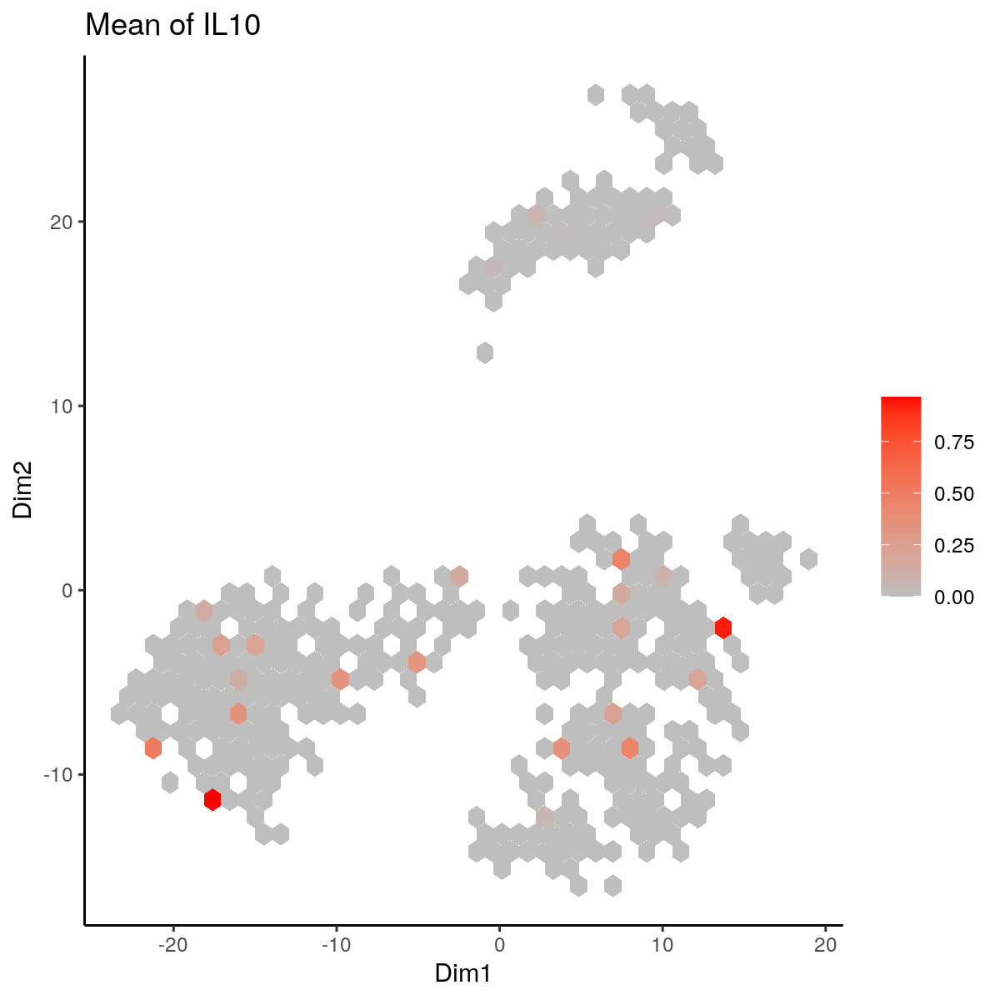|[ADORA1](https://www.ncbi.nlm.nih.gov/gene/134) [ADORA2A](https://www.ncbi.nlm.nih.gov/gene/135) [ADORA2B](https://www.ncbi.nlm.nih.gov/gene/136) [AGER](https://www.ncbi.nlm.nih.gov/gene/177) [ALOX15](https://www.ncbi.nlm.nih.gov/gene/246) [ALPL](https://www.ncbi.nlm.nih.gov/gene/249) [AQP1](https://www.ncbi.nlm.nih.gov/gene/358) [CXCR5](https://www.ncbi.nlm.nih.gov/gene/643) [BTK](https://www.ncbi.nlm.nih.gov/gene/695) [C3AR1](https://www.ncbi.nlm.nih.gov/gene/719) [C5AR1](https://www.ncbi.nlm.nih.gov/gene/728) [CD1A](https://www.ncbi.nlm.nih.gov/gene/909) [CD1B](https://www.ncbi.nlm.nih.gov/gene/910) [CD1C](https://www.ncbi.nlm.nih.gov/gene/911) [CD1D](https://www.ncbi.nlm.nih.gov/gene/912) [CD2](https://www.ncbi.nlm.nih.gov/gene/914) [CD3E](https://www.ncbi.nlm.nih.gov/gene/916) [CD4](https://www.ncbi.nlm.nih.gov/gene/920) [CD5](https://www.ncbi.nlm.nih.gov/gene/921) [CD14](https://www.ncbi.nlm.nih.gov/gene/929) [CD19](https://www.ncbi.nlm.nih.gov/gene/930) [CD22](https://www.ncbi.nlm.nih.gov/gene/933) [CD86](https://www.ncbi.nlm.nih.gov/gene/942) [CD44](https://www.ncbi.nlm.nih.gov/gene/960) [CD47](https://www.ncbi.nlm.nih.gov/gene/961) [CD58](https://www.ncbi.nlm.nih.gov/gene/965) [CCR1](https://www.ncbi.nlm.nih.gov/gene/1230) [CCR3](https://www.ncbi.nlm.nih.gov/gene/1232) [CCR4](https://www.ncbi.nlm.nih.gov/gene/1233) [CCR5](https://www.ncbi.nlm.nih.gov/gene/1234) [CCR6](https://www.ncbi.nlm.nih.gov/gene/1235) [CCR7](https://www.ncbi.nlm.nih.gov/gene/1236) [CCR8](https://www.ncbi.nlm.nih.gov/gene/1237) [CNTFR](https://www.ncbi.nlm.nih.gov/gene/1271) [CR2](https://www.ncbi.nlm.nih.gov/gene/1380) [CSF1R](https://www.ncbi.nlm.nih.gov/gene/1436) [CSF3R](https://www.ncbi.nlm.nih.gov/gene/1441) [CX3CR1](https://www.ncbi.nlm.nih.gov/gene/1524) [CYBB](https://www.ncbi.nlm.nih.gov/gene/1536) [CD55](https://www.ncbi.nlm.nih.gov/gene/1604) [ACE](https://www.ncbi.nlm.nih.gov/gene/1636) [DPP4](https://www.ncbi.nlm.nih.gov/gene/1803) [ADGRE1](https://www.ncbi.nlm.nih.gov/gene/2015) [ENG](https://www.ncbi.nlm.nih.gov/gene/2022) [ESR1](https://www.ncbi.nlm.nih.gov/gene/2099) [FCER2](https://www.ncbi.nlm.nih.gov/gene/2208) [FCGR1A](https://www.ncbi.nlm.nih.gov/gene/2209) [FCGR2A](https://www.ncbi.nlm.nih.gov/gene/2212) [FCGR2B](https://www.ncbi.nlm.nih.gov/gene/2213) [FCGR3A](https://www.ncbi.nlm.nih.gov/gene/2214) [FPR1](https://www.ncbi.nlm.nih.gov/gene/2357) [FPR2](https://www.ncbi.nlm.nih.gov/gene/2358) [FYN](https://www.ncbi.nlm.nih.gov/gene/2534) [GGT1](https://www.ncbi.nlm.nih.gov/gene/2678) [CXCR3](https://www.ncbi.nlm.nih.gov/gene/2833) [FFAR2](https://www.ncbi.nlm.nih.gov/gene/2867) [HLA-A](https://www.ncbi.nlm.nih.gov/gene/3105) [HLA-DQA1](https://www.ncbi.nlm.nih.gov/gene/3117) [HLA-DQB1](https://www.ncbi.nlm.nih.gov/gene/3119) [HLA-DRB1](https://www.ncbi.nlm.nih.gov/gene/3123) [IFNAR1](https://www.ncbi.nlm.nih.gov/gene/3454) [IFNGR1](https://www.ncbi.nlm.nih.gov/gene/3459) [IFNGR2](https://www.ncbi.nlm.nih.gov/gene/3460) [IL2RB](https://www.ncbi.nlm.nih.gov/gene/3560) [IL2RG](https://www.ncbi.nlm.nih.gov/gene/3561) [CXCR1](https://www.ncbi.nlm.nih.gov/gene/3577) [CXCR2](https://www.ncbi.nlm.nih.gov/gene/3579) [IL9R](https://www.ncbi.nlm.nih.gov/gene/3581) [IL10RA](https://www.ncbi.nlm.nih.gov/gene/3587) [ITGAL](https://www.ncbi.nlm.nih.gov/gene/3683) [ITGAM](https://www.ncbi.nlm.nih.gov/gene/3684) [ITGB1](https://www.ncbi.nlm.nih.gov/gene/3688) [KLRD1](https://www.ncbi.nlm.nih.gov/gene/3824) [LAMP1](https://www.ncbi.nlm.nih.gov/gene/3916) [LDLR](https://www.ncbi.nlm.nih.gov/gene/3949) [LYN](https://www.ncbi.nlm.nih.gov/gene/4067) [MMP17](https://www.ncbi.nlm.nih.gov/gene/4326) [MOG](https://www.ncbi.nlm.nih.gov/gene/4340) [CD200](https://www.ncbi.nlm.nih.gov/gene/4345) [MPL](https://www.ncbi.nlm.nih.gov/gene/4352) [MUC1](https://www.ncbi.nlm.nih.gov/gene/4582) [NOS3](https://www.ncbi.nlm.nih.gov/gene/4846) [NT5E](https://www.ncbi.nlm.nih.gov/gene/4907) [P2RX7](https://www.ncbi.nlm.nih.gov/gene/5027) [PDCD1](https://www.ncbi.nlm.nih.gov/gene/5133) [PDGFRA](https://www.ncbi.nlm.nih.gov/gene/5156) [PDGFRB](https://www.ncbi.nlm.nih.gov/gene/5159) [PTAFR](https://www.ncbi.nlm.nih.gov/gene/5724) [PTGER4](https://www.ncbi.nlm.nih.gov/gene/5734) [PTPRC](https://www.ncbi.nlm.nih.gov/gene/5788) [SELE](https://www.ncbi.nlm.nih.gov/gene/6401) [SELL](https://www.ncbi.nlm.nih.gov/gene/6402) [SELP](https://www.ncbi.nlm.nih.gov/gene/6403) [SLAMF1](https://www.ncbi.nlm.nih.gov/gene/6504) [SRC](https://www.ncbi.nlm.nih.gov/gene/6714) [SYK](https://www.ncbi.nlm.nih.gov/gene/6850) [TEK](https://www.ncbi.nlm.nih.gov/gene/7010) [THY1](https://www.ncbi.nlm.nih.gov/gene/7070) [TJP1](https://www.ncbi.nlm.nih.gov/gene/7082) [TLR1](https://www.ncbi.nlm.nih.gov/gene/7096) [TLR4](https://www.ncbi.nlm.nih.gov/gene/7099) [TLR5](https://www.ncbi.nlm.nih.gov/gene/7100) [TYROBP](https://www.ncbi.nlm.nih.gov/gene/7305) [IL1R2](https://www.ncbi.nlm.nih.gov/gene/7850) [CXCR4](https://www.ncbi.nlm.nih.gov/gene/7852) [TNFSF10](https://www.ncbi.nlm.nih.gov/gene/8743) [TNFRSF14](https://www.ncbi.nlm.nih.gov/gene/8764) [TNFSF18](https://www.ncbi.nlm.nih.gov/gene/8995) [CCRL2](https://www.ncbi.nlm.nih.gov/gene/9034) [FCGR2C](https://www.ncbi.nlm.nih.gov/gene/9103) [IL1RL1](https://www.ncbi.nlm.nih.gov/gene/9173) [CD163](https://www.ncbi.nlm.nih.gov/gene/9332) [NCR2](https://www.ncbi.nlm.nih.gov/gene/9436) [NCR1](https://www.ncbi.nlm.nih.gov/gene/9437) [KLRG1](https://www.ncbi.nlm.nih.gov/gene/10219) [TLR6](https://www.ncbi.nlm.nih.gov/gene/10333) [NOD1](https://www.ncbi.nlm.nih.gov/gene/10392) [CXCR6](https://www.ncbi.nlm.nih.gov/gene/10663) [CD226](https://www.ncbi.nlm.nih.gov/gene/10666) [CYSLTR1](https://www.ncbi.nlm.nih.gov/gene/10800) [CCR9](https://www.ncbi.nlm.nih.gov/gene/10803) [LILRB4](https://www.ncbi.nlm.nih.gov/gene/11006) [ICOSLG](https://www.ncbi.nlm.nih.gov/gene/23308) [SOCS7](https://www.ncbi.nlm.nih.gov/gene/30837) [MRAP](https://www.ncbi.nlm.nih.gov/gene/56246) [CXCL16](https://www.ncbi.nlm.nih.gov/gene/58191) [MMP25](https://www.ncbi.nlm.nih.gov/gene/64386) [VTCN1](https://www.ncbi.nlm.nih.gov/gene/79679) [PDCD1LG2](https://www.ncbi.nlm.nih.gov/gene/80380) [IL23R](https://www.ncbi.nlm.nih.gov/gene/149233) [BTLA](https://www.ncbi.nlm.nih.gov/gene/151888) [CLEC4C](https://www.ncbi.nlm.nih.gov/gene/170482) [TIGIT](https://www.ncbi.nlm.nih.gov/gene/201633) [NCR3](https://www.ncbi.nlm.nih.gov/gene/259197) [HCAR2](https://www.ncbi.nlm.nih.gov/gene/338442) [NCR3LG1](https://www.ncbi.nlm.nih.gov/gene/374383) [CCR2](https://www.ncbi.nlm.nih.gov/gene/729230) [CD24](https://www.ncbi.nlm.nih.gov/gene/100133941) [OCLN](https://www.ncbi.nlm.nih.gov/gene/100506658) [MICA](https://www.ncbi.nlm.nih.gov/gene/100507436) [KLRC4-KLRK1](https://www.ncbi.nlm.nih.gov/gene/100528032) [IL10RB](https://www.ncbi.nlm.nih.gov/gene/3588)|
|[IL11](https://www.ncbi.nlm.nih.gov/gene/3589)|[CNTFR](https://www.ncbi.nlm.nih.gov/gene/1271) [CSF3R](https://www.ncbi.nlm.nih.gov/gene/1441) [IFNAR1](https://www.ncbi.nlm.nih.gov/gene/3454) [IFNGR1](https://www.ncbi.nlm.nih.gov/gene/3459) [IFNGR2](https://www.ncbi.nlm.nih.gov/gene/3460) [IL2RB](https://www.ncbi.nlm.nih.gov/gene/3560) [IL2RG](https://www.ncbi.nlm.nih.gov/gene/3561) [IL9R](https://www.ncbi.nlm.nih.gov/gene/3581) [IL10RA](https://www.ncbi.nlm.nih.gov/gene/3587) [MPL](https://www.ncbi.nlm.nih.gov/gene/4352) [PDGFRA](https://www.ncbi.nlm.nih.gov/gene/5156) [PDGFRB](https://www.ncbi.nlm.nih.gov/gene/5159) [PTPRC](https://www.ncbi.nlm.nih.gov/gene/5788) [SRC](https://www.ncbi.nlm.nih.gov/gene/6714) [TEK](https://www.ncbi.nlm.nih.gov/gene/7010) [TGFBR1](https://www.ncbi.nlm.nih.gov/gene/7046) [EZR](https://www.ncbi.nlm.nih.gov/gene/7430) [CXCR4](https://www.ncbi.nlm.nih.gov/gene/7852) [IL23R](https://www.ncbi.nlm.nih.gov/gene/149233) [IL11RA](https://www.ncbi.nlm.nih.gov/gene/3590) [IL6ST](https://www.ncbi.nlm.nih.gov/gene/3572)|
|[IL12A](https://www.ncbi.nlm.nih.gov/gene/3592)|[CD86](https://www.ncbi.nlm.nih.gov/gene/942) [CNTFR](https://www.ncbi.nlm.nih.gov/gene/1271) [CSF3R](https://www.ncbi.nlm.nih.gov/gene/1441) [IFNAR1](https://www.ncbi.nlm.nih.gov/gene/3454) [IFNGR1](https://www.ncbi.nlm.nih.gov/gene/3459) [IFNGR2](https://www.ncbi.nlm.nih.gov/gene/3460) [IL2RB](https://www.ncbi.nlm.nih.gov/gene/3560) [IL2RG](https://www.ncbi.nlm.nih.gov/gene/3561) [IL9R](https://www.ncbi.nlm.nih.gov/gene/3581) [IL10RA](https://www.ncbi.nlm.nih.gov/gene/3587) [MPL](https://www.ncbi.nlm.nih.gov/gene/4352) [PDGFRA](https://www.ncbi.nlm.nih.gov/gene/5156) [PDGFRB](https://www.ncbi.nlm.nih.gov/gene/5159) [JOSD1](https://www.ncbi.nlm.nih.gov/gene/9929) [IL23R](https://www.ncbi.nlm.nih.gov/gene/149233) [IL12RB1](https://www.ncbi.nlm.nih.gov/gene/3594) [IL12RB2](https://www.ncbi.nlm.nih.gov/gene/3595)|
|[IL12B](https://www.ncbi.nlm.nih.gov/gene/3593)|[CD86](https://www.ncbi.nlm.nih.gov/gene/942) [CNTFR](https://www.ncbi.nlm.nih.gov/gene/1271) [CSF3R](https://www.ncbi.nlm.nih.gov/gene/1441) [IFNAR1](https://www.ncbi.nlm.nih.gov/gene/3454) [IFNGR1](https://www.ncbi.nlm.nih.gov/gene/3459) [IFNGR2](https://www.ncbi.nlm.nih.gov/gene/3460) [IL2RB](https://www.ncbi.nlm.nih.gov/gene/3560) [IL2RG](https://www.ncbi.nlm.nih.gov/gene/3561) [IL9R](https://www.ncbi.nlm.nih.gov/gene/3581) [IL10RA](https://www.ncbi.nlm.nih.gov/gene/3587) [MPL](https://www.ncbi.nlm.nih.gov/gene/4352) [PDGFRA](https://www.ncbi.nlm.nih.gov/gene/5156) [PDGFRB](https://www.ncbi.nlm.nih.gov/gene/5159) [TLR4](https://www.ncbi.nlm.nih.gov/gene/7099) [IL23R](https://www.ncbi.nlm.nih.gov/gene/149233) [IL12RB1](https://www.ncbi.nlm.nih.gov/gene/3594) [IL12RB2](https://www.ncbi.nlm.nih.gov/gene/3595)|
|[IL13](https://www.ncbi.nlm.nih.gov/gene/3596)|[ADRB2](https://www.ncbi.nlm.nih.gov/gene/154) [ALOX15](https://www.ncbi.nlm.nih.gov/gene/246) [RHOA](https://www.ncbi.nlm.nih.gov/gene/387) [CXCR5](https://www.ncbi.nlm.nih.gov/gene/643) [BSG](https://www.ncbi.nlm.nih.gov/gene/682) [CD1A](https://www.ncbi.nlm.nih.gov/gene/909) [CD1B](https://www.ncbi.nlm.nih.gov/gene/910) [CD1C](https://www.ncbi.nlm.nih.gov/gene/911) [CD1D](https://www.ncbi.nlm.nih.gov/gene/912) [CD2](https://www.ncbi.nlm.nih.gov/gene/914) [CD4](https://www.ncbi.nlm.nih.gov/gene/920) [CD5](https://www.ncbi.nlm.nih.gov/gene/921) [CD19](https://www.ncbi.nlm.nih.gov/gene/930) [CD86](https://www.ncbi.nlm.nih.gov/gene/942) [CD36](https://www.ncbi.nlm.nih.gov/gene/948) [CD44](https://www.ncbi.nlm.nih.gov/gene/960) [CCR1](https://www.ncbi.nlm.nih.gov/gene/1230) [CCR3](https://www.ncbi.nlm.nih.gov/gene/1232) [CCR5](https://www.ncbi.nlm.nih.gov/gene/1234) [CCR6](https://www.ncbi.nlm.nih.gov/gene/1235) [CCR7](https://www.ncbi.nlm.nih.gov/gene/1236) [CCR8](https://www.ncbi.nlm.nih.gov/gene/1237) [LTB4R](https://www.ncbi.nlm.nih.gov/gene/1241) [CNTFR](https://www.ncbi.nlm.nih.gov/gene/1271) [CSF1R](https://www.ncbi.nlm.nih.gov/gene/1436) [CSF3R](https://www.ncbi.nlm.nih.gov/gene/1441) [CX3CR1](https://www.ncbi.nlm.nih.gov/gene/1524) [DPP4](https://www.ncbi.nlm.nih.gov/gene/1803) [DSG1](https://www.ncbi.nlm.nih.gov/gene/1828) [ADGRE1](https://www.ncbi.nlm.nih.gov/gene/2015) [FCER1A](https://www.ncbi.nlm.nih.gov/gene/2205) [FCER2](https://www.ncbi.nlm.nih.gov/gene/2208) [FCGR1A](https://www.ncbi.nlm.nih.gov/gene/2209) [FCGR2A](https://www.ncbi.nlm.nih.gov/gene/2212) [FCGR2B](https://www.ncbi.nlm.nih.gov/gene/2213) [FPR1](https://www.ncbi.nlm.nih.gov/gene/2357) [CXCR3](https://www.ncbi.nlm.nih.gov/gene/2833) [HRH2](https://www.ncbi.nlm.nih.gov/gene/3274) [IFNAR1](https://www.ncbi.nlm.nih.gov/gene/3454) [IFNGR1](https://www.ncbi.nlm.nih.gov/gene/3459) [IFNGR2](https://www.ncbi.nlm.nih.gov/gene/3460) [IL2RB](https://www.ncbi.nlm.nih.gov/gene/3560) [IL2RG](https://www.ncbi.nlm.nih.gov/gene/3561) [CXCR1](https://www.ncbi.nlm.nih.gov/gene/3577) [CXCR2](https://www.ncbi.nlm.nih.gov/gene/3579) [IL9R](https://www.ncbi.nlm.nih.gov/gene/3581) [IL10RA](https://www.ncbi.nlm.nih.gov/gene/3587) [ITGAM](https://www.ncbi.nlm.nih.gov/gene/3684) [ITGB1](https://www.ncbi.nlm.nih.gov/gene/3688) [ITGB2](https://www.ncbi.nlm.nih.gov/gene/3689) [MOG](https://www.ncbi.nlm.nih.gov/gene/4340) [MPL](https://www.ncbi.nlm.nih.gov/gene/4352) [OXTR](https://www.ncbi.nlm.nih.gov/gene/5021) [PDCD1](https://www.ncbi.nlm.nih.gov/gene/5133) [PDGFRA](https://www.ncbi.nlm.nih.gov/gene/5156) [PDGFRB](https://www.ncbi.nlm.nih.gov/gene/5159) [PTPRC](https://www.ncbi.nlm.nih.gov/gene/5788) [SELE](https://www.ncbi.nlm.nih.gov/gene/6401) [SELL](https://www.ncbi.nlm.nih.gov/gene/6402) [SELP](https://www.ncbi.nlm.nih.gov/gene/6403) [SYK](https://www.ncbi.nlm.nih.gov/gene/6850) [THY1](https://www.ncbi.nlm.nih.gov/gene/7070) [TLR1](https://www.ncbi.nlm.nih.gov/gene/7096) [TLR4](https://www.ncbi.nlm.nih.gov/gene/7099) [TLR5](https://www.ncbi.nlm.nih.gov/gene/7100) [IL1R2](https://www.ncbi.nlm.nih.gov/gene/7850) [CXCR4](https://www.ncbi.nlm.nih.gov/gene/7852) [CCRL2](https://www.ncbi.nlm.nih.gov/gene/9034) [FCGR2C](https://www.ncbi.nlm.nih.gov/gene/9103) [IL1RL1](https://www.ncbi.nlm.nih.gov/gene/9173) [CD163](https://www.ncbi.nlm.nih.gov/gene/9332) [NCR2](https://www.ncbi.nlm.nih.gov/gene/9436) [NCR1](https://www.ncbi.nlm.nih.gov/gene/9437) [KLRG1](https://www.ncbi.nlm.nih.gov/gene/10219) [TLR6](https://www.ncbi.nlm.nih.gov/gene/10333) [CYSLTR1](https://www.ncbi.nlm.nih.gov/gene/10800) [CCR9](https://www.ncbi.nlm.nih.gov/gene/10803) [PTGDR2](https://www.ncbi.nlm.nih.gov/gene/11251) [ICOSLG](https://www.ncbi.nlm.nih.gov/gene/23308) [DUOX1](https://www.ncbi.nlm.nih.gov/gene/53905) [ITLN1](https://www.ncbi.nlm.nih.gov/gene/55600) [PDCD1LG2](https://www.ncbi.nlm.nih.gov/gene/80380) [IL17RC](https://www.ncbi.nlm.nih.gov/gene/84818) [IL23R](https://www.ncbi.nlm.nih.gov/gene/149233) [NFAM1](https://www.ncbi.nlm.nih.gov/gene/150372) [MARVELD2](https://www.ncbi.nlm.nih.gov/gene/153562) [SPRED1](https://www.ncbi.nlm.nih.gov/gene/161742) [CCR2](https://www.ncbi.nlm.nih.gov/gene/729230) [KLRC4-KLRK1](https://www.ncbi.nlm.nih.gov/gene/100528032) [IL13RA1](https://www.ncbi.nlm.nih.gov/gene/3597) [IL4R](https://www.ncbi.nlm.nih.gov/gene/3566) [IL13RA2](https://www.ncbi.nlm.nih.gov/gene/3598)|
|[IL15](https://www.ncbi.nlm.nih.gov/gene/3600)|[RHOC](https://www.ncbi.nlm.nih.gov/gene/389) [CXCR5](https://www.ncbi.nlm.nih.gov/gene/643) [CD1A](https://www.ncbi.nlm.nih.gov/gene/909) [CD1B](https://www.ncbi.nlm.nih.gov/gene/910) [CD1C](https://www.ncbi.nlm.nih.gov/gene/911) [CD1D](https://www.ncbi.nlm.nih.gov/gene/912) [CD2](https://www.ncbi.nlm.nih.gov/gene/914) [CD4](https://www.ncbi.nlm.nih.gov/gene/920) [CD5](https://www.ncbi.nlm.nih.gov/gene/921) [CD19](https://www.ncbi.nlm.nih.gov/gene/930) [CD86](https://www.ncbi.nlm.nih.gov/gene/942) [CD36](https://www.ncbi.nlm.nih.gov/gene/948) [CD44](https://www.ncbi.nlm.nih.gov/gene/960) [CD58](https://www.ncbi.nlm.nih.gov/gene/965) [CCR1](https://www.ncbi.nlm.nih.gov/gene/1230) [CCR3](https://www.ncbi.nlm.nih.gov/gene/1232) [CCR5](https://www.ncbi.nlm.nih.gov/gene/1234) [CCR6](https://www.ncbi.nlm.nih.gov/gene/1235) [CCR7](https://www.ncbi.nlm.nih.gov/gene/1236) [CNTFR](https://www.ncbi.nlm.nih.gov/gene/1271) [CSF1R](https://www.ncbi.nlm.nih.gov/gene/1436) [CSF3R](https://www.ncbi.nlm.nih.gov/gene/1441) [CX3CR1](https://www.ncbi.nlm.nih.gov/gene/1524) [FCGR2A](https://www.ncbi.nlm.nih.gov/gene/2212) [FCGR2B](https://www.ncbi.nlm.nih.gov/gene/2213) [CXCR3](https://www.ncbi.nlm.nih.gov/gene/2833) [HLA-A](https://www.ncbi.nlm.nih.gov/gene/3105) [IFNAR1](https://www.ncbi.nlm.nih.gov/gene/3454) [IFNGR1](https://www.ncbi.nlm.nih.gov/gene/3459) [IFNGR2](https://www.ncbi.nlm.nih.gov/gene/3460) [IL2RB](https://www.ncbi.nlm.nih.gov/gene/3560) [IL2RG](https://www.ncbi.nlm.nih.gov/gene/3561) [IL9R](https://www.ncbi.nlm.nih.gov/gene/3581) [IL10RA](https://www.ncbi.nlm.nih.gov/gene/3587) [ITGAL](https://www.ncbi.nlm.nih.gov/gene/3683) [ITGAM](https://www.ncbi.nlm.nih.gov/gene/3684) [KIR2DL1](https://www.ncbi.nlm.nih.gov/gene/3802) [KIR2DL3](https://www.ncbi.nlm.nih.gov/gene/3804) [KIR2DL4](https://www.ncbi.nlm.nih.gov/gene/3805) [KIR3DL1](https://www.ncbi.nlm.nih.gov/gene/3811) [KIR3DL2](https://www.ncbi.nlm.nih.gov/gene/3812) [KLRD1](https://www.ncbi.nlm.nih.gov/gene/3824) [LAMP1](https://www.ncbi.nlm.nih.gov/gene/3916) [MICB](https://www.ncbi.nlm.nih.gov/gene/4277) [MPL](https://www.ncbi.nlm.nih.gov/gene/4352) [PDCD1](https://www.ncbi.nlm.nih.gov/gene/5133) [PDGFRA](https://www.ncbi.nlm.nih.gov/gene/5156) [PDGFRB](https://www.ncbi.nlm.nih.gov/gene/5159) [PTPRC](https://www.ncbi.nlm.nih.gov/gene/5788) [NECTIN2](https://www.ncbi.nlm.nih.gov/gene/5819) [RAC1](https://www.ncbi.nlm.nih.gov/gene/5879) [SELL](https://www.ncbi.nlm.nih.gov/gene/6402) [SYK](https://www.ncbi.nlm.nih.gov/gene/6850) [TLR1](https://www.ncbi.nlm.nih.gov/gene/7096) [TLR4](https://www.ncbi.nlm.nih.gov/gene/7099) [TLR5](https://www.ncbi.nlm.nih.gov/gene/7100) [TYROBP](https://www.ncbi.nlm.nih.gov/gene/7305) [CXCR4](https://www.ncbi.nlm.nih.gov/gene/7852) [TNFSF10](https://www.ncbi.nlm.nih.gov/gene/8743) [CCRL2](https://www.ncbi.nlm.nih.gov/gene/9034) [FCGR2C](https://www.ncbi.nlm.nih.gov/gene/9103) [NCR2](https://www.ncbi.nlm.nih.gov/gene/9436) [NCR1](https://www.ncbi.nlm.nih.gov/gene/9437) [KLRG1](https://www.ncbi.nlm.nih.gov/gene/10219) [TLR6](https://www.ncbi.nlm.nih.gov/gene/10333) [CXCR6](https://www.ncbi.nlm.nih.gov/gene/10663) [CD226](https://www.ncbi.nlm.nih.gov/gene/10666) [CCR9](https://www.ncbi.nlm.nih.gov/gene/10803) [ICOSLG](https://www.ncbi.nlm.nih.gov/gene/23308) [RHOD](https://www.ncbi.nlm.nih.gov/gene/29984) [RHOF](https://www.ncbi.nlm.nih.gov/gene/54509) [RHOU](https://www.ncbi.nlm.nih.gov/gene/58480) [ULBP2](https://www.ncbi.nlm.nih.gov/gene/80328) [ULBP1](https://www.ncbi.nlm.nih.gov/gene/80329) [PDCD1LG2](https://www.ncbi.nlm.nih.gov/gene/80380) [SLAMF6](https://www.ncbi.nlm.nih.gov/gene/114836) [IL23R](https://www.ncbi.nlm.nih.gov/gene/149233) [BTLA](https://www.ncbi.nlm.nih.gov/gene/151888) [RHOV](https://www.ncbi.nlm.nih.gov/gene/171177) [NCR3](https://www.ncbi.nlm.nih.gov/gene/259197) [CCR2](https://www.ncbi.nlm.nih.gov/gene/729230) [MICA](https://www.ncbi.nlm.nih.gov/gene/100507436) [KLRC4-KLRK1](https://www.ncbi.nlm.nih.gov/gene/100528032) [IL15RA](https://www.ncbi.nlm.nih.gov/gene/3601)|
|[IL16](https://www.ncbi.nlm.nih.gov/gene/3603)|[CD4](https://www.ncbi.nlm.nih.gov/gene/920) [CD86](https://www.ncbi.nlm.nih.gov/gene/942) [CD53](https://www.ncbi.nlm.nih.gov/gene/963) [CDH13](https://www.ncbi.nlm.nih.gov/gene/1012) [CCR1](https://www.ncbi.nlm.nih.gov/gene/1230) [CCR3](https://www.ncbi.nlm.nih.gov/gene/1232) [CCR5](https://www.ncbi.nlm.nih.gov/gene/1234) [CXCR3](https://www.ncbi.nlm.nih.gov/gene/2833) [GRIN2C](https://www.ncbi.nlm.nih.gov/gene/2905) [IL2RB](https://www.ncbi.nlm.nih.gov/gene/3560) [IL2RG](https://www.ncbi.nlm.nih.gov/gene/3561) [IL10RA](https://www.ncbi.nlm.nih.gov/gene/3587) [ITGB2](https://www.ncbi.nlm.nih.gov/gene/3689) [KCNA3](https://www.ncbi.nlm.nih.gov/gene/3738) [KCND2](https://www.ncbi.nlm.nih.gov/gene/3751) [KCNJ4](https://www.ncbi.nlm.nih.gov/gene/3761) [PTPRC](https://www.ncbi.nlm.nih.gov/gene/5788) [CCR9](https://www.ncbi.nlm.nih.gov/gene/10803) [CCR2](https://www.ncbi.nlm.nih.gov/gene/729230)|
|[IL17A](https://www.ncbi.nlm.nih.gov/gene/3605)|[IL17RA](https://www.ncbi.nlm.nih.gov/gene/23765) [IL17RC](https://www.ncbi.nlm.nih.gov/gene/84818)|
|[IL17B](https://www.ncbi.nlm.nih.gov/gene/27190) 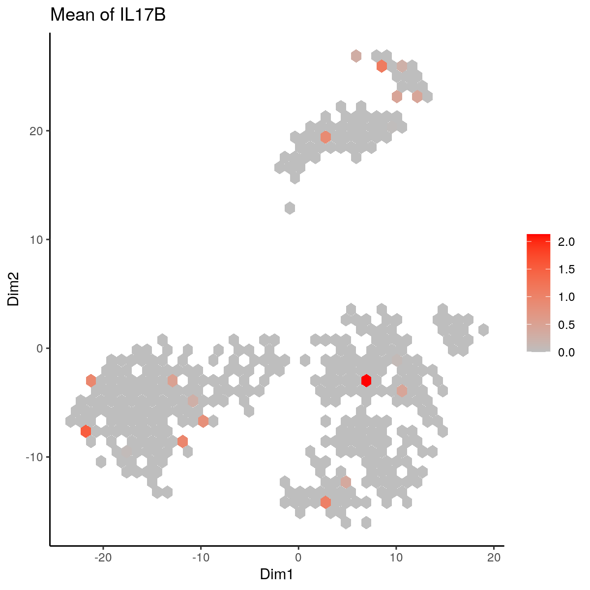|[F2RL2](https://www.ncbi.nlm.nih.gov/gene/2151) [IL17RC](https://www.ncbi.nlm.nih.gov/gene/84818) [IL17RA](https://www.ncbi.nlm.nih.gov/gene/23765) [IL17RB](https://www.ncbi.nlm.nih.gov/gene/55540)|
|[IL17C](https://www.ncbi.nlm.nih.gov/gene/27189)|[CNR2](https://www.ncbi.nlm.nih.gov/gene/1269) [XPR1](https://www.ncbi.nlm.nih.gov/gene/9213) [CD177](https://www.ncbi.nlm.nih.gov/gene/57126) [IL17RC](https://www.ncbi.nlm.nih.gov/gene/84818) [IL23R](https://www.ncbi.nlm.nih.gov/gene/149233) [IL17RA](https://www.ncbi.nlm.nih.gov/gene/23765) [IL17RE](https://www.ncbi.nlm.nih.gov/gene/132014)|
|[IL17D](https://www.ncbi.nlm.nih.gov/gene/53342)|[CNTFR](https://www.ncbi.nlm.nih.gov/gene/1271) [CSF3R](https://www.ncbi.nlm.nih.gov/gene/1441) [IFNAR1](https://www.ncbi.nlm.nih.gov/gene/3454) [IFNGR1](https://www.ncbi.nlm.nih.gov/gene/3459) [IFNGR2](https://www.ncbi.nlm.nih.gov/gene/3460) [IL2RB](https://www.ncbi.nlm.nih.gov/gene/3560) [IL2RG](https://www.ncbi.nlm.nih.gov/gene/3561) [IL9R](https://www.ncbi.nlm.nih.gov/gene/3581) [IL10RA](https://www.ncbi.nlm.nih.gov/gene/3587) [MPL](https://www.ncbi.nlm.nih.gov/gene/4352) [PDGFRA](https://www.ncbi.nlm.nih.gov/gene/5156) [PDGFRB](https://www.ncbi.nlm.nih.gov/gene/5159) [RGS1](https://www.ncbi.nlm.nih.gov/gene/5996) [TMEM8B](https://www.ncbi.nlm.nih.gov/gene/51754) [IL17RC](https://www.ncbi.nlm.nih.gov/gene/84818) [IL23R](https://www.ncbi.nlm.nih.gov/gene/149233)|
|[IL17F](https://www.ncbi.nlm.nih.gov/gene/112744)|[CCR6](https://www.ncbi.nlm.nih.gov/gene/1235) [CXCR3](https://www.ncbi.nlm.nih.gov/gene/2833) [ITGAM](https://www.ncbi.nlm.nih.gov/gene/3684) [MOG](https://www.ncbi.nlm.nih.gov/gene/4340) [PTPRC](https://www.ncbi.nlm.nih.gov/gene/5788) [SELL](https://www.ncbi.nlm.nih.gov/gene/6402) [TLR1](https://www.ncbi.nlm.nih.gov/gene/7096) [TLR4](https://www.ncbi.nlm.nih.gov/gene/7099) [TLR5](https://www.ncbi.nlm.nih.gov/gene/7100) [CCRL2](https://www.ncbi.nlm.nih.gov/gene/9034) [TLR6](https://www.ncbi.nlm.nih.gov/gene/10333) [IL17RC](https://www.ncbi.nlm.nih.gov/gene/84818) [IL23R](https://www.ncbi.nlm.nih.gov/gene/149233) [IL17RA](https://www.ncbi.nlm.nih.gov/gene/23765)|
|[IL17RA](https://www.ncbi.nlm.nih.gov/gene/23765)|[CD4](https://www.ncbi.nlm.nih.gov/gene/920) [CD9](https://www.ncbi.nlm.nih.gov/gene/928) [CCR6](https://www.ncbi.nlm.nih.gov/gene/1235) [DPP4](https://www.ncbi.nlm.nih.gov/gene/1803) [CXCR2](https://www.ncbi.nlm.nih.gov/gene/3579) [IL10RA](https://www.ncbi.nlm.nih.gov/gene/3587) [ITGAM](https://www.ncbi.nlm.nih.gov/gene/3684) [CD82](https://www.ncbi.nlm.nih.gov/gene/3732) [PTPRC](https://www.ncbi.nlm.nih.gov/gene/5788) [SYK](https://www.ncbi.nlm.nih.gov/gene/6850) [TLR1](https://www.ncbi.nlm.nih.gov/gene/7096) [TLR4](https://www.ncbi.nlm.nih.gov/gene/7099) [TLR5](https://www.ncbi.nlm.nih.gov/gene/7100) [IL1R2](https://www.ncbi.nlm.nih.gov/gene/7850) [TNFRSF14](https://www.ncbi.nlm.nih.gov/gene/8764) [CCRL2](https://www.ncbi.nlm.nih.gov/gene/9034) [TLR6](https://www.ncbi.nlm.nih.gov/gene/10333) [IL17RC](https://www.ncbi.nlm.nih.gov/gene/84818) [IL23R](https://www.ncbi.nlm.nih.gov/gene/149233)|
|[IL17RB](https://www.ncbi.nlm.nih.gov/gene/55540)|[CD1D](https://www.ncbi.nlm.nih.gov/gene/912) [CCR6](https://www.ncbi.nlm.nih.gov/gene/1235) [IL1RL1](https://www.ncbi.nlm.nih.gov/gene/9173) [PTGDR2](https://www.ncbi.nlm.nih.gov/gene/11251) [IL17RC](https://www.ncbi.nlm.nih.gov/gene/84818) [IL23R](https://www.ncbi.nlm.nih.gov/gene/149233)|
|[IL17RE](https://www.ncbi.nlm.nih.gov/gene/132014)|[IL2RB](https://www.ncbi.nlm.nih.gov/gene/3560) [IL23R](https://www.ncbi.nlm.nih.gov/gene/149233)|
|[IL18](https://www.ncbi.nlm.nih.gov/gene/3606)|[CXCR5](https://www.ncbi.nlm.nih.gov/gene/643) [BSG](https://www.ncbi.nlm.nih.gov/gene/682) [CD1C](https://www.ncbi.nlm.nih.gov/gene/911) [CD1D](https://www.ncbi.nlm.nih.gov/gene/912) [CD19](https://www.ncbi.nlm.nih.gov/gene/930) [CD86](https://www.ncbi.nlm.nih.gov/gene/942) [CD44](https://www.ncbi.nlm.nih.gov/gene/960) [CCR1](https://www.ncbi.nlm.nih.gov/gene/1230) [CCR3](https://www.ncbi.nlm.nih.gov/gene/1232) [CCR5](https://www.ncbi.nlm.nih.gov/gene/1234) [CCR6](https://www.ncbi.nlm.nih.gov/gene/1235) [CCR7](https://www.ncbi.nlm.nih.gov/gene/1236) [CX3CR1](https://www.ncbi.nlm.nih.gov/gene/1524) [CYBB](https://www.ncbi.nlm.nih.gov/gene/1536) [FCGR2A](https://www.ncbi.nlm.nih.gov/gene/2212) [FCGR2B](https://www.ncbi.nlm.nih.gov/gene/2213) [CXCR3](https://www.ncbi.nlm.nih.gov/gene/2833) [IFNAR1](https://www.ncbi.nlm.nih.gov/gene/3454) [IFNGR1](https://www.ncbi.nlm.nih.gov/gene/3459) [IL2RB](https://www.ncbi.nlm.nih.gov/gene/3560) [CXCR2](https://www.ncbi.nlm.nih.gov/gene/3579) [IL10RA](https://www.ncbi.nlm.nih.gov/gene/3587) [ITGAM](https://www.ncbi.nlm.nih.gov/gene/3684) [KIR2DL1](https://www.ncbi.nlm.nih.gov/gene/3802) [KIR2DL3](https://www.ncbi.nlm.nih.gov/gene/3804) [KIR3DL1](https://www.ncbi.nlm.nih.gov/gene/3811) [KLRD1](https://www.ncbi.nlm.nih.gov/gene/3824) [LAMP1](https://www.ncbi.nlm.nih.gov/gene/3916) [P2RX7](https://www.ncbi.nlm.nih.gov/gene/5027) [PTPRC](https://www.ncbi.nlm.nih.gov/gene/5788) [SELE](https://www.ncbi.nlm.nih.gov/gene/6401) [SELL](https://www.ncbi.nlm.nih.gov/gene/6402) [SELP](https://www.ncbi.nlm.nih.gov/gene/6403) [SYK](https://www.ncbi.nlm.nih.gov/gene/6850) [TLR1](https://www.ncbi.nlm.nih.gov/gene/7096) [TLR4](https://www.ncbi.nlm.nih.gov/gene/7099) [TLR5](https://www.ncbi.nlm.nih.gov/gene/7100) [TYROBP](https://www.ncbi.nlm.nih.gov/gene/7305) [IL1R2](https://www.ncbi.nlm.nih.gov/gene/7850) [CXCR4](https://www.ncbi.nlm.nih.gov/gene/7852) [TNFSF10](https://www.ncbi.nlm.nih.gov/gene/8743) [IL18RAP](https://www.ncbi.nlm.nih.gov/gene/8807) [CCRL2](https://www.ncbi.nlm.nih.gov/gene/9034) [FCGR2C](https://www.ncbi.nlm.nih.gov/gene/9103) [IL1RL1](https://www.ncbi.nlm.nih.gov/gene/9173) [CD163](https://www.ncbi.nlm.nih.gov/gene/9332) [NCR2](https://www.ncbi.nlm.nih.gov/gene/9436) [NCR1](https://www.ncbi.nlm.nih.gov/gene/9437) [TLR6](https://www.ncbi.nlm.nih.gov/gene/10333) [NOD1](https://www.ncbi.nlm.nih.gov/gene/10392) [CXCR6](https://www.ncbi.nlm.nih.gov/gene/10663) [CD226](https://www.ncbi.nlm.nih.gov/gene/10666) [PSD4](https://www.ncbi.nlm.nih.gov/gene/23550) [PANX1](https://www.ncbi.nlm.nih.gov/gene/24145) [CXCL16](https://www.ncbi.nlm.nih.gov/gene/58191) [GSDMD](https://www.ncbi.nlm.nih.gov/gene/79792) [ULBP2](https://www.ncbi.nlm.nih.gov/gene/80328) [IL23R](https://www.ncbi.nlm.nih.gov/gene/149233) [NCR3](https://www.ncbi.nlm.nih.gov/gene/259197) [IFITM10](https://www.ncbi.nlm.nih.gov/gene/402778) [CCR2](https://www.ncbi.nlm.nih.gov/gene/729230) [MICA](https://www.ncbi.nlm.nih.gov/gene/100507436) [KLRC4-KLRK1](https://www.ncbi.nlm.nih.gov/gene/100528032) [IL18R1](https://www.ncbi.nlm.nih.gov/gene/8809)|
|[IL18BP](https://www.ncbi.nlm.nih.gov/gene/10068)|[IL1R2](https://www.ncbi.nlm.nih.gov/gene/7850) [IL18RAP](https://www.ncbi.nlm.nih.gov/gene/8807)|
|[IL19](https://www.ncbi.nlm.nih.gov/gene/29949)|[CNTFR](https://www.ncbi.nlm.nih.gov/gene/1271) [CSF3R](https://www.ncbi.nlm.nih.gov/gene/1441) [IFNAR1](https://www.ncbi.nlm.nih.gov/gene/3454) [IFNGR1](https://www.ncbi.nlm.nih.gov/gene/3459) [IFNGR2](https://www.ncbi.nlm.nih.gov/gene/3460) [IL2RB](https://www.ncbi.nlm.nih.gov/gene/3560) [IL2RG](https://www.ncbi.nlm.nih.gov/gene/3561) [IL9R](https://www.ncbi.nlm.nih.gov/gene/3581) [IL10RA](https://www.ncbi.nlm.nih.gov/gene/3587) [MPL](https://www.ncbi.nlm.nih.gov/gene/4352) [PDGFRA](https://www.ncbi.nlm.nih.gov/gene/5156) [PDGFRB](https://www.ncbi.nlm.nih.gov/gene/5159) [IL1R2](https://www.ncbi.nlm.nih.gov/gene/7850) [FCAMR](https://www.ncbi.nlm.nih.gov/gene/83953) [IL23R](https://www.ncbi.nlm.nih.gov/gene/149233) [IL20RA](https://www.ncbi.nlm.nih.gov/gene/53832) [IL20RB](https://www.ncbi.nlm.nih.gov/gene/53833)|
|[IL1A](https://www.ncbi.nlm.nih.gov/gene/3552)|[C5AR1](https://www.ncbi.nlm.nih.gov/gene/728) [CAPN2](https://www.ncbi.nlm.nih.gov/gene/824) [CD86](https://www.ncbi.nlm.nih.gov/gene/942) [DPP4](https://www.ncbi.nlm.nih.gov/gene/1803) [FSHR](https://www.ncbi.nlm.nih.gov/gene/2492) [GNAS](https://www.ncbi.nlm.nih.gov/gene/2778) [CXCR2](https://www.ncbi.nlm.nih.gov/gene/3579) [ITGAM](https://www.ncbi.nlm.nih.gov/gene/3684) [CD180](https://www.ncbi.nlm.nih.gov/gene/4064) [SELE](https://www.ncbi.nlm.nih.gov/gene/6401) [THY1](https://www.ncbi.nlm.nih.gov/gene/7070) [TLR1](https://www.ncbi.nlm.nih.gov/gene/7096) [TLR4](https://www.ncbi.nlm.nih.gov/gene/7099) [TLR5](https://www.ncbi.nlm.nih.gov/gene/7100) [IL1R2](https://www.ncbi.nlm.nih.gov/gene/7850) [CD163](https://www.ncbi.nlm.nih.gov/gene/9332) [TLR6](https://www.ncbi.nlm.nih.gov/gene/10333) [TMED1](https://www.ncbi.nlm.nih.gov/gene/11018) [CCR2](https://www.ncbi.nlm.nih.gov/gene/729230) [IL1R1](https://www.ncbi.nlm.nih.gov/gene/3554) [IL1RAP](https://www.ncbi.nlm.nih.gov/gene/3556)|
|[IL1B](https://www.ncbi.nlm.nih.gov/gene/3553)|[IL1R1](https://www.ncbi.nlm.nih.gov/gene/3554) [IL1RAP](https://www.ncbi.nlm.nih.gov/gene/3556) [IL1R2](https://www.ncbi.nlm.nih.gov/gene/7850)|
|[IL1F10](https://www.ncbi.nlm.nih.gov/gene/84639)|[TLR4](https://www.ncbi.nlm.nih.gov/gene/7099) [IL1R2](https://www.ncbi.nlm.nih.gov/gene/7850) [IL18RAP](https://www.ncbi.nlm.nih.gov/gene/8807) [IL1RL1](https://www.ncbi.nlm.nih.gov/gene/9173) [TLR6](https://www.ncbi.nlm.nih.gov/gene/10333) [BTN3A1](https://www.ncbi.nlm.nih.gov/gene/11119) [IL1RAPL1](https://www.ncbi.nlm.nih.gov/gene/11141)|
|[IL1R1](https://www.ncbi.nlm.nih.gov/gene/3554)|[IL1R2](https://www.ncbi.nlm.nih.gov/gene/7850)|
|[IL1RAP](https://www.ncbi.nlm.nih.gov/gene/3556)|[SSTR2](https://www.ncbi.nlm.nih.gov/gene/6752) [TLR4](https://www.ncbi.nlm.nih.gov/gene/7099) [IL1R2](https://www.ncbi.nlm.nih.gov/gene/7850) [IL1RL1](https://www.ncbi.nlm.nih.gov/gene/9173)|
|[IL1RL1](https://www.ncbi.nlm.nih.gov/gene/9173)|[IL2RB](https://www.ncbi.nlm.nih.gov/gene/3560) [IL9R](https://www.ncbi.nlm.nih.gov/gene/3581) [ITGAM](https://www.ncbi.nlm.nih.gov/gene/3684) [PTPRC](https://www.ncbi.nlm.nih.gov/gene/5788) [SSTR2](https://www.ncbi.nlm.nih.gov/gene/6752) [KLRG1](https://www.ncbi.nlm.nih.gov/gene/10219) [TMED1](https://www.ncbi.nlm.nih.gov/gene/11018) [PTGDR2](https://www.ncbi.nlm.nih.gov/gene/11251)|
|[IL1RN](https://www.ncbi.nlm.nih.gov/gene/3557)|[AQP9](https://www.ncbi.nlm.nih.gov/gene/366) [C3AR1](https://www.ncbi.nlm.nih.gov/gene/719) [CD14](https://www.ncbi.nlm.nih.gov/gene/929) [CD86](https://www.ncbi.nlm.nih.gov/gene/942) [CCR1](https://www.ncbi.nlm.nih.gov/gene/1230) [CCR5](https://www.ncbi.nlm.nih.gov/gene/1234) [FCGR1A](https://www.ncbi.nlm.nih.gov/gene/2209) [FCGR2A](https://www.ncbi.nlm.nih.gov/gene/2212) [FCGR3A](https://www.ncbi.nlm.nih.gov/gene/2214) [CXCR1](https://www.ncbi.nlm.nih.gov/gene/3577) [CXCR2](https://www.ncbi.nlm.nih.gov/gene/3579) [IL10RA](https://www.ncbi.nlm.nih.gov/gene/3587) [ITGAM](https://www.ncbi.nlm.nih.gov/gene/3684) [TLR1](https://www.ncbi.nlm.nih.gov/gene/7096) [TLR4](https://www.ncbi.nlm.nih.gov/gene/7099) [TLR5](https://www.ncbi.nlm.nih.gov/gene/7100) [IL1R2](https://www.ncbi.nlm.nih.gov/gene/7850) [IL18RAP](https://www.ncbi.nlm.nih.gov/gene/8807) [CCRL2](https://www.ncbi.nlm.nih.gov/gene/9034) [FCGR2C](https://www.ncbi.nlm.nih.gov/gene/9103) [IL1RL1](https://www.ncbi.nlm.nih.gov/gene/9173) [CD163](https://www.ncbi.nlm.nih.gov/gene/9332) [TLR6](https://www.ncbi.nlm.nih.gov/gene/10333) [TMED1](https://www.ncbi.nlm.nih.gov/gene/11018) [PSD4](https://www.ncbi.nlm.nih.gov/gene/23550) [GPR84](https://www.ncbi.nlm.nih.gov/gene/53831) [HCAR2](https://www.ncbi.nlm.nih.gov/gene/338442) [CCR2](https://www.ncbi.nlm.nih.gov/gene/729230) [IL1R1](https://www.ncbi.nlm.nih.gov/gene/3554) [IL1RAP](https://www.ncbi.nlm.nih.gov/gene/3556) [IL2RA](https://www.ncbi.nlm.nih.gov/gene/3559) [IL2RB](https://www.ncbi.nlm.nih.gov/gene/3560) [IL2RG](https://www.ncbi.nlm.nih.gov/gene/3561)|
|[IL2](https://www.ncbi.nlm.nih.gov/gene/3558)|[ADA](https://www.ncbi.nlm.nih.gov/gene/100) [ADORA2A](https://www.ncbi.nlm.nih.gov/gene/135) [RHOA](https://www.ncbi.nlm.nih.gov/gene/387) [CXCR5](https://www.ncbi.nlm.nih.gov/gene/643) [BTK](https://www.ncbi.nlm.nih.gov/gene/695) [CBL](https://www.ncbi.nlm.nih.gov/gene/867) [CD1A](https://www.ncbi.nlm.nih.gov/gene/909) [CD1B](https://www.ncbi.nlm.nih.gov/gene/910) [CD1C](https://www.ncbi.nlm.nih.gov/gene/911) [CD1D](https://www.ncbi.nlm.nih.gov/gene/912) [CD2](https://www.ncbi.nlm.nih.gov/gene/914) [CD3D](https://www.ncbi.nlm.nih.gov/gene/915) [CD3E](https://www.ncbi.nlm.nih.gov/gene/916) [CD3G](https://www.ncbi.nlm.nih.gov/gene/917) [CD4](https://www.ncbi.nlm.nih.gov/gene/920) [CD5](https://www.ncbi.nlm.nih.gov/gene/921) [CD19](https://www.ncbi.nlm.nih.gov/gene/930) [CD22](https://www.ncbi.nlm.nih.gov/gene/933) [CD86](https://www.ncbi.nlm.nih.gov/gene/942) [CD44](https://www.ncbi.nlm.nih.gov/gene/960) [CD47](https://www.ncbi.nlm.nih.gov/gene/961) [CD48](https://www.ncbi.nlm.nih.gov/gene/962) [CD53](https://www.ncbi.nlm.nih.gov/gene/963) [CD58](https://www.ncbi.nlm.nih.gov/gene/965) [CD81](https://www.ncbi.nlm.nih.gov/gene/975) [CD52](https://www.ncbi.nlm.nih.gov/gene/1043) [CEACAM5](https://www.ncbi.nlm.nih.gov/gene/1048) [CCR1](https://www.ncbi.nlm.nih.gov/gene/1230) [CCR3](https://www.ncbi.nlm.nih.gov/gene/1232) [CCR5](https://www.ncbi.nlm.nih.gov/gene/1234) [CCR6](https://www.ncbi.nlm.nih.gov/gene/1235) [CCR7](https://www.ncbi.nlm.nih.gov/gene/1236) [CCR8](https://www.ncbi.nlm.nih.gov/gene/1237) [LTB4R](https://www.ncbi.nlm.nih.gov/gene/1241) [CNTFR](https://www.ncbi.nlm.nih.gov/gene/1271) [CR2](https://www.ncbi.nlm.nih.gov/gene/1380) [CSF1R](https://www.ncbi.nlm.nih.gov/gene/1436) [CSF3R](https://www.ncbi.nlm.nih.gov/gene/1441) [CX3CR1](https://www.ncbi.nlm.nih.gov/gene/1524) [ACE](https://www.ncbi.nlm.nih.gov/gene/1636) [DPP4](https://www.ncbi.nlm.nih.gov/gene/1803) [S1PR1](https://www.ncbi.nlm.nih.gov/gene/1901) [ADGRE1](https://www.ncbi.nlm.nih.gov/gene/2015) [ENPEP](https://www.ncbi.nlm.nih.gov/gene/2028) [FCGR1A](https://www.ncbi.nlm.nih.gov/gene/2209) [FCGR2A](https://www.ncbi.nlm.nih.gov/gene/2212) [FCGR2B](https://www.ncbi.nlm.nih.gov/gene/2213) [FCGR3A](https://www.ncbi.nlm.nih.gov/gene/2214) [FCGR3B](https://www.ncbi.nlm.nih.gov/gene/2215) [FYN](https://www.ncbi.nlm.nih.gov/gene/2534) [LRRC32](https://www.ncbi.nlm.nih.gov/gene/2615) [GGT1](https://www.ncbi.nlm.nih.gov/gene/2678) [CXCR3](https://www.ncbi.nlm.nih.gov/gene/2833) [GYPA](https://www.ncbi.nlm.nih.gov/gene/2993) [HLA-A](https://www.ncbi.nlm.nih.gov/gene/3105) [HLA-DQA1](https://www.ncbi.nlm.nih.gov/gene/3117) [HLA-DQB1](https://www.ncbi.nlm.nih.gov/gene/3119) [HLA-DQB2](https://www.ncbi.nlm.nih.gov/gene/3120) [HLA-DRB1](https://www.ncbi.nlm.nih.gov/gene/3123) [IFNAR1](https://www.ncbi.nlm.nih.gov/gene/3454) [IFNGR1](https://www.ncbi.nlm.nih.gov/gene/3459) [IFNGR2](https://www.ncbi.nlm.nih.gov/gene/3460) [IL2RB](https://www.ncbi.nlm.nih.gov/gene/3560) [IL2RG](https://www.ncbi.nlm.nih.gov/gene/3561) [CXCR2](https://www.ncbi.nlm.nih.gov/gene/3579) [IL9R](https://www.ncbi.nlm.nih.gov/gene/3581) [IL10RA](https://www.ncbi.nlm.nih.gov/gene/3587) [ITGAL](https://www.ncbi.nlm.nih.gov/gene/3683) [ITGAM](https://www.ncbi.nlm.nih.gov/gene/3684) [ITGB1](https://www.ncbi.nlm.nih.gov/gene/3688) [ITGB2](https://www.ncbi.nlm.nih.gov/gene/3689) [KCNA3](https://www.ncbi.nlm.nih.gov/gene/3738) [KIR2DL1](https://www.ncbi.nlm.nih.gov/gene/3802) [KIR2DL3](https://www.ncbi.nlm.nih.gov/gene/3804) [KIR2DL4](https://www.ncbi.nlm.nih.gov/gene/3805) [KIR3DL1](https://www.ncbi.nlm.nih.gov/gene/3811) [KIR3DL2](https://www.ncbi.nlm.nih.gov/gene/3812) [KLRD1](https://www.ncbi.nlm.nih.gov/gene/3824) [KRAS](https://www.ncbi.nlm.nih.gov/gene/3845) [LAMP1](https://www.ncbi.nlm.nih.gov/gene/3916) [EPCAM](https://www.ncbi.nlm.nih.gov/gene/4072) [MICB](https://www.ncbi.nlm.nih.gov/gene/4277) [MME](https://www.ncbi.nlm.nih.gov/gene/4311) [MOG](https://www.ncbi.nlm.nih.gov/gene/4340) [MPL](https://www.ncbi.nlm.nih.gov/gene/4352) [MUC1](https://www.ncbi.nlm.nih.gov/gene/4582) [NGFR](https://www.ncbi.nlm.nih.gov/gene/4804) [NRAS](https://www.ncbi.nlm.nih.gov/gene/4893) [NT5E](https://www.ncbi.nlm.nih.gov/gene/4907) [PDCD1](https://www.ncbi.nlm.nih.gov/gene/5133) [PDGFRA](https://www.ncbi.nlm.nih.gov/gene/5156) [PDGFRB](https://www.ncbi.nlm.nih.gov/gene/5159) [ABCB1](https://www.ncbi.nlm.nih.gov/gene/5243) [PRKCQ](https://www.ncbi.nlm.nih.gov/gene/5588) [PTGER3](https://www.ncbi.nlm.nih.gov/gene/5733) [PTPRC](https://www.ncbi.nlm.nih.gov/gene/5788) [NECTIN2](https://www.ncbi.nlm.nih.gov/gene/5819) [SELE](https://www.ncbi.nlm.nih.gov/gene/6401) [SELL](https://www.ncbi.nlm.nih.gov/gene/6402) [SELP](https://www.ncbi.nlm.nih.gov/gene/6403) [SLAMF1](https://www.ncbi.nlm.nih.gov/gene/6504) [SLC3A2](https://www.ncbi.nlm.nih.gov/gene/6520) [SRC](https://www.ncbi.nlm.nih.gov/gene/6714) [SYK](https://www.ncbi.nlm.nih.gov/gene/6850) [CNTN2](https://www.ncbi.nlm.nih.gov/gene/6900) [THY1](https://www.ncbi.nlm.nih.gov/gene/7070) [TLR1](https://www.ncbi.nlm.nih.gov/gene/7096) [TLR4](https://www.ncbi.nlm.nih.gov/gene/7099) [TLR5](https://www.ncbi.nlm.nih.gov/gene/7100) [TPBG](https://www.ncbi.nlm.nih.gov/gene/7162) [TYROBP](https://www.ncbi.nlm.nih.gov/gene/7305) [CXCR4](https://www.ncbi.nlm.nih.gov/gene/7852) [OR2H2](https://www.ncbi.nlm.nih.gov/gene/7932) [TNFSF10](https://www.ncbi.nlm.nih.gov/gene/8743) [TNFRSF14](https://www.ncbi.nlm.nih.gov/gene/8764) [TNFSF18](https://www.ncbi.nlm.nih.gov/gene/8995) [CCRL2](https://www.ncbi.nlm.nih.gov/gene/9034) [FCGR2C](https://www.ncbi.nlm.nih.gov/gene/9103) [IL1RL1](https://www.ncbi.nlm.nih.gov/gene/9173) [CD163](https://www.ncbi.nlm.nih.gov/gene/9332) [NCR2](https://www.ncbi.nlm.nih.gov/gene/9436) [NCR1](https://www.ncbi.nlm.nih.gov/gene/9437) [NAALADL1](https://www.ncbi.nlm.nih.gov/gene/10004) [KLRG1](https://www.ncbi.nlm.nih.gov/gene/10219) [TLR6](https://www.ncbi.nlm.nih.gov/gene/10333) [CXCR6](https://www.ncbi.nlm.nih.gov/gene/10663) [CD226](https://www.ncbi.nlm.nih.gov/gene/10666) [CCR9](https://www.ncbi.nlm.nih.gov/gene/10803) [CD300C](https://www.ncbi.nlm.nih.gov/gene/10871) [PTGDR2](https://www.ncbi.nlm.nih.gov/gene/11251) [ICOSLG](https://www.ncbi.nlm.nih.gov/gene/23308) [LAT](https://www.ncbi.nlm.nih.gov/gene/27040) [MRAP](https://www.ncbi.nlm.nih.gov/gene/56246) [SEMA4A](https://www.ncbi.nlm.nih.gov/gene/64218) [ULBP3](https://www.ncbi.nlm.nih.gov/gene/79465) [VTCN1](https://www.ncbi.nlm.nih.gov/gene/79679) [ULBP2](https://www.ncbi.nlm.nih.gov/gene/80328) [ULBP1](https://www.ncbi.nlm.nih.gov/gene/80329) [PDCD1LG2](https://www.ncbi.nlm.nih.gov/gene/80380) [GNG8](https://www.ncbi.nlm.nih.gov/gene/94235) [SLAMF6](https://www.ncbi.nlm.nih.gov/gene/114836) [IL23R](https://www.ncbi.nlm.nih.gov/gene/149233) [BTLA](https://www.ncbi.nlm.nih.gov/gene/151888) [TIGIT](https://www.ncbi.nlm.nih.gov/gene/201633) [NCR3](https://www.ncbi.nlm.nih.gov/gene/259197) [ENTPD8](https://www.ncbi.nlm.nih.gov/gene/377841) [CCR2](https://www.ncbi.nlm.nih.gov/gene/729230) [CD24](https://www.ncbi.nlm.nih.gov/gene/100133941) [MICA](https://www.ncbi.nlm.nih.gov/gene/100507436) [KLRC4-KLRK1](https://www.ncbi.nlm.nih.gov/gene/100528032) [IL2RA](https://www.ncbi.nlm.nih.gov/gene/3559)|
|[IL20](https://www.ncbi.nlm.nih.gov/gene/50604)|[CNTFR](https://www.ncbi.nlm.nih.gov/gene/1271) [CSF3R](https://www.ncbi.nlm.nih.gov/gene/1441) [IFNAR1](https://www.ncbi.nlm.nih.gov/gene/3454) [IFNGR1](https://www.ncbi.nlm.nih.gov/gene/3459) [IFNGR2](https://www.ncbi.nlm.nih.gov/gene/3460) [IL2RB](https://www.ncbi.nlm.nih.gov/gene/3560) [IL2RG](https://www.ncbi.nlm.nih.gov/gene/3561) [IL9R](https://www.ncbi.nlm.nih.gov/gene/3581) [IL10RA](https://www.ncbi.nlm.nih.gov/gene/3587) [MPL](https://www.ncbi.nlm.nih.gov/gene/4352) [PDGFRA](https://www.ncbi.nlm.nih.gov/gene/5156) [PDGFRB](https://www.ncbi.nlm.nih.gov/gene/5159) [RECK](https://www.ncbi.nlm.nih.gov/gene/8434) [CADM1](https://www.ncbi.nlm.nih.gov/gene/23705) [IL23R](https://www.ncbi.nlm.nih.gov/gene/149233) [IL20RA](https://www.ncbi.nlm.nih.gov/gene/53832) [IL20RB](https://www.ncbi.nlm.nih.gov/gene/53833) [IL22RA1](https://www.ncbi.nlm.nih.gov/gene/58985)|
|[IL21](https://www.ncbi.nlm.nih.gov/gene/59067)|[IL21R](https://www.ncbi.nlm.nih.gov/gene/50615) [IL2RG](https://www.ncbi.nlm.nih.gov/gene/3561)|
|[IL22](https://www.ncbi.nlm.nih.gov/gene/50616)|[CXCR5](https://www.ncbi.nlm.nih.gov/gene/643) [CCR6](https://www.ncbi.nlm.nih.gov/gene/1235) [CCR7](https://www.ncbi.nlm.nih.gov/gene/1236) [CNTFR](https://www.ncbi.nlm.nih.gov/gene/1271) [CRHR2](https://www.ncbi.nlm.nih.gov/gene/1395) [CSF3R](https://www.ncbi.nlm.nih.gov/gene/1441) [CCR10](https://www.ncbi.nlm.nih.gov/gene/2826) [CXCR3](https://www.ncbi.nlm.nih.gov/gene/2833) [IFNAR1](https://www.ncbi.nlm.nih.gov/gene/3454) [IFNGR1](https://www.ncbi.nlm.nih.gov/gene/3459) [IFNGR2](https://www.ncbi.nlm.nih.gov/gene/3460) [IL2RB](https://www.ncbi.nlm.nih.gov/gene/3560) [IL2RG](https://www.ncbi.nlm.nih.gov/gene/3561) [IL9R](https://www.ncbi.nlm.nih.gov/gene/3581) [IL10RA](https://www.ncbi.nlm.nih.gov/gene/3587) [ITGAM](https://www.ncbi.nlm.nih.gov/gene/3684) [LAMP2](https://www.ncbi.nlm.nih.gov/gene/3920) [MOG](https://www.ncbi.nlm.nih.gov/gene/4340) [MPL](https://www.ncbi.nlm.nih.gov/gene/4352) [PDGFRA](https://www.ncbi.nlm.nih.gov/gene/5156) [PDGFRB](https://www.ncbi.nlm.nih.gov/gene/5159) [SELL](https://www.ncbi.nlm.nih.gov/gene/6402) [TLR1](https://www.ncbi.nlm.nih.gov/gene/7096) [TLR4](https://www.ncbi.nlm.nih.gov/gene/7099) [TLR5](https://www.ncbi.nlm.nih.gov/gene/7100) [CCRL2](https://www.ncbi.nlm.nih.gov/gene/9034) [NCR2](https://www.ncbi.nlm.nih.gov/gene/9436) [NCR1](https://www.ncbi.nlm.nih.gov/gene/9437) [TLR6](https://www.ncbi.nlm.nih.gov/gene/10333) [HRH4](https://www.ncbi.nlm.nih.gov/gene/59340) [IL17RC](https://www.ncbi.nlm.nih.gov/gene/84818) [IL23R](https://www.ncbi.nlm.nih.gov/gene/149233) [IL10RB](https://www.ncbi.nlm.nih.gov/gene/3588) [IL22RA1](https://www.ncbi.nlm.nih.gov/gene/58985)|
|[IL22RA2](https://www.ncbi.nlm.nih.gov/gene/116379)|[CRHR2](https://www.ncbi.nlm.nih.gov/gene/1395) [IFNGR1](https://www.ncbi.nlm.nih.gov/gene/3459) [IL10RA](https://www.ncbi.nlm.nih.gov/gene/3587)|
|[IL23A](https://www.ncbi.nlm.nih.gov/gene/51561)|[CD86](https://www.ncbi.nlm.nih.gov/gene/942) [CCR6](https://www.ncbi.nlm.nih.gov/gene/1235) [CNTFR](https://www.ncbi.nlm.nih.gov/gene/1271) [CSF3R](https://www.ncbi.nlm.nih.gov/gene/1441) [IFNAR1](https://www.ncbi.nlm.nih.gov/gene/3454) [IFNGR1](https://www.ncbi.nlm.nih.gov/gene/3459) [IFNGR2](https://www.ncbi.nlm.nih.gov/gene/3460) [IL2RB](https://www.ncbi.nlm.nih.gov/gene/3560) [IL2RG](https://www.ncbi.nlm.nih.gov/gene/3561) [IL9R](https://www.ncbi.nlm.nih.gov/gene/3581) [IL10RA](https://www.ncbi.nlm.nih.gov/gene/3587) [ITGAM](https://www.ncbi.nlm.nih.gov/gene/3684) [MOG](https://www.ncbi.nlm.nih.gov/gene/4340) [MPL](https://www.ncbi.nlm.nih.gov/gene/4352) [PDGFRA](https://www.ncbi.nlm.nih.gov/gene/5156) [PDGFRB](https://www.ncbi.nlm.nih.gov/gene/5159) [PTGER4](https://www.ncbi.nlm.nih.gov/gene/5734) [TLR1](https://www.ncbi.nlm.nih.gov/gene/7096) [TLR4](https://www.ncbi.nlm.nih.gov/gene/7099) [CCRL2](https://www.ncbi.nlm.nih.gov/gene/9034) [IL17RC](https://www.ncbi.nlm.nih.gov/gene/84818) [IL23R](https://www.ncbi.nlm.nih.gov/gene/149233) [IL12RB1](https://www.ncbi.nlm.nih.gov/gene/3594)|
|[IL24](https://www.ncbi.nlm.nih.gov/gene/11009)|[CNTFR](https://www.ncbi.nlm.nih.gov/gene/1271) [CSF3R](https://www.ncbi.nlm.nih.gov/gene/1441) [IFNAR1](https://www.ncbi.nlm.nih.gov/gene/3454) [IFNGR1](https://www.ncbi.nlm.nih.gov/gene/3459) [IFNGR2](https://www.ncbi.nlm.nih.gov/gene/3460) [IL2RB](https://www.ncbi.nlm.nih.gov/gene/3560) [IL2RG](https://www.ncbi.nlm.nih.gov/gene/3561) [IL9R](https://www.ncbi.nlm.nih.gov/gene/3581) [IL10RA](https://www.ncbi.nlm.nih.gov/gene/3587) [MPL](https://www.ncbi.nlm.nih.gov/gene/4352) [PDGFRA](https://www.ncbi.nlm.nih.gov/gene/5156) [PDGFRB](https://www.ncbi.nlm.nih.gov/gene/5159) [CADM1](https://www.ncbi.nlm.nih.gov/gene/23705) [CRCP](https://www.ncbi.nlm.nih.gov/gene/27297) [FCAMR](https://www.ncbi.nlm.nih.gov/gene/83953) [IL23R](https://www.ncbi.nlm.nih.gov/gene/149233) [IL20RA](https://www.ncbi.nlm.nih.gov/gene/53832) [IL20RB](https://www.ncbi.nlm.nih.gov/gene/53833) [IL22RA1](https://www.ncbi.nlm.nih.gov/gene/58985)|
|[IL25](https://www.ncbi.nlm.nih.gov/gene/64806)|[IL17RC](https://www.ncbi.nlm.nih.gov/gene/84818) [IL23R](https://www.ncbi.nlm.nih.gov/gene/149233) [IL17RA](https://www.ncbi.nlm.nih.gov/gene/23765) [IL17RB](https://www.ncbi.nlm.nih.gov/gene/55540)|
|[IL26](https://www.ncbi.nlm.nih.gov/gene/55801)|[CCR6](https://www.ncbi.nlm.nih.gov/gene/1235) [IFNGR1](https://www.ncbi.nlm.nih.gov/gene/3459) [IL10RA](https://www.ncbi.nlm.nih.gov/gene/3587) [CCRL2](https://www.ncbi.nlm.nih.gov/gene/9034) [IL23R](https://www.ncbi.nlm.nih.gov/gene/149233)|
|[IL27](https://www.ncbi.nlm.nih.gov/gene/246778)|[IFNGR1](https://www.ncbi.nlm.nih.gov/gene/3459) [ITGAM](https://www.ncbi.nlm.nih.gov/gene/3684) [TLR4](https://www.ncbi.nlm.nih.gov/gene/7099) [IL27RA](https://www.ncbi.nlm.nih.gov/gene/9466) [IL6ST](https://www.ncbi.nlm.nih.gov/gene/3572)|
|[IL3](https://www.ncbi.nlm.nih.gov/gene/3562)|[ANPEP](https://www.ncbi.nlm.nih.gov/gene/290) [CD1C](https://www.ncbi.nlm.nih.gov/gene/911) [CD1D](https://www.ncbi.nlm.nih.gov/gene/912) [CD2](https://www.ncbi.nlm.nih.gov/gene/914) [CD5](https://www.ncbi.nlm.nih.gov/gene/921) [CD19](https://www.ncbi.nlm.nih.gov/gene/930) [CD86](https://www.ncbi.nlm.nih.gov/gene/942) [CD44](https://www.ncbi.nlm.nih.gov/gene/960) [CD48](https://www.ncbi.nlm.nih.gov/gene/962) [CD63](https://www.ncbi.nlm.nih.gov/gene/967) [CCR3](https://www.ncbi.nlm.nih.gov/gene/1232) [CCR6](https://www.ncbi.nlm.nih.gov/gene/1235) [CNTFR](https://www.ncbi.nlm.nih.gov/gene/1271) [CSF1R](https://www.ncbi.nlm.nih.gov/gene/1436) [CSF3R](https://www.ncbi.nlm.nih.gov/gene/1441) [FCER1A](https://www.ncbi.nlm.nih.gov/gene/2205) [FCGR2A](https://www.ncbi.nlm.nih.gov/gene/2212) [FCGR2B](https://www.ncbi.nlm.nih.gov/gene/2213) [GYPA](https://www.ncbi.nlm.nih.gov/gene/2993) [HLA-DQA1](https://www.ncbi.nlm.nih.gov/gene/3117) [HRH2](https://www.ncbi.nlm.nih.gov/gene/3274) [IFNAR1](https://www.ncbi.nlm.nih.gov/gene/3454) [IFNGR1](https://www.ncbi.nlm.nih.gov/gene/3459) [IFNGR2](https://www.ncbi.nlm.nih.gov/gene/3460) [IL2RB](https://www.ncbi.nlm.nih.gov/gene/3560) [IL2RG](https://www.ncbi.nlm.nih.gov/gene/3561) [IL9R](https://www.ncbi.nlm.nih.gov/gene/3581) [IL10RA](https://www.ncbi.nlm.nih.gov/gene/3587) [ITGAM](https://www.ncbi.nlm.nih.gov/gene/3684) [ITGB3](https://www.ncbi.nlm.nih.gov/gene/3690) [KRAS](https://www.ncbi.nlm.nih.gov/gene/3845) [LYN](https://www.ncbi.nlm.nih.gov/gene/4067) [MPL](https://www.ncbi.nlm.nih.gov/gene/4352) [NRAS](https://www.ncbi.nlm.nih.gov/gene/4893) [PDGFRA](https://www.ncbi.nlm.nih.gov/gene/5156) [PDGFRB](https://www.ncbi.nlm.nih.gov/gene/5159) [ENPP3](https://www.ncbi.nlm.nih.gov/gene/5169) [PTPRC](https://www.ncbi.nlm.nih.gov/gene/5788) [SELL](https://www.ncbi.nlm.nih.gov/gene/6402) [SELP](https://www.ncbi.nlm.nih.gov/gene/6403) [SLAMF1](https://www.ncbi.nlm.nih.gov/gene/6504) [SRC](https://www.ncbi.nlm.nih.gov/gene/6714) [SYK](https://www.ncbi.nlm.nih.gov/gene/6850) [THY1](https://www.ncbi.nlm.nih.gov/gene/7070) [TLR1](https://www.ncbi.nlm.nih.gov/gene/7096) [TLR4](https://www.ncbi.nlm.nih.gov/gene/7099) [TLR5](https://www.ncbi.nlm.nih.gov/gene/7100) [CXCR4](https://www.ncbi.nlm.nih.gov/gene/7852) [PROM1](https://www.ncbi.nlm.nih.gov/gene/8842) [CCRL2](https://www.ncbi.nlm.nih.gov/gene/9034) [FCGR2C](https://www.ncbi.nlm.nih.gov/gene/9103) [NCR2](https://www.ncbi.nlm.nih.gov/gene/9436) [TLR6](https://www.ncbi.nlm.nih.gov/gene/10333) [ADGRL3](https://www.ncbi.nlm.nih.gov/gene/23284) [RGMA](https://www.ncbi.nlm.nih.gov/gene/56963) [IL23R](https://www.ncbi.nlm.nih.gov/gene/149233) [CLEC4C](https://www.ncbi.nlm.nih.gov/gene/170482) [CSF2RB](https://www.ncbi.nlm.nih.gov/gene/1439) [IL3RA](https://www.ncbi.nlm.nih.gov/gene/3563)|
|[IL31](https://www.ncbi.nlm.nih.gov/gene/386653)|[TRPA1](https://www.ncbi.nlm.nih.gov/gene/8989) [HRH4](https://www.ncbi.nlm.nih.gov/gene/59340) [IL31RA](https://www.ncbi.nlm.nih.gov/gene/133396) [OSMR](https://www.ncbi.nlm.nih.gov/gene/9180)|
|[IL32](https://www.ncbi.nlm.nih.gov/gene/9235) 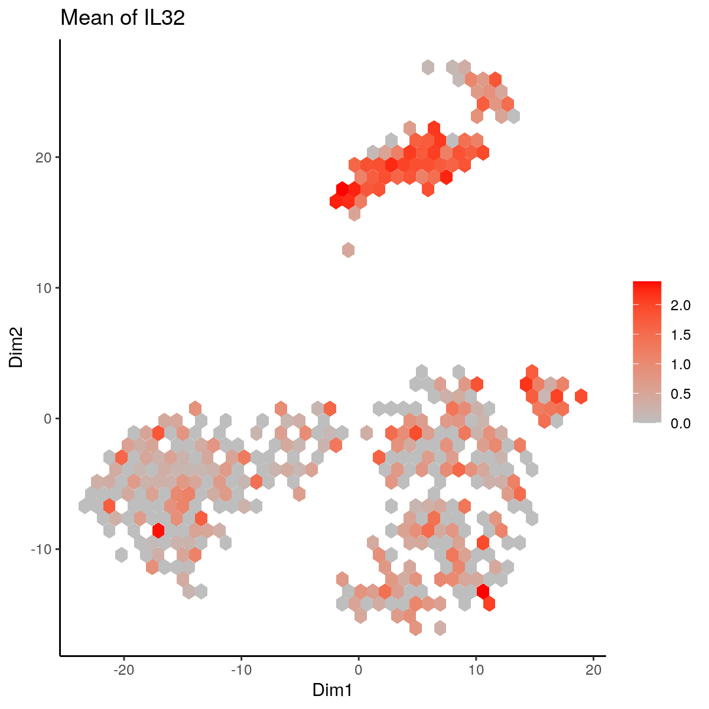|[IL18RAP](https://www.ncbi.nlm.nih.gov/gene/8807)|
|[IL33](https://www.ncbi.nlm.nih.gov/gene/90865)|[IL1RAP](https://www.ncbi.nlm.nih.gov/gene/3556) [IL1RL1](https://www.ncbi.nlm.nih.gov/gene/9173)|
|[IL34](https://www.ncbi.nlm.nih.gov/gene/146433)|[CSF1R](https://www.ncbi.nlm.nih.gov/gene/1436) [CX3CR1](https://www.ncbi.nlm.nih.gov/gene/1524) [ITGAM](https://www.ncbi.nlm.nih.gov/gene/3684) [CD163](https://www.ncbi.nlm.nih.gov/gene/9332) [TMEM119](https://www.ncbi.nlm.nih.gov/gene/338773) [CCR2](https://www.ncbi.nlm.nih.gov/gene/729230)|
|[IL36A](https://www.ncbi.nlm.nih.gov/gene/27179)|[TLR4](https://www.ncbi.nlm.nih.gov/gene/7099) [IL1R2](https://www.ncbi.nlm.nih.gov/gene/7850) [IL1RL1](https://www.ncbi.nlm.nih.gov/gene/9173) [TLR6](https://www.ncbi.nlm.nih.gov/gene/10333) [IL1RAP](https://www.ncbi.nlm.nih.gov/gene/3556) [IL1RL2](https://www.ncbi.nlm.nih.gov/gene/8808)|
|[IL36B](https://www.ncbi.nlm.nih.gov/gene/27177)|[TLR4](https://www.ncbi.nlm.nih.gov/gene/7099) [IL1R2](https://www.ncbi.nlm.nih.gov/gene/7850) [IL18RAP](https://www.ncbi.nlm.nih.gov/gene/8807) [IL1RL1](https://www.ncbi.nlm.nih.gov/gene/9173) [TLR6](https://www.ncbi.nlm.nih.gov/gene/10333) [IL1RAP](https://www.ncbi.nlm.nih.gov/gene/3556) [IL1RL2](https://www.ncbi.nlm.nih.gov/gene/8808)|
|[IL36G](https://www.ncbi.nlm.nih.gov/gene/56300)|[TLR4](https://www.ncbi.nlm.nih.gov/gene/7099) [IL1R2](https://www.ncbi.nlm.nih.gov/gene/7850) [IL1RL1](https://www.ncbi.nlm.nih.gov/gene/9173) [TARM1](https://www.ncbi.nlm.nih.gov/gene/441864) [IL1RAP](https://www.ncbi.nlm.nih.gov/gene/3556) [IL1RL2](https://www.ncbi.nlm.nih.gov/gene/8808)|
|[IL36RN](https://www.ncbi.nlm.nih.gov/gene/26525)|[TLR4](https://www.ncbi.nlm.nih.gov/gene/7099) [IL1R2](https://www.ncbi.nlm.nih.gov/gene/7850) [IL18RAP](https://www.ncbi.nlm.nih.gov/gene/8807) [IL1RL1](https://www.ncbi.nlm.nih.gov/gene/9173) [TLR6](https://www.ncbi.nlm.nih.gov/gene/10333) [IL1RAP](https://www.ncbi.nlm.nih.gov/gene/3556) [IL1RL2](https://www.ncbi.nlm.nih.gov/gene/8808)|
|[IL37](https://www.ncbi.nlm.nih.gov/gene/27178)|[IL18R1](https://www.ncbi.nlm.nih.gov/gene/8809) [IL18RAP](https://www.ncbi.nlm.nih.gov/gene/8807) [SIGIRR](https://www.ncbi.nlm.nih.gov/gene/59307)|
|[IL4](https://www.ncbi.nlm.nih.gov/gene/3565)|[ALOX15](https://www.ncbi.nlm.nih.gov/gene/246) [CXCR5](https://www.ncbi.nlm.nih.gov/gene/643) [BTK](https://www.ncbi.nlm.nih.gov/gene/695) [C5AR1](https://www.ncbi.nlm.nih.gov/gene/728) [CBL](https://www.ncbi.nlm.nih.gov/gene/867) [CD1A](https://www.ncbi.nlm.nih.gov/gene/909) [CD1B](https://www.ncbi.nlm.nih.gov/gene/910) [CD1C](https://www.ncbi.nlm.nih.gov/gene/911) [CD1D](https://www.ncbi.nlm.nih.gov/gene/912) [CD2](https://www.ncbi.nlm.nih.gov/gene/914) [CD3E](https://www.ncbi.nlm.nih.gov/gene/916) [CD4](https://www.ncbi.nlm.nih.gov/gene/920) [CD5](https://www.ncbi.nlm.nih.gov/gene/921) [CD14](https://www.ncbi.nlm.nih.gov/gene/929) [CD19](https://www.ncbi.nlm.nih.gov/gene/930) [CD22](https://www.ncbi.nlm.nih.gov/gene/933) [CD86](https://www.ncbi.nlm.nih.gov/gene/942) [CD36](https://www.ncbi.nlm.nih.gov/gene/948) [CD44](https://www.ncbi.nlm.nih.gov/gene/960) [CD47](https://www.ncbi.nlm.nih.gov/gene/961) [CD53](https://www.ncbi.nlm.nih.gov/gene/963) [CD58](https://www.ncbi.nlm.nih.gov/gene/965) [CD79B](https://www.ncbi.nlm.nih.gov/gene/974) [CFTR](https://www.ncbi.nlm.nih.gov/gene/1080) [CCR1](https://www.ncbi.nlm.nih.gov/gene/1230) [CCR3](https://www.ncbi.nlm.nih.gov/gene/1232) [CCR4](https://www.ncbi.nlm.nih.gov/gene/1233) [CCR5](https://www.ncbi.nlm.nih.gov/gene/1234) [CCR6](https://www.ncbi.nlm.nih.gov/gene/1235) [CCR7](https://www.ncbi.nlm.nih.gov/gene/1236) [CCR8](https://www.ncbi.nlm.nih.gov/gene/1237) [CNR1](https://www.ncbi.nlm.nih.gov/gene/1268) [CNTFR](https://www.ncbi.nlm.nih.gov/gene/1271) [CR2](https://www.ncbi.nlm.nih.gov/gene/1380) [CSF1R](https://www.ncbi.nlm.nih.gov/gene/1436) [CSF3R](https://www.ncbi.nlm.nih.gov/gene/1441) [CX3CR1](https://www.ncbi.nlm.nih.gov/gene/1524) [CYBB](https://www.ncbi.nlm.nih.gov/gene/1536) [CD55](https://www.ncbi.nlm.nih.gov/gene/1604) [DSG3](https://www.ncbi.nlm.nih.gov/gene/1830) [ADGRE1](https://www.ncbi.nlm.nih.gov/gene/2015) [FCER1A](https://www.ncbi.nlm.nih.gov/gene/2205) [FCER2](https://www.ncbi.nlm.nih.gov/gene/2208) [FCGR1A](https://www.ncbi.nlm.nih.gov/gene/2209) [FCGR2A](https://www.ncbi.nlm.nih.gov/gene/2212) [FCGR2B](https://www.ncbi.nlm.nih.gov/gene/2213) [FYN](https://www.ncbi.nlm.nih.gov/gene/2534) [GGT1](https://www.ncbi.nlm.nih.gov/gene/2678) [CXCR3](https://www.ncbi.nlm.nih.gov/gene/2833) [HLA-A](https://www.ncbi.nlm.nih.gov/gene/3105) [HLA-DQA1](https://www.ncbi.nlm.nih.gov/gene/3117) [HLA-DRB1](https://www.ncbi.nlm.nih.gov/gene/3123) [IFNAR1](https://www.ncbi.nlm.nih.gov/gene/3454) [IFNGR1](https://www.ncbi.nlm.nih.gov/gene/3459) [IFNGR2](https://www.ncbi.nlm.nih.gov/gene/3460) [IL2RB](https://www.ncbi.nlm.nih.gov/gene/3560) [IL2RG](https://www.ncbi.nlm.nih.gov/gene/3561) [CXCR1](https://www.ncbi.nlm.nih.gov/gene/3577) [CXCR2](https://www.ncbi.nlm.nih.gov/gene/3579) [IL9R](https://www.ncbi.nlm.nih.gov/gene/3581) [IL10RA](https://www.ncbi.nlm.nih.gov/gene/3587) [ITGAL](https://www.ncbi.nlm.nih.gov/gene/3683) [ITGAM](https://www.ncbi.nlm.nih.gov/gene/3684) [ITGB1](https://www.ncbi.nlm.nih.gov/gene/3688) [KLRD1](https://www.ncbi.nlm.nih.gov/gene/3824) [LAMP1](https://www.ncbi.nlm.nih.gov/gene/3916) [LYN](https://www.ncbi.nlm.nih.gov/gene/4067) [MOG](https://www.ncbi.nlm.nih.gov/gene/4340) [CD200](https://www.ncbi.nlm.nih.gov/gene/4345) [MPL](https://www.ncbi.nlm.nih.gov/gene/4352) [MUC1](https://www.ncbi.nlm.nih.gov/gene/4582) [MUC4](https://www.ncbi.nlm.nih.gov/gene/4585) [NT5E](https://www.ncbi.nlm.nih.gov/gene/4907) [PDCD1](https://www.ncbi.nlm.nih.gov/gene/5133) [PDGFRA](https://www.ncbi.nlm.nih.gov/gene/5156) [PDGFRB](https://www.ncbi.nlm.nih.gov/gene/5159) [PTPRC](https://www.ncbi.nlm.nih.gov/gene/5788) [SELE](https://www.ncbi.nlm.nih.gov/gene/6401) [SELL](https://www.ncbi.nlm.nih.gov/gene/6402) [SELP](https://www.ncbi.nlm.nih.gov/gene/6403) [SLAMF1](https://www.ncbi.nlm.nih.gov/gene/6504) [SRC](https://www.ncbi.nlm.nih.gov/gene/6714) [SYK](https://www.ncbi.nlm.nih.gov/gene/6850) [THY1](https://www.ncbi.nlm.nih.gov/gene/7070) [TLR1](https://www.ncbi.nlm.nih.gov/gene/7096) [TLR4](https://www.ncbi.nlm.nih.gov/gene/7099) [TLR5](https://www.ncbi.nlm.nih.gov/gene/7100) [IL1R2](https://www.ncbi.nlm.nih.gov/gene/7850) [CXCR4](https://www.ncbi.nlm.nih.gov/gene/7852) [OR2H2](https://www.ncbi.nlm.nih.gov/gene/7932) [TNFSF10](https://www.ncbi.nlm.nih.gov/gene/8743) [TNFSF18](https://www.ncbi.nlm.nih.gov/gene/8995) [CCRL2](https://www.ncbi.nlm.nih.gov/gene/9034) [FCGR2C](https://www.ncbi.nlm.nih.gov/gene/9103) [IL1RL1](https://www.ncbi.nlm.nih.gov/gene/9173) [CD163](https://www.ncbi.nlm.nih.gov/gene/9332) [NCR1](https://www.ncbi.nlm.nih.gov/gene/9437) [NAALADL1](https://www.ncbi.nlm.nih.gov/gene/10004) [KLRG1](https://www.ncbi.nlm.nih.gov/gene/10219) [TLR6](https://www.ncbi.nlm.nih.gov/gene/10333) [CXCR6](https://www.ncbi.nlm.nih.gov/gene/10663) [CYSLTR1](https://www.ncbi.nlm.nih.gov/gene/10800) [CCR9](https://www.ncbi.nlm.nih.gov/gene/10803) [PTGDR2](https://www.ncbi.nlm.nih.gov/gene/11251) [ICOSLG](https://www.ncbi.nlm.nih.gov/gene/23308) [C5AR2](https://www.ncbi.nlm.nih.gov/gene/27202) [GPR132](https://www.ncbi.nlm.nih.gov/gene/29933) [DUOX1](https://www.ncbi.nlm.nih.gov/gene/53905) [ANO1](https://www.ncbi.nlm.nih.gov/gene/55107) [RGMA](https://www.ncbi.nlm.nih.gov/gene/56963) [CXCL16](https://www.ncbi.nlm.nih.gov/gene/58191) [VTCN1](https://www.ncbi.nlm.nih.gov/gene/79679) [PDCD1LG2](https://www.ncbi.nlm.nih.gov/gene/80380) [DCSTAMP](https://www.ncbi.nlm.nih.gov/gene/81501) [IL17RC](https://www.ncbi.nlm.nih.gov/gene/84818) [IL23R](https://www.ncbi.nlm.nih.gov/gene/149233) [BTLA](https://www.ncbi.nlm.nih.gov/gene/151888) [CLEC4C](https://www.ncbi.nlm.nih.gov/gene/170482) [GCSAM](https://www.ncbi.nlm.nih.gov/gene/257144) [CCR2](https://www.ncbi.nlm.nih.gov/gene/729230) [CD24](https://www.ncbi.nlm.nih.gov/gene/100133941) [KLRC4-KLRK1](https://www.ncbi.nlm.nih.gov/gene/100528032) [CDH1](https://www.ncbi.nlm.nih.gov/gene/999) [CDH5](https://www.ncbi.nlm.nih.gov/gene/1003) [IL13RA1](https://www.ncbi.nlm.nih.gov/gene/3597) [IL4R](https://www.ncbi.nlm.nih.gov/gene/3566)|
|[IL4R](https://www.ncbi.nlm.nih.gov/gene/3566)|[ADRB2](https://www.ncbi.nlm.nih.gov/gene/154) [CBL](https://www.ncbi.nlm.nih.gov/gene/867) [CD3G](https://www.ncbi.nlm.nih.gov/gene/917) [CD19](https://www.ncbi.nlm.nih.gov/gene/930) [CD86](https://www.ncbi.nlm.nih.gov/gene/942) [CSF1R](https://www.ncbi.nlm.nih.gov/gene/1436) [FCER1A](https://www.ncbi.nlm.nih.gov/gene/2205) [FCER1G](https://www.ncbi.nlm.nih.gov/gene/2207) [IFNGR1](https://www.ncbi.nlm.nih.gov/gene/3459) [IFNGR2](https://www.ncbi.nlm.nih.gov/gene/3460) [IL2RB](https://www.ncbi.nlm.nih.gov/gene/3560) [IL2RG](https://www.ncbi.nlm.nih.gov/gene/3561) [IL9R](https://www.ncbi.nlm.nih.gov/gene/3581) [IL10RA](https://www.ncbi.nlm.nih.gov/gene/3587) [ITGAM](https://www.ncbi.nlm.nih.gov/gene/3684) [PTPRC](https://www.ncbi.nlm.nih.gov/gene/5788) [TLR4](https://www.ncbi.nlm.nih.gov/gene/7099) [IL1R2](https://www.ncbi.nlm.nih.gov/gene/7850) [IL1RL1](https://www.ncbi.nlm.nih.gov/gene/9173) [PDCD1LG2](https://www.ncbi.nlm.nih.gov/gene/80380) [CCR2](https://www.ncbi.nlm.nih.gov/gene/729230)|
|[IL5](https://www.ncbi.nlm.nih.gov/gene/3567)|[CXCR5](https://www.ncbi.nlm.nih.gov/gene/643) [CD1B](https://www.ncbi.nlm.nih.gov/gene/910) [CD1C](https://www.ncbi.nlm.nih.gov/gene/911) [CD1D](https://www.ncbi.nlm.nih.gov/gene/912) [CD2](https://www.ncbi.nlm.nih.gov/gene/914) [CD3E](https://www.ncbi.nlm.nih.gov/gene/916) [CD4](https://www.ncbi.nlm.nih.gov/gene/920) [CD5](https://www.ncbi.nlm.nih.gov/gene/921) [CD19](https://www.ncbi.nlm.nih.gov/gene/930) [CD86](https://www.ncbi.nlm.nih.gov/gene/942) [CD44](https://www.ncbi.nlm.nih.gov/gene/960) [CCR1](https://www.ncbi.nlm.nih.gov/gene/1230) [CCR3](https://www.ncbi.nlm.nih.gov/gene/1232) [CCR5](https://www.ncbi.nlm.nih.gov/gene/1234) [CCR6](https://www.ncbi.nlm.nih.gov/gene/1235) [CCR7](https://www.ncbi.nlm.nih.gov/gene/1236) [CCR8](https://www.ncbi.nlm.nih.gov/gene/1237) [CNTFR](https://www.ncbi.nlm.nih.gov/gene/1271) [CSF3R](https://www.ncbi.nlm.nih.gov/gene/1441) [FCER1A](https://www.ncbi.nlm.nih.gov/gene/2205) [FCGR2A](https://www.ncbi.nlm.nih.gov/gene/2212) [FCGR2B](https://www.ncbi.nlm.nih.gov/gene/2213) [CXCR3](https://www.ncbi.nlm.nih.gov/gene/2833) [IFNAR1](https://www.ncbi.nlm.nih.gov/gene/3454) [IFNGR1](https://www.ncbi.nlm.nih.gov/gene/3459) [IFNGR2](https://www.ncbi.nlm.nih.gov/gene/3460) [IL2RB](https://www.ncbi.nlm.nih.gov/gene/3560) [IL2RG](https://www.ncbi.nlm.nih.gov/gene/3561) [CXCR2](https://www.ncbi.nlm.nih.gov/gene/3579) [IL9R](https://www.ncbi.nlm.nih.gov/gene/3581) [IL10RA](https://www.ncbi.nlm.nih.gov/gene/3587) [ITGAM](https://www.ncbi.nlm.nih.gov/gene/3684) [KRAS](https://www.ncbi.nlm.nih.gov/gene/3845) [LYN](https://www.ncbi.nlm.nih.gov/gene/4067) [MOG](https://www.ncbi.nlm.nih.gov/gene/4340) [MPL](https://www.ncbi.nlm.nih.gov/gene/4352) [NRAS](https://www.ncbi.nlm.nih.gov/gene/4893) [PDGFRA](https://www.ncbi.nlm.nih.gov/gene/5156) [PDGFRB](https://www.ncbi.nlm.nih.gov/gene/5159) [PTPRC](https://www.ncbi.nlm.nih.gov/gene/5788) [SELE](https://www.ncbi.nlm.nih.gov/gene/6401) [SELL](https://www.ncbi.nlm.nih.gov/gene/6402) [SELP](https://www.ncbi.nlm.nih.gov/gene/6403) [THY1](https://www.ncbi.nlm.nih.gov/gene/7070) [TLR1](https://www.ncbi.nlm.nih.gov/gene/7096) [TLR4](https://www.ncbi.nlm.nih.gov/gene/7099) [TLR5](https://www.ncbi.nlm.nih.gov/gene/7100) [CXCR4](https://www.ncbi.nlm.nih.gov/gene/7852) [CCRL2](https://www.ncbi.nlm.nih.gov/gene/9034) [FCGR2C](https://www.ncbi.nlm.nih.gov/gene/9103) [IL1RL1](https://www.ncbi.nlm.nih.gov/gene/9173) [NCR1](https://www.ncbi.nlm.nih.gov/gene/9437) [KLRG1](https://www.ncbi.nlm.nih.gov/gene/10219) [TLR6](https://www.ncbi.nlm.nih.gov/gene/10333) [CYSLTR1](https://www.ncbi.nlm.nih.gov/gene/10800) [CCR9](https://www.ncbi.nlm.nih.gov/gene/10803) [PTGDR2](https://www.ncbi.nlm.nih.gov/gene/11251) [ICOSLG](https://www.ncbi.nlm.nih.gov/gene/23308) [PDCD1LG2](https://www.ncbi.nlm.nih.gov/gene/80380) [CD300LF](https://www.ncbi.nlm.nih.gov/gene/146722) [IL23R](https://www.ncbi.nlm.nih.gov/gene/149233) [CCR2](https://www.ncbi.nlm.nih.gov/gene/729230) [KLRC4-KLRK1](https://www.ncbi.nlm.nih.gov/gene/100528032) [CSF2RB](https://www.ncbi.nlm.nih.gov/gene/1439) [IL5RA](https://www.ncbi.nlm.nih.gov/gene/3568)|
|[IL6](https://www.ncbi.nlm.nih.gov/gene/3569)|[ACHE](https://www.ncbi.nlm.nih.gov/gene/43) [ADA](https://www.ncbi.nlm.nih.gov/gene/100) [ADAM10](https://www.ncbi.nlm.nih.gov/gene/102) [ADORA1](https://www.ncbi.nlm.nih.gov/gene/134) [ADORA2A](https://www.ncbi.nlm.nih.gov/gene/135) [ADORA2B](https://www.ncbi.nlm.nih.gov/gene/136) [ADRB2](https://www.ncbi.nlm.nih.gov/gene/154) [ADRB3](https://www.ncbi.nlm.nih.gov/gene/155) [AGER](https://www.ncbi.nlm.nih.gov/gene/177) [AGTR1](https://www.ncbi.nlm.nih.gov/gene/185) [ALOX15](https://www.ncbi.nlm.nih.gov/gene/246) [ALPL](https://www.ncbi.nlm.nih.gov/gene/249) [ANPEP](https://www.ncbi.nlm.nih.gov/gene/290) [APLP2](https://www.ncbi.nlm.nih.gov/gene/334) [AQP4](https://www.ncbi.nlm.nih.gov/gene/361) [RHOA](https://www.ncbi.nlm.nih.gov/gene/387) [ATP4A](https://www.ncbi.nlm.nih.gov/gene/495) [AXL](https://www.ncbi.nlm.nih.gov/gene/558) [CXCR5](https://www.ncbi.nlm.nih.gov/gene/643) [BMPR2](https://www.ncbi.nlm.nih.gov/gene/659) [BTK](https://www.ncbi.nlm.nih.gov/gene/695) [C3AR1](https://www.ncbi.nlm.nih.gov/gene/719) [C5AR1](https://www.ncbi.nlm.nih.gov/gene/728) [CALCR](https://www.ncbi.nlm.nih.gov/gene/799) [CASR](https://www.ncbi.nlm.nih.gov/gene/846) [CBL](https://www.ncbi.nlm.nih.gov/gene/867) [CD1A](https://www.ncbi.nlm.nih.gov/gene/909) [CD1B](https://www.ncbi.nlm.nih.gov/gene/910) [CD1C](https://www.ncbi.nlm.nih.gov/gene/911) [CD1D](https://www.ncbi.nlm.nih.gov/gene/912) [CD2](https://www.ncbi.nlm.nih.gov/gene/914) [CD3E](https://www.ncbi.nlm.nih.gov/gene/916) [CD4](https://www.ncbi.nlm.nih.gov/gene/920) [CD5](https://www.ncbi.nlm.nih.gov/gene/921) [CD14](https://www.ncbi.nlm.nih.gov/gene/929) [CD19](https://www.ncbi.nlm.nih.gov/gene/930) [CD22](https://www.ncbi.nlm.nih.gov/gene/933) [CD86](https://www.ncbi.nlm.nih.gov/gene/942) [SCARB1](https://www.ncbi.nlm.nih.gov/gene/949) [CD44](https://www.ncbi.nlm.nih.gov/gene/960) [CD47](https://www.ncbi.nlm.nih.gov/gene/961) [CD58](https://www.ncbi.nlm.nih.gov/gene/965) [CD59](https://www.ncbi.nlm.nih.gov/gene/966) [CD74](https://www.ncbi.nlm.nih.gov/gene/972) [CDC42](https://www.ncbi.nlm.nih.gov/gene/998) [CDH2](https://www.ncbi.nlm.nih.gov/gene/1000) [CEACAM5](https://www.ncbi.nlm.nih.gov/gene/1048) [CFTR](https://www.ncbi.nlm.nih.gov/gene/1080) [CEACAM8](https://www.ncbi.nlm.nih.gov/gene/1088) [CCR1](https://www.ncbi.nlm.nih.gov/gene/1230) [CCR3](https://www.ncbi.nlm.nih.gov/gene/1232) [CCR5](https://www.ncbi.nlm.nih.gov/gene/1234) [CCR6](https://www.ncbi.nlm.nih.gov/gene/1235) [CCR7](https://www.ncbi.nlm.nih.gov/gene/1236) [CMKLR1](https://www.ncbi.nlm.nih.gov/gene/1240) [LTB4R](https://www.ncbi.nlm.nih.gov/gene/1241) [CNR1](https://www.ncbi.nlm.nih.gov/gene/1268) [CNR2](https://www.ncbi.nlm.nih.gov/gene/1269) [CNTFR](https://www.ncbi.nlm.nih.gov/gene/1271) [CR2](https://www.ncbi.nlm.nih.gov/gene/1380) [CSF1R](https://www.ncbi.nlm.nih.gov/gene/1436) [CSF3R](https://www.ncbi.nlm.nih.gov/gene/1441) [CX3CR1](https://www.ncbi.nlm.nih.gov/gene/1524) [CYBA](https://www.ncbi.nlm.nih.gov/gene/1535) [CYBB](https://www.ncbi.nlm.nih.gov/gene/1536) [CD55](https://www.ncbi.nlm.nih.gov/gene/1604) [ACE](https://www.ncbi.nlm.nih.gov/gene/1636) [DPP4](https://www.ncbi.nlm.nih.gov/gene/1803) [S1PR1](https://www.ncbi.nlm.nih.gov/gene/1901) [ADGRE1](https://www.ncbi.nlm.nih.gov/gene/2015) [ENG](https://www.ncbi.nlm.nih.gov/gene/2022) [ENO2](https://www.ncbi.nlm.nih.gov/gene/2026) [EPHB1](https://www.ncbi.nlm.nih.gov/gene/2047) [EPHB4](https://www.ncbi.nlm.nih.gov/gene/2050) [EREG](https://www.ncbi.nlm.nih.gov/gene/2069) [ESR1](https://www.ncbi.nlm.nih.gov/gene/2099) [F2R](https://www.ncbi.nlm.nih.gov/gene/2149) [F2RL1](https://www.ncbi.nlm.nih.gov/gene/2150) [FCGR1A](https://www.ncbi.nlm.nih.gov/gene/2209) [FCGR2A](https://www.ncbi.nlm.nih.gov/gene/2212) [FCGR2B](https://www.ncbi.nlm.nih.gov/gene/2213) [FPR2](https://www.ncbi.nlm.nih.gov/gene/2358) [FYN](https://www.ncbi.nlm.nih.gov/gene/2534) [GGT1](https://www.ncbi.nlm.nih.gov/gene/2678) [GJA1](https://www.ncbi.nlm.nih.gov/gene/2697) [GPC3](https://www.ncbi.nlm.nih.gov/gene/2719) [CXCR3](https://www.ncbi.nlm.nih.gov/gene/2833) [HFE](https://www.ncbi.nlm.nih.gov/gene/3077) [HLA-DQA1](https://www.ncbi.nlm.nih.gov/gene/3117) [HLA-DRB1](https://www.ncbi.nlm.nih.gov/gene/3123) [HPN](https://www.ncbi.nlm.nih.gov/gene/3249) [HRH1](https://www.ncbi.nlm.nih.gov/gene/3269) [HTR7](https://www.ncbi.nlm.nih.gov/gene/3363) [IFNAR1](https://www.ncbi.nlm.nih.gov/gene/3454) [IFNGR1](https://www.ncbi.nlm.nih.gov/gene/3459) [IFNGR2](https://www.ncbi.nlm.nih.gov/gene/3460) [IL2RB](https://www.ncbi.nlm.nih.gov/gene/3560) [IL2RG](https://www.ncbi.nlm.nih.gov/gene/3561) [CXCR1](https://www.ncbi.nlm.nih.gov/gene/3577) [CXCR2](https://www.ncbi.nlm.nih.gov/gene/3579) [IL9R](https://www.ncbi.nlm.nih.gov/gene/3581) [IL10RA](https://www.ncbi.nlm.nih.gov/gene/3587) [ITGAL](https://www.ncbi.nlm.nih.gov/gene/3683) [ITGAM](https://www.ncbi.nlm.nih.gov/gene/3684) [ITGB1](https://www.ncbi.nlm.nih.gov/gene/3688) [ITGB2](https://www.ncbi.nlm.nih.gov/gene/3689) [ITGB3](https://www.ncbi.nlm.nih.gov/gene/3690) [CD82](https://www.ncbi.nlm.nih.gov/gene/3732) [KRAS](https://www.ncbi.nlm.nih.gov/gene/3845) [LAMP1](https://www.ncbi.nlm.nih.gov/gene/3916) [LDLR](https://www.ncbi.nlm.nih.gov/gene/3949) [LIPE](https://www.ncbi.nlm.nih.gov/gene/3991) [LYN](https://www.ncbi.nlm.nih.gov/gene/4067) [EPCAM](https://www.ncbi.nlm.nih.gov/gene/4072) [MELTF](https://www.ncbi.nlm.nih.gov/gene/4241) [MME](https://www.ncbi.nlm.nih.gov/gene/4311) [MMP17](https://www.ncbi.nlm.nih.gov/gene/4326) [MOG](https://www.ncbi.nlm.nih.gov/gene/4340) [CD200](https://www.ncbi.nlm.nih.gov/gene/4345) [MPL](https://www.ncbi.nlm.nih.gov/gene/4352) [MUC1](https://www.ncbi.nlm.nih.gov/gene/4582) [MUC4](https://www.ncbi.nlm.nih.gov/gene/4585) [NOS1](https://www.ncbi.nlm.nih.gov/gene/4842) [NOS3](https://www.ncbi.nlm.nih.gov/gene/4846) [NT5E](https://www.ncbi.nlm.nih.gov/gene/4907) [OLR1](https://www.ncbi.nlm.nih.gov/gene/4973) [OPRD1](https://www.ncbi.nlm.nih.gov/gene/4985) [OPRK1](https://www.ncbi.nlm.nih.gov/gene/4986) [OPRL1](https://www.ncbi.nlm.nih.gov/gene/4987) [OXTR](https://www.ncbi.nlm.nih.gov/gene/5021) [P2RX7](https://www.ncbi.nlm.nih.gov/gene/5027) [P2RY2](https://www.ncbi.nlm.nih.gov/gene/5029) [PDCD1](https://www.ncbi.nlm.nih.gov/gene/5133) [PDGFRA](https://www.ncbi.nlm.nih.gov/gene/5156) [PDGFRB](https://www.ncbi.nlm.nih.gov/gene/5159) [ABCB1](https://www.ncbi.nlm.nih.gov/gene/5243) [PIM1](https://www.ncbi.nlm.nih.gov/gene/5292) [PLA2G2A](https://www.ncbi.nlm.nih.gov/gene/5320) [PTGER2](https://www.ncbi.nlm.nih.gov/gene/5732) [PTGER3](https://www.ncbi.nlm.nih.gov/gene/5733) [PTGER4](https://www.ncbi.nlm.nih.gov/gene/5734) [PTPRC](https://www.ncbi.nlm.nih.gov/gene/5788) [RET](https://www.ncbi.nlm.nih.gov/gene/5979) [SELE](https://www.ncbi.nlm.nih.gov/gene/6401) [SELL](https://www.ncbi.nlm.nih.gov/gene/6402) [SELP](https://www.ncbi.nlm.nih.gov/gene/6403) [SGK1](https://www.ncbi.nlm.nih.gov/gene/6446) [SLAMF1](https://www.ncbi.nlm.nih.gov/gene/6504) [SLC1A2](https://www.ncbi.nlm.nih.gov/gene/6506) [SLC2A1](https://www.ncbi.nlm.nih.gov/gene/6513) [SLC2A4](https://www.ncbi.nlm.nih.gov/gene/6517) [SLC6A4](https://www.ncbi.nlm.nih.gov/gene/6532) [SRC](https://www.ncbi.nlm.nih.gov/gene/6714) [SYK](https://www.ncbi.nlm.nih.gov/gene/6850) [TACR1](https://www.ncbi.nlm.nih.gov/gene/6869) [TEK](https://www.ncbi.nlm.nih.gov/gene/7010) [TGFBR1](https://www.ncbi.nlm.nih.gov/gene/7046) [TGFBR2](https://www.ncbi.nlm.nih.gov/gene/7048) [THY1](https://www.ncbi.nlm.nih.gov/gene/7070) [TJP1](https://www.ncbi.nlm.nih.gov/gene/7082) [TLR1](https://www.ncbi.nlm.nih.gov/gene/7096) [TLR4](https://www.ncbi.nlm.nih.gov/gene/7099) [TLR5](https://www.ncbi.nlm.nih.gov/gene/7100) [TSHR](https://www.ncbi.nlm.nih.gov/gene/7253) [TYROBP](https://www.ncbi.nlm.nih.gov/gene/7305) [IL1R2](https://www.ncbi.nlm.nih.gov/gene/7850) [CXCR4](https://www.ncbi.nlm.nih.gov/gene/7852) [PSCA](https://www.ncbi.nlm.nih.gov/gene/8000) [GPR68](https://www.ncbi.nlm.nih.gov/gene/8111) [RIPK1](https://www.ncbi.nlm.nih.gov/gene/8737) [TNFSF10](https://www.ncbi.nlm.nih.gov/gene/8743) [TNFRSF11A](https://www.ncbi.nlm.nih.gov/gene/8792) [PROM1](https://www.ncbi.nlm.nih.gov/gene/8842) [CCRL2](https://www.ncbi.nlm.nih.gov/gene/9034) [FCGR2C](https://www.ncbi.nlm.nih.gov/gene/9103) [IL1RL1](https://www.ncbi.nlm.nih.gov/gene/9173) [CD163](https://www.ncbi.nlm.nih.gov/gene/9332) [NCR1](https://www.ncbi.nlm.nih.gov/gene/9437) [TLR6](https://www.ncbi.nlm.nih.gov/gene/10333) [NOD1](https://www.ncbi.nlm.nih.gov/gene/10392) [IFITM2](https://www.ncbi.nlm.nih.gov/gene/10581) [TGOLN2](https://www.ncbi.nlm.nih.gov/gene/10618) [CYSLTR1](https://www.ncbi.nlm.nih.gov/gene/10800) [CCR9](https://www.ncbi.nlm.nih.gov/gene/10803) [PARK7](https://www.ncbi.nlm.nih.gov/gene/11315) [ICOSLG](https://www.ncbi.nlm.nih.gov/gene/23308) [SLC39A14](https://www.ncbi.nlm.nih.gov/gene/23516) [BACE1](https://www.ncbi.nlm.nih.gov/gene/23621) [CADM1](https://www.ncbi.nlm.nih.gov/gene/23705) [C5AR2](https://www.ncbi.nlm.nih.gov/gene/27202) [TNFRSF21](https://www.ncbi.nlm.nih.gov/gene/27242) [SLC40A1](https://www.ncbi.nlm.nih.gov/gene/30061) [SOCS7](https://www.ncbi.nlm.nih.gov/gene/30837) [DUOX2](https://www.ncbi.nlm.nih.gov/gene/50506) [ADIPOR1](https://www.ncbi.nlm.nih.gov/gene/51094) [DUOX1](https://www.ncbi.nlm.nih.gov/gene/53905) [MXRA8](https://www.ncbi.nlm.nih.gov/gene/54587) [ITLN1](https://www.ncbi.nlm.nih.gov/gene/55600) [SLC39A4](https://www.ncbi.nlm.nih.gov/gene/55630) [MRAP](https://www.ncbi.nlm.nih.gov/gene/56246) [MUC13](https://www.ncbi.nlm.nih.gov/gene/56667) [PNPLA2](https://www.ncbi.nlm.nih.gov/gene/57104) [ANO8](https://www.ncbi.nlm.nih.gov/gene/57719) [CXCL16](https://www.ncbi.nlm.nih.gov/gene/58191) [ACE2](https://www.ncbi.nlm.nih.gov/gene/59272) [P2RY12](https://www.ncbi.nlm.nih.gov/gene/64805) [ADIPOR2](https://www.ncbi.nlm.nih.gov/gene/79602) [VTCN1](https://www.ncbi.nlm.nih.gov/gene/79679) [STEAP4](https://www.ncbi.nlm.nih.gov/gene/79689) [PDCD1LG2](https://www.ncbi.nlm.nih.gov/gene/80380) [IL17RC](https://www.ncbi.nlm.nih.gov/gene/84818) [HJV](https://www.ncbi.nlm.nih.gov/gene/148738) [IL23R](https://www.ncbi.nlm.nih.gov/gene/149233) [TMPRSS6](https://www.ncbi.nlm.nih.gov/gene/164656) [CLEC4C](https://www.ncbi.nlm.nih.gov/gene/170482) [RGMB](https://www.ncbi.nlm.nih.gov/gene/285704) [CCR2](https://www.ncbi.nlm.nih.gov/gene/729230) [CD24](https://www.ncbi.nlm.nih.gov/gene/100133941) [OCLN](https://www.ncbi.nlm.nih.gov/gene/100506658) [KLRC4-KLRK1](https://www.ncbi.nlm.nih.gov/gene/100528032) [IL6R](https://www.ncbi.nlm.nih.gov/gene/3570) [IL6ST](https://www.ncbi.nlm.nih.gov/gene/3572)|
|[IL6R](https://www.ncbi.nlm.nih.gov/gene/3570)|[ADAM10](https://www.ncbi.nlm.nih.gov/gene/102) [CXCR5](https://www.ncbi.nlm.nih.gov/gene/643) [CBL](https://www.ncbi.nlm.nih.gov/gene/867) [CD19](https://www.ncbi.nlm.nih.gov/gene/930) [CD44](https://www.ncbi.nlm.nih.gov/gene/960) [CCR6](https://www.ncbi.nlm.nih.gov/gene/1235) [CNTFR](https://www.ncbi.nlm.nih.gov/gene/1271) [CSF3R](https://www.ncbi.nlm.nih.gov/gene/1441) [GNGT1](https://www.ncbi.nlm.nih.gov/gene/2792) [CXCR3](https://www.ncbi.nlm.nih.gov/gene/2833) [IFNGR1](https://www.ncbi.nlm.nih.gov/gene/3459) [IL2RB](https://www.ncbi.nlm.nih.gov/gene/3560) [IL2RG](https://www.ncbi.nlm.nih.gov/gene/3561) [CXCR1](https://www.ncbi.nlm.nih.gov/gene/3577) [CXCR2](https://www.ncbi.nlm.nih.gov/gene/3579) [IL10RA](https://www.ncbi.nlm.nih.gov/gene/3587) [ITGAM](https://www.ncbi.nlm.nih.gov/gene/3684) [PTPRC](https://www.ncbi.nlm.nih.gov/gene/5788) [SELL](https://www.ncbi.nlm.nih.gov/gene/6402) [SRC](https://www.ncbi.nlm.nih.gov/gene/6714) [TLR4](https://www.ncbi.nlm.nih.gov/gene/7099) [IL1R2](https://www.ncbi.nlm.nih.gov/gene/7850) [CXCR4](https://www.ncbi.nlm.nih.gov/gene/7852) [CCRL2](https://www.ncbi.nlm.nih.gov/gene/9034) [MYOF](https://www.ncbi.nlm.nih.gov/gene/26509) [IL23R](https://www.ncbi.nlm.nih.gov/gene/149233) [CCR2](https://www.ncbi.nlm.nih.gov/gene/729230)|
|[IL6ST](https://www.ncbi.nlm.nih.gov/gene/3572)|[ACVRL1](https://www.ncbi.nlm.nih.gov/gene/94) [CNTFR](https://www.ncbi.nlm.nih.gov/gene/1271) [IFNGR1](https://www.ncbi.nlm.nih.gov/gene/3459) [IL10RA](https://www.ncbi.nlm.nih.gov/gene/3587) [LSP1](https://www.ncbi.nlm.nih.gov/gene/4046) [NGFR](https://www.ncbi.nlm.nih.gov/gene/4804) [ICOSLG](https://www.ncbi.nlm.nih.gov/gene/23308) [PANX1](https://www.ncbi.nlm.nih.gov/gene/24145) [RALGPS2](https://www.ncbi.nlm.nih.gov/gene/55103)|
|[IL7](https://www.ncbi.nlm.nih.gov/gene/3574) |[AQP9](https://www.ncbi.nlm.nih.gov/gene/366) [CXCR5](https://www.ncbi.nlm.nih.gov/gene/643) [CD1A](https://www.ncbi.nlm.nih.gov/gene/909) [CD1B](https://www.ncbi.nlm.nih.gov/gene/910) [CD1C](https://www.ncbi.nlm.nih.gov/gene/911) [CD1D](https://www.ncbi.nlm.nih.gov/gene/912) [CD2](https://www.ncbi.nlm.nih.gov/gene/914) [CD3E](https://www.ncbi.nlm.nih.gov/gene/916) [CD4](https://www.ncbi.nlm.nih.gov/gene/920) [CD5](https://www.ncbi.nlm.nih.gov/gene/921) [CD19](https://www.ncbi.nlm.nih.gov/gene/930) [CD86](https://www.ncbi.nlm.nih.gov/gene/942) [CD44](https://www.ncbi.nlm.nih.gov/gene/960) [CD58](https://www.ncbi.nlm.nih.gov/gene/965) [CCR5](https://www.ncbi.nlm.nih.gov/gene/1234) [CCR6](https://www.ncbi.nlm.nih.gov/gene/1235) [CCR7](https://www.ncbi.nlm.nih.gov/gene/1236) [CNTFR](https://www.ncbi.nlm.nih.gov/gene/1271) [CR2](https://www.ncbi.nlm.nih.gov/gene/1380) [CSF1R](https://www.ncbi.nlm.nih.gov/gene/1436) [CSF3R](https://www.ncbi.nlm.nih.gov/gene/1441) [FCGR2B](https://www.ncbi.nlm.nih.gov/gene/2213) [CXCR3](https://www.ncbi.nlm.nih.gov/gene/2833) [IFNAR1](https://www.ncbi.nlm.nih.gov/gene/3454) [IFNGR1](https://www.ncbi.nlm.nih.gov/gene/3459) [IFNGR2](https://www.ncbi.nlm.nih.gov/gene/3460) [IL2RB](https://www.ncbi.nlm.nih.gov/gene/3560) [IL2RG](https://www.ncbi.nlm.nih.gov/gene/3561) [IL9R](https://www.ncbi.nlm.nih.gov/gene/3581) [IL10RA](https://www.ncbi.nlm.nih.gov/gene/3587) [ITGAL](https://www.ncbi.nlm.nih.gov/gene/3683) [ITGAM](https://www.ncbi.nlm.nih.gov/gene/3684) [KCNMA1](https://www.ncbi.nlm.nih.gov/gene/3778) [KLRD1](https://www.ncbi.nlm.nih.gov/gene/3824) [LAMP1](https://www.ncbi.nlm.nih.gov/gene/3916) [MME](https://www.ncbi.nlm.nih.gov/gene/4311) [MPL](https://www.ncbi.nlm.nih.gov/gene/4352) [MUC1](https://www.ncbi.nlm.nih.gov/gene/4582) [PDCD1](https://www.ncbi.nlm.nih.gov/gene/5133) [PDGFRA](https://www.ncbi.nlm.nih.gov/gene/5156) [PDGFRB](https://www.ncbi.nlm.nih.gov/gene/5159) [PTPRC](https://www.ncbi.nlm.nih.gov/gene/5788) [SELL](https://www.ncbi.nlm.nih.gov/gene/6402) [SLAMF1](https://www.ncbi.nlm.nih.gov/gene/6504) [THY1](https://www.ncbi.nlm.nih.gov/gene/7070) [TLR1](https://www.ncbi.nlm.nih.gov/gene/7096) [TLR4](https://www.ncbi.nlm.nih.gov/gene/7099) [TLR5](https://www.ncbi.nlm.nih.gov/gene/7100) [CXCR4](https://www.ncbi.nlm.nih.gov/gene/7852) [CCRL2](https://www.ncbi.nlm.nih.gov/gene/9034) [IL1RL1](https://www.ncbi.nlm.nih.gov/gene/9173) [NCR2](https://www.ncbi.nlm.nih.gov/gene/9436) [NCR1](https://www.ncbi.nlm.nih.gov/gene/9437) [KLRG1](https://www.ncbi.nlm.nih.gov/gene/10219) [TLR6](https://www.ncbi.nlm.nih.gov/gene/10333) [CCR9](https://www.ncbi.nlm.nih.gov/gene/10803) [PTP4A3](https://www.ncbi.nlm.nih.gov/gene/11156) [PTGDR2](https://www.ncbi.nlm.nih.gov/gene/11251) [DLL1](https://www.ncbi.nlm.nih.gov/gene/28514) [DLL4](https://www.ncbi.nlm.nih.gov/gene/54567) [PDCD1LG2](https://www.ncbi.nlm.nih.gov/gene/80380) [IL23R](https://www.ncbi.nlm.nih.gov/gene/149233) [BTLA](https://www.ncbi.nlm.nih.gov/gene/151888) [P2RY8](https://www.ncbi.nlm.nih.gov/gene/286530) [CCR2](https://www.ncbi.nlm.nih.gov/gene/729230) [CD24](https://www.ncbi.nlm.nih.gov/gene/100133941) [KLRC4-KLRK1](https://www.ncbi.nlm.nih.gov/gene/100528032) [IL7R](https://www.ncbi.nlm.nih.gov/gene/3575)|
|[IL7R](https://www.ncbi.nlm.nih.gov/gene/3575)|[ADRB2](https://www.ncbi.nlm.nih.gov/gene/154) [AP2A1](https://www.ncbi.nlm.nih.gov/gene/160) [AP2A2](https://www.ncbi.nlm.nih.gov/gene/161) [AP2B1](https://www.ncbi.nlm.nih.gov/gene/163) [AGTR1](https://www.ncbi.nlm.nih.gov/gene/185) [ARRB1](https://www.ncbi.nlm.nih.gov/gene/408) [ARRB2](https://www.ncbi.nlm.nih.gov/gene/409) [CXCR5](https://www.ncbi.nlm.nih.gov/gene/643) [CBL](https://www.ncbi.nlm.nih.gov/gene/867) [CD1C](https://www.ncbi.nlm.nih.gov/gene/911) [CD1D](https://www.ncbi.nlm.nih.gov/gene/912) [CD2](https://www.ncbi.nlm.nih.gov/gene/914) [CD3D](https://www.ncbi.nlm.nih.gov/gene/915) [CD3E](https://www.ncbi.nlm.nih.gov/gene/916) [CD3G](https://www.ncbi.nlm.nih.gov/gene/917) [CD4](https://www.ncbi.nlm.nih.gov/gene/920) [CD5](https://www.ncbi.nlm.nih.gov/gene/921) [CD19](https://www.ncbi.nlm.nih.gov/gene/930) [CD86](https://www.ncbi.nlm.nih.gov/gene/942) [CD44](https://www.ncbi.nlm.nih.gov/gene/960) [CD48](https://www.ncbi.nlm.nih.gov/gene/962) [CD58](https://www.ncbi.nlm.nih.gov/gene/965) [CFTR](https://www.ncbi.nlm.nih.gov/gene/1080) [CHRM2](https://www.ncbi.nlm.nih.gov/gene/1129) [AP2M1](https://www.ncbi.nlm.nih.gov/gene/1173) [AP2S1](https://www.ncbi.nlm.nih.gov/gene/1175) [CCR5](https://www.ncbi.nlm.nih.gov/gene/1234) [CCR6](https://www.ncbi.nlm.nih.gov/gene/1235) [CCR7](https://www.ncbi.nlm.nih.gov/gene/1236) [DVL2](https://www.ncbi.nlm.nih.gov/gene/1856) [S1PR1](https://www.ncbi.nlm.nih.gov/gene/1901) [FCGR2A](https://www.ncbi.nlm.nih.gov/gene/2212) [FCGR2B](https://www.ncbi.nlm.nih.gov/gene/2213) [FYN](https://www.ncbi.nlm.nih.gov/gene/2534) [CXCR3](https://www.ncbi.nlm.nih.gov/gene/2833) [IL2RB](https://www.ncbi.nlm.nih.gov/gene/3560) [IL2RG](https://www.ncbi.nlm.nih.gov/gene/3561) [IL10RA](https://www.ncbi.nlm.nih.gov/gene/3587) [ITGAL](https://www.ncbi.nlm.nih.gov/gene/3683) [ITGAM](https://www.ncbi.nlm.nih.gov/gene/3684) [KLRD1](https://www.ncbi.nlm.nih.gov/gene/3824) [LAMP1](https://www.ncbi.nlm.nih.gov/gene/3916) [LDLR](https://www.ncbi.nlm.nih.gov/gene/3949) [LYN](https://www.ncbi.nlm.nih.gov/gene/4067) [NT5E](https://www.ncbi.nlm.nih.gov/gene/4907) [P2RX7](https://www.ncbi.nlm.nih.gov/gene/5027) [PDCD1](https://www.ncbi.nlm.nih.gov/gene/5133) [PIK3C2A](https://www.ncbi.nlm.nih.gov/gene/5286) [PTPRC](https://www.ncbi.nlm.nih.gov/gene/5788) [RAB5A](https://www.ncbi.nlm.nih.gov/gene/5868) [RAB5B](https://www.ncbi.nlm.nih.gov/gene/5869) [RAB5C](https://www.ncbi.nlm.nih.gov/gene/5878) [SELL](https://www.ncbi.nlm.nih.gov/gene/6402) [SLAMF1](https://www.ncbi.nlm.nih.gov/gene/6504) [TACR1](https://www.ncbi.nlm.nih.gov/gene/6869) [THY1](https://www.ncbi.nlm.nih.gov/gene/7070) [TLR4](https://www.ncbi.nlm.nih.gov/gene/7099) [CXCR4](https://www.ncbi.nlm.nih.gov/gene/7852) [PICALM](https://www.ncbi.nlm.nih.gov/gene/8301) [CCRL2](https://www.ncbi.nlm.nih.gov/gene/9034) [FCGR2C](https://www.ncbi.nlm.nih.gov/gene/9103) [IL1RL1](https://www.ncbi.nlm.nih.gov/gene/9173) [NCR2](https://www.ncbi.nlm.nih.gov/gene/9436) [NCR1](https://www.ncbi.nlm.nih.gov/gene/9437) [KIAA0319](https://www.ncbi.nlm.nih.gov/gene/9856) [SNAP91](https://www.ncbi.nlm.nih.gov/gene/9892) [NAALADL1](https://www.ncbi.nlm.nih.gov/gene/10004) [KLRG1](https://www.ncbi.nlm.nih.gov/gene/10219) [TGOLN2](https://www.ncbi.nlm.nih.gov/gene/10618) [CXCR6](https://www.ncbi.nlm.nih.gov/gene/10663) [CCR9](https://www.ncbi.nlm.nih.gov/gene/10803) [PTGDR2](https://www.ncbi.nlm.nih.gov/gene/11251) [AAK1](https://www.ncbi.nlm.nih.gov/gene/22848) [ICOSLG](https://www.ncbi.nlm.nih.gov/gene/23308) [DLL1](https://www.ncbi.nlm.nih.gov/gene/28514) [EPN1](https://www.ncbi.nlm.nih.gov/gene/29924) [SLC2A8](https://www.ncbi.nlm.nih.gov/gene/29988) [ADGRG6](https://www.ncbi.nlm.nih.gov/gene/57211) [EPS15L1](https://www.ncbi.nlm.nih.gov/gene/58513) [PDCD1LG2](https://www.ncbi.nlm.nih.gov/gene/80380) [GPR174](https://www.ncbi.nlm.nih.gov/gene/84636) [SYT8](https://www.ncbi.nlm.nih.gov/gene/90019) [SLAMF6](https://www.ncbi.nlm.nih.gov/gene/114836) [IL23R](https://www.ncbi.nlm.nih.gov/gene/149233) [BTLA](https://www.ncbi.nlm.nih.gov/gene/151888) [TIGIT](https://www.ncbi.nlm.nih.gov/gene/201633) [P2RY8](https://www.ncbi.nlm.nih.gov/gene/286530) [CD24](https://www.ncbi.nlm.nih.gov/gene/100133941) [KLRC4-KLRK1](https://www.ncbi.nlm.nih.gov/gene/100528032)|
|[IL9](https://www.ncbi.nlm.nih.gov/gene/3578)|[CD19](https://www.ncbi.nlm.nih.gov/gene/930) [CD86](https://www.ncbi.nlm.nih.gov/gene/942) [CCR3](https://www.ncbi.nlm.nih.gov/gene/1232) [CCR6](https://www.ncbi.nlm.nih.gov/gene/1235) [CNTFR](https://www.ncbi.nlm.nih.gov/gene/1271) [CSF3R](https://www.ncbi.nlm.nih.gov/gene/1441) [FCER1A](https://www.ncbi.nlm.nih.gov/gene/2205) [CXCR3](https://www.ncbi.nlm.nih.gov/gene/2833) [IFNAR1](https://www.ncbi.nlm.nih.gov/gene/3454) [IFNGR1](https://www.ncbi.nlm.nih.gov/gene/3459) [IFNGR2](https://www.ncbi.nlm.nih.gov/gene/3460) [IL2RB](https://www.ncbi.nlm.nih.gov/gene/3560) [IL2RG](https://www.ncbi.nlm.nih.gov/gene/3561) [IL9R](https://www.ncbi.nlm.nih.gov/gene/3581) [IL10RA](https://www.ncbi.nlm.nih.gov/gene/3587) [ITGAM](https://www.ncbi.nlm.nih.gov/gene/3684) [MPL](https://www.ncbi.nlm.nih.gov/gene/4352) [MUC4](https://www.ncbi.nlm.nih.gov/gene/4585) [PDGFRA](https://www.ncbi.nlm.nih.gov/gene/5156) [PDGFRB](https://www.ncbi.nlm.nih.gov/gene/5159) [PTPRC](https://www.ncbi.nlm.nih.gov/gene/5788) [SELL](https://www.ncbi.nlm.nih.gov/gene/6402) [TLR4](https://www.ncbi.nlm.nih.gov/gene/7099) [CCRL2](https://www.ncbi.nlm.nih.gov/gene/9034) [IL1RL1](https://www.ncbi.nlm.nih.gov/gene/9173) [AKAP7](https://www.ncbi.nlm.nih.gov/gene/9465) [PTGDR2](https://www.ncbi.nlm.nih.gov/gene/11251) [MRAS](https://www.ncbi.nlm.nih.gov/gene/22808) [IL23R](https://www.ncbi.nlm.nih.gov/gene/149233)|
|[IMPG1](https://www.ncbi.nlm.nih.gov/gene/3617)|[BEST1](https://www.ncbi.nlm.nih.gov/gene/7439) [BFSP2](https://www.ncbi.nlm.nih.gov/gene/8419) [RIMS1](https://www.ncbi.nlm.nih.gov/gene/22999)|
|[INHA](https://www.ncbi.nlm.nih.gov/gene/3623) 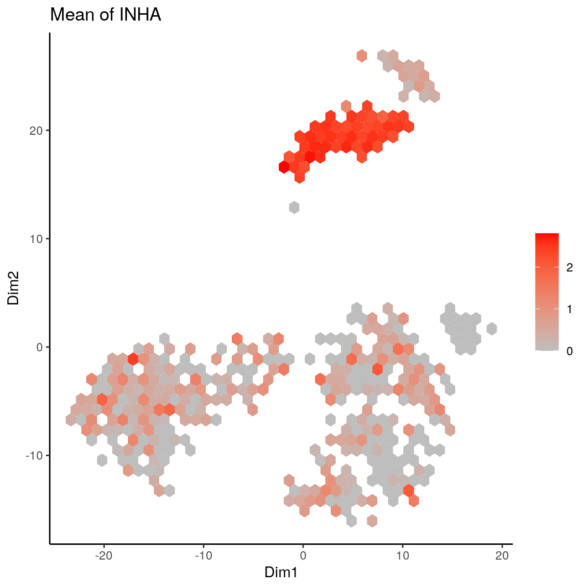|[ACVR1B](https://www.ncbi.nlm.nih.gov/gene/91) [ACVR2B](https://www.ncbi.nlm.nih.gov/gene/93) [ALPI](https://www.ncbi.nlm.nih.gov/gene/248) [BMPR1A](https://www.ncbi.nlm.nih.gov/gene/657) [BMPR1B](https://www.ncbi.nlm.nih.gov/gene/658) [BMPR2](https://www.ncbi.nlm.nih.gov/gene/659) [FSHR](https://www.ncbi.nlm.nih.gov/gene/2492) [LHCGR](https://www.ncbi.nlm.nih.gov/gene/3973) [TGFBR1](https://www.ncbi.nlm.nih.gov/gene/7046) [ACVR1C](https://www.ncbi.nlm.nih.gov/gene/130399) [ACVR2A](https://www.ncbi.nlm.nih.gov/gene/92) [ACVR1](https://www.ncbi.nlm.nih.gov/gene/90)|
|[INHBA](https://www.ncbi.nlm.nih.gov/gene/3624) |[ACVR1B](https://www.ncbi.nlm.nih.gov/gene/91) [ACVR2B](https://www.ncbi.nlm.nih.gov/gene/93) [ACVRL1](https://www.ncbi.nlm.nih.gov/gene/94) [BMPR1A](https://www.ncbi.nlm.nih.gov/gene/657) [BMPR1B](https://www.ncbi.nlm.nih.gov/gene/658) [BMPR2](https://www.ncbi.nlm.nih.gov/gene/659) [ENG](https://www.ncbi.nlm.nih.gov/gene/2022) [FSHR](https://www.ncbi.nlm.nih.gov/gene/2492) [LHCGR](https://www.ncbi.nlm.nih.gov/gene/3973) [RALA](https://www.ncbi.nlm.nih.gov/gene/5898) [SCNN1A](https://www.ncbi.nlm.nih.gov/gene/6337) [TGFBR1](https://www.ncbi.nlm.nih.gov/gene/7046) [TGFBR2](https://www.ncbi.nlm.nih.gov/gene/7048) [ACVR1C](https://www.ncbi.nlm.nih.gov/gene/130399) [ACVR2A](https://www.ncbi.nlm.nih.gov/gene/92) [ACVR1](https://www.ncbi.nlm.nih.gov/gene/90)|
|[INHBB](https://www.ncbi.nlm.nih.gov/gene/3625) 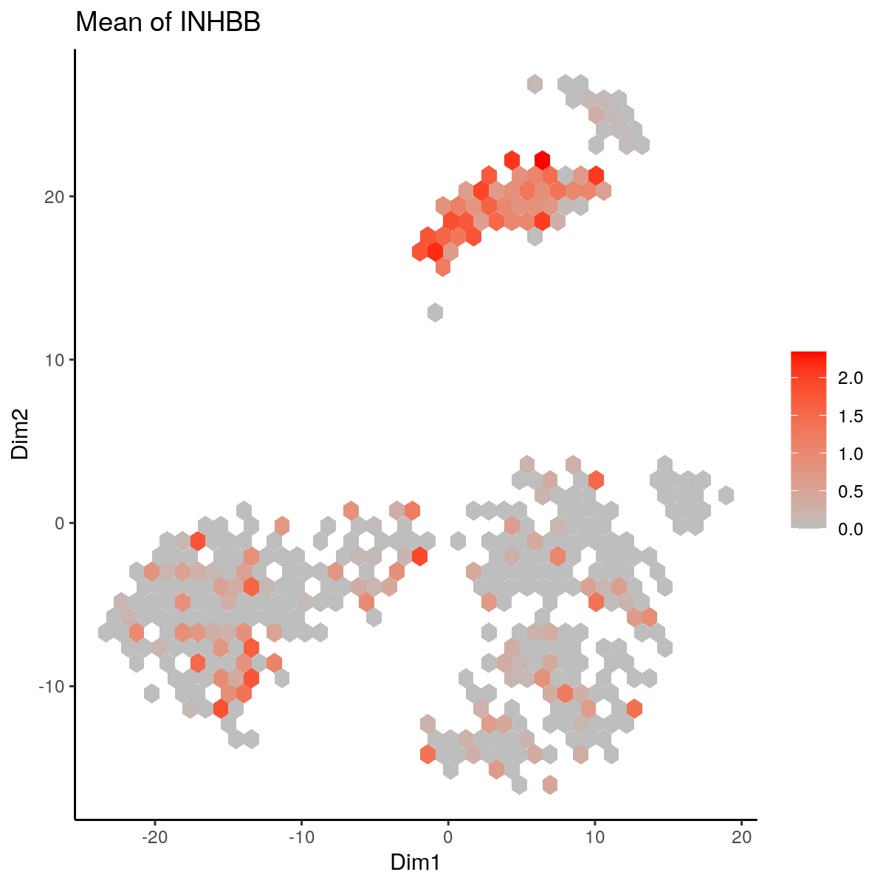|[ACVR1B](https://www.ncbi.nlm.nih.gov/gene/91) [ACVR2B](https://www.ncbi.nlm.nih.gov/gene/93) [ACVRL1](https://www.ncbi.nlm.nih.gov/gene/94) [BMPR1A](https://www.ncbi.nlm.nih.gov/gene/657) [BMPR1B](https://www.ncbi.nlm.nih.gov/gene/658) [BMPR2](https://www.ncbi.nlm.nih.gov/gene/659) [FSHR](https://www.ncbi.nlm.nih.gov/gene/2492) [LHCGR](https://www.ncbi.nlm.nih.gov/gene/3973) [TGFBR1](https://www.ncbi.nlm.nih.gov/gene/7046) [TGFBR2](https://www.ncbi.nlm.nih.gov/gene/7048) [ACVR1C](https://www.ncbi.nlm.nih.gov/gene/130399) [ACVR2A](https://www.ncbi.nlm.nih.gov/gene/92) [ACVR1](https://www.ncbi.nlm.nih.gov/gene/90)|
|[INHBC](https://www.ncbi.nlm.nih.gov/gene/3626)|[ACVR1B](https://www.ncbi.nlm.nih.gov/gene/91) [ACVR2B](https://www.ncbi.nlm.nih.gov/gene/93) [ACVRL1](https://www.ncbi.nlm.nih.gov/gene/94) [BMPR1A](https://www.ncbi.nlm.nih.gov/gene/657) [BMPR1B](https://www.ncbi.nlm.nih.gov/gene/658) [BMPR2](https://www.ncbi.nlm.nih.gov/gene/659) [SLC17A1](https://www.ncbi.nlm.nih.gov/gene/6568) [SLC22A11](https://www.ncbi.nlm.nih.gov/gene/55867) [SLC2A9](https://www.ncbi.nlm.nih.gov/gene/56606) [SLC4A10](https://www.ncbi.nlm.nih.gov/gene/57282) [SLC22A12](https://www.ncbi.nlm.nih.gov/gene/116085) [SLC16A9](https://www.ncbi.nlm.nih.gov/gene/220963) [ACVR1](https://www.ncbi.nlm.nih.gov/gene/90)|
|[INHBE](https://www.ncbi.nlm.nih.gov/gene/83729)|[ACVR1B](https://www.ncbi.nlm.nih.gov/gene/91) [ACVR2B](https://www.ncbi.nlm.nih.gov/gene/93) [BMPR1A](https://www.ncbi.nlm.nih.gov/gene/657) [BMPR1B](https://www.ncbi.nlm.nih.gov/gene/658) [TGFBR1](https://www.ncbi.nlm.nih.gov/gene/7046) [TGFBR2](https://www.ncbi.nlm.nih.gov/gene/7048) [LRP8](https://www.ncbi.nlm.nih.gov/gene/7804) [SLC4A10](https://www.ncbi.nlm.nih.gov/gene/57282)|
|[INS](https://www.ncbi.nlm.nih.gov/gene/3630)|[ACHE](https://www.ncbi.nlm.nih.gov/gene/43) [ACVR1B](https://www.ncbi.nlm.nih.gov/gene/91) [ACVR2B](https://www.ncbi.nlm.nih.gov/gene/93) [ADA](https://www.ncbi.nlm.nih.gov/gene/100) [ADAM10](https://www.ncbi.nlm.nih.gov/gene/102) [ADCY5](https://www.ncbi.nlm.nih.gov/gene/111) [ADCY8](https://www.ncbi.nlm.nih.gov/gene/114) [ADD1](https://www.ncbi.nlm.nih.gov/gene/118) [ADORA1](https://www.ncbi.nlm.nih.gov/gene/134) [ADORA2A](https://www.ncbi.nlm.nih.gov/gene/135) [ADORA2B](https://www.ncbi.nlm.nih.gov/gene/136) [ADRA1D](https://www.ncbi.nlm.nih.gov/gene/146) [ADRA2A](https://www.ncbi.nlm.nih.gov/gene/150) [ADRA2B](https://www.ncbi.nlm.nih.gov/gene/151) [ADRA2C](https://www.ncbi.nlm.nih.gov/gene/152) [ADRB1](https://www.ncbi.nlm.nih.gov/gene/153) [ADRB2](https://www.ncbi.nlm.nih.gov/gene/154) [ADRB3](https://www.ncbi.nlm.nih.gov/gene/155) [AGER](https://www.ncbi.nlm.nih.gov/gene/177) [AGTR1](https://www.ncbi.nlm.nih.gov/gene/185) [AGTR2](https://www.ncbi.nlm.nih.gov/gene/186) [APLNR](https://www.ncbi.nlm.nih.gov/gene/187) [AKT2](https://www.ncbi.nlm.nih.gov/gene/208) [ALK](https://www.ncbi.nlm.nih.gov/gene/238) [ALPI](https://www.ncbi.nlm.nih.gov/gene/248) [ALPL](https://www.ncbi.nlm.nih.gov/gene/249) [ALPP](https://www.ncbi.nlm.nih.gov/gene/250) [ALPG](https://www.ncbi.nlm.nih.gov/gene/251) [ANPEP](https://www.ncbi.nlm.nih.gov/gene/290) [AQP2](https://www.ncbi.nlm.nih.gov/gene/359) [AQP3](https://www.ncbi.nlm.nih.gov/gene/360) [AQP7](https://www.ncbi.nlm.nih.gov/gene/364) [AQP9](https://www.ncbi.nlm.nih.gov/gene/366) [RHOA](https://www.ncbi.nlm.nih.gov/gene/387) [ARRB1](https://www.ncbi.nlm.nih.gov/gene/408) [ATP4A](https://www.ncbi.nlm.nih.gov/gene/495) [AXL](https://www.ncbi.nlm.nih.gov/gene/558) [BLK](https://www.ncbi.nlm.nih.gov/gene/640) [BMPR1A](https://www.ncbi.nlm.nih.gov/gene/657) [BMPR2](https://www.ncbi.nlm.nih.gov/gene/659) [BSG](https://www.ncbi.nlm.nih.gov/gene/682) [BTC](https://www.ncbi.nlm.nih.gov/gene/685) [BTK](https://www.ncbi.nlm.nih.gov/gene/695) [CACNA1A](https://www.ncbi.nlm.nih.gov/gene/773) [CACNA1C](https://www.ncbi.nlm.nih.gov/gene/775) [CACNB2](https://www.ncbi.nlm.nih.gov/gene/783) [CALCR](https://www.ncbi.nlm.nih.gov/gene/799) [CAPN2](https://www.ncbi.nlm.nih.gov/gene/824) [CASR](https://www.ncbi.nlm.nih.gov/gene/846) [CBL](https://www.ncbi.nlm.nih.gov/gene/867) [CCKAR](https://www.ncbi.nlm.nih.gov/gene/886) [CD2](https://www.ncbi.nlm.nih.gov/gene/914) [CD19](https://www.ncbi.nlm.nih.gov/gene/930) [CD86](https://www.ncbi.nlm.nih.gov/gene/942) [CD36](https://www.ncbi.nlm.nih.gov/gene/948) [SCARB1](https://www.ncbi.nlm.nih.gov/gene/949) [CD44](https://www.ncbi.nlm.nih.gov/gene/960) [CD59](https://www.ncbi.nlm.nih.gov/gene/966) [CDC42](https://www.ncbi.nlm.nih.gov/gene/998) [CDH2](https://www.ncbi.nlm.nih.gov/gene/1000) [CDH17](https://www.ncbi.nlm.nih.gov/gene/1015) [CEACAM5](https://www.ncbi.nlm.nih.gov/gene/1048) [CFTR](https://www.ncbi.nlm.nih.gov/gene/1080) [CCR5](https://www.ncbi.nlm.nih.gov/gene/1234) [CNR1](https://www.ncbi.nlm.nih.gov/gene/1268) [CNR2](https://www.ncbi.nlm.nih.gov/gene/1269) [CRK](https://www.ncbi.nlm.nih.gov/gene/1398) [CSF1R](https://www.ncbi.nlm.nih.gov/gene/1436) [CSK](https://www.ncbi.nlm.nih.gov/gene/1445) [CYBA](https://www.ncbi.nlm.nih.gov/gene/1535) [CYBB](https://www.ncbi.nlm.nih.gov/gene/1536) [CD55](https://www.ncbi.nlm.nih.gov/gene/1604) [ACE](https://www.ncbi.nlm.nih.gov/gene/1636) [DLG4](https://www.ncbi.nlm.nih.gov/gene/1742) [DPP4](https://www.ncbi.nlm.nih.gov/gene/1803) [DRD1](https://www.ncbi.nlm.nih.gov/gene/1812) [DRD2](https://www.ncbi.nlm.nih.gov/gene/1813) [DRD3](https://www.ncbi.nlm.nih.gov/gene/1814) [DRD4](https://www.ncbi.nlm.nih.gov/gene/1815) [DRD5](https://www.ncbi.nlm.nih.gov/gene/1816) [ECE1](https://www.ncbi.nlm.nih.gov/gene/1889) [EDNRB](https://www.ncbi.nlm.nih.gov/gene/1910) [EPHA2](https://www.ncbi.nlm.nih.gov/gene/1969) [ENG](https://www.ncbi.nlm.nih.gov/gene/2022) [ENO2](https://www.ncbi.nlm.nih.gov/gene/2026) [EPHA1](https://www.ncbi.nlm.nih.gov/gene/2041) [EPHA4](https://www.ncbi.nlm.nih.gov/gene/2043) [EPHA5](https://www.ncbi.nlm.nih.gov/gene/2044) [EPHA7](https://www.ncbi.nlm.nih.gov/gene/2045) [EPHB2](https://www.ncbi.nlm.nih.gov/gene/2048) [EPHB4](https://www.ncbi.nlm.nih.gov/gene/2050) [ESR1](https://www.ncbi.nlm.nih.gov/gene/2099) [FCGR1A](https://www.ncbi.nlm.nih.gov/gene/2209) [FCGR1B](https://www.ncbi.nlm.nih.gov/gene/2210) [FGFR1](https://www.ncbi.nlm.nih.gov/gene/2260) [FGFR3](https://www.ncbi.nlm.nih.gov/gene/2261) [FGR](https://www.ncbi.nlm.nih.gov/gene/2268) [FOLR1](https://www.ncbi.nlm.nih.gov/gene/2348) [FSHR](https://www.ncbi.nlm.nih.gov/gene/2492) [FYN](https://www.ncbi.nlm.nih.gov/gene/2534) [GCGR](https://www.ncbi.nlm.nih.gov/gene/2642) [GGT1](https://www.ncbi.nlm.nih.gov/gene/2678) [GHSR](https://www.ncbi.nlm.nih.gov/gene/2693) [GIPR](https://www.ncbi.nlm.nih.gov/gene/2696) [GJA1](https://www.ncbi.nlm.nih.gov/gene/2697) [GPC3](https://www.ncbi.nlm.nih.gov/gene/2719) [GLP1R](https://www.ncbi.nlm.nih.gov/gene/2740) [GNRHR](https://www.ncbi.nlm.nih.gov/gene/2798) [FFAR1](https://www.ncbi.nlm.nih.gov/gene/2864) [FFAR3](https://www.ncbi.nlm.nih.gov/gene/2865) [FFAR2](https://www.ncbi.nlm.nih.gov/gene/2867) [HFE](https://www.ncbi.nlm.nih.gov/gene/3077) [HLA-A](https://www.ncbi.nlm.nih.gov/gene/3105) [HLA-DQA1](https://www.ncbi.nlm.nih.gov/gene/3117) [HLA-DQA2](https://www.ncbi.nlm.nih.gov/gene/3118) [HLA-DQB1](https://www.ncbi.nlm.nih.gov/gene/3119) [HLA-DQB2](https://www.ncbi.nlm.nih.gov/gene/3120) [HLA-DRA](https://www.ncbi.nlm.nih.gov/gene/3122) [HLA-DRB1](https://www.ncbi.nlm.nih.gov/gene/3123) [HLA-DRB5](https://www.ncbi.nlm.nih.gov/gene/3127) [HTR7](https://www.ncbi.nlm.nih.gov/gene/3363) [CXCR2](https://www.ncbi.nlm.nih.gov/gene/3579) [INSR](https://www.ncbi.nlm.nih.gov/gene/3643) [ITGA6](https://www.ncbi.nlm.nih.gov/gene/3655) [ITGAM](https://www.ncbi.nlm.nih.gov/gene/3684) [ITGB1](https://www.ncbi.nlm.nih.gov/gene/3688) [KCNB1](https://www.ncbi.nlm.nih.gov/gene/3745) [KCNQ1](https://www.ncbi.nlm.nih.gov/gene/3784) [KRAS](https://www.ncbi.nlm.nih.gov/gene/3845) [RPSA](https://www.ncbi.nlm.nih.gov/gene/3921) [LCT](https://www.ncbi.nlm.nih.gov/gene/3938) [LDLR](https://www.ncbi.nlm.nih.gov/gene/3949) [LIPE](https://www.ncbi.nlm.nih.gov/gene/3991) [LYN](https://www.ncbi.nlm.nih.gov/gene/4067) [EPCAM](https://www.ncbi.nlm.nih.gov/gene/4072) [MC1R](https://www.ncbi.nlm.nih.gov/gene/4157) [MC2R](https://www.ncbi.nlm.nih.gov/gene/4158) [MC3R](https://www.ncbi.nlm.nih.gov/gene/4159) [MC4R](https://www.ncbi.nlm.nih.gov/gene/4160) [MC5R](https://www.ncbi.nlm.nih.gov/gene/4161) [MME](https://www.ncbi.nlm.nih.gov/gene/4311) [MMP17](https://www.ncbi.nlm.nih.gov/gene/4326) [MTNR1A](https://www.ncbi.nlm.nih.gov/gene/4543) [MTNR1B](https://www.ncbi.nlm.nih.gov/gene/4544) [MUC1](https://www.ncbi.nlm.nih.gov/gene/4582) [NGFR](https://www.ncbi.nlm.nih.gov/gene/4804) [NOS1](https://www.ncbi.nlm.nih.gov/gene/4842) [NOS3](https://www.ncbi.nlm.nih.gov/gene/4846) [NPHS1](https://www.ncbi.nlm.nih.gov/gene/4868) [NT5E](https://www.ncbi.nlm.nih.gov/gene/4907) [NTRK1](https://www.ncbi.nlm.nih.gov/gene/4914) [NTRK2](https://www.ncbi.nlm.nih.gov/gene/4915) [OPRD1](https://www.ncbi.nlm.nih.gov/gene/4985) [OPRK1](https://www.ncbi.nlm.nih.gov/gene/4986) [OPRL1](https://www.ncbi.nlm.nih.gov/gene/4987) [PDGFRA](https://www.ncbi.nlm.nih.gov/gene/5156) [PDGFRB](https://www.ncbi.nlm.nih.gov/gene/5159) [PDPK1](https://www.ncbi.nlm.nih.gov/gene/5170) [ABCB1](https://www.ncbi.nlm.nih.gov/gene/5243) [PIK3C2A](https://www.ncbi.nlm.nih.gov/gene/5286) [PTPRC](https://www.ncbi.nlm.nih.gov/gene/5788) [RAB5A](https://www.ncbi.nlm.nih.gov/gene/5868) [RAF1](https://www.ncbi.nlm.nih.gov/gene/5894) [RET](https://www.ncbi.nlm.nih.gov/gene/5979) [ROS1](https://www.ncbi.nlm.nih.gov/gene/6098) [SELE](https://www.ncbi.nlm.nih.gov/gene/6401) [SELL](https://www.ncbi.nlm.nih.gov/gene/6402) [SELP](https://www.ncbi.nlm.nih.gov/gene/6403) [SGK1](https://www.ncbi.nlm.nih.gov/gene/6446) [SI](https://www.ncbi.nlm.nih.gov/gene/6476) [SLC1A1](https://www.ncbi.nlm.nih.gov/gene/6505) [SLC1A5](https://www.ncbi.nlm.nih.gov/gene/6510) [SLC2A1](https://www.ncbi.nlm.nih.gov/gene/6513) [SLC2A2](https://www.ncbi.nlm.nih.gov/gene/6514) [SLC2A3](https://www.ncbi.nlm.nih.gov/gene/6515) [SLC2A4](https://www.ncbi.nlm.nih.gov/gene/6517) [SLC2A5](https://www.ncbi.nlm.nih.gov/gene/6518) [SLC5A4](https://www.ncbi.nlm.nih.gov/gene/6527) [SLC6A3](https://www.ncbi.nlm.nih.gov/gene/6531) [SLC16A1](https://www.ncbi.nlm.nih.gov/gene/6566) [SPAM1](https://www.ncbi.nlm.nih.gov/gene/6677) [SPTBN1](https://www.ncbi.nlm.nih.gov/gene/6711) [SRC](https://www.ncbi.nlm.nih.gov/gene/6714) [SSTR1](https://www.ncbi.nlm.nih.gov/gene/6751) [SSTR2](https://www.ncbi.nlm.nih.gov/gene/6752) [SSTR3](https://www.ncbi.nlm.nih.gov/gene/6753) [SSTR4](https://www.ncbi.nlm.nih.gov/gene/6754) [SSTR5](https://www.ncbi.nlm.nih.gov/gene/6755) [STX4](https://www.ncbi.nlm.nih.gov/gene/6810) [ABCC8](https://www.ncbi.nlm.nih.gov/gene/6833) [SYK](https://www.ncbi.nlm.nih.gov/gene/6850) [TEK](https://www.ncbi.nlm.nih.gov/gene/7010) [TGFBR1](https://www.ncbi.nlm.nih.gov/gene/7046) [TGFBR2](https://www.ncbi.nlm.nih.gov/gene/7048) [THY1](https://www.ncbi.nlm.nih.gov/gene/7070) [TJP1](https://www.ncbi.nlm.nih.gov/gene/7082) [TLR1](https://www.ncbi.nlm.nih.gov/gene/7096) [TLR4](https://www.ncbi.nlm.nih.gov/gene/7099) [TLR5](https://www.ncbi.nlm.nih.gov/gene/7100) [TSHR](https://www.ncbi.nlm.nih.gov/gene/7253) [TYRO3](https://www.ncbi.nlm.nih.gov/gene/7301) [VCL](https://www.ncbi.nlm.nih.gov/gene/7414) [YES1](https://www.ncbi.nlm.nih.gov/gene/7525) [CXCR4](https://www.ncbi.nlm.nih.gov/gene/7852) [IRS4](https://www.ncbi.nlm.nih.gov/gene/8471) [AOC3](https://www.ncbi.nlm.nih.gov/gene/8639) [HYAL2](https://www.ncbi.nlm.nih.gov/gene/8692) [SNAP23](https://www.ncbi.nlm.nih.gov/gene/8773) [NAPA](https://www.ncbi.nlm.nih.gov/gene/8775) [PROM1](https://www.ncbi.nlm.nih.gov/gene/8842) [CACNA1G](https://www.ncbi.nlm.nih.gov/gene/8913) [MGAM](https://www.ncbi.nlm.nih.gov/gene/8972) [CD163](https://www.ncbi.nlm.nih.gov/gene/9332) [ABCG2](https://www.ncbi.nlm.nih.gov/gene/9429) [NCR1](https://www.ncbi.nlm.nih.gov/gene/9437) [TLR6](https://www.ncbi.nlm.nih.gov/gene/10333) [GPR83](https://www.ncbi.nlm.nih.gov/gene/10888) [NISCH](https://www.ncbi.nlm.nih.gov/gene/11188) [ATP6V0A2](https://www.ncbi.nlm.nih.gov/gene/23545) [BACE1](https://www.ncbi.nlm.nih.gov/gene/23621) [DLL1](https://www.ncbi.nlm.nih.gov/gene/28514) [TRPM5](https://www.ncbi.nlm.nih.gov/gene/29850) [NPC1L1](https://www.ncbi.nlm.nih.gov/gene/29881) [SLC2A8](https://www.ncbi.nlm.nih.gov/gene/29988) [SOCS7](https://www.ncbi.nlm.nih.gov/gene/30837) [DUOX2](https://www.ncbi.nlm.nih.gov/gene/50506) [ATP6V0A4](https://www.ncbi.nlm.nih.gov/gene/50617) [ADIPOR1](https://www.ncbi.nlm.nih.gov/gene/51094) [RXFP3](https://www.ncbi.nlm.nih.gov/gene/51289) [PTOV1](https://www.ncbi.nlm.nih.gov/gene/53635) [DUOX1](https://www.ncbi.nlm.nih.gov/gene/53905) [SLC38A2](https://www.ncbi.nlm.nih.gov/gene/54407) [SLC30A10](https://www.ncbi.nlm.nih.gov/gene/55532) [ITLN1](https://www.ncbi.nlm.nih.gov/gene/55600) [MRAP](https://www.ncbi.nlm.nih.gov/gene/56246) [PNPLA2](https://www.ncbi.nlm.nih.gov/gene/57104) [GJD2](https://www.ncbi.nlm.nih.gov/gene/57369) [CLTRN](https://www.ncbi.nlm.nih.gov/gene/57393) [ACE2](https://www.ncbi.nlm.nih.gov/gene/59272) [RXFP1](https://www.ncbi.nlm.nih.gov/gene/59350) [ABCG8](https://www.ncbi.nlm.nih.gov/gene/64241) [MMP25](https://www.ncbi.nlm.nih.gov/gene/64386) [ADIPOR2](https://www.ncbi.nlm.nih.gov/gene/79602) [TAS1R2](https://www.ncbi.nlm.nih.gov/gene/80834) [TAS1R3](https://www.ncbi.nlm.nih.gov/gene/83756) [SYT8](https://www.ncbi.nlm.nih.gov/gene/90019) [RXFP2](https://www.ncbi.nlm.nih.gov/gene/122042) [GPR119](https://www.ncbi.nlm.nih.gov/gene/139760) [TRPM6](https://www.ncbi.nlm.nih.gov/gene/140803) [SLC2A14](https://www.ncbi.nlm.nih.gov/gene/144195) [GPBAR1](https://www.ncbi.nlm.nih.gov/gene/151306) [KLB](https://www.ncbi.nlm.nih.gov/gene/152831) [SLC2A12](https://www.ncbi.nlm.nih.gov/gene/154091) [SLC30A8](https://www.ncbi.nlm.nih.gov/gene/169026) [GPRC6A](https://www.ncbi.nlm.nih.gov/gene/222545) [TRARG1](https://www.ncbi.nlm.nih.gov/gene/286753) [HCAR2](https://www.ncbi.nlm.nih.gov/gene/338442) [FFAR4](https://www.ncbi.nlm.nih.gov/gene/338557) [RXFP4](https://www.ncbi.nlm.nih.gov/gene/339403) [SLC27A1](https://www.ncbi.nlm.nih.gov/gene/376497) [CCR2](https://www.ncbi.nlm.nih.gov/gene/729230) [CD24](https://www.ncbi.nlm.nih.gov/gene/100133941) [OCLN](https://www.ncbi.nlm.nih.gov/gene/100506658) [ADRA1A](https://www.ncbi.nlm.nih.gov/gene/148) [CAV1](https://www.ncbi.nlm.nih.gov/gene/857) [CAV2](https://www.ncbi.nlm.nih.gov/gene/858) [CAV3](https://www.ncbi.nlm.nih.gov/gene/859) [CDH1](https://www.ncbi.nlm.nih.gov/gene/999) [CDH5](https://www.ncbi.nlm.nih.gov/gene/1003)|
|[INSL3](https://www.ncbi.nlm.nih.gov/gene/3640) 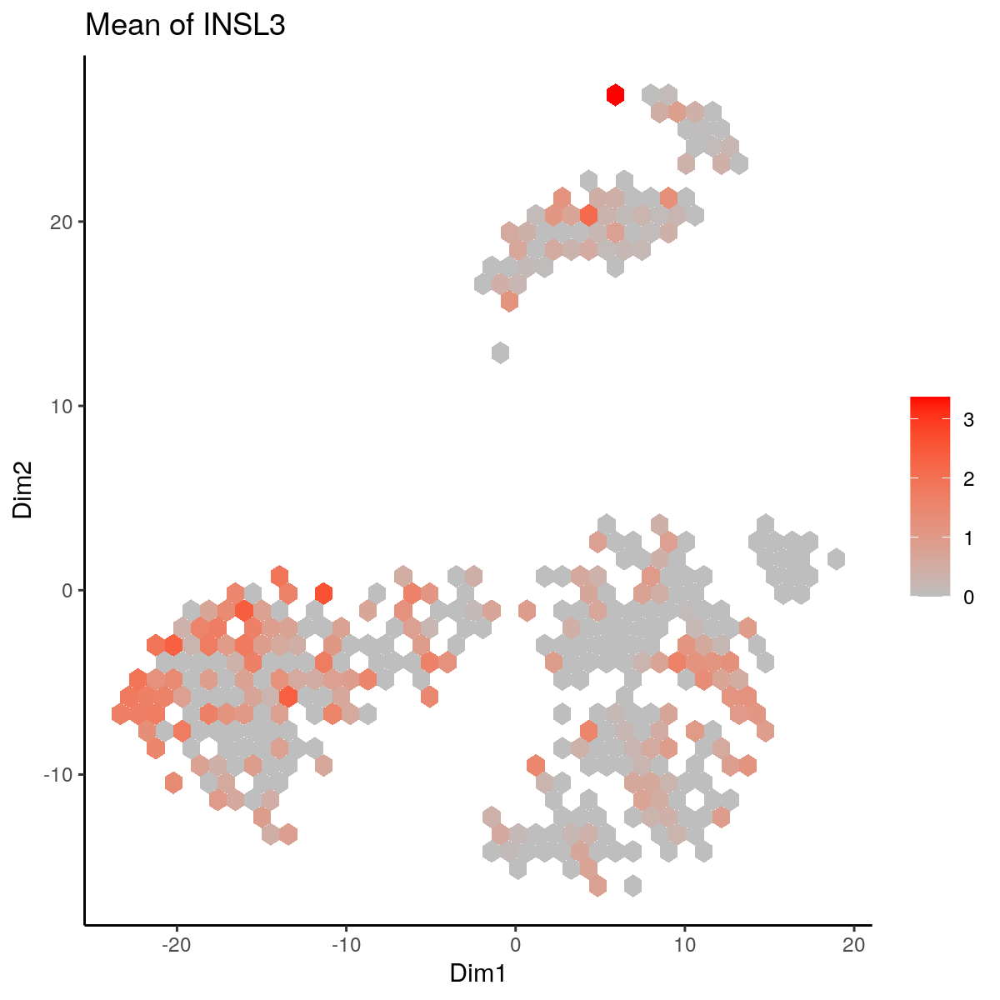|[ADCY3](https://www.ncbi.nlm.nih.gov/gene/109) [ADCY5](https://www.ncbi.nlm.nih.gov/gene/111) [ADCY6](https://www.ncbi.nlm.nih.gov/gene/112) [ADCY8](https://www.ncbi.nlm.nih.gov/gene/114) [ADCY9](https://www.ncbi.nlm.nih.gov/gene/115) [ADCYAP1R1](https://www.ncbi.nlm.nih.gov/gene/117) [ADORA2B](https://www.ncbi.nlm.nih.gov/gene/136) [ADRB1](https://www.ncbi.nlm.nih.gov/gene/153) [ADRB2](https://www.ncbi.nlm.nih.gov/gene/154) [ADRB3](https://www.ncbi.nlm.nih.gov/gene/155) [CALCR](https://www.ncbi.nlm.nih.gov/gene/799) [SCARB1](https://www.ncbi.nlm.nih.gov/gene/949) [CRHR2](https://www.ncbi.nlm.nih.gov/gene/1395) [DRD1](https://www.ncbi.nlm.nih.gov/gene/1812) [DRD5](https://www.ncbi.nlm.nih.gov/gene/1816) [FSHR](https://www.ncbi.nlm.nih.gov/gene/2492) [GCGR](https://www.ncbi.nlm.nih.gov/gene/2642) [GHRHR](https://www.ncbi.nlm.nih.gov/gene/2692) [GIPR](https://www.ncbi.nlm.nih.gov/gene/2696) [GLP1R](https://www.ncbi.nlm.nih.gov/gene/2740) [GNAS](https://www.ncbi.nlm.nih.gov/gene/2778) [GNG3](https://www.ncbi.nlm.nih.gov/gene/2785) [GNG4](https://www.ncbi.nlm.nih.gov/gene/2786) [GNG5](https://www.ncbi.nlm.nih.gov/gene/2787) [GNG7](https://www.ncbi.nlm.nih.gov/gene/2788) [GNG10](https://www.ncbi.nlm.nih.gov/gene/2790) [GNG11](https://www.ncbi.nlm.nih.gov/gene/2791) [GNGT1](https://www.ncbi.nlm.nih.gov/gene/2792) [GNGT2](https://www.ncbi.nlm.nih.gov/gene/2793) [NPBWR2](https://www.ncbi.nlm.nih.gov/gene/2832) [GPR15](https://www.ncbi.nlm.nih.gov/gene/2838) [GPR20](https://www.ncbi.nlm.nih.gov/gene/2843) [GPR25](https://www.ncbi.nlm.nih.gov/gene/2848) [GPR27](https://www.ncbi.nlm.nih.gov/gene/2850) [GPR32](https://www.ncbi.nlm.nih.gov/gene/2854) [GPR39](https://www.ncbi.nlm.nih.gov/gene/2863) [HRH2](https://www.ncbi.nlm.nih.gov/gene/3274) [HTR4](https://www.ncbi.nlm.nih.gov/gene/3360) [HTR6](https://www.ncbi.nlm.nih.gov/gene/3362) [HTR7](https://www.ncbi.nlm.nih.gov/gene/3363) [LHCGR](https://www.ncbi.nlm.nih.gov/gene/3973) [MC1R](https://www.ncbi.nlm.nih.gov/gene/4157) [MC2R](https://www.ncbi.nlm.nih.gov/gene/4158) [MC3R](https://www.ncbi.nlm.nih.gov/gene/4159) [MC4R](https://www.ncbi.nlm.nih.gov/gene/4160) [MC5R](https://www.ncbi.nlm.nih.gov/gene/4161) [P2RY11](https://www.ncbi.nlm.nih.gov/gene/5032) [PTGDR](https://www.ncbi.nlm.nih.gov/gene/5729) [PTGER2](https://www.ncbi.nlm.nih.gov/gene/5732) [PTGER4](https://www.ncbi.nlm.nih.gov/gene/5734) [PTGIR](https://www.ncbi.nlm.nih.gov/gene/5739) [PTH1R](https://www.ncbi.nlm.nih.gov/gene/5745) [PTH2R](https://www.ncbi.nlm.nih.gov/gene/5746) [SCTR](https://www.ncbi.nlm.nih.gov/gene/6344) [TSHR](https://www.ncbi.nlm.nih.gov/gene/7253) [VIPR1](https://www.ncbi.nlm.nih.gov/gene/7433) [VIPR2](https://www.ncbi.nlm.nih.gov/gene/7434) [TAAR5](https://www.ncbi.nlm.nih.gov/gene/9038) [TAAR2](https://www.ncbi.nlm.nih.gov/gene/9287) [GLP2R](https://www.ncbi.nlm.nih.gov/gene/9340) [CALCRL](https://www.ncbi.nlm.nih.gov/gene/10203) [RAMP3](https://www.ncbi.nlm.nih.gov/gene/10268) [GPR83](https://www.ncbi.nlm.nih.gov/gene/10888) [GPR176](https://www.ncbi.nlm.nih.gov/gene/11245) [GPR45](https://www.ncbi.nlm.nih.gov/gene/11250) [RXFP3](https://www.ncbi.nlm.nih.gov/gene/51289) [GNG13](https://www.ncbi.nlm.nih.gov/gene/51764) [GPR84](https://www.ncbi.nlm.nih.gov/gene/53831) [GNG2](https://www.ncbi.nlm.nih.gov/gene/54331) [GNG12](https://www.ncbi.nlm.nih.gov/gene/55970) [RXFP1](https://www.ncbi.nlm.nih.gov/gene/59350) [TAAR8](https://www.ncbi.nlm.nih.gov/gene/83551) [GNG8](https://www.ncbi.nlm.nih.gov/gene/94235) [RXFP2](https://www.ncbi.nlm.nih.gov/gene/122042) [TAAR9](https://www.ncbi.nlm.nih.gov/gene/134860) [TAAR1](https://www.ncbi.nlm.nih.gov/gene/134864) [GPBAR1](https://www.ncbi.nlm.nih.gov/gene/151306) [ADCY4](https://www.ncbi.nlm.nih.gov/gene/196883) [GPR150](https://www.ncbi.nlm.nih.gov/gene/285601) [TAAR6](https://www.ncbi.nlm.nih.gov/gene/319100) [RXFP4](https://www.ncbi.nlm.nih.gov/gene/339403) [LINC02210-CRHR1](https://www.ncbi.nlm.nih.gov/gene/104909134)|
|[INSL4](https://www.ncbi.nlm.nih.gov/gene/3641)|[RXFP3](https://www.ncbi.nlm.nih.gov/gene/51289) [RXFP1](https://www.ncbi.nlm.nih.gov/gene/59350) [RXFP2](https://www.ncbi.nlm.nih.gov/gene/122042) [RXFP4](https://www.ncbi.nlm.nih.gov/gene/339403)|
|[INSL5](https://www.ncbi.nlm.nih.gov/gene/10022)|[ADCY3](https://www.ncbi.nlm.nih.gov/gene/109) [ADCY5](https://www.ncbi.nlm.nih.gov/gene/111) [ADCY6](https://www.ncbi.nlm.nih.gov/gene/112) [ADCY8](https://www.ncbi.nlm.nih.gov/gene/114) [ADCY9](https://www.ncbi.nlm.nih.gov/gene/115) [ADORA1](https://www.ncbi.nlm.nih.gov/gene/134) [ADRA2A](https://www.ncbi.nlm.nih.gov/gene/150) [ADRA2B](https://www.ncbi.nlm.nih.gov/gene/151) [ADRA2C](https://www.ncbi.nlm.nih.gov/gene/152) [AGTR2](https://www.ncbi.nlm.nih.gov/gene/186) [APLNR](https://www.ncbi.nlm.nih.gov/gene/187) [BDKRB1](https://www.ncbi.nlm.nih.gov/gene/623) [BDKRB2](https://www.ncbi.nlm.nih.gov/gene/624) [CXCR5](https://www.ncbi.nlm.nih.gov/gene/643) [C3AR1](https://www.ncbi.nlm.nih.gov/gene/719) [C5AR1](https://www.ncbi.nlm.nih.gov/gene/728) [CASR](https://www.ncbi.nlm.nih.gov/gene/846) [CHRM2](https://www.ncbi.nlm.nih.gov/gene/1129) [CHRM4](https://www.ncbi.nlm.nih.gov/gene/1132) [CCR1](https://www.ncbi.nlm.nih.gov/gene/1230) [CCR3](https://www.ncbi.nlm.nih.gov/gene/1232) [CCR4](https://www.ncbi.nlm.nih.gov/gene/1233) [CCR5](https://www.ncbi.nlm.nih.gov/gene/1234) [CCR7](https://www.ncbi.nlm.nih.gov/gene/1236) [CCR8](https://www.ncbi.nlm.nih.gov/gene/1237) [CNR1](https://www.ncbi.nlm.nih.gov/gene/1268) [CNR2](https://www.ncbi.nlm.nih.gov/gene/1269) [CX3CR1](https://www.ncbi.nlm.nih.gov/gene/1524) [DRD2](https://www.ncbi.nlm.nih.gov/gene/1813) [DRD3](https://www.ncbi.nlm.nih.gov/gene/1814) [DRD4](https://www.ncbi.nlm.nih.gov/gene/1815) [GPR183](https://www.ncbi.nlm.nih.gov/gene/1880) [S1PR1](https://www.ncbi.nlm.nih.gov/gene/1901) [S1PR3](https://www.ncbi.nlm.nih.gov/gene/1903) [FPR1](https://www.ncbi.nlm.nih.gov/gene/2357) [FPR2](https://www.ncbi.nlm.nih.gov/gene/2358) [FPR3](https://www.ncbi.nlm.nih.gov/gene/2359) [GALR1](https://www.ncbi.nlm.nih.gov/gene/2587) [GNG3](https://www.ncbi.nlm.nih.gov/gene/2785) [GNG4](https://www.ncbi.nlm.nih.gov/gene/2786) [GNG5](https://www.ncbi.nlm.nih.gov/gene/2787) [GNG7](https://www.ncbi.nlm.nih.gov/gene/2788) [GNG10](https://www.ncbi.nlm.nih.gov/gene/2790) [GNG11](https://www.ncbi.nlm.nih.gov/gene/2791) [GNGT1](https://www.ncbi.nlm.nih.gov/gene/2792) [GNGT2](https://www.ncbi.nlm.nih.gov/gene/2793) [CCR10](https://www.ncbi.nlm.nih.gov/gene/2826) [NPBWR1](https://www.ncbi.nlm.nih.gov/gene/2831) [NPBWR2](https://www.ncbi.nlm.nih.gov/gene/2832) [CXCR3](https://www.ncbi.nlm.nih.gov/gene/2833) [GPR17](https://www.ncbi.nlm.nih.gov/gene/2840) [GPR18](https://www.ncbi.nlm.nih.gov/gene/2841) [MCHR1](https://www.ncbi.nlm.nih.gov/gene/2847) [GPR31](https://www.ncbi.nlm.nih.gov/gene/2853) [GPR37](https://www.ncbi.nlm.nih.gov/gene/2861) [GRM2](https://www.ncbi.nlm.nih.gov/gene/2912) [GRM3](https://www.ncbi.nlm.nih.gov/gene/2913) [GRM4](https://www.ncbi.nlm.nih.gov/gene/2914) [GRM6](https://www.ncbi.nlm.nih.gov/gene/2916) [GRM7](https://www.ncbi.nlm.nih.gov/gene/2917) [GRM8](https://www.ncbi.nlm.nih.gov/gene/2918) [HTR1A](https://www.ncbi.nlm.nih.gov/gene/3350) [HTR1B](https://www.ncbi.nlm.nih.gov/gene/3351) [HTR1D](https://www.ncbi.nlm.nih.gov/gene/3352) [HTR1E](https://www.ncbi.nlm.nih.gov/gene/3354) [HTR1F](https://www.ncbi.nlm.nih.gov/gene/3355) [HTR5A](https://www.ncbi.nlm.nih.gov/gene/3361) [CXCR1](https://www.ncbi.nlm.nih.gov/gene/3577) [CXCR2](https://www.ncbi.nlm.nih.gov/gene/3579) [MTNR1A](https://www.ncbi.nlm.nih.gov/gene/4543) [MTNR1B](https://www.ncbi.nlm.nih.gov/gene/4544) [NPY1R](https://www.ncbi.nlm.nih.gov/gene/4886) [NPY2R](https://www.ncbi.nlm.nih.gov/gene/4887) [NPY5R](https://www.ncbi.nlm.nih.gov/gene/4889) [OPRD1](https://www.ncbi.nlm.nih.gov/gene/4985) [OPRK1](https://www.ncbi.nlm.nih.gov/gene/4986) [OPRL1](https://www.ncbi.nlm.nih.gov/gene/4987) [P2RY4](https://www.ncbi.nlm.nih.gov/gene/5030) [PTGER3](https://www.ncbi.nlm.nih.gov/gene/5733) [SSTR1](https://www.ncbi.nlm.nih.gov/gene/6751) [SSTR2](https://www.ncbi.nlm.nih.gov/gene/6752) [SSTR3](https://www.ncbi.nlm.nih.gov/gene/6753) [SSTR4](https://www.ncbi.nlm.nih.gov/gene/6754) [SSTR5](https://www.ncbi.nlm.nih.gov/gene/6755) [CXCR4](https://www.ncbi.nlm.nih.gov/gene/7852) [GALR3](https://www.ncbi.nlm.nih.gov/gene/8484) [S1PR4](https://www.ncbi.nlm.nih.gov/gene/8698) [GALR2](https://www.ncbi.nlm.nih.gov/gene/8811) [HCAR3](https://www.ncbi.nlm.nih.gov/gene/8843) [GPR37L1](https://www.ncbi.nlm.nih.gov/gene/9283) [GPR55](https://www.ncbi.nlm.nih.gov/gene/9290) [GABBR2](https://www.ncbi.nlm.nih.gov/gene/9568) [P2RY14](https://www.ncbi.nlm.nih.gov/gene/9934) [NMUR1](https://www.ncbi.nlm.nih.gov/gene/10316) [CXCR6](https://www.ncbi.nlm.nih.gov/gene/10663) [CCR9](https://www.ncbi.nlm.nih.gov/gene/10803) [PTGDR2](https://www.ncbi.nlm.nih.gov/gene/11251) [HRH3](https://www.ncbi.nlm.nih.gov/gene/11255) [LPAR3](https://www.ncbi.nlm.nih.gov/gene/23566) [HCAR1](https://www.ncbi.nlm.nih.gov/gene/27198) [OXGR1](https://www.ncbi.nlm.nih.gov/gene/27199) [TAS2R16](https://www.ncbi.nlm.nih.gov/gene/50833) [RXFP3](https://www.ncbi.nlm.nih.gov/gene/51289) [GNG13](https://www.ncbi.nlm.nih.gov/gene/51764) [S1PR5](https://www.ncbi.nlm.nih.gov/gene/53637) [P2RY13](https://www.ncbi.nlm.nih.gov/gene/53829) [GNG2](https://www.ncbi.nlm.nih.gov/gene/54331) [PLGRKT](https://www.ncbi.nlm.nih.gov/gene/55848) [GNG12](https://www.ncbi.nlm.nih.gov/gene/55970) [SUCNR1](https://www.ncbi.nlm.nih.gov/gene/56670) [NMUR2](https://www.ncbi.nlm.nih.gov/gene/56923) [ACKR3](https://www.ncbi.nlm.nih.gov/gene/57007) [LPAR5](https://www.ncbi.nlm.nih.gov/gene/57121) [CXCL16](https://www.ncbi.nlm.nih.gov/gene/58191) [HRH4](https://www.ncbi.nlm.nih.gov/gene/59340) [RXFP1](https://www.ncbi.nlm.nih.gov/gene/59350) [P2RY12](https://www.ncbi.nlm.nih.gov/gene/64805) [TAS1R2](https://www.ncbi.nlm.nih.gov/gene/80834) [TAS1R1](https://www.ncbi.nlm.nih.gov/gene/80835) [TAS1R3](https://www.ncbi.nlm.nih.gov/gene/83756) [MCHR2](https://www.ncbi.nlm.nih.gov/gene/84539) [GNG8](https://www.ncbi.nlm.nih.gov/gene/94235) [RXFP2](https://www.ncbi.nlm.nih.gov/gene/122042) [OXER1](https://www.ncbi.nlm.nih.gov/gene/165140) [ADCY4](https://www.ncbi.nlm.nih.gov/gene/196883) [HCAR2](https://www.ncbi.nlm.nih.gov/gene/338442) [RXFP4](https://www.ncbi.nlm.nih.gov/gene/339403) [CCR2](https://www.ncbi.nlm.nih.gov/gene/729230)|
|[INSL6](https://www.ncbi.nlm.nih.gov/gene/11172)|[RXFP3](https://www.ncbi.nlm.nih.gov/gene/51289) [PLGRKT](https://www.ncbi.nlm.nih.gov/gene/55848) [RXFP1](https://www.ncbi.nlm.nih.gov/gene/59350) [RXFP2](https://www.ncbi.nlm.nih.gov/gene/122042) [RXFP4](https://www.ncbi.nlm.nih.gov/gene/339403)|
|[ISLR](https://www.ncbi.nlm.nih.gov/gene/3671) |[PDGFRB](https://www.ncbi.nlm.nih.gov/gene/5159) [RNF144A](https://www.ncbi.nlm.nih.gov/gene/9781) [ADGRL1](https://www.ncbi.nlm.nih.gov/gene/22859) [ADGRL3](https://www.ncbi.nlm.nih.gov/gene/23284) [MXRA8](https://www.ncbi.nlm.nih.gov/gene/54587) [MFRP](https://www.ncbi.nlm.nih.gov/gene/83552)|
|[ISM1](https://www.ncbi.nlm.nih.gov/gene/140862)|[ARRB2](https://www.ncbi.nlm.nih.gov/gene/409) [ADGRB2](https://www.ncbi.nlm.nih.gov/gene/576) [MUC4](https://www.ncbi.nlm.nih.gov/gene/4585) [CORO1C](https://www.ncbi.nlm.nih.gov/gene/23603) [ADGRA2](https://www.ncbi.nlm.nih.gov/gene/25960) [SUSD2](https://www.ncbi.nlm.nih.gov/gene/56241) [RHOJ](https://www.ncbi.nlm.nih.gov/gene/57381)|
|[ISM2](https://www.ncbi.nlm.nih.gov/gene/145501)|[MUC4](https://www.ncbi.nlm.nih.gov/gene/4585) [SUSD2](https://www.ncbi.nlm.nih.gov/gene/56241) [RAB39B](https://www.ncbi.nlm.nih.gov/gene/116442) [TAAR1](https://www.ncbi.nlm.nih.gov/gene/134864)|
|[ITFG1](https://www.ncbi.nlm.nih.gov/gene/81533)|[PTPN4](https://www.ncbi.nlm.nih.gov/gene/5775) [GPR176](https://www.ncbi.nlm.nih.gov/gene/11245) [TM7SF3](https://www.ncbi.nlm.nih.gov/gene/51768)|
|[ITGBL1](https://www.ncbi.nlm.nih.gov/gene/9358)|[CDH11](https://www.ncbi.nlm.nih.gov/gene/1009) [GPR183](https://www.ncbi.nlm.nih.gov/gene/1880) [ITGA6](https://www.ncbi.nlm.nih.gov/gene/3655) [ITGA3](https://www.ncbi.nlm.nih.gov/gene/3675) [ITGAL](https://www.ncbi.nlm.nih.gov/gene/3683) [ITGAM](https://www.ncbi.nlm.nih.gov/gene/3684) [ITGAV](https://www.ncbi.nlm.nih.gov/gene/3685) [CLIC6](https://www.ncbi.nlm.nih.gov/gene/54102) [GPR85](https://www.ncbi.nlm.nih.gov/gene/54329) [LRRC55](https://www.ncbi.nlm.nih.gov/gene/219527) [ATP11C](https://www.ncbi.nlm.nih.gov/gene/286410) [TRABD2B](https://www.ncbi.nlm.nih.gov/gene/388630)|
|[ITIH1](https://www.ncbi.nlm.nih.gov/gene/3697)|[SLC3A2](https://www.ncbi.nlm.nih.gov/gene/6520)|
|[ITIH2](https://www.ncbi.nlm.nih.gov/gene/3698)|[ADAM10](https://www.ncbi.nlm.nih.gov/gene/102) [APLP2](https://www.ncbi.nlm.nih.gov/gene/334) [C8A](https://www.ncbi.nlm.nih.gov/gene/731) [CDH2](https://www.ncbi.nlm.nih.gov/gene/1000) [FCGR3A](https://www.ncbi.nlm.nih.gov/gene/2214) [GPC3](https://www.ncbi.nlm.nih.gov/gene/2719) [MELTF](https://www.ncbi.nlm.nih.gov/gene/4241) [PIP4K2A](https://www.ncbi.nlm.nih.gov/gene/5305) [PRKCQ](https://www.ncbi.nlm.nih.gov/gene/5588) [SLC3A2](https://www.ncbi.nlm.nih.gov/gene/6520) [TGOLN2](https://www.ncbi.nlm.nih.gov/gene/10618) [SLC22A7](https://www.ncbi.nlm.nih.gov/gene/10864) [MXRA8](https://www.ncbi.nlm.nih.gov/gene/54587) [SLC38A4](https://www.ncbi.nlm.nih.gov/gene/55089) [PNPLA2](https://www.ncbi.nlm.nih.gov/gene/57104) [ANO8](https://www.ncbi.nlm.nih.gov/gene/57719) [TMPRSS6](https://www.ncbi.nlm.nih.gov/gene/164656) [OR6C6](https://www.ncbi.nlm.nih.gov/gene/283365) [OR6C65](https://www.ncbi.nlm.nih.gov/gene/403282)|
|[ITIH3](https://www.ncbi.nlm.nih.gov/gene/3699)|[C8A](https://www.ncbi.nlm.nih.gov/gene/731) [CACNA1C](https://www.ncbi.nlm.nih.gov/gene/775) [CACNB2](https://www.ncbi.nlm.nih.gov/gene/783) [SLC2A2](https://www.ncbi.nlm.nih.gov/gene/6514) [SLC3A2](https://www.ncbi.nlm.nih.gov/gene/6520) [TENM4](https://www.ncbi.nlm.nih.gov/gene/26011) [CNNM2](https://www.ncbi.nlm.nih.gov/gene/54805) [DLGAP3](https://www.ncbi.nlm.nih.gov/gene/58512) [TMPRSS6](https://www.ncbi.nlm.nih.gov/gene/164656)|
|[ITIH4](https://www.ncbi.nlm.nih.gov/gene/3700)|[CD4](https://www.ncbi.nlm.nih.gov/gene/920) [CD81](https://www.ncbi.nlm.nih.gov/gene/975) [CCR3](https://www.ncbi.nlm.nih.gov/gene/1232) [CCR5](https://www.ncbi.nlm.nih.gov/gene/1234) [DPP4](https://www.ncbi.nlm.nih.gov/gene/1803) [DRD2](https://www.ncbi.nlm.nih.gov/gene/1813) [ENPEP](https://www.ncbi.nlm.nih.gov/gene/2028) [FCGRT](https://www.ncbi.nlm.nih.gov/gene/2217) [GAP43](https://www.ncbi.nlm.nih.gov/gene/2596) [GPR15](https://www.ncbi.nlm.nih.gov/gene/2838) [INSR](https://www.ncbi.nlm.nih.gov/gene/3643) [LAMP1](https://www.ncbi.nlm.nih.gov/gene/3916) [SLC3A2](https://www.ncbi.nlm.nih.gov/gene/6520) [SLCO2A1](https://www.ncbi.nlm.nih.gov/gene/6578) [TLR4](https://www.ncbi.nlm.nih.gov/gene/7099) [CXCR4](https://www.ncbi.nlm.nih.gov/gene/7852) [TNFSF10](https://www.ncbi.nlm.nih.gov/gene/8743) [SDC3](https://www.ncbi.nlm.nih.gov/gene/9672) [FCRL4](https://www.ncbi.nlm.nih.gov/gene/83417) [EMB](https://www.ncbi.nlm.nih.gov/gene/133418) [CCR2](https://www.ncbi.nlm.nih.gov/gene/729230)|
|[ITIH5](https://www.ncbi.nlm.nih.gov/gene/80760)|[PRKCQ](https://www.ncbi.nlm.nih.gov/gene/5588) [SLC3A2](https://www.ncbi.nlm.nih.gov/gene/6520) [PCDHGB5](https://www.ncbi.nlm.nih.gov/gene/56101) [ITPRIP](https://www.ncbi.nlm.nih.gov/gene/85450) [LMBRD2](https://www.ncbi.nlm.nih.gov/gene/92255) [APCDD1](https://www.ncbi.nlm.nih.gov/gene/147495)|
|[ITIH6](https://www.ncbi.nlm.nih.gov/gene/347365)|[PRKCQ](https://www.ncbi.nlm.nih.gov/gene/5588) [OR6C6](https://www.ncbi.nlm.nih.gov/gene/283365) [OR6C65](https://www.ncbi.nlm.nih.gov/gene/403282)|
|[ITLN2](https://www.ncbi.nlm.nih.gov/gene/142683)|[ITLN1](https://www.ncbi.nlm.nih.gov/gene/55600)|
|[IZUMO4](https://www.ncbi.nlm.nih.gov/gene/113177)|[CD9](https://www.ncbi.nlm.nih.gov/gene/928) [FOLR1](https://www.ncbi.nlm.nih.gov/gene/2348) [IZUMO1](https://www.ncbi.nlm.nih.gov/gene/284359) [IZUMO1R](https://www.ncbi.nlm.nih.gov/gene/390243)|
|[JAG1](https://www.ncbi.nlm.nih.gov/gene/182)|[NOTCH1](https://www.ncbi.nlm.nih.gov/gene/4851) [NOTCH2](https://www.ncbi.nlm.nih.gov/gene/4853) [NOTCH3](https://www.ncbi.nlm.nih.gov/gene/4854) [NOTCH4](https://www.ncbi.nlm.nih.gov/gene/4855)|
|[JAG2](https://www.ncbi.nlm.nih.gov/gene/3714)|[NOTCH1](https://www.ncbi.nlm.nih.gov/gene/4851) [NOTCH2](https://www.ncbi.nlm.nih.gov/gene/4853) [NOTCH3](https://www.ncbi.nlm.nih.gov/gene/4854) [NOTCH4](https://www.ncbi.nlm.nih.gov/gene/4855)|
|[JAM3](https://www.ncbi.nlm.nih.gov/gene/83700)|[ACVRL1](https://www.ncbi.nlm.nih.gov/gene/94) [CD47](https://www.ncbi.nlm.nih.gov/gene/961) [ADGRE5](https://www.ncbi.nlm.nih.gov/gene/976) [CDH2](https://www.ncbi.nlm.nih.gov/gene/1000) [ADGRE1](https://www.ncbi.nlm.nih.gov/gene/2015) [ITGAM](https://www.ncbi.nlm.nih.gov/gene/3684) [ITGB1](https://www.ncbi.nlm.nih.gov/gene/3688) [ITGB2](https://www.ncbi.nlm.nih.gov/gene/3689) [CLDN11](https://www.ncbi.nlm.nih.gov/gene/5010) [NECTIN2](https://www.ncbi.nlm.nih.gov/gene/5819) [SELP](https://www.ncbi.nlm.nih.gov/gene/6403) [TIAM1](https://www.ncbi.nlm.nih.gov/gene/7074) [TJP1](https://www.ncbi.nlm.nih.gov/gene/7082) [MPDZ](https://www.ncbi.nlm.nih.gov/gene/8777) [CLDN12](https://www.ncbi.nlm.nih.gov/gene/9069) [NECTIN3](https://www.ncbi.nlm.nih.gov/gene/25945) [TJP3](https://www.ncbi.nlm.nih.gov/gene/27134) [ADGRE2](https://www.ncbi.nlm.nih.gov/gene/30817) [CD99L2](https://www.ncbi.nlm.nih.gov/gene/83692) [JAML](https://www.ncbi.nlm.nih.gov/gene/120425) [IGSF5](https://www.ncbi.nlm.nih.gov/gene/150084) [OCLN](https://www.ncbi.nlm.nih.gov/gene/100506658)|
|[JCHAIN](https://www.ncbi.nlm.nih.gov/gene/3512)|[TNFRSF17](https://www.ncbi.nlm.nih.gov/gene/608) [CD3D](https://www.ncbi.nlm.nih.gov/gene/915) [CD3G](https://www.ncbi.nlm.nih.gov/gene/917) [CD19](https://www.ncbi.nlm.nih.gov/gene/930) [CD79A](https://www.ncbi.nlm.nih.gov/gene/973) [CD79B](https://www.ncbi.nlm.nih.gov/gene/974) [FCGRT](https://www.ncbi.nlm.nih.gov/gene/2217) [SYK](https://www.ncbi.nlm.nih.gov/gene/6850) [FCAMR](https://www.ncbi.nlm.nih.gov/gene/83953) [FCRL6](https://www.ncbi.nlm.nih.gov/gene/343413)|
|[KAZALD1](https://www.ncbi.nlm.nih.gov/gene/81621) |[TMEM30B](https://www.ncbi.nlm.nih.gov/gene/161291)|
|[KCP](https://www.ncbi.nlm.nih.gov/gene/375616)|[LRRC8D](https://www.ncbi.nlm.nih.gov/gene/55144) [LRRC8E](https://www.ncbi.nlm.nih.gov/gene/80131) [NCMAP](https://www.ncbi.nlm.nih.gov/gene/400746)|
|[KDR](https://www.ncbi.nlm.nih.gov/gene/3791) |[ACHE](https://www.ncbi.nlm.nih.gov/gene/43) [ACVRL1](https://www.ncbi.nlm.nih.gov/gene/94) [APLNR](https://www.ncbi.nlm.nih.gov/gene/187) [ANPEP](https://www.ncbi.nlm.nih.gov/gene/290) [RHOA](https://www.ncbi.nlm.nih.gov/gene/387) [AXL](https://www.ncbi.nlm.nih.gov/gene/558) [BMPR1A](https://www.ncbi.nlm.nih.gov/gene/657) [BSG](https://www.ncbi.nlm.nih.gov/gene/682) [CBL](https://www.ncbi.nlm.nih.gov/gene/867) [CD44](https://www.ncbi.nlm.nih.gov/gene/960) [CD47](https://www.ncbi.nlm.nih.gov/gene/961) [CDC42](https://www.ncbi.nlm.nih.gov/gene/998) [CDH2](https://www.ncbi.nlm.nih.gov/gene/1000) [CDH17](https://www.ncbi.nlm.nih.gov/gene/1015) [CRK](https://www.ncbi.nlm.nih.gov/gene/1398) [CSK](https://www.ncbi.nlm.nih.gov/gene/1445) [CTNNA1](https://www.ncbi.nlm.nih.gov/gene/1495) [ACE](https://www.ncbi.nlm.nih.gov/gene/1636) [EFNA2](https://www.ncbi.nlm.nih.gov/gene/1943) [EFNA3](https://www.ncbi.nlm.nih.gov/gene/1944) [EFNA5](https://www.ncbi.nlm.nih.gov/gene/1946) [ENG](https://www.ncbi.nlm.nih.gov/gene/2022) [EREG](https://www.ncbi.nlm.nih.gov/gene/2069) [ESR1](https://www.ncbi.nlm.nih.gov/gene/2099) [FGFR1](https://www.ncbi.nlm.nih.gov/gene/2260) [FGFR3](https://www.ncbi.nlm.nih.gov/gene/2261) [FYN](https://www.ncbi.nlm.nih.gov/gene/2534) [GJA1](https://www.ncbi.nlm.nih.gov/gene/2697) [GNA11](https://www.ncbi.nlm.nih.gov/gene/2767) [NCKAP1L](https://www.ncbi.nlm.nih.gov/gene/3071) [CXCR2](https://www.ncbi.nlm.nih.gov/gene/3579) [ITGAM](https://www.ncbi.nlm.nih.gov/gene/3684) [ITGAV](https://www.ncbi.nlm.nih.gov/gene/3685) [ITGB1](https://www.ncbi.nlm.nih.gov/gene/3688) [ITGB3](https://www.ncbi.nlm.nih.gov/gene/3690) [KRAS](https://www.ncbi.nlm.nih.gov/gene/3845) [EPCAM](https://www.ncbi.nlm.nih.gov/gene/4072) [NOS3](https://www.ncbi.nlm.nih.gov/gene/4846) [NPHS1](https://www.ncbi.nlm.nih.gov/gene/4868) [NRAS](https://www.ncbi.nlm.nih.gov/gene/4893) [NT5E](https://www.ncbi.nlm.nih.gov/gene/4907) [P2RY2](https://www.ncbi.nlm.nih.gov/gene/5029) [PDGFRB](https://www.ncbi.nlm.nih.gov/gene/5159) [ABCB1](https://www.ncbi.nlm.nih.gov/gene/5243) [PLXNA1](https://www.ncbi.nlm.nih.gov/gene/5361) [PLXNA2](https://www.ncbi.nlm.nih.gov/gene/5362) [PLXNB3](https://www.ncbi.nlm.nih.gov/gene/5365) [PTPRC](https://www.ncbi.nlm.nih.gov/gene/5788) [PTPRJ](https://www.ncbi.nlm.nih.gov/gene/5795) [RAB5A](https://www.ncbi.nlm.nih.gov/gene/5868) [RAC1](https://www.ncbi.nlm.nih.gov/gene/5879) [RET](https://www.ncbi.nlm.nih.gov/gene/5979) [SCN2A](https://www.ncbi.nlm.nih.gov/gene/6326) [SCN3A](https://www.ncbi.nlm.nih.gov/gene/6328) [SCN10A](https://www.ncbi.nlm.nih.gov/gene/6336) [SELE](https://www.ncbi.nlm.nih.gov/gene/6401) [SELP](https://www.ncbi.nlm.nih.gov/gene/6403) [SHB](https://www.ncbi.nlm.nih.gov/gene/6461) [SLC2A1](https://www.ncbi.nlm.nih.gov/gene/6513) [SRC](https://www.ncbi.nlm.nih.gov/gene/6714) [TEK](https://www.ncbi.nlm.nih.gov/gene/7010) [TGFBR1](https://www.ncbi.nlm.nih.gov/gene/7046) [THY1](https://www.ncbi.nlm.nih.gov/gene/7070) [TJP1](https://www.ncbi.nlm.nih.gov/gene/7082) [TLR4](https://www.ncbi.nlm.nih.gov/gene/7099) [YES1](https://www.ncbi.nlm.nih.gov/gene/7525) [CXCR4](https://www.ncbi.nlm.nih.gov/gene/7852) [SEMA7A](https://www.ncbi.nlm.nih.gov/gene/8482) [IQGAP1](https://www.ncbi.nlm.nih.gov/gene/8826) [PROM1](https://www.ncbi.nlm.nih.gov/gene/8842) [ABCG2](https://www.ncbi.nlm.nih.gov/gene/9429) [ROCK2](https://www.ncbi.nlm.nih.gov/gene/9475) [ELMO1](https://www.ncbi.nlm.nih.gov/gene/9844) [ABCB6](https://www.ncbi.nlm.nih.gov/gene/10058) [SEMA6C](https://www.ncbi.nlm.nih.gov/gene/10500) [SEMA6B](https://www.ncbi.nlm.nih.gov/gene/10501) [SEMA4F](https://www.ncbi.nlm.nih.gov/gene/10505) [SEMA4D](https://www.ncbi.nlm.nih.gov/gene/10507) [NCKAP1](https://www.ncbi.nlm.nih.gov/gene/10787) [PLXND1](https://www.ncbi.nlm.nih.gov/gene/23129) [PLXNB2](https://www.ncbi.nlm.nih.gov/gene/23654) [FLRT3](https://www.ncbi.nlm.nih.gov/gene/23767) [MYOF](https://www.ncbi.nlm.nih.gov/gene/26509) [DLL1](https://www.ncbi.nlm.nih.gov/gene/28514) [EPN1](https://www.ncbi.nlm.nih.gov/gene/29924) [DLL4](https://www.ncbi.nlm.nih.gov/gene/54567) [PLXNA3](https://www.ncbi.nlm.nih.gov/gene/55558) [SEMA6A](https://www.ncbi.nlm.nih.gov/gene/57556) [SEMA4G](https://www.ncbi.nlm.nih.gov/gene/57715) [SEMA4A](https://www.ncbi.nlm.nih.gov/gene/64218) [ANTXR1](https://www.ncbi.nlm.nih.gov/gene/84168) [PLXNA4](https://www.ncbi.nlm.nih.gov/gene/91584) [ECSCR](https://www.ncbi.nlm.nih.gov/gene/641700) [OCLN](https://www.ncbi.nlm.nih.gov/gene/100506658)|
|[KERA](https://www.ncbi.nlm.nih.gov/gene/11081)|[LRBA](https://www.ncbi.nlm.nih.gov/gene/987) [ADGRL1](https://www.ncbi.nlm.nih.gov/gene/22859) [ADGRL3](https://www.ncbi.nlm.nih.gov/gene/23284)|
|[KIAA0100](https://www.ncbi.nlm.nih.gov/gene/9703)|[LIPE](https://www.ncbi.nlm.nih.gov/gene/3991) [SLC2A13](https://www.ncbi.nlm.nih.gov/gene/114134) [TBC1D3E](https://www.ncbi.nlm.nih.gov/gene/102723859)|
|[KISS1](https://www.ncbi.nlm.nih.gov/gene/3814)|[ADRA1D](https://www.ncbi.nlm.nih.gov/gene/146) [AGTR1](https://www.ncbi.nlm.nih.gov/gene/185) [AGTR2](https://www.ncbi.nlm.nih.gov/gene/186) [AVPR1A](https://www.ncbi.nlm.nih.gov/gene/552) [AVPR1B](https://www.ncbi.nlm.nih.gov/gene/553) [BDKRB1](https://www.ncbi.nlm.nih.gov/gene/623) [BDKRB2](https://www.ncbi.nlm.nih.gov/gene/624) [BRS3](https://www.ncbi.nlm.nih.gov/gene/680) [CASR](https://www.ncbi.nlm.nih.gov/gene/846) [CCKAR](https://www.ncbi.nlm.nih.gov/gene/886) [CCKBR](https://www.ncbi.nlm.nih.gov/gene/887) [CHRM1](https://www.ncbi.nlm.nih.gov/gene/1128) [CHRM3](https://www.ncbi.nlm.nih.gov/gene/1131) [CHRM5](https://www.ncbi.nlm.nih.gov/gene/1133) [LTB4R](https://www.ncbi.nlm.nih.gov/gene/1241) [EDNRA](https://www.ncbi.nlm.nih.gov/gene/1909) [EDNRB](https://www.ncbi.nlm.nih.gov/gene/1910) [ESR1](https://www.ncbi.nlm.nih.gov/gene/2099) [F2R](https://www.ncbi.nlm.nih.gov/gene/2149) [F2RL1](https://www.ncbi.nlm.nih.gov/gene/2150) [F2RL2](https://www.ncbi.nlm.nih.gov/gene/2151) [FGFR1](https://www.ncbi.nlm.nih.gov/gene/2260) [FPR2](https://www.ncbi.nlm.nih.gov/gene/2358) [FSHR](https://www.ncbi.nlm.nih.gov/gene/2492) [GALR1](https://www.ncbi.nlm.nih.gov/gene/2587) [GCGR](https://www.ncbi.nlm.nih.gov/gene/2642) [GHRHR](https://www.ncbi.nlm.nih.gov/gene/2692) [GHSR](https://www.ncbi.nlm.nih.gov/gene/2693) [GNA11](https://www.ncbi.nlm.nih.gov/gene/2767) [GNG3](https://www.ncbi.nlm.nih.gov/gene/2785) [GNG4](https://www.ncbi.nlm.nih.gov/gene/2786) [GNG5](https://www.ncbi.nlm.nih.gov/gene/2787) [GNG7](https://www.ncbi.nlm.nih.gov/gene/2788) [GNG10](https://www.ncbi.nlm.nih.gov/gene/2790) [GNG11](https://www.ncbi.nlm.nih.gov/gene/2791) [GNGT1](https://www.ncbi.nlm.nih.gov/gene/2792) [GNGT2](https://www.ncbi.nlm.nih.gov/gene/2793) [GNRHR](https://www.ncbi.nlm.nih.gov/gene/2798) [GPR4](https://www.ncbi.nlm.nih.gov/gene/2828) [XCR1](https://www.ncbi.nlm.nih.gov/gene/2829) [UTS2R](https://www.ncbi.nlm.nih.gov/gene/2837) [GPR17](https://www.ncbi.nlm.nih.gov/gene/2840) [LPAR4](https://www.ncbi.nlm.nih.gov/gene/2846) [MCHR1](https://www.ncbi.nlm.nih.gov/gene/2847) [MLNR](https://www.ncbi.nlm.nih.gov/gene/2862) [GPR39](https://www.ncbi.nlm.nih.gov/gene/2863) [FFAR1](https://www.ncbi.nlm.nih.gov/gene/2864) [FFAR3](https://www.ncbi.nlm.nih.gov/gene/2865) [FFAR2](https://www.ncbi.nlm.nih.gov/gene/2867) [GRK5](https://www.ncbi.nlm.nih.gov/gene/2869) [GRM1](https://www.ncbi.nlm.nih.gov/gene/2911) [GRM5](https://www.ncbi.nlm.nih.gov/gene/2915) [GRPR](https://www.ncbi.nlm.nih.gov/gene/2925) [HCRTR1](https://www.ncbi.nlm.nih.gov/gene/3061) [HCRTR2](https://www.ncbi.nlm.nih.gov/gene/3062) [HRH1](https://www.ncbi.nlm.nih.gov/gene/3269) [HTR2A](https://www.ncbi.nlm.nih.gov/gene/3356) [HTR2B](https://www.ncbi.nlm.nih.gov/gene/3357) [HTR2C](https://www.ncbi.nlm.nih.gov/gene/3358) [ANOS1](https://www.ncbi.nlm.nih.gov/gene/3730) [CD82](https://www.ncbi.nlm.nih.gov/gene/3732) [MC4R](https://www.ncbi.nlm.nih.gov/gene/4160) [NMBR](https://www.ncbi.nlm.nih.gov/gene/4829) [NTSR1](https://www.ncbi.nlm.nih.gov/gene/4923) [OPRK1](https://www.ncbi.nlm.nih.gov/gene/4986) [OXTR](https://www.ncbi.nlm.nih.gov/gene/5021) [P2RY1](https://www.ncbi.nlm.nih.gov/gene/5028) [P2RY2](https://www.ncbi.nlm.nih.gov/gene/5029) [P2RY6](https://www.ncbi.nlm.nih.gov/gene/5031) [P2RY11](https://www.ncbi.nlm.nih.gov/gene/5032) [PTAFR](https://www.ncbi.nlm.nih.gov/gene/5724) [PTGER1](https://www.ncbi.nlm.nih.gov/gene/5731) [PTGFR](https://www.ncbi.nlm.nih.gov/gene/5737) [TACR2](https://www.ncbi.nlm.nih.gov/gene/6865) [TACR1](https://www.ncbi.nlm.nih.gov/gene/6869) [TACR3](https://www.ncbi.nlm.nih.gov/gene/6870) [TBXA2R](https://www.ncbi.nlm.nih.gov/gene/6915) [TRHR](https://www.ncbi.nlm.nih.gov/gene/7201) [GPR68](https://www.ncbi.nlm.nih.gov/gene/8111) [GPR65](https://www.ncbi.nlm.nih.gov/gene/8477) [GALR3](https://www.ncbi.nlm.nih.gov/gene/8484) [GALR2](https://www.ncbi.nlm.nih.gov/gene/8811) [F2RL3](https://www.ncbi.nlm.nih.gov/gene/9002) [LPAR6](https://www.ncbi.nlm.nih.gov/gene/10161) [NMUR1](https://www.ncbi.nlm.nih.gov/gene/10316) [CYSLTR1](https://www.ncbi.nlm.nih.gov/gene/10800) [NPFFR2](https://www.ncbi.nlm.nih.gov/gene/10886) [LPAR3](https://www.ncbi.nlm.nih.gov/gene/23566) [NTSR2](https://www.ncbi.nlm.nih.gov/gene/23620) [P2RY10](https://www.ncbi.nlm.nih.gov/gene/27334) [GPR132](https://www.ncbi.nlm.nih.gov/gene/29933) [SOCS7](https://www.ncbi.nlm.nih.gov/gene/30837) [GNG13](https://www.ncbi.nlm.nih.gov/gene/51764) [GNG2](https://www.ncbi.nlm.nih.gov/gene/54331) [GNG12](https://www.ncbi.nlm.nih.gov/gene/55970) [LTB4R2](https://www.ncbi.nlm.nih.gov/gene/56413) [NMUR2](https://www.ncbi.nlm.nih.gov/gene/56923) [CYSLTR2](https://www.ncbi.nlm.nih.gov/gene/57105) [LPAR5](https://www.ncbi.nlm.nih.gov/gene/57121) [NPFFR1](https://www.ncbi.nlm.nih.gov/gene/64106) [QRFPR](https://www.ncbi.nlm.nih.gov/gene/84109) [MCHR2](https://www.ncbi.nlm.nih.gov/gene/84539) [KISS1R](https://www.ncbi.nlm.nih.gov/gene/84634) [OPN4](https://www.ncbi.nlm.nih.gov/gene/94233) [GNG8](https://www.ncbi.nlm.nih.gov/gene/94235) [ARHGEF25](https://www.ncbi.nlm.nih.gov/gene/115557) [PROKR2](https://www.ncbi.nlm.nih.gov/gene/128674) [GPRC6A](https://www.ncbi.nlm.nih.gov/gene/222545) [FFAR4](https://www.ncbi.nlm.nih.gov/gene/338557)|
|[KITLG](https://www.ncbi.nlm.nih.gov/gene/4254)|[KIT](https://www.ncbi.nlm.nih.gov/gene/3815)|
|[KL](https://www.ncbi.nlm.nih.gov/gene/9365)|[ADAM10](https://www.ncbi.nlm.nih.gov/gene/102) [CASR](https://www.ncbi.nlm.nih.gov/gene/846) [CYBB](https://www.ncbi.nlm.nih.gov/gene/1536) [ACE](https://www.ncbi.nlm.nih.gov/gene/1636) [EDNRB](https://www.ncbi.nlm.nih.gov/gene/1910) [EFNA2](https://www.ncbi.nlm.nih.gov/gene/1943) [FGFR1](https://www.ncbi.nlm.nih.gov/gene/2260) [FGFR3](https://www.ncbi.nlm.nih.gov/gene/2261) [INSR](https://www.ncbi.nlm.nih.gov/gene/3643) [KCNJ1](https://www.ncbi.nlm.nih.gov/gene/3758) [PHEX](https://www.ncbi.nlm.nih.gov/gene/5251) [SLC34A1](https://www.ncbi.nlm.nih.gov/gene/6569) [SLC20A2](https://www.ncbi.nlm.nih.gov/gene/6575) [TRPC6](https://www.ncbi.nlm.nih.gov/gene/7225) [IRS4](https://www.ncbi.nlm.nih.gov/gene/8471) [TRPV6](https://www.ncbi.nlm.nih.gov/gene/55503) [TRPV5](https://www.ncbi.nlm.nih.gov/gene/56302)|
|[KLK10](https://www.ncbi.nlm.nih.gov/gene/5655)|[OR6C70](https://www.ncbi.nlm.nih.gov/gene/390327)|
|[KLK11](https://www.ncbi.nlm.nih.gov/gene/11012)|[BDKRB2](https://www.ncbi.nlm.nih.gov/gene/624) [HTRA1](https://www.ncbi.nlm.nih.gov/gene/5654)|
|[KLK12](https://www.ncbi.nlm.nih.gov/gene/43849)|[BDKRB2](https://www.ncbi.nlm.nih.gov/gene/624) [DSG1](https://www.ncbi.nlm.nih.gov/gene/1828)|
|[KLK13](https://www.ncbi.nlm.nih.gov/gene/26085)|[BDKRB2](https://www.ncbi.nlm.nih.gov/gene/624) [DSG1](https://www.ncbi.nlm.nih.gov/gene/1828)|
|[KLK14](https://www.ncbi.nlm.nih.gov/gene/43847)|[BDKRB2](https://www.ncbi.nlm.nih.gov/gene/624) [DSC1](https://www.ncbi.nlm.nih.gov/gene/1823) [DSG1](https://www.ncbi.nlm.nih.gov/gene/1828) [MELTF](https://www.ncbi.nlm.nih.gov/gene/4241)|
|[KLK15](https://www.ncbi.nlm.nih.gov/gene/55554)|[BDKRB2](https://www.ncbi.nlm.nih.gov/gene/624) [OXTR](https://www.ncbi.nlm.nih.gov/gene/5021) [TAS1R1](https://www.ncbi.nlm.nih.gov/gene/80835) [SYT3](https://www.ncbi.nlm.nih.gov/gene/84258)|
|[KLK3](https://www.ncbi.nlm.nih.gov/gene/354)|[ACPP](https://www.ncbi.nlm.nih.gov/gene/55) [CD44](https://www.ncbi.nlm.nih.gov/gene/960) [CD58](https://www.ncbi.nlm.nih.gov/gene/965) [CEACAM5](https://www.ncbi.nlm.nih.gov/gene/1048) [ENO2](https://www.ncbi.nlm.nih.gov/gene/2026) [ESR1](https://www.ncbi.nlm.nih.gov/gene/2099) [ERAS](https://www.ncbi.nlm.nih.gov/gene/3266) [RPSA](https://www.ncbi.nlm.nih.gov/gene/3921) [EPCAM](https://www.ncbi.nlm.nih.gov/gene/4072) [MUC1](https://www.ncbi.nlm.nih.gov/gene/4582) [SRC](https://www.ncbi.nlm.nih.gov/gene/6714) [PSCA](https://www.ncbi.nlm.nih.gov/gene/8000)|
|[KLK4](https://www.ncbi.nlm.nih.gov/gene/9622)|[BDKRB1](https://www.ncbi.nlm.nih.gov/gene/623) [BDKRB2](https://www.ncbi.nlm.nih.gov/gene/624) [ACE](https://www.ncbi.nlm.nih.gov/gene/1636) [DSG1](https://www.ncbi.nlm.nih.gov/gene/1828) [F2R](https://www.ncbi.nlm.nih.gov/gene/2149) [HLA-DRA](https://www.ncbi.nlm.nih.gov/gene/3122) [KRT1](https://www.ncbi.nlm.nih.gov/gene/3848) [XPNPEP2](https://www.ncbi.nlm.nih.gov/gene/7512) [GPR68](https://www.ncbi.nlm.nih.gov/gene/8111) [SLC14A2](https://www.ncbi.nlm.nih.gov/gene/8170) [MMP25](https://www.ncbi.nlm.nih.gov/gene/64386) [SYT3](https://www.ncbi.nlm.nih.gov/gene/84258)|
|[KLK5](https://www.ncbi.nlm.nih.gov/gene/25818)|[BDKRB2](https://www.ncbi.nlm.nih.gov/gene/624) [DSC1](https://www.ncbi.nlm.nih.gov/gene/1823) [DSC2](https://www.ncbi.nlm.nih.gov/gene/1824) [DSC3](https://www.ncbi.nlm.nih.gov/gene/1825) [DSG1](https://www.ncbi.nlm.nih.gov/gene/1828) [DSG2](https://www.ncbi.nlm.nih.gov/gene/1829) [DSG3](https://www.ncbi.nlm.nih.gov/gene/1830) [FPR2](https://www.ncbi.nlm.nih.gov/gene/2358) [DSG4](https://www.ncbi.nlm.nih.gov/gene/147409)|
|[KLK6](https://www.ncbi.nlm.nih.gov/gene/5653)|[DSC1](https://www.ncbi.nlm.nih.gov/gene/1823) [DSG1](https://www.ncbi.nlm.nih.gov/gene/1828) [F2R](https://www.ncbi.nlm.nih.gov/gene/2149) [MOG](https://www.ncbi.nlm.nih.gov/gene/4340) [OPALIN](https://www.ncbi.nlm.nih.gov/gene/93377)|
|[KLK7](https://www.ncbi.nlm.nih.gov/gene/5650)|[DSC1](https://www.ncbi.nlm.nih.gov/gene/1823) [DSC3](https://www.ncbi.nlm.nih.gov/gene/1825) [DSG1](https://www.ncbi.nlm.nih.gov/gene/1828) [DSG3](https://www.ncbi.nlm.nih.gov/gene/1830) [TMEM150A](https://www.ncbi.nlm.nih.gov/gene/129303)|
|[KLK8](https://www.ncbi.nlm.nih.gov/gene/11202)|[BDKRB2](https://www.ncbi.nlm.nih.gov/gene/624) [RAB39A](https://www.ncbi.nlm.nih.gov/gene/54734)|
|[KLK9](https://www.ncbi.nlm.nih.gov/gene/284366)|[BDKRB1](https://www.ncbi.nlm.nih.gov/gene/623) [BDKRB2](https://www.ncbi.nlm.nih.gov/gene/624)|
|[KLKB1](https://www.ncbi.nlm.nih.gov/gene/3818)|[ACPP](https://www.ncbi.nlm.nih.gov/gene/55) [BDKRB1](https://www.ncbi.nlm.nih.gov/gene/623) [BDKRB2](https://www.ncbi.nlm.nih.gov/gene/624) [C8A](https://www.ncbi.nlm.nih.gov/gene/731) [ACE](https://www.ncbi.nlm.nih.gov/gene/1636) [KRT1](https://www.ncbi.nlm.nih.gov/gene/3848) [SLC2A2](https://www.ncbi.nlm.nih.gov/gene/6514) [SYT7](https://www.ncbi.nlm.nih.gov/gene/9066) [STEAP4](https://www.ncbi.nlm.nih.gov/gene/79689) [TMPRSS6](https://www.ncbi.nlm.nih.gov/gene/164656)|
|[KNG1](https://www.ncbi.nlm.nih.gov/gene/3827)|[BDKRB1](https://www.ncbi.nlm.nih.gov/gene/623) [BDKRB2](https://www.ncbi.nlm.nih.gov/gene/624)|
|[KRT10](https://www.ncbi.nlm.nih.gov/gene/3858)|[DSC1](https://www.ncbi.nlm.nih.gov/gene/1823) [DSG1](https://www.ncbi.nlm.nih.gov/gene/1828) [DSG3](https://www.ncbi.nlm.nih.gov/gene/1830) [KRT1](https://www.ncbi.nlm.nih.gov/gene/3848) [SRC](https://www.ncbi.nlm.nih.gov/gene/6714) [TJP1](https://www.ncbi.nlm.nih.gov/gene/7082) [PRSS21](https://www.ncbi.nlm.nih.gov/gene/10942)|
|[KRTDAP](https://www.ncbi.nlm.nih.gov/gene/388533)|[DSG1](https://www.ncbi.nlm.nih.gov/gene/1828)|
|[LACRT](https://www.ncbi.nlm.nih.gov/gene/90070)|[GLP1R](https://www.ncbi.nlm.nih.gov/gene/2740) [STIM1](https://www.ncbi.nlm.nih.gov/gene/6786) [CSPG5](https://www.ncbi.nlm.nih.gov/gene/10675) [LTB4R2](https://www.ncbi.nlm.nih.gov/gene/56413)|
|[LAD1](https://www.ncbi.nlm.nih.gov/gene/3898)|[CDH6](https://www.ncbi.nlm.nih.gov/gene/1004) [DPP4](https://www.ncbi.nlm.nih.gov/gene/1803) [HLA-DQB1](https://www.ncbi.nlm.nih.gov/gene/3119) [HLA-DRB1](https://www.ncbi.nlm.nih.gov/gene/3123) [RPSA](https://www.ncbi.nlm.nih.gov/gene/3921) [SLC5A4](https://www.ncbi.nlm.nih.gov/gene/6527) [SLC30A10](https://www.ncbi.nlm.nih.gov/gene/55532) [RAB25](https://www.ncbi.nlm.nih.gov/gene/57111) [SLC30A8](https://www.ncbi.nlm.nih.gov/gene/169026)|
|[LAG3](https://www.ncbi.nlm.nih.gov/gene/3902)|[ADORA2A](https://www.ncbi.nlm.nih.gov/gene/135) [CXCR5](https://www.ncbi.nlm.nih.gov/gene/643) [CD2](https://www.ncbi.nlm.nih.gov/gene/914) [CD19](https://www.ncbi.nlm.nih.gov/gene/930) [CD86](https://www.ncbi.nlm.nih.gov/gene/942) [CD44](https://www.ncbi.nlm.nih.gov/gene/960) [CCR5](https://www.ncbi.nlm.nih.gov/gene/1234) [CCR6](https://www.ncbi.nlm.nih.gov/gene/1235) [CCR7](https://www.ncbi.nlm.nih.gov/gene/1236) [CXCR3](https://www.ncbi.nlm.nih.gov/gene/2833) [HLA-DPA1](https://www.ncbi.nlm.nih.gov/gene/3113) [HLA-DPB1](https://www.ncbi.nlm.nih.gov/gene/3115) [HLA-DQA1](https://www.ncbi.nlm.nih.gov/gene/3117) [HLA-DQA2](https://www.ncbi.nlm.nih.gov/gene/3118) [HLA-DQB1](https://www.ncbi.nlm.nih.gov/gene/3119) [HLA-DQB2](https://www.ncbi.nlm.nih.gov/gene/3120) [HLA-DRA](https://www.ncbi.nlm.nih.gov/gene/3122) [HLA-DRB1](https://www.ncbi.nlm.nih.gov/gene/3123) [HLA-DRB5](https://www.ncbi.nlm.nih.gov/gene/3127) [IL2RB](https://www.ncbi.nlm.nih.gov/gene/3560) [IL10RA](https://www.ncbi.nlm.nih.gov/gene/3587) [ITGAM](https://www.ncbi.nlm.nih.gov/gene/3684) [KIR2DL4](https://www.ncbi.nlm.nih.gov/gene/3805) [KLRD1](https://www.ncbi.nlm.nih.gov/gene/3824) [LAMP1](https://www.ncbi.nlm.nih.gov/gene/3916) [NT5E](https://www.ncbi.nlm.nih.gov/gene/4907) [PDCD1](https://www.ncbi.nlm.nih.gov/gene/5133) [PTPRC](https://www.ncbi.nlm.nih.gov/gene/5788) [SELL](https://www.ncbi.nlm.nih.gov/gene/6402) [TNFRSF14](https://www.ncbi.nlm.nih.gov/gene/8764) [KLRG1](https://www.ncbi.nlm.nih.gov/gene/10219) [CD226](https://www.ncbi.nlm.nih.gov/gene/10666) [ICOSLG](https://www.ncbi.nlm.nih.gov/gene/23308) [VSIR](https://www.ncbi.nlm.nih.gov/gene/64115) [VTCN1](https://www.ncbi.nlm.nih.gov/gene/79679) [PDCD1LG2](https://www.ncbi.nlm.nih.gov/gene/80380) [BTLA](https://www.ncbi.nlm.nih.gov/gene/151888) [TIGIT](https://www.ncbi.nlm.nih.gov/gene/201633) [CLEC4G](https://www.ncbi.nlm.nih.gov/gene/339390) [KLRC4-KLRK1](https://www.ncbi.nlm.nih.gov/gene/100528032)|
|[LAIR2](https://www.ncbi.nlm.nih.gov/gene/3904)|[CD300C](https://www.ncbi.nlm.nih.gov/gene/10871) [OR4K15](https://www.ncbi.nlm.nih.gov/gene/81127) [OR6K2](https://www.ncbi.nlm.nih.gov/gene/81448) [OR52M1](https://www.ncbi.nlm.nih.gov/gene/119772) [OR2T6](https://www.ncbi.nlm.nih.gov/gene/254879) [OR52B2](https://www.ncbi.nlm.nih.gov/gene/255725) [OR9G4](https://www.ncbi.nlm.nih.gov/gene/283189)|
|[LALBA](https://www.ncbi.nlm.nih.gov/gene/3906)|[LCT](https://www.ncbi.nlm.nih.gov/gene/3938)|
|[LAMA1](https://www.ncbi.nlm.nih.gov/gene/284217)|[ACHE](https://www.ncbi.nlm.nih.gov/gene/43) [CAPNS1](https://www.ncbi.nlm.nih.gov/gene/826) [CD44](https://www.ncbi.nlm.nih.gov/gene/960) [CDC42](https://www.ncbi.nlm.nih.gov/gene/998) [CHRM1](https://www.ncbi.nlm.nih.gov/gene/1128) [DAG1](https://www.ncbi.nlm.nih.gov/gene/1605) [DLG4](https://www.ncbi.nlm.nih.gov/gene/1742) [DMD](https://www.ncbi.nlm.nih.gov/gene/1756) [ITGA6](https://www.ncbi.nlm.nih.gov/gene/3655) [ITGA3](https://www.ncbi.nlm.nih.gov/gene/3675) [ITGAV](https://www.ncbi.nlm.nih.gov/gene/3685) [ITGB1](https://www.ncbi.nlm.nih.gov/gene/3688) [ITGB2](https://www.ncbi.nlm.nih.gov/gene/3689) [ITGB3](https://www.ncbi.nlm.nih.gov/gene/3690) [ITGB4](https://www.ncbi.nlm.nih.gov/gene/3691) [ITGB8](https://www.ncbi.nlm.nih.gov/gene/3696) [L1CAM](https://www.ncbi.nlm.nih.gov/gene/3897) [RPSA](https://www.ncbi.nlm.nih.gov/gene/3921) [PLXNA1](https://www.ncbi.nlm.nih.gov/gene/5361) [PMP22](https://www.ncbi.nlm.nih.gov/gene/5376) [PRNP](https://www.ncbi.nlm.nih.gov/gene/5621) [RAC1](https://www.ncbi.nlm.nih.gov/gene/5879) [RAPSN](https://www.ncbi.nlm.nih.gov/gene/5913) [SRC](https://www.ncbi.nlm.nih.gov/gene/6714) [TSHR](https://www.ncbi.nlm.nih.gov/gene/7253) [NLGN1](https://www.ncbi.nlm.nih.gov/gene/22871) [FLRT3](https://www.ncbi.nlm.nih.gov/gene/23767) [PLXNA3](https://www.ncbi.nlm.nih.gov/gene/55558) [NLGN2](https://www.ncbi.nlm.nih.gov/gene/57555) [FRAS1](https://www.ncbi.nlm.nih.gov/gene/80144) [PLXNA4](https://www.ncbi.nlm.nih.gov/gene/91584) [TMPRSS6](https://www.ncbi.nlm.nih.gov/gene/164656) [CLEC4C](https://www.ncbi.nlm.nih.gov/gene/170482)|
|[LAMA2](https://www.ncbi.nlm.nih.gov/gene/3908)|[CD44](https://www.ncbi.nlm.nih.gov/gene/960) [CDC42](https://www.ncbi.nlm.nih.gov/gene/998) [CHRM1](https://www.ncbi.nlm.nih.gov/gene/1128) [DAG1](https://www.ncbi.nlm.nih.gov/gene/1605) [DMD](https://www.ncbi.nlm.nih.gov/gene/1756) [ITGA6](https://www.ncbi.nlm.nih.gov/gene/3655) [ITGA3](https://www.ncbi.nlm.nih.gov/gene/3675) [ITGAV](https://www.ncbi.nlm.nih.gov/gene/3685) [ITGB1](https://www.ncbi.nlm.nih.gov/gene/3688) [ITGB2](https://www.ncbi.nlm.nih.gov/gene/3689) [ITGB3](https://www.ncbi.nlm.nih.gov/gene/3690) [ITGB4](https://www.ncbi.nlm.nih.gov/gene/3691) [ITGB8](https://www.ncbi.nlm.nih.gov/gene/3696) [RPSA](https://www.ncbi.nlm.nih.gov/gene/3921) [PRNP](https://www.ncbi.nlm.nih.gov/gene/5621) [RAC1](https://www.ncbi.nlm.nih.gov/gene/5879) [RAPSN](https://www.ncbi.nlm.nih.gov/gene/5913) [SGCA](https://www.ncbi.nlm.nih.gov/gene/6442) [SGCB](https://www.ncbi.nlm.nih.gov/gene/6443) [SGCD](https://www.ncbi.nlm.nih.gov/gene/6444) [SGCG](https://www.ncbi.nlm.nih.gov/gene/6445) [SRC](https://www.ncbi.nlm.nih.gov/gene/6714) [TSHR](https://www.ncbi.nlm.nih.gov/gene/7253) [SSPN](https://www.ncbi.nlm.nih.gov/gene/8082) [DYSF](https://www.ncbi.nlm.nih.gov/gene/8291) [MYOT](https://www.ncbi.nlm.nih.gov/gene/9499) [FLRT3](https://www.ncbi.nlm.nih.gov/gene/23767) [KCNQ5](https://www.ncbi.nlm.nih.gov/gene/56479) [GJD2](https://www.ncbi.nlm.nih.gov/gene/57369)|
|[LAMA3](https://www.ncbi.nlm.nih.gov/gene/3909)|[CD44](https://www.ncbi.nlm.nih.gov/gene/960) [CDC42](https://www.ncbi.nlm.nih.gov/gene/998) [CHRM1](https://www.ncbi.nlm.nih.gov/gene/1128) [DAG1](https://www.ncbi.nlm.nih.gov/gene/1605) [DMD](https://www.ncbi.nlm.nih.gov/gene/1756) [ITGA6](https://www.ncbi.nlm.nih.gov/gene/3655) [ITGA3](https://www.ncbi.nlm.nih.gov/gene/3675) [ITGAV](https://www.ncbi.nlm.nih.gov/gene/3685) [ITGB1](https://www.ncbi.nlm.nih.gov/gene/3688) [ITGB3](https://www.ncbi.nlm.nih.gov/gene/3690) [ITGB4](https://www.ncbi.nlm.nih.gov/gene/3691) [ITGB8](https://www.ncbi.nlm.nih.gov/gene/3696) [RPSA](https://www.ncbi.nlm.nih.gov/gene/3921) [ENPP3](https://www.ncbi.nlm.nih.gov/gene/5169) [PRNP](https://www.ncbi.nlm.nih.gov/gene/5621) [RAC1](https://www.ncbi.nlm.nih.gov/gene/5879) [RAPSN](https://www.ncbi.nlm.nih.gov/gene/5913) [SRC](https://www.ncbi.nlm.nih.gov/gene/6714) [TMPRSS6](https://www.ncbi.nlm.nih.gov/gene/164656) [ATP11C](https://www.ncbi.nlm.nih.gov/gene/286410)|
|[LAMA4](https://www.ncbi.nlm.nih.gov/gene/3910)|[CD44](https://www.ncbi.nlm.nih.gov/gene/960) [CDC42](https://www.ncbi.nlm.nih.gov/gene/998) [CHRM1](https://www.ncbi.nlm.nih.gov/gene/1128) [CNR2](https://www.ncbi.nlm.nih.gov/gene/1269) [DAG1](https://www.ncbi.nlm.nih.gov/gene/1605) [DMD](https://www.ncbi.nlm.nih.gov/gene/1756) [ITGA6](https://www.ncbi.nlm.nih.gov/gene/3655) [ITGA3](https://www.ncbi.nlm.nih.gov/gene/3675) [ITGAV](https://www.ncbi.nlm.nih.gov/gene/3685) [ITGB1](https://www.ncbi.nlm.nih.gov/gene/3688) [ITGB3](https://www.ncbi.nlm.nih.gov/gene/3690) [ITGB4](https://www.ncbi.nlm.nih.gov/gene/3691) [ITGB8](https://www.ncbi.nlm.nih.gov/gene/3696) [RPSA](https://www.ncbi.nlm.nih.gov/gene/3921) [PRNP](https://www.ncbi.nlm.nih.gov/gene/5621) [RAC1](https://www.ncbi.nlm.nih.gov/gene/5879) [RAPSN](https://www.ncbi.nlm.nih.gov/gene/5913) [SGCD](https://www.ncbi.nlm.nih.gov/gene/6444) [SRC](https://www.ncbi.nlm.nih.gov/gene/6714) [RFTN1](https://www.ncbi.nlm.nih.gov/gene/23180)|
|[LAMA5](https://www.ncbi.nlm.nih.gov/gene/3911)|[CD44](https://www.ncbi.nlm.nih.gov/gene/960) [CDC42](https://www.ncbi.nlm.nih.gov/gene/998) [CHRM1](https://www.ncbi.nlm.nih.gov/gene/1128) [DAG1](https://www.ncbi.nlm.nih.gov/gene/1605) [DMD](https://www.ncbi.nlm.nih.gov/gene/1756) [ITGA6](https://www.ncbi.nlm.nih.gov/gene/3655) [ITGA3](https://www.ncbi.nlm.nih.gov/gene/3675) [ITGAV](https://www.ncbi.nlm.nih.gov/gene/3685) [ITGB1](https://www.ncbi.nlm.nih.gov/gene/3688) [ITGB3](https://www.ncbi.nlm.nih.gov/gene/3690) [ITGB4](https://www.ncbi.nlm.nih.gov/gene/3691) [ITGB8](https://www.ncbi.nlm.nih.gov/gene/3696) [RPSA](https://www.ncbi.nlm.nih.gov/gene/3921) [ENPP3](https://www.ncbi.nlm.nih.gov/gene/5169) [PRNP](https://www.ncbi.nlm.nih.gov/gene/5621) [RAC1](https://www.ncbi.nlm.nih.gov/gene/5879) [RAPSN](https://www.ncbi.nlm.nih.gov/gene/5913) [SLC16A2](https://www.ncbi.nlm.nih.gov/gene/6567) [SRC](https://www.ncbi.nlm.nih.gov/gene/6714) [FRAS1](https://www.ncbi.nlm.nih.gov/gene/80144) [TMPRSS6](https://www.ncbi.nlm.nih.gov/gene/164656)|
|[LAMB1](https://www.ncbi.nlm.nih.gov/gene/3912)|[ACHE](https://www.ncbi.nlm.nih.gov/gene/43) [ADAM10](https://www.ncbi.nlm.nih.gov/gene/102) [AP2A2](https://www.ncbi.nlm.nih.gov/gene/161) [APLP2](https://www.ncbi.nlm.nih.gov/gene/334) [CD44](https://www.ncbi.nlm.nih.gov/gene/960) [CDC42](https://www.ncbi.nlm.nih.gov/gene/998) [CDH2](https://www.ncbi.nlm.nih.gov/gene/1000) [CHRM1](https://www.ncbi.nlm.nih.gov/gene/1128) [DAG1](https://www.ncbi.nlm.nih.gov/gene/1605) [DMD](https://www.ncbi.nlm.nih.gov/gene/1756) [SLC26A3](https://www.ncbi.nlm.nih.gov/gene/1811) [GPC3](https://www.ncbi.nlm.nih.gov/gene/2719) [GNA12](https://www.ncbi.nlm.nih.gov/gene/2768) [ITGA6](https://www.ncbi.nlm.nih.gov/gene/3655) [ITGA3](https://www.ncbi.nlm.nih.gov/gene/3675) [ITGAV](https://www.ncbi.nlm.nih.gov/gene/3685) [ITGB1](https://www.ncbi.nlm.nih.gov/gene/3688) [ITGB2](https://www.ncbi.nlm.nih.gov/gene/3689) [ITGB3](https://www.ncbi.nlm.nih.gov/gene/3690) [ITGB4](https://www.ncbi.nlm.nih.gov/gene/3691) [ITGB8](https://www.ncbi.nlm.nih.gov/gene/3696) [L1CAM](https://www.ncbi.nlm.nih.gov/gene/3897) [RPSA](https://www.ncbi.nlm.nih.gov/gene/3921) [MELTF](https://www.ncbi.nlm.nih.gov/gene/4241) [NRCAM](https://www.ncbi.nlm.nih.gov/gene/4897) [PMP22](https://www.ncbi.nlm.nih.gov/gene/5376) [PRNP](https://www.ncbi.nlm.nih.gov/gene/5621) [RAC1](https://www.ncbi.nlm.nih.gov/gene/5879) [RAPSN](https://www.ncbi.nlm.nih.gov/gene/5913) [SRC](https://www.ncbi.nlm.nih.gov/gene/6714) [ARL4A](https://www.ncbi.nlm.nih.gov/gene/10124) [TGOLN2](https://www.ncbi.nlm.nih.gov/gene/10618) [MXRA8](https://www.ncbi.nlm.nih.gov/gene/54587) [PNPLA2](https://www.ncbi.nlm.nih.gov/gene/57104) [ANO8](https://www.ncbi.nlm.nih.gov/gene/57719) [ADIPOR2](https://www.ncbi.nlm.nih.gov/gene/79602) [PTCHD1](https://www.ncbi.nlm.nih.gov/gene/139411) [TMPRSS6](https://www.ncbi.nlm.nih.gov/gene/164656)|
|[LAMB2](https://www.ncbi.nlm.nih.gov/gene/3913)|[ACHE](https://www.ncbi.nlm.nih.gov/gene/43) [ADAM10](https://www.ncbi.nlm.nih.gov/gene/102) [APLP2](https://www.ncbi.nlm.nih.gov/gene/334) [CD44](https://www.ncbi.nlm.nih.gov/gene/960) [CDC42](https://www.ncbi.nlm.nih.gov/gene/998) [CDH2](https://www.ncbi.nlm.nih.gov/gene/1000) [CHRM1](https://www.ncbi.nlm.nih.gov/gene/1128) [CSPG4](https://www.ncbi.nlm.nih.gov/gene/1464) [DAG1](https://www.ncbi.nlm.nih.gov/gene/1605) [DMD](https://www.ncbi.nlm.nih.gov/gene/1756) [GPC3](https://www.ncbi.nlm.nih.gov/gene/2719) [ITGA6](https://www.ncbi.nlm.nih.gov/gene/3655) [ITGA3](https://www.ncbi.nlm.nih.gov/gene/3675) [ITGAV](https://www.ncbi.nlm.nih.gov/gene/3685) [ITGB1](https://www.ncbi.nlm.nih.gov/gene/3688) [ITGB3](https://www.ncbi.nlm.nih.gov/gene/3690) [ITGB4](https://www.ncbi.nlm.nih.gov/gene/3691) [ITGB8](https://www.ncbi.nlm.nih.gov/gene/3696) [RPSA](https://www.ncbi.nlm.nih.gov/gene/3921) [MELTF](https://www.ncbi.nlm.nih.gov/gene/4241) [PRNP](https://www.ncbi.nlm.nih.gov/gene/5621) [RAC1](https://www.ncbi.nlm.nih.gov/gene/5879) [RAPSN](https://www.ncbi.nlm.nih.gov/gene/5913) [SRC](https://www.ncbi.nlm.nih.gov/gene/6714) [TGOLN2](https://www.ncbi.nlm.nih.gov/gene/10618) [MXRA8](https://www.ncbi.nlm.nih.gov/gene/54587) [PNPLA2](https://www.ncbi.nlm.nih.gov/gene/57104) [ANO8](https://www.ncbi.nlm.nih.gov/gene/57719)|
|[LAMB3](https://www.ncbi.nlm.nih.gov/gene/3914)|[CD44](https://www.ncbi.nlm.nih.gov/gene/960) [CDC42](https://www.ncbi.nlm.nih.gov/gene/998) [CHRM1](https://www.ncbi.nlm.nih.gov/gene/1128) [DAG1](https://www.ncbi.nlm.nih.gov/gene/1605) [DMD](https://www.ncbi.nlm.nih.gov/gene/1756) [ITGA6](https://www.ncbi.nlm.nih.gov/gene/3655) [ITGA3](https://www.ncbi.nlm.nih.gov/gene/3675) [ITGAV](https://www.ncbi.nlm.nih.gov/gene/3685) [ITGB1](https://www.ncbi.nlm.nih.gov/gene/3688) [ITGB3](https://www.ncbi.nlm.nih.gov/gene/3690) [ITGB4](https://www.ncbi.nlm.nih.gov/gene/3691) [ITGB8](https://www.ncbi.nlm.nih.gov/gene/3696) [KCNH1](https://www.ncbi.nlm.nih.gov/gene/3756) [RPSA](https://www.ncbi.nlm.nih.gov/gene/3921) [PRNP](https://www.ncbi.nlm.nih.gov/gene/5621) [RAC1](https://www.ncbi.nlm.nih.gov/gene/5879) [RAPSN](https://www.ncbi.nlm.nih.gov/gene/5913) [SRC](https://www.ncbi.nlm.nih.gov/gene/6714) [TMPRSS6](https://www.ncbi.nlm.nih.gov/gene/164656)|
|[LAMB4](https://www.ncbi.nlm.nih.gov/gene/22798)|[CD36](https://www.ncbi.nlm.nih.gov/gene/948) [CD44](https://www.ncbi.nlm.nih.gov/gene/960) [DAG1](https://www.ncbi.nlm.nih.gov/gene/1605) [ITGA6](https://www.ncbi.nlm.nih.gov/gene/3655) [ITGA3](https://www.ncbi.nlm.nih.gov/gene/3675) [ITGAV](https://www.ncbi.nlm.nih.gov/gene/3685) [ITGB1](https://www.ncbi.nlm.nih.gov/gene/3688) [ITGB3](https://www.ncbi.nlm.nih.gov/gene/3690) [ITGB4](https://www.ncbi.nlm.nih.gov/gene/3691) [ITGB8](https://www.ncbi.nlm.nih.gov/gene/3696)|
|[LAMC1](https://www.ncbi.nlm.nih.gov/gene/3915)|[ADAM10](https://www.ncbi.nlm.nih.gov/gene/102) [APLP2](https://www.ncbi.nlm.nih.gov/gene/334) [CD44](https://www.ncbi.nlm.nih.gov/gene/960) [CDC42](https://www.ncbi.nlm.nih.gov/gene/998) [CDH2](https://www.ncbi.nlm.nih.gov/gene/1000) [CHRM1](https://www.ncbi.nlm.nih.gov/gene/1128) [CSPG4](https://www.ncbi.nlm.nih.gov/gene/1464) [DAG1](https://www.ncbi.nlm.nih.gov/gene/1605) [DMD](https://www.ncbi.nlm.nih.gov/gene/1756) [FAT1](https://www.ncbi.nlm.nih.gov/gene/2195) [FAT2](https://www.ncbi.nlm.nih.gov/gene/2196) [GPC3](https://www.ncbi.nlm.nih.gov/gene/2719) [ITGA6](https://www.ncbi.nlm.nih.gov/gene/3655) [ITGA3](https://www.ncbi.nlm.nih.gov/gene/3675) [ITGAV](https://www.ncbi.nlm.nih.gov/gene/3685) [ITGB1](https://www.ncbi.nlm.nih.gov/gene/3688) [ITGB2](https://www.ncbi.nlm.nih.gov/gene/3689) [ITGB3](https://www.ncbi.nlm.nih.gov/gene/3690) [ITGB4](https://www.ncbi.nlm.nih.gov/gene/3691) [ITGB8](https://www.ncbi.nlm.nih.gov/gene/3696) [L1CAM](https://www.ncbi.nlm.nih.gov/gene/3897) [RPSA](https://www.ncbi.nlm.nih.gov/gene/3921) [MELTF](https://www.ncbi.nlm.nih.gov/gene/4241) [FXYD3](https://www.ncbi.nlm.nih.gov/gene/5349) [PRNP](https://www.ncbi.nlm.nih.gov/gene/5621) [RAC1](https://www.ncbi.nlm.nih.gov/gene/5879) [RAPSN](https://www.ncbi.nlm.nih.gov/gene/5913) [SLC20A2](https://www.ncbi.nlm.nih.gov/gene/6575) [SRC](https://www.ncbi.nlm.nih.gov/gene/6714) [XPR1](https://www.ncbi.nlm.nih.gov/gene/9213) [TGOLN2](https://www.ncbi.nlm.nih.gov/gene/10618) [MXRA8](https://www.ncbi.nlm.nih.gov/gene/54587) [PNPLA2](https://www.ncbi.nlm.nih.gov/gene/57104) [ANO8](https://www.ncbi.nlm.nih.gov/gene/57719) [FRAS1](https://www.ncbi.nlm.nih.gov/gene/80144) [TMPRSS6](https://www.ncbi.nlm.nih.gov/gene/164656)|
|[LAMC2](https://www.ncbi.nlm.nih.gov/gene/3918)|[CD44](https://www.ncbi.nlm.nih.gov/gene/960) [CDC42](https://www.ncbi.nlm.nih.gov/gene/998) [CHRM1](https://www.ncbi.nlm.nih.gov/gene/1128) [DAG1](https://www.ncbi.nlm.nih.gov/gene/1605) [DMD](https://www.ncbi.nlm.nih.gov/gene/1756) [ITGA6](https://www.ncbi.nlm.nih.gov/gene/3655) [ITGA3](https://www.ncbi.nlm.nih.gov/gene/3675) [ITGAM](https://www.ncbi.nlm.nih.gov/gene/3684) [ITGAV](https://www.ncbi.nlm.nih.gov/gene/3685) [ITGB1](https://www.ncbi.nlm.nih.gov/gene/3688) [ITGB3](https://www.ncbi.nlm.nih.gov/gene/3690) [ITGB4](https://www.ncbi.nlm.nih.gov/gene/3691) [ITGB8](https://www.ncbi.nlm.nih.gov/gene/3696) [RPSA](https://www.ncbi.nlm.nih.gov/gene/3921) [PMP22](https://www.ncbi.nlm.nih.gov/gene/5376) [PRNP](https://www.ncbi.nlm.nih.gov/gene/5621) [RAC1](https://www.ncbi.nlm.nih.gov/gene/5879) [RAPSN](https://www.ncbi.nlm.nih.gov/gene/5913) [SRC](https://www.ncbi.nlm.nih.gov/gene/6714) [PCDHB5](https://www.ncbi.nlm.nih.gov/gene/26167) [TMPRSS6](https://www.ncbi.nlm.nih.gov/gene/164656)|
|[LAMC3](https://www.ncbi.nlm.nih.gov/gene/10319)|[CD44](https://www.ncbi.nlm.nih.gov/gene/960) [CDC42](https://www.ncbi.nlm.nih.gov/gene/998) [CHRM1](https://www.ncbi.nlm.nih.gov/gene/1128) [DAG1](https://www.ncbi.nlm.nih.gov/gene/1605) [DMD](https://www.ncbi.nlm.nih.gov/gene/1756) [GRIK3](https://www.ncbi.nlm.nih.gov/gene/2899) [GRIN2B](https://www.ncbi.nlm.nih.gov/gene/2904) [ITGA6](https://www.ncbi.nlm.nih.gov/gene/3655) [ITGA3](https://www.ncbi.nlm.nih.gov/gene/3675) [ITGAV](https://www.ncbi.nlm.nih.gov/gene/3685) [ITGB1](https://www.ncbi.nlm.nih.gov/gene/3688) [ITGB3](https://www.ncbi.nlm.nih.gov/gene/3690) [ITGB4](https://www.ncbi.nlm.nih.gov/gene/3691) [ITGB8](https://www.ncbi.nlm.nih.gov/gene/3696) [RPSA](https://www.ncbi.nlm.nih.gov/gene/3921) [PRNP](https://www.ncbi.nlm.nih.gov/gene/5621) [RAC1](https://www.ncbi.nlm.nih.gov/gene/5879) [RAPSN](https://www.ncbi.nlm.nih.gov/gene/5913) [SCN1A](https://www.ncbi.nlm.nih.gov/gene/6323) [SRC](https://www.ncbi.nlm.nih.gov/gene/6714) [PCDHGB5](https://www.ncbi.nlm.nih.gov/gene/56101)|
|[LBP](https://www.ncbi.nlm.nih.gov/gene/3929)|[CD14](https://www.ncbi.nlm.nih.gov/gene/929) [ITGAM](https://www.ncbi.nlm.nih.gov/gene/3684) [ITGB2](https://www.ncbi.nlm.nih.gov/gene/3689) [TLR1](https://www.ncbi.nlm.nih.gov/gene/7096) [TLR4](https://www.ncbi.nlm.nih.gov/gene/7099) [TLR5](https://www.ncbi.nlm.nih.gov/gene/7100) [TLR6](https://www.ncbi.nlm.nih.gov/gene/10333) [CD109](https://www.ncbi.nlm.nih.gov/gene/135228)|
|[LCAT](https://www.ncbi.nlm.nih.gov/gene/3931)|[SCARB1](https://www.ncbi.nlm.nih.gov/gene/949) [CSF1R](https://www.ncbi.nlm.nih.gov/gene/1436) [LDLR](https://www.ncbi.nlm.nih.gov/gene/3949) [PLA2G2A](https://www.ncbi.nlm.nih.gov/gene/5320) [SLCO1A2](https://www.ncbi.nlm.nih.gov/gene/6579) [CD163](https://www.ncbi.nlm.nih.gov/gene/9332) [PLAAT3](https://www.ncbi.nlm.nih.gov/gene/11145) [NPC1L1](https://www.ncbi.nlm.nih.gov/gene/29881) [LSR](https://www.ncbi.nlm.nih.gov/gene/51599) [APOBR](https://www.ncbi.nlm.nih.gov/gene/55911) [CXCL16](https://www.ncbi.nlm.nih.gov/gene/58191) [ABCG8](https://www.ncbi.nlm.nih.gov/gene/64241) [PLB1](https://www.ncbi.nlm.nih.gov/gene/151056) [GPIHBP1](https://www.ncbi.nlm.nih.gov/gene/338328)|
|[LCN1](https://www.ncbi.nlm.nih.gov/gene/3933)|[SFRP1](https://www.ncbi.nlm.nih.gov/gene/6422) [LMBR1L](https://www.ncbi.nlm.nih.gov/gene/55716)|
|[LCN10](https://www.ncbi.nlm.nih.gov/gene/414332)|[CDH7](https://www.ncbi.nlm.nih.gov/gene/1005) [VXN](https://www.ncbi.nlm.nih.gov/gene/254778) [OR2T2](https://www.ncbi.nlm.nih.gov/gene/401992)|
|[LCN12](https://www.ncbi.nlm.nih.gov/gene/286256)|[SGCG](https://www.ncbi.nlm.nih.gov/gene/6445) [MPDZ](https://www.ncbi.nlm.nih.gov/gene/8777) [RHBG](https://www.ncbi.nlm.nih.gov/gene/57127)|
|[LCN2](https://www.ncbi.nlm.nih.gov/gene/3934)|[CSF1R](https://www.ncbi.nlm.nih.gov/gene/1436) [ACE](https://www.ncbi.nlm.nih.gov/gene/1636) [MUC4](https://www.ncbi.nlm.nih.gov/gene/4585) [CEACAM6](https://www.ncbi.nlm.nih.gov/gene/4680) [SCNN1A](https://www.ncbi.nlm.nih.gov/gene/6337) [TLR4](https://www.ncbi.nlm.nih.gov/gene/7099) [TLR5](https://www.ncbi.nlm.nih.gov/gene/7100) [VCL](https://www.ncbi.nlm.nih.gov/gene/7414) [CUBN](https://www.ncbi.nlm.nih.gov/gene/8029) [VNN1](https://www.ncbi.nlm.nih.gov/gene/8876) [SLC40A1](https://www.ncbi.nlm.nih.gov/gene/30061) [DUOX2](https://www.ncbi.nlm.nih.gov/gene/50506) [SLC22A17](https://www.ncbi.nlm.nih.gov/gene/51310) [ITLN1](https://www.ncbi.nlm.nih.gov/gene/55600) [GSDMD](https://www.ncbi.nlm.nih.gov/gene/79792) [OSCAR](https://www.ncbi.nlm.nih.gov/gene/126014)|
|[LCN6](https://www.ncbi.nlm.nih.gov/gene/158062)|[CDH7](https://www.ncbi.nlm.nih.gov/gene/1005) [PRKG2](https://www.ncbi.nlm.nih.gov/gene/5593)|
|[LCN8](https://www.ncbi.nlm.nih.gov/gene/138307)|[ADGRG2](https://www.ncbi.nlm.nih.gov/gene/10149)|
|[LCN9](https://www.ncbi.nlm.nih.gov/gene/392399)|[STAB2](https://www.ncbi.nlm.nih.gov/gene/55576)|
|[LEAP2](https://www.ncbi.nlm.nih.gov/gene/116842)|[DPEP1](https://www.ncbi.nlm.nih.gov/gene/1800) [FOLR2](https://www.ncbi.nlm.nih.gov/gene/2350) [PHKA1](https://www.ncbi.nlm.nih.gov/gene/5255) [PHKA2](https://www.ncbi.nlm.nih.gov/gene/5256) [CLDN12](https://www.ncbi.nlm.nih.gov/gene/9069) [GHSR](https://www.ncbi.nlm.nih.gov/gene/2693)|
|[LEFTY1](https://www.ncbi.nlm.nih.gov/gene/10637)|[ACVR1B](https://www.ncbi.nlm.nih.gov/gene/91) [ACVR2B](https://www.ncbi.nlm.nih.gov/gene/93) [BMPR1A](https://www.ncbi.nlm.nih.gov/gene/657) [BMPR2](https://www.ncbi.nlm.nih.gov/gene/659) [TDGF1](https://www.ncbi.nlm.nih.gov/gene/6997) [TGFBR1](https://www.ncbi.nlm.nih.gov/gene/7046) [TGFBR2](https://www.ncbi.nlm.nih.gov/gene/7048) [HCN4](https://www.ncbi.nlm.nih.gov/gene/10021) [CFC1](https://www.ncbi.nlm.nih.gov/gene/55997)|
|[LEFTY2](https://www.ncbi.nlm.nih.gov/gene/7044)|[ACVR1B](https://www.ncbi.nlm.nih.gov/gene/91) [ACVR2B](https://www.ncbi.nlm.nih.gov/gene/93) [BMPR2](https://www.ncbi.nlm.nih.gov/gene/659) [GJA1](https://www.ncbi.nlm.nih.gov/gene/2697) [TDGF1](https://www.ncbi.nlm.nih.gov/gene/6997) [TGFBR1](https://www.ncbi.nlm.nih.gov/gene/7046) [TGFBR2](https://www.ncbi.nlm.nih.gov/gene/7048) [CFC1](https://www.ncbi.nlm.nih.gov/gene/55997)|
|[LEP](https://www.ncbi.nlm.nih.gov/gene/3952)|[ADRB1](https://www.ncbi.nlm.nih.gov/gene/153) [ADRB2](https://www.ncbi.nlm.nih.gov/gene/154) [ADRB3](https://www.ncbi.nlm.nih.gov/gene/155) [AGTR1](https://www.ncbi.nlm.nih.gov/gene/185) [AQP7](https://www.ncbi.nlm.nih.gov/gene/364) [AQP9](https://www.ncbi.nlm.nih.gov/gene/366) [CCKAR](https://www.ncbi.nlm.nih.gov/gene/886) [CD36](https://www.ncbi.nlm.nih.gov/gene/948) [CCR7](https://www.ncbi.nlm.nih.gov/gene/1236) [CNR1](https://www.ncbi.nlm.nih.gov/gene/1268) [CNTFR](https://www.ncbi.nlm.nih.gov/gene/1271) [COMT](https://www.ncbi.nlm.nih.gov/gene/1312) [CRHR2](https://www.ncbi.nlm.nih.gov/gene/1395) [CSF3R](https://www.ncbi.nlm.nih.gov/gene/1441) [ACE](https://www.ncbi.nlm.nih.gov/gene/1636) [DPP4](https://www.ncbi.nlm.nih.gov/gene/1803) [DRD2](https://www.ncbi.nlm.nih.gov/gene/1813) [ADGRE1](https://www.ncbi.nlm.nih.gov/gene/2015) [ENG](https://www.ncbi.nlm.nih.gov/gene/2022) [ESR1](https://www.ncbi.nlm.nih.gov/gene/2099) [GCGR](https://www.ncbi.nlm.nih.gov/gene/2642) [GGT1](https://www.ncbi.nlm.nih.gov/gene/2678) [GHSR](https://www.ncbi.nlm.nih.gov/gene/2693) [GLP1R](https://www.ncbi.nlm.nih.gov/gene/2740) [MCHR1](https://www.ncbi.nlm.nih.gov/gene/2847) [FFAR3](https://www.ncbi.nlm.nih.gov/gene/2865) [FFAR2](https://www.ncbi.nlm.nih.gov/gene/2867) [HCRTR1](https://www.ncbi.nlm.nih.gov/gene/3061) [HTR2C](https://www.ncbi.nlm.nih.gov/gene/3358) [HTR7](https://www.ncbi.nlm.nih.gov/gene/3363) [IFNAR1](https://www.ncbi.nlm.nih.gov/gene/3454) [IFNGR1](https://www.ncbi.nlm.nih.gov/gene/3459) [IFNGR2](https://www.ncbi.nlm.nih.gov/gene/3460) [IL2RB](https://www.ncbi.nlm.nih.gov/gene/3560) [IL2RG](https://www.ncbi.nlm.nih.gov/gene/3561) [IL9R](https://www.ncbi.nlm.nih.gov/gene/3581) [IL10RA](https://www.ncbi.nlm.nih.gov/gene/3587) [INSR](https://www.ncbi.nlm.nih.gov/gene/3643) [ITGAM](https://www.ncbi.nlm.nih.gov/gene/3684) [LCT](https://www.ncbi.nlm.nih.gov/gene/3938) [LDLR](https://www.ncbi.nlm.nih.gov/gene/3949) [LIPE](https://www.ncbi.nlm.nih.gov/gene/3991) [MC1R](https://www.ncbi.nlm.nih.gov/gene/4157) [MC2R](https://www.ncbi.nlm.nih.gov/gene/4158) [MC3R](https://www.ncbi.nlm.nih.gov/gene/4159) [MC4R](https://www.ncbi.nlm.nih.gov/gene/4160) [MC5R](https://www.ncbi.nlm.nih.gov/gene/4161) [MPL](https://www.ncbi.nlm.nih.gov/gene/4352) [NOS1](https://www.ncbi.nlm.nih.gov/gene/4842) [NOS3](https://www.ncbi.nlm.nih.gov/gene/4846) [NPY1R](https://www.ncbi.nlm.nih.gov/gene/4886) [NTRK2](https://www.ncbi.nlm.nih.gov/gene/4915) [PDGFRA](https://www.ncbi.nlm.nih.gov/gene/5156) [PDGFRB](https://www.ncbi.nlm.nih.gov/gene/5159) [PTPRC](https://www.ncbi.nlm.nih.gov/gene/5788) [SELE](https://www.ncbi.nlm.nih.gov/gene/6401) [SLC2A1](https://www.ncbi.nlm.nih.gov/gene/6513) [SLC2A2](https://www.ncbi.nlm.nih.gov/gene/6514) [SLC2A4](https://www.ncbi.nlm.nih.gov/gene/6517) [SLC2A5](https://www.ncbi.nlm.nih.gov/gene/6518) [SRC](https://www.ncbi.nlm.nih.gov/gene/6714) [TGFBR1](https://www.ncbi.nlm.nih.gov/gene/7046) [TLR4](https://www.ncbi.nlm.nih.gov/gene/7099) [BACE1](https://www.ncbi.nlm.nih.gov/gene/23621) [ADIPOR1](https://www.ncbi.nlm.nih.gov/gene/51094) [ITLN1](https://www.ncbi.nlm.nih.gov/gene/55600) [PNPLA2](https://www.ncbi.nlm.nih.gov/gene/57104) [ADIPOR2](https://www.ncbi.nlm.nih.gov/gene/79602) [STEAP4](https://www.ncbi.nlm.nih.gov/gene/79689) [TAS1R2](https://www.ncbi.nlm.nih.gov/gene/80834) [TAS1R3](https://www.ncbi.nlm.nih.gov/gene/83756) [KISS1R](https://www.ncbi.nlm.nih.gov/gene/84634) [IL23R](https://www.ncbi.nlm.nih.gov/gene/149233) [TRARG1](https://www.ncbi.nlm.nih.gov/gene/286753) [FFAR4](https://www.ncbi.nlm.nih.gov/gene/338557) [SLC27A1](https://www.ncbi.nlm.nih.gov/gene/376497) [CAV1](https://www.ncbi.nlm.nih.gov/gene/857) [CDH1](https://www.ncbi.nlm.nih.gov/gene/999) [LEPR](https://www.ncbi.nlm.nih.gov/gene/3953)|
|[LEPR](https://www.ncbi.nlm.nih.gov/gene/3953)|[CNTFR](https://www.ncbi.nlm.nih.gov/gene/1271) [ESR1](https://www.ncbi.nlm.nih.gov/gene/2099) [GHSR](https://www.ncbi.nlm.nih.gov/gene/2693) [GLP1R](https://www.ncbi.nlm.nih.gov/gene/2740) [MCHR1](https://www.ncbi.nlm.nih.gov/gene/2847) [INSR](https://www.ncbi.nlm.nih.gov/gene/3643) [LCT](https://www.ncbi.nlm.nih.gov/gene/3938) [LIPE](https://www.ncbi.nlm.nih.gov/gene/3991) [MC1R](https://www.ncbi.nlm.nih.gov/gene/4157) [MC2R](https://www.ncbi.nlm.nih.gov/gene/4158) [MC3R](https://www.ncbi.nlm.nih.gov/gene/4159) [MC4R](https://www.ncbi.nlm.nih.gov/gene/4160) [MC5R](https://www.ncbi.nlm.nih.gov/gene/4161) [NTRK2](https://www.ncbi.nlm.nih.gov/gene/4915) [SLC2A2](https://www.ncbi.nlm.nih.gov/gene/6514) [SLC2A4](https://www.ncbi.nlm.nih.gov/gene/6517) [SOCS7](https://www.ncbi.nlm.nih.gov/gene/30837) [ADIPOR1](https://www.ncbi.nlm.nih.gov/gene/51094) [ADIPOR2](https://www.ncbi.nlm.nih.gov/gene/79602) [KISS1R](https://www.ncbi.nlm.nih.gov/gene/84634)|
|[LGALS1](https://www.ncbi.nlm.nih.gov/gene/3956) 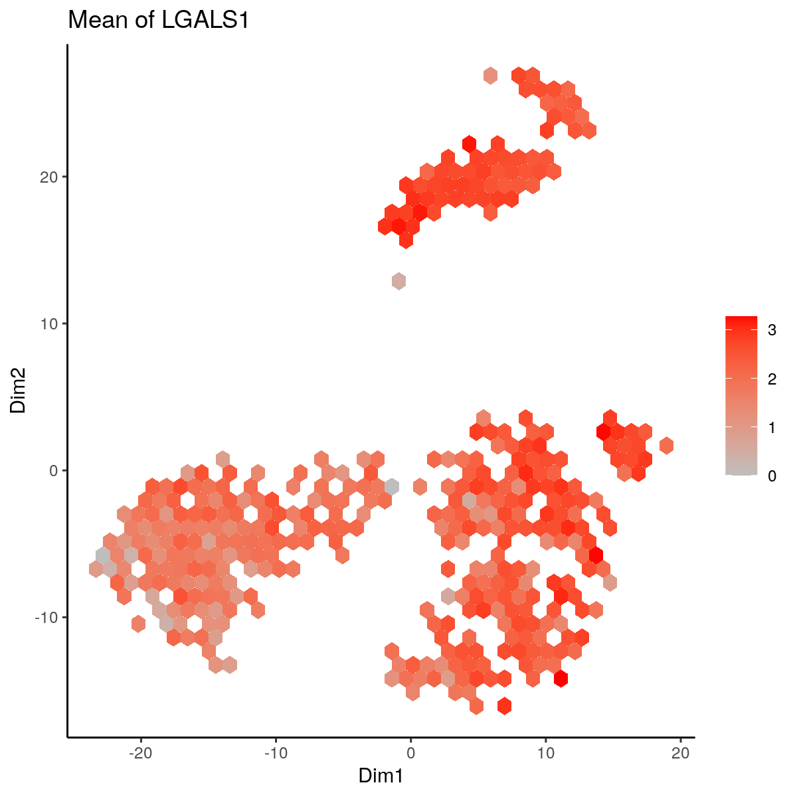|[ADAM10](https://www.ncbi.nlm.nih.gov/gene/102) [APLP2](https://www.ncbi.nlm.nih.gov/gene/334) [CD4](https://www.ncbi.nlm.nih.gov/gene/920) [CD44](https://www.ncbi.nlm.nih.gov/gene/960) [CDH2](https://www.ncbi.nlm.nih.gov/gene/1000) [GPC3](https://www.ncbi.nlm.nih.gov/gene/2719) [ITGB1](https://www.ncbi.nlm.nih.gov/gene/3688) [MELTF](https://www.ncbi.nlm.nih.gov/gene/4241) [PTPRC](https://www.ncbi.nlm.nih.gov/gene/5788) [RAB5C](https://www.ncbi.nlm.nih.gov/gene/5878) [RAC1](https://www.ncbi.nlm.nih.gov/gene/5879) [S100A6](https://www.ncbi.nlm.nih.gov/gene/6277) [TGOLN2](https://www.ncbi.nlm.nih.gov/gene/10618) [CSPG5](https://www.ncbi.nlm.nih.gov/gene/10675) [EFR3A](https://www.ncbi.nlm.nih.gov/gene/23167) [MXRA8](https://www.ncbi.nlm.nih.gov/gene/54587) [SUSD2](https://www.ncbi.nlm.nih.gov/gene/56241) [PNPLA2](https://www.ncbi.nlm.nih.gov/gene/57104) [ANO8](https://www.ncbi.nlm.nih.gov/gene/57719) [MUC16](https://www.ncbi.nlm.nih.gov/gene/94025) [GCSAM](https://www.ncbi.nlm.nih.gov/gene/257144)|
|[LGALS3](https://www.ncbi.nlm.nih.gov/gene/3958)|[ANPEP](https://www.ncbi.nlm.nih.gov/gene/290) [BSG](https://www.ncbi.nlm.nih.gov/gene/682) [CD44](https://www.ncbi.nlm.nih.gov/gene/960) [CD63](https://www.ncbi.nlm.nih.gov/gene/967) [CSPG4](https://www.ncbi.nlm.nih.gov/gene/1464) [EPHA2](https://www.ncbi.nlm.nih.gov/gene/1969) [ADGRE1](https://www.ncbi.nlm.nih.gov/gene/2015) [F2R](https://www.ncbi.nlm.nih.gov/gene/2149) [FCER2](https://www.ncbi.nlm.nih.gov/gene/2208) [FCGR2A](https://www.ncbi.nlm.nih.gov/gene/2212) [FCGR2B](https://www.ncbi.nlm.nih.gov/gene/2213) [ITGAM](https://www.ncbi.nlm.nih.gov/gene/3684) [ITGB1](https://www.ncbi.nlm.nih.gov/gene/3688) [KRAS](https://www.ncbi.nlm.nih.gov/gene/3845) [LAMP1](https://www.ncbi.nlm.nih.gov/gene/3916) [LAMP2](https://www.ncbi.nlm.nih.gov/gene/3920) [RPSA](https://www.ncbi.nlm.nih.gov/gene/3921) [MUC1](https://www.ncbi.nlm.nih.gov/gene/4582) [MUC4](https://www.ncbi.nlm.nih.gov/gene/4585) [NEO1](https://www.ncbi.nlm.nih.gov/gene/4756) [NRAS](https://www.ncbi.nlm.nih.gov/gene/4893) [ABCB1](https://www.ncbi.nlm.nih.gov/gene/5243) [PTPRC](https://www.ncbi.nlm.nih.gov/gene/5788) [RET](https://www.ncbi.nlm.nih.gov/gene/5979) [S100A6](https://www.ncbi.nlm.nih.gov/gene/6277) [SELE](https://www.ncbi.nlm.nih.gov/gene/6401) [SELL](https://www.ncbi.nlm.nih.gov/gene/6402) [SELP](https://www.ncbi.nlm.nih.gov/gene/6403) [TLR4](https://www.ncbi.nlm.nih.gov/gene/7099) [CUBN](https://www.ncbi.nlm.nih.gov/gene/8029) [FCGR2C](https://www.ncbi.nlm.nih.gov/gene/9103) [CD163](https://www.ncbi.nlm.nih.gov/gene/9332) [GPNMB](https://www.ncbi.nlm.nih.gov/gene/10457) [LYPD3](https://www.ncbi.nlm.nih.gov/gene/27076) [TRAT1](https://www.ncbi.nlm.nih.gov/gene/50852) [MUC16](https://www.ncbi.nlm.nih.gov/gene/94025) [NCR3](https://www.ncbi.nlm.nih.gov/gene/259197) [CLEC4G](https://www.ncbi.nlm.nih.gov/gene/339390) [CCR2](https://www.ncbi.nlm.nih.gov/gene/729230) [MICA](https://www.ncbi.nlm.nih.gov/gene/100507436)|
|[LGALS3BP](https://www.ncbi.nlm.nih.gov/gene/3959)|[CAPNS1](https://www.ncbi.nlm.nih.gov/gene/826) [CD9](https://www.ncbi.nlm.nih.gov/gene/928) [ITGB1](https://www.ncbi.nlm.nih.gov/gene/3688) [CD82](https://www.ncbi.nlm.nih.gov/gene/3732) [LY6E](https://www.ncbi.nlm.nih.gov/gene/4061) [SELE](https://www.ncbi.nlm.nih.gov/gene/6401)|
|[LGALS9](https://www.ncbi.nlm.nih.gov/gene/3965)|[CD86](https://www.ncbi.nlm.nih.gov/gene/942) [CD44](https://www.ncbi.nlm.nih.gov/gene/960) [CD63](https://www.ncbi.nlm.nih.gov/gene/967) [CCR1](https://www.ncbi.nlm.nih.gov/gene/1230) [FCGR2B](https://www.ncbi.nlm.nih.gov/gene/2213) [ITGAM](https://www.ncbi.nlm.nih.gov/gene/3684) [ITGB2](https://www.ncbi.nlm.nih.gov/gene/3689) [PDCD1](https://www.ncbi.nlm.nih.gov/gene/5133) [PTPRC](https://www.ncbi.nlm.nih.gov/gene/5788) [PTPRJ](https://www.ncbi.nlm.nih.gov/gene/5795) [SELE](https://www.ncbi.nlm.nih.gov/gene/6401) [SELL](https://www.ncbi.nlm.nih.gov/gene/6402) [SELP](https://www.ncbi.nlm.nih.gov/gene/6403) [TLR4](https://www.ncbi.nlm.nih.gov/gene/7099) [TYROBP](https://www.ncbi.nlm.nih.gov/gene/7305) [TNFSF10](https://www.ncbi.nlm.nih.gov/gene/8743) [TNFRSF14](https://www.ncbi.nlm.nih.gov/gene/8764) [GLP2R](https://www.ncbi.nlm.nih.gov/gene/9340) [SLC12A6](https://www.ncbi.nlm.nih.gov/gene/9990) [SEMA4A](https://www.ncbi.nlm.nih.gov/gene/64218) [PDCD1LG2](https://www.ncbi.nlm.nih.gov/gene/80380) [BTLA](https://www.ncbi.nlm.nih.gov/gene/151888) [TIGIT](https://www.ncbi.nlm.nih.gov/gene/201633)|
|[LGI1](https://www.ncbi.nlm.nih.gov/gene/9211)|[AQP4](https://www.ncbi.nlm.nih.gov/gene/361) [CACNA1A](https://www.ncbi.nlm.nih.gov/gene/773) [DLG4](https://www.ncbi.nlm.nih.gov/gene/1742) [DPP6](https://www.ncbi.nlm.nih.gov/gene/1804) [GRIA1](https://www.ncbi.nlm.nih.gov/gene/2890) [GRIN1](https://www.ncbi.nlm.nih.gov/gene/2902) [GRIN2B](https://www.ncbi.nlm.nih.gov/gene/2904) [GRM1](https://www.ncbi.nlm.nih.gov/gene/2911) [GRM5](https://www.ncbi.nlm.nih.gov/gene/2915) [KCNA1](https://www.ncbi.nlm.nih.gov/gene/3736) [KCNA2](https://www.ncbi.nlm.nih.gov/gene/3737) [KCNA4](https://www.ncbi.nlm.nih.gov/gene/3739) [KCNA5](https://www.ncbi.nlm.nih.gov/gene/3741) [KCND2](https://www.ncbi.nlm.nih.gov/gene/3751) [KCNQ2](https://www.ncbi.nlm.nih.gov/gene/3785) [KCNQ3](https://www.ncbi.nlm.nih.gov/gene/3786) [MOG](https://www.ncbi.nlm.nih.gov/gene/4340) [PDE6C](https://www.ncbi.nlm.nih.gov/gene/5146) [SCN1A](https://www.ncbi.nlm.nih.gov/gene/6323) [SCN2A](https://www.ncbi.nlm.nih.gov/gene/6326) [CNTN2](https://www.ncbi.nlm.nih.gov/gene/6900) [SNAP91](https://www.ncbi.nlm.nih.gov/gene/9892) [SLC17A3](https://www.ncbi.nlm.nih.gov/gene/10786) [CACNG4](https://www.ncbi.nlm.nih.gov/gene/27092) [ADAM22](https://www.ncbi.nlm.nih.gov/gene/53616) [PCDH19](https://www.ncbi.nlm.nih.gov/gene/57526) [KCNT1](https://www.ncbi.nlm.nih.gov/gene/57582) [DPP10](https://www.ncbi.nlm.nih.gov/gene/57628) [CACNG8](https://www.ncbi.nlm.nih.gov/gene/59283) [ADGRV1](https://www.ncbi.nlm.nih.gov/gene/84059) [DNER](https://www.ncbi.nlm.nih.gov/gene/92737) [IGSF8](https://www.ncbi.nlm.nih.gov/gene/93185) [GRIN3A](https://www.ncbi.nlm.nih.gov/gene/116443)|
|[LGI2](https://www.ncbi.nlm.nih.gov/gene/55203)|[SLC17A3](https://www.ncbi.nlm.nih.gov/gene/10786) [ADAM22](https://www.ncbi.nlm.nih.gov/gene/53616) [LINC02210-CRHR1](https://www.ncbi.nlm.nih.gov/gene/104909134)|
|[LGI3](https://www.ncbi.nlm.nih.gov/gene/203190)|[AQP4](https://www.ncbi.nlm.nih.gov/gene/361) [ATP2B3](https://www.ncbi.nlm.nih.gov/gene/492) [GRIN1](https://www.ncbi.nlm.nih.gov/gene/2902) [HTR5A](https://www.ncbi.nlm.nih.gov/gene/3361) [KCNA1](https://www.ncbi.nlm.nih.gov/gene/3736) [MAG](https://www.ncbi.nlm.nih.gov/gene/4099) [SLC6A1](https://www.ncbi.nlm.nih.gov/gene/6529) [CNTN2](https://www.ncbi.nlm.nih.gov/gene/6900) [CDK5R2](https://www.ncbi.nlm.nih.gov/gene/8941) [FLOT1](https://www.ncbi.nlm.nih.gov/gene/10211) [FAIM2](https://www.ncbi.nlm.nih.gov/gene/23017) [NTSR2](https://www.ncbi.nlm.nih.gov/gene/23620) [ADAM22](https://www.ncbi.nlm.nih.gov/gene/53616) [PCDHGC5](https://www.ncbi.nlm.nih.gov/gene/56097) [CDH22](https://www.ncbi.nlm.nih.gov/gene/64405) [ADGRV1](https://www.ncbi.nlm.nih.gov/gene/84059) [UNC5A](https://www.ncbi.nlm.nih.gov/gene/90249) [OPALIN](https://www.ncbi.nlm.nih.gov/gene/93377)|
|[LGI4](https://www.ncbi.nlm.nih.gov/gene/163175)|[FXYD1](https://www.ncbi.nlm.nih.gov/gene/5348) [PLP1](https://www.ncbi.nlm.nih.gov/gene/5354) [AKAP7](https://www.ncbi.nlm.nih.gov/gene/9465) [ADAM22](https://www.ncbi.nlm.nih.gov/gene/53616)|
|[LHB](https://www.ncbi.nlm.nih.gov/gene/3972)|[LHCGR](https://www.ncbi.nlm.nih.gov/gene/3973)|
|[LIF](https://www.ncbi.nlm.nih.gov/gene/3976)|[ALOX15B](https://www.ncbi.nlm.nih.gov/gene/247) [ALPL](https://www.ncbi.nlm.nih.gov/gene/249) [CD44](https://www.ncbi.nlm.nih.gov/gene/960) [CNTFR](https://www.ncbi.nlm.nih.gov/gene/1271) [CSF3R](https://www.ncbi.nlm.nih.gov/gene/1441) [IFNAR1](https://www.ncbi.nlm.nih.gov/gene/3454) [IFNGR1](https://www.ncbi.nlm.nih.gov/gene/3459) [IFNGR2](https://www.ncbi.nlm.nih.gov/gene/3460) [IL2RB](https://www.ncbi.nlm.nih.gov/gene/3560) [IL2RG](https://www.ncbi.nlm.nih.gov/gene/3561) [IL9R](https://www.ncbi.nlm.nih.gov/gene/3581) [IL10RA](https://www.ncbi.nlm.nih.gov/gene/3587) [MPL](https://www.ncbi.nlm.nih.gov/gene/4352) [PDGFRA](https://www.ncbi.nlm.nih.gov/gene/5156) [PDGFRB](https://www.ncbi.nlm.nih.gov/gene/5159) [PTPRC](https://www.ncbi.nlm.nih.gov/gene/5788) [PROM1](https://www.ncbi.nlm.nih.gov/gene/8842) [MRAP](https://www.ncbi.nlm.nih.gov/gene/56246) [IL23R](https://www.ncbi.nlm.nih.gov/gene/149233) [IL6ST](https://www.ncbi.nlm.nih.gov/gene/3572) [LIFR](https://www.ncbi.nlm.nih.gov/gene/3977)|
|[LIFR](https://www.ncbi.nlm.nih.gov/gene/3977)|[CNTFR](https://www.ncbi.nlm.nih.gov/gene/1271)|
|[LILRA2](https://www.ncbi.nlm.nih.gov/gene/11027)|[FCER1G](https://www.ncbi.nlm.nih.gov/gene/2207) [FCGR1A](https://www.ncbi.nlm.nih.gov/gene/2209) [FCGR2A](https://www.ncbi.nlm.nih.gov/gene/2212) [FCGR2B](https://www.ncbi.nlm.nih.gov/gene/2213) [FCGR3A](https://www.ncbi.nlm.nih.gov/gene/2214) [FCGR3B](https://www.ncbi.nlm.nih.gov/gene/2215) [HLA-A](https://www.ncbi.nlm.nih.gov/gene/3105) [HLA-F](https://www.ncbi.nlm.nih.gov/gene/3134) [SYK](https://www.ncbi.nlm.nih.gov/gene/6850) [TLR1](https://www.ncbi.nlm.nih.gov/gene/7096) [TYROBP](https://www.ncbi.nlm.nih.gov/gene/7305) [FCGR2C](https://www.ncbi.nlm.nih.gov/gene/9103) [TLR6](https://www.ncbi.nlm.nih.gov/gene/10333) [CD300C](https://www.ncbi.nlm.nih.gov/gene/10871)|
|[LILRA5](https://www.ncbi.nlm.nih.gov/gene/353514)|[FCGR1A](https://www.ncbi.nlm.nih.gov/gene/2209) [FCGR2A](https://www.ncbi.nlm.nih.gov/gene/2212) [FCGR2B](https://www.ncbi.nlm.nih.gov/gene/2213) [FCGR3A](https://www.ncbi.nlm.nih.gov/gene/2214) [FCGR3B](https://www.ncbi.nlm.nih.gov/gene/2215) [HLA-A](https://www.ncbi.nlm.nih.gov/gene/3105) [HLA-F](https://www.ncbi.nlm.nih.gov/gene/3134) [KLRD1](https://www.ncbi.nlm.nih.gov/gene/3824) [SYK](https://www.ncbi.nlm.nih.gov/gene/6850) [FCGR2C](https://www.ncbi.nlm.nih.gov/gene/9103) [CD300C](https://www.ncbi.nlm.nih.gov/gene/10871) [CD300A](https://www.ncbi.nlm.nih.gov/gene/11314) [CD300E](https://www.ncbi.nlm.nih.gov/gene/342510)|
|[LILRB1](https://www.ncbi.nlm.nih.gov/gene/10859)|[CD19](https://www.ncbi.nlm.nih.gov/gene/930) [CD22](https://www.ncbi.nlm.nih.gov/gene/933) [CD86](https://www.ncbi.nlm.nih.gov/gene/942) [CD48](https://www.ncbi.nlm.nih.gov/gene/962) [CCR7](https://www.ncbi.nlm.nih.gov/gene/1236) [CSK](https://www.ncbi.nlm.nih.gov/gene/1445) [FCGR1A](https://www.ncbi.nlm.nih.gov/gene/2209) [FCGR2A](https://www.ncbi.nlm.nih.gov/gene/2212) [FCGR2B](https://www.ncbi.nlm.nih.gov/gene/2213) [FCGR3A](https://www.ncbi.nlm.nih.gov/gene/2214) [FCGR3B](https://www.ncbi.nlm.nih.gov/gene/2215) [FGR](https://www.ncbi.nlm.nih.gov/gene/2268) [HLA-A](https://www.ncbi.nlm.nih.gov/gene/3105) [HLA-F](https://www.ncbi.nlm.nih.gov/gene/3134) [KLRD1](https://www.ncbi.nlm.nih.gov/gene/3824) [LAMP1](https://www.ncbi.nlm.nih.gov/gene/3916) [LYN](https://www.ncbi.nlm.nih.gov/gene/4067) [MAG](https://www.ncbi.nlm.nih.gov/gene/4099) [MICB](https://www.ncbi.nlm.nih.gov/gene/4277) [OMG](https://www.ncbi.nlm.nih.gov/gene/4974) [PTPRC](https://www.ncbi.nlm.nih.gov/gene/5788) [NECTIN2](https://www.ncbi.nlm.nih.gov/gene/5819) [SYK](https://www.ncbi.nlm.nih.gov/gene/6850) [TYROBP](https://www.ncbi.nlm.nih.gov/gene/7305) [FCGR2C](https://www.ncbi.nlm.nih.gov/gene/9103) [NCR2](https://www.ncbi.nlm.nih.gov/gene/9436) [CD226](https://www.ncbi.nlm.nih.gov/gene/10666) [CD300C](https://www.ncbi.nlm.nih.gov/gene/10871) [CD300A](https://www.ncbi.nlm.nih.gov/gene/11314) [RTN4R](https://www.ncbi.nlm.nih.gov/gene/65078) [ULBP3](https://www.ncbi.nlm.nih.gov/gene/79465) [ULBP2](https://www.ncbi.nlm.nih.gov/gene/80328) [ULBP1](https://www.ncbi.nlm.nih.gov/gene/80329) [SLAMF6](https://www.ncbi.nlm.nih.gov/gene/114836) [CD300LF](https://www.ncbi.nlm.nih.gov/gene/146722) [NCR3](https://www.ncbi.nlm.nih.gov/gene/259197) [RTN4RL2](https://www.ncbi.nlm.nih.gov/gene/349667) [NCR3LG1](https://www.ncbi.nlm.nih.gov/gene/374383) [MICA](https://www.ncbi.nlm.nih.gov/gene/100507436) [KLRC4-KLRK1](https://www.ncbi.nlm.nih.gov/gene/100528032)|
|[LIPC](https://www.ncbi.nlm.nih.gov/gene/3990)|[DDR1](https://www.ncbi.nlm.nih.gov/gene/780) [SCARB1](https://www.ncbi.nlm.nih.gov/gene/949) [SLC26A3](https://www.ncbi.nlm.nih.gov/gene/1811) [DSC2](https://www.ncbi.nlm.nih.gov/gene/1824) [DSC3](https://www.ncbi.nlm.nih.gov/gene/1825) [CELSR2](https://www.ncbi.nlm.nih.gov/gene/1952) [LDLR](https://www.ncbi.nlm.nih.gov/gene/3949) [LIPE](https://www.ncbi.nlm.nih.gov/gene/3991) [LPAR6](https://www.ncbi.nlm.nih.gov/gene/10161) [SLC16A8](https://www.ncbi.nlm.nih.gov/gene/23539) [LSR](https://www.ncbi.nlm.nih.gov/gene/51599) [APOBR](https://www.ncbi.nlm.nih.gov/gene/55911) [PNPLA2](https://www.ncbi.nlm.nih.gov/gene/57104) [SLC16A9](https://www.ncbi.nlm.nih.gov/gene/220963) [GPIHBP1](https://www.ncbi.nlm.nih.gov/gene/338328)|
|[LIPF](https://www.ncbi.nlm.nih.gov/gene/8513)|[LIPE](https://www.ncbi.nlm.nih.gov/gene/3991) [ADCY10](https://www.ncbi.nlm.nih.gov/gene/55811) [PNPLA2](https://www.ncbi.nlm.nih.gov/gene/57104) [PAQR7](https://www.ncbi.nlm.nih.gov/gene/164091)|
|[LIPG](https://www.ncbi.nlm.nih.gov/gene/9388)|[SCARB1](https://www.ncbi.nlm.nih.gov/gene/949) [CELSR2](https://www.ncbi.nlm.nih.gov/gene/1952) [LDLR](https://www.ncbi.nlm.nih.gov/gene/3949) [LIPE](https://www.ncbi.nlm.nih.gov/gene/3991) [LPAR6](https://www.ncbi.nlm.nih.gov/gene/10161) [LPAR3](https://www.ncbi.nlm.nih.gov/gene/23566) [PNPLA2](https://www.ncbi.nlm.nih.gov/gene/57104) [GPIHBP1](https://www.ncbi.nlm.nih.gov/gene/338328) [CDH1](https://www.ncbi.nlm.nih.gov/gene/999)|
|[LIPH](https://www.ncbi.nlm.nih.gov/gene/200879)|[DSC2](https://www.ncbi.nlm.nih.gov/gene/1824) [DSC3](https://www.ncbi.nlm.nih.gov/gene/1825) [PHKA1](https://www.ncbi.nlm.nih.gov/gene/5255) [LPAR6](https://www.ncbi.nlm.nih.gov/gene/10161) [LPAR3](https://www.ncbi.nlm.nih.gov/gene/23566) [IPCEF1](https://www.ncbi.nlm.nih.gov/gene/26034) [DSG4](https://www.ncbi.nlm.nih.gov/gene/147409)|
|[LIPK](https://www.ncbi.nlm.nih.gov/gene/643414)|[LIPE](https://www.ncbi.nlm.nih.gov/gene/3991) [FRRS1L](https://www.ncbi.nlm.nih.gov/gene/23732) [CNNM1](https://www.ncbi.nlm.nih.gov/gene/26507) [ABCC11](https://www.ncbi.nlm.nih.gov/gene/85320) [SLC16A12](https://www.ncbi.nlm.nih.gov/gene/387700)|
|[LIPM](https://www.ncbi.nlm.nih.gov/gene/340654)|[LIPE](https://www.ncbi.nlm.nih.gov/gene/3991) [GPR82](https://www.ncbi.nlm.nih.gov/gene/27197) [ABHD17A](https://www.ncbi.nlm.nih.gov/gene/81926) [SLC16A12](https://www.ncbi.nlm.nih.gov/gene/387700)|
|[LIPN](https://www.ncbi.nlm.nih.gov/gene/643418)|[CD82](https://www.ncbi.nlm.nih.gov/gene/3732) [LIPE](https://www.ncbi.nlm.nih.gov/gene/3991) [MARVELD1](https://www.ncbi.nlm.nih.gov/gene/83742) [GPR151](https://www.ncbi.nlm.nih.gov/gene/134391)|
|[LLCFC1](https://www.ncbi.nlm.nih.gov/gene/135927)|[FLOT2](https://www.ncbi.nlm.nih.gov/gene/2319)|
|[LOX](https://www.ncbi.nlm.nih.gov/gene/4015)|[ALOX15](https://www.ncbi.nlm.nih.gov/gene/246) [ALOX15B](https://www.ncbi.nlm.nih.gov/gene/247) [CD44](https://www.ncbi.nlm.nih.gov/gene/960) [CD59](https://www.ncbi.nlm.nih.gov/gene/966) [LTB4R](https://www.ncbi.nlm.nih.gov/gene/1241) [CSPG4](https://www.ncbi.nlm.nih.gov/gene/1464) [DPP6](https://www.ncbi.nlm.nih.gov/gene/1804) [ESR1](https://www.ncbi.nlm.nih.gov/gene/2099) [ITGAM](https://www.ncbi.nlm.nih.gov/gene/3684) [KRAS](https://www.ncbi.nlm.nih.gov/gene/3845) [MFAP3](https://www.ncbi.nlm.nih.gov/gene/4238) [DDR2](https://www.ncbi.nlm.nih.gov/gene/4921) [OLR1](https://www.ncbi.nlm.nih.gov/gene/4973) [PDGFRB](https://www.ncbi.nlm.nih.gov/gene/5159) [PLA2G2A](https://www.ncbi.nlm.nih.gov/gene/5320) [PTPRC](https://www.ncbi.nlm.nih.gov/gene/5788) [RAF1](https://www.ncbi.nlm.nih.gov/gene/5894) [SGCB](https://www.ncbi.nlm.nih.gov/gene/6443) [SRC](https://www.ncbi.nlm.nih.gov/gene/6714) [TEK](https://www.ncbi.nlm.nih.gov/gene/7010) [TGFBR2](https://www.ncbi.nlm.nih.gov/gene/7048) [CXCR4](https://www.ncbi.nlm.nih.gov/gene/7852) [AOC3](https://www.ncbi.nlm.nih.gov/gene/8639) [ATP6V0A2](https://www.ncbi.nlm.nih.gov/gene/23545)|
|[LOXL1](https://www.ncbi.nlm.nih.gov/gene/4016)|[AAMP](https://www.ncbi.nlm.nih.gov/gene/14) [GGT1](https://www.ncbi.nlm.nih.gov/gene/2678) [PHEX](https://www.ncbi.nlm.nih.gov/gene/5251)|
|[LOXL2](https://www.ncbi.nlm.nih.gov/gene/4017)|[CDH16](https://www.ncbi.nlm.nih.gov/gene/1014) [RPSA](https://www.ncbi.nlm.nih.gov/gene/3921) [LYPD3](https://www.ncbi.nlm.nih.gov/gene/27076)|
|[LOXL4](https://www.ncbi.nlm.nih.gov/gene/84171)|[CDH16](https://www.ncbi.nlm.nih.gov/gene/1014) [OPRD1](https://www.ncbi.nlm.nih.gov/gene/4985)|
|[LPO](https://www.ncbi.nlm.nih.gov/gene/4025)|[CACNA1A](https://www.ncbi.nlm.nih.gov/gene/773) [CYBB](https://www.ncbi.nlm.nih.gov/gene/1536)|
|[LRG1](https://www.ncbi.nlm.nih.gov/gene/116844)|[ACVRL1](https://www.ncbi.nlm.nih.gov/gene/94) [ENG](https://www.ncbi.nlm.nih.gov/gene/2022) [TGFBR1](https://www.ncbi.nlm.nih.gov/gene/7046) [TGFBR2](https://www.ncbi.nlm.nih.gov/gene/7048) [VCL](https://www.ncbi.nlm.nih.gov/gene/7414) [LY6D](https://www.ncbi.nlm.nih.gov/gene/8581) [ADGRL1](https://www.ncbi.nlm.nih.gov/gene/22859) [ADGRL3](https://www.ncbi.nlm.nih.gov/gene/23284) [STEAP4](https://www.ncbi.nlm.nih.gov/gene/79689) [GSDMD](https://www.ncbi.nlm.nih.gov/gene/79792) [OSCAR](https://www.ncbi.nlm.nih.gov/gene/126014)|
|[LRRC17](https://www.ncbi.nlm.nih.gov/gene/10234) 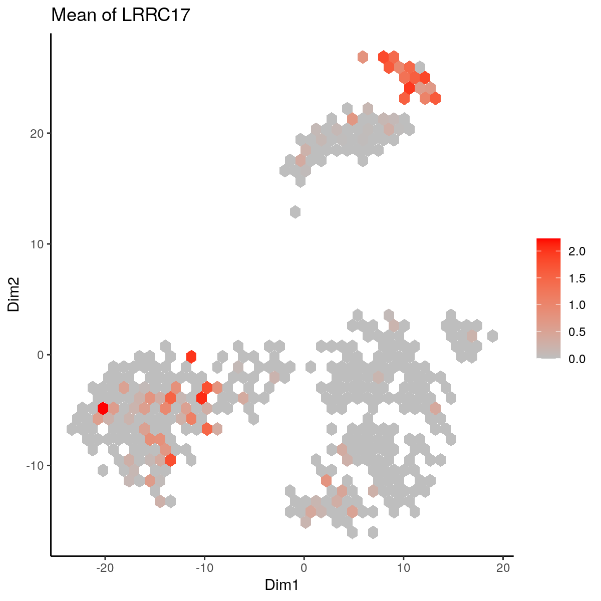|[MELK](https://www.ncbi.nlm.nih.gov/gene/9833) [ADGRL1](https://www.ncbi.nlm.nih.gov/gene/22859) [ADGRL3](https://www.ncbi.nlm.nih.gov/gene/23284) [NPTN](https://www.ncbi.nlm.nih.gov/gene/27020) [KIRREL1](https://www.ncbi.nlm.nih.gov/gene/55243) [ARHGEF39](https://www.ncbi.nlm.nih.gov/gene/84904) [RFTN2](https://www.ncbi.nlm.nih.gov/gene/130132)|
|[LTA](https://www.ncbi.nlm.nih.gov/gene/4049)|[CXCR5](https://www.ncbi.nlm.nih.gov/gene/643) [CCR7](https://www.ncbi.nlm.nih.gov/gene/1236) [CCR8](https://www.ncbi.nlm.nih.gov/gene/1237) [HLA-DRB1](https://www.ncbi.nlm.nih.gov/gene/3123) [KIR2DL1](https://www.ncbi.nlm.nih.gov/gene/3802) [KIR2DL4](https://www.ncbi.nlm.nih.gov/gene/3805) [KIR3DL1](https://www.ncbi.nlm.nih.gov/gene/3811) [KIR3DL2](https://www.ncbi.nlm.nih.gov/gene/3812) [MICB](https://www.ncbi.nlm.nih.gov/gene/4277) [PTPRC](https://www.ncbi.nlm.nih.gov/gene/5788) [SELL](https://www.ncbi.nlm.nih.gov/gene/6402) [TLR4](https://www.ncbi.nlm.nih.gov/gene/7099) [MARCO](https://www.ncbi.nlm.nih.gov/gene/8685) [RIPK1](https://www.ncbi.nlm.nih.gov/gene/8737) [TNFRSF14](https://www.ncbi.nlm.nih.gov/gene/8764) [TNFRSF11A](https://www.ncbi.nlm.nih.gov/gene/8792) [ULBP3](https://www.ncbi.nlm.nih.gov/gene/79465) [ULBP2](https://www.ncbi.nlm.nih.gov/gene/80328) [ULBP1](https://www.ncbi.nlm.nih.gov/gene/80329) [NCR3](https://www.ncbi.nlm.nih.gov/gene/259197) [MICA](https://www.ncbi.nlm.nih.gov/gene/100507436) [KLRC4-KLRK1](https://www.ncbi.nlm.nih.gov/gene/100528032) [TNFRSF1A](https://www.ncbi.nlm.nih.gov/gene/7132) [TNFRSF1B](https://www.ncbi.nlm.nih.gov/gene/7133) [LTBR](https://www.ncbi.nlm.nih.gov/gene/4055)|
|[LTB](https://www.ncbi.nlm.nih.gov/gene/4050)|[LTBR](https://www.ncbi.nlm.nih.gov/gene/4055)|
|[LTBP1](https://www.ncbi.nlm.nih.gov/gene/4052)|[ADAM10](https://www.ncbi.nlm.nih.gov/gene/102) [ADORA1](https://www.ncbi.nlm.nih.gov/gene/134) [ADORA2A](https://www.ncbi.nlm.nih.gov/gene/135) [ADORA2B](https://www.ncbi.nlm.nih.gov/gene/136) [APLP2](https://www.ncbi.nlm.nih.gov/gene/334) [CDH2](https://www.ncbi.nlm.nih.gov/gene/1000) [GPC3](https://www.ncbi.nlm.nih.gov/gene/2719) [MELTF](https://www.ncbi.nlm.nih.gov/gene/4241) [TGFBR1](https://www.ncbi.nlm.nih.gov/gene/7046) [TGOLN2](https://www.ncbi.nlm.nih.gov/gene/10618) [MXRA8](https://www.ncbi.nlm.nih.gov/gene/54587) [PNPLA2](https://www.ncbi.nlm.nih.gov/gene/57104) [ANO8](https://www.ncbi.nlm.nih.gov/gene/57719) [TMPRSS6](https://www.ncbi.nlm.nih.gov/gene/164656)|
|[LTBP2](https://www.ncbi.nlm.nih.gov/gene/4053)|[ADORA1](https://www.ncbi.nlm.nih.gov/gene/134) [ADORA2A](https://www.ncbi.nlm.nih.gov/gene/135) [ADORA2B](https://www.ncbi.nlm.nih.gov/gene/136) [PHEX](https://www.ncbi.nlm.nih.gov/gene/5251) [GPNMB](https://www.ncbi.nlm.nih.gov/gene/10457) [MXRA8](https://www.ncbi.nlm.nih.gov/gene/54587) [TMPRSS6](https://www.ncbi.nlm.nih.gov/gene/164656)|
|[LTBP3](https://www.ncbi.nlm.nih.gov/gene/4054)|[ADORA1](https://www.ncbi.nlm.nih.gov/gene/134) [ADORA2A](https://www.ncbi.nlm.nih.gov/gene/135) [ADORA2B](https://www.ncbi.nlm.nih.gov/gene/136) [CDH2](https://www.ncbi.nlm.nih.gov/gene/1000) [CDH4](https://www.ncbi.nlm.nih.gov/gene/1002) [CDH17](https://www.ncbi.nlm.nih.gov/gene/1015) [PHEX](https://www.ncbi.nlm.nih.gov/gene/5251) [MXRA8](https://www.ncbi.nlm.nih.gov/gene/54587)|
|[LTBP4](https://www.ncbi.nlm.nih.gov/gene/8425)|[DMD](https://www.ncbi.nlm.nih.gov/gene/1756) [SGCG](https://www.ncbi.nlm.nih.gov/gene/6445) [TGFBR2](https://www.ncbi.nlm.nih.gov/gene/7048)|
|[LUM](https://www.ncbi.nlm.nih.gov/gene/4060) |[CD44](https://www.ncbi.nlm.nih.gov/gene/960) [CDH11](https://www.ncbi.nlm.nih.gov/gene/1009) [GPC3](https://www.ncbi.nlm.nih.gov/gene/2719) [GPR37](https://www.ncbi.nlm.nih.gov/gene/2861) [HTR5A](https://www.ncbi.nlm.nih.gov/gene/3361) [ITGB1](https://www.ncbi.nlm.nih.gov/gene/3688) [OMG](https://www.ncbi.nlm.nih.gov/gene/4974) [PDGFRA](https://www.ncbi.nlm.nih.gov/gene/5156) [PDGFRB](https://www.ncbi.nlm.nih.gov/gene/5159) [TGFBR1](https://www.ncbi.nlm.nih.gov/gene/7046) [ADGRL1](https://www.ncbi.nlm.nih.gov/gene/22859) [ADGRL3](https://www.ncbi.nlm.nih.gov/gene/23284) [LMBR1L](https://www.ncbi.nlm.nih.gov/gene/55716) [GRIN3A](https://www.ncbi.nlm.nih.gov/gene/116443) [GRIN3B](https://www.ncbi.nlm.nih.gov/gene/116444)|
|[LUZP2](https://www.ncbi.nlm.nih.gov/gene/338645)|[CDH22](https://www.ncbi.nlm.nih.gov/gene/64405)|
|[LY6G5B](https://www.ncbi.nlm.nih.gov/gene/58496)|[PKHD1](https://www.ncbi.nlm.nih.gov/gene/5314) [LY6G6D](https://www.ncbi.nlm.nih.gov/gene/58530) [LY6G6C](https://www.ncbi.nlm.nih.gov/gene/80740) [SPACA4](https://www.ncbi.nlm.nih.gov/gene/171169) [NCR3](https://www.ncbi.nlm.nih.gov/gene/259197) [LY6G6F](https://www.ncbi.nlm.nih.gov/gene/259215) [LYPD5](https://www.ncbi.nlm.nih.gov/gene/284348)|
|[LY6G5C](https://www.ncbi.nlm.nih.gov/gene/80741)|[PKHD1](https://www.ncbi.nlm.nih.gov/gene/5314) [ADGRG2](https://www.ncbi.nlm.nih.gov/gene/10149) [OR7C2](https://www.ncbi.nlm.nih.gov/gene/26658) [LY6G6D](https://www.ncbi.nlm.nih.gov/gene/58530) [LY6G6C](https://www.ncbi.nlm.nih.gov/gene/80740) [PRRT1](https://www.ncbi.nlm.nih.gov/gene/80863) [SPACA4](https://www.ncbi.nlm.nih.gov/gene/171169) [LY6G6F](https://www.ncbi.nlm.nih.gov/gene/259215) [LYPD5](https://www.ncbi.nlm.nih.gov/gene/284348) [OR5C1](https://www.ncbi.nlm.nih.gov/gene/392391)|
|[LY6K](https://www.ncbi.nlm.nih.gov/gene/54742)|[ADCY9](https://www.ncbi.nlm.nih.gov/gene/115) [ALPI](https://www.ncbi.nlm.nih.gov/gene/248) [ALPL](https://www.ncbi.nlm.nih.gov/gene/249) [ALPG](https://www.ncbi.nlm.nih.gov/gene/251) [ART3](https://www.ncbi.nlm.nih.gov/gene/419) [ART4](https://www.ncbi.nlm.nih.gov/gene/420) [BST1](https://www.ncbi.nlm.nih.gov/gene/683) [CD52](https://www.ncbi.nlm.nih.gov/gene/1043) [CEACAM5](https://www.ncbi.nlm.nih.gov/gene/1048) [CEACAM7](https://www.ncbi.nlm.nih.gov/gene/1087) [CPM](https://www.ncbi.nlm.nih.gov/gene/1368) [FCGR3B](https://www.ncbi.nlm.nih.gov/gene/2215) [FOLR2](https://www.ncbi.nlm.nih.gov/gene/2350) [GP2](https://www.ncbi.nlm.nih.gov/gene/2813) [LSAMP](https://www.ncbi.nlm.nih.gov/gene/4045) [LY6E](https://www.ncbi.nlm.nih.gov/gene/4061) [LY6H](https://www.ncbi.nlm.nih.gov/gene/4062) [MELTF](https://www.ncbi.nlm.nih.gov/gene/4241) [OPCML](https://www.ncbi.nlm.nih.gov/gene/4978) [CNTN3](https://www.ncbi.nlm.nih.gov/gene/5067) [TECTB](https://www.ncbi.nlm.nih.gov/gene/6975) [TECTA](https://www.ncbi.nlm.nih.gov/gene/7007) [THY1](https://www.ncbi.nlm.nih.gov/gene/7070) [XPNPEP2](https://www.ncbi.nlm.nih.gov/gene/7512) [PSCA](https://www.ncbi.nlm.nih.gov/gene/8000) [RECK](https://www.ncbi.nlm.nih.gov/gene/8434) [LY6D](https://www.ncbi.nlm.nih.gov/gene/8581) [VNN2](https://www.ncbi.nlm.nih.gov/gene/8875) [VNN1](https://www.ncbi.nlm.nih.gov/gene/8876) [PRSS21](https://www.ncbi.nlm.nih.gov/gene/10942) [NTNG1](https://www.ncbi.nlm.nih.gov/gene/22854) [PRND](https://www.ncbi.nlm.nih.gov/gene/23627) [LYPD3](https://www.ncbi.nlm.nih.gov/gene/27076) [NTM](https://www.ncbi.nlm.nih.gov/gene/50863) [NRN1](https://www.ncbi.nlm.nih.gov/gene/51299) [CNTN5](https://www.ncbi.nlm.nih.gov/gene/53942) [LY6G6D](https://www.ncbi.nlm.nih.gov/gene/58530) [ULBP2](https://www.ncbi.nlm.nih.gov/gene/80328) [LY6G6C](https://www.ncbi.nlm.nih.gov/gene/80740) [TEX101](https://www.ncbi.nlm.nih.gov/gene/83639) [NTNG2](https://www.ncbi.nlm.nih.gov/gene/84628) [LYPD1](https://www.ncbi.nlm.nih.gov/gene/116372) [NRN1L](https://www.ncbi.nlm.nih.gov/gene/123904) [LYPD6B](https://www.ncbi.nlm.nih.gov/gene/130576) [CD109](https://www.ncbi.nlm.nih.gov/gene/135228) [LYPD2](https://www.ncbi.nlm.nih.gov/gene/137797) [OTOA](https://www.ncbi.nlm.nih.gov/gene/146183) [RTN4RL1](https://www.ncbi.nlm.nih.gov/gene/146760) [LYPD4](https://www.ncbi.nlm.nih.gov/gene/147719) [CNTN4](https://www.ncbi.nlm.nih.gov/gene/152330) [RAET1L](https://www.ncbi.nlm.nih.gov/gene/154064) [MDGA2](https://www.ncbi.nlm.nih.gov/gene/161357) [SPACA4](https://www.ncbi.nlm.nih.gov/gene/171169) [NEGR1](https://www.ncbi.nlm.nih.gov/gene/257194) [MDGA1](https://www.ncbi.nlm.nih.gov/gene/266727) [LYPD5](https://www.ncbi.nlm.nih.gov/gene/284348) [GPIHBP1](https://www.ncbi.nlm.nih.gov/gene/338328) [PLET1](https://www.ncbi.nlm.nih.gov/gene/349633) [RTN4RL2](https://www.ncbi.nlm.nih.gov/gene/349667) [IZUMO1R](https://www.ncbi.nlm.nih.gov/gene/390243) [SPRN](https://www.ncbi.nlm.nih.gov/gene/503542) [LYPD8](https://www.ncbi.nlm.nih.gov/gene/646627) [LYNX1-SLURP2](https://www.ncbi.nlm.nih.gov/gene/111188157)|
|[LY86](https://www.ncbi.nlm.nih.gov/gene/9450)|[BTK](https://www.ncbi.nlm.nih.gov/gene/695) [C3AR1](https://www.ncbi.nlm.nih.gov/gene/719) [CD1C](https://www.ncbi.nlm.nih.gov/gene/911) [CD4](https://www.ncbi.nlm.nih.gov/gene/920) [CD14](https://www.ncbi.nlm.nih.gov/gene/929) [CD86](https://www.ncbi.nlm.nih.gov/gene/942) [CD48](https://www.ncbi.nlm.nih.gov/gene/962) [CD53](https://www.ncbi.nlm.nih.gov/gene/963) [CD74](https://www.ncbi.nlm.nih.gov/gene/972) [CD52](https://www.ncbi.nlm.nih.gov/gene/1043) [CCR1](https://www.ncbi.nlm.nih.gov/gene/1230) [CCR5](https://www.ncbi.nlm.nih.gov/gene/1234) [CSF1R](https://www.ncbi.nlm.nih.gov/gene/1436) [CSF3R](https://www.ncbi.nlm.nih.gov/gene/1441) [CYBB](https://www.ncbi.nlm.nih.gov/gene/1536) [GPR183](https://www.ncbi.nlm.nih.gov/gene/1880) [ADGRE1](https://www.ncbi.nlm.nih.gov/gene/2015) [FCER1G](https://www.ncbi.nlm.nih.gov/gene/2207) [FCER2](https://www.ncbi.nlm.nih.gov/gene/2208) [FCGR1A](https://www.ncbi.nlm.nih.gov/gene/2209) [FCGR1B](https://www.ncbi.nlm.nih.gov/gene/2210) [FCGR2A](https://www.ncbi.nlm.nih.gov/gene/2212) [FCGR2B](https://www.ncbi.nlm.nih.gov/gene/2213) [FCGR3A](https://www.ncbi.nlm.nih.gov/gene/2214) [FCGR3B](https://www.ncbi.nlm.nih.gov/gene/2215) [FGR](https://www.ncbi.nlm.nih.gov/gene/2268) [GPR34](https://www.ncbi.nlm.nih.gov/gene/2857) [NCKAP1L](https://www.ncbi.nlm.nih.gov/gene/3071) [HLA-DRA](https://www.ncbi.nlm.nih.gov/gene/3122) [HLA-DRB1](https://www.ncbi.nlm.nih.gov/gene/3123) [IL10RA](https://www.ncbi.nlm.nih.gov/gene/3587) [ITGAM](https://www.ncbi.nlm.nih.gov/gene/3684) [ITGB2](https://www.ncbi.nlm.nih.gov/gene/3689) [CD180](https://www.ncbi.nlm.nih.gov/gene/4064) [P2RY2](https://www.ncbi.nlm.nih.gov/gene/5029) [PTPRC](https://www.ncbi.nlm.nih.gov/gene/5788) [TLR1](https://www.ncbi.nlm.nih.gov/gene/7096) [TLR4](https://www.ncbi.nlm.nih.gov/gene/7099) [TLR5](https://www.ncbi.nlm.nih.gov/gene/7100) [TYROBP](https://www.ncbi.nlm.nih.gov/gene/7305) [SSPN](https://www.ncbi.nlm.nih.gov/gene/8082) [FCGR2C](https://www.ncbi.nlm.nih.gov/gene/9103) [TLR6](https://www.ncbi.nlm.nih.gov/gene/10333) [CD300A](https://www.ncbi.nlm.nih.gov/gene/11314) [CLEC5A](https://www.ncbi.nlm.nih.gov/gene/23601) [PARVG](https://www.ncbi.nlm.nih.gov/gene/64098) [CD300LB](https://www.ncbi.nlm.nih.gov/gene/124599) [CD300LF](https://www.ncbi.nlm.nih.gov/gene/146722) [NRROS](https://www.ncbi.nlm.nih.gov/gene/375387)|
|[LY96](https://www.ncbi.nlm.nih.gov/gene/23643)|[RHOA](https://www.ncbi.nlm.nih.gov/gene/387) [C5AR1](https://www.ncbi.nlm.nih.gov/gene/728) [CD14](https://www.ncbi.nlm.nih.gov/gene/929) [CD86](https://www.ncbi.nlm.nih.gov/gene/942) [ITGAM](https://www.ncbi.nlm.nih.gov/gene/3684) [CD180](https://www.ncbi.nlm.nih.gov/gene/4064) [MSN](https://www.ncbi.nlm.nih.gov/gene/4478) [TLR1](https://www.ncbi.nlm.nih.gov/gene/7096) [TLR4](https://www.ncbi.nlm.nih.gov/gene/7099) [TLR5](https://www.ncbi.nlm.nih.gov/gene/7100) [UBE2D3](https://www.ncbi.nlm.nih.gov/gene/7323) [RIPK1](https://www.ncbi.nlm.nih.gov/gene/8737) [TLR6](https://www.ncbi.nlm.nih.gov/gene/10333) [NOD1](https://www.ncbi.nlm.nih.gov/gene/10392)|
|[LYG1](https://www.ncbi.nlm.nih.gov/gene/129530)|[OR1D2](https://www.ncbi.nlm.nih.gov/gene/4991)|
|[LYG2](https://www.ncbi.nlm.nih.gov/gene/254773)|[ADRA2B](https://www.ncbi.nlm.nih.gov/gene/151)|
|[LYPD6](https://www.ncbi.nlm.nih.gov/gene/130574)|[GPR183](https://www.ncbi.nlm.nih.gov/gene/1880) [GML](https://www.ncbi.nlm.nih.gov/gene/2765) [LY6E](https://www.ncbi.nlm.nih.gov/gene/4061) [LY6H](https://www.ncbi.nlm.nih.gov/gene/4062) [LYPD1](https://www.ncbi.nlm.nih.gov/gene/116372) [LYPD2](https://www.ncbi.nlm.nih.gov/gene/137797) [SPACA4](https://www.ncbi.nlm.nih.gov/gene/171169) [LYPD5](https://www.ncbi.nlm.nih.gov/gene/284348) [GPIHBP1](https://www.ncbi.nlm.nih.gov/gene/338328) [LYNX1-SLURP2](https://www.ncbi.nlm.nih.gov/gene/111188157)|
|[LYZ](https://www.ncbi.nlm.nih.gov/gene/4069)|[ALPL](https://www.ncbi.nlm.nih.gov/gene/249) [CD86](https://www.ncbi.nlm.nih.gov/gene/942) [CD53](https://www.ncbi.nlm.nih.gov/gene/963) [CPM](https://www.ncbi.nlm.nih.gov/gene/1368) [CSF1R](https://www.ncbi.nlm.nih.gov/gene/1436) [CYBB](https://www.ncbi.nlm.nih.gov/gene/1536) [ACE](https://www.ncbi.nlm.nih.gov/gene/1636) [ADGRE1](https://www.ncbi.nlm.nih.gov/gene/2015) [ITGAM](https://www.ncbi.nlm.nih.gov/gene/3684) [PTPN4](https://www.ncbi.nlm.nih.gov/gene/5775) [PTPRC](https://www.ncbi.nlm.nih.gov/gene/5788) [TYROBP](https://www.ncbi.nlm.nih.gov/gene/7305) [VCL](https://www.ncbi.nlm.nih.gov/gene/7414) [CAP1](https://www.ncbi.nlm.nih.gov/gene/10487) [GSDMD](https://www.ncbi.nlm.nih.gov/gene/79792) [OSCAR](https://www.ncbi.nlm.nih.gov/gene/126014) [CCR2](https://www.ncbi.nlm.nih.gov/gene/729230)|
|[LYZL1](https://www.ncbi.nlm.nih.gov/gene/84569)|[SVIL](https://www.ncbi.nlm.nih.gov/gene/6840) [ASTL](https://www.ncbi.nlm.nih.gov/gene/431705)|
|[LYZL2](https://www.ncbi.nlm.nih.gov/gene/119180)|[AJAP1](https://www.ncbi.nlm.nih.gov/gene/55966) [ASTL](https://www.ncbi.nlm.nih.gov/gene/431705)|
|[LYZL4](https://www.ncbi.nlm.nih.gov/gene/131375)|[CPM](https://www.ncbi.nlm.nih.gov/gene/1368) [ASTL](https://www.ncbi.nlm.nih.gov/gene/431705)|
|[LYZL6](https://www.ncbi.nlm.nih.gov/gene/57151)|[CPM](https://www.ncbi.nlm.nih.gov/gene/1368) [SPACA4](https://www.ncbi.nlm.nih.gov/gene/171169) [ASTL](https://www.ncbi.nlm.nih.gov/gene/431705)|
|[MAMDC2](https://www.ncbi.nlm.nih.gov/gene/256691)|[KCNB2](https://www.ncbi.nlm.nih.gov/gene/9312)|
|[MANF](https://www.ncbi.nlm.nih.gov/gene/7873)|[ACHE](https://www.ncbi.nlm.nih.gov/gene/43) [ACVR1B](https://www.ncbi.nlm.nih.gov/gene/91) [GAP43](https://www.ncbi.nlm.nih.gov/gene/2596) [HTRA1](https://www.ncbi.nlm.nih.gov/gene/5654) [HM13](https://www.ncbi.nlm.nih.gov/gene/81502) [MAGT1](https://www.ncbi.nlm.nih.gov/gene/84061)|
|[MASP1](https://www.ncbi.nlm.nih.gov/gene/5648)|[BDKRB1](https://www.ncbi.nlm.nih.gov/gene/623) [C3AR1](https://www.ncbi.nlm.nih.gov/gene/719) [C5AR1](https://www.ncbi.nlm.nih.gov/gene/728) [C8A](https://www.ncbi.nlm.nih.gov/gene/731) [CD59](https://www.ncbi.nlm.nih.gov/gene/966) [CD55](https://www.ncbi.nlm.nih.gov/gene/1604) [F2R](https://www.ncbi.nlm.nih.gov/gene/2149) [KIR3DL1](https://www.ncbi.nlm.nih.gov/gene/3811) [SKAP1](https://www.ncbi.nlm.nih.gov/gene/8631) [OR13C8](https://www.ncbi.nlm.nih.gov/gene/138802)|
|[MASP2](https://www.ncbi.nlm.nih.gov/gene/10747)|[C3AR1](https://www.ncbi.nlm.nih.gov/gene/719) [C5AR1](https://www.ncbi.nlm.nih.gov/gene/728) [C8A](https://www.ncbi.nlm.nih.gov/gene/731) [CD59](https://www.ncbi.nlm.nih.gov/gene/966) [CD55](https://www.ncbi.nlm.nih.gov/gene/1604) [KIR3DL1](https://www.ncbi.nlm.nih.gov/gene/3811) [C5AR2](https://www.ncbi.nlm.nih.gov/gene/27202)|
|[MATN1](https://www.ncbi.nlm.nih.gov/gene/4146)|[IHH](https://www.ncbi.nlm.nih.gov/gene/3549) [PRKG2](https://www.ncbi.nlm.nih.gov/gene/5593)|
|[MATN3](https://www.ncbi.nlm.nih.gov/gene/4148)|[ADAM10](https://www.ncbi.nlm.nih.gov/gene/102) [APLP2](https://www.ncbi.nlm.nih.gov/gene/334) [CDH2](https://www.ncbi.nlm.nih.gov/gene/1000) [SLC26A2](https://www.ncbi.nlm.nih.gov/gene/1836) [GPC3](https://www.ncbi.nlm.nih.gov/gene/2719) [ITGB1](https://www.ncbi.nlm.nih.gov/gene/3688) [MELTF](https://www.ncbi.nlm.nih.gov/gene/4241) [STK10](https://www.ncbi.nlm.nih.gov/gene/6793) [TGOLN2](https://www.ncbi.nlm.nih.gov/gene/10618) [MXRA8](https://www.ncbi.nlm.nih.gov/gene/54587) [PNPLA2](https://www.ncbi.nlm.nih.gov/gene/57104) [ANO8](https://www.ncbi.nlm.nih.gov/gene/57719)|
|[MATN4](https://www.ncbi.nlm.nih.gov/gene/8785)|[EFR3B](https://www.ncbi.nlm.nih.gov/gene/22979)|
|[MBL2](https://www.ncbi.nlm.nih.gov/gene/4153)|[C3AR1](https://www.ncbi.nlm.nih.gov/gene/719) [C5AR1](https://www.ncbi.nlm.nih.gov/gene/728) [C8A](https://www.ncbi.nlm.nih.gov/gene/731) [CD59](https://www.ncbi.nlm.nih.gov/gene/966) [AP2M1](https://www.ncbi.nlm.nih.gov/gene/1173) [CD55](https://www.ncbi.nlm.nih.gov/gene/1604) [KRT1](https://www.ncbi.nlm.nih.gov/gene/3848) [PTPRC](https://www.ncbi.nlm.nih.gov/gene/5788) [TLR1](https://www.ncbi.nlm.nih.gov/gene/7096) [TLR4](https://www.ncbi.nlm.nih.gov/gene/7099) [TLR5](https://www.ncbi.nlm.nih.gov/gene/7100) [TLR6](https://www.ncbi.nlm.nih.gov/gene/10333) [C5AR2](https://www.ncbi.nlm.nih.gov/gene/27202) [TMPRSS6](https://www.ncbi.nlm.nih.gov/gene/164656)|
|[MDK](https://www.ncbi.nlm.nih.gov/gene/4192)|[ALK](https://www.ncbi.nlm.nih.gov/gene/238) [ACE](https://www.ncbi.nlm.nih.gov/gene/1636) [GJA1](https://www.ncbi.nlm.nih.gov/gene/2697) [GPC3](https://www.ncbi.nlm.nih.gov/gene/2719) [ITGA6](https://www.ncbi.nlm.nih.gov/gene/3655) [ITGB1](https://www.ncbi.nlm.nih.gov/gene/3688) [KRAS](https://www.ncbi.nlm.nih.gov/gene/3845) [NRAS](https://www.ncbi.nlm.nih.gov/gene/4893) [NTRK2](https://www.ncbi.nlm.nih.gov/gene/4915) [PLSCR1](https://www.ncbi.nlm.nih.gov/gene/5359) [RAF1](https://www.ncbi.nlm.nih.gov/gene/5894) [ROBO1](https://www.ncbi.nlm.nih.gov/gene/6091) [SRC](https://www.ncbi.nlm.nih.gov/gene/6714) [CXCR4](https://www.ncbi.nlm.nih.gov/gene/7852) [SDC3](https://www.ncbi.nlm.nih.gov/gene/9672) [CHIC2](https://www.ncbi.nlm.nih.gov/gene/26511) [PTPRB](https://www.ncbi.nlm.nih.gov/gene/5787) [PTPRZ1](https://www.ncbi.nlm.nih.gov/gene/5803)|
|[MEGF6](https://www.ncbi.nlm.nih.gov/gene/1953)|[CD3D](https://www.ncbi.nlm.nih.gov/gene/915) [CELSR2](https://www.ncbi.nlm.nih.gov/gene/1952) [PLCH2](https://www.ncbi.nlm.nih.gov/gene/9651) [CSPG5](https://www.ncbi.nlm.nih.gov/gene/10675) [FRAS1](https://www.ncbi.nlm.nih.gov/gene/80144) [ARHGEF25](https://www.ncbi.nlm.nih.gov/gene/115557)|
|[MEPE](https://www.ncbi.nlm.nih.gov/gene/56955)|[ADAM10](https://www.ncbi.nlm.nih.gov/gene/102) [ALPL](https://www.ncbi.nlm.nih.gov/gene/249) [APLP2](https://www.ncbi.nlm.nih.gov/gene/334) [CD63](https://www.ncbi.nlm.nih.gov/gene/967) [CDH2](https://www.ncbi.nlm.nih.gov/gene/1000) [GPC3](https://www.ncbi.nlm.nih.gov/gene/2719) [MELTF](https://www.ncbi.nlm.nih.gov/gene/4241) [PHEX](https://www.ncbi.nlm.nih.gov/gene/5251) [SPTBN1](https://www.ncbi.nlm.nih.gov/gene/6711) [TGOLN2](https://www.ncbi.nlm.nih.gov/gene/10618) [MXRA8](https://www.ncbi.nlm.nih.gov/gene/54587) [PNPLA2](https://www.ncbi.nlm.nih.gov/gene/57104) [ANO8](https://www.ncbi.nlm.nih.gov/gene/57719)|
|[MET](https://www.ncbi.nlm.nih.gov/gene/4233)|[AQP3](https://www.ncbi.nlm.nih.gov/gene/360) [RHOA](https://www.ncbi.nlm.nih.gov/gene/387) [RHOC](https://www.ncbi.nlm.nih.gov/gene/389) [CBL](https://www.ncbi.nlm.nih.gov/gene/867) [CD44](https://www.ncbi.nlm.nih.gov/gene/960) [CD74](https://www.ncbi.nlm.nih.gov/gene/972) [CDC42](https://www.ncbi.nlm.nih.gov/gene/998) [CDH2](https://www.ncbi.nlm.nih.gov/gene/1000) [CDH15](https://www.ncbi.nlm.nih.gov/gene/1013) [CDH17](https://www.ncbi.nlm.nih.gov/gene/1015) [CRK](https://www.ncbi.nlm.nih.gov/gene/1398) [CTNNA1](https://www.ncbi.nlm.nih.gov/gene/1495) [DSG1](https://www.ncbi.nlm.nih.gov/gene/1828) [EFNA2](https://www.ncbi.nlm.nih.gov/gene/1943) [EFNA3](https://www.ncbi.nlm.nih.gov/gene/1944) [EFNA5](https://www.ncbi.nlm.nih.gov/gene/1946) [EPHA2](https://www.ncbi.nlm.nih.gov/gene/1969) [EREG](https://www.ncbi.nlm.nih.gov/gene/2069) [ESR1](https://www.ncbi.nlm.nih.gov/gene/2099) [FCGR1B](https://www.ncbi.nlm.nih.gov/gene/2210) [INSR](https://www.ncbi.nlm.nih.gov/gene/3643) [ITGA6](https://www.ncbi.nlm.nih.gov/gene/3655) [ITGA3](https://www.ncbi.nlm.nih.gov/gene/3675) [ITGB1](https://www.ncbi.nlm.nih.gov/gene/3688) [ITGB4](https://www.ncbi.nlm.nih.gov/gene/3691) [CD82](https://www.ncbi.nlm.nih.gov/gene/3732) [KRAS](https://www.ncbi.nlm.nih.gov/gene/3845) [EPCAM](https://www.ncbi.nlm.nih.gov/gene/4072) [MUC1](https://www.ncbi.nlm.nih.gov/gene/4582) [NRAS](https://www.ncbi.nlm.nih.gov/gene/4893) [PLXNB3](https://www.ncbi.nlm.nih.gov/gene/5365) [PRNP](https://www.ncbi.nlm.nih.gov/gene/5621) [PTPRC](https://www.ncbi.nlm.nih.gov/gene/5788) [PTPRJ](https://www.ncbi.nlm.nih.gov/gene/5795) [RAB5A](https://www.ncbi.nlm.nih.gov/gene/5868) [RAC1](https://www.ncbi.nlm.nih.gov/gene/5879) [RAP1A](https://www.ncbi.nlm.nih.gov/gene/5906) [RAP1B](https://www.ncbi.nlm.nih.gov/gene/5908) [RRAS](https://www.ncbi.nlm.nih.gov/gene/6237) [SLC2A1](https://www.ncbi.nlm.nih.gov/gene/6513) [SRC](https://www.ncbi.nlm.nih.gov/gene/6714) [EZR](https://www.ncbi.nlm.nih.gov/gene/7430) [CXCR4](https://www.ncbi.nlm.nih.gov/gene/7852) [PIP5K1A](https://www.ncbi.nlm.nih.gov/gene/8394) [SEMA7A](https://www.ncbi.nlm.nih.gov/gene/8482) [PROM1](https://www.ncbi.nlm.nih.gov/gene/8842) [ABCG2](https://www.ncbi.nlm.nih.gov/gene/9429) [SEMA6C](https://www.ncbi.nlm.nih.gov/gene/10500) [SEMA6B](https://www.ncbi.nlm.nih.gov/gene/10501) [SEMA4F](https://www.ncbi.nlm.nih.gov/gene/10505) [SEMA4D](https://www.ncbi.nlm.nih.gov/gene/10507) [SHANK2](https://www.ncbi.nlm.nih.gov/gene/22941) [SLC39A14](https://www.ncbi.nlm.nih.gov/gene/23516) [PLXNB2](https://www.ncbi.nlm.nih.gov/gene/23654) [LRIG1](https://www.ncbi.nlm.nih.gov/gene/26018) [RND1](https://www.ncbi.nlm.nih.gov/gene/27289) [RHOD](https://www.ncbi.nlm.nih.gov/gene/29984) [RAB4B](https://www.ncbi.nlm.nih.gov/gene/53916) [NLGN3](https://www.ncbi.nlm.nih.gov/gene/54413) [GNG12](https://www.ncbi.nlm.nih.gov/gene/55970) [NLGN4X](https://www.ncbi.nlm.nih.gov/gene/57502) [SEMA6A](https://www.ncbi.nlm.nih.gov/gene/57556) [SEMA4G](https://www.ncbi.nlm.nih.gov/gene/57715) [SEMA4A](https://www.ncbi.nlm.nih.gov/gene/64218) [PTCHD1](https://www.ncbi.nlm.nih.gov/gene/139411) [MUC20](https://www.ncbi.nlm.nih.gov/gene/200958) [CLEC2A](https://www.ncbi.nlm.nih.gov/gene/387836) [CD24](https://www.ncbi.nlm.nih.gov/gene/100133941)|
|[METRN](https://www.ncbi.nlm.nih.gov/gene/79006)|[RAB40B](https://www.ncbi.nlm.nih.gov/gene/10966) [SYTL1](https://www.ncbi.nlm.nih.gov/gene/84958) [KCNG3](https://www.ncbi.nlm.nih.gov/gene/170850)|
|[METRNL](https://www.ncbi.nlm.nih.gov/gene/284207)|[GNAS](https://www.ncbi.nlm.nih.gov/gene/2778) [LIPE](https://www.ncbi.nlm.nih.gov/gene/3991) [TECTA](https://www.ncbi.nlm.nih.gov/gene/7007) [RAB40B](https://www.ncbi.nlm.nih.gov/gene/10966) [SRGAP2](https://www.ncbi.nlm.nih.gov/gene/23380)|
|[METTL24](https://www.ncbi.nlm.nih.gov/gene/728464)|[GPR6](https://www.ncbi.nlm.nih.gov/gene/2830)|
|[MFAP2](https://www.ncbi.nlm.nih.gov/gene/4237) 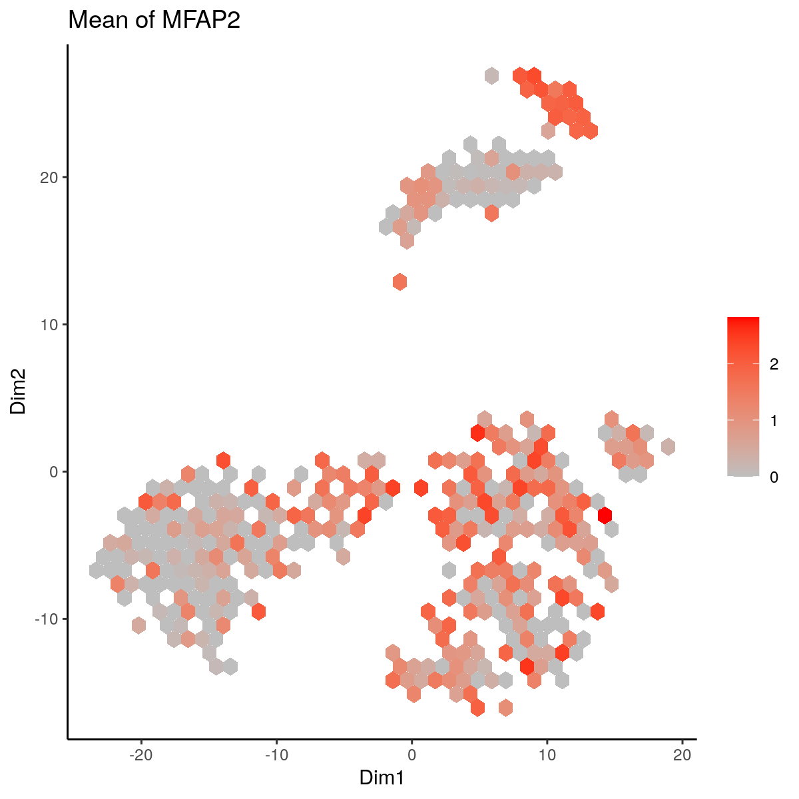|[MFAP3](https://www.ncbi.nlm.nih.gov/gene/4238) [TENM4](https://www.ncbi.nlm.nih.gov/gene/26011) [DNER](https://www.ncbi.nlm.nih.gov/gene/92737)|
|[MFAP4](https://www.ncbi.nlm.nih.gov/gene/4239) 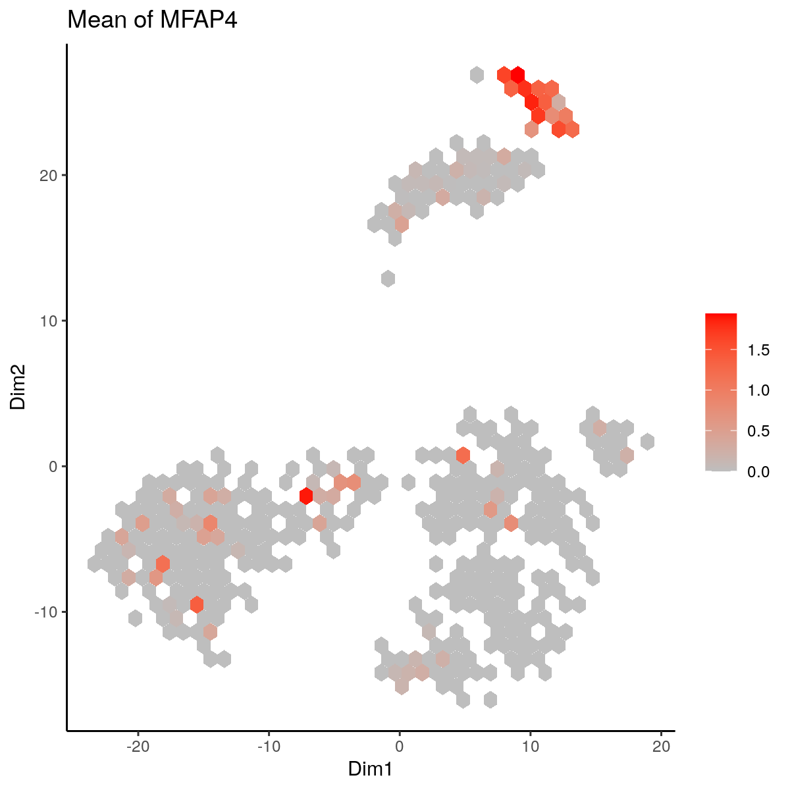|[CDH11](https://www.ncbi.nlm.nih.gov/gene/1009) [NCR1](https://www.ncbi.nlm.nih.gov/gene/9437) [PARVG](https://www.ncbi.nlm.nih.gov/gene/64098)|
|[MFAP5](https://www.ncbi.nlm.nih.gov/gene/8076)|[MFAP3](https://www.ncbi.nlm.nih.gov/gene/4238) [MFAP3L](https://www.ncbi.nlm.nih.gov/gene/9848) [DAGLB](https://www.ncbi.nlm.nih.gov/gene/221955) [ADGRD1](https://www.ncbi.nlm.nih.gov/gene/283383)|
|[MGAT5](https://www.ncbi.nlm.nih.gov/gene/4249)|[PCDH7](https://www.ncbi.nlm.nih.gov/gene/5099)|
|[MGP](https://www.ncbi.nlm.nih.gov/gene/4256) 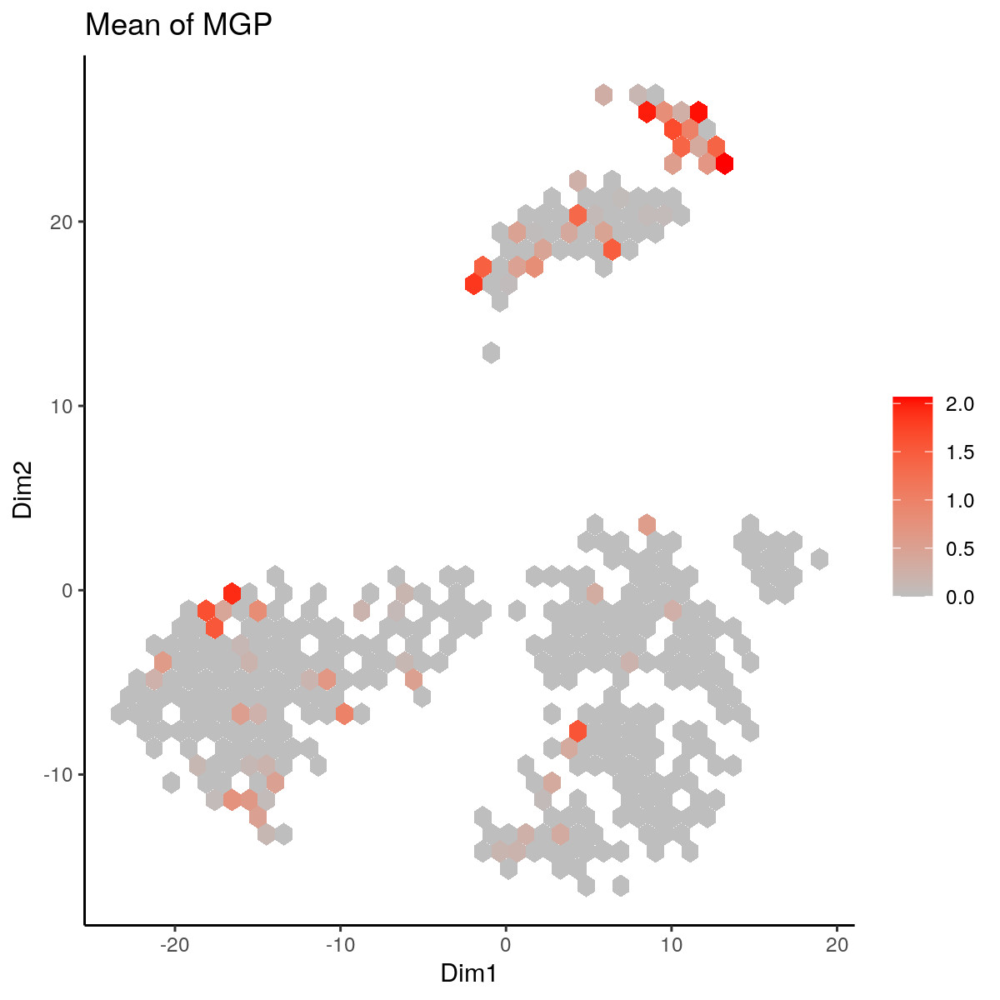|[ACVRL1](https://www.ncbi.nlm.nih.gov/gene/94) [ALPL](https://www.ncbi.nlm.nih.gov/gene/249) [CASR](https://www.ncbi.nlm.nih.gov/gene/846) [OPRD1](https://www.ncbi.nlm.nih.gov/gene/4985) [OPRK1](https://www.ncbi.nlm.nih.gov/gene/4986) [OPRL1](https://www.ncbi.nlm.nih.gov/gene/4987) [VCL](https://www.ncbi.nlm.nih.gov/gene/7414) [MGAM](https://www.ncbi.nlm.nih.gov/gene/8972)|
|[MIA](https://www.ncbi.nlm.nih.gov/gene/8190)|[CDH7](https://www.ncbi.nlm.nih.gov/gene/1005)|
|[MICOS10-NBL1](https://www.ncbi.nlm.nih.gov/gene/100532736)|[SLC1A1](https://www.ncbi.nlm.nih.gov/gene/6505) [SLC5A4](https://www.ncbi.nlm.nih.gov/gene/6527)|
|[MIF](https://www.ncbi.nlm.nih.gov/gene/4282)|[CD44](https://www.ncbi.nlm.nih.gov/gene/960) [CD74](https://www.ncbi.nlm.nih.gov/gene/972) [CXCR1](https://www.ncbi.nlm.nih.gov/gene/3577) [CXCR2](https://www.ncbi.nlm.nih.gov/gene/3579) [SLC2A4](https://www.ncbi.nlm.nih.gov/gene/6517) [TLR4](https://www.ncbi.nlm.nih.gov/gene/7099) [CXCR4](https://www.ncbi.nlm.nih.gov/gene/7852) [PARK7](https://www.ncbi.nlm.nih.gov/gene/11315)|
|[MLN](https://www.ncbi.nlm.nih.gov/gene/4295)|[ADRA1D](https://www.ncbi.nlm.nih.gov/gene/146) [AGER](https://www.ncbi.nlm.nih.gov/gene/177) [AGTR1](https://www.ncbi.nlm.nih.gov/gene/185) [AGTR2](https://www.ncbi.nlm.nih.gov/gene/186) [AVPR1A](https://www.ncbi.nlm.nih.gov/gene/552) [AVPR1B](https://www.ncbi.nlm.nih.gov/gene/553) [BDKRB1](https://www.ncbi.nlm.nih.gov/gene/623) [BDKRB2](https://www.ncbi.nlm.nih.gov/gene/624) [BRS3](https://www.ncbi.nlm.nih.gov/gene/680) [CASR](https://www.ncbi.nlm.nih.gov/gene/846) [CCKAR](https://www.ncbi.nlm.nih.gov/gene/886) [CCKBR](https://www.ncbi.nlm.nih.gov/gene/887) [CHRM1](https://www.ncbi.nlm.nih.gov/gene/1128) [CHRM3](https://www.ncbi.nlm.nih.gov/gene/1131) [CHRM5](https://www.ncbi.nlm.nih.gov/gene/1133) [LTB4R](https://www.ncbi.nlm.nih.gov/gene/1241) [EDNRA](https://www.ncbi.nlm.nih.gov/gene/1909) [EDNRB](https://www.ncbi.nlm.nih.gov/gene/1910) [F2R](https://www.ncbi.nlm.nih.gov/gene/2149) [F2RL1](https://www.ncbi.nlm.nih.gov/gene/2150) [F2RL2](https://www.ncbi.nlm.nih.gov/gene/2151) [FPR2](https://www.ncbi.nlm.nih.gov/gene/2358) [GCGR](https://www.ncbi.nlm.nih.gov/gene/2642) [GHSR](https://www.ncbi.nlm.nih.gov/gene/2693) [GNA11](https://www.ncbi.nlm.nih.gov/gene/2767) [GNG3](https://www.ncbi.nlm.nih.gov/gene/2785) [GNG4](https://www.ncbi.nlm.nih.gov/gene/2786) [GNG5](https://www.ncbi.nlm.nih.gov/gene/2787) [GNG7](https://www.ncbi.nlm.nih.gov/gene/2788) [GNG10](https://www.ncbi.nlm.nih.gov/gene/2790) [GNG11](https://www.ncbi.nlm.nih.gov/gene/2791) [GNGT1](https://www.ncbi.nlm.nih.gov/gene/2792) [GNGT2](https://www.ncbi.nlm.nih.gov/gene/2793) [GNRHR](https://www.ncbi.nlm.nih.gov/gene/2798) [GPR4](https://www.ncbi.nlm.nih.gov/gene/2828) [XCR1](https://www.ncbi.nlm.nih.gov/gene/2829) [UTS2R](https://www.ncbi.nlm.nih.gov/gene/2837) [GPR17](https://www.ncbi.nlm.nih.gov/gene/2840) [LPAR4](https://www.ncbi.nlm.nih.gov/gene/2846) [MCHR1](https://www.ncbi.nlm.nih.gov/gene/2847) [MLNR](https://www.ncbi.nlm.nih.gov/gene/2862) [GPR39](https://www.ncbi.nlm.nih.gov/gene/2863) [FFAR1](https://www.ncbi.nlm.nih.gov/gene/2864) [FFAR3](https://www.ncbi.nlm.nih.gov/gene/2865) [FFAR2](https://www.ncbi.nlm.nih.gov/gene/2867) [GRK5](https://www.ncbi.nlm.nih.gov/gene/2869) [GRM1](https://www.ncbi.nlm.nih.gov/gene/2911) [GRM5](https://www.ncbi.nlm.nih.gov/gene/2915) [GRPR](https://www.ncbi.nlm.nih.gov/gene/2925) [HCRTR1](https://www.ncbi.nlm.nih.gov/gene/3061) [HCRTR2](https://www.ncbi.nlm.nih.gov/gene/3062) [HRH1](https://www.ncbi.nlm.nih.gov/gene/3269) [HTR2A](https://www.ncbi.nlm.nih.gov/gene/3356) [HTR2B](https://www.ncbi.nlm.nih.gov/gene/3357) [HTR2C](https://www.ncbi.nlm.nih.gov/gene/3358) [HTR7](https://www.ncbi.nlm.nih.gov/gene/3363) [NMBR](https://www.ncbi.nlm.nih.gov/gene/4829) [NTSR1](https://www.ncbi.nlm.nih.gov/gene/4923) [OXTR](https://www.ncbi.nlm.nih.gov/gene/5021) [P2RY1](https://www.ncbi.nlm.nih.gov/gene/5028) [P2RY2](https://www.ncbi.nlm.nih.gov/gene/5029) [P2RY6](https://www.ncbi.nlm.nih.gov/gene/5031) [P2RY11](https://www.ncbi.nlm.nih.gov/gene/5032) [PTAFR](https://www.ncbi.nlm.nih.gov/gene/5724) [PTGER1](https://www.ncbi.nlm.nih.gov/gene/5731) [PTGFR](https://www.ncbi.nlm.nih.gov/gene/5737) [PTPRC](https://www.ncbi.nlm.nih.gov/gene/5788) [TACR2](https://www.ncbi.nlm.nih.gov/gene/6865) [TACR1](https://www.ncbi.nlm.nih.gov/gene/6869) [TACR3](https://www.ncbi.nlm.nih.gov/gene/6870) [TBXA2R](https://www.ncbi.nlm.nih.gov/gene/6915) [TRHR](https://www.ncbi.nlm.nih.gov/gene/7201) [GPR68](https://www.ncbi.nlm.nih.gov/gene/8111) [GPR65](https://www.ncbi.nlm.nih.gov/gene/8477) [IFITM1](https://www.ncbi.nlm.nih.gov/gene/8519) [F2RL3](https://www.ncbi.nlm.nih.gov/gene/9002) [LPAR6](https://www.ncbi.nlm.nih.gov/gene/10161) [NMUR1](https://www.ncbi.nlm.nih.gov/gene/10316) [CYSLTR1](https://www.ncbi.nlm.nih.gov/gene/10800) [NPFFR2](https://www.ncbi.nlm.nih.gov/gene/10886) [LPAR3](https://www.ncbi.nlm.nih.gov/gene/23566) [NTSR2](https://www.ncbi.nlm.nih.gov/gene/23620) [P2RY10](https://www.ncbi.nlm.nih.gov/gene/27334) [GPR132](https://www.ncbi.nlm.nih.gov/gene/29933) [ADGRE2](https://www.ncbi.nlm.nih.gov/gene/30817) [GNG13](https://www.ncbi.nlm.nih.gov/gene/51764) [GNG2](https://www.ncbi.nlm.nih.gov/gene/54331) [GNG12](https://www.ncbi.nlm.nih.gov/gene/55970) [LTB4R2](https://www.ncbi.nlm.nih.gov/gene/56413) [NMUR2](https://www.ncbi.nlm.nih.gov/gene/56923) [CYSLTR2](https://www.ncbi.nlm.nih.gov/gene/57105) [LPAR5](https://www.ncbi.nlm.nih.gov/gene/57121) [NPFFR1](https://www.ncbi.nlm.nih.gov/gene/64106) [QRFPR](https://www.ncbi.nlm.nih.gov/gene/84109) [MCHR2](https://www.ncbi.nlm.nih.gov/gene/84539) [KISS1R](https://www.ncbi.nlm.nih.gov/gene/84634) [OPN4](https://www.ncbi.nlm.nih.gov/gene/94233) [GNG8](https://www.ncbi.nlm.nih.gov/gene/94235) [ARHGEF25](https://www.ncbi.nlm.nih.gov/gene/115557) [PROKR2](https://www.ncbi.nlm.nih.gov/gene/128674) [GPRC6A](https://www.ncbi.nlm.nih.gov/gene/222545) [FFAR4](https://www.ncbi.nlm.nih.gov/gene/338557)|
|[MMP1](https://www.ncbi.nlm.nih.gov/gene/4312)|[BSG](https://www.ncbi.nlm.nih.gov/gene/682) [CD44](https://www.ncbi.nlm.nih.gov/gene/960) [CDC42](https://www.ncbi.nlm.nih.gov/gene/998) [ACE](https://www.ncbi.nlm.nih.gov/gene/1636) [EREG](https://www.ncbi.nlm.nih.gov/gene/2069) [ESR1](https://www.ncbi.nlm.nih.gov/gene/2099) [F2R](https://www.ncbi.nlm.nih.gov/gene/2149) [DDR2](https://www.ncbi.nlm.nih.gov/gene/4921) [SCNN1A](https://www.ncbi.nlm.nih.gov/gene/6337) [SELE](https://www.ncbi.nlm.nih.gov/gene/6401) [SRC](https://www.ncbi.nlm.nih.gov/gene/6714) [TLR4](https://www.ncbi.nlm.nih.gov/gene/7099) [CXCR4](https://www.ncbi.nlm.nih.gov/gene/7852) [RHCG](https://www.ncbi.nlm.nih.gov/gene/51458)|
|[MMP10](https://www.ncbi.nlm.nih.gov/gene/4319)|[EPHA2](https://www.ncbi.nlm.nih.gov/gene/1969) [CXCR4](https://www.ncbi.nlm.nih.gov/gene/7852)|
|[MMP11](https://www.ncbi.nlm.nih.gov/gene/4320)|[BSG](https://www.ncbi.nlm.nih.gov/gene/682) [CD82](https://www.ncbi.nlm.nih.gov/gene/3732) [SRC](https://www.ncbi.nlm.nih.gov/gene/6714) [SSTR2](https://www.ncbi.nlm.nih.gov/gene/6752)|
|[MMP12](https://www.ncbi.nlm.nih.gov/gene/4321)|[CD44](https://www.ncbi.nlm.nih.gov/gene/960) [ITGAM](https://www.ncbi.nlm.nih.gov/gene/3684) [CXCR4](https://www.ncbi.nlm.nih.gov/gene/7852) [GPNMB](https://www.ncbi.nlm.nih.gov/gene/10457) [CCR2](https://www.ncbi.nlm.nih.gov/gene/729230)|
|[MMP13](https://www.ncbi.nlm.nih.gov/gene/4322)|[ALPL](https://www.ncbi.nlm.nih.gov/gene/249) [CD44](https://www.ncbi.nlm.nih.gov/gene/960) [LTB4R](https://www.ncbi.nlm.nih.gov/gene/1241) [FGFR1](https://www.ncbi.nlm.nih.gov/gene/2260) [IHH](https://www.ncbi.nlm.nih.gov/gene/3549) [MUC1](https://www.ncbi.nlm.nih.gov/gene/4582) [DDR2](https://www.ncbi.nlm.nih.gov/gene/4921) [RGS2](https://www.ncbi.nlm.nih.gov/gene/5997) [TLR4](https://www.ncbi.nlm.nih.gov/gene/7099) [CXCR4](https://www.ncbi.nlm.nih.gov/gene/7852)|
|[MMP16](https://www.ncbi.nlm.nih.gov/gene/4325)|[CSPG4](https://www.ncbi.nlm.nih.gov/gene/1464) [CNNM2](https://www.ncbi.nlm.nih.gov/gene/54805) [AJAP1](https://www.ncbi.nlm.nih.gov/gene/55966)|
|[MMP19](https://www.ncbi.nlm.nih.gov/gene/4327)|[CXCR3](https://www.ncbi.nlm.nih.gov/gene/2833)|
|[MMP20](https://www.ncbi.nlm.nih.gov/gene/9313)|[CNNM4](https://www.ncbi.nlm.nih.gov/gene/26504)|
|[MMP26](https://www.ncbi.nlm.nih.gov/gene/56547)|[ESR1](https://www.ncbi.nlm.nih.gov/gene/2099)|
|[MMP3](https://www.ncbi.nlm.nih.gov/gene/4314)|[ADAM10](https://www.ncbi.nlm.nih.gov/gene/102) [AQP3](https://www.ncbi.nlm.nih.gov/gene/360) [BSG](https://www.ncbi.nlm.nih.gov/gene/682) [CD44](https://www.ncbi.nlm.nih.gov/gene/960) [CDH2](https://www.ncbi.nlm.nih.gov/gene/1000) [CTNNA1](https://www.ncbi.nlm.nih.gov/gene/1495) [ACE](https://www.ncbi.nlm.nih.gov/gene/1636) [ESR1](https://www.ncbi.nlm.nih.gov/gene/2099) [GJA4](https://www.ncbi.nlm.nih.gov/gene/2701) [OLR1](https://www.ncbi.nlm.nih.gov/gene/4973) [PDGFRB](https://www.ncbi.nlm.nih.gov/gene/5159) [PTAFR](https://www.ncbi.nlm.nih.gov/gene/5724) [SELE](https://www.ncbi.nlm.nih.gov/gene/6401) [SRC](https://www.ncbi.nlm.nih.gov/gene/6714) [TLR4](https://www.ncbi.nlm.nih.gov/gene/7099) [CXCR4](https://www.ncbi.nlm.nih.gov/gene/7852) [GPNMB](https://www.ncbi.nlm.nih.gov/gene/10457) [ADIPOR1](https://www.ncbi.nlm.nih.gov/gene/51094) [CXCL16](https://www.ncbi.nlm.nih.gov/gene/58191) [OCLN](https://www.ncbi.nlm.nih.gov/gene/100506658)|
|[MMP7](https://www.ncbi.nlm.nih.gov/gene/4316)|[ADAM10](https://www.ncbi.nlm.nih.gov/gene/102) [BSG](https://www.ncbi.nlm.nih.gov/gene/682) [CD44](https://www.ncbi.nlm.nih.gov/gene/960) [CDH2](https://www.ncbi.nlm.nih.gov/gene/1000) [CDH17](https://www.ncbi.nlm.nih.gov/gene/1015) [CTNNA1](https://www.ncbi.nlm.nih.gov/gene/1495) [ESR1](https://www.ncbi.nlm.nih.gov/gene/2099) [ITGB1](https://www.ncbi.nlm.nih.gov/gene/3688) [KRAS](https://www.ncbi.nlm.nih.gov/gene/3845) [MUC1](https://www.ncbi.nlm.nih.gov/gene/4582) [PTGDR](https://www.ncbi.nlm.nih.gov/gene/5729) [SRC](https://www.ncbi.nlm.nih.gov/gene/6714) [CXCR4](https://www.ncbi.nlm.nih.gov/gene/7852) [RECK](https://www.ncbi.nlm.nih.gov/gene/8434) [LGR5](https://www.ncbi.nlm.nih.gov/gene/8549) [PTP4A3](https://www.ncbi.nlm.nih.gov/gene/11156)|
|[MMP8](https://www.ncbi.nlm.nih.gov/gene/4317)|[RHOA](https://www.ncbi.nlm.nih.gov/gene/387) [CD44](https://www.ncbi.nlm.nih.gov/gene/960) [CEACAM8](https://www.ncbi.nlm.nih.gov/gene/1088) [CXCR1](https://www.ncbi.nlm.nih.gov/gene/3577) [CXCR2](https://www.ncbi.nlm.nih.gov/gene/3579) [VCL](https://www.ncbi.nlm.nih.gov/gene/7414) [NAALAD2](https://www.ncbi.nlm.nih.gov/gene/10003) [BACE1](https://www.ncbi.nlm.nih.gov/gene/23621) [CD177](https://www.ncbi.nlm.nih.gov/gene/57126) [GSDMD](https://www.ncbi.nlm.nih.gov/gene/79792) [OSCAR](https://www.ncbi.nlm.nih.gov/gene/126014) [KCNU1](https://www.ncbi.nlm.nih.gov/gene/157855)|
|[MMP9](https://www.ncbi.nlm.nih.gov/gene/4318)|[ADAM10](https://www.ncbi.nlm.nih.gov/gene/102) [AGER](https://www.ncbi.nlm.nih.gov/gene/177) [AGTR1](https://www.ncbi.nlm.nih.gov/gene/185) [AKT2](https://www.ncbi.nlm.nih.gov/gene/208) [ALOX15](https://www.ncbi.nlm.nih.gov/gene/246) [AQP4](https://www.ncbi.nlm.nih.gov/gene/361) [RHOA](https://www.ncbi.nlm.nih.gov/gene/387) [RHOC](https://www.ncbi.nlm.nih.gov/gene/389) [BSG](https://www.ncbi.nlm.nih.gov/gene/682) [BTC](https://www.ncbi.nlm.nih.gov/gene/685) [BTK](https://www.ncbi.nlm.nih.gov/gene/695) [CALCR](https://www.ncbi.nlm.nih.gov/gene/799) [CD86](https://www.ncbi.nlm.nih.gov/gene/942) [CD44](https://www.ncbi.nlm.nih.gov/gene/960) [CD63](https://www.ncbi.nlm.nih.gov/gene/967) [CDC42](https://www.ncbi.nlm.nih.gov/gene/998) [CDH2](https://www.ncbi.nlm.nih.gov/gene/1000) [CDH17](https://www.ncbi.nlm.nih.gov/gene/1015) [CCR1](https://www.ncbi.nlm.nih.gov/gene/1230) [CCR3](https://www.ncbi.nlm.nih.gov/gene/1232) [CCR4](https://www.ncbi.nlm.nih.gov/gene/1233) [CCR5](https://www.ncbi.nlm.nih.gov/gene/1234) [CCR6](https://www.ncbi.nlm.nih.gov/gene/1235) [CCR7](https://www.ncbi.nlm.nih.gov/gene/1236) [CSF1R](https://www.ncbi.nlm.nih.gov/gene/1436) [CX3CR1](https://www.ncbi.nlm.nih.gov/gene/1524) [CYBA](https://www.ncbi.nlm.nih.gov/gene/1535) [CYBB](https://www.ncbi.nlm.nih.gov/gene/1536) [ACE](https://www.ncbi.nlm.nih.gov/gene/1636) [DPP4](https://www.ncbi.nlm.nih.gov/gene/1803) [EDNRB](https://www.ncbi.nlm.nih.gov/gene/1910) [EPHA2](https://www.ncbi.nlm.nih.gov/gene/1969) [ADGRE1](https://www.ncbi.nlm.nih.gov/gene/2015) [ENG](https://www.ncbi.nlm.nih.gov/gene/2022) [EPHB1](https://www.ncbi.nlm.nih.gov/gene/2047) [EPHB2](https://www.ncbi.nlm.nih.gov/gene/2048) [EPHB3](https://www.ncbi.nlm.nih.gov/gene/2049) [EPHB4](https://www.ncbi.nlm.nih.gov/gene/2050) [ESR1](https://www.ncbi.nlm.nih.gov/gene/2099) [F2R](https://www.ncbi.nlm.nih.gov/gene/2149) [GGT1](https://www.ncbi.nlm.nih.gov/gene/2678) [GJA1](https://www.ncbi.nlm.nih.gov/gene/2697) [CXCR3](https://www.ncbi.nlm.nih.gov/gene/2833) [IFNAR1](https://www.ncbi.nlm.nih.gov/gene/3454) [CXCR1](https://www.ncbi.nlm.nih.gov/gene/3577) [CXCR2](https://www.ncbi.nlm.nih.gov/gene/3579) [ITGAM](https://www.ncbi.nlm.nih.gov/gene/3684) [ITGAV](https://www.ncbi.nlm.nih.gov/gene/3685) [ITGB1](https://www.ncbi.nlm.nih.gov/gene/3688) [ITGB2](https://www.ncbi.nlm.nih.gov/gene/3689) [ITGB3](https://www.ncbi.nlm.nih.gov/gene/3690) [KRAS](https://www.ncbi.nlm.nih.gov/gene/3845) [LDLR](https://www.ncbi.nlm.nih.gov/gene/3949) [EPCAM](https://www.ncbi.nlm.nih.gov/gene/4072) [MEP1B](https://www.ncbi.nlm.nih.gov/gene/4225) [MUC1](https://www.ncbi.nlm.nih.gov/gene/4582) [NOS3](https://www.ncbi.nlm.nih.gov/gene/4846) [OLR1](https://www.ncbi.nlm.nih.gov/gene/4973) [PDGFRB](https://www.ncbi.nlm.nih.gov/gene/5159) [PTGER3](https://www.ncbi.nlm.nih.gov/gene/5733) [PTGER4](https://www.ncbi.nlm.nih.gov/gene/5734) [PTPRC](https://www.ncbi.nlm.nih.gov/gene/5788) [SELE](https://www.ncbi.nlm.nih.gov/gene/6401) [SELL](https://www.ncbi.nlm.nih.gov/gene/6402) [SELP](https://www.ncbi.nlm.nih.gov/gene/6403) [SRC](https://www.ncbi.nlm.nih.gov/gene/6714) [TEK](https://www.ncbi.nlm.nih.gov/gene/7010) [TGFBR1](https://www.ncbi.nlm.nih.gov/gene/7046) [TJP1](https://www.ncbi.nlm.nih.gov/gene/7082) [TLR1](https://www.ncbi.nlm.nih.gov/gene/7096) [TLR4](https://www.ncbi.nlm.nih.gov/gene/7099) [TLR5](https://www.ncbi.nlm.nih.gov/gene/7100) [TYROBP](https://www.ncbi.nlm.nih.gov/gene/7305) [IL1R2](https://www.ncbi.nlm.nih.gov/gene/7850) [CXCR4](https://www.ncbi.nlm.nih.gov/gene/7852) [RECK](https://www.ncbi.nlm.nih.gov/gene/8434) [IQGAP1](https://www.ncbi.nlm.nih.gov/gene/8826) [PROM1](https://www.ncbi.nlm.nih.gov/gene/8842) [USP6](https://www.ncbi.nlm.nih.gov/gene/9098) [CD163](https://www.ncbi.nlm.nih.gov/gene/9332) [TLR6](https://www.ncbi.nlm.nih.gov/gene/10333) [NEU3](https://www.ncbi.nlm.nih.gov/gene/10825) [DLL4](https://www.ncbi.nlm.nih.gov/gene/54567) [ANO1](https://www.ncbi.nlm.nih.gov/gene/55107) [CXCL16](https://www.ncbi.nlm.nih.gov/gene/58191) [GSDMD](https://www.ncbi.nlm.nih.gov/gene/79792) [DCSTAMP](https://www.ncbi.nlm.nih.gov/gene/81501) [SLC38A1](https://www.ncbi.nlm.nih.gov/gene/81539) [OSCAR](https://www.ncbi.nlm.nih.gov/gene/126014) [CCR2](https://www.ncbi.nlm.nih.gov/gene/729230) [OCLN](https://www.ncbi.nlm.nih.gov/gene/100506658)|
|[MMRN1](https://www.ncbi.nlm.nih.gov/gene/22915)|[ECSCR](https://www.ncbi.nlm.nih.gov/gene/641700)|
|[MMRN2](https://www.ncbi.nlm.nih.gov/gene/79812)|[MC5R](https://www.ncbi.nlm.nih.gov/gene/4161) [RHOJ](https://www.ncbi.nlm.nih.gov/gene/57381) [ADGRL4](https://www.ncbi.nlm.nih.gov/gene/64123)|
|[MPEG1](https://www.ncbi.nlm.nih.gov/gene/219972)|[C3AR1](https://www.ncbi.nlm.nih.gov/gene/719) [C5AR1](https://www.ncbi.nlm.nih.gov/gene/728) [CD86](https://www.ncbi.nlm.nih.gov/gene/942) [CD74](https://www.ncbi.nlm.nih.gov/gene/972) [CD52](https://www.ncbi.nlm.nih.gov/gene/1043) [CCR1](https://www.ncbi.nlm.nih.gov/gene/1230) [CCR5](https://www.ncbi.nlm.nih.gov/gene/1234) [CSF1R](https://www.ncbi.nlm.nih.gov/gene/1436) [CSF3R](https://www.ncbi.nlm.nih.gov/gene/1441) [CYBB](https://www.ncbi.nlm.nih.gov/gene/1536) [FCER1G](https://www.ncbi.nlm.nih.gov/gene/2207) [FCGR2B](https://www.ncbi.nlm.nih.gov/gene/2213) [FCGR3A](https://www.ncbi.nlm.nih.gov/gene/2214) [FCGR3B](https://www.ncbi.nlm.nih.gov/gene/2215) [FGR](https://www.ncbi.nlm.nih.gov/gene/2268) [IL2RG](https://www.ncbi.nlm.nih.gov/gene/3561) [ITGAM](https://www.ncbi.nlm.nih.gov/gene/3684) [ITGB2](https://www.ncbi.nlm.nih.gov/gene/3689) [PTPRC](https://www.ncbi.nlm.nih.gov/gene/5788) [TLR1](https://www.ncbi.nlm.nih.gov/gene/7096) [TLR4](https://www.ncbi.nlm.nih.gov/gene/7099) [TYROBP](https://www.ncbi.nlm.nih.gov/gene/7305) [MARCO](https://www.ncbi.nlm.nih.gov/gene/8685) [CD84](https://www.ncbi.nlm.nih.gov/gene/8832) [BACE1](https://www.ncbi.nlm.nih.gov/gene/23621) [CYTH4](https://www.ncbi.nlm.nih.gov/gene/27128) [CD300LB](https://www.ncbi.nlm.nih.gov/gene/124599) [CD300LF](https://www.ncbi.nlm.nih.gov/gene/146722) [P2RY8](https://www.ncbi.nlm.nih.gov/gene/286530) [CCR2](https://www.ncbi.nlm.nih.gov/gene/729230)|
|[MR1](https://www.ncbi.nlm.nih.gov/gene/3140)|[CD74](https://www.ncbi.nlm.nih.gov/gene/972) [HLA-A](https://www.ncbi.nlm.nih.gov/gene/3105) [HLA-DPA1](https://www.ncbi.nlm.nih.gov/gene/3113) [HLA-DPB1](https://www.ncbi.nlm.nih.gov/gene/3115) [HLA-DQA1](https://www.ncbi.nlm.nih.gov/gene/3117) [HLA-DQA2](https://www.ncbi.nlm.nih.gov/gene/3118) [HLA-DQB1](https://www.ncbi.nlm.nih.gov/gene/3119) [HLA-DQB2](https://www.ncbi.nlm.nih.gov/gene/3120) [HLA-DRA](https://www.ncbi.nlm.nih.gov/gene/3122) [HLA-DRB1](https://www.ncbi.nlm.nih.gov/gene/3123) [HLA-DRB5](https://www.ncbi.nlm.nih.gov/gene/3127) [HLA-F](https://www.ncbi.nlm.nih.gov/gene/3134) [SLC46A2](https://www.ncbi.nlm.nih.gov/gene/57864)|
|[MSLN](https://www.ncbi.nlm.nih.gov/gene/10232)|[ADAM10](https://www.ncbi.nlm.nih.gov/gene/102) [ALPI](https://www.ncbi.nlm.nih.gov/gene/248) [ALPL](https://www.ncbi.nlm.nih.gov/gene/249) [ALPG](https://www.ncbi.nlm.nih.gov/gene/251) [APLP2](https://www.ncbi.nlm.nih.gov/gene/334) [ART3](https://www.ncbi.nlm.nih.gov/gene/419) [ART4](https://www.ncbi.nlm.nih.gov/gene/420) [BST1](https://www.ncbi.nlm.nih.gov/gene/683) [CD19](https://www.ncbi.nlm.nih.gov/gene/930) [CD22](https://www.ncbi.nlm.nih.gov/gene/933) [CDH2](https://www.ncbi.nlm.nih.gov/gene/1000) [CD52](https://www.ncbi.nlm.nih.gov/gene/1043) [CEACAM5](https://www.ncbi.nlm.nih.gov/gene/1048) [CEACAM7](https://www.ncbi.nlm.nih.gov/gene/1087) [CPM](https://www.ncbi.nlm.nih.gov/gene/1368) [FCGR3B](https://www.ncbi.nlm.nih.gov/gene/2215) [FOLR1](https://www.ncbi.nlm.nih.gov/gene/2348) [FOLR2](https://www.ncbi.nlm.nih.gov/gene/2350) [GPC3](https://www.ncbi.nlm.nih.gov/gene/2719) [GP2](https://www.ncbi.nlm.nih.gov/gene/2813) [HLA-DRB1](https://www.ncbi.nlm.nih.gov/gene/3123) [KRAS](https://www.ncbi.nlm.nih.gov/gene/3845) [LSAMP](https://www.ncbi.nlm.nih.gov/gene/4045) [LY6E](https://www.ncbi.nlm.nih.gov/gene/4061) [LY6H](https://www.ncbi.nlm.nih.gov/gene/4062) [EPCAM](https://www.ncbi.nlm.nih.gov/gene/4072) [MELTF](https://www.ncbi.nlm.nih.gov/gene/4241) [MUC1](https://www.ncbi.nlm.nih.gov/gene/4582) [MUC4](https://www.ncbi.nlm.nih.gov/gene/4585) [OPCML](https://www.ncbi.nlm.nih.gov/gene/4978) [CNTN3](https://www.ncbi.nlm.nih.gov/gene/5067) [PDCD1](https://www.ncbi.nlm.nih.gov/gene/5133) [PTGER4](https://www.ncbi.nlm.nih.gov/gene/5734) [RALA](https://www.ncbi.nlm.nih.gov/gene/5898) [TECTB](https://www.ncbi.nlm.nih.gov/gene/6975) [TECTA](https://www.ncbi.nlm.nih.gov/gene/7007) [THY1](https://www.ncbi.nlm.nih.gov/gene/7070) [XPNPEP2](https://www.ncbi.nlm.nih.gov/gene/7512) [PSCA](https://www.ncbi.nlm.nih.gov/gene/8000) [RECK](https://www.ncbi.nlm.nih.gov/gene/8434) [LY6D](https://www.ncbi.nlm.nih.gov/gene/8581) [VNN2](https://www.ncbi.nlm.nih.gov/gene/8875) [VNN1](https://www.ncbi.nlm.nih.gov/gene/8876) [TGOLN2](https://www.ncbi.nlm.nih.gov/gene/10618) [PRSS21](https://www.ncbi.nlm.nih.gov/gene/10942) [NTNG1](https://www.ncbi.nlm.nih.gov/gene/22854) [PRND](https://www.ncbi.nlm.nih.gov/gene/23627) [LYPD3](https://www.ncbi.nlm.nih.gov/gene/27076) [NTM](https://www.ncbi.nlm.nih.gov/gene/50863) [NRN1](https://www.ncbi.nlm.nih.gov/gene/51299) [CNTN5](https://www.ncbi.nlm.nih.gov/gene/53942) [MXRA8](https://www.ncbi.nlm.nih.gov/gene/54587) [PNPLA2](https://www.ncbi.nlm.nih.gov/gene/57104) [ANO8](https://www.ncbi.nlm.nih.gov/gene/57719) [LY6G6D](https://www.ncbi.nlm.nih.gov/gene/58530) [ULBP2](https://www.ncbi.nlm.nih.gov/gene/80328) [LY6G6C](https://www.ncbi.nlm.nih.gov/gene/80740) [TEX101](https://www.ncbi.nlm.nih.gov/gene/83639) [NTNG2](https://www.ncbi.nlm.nih.gov/gene/84628) [MUC16](https://www.ncbi.nlm.nih.gov/gene/94025) [LYPD1](https://www.ncbi.nlm.nih.gov/gene/116372) [NRN1L](https://www.ncbi.nlm.nih.gov/gene/123904) [LYPD6B](https://www.ncbi.nlm.nih.gov/gene/130576) [CD109](https://www.ncbi.nlm.nih.gov/gene/135228) [LYPD2](https://www.ncbi.nlm.nih.gov/gene/137797) [OTOA](https://www.ncbi.nlm.nih.gov/gene/146183) [RTN4RL1](https://www.ncbi.nlm.nih.gov/gene/146760) [LYPD4](https://www.ncbi.nlm.nih.gov/gene/147719) [CNTN4](https://www.ncbi.nlm.nih.gov/gene/152330) [RAET1L](https://www.ncbi.nlm.nih.gov/gene/154064) [MDGA2](https://www.ncbi.nlm.nih.gov/gene/161357) [SPACA4](https://www.ncbi.nlm.nih.gov/gene/171169) [NEGR1](https://www.ncbi.nlm.nih.gov/gene/257194) [MDGA1](https://www.ncbi.nlm.nih.gov/gene/266727) [LYPD5](https://www.ncbi.nlm.nih.gov/gene/284348) [GPIHBP1](https://www.ncbi.nlm.nih.gov/gene/338328) [PLET1](https://www.ncbi.nlm.nih.gov/gene/349633) [RTN4RL2](https://www.ncbi.nlm.nih.gov/gene/349667) [IZUMO1R](https://www.ncbi.nlm.nih.gov/gene/390243) [SPRN](https://www.ncbi.nlm.nih.gov/gene/503542) [LYPD8](https://www.ncbi.nlm.nih.gov/gene/646627) [UPK3B](https://www.ncbi.nlm.nih.gov/gene/105375355)|
|[MSMB](https://www.ncbi.nlm.nih.gov/gene/4477)|[ACPP](https://www.ncbi.nlm.nih.gov/gene/55) [PRNP](https://www.ncbi.nlm.nih.gov/gene/5621) [SYT7](https://www.ncbi.nlm.nih.gov/gene/9066) [PRND](https://www.ncbi.nlm.nih.gov/gene/23627) [NTM](https://www.ncbi.nlm.nih.gov/gene/50863) [STEAP4](https://www.ncbi.nlm.nih.gov/gene/79689) [DAB2IP](https://www.ncbi.nlm.nih.gov/gene/153090) [SPRN](https://www.ncbi.nlm.nih.gov/gene/503542)|
|[MSMP](https://www.ncbi.nlm.nih.gov/gene/692094)|[PLPP1](https://www.ncbi.nlm.nih.gov/gene/8611)|
|[MST1](https://www.ncbi.nlm.nih.gov/gene/4485)|[HPN](https://www.ncbi.nlm.nih.gov/gene/3249) [ITGAM](https://www.ncbi.nlm.nih.gov/gene/3684) [ITGB2](https://www.ncbi.nlm.nih.gov/gene/3689) [SKAP1](https://www.ncbi.nlm.nih.gov/gene/8631) [SCRIB](https://www.ncbi.nlm.nih.gov/gene/23513) [APBB1IP](https://www.ncbi.nlm.nih.gov/gene/54518) [MST1R](https://www.ncbi.nlm.nih.gov/gene/4486)|
|[MSTN](https://www.ncbi.nlm.nih.gov/gene/2660)|[ACVR1B](https://www.ncbi.nlm.nih.gov/gene/91) [ACVR2B](https://www.ncbi.nlm.nih.gov/gene/93) [ACVRL1](https://www.ncbi.nlm.nih.gov/gene/94) [ALK](https://www.ncbi.nlm.nih.gov/gene/238) [BMPR1A](https://www.ncbi.nlm.nih.gov/gene/657) [BMPR1B](https://www.ncbi.nlm.nih.gov/gene/658) [BMPR2](https://www.ncbi.nlm.nih.gov/gene/659) [ACE](https://www.ncbi.nlm.nih.gov/gene/1636) [DMD](https://www.ncbi.nlm.nih.gov/gene/1756) [INSR](https://www.ncbi.nlm.nih.gov/gene/3643) [RGS2](https://www.ncbi.nlm.nih.gov/gene/5997) [SLC2A4](https://www.ncbi.nlm.nih.gov/gene/6517) [SRC](https://www.ncbi.nlm.nih.gov/gene/6714) [TGFBR1](https://www.ncbi.nlm.nih.gov/gene/7046) [TGFBR2](https://www.ncbi.nlm.nih.gov/gene/7048) [SLC38A2](https://www.ncbi.nlm.nih.gov/gene/54407) [RGMB](https://www.ncbi.nlm.nih.gov/gene/285704) [CAV3](https://www.ncbi.nlm.nih.gov/gene/859)|
|[MTRNR2L1](https://www.ncbi.nlm.nih.gov/gene/100462977)|[OR9G1](https://www.ncbi.nlm.nih.gov/gene/390174)|
|[MTRNR2L2](https://www.ncbi.nlm.nih.gov/gene/100462981)|[PARD6G](https://www.ncbi.nlm.nih.gov/gene/84552)|
|[MTRNR2L4](https://www.ncbi.nlm.nih.gov/gene/100463285)|[CD82](https://www.ncbi.nlm.nih.gov/gene/3732) [CADM1](https://www.ncbi.nlm.nih.gov/gene/23705) [MARVELD1](https://www.ncbi.nlm.nih.gov/gene/83742)|
|[MTRNR2L5](https://www.ncbi.nlm.nih.gov/gene/100463289)|[CD82](https://www.ncbi.nlm.nih.gov/gene/3732) [CADM1](https://www.ncbi.nlm.nih.gov/gene/23705) [MARVELD1](https://www.ncbi.nlm.nih.gov/gene/83742)|
|[MTRNR2L8](https://www.ncbi.nlm.nih.gov/gene/100463486)|[ENTPD8](https://www.ncbi.nlm.nih.gov/gene/377841)|
|[MUC1](https://www.ncbi.nlm.nih.gov/gene/4582)|[CD86](https://www.ncbi.nlm.nih.gov/gene/942) [CD44](https://www.ncbi.nlm.nih.gov/gene/960) [CD58](https://www.ncbi.nlm.nih.gov/gene/965) [CDH2](https://www.ncbi.nlm.nih.gov/gene/1000) [CEACAM5](https://www.ncbi.nlm.nih.gov/gene/1048) [CLDN7](https://www.ncbi.nlm.nih.gov/gene/1366) [CD55](https://www.ncbi.nlm.nih.gov/gene/1604) [ENO2](https://www.ncbi.nlm.nih.gov/gene/2026) [ESR1](https://www.ncbi.nlm.nih.gov/gene/2099) [ITGA6](https://www.ncbi.nlm.nih.gov/gene/3655) [KCNA6](https://www.ncbi.nlm.nih.gov/gene/3742) [KRAS](https://www.ncbi.nlm.nih.gov/gene/3845) [LYN](https://www.ncbi.nlm.nih.gov/gene/4067) [EPCAM](https://www.ncbi.nlm.nih.gov/gene/4072) [MME](https://www.ncbi.nlm.nih.gov/gene/4311) [MUC4](https://www.ncbi.nlm.nih.gov/gene/4585) [CEACAM6](https://www.ncbi.nlm.nih.gov/gene/4680) [PTPRC](https://www.ncbi.nlm.nih.gov/gene/5788) [SELE](https://www.ncbi.nlm.nih.gov/gene/6401) [SRC](https://www.ncbi.nlm.nih.gov/gene/6714) [TPBG](https://www.ncbi.nlm.nih.gov/gene/7162) [EZR](https://www.ncbi.nlm.nih.gov/gene/7430) [CXCR4](https://www.ncbi.nlm.nih.gov/gene/7852) [PSCA](https://www.ncbi.nlm.nih.gov/gene/8000) [PROM1](https://www.ncbi.nlm.nih.gov/gene/8842) [ATP6V0A2](https://www.ncbi.nlm.nih.gov/gene/23545) [MUC13](https://www.ncbi.nlm.nih.gov/gene/56667) [RAB25](https://www.ncbi.nlm.nih.gov/gene/57111) [FCRL2](https://www.ncbi.nlm.nih.gov/gene/79368) [FCRL5](https://www.ncbi.nlm.nih.gov/gene/83416) [FCRL4](https://www.ncbi.nlm.nih.gov/gene/83417) [MUC16](https://www.ncbi.nlm.nih.gov/gene/94025) [FCRL1](https://www.ncbi.nlm.nih.gov/gene/115350) [FCRL3](https://www.ncbi.nlm.nih.gov/gene/115352) [MUC20](https://www.ncbi.nlm.nih.gov/gene/200958) [MUC21](https://www.ncbi.nlm.nih.gov/gene/394263) [CD24](https://www.ncbi.nlm.nih.gov/gene/100133941)|
|[MUC15](https://www.ncbi.nlm.nih.gov/gene/143662)|[CLDN7](https://www.ncbi.nlm.nih.gov/gene/1366) [KCNA6](https://www.ncbi.nlm.nih.gov/gene/3742) [MUC1](https://www.ncbi.nlm.nih.gov/gene/4582) [MUC4](https://www.ncbi.nlm.nih.gov/gene/4585) [PCDH1](https://www.ncbi.nlm.nih.gov/gene/5097) [ANO1](https://www.ncbi.nlm.nih.gov/gene/55107) [MUC13](https://www.ncbi.nlm.nih.gov/gene/56667) [STEAP4](https://www.ncbi.nlm.nih.gov/gene/79689) [FCRL4](https://www.ncbi.nlm.nih.gov/gene/83417) [MUC16](https://www.ncbi.nlm.nih.gov/gene/94025) [FCRL1](https://www.ncbi.nlm.nih.gov/gene/115350) [MUC20](https://www.ncbi.nlm.nih.gov/gene/200958) [MUC21](https://www.ncbi.nlm.nih.gov/gene/394263)|
|[MUC17](https://www.ncbi.nlm.nih.gov/gene/140453)|[SLC26A3](https://www.ncbi.nlm.nih.gov/gene/1811) [KCNA6](https://www.ncbi.nlm.nih.gov/gene/3742) [MUC1](https://www.ncbi.nlm.nih.gov/gene/4582) [MUC4](https://www.ncbi.nlm.nih.gov/gene/4585) [PCDHGC5](https://www.ncbi.nlm.nih.gov/gene/56097) [MUC13](https://www.ncbi.nlm.nih.gov/gene/56667) [MUC16](https://www.ncbi.nlm.nih.gov/gene/94025) [MUC20](https://www.ncbi.nlm.nih.gov/gene/200958) [TMIGD1](https://www.ncbi.nlm.nih.gov/gene/388364) [MUC21](https://www.ncbi.nlm.nih.gov/gene/394263)|
|[MUC20](https://www.ncbi.nlm.nih.gov/gene/200958)|[CLDN7](https://www.ncbi.nlm.nih.gov/gene/1366) [KCNA6](https://www.ncbi.nlm.nih.gov/gene/3742) [KRAS](https://www.ncbi.nlm.nih.gov/gene/3845) [MUC1](https://www.ncbi.nlm.nih.gov/gene/4582) [MUC4](https://www.ncbi.nlm.nih.gov/gene/4585) [NRAS](https://www.ncbi.nlm.nih.gov/gene/4893) [PCDH1](https://www.ncbi.nlm.nih.gov/gene/5097) [PLSCR1](https://www.ncbi.nlm.nih.gov/gene/5359) [TNK2](https://www.ncbi.nlm.nih.gov/gene/10188) [ANO1](https://www.ncbi.nlm.nih.gov/gene/55107) [MUC13](https://www.ncbi.nlm.nih.gov/gene/56667) [STEAP4](https://www.ncbi.nlm.nih.gov/gene/79689) [MUC16](https://www.ncbi.nlm.nih.gov/gene/94025) [OR6C2](https://www.ncbi.nlm.nih.gov/gene/341416) [MUC21](https://www.ncbi.nlm.nih.gov/gene/394263)|
|[MUC3A](https://www.ncbi.nlm.nih.gov/gene/4584)|[KCNA6](https://www.ncbi.nlm.nih.gov/gene/3742) [MUC1](https://www.ncbi.nlm.nih.gov/gene/4582) [MUC4](https://www.ncbi.nlm.nih.gov/gene/4585) [BTN3A1](https://www.ncbi.nlm.nih.gov/gene/11119) [OR8G1](https://www.ncbi.nlm.nih.gov/gene/26494) [CDHR5](https://www.ncbi.nlm.nih.gov/gene/53841) [MUC13](https://www.ncbi.nlm.nih.gov/gene/56667) [MUC16](https://www.ncbi.nlm.nih.gov/gene/94025) [MUC20](https://www.ncbi.nlm.nih.gov/gene/200958) [MUC21](https://www.ncbi.nlm.nih.gov/gene/394263)|
|[MUC4](https://www.ncbi.nlm.nih.gov/gene/4585)|[CDH2](https://www.ncbi.nlm.nih.gov/gene/1000) [CFTR](https://www.ncbi.nlm.nih.gov/gene/1080) [KCNA6](https://www.ncbi.nlm.nih.gov/gene/3742) [KRAS](https://www.ncbi.nlm.nih.gov/gene/3845) [LCT](https://www.ncbi.nlm.nih.gov/gene/3938) [MUC1](https://www.ncbi.nlm.nih.gov/gene/4582) [PLSCR1](https://www.ncbi.nlm.nih.gov/gene/5359) [SLC28A1](https://www.ncbi.nlm.nih.gov/gene/9154) [TNK2](https://www.ncbi.nlm.nih.gov/gene/10188) [MUC13](https://www.ncbi.nlm.nih.gov/gene/56667) [MUC16](https://www.ncbi.nlm.nih.gov/gene/94025) [MUC20](https://www.ncbi.nlm.nih.gov/gene/200958) [OTOG](https://www.ncbi.nlm.nih.gov/gene/340990) [MUC21](https://www.ncbi.nlm.nih.gov/gene/394263)|
|[MUC5AC](https://www.ncbi.nlm.nih.gov/gene/4586)|[AGER](https://www.ncbi.nlm.nih.gov/gene/177) [AQP5](https://www.ncbi.nlm.nih.gov/gene/362) [ATP4A](https://www.ncbi.nlm.nih.gov/gene/495) [ATP4B](https://www.ncbi.nlm.nih.gov/gene/496) [CEACAM5](https://www.ncbi.nlm.nih.gov/gene/1048) [CFTR](https://www.ncbi.nlm.nih.gov/gene/1080) [DRD1](https://www.ncbi.nlm.nih.gov/gene/1812) [ADGRE1](https://www.ncbi.nlm.nih.gov/gene/2015) [ITGB4](https://www.ncbi.nlm.nih.gov/gene/3691) [KCNA6](https://www.ncbi.nlm.nih.gov/gene/3742) [KRAS](https://www.ncbi.nlm.nih.gov/gene/3845) [LYN](https://www.ncbi.nlm.nih.gov/gene/4067) [MME](https://www.ncbi.nlm.nih.gov/gene/4311) [MUC1](https://www.ncbi.nlm.nih.gov/gene/4582) [MUC4](https://www.ncbi.nlm.nih.gov/gene/4585) [SYK](https://www.ncbi.nlm.nih.gov/gene/6850) [TLR4](https://www.ncbi.nlm.nih.gov/gene/7099) [ADGRE2](https://www.ncbi.nlm.nih.gov/gene/30817) [MUC13](https://www.ncbi.nlm.nih.gov/gene/56667) [MUC16](https://www.ncbi.nlm.nih.gov/gene/94025) [MUC20](https://www.ncbi.nlm.nih.gov/gene/200958) [MUC21](https://www.ncbi.nlm.nih.gov/gene/394263)|
|[MUC5B](https://www.ncbi.nlm.nih.gov/gene/727897)|[CFTR](https://www.ncbi.nlm.nih.gov/gene/1080) [KCNA6](https://www.ncbi.nlm.nih.gov/gene/3742) [MUC1](https://www.ncbi.nlm.nih.gov/gene/4582) [MUC4](https://www.ncbi.nlm.nih.gov/gene/4585) [CEACAM6](https://www.ncbi.nlm.nih.gov/gene/4680) [MGAM](https://www.ncbi.nlm.nih.gov/gene/8972) [MUC13](https://www.ncbi.nlm.nih.gov/gene/56667) [MUC16](https://www.ncbi.nlm.nih.gov/gene/94025) [MUC20](https://www.ncbi.nlm.nih.gov/gene/200958) [MUC21](https://www.ncbi.nlm.nih.gov/gene/394263)|
|[MUC6](https://www.ncbi.nlm.nih.gov/gene/4588)|[ATP4B](https://www.ncbi.nlm.nih.gov/gene/496) [CEACAM5](https://www.ncbi.nlm.nih.gov/gene/1048) [KCNA6](https://www.ncbi.nlm.nih.gov/gene/3742) [KRAS](https://www.ncbi.nlm.nih.gov/gene/3845) [MME](https://www.ncbi.nlm.nih.gov/gene/4311) [MUC1](https://www.ncbi.nlm.nih.gov/gene/4582) [MUC4](https://www.ncbi.nlm.nih.gov/gene/4585) [PSCA](https://www.ncbi.nlm.nih.gov/gene/8000) [RNF43](https://www.ncbi.nlm.nih.gov/gene/54894) [MUC13](https://www.ncbi.nlm.nih.gov/gene/56667) [MUC16](https://www.ncbi.nlm.nih.gov/gene/94025) [MUC20](https://www.ncbi.nlm.nih.gov/gene/200958) [OR8U1](https://www.ncbi.nlm.nih.gov/gene/219417) [MUC21](https://www.ncbi.nlm.nih.gov/gene/394263)|
|[MUC7](https://www.ncbi.nlm.nih.gov/gene/4589)|[KCNA6](https://www.ncbi.nlm.nih.gov/gene/3742) [KCNS3](https://www.ncbi.nlm.nih.gov/gene/3790) [MUC1](https://www.ncbi.nlm.nih.gov/gene/4582) [MUC4](https://www.ncbi.nlm.nih.gov/gene/4585) [SELL](https://www.ncbi.nlm.nih.gov/gene/6402) [MGAM](https://www.ncbi.nlm.nih.gov/gene/8972) [PTGDR2](https://www.ncbi.nlm.nih.gov/gene/11251) [MUC13](https://www.ncbi.nlm.nih.gov/gene/56667) [MUC16](https://www.ncbi.nlm.nih.gov/gene/94025) [MUC20](https://www.ncbi.nlm.nih.gov/gene/200958) [MUC21](https://www.ncbi.nlm.nih.gov/gene/394263)|
|[MUCL1](https://www.ncbi.nlm.nih.gov/gene/118430)|[KCNA6](https://www.ncbi.nlm.nih.gov/gene/3742) [MUC1](https://www.ncbi.nlm.nih.gov/gene/4582) [MUC4](https://www.ncbi.nlm.nih.gov/gene/4585) [MUC13](https://www.ncbi.nlm.nih.gov/gene/56667) [MUC16](https://www.ncbi.nlm.nih.gov/gene/94025) [MUC20](https://www.ncbi.nlm.nih.gov/gene/200958) [MUC21](https://www.ncbi.nlm.nih.gov/gene/394263)|
|[MXRA5](https://www.ncbi.nlm.nih.gov/gene/25878)|[NKTR](https://www.ncbi.nlm.nih.gov/gene/4820) [ADGRL1](https://www.ncbi.nlm.nih.gov/gene/22859) [ADGRL3](https://www.ncbi.nlm.nih.gov/gene/23284) [MXRA8](https://www.ncbi.nlm.nih.gov/gene/54587) [OR6C65](https://www.ncbi.nlm.nih.gov/gene/403282)|
|[MYDGF](https://www.ncbi.nlm.nih.gov/gene/56005)|[CD63](https://www.ncbi.nlm.nih.gov/gene/967) [LY6E](https://www.ncbi.nlm.nih.gov/gene/4061)|
|[MYOC](https://www.ncbi.nlm.nih.gov/gene/4653)|[AQP1](https://www.ncbi.nlm.nih.gov/gene/358) [EFNA5](https://www.ncbi.nlm.nih.gov/gene/1946) [FLOT1](https://www.ncbi.nlm.nih.gov/gene/10211) [NFASC](https://www.ncbi.nlm.nih.gov/gene/23114) [FLRT3](https://www.ncbi.nlm.nih.gov/gene/23767) [NCMAP](https://www.ncbi.nlm.nih.gov/gene/400746)|
|[NAPSA](https://www.ncbi.nlm.nih.gov/gene/9476)|[ALK](https://www.ncbi.nlm.nih.gov/gene/238) [CEACAM5](https://www.ncbi.nlm.nih.gov/gene/1048) [DSC2](https://www.ncbi.nlm.nih.gov/gene/1824) [DSC3](https://www.ncbi.nlm.nih.gov/gene/1825) [DSG3](https://www.ncbi.nlm.nih.gov/gene/1830) [ESR1](https://www.ncbi.nlm.nih.gov/gene/2099) [KRAS](https://www.ncbi.nlm.nih.gov/gene/3845) [ROS1](https://www.ncbi.nlm.nih.gov/gene/6098) [MUC13](https://www.ncbi.nlm.nih.gov/gene/56667) [GPR151](https://www.ncbi.nlm.nih.gov/gene/134391)|
|[NCAM1](https://www.ncbi.nlm.nih.gov/gene/4684)|[ALK](https://www.ncbi.nlm.nih.gov/gene/238) [ANPEP](https://www.ncbi.nlm.nih.gov/gene/290) [ASTN1](https://www.ncbi.nlm.nih.gov/gene/460) [CACNA1C](https://www.ncbi.nlm.nih.gov/gene/775) [CACNA1S](https://www.ncbi.nlm.nih.gov/gene/779) [CACNB1](https://www.ncbi.nlm.nih.gov/gene/782) [CACNB2](https://www.ncbi.nlm.nih.gov/gene/783) [CD1A](https://www.ncbi.nlm.nih.gov/gene/909) [CD1B](https://www.ncbi.nlm.nih.gov/gene/910) [CD1C](https://www.ncbi.nlm.nih.gov/gene/911) [CD1D](https://www.ncbi.nlm.nih.gov/gene/912) [CD2](https://www.ncbi.nlm.nih.gov/gene/914) [CD5](https://www.ncbi.nlm.nih.gov/gene/921) [CD9](https://www.ncbi.nlm.nih.gov/gene/928) [CD14](https://www.ncbi.nlm.nih.gov/gene/929) [CD19](https://www.ncbi.nlm.nih.gov/gene/930) [MS4A1](https://www.ncbi.nlm.nih.gov/gene/931) [CD86](https://www.ncbi.nlm.nih.gov/gene/942) [CD44](https://www.ncbi.nlm.nih.gov/gene/960) [CD58](https://www.ncbi.nlm.nih.gov/gene/965) [CD79A](https://www.ncbi.nlm.nih.gov/gene/973) [CD81](https://www.ncbi.nlm.nih.gov/gene/975) [CDH2](https://www.ncbi.nlm.nih.gov/gene/1000) [CDH8](https://www.ncbi.nlm.nih.gov/gene/1006) [CDH15](https://www.ncbi.nlm.nih.gov/gene/1013) [CDH17](https://www.ncbi.nlm.nih.gov/gene/1015) [CD52](https://www.ncbi.nlm.nih.gov/gene/1043) [CEACAM8](https://www.ncbi.nlm.nih.gov/gene/1088) [CCR5](https://www.ncbi.nlm.nih.gov/gene/1234) [CCR6](https://www.ncbi.nlm.nih.gov/gene/1235) [CCR7](https://www.ncbi.nlm.nih.gov/gene/1236) [CNTN1](https://www.ncbi.nlm.nih.gov/gene/1272) [CR2](https://www.ncbi.nlm.nih.gov/gene/1380) [CX3CR1](https://www.ncbi.nlm.nih.gov/gene/1524) [DLG2](https://www.ncbi.nlm.nih.gov/gene/1740) [DLG4](https://www.ncbi.nlm.nih.gov/gene/1742) [ENG](https://www.ncbi.nlm.nih.gov/gene/2022) [ENO2](https://www.ncbi.nlm.nih.gov/gene/2026) [EPHA4](https://www.ncbi.nlm.nih.gov/gene/2043) [FCGR1A](https://www.ncbi.nlm.nih.gov/gene/2209) [FCGR1B](https://www.ncbi.nlm.nih.gov/gene/2210) [FCGR2A](https://www.ncbi.nlm.nih.gov/gene/2212) [FCGR2B](https://www.ncbi.nlm.nih.gov/gene/2213) [FCGR3A](https://www.ncbi.nlm.nih.gov/gene/2214) [FCGR3B](https://www.ncbi.nlm.nih.gov/gene/2215) [FGFR1](https://www.ncbi.nlm.nih.gov/gene/2260) [FYN](https://www.ncbi.nlm.nih.gov/gene/2534) [GAP43](https://www.ncbi.nlm.nih.gov/gene/2596) [GFRA1](https://www.ncbi.nlm.nih.gov/gene/2674) [GFRA2](https://www.ncbi.nlm.nih.gov/gene/2675) [CXCR3](https://www.ncbi.nlm.nih.gov/gene/2833) [GRIA2](https://www.ncbi.nlm.nih.gov/gene/2891) [GYPA](https://www.ncbi.nlm.nih.gov/gene/2993) [HLA-A](https://www.ncbi.nlm.nih.gov/gene/3105) [HLA-DPA1](https://www.ncbi.nlm.nih.gov/gene/3113) [HLA-DPB1](https://www.ncbi.nlm.nih.gov/gene/3115) [HLA-DQA1](https://www.ncbi.nlm.nih.gov/gene/3117) [HLA-DQA2](https://www.ncbi.nlm.nih.gov/gene/3118) [HLA-DQB1](https://www.ncbi.nlm.nih.gov/gene/3119) [HLA-DQB2](https://www.ncbi.nlm.nih.gov/gene/3120) [HLA-DRA](https://www.ncbi.nlm.nih.gov/gene/3122) [HLA-DRB1](https://www.ncbi.nlm.nih.gov/gene/3123) [HLA-DRB5](https://www.ncbi.nlm.nih.gov/gene/3127) [HLA-F](https://www.ncbi.nlm.nih.gov/gene/3134) [IL2RB](https://www.ncbi.nlm.nih.gov/gene/3560) [ITGA6](https://www.ncbi.nlm.nih.gov/gene/3655) [ITGAL](https://www.ncbi.nlm.nih.gov/gene/3683) [ITGAM](https://www.ncbi.nlm.nih.gov/gene/3684) [ITGB1](https://www.ncbi.nlm.nih.gov/gene/3688) [ITGB2](https://www.ncbi.nlm.nih.gov/gene/3689) [ITGB3](https://www.ncbi.nlm.nih.gov/gene/3690) [KIR2DL1](https://www.ncbi.nlm.nih.gov/gene/3802) [KIR2DL3](https://www.ncbi.nlm.nih.gov/gene/3804) [KIR2DL4](https://www.ncbi.nlm.nih.gov/gene/3805) [KIR3DL1](https://www.ncbi.nlm.nih.gov/gene/3811) [KIR3DL2](https://www.ncbi.nlm.nih.gov/gene/3812) [KLRD1](https://www.ncbi.nlm.nih.gov/gene/3824) [KRAS](https://www.ncbi.nlm.nih.gov/gene/3845) [L1CAM](https://www.ncbi.nlm.nih.gov/gene/3897) [LAMP1](https://www.ncbi.nlm.nih.gov/gene/3916) [EPCAM](https://www.ncbi.nlm.nih.gov/gene/4072) [MICB](https://www.ncbi.nlm.nih.gov/gene/4277) [MME](https://www.ncbi.nlm.nih.gov/gene/4311) [CD200](https://www.ncbi.nlm.nih.gov/gene/4345) [MUC1](https://www.ncbi.nlm.nih.gov/gene/4582) [NCAM2](https://www.ncbi.nlm.nih.gov/gene/4685) [NGFR](https://www.ncbi.nlm.nih.gov/gene/4804) [NRAS](https://www.ncbi.nlm.nih.gov/gene/4893) [NRCAM](https://www.ncbi.nlm.nih.gov/gene/4897) [NT5E](https://www.ncbi.nlm.nih.gov/gene/4907) [NTRK1](https://www.ncbi.nlm.nih.gov/gene/4914) [NTRK2](https://www.ncbi.nlm.nih.gov/gene/4915) [OPCML](https://www.ncbi.nlm.nih.gov/gene/4978) [PDCD1](https://www.ncbi.nlm.nih.gov/gene/5133) [PRNP](https://www.ncbi.nlm.nih.gov/gene/5621) [PTAFR](https://www.ncbi.nlm.nih.gov/gene/5724) [PTPRC](https://www.ncbi.nlm.nih.gov/gene/5788) [NECTIN2](https://www.ncbi.nlm.nih.gov/gene/5819) [RET](https://www.ncbi.nlm.nih.gov/gene/5979) [SELL](https://www.ncbi.nlm.nih.gov/gene/6402) [SPTBN1](https://www.ncbi.nlm.nih.gov/gene/6711) [CNTN2](https://www.ncbi.nlm.nih.gov/gene/6900) [THY1](https://www.ncbi.nlm.nih.gov/gene/7070) [TLR4](https://www.ncbi.nlm.nih.gov/gene/7099) [CXCR4](https://www.ncbi.nlm.nih.gov/gene/7852) [PROM1](https://www.ncbi.nlm.nih.gov/gene/8842) [CACNA1H](https://www.ncbi.nlm.nih.gov/gene/8912) [CACNA1G](https://www.ncbi.nlm.nih.gov/gene/8913) [CCRL2](https://www.ncbi.nlm.nih.gov/gene/9034) [FCGR2C](https://www.ncbi.nlm.nih.gov/gene/9103) [CD163](https://www.ncbi.nlm.nih.gov/gene/9332) [NCR2](https://www.ncbi.nlm.nih.gov/gene/9436) [NCR1](https://www.ncbi.nlm.nih.gov/gene/9437) [SDC3](https://www.ncbi.nlm.nih.gov/gene/9672) [NAALADL1](https://www.ncbi.nlm.nih.gov/gene/10004) [KLRG1](https://www.ncbi.nlm.nih.gov/gene/10219) [SEMA6C](https://www.ncbi.nlm.nih.gov/gene/10500) [CD226](https://www.ncbi.nlm.nih.gov/gene/10666) [PTGDR2](https://www.ncbi.nlm.nih.gov/gene/11251) [CD300A](https://www.ncbi.nlm.nih.gov/gene/11314) [NTNG1](https://www.ncbi.nlm.nih.gov/gene/22854) [NFASC](https://www.ncbi.nlm.nih.gov/gene/23114) [NPTN](https://www.ncbi.nlm.nih.gov/gene/27020) [CNTN6](https://www.ncbi.nlm.nih.gov/gene/27255) [MRAP](https://www.ncbi.nlm.nih.gov/gene/56246) [ADGRG6](https://www.ncbi.nlm.nih.gov/gene/57211) [SEMA6A](https://www.ncbi.nlm.nih.gov/gene/57556) [ULBP3](https://www.ncbi.nlm.nih.gov/gene/79465) [ULBP2](https://www.ncbi.nlm.nih.gov/gene/80328) [ULBP1](https://www.ncbi.nlm.nih.gov/gene/80329) [LINGO1](https://www.ncbi.nlm.nih.gov/gene/84894) [SLAMF6](https://www.ncbi.nlm.nih.gov/gene/114836) [CD300LB](https://www.ncbi.nlm.nih.gov/gene/124599) [CD300LF](https://www.ncbi.nlm.nih.gov/gene/146722) [CLEC4C](https://www.ncbi.nlm.nih.gov/gene/170482) [NCR3](https://www.ncbi.nlm.nih.gov/gene/259197) [CCR2](https://www.ncbi.nlm.nih.gov/gene/729230) [CD24](https://www.ncbi.nlm.nih.gov/gene/100133941) [MICA](https://www.ncbi.nlm.nih.gov/gene/100507436) [KLRC4-KLRK1](https://www.ncbi.nlm.nih.gov/gene/100528032)|
|[NCAN](https://www.ncbi.nlm.nih.gov/gene/1463)|[AQP4](https://www.ncbi.nlm.nih.gov/gene/361) [ASTN1](https://www.ncbi.nlm.nih.gov/gene/460) [AXL](https://www.ncbi.nlm.nih.gov/gene/558) [CACNA1C](https://www.ncbi.nlm.nih.gov/gene/775) [CD44](https://www.ncbi.nlm.nih.gov/gene/960) [CNTN1](https://www.ncbi.nlm.nih.gov/gene/1272) [CSPG4](https://www.ncbi.nlm.nih.gov/gene/1464) [GAP43](https://www.ncbi.nlm.nih.gov/gene/2596) [GPC3](https://www.ncbi.nlm.nih.gov/gene/2719) [GPM6A](https://www.ncbi.nlm.nih.gov/gene/2823) [GRIA2](https://www.ncbi.nlm.nih.gov/gene/2891) [KCNA1](https://www.ncbi.nlm.nih.gov/gene/3736) [KCNC1](https://www.ncbi.nlm.nih.gov/gene/3746) [KCNQ2](https://www.ncbi.nlm.nih.gov/gene/3785) [L1CAM](https://www.ncbi.nlm.nih.gov/gene/3897) [LY6H](https://www.ncbi.nlm.nih.gov/gene/4062) [MAG](https://www.ncbi.nlm.nih.gov/gene/4099) [NRCAM](https://www.ncbi.nlm.nih.gov/gene/4897) [NTRK2](https://www.ncbi.nlm.nih.gov/gene/4915) [OMG](https://www.ncbi.nlm.nih.gov/gene/4974) [OPCML](https://www.ncbi.nlm.nih.gov/gene/4978) [PLP1](https://www.ncbi.nlm.nih.gov/gene/5354) [SCN2A](https://www.ncbi.nlm.nih.gov/gene/6326) [SLC6A1](https://www.ncbi.nlm.nih.gov/gene/6529) [CNTN2](https://www.ncbi.nlm.nih.gov/gene/6900) [TYRO3](https://www.ncbi.nlm.nih.gov/gene/7301) [SDC3](https://www.ncbi.nlm.nih.gov/gene/9672) [SNAP91](https://www.ncbi.nlm.nih.gov/gene/9892) [CSPG5](https://www.ncbi.nlm.nih.gov/gene/10675) [NFASC](https://www.ncbi.nlm.nih.gov/gene/23114) [TENM4](https://www.ncbi.nlm.nih.gov/gene/26011) [CADM3](https://www.ncbi.nlm.nih.gov/gene/57863) [CACNG7](https://www.ncbi.nlm.nih.gov/gene/59284) [RTN4R](https://www.ncbi.nlm.nih.gov/gene/65078) [PSD2](https://www.ncbi.nlm.nih.gov/gene/84249) [LINGO1](https://www.ncbi.nlm.nih.gov/gene/84894) [RTN4RL1](https://www.ncbi.nlm.nih.gov/gene/146760)|
|[NDNF](https://www.ncbi.nlm.nih.gov/gene/79625)|[AGER](https://www.ncbi.nlm.nih.gov/gene/177) [TYRO3](https://www.ncbi.nlm.nih.gov/gene/7301) [PARM1](https://www.ncbi.nlm.nih.gov/gene/25849) [LYPD1](https://www.ncbi.nlm.nih.gov/gene/116372) [RFFL](https://www.ncbi.nlm.nih.gov/gene/117584) [OR5T2](https://www.ncbi.nlm.nih.gov/gene/219464) [SCARA5](https://www.ncbi.nlm.nih.gov/gene/286133)|
|[NECTIN1](https://www.ncbi.nlm.nih.gov/gene/5818)|[CDH2](https://www.ncbi.nlm.nih.gov/gene/1000) [CDH17](https://www.ncbi.nlm.nih.gov/gene/1015) [CTNNA1](https://www.ncbi.nlm.nih.gov/gene/1495) [FGFR1](https://www.ncbi.nlm.nih.gov/gene/2260) [FGFR3](https://www.ncbi.nlm.nih.gov/gene/2261) [GYPC](https://www.ncbi.nlm.nih.gov/gene/2995) [NCAM2](https://www.ncbi.nlm.nih.gov/gene/4685) [NECTIN2](https://www.ncbi.nlm.nih.gov/gene/5819) [TNFRSF14](https://www.ncbi.nlm.nih.gov/gene/8764) [NECTIN3](https://www.ncbi.nlm.nih.gov/gene/25945) [CADM3](https://www.ncbi.nlm.nih.gov/gene/57863) [CD300LF](https://www.ncbi.nlm.nih.gov/gene/146722)|
|[NELL2](https://www.ncbi.nlm.nih.gov/gene/4753)|[CDH8](https://www.ncbi.nlm.nih.gov/gene/1006) [HPN](https://www.ncbi.nlm.nih.gov/gene/3249) [INSR](https://www.ncbi.nlm.nih.gov/gene/3643) [AKAP7](https://www.ncbi.nlm.nih.gov/gene/9465) [DIRAS2](https://www.ncbi.nlm.nih.gov/gene/54769) [ANO1](https://www.ncbi.nlm.nih.gov/gene/55107) [ISLR2](https://www.ncbi.nlm.nih.gov/gene/57611) [ANO6](https://www.ncbi.nlm.nih.gov/gene/196527)|
|[NENF](https://www.ncbi.nlm.nih.gov/gene/29937)|[CDH2](https://www.ncbi.nlm.nih.gov/gene/1000) [MC4R](https://www.ncbi.nlm.nih.gov/gene/4160) [S100A6](https://www.ncbi.nlm.nih.gov/gene/6277) [SPTBN1](https://www.ncbi.nlm.nih.gov/gene/6711) [PAQR5](https://www.ncbi.nlm.nih.gov/gene/54852) [PAQR6](https://www.ncbi.nlm.nih.gov/gene/79957) [PAQR8](https://www.ncbi.nlm.nih.gov/gene/85315) [PAQR7](https://www.ncbi.nlm.nih.gov/gene/164091) [PAQR9](https://www.ncbi.nlm.nih.gov/gene/344838)|
|[NETO1](https://www.ncbi.nlm.nih.gov/gene/81832)|[ASTN1](https://www.ncbi.nlm.nih.gov/gene/460) [CDH18](https://www.ncbi.nlm.nih.gov/gene/1016) [DLG2](https://www.ncbi.nlm.nih.gov/gene/1740) [DLG4](https://www.ncbi.nlm.nih.gov/gene/1742) [GRIA1](https://www.ncbi.nlm.nih.gov/gene/2890) [GRIA2](https://www.ncbi.nlm.nih.gov/gene/2891) [GRIA4](https://www.ncbi.nlm.nih.gov/gene/2893) [GRIK1](https://www.ncbi.nlm.nih.gov/gene/2897) [GRIK2](https://www.ncbi.nlm.nih.gov/gene/2898) [GRIK3](https://www.ncbi.nlm.nih.gov/gene/2899) [GRIK4](https://www.ncbi.nlm.nih.gov/gene/2900) [GRIK5](https://www.ncbi.nlm.nih.gov/gene/2901) [GRIN1](https://www.ncbi.nlm.nih.gov/gene/2902) [GRIN2B](https://www.ncbi.nlm.nih.gov/gene/2904) [HTR2C](https://www.ncbi.nlm.nih.gov/gene/3358) [PLXNB3](https://www.ncbi.nlm.nih.gov/gene/5365) [CDH22](https://www.ncbi.nlm.nih.gov/gene/64405) [SYNDIG1](https://www.ncbi.nlm.nih.gov/gene/79953) [CAPNS2](https://www.ncbi.nlm.nih.gov/gene/84290) [KCNG4](https://www.ncbi.nlm.nih.gov/gene/93107)|
|[NGF](https://www.ncbi.nlm.nih.gov/gene/4803)|[ACHE](https://www.ncbi.nlm.nih.gov/gene/43) [ADCYAP1R1](https://www.ncbi.nlm.nih.gov/gene/117) [ADORA2A](https://www.ncbi.nlm.nih.gov/gene/135) [AP2A1](https://www.ncbi.nlm.nih.gov/gene/160) [AP2A2](https://www.ncbi.nlm.nih.gov/gene/161) [AP2B1](https://www.ncbi.nlm.nih.gov/gene/163) [RHOA](https://www.ncbi.nlm.nih.gov/gene/387) [RHOC](https://www.ncbi.nlm.nih.gov/gene/389) [RHOG](https://www.ncbi.nlm.nih.gov/gene/391) [CD44](https://www.ncbi.nlm.nih.gov/gene/960) [CDC42](https://www.ncbi.nlm.nih.gov/gene/998) [CDH2](https://www.ncbi.nlm.nih.gov/gene/1000) [AP2M1](https://www.ncbi.nlm.nih.gov/gene/1173) [AP2S1](https://www.ncbi.nlm.nih.gov/gene/1175) [CNR1](https://www.ncbi.nlm.nih.gov/gene/1268) [CRK](https://www.ncbi.nlm.nih.gov/gene/1398) [CSF1R](https://www.ncbi.nlm.nih.gov/gene/1436) [DLG4](https://www.ncbi.nlm.nih.gov/gene/1742) [DRD2](https://www.ncbi.nlm.nih.gov/gene/1813) [EFNA2](https://www.ncbi.nlm.nih.gov/gene/1943) [EFNA3](https://www.ncbi.nlm.nih.gov/gene/1944) [EFNA5](https://www.ncbi.nlm.nih.gov/gene/1946) [EPHA2](https://www.ncbi.nlm.nih.gov/gene/1969) [ENO2](https://www.ncbi.nlm.nih.gov/gene/2026) [EPHA1](https://www.ncbi.nlm.nih.gov/gene/2041) [EPHA4](https://www.ncbi.nlm.nih.gov/gene/2043) [EPHB1](https://www.ncbi.nlm.nih.gov/gene/2047) [ESR1](https://www.ncbi.nlm.nih.gov/gene/2099) [FGFR1](https://www.ncbi.nlm.nih.gov/gene/2260) [FGFR3](https://www.ncbi.nlm.nih.gov/gene/2261) [FYN](https://www.ncbi.nlm.nih.gov/gene/2534) [GAP43](https://www.ncbi.nlm.nih.gov/gene/2596) [GFRA1](https://www.ncbi.nlm.nih.gov/gene/2674) [GRIN2B](https://www.ncbi.nlm.nih.gov/gene/2904) [HTR7](https://www.ncbi.nlm.nih.gov/gene/3363) [INSR](https://www.ncbi.nlm.nih.gov/gene/3643) [ITGAM](https://www.ncbi.nlm.nih.gov/gene/3684) [KRAS](https://www.ncbi.nlm.nih.gov/gene/3845) [MAG](https://www.ncbi.nlm.nih.gov/gene/4099) [MOG](https://www.ncbi.nlm.nih.gov/gene/4340) [MUC1](https://www.ncbi.nlm.nih.gov/gene/4582) [NGFR](https://www.ncbi.nlm.nih.gov/gene/4804) [NOS1](https://www.ncbi.nlm.nih.gov/gene/4842) [NOS3](https://www.ncbi.nlm.nih.gov/gene/4846) [NTRK1](https://www.ncbi.nlm.nih.gov/gene/4914) [NTRK2](https://www.ncbi.nlm.nih.gov/gene/4915) [ROR2](https://www.ncbi.nlm.nih.gov/gene/4920) [NTSR1](https://www.ncbi.nlm.nih.gov/gene/4923) [OMG](https://www.ncbi.nlm.nih.gov/gene/4974) [OPRD1](https://www.ncbi.nlm.nih.gov/gene/4985) [OPRK1](https://www.ncbi.nlm.nih.gov/gene/4986) [OPRL1](https://www.ncbi.nlm.nih.gov/gene/4987) [P2RX3](https://www.ncbi.nlm.nih.gov/gene/5024) [PDGFRA](https://www.ncbi.nlm.nih.gov/gene/5156) [PDGFRB](https://www.ncbi.nlm.nih.gov/gene/5159) [PTPRC](https://www.ncbi.nlm.nih.gov/gene/5788) [RAB5A](https://www.ncbi.nlm.nih.gov/gene/5868) [RAC1](https://www.ncbi.nlm.nih.gov/gene/5879) [RAF1](https://www.ncbi.nlm.nih.gov/gene/5894) [RAP1A](https://www.ncbi.nlm.nih.gov/gene/5906) [RET](https://www.ncbi.nlm.nih.gov/gene/5979) [RIT1](https://www.ncbi.nlm.nih.gov/gene/6016) [SCN9A](https://www.ncbi.nlm.nih.gov/gene/6335) [SCN10A](https://www.ncbi.nlm.nih.gov/gene/6336) [SLC1A2](https://www.ncbi.nlm.nih.gov/gene/6506) [SLC6A3](https://www.ncbi.nlm.nih.gov/gene/6531) [SLC6A4](https://www.ncbi.nlm.nih.gov/gene/6532) [SPAM1](https://www.ncbi.nlm.nih.gov/gene/6677) [SRC](https://www.ncbi.nlm.nih.gov/gene/6714) [TACR1](https://www.ncbi.nlm.nih.gov/gene/6869) [TEK](https://www.ncbi.nlm.nih.gov/gene/7010) [THY1](https://www.ncbi.nlm.nih.gov/gene/7070) [TLR4](https://www.ncbi.nlm.nih.gov/gene/7099) [CXCR4](https://www.ncbi.nlm.nih.gov/gene/7852) [SEMA7A](https://www.ncbi.nlm.nih.gov/gene/8482) [TRPA1](https://www.ncbi.nlm.nih.gov/gene/8989) [ASIC3](https://www.ncbi.nlm.nih.gov/gene/9311) [MAGED1](https://www.ncbi.nlm.nih.gov/gene/9500) [FLOT1](https://www.ncbi.nlm.nih.gov/gene/10211) [SEMA6C](https://www.ncbi.nlm.nih.gov/gene/10500) [SEMA6B](https://www.ncbi.nlm.nih.gov/gene/10501) [SEMA4F](https://www.ncbi.nlm.nih.gov/gene/10505) [SEMA4D](https://www.ncbi.nlm.nih.gov/gene/10507) [SCN11A](https://www.ncbi.nlm.nih.gov/gene/11280) [P2RX2](https://www.ncbi.nlm.nih.gov/gene/22953) [BACE1](https://www.ncbi.nlm.nih.gov/gene/23621) [NRN1](https://www.ncbi.nlm.nih.gov/gene/51299) [TRPV2](https://www.ncbi.nlm.nih.gov/gene/51393) [MRAP](https://www.ncbi.nlm.nih.gov/gene/56246) [SORCS2](https://www.ncbi.nlm.nih.gov/gene/57537) [SEMA6A](https://www.ncbi.nlm.nih.gov/gene/57556) [SEMA4G](https://www.ncbi.nlm.nih.gov/gene/57715) [SEMA4A](https://www.ncbi.nlm.nih.gov/gene/64218) [RTN4R](https://www.ncbi.nlm.nih.gov/gene/65078) [TRPM8](https://www.ncbi.nlm.nih.gov/gene/79054) [LINGO1](https://www.ncbi.nlm.nih.gov/gene/84894)|
|[NHLRC3](https://www.ncbi.nlm.nih.gov/gene/387921)|[CAP1](https://www.ncbi.nlm.nih.gov/gene/10487) [CD300LG](https://www.ncbi.nlm.nih.gov/gene/146894)|
|[NID1](https://www.ncbi.nlm.nih.gov/gene/4811) 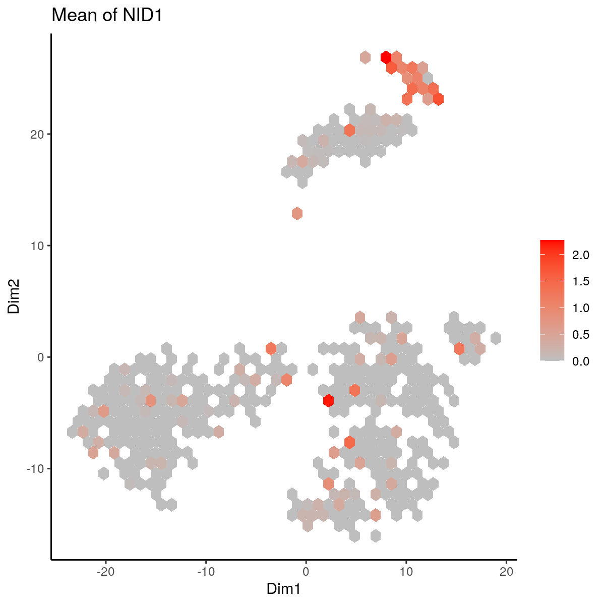|[CD44](https://www.ncbi.nlm.nih.gov/gene/960) [ITGA3](https://www.ncbi.nlm.nih.gov/gene/3675) [ITGAV](https://www.ncbi.nlm.nih.gov/gene/3685) [ITGB1](https://www.ncbi.nlm.nih.gov/gene/3688) [ITGB3](https://www.ncbi.nlm.nih.gov/gene/3690) [PCDH7](https://www.ncbi.nlm.nih.gov/gene/5099) [TECTB](https://www.ncbi.nlm.nih.gov/gene/6975) [ZAN](https://www.ncbi.nlm.nih.gov/gene/7455) [FLRT3](https://www.ncbi.nlm.nih.gov/gene/23767) [FLRT2](https://www.ncbi.nlm.nih.gov/gene/23768) [FLRT1](https://www.ncbi.nlm.nih.gov/gene/23769)|
|[NID2](https://www.ncbi.nlm.nih.gov/gene/22795)|[COL13A1](https://www.ncbi.nlm.nih.gov/gene/1305) [GNG2](https://www.ncbi.nlm.nih.gov/gene/54331) [ANKRD13D](https://www.ncbi.nlm.nih.gov/gene/338692)|
|[NMB](https://www.ncbi.nlm.nih.gov/gene/4828)|[ADRA1D](https://www.ncbi.nlm.nih.gov/gene/146) [AGTR1](https://www.ncbi.nlm.nih.gov/gene/185) [AGTR2](https://www.ncbi.nlm.nih.gov/gene/186) [AVPR1A](https://www.ncbi.nlm.nih.gov/gene/552) [AVPR1B](https://www.ncbi.nlm.nih.gov/gene/553) [BDKRB1](https://www.ncbi.nlm.nih.gov/gene/623) [BDKRB2](https://www.ncbi.nlm.nih.gov/gene/624) [BRS3](https://www.ncbi.nlm.nih.gov/gene/680) [CASR](https://www.ncbi.nlm.nih.gov/gene/846) [CCKAR](https://www.ncbi.nlm.nih.gov/gene/886) [CCKBR](https://www.ncbi.nlm.nih.gov/gene/887) [CHRM1](https://www.ncbi.nlm.nih.gov/gene/1128) [CHRM3](https://www.ncbi.nlm.nih.gov/gene/1131) [CHRM5](https://www.ncbi.nlm.nih.gov/gene/1133) [LTB4R](https://www.ncbi.nlm.nih.gov/gene/1241) [EDNRA](https://www.ncbi.nlm.nih.gov/gene/1909) [EDNRB](https://www.ncbi.nlm.nih.gov/gene/1910) [F2R](https://www.ncbi.nlm.nih.gov/gene/2149) [F2RL1](https://www.ncbi.nlm.nih.gov/gene/2150) [F2RL2](https://www.ncbi.nlm.nih.gov/gene/2151) [FPR2](https://www.ncbi.nlm.nih.gov/gene/2358) [GCGR](https://www.ncbi.nlm.nih.gov/gene/2642) [GHSR](https://www.ncbi.nlm.nih.gov/gene/2693) [GNA11](https://www.ncbi.nlm.nih.gov/gene/2767) [GNG3](https://www.ncbi.nlm.nih.gov/gene/2785) [GNG4](https://www.ncbi.nlm.nih.gov/gene/2786) [GNG5](https://www.ncbi.nlm.nih.gov/gene/2787) [GNG7](https://www.ncbi.nlm.nih.gov/gene/2788) [GNG10](https://www.ncbi.nlm.nih.gov/gene/2790) [GNG11](https://www.ncbi.nlm.nih.gov/gene/2791) [GNGT1](https://www.ncbi.nlm.nih.gov/gene/2792) [GNGT2](https://www.ncbi.nlm.nih.gov/gene/2793) [GNRHR](https://www.ncbi.nlm.nih.gov/gene/2798) [GPR4](https://www.ncbi.nlm.nih.gov/gene/2828) [XCR1](https://www.ncbi.nlm.nih.gov/gene/2829) [UTS2R](https://www.ncbi.nlm.nih.gov/gene/2837) [GPR17](https://www.ncbi.nlm.nih.gov/gene/2840) [LPAR4](https://www.ncbi.nlm.nih.gov/gene/2846) [MCHR1](https://www.ncbi.nlm.nih.gov/gene/2847) [MLNR](https://www.ncbi.nlm.nih.gov/gene/2862) [GPR39](https://www.ncbi.nlm.nih.gov/gene/2863) [FFAR1](https://www.ncbi.nlm.nih.gov/gene/2864) [FFAR3](https://www.ncbi.nlm.nih.gov/gene/2865) [FFAR2](https://www.ncbi.nlm.nih.gov/gene/2867) [GRK5](https://www.ncbi.nlm.nih.gov/gene/2869) [GRM1](https://www.ncbi.nlm.nih.gov/gene/2911) [GRM5](https://www.ncbi.nlm.nih.gov/gene/2915) [GRPR](https://www.ncbi.nlm.nih.gov/gene/2925) [HCRTR1](https://www.ncbi.nlm.nih.gov/gene/3061) [HCRTR2](https://www.ncbi.nlm.nih.gov/gene/3062) [HRH1](https://www.ncbi.nlm.nih.gov/gene/3269) [HTR2A](https://www.ncbi.nlm.nih.gov/gene/3356) [HTR2B](https://www.ncbi.nlm.nih.gov/gene/3357) [HTR2C](https://www.ncbi.nlm.nih.gov/gene/3358) [NMBR](https://www.ncbi.nlm.nih.gov/gene/4829) [NTSR1](https://www.ncbi.nlm.nih.gov/gene/4923) [OXTR](https://www.ncbi.nlm.nih.gov/gene/5021) [P2RY1](https://www.ncbi.nlm.nih.gov/gene/5028) [P2RY2](https://www.ncbi.nlm.nih.gov/gene/5029) [P2RY6](https://www.ncbi.nlm.nih.gov/gene/5031) [P2RY11](https://www.ncbi.nlm.nih.gov/gene/5032) [PTAFR](https://www.ncbi.nlm.nih.gov/gene/5724) [PTGER1](https://www.ncbi.nlm.nih.gov/gene/5731) [PTGFR](https://www.ncbi.nlm.nih.gov/gene/5737) [TACR2](https://www.ncbi.nlm.nih.gov/gene/6865) [TACR1](https://www.ncbi.nlm.nih.gov/gene/6869) [TACR3](https://www.ncbi.nlm.nih.gov/gene/6870) [TBXA2R](https://www.ncbi.nlm.nih.gov/gene/6915) [TLR4](https://www.ncbi.nlm.nih.gov/gene/7099) [TRHR](https://www.ncbi.nlm.nih.gov/gene/7201) [GPR68](https://www.ncbi.nlm.nih.gov/gene/8111) [GPR65](https://www.ncbi.nlm.nih.gov/gene/8477) [IFITM1](https://www.ncbi.nlm.nih.gov/gene/8519) [F2RL3](https://www.ncbi.nlm.nih.gov/gene/9002) [LPAR6](https://www.ncbi.nlm.nih.gov/gene/10161) [NMUR1](https://www.ncbi.nlm.nih.gov/gene/10316) [CYSLTR1](https://www.ncbi.nlm.nih.gov/gene/10800) [NPFFR2](https://www.ncbi.nlm.nih.gov/gene/10886) [LPAR3](https://www.ncbi.nlm.nih.gov/gene/23566) [NTSR2](https://www.ncbi.nlm.nih.gov/gene/23620) [P2RY10](https://www.ncbi.nlm.nih.gov/gene/27334) [GPR132](https://www.ncbi.nlm.nih.gov/gene/29933) [GNG13](https://www.ncbi.nlm.nih.gov/gene/51764) [GNG2](https://www.ncbi.nlm.nih.gov/gene/54331) [GNG12](https://www.ncbi.nlm.nih.gov/gene/55970) [LTB4R2](https://www.ncbi.nlm.nih.gov/gene/56413) [NMUR2](https://www.ncbi.nlm.nih.gov/gene/56923) [CYSLTR2](https://www.ncbi.nlm.nih.gov/gene/57105) [TRPC7](https://www.ncbi.nlm.nih.gov/gene/57113) [LPAR5](https://www.ncbi.nlm.nih.gov/gene/57121) [NPFFR1](https://www.ncbi.nlm.nih.gov/gene/64106) [QRFPR](https://www.ncbi.nlm.nih.gov/gene/84109) [MCHR2](https://www.ncbi.nlm.nih.gov/gene/84539) [KISS1R](https://www.ncbi.nlm.nih.gov/gene/84634) [OPN4](https://www.ncbi.nlm.nih.gov/gene/94233) [GNG8](https://www.ncbi.nlm.nih.gov/gene/94235) [ARHGEF25](https://www.ncbi.nlm.nih.gov/gene/115557) [MRGPRX3](https://www.ncbi.nlm.nih.gov/gene/117195) [PROKR2](https://www.ncbi.nlm.nih.gov/gene/128674) [GPRC6A](https://www.ncbi.nlm.nih.gov/gene/222545) [MRGPRX1](https://www.ncbi.nlm.nih.gov/gene/259249) [FFAR4](https://www.ncbi.nlm.nih.gov/gene/338557)|
|[NMS](https://www.ncbi.nlm.nih.gov/gene/129521)|[ADCY3](https://www.ncbi.nlm.nih.gov/gene/109) [ADCY5](https://www.ncbi.nlm.nih.gov/gene/111) [ADCY6](https://www.ncbi.nlm.nih.gov/gene/112) [ADCY8](https://www.ncbi.nlm.nih.gov/gene/114) [ADCY9](https://www.ncbi.nlm.nih.gov/gene/115) [ADORA1](https://www.ncbi.nlm.nih.gov/gene/134) [ADRA1D](https://www.ncbi.nlm.nih.gov/gene/146) [ADRA2A](https://www.ncbi.nlm.nih.gov/gene/150) [ADRA2B](https://www.ncbi.nlm.nih.gov/gene/151) [ADRA2C](https://www.ncbi.nlm.nih.gov/gene/152) [AGTR1](https://www.ncbi.nlm.nih.gov/gene/185) [AGTR2](https://www.ncbi.nlm.nih.gov/gene/186) [APLNR](https://www.ncbi.nlm.nih.gov/gene/187) [AVPR1A](https://www.ncbi.nlm.nih.gov/gene/552) [AVPR1B](https://www.ncbi.nlm.nih.gov/gene/553) [BDKRB1](https://www.ncbi.nlm.nih.gov/gene/623) [BDKRB2](https://www.ncbi.nlm.nih.gov/gene/624) [CXCR5](https://www.ncbi.nlm.nih.gov/gene/643) [BRS3](https://www.ncbi.nlm.nih.gov/gene/680) [C3AR1](https://www.ncbi.nlm.nih.gov/gene/719) [C5AR1](https://www.ncbi.nlm.nih.gov/gene/728) [CASR](https://www.ncbi.nlm.nih.gov/gene/846) [CCKAR](https://www.ncbi.nlm.nih.gov/gene/886) [CCKBR](https://www.ncbi.nlm.nih.gov/gene/887) [CHRM1](https://www.ncbi.nlm.nih.gov/gene/1128) [CHRM2](https://www.ncbi.nlm.nih.gov/gene/1129) [CHRM3](https://www.ncbi.nlm.nih.gov/gene/1131) [CHRM4](https://www.ncbi.nlm.nih.gov/gene/1132) [CHRM5](https://www.ncbi.nlm.nih.gov/gene/1133) [CCR1](https://www.ncbi.nlm.nih.gov/gene/1230) [CCR3](https://www.ncbi.nlm.nih.gov/gene/1232) [CCR4](https://www.ncbi.nlm.nih.gov/gene/1233) [CCR5](https://www.ncbi.nlm.nih.gov/gene/1234) [CCR7](https://www.ncbi.nlm.nih.gov/gene/1236) [CCR8](https://www.ncbi.nlm.nih.gov/gene/1237) [LTB4R](https://www.ncbi.nlm.nih.gov/gene/1241) [CNR1](https://www.ncbi.nlm.nih.gov/gene/1268) [CNR2](https://www.ncbi.nlm.nih.gov/gene/1269) [CX3CR1](https://www.ncbi.nlm.nih.gov/gene/1524) [DRD2](https://www.ncbi.nlm.nih.gov/gene/1813) [DRD3](https://www.ncbi.nlm.nih.gov/gene/1814) [DRD4](https://www.ncbi.nlm.nih.gov/gene/1815) [GPR183](https://www.ncbi.nlm.nih.gov/gene/1880) [S1PR1](https://www.ncbi.nlm.nih.gov/gene/1901) [S1PR3](https://www.ncbi.nlm.nih.gov/gene/1903) [EDNRA](https://www.ncbi.nlm.nih.gov/gene/1909) [EDNRB](https://www.ncbi.nlm.nih.gov/gene/1910) [F2R](https://www.ncbi.nlm.nih.gov/gene/2149) [F2RL1](https://www.ncbi.nlm.nih.gov/gene/2150) [F2RL2](https://www.ncbi.nlm.nih.gov/gene/2151) [FPR1](https://www.ncbi.nlm.nih.gov/gene/2357) [FPR2](https://www.ncbi.nlm.nih.gov/gene/2358) [FPR3](https://www.ncbi.nlm.nih.gov/gene/2359) [GALR1](https://www.ncbi.nlm.nih.gov/gene/2587) [GCGR](https://www.ncbi.nlm.nih.gov/gene/2642) [GHSR](https://www.ncbi.nlm.nih.gov/gene/2693) [GNA11](https://www.ncbi.nlm.nih.gov/gene/2767) [GNG3](https://www.ncbi.nlm.nih.gov/gene/2785) [GNG4](https://www.ncbi.nlm.nih.gov/gene/2786) [GNG5](https://www.ncbi.nlm.nih.gov/gene/2787) [GNG7](https://www.ncbi.nlm.nih.gov/gene/2788) [GNG10](https://www.ncbi.nlm.nih.gov/gene/2790) [GNG11](https://www.ncbi.nlm.nih.gov/gene/2791) [GNGT1](https://www.ncbi.nlm.nih.gov/gene/2792) [GNGT2](https://www.ncbi.nlm.nih.gov/gene/2793) [GNRHR](https://www.ncbi.nlm.nih.gov/gene/2798) [CCR10](https://www.ncbi.nlm.nih.gov/gene/2826) [GPR4](https://www.ncbi.nlm.nih.gov/gene/2828) [XCR1](https://www.ncbi.nlm.nih.gov/gene/2829) [NPBWR1](https://www.ncbi.nlm.nih.gov/gene/2831) [NPBWR2](https://www.ncbi.nlm.nih.gov/gene/2832) [CXCR3](https://www.ncbi.nlm.nih.gov/gene/2833) [UTS2R](https://www.ncbi.nlm.nih.gov/gene/2837) [GPR17](https://www.ncbi.nlm.nih.gov/gene/2840) [GPR18](https://www.ncbi.nlm.nih.gov/gene/2841) [LPAR4](https://www.ncbi.nlm.nih.gov/gene/2846) [MCHR1](https://www.ncbi.nlm.nih.gov/gene/2847) [GPR31](https://www.ncbi.nlm.nih.gov/gene/2853) [GPR37](https://www.ncbi.nlm.nih.gov/gene/2861) [MLNR](https://www.ncbi.nlm.nih.gov/gene/2862) [GPR39](https://www.ncbi.nlm.nih.gov/gene/2863) [FFAR1](https://www.ncbi.nlm.nih.gov/gene/2864) [FFAR3](https://www.ncbi.nlm.nih.gov/gene/2865) [FFAR2](https://www.ncbi.nlm.nih.gov/gene/2867) [GRK5](https://www.ncbi.nlm.nih.gov/gene/2869) [GRM1](https://www.ncbi.nlm.nih.gov/gene/2911) [GRM2](https://www.ncbi.nlm.nih.gov/gene/2912) [GRM3](https://www.ncbi.nlm.nih.gov/gene/2913) [GRM4](https://www.ncbi.nlm.nih.gov/gene/2914) [GRM5](https://www.ncbi.nlm.nih.gov/gene/2915) [GRM6](https://www.ncbi.nlm.nih.gov/gene/2916) [GRM7](https://www.ncbi.nlm.nih.gov/gene/2917) [GRM8](https://www.ncbi.nlm.nih.gov/gene/2918) [GRPR](https://www.ncbi.nlm.nih.gov/gene/2925) [HCRTR1](https://www.ncbi.nlm.nih.gov/gene/3061) [HCRTR2](https://www.ncbi.nlm.nih.gov/gene/3062) [HRH1](https://www.ncbi.nlm.nih.gov/gene/3269) [HTR1A](https://www.ncbi.nlm.nih.gov/gene/3350) [HTR1B](https://www.ncbi.nlm.nih.gov/gene/3351) [HTR1D](https://www.ncbi.nlm.nih.gov/gene/3352) [HTR1E](https://www.ncbi.nlm.nih.gov/gene/3354) [HTR1F](https://www.ncbi.nlm.nih.gov/gene/3355) [HTR2A](https://www.ncbi.nlm.nih.gov/gene/3356) [HTR2B](https://www.ncbi.nlm.nih.gov/gene/3357) [HTR2C](https://www.ncbi.nlm.nih.gov/gene/3358) [HTR5A](https://www.ncbi.nlm.nih.gov/gene/3361) [CXCR1](https://www.ncbi.nlm.nih.gov/gene/3577) [CXCR2](https://www.ncbi.nlm.nih.gov/gene/3579) [MTNR1A](https://www.ncbi.nlm.nih.gov/gene/4543) [MTNR1B](https://www.ncbi.nlm.nih.gov/gene/4544) [NMBR](https://www.ncbi.nlm.nih.gov/gene/4829) [NPY1R](https://www.ncbi.nlm.nih.gov/gene/4886) [NPY2R](https://www.ncbi.nlm.nih.gov/gene/4887) [NPY5R](https://www.ncbi.nlm.nih.gov/gene/4889) [NTSR1](https://www.ncbi.nlm.nih.gov/gene/4923) [OPRD1](https://www.ncbi.nlm.nih.gov/gene/4985) [OPRK1](https://www.ncbi.nlm.nih.gov/gene/4986) [OPRL1](https://www.ncbi.nlm.nih.gov/gene/4987) [OXTR](https://www.ncbi.nlm.nih.gov/gene/5021) [P2RY1](https://www.ncbi.nlm.nih.gov/gene/5028) [P2RY2](https://www.ncbi.nlm.nih.gov/gene/5029) [P2RY4](https://www.ncbi.nlm.nih.gov/gene/5030) [P2RY6](https://www.ncbi.nlm.nih.gov/gene/5031) [P2RY11](https://www.ncbi.nlm.nih.gov/gene/5032) [PTAFR](https://www.ncbi.nlm.nih.gov/gene/5724) [PTGER1](https://www.ncbi.nlm.nih.gov/gene/5731) [PTGER3](https://www.ncbi.nlm.nih.gov/gene/5733) [PTGFR](https://www.ncbi.nlm.nih.gov/gene/5737) [SSTR1](https://www.ncbi.nlm.nih.gov/gene/6751) [SSTR2](https://www.ncbi.nlm.nih.gov/gene/6752) [SSTR3](https://www.ncbi.nlm.nih.gov/gene/6753) [SSTR4](https://www.ncbi.nlm.nih.gov/gene/6754) [SSTR5](https://www.ncbi.nlm.nih.gov/gene/6755) [TACR2](https://www.ncbi.nlm.nih.gov/gene/6865) [TACR1](https://www.ncbi.nlm.nih.gov/gene/6869) [TACR3](https://www.ncbi.nlm.nih.gov/gene/6870) [TBXA2R](https://www.ncbi.nlm.nih.gov/gene/6915) [TRHR](https://www.ncbi.nlm.nih.gov/gene/7201) [CXCR4](https://www.ncbi.nlm.nih.gov/gene/7852) [GPR68](https://www.ncbi.nlm.nih.gov/gene/8111) [GPR65](https://www.ncbi.nlm.nih.gov/gene/8477) [GALR3](https://www.ncbi.nlm.nih.gov/gene/8484) [S1PR4](https://www.ncbi.nlm.nih.gov/gene/8698) [GALR2](https://www.ncbi.nlm.nih.gov/gene/8811) [HCAR3](https://www.ncbi.nlm.nih.gov/gene/8843) [F2RL3](https://www.ncbi.nlm.nih.gov/gene/9002) [GPR37L1](https://www.ncbi.nlm.nih.gov/gene/9283) [GPR55](https://www.ncbi.nlm.nih.gov/gene/9290) [GABBR2](https://www.ncbi.nlm.nih.gov/gene/9568) [P2RY14](https://www.ncbi.nlm.nih.gov/gene/9934) [LPAR6](https://www.ncbi.nlm.nih.gov/gene/10161) [NMUR1](https://www.ncbi.nlm.nih.gov/gene/10316) [CXCR6](https://www.ncbi.nlm.nih.gov/gene/10663) [CYSLTR1](https://www.ncbi.nlm.nih.gov/gene/10800) [CCR9](https://www.ncbi.nlm.nih.gov/gene/10803) [NPFFR2](https://www.ncbi.nlm.nih.gov/gene/10886) [PTGDR2](https://www.ncbi.nlm.nih.gov/gene/11251) [HRH3](https://www.ncbi.nlm.nih.gov/gene/11255) [LPAR3](https://www.ncbi.nlm.nih.gov/gene/23566) [NTSR2](https://www.ncbi.nlm.nih.gov/gene/23620) [HCAR1](https://www.ncbi.nlm.nih.gov/gene/27198) [OXGR1](https://www.ncbi.nlm.nih.gov/gene/27199) [P2RY10](https://www.ncbi.nlm.nih.gov/gene/27334) [GPR132](https://www.ncbi.nlm.nih.gov/gene/29933) [TAS2R16](https://www.ncbi.nlm.nih.gov/gene/50833) [RXFP3](https://www.ncbi.nlm.nih.gov/gene/51289) [GNG13](https://www.ncbi.nlm.nih.gov/gene/51764) [S1PR5](https://www.ncbi.nlm.nih.gov/gene/53637) [P2RY13](https://www.ncbi.nlm.nih.gov/gene/53829) [GNG2](https://www.ncbi.nlm.nih.gov/gene/54331) [GNG12](https://www.ncbi.nlm.nih.gov/gene/55970) [LTB4R2](https://www.ncbi.nlm.nih.gov/gene/56413) [SUCNR1](https://www.ncbi.nlm.nih.gov/gene/56670) [NMUR2](https://www.ncbi.nlm.nih.gov/gene/56923) [ACKR3](https://www.ncbi.nlm.nih.gov/gene/57007) [CYSLTR2](https://www.ncbi.nlm.nih.gov/gene/57105) [LPAR5](https://www.ncbi.nlm.nih.gov/gene/57121) [CXCL16](https://www.ncbi.nlm.nih.gov/gene/58191) [HRH4](https://www.ncbi.nlm.nih.gov/gene/59340) [NPFFR1](https://www.ncbi.nlm.nih.gov/gene/64106) [P2RY12](https://www.ncbi.nlm.nih.gov/gene/64805) [TAS1R2](https://www.ncbi.nlm.nih.gov/gene/80834) [TAS1R1](https://www.ncbi.nlm.nih.gov/gene/80835) [TAS1R3](https://www.ncbi.nlm.nih.gov/gene/83756) [QRFPR](https://www.ncbi.nlm.nih.gov/gene/84109) [MCHR2](https://www.ncbi.nlm.nih.gov/gene/84539) [KISS1R](https://www.ncbi.nlm.nih.gov/gene/84634) [OPN4](https://www.ncbi.nlm.nih.gov/gene/94233) [GNG8](https://www.ncbi.nlm.nih.gov/gene/94235) [ARHGEF25](https://www.ncbi.nlm.nih.gov/gene/115557) [GPR139](https://www.ncbi.nlm.nih.gov/gene/124274) [PROKR2](https://www.ncbi.nlm.nih.gov/gene/128674) [OXER1](https://www.ncbi.nlm.nih.gov/gene/165140) [ADCY4](https://www.ncbi.nlm.nih.gov/gene/196883) [GPRC6A](https://www.ncbi.nlm.nih.gov/gene/222545) [HCAR2](https://www.ncbi.nlm.nih.gov/gene/338442) [FFAR4](https://www.ncbi.nlm.nih.gov/gene/338557) [RXFP4](https://www.ncbi.nlm.nih.gov/gene/339403) [CCR2](https://www.ncbi.nlm.nih.gov/gene/729230)|
|[NMU](https://www.ncbi.nlm.nih.gov/gene/10874)|[ADCY3](https://www.ncbi.nlm.nih.gov/gene/109) [ADCY5](https://www.ncbi.nlm.nih.gov/gene/111) [ADCY6](https://www.ncbi.nlm.nih.gov/gene/112) [ADCY8](https://www.ncbi.nlm.nih.gov/gene/114) [ADCY9](https://www.ncbi.nlm.nih.gov/gene/115) [ADORA1](https://www.ncbi.nlm.nih.gov/gene/134) [ADRA1D](https://www.ncbi.nlm.nih.gov/gene/146) [ADRA2A](https://www.ncbi.nlm.nih.gov/gene/150) [ADRA2B](https://www.ncbi.nlm.nih.gov/gene/151) [ADRA2C](https://www.ncbi.nlm.nih.gov/gene/152) [AGTR1](https://www.ncbi.nlm.nih.gov/gene/185) [AGTR2](https://www.ncbi.nlm.nih.gov/gene/186) [APLNR](https://www.ncbi.nlm.nih.gov/gene/187) [AVPR1A](https://www.ncbi.nlm.nih.gov/gene/552) [AVPR1B](https://www.ncbi.nlm.nih.gov/gene/553) [BDKRB1](https://www.ncbi.nlm.nih.gov/gene/623) [BDKRB2](https://www.ncbi.nlm.nih.gov/gene/624) [CXCR5](https://www.ncbi.nlm.nih.gov/gene/643) [BRS3](https://www.ncbi.nlm.nih.gov/gene/680) [C3AR1](https://www.ncbi.nlm.nih.gov/gene/719) [C5AR1](https://www.ncbi.nlm.nih.gov/gene/728) [CASR](https://www.ncbi.nlm.nih.gov/gene/846) [CCKAR](https://www.ncbi.nlm.nih.gov/gene/886) [CCKBR](https://www.ncbi.nlm.nih.gov/gene/887) [CHRM1](https://www.ncbi.nlm.nih.gov/gene/1128) [CHRM2](https://www.ncbi.nlm.nih.gov/gene/1129) [CHRM3](https://www.ncbi.nlm.nih.gov/gene/1131) [CHRM4](https://www.ncbi.nlm.nih.gov/gene/1132) [CHRM5](https://www.ncbi.nlm.nih.gov/gene/1133) [CCR1](https://www.ncbi.nlm.nih.gov/gene/1230) [CCR3](https://www.ncbi.nlm.nih.gov/gene/1232) [CCR4](https://www.ncbi.nlm.nih.gov/gene/1233) [CCR5](https://www.ncbi.nlm.nih.gov/gene/1234) [CCR7](https://www.ncbi.nlm.nih.gov/gene/1236) [CCR8](https://www.ncbi.nlm.nih.gov/gene/1237) [LTB4R](https://www.ncbi.nlm.nih.gov/gene/1241) [CNR1](https://www.ncbi.nlm.nih.gov/gene/1268) [CNR2](https://www.ncbi.nlm.nih.gov/gene/1269) [CX3CR1](https://www.ncbi.nlm.nih.gov/gene/1524) [DRD2](https://www.ncbi.nlm.nih.gov/gene/1813) [DRD3](https://www.ncbi.nlm.nih.gov/gene/1814) [DRD4](https://www.ncbi.nlm.nih.gov/gene/1815) [GPR183](https://www.ncbi.nlm.nih.gov/gene/1880) [S1PR1](https://www.ncbi.nlm.nih.gov/gene/1901) [S1PR3](https://www.ncbi.nlm.nih.gov/gene/1903) [EDNRA](https://www.ncbi.nlm.nih.gov/gene/1909) [EDNRB](https://www.ncbi.nlm.nih.gov/gene/1910) [F2R](https://www.ncbi.nlm.nih.gov/gene/2149) [F2RL1](https://www.ncbi.nlm.nih.gov/gene/2150) [F2RL2](https://www.ncbi.nlm.nih.gov/gene/2151) [FPR1](https://www.ncbi.nlm.nih.gov/gene/2357) [FPR2](https://www.ncbi.nlm.nih.gov/gene/2358) [FPR3](https://www.ncbi.nlm.nih.gov/gene/2359) [GALR1](https://www.ncbi.nlm.nih.gov/gene/2587) [GCGR](https://www.ncbi.nlm.nih.gov/gene/2642) [GHSR](https://www.ncbi.nlm.nih.gov/gene/2693) [GNA11](https://www.ncbi.nlm.nih.gov/gene/2767) [GNG3](https://www.ncbi.nlm.nih.gov/gene/2785) [GNG4](https://www.ncbi.nlm.nih.gov/gene/2786) [GNG5](https://www.ncbi.nlm.nih.gov/gene/2787) [GNG7](https://www.ncbi.nlm.nih.gov/gene/2788) [GNG10](https://www.ncbi.nlm.nih.gov/gene/2790) [GNG11](https://www.ncbi.nlm.nih.gov/gene/2791) [GNGT1](https://www.ncbi.nlm.nih.gov/gene/2792) [GNGT2](https://www.ncbi.nlm.nih.gov/gene/2793) [GNRHR](https://www.ncbi.nlm.nih.gov/gene/2798) [CCR10](https://www.ncbi.nlm.nih.gov/gene/2826) [GPR4](https://www.ncbi.nlm.nih.gov/gene/2828) [XCR1](https://www.ncbi.nlm.nih.gov/gene/2829) [NPBWR1](https://www.ncbi.nlm.nih.gov/gene/2831) [NPBWR2](https://www.ncbi.nlm.nih.gov/gene/2832) [CXCR3](https://www.ncbi.nlm.nih.gov/gene/2833) [UTS2R](https://www.ncbi.nlm.nih.gov/gene/2837) [GPR17](https://www.ncbi.nlm.nih.gov/gene/2840) [GPR18](https://www.ncbi.nlm.nih.gov/gene/2841) [LPAR4](https://www.ncbi.nlm.nih.gov/gene/2846) [MCHR1](https://www.ncbi.nlm.nih.gov/gene/2847) [GPR31](https://www.ncbi.nlm.nih.gov/gene/2853) [GPR37](https://www.ncbi.nlm.nih.gov/gene/2861) [MLNR](https://www.ncbi.nlm.nih.gov/gene/2862) [GPR39](https://www.ncbi.nlm.nih.gov/gene/2863) [FFAR1](https://www.ncbi.nlm.nih.gov/gene/2864) [FFAR3](https://www.ncbi.nlm.nih.gov/gene/2865) [FFAR2](https://www.ncbi.nlm.nih.gov/gene/2867) [GRK5](https://www.ncbi.nlm.nih.gov/gene/2869) [GRM1](https://www.ncbi.nlm.nih.gov/gene/2911) [GRM2](https://www.ncbi.nlm.nih.gov/gene/2912) [GRM3](https://www.ncbi.nlm.nih.gov/gene/2913) [GRM4](https://www.ncbi.nlm.nih.gov/gene/2914) [GRM5](https://www.ncbi.nlm.nih.gov/gene/2915) [GRM6](https://www.ncbi.nlm.nih.gov/gene/2916) [GRM7](https://www.ncbi.nlm.nih.gov/gene/2917) [GRM8](https://www.ncbi.nlm.nih.gov/gene/2918) [GRPR](https://www.ncbi.nlm.nih.gov/gene/2925) [HCRTR1](https://www.ncbi.nlm.nih.gov/gene/3061) [HCRTR2](https://www.ncbi.nlm.nih.gov/gene/3062) [HRH1](https://www.ncbi.nlm.nih.gov/gene/3269) [HTR1A](https://www.ncbi.nlm.nih.gov/gene/3350) [HTR1B](https://www.ncbi.nlm.nih.gov/gene/3351) [HTR1D](https://www.ncbi.nlm.nih.gov/gene/3352) [HTR1E](https://www.ncbi.nlm.nih.gov/gene/3354) [HTR1F](https://www.ncbi.nlm.nih.gov/gene/3355) [HTR2A](https://www.ncbi.nlm.nih.gov/gene/3356) [HTR2B](https://www.ncbi.nlm.nih.gov/gene/3357) [HTR2C](https://www.ncbi.nlm.nih.gov/gene/3358) [HTR5A](https://www.ncbi.nlm.nih.gov/gene/3361) [CXCR1](https://www.ncbi.nlm.nih.gov/gene/3577) [CXCR2](https://www.ncbi.nlm.nih.gov/gene/3579) [MTNR1A](https://www.ncbi.nlm.nih.gov/gene/4543) [MTNR1B](https://www.ncbi.nlm.nih.gov/gene/4544) [NMBR](https://www.ncbi.nlm.nih.gov/gene/4829) [NPY1R](https://www.ncbi.nlm.nih.gov/gene/4886) [NPY2R](https://www.ncbi.nlm.nih.gov/gene/4887) [NPY5R](https://www.ncbi.nlm.nih.gov/gene/4889) [NTSR1](https://www.ncbi.nlm.nih.gov/gene/4923) [OPRD1](https://www.ncbi.nlm.nih.gov/gene/4985) [OPRK1](https://www.ncbi.nlm.nih.gov/gene/4986) [OPRL1](https://www.ncbi.nlm.nih.gov/gene/4987) [OXTR](https://www.ncbi.nlm.nih.gov/gene/5021) [P2RY1](https://www.ncbi.nlm.nih.gov/gene/5028) [P2RY2](https://www.ncbi.nlm.nih.gov/gene/5029) [P2RY4](https://www.ncbi.nlm.nih.gov/gene/5030) [P2RY6](https://www.ncbi.nlm.nih.gov/gene/5031) [P2RY11](https://www.ncbi.nlm.nih.gov/gene/5032) [PTAFR](https://www.ncbi.nlm.nih.gov/gene/5724) [PTGER1](https://www.ncbi.nlm.nih.gov/gene/5731) [PTGER3](https://www.ncbi.nlm.nih.gov/gene/5733) [PTGFR](https://www.ncbi.nlm.nih.gov/gene/5737) [SSTR1](https://www.ncbi.nlm.nih.gov/gene/6751) [SSTR2](https://www.ncbi.nlm.nih.gov/gene/6752) [SSTR3](https://www.ncbi.nlm.nih.gov/gene/6753) [SSTR4](https://www.ncbi.nlm.nih.gov/gene/6754) [SSTR5](https://www.ncbi.nlm.nih.gov/gene/6755) [TACR2](https://www.ncbi.nlm.nih.gov/gene/6865) [TACR1](https://www.ncbi.nlm.nih.gov/gene/6869) [TACR3](https://www.ncbi.nlm.nih.gov/gene/6870) [TBXA2R](https://www.ncbi.nlm.nih.gov/gene/6915) [TRHR](https://www.ncbi.nlm.nih.gov/gene/7201) [CXCR4](https://www.ncbi.nlm.nih.gov/gene/7852) [GPR68](https://www.ncbi.nlm.nih.gov/gene/8111) [GPR65](https://www.ncbi.nlm.nih.gov/gene/8477) [GALR3](https://www.ncbi.nlm.nih.gov/gene/8484) [S1PR4](https://www.ncbi.nlm.nih.gov/gene/8698) [GALR2](https://www.ncbi.nlm.nih.gov/gene/8811) [HCAR3](https://www.ncbi.nlm.nih.gov/gene/8843) [F2RL3](https://www.ncbi.nlm.nih.gov/gene/9002) [GPR37L1](https://www.ncbi.nlm.nih.gov/gene/9283) [GPR55](https://www.ncbi.nlm.nih.gov/gene/9290) [GABBR2](https://www.ncbi.nlm.nih.gov/gene/9568) [P2RY14](https://www.ncbi.nlm.nih.gov/gene/9934) [LPAR6](https://www.ncbi.nlm.nih.gov/gene/10161) [NMUR1](https://www.ncbi.nlm.nih.gov/gene/10316) [CXCR6](https://www.ncbi.nlm.nih.gov/gene/10663) [CYSLTR1](https://www.ncbi.nlm.nih.gov/gene/10800) [CCR9](https://www.ncbi.nlm.nih.gov/gene/10803) [NPFFR2](https://www.ncbi.nlm.nih.gov/gene/10886) [PTGDR2](https://www.ncbi.nlm.nih.gov/gene/11251) [HRH3](https://www.ncbi.nlm.nih.gov/gene/11255) [LPAR3](https://www.ncbi.nlm.nih.gov/gene/23566) [NTSR2](https://www.ncbi.nlm.nih.gov/gene/23620) [HCAR1](https://www.ncbi.nlm.nih.gov/gene/27198) [OXGR1](https://www.ncbi.nlm.nih.gov/gene/27199) [P2RY10](https://www.ncbi.nlm.nih.gov/gene/27334) [GPR132](https://www.ncbi.nlm.nih.gov/gene/29933) [TAS2R16](https://www.ncbi.nlm.nih.gov/gene/50833) [RXFP3](https://www.ncbi.nlm.nih.gov/gene/51289) [GNG13](https://www.ncbi.nlm.nih.gov/gene/51764) [S1PR5](https://www.ncbi.nlm.nih.gov/gene/53637) [P2RY13](https://www.ncbi.nlm.nih.gov/gene/53829) [GNG2](https://www.ncbi.nlm.nih.gov/gene/54331) [GNG12](https://www.ncbi.nlm.nih.gov/gene/55970) [LTB4R2](https://www.ncbi.nlm.nih.gov/gene/56413) [SUCNR1](https://www.ncbi.nlm.nih.gov/gene/56670) [NMUR2](https://www.ncbi.nlm.nih.gov/gene/56923) [ACKR3](https://www.ncbi.nlm.nih.gov/gene/57007) [CYSLTR2](https://www.ncbi.nlm.nih.gov/gene/57105) [LPAR5](https://www.ncbi.nlm.nih.gov/gene/57121) [ATP10D](https://www.ncbi.nlm.nih.gov/gene/57205) [CXCL16](https://www.ncbi.nlm.nih.gov/gene/58191) [HRH4](https://www.ncbi.nlm.nih.gov/gene/59340) [NPFFR1](https://www.ncbi.nlm.nih.gov/gene/64106) [P2RY12](https://www.ncbi.nlm.nih.gov/gene/64805) [TAS1R2](https://www.ncbi.nlm.nih.gov/gene/80834) [TAS1R1](https://www.ncbi.nlm.nih.gov/gene/80835) [TAS1R3](https://www.ncbi.nlm.nih.gov/gene/83756) [QRFPR](https://www.ncbi.nlm.nih.gov/gene/84109) [MCHR2](https://www.ncbi.nlm.nih.gov/gene/84539) [KISS1R](https://www.ncbi.nlm.nih.gov/gene/84634) [OPN4](https://www.ncbi.nlm.nih.gov/gene/94233) [GNG8](https://www.ncbi.nlm.nih.gov/gene/94235) [ARHGEF25](https://www.ncbi.nlm.nih.gov/gene/115557) [PROKR2](https://www.ncbi.nlm.nih.gov/gene/128674) [OXER1](https://www.ncbi.nlm.nih.gov/gene/165140) [ADCY4](https://www.ncbi.nlm.nih.gov/gene/196883) [GPRC6A](https://www.ncbi.nlm.nih.gov/gene/222545) [HCAR2](https://www.ncbi.nlm.nih.gov/gene/338442) [FFAR4](https://www.ncbi.nlm.nih.gov/gene/338557) [RXFP4](https://www.ncbi.nlm.nih.gov/gene/339403) [CCR2](https://www.ncbi.nlm.nih.gov/gene/729230)|
|[NODAL](https://www.ncbi.nlm.nih.gov/gene/4838)|[ACVR1B](https://www.ncbi.nlm.nih.gov/gene/91) [ACVR2B](https://www.ncbi.nlm.nih.gov/gene/93) [ACVRL1](https://www.ncbi.nlm.nih.gov/gene/94) [BMPR1A](https://www.ncbi.nlm.nih.gov/gene/657) [BMPR1B](https://www.ncbi.nlm.nih.gov/gene/658) [BMPR2](https://www.ncbi.nlm.nih.gov/gene/659) [GPR31](https://www.ncbi.nlm.nih.gov/gene/2853) [TDGF1](https://www.ncbi.nlm.nih.gov/gene/6997) [TGFBR1](https://www.ncbi.nlm.nih.gov/gene/7046) [TGFBR2](https://www.ncbi.nlm.nih.gov/gene/7048) [CFC1](https://www.ncbi.nlm.nih.gov/gene/55997)|
|[NOG](https://www.ncbi.nlm.nih.gov/gene/9241)|[ACVR1B](https://www.ncbi.nlm.nih.gov/gene/91) [ACVR2B](https://www.ncbi.nlm.nih.gov/gene/93) [RHOA](https://www.ncbi.nlm.nih.gov/gene/387) [BMPR1A](https://www.ncbi.nlm.nih.gov/gene/657) [BMPR1B](https://www.ncbi.nlm.nih.gov/gene/658) [BMPR2](https://www.ncbi.nlm.nih.gov/gene/659) [CD47](https://www.ncbi.nlm.nih.gov/gene/961) [CCR5](https://www.ncbi.nlm.nih.gov/gene/1234) [IHH](https://www.ncbi.nlm.nih.gov/gene/3549) [IL2RG](https://www.ncbi.nlm.nih.gov/gene/3561) [ROR2](https://www.ncbi.nlm.nih.gov/gene/4920) [PTCH1](https://www.ncbi.nlm.nih.gov/gene/5727) [PTPRC](https://www.ncbi.nlm.nih.gov/gene/5788) [TGFBR1](https://www.ncbi.nlm.nih.gov/gene/7046) [CXCR4](https://www.ncbi.nlm.nih.gov/gene/7852) [LGR5](https://www.ncbi.nlm.nih.gov/gene/8549) [PROM1](https://www.ncbi.nlm.nih.gov/gene/8842) [MRAP](https://www.ncbi.nlm.nih.gov/gene/56246) [RGMA](https://www.ncbi.nlm.nih.gov/gene/56963) [HJV](https://www.ncbi.nlm.nih.gov/gene/148738) [RGMB](https://www.ncbi.nlm.nih.gov/gene/285704)|
|[NOTUM](https://www.ncbi.nlm.nih.gov/gene/147111)|[ADAM10](https://www.ncbi.nlm.nih.gov/gene/102) [APLP2](https://www.ncbi.nlm.nih.gov/gene/334) [CDH2](https://www.ncbi.nlm.nih.gov/gene/1000) [GPC3](https://www.ncbi.nlm.nih.gov/gene/2719) [IHH](https://www.ncbi.nlm.nih.gov/gene/3549) [MARK1](https://www.ncbi.nlm.nih.gov/gene/4139) [MELTF](https://www.ncbi.nlm.nih.gov/gene/4241) [SFRP1](https://www.ncbi.nlm.nih.gov/gene/6422) [TGOLN2](https://www.ncbi.nlm.nih.gov/gene/10618) [MXRA8](https://www.ncbi.nlm.nih.gov/gene/54587) [PNPLA2](https://www.ncbi.nlm.nih.gov/gene/57104) [ANO8](https://www.ncbi.nlm.nih.gov/gene/57719) [ZNRF3](https://www.ncbi.nlm.nih.gov/gene/84133) [NKD1](https://www.ncbi.nlm.nih.gov/gene/85407) [BOC](https://www.ncbi.nlm.nih.gov/gene/91653) [VSTM4](https://www.ncbi.nlm.nih.gov/gene/196740) [GCSAM](https://www.ncbi.nlm.nih.gov/gene/257144)|
|[NPB](https://www.ncbi.nlm.nih.gov/gene/256933)|[ADCY3](https://www.ncbi.nlm.nih.gov/gene/109) [ADCY5](https://www.ncbi.nlm.nih.gov/gene/111) [ADCY6](https://www.ncbi.nlm.nih.gov/gene/112) [ADCY8](https://www.ncbi.nlm.nih.gov/gene/114) [ADCY9](https://www.ncbi.nlm.nih.gov/gene/115) [ADORA1](https://www.ncbi.nlm.nih.gov/gene/134) [ADRA2A](https://www.ncbi.nlm.nih.gov/gene/150) [ADRA2B](https://www.ncbi.nlm.nih.gov/gene/151) [ADRA2C](https://www.ncbi.nlm.nih.gov/gene/152) [AGTR1](https://www.ncbi.nlm.nih.gov/gene/185) [AGTR2](https://www.ncbi.nlm.nih.gov/gene/186) [APLNR](https://www.ncbi.nlm.nih.gov/gene/187) [BDKRB1](https://www.ncbi.nlm.nih.gov/gene/623) [BDKRB2](https://www.ncbi.nlm.nih.gov/gene/624) [CXCR5](https://www.ncbi.nlm.nih.gov/gene/643) [C3AR1](https://www.ncbi.nlm.nih.gov/gene/719) [C5AR1](https://www.ncbi.nlm.nih.gov/gene/728) [CASR](https://www.ncbi.nlm.nih.gov/gene/846) [CHRM2](https://www.ncbi.nlm.nih.gov/gene/1129) [CHRM4](https://www.ncbi.nlm.nih.gov/gene/1132) [CCR1](https://www.ncbi.nlm.nih.gov/gene/1230) [CCR3](https://www.ncbi.nlm.nih.gov/gene/1232) [CCR4](https://www.ncbi.nlm.nih.gov/gene/1233) [CCR5](https://www.ncbi.nlm.nih.gov/gene/1234) [CCR7](https://www.ncbi.nlm.nih.gov/gene/1236) [CCR8](https://www.ncbi.nlm.nih.gov/gene/1237) [CNR1](https://www.ncbi.nlm.nih.gov/gene/1268) [CNR2](https://www.ncbi.nlm.nih.gov/gene/1269) [CX3CR1](https://www.ncbi.nlm.nih.gov/gene/1524) [DRD2](https://www.ncbi.nlm.nih.gov/gene/1813) [DRD3](https://www.ncbi.nlm.nih.gov/gene/1814) [DRD4](https://www.ncbi.nlm.nih.gov/gene/1815) [GPR183](https://www.ncbi.nlm.nih.gov/gene/1880) [S1PR1](https://www.ncbi.nlm.nih.gov/gene/1901) [S1PR3](https://www.ncbi.nlm.nih.gov/gene/1903) [FPR1](https://www.ncbi.nlm.nih.gov/gene/2357) [FPR2](https://www.ncbi.nlm.nih.gov/gene/2358) [FPR3](https://www.ncbi.nlm.nih.gov/gene/2359) [GALR1](https://www.ncbi.nlm.nih.gov/gene/2587) [GNG3](https://www.ncbi.nlm.nih.gov/gene/2785) [GNG4](https://www.ncbi.nlm.nih.gov/gene/2786) [GNG5](https://www.ncbi.nlm.nih.gov/gene/2787) [GNG7](https://www.ncbi.nlm.nih.gov/gene/2788) [GNG10](https://www.ncbi.nlm.nih.gov/gene/2790) [GNG11](https://www.ncbi.nlm.nih.gov/gene/2791) [GNGT1](https://www.ncbi.nlm.nih.gov/gene/2792) [GNGT2](https://www.ncbi.nlm.nih.gov/gene/2793) [CCR10](https://www.ncbi.nlm.nih.gov/gene/2826) [NPBWR1](https://www.ncbi.nlm.nih.gov/gene/2831) [NPBWR2](https://www.ncbi.nlm.nih.gov/gene/2832) [CXCR3](https://www.ncbi.nlm.nih.gov/gene/2833) [GPR17](https://www.ncbi.nlm.nih.gov/gene/2840) [GPR18](https://www.ncbi.nlm.nih.gov/gene/2841) [MCHR1](https://www.ncbi.nlm.nih.gov/gene/2847) [GPR31](https://www.ncbi.nlm.nih.gov/gene/2853) [GPR37](https://www.ncbi.nlm.nih.gov/gene/2861) [GRM2](https://www.ncbi.nlm.nih.gov/gene/2912) [GRM3](https://www.ncbi.nlm.nih.gov/gene/2913) [GRM4](https://www.ncbi.nlm.nih.gov/gene/2914) [GRM6](https://www.ncbi.nlm.nih.gov/gene/2916) [GRM7](https://www.ncbi.nlm.nih.gov/gene/2917) [GRM8](https://www.ncbi.nlm.nih.gov/gene/2918) [HTR1A](https://www.ncbi.nlm.nih.gov/gene/3350) [HTR1B](https://www.ncbi.nlm.nih.gov/gene/3351) [HTR1D](https://www.ncbi.nlm.nih.gov/gene/3352) [HTR1E](https://www.ncbi.nlm.nih.gov/gene/3354) [HTR1F](https://www.ncbi.nlm.nih.gov/gene/3355) [HTR5A](https://www.ncbi.nlm.nih.gov/gene/3361) [CXCR1](https://www.ncbi.nlm.nih.gov/gene/3577) [CXCR2](https://www.ncbi.nlm.nih.gov/gene/3579) [MTNR1A](https://www.ncbi.nlm.nih.gov/gene/4543) [MTNR1B](https://www.ncbi.nlm.nih.gov/gene/4544) [NPY1R](https://www.ncbi.nlm.nih.gov/gene/4886) [NPY2R](https://www.ncbi.nlm.nih.gov/gene/4887) [NPY5R](https://www.ncbi.nlm.nih.gov/gene/4889) [OPRD1](https://www.ncbi.nlm.nih.gov/gene/4985) [OPRK1](https://www.ncbi.nlm.nih.gov/gene/4986) [OPRL1](https://www.ncbi.nlm.nih.gov/gene/4987) [P2RY4](https://www.ncbi.nlm.nih.gov/gene/5030) [PTGER3](https://www.ncbi.nlm.nih.gov/gene/5733) [SSTR1](https://www.ncbi.nlm.nih.gov/gene/6751) [SSTR2](https://www.ncbi.nlm.nih.gov/gene/6752) [SSTR3](https://www.ncbi.nlm.nih.gov/gene/6753) [SSTR4](https://www.ncbi.nlm.nih.gov/gene/6754) [SSTR5](https://www.ncbi.nlm.nih.gov/gene/6755) [CXCR4](https://www.ncbi.nlm.nih.gov/gene/7852) [GALR3](https://www.ncbi.nlm.nih.gov/gene/8484) [S1PR4](https://www.ncbi.nlm.nih.gov/gene/8698) [GALR2](https://www.ncbi.nlm.nih.gov/gene/8811) [HCAR3](https://www.ncbi.nlm.nih.gov/gene/8843) [GPR37L1](https://www.ncbi.nlm.nih.gov/gene/9283) [GPR55](https://www.ncbi.nlm.nih.gov/gene/9290) [GABBR2](https://www.ncbi.nlm.nih.gov/gene/9568) [P2RY14](https://www.ncbi.nlm.nih.gov/gene/9934) [NMUR1](https://www.ncbi.nlm.nih.gov/gene/10316) [CXCR6](https://www.ncbi.nlm.nih.gov/gene/10663) [CCR9](https://www.ncbi.nlm.nih.gov/gene/10803) [PTGDR2](https://www.ncbi.nlm.nih.gov/gene/11251) [HRH3](https://www.ncbi.nlm.nih.gov/gene/11255) [LPAR3](https://www.ncbi.nlm.nih.gov/gene/23566) [HCAR1](https://www.ncbi.nlm.nih.gov/gene/27198) [OXGR1](https://www.ncbi.nlm.nih.gov/gene/27199) [TAS2R16](https://www.ncbi.nlm.nih.gov/gene/50833) [RXFP3](https://www.ncbi.nlm.nih.gov/gene/51289) [GNG13](https://www.ncbi.nlm.nih.gov/gene/51764) [S1PR5](https://www.ncbi.nlm.nih.gov/gene/53637) [P2RY13](https://www.ncbi.nlm.nih.gov/gene/53829) [GNG2](https://www.ncbi.nlm.nih.gov/gene/54331) [GNG12](https://www.ncbi.nlm.nih.gov/gene/55970) [SUCNR1](https://www.ncbi.nlm.nih.gov/gene/56670) [NMUR2](https://www.ncbi.nlm.nih.gov/gene/56923) [ACKR3](https://www.ncbi.nlm.nih.gov/gene/57007) [LPAR5](https://www.ncbi.nlm.nih.gov/gene/57121) [CXCL16](https://www.ncbi.nlm.nih.gov/gene/58191) [HRH4](https://www.ncbi.nlm.nih.gov/gene/59340) [ADGRL4](https://www.ncbi.nlm.nih.gov/gene/64123) [P2RY12](https://www.ncbi.nlm.nih.gov/gene/64805) [TAS1R2](https://www.ncbi.nlm.nih.gov/gene/80834) [TAS1R1](https://www.ncbi.nlm.nih.gov/gene/80835) [TAS1R3](https://www.ncbi.nlm.nih.gov/gene/83756) [MCHR2](https://www.ncbi.nlm.nih.gov/gene/84539) [GNG8](https://www.ncbi.nlm.nih.gov/gene/94235) [OXER1](https://www.ncbi.nlm.nih.gov/gene/165140) [ADCY4](https://www.ncbi.nlm.nih.gov/gene/196883) [BEST4](https://www.ncbi.nlm.nih.gov/gene/266675) [HCAR2](https://www.ncbi.nlm.nih.gov/gene/338442) [RXFP4](https://www.ncbi.nlm.nih.gov/gene/339403) [CCR2](https://www.ncbi.nlm.nih.gov/gene/729230)|
|[NPC2](https://www.ncbi.nlm.nih.gov/gene/10577)|[CD52](https://www.ncbi.nlm.nih.gov/gene/1043) [GRM6](https://www.ncbi.nlm.nih.gov/gene/2916) [LAMP1](https://www.ncbi.nlm.nih.gov/gene/3916) [LAMP2](https://www.ncbi.nlm.nih.gov/gene/3920) [LDLR](https://www.ncbi.nlm.nih.gov/gene/3949) [CAP1](https://www.ncbi.nlm.nih.gov/gene/10487) [NPC1L1](https://www.ncbi.nlm.nih.gov/gene/29881) [NEGR1](https://www.ncbi.nlm.nih.gov/gene/257194)|
|[NPFF](https://www.ncbi.nlm.nih.gov/gene/8620)|[ADRA1D](https://www.ncbi.nlm.nih.gov/gene/146) [AGTR1](https://www.ncbi.nlm.nih.gov/gene/185) [AVPR1A](https://www.ncbi.nlm.nih.gov/gene/552) [AVPR1B](https://www.ncbi.nlm.nih.gov/gene/553) [BDKRB1](https://www.ncbi.nlm.nih.gov/gene/623) [BDKRB2](https://www.ncbi.nlm.nih.gov/gene/624) [BRS3](https://www.ncbi.nlm.nih.gov/gene/680) [CASR](https://www.ncbi.nlm.nih.gov/gene/846) [CCKAR](https://www.ncbi.nlm.nih.gov/gene/886) [CCKBR](https://www.ncbi.nlm.nih.gov/gene/887) [CHRM1](https://www.ncbi.nlm.nih.gov/gene/1128) [CHRM3](https://www.ncbi.nlm.nih.gov/gene/1131) [CHRM5](https://www.ncbi.nlm.nih.gov/gene/1133) [LTB4R](https://www.ncbi.nlm.nih.gov/gene/1241) [EDNRA](https://www.ncbi.nlm.nih.gov/gene/1909) [EDNRB](https://www.ncbi.nlm.nih.gov/gene/1910) [F2R](https://www.ncbi.nlm.nih.gov/gene/2149) [F2RL1](https://www.ncbi.nlm.nih.gov/gene/2150) [F2RL2](https://www.ncbi.nlm.nih.gov/gene/2151) [FPR2](https://www.ncbi.nlm.nih.gov/gene/2358) [GCGR](https://www.ncbi.nlm.nih.gov/gene/2642) [GHSR](https://www.ncbi.nlm.nih.gov/gene/2693) [GNA11](https://www.ncbi.nlm.nih.gov/gene/2767) [GNG3](https://www.ncbi.nlm.nih.gov/gene/2785) [GNG4](https://www.ncbi.nlm.nih.gov/gene/2786) [GNG5](https://www.ncbi.nlm.nih.gov/gene/2787) [GNG7](https://www.ncbi.nlm.nih.gov/gene/2788) [GNG10](https://www.ncbi.nlm.nih.gov/gene/2790) [GNG11](https://www.ncbi.nlm.nih.gov/gene/2791) [GNGT1](https://www.ncbi.nlm.nih.gov/gene/2792) [GNGT2](https://www.ncbi.nlm.nih.gov/gene/2793) [GNRHR](https://www.ncbi.nlm.nih.gov/gene/2798) [GPR4](https://www.ncbi.nlm.nih.gov/gene/2828) [XCR1](https://www.ncbi.nlm.nih.gov/gene/2829) [PRLHR](https://www.ncbi.nlm.nih.gov/gene/2834) [UTS2R](https://www.ncbi.nlm.nih.gov/gene/2837) [GPR17](https://www.ncbi.nlm.nih.gov/gene/2840) [LPAR4](https://www.ncbi.nlm.nih.gov/gene/2846) [MCHR1](https://www.ncbi.nlm.nih.gov/gene/2847) [MLNR](https://www.ncbi.nlm.nih.gov/gene/2862) [GPR39](https://www.ncbi.nlm.nih.gov/gene/2863) [FFAR1](https://www.ncbi.nlm.nih.gov/gene/2864) [FFAR3](https://www.ncbi.nlm.nih.gov/gene/2865) [FFAR2](https://www.ncbi.nlm.nih.gov/gene/2867) [GRK5](https://www.ncbi.nlm.nih.gov/gene/2869) [GRM1](https://www.ncbi.nlm.nih.gov/gene/2911) [GRM5](https://www.ncbi.nlm.nih.gov/gene/2915) [GRPR](https://www.ncbi.nlm.nih.gov/gene/2925) [HCRTR1](https://www.ncbi.nlm.nih.gov/gene/3061) [HCRTR2](https://www.ncbi.nlm.nih.gov/gene/3062) [HRH1](https://www.ncbi.nlm.nih.gov/gene/3269) [HTR2A](https://www.ncbi.nlm.nih.gov/gene/3356) [HTR2B](https://www.ncbi.nlm.nih.gov/gene/3357) [HTR2C](https://www.ncbi.nlm.nih.gov/gene/3358) [MAS1](https://www.ncbi.nlm.nih.gov/gene/4142) [NMBR](https://www.ncbi.nlm.nih.gov/gene/4829) [NPY1R](https://www.ncbi.nlm.nih.gov/gene/4886) [NTSR1](https://www.ncbi.nlm.nih.gov/gene/4923) [OPRD1](https://www.ncbi.nlm.nih.gov/gene/4985) [OPRK1](https://www.ncbi.nlm.nih.gov/gene/4986) [OPRL1](https://www.ncbi.nlm.nih.gov/gene/4987) [OXTR](https://www.ncbi.nlm.nih.gov/gene/5021) [P2RY1](https://www.ncbi.nlm.nih.gov/gene/5028) [P2RY2](https://www.ncbi.nlm.nih.gov/gene/5029) [P2RY6](https://www.ncbi.nlm.nih.gov/gene/5031) [P2RY11](https://www.ncbi.nlm.nih.gov/gene/5032) [PTAFR](https://www.ncbi.nlm.nih.gov/gene/5724) [PTGER1](https://www.ncbi.nlm.nih.gov/gene/5731) [PTGFR](https://www.ncbi.nlm.nih.gov/gene/5737) [SLCO2A1](https://www.ncbi.nlm.nih.gov/gene/6578) [TACR2](https://www.ncbi.nlm.nih.gov/gene/6865) [TACR1](https://www.ncbi.nlm.nih.gov/gene/6869) [TACR3](https://www.ncbi.nlm.nih.gov/gene/6870) [TBXA2R](https://www.ncbi.nlm.nih.gov/gene/6915) [TRHR](https://www.ncbi.nlm.nih.gov/gene/7201) [GPR68](https://www.ncbi.nlm.nih.gov/gene/8111) [GPR65](https://www.ncbi.nlm.nih.gov/gene/8477) [F2RL3](https://www.ncbi.nlm.nih.gov/gene/9002) [GPR50](https://www.ncbi.nlm.nih.gov/gene/9248) [LPAR6](https://www.ncbi.nlm.nih.gov/gene/10161) [NMUR1](https://www.ncbi.nlm.nih.gov/gene/10316) [CYSLTR1](https://www.ncbi.nlm.nih.gov/gene/10800) [NPFFR2](https://www.ncbi.nlm.nih.gov/gene/10886) [LPAR3](https://www.ncbi.nlm.nih.gov/gene/23566) [NTSR2](https://www.ncbi.nlm.nih.gov/gene/23620) [P2RY10](https://www.ncbi.nlm.nih.gov/gene/27334) [GPR132](https://www.ncbi.nlm.nih.gov/gene/29933) [GNG13](https://www.ncbi.nlm.nih.gov/gene/51764) [GNG2](https://www.ncbi.nlm.nih.gov/gene/54331) [GNG12](https://www.ncbi.nlm.nih.gov/gene/55970) [LTB4R2](https://www.ncbi.nlm.nih.gov/gene/56413) [NMUR2](https://www.ncbi.nlm.nih.gov/gene/56923) [CYSLTR2](https://www.ncbi.nlm.nih.gov/gene/57105) [LPAR5](https://www.ncbi.nlm.nih.gov/gene/57121) [NPFFR1](https://www.ncbi.nlm.nih.gov/gene/64106) [QRFPR](https://www.ncbi.nlm.nih.gov/gene/84109) [MCHR2](https://www.ncbi.nlm.nih.gov/gene/84539) [KISS1R](https://www.ncbi.nlm.nih.gov/gene/84634) [OPN4](https://www.ncbi.nlm.nih.gov/gene/94233) [GNG8](https://www.ncbi.nlm.nih.gov/gene/94235) [ARHGEF25](https://www.ncbi.nlm.nih.gov/gene/115557) [MAS1L](https://www.ncbi.nlm.nih.gov/gene/116511) [MRGPRD](https://www.ncbi.nlm.nih.gov/gene/116512) [MRGPRE](https://www.ncbi.nlm.nih.gov/gene/116534) [MRGPRF](https://www.ncbi.nlm.nih.gov/gene/116535) [MRGPRX2](https://www.ncbi.nlm.nih.gov/gene/117194) [MRGPRX3](https://www.ncbi.nlm.nih.gov/gene/117195) [MRGPRX4](https://www.ncbi.nlm.nih.gov/gene/117196) [GPR139](https://www.ncbi.nlm.nih.gov/gene/124274) [PROKR2](https://www.ncbi.nlm.nih.gov/gene/128674) [GPRC6A](https://www.ncbi.nlm.nih.gov/gene/222545) [MRGPRX1](https://www.ncbi.nlm.nih.gov/gene/259249) [FFAR4](https://www.ncbi.nlm.nih.gov/gene/338557) [MRGPRG](https://www.ncbi.nlm.nih.gov/gene/386746)|
|[NPNT](https://www.ncbi.nlm.nih.gov/gene/255743)|[CELSR2](https://www.ncbi.nlm.nih.gov/gene/1952) [ITGA6](https://www.ncbi.nlm.nih.gov/gene/3655) [ITGA3](https://www.ncbi.nlm.nih.gov/gene/3675) [ITGAV](https://www.ncbi.nlm.nih.gov/gene/3685) [ITGB1](https://www.ncbi.nlm.nih.gov/gene/3688) [ITGB2](https://www.ncbi.nlm.nih.gov/gene/3689) [ITGB8](https://www.ncbi.nlm.nih.gov/gene/3696) [SLC2A1](https://www.ncbi.nlm.nih.gov/gene/6513) [FRAS1](https://www.ncbi.nlm.nih.gov/gene/80144) [OR4D5](https://www.ncbi.nlm.nih.gov/gene/219875) [FREM2](https://www.ncbi.nlm.nih.gov/gene/341640)|
|[NPPA](https://www.ncbi.nlm.nih.gov/gene/4878)|[ADRB1](https://www.ncbi.nlm.nih.gov/gene/153) [AGTR1](https://www.ncbi.nlm.nih.gov/gene/185) [ACE](https://www.ncbi.nlm.nih.gov/gene/1636) [GJA1](https://www.ncbi.nlm.nih.gov/gene/2697) [GJA3](https://www.ncbi.nlm.nih.gov/gene/2700) [GJA5](https://www.ncbi.nlm.nih.gov/gene/2702) [GUCY2C](https://www.ncbi.nlm.nih.gov/gene/2984) [KCNA5](https://www.ncbi.nlm.nih.gov/gene/3741) [MME](https://www.ncbi.nlm.nih.gov/gene/4311) [NOS3](https://www.ncbi.nlm.nih.gov/gene/4846) [NPR2](https://www.ncbi.nlm.nih.gov/gene/4882) [PLXNA2](https://www.ncbi.nlm.nih.gov/gene/5362) [SCN5A](https://www.ncbi.nlm.nih.gov/gene/6331) [SLC8A1](https://www.ncbi.nlm.nih.gov/gene/6546) [SRC](https://www.ncbi.nlm.nih.gov/gene/6714) [HCN4](https://www.ncbi.nlm.nih.gov/gene/10021) [RASL10B](https://www.ncbi.nlm.nih.gov/gene/91608) [NPR1](https://www.ncbi.nlm.nih.gov/gene/4881)|
|[NPPB](https://www.ncbi.nlm.nih.gov/gene/4879)|[ACE](https://www.ncbi.nlm.nih.gov/gene/1636) [DPP4](https://www.ncbi.nlm.nih.gov/gene/1803) [GRIN2C](https://www.ncbi.nlm.nih.gov/gene/2905) [GRPR](https://www.ncbi.nlm.nih.gov/gene/2925) [MME](https://www.ncbi.nlm.nih.gov/gene/4311) [NOS3](https://www.ncbi.nlm.nih.gov/gene/4846) [NPR2](https://www.ncbi.nlm.nih.gov/gene/4882) [PIK3C2A](https://www.ncbi.nlm.nih.gov/gene/5286) [NPR1](https://www.ncbi.nlm.nih.gov/gene/4881)|
|[NPPC](https://www.ncbi.nlm.nih.gov/gene/4880)|[ATP1B2](https://www.ncbi.nlm.nih.gov/gene/482) [ACE](https://www.ncbi.nlm.nih.gov/gene/1636) [FGFR3](https://www.ncbi.nlm.nih.gov/gene/2261) [GPR3](https://www.ncbi.nlm.nih.gov/gene/2827) [GPR12](https://www.ncbi.nlm.nih.gov/gene/2835) [GUCY2C](https://www.ncbi.nlm.nih.gov/gene/2984) [MME](https://www.ncbi.nlm.nih.gov/gene/4311) [NOS3](https://www.ncbi.nlm.nih.gov/gene/4846) [NPR2](https://www.ncbi.nlm.nih.gov/gene/4882) [PRKG2](https://www.ncbi.nlm.nih.gov/gene/5593) [ADGRG6](https://www.ncbi.nlm.nih.gov/gene/57211) [ADGRD1](https://www.ncbi.nlm.nih.gov/gene/283383)|
|[NPS](https://www.ncbi.nlm.nih.gov/gene/594857)|[ACHE](https://www.ncbi.nlm.nih.gov/gene/43) [ADCY3](https://www.ncbi.nlm.nih.gov/gene/109) [ADCY5](https://www.ncbi.nlm.nih.gov/gene/111) [ADCY6](https://www.ncbi.nlm.nih.gov/gene/112) [ADCY8](https://www.ncbi.nlm.nih.gov/gene/114) [ADCY9](https://www.ncbi.nlm.nih.gov/gene/115) [ADCYAP1R1](https://www.ncbi.nlm.nih.gov/gene/117) [ADORA2A](https://www.ncbi.nlm.nih.gov/gene/135) [ADORA2B](https://www.ncbi.nlm.nih.gov/gene/136) [ADRA1D](https://www.ncbi.nlm.nih.gov/gene/146) [ADRA2A](https://www.ncbi.nlm.nih.gov/gene/150) [ADRA2B](https://www.ncbi.nlm.nih.gov/gene/151) [ADRA2C](https://www.ncbi.nlm.nih.gov/gene/152) [ADRB1](https://www.ncbi.nlm.nih.gov/gene/153) [ADRB2](https://www.ncbi.nlm.nih.gov/gene/154) [ADRB3](https://www.ncbi.nlm.nih.gov/gene/155) [AGTR1](https://www.ncbi.nlm.nih.gov/gene/185) [AGTR2](https://www.ncbi.nlm.nih.gov/gene/186) [AVPR1A](https://www.ncbi.nlm.nih.gov/gene/552) [AVPR1B](https://www.ncbi.nlm.nih.gov/gene/553) [BDKRB1](https://www.ncbi.nlm.nih.gov/gene/623) [BDKRB2](https://www.ncbi.nlm.nih.gov/gene/624) [BRS3](https://www.ncbi.nlm.nih.gov/gene/680) [CALCR](https://www.ncbi.nlm.nih.gov/gene/799) [CASR](https://www.ncbi.nlm.nih.gov/gene/846) [CCKAR](https://www.ncbi.nlm.nih.gov/gene/886) [CCKBR](https://www.ncbi.nlm.nih.gov/gene/887) [CHRM1](https://www.ncbi.nlm.nih.gov/gene/1128) [CHRM3](https://www.ncbi.nlm.nih.gov/gene/1131) [CHRM5](https://www.ncbi.nlm.nih.gov/gene/1133) [LTB4R](https://www.ncbi.nlm.nih.gov/gene/1241) [CNR1](https://www.ncbi.nlm.nih.gov/gene/1268) [CNR2](https://www.ncbi.nlm.nih.gov/gene/1269) [CRHR2](https://www.ncbi.nlm.nih.gov/gene/1395) [ACE](https://www.ncbi.nlm.nih.gov/gene/1636) [DPP4](https://www.ncbi.nlm.nih.gov/gene/1803) [DRD1](https://www.ncbi.nlm.nih.gov/gene/1812) [DRD2](https://www.ncbi.nlm.nih.gov/gene/1813) [DRD3](https://www.ncbi.nlm.nih.gov/gene/1814) [DRD4](https://www.ncbi.nlm.nih.gov/gene/1815) [DRD5](https://www.ncbi.nlm.nih.gov/gene/1816) [EDNRA](https://www.ncbi.nlm.nih.gov/gene/1909) [EDNRB](https://www.ncbi.nlm.nih.gov/gene/1910) [ENO2](https://www.ncbi.nlm.nih.gov/gene/2026) [ESR1](https://www.ncbi.nlm.nih.gov/gene/2099) [F2R](https://www.ncbi.nlm.nih.gov/gene/2149) [F2RL1](https://www.ncbi.nlm.nih.gov/gene/2150) [F2RL2](https://www.ncbi.nlm.nih.gov/gene/2151) [FPR2](https://www.ncbi.nlm.nih.gov/gene/2358) [FSHR](https://www.ncbi.nlm.nih.gov/gene/2492) [GALR1](https://www.ncbi.nlm.nih.gov/gene/2587) [GCGR](https://www.ncbi.nlm.nih.gov/gene/2642) [GHRHR](https://www.ncbi.nlm.nih.gov/gene/2692) [GHSR](https://www.ncbi.nlm.nih.gov/gene/2693) [GIPR](https://www.ncbi.nlm.nih.gov/gene/2696) [GLP1R](https://www.ncbi.nlm.nih.gov/gene/2740) [GNA11](https://www.ncbi.nlm.nih.gov/gene/2767) [GNAS](https://www.ncbi.nlm.nih.gov/gene/2778) [GNG3](https://www.ncbi.nlm.nih.gov/gene/2785) [GNG4](https://www.ncbi.nlm.nih.gov/gene/2786) [GNG5](https://www.ncbi.nlm.nih.gov/gene/2787) [GNG7](https://www.ncbi.nlm.nih.gov/gene/2788) [GNG10](https://www.ncbi.nlm.nih.gov/gene/2790) [GNG11](https://www.ncbi.nlm.nih.gov/gene/2791) [GNGT1](https://www.ncbi.nlm.nih.gov/gene/2792) [GNGT2](https://www.ncbi.nlm.nih.gov/gene/2793) [GNRHR](https://www.ncbi.nlm.nih.gov/gene/2798) [GPR4](https://www.ncbi.nlm.nih.gov/gene/2828) [XCR1](https://www.ncbi.nlm.nih.gov/gene/2829) [NPBWR1](https://www.ncbi.nlm.nih.gov/gene/2831) [NPBWR2](https://www.ncbi.nlm.nih.gov/gene/2832) [UTS2R](https://www.ncbi.nlm.nih.gov/gene/2837) [GPR15](https://www.ncbi.nlm.nih.gov/gene/2838) [GPR17](https://www.ncbi.nlm.nih.gov/gene/2840) [GPR20](https://www.ncbi.nlm.nih.gov/gene/2843) [LPAR4](https://www.ncbi.nlm.nih.gov/gene/2846) [MCHR1](https://www.ncbi.nlm.nih.gov/gene/2847) [GPR25](https://www.ncbi.nlm.nih.gov/gene/2848) [GPR27](https://www.ncbi.nlm.nih.gov/gene/2850) [GPR32](https://www.ncbi.nlm.nih.gov/gene/2854) [MLNR](https://www.ncbi.nlm.nih.gov/gene/2862) [GPR39](https://www.ncbi.nlm.nih.gov/gene/2863) [FFAR1](https://www.ncbi.nlm.nih.gov/gene/2864) [FFAR3](https://www.ncbi.nlm.nih.gov/gene/2865) [FFAR2](https://www.ncbi.nlm.nih.gov/gene/2867) [GRK5](https://www.ncbi.nlm.nih.gov/gene/2869) [GRM1](https://www.ncbi.nlm.nih.gov/gene/2911) [GRM5](https://www.ncbi.nlm.nih.gov/gene/2915) [GRPR](https://www.ncbi.nlm.nih.gov/gene/2925) [HCRTR1](https://www.ncbi.nlm.nih.gov/gene/3061) [HCRTR2](https://www.ncbi.nlm.nih.gov/gene/3062) [HRH1](https://www.ncbi.nlm.nih.gov/gene/3269) [HRH2](https://www.ncbi.nlm.nih.gov/gene/3274) [HTR1A](https://www.ncbi.nlm.nih.gov/gene/3350) [HTR1B](https://www.ncbi.nlm.nih.gov/gene/3351) [HTR1D](https://www.ncbi.nlm.nih.gov/gene/3352) [HTR2A](https://www.ncbi.nlm.nih.gov/gene/3356) [HTR2B](https://www.ncbi.nlm.nih.gov/gene/3357) [HTR2C](https://www.ncbi.nlm.nih.gov/gene/3358) [HTR4](https://www.ncbi.nlm.nih.gov/gene/3360) [HTR6](https://www.ncbi.nlm.nih.gov/gene/3362) [HTR7](https://www.ncbi.nlm.nih.gov/gene/3363) [ANOS1](https://www.ncbi.nlm.nih.gov/gene/3730) [LHCGR](https://www.ncbi.nlm.nih.gov/gene/3973) [MAS1](https://www.ncbi.nlm.nih.gov/gene/4142) [MC1R](https://www.ncbi.nlm.nih.gov/gene/4157) [MC2R](https://www.ncbi.nlm.nih.gov/gene/4158) [MC3R](https://www.ncbi.nlm.nih.gov/gene/4159) [MC4R](https://www.ncbi.nlm.nih.gov/gene/4160) [MC5R](https://www.ncbi.nlm.nih.gov/gene/4161) [MME](https://www.ncbi.nlm.nih.gov/gene/4311) [NMBR](https://www.ncbi.nlm.nih.gov/gene/4829) [NOS1](https://www.ncbi.nlm.nih.gov/gene/4842) [NPY1R](https://www.ncbi.nlm.nih.gov/gene/4886) [NPY2R](https://www.ncbi.nlm.nih.gov/gene/4887) [NPY5R](https://www.ncbi.nlm.nih.gov/gene/4889) [NTRK1](https://www.ncbi.nlm.nih.gov/gene/4914) [NTRK2](https://www.ncbi.nlm.nih.gov/gene/4915) [NTSR1](https://www.ncbi.nlm.nih.gov/gene/4923) [OPRD1](https://www.ncbi.nlm.nih.gov/gene/4985) [OPRK1](https://www.ncbi.nlm.nih.gov/gene/4986) [OPRL1](https://www.ncbi.nlm.nih.gov/gene/4987) [OXTR](https://www.ncbi.nlm.nih.gov/gene/5021) [P2RX3](https://www.ncbi.nlm.nih.gov/gene/5024) [P2RY1](https://www.ncbi.nlm.nih.gov/gene/5028) [P2RY2](https://www.ncbi.nlm.nih.gov/gene/5029) [P2RY6](https://www.ncbi.nlm.nih.gov/gene/5031) [P2RY11](https://www.ncbi.nlm.nih.gov/gene/5032) [PTAFR](https://www.ncbi.nlm.nih.gov/gene/5724) [PTGDR](https://www.ncbi.nlm.nih.gov/gene/5729) [PTGER1](https://www.ncbi.nlm.nih.gov/gene/5731) [PTGER2](https://www.ncbi.nlm.nih.gov/gene/5732) [PTGER4](https://www.ncbi.nlm.nih.gov/gene/5734) [PTGFR](https://www.ncbi.nlm.nih.gov/gene/5737) [PTGIR](https://www.ncbi.nlm.nih.gov/gene/5739) [PTH1R](https://www.ncbi.nlm.nih.gov/gene/5745) [PTH2R](https://www.ncbi.nlm.nih.gov/gene/5746) [SCN10A](https://www.ncbi.nlm.nih.gov/gene/6336) [SCTR](https://www.ncbi.nlm.nih.gov/gene/6344) [SLC6A3](https://www.ncbi.nlm.nih.gov/gene/6531) [SLC6A4](https://www.ncbi.nlm.nih.gov/gene/6532) [SSTR1](https://www.ncbi.nlm.nih.gov/gene/6751) [SSTR2](https://www.ncbi.nlm.nih.gov/gene/6752) [SSTR3](https://www.ncbi.nlm.nih.gov/gene/6753) [SSTR4](https://www.ncbi.nlm.nih.gov/gene/6754) [SSTR5](https://www.ncbi.nlm.nih.gov/gene/6755) [TACR2](https://www.ncbi.nlm.nih.gov/gene/6865) [TACR1](https://www.ncbi.nlm.nih.gov/gene/6869) [TACR3](https://www.ncbi.nlm.nih.gov/gene/6870) [TBXA2R](https://www.ncbi.nlm.nih.gov/gene/6915) [TRHR](https://www.ncbi.nlm.nih.gov/gene/7201) [TSHR](https://www.ncbi.nlm.nih.gov/gene/7253) [VIPR1](https://www.ncbi.nlm.nih.gov/gene/7433) [VIPR2](https://www.ncbi.nlm.nih.gov/gene/7434) [XPNPEP2](https://www.ncbi.nlm.nih.gov/gene/7512) [GPR68](https://www.ncbi.nlm.nih.gov/gene/8111) [GPR65](https://www.ncbi.nlm.nih.gov/gene/8477) [GALR3](https://www.ncbi.nlm.nih.gov/gene/8484) [GALR2](https://www.ncbi.nlm.nih.gov/gene/8811) [TRPA1](https://www.ncbi.nlm.nih.gov/gene/8989) [F2RL3](https://www.ncbi.nlm.nih.gov/gene/9002) [TAAR5](https://www.ncbi.nlm.nih.gov/gene/9038) [TAAR2](https://www.ncbi.nlm.nih.gov/gene/9287) [ASIC3](https://www.ncbi.nlm.nih.gov/gene/9311) [GLP2R](https://www.ncbi.nlm.nih.gov/gene/9340) [LPAR6](https://www.ncbi.nlm.nih.gov/gene/10161) [CALCRL](https://www.ncbi.nlm.nih.gov/gene/10203) [RAMP3](https://www.ncbi.nlm.nih.gov/gene/10268) [NMUR1](https://www.ncbi.nlm.nih.gov/gene/10316) [CYSLTR1](https://www.ncbi.nlm.nih.gov/gene/10800) [NPFFR2](https://www.ncbi.nlm.nih.gov/gene/10886) [GPR83](https://www.ncbi.nlm.nih.gov/gene/10888) [GPR176](https://www.ncbi.nlm.nih.gov/gene/11245) [GPR45](https://www.ncbi.nlm.nih.gov/gene/11250) [GPR182](https://www.ncbi.nlm.nih.gov/gene/11318) [P2RX2](https://www.ncbi.nlm.nih.gov/gene/22953) [LPAR3](https://www.ncbi.nlm.nih.gov/gene/23566) [NTSR2](https://www.ncbi.nlm.nih.gov/gene/23620) [P2RY10](https://www.ncbi.nlm.nih.gov/gene/27334) [GPR132](https://www.ncbi.nlm.nih.gov/gene/29933) [GNG13](https://www.ncbi.nlm.nih.gov/gene/51764) [GPR84](https://www.ncbi.nlm.nih.gov/gene/53831) [GNG2](https://www.ncbi.nlm.nih.gov/gene/54331) [GNG12](https://www.ncbi.nlm.nih.gov/gene/55970) [LTB4R2](https://www.ncbi.nlm.nih.gov/gene/56413) [NMUR2](https://www.ncbi.nlm.nih.gov/gene/56923) [CYSLTR2](https://www.ncbi.nlm.nih.gov/gene/57105) [TRPC7](https://www.ncbi.nlm.nih.gov/gene/57113) [LPAR5](https://www.ncbi.nlm.nih.gov/gene/57121) [RXFP1](https://www.ncbi.nlm.nih.gov/gene/59350) [NPFFR1](https://www.ncbi.nlm.nih.gov/gene/64106) [TRPM8](https://www.ncbi.nlm.nih.gov/gene/79054) [TAAR8](https://www.ncbi.nlm.nih.gov/gene/83551) [QRFPR](https://www.ncbi.nlm.nih.gov/gene/84109) [SYT3](https://www.ncbi.nlm.nih.gov/gene/84258) [MCHR2](https://www.ncbi.nlm.nih.gov/gene/84539) [KISS1R](https://www.ncbi.nlm.nih.gov/gene/84634) [OPN4](https://www.ncbi.nlm.nih.gov/gene/94233) [GNG8](https://www.ncbi.nlm.nih.gov/gene/94235) [ARHGEF25](https://www.ncbi.nlm.nih.gov/gene/115557) [MAS1L](https://www.ncbi.nlm.nih.gov/gene/116511) [MRGPRD](https://www.ncbi.nlm.nih.gov/gene/116512) [MRGPRE](https://www.ncbi.nlm.nih.gov/gene/116534) [MRGPRF](https://www.ncbi.nlm.nih.gov/gene/116535) [MRGPRX2](https://www.ncbi.nlm.nih.gov/gene/117194) [MRGPRX3](https://www.ncbi.nlm.nih.gov/gene/117195) [MRGPRX4](https://www.ncbi.nlm.nih.gov/gene/117196) [RXFP2](https://www.ncbi.nlm.nih.gov/gene/122042) [PROKR2](https://www.ncbi.nlm.nih.gov/gene/128674) [TAAR9](https://www.ncbi.nlm.nih.gov/gene/134860) [TAAR1](https://www.ncbi.nlm.nih.gov/gene/134864) [GPBAR1](https://www.ncbi.nlm.nih.gov/gene/151306) [ADCY4](https://www.ncbi.nlm.nih.gov/gene/196883) [GPRC6A](https://www.ncbi.nlm.nih.gov/gene/222545) [MRGPRX1](https://www.ncbi.nlm.nih.gov/gene/259249) [GPR150](https://www.ncbi.nlm.nih.gov/gene/285601) [TAAR6](https://www.ncbi.nlm.nih.gov/gene/319100) [FFAR4](https://www.ncbi.nlm.nih.gov/gene/338557) [MRGPRG](https://www.ncbi.nlm.nih.gov/gene/386746) [LINC02210-CRHR1](https://www.ncbi.nlm.nih.gov/gene/104909134) [NPSR1](https://www.ncbi.nlm.nih.gov/gene/387129)|
|[NPTX2](https://www.ncbi.nlm.nih.gov/gene/4885)|[F2RL2](https://www.ncbi.nlm.nih.gov/gene/2151) [GRIA1](https://www.ncbi.nlm.nih.gov/gene/2890) [GRIA2](https://www.ncbi.nlm.nih.gov/gene/2891) [GRIA4](https://www.ncbi.nlm.nih.gov/gene/2893) [HCRTR1](https://www.ncbi.nlm.nih.gov/gene/3061) [SGK1](https://www.ncbi.nlm.nih.gov/gene/6446) [PCDH17](https://www.ncbi.nlm.nih.gov/gene/27253)|
|[NPVF](https://www.ncbi.nlm.nih.gov/gene/64111)|[GNRHR](https://www.ncbi.nlm.nih.gov/gene/2798) [PRLHR](https://www.ncbi.nlm.nih.gov/gene/2834) [MTNR1A](https://www.ncbi.nlm.nih.gov/gene/4543) [RP2](https://www.ncbi.nlm.nih.gov/gene/6102) [TACR3](https://www.ncbi.nlm.nih.gov/gene/6870) [GPR50](https://www.ncbi.nlm.nih.gov/gene/9248) [NPFFR2](https://www.ncbi.nlm.nih.gov/gene/10886) [NPFFR1](https://www.ncbi.nlm.nih.gov/gene/64106) [QRFPR](https://www.ncbi.nlm.nih.gov/gene/84109) [KISS1R](https://www.ncbi.nlm.nih.gov/gene/84634) [GPR139](https://www.ncbi.nlm.nih.gov/gene/124274) [OR8U1](https://www.ncbi.nlm.nih.gov/gene/219417)|
|[NPW](https://www.ncbi.nlm.nih.gov/gene/283869)|[ADCY3](https://www.ncbi.nlm.nih.gov/gene/109) [ADCY5](https://www.ncbi.nlm.nih.gov/gene/111) [ADCY6](https://www.ncbi.nlm.nih.gov/gene/112) [ADCY8](https://www.ncbi.nlm.nih.gov/gene/114) [ADCY9](https://www.ncbi.nlm.nih.gov/gene/115) [ADORA1](https://www.ncbi.nlm.nih.gov/gene/134) [ADRA2A](https://www.ncbi.nlm.nih.gov/gene/150) [ADRA2B](https://www.ncbi.nlm.nih.gov/gene/151) [ADRA2C](https://www.ncbi.nlm.nih.gov/gene/152) [AGTR1](https://www.ncbi.nlm.nih.gov/gene/185) [AGTR2](https://www.ncbi.nlm.nih.gov/gene/186) [APLNR](https://www.ncbi.nlm.nih.gov/gene/187) [BDKRB1](https://www.ncbi.nlm.nih.gov/gene/623) [BDKRB2](https://www.ncbi.nlm.nih.gov/gene/624) [CXCR5](https://www.ncbi.nlm.nih.gov/gene/643) [C3AR1](https://www.ncbi.nlm.nih.gov/gene/719) [C5AR1](https://www.ncbi.nlm.nih.gov/gene/728) [CASR](https://www.ncbi.nlm.nih.gov/gene/846) [CHRM2](https://www.ncbi.nlm.nih.gov/gene/1129) [CHRM4](https://www.ncbi.nlm.nih.gov/gene/1132) [CCR1](https://www.ncbi.nlm.nih.gov/gene/1230) [CCR3](https://www.ncbi.nlm.nih.gov/gene/1232) [CCR4](https://www.ncbi.nlm.nih.gov/gene/1233) [CCR5](https://www.ncbi.nlm.nih.gov/gene/1234) [CCR7](https://www.ncbi.nlm.nih.gov/gene/1236) [CCR8](https://www.ncbi.nlm.nih.gov/gene/1237) [CNR1](https://www.ncbi.nlm.nih.gov/gene/1268) [CNR2](https://www.ncbi.nlm.nih.gov/gene/1269) [CX3CR1](https://www.ncbi.nlm.nih.gov/gene/1524) [DRD2](https://www.ncbi.nlm.nih.gov/gene/1813) [DRD3](https://www.ncbi.nlm.nih.gov/gene/1814) [DRD4](https://www.ncbi.nlm.nih.gov/gene/1815) [GPR183](https://www.ncbi.nlm.nih.gov/gene/1880) [S1PR1](https://www.ncbi.nlm.nih.gov/gene/1901) [S1PR3](https://www.ncbi.nlm.nih.gov/gene/1903) [FPR1](https://www.ncbi.nlm.nih.gov/gene/2357) [FPR2](https://www.ncbi.nlm.nih.gov/gene/2358) [FPR3](https://www.ncbi.nlm.nih.gov/gene/2359) [GALR1](https://www.ncbi.nlm.nih.gov/gene/2587) [GNG3](https://www.ncbi.nlm.nih.gov/gene/2785) [GNG4](https://www.ncbi.nlm.nih.gov/gene/2786) [GNG5](https://www.ncbi.nlm.nih.gov/gene/2787) [GNG7](https://www.ncbi.nlm.nih.gov/gene/2788) [GNG10](https://www.ncbi.nlm.nih.gov/gene/2790) [GNG11](https://www.ncbi.nlm.nih.gov/gene/2791) [GNGT1](https://www.ncbi.nlm.nih.gov/gene/2792) [GNGT2](https://www.ncbi.nlm.nih.gov/gene/2793) [CCR10](https://www.ncbi.nlm.nih.gov/gene/2826) [NPBWR1](https://www.ncbi.nlm.nih.gov/gene/2831) [NPBWR2](https://www.ncbi.nlm.nih.gov/gene/2832) [CXCR3](https://www.ncbi.nlm.nih.gov/gene/2833) [GPR17](https://www.ncbi.nlm.nih.gov/gene/2840) [GPR18](https://www.ncbi.nlm.nih.gov/gene/2841) [MCHR1](https://www.ncbi.nlm.nih.gov/gene/2847) [GPR31](https://www.ncbi.nlm.nih.gov/gene/2853) [GPR37](https://www.ncbi.nlm.nih.gov/gene/2861) [GRM2](https://www.ncbi.nlm.nih.gov/gene/2912) [GRM3](https://www.ncbi.nlm.nih.gov/gene/2913) [GRM4](https://www.ncbi.nlm.nih.gov/gene/2914) [GRM6](https://www.ncbi.nlm.nih.gov/gene/2916) [GRM7](https://www.ncbi.nlm.nih.gov/gene/2917) [GRM8](https://www.ncbi.nlm.nih.gov/gene/2918) [HTR1A](https://www.ncbi.nlm.nih.gov/gene/3350) [HTR1B](https://www.ncbi.nlm.nih.gov/gene/3351) [HTR1D](https://www.ncbi.nlm.nih.gov/gene/3352) [HTR1E](https://www.ncbi.nlm.nih.gov/gene/3354) [HTR1F](https://www.ncbi.nlm.nih.gov/gene/3355) [HTR5A](https://www.ncbi.nlm.nih.gov/gene/3361) [CXCR1](https://www.ncbi.nlm.nih.gov/gene/3577) [CXCR2](https://www.ncbi.nlm.nih.gov/gene/3579) [MTNR1A](https://www.ncbi.nlm.nih.gov/gene/4543) [MTNR1B](https://www.ncbi.nlm.nih.gov/gene/4544) [NPY1R](https://www.ncbi.nlm.nih.gov/gene/4886) [NPY2R](https://www.ncbi.nlm.nih.gov/gene/4887) [NPY5R](https://www.ncbi.nlm.nih.gov/gene/4889) [OPRD1](https://www.ncbi.nlm.nih.gov/gene/4985) [OPRK1](https://www.ncbi.nlm.nih.gov/gene/4986) [OPRL1](https://www.ncbi.nlm.nih.gov/gene/4987) [P2RY4](https://www.ncbi.nlm.nih.gov/gene/5030) [PTGER3](https://www.ncbi.nlm.nih.gov/gene/5733) [SSTR1](https://www.ncbi.nlm.nih.gov/gene/6751) [SSTR2](https://www.ncbi.nlm.nih.gov/gene/6752) [SSTR3](https://www.ncbi.nlm.nih.gov/gene/6753) [SSTR4](https://www.ncbi.nlm.nih.gov/gene/6754) [SSTR5](https://www.ncbi.nlm.nih.gov/gene/6755) [CXCR4](https://www.ncbi.nlm.nih.gov/gene/7852) [GALR3](https://www.ncbi.nlm.nih.gov/gene/8484) [S1PR4](https://www.ncbi.nlm.nih.gov/gene/8698) [GALR2](https://www.ncbi.nlm.nih.gov/gene/8811) [HCAR3](https://www.ncbi.nlm.nih.gov/gene/8843) [GPR37L1](https://www.ncbi.nlm.nih.gov/gene/9283) [GPR55](https://www.ncbi.nlm.nih.gov/gene/9290) [GABBR2](https://www.ncbi.nlm.nih.gov/gene/9568) [P2RY14](https://www.ncbi.nlm.nih.gov/gene/9934) [NMUR1](https://www.ncbi.nlm.nih.gov/gene/10316) [CXCR6](https://www.ncbi.nlm.nih.gov/gene/10663) [CCR9](https://www.ncbi.nlm.nih.gov/gene/10803) [PTGDR2](https://www.ncbi.nlm.nih.gov/gene/11251) [HRH3](https://www.ncbi.nlm.nih.gov/gene/11255) [LPAR3](https://www.ncbi.nlm.nih.gov/gene/23566) [HCAR1](https://www.ncbi.nlm.nih.gov/gene/27198) [OXGR1](https://www.ncbi.nlm.nih.gov/gene/27199) [TAS2R16](https://www.ncbi.nlm.nih.gov/gene/50833) [RXFP3](https://www.ncbi.nlm.nih.gov/gene/51289) [GNG13](https://www.ncbi.nlm.nih.gov/gene/51764) [S1PR5](https://www.ncbi.nlm.nih.gov/gene/53637) [P2RY13](https://www.ncbi.nlm.nih.gov/gene/53829) [GNG2](https://www.ncbi.nlm.nih.gov/gene/54331) [GNG12](https://www.ncbi.nlm.nih.gov/gene/55970) [SUCNR1](https://www.ncbi.nlm.nih.gov/gene/56670) [NMUR2](https://www.ncbi.nlm.nih.gov/gene/56923) [ACKR3](https://www.ncbi.nlm.nih.gov/gene/57007) [LPAR5](https://www.ncbi.nlm.nih.gov/gene/57121) [CXCL16](https://www.ncbi.nlm.nih.gov/gene/58191) [HRH4](https://www.ncbi.nlm.nih.gov/gene/59340) [P2RY12](https://www.ncbi.nlm.nih.gov/gene/64805) [TAS1R2](https://www.ncbi.nlm.nih.gov/gene/80834) [TAS1R1](https://www.ncbi.nlm.nih.gov/gene/80835) [TAS1R3](https://www.ncbi.nlm.nih.gov/gene/83756) [MCHR2](https://www.ncbi.nlm.nih.gov/gene/84539) [GNG8](https://www.ncbi.nlm.nih.gov/gene/94235) [OXER1](https://www.ncbi.nlm.nih.gov/gene/165140) [ADCY4](https://www.ncbi.nlm.nih.gov/gene/196883) [HCAR2](https://www.ncbi.nlm.nih.gov/gene/338442) [RXFP4](https://www.ncbi.nlm.nih.gov/gene/339403) [CCR2](https://www.ncbi.nlm.nih.gov/gene/729230)|
|[NPY](https://www.ncbi.nlm.nih.gov/gene/4852)|[ACHE](https://www.ncbi.nlm.nih.gov/gene/43) [ADCY3](https://www.ncbi.nlm.nih.gov/gene/109) [ADCY5](https://www.ncbi.nlm.nih.gov/gene/111) [ADCY6](https://www.ncbi.nlm.nih.gov/gene/112) [ADCY8](https://www.ncbi.nlm.nih.gov/gene/114) [ADCY9](https://www.ncbi.nlm.nih.gov/gene/115) [ADORA1](https://www.ncbi.nlm.nih.gov/gene/134) [ADORA2A](https://www.ncbi.nlm.nih.gov/gene/135) [ADRA1D](https://www.ncbi.nlm.nih.gov/gene/146) [ADRA2A](https://www.ncbi.nlm.nih.gov/gene/150) [ADRA2B](https://www.ncbi.nlm.nih.gov/gene/151) [ADRA2C](https://www.ncbi.nlm.nih.gov/gene/152) [ADRB1](https://www.ncbi.nlm.nih.gov/gene/153) [ADRB2](https://www.ncbi.nlm.nih.gov/gene/154) [ADRB3](https://www.ncbi.nlm.nih.gov/gene/155) [AGTR1](https://www.ncbi.nlm.nih.gov/gene/185) [AGTR2](https://www.ncbi.nlm.nih.gov/gene/186) [APLNR](https://www.ncbi.nlm.nih.gov/gene/187) [BDKRB1](https://www.ncbi.nlm.nih.gov/gene/623) [BDKRB2](https://www.ncbi.nlm.nih.gov/gene/624) [CXCR5](https://www.ncbi.nlm.nih.gov/gene/643) [C3AR1](https://www.ncbi.nlm.nih.gov/gene/719) [C5AR1](https://www.ncbi.nlm.nih.gov/gene/728) [CASR](https://www.ncbi.nlm.nih.gov/gene/846) [CCKAR](https://www.ncbi.nlm.nih.gov/gene/886) [CCKBR](https://www.ncbi.nlm.nih.gov/gene/887) [CHRM1](https://www.ncbi.nlm.nih.gov/gene/1128) [CHRM2](https://www.ncbi.nlm.nih.gov/gene/1129) [CHRM4](https://www.ncbi.nlm.nih.gov/gene/1132) [CCR1](https://www.ncbi.nlm.nih.gov/gene/1230) [CCR3](https://www.ncbi.nlm.nih.gov/gene/1232) [CCR4](https://www.ncbi.nlm.nih.gov/gene/1233) [CCR5](https://www.ncbi.nlm.nih.gov/gene/1234) [CCR7](https://www.ncbi.nlm.nih.gov/gene/1236) [CCR8](https://www.ncbi.nlm.nih.gov/gene/1237) [CNR1](https://www.ncbi.nlm.nih.gov/gene/1268) [CNR2](https://www.ncbi.nlm.nih.gov/gene/1269) [COMT](https://www.ncbi.nlm.nih.gov/gene/1312) [CRHR2](https://www.ncbi.nlm.nih.gov/gene/1395) [CX3CR1](https://www.ncbi.nlm.nih.gov/gene/1524) [ACE](https://www.ncbi.nlm.nih.gov/gene/1636) [DPP4](https://www.ncbi.nlm.nih.gov/gene/1803) [DRD1](https://www.ncbi.nlm.nih.gov/gene/1812) [DRD2](https://www.ncbi.nlm.nih.gov/gene/1813) [DRD3](https://www.ncbi.nlm.nih.gov/gene/1814) [DRD4](https://www.ncbi.nlm.nih.gov/gene/1815) [DRD5](https://www.ncbi.nlm.nih.gov/gene/1816) [GPR183](https://www.ncbi.nlm.nih.gov/gene/1880) [S1PR1](https://www.ncbi.nlm.nih.gov/gene/1901) [S1PR3](https://www.ncbi.nlm.nih.gov/gene/1903) [EDNRA](https://www.ncbi.nlm.nih.gov/gene/1909) [ENO2](https://www.ncbi.nlm.nih.gov/gene/2026) [ESR1](https://www.ncbi.nlm.nih.gov/gene/2099) [FPR1](https://www.ncbi.nlm.nih.gov/gene/2357) [FPR2](https://www.ncbi.nlm.nih.gov/gene/2358) [FPR3](https://www.ncbi.nlm.nih.gov/gene/2359) [GALR1](https://www.ncbi.nlm.nih.gov/gene/2587) [GAP43](https://www.ncbi.nlm.nih.gov/gene/2596) [GHSR](https://www.ncbi.nlm.nih.gov/gene/2693) [GLP1R](https://www.ncbi.nlm.nih.gov/gene/2740) [GNG3](https://www.ncbi.nlm.nih.gov/gene/2785) [GNG4](https://www.ncbi.nlm.nih.gov/gene/2786) [GNG5](https://www.ncbi.nlm.nih.gov/gene/2787) [GNG7](https://www.ncbi.nlm.nih.gov/gene/2788) [GNG10](https://www.ncbi.nlm.nih.gov/gene/2790) [GNG11](https://www.ncbi.nlm.nih.gov/gene/2791) [GNGT1](https://www.ncbi.nlm.nih.gov/gene/2792) [GNGT2](https://www.ncbi.nlm.nih.gov/gene/2793) [CCR10](https://www.ncbi.nlm.nih.gov/gene/2826) [NPBWR1](https://www.ncbi.nlm.nih.gov/gene/2831) [NPBWR2](https://www.ncbi.nlm.nih.gov/gene/2832) [CXCR3](https://www.ncbi.nlm.nih.gov/gene/2833) [PRLHR](https://www.ncbi.nlm.nih.gov/gene/2834) [GPR17](https://www.ncbi.nlm.nih.gov/gene/2840) [GPR18](https://www.ncbi.nlm.nih.gov/gene/2841) [MCHR1](https://www.ncbi.nlm.nih.gov/gene/2847) [GPR31](https://www.ncbi.nlm.nih.gov/gene/2853) [GPR37](https://www.ncbi.nlm.nih.gov/gene/2861) [FFAR2](https://www.ncbi.nlm.nih.gov/gene/2867) [GRM2](https://www.ncbi.nlm.nih.gov/gene/2912) [GRM3](https://www.ncbi.nlm.nih.gov/gene/2913) [GRM4](https://www.ncbi.nlm.nih.gov/gene/2914) [GRM6](https://www.ncbi.nlm.nih.gov/gene/2916) [GRM7](https://www.ncbi.nlm.nih.gov/gene/2917) [GRM8](https://www.ncbi.nlm.nih.gov/gene/2918) [HCRTR1](https://www.ncbi.nlm.nih.gov/gene/3061) [HCRTR2](https://www.ncbi.nlm.nih.gov/gene/3062) [HTR1A](https://www.ncbi.nlm.nih.gov/gene/3350) [HTR1B](https://www.ncbi.nlm.nih.gov/gene/3351) [HTR1D](https://www.ncbi.nlm.nih.gov/gene/3352) [HTR1E](https://www.ncbi.nlm.nih.gov/gene/3354) [HTR1F](https://www.ncbi.nlm.nih.gov/gene/3355) [HTR2A](https://www.ncbi.nlm.nih.gov/gene/3356) [HTR2C](https://www.ncbi.nlm.nih.gov/gene/3358) [HTR5A](https://www.ncbi.nlm.nih.gov/gene/3361) [HTR7](https://www.ncbi.nlm.nih.gov/gene/3363) [CXCR1](https://www.ncbi.nlm.nih.gov/gene/3577) [CXCR2](https://www.ncbi.nlm.nih.gov/gene/3579) [MC1R](https://www.ncbi.nlm.nih.gov/gene/4157) [MC2R](https://www.ncbi.nlm.nih.gov/gene/4158) [MC3R](https://www.ncbi.nlm.nih.gov/gene/4159) [MC4R](https://www.ncbi.nlm.nih.gov/gene/4160) [MC5R](https://www.ncbi.nlm.nih.gov/gene/4161) [MTNR1A](https://www.ncbi.nlm.nih.gov/gene/4543) [MTNR1B](https://www.ncbi.nlm.nih.gov/gene/4544) [NOS1](https://www.ncbi.nlm.nih.gov/gene/4842) [NPY1R](https://www.ncbi.nlm.nih.gov/gene/4886) [NPY2R](https://www.ncbi.nlm.nih.gov/gene/4887) [NPY5R](https://www.ncbi.nlm.nih.gov/gene/4889) [NTRK2](https://www.ncbi.nlm.nih.gov/gene/4915) [OPRD1](https://www.ncbi.nlm.nih.gov/gene/4985) [OPRK1](https://www.ncbi.nlm.nih.gov/gene/4986) [OPRL1](https://www.ncbi.nlm.nih.gov/gene/4987) [OXTR](https://www.ncbi.nlm.nih.gov/gene/5021) [P2RY4](https://www.ncbi.nlm.nih.gov/gene/5030) [PALM](https://www.ncbi.nlm.nih.gov/gene/5064) [PTGER3](https://www.ncbi.nlm.nih.gov/gene/5733) [SLC2A2](https://www.ncbi.nlm.nih.gov/gene/6514) [SLC6A1](https://www.ncbi.nlm.nih.gov/gene/6529) [SLC6A3](https://www.ncbi.nlm.nih.gov/gene/6531) [SLC6A4](https://www.ncbi.nlm.nih.gov/gene/6532) [SSTR1](https://www.ncbi.nlm.nih.gov/gene/6751) [SSTR2](https://www.ncbi.nlm.nih.gov/gene/6752) [SSTR3](https://www.ncbi.nlm.nih.gov/gene/6753) [SSTR4](https://www.ncbi.nlm.nih.gov/gene/6754) [SSTR5](https://www.ncbi.nlm.nih.gov/gene/6755) [TACR1](https://www.ncbi.nlm.nih.gov/gene/6869) [TACR3](https://www.ncbi.nlm.nih.gov/gene/6870) [VIPR1](https://www.ncbi.nlm.nih.gov/gene/7433) [VIPR2](https://www.ncbi.nlm.nih.gov/gene/7434) [CXCR4](https://www.ncbi.nlm.nih.gov/gene/7852) [GALR3](https://www.ncbi.nlm.nih.gov/gene/8484) [S1PR4](https://www.ncbi.nlm.nih.gov/gene/8698) [GALR2](https://www.ncbi.nlm.nih.gov/gene/8811) [HCAR3](https://www.ncbi.nlm.nih.gov/gene/8843) [GPR37L1](https://www.ncbi.nlm.nih.gov/gene/9283) [GPR55](https://www.ncbi.nlm.nih.gov/gene/9290) [GABBR2](https://www.ncbi.nlm.nih.gov/gene/9568) [P2RY14](https://www.ncbi.nlm.nih.gov/gene/9934) [NMUR1](https://www.ncbi.nlm.nih.gov/gene/10316) [CXCR6](https://www.ncbi.nlm.nih.gov/gene/10663) [CCR9](https://www.ncbi.nlm.nih.gov/gene/10803) [NPFFR2](https://www.ncbi.nlm.nih.gov/gene/10886) [GPR83](https://www.ncbi.nlm.nih.gov/gene/10888) [PTGDR2](https://www.ncbi.nlm.nih.gov/gene/11251) [HRH3](https://www.ncbi.nlm.nih.gov/gene/11255) [LPAR3](https://www.ncbi.nlm.nih.gov/gene/23566) [HCAR1](https://www.ncbi.nlm.nih.gov/gene/27198) [OXGR1](https://www.ncbi.nlm.nih.gov/gene/27199) [TAS2R16](https://www.ncbi.nlm.nih.gov/gene/50833) [RXFP3](https://www.ncbi.nlm.nih.gov/gene/51289) [GNG13](https://www.ncbi.nlm.nih.gov/gene/51764) [S1PR5](https://www.ncbi.nlm.nih.gov/gene/53637) [P2RY13](https://www.ncbi.nlm.nih.gov/gene/53829) [GNG2](https://www.ncbi.nlm.nih.gov/gene/54331) [GNG12](https://www.ncbi.nlm.nih.gov/gene/55970) [SUCNR1](https://www.ncbi.nlm.nih.gov/gene/56670) [NMUR2](https://www.ncbi.nlm.nih.gov/gene/56923) [ACKR3](https://www.ncbi.nlm.nih.gov/gene/57007) [LPAR5](https://www.ncbi.nlm.nih.gov/gene/57121) [CXCL16](https://www.ncbi.nlm.nih.gov/gene/58191) [HRH4](https://www.ncbi.nlm.nih.gov/gene/59340) [NPFFR1](https://www.ncbi.nlm.nih.gov/gene/64106) [P2RY12](https://www.ncbi.nlm.nih.gov/gene/64805) [TAS1R2](https://www.ncbi.nlm.nih.gov/gene/80834) [TAS1R1](https://www.ncbi.nlm.nih.gov/gene/80835) [TAS1R3](https://www.ncbi.nlm.nih.gov/gene/83756) [QRFPR](https://www.ncbi.nlm.nih.gov/gene/84109) [MCHR2](https://www.ncbi.nlm.nih.gov/gene/84539) [KISS1R](https://www.ncbi.nlm.nih.gov/gene/84634) [GNG8](https://www.ncbi.nlm.nih.gov/gene/94235) [OXER1](https://www.ncbi.nlm.nih.gov/gene/165140) [ADCY4](https://www.ncbi.nlm.nih.gov/gene/196883) [MRGPRX1](https://www.ncbi.nlm.nih.gov/gene/259249) [HCAR2](https://www.ncbi.nlm.nih.gov/gene/338442) [RXFP4](https://www.ncbi.nlm.nih.gov/gene/339403) [CCR2](https://www.ncbi.nlm.nih.gov/gene/729230) [LINC02210-CRHR1](https://www.ncbi.nlm.nih.gov/gene/104909134) [ADRA1A](https://www.ncbi.nlm.nih.gov/gene/148) [NPY4R](https://www.ncbi.nlm.nih.gov/gene/5540)|
|[NRG1](https://www.ncbi.nlm.nih.gov/gene/3084)|[ERBB3](https://www.ncbi.nlm.nih.gov/gene/2065) [ERBB4](https://www.ncbi.nlm.nih.gov/gene/2066) [ERBB2](https://www.ncbi.nlm.nih.gov/gene/2064)|
|[NRG2](https://www.ncbi.nlm.nih.gov/gene/9542)|[SHROOM2](https://www.ncbi.nlm.nih.gov/gene/357) [RHOA](https://www.ncbi.nlm.nih.gov/gene/387) [BTC](https://www.ncbi.nlm.nih.gov/gene/685) [DIAPH1](https://www.ncbi.nlm.nih.gov/gene/1729) [DLG4](https://www.ncbi.nlm.nih.gov/gene/1742) [EREG](https://www.ncbi.nlm.nih.gov/gene/2069) [FYN](https://www.ncbi.nlm.nih.gov/gene/2534) [GRIN2C](https://www.ncbi.nlm.nih.gov/gene/2905) [KRAS](https://www.ncbi.nlm.nih.gov/gene/3845) [NRAS](https://www.ncbi.nlm.nih.gov/gene/4893) [SRC](https://www.ncbi.nlm.nih.gov/gene/6714) [YES1](https://www.ncbi.nlm.nih.gov/gene/7525) [NRG3](https://www.ncbi.nlm.nih.gov/gene/10718) [ERBB3](https://www.ncbi.nlm.nih.gov/gene/2065) [ERBB4](https://www.ncbi.nlm.nih.gov/gene/2066)|
|[NRG3](https://www.ncbi.nlm.nih.gov/gene/10718)|[RHOA](https://www.ncbi.nlm.nih.gov/gene/387) [BTC](https://www.ncbi.nlm.nih.gov/gene/685) [DIAPH1](https://www.ncbi.nlm.nih.gov/gene/1729) [DLG4](https://www.ncbi.nlm.nih.gov/gene/1742) [EREG](https://www.ncbi.nlm.nih.gov/gene/2069) [FYN](https://www.ncbi.nlm.nih.gov/gene/2534) [GRID1](https://www.ncbi.nlm.nih.gov/gene/2894) [GRIK3](https://www.ncbi.nlm.nih.gov/gene/2899) [GRIN2C](https://www.ncbi.nlm.nih.gov/gene/2905) [KRAS](https://www.ncbi.nlm.nih.gov/gene/3845) [NRAS](https://www.ncbi.nlm.nih.gov/gene/4893) [SRC](https://www.ncbi.nlm.nih.gov/gene/6714) [YES1](https://www.ncbi.nlm.nih.gov/gene/7525) [DLGAP1](https://www.ncbi.nlm.nih.gov/gene/9229) [BACE1](https://www.ncbi.nlm.nih.gov/gene/23621) [RTN4RL1](https://www.ncbi.nlm.nih.gov/gene/146760) [ERBB4](https://www.ncbi.nlm.nih.gov/gene/2066)|
|[NRG4](https://www.ncbi.nlm.nih.gov/gene/145957)|[RHOA](https://www.ncbi.nlm.nih.gov/gene/387) [BTC](https://www.ncbi.nlm.nih.gov/gene/685) [DIAPH1](https://www.ncbi.nlm.nih.gov/gene/1729) [DLG4](https://www.ncbi.nlm.nih.gov/gene/1742) [EREG](https://www.ncbi.nlm.nih.gov/gene/2069) [FYN](https://www.ncbi.nlm.nih.gov/gene/2534) [GRIN2C](https://www.ncbi.nlm.nih.gov/gene/2905) [KRAS](https://www.ncbi.nlm.nih.gov/gene/3845) [NRAS](https://www.ncbi.nlm.nih.gov/gene/4893) [SRC](https://www.ncbi.nlm.nih.gov/gene/6714) [YES1](https://www.ncbi.nlm.nih.gov/gene/7525) [NRG3](https://www.ncbi.nlm.nih.gov/gene/10718) [ERBB4](https://www.ncbi.nlm.nih.gov/gene/2066)|
|[NRP1](https://www.ncbi.nlm.nih.gov/gene/8829)|[CD1C](https://www.ncbi.nlm.nih.gov/gene/911) [CD19](https://www.ncbi.nlm.nih.gov/gene/930) [CD86](https://www.ncbi.nlm.nih.gov/gene/942) [CD44](https://www.ncbi.nlm.nih.gov/gene/960) [CDC42](https://www.ncbi.nlm.nih.gov/gene/998) [CSF1R](https://www.ncbi.nlm.nih.gov/gene/1436) [EFNA3](https://www.ncbi.nlm.nih.gov/gene/1944) [EFNA5](https://www.ncbi.nlm.nih.gov/gene/1946) [EPHB4](https://www.ncbi.nlm.nih.gov/gene/2050) [FGFR1](https://www.ncbi.nlm.nih.gov/gene/2260) [FYN](https://www.ncbi.nlm.nih.gov/gene/2534) [ITGB1](https://www.ncbi.nlm.nih.gov/gene/3688) [L1CAM](https://www.ncbi.nlm.nih.gov/gene/3897) [PCDH7](https://www.ncbi.nlm.nih.gov/gene/5099) [PDE4D](https://www.ncbi.nlm.nih.gov/gene/5144) [PDGFRB](https://www.ncbi.nlm.nih.gov/gene/5159) [PLXNA1](https://www.ncbi.nlm.nih.gov/gene/5361) [PLXNA2](https://www.ncbi.nlm.nih.gov/gene/5362) [PLXNB3](https://www.ncbi.nlm.nih.gov/gene/5365) [RAC1](https://www.ncbi.nlm.nih.gov/gene/5879) [ROBO1](https://www.ncbi.nlm.nih.gov/gene/6091) [RRAS](https://www.ncbi.nlm.nih.gov/gene/6237) [CNTN2](https://www.ncbi.nlm.nih.gov/gene/6900) [TEK](https://www.ncbi.nlm.nih.gov/gene/7010) [TGFBR1](https://www.ncbi.nlm.nih.gov/gene/7046) [TGFBR2](https://www.ncbi.nlm.nih.gov/gene/7048) [TIE1](https://www.ncbi.nlm.nih.gov/gene/7075) [SEMA7A](https://www.ncbi.nlm.nih.gov/gene/8482) [RAB11A](https://www.ncbi.nlm.nih.gov/gene/8766) [SEMA6C](https://www.ncbi.nlm.nih.gov/gene/10500) [SEMA6B](https://www.ncbi.nlm.nih.gov/gene/10501) [SEMA4F](https://www.ncbi.nlm.nih.gov/gene/10505) [SEMA4D](https://www.ncbi.nlm.nih.gov/gene/10507) [PLXND1](https://www.ncbi.nlm.nih.gov/gene/23129) [LILRA4](https://www.ncbi.nlm.nih.gov/gene/23547) [PLXNB2](https://www.ncbi.nlm.nih.gov/gene/23654) [RND1](https://www.ncbi.nlm.nih.gov/gene/27289) [DLL4](https://www.ncbi.nlm.nih.gov/gene/54567) [PLXNA3](https://www.ncbi.nlm.nih.gov/gene/55558) [SEMA6A](https://www.ncbi.nlm.nih.gov/gene/57556) [SEMA4G](https://www.ncbi.nlm.nih.gov/gene/57715) [SEMA4A](https://www.ncbi.nlm.nih.gov/gene/64218) [PLVAP](https://www.ncbi.nlm.nih.gov/gene/83483) [KIRREL2](https://www.ncbi.nlm.nih.gov/gene/84063) [PLXNA4](https://www.ncbi.nlm.nih.gov/gene/91584) [CLEC4C](https://www.ncbi.nlm.nih.gov/gene/170482)|
|[NRP2](https://www.ncbi.nlm.nih.gov/gene/8828) 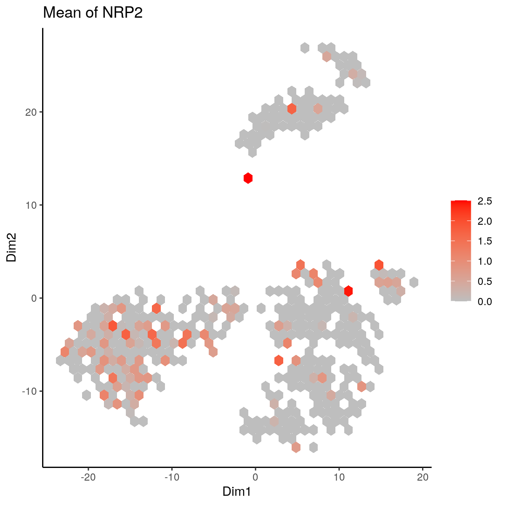|[GRIA1](https://www.ncbi.nlm.nih.gov/gene/2890) [NRCAM](https://www.ncbi.nlm.nih.gov/gene/4897) [PLXNA1](https://www.ncbi.nlm.nih.gov/gene/5361) [PLXNA2](https://www.ncbi.nlm.nih.gov/gene/5362) [PLXNB3](https://www.ncbi.nlm.nih.gov/gene/5365) [RET](https://www.ncbi.nlm.nih.gov/gene/5979) [TEK](https://www.ncbi.nlm.nih.gov/gene/7010) [TIE1](https://www.ncbi.nlm.nih.gov/gene/7075) [SEMA7A](https://www.ncbi.nlm.nih.gov/gene/8482) [SEMA6C](https://www.ncbi.nlm.nih.gov/gene/10500) [SEMA6B](https://www.ncbi.nlm.nih.gov/gene/10501) [SEMA4F](https://www.ncbi.nlm.nih.gov/gene/10505) [SEMA4D](https://www.ncbi.nlm.nih.gov/gene/10507) [PLXND1](https://www.ncbi.nlm.nih.gov/gene/23129) [PLXNB2](https://www.ncbi.nlm.nih.gov/gene/23654) [PLXNA3](https://www.ncbi.nlm.nih.gov/gene/55558) [SEMA6A](https://www.ncbi.nlm.nih.gov/gene/57556) [SEMA4G](https://www.ncbi.nlm.nih.gov/gene/57715) [SEMA4A](https://www.ncbi.nlm.nih.gov/gene/64218) [PLXNA4](https://www.ncbi.nlm.nih.gov/gene/91584) [CLEC4C](https://www.ncbi.nlm.nih.gov/gene/170482)|
|[NRTN](https://www.ncbi.nlm.nih.gov/gene/4902)|[ECE1](https://www.ncbi.nlm.nih.gov/gene/1889) [EDNRB](https://www.ncbi.nlm.nih.gov/gene/1910) [GFRA1](https://www.ncbi.nlm.nih.gov/gene/2674) [GFRA2](https://www.ncbi.nlm.nih.gov/gene/2675) [GFRA3](https://www.ncbi.nlm.nih.gov/gene/2676) [KRAS](https://www.ncbi.nlm.nih.gov/gene/3845) [NRAS](https://www.ncbi.nlm.nih.gov/gene/4893) [NTRK1](https://www.ncbi.nlm.nih.gov/gene/4914) [NTRK2](https://www.ncbi.nlm.nih.gov/gene/4915) [RET](https://www.ncbi.nlm.nih.gov/gene/5979) [SDC3](https://www.ncbi.nlm.nih.gov/gene/9672) [ABHD17A](https://www.ncbi.nlm.nih.gov/gene/81926) [GFRAL](https://www.ncbi.nlm.nih.gov/gene/389400)|
|[NTF3](https://www.ncbi.nlm.nih.gov/gene/4908)|[ACHE](https://www.ncbi.nlm.nih.gov/gene/43) [CRK](https://www.ncbi.nlm.nih.gov/gene/1398) [CSF1R](https://www.ncbi.nlm.nih.gov/gene/1436) [DLG4](https://www.ncbi.nlm.nih.gov/gene/1742) [EFNA2](https://www.ncbi.nlm.nih.gov/gene/1943) [EFNA3](https://www.ncbi.nlm.nih.gov/gene/1944) [EFNA5](https://www.ncbi.nlm.nih.gov/gene/1946) [EPHA2](https://www.ncbi.nlm.nih.gov/gene/1969) [EPHA1](https://www.ncbi.nlm.nih.gov/gene/2041) [EPHA4](https://www.ncbi.nlm.nih.gov/gene/2043) [FGFR1](https://www.ncbi.nlm.nih.gov/gene/2260) [FGFR3](https://www.ncbi.nlm.nih.gov/gene/2261) [GAP43](https://www.ncbi.nlm.nih.gov/gene/2596) [GFRA1](https://www.ncbi.nlm.nih.gov/gene/2674) [INSR](https://www.ncbi.nlm.nih.gov/gene/3643) [KRAS](https://www.ncbi.nlm.nih.gov/gene/3845) [MAG](https://www.ncbi.nlm.nih.gov/gene/4099) [NGFR](https://www.ncbi.nlm.nih.gov/gene/4804) [NRAS](https://www.ncbi.nlm.nih.gov/gene/4893) [NTRK1](https://www.ncbi.nlm.nih.gov/gene/4914) [NTRK2](https://www.ncbi.nlm.nih.gov/gene/4915) [ROR2](https://www.ncbi.nlm.nih.gov/gene/4920) [NTSR1](https://www.ncbi.nlm.nih.gov/gene/4923) [OMG](https://www.ncbi.nlm.nih.gov/gene/4974) [PDGFRA](https://www.ncbi.nlm.nih.gov/gene/5156) [PDGFRB](https://www.ncbi.nlm.nih.gov/gene/5159) [RIT1](https://www.ncbi.nlm.nih.gov/gene/6016) [SRC](https://www.ncbi.nlm.nih.gov/gene/6714) [TEK](https://www.ncbi.nlm.nih.gov/gene/7010) [TIAM1](https://www.ncbi.nlm.nih.gov/gene/7074) [SEMA7A](https://www.ncbi.nlm.nih.gov/gene/8482) [KCNQ4](https://www.ncbi.nlm.nih.gov/gene/9132) [SEMA6C](https://www.ncbi.nlm.nih.gov/gene/10500) [SEMA6B](https://www.ncbi.nlm.nih.gov/gene/10501) [SEMA4F](https://www.ncbi.nlm.nih.gov/gene/10505) [SEMA4D](https://www.ncbi.nlm.nih.gov/gene/10507) [NRN1](https://www.ncbi.nlm.nih.gov/gene/51299) [MRAP](https://www.ncbi.nlm.nih.gov/gene/56246) [SORCS2](https://www.ncbi.nlm.nih.gov/gene/57537) [SEMA6A](https://www.ncbi.nlm.nih.gov/gene/57556) [SEMA4G](https://www.ncbi.nlm.nih.gov/gene/57715) [SEMA4A](https://www.ncbi.nlm.nih.gov/gene/64218) [RTN4R](https://www.ncbi.nlm.nih.gov/gene/65078) [LINGO1](https://www.ncbi.nlm.nih.gov/gene/84894) [NTRK3](https://www.ncbi.nlm.nih.gov/gene/4916)|
|[NTF4](https://www.ncbi.nlm.nih.gov/gene/4909)|[AP2A1](https://www.ncbi.nlm.nih.gov/gene/160) [AP2A2](https://www.ncbi.nlm.nih.gov/gene/161) [CRK](https://www.ncbi.nlm.nih.gov/gene/1398) [CSF1R](https://www.ncbi.nlm.nih.gov/gene/1436) [EFNA2](https://www.ncbi.nlm.nih.gov/gene/1943) [EFNA3](https://www.ncbi.nlm.nih.gov/gene/1944) [EFNA5](https://www.ncbi.nlm.nih.gov/gene/1946) [EPHA2](https://www.ncbi.nlm.nih.gov/gene/1969) [EPHA1](https://www.ncbi.nlm.nih.gov/gene/2041) [EPHA4](https://www.ncbi.nlm.nih.gov/gene/2043) [FGFR1](https://www.ncbi.nlm.nih.gov/gene/2260) [FGFR3](https://www.ncbi.nlm.nih.gov/gene/2261) [GAP43](https://www.ncbi.nlm.nih.gov/gene/2596) [GFRA1](https://www.ncbi.nlm.nih.gov/gene/2674) [INSR](https://www.ncbi.nlm.nih.gov/gene/3643) [KCNC3](https://www.ncbi.nlm.nih.gov/gene/3748) [KRAS](https://www.ncbi.nlm.nih.gov/gene/3845) [MAG](https://www.ncbi.nlm.nih.gov/gene/4099) [NGFR](https://www.ncbi.nlm.nih.gov/gene/4804) [NRAS](https://www.ncbi.nlm.nih.gov/gene/4893) [NTRK1](https://www.ncbi.nlm.nih.gov/gene/4914) [NTRK2](https://www.ncbi.nlm.nih.gov/gene/4915) [NTSR1](https://www.ncbi.nlm.nih.gov/gene/4923) [PDGFRA](https://www.ncbi.nlm.nih.gov/gene/5156) [PDGFRB](https://www.ncbi.nlm.nih.gov/gene/5159) [RIT1](https://www.ncbi.nlm.nih.gov/gene/6016) [SRC](https://www.ncbi.nlm.nih.gov/gene/6714) [TEK](https://www.ncbi.nlm.nih.gov/gene/7010) [SEMA7A](https://www.ncbi.nlm.nih.gov/gene/8482) [SEMA6C](https://www.ncbi.nlm.nih.gov/gene/10500) [SEMA6B](https://www.ncbi.nlm.nih.gov/gene/10501) [SEMA4D](https://www.ncbi.nlm.nih.gov/gene/10507) [MRAP](https://www.ncbi.nlm.nih.gov/gene/56246) [SEMA6A](https://www.ncbi.nlm.nih.gov/gene/57556) [SEMA4G](https://www.ncbi.nlm.nih.gov/gene/57715) [SEMA4A](https://www.ncbi.nlm.nih.gov/gene/64218) [RTN4R](https://www.ncbi.nlm.nih.gov/gene/65078) [LINGO1](https://www.ncbi.nlm.nih.gov/gene/84894)|
|[NTN1](https://www.ncbi.nlm.nih.gov/gene/9423)|[ADORA2B](https://www.ncbi.nlm.nih.gov/gene/136) [RHOA](https://www.ncbi.nlm.nih.gov/gene/387) [CDC42](https://www.ncbi.nlm.nih.gov/gene/998) [CDH17](https://www.ncbi.nlm.nih.gov/gene/1015) [DSCAM](https://www.ncbi.nlm.nih.gov/gene/1826) [EFNA2](https://www.ncbi.nlm.nih.gov/gene/1943) [EFNA3](https://www.ncbi.nlm.nih.gov/gene/1944) [EFNA5](https://www.ncbi.nlm.nih.gov/gene/1946) [EPHA1](https://www.ncbi.nlm.nih.gov/gene/2041) [EPHA4](https://www.ncbi.nlm.nih.gov/gene/2043) [EPHA5](https://www.ncbi.nlm.nih.gov/gene/2044) [EPHA7](https://www.ncbi.nlm.nih.gov/gene/2045) [EPHA8](https://www.ncbi.nlm.nih.gov/gene/2046) [EPHB1](https://www.ncbi.nlm.nih.gov/gene/2047) [EPHB2](https://www.ncbi.nlm.nih.gov/gene/2048) [EPHB3](https://www.ncbi.nlm.nih.gov/gene/2049) [EPHB4](https://www.ncbi.nlm.nih.gov/gene/2050) [FYN](https://www.ncbi.nlm.nih.gov/gene/2534) [ITGA3](https://www.ncbi.nlm.nih.gov/gene/3675) [MAG](https://www.ncbi.nlm.nih.gov/gene/4099) [MUC4](https://www.ncbi.nlm.nih.gov/gene/4585) [NEO1](https://www.ncbi.nlm.nih.gov/gene/4756) [NPHS1](https://www.ncbi.nlm.nih.gov/gene/4868) [NRCAM](https://www.ncbi.nlm.nih.gov/gene/4897) [PLXNA1](https://www.ncbi.nlm.nih.gov/gene/5361) [PLXNA2](https://www.ncbi.nlm.nih.gov/gene/5362) [PLXNB3](https://www.ncbi.nlm.nih.gov/gene/5365) [RAC1](https://www.ncbi.nlm.nih.gov/gene/5879) [RET](https://www.ncbi.nlm.nih.gov/gene/5979) [ROBO1](https://www.ncbi.nlm.nih.gov/gene/6091) [SRC](https://www.ncbi.nlm.nih.gov/gene/6714) [CNTN2](https://www.ncbi.nlm.nih.gov/gene/6900) [TDGF1](https://www.ncbi.nlm.nih.gov/gene/6997) [YES1](https://www.ncbi.nlm.nih.gov/gene/7525) [SEMA7A](https://www.ncbi.nlm.nih.gov/gene/8482) [UNC5C](https://www.ncbi.nlm.nih.gov/gene/8633) [ELMO1](https://www.ncbi.nlm.nih.gov/gene/9844) [SEMA6C](https://www.ncbi.nlm.nih.gov/gene/10500) [SEMA6B](https://www.ncbi.nlm.nih.gov/gene/10501) [SEMA4F](https://www.ncbi.nlm.nih.gov/gene/10505) [SEMA4D](https://www.ncbi.nlm.nih.gov/gene/10507) [PLXND1](https://www.ncbi.nlm.nih.gov/gene/23129) [APBB1IP](https://www.ncbi.nlm.nih.gov/gene/54518) [SDK2](https://www.ncbi.nlm.nih.gov/gene/54549) [PLXNA3](https://www.ncbi.nlm.nih.gov/gene/55558) [RGMA](https://www.ncbi.nlm.nih.gov/gene/56963) [DSCAML1](https://www.ncbi.nlm.nih.gov/gene/57453) [SEMA6A](https://www.ncbi.nlm.nih.gov/gene/57556) [SEMA4G](https://www.ncbi.nlm.nih.gov/gene/57715) [SEMA4A](https://www.ncbi.nlm.nih.gov/gene/64218) [RAPH1](https://www.ncbi.nlm.nih.gov/gene/65059) [UNC5A](https://www.ncbi.nlm.nih.gov/gene/90249) [PLXNA4](https://www.ncbi.nlm.nih.gov/gene/91584) [LRIG3](https://www.ncbi.nlm.nih.gov/gene/121227) [UNC5D](https://www.ncbi.nlm.nih.gov/gene/137970) [UNC5B](https://www.ncbi.nlm.nih.gov/gene/219699) [SDK1](https://www.ncbi.nlm.nih.gov/gene/221935)|
|[NTN3](https://www.ncbi.nlm.nih.gov/gene/4917)|[NEO1](https://www.ncbi.nlm.nih.gov/gene/4756) [UNC5C](https://www.ncbi.nlm.nih.gov/gene/8633) [CDON](https://www.ncbi.nlm.nih.gov/gene/50937) [UNC5A](https://www.ncbi.nlm.nih.gov/gene/90249) [UNC5D](https://www.ncbi.nlm.nih.gov/gene/137970) [KCNG3](https://www.ncbi.nlm.nih.gov/gene/170850) [UNC5B](https://www.ncbi.nlm.nih.gov/gene/219699)|
|[NTN4](https://www.ncbi.nlm.nih.gov/gene/59277)|[ADORA2B](https://www.ncbi.nlm.nih.gov/gene/136) [DSCAM](https://www.ncbi.nlm.nih.gov/gene/1826) [NEO1](https://www.ncbi.nlm.nih.gov/gene/4756) [UNC5C](https://www.ncbi.nlm.nih.gov/gene/8633) [NTNG1](https://www.ncbi.nlm.nih.gov/gene/22854) [UNC5A](https://www.ncbi.nlm.nih.gov/gene/90249) [UNC5D](https://www.ncbi.nlm.nih.gov/gene/137970) [UNC5B](https://www.ncbi.nlm.nih.gov/gene/219699)|
|[NTN5](https://www.ncbi.nlm.nih.gov/gene/126147)|[DSCAM](https://www.ncbi.nlm.nih.gov/gene/1826) [GRIN2D](https://www.ncbi.nlm.nih.gov/gene/2906) [NEO1](https://www.ncbi.nlm.nih.gov/gene/4756) [CNTN3](https://www.ncbi.nlm.nih.gov/gene/5067) [UNC5C](https://www.ncbi.nlm.nih.gov/gene/8633) [FLRT1](https://www.ncbi.nlm.nih.gov/gene/23769) [SDK2](https://www.ncbi.nlm.nih.gov/gene/54549) [DSCAML1](https://www.ncbi.nlm.nih.gov/gene/57453) [UNC5A](https://www.ncbi.nlm.nih.gov/gene/90249) [UNC5D](https://www.ncbi.nlm.nih.gov/gene/137970) [UNC5B](https://www.ncbi.nlm.nih.gov/gene/219699) [SDK1](https://www.ncbi.nlm.nih.gov/gene/221935) [MDGA1](https://www.ncbi.nlm.nih.gov/gene/266727)|
|[NTS](https://www.ncbi.nlm.nih.gov/gene/4922) |[ACHE](https://www.ncbi.nlm.nih.gov/gene/43) [ADORA1](https://www.ncbi.nlm.nih.gov/gene/134) [ADORA2A](https://www.ncbi.nlm.nih.gov/gene/135) [ADORA2B](https://www.ncbi.nlm.nih.gov/gene/136) [ADRA1D](https://www.ncbi.nlm.nih.gov/gene/146) [ADRA2A](https://www.ncbi.nlm.nih.gov/gene/150) [ADRA2B](https://www.ncbi.nlm.nih.gov/gene/151) [ADRA2C](https://www.ncbi.nlm.nih.gov/gene/152) [ADRB1](https://www.ncbi.nlm.nih.gov/gene/153) [ADRB2](https://www.ncbi.nlm.nih.gov/gene/154) [ADRB3](https://www.ncbi.nlm.nih.gov/gene/155) [AGTR1](https://www.ncbi.nlm.nih.gov/gene/185) [AGTR2](https://www.ncbi.nlm.nih.gov/gene/186) [ARRB2](https://www.ncbi.nlm.nih.gov/gene/409) [AVPR1A](https://www.ncbi.nlm.nih.gov/gene/552) [AVPR1B](https://www.ncbi.nlm.nih.gov/gene/553) [BDKRB1](https://www.ncbi.nlm.nih.gov/gene/623) [BDKRB2](https://www.ncbi.nlm.nih.gov/gene/624) [BRS3](https://www.ncbi.nlm.nih.gov/gene/680) [CASR](https://www.ncbi.nlm.nih.gov/gene/846) [CCKAR](https://www.ncbi.nlm.nih.gov/gene/886) [CCKBR](https://www.ncbi.nlm.nih.gov/gene/887) [CHRM1](https://www.ncbi.nlm.nih.gov/gene/1128) [CHRM3](https://www.ncbi.nlm.nih.gov/gene/1131) [CHRM5](https://www.ncbi.nlm.nih.gov/gene/1133) [LTB4R](https://www.ncbi.nlm.nih.gov/gene/1241) [CNR1](https://www.ncbi.nlm.nih.gov/gene/1268) [ACE](https://www.ncbi.nlm.nih.gov/gene/1636) [DRD1](https://www.ncbi.nlm.nih.gov/gene/1812) [DRD2](https://www.ncbi.nlm.nih.gov/gene/1813) [DRD3](https://www.ncbi.nlm.nih.gov/gene/1814) [DRD4](https://www.ncbi.nlm.nih.gov/gene/1815) [DRD5](https://www.ncbi.nlm.nih.gov/gene/1816) [EDNRA](https://www.ncbi.nlm.nih.gov/gene/1909) [EDNRB](https://www.ncbi.nlm.nih.gov/gene/1910) [ENO2](https://www.ncbi.nlm.nih.gov/gene/2026) [SLC29A1](https://www.ncbi.nlm.nih.gov/gene/2030) [F2R](https://www.ncbi.nlm.nih.gov/gene/2149) [F2RL1](https://www.ncbi.nlm.nih.gov/gene/2150) [F2RL2](https://www.ncbi.nlm.nih.gov/gene/2151) [FPR2](https://www.ncbi.nlm.nih.gov/gene/2358) [GALR1](https://www.ncbi.nlm.nih.gov/gene/2587) [GCGR](https://www.ncbi.nlm.nih.gov/gene/2642) [GHSR](https://www.ncbi.nlm.nih.gov/gene/2693) [GNA11](https://www.ncbi.nlm.nih.gov/gene/2767) [GNG3](https://www.ncbi.nlm.nih.gov/gene/2785) [GNG4](https://www.ncbi.nlm.nih.gov/gene/2786) [GNG5](https://www.ncbi.nlm.nih.gov/gene/2787) [GNG7](https://www.ncbi.nlm.nih.gov/gene/2788) [GNG10](https://www.ncbi.nlm.nih.gov/gene/2790) [GNG11](https://www.ncbi.nlm.nih.gov/gene/2791) [GNGT1](https://www.ncbi.nlm.nih.gov/gene/2792) [GNGT2](https://www.ncbi.nlm.nih.gov/gene/2793) [GNRHR](https://www.ncbi.nlm.nih.gov/gene/2798) [GPR4](https://www.ncbi.nlm.nih.gov/gene/2828) [XCR1](https://www.ncbi.nlm.nih.gov/gene/2829) [NPBWR1](https://www.ncbi.nlm.nih.gov/gene/2831) [NPBWR2](https://www.ncbi.nlm.nih.gov/gene/2832) [UTS2R](https://www.ncbi.nlm.nih.gov/gene/2837) [GPR17](https://www.ncbi.nlm.nih.gov/gene/2840) [LPAR4](https://www.ncbi.nlm.nih.gov/gene/2846) [MCHR1](https://www.ncbi.nlm.nih.gov/gene/2847) [MLNR](https://www.ncbi.nlm.nih.gov/gene/2862) [GPR39](https://www.ncbi.nlm.nih.gov/gene/2863) [FFAR1](https://www.ncbi.nlm.nih.gov/gene/2864) [FFAR3](https://www.ncbi.nlm.nih.gov/gene/2865) [FFAR2](https://www.ncbi.nlm.nih.gov/gene/2867) [GRK5](https://www.ncbi.nlm.nih.gov/gene/2869) [GRM1](https://www.ncbi.nlm.nih.gov/gene/2911) [GRM5](https://www.ncbi.nlm.nih.gov/gene/2915) [GRPR](https://www.ncbi.nlm.nih.gov/gene/2925) [HCRTR1](https://www.ncbi.nlm.nih.gov/gene/3061) [HCRTR2](https://www.ncbi.nlm.nih.gov/gene/3062) [SLC29A2](https://www.ncbi.nlm.nih.gov/gene/3177) [HRH1](https://www.ncbi.nlm.nih.gov/gene/3269) [HTR1A](https://www.ncbi.nlm.nih.gov/gene/3350) [HTR1B](https://www.ncbi.nlm.nih.gov/gene/3351) [HTR2A](https://www.ncbi.nlm.nih.gov/gene/3356) [HTR2B](https://www.ncbi.nlm.nih.gov/gene/3357) [HTR2C](https://www.ncbi.nlm.nih.gov/gene/3358) [HTR5A](https://www.ncbi.nlm.nih.gov/gene/3361) [HTR7](https://www.ncbi.nlm.nih.gov/gene/3363) [CXCR1](https://www.ncbi.nlm.nih.gov/gene/3577) [LSAMP](https://www.ncbi.nlm.nih.gov/gene/4045) [MAS1](https://www.ncbi.nlm.nih.gov/gene/4142) [MC3R](https://www.ncbi.nlm.nih.gov/gene/4159) [MC4R](https://www.ncbi.nlm.nih.gov/gene/4160) [MEP1B](https://www.ncbi.nlm.nih.gov/gene/4225) [MME](https://www.ncbi.nlm.nih.gov/gene/4311) [NGFR](https://www.ncbi.nlm.nih.gov/gene/4804) [NMBR](https://www.ncbi.nlm.nih.gov/gene/4829) [NOS3](https://www.ncbi.nlm.nih.gov/gene/4846) [NPY1R](https://www.ncbi.nlm.nih.gov/gene/4886) [NPY2R](https://www.ncbi.nlm.nih.gov/gene/4887) [NPY5R](https://www.ncbi.nlm.nih.gov/gene/4889) [NTRK1](https://www.ncbi.nlm.nih.gov/gene/4914) [NTRK2](https://www.ncbi.nlm.nih.gov/gene/4915) [NTSR1](https://www.ncbi.nlm.nih.gov/gene/4923) [OPCML](https://www.ncbi.nlm.nih.gov/gene/4978) [OPRD1](https://www.ncbi.nlm.nih.gov/gene/4985) [OPRK1](https://www.ncbi.nlm.nih.gov/gene/4986) [OPRL1](https://www.ncbi.nlm.nih.gov/gene/4987) [OXTR](https://www.ncbi.nlm.nih.gov/gene/5021) [P2RY1](https://www.ncbi.nlm.nih.gov/gene/5028) [P2RY2](https://www.ncbi.nlm.nih.gov/gene/5029) [P2RY6](https://www.ncbi.nlm.nih.gov/gene/5031) [P2RY11](https://www.ncbi.nlm.nih.gov/gene/5032) [PTAFR](https://www.ncbi.nlm.nih.gov/gene/5724) [PTGER1](https://www.ncbi.nlm.nih.gov/gene/5731) [PTGFR](https://www.ncbi.nlm.nih.gov/gene/5737) [SSTR1](https://www.ncbi.nlm.nih.gov/gene/6751) [SSTR2](https://www.ncbi.nlm.nih.gov/gene/6752) [SSTR3](https://www.ncbi.nlm.nih.gov/gene/6753) [SSTR4](https://www.ncbi.nlm.nih.gov/gene/6754) [SSTR5](https://www.ncbi.nlm.nih.gov/gene/6755) [STX4](https://www.ncbi.nlm.nih.gov/gene/6810) [TACR2](https://www.ncbi.nlm.nih.gov/gene/6865) [TACR1](https://www.ncbi.nlm.nih.gov/gene/6869) [TACR3](https://www.ncbi.nlm.nih.gov/gene/6870) [TBXA2R](https://www.ncbi.nlm.nih.gov/gene/6915) [TRHR](https://www.ncbi.nlm.nih.gov/gene/7201) [CXCR4](https://www.ncbi.nlm.nih.gov/gene/7852) [GPR68](https://www.ncbi.nlm.nih.gov/gene/8111) [GPR65](https://www.ncbi.nlm.nih.gov/gene/8477) [GALR3](https://www.ncbi.nlm.nih.gov/gene/8484) [SNAP23](https://www.ncbi.nlm.nih.gov/gene/8773) [GALR2](https://www.ncbi.nlm.nih.gov/gene/8811) [F2RL3](https://www.ncbi.nlm.nih.gov/gene/9002) [SLC6A5](https://www.ncbi.nlm.nih.gov/gene/9152) [SLC28A1](https://www.ncbi.nlm.nih.gov/gene/9154) [LPAR6](https://www.ncbi.nlm.nih.gov/gene/10161) [NMUR1](https://www.ncbi.nlm.nih.gov/gene/10316) [CYSLTR1](https://www.ncbi.nlm.nih.gov/gene/10800) [NPFFR2](https://www.ncbi.nlm.nih.gov/gene/10886) [HRH3](https://www.ncbi.nlm.nih.gov/gene/11255) [LPAR3](https://www.ncbi.nlm.nih.gov/gene/23566) [NTSR2](https://www.ncbi.nlm.nih.gov/gene/23620) [P2RY10](https://www.ncbi.nlm.nih.gov/gene/27334) [GPR132](https://www.ncbi.nlm.nih.gov/gene/29933) [NTM](https://www.ncbi.nlm.nih.gov/gene/50863) [GNG13](https://www.ncbi.nlm.nih.gov/gene/51764) [GNG2](https://www.ncbi.nlm.nih.gov/gene/54331) [GNG12](https://www.ncbi.nlm.nih.gov/gene/55970) [LTB4R2](https://www.ncbi.nlm.nih.gov/gene/56413) [NMUR2](https://www.ncbi.nlm.nih.gov/gene/56923) [ACKR3](https://www.ncbi.nlm.nih.gov/gene/57007) [CYSLTR2](https://www.ncbi.nlm.nih.gov/gene/57105) [TRPC7](https://www.ncbi.nlm.nih.gov/gene/57113) [LPAR5](https://www.ncbi.nlm.nih.gov/gene/57121) [ACE2](https://www.ncbi.nlm.nih.gov/gene/59272) [NPFFR1](https://www.ncbi.nlm.nih.gov/gene/64106) [QRFPR](https://www.ncbi.nlm.nih.gov/gene/84109) [MCHR2](https://www.ncbi.nlm.nih.gov/gene/84539) [KISS1R](https://www.ncbi.nlm.nih.gov/gene/84634) [OPN4](https://www.ncbi.nlm.nih.gov/gene/94233) [GNG8](https://www.ncbi.nlm.nih.gov/gene/94235) [ARHGEF25](https://www.ncbi.nlm.nih.gov/gene/115557) [TMC2](https://www.ncbi.nlm.nih.gov/gene/117532) [PROKR2](https://www.ncbi.nlm.nih.gov/gene/128674) [GPRC6A](https://www.ncbi.nlm.nih.gov/gene/222545) [FFAR4](https://www.ncbi.nlm.nih.gov/gene/338557) [ASTL](https://www.ncbi.nlm.nih.gov/gene/431705) [LINC02210-CRHR1](https://www.ncbi.nlm.nih.gov/gene/104909134)|
|[NUCB2](https://www.ncbi.nlm.nih.gov/gene/4925)|[CCKAR](https://www.ncbi.nlm.nih.gov/gene/886) [KCNC1](https://www.ncbi.nlm.nih.gov/gene/3746) [PIK3C2A](https://www.ncbi.nlm.nih.gov/gene/5286) [ABCC8](https://www.ncbi.nlm.nih.gov/gene/6833) [RIC8A](https://www.ncbi.nlm.nih.gov/gene/60626) [OTOG](https://www.ncbi.nlm.nih.gov/gene/340990)|
|[NXPE4](https://www.ncbi.nlm.nih.gov/gene/54827)|[CLCA4](https://www.ncbi.nlm.nih.gov/gene/22802) [ADGRL1](https://www.ncbi.nlm.nih.gov/gene/22859)|
|[NXPH1](https://www.ncbi.nlm.nih.gov/gene/30010)|[ASTN1](https://www.ncbi.nlm.nih.gov/gene/460) [GAP43](https://www.ncbi.nlm.nih.gov/gene/2596) [GRIA2](https://www.ncbi.nlm.nih.gov/gene/2891) [HTR5A](https://www.ncbi.nlm.nih.gov/gene/3361) [CNTN2](https://www.ncbi.nlm.nih.gov/gene/6900) [ADGRL1](https://www.ncbi.nlm.nih.gov/gene/22859) [LRRTM2](https://www.ncbi.nlm.nih.gov/gene/26045) [NLGN3](https://www.ncbi.nlm.nih.gov/gene/54413) [CACNG7](https://www.ncbi.nlm.nih.gov/gene/59284) [LRRTM1](https://www.ncbi.nlm.nih.gov/gene/347730) [LRRTM3](https://www.ncbi.nlm.nih.gov/gene/347731)|
|[NXPH2](https://www.ncbi.nlm.nih.gov/gene/11249)|[ADGRL1](https://www.ncbi.nlm.nih.gov/gene/22859)|
|[NXPH3](https://www.ncbi.nlm.nih.gov/gene/11248)|[LRRTM2](https://www.ncbi.nlm.nih.gov/gene/26045) [RXFP1](https://www.ncbi.nlm.nih.gov/gene/59350) [OR10J3](https://www.ncbi.nlm.nih.gov/gene/441911)|
|[NXPH4](https://www.ncbi.nlm.nih.gov/gene/11247)|[ADGRL1](https://www.ncbi.nlm.nih.gov/gene/22859) [PLEKHA2](https://www.ncbi.nlm.nih.gov/gene/59339)|
|[NYX](https://www.ncbi.nlm.nih.gov/gene/60506)|[GAP43](https://www.ncbi.nlm.nih.gov/gene/2596) [GRM6](https://www.ncbi.nlm.nih.gov/gene/2916) [TRPM1](https://www.ncbi.nlm.nih.gov/gene/4308) [NTRK1](https://www.ncbi.nlm.nih.gov/gene/4914) [ROBO1](https://www.ncbi.nlm.nih.gov/gene/6091) [TAAR5](https://www.ncbi.nlm.nih.gov/gene/9038) [ADGRL1](https://www.ncbi.nlm.nih.gov/gene/22859) [ADGRL3](https://www.ncbi.nlm.nih.gov/gene/23284) [CEMIP2](https://www.ncbi.nlm.nih.gov/gene/23670) [TENM3](https://www.ncbi.nlm.nih.gov/gene/55714) [GPR179](https://www.ncbi.nlm.nih.gov/gene/440435) [OPN1MW3](https://www.ncbi.nlm.nih.gov/gene/101060233)|
|[OBP2B](https://www.ncbi.nlm.nih.gov/gene/29989)|[TECTB](https://www.ncbi.nlm.nih.gov/gene/6975) [OR1G1](https://www.ncbi.nlm.nih.gov/gene/8390) [OR51L1](https://www.ncbi.nlm.nih.gov/gene/119682)|
|[OC90](https://www.ncbi.nlm.nih.gov/gene/729330)|[ATP2B4](https://www.ncbi.nlm.nih.gov/gene/493) [TECTB](https://www.ncbi.nlm.nih.gov/gene/6975) [OTOP2](https://www.ncbi.nlm.nih.gov/gene/92736) [OTOP1](https://www.ncbi.nlm.nih.gov/gene/133060) [PLB1](https://www.ncbi.nlm.nih.gov/gene/151056) [OTOG](https://www.ncbi.nlm.nih.gov/gene/340990) [OTOP3](https://www.ncbi.nlm.nih.gov/gene/347741) [OR4N5](https://www.ncbi.nlm.nih.gov/gene/390437)|
|[ODAM](https://www.ncbi.nlm.nih.gov/gene/54959)|[ADGRG6](https://www.ncbi.nlm.nih.gov/gene/57211) [SLC38A1](https://www.ncbi.nlm.nih.gov/gene/81539)|
|[ODAPH](https://www.ncbi.nlm.nih.gov/gene/152816)|[GPR68](https://www.ncbi.nlm.nih.gov/gene/8111) [CNNM4](https://www.ncbi.nlm.nih.gov/gene/26504) [MMP25](https://www.ncbi.nlm.nih.gov/gene/64386) [C9orf135](https://www.ncbi.nlm.nih.gov/gene/138255)|
|[OGN](https://www.ncbi.nlm.nih.gov/gene/4969) 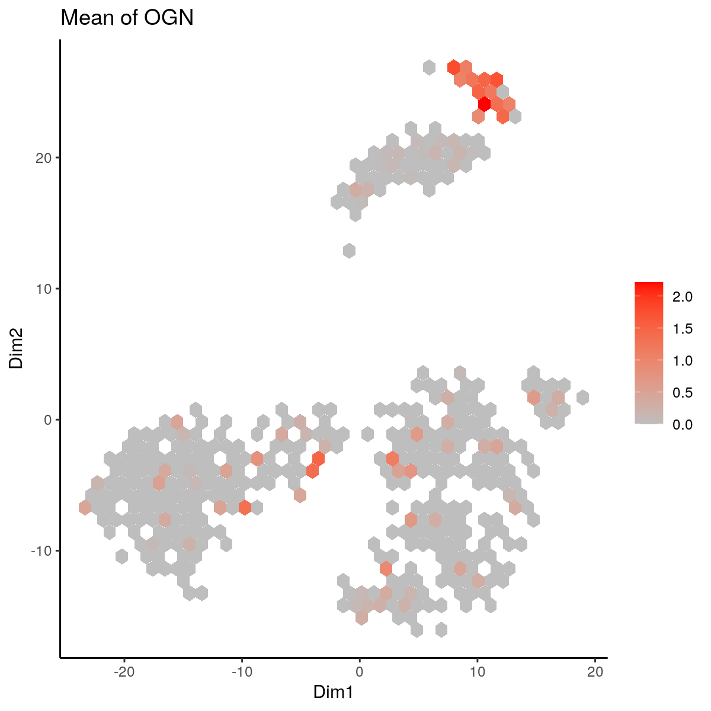|[LRBA](https://www.ncbi.nlm.nih.gov/gene/987) [ERAS](https://www.ncbi.nlm.nih.gov/gene/3266) [ADGRL1](https://www.ncbi.nlm.nih.gov/gene/22859) [ADGRL3](https://www.ncbi.nlm.nih.gov/gene/23284) [MXRA8](https://www.ncbi.nlm.nih.gov/gene/54587) [TMEM119](https://www.ncbi.nlm.nih.gov/gene/338773)|
|[OLFM1](https://www.ncbi.nlm.nih.gov/gene/10439)|[FAIM2](https://www.ncbi.nlm.nih.gov/gene/23017) [FLRT3](https://www.ncbi.nlm.nih.gov/gene/23767) [KCNT1](https://www.ncbi.nlm.nih.gov/gene/57582) [LINGO1](https://www.ncbi.nlm.nih.gov/gene/84894) [RTN4RL1](https://www.ncbi.nlm.nih.gov/gene/146760) [OTOP3](https://www.ncbi.nlm.nih.gov/gene/347741)|
|[OLFM2](https://www.ncbi.nlm.nih.gov/gene/93145)|[DLG4](https://www.ncbi.nlm.nih.gov/gene/1742) [GRIA1](https://www.ncbi.nlm.nih.gov/gene/2890) [GRIA2](https://www.ncbi.nlm.nih.gov/gene/2891) [GRIA3](https://www.ncbi.nlm.nih.gov/gene/2892) [GRIA4](https://www.ncbi.nlm.nih.gov/gene/2893) [GRID2](https://www.ncbi.nlm.nih.gov/gene/2895) [GRIK5](https://www.ncbi.nlm.nih.gov/gene/2901) [GRIN1](https://www.ncbi.nlm.nih.gov/gene/2902) [GRIN2B](https://www.ncbi.nlm.nih.gov/gene/2904) [GRIN2C](https://www.ncbi.nlm.nih.gov/gene/2905) [GRIN2D](https://www.ncbi.nlm.nih.gov/gene/2906) [HTR3B](https://www.ncbi.nlm.nih.gov/gene/9177) [FLRT3](https://www.ncbi.nlm.nih.gov/gene/23767) [CACNG4](https://www.ncbi.nlm.nih.gov/gene/27092) [CACNG8](https://www.ncbi.nlm.nih.gov/gene/59283) [CACNG7](https://www.ncbi.nlm.nih.gov/gene/59284) [VANGL1](https://www.ncbi.nlm.nih.gov/gene/81839) [GRIN3A](https://www.ncbi.nlm.nih.gov/gene/116443) [GRIN3B](https://www.ncbi.nlm.nih.gov/gene/116444)|
|[OLFM3](https://www.ncbi.nlm.nih.gov/gene/118427)|[ATP2B3](https://www.ncbi.nlm.nih.gov/gene/492) [CDH2](https://www.ncbi.nlm.nih.gov/gene/1000) [CDH8](https://www.ncbi.nlm.nih.gov/gene/1006) [DLG4](https://www.ncbi.nlm.nih.gov/gene/1742) [GRIA1](https://www.ncbi.nlm.nih.gov/gene/2890) [GRIA2](https://www.ncbi.nlm.nih.gov/gene/2891) [GRIA3](https://www.ncbi.nlm.nih.gov/gene/2892) [GRIA4](https://www.ncbi.nlm.nih.gov/gene/2893) [GRID2](https://www.ncbi.nlm.nih.gov/gene/2895) [GRIK2](https://www.ncbi.nlm.nih.gov/gene/2898) [GRIK4](https://www.ncbi.nlm.nih.gov/gene/2900) [GRIK5](https://www.ncbi.nlm.nih.gov/gene/2901) [GRIN1](https://www.ncbi.nlm.nih.gov/gene/2902) [GRIN2B](https://www.ncbi.nlm.nih.gov/gene/2904) [GRIN2C](https://www.ncbi.nlm.nih.gov/gene/2905) [HTR5A](https://www.ncbi.nlm.nih.gov/gene/3361) [OPCML](https://www.ncbi.nlm.nih.gov/gene/4978) [HTR3B](https://www.ncbi.nlm.nih.gov/gene/9177) [FLOT1](https://www.ncbi.nlm.nih.gov/gene/10211) [NLGN1](https://www.ncbi.nlm.nih.gov/gene/22871) [CEMIP2](https://www.ncbi.nlm.nih.gov/gene/23670) [FLRT3](https://www.ncbi.nlm.nih.gov/gene/23767) [KCNIP1](https://www.ncbi.nlm.nih.gov/gene/30820) [CACNG8](https://www.ncbi.nlm.nih.gov/gene/59283) [CACNG7](https://www.ncbi.nlm.nih.gov/gene/59284) [OPALIN](https://www.ncbi.nlm.nih.gov/gene/93377) [LRRTM1](https://www.ncbi.nlm.nih.gov/gene/347730)|
|[OLFM4](https://www.ncbi.nlm.nih.gov/gene/10562)|[CDH17](https://www.ncbi.nlm.nih.gov/gene/1015) [CEACAM8](https://www.ncbi.nlm.nih.gov/gene/1088) [EPHB2](https://www.ncbi.nlm.nih.gov/gene/2048) [CEACAM6](https://www.ncbi.nlm.nih.gov/gene/4680) [VCL](https://www.ncbi.nlm.nih.gov/gene/7414) [FZD7](https://www.ncbi.nlm.nih.gov/gene/8324) [LGR5](https://www.ncbi.nlm.nih.gov/gene/8549) [PROM1](https://www.ncbi.nlm.nih.gov/gene/8842) [NOD1](https://www.ncbi.nlm.nih.gov/gene/10392) [FAIM2](https://www.ncbi.nlm.nih.gov/gene/23017) [FLRT3](https://www.ncbi.nlm.nih.gov/gene/23767) [LRIG1](https://www.ncbi.nlm.nih.gov/gene/26018) [PCDH17](https://www.ncbi.nlm.nih.gov/gene/27253) [LGR4](https://www.ncbi.nlm.nih.gov/gene/55366) [CD177](https://www.ncbi.nlm.nih.gov/gene/57126) [LGR6](https://www.ncbi.nlm.nih.gov/gene/59352) [GSDMD](https://www.ncbi.nlm.nih.gov/gene/79792) [OSCAR](https://www.ncbi.nlm.nih.gov/gene/126014) [AMER2](https://www.ncbi.nlm.nih.gov/gene/219287)|
|[OLFML1](https://www.ncbi.nlm.nih.gov/gene/283298)|[FLRT3](https://www.ncbi.nlm.nih.gov/gene/23767) [FLRT2](https://www.ncbi.nlm.nih.gov/gene/23768) [FLRT1](https://www.ncbi.nlm.nih.gov/gene/23769) [OR10A3](https://www.ncbi.nlm.nih.gov/gene/26496) [PCDHGA5](https://www.ncbi.nlm.nih.gov/gene/56110) [SYT8](https://www.ncbi.nlm.nih.gov/gene/90019)|
|[OLFML2A](https://www.ncbi.nlm.nih.gov/gene/169611)|[FLRT3](https://www.ncbi.nlm.nih.gov/gene/23767) [PARVG](https://www.ncbi.nlm.nih.gov/gene/64098)|
|[OLFML2B](https://www.ncbi.nlm.nih.gov/gene/25903)|[RNF144A](https://www.ncbi.nlm.nih.gov/gene/9781) [FLRT3](https://www.ncbi.nlm.nih.gov/gene/23767) [OR10J1](https://www.ncbi.nlm.nih.gov/gene/26476) [OR10J5](https://www.ncbi.nlm.nih.gov/gene/127385) [OR10J3](https://www.ncbi.nlm.nih.gov/gene/441911)|
|[OLFML3](https://www.ncbi.nlm.nih.gov/gene/56944)|[GPR34](https://www.ncbi.nlm.nih.gov/gene/2857) [FLRT3](https://www.ncbi.nlm.nih.gov/gene/23767) [P2RY13](https://www.ncbi.nlm.nih.gov/gene/53829) [P2RY12](https://www.ncbi.nlm.nih.gov/gene/64805) [FCRL2](https://www.ncbi.nlm.nih.gov/gene/79368) [TMEM150A](https://www.ncbi.nlm.nih.gov/gene/129303) [TMEM119](https://www.ncbi.nlm.nih.gov/gene/338773)|
|[OMD](https://www.ncbi.nlm.nih.gov/gene/4958)|[ALPL](https://www.ncbi.nlm.nih.gov/gene/249) [COMT](https://www.ncbi.nlm.nih.gov/gene/1312) [USP6](https://www.ncbi.nlm.nih.gov/gene/9098) [ADGRL1](https://www.ncbi.nlm.nih.gov/gene/22859) [ADGRL3](https://www.ncbi.nlm.nih.gov/gene/23284)|
|[OOSP2](https://www.ncbi.nlm.nih.gov/gene/219990)|[TNFRSF17](https://www.ncbi.nlm.nih.gov/gene/608)|
|[OPRPN](https://www.ncbi.nlm.nih.gov/gene/58503)|[ANPEP](https://www.ncbi.nlm.nih.gov/gene/290) [BDKRB2](https://www.ncbi.nlm.nih.gov/gene/624) [GAP43](https://www.ncbi.nlm.nih.gov/gene/2596) [MAG](https://www.ncbi.nlm.nih.gov/gene/4099) [MME](https://www.ncbi.nlm.nih.gov/gene/4311) [OMG](https://www.ncbi.nlm.nih.gov/gene/4974) [ZP2](https://www.ncbi.nlm.nih.gov/gene/7783) [ABCB6](https://www.ncbi.nlm.nih.gov/gene/10058) [OR7C1](https://www.ncbi.nlm.nih.gov/gene/26664)|
|[OPTC](https://www.ncbi.nlm.nih.gov/gene/26254)|[ADGRL1](https://www.ncbi.nlm.nih.gov/gene/22859) [ADGRL3](https://www.ncbi.nlm.nih.gov/gene/23284) [MXRA8](https://www.ncbi.nlm.nih.gov/gene/54587)|
|[ORM1](https://www.ncbi.nlm.nih.gov/gene/5004)|[C8A](https://www.ncbi.nlm.nih.gov/gene/731) [CCR5](https://www.ncbi.nlm.nih.gov/gene/1234) [VCL](https://www.ncbi.nlm.nih.gov/gene/7414) [GSDMD](https://www.ncbi.nlm.nih.gov/gene/79792) [OSCAR](https://www.ncbi.nlm.nih.gov/gene/126014) [TMPRSS6](https://www.ncbi.nlm.nih.gov/gene/164656)|
|[ORM2](https://www.ncbi.nlm.nih.gov/gene/5005)|[C8A](https://www.ncbi.nlm.nih.gov/gene/731) [VCL](https://www.ncbi.nlm.nih.gov/gene/7414) [CAP1](https://www.ncbi.nlm.nih.gov/gene/10487) [PRX](https://www.ncbi.nlm.nih.gov/gene/57716) [GSDMD](https://www.ncbi.nlm.nih.gov/gene/79792) [OSCAR](https://www.ncbi.nlm.nih.gov/gene/126014) [TMPRSS6](https://www.ncbi.nlm.nih.gov/gene/164656)|
|[OSCAR](https://www.ncbi.nlm.nih.gov/gene/126014)|[CALCR](https://www.ncbi.nlm.nih.gov/gene/799) [CSF1R](https://www.ncbi.nlm.nih.gov/gene/1436) [FCER1G](https://www.ncbi.nlm.nih.gov/gene/2207) [FCGR1A](https://www.ncbi.nlm.nih.gov/gene/2209) [FCGR2A](https://www.ncbi.nlm.nih.gov/gene/2212) [FCGR2B](https://www.ncbi.nlm.nih.gov/gene/2213) [FCGR3A](https://www.ncbi.nlm.nih.gov/gene/2214) [FCGR3B](https://www.ncbi.nlm.nih.gov/gene/2215) [FCGRT](https://www.ncbi.nlm.nih.gov/gene/2217) [SYK](https://www.ncbi.nlm.nih.gov/gene/6850) [TYROBP](https://www.ncbi.nlm.nih.gov/gene/7305) [VCL](https://www.ncbi.nlm.nih.gov/gene/7414) [TNFRSF11A](https://www.ncbi.nlm.nih.gov/gene/8792) [FCGR2C](https://www.ncbi.nlm.nih.gov/gene/9103) [CD300C](https://www.ncbi.nlm.nih.gov/gene/10871) [CLEC5A](https://www.ncbi.nlm.nih.gov/gene/23601) [GSDMD](https://www.ncbi.nlm.nih.gov/gene/79792) [DCSTAMP](https://www.ncbi.nlm.nih.gov/gene/81501)|
|[OSM](https://www.ncbi.nlm.nih.gov/gene/5008)|[CD86](https://www.ncbi.nlm.nih.gov/gene/942) [CCR5](https://www.ncbi.nlm.nih.gov/gene/1234) [CNTFR](https://www.ncbi.nlm.nih.gov/gene/1271) [CSF3R](https://www.ncbi.nlm.nih.gov/gene/1441) [IFNAR1](https://www.ncbi.nlm.nih.gov/gene/3454) [IFNGR1](https://www.ncbi.nlm.nih.gov/gene/3459) [IFNGR2](https://www.ncbi.nlm.nih.gov/gene/3460) [IL2RB](https://www.ncbi.nlm.nih.gov/gene/3560) [IL2RG](https://www.ncbi.nlm.nih.gov/gene/3561) [IL9R](https://www.ncbi.nlm.nih.gov/gene/3581) [IL10RA](https://www.ncbi.nlm.nih.gov/gene/3587) [ITGAM](https://www.ncbi.nlm.nih.gov/gene/3684) [LDLR](https://www.ncbi.nlm.nih.gov/gene/3949) [MPL](https://www.ncbi.nlm.nih.gov/gene/4352) [PDGFRA](https://www.ncbi.nlm.nih.gov/gene/5156) [PDGFRB](https://www.ncbi.nlm.nih.gov/gene/5159) [PTPRC](https://www.ncbi.nlm.nih.gov/gene/5788) [MRAP](https://www.ncbi.nlm.nih.gov/gene/56246) [IL23R](https://www.ncbi.nlm.nih.gov/gene/149233) [IL6ST](https://www.ncbi.nlm.nih.gov/gene/3572) [LIFR](https://www.ncbi.nlm.nih.gov/gene/3977) [OSMR](https://www.ncbi.nlm.nih.gov/gene/9180)|
|[OSTN](https://www.ncbi.nlm.nih.gov/gene/344901)|[NPR2](https://www.ncbi.nlm.nih.gov/gene/4882) [GPR50](https://www.ncbi.nlm.nih.gov/gene/9248) [CDH23](https://www.ncbi.nlm.nih.gov/gene/64072) [NPR3](https://www.ncbi.nlm.nih.gov/gene/4883)|
|[OTOGL](https://www.ncbi.nlm.nih.gov/gene/283310)|[OR13C8](https://www.ncbi.nlm.nih.gov/gene/138802)|
|[OTOL1](https://www.ncbi.nlm.nih.gov/gene/131149)|[TECTB](https://www.ncbi.nlm.nih.gov/gene/6975) [OTOP1](https://www.ncbi.nlm.nih.gov/gene/133060) [OTOG](https://www.ncbi.nlm.nih.gov/gene/340990)|
|[OTOR](https://www.ncbi.nlm.nih.gov/gene/56914)|[ITGB3](https://www.ncbi.nlm.nih.gov/gene/3690) [ENPP4](https://www.ncbi.nlm.nih.gov/gene/22875)|
|[OTOS](https://www.ncbi.nlm.nih.gov/gene/150677)|[KCNQ3](https://www.ncbi.nlm.nih.gov/gene/3786) [TECTA](https://www.ncbi.nlm.nih.gov/gene/7007) [OTOA](https://www.ncbi.nlm.nih.gov/gene/146183)|
|[OXT](https://www.ncbi.nlm.nih.gov/gene/5020)|[ADRA1D](https://www.ncbi.nlm.nih.gov/gene/146) [ADRA2A](https://www.ncbi.nlm.nih.gov/gene/150) [ADRA2B](https://www.ncbi.nlm.nih.gov/gene/151) [ADRA2C](https://www.ncbi.nlm.nih.gov/gene/152) [ADRB1](https://www.ncbi.nlm.nih.gov/gene/153) [ADRB2](https://www.ncbi.nlm.nih.gov/gene/154) [ADRB3](https://www.ncbi.nlm.nih.gov/gene/155) [AGTR1](https://www.ncbi.nlm.nih.gov/gene/185) [AQP2](https://www.ncbi.nlm.nih.gov/gene/359) [AQP5](https://www.ncbi.nlm.nih.gov/gene/362) [AVPR1A](https://www.ncbi.nlm.nih.gov/gene/552) [AVPR1B](https://www.ncbi.nlm.nih.gov/gene/553) [BDKRB1](https://www.ncbi.nlm.nih.gov/gene/623) [BDKRB2](https://www.ncbi.nlm.nih.gov/gene/624) [BRS3](https://www.ncbi.nlm.nih.gov/gene/680) [CASR](https://www.ncbi.nlm.nih.gov/gene/846) [CCKAR](https://www.ncbi.nlm.nih.gov/gene/886) [CCKBR](https://www.ncbi.nlm.nih.gov/gene/887) [CHRM1](https://www.ncbi.nlm.nih.gov/gene/1128) [CHRM3](https://www.ncbi.nlm.nih.gov/gene/1131) [CHRM5](https://www.ncbi.nlm.nih.gov/gene/1133) [LTB4R](https://www.ncbi.nlm.nih.gov/gene/1241) [CNR1](https://www.ncbi.nlm.nih.gov/gene/1268) [COMT](https://www.ncbi.nlm.nih.gov/gene/1312) [CRHR2](https://www.ncbi.nlm.nih.gov/gene/1395) [DRD1](https://www.ncbi.nlm.nih.gov/gene/1812) [DRD2](https://www.ncbi.nlm.nih.gov/gene/1813) [DRD3](https://www.ncbi.nlm.nih.gov/gene/1814) [DRD4](https://www.ncbi.nlm.nih.gov/gene/1815) [DRD5](https://www.ncbi.nlm.nih.gov/gene/1816) [EDNRA](https://www.ncbi.nlm.nih.gov/gene/1909) [EDNRB](https://www.ncbi.nlm.nih.gov/gene/1910) [ESR1](https://www.ncbi.nlm.nih.gov/gene/2099) [F2R](https://www.ncbi.nlm.nih.gov/gene/2149) [F2RL1](https://www.ncbi.nlm.nih.gov/gene/2150) [F2RL2](https://www.ncbi.nlm.nih.gov/gene/2151) [FPR2](https://www.ncbi.nlm.nih.gov/gene/2358) [GCGR](https://www.ncbi.nlm.nih.gov/gene/2642) [GHSR](https://www.ncbi.nlm.nih.gov/gene/2693) [GJA1](https://www.ncbi.nlm.nih.gov/gene/2697) [GNA11](https://www.ncbi.nlm.nih.gov/gene/2767) [GNG3](https://www.ncbi.nlm.nih.gov/gene/2785) [GNG4](https://www.ncbi.nlm.nih.gov/gene/2786) [GNG5](https://www.ncbi.nlm.nih.gov/gene/2787) [GNG7](https://www.ncbi.nlm.nih.gov/gene/2788) [GNG10](https://www.ncbi.nlm.nih.gov/gene/2790) [GNG11](https://www.ncbi.nlm.nih.gov/gene/2791) [GNGT1](https://www.ncbi.nlm.nih.gov/gene/2792) [GNGT2](https://www.ncbi.nlm.nih.gov/gene/2793) [GNRHR](https://www.ncbi.nlm.nih.gov/gene/2798) [GPR4](https://www.ncbi.nlm.nih.gov/gene/2828) [XCR1](https://www.ncbi.nlm.nih.gov/gene/2829) [NPBWR1](https://www.ncbi.nlm.nih.gov/gene/2831) [NPBWR2](https://www.ncbi.nlm.nih.gov/gene/2832) [UTS2R](https://www.ncbi.nlm.nih.gov/gene/2837) [GPR17](https://www.ncbi.nlm.nih.gov/gene/2840) [LPAR4](https://www.ncbi.nlm.nih.gov/gene/2846) [MCHR1](https://www.ncbi.nlm.nih.gov/gene/2847) [MLNR](https://www.ncbi.nlm.nih.gov/gene/2862) [GPR39](https://www.ncbi.nlm.nih.gov/gene/2863) [FFAR1](https://www.ncbi.nlm.nih.gov/gene/2864) [FFAR3](https://www.ncbi.nlm.nih.gov/gene/2865) [FFAR2](https://www.ncbi.nlm.nih.gov/gene/2867) [GRK5](https://www.ncbi.nlm.nih.gov/gene/2869) [GRM1](https://www.ncbi.nlm.nih.gov/gene/2911) [GRM5](https://www.ncbi.nlm.nih.gov/gene/2915) [GRPR](https://www.ncbi.nlm.nih.gov/gene/2925) [HCRTR1](https://www.ncbi.nlm.nih.gov/gene/3061) [HCRTR2](https://www.ncbi.nlm.nih.gov/gene/3062) [HRH1](https://www.ncbi.nlm.nih.gov/gene/3269) [HTR1A](https://www.ncbi.nlm.nih.gov/gene/3350) [HTR1B](https://www.ncbi.nlm.nih.gov/gene/3351) [HTR2A](https://www.ncbi.nlm.nih.gov/gene/3356) [HTR2B](https://www.ncbi.nlm.nih.gov/gene/3357) [HTR2C](https://www.ncbi.nlm.nih.gov/gene/3358) [HTR7](https://www.ncbi.nlm.nih.gov/gene/3363) [MC3R](https://www.ncbi.nlm.nih.gov/gene/4159) [MC4R](https://www.ncbi.nlm.nih.gov/gene/4160) [NMBR](https://www.ncbi.nlm.nih.gov/gene/4829) [NPY1R](https://www.ncbi.nlm.nih.gov/gene/4886) [NPY2R](https://www.ncbi.nlm.nih.gov/gene/4887) [NPY5R](https://www.ncbi.nlm.nih.gov/gene/4889) [NTSR1](https://www.ncbi.nlm.nih.gov/gene/4923) [OPRD1](https://www.ncbi.nlm.nih.gov/gene/4985) [OPRK1](https://www.ncbi.nlm.nih.gov/gene/4986) [OPRL1](https://www.ncbi.nlm.nih.gov/gene/4987) [OXTR](https://www.ncbi.nlm.nih.gov/gene/5021) [P2RY1](https://www.ncbi.nlm.nih.gov/gene/5028) [P2RY2](https://www.ncbi.nlm.nih.gov/gene/5029) [P2RY6](https://www.ncbi.nlm.nih.gov/gene/5031) [P2RY11](https://www.ncbi.nlm.nih.gov/gene/5032) [PTAFR](https://www.ncbi.nlm.nih.gov/gene/5724) [PTGER1](https://www.ncbi.nlm.nih.gov/gene/5731) [PTGFR](https://www.ncbi.nlm.nih.gov/gene/5737) [SLC6A4](https://www.ncbi.nlm.nih.gov/gene/6532) [TACR2](https://www.ncbi.nlm.nih.gov/gene/6865) [TACR1](https://www.ncbi.nlm.nih.gov/gene/6869) [TACR3](https://www.ncbi.nlm.nih.gov/gene/6870) [TBXA2R](https://www.ncbi.nlm.nih.gov/gene/6915) [TRHR](https://www.ncbi.nlm.nih.gov/gene/7201) [GPR68](https://www.ncbi.nlm.nih.gov/gene/8111) [GPR65](https://www.ncbi.nlm.nih.gov/gene/8477) [F2RL3](https://www.ncbi.nlm.nih.gov/gene/9002) [LPAR6](https://www.ncbi.nlm.nih.gov/gene/10161) [NMUR1](https://www.ncbi.nlm.nih.gov/gene/10316) [CYSLTR1](https://www.ncbi.nlm.nih.gov/gene/10800) [NPFFR2](https://www.ncbi.nlm.nih.gov/gene/10886) [LPAR3](https://www.ncbi.nlm.nih.gov/gene/23566) [NTSR2](https://www.ncbi.nlm.nih.gov/gene/23620) [P2RY10](https://www.ncbi.nlm.nih.gov/gene/27334) [GPR132](https://www.ncbi.nlm.nih.gov/gene/29933) [GNG13](https://www.ncbi.nlm.nih.gov/gene/51764) [GNG2](https://www.ncbi.nlm.nih.gov/gene/54331) [NLGN3](https://www.ncbi.nlm.nih.gov/gene/54413) [GNG12](https://www.ncbi.nlm.nih.gov/gene/55970) [LTB4R2](https://www.ncbi.nlm.nih.gov/gene/56413) [NMUR2](https://www.ncbi.nlm.nih.gov/gene/56923) [CYSLTR2](https://www.ncbi.nlm.nih.gov/gene/57105) [LPAR5](https://www.ncbi.nlm.nih.gov/gene/57121) [NLGN4X](https://www.ncbi.nlm.nih.gov/gene/57502) [NPFFR1](https://www.ncbi.nlm.nih.gov/gene/64106) [QRFPR](https://www.ncbi.nlm.nih.gov/gene/84109) [MCHR2](https://www.ncbi.nlm.nih.gov/gene/84539) [KISS1R](https://www.ncbi.nlm.nih.gov/gene/84634) [OPN4](https://www.ncbi.nlm.nih.gov/gene/94233) [GNG8](https://www.ncbi.nlm.nih.gov/gene/94235) [ARHGEF25](https://www.ncbi.nlm.nih.gov/gene/115557) [PROKR2](https://www.ncbi.nlm.nih.gov/gene/128674) [GPRC6A](https://www.ncbi.nlm.nih.gov/gene/222545) [FFAR4](https://www.ncbi.nlm.nih.gov/gene/338557) [LINC02210-CRHR1](https://www.ncbi.nlm.nih.gov/gene/104909134) [AVPR2](https://www.ncbi.nlm.nih.gov/gene/554)|
|[P3H1](https://www.ncbi.nlm.nih.gov/gene/64175)|[BSG](https://www.ncbi.nlm.nih.gov/gene/682) [COL13A1](https://www.ncbi.nlm.nih.gov/gene/1305) [LGR5](https://www.ncbi.nlm.nih.gov/gene/8549) [COL23A1](https://www.ncbi.nlm.nih.gov/gene/91522) [IFITM5](https://www.ncbi.nlm.nih.gov/gene/387733)|
|[PAEP](https://www.ncbi.nlm.nih.gov/gene/5047)|[ACVR2B](https://www.ncbi.nlm.nih.gov/gene/93) [BMPR1B](https://www.ncbi.nlm.nih.gov/gene/658) [BMPR2](https://www.ncbi.nlm.nih.gov/gene/659) [IHH](https://www.ncbi.nlm.nih.gov/gene/3549) [PDCD1](https://www.ncbi.nlm.nih.gov/gene/5133) [PTPRC](https://www.ncbi.nlm.nih.gov/gene/5788) [RALA](https://www.ncbi.nlm.nih.gov/gene/5898) [RALB](https://www.ncbi.nlm.nih.gov/gene/5899) [RP2](https://www.ncbi.nlm.nih.gov/gene/6102) [SELL](https://www.ncbi.nlm.nih.gov/gene/6402)|
|[PAM](https://www.ncbi.nlm.nih.gov/gene/5066)|[PALM](https://www.ncbi.nlm.nih.gov/gene/5064) [FXYD1](https://www.ncbi.nlm.nih.gov/gene/5348) [CALCRL](https://www.ncbi.nlm.nih.gov/gene/10203)|
|[PAMR1](https://www.ncbi.nlm.nih.gov/gene/25891)|[SLC1A2](https://www.ncbi.nlm.nih.gov/gene/6506) [CNTN5](https://www.ncbi.nlm.nih.gov/gene/53942) [LDLRAD3](https://www.ncbi.nlm.nih.gov/gene/143458)|
|[PAPLN](https://www.ncbi.nlm.nih.gov/gene/89932)|[NPHS1](https://www.ncbi.nlm.nih.gov/gene/4868)|
|[PAPPA](https://www.ncbi.nlm.nih.gov/gene/5069)|[ENG](https://www.ncbi.nlm.nih.gov/gene/2022) [MEP1B](https://www.ncbi.nlm.nih.gov/gene/4225) [PTPRC](https://www.ncbi.nlm.nih.gov/gene/5788) [PTPRJ](https://www.ncbi.nlm.nih.gov/gene/5795) [SELL](https://www.ncbi.nlm.nih.gov/gene/6402) [OSCAR](https://www.ncbi.nlm.nih.gov/gene/126014) [ASTL](https://www.ncbi.nlm.nih.gov/gene/431705)|
|[PAPPA2](https://www.ncbi.nlm.nih.gov/gene/60676)|[MEP1B](https://www.ncbi.nlm.nih.gov/gene/4225) [PARM1](https://www.ncbi.nlm.nih.gov/gene/25849) [RGS8](https://www.ncbi.nlm.nih.gov/gene/85397) [DAGLB](https://www.ncbi.nlm.nih.gov/gene/221955) [ASTL](https://www.ncbi.nlm.nih.gov/gene/431705)|
|[PATE1](https://www.ncbi.nlm.nih.gov/gene/160065)|[TGFBR1](https://www.ncbi.nlm.nih.gov/gene/7046)|
|[PATE2](https://www.ncbi.nlm.nih.gov/gene/399967)|[LY6H](https://www.ncbi.nlm.nih.gov/gene/4062) [LY6G6C](https://www.ncbi.nlm.nih.gov/gene/80740) [LYPD2](https://www.ncbi.nlm.nih.gov/gene/137797) [LYPD4](https://www.ncbi.nlm.nih.gov/gene/147719) [SPACA4](https://www.ncbi.nlm.nih.gov/gene/171169) [LYPD5](https://www.ncbi.nlm.nih.gov/gene/284348)|
|[PATE3](https://www.ncbi.nlm.nih.gov/gene/100169851)|[GML](https://www.ncbi.nlm.nih.gov/gene/2765) [LY6H](https://www.ncbi.nlm.nih.gov/gene/4062) [LYPD3](https://www.ncbi.nlm.nih.gov/gene/27076) [LY6G6D](https://www.ncbi.nlm.nih.gov/gene/58530) [LY6G6C](https://www.ncbi.nlm.nih.gov/gene/80740) [TEX101](https://www.ncbi.nlm.nih.gov/gene/83639) [LYPD2](https://www.ncbi.nlm.nih.gov/gene/137797) [LYPD4](https://www.ncbi.nlm.nih.gov/gene/147719) [SPACA4](https://www.ncbi.nlm.nih.gov/gene/171169) [LY6G6F](https://www.ncbi.nlm.nih.gov/gene/259215) [LYPD5](https://www.ncbi.nlm.nih.gov/gene/284348)|
|[PATE4](https://www.ncbi.nlm.nih.gov/gene/399968)|[LY6H](https://www.ncbi.nlm.nih.gov/gene/4062) [TEX101](https://www.ncbi.nlm.nih.gov/gene/83639) [LYPD2](https://www.ncbi.nlm.nih.gov/gene/137797) [SPACA4](https://www.ncbi.nlm.nih.gov/gene/171169) [LYPD5](https://www.ncbi.nlm.nih.gov/gene/284348)|
|[PCDH12](https://www.ncbi.nlm.nih.gov/gene/51294)|[FCGR1A](https://www.ncbi.nlm.nih.gov/gene/2209) [GJB3](https://www.ncbi.nlm.nih.gov/gene/2707) [PCDH7](https://www.ncbi.nlm.nih.gov/gene/5099) [NCKAP1](https://www.ncbi.nlm.nih.gov/gene/10787) [PCDH17](https://www.ncbi.nlm.nih.gov/gene/27253) [SMAGP](https://www.ncbi.nlm.nih.gov/gene/57228) [LRIG3](https://www.ncbi.nlm.nih.gov/gene/121227) [STK32A](https://www.ncbi.nlm.nih.gov/gene/202374)|
|[PCDH15](https://www.ncbi.nlm.nih.gov/gene/65217)|[ATP2B4](https://www.ncbi.nlm.nih.gov/gene/493) [CTNNA2](https://www.ncbi.nlm.nih.gov/gene/1496) [GJB2](https://www.ncbi.nlm.nih.gov/gene/2706) [GJB3](https://www.ncbi.nlm.nih.gov/gene/2707) [TJP1](https://www.ncbi.nlm.nih.gov/gene/7082) [CLRN1](https://www.ncbi.nlm.nih.gov/gene/7401) [DCHS1](https://www.ncbi.nlm.nih.gov/gene/8642) [TRPA1](https://www.ncbi.nlm.nih.gov/gene/8989) [KCNQ4](https://www.ncbi.nlm.nih.gov/gene/9132) [SLC4A7](https://www.ncbi.nlm.nih.gov/gene/9497) [VEZT](https://www.ncbi.nlm.nih.gov/gene/55591) [CDH23](https://www.ncbi.nlm.nih.gov/gene/64072) [ADGRV1](https://www.ncbi.nlm.nih.gov/gene/84059) [TMC1](https://www.ncbi.nlm.nih.gov/gene/117531) [TMC2](https://www.ncbi.nlm.nih.gov/gene/117532) [OTOA](https://www.ncbi.nlm.nih.gov/gene/146183) [LHFPL5](https://www.ncbi.nlm.nih.gov/gene/222662) [SLC26A5](https://www.ncbi.nlm.nih.gov/gene/375611)|
|[PCDHA10](https://www.ncbi.nlm.nih.gov/gene/56139)|[PCDHA9](https://www.ncbi.nlm.nih.gov/gene/9752) [PCDHAC1](https://www.ncbi.nlm.nih.gov/gene/56135) [PCDHA12](https://www.ncbi.nlm.nih.gov/gene/56137) [PCDHA11](https://www.ncbi.nlm.nih.gov/gene/56138) [PCDHA7](https://www.ncbi.nlm.nih.gov/gene/56141) [PCDHA4](https://www.ncbi.nlm.nih.gov/gene/56144) [PCDHA3](https://www.ncbi.nlm.nih.gov/gene/56145)|
|[PCDHA6](https://www.ncbi.nlm.nih.gov/gene/56142)|[PCDHA3](https://www.ncbi.nlm.nih.gov/gene/56145)|
|[PCOLCE](https://www.ncbi.nlm.nih.gov/gene/5118)|[NTSR1](https://www.ncbi.nlm.nih.gov/gene/4923) [OR2AE1](https://www.ncbi.nlm.nih.gov/gene/81392) [ANTXR1](https://www.ncbi.nlm.nih.gov/gene/84168)|
|[PCOLCE2](https://www.ncbi.nlm.nih.gov/gene/26577)|[NTSR1](https://www.ncbi.nlm.nih.gov/gene/4923)|
|[PCSK1N](https://www.ncbi.nlm.nih.gov/gene/27344)|[GPR171](https://www.ncbi.nlm.nih.gov/gene/29909)|
|[PCSK6](https://www.ncbi.nlm.nih.gov/gene/5046)|[PTH1R](https://www.ncbi.nlm.nih.gov/gene/5745) [TDGF1](https://www.ncbi.nlm.nih.gov/gene/6997) [GPIHBP1](https://www.ncbi.nlm.nih.gov/gene/338328) [LRRTM1](https://www.ncbi.nlm.nih.gov/gene/347730)|
|[PCSK9](https://www.ncbi.nlm.nih.gov/gene/255738)|[ADAM10](https://www.ncbi.nlm.nih.gov/gene/102) [AP2A1](https://www.ncbi.nlm.nih.gov/gene/160) [AP2A2](https://www.ncbi.nlm.nih.gov/gene/161) [AP2B1](https://www.ncbi.nlm.nih.gov/gene/163) [ALK](https://www.ncbi.nlm.nih.gov/gene/238) [APLP2](https://www.ncbi.nlm.nih.gov/gene/334) [RHOC](https://www.ncbi.nlm.nih.gov/gene/389) [AXL](https://www.ncbi.nlm.nih.gov/gene/558) [SCARB1](https://www.ncbi.nlm.nih.gov/gene/949) [CD81](https://www.ncbi.nlm.nih.gov/gene/975) [CDH2](https://www.ncbi.nlm.nih.gov/gene/1000) [AP2M1](https://www.ncbi.nlm.nih.gov/gene/1173) [AP2S1](https://www.ncbi.nlm.nih.gov/gene/1175) [DIAPH1](https://www.ncbi.nlm.nih.gov/gene/1729) [CELSR2](https://www.ncbi.nlm.nih.gov/gene/1952) [FGFR1](https://www.ncbi.nlm.nih.gov/gene/2260) [GPC3](https://www.ncbi.nlm.nih.gov/gene/2719) [KRAS](https://www.ncbi.nlm.nih.gov/gene/3845) [LDLR](https://www.ncbi.nlm.nih.gov/gene/3949) [MELTF](https://www.ncbi.nlm.nih.gov/gene/4241) [OLR1](https://www.ncbi.nlm.nih.gov/gene/4973) [TLR4](https://www.ncbi.nlm.nih.gov/gene/7099) [LRP8](https://www.ncbi.nlm.nih.gov/gene/7804) [TGOLN2](https://www.ncbi.nlm.nih.gov/gene/10618) [BACE1](https://www.ncbi.nlm.nih.gov/gene/23621) [NPC1L1](https://www.ncbi.nlm.nih.gov/gene/29881) [MXRA8](https://www.ncbi.nlm.nih.gov/gene/54587) [PNPLA2](https://www.ncbi.nlm.nih.gov/gene/57104) [SORCS2](https://www.ncbi.nlm.nih.gov/gene/57537) [ANO8](https://www.ncbi.nlm.nih.gov/gene/57719) [ABCG8](https://www.ncbi.nlm.nih.gov/gene/64241) [SLC30A8](https://www.ncbi.nlm.nih.gov/gene/169026)|
|[PCYOX1L](https://www.ncbi.nlm.nih.gov/gene/78991)|[LRRC55](https://www.ncbi.nlm.nih.gov/gene/219527)|
|[PDGFA](https://www.ncbi.nlm.nih.gov/gene/5154)|[CNTFR](https://www.ncbi.nlm.nih.gov/gene/1271) [CSF1R](https://www.ncbi.nlm.nih.gov/gene/1436) [CSF3R](https://www.ncbi.nlm.nih.gov/gene/1441) [EPHA2](https://www.ncbi.nlm.nih.gov/gene/1969) [FGFR1](https://www.ncbi.nlm.nih.gov/gene/2260) [FGFR3](https://www.ncbi.nlm.nih.gov/gene/2261) [IFNAR1](https://www.ncbi.nlm.nih.gov/gene/3454) [IFNGR1](https://www.ncbi.nlm.nih.gov/gene/3459) [IFNGR2](https://www.ncbi.nlm.nih.gov/gene/3460) [IL2RB](https://www.ncbi.nlm.nih.gov/gene/3560) [IL2RG](https://www.ncbi.nlm.nih.gov/gene/3561) [IL9R](https://www.ncbi.nlm.nih.gov/gene/3581) [IL10RA](https://www.ncbi.nlm.nih.gov/gene/3587) [INSR](https://www.ncbi.nlm.nih.gov/gene/3643) [MPL](https://www.ncbi.nlm.nih.gov/gene/4352) [MUC1](https://www.ncbi.nlm.nih.gov/gene/4582) [NGFR](https://www.ncbi.nlm.nih.gov/gene/4804) [NTRK1](https://www.ncbi.nlm.nih.gov/gene/4914) [NTRK2](https://www.ncbi.nlm.nih.gov/gene/4915) [PDGFRA](https://www.ncbi.nlm.nih.gov/gene/5156) [PDGFRB](https://www.ncbi.nlm.nih.gov/gene/5159) [RET](https://www.ncbi.nlm.nih.gov/gene/5979) [TEK](https://www.ncbi.nlm.nih.gov/gene/7010) [IL23R](https://www.ncbi.nlm.nih.gov/gene/149233)|
|[PDGFB](https://www.ncbi.nlm.nih.gov/gene/5155)|[BLK](https://www.ncbi.nlm.nih.gov/gene/640) [CBL](https://www.ncbi.nlm.nih.gov/gene/867) [CNTFR](https://www.ncbi.nlm.nih.gov/gene/1271) [CRK](https://www.ncbi.nlm.nih.gov/gene/1398) [CSF1R](https://www.ncbi.nlm.nih.gov/gene/1436) [CSF3R](https://www.ncbi.nlm.nih.gov/gene/1441) [S1PR1](https://www.ncbi.nlm.nih.gov/gene/1901) [EPHA2](https://www.ncbi.nlm.nih.gov/gene/1969) [ENG](https://www.ncbi.nlm.nih.gov/gene/2022) [FGFR1](https://www.ncbi.nlm.nih.gov/gene/2260) [FGFR3](https://www.ncbi.nlm.nih.gov/gene/2261) [FGR](https://www.ncbi.nlm.nih.gov/gene/2268) [FYN](https://www.ncbi.nlm.nih.gov/gene/2534) [IFNAR1](https://www.ncbi.nlm.nih.gov/gene/3454) [IFNGR1](https://www.ncbi.nlm.nih.gov/gene/3459) [IFNGR2](https://www.ncbi.nlm.nih.gov/gene/3460) [IL2RB](https://www.ncbi.nlm.nih.gov/gene/3560) [IL2RG](https://www.ncbi.nlm.nih.gov/gene/3561) [IL9R](https://www.ncbi.nlm.nih.gov/gene/3581) [IL10RA](https://www.ncbi.nlm.nih.gov/gene/3587) [INSR](https://www.ncbi.nlm.nih.gov/gene/3643) [ITGAV](https://www.ncbi.nlm.nih.gov/gene/3685) [ITGB3](https://www.ncbi.nlm.nih.gov/gene/3690) [KRAS](https://www.ncbi.nlm.nih.gov/gene/3845) [LYN](https://www.ncbi.nlm.nih.gov/gene/4067) [MPL](https://www.ncbi.nlm.nih.gov/gene/4352) [NGFR](https://www.ncbi.nlm.nih.gov/gene/4804) [NRAS](https://www.ncbi.nlm.nih.gov/gene/4893) [NTRK1](https://www.ncbi.nlm.nih.gov/gene/4914) [NTRK2](https://www.ncbi.nlm.nih.gov/gene/4915) [PDGFRA](https://www.ncbi.nlm.nih.gov/gene/5156) [PDGFRB](https://www.ncbi.nlm.nih.gov/gene/5159) [PTPRJ](https://www.ncbi.nlm.nih.gov/gene/5795) [RAB5A](https://www.ncbi.nlm.nih.gov/gene/5868) [RAC1](https://www.ncbi.nlm.nih.gov/gene/5879) [RET](https://www.ncbi.nlm.nih.gov/gene/5979) [SLC20A2](https://www.ncbi.nlm.nih.gov/gene/6575) [SRC](https://www.ncbi.nlm.nih.gov/gene/6714) [TEK](https://www.ncbi.nlm.nih.gov/gene/7010) [TIE1](https://www.ncbi.nlm.nih.gov/gene/7075) [YES1](https://www.ncbi.nlm.nih.gov/gene/7525) [CXCR4](https://www.ncbi.nlm.nih.gov/gene/7852) [XPR1](https://www.ncbi.nlm.nih.gov/gene/9213) [DOCK4](https://www.ncbi.nlm.nih.gov/gene/9732) [DLL4](https://www.ncbi.nlm.nih.gov/gene/54567) [PAG1](https://www.ncbi.nlm.nih.gov/gene/55824) [IL23R](https://www.ncbi.nlm.nih.gov/gene/149233)|
|[PDGFC](https://www.ncbi.nlm.nih.gov/gene/56034)|[FLT4](https://www.ncbi.nlm.nih.gov/gene/2324) [KDR](https://www.ncbi.nlm.nih.gov/gene/3791)|
|[PDGFD](https://www.ncbi.nlm.nih.gov/gene/80310)|[CSF1R](https://www.ncbi.nlm.nih.gov/gene/1436) [EPHA2](https://www.ncbi.nlm.nih.gov/gene/1969) [FGFR1](https://www.ncbi.nlm.nih.gov/gene/2260) [FGFR3](https://www.ncbi.nlm.nih.gov/gene/2261) [INSR](https://www.ncbi.nlm.nih.gov/gene/3643) [NGFR](https://www.ncbi.nlm.nih.gov/gene/4804) [NTRK1](https://www.ncbi.nlm.nih.gov/gene/4914) [NTRK2](https://www.ncbi.nlm.nih.gov/gene/4915) [PDGFRA](https://www.ncbi.nlm.nih.gov/gene/5156) [PDGFRB](https://www.ncbi.nlm.nih.gov/gene/5159) [TEK](https://www.ncbi.nlm.nih.gov/gene/7010) [CXCR4](https://www.ncbi.nlm.nih.gov/gene/7852)|
|[PDGFRL](https://www.ncbi.nlm.nih.gov/gene/5157)|[ROR2](https://www.ncbi.nlm.nih.gov/gene/4920) [SCRIB](https://www.ncbi.nlm.nih.gov/gene/23513) [FLRT3](https://www.ncbi.nlm.nih.gov/gene/23767) [BOC](https://www.ncbi.nlm.nih.gov/gene/91653) [LRRTM1](https://www.ncbi.nlm.nih.gov/gene/347730)|
|[PDYN](https://www.ncbi.nlm.nih.gov/gene/5173)|[ACHE](https://www.ncbi.nlm.nih.gov/gene/43) [ADCY3](https://www.ncbi.nlm.nih.gov/gene/109) [ADCY5](https://www.ncbi.nlm.nih.gov/gene/111) [ADCY6](https://www.ncbi.nlm.nih.gov/gene/112) [ADCY8](https://www.ncbi.nlm.nih.gov/gene/114) [ADCY9](https://www.ncbi.nlm.nih.gov/gene/115) [ADORA1](https://www.ncbi.nlm.nih.gov/gene/134) [ADORA2A](https://www.ncbi.nlm.nih.gov/gene/135) [ADRA2A](https://www.ncbi.nlm.nih.gov/gene/150) [ADRA2B](https://www.ncbi.nlm.nih.gov/gene/151) [ADRA2C](https://www.ncbi.nlm.nih.gov/gene/152) [ADRB3](https://www.ncbi.nlm.nih.gov/gene/155) [AGTR1](https://www.ncbi.nlm.nih.gov/gene/185) [AGTR2](https://www.ncbi.nlm.nih.gov/gene/186) [APLNR](https://www.ncbi.nlm.nih.gov/gene/187) [ATP2B3](https://www.ncbi.nlm.nih.gov/gene/492) [BDKRB1](https://www.ncbi.nlm.nih.gov/gene/623) [BDKRB2](https://www.ncbi.nlm.nih.gov/gene/624) [CXCR5](https://www.ncbi.nlm.nih.gov/gene/643) [C3AR1](https://www.ncbi.nlm.nih.gov/gene/719) [C5AR1](https://www.ncbi.nlm.nih.gov/gene/728) [CACNA1A](https://www.ncbi.nlm.nih.gov/gene/773) [CASR](https://www.ncbi.nlm.nih.gov/gene/846) [CHRM2](https://www.ncbi.nlm.nih.gov/gene/1129) [CHRM4](https://www.ncbi.nlm.nih.gov/gene/1132) [CCR1](https://www.ncbi.nlm.nih.gov/gene/1230) [CCR3](https://www.ncbi.nlm.nih.gov/gene/1232) [CCR4](https://www.ncbi.nlm.nih.gov/gene/1233) [CCR5](https://www.ncbi.nlm.nih.gov/gene/1234) [CCR7](https://www.ncbi.nlm.nih.gov/gene/1236) [CCR8](https://www.ncbi.nlm.nih.gov/gene/1237) [CNR1](https://www.ncbi.nlm.nih.gov/gene/1268) [CNR2](https://www.ncbi.nlm.nih.gov/gene/1269) [CRHR2](https://www.ncbi.nlm.nih.gov/gene/1395) [CX3CR1](https://www.ncbi.nlm.nih.gov/gene/1524) [ACE](https://www.ncbi.nlm.nih.gov/gene/1636) [DRD1](https://www.ncbi.nlm.nih.gov/gene/1812) [DRD2](https://www.ncbi.nlm.nih.gov/gene/1813) [DRD3](https://www.ncbi.nlm.nih.gov/gene/1814) [DRD4](https://www.ncbi.nlm.nih.gov/gene/1815) [DRD5](https://www.ncbi.nlm.nih.gov/gene/1816) [GPR183](https://www.ncbi.nlm.nih.gov/gene/1880) [S1PR1](https://www.ncbi.nlm.nih.gov/gene/1901) [S1PR3](https://www.ncbi.nlm.nih.gov/gene/1903) [ENO2](https://www.ncbi.nlm.nih.gov/gene/2026) [FPR1](https://www.ncbi.nlm.nih.gov/gene/2357) [FPR2](https://www.ncbi.nlm.nih.gov/gene/2358) [FPR3](https://www.ncbi.nlm.nih.gov/gene/2359) [GALR1](https://www.ncbi.nlm.nih.gov/gene/2587) [GNAO1](https://www.ncbi.nlm.nih.gov/gene/2775) [GNG3](https://www.ncbi.nlm.nih.gov/gene/2785) [GNG4](https://www.ncbi.nlm.nih.gov/gene/2786) [GNG5](https://www.ncbi.nlm.nih.gov/gene/2787) [GNG7](https://www.ncbi.nlm.nih.gov/gene/2788) [GNG10](https://www.ncbi.nlm.nih.gov/gene/2790) [GNG11](https://www.ncbi.nlm.nih.gov/gene/2791) [GNGT1](https://www.ncbi.nlm.nih.gov/gene/2792) [GNGT2](https://www.ncbi.nlm.nih.gov/gene/2793) [CCR10](https://www.ncbi.nlm.nih.gov/gene/2826) [GPR6](https://www.ncbi.nlm.nih.gov/gene/2830) [NPBWR1](https://www.ncbi.nlm.nih.gov/gene/2831) [NPBWR2](https://www.ncbi.nlm.nih.gov/gene/2832) [CXCR3](https://www.ncbi.nlm.nih.gov/gene/2833) [GPR17](https://www.ncbi.nlm.nih.gov/gene/2840) [GPR18](https://www.ncbi.nlm.nih.gov/gene/2841) [MCHR1](https://www.ncbi.nlm.nih.gov/gene/2847) [GPR31](https://www.ncbi.nlm.nih.gov/gene/2853) [GPR37](https://www.ncbi.nlm.nih.gov/gene/2861) [GRIA1](https://www.ncbi.nlm.nih.gov/gene/2890) [GRIN2B](https://www.ncbi.nlm.nih.gov/gene/2904) [GRM2](https://www.ncbi.nlm.nih.gov/gene/2912) [GRM3](https://www.ncbi.nlm.nih.gov/gene/2913) [GRM4](https://www.ncbi.nlm.nih.gov/gene/2914) [GRM5](https://www.ncbi.nlm.nih.gov/gene/2915) [GRM6](https://www.ncbi.nlm.nih.gov/gene/2916) [GRM7](https://www.ncbi.nlm.nih.gov/gene/2917) [GRM8](https://www.ncbi.nlm.nih.gov/gene/2918) [HCRTR1](https://www.ncbi.nlm.nih.gov/gene/3061) [HTR1A](https://www.ncbi.nlm.nih.gov/gene/3350) [HTR1B](https://www.ncbi.nlm.nih.gov/gene/3351) [HTR1D](https://www.ncbi.nlm.nih.gov/gene/3352) [HTR1E](https://www.ncbi.nlm.nih.gov/gene/3354) [HTR1F](https://www.ncbi.nlm.nih.gov/gene/3355) [HTR5A](https://www.ncbi.nlm.nih.gov/gene/3361) [HTR7](https://www.ncbi.nlm.nih.gov/gene/3363) [CXCR1](https://www.ncbi.nlm.nih.gov/gene/3577) [CXCR2](https://www.ncbi.nlm.nih.gov/gene/3579) [KCNC1](https://www.ncbi.nlm.nih.gov/gene/3746) [KCNC3](https://www.ncbi.nlm.nih.gov/gene/3748) [MME](https://www.ncbi.nlm.nih.gov/gene/4311) [MTNR1A](https://www.ncbi.nlm.nih.gov/gene/4543) [MTNR1B](https://www.ncbi.nlm.nih.gov/gene/4544) [NPY1R](https://www.ncbi.nlm.nih.gov/gene/4886) [NPY2R](https://www.ncbi.nlm.nih.gov/gene/4887) [NPY5R](https://www.ncbi.nlm.nih.gov/gene/4889) [NTRK2](https://www.ncbi.nlm.nih.gov/gene/4915) [OPRD1](https://www.ncbi.nlm.nih.gov/gene/4985) [OPRK1](https://www.ncbi.nlm.nih.gov/gene/4986) [OPRL1](https://www.ncbi.nlm.nih.gov/gene/4987) [P2RY4](https://www.ncbi.nlm.nih.gov/gene/5030) [PTGER3](https://www.ncbi.nlm.nih.gov/gene/5733) [SLC6A1](https://www.ncbi.nlm.nih.gov/gene/6529) [SLC6A3](https://www.ncbi.nlm.nih.gov/gene/6531) [SLC6A4](https://www.ncbi.nlm.nih.gov/gene/6532) [SSTR1](https://www.ncbi.nlm.nih.gov/gene/6751) [SSTR2](https://www.ncbi.nlm.nih.gov/gene/6752) [SSTR3](https://www.ncbi.nlm.nih.gov/gene/6753) [SSTR4](https://www.ncbi.nlm.nih.gov/gene/6754) [SSTR5](https://www.ncbi.nlm.nih.gov/gene/6755) [TACR2](https://www.ncbi.nlm.nih.gov/gene/6865) [TACR1](https://www.ncbi.nlm.nih.gov/gene/6869) [TACR3](https://www.ncbi.nlm.nih.gov/gene/6870) [CXCR4](https://www.ncbi.nlm.nih.gov/gene/7852) [GALR3](https://www.ncbi.nlm.nih.gov/gene/8484) [S1PR4](https://www.ncbi.nlm.nih.gov/gene/8698) [GALR2](https://www.ncbi.nlm.nih.gov/gene/8811) [HCAR3](https://www.ncbi.nlm.nih.gov/gene/8843) [GPR37L1](https://www.ncbi.nlm.nih.gov/gene/9283) [GPR55](https://www.ncbi.nlm.nih.gov/gene/9290) [GABBR2](https://www.ncbi.nlm.nih.gov/gene/9568) [P2RY14](https://www.ncbi.nlm.nih.gov/gene/9934) [NMUR1](https://www.ncbi.nlm.nih.gov/gene/10316) [CXCR6](https://www.ncbi.nlm.nih.gov/gene/10663) [CCR9](https://www.ncbi.nlm.nih.gov/gene/10803) [PTGDR2](https://www.ncbi.nlm.nih.gov/gene/11251) [HRH3](https://www.ncbi.nlm.nih.gov/gene/11255) [LPAR3](https://www.ncbi.nlm.nih.gov/gene/23566) [PRND](https://www.ncbi.nlm.nih.gov/gene/23627) [HCAR1](https://www.ncbi.nlm.nih.gov/gene/27198) [OXGR1](https://www.ncbi.nlm.nih.gov/gene/27199) [TAS2R16](https://www.ncbi.nlm.nih.gov/gene/50833) [RXFP3](https://www.ncbi.nlm.nih.gov/gene/51289) [GNG13](https://www.ncbi.nlm.nih.gov/gene/51764) [S1PR5](https://www.ncbi.nlm.nih.gov/gene/53637) [P2RY13](https://www.ncbi.nlm.nih.gov/gene/53829) [GNG2](https://www.ncbi.nlm.nih.gov/gene/54331) [GNG12](https://www.ncbi.nlm.nih.gov/gene/55970) [SUCNR1](https://www.ncbi.nlm.nih.gov/gene/56670) [NMUR2](https://www.ncbi.nlm.nih.gov/gene/56923) [ACKR3](https://www.ncbi.nlm.nih.gov/gene/57007) [LPAR5](https://www.ncbi.nlm.nih.gov/gene/57121) [CXCL16](https://www.ncbi.nlm.nih.gov/gene/58191) [HRH4](https://www.ncbi.nlm.nih.gov/gene/59340) [P2RY12](https://www.ncbi.nlm.nih.gov/gene/64805) [TAS1R2](https://www.ncbi.nlm.nih.gov/gene/80834) [TAS1R1](https://www.ncbi.nlm.nih.gov/gene/80835) [TAS1R3](https://www.ncbi.nlm.nih.gov/gene/83756) [MCHR2](https://www.ncbi.nlm.nih.gov/gene/84539) [KISS1R](https://www.ncbi.nlm.nih.gov/gene/84634) [GNG8](https://www.ncbi.nlm.nih.gov/gene/94235) [OXER1](https://www.ncbi.nlm.nih.gov/gene/165140) [ADCY4](https://www.ncbi.nlm.nih.gov/gene/196883) [MRGPRX1](https://www.ncbi.nlm.nih.gov/gene/259249) [HCAR2](https://www.ncbi.nlm.nih.gov/gene/338442) [RXFP4](https://www.ncbi.nlm.nih.gov/gene/339403) [CCR2](https://www.ncbi.nlm.nih.gov/gene/729230) [LINC02210-CRHR1](https://www.ncbi.nlm.nih.gov/gene/104909134) [OPRM1](https://www.ncbi.nlm.nih.gov/gene/4988)|
|[PDZD11](https://www.ncbi.nlm.nih.gov/gene/51248)|[NCR3](https://www.ncbi.nlm.nih.gov/gene/259197) [TSPAN33](https://www.ncbi.nlm.nih.gov/gene/340348)|
|[PENK](https://www.ncbi.nlm.nih.gov/gene/5179) 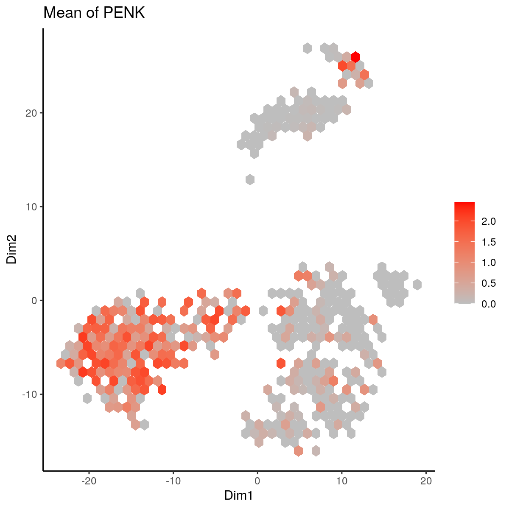|[ADAM10](https://www.ncbi.nlm.nih.gov/gene/102) [ADCY3](https://www.ncbi.nlm.nih.gov/gene/109) [ADCY5](https://www.ncbi.nlm.nih.gov/gene/111) [ADCY6](https://www.ncbi.nlm.nih.gov/gene/112) [ADCY8](https://www.ncbi.nlm.nih.gov/gene/114) [ADCY9](https://www.ncbi.nlm.nih.gov/gene/115) [ADORA1](https://www.ncbi.nlm.nih.gov/gene/134) [ADRA2A](https://www.ncbi.nlm.nih.gov/gene/150) [ADRA2B](https://www.ncbi.nlm.nih.gov/gene/151) [ADRA2C](https://www.ncbi.nlm.nih.gov/gene/152) [AGTR1](https://www.ncbi.nlm.nih.gov/gene/185) [AGTR2](https://www.ncbi.nlm.nih.gov/gene/186) [APLNR](https://www.ncbi.nlm.nih.gov/gene/187) [APLP2](https://www.ncbi.nlm.nih.gov/gene/334) [BDKRB1](https://www.ncbi.nlm.nih.gov/gene/623) [BDKRB2](https://www.ncbi.nlm.nih.gov/gene/624) [CXCR5](https://www.ncbi.nlm.nih.gov/gene/643) [C3AR1](https://www.ncbi.nlm.nih.gov/gene/719) [C5AR1](https://www.ncbi.nlm.nih.gov/gene/728) [CASR](https://www.ncbi.nlm.nih.gov/gene/846) [CDH2](https://www.ncbi.nlm.nih.gov/gene/1000) [CHRM2](https://www.ncbi.nlm.nih.gov/gene/1129) [CHRM4](https://www.ncbi.nlm.nih.gov/gene/1132) [CCR1](https://www.ncbi.nlm.nih.gov/gene/1230) [CCR3](https://www.ncbi.nlm.nih.gov/gene/1232) [CCR4](https://www.ncbi.nlm.nih.gov/gene/1233) [CCR5](https://www.ncbi.nlm.nih.gov/gene/1234) [CCR7](https://www.ncbi.nlm.nih.gov/gene/1236) [CCR8](https://www.ncbi.nlm.nih.gov/gene/1237) [CNR1](https://www.ncbi.nlm.nih.gov/gene/1268) [CNR2](https://www.ncbi.nlm.nih.gov/gene/1269) [CX3CR1](https://www.ncbi.nlm.nih.gov/gene/1524) [DRD1](https://www.ncbi.nlm.nih.gov/gene/1812) [DRD2](https://www.ncbi.nlm.nih.gov/gene/1813) [DRD3](https://www.ncbi.nlm.nih.gov/gene/1814) [DRD4](https://www.ncbi.nlm.nih.gov/gene/1815) [DRD5](https://www.ncbi.nlm.nih.gov/gene/1816) [GPR183](https://www.ncbi.nlm.nih.gov/gene/1880) [S1PR1](https://www.ncbi.nlm.nih.gov/gene/1901) [S1PR3](https://www.ncbi.nlm.nih.gov/gene/1903) [FPR1](https://www.ncbi.nlm.nih.gov/gene/2357) [FPR2](https://www.ncbi.nlm.nih.gov/gene/2358) [FPR3](https://www.ncbi.nlm.nih.gov/gene/2359) [GALR1](https://www.ncbi.nlm.nih.gov/gene/2587) [GPC3](https://www.ncbi.nlm.nih.gov/gene/2719) [GNG3](https://www.ncbi.nlm.nih.gov/gene/2785) [GNG4](https://www.ncbi.nlm.nih.gov/gene/2786) [GNG5](https://www.ncbi.nlm.nih.gov/gene/2787) [GNG7](https://www.ncbi.nlm.nih.gov/gene/2788) [GNG10](https://www.ncbi.nlm.nih.gov/gene/2790) [GNG11](https://www.ncbi.nlm.nih.gov/gene/2791) [GNGT1](https://www.ncbi.nlm.nih.gov/gene/2792) [GNGT2](https://www.ncbi.nlm.nih.gov/gene/2793) [CCR10](https://www.ncbi.nlm.nih.gov/gene/2826) [NPBWR1](https://www.ncbi.nlm.nih.gov/gene/2831) [NPBWR2](https://www.ncbi.nlm.nih.gov/gene/2832) [CXCR3](https://www.ncbi.nlm.nih.gov/gene/2833) [GPR17](https://www.ncbi.nlm.nih.gov/gene/2840) [GPR18](https://www.ncbi.nlm.nih.gov/gene/2841) [MCHR1](https://www.ncbi.nlm.nih.gov/gene/2847) [GPR31](https://www.ncbi.nlm.nih.gov/gene/2853) [GPR37](https://www.ncbi.nlm.nih.gov/gene/2861) [GRM2](https://www.ncbi.nlm.nih.gov/gene/2912) [GRM3](https://www.ncbi.nlm.nih.gov/gene/2913) [GRM4](https://www.ncbi.nlm.nih.gov/gene/2914) [GRM5](https://www.ncbi.nlm.nih.gov/gene/2915) [GRM6](https://www.ncbi.nlm.nih.gov/gene/2916) [GRM7](https://www.ncbi.nlm.nih.gov/gene/2917) [GRM8](https://www.ncbi.nlm.nih.gov/gene/2918) [HTR1A](https://www.ncbi.nlm.nih.gov/gene/3350) [HTR1B](https://www.ncbi.nlm.nih.gov/gene/3351) [HTR1D](https://www.ncbi.nlm.nih.gov/gene/3352) [HTR1E](https://www.ncbi.nlm.nih.gov/gene/3354) [HTR1F](https://www.ncbi.nlm.nih.gov/gene/3355) [HTR5A](https://www.ncbi.nlm.nih.gov/gene/3361) [CXCR1](https://www.ncbi.nlm.nih.gov/gene/3577) [CXCR2](https://www.ncbi.nlm.nih.gov/gene/3579) [MELTF](https://www.ncbi.nlm.nih.gov/gene/4241) [MTNR1A](https://www.ncbi.nlm.nih.gov/gene/4543) [MTNR1B](https://www.ncbi.nlm.nih.gov/gene/4544) [NPY1R](https://www.ncbi.nlm.nih.gov/gene/4886) [NPY2R](https://www.ncbi.nlm.nih.gov/gene/4887) [NPY5R](https://www.ncbi.nlm.nih.gov/gene/4889) [OPRD1](https://www.ncbi.nlm.nih.gov/gene/4985) [OPRK1](https://www.ncbi.nlm.nih.gov/gene/4986) [OPRL1](https://www.ncbi.nlm.nih.gov/gene/4987) [P2RY4](https://www.ncbi.nlm.nih.gov/gene/5030) [PTGER3](https://www.ncbi.nlm.nih.gov/gene/5733) [SELL](https://www.ncbi.nlm.nih.gov/gene/6402) [SLC6A3](https://www.ncbi.nlm.nih.gov/gene/6531) [SSTR1](https://www.ncbi.nlm.nih.gov/gene/6751) [SSTR2](https://www.ncbi.nlm.nih.gov/gene/6752) [SSTR3](https://www.ncbi.nlm.nih.gov/gene/6753) [SSTR4](https://www.ncbi.nlm.nih.gov/gene/6754) [SSTR5](https://www.ncbi.nlm.nih.gov/gene/6755) [CXCR4](https://www.ncbi.nlm.nih.gov/gene/7852) [GALR3](https://www.ncbi.nlm.nih.gov/gene/8484) [S1PR4](https://www.ncbi.nlm.nih.gov/gene/8698) [GALR2](https://www.ncbi.nlm.nih.gov/gene/8811) [HCAR3](https://www.ncbi.nlm.nih.gov/gene/8843) [GPR37L1](https://www.ncbi.nlm.nih.gov/gene/9283) [GPR55](https://www.ncbi.nlm.nih.gov/gene/9290) [GABBR2](https://www.ncbi.nlm.nih.gov/gene/9568) [P2RY14](https://www.ncbi.nlm.nih.gov/gene/9934) [NMUR1](https://www.ncbi.nlm.nih.gov/gene/10316) [TGOLN2](https://www.ncbi.nlm.nih.gov/gene/10618) [CXCR6](https://www.ncbi.nlm.nih.gov/gene/10663) [CCR9](https://www.ncbi.nlm.nih.gov/gene/10803) [PTGDR2](https://www.ncbi.nlm.nih.gov/gene/11251) [HRH3](https://www.ncbi.nlm.nih.gov/gene/11255) [LPAR3](https://www.ncbi.nlm.nih.gov/gene/23566) [HCAR1](https://www.ncbi.nlm.nih.gov/gene/27198) [OXGR1](https://www.ncbi.nlm.nih.gov/gene/27199) [TAS2R16](https://www.ncbi.nlm.nih.gov/gene/50833) [RXFP3](https://www.ncbi.nlm.nih.gov/gene/51289) [GNG13](https://www.ncbi.nlm.nih.gov/gene/51764) [S1PR5](https://www.ncbi.nlm.nih.gov/gene/53637) [P2RY13](https://www.ncbi.nlm.nih.gov/gene/53829) [GNG2](https://www.ncbi.nlm.nih.gov/gene/54331) [MXRA8](https://www.ncbi.nlm.nih.gov/gene/54587) [GNG12](https://www.ncbi.nlm.nih.gov/gene/55970) [SUCNR1](https://www.ncbi.nlm.nih.gov/gene/56670) [NMUR2](https://www.ncbi.nlm.nih.gov/gene/56923) [ACKR3](https://www.ncbi.nlm.nih.gov/gene/57007) [PNPLA2](https://www.ncbi.nlm.nih.gov/gene/57104) [LPAR5](https://www.ncbi.nlm.nih.gov/gene/57121) [ANO8](https://www.ncbi.nlm.nih.gov/gene/57719) [CXCL16](https://www.ncbi.nlm.nih.gov/gene/58191) [HRH4](https://www.ncbi.nlm.nih.gov/gene/59340) [P2RY12](https://www.ncbi.nlm.nih.gov/gene/64805) [TAS1R2](https://www.ncbi.nlm.nih.gov/gene/80834) [TAS1R1](https://www.ncbi.nlm.nih.gov/gene/80835) [TAS1R3](https://www.ncbi.nlm.nih.gov/gene/83756) [MCHR2](https://www.ncbi.nlm.nih.gov/gene/84539) [GNG8](https://www.ncbi.nlm.nih.gov/gene/94235) [OXER1](https://www.ncbi.nlm.nih.gov/gene/165140) [ADCY4](https://www.ncbi.nlm.nih.gov/gene/196883) [MRGPRX1](https://www.ncbi.nlm.nih.gov/gene/259249) [HCAR2](https://www.ncbi.nlm.nih.gov/gene/338442) [RXFP4](https://www.ncbi.nlm.nih.gov/gene/339403) [CCR2](https://www.ncbi.nlm.nih.gov/gene/729230) [LINC02210-CRHR1](https://www.ncbi.nlm.nih.gov/gene/104909134) [OPRM1](https://www.ncbi.nlm.nih.gov/gene/4988)|
|[PF4](https://www.ncbi.nlm.nih.gov/gene/5196)|[ADCY3](https://www.ncbi.nlm.nih.gov/gene/109) [ADCY5](https://www.ncbi.nlm.nih.gov/gene/111) [ADCY6](https://www.ncbi.nlm.nih.gov/gene/112) [ADCY8](https://www.ncbi.nlm.nih.gov/gene/114) [ADCY9](https://www.ncbi.nlm.nih.gov/gene/115) [ADORA1](https://www.ncbi.nlm.nih.gov/gene/134) [ADRA2A](https://www.ncbi.nlm.nih.gov/gene/150) [ADRA2B](https://www.ncbi.nlm.nih.gov/gene/151) [ADRA2C](https://www.ncbi.nlm.nih.gov/gene/152) [AGTR2](https://www.ncbi.nlm.nih.gov/gene/186) [APLNR](https://www.ncbi.nlm.nih.gov/gene/187) [BDKRB1](https://www.ncbi.nlm.nih.gov/gene/623) [BDKRB2](https://www.ncbi.nlm.nih.gov/gene/624) [CXCR5](https://www.ncbi.nlm.nih.gov/gene/643) [C3AR1](https://www.ncbi.nlm.nih.gov/gene/719) [C5AR1](https://www.ncbi.nlm.nih.gov/gene/728) [CASR](https://www.ncbi.nlm.nih.gov/gene/846) [CHRM2](https://www.ncbi.nlm.nih.gov/gene/1129) [CHRM4](https://www.ncbi.nlm.nih.gov/gene/1132) [CCR1](https://www.ncbi.nlm.nih.gov/gene/1230) [CCR3](https://www.ncbi.nlm.nih.gov/gene/1232) [CCR4](https://www.ncbi.nlm.nih.gov/gene/1233) [CCR5](https://www.ncbi.nlm.nih.gov/gene/1234) [CCR6](https://www.ncbi.nlm.nih.gov/gene/1235) [CCR7](https://www.ncbi.nlm.nih.gov/gene/1236) [CCR8](https://www.ncbi.nlm.nih.gov/gene/1237) [CNR1](https://www.ncbi.nlm.nih.gov/gene/1268) [CNR2](https://www.ncbi.nlm.nih.gov/gene/1269) [CX3CR1](https://www.ncbi.nlm.nih.gov/gene/1524) [DRD2](https://www.ncbi.nlm.nih.gov/gene/1813) [DRD3](https://www.ncbi.nlm.nih.gov/gene/1814) [DRD4](https://www.ncbi.nlm.nih.gov/gene/1815) [GPR183](https://www.ncbi.nlm.nih.gov/gene/1880) [S1PR1](https://www.ncbi.nlm.nih.gov/gene/1901) [S1PR3](https://www.ncbi.nlm.nih.gov/gene/1903) [F2R](https://www.ncbi.nlm.nih.gov/gene/2149) [FCGR2A](https://www.ncbi.nlm.nih.gov/gene/2212) [FPR1](https://www.ncbi.nlm.nih.gov/gene/2357) [FPR2](https://www.ncbi.nlm.nih.gov/gene/2358) [FPR3](https://www.ncbi.nlm.nih.gov/gene/2359) [GALR1](https://www.ncbi.nlm.nih.gov/gene/2587) [GNAO1](https://www.ncbi.nlm.nih.gov/gene/2775) [GNG3](https://www.ncbi.nlm.nih.gov/gene/2785) [GNG4](https://www.ncbi.nlm.nih.gov/gene/2786) [GNG5](https://www.ncbi.nlm.nih.gov/gene/2787) [GNG7](https://www.ncbi.nlm.nih.gov/gene/2788) [GNG10](https://www.ncbi.nlm.nih.gov/gene/2790) [GNG11](https://www.ncbi.nlm.nih.gov/gene/2791) [GNGT1](https://www.ncbi.nlm.nih.gov/gene/2792) [GNGT2](https://www.ncbi.nlm.nih.gov/gene/2793) [CCR10](https://www.ncbi.nlm.nih.gov/gene/2826) [XCR1](https://www.ncbi.nlm.nih.gov/gene/2829) [NPBWR1](https://www.ncbi.nlm.nih.gov/gene/2831) [NPBWR2](https://www.ncbi.nlm.nih.gov/gene/2832) [CXCR3](https://www.ncbi.nlm.nih.gov/gene/2833) [GPR17](https://www.ncbi.nlm.nih.gov/gene/2840) [GPR18](https://www.ncbi.nlm.nih.gov/gene/2841) [MCHR1](https://www.ncbi.nlm.nih.gov/gene/2847) [GPR31](https://www.ncbi.nlm.nih.gov/gene/2853) [GPR37](https://www.ncbi.nlm.nih.gov/gene/2861) [GRM2](https://www.ncbi.nlm.nih.gov/gene/2912) [GRM3](https://www.ncbi.nlm.nih.gov/gene/2913) [GRM4](https://www.ncbi.nlm.nih.gov/gene/2914) [GRM6](https://www.ncbi.nlm.nih.gov/gene/2916) [GRM7](https://www.ncbi.nlm.nih.gov/gene/2917) [GRM8](https://www.ncbi.nlm.nih.gov/gene/2918) [HTR1A](https://www.ncbi.nlm.nih.gov/gene/3350) [HTR1B](https://www.ncbi.nlm.nih.gov/gene/3351) [HTR1D](https://www.ncbi.nlm.nih.gov/gene/3352) [HTR1E](https://www.ncbi.nlm.nih.gov/gene/3354) [HTR1F](https://www.ncbi.nlm.nih.gov/gene/3355) [HTR5A](https://www.ncbi.nlm.nih.gov/gene/3361) [CXCR1](https://www.ncbi.nlm.nih.gov/gene/3577) [CXCR2](https://www.ncbi.nlm.nih.gov/gene/3579) [ITGAM](https://www.ncbi.nlm.nih.gov/gene/3684) [ITGB3](https://www.ncbi.nlm.nih.gov/gene/3690) [LDLR](https://www.ncbi.nlm.nih.gov/gene/3949) [MPL](https://www.ncbi.nlm.nih.gov/gene/4352) [MTNR1A](https://www.ncbi.nlm.nih.gov/gene/4543) [MTNR1B](https://www.ncbi.nlm.nih.gov/gene/4544) [NPY1R](https://www.ncbi.nlm.nih.gov/gene/4886) [NPY2R](https://www.ncbi.nlm.nih.gov/gene/4887) [NPY5R](https://www.ncbi.nlm.nih.gov/gene/4889) [OPRD1](https://www.ncbi.nlm.nih.gov/gene/4985) [OPRK1](https://www.ncbi.nlm.nih.gov/gene/4986) [OPRL1](https://www.ncbi.nlm.nih.gov/gene/4987) [P2RY4](https://www.ncbi.nlm.nih.gov/gene/5030) [PTGER3](https://www.ncbi.nlm.nih.gov/gene/5733) [SELE](https://www.ncbi.nlm.nih.gov/gene/6401) [SELL](https://www.ncbi.nlm.nih.gov/gene/6402) [SELP](https://www.ncbi.nlm.nih.gov/gene/6403) [SSTR1](https://www.ncbi.nlm.nih.gov/gene/6751) [SSTR2](https://www.ncbi.nlm.nih.gov/gene/6752) [SSTR3](https://www.ncbi.nlm.nih.gov/gene/6753) [SSTR4](https://www.ncbi.nlm.nih.gov/gene/6754) [SSTR5](https://www.ncbi.nlm.nih.gov/gene/6755) [TLR4](https://www.ncbi.nlm.nih.gov/gene/7099) [CXCR4](https://www.ncbi.nlm.nih.gov/gene/7852) [GALR3](https://www.ncbi.nlm.nih.gov/gene/8484) [S1PR4](https://www.ncbi.nlm.nih.gov/gene/8698) [GALR2](https://www.ncbi.nlm.nih.gov/gene/8811) [HCAR3](https://www.ncbi.nlm.nih.gov/gene/8843) [FCGR2C](https://www.ncbi.nlm.nih.gov/gene/9103) [GPR37L1](https://www.ncbi.nlm.nih.gov/gene/9283) [GPR55](https://www.ncbi.nlm.nih.gov/gene/9290) [CD163](https://www.ncbi.nlm.nih.gov/gene/9332) [GABBR2](https://www.ncbi.nlm.nih.gov/gene/9568) [P2RY14](https://www.ncbi.nlm.nih.gov/gene/9934) [NMUR1](https://www.ncbi.nlm.nih.gov/gene/10316) [CXCR6](https://www.ncbi.nlm.nih.gov/gene/10663) [CCR9](https://www.ncbi.nlm.nih.gov/gene/10803) [PTGDR2](https://www.ncbi.nlm.nih.gov/gene/11251) [HRH3](https://www.ncbi.nlm.nih.gov/gene/11255) [LPAR3](https://www.ncbi.nlm.nih.gov/gene/23566) [HCAR1](https://www.ncbi.nlm.nih.gov/gene/27198) [OXGR1](https://www.ncbi.nlm.nih.gov/gene/27199) [TAS2R16](https://www.ncbi.nlm.nih.gov/gene/50833) [GP6](https://www.ncbi.nlm.nih.gov/gene/51206) [RXFP3](https://www.ncbi.nlm.nih.gov/gene/51289) [GNG13](https://www.ncbi.nlm.nih.gov/gene/51764) [S1PR5](https://www.ncbi.nlm.nih.gov/gene/53637) [P2RY13](https://www.ncbi.nlm.nih.gov/gene/53829) [GNG2](https://www.ncbi.nlm.nih.gov/gene/54331) [GNG12](https://www.ncbi.nlm.nih.gov/gene/55970) [SUCNR1](https://www.ncbi.nlm.nih.gov/gene/56670) [NMUR2](https://www.ncbi.nlm.nih.gov/gene/56923) [ACKR3](https://www.ncbi.nlm.nih.gov/gene/57007) [LPAR5](https://www.ncbi.nlm.nih.gov/gene/57121) [CXCL16](https://www.ncbi.nlm.nih.gov/gene/58191) [HRH4](https://www.ncbi.nlm.nih.gov/gene/59340) [P2RY12](https://www.ncbi.nlm.nih.gov/gene/64805) [TAS1R2](https://www.ncbi.nlm.nih.gov/gene/80834) [TAS1R1](https://www.ncbi.nlm.nih.gov/gene/80835) [TAS1R3](https://www.ncbi.nlm.nih.gov/gene/83756) [MCHR2](https://www.ncbi.nlm.nih.gov/gene/84539) [GNG8](https://www.ncbi.nlm.nih.gov/gene/94235) [OXER1](https://www.ncbi.nlm.nih.gov/gene/165140) [ADCY4](https://www.ncbi.nlm.nih.gov/gene/196883) [HCAR2](https://www.ncbi.nlm.nih.gov/gene/338442) [RXFP4](https://www.ncbi.nlm.nih.gov/gene/339403) [TREML1](https://www.ncbi.nlm.nih.gov/gene/340205) [CCR2](https://www.ncbi.nlm.nih.gov/gene/729230)|
|[PF4V1](https://www.ncbi.nlm.nih.gov/gene/5197)|[CXCR5](https://www.ncbi.nlm.nih.gov/gene/643) [CCR1](https://www.ncbi.nlm.nih.gov/gene/1230) [CCR3](https://www.ncbi.nlm.nih.gov/gene/1232) [CCR4](https://www.ncbi.nlm.nih.gov/gene/1233) [CCR5](https://www.ncbi.nlm.nih.gov/gene/1234) [CCR6](https://www.ncbi.nlm.nih.gov/gene/1235) [CCR7](https://www.ncbi.nlm.nih.gov/gene/1236) [CCR8](https://www.ncbi.nlm.nih.gov/gene/1237) [CX3CR1](https://www.ncbi.nlm.nih.gov/gene/1524) [CCR10](https://www.ncbi.nlm.nih.gov/gene/2826) [XCR1](https://www.ncbi.nlm.nih.gov/gene/2829) [CXCR3](https://www.ncbi.nlm.nih.gov/gene/2833) [CXCR1](https://www.ncbi.nlm.nih.gov/gene/3577) [CXCR2](https://www.ncbi.nlm.nih.gov/gene/3579) [CXCR4](https://www.ncbi.nlm.nih.gov/gene/7852) [CXCR6](https://www.ncbi.nlm.nih.gov/gene/10663) [CCR9](https://www.ncbi.nlm.nih.gov/gene/10803) [CCR2](https://www.ncbi.nlm.nih.gov/gene/729230)|
|[PGA3](https://www.ncbi.nlm.nih.gov/gene/643834)|[APLP2](https://www.ncbi.nlm.nih.gov/gene/334) [TMEM184A](https://www.ncbi.nlm.nih.gov/gene/202915)|
|[PGA4](https://www.ncbi.nlm.nih.gov/gene/643847)|[APLP2](https://www.ncbi.nlm.nih.gov/gene/334) [ATP4B](https://www.ncbi.nlm.nih.gov/gene/496) [CD5](https://www.ncbi.nlm.nih.gov/gene/921) [MS4A1](https://www.ncbi.nlm.nih.gov/gene/931)|
|[PGA5](https://www.ncbi.nlm.nih.gov/gene/5222)|[APLP2](https://www.ncbi.nlm.nih.gov/gene/334) [ATP4B](https://www.ncbi.nlm.nih.gov/gene/496)|
|[PGC](https://www.ncbi.nlm.nih.gov/gene/5225)|[ATP4B](https://www.ncbi.nlm.nih.gov/gene/496) [CACNA1S](https://www.ncbi.nlm.nih.gov/gene/779) [LRBA](https://www.ncbi.nlm.nih.gov/gene/987) [CR2](https://www.ncbi.nlm.nih.gov/gene/1380) [ESR1](https://www.ncbi.nlm.nih.gov/gene/2099) [NPR2](https://www.ncbi.nlm.nih.gov/gene/4882) [MGAM](https://www.ncbi.nlm.nih.gov/gene/8972)|
|[PGF](https://www.ncbi.nlm.nih.gov/gene/5228)|[CSF1R](https://www.ncbi.nlm.nih.gov/gene/1436) [EPHA2](https://www.ncbi.nlm.nih.gov/gene/1969) [ENG](https://www.ncbi.nlm.nih.gov/gene/2022) [FGFR1](https://www.ncbi.nlm.nih.gov/gene/2260) [FGFR3](https://www.ncbi.nlm.nih.gov/gene/2261) [INSR](https://www.ncbi.nlm.nih.gov/gene/3643) [NGFR](https://www.ncbi.nlm.nih.gov/gene/4804) [NOS3](https://www.ncbi.nlm.nih.gov/gene/4846) [NTRK1](https://www.ncbi.nlm.nih.gov/gene/4914) [NTRK2](https://www.ncbi.nlm.nih.gov/gene/4915) [OXTR](https://www.ncbi.nlm.nih.gov/gene/5021) [PDGFRA](https://www.ncbi.nlm.nih.gov/gene/5156) [PDGFRB](https://www.ncbi.nlm.nih.gov/gene/5159) [PTGER1](https://www.ncbi.nlm.nih.gov/gene/5731) [PTGER3](https://www.ncbi.nlm.nih.gov/gene/5733) [PTGFR](https://www.ncbi.nlm.nih.gov/gene/5737) [SELE](https://www.ncbi.nlm.nih.gov/gene/6401) [TEK](https://www.ncbi.nlm.nih.gov/gene/7010) [TIE1](https://www.ncbi.nlm.nih.gov/gene/7075) [CXCR4](https://www.ncbi.nlm.nih.gov/gene/7852) [SEMA4D](https://www.ncbi.nlm.nih.gov/gene/10507) [DLL4](https://www.ncbi.nlm.nih.gov/gene/54567) [FLT1](https://www.ncbi.nlm.nih.gov/gene/2321) [NRP1](https://www.ncbi.nlm.nih.gov/gene/8829)|
|[PGLYRP1](https://www.ncbi.nlm.nih.gov/gene/8993)|[DSCAM](https://www.ncbi.nlm.nih.gov/gene/1826) [TLR1](https://www.ncbi.nlm.nih.gov/gene/7096) [TLR4](https://www.ncbi.nlm.nih.gov/gene/7099) [TLR5](https://www.ncbi.nlm.nih.gov/gene/7100) [VCL](https://www.ncbi.nlm.nih.gov/gene/7414) [TLR6](https://www.ncbi.nlm.nih.gov/gene/10333) [NOD1](https://www.ncbi.nlm.nih.gov/gene/10392) [GSDMD](https://www.ncbi.nlm.nih.gov/gene/79792) [OSCAR](https://www.ncbi.nlm.nih.gov/gene/126014)|
|[PGLYRP2](https://www.ncbi.nlm.nih.gov/gene/114770)|[NOD1](https://www.ncbi.nlm.nih.gov/gene/10392) [SLC22A7](https://www.ncbi.nlm.nih.gov/gene/10864)|
|[PGLYRP4](https://www.ncbi.nlm.nih.gov/gene/57115)|[OR5D14](https://www.ncbi.nlm.nih.gov/gene/219436)|
|[PI15](https://www.ncbi.nlm.nih.gov/gene/51050)|[ADGRB3](https://www.ncbi.nlm.nih.gov/gene/577) [PCDH7](https://www.ncbi.nlm.nih.gov/gene/5099)|
|[PI16](https://www.ncbi.nlm.nih.gov/gene/221476)|[HLA-DRA](https://www.ncbi.nlm.nih.gov/gene/3122)|
|[PI3](https://www.ncbi.nlm.nih.gov/gene/5266)|[AKT2](https://www.ncbi.nlm.nih.gov/gene/208) [RHOA](https://www.ncbi.nlm.nih.gov/gene/387) [BTK](https://www.ncbi.nlm.nih.gov/gene/695) [CBL](https://www.ncbi.nlm.nih.gov/gene/867) [CD44](https://www.ncbi.nlm.nih.gov/gene/960) [CD79B](https://www.ncbi.nlm.nih.gov/gene/974) [CDC42](https://www.ncbi.nlm.nih.gov/gene/998) [CNR1](https://www.ncbi.nlm.nih.gov/gene/1268) [CRK](https://www.ncbi.nlm.nih.gov/gene/1398) [DSC1](https://www.ncbi.nlm.nih.gov/gene/1823) [DSC2](https://www.ncbi.nlm.nih.gov/gene/1824) [DSC3](https://www.ncbi.nlm.nih.gov/gene/1825) [DSG1](https://www.ncbi.nlm.nih.gov/gene/1828) [DSG2](https://www.ncbi.nlm.nih.gov/gene/1829) [DSG3](https://www.ncbi.nlm.nih.gov/gene/1830) [ESR1](https://www.ncbi.nlm.nih.gov/gene/2099) [FYN](https://www.ncbi.nlm.nih.gov/gene/2534) [GRM5](https://www.ncbi.nlm.nih.gov/gene/2915) [KRAS](https://www.ncbi.nlm.nih.gov/gene/3845) [LYN](https://www.ncbi.nlm.nih.gov/gene/4067) [NOS3](https://www.ncbi.nlm.nih.gov/gene/4846) [NTRK1](https://www.ncbi.nlm.nih.gov/gene/4914) [NTRK2](https://www.ncbi.nlm.nih.gov/gene/4915) [PDGFRB](https://www.ncbi.nlm.nih.gov/gene/5159) [PDPK1](https://www.ncbi.nlm.nih.gov/gene/5170) [RAB5A](https://www.ncbi.nlm.nih.gov/gene/5868) [RAF1](https://www.ncbi.nlm.nih.gov/gene/5894) [SGK1](https://www.ncbi.nlm.nih.gov/gene/6446) [SLC2A1](https://www.ncbi.nlm.nih.gov/gene/6513) [SLC2A4](https://www.ncbi.nlm.nih.gov/gene/6517) [SRC](https://www.ncbi.nlm.nih.gov/gene/6714) [SYK](https://www.ncbi.nlm.nih.gov/gene/6850) [TEK](https://www.ncbi.nlm.nih.gov/gene/7010) [TLR4](https://www.ncbi.nlm.nih.gov/gene/7099) [ZAN](https://www.ncbi.nlm.nih.gov/gene/7455) [CXCR4](https://www.ncbi.nlm.nih.gov/gene/7852) [RBSN](https://www.ncbi.nlm.nih.gov/gene/64145) [SYT8](https://www.ncbi.nlm.nih.gov/gene/90019) [DSG4](https://www.ncbi.nlm.nih.gov/gene/147409)|
|[PIBF1](https://www.ncbi.nlm.nih.gov/gene/10464)|[LRRC8A](https://www.ncbi.nlm.nih.gov/gene/56262)|
|[PIGR](https://www.ncbi.nlm.nih.gov/gene/5284) 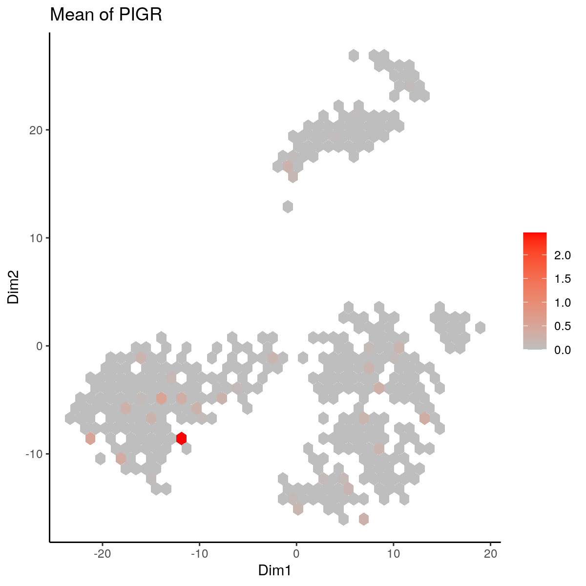|[ACPP](https://www.ncbi.nlm.nih.gov/gene/55) [AGER](https://www.ncbi.nlm.nih.gov/gene/177) [C3AR1](https://www.ncbi.nlm.nih.gov/gene/719) [CD63](https://www.ncbi.nlm.nih.gov/gene/967) [CD79A](https://www.ncbi.nlm.nih.gov/gene/973) [CEACAM8](https://www.ncbi.nlm.nih.gov/gene/1088) [STOM](https://www.ncbi.nlm.nih.gov/gene/2040) [FCER1A](https://www.ncbi.nlm.nih.gov/gene/2205) [FCGR1A](https://www.ncbi.nlm.nih.gov/gene/2209) [FCGR2A](https://www.ncbi.nlm.nih.gov/gene/2212) [FCGR3A](https://www.ncbi.nlm.nih.gov/gene/2214) [FCGRT](https://www.ncbi.nlm.nih.gov/gene/2217) [FPR1](https://www.ncbi.nlm.nih.gov/gene/2357) [LAMP1](https://www.ncbi.nlm.nih.gov/gene/3916) [LAMP2](https://www.ncbi.nlm.nih.gov/gene/3920) [CEACAM6](https://www.ncbi.nlm.nih.gov/gene/4680) [PTAFR](https://www.ncbi.nlm.nih.gov/gene/5724) [RAB3B](https://www.ncbi.nlm.nih.gov/gene/5865) [RAB5C](https://www.ncbi.nlm.nih.gov/gene/5878) [RAP1B](https://www.ncbi.nlm.nih.gov/gene/5908) [RAB11A](https://www.ncbi.nlm.nih.gov/gene/8766) [VNN1](https://www.ncbi.nlm.nih.gov/gene/8876) [FCGR2C](https://www.ncbi.nlm.nih.gov/gene/9103) [RAB3D](https://www.ncbi.nlm.nih.gov/gene/9545) [CMTM6](https://www.ncbi.nlm.nih.gov/gene/54918) [FCRL2](https://www.ncbi.nlm.nih.gov/gene/79368) [FCRL5](https://www.ncbi.nlm.nih.gov/gene/83416) [FCRL4](https://www.ncbi.nlm.nih.gov/gene/83417) [MAGT1](https://www.ncbi.nlm.nih.gov/gene/84061) [MAL2](https://www.ncbi.nlm.nih.gov/gene/114569) [FCRL1](https://www.ncbi.nlm.nih.gov/gene/115350) [FCRL3](https://www.ncbi.nlm.nih.gov/gene/115352) [NFAM1](https://www.ncbi.nlm.nih.gov/gene/150372) [FCRL6](https://www.ncbi.nlm.nih.gov/gene/343413) [SLCO4C1](https://www.ncbi.nlm.nih.gov/gene/353189) [RAB44](https://www.ncbi.nlm.nih.gov/gene/401258)|
|[PILRA](https://www.ncbi.nlm.nih.gov/gene/29992)|[ADGRE5](https://www.ncbi.nlm.nih.gov/gene/976) [EDNRA](https://www.ncbi.nlm.nih.gov/gene/1909) [GYPC](https://www.ncbi.nlm.nih.gov/gene/2995) [LAIR1](https://www.ncbi.nlm.nih.gov/gene/3903) [MAG](https://www.ncbi.nlm.nih.gov/gene/4099) [NECTIN2](https://www.ncbi.nlm.nih.gov/gene/5819) [TYROBP](https://www.ncbi.nlm.nih.gov/gene/7305) [TNFRSF14](https://www.ncbi.nlm.nih.gov/gene/8764) [KLRG1](https://www.ncbi.nlm.nih.gov/gene/10219) [CD300C](https://www.ncbi.nlm.nih.gov/gene/10871) [CD300A](https://www.ncbi.nlm.nih.gov/gene/11314) [ADGRE2](https://www.ncbi.nlm.nih.gov/gene/30817) [CLEC4A](https://www.ncbi.nlm.nih.gov/gene/50856) [PVRIG](https://www.ncbi.nlm.nih.gov/gene/79037) [LRRTM4](https://www.ncbi.nlm.nih.gov/gene/80059) [OR2AE1](https://www.ncbi.nlm.nih.gov/gene/81392) [CD300LF](https://www.ncbi.nlm.nih.gov/gene/146722) [CLEC4G](https://www.ncbi.nlm.nih.gov/gene/339390) [TREML1](https://www.ncbi.nlm.nih.gov/gene/340205) [CD300E](https://www.ncbi.nlm.nih.gov/gene/342510) [RAB44](https://www.ncbi.nlm.nih.gov/gene/401258) [LOC102725035](https://www.ncbi.nlm.nih.gov/gene/102725035)|
|[PINLYP](https://www.ncbi.nlm.nih.gov/gene/390940)|[BTK](https://www.ncbi.nlm.nih.gov/gene/695) [GML](https://www.ncbi.nlm.nih.gov/gene/2765) [GPR20](https://www.ncbi.nlm.nih.gov/gene/2843) [LY6H](https://www.ncbi.nlm.nih.gov/gene/4062) [GPR65](https://www.ncbi.nlm.nih.gov/gene/8477) [LYPD3](https://www.ncbi.nlm.nih.gov/gene/27076) [LY6G6D](https://www.ncbi.nlm.nih.gov/gene/58530) [LY6G6C](https://www.ncbi.nlm.nih.gov/gene/80740) [FCRL5](https://www.ncbi.nlm.nih.gov/gene/83416) [TEX101](https://www.ncbi.nlm.nih.gov/gene/83639) [LYPD2](https://www.ncbi.nlm.nih.gov/gene/137797) [LYPD4](https://www.ncbi.nlm.nih.gov/gene/147719) [SPACA4](https://www.ncbi.nlm.nih.gov/gene/171169) [LY6G6F](https://www.ncbi.nlm.nih.gov/gene/259215) [LYPD5](https://www.ncbi.nlm.nih.gov/gene/284348) [LYPD8](https://www.ncbi.nlm.nih.gov/gene/646627)|
|[PIP](https://www.ncbi.nlm.nih.gov/gene/5304)|[ACHE](https://www.ncbi.nlm.nih.gov/gene/43) [CD36](https://www.ncbi.nlm.nih.gov/gene/948) [CEACAM5](https://www.ncbi.nlm.nih.gov/gene/1048) [ECE1](https://www.ncbi.nlm.nih.gov/gene/1889) [ESR1](https://www.ncbi.nlm.nih.gov/gene/2099) [GP2](https://www.ncbi.nlm.nih.gov/gene/2813) [HLA-DRB1](https://www.ncbi.nlm.nih.gov/gene/3123) [KEL](https://www.ncbi.nlm.nih.gov/gene/3792) [MME](https://www.ncbi.nlm.nih.gov/gene/4311) [MUC1](https://www.ncbi.nlm.nih.gov/gene/4582) [PHEX](https://www.ncbi.nlm.nih.gov/gene/5251) [GP6](https://www.ncbi.nlm.nih.gov/gene/51206)|
|[PKDCC](https://www.ncbi.nlm.nih.gov/gene/91461)|[LRRC32](https://www.ncbi.nlm.nih.gov/gene/2615) [GALR2](https://www.ncbi.nlm.nih.gov/gene/8811) [SLC6A5](https://www.ncbi.nlm.nih.gov/gene/9152) [KCNG3](https://www.ncbi.nlm.nih.gov/gene/170850)|
|[PLA1A](https://www.ncbi.nlm.nih.gov/gene/51365)|[LPAR6](https://www.ncbi.nlm.nih.gov/gene/10161) [LPAR3](https://www.ncbi.nlm.nih.gov/gene/23566)|
|[PLA2G10](https://www.ncbi.nlm.nih.gov/gene/8399)|[ALOX15](https://www.ncbi.nlm.nih.gov/gene/246) [ALOX15B](https://www.ncbi.nlm.nih.gov/gene/247) [GNA11](https://www.ncbi.nlm.nih.gov/gene/2767) [SI](https://www.ncbi.nlm.nih.gov/gene/6476) [MGAM](https://www.ncbi.nlm.nih.gov/gene/8972) [CSPG5](https://www.ncbi.nlm.nih.gov/gene/10675) [CYSLTR1](https://www.ncbi.nlm.nih.gov/gene/10800) [PLAAT3](https://www.ncbi.nlm.nih.gov/gene/11145) [CLCA4](https://www.ncbi.nlm.nih.gov/gene/22802) [PLA2G3](https://www.ncbi.nlm.nih.gov/gene/50487) [PNPLA2](https://www.ncbi.nlm.nih.gov/gene/57104) [ENPP6](https://www.ncbi.nlm.nih.gov/gene/133121) [PLB1](https://www.ncbi.nlm.nih.gov/gene/151056) [SLC36A2](https://www.ncbi.nlm.nih.gov/gene/153201)|
|[PLA2G12A](https://www.ncbi.nlm.nih.gov/gene/81579)|[ALOX15](https://www.ncbi.nlm.nih.gov/gene/246) [ALOX15B](https://www.ncbi.nlm.nih.gov/gene/247) [GNA11](https://www.ncbi.nlm.nih.gov/gene/2767) [PLA2G2A](https://www.ncbi.nlm.nih.gov/gene/5320) [PLAAT3](https://www.ncbi.nlm.nih.gov/gene/11145) [SEPHS1](https://www.ncbi.nlm.nih.gov/gene/22929) [PLA2G3](https://www.ncbi.nlm.nih.gov/gene/50487) [ENPP6](https://www.ncbi.nlm.nih.gov/gene/133121) [PLB1](https://www.ncbi.nlm.nih.gov/gene/151056)|
|[PLA2G12B](https://www.ncbi.nlm.nih.gov/gene/84647)|[ALOX15](https://www.ncbi.nlm.nih.gov/gene/246) [ALOX15B](https://www.ncbi.nlm.nih.gov/gene/247) [C8A](https://www.ncbi.nlm.nih.gov/gene/731) [GNA11](https://www.ncbi.nlm.nih.gov/gene/2767) [PLA2G2A](https://www.ncbi.nlm.nih.gov/gene/5320) [SLC2A2](https://www.ncbi.nlm.nih.gov/gene/6514) [PLAAT3](https://www.ncbi.nlm.nih.gov/gene/11145) [SEPHS1](https://www.ncbi.nlm.nih.gov/gene/22929) [PLA2G3](https://www.ncbi.nlm.nih.gov/gene/50487) [ENPP6](https://www.ncbi.nlm.nih.gov/gene/133121) [PLB1](https://www.ncbi.nlm.nih.gov/gene/151056) [SLC51A](https://www.ncbi.nlm.nih.gov/gene/200931)|
|[PLA2G1B](https://www.ncbi.nlm.nih.gov/gene/5319)|[ALOX15](https://www.ncbi.nlm.nih.gov/gene/246) [ALOX15B](https://www.ncbi.nlm.nih.gov/gene/247) [ACE](https://www.ncbi.nlm.nih.gov/gene/1636) [GNA11](https://www.ncbi.nlm.nih.gov/gene/2767) [LIPE](https://www.ncbi.nlm.nih.gov/gene/3991) [PLA2G2A](https://www.ncbi.nlm.nih.gov/gene/5320) [PTGIR](https://www.ncbi.nlm.nih.gov/gene/5739) [SELE](https://www.ncbi.nlm.nih.gov/gene/6401) [SELP](https://www.ncbi.nlm.nih.gov/gene/6403) [TLR4](https://www.ncbi.nlm.nih.gov/gene/7099) [CALCRL](https://www.ncbi.nlm.nih.gov/gene/10203) [CYSLTR1](https://www.ncbi.nlm.nih.gov/gene/10800) [PLAAT3](https://www.ncbi.nlm.nih.gov/gene/11145) [PLA2G3](https://www.ncbi.nlm.nih.gov/gene/50487) [PNPLA2](https://www.ncbi.nlm.nih.gov/gene/57104) [SLC38A5](https://www.ncbi.nlm.nih.gov/gene/92745) [ENPP6](https://www.ncbi.nlm.nih.gov/gene/133121) [PLB1](https://www.ncbi.nlm.nih.gov/gene/151056) [LYNX1-SLURP2](https://www.ncbi.nlm.nih.gov/gene/111188157)|
|[PLA2G2A](https://www.ncbi.nlm.nih.gov/gene/5320)|[GPC1](https://www.ncbi.nlm.nih.gov/gene/2817)|
|[PLA2G2D](https://www.ncbi.nlm.nih.gov/gene/26279)|[ALOX15](https://www.ncbi.nlm.nih.gov/gene/246) [ALOX15B](https://www.ncbi.nlm.nih.gov/gene/247) [GNA11](https://www.ncbi.nlm.nih.gov/gene/2767) [SPAM1](https://www.ncbi.nlm.nih.gov/gene/6677) [HYAL2](https://www.ncbi.nlm.nih.gov/gene/8692) [CALCRL](https://www.ncbi.nlm.nih.gov/gene/10203) [CYSLTR1](https://www.ncbi.nlm.nih.gov/gene/10800) [PLAAT3](https://www.ncbi.nlm.nih.gov/gene/11145) [PLA2G3](https://www.ncbi.nlm.nih.gov/gene/50487) [LGR4](https://www.ncbi.nlm.nih.gov/gene/55366) [ENPP6](https://www.ncbi.nlm.nih.gov/gene/133121) [PLB1](https://www.ncbi.nlm.nih.gov/gene/151056)|
|[PLA2G2E](https://www.ncbi.nlm.nih.gov/gene/30814)|[ALOX15](https://www.ncbi.nlm.nih.gov/gene/246) [ALOX15B](https://www.ncbi.nlm.nih.gov/gene/247) [GNA11](https://www.ncbi.nlm.nih.gov/gene/2767) [PLAAT3](https://www.ncbi.nlm.nih.gov/gene/11145) [PLA2G3](https://www.ncbi.nlm.nih.gov/gene/50487) [ENPP6](https://www.ncbi.nlm.nih.gov/gene/133121) [PLB1](https://www.ncbi.nlm.nih.gov/gene/151056)|
|[PLA2G2F](https://www.ncbi.nlm.nih.gov/gene/64600)|[ALOX15](https://www.ncbi.nlm.nih.gov/gene/246) [ALOX15B](https://www.ncbi.nlm.nih.gov/gene/247) [GNA11](https://www.ncbi.nlm.nih.gov/gene/2767) [PLAAT3](https://www.ncbi.nlm.nih.gov/gene/11145) [PLA2G3](https://www.ncbi.nlm.nih.gov/gene/50487) [ENPP6](https://www.ncbi.nlm.nih.gov/gene/133121) [PLB1](https://www.ncbi.nlm.nih.gov/gene/151056)|
|[PLA2G3](https://www.ncbi.nlm.nih.gov/gene/50487)|[ALOX15](https://www.ncbi.nlm.nih.gov/gene/246) [ALOX15B](https://www.ncbi.nlm.nih.gov/gene/247) [GNA11](https://www.ncbi.nlm.nih.gov/gene/2767) [PLA2G2A](https://www.ncbi.nlm.nih.gov/gene/5320) [PLAAT3](https://www.ncbi.nlm.nih.gov/gene/11145) [ENPP6](https://www.ncbi.nlm.nih.gov/gene/133121) [PLB1](https://www.ncbi.nlm.nih.gov/gene/151056)|
|[PLA2G5](https://www.ncbi.nlm.nih.gov/gene/5322) 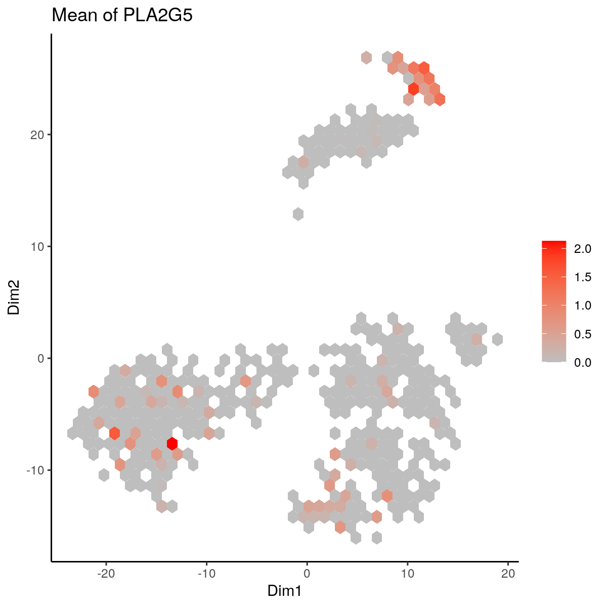|[ALOX15](https://www.ncbi.nlm.nih.gov/gene/246) [ALOX15B](https://www.ncbi.nlm.nih.gov/gene/247) [GNA11](https://www.ncbi.nlm.nih.gov/gene/2767) [SLC12A7](https://www.ncbi.nlm.nih.gov/gene/10723) [PLAAT3](https://www.ncbi.nlm.nih.gov/gene/11145) [PLA2G3](https://www.ncbi.nlm.nih.gov/gene/50487) [PNPLA2](https://www.ncbi.nlm.nih.gov/gene/57104) [ENPP6](https://www.ncbi.nlm.nih.gov/gene/133121) [PLB1](https://www.ncbi.nlm.nih.gov/gene/151056)|
|[PLA2G7](https://www.ncbi.nlm.nih.gov/gene/7941)|[KCNS3](https://www.ncbi.nlm.nih.gov/gene/3790) [LDLR](https://www.ncbi.nlm.nih.gov/gene/3949) [PLA2G2A](https://www.ncbi.nlm.nih.gov/gene/5320) [PTAFR](https://www.ncbi.nlm.nih.gov/gene/5724) [TLR4](https://www.ncbi.nlm.nih.gov/gene/7099) [CD163](https://www.ncbi.nlm.nih.gov/gene/9332) [PLAAT3](https://www.ncbi.nlm.nih.gov/gene/11145) [PTGDR2](https://www.ncbi.nlm.nih.gov/gene/11251) [PLA2G3](https://www.ncbi.nlm.nih.gov/gene/50487) [LSR](https://www.ncbi.nlm.nih.gov/gene/51599) [APOBR](https://www.ncbi.nlm.nih.gov/gene/55911) [TTYH1](https://www.ncbi.nlm.nih.gov/gene/57348) [PLB1](https://www.ncbi.nlm.nih.gov/gene/151056) [OR13C9](https://www.ncbi.nlm.nih.gov/gene/286362) [GPIHBP1](https://www.ncbi.nlm.nih.gov/gene/338328)|
|[PLA2R1](https://www.ncbi.nlm.nih.gov/gene/22925)|[HLA-DQA1](https://www.ncbi.nlm.nih.gov/gene/3117) [HLA-DQA2](https://www.ncbi.nlm.nih.gov/gene/3118) [MME](https://www.ncbi.nlm.nih.gov/gene/4311) [NPHS1](https://www.ncbi.nlm.nih.gov/gene/4868) [PLA2G2A](https://www.ncbi.nlm.nih.gov/gene/5320)|
|[PLAC1](https://www.ncbi.nlm.nih.gov/gene/10761) 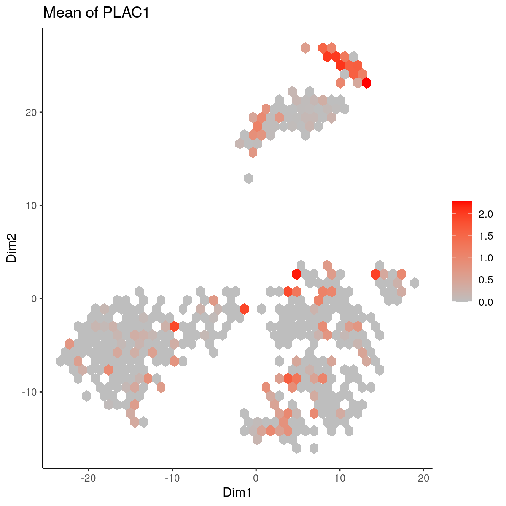|[ZP3](https://www.ncbi.nlm.nih.gov/gene/7784) [SLC38A4](https://www.ncbi.nlm.nih.gov/gene/55089) [ZP4](https://www.ncbi.nlm.nih.gov/gene/57829) [NRN1L](https://www.ncbi.nlm.nih.gov/gene/123904) [CT83](https://www.ncbi.nlm.nih.gov/gene/203413)|
|[PLAC9](https://www.ncbi.nlm.nih.gov/gene/219348) |[LYPD1](https://www.ncbi.nlm.nih.gov/gene/116372)|
|[PLAT](https://www.ncbi.nlm.nih.gov/gene/5327)|[CD4](https://www.ncbi.nlm.nih.gov/gene/920) [ACE](https://www.ncbi.nlm.nih.gov/gene/1636) [F2R](https://www.ncbi.nlm.nih.gov/gene/2149) [GRIN1](https://www.ncbi.nlm.nih.gov/gene/2902) [GRIN2B](https://www.ncbi.nlm.nih.gov/gene/2904) [ITGAM](https://www.ncbi.nlm.nih.gov/gene/3684) [ITGB2](https://www.ncbi.nlm.nih.gov/gene/3689) [LDLR](https://www.ncbi.nlm.nih.gov/gene/3949) [NOS3](https://www.ncbi.nlm.nih.gov/gene/4846) [PKD1](https://www.ncbi.nlm.nih.gov/gene/5310) [SELE](https://www.ncbi.nlm.nih.gov/gene/6401) [SELP](https://www.ncbi.nlm.nih.gov/gene/6403) [SLC12A3](https://www.ncbi.nlm.nih.gov/gene/6559) [PLGRKT](https://www.ncbi.nlm.nih.gov/gene/55848) [GPIHBP1](https://www.ncbi.nlm.nih.gov/gene/338328) [TSPAN33](https://www.ncbi.nlm.nih.gov/gene/340348) [PKD1L3](https://www.ncbi.nlm.nih.gov/gene/342372)|
|[PLAU](https://www.ncbi.nlm.nih.gov/gene/5328)|[ADAM10](https://www.ncbi.nlm.nih.gov/gene/102) [ALDH3B1](https://www.ncbi.nlm.nih.gov/gene/221) [RHOA](https://www.ncbi.nlm.nih.gov/gene/387) [BST1](https://www.ncbi.nlm.nih.gov/gene/683) [C3AR1](https://www.ncbi.nlm.nih.gov/gene/719) [CAPN2](https://www.ncbi.nlm.nih.gov/gene/824) [CD36](https://www.ncbi.nlm.nih.gov/gene/948) [CD44](https://www.ncbi.nlm.nih.gov/gene/960) [CD47](https://www.ncbi.nlm.nih.gov/gene/961) [CD53](https://www.ncbi.nlm.nih.gov/gene/963) [CD59](https://www.ncbi.nlm.nih.gov/gene/966) [CDC42](https://www.ncbi.nlm.nih.gov/gene/998) [CEACAM8](https://www.ncbi.nlm.nih.gov/gene/1088) [CYBA](https://www.ncbi.nlm.nih.gov/gene/1535) [CYBB](https://www.ncbi.nlm.nih.gov/gene/1536) [STOM](https://www.ncbi.nlm.nih.gov/gene/2040) [ESR1](https://www.ncbi.nlm.nih.gov/gene/2099) [F2R](https://www.ncbi.nlm.nih.gov/gene/2149) [FCER1G](https://www.ncbi.nlm.nih.gov/gene/2207) [FPR2](https://www.ncbi.nlm.nih.gov/gene/2358) [ITGA3](https://www.ncbi.nlm.nih.gov/gene/3675) [ITGAL](https://www.ncbi.nlm.nih.gov/gene/3683) [ITGAM](https://www.ncbi.nlm.nih.gov/gene/3684) [ITGAV](https://www.ncbi.nlm.nih.gov/gene/3685) [ITGB1](https://www.ncbi.nlm.nih.gov/gene/3688) [ITGB2](https://www.ncbi.nlm.nih.gov/gene/3689) [ITGB3](https://www.ncbi.nlm.nih.gov/gene/3690) [LAIR1](https://www.ncbi.nlm.nih.gov/gene/3903) [LDLR](https://www.ncbi.nlm.nih.gov/gene/3949) [MMP17](https://www.ncbi.nlm.nih.gov/gene/4326) [NRAS](https://www.ncbi.nlm.nih.gov/gene/4893) [OLR1](https://www.ncbi.nlm.nih.gov/gene/4973) [PDGFRB](https://www.ncbi.nlm.nih.gov/gene/5159) [PTAFR](https://www.ncbi.nlm.nih.gov/gene/5724) [PTPRJ](https://www.ncbi.nlm.nih.gov/gene/5795) [RAP1A](https://www.ncbi.nlm.nih.gov/gene/5906) [SLC2A3](https://www.ncbi.nlm.nih.gov/gene/6515) [SLC2A5](https://www.ncbi.nlm.nih.gov/gene/6518) [SRC](https://www.ncbi.nlm.nih.gov/gene/6714) [STK10](https://www.ncbi.nlm.nih.gov/gene/6793) [TRPM2](https://www.ncbi.nlm.nih.gov/gene/7226) [CXCR4](https://www.ncbi.nlm.nih.gov/gene/7852) [SNAP23](https://www.ncbi.nlm.nih.gov/gene/8773) [MGAM](https://www.ncbi.nlm.nih.gov/gene/8972) [CD300A](https://www.ncbi.nlm.nih.gov/gene/11314) [ATP11A](https://www.ncbi.nlm.nih.gov/gene/23250) [LPAR3](https://www.ncbi.nlm.nih.gov/gene/23566) [CLEC5A](https://www.ncbi.nlm.nih.gov/gene/23601) [LYPD3](https://www.ncbi.nlm.nih.gov/gene/27076) [GPR84](https://www.ncbi.nlm.nih.gov/gene/53831) [CMTM6](https://www.ncbi.nlm.nih.gov/gene/54918) [CD177](https://www.ncbi.nlm.nih.gov/gene/57126) [MMP25](https://www.ncbi.nlm.nih.gov/gene/64386) [ATP8B4](https://www.ncbi.nlm.nih.gov/gene/79895) [TSPAN14](https://www.ncbi.nlm.nih.gov/gene/81619) [MOSPD2](https://www.ncbi.nlm.nih.gov/gene/158747) [CLEC12A](https://www.ncbi.nlm.nih.gov/gene/160364) [CLEC4C](https://www.ncbi.nlm.nih.gov/gene/170482) [ANO6](https://www.ncbi.nlm.nih.gov/gene/196527) [ADGRG3](https://www.ncbi.nlm.nih.gov/gene/222487) [CALHM1](https://www.ncbi.nlm.nih.gov/gene/255022) [SLCO4C1](https://www.ncbi.nlm.nih.gov/gene/353189) [RAB44](https://www.ncbi.nlm.nih.gov/gene/401258) [TARM1](https://www.ncbi.nlm.nih.gov/gene/441864) [SIGLEC14](https://www.ncbi.nlm.nih.gov/gene/100049587) [CAV1](https://www.ncbi.nlm.nih.gov/gene/857) [CDH1](https://www.ncbi.nlm.nih.gov/gene/999)|
|[PLAUR](https://www.ncbi.nlm.nih.gov/gene/5329)|[ADAM10](https://www.ncbi.nlm.nih.gov/gene/102) [ALDH3B1](https://www.ncbi.nlm.nih.gov/gene/221) [RHOA](https://www.ncbi.nlm.nih.gov/gene/387) [RHOC](https://www.ncbi.nlm.nih.gov/gene/389) [BSG](https://www.ncbi.nlm.nih.gov/gene/682) [BST1](https://www.ncbi.nlm.nih.gov/gene/683) [C3AR1](https://www.ncbi.nlm.nih.gov/gene/719) [CD36](https://www.ncbi.nlm.nih.gov/gene/948) [CD44](https://www.ncbi.nlm.nih.gov/gene/960) [CD47](https://www.ncbi.nlm.nih.gov/gene/961) [CD53](https://www.ncbi.nlm.nih.gov/gene/963) [CD59](https://www.ncbi.nlm.nih.gov/gene/966) [CDC42](https://www.ncbi.nlm.nih.gov/gene/998) [CEACAM8](https://www.ncbi.nlm.nih.gov/gene/1088) [CSK](https://www.ncbi.nlm.nih.gov/gene/1445) [CYBA](https://www.ncbi.nlm.nih.gov/gene/1535) [CYBB](https://www.ncbi.nlm.nih.gov/gene/1536) [DSG2](https://www.ncbi.nlm.nih.gov/gene/1829) [STOM](https://www.ncbi.nlm.nih.gov/gene/2040) [FPR1](https://www.ncbi.nlm.nih.gov/gene/2357) [FPR2](https://www.ncbi.nlm.nih.gov/gene/2358) [FPR3](https://www.ncbi.nlm.nih.gov/gene/2359) [FYN](https://www.ncbi.nlm.nih.gov/gene/2534) [ITGA3](https://www.ncbi.nlm.nih.gov/gene/3675) [ITGAL](https://www.ncbi.nlm.nih.gov/gene/3683) [ITGAM](https://www.ncbi.nlm.nih.gov/gene/3684) [ITGAV](https://www.ncbi.nlm.nih.gov/gene/3685) [ITGB1](https://www.ncbi.nlm.nih.gov/gene/3688) [ITGB2](https://www.ncbi.nlm.nih.gov/gene/3689) [ITGB3](https://www.ncbi.nlm.nih.gov/gene/3690) [LAIR1](https://www.ncbi.nlm.nih.gov/gene/3903) [LDLR](https://www.ncbi.nlm.nih.gov/gene/3949) [LY6H](https://www.ncbi.nlm.nih.gov/gene/4062) [LYN](https://www.ncbi.nlm.nih.gov/gene/4067) [OLR1](https://www.ncbi.nlm.nih.gov/gene/4973) [PDGFRB](https://www.ncbi.nlm.nih.gov/gene/5159) [PTPRJ](https://www.ncbi.nlm.nih.gov/gene/5795) [RAP1A](https://www.ncbi.nlm.nih.gov/gene/5906) [SLC2A3](https://www.ncbi.nlm.nih.gov/gene/6515) [SLC2A5](https://www.ncbi.nlm.nih.gov/gene/6518) [SRC](https://www.ncbi.nlm.nih.gov/gene/6714) [STK10](https://www.ncbi.nlm.nih.gov/gene/6793) [TEK](https://www.ncbi.nlm.nih.gov/gene/7010) [TRPM2](https://www.ncbi.nlm.nih.gov/gene/7226) [CXCR4](https://www.ncbi.nlm.nih.gov/gene/7852) [SNAP23](https://www.ncbi.nlm.nih.gov/gene/8773) [ATP11A](https://www.ncbi.nlm.nih.gov/gene/23250) [CLEC5A](https://www.ncbi.nlm.nih.gov/gene/23601) [LYPD3](https://www.ncbi.nlm.nih.gov/gene/27076) [GPR84](https://www.ncbi.nlm.nih.gov/gene/53831) [CMTM6](https://www.ncbi.nlm.nih.gov/gene/54918) [PLGRKT](https://www.ncbi.nlm.nih.gov/gene/55848) [CD177](https://www.ncbi.nlm.nih.gov/gene/57126) [MMP25](https://www.ncbi.nlm.nih.gov/gene/64386) [ATP8B4](https://www.ncbi.nlm.nih.gov/gene/79895) [TSPAN14](https://www.ncbi.nlm.nih.gov/gene/81619) [TEX101](https://www.ncbi.nlm.nih.gov/gene/83639) [LYPD1](https://www.ncbi.nlm.nih.gov/gene/116372) [LYPD4](https://www.ncbi.nlm.nih.gov/gene/147719) [MOSPD2](https://www.ncbi.nlm.nih.gov/gene/158747) [CLEC12A](https://www.ncbi.nlm.nih.gov/gene/160364) [SPACA4](https://www.ncbi.nlm.nih.gov/gene/171169) [ANO6](https://www.ncbi.nlm.nih.gov/gene/196527) [ADGRG3](https://www.ncbi.nlm.nih.gov/gene/222487) [SLCO4C1](https://www.ncbi.nlm.nih.gov/gene/353189) [RAB44](https://www.ncbi.nlm.nih.gov/gene/401258) [TARM1](https://www.ncbi.nlm.nih.gov/gene/441864) [LYNX1-SLURP2](https://www.ncbi.nlm.nih.gov/gene/111188157)|
|[PLG](https://www.ncbi.nlm.nih.gov/gene/5340)|[AGTR1](https://www.ncbi.nlm.nih.gov/gene/185) [RHOA](https://www.ncbi.nlm.nih.gov/gene/387) [BSG](https://www.ncbi.nlm.nih.gov/gene/682) [CD44](https://www.ncbi.nlm.nih.gov/gene/960) [ACE](https://www.ncbi.nlm.nih.gov/gene/1636) [ESR1](https://www.ncbi.nlm.nih.gov/gene/2099) [F2R](https://www.ncbi.nlm.nih.gov/gene/2149) [F2RL1](https://www.ncbi.nlm.nih.gov/gene/2150) [F2RL2](https://www.ncbi.nlm.nih.gov/gene/2151) [LPAR4](https://www.ncbi.nlm.nih.gov/gene/2846) [ITGAM](https://www.ncbi.nlm.nih.gov/gene/3684) [ITGB2](https://www.ncbi.nlm.nih.gov/gene/3689) [LDLR](https://www.ncbi.nlm.nih.gov/gene/3949) [NOS3](https://www.ncbi.nlm.nih.gov/gene/4846) [PRNP](https://www.ncbi.nlm.nih.gov/gene/5621) [SELE](https://www.ncbi.nlm.nih.gov/gene/6401) [SELP](https://www.ncbi.nlm.nih.gov/gene/6403) [SLC12A3](https://www.ncbi.nlm.nih.gov/gene/6559) [SRC](https://www.ncbi.nlm.nih.gov/gene/6714) [TEK](https://www.ncbi.nlm.nih.gov/gene/7010) [TLR4](https://www.ncbi.nlm.nih.gov/gene/7099) [CXCR4](https://www.ncbi.nlm.nih.gov/gene/7852) [F2RL3](https://www.ncbi.nlm.nih.gov/gene/9002) [PLGRKT](https://www.ncbi.nlm.nih.gov/gene/55848) [LY6G6D](https://www.ncbi.nlm.nih.gov/gene/58530) [MMP25](https://www.ncbi.nlm.nih.gov/gene/64386) [MARVELD2](https://www.ncbi.nlm.nih.gov/gene/153562) [TSPAN33](https://www.ncbi.nlm.nih.gov/gene/340348) [OCLN](https://www.ncbi.nlm.nih.gov/gene/100506658)|
|[PLGLB2](https://www.ncbi.nlm.nih.gov/gene/5342)|[MMP17](https://www.ncbi.nlm.nih.gov/gene/4326)|
|[PLTP](https://www.ncbi.nlm.nih.gov/gene/5360)|[CD36](https://www.ncbi.nlm.nih.gov/gene/948) [SCARB1](https://www.ncbi.nlm.nih.gov/gene/949) [CSF1R](https://www.ncbi.nlm.nih.gov/gene/1436) [LDLR](https://www.ncbi.nlm.nih.gov/gene/3949) [SMPDL3B](https://www.ncbi.nlm.nih.gov/gene/27293) [NPC1L1](https://www.ncbi.nlm.nih.gov/gene/29881) [LSR](https://www.ncbi.nlm.nih.gov/gene/51599) [APOBR](https://www.ncbi.nlm.nih.gov/gene/55911) [ABCG8](https://www.ncbi.nlm.nih.gov/gene/64241) [GPIHBP1](https://www.ncbi.nlm.nih.gov/gene/338328)|
|[PLXDC1](https://www.ncbi.nlm.nih.gov/gene/57125)|[ADRB1](https://www.ncbi.nlm.nih.gov/gene/153) [KCNQ4](https://www.ncbi.nlm.nih.gov/gene/9132) [RASD2](https://www.ncbi.nlm.nih.gov/gene/23551) [ADGRA2](https://www.ncbi.nlm.nih.gov/gene/25960) [ANTXR1](https://www.ncbi.nlm.nih.gov/gene/84168) [TRARG1](https://www.ncbi.nlm.nih.gov/gene/286753)|
|[PLXNB1](https://www.ncbi.nlm.nih.gov/gene/5364)|[ADCYAP1R1](https://www.ncbi.nlm.nih.gov/gene/117) [RHOA](https://www.ncbi.nlm.nih.gov/gene/387) [RHOC](https://www.ncbi.nlm.nih.gov/gene/389) [CDC42](https://www.ncbi.nlm.nih.gov/gene/998) [EFNA2](https://www.ncbi.nlm.nih.gov/gene/1943) [EFNA3](https://www.ncbi.nlm.nih.gov/gene/1944) [EFNA5](https://www.ncbi.nlm.nih.gov/gene/1946) [EPHA2](https://www.ncbi.nlm.nih.gov/gene/1969) [EPHA1](https://www.ncbi.nlm.nih.gov/gene/2041) [EPHA4](https://www.ncbi.nlm.nih.gov/gene/2043) [EPHA5](https://www.ncbi.nlm.nih.gov/gene/2044) [EPHA7](https://www.ncbi.nlm.nih.gov/gene/2045) [EPHA8](https://www.ncbi.nlm.nih.gov/gene/2046) [EPHB1](https://www.ncbi.nlm.nih.gov/gene/2047) [EPHB2](https://www.ncbi.nlm.nih.gov/gene/2048) [EPHB3](https://www.ncbi.nlm.nih.gov/gene/2049) [EPHB4](https://www.ncbi.nlm.nih.gov/gene/2050) [GNA12](https://www.ncbi.nlm.nih.gov/gene/2768) [NTRK2](https://www.ncbi.nlm.nih.gov/gene/4915) [PKHD1](https://www.ncbi.nlm.nih.gov/gene/5314) [PLXNA1](https://www.ncbi.nlm.nih.gov/gene/5361) [PLXNA2](https://www.ncbi.nlm.nih.gov/gene/5362) [PLXNB3](https://www.ncbi.nlm.nih.gov/gene/5365) [RAC1](https://www.ncbi.nlm.nih.gov/gene/5879) [ROBO1](https://www.ncbi.nlm.nih.gov/gene/6091) [RRAS](https://www.ncbi.nlm.nih.gov/gene/6237) [SEMA7A](https://www.ncbi.nlm.nih.gov/gene/8482) [UNC5C](https://www.ncbi.nlm.nih.gov/gene/8633) [ROCK2](https://www.ncbi.nlm.nih.gov/gene/9475) [SEMA6C](https://www.ncbi.nlm.nih.gov/gene/10500) [SEMA6B](https://www.ncbi.nlm.nih.gov/gene/10501) [SEMA4F](https://www.ncbi.nlm.nih.gov/gene/10505) [SEMA4D](https://www.ncbi.nlm.nih.gov/gene/10507) [GNA13](https://www.ncbi.nlm.nih.gov/gene/10672) [MRAS](https://www.ncbi.nlm.nih.gov/gene/22808) [RASA3](https://www.ncbi.nlm.nih.gov/gene/22821) [SCRIB](https://www.ncbi.nlm.nih.gov/gene/23513) [PLXNB2](https://www.ncbi.nlm.nih.gov/gene/23654) [RND1](https://www.ncbi.nlm.nih.gov/gene/27289) [RHOD](https://www.ncbi.nlm.nih.gov/gene/29984) [PLXNA3](https://www.ncbi.nlm.nih.gov/gene/55558) [SEMA6A](https://www.ncbi.nlm.nih.gov/gene/57556) [SEMA4G](https://www.ncbi.nlm.nih.gov/gene/57715) [RAB40C](https://www.ncbi.nlm.nih.gov/gene/57799) [SEMA4A](https://www.ncbi.nlm.nih.gov/gene/64218) [PLXNA4](https://www.ncbi.nlm.nih.gov/gene/91584) [UNC5D](https://www.ncbi.nlm.nih.gov/gene/137970) [UNC5B](https://www.ncbi.nlm.nih.gov/gene/219699)|
|[PM20D1](https://www.ncbi.nlm.nih.gov/gene/148811)|[SLC22A18](https://www.ncbi.nlm.nih.gov/gene/5002) [RAB29](https://www.ncbi.nlm.nih.gov/gene/8934) [SLC17A3](https://www.ncbi.nlm.nih.gov/gene/10786) [SMPDL3B](https://www.ncbi.nlm.nih.gov/gene/27293) [SLC38A4](https://www.ncbi.nlm.nih.gov/gene/55089) [TMEM100](https://www.ncbi.nlm.nih.gov/gene/55273) [BAIAP2L2](https://www.ncbi.nlm.nih.gov/gene/80115) [SLC41A1](https://www.ncbi.nlm.nih.gov/gene/254428) [PALM3](https://www.ncbi.nlm.nih.gov/gene/342979)|
|[PMCH](https://www.ncbi.nlm.nih.gov/gene/5367)|[ADCY3](https://www.ncbi.nlm.nih.gov/gene/109) [ADCY5](https://www.ncbi.nlm.nih.gov/gene/111) [ADCY6](https://www.ncbi.nlm.nih.gov/gene/112) [ADCY8](https://www.ncbi.nlm.nih.gov/gene/114) [ADCY9](https://www.ncbi.nlm.nih.gov/gene/115) [ADORA1](https://www.ncbi.nlm.nih.gov/gene/134) [ADRA1D](https://www.ncbi.nlm.nih.gov/gene/146) [ADRA2A](https://www.ncbi.nlm.nih.gov/gene/150) [ADRA2B](https://www.ncbi.nlm.nih.gov/gene/151) [ADRA2C](https://www.ncbi.nlm.nih.gov/gene/152) [AGTR1](https://www.ncbi.nlm.nih.gov/gene/185) [AGTR2](https://www.ncbi.nlm.nih.gov/gene/186) [APLNR](https://www.ncbi.nlm.nih.gov/gene/187) [AVPR1A](https://www.ncbi.nlm.nih.gov/gene/552) [AVPR1B](https://www.ncbi.nlm.nih.gov/gene/553) [BDKRB1](https://www.ncbi.nlm.nih.gov/gene/623) [BDKRB2](https://www.ncbi.nlm.nih.gov/gene/624) [CXCR5](https://www.ncbi.nlm.nih.gov/gene/643) [BRS3](https://www.ncbi.nlm.nih.gov/gene/680) [C3AR1](https://www.ncbi.nlm.nih.gov/gene/719) [C5AR1](https://www.ncbi.nlm.nih.gov/gene/728) [CASR](https://www.ncbi.nlm.nih.gov/gene/846) [CCKAR](https://www.ncbi.nlm.nih.gov/gene/886) [CCKBR](https://www.ncbi.nlm.nih.gov/gene/887) [CHRM1](https://www.ncbi.nlm.nih.gov/gene/1128) [CHRM2](https://www.ncbi.nlm.nih.gov/gene/1129) [CHRM3](https://www.ncbi.nlm.nih.gov/gene/1131) [CHRM4](https://www.ncbi.nlm.nih.gov/gene/1132) [CHRM5](https://www.ncbi.nlm.nih.gov/gene/1133) [CCR1](https://www.ncbi.nlm.nih.gov/gene/1230) [CCR3](https://www.ncbi.nlm.nih.gov/gene/1232) [CCR4](https://www.ncbi.nlm.nih.gov/gene/1233) [CCR5](https://www.ncbi.nlm.nih.gov/gene/1234) [CCR7](https://www.ncbi.nlm.nih.gov/gene/1236) [CCR8](https://www.ncbi.nlm.nih.gov/gene/1237) [LTB4R](https://www.ncbi.nlm.nih.gov/gene/1241) [CNR1](https://www.ncbi.nlm.nih.gov/gene/1268) [CNR2](https://www.ncbi.nlm.nih.gov/gene/1269) [CX3CR1](https://www.ncbi.nlm.nih.gov/gene/1524) [DRD2](https://www.ncbi.nlm.nih.gov/gene/1813) [DRD3](https://www.ncbi.nlm.nih.gov/gene/1814) [DRD4](https://www.ncbi.nlm.nih.gov/gene/1815) [GPR183](https://www.ncbi.nlm.nih.gov/gene/1880) [S1PR1](https://www.ncbi.nlm.nih.gov/gene/1901) [S1PR3](https://www.ncbi.nlm.nih.gov/gene/1903) [EDNRA](https://www.ncbi.nlm.nih.gov/gene/1909) [EDNRB](https://www.ncbi.nlm.nih.gov/gene/1910) [F2R](https://www.ncbi.nlm.nih.gov/gene/2149) [F2RL1](https://www.ncbi.nlm.nih.gov/gene/2150) [F2RL2](https://www.ncbi.nlm.nih.gov/gene/2151) [FPR1](https://www.ncbi.nlm.nih.gov/gene/2357) [FPR2](https://www.ncbi.nlm.nih.gov/gene/2358) [FPR3](https://www.ncbi.nlm.nih.gov/gene/2359) [GALR1](https://www.ncbi.nlm.nih.gov/gene/2587) [GCGR](https://www.ncbi.nlm.nih.gov/gene/2642) [GHSR](https://www.ncbi.nlm.nih.gov/gene/2693) [GNA11](https://www.ncbi.nlm.nih.gov/gene/2767) [GNG3](https://www.ncbi.nlm.nih.gov/gene/2785) [GNG4](https://www.ncbi.nlm.nih.gov/gene/2786) [GNG5](https://www.ncbi.nlm.nih.gov/gene/2787) [GNG7](https://www.ncbi.nlm.nih.gov/gene/2788) [GNG10](https://www.ncbi.nlm.nih.gov/gene/2790) [GNG11](https://www.ncbi.nlm.nih.gov/gene/2791) [GNGT1](https://www.ncbi.nlm.nih.gov/gene/2792) [GNGT2](https://www.ncbi.nlm.nih.gov/gene/2793) [GNRHR](https://www.ncbi.nlm.nih.gov/gene/2798) [CCR10](https://www.ncbi.nlm.nih.gov/gene/2826) [GPR4](https://www.ncbi.nlm.nih.gov/gene/2828) [XCR1](https://www.ncbi.nlm.nih.gov/gene/2829) [NPBWR1](https://www.ncbi.nlm.nih.gov/gene/2831) [NPBWR2](https://www.ncbi.nlm.nih.gov/gene/2832) [CXCR3](https://www.ncbi.nlm.nih.gov/gene/2833) [UTS2R](https://www.ncbi.nlm.nih.gov/gene/2837) [GPR17](https://www.ncbi.nlm.nih.gov/gene/2840) [GPR18](https://www.ncbi.nlm.nih.gov/gene/2841) [LPAR4](https://www.ncbi.nlm.nih.gov/gene/2846) [MCHR1](https://www.ncbi.nlm.nih.gov/gene/2847) [GPR31](https://www.ncbi.nlm.nih.gov/gene/2853) [GPR37](https://www.ncbi.nlm.nih.gov/gene/2861) [MLNR](https://www.ncbi.nlm.nih.gov/gene/2862) [GPR39](https://www.ncbi.nlm.nih.gov/gene/2863) [FFAR1](https://www.ncbi.nlm.nih.gov/gene/2864) [FFAR3](https://www.ncbi.nlm.nih.gov/gene/2865) [FFAR2](https://www.ncbi.nlm.nih.gov/gene/2867) [GRK5](https://www.ncbi.nlm.nih.gov/gene/2869) [GRM1](https://www.ncbi.nlm.nih.gov/gene/2911) [GRM2](https://www.ncbi.nlm.nih.gov/gene/2912) [GRM3](https://www.ncbi.nlm.nih.gov/gene/2913) [GRM4](https://www.ncbi.nlm.nih.gov/gene/2914) [GRM5](https://www.ncbi.nlm.nih.gov/gene/2915) [GRM6](https://www.ncbi.nlm.nih.gov/gene/2916) [GRM7](https://www.ncbi.nlm.nih.gov/gene/2917) [GRM8](https://www.ncbi.nlm.nih.gov/gene/2918) [GRPR](https://www.ncbi.nlm.nih.gov/gene/2925) [HCRTR1](https://www.ncbi.nlm.nih.gov/gene/3061) [HCRTR2](https://www.ncbi.nlm.nih.gov/gene/3062) [HRH1](https://www.ncbi.nlm.nih.gov/gene/3269) [HTR1A](https://www.ncbi.nlm.nih.gov/gene/3350) [HTR1B](https://www.ncbi.nlm.nih.gov/gene/3351) [HTR1D](https://www.ncbi.nlm.nih.gov/gene/3352) [HTR1E](https://www.ncbi.nlm.nih.gov/gene/3354) [HTR1F](https://www.ncbi.nlm.nih.gov/gene/3355) [HTR2A](https://www.ncbi.nlm.nih.gov/gene/3356) [HTR2B](https://www.ncbi.nlm.nih.gov/gene/3357) [HTR2C](https://www.ncbi.nlm.nih.gov/gene/3358) [HTR5A](https://www.ncbi.nlm.nih.gov/gene/3361) [CXCR1](https://www.ncbi.nlm.nih.gov/gene/3577) [CXCR2](https://www.ncbi.nlm.nih.gov/gene/3579) [MC4R](https://www.ncbi.nlm.nih.gov/gene/4160) [MTNR1A](https://www.ncbi.nlm.nih.gov/gene/4543) [MTNR1B](https://www.ncbi.nlm.nih.gov/gene/4544) [NMBR](https://www.ncbi.nlm.nih.gov/gene/4829) [NPY1R](https://www.ncbi.nlm.nih.gov/gene/4886) [NPY2R](https://www.ncbi.nlm.nih.gov/gene/4887) [NPY5R](https://www.ncbi.nlm.nih.gov/gene/4889) [NTSR1](https://www.ncbi.nlm.nih.gov/gene/4923) [OPRD1](https://www.ncbi.nlm.nih.gov/gene/4985) [OPRK1](https://www.ncbi.nlm.nih.gov/gene/4986) [OPRL1](https://www.ncbi.nlm.nih.gov/gene/4987) [OXTR](https://www.ncbi.nlm.nih.gov/gene/5021) [P2RY1](https://www.ncbi.nlm.nih.gov/gene/5028) [P2RY2](https://www.ncbi.nlm.nih.gov/gene/5029) [P2RY4](https://www.ncbi.nlm.nih.gov/gene/5030) [P2RY6](https://www.ncbi.nlm.nih.gov/gene/5031) [P2RY11](https://www.ncbi.nlm.nih.gov/gene/5032) [PTAFR](https://www.ncbi.nlm.nih.gov/gene/5724) [PTGER1](https://www.ncbi.nlm.nih.gov/gene/5731) [PTGER3](https://www.ncbi.nlm.nih.gov/gene/5733) [PTGFR](https://www.ncbi.nlm.nih.gov/gene/5737) [RAB5A](https://www.ncbi.nlm.nih.gov/gene/5868) [SSTR1](https://www.ncbi.nlm.nih.gov/gene/6751) [SSTR2](https://www.ncbi.nlm.nih.gov/gene/6752) [SSTR3](https://www.ncbi.nlm.nih.gov/gene/6753) [SSTR4](https://www.ncbi.nlm.nih.gov/gene/6754) [SSTR5](https://www.ncbi.nlm.nih.gov/gene/6755) [TACR2](https://www.ncbi.nlm.nih.gov/gene/6865) [TACR1](https://www.ncbi.nlm.nih.gov/gene/6869) [TACR3](https://www.ncbi.nlm.nih.gov/gene/6870) [TBXA2R](https://www.ncbi.nlm.nih.gov/gene/6915) [TRHR](https://www.ncbi.nlm.nih.gov/gene/7201) [CXCR4](https://www.ncbi.nlm.nih.gov/gene/7852) [GPR68](https://www.ncbi.nlm.nih.gov/gene/8111) [GPR65](https://www.ncbi.nlm.nih.gov/gene/8477) [GALR3](https://www.ncbi.nlm.nih.gov/gene/8484) [S1PR4](https://www.ncbi.nlm.nih.gov/gene/8698) [GALR2](https://www.ncbi.nlm.nih.gov/gene/8811) [HCAR3](https://www.ncbi.nlm.nih.gov/gene/8843) [F2RL3](https://www.ncbi.nlm.nih.gov/gene/9002) [GPR37L1](https://www.ncbi.nlm.nih.gov/gene/9283) [GPR55](https://www.ncbi.nlm.nih.gov/gene/9290) [GABBR2](https://www.ncbi.nlm.nih.gov/gene/9568) [P2RY14](https://www.ncbi.nlm.nih.gov/gene/9934) [LPAR6](https://www.ncbi.nlm.nih.gov/gene/10161) [NMUR1](https://www.ncbi.nlm.nih.gov/gene/10316) [CXCR6](https://www.ncbi.nlm.nih.gov/gene/10663) [CYSLTR1](https://www.ncbi.nlm.nih.gov/gene/10800) [CCR9](https://www.ncbi.nlm.nih.gov/gene/10803) [NPFFR2](https://www.ncbi.nlm.nih.gov/gene/10886) [PTGDR2](https://www.ncbi.nlm.nih.gov/gene/11251) [HRH3](https://www.ncbi.nlm.nih.gov/gene/11255) [LPAR3](https://www.ncbi.nlm.nih.gov/gene/23566) [NTSR2](https://www.ncbi.nlm.nih.gov/gene/23620) [HCAR1](https://www.ncbi.nlm.nih.gov/gene/27198) [OXGR1](https://www.ncbi.nlm.nih.gov/gene/27199) [P2RY10](https://www.ncbi.nlm.nih.gov/gene/27334) [GPR132](https://www.ncbi.nlm.nih.gov/gene/29933) [TAS2R16](https://www.ncbi.nlm.nih.gov/gene/50833) [RXFP3](https://www.ncbi.nlm.nih.gov/gene/51289) [GNG13](https://www.ncbi.nlm.nih.gov/gene/51764) [S1PR5](https://www.ncbi.nlm.nih.gov/gene/53637) [P2RY13](https://www.ncbi.nlm.nih.gov/gene/53829) [GNG2](https://www.ncbi.nlm.nih.gov/gene/54331) [GNG12](https://www.ncbi.nlm.nih.gov/gene/55970) [LTB4R2](https://www.ncbi.nlm.nih.gov/gene/56413) [SUCNR1](https://www.ncbi.nlm.nih.gov/gene/56670) [NMUR2](https://www.ncbi.nlm.nih.gov/gene/56923) [ACKR3](https://www.ncbi.nlm.nih.gov/gene/57007) [CYSLTR2](https://www.ncbi.nlm.nih.gov/gene/57105) [LPAR5](https://www.ncbi.nlm.nih.gov/gene/57121) [CXCL16](https://www.ncbi.nlm.nih.gov/gene/58191) [HRH4](https://www.ncbi.nlm.nih.gov/gene/59340) [NPFFR1](https://www.ncbi.nlm.nih.gov/gene/64106) [P2RY12](https://www.ncbi.nlm.nih.gov/gene/64805) [TAS1R2](https://www.ncbi.nlm.nih.gov/gene/80834) [TAS1R1](https://www.ncbi.nlm.nih.gov/gene/80835) [TAS1R3](https://www.ncbi.nlm.nih.gov/gene/83756) [QRFPR](https://www.ncbi.nlm.nih.gov/gene/84109) [MCHR2](https://www.ncbi.nlm.nih.gov/gene/84539) [KISS1R](https://www.ncbi.nlm.nih.gov/gene/84634) [OPN4](https://www.ncbi.nlm.nih.gov/gene/94233) [GNG8](https://www.ncbi.nlm.nih.gov/gene/94235) [ARHGEF25](https://www.ncbi.nlm.nih.gov/gene/115557) [PROKR2](https://www.ncbi.nlm.nih.gov/gene/128674) [OR13C8](https://www.ncbi.nlm.nih.gov/gene/138802) [OXER1](https://www.ncbi.nlm.nih.gov/gene/165140) [ADCY4](https://www.ncbi.nlm.nih.gov/gene/196883) [SLC10A4](https://www.ncbi.nlm.nih.gov/gene/201780) [GPRC6A](https://www.ncbi.nlm.nih.gov/gene/222545) [SLC39A5](https://www.ncbi.nlm.nih.gov/gene/283375) [HCAR2](https://www.ncbi.nlm.nih.gov/gene/338442) [FFAR4](https://www.ncbi.nlm.nih.gov/gene/338557) [RXFP4](https://www.ncbi.nlm.nih.gov/gene/339403) [CCR2](https://www.ncbi.nlm.nih.gov/gene/729230)|
|[PMEL](https://www.ncbi.nlm.nih.gov/gene/6490)|[CD19](https://www.ncbi.nlm.nih.gov/gene/930) [CD86](https://www.ncbi.nlm.nih.gov/gene/942) [CD44](https://www.ncbi.nlm.nih.gov/gene/960) [CD63](https://www.ncbi.nlm.nih.gov/gene/967) [CEACAM5](https://www.ncbi.nlm.nih.gov/gene/1048) [CCR7](https://www.ncbi.nlm.nih.gov/gene/1236) [CSPG4](https://www.ncbi.nlm.nih.gov/gene/1464) [EDNRB](https://www.ncbi.nlm.nih.gov/gene/1910) [EPHA2](https://www.ncbi.nlm.nih.gov/gene/1969) [HCRTR2](https://www.ncbi.nlm.nih.gov/gene/3062) [HLA-A](https://www.ncbi.nlm.nih.gov/gene/3105) [HLA-DQB1](https://www.ncbi.nlm.nih.gov/gene/3119) [HLA-DQB2](https://www.ncbi.nlm.nih.gov/gene/3120) [HLA-DRA](https://www.ncbi.nlm.nih.gov/gene/3122) [HLA-DRB1](https://www.ncbi.nlm.nih.gov/gene/3123) [HLA-DRB5](https://www.ncbi.nlm.nih.gov/gene/3127) [ITGAM](https://www.ncbi.nlm.nih.gov/gene/3684) [LAMP1](https://www.ncbi.nlm.nih.gov/gene/3916) [LAMP2](https://www.ncbi.nlm.nih.gov/gene/3920) [MC1R](https://www.ncbi.nlm.nih.gov/gene/4157) [TRPM1](https://www.ncbi.nlm.nih.gov/gene/4308) [MUC1](https://www.ncbi.nlm.nih.gov/gene/4582) [NRAS](https://www.ncbi.nlm.nih.gov/gene/4893) [PDCD1](https://www.ncbi.nlm.nih.gov/gene/5133) [PTPRC](https://www.ncbi.nlm.nih.gov/gene/5788) [SELL](https://www.ncbi.nlm.nih.gov/gene/6402) [BEST1](https://www.ncbi.nlm.nih.gov/gene/7439) [SCRIB](https://www.ncbi.nlm.nih.gov/gene/23513) [RAB38](https://www.ncbi.nlm.nih.gov/gene/23682) [BACE2](https://www.ncbi.nlm.nih.gov/gene/25825) [PDCD1LG2](https://www.ncbi.nlm.nih.gov/gene/80380)|
|[PNLIP](https://www.ncbi.nlm.nih.gov/gene/5406)|[LIPE](https://www.ncbi.nlm.nih.gov/gene/3991) [SI](https://www.ncbi.nlm.nih.gov/gene/6476) [TLR4](https://www.ncbi.nlm.nih.gov/gene/7099) [MGAM](https://www.ncbi.nlm.nih.gov/gene/8972) [ADCY10](https://www.ncbi.nlm.nih.gov/gene/55811) [PNPLA2](https://www.ncbi.nlm.nih.gov/gene/57104) [SLC38A5](https://www.ncbi.nlm.nih.gov/gene/92745)|
|[PNLIPRP1](https://www.ncbi.nlm.nih.gov/gene/5407)|[LIPE](https://www.ncbi.nlm.nih.gov/gene/3991) [PNPLA2](https://www.ncbi.nlm.nih.gov/gene/57104)|
|[PNLIPRP3](https://www.ncbi.nlm.nih.gov/gene/119548)|[LIPE](https://www.ncbi.nlm.nih.gov/gene/3991) [PNPLA2](https://www.ncbi.nlm.nih.gov/gene/57104) [TCAF2](https://www.ncbi.nlm.nih.gov/gene/285966)|
|[PNOC](https://www.ncbi.nlm.nih.gov/gene/5368)|[ADCY3](https://www.ncbi.nlm.nih.gov/gene/109) [ADCY5](https://www.ncbi.nlm.nih.gov/gene/111) [ADCY6](https://www.ncbi.nlm.nih.gov/gene/112) [ADCY8](https://www.ncbi.nlm.nih.gov/gene/114) [ADCY9](https://www.ncbi.nlm.nih.gov/gene/115) [ADORA1](https://www.ncbi.nlm.nih.gov/gene/134) [ADRA2A](https://www.ncbi.nlm.nih.gov/gene/150) [ADRA2B](https://www.ncbi.nlm.nih.gov/gene/151) [ADRA2C](https://www.ncbi.nlm.nih.gov/gene/152) [AGTR1](https://www.ncbi.nlm.nih.gov/gene/185) [AGTR2](https://www.ncbi.nlm.nih.gov/gene/186) [APLNR](https://www.ncbi.nlm.nih.gov/gene/187) [BDKRB1](https://www.ncbi.nlm.nih.gov/gene/623) [BDKRB2](https://www.ncbi.nlm.nih.gov/gene/624) [CXCR5](https://www.ncbi.nlm.nih.gov/gene/643) [C3AR1](https://www.ncbi.nlm.nih.gov/gene/719) [C5AR1](https://www.ncbi.nlm.nih.gov/gene/728) [CASR](https://www.ncbi.nlm.nih.gov/gene/846) [CHRM2](https://www.ncbi.nlm.nih.gov/gene/1129) [CHRM4](https://www.ncbi.nlm.nih.gov/gene/1132) [CCR1](https://www.ncbi.nlm.nih.gov/gene/1230) [CCR3](https://www.ncbi.nlm.nih.gov/gene/1232) [CCR4](https://www.ncbi.nlm.nih.gov/gene/1233) [CCR5](https://www.ncbi.nlm.nih.gov/gene/1234) [CCR7](https://www.ncbi.nlm.nih.gov/gene/1236) [CCR8](https://www.ncbi.nlm.nih.gov/gene/1237) [CNR1](https://www.ncbi.nlm.nih.gov/gene/1268) [CNR2](https://www.ncbi.nlm.nih.gov/gene/1269) [CX3CR1](https://www.ncbi.nlm.nih.gov/gene/1524) [DRD2](https://www.ncbi.nlm.nih.gov/gene/1813) [DRD3](https://www.ncbi.nlm.nih.gov/gene/1814) [DRD4](https://www.ncbi.nlm.nih.gov/gene/1815) [GPR183](https://www.ncbi.nlm.nih.gov/gene/1880) [S1PR1](https://www.ncbi.nlm.nih.gov/gene/1901) [S1PR3](https://www.ncbi.nlm.nih.gov/gene/1903) [FPR1](https://www.ncbi.nlm.nih.gov/gene/2357) [FPR2](https://www.ncbi.nlm.nih.gov/gene/2358) [FPR3](https://www.ncbi.nlm.nih.gov/gene/2359) [GALR1](https://www.ncbi.nlm.nih.gov/gene/2587) [GNG3](https://www.ncbi.nlm.nih.gov/gene/2785) [GNG4](https://www.ncbi.nlm.nih.gov/gene/2786) [GNG5](https://www.ncbi.nlm.nih.gov/gene/2787) [GNG7](https://www.ncbi.nlm.nih.gov/gene/2788) [GNG10](https://www.ncbi.nlm.nih.gov/gene/2790) [GNG11](https://www.ncbi.nlm.nih.gov/gene/2791) [GNGT1](https://www.ncbi.nlm.nih.gov/gene/2792) [GNGT2](https://www.ncbi.nlm.nih.gov/gene/2793) [CCR10](https://www.ncbi.nlm.nih.gov/gene/2826) [NPBWR1](https://www.ncbi.nlm.nih.gov/gene/2831) [NPBWR2](https://www.ncbi.nlm.nih.gov/gene/2832) [CXCR3](https://www.ncbi.nlm.nih.gov/gene/2833) [GPR17](https://www.ncbi.nlm.nih.gov/gene/2840) [GPR18](https://www.ncbi.nlm.nih.gov/gene/2841) [MCHR1](https://www.ncbi.nlm.nih.gov/gene/2847) [GPR31](https://www.ncbi.nlm.nih.gov/gene/2853) [GPR37](https://www.ncbi.nlm.nih.gov/gene/2861) [GRM2](https://www.ncbi.nlm.nih.gov/gene/2912) [GRM3](https://www.ncbi.nlm.nih.gov/gene/2913) [GRM4](https://www.ncbi.nlm.nih.gov/gene/2914) [GRM6](https://www.ncbi.nlm.nih.gov/gene/2916) [GRM7](https://www.ncbi.nlm.nih.gov/gene/2917) [GRM8](https://www.ncbi.nlm.nih.gov/gene/2918) [HTR1A](https://www.ncbi.nlm.nih.gov/gene/3350) [HTR1B](https://www.ncbi.nlm.nih.gov/gene/3351) [HTR1D](https://www.ncbi.nlm.nih.gov/gene/3352) [HTR1E](https://www.ncbi.nlm.nih.gov/gene/3354) [HTR1F](https://www.ncbi.nlm.nih.gov/gene/3355) [HTR2B](https://www.ncbi.nlm.nih.gov/gene/3357) [HTR5A](https://www.ncbi.nlm.nih.gov/gene/3361) [CXCR1](https://www.ncbi.nlm.nih.gov/gene/3577) [CXCR2](https://www.ncbi.nlm.nih.gov/gene/3579) [MTNR1A](https://www.ncbi.nlm.nih.gov/gene/4543) [MTNR1B](https://www.ncbi.nlm.nih.gov/gene/4544) [NPY1R](https://www.ncbi.nlm.nih.gov/gene/4886) [NPY2R](https://www.ncbi.nlm.nih.gov/gene/4887) [NPY5R](https://www.ncbi.nlm.nih.gov/gene/4889) [OPRD1](https://www.ncbi.nlm.nih.gov/gene/4985) [OPRK1](https://www.ncbi.nlm.nih.gov/gene/4986) [OPRL1](https://www.ncbi.nlm.nih.gov/gene/4987) [P2RY4](https://www.ncbi.nlm.nih.gov/gene/5030) [PTGER3](https://www.ncbi.nlm.nih.gov/gene/5733) [SSTR1](https://www.ncbi.nlm.nih.gov/gene/6751) [SSTR2](https://www.ncbi.nlm.nih.gov/gene/6752) [SSTR3](https://www.ncbi.nlm.nih.gov/gene/6753) [SSTR4](https://www.ncbi.nlm.nih.gov/gene/6754) [SSTR5](https://www.ncbi.nlm.nih.gov/gene/6755) [CXCR4](https://www.ncbi.nlm.nih.gov/gene/7852) [GALR3](https://www.ncbi.nlm.nih.gov/gene/8484) [S1PR4](https://www.ncbi.nlm.nih.gov/gene/8698) [GALR2](https://www.ncbi.nlm.nih.gov/gene/8811) [HCAR3](https://www.ncbi.nlm.nih.gov/gene/8843) [GPR37L1](https://www.ncbi.nlm.nih.gov/gene/9283) [GPR55](https://www.ncbi.nlm.nih.gov/gene/9290) [GABBR2](https://www.ncbi.nlm.nih.gov/gene/9568) [P2RY14](https://www.ncbi.nlm.nih.gov/gene/9934) [NMUR1](https://www.ncbi.nlm.nih.gov/gene/10316) [CXCR6](https://www.ncbi.nlm.nih.gov/gene/10663) [CCR9](https://www.ncbi.nlm.nih.gov/gene/10803) [PTGDR2](https://www.ncbi.nlm.nih.gov/gene/11251) [HRH3](https://www.ncbi.nlm.nih.gov/gene/11255) [LPAR3](https://www.ncbi.nlm.nih.gov/gene/23566) [HCAR1](https://www.ncbi.nlm.nih.gov/gene/27198) [OXGR1](https://www.ncbi.nlm.nih.gov/gene/27199) [TAS2R16](https://www.ncbi.nlm.nih.gov/gene/50833) [RXFP3](https://www.ncbi.nlm.nih.gov/gene/51289) [GNG13](https://www.ncbi.nlm.nih.gov/gene/51764) [S1PR5](https://www.ncbi.nlm.nih.gov/gene/53637) [P2RY13](https://www.ncbi.nlm.nih.gov/gene/53829) [GNG2](https://www.ncbi.nlm.nih.gov/gene/54331) [GNG12](https://www.ncbi.nlm.nih.gov/gene/55970) [SUCNR1](https://www.ncbi.nlm.nih.gov/gene/56670) [NMUR2](https://www.ncbi.nlm.nih.gov/gene/56923) [ACKR3](https://www.ncbi.nlm.nih.gov/gene/57007) [LPAR5](https://www.ncbi.nlm.nih.gov/gene/57121) [CXCL16](https://www.ncbi.nlm.nih.gov/gene/58191) [HRH4](https://www.ncbi.nlm.nih.gov/gene/59340) [P2RY12](https://www.ncbi.nlm.nih.gov/gene/64805) [FCRL2](https://www.ncbi.nlm.nih.gov/gene/79368) [TAS1R2](https://www.ncbi.nlm.nih.gov/gene/80834) [TAS1R1](https://www.ncbi.nlm.nih.gov/gene/80835) [TAS1R3](https://www.ncbi.nlm.nih.gov/gene/83756) [MCHR2](https://www.ncbi.nlm.nih.gov/gene/84539) [GNG8](https://www.ncbi.nlm.nih.gov/gene/94235) [OXER1](https://www.ncbi.nlm.nih.gov/gene/165140) [ADCY4](https://www.ncbi.nlm.nih.gov/gene/196883) [HCAR2](https://www.ncbi.nlm.nih.gov/gene/338442) [RXFP4](https://www.ncbi.nlm.nih.gov/gene/339403) [CCR2](https://www.ncbi.nlm.nih.gov/gene/729230) [LINC02210-CRHR1](https://www.ncbi.nlm.nih.gov/gene/104909134)|
|[PODNL1](https://www.ncbi.nlm.nih.gov/gene/79883)|[ADGRL1](https://www.ncbi.nlm.nih.gov/gene/22859) [ADGRL3](https://www.ncbi.nlm.nih.gov/gene/23284) [PALM3](https://www.ncbi.nlm.nih.gov/gene/342979)|
|[POMC](https://www.ncbi.nlm.nih.gov/gene/5443) 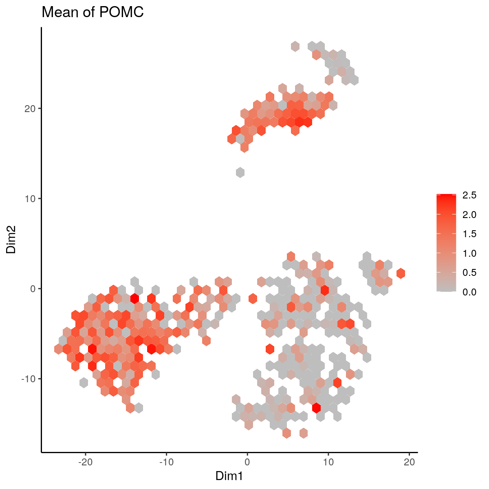|[ADCY3](https://www.ncbi.nlm.nih.gov/gene/109) [ADCY5](https://www.ncbi.nlm.nih.gov/gene/111) [ADCY6](https://www.ncbi.nlm.nih.gov/gene/112) [ADCY8](https://www.ncbi.nlm.nih.gov/gene/114) [ADCY9](https://www.ncbi.nlm.nih.gov/gene/115) [ADCYAP1R1](https://www.ncbi.nlm.nih.gov/gene/117) [ADORA1](https://www.ncbi.nlm.nih.gov/gene/134) [ADORA2B](https://www.ncbi.nlm.nih.gov/gene/136) [ADRA1D](https://www.ncbi.nlm.nih.gov/gene/146) [ADRA2A](https://www.ncbi.nlm.nih.gov/gene/150) [ADRA2B](https://www.ncbi.nlm.nih.gov/gene/151) [ADRA2C](https://www.ncbi.nlm.nih.gov/gene/152) [ADRB1](https://www.ncbi.nlm.nih.gov/gene/153) [ADRB2](https://www.ncbi.nlm.nih.gov/gene/154) [ADRB3](https://www.ncbi.nlm.nih.gov/gene/155) [AGTR1](https://www.ncbi.nlm.nih.gov/gene/185) [AGTR2](https://www.ncbi.nlm.nih.gov/gene/186) [APLNR](https://www.ncbi.nlm.nih.gov/gene/187) [AVPR1A](https://www.ncbi.nlm.nih.gov/gene/552) [AVPR1B](https://www.ncbi.nlm.nih.gov/gene/553) [BDKRB1](https://www.ncbi.nlm.nih.gov/gene/623) [BDKRB2](https://www.ncbi.nlm.nih.gov/gene/624) [CXCR5](https://www.ncbi.nlm.nih.gov/gene/643) [C3AR1](https://www.ncbi.nlm.nih.gov/gene/719) [C5AR1](https://www.ncbi.nlm.nih.gov/gene/728) [CALCR](https://www.ncbi.nlm.nih.gov/gene/799) [CASR](https://www.ncbi.nlm.nih.gov/gene/846) [SCARB1](https://www.ncbi.nlm.nih.gov/gene/949) [CHRM2](https://www.ncbi.nlm.nih.gov/gene/1129) [CHRM4](https://www.ncbi.nlm.nih.gov/gene/1132) [CCR1](https://www.ncbi.nlm.nih.gov/gene/1230) [CCR3](https://www.ncbi.nlm.nih.gov/gene/1232) [CCR4](https://www.ncbi.nlm.nih.gov/gene/1233) [CCR5](https://www.ncbi.nlm.nih.gov/gene/1234) [CCR7](https://www.ncbi.nlm.nih.gov/gene/1236) [CCR8](https://www.ncbi.nlm.nih.gov/gene/1237) [CNR1](https://www.ncbi.nlm.nih.gov/gene/1268) [CNR2](https://www.ncbi.nlm.nih.gov/gene/1269) [CRHR2](https://www.ncbi.nlm.nih.gov/gene/1395) [CX3CR1](https://www.ncbi.nlm.nih.gov/gene/1524) [ACE](https://www.ncbi.nlm.nih.gov/gene/1636) [DRD1](https://www.ncbi.nlm.nih.gov/gene/1812) [DRD2](https://www.ncbi.nlm.nih.gov/gene/1813) [DRD3](https://www.ncbi.nlm.nih.gov/gene/1814) [DRD4](https://www.ncbi.nlm.nih.gov/gene/1815) [DRD5](https://www.ncbi.nlm.nih.gov/gene/1816) [GPR183](https://www.ncbi.nlm.nih.gov/gene/1880) [S1PR1](https://www.ncbi.nlm.nih.gov/gene/1901) [S1PR3](https://www.ncbi.nlm.nih.gov/gene/1903) [ENO2](https://www.ncbi.nlm.nih.gov/gene/2026) [ESR1](https://www.ncbi.nlm.nih.gov/gene/2099) [FPR1](https://www.ncbi.nlm.nih.gov/gene/2357) [FPR2](https://www.ncbi.nlm.nih.gov/gene/2358) [FPR3](https://www.ncbi.nlm.nih.gov/gene/2359) [FSHR](https://www.ncbi.nlm.nih.gov/gene/2492) [GALR1](https://www.ncbi.nlm.nih.gov/gene/2587) [GCGR](https://www.ncbi.nlm.nih.gov/gene/2642) [GHRHR](https://www.ncbi.nlm.nih.gov/gene/2692) [GHSR](https://www.ncbi.nlm.nih.gov/gene/2693) [GIPR](https://www.ncbi.nlm.nih.gov/gene/2696) [GLP1R](https://www.ncbi.nlm.nih.gov/gene/2740) [GNAO1](https://www.ncbi.nlm.nih.gov/gene/2775) [GNAS](https://www.ncbi.nlm.nih.gov/gene/2778) [GNG3](https://www.ncbi.nlm.nih.gov/gene/2785) [GNG4](https://www.ncbi.nlm.nih.gov/gene/2786) [GNG5](https://www.ncbi.nlm.nih.gov/gene/2787) [GNG7](https://www.ncbi.nlm.nih.gov/gene/2788) [GNG10](https://www.ncbi.nlm.nih.gov/gene/2790) [GNG11](https://www.ncbi.nlm.nih.gov/gene/2791) [GNGT1](https://www.ncbi.nlm.nih.gov/gene/2792) [GNGT2](https://www.ncbi.nlm.nih.gov/gene/2793) [GNRHR](https://www.ncbi.nlm.nih.gov/gene/2798) [CCR10](https://www.ncbi.nlm.nih.gov/gene/2826) [NPBWR1](https://www.ncbi.nlm.nih.gov/gene/2831) [NPBWR2](https://www.ncbi.nlm.nih.gov/gene/2832) [CXCR3](https://www.ncbi.nlm.nih.gov/gene/2833) [GPR15](https://www.ncbi.nlm.nih.gov/gene/2838) [GPR17](https://www.ncbi.nlm.nih.gov/gene/2840) [GPR18](https://www.ncbi.nlm.nih.gov/gene/2841) [GPR20](https://www.ncbi.nlm.nih.gov/gene/2843) [MCHR1](https://www.ncbi.nlm.nih.gov/gene/2847) [GPR25](https://www.ncbi.nlm.nih.gov/gene/2848) [GPR27](https://www.ncbi.nlm.nih.gov/gene/2850) [GPR31](https://www.ncbi.nlm.nih.gov/gene/2853) [GPR32](https://www.ncbi.nlm.nih.gov/gene/2854) [GPR37](https://www.ncbi.nlm.nih.gov/gene/2861) [GPR39](https://www.ncbi.nlm.nih.gov/gene/2863) [GRM2](https://www.ncbi.nlm.nih.gov/gene/2912) [GRM3](https://www.ncbi.nlm.nih.gov/gene/2913) [GRM4](https://www.ncbi.nlm.nih.gov/gene/2914) [GRM6](https://www.ncbi.nlm.nih.gov/gene/2916) [GRM7](https://www.ncbi.nlm.nih.gov/gene/2917) [GRM8](https://www.ncbi.nlm.nih.gov/gene/2918) [HCRTR1](https://www.ncbi.nlm.nih.gov/gene/3061) [HCRTR2](https://www.ncbi.nlm.nih.gov/gene/3062) [HRH2](https://www.ncbi.nlm.nih.gov/gene/3274) [HTR1A](https://www.ncbi.nlm.nih.gov/gene/3350) [HTR1B](https://www.ncbi.nlm.nih.gov/gene/3351) [HTR1D](https://www.ncbi.nlm.nih.gov/gene/3352) [HTR1E](https://www.ncbi.nlm.nih.gov/gene/3354) [HTR1F](https://www.ncbi.nlm.nih.gov/gene/3355) [HTR2A](https://www.ncbi.nlm.nih.gov/gene/3356) [HTR2C](https://www.ncbi.nlm.nih.gov/gene/3358) [HTR4](https://www.ncbi.nlm.nih.gov/gene/3360) [HTR5A](https://www.ncbi.nlm.nih.gov/gene/3361) [HTR6](https://www.ncbi.nlm.nih.gov/gene/3362) [HTR7](https://www.ncbi.nlm.nih.gov/gene/3363) [CXCR1](https://www.ncbi.nlm.nih.gov/gene/3577) [CXCR2](https://www.ncbi.nlm.nih.gov/gene/3579) [LHCGR](https://www.ncbi.nlm.nih.gov/gene/3973) [LIPE](https://www.ncbi.nlm.nih.gov/gene/3991) [MC1R](https://www.ncbi.nlm.nih.gov/gene/4157) [MC2R](https://www.ncbi.nlm.nih.gov/gene/4158) [MC3R](https://www.ncbi.nlm.nih.gov/gene/4159) [MC4R](https://www.ncbi.nlm.nih.gov/gene/4160) [MC5R](https://www.ncbi.nlm.nih.gov/gene/4161) [MTNR1A](https://www.ncbi.nlm.nih.gov/gene/4543) [MTNR1B](https://www.ncbi.nlm.nih.gov/gene/4544) [NPY1R](https://www.ncbi.nlm.nih.gov/gene/4886) [NPY2R](https://www.ncbi.nlm.nih.gov/gene/4887) [NPY5R](https://www.ncbi.nlm.nih.gov/gene/4889) [NTRK2](https://www.ncbi.nlm.nih.gov/gene/4915) [OPRD1](https://www.ncbi.nlm.nih.gov/gene/4985) [OPRK1](https://www.ncbi.nlm.nih.gov/gene/4986) [OPRL1](https://www.ncbi.nlm.nih.gov/gene/4987) [OXTR](https://www.ncbi.nlm.nih.gov/gene/5021) [P2RY4](https://www.ncbi.nlm.nih.gov/gene/5030) [P2RY11](https://www.ncbi.nlm.nih.gov/gene/5032) [PRKAR1A](https://www.ncbi.nlm.nih.gov/gene/5573) [PTGDR](https://www.ncbi.nlm.nih.gov/gene/5729) [PTGER2](https://www.ncbi.nlm.nih.gov/gene/5732) [PTGER3](https://www.ncbi.nlm.nih.gov/gene/5733) [PTGER4](https://www.ncbi.nlm.nih.gov/gene/5734) [PTGIR](https://www.ncbi.nlm.nih.gov/gene/5739) [PTH1R](https://www.ncbi.nlm.nih.gov/gene/5745) [PTH2R](https://www.ncbi.nlm.nih.gov/gene/5746) [SCTR](https://www.ncbi.nlm.nih.gov/gene/6344) [SLC2A4](https://www.ncbi.nlm.nih.gov/gene/6517) [SLC6A3](https://www.ncbi.nlm.nih.gov/gene/6531) [SLC6A4](https://www.ncbi.nlm.nih.gov/gene/6532) [SSTR1](https://www.ncbi.nlm.nih.gov/gene/6751) [SSTR2](https://www.ncbi.nlm.nih.gov/gene/6752) [SSTR3](https://www.ncbi.nlm.nih.gov/gene/6753) [SSTR4](https://www.ncbi.nlm.nih.gov/gene/6754) [SSTR5](https://www.ncbi.nlm.nih.gov/gene/6755) [TRHR](https://www.ncbi.nlm.nih.gov/gene/7201) [TSHR](https://www.ncbi.nlm.nih.gov/gene/7253) [VIPR1](https://www.ncbi.nlm.nih.gov/gene/7433) [VIPR2](https://www.ncbi.nlm.nih.gov/gene/7434) [CXCR4](https://www.ncbi.nlm.nih.gov/gene/7852) [GALR3](https://www.ncbi.nlm.nih.gov/gene/8484) [S1PR4](https://www.ncbi.nlm.nih.gov/gene/8698) [GALR2](https://www.ncbi.nlm.nih.gov/gene/8811) [HCAR3](https://www.ncbi.nlm.nih.gov/gene/8843) [CACNA1H](https://www.ncbi.nlm.nih.gov/gene/8912) [TAAR5](https://www.ncbi.nlm.nih.gov/gene/9038) [GPR37L1](https://www.ncbi.nlm.nih.gov/gene/9283) [TAAR2](https://www.ncbi.nlm.nih.gov/gene/9287) [GPR55](https://www.ncbi.nlm.nih.gov/gene/9290) [GLP2R](https://www.ncbi.nlm.nih.gov/gene/9340) [GABBR2](https://www.ncbi.nlm.nih.gov/gene/9568) [SDC3](https://www.ncbi.nlm.nih.gov/gene/9672) [P2RY14](https://www.ncbi.nlm.nih.gov/gene/9934) [CALCRL](https://www.ncbi.nlm.nih.gov/gene/10203) [RAMP3](https://www.ncbi.nlm.nih.gov/gene/10268) [NMUR1](https://www.ncbi.nlm.nih.gov/gene/10316) [CXCR6](https://www.ncbi.nlm.nih.gov/gene/10663) [CCR9](https://www.ncbi.nlm.nih.gov/gene/10803) [GPR83](https://www.ncbi.nlm.nih.gov/gene/10888) [GPR176](https://www.ncbi.nlm.nih.gov/gene/11245) [GPR45](https://www.ncbi.nlm.nih.gov/gene/11250) [PTGDR2](https://www.ncbi.nlm.nih.gov/gene/11251) [HRH3](https://www.ncbi.nlm.nih.gov/gene/11255) [LPAR3](https://www.ncbi.nlm.nih.gov/gene/23566) [HCAR1](https://www.ncbi.nlm.nih.gov/gene/27198) [OXGR1](https://www.ncbi.nlm.nih.gov/gene/27199) [TAS2R16](https://www.ncbi.nlm.nih.gov/gene/50833) [RXFP3](https://www.ncbi.nlm.nih.gov/gene/51289) [GNG13](https://www.ncbi.nlm.nih.gov/gene/51764) [S1PR5](https://www.ncbi.nlm.nih.gov/gene/53637) [P2RY13](https://www.ncbi.nlm.nih.gov/gene/53829) [GPR84](https://www.ncbi.nlm.nih.gov/gene/53831) [GNG2](https://www.ncbi.nlm.nih.gov/gene/54331) [GNG12](https://www.ncbi.nlm.nih.gov/gene/55970) [MRAP](https://www.ncbi.nlm.nih.gov/gene/56246) [SUCNR1](https://www.ncbi.nlm.nih.gov/gene/56670) [NMUR2](https://www.ncbi.nlm.nih.gov/gene/56923) [ACKR3](https://www.ncbi.nlm.nih.gov/gene/57007) [LPAR5](https://www.ncbi.nlm.nih.gov/gene/57121) [CXCL16](https://www.ncbi.nlm.nih.gov/gene/58191) [HRH4](https://www.ncbi.nlm.nih.gov/gene/59340) [RXFP1](https://www.ncbi.nlm.nih.gov/gene/59350) [NPFFR1](https://www.ncbi.nlm.nih.gov/gene/64106) [P2RY12](https://www.ncbi.nlm.nih.gov/gene/64805) [TAS1R2](https://www.ncbi.nlm.nih.gov/gene/80834) [TAS1R1](https://www.ncbi.nlm.nih.gov/gene/80835) [TAAR8](https://www.ncbi.nlm.nih.gov/gene/83551) [TAS1R3](https://www.ncbi.nlm.nih.gov/gene/83756) [MCHR2](https://www.ncbi.nlm.nih.gov/gene/84539) [KISS1R](https://www.ncbi.nlm.nih.gov/gene/84634) [GNG8](https://www.ncbi.nlm.nih.gov/gene/94235) [MRAP2](https://www.ncbi.nlm.nih.gov/gene/112609) [RXFP2](https://www.ncbi.nlm.nih.gov/gene/122042) [TAAR9](https://www.ncbi.nlm.nih.gov/gene/134860) [TAAR1](https://www.ncbi.nlm.nih.gov/gene/134864) [GPBAR1](https://www.ncbi.nlm.nih.gov/gene/151306) [OXER1](https://www.ncbi.nlm.nih.gov/gene/165140) [ADCY4](https://www.ncbi.nlm.nih.gov/gene/196883) [GPR150](https://www.ncbi.nlm.nih.gov/gene/285601) [TAAR6](https://www.ncbi.nlm.nih.gov/gene/319100) [HCAR2](https://www.ncbi.nlm.nih.gov/gene/338442) [RXFP4](https://www.ncbi.nlm.nih.gov/gene/339403) [GPR142](https://www.ncbi.nlm.nih.gov/gene/350383) [CCR2](https://www.ncbi.nlm.nih.gov/gene/729230) [LINC02210-CRHR1](https://www.ncbi.nlm.nih.gov/gene/104909134)|
|[PON1](https://www.ncbi.nlm.nih.gov/gene/5444)|[ACHE](https://www.ncbi.nlm.nih.gov/gene/43) [SCARB1](https://www.ncbi.nlm.nih.gov/gene/949) [CSF1R](https://www.ncbi.nlm.nih.gov/gene/1436) [ACE](https://www.ncbi.nlm.nih.gov/gene/1636) [LDLR](https://www.ncbi.nlm.nih.gov/gene/3949) [NOS3](https://www.ncbi.nlm.nih.gov/gene/4846) [OLR1](https://www.ncbi.nlm.nih.gov/gene/4973) [ABCB1](https://www.ncbi.nlm.nih.gov/gene/5243) [ELMO1](https://www.ncbi.nlm.nih.gov/gene/9844) [UNC13A](https://www.ncbi.nlm.nih.gov/gene/23025) [LSR](https://www.ncbi.nlm.nih.gov/gene/51599) [APOBR](https://www.ncbi.nlm.nih.gov/gene/55911) [P2RY12](https://www.ncbi.nlm.nih.gov/gene/64805) [GPIHBP1](https://www.ncbi.nlm.nih.gov/gene/338328)|
|[PON3](https://www.ncbi.nlm.nih.gov/gene/5446)|[LDLR](https://www.ncbi.nlm.nih.gov/gene/3949) [SGCE](https://www.ncbi.nlm.nih.gov/gene/8910) [STOML2](https://www.ncbi.nlm.nih.gov/gene/30968) [AMIGO2](https://www.ncbi.nlm.nih.gov/gene/347902)|
|[PPBP](https://www.ncbi.nlm.nih.gov/gene/5473)|[ADCY3](https://www.ncbi.nlm.nih.gov/gene/109) [ADCY5](https://www.ncbi.nlm.nih.gov/gene/111) [ADCY6](https://www.ncbi.nlm.nih.gov/gene/112) [ADCY8](https://www.ncbi.nlm.nih.gov/gene/114) [ADCY9](https://www.ncbi.nlm.nih.gov/gene/115) [ADORA1](https://www.ncbi.nlm.nih.gov/gene/134) [ADRA2A](https://www.ncbi.nlm.nih.gov/gene/150) [ADRA2B](https://www.ncbi.nlm.nih.gov/gene/151) [ADRA2C](https://www.ncbi.nlm.nih.gov/gene/152) [AGTR2](https://www.ncbi.nlm.nih.gov/gene/186) [APLNR](https://www.ncbi.nlm.nih.gov/gene/187) [BDKRB1](https://www.ncbi.nlm.nih.gov/gene/623) [BDKRB2](https://www.ncbi.nlm.nih.gov/gene/624) [CXCR5](https://www.ncbi.nlm.nih.gov/gene/643) [BTC](https://www.ncbi.nlm.nih.gov/gene/685) [C3AR1](https://www.ncbi.nlm.nih.gov/gene/719) [C5AR1](https://www.ncbi.nlm.nih.gov/gene/728) [CASR](https://www.ncbi.nlm.nih.gov/gene/846) [CHRM2](https://www.ncbi.nlm.nih.gov/gene/1129) [CHRM4](https://www.ncbi.nlm.nih.gov/gene/1132) [CCR1](https://www.ncbi.nlm.nih.gov/gene/1230) [CCR3](https://www.ncbi.nlm.nih.gov/gene/1232) [CCR4](https://www.ncbi.nlm.nih.gov/gene/1233) [CCR5](https://www.ncbi.nlm.nih.gov/gene/1234) [CCR6](https://www.ncbi.nlm.nih.gov/gene/1235) [CCR7](https://www.ncbi.nlm.nih.gov/gene/1236) [CCR8](https://www.ncbi.nlm.nih.gov/gene/1237) [CNR1](https://www.ncbi.nlm.nih.gov/gene/1268) [CNR2](https://www.ncbi.nlm.nih.gov/gene/1269) [CX3CR1](https://www.ncbi.nlm.nih.gov/gene/1524) [DRD2](https://www.ncbi.nlm.nih.gov/gene/1813) [DRD3](https://www.ncbi.nlm.nih.gov/gene/1814) [DRD4](https://www.ncbi.nlm.nih.gov/gene/1815) [GPR183](https://www.ncbi.nlm.nih.gov/gene/1880) [S1PR1](https://www.ncbi.nlm.nih.gov/gene/1901) [S1PR3](https://www.ncbi.nlm.nih.gov/gene/1903) [FPR1](https://www.ncbi.nlm.nih.gov/gene/2357) [FPR2](https://www.ncbi.nlm.nih.gov/gene/2358) [FPR3](https://www.ncbi.nlm.nih.gov/gene/2359) [GALR1](https://www.ncbi.nlm.nih.gov/gene/2587) [GNG3](https://www.ncbi.nlm.nih.gov/gene/2785) [GNG4](https://www.ncbi.nlm.nih.gov/gene/2786) [GNG5](https://www.ncbi.nlm.nih.gov/gene/2787) [GNG7](https://www.ncbi.nlm.nih.gov/gene/2788) [GNG10](https://www.ncbi.nlm.nih.gov/gene/2790) [GNG11](https://www.ncbi.nlm.nih.gov/gene/2791) [GNGT1](https://www.ncbi.nlm.nih.gov/gene/2792) [GNGT2](https://www.ncbi.nlm.nih.gov/gene/2793) [CCR10](https://www.ncbi.nlm.nih.gov/gene/2826) [XCR1](https://www.ncbi.nlm.nih.gov/gene/2829) [NPBWR1](https://www.ncbi.nlm.nih.gov/gene/2831) [NPBWR2](https://www.ncbi.nlm.nih.gov/gene/2832) [CXCR3](https://www.ncbi.nlm.nih.gov/gene/2833) [GPR17](https://www.ncbi.nlm.nih.gov/gene/2840) [GPR18](https://www.ncbi.nlm.nih.gov/gene/2841) [MCHR1](https://www.ncbi.nlm.nih.gov/gene/2847) [GPR31](https://www.ncbi.nlm.nih.gov/gene/2853) [GPR37](https://www.ncbi.nlm.nih.gov/gene/2861) [GRM2](https://www.ncbi.nlm.nih.gov/gene/2912) [GRM3](https://www.ncbi.nlm.nih.gov/gene/2913) [GRM4](https://www.ncbi.nlm.nih.gov/gene/2914) [GRM6](https://www.ncbi.nlm.nih.gov/gene/2916) [GRM7](https://www.ncbi.nlm.nih.gov/gene/2917) [GRM8](https://www.ncbi.nlm.nih.gov/gene/2918) [HTR1A](https://www.ncbi.nlm.nih.gov/gene/3350) [HTR1B](https://www.ncbi.nlm.nih.gov/gene/3351) [HTR1D](https://www.ncbi.nlm.nih.gov/gene/3352) [HTR1E](https://www.ncbi.nlm.nih.gov/gene/3354) [HTR1F](https://www.ncbi.nlm.nih.gov/gene/3355) [HTR5A](https://www.ncbi.nlm.nih.gov/gene/3361) [CXCR1](https://www.ncbi.nlm.nih.gov/gene/3577) [CXCR2](https://www.ncbi.nlm.nih.gov/gene/3579) [ITGAM](https://www.ncbi.nlm.nih.gov/gene/3684) [MTNR1A](https://www.ncbi.nlm.nih.gov/gene/4543) [MTNR1B](https://www.ncbi.nlm.nih.gov/gene/4544) [NPY1R](https://www.ncbi.nlm.nih.gov/gene/4886) [NPY2R](https://www.ncbi.nlm.nih.gov/gene/4887) [NPY5R](https://www.ncbi.nlm.nih.gov/gene/4889) [OPRD1](https://www.ncbi.nlm.nih.gov/gene/4985) [OPRK1](https://www.ncbi.nlm.nih.gov/gene/4986) [OPRL1](https://www.ncbi.nlm.nih.gov/gene/4987) [P2RY4](https://www.ncbi.nlm.nih.gov/gene/5030) [PTGER3](https://www.ncbi.nlm.nih.gov/gene/5733) [SELP](https://www.ncbi.nlm.nih.gov/gene/6403) [SSTR1](https://www.ncbi.nlm.nih.gov/gene/6751) [SSTR2](https://www.ncbi.nlm.nih.gov/gene/6752) [SSTR3](https://www.ncbi.nlm.nih.gov/gene/6753) [SSTR4](https://www.ncbi.nlm.nih.gov/gene/6754) [SSTR5](https://www.ncbi.nlm.nih.gov/gene/6755) [CXCR4](https://www.ncbi.nlm.nih.gov/gene/7852) [GALR3](https://www.ncbi.nlm.nih.gov/gene/8484) [S1PR4](https://www.ncbi.nlm.nih.gov/gene/8698) [GALR2](https://www.ncbi.nlm.nih.gov/gene/8811) [HCAR3](https://www.ncbi.nlm.nih.gov/gene/8843) [GPR37L1](https://www.ncbi.nlm.nih.gov/gene/9283) [GPR55](https://www.ncbi.nlm.nih.gov/gene/9290) [RAB28](https://www.ncbi.nlm.nih.gov/gene/9364) [GABBR2](https://www.ncbi.nlm.nih.gov/gene/9568) [P2RY14](https://www.ncbi.nlm.nih.gov/gene/9934) [NMUR1](https://www.ncbi.nlm.nih.gov/gene/10316) [CXCR6](https://www.ncbi.nlm.nih.gov/gene/10663) [CCR9](https://www.ncbi.nlm.nih.gov/gene/10803) [PTGDR2](https://www.ncbi.nlm.nih.gov/gene/11251) [HRH3](https://www.ncbi.nlm.nih.gov/gene/11255) [LPAR3](https://www.ncbi.nlm.nih.gov/gene/23566) [HCAR1](https://www.ncbi.nlm.nih.gov/gene/27198) [OXGR1](https://www.ncbi.nlm.nih.gov/gene/27199) [TAS2R16](https://www.ncbi.nlm.nih.gov/gene/50833) [RXFP3](https://www.ncbi.nlm.nih.gov/gene/51289) [GNG13](https://www.ncbi.nlm.nih.gov/gene/51764) [S1PR5](https://www.ncbi.nlm.nih.gov/gene/53637) [P2RY13](https://www.ncbi.nlm.nih.gov/gene/53829) [GNG2](https://www.ncbi.nlm.nih.gov/gene/54331) [GNG12](https://www.ncbi.nlm.nih.gov/gene/55970) [SUCNR1](https://www.ncbi.nlm.nih.gov/gene/56670) [NMUR2](https://www.ncbi.nlm.nih.gov/gene/56923) [ACKR3](https://www.ncbi.nlm.nih.gov/gene/57007) [LPAR5](https://www.ncbi.nlm.nih.gov/gene/57121) [CXCL16](https://www.ncbi.nlm.nih.gov/gene/58191) [HRH4](https://www.ncbi.nlm.nih.gov/gene/59340) [P2RY12](https://www.ncbi.nlm.nih.gov/gene/64805) [GSDMD](https://www.ncbi.nlm.nih.gov/gene/79792) [TAS1R2](https://www.ncbi.nlm.nih.gov/gene/80834) [TAS1R1](https://www.ncbi.nlm.nih.gov/gene/80835) [TAS1R3](https://www.ncbi.nlm.nih.gov/gene/83756) [MCHR2](https://www.ncbi.nlm.nih.gov/gene/84539) [GNG8](https://www.ncbi.nlm.nih.gov/gene/94235) [OSCAR](https://www.ncbi.nlm.nih.gov/gene/126014) [OXER1](https://www.ncbi.nlm.nih.gov/gene/165140) [ADCY4](https://www.ncbi.nlm.nih.gov/gene/196883) [HCAR2](https://www.ncbi.nlm.nih.gov/gene/338442) [RXFP4](https://www.ncbi.nlm.nih.gov/gene/339403) [TREML1](https://www.ncbi.nlm.nih.gov/gene/340205) [CCR2](https://www.ncbi.nlm.nih.gov/gene/729230)|
|[PPY](https://www.ncbi.nlm.nih.gov/gene/5539)|[ADCY3](https://www.ncbi.nlm.nih.gov/gene/109) [ADCY5](https://www.ncbi.nlm.nih.gov/gene/111) [ADCY6](https://www.ncbi.nlm.nih.gov/gene/112) [ADCY8](https://www.ncbi.nlm.nih.gov/gene/114) [ADCY9](https://www.ncbi.nlm.nih.gov/gene/115) [ADORA1](https://www.ncbi.nlm.nih.gov/gene/134) [ADRA2A](https://www.ncbi.nlm.nih.gov/gene/150) [ADRA2B](https://www.ncbi.nlm.nih.gov/gene/151) [ADRA2C](https://www.ncbi.nlm.nih.gov/gene/152) [AGTR1](https://www.ncbi.nlm.nih.gov/gene/185) [AGTR2](https://www.ncbi.nlm.nih.gov/gene/186) [APLNR](https://www.ncbi.nlm.nih.gov/gene/187) [BDKRB1](https://www.ncbi.nlm.nih.gov/gene/623) [BDKRB2](https://www.ncbi.nlm.nih.gov/gene/624) [CXCR5](https://www.ncbi.nlm.nih.gov/gene/643) [C3AR1](https://www.ncbi.nlm.nih.gov/gene/719) [C5AR1](https://www.ncbi.nlm.nih.gov/gene/728) [CASR](https://www.ncbi.nlm.nih.gov/gene/846) [CHRM2](https://www.ncbi.nlm.nih.gov/gene/1129) [CHRM4](https://www.ncbi.nlm.nih.gov/gene/1132) [CCR1](https://www.ncbi.nlm.nih.gov/gene/1230) [CCR3](https://www.ncbi.nlm.nih.gov/gene/1232) [CCR4](https://www.ncbi.nlm.nih.gov/gene/1233) [CCR5](https://www.ncbi.nlm.nih.gov/gene/1234) [CCR7](https://www.ncbi.nlm.nih.gov/gene/1236) [CCR8](https://www.ncbi.nlm.nih.gov/gene/1237) [CNR1](https://www.ncbi.nlm.nih.gov/gene/1268) [CNR2](https://www.ncbi.nlm.nih.gov/gene/1269) [CX3CR1](https://www.ncbi.nlm.nih.gov/gene/1524) [DPP4](https://www.ncbi.nlm.nih.gov/gene/1803) [DRD2](https://www.ncbi.nlm.nih.gov/gene/1813) [DRD3](https://www.ncbi.nlm.nih.gov/gene/1814) [DRD4](https://www.ncbi.nlm.nih.gov/gene/1815) [GPR183](https://www.ncbi.nlm.nih.gov/gene/1880) [S1PR1](https://www.ncbi.nlm.nih.gov/gene/1901) [S1PR3](https://www.ncbi.nlm.nih.gov/gene/1903) [ENO2](https://www.ncbi.nlm.nih.gov/gene/2026) [FPR1](https://www.ncbi.nlm.nih.gov/gene/2357) [FPR2](https://www.ncbi.nlm.nih.gov/gene/2358) [FPR3](https://www.ncbi.nlm.nih.gov/gene/2359) [GALR1](https://www.ncbi.nlm.nih.gov/gene/2587) [GJA8](https://www.ncbi.nlm.nih.gov/gene/2703) [GLP1R](https://www.ncbi.nlm.nih.gov/gene/2740) [GNG3](https://www.ncbi.nlm.nih.gov/gene/2785) [GNG4](https://www.ncbi.nlm.nih.gov/gene/2786) [GNG5](https://www.ncbi.nlm.nih.gov/gene/2787) [GNG7](https://www.ncbi.nlm.nih.gov/gene/2788) [GNG10](https://www.ncbi.nlm.nih.gov/gene/2790) [GNG11](https://www.ncbi.nlm.nih.gov/gene/2791) [GNGT1](https://www.ncbi.nlm.nih.gov/gene/2792) [GNGT2](https://www.ncbi.nlm.nih.gov/gene/2793) [CCR10](https://www.ncbi.nlm.nih.gov/gene/2826) [NPBWR1](https://www.ncbi.nlm.nih.gov/gene/2831) [NPBWR2](https://www.ncbi.nlm.nih.gov/gene/2832) [CXCR3](https://www.ncbi.nlm.nih.gov/gene/2833) [GPR17](https://www.ncbi.nlm.nih.gov/gene/2840) [GPR18](https://www.ncbi.nlm.nih.gov/gene/2841) [MCHR1](https://www.ncbi.nlm.nih.gov/gene/2847) [GPR31](https://www.ncbi.nlm.nih.gov/gene/2853) [GPR37](https://www.ncbi.nlm.nih.gov/gene/2861) [MLNR](https://www.ncbi.nlm.nih.gov/gene/2862) [GRM2](https://www.ncbi.nlm.nih.gov/gene/2912) [GRM3](https://www.ncbi.nlm.nih.gov/gene/2913) [GRM4](https://www.ncbi.nlm.nih.gov/gene/2914) [GRM6](https://www.ncbi.nlm.nih.gov/gene/2916) [GRM7](https://www.ncbi.nlm.nih.gov/gene/2917) [GRM8](https://www.ncbi.nlm.nih.gov/gene/2918) [HTR1A](https://www.ncbi.nlm.nih.gov/gene/3350) [HTR1B](https://www.ncbi.nlm.nih.gov/gene/3351) [HTR1D](https://www.ncbi.nlm.nih.gov/gene/3352) [HTR1E](https://www.ncbi.nlm.nih.gov/gene/3354) [HTR1F](https://www.ncbi.nlm.nih.gov/gene/3355) [HTR5A](https://www.ncbi.nlm.nih.gov/gene/3361) [HTR7](https://www.ncbi.nlm.nih.gov/gene/3363) [CXCR1](https://www.ncbi.nlm.nih.gov/gene/3577) [CXCR2](https://www.ncbi.nlm.nih.gov/gene/3579) [MTNR1A](https://www.ncbi.nlm.nih.gov/gene/4543) [MTNR1B](https://www.ncbi.nlm.nih.gov/gene/4544) [NPY1R](https://www.ncbi.nlm.nih.gov/gene/4886) [NPY2R](https://www.ncbi.nlm.nih.gov/gene/4887) [NPY5R](https://www.ncbi.nlm.nih.gov/gene/4889) [OPRD1](https://www.ncbi.nlm.nih.gov/gene/4985) [OPRK1](https://www.ncbi.nlm.nih.gov/gene/4986) [OPRL1](https://www.ncbi.nlm.nih.gov/gene/4987) [P2RY4](https://www.ncbi.nlm.nih.gov/gene/5030) [PTGER3](https://www.ncbi.nlm.nih.gov/gene/5733) [SLC2A2](https://www.ncbi.nlm.nih.gov/gene/6514) [SLC4A1](https://www.ncbi.nlm.nih.gov/gene/6521) [SSTR1](https://www.ncbi.nlm.nih.gov/gene/6751) [SSTR2](https://www.ncbi.nlm.nih.gov/gene/6752) [SSTR3](https://www.ncbi.nlm.nih.gov/gene/6753) [SSTR4](https://www.ncbi.nlm.nih.gov/gene/6754) [SSTR5](https://www.ncbi.nlm.nih.gov/gene/6755) [ABCC8](https://www.ncbi.nlm.nih.gov/gene/6833) [CXCR4](https://www.ncbi.nlm.nih.gov/gene/7852) [GALR3](https://www.ncbi.nlm.nih.gov/gene/8484) [S1PR4](https://www.ncbi.nlm.nih.gov/gene/8698) [GALR2](https://www.ncbi.nlm.nih.gov/gene/8811) [HCAR3](https://www.ncbi.nlm.nih.gov/gene/8843) [GPR37L1](https://www.ncbi.nlm.nih.gov/gene/9283) [GPR55](https://www.ncbi.nlm.nih.gov/gene/9290) [GABBR2](https://www.ncbi.nlm.nih.gov/gene/9568) [P2RY14](https://www.ncbi.nlm.nih.gov/gene/9934) [NMUR1](https://www.ncbi.nlm.nih.gov/gene/10316) [CXCR6](https://www.ncbi.nlm.nih.gov/gene/10663) [CCR9](https://www.ncbi.nlm.nih.gov/gene/10803) [PTGDR2](https://www.ncbi.nlm.nih.gov/gene/11251) [HRH3](https://www.ncbi.nlm.nih.gov/gene/11255) [LPAR3](https://www.ncbi.nlm.nih.gov/gene/23566) [HCAR1](https://www.ncbi.nlm.nih.gov/gene/27198) [OXGR1](https://www.ncbi.nlm.nih.gov/gene/27199) [TAS2R16](https://www.ncbi.nlm.nih.gov/gene/50833) [RXFP3](https://www.ncbi.nlm.nih.gov/gene/51289) [GNG13](https://www.ncbi.nlm.nih.gov/gene/51764) [S1PR5](https://www.ncbi.nlm.nih.gov/gene/53637) [P2RY13](https://www.ncbi.nlm.nih.gov/gene/53829) [GNG2](https://www.ncbi.nlm.nih.gov/gene/54331) [GNG12](https://www.ncbi.nlm.nih.gov/gene/55970) [SUCNR1](https://www.ncbi.nlm.nih.gov/gene/56670) [NMUR2](https://www.ncbi.nlm.nih.gov/gene/56923) [ACKR3](https://www.ncbi.nlm.nih.gov/gene/57007) [LPAR5](https://www.ncbi.nlm.nih.gov/gene/57121) [CXCL16](https://www.ncbi.nlm.nih.gov/gene/58191) [HRH4](https://www.ncbi.nlm.nih.gov/gene/59340) [P2RY12](https://www.ncbi.nlm.nih.gov/gene/64805) [TAS1R2](https://www.ncbi.nlm.nih.gov/gene/80834) [TAS1R1](https://www.ncbi.nlm.nih.gov/gene/80835) [TAS1R3](https://www.ncbi.nlm.nih.gov/gene/83756) [MCHR2](https://www.ncbi.nlm.nih.gov/gene/84539) [GNG8](https://www.ncbi.nlm.nih.gov/gene/94235) [OXER1](https://www.ncbi.nlm.nih.gov/gene/165140) [SLC30A8](https://www.ncbi.nlm.nih.gov/gene/169026) [ADCY4](https://www.ncbi.nlm.nih.gov/gene/196883) [HCAR2](https://www.ncbi.nlm.nih.gov/gene/338442) [RXFP4](https://www.ncbi.nlm.nih.gov/gene/339403) [CCR2](https://www.ncbi.nlm.nih.gov/gene/729230) [NPY4R](https://www.ncbi.nlm.nih.gov/gene/5540)|
|[PRAP1](https://www.ncbi.nlm.nih.gov/gene/118471)|[CD48](https://www.ncbi.nlm.nih.gov/gene/962) [PTH1R](https://www.ncbi.nlm.nih.gov/gene/5745)|
|[PRB1](https://www.ncbi.nlm.nih.gov/gene/5542)|[ZP2](https://www.ncbi.nlm.nih.gov/gene/7783)|
|[PRELP](https://www.ncbi.nlm.nih.gov/gene/5549)|[ADGRL1](https://www.ncbi.nlm.nih.gov/gene/22859) [ADGRL3](https://www.ncbi.nlm.nih.gov/gene/23284) [MYMK](https://www.ncbi.nlm.nih.gov/gene/389827)|
|[PRF1](https://www.ncbi.nlm.nih.gov/gene/5551)|[CXCR5](https://www.ncbi.nlm.nih.gov/gene/643) [CD1C](https://www.ncbi.nlm.nih.gov/gene/911) [CD1D](https://www.ncbi.nlm.nih.gov/gene/912) [CD2](https://www.ncbi.nlm.nih.gov/gene/914) [CD3E](https://www.ncbi.nlm.nih.gov/gene/916) [CD4](https://www.ncbi.nlm.nih.gov/gene/920) [CD5](https://www.ncbi.nlm.nih.gov/gene/921) [CD19](https://www.ncbi.nlm.nih.gov/gene/930) [CD86](https://www.ncbi.nlm.nih.gov/gene/942) [CD44](https://www.ncbi.nlm.nih.gov/gene/960) [CD48](https://www.ncbi.nlm.nih.gov/gene/962) [CD52](https://www.ncbi.nlm.nih.gov/gene/1043) [CCR5](https://www.ncbi.nlm.nih.gov/gene/1234) [CCR6](https://www.ncbi.nlm.nih.gov/gene/1235) [CCR7](https://www.ncbi.nlm.nih.gov/gene/1236) [CX3CR1](https://www.ncbi.nlm.nih.gov/gene/1524) [FCGR2A](https://www.ncbi.nlm.nih.gov/gene/2212) [FCGR2B](https://www.ncbi.nlm.nih.gov/gene/2213) [FCGR3A](https://www.ncbi.nlm.nih.gov/gene/2214) [FCGR3B](https://www.ncbi.nlm.nih.gov/gene/2215) [CXCR3](https://www.ncbi.nlm.nih.gov/gene/2833) [HLA-A](https://www.ncbi.nlm.nih.gov/gene/3105) [IL2RB](https://www.ncbi.nlm.nih.gov/gene/3560) [IL2RG](https://www.ncbi.nlm.nih.gov/gene/3561) [IL10RA](https://www.ncbi.nlm.nih.gov/gene/3587) [ITGAL](https://www.ncbi.nlm.nih.gov/gene/3683) [ITGAM](https://www.ncbi.nlm.nih.gov/gene/3684) [ITGB2](https://www.ncbi.nlm.nih.gov/gene/3689) [KCNMA1](https://www.ncbi.nlm.nih.gov/gene/3778) [KIR2DL1](https://www.ncbi.nlm.nih.gov/gene/3802) [KIR2DL3](https://www.ncbi.nlm.nih.gov/gene/3804) [KIR2DL4](https://www.ncbi.nlm.nih.gov/gene/3805) [KIR3DL1](https://www.ncbi.nlm.nih.gov/gene/3811) [KIR3DL2](https://www.ncbi.nlm.nih.gov/gene/3812) [KLRD1](https://www.ncbi.nlm.nih.gov/gene/3824) [LAMP1](https://www.ncbi.nlm.nih.gov/gene/3916) [LAMP2](https://www.ncbi.nlm.nih.gov/gene/3920) [LY6E](https://www.ncbi.nlm.nih.gov/gene/4061) [MICB](https://www.ncbi.nlm.nih.gov/gene/4277) [NKG7](https://www.ncbi.nlm.nih.gov/gene/4818) [NT5E](https://www.ncbi.nlm.nih.gov/gene/4907) [PDCD1](https://www.ncbi.nlm.nih.gov/gene/5133) [PTPRC](https://www.ncbi.nlm.nih.gov/gene/5788) [NECTIN2](https://www.ncbi.nlm.nih.gov/gene/5819) [SELL](https://www.ncbi.nlm.nih.gov/gene/6402) [SELP](https://www.ncbi.nlm.nih.gov/gene/6403) [SLAMF1](https://www.ncbi.nlm.nih.gov/gene/6504) [TLR1](https://www.ncbi.nlm.nih.gov/gene/7096) [TLR4](https://www.ncbi.nlm.nih.gov/gene/7099) [TLR5](https://www.ncbi.nlm.nih.gov/gene/7100) [TYROBP](https://www.ncbi.nlm.nih.gov/gene/7305) [CXCR4](https://www.ncbi.nlm.nih.gov/gene/7852) [TNFSF10](https://www.ncbi.nlm.nih.gov/gene/8743) [CCRL2](https://www.ncbi.nlm.nih.gov/gene/9034) [FCGR2C](https://www.ncbi.nlm.nih.gov/gene/9103) [NCR2](https://www.ncbi.nlm.nih.gov/gene/9436) [NCR1](https://www.ncbi.nlm.nih.gov/gene/9437) [NAALADL1](https://www.ncbi.nlm.nih.gov/gene/10004) [KLRG1](https://www.ncbi.nlm.nih.gov/gene/10219) [TLR6](https://www.ncbi.nlm.nih.gov/gene/10333) [CXCR6](https://www.ncbi.nlm.nih.gov/gene/10663) [CD226](https://www.ncbi.nlm.nih.gov/gene/10666) [SYTL2](https://www.ncbi.nlm.nih.gov/gene/54843) [ULBP3](https://www.ncbi.nlm.nih.gov/gene/79465) [ULBP2](https://www.ncbi.nlm.nih.gov/gene/80328) [ULBP1](https://www.ncbi.nlm.nih.gov/gene/80329) [PDCD1LG2](https://www.ncbi.nlm.nih.gov/gene/80380) [SLAMF6](https://www.ncbi.nlm.nih.gov/gene/114836) [BTLA](https://www.ncbi.nlm.nih.gov/gene/151888) [TIGIT](https://www.ncbi.nlm.nih.gov/gene/201633) [NCR3](https://www.ncbi.nlm.nih.gov/gene/259197) [CCR2](https://www.ncbi.nlm.nih.gov/gene/729230) [MICA](https://www.ncbi.nlm.nih.gov/gene/100507436) [KLRC4-KLRK1](https://www.ncbi.nlm.nih.gov/gene/100528032)|
|[PRG4](https://www.ncbi.nlm.nih.gov/gene/10216)|[CD44](https://www.ncbi.nlm.nih.gov/gene/960) [CSPG4](https://www.ncbi.nlm.nih.gov/gene/1464) [GJA8](https://www.ncbi.nlm.nih.gov/gene/2703) [NPHS1](https://www.ncbi.nlm.nih.gov/gene/4868) [BACE2](https://www.ncbi.nlm.nih.gov/gene/25825) [ADIPOR2](https://www.ncbi.nlm.nih.gov/gene/79602)|
|[PRH1](https://www.ncbi.nlm.nih.gov/gene/5554)|[KRAS](https://www.ncbi.nlm.nih.gov/gene/3845) [PRNP](https://www.ncbi.nlm.nih.gov/gene/5621) [PRND](https://www.ncbi.nlm.nih.gov/gene/23627)|
|[PRL](https://www.ncbi.nlm.nih.gov/gene/5617)|[ADRA1D](https://www.ncbi.nlm.nih.gov/gene/146) [ADRA2A](https://www.ncbi.nlm.nih.gov/gene/150) [ADRA2B](https://www.ncbi.nlm.nih.gov/gene/151) [ADRA2C](https://www.ncbi.nlm.nih.gov/gene/152) [AVPR1B](https://www.ncbi.nlm.nih.gov/gene/553) [CNTFR](https://www.ncbi.nlm.nih.gov/gene/1271) [COMT](https://www.ncbi.nlm.nih.gov/gene/1312) [CSF3R](https://www.ncbi.nlm.nih.gov/gene/1441) [DRD1](https://www.ncbi.nlm.nih.gov/gene/1812) [DRD2](https://www.ncbi.nlm.nih.gov/gene/1813) [DRD3](https://www.ncbi.nlm.nih.gov/gene/1814) [DRD4](https://www.ncbi.nlm.nih.gov/gene/1815) [DRD5](https://www.ncbi.nlm.nih.gov/gene/1816) [ESR1](https://www.ncbi.nlm.nih.gov/gene/2099) [GHRHR](https://www.ncbi.nlm.nih.gov/gene/2692) [GNRHR](https://www.ncbi.nlm.nih.gov/gene/2798) [PRLHR](https://www.ncbi.nlm.nih.gov/gene/2834) [HLA-DQB2](https://www.ncbi.nlm.nih.gov/gene/3120) [HTR1A](https://www.ncbi.nlm.nih.gov/gene/3350) [HTR2A](https://www.ncbi.nlm.nih.gov/gene/3356) [HTR2C](https://www.ncbi.nlm.nih.gov/gene/3358) [HTR7](https://www.ncbi.nlm.nih.gov/gene/3363) [IFNAR1](https://www.ncbi.nlm.nih.gov/gene/3454) [IFNGR1](https://www.ncbi.nlm.nih.gov/gene/3459) [IFNGR2](https://www.ncbi.nlm.nih.gov/gene/3460) [IL2RB](https://www.ncbi.nlm.nih.gov/gene/3560) [IL2RG](https://www.ncbi.nlm.nih.gov/gene/3561) [IL9R](https://www.ncbi.nlm.nih.gov/gene/3581) [IL10RA](https://www.ncbi.nlm.nih.gov/gene/3587) [LHCGR](https://www.ncbi.nlm.nih.gov/gene/3973) [MPL](https://www.ncbi.nlm.nih.gov/gene/4352) [MTNR1A](https://www.ncbi.nlm.nih.gov/gene/4543) [MTNR1B](https://www.ncbi.nlm.nih.gov/gene/4544) [OPRD1](https://www.ncbi.nlm.nih.gov/gene/4985) [OPRK1](https://www.ncbi.nlm.nih.gov/gene/4986) [OPRL1](https://www.ncbi.nlm.nih.gov/gene/4987) [OXTR](https://www.ncbi.nlm.nih.gov/gene/5021) [PDGFRA](https://www.ncbi.nlm.nih.gov/gene/5156) [PDGFRB](https://www.ncbi.nlm.nih.gov/gene/5159) [PRKAR1A](https://www.ncbi.nlm.nih.gov/gene/5573) [SELP](https://www.ncbi.nlm.nih.gov/gene/6403) [SLC6A4](https://www.ncbi.nlm.nih.gov/gene/6532) [SRC](https://www.ncbi.nlm.nih.gov/gene/6714) [SSTR1](https://www.ncbi.nlm.nih.gov/gene/6751) [SSTR2](https://www.ncbi.nlm.nih.gov/gene/6752) [SSTR3](https://www.ncbi.nlm.nih.gov/gene/6753) [SSTR4](https://www.ncbi.nlm.nih.gov/gene/6754) [SSTR5](https://www.ncbi.nlm.nih.gov/gene/6755) [TRHR](https://www.ncbi.nlm.nih.gov/gene/7201) [VIPR2](https://www.ncbi.nlm.nih.gov/gene/7434) [ABCG2](https://www.ncbi.nlm.nih.gov/gene/9429) [SLC17A5](https://www.ncbi.nlm.nih.gov/gene/26503) [ADIPOR1](https://www.ncbi.nlm.nih.gov/gene/51094) [RASD1](https://www.ncbi.nlm.nih.gov/gene/51655) [CNTN5](https://www.ncbi.nlm.nih.gov/gene/53942) [IL23R](https://www.ncbi.nlm.nih.gov/gene/149233) [ADRA1A](https://www.ncbi.nlm.nih.gov/gene/148) [CAV1](https://www.ncbi.nlm.nih.gov/gene/857)|
|[PRLH](https://www.ncbi.nlm.nih.gov/gene/51052)|[PRLHR](https://www.ncbi.nlm.nih.gov/gene/2834) [GRIA2](https://www.ncbi.nlm.nih.gov/gene/2891) [NPY1R](https://www.ncbi.nlm.nih.gov/gene/4886) [RAB5B](https://www.ncbi.nlm.nih.gov/gene/5869) [RAB5C](https://www.ncbi.nlm.nih.gov/gene/5878) [SCTR](https://www.ncbi.nlm.nih.gov/gene/6344) [RACK1](https://www.ncbi.nlm.nih.gov/gene/10399) [NPFFR2](https://www.ncbi.nlm.nih.gov/gene/10886) [NPFFR1](https://www.ncbi.nlm.nih.gov/gene/64106) [QRFPR](https://www.ncbi.nlm.nih.gov/gene/84109) [KISS1R](https://www.ncbi.nlm.nih.gov/gene/84634)|
|[PRLR](https://www.ncbi.nlm.nih.gov/gene/5618)|[RHOA](https://www.ncbi.nlm.nih.gov/gene/387) [ESR1](https://www.ncbi.nlm.nih.gov/gene/2099) [FSHR](https://www.ncbi.nlm.nih.gov/gene/2492) [GNRHR](https://www.ncbi.nlm.nih.gov/gene/2798) [GRM5](https://www.ncbi.nlm.nih.gov/gene/2915) [ITGB1](https://www.ncbi.nlm.nih.gov/gene/3688) [ITGB2](https://www.ncbi.nlm.nih.gov/gene/3689) [LHCGR](https://www.ncbi.nlm.nih.gov/gene/3973) [OPRL1](https://www.ncbi.nlm.nih.gov/gene/4987) [SLC12A3](https://www.ncbi.nlm.nih.gov/gene/6559) [TSHR](https://www.ncbi.nlm.nih.gov/gene/7253) [HSD17B7](https://www.ncbi.nlm.nih.gov/gene/51478) [CNTN5](https://www.ncbi.nlm.nih.gov/gene/53942) [LGR4](https://www.ncbi.nlm.nih.gov/gene/55366)|
|[PROC](https://www.ncbi.nlm.nih.gov/gene/5624)|[ADAM10](https://www.ncbi.nlm.nih.gov/gene/102) [APLP2](https://www.ncbi.nlm.nih.gov/gene/334) [C8A](https://www.ncbi.nlm.nih.gov/gene/731) [ADGRE5](https://www.ncbi.nlm.nih.gov/gene/976) [CDH2](https://www.ncbi.nlm.nih.gov/gene/1000) [DVL1](https://www.ncbi.nlm.nih.gov/gene/1855) [F2R](https://www.ncbi.nlm.nih.gov/gene/2149) [GPC3](https://www.ncbi.nlm.nih.gov/gene/2719) [ITGAM](https://www.ncbi.nlm.nih.gov/gene/3684) [ITGB2](https://www.ncbi.nlm.nih.gov/gene/3689) [MELTF](https://www.ncbi.nlm.nih.gov/gene/4241) [TGOLN2](https://www.ncbi.nlm.nih.gov/gene/10618) [MXRA8](https://www.ncbi.nlm.nih.gov/gene/54587) [PNPLA2](https://www.ncbi.nlm.nih.gov/gene/57104) [ANO8](https://www.ncbi.nlm.nih.gov/gene/57719) [TMPRSS6](https://www.ncbi.nlm.nih.gov/gene/164656)|
|[PROK1](https://www.ncbi.nlm.nih.gov/gene/84432)|[ADCY3](https://www.ncbi.nlm.nih.gov/gene/109) [ADCY8](https://www.ncbi.nlm.nih.gov/gene/114) [ADRA1D](https://www.ncbi.nlm.nih.gov/gene/146) [AGTR1](https://www.ncbi.nlm.nih.gov/gene/185) [AGTR2](https://www.ncbi.nlm.nih.gov/gene/186) [AVPR1A](https://www.ncbi.nlm.nih.gov/gene/552) [AVPR1B](https://www.ncbi.nlm.nih.gov/gene/553) [BDKRB1](https://www.ncbi.nlm.nih.gov/gene/623) [BDKRB2](https://www.ncbi.nlm.nih.gov/gene/624) [BRS3](https://www.ncbi.nlm.nih.gov/gene/680) [CASR](https://www.ncbi.nlm.nih.gov/gene/846) [CCKAR](https://www.ncbi.nlm.nih.gov/gene/886) [CCKBR](https://www.ncbi.nlm.nih.gov/gene/887) [CHRM1](https://www.ncbi.nlm.nih.gov/gene/1128) [CHRM3](https://www.ncbi.nlm.nih.gov/gene/1131) [CHRM5](https://www.ncbi.nlm.nih.gov/gene/1133) [LTB4R](https://www.ncbi.nlm.nih.gov/gene/1241) [EDNRA](https://www.ncbi.nlm.nih.gov/gene/1909) [EDNRB](https://www.ncbi.nlm.nih.gov/gene/1910) [F2R](https://www.ncbi.nlm.nih.gov/gene/2149) [F2RL1](https://www.ncbi.nlm.nih.gov/gene/2150) [F2RL2](https://www.ncbi.nlm.nih.gov/gene/2151) [FPR2](https://www.ncbi.nlm.nih.gov/gene/2358) [GCGR](https://www.ncbi.nlm.nih.gov/gene/2642) [GHSR](https://www.ncbi.nlm.nih.gov/gene/2693) [GNA11](https://www.ncbi.nlm.nih.gov/gene/2767) [GNG3](https://www.ncbi.nlm.nih.gov/gene/2785) [GNG4](https://www.ncbi.nlm.nih.gov/gene/2786) [GNG5](https://www.ncbi.nlm.nih.gov/gene/2787) [GNG7](https://www.ncbi.nlm.nih.gov/gene/2788) [GNG10](https://www.ncbi.nlm.nih.gov/gene/2790) [GNG11](https://www.ncbi.nlm.nih.gov/gene/2791) [GNGT1](https://www.ncbi.nlm.nih.gov/gene/2792) [GNGT2](https://www.ncbi.nlm.nih.gov/gene/2793) [GNRHR](https://www.ncbi.nlm.nih.gov/gene/2798) [GPR4](https://www.ncbi.nlm.nih.gov/gene/2828) [XCR1](https://www.ncbi.nlm.nih.gov/gene/2829) [UTS2R](https://www.ncbi.nlm.nih.gov/gene/2837) [GPR17](https://www.ncbi.nlm.nih.gov/gene/2840) [LPAR4](https://www.ncbi.nlm.nih.gov/gene/2846) [MCHR1](https://www.ncbi.nlm.nih.gov/gene/2847) [MLNR](https://www.ncbi.nlm.nih.gov/gene/2862) [GPR39](https://www.ncbi.nlm.nih.gov/gene/2863) [FFAR1](https://www.ncbi.nlm.nih.gov/gene/2864) [FFAR3](https://www.ncbi.nlm.nih.gov/gene/2865) [FFAR2](https://www.ncbi.nlm.nih.gov/gene/2867) [GRK5](https://www.ncbi.nlm.nih.gov/gene/2869) [GRM1](https://www.ncbi.nlm.nih.gov/gene/2911) [GRM5](https://www.ncbi.nlm.nih.gov/gene/2915) [GRPR](https://www.ncbi.nlm.nih.gov/gene/2925) [HCRTR1](https://www.ncbi.nlm.nih.gov/gene/3061) [HCRTR2](https://www.ncbi.nlm.nih.gov/gene/3062) [HRH1](https://www.ncbi.nlm.nih.gov/gene/3269) [HTR2A](https://www.ncbi.nlm.nih.gov/gene/3356) [HTR2B](https://www.ncbi.nlm.nih.gov/gene/3357) [HTR2C](https://www.ncbi.nlm.nih.gov/gene/3358) [NMBR](https://www.ncbi.nlm.nih.gov/gene/4829) [NTSR1](https://www.ncbi.nlm.nih.gov/gene/4923) [OXTR](https://www.ncbi.nlm.nih.gov/gene/5021) [P2RY1](https://www.ncbi.nlm.nih.gov/gene/5028) [P2RY2](https://www.ncbi.nlm.nih.gov/gene/5029) [P2RY6](https://www.ncbi.nlm.nih.gov/gene/5031) [P2RY11](https://www.ncbi.nlm.nih.gov/gene/5032) [PTAFR](https://www.ncbi.nlm.nih.gov/gene/5724) [PTGER1](https://www.ncbi.nlm.nih.gov/gene/5731) [PTGFR](https://www.ncbi.nlm.nih.gov/gene/5737) [TACR2](https://www.ncbi.nlm.nih.gov/gene/6865) [TACR1](https://www.ncbi.nlm.nih.gov/gene/6869) [TACR3](https://www.ncbi.nlm.nih.gov/gene/6870) [TBXA2R](https://www.ncbi.nlm.nih.gov/gene/6915) [TRHR](https://www.ncbi.nlm.nih.gov/gene/7201) [GPR68](https://www.ncbi.nlm.nih.gov/gene/8111) [GPR65](https://www.ncbi.nlm.nih.gov/gene/8477) [F2RL3](https://www.ncbi.nlm.nih.gov/gene/9002) [LPAR6](https://www.ncbi.nlm.nih.gov/gene/10161) [NMUR1](https://www.ncbi.nlm.nih.gov/gene/10316) [CYSLTR1](https://www.ncbi.nlm.nih.gov/gene/10800) [NPFFR2](https://www.ncbi.nlm.nih.gov/gene/10886) [PROKR1](https://www.ncbi.nlm.nih.gov/gene/10887) [GPR83](https://www.ncbi.nlm.nih.gov/gene/10888) [LPAR3](https://www.ncbi.nlm.nih.gov/gene/23566) [NTSR2](https://www.ncbi.nlm.nih.gov/gene/23620) [P2RY10](https://www.ncbi.nlm.nih.gov/gene/27334) [GPR132](https://www.ncbi.nlm.nih.gov/gene/29933) [GNG13](https://www.ncbi.nlm.nih.gov/gene/51764) [GNG2](https://www.ncbi.nlm.nih.gov/gene/54331) [GNG12](https://www.ncbi.nlm.nih.gov/gene/55970) [MRAP](https://www.ncbi.nlm.nih.gov/gene/56246) [LTB4R2](https://www.ncbi.nlm.nih.gov/gene/56413) [NMUR2](https://www.ncbi.nlm.nih.gov/gene/56923) [CYSLTR2](https://www.ncbi.nlm.nih.gov/gene/57105) [LPAR5](https://www.ncbi.nlm.nih.gov/gene/57121) [NPFFR1](https://www.ncbi.nlm.nih.gov/gene/64106) [QRFPR](https://www.ncbi.nlm.nih.gov/gene/84109) [MCHR2](https://www.ncbi.nlm.nih.gov/gene/84539) [KISS1R](https://www.ncbi.nlm.nih.gov/gene/84634) [OPN4](https://www.ncbi.nlm.nih.gov/gene/94233) [GNG8](https://www.ncbi.nlm.nih.gov/gene/94235) [ARHGEF25](https://www.ncbi.nlm.nih.gov/gene/115557) [PROKR2](https://www.ncbi.nlm.nih.gov/gene/128674) [GPRC6A](https://www.ncbi.nlm.nih.gov/gene/222545) [FFAR4](https://www.ncbi.nlm.nih.gov/gene/338557)|
|[PROK2](https://www.ncbi.nlm.nih.gov/gene/60675)|[ADCY3](https://www.ncbi.nlm.nih.gov/gene/109) [ADCY8](https://www.ncbi.nlm.nih.gov/gene/114) [ADRA1D](https://www.ncbi.nlm.nih.gov/gene/146) [AGTR1](https://www.ncbi.nlm.nih.gov/gene/185) [AGTR2](https://www.ncbi.nlm.nih.gov/gene/186) [AQP9](https://www.ncbi.nlm.nih.gov/gene/366) [AVPR1A](https://www.ncbi.nlm.nih.gov/gene/552) [AVPR1B](https://www.ncbi.nlm.nih.gov/gene/553) [BDKRB1](https://www.ncbi.nlm.nih.gov/gene/623) [BDKRB2](https://www.ncbi.nlm.nih.gov/gene/624) [BRS3](https://www.ncbi.nlm.nih.gov/gene/680) [CASR](https://www.ncbi.nlm.nih.gov/gene/846) [CCKAR](https://www.ncbi.nlm.nih.gov/gene/886) [CCKBR](https://www.ncbi.nlm.nih.gov/gene/887) [CHRM1](https://www.ncbi.nlm.nih.gov/gene/1128) [CHRM3](https://www.ncbi.nlm.nih.gov/gene/1131) [CHRM5](https://www.ncbi.nlm.nih.gov/gene/1133) [LTB4R](https://www.ncbi.nlm.nih.gov/gene/1241) [EDNRA](https://www.ncbi.nlm.nih.gov/gene/1909) [EDNRB](https://www.ncbi.nlm.nih.gov/gene/1910) [F2R](https://www.ncbi.nlm.nih.gov/gene/2149) [F2RL1](https://www.ncbi.nlm.nih.gov/gene/2150) [F2RL2](https://www.ncbi.nlm.nih.gov/gene/2151) [FGFR1](https://www.ncbi.nlm.nih.gov/gene/2260) [FPR2](https://www.ncbi.nlm.nih.gov/gene/2358) [GCGR](https://www.ncbi.nlm.nih.gov/gene/2642) [GHSR](https://www.ncbi.nlm.nih.gov/gene/2693) [GNA11](https://www.ncbi.nlm.nih.gov/gene/2767) [GNG3](https://www.ncbi.nlm.nih.gov/gene/2785) [GNG4](https://www.ncbi.nlm.nih.gov/gene/2786) [GNG5](https://www.ncbi.nlm.nih.gov/gene/2787) [GNG7](https://www.ncbi.nlm.nih.gov/gene/2788) [GNG10](https://www.ncbi.nlm.nih.gov/gene/2790) [GNG11](https://www.ncbi.nlm.nih.gov/gene/2791) [GNGT1](https://www.ncbi.nlm.nih.gov/gene/2792) [GNGT2](https://www.ncbi.nlm.nih.gov/gene/2793) [GNRHR](https://www.ncbi.nlm.nih.gov/gene/2798) [GPR4](https://www.ncbi.nlm.nih.gov/gene/2828) [XCR1](https://www.ncbi.nlm.nih.gov/gene/2829) [UTS2R](https://www.ncbi.nlm.nih.gov/gene/2837) [GPR17](https://www.ncbi.nlm.nih.gov/gene/2840) [LPAR4](https://www.ncbi.nlm.nih.gov/gene/2846) [MCHR1](https://www.ncbi.nlm.nih.gov/gene/2847) [GPR27](https://www.ncbi.nlm.nih.gov/gene/2850) [MLNR](https://www.ncbi.nlm.nih.gov/gene/2862) [GPR39](https://www.ncbi.nlm.nih.gov/gene/2863) [FFAR1](https://www.ncbi.nlm.nih.gov/gene/2864) [FFAR3](https://www.ncbi.nlm.nih.gov/gene/2865) [FFAR2](https://www.ncbi.nlm.nih.gov/gene/2867) [GRK5](https://www.ncbi.nlm.nih.gov/gene/2869) [GRM1](https://www.ncbi.nlm.nih.gov/gene/2911) [GRM5](https://www.ncbi.nlm.nih.gov/gene/2915) [GRPR](https://www.ncbi.nlm.nih.gov/gene/2925) [HCRTR1](https://www.ncbi.nlm.nih.gov/gene/3061) [HCRTR2](https://www.ncbi.nlm.nih.gov/gene/3062) [HRH1](https://www.ncbi.nlm.nih.gov/gene/3269) [HTR2A](https://www.ncbi.nlm.nih.gov/gene/3356) [HTR2B](https://www.ncbi.nlm.nih.gov/gene/3357) [HTR2C](https://www.ncbi.nlm.nih.gov/gene/3358) [IHH](https://www.ncbi.nlm.nih.gov/gene/3549) [CXCR2](https://www.ncbi.nlm.nih.gov/gene/3579) [ITGAM](https://www.ncbi.nlm.nih.gov/gene/3684) [ANOS1](https://www.ncbi.nlm.nih.gov/gene/3730) [NMBR](https://www.ncbi.nlm.nih.gov/gene/4829) [NTSR1](https://www.ncbi.nlm.nih.gov/gene/4923) [OXTR](https://www.ncbi.nlm.nih.gov/gene/5021) [P2RY1](https://www.ncbi.nlm.nih.gov/gene/5028) [P2RY2](https://www.ncbi.nlm.nih.gov/gene/5029) [P2RY6](https://www.ncbi.nlm.nih.gov/gene/5031) [P2RY11](https://www.ncbi.nlm.nih.gov/gene/5032) [PTAFR](https://www.ncbi.nlm.nih.gov/gene/5724) [PTGER1](https://www.ncbi.nlm.nih.gov/gene/5731) [PTGFR](https://www.ncbi.nlm.nih.gov/gene/5737) [TACR2](https://www.ncbi.nlm.nih.gov/gene/6865) [TACR1](https://www.ncbi.nlm.nih.gov/gene/6869) [TACR3](https://www.ncbi.nlm.nih.gov/gene/6870) [TBXA2R](https://www.ncbi.nlm.nih.gov/gene/6915) [TRHR](https://www.ncbi.nlm.nih.gov/gene/7201) [VIPR2](https://www.ncbi.nlm.nih.gov/gene/7434) [GPR68](https://www.ncbi.nlm.nih.gov/gene/8111) [GPR65](https://www.ncbi.nlm.nih.gov/gene/8477) [IL18RAP](https://www.ncbi.nlm.nih.gov/gene/8807) [VNN2](https://www.ncbi.nlm.nih.gov/gene/8875) [F2RL3](https://www.ncbi.nlm.nih.gov/gene/9002) [LPAR6](https://www.ncbi.nlm.nih.gov/gene/10161) [NMUR1](https://www.ncbi.nlm.nih.gov/gene/10316) [CYSLTR1](https://www.ncbi.nlm.nih.gov/gene/10800) [NPFFR2](https://www.ncbi.nlm.nih.gov/gene/10886) [PROKR1](https://www.ncbi.nlm.nih.gov/gene/10887) [GPR83](https://www.ncbi.nlm.nih.gov/gene/10888) [LPAR3](https://www.ncbi.nlm.nih.gov/gene/23566) [NTSR2](https://www.ncbi.nlm.nih.gov/gene/23620) [FLRT3](https://www.ncbi.nlm.nih.gov/gene/23767) [P2RY10](https://www.ncbi.nlm.nih.gov/gene/27334) [GPR132](https://www.ncbi.nlm.nih.gov/gene/29933) [GNG13](https://www.ncbi.nlm.nih.gov/gene/51764) [GNG2](https://www.ncbi.nlm.nih.gov/gene/54331) [GNG12](https://www.ncbi.nlm.nih.gov/gene/55970) [LTB4R2](https://www.ncbi.nlm.nih.gov/gene/56413) [NMUR2](https://www.ncbi.nlm.nih.gov/gene/56923) [CYSLTR2](https://www.ncbi.nlm.nih.gov/gene/57105) [LPAR5](https://www.ncbi.nlm.nih.gov/gene/57121) [NPFFR1](https://www.ncbi.nlm.nih.gov/gene/64106) [QRFPR](https://www.ncbi.nlm.nih.gov/gene/84109) [MCHR2](https://www.ncbi.nlm.nih.gov/gene/84539) [KISS1R](https://www.ncbi.nlm.nih.gov/gene/84634) [OPN4](https://www.ncbi.nlm.nih.gov/gene/94233) [GNG8](https://www.ncbi.nlm.nih.gov/gene/94235) [ARHGEF25](https://www.ncbi.nlm.nih.gov/gene/115557) [PROKR2](https://www.ncbi.nlm.nih.gov/gene/128674) [GPRC6A](https://www.ncbi.nlm.nih.gov/gene/222545) [FFAR4](https://www.ncbi.nlm.nih.gov/gene/338557)|
|[PROS1](https://www.ncbi.nlm.nih.gov/gene/5627)|[AXL](https://www.ncbi.nlm.nih.gov/gene/558) [F2R](https://www.ncbi.nlm.nih.gov/gene/2149) [GPR34](https://www.ncbi.nlm.nih.gov/gene/2857) [KCNG1](https://www.ncbi.nlm.nih.gov/gene/3755) [TYRO3](https://www.ncbi.nlm.nih.gov/gene/7301) [SLC22A7](https://www.ncbi.nlm.nih.gov/gene/10864) [LRRC8D](https://www.ncbi.nlm.nih.gov/gene/55144) [SLC26A5](https://www.ncbi.nlm.nih.gov/gene/375611)|
|[PROZ](https://www.ncbi.nlm.nih.gov/gene/8858)|[C8A](https://www.ncbi.nlm.nih.gov/gene/731) [OR1Q1](https://www.ncbi.nlm.nih.gov/gene/158131) [TMPRSS6](https://www.ncbi.nlm.nih.gov/gene/164656)|
|[PRR4](https://www.ncbi.nlm.nih.gov/gene/11272)|[PRNP](https://www.ncbi.nlm.nih.gov/gene/5621) [PRND](https://www.ncbi.nlm.nih.gov/gene/23627)|
|[PRSS1](https://www.ncbi.nlm.nih.gov/gene/5644)|[APLP2](https://www.ncbi.nlm.nih.gov/gene/334) [CASR](https://www.ncbi.nlm.nih.gov/gene/846) [CFTR](https://www.ncbi.nlm.nih.gov/gene/1080) [F2R](https://www.ncbi.nlm.nih.gov/gene/2149) [F2RL1](https://www.ncbi.nlm.nih.gov/gene/2150) [F2RL2](https://www.ncbi.nlm.nih.gov/gene/2151) [KRT1](https://www.ncbi.nlm.nih.gov/gene/3848) [HTRA1](https://www.ncbi.nlm.nih.gov/gene/5654) [F2RL3](https://www.ncbi.nlm.nih.gov/gene/9002)|
|[PRSS12](https://www.ncbi.nlm.nih.gov/gene/8492)|[CA4](https://www.ncbi.nlm.nih.gov/gene/762) [GRIK2](https://www.ncbi.nlm.nih.gov/gene/2898) [NCAM2](https://www.ncbi.nlm.nih.gov/gene/4685) [RAPSN](https://www.ncbi.nlm.nih.gov/gene/5913) [TTYH1](https://www.ncbi.nlm.nih.gov/gene/57348) [DPP10](https://www.ncbi.nlm.nih.gov/gene/57628) [LRRTM3](https://www.ncbi.nlm.nih.gov/gene/347731)|
|[PRSS22](https://www.ncbi.nlm.nih.gov/gene/64063)|[ATP1A4](https://www.ncbi.nlm.nih.gov/gene/480) [FCGRT](https://www.ncbi.nlm.nih.gov/gene/2217) [MMP25](https://www.ncbi.nlm.nih.gov/gene/64386) [CADM2](https://www.ncbi.nlm.nih.gov/gene/253559)|
|[PRSS23](https://www.ncbi.nlm.nih.gov/gene/11098)|[ADAM10](https://www.ncbi.nlm.nih.gov/gene/102) [APLP2](https://www.ncbi.nlm.nih.gov/gene/334) [CDH2](https://www.ncbi.nlm.nih.gov/gene/1000) [GPC3](https://www.ncbi.nlm.nih.gov/gene/2719) [MELTF](https://www.ncbi.nlm.nih.gov/gene/4241) [HTRA1](https://www.ncbi.nlm.nih.gov/gene/5654) [TGOLN2](https://www.ncbi.nlm.nih.gov/gene/10618) [MXRA8](https://www.ncbi.nlm.nih.gov/gene/54587) [PNPLA2](https://www.ncbi.nlm.nih.gov/gene/57104) [ANO8](https://www.ncbi.nlm.nih.gov/gene/57719)|
|[PRSS3](https://www.ncbi.nlm.nih.gov/gene/5646)|[APLP2](https://www.ncbi.nlm.nih.gov/gene/334) [F2R](https://www.ncbi.nlm.nih.gov/gene/2149) [F2RL1](https://www.ncbi.nlm.nih.gov/gene/2150) [F2RL2](https://www.ncbi.nlm.nih.gov/gene/2151) [MOG](https://www.ncbi.nlm.nih.gov/gene/4340) [HTRA1](https://www.ncbi.nlm.nih.gov/gene/5654) [F2RL3](https://www.ncbi.nlm.nih.gov/gene/9002) [GSDMD](https://www.ncbi.nlm.nih.gov/gene/79792) [OSCAR](https://www.ncbi.nlm.nih.gov/gene/126014)|
|[PRSS33](https://www.ncbi.nlm.nih.gov/gene/260429)|[FCER2](https://www.ncbi.nlm.nih.gov/gene/2208) [KCNV2](https://www.ncbi.nlm.nih.gov/gene/169522)|
|[PRSS35](https://www.ncbi.nlm.nih.gov/gene/167681)|[HTR1E](https://www.ncbi.nlm.nih.gov/gene/3354) [NT5E](https://www.ncbi.nlm.nih.gov/gene/4907) [SNAP91](https://www.ncbi.nlm.nih.gov/gene/9892) [SLC46A2](https://www.ncbi.nlm.nih.gov/gene/57864) [FREM2](https://www.ncbi.nlm.nih.gov/gene/341640)|
|[PRSS36](https://www.ncbi.nlm.nih.gov/gene/146547)|[CPD](https://www.ncbi.nlm.nih.gov/gene/1362)|
|[PRSS48](https://www.ncbi.nlm.nih.gov/gene/345062)|[RHBG](https://www.ncbi.nlm.nih.gov/gene/57127) [OR11G2](https://www.ncbi.nlm.nih.gov/gene/390439)|
|[PRSS54](https://www.ncbi.nlm.nih.gov/gene/221191)|[GPR25](https://www.ncbi.nlm.nih.gov/gene/2848) [OR7C2](https://www.ncbi.nlm.nih.gov/gene/26658) [PCDHA2](https://www.ncbi.nlm.nih.gov/gene/56146) [OR4X1](https://www.ncbi.nlm.nih.gov/gene/390113) [OR5C1](https://www.ncbi.nlm.nih.gov/gene/392391)|
|[PRSS58](https://www.ncbi.nlm.nih.gov/gene/136541)|[CFTR](https://www.ncbi.nlm.nih.gov/gene/1080) [SI](https://www.ncbi.nlm.nih.gov/gene/6476) [MGAM](https://www.ncbi.nlm.nih.gov/gene/8972) [TAS1R2](https://www.ncbi.nlm.nih.gov/gene/80834) [TAS1R3](https://www.ncbi.nlm.nih.gov/gene/83756)|
|[PRSS8](https://www.ncbi.nlm.nih.gov/gene/5652)|[CLDN7](https://www.ncbi.nlm.nih.gov/gene/1366) [EPCAM](https://www.ncbi.nlm.nih.gov/gene/4072) [NEDD4](https://www.ncbi.nlm.nih.gov/gene/4734) [FXYD3](https://www.ncbi.nlm.nih.gov/gene/5349) [SCNN1A](https://www.ncbi.nlm.nih.gov/gene/6337) [SCNN1G](https://www.ncbi.nlm.nih.gov/gene/6340) [RAB25](https://www.ncbi.nlm.nih.gov/gene/57111) [ASTL](https://www.ncbi.nlm.nih.gov/gene/431705)|
|[PSAP](https://www.ncbi.nlm.nih.gov/gene/5660)|[ACPP](https://www.ncbi.nlm.nih.gov/gene/55) [ADCY3](https://www.ncbi.nlm.nih.gov/gene/109) [ADCY5](https://www.ncbi.nlm.nih.gov/gene/111) [ADCY6](https://www.ncbi.nlm.nih.gov/gene/112) [ADCY8](https://www.ncbi.nlm.nih.gov/gene/114) [ADCY9](https://www.ncbi.nlm.nih.gov/gene/115) [ADORA1](https://www.ncbi.nlm.nih.gov/gene/134) [ADRA2A](https://www.ncbi.nlm.nih.gov/gene/150) [ADRA2B](https://www.ncbi.nlm.nih.gov/gene/151) [ADRA2C](https://www.ncbi.nlm.nih.gov/gene/152) [AGTR1](https://www.ncbi.nlm.nih.gov/gene/185) [AGTR2](https://www.ncbi.nlm.nih.gov/gene/186) [APLNR](https://www.ncbi.nlm.nih.gov/gene/187) [ATP1A1](https://www.ncbi.nlm.nih.gov/gene/476) [BDKRB1](https://www.ncbi.nlm.nih.gov/gene/623) [BDKRB2](https://www.ncbi.nlm.nih.gov/gene/624) [CXCR5](https://www.ncbi.nlm.nih.gov/gene/643) [C3AR1](https://www.ncbi.nlm.nih.gov/gene/719) [C5AR1](https://www.ncbi.nlm.nih.gov/gene/728) [CASR](https://www.ncbi.nlm.nih.gov/gene/846) [CD1B](https://www.ncbi.nlm.nih.gov/gene/910) [CD1D](https://www.ncbi.nlm.nih.gov/gene/912) [CD63](https://www.ncbi.nlm.nih.gov/gene/967) [CEACAM8](https://www.ncbi.nlm.nih.gov/gene/1088) [CHRM2](https://www.ncbi.nlm.nih.gov/gene/1129) [CHRM4](https://www.ncbi.nlm.nih.gov/gene/1132) [CCR1](https://www.ncbi.nlm.nih.gov/gene/1230) [CCR3](https://www.ncbi.nlm.nih.gov/gene/1232) [CCR4](https://www.ncbi.nlm.nih.gov/gene/1233) [CCR5](https://www.ncbi.nlm.nih.gov/gene/1234) [CCR7](https://www.ncbi.nlm.nih.gov/gene/1236) [CCR8](https://www.ncbi.nlm.nih.gov/gene/1237) [CNR1](https://www.ncbi.nlm.nih.gov/gene/1268) [CNR2](https://www.ncbi.nlm.nih.gov/gene/1269) [CX3CR1](https://www.ncbi.nlm.nih.gov/gene/1524) [DRD2](https://www.ncbi.nlm.nih.gov/gene/1813) [DRD3](https://www.ncbi.nlm.nih.gov/gene/1814) [DRD4](https://www.ncbi.nlm.nih.gov/gene/1815) [GPR183](https://www.ncbi.nlm.nih.gov/gene/1880) [S1PR1](https://www.ncbi.nlm.nih.gov/gene/1901) [S1PR3](https://www.ncbi.nlm.nih.gov/gene/1903) [STOM](https://www.ncbi.nlm.nih.gov/gene/2040) [ESR1](https://www.ncbi.nlm.nih.gov/gene/2099) [FPR1](https://www.ncbi.nlm.nih.gov/gene/2357) [FPR2](https://www.ncbi.nlm.nih.gov/gene/2358) [FPR3](https://www.ncbi.nlm.nih.gov/gene/2359) [GALR1](https://www.ncbi.nlm.nih.gov/gene/2587) [GNG3](https://www.ncbi.nlm.nih.gov/gene/2785) [GNG4](https://www.ncbi.nlm.nih.gov/gene/2786) [GNG5](https://www.ncbi.nlm.nih.gov/gene/2787) [GNG7](https://www.ncbi.nlm.nih.gov/gene/2788) [GNG10](https://www.ncbi.nlm.nih.gov/gene/2790) [GNG11](https://www.ncbi.nlm.nih.gov/gene/2791) [GNGT1](https://www.ncbi.nlm.nih.gov/gene/2792) [GNGT2](https://www.ncbi.nlm.nih.gov/gene/2793) [CCR10](https://www.ncbi.nlm.nih.gov/gene/2826) [NPBWR1](https://www.ncbi.nlm.nih.gov/gene/2831) [NPBWR2](https://www.ncbi.nlm.nih.gov/gene/2832) [CXCR3](https://www.ncbi.nlm.nih.gov/gene/2833) [GPR17](https://www.ncbi.nlm.nih.gov/gene/2840) [GPR18](https://www.ncbi.nlm.nih.gov/gene/2841) [MCHR1](https://www.ncbi.nlm.nih.gov/gene/2847) [GPR31](https://www.ncbi.nlm.nih.gov/gene/2853) [GPR37](https://www.ncbi.nlm.nih.gov/gene/2861) [GRM2](https://www.ncbi.nlm.nih.gov/gene/2912) [GRM3](https://www.ncbi.nlm.nih.gov/gene/2913) [GRM4](https://www.ncbi.nlm.nih.gov/gene/2914) [GRM6](https://www.ncbi.nlm.nih.gov/gene/2916) [GRM7](https://www.ncbi.nlm.nih.gov/gene/2917) [GRM8](https://www.ncbi.nlm.nih.gov/gene/2918) [HTR1A](https://www.ncbi.nlm.nih.gov/gene/3350) [HTR1B](https://www.ncbi.nlm.nih.gov/gene/3351) [HTR1D](https://www.ncbi.nlm.nih.gov/gene/3352) [HTR1E](https://www.ncbi.nlm.nih.gov/gene/3354) [HTR1F](https://www.ncbi.nlm.nih.gov/gene/3355) [HTR5A](https://www.ncbi.nlm.nih.gov/gene/3361) [CXCR1](https://www.ncbi.nlm.nih.gov/gene/3577) [CXCR2](https://www.ncbi.nlm.nih.gov/gene/3579) [LAMP1](https://www.ncbi.nlm.nih.gov/gene/3916) [LAMP2](https://www.ncbi.nlm.nih.gov/gene/3920) [MTNR1A](https://www.ncbi.nlm.nih.gov/gene/4543) [MTNR1B](https://www.ncbi.nlm.nih.gov/gene/4544) [CEACAM6](https://www.ncbi.nlm.nih.gov/gene/4680) [NPY1R](https://www.ncbi.nlm.nih.gov/gene/4886) [NPY2R](https://www.ncbi.nlm.nih.gov/gene/4887) [NPY5R](https://www.ncbi.nlm.nih.gov/gene/4889) [OPRD1](https://www.ncbi.nlm.nih.gov/gene/4985) [OPRK1](https://www.ncbi.nlm.nih.gov/gene/4986) [OPRL1](https://www.ncbi.nlm.nih.gov/gene/4987) [P2RY4](https://www.ncbi.nlm.nih.gov/gene/5030) [PTGER3](https://www.ncbi.nlm.nih.gov/gene/5733) [RAB5C](https://www.ncbi.nlm.nih.gov/gene/5878) [RAP1B](https://www.ncbi.nlm.nih.gov/gene/5908) [SSTR1](https://www.ncbi.nlm.nih.gov/gene/6751) [SSTR2](https://www.ncbi.nlm.nih.gov/gene/6752) [SSTR3](https://www.ncbi.nlm.nih.gov/gene/6753) [SSTR4](https://www.ncbi.nlm.nih.gov/gene/6754) [SSTR5](https://www.ncbi.nlm.nih.gov/gene/6755) [CXCR4](https://www.ncbi.nlm.nih.gov/gene/7852) [GALR3](https://www.ncbi.nlm.nih.gov/gene/8484) [S1PR4](https://www.ncbi.nlm.nih.gov/gene/8698) [GALR2](https://www.ncbi.nlm.nih.gov/gene/8811) [HCAR3](https://www.ncbi.nlm.nih.gov/gene/8843) [VNN1](https://www.ncbi.nlm.nih.gov/gene/8876) [GPR37L1](https://www.ncbi.nlm.nih.gov/gene/9283) [GPR55](https://www.ncbi.nlm.nih.gov/gene/9290) [RAB3D](https://www.ncbi.nlm.nih.gov/gene/9545) [GABBR2](https://www.ncbi.nlm.nih.gov/gene/9568) [P2RY14](https://www.ncbi.nlm.nih.gov/gene/9934) [NMUR1](https://www.ncbi.nlm.nih.gov/gene/10316) [CXCR6](https://www.ncbi.nlm.nih.gov/gene/10663) [CCR9](https://www.ncbi.nlm.nih.gov/gene/10803) [PTGDR2](https://www.ncbi.nlm.nih.gov/gene/11251) [HRH3](https://www.ncbi.nlm.nih.gov/gene/11255) [LPAR3](https://www.ncbi.nlm.nih.gov/gene/23566) [HCAR1](https://www.ncbi.nlm.nih.gov/gene/27198) [OXGR1](https://www.ncbi.nlm.nih.gov/gene/27199) [TAS2R16](https://www.ncbi.nlm.nih.gov/gene/50833) [RXFP3](https://www.ncbi.nlm.nih.gov/gene/51289) [GNG13](https://www.ncbi.nlm.nih.gov/gene/51764) [S1PR5](https://www.ncbi.nlm.nih.gov/gene/53637) [P2RY13](https://www.ncbi.nlm.nih.gov/gene/53829) [GNG2](https://www.ncbi.nlm.nih.gov/gene/54331) [CMTM6](https://www.ncbi.nlm.nih.gov/gene/54918) [GNG12](https://www.ncbi.nlm.nih.gov/gene/55970) [SUCNR1](https://www.ncbi.nlm.nih.gov/gene/56670) [NMUR2](https://www.ncbi.nlm.nih.gov/gene/56923) [ACKR3](https://www.ncbi.nlm.nih.gov/gene/57007) [LPAR5](https://www.ncbi.nlm.nih.gov/gene/57121) [CXCL16](https://www.ncbi.nlm.nih.gov/gene/58191) [HRH4](https://www.ncbi.nlm.nih.gov/gene/59340) [SEMA4A](https://www.ncbi.nlm.nih.gov/gene/64218) [P2RY12](https://www.ncbi.nlm.nih.gov/gene/64805) [TAS1R2](https://www.ncbi.nlm.nih.gov/gene/80834) [TAS1R1](https://www.ncbi.nlm.nih.gov/gene/80835) [TAS1R3](https://www.ncbi.nlm.nih.gov/gene/83756) [MAGT1](https://www.ncbi.nlm.nih.gov/gene/84061) [MCHR2](https://www.ncbi.nlm.nih.gov/gene/84539) [GNG8](https://www.ncbi.nlm.nih.gov/gene/94235) [NFAM1](https://www.ncbi.nlm.nih.gov/gene/150372) [OXER1](https://www.ncbi.nlm.nih.gov/gene/165140) [ADCY4](https://www.ncbi.nlm.nih.gov/gene/196883) [HCAR2](https://www.ncbi.nlm.nih.gov/gene/338442) [RXFP4](https://www.ncbi.nlm.nih.gov/gene/339403) [SLCO4C1](https://www.ncbi.nlm.nih.gov/gene/353189) [RAB44](https://www.ncbi.nlm.nih.gov/gene/401258) [CCR2](https://www.ncbi.nlm.nih.gov/gene/729230)|
|[PSAPL1](https://www.ncbi.nlm.nih.gov/gene/768239)|[GPM6A](https://www.ncbi.nlm.nih.gov/gene/2823) [GLP2R](https://www.ncbi.nlm.nih.gov/gene/9340) [SORCS2](https://www.ncbi.nlm.nih.gov/gene/57537) [TMEM184A](https://www.ncbi.nlm.nih.gov/gene/202915)|
|[PSG1](https://www.ncbi.nlm.nih.gov/gene/5669)|[CELSR3](https://www.ncbi.nlm.nih.gov/gene/1951) [SDC3](https://www.ncbi.nlm.nih.gov/gene/9672)|
|[PSG11](https://www.ncbi.nlm.nih.gov/gene/5680)|[SDC3](https://www.ncbi.nlm.nih.gov/gene/9672)|
|[PSG2](https://www.ncbi.nlm.nih.gov/gene/5670)|[SDC3](https://www.ncbi.nlm.nih.gov/gene/9672)|
|[PSG3](https://www.ncbi.nlm.nih.gov/gene/5671)|[SDC3](https://www.ncbi.nlm.nih.gov/gene/9672)|
|[PSG4](https://www.ncbi.nlm.nih.gov/gene/5672)|[SDC3](https://www.ncbi.nlm.nih.gov/gene/9672) [OR5M3](https://www.ncbi.nlm.nih.gov/gene/219482)|
|[PSG5](https://www.ncbi.nlm.nih.gov/gene/5673) 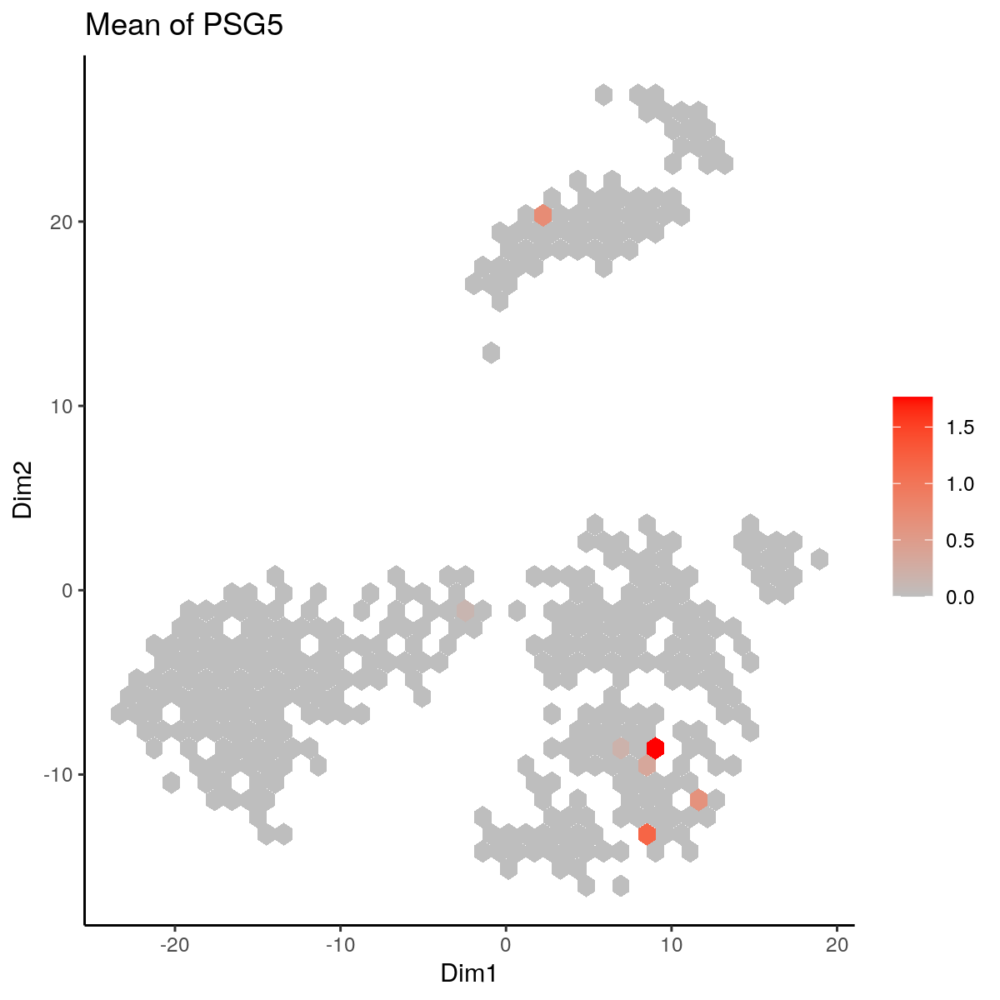|[SDC3](https://www.ncbi.nlm.nih.gov/gene/9672)|
|[PSG6](https://www.ncbi.nlm.nih.gov/gene/5675) 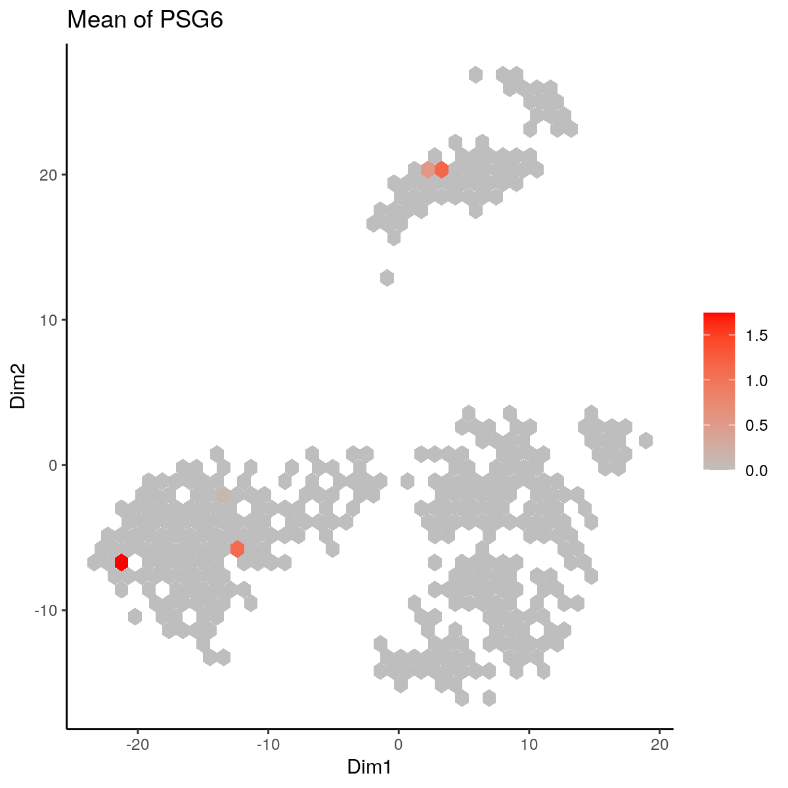|[SDC3](https://www.ncbi.nlm.nih.gov/gene/9672)|
|[PSG7](https://www.ncbi.nlm.nih.gov/gene/5676)|[SDC3](https://www.ncbi.nlm.nih.gov/gene/9672) [LRRC38](https://www.ncbi.nlm.nih.gov/gene/126755)|
|[PSG8](https://www.ncbi.nlm.nih.gov/gene/440533)|[SDC3](https://www.ncbi.nlm.nih.gov/gene/9672)|
|[PSG9](https://www.ncbi.nlm.nih.gov/gene/5678)|[CELSR3](https://www.ncbi.nlm.nih.gov/gene/1951) [SDC3](https://www.ncbi.nlm.nih.gov/gene/9672)|
|[PSORS1C2](https://www.ncbi.nlm.nih.gov/gene/170680)|[MICB](https://www.ncbi.nlm.nih.gov/gene/4277) [MICA](https://www.ncbi.nlm.nih.gov/gene/100507436)|
|[PSPN](https://www.ncbi.nlm.nih.gov/gene/5623)|[GFRA1](https://www.ncbi.nlm.nih.gov/gene/2674) [GFRA2](https://www.ncbi.nlm.nih.gov/gene/2675) [GFRA3](https://www.ncbi.nlm.nih.gov/gene/2676) [KRAS](https://www.ncbi.nlm.nih.gov/gene/3845) [NRAS](https://www.ncbi.nlm.nih.gov/gene/4893) [NTRK1](https://www.ncbi.nlm.nih.gov/gene/4914) [RET](https://www.ncbi.nlm.nih.gov/gene/5979) [SDC3](https://www.ncbi.nlm.nih.gov/gene/9672) [PROKR2](https://www.ncbi.nlm.nih.gov/gene/128674) [GFRAL](https://www.ncbi.nlm.nih.gov/gene/389400)|
|[PTEN](https://www.ncbi.nlm.nih.gov/gene/5728)|[AKT2](https://www.ncbi.nlm.nih.gov/gene/208) [ALK](https://www.ncbi.nlm.nih.gov/gene/238) [RHOA](https://www.ncbi.nlm.nih.gov/gene/387) [RHOC](https://www.ncbi.nlm.nih.gov/gene/389) [AXL](https://www.ncbi.nlm.nih.gov/gene/558) [BMPR1A](https://www.ncbi.nlm.nih.gov/gene/657) [BTK](https://www.ncbi.nlm.nih.gov/gene/695) [CBL](https://www.ncbi.nlm.nih.gov/gene/867) [CD44](https://www.ncbi.nlm.nih.gov/gene/960) [CD79A](https://www.ncbi.nlm.nih.gov/gene/973) [CD79B](https://www.ncbi.nlm.nih.gov/gene/974) [CDC42](https://www.ncbi.nlm.nih.gov/gene/998) [CDH2](https://www.ncbi.nlm.nih.gov/gene/1000) [CDH17](https://www.ncbi.nlm.nih.gov/gene/1015) [CFTR](https://www.ncbi.nlm.nih.gov/gene/1080) [CSF1R](https://www.ncbi.nlm.nih.gov/gene/1436) [CSK](https://www.ncbi.nlm.nih.gov/gene/1445) [DLG4](https://www.ncbi.nlm.nih.gov/gene/1742) [DVL1](https://www.ncbi.nlm.nih.gov/gene/1855) [EPHA2](https://www.ncbi.nlm.nih.gov/gene/1969) [EPHA1](https://www.ncbi.nlm.nih.gov/gene/2041) [EPHA4](https://www.ncbi.nlm.nih.gov/gene/2043) [EPHA5](https://www.ncbi.nlm.nih.gov/gene/2044) [EPHA7](https://www.ncbi.nlm.nih.gov/gene/2045) [EPHB1](https://www.ncbi.nlm.nih.gov/gene/2047) [EPHB2](https://www.ncbi.nlm.nih.gov/gene/2048) [EPHB3](https://www.ncbi.nlm.nih.gov/gene/2049) [EPHB4](https://www.ncbi.nlm.nih.gov/gene/2050) [ESR1](https://www.ncbi.nlm.nih.gov/gene/2099) [FCGR1B](https://www.ncbi.nlm.nih.gov/gene/2210) [FGFR1](https://www.ncbi.nlm.nih.gov/gene/2260) [FGFR3](https://www.ncbi.nlm.nih.gov/gene/2261) [FYN](https://www.ncbi.nlm.nih.gov/gene/2534) [GJA1](https://www.ncbi.nlm.nih.gov/gene/2697) [GNA11](https://www.ncbi.nlm.nih.gov/gene/2767) [GNAS](https://www.ncbi.nlm.nih.gov/gene/2778) [GNRHR](https://www.ncbi.nlm.nih.gov/gene/2798) [GRPR](https://www.ncbi.nlm.nih.gov/gene/2925) [INPP5A](https://www.ncbi.nlm.nih.gov/gene/3632) [INSR](https://www.ncbi.nlm.nih.gov/gene/3643) [ITGB1](https://www.ncbi.nlm.nih.gov/gene/3688) [KRAS](https://www.ncbi.nlm.nih.gov/gene/3845) [LYN](https://www.ncbi.nlm.nih.gov/gene/4067) [EPCAM](https://www.ncbi.nlm.nih.gov/gene/4072) [MME](https://www.ncbi.nlm.nih.gov/gene/4311) [NEDD4](https://www.ncbi.nlm.nih.gov/gene/4734) [NGFR](https://www.ncbi.nlm.nih.gov/gene/4804) [NOS3](https://www.ncbi.nlm.nih.gov/gene/4846) [NRAS](https://www.ncbi.nlm.nih.gov/gene/4893) [NTRK1](https://www.ncbi.nlm.nih.gov/gene/4914) [NTRK2](https://www.ncbi.nlm.nih.gov/gene/4915) [DDR2](https://www.ncbi.nlm.nih.gov/gene/4921) [PDCD1](https://www.ncbi.nlm.nih.gov/gene/5133) [PDGFRA](https://www.ncbi.nlm.nih.gov/gene/5156) [PDGFRB](https://www.ncbi.nlm.nih.gov/gene/5159) [PDPK1](https://www.ncbi.nlm.nih.gov/gene/5170) [ABCB1](https://www.ncbi.nlm.nih.gov/gene/5243) [PIK3C2A](https://www.ncbi.nlm.nih.gov/gene/5286) [PIP4K2A](https://www.ncbi.nlm.nih.gov/gene/5305) [PTCH1](https://www.ncbi.nlm.nih.gov/gene/5727) [PTPRC](https://www.ncbi.nlm.nih.gov/gene/5788) [RAC1](https://www.ncbi.nlm.nih.gov/gene/5879) [RAF1](https://www.ncbi.nlm.nih.gov/gene/5894) [RET](https://www.ncbi.nlm.nih.gov/gene/5979) [ROS1](https://www.ncbi.nlm.nih.gov/gene/6098) [RRAS](https://www.ncbi.nlm.nih.gov/gene/6237) [SGK1](https://www.ncbi.nlm.nih.gov/gene/6446) [SLC2A1](https://www.ncbi.nlm.nih.gov/gene/6513) [SLC2A4](https://www.ncbi.nlm.nih.gov/gene/6517) [SRC](https://www.ncbi.nlm.nih.gov/gene/6714) [SYK](https://www.ncbi.nlm.nih.gov/gene/6850) [TGFBR1](https://www.ncbi.nlm.nih.gov/gene/7046) [TGFBR2](https://www.ncbi.nlm.nih.gov/gene/7048) [TJP1](https://www.ncbi.nlm.nih.gov/gene/7082) [TLR4](https://www.ncbi.nlm.nih.gov/gene/7099) [VCL](https://www.ncbi.nlm.nih.gov/gene/7414) [YES1](https://www.ncbi.nlm.nih.gov/gene/7525) [CXCR4](https://www.ncbi.nlm.nih.gov/gene/7852) [PIP5K1A](https://www.ncbi.nlm.nih.gov/gene/8394) [RECK](https://www.ncbi.nlm.nih.gov/gene/8434) [TNFSF10](https://www.ncbi.nlm.nih.gov/gene/8743) [IQGAP1](https://www.ncbi.nlm.nih.gov/gene/8826) [PROM1](https://www.ncbi.nlm.nih.gov/gene/8842) [ABCG2](https://www.ncbi.nlm.nih.gov/gene/9429) [ROCK2](https://www.ncbi.nlm.nih.gov/gene/9475) [PLCH2](https://www.ncbi.nlm.nih.gov/gene/9651) [NCKAP1](https://www.ncbi.nlm.nih.gov/gene/10787) [WWP1](https://www.ncbi.nlm.nih.gov/gene/11059) [PARK7](https://www.ncbi.nlm.nih.gov/gene/11315) [RRAS2](https://www.ncbi.nlm.nih.gov/gene/22800) [SHANK2](https://www.ncbi.nlm.nih.gov/gene/22941) [MAST1](https://www.ncbi.nlm.nih.gov/gene/22983) [PHLPP1](https://www.ncbi.nlm.nih.gov/gene/23239) [SCRIB](https://www.ncbi.nlm.nih.gov/gene/23513) [LRIG1](https://www.ncbi.nlm.nih.gov/gene/26018) [PARD6A](https://www.ncbi.nlm.nih.gov/gene/50855) [PLCE1](https://www.ncbi.nlm.nih.gov/gene/51196) [NLGN3](https://www.ncbi.nlm.nih.gov/gene/54413) [MRAP](https://www.ncbi.nlm.nih.gov/gene/56246) [NLGN4X](https://www.ncbi.nlm.nih.gov/gene/57502) [MAPKAP1](https://www.ncbi.nlm.nih.gov/gene/79109) [PARD6G](https://www.ncbi.nlm.nih.gov/gene/84552) [PARD6B](https://www.ncbi.nlm.nih.gov/gene/84612) [LYPD1](https://www.ncbi.nlm.nih.gov/gene/116372) [MAGI3](https://www.ncbi.nlm.nih.gov/gene/260425) [ECSCR](https://www.ncbi.nlm.nih.gov/gene/641700) [CD24](https://www.ncbi.nlm.nih.gov/gene/100133941)|
|[PTH](https://www.ncbi.nlm.nih.gov/gene/5741)|[ADCY3](https://www.ncbi.nlm.nih.gov/gene/109) [ADCY5](https://www.ncbi.nlm.nih.gov/gene/111) [ADCY6](https://www.ncbi.nlm.nih.gov/gene/112) [ADCY8](https://www.ncbi.nlm.nih.gov/gene/114) [ADCY9](https://www.ncbi.nlm.nih.gov/gene/115) [ADCYAP1R1](https://www.ncbi.nlm.nih.gov/gene/117) [ADORA2B](https://www.ncbi.nlm.nih.gov/gene/136) [ADRB1](https://www.ncbi.nlm.nih.gov/gene/153) [ADRB2](https://www.ncbi.nlm.nih.gov/gene/154) [ADRB3](https://www.ncbi.nlm.nih.gov/gene/155) [ALPI](https://www.ncbi.nlm.nih.gov/gene/248) [ALPL](https://www.ncbi.nlm.nih.gov/gene/249) [ALPP](https://www.ncbi.nlm.nih.gov/gene/250) [ALPG](https://www.ncbi.nlm.nih.gov/gene/251) [ARRB1](https://www.ncbi.nlm.nih.gov/gene/408) [ATP4A](https://www.ncbi.nlm.nih.gov/gene/495) [BMPR2](https://www.ncbi.nlm.nih.gov/gene/659) [CALCR](https://www.ncbi.nlm.nih.gov/gene/799) [CASR](https://www.ncbi.nlm.nih.gov/gene/846) [AP2S1](https://www.ncbi.nlm.nih.gov/gene/1175) [CRHR2](https://www.ncbi.nlm.nih.gov/gene/1395) [ACE](https://www.ncbi.nlm.nih.gov/gene/1636) [DPEP1](https://www.ncbi.nlm.nih.gov/gene/1800) [DRD1](https://www.ncbi.nlm.nih.gov/gene/1812) [DRD5](https://www.ncbi.nlm.nih.gov/gene/1816) [ESR1](https://www.ncbi.nlm.nih.gov/gene/2099) [FGFR1](https://www.ncbi.nlm.nih.gov/gene/2260) [FGFR3](https://www.ncbi.nlm.nih.gov/gene/2261) [FSHR](https://www.ncbi.nlm.nih.gov/gene/2492) [GCGR](https://www.ncbi.nlm.nih.gov/gene/2642) [GHRHR](https://www.ncbi.nlm.nih.gov/gene/2692) [GIPR](https://www.ncbi.nlm.nih.gov/gene/2696) [GJA1](https://www.ncbi.nlm.nih.gov/gene/2697) [GLP1R](https://www.ncbi.nlm.nih.gov/gene/2740) [GNA11](https://www.ncbi.nlm.nih.gov/gene/2767) [GNAS](https://www.ncbi.nlm.nih.gov/gene/2778) [GNG3](https://www.ncbi.nlm.nih.gov/gene/2785) [GNG4](https://www.ncbi.nlm.nih.gov/gene/2786) [GNG5](https://www.ncbi.nlm.nih.gov/gene/2787) [GNG7](https://www.ncbi.nlm.nih.gov/gene/2788) [GNG10](https://www.ncbi.nlm.nih.gov/gene/2790) [GNG11](https://www.ncbi.nlm.nih.gov/gene/2791) [GNGT1](https://www.ncbi.nlm.nih.gov/gene/2792) [GNGT2](https://www.ncbi.nlm.nih.gov/gene/2793) [GPR15](https://www.ncbi.nlm.nih.gov/gene/2838) [GPR20](https://www.ncbi.nlm.nih.gov/gene/2843) [GPR25](https://www.ncbi.nlm.nih.gov/gene/2848) [GPR27](https://www.ncbi.nlm.nih.gov/gene/2850) [GPR32](https://www.ncbi.nlm.nih.gov/gene/2854) [GPR39](https://www.ncbi.nlm.nih.gov/gene/2863) [HRH2](https://www.ncbi.nlm.nih.gov/gene/3274) [HTR4](https://www.ncbi.nlm.nih.gov/gene/3360) [HTR6](https://www.ncbi.nlm.nih.gov/gene/3362) [HTR7](https://www.ncbi.nlm.nih.gov/gene/3363) [IHH](https://www.ncbi.nlm.nih.gov/gene/3549) [LHCGR](https://www.ncbi.nlm.nih.gov/gene/3973) [LRP6](https://www.ncbi.nlm.nih.gov/gene/4040) [MC1R](https://www.ncbi.nlm.nih.gov/gene/4157) [MC2R](https://www.ncbi.nlm.nih.gov/gene/4158) [MC3R](https://www.ncbi.nlm.nih.gov/gene/4159) [MC4R](https://www.ncbi.nlm.nih.gov/gene/4160) [MC5R](https://www.ncbi.nlm.nih.gov/gene/4161) [NOS3](https://www.ncbi.nlm.nih.gov/gene/4846) [P2RY11](https://www.ncbi.nlm.nih.gov/gene/5032) [PHEX](https://www.ncbi.nlm.nih.gov/gene/5251) [PTGDR](https://www.ncbi.nlm.nih.gov/gene/5729) [PTGER2](https://www.ncbi.nlm.nih.gov/gene/5732) [PTGER4](https://www.ncbi.nlm.nih.gov/gene/5734) [PTGIR](https://www.ncbi.nlm.nih.gov/gene/5739) [PTH1R](https://www.ncbi.nlm.nih.gov/gene/5745) [PTH2R](https://www.ncbi.nlm.nih.gov/gene/5746) [RET](https://www.ncbi.nlm.nih.gov/gene/5979) [RGS2](https://www.ncbi.nlm.nih.gov/gene/5997) [SCTR](https://www.ncbi.nlm.nih.gov/gene/6344) [SLC9A3](https://www.ncbi.nlm.nih.gov/gene/6550) [SLC34A1](https://www.ncbi.nlm.nih.gov/gene/6569) [SLC20A2](https://www.ncbi.nlm.nih.gov/gene/6575) [SRC](https://www.ncbi.nlm.nih.gov/gene/6714) [TSHR](https://www.ncbi.nlm.nih.gov/gene/7253) [VIPR1](https://www.ncbi.nlm.nih.gov/gene/7433) [VIPR2](https://www.ncbi.nlm.nih.gov/gene/7434) [TNFRSF11A](https://www.ncbi.nlm.nih.gov/gene/8792) [MGAM](https://www.ncbi.nlm.nih.gov/gene/8972) [TAAR5](https://www.ncbi.nlm.nih.gov/gene/9038) [TAAR2](https://www.ncbi.nlm.nih.gov/gene/9287) [GLP2R](https://www.ncbi.nlm.nih.gov/gene/9340) [ABCG2](https://www.ncbi.nlm.nih.gov/gene/9429) [CALCRL](https://www.ncbi.nlm.nih.gov/gene/10203) [RAMP3](https://www.ncbi.nlm.nih.gov/gene/10268) [GPR83](https://www.ncbi.nlm.nih.gov/gene/10888) [GPR176](https://www.ncbi.nlm.nih.gov/gene/11245) [GPR45](https://www.ncbi.nlm.nih.gov/gene/11250) [GNG13](https://www.ncbi.nlm.nih.gov/gene/51764) [GPR84](https://www.ncbi.nlm.nih.gov/gene/53831) [GNG2](https://www.ncbi.nlm.nih.gov/gene/54331) [TRPV6](https://www.ncbi.nlm.nih.gov/gene/55503) [GNG12](https://www.ncbi.nlm.nih.gov/gene/55970) [TRPV5](https://www.ncbi.nlm.nih.gov/gene/56302) [RXFP1](https://www.ncbi.nlm.nih.gov/gene/59350) [TAAR8](https://www.ncbi.nlm.nih.gov/gene/83551) [GNG8](https://www.ncbi.nlm.nih.gov/gene/94235) [RXFP2](https://www.ncbi.nlm.nih.gov/gene/122042) [TAAR9](https://www.ncbi.nlm.nih.gov/gene/134860) [TAAR1](https://www.ncbi.nlm.nih.gov/gene/134864) [TRPM6](https://www.ncbi.nlm.nih.gov/gene/140803) [GPBAR1](https://www.ncbi.nlm.nih.gov/gene/151306) [ADCY4](https://www.ncbi.nlm.nih.gov/gene/196883) [GPRC6A](https://www.ncbi.nlm.nih.gov/gene/222545) [GPR150](https://www.ncbi.nlm.nih.gov/gene/285601) [TAAR6](https://www.ncbi.nlm.nih.gov/gene/319100) [LINC02210-CRHR1](https://www.ncbi.nlm.nih.gov/gene/104909134)|
|[PTH2](https://www.ncbi.nlm.nih.gov/gene/113091)|[ADCY3](https://www.ncbi.nlm.nih.gov/gene/109) [ADCY5](https://www.ncbi.nlm.nih.gov/gene/111) [ADCY6](https://www.ncbi.nlm.nih.gov/gene/112) [ADCY8](https://www.ncbi.nlm.nih.gov/gene/114) [ADCY9](https://www.ncbi.nlm.nih.gov/gene/115) [ADCYAP1R1](https://www.ncbi.nlm.nih.gov/gene/117) [ADORA2B](https://www.ncbi.nlm.nih.gov/gene/136) [ADRB1](https://www.ncbi.nlm.nih.gov/gene/153) [ADRB2](https://www.ncbi.nlm.nih.gov/gene/154) [ADRB3](https://www.ncbi.nlm.nih.gov/gene/155) [CALCR](https://www.ncbi.nlm.nih.gov/gene/799) [CRHR2](https://www.ncbi.nlm.nih.gov/gene/1395) [DRD1](https://www.ncbi.nlm.nih.gov/gene/1812) [DRD5](https://www.ncbi.nlm.nih.gov/gene/1816) [FSHR](https://www.ncbi.nlm.nih.gov/gene/2492) [GCGR](https://www.ncbi.nlm.nih.gov/gene/2642) [GHRHR](https://www.ncbi.nlm.nih.gov/gene/2692) [GIPR](https://www.ncbi.nlm.nih.gov/gene/2696) [GLP1R](https://www.ncbi.nlm.nih.gov/gene/2740) [GNAS](https://www.ncbi.nlm.nih.gov/gene/2778) [GNG3](https://www.ncbi.nlm.nih.gov/gene/2785) [GNG4](https://www.ncbi.nlm.nih.gov/gene/2786) [GNG5](https://www.ncbi.nlm.nih.gov/gene/2787) [GNG7](https://www.ncbi.nlm.nih.gov/gene/2788) [GNG10](https://www.ncbi.nlm.nih.gov/gene/2790) [GNG11](https://www.ncbi.nlm.nih.gov/gene/2791) [GNGT1](https://www.ncbi.nlm.nih.gov/gene/2792) [GNGT2](https://www.ncbi.nlm.nih.gov/gene/2793) [GPR15](https://www.ncbi.nlm.nih.gov/gene/2838) [GPR20](https://www.ncbi.nlm.nih.gov/gene/2843) [GPR25](https://www.ncbi.nlm.nih.gov/gene/2848) [GPR27](https://www.ncbi.nlm.nih.gov/gene/2850) [GPR32](https://www.ncbi.nlm.nih.gov/gene/2854) [GPR39](https://www.ncbi.nlm.nih.gov/gene/2863) [HRH2](https://www.ncbi.nlm.nih.gov/gene/3274) [HTR4](https://www.ncbi.nlm.nih.gov/gene/3360) [HTR6](https://www.ncbi.nlm.nih.gov/gene/3362) [HTR7](https://www.ncbi.nlm.nih.gov/gene/3363) [LHCGR](https://www.ncbi.nlm.nih.gov/gene/3973) [MC1R](https://www.ncbi.nlm.nih.gov/gene/4157) [MC2R](https://www.ncbi.nlm.nih.gov/gene/4158) [MC3R](https://www.ncbi.nlm.nih.gov/gene/4159) [MC4R](https://www.ncbi.nlm.nih.gov/gene/4160) [MC5R](https://www.ncbi.nlm.nih.gov/gene/4161) [P2RY11](https://www.ncbi.nlm.nih.gov/gene/5032) [PTGDR](https://www.ncbi.nlm.nih.gov/gene/5729) [PTGER2](https://www.ncbi.nlm.nih.gov/gene/5732) [PTGER4](https://www.ncbi.nlm.nih.gov/gene/5734) [PTGIR](https://www.ncbi.nlm.nih.gov/gene/5739) [PTH1R](https://www.ncbi.nlm.nih.gov/gene/5745) [PTH2R](https://www.ncbi.nlm.nih.gov/gene/5746) [SCTR](https://www.ncbi.nlm.nih.gov/gene/6344) [TSHR](https://www.ncbi.nlm.nih.gov/gene/7253) [VIPR1](https://www.ncbi.nlm.nih.gov/gene/7433) [VIPR2](https://www.ncbi.nlm.nih.gov/gene/7434) [TAAR5](https://www.ncbi.nlm.nih.gov/gene/9038) [TAAR2](https://www.ncbi.nlm.nih.gov/gene/9287) [GLP2R](https://www.ncbi.nlm.nih.gov/gene/9340) [CALCRL](https://www.ncbi.nlm.nih.gov/gene/10203) [RAMP3](https://www.ncbi.nlm.nih.gov/gene/10268) [GPR83](https://www.ncbi.nlm.nih.gov/gene/10888) [GPR176](https://www.ncbi.nlm.nih.gov/gene/11245) [GPR45](https://www.ncbi.nlm.nih.gov/gene/11250) [GNG13](https://www.ncbi.nlm.nih.gov/gene/51764) [GPR84](https://www.ncbi.nlm.nih.gov/gene/53831) [GNG2](https://www.ncbi.nlm.nih.gov/gene/54331) [GNG12](https://www.ncbi.nlm.nih.gov/gene/55970) [RXFP1](https://www.ncbi.nlm.nih.gov/gene/59350) [TAAR8](https://www.ncbi.nlm.nih.gov/gene/83551) [GNG8](https://www.ncbi.nlm.nih.gov/gene/94235) [RXFP2](https://www.ncbi.nlm.nih.gov/gene/122042) [TAAR9](https://www.ncbi.nlm.nih.gov/gene/134860) [TAAR1](https://www.ncbi.nlm.nih.gov/gene/134864) [GPBAR1](https://www.ncbi.nlm.nih.gov/gene/151306) [ADCY4](https://www.ncbi.nlm.nih.gov/gene/196883) [GPR150](https://www.ncbi.nlm.nih.gov/gene/285601) [TAAR6](https://www.ncbi.nlm.nih.gov/gene/319100) [LINC02210-CRHR1](https://www.ncbi.nlm.nih.gov/gene/104909134)|
|[PTHLH](https://www.ncbi.nlm.nih.gov/gene/5744)|[ADCY3](https://www.ncbi.nlm.nih.gov/gene/109) [ADCY5](https://www.ncbi.nlm.nih.gov/gene/111) [ADCY6](https://www.ncbi.nlm.nih.gov/gene/112) [ADCY8](https://www.ncbi.nlm.nih.gov/gene/114) [ADCY9](https://www.ncbi.nlm.nih.gov/gene/115) [ADCYAP1R1](https://www.ncbi.nlm.nih.gov/gene/117) [ADORA2B](https://www.ncbi.nlm.nih.gov/gene/136) [ADRB1](https://www.ncbi.nlm.nih.gov/gene/153) [ADRB2](https://www.ncbi.nlm.nih.gov/gene/154) [ADRB3](https://www.ncbi.nlm.nih.gov/gene/155) [ARRB1](https://www.ncbi.nlm.nih.gov/gene/408) [CALCR](https://www.ncbi.nlm.nih.gov/gene/799) [CASR](https://www.ncbi.nlm.nih.gov/gene/846) [CRHR2](https://www.ncbi.nlm.nih.gov/gene/1395) [DRD1](https://www.ncbi.nlm.nih.gov/gene/1812) [DRD5](https://www.ncbi.nlm.nih.gov/gene/1816) [ESR1](https://www.ncbi.nlm.nih.gov/gene/2099) [FGFR3](https://www.ncbi.nlm.nih.gov/gene/2261) [FSHR](https://www.ncbi.nlm.nih.gov/gene/2492) [GCGR](https://www.ncbi.nlm.nih.gov/gene/2642) [GHRHR](https://www.ncbi.nlm.nih.gov/gene/2692) [GIPR](https://www.ncbi.nlm.nih.gov/gene/2696) [GLP1R](https://www.ncbi.nlm.nih.gov/gene/2740) [GNAS](https://www.ncbi.nlm.nih.gov/gene/2778) [GNG3](https://www.ncbi.nlm.nih.gov/gene/2785) [GNG4](https://www.ncbi.nlm.nih.gov/gene/2786) [GNG5](https://www.ncbi.nlm.nih.gov/gene/2787) [GNG7](https://www.ncbi.nlm.nih.gov/gene/2788) [GNG10](https://www.ncbi.nlm.nih.gov/gene/2790) [GNG11](https://www.ncbi.nlm.nih.gov/gene/2791) [GNGT1](https://www.ncbi.nlm.nih.gov/gene/2792) [GNGT2](https://www.ncbi.nlm.nih.gov/gene/2793) [GPR15](https://www.ncbi.nlm.nih.gov/gene/2838) [GPR20](https://www.ncbi.nlm.nih.gov/gene/2843) [GPR25](https://www.ncbi.nlm.nih.gov/gene/2848) [GPR27](https://www.ncbi.nlm.nih.gov/gene/2850) [GPR32](https://www.ncbi.nlm.nih.gov/gene/2854) [GPR39](https://www.ncbi.nlm.nih.gov/gene/2863) [HRH2](https://www.ncbi.nlm.nih.gov/gene/3274) [HTR4](https://www.ncbi.nlm.nih.gov/gene/3360) [HTR6](https://www.ncbi.nlm.nih.gov/gene/3362) [HTR7](https://www.ncbi.nlm.nih.gov/gene/3363) [IHH](https://www.ncbi.nlm.nih.gov/gene/3549) [ITGAV](https://www.ncbi.nlm.nih.gov/gene/3685) [LHCGR](https://www.ncbi.nlm.nih.gov/gene/3973) [MC1R](https://www.ncbi.nlm.nih.gov/gene/4157) [MC2R](https://www.ncbi.nlm.nih.gov/gene/4158) [MC3R](https://www.ncbi.nlm.nih.gov/gene/4159) [MC4R](https://www.ncbi.nlm.nih.gov/gene/4160) [MC5R](https://www.ncbi.nlm.nih.gov/gene/4161) [P2RY11](https://www.ncbi.nlm.nih.gov/gene/5032) [PTCH1](https://www.ncbi.nlm.nih.gov/gene/5727) [PTGDR](https://www.ncbi.nlm.nih.gov/gene/5729) [PTGER2](https://www.ncbi.nlm.nih.gov/gene/5732) [PTGER4](https://www.ncbi.nlm.nih.gov/gene/5734) [PTGIR](https://www.ncbi.nlm.nih.gov/gene/5739) [PTH1R](https://www.ncbi.nlm.nih.gov/gene/5745) [PTH2R](https://www.ncbi.nlm.nih.gov/gene/5746) [SCTR](https://www.ncbi.nlm.nih.gov/gene/6344) [SLC16A1](https://www.ncbi.nlm.nih.gov/gene/6566) [TSHR](https://www.ncbi.nlm.nih.gov/gene/7253) [VIPR1](https://www.ncbi.nlm.nih.gov/gene/7433) [VIPR2](https://www.ncbi.nlm.nih.gov/gene/7434) [CXCR4](https://www.ncbi.nlm.nih.gov/gene/7852) [TNFRSF11A](https://www.ncbi.nlm.nih.gov/gene/8792) [TAAR5](https://www.ncbi.nlm.nih.gov/gene/9038) [TAAR2](https://www.ncbi.nlm.nih.gov/gene/9287) [GLP2R](https://www.ncbi.nlm.nih.gov/gene/9340) [CALCRL](https://www.ncbi.nlm.nih.gov/gene/10203) [RAMP3](https://www.ncbi.nlm.nih.gov/gene/10268) [CAP2](https://www.ncbi.nlm.nih.gov/gene/10486) [GPR83](https://www.ncbi.nlm.nih.gov/gene/10888) [GPR176](https://www.ncbi.nlm.nih.gov/gene/11245) [GPR45](https://www.ncbi.nlm.nih.gov/gene/11250) [GNG13](https://www.ncbi.nlm.nih.gov/gene/51764) [GPR84](https://www.ncbi.nlm.nih.gov/gene/53831) [GNG2](https://www.ncbi.nlm.nih.gov/gene/54331) [GNG12](https://www.ncbi.nlm.nih.gov/gene/55970) [RXFP1](https://www.ncbi.nlm.nih.gov/gene/59350) [TAAR8](https://www.ncbi.nlm.nih.gov/gene/83551) [GNG8](https://www.ncbi.nlm.nih.gov/gene/94235) [RXFP2](https://www.ncbi.nlm.nih.gov/gene/122042) [TAAR9](https://www.ncbi.nlm.nih.gov/gene/134860) [TAAR1](https://www.ncbi.nlm.nih.gov/gene/134864) [GPBAR1](https://www.ncbi.nlm.nih.gov/gene/151306) [ADCY4](https://www.ncbi.nlm.nih.gov/gene/196883) [GPR150](https://www.ncbi.nlm.nih.gov/gene/285601) [TAAR6](https://www.ncbi.nlm.nih.gov/gene/319100) [LINC02210-CRHR1](https://www.ncbi.nlm.nih.gov/gene/104909134) [PRLHR](https://www.ncbi.nlm.nih.gov/gene/2834)|
|[PTN](https://www.ncbi.nlm.nih.gov/gene/5764) 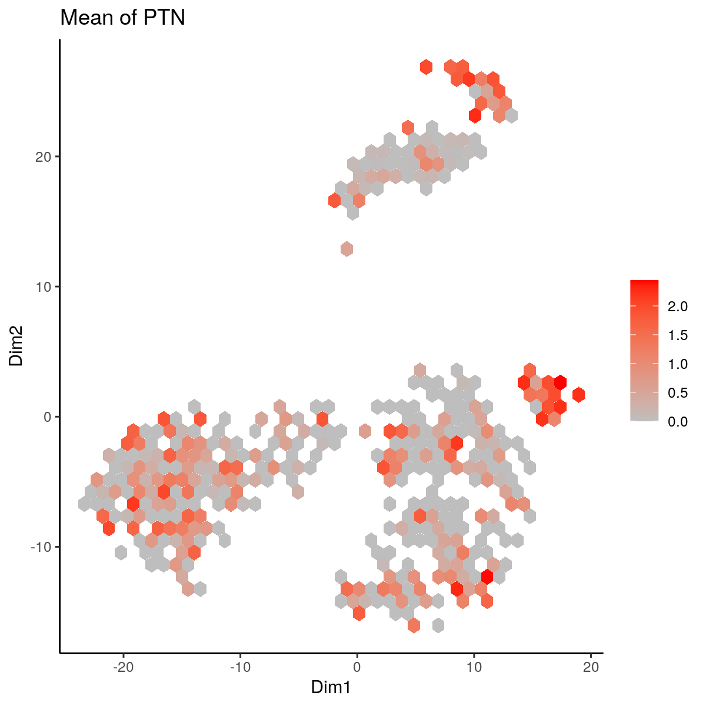|[ALK](https://www.ncbi.nlm.nih.gov/gene/238) [FYN](https://www.ncbi.nlm.nih.gov/gene/2534) [GAP43](https://www.ncbi.nlm.nih.gov/gene/2596) [GFRA2](https://www.ncbi.nlm.nih.gov/gene/2675) [GJA1](https://www.ncbi.nlm.nih.gov/gene/2697) [NRCAM](https://www.ncbi.nlm.nih.gov/gene/4897) [NTRK2](https://www.ncbi.nlm.nih.gov/gene/4915) [SRC](https://www.ncbi.nlm.nih.gov/gene/6714) [SDC3](https://www.ncbi.nlm.nih.gov/gene/9672) [CSPG5](https://www.ncbi.nlm.nih.gov/gene/10675) [ACE2](https://www.ncbi.nlm.nih.gov/gene/59272) [ADIPOR2](https://www.ncbi.nlm.nih.gov/gene/79602) [LRRTM1](https://www.ncbi.nlm.nih.gov/gene/347730) [PTPRB](https://www.ncbi.nlm.nih.gov/gene/5787) [PTPRZ1](https://www.ncbi.nlm.nih.gov/gene/5803)|
|[PTPRZ1](https://www.ncbi.nlm.nih.gov/gene/5803) 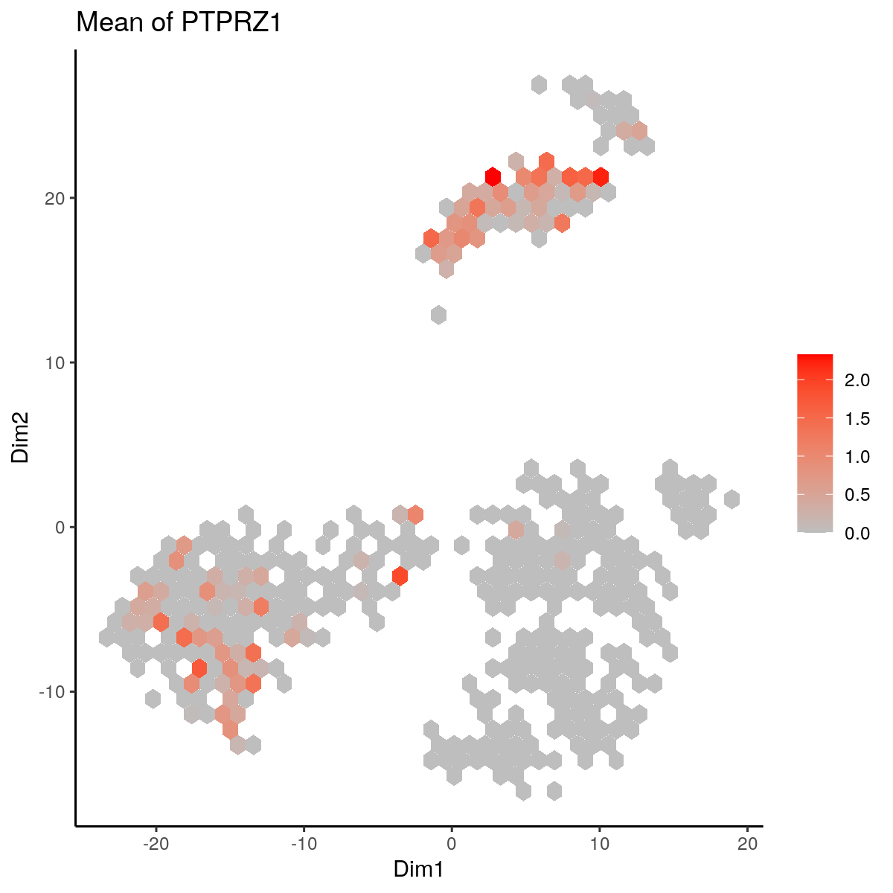|[ADD2](https://www.ncbi.nlm.nih.gov/gene/119) [ALK](https://www.ncbi.nlm.nih.gov/gene/238) [CNTN1](https://www.ncbi.nlm.nih.gov/gene/1272) [CSPG4](https://www.ncbi.nlm.nih.gov/gene/1464) [DLG2](https://www.ncbi.nlm.nih.gov/gene/1740) [DLG4](https://www.ncbi.nlm.nih.gov/gene/1742) [DPP6](https://www.ncbi.nlm.nih.gov/gene/1804) [FYN](https://www.ncbi.nlm.nih.gov/gene/2534) [GAP43](https://www.ncbi.nlm.nih.gov/gene/2596) [GPM6B](https://www.ncbi.nlm.nih.gov/gene/2824) [GRID2](https://www.ncbi.nlm.nih.gov/gene/2895) [HTR5A](https://www.ncbi.nlm.nih.gov/gene/3361) [ITGAV](https://www.ncbi.nlm.nih.gov/gene/3685) [ITGB3](https://www.ncbi.nlm.nih.gov/gene/3690) [L1CAM](https://www.ncbi.nlm.nih.gov/gene/3897) [MAG](https://www.ncbi.nlm.nih.gov/gene/4099) [MOG](https://www.ncbi.nlm.nih.gov/gene/4340) [NRCAM](https://www.ncbi.nlm.nih.gov/gene/4897) [OMG](https://www.ncbi.nlm.nih.gov/gene/4974) [CNTN3](https://www.ncbi.nlm.nih.gov/gene/5067) [CNTN2](https://www.ncbi.nlm.nih.gov/gene/6900) [SDC3](https://www.ncbi.nlm.nih.gov/gene/9672) [CSPG5](https://www.ncbi.nlm.nih.gov/gene/10675) [NFASC](https://www.ncbi.nlm.nih.gov/gene/23114) [CNTN6](https://www.ncbi.nlm.nih.gov/gene/27255) [NPC1L1](https://www.ncbi.nlm.nih.gov/gene/29881) [CNTN5](https://www.ncbi.nlm.nih.gov/gene/53942) [RTN4R](https://www.ncbi.nlm.nih.gov/gene/65078) [LINGO1](https://www.ncbi.nlm.nih.gov/gene/84894) [RTN4RL1](https://www.ncbi.nlm.nih.gov/gene/146760) [CNTN4](https://www.ncbi.nlm.nih.gov/gene/152330)|
|[PTX3](https://www.ncbi.nlm.nih.gov/gene/5806)|[C3AR1](https://www.ncbi.nlm.nih.gov/gene/719) [PTGER2](https://www.ncbi.nlm.nih.gov/gene/5732) [SELP](https://www.ncbi.nlm.nih.gov/gene/6403) [SLC2A5](https://www.ncbi.nlm.nih.gov/gene/6518) [TLR4](https://www.ncbi.nlm.nih.gov/gene/7099) [VCL](https://www.ncbi.nlm.nih.gov/gene/7414) [SLC2A9](https://www.ncbi.nlm.nih.gov/gene/56606) [GSDMD](https://www.ncbi.nlm.nih.gov/gene/79792) [OSCAR](https://www.ncbi.nlm.nih.gov/gene/126014)|
|[PTX4](https://www.ncbi.nlm.nih.gov/gene/390667)|[ATP10A](https://www.ncbi.nlm.nih.gov/gene/57194)|
|[PVR](https://www.ncbi.nlm.nih.gov/gene/5817)|[CD48](https://www.ncbi.nlm.nih.gov/gene/962) [CD79A](https://www.ncbi.nlm.nih.gov/gene/973) [ITGAV](https://www.ncbi.nlm.nih.gov/gene/3685) [ITGB3](https://www.ncbi.nlm.nih.gov/gene/3690) [KIR2DL1](https://www.ncbi.nlm.nih.gov/gene/3802) [KIR2DL3](https://www.ncbi.nlm.nih.gov/gene/3804) [KIR3DL1](https://www.ncbi.nlm.nih.gov/gene/3811) [KLRD1](https://www.ncbi.nlm.nih.gov/gene/3824) [LAMP1](https://www.ncbi.nlm.nih.gov/gene/3916) [MICB](https://www.ncbi.nlm.nih.gov/gene/4277) [SLAMF1](https://www.ncbi.nlm.nih.gov/gene/6504) [SRC](https://www.ncbi.nlm.nih.gov/gene/6714) [TJP1](https://www.ncbi.nlm.nih.gov/gene/7082) [TNFRSF14](https://www.ncbi.nlm.nih.gov/gene/8764) [NCR2](https://www.ncbi.nlm.nih.gov/gene/9436) [NCR1](https://www.ncbi.nlm.nih.gov/gene/9437) [CD226](https://www.ncbi.nlm.nih.gov/gene/10666) [NECTIN3](https://www.ncbi.nlm.nih.gov/gene/25945) [PVRIG](https://www.ncbi.nlm.nih.gov/gene/79037) [ULBP3](https://www.ncbi.nlm.nih.gov/gene/79465) [ULBP2](https://www.ncbi.nlm.nih.gov/gene/80328) [ULBP1](https://www.ncbi.nlm.nih.gov/gene/80329) [SLAMF6](https://www.ncbi.nlm.nih.gov/gene/114836) [BTLA](https://www.ncbi.nlm.nih.gov/gene/151888) [TIGIT](https://www.ncbi.nlm.nih.gov/gene/201633) [NCR3](https://www.ncbi.nlm.nih.gov/gene/259197) [NCR3LG1](https://www.ncbi.nlm.nih.gov/gene/374383) [MICA](https://www.ncbi.nlm.nih.gov/gene/100507436) [KLRC4-KLRK1](https://www.ncbi.nlm.nih.gov/gene/100528032)|
|[PXDN](https://www.ncbi.nlm.nih.gov/gene/7837)|[CACNA1A](https://www.ncbi.nlm.nih.gov/gene/773) [CYBB](https://www.ncbi.nlm.nih.gov/gene/1536) [NOS3](https://www.ncbi.nlm.nih.gov/gene/4846) [SNTG2](https://www.ncbi.nlm.nih.gov/gene/54221)|
|[PXDNL](https://www.ncbi.nlm.nih.gov/gene/137902)|[CACNA1A](https://www.ncbi.nlm.nih.gov/gene/773) [SRC](https://www.ncbi.nlm.nih.gov/gene/6714)|
|[PYY](https://www.ncbi.nlm.nih.gov/gene/5697)|[ADCY3](https://www.ncbi.nlm.nih.gov/gene/109) [ADCY5](https://www.ncbi.nlm.nih.gov/gene/111) [ADCY6](https://www.ncbi.nlm.nih.gov/gene/112) [ADCY8](https://www.ncbi.nlm.nih.gov/gene/114) [ADCY9](https://www.ncbi.nlm.nih.gov/gene/115) [ADORA1](https://www.ncbi.nlm.nih.gov/gene/134) [ADRA2A](https://www.ncbi.nlm.nih.gov/gene/150) [ADRA2B](https://www.ncbi.nlm.nih.gov/gene/151) [ADRA2C](https://www.ncbi.nlm.nih.gov/gene/152) [AGTR1](https://www.ncbi.nlm.nih.gov/gene/185) [AGTR2](https://www.ncbi.nlm.nih.gov/gene/186) [APLNR](https://www.ncbi.nlm.nih.gov/gene/187) [BDKRB1](https://www.ncbi.nlm.nih.gov/gene/623) [BDKRB2](https://www.ncbi.nlm.nih.gov/gene/624) [CXCR5](https://www.ncbi.nlm.nih.gov/gene/643) [C3AR1](https://www.ncbi.nlm.nih.gov/gene/719) [C5AR1](https://www.ncbi.nlm.nih.gov/gene/728) [CASR](https://www.ncbi.nlm.nih.gov/gene/846) [CCKAR](https://www.ncbi.nlm.nih.gov/gene/886) [CCKBR](https://www.ncbi.nlm.nih.gov/gene/887) [CHRM2](https://www.ncbi.nlm.nih.gov/gene/1129) [CHRM4](https://www.ncbi.nlm.nih.gov/gene/1132) [CCR1](https://www.ncbi.nlm.nih.gov/gene/1230) [CCR3](https://www.ncbi.nlm.nih.gov/gene/1232) [CCR4](https://www.ncbi.nlm.nih.gov/gene/1233) [CCR5](https://www.ncbi.nlm.nih.gov/gene/1234) [CCR7](https://www.ncbi.nlm.nih.gov/gene/1236) [CCR8](https://www.ncbi.nlm.nih.gov/gene/1237) [CNR1](https://www.ncbi.nlm.nih.gov/gene/1268) [CNR2](https://www.ncbi.nlm.nih.gov/gene/1269) [CX3CR1](https://www.ncbi.nlm.nih.gov/gene/1524) [DPP4](https://www.ncbi.nlm.nih.gov/gene/1803) [DRD2](https://www.ncbi.nlm.nih.gov/gene/1813) [DRD3](https://www.ncbi.nlm.nih.gov/gene/1814) [DRD4](https://www.ncbi.nlm.nih.gov/gene/1815) [GPR183](https://www.ncbi.nlm.nih.gov/gene/1880) [S1PR1](https://www.ncbi.nlm.nih.gov/gene/1901) [S1PR3](https://www.ncbi.nlm.nih.gov/gene/1903) [FPR1](https://www.ncbi.nlm.nih.gov/gene/2357) [FPR2](https://www.ncbi.nlm.nih.gov/gene/2358) [FPR3](https://www.ncbi.nlm.nih.gov/gene/2359) [GALR1](https://www.ncbi.nlm.nih.gov/gene/2587) [GHSR](https://www.ncbi.nlm.nih.gov/gene/2693) [GIPR](https://www.ncbi.nlm.nih.gov/gene/2696) [GLP1R](https://www.ncbi.nlm.nih.gov/gene/2740) [GNG3](https://www.ncbi.nlm.nih.gov/gene/2785) [GNG4](https://www.ncbi.nlm.nih.gov/gene/2786) [GNG5](https://www.ncbi.nlm.nih.gov/gene/2787) [GNG7](https://www.ncbi.nlm.nih.gov/gene/2788) [GNG10](https://www.ncbi.nlm.nih.gov/gene/2790) [GNG11](https://www.ncbi.nlm.nih.gov/gene/2791) [GNGT1](https://www.ncbi.nlm.nih.gov/gene/2792) [GNGT2](https://www.ncbi.nlm.nih.gov/gene/2793) [CCR10](https://www.ncbi.nlm.nih.gov/gene/2826) [NPBWR1](https://www.ncbi.nlm.nih.gov/gene/2831) [NPBWR2](https://www.ncbi.nlm.nih.gov/gene/2832) [CXCR3](https://www.ncbi.nlm.nih.gov/gene/2833) [GPR17](https://www.ncbi.nlm.nih.gov/gene/2840) [GPR18](https://www.ncbi.nlm.nih.gov/gene/2841) [MCHR1](https://www.ncbi.nlm.nih.gov/gene/2847) [GPR31](https://www.ncbi.nlm.nih.gov/gene/2853) [GPR37](https://www.ncbi.nlm.nih.gov/gene/2861) [FFAR1](https://www.ncbi.nlm.nih.gov/gene/2864) [FFAR3](https://www.ncbi.nlm.nih.gov/gene/2865) [FFAR2](https://www.ncbi.nlm.nih.gov/gene/2867) [GRM2](https://www.ncbi.nlm.nih.gov/gene/2912) [GRM3](https://www.ncbi.nlm.nih.gov/gene/2913) [GRM4](https://www.ncbi.nlm.nih.gov/gene/2914) [GRM6](https://www.ncbi.nlm.nih.gov/gene/2916) [GRM7](https://www.ncbi.nlm.nih.gov/gene/2917) [GRM8](https://www.ncbi.nlm.nih.gov/gene/2918) [HTR1A](https://www.ncbi.nlm.nih.gov/gene/3350) [HTR1B](https://www.ncbi.nlm.nih.gov/gene/3351) [HTR1D](https://www.ncbi.nlm.nih.gov/gene/3352) [HTR1E](https://www.ncbi.nlm.nih.gov/gene/3354) [HTR1F](https://www.ncbi.nlm.nih.gov/gene/3355) [HTR5A](https://www.ncbi.nlm.nih.gov/gene/3361) [HTR7](https://www.ncbi.nlm.nih.gov/gene/3363) [CXCR1](https://www.ncbi.nlm.nih.gov/gene/3577) [CXCR2](https://www.ncbi.nlm.nih.gov/gene/3579) [MC3R](https://www.ncbi.nlm.nih.gov/gene/4159) [MC4R](https://www.ncbi.nlm.nih.gov/gene/4160) [MTNR1A](https://www.ncbi.nlm.nih.gov/gene/4543) [MTNR1B](https://www.ncbi.nlm.nih.gov/gene/4544) [NPY1R](https://www.ncbi.nlm.nih.gov/gene/4886) [NPY2R](https://www.ncbi.nlm.nih.gov/gene/4887) [NPY5R](https://www.ncbi.nlm.nih.gov/gene/4889) [OPRD1](https://www.ncbi.nlm.nih.gov/gene/4985) [OPRK1](https://www.ncbi.nlm.nih.gov/gene/4986) [OPRL1](https://www.ncbi.nlm.nih.gov/gene/4987) [P2RY4](https://www.ncbi.nlm.nih.gov/gene/5030) [PTGER3](https://www.ncbi.nlm.nih.gov/gene/5733) [SLC2A2](https://www.ncbi.nlm.nih.gov/gene/6514) [SLC5A4](https://www.ncbi.nlm.nih.gov/gene/6527) [SSTR1](https://www.ncbi.nlm.nih.gov/gene/6751) [SSTR2](https://www.ncbi.nlm.nih.gov/gene/6752) [SSTR3](https://www.ncbi.nlm.nih.gov/gene/6753) [SSTR4](https://www.ncbi.nlm.nih.gov/gene/6754) [SSTR5](https://www.ncbi.nlm.nih.gov/gene/6755) [CXCR4](https://www.ncbi.nlm.nih.gov/gene/7852) [GALR3](https://www.ncbi.nlm.nih.gov/gene/8484) [S1PR4](https://www.ncbi.nlm.nih.gov/gene/8698) [GALR2](https://www.ncbi.nlm.nih.gov/gene/8811) [HCAR3](https://www.ncbi.nlm.nih.gov/gene/8843) [GPR37L1](https://www.ncbi.nlm.nih.gov/gene/9283) [GPR55](https://www.ncbi.nlm.nih.gov/gene/9290) [GABBR2](https://www.ncbi.nlm.nih.gov/gene/9568) [SDC3](https://www.ncbi.nlm.nih.gov/gene/9672) [P2RY14](https://www.ncbi.nlm.nih.gov/gene/9934) [NMUR1](https://www.ncbi.nlm.nih.gov/gene/10316) [CXCR6](https://www.ncbi.nlm.nih.gov/gene/10663) [CCR9](https://www.ncbi.nlm.nih.gov/gene/10803) [PTGDR2](https://www.ncbi.nlm.nih.gov/gene/11251) [HRH3](https://www.ncbi.nlm.nih.gov/gene/11255) [LPAR3](https://www.ncbi.nlm.nih.gov/gene/23566) [HCAR1](https://www.ncbi.nlm.nih.gov/gene/27198) [OXGR1](https://www.ncbi.nlm.nih.gov/gene/27199) [TRPM5](https://www.ncbi.nlm.nih.gov/gene/29850) [TAS2R16](https://www.ncbi.nlm.nih.gov/gene/50833) [RXFP3](https://www.ncbi.nlm.nih.gov/gene/51289) [GNG13](https://www.ncbi.nlm.nih.gov/gene/51764) [S1PR5](https://www.ncbi.nlm.nih.gov/gene/53637) [P2RY13](https://www.ncbi.nlm.nih.gov/gene/53829) [GNG2](https://www.ncbi.nlm.nih.gov/gene/54331) [GNG12](https://www.ncbi.nlm.nih.gov/gene/55970) [SUCNR1](https://www.ncbi.nlm.nih.gov/gene/56670) [NMUR2](https://www.ncbi.nlm.nih.gov/gene/56923) [ACKR3](https://www.ncbi.nlm.nih.gov/gene/57007) [LPAR5](https://www.ncbi.nlm.nih.gov/gene/57121) [CXCL16](https://www.ncbi.nlm.nih.gov/gene/58191) [HRH4](https://www.ncbi.nlm.nih.gov/gene/59340) [P2RY12](https://www.ncbi.nlm.nih.gov/gene/64805) [TAS1R2](https://www.ncbi.nlm.nih.gov/gene/80834) [TAS1R1](https://www.ncbi.nlm.nih.gov/gene/80835) [TAS1R3](https://www.ncbi.nlm.nih.gov/gene/83756) [MCHR2](https://www.ncbi.nlm.nih.gov/gene/84539) [GNG8](https://www.ncbi.nlm.nih.gov/gene/94235) [GPR119](https://www.ncbi.nlm.nih.gov/gene/139760) [GPBAR1](https://www.ncbi.nlm.nih.gov/gene/151306) [OXER1](https://www.ncbi.nlm.nih.gov/gene/165140) [ADCY4](https://www.ncbi.nlm.nih.gov/gene/196883) [NEGR1](https://www.ncbi.nlm.nih.gov/gene/257194) [HCAR2](https://www.ncbi.nlm.nih.gov/gene/338442) [FFAR4](https://www.ncbi.nlm.nih.gov/gene/338557) [RXFP4](https://www.ncbi.nlm.nih.gov/gene/339403) [CCR2](https://www.ncbi.nlm.nih.gov/gene/729230) [NPY4R](https://www.ncbi.nlm.nih.gov/gene/5540)|
|[QPCT](https://www.ncbi.nlm.nih.gov/gene/25797)|[BTC](https://www.ncbi.nlm.nih.gov/gene/685) [GNAS](https://www.ncbi.nlm.nih.gov/gene/2778) [MME](https://www.ncbi.nlm.nih.gov/gene/4311) [CNTN3](https://www.ncbi.nlm.nih.gov/gene/5067) [VCL](https://www.ncbi.nlm.nih.gov/gene/7414) [GSDMD](https://www.ncbi.nlm.nih.gov/gene/79792) [OSCAR](https://www.ncbi.nlm.nih.gov/gene/126014) [SLC38A6](https://www.ncbi.nlm.nih.gov/gene/145389)|
|[QRFP](https://www.ncbi.nlm.nih.gov/gene/347148)|[ADRA1D](https://www.ncbi.nlm.nih.gov/gene/146) [AGTR1](https://www.ncbi.nlm.nih.gov/gene/185) [AVPR1A](https://www.ncbi.nlm.nih.gov/gene/552) [AVPR1B](https://www.ncbi.nlm.nih.gov/gene/553) [BDKRB1](https://www.ncbi.nlm.nih.gov/gene/623) [BDKRB2](https://www.ncbi.nlm.nih.gov/gene/624) [BRS3](https://www.ncbi.nlm.nih.gov/gene/680) [CASR](https://www.ncbi.nlm.nih.gov/gene/846) [CCKAR](https://www.ncbi.nlm.nih.gov/gene/886) [CCKBR](https://www.ncbi.nlm.nih.gov/gene/887) [CHRM1](https://www.ncbi.nlm.nih.gov/gene/1128) [CHRM3](https://www.ncbi.nlm.nih.gov/gene/1131) [CHRM5](https://www.ncbi.nlm.nih.gov/gene/1133) [LTB4R](https://www.ncbi.nlm.nih.gov/gene/1241) [EDNRA](https://www.ncbi.nlm.nih.gov/gene/1909) [EDNRB](https://www.ncbi.nlm.nih.gov/gene/1910) [F2R](https://www.ncbi.nlm.nih.gov/gene/2149) [F2RL1](https://www.ncbi.nlm.nih.gov/gene/2150) [F2RL2](https://www.ncbi.nlm.nih.gov/gene/2151) [FPR2](https://www.ncbi.nlm.nih.gov/gene/2358) [GALR1](https://www.ncbi.nlm.nih.gov/gene/2587) [GCGR](https://www.ncbi.nlm.nih.gov/gene/2642) [GHSR](https://www.ncbi.nlm.nih.gov/gene/2693) [GNA11](https://www.ncbi.nlm.nih.gov/gene/2767) [GNG3](https://www.ncbi.nlm.nih.gov/gene/2785) [GNG4](https://www.ncbi.nlm.nih.gov/gene/2786) [GNG5](https://www.ncbi.nlm.nih.gov/gene/2787) [GNG7](https://www.ncbi.nlm.nih.gov/gene/2788) [GNG10](https://www.ncbi.nlm.nih.gov/gene/2790) [GNG11](https://www.ncbi.nlm.nih.gov/gene/2791) [GNGT1](https://www.ncbi.nlm.nih.gov/gene/2792) [GNGT2](https://www.ncbi.nlm.nih.gov/gene/2793) [GNRHR](https://www.ncbi.nlm.nih.gov/gene/2798) [GPR4](https://www.ncbi.nlm.nih.gov/gene/2828) [XCR1](https://www.ncbi.nlm.nih.gov/gene/2829) [PRLHR](https://www.ncbi.nlm.nih.gov/gene/2834) [UTS2R](https://www.ncbi.nlm.nih.gov/gene/2837) [GPR17](https://www.ncbi.nlm.nih.gov/gene/2840) [LPAR4](https://www.ncbi.nlm.nih.gov/gene/2846) [MCHR1](https://www.ncbi.nlm.nih.gov/gene/2847) [MLNR](https://www.ncbi.nlm.nih.gov/gene/2862) [GPR39](https://www.ncbi.nlm.nih.gov/gene/2863) [FFAR1](https://www.ncbi.nlm.nih.gov/gene/2864) [FFAR3](https://www.ncbi.nlm.nih.gov/gene/2865) [FFAR2](https://www.ncbi.nlm.nih.gov/gene/2867) [GRK5](https://www.ncbi.nlm.nih.gov/gene/2869) [GRM1](https://www.ncbi.nlm.nih.gov/gene/2911) [GRM5](https://www.ncbi.nlm.nih.gov/gene/2915) [GRPR](https://www.ncbi.nlm.nih.gov/gene/2925) [HCRTR1](https://www.ncbi.nlm.nih.gov/gene/3061) [HCRTR2](https://www.ncbi.nlm.nih.gov/gene/3062) [HRH1](https://www.ncbi.nlm.nih.gov/gene/3269) [HTR2A](https://www.ncbi.nlm.nih.gov/gene/3356) [HTR2B](https://www.ncbi.nlm.nih.gov/gene/3357) [HTR2C](https://www.ncbi.nlm.nih.gov/gene/3358) [NMBR](https://www.ncbi.nlm.nih.gov/gene/4829) [NPY1R](https://www.ncbi.nlm.nih.gov/gene/4886) [NTSR1](https://www.ncbi.nlm.nih.gov/gene/4923) [OXTR](https://www.ncbi.nlm.nih.gov/gene/5021) [P2RY1](https://www.ncbi.nlm.nih.gov/gene/5028) [P2RY2](https://www.ncbi.nlm.nih.gov/gene/5029) [P2RY6](https://www.ncbi.nlm.nih.gov/gene/5031) [P2RY11](https://www.ncbi.nlm.nih.gov/gene/5032) [PTAFR](https://www.ncbi.nlm.nih.gov/gene/5724) [PTGER1](https://www.ncbi.nlm.nih.gov/gene/5731) [PTGFR](https://www.ncbi.nlm.nih.gov/gene/5737) [TACR2](https://www.ncbi.nlm.nih.gov/gene/6865) [TACR1](https://www.ncbi.nlm.nih.gov/gene/6869) [TACR3](https://www.ncbi.nlm.nih.gov/gene/6870) [TBXA2R](https://www.ncbi.nlm.nih.gov/gene/6915) [TRHR](https://www.ncbi.nlm.nih.gov/gene/7201) [GPR68](https://www.ncbi.nlm.nih.gov/gene/8111) [GPR65](https://www.ncbi.nlm.nih.gov/gene/8477) [F2RL3](https://www.ncbi.nlm.nih.gov/gene/9002) [LPAR6](https://www.ncbi.nlm.nih.gov/gene/10161) [NMUR1](https://www.ncbi.nlm.nih.gov/gene/10316) [CYSLTR1](https://www.ncbi.nlm.nih.gov/gene/10800) [NPFFR2](https://www.ncbi.nlm.nih.gov/gene/10886) [LPAR3](https://www.ncbi.nlm.nih.gov/gene/23566) [NTSR2](https://www.ncbi.nlm.nih.gov/gene/23620) [P2RY10](https://www.ncbi.nlm.nih.gov/gene/27334) [GPR132](https://www.ncbi.nlm.nih.gov/gene/29933) [GNG13](https://www.ncbi.nlm.nih.gov/gene/51764) [GNG2](https://www.ncbi.nlm.nih.gov/gene/54331) [GNG12](https://www.ncbi.nlm.nih.gov/gene/55970) [LTB4R2](https://www.ncbi.nlm.nih.gov/gene/56413) [NMUR2](https://www.ncbi.nlm.nih.gov/gene/56923) [CYSLTR2](https://www.ncbi.nlm.nih.gov/gene/57105) [LPAR5](https://www.ncbi.nlm.nih.gov/gene/57121) [NPFFR1](https://www.ncbi.nlm.nih.gov/gene/64106) [QRFPR](https://www.ncbi.nlm.nih.gov/gene/84109) [MCHR2](https://www.ncbi.nlm.nih.gov/gene/84539) [KISS1R](https://www.ncbi.nlm.nih.gov/gene/84634) [OPN4](https://www.ncbi.nlm.nih.gov/gene/94233) [GNG8](https://www.ncbi.nlm.nih.gov/gene/94235) [ARHGEF25](https://www.ncbi.nlm.nih.gov/gene/115557) [GPR139](https://www.ncbi.nlm.nih.gov/gene/124274) [PROKR2](https://www.ncbi.nlm.nih.gov/gene/128674) [GPRC6A](https://www.ncbi.nlm.nih.gov/gene/222545) [GPR150](https://www.ncbi.nlm.nih.gov/gene/285601) [FFAR4](https://www.ncbi.nlm.nih.gov/gene/338557) [GPR142](https://www.ncbi.nlm.nih.gov/gene/350383)|
|[QSOX1](https://www.ncbi.nlm.nih.gov/gene/5768)|[ADAM10](https://www.ncbi.nlm.nih.gov/gene/102) [APLP2](https://www.ncbi.nlm.nih.gov/gene/334) [CDH2](https://www.ncbi.nlm.nih.gov/gene/1000) [GPC3](https://www.ncbi.nlm.nih.gov/gene/2719) [MELTF](https://www.ncbi.nlm.nih.gov/gene/4241) [VCL](https://www.ncbi.nlm.nih.gov/gene/7414) [TGOLN2](https://www.ncbi.nlm.nih.gov/gene/10618) [LYPD3](https://www.ncbi.nlm.nih.gov/gene/27076) [MXRA8](https://www.ncbi.nlm.nih.gov/gene/54587) [PNPLA2](https://www.ncbi.nlm.nih.gov/gene/57104) [ANO8](https://www.ncbi.nlm.nih.gov/gene/57719) [GSDMD](https://www.ncbi.nlm.nih.gov/gene/79792) [OSCAR](https://www.ncbi.nlm.nih.gov/gene/126014)|
|[RAET1E](https://www.ncbi.nlm.nih.gov/gene/135250)|[AVPR1A](https://www.ncbi.nlm.nih.gov/gene/552) [NECTIN2](https://www.ncbi.nlm.nih.gov/gene/5819) [NCR1](https://www.ncbi.nlm.nih.gov/gene/9437) [CD226](https://www.ncbi.nlm.nih.gov/gene/10666) [RAET1L](https://www.ncbi.nlm.nih.gov/gene/154064) [NCR3](https://www.ncbi.nlm.nih.gov/gene/259197) [KLRC4-KLRK1](https://www.ncbi.nlm.nih.gov/gene/100528032)|
|[RAET1G](https://www.ncbi.nlm.nih.gov/gene/353091)|[ALPI](https://www.ncbi.nlm.nih.gov/gene/248) [ALPL](https://www.ncbi.nlm.nih.gov/gene/249) [ALPG](https://www.ncbi.nlm.nih.gov/gene/251) [ART3](https://www.ncbi.nlm.nih.gov/gene/419) [ART4](https://www.ncbi.nlm.nih.gov/gene/420) [BST1](https://www.ncbi.nlm.nih.gov/gene/683) [CD52](https://www.ncbi.nlm.nih.gov/gene/1043) [CEACAM5](https://www.ncbi.nlm.nih.gov/gene/1048) [CEACAM7](https://www.ncbi.nlm.nih.gov/gene/1087) [CPM](https://www.ncbi.nlm.nih.gov/gene/1368) [FCGR3B](https://www.ncbi.nlm.nih.gov/gene/2215) [FOLR2](https://www.ncbi.nlm.nih.gov/gene/2350) [GP2](https://www.ncbi.nlm.nih.gov/gene/2813) [LSAMP](https://www.ncbi.nlm.nih.gov/gene/4045) [LY6E](https://www.ncbi.nlm.nih.gov/gene/4061) [LY6H](https://www.ncbi.nlm.nih.gov/gene/4062) [MELTF](https://www.ncbi.nlm.nih.gov/gene/4241) [MICB](https://www.ncbi.nlm.nih.gov/gene/4277) [OPCML](https://www.ncbi.nlm.nih.gov/gene/4978) [CNTN3](https://www.ncbi.nlm.nih.gov/gene/5067) [TECTB](https://www.ncbi.nlm.nih.gov/gene/6975) [TECTA](https://www.ncbi.nlm.nih.gov/gene/7007) [THY1](https://www.ncbi.nlm.nih.gov/gene/7070) [XPNPEP2](https://www.ncbi.nlm.nih.gov/gene/7512) [PSCA](https://www.ncbi.nlm.nih.gov/gene/8000) [RECK](https://www.ncbi.nlm.nih.gov/gene/8434) [LY6D](https://www.ncbi.nlm.nih.gov/gene/8581) [VNN2](https://www.ncbi.nlm.nih.gov/gene/8875) [VNN1](https://www.ncbi.nlm.nih.gov/gene/8876) [CD226](https://www.ncbi.nlm.nih.gov/gene/10666) [PRSS21](https://www.ncbi.nlm.nih.gov/gene/10942) [NTNG1](https://www.ncbi.nlm.nih.gov/gene/22854) [PRND](https://www.ncbi.nlm.nih.gov/gene/23627) [LYPD3](https://www.ncbi.nlm.nih.gov/gene/27076) [NTM](https://www.ncbi.nlm.nih.gov/gene/50863) [NRN1](https://www.ncbi.nlm.nih.gov/gene/51299) [CNTN5](https://www.ncbi.nlm.nih.gov/gene/53942) [LY6G6D](https://www.ncbi.nlm.nih.gov/gene/58530) [ULBP2](https://www.ncbi.nlm.nih.gov/gene/80328) [LY6G6C](https://www.ncbi.nlm.nih.gov/gene/80740) [TEX101](https://www.ncbi.nlm.nih.gov/gene/83639) [NTNG2](https://www.ncbi.nlm.nih.gov/gene/84628) [LYPD1](https://www.ncbi.nlm.nih.gov/gene/116372) [NRN1L](https://www.ncbi.nlm.nih.gov/gene/123904) [LYPD6B](https://www.ncbi.nlm.nih.gov/gene/130576) [CD109](https://www.ncbi.nlm.nih.gov/gene/135228) [LYPD2](https://www.ncbi.nlm.nih.gov/gene/137797) [OTOA](https://www.ncbi.nlm.nih.gov/gene/146183) [RTN4RL1](https://www.ncbi.nlm.nih.gov/gene/146760) [LYPD4](https://www.ncbi.nlm.nih.gov/gene/147719) [CNTN4](https://www.ncbi.nlm.nih.gov/gene/152330) [RAET1L](https://www.ncbi.nlm.nih.gov/gene/154064) [MDGA2](https://www.ncbi.nlm.nih.gov/gene/161357) [SPACA4](https://www.ncbi.nlm.nih.gov/gene/171169) [NEGR1](https://www.ncbi.nlm.nih.gov/gene/257194) [MDGA1](https://www.ncbi.nlm.nih.gov/gene/266727) [LYPD5](https://www.ncbi.nlm.nih.gov/gene/284348) [GPIHBP1](https://www.ncbi.nlm.nih.gov/gene/338328) [PLET1](https://www.ncbi.nlm.nih.gov/gene/349633) [RTN4RL2](https://www.ncbi.nlm.nih.gov/gene/349667) [IZUMO1R](https://www.ncbi.nlm.nih.gov/gene/390243) [SPRN](https://www.ncbi.nlm.nih.gov/gene/503542) [LYPD8](https://www.ncbi.nlm.nih.gov/gene/646627) [MICA](https://www.ncbi.nlm.nih.gov/gene/100507436) [KLRC4-KLRK1](https://www.ncbi.nlm.nih.gov/gene/100528032)|
|[RARRES2](https://www.ncbi.nlm.nih.gov/gene/5919)|[CMKLR1](https://www.ncbi.nlm.nih.gov/gene/1240) [LTB4R](https://www.ncbi.nlm.nih.gov/gene/1241) [FPR1](https://www.ncbi.nlm.nih.gov/gene/2357) [FPR2](https://www.ncbi.nlm.nih.gov/gene/2358) [FPR3](https://www.ncbi.nlm.nih.gov/gene/2359) [GPR1](https://www.ncbi.nlm.nih.gov/gene/2825) [GPR32](https://www.ncbi.nlm.nih.gov/gene/2854) [TLR4](https://www.ncbi.nlm.nih.gov/gene/7099) [CCRL2](https://www.ncbi.nlm.nih.gov/gene/9034) [GPR50](https://www.ncbi.nlm.nih.gov/gene/9248) [ADIPOR1](https://www.ncbi.nlm.nih.gov/gene/51094) [ITLN1](https://www.ncbi.nlm.nih.gov/gene/55600) [PNPLA2](https://www.ncbi.nlm.nih.gov/gene/57104) [ADIPOR2](https://www.ncbi.nlm.nih.gov/gene/79602) [OTOP3](https://www.ncbi.nlm.nih.gov/gene/347741)|
|[RBP3](https://www.ncbi.nlm.nih.gov/gene/5949)|[ADRA2B](https://www.ncbi.nlm.nih.gov/gene/151) [LRBA](https://www.ncbi.nlm.nih.gov/gene/987) [GNG11](https://www.ncbi.nlm.nih.gov/gene/2791) [GNGT1](https://www.ncbi.nlm.nih.gov/gene/2792) [HRH2](https://www.ncbi.nlm.nih.gov/gene/3274) [PDE6C](https://www.ncbi.nlm.nih.gov/gene/5146) [OTOP3](https://www.ncbi.nlm.nih.gov/gene/347741)|
|[RBP4](https://www.ncbi.nlm.nih.gov/gene/5950)|[SLC2A4](https://www.ncbi.nlm.nih.gov/gene/6517) [ITLN1](https://www.ncbi.nlm.nih.gov/gene/55600) [STRA6](https://www.ncbi.nlm.nih.gov/gene/64220)|
|[REG1A](https://www.ncbi.nlm.nih.gov/gene/5967)|[DPP4](https://www.ncbi.nlm.nih.gov/gene/1803) [GLP1R](https://www.ncbi.nlm.nih.gov/gene/2740) [MUC4](https://www.ncbi.nlm.nih.gov/gene/4585) [SLC5A4](https://www.ncbi.nlm.nih.gov/gene/6527) [MGAM](https://www.ncbi.nlm.nih.gov/gene/8972) [MUC13](https://www.ncbi.nlm.nih.gov/gene/56667)|
|[REG3A](https://www.ncbi.nlm.nih.gov/gene/5068)|[PCDH8](https://www.ncbi.nlm.nih.gov/gene/5100) [PLA2G2A](https://www.ncbi.nlm.nih.gov/gene/5320)|
|[REG3G](https://www.ncbi.nlm.nih.gov/gene/130120) 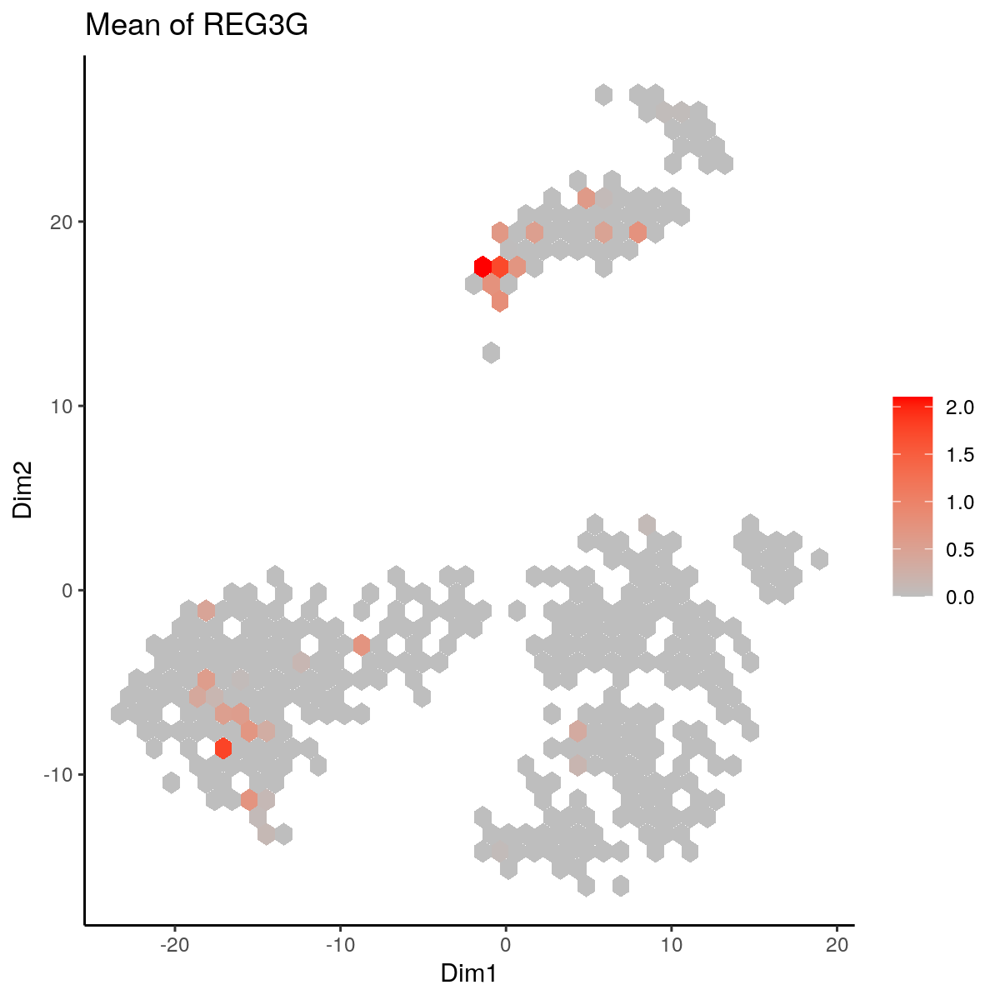|[CD86](https://www.ncbi.nlm.nih.gov/gene/942) [PLA2G2A](https://www.ncbi.nlm.nih.gov/gene/5320) [TLR4](https://www.ncbi.nlm.nih.gov/gene/7099) [TLR5](https://www.ncbi.nlm.nih.gov/gene/7100)|
|[REG4](https://www.ncbi.nlm.nih.gov/gene/83998)|[LGR5](https://www.ncbi.nlm.nih.gov/gene/8549) [MUC13](https://www.ncbi.nlm.nih.gov/gene/56667) [RELT](https://www.ncbi.nlm.nih.gov/gene/84957) [SLC6A19](https://www.ncbi.nlm.nih.gov/gene/340024)|
|[RELN](https://www.ncbi.nlm.nih.gov/gene/5649)|[ASTN1](https://www.ncbi.nlm.nih.gov/gene/460) [CDH2](https://www.ncbi.nlm.nih.gov/gene/1000) [COMT](https://www.ncbi.nlm.nih.gov/gene/1312) [CRK](https://www.ncbi.nlm.nih.gov/gene/1398) [DLG4](https://www.ncbi.nlm.nih.gov/gene/1742) [EFNA2](https://www.ncbi.nlm.nih.gov/gene/1943) [EFNA3](https://www.ncbi.nlm.nih.gov/gene/1944) [EFNA5](https://www.ncbi.nlm.nih.gov/gene/1946) [FYN](https://www.ncbi.nlm.nih.gov/gene/2534) [GRIA1](https://www.ncbi.nlm.nih.gov/gene/2890) [GRIN1](https://www.ncbi.nlm.nih.gov/gene/2902) [GRIN2B](https://www.ncbi.nlm.nih.gov/gene/2904) [GRM5](https://www.ncbi.nlm.nih.gov/gene/2915) [HTR2A](https://www.ncbi.nlm.nih.gov/gene/3356) [ITGA6](https://www.ncbi.nlm.nih.gov/gene/3655) [ITGA3](https://www.ncbi.nlm.nih.gov/gene/3675) [ITGAV](https://www.ncbi.nlm.nih.gov/gene/3685) [ITGB1](https://www.ncbi.nlm.nih.gov/gene/3688) [ITGB3](https://www.ncbi.nlm.nih.gov/gene/3690) [ITGB4](https://www.ncbi.nlm.nih.gov/gene/3691) [ITGB8](https://www.ncbi.nlm.nih.gov/gene/3696) [LDLR](https://www.ncbi.nlm.nih.gov/gene/3949) [NTRK2](https://www.ncbi.nlm.nih.gov/gene/4915) [OXTR](https://www.ncbi.nlm.nih.gov/gene/5021) [SLC6A1](https://www.ncbi.nlm.nih.gov/gene/6529) [SLC6A4](https://www.ncbi.nlm.nih.gov/gene/6532) [SRC](https://www.ncbi.nlm.nih.gov/gene/6714) [CNTN2](https://www.ncbi.nlm.nih.gov/gene/6900) [LRP8](https://www.ncbi.nlm.nih.gov/gene/7804) [NLGN1](https://www.ncbi.nlm.nih.gov/gene/22871) [NLGN3](https://www.ncbi.nlm.nih.gov/gene/54413) [NLGN4X](https://www.ncbi.nlm.nih.gov/gene/57502)|
|[REN](https://www.ncbi.nlm.nih.gov/gene/5972)|[ADD1](https://www.ncbi.nlm.nih.gov/gene/118) [ADD2](https://www.ncbi.nlm.nih.gov/gene/119) [ADD3](https://www.ncbi.nlm.nih.gov/gene/120) [ADORA1](https://www.ncbi.nlm.nih.gov/gene/134) [ADORA2A](https://www.ncbi.nlm.nih.gov/gene/135) [ADORA2B](https://www.ncbi.nlm.nih.gov/gene/136) [ADRA1D](https://www.ncbi.nlm.nih.gov/gene/146) [ADRA2A](https://www.ncbi.nlm.nih.gov/gene/150) [ADRA2B](https://www.ncbi.nlm.nih.gov/gene/151) [ADRA2C](https://www.ncbi.nlm.nih.gov/gene/152) [ADRB1](https://www.ncbi.nlm.nih.gov/gene/153) [ADRB2](https://www.ncbi.nlm.nih.gov/gene/154) [ADRB3](https://www.ncbi.nlm.nih.gov/gene/155) [AGTR1](https://www.ncbi.nlm.nih.gov/gene/185) [AGTR2](https://www.ncbi.nlm.nih.gov/gene/186) [APLNR](https://www.ncbi.nlm.nih.gov/gene/187) [ANPEP](https://www.ncbi.nlm.nih.gov/gene/290) [AQP2](https://www.ncbi.nlm.nih.gov/gene/359) [ATP4A](https://www.ncbi.nlm.nih.gov/gene/495) [BDKRB2](https://www.ncbi.nlm.nih.gov/gene/624) [CASR](https://www.ncbi.nlm.nih.gov/gene/846) [CLCNKB](https://www.ncbi.nlm.nih.gov/gene/1188) [CYBA](https://www.ncbi.nlm.nih.gov/gene/1535) [CYBB](https://www.ncbi.nlm.nih.gov/gene/1536) [ACE](https://www.ncbi.nlm.nih.gov/gene/1636) [DPP4](https://www.ncbi.nlm.nih.gov/gene/1803) [DRD1](https://www.ncbi.nlm.nih.gov/gene/1812) [DRD2](https://www.ncbi.nlm.nih.gov/gene/1813) [DRD3](https://www.ncbi.nlm.nih.gov/gene/1814) [DRD4](https://www.ncbi.nlm.nih.gov/gene/1815) [DRD5](https://www.ncbi.nlm.nih.gov/gene/1816) [EDNRA](https://www.ncbi.nlm.nih.gov/gene/1909) [EDNRB](https://www.ncbi.nlm.nih.gov/gene/1910) [ENPEP](https://www.ncbi.nlm.nih.gov/gene/2028) [ESR1](https://www.ncbi.nlm.nih.gov/gene/2099) [GJA1](https://www.ncbi.nlm.nih.gov/gene/2697) [GJA4](https://www.ncbi.nlm.nih.gov/gene/2701) [GJA5](https://www.ncbi.nlm.nih.gov/gene/2702) [KCNJ1](https://www.ncbi.nlm.nih.gov/gene/3758) [KCNK3](https://www.ncbi.nlm.nih.gov/gene/3777) [MAS1](https://www.ncbi.nlm.nih.gov/gene/4142) [MME](https://www.ncbi.nlm.nih.gov/gene/4311) [MMP17](https://www.ncbi.nlm.nih.gov/gene/4326) [NOS1](https://www.ncbi.nlm.nih.gov/gene/4842) [NOS3](https://www.ncbi.nlm.nih.gov/gene/4846) [NPHS1](https://www.ncbi.nlm.nih.gov/gene/4868) [NPR2](https://www.ncbi.nlm.nih.gov/gene/4882) [PTGIR](https://www.ncbi.nlm.nih.gov/gene/5739) [RRAS](https://www.ncbi.nlm.nih.gov/gene/6237) [SCNN1A](https://www.ncbi.nlm.nih.gov/gene/6337) [SCNN1B](https://www.ncbi.nlm.nih.gov/gene/6338) [SCNN1G](https://www.ncbi.nlm.nih.gov/gene/6340) [SELE](https://www.ncbi.nlm.nih.gov/gene/6401) [SGK1](https://www.ncbi.nlm.nih.gov/gene/6446) [SLC2A4](https://www.ncbi.nlm.nih.gov/gene/6517) [SLC5A4](https://www.ncbi.nlm.nih.gov/gene/6527) [SLC9A3](https://www.ncbi.nlm.nih.gov/gene/6550) [SLC12A3](https://www.ncbi.nlm.nih.gov/gene/6559) [SRC](https://www.ncbi.nlm.nih.gov/gene/6714) [BEST1](https://www.ncbi.nlm.nih.gov/gene/7439) [SLC14A2](https://www.ncbi.nlm.nih.gov/gene/8170) [MGAM](https://www.ncbi.nlm.nih.gov/gene/8972) [MRAS](https://www.ncbi.nlm.nih.gov/gene/22808) [DUOX2](https://www.ncbi.nlm.nih.gov/gene/50506) [KCNK9](https://www.ncbi.nlm.nih.gov/gene/51305) [DUOX1](https://www.ncbi.nlm.nih.gov/gene/53905) [BEST2](https://www.ncbi.nlm.nih.gov/gene/54831) [SUCNR1](https://www.ncbi.nlm.nih.gov/gene/56670) [ADGRG6](https://www.ncbi.nlm.nih.gov/gene/57211) [CLTRN](https://www.ncbi.nlm.nih.gov/gene/57393) [ACE2](https://www.ncbi.nlm.nih.gov/gene/59272) [MRGPRD](https://www.ncbi.nlm.nih.gov/gene/116512)|
|[RETN](https://www.ncbi.nlm.nih.gov/gene/56729)|[ACE](https://www.ncbi.nlm.nih.gov/gene/1636) [GIPR](https://www.ncbi.nlm.nih.gov/gene/2696) [GPR25](https://www.ncbi.nlm.nih.gov/gene/2848) [ITGAM](https://www.ncbi.nlm.nih.gov/gene/3684) [LIPE](https://www.ncbi.nlm.nih.gov/gene/3991) [NOS3](https://www.ncbi.nlm.nih.gov/gene/4846) [SELE](https://www.ncbi.nlm.nih.gov/gene/6401) [SELP](https://www.ncbi.nlm.nih.gov/gene/6403) [SLC2A4](https://www.ncbi.nlm.nih.gov/gene/6517) [TLR4](https://www.ncbi.nlm.nih.gov/gene/7099) [VCL](https://www.ncbi.nlm.nih.gov/gene/7414) [TRPA1](https://www.ncbi.nlm.nih.gov/gene/8989) [CAP1](https://www.ncbi.nlm.nih.gov/gene/10487) [ADIPOR1](https://www.ncbi.nlm.nih.gov/gene/51094) [ITLN1](https://www.ncbi.nlm.nih.gov/gene/55600) [PNPLA2](https://www.ncbi.nlm.nih.gov/gene/57104) [ADIPOR2](https://www.ncbi.nlm.nih.gov/gene/79602) [GSDMD](https://www.ncbi.nlm.nih.gov/gene/79792) [KISS1R](https://www.ncbi.nlm.nih.gov/gene/84634) [OSCAR](https://www.ncbi.nlm.nih.gov/gene/126014)|
|[RETNLB](https://www.ncbi.nlm.nih.gov/gene/84666)|[CD86](https://www.ncbi.nlm.nih.gov/gene/942) [SLC26A3](https://www.ncbi.nlm.nih.gov/gene/1811) [ITGAM](https://www.ncbi.nlm.nih.gov/gene/3684) [PTPRC](https://www.ncbi.nlm.nih.gov/gene/5788) [TLR4](https://www.ncbi.nlm.nih.gov/gene/7099) [CD163](https://www.ncbi.nlm.nih.gov/gene/9332) [CLECL1](https://www.ncbi.nlm.nih.gov/gene/160365) [CCR2](https://www.ncbi.nlm.nih.gov/gene/729230)|
|[RLN1](https://www.ncbi.nlm.nih.gov/gene/6013)|[ADCY3](https://www.ncbi.nlm.nih.gov/gene/109) [ADCY5](https://www.ncbi.nlm.nih.gov/gene/111) [ADCY6](https://www.ncbi.nlm.nih.gov/gene/112) [ADCY8](https://www.ncbi.nlm.nih.gov/gene/114) [ADCY9](https://www.ncbi.nlm.nih.gov/gene/115) [ADCYAP1R1](https://www.ncbi.nlm.nih.gov/gene/117) [ADORA2B](https://www.ncbi.nlm.nih.gov/gene/136) [ADRB1](https://www.ncbi.nlm.nih.gov/gene/153) [ADRB2](https://www.ncbi.nlm.nih.gov/gene/154) [ADRB3](https://www.ncbi.nlm.nih.gov/gene/155) [CALCR](https://www.ncbi.nlm.nih.gov/gene/799) [CRHR2](https://www.ncbi.nlm.nih.gov/gene/1395) [DRD1](https://www.ncbi.nlm.nih.gov/gene/1812) [DRD5](https://www.ncbi.nlm.nih.gov/gene/1816) [FSHR](https://www.ncbi.nlm.nih.gov/gene/2492) [GCGR](https://www.ncbi.nlm.nih.gov/gene/2642) [GHRHR](https://www.ncbi.nlm.nih.gov/gene/2692) [GIPR](https://www.ncbi.nlm.nih.gov/gene/2696) [GLP1R](https://www.ncbi.nlm.nih.gov/gene/2740) [GNAS](https://www.ncbi.nlm.nih.gov/gene/2778) [GNG3](https://www.ncbi.nlm.nih.gov/gene/2785) [GNG4](https://www.ncbi.nlm.nih.gov/gene/2786) [GNG5](https://www.ncbi.nlm.nih.gov/gene/2787) [GNG7](https://www.ncbi.nlm.nih.gov/gene/2788) [GNG10](https://www.ncbi.nlm.nih.gov/gene/2790) [GNG11](https://www.ncbi.nlm.nih.gov/gene/2791) [GNGT1](https://www.ncbi.nlm.nih.gov/gene/2792) [GNGT2](https://www.ncbi.nlm.nih.gov/gene/2793) [GPR15](https://www.ncbi.nlm.nih.gov/gene/2838) [GPR20](https://www.ncbi.nlm.nih.gov/gene/2843) [GPR25](https://www.ncbi.nlm.nih.gov/gene/2848) [GPR27](https://www.ncbi.nlm.nih.gov/gene/2850) [GPR32](https://www.ncbi.nlm.nih.gov/gene/2854) [GPR39](https://www.ncbi.nlm.nih.gov/gene/2863) [HRH2](https://www.ncbi.nlm.nih.gov/gene/3274) [HTR4](https://www.ncbi.nlm.nih.gov/gene/3360) [HTR6](https://www.ncbi.nlm.nih.gov/gene/3362) [HTR7](https://www.ncbi.nlm.nih.gov/gene/3363) [LHCGR](https://www.ncbi.nlm.nih.gov/gene/3973) [MC1R](https://www.ncbi.nlm.nih.gov/gene/4157) [MC2R](https://www.ncbi.nlm.nih.gov/gene/4158) [MC3R](https://www.ncbi.nlm.nih.gov/gene/4159) [MC4R](https://www.ncbi.nlm.nih.gov/gene/4160) [MC5R](https://www.ncbi.nlm.nih.gov/gene/4161) [P2RY11](https://www.ncbi.nlm.nih.gov/gene/5032) [PTGDR](https://www.ncbi.nlm.nih.gov/gene/5729) [PTGER2](https://www.ncbi.nlm.nih.gov/gene/5732) [PTGER4](https://www.ncbi.nlm.nih.gov/gene/5734) [PTGIR](https://www.ncbi.nlm.nih.gov/gene/5739) [PTH1R](https://www.ncbi.nlm.nih.gov/gene/5745) [PTH2R](https://www.ncbi.nlm.nih.gov/gene/5746) [SCTR](https://www.ncbi.nlm.nih.gov/gene/6344) [TSHR](https://www.ncbi.nlm.nih.gov/gene/7253) [VIPR1](https://www.ncbi.nlm.nih.gov/gene/7433) [VIPR2](https://www.ncbi.nlm.nih.gov/gene/7434) [TAAR5](https://www.ncbi.nlm.nih.gov/gene/9038) [TAAR2](https://www.ncbi.nlm.nih.gov/gene/9287) [GLP2R](https://www.ncbi.nlm.nih.gov/gene/9340) [CALCRL](https://www.ncbi.nlm.nih.gov/gene/10203) [RAMP3](https://www.ncbi.nlm.nih.gov/gene/10268) [GPR83](https://www.ncbi.nlm.nih.gov/gene/10888) [GPR176](https://www.ncbi.nlm.nih.gov/gene/11245) [GPR45](https://www.ncbi.nlm.nih.gov/gene/11250) [RXFP3](https://www.ncbi.nlm.nih.gov/gene/51289) [GNG13](https://www.ncbi.nlm.nih.gov/gene/51764) [GPR84](https://www.ncbi.nlm.nih.gov/gene/53831) [GNG2](https://www.ncbi.nlm.nih.gov/gene/54331) [PLGRKT](https://www.ncbi.nlm.nih.gov/gene/55848) [GNG12](https://www.ncbi.nlm.nih.gov/gene/55970) [RXFP1](https://www.ncbi.nlm.nih.gov/gene/59350) [LGR6](https://www.ncbi.nlm.nih.gov/gene/59352) [TAAR8](https://www.ncbi.nlm.nih.gov/gene/83551) [GNG8](https://www.ncbi.nlm.nih.gov/gene/94235) [RXFP2](https://www.ncbi.nlm.nih.gov/gene/122042) [TAAR9](https://www.ncbi.nlm.nih.gov/gene/134860) [TAAR1](https://www.ncbi.nlm.nih.gov/gene/134864) [GPBAR1](https://www.ncbi.nlm.nih.gov/gene/151306) [ADCY4](https://www.ncbi.nlm.nih.gov/gene/196883) [GPR150](https://www.ncbi.nlm.nih.gov/gene/285601) [TAAR6](https://www.ncbi.nlm.nih.gov/gene/319100) [RXFP4](https://www.ncbi.nlm.nih.gov/gene/339403) [LINC02210-CRHR1](https://www.ncbi.nlm.nih.gov/gene/104909134)|
|[RLN2](https://www.ncbi.nlm.nih.gov/gene/6019)|[ADCY3](https://www.ncbi.nlm.nih.gov/gene/109) [ADCY5](https://www.ncbi.nlm.nih.gov/gene/111) [ADCY6](https://www.ncbi.nlm.nih.gov/gene/112) [ADCY8](https://www.ncbi.nlm.nih.gov/gene/114) [ADCY9](https://www.ncbi.nlm.nih.gov/gene/115) [ADCYAP1R1](https://www.ncbi.nlm.nih.gov/gene/117) [ADORA2B](https://www.ncbi.nlm.nih.gov/gene/136) [ADRB1](https://www.ncbi.nlm.nih.gov/gene/153) [ADRB2](https://www.ncbi.nlm.nih.gov/gene/154) [ADRB3](https://www.ncbi.nlm.nih.gov/gene/155) [CALCR](https://www.ncbi.nlm.nih.gov/gene/799) [CRHR2](https://www.ncbi.nlm.nih.gov/gene/1395) [DRD1](https://www.ncbi.nlm.nih.gov/gene/1812) [DRD5](https://www.ncbi.nlm.nih.gov/gene/1816) [FSHR](https://www.ncbi.nlm.nih.gov/gene/2492) [GCGR](https://www.ncbi.nlm.nih.gov/gene/2642) [GHRHR](https://www.ncbi.nlm.nih.gov/gene/2692) [GIPR](https://www.ncbi.nlm.nih.gov/gene/2696) [GLP1R](https://www.ncbi.nlm.nih.gov/gene/2740) [GNAS](https://www.ncbi.nlm.nih.gov/gene/2778) [GNG3](https://www.ncbi.nlm.nih.gov/gene/2785) [GNG4](https://www.ncbi.nlm.nih.gov/gene/2786) [GNG5](https://www.ncbi.nlm.nih.gov/gene/2787) [GNG7](https://www.ncbi.nlm.nih.gov/gene/2788) [GNG10](https://www.ncbi.nlm.nih.gov/gene/2790) [GNG11](https://www.ncbi.nlm.nih.gov/gene/2791) [GNGT1](https://www.ncbi.nlm.nih.gov/gene/2792) [GNGT2](https://www.ncbi.nlm.nih.gov/gene/2793) [GPR15](https://www.ncbi.nlm.nih.gov/gene/2838) [GPR20](https://www.ncbi.nlm.nih.gov/gene/2843) [GPR25](https://www.ncbi.nlm.nih.gov/gene/2848) [GPR27](https://www.ncbi.nlm.nih.gov/gene/2850) [GPR32](https://www.ncbi.nlm.nih.gov/gene/2854) [GPR39](https://www.ncbi.nlm.nih.gov/gene/2863) [HRH2](https://www.ncbi.nlm.nih.gov/gene/3274) [HTR4](https://www.ncbi.nlm.nih.gov/gene/3360) [HTR6](https://www.ncbi.nlm.nih.gov/gene/3362) [HTR7](https://www.ncbi.nlm.nih.gov/gene/3363) [LHCGR](https://www.ncbi.nlm.nih.gov/gene/3973) [MC1R](https://www.ncbi.nlm.nih.gov/gene/4157) [MC2R](https://www.ncbi.nlm.nih.gov/gene/4158) [MC3R](https://www.ncbi.nlm.nih.gov/gene/4159) [MC4R](https://www.ncbi.nlm.nih.gov/gene/4160) [MC5R](https://www.ncbi.nlm.nih.gov/gene/4161) [P2RY11](https://www.ncbi.nlm.nih.gov/gene/5032) [PTGDR](https://www.ncbi.nlm.nih.gov/gene/5729) [PTGER2](https://www.ncbi.nlm.nih.gov/gene/5732) [PTGER4](https://www.ncbi.nlm.nih.gov/gene/5734) [PTGIR](https://www.ncbi.nlm.nih.gov/gene/5739) [PTH1R](https://www.ncbi.nlm.nih.gov/gene/5745) [PTH2R](https://www.ncbi.nlm.nih.gov/gene/5746) [SCTR](https://www.ncbi.nlm.nih.gov/gene/6344) [TSHR](https://www.ncbi.nlm.nih.gov/gene/7253) [VIPR1](https://www.ncbi.nlm.nih.gov/gene/7433) [VIPR2](https://www.ncbi.nlm.nih.gov/gene/7434) [TAAR5](https://www.ncbi.nlm.nih.gov/gene/9038) [TAAR2](https://www.ncbi.nlm.nih.gov/gene/9287) [GLP2R](https://www.ncbi.nlm.nih.gov/gene/9340) [CALCRL](https://www.ncbi.nlm.nih.gov/gene/10203) [RAMP3](https://www.ncbi.nlm.nih.gov/gene/10268) [GPR83](https://www.ncbi.nlm.nih.gov/gene/10888) [GPR176](https://www.ncbi.nlm.nih.gov/gene/11245) [GPR45](https://www.ncbi.nlm.nih.gov/gene/11250) [RXFP3](https://www.ncbi.nlm.nih.gov/gene/51289) [GNG13](https://www.ncbi.nlm.nih.gov/gene/51764) [GPR84](https://www.ncbi.nlm.nih.gov/gene/53831) [GNG2](https://www.ncbi.nlm.nih.gov/gene/54331) [GNG12](https://www.ncbi.nlm.nih.gov/gene/55970) [RXFP1](https://www.ncbi.nlm.nih.gov/gene/59350) [TAAR8](https://www.ncbi.nlm.nih.gov/gene/83551) [GNG8](https://www.ncbi.nlm.nih.gov/gene/94235) [RXFP2](https://www.ncbi.nlm.nih.gov/gene/122042) [TAAR9](https://www.ncbi.nlm.nih.gov/gene/134860) [TAAR1](https://www.ncbi.nlm.nih.gov/gene/134864) [GPBAR1](https://www.ncbi.nlm.nih.gov/gene/151306) [ADCY4](https://www.ncbi.nlm.nih.gov/gene/196883) [GPR150](https://www.ncbi.nlm.nih.gov/gene/285601) [TAAR6](https://www.ncbi.nlm.nih.gov/gene/319100) [RXFP4](https://www.ncbi.nlm.nih.gov/gene/339403) [LINC02210-CRHR1](https://www.ncbi.nlm.nih.gov/gene/104909134)|
|[RLN3](https://www.ncbi.nlm.nih.gov/gene/117579)|[ADCY3](https://www.ncbi.nlm.nih.gov/gene/109) [ADCY5](https://www.ncbi.nlm.nih.gov/gene/111) [ADCY6](https://www.ncbi.nlm.nih.gov/gene/112) [ADCY8](https://www.ncbi.nlm.nih.gov/gene/114) [ADCY9](https://www.ncbi.nlm.nih.gov/gene/115) [ADCYAP1R1](https://www.ncbi.nlm.nih.gov/gene/117) [ADORA1](https://www.ncbi.nlm.nih.gov/gene/134) [ADORA2B](https://www.ncbi.nlm.nih.gov/gene/136) [ADRA2A](https://www.ncbi.nlm.nih.gov/gene/150) [ADRA2B](https://www.ncbi.nlm.nih.gov/gene/151) [ADRA2C](https://www.ncbi.nlm.nih.gov/gene/152) [ADRB1](https://www.ncbi.nlm.nih.gov/gene/153) [ADRB2](https://www.ncbi.nlm.nih.gov/gene/154) [ADRB3](https://www.ncbi.nlm.nih.gov/gene/155) [AGTR1](https://www.ncbi.nlm.nih.gov/gene/185) [AGTR2](https://www.ncbi.nlm.nih.gov/gene/186) [APLNR](https://www.ncbi.nlm.nih.gov/gene/187) [BDKRB1](https://www.ncbi.nlm.nih.gov/gene/623) [BDKRB2](https://www.ncbi.nlm.nih.gov/gene/624) [CXCR5](https://www.ncbi.nlm.nih.gov/gene/643) [C3AR1](https://www.ncbi.nlm.nih.gov/gene/719) [C5AR1](https://www.ncbi.nlm.nih.gov/gene/728) [CALCR](https://www.ncbi.nlm.nih.gov/gene/799) [CASR](https://www.ncbi.nlm.nih.gov/gene/846) [CHRM2](https://www.ncbi.nlm.nih.gov/gene/1129) [CHRM4](https://www.ncbi.nlm.nih.gov/gene/1132) [CCR1](https://www.ncbi.nlm.nih.gov/gene/1230) [CCR3](https://www.ncbi.nlm.nih.gov/gene/1232) [CCR4](https://www.ncbi.nlm.nih.gov/gene/1233) [CCR5](https://www.ncbi.nlm.nih.gov/gene/1234) [CCR7](https://www.ncbi.nlm.nih.gov/gene/1236) [CCR8](https://www.ncbi.nlm.nih.gov/gene/1237) [CNR1](https://www.ncbi.nlm.nih.gov/gene/1268) [CNR2](https://www.ncbi.nlm.nih.gov/gene/1269) [CRHR2](https://www.ncbi.nlm.nih.gov/gene/1395) [CX3CR1](https://www.ncbi.nlm.nih.gov/gene/1524) [DRD1](https://www.ncbi.nlm.nih.gov/gene/1812) [DRD2](https://www.ncbi.nlm.nih.gov/gene/1813) [DRD3](https://www.ncbi.nlm.nih.gov/gene/1814) [DRD4](https://www.ncbi.nlm.nih.gov/gene/1815) [DRD5](https://www.ncbi.nlm.nih.gov/gene/1816) [GPR183](https://www.ncbi.nlm.nih.gov/gene/1880) [S1PR1](https://www.ncbi.nlm.nih.gov/gene/1901) [S1PR3](https://www.ncbi.nlm.nih.gov/gene/1903) [FPR1](https://www.ncbi.nlm.nih.gov/gene/2357) [FPR2](https://www.ncbi.nlm.nih.gov/gene/2358) [FPR3](https://www.ncbi.nlm.nih.gov/gene/2359) [FSHR](https://www.ncbi.nlm.nih.gov/gene/2492) [GALR1](https://www.ncbi.nlm.nih.gov/gene/2587) [GCGR](https://www.ncbi.nlm.nih.gov/gene/2642) [GHRHR](https://www.ncbi.nlm.nih.gov/gene/2692) [GIPR](https://www.ncbi.nlm.nih.gov/gene/2696) [GLP1R](https://www.ncbi.nlm.nih.gov/gene/2740) [GNAS](https://www.ncbi.nlm.nih.gov/gene/2778) [GNG3](https://www.ncbi.nlm.nih.gov/gene/2785) [GNG4](https://www.ncbi.nlm.nih.gov/gene/2786) [GNG5](https://www.ncbi.nlm.nih.gov/gene/2787) [GNG7](https://www.ncbi.nlm.nih.gov/gene/2788) [GNG10](https://www.ncbi.nlm.nih.gov/gene/2790) [GNG11](https://www.ncbi.nlm.nih.gov/gene/2791) [GNGT1](https://www.ncbi.nlm.nih.gov/gene/2792) [GNGT2](https://www.ncbi.nlm.nih.gov/gene/2793) [CCR10](https://www.ncbi.nlm.nih.gov/gene/2826) [NPBWR1](https://www.ncbi.nlm.nih.gov/gene/2831) [NPBWR2](https://www.ncbi.nlm.nih.gov/gene/2832) [CXCR3](https://www.ncbi.nlm.nih.gov/gene/2833) [GPR15](https://www.ncbi.nlm.nih.gov/gene/2838) [GPR17](https://www.ncbi.nlm.nih.gov/gene/2840) [GPR18](https://www.ncbi.nlm.nih.gov/gene/2841) [GPR20](https://www.ncbi.nlm.nih.gov/gene/2843) [MCHR1](https://www.ncbi.nlm.nih.gov/gene/2847) [GPR25](https://www.ncbi.nlm.nih.gov/gene/2848) [GPR27](https://www.ncbi.nlm.nih.gov/gene/2850) [GPR31](https://www.ncbi.nlm.nih.gov/gene/2853) [GPR32](https://www.ncbi.nlm.nih.gov/gene/2854) [GPR37](https://www.ncbi.nlm.nih.gov/gene/2861) [GPR39](https://www.ncbi.nlm.nih.gov/gene/2863) [GRM2](https://www.ncbi.nlm.nih.gov/gene/2912) [GRM3](https://www.ncbi.nlm.nih.gov/gene/2913) [GRM4](https://www.ncbi.nlm.nih.gov/gene/2914) [GRM6](https://www.ncbi.nlm.nih.gov/gene/2916) [GRM7](https://www.ncbi.nlm.nih.gov/gene/2917) [GRM8](https://www.ncbi.nlm.nih.gov/gene/2918) [HRH2](https://www.ncbi.nlm.nih.gov/gene/3274) [HTR1A](https://www.ncbi.nlm.nih.gov/gene/3350) [HTR1B](https://www.ncbi.nlm.nih.gov/gene/3351) [HTR1D](https://www.ncbi.nlm.nih.gov/gene/3352) [HTR1E](https://www.ncbi.nlm.nih.gov/gene/3354) [HTR1F](https://www.ncbi.nlm.nih.gov/gene/3355) [HTR4](https://www.ncbi.nlm.nih.gov/gene/3360) [HTR5A](https://www.ncbi.nlm.nih.gov/gene/3361) [HTR6](https://www.ncbi.nlm.nih.gov/gene/3362) [HTR7](https://www.ncbi.nlm.nih.gov/gene/3363) [CXCR1](https://www.ncbi.nlm.nih.gov/gene/3577) [CXCR2](https://www.ncbi.nlm.nih.gov/gene/3579) [LHCGR](https://www.ncbi.nlm.nih.gov/gene/3973) [MC1R](https://www.ncbi.nlm.nih.gov/gene/4157) [MC2R](https://www.ncbi.nlm.nih.gov/gene/4158) [MC3R](https://www.ncbi.nlm.nih.gov/gene/4159) [MC4R](https://www.ncbi.nlm.nih.gov/gene/4160) [MC5R](https://www.ncbi.nlm.nih.gov/gene/4161) [MTNR1A](https://www.ncbi.nlm.nih.gov/gene/4543) [MTNR1B](https://www.ncbi.nlm.nih.gov/gene/4544) [NPY1R](https://www.ncbi.nlm.nih.gov/gene/4886) [NPY2R](https://www.ncbi.nlm.nih.gov/gene/4887) [NPY5R](https://www.ncbi.nlm.nih.gov/gene/4889) [OPRD1](https://www.ncbi.nlm.nih.gov/gene/4985) [OPRK1](https://www.ncbi.nlm.nih.gov/gene/4986) [OPRL1](https://www.ncbi.nlm.nih.gov/gene/4987) [P2RY4](https://www.ncbi.nlm.nih.gov/gene/5030) [P2RY11](https://www.ncbi.nlm.nih.gov/gene/5032) [PTGDR](https://www.ncbi.nlm.nih.gov/gene/5729) [PTGER2](https://www.ncbi.nlm.nih.gov/gene/5732) [PTGER3](https://www.ncbi.nlm.nih.gov/gene/5733) [PTGER4](https://www.ncbi.nlm.nih.gov/gene/5734) [PTGIR](https://www.ncbi.nlm.nih.gov/gene/5739) [PTH1R](https://www.ncbi.nlm.nih.gov/gene/5745) [PTH2R](https://www.ncbi.nlm.nih.gov/gene/5746) [SCTR](https://www.ncbi.nlm.nih.gov/gene/6344) [SSTR1](https://www.ncbi.nlm.nih.gov/gene/6751) [SSTR2](https://www.ncbi.nlm.nih.gov/gene/6752) [SSTR3](https://www.ncbi.nlm.nih.gov/gene/6753) [SSTR4](https://www.ncbi.nlm.nih.gov/gene/6754) [SSTR5](https://www.ncbi.nlm.nih.gov/gene/6755) [TSHR](https://www.ncbi.nlm.nih.gov/gene/7253) [VIPR1](https://www.ncbi.nlm.nih.gov/gene/7433) [VIPR2](https://www.ncbi.nlm.nih.gov/gene/7434) [CXCR4](https://www.ncbi.nlm.nih.gov/gene/7852) [GALR3](https://www.ncbi.nlm.nih.gov/gene/8484) [S1PR4](https://www.ncbi.nlm.nih.gov/gene/8698) [GALR2](https://www.ncbi.nlm.nih.gov/gene/8811) [HCAR3](https://www.ncbi.nlm.nih.gov/gene/8843) [TAAR5](https://www.ncbi.nlm.nih.gov/gene/9038) [GPR37L1](https://www.ncbi.nlm.nih.gov/gene/9283) [TAAR2](https://www.ncbi.nlm.nih.gov/gene/9287) [GPR55](https://www.ncbi.nlm.nih.gov/gene/9290) [GLP2R](https://www.ncbi.nlm.nih.gov/gene/9340) [GABBR2](https://www.ncbi.nlm.nih.gov/gene/9568) [P2RY14](https://www.ncbi.nlm.nih.gov/gene/9934) [CALCRL](https://www.ncbi.nlm.nih.gov/gene/10203) [RAMP3](https://www.ncbi.nlm.nih.gov/gene/10268) [NMUR1](https://www.ncbi.nlm.nih.gov/gene/10316) [CXCR6](https://www.ncbi.nlm.nih.gov/gene/10663) [CCR9](https://www.ncbi.nlm.nih.gov/gene/10803) [GPR83](https://www.ncbi.nlm.nih.gov/gene/10888) [GPR176](https://www.ncbi.nlm.nih.gov/gene/11245) [GPR45](https://www.ncbi.nlm.nih.gov/gene/11250) [PTGDR2](https://www.ncbi.nlm.nih.gov/gene/11251) [HRH3](https://www.ncbi.nlm.nih.gov/gene/11255) [LPAR3](https://www.ncbi.nlm.nih.gov/gene/23566) [HCAR1](https://www.ncbi.nlm.nih.gov/gene/27198) [OXGR1](https://www.ncbi.nlm.nih.gov/gene/27199) [TAS2R16](https://www.ncbi.nlm.nih.gov/gene/50833) [RXFP3](https://www.ncbi.nlm.nih.gov/gene/51289) [GNG13](https://www.ncbi.nlm.nih.gov/gene/51764) [S1PR5](https://www.ncbi.nlm.nih.gov/gene/53637) [P2RY13](https://www.ncbi.nlm.nih.gov/gene/53829) [GPR84](https://www.ncbi.nlm.nih.gov/gene/53831) [GNG2](https://www.ncbi.nlm.nih.gov/gene/54331) [GNG12](https://www.ncbi.nlm.nih.gov/gene/55970) [SUCNR1](https://www.ncbi.nlm.nih.gov/gene/56670) [NMUR2](https://www.ncbi.nlm.nih.gov/gene/56923) [ACKR3](https://www.ncbi.nlm.nih.gov/gene/57007) [LPAR5](https://www.ncbi.nlm.nih.gov/gene/57121) [CXCL16](https://www.ncbi.nlm.nih.gov/gene/58191) [HRH4](https://www.ncbi.nlm.nih.gov/gene/59340) [RXFP1](https://www.ncbi.nlm.nih.gov/gene/59350) [GPR135](https://www.ncbi.nlm.nih.gov/gene/64582) [P2RY12](https://www.ncbi.nlm.nih.gov/gene/64805) [TAS1R2](https://www.ncbi.nlm.nih.gov/gene/80834) [TAS1R1](https://www.ncbi.nlm.nih.gov/gene/80835) [TAAR8](https://www.ncbi.nlm.nih.gov/gene/83551) [TAS1R3](https://www.ncbi.nlm.nih.gov/gene/83756) [MCHR2](https://www.ncbi.nlm.nih.gov/gene/84539) [GNG8](https://www.ncbi.nlm.nih.gov/gene/94235) [RXFP2](https://www.ncbi.nlm.nih.gov/gene/122042) [TAAR9](https://www.ncbi.nlm.nih.gov/gene/134860) [TAAR1](https://www.ncbi.nlm.nih.gov/gene/134864) [GPBAR1](https://www.ncbi.nlm.nih.gov/gene/151306) [OXER1](https://www.ncbi.nlm.nih.gov/gene/165140) [ADCY4](https://www.ncbi.nlm.nih.gov/gene/196883) [GPR150](https://www.ncbi.nlm.nih.gov/gene/285601) [TAAR6](https://www.ncbi.nlm.nih.gov/gene/319100) [HCAR2](https://www.ncbi.nlm.nih.gov/gene/338442) [RXFP4](https://www.ncbi.nlm.nih.gov/gene/339403) [CCR2](https://www.ncbi.nlm.nih.gov/gene/729230) [LINC02210-CRHR1](https://www.ncbi.nlm.nih.gov/gene/104909134)|
|[RNASE1](https://www.ncbi.nlm.nih.gov/gene/6035)|[ALPL](https://www.ncbi.nlm.nih.gov/gene/249) [OR10R2](https://www.ncbi.nlm.nih.gov/gene/343406)|
|[RNASE11](https://www.ncbi.nlm.nih.gov/gene/122651)|[NECTIN2](https://www.ncbi.nlm.nih.gov/gene/5819)|
|[RNASE13](https://www.ncbi.nlm.nih.gov/gene/440163)|[RALA](https://www.ncbi.nlm.nih.gov/gene/5898)|
|[RNASE3](https://www.ncbi.nlm.nih.gov/gene/6037)|[C3AR1](https://www.ncbi.nlm.nih.gov/gene/719) [C8A](https://www.ncbi.nlm.nih.gov/gene/731) [CEACAM8](https://www.ncbi.nlm.nih.gov/gene/1088) [CCR3](https://www.ncbi.nlm.nih.gov/gene/1232) [FCER1A](https://www.ncbi.nlm.nih.gov/gene/2205) [CAP1](https://www.ncbi.nlm.nih.gov/gene/10487) [CYSLTR1](https://www.ncbi.nlm.nih.gov/gene/10800) [SLCO4A1](https://www.ncbi.nlm.nih.gov/gene/28231)|
|[RNASE6](https://www.ncbi.nlm.nih.gov/gene/6039)|[BTK](https://www.ncbi.nlm.nih.gov/gene/695) [CD86](https://www.ncbi.nlm.nih.gov/gene/942) [CD48](https://www.ncbi.nlm.nih.gov/gene/962) [CD53](https://www.ncbi.nlm.nih.gov/gene/963) [CCR1](https://www.ncbi.nlm.nih.gov/gene/1230) [CYBB](https://www.ncbi.nlm.nih.gov/gene/1536) [GPR183](https://www.ncbi.nlm.nih.gov/gene/1880) [FCER1A](https://www.ncbi.nlm.nih.gov/gene/2205) [FCER1G](https://www.ncbi.nlm.nih.gov/gene/2207) [FCGR3A](https://www.ncbi.nlm.nih.gov/gene/2214) [IL10RA](https://www.ncbi.nlm.nih.gov/gene/3587) [ITGB2](https://www.ncbi.nlm.nih.gov/gene/3689) [TYROBP](https://www.ncbi.nlm.nih.gov/gene/7305) [CD300A](https://www.ncbi.nlm.nih.gov/gene/11314) [CCR2](https://www.ncbi.nlm.nih.gov/gene/729230)|
|[RNASE9](https://www.ncbi.nlm.nih.gov/gene/390443)|[RACK1](https://www.ncbi.nlm.nih.gov/gene/10399)|
|[RNASET2](https://www.ncbi.nlm.nih.gov/gene/8635)|[HLA-DQA1](https://www.ncbi.nlm.nih.gov/gene/3117) [HLA-DQA2](https://www.ncbi.nlm.nih.gov/gene/3118) [TSHR](https://www.ncbi.nlm.nih.gov/gene/7253) [CCRL2](https://www.ncbi.nlm.nih.gov/gene/9034) [CAP1](https://www.ncbi.nlm.nih.gov/gene/10487) [SLC2A8](https://www.ncbi.nlm.nih.gov/gene/29988) [FCRL3](https://www.ncbi.nlm.nih.gov/gene/115352)|
|[RNLS](https://www.ncbi.nlm.nih.gov/gene/55328)|[ATP2B4](https://www.ncbi.nlm.nih.gov/gene/493) [INPP5A](https://www.ncbi.nlm.nih.gov/gene/3632)|
|[RNPEP](https://www.ncbi.nlm.nih.gov/gene/6051)|[ANPEP](https://www.ncbi.nlm.nih.gov/gene/290) [DRD1](https://www.ncbi.nlm.nih.gov/gene/1812) [ENPEP](https://www.ncbi.nlm.nih.gov/gene/2028) [GRM6](https://www.ncbi.nlm.nih.gov/gene/2916) [MME](https://www.ncbi.nlm.nih.gov/gene/4311) [P2RY2](https://www.ncbi.nlm.nih.gov/gene/5029) [STIM1](https://www.ncbi.nlm.nih.gov/gene/6786) [TRPC5](https://www.ncbi.nlm.nih.gov/gene/7224) [TRPC6](https://www.ncbi.nlm.nih.gov/gene/7225) [TRPM2](https://www.ncbi.nlm.nih.gov/gene/7226) [MGAM](https://www.ncbi.nlm.nih.gov/gene/8972) [TRPA1](https://www.ncbi.nlm.nih.gov/gene/8989) [RHOD](https://www.ncbi.nlm.nih.gov/gene/29984) [TRPV2](https://www.ncbi.nlm.nih.gov/gene/51393) [TRPM4](https://www.ncbi.nlm.nih.gov/gene/54795) [TRPV6](https://www.ncbi.nlm.nih.gov/gene/55503) [ACE2](https://www.ncbi.nlm.nih.gov/gene/59272) [TRPM8](https://www.ncbi.nlm.nih.gov/gene/79054) [TRPM6](https://www.ncbi.nlm.nih.gov/gene/140803)|
|[RPS19](https://www.ncbi.nlm.nih.gov/gene/6223)|[C5AR1](https://www.ncbi.nlm.nih.gov/gene/728)|
|[RPTN](https://www.ncbi.nlm.nih.gov/gene/126638)|[DSC1](https://www.ncbi.nlm.nih.gov/gene/1823) [DSC2](https://www.ncbi.nlm.nih.gov/gene/1824) [DSC3](https://www.ncbi.nlm.nih.gov/gene/1825) [DSG1](https://www.ncbi.nlm.nih.gov/gene/1828) [DSG2](https://www.ncbi.nlm.nih.gov/gene/1829) [DSG3](https://www.ncbi.nlm.nih.gov/gene/1830) [DSG4](https://www.ncbi.nlm.nih.gov/gene/147409)|
|[RS1](https://www.ncbi.nlm.nih.gov/gene/6247)|[ATP1A1](https://www.ncbi.nlm.nih.gov/gene/476) [ATP1A3](https://www.ncbi.nlm.nih.gov/gene/478) [ATP1A4](https://www.ncbi.nlm.nih.gov/gene/480) [ATP1B1](https://www.ncbi.nlm.nih.gov/gene/481) [ATP1B2](https://www.ncbi.nlm.nih.gov/gene/482) [ATP1B3](https://www.ncbi.nlm.nih.gov/gene/483) [ATP4A](https://www.ncbi.nlm.nih.gov/gene/495) [DMD](https://www.ncbi.nlm.nih.gov/gene/1756) [GRIK3](https://www.ncbi.nlm.nih.gov/gene/2899) [GRM6](https://www.ncbi.nlm.nih.gov/gene/2916)|
|[RSPO1](https://www.ncbi.nlm.nih.gov/gene/284654) 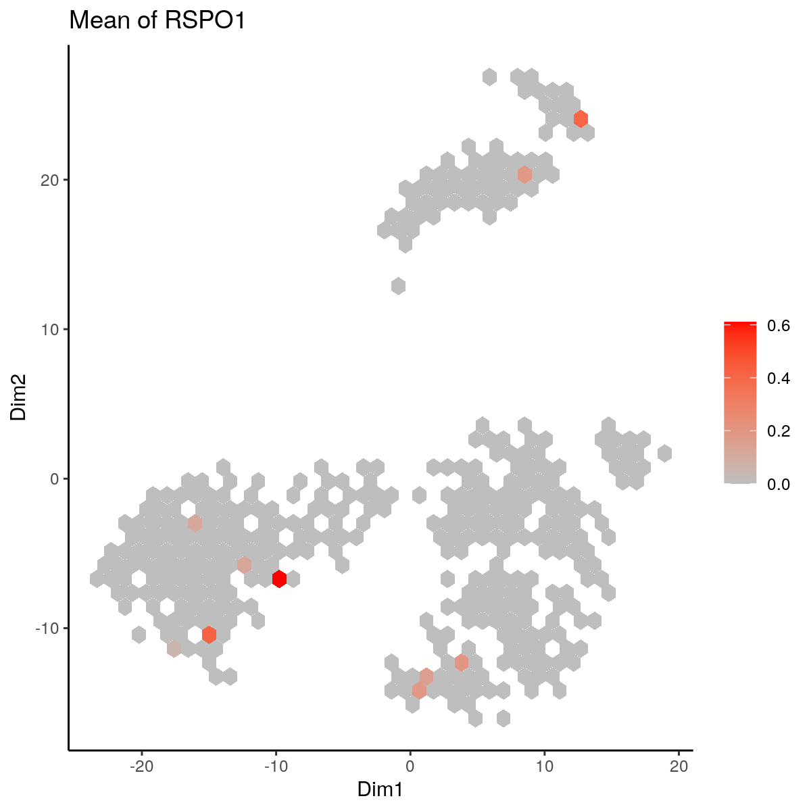|[DVL1](https://www.ncbi.nlm.nih.gov/gene/1855) [FSHR](https://www.ncbi.nlm.nih.gov/gene/2492) [LHCGR](https://www.ncbi.nlm.nih.gov/gene/3973) [LRP6](https://www.ncbi.nlm.nih.gov/gene/4040) [OPRD1](https://www.ncbi.nlm.nih.gov/gene/4985) [PTGDR](https://www.ncbi.nlm.nih.gov/gene/5729) [FZD5](https://www.ncbi.nlm.nih.gov/gene/7855) [FZD1](https://www.ncbi.nlm.nih.gov/gene/8321) [FZD7](https://www.ncbi.nlm.nih.gov/gene/8324) [LGR5](https://www.ncbi.nlm.nih.gov/gene/8549) [LRIG1](https://www.ncbi.nlm.nih.gov/gene/26018) [RNF43](https://www.ncbi.nlm.nih.gov/gene/54894) [LGR4](https://www.ncbi.nlm.nih.gov/gene/55366) [MRAP](https://www.ncbi.nlm.nih.gov/gene/56246) [RXFP1](https://www.ncbi.nlm.nih.gov/gene/59350) [LGR6](https://www.ncbi.nlm.nih.gov/gene/59352) [KREMEN1](https://www.ncbi.nlm.nih.gov/gene/83999) [ZNRF3](https://www.ncbi.nlm.nih.gov/gene/84133) [RXFP2](https://www.ncbi.nlm.nih.gov/gene/122042) [TRABD2A](https://www.ncbi.nlm.nih.gov/gene/129293)|
|[RSPO2](https://www.ncbi.nlm.nih.gov/gene/340419)|[LRP6](https://www.ncbi.nlm.nih.gov/gene/4040) [LY6H](https://www.ncbi.nlm.nih.gov/gene/4062) [MARK3](https://www.ncbi.nlm.nih.gov/gene/4140) [NTRK2](https://www.ncbi.nlm.nih.gov/gene/4915) [FZD1](https://www.ncbi.nlm.nih.gov/gene/8321) [FZD7](https://www.ncbi.nlm.nih.gov/gene/8324) [LGR5](https://www.ncbi.nlm.nih.gov/gene/8549) [RNF43](https://www.ncbi.nlm.nih.gov/gene/54894) [LGR4](https://www.ncbi.nlm.nih.gov/gene/55366) [LGR6](https://www.ncbi.nlm.nih.gov/gene/59352) [ZNRF3](https://www.ncbi.nlm.nih.gov/gene/84133) [FREM2](https://www.ncbi.nlm.nih.gov/gene/341640)|
|[RSPO3](https://www.ncbi.nlm.nih.gov/gene/84870)|[DVL1](https://www.ncbi.nlm.nih.gov/gene/1855) [LRP6](https://www.ncbi.nlm.nih.gov/gene/4040) [FZD1](https://www.ncbi.nlm.nih.gov/gene/8321) [FZD7](https://www.ncbi.nlm.nih.gov/gene/8324) [LGR5](https://www.ncbi.nlm.nih.gov/gene/8549) [RNF43](https://www.ncbi.nlm.nih.gov/gene/54894) [LGR4](https://www.ncbi.nlm.nih.gov/gene/55366) [LGR6](https://www.ncbi.nlm.nih.gov/gene/59352) [KREMEN1](https://www.ncbi.nlm.nih.gov/gene/83999) [ZNRF3](https://www.ncbi.nlm.nih.gov/gene/84133) [FREM2](https://www.ncbi.nlm.nih.gov/gene/341640)|
|[RSPO4](https://www.ncbi.nlm.nih.gov/gene/343637)|[LRP6](https://www.ncbi.nlm.nih.gov/gene/4040) [FZD1](https://www.ncbi.nlm.nih.gov/gene/8321) [LGR5](https://www.ncbi.nlm.nih.gov/gene/8549) [RNF43](https://www.ncbi.nlm.nih.gov/gene/54894) [LGR4](https://www.ncbi.nlm.nih.gov/gene/55366) [LGR6](https://www.ncbi.nlm.nih.gov/gene/59352) [BAIAP2L2](https://www.ncbi.nlm.nih.gov/gene/80115) [ZNRF3](https://www.ncbi.nlm.nih.gov/gene/84133) [RXFP2](https://www.ncbi.nlm.nih.gov/gene/122042)|
|[RSPRY1](https://www.ncbi.nlm.nih.gov/gene/89970)|[CRHR2](https://www.ncbi.nlm.nih.gov/gene/1395) [CDK14](https://www.ncbi.nlm.nih.gov/gene/5218) [NKD1](https://www.ncbi.nlm.nih.gov/gene/85407)|
|[S100A12](https://www.ncbi.nlm.nih.gov/gene/6283)|[AGER](https://www.ncbi.nlm.nih.gov/gene/177) [AQP9](https://www.ncbi.nlm.nih.gov/gene/366) [CD14](https://www.ncbi.nlm.nih.gov/gene/929) [CSF3R](https://www.ncbi.nlm.nih.gov/gene/1441) [FCGR1A](https://www.ncbi.nlm.nih.gov/gene/2209) [FCGR3A](https://www.ncbi.nlm.nih.gov/gene/2214) [FCGR3B](https://www.ncbi.nlm.nih.gov/gene/2215) [FPR1](https://www.ncbi.nlm.nih.gov/gene/2357) [FPR2](https://www.ncbi.nlm.nih.gov/gene/2358) [GGT1](https://www.ncbi.nlm.nih.gov/gene/2678) [GUCY2C](https://www.ncbi.nlm.nih.gov/gene/2984) [CXCR1](https://www.ncbi.nlm.nih.gov/gene/3577) [CXCR2](https://www.ncbi.nlm.nih.gov/gene/3579) [ITGAM](https://www.ncbi.nlm.nih.gov/gene/3684) [ITGB2](https://www.ncbi.nlm.nih.gov/gene/3689) [SELL](https://www.ncbi.nlm.nih.gov/gene/6402) [TLR1](https://www.ncbi.nlm.nih.gov/gene/7096) [TLR4](https://www.ncbi.nlm.nih.gov/gene/7099) [IL1R2](https://www.ncbi.nlm.nih.gov/gene/7850) [IL18RAP](https://www.ncbi.nlm.nih.gov/gene/8807) [VNN2](https://www.ncbi.nlm.nih.gov/gene/8875) [CD300LB](https://www.ncbi.nlm.nih.gov/gene/124599) [CD300LF](https://www.ncbi.nlm.nih.gov/gene/146722) [CLEC12A](https://www.ncbi.nlm.nih.gov/gene/160364) [CCR2](https://www.ncbi.nlm.nih.gov/gene/729230)|
|[S100A8](https://www.ncbi.nlm.nih.gov/gene/6279)|[AQP9](https://www.ncbi.nlm.nih.gov/gene/366) [ATP4A](https://www.ncbi.nlm.nih.gov/gene/495) [CD14](https://www.ncbi.nlm.nih.gov/gene/929) [CRK](https://www.ncbi.nlm.nih.gov/gene/1398) [CSF3R](https://www.ncbi.nlm.nih.gov/gene/1441) [CSK](https://www.ncbi.nlm.nih.gov/gene/1445) [CYBB](https://www.ncbi.nlm.nih.gov/gene/1536) [MARK2](https://www.ncbi.nlm.nih.gov/gene/2011) [FCER1G](https://www.ncbi.nlm.nih.gov/gene/2207) [FCGR3A](https://www.ncbi.nlm.nih.gov/gene/2214) [FCGR3B](https://www.ncbi.nlm.nih.gov/gene/2215) [FGR](https://www.ncbi.nlm.nih.gov/gene/2268) [FPR1](https://www.ncbi.nlm.nih.gov/gene/2357) [GGT1](https://www.ncbi.nlm.nih.gov/gene/2678) [HLA-DRB1](https://www.ncbi.nlm.nih.gov/gene/3123) [CXCR1](https://www.ncbi.nlm.nih.gov/gene/3577) [ITGAM](https://www.ncbi.nlm.nih.gov/gene/3684) [ITGB2](https://www.ncbi.nlm.nih.gov/gene/3689) [CEACAM6](https://www.ncbi.nlm.nih.gov/gene/4680) [NTSR1](https://www.ncbi.nlm.nih.gov/gene/4923) [HTRA1](https://www.ncbi.nlm.nih.gov/gene/5654) [S100A6](https://www.ncbi.nlm.nih.gov/gene/6277) [SRC](https://www.ncbi.nlm.nih.gov/gene/6714) [TGFBR1](https://www.ncbi.nlm.nih.gov/gene/7046) [TLR1](https://www.ncbi.nlm.nih.gov/gene/7096) [TLR4](https://www.ncbi.nlm.nih.gov/gene/7099) [TYROBP](https://www.ncbi.nlm.nih.gov/gene/7305) [IL1R2](https://www.ncbi.nlm.nih.gov/gene/7850) [MARCO](https://www.ncbi.nlm.nih.gov/gene/8685) [VNN2](https://www.ncbi.nlm.nih.gov/gene/8875) [NOD1](https://www.ncbi.nlm.nih.gov/gene/10392) [CD300LB](https://www.ncbi.nlm.nih.gov/gene/124599) [CD300LF](https://www.ncbi.nlm.nih.gov/gene/146722) [NEGR1](https://www.ncbi.nlm.nih.gov/gene/257194)|
|[S100A9](https://www.ncbi.nlm.nih.gov/gene/6280)|[AGER](https://www.ncbi.nlm.nih.gov/gene/177) [AQP9](https://www.ncbi.nlm.nih.gov/gene/366) [BST1](https://www.ncbi.nlm.nih.gov/gene/683) [CD1A](https://www.ncbi.nlm.nih.gov/gene/909) [CD1C](https://www.ncbi.nlm.nih.gov/gene/911) [CD1D](https://www.ncbi.nlm.nih.gov/gene/912) [CD14](https://www.ncbi.nlm.nih.gov/gene/929) [CD86](https://www.ncbi.nlm.nih.gov/gene/942) [CCR1](https://www.ncbi.nlm.nih.gov/gene/1230) [CCR5](https://www.ncbi.nlm.nih.gov/gene/1234) [CSF3R](https://www.ncbi.nlm.nih.gov/gene/1441) [CYBB](https://www.ncbi.nlm.nih.gov/gene/1536) [FCER1G](https://www.ncbi.nlm.nih.gov/gene/2207) [FCGR1A](https://www.ncbi.nlm.nih.gov/gene/2209) [FCGR3A](https://www.ncbi.nlm.nih.gov/gene/2214) [FCGR3B](https://www.ncbi.nlm.nih.gov/gene/2215) [FGR](https://www.ncbi.nlm.nih.gov/gene/2268) [FPR1](https://www.ncbi.nlm.nih.gov/gene/2357) [CXCR1](https://www.ncbi.nlm.nih.gov/gene/3577) [ITGAM](https://www.ncbi.nlm.nih.gov/gene/3684) [ITGB2](https://www.ncbi.nlm.nih.gov/gene/3689) [CD180](https://www.ncbi.nlm.nih.gov/gene/4064) [NTSR1](https://www.ncbi.nlm.nih.gov/gene/4923) [PTPRC](https://www.ncbi.nlm.nih.gov/gene/5788) [TLR1](https://www.ncbi.nlm.nih.gov/gene/7096) [TLR4](https://www.ncbi.nlm.nih.gov/gene/7099) [TYROBP](https://www.ncbi.nlm.nih.gov/gene/7305) [MARCO](https://www.ncbi.nlm.nih.gov/gene/8685) [VNN2](https://www.ncbi.nlm.nih.gov/gene/8875) [CD163](https://www.ncbi.nlm.nih.gov/gene/9332) [FLOT1](https://www.ncbi.nlm.nih.gov/gene/10211) [CD300LB](https://www.ncbi.nlm.nih.gov/gene/124599) [CD300LF](https://www.ncbi.nlm.nih.gov/gene/146722) [NEGR1](https://www.ncbi.nlm.nih.gov/gene/257194) [CCR2](https://www.ncbi.nlm.nih.gov/gene/729230)|
|[SAA1](https://www.ncbi.nlm.nih.gov/gene/6288)|[ADCY3](https://www.ncbi.nlm.nih.gov/gene/109) [ADCY5](https://www.ncbi.nlm.nih.gov/gene/111) [ADCY6](https://www.ncbi.nlm.nih.gov/gene/112) [ADCY8](https://www.ncbi.nlm.nih.gov/gene/114) [ADCY9](https://www.ncbi.nlm.nih.gov/gene/115) [ADORA1](https://www.ncbi.nlm.nih.gov/gene/134) [ADRA1D](https://www.ncbi.nlm.nih.gov/gene/146) [ADRA2A](https://www.ncbi.nlm.nih.gov/gene/150) [ADRA2B](https://www.ncbi.nlm.nih.gov/gene/151) [ADRA2C](https://www.ncbi.nlm.nih.gov/gene/152) [AGER](https://www.ncbi.nlm.nih.gov/gene/177) [AGTR1](https://www.ncbi.nlm.nih.gov/gene/185) [AGTR2](https://www.ncbi.nlm.nih.gov/gene/186) [APLNR](https://www.ncbi.nlm.nih.gov/gene/187) [AVPR1A](https://www.ncbi.nlm.nih.gov/gene/552) [AVPR1B](https://www.ncbi.nlm.nih.gov/gene/553) [BDKRB1](https://www.ncbi.nlm.nih.gov/gene/623) [BDKRB2](https://www.ncbi.nlm.nih.gov/gene/624) [CXCR5](https://www.ncbi.nlm.nih.gov/gene/643) [BRS3](https://www.ncbi.nlm.nih.gov/gene/680) [C3AR1](https://www.ncbi.nlm.nih.gov/gene/719) [C5AR1](https://www.ncbi.nlm.nih.gov/gene/728) [CASR](https://www.ncbi.nlm.nih.gov/gene/846) [CCKAR](https://www.ncbi.nlm.nih.gov/gene/886) [CCKBR](https://www.ncbi.nlm.nih.gov/gene/887) [SCARB1](https://www.ncbi.nlm.nih.gov/gene/949) [CHRM1](https://www.ncbi.nlm.nih.gov/gene/1128) [CHRM2](https://www.ncbi.nlm.nih.gov/gene/1129) [CHRM3](https://www.ncbi.nlm.nih.gov/gene/1131) [CHRM4](https://www.ncbi.nlm.nih.gov/gene/1132) [CHRM5](https://www.ncbi.nlm.nih.gov/gene/1133) [CCR1](https://www.ncbi.nlm.nih.gov/gene/1230) [CCR3](https://www.ncbi.nlm.nih.gov/gene/1232) [CCR4](https://www.ncbi.nlm.nih.gov/gene/1233) [CCR5](https://www.ncbi.nlm.nih.gov/gene/1234) [CCR7](https://www.ncbi.nlm.nih.gov/gene/1236) [CCR8](https://www.ncbi.nlm.nih.gov/gene/1237) [LTB4R](https://www.ncbi.nlm.nih.gov/gene/1241) [CNR1](https://www.ncbi.nlm.nih.gov/gene/1268) [CNR2](https://www.ncbi.nlm.nih.gov/gene/1269) [CX3CR1](https://www.ncbi.nlm.nih.gov/gene/1524) [DRD2](https://www.ncbi.nlm.nih.gov/gene/1813) [DRD3](https://www.ncbi.nlm.nih.gov/gene/1814) [DRD4](https://www.ncbi.nlm.nih.gov/gene/1815) [GPR183](https://www.ncbi.nlm.nih.gov/gene/1880) [S1PR1](https://www.ncbi.nlm.nih.gov/gene/1901) [S1PR3](https://www.ncbi.nlm.nih.gov/gene/1903) [EDNRA](https://www.ncbi.nlm.nih.gov/gene/1909) [EDNRB](https://www.ncbi.nlm.nih.gov/gene/1910) [F2R](https://www.ncbi.nlm.nih.gov/gene/2149) [F2RL1](https://www.ncbi.nlm.nih.gov/gene/2150) [F2RL2](https://www.ncbi.nlm.nih.gov/gene/2151) [FPR1](https://www.ncbi.nlm.nih.gov/gene/2357) [FPR2](https://www.ncbi.nlm.nih.gov/gene/2358) [FPR3](https://www.ncbi.nlm.nih.gov/gene/2359) [GALR1](https://www.ncbi.nlm.nih.gov/gene/2587) [GCGR](https://www.ncbi.nlm.nih.gov/gene/2642) [GHSR](https://www.ncbi.nlm.nih.gov/gene/2693) [GNA11](https://www.ncbi.nlm.nih.gov/gene/2767) [GNG3](https://www.ncbi.nlm.nih.gov/gene/2785) [GNG4](https://www.ncbi.nlm.nih.gov/gene/2786) [GNG5](https://www.ncbi.nlm.nih.gov/gene/2787) [GNG7](https://www.ncbi.nlm.nih.gov/gene/2788) [GNG10](https://www.ncbi.nlm.nih.gov/gene/2790) [GNG11](https://www.ncbi.nlm.nih.gov/gene/2791) [GNGT1](https://www.ncbi.nlm.nih.gov/gene/2792) [GNGT2](https://www.ncbi.nlm.nih.gov/gene/2793) [GNRHR](https://www.ncbi.nlm.nih.gov/gene/2798) [CCR10](https://www.ncbi.nlm.nih.gov/gene/2826) [GPR4](https://www.ncbi.nlm.nih.gov/gene/2828) [XCR1](https://www.ncbi.nlm.nih.gov/gene/2829) [NPBWR1](https://www.ncbi.nlm.nih.gov/gene/2831) [NPBWR2](https://www.ncbi.nlm.nih.gov/gene/2832) [CXCR3](https://www.ncbi.nlm.nih.gov/gene/2833) [UTS2R](https://www.ncbi.nlm.nih.gov/gene/2837) [GPR17](https://www.ncbi.nlm.nih.gov/gene/2840) [GPR18](https://www.ncbi.nlm.nih.gov/gene/2841) [LPAR4](https://www.ncbi.nlm.nih.gov/gene/2846) [MCHR1](https://www.ncbi.nlm.nih.gov/gene/2847) [GPR31](https://www.ncbi.nlm.nih.gov/gene/2853) [GPR37](https://www.ncbi.nlm.nih.gov/gene/2861) [MLNR](https://www.ncbi.nlm.nih.gov/gene/2862) [GPR39](https://www.ncbi.nlm.nih.gov/gene/2863) [FFAR1](https://www.ncbi.nlm.nih.gov/gene/2864) [FFAR3](https://www.ncbi.nlm.nih.gov/gene/2865) [FFAR2](https://www.ncbi.nlm.nih.gov/gene/2867) [GRK5](https://www.ncbi.nlm.nih.gov/gene/2869) [GRM1](https://www.ncbi.nlm.nih.gov/gene/2911) [GRM2](https://www.ncbi.nlm.nih.gov/gene/2912) [GRM3](https://www.ncbi.nlm.nih.gov/gene/2913) [GRM4](https://www.ncbi.nlm.nih.gov/gene/2914) [GRM5](https://www.ncbi.nlm.nih.gov/gene/2915) [GRM6](https://www.ncbi.nlm.nih.gov/gene/2916) [GRM7](https://www.ncbi.nlm.nih.gov/gene/2917) [GRM8](https://www.ncbi.nlm.nih.gov/gene/2918) [GRPR](https://www.ncbi.nlm.nih.gov/gene/2925) [HCRTR1](https://www.ncbi.nlm.nih.gov/gene/3061) [HCRTR2](https://www.ncbi.nlm.nih.gov/gene/3062) [HRH1](https://www.ncbi.nlm.nih.gov/gene/3269) [HTR1A](https://www.ncbi.nlm.nih.gov/gene/3350) [HTR1B](https://www.ncbi.nlm.nih.gov/gene/3351) [HTR1D](https://www.ncbi.nlm.nih.gov/gene/3352) [HTR1E](https://www.ncbi.nlm.nih.gov/gene/3354) [HTR1F](https://www.ncbi.nlm.nih.gov/gene/3355) [HTR2A](https://www.ncbi.nlm.nih.gov/gene/3356) [HTR2B](https://www.ncbi.nlm.nih.gov/gene/3357) [HTR2C](https://www.ncbi.nlm.nih.gov/gene/3358) [HTR5A](https://www.ncbi.nlm.nih.gov/gene/3361) [CXCR1](https://www.ncbi.nlm.nih.gov/gene/3577) [CXCR2](https://www.ncbi.nlm.nih.gov/gene/3579) [KCNC1](https://www.ncbi.nlm.nih.gov/gene/3746) [LDLR](https://www.ncbi.nlm.nih.gov/gene/3949) [MTNR1A](https://www.ncbi.nlm.nih.gov/gene/4543) [MTNR1B](https://www.ncbi.nlm.nih.gov/gene/4544) [NMBR](https://www.ncbi.nlm.nih.gov/gene/4829) [NPY1R](https://www.ncbi.nlm.nih.gov/gene/4886) [NPY2R](https://www.ncbi.nlm.nih.gov/gene/4887) [NPY5R](https://www.ncbi.nlm.nih.gov/gene/4889) [NTSR1](https://www.ncbi.nlm.nih.gov/gene/4923) [OPRD1](https://www.ncbi.nlm.nih.gov/gene/4985) [OPRK1](https://www.ncbi.nlm.nih.gov/gene/4986) [OPRL1](https://www.ncbi.nlm.nih.gov/gene/4987) [OXTR](https://www.ncbi.nlm.nih.gov/gene/5021) [P2RY1](https://www.ncbi.nlm.nih.gov/gene/5028) [P2RY2](https://www.ncbi.nlm.nih.gov/gene/5029) [P2RY4](https://www.ncbi.nlm.nih.gov/gene/5030) [P2RY6](https://www.ncbi.nlm.nih.gov/gene/5031) [P2RY11](https://www.ncbi.nlm.nih.gov/gene/5032) [PTAFR](https://www.ncbi.nlm.nih.gov/gene/5724) [PTGER1](https://www.ncbi.nlm.nih.gov/gene/5731) [PTGER3](https://www.ncbi.nlm.nih.gov/gene/5733) [PTGFR](https://www.ncbi.nlm.nih.gov/gene/5737) [SSTR1](https://www.ncbi.nlm.nih.gov/gene/6751) [SSTR2](https://www.ncbi.nlm.nih.gov/gene/6752) [SSTR3](https://www.ncbi.nlm.nih.gov/gene/6753) [SSTR4](https://www.ncbi.nlm.nih.gov/gene/6754) [SSTR5](https://www.ncbi.nlm.nih.gov/gene/6755) [TACR2](https://www.ncbi.nlm.nih.gov/gene/6865) [TACR1](https://www.ncbi.nlm.nih.gov/gene/6869) [TACR3](https://www.ncbi.nlm.nih.gov/gene/6870) [TBXA2R](https://www.ncbi.nlm.nih.gov/gene/6915) [TLR4](https://www.ncbi.nlm.nih.gov/gene/7099) [TRHR](https://www.ncbi.nlm.nih.gov/gene/7201) [CXCR4](https://www.ncbi.nlm.nih.gov/gene/7852) [GPR68](https://www.ncbi.nlm.nih.gov/gene/8111) [GPR65](https://www.ncbi.nlm.nih.gov/gene/8477) [GALR3](https://www.ncbi.nlm.nih.gov/gene/8484) [S1PR4](https://www.ncbi.nlm.nih.gov/gene/8698) [GALR2](https://www.ncbi.nlm.nih.gov/gene/8811) [HCAR3](https://www.ncbi.nlm.nih.gov/gene/8843) [F2RL3](https://www.ncbi.nlm.nih.gov/gene/9002) [GPR37L1](https://www.ncbi.nlm.nih.gov/gene/9283) [GPR55](https://www.ncbi.nlm.nih.gov/gene/9290) [GABBR2](https://www.ncbi.nlm.nih.gov/gene/9568) [P2RY14](https://www.ncbi.nlm.nih.gov/gene/9934) [LPAR6](https://www.ncbi.nlm.nih.gov/gene/10161) [NMUR1](https://www.ncbi.nlm.nih.gov/gene/10316) [CXCR6](https://www.ncbi.nlm.nih.gov/gene/10663) [CYSLTR1](https://www.ncbi.nlm.nih.gov/gene/10800) [CCR9](https://www.ncbi.nlm.nih.gov/gene/10803) [NPFFR2](https://www.ncbi.nlm.nih.gov/gene/10886) [PTGDR2](https://www.ncbi.nlm.nih.gov/gene/11251) [HRH3](https://www.ncbi.nlm.nih.gov/gene/11255) [LPAR3](https://www.ncbi.nlm.nih.gov/gene/23566) [NTSR2](https://www.ncbi.nlm.nih.gov/gene/23620) [HCAR1](https://www.ncbi.nlm.nih.gov/gene/27198) [OXGR1](https://www.ncbi.nlm.nih.gov/gene/27199) [P2RY10](https://www.ncbi.nlm.nih.gov/gene/27334) [GPR132](https://www.ncbi.nlm.nih.gov/gene/29933) [TAS2R16](https://www.ncbi.nlm.nih.gov/gene/50833) [RXFP3](https://www.ncbi.nlm.nih.gov/gene/51289) [LSR](https://www.ncbi.nlm.nih.gov/gene/51599) [GNG13](https://www.ncbi.nlm.nih.gov/gene/51764) [S1PR5](https://www.ncbi.nlm.nih.gov/gene/53637) [P2RY13](https://www.ncbi.nlm.nih.gov/gene/53829) [GNG2](https://www.ncbi.nlm.nih.gov/gene/54331) [APOBR](https://www.ncbi.nlm.nih.gov/gene/55911) [GNG12](https://www.ncbi.nlm.nih.gov/gene/55970) [LTB4R2](https://www.ncbi.nlm.nih.gov/gene/56413) [SUCNR1](https://www.ncbi.nlm.nih.gov/gene/56670) [NMUR2](https://www.ncbi.nlm.nih.gov/gene/56923) [ACKR3](https://www.ncbi.nlm.nih.gov/gene/57007) [CYSLTR2](https://www.ncbi.nlm.nih.gov/gene/57105) [LPAR5](https://www.ncbi.nlm.nih.gov/gene/57121) [CXCL16](https://www.ncbi.nlm.nih.gov/gene/58191) [HRH4](https://www.ncbi.nlm.nih.gov/gene/59340) [NPFFR1](https://www.ncbi.nlm.nih.gov/gene/64106) [P2RY12](https://www.ncbi.nlm.nih.gov/gene/64805) [TAS1R2](https://www.ncbi.nlm.nih.gov/gene/80834) [TAS1R1](https://www.ncbi.nlm.nih.gov/gene/80835) [TAS1R3](https://www.ncbi.nlm.nih.gov/gene/83756) [QRFPR](https://www.ncbi.nlm.nih.gov/gene/84109) [MCHR2](https://www.ncbi.nlm.nih.gov/gene/84539) [KISS1R](https://www.ncbi.nlm.nih.gov/gene/84634) [OPN4](https://www.ncbi.nlm.nih.gov/gene/94233) [GNG8](https://www.ncbi.nlm.nih.gov/gene/94235) [ARHGEF25](https://www.ncbi.nlm.nih.gov/gene/115557) [PROKR2](https://www.ncbi.nlm.nih.gov/gene/128674) [OXER1](https://www.ncbi.nlm.nih.gov/gene/165140) [ADCY4](https://www.ncbi.nlm.nih.gov/gene/196883) [GPRC6A](https://www.ncbi.nlm.nih.gov/gene/222545) [GPIHBP1](https://www.ncbi.nlm.nih.gov/gene/338328) [HCAR2](https://www.ncbi.nlm.nih.gov/gene/338442) [FFAR4](https://www.ncbi.nlm.nih.gov/gene/338557) [RXFP4](https://www.ncbi.nlm.nih.gov/gene/339403) [CCR2](https://www.ncbi.nlm.nih.gov/gene/729230)|
|[SAA2](https://www.ncbi.nlm.nih.gov/gene/6289)|[LDLR](https://www.ncbi.nlm.nih.gov/gene/3949) [LSR](https://www.ncbi.nlm.nih.gov/gene/51599) [APOBR](https://www.ncbi.nlm.nih.gov/gene/55911) [GPIHBP1](https://www.ncbi.nlm.nih.gov/gene/338328)|
|[SAA4](https://www.ncbi.nlm.nih.gov/gene/6291)|[KCNC1](https://www.ncbi.nlm.nih.gov/gene/3746) [LDLR](https://www.ncbi.nlm.nih.gov/gene/3949) [PLAAT3](https://www.ncbi.nlm.nih.gov/gene/11145) [LSR](https://www.ncbi.nlm.nih.gov/gene/51599) [APOBR](https://www.ncbi.nlm.nih.gov/gene/55911) [GPIHBP1](https://www.ncbi.nlm.nih.gov/gene/338328)|
|[SBSN](https://www.ncbi.nlm.nih.gov/gene/374897)|[DSG1](https://www.ncbi.nlm.nih.gov/gene/1828) [MUC4](https://www.ncbi.nlm.nih.gov/gene/4585) [TSPAN5](https://www.ncbi.nlm.nih.gov/gene/10098) [DUOX2](https://www.ncbi.nlm.nih.gov/gene/50506)|
|[SBSPON](https://www.ncbi.nlm.nih.gov/gene/157869)|[LYPD5](https://www.ncbi.nlm.nih.gov/gene/284348)|
|[SCG2](https://www.ncbi.nlm.nih.gov/gene/7857)|[ASIC1](https://www.ncbi.nlm.nih.gov/gene/41) [ADAM10](https://www.ncbi.nlm.nih.gov/gene/102) [APLP2](https://www.ncbi.nlm.nih.gov/gene/334) [CDH2](https://www.ncbi.nlm.nih.gov/gene/1000) [DSG2](https://www.ncbi.nlm.nih.gov/gene/1829) [GPC3](https://www.ncbi.nlm.nih.gov/gene/2719) [GNAS](https://www.ncbi.nlm.nih.gov/gene/2778) [HTR2C](https://www.ncbi.nlm.nih.gov/gene/3358) [MELTF](https://www.ncbi.nlm.nih.gov/gene/4241) [TRPA1](https://www.ncbi.nlm.nih.gov/gene/8989) [TGOLN2](https://www.ncbi.nlm.nih.gov/gene/10618) [NTNG1](https://www.ncbi.nlm.nih.gov/gene/22854) [MXRA8](https://www.ncbi.nlm.nih.gov/gene/54587) [PNPLA2](https://www.ncbi.nlm.nih.gov/gene/57104) [ATP10A](https://www.ncbi.nlm.nih.gov/gene/57194) [ANO8](https://www.ncbi.nlm.nih.gov/gene/57719)|
|[SCG5](https://www.ncbi.nlm.nih.gov/gene/6447)|[CPD](https://www.ncbi.nlm.nih.gov/gene/1362) [GNAS](https://www.ncbi.nlm.nih.gov/gene/2778) [SPACA4](https://www.ncbi.nlm.nih.gov/gene/171169)|
|[SCGB1A1](https://www.ncbi.nlm.nih.gov/gene/7356)|[AGER](https://www.ncbi.nlm.nih.gov/gene/177) [AGTR2](https://www.ncbi.nlm.nih.gov/gene/186) [AQP5](https://www.ncbi.nlm.nih.gov/gene/362) [CA4](https://www.ncbi.nlm.nih.gov/gene/762) [CHRM1](https://www.ncbi.nlm.nih.gov/gene/1128) [MARK2](https://www.ncbi.nlm.nih.gov/gene/2011) [KRAS](https://www.ncbi.nlm.nih.gov/gene/3845) [EPCAM](https://www.ncbi.nlm.nih.gov/gene/4072) [MUC1](https://www.ncbi.nlm.nih.gov/gene/4582) [SLC3A2](https://www.ncbi.nlm.nih.gov/gene/6520) [CUBN](https://www.ncbi.nlm.nih.gov/gene/8029) [LMBR1L](https://www.ncbi.nlm.nih.gov/gene/55716) [HRH4](https://www.ncbi.nlm.nih.gov/gene/59340)|
|[SCGB1C1](https://www.ncbi.nlm.nih.gov/gene/147199)|[CLTRN](https://www.ncbi.nlm.nih.gov/gene/57393) [OR4K1](https://www.ncbi.nlm.nih.gov/gene/79544) [TMPRSS5](https://www.ncbi.nlm.nih.gov/gene/80975) [OR8U1](https://www.ncbi.nlm.nih.gov/gene/219417)|
|[SCGB1C2](https://www.ncbi.nlm.nih.gov/gene/653486)|[CLTRN](https://www.ncbi.nlm.nih.gov/gene/57393) [OR4K1](https://www.ncbi.nlm.nih.gov/gene/79544) [TMPRSS5](https://www.ncbi.nlm.nih.gov/gene/80975) [OR8U1](https://www.ncbi.nlm.nih.gov/gene/219417)|
|[SCGB1D1](https://www.ncbi.nlm.nih.gov/gene/10648)|[CD3E](https://www.ncbi.nlm.nih.gov/gene/916)|
|[SCGB1D4](https://www.ncbi.nlm.nih.gov/gene/404552)|[AKT2](https://www.ncbi.nlm.nih.gov/gene/208) [CD55](https://www.ncbi.nlm.nih.gov/gene/1604) [SGK1](https://www.ncbi.nlm.nih.gov/gene/6446)|
|[SCGB2A1](https://www.ncbi.nlm.nih.gov/gene/4246)|[CAPNS1](https://www.ncbi.nlm.nih.gov/gene/826) [KCNS3](https://www.ncbi.nlm.nih.gov/gene/3790) [MGAM](https://www.ncbi.nlm.nih.gov/gene/8972) [PTGDR2](https://www.ncbi.nlm.nih.gov/gene/11251)|
|[SCGB2A2](https://www.ncbi.nlm.nih.gov/gene/4250)|[CEACAM5](https://www.ncbi.nlm.nih.gov/gene/1048) [EPCAM](https://www.ncbi.nlm.nih.gov/gene/4072) [MUC1](https://www.ncbi.nlm.nih.gov/gene/4582) [GPR150](https://www.ncbi.nlm.nih.gov/gene/285601)|
|[SCGB2B2](https://www.ncbi.nlm.nih.gov/gene/284402)|[CYTH4](https://www.ncbi.nlm.nih.gov/gene/27128)|
|[SCGB3A1](https://www.ncbi.nlm.nih.gov/gene/92304)|[CDH13](https://www.ncbi.nlm.nih.gov/gene/1012)|
|[SCGB3A2](https://www.ncbi.nlm.nih.gov/gene/117156)|[AGER](https://www.ncbi.nlm.nih.gov/gene/177) [KCNS3](https://www.ncbi.nlm.nih.gov/gene/3790) [TSHR](https://www.ncbi.nlm.nih.gov/gene/7253) [MARCO](https://www.ncbi.nlm.nih.gov/gene/8685) [PTGDR2](https://www.ncbi.nlm.nih.gov/gene/11251) [FCRL3](https://www.ncbi.nlm.nih.gov/gene/115352)|
|[SCGN](https://www.ncbi.nlm.nih.gov/gene/10590)|[ATP2B3](https://www.ncbi.nlm.nih.gov/gene/492) [GNGT1](https://www.ncbi.nlm.nih.gov/gene/2792) [GRIA2](https://www.ncbi.nlm.nih.gov/gene/2891) [GRIN1](https://www.ncbi.nlm.nih.gov/gene/2902) [TRPM1](https://www.ncbi.nlm.nih.gov/gene/4308) [SLC17A1](https://www.ncbi.nlm.nih.gov/gene/6568) [SNAP23](https://www.ncbi.nlm.nih.gov/gene/8773) [SLC17A4](https://www.ncbi.nlm.nih.gov/gene/10050) [NFASC](https://www.ncbi.nlm.nih.gov/gene/23114) [STXBP5](https://www.ncbi.nlm.nih.gov/gene/134957)|
|[SCPEP1](https://www.ncbi.nlm.nih.gov/gene/59342)|[SDK1](https://www.ncbi.nlm.nih.gov/gene/221935)|
|[SCRG1](https://www.ncbi.nlm.nih.gov/gene/11341)|[BST1](https://www.ncbi.nlm.nih.gov/gene/683) [OMG](https://www.ncbi.nlm.nih.gov/gene/4974) [PLP1](https://www.ncbi.nlm.nih.gov/gene/5354) [CDH19](https://www.ncbi.nlm.nih.gov/gene/28513) [VEPH1](https://www.ncbi.nlm.nih.gov/gene/79674) [PLPPR5](https://www.ncbi.nlm.nih.gov/gene/163404)|
|[SCT](https://www.ncbi.nlm.nih.gov/gene/6343)|[ADCY3](https://www.ncbi.nlm.nih.gov/gene/109) [ADCY5](https://www.ncbi.nlm.nih.gov/gene/111) [ADCY6](https://www.ncbi.nlm.nih.gov/gene/112) [ADCY8](https://www.ncbi.nlm.nih.gov/gene/114) [ADCY9](https://www.ncbi.nlm.nih.gov/gene/115) [ADCYAP1R1](https://www.ncbi.nlm.nih.gov/gene/117) [ADORA2B](https://www.ncbi.nlm.nih.gov/gene/136) [ADRB1](https://www.ncbi.nlm.nih.gov/gene/153) [ADRB2](https://www.ncbi.nlm.nih.gov/gene/154) [ADRB3](https://www.ncbi.nlm.nih.gov/gene/155) [AQP1](https://www.ncbi.nlm.nih.gov/gene/358) [AQP2](https://www.ncbi.nlm.nih.gov/gene/359) [AQP4](https://www.ncbi.nlm.nih.gov/gene/361) [ATP4A](https://www.ncbi.nlm.nih.gov/gene/495) [CALCR](https://www.ncbi.nlm.nih.gov/gene/799) [CCKAR](https://www.ncbi.nlm.nih.gov/gene/886) [CCKBR](https://www.ncbi.nlm.nih.gov/gene/887) [ADGRE5](https://www.ncbi.nlm.nih.gov/gene/976) [CFTR](https://www.ncbi.nlm.nih.gov/gene/1080) [CRHR2](https://www.ncbi.nlm.nih.gov/gene/1395) [DRD1](https://www.ncbi.nlm.nih.gov/gene/1812) [DRD5](https://www.ncbi.nlm.nih.gov/gene/1816) [ADGRE1](https://www.ncbi.nlm.nih.gov/gene/2015) [FSHR](https://www.ncbi.nlm.nih.gov/gene/2492) [GCGR](https://www.ncbi.nlm.nih.gov/gene/2642) [GHRHR](https://www.ncbi.nlm.nih.gov/gene/2692) [GIPR](https://www.ncbi.nlm.nih.gov/gene/2696) [GLP1R](https://www.ncbi.nlm.nih.gov/gene/2740) [GNAS](https://www.ncbi.nlm.nih.gov/gene/2778) [GNG3](https://www.ncbi.nlm.nih.gov/gene/2785) [GNG4](https://www.ncbi.nlm.nih.gov/gene/2786) [GNG5](https://www.ncbi.nlm.nih.gov/gene/2787) [GNG7](https://www.ncbi.nlm.nih.gov/gene/2788) [GNG10](https://www.ncbi.nlm.nih.gov/gene/2790) [GNG11](https://www.ncbi.nlm.nih.gov/gene/2791) [GNGT1](https://www.ncbi.nlm.nih.gov/gene/2792) [GNGT2](https://www.ncbi.nlm.nih.gov/gene/2793) [NPBWR2](https://www.ncbi.nlm.nih.gov/gene/2832) [GPR15](https://www.ncbi.nlm.nih.gov/gene/2838) [GPR20](https://www.ncbi.nlm.nih.gov/gene/2843) [GPR25](https://www.ncbi.nlm.nih.gov/gene/2848) [GPR27](https://www.ncbi.nlm.nih.gov/gene/2850) [GPR32](https://www.ncbi.nlm.nih.gov/gene/2854) [GPR39](https://www.ncbi.nlm.nih.gov/gene/2863) [HRH2](https://www.ncbi.nlm.nih.gov/gene/3274) [HTR4](https://www.ncbi.nlm.nih.gov/gene/3360) [HTR6](https://www.ncbi.nlm.nih.gov/gene/3362) [HTR7](https://www.ncbi.nlm.nih.gov/gene/3363) [LHCGR](https://www.ncbi.nlm.nih.gov/gene/3973) [MC1R](https://www.ncbi.nlm.nih.gov/gene/4157) [MC2R](https://www.ncbi.nlm.nih.gov/gene/4158) [MC3R](https://www.ncbi.nlm.nih.gov/gene/4159) [MC4R](https://www.ncbi.nlm.nih.gov/gene/4160) [MC5R](https://www.ncbi.nlm.nih.gov/gene/4161) [P2RY11](https://www.ncbi.nlm.nih.gov/gene/5032) [PTGDR](https://www.ncbi.nlm.nih.gov/gene/5729) [PTGER2](https://www.ncbi.nlm.nih.gov/gene/5732) [PTGER4](https://www.ncbi.nlm.nih.gov/gene/5734) [PTGIR](https://www.ncbi.nlm.nih.gov/gene/5739) [PTH1R](https://www.ncbi.nlm.nih.gov/gene/5745) [PTH2R](https://www.ncbi.nlm.nih.gov/gene/5746) [SCTR](https://www.ncbi.nlm.nih.gov/gene/6344) [SSTR1](https://www.ncbi.nlm.nih.gov/gene/6751) [SSTR2](https://www.ncbi.nlm.nih.gov/gene/6752) [SSTR3](https://www.ncbi.nlm.nih.gov/gene/6753) [SSTR4](https://www.ncbi.nlm.nih.gov/gene/6754) [SSTR5](https://www.ncbi.nlm.nih.gov/gene/6755) [TSHR](https://www.ncbi.nlm.nih.gov/gene/7253) [VIPR1](https://www.ncbi.nlm.nih.gov/gene/7433) [VIPR2](https://www.ncbi.nlm.nih.gov/gene/7434) [TAAR5](https://www.ncbi.nlm.nih.gov/gene/9038) [TAAR2](https://www.ncbi.nlm.nih.gov/gene/9287) [GLP2R](https://www.ncbi.nlm.nih.gov/gene/9340) [ADGRG2](https://www.ncbi.nlm.nih.gov/gene/10149) [CALCRL](https://www.ncbi.nlm.nih.gov/gene/10203) [RAMP3](https://www.ncbi.nlm.nih.gov/gene/10268) [GPR83](https://www.ncbi.nlm.nih.gov/gene/10888) [GPR176](https://www.ncbi.nlm.nih.gov/gene/11245) [GPR45](https://www.ncbi.nlm.nih.gov/gene/11250) [GNG13](https://www.ncbi.nlm.nih.gov/gene/51764) [GPR84](https://www.ncbi.nlm.nih.gov/gene/53831) [GNG2](https://www.ncbi.nlm.nih.gov/gene/54331) [GNG12](https://www.ncbi.nlm.nih.gov/gene/55970) [VN1R1](https://www.ncbi.nlm.nih.gov/gene/57191) [RXFP1](https://www.ncbi.nlm.nih.gov/gene/59350) [TAAR8](https://www.ncbi.nlm.nih.gov/gene/83551) [GNG8](https://www.ncbi.nlm.nih.gov/gene/94235) [RXFP2](https://www.ncbi.nlm.nih.gov/gene/122042) [TAAR9](https://www.ncbi.nlm.nih.gov/gene/134860) [TAAR1](https://www.ncbi.nlm.nih.gov/gene/134864) [GPBAR1](https://www.ncbi.nlm.nih.gov/gene/151306) [ADCY4](https://www.ncbi.nlm.nih.gov/gene/196883) [GPR150](https://www.ncbi.nlm.nih.gov/gene/285601) [VN1R2](https://www.ncbi.nlm.nih.gov/gene/317701) [VN1R4](https://www.ncbi.nlm.nih.gov/gene/317703) [TAAR6](https://www.ncbi.nlm.nih.gov/gene/319100) [LINC02210-CRHR1](https://www.ncbi.nlm.nih.gov/gene/104909134)|
|[SCUBE1](https://www.ncbi.nlm.nih.gov/gene/80274)|[GPR151](https://www.ncbi.nlm.nih.gov/gene/134391)|
|[SCUBE2](https://www.ncbi.nlm.nih.gov/gene/57758)|[ESR1](https://www.ncbi.nlm.nih.gov/gene/2099) [IHH](https://www.ncbi.nlm.nih.gov/gene/3549) [PTCH1](https://www.ncbi.nlm.nih.gov/gene/5727) [MELK](https://www.ncbi.nlm.nih.gov/gene/9833) [SLC39A6](https://www.ncbi.nlm.nih.gov/gene/25800) [SUSD3](https://www.ncbi.nlm.nih.gov/gene/203328) [OTOG](https://www.ncbi.nlm.nih.gov/gene/340990)|
|[SCUBE3](https://www.ncbi.nlm.nih.gov/gene/222663)|[EPHA1](https://www.ncbi.nlm.nih.gov/gene/2041) [TGFBR2](https://www.ncbi.nlm.nih.gov/gene/7048) [SMPDL3B](https://www.ncbi.nlm.nih.gov/gene/27293)|
|[SDC4](https://www.ncbi.nlm.nih.gov/gene/6385)|[RHOA](https://www.ncbi.nlm.nih.gov/gene/387) [RHOG](https://www.ncbi.nlm.nih.gov/gene/391) [CD44](https://www.ncbi.nlm.nih.gov/gene/960) [CD74](https://www.ncbi.nlm.nih.gov/gene/972) [ADGRE5](https://www.ncbi.nlm.nih.gov/gene/976) [CSPG4](https://www.ncbi.nlm.nih.gov/gene/1464) [DVL1](https://www.ncbi.nlm.nih.gov/gene/1855) [FGFR1](https://www.ncbi.nlm.nih.gov/gene/2260) [GPC3](https://www.ncbi.nlm.nih.gov/gene/2719) [ITGAV](https://www.ncbi.nlm.nih.gov/gene/3685) [ITGB3](https://www.ncbi.nlm.nih.gov/gene/3690) [KIR2DL4](https://www.ncbi.nlm.nih.gov/gene/3805) [PLXNB3](https://www.ncbi.nlm.nih.gov/gene/5365) [RAC1](https://www.ncbi.nlm.nih.gov/gene/5879) [ROS1](https://www.ncbi.nlm.nih.gov/gene/6098) [SRC](https://www.ncbi.nlm.nih.gov/gene/6714) [THY1](https://www.ncbi.nlm.nih.gov/gene/7070) [TIAM1](https://www.ncbi.nlm.nih.gov/gene/7074) [VCL](https://www.ncbi.nlm.nih.gov/gene/7414) [EZR](https://www.ncbi.nlm.nih.gov/gene/7430) [LRP8](https://www.ncbi.nlm.nih.gov/gene/7804) [CXCR4](https://www.ncbi.nlm.nih.gov/gene/7852) [FZD1](https://www.ncbi.nlm.nih.gov/gene/8321) [FZD7](https://www.ncbi.nlm.nih.gov/gene/8324) [SDC3](https://www.ncbi.nlm.nih.gov/gene/9672) [CSPG5](https://www.ncbi.nlm.nih.gov/gene/10675) [LRIG3](https://www.ncbi.nlm.nih.gov/gene/121227)|
|[SDF2](https://www.ncbi.nlm.nih.gov/gene/6388)|[FLOT2](https://www.ncbi.nlm.nih.gov/gene/2319) [PLA2G3](https://www.ncbi.nlm.nih.gov/gene/50487)|
|[SELENOP](https://www.ncbi.nlm.nih.gov/gene/6414)|[DIO3](https://www.ncbi.nlm.nih.gov/gene/1735) [LRP8](https://www.ncbi.nlm.nih.gov/gene/7804) [SEMA6C](https://www.ncbi.nlm.nih.gov/gene/10500) [SEPHS1](https://www.ncbi.nlm.nih.gov/gene/22929)|
|[SEMA3A](https://www.ncbi.nlm.nih.gov/gene/10371)|[RHOA](https://www.ncbi.nlm.nih.gov/gene/387) [CDC42](https://www.ncbi.nlm.nih.gov/gene/998) [CDH2](https://www.ncbi.nlm.nih.gov/gene/1000) [DSCAM](https://www.ncbi.nlm.nih.gov/gene/1826) [EFNA2](https://www.ncbi.nlm.nih.gov/gene/1943) [EFNA3](https://www.ncbi.nlm.nih.gov/gene/1944) [EFNA5](https://www.ncbi.nlm.nih.gov/gene/1946) [EPHA2](https://www.ncbi.nlm.nih.gov/gene/1969) [EPHA1](https://www.ncbi.nlm.nih.gov/gene/2041) [EPHA4](https://www.ncbi.nlm.nih.gov/gene/2043) [EPHA5](https://www.ncbi.nlm.nih.gov/gene/2044) [EPHA7](https://www.ncbi.nlm.nih.gov/gene/2045) [EPHA8](https://www.ncbi.nlm.nih.gov/gene/2046) [EPHB1](https://www.ncbi.nlm.nih.gov/gene/2047) [EPHB2](https://www.ncbi.nlm.nih.gov/gene/2048) [EPHB3](https://www.ncbi.nlm.nih.gov/gene/2049) [EPHB4](https://www.ncbi.nlm.nih.gov/gene/2050) [FYN](https://www.ncbi.nlm.nih.gov/gene/2534) [GAP43](https://www.ncbi.nlm.nih.gov/gene/2596) [GRIA2](https://www.ncbi.nlm.nih.gov/gene/2891) [ANOS1](https://www.ncbi.nlm.nih.gov/gene/3730) [KCND3](https://www.ncbi.nlm.nih.gov/gene/3752) [MAG](https://www.ncbi.nlm.nih.gov/gene/4099) [NEO1](https://www.ncbi.nlm.nih.gov/gene/4756) [NGFR](https://www.ncbi.nlm.nih.gov/gene/4804) [NPR2](https://www.ncbi.nlm.nih.gov/gene/4882) [NRCAM](https://www.ncbi.nlm.nih.gov/gene/4897) [NTRK1](https://www.ncbi.nlm.nih.gov/gene/4914) [NTRK2](https://www.ncbi.nlm.nih.gov/gene/4915) [OMG](https://www.ncbi.nlm.nih.gov/gene/4974) [PLXNA1](https://www.ncbi.nlm.nih.gov/gene/5361) [PLXNA2](https://www.ncbi.nlm.nih.gov/gene/5362) [PLXNB3](https://www.ncbi.nlm.nih.gov/gene/5365) [RAC1](https://www.ncbi.nlm.nih.gov/gene/5879) [ROBO1](https://www.ncbi.nlm.nih.gov/gene/6091) [RRAS](https://www.ncbi.nlm.nih.gov/gene/6237) [CNTN2](https://www.ncbi.nlm.nih.gov/gene/6900) [UNC5C](https://www.ncbi.nlm.nih.gov/gene/8633) [PLXND1](https://www.ncbi.nlm.nih.gov/gene/23129) [PLXNB2](https://www.ncbi.nlm.nih.gov/gene/23654) [RND1](https://www.ncbi.nlm.nih.gov/gene/27289) [PLXNA3](https://www.ncbi.nlm.nih.gov/gene/55558) [MRAP](https://www.ncbi.nlm.nih.gov/gene/56246) [RGMA](https://www.ncbi.nlm.nih.gov/gene/56963) [RTN4R](https://www.ncbi.nlm.nih.gov/gene/65078) [KIRREL2](https://www.ncbi.nlm.nih.gov/gene/84063) [NTNG2](https://www.ncbi.nlm.nih.gov/gene/84628) [KISS1R](https://www.ncbi.nlm.nih.gov/gene/84634) [LINGO1](https://www.ncbi.nlm.nih.gov/gene/84894) [UNC5A](https://www.ncbi.nlm.nih.gov/gene/90249) [PLXNA4](https://www.ncbi.nlm.nih.gov/gene/91584) [PROKR2](https://www.ncbi.nlm.nih.gov/gene/128674) [UNC5D](https://www.ncbi.nlm.nih.gov/gene/137970) [UNC5B](https://www.ncbi.nlm.nih.gov/gene/219699)|
|[SEMA3B](https://www.ncbi.nlm.nih.gov/gene/7869)|[RHOA](https://www.ncbi.nlm.nih.gov/gene/387) [DSCAM](https://www.ncbi.nlm.nih.gov/gene/1826) [EFNA2](https://www.ncbi.nlm.nih.gov/gene/1943) [EFNA3](https://www.ncbi.nlm.nih.gov/gene/1944) [EFNA5](https://www.ncbi.nlm.nih.gov/gene/1946) [EPHA2](https://www.ncbi.nlm.nih.gov/gene/1969) [EPHA1](https://www.ncbi.nlm.nih.gov/gene/2041) [EPHA4](https://www.ncbi.nlm.nih.gov/gene/2043) [EPHA5](https://www.ncbi.nlm.nih.gov/gene/2044) [EPHA7](https://www.ncbi.nlm.nih.gov/gene/2045) [EPHA8](https://www.ncbi.nlm.nih.gov/gene/2046) [EPHB1](https://www.ncbi.nlm.nih.gov/gene/2047) [EPHB2](https://www.ncbi.nlm.nih.gov/gene/2048) [EPHB3](https://www.ncbi.nlm.nih.gov/gene/2049) [EPHB4](https://www.ncbi.nlm.nih.gov/gene/2050) [MAG](https://www.ncbi.nlm.nih.gov/gene/4099) [NEO1](https://www.ncbi.nlm.nih.gov/gene/4756) [NRCAM](https://www.ncbi.nlm.nih.gov/gene/4897) [OMG](https://www.ncbi.nlm.nih.gov/gene/4974) [PLXNA1](https://www.ncbi.nlm.nih.gov/gene/5361) [PLXNA2](https://www.ncbi.nlm.nih.gov/gene/5362) [PLXNB3](https://www.ncbi.nlm.nih.gov/gene/5365) [ROBO1](https://www.ncbi.nlm.nih.gov/gene/6091) [RRAS](https://www.ncbi.nlm.nih.gov/gene/6237) [PLXND1](https://www.ncbi.nlm.nih.gov/gene/23129) [PLXNB2](https://www.ncbi.nlm.nih.gov/gene/23654) [RND1](https://www.ncbi.nlm.nih.gov/gene/27289) [PLXNA3](https://www.ncbi.nlm.nih.gov/gene/55558) [RTN4R](https://www.ncbi.nlm.nih.gov/gene/65078) [PLXNA4](https://www.ncbi.nlm.nih.gov/gene/91584) [UNC5B](https://www.ncbi.nlm.nih.gov/gene/219699)|
|[SEMA3C](https://www.ncbi.nlm.nih.gov/gene/10512)|[RHOA](https://www.ncbi.nlm.nih.gov/gene/387) [DSCAM](https://www.ncbi.nlm.nih.gov/gene/1826) [EFNA2](https://www.ncbi.nlm.nih.gov/gene/1943) [EFNA3](https://www.ncbi.nlm.nih.gov/gene/1944) [EFNA5](https://www.ncbi.nlm.nih.gov/gene/1946) [EPHA2](https://www.ncbi.nlm.nih.gov/gene/1969) [EPHA1](https://www.ncbi.nlm.nih.gov/gene/2041) [EPHA4](https://www.ncbi.nlm.nih.gov/gene/2043) [EPHA5](https://www.ncbi.nlm.nih.gov/gene/2044) [EPHA7](https://www.ncbi.nlm.nih.gov/gene/2045) [EPHA8](https://www.ncbi.nlm.nih.gov/gene/2046) [EPHB1](https://www.ncbi.nlm.nih.gov/gene/2047) [EPHB2](https://www.ncbi.nlm.nih.gov/gene/2048) [EPHB3](https://www.ncbi.nlm.nih.gov/gene/2049) [EPHB4](https://www.ncbi.nlm.nih.gov/gene/2050) [LRP6](https://www.ncbi.nlm.nih.gov/gene/4040) [MAG](https://www.ncbi.nlm.nih.gov/gene/4099) [NEO1](https://www.ncbi.nlm.nih.gov/gene/4756) [NPR2](https://www.ncbi.nlm.nih.gov/gene/4882) [OMG](https://www.ncbi.nlm.nih.gov/gene/4974) [PLXNA1](https://www.ncbi.nlm.nih.gov/gene/5361) [PLXNA2](https://www.ncbi.nlm.nih.gov/gene/5362) [PLXNB3](https://www.ncbi.nlm.nih.gov/gene/5365) [ROBO1](https://www.ncbi.nlm.nih.gov/gene/6091) [RRAS](https://www.ncbi.nlm.nih.gov/gene/6237) [PLXND1](https://www.ncbi.nlm.nih.gov/gene/23129) [PLXNB2](https://www.ncbi.nlm.nih.gov/gene/23654) [RND1](https://www.ncbi.nlm.nih.gov/gene/27289) [PLXNA3](https://www.ncbi.nlm.nih.gov/gene/55558) [PLXNA4](https://www.ncbi.nlm.nih.gov/gene/91584) [UNC5D](https://www.ncbi.nlm.nih.gov/gene/137970) [UNC5B](https://www.ncbi.nlm.nih.gov/gene/219699)|
|[SEMA3D](https://www.ncbi.nlm.nih.gov/gene/223117)|[ADORA2B](https://www.ncbi.nlm.nih.gov/gene/136) [RHOA](https://www.ncbi.nlm.nih.gov/gene/387) [DSCAM](https://www.ncbi.nlm.nih.gov/gene/1826) [EFNA2](https://www.ncbi.nlm.nih.gov/gene/1943) [EFNA3](https://www.ncbi.nlm.nih.gov/gene/1944) [EFNA5](https://www.ncbi.nlm.nih.gov/gene/1946) [EPHA2](https://www.ncbi.nlm.nih.gov/gene/1969) [EPHA1](https://www.ncbi.nlm.nih.gov/gene/2041) [EPHA4](https://www.ncbi.nlm.nih.gov/gene/2043) [EPHA5](https://www.ncbi.nlm.nih.gov/gene/2044) [EPHA7](https://www.ncbi.nlm.nih.gov/gene/2045) [EPHA8](https://www.ncbi.nlm.nih.gov/gene/2046) [EPHB1](https://www.ncbi.nlm.nih.gov/gene/2047) [EPHB2](https://www.ncbi.nlm.nih.gov/gene/2048) [EPHB3](https://www.ncbi.nlm.nih.gov/gene/2049) [EPHB4](https://www.ncbi.nlm.nih.gov/gene/2050) [GJA1](https://www.ncbi.nlm.nih.gov/gene/2697) [MAG](https://www.ncbi.nlm.nih.gov/gene/4099) [NEO1](https://www.ncbi.nlm.nih.gov/gene/4756) [OMG](https://www.ncbi.nlm.nih.gov/gene/4974) [PLXNA1](https://www.ncbi.nlm.nih.gov/gene/5361) [PLXNA2](https://www.ncbi.nlm.nih.gov/gene/5362) [PLXNB3](https://www.ncbi.nlm.nih.gov/gene/5365) [ROBO1](https://www.ncbi.nlm.nih.gov/gene/6091) [RRAS](https://www.ncbi.nlm.nih.gov/gene/6237) [CNTN2](https://www.ncbi.nlm.nih.gov/gene/6900) [NTNG1](https://www.ncbi.nlm.nih.gov/gene/22854) [PLXND1](https://www.ncbi.nlm.nih.gov/gene/23129) [PLXNB2](https://www.ncbi.nlm.nih.gov/gene/23654) [RND1](https://www.ncbi.nlm.nih.gov/gene/27289) [PLXNA3](https://www.ncbi.nlm.nih.gov/gene/55558) [NTNG2](https://www.ncbi.nlm.nih.gov/gene/84628) [PLXNA4](https://www.ncbi.nlm.nih.gov/gene/91584) [UNC5B](https://www.ncbi.nlm.nih.gov/gene/219699)|
|[SEMA3F](https://www.ncbi.nlm.nih.gov/gene/6405)|[RHOA](https://www.ncbi.nlm.nih.gov/gene/387) [DSCAM](https://www.ncbi.nlm.nih.gov/gene/1826) [EFNA2](https://www.ncbi.nlm.nih.gov/gene/1943) [EFNA3](https://www.ncbi.nlm.nih.gov/gene/1944) [EFNA5](https://www.ncbi.nlm.nih.gov/gene/1946) [EPHA2](https://www.ncbi.nlm.nih.gov/gene/1969) [EPHA1](https://www.ncbi.nlm.nih.gov/gene/2041) [EPHA4](https://www.ncbi.nlm.nih.gov/gene/2043) [EPHA5](https://www.ncbi.nlm.nih.gov/gene/2044) [EPHA7](https://www.ncbi.nlm.nih.gov/gene/2045) [EPHA8](https://www.ncbi.nlm.nih.gov/gene/2046) [EPHB1](https://www.ncbi.nlm.nih.gov/gene/2047) [EPHB2](https://www.ncbi.nlm.nih.gov/gene/2048) [EPHB3](https://www.ncbi.nlm.nih.gov/gene/2049) [EPHB4](https://www.ncbi.nlm.nih.gov/gene/2050) [MAG](https://www.ncbi.nlm.nih.gov/gene/4099) [NEO1](https://www.ncbi.nlm.nih.gov/gene/4756) [NRCAM](https://www.ncbi.nlm.nih.gov/gene/4897) [OMG](https://www.ncbi.nlm.nih.gov/gene/4974) [PLXNA1](https://www.ncbi.nlm.nih.gov/gene/5361) [PLXNA2](https://www.ncbi.nlm.nih.gov/gene/5362) [PLXNB3](https://www.ncbi.nlm.nih.gov/gene/5365) [ROBO1](https://www.ncbi.nlm.nih.gov/gene/6091) [RRAS](https://www.ncbi.nlm.nih.gov/gene/6237) [PLXND1](https://www.ncbi.nlm.nih.gov/gene/23129) [PLXNB2](https://www.ncbi.nlm.nih.gov/gene/23654) [RND1](https://www.ncbi.nlm.nih.gov/gene/27289) [RHOD](https://www.ncbi.nlm.nih.gov/gene/29984) [PLXNA3](https://www.ncbi.nlm.nih.gov/gene/55558) [RTN4R](https://www.ncbi.nlm.nih.gov/gene/65078) [LINGO1](https://www.ncbi.nlm.nih.gov/gene/84894) [UNC5A](https://www.ncbi.nlm.nih.gov/gene/90249) [PLXNA4](https://www.ncbi.nlm.nih.gov/gene/91584) [CLEC4C](https://www.ncbi.nlm.nih.gov/gene/170482) [UNC5B](https://www.ncbi.nlm.nih.gov/gene/219699)|
|[SEMA3G](https://www.ncbi.nlm.nih.gov/gene/56920)|[ADORA2B](https://www.ncbi.nlm.nih.gov/gene/136) [RHOA](https://www.ncbi.nlm.nih.gov/gene/387) [DSCAM](https://www.ncbi.nlm.nih.gov/gene/1826) [EFNA2](https://www.ncbi.nlm.nih.gov/gene/1943) [EFNA3](https://www.ncbi.nlm.nih.gov/gene/1944) [EFNA5](https://www.ncbi.nlm.nih.gov/gene/1946) [EPHA2](https://www.ncbi.nlm.nih.gov/gene/1969) [EPHA1](https://www.ncbi.nlm.nih.gov/gene/2041) [EPHA4](https://www.ncbi.nlm.nih.gov/gene/2043) [EPHA5](https://www.ncbi.nlm.nih.gov/gene/2044) [EPHA7](https://www.ncbi.nlm.nih.gov/gene/2045) [EPHA8](https://www.ncbi.nlm.nih.gov/gene/2046) [EPHB1](https://www.ncbi.nlm.nih.gov/gene/2047) [EPHB2](https://www.ncbi.nlm.nih.gov/gene/2048) [EPHB3](https://www.ncbi.nlm.nih.gov/gene/2049) [EPHB4](https://www.ncbi.nlm.nih.gov/gene/2050) [MAG](https://www.ncbi.nlm.nih.gov/gene/4099) [NEO1](https://www.ncbi.nlm.nih.gov/gene/4756) [OMG](https://www.ncbi.nlm.nih.gov/gene/4974) [PLXNA1](https://www.ncbi.nlm.nih.gov/gene/5361) [PLXNA2](https://www.ncbi.nlm.nih.gov/gene/5362) [PLXNB3](https://www.ncbi.nlm.nih.gov/gene/5365) [ROBO1](https://www.ncbi.nlm.nih.gov/gene/6091) [RRAS](https://www.ncbi.nlm.nih.gov/gene/6237) [NTNG1](https://www.ncbi.nlm.nih.gov/gene/22854) [PLXND1](https://www.ncbi.nlm.nih.gov/gene/23129) [PLXNB2](https://www.ncbi.nlm.nih.gov/gene/23654) [RND1](https://www.ncbi.nlm.nih.gov/gene/27289) [CRIM1](https://www.ncbi.nlm.nih.gov/gene/51232) [PLXNA3](https://www.ncbi.nlm.nih.gov/gene/55558) [RTN4R](https://www.ncbi.nlm.nih.gov/gene/65078) [NTNG2](https://www.ncbi.nlm.nih.gov/gene/84628) [PLXNA4](https://www.ncbi.nlm.nih.gov/gene/91584) [UNC5D](https://www.ncbi.nlm.nih.gov/gene/137970) [UNC5B](https://www.ncbi.nlm.nih.gov/gene/219699)|
|[SEMG1](https://www.ncbi.nlm.nih.gov/gene/6406)|[ACPP](https://www.ncbi.nlm.nih.gov/gene/55)|
|[SEMG2](https://www.ncbi.nlm.nih.gov/gene/6407)|[ACPP](https://www.ncbi.nlm.nih.gov/gene/55) [ZAN](https://www.ncbi.nlm.nih.gov/gene/7455)|
|[SERPINA1](https://www.ncbi.nlm.nih.gov/gene/5265)|[ADAM10](https://www.ncbi.nlm.nih.gov/gene/102) [APLP2](https://www.ncbi.nlm.nih.gov/gene/334) [CD59](https://www.ncbi.nlm.nih.gov/gene/966) [CDH2](https://www.ncbi.nlm.nih.gov/gene/1000) [CEACAM5](https://www.ncbi.nlm.nih.gov/gene/1048) [CFTR](https://www.ncbi.nlm.nih.gov/gene/1080) [ENO2](https://www.ncbi.nlm.nih.gov/gene/2026) [FOLR1](https://www.ncbi.nlm.nih.gov/gene/2348) [GGT1](https://www.ncbi.nlm.nih.gov/gene/2678) [GPC3](https://www.ncbi.nlm.nih.gov/gene/2719) [GRIA1](https://www.ncbi.nlm.nih.gov/gene/2890) [GUCY2C](https://www.ncbi.nlm.nih.gov/gene/2984) [HFE](https://www.ncbi.nlm.nih.gov/gene/3077) [MELTF](https://www.ncbi.nlm.nih.gov/gene/4241) [PIM1](https://www.ncbi.nlm.nih.gov/gene/5292) [NAPA](https://www.ncbi.nlm.nih.gov/gene/8775) [TGOLN2](https://www.ncbi.nlm.nih.gov/gene/10618) [MXRA8](https://www.ncbi.nlm.nih.gov/gene/54587) [FLVCR2](https://www.ncbi.nlm.nih.gov/gene/55640) [PNPLA2](https://www.ncbi.nlm.nih.gov/gene/57104) [ANO8](https://www.ncbi.nlm.nih.gov/gene/57719)|
|[SERPINA10](https://www.ncbi.nlm.nih.gov/gene/51156)|[ADAM10](https://www.ncbi.nlm.nih.gov/gene/102) [APLP2](https://www.ncbi.nlm.nih.gov/gene/334) [C8A](https://www.ncbi.nlm.nih.gov/gene/731) [CDH2](https://www.ncbi.nlm.nih.gov/gene/1000) [GPC3](https://www.ncbi.nlm.nih.gov/gene/2719) [MELTF](https://www.ncbi.nlm.nih.gov/gene/4241) [RAB13](https://www.ncbi.nlm.nih.gov/gene/5872) [SLC2A2](https://www.ncbi.nlm.nih.gov/gene/6514) [TGOLN2](https://www.ncbi.nlm.nih.gov/gene/10618) [MXRA8](https://www.ncbi.nlm.nih.gov/gene/54587) [SLC30A10](https://www.ncbi.nlm.nih.gov/gene/55532) [PNPLA2](https://www.ncbi.nlm.nih.gov/gene/57104) [ANO8](https://www.ncbi.nlm.nih.gov/gene/57719) [ADTRP](https://www.ncbi.nlm.nih.gov/gene/84830) [OR1Q1](https://www.ncbi.nlm.nih.gov/gene/158131) [TMPRSS6](https://www.ncbi.nlm.nih.gov/gene/164656)|
|[SERPINA11](https://www.ncbi.nlm.nih.gov/gene/256394)|[C8A](https://www.ncbi.nlm.nih.gov/gene/731) [CDK14](https://www.ncbi.nlm.nih.gov/gene/5218) [PCDHB12](https://www.ncbi.nlm.nih.gov/gene/56124) [SUSD3](https://www.ncbi.nlm.nih.gov/gene/203328)|
|[SERPINA12](https://www.ncbi.nlm.nih.gov/gene/145264)|[CMKLR1](https://www.ncbi.nlm.nih.gov/gene/1240) [DSC1](https://www.ncbi.nlm.nih.gov/gene/1823) [DSG1](https://www.ncbi.nlm.nih.gov/gene/1828) [NOS3](https://www.ncbi.nlm.nih.gov/gene/4846) [TSPAN5](https://www.ncbi.nlm.nih.gov/gene/10098) [ITLN1](https://www.ncbi.nlm.nih.gov/gene/55600)|
|[SERPINA3](https://www.ncbi.nlm.nih.gov/gene/12)|[CEACAM5](https://www.ncbi.nlm.nih.gov/gene/1048) [ENO2](https://www.ncbi.nlm.nih.gov/gene/2026) [GGT1](https://www.ncbi.nlm.nih.gov/gene/2678)|
|[SERPINA4](https://www.ncbi.nlm.nih.gov/gene/5267)|[C8A](https://www.ncbi.nlm.nih.gov/gene/731) [CDC42](https://www.ncbi.nlm.nih.gov/gene/998) [DSG1](https://www.ncbi.nlm.nih.gov/gene/1828) [DSG2](https://www.ncbi.nlm.nih.gov/gene/1829) [DSG3](https://www.ncbi.nlm.nih.gov/gene/1830) [LRP6](https://www.ncbi.nlm.nih.gov/gene/4040) [NOS3](https://www.ncbi.nlm.nih.gov/gene/4846) [PIP4K2A](https://www.ncbi.nlm.nih.gov/gene/5305) [RAB5A](https://www.ncbi.nlm.nih.gov/gene/5868) [SRC](https://www.ncbi.nlm.nih.gov/gene/6714) [PIP5K1A](https://www.ncbi.nlm.nih.gov/gene/8394) [RAB11A](https://www.ncbi.nlm.nih.gov/gene/8766) [CYTH1](https://www.ncbi.nlm.nih.gov/gene/9267) [TGOLN2](https://www.ncbi.nlm.nih.gov/gene/10618) [NMUR2](https://www.ncbi.nlm.nih.gov/gene/56923) [TRPM8](https://www.ncbi.nlm.nih.gov/gene/79054) [DSG4](https://www.ncbi.nlm.nih.gov/gene/147409)|
|[SERPINA5](https://www.ncbi.nlm.nih.gov/gene/5104) 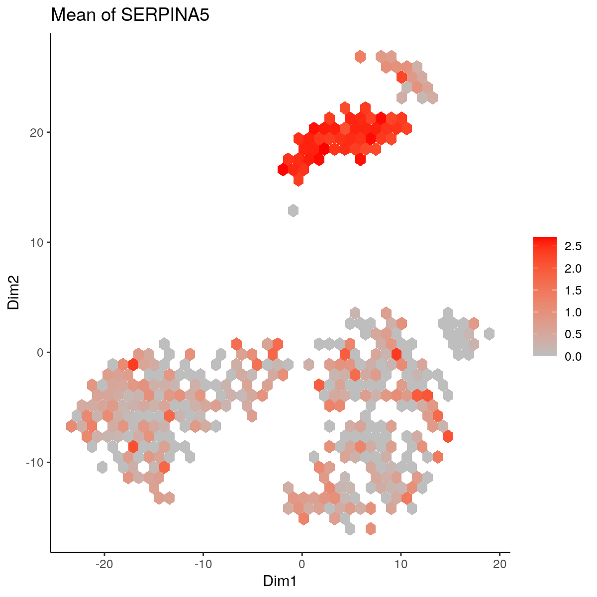|[CBL](https://www.ncbi.nlm.nih.gov/gene/867) [PRSS21](https://www.ncbi.nlm.nih.gov/gene/10942) [RTP2](https://www.ncbi.nlm.nih.gov/gene/344892)|
|[SERPINA6](https://www.ncbi.nlm.nih.gov/gene/866)|[CNR1](https://www.ncbi.nlm.nih.gov/gene/1268) [SLCO4C1](https://www.ncbi.nlm.nih.gov/gene/353189)|
|[SERPINA7](https://www.ncbi.nlm.nih.gov/gene/6906)|[C8A](https://www.ncbi.nlm.nih.gov/gene/731) [DIO3](https://www.ncbi.nlm.nih.gov/gene/1735) [SLC16A2](https://www.ncbi.nlm.nih.gov/gene/6567) [SLCO1C1](https://www.ncbi.nlm.nih.gov/gene/53919) [ADCY10](https://www.ncbi.nlm.nih.gov/gene/55811) [SLC16A10](https://www.ncbi.nlm.nih.gov/gene/117247)|
|[SERPINA9](https://www.ncbi.nlm.nih.gov/gene/327657)|[CD5](https://www.ncbi.nlm.nih.gov/gene/921) [MME](https://www.ncbi.nlm.nih.gov/gene/4311) [SUSD3](https://www.ncbi.nlm.nih.gov/gene/203328) [GCSAM](https://www.ncbi.nlm.nih.gov/gene/257144)|
|[SERPINB1](https://www.ncbi.nlm.nih.gov/gene/1992)|[CD86](https://www.ncbi.nlm.nih.gov/gene/942)|
|[SERPINB2](https://www.ncbi.nlm.nih.gov/gene/5055)|[CD19](https://www.ncbi.nlm.nih.gov/gene/930) [CD86](https://www.ncbi.nlm.nih.gov/gene/942) [CD44](https://www.ncbi.nlm.nih.gov/gene/960) [ADGRE1](https://www.ncbi.nlm.nih.gov/gene/2015) [HLA-DQB1](https://www.ncbi.nlm.nih.gov/gene/3119) [HLA-DQB2](https://www.ncbi.nlm.nih.gov/gene/3120) [ITGAM](https://www.ncbi.nlm.nih.gov/gene/3684) [PTPRC](https://www.ncbi.nlm.nih.gov/gene/5788) [SELL](https://www.ncbi.nlm.nih.gov/gene/6402) [THY1](https://www.ncbi.nlm.nih.gov/gene/7070) [TLR4](https://www.ncbi.nlm.nih.gov/gene/7099)|
|[SERPINB5](https://www.ncbi.nlm.nih.gov/gene/5268)|[ADA](https://www.ncbi.nlm.nih.gov/gene/100) [CD19](https://www.ncbi.nlm.nih.gov/gene/930) [CD86](https://www.ncbi.nlm.nih.gov/gene/942) [CD44](https://www.ncbi.nlm.nih.gov/gene/960) [ADGRE1](https://www.ncbi.nlm.nih.gov/gene/2015) [ESR1](https://www.ncbi.nlm.nih.gov/gene/2099) [F2R](https://www.ncbi.nlm.nih.gov/gene/2149) [HLA-DQB1](https://www.ncbi.nlm.nih.gov/gene/3119) [HLA-DQB2](https://www.ncbi.nlm.nih.gov/gene/3120) [ITGAM](https://www.ncbi.nlm.nih.gov/gene/3684) [PIP4K2A](https://www.ncbi.nlm.nih.gov/gene/5305) [PTPRC](https://www.ncbi.nlm.nih.gov/gene/5788) [RIT1](https://www.ncbi.nlm.nih.gov/gene/6016) [SELL](https://www.ncbi.nlm.nih.gov/gene/6402) [THY1](https://www.ncbi.nlm.nih.gov/gene/7070) [TLR4](https://www.ncbi.nlm.nih.gov/gene/7099) [UBE2B](https://www.ncbi.nlm.nih.gov/gene/7320) [RECK](https://www.ncbi.nlm.nih.gov/gene/8434) [PRSS21](https://www.ncbi.nlm.nih.gov/gene/10942) [GPR101](https://www.ncbi.nlm.nih.gov/gene/83550)|
|[SERPINC1](https://www.ncbi.nlm.nih.gov/gene/462)|[ADAM10](https://www.ncbi.nlm.nih.gov/gene/102) [APLP2](https://www.ncbi.nlm.nih.gov/gene/334) [C8A](https://www.ncbi.nlm.nih.gov/gene/731) [CDH2](https://www.ncbi.nlm.nih.gov/gene/1000) [ACE](https://www.ncbi.nlm.nih.gov/gene/1636) [F2R](https://www.ncbi.nlm.nih.gov/gene/2149) [GPC3](https://www.ncbi.nlm.nih.gov/gene/2719) [MELTF](https://www.ncbi.nlm.nih.gov/gene/4241) [SELE](https://www.ncbi.nlm.nih.gov/gene/6401) [SELP](https://www.ncbi.nlm.nih.gov/gene/6403) [SLC2A2](https://www.ncbi.nlm.nih.gov/gene/6514) [SLC2A4](https://www.ncbi.nlm.nih.gov/gene/6517) [TGOLN2](https://www.ncbi.nlm.nih.gov/gene/10618) [GP6](https://www.ncbi.nlm.nih.gov/gene/51206) [MXRA8](https://www.ncbi.nlm.nih.gov/gene/54587) [PNPLA2](https://www.ncbi.nlm.nih.gov/gene/57104) [CD177](https://www.ncbi.nlm.nih.gov/gene/57126) [ANO8](https://www.ncbi.nlm.nih.gov/gene/57719) [P2RY12](https://www.ncbi.nlm.nih.gov/gene/64805) [TMPRSS6](https://www.ncbi.nlm.nih.gov/gene/164656)|
|[SERPINE1](https://www.ncbi.nlm.nih.gov/gene/5054)|[AGER](https://www.ncbi.nlm.nih.gov/gene/177) [AGTR1](https://www.ncbi.nlm.nih.gov/gene/185) [RHOA](https://www.ncbi.nlm.nih.gov/gene/387) [CD44](https://www.ncbi.nlm.nih.gov/gene/960) [CDH2](https://www.ncbi.nlm.nih.gov/gene/1000) [ACE](https://www.ncbi.nlm.nih.gov/gene/1636) [DPP4](https://www.ncbi.nlm.nih.gov/gene/1803) [ENG](https://www.ncbi.nlm.nih.gov/gene/2022) [ESR1](https://www.ncbi.nlm.nih.gov/gene/2099) [F2R](https://www.ncbi.nlm.nih.gov/gene/2149) [GJA4](https://www.ncbi.nlm.nih.gov/gene/2701) [ITGAV](https://www.ncbi.nlm.nih.gov/gene/3685) [ITGB3](https://www.ncbi.nlm.nih.gov/gene/3690) [LDLR](https://www.ncbi.nlm.nih.gov/gene/3949) [MMP17](https://www.ncbi.nlm.nih.gov/gene/4326) [NGFR](https://www.ncbi.nlm.nih.gov/gene/4804) [NOS3](https://www.ncbi.nlm.nih.gov/gene/4846) [SELE](https://www.ncbi.nlm.nih.gov/gene/6401) [SELP](https://www.ncbi.nlm.nih.gov/gene/6403) [SLC2A4](https://www.ncbi.nlm.nih.gov/gene/6517) [SRC](https://www.ncbi.nlm.nih.gov/gene/6714) [TGFBR1](https://www.ncbi.nlm.nih.gov/gene/7046) [TGFBR2](https://www.ncbi.nlm.nih.gov/gene/7048) [TLR4](https://www.ncbi.nlm.nih.gov/gene/7099) [ITLN1](https://www.ncbi.nlm.nih.gov/gene/55600) [MMP25](https://www.ncbi.nlm.nih.gov/gene/64386)|
|[SERPINE2](https://www.ncbi.nlm.nih.gov/gene/5270)|[F2R](https://www.ncbi.nlm.nih.gov/gene/2149) [VNN2](https://www.ncbi.nlm.nih.gov/gene/8875) [VNN1](https://www.ncbi.nlm.nih.gov/gene/8876) [RTN4RL1](https://www.ncbi.nlm.nih.gov/gene/146760)|
|[SERPINE3](https://www.ncbi.nlm.nih.gov/gene/647174)|[PDE6C](https://www.ncbi.nlm.nih.gov/gene/5146)|
|[SERPINF1](https://www.ncbi.nlm.nih.gov/gene/5176) 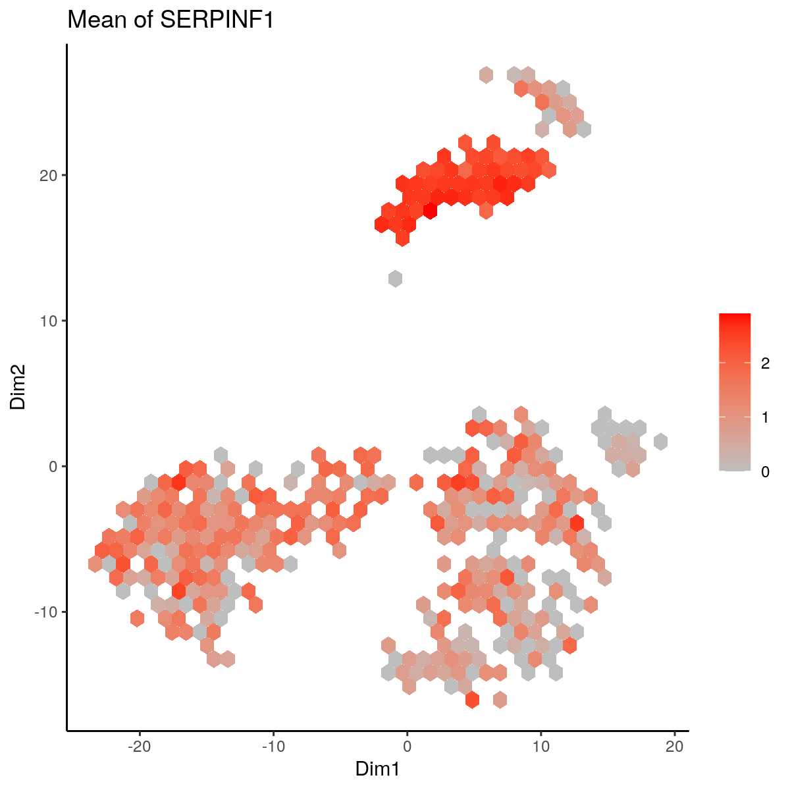|[LRP6](https://www.ncbi.nlm.nih.gov/gene/4040) [BEST1](https://www.ncbi.nlm.nih.gov/gene/7439) [PNPLA2](https://www.ncbi.nlm.nih.gov/gene/57104) [TTYH1](https://www.ncbi.nlm.nih.gov/gene/57348) [IFITM5](https://www.ncbi.nlm.nih.gov/gene/387733)|
|[SERPINF2](https://www.ncbi.nlm.nih.gov/gene/5345)|[ADRA2A](https://www.ncbi.nlm.nih.gov/gene/150) [GAP43](https://www.ncbi.nlm.nih.gov/gene/2596) [PTAFR](https://www.ncbi.nlm.nih.gov/gene/5724) [CDH19](https://www.ncbi.nlm.nih.gov/gene/28513) [SLC40A1](https://www.ncbi.nlm.nih.gov/gene/30061) [PAG1](https://www.ncbi.nlm.nih.gov/gene/55824)|
|[SERPING1](https://www.ncbi.nlm.nih.gov/gene/710)|[BDKRB2](https://www.ncbi.nlm.nih.gov/gene/624) [C3AR1](https://www.ncbi.nlm.nih.gov/gene/719) [C5AR1](https://www.ncbi.nlm.nih.gov/gene/728) [CD5](https://www.ncbi.nlm.nih.gov/gene/921) [CD59](https://www.ncbi.nlm.nih.gov/gene/966) [CD55](https://www.ncbi.nlm.nih.gov/gene/1604) [ACE](https://www.ncbi.nlm.nih.gov/gene/1636) [P2RY6](https://www.ncbi.nlm.nih.gov/gene/5031) [SELE](https://www.ncbi.nlm.nih.gov/gene/6401) [SELP](https://www.ncbi.nlm.nih.gov/gene/6403)|
|[SERPINI1](https://www.ncbi.nlm.nih.gov/gene/5274)|[CTNNA2](https://www.ncbi.nlm.nih.gov/gene/1496) [PTGER4](https://www.ncbi.nlm.nih.gov/gene/5734) [PSD3](https://www.ncbi.nlm.nih.gov/gene/23362) [NLGN3](https://www.ncbi.nlm.nih.gov/gene/54413) [GPR101](https://www.ncbi.nlm.nih.gov/gene/83550) [OTOG](https://www.ncbi.nlm.nih.gov/gene/340990)|
|[SERPINI2](https://www.ncbi.nlm.nih.gov/gene/5276)|[PCDH19](https://www.ncbi.nlm.nih.gov/gene/57526)|
|[SFN](https://www.ncbi.nlm.nih.gov/gene/2810)|[ANPEP](https://www.ncbi.nlm.nih.gov/gene/290) [ITGA6](https://www.ncbi.nlm.nih.gov/gene/3655) [ITGB4](https://www.ncbi.nlm.nih.gov/gene/3691) [KRAS](https://www.ncbi.nlm.nih.gov/gene/3845) [MARK3](https://www.ncbi.nlm.nih.gov/gene/4140) [RAB8A](https://www.ncbi.nlm.nih.gov/gene/4218) [NRAS](https://www.ncbi.nlm.nih.gov/gene/4893) [CDK14](https://www.ncbi.nlm.nih.gov/gene/5218) [RAB13](https://www.ncbi.nlm.nih.gov/gene/5872) [RAF1](https://www.ncbi.nlm.nih.gov/gene/5894) [SLC2A4](https://www.ncbi.nlm.nih.gov/gene/6517) [TREH](https://www.ncbi.nlm.nih.gov/gene/11181) [SLC26A5](https://www.ncbi.nlm.nih.gov/gene/375611)|
|[SFRP1](https://www.ncbi.nlm.nih.gov/gene/6422)|[CDH6](https://www.ncbi.nlm.nih.gov/gene/1004) [CDH13](https://www.ncbi.nlm.nih.gov/gene/1012) [DVL1](https://www.ncbi.nlm.nih.gov/gene/1855) [DVL2](https://www.ncbi.nlm.nih.gov/gene/1856) [ESR1](https://www.ncbi.nlm.nih.gov/gene/2099) [IHH](https://www.ncbi.nlm.nih.gov/gene/3549) [LRP6](https://www.ncbi.nlm.nih.gov/gene/4040) [ROR2](https://www.ncbi.nlm.nih.gov/gene/4920) [OPCML](https://www.ncbi.nlm.nih.gov/gene/4978) [PTCH1](https://www.ncbi.nlm.nih.gov/gene/5727) [FZD5](https://www.ncbi.nlm.nih.gov/gene/7855) [FZD1](https://www.ncbi.nlm.nih.gov/gene/8321) [FZD7](https://www.ncbi.nlm.nih.gov/gene/8324) [FZD9](https://www.ncbi.nlm.nih.gov/gene/8326) [FZD10](https://www.ncbi.nlm.nih.gov/gene/11211) [TRPM4](https://www.ncbi.nlm.nih.gov/gene/54795) [VANGL2](https://www.ncbi.nlm.nih.gov/gene/57216) [VANGL1](https://www.ncbi.nlm.nih.gov/gene/81839) [KREMEN1](https://www.ncbi.nlm.nih.gov/gene/83999) [NKD1](https://www.ncbi.nlm.nih.gov/gene/85407)|
|[SFRP2](https://www.ncbi.nlm.nih.gov/gene/6423)|[ATP2B4](https://www.ncbi.nlm.nih.gov/gene/493) [DVL1](https://www.ncbi.nlm.nih.gov/gene/1855) [DVL2](https://www.ncbi.nlm.nih.gov/gene/1856) [IHH](https://www.ncbi.nlm.nih.gov/gene/3549) [LRP6](https://www.ncbi.nlm.nih.gov/gene/4040) [ROR2](https://www.ncbi.nlm.nih.gov/gene/4920) [SFRP1](https://www.ncbi.nlm.nih.gov/gene/6422) [FZD5](https://www.ncbi.nlm.nih.gov/gene/7855) [FZD1](https://www.ncbi.nlm.nih.gov/gene/8321) [FZD7](https://www.ncbi.nlm.nih.gov/gene/8324) [FZD9](https://www.ncbi.nlm.nih.gov/gene/8326) [NRG3](https://www.ncbi.nlm.nih.gov/gene/10718) [FZD10](https://www.ncbi.nlm.nih.gov/gene/11211) [VANGL2](https://www.ncbi.nlm.nih.gov/gene/57216) [VANGL1](https://www.ncbi.nlm.nih.gov/gene/81839) [KREMEN1](https://www.ncbi.nlm.nih.gov/gene/83999) [NKD1](https://www.ncbi.nlm.nih.gov/gene/85407) [CDH1](https://www.ncbi.nlm.nih.gov/gene/999)|
|[SFRP4](https://www.ncbi.nlm.nih.gov/gene/6424)|[DVL1](https://www.ncbi.nlm.nih.gov/gene/1855) [DVL2](https://www.ncbi.nlm.nih.gov/gene/1856) [LRP6](https://www.ncbi.nlm.nih.gov/gene/4040) [PHEX](https://www.ncbi.nlm.nih.gov/gene/5251) [FZD5](https://www.ncbi.nlm.nih.gov/gene/7855) [FZD1](https://www.ncbi.nlm.nih.gov/gene/8321) [FZD7](https://www.ncbi.nlm.nih.gov/gene/8324) [FZD9](https://www.ncbi.nlm.nih.gov/gene/8326) [FZD10](https://www.ncbi.nlm.nih.gov/gene/11211) [KREMEN1](https://www.ncbi.nlm.nih.gov/gene/83999) [NKD1](https://www.ncbi.nlm.nih.gov/gene/85407)|
|[SFRP5](https://www.ncbi.nlm.nih.gov/gene/6425)|[DVL1](https://www.ncbi.nlm.nih.gov/gene/1855) [DVL2](https://www.ncbi.nlm.nih.gov/gene/1856) [IHH](https://www.ncbi.nlm.nih.gov/gene/3549) [LRP6](https://www.ncbi.nlm.nih.gov/gene/4040) [CXCR4](https://www.ncbi.nlm.nih.gov/gene/7852) [FZD5](https://www.ncbi.nlm.nih.gov/gene/7855) [FZD1](https://www.ncbi.nlm.nih.gov/gene/8321) [FZD7](https://www.ncbi.nlm.nih.gov/gene/8324) [FZD9](https://www.ncbi.nlm.nih.gov/gene/8326) [FZD10](https://www.ncbi.nlm.nih.gov/gene/11211) [KREMEN1](https://www.ncbi.nlm.nih.gov/gene/83999) [NKD1](https://www.ncbi.nlm.nih.gov/gene/85407) [TRABD2A](https://www.ncbi.nlm.nih.gov/gene/129293) [SDK1](https://www.ncbi.nlm.nih.gov/gene/221935)|
|[SFTA2](https://www.ncbi.nlm.nih.gov/gene/389376)|[OR11A1](https://www.ncbi.nlm.nih.gov/gene/26531) [MUCL3](https://www.ncbi.nlm.nih.gov/gene/135656)|
|[SFTPA1](https://www.ncbi.nlm.nih.gov/gene/653509)|[ADORA2B](https://www.ncbi.nlm.nih.gov/gene/136) [AQP5](https://www.ncbi.nlm.nih.gov/gene/362) [CD14](https://www.ncbi.nlm.nih.gov/gene/929) [SCNN1A](https://www.ncbi.nlm.nih.gov/gene/6337) [TLR1](https://www.ncbi.nlm.nih.gov/gene/7096) [TLR4](https://www.ncbi.nlm.nih.gov/gene/7099)|
|[SFTPA2](https://www.ncbi.nlm.nih.gov/gene/729238)|[ADORA2B](https://www.ncbi.nlm.nih.gov/gene/136) [AQP5](https://www.ncbi.nlm.nih.gov/gene/362)|
|[SFTPB](https://www.ncbi.nlm.nih.gov/gene/6439)|[ADORA2B](https://www.ncbi.nlm.nih.gov/gene/136) [ADRA2A](https://www.ncbi.nlm.nih.gov/gene/150) [ADRA2C](https://www.ncbi.nlm.nih.gov/gene/152) [AGER](https://www.ncbi.nlm.nih.gov/gene/177) [AQP5](https://www.ncbi.nlm.nih.gov/gene/362) [CHRM3](https://www.ncbi.nlm.nih.gov/gene/1131) [P2RY2](https://www.ncbi.nlm.nih.gov/gene/5029) [SCNN1A](https://www.ncbi.nlm.nih.gov/gene/6337) [SLC23A2](https://www.ncbi.nlm.nih.gov/gene/9962) [SLC23A1](https://www.ncbi.nlm.nih.gov/gene/9963) [PSD4](https://www.ncbi.nlm.nih.gov/gene/23550) [TMEM150A](https://www.ncbi.nlm.nih.gov/gene/129303) [ADGRF5](https://www.ncbi.nlm.nih.gov/gene/221395)|
|[SFTPC](https://www.ncbi.nlm.nih.gov/gene/6440)|[ADORA2B](https://www.ncbi.nlm.nih.gov/gene/136) [ADRA2A](https://www.ncbi.nlm.nih.gov/gene/150) [ADRA2C](https://www.ncbi.nlm.nih.gov/gene/152) [AGER](https://www.ncbi.nlm.nih.gov/gene/177) [AGTR2](https://www.ncbi.nlm.nih.gov/gene/186) [AQP5](https://www.ncbi.nlm.nih.gov/gene/362) [CFTR](https://www.ncbi.nlm.nih.gov/gene/1080) [F2RL2](https://www.ncbi.nlm.nih.gov/gene/2151) [KRAS](https://www.ncbi.nlm.nih.gov/gene/3845) [EPCAM](https://www.ncbi.nlm.nih.gov/gene/4072) [NEDD4](https://www.ncbi.nlm.nih.gov/gene/4734) [P2RY2](https://www.ncbi.nlm.nih.gov/gene/5029) [PTPRC](https://www.ncbi.nlm.nih.gov/gene/5788) [ADGRF5](https://www.ncbi.nlm.nih.gov/gene/221395)|
|[SFTPD](https://www.ncbi.nlm.nih.gov/gene/6441)|[ADORA2B](https://www.ncbi.nlm.nih.gov/gene/136) [AGER](https://www.ncbi.nlm.nih.gov/gene/177) [AQP5](https://www.ncbi.nlm.nih.gov/gene/362) [MUC1](https://www.ncbi.nlm.nih.gov/gene/4582) [NPY1R](https://www.ncbi.nlm.nih.gov/gene/4886) [TLR4](https://www.ncbi.nlm.nih.gov/gene/7099)|
|[SHBG](https://www.ncbi.nlm.nih.gov/gene/6462)|[ATP1A1](https://www.ncbi.nlm.nih.gov/gene/476) [ATP1A3](https://www.ncbi.nlm.nih.gov/gene/478) [ATP1A4](https://www.ncbi.nlm.nih.gov/gene/480) [ATP4A](https://www.ncbi.nlm.nih.gov/gene/495) [COMT](https://www.ncbi.nlm.nih.gov/gene/1312) [ESR1](https://www.ncbi.nlm.nih.gov/gene/2099) [FSHR](https://www.ncbi.nlm.nih.gov/gene/2492) [GABBR2](https://www.ncbi.nlm.nih.gov/gene/9568) [NLGN2](https://www.ncbi.nlm.nih.gov/gene/57555) [GPR156](https://www.ncbi.nlm.nih.gov/gene/165829)|
|[SIAE](https://www.ncbi.nlm.nih.gov/gene/54414)|[CD22](https://www.ncbi.nlm.nih.gov/gene/933) [CDH7](https://www.ncbi.nlm.nih.gov/gene/1005) [LYN](https://www.ncbi.nlm.nih.gov/gene/4067) [SLC2A1](https://www.ncbi.nlm.nih.gov/gene/6513) [NEU3](https://www.ncbi.nlm.nih.gov/gene/10825) [CEMIP2](https://www.ncbi.nlm.nih.gov/gene/23670)|
|[SIGLEC1](https://www.ncbi.nlm.nih.gov/gene/6614)|[CD1D](https://www.ncbi.nlm.nih.gov/gene/912) [CD4](https://www.ncbi.nlm.nih.gov/gene/920) [CD14](https://www.ncbi.nlm.nih.gov/gene/929) [CD19](https://www.ncbi.nlm.nih.gov/gene/930) [CD86](https://www.ncbi.nlm.nih.gov/gene/942) [CD36](https://www.ncbi.nlm.nih.gov/gene/948) [AP2M1](https://www.ncbi.nlm.nih.gov/gene/1173) [CCR1](https://www.ncbi.nlm.nih.gov/gene/1230) [CCR5](https://www.ncbi.nlm.nih.gov/gene/1234) [CR2](https://www.ncbi.nlm.nih.gov/gene/1380) [CSF1R](https://www.ncbi.nlm.nih.gov/gene/1436) [CX3CR1](https://www.ncbi.nlm.nih.gov/gene/1524) [ADGRE1](https://www.ncbi.nlm.nih.gov/gene/2015) [FCGR1A](https://www.ncbi.nlm.nih.gov/gene/2209) [FCGR2B](https://www.ncbi.nlm.nih.gov/gene/2213) [FCGR3A](https://www.ncbi.nlm.nih.gov/gene/2214) [FOLR2](https://www.ncbi.nlm.nih.gov/gene/2350) [FPR3](https://www.ncbi.nlm.nih.gov/gene/2359) [IL10RA](https://www.ncbi.nlm.nih.gov/gene/3587) [ITGAM](https://www.ncbi.nlm.nih.gov/gene/3684) [ITGB2](https://www.ncbi.nlm.nih.gov/gene/3689) [LY6E](https://www.ncbi.nlm.nih.gov/gene/4061) [MUC1](https://www.ncbi.nlm.nih.gov/gene/4582) [PTPRC](https://www.ncbi.nlm.nih.gov/gene/5788) [SELL](https://www.ncbi.nlm.nih.gov/gene/6402) [SELP](https://www.ncbi.nlm.nih.gov/gene/6403) [SLAMF1](https://www.ncbi.nlm.nih.gov/gene/6504) [TLR1](https://www.ncbi.nlm.nih.gov/gene/7096) [TLR4](https://www.ncbi.nlm.nih.gov/gene/7099) [TYROBP](https://www.ncbi.nlm.nih.gov/gene/7305) [MARCO](https://www.ncbi.nlm.nih.gov/gene/8685) [CD163](https://www.ncbi.nlm.nih.gov/gene/9332) [CLEC5A](https://www.ncbi.nlm.nih.gov/gene/23601) [NPC1L1](https://www.ncbi.nlm.nih.gov/gene/29881) [CLEC4A](https://www.ncbi.nlm.nih.gov/gene/50856) [CLEC12A](https://www.ncbi.nlm.nih.gov/gene/160364) [CLEC12B](https://www.ncbi.nlm.nih.gov/gene/387837) [CCR2](https://www.ncbi.nlm.nih.gov/gene/729230)|
|[SIGLEC10](https://www.ncbi.nlm.nih.gov/gene/89790)|[TLR4](https://www.ncbi.nlm.nih.gov/gene/7099) [AOC3](https://www.ncbi.nlm.nih.gov/gene/8639) [CD24](https://www.ncbi.nlm.nih.gov/gene/100133941)|
|[SIGLEC6](https://www.ncbi.nlm.nih.gov/gene/946)|[SLAMF1](https://www.ncbi.nlm.nih.gov/gene/6504) [FCRL4](https://www.ncbi.nlm.nih.gov/gene/83417)|
|[SIRPD](https://www.ncbi.nlm.nih.gov/gene/128646)|[TYROBP](https://www.ncbi.nlm.nih.gov/gene/7305) [CD300LB](https://www.ncbi.nlm.nih.gov/gene/124599)|
|[SLIT1](https://www.ncbi.nlm.nih.gov/gene/6585)|[CDC42](https://www.ncbi.nlm.nih.gov/gene/998) [CDH2](https://www.ncbi.nlm.nih.gov/gene/1000) [CTNNA1](https://www.ncbi.nlm.nih.gov/gene/1495) [DSCAM](https://www.ncbi.nlm.nih.gov/gene/1826) [EFNA2](https://www.ncbi.nlm.nih.gov/gene/1943) [EFNA3](https://www.ncbi.nlm.nih.gov/gene/1944) [EFNA5](https://www.ncbi.nlm.nih.gov/gene/1946) [EPHA4](https://www.ncbi.nlm.nih.gov/gene/2043) [EPHA5](https://www.ncbi.nlm.nih.gov/gene/2044) [EPHB1](https://www.ncbi.nlm.nih.gov/gene/2047) [EPHB2](https://www.ncbi.nlm.nih.gov/gene/2048) [EPHB3](https://www.ncbi.nlm.nih.gov/gene/2049) [GNG11](https://www.ncbi.nlm.nih.gov/gene/2791) [NEO1](https://www.ncbi.nlm.nih.gov/gene/4756) [NRCAM](https://www.ncbi.nlm.nih.gov/gene/4897) [PLXNA1](https://www.ncbi.nlm.nih.gov/gene/5361) [ROBO1](https://www.ncbi.nlm.nih.gov/gene/6091) [CNTN2](https://www.ncbi.nlm.nih.gov/gene/6900) [SEMA7A](https://www.ncbi.nlm.nih.gov/gene/8482) [UNC5C](https://www.ncbi.nlm.nih.gov/gene/8633) [SEMA6C](https://www.ncbi.nlm.nih.gov/gene/10500) [SEMA6B](https://www.ncbi.nlm.nih.gov/gene/10501) [SEMA4F](https://www.ncbi.nlm.nih.gov/gene/10505) [SEMA4D](https://www.ncbi.nlm.nih.gov/gene/10507) [NTNG1](https://www.ncbi.nlm.nih.gov/gene/22854) [ADGRL1](https://www.ncbi.nlm.nih.gov/gene/22859) [ADGRL3](https://www.ncbi.nlm.nih.gov/gene/23284) [SRGAP2](https://www.ncbi.nlm.nih.gov/gene/23380) [FLRT3](https://www.ncbi.nlm.nih.gov/gene/23767) [SEMA6A](https://www.ncbi.nlm.nih.gov/gene/57556) [SEMA4G](https://www.ncbi.nlm.nih.gov/gene/57715) [SEMA4A](https://www.ncbi.nlm.nih.gov/gene/64218) [NTNG2](https://www.ncbi.nlm.nih.gov/gene/84628) [UNC5A](https://www.ncbi.nlm.nih.gov/gene/90249) [PLXNA4](https://www.ncbi.nlm.nih.gov/gene/91584) [UNC5B](https://www.ncbi.nlm.nih.gov/gene/219699) [GPC1](https://www.ncbi.nlm.nih.gov/gene/2817)|
|[SLIT2](https://www.ncbi.nlm.nih.gov/gene/9353)|[RHOA](https://www.ncbi.nlm.nih.gov/gene/387) [CDC42](https://www.ncbi.nlm.nih.gov/gene/998) [DAG1](https://www.ncbi.nlm.nih.gov/gene/1605) [EFNA2](https://www.ncbi.nlm.nih.gov/gene/1943) [EFNA3](https://www.ncbi.nlm.nih.gov/gene/1944) [EFNA5](https://www.ncbi.nlm.nih.gov/gene/1946) [EPHA2](https://www.ncbi.nlm.nih.gov/gene/1969) [EPHA1](https://www.ncbi.nlm.nih.gov/gene/2041) [EPHA4](https://www.ncbi.nlm.nih.gov/gene/2043) [EPHA5](https://www.ncbi.nlm.nih.gov/gene/2044) [EPHA7](https://www.ncbi.nlm.nih.gov/gene/2045) [EPHB1](https://www.ncbi.nlm.nih.gov/gene/2047) [EPHB2](https://www.ncbi.nlm.nih.gov/gene/2048) [MFAP3](https://www.ncbi.nlm.nih.gov/gene/4238) [NEO1](https://www.ncbi.nlm.nih.gov/gene/4756) [PLXNA1](https://www.ncbi.nlm.nih.gov/gene/5361) [PLXNA2](https://www.ncbi.nlm.nih.gov/gene/5362) [RAC1](https://www.ncbi.nlm.nih.gov/gene/5879) [RET](https://www.ncbi.nlm.nih.gov/gene/5979) [ROBO1](https://www.ncbi.nlm.nih.gov/gene/6091) [SRC](https://www.ncbi.nlm.nih.gov/gene/6714) [CXCR4](https://www.ncbi.nlm.nih.gov/gene/7852) [SEMA7A](https://www.ncbi.nlm.nih.gov/gene/8482) [UNC5C](https://www.ncbi.nlm.nih.gov/gene/8633) [CAP2](https://www.ncbi.nlm.nih.gov/gene/10486) [CAP1](https://www.ncbi.nlm.nih.gov/gene/10487) [SEMA6C](https://www.ncbi.nlm.nih.gov/gene/10500) [SEMA6B](https://www.ncbi.nlm.nih.gov/gene/10501) [SEMA4F](https://www.ncbi.nlm.nih.gov/gene/10505) [SEMA4D](https://www.ncbi.nlm.nih.gov/gene/10507) [NTNG1](https://www.ncbi.nlm.nih.gov/gene/22854) [ADGRL1](https://www.ncbi.nlm.nih.gov/gene/22859) [ADGRL3](https://www.ncbi.nlm.nih.gov/gene/23284) [SRGAP2](https://www.ncbi.nlm.nih.gov/gene/23380) [SEMA6A](https://www.ncbi.nlm.nih.gov/gene/57556) [SEMA4G](https://www.ncbi.nlm.nih.gov/gene/57715) [SEMA4A](https://www.ncbi.nlm.nih.gov/gene/64218) [UNC5A](https://www.ncbi.nlm.nih.gov/gene/90249) [PLXNA4](https://www.ncbi.nlm.nih.gov/gene/91584) [DAB2IP](https://www.ncbi.nlm.nih.gov/gene/153090) [UNC5B](https://www.ncbi.nlm.nih.gov/gene/219699)|
|[SLIT3](https://www.ncbi.nlm.nih.gov/gene/6586)|[RHOA](https://www.ncbi.nlm.nih.gov/gene/387) [CDC42](https://www.ncbi.nlm.nih.gov/gene/998) [DSCAM](https://www.ncbi.nlm.nih.gov/gene/1826) [EFNA2](https://www.ncbi.nlm.nih.gov/gene/1943) [EFNA3](https://www.ncbi.nlm.nih.gov/gene/1944) [EFNA5](https://www.ncbi.nlm.nih.gov/gene/1946) [EPHA2](https://www.ncbi.nlm.nih.gov/gene/1969) [EPHA1](https://www.ncbi.nlm.nih.gov/gene/2041) [EPHA4](https://www.ncbi.nlm.nih.gov/gene/2043) [EPHA5](https://www.ncbi.nlm.nih.gov/gene/2044) [EPHA7](https://www.ncbi.nlm.nih.gov/gene/2045) [EPHB1](https://www.ncbi.nlm.nih.gov/gene/2047) [EPHB2](https://www.ncbi.nlm.nih.gov/gene/2048) [EPHB3](https://www.ncbi.nlm.nih.gov/gene/2049) [EPHB4](https://www.ncbi.nlm.nih.gov/gene/2050) [NEO1](https://www.ncbi.nlm.nih.gov/gene/4756) [PLXNA1](https://www.ncbi.nlm.nih.gov/gene/5361) [PLXNA2](https://www.ncbi.nlm.nih.gov/gene/5362) [ROBO1](https://www.ncbi.nlm.nih.gov/gene/6091) [SRC](https://www.ncbi.nlm.nih.gov/gene/6714) [CXCR4](https://www.ncbi.nlm.nih.gov/gene/7852) [SEMA7A](https://www.ncbi.nlm.nih.gov/gene/8482) [UNC5C](https://www.ncbi.nlm.nih.gov/gene/8633) [SEMA6C](https://www.ncbi.nlm.nih.gov/gene/10500) [SEMA6B](https://www.ncbi.nlm.nih.gov/gene/10501) [SEMA4F](https://www.ncbi.nlm.nih.gov/gene/10505) [SEMA4D](https://www.ncbi.nlm.nih.gov/gene/10507) [NTNG1](https://www.ncbi.nlm.nih.gov/gene/22854) [ADGRL1](https://www.ncbi.nlm.nih.gov/gene/22859) [ADGRL3](https://www.ncbi.nlm.nih.gov/gene/23284) [SRGAP2](https://www.ncbi.nlm.nih.gov/gene/23380) [SEMA6A](https://www.ncbi.nlm.nih.gov/gene/57556) [SEMA4G](https://www.ncbi.nlm.nih.gov/gene/57715) [SEMA4A](https://www.ncbi.nlm.nih.gov/gene/64218) [NTNG2](https://www.ncbi.nlm.nih.gov/gene/84628) [UNC5A](https://www.ncbi.nlm.nih.gov/gene/90249) [PLXNA4](https://www.ncbi.nlm.nih.gov/gene/91584) [UNC5B](https://www.ncbi.nlm.nih.gov/gene/219699)|
|[SLPI](https://www.ncbi.nlm.nih.gov/gene/6590)|[CCR5](https://www.ncbi.nlm.nih.gov/gene/1234) [ENPEP](https://www.ncbi.nlm.nih.gov/gene/2028) [PLSCR1](https://www.ncbi.nlm.nih.gov/gene/5359) [TLR4](https://www.ncbi.nlm.nih.gov/gene/7099) [VCL](https://www.ncbi.nlm.nih.gov/gene/7414) [EZR](https://www.ncbi.nlm.nih.gov/gene/7430) [GSDMD](https://www.ncbi.nlm.nih.gov/gene/79792) [OSCAR](https://www.ncbi.nlm.nih.gov/gene/126014)|
|[SLURP1](https://www.ncbi.nlm.nih.gov/gene/57152)|[GML](https://www.ncbi.nlm.nih.gov/gene/2765) [LY6E](https://www.ncbi.nlm.nih.gov/gene/4061) [LY6H](https://www.ncbi.nlm.nih.gov/gene/4062) [PSCA](https://www.ncbi.nlm.nih.gov/gene/8000) [LY6D](https://www.ncbi.nlm.nih.gov/gene/8581) [LYPD3](https://www.ncbi.nlm.nih.gov/gene/27076) [TEX101](https://www.ncbi.nlm.nih.gov/gene/83639) [LYPD1](https://www.ncbi.nlm.nih.gov/gene/116372) [TRPM6](https://www.ncbi.nlm.nih.gov/gene/140803) [SPACA4](https://www.ncbi.nlm.nih.gov/gene/171169) [LYPD5](https://www.ncbi.nlm.nih.gov/gene/284348) [GPIHBP1](https://www.ncbi.nlm.nih.gov/gene/338328) [LYNX1-SLURP2](https://www.ncbi.nlm.nih.gov/gene/111188157)|
|[SMOC1](https://www.ncbi.nlm.nih.gov/gene/64093)|[GPR25](https://www.ncbi.nlm.nih.gov/gene/2848) [LSP1](https://www.ncbi.nlm.nih.gov/gene/4046) [SGCA](https://www.ncbi.nlm.nih.gov/gene/6442) [ABCB6](https://www.ncbi.nlm.nih.gov/gene/10058) [STRA6](https://www.ncbi.nlm.nih.gov/gene/64220)|
|[SMOC2](https://www.ncbi.nlm.nih.gov/gene/64094)|[KCNK1](https://www.ncbi.nlm.nih.gov/gene/3775) [LGR5](https://www.ncbi.nlm.nih.gov/gene/8549) [LRIG1](https://www.ncbi.nlm.nih.gov/gene/26018)|
|[SMPDL3A](https://www.ncbi.nlm.nih.gov/gene/10924)|[SPAM1](https://www.ncbi.nlm.nih.gov/gene/6677) [ATP10D](https://www.ncbi.nlm.nih.gov/gene/57205) [LYPD1](https://www.ncbi.nlm.nih.gov/gene/116372)|
|[SMPDL3B](https://www.ncbi.nlm.nih.gov/gene/27293)|[NPHS1](https://www.ncbi.nlm.nih.gov/gene/4868) [SEMA7A](https://www.ncbi.nlm.nih.gov/gene/8482)|
|[SNED1](https://www.ncbi.nlm.nih.gov/gene/25992)|[GRIN1](https://www.ncbi.nlm.nih.gov/gene/2902) [SSTR1](https://www.ncbi.nlm.nih.gov/gene/6751) [SSTR2](https://www.ncbi.nlm.nih.gov/gene/6752) [SSTR3](https://www.ncbi.nlm.nih.gov/gene/6753) [SSTR4](https://www.ncbi.nlm.nih.gov/gene/6754) [SSTR5](https://www.ncbi.nlm.nih.gov/gene/6755) [GPR50](https://www.ncbi.nlm.nih.gov/gene/9248) [SLC23A1](https://www.ncbi.nlm.nih.gov/gene/9963) [PCDHB14](https://www.ncbi.nlm.nih.gov/gene/56122)|
|[SOD3](https://www.ncbi.nlm.nih.gov/gene/6649)|[SLC31A1](https://www.ncbi.nlm.nih.gov/gene/1317) [CYBA](https://www.ncbi.nlm.nih.gov/gene/1535) [CYBB](https://www.ncbi.nlm.nih.gov/gene/1536) [NOS1](https://www.ncbi.nlm.nih.gov/gene/4842) [NOS3](https://www.ncbi.nlm.nih.gov/gene/4846) [PARK7](https://www.ncbi.nlm.nih.gov/gene/11315) [SLC44A1](https://www.ncbi.nlm.nih.gov/gene/23446) [DUOX2](https://www.ncbi.nlm.nih.gov/gene/50506) [DUOX1](https://www.ncbi.nlm.nih.gov/gene/53905)|
|[SOGA1](https://www.ncbi.nlm.nih.gov/gene/140710)|[MARK2](https://www.ncbi.nlm.nih.gov/gene/2011) [GRK5](https://www.ncbi.nlm.nih.gov/gene/2869) [MAS1](https://www.ncbi.nlm.nih.gov/gene/4142)|
|[SOST](https://www.ncbi.nlm.nih.gov/gene/50964)|[ALPL](https://www.ncbi.nlm.nih.gov/gene/249) [BMPR1A](https://www.ncbi.nlm.nih.gov/gene/657) [BMPR1B](https://www.ncbi.nlm.nih.gov/gene/658) [CASR](https://www.ncbi.nlm.nih.gov/gene/846) [ESR1](https://www.ncbi.nlm.nih.gov/gene/2099) [GJA1](https://www.ncbi.nlm.nih.gov/gene/2697) [IHH](https://www.ncbi.nlm.nih.gov/gene/3549) [LDLR](https://www.ncbi.nlm.nih.gov/gene/3949) [LRP4](https://www.ncbi.nlm.nih.gov/gene/4038) [LRP6](https://www.ncbi.nlm.nih.gov/gene/4040) [PHEX](https://www.ncbi.nlm.nih.gov/gene/5251) [PTH1R](https://www.ncbi.nlm.nih.gov/gene/5745) [SFRP1](https://www.ncbi.nlm.nih.gov/gene/6422) [FZD1](https://www.ncbi.nlm.nih.gov/gene/8321) [TNFRSF11A](https://www.ncbi.nlm.nih.gov/gene/8792) [KREMEN1](https://www.ncbi.nlm.nih.gov/gene/83999) [ANTXR1](https://www.ncbi.nlm.nih.gov/gene/84168) [TRABD2A](https://www.ncbi.nlm.nih.gov/gene/129293)|
|[SOSTDC1](https://www.ncbi.nlm.nih.gov/gene/25928)|[BMPR1A](https://www.ncbi.nlm.nih.gov/gene/657) [BMPR1B](https://www.ncbi.nlm.nih.gov/gene/658) [BMPR2](https://www.ncbi.nlm.nih.gov/gene/659) [SLC26A3](https://www.ncbi.nlm.nih.gov/gene/1811) [LRP4](https://www.ncbi.nlm.nih.gov/gene/4038) [LRP6](https://www.ncbi.nlm.nih.gov/gene/4040) [RGMA](https://www.ncbi.nlm.nih.gov/gene/56963) [HJV](https://www.ncbi.nlm.nih.gov/gene/148738) [RGMB](https://www.ncbi.nlm.nih.gov/gene/285704)|
|[SPACA3](https://www.ncbi.nlm.nih.gov/gene/124912)|[ZP2](https://www.ncbi.nlm.nih.gov/gene/7783) [ZP3](https://www.ncbi.nlm.nih.gov/gene/7784) [TMEM98](https://www.ncbi.nlm.nih.gov/gene/26022) [OR5P2](https://www.ncbi.nlm.nih.gov/gene/120065) [SPACA4](https://www.ncbi.nlm.nih.gov/gene/171169) [CT83](https://www.ncbi.nlm.nih.gov/gene/203413) [ASTL](https://www.ncbi.nlm.nih.gov/gene/431705)|
|[SPACA5](https://www.ncbi.nlm.nih.gov/gene/389852)|[CPM](https://www.ncbi.nlm.nih.gov/gene/1368) [MREG](https://www.ncbi.nlm.nih.gov/gene/55686)|
|[SPAG11B](https://www.ncbi.nlm.nih.gov/gene/10407)|[SRC](https://www.ncbi.nlm.nih.gov/gene/6714) [TEX101](https://www.ncbi.nlm.nih.gov/gene/83639)|
|[SPARC](https://www.ncbi.nlm.nih.gov/gene/6678) |[ALPL](https://www.ncbi.nlm.nih.gov/gene/249) [CD44](https://www.ncbi.nlm.nih.gov/gene/960) [CDH2](https://www.ncbi.nlm.nih.gov/gene/1000) [CDH11](https://www.ncbi.nlm.nih.gov/gene/1009) [ENG](https://www.ncbi.nlm.nih.gov/gene/2022) [FAT2](https://www.ncbi.nlm.nih.gov/gene/2196) [GJA1](https://www.ncbi.nlm.nih.gov/gene/2697) [ITGAV](https://www.ncbi.nlm.nih.gov/gene/3685) [ITGB1](https://www.ncbi.nlm.nih.gov/gene/3688) [PDGFRB](https://www.ncbi.nlm.nih.gov/gene/5159) [HTRA1](https://www.ncbi.nlm.nih.gov/gene/5654) [THY1](https://www.ncbi.nlm.nih.gov/gene/7070) [RECK](https://www.ncbi.nlm.nih.gov/gene/8434) [MEGF10](https://www.ncbi.nlm.nih.gov/gene/84466) [SLC36A2](https://www.ncbi.nlm.nih.gov/gene/153201)|
|[SPARCL1](https://www.ncbi.nlm.nih.gov/gene/8404) |[ADAM10](https://www.ncbi.nlm.nih.gov/gene/102) [APLNR](https://www.ncbi.nlm.nih.gov/gene/187) [APLP2](https://www.ncbi.nlm.nih.gov/gene/334) [AQP4](https://www.ncbi.nlm.nih.gov/gene/361) [CDH2](https://www.ncbi.nlm.nih.gov/gene/1000) [GPC3](https://www.ncbi.nlm.nih.gov/gene/2719) [GRIA2](https://www.ncbi.nlm.nih.gov/gene/2891) [MELTF](https://www.ncbi.nlm.nih.gov/gene/4241) [NTRK2](https://www.ncbi.nlm.nih.gov/gene/4915) [SLC6A1](https://www.ncbi.nlm.nih.gov/gene/6529) [TGOLN2](https://www.ncbi.nlm.nih.gov/gene/10618) [NLGN1](https://www.ncbi.nlm.nih.gov/gene/22871) [MXRA8](https://www.ncbi.nlm.nih.gov/gene/54587) [PNPLA2](https://www.ncbi.nlm.nih.gov/gene/57104) [ANO8](https://www.ncbi.nlm.nih.gov/gene/57719) [MEGF10](https://www.ncbi.nlm.nih.gov/gene/84466)|
|[SPATA20](https://www.ncbi.nlm.nih.gov/gene/64847)|[MOSPD2](https://www.ncbi.nlm.nih.gov/gene/158747)|
|[SPATA6](https://www.ncbi.nlm.nih.gov/gene/54558)|[PRNP](https://www.ncbi.nlm.nih.gov/gene/5621) [NEGR1](https://www.ncbi.nlm.nih.gov/gene/257194)|
|[SPINK1](https://www.ncbi.nlm.nih.gov/gene/6690)|[CASR](https://www.ncbi.nlm.nih.gov/gene/846) [CFTR](https://www.ncbi.nlm.nih.gov/gene/1080) [HTRA1](https://www.ncbi.nlm.nih.gov/gene/5654)|
|[SPINK13](https://www.ncbi.nlm.nih.gov/gene/153218)|[OR1E1](https://www.ncbi.nlm.nih.gov/gene/8387) [SLC13A3](https://www.ncbi.nlm.nih.gov/gene/64849)|
|[SPINK2](https://www.ncbi.nlm.nih.gov/gene/6691)|[DSG1](https://www.ncbi.nlm.nih.gov/gene/1828) [CHIC2](https://www.ncbi.nlm.nih.gov/gene/26511)|
|[SPINK4](https://www.ncbi.nlm.nih.gov/gene/27290)|[SLC26A3](https://www.ncbi.nlm.nih.gov/gene/1811)|
|[SPINK5](https://www.ncbi.nlm.nih.gov/gene/11005)|[DSC1](https://www.ncbi.nlm.nih.gov/gene/1823) [DSG1](https://www.ncbi.nlm.nih.gov/gene/1828) [FPR2](https://www.ncbi.nlm.nih.gov/gene/2358) [DPP10](https://www.ncbi.nlm.nih.gov/gene/57628)|
|[SPINK6](https://www.ncbi.nlm.nih.gov/gene/404203)|[DSG1](https://www.ncbi.nlm.nih.gov/gene/1828)|
|[SPINK7](https://www.ncbi.nlm.nih.gov/gene/84651)|[DSG1](https://www.ncbi.nlm.nih.gov/gene/1828)|
|[SPINT1](https://www.ncbi.nlm.nih.gov/gene/6692)|[CLDN7](https://www.ncbi.nlm.nih.gov/gene/1366) [DPP4](https://www.ncbi.nlm.nih.gov/gene/1803) [ECE1](https://www.ncbi.nlm.nih.gov/gene/1889) [HPN](https://www.ncbi.nlm.nih.gov/gene/3249) [LDLR](https://www.ncbi.nlm.nih.gov/gene/3949) [EPCAM](https://www.ncbi.nlm.nih.gov/gene/4072) [LSR](https://www.ncbi.nlm.nih.gov/gene/51599) [RAB25](https://www.ncbi.nlm.nih.gov/gene/57111) [TMPRSS5](https://www.ncbi.nlm.nih.gov/gene/80975) [TMPRSS6](https://www.ncbi.nlm.nih.gov/gene/164656) [TMPRSS7](https://www.ncbi.nlm.nih.gov/gene/344805)|
|[SPINT3](https://www.ncbi.nlm.nih.gov/gene/10816)|[FARP1](https://www.ncbi.nlm.nih.gov/gene/10160)|
|[SPOCK1](https://www.ncbi.nlm.nih.gov/gene/6695)|[HTR2A](https://www.ncbi.nlm.nih.gov/gene/3356) [AKAP7](https://www.ncbi.nlm.nih.gov/gene/9465)|
|[SPOCK2](https://www.ncbi.nlm.nih.gov/gene/9806)|[SLC16A12](https://www.ncbi.nlm.nih.gov/gene/387700)|
|[SPOCK3](https://www.ncbi.nlm.nih.gov/gene/50859)|[GRIA2](https://www.ncbi.nlm.nih.gov/gene/2891) [KCNC1](https://www.ncbi.nlm.nih.gov/gene/3746) [KCNIP1](https://www.ncbi.nlm.nih.gov/gene/30820) [DIRAS2](https://www.ncbi.nlm.nih.gov/gene/54769) [OPALIN](https://www.ncbi.nlm.nih.gov/gene/93377)|
|[SPON1](https://www.ncbi.nlm.nih.gov/gene/10418)|[APBB1](https://www.ncbi.nlm.nih.gov/gene/322) [APLP2](https://www.ncbi.nlm.nih.gov/gene/334) [CASR](https://www.ncbi.nlm.nih.gov/gene/846) [DRD3](https://www.ncbi.nlm.nih.gov/gene/1814) [FOLR1](https://www.ncbi.nlm.nih.gov/gene/2348) [KCNC2](https://www.ncbi.nlm.nih.gov/gene/3747) [KCNC3](https://www.ncbi.nlm.nih.gov/gene/3748) [LSAMP](https://www.ncbi.nlm.nih.gov/gene/4045) [SLC15A2](https://www.ncbi.nlm.nih.gov/gene/6565) [LRP8](https://www.ncbi.nlm.nih.gov/gene/7804) [STXBP5L](https://www.ncbi.nlm.nih.gov/gene/9515) [RXFP2](https://www.ncbi.nlm.nih.gov/gene/122042) [IGSF11](https://www.ncbi.nlm.nih.gov/gene/152404) [GPR156](https://www.ncbi.nlm.nih.gov/gene/165829) [GCSAM](https://www.ncbi.nlm.nih.gov/gene/257144)|
|[SPON2](https://www.ncbi.nlm.nih.gov/gene/10417)|[ITGA3](https://www.ncbi.nlm.nih.gov/gene/3675) [ITGAM](https://www.ncbi.nlm.nih.gov/gene/3684) [ITGB2](https://www.ncbi.nlm.nih.gov/gene/3689)|
|[SPP1](https://www.ncbi.nlm.nih.gov/gene/6696)|[ADAM10](https://www.ncbi.nlm.nih.gov/gene/102) [ALPI](https://www.ncbi.nlm.nih.gov/gene/248) [ALPL](https://www.ncbi.nlm.nih.gov/gene/249) [ALPP](https://www.ncbi.nlm.nih.gov/gene/250) [ALPG](https://www.ncbi.nlm.nih.gov/gene/251) [APLP2](https://www.ncbi.nlm.nih.gov/gene/334) [RHOA](https://www.ncbi.nlm.nih.gov/gene/387) [CASR](https://www.ncbi.nlm.nih.gov/gene/846) [CD44](https://www.ncbi.nlm.nih.gov/gene/960) [CDC42](https://www.ncbi.nlm.nih.gov/gene/998) [CDH2](https://www.ncbi.nlm.nih.gov/gene/1000) [CCR1](https://www.ncbi.nlm.nih.gov/gene/1230) [ACE](https://www.ncbi.nlm.nih.gov/gene/1636) [ENG](https://www.ncbi.nlm.nih.gov/gene/2022) [ESR1](https://www.ncbi.nlm.nih.gov/gene/2099) [FGFR1](https://www.ncbi.nlm.nih.gov/gene/2260) [GJA1](https://www.ncbi.nlm.nih.gov/gene/2697) [GPC3](https://www.ncbi.nlm.nih.gov/gene/2719) [IHH](https://www.ncbi.nlm.nih.gov/gene/3549) [ITGA6](https://www.ncbi.nlm.nih.gov/gene/3655) [ITGA3](https://www.ncbi.nlm.nih.gov/gene/3675) [ITGAM](https://www.ncbi.nlm.nih.gov/gene/3684) [ITGAV](https://www.ncbi.nlm.nih.gov/gene/3685) [ITGB1](https://www.ncbi.nlm.nih.gov/gene/3688) [ITGB3](https://www.ncbi.nlm.nih.gov/gene/3690) [ITGB4](https://www.ncbi.nlm.nih.gov/gene/3691) [ITGB8](https://www.ncbi.nlm.nih.gov/gene/3696) [LRP6](https://www.ncbi.nlm.nih.gov/gene/4040) [MELTF](https://www.ncbi.nlm.nih.gov/gene/4241) [MUC1](https://www.ncbi.nlm.nih.gov/gene/4582) [NOS3](https://www.ncbi.nlm.nih.gov/gene/4846) [NT5E](https://www.ncbi.nlm.nih.gov/gene/4907) [OLR1](https://www.ncbi.nlm.nih.gov/gene/4973) [PHEX](https://www.ncbi.nlm.nih.gov/gene/5251) [PTH1R](https://www.ncbi.nlm.nih.gov/gene/5745) [PTPRC](https://www.ncbi.nlm.nih.gov/gene/5788) [RAC1](https://www.ncbi.nlm.nih.gov/gene/5879) [RAF1](https://www.ncbi.nlm.nih.gov/gene/5894) [SELE](https://www.ncbi.nlm.nih.gov/gene/6401) [SRC](https://www.ncbi.nlm.nih.gov/gene/6714) [SYK](https://www.ncbi.nlm.nih.gov/gene/6850) [TEK](https://www.ncbi.nlm.nih.gov/gene/7010) [THY1](https://www.ncbi.nlm.nih.gov/gene/7070) [TLR4](https://www.ncbi.nlm.nih.gov/gene/7099) [VCL](https://www.ncbi.nlm.nih.gov/gene/7414) [CXCR4](https://www.ncbi.nlm.nih.gov/gene/7852) [FZD9](https://www.ncbi.nlm.nih.gov/gene/8326) [PROM1](https://www.ncbi.nlm.nih.gov/gene/8842) [ABCG2](https://www.ncbi.nlm.nih.gov/gene/9429) [IFITM3](https://www.ncbi.nlm.nih.gov/gene/10410) [GPNMB](https://www.ncbi.nlm.nih.gov/gene/10457) [TGOLN2](https://www.ncbi.nlm.nih.gov/gene/10618) [PTOV1](https://www.ncbi.nlm.nih.gov/gene/53635) [MXRA8](https://www.ncbi.nlm.nih.gov/gene/54587) [PNPLA2](https://www.ncbi.nlm.nih.gov/gene/57104) [ANO8](https://www.ncbi.nlm.nih.gov/gene/57719) [CCR2](https://www.ncbi.nlm.nih.gov/gene/729230)|
|[SPP2](https://www.ncbi.nlm.nih.gov/gene/6694)|[ADAM10](https://www.ncbi.nlm.nih.gov/gene/102) [APLP2](https://www.ncbi.nlm.nih.gov/gene/334) [C8A](https://www.ncbi.nlm.nih.gov/gene/731) [CDH2](https://www.ncbi.nlm.nih.gov/gene/1000) [GPC3](https://www.ncbi.nlm.nih.gov/gene/2719) [MELTF](https://www.ncbi.nlm.nih.gov/gene/4241) [SLC2A2](https://www.ncbi.nlm.nih.gov/gene/6514) [ARL4C](https://www.ncbi.nlm.nih.gov/gene/10123) [TGOLN2](https://www.ncbi.nlm.nih.gov/gene/10618) [MXRA8](https://www.ncbi.nlm.nih.gov/gene/54587) [PNPLA2](https://www.ncbi.nlm.nih.gov/gene/57104) [PCDH19](https://www.ncbi.nlm.nih.gov/gene/57526) [ANO8](https://www.ncbi.nlm.nih.gov/gene/57719) [TMPRSS6](https://www.ncbi.nlm.nih.gov/gene/164656) [IYD](https://www.ncbi.nlm.nih.gov/gene/389434)|
|[SPX](https://www.ncbi.nlm.nih.gov/gene/80763)|[GALR1](https://www.ncbi.nlm.nih.gov/gene/2587) [MCHR1](https://www.ncbi.nlm.nih.gov/gene/2847) [HTR5A](https://www.ncbi.nlm.nih.gov/gene/3361) [KCNC2](https://www.ncbi.nlm.nih.gov/gene/3747) [BFSP2](https://www.ncbi.nlm.nih.gov/gene/8419) [GALR3](https://www.ncbi.nlm.nih.gov/gene/8484) [GALR2](https://www.ncbi.nlm.nih.gov/gene/8811) [XPR1](https://www.ncbi.nlm.nih.gov/gene/9213) [AKAP7](https://www.ncbi.nlm.nih.gov/gene/9465) [OXGR1](https://www.ncbi.nlm.nih.gov/gene/27199) [GDE1](https://www.ncbi.nlm.nih.gov/gene/51573) [QRFPR](https://www.ncbi.nlm.nih.gov/gene/84109) [LYPD1](https://www.ncbi.nlm.nih.gov/gene/116372) [CALHM1](https://www.ncbi.nlm.nih.gov/gene/255022) [KCNK18](https://www.ncbi.nlm.nih.gov/gene/338567) [GPR152](https://www.ncbi.nlm.nih.gov/gene/390212)|
|[SRPX2](https://www.ncbi.nlm.nih.gov/gene/27286)|[CDH17](https://www.ncbi.nlm.nih.gov/gene/1015) [ACE](https://www.ncbi.nlm.nih.gov/gene/1636) [PCDH11X](https://www.ncbi.nlm.nih.gov/gene/27328) [PCDH19](https://www.ncbi.nlm.nih.gov/gene/57526) [CDH23](https://www.ncbi.nlm.nih.gov/gene/64072) [MAGT1](https://www.ncbi.nlm.nih.gov/gene/84061)|
|[SSC4D](https://www.ncbi.nlm.nih.gov/gene/136853)|[ABCB6](https://www.ncbi.nlm.nih.gov/gene/10058)|
|[SST](https://www.ncbi.nlm.nih.gov/gene/6750)|[ACHE](https://www.ncbi.nlm.nih.gov/gene/43) [ADCY3](https://www.ncbi.nlm.nih.gov/gene/109) [ADCY5](https://www.ncbi.nlm.nih.gov/gene/111) [ADCY6](https://www.ncbi.nlm.nih.gov/gene/112) [ADCY8](https://www.ncbi.nlm.nih.gov/gene/114) [ADCY9](https://www.ncbi.nlm.nih.gov/gene/115) [ADORA1](https://www.ncbi.nlm.nih.gov/gene/134) [ADRA1D](https://www.ncbi.nlm.nih.gov/gene/146) [ADRA2A](https://www.ncbi.nlm.nih.gov/gene/150) [ADRA2B](https://www.ncbi.nlm.nih.gov/gene/151) [ADRA2C](https://www.ncbi.nlm.nih.gov/gene/152) [ADRB1](https://www.ncbi.nlm.nih.gov/gene/153) [ADRB2](https://www.ncbi.nlm.nih.gov/gene/154) [ADRB3](https://www.ncbi.nlm.nih.gov/gene/155) [AGTR1](https://www.ncbi.nlm.nih.gov/gene/185) [AGTR2](https://www.ncbi.nlm.nih.gov/gene/186) [APLNR](https://www.ncbi.nlm.nih.gov/gene/187) [ARRB1](https://www.ncbi.nlm.nih.gov/gene/408) [ATP4A](https://www.ncbi.nlm.nih.gov/gene/495) [BDKRB1](https://www.ncbi.nlm.nih.gov/gene/623) [BDKRB2](https://www.ncbi.nlm.nih.gov/gene/624) [CXCR5](https://www.ncbi.nlm.nih.gov/gene/643) [BRS3](https://www.ncbi.nlm.nih.gov/gene/680) [C3AR1](https://www.ncbi.nlm.nih.gov/gene/719) [C5AR1](https://www.ncbi.nlm.nih.gov/gene/728) [CASR](https://www.ncbi.nlm.nih.gov/gene/846) [CCKAR](https://www.ncbi.nlm.nih.gov/gene/886) [CCKBR](https://www.ncbi.nlm.nih.gov/gene/887) [CEACAM5](https://www.ncbi.nlm.nih.gov/gene/1048) [CHRM2](https://www.ncbi.nlm.nih.gov/gene/1129) [CHRM4](https://www.ncbi.nlm.nih.gov/gene/1132) [CCR1](https://www.ncbi.nlm.nih.gov/gene/1230) [CCR3](https://www.ncbi.nlm.nih.gov/gene/1232) [CCR4](https://www.ncbi.nlm.nih.gov/gene/1233) [CCR5](https://www.ncbi.nlm.nih.gov/gene/1234) [CCR7](https://www.ncbi.nlm.nih.gov/gene/1236) [CCR8](https://www.ncbi.nlm.nih.gov/gene/1237) [CNR1](https://www.ncbi.nlm.nih.gov/gene/1268) [CNR2](https://www.ncbi.nlm.nih.gov/gene/1269) [CX3CR1](https://www.ncbi.nlm.nih.gov/gene/1524) [DPP4](https://www.ncbi.nlm.nih.gov/gene/1803) [DRD1](https://www.ncbi.nlm.nih.gov/gene/1812) [DRD2](https://www.ncbi.nlm.nih.gov/gene/1813) [DRD3](https://www.ncbi.nlm.nih.gov/gene/1814) [DRD4](https://www.ncbi.nlm.nih.gov/gene/1815) [DRD5](https://www.ncbi.nlm.nih.gov/gene/1816) [GPR183](https://www.ncbi.nlm.nih.gov/gene/1880) [S1PR1](https://www.ncbi.nlm.nih.gov/gene/1901) [S1PR3](https://www.ncbi.nlm.nih.gov/gene/1903) [ENO2](https://www.ncbi.nlm.nih.gov/gene/2026) [FPR1](https://www.ncbi.nlm.nih.gov/gene/2357) [FPR2](https://www.ncbi.nlm.nih.gov/gene/2358) [FPR3](https://www.ncbi.nlm.nih.gov/gene/2359) [GALR1](https://www.ncbi.nlm.nih.gov/gene/2587) [GAP43](https://www.ncbi.nlm.nih.gov/gene/2596) [GCGR](https://www.ncbi.nlm.nih.gov/gene/2642) [GHRHR](https://www.ncbi.nlm.nih.gov/gene/2692) [GHSR](https://www.ncbi.nlm.nih.gov/gene/2693) [GIPR](https://www.ncbi.nlm.nih.gov/gene/2696) [GLP1R](https://www.ncbi.nlm.nih.gov/gene/2740) [GNAS](https://www.ncbi.nlm.nih.gov/gene/2778) [GNG3](https://www.ncbi.nlm.nih.gov/gene/2785) [GNG4](https://www.ncbi.nlm.nih.gov/gene/2786) [GNG5](https://www.ncbi.nlm.nih.gov/gene/2787) [GNG7](https://www.ncbi.nlm.nih.gov/gene/2788) [GNG10](https://www.ncbi.nlm.nih.gov/gene/2790) [GNG11](https://www.ncbi.nlm.nih.gov/gene/2791) [GNGT1](https://www.ncbi.nlm.nih.gov/gene/2792) [GNGT2](https://www.ncbi.nlm.nih.gov/gene/2793) [CCR10](https://www.ncbi.nlm.nih.gov/gene/2826) [NPBWR1](https://www.ncbi.nlm.nih.gov/gene/2831) [NPBWR2](https://www.ncbi.nlm.nih.gov/gene/2832) [CXCR3](https://www.ncbi.nlm.nih.gov/gene/2833) [UTS2R](https://www.ncbi.nlm.nih.gov/gene/2837) [GPR17](https://www.ncbi.nlm.nih.gov/gene/2840) [GPR18](https://www.ncbi.nlm.nih.gov/gene/2841) [GPR20](https://www.ncbi.nlm.nih.gov/gene/2843) [GPR22](https://www.ncbi.nlm.nih.gov/gene/2845) [MCHR1](https://www.ncbi.nlm.nih.gov/gene/2847) [GPR31](https://www.ncbi.nlm.nih.gov/gene/2853) [GPR34](https://www.ncbi.nlm.nih.gov/gene/2857) [GPR37](https://www.ncbi.nlm.nih.gov/gene/2861) [GRIN1](https://www.ncbi.nlm.nih.gov/gene/2902) [GRM2](https://www.ncbi.nlm.nih.gov/gene/2912) [GRM3](https://www.ncbi.nlm.nih.gov/gene/2913) [GRM4](https://www.ncbi.nlm.nih.gov/gene/2914) [GRM6](https://www.ncbi.nlm.nih.gov/gene/2916) [GRM7](https://www.ncbi.nlm.nih.gov/gene/2917) [GRM8](https://www.ncbi.nlm.nih.gov/gene/2918) [GRPR](https://www.ncbi.nlm.nih.gov/gene/2925) [HRH2](https://www.ncbi.nlm.nih.gov/gene/3274) [HTR1A](https://www.ncbi.nlm.nih.gov/gene/3350) [HTR1B](https://www.ncbi.nlm.nih.gov/gene/3351) [HTR1D](https://www.ncbi.nlm.nih.gov/gene/3352) [HTR1E](https://www.ncbi.nlm.nih.gov/gene/3354) [HTR1F](https://www.ncbi.nlm.nih.gov/gene/3355) [HTR5A](https://www.ncbi.nlm.nih.gov/gene/3361) [HTR7](https://www.ncbi.nlm.nih.gov/gene/3363) [CXCR1](https://www.ncbi.nlm.nih.gov/gene/3577) [CXCR2](https://www.ncbi.nlm.nih.gov/gene/3579) [KCNC1](https://www.ncbi.nlm.nih.gov/gene/3746) [KCNC2](https://www.ncbi.nlm.nih.gov/gene/3747) [MME](https://www.ncbi.nlm.nih.gov/gene/4311) [MTNR1A](https://www.ncbi.nlm.nih.gov/gene/4543) [MTNR1B](https://www.ncbi.nlm.nih.gov/gene/4544) [NMBR](https://www.ncbi.nlm.nih.gov/gene/4829) [NOS1](https://www.ncbi.nlm.nih.gov/gene/4842) [NPY1R](https://www.ncbi.nlm.nih.gov/gene/4886) [NPY2R](https://www.ncbi.nlm.nih.gov/gene/4887) [NPY5R](https://www.ncbi.nlm.nih.gov/gene/4889) [NTRK2](https://www.ncbi.nlm.nih.gov/gene/4915) [OPRD1](https://www.ncbi.nlm.nih.gov/gene/4985) [OPRK1](https://www.ncbi.nlm.nih.gov/gene/4986) [OPRL1](https://www.ncbi.nlm.nih.gov/gene/4987) [P2RY4](https://www.ncbi.nlm.nih.gov/gene/5030) [PTGER3](https://www.ncbi.nlm.nih.gov/gene/5733) [SLC2A2](https://www.ncbi.nlm.nih.gov/gene/6514) [SLC6A1](https://www.ncbi.nlm.nih.gov/gene/6529) [SSTR1](https://www.ncbi.nlm.nih.gov/gene/6751) [SSTR2](https://www.ncbi.nlm.nih.gov/gene/6752) [SSTR3](https://www.ncbi.nlm.nih.gov/gene/6753) [SSTR4](https://www.ncbi.nlm.nih.gov/gene/6754) [SSTR5](https://www.ncbi.nlm.nih.gov/gene/6755) [ABCC8](https://www.ncbi.nlm.nih.gov/gene/6833) [TACR1](https://www.ncbi.nlm.nih.gov/gene/6869) [CXCR4](https://www.ncbi.nlm.nih.gov/gene/7852) [GALR3](https://www.ncbi.nlm.nih.gov/gene/8484) [S1PR4](https://www.ncbi.nlm.nih.gov/gene/8698) [GALR2](https://www.ncbi.nlm.nih.gov/gene/8811) [HCAR3](https://www.ncbi.nlm.nih.gov/gene/8843) [GPR37L1](https://www.ncbi.nlm.nih.gov/gene/9283) [GPR55](https://www.ncbi.nlm.nih.gov/gene/9290) [GABBR2](https://www.ncbi.nlm.nih.gov/gene/9568) [P2RY14](https://www.ncbi.nlm.nih.gov/gene/9934) [NMUR1](https://www.ncbi.nlm.nih.gov/gene/10316) [CXCR6](https://www.ncbi.nlm.nih.gov/gene/10663) [CCR9](https://www.ncbi.nlm.nih.gov/gene/10803) [NPFFR2](https://www.ncbi.nlm.nih.gov/gene/10886) [PTGDR2](https://www.ncbi.nlm.nih.gov/gene/11251) [HRH3](https://www.ncbi.nlm.nih.gov/gene/11255) [LPAR3](https://www.ncbi.nlm.nih.gov/gene/23566) [GPR82](https://www.ncbi.nlm.nih.gov/gene/27197) [HCAR1](https://www.ncbi.nlm.nih.gov/gene/27198) [OXGR1](https://www.ncbi.nlm.nih.gov/gene/27199) [TAS2R16](https://www.ncbi.nlm.nih.gov/gene/50833) [RXFP3](https://www.ncbi.nlm.nih.gov/gene/51289) [GNG13](https://www.ncbi.nlm.nih.gov/gene/51764) [S1PR5](https://www.ncbi.nlm.nih.gov/gene/53637) [P2RY13](https://www.ncbi.nlm.nih.gov/gene/53829) [GNG2](https://www.ncbi.nlm.nih.gov/gene/54331) [GNG12](https://www.ncbi.nlm.nih.gov/gene/55970) [SUCNR1](https://www.ncbi.nlm.nih.gov/gene/56670) [NMUR2](https://www.ncbi.nlm.nih.gov/gene/56923) [ACKR3](https://www.ncbi.nlm.nih.gov/gene/57007) [LPAR5](https://www.ncbi.nlm.nih.gov/gene/57121) [CXCL16](https://www.ncbi.nlm.nih.gov/gene/58191) [HRH4](https://www.ncbi.nlm.nih.gov/gene/59340) [NPFFR1](https://www.ncbi.nlm.nih.gov/gene/64106) [P2RY12](https://www.ncbi.nlm.nih.gov/gene/64805) [TAS1R2](https://www.ncbi.nlm.nih.gov/gene/80834) [TAS1R1](https://www.ncbi.nlm.nih.gov/gene/80835) [TAS1R3](https://www.ncbi.nlm.nih.gov/gene/83756) [MCHR2](https://www.ncbi.nlm.nih.gov/gene/84539) [GNG8](https://www.ncbi.nlm.nih.gov/gene/94235) [MRGPRX2](https://www.ncbi.nlm.nih.gov/gene/117194) [OXER1](https://www.ncbi.nlm.nih.gov/gene/165140) [ADCY4](https://www.ncbi.nlm.nih.gov/gene/196883) [HCAR2](https://www.ncbi.nlm.nih.gov/gene/338442) [RXFP4](https://www.ncbi.nlm.nih.gov/gene/339403) [CCR2](https://www.ncbi.nlm.nih.gov/gene/729230) [LINC02210-CRHR1](https://www.ncbi.nlm.nih.gov/gene/104909134)|
|[STATH](https://www.ncbi.nlm.nih.gov/gene/6779)|[HTRA1](https://www.ncbi.nlm.nih.gov/gene/5654)|
|[STC1](https://www.ncbi.nlm.nih.gov/gene/6781) |[CASR](https://www.ncbi.nlm.nih.gov/gene/846) [GNRHR](https://www.ncbi.nlm.nih.gov/gene/2798) [FFAR1](https://www.ncbi.nlm.nih.gov/gene/2864) [FFAR2](https://www.ncbi.nlm.nih.gov/gene/2867) [SLC34A1](https://www.ncbi.nlm.nih.gov/gene/6569) [TRPM5](https://www.ncbi.nlm.nih.gov/gene/29850) [GPR84](https://www.ncbi.nlm.nih.gov/gene/53831) [TRPV6](https://www.ncbi.nlm.nih.gov/gene/55503) [TRPV5](https://www.ncbi.nlm.nih.gov/gene/56302) [ANO2](https://www.ncbi.nlm.nih.gov/gene/57101) [TAS1R2](https://www.ncbi.nlm.nih.gov/gene/80834) [TAS1R1](https://www.ncbi.nlm.nih.gov/gene/80835) [TAS1R3](https://www.ncbi.nlm.nih.gov/gene/83756) [GPR119](https://www.ncbi.nlm.nih.gov/gene/139760) [GPBAR1](https://www.ncbi.nlm.nih.gov/gene/151306) [FFAR4](https://www.ncbi.nlm.nih.gov/gene/338557)|
|[STC2](https://www.ncbi.nlm.nih.gov/gene/8614)|[ADAM10](https://www.ncbi.nlm.nih.gov/gene/102) [APLP2](https://www.ncbi.nlm.nih.gov/gene/334) [CDH2](https://www.ncbi.nlm.nih.gov/gene/1000) [GPC3](https://www.ncbi.nlm.nih.gov/gene/2719) [MELTF](https://www.ncbi.nlm.nih.gov/gene/4241) [SLC34A1](https://www.ncbi.nlm.nih.gov/gene/6569) [STIM1](https://www.ncbi.nlm.nih.gov/gene/6786) [TGOLN2](https://www.ncbi.nlm.nih.gov/gene/10618) [MXRA8](https://www.ncbi.nlm.nih.gov/gene/54587) [PNPLA2](https://www.ncbi.nlm.nih.gov/gene/57104) [ANO8](https://www.ncbi.nlm.nih.gov/gene/57719) [SUSD3](https://www.ncbi.nlm.nih.gov/gene/203328)|
|[STX1A](https://www.ncbi.nlm.nih.gov/gene/6804)|[AQP2](https://www.ncbi.nlm.nih.gov/gene/359) [CACNA1A](https://www.ncbi.nlm.nih.gov/gene/773) [CACNA1C](https://www.ncbi.nlm.nih.gov/gene/775) [CACNB2](https://www.ncbi.nlm.nih.gov/gene/783) [CDC42](https://www.ncbi.nlm.nih.gov/gene/998) [CFTR](https://www.ncbi.nlm.nih.gov/gene/1080) [DLG4](https://www.ncbi.nlm.nih.gov/gene/1742) [GAP43](https://www.ncbi.nlm.nih.gov/gene/2596) [GRIN1](https://www.ncbi.nlm.nih.gov/gene/2902) [KCNA1](https://www.ncbi.nlm.nih.gov/gene/3736) [KCNA2](https://www.ncbi.nlm.nih.gov/gene/3737) [KCNA3](https://www.ncbi.nlm.nih.gov/gene/3738) [KCNB1](https://www.ncbi.nlm.nih.gov/gene/3745) [KCNMA1](https://www.ncbi.nlm.nih.gov/gene/3778) [KCNQ2](https://www.ncbi.nlm.nih.gov/gene/3785) [RAB8A](https://www.ncbi.nlm.nih.gov/gene/4218) [PCDH8](https://www.ncbi.nlm.nih.gov/gene/5100) [RAC1](https://www.ncbi.nlm.nih.gov/gene/5879) [SCNN1B](https://www.ncbi.nlm.nih.gov/gene/6338) [SCNN1G](https://www.ncbi.nlm.nih.gov/gene/6340) [SLC6A1](https://www.ncbi.nlm.nih.gov/gene/6529) [SLC6A2](https://www.ncbi.nlm.nih.gov/gene/6530) [SLC6A3](https://www.ncbi.nlm.nih.gov/gene/6531) [SLC6A4](https://www.ncbi.nlm.nih.gov/gene/6532) [STX4](https://www.ncbi.nlm.nih.gov/gene/6810) [ABCC8](https://www.ncbi.nlm.nih.gov/gene/6833) [RAB11A](https://www.ncbi.nlm.nih.gov/gene/8766) [SNAP23](https://www.ncbi.nlm.nih.gov/gene/8773) [NAPA](https://www.ncbi.nlm.nih.gov/gene/8775) [LIN7A](https://www.ncbi.nlm.nih.gov/gene/8825) [CACNA1H](https://www.ncbi.nlm.nih.gov/gene/8912) [SYT7](https://www.ncbi.nlm.nih.gov/gene/9066) [SLC6A5](https://www.ncbi.nlm.nih.gov/gene/9152) [STXBP5L](https://www.ncbi.nlm.nih.gov/gene/9515) [RIMS2](https://www.ncbi.nlm.nih.gov/gene/9699) [SNAP91](https://www.ncbi.nlm.nih.gov/gene/9892) [VAMP5](https://www.ncbi.nlm.nih.gov/gene/10791) [RIMS1](https://www.ncbi.nlm.nih.gov/gene/22999) [UNC13A](https://www.ncbi.nlm.nih.gov/gene/23025) [RAB8B](https://www.ncbi.nlm.nih.gov/gene/51762) [SYTL2](https://www.ncbi.nlm.nih.gov/gene/54843) [LIN7C](https://www.ncbi.nlm.nih.gov/gene/55327) [LIN7B](https://www.ncbi.nlm.nih.gov/gene/64130) [SYT3](https://www.ncbi.nlm.nih.gov/gene/84258) [SYTL1](https://www.ncbi.nlm.nih.gov/gene/84958) [SYT8](https://www.ncbi.nlm.nih.gov/gene/90019) [RAB3C](https://www.ncbi.nlm.nih.gov/gene/115827) [STXBP5](https://www.ncbi.nlm.nih.gov/gene/134957) [STX19](https://www.ncbi.nlm.nih.gov/gene/415117) [LOC102724488](https://www.ncbi.nlm.nih.gov/gene/102724488)|
|[SUSD4](https://www.ncbi.nlm.nih.gov/gene/55061)|[CDH12](https://www.ncbi.nlm.nih.gov/gene/1010) [IFITM5](https://www.ncbi.nlm.nih.gov/gene/387733)|
|[TAC1](https://www.ncbi.nlm.nih.gov/gene/6863)|[ACHE](https://www.ncbi.nlm.nih.gov/gene/43) [ADORA1](https://www.ncbi.nlm.nih.gov/gene/134) [ADORA2A](https://www.ncbi.nlm.nih.gov/gene/135) [ADORA2B](https://www.ncbi.nlm.nih.gov/gene/136) [ADRA1D](https://www.ncbi.nlm.nih.gov/gene/146) [ADRA2A](https://www.ncbi.nlm.nih.gov/gene/150) [ADRA2B](https://www.ncbi.nlm.nih.gov/gene/151) [ADRA2C](https://www.ncbi.nlm.nih.gov/gene/152) [ADRB1](https://www.ncbi.nlm.nih.gov/gene/153) [ADRB2](https://www.ncbi.nlm.nih.gov/gene/154) [ADRB3](https://www.ncbi.nlm.nih.gov/gene/155) [AGTR1](https://www.ncbi.nlm.nih.gov/gene/185) [AVPR1A](https://www.ncbi.nlm.nih.gov/gene/552) [AVPR1B](https://www.ncbi.nlm.nih.gov/gene/553) [BDKRB1](https://www.ncbi.nlm.nih.gov/gene/623) [BDKRB2](https://www.ncbi.nlm.nih.gov/gene/624) [BRS3](https://www.ncbi.nlm.nih.gov/gene/680) [CASR](https://www.ncbi.nlm.nih.gov/gene/846) [CCKAR](https://www.ncbi.nlm.nih.gov/gene/886) [CCKBR](https://www.ncbi.nlm.nih.gov/gene/887) [CFTR](https://www.ncbi.nlm.nih.gov/gene/1080) [CHRM1](https://www.ncbi.nlm.nih.gov/gene/1128) [CHRM3](https://www.ncbi.nlm.nih.gov/gene/1131) [CHRM5](https://www.ncbi.nlm.nih.gov/gene/1133) [LTB4R](https://www.ncbi.nlm.nih.gov/gene/1241) [CNR1](https://www.ncbi.nlm.nih.gov/gene/1268) [CNR2](https://www.ncbi.nlm.nih.gov/gene/1269) [CSK](https://www.ncbi.nlm.nih.gov/gene/1445) [ACE](https://www.ncbi.nlm.nih.gov/gene/1636) [DPP4](https://www.ncbi.nlm.nih.gov/gene/1803) [DRD1](https://www.ncbi.nlm.nih.gov/gene/1812) [DRD2](https://www.ncbi.nlm.nih.gov/gene/1813) [DRD3](https://www.ncbi.nlm.nih.gov/gene/1814) [DRD4](https://www.ncbi.nlm.nih.gov/gene/1815) [DRD5](https://www.ncbi.nlm.nih.gov/gene/1816) [EDNRA](https://www.ncbi.nlm.nih.gov/gene/1909) [EDNRB](https://www.ncbi.nlm.nih.gov/gene/1910) [ENO2](https://www.ncbi.nlm.nih.gov/gene/2026) [F2R](https://www.ncbi.nlm.nih.gov/gene/2149) [F2RL1](https://www.ncbi.nlm.nih.gov/gene/2150) [F2RL2](https://www.ncbi.nlm.nih.gov/gene/2151) [FPR2](https://www.ncbi.nlm.nih.gov/gene/2358) [GALR1](https://www.ncbi.nlm.nih.gov/gene/2587) [GAP43](https://www.ncbi.nlm.nih.gov/gene/2596) [GCGR](https://www.ncbi.nlm.nih.gov/gene/2642) [GFRA2](https://www.ncbi.nlm.nih.gov/gene/2675) [GHSR](https://www.ncbi.nlm.nih.gov/gene/2693) [GNA11](https://www.ncbi.nlm.nih.gov/gene/2767) [GNG3](https://www.ncbi.nlm.nih.gov/gene/2785) [GNG4](https://www.ncbi.nlm.nih.gov/gene/2786) [GNG5](https://www.ncbi.nlm.nih.gov/gene/2787) [GNG7](https://www.ncbi.nlm.nih.gov/gene/2788) [GNG10](https://www.ncbi.nlm.nih.gov/gene/2790) [GNG11](https://www.ncbi.nlm.nih.gov/gene/2791) [GNGT1](https://www.ncbi.nlm.nih.gov/gene/2792) [GNGT2](https://www.ncbi.nlm.nih.gov/gene/2793) [GNRHR](https://www.ncbi.nlm.nih.gov/gene/2798) [GPR4](https://www.ncbi.nlm.nih.gov/gene/2828) [XCR1](https://www.ncbi.nlm.nih.gov/gene/2829) [NPBWR1](https://www.ncbi.nlm.nih.gov/gene/2831) [NPBWR2](https://www.ncbi.nlm.nih.gov/gene/2832) [UTS2R](https://www.ncbi.nlm.nih.gov/gene/2837) [GPR17](https://www.ncbi.nlm.nih.gov/gene/2840) [LPAR4](https://www.ncbi.nlm.nih.gov/gene/2846) [MCHR1](https://www.ncbi.nlm.nih.gov/gene/2847) [MLNR](https://www.ncbi.nlm.nih.gov/gene/2862) [GPR39](https://www.ncbi.nlm.nih.gov/gene/2863) [FFAR1](https://www.ncbi.nlm.nih.gov/gene/2864) [FFAR3](https://www.ncbi.nlm.nih.gov/gene/2865) [FFAR2](https://www.ncbi.nlm.nih.gov/gene/2867) [GRK5](https://www.ncbi.nlm.nih.gov/gene/2869) [GRIA1](https://www.ncbi.nlm.nih.gov/gene/2890) [GRIA4](https://www.ncbi.nlm.nih.gov/gene/2893) [GRIN1](https://www.ncbi.nlm.nih.gov/gene/2902) [GRIN2B](https://www.ncbi.nlm.nih.gov/gene/2904) [GRM1](https://www.ncbi.nlm.nih.gov/gene/2911) [GRM5](https://www.ncbi.nlm.nih.gov/gene/2915) [GRPR](https://www.ncbi.nlm.nih.gov/gene/2925) [HCRTR1](https://www.ncbi.nlm.nih.gov/gene/3061) [HCRTR2](https://www.ncbi.nlm.nih.gov/gene/3062) [HRH1](https://www.ncbi.nlm.nih.gov/gene/3269) [HTR1A](https://www.ncbi.nlm.nih.gov/gene/3350) [HTR1B](https://www.ncbi.nlm.nih.gov/gene/3351) [HTR1D](https://www.ncbi.nlm.nih.gov/gene/3352) [HTR2A](https://www.ncbi.nlm.nih.gov/gene/3356) [HTR2B](https://www.ncbi.nlm.nih.gov/gene/3357) [HTR2C](https://www.ncbi.nlm.nih.gov/gene/3358) [HTR7](https://www.ncbi.nlm.nih.gov/gene/3363) [MME](https://www.ncbi.nlm.nih.gov/gene/4311) [NMBR](https://www.ncbi.nlm.nih.gov/gene/4829) [NOS1](https://www.ncbi.nlm.nih.gov/gene/4842) [NOS3](https://www.ncbi.nlm.nih.gov/gene/4846) [NPY1R](https://www.ncbi.nlm.nih.gov/gene/4886) [NPY2R](https://www.ncbi.nlm.nih.gov/gene/4887) [NPY5R](https://www.ncbi.nlm.nih.gov/gene/4889) [NTRK1](https://www.ncbi.nlm.nih.gov/gene/4914) [NTRK2](https://www.ncbi.nlm.nih.gov/gene/4915) [NTSR1](https://www.ncbi.nlm.nih.gov/gene/4923) [OPRD1](https://www.ncbi.nlm.nih.gov/gene/4985) [OPRK1](https://www.ncbi.nlm.nih.gov/gene/4986) [OPRL1](https://www.ncbi.nlm.nih.gov/gene/4987) [OXTR](https://www.ncbi.nlm.nih.gov/gene/5021) [P2RX3](https://www.ncbi.nlm.nih.gov/gene/5024) [P2RY1](https://www.ncbi.nlm.nih.gov/gene/5028) [P2RY2](https://www.ncbi.nlm.nih.gov/gene/5029) [P2RY6](https://www.ncbi.nlm.nih.gov/gene/5031) [P2RY11](https://www.ncbi.nlm.nih.gov/gene/5032) [FXYD1](https://www.ncbi.nlm.nih.gov/gene/5348) [PTAFR](https://www.ncbi.nlm.nih.gov/gene/5724) [PTGER1](https://www.ncbi.nlm.nih.gov/gene/5731) [PTGFR](https://www.ncbi.nlm.nih.gov/gene/5737) [SCN9A](https://www.ncbi.nlm.nih.gov/gene/6335) [SCN10A](https://www.ncbi.nlm.nih.gov/gene/6336) [SELP](https://www.ncbi.nlm.nih.gov/gene/6403) [SLC6A4](https://www.ncbi.nlm.nih.gov/gene/6532) [SLC9A3](https://www.ncbi.nlm.nih.gov/gene/6550) [SRC](https://www.ncbi.nlm.nih.gov/gene/6714) [SSTR1](https://www.ncbi.nlm.nih.gov/gene/6751) [SSTR2](https://www.ncbi.nlm.nih.gov/gene/6752) [SSTR3](https://www.ncbi.nlm.nih.gov/gene/6753) [SSTR4](https://www.ncbi.nlm.nih.gov/gene/6754) [SSTR5](https://www.ncbi.nlm.nih.gov/gene/6755) [TACR2](https://www.ncbi.nlm.nih.gov/gene/6865) [TACR1](https://www.ncbi.nlm.nih.gov/gene/6869) [TACR3](https://www.ncbi.nlm.nih.gov/gene/6870) [TBXA2R](https://www.ncbi.nlm.nih.gov/gene/6915) [TRHR](https://www.ncbi.nlm.nih.gov/gene/7201) [VIPR1](https://www.ncbi.nlm.nih.gov/gene/7433) [GPR68](https://www.ncbi.nlm.nih.gov/gene/8111) [GPR65](https://www.ncbi.nlm.nih.gov/gene/8477) [GALR3](https://www.ncbi.nlm.nih.gov/gene/8484) [GALR2](https://www.ncbi.nlm.nih.gov/gene/8811) [MGAM](https://www.ncbi.nlm.nih.gov/gene/8972) [TRPA1](https://www.ncbi.nlm.nih.gov/gene/8989) [F2RL3](https://www.ncbi.nlm.nih.gov/gene/9002) [ASIC3](https://www.ncbi.nlm.nih.gov/gene/9311) [CD163](https://www.ncbi.nlm.nih.gov/gene/9332) [LPAR6](https://www.ncbi.nlm.nih.gov/gene/10161) [CALCRL](https://www.ncbi.nlm.nih.gov/gene/10203) [NMUR1](https://www.ncbi.nlm.nih.gov/gene/10316) [GPNMB](https://www.ncbi.nlm.nih.gov/gene/10457) [CYSLTR1](https://www.ncbi.nlm.nih.gov/gene/10800) [NPFFR2](https://www.ncbi.nlm.nih.gov/gene/10886) [HRH3](https://www.ncbi.nlm.nih.gov/gene/11255) [SCN11A](https://www.ncbi.nlm.nih.gov/gene/11280) [P2RX2](https://www.ncbi.nlm.nih.gov/gene/22953) [LPAR3](https://www.ncbi.nlm.nih.gov/gene/23566) [NTSR2](https://www.ncbi.nlm.nih.gov/gene/23620) [P2RY10](https://www.ncbi.nlm.nih.gov/gene/27334) [GPR132](https://www.ncbi.nlm.nih.gov/gene/29933) [PLEKHO1](https://www.ncbi.nlm.nih.gov/gene/51177) [TRPV2](https://www.ncbi.nlm.nih.gov/gene/51393) [GNG13](https://www.ncbi.nlm.nih.gov/gene/51764) [GNG2](https://www.ncbi.nlm.nih.gov/gene/54331) [GNG12](https://www.ncbi.nlm.nih.gov/gene/55970) [LTB4R2](https://www.ncbi.nlm.nih.gov/gene/56413) [NMUR2](https://www.ncbi.nlm.nih.gov/gene/56923) [CYSLTR2](https://www.ncbi.nlm.nih.gov/gene/57105) [TRPC7](https://www.ncbi.nlm.nih.gov/gene/57113) [LPAR5](https://www.ncbi.nlm.nih.gov/gene/57121) [NPFFR1](https://www.ncbi.nlm.nih.gov/gene/64106) [TRPM8](https://www.ncbi.nlm.nih.gov/gene/79054) [HM13](https://www.ncbi.nlm.nih.gov/gene/81502) [QRFPR](https://www.ncbi.nlm.nih.gov/gene/84109) [MCHR2](https://www.ncbi.nlm.nih.gov/gene/84539) [KISS1R](https://www.ncbi.nlm.nih.gov/gene/84634) [OPN4](https://www.ncbi.nlm.nih.gov/gene/94233) [GNG8](https://www.ncbi.nlm.nih.gov/gene/94235) [ARHGEF25](https://www.ncbi.nlm.nih.gov/gene/115557) [MRGPRD](https://www.ncbi.nlm.nih.gov/gene/116512) [MRGPRX2](https://www.ncbi.nlm.nih.gov/gene/117194) [PROKR2](https://www.ncbi.nlm.nih.gov/gene/128674) [GPRC6A](https://www.ncbi.nlm.nih.gov/gene/222545) [FFAR4](https://www.ncbi.nlm.nih.gov/gene/338557) [LINC02210-CRHR1](https://www.ncbi.nlm.nih.gov/gene/104909134) [ADRA1A](https://www.ncbi.nlm.nih.gov/gene/148)|
|[TAC3](https://www.ncbi.nlm.nih.gov/gene/6866)|[ADCY3](https://www.ncbi.nlm.nih.gov/gene/109) [ADRA1D](https://www.ncbi.nlm.nih.gov/gene/146) [AGTR1](https://www.ncbi.nlm.nih.gov/gene/185) [AVPR1A](https://www.ncbi.nlm.nih.gov/gene/552) [AVPR1B](https://www.ncbi.nlm.nih.gov/gene/553) [BDKRB1](https://www.ncbi.nlm.nih.gov/gene/623) [BDKRB2](https://www.ncbi.nlm.nih.gov/gene/624) [BRS3](https://www.ncbi.nlm.nih.gov/gene/680) [CASR](https://www.ncbi.nlm.nih.gov/gene/846) [CCKAR](https://www.ncbi.nlm.nih.gov/gene/886) [CCKBR](https://www.ncbi.nlm.nih.gov/gene/887) [CHRM1](https://www.ncbi.nlm.nih.gov/gene/1128) [CHRM3](https://www.ncbi.nlm.nih.gov/gene/1131) [CHRM5](https://www.ncbi.nlm.nih.gov/gene/1133) [LTB4R](https://www.ncbi.nlm.nih.gov/gene/1241) [EDNRA](https://www.ncbi.nlm.nih.gov/gene/1909) [EDNRB](https://www.ncbi.nlm.nih.gov/gene/1910) [F2R](https://www.ncbi.nlm.nih.gov/gene/2149) [F2RL1](https://www.ncbi.nlm.nih.gov/gene/2150) [F2RL2](https://www.ncbi.nlm.nih.gov/gene/2151) [FGFR1](https://www.ncbi.nlm.nih.gov/gene/2260) [FPR2](https://www.ncbi.nlm.nih.gov/gene/2358) [GCGR](https://www.ncbi.nlm.nih.gov/gene/2642) [GGT1](https://www.ncbi.nlm.nih.gov/gene/2678) [GHSR](https://www.ncbi.nlm.nih.gov/gene/2693) [GNA11](https://www.ncbi.nlm.nih.gov/gene/2767) [GNG3](https://www.ncbi.nlm.nih.gov/gene/2785) [GNG4](https://www.ncbi.nlm.nih.gov/gene/2786) [GNG5](https://www.ncbi.nlm.nih.gov/gene/2787) [GNG7](https://www.ncbi.nlm.nih.gov/gene/2788) [GNG10](https://www.ncbi.nlm.nih.gov/gene/2790) [GNG11](https://www.ncbi.nlm.nih.gov/gene/2791) [GNGT1](https://www.ncbi.nlm.nih.gov/gene/2792) [GNGT2](https://www.ncbi.nlm.nih.gov/gene/2793) [GNRHR](https://www.ncbi.nlm.nih.gov/gene/2798) [GPR4](https://www.ncbi.nlm.nih.gov/gene/2828) [XCR1](https://www.ncbi.nlm.nih.gov/gene/2829) [UTS2R](https://www.ncbi.nlm.nih.gov/gene/2837) [GPR17](https://www.ncbi.nlm.nih.gov/gene/2840) [LPAR4](https://www.ncbi.nlm.nih.gov/gene/2846) [MCHR1](https://www.ncbi.nlm.nih.gov/gene/2847) [MLNR](https://www.ncbi.nlm.nih.gov/gene/2862) [GPR39](https://www.ncbi.nlm.nih.gov/gene/2863) [FFAR1](https://www.ncbi.nlm.nih.gov/gene/2864) [FFAR3](https://www.ncbi.nlm.nih.gov/gene/2865) [FFAR2](https://www.ncbi.nlm.nih.gov/gene/2867) [GRK5](https://www.ncbi.nlm.nih.gov/gene/2869) [GRM1](https://www.ncbi.nlm.nih.gov/gene/2911) [GRM5](https://www.ncbi.nlm.nih.gov/gene/2915) [GRPR](https://www.ncbi.nlm.nih.gov/gene/2925) [HCRTR1](https://www.ncbi.nlm.nih.gov/gene/3061) [HCRTR2](https://www.ncbi.nlm.nih.gov/gene/3062) [HRH1](https://www.ncbi.nlm.nih.gov/gene/3269) [HTR2A](https://www.ncbi.nlm.nih.gov/gene/3356) [HTR2B](https://www.ncbi.nlm.nih.gov/gene/3357) [HTR2C](https://www.ncbi.nlm.nih.gov/gene/3358) [ANOS1](https://www.ncbi.nlm.nih.gov/gene/3730) [MME](https://www.ncbi.nlm.nih.gov/gene/4311) [NMBR](https://www.ncbi.nlm.nih.gov/gene/4829) [NTSR1](https://www.ncbi.nlm.nih.gov/gene/4923) [OPRK1](https://www.ncbi.nlm.nih.gov/gene/4986) [OXTR](https://www.ncbi.nlm.nih.gov/gene/5021) [P2RY1](https://www.ncbi.nlm.nih.gov/gene/5028) [P2RY2](https://www.ncbi.nlm.nih.gov/gene/5029) [P2RY6](https://www.ncbi.nlm.nih.gov/gene/5031) [P2RY11](https://www.ncbi.nlm.nih.gov/gene/5032) [PHEX](https://www.ncbi.nlm.nih.gov/gene/5251) [PTAFR](https://www.ncbi.nlm.nih.gov/gene/5724) [PTGER1](https://www.ncbi.nlm.nih.gov/gene/5731) [PTGFR](https://www.ncbi.nlm.nih.gov/gene/5737) [TACR2](https://www.ncbi.nlm.nih.gov/gene/6865) [TACR1](https://www.ncbi.nlm.nih.gov/gene/6869) [TACR3](https://www.ncbi.nlm.nih.gov/gene/6870) [TBXA2R](https://www.ncbi.nlm.nih.gov/gene/6915) [TRHR](https://www.ncbi.nlm.nih.gov/gene/7201) [GPR68](https://www.ncbi.nlm.nih.gov/gene/8111) [GPR65](https://www.ncbi.nlm.nih.gov/gene/8477) [F2RL3](https://www.ncbi.nlm.nih.gov/gene/9002) [LPAR6](https://www.ncbi.nlm.nih.gov/gene/10161) [NMUR1](https://www.ncbi.nlm.nih.gov/gene/10316) [CYSLTR1](https://www.ncbi.nlm.nih.gov/gene/10800) [NPFFR2](https://www.ncbi.nlm.nih.gov/gene/10886) [LPAR3](https://www.ncbi.nlm.nih.gov/gene/23566) [NTSR2](https://www.ncbi.nlm.nih.gov/gene/23620) [P2RY10](https://www.ncbi.nlm.nih.gov/gene/27334) [GPR132](https://www.ncbi.nlm.nih.gov/gene/29933) [GNG13](https://www.ncbi.nlm.nih.gov/gene/51764) [GNG2](https://www.ncbi.nlm.nih.gov/gene/54331) [GNG12](https://www.ncbi.nlm.nih.gov/gene/55970) [LTB4R2](https://www.ncbi.nlm.nih.gov/gene/56413) [NMUR2](https://www.ncbi.nlm.nih.gov/gene/56923) [CYSLTR2](https://www.ncbi.nlm.nih.gov/gene/57105) [TRPC7](https://www.ncbi.nlm.nih.gov/gene/57113) [LPAR5](https://www.ncbi.nlm.nih.gov/gene/57121) [NPFFR1](https://www.ncbi.nlm.nih.gov/gene/64106) [HM13](https://www.ncbi.nlm.nih.gov/gene/81502) [QRFPR](https://www.ncbi.nlm.nih.gov/gene/84109) [MCHR2](https://www.ncbi.nlm.nih.gov/gene/84539) [KISS1R](https://www.ncbi.nlm.nih.gov/gene/84634) [OPN4](https://www.ncbi.nlm.nih.gov/gene/94233) [GNG8](https://www.ncbi.nlm.nih.gov/gene/94235) [ARHGEF25](https://www.ncbi.nlm.nih.gov/gene/115557) [PROKR2](https://www.ncbi.nlm.nih.gov/gene/128674) [GPRC6A](https://www.ncbi.nlm.nih.gov/gene/222545) [FFAR4](https://www.ncbi.nlm.nih.gov/gene/338557)|
|[TAC4](https://www.ncbi.nlm.nih.gov/gene/255061)|[TACR2](https://www.ncbi.nlm.nih.gov/gene/6865) [TACR1](https://www.ncbi.nlm.nih.gov/gene/6869) [TACR3](https://www.ncbi.nlm.nih.gov/gene/6870) [OR7C2](https://www.ncbi.nlm.nih.gov/gene/26658) [OR5C1](https://www.ncbi.nlm.nih.gov/gene/392391)|
|[TAFA1](https://www.ncbi.nlm.nih.gov/gene/407738)|[AQP4](https://www.ncbi.nlm.nih.gov/gene/361) [GPR1](https://www.ncbi.nlm.nih.gov/gene/2825) [SLC16A6](https://www.ncbi.nlm.nih.gov/gene/9120) [SLC16A7](https://www.ncbi.nlm.nih.gov/gene/9194) [GNA13](https://www.ncbi.nlm.nih.gov/gene/10672) [DPP10](https://www.ncbi.nlm.nih.gov/gene/57628) [PLXNA4](https://www.ncbi.nlm.nih.gov/gene/91584) [SLC5A12](https://www.ncbi.nlm.nih.gov/gene/159963) [AMER3](https://www.ncbi.nlm.nih.gov/gene/205147) [SLC16A12](https://www.ncbi.nlm.nih.gov/gene/387700)|
|[TAFA3](https://www.ncbi.nlm.nih.gov/gene/284467)|[SLC16A6](https://www.ncbi.nlm.nih.gov/gene/9120) [NKAIN2](https://www.ncbi.nlm.nih.gov/gene/154215) [SLC5A12](https://www.ncbi.nlm.nih.gov/gene/159963)|
|[TAFA4](https://www.ncbi.nlm.nih.gov/gene/151647)|[NTRK1](https://www.ncbi.nlm.nih.gov/gene/4914) [NTRK2](https://www.ncbi.nlm.nih.gov/gene/4915) [MRGPRD](https://www.ncbi.nlm.nih.gov/gene/116512)|
|[TAFA5](https://www.ncbi.nlm.nih.gov/gene/25817)|[DPP6](https://www.ncbi.nlm.nih.gov/gene/1804) [PRLHR](https://www.ncbi.nlm.nih.gov/gene/2834)|
|[TCN1](https://www.ncbi.nlm.nih.gov/gene/6947)|[MPP1](https://www.ncbi.nlm.nih.gov/gene/4354) [SI](https://www.ncbi.nlm.nih.gov/gene/6476) [VCL](https://www.ncbi.nlm.nih.gov/gene/7414) [CUBN](https://www.ncbi.nlm.nih.gov/gene/8029) [MGAM](https://www.ncbi.nlm.nih.gov/gene/8972) [CD320](https://www.ncbi.nlm.nih.gov/gene/51293) [GSDMD](https://www.ncbi.nlm.nih.gov/gene/79792) [OSCAR](https://www.ncbi.nlm.nih.gov/gene/126014)|
|[TCN2](https://www.ncbi.nlm.nih.gov/gene/6948)|[ATP4B](https://www.ncbi.nlm.nih.gov/gene/496) [CBL](https://www.ncbi.nlm.nih.gov/gene/867) [CNR1](https://www.ncbi.nlm.nih.gov/gene/1268) [FOLR1](https://www.ncbi.nlm.nih.gov/gene/2348) [MLNR](https://www.ncbi.nlm.nih.gov/gene/2862) [KIR3DL2](https://www.ncbi.nlm.nih.gov/gene/3812) [SLC19A1](https://www.ncbi.nlm.nih.gov/gene/6573) [CUBN](https://www.ncbi.nlm.nih.gov/gene/8029) [TNFRSF10C](https://www.ncbi.nlm.nih.gov/gene/8794) [ADGRL3](https://www.ncbi.nlm.nih.gov/gene/23284) [CD320](https://www.ncbi.nlm.nih.gov/gene/51293) [TSPAN33](https://www.ncbi.nlm.nih.gov/gene/340348)|
|[TEPP](https://www.ncbi.nlm.nih.gov/gene/374739)|[RAB35](https://www.ncbi.nlm.nih.gov/gene/11021)|
|[TEX264](https://www.ncbi.nlm.nih.gov/gene/51368)|[RAB33A](https://www.ncbi.nlm.nih.gov/gene/9363) [LY6G6D](https://www.ncbi.nlm.nih.gov/gene/58530) [TEX101](https://www.ncbi.nlm.nih.gov/gene/83639) [LY6G6F](https://www.ncbi.nlm.nih.gov/gene/259215)|
|[TF](https://www.ncbi.nlm.nih.gov/gene/7018)|[ADAM10](https://www.ncbi.nlm.nih.gov/gene/102) [ADRB2](https://www.ncbi.nlm.nih.gov/gene/154) [AP2A1](https://www.ncbi.nlm.nih.gov/gene/160) [AP2A2](https://www.ncbi.nlm.nih.gov/gene/161) [AP2B1](https://www.ncbi.nlm.nih.gov/gene/163) [AGTR1](https://www.ncbi.nlm.nih.gov/gene/185) [APLP2](https://www.ncbi.nlm.nih.gov/gene/334) [ARRB1](https://www.ncbi.nlm.nih.gov/gene/408) [ARRB2](https://www.ncbi.nlm.nih.gov/gene/409) [BMPR1A](https://www.ncbi.nlm.nih.gov/gene/657) [BMPR1B](https://www.ncbi.nlm.nih.gov/gene/658) [CBL](https://www.ncbi.nlm.nih.gov/gene/867) [CD3D](https://www.ncbi.nlm.nih.gov/gene/915) [CD3G](https://www.ncbi.nlm.nih.gov/gene/917) [CD4](https://www.ncbi.nlm.nih.gov/gene/920) [CDH2](https://www.ncbi.nlm.nih.gov/gene/1000) [CFTR](https://www.ncbi.nlm.nih.gov/gene/1080) [CHRM2](https://www.ncbi.nlm.nih.gov/gene/1129) [AP2M1](https://www.ncbi.nlm.nih.gov/gene/1173) [AP2S1](https://www.ncbi.nlm.nih.gov/gene/1175) [DVL2](https://www.ncbi.nlm.nih.gov/gene/1856) [GPC3](https://www.ncbi.nlm.nih.gov/gene/2719) [HFE](https://www.ncbi.nlm.nih.gov/gene/3077) [LDLR](https://www.ncbi.nlm.nih.gov/gene/3949) [MELTF](https://www.ncbi.nlm.nih.gov/gene/4241) [PIK3C2A](https://www.ncbi.nlm.nih.gov/gene/5286) [RAB5A](https://www.ncbi.nlm.nih.gov/gene/5868) [RAB5B](https://www.ncbi.nlm.nih.gov/gene/5869) [RAB5C](https://www.ncbi.nlm.nih.gov/gene/5878) [TACR1](https://www.ncbi.nlm.nih.gov/gene/6869) [PICALM](https://www.ncbi.nlm.nih.gov/gene/8301) [KIAA0319](https://www.ncbi.nlm.nih.gov/gene/9856) [SNAP91](https://www.ncbi.nlm.nih.gov/gene/9892) [TGOLN2](https://www.ncbi.nlm.nih.gov/gene/10618) [AAK1](https://www.ncbi.nlm.nih.gov/gene/22848) [ATP6V0A2](https://www.ncbi.nlm.nih.gov/gene/23545) [EPN1](https://www.ncbi.nlm.nih.gov/gene/29924) [SLC2A8](https://www.ncbi.nlm.nih.gov/gene/29988) [ATP6V0A4](https://www.ncbi.nlm.nih.gov/gene/50617) [MXRA8](https://www.ncbi.nlm.nih.gov/gene/54587) [PNPLA2](https://www.ncbi.nlm.nih.gov/gene/57104) [ANO8](https://www.ncbi.nlm.nih.gov/gene/57719) [EPS15L1](https://www.ncbi.nlm.nih.gov/gene/58513) [SYT8](https://www.ncbi.nlm.nih.gov/gene/90019) [HJV](https://www.ncbi.nlm.nih.gov/gene/148738)|
|[TFF1](https://www.ncbi.nlm.nih.gov/gene/7031)|[ADORA1](https://www.ncbi.nlm.nih.gov/gene/134) [ATP4B](https://www.ncbi.nlm.nih.gov/gene/496) [ESR1](https://www.ncbi.nlm.nih.gov/gene/2099) [MUC1](https://www.ncbi.nlm.nih.gov/gene/4582) [SLC39A6](https://www.ncbi.nlm.nih.gov/gene/25800) [SUSD2](https://www.ncbi.nlm.nih.gov/gene/56241)|
|[TFF2](https://www.ncbi.nlm.nih.gov/gene/7032)|[ATP4A](https://www.ncbi.nlm.nih.gov/gene/495) [ATP4B](https://www.ncbi.nlm.nih.gov/gene/496) [MUC4](https://www.ncbi.nlm.nih.gov/gene/4585) [LGR5](https://www.ncbi.nlm.nih.gov/gene/8549) [MUC13](https://www.ncbi.nlm.nih.gov/gene/56667) [KIAA1324](https://www.ncbi.nlm.nih.gov/gene/57535) [TAS1R3](https://www.ncbi.nlm.nih.gov/gene/83756)|
|[TFF3](https://www.ncbi.nlm.nih.gov/gene/7033) 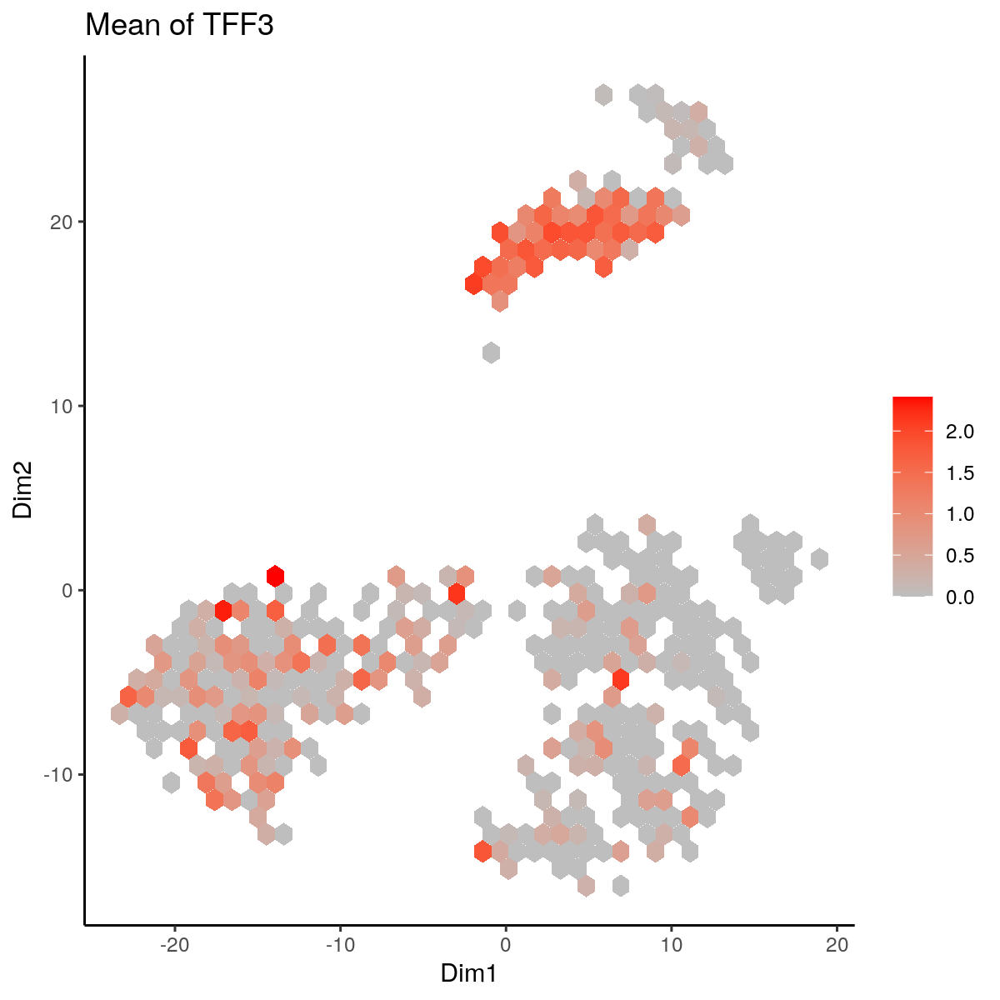|[CD55](https://www.ncbi.nlm.nih.gov/gene/1604) [ESR1](https://www.ncbi.nlm.nih.gov/gene/2099) [LCT](https://www.ncbi.nlm.nih.gov/gene/3938) [MUC1](https://www.ncbi.nlm.nih.gov/gene/4582) [MUC4](https://www.ncbi.nlm.nih.gov/gene/4585) [SLC39A6](https://www.ncbi.nlm.nih.gov/gene/25800) [MUC13](https://www.ncbi.nlm.nih.gov/gene/56667) [VANGL1](https://www.ncbi.nlm.nih.gov/gene/81839) [OCLN](https://www.ncbi.nlm.nih.gov/gene/100506658)|
|[TFPI](https://www.ncbi.nlm.nih.gov/gene/7035) |[CD59](https://www.ncbi.nlm.nih.gov/gene/966) [F2R](https://www.ncbi.nlm.nih.gov/gene/2149) [SELE](https://www.ncbi.nlm.nih.gov/gene/6401) [SELP](https://www.ncbi.nlm.nih.gov/gene/6403) [ADCY10](https://www.ncbi.nlm.nih.gov/gene/55811) [ADTRP](https://www.ncbi.nlm.nih.gov/gene/84830)|
|[TFPI2](https://www.ncbi.nlm.nih.gov/gene/7980)|[CD59](https://www.ncbi.nlm.nih.gov/gene/966) [DAG1](https://www.ncbi.nlm.nih.gov/gene/1605) [SFRP1](https://www.ncbi.nlm.nih.gov/gene/6422) [ENTPD8](https://www.ncbi.nlm.nih.gov/gene/377841)|
|[TG](https://www.ncbi.nlm.nih.gov/gene/7038)|[CD5](https://www.ncbi.nlm.nih.gov/gene/921) [CEACAM5](https://www.ncbi.nlm.nih.gov/gene/1048) [DIO3](https://www.ncbi.nlm.nih.gov/gene/1735) [DMD](https://www.ncbi.nlm.nih.gov/gene/1756) [ENO2](https://www.ncbi.nlm.nih.gov/gene/2026) [ESR1](https://www.ncbi.nlm.nih.gov/gene/2099) [HLA-DQA1](https://www.ncbi.nlm.nih.gov/gene/3117) [HLA-DRB1](https://www.ncbi.nlm.nih.gov/gene/3123) [MME](https://www.ncbi.nlm.nih.gov/gene/4311) [RET](https://www.ncbi.nlm.nih.gov/gene/5979) [SLC2A1](https://www.ncbi.nlm.nih.gov/gene/6513) [SLC16A2](https://www.ncbi.nlm.nih.gov/gene/6567) [TSHR](https://www.ncbi.nlm.nih.gov/gene/7253) [SLMAP](https://www.ncbi.nlm.nih.gov/gene/7871) [DIRAS3](https://www.ncbi.nlm.nih.gov/gene/9077) [ADGRL3](https://www.ncbi.nlm.nih.gov/gene/23284) [DUOX2](https://www.ncbi.nlm.nih.gov/gene/50506) [DUOX1](https://www.ncbi.nlm.nih.gov/gene/53905) [SLC2A14](https://www.ncbi.nlm.nih.gov/gene/144195) [IYD](https://www.ncbi.nlm.nih.gov/gene/389434)|
|[TGFA](https://www.ncbi.nlm.nih.gov/gene/7039)|[EGFR](https://www.ncbi.nlm.nih.gov/gene/1956)|
|[TGFB1](https://www.ncbi.nlm.nih.gov/gene/7040)|[ACVR1B](https://www.ncbi.nlm.nih.gov/gene/91) [ACVR2B](https://www.ncbi.nlm.nih.gov/gene/93) [ACVRL1](https://www.ncbi.nlm.nih.gov/gene/94) [AGTR1](https://www.ncbi.nlm.nih.gov/gene/185) [RHOA](https://www.ncbi.nlm.nih.gov/gene/387) [AXL](https://www.ncbi.nlm.nih.gov/gene/558) [BMPR1A](https://www.ncbi.nlm.nih.gov/gene/657) [BMPR1B](https://www.ncbi.nlm.nih.gov/gene/658) [BMPR2](https://www.ncbi.nlm.nih.gov/gene/659) [CD44](https://www.ncbi.nlm.nih.gov/gene/960) [CDH2](https://www.ncbi.nlm.nih.gov/gene/1000) [CCR6](https://www.ncbi.nlm.nih.gov/gene/1235) [ACE](https://www.ncbi.nlm.nih.gov/gene/1636) [ENG](https://www.ncbi.nlm.nih.gov/gene/2022) [ESR1](https://www.ncbi.nlm.nih.gov/gene/2099) [LRRC32](https://www.ncbi.nlm.nih.gov/gene/2615) [GJA1](https://www.ncbi.nlm.nih.gov/gene/2697) [IFNGR1](https://www.ncbi.nlm.nih.gov/gene/3459) [ITGA3](https://www.ncbi.nlm.nih.gov/gene/3675) [ITGAM](https://www.ncbi.nlm.nih.gov/gene/3684) [ITGAV](https://www.ncbi.nlm.nih.gov/gene/3685) [ITGB1](https://www.ncbi.nlm.nih.gov/gene/3688) [ITGB2](https://www.ncbi.nlm.nih.gov/gene/3689) [ITGB3](https://www.ncbi.nlm.nih.gov/gene/3690) [ITGB8](https://www.ncbi.nlm.nih.gov/gene/3696) [NOS3](https://www.ncbi.nlm.nih.gov/gene/4846) [PDGFRB](https://www.ncbi.nlm.nih.gov/gene/5159) [PDPK1](https://www.ncbi.nlm.nih.gov/gene/5170) [HTRA1](https://www.ncbi.nlm.nih.gov/gene/5654) [PTPRC](https://www.ncbi.nlm.nih.gov/gene/5788) [SPTBN1](https://www.ncbi.nlm.nih.gov/gene/6711) [SRC](https://www.ncbi.nlm.nih.gov/gene/6714) [TGFBR1](https://www.ncbi.nlm.nih.gov/gene/7046) [TGFBR2](https://www.ncbi.nlm.nih.gov/gene/7048) [THY1](https://www.ncbi.nlm.nih.gov/gene/7070) [TLR4](https://www.ncbi.nlm.nih.gov/gene/7099) [CXCR4](https://www.ncbi.nlm.nih.gov/gene/7852) [SEMA7A](https://www.ncbi.nlm.nih.gov/gene/8482) [CCRL2](https://www.ncbi.nlm.nih.gov/gene/9034) [WWP1](https://www.ncbi.nlm.nih.gov/gene/11059) [PARD6A](https://www.ncbi.nlm.nih.gov/gene/50855) [HJV](https://www.ncbi.nlm.nih.gov/gene/148738) [NCR3](https://www.ncbi.nlm.nih.gov/gene/259197) [OCLN](https://www.ncbi.nlm.nih.gov/gene/100506658) [KLRC4-KLRK1](https://www.ncbi.nlm.nih.gov/gene/100528032) [CAV1](https://www.ncbi.nlm.nih.gov/gene/857) [CDH1](https://www.ncbi.nlm.nih.gov/gene/999) [GPC1](https://www.ncbi.nlm.nih.gov/gene/2817) [TGFBR3](https://www.ncbi.nlm.nih.gov/gene/7049)|
|[TGFB2](https://www.ncbi.nlm.nih.gov/gene/7042)|[ACVR1B](https://www.ncbi.nlm.nih.gov/gene/91) [ACVR2B](https://www.ncbi.nlm.nih.gov/gene/93) [ACVRL1](https://www.ncbi.nlm.nih.gov/gene/94) [BMPR1A](https://www.ncbi.nlm.nih.gov/gene/657) [BMPR1B](https://www.ncbi.nlm.nih.gov/gene/658) [BMPR2](https://www.ncbi.nlm.nih.gov/gene/659) [ENG](https://www.ncbi.nlm.nih.gov/gene/2022) [PTH1R](https://www.ncbi.nlm.nih.gov/gene/5745) [TBXA2R](https://www.ncbi.nlm.nih.gov/gene/6915) [TGFBR1](https://www.ncbi.nlm.nih.gov/gene/7046) [TGFBR2](https://www.ncbi.nlm.nih.gov/gene/7048) [TGFBR3](https://www.ncbi.nlm.nih.gov/gene/7049)|
|[TGFB3](https://www.ncbi.nlm.nih.gov/gene/7043)|[ACVR1B](https://www.ncbi.nlm.nih.gov/gene/91) [ACVR2B](https://www.ncbi.nlm.nih.gov/gene/93) [ACVRL1](https://www.ncbi.nlm.nih.gov/gene/94) [BMPR1A](https://www.ncbi.nlm.nih.gov/gene/657) [BMPR1B](https://www.ncbi.nlm.nih.gov/gene/658) [BMPR2](https://www.ncbi.nlm.nih.gov/gene/659) [DSC2](https://www.ncbi.nlm.nih.gov/gene/1824) [DSG2](https://www.ncbi.nlm.nih.gov/gene/1829) [ENG](https://www.ncbi.nlm.nih.gov/gene/2022) [ITGAV](https://www.ncbi.nlm.nih.gov/gene/3685) [ITGB1](https://www.ncbi.nlm.nih.gov/gene/3688) [ITGB3](https://www.ncbi.nlm.nih.gov/gene/3690) [ITGB8](https://www.ncbi.nlm.nih.gov/gene/3696) [PDGFRB](https://www.ncbi.nlm.nih.gov/gene/5159) [PDPK1](https://www.ncbi.nlm.nih.gov/gene/5170) [SPTBN1](https://www.ncbi.nlm.nih.gov/gene/6711) [TGFBR1](https://www.ncbi.nlm.nih.gov/gene/7046) [TGFBR2](https://www.ncbi.nlm.nih.gov/gene/7048) [WWP1](https://www.ncbi.nlm.nih.gov/gene/11059) [PARD6A](https://www.ncbi.nlm.nih.gov/gene/50855) [PTOV1](https://www.ncbi.nlm.nih.gov/gene/53635) [HJV](https://www.ncbi.nlm.nih.gov/gene/148738) [OCLN](https://www.ncbi.nlm.nih.gov/gene/100506658) [CAV1](https://www.ncbi.nlm.nih.gov/gene/857) [CDH1](https://www.ncbi.nlm.nih.gov/gene/999) [GPC1](https://www.ncbi.nlm.nih.gov/gene/2817) [TGFBR3](https://www.ncbi.nlm.nih.gov/gene/7049)|
|[TGFBI](https://www.ncbi.nlm.nih.gov/gene/7045)|[DDR1](https://www.ncbi.nlm.nih.gov/gene/780) [ITGA3](https://www.ncbi.nlm.nih.gov/gene/3675) [ITGAM](https://www.ncbi.nlm.nih.gov/gene/3684) [ITGAV](https://www.ncbi.nlm.nih.gov/gene/3685) [ITGB1](https://www.ncbi.nlm.nih.gov/gene/3688) [ITGB2](https://www.ncbi.nlm.nih.gov/gene/3689) [ITGB3](https://www.ncbi.nlm.nih.gov/gene/3690) [TGFBR2](https://www.ncbi.nlm.nih.gov/gene/7048) [TYROBP](https://www.ncbi.nlm.nih.gov/gene/7305) [GPNMB](https://www.ncbi.nlm.nih.gov/gene/10457) [SLC38A3](https://www.ncbi.nlm.nih.gov/gene/10991) [MYOF](https://www.ncbi.nlm.nih.gov/gene/26509) [NRN1](https://www.ncbi.nlm.nih.gov/gene/51299) [SLC4A11](https://www.ncbi.nlm.nih.gov/gene/83959)|
|[TGFBR3](https://www.ncbi.nlm.nih.gov/gene/7049)|[ACVR1B](https://www.ncbi.nlm.nih.gov/gene/91) [ACVR2B](https://www.ncbi.nlm.nih.gov/gene/93) [ACVRL1](https://www.ncbi.nlm.nih.gov/gene/94) [ARRB2](https://www.ncbi.nlm.nih.gov/gene/409) [BMPR1A](https://www.ncbi.nlm.nih.gov/gene/657) [BMPR1B](https://www.ncbi.nlm.nih.gov/gene/658) [BMPR2](https://www.ncbi.nlm.nih.gov/gene/659) [DVL2](https://www.ncbi.nlm.nih.gov/gene/1856) [ENG](https://www.ncbi.nlm.nih.gov/gene/2022) [FGFR1](https://www.ncbi.nlm.nih.gov/gene/2260) [TGFBR1](https://www.ncbi.nlm.nih.gov/gene/7046) [TGFBR2](https://www.ncbi.nlm.nih.gov/gene/7048) [PARD6A](https://www.ncbi.nlm.nih.gov/gene/50855) [OCLN](https://www.ncbi.nlm.nih.gov/gene/100506658) [GPC1](https://www.ncbi.nlm.nih.gov/gene/2817)|
|[THBS1](https://www.ncbi.nlm.nih.gov/gene/7057)|[CALCR](https://www.ncbi.nlm.nih.gov/gene/799) [CD36](https://www.ncbi.nlm.nih.gov/gene/948) [CD44](https://www.ncbi.nlm.nih.gov/gene/960) [CD47](https://www.ncbi.nlm.nih.gov/gene/961) [CCR7](https://www.ncbi.nlm.nih.gov/gene/1236) [ENG](https://www.ncbi.nlm.nih.gov/gene/2022) [ITGA6](https://www.ncbi.nlm.nih.gov/gene/3655) [ITGA3](https://www.ncbi.nlm.nih.gov/gene/3675) [ITGAV](https://www.ncbi.nlm.nih.gov/gene/3685) [ITGB1](https://www.ncbi.nlm.nih.gov/gene/3688) [ITGB3](https://www.ncbi.nlm.nih.gov/gene/3690) [ITGB4](https://www.ncbi.nlm.nih.gov/gene/3691) [ITGB8](https://www.ncbi.nlm.nih.gov/gene/3696) [NOS3](https://www.ncbi.nlm.nih.gov/gene/4846) [PDGFRB](https://www.ncbi.nlm.nih.gov/gene/5159) [PTPRJ](https://www.ncbi.nlm.nih.gov/gene/5795) [SELP](https://www.ncbi.nlm.nih.gov/gene/6403) [SFRP1](https://www.ncbi.nlm.nih.gov/gene/6422) [SRC](https://www.ncbi.nlm.nih.gov/gene/6714) [STIM1](https://www.ncbi.nlm.nih.gov/gene/6786) [TEK](https://www.ncbi.nlm.nih.gov/gene/7010) [TGFBR1](https://www.ncbi.nlm.nih.gov/gene/7046) [TGFBR2](https://www.ncbi.nlm.nih.gov/gene/7048) [TLR4](https://www.ncbi.nlm.nih.gov/gene/7099) [NLGN1](https://www.ncbi.nlm.nih.gov/gene/22871)|
|[THPO](https://www.ncbi.nlm.nih.gov/gene/7066)|[MPL](https://www.ncbi.nlm.nih.gov/gene/4352)|
|[THSD1](https://www.ncbi.nlm.nih.gov/gene/55901)|[OR11A1](https://www.ncbi.nlm.nih.gov/gene/26531) [OR2W1](https://www.ncbi.nlm.nih.gov/gene/26692) [OR5T3](https://www.ncbi.nlm.nih.gov/gene/390154)|
|[THSD4](https://www.ncbi.nlm.nih.gov/gene/79875)|[AGER](https://www.ncbi.nlm.nih.gov/gene/177) [RIPK1](https://www.ncbi.nlm.nih.gov/gene/8737) [ADGRG6](https://www.ncbi.nlm.nih.gov/gene/57211)|
|[TIMP1](https://www.ncbi.nlm.nih.gov/gene/7076)|[ADAM10](https://www.ncbi.nlm.nih.gov/gene/102) [APLP2](https://www.ncbi.nlm.nih.gov/gene/334) [BSG](https://www.ncbi.nlm.nih.gov/gene/682) [CD44](https://www.ncbi.nlm.nih.gov/gene/960) [CD63](https://www.ncbi.nlm.nih.gov/gene/967) [CDH2](https://www.ncbi.nlm.nih.gov/gene/1000) [CNR1](https://www.ncbi.nlm.nih.gov/gene/1268) [ACE](https://www.ncbi.nlm.nih.gov/gene/1636) [ENG](https://www.ncbi.nlm.nih.gov/gene/2022) [ESR1](https://www.ncbi.nlm.nih.gov/gene/2099) [GPC3](https://www.ncbi.nlm.nih.gov/gene/2719) [ITGAM](https://www.ncbi.nlm.nih.gov/gene/3684) [ITGB1](https://www.ncbi.nlm.nih.gov/gene/3688) [CD82](https://www.ncbi.nlm.nih.gov/gene/3732) [MELTF](https://www.ncbi.nlm.nih.gov/gene/4241) [MMP17](https://www.ncbi.nlm.nih.gov/gene/4326) [NOS3](https://www.ncbi.nlm.nih.gov/gene/4846) [PDGFRB](https://www.ncbi.nlm.nih.gov/gene/5159) [PHEX](https://www.ncbi.nlm.nih.gov/gene/5251) [SELE](https://www.ncbi.nlm.nih.gov/gene/6401) [SELP](https://www.ncbi.nlm.nih.gov/gene/6403) [SLC12A3](https://www.ncbi.nlm.nih.gov/gene/6559) [TGFBR1](https://www.ncbi.nlm.nih.gov/gene/7046) [TLR4](https://www.ncbi.nlm.nih.gov/gene/7099) [CXCR4](https://www.ncbi.nlm.nih.gov/gene/7852) [RECK](https://www.ncbi.nlm.nih.gov/gene/8434) [TGOLN2](https://www.ncbi.nlm.nih.gov/gene/10618) [MXRA8](https://www.ncbi.nlm.nih.gov/gene/54587) [PNPLA2](https://www.ncbi.nlm.nih.gov/gene/57104) [ANO8](https://www.ncbi.nlm.nih.gov/gene/57719) [CXCL16](https://www.ncbi.nlm.nih.gov/gene/58191) [MMP25](https://www.ncbi.nlm.nih.gov/gene/64386) [ASTL](https://www.ncbi.nlm.nih.gov/gene/431705) [CCR2](https://www.ncbi.nlm.nih.gov/gene/729230) [CDH1](https://www.ncbi.nlm.nih.gov/gene/999)|
|[TIMP2](https://www.ncbi.nlm.nih.gov/gene/7077)|[ADAM10](https://www.ncbi.nlm.nih.gov/gene/102) [BSG](https://www.ncbi.nlm.nih.gov/gene/682) [CD44](https://www.ncbi.nlm.nih.gov/gene/960) [ACE](https://www.ncbi.nlm.nih.gov/gene/1636) [GNGT2](https://www.ncbi.nlm.nih.gov/gene/2793) [ITGA3](https://www.ncbi.nlm.nih.gov/gene/3675) [ITGB1](https://www.ncbi.nlm.nih.gov/gene/3688) [MMP17](https://www.ncbi.nlm.nih.gov/gene/4326) [PHEX](https://www.ncbi.nlm.nih.gov/gene/5251) [VCL](https://www.ncbi.nlm.nih.gov/gene/7414) [RECK](https://www.ncbi.nlm.nih.gov/gene/8434) [RAB40B](https://www.ncbi.nlm.nih.gov/gene/10966) [MMP25](https://www.ncbi.nlm.nih.gov/gene/64386) [GSDMD](https://www.ncbi.nlm.nih.gov/gene/79792) [OSCAR](https://www.ncbi.nlm.nih.gov/gene/126014) [CDH1](https://www.ncbi.nlm.nih.gov/gene/999)|
|[TIMP3](https://www.ncbi.nlm.nih.gov/gene/7078)|[ADAM10](https://www.ncbi.nlm.nih.gov/gene/102) [AGTR2](https://www.ncbi.nlm.nih.gov/gene/186) [CD44](https://www.ncbi.nlm.nih.gov/gene/960) [CDH13](https://www.ncbi.nlm.nih.gov/gene/1012) [ESR1](https://www.ncbi.nlm.nih.gov/gene/2099) [KRAS](https://www.ncbi.nlm.nih.gov/gene/3845) [MMP17](https://www.ncbi.nlm.nih.gov/gene/4326) [PDGFRB](https://www.ncbi.nlm.nih.gov/gene/5159) [HTRA1](https://www.ncbi.nlm.nih.gov/gene/5654) [SFRP1](https://www.ncbi.nlm.nih.gov/gene/6422) [RECK](https://www.ncbi.nlm.nih.gov/gene/8434) [SLC16A8](https://www.ncbi.nlm.nih.gov/gene/23539) [MMP25](https://www.ncbi.nlm.nih.gov/gene/64386) [SLC5A8](https://www.ncbi.nlm.nih.gov/gene/160728)|
|[TIMP4](https://www.ncbi.nlm.nih.gov/gene/7079)|[ADAM10](https://www.ncbi.nlm.nih.gov/gene/102) [CD63](https://www.ncbi.nlm.nih.gov/gene/967) [MMP17](https://www.ncbi.nlm.nih.gov/gene/4326) [RAF1](https://www.ncbi.nlm.nih.gov/gene/5894) [RECK](https://www.ncbi.nlm.nih.gov/gene/8434) [MMP25](https://www.ncbi.nlm.nih.gov/gene/64386) [RAB3C](https://www.ncbi.nlm.nih.gov/gene/115827)|
|[TINAG](https://www.ncbi.nlm.nih.gov/gene/27283)|[CDH16](https://www.ncbi.nlm.nih.gov/gene/1014) [SMAP1](https://www.ncbi.nlm.nih.gov/gene/60682) [CPO](https://www.ncbi.nlm.nih.gov/gene/130749) [OR5B17](https://www.ncbi.nlm.nih.gov/gene/219965) [SLCO1B7](https://www.ncbi.nlm.nih.gov/gene/338821) [OR5B3](https://www.ncbi.nlm.nih.gov/gene/441608)|
|[TINAGL1](https://www.ncbi.nlm.nih.gov/gene/64129)|[CD59](https://www.ncbi.nlm.nih.gov/gene/966) [DLG4](https://www.ncbi.nlm.nih.gov/gene/1742) [GRIA1](https://www.ncbi.nlm.nih.gov/gene/2890) [GRIA2](https://www.ncbi.nlm.nih.gov/gene/2891) [GRIA4](https://www.ncbi.nlm.nih.gov/gene/2893) [MUC13](https://www.ncbi.nlm.nih.gov/gene/56667) [CACNG8](https://www.ncbi.nlm.nih.gov/gene/59283) [SYNDIG1](https://www.ncbi.nlm.nih.gov/gene/79953) [OTOP2](https://www.ncbi.nlm.nih.gov/gene/92736) [GSG1L](https://www.ncbi.nlm.nih.gov/gene/146395) [TMEM184A](https://www.ncbi.nlm.nih.gov/gene/202915)|
|[TLL1](https://www.ncbi.nlm.nih.gov/gene/7092)|[BMPR1A](https://www.ncbi.nlm.nih.gov/gene/657) [BMPR2](https://www.ncbi.nlm.nih.gov/gene/659) [ACE](https://www.ncbi.nlm.nih.gov/gene/1636) [MME](https://www.ncbi.nlm.nih.gov/gene/4311) [ZP1](https://www.ncbi.nlm.nih.gov/gene/22917) [OTOA](https://www.ncbi.nlm.nih.gov/gene/146183)|
|[TLL2](https://www.ncbi.nlm.nih.gov/gene/7093)|[ACE](https://www.ncbi.nlm.nih.gov/gene/1636) [MME](https://www.ncbi.nlm.nih.gov/gene/4311)|
|[TMEFF2](https://www.ncbi.nlm.nih.gov/gene/23671)|[CDH13](https://www.ncbi.nlm.nih.gov/gene/1012) [GNG3](https://www.ncbi.nlm.nih.gov/gene/2785) [OPCML](https://www.ncbi.nlm.nih.gov/gene/4978) [RASGRF2](https://www.ncbi.nlm.nih.gov/gene/5924) [SFRP1](https://www.ncbi.nlm.nih.gov/gene/6422) [ELMO1](https://www.ncbi.nlm.nih.gov/gene/9844) [MXRA8](https://www.ncbi.nlm.nih.gov/gene/54587) [MAPKAP1](https://www.ncbi.nlm.nih.gov/gene/79109) [OR5M3](https://www.ncbi.nlm.nih.gov/gene/219482) [OR6C1](https://www.ncbi.nlm.nih.gov/gene/390321)|
|[TMEM25](https://www.ncbi.nlm.nih.gov/gene/84866)|[TMEM127](https://www.ncbi.nlm.nih.gov/gene/55654) [SLC35G2](https://www.ncbi.nlm.nih.gov/gene/80723) [TMEM30B](https://www.ncbi.nlm.nih.gov/gene/161291) [PLPPR5](https://www.ncbi.nlm.nih.gov/gene/163404) [SLC51A](https://www.ncbi.nlm.nih.gov/gene/200931)|
|[TNC](https://www.ncbi.nlm.nih.gov/gene/3371)|[ADAM10](https://www.ncbi.nlm.nih.gov/gene/102) [APLP2](https://www.ncbi.nlm.nih.gov/gene/334) [CDH2](https://www.ncbi.nlm.nih.gov/gene/1000) [CNTN1](https://www.ncbi.nlm.nih.gov/gene/1272) [GPC3](https://www.ncbi.nlm.nih.gov/gene/2719) [ITGA6](https://www.ncbi.nlm.nih.gov/gene/3655) [ITGA3](https://www.ncbi.nlm.nih.gov/gene/3675) [ITGAV](https://www.ncbi.nlm.nih.gov/gene/3685) [ITGB1](https://www.ncbi.nlm.nih.gov/gene/3688) [ITGB3](https://www.ncbi.nlm.nih.gov/gene/3690) [ITGB4](https://www.ncbi.nlm.nih.gov/gene/3691) [ITGB8](https://www.ncbi.nlm.nih.gov/gene/3696) [MELTF](https://www.ncbi.nlm.nih.gov/gene/4241) [SRC](https://www.ncbi.nlm.nih.gov/gene/6714) [TLR4](https://www.ncbi.nlm.nih.gov/gene/7099) [SDC3](https://www.ncbi.nlm.nih.gov/gene/9672) [TGOLN2](https://www.ncbi.nlm.nih.gov/gene/10618) [MXRA8](https://www.ncbi.nlm.nih.gov/gene/54587) [MRAP](https://www.ncbi.nlm.nih.gov/gene/56246) [PNPLA2](https://www.ncbi.nlm.nih.gov/gene/57104) [ANO8](https://www.ncbi.nlm.nih.gov/gene/57719)|
|[TNF](https://www.ncbi.nlm.nih.gov/gene/7124)|[ACHE](https://www.ncbi.nlm.nih.gov/gene/43) [ADA](https://www.ncbi.nlm.nih.gov/gene/100) [ADAM10](https://www.ncbi.nlm.nih.gov/gene/102) [ADORA1](https://www.ncbi.nlm.nih.gov/gene/134) [ADORA2A](https://www.ncbi.nlm.nih.gov/gene/135) [ADORA2B](https://www.ncbi.nlm.nih.gov/gene/136) [ADRB2](https://www.ncbi.nlm.nih.gov/gene/154) [AGER](https://www.ncbi.nlm.nih.gov/gene/177) [AGTR1](https://www.ncbi.nlm.nih.gov/gene/185) [ALOX15](https://www.ncbi.nlm.nih.gov/gene/246) [ALPL](https://www.ncbi.nlm.nih.gov/gene/249) [ANPEP](https://www.ncbi.nlm.nih.gov/gene/290) [AQP3](https://www.ncbi.nlm.nih.gov/gene/360) [RHOA](https://www.ncbi.nlm.nih.gov/gene/387) [ATP4A](https://www.ncbi.nlm.nih.gov/gene/495) [TNFRSF17](https://www.ncbi.nlm.nih.gov/gene/608) [CXCR5](https://www.ncbi.nlm.nih.gov/gene/643) [BTK](https://www.ncbi.nlm.nih.gov/gene/695) [C3AR1](https://www.ncbi.nlm.nih.gov/gene/719) [C5AR1](https://www.ncbi.nlm.nih.gov/gene/728) [CD1A](https://www.ncbi.nlm.nih.gov/gene/909) [CD1B](https://www.ncbi.nlm.nih.gov/gene/910) [CD1C](https://www.ncbi.nlm.nih.gov/gene/911) [CD1D](https://www.ncbi.nlm.nih.gov/gene/912) [CD2](https://www.ncbi.nlm.nih.gov/gene/914) [CD3E](https://www.ncbi.nlm.nih.gov/gene/916) [CD4](https://www.ncbi.nlm.nih.gov/gene/920) [CD5](https://www.ncbi.nlm.nih.gov/gene/921) [CD14](https://www.ncbi.nlm.nih.gov/gene/929) [CD19](https://www.ncbi.nlm.nih.gov/gene/930) [CD22](https://www.ncbi.nlm.nih.gov/gene/933) [CD86](https://www.ncbi.nlm.nih.gov/gene/942) [SCARB1](https://www.ncbi.nlm.nih.gov/gene/949) [CD44](https://www.ncbi.nlm.nih.gov/gene/960) [CD47](https://www.ncbi.nlm.nih.gov/gene/961) [CD48](https://www.ncbi.nlm.nih.gov/gene/962) [CD58](https://www.ncbi.nlm.nih.gov/gene/965) [CD59](https://www.ncbi.nlm.nih.gov/gene/966) [CD74](https://www.ncbi.nlm.nih.gov/gene/972) [CDC42](https://www.ncbi.nlm.nih.gov/gene/998) [CDH2](https://www.ncbi.nlm.nih.gov/gene/1000) [CDH17](https://www.ncbi.nlm.nih.gov/gene/1015) [CD52](https://www.ncbi.nlm.nih.gov/gene/1043) [CFTR](https://www.ncbi.nlm.nih.gov/gene/1080) [CCR1](https://www.ncbi.nlm.nih.gov/gene/1230) [CCR3](https://www.ncbi.nlm.nih.gov/gene/1232) [CCR5](https://www.ncbi.nlm.nih.gov/gene/1234) [CCR6](https://www.ncbi.nlm.nih.gov/gene/1235) [CCR7](https://www.ncbi.nlm.nih.gov/gene/1236) [CCR8](https://www.ncbi.nlm.nih.gov/gene/1237) [CMKLR1](https://www.ncbi.nlm.nih.gov/gene/1240) [LTB4R](https://www.ncbi.nlm.nih.gov/gene/1241) [CNR1](https://www.ncbi.nlm.nih.gov/gene/1268) [CR2](https://www.ncbi.nlm.nih.gov/gene/1380) [CSF1R](https://www.ncbi.nlm.nih.gov/gene/1436) [CX3CR1](https://www.ncbi.nlm.nih.gov/gene/1524) [CYBA](https://www.ncbi.nlm.nih.gov/gene/1535) [CYBB](https://www.ncbi.nlm.nih.gov/gene/1536) [CD55](https://www.ncbi.nlm.nih.gov/gene/1604) [ACE](https://www.ncbi.nlm.nih.gov/gene/1636) [DPP4](https://www.ncbi.nlm.nih.gov/gene/1803) [S1PR1](https://www.ncbi.nlm.nih.gov/gene/1901) [EDNRB](https://www.ncbi.nlm.nih.gov/gene/1910) [ADGRE1](https://www.ncbi.nlm.nih.gov/gene/2015) [ENG](https://www.ncbi.nlm.nih.gov/gene/2022) [ESR1](https://www.ncbi.nlm.nih.gov/gene/2099) [FAT1](https://www.ncbi.nlm.nih.gov/gene/2195) [FCER2](https://www.ncbi.nlm.nih.gov/gene/2208) [FCGR1A](https://www.ncbi.nlm.nih.gov/gene/2209) [FCGR2A](https://www.ncbi.nlm.nih.gov/gene/2212) [FCGR2B](https://www.ncbi.nlm.nih.gov/gene/2213) [FCGR3A](https://www.ncbi.nlm.nih.gov/gene/2214) [FCGR3B](https://www.ncbi.nlm.nih.gov/gene/2215) [FGR](https://www.ncbi.nlm.nih.gov/gene/2268) [FPR2](https://www.ncbi.nlm.nih.gov/gene/2358) [FYN](https://www.ncbi.nlm.nih.gov/gene/2534) [GGT1](https://www.ncbi.nlm.nih.gov/gene/2678) [GJA1](https://www.ncbi.nlm.nih.gov/gene/2697) [CXCR3](https://www.ncbi.nlm.nih.gov/gene/2833) [HLA-A](https://www.ncbi.nlm.nih.gov/gene/3105) [HLA-DQA1](https://www.ncbi.nlm.nih.gov/gene/3117) [HLA-DQB1](https://www.ncbi.nlm.nih.gov/gene/3119) [HLA-DQB2](https://www.ncbi.nlm.nih.gov/gene/3120) [HLA-DRB1](https://www.ncbi.nlm.nih.gov/gene/3123) [IFNAR1](https://www.ncbi.nlm.nih.gov/gene/3454) [IFNGR1](https://www.ncbi.nlm.nih.gov/gene/3459) [IFNGR2](https://www.ncbi.nlm.nih.gov/gene/3460) [IL2RB](https://www.ncbi.nlm.nih.gov/gene/3560) [IL2RG](https://www.ncbi.nlm.nih.gov/gene/3561) [CXCR1](https://www.ncbi.nlm.nih.gov/gene/3577) [CXCR2](https://www.ncbi.nlm.nih.gov/gene/3579) [IL10RA](https://www.ncbi.nlm.nih.gov/gene/3587) [ITGAL](https://www.ncbi.nlm.nih.gov/gene/3683) [ITGAM](https://www.ncbi.nlm.nih.gov/gene/3684) [ITGB1](https://www.ncbi.nlm.nih.gov/gene/3688) [ITGB2](https://www.ncbi.nlm.nih.gov/gene/3689) [KLRD1](https://www.ncbi.nlm.nih.gov/gene/3824) [KRAS](https://www.ncbi.nlm.nih.gov/gene/3845) [LAMP1](https://www.ncbi.nlm.nih.gov/gene/3916) [LAMP2](https://www.ncbi.nlm.nih.gov/gene/3920) [LDLR](https://www.ncbi.nlm.nih.gov/gene/3949) [LIPE](https://www.ncbi.nlm.nih.gov/gene/3991) [LYN](https://www.ncbi.nlm.nih.gov/gene/4067) [EPCAM](https://www.ncbi.nlm.nih.gov/gene/4072) [MICB](https://www.ncbi.nlm.nih.gov/gene/4277) [MMP17](https://www.ncbi.nlm.nih.gov/gene/4326) [MOG](https://www.ncbi.nlm.nih.gov/gene/4340) [CD200](https://www.ncbi.nlm.nih.gov/gene/4345) [MUC1](https://www.ncbi.nlm.nih.gov/gene/4582) [NGFR](https://www.ncbi.nlm.nih.gov/gene/4804) [NOS1](https://www.ncbi.nlm.nih.gov/gene/4842) [NOS3](https://www.ncbi.nlm.nih.gov/gene/4846) [NPHS1](https://www.ncbi.nlm.nih.gov/gene/4868) [NT5E](https://www.ncbi.nlm.nih.gov/gene/4907) [OLR1](https://www.ncbi.nlm.nih.gov/gene/4973) [P2RX7](https://www.ncbi.nlm.nih.gov/gene/5027) [PDCD1](https://www.ncbi.nlm.nih.gov/gene/5133) [PDGFRB](https://www.ncbi.nlm.nih.gov/gene/5159) [ABCB1](https://www.ncbi.nlm.nih.gov/gene/5243) [PHEX](https://www.ncbi.nlm.nih.gov/gene/5251) [PLA2G2A](https://www.ncbi.nlm.nih.gov/gene/5320) [PTAFR](https://www.ncbi.nlm.nih.gov/gene/5724) [PTGER4](https://www.ncbi.nlm.nih.gov/gene/5734) [PTPRC](https://www.ncbi.nlm.nih.gov/gene/5788) [RAB5A](https://www.ncbi.nlm.nih.gov/gene/5868) [RAC1](https://www.ncbi.nlm.nih.gov/gene/5879) [SELE](https://www.ncbi.nlm.nih.gov/gene/6401) [SELL](https://www.ncbi.nlm.nih.gov/gene/6402) [SELP](https://www.ncbi.nlm.nih.gov/gene/6403) [SLAMF1](https://www.ncbi.nlm.nih.gov/gene/6504) [SLC2A1](https://www.ncbi.nlm.nih.gov/gene/6513) [SLC2A2](https://www.ncbi.nlm.nih.gov/gene/6514) [SLC2A4](https://www.ncbi.nlm.nih.gov/gene/6517) [SRC](https://www.ncbi.nlm.nih.gov/gene/6714) [SSTR1](https://www.ncbi.nlm.nih.gov/gene/6751) [SSTR2](https://www.ncbi.nlm.nih.gov/gene/6752) [SSTR3](https://www.ncbi.nlm.nih.gov/gene/6753) [SSTR4](https://www.ncbi.nlm.nih.gov/gene/6754) [SSTR5](https://www.ncbi.nlm.nih.gov/gene/6755) [SYK](https://www.ncbi.nlm.nih.gov/gene/6850) [TEK](https://www.ncbi.nlm.nih.gov/gene/7010) [THY1](https://www.ncbi.nlm.nih.gov/gene/7070) [TJP1](https://www.ncbi.nlm.nih.gov/gene/7082) [TLR1](https://www.ncbi.nlm.nih.gov/gene/7096) [TLR4](https://www.ncbi.nlm.nih.gov/gene/7099) [TLR5](https://www.ncbi.nlm.nih.gov/gene/7100) [TYROBP](https://www.ncbi.nlm.nih.gov/gene/7305) [IL1R2](https://www.ncbi.nlm.nih.gov/gene/7850) [CXCR4](https://www.ncbi.nlm.nih.gov/gene/7852) [RIPK1](https://www.ncbi.nlm.nih.gov/gene/8737) [TNFSF10](https://www.ncbi.nlm.nih.gov/gene/8743) [TNFRSF14](https://www.ncbi.nlm.nih.gov/gene/8764) [TNFRSF11A](https://www.ncbi.nlm.nih.gov/gene/8792) [TNFRSF10C](https://www.ncbi.nlm.nih.gov/gene/8794) [PROM1](https://www.ncbi.nlm.nih.gov/gene/8842) [MGAM](https://www.ncbi.nlm.nih.gov/gene/8972) [TNFSF18](https://www.ncbi.nlm.nih.gov/gene/8995) [CCRL2](https://www.ncbi.nlm.nih.gov/gene/9034) [FCGR2C](https://www.ncbi.nlm.nih.gov/gene/9103) [IL1RL1](https://www.ncbi.nlm.nih.gov/gene/9173) [CD163](https://www.ncbi.nlm.nih.gov/gene/9332) [NCR2](https://www.ncbi.nlm.nih.gov/gene/9436) [NCR1](https://www.ncbi.nlm.nih.gov/gene/9437) [KLRG1](https://www.ncbi.nlm.nih.gov/gene/10219) [TLR6](https://www.ncbi.nlm.nih.gov/gene/10333) [NOD1](https://www.ncbi.nlm.nih.gov/gene/10392) [RACK1](https://www.ncbi.nlm.nih.gov/gene/10399) [CXCR6](https://www.ncbi.nlm.nih.gov/gene/10663) [CD226](https://www.ncbi.nlm.nih.gov/gene/10666) [CYSLTR1](https://www.ncbi.nlm.nih.gov/gene/10800) [CCR9](https://www.ncbi.nlm.nih.gov/gene/10803) [ICOSLG](https://www.ncbi.nlm.nih.gov/gene/23308) [CLEC5A](https://www.ncbi.nlm.nih.gov/gene/23601) [BACE1](https://www.ncbi.nlm.nih.gov/gene/23621) [CADM1](https://www.ncbi.nlm.nih.gov/gene/23705) [CLIP3](https://www.ncbi.nlm.nih.gov/gene/25999) [TNFRSF21](https://www.ncbi.nlm.nih.gov/gene/27242) [CLEC4A](https://www.ncbi.nlm.nih.gov/gene/50856) [ADIPOR1](https://www.ncbi.nlm.nih.gov/gene/51094) [PLCE1](https://www.ncbi.nlm.nih.gov/gene/51196) [GPR84](https://www.ncbi.nlm.nih.gov/gene/53831) [DUOX1](https://www.ncbi.nlm.nih.gov/gene/53905) [DLL4](https://www.ncbi.nlm.nih.gov/gene/54567) [ITLN1](https://www.ncbi.nlm.nih.gov/gene/55600) [MRAP](https://www.ncbi.nlm.nih.gov/gene/56246) [SPPL2B](https://www.ncbi.nlm.nih.gov/gene/56928) [ACKR3](https://www.ncbi.nlm.nih.gov/gene/57007) [CXCL16](https://www.ncbi.nlm.nih.gov/gene/58191) [MMP25](https://www.ncbi.nlm.nih.gov/gene/64386) [ADIPOR2](https://www.ncbi.nlm.nih.gov/gene/79602) [STEAP4](https://www.ncbi.nlm.nih.gov/gene/79689) [PDCD1LG2](https://www.ncbi.nlm.nih.gov/gene/80380) [IL17RC](https://www.ncbi.nlm.nih.gov/gene/84818) [RFFL](https://www.ncbi.nlm.nih.gov/gene/117584) [IL23R](https://www.ncbi.nlm.nih.gov/gene/149233) [BTLA](https://www.ncbi.nlm.nih.gov/gene/151888) [CLEC4C](https://www.ncbi.nlm.nih.gov/gene/170482) [NCR3](https://www.ncbi.nlm.nih.gov/gene/259197) [CCR2](https://www.ncbi.nlm.nih.gov/gene/729230) [CD24](https://www.ncbi.nlm.nih.gov/gene/100133941) [OCLN](https://www.ncbi.nlm.nih.gov/gene/100506658) [MICA](https://www.ncbi.nlm.nih.gov/gene/100507436) [KLRC4-KLRK1](https://www.ncbi.nlm.nih.gov/gene/100528032) [CAV1](https://www.ncbi.nlm.nih.gov/gene/857) [CDH1](https://www.ncbi.nlm.nih.gov/gene/999) [CDH5](https://www.ncbi.nlm.nih.gov/gene/1003) [CLDN5](https://www.ncbi.nlm.nih.gov/gene/7122) [TNFRSF1A](https://www.ncbi.nlm.nih.gov/gene/7132) [TNFRSF1B](https://www.ncbi.nlm.nih.gov/gene/7133) [LTBR](https://www.ncbi.nlm.nih.gov/gene/4055)|
|[TNFRSF11B](https://www.ncbi.nlm.nih.gov/gene/4982)|[ADORA2A](https://www.ncbi.nlm.nih.gov/gene/135) [ALPL](https://www.ncbi.nlm.nih.gov/gene/249) [CALCR](https://www.ncbi.nlm.nih.gov/gene/799) [CASR](https://www.ncbi.nlm.nih.gov/gene/846) [CSF1R](https://www.ncbi.nlm.nih.gov/gene/1436) [ESR1](https://www.ncbi.nlm.nih.gov/gene/2099) [LRP6](https://www.ncbi.nlm.nih.gov/gene/4040) [PTH1R](https://www.ncbi.nlm.nih.gov/gene/5745) [TNFSF10](https://www.ncbi.nlm.nih.gov/gene/8743) [TNFRSF11A](https://www.ncbi.nlm.nih.gov/gene/8792) [DCSTAMP](https://www.ncbi.nlm.nih.gov/gene/81501) [OSCAR](https://www.ncbi.nlm.nih.gov/gene/126014)|
|[TNFRSF18](https://www.ncbi.nlm.nih.gov/gene/8784)|[CXCR5](https://www.ncbi.nlm.nih.gov/gene/643) [CD19](https://www.ncbi.nlm.nih.gov/gene/930) [CD86](https://www.ncbi.nlm.nih.gov/gene/942) [CD44](https://www.ncbi.nlm.nih.gov/gene/960) [CCR5](https://www.ncbi.nlm.nih.gov/gene/1234) [CCR6](https://www.ncbi.nlm.nih.gov/gene/1235) [CCR7](https://www.ncbi.nlm.nih.gov/gene/1236) [CCR8](https://www.ncbi.nlm.nih.gov/gene/1237) [LRRC32](https://www.ncbi.nlm.nih.gov/gene/2615) [CXCR3](https://www.ncbi.nlm.nih.gov/gene/2833) [IL2RB](https://www.ncbi.nlm.nih.gov/gene/3560) [IL2RG](https://www.ncbi.nlm.nih.gov/gene/3561) [IL10RA](https://www.ncbi.nlm.nih.gov/gene/3587) [ITGAM](https://www.ncbi.nlm.nih.gov/gene/3684) [NT5E](https://www.ncbi.nlm.nih.gov/gene/4907) [PDCD1](https://www.ncbi.nlm.nih.gov/gene/5133) [PTPRC](https://www.ncbi.nlm.nih.gov/gene/5788) [SELL](https://www.ncbi.nlm.nih.gov/gene/6402) [TNFRSF14](https://www.ncbi.nlm.nih.gov/gene/8764) [TNFSF18](https://www.ncbi.nlm.nih.gov/gene/8995) [CCRL2](https://www.ncbi.nlm.nih.gov/gene/9034) [KLRG1](https://www.ncbi.nlm.nih.gov/gene/10219) [ICOSLG](https://www.ncbi.nlm.nih.gov/gene/23308) [PDCD1LG2](https://www.ncbi.nlm.nih.gov/gene/80380) [BTLA](https://www.ncbi.nlm.nih.gov/gene/151888) [TIGIT](https://www.ncbi.nlm.nih.gov/gene/201633) [IZUMO1R](https://www.ncbi.nlm.nih.gov/gene/390243)|
|[TNFRSF1A](https://www.ncbi.nlm.nih.gov/gene/7132)|[RHOA](https://www.ncbi.nlm.nih.gov/gene/387) [CBL](https://www.ncbi.nlm.nih.gov/gene/867) [CD19](https://www.ncbi.nlm.nih.gov/gene/930) [CD86](https://www.ncbi.nlm.nih.gov/gene/942) [CD44](https://www.ncbi.nlm.nih.gov/gene/960) [CCR5](https://www.ncbi.nlm.nih.gov/gene/1234) [CYBA](https://www.ncbi.nlm.nih.gov/gene/1535) [CYBB](https://www.ncbi.nlm.nih.gov/gene/1536) [FYN](https://www.ncbi.nlm.nih.gov/gene/2534) [IFNGR1](https://www.ncbi.nlm.nih.gov/gene/3459) [IL10RA](https://www.ncbi.nlm.nih.gov/gene/3587) [ITGAM](https://www.ncbi.nlm.nih.gov/gene/3684) [MSN](https://www.ncbi.nlm.nih.gov/gene/4478) [MUC1](https://www.ncbi.nlm.nih.gov/gene/4582) [PTPRC](https://www.ncbi.nlm.nih.gov/gene/5788) [SELE](https://www.ncbi.nlm.nih.gov/gene/6401) [SELL](https://www.ncbi.nlm.nih.gov/gene/6402) [SRC](https://www.ncbi.nlm.nih.gov/gene/6714) [SYK](https://www.ncbi.nlm.nih.gov/gene/6850) [TLR1](https://www.ncbi.nlm.nih.gov/gene/7096) [TLR4](https://www.ncbi.nlm.nih.gov/gene/7099) [TLR5](https://www.ncbi.nlm.nih.gov/gene/7100) [EZR](https://www.ncbi.nlm.nih.gov/gene/7430) [IL1R2](https://www.ncbi.nlm.nih.gov/gene/7850) [CXCR4](https://www.ncbi.nlm.nih.gov/gene/7852) [RIPK1](https://www.ncbi.nlm.nih.gov/gene/8737) [TNFSF10](https://www.ncbi.nlm.nih.gov/gene/8743) [TNFRSF14](https://www.ncbi.nlm.nih.gov/gene/8764) [TNFRSF11A](https://www.ncbi.nlm.nih.gov/gene/8792) [TNFRSF10C](https://www.ncbi.nlm.nih.gov/gene/8794) [TNFSF18](https://www.ncbi.nlm.nih.gov/gene/8995) [TLR6](https://www.ncbi.nlm.nih.gov/gene/10333) [RACK1](https://www.ncbi.nlm.nih.gov/gene/10399) [ICOSLG](https://www.ncbi.nlm.nih.gov/gene/23308) [CLIP3](https://www.ncbi.nlm.nih.gov/gene/25999) [TNFRSF21](https://www.ncbi.nlm.nih.gov/gene/27242) [MUC13](https://www.ncbi.nlm.nih.gov/gene/56667) [RFFL](https://www.ncbi.nlm.nih.gov/gene/117584) [IL23R](https://www.ncbi.nlm.nih.gov/gene/149233) [BTLA](https://www.ncbi.nlm.nih.gov/gene/151888) [DAB2IP](https://www.ncbi.nlm.nih.gov/gene/153090) [CCR2](https://www.ncbi.nlm.nih.gov/gene/729230)|
|[TNFRSF1B](https://www.ncbi.nlm.nih.gov/gene/7133)|[ADAM10](https://www.ncbi.nlm.nih.gov/gene/102) [ALDH3B1](https://www.ncbi.nlm.nih.gov/gene/221) [BST1](https://www.ncbi.nlm.nih.gov/gene/683) [C3AR1](https://www.ncbi.nlm.nih.gov/gene/719) [CD2](https://www.ncbi.nlm.nih.gov/gene/914) [CD19](https://www.ncbi.nlm.nih.gov/gene/930) [CD86](https://www.ncbi.nlm.nih.gov/gene/942) [CD36](https://www.ncbi.nlm.nih.gov/gene/948) [CD47](https://www.ncbi.nlm.nih.gov/gene/961) [CD53](https://www.ncbi.nlm.nih.gov/gene/963) [CD59](https://www.ncbi.nlm.nih.gov/gene/966) [CD52](https://www.ncbi.nlm.nih.gov/gene/1043) [CEACAM8](https://www.ncbi.nlm.nih.gov/gene/1088) [CCR1](https://www.ncbi.nlm.nih.gov/gene/1230) [CCR5](https://www.ncbi.nlm.nih.gov/gene/1234) [CYBA](https://www.ncbi.nlm.nih.gov/gene/1535) [CYBB](https://www.ncbi.nlm.nih.gov/gene/1536) [ACE](https://www.ncbi.nlm.nih.gov/gene/1636) [STOM](https://www.ncbi.nlm.nih.gov/gene/2040) [FCGR2A](https://www.ncbi.nlm.nih.gov/gene/2212) [FCGR3A](https://www.ncbi.nlm.nih.gov/gene/2214) [FCGRT](https://www.ncbi.nlm.nih.gov/gene/2217) [FPR2](https://www.ncbi.nlm.nih.gov/gene/2358) [HLA-DRB1](https://www.ncbi.nlm.nih.gov/gene/3123) [IL2RB](https://www.ncbi.nlm.nih.gov/gene/3560) [IL10RA](https://www.ncbi.nlm.nih.gov/gene/3587) [ITGAL](https://www.ncbi.nlm.nih.gov/gene/3683) [ITGAM](https://www.ncbi.nlm.nih.gov/gene/3684) [ITGAV](https://www.ncbi.nlm.nih.gov/gene/3685) [ITGB2](https://www.ncbi.nlm.nih.gov/gene/3689) [LAIR1](https://www.ncbi.nlm.nih.gov/gene/3903) [OLR1](https://www.ncbi.nlm.nih.gov/gene/4973) [PTPRC](https://www.ncbi.nlm.nih.gov/gene/5788) [PTPRJ](https://www.ncbi.nlm.nih.gov/gene/5795) [RAP1A](https://www.ncbi.nlm.nih.gov/gene/5906) [SELE](https://www.ncbi.nlm.nih.gov/gene/6401) [SELL](https://www.ncbi.nlm.nih.gov/gene/6402) [SELP](https://www.ncbi.nlm.nih.gov/gene/6403) [SLC2A3](https://www.ncbi.nlm.nih.gov/gene/6515) [SLC2A5](https://www.ncbi.nlm.nih.gov/gene/6518) [STK10](https://www.ncbi.nlm.nih.gov/gene/6793) [TLR1](https://www.ncbi.nlm.nih.gov/gene/7096) [TLR4](https://www.ncbi.nlm.nih.gov/gene/7099) [TLR5](https://www.ncbi.nlm.nih.gov/gene/7100) [TRPM2](https://www.ncbi.nlm.nih.gov/gene/7226) [IL1R2](https://www.ncbi.nlm.nih.gov/gene/7850) [RIPK1](https://www.ncbi.nlm.nih.gov/gene/8737) [TNFSF10](https://www.ncbi.nlm.nih.gov/gene/8743) [SNAP23](https://www.ncbi.nlm.nih.gov/gene/8773) [TNFRSF11A](https://www.ncbi.nlm.nih.gov/gene/8792) [CCRL2](https://www.ncbi.nlm.nih.gov/gene/9034) [FCGR2C](https://www.ncbi.nlm.nih.gov/gene/9103) [CD163](https://www.ncbi.nlm.nih.gov/gene/9332) [TLR6](https://www.ncbi.nlm.nih.gov/gene/10333) [ATP11A](https://www.ncbi.nlm.nih.gov/gene/23250) [CLEC5A](https://www.ncbi.nlm.nih.gov/gene/23601) [GPR84](https://www.ncbi.nlm.nih.gov/gene/53831) [CMTM6](https://www.ncbi.nlm.nih.gov/gene/54918) [MRAP](https://www.ncbi.nlm.nih.gov/gene/56246) [CD177](https://www.ncbi.nlm.nih.gov/gene/57126) [MMP25](https://www.ncbi.nlm.nih.gov/gene/64386) [ATP8B4](https://www.ncbi.nlm.nih.gov/gene/79895) [TSPAN14](https://www.ncbi.nlm.nih.gov/gene/81619) [IL17RC](https://www.ncbi.nlm.nih.gov/gene/84818) [IL23R](https://www.ncbi.nlm.nih.gov/gene/149233) [DAB2IP](https://www.ncbi.nlm.nih.gov/gene/153090) [MOSPD2](https://www.ncbi.nlm.nih.gov/gene/158747) [CLEC12A](https://www.ncbi.nlm.nih.gov/gene/160364) [ANO6](https://www.ncbi.nlm.nih.gov/gene/196527) [TIGIT](https://www.ncbi.nlm.nih.gov/gene/201633) [ADGRG3](https://www.ncbi.nlm.nih.gov/gene/222487) [SLCO4C1](https://www.ncbi.nlm.nih.gov/gene/353189) [RAB44](https://www.ncbi.nlm.nih.gov/gene/401258) [TARM1](https://www.ncbi.nlm.nih.gov/gene/441864) [CCR2](https://www.ncbi.nlm.nih.gov/gene/729230)|
|[TNFRSF25](https://www.ncbi.nlm.nih.gov/gene/8718)|[HLA-A](https://www.ncbi.nlm.nih.gov/gene/3105) [HLA-DPB1](https://www.ncbi.nlm.nih.gov/gene/3115) [HLA-DQA1](https://www.ncbi.nlm.nih.gov/gene/3117) [HLA-DQA2](https://www.ncbi.nlm.nih.gov/gene/3118) [HLA-DQB1](https://www.ncbi.nlm.nih.gov/gene/3119) [HLA-DRA](https://www.ncbi.nlm.nih.gov/gene/3122) [HLA-DRB1](https://www.ncbi.nlm.nih.gov/gene/3123) [HLA-DRB5](https://www.ncbi.nlm.nih.gov/gene/3127) [SELE](https://www.ncbi.nlm.nih.gov/gene/6401) [TSHR](https://www.ncbi.nlm.nih.gov/gene/7253) [RIPK1](https://www.ncbi.nlm.nih.gov/gene/8737) [TNFSF10](https://www.ncbi.nlm.nih.gov/gene/8743) [TNFRSF21](https://www.ncbi.nlm.nih.gov/gene/27242) [SLC30A10](https://www.ncbi.nlm.nih.gov/gene/55532) [MRAP](https://www.ncbi.nlm.nih.gov/gene/56246) [SLC30A8](https://www.ncbi.nlm.nih.gov/gene/169026) [MICA](https://www.ncbi.nlm.nih.gov/gene/100507436)|
|[TNFRSF6B](https://www.ncbi.nlm.nih.gov/gene/8771)|[TNFRSF10C](https://www.ncbi.nlm.nih.gov/gene/8794) [OR10A3](https://www.ncbi.nlm.nih.gov/gene/26496)|
|[TNFSF10](https://www.ncbi.nlm.nih.gov/gene/8743)|[TNFRSF10A](https://www.ncbi.nlm.nih.gov/gene/8797) [TNFRSF10B](https://www.ncbi.nlm.nih.gov/gene/8795) [TNFRSF10C](https://www.ncbi.nlm.nih.gov/gene/8794) [TNFRSF10D](https://www.ncbi.nlm.nih.gov/gene/8793) [TNFRSF11B](https://www.ncbi.nlm.nih.gov/gene/4982)|
|[TNFSF11](https://www.ncbi.nlm.nih.gov/gene/8600)|[TNFRSF11A](https://www.ncbi.nlm.nih.gov/gene/8792) [TNFRSF11B](https://www.ncbi.nlm.nih.gov/gene/4982)|
|[TNFSF12](https://www.ncbi.nlm.nih.gov/gene/8742)|[TNFRSF12A](https://www.ncbi.nlm.nih.gov/gene/51330)|
|[TNFSF13](https://www.ncbi.nlm.nih.gov/gene/8741)|[TNFRSF17](https://www.ncbi.nlm.nih.gov/gene/608) [TNFRSF14](https://www.ncbi.nlm.nih.gov/gene/8764)|
|[TNFSF13B](https://www.ncbi.nlm.nih.gov/gene/10673)|[TNFRSF13B](https://www.ncbi.nlm.nih.gov/gene/23495) [TNFRSF13C](https://www.ncbi.nlm.nih.gov/gene/115650) [TNFRSF17](https://www.ncbi.nlm.nih.gov/gene/608)|
|[TNFSF14](https://www.ncbi.nlm.nih.gov/gene/8740)|[LTBR](https://www.ncbi.nlm.nih.gov/gene/4055) [TNFRSF14](https://www.ncbi.nlm.nih.gov/gene/8764) [TNFRSF6B](https://www.ncbi.nlm.nih.gov/gene/8771)|
|[TNFSF15](https://www.ncbi.nlm.nih.gov/gene/9966)|[TNFRSF25](https://www.ncbi.nlm.nih.gov/gene/8718)|
|[TNFSF18](https://www.ncbi.nlm.nih.gov/gene/8995)|[TNFRSF18](https://www.ncbi.nlm.nih.gov/gene/8784)|
|[TNFSF4](https://www.ncbi.nlm.nih.gov/gene/7292)|[TNFRSF4](https://www.ncbi.nlm.nih.gov/gene/7293)|
|[TNFSF8](https://www.ncbi.nlm.nih.gov/gene/944)|[TNFRSF8](https://www.ncbi.nlm.nih.gov/gene/943)|
|[TNFSF9](https://www.ncbi.nlm.nih.gov/gene/8744)|[TNFRSF9](https://www.ncbi.nlm.nih.gov/gene/3604)|
|[TNN](https://www.ncbi.nlm.nih.gov/gene/63923)|[ITGA6](https://www.ncbi.nlm.nih.gov/gene/3655) [ITGA3](https://www.ncbi.nlm.nih.gov/gene/3675) [ITGAV](https://www.ncbi.nlm.nih.gov/gene/3685) [ITGB1](https://www.ncbi.nlm.nih.gov/gene/3688) [ITGB3](https://www.ncbi.nlm.nih.gov/gene/3690) [ITGB4](https://www.ncbi.nlm.nih.gov/gene/3691) [ITGB8](https://www.ncbi.nlm.nih.gov/gene/3696)|
|[TNR](https://www.ncbi.nlm.nih.gov/gene/7143)|[CNTN1](https://www.ncbi.nlm.nih.gov/gene/1272) [ITGA6](https://www.ncbi.nlm.nih.gov/gene/3655) [ITGA3](https://www.ncbi.nlm.nih.gov/gene/3675) [ITGAV](https://www.ncbi.nlm.nih.gov/gene/3685) [ITGB1](https://www.ncbi.nlm.nih.gov/gene/3688) [ITGB3](https://www.ncbi.nlm.nih.gov/gene/3690) [ITGB4](https://www.ncbi.nlm.nih.gov/gene/3691) [ITGB8](https://www.ncbi.nlm.nih.gov/gene/3696) [OMG](https://www.ncbi.nlm.nih.gov/gene/4974) [PLP1](https://www.ncbi.nlm.nih.gov/gene/5354) [SLC6A1](https://www.ncbi.nlm.nih.gov/gene/6529) [NFASC](https://www.ncbi.nlm.nih.gov/gene/23114) [CDH19](https://www.ncbi.nlm.nih.gov/gene/28513)|
|[TNXB](https://www.ncbi.nlm.nih.gov/gene/7148)|[ITGA6](https://www.ncbi.nlm.nih.gov/gene/3655) [ITGA3](https://www.ncbi.nlm.nih.gov/gene/3675) [ITGAV](https://www.ncbi.nlm.nih.gov/gene/3685) [ITGB1](https://www.ncbi.nlm.nih.gov/gene/3688) [ITGB3](https://www.ncbi.nlm.nih.gov/gene/3690) [ITGB4](https://www.ncbi.nlm.nih.gov/gene/3691) [ITGB8](https://www.ncbi.nlm.nih.gov/gene/3696) [OR5V1](https://www.ncbi.nlm.nih.gov/gene/81696)|
|[TPSAB1](https://www.ncbi.nlm.nih.gov/gene/7177)|[CD1A](https://www.ncbi.nlm.nih.gov/gene/909) [FCER1A](https://www.ncbi.nlm.nih.gov/gene/2205) [TREH](https://www.ncbi.nlm.nih.gov/gene/11181)|
|[TPSB2](https://www.ncbi.nlm.nih.gov/gene/64499)|[LRRC8B](https://www.ncbi.nlm.nih.gov/gene/23507) [OR2T4](https://www.ncbi.nlm.nih.gov/gene/127074)|
|[TPSD1](https://www.ncbi.nlm.nih.gov/gene/23430)|[PGAP6](https://www.ncbi.nlm.nih.gov/gene/58986)|
|[TREM1](https://www.ncbi.nlm.nih.gov/gene/54210)|[AQP9](https://www.ncbi.nlm.nih.gov/gene/366) [C3AR1](https://www.ncbi.nlm.nih.gov/gene/719) [C5AR1](https://www.ncbi.nlm.nih.gov/gene/728) [CD14](https://www.ncbi.nlm.nih.gov/gene/929) [CD86](https://www.ncbi.nlm.nih.gov/gene/942) [CCR1](https://www.ncbi.nlm.nih.gov/gene/1230) [CCR5](https://www.ncbi.nlm.nih.gov/gene/1234) [CSF3R](https://www.ncbi.nlm.nih.gov/gene/1441) [FCGR1A](https://www.ncbi.nlm.nih.gov/gene/2209) [FCGR3A](https://www.ncbi.nlm.nih.gov/gene/2214) [FPR1](https://www.ncbi.nlm.nih.gov/gene/2357) [FPR2](https://www.ncbi.nlm.nih.gov/gene/2358) [CXCR1](https://www.ncbi.nlm.nih.gov/gene/3577) [CXCR2](https://www.ncbi.nlm.nih.gov/gene/3579) [ITGAM](https://www.ncbi.nlm.nih.gov/gene/3684) [ITGB2](https://www.ncbi.nlm.nih.gov/gene/3689) [KIR2DL1](https://www.ncbi.nlm.nih.gov/gene/3802) [SYK](https://www.ncbi.nlm.nih.gov/gene/6850) [TLR1](https://www.ncbi.nlm.nih.gov/gene/7096) [TLR4](https://www.ncbi.nlm.nih.gov/gene/7099) [TLR5](https://www.ncbi.nlm.nih.gov/gene/7100) [TYROBP](https://www.ncbi.nlm.nih.gov/gene/7305) [IL1R2](https://www.ncbi.nlm.nih.gov/gene/7850) [MARCO](https://www.ncbi.nlm.nih.gov/gene/8685) [HCAR3](https://www.ncbi.nlm.nih.gov/gene/8843) [CD163](https://www.ncbi.nlm.nih.gov/gene/9332) [SIRPB1](https://www.ncbi.nlm.nih.gov/gene/10326) [TLR6](https://www.ncbi.nlm.nih.gov/gene/10333) [CD300C](https://www.ncbi.nlm.nih.gov/gene/10871) [CD300A](https://www.ncbi.nlm.nih.gov/gene/11314) [CLEC5A](https://www.ncbi.nlm.nih.gov/gene/23601) [TREML2](https://www.ncbi.nlm.nih.gov/gene/79865) [CD300LB](https://www.ncbi.nlm.nih.gov/gene/124599) [OSCAR](https://www.ncbi.nlm.nih.gov/gene/126014) [CD300LF](https://www.ncbi.nlm.nih.gov/gene/146722) [CLEC12A](https://www.ncbi.nlm.nih.gov/gene/160364) [TREML1](https://www.ncbi.nlm.nih.gov/gene/340205) [CD300E](https://www.ncbi.nlm.nih.gov/gene/342510) [CCR2](https://www.ncbi.nlm.nih.gov/gene/729230)|
|[TREM2](https://www.ncbi.nlm.nih.gov/gene/54209)|[BTK](https://www.ncbi.nlm.nih.gov/gene/695) [C3AR1](https://www.ncbi.nlm.nih.gov/gene/719) [CD86](https://www.ncbi.nlm.nih.gov/gene/942) [CD47](https://www.ncbi.nlm.nih.gov/gene/961) [CSF1R](https://www.ncbi.nlm.nih.gov/gene/1436) [CX3CR1](https://www.ncbi.nlm.nih.gov/gene/1524) [EPHA1](https://www.ncbi.nlm.nih.gov/gene/2041) [FCER1G](https://www.ncbi.nlm.nih.gov/gene/2207) [FCGR1A](https://www.ncbi.nlm.nih.gov/gene/2209) [FCGR2B](https://www.ncbi.nlm.nih.gov/gene/2213) [FCGR3A](https://www.ncbi.nlm.nih.gov/gene/2214) [FPR1](https://www.ncbi.nlm.nih.gov/gene/2357) [FYN](https://www.ncbi.nlm.nih.gov/gene/2534) [GPR34](https://www.ncbi.nlm.nih.gov/gene/2857) [HLA-DRB5](https://www.ncbi.nlm.nih.gov/gene/3127) [ITGAM](https://www.ncbi.nlm.nih.gov/gene/3684) [KIR2DL1](https://www.ncbi.nlm.nih.gov/gene/3802) [KLRD1](https://www.ncbi.nlm.nih.gov/gene/3824) [CD200](https://www.ncbi.nlm.nih.gov/gene/4345) [P2RY6](https://www.ncbi.nlm.nih.gov/gene/5031) [PLXNA1](https://www.ncbi.nlm.nih.gov/gene/5361) [PTPRC](https://www.ncbi.nlm.nih.gov/gene/5788) [RAC1](https://www.ncbi.nlm.nih.gov/gene/5879) [SYK](https://www.ncbi.nlm.nih.gov/gene/6850) [TLR1](https://www.ncbi.nlm.nih.gov/gene/7096) [TLR4](https://www.ncbi.nlm.nih.gov/gene/7099) [TLR5](https://www.ncbi.nlm.nih.gov/gene/7100) [TYROBP](https://www.ncbi.nlm.nih.gov/gene/7305) [PICALM](https://www.ncbi.nlm.nih.gov/gene/8301) [MARCO](https://www.ncbi.nlm.nih.gov/gene/8685) [CD163](https://www.ncbi.nlm.nih.gov/gene/9332) [SIRPB1](https://www.ncbi.nlm.nih.gov/gene/10326) [TLR6](https://www.ncbi.nlm.nih.gov/gene/10333) [CD300A](https://www.ncbi.nlm.nih.gov/gene/11314) [CLEC5A](https://www.ncbi.nlm.nih.gov/gene/23601) [P2RY12](https://www.ncbi.nlm.nih.gov/gene/64805) [TREML2](https://www.ncbi.nlm.nih.gov/gene/79865) [DCSTAMP](https://www.ncbi.nlm.nih.gov/gene/81501) [CD300LB](https://www.ncbi.nlm.nih.gov/gene/124599) [OSCAR](https://www.ncbi.nlm.nih.gov/gene/126014) [CD300LF](https://www.ncbi.nlm.nih.gov/gene/146722) [CLEC4C](https://www.ncbi.nlm.nih.gov/gene/170482) [TMEM119](https://www.ncbi.nlm.nih.gov/gene/338773) [TREML1](https://www.ncbi.nlm.nih.gov/gene/340205) [CCR2](https://www.ncbi.nlm.nih.gov/gene/729230)|
|[TREML4](https://www.ncbi.nlm.nih.gov/gene/285852)|[RHOG](https://www.ncbi.nlm.nih.gov/gene/391) [TYROBP](https://www.ncbi.nlm.nih.gov/gene/7305) [RRAS2](https://www.ncbi.nlm.nih.gov/gene/22800) [CLEC5A](https://www.ncbi.nlm.nih.gov/gene/23601) [GPR84](https://www.ncbi.nlm.nih.gov/gene/53831) [CD300LB](https://www.ncbi.nlm.nih.gov/gene/124599) [OR1N2](https://www.ncbi.nlm.nih.gov/gene/138882) [TREML1](https://www.ncbi.nlm.nih.gov/gene/340205)|
|[TRH](https://www.ncbi.nlm.nih.gov/gene/7200)|[ADRA1D](https://www.ncbi.nlm.nih.gov/gene/146) [AGTR1](https://www.ncbi.nlm.nih.gov/gene/185) [AGTR2](https://www.ncbi.nlm.nih.gov/gene/186) [ARRB2](https://www.ncbi.nlm.nih.gov/gene/409) [AVPR1A](https://www.ncbi.nlm.nih.gov/gene/552) [AVPR1B](https://www.ncbi.nlm.nih.gov/gene/553) [BDKRB1](https://www.ncbi.nlm.nih.gov/gene/623) [BDKRB2](https://www.ncbi.nlm.nih.gov/gene/624) [BRS3](https://www.ncbi.nlm.nih.gov/gene/680) [CASR](https://www.ncbi.nlm.nih.gov/gene/846) [CCKAR](https://www.ncbi.nlm.nih.gov/gene/886) [CCKBR](https://www.ncbi.nlm.nih.gov/gene/887) [CHRM1](https://www.ncbi.nlm.nih.gov/gene/1128) [CHRM3](https://www.ncbi.nlm.nih.gov/gene/1131) [CHRM5](https://www.ncbi.nlm.nih.gov/gene/1133) [LTB4R](https://www.ncbi.nlm.nih.gov/gene/1241) [DIO3](https://www.ncbi.nlm.nih.gov/gene/1735) [DRD1](https://www.ncbi.nlm.nih.gov/gene/1812) [DRD2](https://www.ncbi.nlm.nih.gov/gene/1813) [DRD3](https://www.ncbi.nlm.nih.gov/gene/1814) [DRD4](https://www.ncbi.nlm.nih.gov/gene/1815) [DRD5](https://www.ncbi.nlm.nih.gov/gene/1816) [EDNRA](https://www.ncbi.nlm.nih.gov/gene/1909) [EDNRB](https://www.ncbi.nlm.nih.gov/gene/1910) [F2R](https://www.ncbi.nlm.nih.gov/gene/2149) [F2RL1](https://www.ncbi.nlm.nih.gov/gene/2150) [F2RL2](https://www.ncbi.nlm.nih.gov/gene/2151) [FPR2](https://www.ncbi.nlm.nih.gov/gene/2358) [GCGR](https://www.ncbi.nlm.nih.gov/gene/2642) [GHSR](https://www.ncbi.nlm.nih.gov/gene/2693) [GNA11](https://www.ncbi.nlm.nih.gov/gene/2767) [GNG3](https://www.ncbi.nlm.nih.gov/gene/2785) [GNG4](https://www.ncbi.nlm.nih.gov/gene/2786) [GNG5](https://www.ncbi.nlm.nih.gov/gene/2787) [GNG7](https://www.ncbi.nlm.nih.gov/gene/2788) [GNG10](https://www.ncbi.nlm.nih.gov/gene/2790) [GNG11](https://www.ncbi.nlm.nih.gov/gene/2791) [GNGT1](https://www.ncbi.nlm.nih.gov/gene/2792) [GNGT2](https://www.ncbi.nlm.nih.gov/gene/2793) [GNRHR](https://www.ncbi.nlm.nih.gov/gene/2798) [GPR4](https://www.ncbi.nlm.nih.gov/gene/2828) [XCR1](https://www.ncbi.nlm.nih.gov/gene/2829) [UTS2R](https://www.ncbi.nlm.nih.gov/gene/2837) [GPR17](https://www.ncbi.nlm.nih.gov/gene/2840) [LPAR4](https://www.ncbi.nlm.nih.gov/gene/2846) [MCHR1](https://www.ncbi.nlm.nih.gov/gene/2847) [MLNR](https://www.ncbi.nlm.nih.gov/gene/2862) [GPR39](https://www.ncbi.nlm.nih.gov/gene/2863) [FFAR1](https://www.ncbi.nlm.nih.gov/gene/2864) [FFAR3](https://www.ncbi.nlm.nih.gov/gene/2865) [FFAR2](https://www.ncbi.nlm.nih.gov/gene/2867) [GRK5](https://www.ncbi.nlm.nih.gov/gene/2869) [GRM1](https://www.ncbi.nlm.nih.gov/gene/2911) [GRM3](https://www.ncbi.nlm.nih.gov/gene/2913) [GRM5](https://www.ncbi.nlm.nih.gov/gene/2915) [GRPR](https://www.ncbi.nlm.nih.gov/gene/2925) [HCRTR1](https://www.ncbi.nlm.nih.gov/gene/3061) [HCRTR2](https://www.ncbi.nlm.nih.gov/gene/3062) [HRH1](https://www.ncbi.nlm.nih.gov/gene/3269) [HTR2A](https://www.ncbi.nlm.nih.gov/gene/3356) [HTR2B](https://www.ncbi.nlm.nih.gov/gene/3357) [HTR2C](https://www.ncbi.nlm.nih.gov/gene/3358) [HTR7](https://www.ncbi.nlm.nih.gov/gene/3363) [KCNA5](https://www.ncbi.nlm.nih.gov/gene/3741) [MC3R](https://www.ncbi.nlm.nih.gov/gene/4159) [MC4R](https://www.ncbi.nlm.nih.gov/gene/4160) [NMBR](https://www.ncbi.nlm.nih.gov/gene/4829) [NTSR1](https://www.ncbi.nlm.nih.gov/gene/4923) [OXTR](https://www.ncbi.nlm.nih.gov/gene/5021) [P2RY1](https://www.ncbi.nlm.nih.gov/gene/5028) [P2RY2](https://www.ncbi.nlm.nih.gov/gene/5029) [P2RY6](https://www.ncbi.nlm.nih.gov/gene/5031) [P2RY11](https://www.ncbi.nlm.nih.gov/gene/5032) [PTAFR](https://www.ncbi.nlm.nih.gov/gene/5724) [PTGER1](https://www.ncbi.nlm.nih.gov/gene/5731) [PTGFR](https://www.ncbi.nlm.nih.gov/gene/5737) [SLC2A4](https://www.ncbi.nlm.nih.gov/gene/6517) [SLC16A2](https://www.ncbi.nlm.nih.gov/gene/6567) [SRC](https://www.ncbi.nlm.nih.gov/gene/6714) [SSTR2](https://www.ncbi.nlm.nih.gov/gene/6752) [SSTR5](https://www.ncbi.nlm.nih.gov/gene/6755) [TACR2](https://www.ncbi.nlm.nih.gov/gene/6865) [TACR1](https://www.ncbi.nlm.nih.gov/gene/6869) [TACR3](https://www.ncbi.nlm.nih.gov/gene/6870) [TBXA2R](https://www.ncbi.nlm.nih.gov/gene/6915) [TRHR](https://www.ncbi.nlm.nih.gov/gene/7201) [TSHR](https://www.ncbi.nlm.nih.gov/gene/7253) [GPR68](https://www.ncbi.nlm.nih.gov/gene/8111) [GPR65](https://www.ncbi.nlm.nih.gov/gene/8477) [F2RL3](https://www.ncbi.nlm.nih.gov/gene/9002) [LPAR6](https://www.ncbi.nlm.nih.gov/gene/10161) [NMUR1](https://www.ncbi.nlm.nih.gov/gene/10316) [CYSLTR1](https://www.ncbi.nlm.nih.gov/gene/10800) [NPFFR2](https://www.ncbi.nlm.nih.gov/gene/10886) [SLC7A8](https://www.ncbi.nlm.nih.gov/gene/23428) [LPAR3](https://www.ncbi.nlm.nih.gov/gene/23566) [NTSR2](https://www.ncbi.nlm.nih.gov/gene/23620) [P2RY10](https://www.ncbi.nlm.nih.gov/gene/27334) [GPR132](https://www.ncbi.nlm.nih.gov/gene/29933) [GNG13](https://www.ncbi.nlm.nih.gov/gene/51764) [SLCO1C1](https://www.ncbi.nlm.nih.gov/gene/53919) [GNG2](https://www.ncbi.nlm.nih.gov/gene/54331) [GNG12](https://www.ncbi.nlm.nih.gov/gene/55970) [LTB4R2](https://www.ncbi.nlm.nih.gov/gene/56413) [NMUR2](https://www.ncbi.nlm.nih.gov/gene/56923) [CYSLTR2](https://www.ncbi.nlm.nih.gov/gene/57105) [LPAR5](https://www.ncbi.nlm.nih.gov/gene/57121) [NPFFR1](https://www.ncbi.nlm.nih.gov/gene/64106) [QRFPR](https://www.ncbi.nlm.nih.gov/gene/84109) [MCHR2](https://www.ncbi.nlm.nih.gov/gene/84539) [KISS1R](https://www.ncbi.nlm.nih.gov/gene/84634) [OPN4](https://www.ncbi.nlm.nih.gov/gene/94233) [GNG8](https://www.ncbi.nlm.nih.gov/gene/94235) [ARHGEF25](https://www.ncbi.nlm.nih.gov/gene/115557) [SLC16A10](https://www.ncbi.nlm.nih.gov/gene/117247) [PROKR2](https://www.ncbi.nlm.nih.gov/gene/128674) [GPRC6A](https://www.ncbi.nlm.nih.gov/gene/222545) [FFAR4](https://www.ncbi.nlm.nih.gov/gene/338557)|
|[TSHB](https://www.ncbi.nlm.nih.gov/gene/7252)|[ADCY3](https://www.ncbi.nlm.nih.gov/gene/109) [ADCY5](https://www.ncbi.nlm.nih.gov/gene/111) [ADCY6](https://www.ncbi.nlm.nih.gov/gene/112) [ADCY8](https://www.ncbi.nlm.nih.gov/gene/114) [ADCY9](https://www.ncbi.nlm.nih.gov/gene/115) [ADCYAP1R1](https://www.ncbi.nlm.nih.gov/gene/117) [ADORA2B](https://www.ncbi.nlm.nih.gov/gene/136) [ADRB1](https://www.ncbi.nlm.nih.gov/gene/153) [ADRB2](https://www.ncbi.nlm.nih.gov/gene/154) [ADRB3](https://www.ncbi.nlm.nih.gov/gene/155) [ATP1A1](https://www.ncbi.nlm.nih.gov/gene/476) [ATP1A4](https://www.ncbi.nlm.nih.gov/gene/480) [AVPR1B](https://www.ncbi.nlm.nih.gov/gene/553) [CALCR](https://www.ncbi.nlm.nih.gov/gene/799) [CD2](https://www.ncbi.nlm.nih.gov/gene/914) [CRHR2](https://www.ncbi.nlm.nih.gov/gene/1395) [DIO3](https://www.ncbi.nlm.nih.gov/gene/1735) [DRD1](https://www.ncbi.nlm.nih.gov/gene/1812) [DRD5](https://www.ncbi.nlm.nih.gov/gene/1816) [FSHR](https://www.ncbi.nlm.nih.gov/gene/2492) [GCGR](https://www.ncbi.nlm.nih.gov/gene/2642) [GHRHR](https://www.ncbi.nlm.nih.gov/gene/2692) [GIPR](https://www.ncbi.nlm.nih.gov/gene/2696) [GLP1R](https://www.ncbi.nlm.nih.gov/gene/2740) [GNAS](https://www.ncbi.nlm.nih.gov/gene/2778) [GNG3](https://www.ncbi.nlm.nih.gov/gene/2785) [GNG4](https://www.ncbi.nlm.nih.gov/gene/2786) [GNG5](https://www.ncbi.nlm.nih.gov/gene/2787) [GNG7](https://www.ncbi.nlm.nih.gov/gene/2788) [GNG10](https://www.ncbi.nlm.nih.gov/gene/2790) [GNG11](https://www.ncbi.nlm.nih.gov/gene/2791) [GNGT1](https://www.ncbi.nlm.nih.gov/gene/2792) [GNGT2](https://www.ncbi.nlm.nih.gov/gene/2793) [GNRHR](https://www.ncbi.nlm.nih.gov/gene/2798) [GPR15](https://www.ncbi.nlm.nih.gov/gene/2838) [GPR20](https://www.ncbi.nlm.nih.gov/gene/2843) [GPR25](https://www.ncbi.nlm.nih.gov/gene/2848) [GPR27](https://www.ncbi.nlm.nih.gov/gene/2850) [GPR32](https://www.ncbi.nlm.nih.gov/gene/2854) [GPR39](https://www.ncbi.nlm.nih.gov/gene/2863) [HRH2](https://www.ncbi.nlm.nih.gov/gene/3274) [HTR4](https://www.ncbi.nlm.nih.gov/gene/3360) [HTR6](https://www.ncbi.nlm.nih.gov/gene/3362) [HTR7](https://www.ncbi.nlm.nih.gov/gene/3363) [LHCGR](https://www.ncbi.nlm.nih.gov/gene/3973) [MC1R](https://www.ncbi.nlm.nih.gov/gene/4157) [MC2R](https://www.ncbi.nlm.nih.gov/gene/4158) [MC3R](https://www.ncbi.nlm.nih.gov/gene/4159) [MC4R](https://www.ncbi.nlm.nih.gov/gene/4160) [MC5R](https://www.ncbi.nlm.nih.gov/gene/4161) [NRAS](https://www.ncbi.nlm.nih.gov/gene/4893) [P2RY11](https://www.ncbi.nlm.nih.gov/gene/5032) [PTGDR](https://www.ncbi.nlm.nih.gov/gene/5729) [PTGER2](https://www.ncbi.nlm.nih.gov/gene/5732) [PTGER4](https://www.ncbi.nlm.nih.gov/gene/5734) [PTGIR](https://www.ncbi.nlm.nih.gov/gene/5739) [PTH1R](https://www.ncbi.nlm.nih.gov/gene/5745) [PTH2R](https://www.ncbi.nlm.nih.gov/gene/5746) [SCTR](https://www.ncbi.nlm.nih.gov/gene/6344) [SLC16A2](https://www.ncbi.nlm.nih.gov/gene/6567) [SLC20A2](https://www.ncbi.nlm.nih.gov/gene/6575) [TRHR](https://www.ncbi.nlm.nih.gov/gene/7201) [TSHR](https://www.ncbi.nlm.nih.gov/gene/7253) [VIPR1](https://www.ncbi.nlm.nih.gov/gene/7433) [VIPR2](https://www.ncbi.nlm.nih.gov/gene/7434) [TAAR5](https://www.ncbi.nlm.nih.gov/gene/9038) [TAAR2](https://www.ncbi.nlm.nih.gov/gene/9287) [GLP2R](https://www.ncbi.nlm.nih.gov/gene/9340) [CALCRL](https://www.ncbi.nlm.nih.gov/gene/10203) [RAMP3](https://www.ncbi.nlm.nih.gov/gene/10268) [GPR83](https://www.ncbi.nlm.nih.gov/gene/10888) [GPR176](https://www.ncbi.nlm.nih.gov/gene/11245) [GPR45](https://www.ncbi.nlm.nih.gov/gene/11250) [GNG13](https://www.ncbi.nlm.nih.gov/gene/51764) [GPR84](https://www.ncbi.nlm.nih.gov/gene/53831) [GNG2](https://www.ncbi.nlm.nih.gov/gene/54331) [GNG12](https://www.ncbi.nlm.nih.gov/gene/55970) [RXFP1](https://www.ncbi.nlm.nih.gov/gene/59350) [TAAR8](https://www.ncbi.nlm.nih.gov/gene/83551) [GNG8](https://www.ncbi.nlm.nih.gov/gene/94235) [RXFP2](https://www.ncbi.nlm.nih.gov/gene/122042) [TAAR9](https://www.ncbi.nlm.nih.gov/gene/134860) [TAAR1](https://www.ncbi.nlm.nih.gov/gene/134864) [GPBAR1](https://www.ncbi.nlm.nih.gov/gene/151306) [ADCY4](https://www.ncbi.nlm.nih.gov/gene/196883) [GPR150](https://www.ncbi.nlm.nih.gov/gene/285601) [TAAR6](https://www.ncbi.nlm.nih.gov/gene/319100) [LINC02210-CRHR1](https://www.ncbi.nlm.nih.gov/gene/104909134)|
|[TSKU](https://www.ncbi.nlm.nih.gov/gene/25987)|[CD19](https://www.ncbi.nlm.nih.gov/gene/930) [LYN](https://www.ncbi.nlm.nih.gov/gene/4067) [MAG](https://www.ncbi.nlm.nih.gov/gene/4099) [P2RY2](https://www.ncbi.nlm.nih.gov/gene/5029) [P2RY4](https://www.ncbi.nlm.nih.gov/gene/5030) [TEC](https://www.ncbi.nlm.nih.gov/gene/7006) [SLC4A4](https://www.ncbi.nlm.nih.gov/gene/8671) [IL18RAP](https://www.ncbi.nlm.nih.gov/gene/8807) [ADGRL1](https://www.ncbi.nlm.nih.gov/gene/22859) [ADGRL3](https://www.ncbi.nlm.nih.gov/gene/23284) [RELT](https://www.ncbi.nlm.nih.gov/gene/84957)|
|[TSLP](https://www.ncbi.nlm.nih.gov/gene/85480)|[CD1A](https://www.ncbi.nlm.nih.gov/gene/909) [CD1B](https://www.ncbi.nlm.nih.gov/gene/910) [CD1C](https://www.ncbi.nlm.nih.gov/gene/911) [CD1D](https://www.ncbi.nlm.nih.gov/gene/912) [CD19](https://www.ncbi.nlm.nih.gov/gene/930) [CD86](https://www.ncbi.nlm.nih.gov/gene/942) [CCR3](https://www.ncbi.nlm.nih.gov/gene/1232) [CCR6](https://www.ncbi.nlm.nih.gov/gene/1235) [CCR7](https://www.ncbi.nlm.nih.gov/gene/1236) [CNTFR](https://www.ncbi.nlm.nih.gov/gene/1271) [CSF3R](https://www.ncbi.nlm.nih.gov/gene/1441) [DSG1](https://www.ncbi.nlm.nih.gov/gene/1828) [F2RL1](https://www.ncbi.nlm.nih.gov/gene/2150) [IFNAR1](https://www.ncbi.nlm.nih.gov/gene/3454) [IFNGR1](https://www.ncbi.nlm.nih.gov/gene/3459) [IFNGR2](https://www.ncbi.nlm.nih.gov/gene/3460) [IL2RB](https://www.ncbi.nlm.nih.gov/gene/3560) [IL2RG](https://www.ncbi.nlm.nih.gov/gene/3561) [IL9R](https://www.ncbi.nlm.nih.gov/gene/3581) [IL10RA](https://www.ncbi.nlm.nih.gov/gene/3587) [ITGAM](https://www.ncbi.nlm.nih.gov/gene/3684) [MPL](https://www.ncbi.nlm.nih.gov/gene/4352) [PDGFRA](https://www.ncbi.nlm.nih.gov/gene/5156) [PDGFRB](https://www.ncbi.nlm.nih.gov/gene/5159) [PTGER3](https://www.ncbi.nlm.nih.gov/gene/5733) [PTPRC](https://www.ncbi.nlm.nih.gov/gene/5788) [TLR1](https://www.ncbi.nlm.nih.gov/gene/7096) [TLR4](https://www.ncbi.nlm.nih.gov/gene/7099) [TLR5](https://www.ncbi.nlm.nih.gov/gene/7100) [CCRL2](https://www.ncbi.nlm.nih.gov/gene/9034) [IL1RL1](https://www.ncbi.nlm.nih.gov/gene/9173) [TLR6](https://www.ncbi.nlm.nih.gov/gene/10333) [PTGDR2](https://www.ncbi.nlm.nih.gov/gene/11251) [ITLN1](https://www.ncbi.nlm.nih.gov/gene/55600) [PDCD1LG2](https://www.ncbi.nlm.nih.gov/gene/80380) [IL23R](https://www.ncbi.nlm.nih.gov/gene/149233) [P2RY8](https://www.ncbi.nlm.nih.gov/gene/286530) [CRLF2](https://www.ncbi.nlm.nih.gov/gene/64109) [IL7R](https://www.ncbi.nlm.nih.gov/gene/3575)|
|[TSPEAR](https://www.ncbi.nlm.nih.gov/gene/54084)|[EPHA5](https://www.ncbi.nlm.nih.gov/gene/2044) [GJB2](https://www.ncbi.nlm.nih.gov/gene/2706) [HTR4](https://www.ncbi.nlm.nih.gov/gene/3360) [TRPM2](https://www.ncbi.nlm.nih.gov/gene/7226) [SLC4A4](https://www.ncbi.nlm.nih.gov/gene/8671) [GPRC5A](https://www.ncbi.nlm.nih.gov/gene/9052) [P2RX2](https://www.ncbi.nlm.nih.gov/gene/22953) [TMC1](https://www.ncbi.nlm.nih.gov/gene/117531)|
|[TTR](https://www.ncbi.nlm.nih.gov/gene/7276)|[AGER](https://www.ncbi.nlm.nih.gov/gene/177) [C8A](https://www.ncbi.nlm.nih.gov/gene/731) [ACE](https://www.ncbi.nlm.nih.gov/gene/1636) [GGT1](https://www.ncbi.nlm.nih.gov/gene/2678) [PRNP](https://www.ncbi.nlm.nih.gov/gene/5621) [SLC16A2](https://www.ncbi.nlm.nih.gov/gene/6567) [SLC14A2](https://www.ncbi.nlm.nih.gov/gene/8170) [CAP1](https://www.ncbi.nlm.nih.gov/gene/10487) [SLCO1C1](https://www.ncbi.nlm.nih.gov/gene/53919) [STRA6](https://www.ncbi.nlm.nih.gov/gene/64220) [SLC16A10](https://www.ncbi.nlm.nih.gov/gene/117247) [TMPRSS6](https://www.ncbi.nlm.nih.gov/gene/164656) [GPR148](https://www.ncbi.nlm.nih.gov/gene/344561)|
|[TUFT1](https://www.ncbi.nlm.nih.gov/gene/7286)|[GPR21](https://www.ncbi.nlm.nih.gov/gene/2844) [NTSR2](https://www.ncbi.nlm.nih.gov/gene/23620) [MMP25](https://www.ncbi.nlm.nih.gov/gene/64386)|
|[TULP2](https://www.ncbi.nlm.nih.gov/gene/7288)|[RAB23](https://www.ncbi.nlm.nih.gov/gene/51715) [SPACA4](https://www.ncbi.nlm.nih.gov/gene/171169) [FAM171A1](https://www.ncbi.nlm.nih.gov/gene/221061)|
|[TWSG1](https://www.ncbi.nlm.nih.gov/gene/57045)|[BMPR1A](https://www.ncbi.nlm.nih.gov/gene/657) [BMPR2](https://www.ncbi.nlm.nih.gov/gene/659) [HFE](https://www.ncbi.nlm.nih.gov/gene/3077) [CDK14](https://www.ncbi.nlm.nih.gov/gene/5218) [TLR4](https://www.ncbi.nlm.nih.gov/gene/7099) [RNF43](https://www.ncbi.nlm.nih.gov/gene/54894) [HJV](https://www.ncbi.nlm.nih.gov/gene/148738) [TMPRSS6](https://www.ncbi.nlm.nih.gov/gene/164656)|
|[TXNDC16](https://www.ncbi.nlm.nih.gov/gene/57544)|[PLP1](https://www.ncbi.nlm.nih.gov/gene/5354) [PTGER2](https://www.ncbi.nlm.nih.gov/gene/5732) [TM7SF3](https://www.ncbi.nlm.nih.gov/gene/51768) [GNG2](https://www.ncbi.nlm.nih.gov/gene/54331) [PCDHAC1](https://www.ncbi.nlm.nih.gov/gene/56135) [DAGLB](https://www.ncbi.nlm.nih.gov/gene/221955)|
|[UCN](https://www.ncbi.nlm.nih.gov/gene/7349)|[ALK](https://www.ncbi.nlm.nih.gov/gene/238) [CRHR2](https://www.ncbi.nlm.nih.gov/gene/1395) [GJB2](https://www.ncbi.nlm.nih.gov/gene/2706) [UTS2R](https://www.ncbi.nlm.nih.gov/gene/2837) [MC3R](https://www.ncbi.nlm.nih.gov/gene/4159) [PTH1R](https://www.ncbi.nlm.nih.gov/gene/5745) [PTH2R](https://www.ncbi.nlm.nih.gov/gene/5746) [TAS1R3](https://www.ncbi.nlm.nih.gov/gene/83756) [LINC02210-CRHR1](https://www.ncbi.nlm.nih.gov/gene/104909134) [CRHR1](https://www.ncbi.nlm.nih.gov/gene/1394)|
|[UCN2](https://www.ncbi.nlm.nih.gov/gene/90226)|[CRHR2](https://www.ncbi.nlm.nih.gov/gene/1395) [HTR2A](https://www.ncbi.nlm.nih.gov/gene/3356) [NOS3](https://www.ncbi.nlm.nih.gov/gene/4846) [LINC02210-CRHR1](https://www.ncbi.nlm.nih.gov/gene/104909134) [CRHR1](https://www.ncbi.nlm.nih.gov/gene/1394)|
|[UCN3](https://www.ncbi.nlm.nih.gov/gene/114131)|[CRHR2](https://www.ncbi.nlm.nih.gov/gene/1395) [GLP1R](https://www.ncbi.nlm.nih.gov/gene/2740) [UTS2R](https://www.ncbi.nlm.nih.gov/gene/2837) [SLC2A2](https://www.ncbi.nlm.nih.gov/gene/6514) [ABCC8](https://www.ncbi.nlm.nih.gov/gene/6833) [SLC30A8](https://www.ncbi.nlm.nih.gov/gene/169026) [LINC02210-CRHR1](https://www.ncbi.nlm.nih.gov/gene/104909134)|
|[UMOD](https://www.ncbi.nlm.nih.gov/gene/7369)|[ACPP](https://www.ncbi.nlm.nih.gov/gene/55) [AQP1](https://www.ncbi.nlm.nih.gov/gene/358) [AQP2](https://www.ncbi.nlm.nih.gov/gene/359) [CD36](https://www.ncbi.nlm.nih.gov/gene/948) [CDH16](https://www.ncbi.nlm.nih.gov/gene/1014) [ACE](https://www.ncbi.nlm.nih.gov/gene/1636) [FCGR3B](https://www.ncbi.nlm.nih.gov/gene/2215) [KCNJ1](https://www.ncbi.nlm.nih.gov/gene/3758) [MUC1](https://www.ncbi.nlm.nih.gov/gene/4582) [SLC12A3](https://www.ncbi.nlm.nih.gov/gene/6559) [SLC34A1](https://www.ncbi.nlm.nih.gov/gene/6569) [SLC22A6](https://www.ncbi.nlm.nih.gov/gene/9356) [SLC7A9](https://www.ncbi.nlm.nih.gov/gene/11136) [SLC2A9](https://www.ncbi.nlm.nih.gov/gene/56606) [CLTRN](https://www.ncbi.nlm.nih.gov/gene/57393) [SLC22A12](https://www.ncbi.nlm.nih.gov/gene/116085)|
|[USH2A](https://www.ncbi.nlm.nih.gov/gene/7399)|[CD1D](https://www.ncbi.nlm.nih.gov/gene/912) [DAG1](https://www.ncbi.nlm.nih.gov/gene/1605) [DLG4](https://www.ncbi.nlm.nih.gov/gene/1742) [GJB2](https://www.ncbi.nlm.nih.gov/gene/2706) [HLA-A](https://www.ncbi.nlm.nih.gov/gene/3105) [NPHS1](https://www.ncbi.nlm.nih.gov/gene/4868) [OXTR](https://www.ncbi.nlm.nih.gov/gene/5021) [PDE6A](https://www.ncbi.nlm.nih.gov/gene/5145) [CLRN1](https://www.ncbi.nlm.nih.gov/gene/7401) [BEST1](https://www.ncbi.nlm.nih.gov/gene/7439) [ZAN](https://www.ncbi.nlm.nih.gov/gene/7455) [SLC4A7](https://www.ncbi.nlm.nih.gov/gene/9497) [KCTD3](https://www.ncbi.nlm.nih.gov/gene/51133) [VEZT](https://www.ncbi.nlm.nih.gov/gene/55591) [CDH23](https://www.ncbi.nlm.nih.gov/gene/64072) [HM13](https://www.ncbi.nlm.nih.gov/gene/81502) [ADGRV1](https://www.ncbi.nlm.nih.gov/gene/84059) [CDHR1](https://www.ncbi.nlm.nih.gov/gene/92211) [TMC1](https://www.ncbi.nlm.nih.gov/gene/117531) [OTOA](https://www.ncbi.nlm.nih.gov/gene/146183)|
|[UTS2](https://www.ncbi.nlm.nih.gov/gene/10911)|[ADRA1D](https://www.ncbi.nlm.nih.gov/gene/146) [AGTR1](https://www.ncbi.nlm.nih.gov/gene/185) [AGTR2](https://www.ncbi.nlm.nih.gov/gene/186) [AVPR1A](https://www.ncbi.nlm.nih.gov/gene/552) [AVPR1B](https://www.ncbi.nlm.nih.gov/gene/553) [BDKRB1](https://www.ncbi.nlm.nih.gov/gene/623) [BDKRB2](https://www.ncbi.nlm.nih.gov/gene/624) [BRS3](https://www.ncbi.nlm.nih.gov/gene/680) [CASR](https://www.ncbi.nlm.nih.gov/gene/846) [CCKAR](https://www.ncbi.nlm.nih.gov/gene/886) [CCKBR](https://www.ncbi.nlm.nih.gov/gene/887) [CHRM1](https://www.ncbi.nlm.nih.gov/gene/1128) [CHRM3](https://www.ncbi.nlm.nih.gov/gene/1131) [CHRM5](https://www.ncbi.nlm.nih.gov/gene/1133) [LTB4R](https://www.ncbi.nlm.nih.gov/gene/1241) [EDNRA](https://www.ncbi.nlm.nih.gov/gene/1909) [EDNRB](https://www.ncbi.nlm.nih.gov/gene/1910) [F2R](https://www.ncbi.nlm.nih.gov/gene/2149) [F2RL1](https://www.ncbi.nlm.nih.gov/gene/2150) [F2RL2](https://www.ncbi.nlm.nih.gov/gene/2151) [FPR2](https://www.ncbi.nlm.nih.gov/gene/2358) [GCGR](https://www.ncbi.nlm.nih.gov/gene/2642) [GHSR](https://www.ncbi.nlm.nih.gov/gene/2693) [GNA11](https://www.ncbi.nlm.nih.gov/gene/2767) [GNG3](https://www.ncbi.nlm.nih.gov/gene/2785) [GNG4](https://www.ncbi.nlm.nih.gov/gene/2786) [GNG5](https://www.ncbi.nlm.nih.gov/gene/2787) [GNG7](https://www.ncbi.nlm.nih.gov/gene/2788) [GNG10](https://www.ncbi.nlm.nih.gov/gene/2790) [GNG11](https://www.ncbi.nlm.nih.gov/gene/2791) [GNGT1](https://www.ncbi.nlm.nih.gov/gene/2792) [GNGT2](https://www.ncbi.nlm.nih.gov/gene/2793) [GNRHR](https://www.ncbi.nlm.nih.gov/gene/2798) [GPR4](https://www.ncbi.nlm.nih.gov/gene/2828) [XCR1](https://www.ncbi.nlm.nih.gov/gene/2829) [UTS2R](https://www.ncbi.nlm.nih.gov/gene/2837) [GPR17](https://www.ncbi.nlm.nih.gov/gene/2840) [LPAR4](https://www.ncbi.nlm.nih.gov/gene/2846) [MCHR1](https://www.ncbi.nlm.nih.gov/gene/2847) [MLNR](https://www.ncbi.nlm.nih.gov/gene/2862) [GPR39](https://www.ncbi.nlm.nih.gov/gene/2863) [FFAR1](https://www.ncbi.nlm.nih.gov/gene/2864) [FFAR3](https://www.ncbi.nlm.nih.gov/gene/2865) [FFAR2](https://www.ncbi.nlm.nih.gov/gene/2867) [GRK5](https://www.ncbi.nlm.nih.gov/gene/2869) [GRM1](https://www.ncbi.nlm.nih.gov/gene/2911) [GRM5](https://www.ncbi.nlm.nih.gov/gene/2915) [GRPR](https://www.ncbi.nlm.nih.gov/gene/2925) [HCRTR1](https://www.ncbi.nlm.nih.gov/gene/3061) [HCRTR2](https://www.ncbi.nlm.nih.gov/gene/3062) [HRH1](https://www.ncbi.nlm.nih.gov/gene/3269) [HTR2A](https://www.ncbi.nlm.nih.gov/gene/3356) [HTR2B](https://www.ncbi.nlm.nih.gov/gene/3357) [HTR2C](https://www.ncbi.nlm.nih.gov/gene/3358) [NMBR](https://www.ncbi.nlm.nih.gov/gene/4829) [NTSR1](https://www.ncbi.nlm.nih.gov/gene/4923) [OXTR](https://www.ncbi.nlm.nih.gov/gene/5021) [P2RY1](https://www.ncbi.nlm.nih.gov/gene/5028) [P2RY2](https://www.ncbi.nlm.nih.gov/gene/5029) [P2RY6](https://www.ncbi.nlm.nih.gov/gene/5031) [P2RY11](https://www.ncbi.nlm.nih.gov/gene/5032) [PTAFR](https://www.ncbi.nlm.nih.gov/gene/5724) [PTGER1](https://www.ncbi.nlm.nih.gov/gene/5731) [PTGFR](https://www.ncbi.nlm.nih.gov/gene/5737) [TACR2](https://www.ncbi.nlm.nih.gov/gene/6865) [TACR1](https://www.ncbi.nlm.nih.gov/gene/6869) [TACR3](https://www.ncbi.nlm.nih.gov/gene/6870) [TBXA2R](https://www.ncbi.nlm.nih.gov/gene/6915) [TRHR](https://www.ncbi.nlm.nih.gov/gene/7201) [GPR68](https://www.ncbi.nlm.nih.gov/gene/8111) [GPR65](https://www.ncbi.nlm.nih.gov/gene/8477) [F2RL3](https://www.ncbi.nlm.nih.gov/gene/9002) [LPAR6](https://www.ncbi.nlm.nih.gov/gene/10161) [NMUR1](https://www.ncbi.nlm.nih.gov/gene/10316) [CYSLTR1](https://www.ncbi.nlm.nih.gov/gene/10800) [NPFFR2](https://www.ncbi.nlm.nih.gov/gene/10886) [LPAR3](https://www.ncbi.nlm.nih.gov/gene/23566) [NTSR2](https://www.ncbi.nlm.nih.gov/gene/23620) [P2RY10](https://www.ncbi.nlm.nih.gov/gene/27334) [GPR132](https://www.ncbi.nlm.nih.gov/gene/29933) [GNG13](https://www.ncbi.nlm.nih.gov/gene/51764) [GNG2](https://www.ncbi.nlm.nih.gov/gene/54331) [GNG12](https://www.ncbi.nlm.nih.gov/gene/55970) [LTB4R2](https://www.ncbi.nlm.nih.gov/gene/56413) [NMUR2](https://www.ncbi.nlm.nih.gov/gene/56923) [CYSLTR2](https://www.ncbi.nlm.nih.gov/gene/57105) [LPAR5](https://www.ncbi.nlm.nih.gov/gene/57121) [NPFFR1](https://www.ncbi.nlm.nih.gov/gene/64106) [QRFPR](https://www.ncbi.nlm.nih.gov/gene/84109) [MCHR2](https://www.ncbi.nlm.nih.gov/gene/84539) [KISS1R](https://www.ncbi.nlm.nih.gov/gene/84634) [OPN4](https://www.ncbi.nlm.nih.gov/gene/94233) [GNG8](https://www.ncbi.nlm.nih.gov/gene/94235) [ARHGEF25](https://www.ncbi.nlm.nih.gov/gene/115557) [PROKR2](https://www.ncbi.nlm.nih.gov/gene/128674) [GPRC6A](https://www.ncbi.nlm.nih.gov/gene/222545) [FFAR4](https://www.ncbi.nlm.nih.gov/gene/338557) [ADRA1A](https://www.ncbi.nlm.nih.gov/gene/148)|
|[UTS2B](https://www.ncbi.nlm.nih.gov/gene/257313)|[ADRA1D](https://www.ncbi.nlm.nih.gov/gene/146) [AGTR1](https://www.ncbi.nlm.nih.gov/gene/185) [AGTR2](https://www.ncbi.nlm.nih.gov/gene/186) [AVPR1A](https://www.ncbi.nlm.nih.gov/gene/552) [AVPR1B](https://www.ncbi.nlm.nih.gov/gene/553) [BDKRB1](https://www.ncbi.nlm.nih.gov/gene/623) [BDKRB2](https://www.ncbi.nlm.nih.gov/gene/624) [BRS3](https://www.ncbi.nlm.nih.gov/gene/680) [CASR](https://www.ncbi.nlm.nih.gov/gene/846) [CCKAR](https://www.ncbi.nlm.nih.gov/gene/886) [CCKBR](https://www.ncbi.nlm.nih.gov/gene/887) [CHRM1](https://www.ncbi.nlm.nih.gov/gene/1128) [CHRM3](https://www.ncbi.nlm.nih.gov/gene/1131) [CHRM5](https://www.ncbi.nlm.nih.gov/gene/1133) [LTB4R](https://www.ncbi.nlm.nih.gov/gene/1241) [EDNRA](https://www.ncbi.nlm.nih.gov/gene/1909) [EDNRB](https://www.ncbi.nlm.nih.gov/gene/1910) [F2R](https://www.ncbi.nlm.nih.gov/gene/2149) [F2RL1](https://www.ncbi.nlm.nih.gov/gene/2150) [F2RL2](https://www.ncbi.nlm.nih.gov/gene/2151) [FPR2](https://www.ncbi.nlm.nih.gov/gene/2358) [GCGR](https://www.ncbi.nlm.nih.gov/gene/2642) [GHSR](https://www.ncbi.nlm.nih.gov/gene/2693) [GNA11](https://www.ncbi.nlm.nih.gov/gene/2767) [GNG3](https://www.ncbi.nlm.nih.gov/gene/2785) [GNG4](https://www.ncbi.nlm.nih.gov/gene/2786) [GNG5](https://www.ncbi.nlm.nih.gov/gene/2787) [GNG7](https://www.ncbi.nlm.nih.gov/gene/2788) [GNG10](https://www.ncbi.nlm.nih.gov/gene/2790) [GNG11](https://www.ncbi.nlm.nih.gov/gene/2791) [GNGT1](https://www.ncbi.nlm.nih.gov/gene/2792) [GNGT2](https://www.ncbi.nlm.nih.gov/gene/2793) [GNRHR](https://www.ncbi.nlm.nih.gov/gene/2798) [GPR4](https://www.ncbi.nlm.nih.gov/gene/2828) [XCR1](https://www.ncbi.nlm.nih.gov/gene/2829) [UTS2R](https://www.ncbi.nlm.nih.gov/gene/2837) [GPR17](https://www.ncbi.nlm.nih.gov/gene/2840) [LPAR4](https://www.ncbi.nlm.nih.gov/gene/2846) [MCHR1](https://www.ncbi.nlm.nih.gov/gene/2847) [MLNR](https://www.ncbi.nlm.nih.gov/gene/2862) [GPR39](https://www.ncbi.nlm.nih.gov/gene/2863) [FFAR1](https://www.ncbi.nlm.nih.gov/gene/2864) [FFAR3](https://www.ncbi.nlm.nih.gov/gene/2865) [FFAR2](https://www.ncbi.nlm.nih.gov/gene/2867) [GRK5](https://www.ncbi.nlm.nih.gov/gene/2869) [GRM1](https://www.ncbi.nlm.nih.gov/gene/2911) [GRM5](https://www.ncbi.nlm.nih.gov/gene/2915) [GRPR](https://www.ncbi.nlm.nih.gov/gene/2925) [HCRTR1](https://www.ncbi.nlm.nih.gov/gene/3061) [HCRTR2](https://www.ncbi.nlm.nih.gov/gene/3062) [HRH1](https://www.ncbi.nlm.nih.gov/gene/3269) [HTR2A](https://www.ncbi.nlm.nih.gov/gene/3356) [HTR2B](https://www.ncbi.nlm.nih.gov/gene/3357) [HTR2C](https://www.ncbi.nlm.nih.gov/gene/3358) [NMBR](https://www.ncbi.nlm.nih.gov/gene/4829) [NTSR1](https://www.ncbi.nlm.nih.gov/gene/4923) [OXTR](https://www.ncbi.nlm.nih.gov/gene/5021) [P2RY1](https://www.ncbi.nlm.nih.gov/gene/5028) [P2RY2](https://www.ncbi.nlm.nih.gov/gene/5029) [P2RY6](https://www.ncbi.nlm.nih.gov/gene/5031) [P2RY11](https://www.ncbi.nlm.nih.gov/gene/5032) [PTAFR](https://www.ncbi.nlm.nih.gov/gene/5724) [PTGER1](https://www.ncbi.nlm.nih.gov/gene/5731) [PTGFR](https://www.ncbi.nlm.nih.gov/gene/5737) [TACR2](https://www.ncbi.nlm.nih.gov/gene/6865) [TACR1](https://www.ncbi.nlm.nih.gov/gene/6869) [TACR3](https://www.ncbi.nlm.nih.gov/gene/6870) [TBXA2R](https://www.ncbi.nlm.nih.gov/gene/6915) [TRHR](https://www.ncbi.nlm.nih.gov/gene/7201) [GPR68](https://www.ncbi.nlm.nih.gov/gene/8111) [GPR65](https://www.ncbi.nlm.nih.gov/gene/8477) [F2RL3](https://www.ncbi.nlm.nih.gov/gene/9002) [LPAR6](https://www.ncbi.nlm.nih.gov/gene/10161) [NMUR1](https://www.ncbi.nlm.nih.gov/gene/10316) [CYSLTR1](https://www.ncbi.nlm.nih.gov/gene/10800) [NPFFR2](https://www.ncbi.nlm.nih.gov/gene/10886) [LPAR3](https://www.ncbi.nlm.nih.gov/gene/23566) [NTSR2](https://www.ncbi.nlm.nih.gov/gene/23620) [P2RY10](https://www.ncbi.nlm.nih.gov/gene/27334) [GPR132](https://www.ncbi.nlm.nih.gov/gene/29933) [GNG13](https://www.ncbi.nlm.nih.gov/gene/51764) [GNG2](https://www.ncbi.nlm.nih.gov/gene/54331) [GNG12](https://www.ncbi.nlm.nih.gov/gene/55970) [LTB4R2](https://www.ncbi.nlm.nih.gov/gene/56413) [NMUR2](https://www.ncbi.nlm.nih.gov/gene/56923) [CYSLTR2](https://www.ncbi.nlm.nih.gov/gene/57105) [LPAR5](https://www.ncbi.nlm.nih.gov/gene/57121) [NPFFR1](https://www.ncbi.nlm.nih.gov/gene/64106) [QRFPR](https://www.ncbi.nlm.nih.gov/gene/84109) [MCHR2](https://www.ncbi.nlm.nih.gov/gene/84539) [KISS1R](https://www.ncbi.nlm.nih.gov/gene/84634) [OPN4](https://www.ncbi.nlm.nih.gov/gene/94233) [GNG8](https://www.ncbi.nlm.nih.gov/gene/94235) [ARHGEF25](https://www.ncbi.nlm.nih.gov/gene/115557) [PROKR2](https://www.ncbi.nlm.nih.gov/gene/128674) [GPRC6A](https://www.ncbi.nlm.nih.gov/gene/222545) [FFAR4](https://www.ncbi.nlm.nih.gov/gene/338557)|
|[VCAN](https://www.ncbi.nlm.nih.gov/gene/1462) 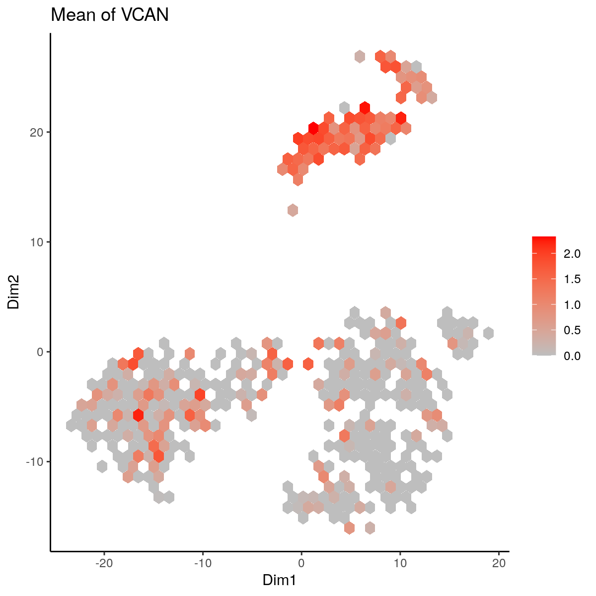|[ADAM10](https://www.ncbi.nlm.nih.gov/gene/102) [APLP2](https://www.ncbi.nlm.nih.gov/gene/334) [CD14](https://www.ncbi.nlm.nih.gov/gene/929) [CD44](https://www.ncbi.nlm.nih.gov/gene/960) [CDH2](https://www.ncbi.nlm.nih.gov/gene/1000) [CDH11](https://www.ncbi.nlm.nih.gov/gene/1009) [CSPG4](https://www.ncbi.nlm.nih.gov/gene/1464) [GPC3](https://www.ncbi.nlm.nih.gov/gene/2719) [ITGB1](https://www.ncbi.nlm.nih.gov/gene/3688) [MELTF](https://www.ncbi.nlm.nih.gov/gene/4241) [OMG](https://www.ncbi.nlm.nih.gov/gene/4974) [PLA2G2A](https://www.ncbi.nlm.nih.gov/gene/5320) [SELL](https://www.ncbi.nlm.nih.gov/gene/6402) [SELP](https://www.ncbi.nlm.nih.gov/gene/6403) [SPAM1](https://www.ncbi.nlm.nih.gov/gene/6677) [TLR1](https://www.ncbi.nlm.nih.gov/gene/7096) [HYAL2](https://www.ncbi.nlm.nih.gov/gene/8692) [SDC3](https://www.ncbi.nlm.nih.gov/gene/9672) [TLR6](https://www.ncbi.nlm.nih.gov/gene/10333) [TGOLN2](https://www.ncbi.nlm.nih.gov/gene/10618) [CSPG5](https://www.ncbi.nlm.nih.gov/gene/10675) [MXRA8](https://www.ncbi.nlm.nih.gov/gene/54587) [PNPLA2](https://www.ncbi.nlm.nih.gov/gene/57104) [ANO8](https://www.ncbi.nlm.nih.gov/gene/57719) [RAB19](https://www.ncbi.nlm.nih.gov/gene/401409)|
|[VEGFA](https://www.ncbi.nlm.nih.gov/gene/7422)|[ACVRL1](https://www.ncbi.nlm.nih.gov/gene/94) [ADORA1](https://www.ncbi.nlm.nih.gov/gene/134) [ADORA2A](https://www.ncbi.nlm.nih.gov/gene/135) [ADORA2B](https://www.ncbi.nlm.nih.gov/gene/136) [AGER](https://www.ncbi.nlm.nih.gov/gene/177) [AGTR1](https://www.ncbi.nlm.nih.gov/gene/185) [AGTR2](https://www.ncbi.nlm.nih.gov/gene/186) [APLNR](https://www.ncbi.nlm.nih.gov/gene/187) [AKT2](https://www.ncbi.nlm.nih.gov/gene/208) [ALK](https://www.ncbi.nlm.nih.gov/gene/238) [ALOX15](https://www.ncbi.nlm.nih.gov/gene/246) [ALOX15B](https://www.ncbi.nlm.nih.gov/gene/247) [ANPEP](https://www.ncbi.nlm.nih.gov/gene/290) [AQP1](https://www.ncbi.nlm.nih.gov/gene/358) [AQP4](https://www.ncbi.nlm.nih.gov/gene/361) [RHOA](https://www.ncbi.nlm.nih.gov/gene/387) [RHOC](https://www.ncbi.nlm.nih.gov/gene/389) [AXL](https://www.ncbi.nlm.nih.gov/gene/558) [ADGRB2](https://www.ncbi.nlm.nih.gov/gene/576) [BMPR2](https://www.ncbi.nlm.nih.gov/gene/659) [BSG](https://www.ncbi.nlm.nih.gov/gene/682) [CA4](https://www.ncbi.nlm.nih.gov/gene/762) [CASR](https://www.ncbi.nlm.nih.gov/gene/846) [CBL](https://www.ncbi.nlm.nih.gov/gene/867) [KRIT1](https://www.ncbi.nlm.nih.gov/gene/889) [CD9](https://www.ncbi.nlm.nih.gov/gene/928) [CD19](https://www.ncbi.nlm.nih.gov/gene/930) [CD86](https://www.ncbi.nlm.nih.gov/gene/942) [CD44](https://www.ncbi.nlm.nih.gov/gene/960) [CD47](https://www.ncbi.nlm.nih.gov/gene/961) [CD63](https://www.ncbi.nlm.nih.gov/gene/967) [CDC42](https://www.ncbi.nlm.nih.gov/gene/998) [CDH2](https://www.ncbi.nlm.nih.gov/gene/1000) [CDH17](https://www.ncbi.nlm.nih.gov/gene/1015) [CEACAM5](https://www.ncbi.nlm.nih.gov/gene/1048) [CCR1](https://www.ncbi.nlm.nih.gov/gene/1230) [CCR3](https://www.ncbi.nlm.nih.gov/gene/1232) [CCR4](https://www.ncbi.nlm.nih.gov/gene/1233) [CCR5](https://www.ncbi.nlm.nih.gov/gene/1234) [CCR7](https://www.ncbi.nlm.nih.gov/gene/1236) [CSF1R](https://www.ncbi.nlm.nih.gov/gene/1436) [CSK](https://www.ncbi.nlm.nih.gov/gene/1445) [CTNNA1](https://www.ncbi.nlm.nih.gov/gene/1495) [CX3CR1](https://www.ncbi.nlm.nih.gov/gene/1524) [CYBA](https://www.ncbi.nlm.nih.gov/gene/1535) [CYBB](https://www.ncbi.nlm.nih.gov/gene/1536) [CD55](https://www.ncbi.nlm.nih.gov/gene/1604) [ACE](https://www.ncbi.nlm.nih.gov/gene/1636) [DPP4](https://www.ncbi.nlm.nih.gov/gene/1803) [ECE1](https://www.ncbi.nlm.nih.gov/gene/1889) [S1PR1](https://www.ncbi.nlm.nih.gov/gene/1901) [EDNRA](https://www.ncbi.nlm.nih.gov/gene/1909) [EDNRB](https://www.ncbi.nlm.nih.gov/gene/1910) [EFNA2](https://www.ncbi.nlm.nih.gov/gene/1943) [EFNA3](https://www.ncbi.nlm.nih.gov/gene/1944) [EFNA5](https://www.ncbi.nlm.nih.gov/gene/1946) [EPHA2](https://www.ncbi.nlm.nih.gov/gene/1969) [ENG](https://www.ncbi.nlm.nih.gov/gene/2022) [ENO2](https://www.ncbi.nlm.nih.gov/gene/2026) [EPHA1](https://www.ncbi.nlm.nih.gov/gene/2041) [EPHB2](https://www.ncbi.nlm.nih.gov/gene/2048) [EPHB4](https://www.ncbi.nlm.nih.gov/gene/2050) [EREG](https://www.ncbi.nlm.nih.gov/gene/2069) [ESR1](https://www.ncbi.nlm.nih.gov/gene/2099) [F2R](https://www.ncbi.nlm.nih.gov/gene/2149) [FGFR1](https://www.ncbi.nlm.nih.gov/gene/2260) [FGFR3](https://www.ncbi.nlm.nih.gov/gene/2261) [FYN](https://www.ncbi.nlm.nih.gov/gene/2534) [GGT1](https://www.ncbi.nlm.nih.gov/gene/2678) [GJA1](https://www.ncbi.nlm.nih.gov/gene/2697) [GPC3](https://www.ncbi.nlm.nih.gov/gene/2719) [CXCR3](https://www.ncbi.nlm.nih.gov/gene/2833) [HTR7](https://www.ncbi.nlm.nih.gov/gene/3363) [IHH](https://www.ncbi.nlm.nih.gov/gene/3549) [CXCR1](https://www.ncbi.nlm.nih.gov/gene/3577) [CXCR2](https://www.ncbi.nlm.nih.gov/gene/3579) [INSR](https://www.ncbi.nlm.nih.gov/gene/3643) [ITGA3](https://www.ncbi.nlm.nih.gov/gene/3675) [ITGAM](https://www.ncbi.nlm.nih.gov/gene/3684) [ITGAV](https://www.ncbi.nlm.nih.gov/gene/3685) [ITGB1](https://www.ncbi.nlm.nih.gov/gene/3688) [ITGB3](https://www.ncbi.nlm.nih.gov/gene/3690) [CD82](https://www.ncbi.nlm.nih.gov/gene/3732) [KCNA2](https://www.ncbi.nlm.nih.gov/gene/3737) [KRAS](https://www.ncbi.nlm.nih.gov/gene/3845) [LDLR](https://www.ncbi.nlm.nih.gov/gene/3949) [EPCAM](https://www.ncbi.nlm.nih.gov/gene/4072) [MUC1](https://www.ncbi.nlm.nih.gov/gene/4582) [NGFR](https://www.ncbi.nlm.nih.gov/gene/4804) [NOS1](https://www.ncbi.nlm.nih.gov/gene/4842) [NOS3](https://www.ncbi.nlm.nih.gov/gene/4846) [NPHS1](https://www.ncbi.nlm.nih.gov/gene/4868) [NRAS](https://www.ncbi.nlm.nih.gov/gene/4893) [NT5E](https://www.ncbi.nlm.nih.gov/gene/4907) [NTRK1](https://www.ncbi.nlm.nih.gov/gene/4914) [NTRK2](https://www.ncbi.nlm.nih.gov/gene/4915) [OLR1](https://www.ncbi.nlm.nih.gov/gene/4973) [P2RX7](https://www.ncbi.nlm.nih.gov/gene/5027) [PDCD1](https://www.ncbi.nlm.nih.gov/gene/5133) [PDGFRA](https://www.ncbi.nlm.nih.gov/gene/5156) [PDGFRB](https://www.ncbi.nlm.nih.gov/gene/5159) [ABCB1](https://www.ncbi.nlm.nih.gov/gene/5243) [PLXNA1](https://www.ncbi.nlm.nih.gov/gene/5361) [PLXNA2](https://www.ncbi.nlm.nih.gov/gene/5362) [PLXNB3](https://www.ncbi.nlm.nih.gov/gene/5365) [PODXL](https://www.ncbi.nlm.nih.gov/gene/5420) [PTCH1](https://www.ncbi.nlm.nih.gov/gene/5727) [PTGER3](https://www.ncbi.nlm.nih.gov/gene/5733) [PTGER4](https://www.ncbi.nlm.nih.gov/gene/5734) [PTPRC](https://www.ncbi.nlm.nih.gov/gene/5788) [PTPRJ](https://www.ncbi.nlm.nih.gov/gene/5795) [RAF1](https://www.ncbi.nlm.nih.gov/gene/5894) [RET](https://www.ncbi.nlm.nih.gov/gene/5979) [SELE](https://www.ncbi.nlm.nih.gov/gene/6401) [SELL](https://www.ncbi.nlm.nih.gov/gene/6402) [SELP](https://www.ncbi.nlm.nih.gov/gene/6403) [SHB](https://www.ncbi.nlm.nih.gov/gene/6461) [SLC2A1](https://www.ncbi.nlm.nih.gov/gene/6513) [SLC2A3](https://www.ncbi.nlm.nih.gov/gene/6515) [SLC2A4](https://www.ncbi.nlm.nih.gov/gene/6517) [SLC16A1](https://www.ncbi.nlm.nih.gov/gene/6566) [SRC](https://www.ncbi.nlm.nih.gov/gene/6714) [SSTR2](https://www.ncbi.nlm.nih.gov/gene/6752) [CNTN2](https://www.ncbi.nlm.nih.gov/gene/6900) [TEK](https://www.ncbi.nlm.nih.gov/gene/7010) [TGFBR1](https://www.ncbi.nlm.nih.gov/gene/7046) [TGFBR2](https://www.ncbi.nlm.nih.gov/gene/7048) [THY1](https://www.ncbi.nlm.nih.gov/gene/7070) [TIE1](https://www.ncbi.nlm.nih.gov/gene/7075) [TJP1](https://www.ncbi.nlm.nih.gov/gene/7082) [TLR1](https://www.ncbi.nlm.nih.gov/gene/7096) [TLR4](https://www.ncbi.nlm.nih.gov/gene/7099) [TLR5](https://www.ncbi.nlm.nih.gov/gene/7100) [VCL](https://www.ncbi.nlm.nih.gov/gene/7414) [CXCR4](https://www.ncbi.nlm.nih.gov/gene/7852) [RECK](https://www.ncbi.nlm.nih.gov/gene/8434) [SEMA7A](https://www.ncbi.nlm.nih.gov/gene/8482) [LGR5](https://www.ncbi.nlm.nih.gov/gene/8549) [AOC3](https://www.ncbi.nlm.nih.gov/gene/8639) [TNFSF10](https://www.ncbi.nlm.nih.gov/gene/8743) [IQGAP1](https://www.ncbi.nlm.nih.gov/gene/8826) [PROM1](https://www.ncbi.nlm.nih.gov/gene/8842) [SLC16A4](https://www.ncbi.nlm.nih.gov/gene/9122) [SLC16A3](https://www.ncbi.nlm.nih.gov/gene/9123) [IL1RL1](https://www.ncbi.nlm.nih.gov/gene/9173) [CD163](https://www.ncbi.nlm.nih.gov/gene/9332) [ABCG2](https://www.ncbi.nlm.nih.gov/gene/9429) [CALCRL](https://www.ncbi.nlm.nih.gov/gene/10203) [TLR6](https://www.ncbi.nlm.nih.gov/gene/10333) [SEMA6C](https://www.ncbi.nlm.nih.gov/gene/10500) [SEMA6B](https://www.ncbi.nlm.nih.gov/gene/10501) [SEMA4F](https://www.ncbi.nlm.nih.gov/gene/10505) [SEMA4D](https://www.ncbi.nlm.nih.gov/gene/10507) [PTP4A3](https://www.ncbi.nlm.nih.gov/gene/11156) [PLXND1](https://www.ncbi.nlm.nih.gov/gene/23129) [PLXNB2](https://www.ncbi.nlm.nih.gov/gene/23654) [MYOF](https://www.ncbi.nlm.nih.gov/gene/26509) [DLL1](https://www.ncbi.nlm.nih.gov/gene/28514) [DUOX1](https://www.ncbi.nlm.nih.gov/gene/53905) [DLL4](https://www.ncbi.nlm.nih.gov/gene/54567) [PLXNA3](https://www.ncbi.nlm.nih.gov/gene/55558) [MRAP](https://www.ncbi.nlm.nih.gov/gene/56246) [SUCNR1](https://www.ncbi.nlm.nih.gov/gene/56670) [ACKR3](https://www.ncbi.nlm.nih.gov/gene/57007) [PNPLA2](https://www.ncbi.nlm.nih.gov/gene/57104) [SEMA6A](https://www.ncbi.nlm.nih.gov/gene/57556) [SEMA4G](https://www.ncbi.nlm.nih.gov/gene/57715) [CXCL16](https://www.ncbi.nlm.nih.gov/gene/58191) [SEMA4A](https://www.ncbi.nlm.nih.gov/gene/64218) [PDCD1LG2](https://www.ncbi.nlm.nih.gov/gene/80380) [PLXNA4](https://www.ncbi.nlm.nih.gov/gene/91584) [SLC2A14](https://www.ncbi.nlm.nih.gov/gene/144195) [PRIMA1](https://www.ncbi.nlm.nih.gov/gene/145270) [SPRED1](https://www.ncbi.nlm.nih.gov/gene/161742) [UNC5B](https://www.ncbi.nlm.nih.gov/gene/219699) [CCR2](https://www.ncbi.nlm.nih.gov/gene/729230) [CD24](https://www.ncbi.nlm.nih.gov/gene/100133941) [OCLN](https://www.ncbi.nlm.nih.gov/gene/100506658) [FLT1](https://www.ncbi.nlm.nih.gov/gene/2321) [KDR](https://www.ncbi.nlm.nih.gov/gene/3791)|
|[VEGFB](https://www.ncbi.nlm.nih.gov/gene/7423)|[CSF1R](https://www.ncbi.nlm.nih.gov/gene/1436) [EPHA2](https://www.ncbi.nlm.nih.gov/gene/1969) [FGFR1](https://www.ncbi.nlm.nih.gov/gene/2260) [FGFR3](https://www.ncbi.nlm.nih.gov/gene/2261) [INSR](https://www.ncbi.nlm.nih.gov/gene/3643) [NGFR](https://www.ncbi.nlm.nih.gov/gene/4804) [NOS3](https://www.ncbi.nlm.nih.gov/gene/4846) [NTRK1](https://www.ncbi.nlm.nih.gov/gene/4914) [NTRK2](https://www.ncbi.nlm.nih.gov/gene/4915) [PDGFRA](https://www.ncbi.nlm.nih.gov/gene/5156) [PDGFRB](https://www.ncbi.nlm.nih.gov/gene/5159) [TEK](https://www.ncbi.nlm.nih.gov/gene/7010) [TIE1](https://www.ncbi.nlm.nih.gov/gene/7075) [DLL4](https://www.ncbi.nlm.nih.gov/gene/54567) [FLT1](https://www.ncbi.nlm.nih.gov/gene/2321) [NRP1](https://www.ncbi.nlm.nih.gov/gene/8829)|
|[VEGFC](https://www.ncbi.nlm.nih.gov/gene/7424)|[BMPR2](https://www.ncbi.nlm.nih.gov/gene/659) [CD44](https://www.ncbi.nlm.nih.gov/gene/960) [CCR7](https://www.ncbi.nlm.nih.gov/gene/1236) [CRK](https://www.ncbi.nlm.nih.gov/gene/1398) [CSF1R](https://www.ncbi.nlm.nih.gov/gene/1436) [EPHA2](https://www.ncbi.nlm.nih.gov/gene/1969) [ENG](https://www.ncbi.nlm.nih.gov/gene/2022) [FGFR1](https://www.ncbi.nlm.nih.gov/gene/2260) [FGFR3](https://www.ncbi.nlm.nih.gov/gene/2261) [INSR](https://www.ncbi.nlm.nih.gov/gene/3643) [ITGAM](https://www.ncbi.nlm.nih.gov/gene/3684) [ITGB1](https://www.ncbi.nlm.nih.gov/gene/3688) [NGFR](https://www.ncbi.nlm.nih.gov/gene/4804) [NOS3](https://www.ncbi.nlm.nih.gov/gene/4846) [NTRK1](https://www.ncbi.nlm.nih.gov/gene/4914) [NTRK2](https://www.ncbi.nlm.nih.gov/gene/4915) [PDGFRA](https://www.ncbi.nlm.nih.gov/gene/5156) [PDGFRB](https://www.ncbi.nlm.nih.gov/gene/5159) [SRC](https://www.ncbi.nlm.nih.gov/gene/6714) [SYK](https://www.ncbi.nlm.nih.gov/gene/6850) [TEK](https://www.ncbi.nlm.nih.gov/gene/7010) [TIE1](https://www.ncbi.nlm.nih.gov/gene/7075) [CXCR4](https://www.ncbi.nlm.nih.gov/gene/7852) [SEMA7A](https://www.ncbi.nlm.nih.gov/gene/8482) [SEMA6C](https://www.ncbi.nlm.nih.gov/gene/10500) [SEMA6B](https://www.ncbi.nlm.nih.gov/gene/10501) [SEMA4F](https://www.ncbi.nlm.nih.gov/gene/10505) [SEMA4D](https://www.ncbi.nlm.nih.gov/gene/10507) [LPAR3](https://www.ncbi.nlm.nih.gov/gene/23566) [DLL4](https://www.ncbi.nlm.nih.gov/gene/54567) [SEMA6A](https://www.ncbi.nlm.nih.gov/gene/57556) [SEMA4G](https://www.ncbi.nlm.nih.gov/gene/57715) [SEMA4A](https://www.ncbi.nlm.nih.gov/gene/64218) [PRRT2](https://www.ncbi.nlm.nih.gov/gene/112476) [CD24](https://www.ncbi.nlm.nih.gov/gene/100133941) [FLT4](https://www.ncbi.nlm.nih.gov/gene/2324) [KDR](https://www.ncbi.nlm.nih.gov/gene/3791)|
|[VEGFD](https://www.ncbi.nlm.nih.gov/gene/2277)|[CRK](https://www.ncbi.nlm.nih.gov/gene/1398) [CSF1R](https://www.ncbi.nlm.nih.gov/gene/1436) [EPHA2](https://www.ncbi.nlm.nih.gov/gene/1969) [FGFR1](https://www.ncbi.nlm.nih.gov/gene/2260) [FGFR3](https://www.ncbi.nlm.nih.gov/gene/2261) [INSR](https://www.ncbi.nlm.nih.gov/gene/3643) [ITGB1](https://www.ncbi.nlm.nih.gov/gene/3688) [NGFR](https://www.ncbi.nlm.nih.gov/gene/4804) [NTRK1](https://www.ncbi.nlm.nih.gov/gene/4914) [NTRK2](https://www.ncbi.nlm.nih.gov/gene/4915) [PDGFRA](https://www.ncbi.nlm.nih.gov/gene/5156) [PDGFRB](https://www.ncbi.nlm.nih.gov/gene/5159) [TEK](https://www.ncbi.nlm.nih.gov/gene/7010) [TIE1](https://www.ncbi.nlm.nih.gov/gene/7075) [PRRT2](https://www.ncbi.nlm.nih.gov/gene/112476) [FLT4](https://www.ncbi.nlm.nih.gov/gene/2324)|
|[VGF](https://www.ncbi.nlm.nih.gov/gene/7425)|[ADAM10](https://www.ncbi.nlm.nih.gov/gene/102) [ADRB1](https://www.ncbi.nlm.nih.gov/gene/153) [ADRB3](https://www.ncbi.nlm.nih.gov/gene/155) [APLP2](https://www.ncbi.nlm.nih.gov/gene/334) [C3AR1](https://www.ncbi.nlm.nih.gov/gene/719) [CDH2](https://www.ncbi.nlm.nih.gov/gene/1000) [GPC3](https://www.ncbi.nlm.nih.gov/gene/2719) [GNAS](https://www.ncbi.nlm.nih.gov/gene/2778) [GRIN2D](https://www.ncbi.nlm.nih.gov/gene/2906) [MELTF](https://www.ncbi.nlm.nih.gov/gene/4241) [NTRK2](https://www.ncbi.nlm.nih.gov/gene/4915) [TGOLN2](https://www.ncbi.nlm.nih.gov/gene/10618) [HRH3](https://www.ncbi.nlm.nih.gov/gene/11255) [NRN1](https://www.ncbi.nlm.nih.gov/gene/51299) [MXRA8](https://www.ncbi.nlm.nih.gov/gene/54587) [PNPLA2](https://www.ncbi.nlm.nih.gov/gene/57104) [ANO8](https://www.ncbi.nlm.nih.gov/gene/57719) [NTNG2](https://www.ncbi.nlm.nih.gov/gene/84628)|
|[VIP](https://www.ncbi.nlm.nih.gov/gene/7432)|[ACHE](https://www.ncbi.nlm.nih.gov/gene/43) [ADCY3](https://www.ncbi.nlm.nih.gov/gene/109) [ADCY5](https://www.ncbi.nlm.nih.gov/gene/111) [ADCY6](https://www.ncbi.nlm.nih.gov/gene/112) [ADCY8](https://www.ncbi.nlm.nih.gov/gene/114) [ADCY9](https://www.ncbi.nlm.nih.gov/gene/115) [ADCYAP1R1](https://www.ncbi.nlm.nih.gov/gene/117) [ADORA2B](https://www.ncbi.nlm.nih.gov/gene/136) [ADRA1D](https://www.ncbi.nlm.nih.gov/gene/146) [ADRA2A](https://www.ncbi.nlm.nih.gov/gene/150) [ADRA2B](https://www.ncbi.nlm.nih.gov/gene/151) [ADRA2C](https://www.ncbi.nlm.nih.gov/gene/152) [ADRB1](https://www.ncbi.nlm.nih.gov/gene/153) [ADRB2](https://www.ncbi.nlm.nih.gov/gene/154) [ADRB3](https://www.ncbi.nlm.nih.gov/gene/155) [AVPR1A](https://www.ncbi.nlm.nih.gov/gene/552) [CALCR](https://www.ncbi.nlm.nih.gov/gene/799) [CD86](https://www.ncbi.nlm.nih.gov/gene/942) [CFTR](https://www.ncbi.nlm.nih.gov/gene/1080) [CHRM1](https://www.ncbi.nlm.nih.gov/gene/1128) [CRHR2](https://www.ncbi.nlm.nih.gov/gene/1395) [DPP4](https://www.ncbi.nlm.nih.gov/gene/1803) [DRD1](https://www.ncbi.nlm.nih.gov/gene/1812) [DRD5](https://www.ncbi.nlm.nih.gov/gene/1816) [ENO2](https://www.ncbi.nlm.nih.gov/gene/2026) [FSHR](https://www.ncbi.nlm.nih.gov/gene/2492) [GCGR](https://www.ncbi.nlm.nih.gov/gene/2642) [GHRHR](https://www.ncbi.nlm.nih.gov/gene/2692) [GIPR](https://www.ncbi.nlm.nih.gov/gene/2696) [GLP1R](https://www.ncbi.nlm.nih.gov/gene/2740) [GNAS](https://www.ncbi.nlm.nih.gov/gene/2778) [GNG3](https://www.ncbi.nlm.nih.gov/gene/2785) [GNG4](https://www.ncbi.nlm.nih.gov/gene/2786) [GNG5](https://www.ncbi.nlm.nih.gov/gene/2787) [GNG7](https://www.ncbi.nlm.nih.gov/gene/2788) [GNG10](https://www.ncbi.nlm.nih.gov/gene/2790) [GNG11](https://www.ncbi.nlm.nih.gov/gene/2791) [GNGT1](https://www.ncbi.nlm.nih.gov/gene/2792) [GNGT2](https://www.ncbi.nlm.nih.gov/gene/2793) [NPBWR1](https://www.ncbi.nlm.nih.gov/gene/2831) [NPBWR2](https://www.ncbi.nlm.nih.gov/gene/2832) [GPR15](https://www.ncbi.nlm.nih.gov/gene/2838) [GPR20](https://www.ncbi.nlm.nih.gov/gene/2843) [GPR25](https://www.ncbi.nlm.nih.gov/gene/2848) [GPR27](https://www.ncbi.nlm.nih.gov/gene/2850) [GPR32](https://www.ncbi.nlm.nih.gov/gene/2854) [GPR39](https://www.ncbi.nlm.nih.gov/gene/2863) [HRH2](https://www.ncbi.nlm.nih.gov/gene/3274) [HTR4](https://www.ncbi.nlm.nih.gov/gene/3360) [HTR6](https://www.ncbi.nlm.nih.gov/gene/3362) [HTR7](https://www.ncbi.nlm.nih.gov/gene/3363) [LHCGR](https://www.ncbi.nlm.nih.gov/gene/3973) [MC1R](https://www.ncbi.nlm.nih.gov/gene/4157) [MC2R](https://www.ncbi.nlm.nih.gov/gene/4158) [MC3R](https://www.ncbi.nlm.nih.gov/gene/4159) [MC4R](https://www.ncbi.nlm.nih.gov/gene/4160) [MC5R](https://www.ncbi.nlm.nih.gov/gene/4161) [MME](https://www.ncbi.nlm.nih.gov/gene/4311) [NOS1](https://www.ncbi.nlm.nih.gov/gene/4842) [NPY1R](https://www.ncbi.nlm.nih.gov/gene/4886) [NPY2R](https://www.ncbi.nlm.nih.gov/gene/4887) [NPY5R](https://www.ncbi.nlm.nih.gov/gene/4889) [P2RY11](https://www.ncbi.nlm.nih.gov/gene/5032) [PTGDR](https://www.ncbi.nlm.nih.gov/gene/5729) [PTGER2](https://www.ncbi.nlm.nih.gov/gene/5732) [PTGER4](https://www.ncbi.nlm.nih.gov/gene/5734) [PTGIR](https://www.ncbi.nlm.nih.gov/gene/5739) [PTH1R](https://www.ncbi.nlm.nih.gov/gene/5745) [PTH2R](https://www.ncbi.nlm.nih.gov/gene/5746) [SCTR](https://www.ncbi.nlm.nih.gov/gene/6344) [SSTR1](https://www.ncbi.nlm.nih.gov/gene/6751) [SSTR2](https://www.ncbi.nlm.nih.gov/gene/6752) [SSTR3](https://www.ncbi.nlm.nih.gov/gene/6753) [SSTR4](https://www.ncbi.nlm.nih.gov/gene/6754) [SSTR5](https://www.ncbi.nlm.nih.gov/gene/6755) [TACR1](https://www.ncbi.nlm.nih.gov/gene/6869) [TLR4](https://www.ncbi.nlm.nih.gov/gene/7099) [TSHR](https://www.ncbi.nlm.nih.gov/gene/7253) [VIPR1](https://www.ncbi.nlm.nih.gov/gene/7433) [VIPR2](https://www.ncbi.nlm.nih.gov/gene/7434) [TAAR5](https://www.ncbi.nlm.nih.gov/gene/9038) [TAAR2](https://www.ncbi.nlm.nih.gov/gene/9287) [GLP2R](https://www.ncbi.nlm.nih.gov/gene/9340) [CALCRL](https://www.ncbi.nlm.nih.gov/gene/10203) [RAMP3](https://www.ncbi.nlm.nih.gov/gene/10268) [NPFFR2](https://www.ncbi.nlm.nih.gov/gene/10886) [GPR83](https://www.ncbi.nlm.nih.gov/gene/10888) [GPR176](https://www.ncbi.nlm.nih.gov/gene/11245) [GPR45](https://www.ncbi.nlm.nih.gov/gene/11250) [GNG13](https://www.ncbi.nlm.nih.gov/gene/51764) [GPR84](https://www.ncbi.nlm.nih.gov/gene/53831) [GNG2](https://www.ncbi.nlm.nih.gov/gene/54331) [GNG12](https://www.ncbi.nlm.nih.gov/gene/55970) [TRPC7](https://www.ncbi.nlm.nih.gov/gene/57113) [RXFP1](https://www.ncbi.nlm.nih.gov/gene/59350) [NPFFR1](https://www.ncbi.nlm.nih.gov/gene/64106) [TAAR8](https://www.ncbi.nlm.nih.gov/gene/83551) [OPN4](https://www.ncbi.nlm.nih.gov/gene/94233) [GNG8](https://www.ncbi.nlm.nih.gov/gene/94235) [RXFP2](https://www.ncbi.nlm.nih.gov/gene/122042) [TAAR9](https://www.ncbi.nlm.nih.gov/gene/134860) [TAAR1](https://www.ncbi.nlm.nih.gov/gene/134864) [GPBAR1](https://www.ncbi.nlm.nih.gov/gene/151306) [ADCY4](https://www.ncbi.nlm.nih.gov/gene/196883) [GPR150](https://www.ncbi.nlm.nih.gov/gene/285601) [TAAR6](https://www.ncbi.nlm.nih.gov/gene/319100) [LINC02210-CRHR1](https://www.ncbi.nlm.nih.gov/gene/104909134)|
|[VIT](https://www.ncbi.nlm.nih.gov/gene/5212)|[CCKAR](https://www.ncbi.nlm.nih.gov/gene/886) [CD63](https://www.ncbi.nlm.nih.gov/gene/967) [TACR2](https://www.ncbi.nlm.nih.gov/gene/6865) [GPR119](https://www.ncbi.nlm.nih.gov/gene/139760) [KCNG3](https://www.ncbi.nlm.nih.gov/gene/170850)|
|[VSTM1](https://www.ncbi.nlm.nih.gov/gene/284415)|[XPNPEP2](https://www.ncbi.nlm.nih.gov/gene/7512) [PGAP6](https://www.ncbi.nlm.nih.gov/gene/58986) [PIK3IP1](https://www.ncbi.nlm.nih.gov/gene/113791)|
|[VSTM2A](https://www.ncbi.nlm.nih.gov/gene/222008)|[GRIA2](https://www.ncbi.nlm.nih.gov/gene/2891) [ADGRG2](https://www.ncbi.nlm.nih.gov/gene/10149) [FRRS1L](https://www.ncbi.nlm.nih.gov/gene/23732) [GJD2](https://www.ncbi.nlm.nih.gov/gene/57369) [AMER3](https://www.ncbi.nlm.nih.gov/gene/205147) [VXN](https://www.ncbi.nlm.nih.gov/gene/254778)|
|[VTN](https://www.ncbi.nlm.nih.gov/gene/7448)|[RHOA](https://www.ncbi.nlm.nih.gov/gene/387) [ATP2B3](https://www.ncbi.nlm.nih.gov/gene/492) [C8A](https://www.ncbi.nlm.nih.gov/gene/731) [CD44](https://www.ncbi.nlm.nih.gov/gene/960) [CD47](https://www.ncbi.nlm.nih.gov/gene/961) [CD59](https://www.ncbi.nlm.nih.gov/gene/966) [CDC42](https://www.ncbi.nlm.nih.gov/gene/998) [CDH2](https://www.ncbi.nlm.nih.gov/gene/1000) [CDH17](https://www.ncbi.nlm.nih.gov/gene/1015) [CD55](https://www.ncbi.nlm.nih.gov/gene/1604) [ITGA6](https://www.ncbi.nlm.nih.gov/gene/3655) [ITGA3](https://www.ncbi.nlm.nih.gov/gene/3675) [ITGAV](https://www.ncbi.nlm.nih.gov/gene/3685) [ITGB1](https://www.ncbi.nlm.nih.gov/gene/3688) [ITGB2](https://www.ncbi.nlm.nih.gov/gene/3689) [ITGB3](https://www.ncbi.nlm.nih.gov/gene/3690) [ITGB4](https://www.ncbi.nlm.nih.gov/gene/3691) [ITGB8](https://www.ncbi.nlm.nih.gov/gene/3696) [ENPP3](https://www.ncbi.nlm.nih.gov/gene/5169) [PIK3C2A](https://www.ncbi.nlm.nih.gov/gene/5286) [SELP](https://www.ncbi.nlm.nih.gov/gene/6403) [SRC](https://www.ncbi.nlm.nih.gov/gene/6714) [VCL](https://www.ncbi.nlm.nih.gov/gene/7414) [GP6](https://www.ncbi.nlm.nih.gov/gene/51206) [SCARA5](https://www.ncbi.nlm.nih.gov/gene/286133)|
|[VWA1](https://www.ncbi.nlm.nih.gov/gene/64856)|[ADAM10](https://www.ncbi.nlm.nih.gov/gene/102) [APLP2](https://www.ncbi.nlm.nih.gov/gene/334) [CDH2](https://www.ncbi.nlm.nih.gov/gene/1000) [CSPG4](https://www.ncbi.nlm.nih.gov/gene/1464) [GPC3](https://www.ncbi.nlm.nih.gov/gene/2719) [MELTF](https://www.ncbi.nlm.nih.gov/gene/4241) [SCN5A](https://www.ncbi.nlm.nih.gov/gene/6331) [TGOLN2](https://www.ncbi.nlm.nih.gov/gene/10618) [MXRA8](https://www.ncbi.nlm.nih.gov/gene/54587) [PNPLA2](https://www.ncbi.nlm.nih.gov/gene/57104) [ANO8](https://www.ncbi.nlm.nih.gov/gene/57719) [TRABD2B](https://www.ncbi.nlm.nih.gov/gene/388630)|
|[VWA2](https://www.ncbi.nlm.nih.gov/gene/340706)|[ADRB1](https://www.ncbi.nlm.nih.gov/gene/153) [ADRB3](https://www.ncbi.nlm.nih.gov/gene/155) [FRAS1](https://www.ncbi.nlm.nih.gov/gene/80144) [FREM2](https://www.ncbi.nlm.nih.gov/gene/341640)|
|[VWA3A](https://www.ncbi.nlm.nih.gov/gene/146177)|[DRD3](https://www.ncbi.nlm.nih.gov/gene/1814) [DRD4](https://www.ncbi.nlm.nih.gov/gene/1815) [ABCC1](https://www.ncbi.nlm.nih.gov/gene/4363) [OR2W1](https://www.ncbi.nlm.nih.gov/gene/26692) [OR1Q1](https://www.ncbi.nlm.nih.gov/gene/158131) [OR5T3](https://www.ncbi.nlm.nih.gov/gene/390154)|
|[VWA5B1](https://www.ncbi.nlm.nih.gov/gene/127731)|[RAB38](https://www.ncbi.nlm.nih.gov/gene/23682) [VSTM5](https://www.ncbi.nlm.nih.gov/gene/387804)|
|[VWA7](https://www.ncbi.nlm.nih.gov/gene/80737)|[LY6G6C](https://www.ncbi.nlm.nih.gov/gene/80740)|
|[VWC2](https://www.ncbi.nlm.nih.gov/gene/375567)|[GRIA1](https://www.ncbi.nlm.nih.gov/gene/2890) [GRIA2](https://www.ncbi.nlm.nih.gov/gene/2891) [GRIA3](https://www.ncbi.nlm.nih.gov/gene/2892) [GRIA4](https://www.ncbi.nlm.nih.gov/gene/2893) [GRID2](https://www.ncbi.nlm.nih.gov/gene/2895) [GRIK2](https://www.ncbi.nlm.nih.gov/gene/2898) [GRIN1](https://www.ncbi.nlm.nih.gov/gene/2902) [GRIN2B](https://www.ncbi.nlm.nih.gov/gene/2904) [GRIN2C](https://www.ncbi.nlm.nih.gov/gene/2905) [GRIN2D](https://www.ncbi.nlm.nih.gov/gene/2906) [COBL](https://www.ncbi.nlm.nih.gov/gene/23242) [NRN1](https://www.ncbi.nlm.nih.gov/gene/51299) [CACNG7](https://www.ncbi.nlm.nih.gov/gene/59284) [SYTL1](https://www.ncbi.nlm.nih.gov/gene/84958) [GSG1L](https://www.ncbi.nlm.nih.gov/gene/146395) [KCNG3](https://www.ncbi.nlm.nih.gov/gene/170850)|
|[VWC2L](https://www.ncbi.nlm.nih.gov/gene/402117)|[GRIA1](https://www.ncbi.nlm.nih.gov/gene/2890) [GRIA2](https://www.ncbi.nlm.nih.gov/gene/2891) [GRIA3](https://www.ncbi.nlm.nih.gov/gene/2892) [GRIA4](https://www.ncbi.nlm.nih.gov/gene/2893) [GRID2](https://www.ncbi.nlm.nih.gov/gene/2895) [GRIK2](https://www.ncbi.nlm.nih.gov/gene/2898) [GRIN1](https://www.ncbi.nlm.nih.gov/gene/2902) [GRIN2B](https://www.ncbi.nlm.nih.gov/gene/2904) [GRIN2C](https://www.ncbi.nlm.nih.gov/gene/2905) [GRM1](https://www.ncbi.nlm.nih.gov/gene/2911) [ESYT2](https://www.ncbi.nlm.nih.gov/gene/57488) [CACNG7](https://www.ncbi.nlm.nih.gov/gene/59284) [GRIN3A](https://www.ncbi.nlm.nih.gov/gene/116443) [OR52J3](https://www.ncbi.nlm.nih.gov/gene/119679)|
|[VWCE](https://www.ncbi.nlm.nih.gov/gene/220001)|[ACVR2B](https://www.ncbi.nlm.nih.gov/gene/93) [BMPR1A](https://www.ncbi.nlm.nih.gov/gene/657) [BMPR2](https://www.ncbi.nlm.nih.gov/gene/659) [GCGR](https://www.ncbi.nlm.nih.gov/gene/2642) [SLC2A5](https://www.ncbi.nlm.nih.gov/gene/6518)|
|[VWF](https://www.ncbi.nlm.nih.gov/gene/7450)|[ACHE](https://www.ncbi.nlm.nih.gov/gene/43) [ADRA2B](https://www.ncbi.nlm.nih.gov/gene/151) [ADRB1](https://www.ncbi.nlm.nih.gov/gene/153) [ADRB2](https://www.ncbi.nlm.nih.gov/gene/154) [AGER](https://www.ncbi.nlm.nih.gov/gene/177) [APLNR](https://www.ncbi.nlm.nih.gov/gene/187) [ALPL](https://www.ncbi.nlm.nih.gov/gene/249) [AQP1](https://www.ncbi.nlm.nih.gov/gene/358) [ARRB1](https://www.ncbi.nlm.nih.gov/gene/408) [ARRB2](https://www.ncbi.nlm.nih.gov/gene/409) [CD36](https://www.ncbi.nlm.nih.gov/gene/948) [CD44](https://www.ncbi.nlm.nih.gov/gene/960) [CD63](https://www.ncbi.nlm.nih.gov/gene/967) [CDH17](https://www.ncbi.nlm.nih.gov/gene/1015) [CRK](https://www.ncbi.nlm.nih.gov/gene/1398) [CSF1R](https://www.ncbi.nlm.nih.gov/gene/1436) [CSK](https://www.ncbi.nlm.nih.gov/gene/1445) [ACE](https://www.ncbi.nlm.nih.gov/gene/1636) [ENG](https://www.ncbi.nlm.nih.gov/gene/2022) [F2R](https://www.ncbi.nlm.nih.gov/gene/2149) [GJA1](https://www.ncbi.nlm.nih.gov/gene/2697) [GJA4](https://www.ncbi.nlm.nih.gov/gene/2701) [ITGA6](https://www.ncbi.nlm.nih.gov/gene/3655) [ITGA3](https://www.ncbi.nlm.nih.gov/gene/3675) [ITGAV](https://www.ncbi.nlm.nih.gov/gene/3685) [ITGB1](https://www.ncbi.nlm.nih.gov/gene/3688) [ITGB3](https://www.ncbi.nlm.nih.gov/gene/3690) [ITGB4](https://www.ncbi.nlm.nih.gov/gene/3691) [ITGB8](https://www.ncbi.nlm.nih.gov/gene/3696) [KCNA5](https://www.ncbi.nlm.nih.gov/gene/3741) [KRAS](https://www.ncbi.nlm.nih.gov/gene/3845) [MARK3](https://www.ncbi.nlm.nih.gov/gene/4140) [MPL](https://www.ncbi.nlm.nih.gov/gene/4352) [NOS3](https://www.ncbi.nlm.nih.gov/gene/4846) [NRAS](https://www.ncbi.nlm.nih.gov/gene/4893) [NT5E](https://www.ncbi.nlm.nih.gov/gene/4907) [P2RY1](https://www.ncbi.nlm.nih.gov/gene/5028) [PDGFRB](https://www.ncbi.nlm.nih.gov/gene/5159) [PTGIR](https://www.ncbi.nlm.nih.gov/gene/5739) [PTPRC](https://www.ncbi.nlm.nih.gov/gene/5788) [RAF1](https://www.ncbi.nlm.nih.gov/gene/5894) [RAP1A](https://www.ncbi.nlm.nih.gov/gene/5906) [RAP1B](https://www.ncbi.nlm.nih.gov/gene/5908) [SELE](https://www.ncbi.nlm.nih.gov/gene/6401) [SELL](https://www.ncbi.nlm.nih.gov/gene/6402) [SELP](https://www.ncbi.nlm.nih.gov/gene/6403) [SRC](https://www.ncbi.nlm.nih.gov/gene/6714) [SYK](https://www.ncbi.nlm.nih.gov/gene/6850) [TECTB](https://www.ncbi.nlm.nih.gov/gene/6975) [TEK](https://www.ncbi.nlm.nih.gov/gene/7010) [THY1](https://www.ncbi.nlm.nih.gov/gene/7070) [TIE1](https://www.ncbi.nlm.nih.gov/gene/7075) [TJP1](https://www.ncbi.nlm.nih.gov/gene/7082) [TLR4](https://www.ncbi.nlm.nih.gov/gene/7099) [VCL](https://www.ncbi.nlm.nih.gov/gene/7414) [CXCR4](https://www.ncbi.nlm.nih.gov/gene/7852) [IQGAP1](https://www.ncbi.nlm.nih.gov/gene/8826) [PROM1](https://www.ncbi.nlm.nih.gov/gene/8842) [CD163](https://www.ncbi.nlm.nih.gov/gene/9332) [GP6](https://www.ncbi.nlm.nih.gov/gene/51206) [PTOV1](https://www.ncbi.nlm.nih.gov/gene/53635) [APBB1IP](https://www.ncbi.nlm.nih.gov/gene/54518) [DLL4](https://www.ncbi.nlm.nih.gov/gene/54567) [RGMA](https://www.ncbi.nlm.nih.gov/gene/56963) [P2RY12](https://www.ncbi.nlm.nih.gov/gene/64805) [FRAS1](https://www.ncbi.nlm.nih.gov/gene/80144) [PLVAP](https://www.ncbi.nlm.nih.gov/gene/83483) [ANTXR1](https://www.ncbi.nlm.nih.gov/gene/84168) [STXBP5](https://www.ncbi.nlm.nih.gov/gene/134957) [GPIHBP1](https://www.ncbi.nlm.nih.gov/gene/338328) [FREM2](https://www.ncbi.nlm.nih.gov/gene/341640) [OCLN](https://www.ncbi.nlm.nih.gov/gene/100506658)|
|[WFDC1](https://www.ncbi.nlm.nih.gov/gene/58189) 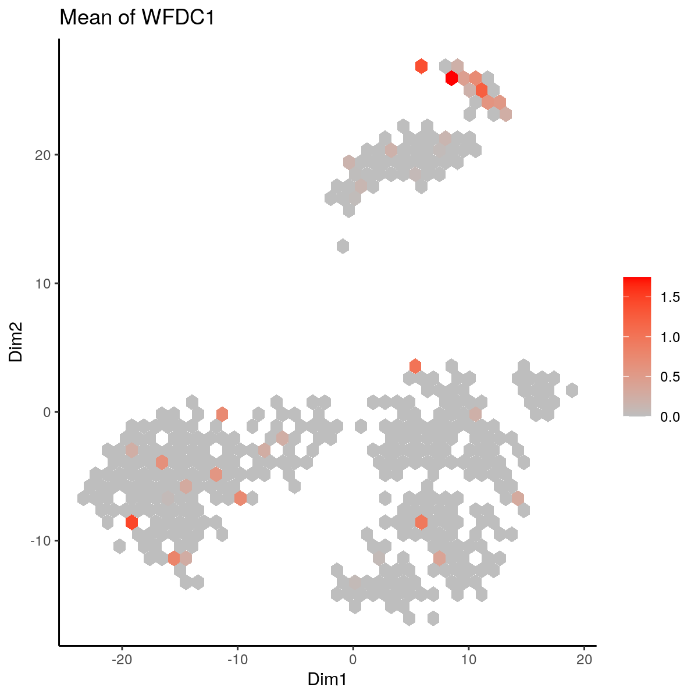|[CDH13](https://www.ncbi.nlm.nih.gov/gene/1012)|
|[WFDC10A](https://www.ncbi.nlm.nih.gov/gene/140832)|[KCNS1](https://www.ncbi.nlm.nih.gov/gene/3787)|
|[WFDC10B](https://www.ncbi.nlm.nih.gov/gene/280664)|[TM7SF3](https://www.ncbi.nlm.nih.gov/gene/51768)|
|[WFDC13](https://www.ncbi.nlm.nih.gov/gene/164237)|[LYNX1-SLURP2](https://www.ncbi.nlm.nih.gov/gene/111188157)|
|[WFDC2](https://www.ncbi.nlm.nih.gov/gene/10406)|[CD52](https://www.ncbi.nlm.nih.gov/gene/1043) [ADGRG2](https://www.ncbi.nlm.nih.gov/gene/10149) [MUC16](https://www.ncbi.nlm.nih.gov/gene/94025)|
|[WFDC3](https://www.ncbi.nlm.nih.gov/gene/140686)|[OR11G2](https://www.ncbi.nlm.nih.gov/gene/390439)|
|[WFDC5](https://www.ncbi.nlm.nih.gov/gene/149708)|[ITGB3](https://www.ncbi.nlm.nih.gov/gene/3690) [GPR87](https://www.ncbi.nlm.nih.gov/gene/53836) [CDHR1](https://www.ncbi.nlm.nih.gov/gene/92211)|
|[WFDC6](https://www.ncbi.nlm.nih.gov/gene/140870)|[OR51B4](https://www.ncbi.nlm.nih.gov/gene/79339)|
|[WFIKKN1](https://www.ncbi.nlm.nih.gov/gene/117166)|[NTSR1](https://www.ncbi.nlm.nih.gov/gene/4923) [SLCO5A1](https://www.ncbi.nlm.nih.gov/gene/81796)|
|[WFIKKN2](https://www.ncbi.nlm.nih.gov/gene/124857)|[DRD4](https://www.ncbi.nlm.nih.gov/gene/1815) [NTSR1](https://www.ncbi.nlm.nih.gov/gene/4923) [TNFSF10](https://www.ncbi.nlm.nih.gov/gene/8743)|
|[WIF1](https://www.ncbi.nlm.nih.gov/gene/11197)|[CDH13](https://www.ncbi.nlm.nih.gov/gene/1012) [DVL1](https://www.ncbi.nlm.nih.gov/gene/1855) [DVL2](https://www.ncbi.nlm.nih.gov/gene/1856) [GJA1](https://www.ncbi.nlm.nih.gov/gene/2697) [IHH](https://www.ncbi.nlm.nih.gov/gene/3549) [LRP6](https://www.ncbi.nlm.nih.gov/gene/4040) [PCDH7](https://www.ncbi.nlm.nih.gov/gene/5099) [PTCH1](https://www.ncbi.nlm.nih.gov/gene/5727) [SFRP1](https://www.ncbi.nlm.nih.gov/gene/6422) [FZD5](https://www.ncbi.nlm.nih.gov/gene/7855) [FZD1](https://www.ncbi.nlm.nih.gov/gene/8321) [FZD7](https://www.ncbi.nlm.nih.gov/gene/8324) [FZD9](https://www.ncbi.nlm.nih.gov/gene/8326) [SEMA6C](https://www.ncbi.nlm.nih.gov/gene/10500) [FZD10](https://www.ncbi.nlm.nih.gov/gene/11211) [KREMEN1](https://www.ncbi.nlm.nih.gov/gene/83999) [NKD1](https://www.ncbi.nlm.nih.gov/gene/85407)|
|[WNT1](https://www.ncbi.nlm.nih.gov/gene/7471)|[AKT2](https://www.ncbi.nlm.nih.gov/gene/208) [RHOA](https://www.ncbi.nlm.nih.gov/gene/387) [RHOC](https://www.ncbi.nlm.nih.gov/gene/389) [BMPR1A](https://www.ncbi.nlm.nih.gov/gene/657) [CD44](https://www.ncbi.nlm.nih.gov/gene/960) [CDC42](https://www.ncbi.nlm.nih.gov/gene/998) [CDH2](https://www.ncbi.nlm.nih.gov/gene/1000) [CDH17](https://www.ncbi.nlm.nih.gov/gene/1015) [DVL1](https://www.ncbi.nlm.nih.gov/gene/1855) [DVL2](https://www.ncbi.nlm.nih.gov/gene/1856) [ESR1](https://www.ncbi.nlm.nih.gov/gene/2099) [FGFR1](https://www.ncbi.nlm.nih.gov/gene/2260) [FGFR3](https://www.ncbi.nlm.nih.gov/gene/2261) [GPC3](https://www.ncbi.nlm.nih.gov/gene/2719) [IHH](https://www.ncbi.nlm.nih.gov/gene/3549) [KRAS](https://www.ncbi.nlm.nih.gov/gene/3845) [LDLR](https://www.ncbi.nlm.nih.gov/gene/3949) [LRP6](https://www.ncbi.nlm.nih.gov/gene/4040) [NTRK1](https://www.ncbi.nlm.nih.gov/gene/4914) [NTRK2](https://www.ncbi.nlm.nih.gov/gene/4915) [ROR2](https://www.ncbi.nlm.nih.gov/gene/4920) [PTCH1](https://www.ncbi.nlm.nih.gov/gene/5727) [RAC1](https://www.ncbi.nlm.nih.gov/gene/5879) [SFRP1](https://www.ncbi.nlm.nih.gov/gene/6422) [SRC](https://www.ncbi.nlm.nih.gov/gene/6714) [TGFBR2](https://www.ncbi.nlm.nih.gov/gene/7048) [LRP8](https://www.ncbi.nlm.nih.gov/gene/7804) [FZD5](https://www.ncbi.nlm.nih.gov/gene/7855) [FZD1](https://www.ncbi.nlm.nih.gov/gene/8321) [FZD7](https://www.ncbi.nlm.nih.gov/gene/8324) [FZD9](https://www.ncbi.nlm.nih.gov/gene/8326) [LGR5](https://www.ncbi.nlm.nih.gov/gene/8549) [FZD10](https://www.ncbi.nlm.nih.gov/gene/11211) [VANGL2](https://www.ncbi.nlm.nih.gov/gene/57216) [RHOU](https://www.ncbi.nlm.nih.gov/gene/58480) [VANGL1](https://www.ncbi.nlm.nih.gov/gene/81839) [MFRP](https://www.ncbi.nlm.nih.gov/gene/83552) [KREMEN1](https://www.ncbi.nlm.nih.gov/gene/83999) [NKD1](https://www.ncbi.nlm.nih.gov/gene/85407) [NKD2](https://www.ncbi.nlm.nih.gov/gene/85409) [IFITM5](https://www.ncbi.nlm.nih.gov/gene/387733) [CD24](https://www.ncbi.nlm.nih.gov/gene/100133941)|
|[WNT10A](https://www.ncbi.nlm.nih.gov/gene/80326)|[DVL1](https://www.ncbi.nlm.nih.gov/gene/1855) [DVL2](https://www.ncbi.nlm.nih.gov/gene/1856) [GPC3](https://www.ncbi.nlm.nih.gov/gene/2719) [IHH](https://www.ncbi.nlm.nih.gov/gene/3549) [LDLR](https://www.ncbi.nlm.nih.gov/gene/3949) [LRP6](https://www.ncbi.nlm.nih.gov/gene/4040) [SFRP1](https://www.ncbi.nlm.nih.gov/gene/6422) [FZD5](https://www.ncbi.nlm.nih.gov/gene/7855) [FZD1](https://www.ncbi.nlm.nih.gov/gene/8321) [FZD7](https://www.ncbi.nlm.nih.gov/gene/8324) [FZD9](https://www.ncbi.nlm.nih.gov/gene/8326) [FZD10](https://www.ncbi.nlm.nih.gov/gene/11211) [VANGL2](https://www.ncbi.nlm.nih.gov/gene/57216) [VANGL1](https://www.ncbi.nlm.nih.gov/gene/81839) [MFRP](https://www.ncbi.nlm.nih.gov/gene/83552) [NKD1](https://www.ncbi.nlm.nih.gov/gene/85407) [CLEC2A](https://www.ncbi.nlm.nih.gov/gene/387836) [CDH1](https://www.ncbi.nlm.nih.gov/gene/999) [GPC1](https://www.ncbi.nlm.nih.gov/gene/2817)|
|[WNT10B](https://www.ncbi.nlm.nih.gov/gene/7480)|[DVL1](https://www.ncbi.nlm.nih.gov/gene/1855) [DVL2](https://www.ncbi.nlm.nih.gov/gene/1856) [GPC3](https://www.ncbi.nlm.nih.gov/gene/2719) [IHH](https://www.ncbi.nlm.nih.gov/gene/3549) [LDLR](https://www.ncbi.nlm.nih.gov/gene/3949) [LRP6](https://www.ncbi.nlm.nih.gov/gene/4040) [ROR2](https://www.ncbi.nlm.nih.gov/gene/4920) [SFRP1](https://www.ncbi.nlm.nih.gov/gene/6422) [FZD5](https://www.ncbi.nlm.nih.gov/gene/7855) [FZD1](https://www.ncbi.nlm.nih.gov/gene/8321) [FZD7](https://www.ncbi.nlm.nih.gov/gene/8324) [FZD9](https://www.ncbi.nlm.nih.gov/gene/8326) [FZD10](https://www.ncbi.nlm.nih.gov/gene/11211) [VANGL2](https://www.ncbi.nlm.nih.gov/gene/57216) [VANGL1](https://www.ncbi.nlm.nih.gov/gene/81839) [MFRP](https://www.ncbi.nlm.nih.gov/gene/83552)|
|[WNT11](https://www.ncbi.nlm.nih.gov/gene/7481)|[RHOA](https://www.ncbi.nlm.nih.gov/gene/387) [CDH2](https://www.ncbi.nlm.nih.gov/gene/1000) [DVL1](https://www.ncbi.nlm.nih.gov/gene/1855) [DVL2](https://www.ncbi.nlm.nih.gov/gene/1856) [CELSR3](https://www.ncbi.nlm.nih.gov/gene/1951) [CELSR2](https://www.ncbi.nlm.nih.gov/gene/1952) [ENO2](https://www.ncbi.nlm.nih.gov/gene/2026) [GPC3](https://www.ncbi.nlm.nih.gov/gene/2719) [GNAO1](https://www.ncbi.nlm.nih.gov/gene/2775) [GNG3](https://www.ncbi.nlm.nih.gov/gene/2785) [GNG4](https://www.ncbi.nlm.nih.gov/gene/2786) [GNG5](https://www.ncbi.nlm.nih.gov/gene/2787) [GNG7](https://www.ncbi.nlm.nih.gov/gene/2788) [GNG10](https://www.ncbi.nlm.nih.gov/gene/2790) [GNG11](https://www.ncbi.nlm.nih.gov/gene/2791) [GNGT1](https://www.ncbi.nlm.nih.gov/gene/2792) [GNGT2](https://www.ncbi.nlm.nih.gov/gene/2793) [IHH](https://www.ncbi.nlm.nih.gov/gene/3549) [LDLR](https://www.ncbi.nlm.nih.gov/gene/3949) [LRP6](https://www.ncbi.nlm.nih.gov/gene/4040) [ROR2](https://www.ncbi.nlm.nih.gov/gene/4920) [PDE6A](https://www.ncbi.nlm.nih.gov/gene/5145) [RAC1](https://www.ncbi.nlm.nih.gov/gene/5879) [SFRP1](https://www.ncbi.nlm.nih.gov/gene/6422) [FZD5](https://www.ncbi.nlm.nih.gov/gene/7855) [FZD1](https://www.ncbi.nlm.nih.gov/gene/8321) [FZD7](https://www.ncbi.nlm.nih.gov/gene/8324) [FZD9](https://www.ncbi.nlm.nih.gov/gene/8326) [CELSR1](https://www.ncbi.nlm.nih.gov/gene/9620) [SEMA6C](https://www.ncbi.nlm.nih.gov/gene/10500) [SEMA6B](https://www.ncbi.nlm.nih.gov/gene/10501) [FZD10](https://www.ncbi.nlm.nih.gov/gene/11211) [GNG13](https://www.ncbi.nlm.nih.gov/gene/51764) [GNG2](https://www.ncbi.nlm.nih.gov/gene/54331) [GNG12](https://www.ncbi.nlm.nih.gov/gene/55970) [VANGL2](https://www.ncbi.nlm.nih.gov/gene/57216) [SEMA6A](https://www.ncbi.nlm.nih.gov/gene/57556) [VANGL1](https://www.ncbi.nlm.nih.gov/gene/81839) [MFRP](https://www.ncbi.nlm.nih.gov/gene/83552) [NKD1](https://www.ncbi.nlm.nih.gov/gene/85407) [GNG8](https://www.ncbi.nlm.nih.gov/gene/94235)|
|[WNT16](https://www.ncbi.nlm.nih.gov/gene/51384)|[DVL1](https://www.ncbi.nlm.nih.gov/gene/1855) [DVL2](https://www.ncbi.nlm.nih.gov/gene/1856) [GPC3](https://www.ncbi.nlm.nih.gov/gene/2719) [IHH](https://www.ncbi.nlm.nih.gov/gene/3549) [LRP6](https://www.ncbi.nlm.nih.gov/gene/4040) [NEO1](https://www.ncbi.nlm.nih.gov/gene/4756) [ROR2](https://www.ncbi.nlm.nih.gov/gene/4920) [SFRP1](https://www.ncbi.nlm.nih.gov/gene/6422) [FZD5](https://www.ncbi.nlm.nih.gov/gene/7855) [FZD1](https://www.ncbi.nlm.nih.gov/gene/8321) [FZD7](https://www.ncbi.nlm.nih.gov/gene/8324) [FZD9](https://www.ncbi.nlm.nih.gov/gene/8326) [CELSR1](https://www.ncbi.nlm.nih.gov/gene/9620) [FZD10](https://www.ncbi.nlm.nih.gov/gene/11211) [VANGL2](https://www.ncbi.nlm.nih.gov/gene/57216) [VANGL1](https://www.ncbi.nlm.nih.gov/gene/81839) [MFRP](https://www.ncbi.nlm.nih.gov/gene/83552) [GPC1](https://www.ncbi.nlm.nih.gov/gene/2817)|
|[WNT2](https://www.ncbi.nlm.nih.gov/gene/7472)|[RHOA](https://www.ncbi.nlm.nih.gov/gene/387) [BMPR1A](https://www.ncbi.nlm.nih.gov/gene/657) [CD44](https://www.ncbi.nlm.nih.gov/gene/960) [CDC42](https://www.ncbi.nlm.nih.gov/gene/998) [CDH2](https://www.ncbi.nlm.nih.gov/gene/1000) [DVL1](https://www.ncbi.nlm.nih.gov/gene/1855) [DVL2](https://www.ncbi.nlm.nih.gov/gene/1856) [EPHB1](https://www.ncbi.nlm.nih.gov/gene/2047) [EPHB4](https://www.ncbi.nlm.nih.gov/gene/2050) [ESR1](https://www.ncbi.nlm.nih.gov/gene/2099) [GJA1](https://www.ncbi.nlm.nih.gov/gene/2697) [GPC3](https://www.ncbi.nlm.nih.gov/gene/2719) [IHH](https://www.ncbi.nlm.nih.gov/gene/3549) [KRAS](https://www.ncbi.nlm.nih.gov/gene/3845) [LDLR](https://www.ncbi.nlm.nih.gov/gene/3949) [LRP6](https://www.ncbi.nlm.nih.gov/gene/4040) [EPCAM](https://www.ncbi.nlm.nih.gov/gene/4072) [ROR2](https://www.ncbi.nlm.nih.gov/gene/4920) [PDGFRB](https://www.ncbi.nlm.nih.gov/gene/5159) [PTCH1](https://www.ncbi.nlm.nih.gov/gene/5727) [SFRP1](https://www.ncbi.nlm.nih.gov/gene/6422) [SRC](https://www.ncbi.nlm.nih.gov/gene/6714) [CXCR4](https://www.ncbi.nlm.nih.gov/gene/7852) [FZD5](https://www.ncbi.nlm.nih.gov/gene/7855) [FZD1](https://www.ncbi.nlm.nih.gov/gene/8321) [FZD7](https://www.ncbi.nlm.nih.gov/gene/8324) [FZD9](https://www.ncbi.nlm.nih.gov/gene/8326) [LGR5](https://www.ncbi.nlm.nih.gov/gene/8549) [PROM1](https://www.ncbi.nlm.nih.gov/gene/8842) [FZD10](https://www.ncbi.nlm.nih.gov/gene/11211) [LGR4](https://www.ncbi.nlm.nih.gov/gene/55366) [VANGL2](https://www.ncbi.nlm.nih.gov/gene/57216) [VANGL1](https://www.ncbi.nlm.nih.gov/gene/81839) [MFRP](https://www.ncbi.nlm.nih.gov/gene/83552) [KREMEN1](https://www.ncbi.nlm.nih.gov/gene/83999) [NKD1](https://www.ncbi.nlm.nih.gov/gene/85407) [CDH1](https://www.ncbi.nlm.nih.gov/gene/999) [CDH5](https://www.ncbi.nlm.nih.gov/gene/1003) [GPC1](https://www.ncbi.nlm.nih.gov/gene/2817)|
|[WNT2B](https://www.ncbi.nlm.nih.gov/gene/7482)|[CDH2](https://www.ncbi.nlm.nih.gov/gene/1000) [DVL1](https://www.ncbi.nlm.nih.gov/gene/1855) [DVL2](https://www.ncbi.nlm.nih.gov/gene/1856) [GPC3](https://www.ncbi.nlm.nih.gov/gene/2719) [IHH](https://www.ncbi.nlm.nih.gov/gene/3549) [LDLR](https://www.ncbi.nlm.nih.gov/gene/3949) [LRP6](https://www.ncbi.nlm.nih.gov/gene/4040) [ROR2](https://www.ncbi.nlm.nih.gov/gene/4920) [PTCH1](https://www.ncbi.nlm.nih.gov/gene/5727) [SFRP1](https://www.ncbi.nlm.nih.gov/gene/6422) [FZD5](https://www.ncbi.nlm.nih.gov/gene/7855) [FZD1](https://www.ncbi.nlm.nih.gov/gene/8321) [FZD7](https://www.ncbi.nlm.nih.gov/gene/8324) [FZD9](https://www.ncbi.nlm.nih.gov/gene/8326) [LGR5](https://www.ncbi.nlm.nih.gov/gene/8549) [FZD10](https://www.ncbi.nlm.nih.gov/gene/11211) [VANGL2](https://www.ncbi.nlm.nih.gov/gene/57216) [VANGL1](https://www.ncbi.nlm.nih.gov/gene/81839) [MFRP](https://www.ncbi.nlm.nih.gov/gene/83552) [NKD1](https://www.ncbi.nlm.nih.gov/gene/85407) [CDH1](https://www.ncbi.nlm.nih.gov/gene/999) [GPC1](https://www.ncbi.nlm.nih.gov/gene/2817)|
|[WNT3](https://www.ncbi.nlm.nih.gov/gene/7473)|[CDH2](https://www.ncbi.nlm.nih.gov/gene/1000) [DVL1](https://www.ncbi.nlm.nih.gov/gene/1855) [DVL2](https://www.ncbi.nlm.nih.gov/gene/1856) [GPC3](https://www.ncbi.nlm.nih.gov/gene/2719) [IHH](https://www.ncbi.nlm.nih.gov/gene/3549) [LDLR](https://www.ncbi.nlm.nih.gov/gene/3949) [LRP6](https://www.ncbi.nlm.nih.gov/gene/4040) [ROR2](https://www.ncbi.nlm.nih.gov/gene/4920) [SFRP1](https://www.ncbi.nlm.nih.gov/gene/6422) [FZD5](https://www.ncbi.nlm.nih.gov/gene/7855) [FZD1](https://www.ncbi.nlm.nih.gov/gene/8321) [FZD7](https://www.ncbi.nlm.nih.gov/gene/8324) [FZD9](https://www.ncbi.nlm.nih.gov/gene/8326) [LGR5](https://www.ncbi.nlm.nih.gov/gene/8549) [FZD10](https://www.ncbi.nlm.nih.gov/gene/11211) [LGR4](https://www.ncbi.nlm.nih.gov/gene/55366) [VANGL2](https://www.ncbi.nlm.nih.gov/gene/57216) [VANGL1](https://www.ncbi.nlm.nih.gov/gene/81839) [MFRP](https://www.ncbi.nlm.nih.gov/gene/83552) [NKD1](https://www.ncbi.nlm.nih.gov/gene/85407) [LINC02210-CRHR1](https://www.ncbi.nlm.nih.gov/gene/104909134)|
|[WNT3A](https://www.ncbi.nlm.nih.gov/gene/89780)|[ADAM10](https://www.ncbi.nlm.nih.gov/gene/102) [ALPL](https://www.ncbi.nlm.nih.gov/gene/249) [RHOA](https://www.ncbi.nlm.nih.gov/gene/387) [BMPR1A](https://www.ncbi.nlm.nih.gov/gene/657) [CD44](https://www.ncbi.nlm.nih.gov/gene/960) [CDC42](https://www.ncbi.nlm.nih.gov/gene/998) [CDH2](https://www.ncbi.nlm.nih.gov/gene/1000) [CDH17](https://www.ncbi.nlm.nih.gov/gene/1015) [DLG4](https://www.ncbi.nlm.nih.gov/gene/1742) [DVL1](https://www.ncbi.nlm.nih.gov/gene/1855) [DVL2](https://www.ncbi.nlm.nih.gov/gene/1856) [FGFR1](https://www.ncbi.nlm.nih.gov/gene/2260) [GPC3](https://www.ncbi.nlm.nih.gov/gene/2719) [GRK5](https://www.ncbi.nlm.nih.gov/gene/2869) [IHH](https://www.ncbi.nlm.nih.gov/gene/3549) [LDLR](https://www.ncbi.nlm.nih.gov/gene/3949) [LRP6](https://www.ncbi.nlm.nih.gov/gene/4040) [EPCAM](https://www.ncbi.nlm.nih.gov/gene/4072) [ROR2](https://www.ncbi.nlm.nih.gov/gene/4920) [PTCH1](https://www.ncbi.nlm.nih.gov/gene/5727) [SFRP1](https://www.ncbi.nlm.nih.gov/gene/6422) [SRC](https://www.ncbi.nlm.nih.gov/gene/6714) [TIAM1](https://www.ncbi.nlm.nih.gov/gene/7074) [CXCR4](https://www.ncbi.nlm.nih.gov/gene/7852) [FZD5](https://www.ncbi.nlm.nih.gov/gene/7855) [FZD1](https://www.ncbi.nlm.nih.gov/gene/8321) [FZD7](https://www.ncbi.nlm.nih.gov/gene/8324) [FZD9](https://www.ncbi.nlm.nih.gov/gene/8326) [LGR5](https://www.ncbi.nlm.nih.gov/gene/8549) [PROM1](https://www.ncbi.nlm.nih.gov/gene/8842) [FZD10](https://www.ncbi.nlm.nih.gov/gene/11211) [DLL1](https://www.ncbi.nlm.nih.gov/gene/28514) [RNF43](https://www.ncbi.nlm.nih.gov/gene/54894) [LGR4](https://www.ncbi.nlm.nih.gov/gene/55366) [MRAP](https://www.ncbi.nlm.nih.gov/gene/56246) [VANGL2](https://www.ncbi.nlm.nih.gov/gene/57216) [LGR6](https://www.ncbi.nlm.nih.gov/gene/59352) [VANGL1](https://www.ncbi.nlm.nih.gov/gene/81839) [MFRP](https://www.ncbi.nlm.nih.gov/gene/83552) [KREMEN1](https://www.ncbi.nlm.nih.gov/gene/83999) [ZNRF3](https://www.ncbi.nlm.nih.gov/gene/84133) [NKD1](https://www.ncbi.nlm.nih.gov/gene/85407) [NKD2](https://www.ncbi.nlm.nih.gov/gene/85409) [APCDD1](https://www.ncbi.nlm.nih.gov/gene/147495) [FZD6](https://www.ncbi.nlm.nih.gov/gene/8323)|
|[WNT4](https://www.ncbi.nlm.nih.gov/gene/54361)|[CDH2](https://www.ncbi.nlm.nih.gov/gene/1000) [DVL1](https://www.ncbi.nlm.nih.gov/gene/1855) [DVL2](https://www.ncbi.nlm.nih.gov/gene/1856) [ESR1](https://www.ncbi.nlm.nih.gov/gene/2099) [GPC3](https://www.ncbi.nlm.nih.gov/gene/2719) [IHH](https://www.ncbi.nlm.nih.gov/gene/3549) [LDLR](https://www.ncbi.nlm.nih.gov/gene/3949) [LRP6](https://www.ncbi.nlm.nih.gov/gene/4040) [ROR2](https://www.ncbi.nlm.nih.gov/gene/4920) [OXTR](https://www.ncbi.nlm.nih.gov/gene/5021) [PTCH1](https://www.ncbi.nlm.nih.gov/gene/5727) [RAC1](https://www.ncbi.nlm.nih.gov/gene/5879) [SFRP1](https://www.ncbi.nlm.nih.gov/gene/6422) [LRP8](https://www.ncbi.nlm.nih.gov/gene/7804) [FZD5](https://www.ncbi.nlm.nih.gov/gene/7855) [FZD1](https://www.ncbi.nlm.nih.gov/gene/8321) [FZD7](https://www.ncbi.nlm.nih.gov/gene/8324) [FZD9](https://www.ncbi.nlm.nih.gov/gene/8326) [LGR5](https://www.ncbi.nlm.nih.gov/gene/8549) [FZD10](https://www.ncbi.nlm.nih.gov/gene/11211) [LGR4](https://www.ncbi.nlm.nih.gov/gene/55366) [VANGL2](https://www.ncbi.nlm.nih.gov/gene/57216) [VANGL1](https://www.ncbi.nlm.nih.gov/gene/81839) [MFRP](https://www.ncbi.nlm.nih.gov/gene/83552) [KREMEN1](https://www.ncbi.nlm.nih.gov/gene/83999) [PARD6B](https://www.ncbi.nlm.nih.gov/gene/84612) [NKD1](https://www.ncbi.nlm.nih.gov/gene/85407) [GJB4](https://www.ncbi.nlm.nih.gov/gene/127534) [FZD6](https://www.ncbi.nlm.nih.gov/gene/8323)|
|[WNT5A](https://www.ncbi.nlm.nih.gov/gene/7474)|[ADRB2](https://www.ncbi.nlm.nih.gov/gene/154) [AP2A1](https://www.ncbi.nlm.nih.gov/gene/160) [AP2A2](https://www.ncbi.nlm.nih.gov/gene/161) [AP2B1](https://www.ncbi.nlm.nih.gov/gene/163) [AGTR1](https://www.ncbi.nlm.nih.gov/gene/185) [AQP2](https://www.ncbi.nlm.nih.gov/gene/359) [RHOA](https://www.ncbi.nlm.nih.gov/gene/387) [ARRB1](https://www.ncbi.nlm.nih.gov/gene/408) [ARRB2](https://www.ncbi.nlm.nih.gov/gene/409) [CBL](https://www.ncbi.nlm.nih.gov/gene/867) [CD3D](https://www.ncbi.nlm.nih.gov/gene/915) [CD3G](https://www.ncbi.nlm.nih.gov/gene/917) [CD4](https://www.ncbi.nlm.nih.gov/gene/920) [CD44](https://www.ncbi.nlm.nih.gov/gene/960) [CDC42](https://www.ncbi.nlm.nih.gov/gene/998) [CDH2](https://www.ncbi.nlm.nih.gov/gene/1000) [CDH17](https://www.ncbi.nlm.nih.gov/gene/1015) [CFTR](https://www.ncbi.nlm.nih.gov/gene/1080) [CHRM2](https://www.ncbi.nlm.nih.gov/gene/1129) [AP2M1](https://www.ncbi.nlm.nih.gov/gene/1173) [AP2S1](https://www.ncbi.nlm.nih.gov/gene/1175) [DVL1](https://www.ncbi.nlm.nih.gov/gene/1855) [DVL2](https://www.ncbi.nlm.nih.gov/gene/1856) [CELSR3](https://www.ncbi.nlm.nih.gov/gene/1951) [ESR1](https://www.ncbi.nlm.nih.gov/gene/2099) [FGFR1](https://www.ncbi.nlm.nih.gov/gene/2260) [GPC3](https://www.ncbi.nlm.nih.gov/gene/2719) [GNAO1](https://www.ncbi.nlm.nih.gov/gene/2775) [GNG3](https://www.ncbi.nlm.nih.gov/gene/2785) [GNG4](https://www.ncbi.nlm.nih.gov/gene/2786) [GNG5](https://www.ncbi.nlm.nih.gov/gene/2787) [GNG7](https://www.ncbi.nlm.nih.gov/gene/2788) [GNG10](https://www.ncbi.nlm.nih.gov/gene/2790) [GNG11](https://www.ncbi.nlm.nih.gov/gene/2791) [GNGT1](https://www.ncbi.nlm.nih.gov/gene/2792) [GNGT2](https://www.ncbi.nlm.nih.gov/gene/2793) [IHH](https://www.ncbi.nlm.nih.gov/gene/3549) [LDLR](https://www.ncbi.nlm.nih.gov/gene/3949) [LRP6](https://www.ncbi.nlm.nih.gov/gene/4040) [ROR2](https://www.ncbi.nlm.nih.gov/gene/4920) [PDE6A](https://www.ncbi.nlm.nih.gov/gene/5145) [ABCB1](https://www.ncbi.nlm.nih.gov/gene/5243) [PIK3C2A](https://www.ncbi.nlm.nih.gov/gene/5286) [PTCH1](https://www.ncbi.nlm.nih.gov/gene/5727) [RAB5A](https://www.ncbi.nlm.nih.gov/gene/5868) [RAB5B](https://www.ncbi.nlm.nih.gov/gene/5869) [RAB5C](https://www.ncbi.nlm.nih.gov/gene/5878) [RAC1](https://www.ncbi.nlm.nih.gov/gene/5879) [SFRP1](https://www.ncbi.nlm.nih.gov/gene/6422) [SRC](https://www.ncbi.nlm.nih.gov/gene/6714) [TACR1](https://www.ncbi.nlm.nih.gov/gene/6869) [TEK](https://www.ncbi.nlm.nih.gov/gene/7010) [YES1](https://www.ncbi.nlm.nih.gov/gene/7525) [CXCR4](https://www.ncbi.nlm.nih.gov/gene/7852) [FZD5](https://www.ncbi.nlm.nih.gov/gene/7855) [PICALM](https://www.ncbi.nlm.nih.gov/gene/8301) [FZD1](https://www.ncbi.nlm.nih.gov/gene/8321) [FZD7](https://www.ncbi.nlm.nih.gov/gene/8324) [FZD9](https://www.ncbi.nlm.nih.gov/gene/8326) [LGR5](https://www.ncbi.nlm.nih.gov/gene/8549) [CELSR1](https://www.ncbi.nlm.nih.gov/gene/9620) [KIAA0319](https://www.ncbi.nlm.nih.gov/gene/9856) [SNAP91](https://www.ncbi.nlm.nih.gov/gene/9892) [TGOLN2](https://www.ncbi.nlm.nih.gov/gene/10618) [FZD10](https://www.ncbi.nlm.nih.gov/gene/11211) [AAK1](https://www.ncbi.nlm.nih.gov/gene/22848) [EPN1](https://www.ncbi.nlm.nih.gov/gene/29924) [SLC2A8](https://www.ncbi.nlm.nih.gov/gene/29988) [PARD6A](https://www.ncbi.nlm.nih.gov/gene/50855) [GNG13](https://www.ncbi.nlm.nih.gov/gene/51764) [GNG2](https://www.ncbi.nlm.nih.gov/gene/54331) [LGR4](https://www.ncbi.nlm.nih.gov/gene/55366) [GNG12](https://www.ncbi.nlm.nih.gov/gene/55970) [VANGL2](https://www.ncbi.nlm.nih.gov/gene/57216) [EPS15L1](https://www.ncbi.nlm.nih.gov/gene/58513) [VANGL1](https://www.ncbi.nlm.nih.gov/gene/81839) [MFRP](https://www.ncbi.nlm.nih.gov/gene/83552) [NKD1](https://www.ncbi.nlm.nih.gov/gene/85407) [SYT8](https://www.ncbi.nlm.nih.gov/gene/90019) [GNG8](https://www.ncbi.nlm.nih.gov/gene/94235) [LYPD1](https://www.ncbi.nlm.nih.gov/gene/116372) [CDH1](https://www.ncbi.nlm.nih.gov/gene/999) [GPC1](https://www.ncbi.nlm.nih.gov/gene/2817) [FZD6](https://www.ncbi.nlm.nih.gov/gene/8323)|
|[WNT5B](https://www.ncbi.nlm.nih.gov/gene/81029)|[CAPN2](https://www.ncbi.nlm.nih.gov/gene/824) [CDH2](https://www.ncbi.nlm.nih.gov/gene/1000) [DVL1](https://www.ncbi.nlm.nih.gov/gene/1855) [DVL2](https://www.ncbi.nlm.nih.gov/gene/1856) [CELSR3](https://www.ncbi.nlm.nih.gov/gene/1951) [CELSR2](https://www.ncbi.nlm.nih.gov/gene/1952) [GPC3](https://www.ncbi.nlm.nih.gov/gene/2719) [IHH](https://www.ncbi.nlm.nih.gov/gene/3549) [LDLR](https://www.ncbi.nlm.nih.gov/gene/3949) [LRP6](https://www.ncbi.nlm.nih.gov/gene/4040) [ROR2](https://www.ncbi.nlm.nih.gov/gene/4920) [PTCH1](https://www.ncbi.nlm.nih.gov/gene/5727) [RAC1](https://www.ncbi.nlm.nih.gov/gene/5879) [SFRP1](https://www.ncbi.nlm.nih.gov/gene/6422) [FZD5](https://www.ncbi.nlm.nih.gov/gene/7855) [FZD1](https://www.ncbi.nlm.nih.gov/gene/8321) [FZD7](https://www.ncbi.nlm.nih.gov/gene/8324) [FZD9](https://www.ncbi.nlm.nih.gov/gene/8326) [CELSR1](https://www.ncbi.nlm.nih.gov/gene/9620) [SEMA6C](https://www.ncbi.nlm.nih.gov/gene/10500) [SEMA6B](https://www.ncbi.nlm.nih.gov/gene/10501) [FZD10](https://www.ncbi.nlm.nih.gov/gene/11211) [VANGL2](https://www.ncbi.nlm.nih.gov/gene/57216) [SEMA6A](https://www.ncbi.nlm.nih.gov/gene/57556) [VANGL1](https://www.ncbi.nlm.nih.gov/gene/81839) [MFRP](https://www.ncbi.nlm.nih.gov/gene/83552) [NKD1](https://www.ncbi.nlm.nih.gov/gene/85407)|
|[WNT6](https://www.ncbi.nlm.nih.gov/gene/7475)|[DVL1](https://www.ncbi.nlm.nih.gov/gene/1855) [DVL2](https://www.ncbi.nlm.nih.gov/gene/1856) [GPC3](https://www.ncbi.nlm.nih.gov/gene/2719) [IHH](https://www.ncbi.nlm.nih.gov/gene/3549) [LDLR](https://www.ncbi.nlm.nih.gov/gene/3949) [LRP6](https://www.ncbi.nlm.nih.gov/gene/4040) [SFRP1](https://www.ncbi.nlm.nih.gov/gene/6422) [LRP8](https://www.ncbi.nlm.nih.gov/gene/7804) [FZD5](https://www.ncbi.nlm.nih.gov/gene/7855) [FZD1](https://www.ncbi.nlm.nih.gov/gene/8321) [FZD7](https://www.ncbi.nlm.nih.gov/gene/8324) [FZD9](https://www.ncbi.nlm.nih.gov/gene/8326) [FZD10](https://www.ncbi.nlm.nih.gov/gene/11211) [VANGL2](https://www.ncbi.nlm.nih.gov/gene/57216) [VANGL1](https://www.ncbi.nlm.nih.gov/gene/81839) [MFRP](https://www.ncbi.nlm.nih.gov/gene/83552) [NKD1](https://www.ncbi.nlm.nih.gov/gene/85407) [CAV1](https://www.ncbi.nlm.nih.gov/gene/857) [CDH1](https://www.ncbi.nlm.nih.gov/gene/999) [GPC1](https://www.ncbi.nlm.nih.gov/gene/2817)|
|[WNT7A](https://www.ncbi.nlm.nih.gov/gene/7476)|[CDH2](https://www.ncbi.nlm.nih.gov/gene/1000) [SLC26A2](https://www.ncbi.nlm.nih.gov/gene/1836) [DVL1](https://www.ncbi.nlm.nih.gov/gene/1855) [DVL2](https://www.ncbi.nlm.nih.gov/gene/1856) [GPC3](https://www.ncbi.nlm.nih.gov/gene/2719) [IHH](https://www.ncbi.nlm.nih.gov/gene/3549) [LDLR](https://www.ncbi.nlm.nih.gov/gene/3949) [LRP4](https://www.ncbi.nlm.nih.gov/gene/4038) [LRP6](https://www.ncbi.nlm.nih.gov/gene/4040) [ROR2](https://www.ncbi.nlm.nih.gov/gene/4920) [CNTN3](https://www.ncbi.nlm.nih.gov/gene/5067) [SFRP1](https://www.ncbi.nlm.nih.gov/gene/6422) [CNTN2](https://www.ncbi.nlm.nih.gov/gene/6900) [ZP2](https://www.ncbi.nlm.nih.gov/gene/7783) [FZD5](https://www.ncbi.nlm.nih.gov/gene/7855) [FZD1](https://www.ncbi.nlm.nih.gov/gene/8321) [FZD7](https://www.ncbi.nlm.nih.gov/gene/8324) [FZD9](https://www.ncbi.nlm.nih.gov/gene/8326) [FZD10](https://www.ncbi.nlm.nih.gov/gene/11211) [ADGRA2](https://www.ncbi.nlm.nih.gov/gene/25960) [VANGL2](https://www.ncbi.nlm.nih.gov/gene/57216) [VANGL1](https://www.ncbi.nlm.nih.gov/gene/81839) [MFRP](https://www.ncbi.nlm.nih.gov/gene/83552)|
|[WNT7B](https://www.ncbi.nlm.nih.gov/gene/7477)|[DVL1](https://www.ncbi.nlm.nih.gov/gene/1855) [DVL2](https://www.ncbi.nlm.nih.gov/gene/1856) [GPC3](https://www.ncbi.nlm.nih.gov/gene/2719) [IHH](https://www.ncbi.nlm.nih.gov/gene/3549) [LDLR](https://www.ncbi.nlm.nih.gov/gene/3949) [LRP6](https://www.ncbi.nlm.nih.gov/gene/4040) [ROR2](https://www.ncbi.nlm.nih.gov/gene/4920) [SFRP1](https://www.ncbi.nlm.nih.gov/gene/6422) [FZD5](https://www.ncbi.nlm.nih.gov/gene/7855) [FZD1](https://www.ncbi.nlm.nih.gov/gene/8321) [FZD7](https://www.ncbi.nlm.nih.gov/gene/8324) [FZD9](https://www.ncbi.nlm.nih.gov/gene/8326) [FZD10](https://www.ncbi.nlm.nih.gov/gene/11211) [ADGRA2](https://www.ncbi.nlm.nih.gov/gene/25960) [VANGL2](https://www.ncbi.nlm.nih.gov/gene/57216) [VANGL1](https://www.ncbi.nlm.nih.gov/gene/81839) [MFRP](https://www.ncbi.nlm.nih.gov/gene/83552) [CDH1](https://www.ncbi.nlm.nih.gov/gene/999) [GPC1](https://www.ncbi.nlm.nih.gov/gene/2817)|
|[WNT8A](https://www.ncbi.nlm.nih.gov/gene/7478)|[CAPN2](https://www.ncbi.nlm.nih.gov/gene/824) [DVL1](https://www.ncbi.nlm.nih.gov/gene/1855) [DVL2](https://www.ncbi.nlm.nih.gov/gene/1856) [GPC3](https://www.ncbi.nlm.nih.gov/gene/2719) [IHH](https://www.ncbi.nlm.nih.gov/gene/3549) [LRP6](https://www.ncbi.nlm.nih.gov/gene/4040) [SFRP1](https://www.ncbi.nlm.nih.gov/gene/6422) [FZD5](https://www.ncbi.nlm.nih.gov/gene/7855) [FZD1](https://www.ncbi.nlm.nih.gov/gene/8321) [FZD7](https://www.ncbi.nlm.nih.gov/gene/8324) [FZD9](https://www.ncbi.nlm.nih.gov/gene/8326) [TRPA1](https://www.ncbi.nlm.nih.gov/gene/8989) [FZD10](https://www.ncbi.nlm.nih.gov/gene/11211) [VANGL2](https://www.ncbi.nlm.nih.gov/gene/57216) [CDH23](https://www.ncbi.nlm.nih.gov/gene/64072) [VANGL1](https://www.ncbi.nlm.nih.gov/gene/81839) [MFRP](https://www.ncbi.nlm.nih.gov/gene/83552) [KREMEN1](https://www.ncbi.nlm.nih.gov/gene/83999) [NKD1](https://www.ncbi.nlm.nih.gov/gene/85407) [CDH1](https://www.ncbi.nlm.nih.gov/gene/999) [GPC1](https://www.ncbi.nlm.nih.gov/gene/2817)|
|[WNT8B](https://www.ncbi.nlm.nih.gov/gene/7479)|[CAPN2](https://www.ncbi.nlm.nih.gov/gene/824) [DVL1](https://www.ncbi.nlm.nih.gov/gene/1855) [DVL2](https://www.ncbi.nlm.nih.gov/gene/1856) [GPC3](https://www.ncbi.nlm.nih.gov/gene/2719) [IHH](https://www.ncbi.nlm.nih.gov/gene/3549) [LRP6](https://www.ncbi.nlm.nih.gov/gene/4040) [ROR2](https://www.ncbi.nlm.nih.gov/gene/4920) [SFRP1](https://www.ncbi.nlm.nih.gov/gene/6422) [FZD5](https://www.ncbi.nlm.nih.gov/gene/7855) [FZD1](https://www.ncbi.nlm.nih.gov/gene/8321) [FZD7](https://www.ncbi.nlm.nih.gov/gene/8324) [FZD9](https://www.ncbi.nlm.nih.gov/gene/8326) [FZD10](https://www.ncbi.nlm.nih.gov/gene/11211) [LMBR1L](https://www.ncbi.nlm.nih.gov/gene/55716) [VANGL2](https://www.ncbi.nlm.nih.gov/gene/57216) [VANGL1](https://www.ncbi.nlm.nih.gov/gene/81839) [MFRP](https://www.ncbi.nlm.nih.gov/gene/83552) [KREMEN1](https://www.ncbi.nlm.nih.gov/gene/83999) [NKD1](https://www.ncbi.nlm.nih.gov/gene/85407) [GPC1](https://www.ncbi.nlm.nih.gov/gene/2817)|
|[WNT9A](https://www.ncbi.nlm.nih.gov/gene/7483)|[RHOA](https://www.ncbi.nlm.nih.gov/gene/387) [DVL1](https://www.ncbi.nlm.nih.gov/gene/1855) [DVL2](https://www.ncbi.nlm.nih.gov/gene/1856) [GPC3](https://www.ncbi.nlm.nih.gov/gene/2719) [IHH](https://www.ncbi.nlm.nih.gov/gene/3549) [LDLR](https://www.ncbi.nlm.nih.gov/gene/3949) [LRP6](https://www.ncbi.nlm.nih.gov/gene/4040) [ROR2](https://www.ncbi.nlm.nih.gov/gene/4920) [PTCH1](https://www.ncbi.nlm.nih.gov/gene/5727) [SFRP1](https://www.ncbi.nlm.nih.gov/gene/6422) [TGFBR2](https://www.ncbi.nlm.nih.gov/gene/7048) [FZD5](https://www.ncbi.nlm.nih.gov/gene/7855) [FZD1](https://www.ncbi.nlm.nih.gov/gene/8321) [FZD7](https://www.ncbi.nlm.nih.gov/gene/8324) [FZD9](https://www.ncbi.nlm.nih.gov/gene/8326) [FZD10](https://www.ncbi.nlm.nih.gov/gene/11211) [VANGL2](https://www.ncbi.nlm.nih.gov/gene/57216) [VANGL1](https://www.ncbi.nlm.nih.gov/gene/81839) [MFRP](https://www.ncbi.nlm.nih.gov/gene/83552) [NKD1](https://www.ncbi.nlm.nih.gov/gene/85407) [CDH1](https://www.ncbi.nlm.nih.gov/gene/999) [GPC1](https://www.ncbi.nlm.nih.gov/gene/2817)|
|[WNT9B](https://www.ncbi.nlm.nih.gov/gene/7484)|[RHOA](https://www.ncbi.nlm.nih.gov/gene/387) [CAPN2](https://www.ncbi.nlm.nih.gov/gene/824) [CDC42](https://www.ncbi.nlm.nih.gov/gene/998) [DVL1](https://www.ncbi.nlm.nih.gov/gene/1855) [DVL2](https://www.ncbi.nlm.nih.gov/gene/1856) [GPC3](https://www.ncbi.nlm.nih.gov/gene/2719) [IHH](https://www.ncbi.nlm.nih.gov/gene/3549) [LDLR](https://www.ncbi.nlm.nih.gov/gene/3949) [LRP6](https://www.ncbi.nlm.nih.gov/gene/4040) [ROR2](https://www.ncbi.nlm.nih.gov/gene/4920) [PTCH1](https://www.ncbi.nlm.nih.gov/gene/5727) [SFRP1](https://www.ncbi.nlm.nih.gov/gene/6422) [TGFBR1](https://www.ncbi.nlm.nih.gov/gene/7046) [TGFBR2](https://www.ncbi.nlm.nih.gov/gene/7048) [FZD5](https://www.ncbi.nlm.nih.gov/gene/7855) [FZD1](https://www.ncbi.nlm.nih.gov/gene/8321) [FZD7](https://www.ncbi.nlm.nih.gov/gene/8324) [FZD9](https://www.ncbi.nlm.nih.gov/gene/8326) [FZD10](https://www.ncbi.nlm.nih.gov/gene/11211) [VANGL2](https://www.ncbi.nlm.nih.gov/gene/57216) [VANGL1](https://www.ncbi.nlm.nih.gov/gene/81839) [MFRP](https://www.ncbi.nlm.nih.gov/gene/83552) [NKD1](https://www.ncbi.nlm.nih.gov/gene/85407) [CDH1](https://www.ncbi.nlm.nih.gov/gene/999) [GPC1](https://www.ncbi.nlm.nih.gov/gene/2817)|
|[XCL1](https://www.ncbi.nlm.nih.gov/gene/6375)|[ADRA1D](https://www.ncbi.nlm.nih.gov/gene/146) [AGTR1](https://www.ncbi.nlm.nih.gov/gene/185) [AVPR1A](https://www.ncbi.nlm.nih.gov/gene/552) [AVPR1B](https://www.ncbi.nlm.nih.gov/gene/553) [BDKRB1](https://www.ncbi.nlm.nih.gov/gene/623) [BDKRB2](https://www.ncbi.nlm.nih.gov/gene/624) [CXCR5](https://www.ncbi.nlm.nih.gov/gene/643) [BRS3](https://www.ncbi.nlm.nih.gov/gene/680) [CASR](https://www.ncbi.nlm.nih.gov/gene/846) [CCKAR](https://www.ncbi.nlm.nih.gov/gene/886) [CCKBR](https://www.ncbi.nlm.nih.gov/gene/887) [CHRM1](https://www.ncbi.nlm.nih.gov/gene/1128) [CHRM3](https://www.ncbi.nlm.nih.gov/gene/1131) [CHRM5](https://www.ncbi.nlm.nih.gov/gene/1133) [CCR1](https://www.ncbi.nlm.nih.gov/gene/1230) [CCR3](https://www.ncbi.nlm.nih.gov/gene/1232) [CCR4](https://www.ncbi.nlm.nih.gov/gene/1233) [CCR5](https://www.ncbi.nlm.nih.gov/gene/1234) [CCR6](https://www.ncbi.nlm.nih.gov/gene/1235) [CCR7](https://www.ncbi.nlm.nih.gov/gene/1236) [CCR8](https://www.ncbi.nlm.nih.gov/gene/1237) [LTB4R](https://www.ncbi.nlm.nih.gov/gene/1241) [CX3CR1](https://www.ncbi.nlm.nih.gov/gene/1524) [EDNRA](https://www.ncbi.nlm.nih.gov/gene/1909) [EDNRB](https://www.ncbi.nlm.nih.gov/gene/1910) [F2R](https://www.ncbi.nlm.nih.gov/gene/2149) [F2RL1](https://www.ncbi.nlm.nih.gov/gene/2150) [F2RL2](https://www.ncbi.nlm.nih.gov/gene/2151) [FPR2](https://www.ncbi.nlm.nih.gov/gene/2358) [GCGR](https://www.ncbi.nlm.nih.gov/gene/2642) [GHSR](https://www.ncbi.nlm.nih.gov/gene/2693) [GNA11](https://www.ncbi.nlm.nih.gov/gene/2767) [GNG3](https://www.ncbi.nlm.nih.gov/gene/2785) [GNG4](https://www.ncbi.nlm.nih.gov/gene/2786) [GNG5](https://www.ncbi.nlm.nih.gov/gene/2787) [GNG7](https://www.ncbi.nlm.nih.gov/gene/2788) [GNG10](https://www.ncbi.nlm.nih.gov/gene/2790) [GNG11](https://www.ncbi.nlm.nih.gov/gene/2791) [GNGT1](https://www.ncbi.nlm.nih.gov/gene/2792) [GNGT2](https://www.ncbi.nlm.nih.gov/gene/2793) [GNRHR](https://www.ncbi.nlm.nih.gov/gene/2798) [CCR10](https://www.ncbi.nlm.nih.gov/gene/2826) [GPR4](https://www.ncbi.nlm.nih.gov/gene/2828) [XCR1](https://www.ncbi.nlm.nih.gov/gene/2829) [CXCR3](https://www.ncbi.nlm.nih.gov/gene/2833) [UTS2R](https://www.ncbi.nlm.nih.gov/gene/2837) [GPR17](https://www.ncbi.nlm.nih.gov/gene/2840) [LPAR4](https://www.ncbi.nlm.nih.gov/gene/2846) [MCHR1](https://www.ncbi.nlm.nih.gov/gene/2847) [MLNR](https://www.ncbi.nlm.nih.gov/gene/2862) [GPR39](https://www.ncbi.nlm.nih.gov/gene/2863) [FFAR1](https://www.ncbi.nlm.nih.gov/gene/2864) [FFAR3](https://www.ncbi.nlm.nih.gov/gene/2865) [FFAR2](https://www.ncbi.nlm.nih.gov/gene/2867) [GRK5](https://www.ncbi.nlm.nih.gov/gene/2869) [GRM1](https://www.ncbi.nlm.nih.gov/gene/2911) [GRM5](https://www.ncbi.nlm.nih.gov/gene/2915) [GRPR](https://www.ncbi.nlm.nih.gov/gene/2925) [HCRTR1](https://www.ncbi.nlm.nih.gov/gene/3061) [HCRTR2](https://www.ncbi.nlm.nih.gov/gene/3062) [HRH1](https://www.ncbi.nlm.nih.gov/gene/3269) [HTR2A](https://www.ncbi.nlm.nih.gov/gene/3356) [HTR2B](https://www.ncbi.nlm.nih.gov/gene/3357) [HTR2C](https://www.ncbi.nlm.nih.gov/gene/3358) [IL2RB](https://www.ncbi.nlm.nih.gov/gene/3560) [CXCR1](https://www.ncbi.nlm.nih.gov/gene/3577) [CXCR2](https://www.ncbi.nlm.nih.gov/gene/3579) [NMBR](https://www.ncbi.nlm.nih.gov/gene/4829) [NTSR1](https://www.ncbi.nlm.nih.gov/gene/4923) [OXTR](https://www.ncbi.nlm.nih.gov/gene/5021) [P2RX7](https://www.ncbi.nlm.nih.gov/gene/5027) [P2RY1](https://www.ncbi.nlm.nih.gov/gene/5028) [P2RY2](https://www.ncbi.nlm.nih.gov/gene/5029) [P2RY6](https://www.ncbi.nlm.nih.gov/gene/5031) [P2RY11](https://www.ncbi.nlm.nih.gov/gene/5032) [PTAFR](https://www.ncbi.nlm.nih.gov/gene/5724) [PTGER1](https://www.ncbi.nlm.nih.gov/gene/5731) [PTGFR](https://www.ncbi.nlm.nih.gov/gene/5737) [TACR2](https://www.ncbi.nlm.nih.gov/gene/6865) [TACR1](https://www.ncbi.nlm.nih.gov/gene/6869) [TACR3](https://www.ncbi.nlm.nih.gov/gene/6870) [TBXA2R](https://www.ncbi.nlm.nih.gov/gene/6915) [TRHR](https://www.ncbi.nlm.nih.gov/gene/7201) [CXCR4](https://www.ncbi.nlm.nih.gov/gene/7852) [GPR68](https://www.ncbi.nlm.nih.gov/gene/8111) [GPR65](https://www.ncbi.nlm.nih.gov/gene/8477) [F2RL3](https://www.ncbi.nlm.nih.gov/gene/9002) [CCRL2](https://www.ncbi.nlm.nih.gov/gene/9034) [LPAR6](https://www.ncbi.nlm.nih.gov/gene/10161) [NMUR1](https://www.ncbi.nlm.nih.gov/gene/10316) [CXCR6](https://www.ncbi.nlm.nih.gov/gene/10663) [CYSLTR1](https://www.ncbi.nlm.nih.gov/gene/10800) [CCR9](https://www.ncbi.nlm.nih.gov/gene/10803) [NPFFR2](https://www.ncbi.nlm.nih.gov/gene/10886) [LPAR3](https://www.ncbi.nlm.nih.gov/gene/23566) [NTSR2](https://www.ncbi.nlm.nih.gov/gene/23620) [P2RY10](https://www.ncbi.nlm.nih.gov/gene/27334) [GPR132](https://www.ncbi.nlm.nih.gov/gene/29933) [GNG13](https://www.ncbi.nlm.nih.gov/gene/51764) [GNG2](https://www.ncbi.nlm.nih.gov/gene/54331) [GNG12](https://www.ncbi.nlm.nih.gov/gene/55970) [LTB4R2](https://www.ncbi.nlm.nih.gov/gene/56413) [NMUR2](https://www.ncbi.nlm.nih.gov/gene/56923) [CYSLTR2](https://www.ncbi.nlm.nih.gov/gene/57105) [LPAR5](https://www.ncbi.nlm.nih.gov/gene/57121) [CXCL16](https://www.ncbi.nlm.nih.gov/gene/58191) [NPFFR1](https://www.ncbi.nlm.nih.gov/gene/64106) [QRFPR](https://www.ncbi.nlm.nih.gov/gene/84109) [MCHR2](https://www.ncbi.nlm.nih.gov/gene/84539) [KISS1R](https://www.ncbi.nlm.nih.gov/gene/84634) [GPR174](https://www.ncbi.nlm.nih.gov/gene/84636) [OPN4](https://www.ncbi.nlm.nih.gov/gene/94233) [GNG8](https://www.ncbi.nlm.nih.gov/gene/94235) [ARHGEF25](https://www.ncbi.nlm.nih.gov/gene/115557) [PROKR2](https://www.ncbi.nlm.nih.gov/gene/128674) [GPRC6A](https://www.ncbi.nlm.nih.gov/gene/222545) [FFAR4](https://www.ncbi.nlm.nih.gov/gene/338557) [CCR2](https://www.ncbi.nlm.nih.gov/gene/729230)|
|[XCL2](https://www.ncbi.nlm.nih.gov/gene/6846)|[ADRA1D](https://www.ncbi.nlm.nih.gov/gene/146) [AGTR1](https://www.ncbi.nlm.nih.gov/gene/185) [AVPR1A](https://www.ncbi.nlm.nih.gov/gene/552) [AVPR1B](https://www.ncbi.nlm.nih.gov/gene/553) [BDKRB1](https://www.ncbi.nlm.nih.gov/gene/623) [BDKRB2](https://www.ncbi.nlm.nih.gov/gene/624) [CXCR5](https://www.ncbi.nlm.nih.gov/gene/643) [BRS3](https://www.ncbi.nlm.nih.gov/gene/680) [CASR](https://www.ncbi.nlm.nih.gov/gene/846) [CCKAR](https://www.ncbi.nlm.nih.gov/gene/886) [CCKBR](https://www.ncbi.nlm.nih.gov/gene/887) [CHRM1](https://www.ncbi.nlm.nih.gov/gene/1128) [CHRM3](https://www.ncbi.nlm.nih.gov/gene/1131) [CHRM5](https://www.ncbi.nlm.nih.gov/gene/1133) [CCR1](https://www.ncbi.nlm.nih.gov/gene/1230) [CCR3](https://www.ncbi.nlm.nih.gov/gene/1232) [CCR4](https://www.ncbi.nlm.nih.gov/gene/1233) [CCR5](https://www.ncbi.nlm.nih.gov/gene/1234) [CCR6](https://www.ncbi.nlm.nih.gov/gene/1235) [CCR7](https://www.ncbi.nlm.nih.gov/gene/1236) [CCR8](https://www.ncbi.nlm.nih.gov/gene/1237) [LTB4R](https://www.ncbi.nlm.nih.gov/gene/1241) [CX3CR1](https://www.ncbi.nlm.nih.gov/gene/1524) [EDNRA](https://www.ncbi.nlm.nih.gov/gene/1909) [EDNRB](https://www.ncbi.nlm.nih.gov/gene/1910) [F2R](https://www.ncbi.nlm.nih.gov/gene/2149) [F2RL1](https://www.ncbi.nlm.nih.gov/gene/2150) [F2RL2](https://www.ncbi.nlm.nih.gov/gene/2151) [FPR2](https://www.ncbi.nlm.nih.gov/gene/2358) [GCGR](https://www.ncbi.nlm.nih.gov/gene/2642) [GHSR](https://www.ncbi.nlm.nih.gov/gene/2693) [GNA11](https://www.ncbi.nlm.nih.gov/gene/2767) [GNG3](https://www.ncbi.nlm.nih.gov/gene/2785) [GNG4](https://www.ncbi.nlm.nih.gov/gene/2786) [GNG5](https://www.ncbi.nlm.nih.gov/gene/2787) [GNG7](https://www.ncbi.nlm.nih.gov/gene/2788) [GNG10](https://www.ncbi.nlm.nih.gov/gene/2790) [GNG11](https://www.ncbi.nlm.nih.gov/gene/2791) [GNGT1](https://www.ncbi.nlm.nih.gov/gene/2792) [GNGT2](https://www.ncbi.nlm.nih.gov/gene/2793) [GNRHR](https://www.ncbi.nlm.nih.gov/gene/2798) [CCR10](https://www.ncbi.nlm.nih.gov/gene/2826) [GPR4](https://www.ncbi.nlm.nih.gov/gene/2828) [XCR1](https://www.ncbi.nlm.nih.gov/gene/2829) [CXCR3](https://www.ncbi.nlm.nih.gov/gene/2833) [UTS2R](https://www.ncbi.nlm.nih.gov/gene/2837) [GPR17](https://www.ncbi.nlm.nih.gov/gene/2840) [LPAR4](https://www.ncbi.nlm.nih.gov/gene/2846) [MCHR1](https://www.ncbi.nlm.nih.gov/gene/2847) [MLNR](https://www.ncbi.nlm.nih.gov/gene/2862) [GPR39](https://www.ncbi.nlm.nih.gov/gene/2863) [FFAR1](https://www.ncbi.nlm.nih.gov/gene/2864) [FFAR3](https://www.ncbi.nlm.nih.gov/gene/2865) [FFAR2](https://www.ncbi.nlm.nih.gov/gene/2867) [GRK5](https://www.ncbi.nlm.nih.gov/gene/2869) [GRM1](https://www.ncbi.nlm.nih.gov/gene/2911) [GRM5](https://www.ncbi.nlm.nih.gov/gene/2915) [GRPR](https://www.ncbi.nlm.nih.gov/gene/2925) [HCRTR1](https://www.ncbi.nlm.nih.gov/gene/3061) [HCRTR2](https://www.ncbi.nlm.nih.gov/gene/3062) [HRH1](https://www.ncbi.nlm.nih.gov/gene/3269) [HTR2A](https://www.ncbi.nlm.nih.gov/gene/3356) [HTR2B](https://www.ncbi.nlm.nih.gov/gene/3357) [HTR2C](https://www.ncbi.nlm.nih.gov/gene/3358) [IL2RB](https://www.ncbi.nlm.nih.gov/gene/3560) [CXCR1](https://www.ncbi.nlm.nih.gov/gene/3577) [CXCR2](https://www.ncbi.nlm.nih.gov/gene/3579) [NMBR](https://www.ncbi.nlm.nih.gov/gene/4829) [NTSR1](https://www.ncbi.nlm.nih.gov/gene/4923) [OXTR](https://www.ncbi.nlm.nih.gov/gene/5021) [P2RX7](https://www.ncbi.nlm.nih.gov/gene/5027) [P2RY1](https://www.ncbi.nlm.nih.gov/gene/5028) [P2RY2](https://www.ncbi.nlm.nih.gov/gene/5029) [P2RY6](https://www.ncbi.nlm.nih.gov/gene/5031) [P2RY11](https://www.ncbi.nlm.nih.gov/gene/5032) [PTAFR](https://www.ncbi.nlm.nih.gov/gene/5724) [PTGER1](https://www.ncbi.nlm.nih.gov/gene/5731) [PTGFR](https://www.ncbi.nlm.nih.gov/gene/5737) [TACR2](https://www.ncbi.nlm.nih.gov/gene/6865) [TACR1](https://www.ncbi.nlm.nih.gov/gene/6869) [TACR3](https://www.ncbi.nlm.nih.gov/gene/6870) [TBXA2R](https://www.ncbi.nlm.nih.gov/gene/6915) [TRHR](https://www.ncbi.nlm.nih.gov/gene/7201) [CXCR4](https://www.ncbi.nlm.nih.gov/gene/7852) [GPR68](https://www.ncbi.nlm.nih.gov/gene/8111) [GPR65](https://www.ncbi.nlm.nih.gov/gene/8477) [F2RL3](https://www.ncbi.nlm.nih.gov/gene/9002) [LPAR6](https://www.ncbi.nlm.nih.gov/gene/10161) [NMUR1](https://www.ncbi.nlm.nih.gov/gene/10316) [CXCR6](https://www.ncbi.nlm.nih.gov/gene/10663) [CYSLTR1](https://www.ncbi.nlm.nih.gov/gene/10800) [CCR9](https://www.ncbi.nlm.nih.gov/gene/10803) [NPFFR2](https://www.ncbi.nlm.nih.gov/gene/10886) [LPAR3](https://www.ncbi.nlm.nih.gov/gene/23566) [NTSR2](https://www.ncbi.nlm.nih.gov/gene/23620) [P2RY10](https://www.ncbi.nlm.nih.gov/gene/27334) [GPR132](https://www.ncbi.nlm.nih.gov/gene/29933) [GNG13](https://www.ncbi.nlm.nih.gov/gene/51764) [GNG2](https://www.ncbi.nlm.nih.gov/gene/54331) [GNG12](https://www.ncbi.nlm.nih.gov/gene/55970) [LTB4R2](https://www.ncbi.nlm.nih.gov/gene/56413) [NMUR2](https://www.ncbi.nlm.nih.gov/gene/56923) [CYSLTR2](https://www.ncbi.nlm.nih.gov/gene/57105) [LPAR5](https://www.ncbi.nlm.nih.gov/gene/57121) [CXCL16](https://www.ncbi.nlm.nih.gov/gene/58191) [NPFFR1](https://www.ncbi.nlm.nih.gov/gene/64106) [QRFPR](https://www.ncbi.nlm.nih.gov/gene/84109) [MCHR2](https://www.ncbi.nlm.nih.gov/gene/84539) [KISS1R](https://www.ncbi.nlm.nih.gov/gene/84634) [GPR174](https://www.ncbi.nlm.nih.gov/gene/84636) [OPN4](https://www.ncbi.nlm.nih.gov/gene/94233) [GNG8](https://www.ncbi.nlm.nih.gov/gene/94235) [ARHGEF25](https://www.ncbi.nlm.nih.gov/gene/115557) [PROKR2](https://www.ncbi.nlm.nih.gov/gene/128674) [GPRC6A](https://www.ncbi.nlm.nih.gov/gene/222545) [FFAR4](https://www.ncbi.nlm.nih.gov/gene/338557) [CCR2](https://www.ncbi.nlm.nih.gov/gene/729230)|
|[ZG16](https://www.ncbi.nlm.nih.gov/gene/653808)|[SLC26A3](https://www.ncbi.nlm.nih.gov/gene/1811) [GP2](https://www.ncbi.nlm.nih.gov/gene/2813) [CLCA4](https://www.ncbi.nlm.nih.gov/gene/22802) [SEZ6L2](https://www.ncbi.nlm.nih.gov/gene/26470) [OTOP2](https://www.ncbi.nlm.nih.gov/gene/92736) [TMEM219](https://www.ncbi.nlm.nih.gov/gene/124446) [TMEM184A](https://www.ncbi.nlm.nih.gov/gene/202915) [TMIGD1](https://www.ncbi.nlm.nih.gov/gene/388364)|
|[ZG16B](https://www.ncbi.nlm.nih.gov/gene/124220)|[CXCR4](https://www.ncbi.nlm.nih.gov/gene/7852) [DUSP15](https://www.ncbi.nlm.nih.gov/gene/128853)|

