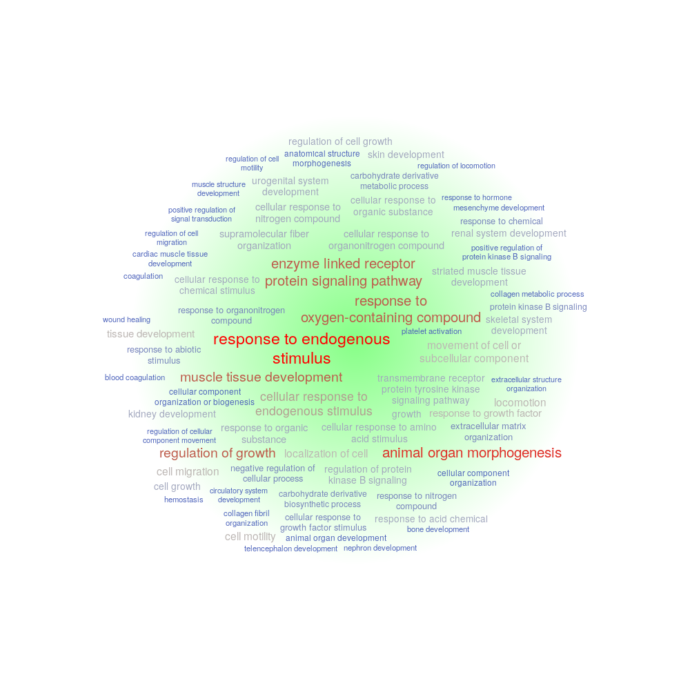
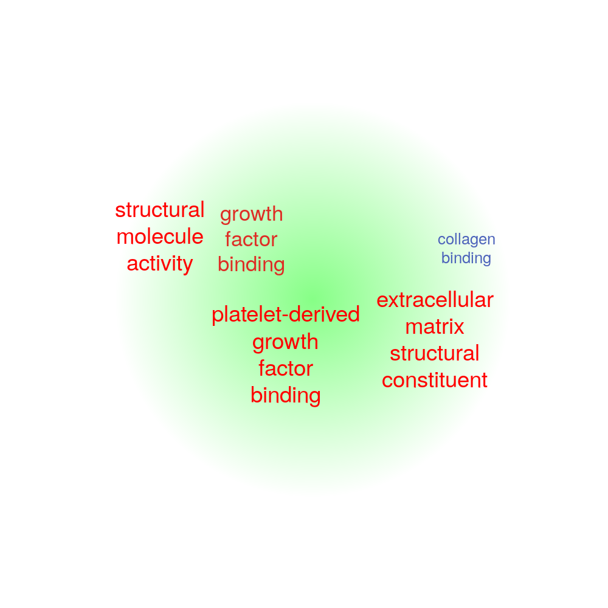
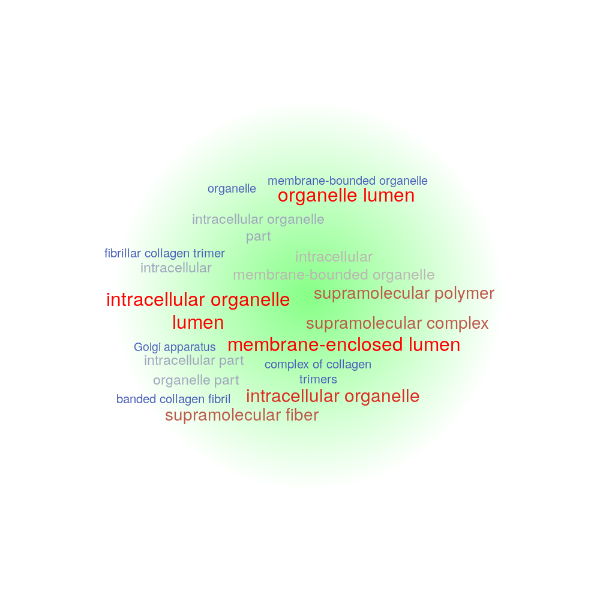

# <font color='#1881c2'>(2,2,:) Pattern</font>


# <font color='#1881c2'>(2,2,) -related L-R pairs (Top31 pairs)</font>

```{r}
library("scTensor")
load("reanalysis.RData")

col <- .setColor("many")[2]
scTensor:::.myvisNetwork(g, col)
```

|Rank|Ligand Gene|Receptor Gene|Ligand Expression (Log10(exp + 1))|Receptor Expression (Log10(exp + 1))|LR-pair factor value (Percentage)|P-value (Grubbs test)|Q-value (BH method)|PubMed|
|----|----|----|----|----|----|----|----|----|
|1|[ANGPT2](https://www.ncbi.nlm.nih.gov/gene/285)<br>Description: angiopoietin 2<br>GO: [1-29](http://amigo.geneontology.org/goose?query=SELECT+*+FROM+term+WHERE+acc%3D%27GO%3A0001525%27+OR+acc%3D%27GO%3A0001666%27+OR+acc%3D%27GO%3A0005102%27+OR+acc%3D%27GO%3A0005515%27+OR+acc%3D%27GO%3A0005576%27+OR+acc%3D%27GO%3A0005615%27+OR+acc%3D%27GO%3A0005634%27+OR+acc%3D%27GO%3A0005886%27+OR+acc%3D%27GO%3A0007165%27+OR+acc%3D%27GO%3A0007281%27+OR+acc%3D%27GO%3A0009314%27+OR+acc%3D%27GO%3A0009612%27+OR+acc%3D%27GO%3A0009749%27+OR+acc%3D%27GO%3A0010812%27+OR+acc%3D%27GO%3A0014070%27+OR+acc%3D%27GO%3A0014823%27+OR+acc%3D%27GO%3A0016525%27+OR+acc%3D%27GO%3A0030971%27+OR+acc%3D%27GO%3A0031100%27+OR+acc%3D%27GO%3A0042995%27+OR+acc%3D%27GO%3A0043537%27+OR+acc%3D%27GO%3A0045766%27+OR+acc%3D%27GO%3A0046872%27+OR+acc%3D%27GO%3A0048014%27+OR+acc%3D%27GO%3A0050900%27+OR+acc%3D%27GO%3A0050928%27+OR+acc%3D%27GO%3A0060135%27+OR+acc%3D%27GO%3A0071363%27+OR+acc%3D%27GO%3A0072012%27%3B&mirror=bbop)<br>Reactome: [1-3](https://reactome.org/content/query?q=R-HSA-109582+R-HSA-202733+R-HSA-210993&types=Pathway&cluster=true)<br>UniProtKB: [1-1](https://www.uniprot.org/uniprot/?query=O15123&sort=score)<br>STRING: <br>RefEx: [ANGPT2](http://refex.dbcls.jp/genelist.php?gene_name%5B%5D=ANGPT2&lang=en&db=human)<br>Expression Atlas: [ANGPT2](https://www.ebi.ac.uk/gxa/genes/ensg00000139269)<br>Single Cell Expression Atlas: [ANGPT2](https://www.ebi.ac.uk/gxa/sc/search?species=&q=ANGPT2)<br>scRNASeqDB: [ANGPT2](https://bioinfo.uth.edu/scrnaseqdb/index.php?r=site/rankGene&gene=ANGPT2&check=0)<br>PanglaoDB: [ANGPT2](https://panglaodb.se/search.html?query=ANGPT2&species=3)<br>CMap: [ANGPT2](https://clue.io/command?q=ANGPT2)<br>MeSH: [1-94](https://www.ncbi.nlm.nih.gov/mesh?term=D000026%20OR%20D000030%20OR%20D000199%20OR%20D000208%20OR%20D000229%20OR%20D000230%20OR%20D000236%20OR%20D000241%20OR%20D000242%20OR%20D000256%20OR%20D000279%20OR%20D000293%20OR%20D000310%20OR%20D000311%20OR%20D000328%20OR%20D000367%20OR%20D000368%20OR%20D000369%20OR%20D000375%20OR%20D000419%20OR%20D000465%20OR%20D000483%20OR%20D000505%20OR%20D000542%20OR%20D000595%20OR%20D000653%20OR%20D000671%20OR%20D000704%20OR%20D000789%20OR%20D000804%20OR%20D000818%20OR%20D000860%20OR%20D000894%20OR%20D000911%20OR%20D000943%20OR%20D000951%20OR%20D000970%20OR%20D000971%20OR%20D000998%20OR%20D001011%20OR%20D001012%20OR%20D001120%20OR%20D001158%20OR%20D001161%20OR%20D001165%20OR%20D001169%20OR%20D001171%20OR%20D001172%20OR%20D001249%20OR%20D001253%20OR%20D001254%20OR%20D001315%20OR%20D001324%20OR%20D001327%20OR%20D001343%20OR%20D001424%20OR%20D001474%20OR%20D001483%20OR%20D001499%20OR%20D001507%20OR%20D001592%20OR%20D001613%20OR%20D001646%20OR%20D001650%20OR%20D001653%20OR%20D001656%20OR%20D001665%20OR%20D001704%20OR%20D001706%20OR%20D001707%20OR%20D001713%20OR%20D001724%20OR%20D001749%20OR%20D001768%20OR%20D001772%20OR%20D001773%20OR%20D001774%20OR%20D001778%20OR%20D001781%20OR%20D001783%20OR%20D001784%20OR%20D001786%20OR%20D001794%20OR%20D001798%20OR%20D001799%20OR%20D001808%20OR%20D001812%20OR%20D001831%20OR%20D001853%20OR%20D001854%20OR%20D001859%20OR%20D001916%20OR%20D001921%20OR%20D001929) [95-188](https://www.ncbi.nlm.nih.gov/mesh?term=D001932%20OR%20D001940%20OR%20D001943%20OR%20D001984%20OR%20D001992%20OR%20D001997%20OR%20D002096%20OR%20D002097%20OR%20D002118%20OR%20D002166%20OR%20D002196%20OR%20D002199%20OR%20D002248%20OR%20D002256%20OR%20D002273%20OR%20D002277%20OR%20D002285%20OR%20D002289%20OR%20D002291%20OR%20D002292%20OR%20D002294%20OR%20D002315%20OR%20D002318%20OR%20D002339%20OR%20D002340%20OR%20D002386%20OR%20D002417%20OR%20D002448%20OR%20D002450%20OR%20D002453%20OR%20D002454%20OR%20D002455%20OR%20D002460%20OR%20D002461%20OR%20D002462%20OR%20D002463%20OR%20D002465%20OR%20D002467%20OR%20D002468%20OR%20D002470%20OR%20D002471%20OR%20D002473%20OR%20D002478%20OR%20D002531%20OR%20D002543%20OR%20D002583%20OR%20D002585%20OR%20D002633%20OR%20D002634%20OR%20D002642%20OR%20D002645%20OR%20D002648%20OR%20D002675%20OR%20D002681%20OR%20D002781%20OR%20D002821%20OR%20D002829%20OR%20D002867%20OR%20D002871%20OR%20D002874%20OR%20D002890%20OR%20D002898%20OR%20D002908%20OR%20D002923%20OR%20D002925%20OR%20D002945%20OR%20D002955%20OR%20D003001%20OR%20D003035%20OR%20D003074%20OR%20D003093%20OR%20D003094%20OR%20D003095%20OR%20D003097%20OR%20D003110%20OR%20D003114%20OR%20D003131%20OR%20D003276%20OR%20D003289%20OR%20D003315%20OR%20D003324%20OR%20D003326%20OR%20D003327%20OR%20D003331%20OR%20D003338%20OR%20D003404%20OR%20D003412%20OR%20D003422%20OR%20D003424%20OR%20D003430%20OR%20D003461%20OR%20D003520%20OR%20D003545%20OR%20D003561) [189-282](https://www.ncbi.nlm.nih.gov/mesh?term=D003609%20OR%20D003656%20OR%20D003661%20OR%20D003676%20OR%20D003692%20OR%20D003713%20OR%20D003715%20OR%20D003716%20OR%20D003841%20OR%20D003922%20OR%20D003924%20OR%20D003925%20OR%20D003928%20OR%20D003930%20OR%20D003964%20OR%20D004067%20OR%20D004185%20OR%20D004194%20OR%20D004195%20OR%20D004210%20OR%20D004247%20OR%20D004252%20OR%20D004261%20OR%20D004268%20OR%20D004273%20OR%20D004305%20OR%20D004311%20OR%20D004334%20OR%20D004338%20OR%20D004354%20OR%20D004357%20OR%20D004487%20OR%20D004534%20OR%20D004591%20OR%20D004622%20OR%20D004624%20OR%20D004625%20OR%20D004677%20OR%20D004715%20OR%20D004717%20OR%20D004727%20OR%20D004729%20OR%20D004730%20OR%20D004789%20OR%20D004791%20OR%20D004797%20OR%20D004804%20OR%20D004815%20OR%20D004847%20OR%20D004926%20OR%20D004927%20OR%20D004958%20OR%20D004965%20OR%20D004967%20OR%20D005047%20OR%20D005091%20OR%20D005109%20OR%20D005192%20OR%20D005263%20OR%20D005300%20OR%20D005307%20OR%20D005312%20OR%20D005313%20OR%20D005317%20OR%20D005322%20OR%20D005333%20OR%20D005334%20OR%20D005337%20OR%20D005338%20OR%20D005340%20OR%20D005342%20OR%20D005347%20OR%20D005355%20OR%20D005387%20OR%20D005434%20OR%20D005444%20OR%20D005451%20OR%20D005455%20OR%20D005472%20OR%20D005500%20OR%20D005528%20OR%20D005541%20OR%20D005710%20OR%20D005753%20OR%20D005770%20OR%20D005784%20OR%20D005786%20OR%20D005787%20OR%20D005810%20OR%20D005819%20OR%20D005820%20OR%20D005821%20OR%20D005822%20OR%20D005838) [283-376](https://www.ncbi.nlm.nih.gov/mesh?term=D005865%20OR%20D005902%20OR%20D005909%20OR%20D005910%20OR%20D005914%20OR%20D005919%20OR%20D005921%20OR%20D005951%20OR%20D005966%20OR%20D005973%20OR%20D006031%20OR%20D006063%20OR%20D006080%20OR%20D006084%20OR%20D006086%20OR%20D006094%20OR%20D006098%20OR%20D006107%20OR%20D006131%20OR%20D006133%20OR%20D006224%20OR%20D006225%20OR%20D006239%20OR%20D006258%20OR%20D006279%20OR%20D006328%20OR%20D006330%20OR%20D006333%20OR%20D006334%20OR%20D006348%20OR%20D006352%20OR%20D006353%20OR%20D006367%20OR%20D006391%20OR%20D006412%20OR%20D006435%20OR%20D006439%20OR%20D006442%20OR%20D006463%20OR%20D006464%20OR%20D006470%20OR%20D006476%20OR%20D006480%20OR%20D006497%20OR%20D006498%20OR%20D006499%20OR%20D006500%20OR%20D006503%20OR%20D006515%20OR%20D006519%20OR%20D006528%20OR%20D006538%20OR%20D006564%20OR%20D006706%20OR%20D006723%20OR%20D006728%20OR%20D006776%20OR%20D006784%20OR%20D006785%20OR%20D006801%20OR%20D006822%20OR%20D006877%20OR%20D006897%20OR%20D006931%20OR%20D006937%20OR%20D006943%20OR%20D006965%20OR%20D006973%20OR%20D007004%20OR%20D007073%20OR%20D007074%20OR%20D007078%20OR%20D007118%20OR%20D007124%20OR%20D007135%20OR%20D007136%20OR%20D007143%20OR%20D007150%20OR%20D007166%20OR%20D007194%20OR%20D007223%20OR%20D007230%20OR%20D007231%20OR%20D007232%20OR%20D007246%20OR%20D007249%20OR%20D007271%20OR%20D007274%20OR%20D007328%20OR%20D007333%20OR%20D007334%20OR%20D007362%20OR%20D007378%20OR%20D007410) [377-470](https://www.ncbi.nlm.nih.gov/mesh?term=D007438%20OR%20D007502%20OR%20D007511%20OR%20D007521%20OR%20D007527%20OR%20D007558%20OR%20D007564%20OR%20D007630%20OR%20D007668%20OR%20D007674%20OR%20D007678%20OR%20D007680%20OR%20D007687%20OR%20D007690%20OR%20D007743%20OR%20D007752%20OR%20D007763%20OR%20D007770%20OR%20D007797%20OR%20D007822%20OR%20D007889%20OR%20D007902%20OR%20D007951%20OR%20D007963%20OR%20D007986%20OR%20D007987%20OR%20D008040%20OR%20D008070%20OR%20D008077%20OR%20D008099%20OR%20D008103%20OR%20D008104%20OR%20D008106%20OR%20D008107%20OR%20D008108%20OR%20D008113%20OR%20D008137%20OR%20D008156%20OR%20D008168%20OR%20D008175%20OR%20D008180%20OR%20D008181%20OR%20D008184%20OR%20D008198%20OR%20D008207%20OR%20D008208%20OR%20D008209%20OR%20D008213%20OR%20D008222%20OR%20D008223%20OR%20D008228%20OR%20D008246%20OR%20D008247%20OR%20D008253%20OR%20D008262%20OR%20D008264%20OR%20D008279%20OR%20D008288%20OR%20D008325%20OR%20D008365%20OR%20D008390%20OR%20D008479%20OR%20D008545%20OR%20D008562%20OR%20D008565%20OR%20D008597%20OR%20D008666%20OR%20D008727%20OR%20D008807%20OR%20D008810%20OR%20D008811%20OR%20D008819%20OR%20D008822%20OR%20D008853%20OR%20D008854%20OR%20D008855%20OR%20D008856%20OR%20D008875%20OR%20D008894%20OR%20D008954%20OR%20D008957%20OR%20D008969%20OR%20D009000%20OR%20D009025%20OR%20D009035%20OR%20D009061%20OR%20D009062%20OR%20D009080%20OR%20D009097%20OR%20D009101%20OR%20D009102%20OR%20D009104%20OR%20D009131%20OR%20D009154) [471-564](https://www.ncbi.nlm.nih.gov/mesh?term=D009190%20OR%20D009203%20OR%20D009205%20OR%20D009206%20OR%20D009262%20OR%20D009316%20OR%20D009336%20OR%20D009361%20OR%20D009362%20OR%20D009363%20OR%20D009364%20OR%20D009367%20OR%20D009368%20OR%20D009369%20OR%20D009374%20OR%20D009375%20OR%20D009389%20OR%20D009392%20OR%20D009414%20OR%20D009418%20OR%20D009419%20OR%20D009442%20OR%20D009447%20OR%20D009479%20OR%20D009500%20OR%20D009504%20OR%20D009538%20OR%20D009569%20OR%20D009687%20OR%20D009919%20OR%20D009928%20OR%20D009929%20OR%20D009942%20OR%20D009994%20OR%20D010012%20OR%20D010051%20OR%20D010052%20OR%20D010053%20OR%20D010060%20OR%20D010062%20OR%20D010100%20OR%20D010101%20OR%20D010108%20OR%20D010190%20OR%20D010195%20OR%20D010265%20OR%20D010269%20OR%20D010298%20OR%20D010307%20OR%20D010388%20OR%20D010410%20OR%20D010413%20OR%20D010445%20OR%20D010446%20OR%20D010455%20OR%20D010457%20OR%20D010518%20OR%20D010530%20OR%20D010539%20OR%20D010641%20OR%20D010738%20OR%20D010766%20OR%20D010770%20OR%20D010865%20OR%20D010920%20OR%20D010921%20OR%20D010929%20OR%20D010947%20OR%20D010951%20OR%20D010957%20OR%20D010962%20OR%20D010963%20OR%20D010966%20OR%20D010972%20OR%20D010976%20OR%20D010982%20OR%20D011014%20OR%20D011110%20OR%20D011112%20OR%20D011130%20OR%20D011169%20OR%20D011174%20OR%20D011183%20OR%20D011225%20OR%20D011230%20OR%20D011233%20OR%20D011247%20OR%20D011248%20OR%20D011256%20OR%20D011257%20OR%20D011261%20OR%20D011262%20OR%20D011263%20OR%20D011271) [565-658](https://www.ncbi.nlm.nih.gov/mesh?term=D011347%20OR%20D011372%20OR%20D011379%20OR%20D011401%20OR%20D011446%20OR%20D011451%20OR%20D011453%20OR%20D011464%20OR%20D011467%20OR%20D011471%20OR%20D011485%20OR%20D011487%20OR%20D011493%20OR%20D011494%20OR%20D011499%20OR%20D011500%20OR%20D011506%20OR%20D011507%20OR%20D011509%20OR%20D011518%20OR%20D011550%20OR%20D011565%20OR%20D011651%20OR%20D011658%20OR%20D011659%20OR%20D011704%20OR%20D011765%20OR%20D011770%20OR%20D011795%20OR%20D011817%20OR%20D011859%20OR%20D011919%20OR%20D011956%20OR%20D011960%20OR%20D011961%20OR%20D011974%20OR%20D011980%20OR%20D011993%20OR%20D011994%20OR%20D012008%20OR%20D012016%20OR%20D012044%20OR%20D012074%20OR%20D012093%20OR%20D012097%20OR%20D012119%20OR%20D012121%20OR%20D012128%20OR%20D012129%20OR%20D012131%20OR%20D012140%20OR%20D012150%20OR%20D012160%20OR%20D012164%20OR%20D012167%20OR%20D012170%20OR%20D012171%20OR%20D012174%20OR%20D012178%20OR%20D012189%20OR%20D012259%20OR%20D012260%20OR%20D012306%20OR%20D012307%20OR%20D012315%20OR%20D012333%20OR%20D012334%20OR%20D012372%20OR%20D012424%20OR%20D012507%20OR%20D012514%20OR%20D012595%20OR%20D012680%20OR%20D012697%20OR%20D012720%20OR%20D012739%20OR%20D012772%20OR%20D012871%20OR%20D012878%20OR%20D012882%20OR%20D012891%20OR%20D012907%20OR%20D012995%20OR%20D013019%20OR%20D013030%20OR%20D013045%20OR%20D013058%20OR%20D013110%20OR%20D013131%20OR%20D013147%20OR%20D013183%20OR%20D013194%20OR%20D013223%20OR%20D013234) [659-752](https://www.ncbi.nlm.nih.gov/mesh?term=D013274%20OR%20D013312%20OR%20D013314%20OR%20D013315%20OR%20D013318%20OR%20D013345%20OR%20D013347%20OR%20D013449%20OR%20D013482%20OR%20D013583%20OR%20D013636%20OR%20D013682%20OR%20D013683%20OR%20D013737%20OR%20D013755%20OR%20D013762%20OR%20D013785%20OR%20D013917%20OR%20D013920%20OR%20D013921%20OR%20D013959%20OR%20D013961%20OR%20D013964%20OR%20D013965%20OR%20D013977%20OR%20D013997%20OR%20D014018%20OR%20D014019%20OR%20D014026%20OR%20D014029%20OR%20D014057%20OR%20D014062%20OR%20D014157%20OR%20D014158%20OR%20D014161%20OR%20D014162%20OR%20D014168%20OR%20D014176%20OR%20D014183%20OR%20D014184%20OR%20D014327%20OR%20D014407%20OR%20D014408%20OR%20D014409%20OR%20D014466%20OR%20D014469%20OR%20D014470%20OR%20D014471%20OR%20D014505%20OR%20D014507%20OR%20D014527%20OR%20D014594%20OR%20D014644%20OR%20D014652%20OR%20D014657%20OR%20D014664%20OR%20D014764%20OR%20D014821%20OR%20D014822%20OR%20D014841%20OR%20D014860%20OR%20D014882%20OR%20D014945%20OR%20D014982%20OR%20D015027%20OR%20D015124%20OR%20D015139%20OR%20D015151%20OR%20D015153%20OR%20D015179%20OR%20D015203%20OR%20D015232%20OR%20D015278%20OR%20D015331%20OR%20D015398%20OR%20D015415%20OR%20D015427%20OR%20D015444%20OR%20D015451%20OR%20D015464%20OR%20D015470%20OR%20D015497%20OR%20D015533%20OR%20D015534%20OR%20D015535%20OR%20D015536%20OR%20D015571%20OR%20D015597%20OR%20D015599%20OR%20D015603%20OR%20D015658%20OR%20D015687%20OR%20D015703%20OR%20D015723) [753-846](https://www.ncbi.nlm.nih.gov/mesh?term=D015800%20OR%20D015810%20OR%20D015815%20OR%20D015820%20OR%20D015843%20OR%20D015850%20OR%20D015854%20OR%20D015861%20OR%20D015870%20OR%20D015894%20OR%20D015906%20OR%20D015971%20OR%20D015972%20OR%20D015973%20OR%20D015992%20OR%20D015994%20OR%20D015995%20OR%20D015996%20OR%20D015999%20OR%20D016002%20OR%20D016009%20OR%20D016014%20OR%20D016015%20OR%20D016016%20OR%20D016017%20OR%20D016019%20OR%20D016022%20OR%20D016027%20OR%20D016030%20OR%20D016037%20OR%20D016040%20OR%20D016066%20OR%20D016086%20OR%20D016131%20OR%20D016133%20OR%20D016158%20OR%20D016159%20OR%20D016174%20OR%20D016179%20OR%20D016193%20OR%20D016209%20OR%20D016212%20OR%20D016216%20OR%20D016222%20OR%20D016228%20OR%20D016277%20OR%20D016296%20OR%20D016319%20OR%20D016326%20OR%20D016328%20OR%20D016366%20OR%20D016376%20OR%20D016393%20OR%20D016415%20OR%20D016466%20OR%20D016471%20OR%20D016510%20OR%20D016513%20OR%20D016535%20OR%20D016540%20OR%20D016566%20OR%20D016601%20OR%20D016638%20OR%20D016688%20OR%20D016753%20OR%20D016778%20OR%20D016779%20OR%20D016780%20OR%20D016861%20OR%20D016866%20OR%20D016889%20OR%20D016895%20OR%20D016896%20OR%20D016903%20OR%20D016922%20OR%20D016923%20OR%20D016966%20OR%20D017023%20OR%20D017035%20OR%20D017052%20OR%20D017077%20OR%20D017097%20OR%20D017122%20OR%20D017124%20OR%20D017125%20OR%20D017154%20OR%20D017207%20OR%20D017208%20OR%20D017209%20OR%20D017228%20OR%20D017239%20OR%20D017242%20OR%20D017326%20OR%20D017329) [847-940](https://www.ncbi.nlm.nih.gov/mesh?term=D017346%20OR%20D017353%20OR%20D017359%20OR%20D017379%20OR%20D017382%20OR%20D017386%20OR%20D017395%20OR%20D017398%20OR%20D017403%20OR%20D017404%20OR%20D017422%20OR%20D017430%20OR%20D017434%20OR%20D017451%20OR%20D017526%20OR%20D017539%20OR%20D017544%20OR%20D017563%20OR%20D017567%20OR%20D017679%20OR%20D017705%20OR%20D017741%20OR%20D017868%20OR%20D017930%20OR%20D017931%20OR%20D017978%20OR%20D018014%20OR%20D018019%20OR%20D018056%20OR%20D018076%20OR%20D018078%20OR%20D018079%20OR%20D018095%20OR%20D018149%20OR%20D018262%20OR%20D018270%20OR%20D018277%20OR%20D018278%20OR%20D018279%20OR%20D018281%20OR%20D018285%20OR%20D018287%20OR%20D018288%20OR%20D018345%20OR%20D018358%20OR%20D018375%20OR%20D018380%20OR%20D018384%20OR%20D018385%20OR%20D018392%20OR%20D018394%20OR%20D018398%20OR%20D018450%20OR%20D018482%20OR%20D018507%20OR%20D018570%20OR%20D018572%20OR%20D018587%20OR%20D018608%20OR%20D018613%20OR%20D018616%20OR%20D018625%20OR%20D018628%20OR%20D018709%20OR%20D018719%20OR%20D018746%20OR%20D018778%20OR%20D018783%20OR%20D018796%20OR%20D018797%20OR%20D018799%20OR%20D018805%20OR%20D018806%20OR%20D018808%20OR%20D018809%20OR%20D018821%20OR%20D018827%20OR%20D018829%20OR%20D018836%20OR%20D018859%20OR%20D018899%20OR%20D018919%20OR%20D018920%20OR%20D018927%20OR%20D018931%20OR%20D018932%20OR%20D018950%20OR%20D018952%20OR%20D019001%20OR%20D019007%20OR%20D019008%20OR%20D019010%20OR%20D019012%20OR%20D019020) [941-1034](https://www.ncbi.nlm.nih.gov/mesh?term=D019030%20OR%20D019040%20OR%20D019042%20OR%20D019061%20OR%20D019073%20OR%20D019098%20OR%20D019102%20OR%20D019108%20OR%20D019138%20OR%20D019143%20OR%20D019161%20OR%20D019175%20OR%20D019253%20OR%20D019255%20OR%20D019268%20OR%20D019276%20OR%20D019281%20OR%20D019283%20OR%20D019288%20OR%20D019295%20OR%20D019313%20OR%20D019332%20OR%20D019337%20OR%20D019384%20OR%20D019394%20OR%20D019408%20OR%20D019446%20OR%20D019520%20OR%20D019540%20OR%20D019635%20OR%20D019650%20OR%20D019659%20OR%20D019694%20OR%20D019698%20OR%20D019699%20OR%20D019700%20OR%20D019716%20OR%20D019867%20OR%20D019869%20OR%20D019898%20OR%20D019899%20OR%20D019936%20OR%20D019947%20OR%20D019950%20OR%20D020013%20OR%20D020022%20OR%20D020033%20OR%20D020073%20OR%20D020097%20OR%20D020107%20OR%20D020123%20OR%20D020128%20OR%20D020133%20OR%20D020181%20OR%20D020218%20OR%20D020246%20OR%20D020256%20OR%20D020286%20OR%20D020298%20OR%20D020300%20OR%20D020302%20OR%20D020360%20OR%20D020382%20OR%20D020405%20OR%20D020411%20OR%20D020413%20OR%20D020518%20OR%20D020520%20OR%20D020521%20OR%20D020533%20OR%20D020543%20OR%20D020545%20OR%20D020554%20OR%20D020556%20OR%20D020574%20OR%20D020641%20OR%20D020648%20OR%20D020690%20OR%20D020732%20OR%20D020738%20OR%20D020742%20OR%20D020744%20OR%20D020775%20OR%20D020778%20OR%20D020780%20OR%20D020782%20OR%20D020783%20OR%20D020786%20OR%20D020794%20OR%20D020797%20OR%20D020798%20OR%20D020806%20OR%20D020830%20OR%20D020836) [1035-1128](https://www.ncbi.nlm.nih.gov/mesh?term=D020869%20OR%20D020928%20OR%20D020935%20OR%20D021041%20OR%20D021381%20OR%20D021581%20OR%20D022005%20OR%20D022781%20OR%20D022821%20OR%20D023041%20OR%20D023084%20OR%20D023241%20OR%20D023281%20OR%20D023421%20OR%20D024042%20OR%20D024101%20OR%20D024141%20OR%20D024363%20OR%20D024506%20OR%20D024510%20OR%20D024682%20OR%20D024821%20OR%20D025521%20OR%20D025801%20OR%20D025941%20OR%20D027724%20OR%20D029424%20OR%20D030562%20OR%20D032389%20OR%20D032446%20OR%20D033081%20OR%20D033581%20OR%20D033921%20OR%20D034622%20OR%20D034741%20OR%20D035002%20OR%20D035683%20OR%20D036341%20OR%20D036388%20OR%20D036801%20OR%20D037181%20OR%20D037241%20OR%20D037342%20OR%20D037841%20OR%20D039081%20OR%20D039302%20OR%20D039481%20OR%20D040081%20OR%20D040262%20OR%20D040281%20OR%20D040301%20OR%20D040321%20OR%20D040641%20OR%20D041681%20OR%20D041721%20OR%20D041981%20OR%20D042442%20OR%20D042461%20OR%20D042501%20OR%20D042541%20OR%20D042582%20OR%20D042583%20OR%20D042601%20OR%20D042643%20OR%20D042662%20OR%20D042683%20OR%20D042702%20OR%20D042764%20OR%20D042783%20OR%20D042787%20OR%20D042810%20OR%20D043168%20OR%20D043169%20OR%20D043244%20OR%20D043684%20OR%20D043925%20OR%20D044383%20OR%20D044463%20OR%20D044466%20OR%20D044963%20OR%20D044966%20OR%20D045162%20OR%20D045325%20OR%20D045726%20OR%20D045744%20OR%20D045787%20OR%20D046110%20OR%20D046152%20OR%20D046228%20OR%20D046509%20OR%20D046888%20OR%20D046911%20OR%20D047228%20OR%20D047368) [1129-1222](https://www.ncbi.nlm.nih.gov/mesh?term=D047369%20OR%20D047428%20OR%20D047468%20OR%20D047908%20OR%20D047928%20OR%20D048049%20OR%20D048051%20OR%20D048052%20OR%20D048429%20OR%20D048670%20OR%20D048868%20OR%20D048909%20OR%20D049033%20OR%20D049109%20OR%20D049349%20OR%20D050171%20OR%20D050197%20OR%20D050378%20OR%20D050436%20OR%20D050438%20OR%20D050527%20OR%20D050719%20OR%20D050759%20OR%20D050783%20OR%20D050784%20OR%20D050791%20OR%20D050799%20OR%20D050822%20OR%20D050989%20OR%20D051017%20OR%20D051028%20OR%20D051034%20OR%20D051040%20OR%20D051057%20OR%20D051197%20OR%20D051272%20OR%20D051359%20OR%20D051379%20OR%20D051381%20OR%20D051416%20OR%20D051417%20OR%20D051436%20OR%20D051437%20OR%20D051545%20OR%20D051546%20OR%20D051550%20OR%20D051741%20OR%20D051767%20OR%20D051792%20OR%20D051793%20OR%20D051794%20OR%20D051795%20OR%20D051858%20OR%20D051937%20OR%20D051997%20OR%20D052097%20OR%20D052177%20OR%20D052216%20OR%20D052246%20OR%20D052250%20OR%20D052577%20OR%20D053148%20OR%20D053208%20OR%20D053222%20OR%20D053379%20OR%20D053487%20OR%20D053495%20OR%20D053504%20OR%20D053511%20OR%20D053538%20OR%20D053552%20OR%20D053595%20OR%20D053612%20OR%20D053681%20OR%20D053773%20OR%20D053823%20OR%20D054198%20OR%20D054315%20OR%20D054323%20OR%20D054339%20OR%20D054377%20OR%20D054405%20OR%20D054460%20OR%20D054592%20OR%20D054631%20OR%20D054884%20OR%20D055031%20OR%20D055088%20OR%20D055106%20OR%20D055109%20OR%20D055114%20OR%20D055153%20OR%20D055213%20OR%20D055293) [1223-1312](https://www.ncbi.nlm.nih.gov/mesh?term=D055316%20OR%20D055370%20OR%20D055371%20OR%20D055372%20OR%20D055397%20OR%20D055501%20OR%20D055502%20OR%20D055513%20OR%20D055550%20OR%20D055607%20OR%20D055752%20OR%20D055785%20OR%20D055806%20OR%20D055808%20OR%20D055815%20OR%20D055959%20OR%20D056128%20OR%20D056151%20OR%20D056566%20OR%20D056648%20OR%20D056726%20OR%20D057049%20OR%20D057134%20OR%20D057135%20OR%20D057234%20OR%20D057285%20OR%20D057510%20OR%20D057809%20OR%20D057900%20OR%20D058186%20OR%20D058306%20OR%20D058750%20OR%20D058977%20OR%20D058990%20OR%20D059014%20OR%20D059016%20OR%20D059168%20OR%20D059289%20OR%20D059467%20OR%20D059630%20OR%20D060066%20OR%20D060787%20OR%20D060888%20OR%20D061067%20OR%20D061307%20OR%20D062085%20OR%20D062109%20OR%20D062645%20OR%20D062826%20OR%20D063177%20OR%20D063646%20OR%20D063868%20OR%20D064147%20OR%20D064420%20OR%20D064568%20OR%20D064592%20OR%20D064593%20OR%20D064726%20OR%20D066253%20OR%20D066298%20OR%20D001402%20OR%20D004817%20OR%20D003920%20OR%20D016606%20OR%20D018263%20OR%20D018265%20OR%20D000730%20OR%20D000906%20OR%20D002227%20OR%20D003029%20OR%20D004398%20OR%20D004798%20OR%20D007783%20OR%20D008024%20OR%20D009843%20OR%20D011720%20OR%20D011755%20OR%20D011958%20OR%20D013450%20OR%20D013873%20OR%20D016023%20OR%20D016207%20OR%20D019715%20OR%20D042682%20OR%20D051562%20OR%20D051746%20OR%20D007700%20OR%20D008833%20OR%20D012689%20OR%20D052138)|[PDGFRB](https://www.ncbi.nlm.nih.gov/gene/5159)<br>Description: platelet derived growth factor receptor beta<br>GO: [1-92](http://amigo.geneontology.org/goose?query=SELECT+*+FROM+term+WHERE+acc%3D%27GO%3A0000165%27+OR+acc%3D%27GO%3A0002244%27+OR+acc%3D%27GO%3A0004713%27+OR+acc%3D%27GO%3A0004714%27+OR+acc%3D%27GO%3A0004992%27+OR+acc%3D%27GO%3A0005017%27+OR+acc%3D%27GO%3A0005019%27+OR+acc%3D%27GO%3A0005102%27+OR+acc%3D%27GO%3A0005161%27+OR+acc%3D%27GO%3A0005515%27+OR+acc%3D%27GO%3A0005524%27+OR+acc%3D%27GO%3A0005634%27+OR+acc%3D%27GO%3A0005737%27+OR+acc%3D%27GO%3A0005794%27+OR+acc%3D%27GO%3A0005886%27+OR+acc%3D%27GO%3A0005887%27+OR+acc%3D%27GO%3A0005925%27+OR+acc%3D%27GO%3A0006024%27+OR+acc%3D%27GO%3A0007165%27+OR+acc%3D%27GO%3A0007169%27+OR+acc%3D%27GO%3A0007186%27+OR+acc%3D%27GO%3A0007568%27+OR+acc%3D%27GO%3A0008284%27+OR+acc%3D%27GO%3A0008584%27+OR+acc%3D%27GO%3A0009986%27+OR+acc%3D%27GO%3A0010863%27+OR+acc%3D%27GO%3A0014068%27+OR+acc%3D%27GO%3A0014911%27+OR+acc%3D%27GO%3A0016020%27+OR+acc%3D%27GO%3A0016324%27+OR+acc%3D%27GO%3A0016477%27+OR+acc%3D%27GO%3A0018108%27+OR+acc%3D%27GO%3A0019899%27+OR+acc%3D%27GO%3A0019901%27+OR+acc%3D%27GO%3A0030335%27+OR+acc%3D%27GO%3A0031226%27+OR+acc%3D%27GO%3A0031410%27+OR+acc%3D%27GO%3A0032355%27+OR+acc%3D%27GO%3A0032516%27+OR+acc%3D%27GO%3A0032526%27+OR+acc%3D%27GO%3A0032956%27+OR+acc%3D%27GO%3A0032967%27+OR+acc%3D%27GO%3A0034405%27+OR+acc%3D%27GO%3A0035025%27+OR+acc%3D%27GO%3A0035441%27+OR+acc%3D%27GO%3A0035789%27+OR+acc%3D%27GO%3A0035791%27+OR+acc%3D%27GO%3A0035793%27+OR+acc%3D%27GO%3A0035909%27+OR+acc%3D%27GO%3A0036120%27+OR+acc%3D%27GO%3A0038085%27+OR+acc%3D%27GO%3A0038091%27+OR+acc%3D%27GO%3A0042060%27+OR+acc%3D%27GO%3A0042542%27+OR+acc%3D%27GO%3A0043065%27+OR+acc%3D%27GO%3A0043066%27+OR+acc%3D%27GO%3A0043202%27+OR+acc%3D%27GO%3A0043231%27+OR+acc%3D%27GO%3A0043235%27+OR+acc%3D%27GO%3A0043406%27+OR+acc%3D%27GO%3A0043410%27+OR+acc%3D%27GO%3A0043548%27+OR+acc%3D%27GO%3A0043552%27+OR+acc%3D%27GO%3A0043627%27+OR+acc%3D%27GO%3A0045840%27+OR+acc%3D%27GO%3A0046488%27+OR+acc%3D%27GO%3A0046777%27+OR+acc%3D%27GO%3A0048008%27+OR+acc%3D%27GO%3A0048015%27+OR+acc%3D%27GO%3A0048146%27+OR+acc%3D%27GO%3A0048407%27+OR+acc%3D%27GO%3A0048661%27+OR+acc%3D%27GO%3A0048839%27+OR+acc%3D%27GO%3A0050921%27+OR+acc%3D%27GO%3A0051897%27+OR+acc%3D%27GO%3A0055003%27+OR+acc%3D%27GO%3A0055093%27+OR+acc%3D%27GO%3A0060326%27+OR+acc%3D%27GO%3A0060437%27+OR+acc%3D%27GO%3A0060981%27+OR+acc%3D%27GO%3A0061298%27+OR+acc%3D%27GO%3A0070374%27+OR+acc%3D%27GO%3A0071670%27+OR+acc%3D%27GO%3A0072075%27+OR+acc%3D%27GO%3A0072262%27+OR+acc%3D%27GO%3A0072277%27+OR+acc%3D%27GO%3A0072278%27+OR+acc%3D%27GO%3A0072284%27+OR+acc%3D%27GO%3A0090280%27+OR+acc%3D%27GO%3A2000379%27+OR+acc%3D%27GO%3A2000491%27+OR+acc%3D%27GO%3A2000573%27%3B&mirror=bbop)<br>Reactome: [1-18](https://reactome.org/content/query?q=R-HSA-1257604+R-HSA-1280215+R-HSA-162582+R-HSA-1643685+R-HSA-168256+R-HSA-186763+R-HSA-186797+R-HSA-199418+R-HSA-2219528+R-HSA-2219530+R-HSA-5663202+R-HSA-5673001+R-HSA-5683057+R-HSA-5684996+R-HSA-6811558+R-HSA-9006925+R-HSA-9006934+R-HSA-9607240&types=Pathway&cluster=true)<br>UniProtKB: [1-2](https://www.uniprot.org/uniprot/?query=P09619+OR+Q59F04&sort=score)<br>STRING: <br>RefEx: [PDGFRB](http://refex.dbcls.jp/genelist.php?gene_name%5B%5D=PDGFRB&lang=en&db=human)<br>Expression Atlas: [PDGFRB](https://www.ebi.ac.uk/gxa/genes/ensg00000072694)<br>Single Cell Expression Atlas: [PDGFRB](https://www.ebi.ac.uk/gxa/sc/search?species=&q=PDGFRB)<br>scRNASeqDB: [PDGFRB](https://bioinfo.uth.edu/scrnaseqdb/index.php?r=site/rankGene&gene=PDGFRB&check=0)<br>PanglaoDB: [PDGFRB](https://panglaodb.se/search.html?query=PDGFRB&species=3)<br>CMap: [PDGFRB](https://clue.io/command?q=PDGFRB)<br>MeSH: [1-99](https://www.ncbi.nlm.nih.gov/mesh?term=D000163%20OR%20D000199%20OR%20D000208%20OR%20D000230%20OR%20D000236%20OR%20D000251%20OR%20D000255%20OR%20D000256%20OR%20D000273%20OR%20D000284%20OR%20D000293%20OR%20D000328%20OR%20D000368%20OR%20D000369%20OR%20D000409%20OR%20D000465%20OR%20D000483%20OR%20D000595%20OR%20D000596%20OR%20D000704%20OR%20D000728%20OR%20D000818%20OR%20D000860%20OR%20D000880%20OR%20D000911%20OR%20D000918%20OR%20D000925%20OR%20D000939%20OR%20D000941%20OR%20D000943%20OR%20D000951%20OR%20D000954%20OR%20D000956%20OR%20D000970%20OR%20D000971%20OR%20D001011%20OR%20D001013%20OR%20D001018%20OR%20D001053%20OR%20D001054%20OR%20D001055%20OR%20D001057%20OR%20D001120%20OR%20D001158%20OR%20D001161%20OR%20D001172%20OR%20D001216%20OR%20D001224%20OR%20D001253%20OR%20D001259%20OR%20D001343%20OR%20D001344%20OR%20D001402%20OR%20D001426%20OR%20D001427%20OR%20D001480%20OR%20D001483%20OR%20D001616%20OR%20D001641%20OR%20D001665%20OR%20D001667%20OR%20D001681%20OR%20D001692%20OR%20D001704%20OR%20D001706%20OR%20D001752%20OR%20D001786%20OR%20D001798%20OR%20D001808%20OR%20D001812%20OR%20D001842%20OR%20D001853%20OR%20D001854%20OR%20D001857%20OR%20D001859%20OR%20D001921%20OR%20D001927%20OR%20D001932%20OR%20D001940%20OR%20D001943%20OR%20D001973%20OR%20D001999%20OR%20D002097%20OR%20D002113%20OR%20D002114%20OR%20D002117%20OR%20D002118%20OR%20D002135%20OR%20D002196%20OR%20D002247%20OR%20D002256%20OR%20D002276%20OR%20D002277%20OR%20D002289%20OR%20D002292%20OR%20D002294%20OR%20D002295%20OR%20D002296%20OR%20D002318) [100-198](https://www.ncbi.nlm.nih.gov/mesh?term=D002339%20OR%20D002340%20OR%20D002352%20OR%20D002384%20OR%20D002417%20OR%20D002448%20OR%20D002453%20OR%20D002454%20OR%20D002455%20OR%20D002458%20OR%20D002460%20OR%20D002461%20OR%20D002462%20OR%20D002465%20OR%20D002467%20OR%20D002468%20OR%20D002469%20OR%20D002470%20OR%20D002471%20OR%20D002478%20OR%20D002502%20OR%20D002522%20OR%20D002538%20OR%20D002545%20OR%20D002633%20OR%20D002645%20OR%20D002648%20OR%20D002675%20OR%20D002681%20OR%20D002784%20OR%20D002817%20OR%20D002843%20OR%20D002846%20OR%20D002869%20OR%20D002871%20OR%20D002872%20OR%20D002874%20OR%20D002880%20OR%20D002881%20OR%20D002883%20OR%20D002885%20OR%20D002886%20OR%20D002894%20OR%20D002895%20OR%20D002897%20OR%20D002908%20OR%20D002923%20OR%20D002942%20OR%20D002945%20OR%20D002999%20OR%20D003001%20OR%20D003042%20OR%20D003062%20OR%20D003087%20OR%20D003094%20OR%20D003110%20OR%20D003114%20OR%20D003131%20OR%20D003198%20OR%20D003287%20OR%20D003324%20OR%20D003327%20OR%20D003331%20OR%20D003388%20OR%20D003432%20OR%20D003433%20OR%20D003470%20OR%20D003545%20OR%20D003550%20OR%20D003557%20OR%20D003587%20OR%20D003593%20OR%20D003598%20OR%20D003599%20OR%20D003600%20OR%20D003710%20OR%20D003903%20OR%20D003921%20OR%20D003922%20OR%20D003924%20OR%20D003928%20OR%20D003937%20OR%20D004041%20OR%20D004121%20OR%20D004194%20OR%20D004195%20OR%20D004229%20OR%20D004247%20OR%20D004249%20OR%20D004251%20OR%20D004252%20OR%20D004260%20OR%20D004261%20OR%20D004262%20OR%20D004268%20OR%20D004273%20OR%20D004274%20OR%20D004277%20OR%20D004279) [199-297](https://www.ncbi.nlm.nih.gov/mesh?term=D004285%20OR%20D004298%20OR%20D004305%20OR%20D004314%20OR%20D004331%20OR%20D004334%20OR%20D004338%20OR%20D004353%20OR%20D004354%20OR%20D004357%20OR%20D004359%20OR%20D004388%20OR%20D004396%20OR%20D004487%20OR%20D004549%20OR%20D004591%20OR%20D004622%20OR%20D004705%20OR%20D004717%20OR%20D004730%20OR%20D004742%20OR%20D004789%20OR%20D004790%20OR%20D004791%20OR%20D004792%20OR%20D004797%20OR%20D004802%20OR%20D004815%20OR%20D004843%20OR%20D004847%20OR%20D004848%20OR%20D004926%20OR%20D004938%20OR%20D005047%20OR%20D005091%20OR%20D005109%20OR%20D005190%20OR%20D005192%20OR%20D005246%20OR%20D005263%20OR%20D005285%20OR%20D005312%20OR%20D005333%20OR%20D005343%20OR%20D005346%20OR%20D005347%20OR%20D005353%20OR%20D005354%20OR%20D005355%20OR%20D005419%20OR%20D005434%20OR%20D005454%20OR%20D005455%20OR%20D005472%20OR%20D005500%20OR%20D005625%20OR%20D005656%20OR%20D005677%20OR%20D005743%20OR%20D005770%20OR%20D005784%20OR%20D005786%20OR%20D005787%20OR%20D005796%20OR%20D005799%20OR%20D005804%20OR%20D005810%20OR%20D005819%20OR%20D005820%20OR%20D005822%20OR%20D005838%20OR%20D005904%20OR%20D005909%20OR%20D005910%20OR%20D005920%20OR%20D005921%20OR%20D005922%20OR%20D005947%20OR%20D005978%20OR%20D005982%20OR%20D006025%20OR%20D006056%20OR%20D006063%20OR%20D006080%20OR%20D006083%20OR%20D006084%20OR%20D006086%20OR%20D006106%20OR%20D006107%20OR%20D006130%20OR%20D006133%20OR%20D006160%20OR%20D006168%20OR%20D006224%20OR%20D006239%20OR%20D006262%20OR%20D006321%20OR%20D006331%20OR%20D006367) [298-396](https://www.ncbi.nlm.nih.gov/mesh?term=D006393%20OR%20D006394%20OR%20D006412%20OR%20D006498%20OR%20D006515%20OR%20D006528%20OR%20D006566%20OR%20D006579%20OR%20D006614%20OR%20D006624%20OR%20D006639%20OR%20D006655%20OR%20D006706%20OR%20D006720%20OR%20D006736%20OR%20D006801%20OR%20D006820%20OR%20D006822%20OR%20D006861%20OR%20D006863%20OR%20D006962%20OR%20D006965%20OR%20D006976%20OR%20D007004%20OR%20D007074%20OR%20D007091%20OR%20D007124%20OR%20D007150%20OR%20D007202%20OR%20D007223%20OR%20D007231%20OR%20D007249%20OR%20D007274%20OR%20D007295%20OR%20D007304%20OR%20D007313%20OR%20D007328%20OR%20D007334%20OR%20D007375%20OR%20D007377%20OR%20D007399%20OR%20D007413%20OR%20D007438%20OR%20D007511%20OR%20D007515%20OR%20D007527%20OR%20D007553%20OR%20D007564%20OR%20D007608%20OR%20D007621%20OR%20D007668%20OR%20D007674%20OR%20D007678%20OR%20D007680%20OR%20D007682%20OR%20D007687%20OR%20D007694%20OR%20D007797%20OR%20D007930%20OR%20D007938%20OR%20D007948%20OR%20D007951%20OR%20D007958%20OR%20D007962%20OR%20D007964%20OR%20D008025%20OR%20D008040%20OR%20D008051%20OR%20D008075%20OR%20D008076%20OR%20D008077%20OR%20D008078%20OR%20D008081%20OR%20D008099%20OR%20D008103%20OR%20D008111%20OR%20D008113%20OR%20D008156%20OR%20D008164%20OR%20D008168%20OR%20D008175%20OR%20D008180%20OR%20D008207%20OR%20D008212%20OR%20D008214%20OR%20D008222%20OR%20D008239%20OR%20D008246%20OR%20D008247%20OR%20D008264%20OR%20D008279%20OR%20D008390%20OR%20D008407%20OR%20D008433%20OR%20D008533%20OR%20D008545%20OR%20D008562%20OR%20D008565%20OR%20D008648) [397-495](https://www.ncbi.nlm.nih.gov/mesh?term=D008654%20OR%20D008715%20OR%20D008745%20OR%20D008807%20OR%20D008809%20OR%20D008810%20OR%20D008811%20OR%20D008813%20OR%20D008817%20OR%20D008819%20OR%20D008822%20OR%20D008840%20OR%20D008854%20OR%20D008856%20OR%20D008861%20OR%20D008869%20OR%20D008875%20OR%20D008894%20OR%20D008934%20OR%20D008938%20OR%20D008954%20OR%20D008956%20OR%20D008957%20OR%20D008958%20OR%20D008961%20OR%20D008968%20OR%20D008969%20OR%20D008970%20OR%20D009000%20OR%20D009004%20OR%20D009062%20OR%20D009072%20OR%20D009101%20OR%20D009119%20OR%20D009124%20OR%20D009130%20OR%20D009131%20OR%20D009154%20OR%20D009190%20OR%20D009196%20OR%20D009206%20OR%20D009218%20OR%20D009316%20OR%20D009361%20OR%20D009362%20OR%20D009363%20OR%20D009364%20OR%20D009367%20OR%20D009368%20OR%20D009369%20OR%20D009373%20OR%20D009374%20OR%20D009375%20OR%20D009389%20OR%20D009392%20OR%20D009395%20OR%20D009396%20OR%20D009402%20OR%20D009414%20OR%20D009416%20OR%20D009420%20OR%20D009421%20OR%20D009442%20OR%20D009447%20OR%20D009457%20OR%20D009460%20OR%20D009474%20OR%20D009536%20OR%20D009538%20OR%20D009580%20OR%20D009587%20OR%20D009634%20OR%20D009682%20OR%20D009687%20OR%20D009691%20OR%20D009693%20OR%20D009805%20OR%20D009838%20OR%20D009856%20OR%20D009857%20OR%20D009865%20OR%20D009928%20OR%20D009943%20OR%20D010006%20OR%20D010012%20OR%20D010051%20OR%20D010053%20OR%20D010084%20OR%20D010085%20OR%20D010100%20OR%20D010190%20OR%20D010212%20OR%20D010300%20OR%20D010375%20OR%20D010446%20OR%20D010449%20OR%20D010450%20OR%20D010455%20OR%20D010544) [496-594](https://www.ncbi.nlm.nih.gov/mesh?term=D010582%20OR%20D010641%20OR%20D010649%20OR%20D010671%20OR%20D010677%20OR%20D010710%20OR%20D010716%20OR%20D010738%20OR%20D010743%20OR%20D010744%20OR%20D010766%20OR%20D010768%20OR%20D010770%20OR%20D010777%20OR%20D010802%20OR%20D010865%20OR%20D010920%20OR%20D010940%20OR%20D010957%20OR%20D010959%20OR%20D010976%20OR%20D010980%20OR%20D010982%20OR%20D010997%20OR%20D011013%20OR%20D011061%20OR%20D011110%20OR%20D011183%20OR%20D011233%20OR%20D011247%20OR%20D011257%20OR%20D011336%20OR%20D011371%20OR%20D011379%20OR%20D011392%20OR%20D011401%20OR%20D011446%20OR%20D011467%20OR%20D011468%20OR%20D011470%20OR%20D011471%20OR%20D011485%20OR%20D011487%20OR%20D011493%20OR%20D011494%20OR%20D011499%20OR%20D011503%20OR%20D011505%20OR%20D011506%20OR%20D011509%20OR%20D011518%20OR%20D011533%20OR%20D011554%20OR%20D011618%20OR%20D011651%20OR%20D011656%20OR%20D011658%20OR%20D011667%20OR%20D011668%20OR%20D011817%20OR%20D011829%20OR%20D011836%20OR%20D011838%20OR%20D011878%20OR%20D011897%20OR%20D011905%20OR%20D011916%20OR%20D011919%20OR%20D011920%20OR%20D011921%20OR%20D011940%20OR%20D011947%20OR%20D011948%20OR%20D011950%20OR%20D011954%20OR%20D011956%20OR%20D011971%20OR%20D011972%20OR%20D011978%20OR%20D011987%20OR%20D011991%20OR%20D011992%20OR%20D011993%20OR%20D011994%20OR%20D012004%20OR%20D012008%20OR%20D012038%20OR%20D012044%20OR%20D012074%20OR%20D012097%20OR%20D012123%20OR%20D012137%20OR%20D012143%20OR%20D012189%20OR%20D012208%20OR%20D012307%20OR%20D012313%20OR%20D012333%20OR%20D012334) [595-693](https://www.ncbi.nlm.nih.gov/mesh?term=D012377%20OR%20D012441%20OR%20D012509%20OR%20D012512%20OR%20D012514%20OR%20D012516%20OR%20D012559%20OR%20D012568%20OR%20D012595%20OR%20D012680%20OR%20D012689%20OR%20D012694%20OR%20D012697%20OR%20D012701%20OR%20D012720%20OR%20D012737%20OR%20D012741%20OR%20D012878%20OR%20D012907%20OR%20D012983%20OR%20D013030%20OR%20D013045%20OR%20D013049%20OR%20D013056%20OR%20D013058%20OR%20D013108%20OR%20D013110%20OR%20D013194%20OR%20D013226%20OR%20D013234%20OR%20D013268%20OR%20D013274%20OR%20D013276%20OR%20D013287%20OR%20D013329%20OR%20D013347%20OR%20D013353%20OR%20D013379%20OR%20D013388%20OR%20D013438%20OR%20D013449%20OR%20D013481%20OR%20D013539%20OR%20D013552%20OR%20D013577%20OR%20D013584%20OR%20D013601%20OR%20D013678%20OR%20D013736%20OR%20D013755%20OR%20D013816%20OR%20D013925%20OR%20D013926%20OR%20D013936%20OR%20D013947%20OR%20D013961%20OR%20D013964%20OR%20D013997%20OR%20D014018%20OR%20D014057%20OR%20D014062%20OR%20D014096%20OR%20D014132%20OR%20D014157%20OR%20D014158%20OR%20D014161%20OR%20D014162%20OR%20D014176%20OR%20D014178%20OR%20D014182%20OR%20D014183%20OR%20D014184%20OR%20D014212%20OR%20D014280%20OR%20D014355%20OR%20D014357%20OR%20D014364%20OR%20D014403%20OR%20D014407%20OR%20D014408%20OR%20D014409%20OR%20D014410%20OR%20D014411%20OR%20D014443%20OR%20D014452%20OR%20D014471%20OR%20D014517%20OR%20D014568%20OR%20D014599%20OR%20D014638%20OR%20D014644%20OR%20D014680%20OR%20D014747%20OR%20D014764%20OR%20D014867%20OR%20D014920%20OR%20D014945%20OR%20D014982%20OR%20D015027) [694-792](https://www.ncbi.nlm.nih.gov/mesh?term=D015151%20OR%20D015152%20OR%20D015153%20OR%20D015179%20OR%20D015180%20OR%20D015183%20OR%20D015195%20OR%20D015203%20OR%20D015221%20OR%20D015233%20OR%20D015265%20OR%20D015290%20OR%20D015321%20OR%20D015331%20OR%20D015342%20OR%20D015345%20OR%20D015368%20OR%20D015374%20OR%20D015375%20OR%20D015394%20OR%20D015398%20OR%20D015415%20OR%20D015451%20OR%20D015452%20OR%20D015464%20OR%20D015470%20OR%20D015477%20OR%20D015497%20OR%20D015513%20OR%20D015514%20OR%20D015526%20OR%20D015533%20OR%20D015534%20OR%20D015536%20OR%20D015603%20OR%20D015658%20OR%20D015674%20OR%20D015675%20OR%20D015687%20OR%20D015688%20OR%20D015689%20OR%20D015698%20OR%20D015703%20OR%20D015723%20OR%20D015801%20OR%20D015815%20OR%20D015820%20OR%20D015850%20OR%20D015854%20OR%20D015870%20OR%20D015894%20OR%20D015942%20OR%20D015971%20OR%20D015972%20OR%20D015995%20OR%20D015996%20OR%20D015999%20OR%20D016000%20OR%20D016009%20OR%20D016015%20OR%20D016016%20OR%20D016019%20OR%20D016022%20OR%20D016026%20OR%20D016027%20OR%20D016037%20OR%20D016044%20OR%20D016133%20OR%20D016147%20OR%20D016159%20OR%20D016184%20OR%20D016186%20OR%20D016190%20OR%20D016193%20OR%20D016194%20OR%20D016196%20OR%20D016208%20OR%20D016212%20OR%20D016222%20OR%20D016229%20OR%20D016271%20OR%20D016283%20OR%20D016291%20OR%20D016296%20OR%20D016297%20OR%20D016298%20OR%20D016315%20OR%20D016326%20OR%20D016328%20OR%20D016335%20OR%20D016366%20OR%20D016367%20OR%20D016374%20OR%20D016384%20OR%20D016391%20OR%20D016392%20OR%20D016399%20OR%20D016415%20OR%20D016466) [793-891](https://www.ncbi.nlm.nih.gov/mesh?term=D016475%20OR%20D016501%20OR%20D016503%20OR%20D016513%20OR%20D016515%20OR%20D016543%20OR%20D016545%20OR%20D016601%20OR%20D016612%20OR%20D016615%20OR%20D016632%20OR%20D016662%20OR%20D016678%20OR%20D016685%20OR%20D016688%20OR%20D016716%20OR%20D016759%20OR%20D016760%20OR%20D016762%20OR%20D016764%20OR%20D016877%20OR%20D016889%20OR%20D016895%20OR%20D016896%20OR%20D016922%20OR%20D016993%20OR%20D017024%20OR%20D017027%20OR%20D017077%20OR%20D017124%20OR%20D017154%20OR%20D017207%20OR%20D017208%20OR%20D017209%20OR%20D017228%20OR%20D017239%20OR%20D017257%20OR%20D017304%20OR%20D017346%20OR%20D017353%20OR%20D017354%20OR%20D017368%20OR%20D017382%20OR%20D017384%20OR%20D017386%20OR%20D017398%20OR%20D017403%20OR%20D017404%20OR%20D017421%20OR%20D017422%20OR%20D017433%20OR%20D017434%20OR%20D017468%20OR%20D017479%20OR%20D017510%20OR%20D017526%20OR%20D017667%20OR%20D017668%20OR%20D017681%20OR%20D017728%20OR%20D017809%20OR%20D017868%20OR%20D017869%20OR%20D017871%20OR%20D017874%20OR%20D017880%20OR%20D017923%20OR%20D017930%20OR%20D017931%20OR%20D017978%20OR%20D018014%20OR%20D018076%20OR%20D018093%20OR%20D018095%20OR%20D018125%20OR%20D018129%20OR%20D018203%20OR%20D018218%20OR%20D018223%20OR%20D018224%20OR%20D018229%20OR%20D018232%20OR%20D018278%20OR%20D018340%20OR%20D018343%20OR%20D018345%20OR%20D018360%20OR%20D018365%20OR%20D018380%20OR%20D018384%20OR%20D018394%20OR%20D018398%20OR%20D018411%20OR%20D018450%20OR%20D018482%20OR%20D018501%20OR%20D018507%20OR%20D018570%20OR%20D018572) [892-990](https://www.ncbi.nlm.nih.gov/mesh?term=D018579%20OR%20D018613%20OR%20D018628%20OR%20D018631%20OR%20D018716%20OR%20D018719%20OR%20D018733%20OR%20D018773%20OR%20D018797%20OR%20D018807%20OR%20D018808%20OR%20D018809%20OR%20D018833%20OR%20D018841%20OR%20D018844%20OR%20D018859%20OR%20D018874%20OR%20D018899%20OR%20D018909%20OR%20D018919%20OR%20D018920%20OR%20D018922%20OR%20D018929%20OR%20D018932%20OR%20D018952%20OR%20D018960%20OR%20D018969%20OR%20D018972%20OR%20D019000%20OR%20D019008%20OR%20D019009%20OR%20D019010%20OR%20D019012%20OR%20D019032%20OR%20D019061%20OR%20D019063%20OR%20D019070%20OR%20D019073%20OR%20D019076%20OR%20D019089%20OR%20D019098%20OR%20D019169%20OR%20D019175%20OR%20D019204%20OR%20D019206%20OR%20D019208%20OR%20D019255%20OR%20D019278%20OR%20D019281%20OR%20D019288%20OR%20D019292%20OR%20D019295%20OR%20D019337%20OR%20D019459%20OR%20D019556%20OR%20D019579%20OR%20D019636%20OR%20D019716%20OR%20D019718%20OR%20D019751%20OR%20D019859%20OR%20D019860%20OR%20D019869%20OR%20D019870%20OR%20D019892%20OR%20D019893%20OR%20D019898%20OR%20D019899%20OR%20D019906%20OR%20D019908%20OR%20D019921%20OR%20D019938%20OR%20D019941%20OR%20D019943%20OR%20D019950%20OR%20D020013%20OR%20D020014%20OR%20D020022%20OR%20D020033%20OR%20D020123%20OR%20D020125%20OR%20D020133%20OR%20D020134%20OR%20D020218%20OR%20D020223%20OR%20D020224%20OR%20D020239%20OR%20D020244%20OR%20D020286%20OR%20D020298%20OR%20D020405%20OR%20D020411%20OR%20D020413%20OR%20D020521%20OR%20D020533%20OR%20D020539%20OR%20D020543%20OR%20D020558%20OR%20D020574) [991-1089](https://www.ncbi.nlm.nih.gov/mesh?term=D020641%20OR%20D020662%20OR%20D020664%20OR%20D020690%20OR%20D020692%20OR%20D020695%20OR%20D020696%20OR%20D020703%20OR%20D020714%20OR%20D020729%20OR%20D020739%20OR%20D020742%20OR%20D020744%20OR%20D020746%20OR%20D020756%20OR%20D020764%20OR%20D020780%20OR%20D020786%20OR%20D020794%20OR%20D020796%20OR%20D020797%20OR%20D020798%20OR%20D020813%20OR%20D020816%20OR%20D020830%20OR%20D020836%20OR%20D020868%20OR%20D020869%20OR%20D020917%20OR%20D020928%20OR%20D020929%20OR%20D020932%20OR%20D020933%20OR%20D020935%20OR%20D021381%20OR%20D021382%20OR%20D021441%20OR%20D021581%20OR%20D021621%20OR%20D021941%20OR%20D021962%20OR%20D022001%20OR%20D022081%20OR%20D022202%20OR%20D022423%20OR%20D022461%20OR%20D023041%20OR%20D023061%20OR%20D023281%20OR%20D023421%20OR%20D023822%20OR%20D023903%20OR%20D023981%20OR%20D024042%20OR%20D024061%20OR%20D024141%20OR%20D024462%20OR%20D025262%20OR%20D025461%20OR%20D025521%20OR%20D025721%20OR%20D025801%20OR%20D025842%20OR%20D025941%20OR%20D026121%20OR%20D026362%20OR%20D026502%20OR%20D026503%20OR%20D029424%20OR%20D029681%20OR%20D029721%20OR%20D030541%20OR%20D030561%20OR%20D030562%20OR%20D030981%20OR%20D032342%20OR%20D032389%20OR%20D033581%20OR%20D033921%20OR%20D033922%20OR%20D033942%20OR%20D033962%20OR%20D034061%20OR%20D034281%20OR%20D034421%20OR%20D034622%20OR%20D034741%20OR%20D035341%20OR%20D035683%20OR%20D035781%20OR%20D036103%20OR%20D036224%20OR%20D036341%20OR%20D036388%20OR%20D037342%20OR%20D037502%20OR%20D038362%20OR%20D038762%20OR%20D038982) [1090-1188](https://www.ncbi.nlm.nih.gov/mesh?term=D039081%20OR%20D039221%20OR%20D039564%20OR%20D039661%20OR%20D039842%20OR%20D039902%20OR%20D039942%20OR%20D040081%20OR%20D040262%20OR%20D040281%20OR%20D040301%20OR%20D040321%20OR%20D041681%20OR%20D041721%20OR%20D042461%20OR%20D042541%20OR%20D042582%20OR%20D042583%20OR%20D042601%20OR%20D042683%20OR%20D042783%20OR%20D042787%20OR%20D042810%20OR%20D043303%20OR%20D043562%20OR%20D043925%20OR%20D044005%20OR%20D044042%20OR%20D044067%20OR%20D044094%20OR%20D044282%20OR%20D044366%20OR%20D044464%20OR%20D044465%20OR%20D044466%20OR%20D044763%20OR%20D044767%20OR%20D044967%20OR%20D045162%20OR%20D045163%20OR%20D045325%20OR%20D045743%20OR%20D045744%20OR%20D046152%20OR%20D046589%20OR%20D046888%20OR%20D046911%20OR%20D046912%20OR%20D046988%20OR%20D047072%20OR%20D047368%20OR%20D047369%20OR%20D047428%20OR%20D047468%20OR%20D047708%20OR%20D047908%20OR%20D048049%20OR%20D048051%20OR%20D048052%20OR%20D048055%20OR%20D048491%20OR%20D048868%20OR%20D049033%20OR%20D049109%20OR%20D049312%20OR%20D049410%20OR%20D049452%20OR%20D050156%20OR%20D050197%20OR%20D050199%20OR%20D050486%20OR%20D050505%20OR%20D050506%20OR%20D050527%20OR%20D050611%20OR%20D050638%20OR%20D050660%20OR%20D050721%20OR%20D050737%20OR%20D050759%20OR%20D050778%20OR%20D050783%20OR%20D050794%20OR%20D050795%20OR%20D050796%20OR%20D050797%20OR%20D050799%20OR%20D050814%20OR%20D050822%20OR%20D050832%20OR%20D050835%20OR%20D050881%20OR%20D050939%20OR%20D051017%20OR%20D051025%20OR%20D051057%20OR%20D051058%20OR%20D051059%20OR%20D051076) [1189-1287](https://www.ncbi.nlm.nih.gov/mesh?term=D051096%20OR%20D051152%20OR%20D051153%20OR%20D051176%20OR%20D051177%20OR%20D051242%20OR%20D051267%20OR%20D051275%20OR%20D051358%20OR%20D051361%20OR%20D051379%20OR%20D051380%20OR%20D051381%20OR%20D051382%20OR%20D051383%20OR%20D051416%20OR%20D051417%20OR%20D051418%20OR%20D051496%20OR%20D051497%20OR%20D051552%20OR%20D051562%20OR%20D051567%20OR%20D051571%20OR%20D051575%20OR%20D051741%20OR%20D051746%20OR%20D051761%20OR%20D051782%20OR%20D051792%20OR%20D051795%20OR%20D051858%20OR%20D051861%20OR%20D051879%20OR%20D051880%20OR%20D051881%20OR%20D051929%20OR%20D051941%20OR%20D051966%20OR%20D052157%20OR%20D052438%20OR%20D053148%20OR%20D053179%20OR%20D053208%20OR%20D053453%20OR%20D053495%20OR%20D053583%20OR%20D053595%20OR%20D053605%20OR%20D053613%20OR%20D053614%20OR%20D053616%20OR%20D053773%20OR%20D053824%20OR%20D054198%20OR%20D054218%20OR%20D054316%20OR%20D054322%20OR%20D054338%20OR%20D054357%20OR%20D054363%20OR%20D054377%20OR%20D054437%20OR%20D054438%20OR%20D054460%20OR%20D054464%20OR%20D054578%20OR%20D054592%20OR%20D054593%20OR%20D054594%20OR%20D054595%20OR%20D054630%20OR%20D054631%20OR%20D054633%20OR%20D054645%20OR%20D054648%20OR%20D054730%20OR%20D054770%20OR%20D054774%20OR%20D054803%20OR%20D054852%20OR%20D054856%20OR%20D054875%20OR%20D054884%20OR%20D055106%20OR%20D055166%20OR%20D055503%20OR%20D055504%20OR%20D055513%20OR%20D055550%20OR%20D055598%20OR%20D055728%20OR%20D055765%20OR%20D055785%20OR%20D055786%20OR%20D055806%20OR%20D055815%20OR%20D056004%20OR%20D056284) [1288-1375](https://www.ncbi.nlm.nih.gov/mesh?term=D056726%20OR%20D056827%20OR%20D056910%20OR%20D056945%20OR%20D057026%20OR%20D057286%20OR%20D057507%20OR%20D057772%20OR%20D057809%20OR%20D057895%20OR%20D057927%20OR%20D058207%20OR%20D058426%20OR%20D058539%20OR%20D058544%20OR%20D058570%20OR%20D058578%20OR%20D058646%20OR%20D058750%20OR%20D058846%20OR%20D058977%20OR%20D058990%20OR%20D059014%20OR%20D059016%20OR%20D059447%20OR%20D059472%20OR%20D059585%20OR%20D059630%20OR%20D059748%20OR%20D059785%20OR%20D059786%20OR%20D059808%20OR%20D059906%20OR%20D060045%20OR%20D060066%20OR%20D060449%20OR%20D060488%20OR%20D060509%20OR%20D060787%20OR%20D060828%20OR%20D060888%20OR%20D061067%20OR%20D061251%20OR%20D061307%20OR%20D062967%20OR%20D063646%20OR%20D063990%20OR%20D064067%20OR%20D064249%20OR%20D064420%20OR%20D064593%20OR%20D064726%20OR%20D065627%20OR%20D066026%20OR%20D066127%20OR%20D066246%20OR%20D066253%20OR%20D066298%20OR%20D004822%20OR%20D010179%20OR%20D012867%20OR%20D044982%20OR%20D002692%20OR%20D000730%20OR%20D000906%20OR%20D001323%20OR%20D001557%20OR%20D007211%20OR%20D008024%20OR%20D009596%20OR%20D009842%20OR%20D010748%20OR%20D010750%20OR%20D010793%20OR%20D010879%20OR%20D011725%20OR%20D011743%20OR%20D011958%20OR%20D013844%20OR%20D016023%20OR%20D016207%20OR%20D017853%20OR%20D019096%20OR%20D019311%20OR%20D020032%20OR%20D055457%20OR%20D006128%20OR%20D007700)|||0.307 (5.018%)|0.011|0.04|[1-71](https://www.ncbi.nlm.nih.gov/pubmed/?term=9204896%20OR%209927494%20OR%2010766762%20OR%2014702039%20OR%2016421571%20OR%2015489334%20OR%2012427764%20OR%2015284220%20OR%2019116766%20OR%2019223473%20OR%2019234476%20OR%2015893672%20OR%2016732286%20OR%202835772%20OR%202850496%20OR%2018593464%20OR%2015372022%20OR%209285559%20OR%2021938754%20OR%202846185%20OR%2015340161%20OR%202550144%20OR%202554309%20OR%201653029%20OR%201709159%20OR%201846866%20OR%201314164%20OR%201396585%20OR%201313434%20OR%201375321%20OR%207685273%20OR%207679113%20OR%207691811%20OR%207692233%20OR%208302579%20OR%208940081%20OR%209373237%20OR%2010454568%20OR%209989826%20OR%2010821867%20OR%2010805725%20OR%2011297552%20OR%2011331881%20OR%2012181402%20OR%2012907457%20OR%2015087372%20OR%2015492236%20OR%2014966296%20OR%2015902258%20OR%2017620338%20OR%2021098708%20OR%2020494825%20OR%2020529858%20OR%2021733313%20OR%208195171%20OR%2021679854%20OR%2026279204%20OR%2025454926%20OR%2026599395%20OR%209739761%20OR%2015207817%20OR%2017419949%20OR%2018483217%20OR%2011567151%20OR%2011882663%20OR%2020534510%20OR%2017344846%20OR%2023731542%20OR%2023731537%20OR%2024065723%20OR%2023255827)|
|2|[BGN](https://www.ncbi.nlm.nih.gov/gene/633)<br>Description: biglycan<br>GO: [1-21](http://amigo.geneontology.org/goose?query=SELECT+*+FROM+term+WHERE+acc%3D%27GO%3A0001974%27+OR+acc%3D%27GO%3A0005201%27+OR+acc%3D%27GO%3A0005515%27+OR+acc%3D%27GO%3A0005539%27+OR+acc%3D%27GO%3A0005576%27+OR+acc%3D%27GO%3A0005796%27+OR+acc%3D%27GO%3A0008150%27+OR+acc%3D%27GO%3A0009986%27+OR+acc%3D%27GO%3A0019800%27+OR+acc%3D%27GO%3A0030021%27+OR+acc%3D%27GO%3A0030133%27+OR+acc%3D%27GO%3A0030198%27+OR+acc%3D%27GO%3A0030206%27+OR+acc%3D%27GO%3A0030207%27+OR+acc%3D%27GO%3A0030208%27+OR+acc%3D%27GO%3A0031012%27+OR+acc%3D%27GO%3A0042383%27+OR+acc%3D%27GO%3A0043202%27+OR+acc%3D%27GO%3A0050840%27+OR+acc%3D%27GO%3A0062023%27+OR+acc%3D%27GO%3A0070062%27%3B&mirror=bbop)<br>Reactome: [1-20](https://reactome.org/content/query?q=R-HSA-1430728+R-HSA-1474244+R-HSA-1630316+R-HSA-1638091+R-HSA-1643685+R-HSA-1793185+R-HSA-1971475+R-HSA-2022870+R-HSA-2022923+R-HSA-2024101+R-HSA-3000178+R-HSA-3560782+R-HSA-3560783+R-HSA-3560801+R-HSA-3595172+R-HSA-3595174+R-HSA-3595177+R-HSA-3781865+R-HSA-4420332+R-HSA-71387&types=Pathway&cluster=true)<br>UniProtKB: [1-2](https://www.uniprot.org/uniprot/?query=B4DNL4+OR+P21810&sort=score)<br>STRING: <br>RefEx: [BGN](http://refex.dbcls.jp/genelist.php?gene_name%5B%5D=BGN&lang=en&db=human)<br>Expression Atlas: [BGN](https://www.ebi.ac.uk/gxa/genes/ensg00000235696)<br>Single Cell Expression Atlas: [BGN](https://www.ebi.ac.uk/gxa/sc/search?species=&q=BGN)<br>scRNASeqDB: [BGN](https://bioinfo.uth.edu/scrnaseqdb/index.php?r=site/rankGene&gene=BGN&check=0)<br>PanglaoDB: [BGN](https://panglaodb.se/search.html?query=BGN&species=3)<br>CMap: [BGN](https://clue.io/command?q=BGN)<br>MeSH: [1-97](https://www.ncbi.nlm.nih.gov/mesh?term=D000199%20OR%20D000230%20OR%20D000251%20OR%20D000255%20OR%20D000273%20OR%20D000293%20OR%20D000311%20OR%20D000328%20OR%20D000367%20OR%20D000368%20OR%20D000369%20OR%20D000375%20OR%20D000465%20OR%20D000483%20OR%20D000544%20OR%20D000564%20OR%20D000595%20OR%20D000596%20OR%20D000683%20OR%20D000704%20OR%20D000784%20OR%20D000804%20OR%20D000818%20OR%20D000831%20OR%20D000912%20OR%20D000917%20OR%20D000943%20OR%20D000951%20OR%20D001011%20OR%20D001021%20OR%20D001024%20OR%20D001055%20OR%20D001057%20OR%20D001141%20OR%20D001157%20OR%20D001160%20OR%20D001161%20OR%20D001281%20OR%20D001327%20OR%20D001345%20OR%20D001477%20OR%20D001483%20OR%20D001665%20OR%20D001667%20OR%20D001706%20OR%20D001749%20OR%20D001794%20OR%20D001808%20OR%20D001842%20OR%20D001846%20OR%20D001853%20OR%20D001854%20OR%20D001857%20OR%20D001921%20OR%20D001940%20OR%20D001973%20OR%20D002097%20OR%20D002113%20OR%20D002114%20OR%20D002118%20OR%20D002135%20OR%20D002146%20OR%20D002277%20OR%20D002292%20OR%20D002294%20OR%20D002295%20OR%20D002316%20OR%20D002318%20OR%20D002339%20OR%20D002349%20OR%20D002352%20OR%20D002358%20OR%20D002386%20OR%20D002417%20OR%20D002448%20OR%20D002451%20OR%20D002454%20OR%20D002455%20OR%20D002460%20OR%20D002462%20OR%20D002465%20OR%20D002467%20OR%20D002470%20OR%20D002471%20OR%20D002478%20OR%20D002522%20OR%20D002645%20OR%20D002648%20OR%20D002675%20OR%20D002784%20OR%20D002806%20OR%20D002809%20OR%20D002820%20OR%20D002822%20OR%20D002824%20OR%20D002850%20OR%20D002852) [98-194](https://www.ncbi.nlm.nih.gov/mesh?term=D002853%20OR%20D002868%20OR%20D002874%20OR%20D002881%20OR%20D002890%20OR%20D002904%20OR%20D003001%20OR%20D003094%20OR%20D003110%20OR%20D003285%20OR%20D003331%20OR%20D003374%20OR%20D003432%20OR%20D003433%20OR%20D003513%20OR%20D003598%20OR%20D003600%20OR%20D003609%20OR%20D003804%20OR%20D003810%20OR%20D003811%20OR%20D003871%20OR%20D003895%20OR%20D003924%20OR%20D004195%20OR%20D004198%20OR%20D004247%20OR%20D004252%20OR%20D004268%20OR%20D004269%20OR%20D004303%20OR%20D004305%20OR%20D004330%20OR%20D004392%20OR%20D004475%20OR%20D004547%20OR%20D004549%20OR%20D004591%20OR%20D004622%20OR%20D004715%20OR%20D004730%20OR%20D004734%20OR%20D004789%20OR%20D004791%20OR%20D004815%20OR%20D004926%20OR%20D004938%20OR%20D004958%20OR%20D005091%20OR%20D005109%20OR%20D005110%20OR%20D005269%20OR%20D005317%20OR%20D005346%20OR%20D005347%20OR%20D005353%20OR%20D005355%20OR%20D005434%20OR%20D005455%20OR%20D005786%20OR%20D005787%20OR%20D005796%20OR%20D005799%20OR%20D005810%20OR%20D005819%20OR%20D005821%20OR%20D005822%20OR%20D005838%20OR%20D005914%20OR%20D006023%20OR%20D006025%20OR%20D006031%20OR%20D006133%20OR%20D006224%20OR%20D006239%20OR%20D006321%20OR%20D006325%20OR%20D006352%20OR%20D006367%20OR%20D006493%20OR%20D006497%20OR%20D006621%20OR%20D006706%20OR%20D006801%20OR%20D006820%20OR%20D006822%20OR%20D006943%20OR%20D006973%20OR%20D007067%20OR%20D007124%20OR%20D007150%20OR%20D007166%20OR%20D007180%20OR%20D007223%20OR%20D007231%20OR%20D007248%20OR%20D007249) [195-291](https://www.ncbi.nlm.nih.gov/mesh?term=D007378%20OR%20D007422%20OR%20D007438%20OR%20D007573%20OR%20D007632%20OR%20D007668%20OR%20D007680%20OR%20D007719%20OR%20D007930%20OR%20D008027%20OR%20D008040%20OR%20D008070%20OR%20D008076%20OR%20D008077%20OR%20D008099%20OR%20D008113%20OR%20D008159%20OR%20D008164%20OR%20D008168%20OR%20D008175%20OR%20D008207%20OR%20D008213%20OR%20D008214%20OR%20D008264%20OR%20D008407%20OR%20D008545%20OR%20D008546%20OR%20D008562%20OR%20D008592%20OR%20D008648%20OR%20D008807%20OR%20D008808%20OR%20D008809%20OR%20D008810%20OR%20D008815%20OR%20D008817%20OR%20D008819%20OR%20D008822%20OR%20D008840%20OR%20D008845%20OR%20D008852%20OR%20D008854%20OR%20D008855%20OR%20D008856%20OR%20D008875%20OR%20D008928%20OR%20D008943%20OR%20D008944%20OR%20D008954%20OR%20D008958%20OR%20D008963%20OR%20D008969%20OR%20D008970%20OR%20D009000%20OR%20D009130%20OR%20D009131%20OR%20D009132%20OR%20D009136%20OR%20D009137%20OR%20D009154%20OR%20D009205%20OR%20D009206%20OR%20D009223%20OR%20D009316%20OR%20D009361%20OR%20D009362%20OR%20D009363%20OR%20D009364%20OR%20D009367%20OR%20D009368%20OR%20D009469%20OR%20D009687%20OR%20D009693%20OR%20D009804%20OR%20D009838%20OR%20D009852%20OR%20D009861%20OR%20D009928%20OR%20D009999%20OR%20D010006%20OR%20D010009%20OR%20D010010%20OR%20D010011%20OR%20D010012%20OR%20D010024%20OR%20D010047%20OR%20D010051%20OR%20D010084%20OR%20D010190%20OR%20D010375%20OR%20D010434%20OR%20D010445%20OR%20D010446%20OR%20D010455%20OR%20D010493%20OR%20D010641%20OR%20D010766) [292-388](https://www.ncbi.nlm.nih.gov/mesh?term=D010805%20OR%20D010859%20OR%20D010920%20OR%20D010921%20OR%20D010947%20OR%20D010982%20OR%20D011110%20OR%20D011130%20OR%20D011134%20OR%20D011225%20OR%20D011233%20OR%20D011247%20OR%20D011261%20OR%20D011263%20OR%20D011348%20OR%20D011379%20OR%20D011401%20OR%20D011471%20OR%20D011485%20OR%20D011487%20OR%20D011498%20OR%20D011500%20OR%20D011506%20OR%20D011507%20OR%20D011508%20OR%20D011509%20OR%20D011518%20OR%20D011817%20OR%20D011897%20OR%20D011980%20OR%20D011993%20OR%20D011994%20OR%20D011995%20OR%20D012044%20OR%20D012083%20OR%20D012091%20OR%20D012150%20OR%20D012190%20OR%20D012307%20OR%20D012313%20OR%20D012315%20OR%20D012333%20OR%20D012334%20OR%20D012421%20OR%20D012501%20OR%20D012508%20OR%20D012516%20OR%20D012542%20OR%20D012671%20OR%20D012689%20OR%20D012737%20OR%20D012754%20OR%20D012756%20OR%20D012795%20OR%20D012886%20OR%20D012907%20OR%20D012995%20OR%20D013045%20OR%20D013058%20OR%20D013093%20OR%20D013108%20OR%20D013274%20OR%20D013329%20OR%20D013347%20OR%20D013379%20OR%20D013462%20OR%20D013552%20OR%20D013569%20OR%20D013577%20OR%20D013696%20OR%20D013698%20OR%20D013710%20OR%20D013737%20OR%20D013917%20OR%20D013977%20OR%20D013997%20OR%20D014018%20OR%20D014019%20OR%20D014026%20OR%20D014074%20OR%20D014101%20OR%20D014157%20OR%20D014158%20OR%20D014162%20OR%20D014176%20OR%20D014333%20OR%20D014407%20OR%20D014408%20OR%20D014409%20OR%20D014471%20OR%20D014584%20OR%20D014594%20OR%20D014644%20OR%20D014648%20OR%20D014690%20OR%20D014709%20OR%20D014945) [389-485](https://www.ncbi.nlm.nih.gov/mesh?term=D014960%20OR%20D014982%20OR%20D014998%20OR%20D015027%20OR%20D015096%20OR%20D015139%20OR%20D015151%20OR%20D015153%20OR%20D015179%20OR%20D015183%20OR%20D015193%20OR%20D015203%20OR%20D015207%20OR%20D015228%20OR%20D015331%20OR%20D015398%20OR%20D015415%20OR%20D015427%20OR%20D015428%20OR%20D015451%20OR%20D015513%20OR%20D015519%20OR%20D015533%20OR%20D015534%20OR%20D015536%20OR%20D015675%20OR%20D015676%20OR%20D015698%20OR%20D015703%20OR%20D015723%20OR%20D015801%20OR%20D015810%20OR%20D015816%20OR%20D015825%20OR%20D015842%20OR%20D015844%20OR%20D015850%20OR%20D015854%20OR%20D015870%20OR%20D015972%20OR%20D015999%20OR%20D016000%20OR%20D016009%20OR%20D016016%20OR%20D016019%20OR%20D016022%20OR%20D016027%20OR%20D016086%20OR%20D016114%20OR%20D016133%20OR%20D016176%20OR%20D016212%20OR%20D016229%20OR%20D016247%20OR%20D016253%20OR%20D016297%20OR%20D016326%20OR%20D016328%20OR%20D016329%20OR%20D016335%20OR%20D016366%20OR%20D016376%20OR%20D016385%20OR%20D016466%20OR%20D016475%20OR%20D016540%20OR%20D016564%20OR%20D016632%20OR%20D016889%20OR%20D016895%20OR%20D016896%20OR%20D017077%20OR%20D017102%20OR%20D017122%20OR%20D017154%20OR%20D017160%20OR%20D017208%20OR%20D017209%20OR%20D017346%20OR%20D017386%20OR%20D017398%20OR%20D017403%20OR%20D017422%20OR%20D017434%20OR%20D017539%20OR%20D017545%20OR%20D017550%20OR%20D017667%20OR%20D017871%20OR%20D017930%20OR%20D017931%20OR%20D017951%20OR%20D018076%20OR%20D018101%20OR%20D018125%20OR%20D018345%20OR%20D018384) [486-582](https://www.ncbi.nlm.nih.gov/mesh?term=D018482%20OR%20D018507%20OR%20D018511%20OR%20D018613%20OR%20D018625%20OR%20D018719%20OR%20D018797%20OR%20D018808%20OR%20D018832%20OR%20D018836%20OR%20D018840%20OR%20D018899%20OR%20D018919%20OR%20D018920%20OR%20D018929%20OR%20D018932%20OR%20D018975%20OR%20D018981%20OR%20D018984%20OR%20D019012%20OR%20D019032%20OR%20D019098%20OR%20D019175%20OR%20D019210%20OR%20D019255%20OR%20D019281%20OR%20D019295%20OR%20D019384%20OR%20D019394%20OR%20D019459%20OR%20D019485%20OR%20D019521%20OR%20D019677%20OR%20D019765%20OR%20D019812%20OR%20D019898%20OR%20D019902%20OR%20D019943%20OR%20D019950%20OR%20D019992%20OR%20D020022%20OR%20D020033%20OR%20D020098%20OR%20D020121%20OR%20D020123%20OR%20D020125%20OR%20D020127%20OR%20D020133%20OR%20D020257%20OR%20D020349%20OR%20D020370%20OR%20D020388%20OR%20D020407%20OR%20D020411%20OR%20D020449%20OR%20D020543%20OR%20D020641%20OR%20D020648%20OR%20D020794%20OR%20D020798%20OR%20D020830%20OR%20D020869%20OR%20D020928%20OR%20D020935%20OR%20D021381%20OR%20D023281%20OR%20D024022%20OR%20D024042%20OR%20D024062%20OR%20D024142%20OR%20D024202%20OR%20D024243%20OR%20D024510%20OR%20D024601%20OR%20D025521%20OR%20D025941%20OR%20D029867%20OR%20D030201%20OR%20D030342%20OR%20D030541%20OR%20D032342%20OR%20D032383%20OR%20D032389%20OR%20D033942%20OR%20D034421%20OR%20D034622%20OR%20D034741%20OR%20D035683%20OR%20D036341%20OR%20D037181%20OR%20D037521%20OR%20D038203%20OR%20D040081%20OR%20D040181%20OR%20D040641%20OR%20D041681%20OR%20D041721) [583-679](https://www.ncbi.nlm.nih.gov/mesh?term=D042461%20OR%20D042783%20OR%20D042846%20OR%20D044127%20OR%20D044465%20OR%20D044767%20OR%20D045142%20OR%20D045325%20OR%20D045442%20OR%20D045744%20OR%20D046228%20OR%20D046509%20OR%20D046529%20OR%20D046589%20OR%20D046888%20OR%20D046911%20OR%20D047369%20OR%20D047468%20OR%20D047628%20OR%20D047908%20OR%20D048051%20OR%20D048052%20OR%20D048429%20OR%20D048669%20OR%20D049028%20OR%20D049029%20OR%20D049030%20OR%20D049031%20OR%20D049109%20OR%20D049294%20OR%20D049411%20OR%20D049452%20OR%20D049832%20OR%20D050151%20OR%20D050153%20OR%20D050156%20OR%20D050172%20OR%20D050197%20OR%20D050199%20OR%20D050659%20OR%20D050760%20OR%20D051057%20OR%20D051176%20OR%20D051195%20OR%20D051197%20OR%20D051357%20OR%20D051379%20OR%20D051381%20OR%20D051498%20OR%20D051546%20OR%20D051705%20OR%20D051722%20OR%20D051785%20OR%20D051880%20OR%20D051899%20OR%20D051900%20OR%20D051901%20OR%20D051906%20OR%20D052138%20OR%20D052248%20OR%20D053208%20OR%20D053283%20OR%20D053305%20OR%20D053495%20OR%20D053594%20OR%20D053674%20OR%20D053675%20OR%20D053719%20OR%20D053773%20OR%20D053781%20OR%20D053782%20OR%20D053804%20OR%20D053818%20OR%20D054467%20OR%20D055106%20OR%20D055114%20OR%20D055415%20OR%20D055435%20OR%20D055511%20OR%20D055551%20OR%20D055785%20OR%20D055806%20OR%20D055808%20OR%20D055815%20OR%20D056726%20OR%20D057809%20OR%20D058574%20OR%20D058575%20OR%20D058578%20OR%20D058950%20OR%20D058977%20OR%20D059016%20OR%20D059168%20OR%20D059447%20OR%20D059467%20OR%20D059630%20OR%20D059748) [680-773](https://www.ncbi.nlm.nih.gov/mesh?term=D059865%20OR%20D060449%20OR%20D060488%20OR%20D060509%20OR%20D060888%20OR%20D061307%20OR%20D063177%20OR%20D064235%20OR%20D064236%20OR%20D064593%20OR%20D064726%20OR%20D066246%20OR%20D066253%20OR%20D066298%20OR%20D003238%20OR%20D003315%20OR%20D003319%20OR%20D003393%20OR%20D004717%20OR%20D004728%20OR%20D004847%20OR%20D008335%20OR%20D009333%20OR%20D009504%20OR%20D012867%20OR%20D013234%20OR%20D013704%20OR%20D014621%20OR%20D016850%20OR%20D018244%20OR%20D021941%20OR%20D022163%20OR%20D006736%20OR%20D008253%20OR%20D014981%20OR%20D017207%20OR%20D000782%20OR%20D004535%20OR%20D006130%20OR%20D007057%20OR%20D007634%20OR%20D007642%20OR%20D009447%20OR%20D010003%20OR%20D010307%20OR%20D012468%20OR%20D013705%20OR%20D014178%20OR%20D014314%20OR%20D014424%20OR%20D014550%20OR%20D000252%20OR%20D000423%20OR%20D000469%20OR%20D000880%20OR%20D000906%20OR%20D002746%20OR%20D004187%20OR%20D004277%20OR%20D004398%20OR%20D004573%20OR%20D004798%20OR%20D005372%20OR%20D005938%20OR%20D005960%20OR%20D008024%20OR%20D009841%20OR%20D009843%20OR%20D010741%20OR%20D011374%20OR%20D011755%20OR%20D011958%20OR%20D014025%20OR%20D015638%20OR%20D016189%20OR%20D018124%20OR%20D018160%20OR%20D019272%20OR%20D020032%20OR%20D024043%20OR%20D053244%20OR%20D053245%20OR%20D053246%20OR%20D053481%20OR%20D055396%20OR%20D001696%20OR%20D004705%20OR%20D007700%20OR%20D008183%20OR%20D008597%20OR%20D011544%20OR%20D012326%20OR%20D017124%20OR%20D018895)|[PDGFRB](https://www.ncbi.nlm.nih.gov/gene/5159)<br>Description: platelet derived growth factor receptor beta<br>GO: [1-92](http://amigo.geneontology.org/goose?query=SELECT+*+FROM+term+WHERE+acc%3D%27GO%3A0000165%27+OR+acc%3D%27GO%3A0002244%27+OR+acc%3D%27GO%3A0004713%27+OR+acc%3D%27GO%3A0004714%27+OR+acc%3D%27GO%3A0004992%27+OR+acc%3D%27GO%3A0005017%27+OR+acc%3D%27GO%3A0005019%27+OR+acc%3D%27GO%3A0005102%27+OR+acc%3D%27GO%3A0005161%27+OR+acc%3D%27GO%3A0005515%27+OR+acc%3D%27GO%3A0005524%27+OR+acc%3D%27GO%3A0005634%27+OR+acc%3D%27GO%3A0005737%27+OR+acc%3D%27GO%3A0005794%27+OR+acc%3D%27GO%3A0005886%27+OR+acc%3D%27GO%3A0005887%27+OR+acc%3D%27GO%3A0005925%27+OR+acc%3D%27GO%3A0006024%27+OR+acc%3D%27GO%3A0007165%27+OR+acc%3D%27GO%3A0007169%27+OR+acc%3D%27GO%3A0007186%27+OR+acc%3D%27GO%3A0007568%27+OR+acc%3D%27GO%3A0008284%27+OR+acc%3D%27GO%3A0008584%27+OR+acc%3D%27GO%3A0009986%27+OR+acc%3D%27GO%3A0010863%27+OR+acc%3D%27GO%3A0014068%27+OR+acc%3D%27GO%3A0014911%27+OR+acc%3D%27GO%3A0016020%27+OR+acc%3D%27GO%3A0016324%27+OR+acc%3D%27GO%3A0016477%27+OR+acc%3D%27GO%3A0018108%27+OR+acc%3D%27GO%3A0019899%27+OR+acc%3D%27GO%3A0019901%27+OR+acc%3D%27GO%3A0030335%27+OR+acc%3D%27GO%3A0031226%27+OR+acc%3D%27GO%3A0031410%27+OR+acc%3D%27GO%3A0032355%27+OR+acc%3D%27GO%3A0032516%27+OR+acc%3D%27GO%3A0032526%27+OR+acc%3D%27GO%3A0032956%27+OR+acc%3D%27GO%3A0032967%27+OR+acc%3D%27GO%3A0034405%27+OR+acc%3D%27GO%3A0035025%27+OR+acc%3D%27GO%3A0035441%27+OR+acc%3D%27GO%3A0035789%27+OR+acc%3D%27GO%3A0035791%27+OR+acc%3D%27GO%3A0035793%27+OR+acc%3D%27GO%3A0035909%27+OR+acc%3D%27GO%3A0036120%27+OR+acc%3D%27GO%3A0038085%27+OR+acc%3D%27GO%3A0038091%27+OR+acc%3D%27GO%3A0042060%27+OR+acc%3D%27GO%3A0042542%27+OR+acc%3D%27GO%3A0043065%27+OR+acc%3D%27GO%3A0043066%27+OR+acc%3D%27GO%3A0043202%27+OR+acc%3D%27GO%3A0043231%27+OR+acc%3D%27GO%3A0043235%27+OR+acc%3D%27GO%3A0043406%27+OR+acc%3D%27GO%3A0043410%27+OR+acc%3D%27GO%3A0043548%27+OR+acc%3D%27GO%3A0043552%27+OR+acc%3D%27GO%3A0043627%27+OR+acc%3D%27GO%3A0045840%27+OR+acc%3D%27GO%3A0046488%27+OR+acc%3D%27GO%3A0046777%27+OR+acc%3D%27GO%3A0048008%27+OR+acc%3D%27GO%3A0048015%27+OR+acc%3D%27GO%3A0048146%27+OR+acc%3D%27GO%3A0048407%27+OR+acc%3D%27GO%3A0048661%27+OR+acc%3D%27GO%3A0048839%27+OR+acc%3D%27GO%3A0050921%27+OR+acc%3D%27GO%3A0051897%27+OR+acc%3D%27GO%3A0055003%27+OR+acc%3D%27GO%3A0055093%27+OR+acc%3D%27GO%3A0060326%27+OR+acc%3D%27GO%3A0060437%27+OR+acc%3D%27GO%3A0060981%27+OR+acc%3D%27GO%3A0061298%27+OR+acc%3D%27GO%3A0070374%27+OR+acc%3D%27GO%3A0071670%27+OR+acc%3D%27GO%3A0072075%27+OR+acc%3D%27GO%3A0072262%27+OR+acc%3D%27GO%3A0072277%27+OR+acc%3D%27GO%3A0072278%27+OR+acc%3D%27GO%3A0072284%27+OR+acc%3D%27GO%3A0090280%27+OR+acc%3D%27GO%3A2000379%27+OR+acc%3D%27GO%3A2000491%27+OR+acc%3D%27GO%3A2000573%27%3B&mirror=bbop)<br>Reactome: [1-18](https://reactome.org/content/query?q=R-HSA-1257604+R-HSA-1280215+R-HSA-162582+R-HSA-1643685+R-HSA-168256+R-HSA-186763+R-HSA-186797+R-HSA-199418+R-HSA-2219528+R-HSA-2219530+R-HSA-5663202+R-HSA-5673001+R-HSA-5683057+R-HSA-5684996+R-HSA-6811558+R-HSA-9006925+R-HSA-9006934+R-HSA-9607240&types=Pathway&cluster=true)<br>UniProtKB: [1-2](https://www.uniprot.org/uniprot/?query=P09619+OR+Q59F04&sort=score)<br>STRING: <br>RefEx: [PDGFRB](http://refex.dbcls.jp/genelist.php?gene_name%5B%5D=PDGFRB&lang=en&db=human)<br>Expression Atlas: [PDGFRB](https://www.ebi.ac.uk/gxa/genes/ensg00000072694)<br>Single Cell Expression Atlas: [PDGFRB](https://www.ebi.ac.uk/gxa/sc/search?species=&q=PDGFRB)<br>scRNASeqDB: [PDGFRB](https://bioinfo.uth.edu/scrnaseqdb/index.php?r=site/rankGene&gene=PDGFRB&check=0)<br>PanglaoDB: [PDGFRB](https://panglaodb.se/search.html?query=PDGFRB&species=3)<br>CMap: [PDGFRB](https://clue.io/command?q=PDGFRB)<br>MeSH: [1-99](https://www.ncbi.nlm.nih.gov/mesh?term=D000163%20OR%20D000199%20OR%20D000208%20OR%20D000230%20OR%20D000236%20OR%20D000251%20OR%20D000255%20OR%20D000256%20OR%20D000273%20OR%20D000284%20OR%20D000293%20OR%20D000328%20OR%20D000368%20OR%20D000369%20OR%20D000409%20OR%20D000465%20OR%20D000483%20OR%20D000595%20OR%20D000596%20OR%20D000704%20OR%20D000728%20OR%20D000818%20OR%20D000860%20OR%20D000880%20OR%20D000911%20OR%20D000918%20OR%20D000925%20OR%20D000939%20OR%20D000941%20OR%20D000943%20OR%20D000951%20OR%20D000954%20OR%20D000956%20OR%20D000970%20OR%20D000971%20OR%20D001011%20OR%20D001013%20OR%20D001018%20OR%20D001053%20OR%20D001054%20OR%20D001055%20OR%20D001057%20OR%20D001120%20OR%20D001158%20OR%20D001161%20OR%20D001172%20OR%20D001216%20OR%20D001224%20OR%20D001253%20OR%20D001259%20OR%20D001343%20OR%20D001344%20OR%20D001402%20OR%20D001426%20OR%20D001427%20OR%20D001480%20OR%20D001483%20OR%20D001616%20OR%20D001641%20OR%20D001665%20OR%20D001667%20OR%20D001681%20OR%20D001692%20OR%20D001704%20OR%20D001706%20OR%20D001752%20OR%20D001786%20OR%20D001798%20OR%20D001808%20OR%20D001812%20OR%20D001842%20OR%20D001853%20OR%20D001854%20OR%20D001857%20OR%20D001859%20OR%20D001921%20OR%20D001927%20OR%20D001932%20OR%20D001940%20OR%20D001943%20OR%20D001973%20OR%20D001999%20OR%20D002097%20OR%20D002113%20OR%20D002114%20OR%20D002117%20OR%20D002118%20OR%20D002135%20OR%20D002196%20OR%20D002247%20OR%20D002256%20OR%20D002276%20OR%20D002277%20OR%20D002289%20OR%20D002292%20OR%20D002294%20OR%20D002295%20OR%20D002296%20OR%20D002318) [100-198](https://www.ncbi.nlm.nih.gov/mesh?term=D002339%20OR%20D002340%20OR%20D002352%20OR%20D002384%20OR%20D002417%20OR%20D002448%20OR%20D002453%20OR%20D002454%20OR%20D002455%20OR%20D002458%20OR%20D002460%20OR%20D002461%20OR%20D002462%20OR%20D002465%20OR%20D002467%20OR%20D002468%20OR%20D002469%20OR%20D002470%20OR%20D002471%20OR%20D002478%20OR%20D002502%20OR%20D002522%20OR%20D002538%20OR%20D002545%20OR%20D002633%20OR%20D002645%20OR%20D002648%20OR%20D002675%20OR%20D002681%20OR%20D002784%20OR%20D002817%20OR%20D002843%20OR%20D002846%20OR%20D002869%20OR%20D002871%20OR%20D002872%20OR%20D002874%20OR%20D002880%20OR%20D002881%20OR%20D002883%20OR%20D002885%20OR%20D002886%20OR%20D002894%20OR%20D002895%20OR%20D002897%20OR%20D002908%20OR%20D002923%20OR%20D002942%20OR%20D002945%20OR%20D002999%20OR%20D003001%20OR%20D003042%20OR%20D003062%20OR%20D003087%20OR%20D003094%20OR%20D003110%20OR%20D003114%20OR%20D003131%20OR%20D003198%20OR%20D003287%20OR%20D003324%20OR%20D003327%20OR%20D003331%20OR%20D003388%20OR%20D003432%20OR%20D003433%20OR%20D003470%20OR%20D003545%20OR%20D003550%20OR%20D003557%20OR%20D003587%20OR%20D003593%20OR%20D003598%20OR%20D003599%20OR%20D003600%20OR%20D003710%20OR%20D003903%20OR%20D003921%20OR%20D003922%20OR%20D003924%20OR%20D003928%20OR%20D003937%20OR%20D004041%20OR%20D004121%20OR%20D004194%20OR%20D004195%20OR%20D004229%20OR%20D004247%20OR%20D004249%20OR%20D004251%20OR%20D004252%20OR%20D004260%20OR%20D004261%20OR%20D004262%20OR%20D004268%20OR%20D004273%20OR%20D004274%20OR%20D004277%20OR%20D004279) [199-297](https://www.ncbi.nlm.nih.gov/mesh?term=D004285%20OR%20D004298%20OR%20D004305%20OR%20D004314%20OR%20D004331%20OR%20D004334%20OR%20D004338%20OR%20D004353%20OR%20D004354%20OR%20D004357%20OR%20D004359%20OR%20D004388%20OR%20D004396%20OR%20D004487%20OR%20D004549%20OR%20D004591%20OR%20D004622%20OR%20D004705%20OR%20D004717%20OR%20D004730%20OR%20D004742%20OR%20D004789%20OR%20D004790%20OR%20D004791%20OR%20D004792%20OR%20D004797%20OR%20D004802%20OR%20D004815%20OR%20D004843%20OR%20D004847%20OR%20D004848%20OR%20D004926%20OR%20D004938%20OR%20D005047%20OR%20D005091%20OR%20D005109%20OR%20D005190%20OR%20D005192%20OR%20D005246%20OR%20D005263%20OR%20D005285%20OR%20D005312%20OR%20D005333%20OR%20D005343%20OR%20D005346%20OR%20D005347%20OR%20D005353%20OR%20D005354%20OR%20D005355%20OR%20D005419%20OR%20D005434%20OR%20D005454%20OR%20D005455%20OR%20D005472%20OR%20D005500%20OR%20D005625%20OR%20D005656%20OR%20D005677%20OR%20D005743%20OR%20D005770%20OR%20D005784%20OR%20D005786%20OR%20D005787%20OR%20D005796%20OR%20D005799%20OR%20D005804%20OR%20D005810%20OR%20D005819%20OR%20D005820%20OR%20D005822%20OR%20D005838%20OR%20D005904%20OR%20D005909%20OR%20D005910%20OR%20D005920%20OR%20D005921%20OR%20D005922%20OR%20D005947%20OR%20D005978%20OR%20D005982%20OR%20D006025%20OR%20D006056%20OR%20D006063%20OR%20D006080%20OR%20D006083%20OR%20D006084%20OR%20D006086%20OR%20D006106%20OR%20D006107%20OR%20D006130%20OR%20D006133%20OR%20D006160%20OR%20D006168%20OR%20D006224%20OR%20D006239%20OR%20D006262%20OR%20D006321%20OR%20D006331%20OR%20D006367) [298-396](https://www.ncbi.nlm.nih.gov/mesh?term=D006393%20OR%20D006394%20OR%20D006412%20OR%20D006498%20OR%20D006515%20OR%20D006528%20OR%20D006566%20OR%20D006579%20OR%20D006614%20OR%20D006624%20OR%20D006639%20OR%20D006655%20OR%20D006706%20OR%20D006720%20OR%20D006736%20OR%20D006801%20OR%20D006820%20OR%20D006822%20OR%20D006861%20OR%20D006863%20OR%20D006962%20OR%20D006965%20OR%20D006976%20OR%20D007004%20OR%20D007074%20OR%20D007091%20OR%20D007124%20OR%20D007150%20OR%20D007202%20OR%20D007223%20OR%20D007231%20OR%20D007249%20OR%20D007274%20OR%20D007295%20OR%20D007304%20OR%20D007313%20OR%20D007328%20OR%20D007334%20OR%20D007375%20OR%20D007377%20OR%20D007399%20OR%20D007413%20OR%20D007438%20OR%20D007511%20OR%20D007515%20OR%20D007527%20OR%20D007553%20OR%20D007564%20OR%20D007608%20OR%20D007621%20OR%20D007668%20OR%20D007674%20OR%20D007678%20OR%20D007680%20OR%20D007682%20OR%20D007687%20OR%20D007694%20OR%20D007797%20OR%20D007930%20OR%20D007938%20OR%20D007948%20OR%20D007951%20OR%20D007958%20OR%20D007962%20OR%20D007964%20OR%20D008025%20OR%20D008040%20OR%20D008051%20OR%20D008075%20OR%20D008076%20OR%20D008077%20OR%20D008078%20OR%20D008081%20OR%20D008099%20OR%20D008103%20OR%20D008111%20OR%20D008113%20OR%20D008156%20OR%20D008164%20OR%20D008168%20OR%20D008175%20OR%20D008180%20OR%20D008207%20OR%20D008212%20OR%20D008214%20OR%20D008222%20OR%20D008239%20OR%20D008246%20OR%20D008247%20OR%20D008264%20OR%20D008279%20OR%20D008390%20OR%20D008407%20OR%20D008433%20OR%20D008533%20OR%20D008545%20OR%20D008562%20OR%20D008565%20OR%20D008648) [397-495](https://www.ncbi.nlm.nih.gov/mesh?term=D008654%20OR%20D008715%20OR%20D008745%20OR%20D008807%20OR%20D008809%20OR%20D008810%20OR%20D008811%20OR%20D008813%20OR%20D008817%20OR%20D008819%20OR%20D008822%20OR%20D008840%20OR%20D008854%20OR%20D008856%20OR%20D008861%20OR%20D008869%20OR%20D008875%20OR%20D008894%20OR%20D008934%20OR%20D008938%20OR%20D008954%20OR%20D008956%20OR%20D008957%20OR%20D008958%20OR%20D008961%20OR%20D008968%20OR%20D008969%20OR%20D008970%20OR%20D009000%20OR%20D009004%20OR%20D009062%20OR%20D009072%20OR%20D009101%20OR%20D009119%20OR%20D009124%20OR%20D009130%20OR%20D009131%20OR%20D009154%20OR%20D009190%20OR%20D009196%20OR%20D009206%20OR%20D009218%20OR%20D009316%20OR%20D009361%20OR%20D009362%20OR%20D009363%20OR%20D009364%20OR%20D009367%20OR%20D009368%20OR%20D009369%20OR%20D009373%20OR%20D009374%20OR%20D009375%20OR%20D009389%20OR%20D009392%20OR%20D009395%20OR%20D009396%20OR%20D009402%20OR%20D009414%20OR%20D009416%20OR%20D009420%20OR%20D009421%20OR%20D009442%20OR%20D009447%20OR%20D009457%20OR%20D009460%20OR%20D009474%20OR%20D009536%20OR%20D009538%20OR%20D009580%20OR%20D009587%20OR%20D009634%20OR%20D009682%20OR%20D009687%20OR%20D009691%20OR%20D009693%20OR%20D009805%20OR%20D009838%20OR%20D009856%20OR%20D009857%20OR%20D009865%20OR%20D009928%20OR%20D009943%20OR%20D010006%20OR%20D010012%20OR%20D010051%20OR%20D010053%20OR%20D010084%20OR%20D010085%20OR%20D010100%20OR%20D010190%20OR%20D010212%20OR%20D010300%20OR%20D010375%20OR%20D010446%20OR%20D010449%20OR%20D010450%20OR%20D010455%20OR%20D010544) [496-594](https://www.ncbi.nlm.nih.gov/mesh?term=D010582%20OR%20D010641%20OR%20D010649%20OR%20D010671%20OR%20D010677%20OR%20D010710%20OR%20D010716%20OR%20D010738%20OR%20D010743%20OR%20D010744%20OR%20D010766%20OR%20D010768%20OR%20D010770%20OR%20D010777%20OR%20D010802%20OR%20D010865%20OR%20D010920%20OR%20D010940%20OR%20D010957%20OR%20D010959%20OR%20D010976%20OR%20D010980%20OR%20D010982%20OR%20D010997%20OR%20D011013%20OR%20D011061%20OR%20D011110%20OR%20D011183%20OR%20D011233%20OR%20D011247%20OR%20D011257%20OR%20D011336%20OR%20D011371%20OR%20D011379%20OR%20D011392%20OR%20D011401%20OR%20D011446%20OR%20D011467%20OR%20D011468%20OR%20D011470%20OR%20D011471%20OR%20D011485%20OR%20D011487%20OR%20D011493%20OR%20D011494%20OR%20D011499%20OR%20D011503%20OR%20D011505%20OR%20D011506%20OR%20D011509%20OR%20D011518%20OR%20D011533%20OR%20D011554%20OR%20D011618%20OR%20D011651%20OR%20D011656%20OR%20D011658%20OR%20D011667%20OR%20D011668%20OR%20D011817%20OR%20D011829%20OR%20D011836%20OR%20D011838%20OR%20D011878%20OR%20D011897%20OR%20D011905%20OR%20D011916%20OR%20D011919%20OR%20D011920%20OR%20D011921%20OR%20D011940%20OR%20D011947%20OR%20D011948%20OR%20D011950%20OR%20D011954%20OR%20D011956%20OR%20D011971%20OR%20D011972%20OR%20D011978%20OR%20D011987%20OR%20D011991%20OR%20D011992%20OR%20D011993%20OR%20D011994%20OR%20D012004%20OR%20D012008%20OR%20D012038%20OR%20D012044%20OR%20D012074%20OR%20D012097%20OR%20D012123%20OR%20D012137%20OR%20D012143%20OR%20D012189%20OR%20D012208%20OR%20D012307%20OR%20D012313%20OR%20D012333%20OR%20D012334) [595-693](https://www.ncbi.nlm.nih.gov/mesh?term=D012377%20OR%20D012441%20OR%20D012509%20OR%20D012512%20OR%20D012514%20OR%20D012516%20OR%20D012559%20OR%20D012568%20OR%20D012595%20OR%20D012680%20OR%20D012689%20OR%20D012694%20OR%20D012697%20OR%20D012701%20OR%20D012720%20OR%20D012737%20OR%20D012741%20OR%20D012878%20OR%20D012907%20OR%20D012983%20OR%20D013030%20OR%20D013045%20OR%20D013049%20OR%20D013056%20OR%20D013058%20OR%20D013108%20OR%20D013110%20OR%20D013194%20OR%20D013226%20OR%20D013234%20OR%20D013268%20OR%20D013274%20OR%20D013276%20OR%20D013287%20OR%20D013329%20OR%20D013347%20OR%20D013353%20OR%20D013379%20OR%20D013388%20OR%20D013438%20OR%20D013449%20OR%20D013481%20OR%20D013539%20OR%20D013552%20OR%20D013577%20OR%20D013584%20OR%20D013601%20OR%20D013678%20OR%20D013736%20OR%20D013755%20OR%20D013816%20OR%20D013925%20OR%20D013926%20OR%20D013936%20OR%20D013947%20OR%20D013961%20OR%20D013964%20OR%20D013997%20OR%20D014018%20OR%20D014057%20OR%20D014062%20OR%20D014096%20OR%20D014132%20OR%20D014157%20OR%20D014158%20OR%20D014161%20OR%20D014162%20OR%20D014176%20OR%20D014178%20OR%20D014182%20OR%20D014183%20OR%20D014184%20OR%20D014212%20OR%20D014280%20OR%20D014355%20OR%20D014357%20OR%20D014364%20OR%20D014403%20OR%20D014407%20OR%20D014408%20OR%20D014409%20OR%20D014410%20OR%20D014411%20OR%20D014443%20OR%20D014452%20OR%20D014471%20OR%20D014517%20OR%20D014568%20OR%20D014599%20OR%20D014638%20OR%20D014644%20OR%20D014680%20OR%20D014747%20OR%20D014764%20OR%20D014867%20OR%20D014920%20OR%20D014945%20OR%20D014982%20OR%20D015027) [694-792](https://www.ncbi.nlm.nih.gov/mesh?term=D015151%20OR%20D015152%20OR%20D015153%20OR%20D015179%20OR%20D015180%20OR%20D015183%20OR%20D015195%20OR%20D015203%20OR%20D015221%20OR%20D015233%20OR%20D015265%20OR%20D015290%20OR%20D015321%20OR%20D015331%20OR%20D015342%20OR%20D015345%20OR%20D015368%20OR%20D015374%20OR%20D015375%20OR%20D015394%20OR%20D015398%20OR%20D015415%20OR%20D015451%20OR%20D015452%20OR%20D015464%20OR%20D015470%20OR%20D015477%20OR%20D015497%20OR%20D015513%20OR%20D015514%20OR%20D015526%20OR%20D015533%20OR%20D015534%20OR%20D015536%20OR%20D015603%20OR%20D015658%20OR%20D015674%20OR%20D015675%20OR%20D015687%20OR%20D015688%20OR%20D015689%20OR%20D015698%20OR%20D015703%20OR%20D015723%20OR%20D015801%20OR%20D015815%20OR%20D015820%20OR%20D015850%20OR%20D015854%20OR%20D015870%20OR%20D015894%20OR%20D015942%20OR%20D015971%20OR%20D015972%20OR%20D015995%20OR%20D015996%20OR%20D015999%20OR%20D016000%20OR%20D016009%20OR%20D016015%20OR%20D016016%20OR%20D016019%20OR%20D016022%20OR%20D016026%20OR%20D016027%20OR%20D016037%20OR%20D016044%20OR%20D016133%20OR%20D016147%20OR%20D016159%20OR%20D016184%20OR%20D016186%20OR%20D016190%20OR%20D016193%20OR%20D016194%20OR%20D016196%20OR%20D016208%20OR%20D016212%20OR%20D016222%20OR%20D016229%20OR%20D016271%20OR%20D016283%20OR%20D016291%20OR%20D016296%20OR%20D016297%20OR%20D016298%20OR%20D016315%20OR%20D016326%20OR%20D016328%20OR%20D016335%20OR%20D016366%20OR%20D016367%20OR%20D016374%20OR%20D016384%20OR%20D016391%20OR%20D016392%20OR%20D016399%20OR%20D016415%20OR%20D016466) [793-891](https://www.ncbi.nlm.nih.gov/mesh?term=D016475%20OR%20D016501%20OR%20D016503%20OR%20D016513%20OR%20D016515%20OR%20D016543%20OR%20D016545%20OR%20D016601%20OR%20D016612%20OR%20D016615%20OR%20D016632%20OR%20D016662%20OR%20D016678%20OR%20D016685%20OR%20D016688%20OR%20D016716%20OR%20D016759%20OR%20D016760%20OR%20D016762%20OR%20D016764%20OR%20D016877%20OR%20D016889%20OR%20D016895%20OR%20D016896%20OR%20D016922%20OR%20D016993%20OR%20D017024%20OR%20D017027%20OR%20D017077%20OR%20D017124%20OR%20D017154%20OR%20D017207%20OR%20D017208%20OR%20D017209%20OR%20D017228%20OR%20D017239%20OR%20D017257%20OR%20D017304%20OR%20D017346%20OR%20D017353%20OR%20D017354%20OR%20D017368%20OR%20D017382%20OR%20D017384%20OR%20D017386%20OR%20D017398%20OR%20D017403%20OR%20D017404%20OR%20D017421%20OR%20D017422%20OR%20D017433%20OR%20D017434%20OR%20D017468%20OR%20D017479%20OR%20D017510%20OR%20D017526%20OR%20D017667%20OR%20D017668%20OR%20D017681%20OR%20D017728%20OR%20D017809%20OR%20D017868%20OR%20D017869%20OR%20D017871%20OR%20D017874%20OR%20D017880%20OR%20D017923%20OR%20D017930%20OR%20D017931%20OR%20D017978%20OR%20D018014%20OR%20D018076%20OR%20D018093%20OR%20D018095%20OR%20D018125%20OR%20D018129%20OR%20D018203%20OR%20D018218%20OR%20D018223%20OR%20D018224%20OR%20D018229%20OR%20D018232%20OR%20D018278%20OR%20D018340%20OR%20D018343%20OR%20D018345%20OR%20D018360%20OR%20D018365%20OR%20D018380%20OR%20D018384%20OR%20D018394%20OR%20D018398%20OR%20D018411%20OR%20D018450%20OR%20D018482%20OR%20D018501%20OR%20D018507%20OR%20D018570%20OR%20D018572) [892-990](https://www.ncbi.nlm.nih.gov/mesh?term=D018579%20OR%20D018613%20OR%20D018628%20OR%20D018631%20OR%20D018716%20OR%20D018719%20OR%20D018733%20OR%20D018773%20OR%20D018797%20OR%20D018807%20OR%20D018808%20OR%20D018809%20OR%20D018833%20OR%20D018841%20OR%20D018844%20OR%20D018859%20OR%20D018874%20OR%20D018899%20OR%20D018909%20OR%20D018919%20OR%20D018920%20OR%20D018922%20OR%20D018929%20OR%20D018932%20OR%20D018952%20OR%20D018960%20OR%20D018969%20OR%20D018972%20OR%20D019000%20OR%20D019008%20OR%20D019009%20OR%20D019010%20OR%20D019012%20OR%20D019032%20OR%20D019061%20OR%20D019063%20OR%20D019070%20OR%20D019073%20OR%20D019076%20OR%20D019089%20OR%20D019098%20OR%20D019169%20OR%20D019175%20OR%20D019204%20OR%20D019206%20OR%20D019208%20OR%20D019255%20OR%20D019278%20OR%20D019281%20OR%20D019288%20OR%20D019292%20OR%20D019295%20OR%20D019337%20OR%20D019459%20OR%20D019556%20OR%20D019579%20OR%20D019636%20OR%20D019716%20OR%20D019718%20OR%20D019751%20OR%20D019859%20OR%20D019860%20OR%20D019869%20OR%20D019870%20OR%20D019892%20OR%20D019893%20OR%20D019898%20OR%20D019899%20OR%20D019906%20OR%20D019908%20OR%20D019921%20OR%20D019938%20OR%20D019941%20OR%20D019943%20OR%20D019950%20OR%20D020013%20OR%20D020014%20OR%20D020022%20OR%20D020033%20OR%20D020123%20OR%20D020125%20OR%20D020133%20OR%20D020134%20OR%20D020218%20OR%20D020223%20OR%20D020224%20OR%20D020239%20OR%20D020244%20OR%20D020286%20OR%20D020298%20OR%20D020405%20OR%20D020411%20OR%20D020413%20OR%20D020521%20OR%20D020533%20OR%20D020539%20OR%20D020543%20OR%20D020558%20OR%20D020574) [991-1089](https://www.ncbi.nlm.nih.gov/mesh?term=D020641%20OR%20D020662%20OR%20D020664%20OR%20D020690%20OR%20D020692%20OR%20D020695%20OR%20D020696%20OR%20D020703%20OR%20D020714%20OR%20D020729%20OR%20D020739%20OR%20D020742%20OR%20D020744%20OR%20D020746%20OR%20D020756%20OR%20D020764%20OR%20D020780%20OR%20D020786%20OR%20D020794%20OR%20D020796%20OR%20D020797%20OR%20D020798%20OR%20D020813%20OR%20D020816%20OR%20D020830%20OR%20D020836%20OR%20D020868%20OR%20D020869%20OR%20D020917%20OR%20D020928%20OR%20D020929%20OR%20D020932%20OR%20D020933%20OR%20D020935%20OR%20D021381%20OR%20D021382%20OR%20D021441%20OR%20D021581%20OR%20D021621%20OR%20D021941%20OR%20D021962%20OR%20D022001%20OR%20D022081%20OR%20D022202%20OR%20D022423%20OR%20D022461%20OR%20D023041%20OR%20D023061%20OR%20D023281%20OR%20D023421%20OR%20D023822%20OR%20D023903%20OR%20D023981%20OR%20D024042%20OR%20D024061%20OR%20D024141%20OR%20D024462%20OR%20D025262%20OR%20D025461%20OR%20D025521%20OR%20D025721%20OR%20D025801%20OR%20D025842%20OR%20D025941%20OR%20D026121%20OR%20D026362%20OR%20D026502%20OR%20D026503%20OR%20D029424%20OR%20D029681%20OR%20D029721%20OR%20D030541%20OR%20D030561%20OR%20D030562%20OR%20D030981%20OR%20D032342%20OR%20D032389%20OR%20D033581%20OR%20D033921%20OR%20D033922%20OR%20D033942%20OR%20D033962%20OR%20D034061%20OR%20D034281%20OR%20D034421%20OR%20D034622%20OR%20D034741%20OR%20D035341%20OR%20D035683%20OR%20D035781%20OR%20D036103%20OR%20D036224%20OR%20D036341%20OR%20D036388%20OR%20D037342%20OR%20D037502%20OR%20D038362%20OR%20D038762%20OR%20D038982) [1090-1188](https://www.ncbi.nlm.nih.gov/mesh?term=D039081%20OR%20D039221%20OR%20D039564%20OR%20D039661%20OR%20D039842%20OR%20D039902%20OR%20D039942%20OR%20D040081%20OR%20D040262%20OR%20D040281%20OR%20D040301%20OR%20D040321%20OR%20D041681%20OR%20D041721%20OR%20D042461%20OR%20D042541%20OR%20D042582%20OR%20D042583%20OR%20D042601%20OR%20D042683%20OR%20D042783%20OR%20D042787%20OR%20D042810%20OR%20D043303%20OR%20D043562%20OR%20D043925%20OR%20D044005%20OR%20D044042%20OR%20D044067%20OR%20D044094%20OR%20D044282%20OR%20D044366%20OR%20D044464%20OR%20D044465%20OR%20D044466%20OR%20D044763%20OR%20D044767%20OR%20D044967%20OR%20D045162%20OR%20D045163%20OR%20D045325%20OR%20D045743%20OR%20D045744%20OR%20D046152%20OR%20D046589%20OR%20D046888%20OR%20D046911%20OR%20D046912%20OR%20D046988%20OR%20D047072%20OR%20D047368%20OR%20D047369%20OR%20D047428%20OR%20D047468%20OR%20D047708%20OR%20D047908%20OR%20D048049%20OR%20D048051%20OR%20D048052%20OR%20D048055%20OR%20D048491%20OR%20D048868%20OR%20D049033%20OR%20D049109%20OR%20D049312%20OR%20D049410%20OR%20D049452%20OR%20D050156%20OR%20D050197%20OR%20D050199%20OR%20D050486%20OR%20D050505%20OR%20D050506%20OR%20D050527%20OR%20D050611%20OR%20D050638%20OR%20D050660%20OR%20D050721%20OR%20D050737%20OR%20D050759%20OR%20D050778%20OR%20D050783%20OR%20D050794%20OR%20D050795%20OR%20D050796%20OR%20D050797%20OR%20D050799%20OR%20D050814%20OR%20D050822%20OR%20D050832%20OR%20D050835%20OR%20D050881%20OR%20D050939%20OR%20D051017%20OR%20D051025%20OR%20D051057%20OR%20D051058%20OR%20D051059%20OR%20D051076) [1189-1287](https://www.ncbi.nlm.nih.gov/mesh?term=D051096%20OR%20D051152%20OR%20D051153%20OR%20D051176%20OR%20D051177%20OR%20D051242%20OR%20D051267%20OR%20D051275%20OR%20D051358%20OR%20D051361%20OR%20D051379%20OR%20D051380%20OR%20D051381%20OR%20D051382%20OR%20D051383%20OR%20D051416%20OR%20D051417%20OR%20D051418%20OR%20D051496%20OR%20D051497%20OR%20D051552%20OR%20D051562%20OR%20D051567%20OR%20D051571%20OR%20D051575%20OR%20D051741%20OR%20D051746%20OR%20D051761%20OR%20D051782%20OR%20D051792%20OR%20D051795%20OR%20D051858%20OR%20D051861%20OR%20D051879%20OR%20D051880%20OR%20D051881%20OR%20D051929%20OR%20D051941%20OR%20D051966%20OR%20D052157%20OR%20D052438%20OR%20D053148%20OR%20D053179%20OR%20D053208%20OR%20D053453%20OR%20D053495%20OR%20D053583%20OR%20D053595%20OR%20D053605%20OR%20D053613%20OR%20D053614%20OR%20D053616%20OR%20D053773%20OR%20D053824%20OR%20D054198%20OR%20D054218%20OR%20D054316%20OR%20D054322%20OR%20D054338%20OR%20D054357%20OR%20D054363%20OR%20D054377%20OR%20D054437%20OR%20D054438%20OR%20D054460%20OR%20D054464%20OR%20D054578%20OR%20D054592%20OR%20D054593%20OR%20D054594%20OR%20D054595%20OR%20D054630%20OR%20D054631%20OR%20D054633%20OR%20D054645%20OR%20D054648%20OR%20D054730%20OR%20D054770%20OR%20D054774%20OR%20D054803%20OR%20D054852%20OR%20D054856%20OR%20D054875%20OR%20D054884%20OR%20D055106%20OR%20D055166%20OR%20D055503%20OR%20D055504%20OR%20D055513%20OR%20D055550%20OR%20D055598%20OR%20D055728%20OR%20D055765%20OR%20D055785%20OR%20D055786%20OR%20D055806%20OR%20D055815%20OR%20D056004%20OR%20D056284) [1288-1375](https://www.ncbi.nlm.nih.gov/mesh?term=D056726%20OR%20D056827%20OR%20D056910%20OR%20D056945%20OR%20D057026%20OR%20D057286%20OR%20D057507%20OR%20D057772%20OR%20D057809%20OR%20D057895%20OR%20D057927%20OR%20D058207%20OR%20D058426%20OR%20D058539%20OR%20D058544%20OR%20D058570%20OR%20D058578%20OR%20D058646%20OR%20D058750%20OR%20D058846%20OR%20D058977%20OR%20D058990%20OR%20D059014%20OR%20D059016%20OR%20D059447%20OR%20D059472%20OR%20D059585%20OR%20D059630%20OR%20D059748%20OR%20D059785%20OR%20D059786%20OR%20D059808%20OR%20D059906%20OR%20D060045%20OR%20D060066%20OR%20D060449%20OR%20D060488%20OR%20D060509%20OR%20D060787%20OR%20D060828%20OR%20D060888%20OR%20D061067%20OR%20D061251%20OR%20D061307%20OR%20D062967%20OR%20D063646%20OR%20D063990%20OR%20D064067%20OR%20D064249%20OR%20D064420%20OR%20D064593%20OR%20D064726%20OR%20D065627%20OR%20D066026%20OR%20D066127%20OR%20D066246%20OR%20D066253%20OR%20D066298%20OR%20D004822%20OR%20D010179%20OR%20D012867%20OR%20D044982%20OR%20D002692%20OR%20D000730%20OR%20D000906%20OR%20D001323%20OR%20D001557%20OR%20D007211%20OR%20D008024%20OR%20D009596%20OR%20D009842%20OR%20D010748%20OR%20D010750%20OR%20D010793%20OR%20D010879%20OR%20D011725%20OR%20D011743%20OR%20D011958%20OR%20D013844%20OR%20D016023%20OR%20D016207%20OR%20D017853%20OR%20D019096%20OR%20D019311%20OR%20D020032%20OR%20D055457%20OR%20D006128%20OR%20D007700)|||0.263 (4.307%)|0.02|0.065|[1-71](https://www.ncbi.nlm.nih.gov/pubmed/?term=2647739%20OR%201860845%20OR%2010854409%20OR%2015772651%20OR%2015489334%20OR%202590169%20OR%203597437%20OR%207881444%20OR%2019159218%20OR%2024275569%20OR%2016959974%20OR%2027236923%20OR%2027632686%20OR%202835772%20OR%202850496%20OR%2018593464%20OR%2015372022%20OR%209285559%20OR%2021938754%20OR%202846185%20OR%2015340161%20OR%202550144%20OR%202554309%20OR%201653029%20OR%201709159%20OR%201846866%20OR%201314164%20OR%201396585%20OR%201313434%20OR%201375321%20OR%207685273%20OR%207679113%20OR%207691811%20OR%207692233%20OR%208302579%20OR%208940081%20OR%209373237%20OR%2010454568%20OR%209989826%20OR%2010821867%20OR%2010805725%20OR%2011297552%20OR%2011331881%20OR%2012181402%20OR%2012907457%20OR%2015087372%20OR%2015492236%20OR%2014966296%20OR%2015902258%20OR%2017620338%20OR%2021098708%20OR%2020494825%20OR%2020529858%20OR%2021733313%20OR%208195171%20OR%2021679854%20OR%2026279204%20OR%2025454926%20OR%2026599395%20OR%209739761%20OR%2015207817%20OR%2017419949%20OR%2018483217%20OR%2011567151%20OR%2011882663%20OR%2020534510%20OR%2017344846%20OR%2023731542%20OR%2023731537%20OR%2024065723%20OR%2023255827)|
|3|[ISLR](https://www.ncbi.nlm.nih.gov/gene/3671)<br>Description: immunoglobulin superfamily containing leucine rich repeat<br>GO: [1-5](http://amigo.geneontology.org/goose?query=SELECT+*+FROM+term+WHERE+acc%3D%27GO%3A0002576%27+OR+acc%3D%27GO%3A0005576%27+OR+acc%3D%27GO%3A0007155%27+OR+acc%3D%27GO%3A0031093%27+OR+acc%3D%27GO%3A0070062%27%3B&mirror=bbop)<br>Reactome: [1-4](https://reactome.org/content/query?q=R-HSA-109582+R-HSA-114608+R-HSA-76002+R-HSA-76005&types=Pathway&cluster=true)<br>UniProtKB: [1-2](https://www.uniprot.org/uniprot/?query=A0A146E5L3+OR+O14498&sort=score)<br>STRING: <br>RefEx: [ISLR](http://refex.dbcls.jp/genelist.php?gene_name%5B%5D=ISLR&lang=en&db=human)<br>Expression Atlas: [ISLR](https://www.ebi.ac.uk/gxa/genes/ensg00000135925)<br>Single Cell Expression Atlas: [ISLR](https://www.ebi.ac.uk/gxa/sc/search?species=&q=ISLR)<br>scRNASeqDB: [ISLR](https://bioinfo.uth.edu/scrnaseqdb/index.php?r=site/rankGene&gene=ISLR&check=0)<br>PanglaoDB: [ISLR](https://panglaodb.se/search.html?query=ISLR&species=3)<br>CMap: [ISLR](https://clue.io/command?q=ISLR)<br>MeSH: [1-54](https://www.ncbi.nlm.nih.gov/mesh?term=D000273%20OR%20D000465%20OR%20D000595%20OR%20D000690%20OR%20D000818%20OR%20D001483%20OR%20D001842%20OR%20D001846%20OR%20D002452%20OR%20D002454%20OR%20D002468%20OR%20D002874%20OR%20D002884%20OR%20D003001%20OR%20D004194%20OR%20D004247%20OR%20D005136%20OR%20D005347%20OR%20D005821%20OR%20D005914%20OR%20D006801%20OR%20D007127%20OR%20D007136%20OR%20D007150%20OR%20D007438%20OR%20D007930%20OR%20D008390%20OR%20D008562%20OR%20D008565%20OR%20D008875%20OR%20D008969%20OR%20D009154%20OR%20D010006%20OR%20D010445%20OR%20D010766%20OR%20D010947%20OR%20D011130%20OR%20D011471%20OR%20D011506%20OR%20D011507%20OR%20D011817%20OR%20D012091%20OR%20D012160%20OR%20D012315%20OR%20D012326%20OR%20D012333%20OR%20D012568%20OR%20D013058%20OR%20D013379%20OR%20D014018%20OR%20D014026%20OR%20D015139%20OR%20D015152%20OR%20D015153) [55-107](https://www.ncbi.nlm.nih.gov/mesh?term=D015415%20OR%20D015723%20OR%20D015816%20OR%20D015870%20OR%20D015894%20OR%20D016022%20OR%20D016133%20OR%20D016366%20OR%20D017122%20OR%20D017154%20OR%20D017346%20OR%20D017386%20OR%20D017403%20OR%20D017414%20OR%20D017422%20OR%20D017434%20OR%20D017931%20OR%20D018076%20OR%20D018345%20OR%20D019295%20OR%20D020133%20OR%20D020286%20OR%20D020411%20OR%20D020543%20OR%20D020648%20OR%20D020816%20OR%20D021382%20OR%20D022821%20OR%20D025941%20OR%20D029702%20OR%20D030562%20OR%20D041721%20OR%20D042541%20OR%20D050199%20OR%20D051379%20OR%20D058851%20OR%20D058977%20OR%20D059630%20OR%20D060066%20OR%20D002478%20OR%20D012867%20OR%20D014407%20OR%20D051381%20OR%20D009447%20OR%20D004398%20OR%20D004798%20OR%20D009843%20OR%20D011755%20OR%20D002455%20OR%20D012689%20OR%20D015854%20OR%20D016922%20OR%20D018507)|[PDGFRB](https://www.ncbi.nlm.nih.gov/gene/5159)<br>Description: platelet derived growth factor receptor beta<br>GO: [1-92](http://amigo.geneontology.org/goose?query=SELECT+*+FROM+term+WHERE+acc%3D%27GO%3A0000165%27+OR+acc%3D%27GO%3A0002244%27+OR+acc%3D%27GO%3A0004713%27+OR+acc%3D%27GO%3A0004714%27+OR+acc%3D%27GO%3A0004992%27+OR+acc%3D%27GO%3A0005017%27+OR+acc%3D%27GO%3A0005019%27+OR+acc%3D%27GO%3A0005102%27+OR+acc%3D%27GO%3A0005161%27+OR+acc%3D%27GO%3A0005515%27+OR+acc%3D%27GO%3A0005524%27+OR+acc%3D%27GO%3A0005634%27+OR+acc%3D%27GO%3A0005737%27+OR+acc%3D%27GO%3A0005794%27+OR+acc%3D%27GO%3A0005886%27+OR+acc%3D%27GO%3A0005887%27+OR+acc%3D%27GO%3A0005925%27+OR+acc%3D%27GO%3A0006024%27+OR+acc%3D%27GO%3A0007165%27+OR+acc%3D%27GO%3A0007169%27+OR+acc%3D%27GO%3A0007186%27+OR+acc%3D%27GO%3A0007568%27+OR+acc%3D%27GO%3A0008284%27+OR+acc%3D%27GO%3A0008584%27+OR+acc%3D%27GO%3A0009986%27+OR+acc%3D%27GO%3A0010863%27+OR+acc%3D%27GO%3A0014068%27+OR+acc%3D%27GO%3A0014911%27+OR+acc%3D%27GO%3A0016020%27+OR+acc%3D%27GO%3A0016324%27+OR+acc%3D%27GO%3A0016477%27+OR+acc%3D%27GO%3A0018108%27+OR+acc%3D%27GO%3A0019899%27+OR+acc%3D%27GO%3A0019901%27+OR+acc%3D%27GO%3A0030335%27+OR+acc%3D%27GO%3A0031226%27+OR+acc%3D%27GO%3A0031410%27+OR+acc%3D%27GO%3A0032355%27+OR+acc%3D%27GO%3A0032516%27+OR+acc%3D%27GO%3A0032526%27+OR+acc%3D%27GO%3A0032956%27+OR+acc%3D%27GO%3A0032967%27+OR+acc%3D%27GO%3A0034405%27+OR+acc%3D%27GO%3A0035025%27+OR+acc%3D%27GO%3A0035441%27+OR+acc%3D%27GO%3A0035789%27+OR+acc%3D%27GO%3A0035791%27+OR+acc%3D%27GO%3A0035793%27+OR+acc%3D%27GO%3A0035909%27+OR+acc%3D%27GO%3A0036120%27+OR+acc%3D%27GO%3A0038085%27+OR+acc%3D%27GO%3A0038091%27+OR+acc%3D%27GO%3A0042060%27+OR+acc%3D%27GO%3A0042542%27+OR+acc%3D%27GO%3A0043065%27+OR+acc%3D%27GO%3A0043066%27+OR+acc%3D%27GO%3A0043202%27+OR+acc%3D%27GO%3A0043231%27+OR+acc%3D%27GO%3A0043235%27+OR+acc%3D%27GO%3A0043406%27+OR+acc%3D%27GO%3A0043410%27+OR+acc%3D%27GO%3A0043548%27+OR+acc%3D%27GO%3A0043552%27+OR+acc%3D%27GO%3A0043627%27+OR+acc%3D%27GO%3A0045840%27+OR+acc%3D%27GO%3A0046488%27+OR+acc%3D%27GO%3A0046777%27+OR+acc%3D%27GO%3A0048008%27+OR+acc%3D%27GO%3A0048015%27+OR+acc%3D%27GO%3A0048146%27+OR+acc%3D%27GO%3A0048407%27+OR+acc%3D%27GO%3A0048661%27+OR+acc%3D%27GO%3A0048839%27+OR+acc%3D%27GO%3A0050921%27+OR+acc%3D%27GO%3A0051897%27+OR+acc%3D%27GO%3A0055003%27+OR+acc%3D%27GO%3A0055093%27+OR+acc%3D%27GO%3A0060326%27+OR+acc%3D%27GO%3A0060437%27+OR+acc%3D%27GO%3A0060981%27+OR+acc%3D%27GO%3A0061298%27+OR+acc%3D%27GO%3A0070374%27+OR+acc%3D%27GO%3A0071670%27+OR+acc%3D%27GO%3A0072075%27+OR+acc%3D%27GO%3A0072262%27+OR+acc%3D%27GO%3A0072277%27+OR+acc%3D%27GO%3A0072278%27+OR+acc%3D%27GO%3A0072284%27+OR+acc%3D%27GO%3A0090280%27+OR+acc%3D%27GO%3A2000379%27+OR+acc%3D%27GO%3A2000491%27+OR+acc%3D%27GO%3A2000573%27%3B&mirror=bbop)<br>Reactome: [1-18](https://reactome.org/content/query?q=R-HSA-1257604+R-HSA-1280215+R-HSA-162582+R-HSA-1643685+R-HSA-168256+R-HSA-186763+R-HSA-186797+R-HSA-199418+R-HSA-2219528+R-HSA-2219530+R-HSA-5663202+R-HSA-5673001+R-HSA-5683057+R-HSA-5684996+R-HSA-6811558+R-HSA-9006925+R-HSA-9006934+R-HSA-9607240&types=Pathway&cluster=true)<br>UniProtKB: [1-2](https://www.uniprot.org/uniprot/?query=P09619+OR+Q59F04&sort=score)<br>STRING: <br>RefEx: [PDGFRB](http://refex.dbcls.jp/genelist.php?gene_name%5B%5D=PDGFRB&lang=en&db=human)<br>Expression Atlas: [PDGFRB](https://www.ebi.ac.uk/gxa/genes/ensg00000072694)<br>Single Cell Expression Atlas: [PDGFRB](https://www.ebi.ac.uk/gxa/sc/search?species=&q=PDGFRB)<br>scRNASeqDB: [PDGFRB](https://bioinfo.uth.edu/scrnaseqdb/index.php?r=site/rankGene&gene=PDGFRB&check=0)<br>PanglaoDB: [PDGFRB](https://panglaodb.se/search.html?query=PDGFRB&species=3)<br>CMap: [PDGFRB](https://clue.io/command?q=PDGFRB)<br>MeSH: [1-99](https://www.ncbi.nlm.nih.gov/mesh?term=D000163%20OR%20D000199%20OR%20D000208%20OR%20D000230%20OR%20D000236%20OR%20D000251%20OR%20D000255%20OR%20D000256%20OR%20D000273%20OR%20D000284%20OR%20D000293%20OR%20D000328%20OR%20D000368%20OR%20D000369%20OR%20D000409%20OR%20D000465%20OR%20D000483%20OR%20D000595%20OR%20D000596%20OR%20D000704%20OR%20D000728%20OR%20D000818%20OR%20D000860%20OR%20D000880%20OR%20D000911%20OR%20D000918%20OR%20D000925%20OR%20D000939%20OR%20D000941%20OR%20D000943%20OR%20D000951%20OR%20D000954%20OR%20D000956%20OR%20D000970%20OR%20D000971%20OR%20D001011%20OR%20D001013%20OR%20D001018%20OR%20D001053%20OR%20D001054%20OR%20D001055%20OR%20D001057%20OR%20D001120%20OR%20D001158%20OR%20D001161%20OR%20D001172%20OR%20D001216%20OR%20D001224%20OR%20D001253%20OR%20D001259%20OR%20D001343%20OR%20D001344%20OR%20D001402%20OR%20D001426%20OR%20D001427%20OR%20D001480%20OR%20D001483%20OR%20D001616%20OR%20D001641%20OR%20D001665%20OR%20D001667%20OR%20D001681%20OR%20D001692%20OR%20D001704%20OR%20D001706%20OR%20D001752%20OR%20D001786%20OR%20D001798%20OR%20D001808%20OR%20D001812%20OR%20D001842%20OR%20D001853%20OR%20D001854%20OR%20D001857%20OR%20D001859%20OR%20D001921%20OR%20D001927%20OR%20D001932%20OR%20D001940%20OR%20D001943%20OR%20D001973%20OR%20D001999%20OR%20D002097%20OR%20D002113%20OR%20D002114%20OR%20D002117%20OR%20D002118%20OR%20D002135%20OR%20D002196%20OR%20D002247%20OR%20D002256%20OR%20D002276%20OR%20D002277%20OR%20D002289%20OR%20D002292%20OR%20D002294%20OR%20D002295%20OR%20D002296%20OR%20D002318) [100-198](https://www.ncbi.nlm.nih.gov/mesh?term=D002339%20OR%20D002340%20OR%20D002352%20OR%20D002384%20OR%20D002417%20OR%20D002448%20OR%20D002453%20OR%20D002454%20OR%20D002455%20OR%20D002458%20OR%20D002460%20OR%20D002461%20OR%20D002462%20OR%20D002465%20OR%20D002467%20OR%20D002468%20OR%20D002469%20OR%20D002470%20OR%20D002471%20OR%20D002478%20OR%20D002502%20OR%20D002522%20OR%20D002538%20OR%20D002545%20OR%20D002633%20OR%20D002645%20OR%20D002648%20OR%20D002675%20OR%20D002681%20OR%20D002784%20OR%20D002817%20OR%20D002843%20OR%20D002846%20OR%20D002869%20OR%20D002871%20OR%20D002872%20OR%20D002874%20OR%20D002880%20OR%20D002881%20OR%20D002883%20OR%20D002885%20OR%20D002886%20OR%20D002894%20OR%20D002895%20OR%20D002897%20OR%20D002908%20OR%20D002923%20OR%20D002942%20OR%20D002945%20OR%20D002999%20OR%20D003001%20OR%20D003042%20OR%20D003062%20OR%20D003087%20OR%20D003094%20OR%20D003110%20OR%20D003114%20OR%20D003131%20OR%20D003198%20OR%20D003287%20OR%20D003324%20OR%20D003327%20OR%20D003331%20OR%20D003388%20OR%20D003432%20OR%20D003433%20OR%20D003470%20OR%20D003545%20OR%20D003550%20OR%20D003557%20OR%20D003587%20OR%20D003593%20OR%20D003598%20OR%20D003599%20OR%20D003600%20OR%20D003710%20OR%20D003903%20OR%20D003921%20OR%20D003922%20OR%20D003924%20OR%20D003928%20OR%20D003937%20OR%20D004041%20OR%20D004121%20OR%20D004194%20OR%20D004195%20OR%20D004229%20OR%20D004247%20OR%20D004249%20OR%20D004251%20OR%20D004252%20OR%20D004260%20OR%20D004261%20OR%20D004262%20OR%20D004268%20OR%20D004273%20OR%20D004274%20OR%20D004277%20OR%20D004279) [199-297](https://www.ncbi.nlm.nih.gov/mesh?term=D004285%20OR%20D004298%20OR%20D004305%20OR%20D004314%20OR%20D004331%20OR%20D004334%20OR%20D004338%20OR%20D004353%20OR%20D004354%20OR%20D004357%20OR%20D004359%20OR%20D004388%20OR%20D004396%20OR%20D004487%20OR%20D004549%20OR%20D004591%20OR%20D004622%20OR%20D004705%20OR%20D004717%20OR%20D004730%20OR%20D004742%20OR%20D004789%20OR%20D004790%20OR%20D004791%20OR%20D004792%20OR%20D004797%20OR%20D004802%20OR%20D004815%20OR%20D004843%20OR%20D004847%20OR%20D004848%20OR%20D004926%20OR%20D004938%20OR%20D005047%20OR%20D005091%20OR%20D005109%20OR%20D005190%20OR%20D005192%20OR%20D005246%20OR%20D005263%20OR%20D005285%20OR%20D005312%20OR%20D005333%20OR%20D005343%20OR%20D005346%20OR%20D005347%20OR%20D005353%20OR%20D005354%20OR%20D005355%20OR%20D005419%20OR%20D005434%20OR%20D005454%20OR%20D005455%20OR%20D005472%20OR%20D005500%20OR%20D005625%20OR%20D005656%20OR%20D005677%20OR%20D005743%20OR%20D005770%20OR%20D005784%20OR%20D005786%20OR%20D005787%20OR%20D005796%20OR%20D005799%20OR%20D005804%20OR%20D005810%20OR%20D005819%20OR%20D005820%20OR%20D005822%20OR%20D005838%20OR%20D005904%20OR%20D005909%20OR%20D005910%20OR%20D005920%20OR%20D005921%20OR%20D005922%20OR%20D005947%20OR%20D005978%20OR%20D005982%20OR%20D006025%20OR%20D006056%20OR%20D006063%20OR%20D006080%20OR%20D006083%20OR%20D006084%20OR%20D006086%20OR%20D006106%20OR%20D006107%20OR%20D006130%20OR%20D006133%20OR%20D006160%20OR%20D006168%20OR%20D006224%20OR%20D006239%20OR%20D006262%20OR%20D006321%20OR%20D006331%20OR%20D006367) [298-396](https://www.ncbi.nlm.nih.gov/mesh?term=D006393%20OR%20D006394%20OR%20D006412%20OR%20D006498%20OR%20D006515%20OR%20D006528%20OR%20D006566%20OR%20D006579%20OR%20D006614%20OR%20D006624%20OR%20D006639%20OR%20D006655%20OR%20D006706%20OR%20D006720%20OR%20D006736%20OR%20D006801%20OR%20D006820%20OR%20D006822%20OR%20D006861%20OR%20D006863%20OR%20D006962%20OR%20D006965%20OR%20D006976%20OR%20D007004%20OR%20D007074%20OR%20D007091%20OR%20D007124%20OR%20D007150%20OR%20D007202%20OR%20D007223%20OR%20D007231%20OR%20D007249%20OR%20D007274%20OR%20D007295%20OR%20D007304%20OR%20D007313%20OR%20D007328%20OR%20D007334%20OR%20D007375%20OR%20D007377%20OR%20D007399%20OR%20D007413%20OR%20D007438%20OR%20D007511%20OR%20D007515%20OR%20D007527%20OR%20D007553%20OR%20D007564%20OR%20D007608%20OR%20D007621%20OR%20D007668%20OR%20D007674%20OR%20D007678%20OR%20D007680%20OR%20D007682%20OR%20D007687%20OR%20D007694%20OR%20D007797%20OR%20D007930%20OR%20D007938%20OR%20D007948%20OR%20D007951%20OR%20D007958%20OR%20D007962%20OR%20D007964%20OR%20D008025%20OR%20D008040%20OR%20D008051%20OR%20D008075%20OR%20D008076%20OR%20D008077%20OR%20D008078%20OR%20D008081%20OR%20D008099%20OR%20D008103%20OR%20D008111%20OR%20D008113%20OR%20D008156%20OR%20D008164%20OR%20D008168%20OR%20D008175%20OR%20D008180%20OR%20D008207%20OR%20D008212%20OR%20D008214%20OR%20D008222%20OR%20D008239%20OR%20D008246%20OR%20D008247%20OR%20D008264%20OR%20D008279%20OR%20D008390%20OR%20D008407%20OR%20D008433%20OR%20D008533%20OR%20D008545%20OR%20D008562%20OR%20D008565%20OR%20D008648) [397-495](https://www.ncbi.nlm.nih.gov/mesh?term=D008654%20OR%20D008715%20OR%20D008745%20OR%20D008807%20OR%20D008809%20OR%20D008810%20OR%20D008811%20OR%20D008813%20OR%20D008817%20OR%20D008819%20OR%20D008822%20OR%20D008840%20OR%20D008854%20OR%20D008856%20OR%20D008861%20OR%20D008869%20OR%20D008875%20OR%20D008894%20OR%20D008934%20OR%20D008938%20OR%20D008954%20OR%20D008956%20OR%20D008957%20OR%20D008958%20OR%20D008961%20OR%20D008968%20OR%20D008969%20OR%20D008970%20OR%20D009000%20OR%20D009004%20OR%20D009062%20OR%20D009072%20OR%20D009101%20OR%20D009119%20OR%20D009124%20OR%20D009130%20OR%20D009131%20OR%20D009154%20OR%20D009190%20OR%20D009196%20OR%20D009206%20OR%20D009218%20OR%20D009316%20OR%20D009361%20OR%20D009362%20OR%20D009363%20OR%20D009364%20OR%20D009367%20OR%20D009368%20OR%20D009369%20OR%20D009373%20OR%20D009374%20OR%20D009375%20OR%20D009389%20OR%20D009392%20OR%20D009395%20OR%20D009396%20OR%20D009402%20OR%20D009414%20OR%20D009416%20OR%20D009420%20OR%20D009421%20OR%20D009442%20OR%20D009447%20OR%20D009457%20OR%20D009460%20OR%20D009474%20OR%20D009536%20OR%20D009538%20OR%20D009580%20OR%20D009587%20OR%20D009634%20OR%20D009682%20OR%20D009687%20OR%20D009691%20OR%20D009693%20OR%20D009805%20OR%20D009838%20OR%20D009856%20OR%20D009857%20OR%20D009865%20OR%20D009928%20OR%20D009943%20OR%20D010006%20OR%20D010012%20OR%20D010051%20OR%20D010053%20OR%20D010084%20OR%20D010085%20OR%20D010100%20OR%20D010190%20OR%20D010212%20OR%20D010300%20OR%20D010375%20OR%20D010446%20OR%20D010449%20OR%20D010450%20OR%20D010455%20OR%20D010544) [496-594](https://www.ncbi.nlm.nih.gov/mesh?term=D010582%20OR%20D010641%20OR%20D010649%20OR%20D010671%20OR%20D010677%20OR%20D010710%20OR%20D010716%20OR%20D010738%20OR%20D010743%20OR%20D010744%20OR%20D010766%20OR%20D010768%20OR%20D010770%20OR%20D010777%20OR%20D010802%20OR%20D010865%20OR%20D010920%20OR%20D010940%20OR%20D010957%20OR%20D010959%20OR%20D010976%20OR%20D010980%20OR%20D010982%20OR%20D010997%20OR%20D011013%20OR%20D011061%20OR%20D011110%20OR%20D011183%20OR%20D011233%20OR%20D011247%20OR%20D011257%20OR%20D011336%20OR%20D011371%20OR%20D011379%20OR%20D011392%20OR%20D011401%20OR%20D011446%20OR%20D011467%20OR%20D011468%20OR%20D011470%20OR%20D011471%20OR%20D011485%20OR%20D011487%20OR%20D011493%20OR%20D011494%20OR%20D011499%20OR%20D011503%20OR%20D011505%20OR%20D011506%20OR%20D011509%20OR%20D011518%20OR%20D011533%20OR%20D011554%20OR%20D011618%20OR%20D011651%20OR%20D011656%20OR%20D011658%20OR%20D011667%20OR%20D011668%20OR%20D011817%20OR%20D011829%20OR%20D011836%20OR%20D011838%20OR%20D011878%20OR%20D011897%20OR%20D011905%20OR%20D011916%20OR%20D011919%20OR%20D011920%20OR%20D011921%20OR%20D011940%20OR%20D011947%20OR%20D011948%20OR%20D011950%20OR%20D011954%20OR%20D011956%20OR%20D011971%20OR%20D011972%20OR%20D011978%20OR%20D011987%20OR%20D011991%20OR%20D011992%20OR%20D011993%20OR%20D011994%20OR%20D012004%20OR%20D012008%20OR%20D012038%20OR%20D012044%20OR%20D012074%20OR%20D012097%20OR%20D012123%20OR%20D012137%20OR%20D012143%20OR%20D012189%20OR%20D012208%20OR%20D012307%20OR%20D012313%20OR%20D012333%20OR%20D012334) [595-693](https://www.ncbi.nlm.nih.gov/mesh?term=D012377%20OR%20D012441%20OR%20D012509%20OR%20D012512%20OR%20D012514%20OR%20D012516%20OR%20D012559%20OR%20D012568%20OR%20D012595%20OR%20D012680%20OR%20D012689%20OR%20D012694%20OR%20D012697%20OR%20D012701%20OR%20D012720%20OR%20D012737%20OR%20D012741%20OR%20D012878%20OR%20D012907%20OR%20D012983%20OR%20D013030%20OR%20D013045%20OR%20D013049%20OR%20D013056%20OR%20D013058%20OR%20D013108%20OR%20D013110%20OR%20D013194%20OR%20D013226%20OR%20D013234%20OR%20D013268%20OR%20D013274%20OR%20D013276%20OR%20D013287%20OR%20D013329%20OR%20D013347%20OR%20D013353%20OR%20D013379%20OR%20D013388%20OR%20D013438%20OR%20D013449%20OR%20D013481%20OR%20D013539%20OR%20D013552%20OR%20D013577%20OR%20D013584%20OR%20D013601%20OR%20D013678%20OR%20D013736%20OR%20D013755%20OR%20D013816%20OR%20D013925%20OR%20D013926%20OR%20D013936%20OR%20D013947%20OR%20D013961%20OR%20D013964%20OR%20D013997%20OR%20D014018%20OR%20D014057%20OR%20D014062%20OR%20D014096%20OR%20D014132%20OR%20D014157%20OR%20D014158%20OR%20D014161%20OR%20D014162%20OR%20D014176%20OR%20D014178%20OR%20D014182%20OR%20D014183%20OR%20D014184%20OR%20D014212%20OR%20D014280%20OR%20D014355%20OR%20D014357%20OR%20D014364%20OR%20D014403%20OR%20D014407%20OR%20D014408%20OR%20D014409%20OR%20D014410%20OR%20D014411%20OR%20D014443%20OR%20D014452%20OR%20D014471%20OR%20D014517%20OR%20D014568%20OR%20D014599%20OR%20D014638%20OR%20D014644%20OR%20D014680%20OR%20D014747%20OR%20D014764%20OR%20D014867%20OR%20D014920%20OR%20D014945%20OR%20D014982%20OR%20D015027) [694-792](https://www.ncbi.nlm.nih.gov/mesh?term=D015151%20OR%20D015152%20OR%20D015153%20OR%20D015179%20OR%20D015180%20OR%20D015183%20OR%20D015195%20OR%20D015203%20OR%20D015221%20OR%20D015233%20OR%20D015265%20OR%20D015290%20OR%20D015321%20OR%20D015331%20OR%20D015342%20OR%20D015345%20OR%20D015368%20OR%20D015374%20OR%20D015375%20OR%20D015394%20OR%20D015398%20OR%20D015415%20OR%20D015451%20OR%20D015452%20OR%20D015464%20OR%20D015470%20OR%20D015477%20OR%20D015497%20OR%20D015513%20OR%20D015514%20OR%20D015526%20OR%20D015533%20OR%20D015534%20OR%20D015536%20OR%20D015603%20OR%20D015658%20OR%20D015674%20OR%20D015675%20OR%20D015687%20OR%20D015688%20OR%20D015689%20OR%20D015698%20OR%20D015703%20OR%20D015723%20OR%20D015801%20OR%20D015815%20OR%20D015820%20OR%20D015850%20OR%20D015854%20OR%20D015870%20OR%20D015894%20OR%20D015942%20OR%20D015971%20OR%20D015972%20OR%20D015995%20OR%20D015996%20OR%20D015999%20OR%20D016000%20OR%20D016009%20OR%20D016015%20OR%20D016016%20OR%20D016019%20OR%20D016022%20OR%20D016026%20OR%20D016027%20OR%20D016037%20OR%20D016044%20OR%20D016133%20OR%20D016147%20OR%20D016159%20OR%20D016184%20OR%20D016186%20OR%20D016190%20OR%20D016193%20OR%20D016194%20OR%20D016196%20OR%20D016208%20OR%20D016212%20OR%20D016222%20OR%20D016229%20OR%20D016271%20OR%20D016283%20OR%20D016291%20OR%20D016296%20OR%20D016297%20OR%20D016298%20OR%20D016315%20OR%20D016326%20OR%20D016328%20OR%20D016335%20OR%20D016366%20OR%20D016367%20OR%20D016374%20OR%20D016384%20OR%20D016391%20OR%20D016392%20OR%20D016399%20OR%20D016415%20OR%20D016466) [793-891](https://www.ncbi.nlm.nih.gov/mesh?term=D016475%20OR%20D016501%20OR%20D016503%20OR%20D016513%20OR%20D016515%20OR%20D016543%20OR%20D016545%20OR%20D016601%20OR%20D016612%20OR%20D016615%20OR%20D016632%20OR%20D016662%20OR%20D016678%20OR%20D016685%20OR%20D016688%20OR%20D016716%20OR%20D016759%20OR%20D016760%20OR%20D016762%20OR%20D016764%20OR%20D016877%20OR%20D016889%20OR%20D016895%20OR%20D016896%20OR%20D016922%20OR%20D016993%20OR%20D017024%20OR%20D017027%20OR%20D017077%20OR%20D017124%20OR%20D017154%20OR%20D017207%20OR%20D017208%20OR%20D017209%20OR%20D017228%20OR%20D017239%20OR%20D017257%20OR%20D017304%20OR%20D017346%20OR%20D017353%20OR%20D017354%20OR%20D017368%20OR%20D017382%20OR%20D017384%20OR%20D017386%20OR%20D017398%20OR%20D017403%20OR%20D017404%20OR%20D017421%20OR%20D017422%20OR%20D017433%20OR%20D017434%20OR%20D017468%20OR%20D017479%20OR%20D017510%20OR%20D017526%20OR%20D017667%20OR%20D017668%20OR%20D017681%20OR%20D017728%20OR%20D017809%20OR%20D017868%20OR%20D017869%20OR%20D017871%20OR%20D017874%20OR%20D017880%20OR%20D017923%20OR%20D017930%20OR%20D017931%20OR%20D017978%20OR%20D018014%20OR%20D018076%20OR%20D018093%20OR%20D018095%20OR%20D018125%20OR%20D018129%20OR%20D018203%20OR%20D018218%20OR%20D018223%20OR%20D018224%20OR%20D018229%20OR%20D018232%20OR%20D018278%20OR%20D018340%20OR%20D018343%20OR%20D018345%20OR%20D018360%20OR%20D018365%20OR%20D018380%20OR%20D018384%20OR%20D018394%20OR%20D018398%20OR%20D018411%20OR%20D018450%20OR%20D018482%20OR%20D018501%20OR%20D018507%20OR%20D018570%20OR%20D018572) [892-990](https://www.ncbi.nlm.nih.gov/mesh?term=D018579%20OR%20D018613%20OR%20D018628%20OR%20D018631%20OR%20D018716%20OR%20D018719%20OR%20D018733%20OR%20D018773%20OR%20D018797%20OR%20D018807%20OR%20D018808%20OR%20D018809%20OR%20D018833%20OR%20D018841%20OR%20D018844%20OR%20D018859%20OR%20D018874%20OR%20D018899%20OR%20D018909%20OR%20D018919%20OR%20D018920%20OR%20D018922%20OR%20D018929%20OR%20D018932%20OR%20D018952%20OR%20D018960%20OR%20D018969%20OR%20D018972%20OR%20D019000%20OR%20D019008%20OR%20D019009%20OR%20D019010%20OR%20D019012%20OR%20D019032%20OR%20D019061%20OR%20D019063%20OR%20D019070%20OR%20D019073%20OR%20D019076%20OR%20D019089%20OR%20D019098%20OR%20D019169%20OR%20D019175%20OR%20D019204%20OR%20D019206%20OR%20D019208%20OR%20D019255%20OR%20D019278%20OR%20D019281%20OR%20D019288%20OR%20D019292%20OR%20D019295%20OR%20D019337%20OR%20D019459%20OR%20D019556%20OR%20D019579%20OR%20D019636%20OR%20D019716%20OR%20D019718%20OR%20D019751%20OR%20D019859%20OR%20D019860%20OR%20D019869%20OR%20D019870%20OR%20D019892%20OR%20D019893%20OR%20D019898%20OR%20D019899%20OR%20D019906%20OR%20D019908%20OR%20D019921%20OR%20D019938%20OR%20D019941%20OR%20D019943%20OR%20D019950%20OR%20D020013%20OR%20D020014%20OR%20D020022%20OR%20D020033%20OR%20D020123%20OR%20D020125%20OR%20D020133%20OR%20D020134%20OR%20D020218%20OR%20D020223%20OR%20D020224%20OR%20D020239%20OR%20D020244%20OR%20D020286%20OR%20D020298%20OR%20D020405%20OR%20D020411%20OR%20D020413%20OR%20D020521%20OR%20D020533%20OR%20D020539%20OR%20D020543%20OR%20D020558%20OR%20D020574) [991-1089](https://www.ncbi.nlm.nih.gov/mesh?term=D020641%20OR%20D020662%20OR%20D020664%20OR%20D020690%20OR%20D020692%20OR%20D020695%20OR%20D020696%20OR%20D020703%20OR%20D020714%20OR%20D020729%20OR%20D020739%20OR%20D020742%20OR%20D020744%20OR%20D020746%20OR%20D020756%20OR%20D020764%20OR%20D020780%20OR%20D020786%20OR%20D020794%20OR%20D020796%20OR%20D020797%20OR%20D020798%20OR%20D020813%20OR%20D020816%20OR%20D020830%20OR%20D020836%20OR%20D020868%20OR%20D020869%20OR%20D020917%20OR%20D020928%20OR%20D020929%20OR%20D020932%20OR%20D020933%20OR%20D020935%20OR%20D021381%20OR%20D021382%20OR%20D021441%20OR%20D021581%20OR%20D021621%20OR%20D021941%20OR%20D021962%20OR%20D022001%20OR%20D022081%20OR%20D022202%20OR%20D022423%20OR%20D022461%20OR%20D023041%20OR%20D023061%20OR%20D023281%20OR%20D023421%20OR%20D023822%20OR%20D023903%20OR%20D023981%20OR%20D024042%20OR%20D024061%20OR%20D024141%20OR%20D024462%20OR%20D025262%20OR%20D025461%20OR%20D025521%20OR%20D025721%20OR%20D025801%20OR%20D025842%20OR%20D025941%20OR%20D026121%20OR%20D026362%20OR%20D026502%20OR%20D026503%20OR%20D029424%20OR%20D029681%20OR%20D029721%20OR%20D030541%20OR%20D030561%20OR%20D030562%20OR%20D030981%20OR%20D032342%20OR%20D032389%20OR%20D033581%20OR%20D033921%20OR%20D033922%20OR%20D033942%20OR%20D033962%20OR%20D034061%20OR%20D034281%20OR%20D034421%20OR%20D034622%20OR%20D034741%20OR%20D035341%20OR%20D035683%20OR%20D035781%20OR%20D036103%20OR%20D036224%20OR%20D036341%20OR%20D036388%20OR%20D037342%20OR%20D037502%20OR%20D038362%20OR%20D038762%20OR%20D038982) [1090-1188](https://www.ncbi.nlm.nih.gov/mesh?term=D039081%20OR%20D039221%20OR%20D039564%20OR%20D039661%20OR%20D039842%20OR%20D039902%20OR%20D039942%20OR%20D040081%20OR%20D040262%20OR%20D040281%20OR%20D040301%20OR%20D040321%20OR%20D041681%20OR%20D041721%20OR%20D042461%20OR%20D042541%20OR%20D042582%20OR%20D042583%20OR%20D042601%20OR%20D042683%20OR%20D042783%20OR%20D042787%20OR%20D042810%20OR%20D043303%20OR%20D043562%20OR%20D043925%20OR%20D044005%20OR%20D044042%20OR%20D044067%20OR%20D044094%20OR%20D044282%20OR%20D044366%20OR%20D044464%20OR%20D044465%20OR%20D044466%20OR%20D044763%20OR%20D044767%20OR%20D044967%20OR%20D045162%20OR%20D045163%20OR%20D045325%20OR%20D045743%20OR%20D045744%20OR%20D046152%20OR%20D046589%20OR%20D046888%20OR%20D046911%20OR%20D046912%20OR%20D046988%20OR%20D047072%20OR%20D047368%20OR%20D047369%20OR%20D047428%20OR%20D047468%20OR%20D047708%20OR%20D047908%20OR%20D048049%20OR%20D048051%20OR%20D048052%20OR%20D048055%20OR%20D048491%20OR%20D048868%20OR%20D049033%20OR%20D049109%20OR%20D049312%20OR%20D049410%20OR%20D049452%20OR%20D050156%20OR%20D050197%20OR%20D050199%20OR%20D050486%20OR%20D050505%20OR%20D050506%20OR%20D050527%20OR%20D050611%20OR%20D050638%20OR%20D050660%20OR%20D050721%20OR%20D050737%20OR%20D050759%20OR%20D050778%20OR%20D050783%20OR%20D050794%20OR%20D050795%20OR%20D050796%20OR%20D050797%20OR%20D050799%20OR%20D050814%20OR%20D050822%20OR%20D050832%20OR%20D050835%20OR%20D050881%20OR%20D050939%20OR%20D051017%20OR%20D051025%20OR%20D051057%20OR%20D051058%20OR%20D051059%20OR%20D051076) [1189-1287](https://www.ncbi.nlm.nih.gov/mesh?term=D051096%20OR%20D051152%20OR%20D051153%20OR%20D051176%20OR%20D051177%20OR%20D051242%20OR%20D051267%20OR%20D051275%20OR%20D051358%20OR%20D051361%20OR%20D051379%20OR%20D051380%20OR%20D051381%20OR%20D051382%20OR%20D051383%20OR%20D051416%20OR%20D051417%20OR%20D051418%20OR%20D051496%20OR%20D051497%20OR%20D051552%20OR%20D051562%20OR%20D051567%20OR%20D051571%20OR%20D051575%20OR%20D051741%20OR%20D051746%20OR%20D051761%20OR%20D051782%20OR%20D051792%20OR%20D051795%20OR%20D051858%20OR%20D051861%20OR%20D051879%20OR%20D051880%20OR%20D051881%20OR%20D051929%20OR%20D051941%20OR%20D051966%20OR%20D052157%20OR%20D052438%20OR%20D053148%20OR%20D053179%20OR%20D053208%20OR%20D053453%20OR%20D053495%20OR%20D053583%20OR%20D053595%20OR%20D053605%20OR%20D053613%20OR%20D053614%20OR%20D053616%20OR%20D053773%20OR%20D053824%20OR%20D054198%20OR%20D054218%20OR%20D054316%20OR%20D054322%20OR%20D054338%20OR%20D054357%20OR%20D054363%20OR%20D054377%20OR%20D054437%20OR%20D054438%20OR%20D054460%20OR%20D054464%20OR%20D054578%20OR%20D054592%20OR%20D054593%20OR%20D054594%20OR%20D054595%20OR%20D054630%20OR%20D054631%20OR%20D054633%20OR%20D054645%20OR%20D054648%20OR%20D054730%20OR%20D054770%20OR%20D054774%20OR%20D054803%20OR%20D054852%20OR%20D054856%20OR%20D054875%20OR%20D054884%20OR%20D055106%20OR%20D055166%20OR%20D055503%20OR%20D055504%20OR%20D055513%20OR%20D055550%20OR%20D055598%20OR%20D055728%20OR%20D055765%20OR%20D055785%20OR%20D055786%20OR%20D055806%20OR%20D055815%20OR%20D056004%20OR%20D056284) [1288-1375](https://www.ncbi.nlm.nih.gov/mesh?term=D056726%20OR%20D056827%20OR%20D056910%20OR%20D056945%20OR%20D057026%20OR%20D057286%20OR%20D057507%20OR%20D057772%20OR%20D057809%20OR%20D057895%20OR%20D057927%20OR%20D058207%20OR%20D058426%20OR%20D058539%20OR%20D058544%20OR%20D058570%20OR%20D058578%20OR%20D058646%20OR%20D058750%20OR%20D058846%20OR%20D058977%20OR%20D058990%20OR%20D059014%20OR%20D059016%20OR%20D059447%20OR%20D059472%20OR%20D059585%20OR%20D059630%20OR%20D059748%20OR%20D059785%20OR%20D059786%20OR%20D059808%20OR%20D059906%20OR%20D060045%20OR%20D060066%20OR%20D060449%20OR%20D060488%20OR%20D060509%20OR%20D060787%20OR%20D060828%20OR%20D060888%20OR%20D061067%20OR%20D061251%20OR%20D061307%20OR%20D062967%20OR%20D063646%20OR%20D063990%20OR%20D064067%20OR%20D064249%20OR%20D064420%20OR%20D064593%20OR%20D064726%20OR%20D065627%20OR%20D066026%20OR%20D066127%20OR%20D066246%20OR%20D066253%20OR%20D066298%20OR%20D004822%20OR%20D010179%20OR%20D012867%20OR%20D044982%20OR%20D002692%20OR%20D000730%20OR%20D000906%20OR%20D001323%20OR%20D001557%20OR%20D007211%20OR%20D008024%20OR%20D009596%20OR%20D009842%20OR%20D010748%20OR%20D010750%20OR%20D010793%20OR%20D010879%20OR%20D011725%20OR%20D011743%20OR%20D011958%20OR%20D013844%20OR%20D016023%20OR%20D016207%20OR%20D017853%20OR%20D019096%20OR%20D019311%20OR%20D020032%20OR%20D055457%20OR%20D006128%20OR%20D007700)|||0.263 (4.301%)|0|0|[1-63](https://www.ncbi.nlm.nih.gov/pubmed/?term=9325048%20OR%2010512678%20OR%2012975309%20OR%2016959974%20OR%202835772%20OR%202850496%20OR%2018593464%20OR%2015372022%20OR%2015489334%20OR%209285559%20OR%2021938754%20OR%202846185%20OR%2015340161%20OR%202550144%20OR%202554309%20OR%201653029%20OR%201709159%20OR%201846866%20OR%201314164%20OR%201396585%20OR%201313434%20OR%201375321%20OR%207685273%20OR%207679113%20OR%207691811%20OR%207692233%20OR%208302579%20OR%208940081%20OR%209373237%20OR%2010454568%20OR%209989826%20OR%2010821867%20OR%2010805725%20OR%2011297552%20OR%2011331881%20OR%2012181402%20OR%2012907457%20OR%2015087372%20OR%2015492236%20OR%2014966296%20OR%2015902258%20OR%2017620338%20OR%2021098708%20OR%2020494825%20OR%2020529858%20OR%2021733313%20OR%208195171%20OR%2021679854%20OR%2026279204%20OR%2025454926%20OR%2026599395%20OR%209739761%20OR%2015207817%20OR%2017419949%20OR%2018483217%20OR%2011567151%20OR%2011882663%20OR%2020534510%20OR%2017344846%20OR%2023731542%20OR%2023731537%20OR%2024065723%20OR%2023255827)|
|4|[DCN](https://www.ncbi.nlm.nih.gov/gene/1634)<br>Description: decorin<br>GO: [1-35](http://amigo.geneontology.org/goose?query=SELECT+*+FROM+term+WHERE+acc%3D%27GO%3A0001822%27+OR+acc%3D%27GO%3A0001890%27+OR+acc%3D%27GO%3A0003723%27+OR+acc%3D%27GO%3A0005515%27+OR+acc%3D%27GO%3A0005518%27+OR+acc%3D%27GO%3A0005539%27+OR+acc%3D%27GO%3A0005576%27+OR+acc%3D%27GO%3A0005589%27+OR+acc%3D%27GO%3A0005615%27+OR+acc%3D%27GO%3A0005796%27+OR+acc%3D%27GO%3A0007519%27+OR+acc%3D%27GO%3A0007568%27+OR+acc%3D%27GO%3A0009612%27+OR+acc%3D%27GO%3A0009887%27+OR+acc%3D%27GO%3A0010508%27+OR+acc%3D%27GO%3A0010596%27+OR+acc%3D%27GO%3A0014068%27+OR+acc%3D%27GO%3A0016239%27+OR+acc%3D%27GO%3A0016525%27+OR+acc%3D%27GO%3A0019800%27+OR+acc%3D%27GO%3A0030021%27+OR+acc%3D%27GO%3A0030198%27+OR+acc%3D%27GO%3A0030206%27+OR+acc%3D%27GO%3A0030207%27+OR+acc%3D%27GO%3A0030208%27+OR+acc%3D%27GO%3A0032496%27+OR+acc%3D%27GO%3A0042060%27+OR+acc%3D%27GO%3A0043202%27+OR+acc%3D%27GO%3A0045944%27+OR+acc%3D%27GO%3A0047485%27+OR+acc%3D%27GO%3A0050840%27+OR+acc%3D%27GO%3A0051901%27+OR+acc%3D%27GO%3A0062023%27+OR+acc%3D%27GO%3A0090141%27+OR+acc%3D%27GO%3A1900747%27%3B&mirror=bbop)<br>Reactome: [1-21](https://reactome.org/content/query?q=R-HSA-1430728+R-HSA-1474228+R-HSA-1474244+R-HSA-1630316+R-HSA-1638091+R-HSA-1643685+R-HSA-1793185+R-HSA-1971475+R-HSA-2022870+R-HSA-2022923+R-HSA-2024101+R-HSA-3000178+R-HSA-3560782+R-HSA-3560783+R-HSA-3560801+R-HSA-3595172+R-HSA-3595174+R-HSA-3595177+R-HSA-3781865+R-HSA-4420332+R-HSA-71387&types=Pathway&cluster=true)<br>UniProtKB: [1-3](https://www.uniprot.org/uniprot/?query=P07585+OR+Q6FH10+OR+A0A024RBG6&sort=score)<br>STRING: <br>RefEx: [DCN](http://refex.dbcls.jp/genelist.php?gene_name%5B%5D=DCN&lang=en&db=human)<br>Expression Atlas: [DCN](https://www.ebi.ac.uk/gxa/genes/ensg00000100665)<br>Single Cell Expression Atlas: [DCN](https://www.ebi.ac.uk/gxa/sc/search?species=&q=DCN)<br>scRNASeqDB: [DCN](https://bioinfo.uth.edu/scrnaseqdb/index.php?r=site/rankGene&gene=DCN&check=0)<br>PanglaoDB: [DCN](https://panglaodb.se/search.html?query=DCN&species=3)<br>CMap: [DCN](https://clue.io/command?q=DCN)<br>MeSH: [1-97](https://www.ncbi.nlm.nih.gov/mesh?term=D000085%20OR%20D000116%20OR%20D000199%20OR%20D000229%20OR%20D000230%20OR%20D000256%20OR%20D000293%20OR%20D000328%20OR%20D000367%20OR%20D000368%20OR%20D000369%20OR%20D000375%20OR%20D000465%20OR%20D000483%20OR%20D000495%20OR%20D000565%20OR%20D000595%20OR%20D000596%20OR%20D000653%20OR%20D000690%20OR%20D000704%20OR%20D000818%20OR%20D000912%20OR%20D000939%20OR%20D000941%20OR%20D000952%20OR%20D000970%20OR%20D001011%20OR%20D001021%20OR%20D001024%20OR%20D001053%20OR%20D001054%20OR%20D001055%20OR%20D001057%20OR%20D001120%20OR%20D001158%20OR%20D001161%20OR%20D001205%20OR%20D001281%20OR%20D001343%20OR%20D001369%20OR%20D001483%20OR%20D001596%20OR%20D001650%20OR%20D001653%20OR%20D001665%20OR%20D001667%20OR%20D001696%20OR%20D001706%20OR%20D001749%20OR%20D001772%20OR%20D001774%20OR%20D001777%20OR%20D001786%20OR%20D001792%20OR%20D001794%20OR%20D001798%20OR%20D001842%20OR%20D001846%20OR%20D001853%20OR%20D001857%20OR%20D001859%20OR%20D001897%20OR%20D001921%20OR%20D001940%20OR%20D001943%20OR%20D002113%20OR%20D002114%20OR%20D002118%20OR%20D002122%20OR%20D002135%20OR%20D002241%20OR%20D002277%20OR%20D002278%20OR%20D002285%20OR%20D002289%20OR%20D002292%20OR%20D002294%20OR%20D002295%20OR%20D002318%20OR%20D002352%20OR%20D002356%20OR%20D002358%20OR%20D002417%20OR%20D002448%20OR%20D002450%20OR%20D002451%20OR%20D002453%20OR%20D002454%20OR%20D002455%20OR%20D002460%20OR%20D002461%20OR%20D002462%20OR%20D002465%20OR%20D002467%20OR%20D002468%20OR%20D002469) [98-194](https://www.ncbi.nlm.nih.gov/mesh?term=D002470%20OR%20D002471%20OR%20D002472%20OR%20D002478%20OR%20D002545%20OR%20D002645%20OR%20D002648%20OR%20D002675%20OR%20D002746%20OR%20D002784%20OR%20D002808%20OR%20D002809%20OR%20D002810%20OR%20D002820%20OR%20D002822%20OR%20D002845%20OR%20D002846%20OR%20D002850%20OR%20D002851%20OR%20D002852%20OR%20D002853%20OR%20D002872%20OR%20D002874%20OR%20D002881%20OR%20D002895%20OR%20D002908%20OR%20D002942%20OR%20D002999%20OR%20D003001%20OR%20D003094%20OR%20D003106%20OR%20D003110%20OR%20D003111%20OR%20D003174%20OR%20D003198%20OR%20D003238%20OR%20D003285%20OR%20D003315%20OR%20D003316%20OR%20D003317%20OR%20D003318%20OR%20D003319%20OR%20D003324%20OR%20D003338%20OR%20D003374%20OR%20D003404%20OR%20D003430%20OR%20D003432%20OR%20D003433%20OR%20D003435%20OR%20D003470%20OR%20D003545%20OR%20D003557%20OR%20D003599%20OR%20D003656%20OR%20D003746%20OR%20D003804%20OR%20D003810%20OR%20D003871%20OR%20D003922%20OR%20D003924%20OR%20D003928%20OR%20D004194%20OR%20D004195%20OR%20D004247%20OR%20D004249%20OR%20D004252%20OR%20D004260%20OR%20D004268%20OR%20D004270%20OR%20D004285%20OR%20D004305%20OR%20D004338%20OR%20D004387%20OR%20D004487%20OR%20D004535%20OR%20D004547%20OR%20D004591%20OR%20D004622%20OR%20D004705%20OR%20D004715%20OR%20D004717%20OR%20D004721%20OR%20D004730%20OR%20D004781%20OR%20D004789%20OR%20D004791%20OR%20D004797%20OR%20D004815%20OR%20D004847%20OR%20D004926%20OR%20D004938%20OR%20D005091%20OR%20D005109%20OR%20D005110%20OR%20D005136%20OR%20D005190) [195-291](https://www.ncbi.nlm.nih.gov/mesh?term=D005246%20OR%20D005269%20OR%20D005314%20OR%20D005317%20OR%20D005321%20OR%20D005322%20OR%20D005333%20OR%20D005337%20OR%20D005340%20OR%20D005347%20OR%20D005353%20OR%20D005355%20OR%20D005372%20OR%20D005387%20OR%20D005434%20OR%20D005455%20OR%20D005599%20OR%20D005641%20OR%20D005660%20OR%20D005690%20OR%20D005786%20OR%20D005787%20OR%20D005796%20OR%20D005799%20OR%20D005804%20OR%20D005810%20OR%20D005819%20OR%20D005821%20OR%20D005822%20OR%20D005838%20OR%20D005865%20OR%20D005881%20OR%20D005910%20OR%20D005920%20OR%20D005947%20OR%20D005976%20OR%20D005982%20OR%20D006023%20OR%20D006025%20OR%20D006031%20OR%20D006107%20OR%20D006133%20OR%20D006207%20OR%20D006224%20OR%20D006239%20OR%20D006262%20OR%20D006325%20OR%20D006352%20OR%20D006358%20OR%20D006367%20OR%20D006392%20OR%20D006394%20OR%20D006461%20OR%20D006493%20OR%20D006497%20OR%20D006528%20OR%20D006579%20OR%20D006621%20OR%20D006720%20OR%20D006801%20OR%20D006820%20OR%20D006821%20OR%20D006822%20OR%20D006863%20OR%20D006965%20OR%20D006973%20OR%20D007004%20OR%20D007091%20OR%20D007106%20OR%20D007118%20OR%20D007124%20OR%20D007140%20OR%20D007150%20OR%20D007223%20OR%20D007231%20OR%20D007248%20OR%20D007249%20OR%20D007328%20OR%20D007333%20OR%20D007334%20OR%20D007335%20OR%20D007413%20OR%20D007422%20OR%20D007438%20OR%20D007453%20OR%20D007527%20OR%20D007564%20OR%20D007632%20OR%20D007668%20OR%20D007719%20OR%20D007724%20OR%20D007743%20OR%20D007797%20OR%20D007834%20OR%20D007930%20OR%20D007963%20OR%20D007971) [292-388](https://www.ncbi.nlm.nih.gov/mesh?term=D008027%20OR%20D008040%20OR%20D008076%20OR%20D008077%20OR%20D008078%20OR%20D008099%20OR%20D008113%20OR%20D008126%20OR%20D008156%20OR%20D008159%20OR%20D008168%20OR%20D008175%20OR%20D008183%20OR%20D008207%20OR%20D008214%20OR%20D008247%20OR%20D008253%20OR%20D008321%20OR%20D008327%20OR%20D008382%20OR%20D008390%20OR%20D008407%20OR%20D008562%20OR%20D008565%20OR%20D008592%20OR%20D008597%20OR%20D008648%20OR%20D008666%20OR%20D008807%20OR%20D008809%20OR%20D008810%20OR%20D008815%20OR%20D008817%20OR%20D008819%20OR%20D008822%20OR%20D008840%20OR%20D008854%20OR%20D008855%20OR%20D008856%20OR%20D008858%20OR%20D008869%20OR%20D008870%20OR%20D008875%20OR%20D008907%20OR%20D008943%20OR%20D008944%20OR%20D008954%20OR%20D008957%20OR%20D008958%20OR%20D008963%20OR%20D008969%20OR%20D008970%20OR%20D008998%20OR%20D009000%20OR%20D009061%20OR%20D009062%20OR%20D009101%20OR%20D009103%20OR%20D009115%20OR%20D009119%20OR%20D009130%20OR%20D009131%20OR%20D009132%20OR%20D009154%20OR%20D009186%20OR%20D009203%20OR%20D009206%20OR%20D009215%20OR%20D009216%20OR%20D009277%20OR%20D009316%20OR%20D009360%20OR%20D009361%20OR%20D009362%20OR%20D009363%20OR%20D009364%20OR%20D009367%20OR%20D009368%20OR%20D009369%20OR%20D009389%20OR%20D009410%20OR%20D009419%20OR%20D009447%20OR%20D009474%20OR%20D009569%20OR%20D009634%20OR%20D009687%20OR%20D009693%20OR%20D009804%20OR%20D009852%20OR%20D009866%20OR%20D009928%20OR%20D009942%20OR%20D010006%20OR%20D010010%20OR%20D010012%20OR%20D010013) [389-485](https://www.ncbi.nlm.nih.gov/mesh?term=D010014%20OR%20D010049%20OR%20D010051%20OR%20D010053%20OR%20D010060%20OR%20D010064%20OR%20D010094%20OR%20D010100%20OR%20D010173%20OR%20D010190%20OR%20D010375%20OR%20D010434%20OR%20D010446%20OR%20D010455%20OR%20D010587%20OR%20D010641%20OR%20D010766%20OR%20D010768%20OR%20D010805%20OR%20D010865%20OR%20D010920%20OR%20D010921%20OR%20D010950%20OR%20D010957%20OR%20D010973%20OR%20D010980%20OR%20D011061%20OR%20D011085%20OR%20D011110%20OR%20D011134%20OR%20D011225%20OR%20D011230%20OR%20D011232%20OR%20D011233%20OR%20D011247%20OR%20D011256%20OR%20D011261%20OR%20D011263%20OR%20D011336%20OR%20D011347%20OR%20D011374%20OR%20D011379%20OR%20D011391%20OR%20D011401%20OR%20D011446%20OR%20D011467%20OR%20D011471%20OR%20D011485%20OR%20D011487%20OR%20D011489%20OR%20D011499%20OR%20D011505%20OR%20D011506%20OR%20D011507%20OR%20D011508%20OR%20D011509%20OR%20D011518%20OR%20D011565%20OR%20D011658%20OR%20D011897%20OR%20D011905%20OR%20D011960%20OR%20D011972%20OR%20D011980%20OR%20D011987%20OR%20D011993%20OR%20D011994%20OR%20D012008%20OR%20D012016%20OR%20D012038%20OR%20D012091%20OR%20D012097%20OR%20D012150%20OR%20D012189%20OR%20D012269%20OR%20D012272%20OR%20D012307%20OR%20D012333%20OR%20D012334%20OR%20D012421%20OR%20D012501%20OR%20D012514%20OR%20D012516%20OR%20D012542%20OR%20D012550%20OR%20D012685%20OR%20D012689%20OR%20D012694%20OR%20D012720%20OR%20D012737%20OR%20D012754%20OR%20D012756%20OR%20D012794%20OR%20D012795%20OR%20D012878%20OR%20D012907%20OR%20D012995) [486-582](https://www.ncbi.nlm.nih.gov/mesh?term=D013050%20OR%20D013058%20OR%20D013091%20OR%20D013119%20OR%20D013131%20OR%20D013194%20OR%20D013234%20OR%20D013312%20OR%20D013329%20OR%20D013347%20OR%20D013379%20OR%20D013431%20OR%20D013449%20OR%20D013552%20OR%20D013601%20OR%20D013624%20OR%20D013696%20OR%20D013710%20OR%20D013737%20OR%20D013799%20OR%20D013816%20OR%20D013917%20OR%20D013961%20OR%20D013964%20OR%20D013997%20OR%20D014018%20OR%20D014019%20OR%20D014054%20OR%20D014157%20OR%20D014158%20OR%20D014161%20OR%20D014162%20OR%20D014176%20OR%20D014183%20OR%20D014280%20OR%20D014327%20OR%20D014333%20OR%20D014335%20OR%20D014407%20OR%20D014408%20OR%20D014409%20OR%20D014466%20OR%20D014471%20OR%20D014521%20OR%20D014540%20OR%20D014550%20OR%20D014594%20OR%20D014616%20OR%20D014633%20OR%20D014644%20OR%20D014648%20OR%20D014690%20OR%20D014792%20OR%20D014960%20OR%20D014961%20OR%20D014965%20OR%20D014982%20OR%20D014994%20OR%20D015027%20OR%20D015139%20OR%20D015151%20OR%20D015152%20OR%20D015153%20OR%20D015179%20OR%20D015203%20OR%20D015207%20OR%20D015291%20OR%20D015316%20OR%20D015331%20OR%20D015398%20OR%20D015415%20OR%20D015428%20OR%20D015444%20OR%20D015451%20OR%20D015513%20OR%20D015519%20OR%20D015533%20OR%20D015534%20OR%20D015536%20OR%20D015571%20OR%20D015595%20OR%20D015603%20OR%20D015675%20OR%20D015676%20OR%20D015723%20OR%20D015810%20OR%20D015815%20OR%20D015816%20OR%20D015820%20OR%20D015842%20OR%20D015844%20OR%20D015850%20OR%20D015854%20OR%20D015870%20OR%20D015894%20OR%20D015922%20OR%20D015948) [583-679](https://www.ncbi.nlm.nih.gov/mesh?term=D015971%20OR%20D015972%20OR%20D015992%20OR%20D015996%20OR%20D015999%20OR%20D016000%20OR%20D016009%20OR%20D016017%20OR%20D016019%20OR%20D016022%20OR%20D016027%20OR%20D016086%20OR%20D016133%20OR%20D016147%20OR%20D016201%20OR%20D016209%20OR%20D016212%20OR%20D016213%20OR%20D016222%20OR%20D016253%20OR%20D016271%20OR%20D016283%20OR%20D016297%20OR%20D016326%20OR%20D016366%20OR%20D016368%20OR%20D016415%20OR%20D016466%20OR%20D016475%20OR%20D016501%20OR%20D016513%20OR%20D016601%20OR%20D016632%20OR%20D016753%20OR%20D016757%20OR%20D016895%20OR%20D016896%20OR%20D017077%20OR%20D017102%20OR%20D017124%20OR%20D017154%20OR%20D017207%20OR%20D017208%20OR%20D017209%20OR%20D017228%20OR%20D017239%20OR%20D017257%20OR%20D017354%20OR%20D017379%20OR%20D017384%20OR%20D017386%20OR%20D017395%20OR%20D017398%20OR%20D017403%20OR%20D017404%20OR%20D017422%20OR%20D017433%20OR%20D017434%20OR%20D017526%20OR%20D017738%20OR%20D017871%20OR%20D017930%20OR%20D017931%20OR%20D017978%20OR%20D018014%20OR%20D018076%20OR%20D018125%20OR%20D018160%20OR%20D018263%20OR%20D018270%20OR%20D018281%20OR%20D018307%20OR%20D018324%20OR%20D018345%20OR%20D018358%20OR%20D018384%20OR%20D018392%20OR%20D018398%20OR%20D018450%20OR%20D018482%20OR%20D018485%20OR%20D018487%20OR%20D018507%20OR%20D018572%20OR%20D018583%20OR%20D018613%20OR%20D018625%20OR%20D018631%20OR%20D018696%20OR%20D018698%20OR%20D018703%20OR%20D018719%20OR%20D018895%20OR%20D018899%20OR%20D018919%20OR%20D018920%20OR%20D018994) [680-776](https://www.ncbi.nlm.nih.gov/mesh?term=D019032%20OR%20D019084%20OR%20D019098%20OR%20D019143%20OR%20D019175%20OR%20D019272%20OR%20D019281%20OR%20D019295%20OR%20D019313%20OR%20D019459%20OR%20D019699%20OR%20D019700%20OR%20D019714%20OR%20D019715%20OR%20D019716%20OR%20D019765%20OR%20D019791%20OR%20D019859%20OR%20D019869%20OR%20D019902%20OR%20D019921%20OR%20D020022%20OR%20D020033%20OR%20D020079%20OR%20D020133%20OR%20D020218%20OR%20D020257%20OR%20D020349%20OR%20D020360%20OR%20D020370%20OR%20D020388%20OR%20D020407%20OR%20D020411%20OR%20D020521%20OR%20D020533%20OR%20D020539%20OR%20D020543%20OR%20D020641%20OR%20D020778%20OR%20D020781%20OR%20D020782%20OR%20D020784%20OR%20D020794%20OR%20D020798%20OR%20D020816%20OR%20D020869%20OR%20D020894%20OR%20D020935%20OR%20D021381%20OR%20D021382%20OR%20D021581%20OR%20D021621%20OR%20D022001%20OR%20D023041%20OR%20D024022%20OR%20D024042%20OR%20D024061%20OR%20D024062%20OR%20D024141%20OR%20D024142%20OR%20D024506%20OR%20D024510%20OR%20D024722%20OR%20D025521%20OR%20D025941%20OR%20D030562%20OR%20D032383%20OR%20D032389%20OR%20D032446%20OR%20D034421%20OR%20D034622%20OR%20D034741%20OR%20D035683%20OR%20D036341%20OR%20D037181%20OR%20D037662%20OR%20D037663%20OR%20D038981%20OR%20D038982%20OR%20D039961%20OR%20D040301%20OR%20D040641%20OR%20D040681%20OR%20D041623%20OR%20D041681%20OR%20D041721%20OR%20D042282%20OR%20D042361%20OR%20D042461%20OR%20D042541%20OR%20D042783%20OR%20D044465%20OR%20D044466%20OR%20D044963%20OR%20D045162%20OR%20D045325%20OR%20D045744) [777-873](https://www.ncbi.nlm.nih.gov/mesh?term=D046529%20OR%20D046589%20OR%20D046911%20OR%20D046912%20OR%20D046988%20OR%20D047109%20OR%20D047389%20OR%20D047428%20OR%20D047468%20OR%20D047628%20OR%20D047728%20OR%20D047908%20OR%20D047928%20OR%20D047929%20OR%20D048049%20OR%20D048708%20OR%20D048868%20OR%20D049109%20OR%20D049452%20OR%20D049832%20OR%20D050156%20OR%20D050197%20OR%20D050505%20OR%20D050721%20OR%20D050759%20OR%20D050760%20OR%20D050761%20OR%20D050778%20OR%20D051017%20OR%20D051057%20OR%20D051176%20OR%20D051231%20OR%20D051379%20OR%20D051381%20OR%20D051416%20OR%20D051417%20OR%20D051657%20OR%20D051741%20OR%20D051761%20OR%20D051778%20OR%20D051858%20OR%20D051899%20OR%20D051900%20OR%20D052243%20OR%20D052250%20OR%20D052638%20OR%20D053148%20OR%20D053181%20OR%20D053495%20OR%20D053496%20OR%20D053519%20OR%20D053595%20OR%20D053668%20OR%20D053671%20OR%20D053674%20OR%20D053675%20OR%20D053719%20OR%20D053773%20OR%20D053781%20OR%20D053782%20OR%20D053802%20OR%20D053804%20OR%20D053838%20OR%20D053938%20OR%20D054501%20OR%20D054633%20OR%20D054730%20OR%20D054732%20OR%20D054989%20OR%20D055028%20OR%20D055106%20OR%20D055372%20OR%20D055395%20OR%20D055435%20OR%20D055503%20OR%20D055511%20OR%20D055550%20OR%20D055785%20OR%20D055808%20OR%20D055815%20OR%20D056426%20OR%20D056704%20OR%20D056726%20OR%20D056910%20OR%20D057809%20OR%20D058546%20OR%20D058570%20OR%20D058574%20OR%20D058575%20OR%20D058578%20OR%20D058581%20OR%20D058750%20OR%20D058977%20OR%20D059016%20OR%20D059447%20OR%20D059467%20OR%20D059630) [874-961](https://www.ncbi.nlm.nih.gov/mesh?term=D059748%20OR%20D060066%20OR%20D060749%20OR%20D060833%20OR%20D060888%20OR%20D061307%20OR%20D061986%20OR%20D063646%20OR%20D064448%20OR%20D064726%20OR%20D066246%20OR%20D066253%20OR%20D066298%20OR%20D001854%20OR%20D003393%20OR%20D004707%20OR%20D004728%20OR%20D007678%20OR%20D009333%20OR%20D009504%20OR%20D012867%20OR%20D013154%20OR%20D014599%20OR%20D014621%20OR%20D016850%20OR%20D044982%20OR%20D000782%20OR%20D002583%20OR%20D007634%20OR%20D014178%20OR%20D014314%20OR%20D014424%20OR%20D015430%20OR%20D015432%20OR%20D000423%20OR%20D000880%20OR%20D000906%20OR%20D001973%20OR%20D002238%20OR%20D002704%20OR%20D002807%20OR%20D002966%20OR%20D004187%20OR%20D004220%20OR%20D004549%20OR%20D004573%20OR%20D005700%20OR%20D005938%20OR%20D005965%20OR%20D006027%20OR%20D007555%20OR%20D007641%20OR%20D008024%20OR%20D008320%20OR%20D009570%20OR%20D009838%20OR%20D009844%20OR%20D010741%20OR%20D011388%20OR%20D011719%20OR%20D011799%20OR%20D011958%20OR%20D011981%20OR%20D012313%20OR%20D014212%20OR%20D014415%20OR%20D014746%20OR%20D014758%20OR%20D015032%20OR%20D016023%20OR%20D016173%20OR%20D016207%20OR%20D016376%20OR%20D018800%20OR%20D018970%20OR%20D019096%20OR%20D019485%20OR%20D020032%20OR%20D020169%20OR%20D053222%20OR%20D055415%20OR%20D055458%20OR%20D005089%20OR%20D006868%20OR%20D007700%20OR%20D011995%20OR%20D019898%20OR%20D019943)|[PDGFRB](https://www.ncbi.nlm.nih.gov/gene/5159)<br>Description: platelet derived growth factor receptor beta<br>GO: [1-92](http://amigo.geneontology.org/goose?query=SELECT+*+FROM+term+WHERE+acc%3D%27GO%3A0000165%27+OR+acc%3D%27GO%3A0002244%27+OR+acc%3D%27GO%3A0004713%27+OR+acc%3D%27GO%3A0004714%27+OR+acc%3D%27GO%3A0004992%27+OR+acc%3D%27GO%3A0005017%27+OR+acc%3D%27GO%3A0005019%27+OR+acc%3D%27GO%3A0005102%27+OR+acc%3D%27GO%3A0005161%27+OR+acc%3D%27GO%3A0005515%27+OR+acc%3D%27GO%3A0005524%27+OR+acc%3D%27GO%3A0005634%27+OR+acc%3D%27GO%3A0005737%27+OR+acc%3D%27GO%3A0005794%27+OR+acc%3D%27GO%3A0005886%27+OR+acc%3D%27GO%3A0005887%27+OR+acc%3D%27GO%3A0005925%27+OR+acc%3D%27GO%3A0006024%27+OR+acc%3D%27GO%3A0007165%27+OR+acc%3D%27GO%3A0007169%27+OR+acc%3D%27GO%3A0007186%27+OR+acc%3D%27GO%3A0007568%27+OR+acc%3D%27GO%3A0008284%27+OR+acc%3D%27GO%3A0008584%27+OR+acc%3D%27GO%3A0009986%27+OR+acc%3D%27GO%3A0010863%27+OR+acc%3D%27GO%3A0014068%27+OR+acc%3D%27GO%3A0014911%27+OR+acc%3D%27GO%3A0016020%27+OR+acc%3D%27GO%3A0016324%27+OR+acc%3D%27GO%3A0016477%27+OR+acc%3D%27GO%3A0018108%27+OR+acc%3D%27GO%3A0019899%27+OR+acc%3D%27GO%3A0019901%27+OR+acc%3D%27GO%3A0030335%27+OR+acc%3D%27GO%3A0031226%27+OR+acc%3D%27GO%3A0031410%27+OR+acc%3D%27GO%3A0032355%27+OR+acc%3D%27GO%3A0032516%27+OR+acc%3D%27GO%3A0032526%27+OR+acc%3D%27GO%3A0032956%27+OR+acc%3D%27GO%3A0032967%27+OR+acc%3D%27GO%3A0034405%27+OR+acc%3D%27GO%3A0035025%27+OR+acc%3D%27GO%3A0035441%27+OR+acc%3D%27GO%3A0035789%27+OR+acc%3D%27GO%3A0035791%27+OR+acc%3D%27GO%3A0035793%27+OR+acc%3D%27GO%3A0035909%27+OR+acc%3D%27GO%3A0036120%27+OR+acc%3D%27GO%3A0038085%27+OR+acc%3D%27GO%3A0038091%27+OR+acc%3D%27GO%3A0042060%27+OR+acc%3D%27GO%3A0042542%27+OR+acc%3D%27GO%3A0043065%27+OR+acc%3D%27GO%3A0043066%27+OR+acc%3D%27GO%3A0043202%27+OR+acc%3D%27GO%3A0043231%27+OR+acc%3D%27GO%3A0043235%27+OR+acc%3D%27GO%3A0043406%27+OR+acc%3D%27GO%3A0043410%27+OR+acc%3D%27GO%3A0043548%27+OR+acc%3D%27GO%3A0043552%27+OR+acc%3D%27GO%3A0043627%27+OR+acc%3D%27GO%3A0045840%27+OR+acc%3D%27GO%3A0046488%27+OR+acc%3D%27GO%3A0046777%27+OR+acc%3D%27GO%3A0048008%27+OR+acc%3D%27GO%3A0048015%27+OR+acc%3D%27GO%3A0048146%27+OR+acc%3D%27GO%3A0048407%27+OR+acc%3D%27GO%3A0048661%27+OR+acc%3D%27GO%3A0048839%27+OR+acc%3D%27GO%3A0050921%27+OR+acc%3D%27GO%3A0051897%27+OR+acc%3D%27GO%3A0055003%27+OR+acc%3D%27GO%3A0055093%27+OR+acc%3D%27GO%3A0060326%27+OR+acc%3D%27GO%3A0060437%27+OR+acc%3D%27GO%3A0060981%27+OR+acc%3D%27GO%3A0061298%27+OR+acc%3D%27GO%3A0070374%27+OR+acc%3D%27GO%3A0071670%27+OR+acc%3D%27GO%3A0072075%27+OR+acc%3D%27GO%3A0072262%27+OR+acc%3D%27GO%3A0072277%27+OR+acc%3D%27GO%3A0072278%27+OR+acc%3D%27GO%3A0072284%27+OR+acc%3D%27GO%3A0090280%27+OR+acc%3D%27GO%3A2000379%27+OR+acc%3D%27GO%3A2000491%27+OR+acc%3D%27GO%3A2000573%27%3B&mirror=bbop)<br>Reactome: [1-18](https://reactome.org/content/query?q=R-HSA-1257604+R-HSA-1280215+R-HSA-162582+R-HSA-1643685+R-HSA-168256+R-HSA-186763+R-HSA-186797+R-HSA-199418+R-HSA-2219528+R-HSA-2219530+R-HSA-5663202+R-HSA-5673001+R-HSA-5683057+R-HSA-5684996+R-HSA-6811558+R-HSA-9006925+R-HSA-9006934+R-HSA-9607240&types=Pathway&cluster=true)<br>UniProtKB: [1-2](https://www.uniprot.org/uniprot/?query=P09619+OR+Q59F04&sort=score)<br>STRING: <br>RefEx: [PDGFRB](http://refex.dbcls.jp/genelist.php?gene_name%5B%5D=PDGFRB&lang=en&db=human)<br>Expression Atlas: [PDGFRB](https://www.ebi.ac.uk/gxa/genes/ensg00000072694)<br>Single Cell Expression Atlas: [PDGFRB](https://www.ebi.ac.uk/gxa/sc/search?species=&q=PDGFRB)<br>scRNASeqDB: [PDGFRB](https://bioinfo.uth.edu/scrnaseqdb/index.php?r=site/rankGene&gene=PDGFRB&check=0)<br>PanglaoDB: [PDGFRB](https://panglaodb.se/search.html?query=PDGFRB&species=3)<br>CMap: [PDGFRB](https://clue.io/command?q=PDGFRB)<br>MeSH: [1-99](https://www.ncbi.nlm.nih.gov/mesh?term=D000163%20OR%20D000199%20OR%20D000208%20OR%20D000230%20OR%20D000236%20OR%20D000251%20OR%20D000255%20OR%20D000256%20OR%20D000273%20OR%20D000284%20OR%20D000293%20OR%20D000328%20OR%20D000368%20OR%20D000369%20OR%20D000409%20OR%20D000465%20OR%20D000483%20OR%20D000595%20OR%20D000596%20OR%20D000704%20OR%20D000728%20OR%20D000818%20OR%20D000860%20OR%20D000880%20OR%20D000911%20OR%20D000918%20OR%20D000925%20OR%20D000939%20OR%20D000941%20OR%20D000943%20OR%20D000951%20OR%20D000954%20OR%20D000956%20OR%20D000970%20OR%20D000971%20OR%20D001011%20OR%20D001013%20OR%20D001018%20OR%20D001053%20OR%20D001054%20OR%20D001055%20OR%20D001057%20OR%20D001120%20OR%20D001158%20OR%20D001161%20OR%20D001172%20OR%20D001216%20OR%20D001224%20OR%20D001253%20OR%20D001259%20OR%20D001343%20OR%20D001344%20OR%20D001402%20OR%20D001426%20OR%20D001427%20OR%20D001480%20OR%20D001483%20OR%20D001616%20OR%20D001641%20OR%20D001665%20OR%20D001667%20OR%20D001681%20OR%20D001692%20OR%20D001704%20OR%20D001706%20OR%20D001752%20OR%20D001786%20OR%20D001798%20OR%20D001808%20OR%20D001812%20OR%20D001842%20OR%20D001853%20OR%20D001854%20OR%20D001857%20OR%20D001859%20OR%20D001921%20OR%20D001927%20OR%20D001932%20OR%20D001940%20OR%20D001943%20OR%20D001973%20OR%20D001999%20OR%20D002097%20OR%20D002113%20OR%20D002114%20OR%20D002117%20OR%20D002118%20OR%20D002135%20OR%20D002196%20OR%20D002247%20OR%20D002256%20OR%20D002276%20OR%20D002277%20OR%20D002289%20OR%20D002292%20OR%20D002294%20OR%20D002295%20OR%20D002296%20OR%20D002318) [100-198](https://www.ncbi.nlm.nih.gov/mesh?term=D002339%20OR%20D002340%20OR%20D002352%20OR%20D002384%20OR%20D002417%20OR%20D002448%20OR%20D002453%20OR%20D002454%20OR%20D002455%20OR%20D002458%20OR%20D002460%20OR%20D002461%20OR%20D002462%20OR%20D002465%20OR%20D002467%20OR%20D002468%20OR%20D002469%20OR%20D002470%20OR%20D002471%20OR%20D002478%20OR%20D002502%20OR%20D002522%20OR%20D002538%20OR%20D002545%20OR%20D002633%20OR%20D002645%20OR%20D002648%20OR%20D002675%20OR%20D002681%20OR%20D002784%20OR%20D002817%20OR%20D002843%20OR%20D002846%20OR%20D002869%20OR%20D002871%20OR%20D002872%20OR%20D002874%20OR%20D002880%20OR%20D002881%20OR%20D002883%20OR%20D002885%20OR%20D002886%20OR%20D002894%20OR%20D002895%20OR%20D002897%20OR%20D002908%20OR%20D002923%20OR%20D002942%20OR%20D002945%20OR%20D002999%20OR%20D003001%20OR%20D003042%20OR%20D003062%20OR%20D003087%20OR%20D003094%20OR%20D003110%20OR%20D003114%20OR%20D003131%20OR%20D003198%20OR%20D003287%20OR%20D003324%20OR%20D003327%20OR%20D003331%20OR%20D003388%20OR%20D003432%20OR%20D003433%20OR%20D003470%20OR%20D003545%20OR%20D003550%20OR%20D003557%20OR%20D003587%20OR%20D003593%20OR%20D003598%20OR%20D003599%20OR%20D003600%20OR%20D003710%20OR%20D003903%20OR%20D003921%20OR%20D003922%20OR%20D003924%20OR%20D003928%20OR%20D003937%20OR%20D004041%20OR%20D004121%20OR%20D004194%20OR%20D004195%20OR%20D004229%20OR%20D004247%20OR%20D004249%20OR%20D004251%20OR%20D004252%20OR%20D004260%20OR%20D004261%20OR%20D004262%20OR%20D004268%20OR%20D004273%20OR%20D004274%20OR%20D004277%20OR%20D004279) [199-297](https://www.ncbi.nlm.nih.gov/mesh?term=D004285%20OR%20D004298%20OR%20D004305%20OR%20D004314%20OR%20D004331%20OR%20D004334%20OR%20D004338%20OR%20D004353%20OR%20D004354%20OR%20D004357%20OR%20D004359%20OR%20D004388%20OR%20D004396%20OR%20D004487%20OR%20D004549%20OR%20D004591%20OR%20D004622%20OR%20D004705%20OR%20D004717%20OR%20D004730%20OR%20D004742%20OR%20D004789%20OR%20D004790%20OR%20D004791%20OR%20D004792%20OR%20D004797%20OR%20D004802%20OR%20D004815%20OR%20D004843%20OR%20D004847%20OR%20D004848%20OR%20D004926%20OR%20D004938%20OR%20D005047%20OR%20D005091%20OR%20D005109%20OR%20D005190%20OR%20D005192%20OR%20D005246%20OR%20D005263%20OR%20D005285%20OR%20D005312%20OR%20D005333%20OR%20D005343%20OR%20D005346%20OR%20D005347%20OR%20D005353%20OR%20D005354%20OR%20D005355%20OR%20D005419%20OR%20D005434%20OR%20D005454%20OR%20D005455%20OR%20D005472%20OR%20D005500%20OR%20D005625%20OR%20D005656%20OR%20D005677%20OR%20D005743%20OR%20D005770%20OR%20D005784%20OR%20D005786%20OR%20D005787%20OR%20D005796%20OR%20D005799%20OR%20D005804%20OR%20D005810%20OR%20D005819%20OR%20D005820%20OR%20D005822%20OR%20D005838%20OR%20D005904%20OR%20D005909%20OR%20D005910%20OR%20D005920%20OR%20D005921%20OR%20D005922%20OR%20D005947%20OR%20D005978%20OR%20D005982%20OR%20D006025%20OR%20D006056%20OR%20D006063%20OR%20D006080%20OR%20D006083%20OR%20D006084%20OR%20D006086%20OR%20D006106%20OR%20D006107%20OR%20D006130%20OR%20D006133%20OR%20D006160%20OR%20D006168%20OR%20D006224%20OR%20D006239%20OR%20D006262%20OR%20D006321%20OR%20D006331%20OR%20D006367) [298-396](https://www.ncbi.nlm.nih.gov/mesh?term=D006393%20OR%20D006394%20OR%20D006412%20OR%20D006498%20OR%20D006515%20OR%20D006528%20OR%20D006566%20OR%20D006579%20OR%20D006614%20OR%20D006624%20OR%20D006639%20OR%20D006655%20OR%20D006706%20OR%20D006720%20OR%20D006736%20OR%20D006801%20OR%20D006820%20OR%20D006822%20OR%20D006861%20OR%20D006863%20OR%20D006962%20OR%20D006965%20OR%20D006976%20OR%20D007004%20OR%20D007074%20OR%20D007091%20OR%20D007124%20OR%20D007150%20OR%20D007202%20OR%20D007223%20OR%20D007231%20OR%20D007249%20OR%20D007274%20OR%20D007295%20OR%20D007304%20OR%20D007313%20OR%20D007328%20OR%20D007334%20OR%20D007375%20OR%20D007377%20OR%20D007399%20OR%20D007413%20OR%20D007438%20OR%20D007511%20OR%20D007515%20OR%20D007527%20OR%20D007553%20OR%20D007564%20OR%20D007608%20OR%20D007621%20OR%20D007668%20OR%20D007674%20OR%20D007678%20OR%20D007680%20OR%20D007682%20OR%20D007687%20OR%20D007694%20OR%20D007797%20OR%20D007930%20OR%20D007938%20OR%20D007948%20OR%20D007951%20OR%20D007958%20OR%20D007962%20OR%20D007964%20OR%20D008025%20OR%20D008040%20OR%20D008051%20OR%20D008075%20OR%20D008076%20OR%20D008077%20OR%20D008078%20OR%20D008081%20OR%20D008099%20OR%20D008103%20OR%20D008111%20OR%20D008113%20OR%20D008156%20OR%20D008164%20OR%20D008168%20OR%20D008175%20OR%20D008180%20OR%20D008207%20OR%20D008212%20OR%20D008214%20OR%20D008222%20OR%20D008239%20OR%20D008246%20OR%20D008247%20OR%20D008264%20OR%20D008279%20OR%20D008390%20OR%20D008407%20OR%20D008433%20OR%20D008533%20OR%20D008545%20OR%20D008562%20OR%20D008565%20OR%20D008648) [397-495](https://www.ncbi.nlm.nih.gov/mesh?term=D008654%20OR%20D008715%20OR%20D008745%20OR%20D008807%20OR%20D008809%20OR%20D008810%20OR%20D008811%20OR%20D008813%20OR%20D008817%20OR%20D008819%20OR%20D008822%20OR%20D008840%20OR%20D008854%20OR%20D008856%20OR%20D008861%20OR%20D008869%20OR%20D008875%20OR%20D008894%20OR%20D008934%20OR%20D008938%20OR%20D008954%20OR%20D008956%20OR%20D008957%20OR%20D008958%20OR%20D008961%20OR%20D008968%20OR%20D008969%20OR%20D008970%20OR%20D009000%20OR%20D009004%20OR%20D009062%20OR%20D009072%20OR%20D009101%20OR%20D009119%20OR%20D009124%20OR%20D009130%20OR%20D009131%20OR%20D009154%20OR%20D009190%20OR%20D009196%20OR%20D009206%20OR%20D009218%20OR%20D009316%20OR%20D009361%20OR%20D009362%20OR%20D009363%20OR%20D009364%20OR%20D009367%20OR%20D009368%20OR%20D009369%20OR%20D009373%20OR%20D009374%20OR%20D009375%20OR%20D009389%20OR%20D009392%20OR%20D009395%20OR%20D009396%20OR%20D009402%20OR%20D009414%20OR%20D009416%20OR%20D009420%20OR%20D009421%20OR%20D009442%20OR%20D009447%20OR%20D009457%20OR%20D009460%20OR%20D009474%20OR%20D009536%20OR%20D009538%20OR%20D009580%20OR%20D009587%20OR%20D009634%20OR%20D009682%20OR%20D009687%20OR%20D009691%20OR%20D009693%20OR%20D009805%20OR%20D009838%20OR%20D009856%20OR%20D009857%20OR%20D009865%20OR%20D009928%20OR%20D009943%20OR%20D010006%20OR%20D010012%20OR%20D010051%20OR%20D010053%20OR%20D010084%20OR%20D010085%20OR%20D010100%20OR%20D010190%20OR%20D010212%20OR%20D010300%20OR%20D010375%20OR%20D010446%20OR%20D010449%20OR%20D010450%20OR%20D010455%20OR%20D010544) [496-594](https://www.ncbi.nlm.nih.gov/mesh?term=D010582%20OR%20D010641%20OR%20D010649%20OR%20D010671%20OR%20D010677%20OR%20D010710%20OR%20D010716%20OR%20D010738%20OR%20D010743%20OR%20D010744%20OR%20D010766%20OR%20D010768%20OR%20D010770%20OR%20D010777%20OR%20D010802%20OR%20D010865%20OR%20D010920%20OR%20D010940%20OR%20D010957%20OR%20D010959%20OR%20D010976%20OR%20D010980%20OR%20D010982%20OR%20D010997%20OR%20D011013%20OR%20D011061%20OR%20D011110%20OR%20D011183%20OR%20D011233%20OR%20D011247%20OR%20D011257%20OR%20D011336%20OR%20D011371%20OR%20D011379%20OR%20D011392%20OR%20D011401%20OR%20D011446%20OR%20D011467%20OR%20D011468%20OR%20D011470%20OR%20D011471%20OR%20D011485%20OR%20D011487%20OR%20D011493%20OR%20D011494%20OR%20D011499%20OR%20D011503%20OR%20D011505%20OR%20D011506%20OR%20D011509%20OR%20D011518%20OR%20D011533%20OR%20D011554%20OR%20D011618%20OR%20D011651%20OR%20D011656%20OR%20D011658%20OR%20D011667%20OR%20D011668%20OR%20D011817%20OR%20D011829%20OR%20D011836%20OR%20D011838%20OR%20D011878%20OR%20D011897%20OR%20D011905%20OR%20D011916%20OR%20D011919%20OR%20D011920%20OR%20D011921%20OR%20D011940%20OR%20D011947%20OR%20D011948%20OR%20D011950%20OR%20D011954%20OR%20D011956%20OR%20D011971%20OR%20D011972%20OR%20D011978%20OR%20D011987%20OR%20D011991%20OR%20D011992%20OR%20D011993%20OR%20D011994%20OR%20D012004%20OR%20D012008%20OR%20D012038%20OR%20D012044%20OR%20D012074%20OR%20D012097%20OR%20D012123%20OR%20D012137%20OR%20D012143%20OR%20D012189%20OR%20D012208%20OR%20D012307%20OR%20D012313%20OR%20D012333%20OR%20D012334) [595-693](https://www.ncbi.nlm.nih.gov/mesh?term=D012377%20OR%20D012441%20OR%20D012509%20OR%20D012512%20OR%20D012514%20OR%20D012516%20OR%20D012559%20OR%20D012568%20OR%20D012595%20OR%20D012680%20OR%20D012689%20OR%20D012694%20OR%20D012697%20OR%20D012701%20OR%20D012720%20OR%20D012737%20OR%20D012741%20OR%20D012878%20OR%20D012907%20OR%20D012983%20OR%20D013030%20OR%20D013045%20OR%20D013049%20OR%20D013056%20OR%20D013058%20OR%20D013108%20OR%20D013110%20OR%20D013194%20OR%20D013226%20OR%20D013234%20OR%20D013268%20OR%20D013274%20OR%20D013276%20OR%20D013287%20OR%20D013329%20OR%20D013347%20OR%20D013353%20OR%20D013379%20OR%20D013388%20OR%20D013438%20OR%20D013449%20OR%20D013481%20OR%20D013539%20OR%20D013552%20OR%20D013577%20OR%20D013584%20OR%20D013601%20OR%20D013678%20OR%20D013736%20OR%20D013755%20OR%20D013816%20OR%20D013925%20OR%20D013926%20OR%20D013936%20OR%20D013947%20OR%20D013961%20OR%20D013964%20OR%20D013997%20OR%20D014018%20OR%20D014057%20OR%20D014062%20OR%20D014096%20OR%20D014132%20OR%20D014157%20OR%20D014158%20OR%20D014161%20OR%20D014162%20OR%20D014176%20OR%20D014178%20OR%20D014182%20OR%20D014183%20OR%20D014184%20OR%20D014212%20OR%20D014280%20OR%20D014355%20OR%20D014357%20OR%20D014364%20OR%20D014403%20OR%20D014407%20OR%20D014408%20OR%20D014409%20OR%20D014410%20OR%20D014411%20OR%20D014443%20OR%20D014452%20OR%20D014471%20OR%20D014517%20OR%20D014568%20OR%20D014599%20OR%20D014638%20OR%20D014644%20OR%20D014680%20OR%20D014747%20OR%20D014764%20OR%20D014867%20OR%20D014920%20OR%20D014945%20OR%20D014982%20OR%20D015027) [694-792](https://www.ncbi.nlm.nih.gov/mesh?term=D015151%20OR%20D015152%20OR%20D015153%20OR%20D015179%20OR%20D015180%20OR%20D015183%20OR%20D015195%20OR%20D015203%20OR%20D015221%20OR%20D015233%20OR%20D015265%20OR%20D015290%20OR%20D015321%20OR%20D015331%20OR%20D015342%20OR%20D015345%20OR%20D015368%20OR%20D015374%20OR%20D015375%20OR%20D015394%20OR%20D015398%20OR%20D015415%20OR%20D015451%20OR%20D015452%20OR%20D015464%20OR%20D015470%20OR%20D015477%20OR%20D015497%20OR%20D015513%20OR%20D015514%20OR%20D015526%20OR%20D015533%20OR%20D015534%20OR%20D015536%20OR%20D015603%20OR%20D015658%20OR%20D015674%20OR%20D015675%20OR%20D015687%20OR%20D015688%20OR%20D015689%20OR%20D015698%20OR%20D015703%20OR%20D015723%20OR%20D015801%20OR%20D015815%20OR%20D015820%20OR%20D015850%20OR%20D015854%20OR%20D015870%20OR%20D015894%20OR%20D015942%20OR%20D015971%20OR%20D015972%20OR%20D015995%20OR%20D015996%20OR%20D015999%20OR%20D016000%20OR%20D016009%20OR%20D016015%20OR%20D016016%20OR%20D016019%20OR%20D016022%20OR%20D016026%20OR%20D016027%20OR%20D016037%20OR%20D016044%20OR%20D016133%20OR%20D016147%20OR%20D016159%20OR%20D016184%20OR%20D016186%20OR%20D016190%20OR%20D016193%20OR%20D016194%20OR%20D016196%20OR%20D016208%20OR%20D016212%20OR%20D016222%20OR%20D016229%20OR%20D016271%20OR%20D016283%20OR%20D016291%20OR%20D016296%20OR%20D016297%20OR%20D016298%20OR%20D016315%20OR%20D016326%20OR%20D016328%20OR%20D016335%20OR%20D016366%20OR%20D016367%20OR%20D016374%20OR%20D016384%20OR%20D016391%20OR%20D016392%20OR%20D016399%20OR%20D016415%20OR%20D016466) [793-891](https://www.ncbi.nlm.nih.gov/mesh?term=D016475%20OR%20D016501%20OR%20D016503%20OR%20D016513%20OR%20D016515%20OR%20D016543%20OR%20D016545%20OR%20D016601%20OR%20D016612%20OR%20D016615%20OR%20D016632%20OR%20D016662%20OR%20D016678%20OR%20D016685%20OR%20D016688%20OR%20D016716%20OR%20D016759%20OR%20D016760%20OR%20D016762%20OR%20D016764%20OR%20D016877%20OR%20D016889%20OR%20D016895%20OR%20D016896%20OR%20D016922%20OR%20D016993%20OR%20D017024%20OR%20D017027%20OR%20D017077%20OR%20D017124%20OR%20D017154%20OR%20D017207%20OR%20D017208%20OR%20D017209%20OR%20D017228%20OR%20D017239%20OR%20D017257%20OR%20D017304%20OR%20D017346%20OR%20D017353%20OR%20D017354%20OR%20D017368%20OR%20D017382%20OR%20D017384%20OR%20D017386%20OR%20D017398%20OR%20D017403%20OR%20D017404%20OR%20D017421%20OR%20D017422%20OR%20D017433%20OR%20D017434%20OR%20D017468%20OR%20D017479%20OR%20D017510%20OR%20D017526%20OR%20D017667%20OR%20D017668%20OR%20D017681%20OR%20D017728%20OR%20D017809%20OR%20D017868%20OR%20D017869%20OR%20D017871%20OR%20D017874%20OR%20D017880%20OR%20D017923%20OR%20D017930%20OR%20D017931%20OR%20D017978%20OR%20D018014%20OR%20D018076%20OR%20D018093%20OR%20D018095%20OR%20D018125%20OR%20D018129%20OR%20D018203%20OR%20D018218%20OR%20D018223%20OR%20D018224%20OR%20D018229%20OR%20D018232%20OR%20D018278%20OR%20D018340%20OR%20D018343%20OR%20D018345%20OR%20D018360%20OR%20D018365%20OR%20D018380%20OR%20D018384%20OR%20D018394%20OR%20D018398%20OR%20D018411%20OR%20D018450%20OR%20D018482%20OR%20D018501%20OR%20D018507%20OR%20D018570%20OR%20D018572) [892-990](https://www.ncbi.nlm.nih.gov/mesh?term=D018579%20OR%20D018613%20OR%20D018628%20OR%20D018631%20OR%20D018716%20OR%20D018719%20OR%20D018733%20OR%20D018773%20OR%20D018797%20OR%20D018807%20OR%20D018808%20OR%20D018809%20OR%20D018833%20OR%20D018841%20OR%20D018844%20OR%20D018859%20OR%20D018874%20OR%20D018899%20OR%20D018909%20OR%20D018919%20OR%20D018920%20OR%20D018922%20OR%20D018929%20OR%20D018932%20OR%20D018952%20OR%20D018960%20OR%20D018969%20OR%20D018972%20OR%20D019000%20OR%20D019008%20OR%20D019009%20OR%20D019010%20OR%20D019012%20OR%20D019032%20OR%20D019061%20OR%20D019063%20OR%20D019070%20OR%20D019073%20OR%20D019076%20OR%20D019089%20OR%20D019098%20OR%20D019169%20OR%20D019175%20OR%20D019204%20OR%20D019206%20OR%20D019208%20OR%20D019255%20OR%20D019278%20OR%20D019281%20OR%20D019288%20OR%20D019292%20OR%20D019295%20OR%20D019337%20OR%20D019459%20OR%20D019556%20OR%20D019579%20OR%20D019636%20OR%20D019716%20OR%20D019718%20OR%20D019751%20OR%20D019859%20OR%20D019860%20OR%20D019869%20OR%20D019870%20OR%20D019892%20OR%20D019893%20OR%20D019898%20OR%20D019899%20OR%20D019906%20OR%20D019908%20OR%20D019921%20OR%20D019938%20OR%20D019941%20OR%20D019943%20OR%20D019950%20OR%20D020013%20OR%20D020014%20OR%20D020022%20OR%20D020033%20OR%20D020123%20OR%20D020125%20OR%20D020133%20OR%20D020134%20OR%20D020218%20OR%20D020223%20OR%20D020224%20OR%20D020239%20OR%20D020244%20OR%20D020286%20OR%20D020298%20OR%20D020405%20OR%20D020411%20OR%20D020413%20OR%20D020521%20OR%20D020533%20OR%20D020539%20OR%20D020543%20OR%20D020558%20OR%20D020574) [991-1089](https://www.ncbi.nlm.nih.gov/mesh?term=D020641%20OR%20D020662%20OR%20D020664%20OR%20D020690%20OR%20D020692%20OR%20D020695%20OR%20D020696%20OR%20D020703%20OR%20D020714%20OR%20D020729%20OR%20D020739%20OR%20D020742%20OR%20D020744%20OR%20D020746%20OR%20D020756%20OR%20D020764%20OR%20D020780%20OR%20D020786%20OR%20D020794%20OR%20D020796%20OR%20D020797%20OR%20D020798%20OR%20D020813%20OR%20D020816%20OR%20D020830%20OR%20D020836%20OR%20D020868%20OR%20D020869%20OR%20D020917%20OR%20D020928%20OR%20D020929%20OR%20D020932%20OR%20D020933%20OR%20D020935%20OR%20D021381%20OR%20D021382%20OR%20D021441%20OR%20D021581%20OR%20D021621%20OR%20D021941%20OR%20D021962%20OR%20D022001%20OR%20D022081%20OR%20D022202%20OR%20D022423%20OR%20D022461%20OR%20D023041%20OR%20D023061%20OR%20D023281%20OR%20D023421%20OR%20D023822%20OR%20D023903%20OR%20D023981%20OR%20D024042%20OR%20D024061%20OR%20D024141%20OR%20D024462%20OR%20D025262%20OR%20D025461%20OR%20D025521%20OR%20D025721%20OR%20D025801%20OR%20D025842%20OR%20D025941%20OR%20D026121%20OR%20D026362%20OR%20D026502%20OR%20D026503%20OR%20D029424%20OR%20D029681%20OR%20D029721%20OR%20D030541%20OR%20D030561%20OR%20D030562%20OR%20D030981%20OR%20D032342%20OR%20D032389%20OR%20D033581%20OR%20D033921%20OR%20D033922%20OR%20D033942%20OR%20D033962%20OR%20D034061%20OR%20D034281%20OR%20D034421%20OR%20D034622%20OR%20D034741%20OR%20D035341%20OR%20D035683%20OR%20D035781%20OR%20D036103%20OR%20D036224%20OR%20D036341%20OR%20D036388%20OR%20D037342%20OR%20D037502%20OR%20D038362%20OR%20D038762%20OR%20D038982) [1090-1188](https://www.ncbi.nlm.nih.gov/mesh?term=D039081%20OR%20D039221%20OR%20D039564%20OR%20D039661%20OR%20D039842%20OR%20D039902%20OR%20D039942%20OR%20D040081%20OR%20D040262%20OR%20D040281%20OR%20D040301%20OR%20D040321%20OR%20D041681%20OR%20D041721%20OR%20D042461%20OR%20D042541%20OR%20D042582%20OR%20D042583%20OR%20D042601%20OR%20D042683%20OR%20D042783%20OR%20D042787%20OR%20D042810%20OR%20D043303%20OR%20D043562%20OR%20D043925%20OR%20D044005%20OR%20D044042%20OR%20D044067%20OR%20D044094%20OR%20D044282%20OR%20D044366%20OR%20D044464%20OR%20D044465%20OR%20D044466%20OR%20D044763%20OR%20D044767%20OR%20D044967%20OR%20D045162%20OR%20D045163%20OR%20D045325%20OR%20D045743%20OR%20D045744%20OR%20D046152%20OR%20D046589%20OR%20D046888%20OR%20D046911%20OR%20D046912%20OR%20D046988%20OR%20D047072%20OR%20D047368%20OR%20D047369%20OR%20D047428%20OR%20D047468%20OR%20D047708%20OR%20D047908%20OR%20D048049%20OR%20D048051%20OR%20D048052%20OR%20D048055%20OR%20D048491%20OR%20D048868%20OR%20D049033%20OR%20D049109%20OR%20D049312%20OR%20D049410%20OR%20D049452%20OR%20D050156%20OR%20D050197%20OR%20D050199%20OR%20D050486%20OR%20D050505%20OR%20D050506%20OR%20D050527%20OR%20D050611%20OR%20D050638%20OR%20D050660%20OR%20D050721%20OR%20D050737%20OR%20D050759%20OR%20D050778%20OR%20D050783%20OR%20D050794%20OR%20D050795%20OR%20D050796%20OR%20D050797%20OR%20D050799%20OR%20D050814%20OR%20D050822%20OR%20D050832%20OR%20D050835%20OR%20D050881%20OR%20D050939%20OR%20D051017%20OR%20D051025%20OR%20D051057%20OR%20D051058%20OR%20D051059%20OR%20D051076) [1189-1287](https://www.ncbi.nlm.nih.gov/mesh?term=D051096%20OR%20D051152%20OR%20D051153%20OR%20D051176%20OR%20D051177%20OR%20D051242%20OR%20D051267%20OR%20D051275%20OR%20D051358%20OR%20D051361%20OR%20D051379%20OR%20D051380%20OR%20D051381%20OR%20D051382%20OR%20D051383%20OR%20D051416%20OR%20D051417%20OR%20D051418%20OR%20D051496%20OR%20D051497%20OR%20D051552%20OR%20D051562%20OR%20D051567%20OR%20D051571%20OR%20D051575%20OR%20D051741%20OR%20D051746%20OR%20D051761%20OR%20D051782%20OR%20D051792%20OR%20D051795%20OR%20D051858%20OR%20D051861%20OR%20D051879%20OR%20D051880%20OR%20D051881%20OR%20D051929%20OR%20D051941%20OR%20D051966%20OR%20D052157%20OR%20D052438%20OR%20D053148%20OR%20D053179%20OR%20D053208%20OR%20D053453%20OR%20D053495%20OR%20D053583%20OR%20D053595%20OR%20D053605%20OR%20D053613%20OR%20D053614%20OR%20D053616%20OR%20D053773%20OR%20D053824%20OR%20D054198%20OR%20D054218%20OR%20D054316%20OR%20D054322%20OR%20D054338%20OR%20D054357%20OR%20D054363%20OR%20D054377%20OR%20D054437%20OR%20D054438%20OR%20D054460%20OR%20D054464%20OR%20D054578%20OR%20D054592%20OR%20D054593%20OR%20D054594%20OR%20D054595%20OR%20D054630%20OR%20D054631%20OR%20D054633%20OR%20D054645%20OR%20D054648%20OR%20D054730%20OR%20D054770%20OR%20D054774%20OR%20D054803%20OR%20D054852%20OR%20D054856%20OR%20D054875%20OR%20D054884%20OR%20D055106%20OR%20D055166%20OR%20D055503%20OR%20D055504%20OR%20D055513%20OR%20D055550%20OR%20D055598%20OR%20D055728%20OR%20D055765%20OR%20D055785%20OR%20D055786%20OR%20D055806%20OR%20D055815%20OR%20D056004%20OR%20D056284) [1288-1375](https://www.ncbi.nlm.nih.gov/mesh?term=D056726%20OR%20D056827%20OR%20D056910%20OR%20D056945%20OR%20D057026%20OR%20D057286%20OR%20D057507%20OR%20D057772%20OR%20D057809%20OR%20D057895%20OR%20D057927%20OR%20D058207%20OR%20D058426%20OR%20D058539%20OR%20D058544%20OR%20D058570%20OR%20D058578%20OR%20D058646%20OR%20D058750%20OR%20D058846%20OR%20D058977%20OR%20D058990%20OR%20D059014%20OR%20D059016%20OR%20D059447%20OR%20D059472%20OR%20D059585%20OR%20D059630%20OR%20D059748%20OR%20D059785%20OR%20D059786%20OR%20D059808%20OR%20D059906%20OR%20D060045%20OR%20D060066%20OR%20D060449%20OR%20D060488%20OR%20D060509%20OR%20D060787%20OR%20D060828%20OR%20D060888%20OR%20D061067%20OR%20D061251%20OR%20D061307%20OR%20D062967%20OR%20D063646%20OR%20D063990%20OR%20D064067%20OR%20D064249%20OR%20D064420%20OR%20D064593%20OR%20D064726%20OR%20D065627%20OR%20D066026%20OR%20D066127%20OR%20D066246%20OR%20D066253%20OR%20D066298%20OR%20D004822%20OR%20D010179%20OR%20D012867%20OR%20D044982%20OR%20D002692%20OR%20D000730%20OR%20D000906%20OR%20D001323%20OR%20D001557%20OR%20D007211%20OR%20D008024%20OR%20D009596%20OR%20D009842%20OR%20D010748%20OR%20D010750%20OR%20D010793%20OR%20D010879%20OR%20D011725%20OR%20D011743%20OR%20D011958%20OR%20D013844%20OR%20D016023%20OR%20D016207%20OR%20D017853%20OR%20D019096%20OR%20D019311%20OR%20D020032%20OR%20D055457%20OR%20D006128%20OR%20D007700)|||0.258 (4.214%)|0|0|[1-67](https://www.ncbi.nlm.nih.gov/pubmed/?term=3484330%20OR%208432527%20OR%208432526%20OR%2015489334%20OR%202590169%20OR%203597437%20OR%2015671264%20OR%2019159218%20OR%2024275569%20OR%202835772%20OR%202850496%20OR%2018593464%20OR%2015372022%20OR%209285559%20OR%2021938754%20OR%202846185%20OR%2015340161%20OR%202550144%20OR%202554309%20OR%201653029%20OR%201709159%20OR%201846866%20OR%201314164%20OR%201396585%20OR%201313434%20OR%201375321%20OR%207685273%20OR%207679113%20OR%207691811%20OR%207692233%20OR%208302579%20OR%208940081%20OR%209373237%20OR%2010454568%20OR%209989826%20OR%2010821867%20OR%2010805725%20OR%2011297552%20OR%2011331881%20OR%2012181402%20OR%2012907457%20OR%2015087372%20OR%2015492236%20OR%2014966296%20OR%2015902258%20OR%2017620338%20OR%2021098708%20OR%2020494825%20OR%2020529858%20OR%2021733313%20OR%208195171%20OR%2021679854%20OR%2026279204%20OR%2025454926%20OR%2026599395%20OR%209739761%20OR%2015207817%20OR%2017419949%20OR%2018483217%20OR%2011567151%20OR%2011882663%20OR%2020534510%20OR%2017344846%20OR%2023731542%20OR%2023731537%20OR%2024065723%20OR%2023255827)|
|5|[COL1A1](https://www.ncbi.nlm.nih.gov/gene/1277)<br>Description: collagen type I alpha 1 chain<br>GO: [1-64](http://amigo.geneontology.org/goose?query=SELECT+*+FROM+term+WHERE+acc%3D%27GO%3A0001501%27+OR+acc%3D%27GO%3A0001503%27+OR+acc%3D%27GO%3A0001568%27+OR+acc%3D%27GO%3A0001649%27+OR+acc%3D%27GO%3A0001957%27+OR+acc%3D%27GO%3A0001958%27+OR+acc%3D%27GO%3A0002020%27+OR+acc%3D%27GO%3A0005201%27+OR+acc%3D%27GO%3A0005515%27+OR+acc%3D%27GO%3A0005576%27+OR+acc%3D%27GO%3A0005584%27+OR+acc%3D%27GO%3A0005615%27+OR+acc%3D%27GO%3A0005737%27+OR+acc%3D%27GO%3A0005788%27+OR+acc%3D%27GO%3A0005794%27+OR+acc%3D%27GO%3A0007596%27+OR+acc%3D%27GO%3A0007601%27+OR+acc%3D%27GO%3A0007605%27+OR+acc%3D%27GO%3A0009612%27+OR+acc%3D%27GO%3A0010718%27+OR+acc%3D%27GO%3A0010812%27+OR+acc%3D%27GO%3A0015031%27+OR+acc%3D%27GO%3A0030020%27+OR+acc%3D%27GO%3A0030141%27+OR+acc%3D%27GO%3A0030168%27+OR+acc%3D%27GO%3A0030198%27+OR+acc%3D%27GO%3A0030199%27+OR+acc%3D%27GO%3A0030335%27+OR+acc%3D%27GO%3A0031012%27+OR+acc%3D%27GO%3A0031960%27+OR+acc%3D%27GO%3A0032355%27+OR+acc%3D%27GO%3A0032964%27+OR+acc%3D%27GO%3A0034504%27+OR+acc%3D%27GO%3A0034505%27+OR+acc%3D%27GO%3A0038063%27+OR+acc%3D%27GO%3A0042542%27+OR+acc%3D%27GO%3A0042802%27+OR+acc%3D%27GO%3A0043434%27+OR+acc%3D%27GO%3A0043588%27+OR+acc%3D%27GO%3A0043589%27+OR+acc%3D%27GO%3A0044344%27+OR+acc%3D%27GO%3A0044691%27+OR+acc%3D%27GO%3A0045893%27+OR+acc%3D%27GO%3A0046872%27+OR+acc%3D%27GO%3A0048407%27+OR+acc%3D%27GO%3A0048706%27+OR+acc%3D%27GO%3A0050776%27+OR+acc%3D%27GO%3A0050900%27+OR+acc%3D%27GO%3A0051591%27+OR+acc%3D%27GO%3A0055093%27+OR+acc%3D%27GO%3A0060325%27+OR+acc%3D%27GO%3A0060346%27+OR+acc%3D%27GO%3A0060351%27+OR+acc%3D%27GO%3A0062023%27+OR+acc%3D%27GO%3A0070208%27+OR+acc%3D%27GO%3A0071230%27+OR+acc%3D%27GO%3A0071260%27+OR+acc%3D%27GO%3A0071300%27+OR+acc%3D%27GO%3A0071306%27+OR+acc%3D%27GO%3A0071356%27+OR+acc%3D%27GO%3A0071364%27+OR+acc%3D%27GO%3A0071560%27+OR+acc%3D%27GO%3A0090263%27+OR+acc%3D%27GO%3A1902618%27%3B&mirror=bbop)<br>Reactome: [1-37](https://reactome.org/content/query?q=R-HSA-109582+R-HSA-114604+R-HSA-1280218+R-HSA-1442490+R-HSA-1474228+R-HSA-1474244+R-HSA-1474290+R-HSA-162582+R-HSA-1650814+R-HSA-168256+R-HSA-198933+R-HSA-2022090+R-HSA-202733+R-HSA-212436+R-HSA-216083+R-HSA-2173782+R-HSA-2214320+R-HSA-2243919+R-HSA-3000170+R-HSA-3000171+R-HSA-3000178+R-HSA-3000480+R-HSA-430116+R-HSA-5653656+R-HSA-6806834+R-HSA-73857+R-HSA-74160+R-HSA-75892+R-HSA-76002+R-HSA-76009+R-HSA-8874081+R-HSA-8875878+R-HSA-8878166+R-HSA-8940973+R-HSA-8941326+R-HSA-8948216+R-HSA-9006934&types=Pathway&cluster=true)<br>UniProtKB: [1-1](https://www.uniprot.org/uniprot/?query=P02452&sort=score)<br>STRING: <br>RefEx: [COL1A1](http://refex.dbcls.jp/genelist.php?gene_name%5B%5D=COL1A1&lang=en&db=human)<br>Expression Atlas: [COL1A1](https://www.ebi.ac.uk/gxa/genes/ensg00000225950)<br>Single Cell Expression Atlas: [COL1A1](https://www.ebi.ac.uk/gxa/sc/search?species=&q=COL1A1)<br>scRNASeqDB: [COL1A1](https://bioinfo.uth.edu/scrnaseqdb/index.php?r=site/rankGene&gene=COL1A1&check=0)<br>PanglaoDB: [COL1A1](https://panglaodb.se/search.html?query=COL1A1&species=3)<br>CMap: [COL1A1](https://clue.io/command?q=COL1A1)<br>MeSH: [1-98](https://www.ncbi.nlm.nih.gov/mesh?term=D000005%20OR%20D000015%20OR%20D000058%20OR%20D000111%20OR%20D000118%20OR%20D000125%20OR%20D000135%20OR%20D000158%20OR%20D000168%20OR%20D000199%20OR%20D000229%20OR%20D000230%20OR%20D000242%20OR%20D000252%20OR%20D000256%20OR%20D000273%20OR%20D000279%20OR%20D000293%20OR%20D000305%20OR%20D000327%20OR%20D000328%20OR%20D000330%20OR%20D000367%20OR%20D000368%20OR%20D000369%20OR%20D000375%20OR%20D000400%20OR%20D000409%20OR%20D000465%20OR%20D000483%20OR%20D000568%20OR%20D000595%20OR%20D000596%20OR%20D000649%20OR%20D000650%20OR%20D000653%20OR%20D000690%20OR%20D000704%20OR%20D000804%20OR%20D000818%20OR%20D000844%20OR%20D000873%20OR%20D000890%20OR%20D000911%20OR%20D000914%20OR%20D000927%20OR%20D000936%20OR%20D000937%20OR%20D000939%20OR%20D000943%20OR%20D000949%20OR%20D000954%20OR%20D000970%20OR%20D000975%20OR%20D001011%20OR%20D001013%20OR%20D001017%20OR%20D001018%20OR%20D001021%20OR%20D001024%20OR%20D001053%20OR%20D001054%20OR%20D001055%20OR%20D001057%20OR%20D001114%20OR%20D001120%20OR%20D001158%20OR%20D001160%20OR%20D001161%20OR%20D001172%20OR%20D001176%20OR%20D001177%20OR%20D001205%20OR%20D001224%20OR%20D001249%20OR%20D001254%20OR%20D001265%20OR%20D001281%20OR%20D001284%20OR%20D001299%20OR%20D001301%20OR%20D001309%20OR%20D001315%20OR%20D001324%20OR%20D001329%20OR%20D001343%20OR%20D001345%20OR%20D001374%20OR%20D001422%20OR%20D001426%20OR%20D001483%20OR%20D001485%20OR%20D001578%20OR%20D001619%20OR%20D001650%20OR%20D001653%20OR%20D001656%20OR%20D001660) [99-196](https://www.ncbi.nlm.nih.gov/mesh?term=D001665%20OR%20D001667%20OR%20D001672%20OR%20D001696%20OR%20D001706%20OR%20D001707%20OR%20D001709%20OR%20D001741%20OR%20D001743%20OR%20D001749%20OR%20D001774%20OR%20D001779%20OR%20D001783%20OR%20D001786%20OR%20D001792%20OR%20D001794%20OR%20D001798%20OR%20D001823%20OR%20D001827%20OR%20D001835%20OR%20D001842%20OR%20D001846%20OR%20D001847%20OR%20D001851%20OR%20D001853%20OR%20D001854%20OR%20D001857%20OR%20D001859%20OR%20D001860%20OR%20D001862%20OR%20D001897%20OR%20D001921%20OR%20D001931%20OR%20D001932%20OR%20D001940%20OR%20D001943%20OR%20D001952%20OR%20D001980%20OR%20D001992%20OR%20D002050%20OR%20D002056%20OR%20D002097%20OR%20D002102%20OR%20D002111%20OR%20D002112%20OR%20D002113%20OR%20D002118%20OR%20D002135%20OR%20D002136%20OR%20D002146%20OR%20D002149%20OR%20D002152%20OR%20D002154%20OR%20D002241%20OR%20D002248%20OR%20D002272%20OR%20D002277%20OR%20D002278%20OR%20D002289%20OR%20D002291%20OR%20D002292%20OR%20D002294%20OR%20D002311%20OR%20D002318%20OR%20D002341%20OR%20D002352%20OR%20D002357%20OR%20D002358%20OR%20D002364%20OR%20D002369%20OR%20D002401%20OR%20D002403%20OR%20D002417%20OR%20D002418%20OR%20D002448%20OR%20D002450%20OR%20D002452%20OR%20D002453%20OR%20D002454%20OR%20D002455%20OR%20D002460%20OR%20D002461%20OR%20D002462%20OR%20D002465%20OR%20D002467%20OR%20D002468%20OR%20D002469%20OR%20D002470%20OR%20D002471%20OR%20D002478%20OR%20D002522%20OR%20D002536%20OR%20D002538%20OR%20D002574%20OR%20D002581%20OR%20D002633%20OR%20D002642%20OR%20D002645) [197-294](https://www.ncbi.nlm.nih.gov/mesh?term=D002648%20OR%20D002649%20OR%20D002675%20OR%20D002678%20OR%20D002679%20OR%20D002681%20OR%20D002784%20OR%20D002808%20OR%20D002809%20OR%20D002821%20OR%20D002843%20OR%20D002846%20OR%20D002848%20OR%20D002850%20OR%20D002851%20OR%20D002852%20OR%20D002853%20OR%20D002869%20OR%20D002871%20OR%20D002872%20OR%20D002874%20OR%20D002877%20OR%20D002881%20OR%20D002886%20OR%20D002887%20OR%20D002891%20OR%20D002892%20OR%20D002895%20OR%20D002897%20OR%20D002898%20OR%20D002902%20OR%20D002906%20OR%20D002908%20OR%20D002918%20OR%20D002921%20OR%20D002942%20OR%20D002945%20OR%20D002979%20OR%20D003001%20OR%20D003012%20OR%20D003025%20OR%20D003062%20OR%20D003094%20OR%20D003095%20OR%20D003100%20OR%20D003101%20OR%20D003110%20OR%20D003131%20OR%20D003166%20OR%20D003198%20OR%20D003238%20OR%20D003240%20OR%20D003241%20OR%20D003313%20OR%20D003315%20OR%20D003316%20OR%20D003317%20OR%20D003324%20OR%20D003360%20OR%20D003404%20OR%20D003409%20OR%20D003424%20OR%20D003429%20OR%20D003430%20OR%20D003432%20OR%20D003435%20OR%20D003460%20OR%20D003470%20OR%20D003486%20OR%20D003488%20OR%20D003530%20OR%20D003545%20OR%20D003550%20OR%20D003582%20OR%20D003598%20OR%20D003599%20OR%20D003600%20OR%20D003609%20OR%20D003619%20OR%20D003630%20OR%20D003692%20OR%20D003720%20OR%20D003786%20OR%20D003804%20OR%20D003811%20OR%20D003863%20OR%20D003893%20OR%20D003907%20OR%20D003922%20OR%20D003924%20OR%20D003937%20OR%20D004032%20OR%20D004108%20OR%20D004128%20OR%20D004164%20OR%20D004194%20OR%20D004195%20OR%20D004198) [295-392](https://www.ncbi.nlm.nih.gov/mesh?term=D004200%20OR%20D004247%20OR%20D004249%20OR%20D004252%20OR%20D004260%20OR%20D004262%20OR%20D004268%20OR%20D004273%20OR%20D004274%20OR%20D004277%20OR%20D004279%20OR%20D004305%20OR%20D004311%20OR%20D004338%20OR%20D004353%20OR%20D004355%20OR%20D004357%20OR%20D004359%20OR%20D004365%20OR%20D004387%20OR%20D004392%20OR%20D004393%20OR%20D004452%20OR%20D004487%20OR%20D004534%20OR%20D004535%20OR%20D004547%20OR%20D004549%20OR%20D004554%20OR%20D004558%20OR%20D004562%20OR%20D004574%20OR%20D004586%20OR%20D004587%20OR%20D004591%20OR%20D004642%20OR%20D004715%20OR%20D004721%20OR%20D004727%20OR%20D004730%20OR%20D004734%20OR%20D004742%20OR%20D004777%20OR%20D004789%20OR%20D004791%20OR%20D004792%20OR%20D004795%20OR%20D004797%20OR%20D004812%20OR%20D004815%20OR%20D004827%20OR%20D004843%20OR%20D004847%20OR%20D004848%20OR%20D004867%20OR%20D004926%20OR%20D004958%20OR%20D004964%20OR%20D004966%20OR%20D004967%20OR%20D005006%20OR%20D005075%20OR%20D005091%20OR%20D005092%20OR%20D005109%20OR%20D005110%20OR%20D005123%20OR%20D005124%20OR%20D005134%20OR%20D005136%20OR%20D005165%20OR%20D005190%20OR%20D005192%20OR%20D005247%20OR%20D005263%20OR%20D005264%20OR%20D005265%20OR%20D005269%20OR%20D005270%20OR%20D005272%20OR%20D005312%20OR%20D005313%20OR%20D005315%20OR%20D005322%20OR%20D005333%20OR%20D005341%20OR%20D005343%20OR%20D005346%20OR%20D005347%20OR%20D005350%20OR%20D005353%20OR%20D005354%20OR%20D005355%20OR%20D005385%20OR%20D005434%20OR%20D005455%20OR%20D005500%20OR%20D005542) [393-490](https://www.ncbi.nlm.nih.gov/mesh?term=D005598%20OR%20D005599%20OR%20D005602%20OR%20D005680%20OR%20D005690%20OR%20D005753%20OR%20D005780%20OR%20D005784%20OR%20D005786%20OR%20D005787%20OR%20D005796%20OR%20D005799%20OR%20D005804%20OR%20D005808%20OR%20D005810%20OR%20D005817%20OR%20D005819%20OR%20D005820%20OR%20D005821%20OR%20D005822%20OR%20D005828%20OR%20D005838%20OR%20D005865%20OR%20D005870%20OR%20D005881%20OR%20D005901%20OR%20D005902%20OR%20D005944%20OR%20D005947%20OR%20D005973%20OR%20D005978%20OR%20D005982%20OR%20D005998%20OR%20D006023%20OR%20D006025%20OR%20D006031%20OR%20D006041%20OR%20D006042%20OR%20D006113%20OR%20D006115%20OR%20D006168%20OR%20D006180%20OR%20D006207%20OR%20D006222%20OR%20D006239%20OR%20D006253%20OR%20D006314%20OR%20D006325%20OR%20D006333%20OR%20D006349%20OR%20D006352%20OR%20D006358%20OR%20D006360%20OR%20D006367%20OR%20D006442%20OR%20D006454%20OR%20D006457%20OR%20D006461%20OR%20D006493%20OR%20D006497%20OR%20D006526%20OR%20D006528%20OR%20D006538%20OR%20D006552%20OR%20D006579%20OR%20D006580%20OR%20D006615%20OR%20D006617%20OR%20D006618%20OR%20D006620%20OR%20D006621%20OR%20D006623%20OR%20D006649%20OR%20D006655%20OR%20D006657%20OR%20D006678%20OR%20D006680%20OR%20D006706%20OR%20D006710%20OR%20D006720%20OR%20D006801%20OR%20D006860%20OR%20D006861%20OR%20D006863%20OR%20D006877%20OR%20D006882%20OR%20D006899%20OR%20D006900%20OR%20D006909%20OR%20D006958%20OR%20D006973%20OR%20D006979%20OR%20D006984%20OR%20D007004%20OR%20D007027%20OR%20D007074%20OR%20D007083%20OR%20D007085) [491-588](https://www.ncbi.nlm.nih.gov/mesh?term=D007098%20OR%20D007103%20OR%20D007106%20OR%20D007113%20OR%20D007118%20OR%20D007124%20OR%20D007140%20OR%20D007150%20OR%20D007158%20OR%20D007194%20OR%20D007198%20OR%20D007223%20OR%20D007231%20OR%20D007232%20OR%20D007234%20OR%20D007239%20OR%20D007249%20OR%20D007279%20OR%20D007333%20OR%20D007334%20OR%20D007364%20OR%20D007371%20OR%20D007382%20OR%20D007403%20OR%20D007405%20OR%20D007413%20OR%20D007429%20OR%20D007438%20OR%20D007494%20OR%20D007527%20OR%20D007529%20OR%20D007536%20OR%20D007558%20OR%20D007564%20OR%20D007568%20OR%20D007592%20OR%20D007621%20OR%20D007627%20OR%20D007668%20OR%20D007674%20OR%20D007680%20OR%20D007719%20OR%20D007752%20OR%20D007781%20OR%20D007797%20OR%20D007822%20OR%20D007830%20OR%20D007889%20OR%20D007897%20OR%20D007930%20OR%20D007963%20OR%20D008019%20OR%20D008022%20OR%20D008040%20OR%20D008076%20OR%20D008077%20OR%20D008078%20OR%20D008081%20OR%20D008099%20OR%20D008103%20OR%20D008104%20OR%20D008105%20OR%20D008113%20OR%20D008126%20OR%20D008137%20OR%20D008159%20OR%20D008161%20OR%20D008168%20OR%20D008175%20OR%20D008180%20OR%20D008181%20OR%20D008207%20OR%20D008214%20OR%20D008233%20OR%20D008239%20OR%20D008240%20OR%20D008246%20OR%20D008247%20OR%20D008249%20OR%20D008258%20OR%20D008263%20OR%20D008279%20OR%20D008334%20OR%20D008390%20OR%20D008403%20OR%20D008407%20OR%20D008423%20OR%20D008431%20OR%20D008437%20OR%20D008525%20OR%20D008533%20OR%20D008545%20OR%20D008562%20OR%20D008565%20OR%20D008592%20OR%20D008593%20OR%20D008597%20OR%20D008648) [589-686](https://www.ncbi.nlm.nih.gov/mesh?term=D008666%20OR%20D008715%20OR%20D008745%20OR%20D008807%20OR%20D008810%20OR%20D008812%20OR%20D008813%20OR%20D008815%20OR%20D008817%20OR%20D008819%20OR%20D008822%20OR%20D008840%20OR%20D008853%20OR%20D008854%20OR%20D008855%20OR%20D008856%20OR%20D008859%20OR%20D008875%20OR%20D008889%20OR%20D008938%20OR%20D008942%20OR%20D008954%20OR%20D008955%20OR%20D008956%20OR%20D008957%20OR%20D008958%20OR%20D008961%20OR%20D008969%20OR%20D008970%20OR%20D008991%20OR%20D009000%20OR%20D009017%20OR%20D009026%20OR%20D009035%20OR%20D009043%20OR%20D009061%20OR%20D009062%20OR%20D009092%20OR%20D009101%20OR%20D009124%20OR%20D009130%20OR%20D009131%20OR%20D009140%20OR%20D009154%20OR%20D009185%20OR%20D009203%20OR%20D009206%20OR%20D009215%20OR%20D009216%20OR%20D009218%20OR%20D009316%20OR%20D009336%20OR%20D009361%20OR%20D009362%20OR%20D009363%20OR%20D009364%20OR%20D009367%20OR%20D009369%20OR%20D009374%20OR%20D009375%20OR%20D009376%20OR%20D009389%20OR%20D009394%20OR%20D009410%20OR%20D009414%20OR%20D009419%20OR%20D009426%20OR%20D009447%20OR%20D009457%20OR%20D009474%20OR%20D009504%20OR%20D009536%20OR%20D009538%20OR%20D009539%20OR%20D009569%20OR%20D009599%20OR%20D009664%20OR%20D009679%20OR%20D009682%20OR%20D009687%20OR%20D009690%20OR%20D009692%20OR%20D009693%20OR%20D009710%20OR%20D009838%20OR%20D009852%20OR%20D009857%20OR%20D009900%20OR%20D009914%20OR%20D009915%20OR%20D009924%20OR%20D009928%20OR%20D009994%20OR%20D009998%20OR%20D010003%20OR%20D010006%20OR%20D010009%20OR%20D010010) [687-784](https://www.ncbi.nlm.nih.gov/mesh?term=D010012%20OR%20D010013%20OR%20D010015%20OR%20D010022%20OR%20D010024%20OR%20D010040%20OR%20D010051%20OR%20D010053%20OR%20D010084%20OR%20D010100%20OR%20D010190%20OR%20D010281%20OR%20D010375%20OR%20D010384%20OR%20D010388%20OR%20D010396%20OR%20D010405%20OR%20D010406%20OR%20D010434%20OR%20D010446%20OR%20D010449%20OR%20D010450%20OR%20D010455%20OR%20D010456%20OR%20D010513%20OR%20D010518%20OR%20D010525%20OR%20D010530%20OR%20D010537%20OR%20D010587%20OR%20D010641%20OR%20D010671%20OR%20D010710%20OR%20D010738%20OR%20D010739%20OR%20D010749%20OR%20D010758%20OR%20D010766%20OR%20D010802%20OR%20D010808%20OR%20D010843%20OR%20D010857%20OR%20D010865%20OR%20D010902%20OR%20D010911%20OR%20D010920%20OR%20D010957%20OR%20D010958%20OR%20D010959%20OR%20D010973%20OR%20D010974%20OR%20D010975%20OR%20D010979%20OR%20D010980%20OR%20D010982%20OR%20D010985%20OR%20D011044%20OR%20D011061%20OR%20D011091%20OR%20D011100%20OR%20D011110%20OR%20D011132%20OR%20D011159%20OR%20D011171%20OR%20D011180%20OR%20D011183%20OR%20D011184%20OR%20D011225%20OR%20D011230%20OR%20D011233%20OR%20D011247%20OR%20D011250%20OR%20D011256%20OR%20D011296%20OR%20D011300%20OR%20D011336%20OR%20D011347%20OR%20D011348%20OR%20D011379%20OR%20D011392%20OR%20D011393%20OR%20D011401%20OR%20D011446%20OR%20D011458%20OR%20D011471%20OR%20D011485%20OR%20D011487%20OR%20D011489%20OR%20D011493%20OR%20D011494%20OR%20D011495%20OR%20D011498%20OR%20D011499%20OR%20D011505%20OR%20D011506%20OR%20D011509%20OR%20D011518%20OR%20D011569) [785-882](https://www.ncbi.nlm.nih.gov/mesh?term=D011627%20OR%20D011629%20OR%20D011650%20OR%20D011673%20OR%20D011681%20OR%20D011795%20OR%20D011817%20OR%20D011859%20OR%20D011863%20OR%20D011877%20OR%20D011897%20OR%20D011951%20OR%20D011956%20OR%20D011960%20OR%20D011961%20OR%20D011965%20OR%20D011971%20OR%20D011975%20OR%20D011980%20OR%20D011992%20OR%20D011993%20OR%20D011994%20OR%20D011995%20OR%20D012008%20OR%20D012015%20OR%20D012016%20OR%20D012022%20OR%20D012042%20OR%20D012044%20OR%20D012045%20OR%20D012074%20OR%20D012086%20OR%20D012091%20OR%20D012097%20OR%20D012107%20OR%20D012129%20OR%20D012150%20OR%20D012189%20OR%20D012194%20OR%20D012217%20OR%20D012261%20OR%20D012303%20OR%20D012306%20OR%20D012307%20OR%20D012310%20OR%20D012313%20OR%20D012319%20OR%20D012322%20OR%20D012323%20OR%20D012326%20OR%20D012333%20OR%20D012334%20OR%20D012346%20OR%20D012372%20OR%20D012421%20OR%20D012422%20OR%20D012426%20OR%20D012447%20OR%20D012466%20OR%20D012469%20OR%20D012471%20OR%20D012501%20OR%20D012507%20OR%20D012516%20OR%20D012542%20OR%20D012590%20OR%20D012594%20OR%20D012595%20OR%20D012600%20OR%20D012639%20OR%20D012680%20OR%20D012694%20OR%20D012697%20OR%20D012720%20OR%20D012727%20OR%20D012737%20OR%20D012738%20OR%20D012783%20OR%20D012785%20OR%20D012865%20OR%20D012871%20OR%20D012878%20OR%20D012879%20OR%20D012883%20OR%20D012886%20OR%20D012907%20OR%20D012910%20OR%20D012916%20OR%20D012968%20OR%20D012983%20OR%20D012995%20OR%20D013019%20OR%20D013030%20OR%20D013045%20OR%20D013050%20OR%20D013058%20OR%20D013059%20OR%20D013091) [883-980](https://www.ncbi.nlm.nih.gov/mesh?term=D013110%20OR%20D013122%20OR%20D013124%20OR%20D013125%20OR%20D013131%20OR%20D013194%20OR%20D013201%20OR%20D013223%20OR%20D013234%20OR%20D013237%20OR%20D013265%20OR%20D013274%20OR%20D013294%20OR%20D013314%20OR%20D013329%20OR%20D013379%20OR%20D013447%20OR%20D013449%20OR%20D013481%20OR%20D013552%20OR%20D013583%20OR%20D013595%20OR%20D013610%20OR%20D013624%20OR%20D013666%20OR%20D013696%20OR%20D013698%20OR%20D013704%20OR%20D013705%20OR%20D013708%20OR%20D013710%20OR%20D013716%20OR%20D013737%20OR%20D013739%20OR%20D013771%20OR%20D013789%20OR%20D013816%20OR%20D013879%20OR%20D013917%20OR%20D013927%20OR%20D013928%20OR%20D013941%20OR%20D013951%20OR%20D013961%20OR%20D013964%20OR%20D013974%20OR%20D013977%20OR%20D013978%20OR%20D013995%20OR%20D013997%20OR%20D014018%20OR%20D014019%20OR%20D014029%20OR%20D014057%20OR%20D014071%20OR%20D014075%20OR%20D014130%20OR%20D014157%20OR%20D014158%20OR%20D014162%20OR%20D014176%20OR%20D014178%20OR%20D014183%20OR%20D014261%20OR%20D014280%20OR%20D014314%20OR%20D014357%20OR%20D014364%20OR%20D014407%20OR%20D014408%20OR%20D014409%20OR%20D014429%20OR%20D014430%20OR%20D014432%20OR%20D014443%20OR%20D014463%20OR%20D014466%20OR%20D014550%20OR%20D014568%20OR%20D014594%20OR%20D014596%20OR%20D014599%20OR%20D014611%20OR%20D014633%20OR%20D014635%20OR%20D014644%20OR%20D014648%20OR%20D014655%20OR%20D014656%20OR%20D014690%20OR%20D014699%20OR%20D014714%20OR%20D014744%20OR%20D014783%20OR%20D014794%20OR%20D014841%20OR%20D014842%20OR%20D014945) [981-1078](https://www.ncbi.nlm.nih.gov/mesh?term=D014947%20OR%20D014953%20OR%20D014954%20OR%20D014982%20OR%20D015003%20OR%20D015027%20OR%20D015082%20OR%20D015139%20OR%20D015151%20OR%20D015152%20OR%20D015153%20OR%20D015179%20OR%20D015180%20OR%20D015183%20OR%20D015195%20OR%20D015202%20OR%20D015203%20OR%20D015207%20OR%20D015226%20OR%20D015227%20OR%20D015246%20OR%20D015252%20OR%20D015316%20OR%20D015321%20OR%20D015331%20OR%20D015342%20OR%20D015345%20OR%20D015347%20OR%20D015394%20OR%20D015398%20OR%20D015415%20OR%20D015428%20OR%20D015488%20OR%20D015497%20OR%20D015500%20OR%20D015502%20OR%20D015514%20OR%20D015519%20OR%20D015533%20OR%20D015534%20OR%20D015535%20OR%20D015536%20OR%20D015539%20OR%20D015544%20OR%20D015551%20OR%20D015580%20OR%20D015595%20OR%20D015603%20OR%20D015658%20OR%20D015663%20OR%20D015675%20OR%20D015676%20OR%20D015687%20OR%20D015696%20OR%20D015699%20OR%20D015703%20OR%20D015715%20OR%20D015723%20OR%20D015756%20OR%20D015775%20OR%20D015810%20OR%20D015815%20OR%20D015816%20OR%20D015820%20OR%20D015843%20OR%20D015850%20OR%20D015854%20OR%20D015870%20OR%20D015894%20OR%20D015914%20OR%20D015967%20OR%20D015971%20OR%20D015972%20OR%20D015982%20OR%20D015992%20OR%20D015994%20OR%20D015995%20OR%20D015996%20OR%20D015999%20OR%20D016000%20OR%20D016001%20OR%20D016009%20OR%20D016015%20OR%20D016016%20OR%20D016017%20OR%20D016019%20OR%20D016022%20OR%20D016027%20OR%20D016031%20OR%20D016032%20OR%20D016038%20OR%20D016086%20OR%20D016099%20OR%20D016103%20OR%20D016105%20OR%20D016108%20OR%20D016119%20OR%20D016133) [1079-1176](https://www.ncbi.nlm.nih.gov/mesh?term=D016158%20OR%20D016169%20OR%20D016201%20OR%20D016208%20OR%20D016209%20OR%20D016212%20OR%20D016216%20OR%20D016222%20OR%20D016253%20OR%20D016254%20OR%20D016259%20OR%20D016271%20OR%20D016297%20OR%20D016326%20OR%20D016328%20OR%20D016329%20OR%20D016366%20OR%20D016368%20OR%20D016376%20OR%20D016384%20OR%20D016391%20OR%20D016415%20OR%20D016475%20OR%20D016512%20OR%20D016513%20OR%20D016521%20OR%20D016540%20OR%20D016564%20OR%20D016601%20OR%20D016612%20OR%20D016632%20OR%20D016649%20OR%20D016678%20OR%20D016723%20OR%20D016755%20OR%20D016757%20OR%20D016758%20OR%20D016760%20OR%20D016773%20OR%20D016877%20OR%20D016880%20OR%20D016896%20OR%20D016897%20OR%20D016898%20OR%20D016900%20OR%20D017077%20OR%20D017086%20OR%20D017102%20OR%20D017115%20OR%20D017116%20OR%20D017124%20OR%20D017127%20OR%20D017173%20OR%20D017202%20OR%20D017207%20OR%20D017208%20OR%20D017209%20OR%20D017257%20OR%20D017258%20OR%20D017306%20OR%20D017346%20OR%20D017353%20OR%20D017354%20OR%20D017364%20OR%20D017382%20OR%20D017384%20OR%20D017385%20OR%20D017386%20OR%20D017395%20OR%20D017398%20OR%20D017403%20OR%20D017404%20OR%20D017421%20OR%20D017422%20OR%20D017423%20OR%20D017430%20OR%20D017433%20OR%20D017434%20OR%20D017439%20OR%20D017452%20OR%20D017468%20OR%20D017469%20OR%20D017479%20OR%20D017510%20OR%20D017544%20OR%20D017563%20OR%20D017667%20OR%20D017677%20OR%20D017695%20OR%20D017697%20OR%20D017698%20OR%20D017719%20OR%20D017720%20OR%20D017773%20OR%20D017839%20OR%20D017843%20OR%20D017868%20OR%20D017874) [1177-1274](https://www.ncbi.nlm.nih.gov/mesh?term=D017886%20OR%20D017930%20OR%20D017931%20OR%20D018000%20OR%20D018003%20OR%20D018014%20OR%20D018019%20OR%20D018076%20OR%20D018078%20OR%20D018093%20OR%20D018124%20OR%20D018160%20OR%20D018167%20OR%20D018179%20OR%20D018219%20OR%20D018223%20OR%20D018281%20OR%20D018286%20OR%20D018287%20OR%20D018296%20OR%20D018345%20OR%20D018360%20OR%20D018384%20OR%20D018387%20OR%20D018389%20OR%20D018390%20OR%20D018396%20OR%20D018398%20OR%20D018411%20OR%20D018450%20OR%20D018480%20OR%20D018482%20OR%20D018497%20OR%20D018502%20OR%20D018507%20OR%20D018570%20OR%20D018572%20OR%20D018583%20OR%20D018598%20OR%20D018613%20OR%20D018628%20OR%20D018631%20OR%20D018698%20OR%20D018703%20OR%20D018709%20OR%20D018715%20OR%20D018719%20OR%20D018737%20OR%20D018740%20OR%20D018793%20OR%20D018797%20OR%20D018807%20OR%20D018808%20OR%20D018821%20OR%20D018829%20OR%20D018832%20OR%20D018836%20OR%20D018893%20OR%20D018895%20OR%20D018899%20OR%20D018909%20OR%20D018919%20OR%20D018920%20OR%20D018929%20OR%20D018931%20OR%20D018932%20OR%20D018952%20OR%20D018955%20OR%20D018960%20OR%20D018969%20OR%20D018970%20OR%20D018972%20OR%20D018975%20OR%20D018981%20OR%20D018987%20OR%20D018992%20OR%20D019000%20OR%20D019002%20OR%20D019003%20OR%20D019005%20OR%20D019008%20OR%20D019012%20OR%20D019030%20OR%20D019032%20OR%20D019038%20OR%20D019039%20OR%20D019061%20OR%20D019076%20OR%20D019082%20OR%20D019084%20OR%20D019102%20OR%20D019143%20OR%20D019149%20OR%20D019161%20OR%20D019175%20OR%20D019255%20OR%20D019277%20OR%20D019278) [1275-1372](https://www.ncbi.nlm.nih.gov/mesh?term=D019281%20OR%20D019295%20OR%20D019313%20OR%20D019319%20OR%20D019332%20OR%20D019382%20OR%20D019386%20OR%20D019457%20OR%20D019476%20OR%20D019485%20OR%20D019556%20OR%20D019573%20OR%20D019644%20OR%20D019694%20OR%20D019699%20OR%20D019700%20OR%20D019704%20OR%20D019707%20OR%20D019714%20OR%20D019715%20OR%20D019716%20OR%20D019717%20OR%20D019718%20OR%20D019743%20OR%20D019746%20OR%20D019781%20OR%20D019796%20OR%20D019812%20OR%20D019821%20OR%20D019833%20OR%20D019868%20OR%20D019869%20OR%20D019898%20OR%20D019902%20OR%20D019906%20OR%20D019913%20OR%20D019943%20OR%20D019947%20OR%20D020013%20OR%20D020022%20OR%20D020029%20OR%20D020030%20OR%20D020033%20OR%20D020038%20OR%20D020080%20OR%20D020121%20OR%20D020125%20OR%20D020133%20OR%20D020134%20OR%20D020180%20OR%20D020218%20OR%20D020249%20OR%20D020257%20OR%20D020298%20OR%20D020341%20OR%20D020349%20OR%20D020370%20OR%20D020381%20OR%20D020405%20OR%20D020407%20OR%20D020411%20OR%20D020413%20OR%20D020449%20OR%20D020533%20OR%20D020539%20OR%20D020543%20OR%20D020558%20OR%20D020559%20OR%20D020571%20OR%20D020574%20OR%20D020641%20OR%20D020662%20OR%20D020687%20OR%20D020738%20OR%20D020741%20OR%20D020756%20OR%20D020778%20OR%20D020780%20OR%20D020781%20OR%20D020782%20OR%20D020783%20OR%20D020784%20OR%20D020794%20OR%20D020797%20OR%20D020798%20OR%20D020816%20OR%20D020830%20OR%20D020836%20OR%20D020868%20OR%20D020869%20OR%20D020871%20OR%20D020894%20OR%20D020928%20OR%20D020929%20OR%20D020930%20OR%20D020934%20OR%20D020935%20OR%20D021122) [1373-1470](https://www.ncbi.nlm.nih.gov/mesh?term=D021141%20OR%20D021241%20OR%20D021381%20OR%20D021382%20OR%20D021621%20OR%20D022001%20OR%20D022021%20OR%20D022181%20OR%20D022502%20OR%20D022762%20OR%20D022781%20OR%20D022821%20OR%20D023041%20OR%20D023061%20OR%20D023063%20OR%20D023081%20OR%20D023084%20OR%20D023281%20OR%20D023802%20OR%20D023822%20OR%20D024022%20OR%20D024042%20OR%20D024043%20OR%20D024061%20OR%20D024062%20OR%20D024082%20OR%20D024101%20OR%20D024141%20OR%20D024143%20OR%20D024161%20OR%20D024202%20OR%20D024821%20OR%20D025461%20OR%20D025521%20OR%20D025801%20OR%20D025842%20OR%20D025941%20OR%20D026502%20OR%20D026801%20OR%20D026901%20OR%20D027724%20OR%20D029424%20OR%20D030541%20OR%20D030562%20OR%20D030821%20OR%20D032383%20OR%20D032389%20OR%20D032446%20OR%20D033081%20OR%20D033581%20OR%20D034381%20OR%20D034421%20OR%20D034441%20OR%20D034481%20OR%20D034622%20OR%20D034641%20OR%20D034741%20OR%20D035683%20OR%20D036341%20OR%20D037081%20OR%20D037181%20OR%20D037483%20OR%20D037761%20OR%20D037881%20OR%20D038362%20OR%20D038744%20OR%20D038981%20OR%20D038982%20OR%20D039081%20OR%20D039421%20OR%20D039423%20OR%20D039564%20OR%20D039601%20OR%20D039661%20OR%20D040301%20OR%20D040521%20OR%20D040542%20OR%20D040641%20OR%20D041681%20OR%20D042461%20OR%20D042541%20OR%20D043303%20OR%20D043562%20OR%20D043705%20OR%20D043823%20OR%20D044127%20OR%20D044140%20OR%20D044169%20OR%20D044366%20OR%20D044463%20OR%20D044465%20OR%20D044466%20OR%20D044767%20OR%20D044842%20OR%20D044844%20OR%20D044927%20OR%20D044963%20OR%20D045162) [1471-1568](https://www.ncbi.nlm.nih.gov/mesh?term=D045744%20OR%20D046228%20OR%20D046529%20OR%20D046888%20OR%20D046911%20OR%20D046912%20OR%20D046988%20OR%20D047369%20OR%20D047389%20OR%20D047392%20OR%20D047468%20OR%20D047628%20OR%20D047629%20OR%20D047728%20OR%20D047889%20OR%20D047908%20OR%20D047928%20OR%20D048031%20OR%20D048049%20OR%20D048051%20OR%20D048429%20OR%20D048430%20OR%20D048493%20OR%20D048868%20OR%20D048948%20OR%20D049109%20OR%20D049329%20OR%20D049349%20OR%20D049429%20OR%20D049950%20OR%20D049970%20OR%20D050031%20OR%20D050071%20OR%20D050260%20OR%20D050396%20OR%20D050436%20OR%20D050505%20OR%20D050527%20OR%20D050596%20OR%20D050659%20OR%20D050723%20OR%20D050778%20OR%20D050784%20OR%20D050796%20OR%20D050815%20OR%20D050884%20OR%20D050916%20OR%20D050939%20OR%20D050958%20OR%20D051057%20OR%20D051058%20OR%20D051059%20OR%20D051076%20OR%20D051153%20OR%20D051176%20OR%20D051242%20OR%20D051379%20OR%20D051381%20OR%20D051523%20OR%20D051546%20OR%20D051550%20OR%20D051575%20OR%20D051705%20OR%20D051722%20OR%20D051745%20OR%20D051785%20OR%20D051792%20OR%20D051795%20OR%20D051798%20OR%20D051821%20OR%20D051839%20OR%20D051840%20OR%20D051844%20OR%20D051858%20OR%20D051880%20OR%20D051899%20OR%20D051900%20OR%20D051901%20OR%20D051906%20OR%20D051959%20OR%20D051966%20OR%20D051996%20OR%20D052242%20OR%20D052256%20OR%20D052816%20OR%20D053078%20OR%20D053208%20OR%20D053244%20OR%20D053245%20OR%20D053246%20OR%20D053263%20OR%20D053473%20OR%20D053495%20OR%20D053498%20OR%20D053508%20OR%20D053509%20OR%20D053511%20OR%20D053582) [1569-1666](https://www.ncbi.nlm.nih.gov/mesh?term=D053583%20OR%20D053590%20OR%20D053595%20OR%20D053613%20OR%20D053614%20OR%20D053669%20OR%20D053674%20OR%20D053675%20OR%20D053700%20OR%20D053709%20OR%20D053719%20OR%20D053773%20OR%20D053781%20OR%20D053802%20OR%20D053823%20OR%20D053960%20OR%20D054058%20OR%20D054198%20OR%20D054298%20OR%20D054301%20OR%20D054322%20OR%20D054334%20OR%20D054337%20OR%20D054338%20OR%20D054357%20OR%20D054377%20OR%20D054382%20OR%20D054460%20OR%20D054630%20OR%20D054631%20OR%20D054643%20OR%20D054648%20OR%20D054730%20OR%20D054732%20OR%20D054839%20OR%20D054875%20OR%20D054884%20OR%20D054990%20OR%20D055028%20OR%20D055029%20OR%20D055106%20OR%20D055119%20OR%20D055166%20OR%20D055213%20OR%20D055293%20OR%20D055372%20OR%20D055395%20OR%20D055428%20OR%20D055435%20OR%20D055495%20OR%20D055503%20OR%20D055513%20OR%20D055515%20OR%20D055550%20OR%20D055592%20OR%20D055752%20OR%20D055758%20OR%20D055767%20OR%20D055785%20OR%20D055786%20OR%20D055808%20OR%20D055815%20OR%20D055879%20OR%20D055959%20OR%20D056151%20OR%20D056324%20OR%20D056352%20OR%20D056572%20OR%20D056627%20OR%20D056726%20OR%20D056827%20OR%20D056887%20OR%20D056910%20OR%20D056945%20OR%20D057026%20OR%20D057089%20OR%20D057146%20OR%20D057149%20OR%20D057165%20OR%20D057230%20OR%20D057285%20OR%20D057809%20OR%20D057890%20OR%20D057895%20OR%20D057927%20OR%20D058226%20OR%20D058286%20OR%20D058306%20OR%20D058307%20OR%20D058308%20OR%20D058475%20OR%20D058504%20OR%20D058570%20OR%20D058575%20OR%20D058578%20OR%20D058628%20OR%20D058750%20OR%20D058767) [1667-1753](https://www.ncbi.nlm.nih.gov/mesh?term=D058866%20OR%20D058889%20OR%20D058953%20OR%20D058977%20OR%20D059014%20OR%20D059016%20OR%20D059290%20OR%20D059467%20OR%20D059472%20OR%20D059630%20OR%20D059748%20OR%20D060066%20OR%20D060085%20OR%20D060449%20OR%20D060492%20OR%20D060565%20OR%20D060749%20OR%20D060787%20OR%20D060833%20OR%20D060885%20OR%20D060888%20OR%20D061251%20OR%20D061252%20OR%20D061307%20OR%20D061965%20OR%20D061986%20OR%20D061988%20OR%20D062105%20OR%20D063371%20OR%20D063990%20OR%20D064235%20OR%20D064236%20OR%20D064447%20OR%20D064726%20OR%20D065227%20OR%20D065626%20OR%20D065633%20OR%20D066087%20OR%20D066127%20OR%20D066246%20OR%20D066253%20OR%20D066298%20OR%20D004817%20OR%20D007498%20OR%20D012867%20OR%20D044982%20OR%20D013211%20OR%20D013291%20OR%20D000098%20OR%20D000469%20OR%20D001323%20OR%20D002234%20OR%20D002956%20OR%20D003401%20OR%20D003596%20OR%20D004220%20OR%20D005688%20OR%20D006027%20OR%20D006147%20OR%20D006867%20OR%20D007535%20OR%20D007976%20OR%20D008024%20OR%20D008055%20OR%20D008274%20OR%20D009841%20OR%20D009842%20OR%20D010879%20OR%20D011719%20OR%20D011743%20OR%20D011758%20OR%20D013936%20OR%20D014415%20OR%20D014807%20OR%20D016023%20OR%20D016207%20OR%20D019096%20OR%20D024682%20OR%20D055396%20OR%20D000042%20OR%20D004548%20OR%20D005089%20OR%20D006128%20OR%20D007700%20OR%20D008572%20OR%20D009030%20OR%20D024522)|[PDGFRB](https://www.ncbi.nlm.nih.gov/gene/5159)<br>Description: platelet derived growth factor receptor beta<br>GO: [1-92](http://amigo.geneontology.org/goose?query=SELECT+*+FROM+term+WHERE+acc%3D%27GO%3A0000165%27+OR+acc%3D%27GO%3A0002244%27+OR+acc%3D%27GO%3A0004713%27+OR+acc%3D%27GO%3A0004714%27+OR+acc%3D%27GO%3A0004992%27+OR+acc%3D%27GO%3A0005017%27+OR+acc%3D%27GO%3A0005019%27+OR+acc%3D%27GO%3A0005102%27+OR+acc%3D%27GO%3A0005161%27+OR+acc%3D%27GO%3A0005515%27+OR+acc%3D%27GO%3A0005524%27+OR+acc%3D%27GO%3A0005634%27+OR+acc%3D%27GO%3A0005737%27+OR+acc%3D%27GO%3A0005794%27+OR+acc%3D%27GO%3A0005886%27+OR+acc%3D%27GO%3A0005887%27+OR+acc%3D%27GO%3A0005925%27+OR+acc%3D%27GO%3A0006024%27+OR+acc%3D%27GO%3A0007165%27+OR+acc%3D%27GO%3A0007169%27+OR+acc%3D%27GO%3A0007186%27+OR+acc%3D%27GO%3A0007568%27+OR+acc%3D%27GO%3A0008284%27+OR+acc%3D%27GO%3A0008584%27+OR+acc%3D%27GO%3A0009986%27+OR+acc%3D%27GO%3A0010863%27+OR+acc%3D%27GO%3A0014068%27+OR+acc%3D%27GO%3A0014911%27+OR+acc%3D%27GO%3A0016020%27+OR+acc%3D%27GO%3A0016324%27+OR+acc%3D%27GO%3A0016477%27+OR+acc%3D%27GO%3A0018108%27+OR+acc%3D%27GO%3A0019899%27+OR+acc%3D%27GO%3A0019901%27+OR+acc%3D%27GO%3A0030335%27+OR+acc%3D%27GO%3A0031226%27+OR+acc%3D%27GO%3A0031410%27+OR+acc%3D%27GO%3A0032355%27+OR+acc%3D%27GO%3A0032516%27+OR+acc%3D%27GO%3A0032526%27+OR+acc%3D%27GO%3A0032956%27+OR+acc%3D%27GO%3A0032967%27+OR+acc%3D%27GO%3A0034405%27+OR+acc%3D%27GO%3A0035025%27+OR+acc%3D%27GO%3A0035441%27+OR+acc%3D%27GO%3A0035789%27+OR+acc%3D%27GO%3A0035791%27+OR+acc%3D%27GO%3A0035793%27+OR+acc%3D%27GO%3A0035909%27+OR+acc%3D%27GO%3A0036120%27+OR+acc%3D%27GO%3A0038085%27+OR+acc%3D%27GO%3A0038091%27+OR+acc%3D%27GO%3A0042060%27+OR+acc%3D%27GO%3A0042542%27+OR+acc%3D%27GO%3A0043065%27+OR+acc%3D%27GO%3A0043066%27+OR+acc%3D%27GO%3A0043202%27+OR+acc%3D%27GO%3A0043231%27+OR+acc%3D%27GO%3A0043235%27+OR+acc%3D%27GO%3A0043406%27+OR+acc%3D%27GO%3A0043410%27+OR+acc%3D%27GO%3A0043548%27+OR+acc%3D%27GO%3A0043552%27+OR+acc%3D%27GO%3A0043627%27+OR+acc%3D%27GO%3A0045840%27+OR+acc%3D%27GO%3A0046488%27+OR+acc%3D%27GO%3A0046777%27+OR+acc%3D%27GO%3A0048008%27+OR+acc%3D%27GO%3A0048015%27+OR+acc%3D%27GO%3A0048146%27+OR+acc%3D%27GO%3A0048407%27+OR+acc%3D%27GO%3A0048661%27+OR+acc%3D%27GO%3A0048839%27+OR+acc%3D%27GO%3A0050921%27+OR+acc%3D%27GO%3A0051897%27+OR+acc%3D%27GO%3A0055003%27+OR+acc%3D%27GO%3A0055093%27+OR+acc%3D%27GO%3A0060326%27+OR+acc%3D%27GO%3A0060437%27+OR+acc%3D%27GO%3A0060981%27+OR+acc%3D%27GO%3A0061298%27+OR+acc%3D%27GO%3A0070374%27+OR+acc%3D%27GO%3A0071670%27+OR+acc%3D%27GO%3A0072075%27+OR+acc%3D%27GO%3A0072262%27+OR+acc%3D%27GO%3A0072277%27+OR+acc%3D%27GO%3A0072278%27+OR+acc%3D%27GO%3A0072284%27+OR+acc%3D%27GO%3A0090280%27+OR+acc%3D%27GO%3A2000379%27+OR+acc%3D%27GO%3A2000491%27+OR+acc%3D%27GO%3A2000573%27%3B&mirror=bbop)<br>Reactome: [1-18](https://reactome.org/content/query?q=R-HSA-1257604+R-HSA-1280215+R-HSA-162582+R-HSA-1643685+R-HSA-168256+R-HSA-186763+R-HSA-186797+R-HSA-199418+R-HSA-2219528+R-HSA-2219530+R-HSA-5663202+R-HSA-5673001+R-HSA-5683057+R-HSA-5684996+R-HSA-6811558+R-HSA-9006925+R-HSA-9006934+R-HSA-9607240&types=Pathway&cluster=true)<br>UniProtKB: [1-2](https://www.uniprot.org/uniprot/?query=P09619+OR+Q59F04&sort=score)<br>STRING: <br>RefEx: [PDGFRB](http://refex.dbcls.jp/genelist.php?gene_name%5B%5D=PDGFRB&lang=en&db=human)<br>Expression Atlas: [PDGFRB](https://www.ebi.ac.uk/gxa/genes/ensg00000072694)<br>Single Cell Expression Atlas: [PDGFRB](https://www.ebi.ac.uk/gxa/sc/search?species=&q=PDGFRB)<br>scRNASeqDB: [PDGFRB](https://bioinfo.uth.edu/scrnaseqdb/index.php?r=site/rankGene&gene=PDGFRB&check=0)<br>PanglaoDB: [PDGFRB](https://panglaodb.se/search.html?query=PDGFRB&species=3)<br>CMap: [PDGFRB](https://clue.io/command?q=PDGFRB)<br>MeSH: [1-99](https://www.ncbi.nlm.nih.gov/mesh?term=D000163%20OR%20D000199%20OR%20D000208%20OR%20D000230%20OR%20D000236%20OR%20D000251%20OR%20D000255%20OR%20D000256%20OR%20D000273%20OR%20D000284%20OR%20D000293%20OR%20D000328%20OR%20D000368%20OR%20D000369%20OR%20D000409%20OR%20D000465%20OR%20D000483%20OR%20D000595%20OR%20D000596%20OR%20D000704%20OR%20D000728%20OR%20D000818%20OR%20D000860%20OR%20D000880%20OR%20D000911%20OR%20D000918%20OR%20D000925%20OR%20D000939%20OR%20D000941%20OR%20D000943%20OR%20D000951%20OR%20D000954%20OR%20D000956%20OR%20D000970%20OR%20D000971%20OR%20D001011%20OR%20D001013%20OR%20D001018%20OR%20D001053%20OR%20D001054%20OR%20D001055%20OR%20D001057%20OR%20D001120%20OR%20D001158%20OR%20D001161%20OR%20D001172%20OR%20D001216%20OR%20D001224%20OR%20D001253%20OR%20D001259%20OR%20D001343%20OR%20D001344%20OR%20D001402%20OR%20D001426%20OR%20D001427%20OR%20D001480%20OR%20D001483%20OR%20D001616%20OR%20D001641%20OR%20D001665%20OR%20D001667%20OR%20D001681%20OR%20D001692%20OR%20D001704%20OR%20D001706%20OR%20D001752%20OR%20D001786%20OR%20D001798%20OR%20D001808%20OR%20D001812%20OR%20D001842%20OR%20D001853%20OR%20D001854%20OR%20D001857%20OR%20D001859%20OR%20D001921%20OR%20D001927%20OR%20D001932%20OR%20D001940%20OR%20D001943%20OR%20D001973%20OR%20D001999%20OR%20D002097%20OR%20D002113%20OR%20D002114%20OR%20D002117%20OR%20D002118%20OR%20D002135%20OR%20D002196%20OR%20D002247%20OR%20D002256%20OR%20D002276%20OR%20D002277%20OR%20D002289%20OR%20D002292%20OR%20D002294%20OR%20D002295%20OR%20D002296%20OR%20D002318) [100-198](https://www.ncbi.nlm.nih.gov/mesh?term=D002339%20OR%20D002340%20OR%20D002352%20OR%20D002384%20OR%20D002417%20OR%20D002448%20OR%20D002453%20OR%20D002454%20OR%20D002455%20OR%20D002458%20OR%20D002460%20OR%20D002461%20OR%20D002462%20OR%20D002465%20OR%20D002467%20OR%20D002468%20OR%20D002469%20OR%20D002470%20OR%20D002471%20OR%20D002478%20OR%20D002502%20OR%20D002522%20OR%20D002538%20OR%20D002545%20OR%20D002633%20OR%20D002645%20OR%20D002648%20OR%20D002675%20OR%20D002681%20OR%20D002784%20OR%20D002817%20OR%20D002843%20OR%20D002846%20OR%20D002869%20OR%20D002871%20OR%20D002872%20OR%20D002874%20OR%20D002880%20OR%20D002881%20OR%20D002883%20OR%20D002885%20OR%20D002886%20OR%20D002894%20OR%20D002895%20OR%20D002897%20OR%20D002908%20OR%20D002923%20OR%20D002942%20OR%20D002945%20OR%20D002999%20OR%20D003001%20OR%20D003042%20OR%20D003062%20OR%20D003087%20OR%20D003094%20OR%20D003110%20OR%20D003114%20OR%20D003131%20OR%20D003198%20OR%20D003287%20OR%20D003324%20OR%20D003327%20OR%20D003331%20OR%20D003388%20OR%20D003432%20OR%20D003433%20OR%20D003470%20OR%20D003545%20OR%20D003550%20OR%20D003557%20OR%20D003587%20OR%20D003593%20OR%20D003598%20OR%20D003599%20OR%20D003600%20OR%20D003710%20OR%20D003903%20OR%20D003921%20OR%20D003922%20OR%20D003924%20OR%20D003928%20OR%20D003937%20OR%20D004041%20OR%20D004121%20OR%20D004194%20OR%20D004195%20OR%20D004229%20OR%20D004247%20OR%20D004249%20OR%20D004251%20OR%20D004252%20OR%20D004260%20OR%20D004261%20OR%20D004262%20OR%20D004268%20OR%20D004273%20OR%20D004274%20OR%20D004277%20OR%20D004279) [199-297](https://www.ncbi.nlm.nih.gov/mesh?term=D004285%20OR%20D004298%20OR%20D004305%20OR%20D004314%20OR%20D004331%20OR%20D004334%20OR%20D004338%20OR%20D004353%20OR%20D004354%20OR%20D004357%20OR%20D004359%20OR%20D004388%20OR%20D004396%20OR%20D004487%20OR%20D004549%20OR%20D004591%20OR%20D004622%20OR%20D004705%20OR%20D004717%20OR%20D004730%20OR%20D004742%20OR%20D004789%20OR%20D004790%20OR%20D004791%20OR%20D004792%20OR%20D004797%20OR%20D004802%20OR%20D004815%20OR%20D004843%20OR%20D004847%20OR%20D004848%20OR%20D004926%20OR%20D004938%20OR%20D005047%20OR%20D005091%20OR%20D005109%20OR%20D005190%20OR%20D005192%20OR%20D005246%20OR%20D005263%20OR%20D005285%20OR%20D005312%20OR%20D005333%20OR%20D005343%20OR%20D005346%20OR%20D005347%20OR%20D005353%20OR%20D005354%20OR%20D005355%20OR%20D005419%20OR%20D005434%20OR%20D005454%20OR%20D005455%20OR%20D005472%20OR%20D005500%20OR%20D005625%20OR%20D005656%20OR%20D005677%20OR%20D005743%20OR%20D005770%20OR%20D005784%20OR%20D005786%20OR%20D005787%20OR%20D005796%20OR%20D005799%20OR%20D005804%20OR%20D005810%20OR%20D005819%20OR%20D005820%20OR%20D005822%20OR%20D005838%20OR%20D005904%20OR%20D005909%20OR%20D005910%20OR%20D005920%20OR%20D005921%20OR%20D005922%20OR%20D005947%20OR%20D005978%20OR%20D005982%20OR%20D006025%20OR%20D006056%20OR%20D006063%20OR%20D006080%20OR%20D006083%20OR%20D006084%20OR%20D006086%20OR%20D006106%20OR%20D006107%20OR%20D006130%20OR%20D006133%20OR%20D006160%20OR%20D006168%20OR%20D006224%20OR%20D006239%20OR%20D006262%20OR%20D006321%20OR%20D006331%20OR%20D006367) [298-396](https://www.ncbi.nlm.nih.gov/mesh?term=D006393%20OR%20D006394%20OR%20D006412%20OR%20D006498%20OR%20D006515%20OR%20D006528%20OR%20D006566%20OR%20D006579%20OR%20D006614%20OR%20D006624%20OR%20D006639%20OR%20D006655%20OR%20D006706%20OR%20D006720%20OR%20D006736%20OR%20D006801%20OR%20D006820%20OR%20D006822%20OR%20D006861%20OR%20D006863%20OR%20D006962%20OR%20D006965%20OR%20D006976%20OR%20D007004%20OR%20D007074%20OR%20D007091%20OR%20D007124%20OR%20D007150%20OR%20D007202%20OR%20D007223%20OR%20D007231%20OR%20D007249%20OR%20D007274%20OR%20D007295%20OR%20D007304%20OR%20D007313%20OR%20D007328%20OR%20D007334%20OR%20D007375%20OR%20D007377%20OR%20D007399%20OR%20D007413%20OR%20D007438%20OR%20D007511%20OR%20D007515%20OR%20D007527%20OR%20D007553%20OR%20D007564%20OR%20D007608%20OR%20D007621%20OR%20D007668%20OR%20D007674%20OR%20D007678%20OR%20D007680%20OR%20D007682%20OR%20D007687%20OR%20D007694%20OR%20D007797%20OR%20D007930%20OR%20D007938%20OR%20D007948%20OR%20D007951%20OR%20D007958%20OR%20D007962%20OR%20D007964%20OR%20D008025%20OR%20D008040%20OR%20D008051%20OR%20D008075%20OR%20D008076%20OR%20D008077%20OR%20D008078%20OR%20D008081%20OR%20D008099%20OR%20D008103%20OR%20D008111%20OR%20D008113%20OR%20D008156%20OR%20D008164%20OR%20D008168%20OR%20D008175%20OR%20D008180%20OR%20D008207%20OR%20D008212%20OR%20D008214%20OR%20D008222%20OR%20D008239%20OR%20D008246%20OR%20D008247%20OR%20D008264%20OR%20D008279%20OR%20D008390%20OR%20D008407%20OR%20D008433%20OR%20D008533%20OR%20D008545%20OR%20D008562%20OR%20D008565%20OR%20D008648) [397-495](https://www.ncbi.nlm.nih.gov/mesh?term=D008654%20OR%20D008715%20OR%20D008745%20OR%20D008807%20OR%20D008809%20OR%20D008810%20OR%20D008811%20OR%20D008813%20OR%20D008817%20OR%20D008819%20OR%20D008822%20OR%20D008840%20OR%20D008854%20OR%20D008856%20OR%20D008861%20OR%20D008869%20OR%20D008875%20OR%20D008894%20OR%20D008934%20OR%20D008938%20OR%20D008954%20OR%20D008956%20OR%20D008957%20OR%20D008958%20OR%20D008961%20OR%20D008968%20OR%20D008969%20OR%20D008970%20OR%20D009000%20OR%20D009004%20OR%20D009062%20OR%20D009072%20OR%20D009101%20OR%20D009119%20OR%20D009124%20OR%20D009130%20OR%20D009131%20OR%20D009154%20OR%20D009190%20OR%20D009196%20OR%20D009206%20OR%20D009218%20OR%20D009316%20OR%20D009361%20OR%20D009362%20OR%20D009363%20OR%20D009364%20OR%20D009367%20OR%20D009368%20OR%20D009369%20OR%20D009373%20OR%20D009374%20OR%20D009375%20OR%20D009389%20OR%20D009392%20OR%20D009395%20OR%20D009396%20OR%20D009402%20OR%20D009414%20OR%20D009416%20OR%20D009420%20OR%20D009421%20OR%20D009442%20OR%20D009447%20OR%20D009457%20OR%20D009460%20OR%20D009474%20OR%20D009536%20OR%20D009538%20OR%20D009580%20OR%20D009587%20OR%20D009634%20OR%20D009682%20OR%20D009687%20OR%20D009691%20OR%20D009693%20OR%20D009805%20OR%20D009838%20OR%20D009856%20OR%20D009857%20OR%20D009865%20OR%20D009928%20OR%20D009943%20OR%20D010006%20OR%20D010012%20OR%20D010051%20OR%20D010053%20OR%20D010084%20OR%20D010085%20OR%20D010100%20OR%20D010190%20OR%20D010212%20OR%20D010300%20OR%20D010375%20OR%20D010446%20OR%20D010449%20OR%20D010450%20OR%20D010455%20OR%20D010544) [496-594](https://www.ncbi.nlm.nih.gov/mesh?term=D010582%20OR%20D010641%20OR%20D010649%20OR%20D010671%20OR%20D010677%20OR%20D010710%20OR%20D010716%20OR%20D010738%20OR%20D010743%20OR%20D010744%20OR%20D010766%20OR%20D010768%20OR%20D010770%20OR%20D010777%20OR%20D010802%20OR%20D010865%20OR%20D010920%20OR%20D010940%20OR%20D010957%20OR%20D010959%20OR%20D010976%20OR%20D010980%20OR%20D010982%20OR%20D010997%20OR%20D011013%20OR%20D011061%20OR%20D011110%20OR%20D011183%20OR%20D011233%20OR%20D011247%20OR%20D011257%20OR%20D011336%20OR%20D011371%20OR%20D011379%20OR%20D011392%20OR%20D011401%20OR%20D011446%20OR%20D011467%20OR%20D011468%20OR%20D011470%20OR%20D011471%20OR%20D011485%20OR%20D011487%20OR%20D011493%20OR%20D011494%20OR%20D011499%20OR%20D011503%20OR%20D011505%20OR%20D011506%20OR%20D011509%20OR%20D011518%20OR%20D011533%20OR%20D011554%20OR%20D011618%20OR%20D011651%20OR%20D011656%20OR%20D011658%20OR%20D011667%20OR%20D011668%20OR%20D011817%20OR%20D011829%20OR%20D011836%20OR%20D011838%20OR%20D011878%20OR%20D011897%20OR%20D011905%20OR%20D011916%20OR%20D011919%20OR%20D011920%20OR%20D011921%20OR%20D011940%20OR%20D011947%20OR%20D011948%20OR%20D011950%20OR%20D011954%20OR%20D011956%20OR%20D011971%20OR%20D011972%20OR%20D011978%20OR%20D011987%20OR%20D011991%20OR%20D011992%20OR%20D011993%20OR%20D011994%20OR%20D012004%20OR%20D012008%20OR%20D012038%20OR%20D012044%20OR%20D012074%20OR%20D012097%20OR%20D012123%20OR%20D012137%20OR%20D012143%20OR%20D012189%20OR%20D012208%20OR%20D012307%20OR%20D012313%20OR%20D012333%20OR%20D012334) [595-693](https://www.ncbi.nlm.nih.gov/mesh?term=D012377%20OR%20D012441%20OR%20D012509%20OR%20D012512%20OR%20D012514%20OR%20D012516%20OR%20D012559%20OR%20D012568%20OR%20D012595%20OR%20D012680%20OR%20D012689%20OR%20D012694%20OR%20D012697%20OR%20D012701%20OR%20D012720%20OR%20D012737%20OR%20D012741%20OR%20D012878%20OR%20D012907%20OR%20D012983%20OR%20D013030%20OR%20D013045%20OR%20D013049%20OR%20D013056%20OR%20D013058%20OR%20D013108%20OR%20D013110%20OR%20D013194%20OR%20D013226%20OR%20D013234%20OR%20D013268%20OR%20D013274%20OR%20D013276%20OR%20D013287%20OR%20D013329%20OR%20D013347%20OR%20D013353%20OR%20D013379%20OR%20D013388%20OR%20D013438%20OR%20D013449%20OR%20D013481%20OR%20D013539%20OR%20D013552%20OR%20D013577%20OR%20D013584%20OR%20D013601%20OR%20D013678%20OR%20D013736%20OR%20D013755%20OR%20D013816%20OR%20D013925%20OR%20D013926%20OR%20D013936%20OR%20D013947%20OR%20D013961%20OR%20D013964%20OR%20D013997%20OR%20D014018%20OR%20D014057%20OR%20D014062%20OR%20D014096%20OR%20D014132%20OR%20D014157%20OR%20D014158%20OR%20D014161%20OR%20D014162%20OR%20D014176%20OR%20D014178%20OR%20D014182%20OR%20D014183%20OR%20D014184%20OR%20D014212%20OR%20D014280%20OR%20D014355%20OR%20D014357%20OR%20D014364%20OR%20D014403%20OR%20D014407%20OR%20D014408%20OR%20D014409%20OR%20D014410%20OR%20D014411%20OR%20D014443%20OR%20D014452%20OR%20D014471%20OR%20D014517%20OR%20D014568%20OR%20D014599%20OR%20D014638%20OR%20D014644%20OR%20D014680%20OR%20D014747%20OR%20D014764%20OR%20D014867%20OR%20D014920%20OR%20D014945%20OR%20D014982%20OR%20D015027) [694-792](https://www.ncbi.nlm.nih.gov/mesh?term=D015151%20OR%20D015152%20OR%20D015153%20OR%20D015179%20OR%20D015180%20OR%20D015183%20OR%20D015195%20OR%20D015203%20OR%20D015221%20OR%20D015233%20OR%20D015265%20OR%20D015290%20OR%20D015321%20OR%20D015331%20OR%20D015342%20OR%20D015345%20OR%20D015368%20OR%20D015374%20OR%20D015375%20OR%20D015394%20OR%20D015398%20OR%20D015415%20OR%20D015451%20OR%20D015452%20OR%20D015464%20OR%20D015470%20OR%20D015477%20OR%20D015497%20OR%20D015513%20OR%20D015514%20OR%20D015526%20OR%20D015533%20OR%20D015534%20OR%20D015536%20OR%20D015603%20OR%20D015658%20OR%20D015674%20OR%20D015675%20OR%20D015687%20OR%20D015688%20OR%20D015689%20OR%20D015698%20OR%20D015703%20OR%20D015723%20OR%20D015801%20OR%20D015815%20OR%20D015820%20OR%20D015850%20OR%20D015854%20OR%20D015870%20OR%20D015894%20OR%20D015942%20OR%20D015971%20OR%20D015972%20OR%20D015995%20OR%20D015996%20OR%20D015999%20OR%20D016000%20OR%20D016009%20OR%20D016015%20OR%20D016016%20OR%20D016019%20OR%20D016022%20OR%20D016026%20OR%20D016027%20OR%20D016037%20OR%20D016044%20OR%20D016133%20OR%20D016147%20OR%20D016159%20OR%20D016184%20OR%20D016186%20OR%20D016190%20OR%20D016193%20OR%20D016194%20OR%20D016196%20OR%20D016208%20OR%20D016212%20OR%20D016222%20OR%20D016229%20OR%20D016271%20OR%20D016283%20OR%20D016291%20OR%20D016296%20OR%20D016297%20OR%20D016298%20OR%20D016315%20OR%20D016326%20OR%20D016328%20OR%20D016335%20OR%20D016366%20OR%20D016367%20OR%20D016374%20OR%20D016384%20OR%20D016391%20OR%20D016392%20OR%20D016399%20OR%20D016415%20OR%20D016466) [793-891](https://www.ncbi.nlm.nih.gov/mesh?term=D016475%20OR%20D016501%20OR%20D016503%20OR%20D016513%20OR%20D016515%20OR%20D016543%20OR%20D016545%20OR%20D016601%20OR%20D016612%20OR%20D016615%20OR%20D016632%20OR%20D016662%20OR%20D016678%20OR%20D016685%20OR%20D016688%20OR%20D016716%20OR%20D016759%20OR%20D016760%20OR%20D016762%20OR%20D016764%20OR%20D016877%20OR%20D016889%20OR%20D016895%20OR%20D016896%20OR%20D016922%20OR%20D016993%20OR%20D017024%20OR%20D017027%20OR%20D017077%20OR%20D017124%20OR%20D017154%20OR%20D017207%20OR%20D017208%20OR%20D017209%20OR%20D017228%20OR%20D017239%20OR%20D017257%20OR%20D017304%20OR%20D017346%20OR%20D017353%20OR%20D017354%20OR%20D017368%20OR%20D017382%20OR%20D017384%20OR%20D017386%20OR%20D017398%20OR%20D017403%20OR%20D017404%20OR%20D017421%20OR%20D017422%20OR%20D017433%20OR%20D017434%20OR%20D017468%20OR%20D017479%20OR%20D017510%20OR%20D017526%20OR%20D017667%20OR%20D017668%20OR%20D017681%20OR%20D017728%20OR%20D017809%20OR%20D017868%20OR%20D017869%20OR%20D017871%20OR%20D017874%20OR%20D017880%20OR%20D017923%20OR%20D017930%20OR%20D017931%20OR%20D017978%20OR%20D018014%20OR%20D018076%20OR%20D018093%20OR%20D018095%20OR%20D018125%20OR%20D018129%20OR%20D018203%20OR%20D018218%20OR%20D018223%20OR%20D018224%20OR%20D018229%20OR%20D018232%20OR%20D018278%20OR%20D018340%20OR%20D018343%20OR%20D018345%20OR%20D018360%20OR%20D018365%20OR%20D018380%20OR%20D018384%20OR%20D018394%20OR%20D018398%20OR%20D018411%20OR%20D018450%20OR%20D018482%20OR%20D018501%20OR%20D018507%20OR%20D018570%20OR%20D018572) [892-990](https://www.ncbi.nlm.nih.gov/mesh?term=D018579%20OR%20D018613%20OR%20D018628%20OR%20D018631%20OR%20D018716%20OR%20D018719%20OR%20D018733%20OR%20D018773%20OR%20D018797%20OR%20D018807%20OR%20D018808%20OR%20D018809%20OR%20D018833%20OR%20D018841%20OR%20D018844%20OR%20D018859%20OR%20D018874%20OR%20D018899%20OR%20D018909%20OR%20D018919%20OR%20D018920%20OR%20D018922%20OR%20D018929%20OR%20D018932%20OR%20D018952%20OR%20D018960%20OR%20D018969%20OR%20D018972%20OR%20D019000%20OR%20D019008%20OR%20D019009%20OR%20D019010%20OR%20D019012%20OR%20D019032%20OR%20D019061%20OR%20D019063%20OR%20D019070%20OR%20D019073%20OR%20D019076%20OR%20D019089%20OR%20D019098%20OR%20D019169%20OR%20D019175%20OR%20D019204%20OR%20D019206%20OR%20D019208%20OR%20D019255%20OR%20D019278%20OR%20D019281%20OR%20D019288%20OR%20D019292%20OR%20D019295%20OR%20D019337%20OR%20D019459%20OR%20D019556%20OR%20D019579%20OR%20D019636%20OR%20D019716%20OR%20D019718%20OR%20D019751%20OR%20D019859%20OR%20D019860%20OR%20D019869%20OR%20D019870%20OR%20D019892%20OR%20D019893%20OR%20D019898%20OR%20D019899%20OR%20D019906%20OR%20D019908%20OR%20D019921%20OR%20D019938%20OR%20D019941%20OR%20D019943%20OR%20D019950%20OR%20D020013%20OR%20D020014%20OR%20D020022%20OR%20D020033%20OR%20D020123%20OR%20D020125%20OR%20D020133%20OR%20D020134%20OR%20D020218%20OR%20D020223%20OR%20D020224%20OR%20D020239%20OR%20D020244%20OR%20D020286%20OR%20D020298%20OR%20D020405%20OR%20D020411%20OR%20D020413%20OR%20D020521%20OR%20D020533%20OR%20D020539%20OR%20D020543%20OR%20D020558%20OR%20D020574) [991-1089](https://www.ncbi.nlm.nih.gov/mesh?term=D020641%20OR%20D020662%20OR%20D020664%20OR%20D020690%20OR%20D020692%20OR%20D020695%20OR%20D020696%20OR%20D020703%20OR%20D020714%20OR%20D020729%20OR%20D020739%20OR%20D020742%20OR%20D020744%20OR%20D020746%20OR%20D020756%20OR%20D020764%20OR%20D020780%20OR%20D020786%20OR%20D020794%20OR%20D020796%20OR%20D020797%20OR%20D020798%20OR%20D020813%20OR%20D020816%20OR%20D020830%20OR%20D020836%20OR%20D020868%20OR%20D020869%20OR%20D020917%20OR%20D020928%20OR%20D020929%20OR%20D020932%20OR%20D020933%20OR%20D020935%20OR%20D021381%20OR%20D021382%20OR%20D021441%20OR%20D021581%20OR%20D021621%20OR%20D021941%20OR%20D021962%20OR%20D022001%20OR%20D022081%20OR%20D022202%20OR%20D022423%20OR%20D022461%20OR%20D023041%20OR%20D023061%20OR%20D023281%20OR%20D023421%20OR%20D023822%20OR%20D023903%20OR%20D023981%20OR%20D024042%20OR%20D024061%20OR%20D024141%20OR%20D024462%20OR%20D025262%20OR%20D025461%20OR%20D025521%20OR%20D025721%20OR%20D025801%20OR%20D025842%20OR%20D025941%20OR%20D026121%20OR%20D026362%20OR%20D026502%20OR%20D026503%20OR%20D029424%20OR%20D029681%20OR%20D029721%20OR%20D030541%20OR%20D030561%20OR%20D030562%20OR%20D030981%20OR%20D032342%20OR%20D032389%20OR%20D033581%20OR%20D033921%20OR%20D033922%20OR%20D033942%20OR%20D033962%20OR%20D034061%20OR%20D034281%20OR%20D034421%20OR%20D034622%20OR%20D034741%20OR%20D035341%20OR%20D035683%20OR%20D035781%20OR%20D036103%20OR%20D036224%20OR%20D036341%20OR%20D036388%20OR%20D037342%20OR%20D037502%20OR%20D038362%20OR%20D038762%20OR%20D038982) [1090-1188](https://www.ncbi.nlm.nih.gov/mesh?term=D039081%20OR%20D039221%20OR%20D039564%20OR%20D039661%20OR%20D039842%20OR%20D039902%20OR%20D039942%20OR%20D040081%20OR%20D040262%20OR%20D040281%20OR%20D040301%20OR%20D040321%20OR%20D041681%20OR%20D041721%20OR%20D042461%20OR%20D042541%20OR%20D042582%20OR%20D042583%20OR%20D042601%20OR%20D042683%20OR%20D042783%20OR%20D042787%20OR%20D042810%20OR%20D043303%20OR%20D043562%20OR%20D043925%20OR%20D044005%20OR%20D044042%20OR%20D044067%20OR%20D044094%20OR%20D044282%20OR%20D044366%20OR%20D044464%20OR%20D044465%20OR%20D044466%20OR%20D044763%20OR%20D044767%20OR%20D044967%20OR%20D045162%20OR%20D045163%20OR%20D045325%20OR%20D045743%20OR%20D045744%20OR%20D046152%20OR%20D046589%20OR%20D046888%20OR%20D046911%20OR%20D046912%20OR%20D046988%20OR%20D047072%20OR%20D047368%20OR%20D047369%20OR%20D047428%20OR%20D047468%20OR%20D047708%20OR%20D047908%20OR%20D048049%20OR%20D048051%20OR%20D048052%20OR%20D048055%20OR%20D048491%20OR%20D048868%20OR%20D049033%20OR%20D049109%20OR%20D049312%20OR%20D049410%20OR%20D049452%20OR%20D050156%20OR%20D050197%20OR%20D050199%20OR%20D050486%20OR%20D050505%20OR%20D050506%20OR%20D050527%20OR%20D050611%20OR%20D050638%20OR%20D050660%20OR%20D050721%20OR%20D050737%20OR%20D050759%20OR%20D050778%20OR%20D050783%20OR%20D050794%20OR%20D050795%20OR%20D050796%20OR%20D050797%20OR%20D050799%20OR%20D050814%20OR%20D050822%20OR%20D050832%20OR%20D050835%20OR%20D050881%20OR%20D050939%20OR%20D051017%20OR%20D051025%20OR%20D051057%20OR%20D051058%20OR%20D051059%20OR%20D051076) [1189-1287](https://www.ncbi.nlm.nih.gov/mesh?term=D051096%20OR%20D051152%20OR%20D051153%20OR%20D051176%20OR%20D051177%20OR%20D051242%20OR%20D051267%20OR%20D051275%20OR%20D051358%20OR%20D051361%20OR%20D051379%20OR%20D051380%20OR%20D051381%20OR%20D051382%20OR%20D051383%20OR%20D051416%20OR%20D051417%20OR%20D051418%20OR%20D051496%20OR%20D051497%20OR%20D051552%20OR%20D051562%20OR%20D051567%20OR%20D051571%20OR%20D051575%20OR%20D051741%20OR%20D051746%20OR%20D051761%20OR%20D051782%20OR%20D051792%20OR%20D051795%20OR%20D051858%20OR%20D051861%20OR%20D051879%20OR%20D051880%20OR%20D051881%20OR%20D051929%20OR%20D051941%20OR%20D051966%20OR%20D052157%20OR%20D052438%20OR%20D053148%20OR%20D053179%20OR%20D053208%20OR%20D053453%20OR%20D053495%20OR%20D053583%20OR%20D053595%20OR%20D053605%20OR%20D053613%20OR%20D053614%20OR%20D053616%20OR%20D053773%20OR%20D053824%20OR%20D054198%20OR%20D054218%20OR%20D054316%20OR%20D054322%20OR%20D054338%20OR%20D054357%20OR%20D054363%20OR%20D054377%20OR%20D054437%20OR%20D054438%20OR%20D054460%20OR%20D054464%20OR%20D054578%20OR%20D054592%20OR%20D054593%20OR%20D054594%20OR%20D054595%20OR%20D054630%20OR%20D054631%20OR%20D054633%20OR%20D054645%20OR%20D054648%20OR%20D054730%20OR%20D054770%20OR%20D054774%20OR%20D054803%20OR%20D054852%20OR%20D054856%20OR%20D054875%20OR%20D054884%20OR%20D055106%20OR%20D055166%20OR%20D055503%20OR%20D055504%20OR%20D055513%20OR%20D055550%20OR%20D055598%20OR%20D055728%20OR%20D055765%20OR%20D055785%20OR%20D055786%20OR%20D055806%20OR%20D055815%20OR%20D056004%20OR%20D056284) [1288-1375](https://www.ncbi.nlm.nih.gov/mesh?term=D056726%20OR%20D056827%20OR%20D056910%20OR%20D056945%20OR%20D057026%20OR%20D057286%20OR%20D057507%20OR%20D057772%20OR%20D057809%20OR%20D057895%20OR%20D057927%20OR%20D058207%20OR%20D058426%20OR%20D058539%20OR%20D058544%20OR%20D058570%20OR%20D058578%20OR%20D058646%20OR%20D058750%20OR%20D058846%20OR%20D058977%20OR%20D058990%20OR%20D059014%20OR%20D059016%20OR%20D059447%20OR%20D059472%20OR%20D059585%20OR%20D059630%20OR%20D059748%20OR%20D059785%20OR%20D059786%20OR%20D059808%20OR%20D059906%20OR%20D060045%20OR%20D060066%20OR%20D060449%20OR%20D060488%20OR%20D060509%20OR%20D060787%20OR%20D060828%20OR%20D060888%20OR%20D061067%20OR%20D061251%20OR%20D061307%20OR%20D062967%20OR%20D063646%20OR%20D063990%20OR%20D064067%20OR%20D064249%20OR%20D064420%20OR%20D064593%20OR%20D064726%20OR%20D065627%20OR%20D066026%20OR%20D066127%20OR%20D066246%20OR%20D066253%20OR%20D066298%20OR%20D004822%20OR%20D010179%20OR%20D012867%20OR%20D044982%20OR%20D002692%20OR%20D000730%20OR%20D000906%20OR%20D001323%20OR%20D001557%20OR%20D007211%20OR%20D008024%20OR%20D009596%20OR%20D009842%20OR%20D010748%20OR%20D010750%20OR%20D010793%20OR%20D010879%20OR%20D011725%20OR%20D011743%20OR%20D011958%20OR%20D013844%20OR%20D016023%20OR%20D016207%20OR%20D017853%20OR%20D019096%20OR%20D019311%20OR%20D020032%20OR%20D055457%20OR%20D006128%20OR%20D007700)|||0.245 (4.002%)|0.068|0.162|[1-81](https://www.ncbi.nlm.nih.gov/pubmed/?term=9443882%20OR%2015489334%20OR%202843432%20OR%203178743%20OR%206462220%20OR%202822714%20OR%202857713%20OR%203480516%20OR%202318855%20OR%202767050%20OR%205529814%20OR%202169412%20OR%204319110%20OR%202374517%20OR%206689127%20OR%206183642%20OR%202981843%20OR%203857621%20OR%202339700%20OR%207881420%20OR%208349697%20OR%203170557%20OR%203340531%20OR%202295701%20OR%201995349%20OR%202010058%20OR%209295084%20OR%209101290%20OR%201895312%20OR%2014749390%20OR%2018409203%20OR%2022905912%20OR%2024275569%20OR%203016737%20OR%203108247%20OR%203667599%20OR%203403550%20OR%203244312%20OR%202470760%20OR%202745420%20OR%202777764%20OR%202511192%20OR%202913053%20OR%202794057%20OR%202116413%20OR%202211725%20OR%202035536%20OR%201953667%20OR%202036375%20OR%202037280%20OR%201988452%20OR%201874719%20OR%201718984%20OR%201939261%20OR%201770532%20OR%201870989%20OR%201634225%20OR%201511982%20OR%201460047%20OR%201737847%20OR%201613761%20OR%208456808%20OR%208456809%20OR%208339541%20OR%207679635%20OR%208223589%20OR%208100209%20OR%207691343%20OR%208364588%20OR%208094076%20OR%208349698%20OR%207520724%20OR%208019571%20OR%207961597%20OR%207982948%20OR%208669434%20OR%208786074%20OR%208723681%20OR%208841196%20OR%209101304%20OR%209143923) [82-161](https://www.ncbi.nlm.nih.gov/pubmed/?term=9600458%20OR%2010627137%20OR%209535665%20OR%2010408781%20OR%2010739762%20OR%208988177%20OR%2012660034%20OR%2015864348%20OR%2016879195%20OR%2016705691%20OR%2016786509%20OR%2016566045%20OR%2016638323%20OR%2017211858%20OR%2017206620%20OR%2017875077%20OR%2018272325%20OR%2018670065%20OR%2018996919%20OR%2021344539%20OR%2024682174%20OR%2025958000%20OR%202835772%20OR%202850496%20OR%2018593464%20OR%2015372022%20OR%209285559%20OR%2021938754%20OR%202846185%20OR%2015340161%20OR%202550144%20OR%202554309%20OR%201653029%20OR%201709159%20OR%201846866%20OR%201314164%20OR%201396585%20OR%201313434%20OR%201375321%20OR%207685273%20OR%207679113%20OR%207691811%20OR%207692233%20OR%208302579%20OR%208940081%20OR%209373237%20OR%2010454568%20OR%209989826%20OR%2010821867%20OR%2010805725%20OR%2011297552%20OR%2011331881%20OR%2012181402%20OR%2012907457%20OR%2015087372%20OR%2015492236%20OR%2014966296%20OR%2015902258%20OR%2017620338%20OR%2021098708%20OR%2020494825%20OR%2020529858%20OR%2021733313%20OR%208195171%20OR%2021679854%20OR%2026279204%20OR%2025454926%20OR%2026599395%20OR%209739761%20OR%2015207817%20OR%2017419949%20OR%2018483217%20OR%2011567151%20OR%2011882663%20OR%2020534510%20OR%2017344846%20OR%2023731542%20OR%2023731537%20OR%2024065723%20OR%2023255827)|
|6|[COL3A1](https://www.ncbi.nlm.nih.gov/gene/1281)<br>Description: collagen type III alpha 1 chain<br>GO: [1-37](http://amigo.geneontology.org/goose?query=SELECT+*+FROM+term+WHERE+acc%3D%27GO%3A0001501%27+OR+acc%3D%27GO%3A0002020%27+OR+acc%3D%27GO%3A0005178%27+OR+acc%3D%27GO%3A0005201%27+OR+acc%3D%27GO%3A0005515%27+OR+acc%3D%27GO%3A0005576%27+OR+acc%3D%27GO%3A0005586%27+OR+acc%3D%27GO%3A0005615%27+OR+acc%3D%27GO%3A0005788%27+OR+acc%3D%27GO%3A0007160%27+OR+acc%3D%27GO%3A0007179%27+OR+acc%3D%27GO%3A0007229%27+OR+acc%3D%27GO%3A0007507%27+OR+acc%3D%27GO%3A0009314%27+OR+acc%3D%27GO%3A0009612%27+OR+acc%3D%27GO%3A0018149%27+OR+acc%3D%27GO%3A0021987%27+OR+acc%3D%27GO%3A0030020%27+OR+acc%3D%27GO%3A0030168%27+OR+acc%3D%27GO%3A0030198%27+OR+acc%3D%27GO%3A0030199%27+OR+acc%3D%27GO%3A0031012%27+OR+acc%3D%27GO%3A0034097%27+OR+acc%3D%27GO%3A0035025%27+OR+acc%3D%27GO%3A0042060%27+OR+acc%3D%27GO%3A0043588%27+OR+acc%3D%27GO%3A0046332%27+OR+acc%3D%27GO%3A0046872%27+OR+acc%3D%27GO%3A0048407%27+OR+acc%3D%27GO%3A0048565%27+OR+acc%3D%27GO%3A0050776%27+OR+acc%3D%27GO%3A0050777%27+OR+acc%3D%27GO%3A0060414%27+OR+acc%3D%27GO%3A0062023%27+OR+acc%3D%27GO%3A0071230%27+OR+acc%3D%27GO%3A0097435%27+OR+acc%3D%27GO%3A2001223%27%3B&mirror=bbop)<br>Reactome: [1-27](https://reactome.org/content/query?q=R-HSA-1266738+R-HSA-1280218+R-HSA-1442490+R-HSA-1474228+R-HSA-1474244+R-HSA-1474290+R-HSA-162582+R-HSA-1650814+R-HSA-168256+R-HSA-186797+R-HSA-198933+R-HSA-2022090+R-HSA-216083+R-HSA-2173782+R-HSA-3000170+R-HSA-3000171+R-HSA-3000178+R-HSA-3000480+R-HSA-375165+R-HSA-419037+R-HSA-422475+R-HSA-5653656+R-HSA-6806834+R-HSA-8874081+R-HSA-8875878+R-HSA-8948216+R-HSA-9006934&types=Pathway&cluster=true)<br>UniProtKB: [1-1](https://www.uniprot.org/uniprot/?query=P02461&sort=score)<br>STRING: <br>RefEx: [COL3A1](http://refex.dbcls.jp/genelist.php?gene_name%5B%5D=COL3A1&lang=en&db=human)<br>Expression Atlas: [COL3A1](https://www.ebi.ac.uk/gxa/genes/ensg00000136634)<br>Single Cell Expression Atlas: [COL3A1](https://www.ebi.ac.uk/gxa/sc/search?species=&q=COL3A1)<br>scRNASeqDB: [COL3A1](https://bioinfo.uth.edu/scrnaseqdb/index.php?r=site/rankGene&gene=COL3A1&check=0)<br>PanglaoDB: [COL3A1](https://panglaodb.se/search.html?query=COL3A1&species=3)<br>CMap: [COL3A1](https://clue.io/command?q=COL3A1)<br>MeSH: [1-98](https://www.ncbi.nlm.nih.gov/mesh?term=D000005%20OR%20D000125%20OR%20D000168%20OR%20D000199%20OR%20D000225%20OR%20D000230%20OR%20D000242%20OR%20D000244%20OR%20D000251%20OR%20D000273%20OR%20D000287%20OR%20D000293%20OR%20D000328%20OR%20D000330%20OR%20D000367%20OR%20D000368%20OR%20D000369%20OR%20D000375%20OR%20D000409%20OR%20D000465%20OR%20D000483%20OR%20D000595%20OR%20D000596%20OR%20D000690%20OR%20D000783%20OR%20D000784%20OR%20D000789%20OR%20D000818%20OR%20D000845%20OR%20D000911%20OR%20D000925%20OR%20D000936%20OR%20D000939%20OR%20D000954%20OR%20D000998%20OR%20D001011%20OR%20D001014%20OR%20D001018%20OR%20D001019%20OR%20D001021%20OR%20D001022%20OR%20D001024%20OR%20D001027%20OR%20D001053%20OR%20D001054%20OR%20D001055%20OR%20D001057%20OR%20D001120%20OR%20D001158%20OR%20D001208%20OR%20D001224%20OR%20D001281%20OR%20D001324%20OR%20D001330%20OR%20D001345%20OR%20D001482%20OR%20D001483%20OR%20D001485%20OR%20D001610%20OR%20D001665%20OR%20D001667%20OR%20D001672%20OR%20D001706%20OR%20D001741%20OR%20D001743%20OR%20D001768%20OR%20D001792%20OR%20D001853%20OR%20D001854%20OR%20D001860%20OR%20D001921%20OR%20D001932%20OR%20D001940%20OR%20D001943%20OR%20D002118%20OR%20D002149%20OR%20D002154%20OR%20D002241%20OR%20D002277%20OR%20D002292%20OR%20D002311%20OR%20D002318%20OR%20D002319%20OR%20D002341%20OR%20D002352%20OR%20D002358%20OR%20D002401%20OR%20D002417%20OR%20D002423%20OR%20D002445%20OR%20D002448%20OR%20D002451%20OR%20D002453%20OR%20D002454%20OR%20D002455%20OR%20D002460%20OR%20D002461%20OR%20D002462) [99-196](https://www.ncbi.nlm.nih.gov/mesh?term=D002465%20OR%20D002467%20OR%20D002468%20OR%20D002470%20OR%20D002478%20OR%20D002503%20OR%20D002526%20OR%20D002532%20OR%20D002536%20OR%20D002538%20OR%20D002543%20OR%20D002574%20OR%20D002648%20OR%20D002658%20OR%20D002675%20OR%20D002681%20OR%20D002784%20OR%20D002821%20OR%20D002846%20OR%20D002851%20OR%20D002853%20OR%20D002871%20OR%20D002872%20OR%20D002873%20OR%20D002874%20OR%20D002889%20OR%20D002890%20OR%20D002892%20OR%20D002894%20OR%20D002900%20OR%20D002904%20OR%20D002908%20OR%20D002918%20OR%20D002942%20OR%20D003001%20OR%20D003012%20OR%20D003062%20OR%20D003080%20OR%20D003094%20OR%20D003095%20OR%20D003101%20OR%20D003110%20OR%20D003113%20OR%20D003198%20OR%20D003238%20OR%20D003239%20OR%20D003240%20OR%20D003251%20OR%20D003323%20OR%20D003327%20OR%20D003424%20OR%20D003429%20OR%20D003430%20OR%20D003488%20OR%20D003517%20OR%20D003545%20OR%20D003557%20OR%20D003560%20OR%20D003593%20OR%20D003598%20OR%20D003599%20OR%20D003924%20OR%20D003928%20OR%20D003937%20OR%20D004032%20OR%20D004194%20OR%20D004195%20OR%20D004239%20OR%20D004247%20OR%20D004252%20OR%20D004259%20OR%20D004262%20OR%20D004265%20OR%20D004268%20OR%20D004277%20OR%20D004279%20OR%20D004305%20OR%20D004307%20OR%20D004311%20OR%20D004338%20OR%20D004357%20OR%20D004452%20OR%20D004487%20OR%20D004534%20OR%20D004535%20OR%20D004547%20OR%20D004549%20OR%20D004562%20OR%20D004586%20OR%20D004591%20OR%20D004630%20OR%20D004642%20OR%20D004730%20OR%20D004789%20OR%20D004797%20OR%20D004815%20OR%20D004827%20OR%20D004847) [197-294](https://www.ncbi.nlm.nih.gov/mesh?term=D004926%20OR%20D005060%20OR%20D005075%20OR%20D005091%20OR%20D005109%20OR%20D005110%20OR%20D005122%20OR%20D005123%20OR%20D005136%20OR%20D005165%20OR%20D005240%20OR%20D005268%20OR%20D005312%20OR%20D005315%20OR%20D005321%20OR%20D005322%20OR%20D005333%20OR%20D005343%20OR%20D005346%20OR%20D005347%20OR%20D005353%20OR%20D005354%20OR%20D005355%20OR%20D005387%20OR%20D005455%20OR%20D005456%20OR%20D005500%20OR%20D005593%20OR%20D005602%20OR%20D005632%20OR%20D005656%20OR%20D005764%20OR%20D005784%20OR%20D005786%20OR%20D005787%20OR%20D005796%20OR%20D005799%20OR%20D005819%20OR%20D005820%20OR%20D005821%20OR%20D005822%20OR%20D005826%20OR%20D005828%20OR%20D005838%20OR%20D005865%20OR%20D005909%20OR%20D005947%20OR%20D005971%20OR%20D005987%20OR%20D005998%20OR%20D006023%20OR%20D006224%20OR%20D006239%20OR%20D006325%20OR%20D006333%20OR%20D006344%20OR%20D006349%20OR%20D006352%20OR%20D006358%20OR%20D006367%20OR%20D006412%20OR%20D006470%20OR%20D006472%20OR%20D006493%20OR%20D006499%20OR%20D006509%20OR%20D006513%20OR%20D006515%20OR%20D006551%20OR%20D006579%20OR%20D006639%20OR%20D006651%20OR%20D006678%20OR%20D006706%20OR%20D006801%20OR%20D006820%20OR%20D006860%20OR%20D006877%20OR%20D006900%20OR%20D006909%20OR%20D006943%20OR%20D006973%20OR%20D006984%20OR%20D007004%20OR%20D007107%20OR%20D007118%20OR%20D007124%20OR%20D007150%20OR%20D007223%20OR%20D007231%20OR%20D007239%20OR%20D007249%20OR%20D007333%20OR%20D007334%20OR%20D007364%20OR%20D007371%20OR%20D007399%20OR%20D007403) [295-392](https://www.ncbi.nlm.nih.gov/mesh?term=D007405%20OR%20D007413%20OR%20D007416%20OR%20D007422%20OR%20D007438%20OR%20D007536%20OR%20D007558%20OR%20D007564%20OR%20D007596%20OR%20D007627%20OR%20D007668%20OR%20D007674%20OR%20D007676%20OR%20D007680%20OR%20D007752%20OR%20D007797%20OR%20D007834%20OR%20D007871%20OR%20D007889%20OR%20D008017%20OR%20D008022%20OR%20D008040%20OR%20D008070%20OR%20D008076%20OR%20D008078%20OR%20D008099%20OR%20D008103%20OR%20D008104%20OR%20D008113%20OR%20D008126%20OR%20D008156%20OR%20D008159%20OR%20D008168%20OR%20D008171%20OR%20D008240%20OR%20D008246%20OR%20D008264%20OR%20D008279%20OR%20D008337%20OR%20D008390%20OR%20D008423%20OR%20D008562%20OR%20D008565%20OR%20D008648%20OR%20D008666%20OR%20D008770%20OR%20D008807%20OR%20D008815%20OR%20D008817%20OR%20D008822%20OR%20D008840%20OR%20D008854%20OR%20D008856%20OR%20D008875%20OR%20D008938%20OR%20D008945%20OR%20D008954%20OR%20D008957%20OR%20D008958%20OR%20D008968%20OR%20D008969%20OR%20D009026%20OR%20D009035%20OR%20D009061%20OR%20D009101%20OR%20D009124%20OR%20D009130%20OR%20D009131%20OR%20D009140%20OR%20D009154%20OR%20D009185%20OR%20D009203%20OR%20D009206%20OR%20D009215%20OR%20D009218%20OR%20D009303%20OR%20D009316%20OR%20D009333%20OR%20D009361%20OR%20D009362%20OR%20D009364%20OR%20D009367%20OR%20D009374%20OR%20D009394%20OR%20D009422%20OR%20D009426%20OR%20D009457%20OR%20D009664%20OR%20D009666%20OR%20D009691%20OR%20D009692%20OR%20D009693%20OR%20D009838%20OR%20D009852%20OR%20D009857%20OR%20D010006%20OR%20D010048%20OR%20D010051) [393-490](https://www.ncbi.nlm.nih.gov/mesh?term=D010100%20OR%20D010190%20OR%20D010361%20OR%20D010375%20OR%20D010388%20OR%20D010434%20OR%20D010446%20OR%20D010447%20OR%20D010449%20OR%20D010450%20OR%20D010455%20OR%20D010525%20OR%20D010641%20OR%20D010690%20OR%20D010766%20OR%20D010789%20OR%20D010802%20OR%20D010843%20OR%20D010865%20OR%20D010919%20OR%20D010957%20OR%20D010959%20OR%20D010973%20OR%20D010974%20OR%20D010975%20OR%20D010979%20OR%20D010980%20OR%20D010982%20OR%20D011013%20OR%20D011030%20OR%20D011044%20OR%20D011061%20OR%20D011091%20OR%20D011100%20OR%20D011110%20OR%20D011183%20OR%20D011225%20OR%20D011247%20OR%20D011248%20OR%20D011250%20OR%20D011256%20OR%20D011323%20OR%20D011336%20OR%20D011347%20OR%20D011348%20OR%20D011379%20OR%20D011391%20OR%20D011392%20OR%20D011401%20OR%20D011446%20OR%20D011458%20OR%20D011480%20OR%20D011485%20OR%20D011487%20OR%20D011489%20OR%20D011498%20OR%20D011499%20OR%20D011506%20OR%20D011509%20OR%20D011544%20OR%20D011650%20OR%20D011759%20OR%20D011817%20OR%20D011863%20OR%20D011897%20OR%20D011956%20OR%20D011971%20OR%20D011975%20OR%20D011993%20OR%20D011994%20OR%20D011995%20OR%20D012005%20OR%20D012008%20OR%20D012015%20OR%20D012044%20OR%20D012077%20OR%20D012091%20OR%20D012097%20OR%20D012150%20OR%20D012189%20OR%20D012208%20OR%20D012260%20OR%20D012261%20OR%20D012269%20OR%20D012270%20OR%20D012306%20OR%20D012307%20OR%20D012313%20OR%20D012322%20OR%20D012326%20OR%20D012333%20OR%20D012342%20OR%20D012421%20OR%20D012447%20OR%20D012466%20OR%20D012469%20OR%20D012471%20OR%20D012501) [491-588](https://www.ncbi.nlm.nih.gov/mesh?term=D012507%20OR%20D012559%20OR%20D012689%20OR%20D012694%20OR%20D012697%20OR%20D012737%20OR%20D012822%20OR%20D012829%20OR%20D012871%20OR%20D012984%20OR%20D013006%20OR%20D013019%20OR%20D013045%20OR%20D013058%20OR%20D013110%20OR%20D013157%20OR%20D013194%20OR%20D013234%20OR%20D013314%20OR%20D013318%20OR%20D013326%20OR%20D013329%20OR%20D013373%20OR%20D013379%20OR%20D013549%20OR%20D013552%20OR%20D013624%20OR%20D013696%20OR%20D013698%20OR%20D013708%20OR%20D013710%20OR%20D013816%20OR%20D013912%20OR%20D013917%20OR%20D013928%20OR%20D013941%20OR%20D013951%20OR%20D013959%20OR%20D013997%20OR%20D014018%20OR%20D014019%20OR%20D014057%20OR%20D014129%20OR%20D014133%20OR%20D014157%20OR%20D014158%20OR%20D014162%20OR%20D014176%20OR%20D014178%20OR%20D014183%20OR%20D014280%20OR%20D014357%20OR%20D014407%20OR%20D014408%20OR%20D014409%20OR%20D014429%20OR%20D014430%20OR%20D014443%20OR%20D014452%20OR%20D014463%20OR%20D014466%20OR%20D014471%20OR%20D014521%20OR%20D014549%20OR%20D014550%20OR%20D014568%20OR%20D014594%20OR%20D014596%20OR%20D014599%20OR%20D014621%20OR%20D014633%20OR%20D014644%20OR%20D014648%20OR%20D014652%20OR%20D014690%20OR%20D014808%20OR%20D014841%20OR%20D014842%20OR%20D014898%20OR%20D014945%20OR%20D014950%20OR%20D014982%20OR%20D015003%20OR%20D015027%20OR%20D015139%20OR%20D015153%20OR%20D015179%20OR%20D015183%20OR%20D015203%20OR%20D015331%20OR%20D015335%20OR%20D015342%20OR%20D015345%20OR%20D015347%20OR%20D015398%20OR%20D015415%20OR%20D015428%20OR%20D015533) [589-686](https://www.ncbi.nlm.nih.gov/mesh?term=D015536%20OR%20D015595%20OR%20D015603%20OR%20D015622%20OR%20D015658%20OR%20D015674%20OR%20D015675%20OR%20D015676%20OR%20D015687%20OR%20D015696%20OR%20D015703%20OR%20D015723%20OR%20D015756%20OR%20D015810%20OR%20D015815%20OR%20D015854%20OR%20D015870%20OR%20D015894%20OR%20D015967%20OR%20D015971%20OR%20D015972%20OR%20D015984%20OR%20D015992%20OR%20D015994%20OR%20D015995%20OR%20D015996%20OR%20D015999%20OR%20D016009%20OR%20D016015%20OR%20D016016%20OR%20D016017%20OR%20D016019%20OR%20D016022%20OR%20D016027%20OR%20D016059%20OR%20D016108%20OR%20D016133%20OR%20D016158%20OR%20D016174%20OR%20D016203%20OR%20D016212%20OR%20D016254%20OR%20D016259%20OR%20D016268%20OR%20D016326%20OR%20D016328%20OR%20D016329%20OR%20D016366%20OR%20D016368%20OR%20D016376%20OR%20D016415%20OR%20D016474%20OR%20D016475%20OR%20D016513%20OR%20D016555%20OR%20D016632%20OR%20D016676%20OR%20D016678%20OR%20D016760%20OR%20D016896%20OR%20D016966%20OR%20D017077%20OR%20D017102%20OR%20D017124%20OR%20D017127%20OR%20D017130%20OR%20D017131%20OR%20D017154%20OR%20D017202%20OR%20D017208%20OR%20D017209%20OR%20D017228%20OR%20D017257%20OR%20D017306%20OR%20D017346%20OR%20D017353%20OR%20D017354%20OR%20D017364%20OR%20D017379%20OR%20D017384%20OR%20D017386%20OR%20D017395%20OR%20D017403%20OR%20D017404%20OR%20D017422%20OR%20D017433%20OR%20D017434%20OR%20D017510%20OR%20D017538%20OR%20D017542%20OR%20D017543%20OR%20D017544%20OR%20D017545%20OR%20D017563%20OR%20D017667%20OR%20D017697%20OR%20D017698%20OR%20D017843) [687-784](https://www.ncbi.nlm.nih.gov/mesh?term=D017847%20OR%20D017874%20OR%20D017930%20OR%20D017931%20OR%20D018000%20OR%20D018014%20OR%20D018019%20OR%20D018040%20OR%20D018056%20OR%20D018076%20OR%20D018078%20OR%20D018125%20OR%20D018226%20OR%20D018345%20OR%20D018360%20OR%20D018377%20OR%20D018384%20OR%20D018389%20OR%20D018390%20OR%20D018450%20OR%20D018463%20OR%20D018487%20OR%20D018507%20OR%20D018528%20OR%20D018570%20OR%20D018598%20OR%20D018613%20OR%20D018631%20OR%20D018698%20OR%20D018709%20OR%20D018807%20OR%20D018870%20OR%20D018899%20OR%20D018929%20OR%20D018983%20OR%20D018987%20OR%20D018992%20OR%20D018995%20OR%20D019007%20OR%20D019032%20OR%20D019038%20OR%20D019039%20OR%20D019084%20OR%20D019278%20OR%20D019295%20OR%20D019332%20OR%20D019408%20OR%20D019457%20OR%20D019476%20OR%20D019485%20OR%20D019556%20OR%20D019694%20OR%20D019696%20OR%20D019698%20OR%20D019699%20OR%20D019700%20OR%20D019714%20OR%20D019715%20OR%20D019716%20OR%20D019717%20OR%20D019743%20OR%20D019859%20OR%20D019869%20OR%20D019898%20OR%20D019902%20OR%20D019917%20OR%20D019943%20OR%20D019947%20OR%20D020013%20OR%20D020014%20OR%20D020022%20OR%20D020029%20OR%20D020033%20OR%20D020087%20OR%20D020125%20OR%20D020133%20OR%20D020134%20OR%20D020137%20OR%20D020161%20OR%20D020206%20OR%20D020217%20OR%20D020224%20OR%20D020257%20OR%20D020341%20OR%20D020349%20OR%20D020381%20OR%20D020405%20OR%20D020411%20OR%20D020413%20OR%20D020440%20OR%20D020521%20OR%20D020543%20OR%20D020558%20OR%20D020641%20OR%20D020691%20OR%20D020778%20OR%20D020780%20OR%20D020781) [785-882](https://www.ncbi.nlm.nih.gov/mesh?term=D020782%20OR%20D020784%20OR%20D020794%20OR%20D020798%20OR%20D020816%20OR%20D020836%20OR%20D020869%20OR%20D020871%20OR%20D021241%20OR%20D021381%20OR%20D021901%20OR%20D022041%20OR%20D022142%20OR%20D022661%20OR%20D023041%20OR%20D023084%20OR%20D023281%20OR%20D024022%20OR%20D024042%20OR%20D024043%20OR%20D024061%20OR%20D024062%20OR%20D024082%20OR%20D024101%20OR%20D024141%20OR%20D024142%20OR%20D024143%20OR%20D024202%20OR%20D024661%20OR%20D024821%20OR%20D025941%20OR%20D026481%20OR%20D029503%20OR%20D029701%20OR%20D029968%20OR%20D030342%20OR%20D030541%20OR%20D030562%20OR%20D032383%20OR%20D032389%20OR%20D033081%20OR%20D033162%20OR%20D034041%20OR%20D034421%20OR%20D034441%20OR%20D034481%20OR%20D034622%20OR%20D034641%20OR%20D034741%20OR%20D035683%20OR%20D036341%20OR%20D037483%20OR%20D038981%20OR%20D038982%20OR%20D039081%20OR%20D039222%20OR%20D039302%20OR%20D039904%20OR%20D040521%20OR%20D041681%20OR%20D042002%20OR%20D042282%20OR%20D042541%20OR%20D042783%20OR%20D043283%20OR%20D043303%20OR%20D043562%20OR%20D043705%20OR%20D044140%20OR%20D044465%20OR%20D044466%20OR%20D044469%20OR%20D044767%20OR%20D044842%20OR%20D045162%20OR%20D045744%20OR%20D046228%20OR%20D046912%20OR%20D047108%20OR%20D047392%20OR%20D047468%20OR%20D047908%20OR%20D047928%20OR%20D048429%20OR%20D048909%20OR%20D049109%20OR%20D049349%20OR%20D049452%20OR%20D050260%20OR%20D050505%20OR%20D050659%20OR%20D050759%20OR%20D050778%20OR%20D050939%20OR%20D050982%20OR%20D051034%20OR%20D051057%20OR%20D051195) [883-980](https://www.ncbi.nlm.nih.gov/mesh?term=D051246%20OR%20D051379%20OR%20D051381%20OR%20D051436%20OR%20D051523%20OR%20D051767%20OR%20D051795%20OR%20D051899%20OR%20D051900%20OR%20D051901%20OR%20D052256%20OR%20D052858%20OR%20D053208%20OR%20D053263%20OR%20D053480%20OR%20D053495%20OR%20D053506%20OR%20D053508%20OR%20D053509%20OR%20D053538%20OR%20D053674%20OR%20D053709%20OR%20D053719%20OR%20D053759%20OR%20D053773%20OR%20D053803%20OR%20D054058%20OR%20D054220%20OR%20D054322%20OR%20D054337%20OR%20D054338%20OR%20D054410%20OR%20D054460%20OR%20D054648%20OR%20D054684%20OR%20D054703%20OR%20D054730%20OR%20D055113%20OR%20D055119%20OR%20D055395%20OR%20D055435%20OR%20D055513%20OR%20D055592%20OR%20D055758%20OR%20D055808%20OR%20D055815%20OR%20D055959%20OR%20D056572%20OR%20D056726%20OR%20D056728%20OR%20D056887%20OR%20D057026%20OR%20D057240%20OR%20D057566%20OR%20D057809%20OR%20D057895%20OR%20D057898%20OR%20D058306%20OR%20D058308%20OR%20D058575%20OR%20D058628%20OR%20D058977%20OR%20D059016%20OR%20D059467%20OR%20D059472%20OR%20D059585%20OR%20D059630%20OR%20D059748%20OR%20D060005%20OR%20D060066%20OR%20D060149%20OR%20D060787%20OR%20D060888%20OR%20D061251%20OR%20D062689%20OR%20D063990%20OR%20D064286%20OR%20D064726%20OR%20D065626%20OR%20D066127%20OR%20D066253%20OR%20D066298%20OR%20D000653%20OR%20D002339%20OR%20D002343%20OR%20D002356%20OR%20D002891%20OR%20D002921%20OR%20D002999%20OR%20D005187%20OR%20D005263%20OR%20D006321%20OR%20D007082%20OR%20D007083%20OR%20D007866%20OR%20D011651%20OR%20D012007%20OR%20D012867) [981-1076](https://www.ncbi.nlm.nih.gov/mesh?term=D017536%20OR%20D008810%20OR%20D000015%20OR%20D000652%20OR%20D001851%20OR%20D002545%20OR%20D003108%20OR%20D004314%20OR%20D004646%20OR%20D006465%20OR%20D006617%20OR%20D006976%20OR%20D008382%20OR%20D010538%20OR%20D011249%20OR%20D012422%20OR%20D012595%20OR%20D013274%20OR%20D013345%20OR%20D013529%20OR%20D013577%20OR%20D017541%20OR%20D017880%20OR%20D018270%20OR%20D018275%20OR%20D019066%20OR%20D020216%20OR%20D046449%20OR%20D000447%20OR%20D000906%20OR%20D001205%20OR%20D002250%20OR%20D003179%20OR%20D004129%20OR%20D004151%20OR%20D004791%20OR%20D004958%20OR%20D005982%20OR%20D006046%20OR%20D006147%20OR%20D006898%20OR%20D007070%20OR%20D007097%20OR%20D007143%20OR%20D007211%20OR%20D008024%20OR%20D008055%20OR%20D008249%20OR%20D008298%20OR%20D009419%20OR%20D009841%20OR%20D009842%20OR%20D011092%20OR%20D011493%20OR%20D011505%20OR%20D011518%20OR%20D012828%20OR%20D014665%20OR%20D015382%20OR%20D015500%20OR%20D015534%20OR%20D015820%20OR%20D015851%20OR%20D016023%20OR%20D016207%20OR%20D016596%20OR%20D016601%20OR%20D017272%20OR%20D018093%20OR%20D018836%20OR%20D020738%20OR%20D020928%20OR%20D020929%20OR%20D024161%20OR%20D030201%20OR%20D039001%20OR%20D047628%20OR%20D047629%20OR%20D048031%20OR%20D050396%20OR%20D051745%20OR%20D051858%20OR%20D053614%20OR%20D002657%20OR%20D004790%20OR%20D006868%20OR%20D007700%20OR%20D009030%20OR%20D011652%20OR%20D012038%20OR%20D012727%20OR%20D014792%20OR%20D018566%20OR%20D018628%20OR%20D018740%20OR%20D048430)|[PDGFRB](https://www.ncbi.nlm.nih.gov/gene/5159)<br>Description: platelet derived growth factor receptor beta<br>GO: [1-92](http://amigo.geneontology.org/goose?query=SELECT+*+FROM+term+WHERE+acc%3D%27GO%3A0000165%27+OR+acc%3D%27GO%3A0002244%27+OR+acc%3D%27GO%3A0004713%27+OR+acc%3D%27GO%3A0004714%27+OR+acc%3D%27GO%3A0004992%27+OR+acc%3D%27GO%3A0005017%27+OR+acc%3D%27GO%3A0005019%27+OR+acc%3D%27GO%3A0005102%27+OR+acc%3D%27GO%3A0005161%27+OR+acc%3D%27GO%3A0005515%27+OR+acc%3D%27GO%3A0005524%27+OR+acc%3D%27GO%3A0005634%27+OR+acc%3D%27GO%3A0005737%27+OR+acc%3D%27GO%3A0005794%27+OR+acc%3D%27GO%3A0005886%27+OR+acc%3D%27GO%3A0005887%27+OR+acc%3D%27GO%3A0005925%27+OR+acc%3D%27GO%3A0006024%27+OR+acc%3D%27GO%3A0007165%27+OR+acc%3D%27GO%3A0007169%27+OR+acc%3D%27GO%3A0007186%27+OR+acc%3D%27GO%3A0007568%27+OR+acc%3D%27GO%3A0008284%27+OR+acc%3D%27GO%3A0008584%27+OR+acc%3D%27GO%3A0009986%27+OR+acc%3D%27GO%3A0010863%27+OR+acc%3D%27GO%3A0014068%27+OR+acc%3D%27GO%3A0014911%27+OR+acc%3D%27GO%3A0016020%27+OR+acc%3D%27GO%3A0016324%27+OR+acc%3D%27GO%3A0016477%27+OR+acc%3D%27GO%3A0018108%27+OR+acc%3D%27GO%3A0019899%27+OR+acc%3D%27GO%3A0019901%27+OR+acc%3D%27GO%3A0030335%27+OR+acc%3D%27GO%3A0031226%27+OR+acc%3D%27GO%3A0031410%27+OR+acc%3D%27GO%3A0032355%27+OR+acc%3D%27GO%3A0032516%27+OR+acc%3D%27GO%3A0032526%27+OR+acc%3D%27GO%3A0032956%27+OR+acc%3D%27GO%3A0032967%27+OR+acc%3D%27GO%3A0034405%27+OR+acc%3D%27GO%3A0035025%27+OR+acc%3D%27GO%3A0035441%27+OR+acc%3D%27GO%3A0035789%27+OR+acc%3D%27GO%3A0035791%27+OR+acc%3D%27GO%3A0035793%27+OR+acc%3D%27GO%3A0035909%27+OR+acc%3D%27GO%3A0036120%27+OR+acc%3D%27GO%3A0038085%27+OR+acc%3D%27GO%3A0038091%27+OR+acc%3D%27GO%3A0042060%27+OR+acc%3D%27GO%3A0042542%27+OR+acc%3D%27GO%3A0043065%27+OR+acc%3D%27GO%3A0043066%27+OR+acc%3D%27GO%3A0043202%27+OR+acc%3D%27GO%3A0043231%27+OR+acc%3D%27GO%3A0043235%27+OR+acc%3D%27GO%3A0043406%27+OR+acc%3D%27GO%3A0043410%27+OR+acc%3D%27GO%3A0043548%27+OR+acc%3D%27GO%3A0043552%27+OR+acc%3D%27GO%3A0043627%27+OR+acc%3D%27GO%3A0045840%27+OR+acc%3D%27GO%3A0046488%27+OR+acc%3D%27GO%3A0046777%27+OR+acc%3D%27GO%3A0048008%27+OR+acc%3D%27GO%3A0048015%27+OR+acc%3D%27GO%3A0048146%27+OR+acc%3D%27GO%3A0048407%27+OR+acc%3D%27GO%3A0048661%27+OR+acc%3D%27GO%3A0048839%27+OR+acc%3D%27GO%3A0050921%27+OR+acc%3D%27GO%3A0051897%27+OR+acc%3D%27GO%3A0055003%27+OR+acc%3D%27GO%3A0055093%27+OR+acc%3D%27GO%3A0060326%27+OR+acc%3D%27GO%3A0060437%27+OR+acc%3D%27GO%3A0060981%27+OR+acc%3D%27GO%3A0061298%27+OR+acc%3D%27GO%3A0070374%27+OR+acc%3D%27GO%3A0071670%27+OR+acc%3D%27GO%3A0072075%27+OR+acc%3D%27GO%3A0072262%27+OR+acc%3D%27GO%3A0072277%27+OR+acc%3D%27GO%3A0072278%27+OR+acc%3D%27GO%3A0072284%27+OR+acc%3D%27GO%3A0090280%27+OR+acc%3D%27GO%3A2000379%27+OR+acc%3D%27GO%3A2000491%27+OR+acc%3D%27GO%3A2000573%27%3B&mirror=bbop)<br>Reactome: [1-18](https://reactome.org/content/query?q=R-HSA-1257604+R-HSA-1280215+R-HSA-162582+R-HSA-1643685+R-HSA-168256+R-HSA-186763+R-HSA-186797+R-HSA-199418+R-HSA-2219528+R-HSA-2219530+R-HSA-5663202+R-HSA-5673001+R-HSA-5683057+R-HSA-5684996+R-HSA-6811558+R-HSA-9006925+R-HSA-9006934+R-HSA-9607240&types=Pathway&cluster=true)<br>UniProtKB: [1-2](https://www.uniprot.org/uniprot/?query=P09619+OR+Q59F04&sort=score)<br>STRING: <br>RefEx: [PDGFRB](http://refex.dbcls.jp/genelist.php?gene_name%5B%5D=PDGFRB&lang=en&db=human)<br>Expression Atlas: [PDGFRB](https://www.ebi.ac.uk/gxa/genes/ensg00000072694)<br>Single Cell Expression Atlas: [PDGFRB](https://www.ebi.ac.uk/gxa/sc/search?species=&q=PDGFRB)<br>scRNASeqDB: [PDGFRB](https://bioinfo.uth.edu/scrnaseqdb/index.php?r=site/rankGene&gene=PDGFRB&check=0)<br>PanglaoDB: [PDGFRB](https://panglaodb.se/search.html?query=PDGFRB&species=3)<br>CMap: [PDGFRB](https://clue.io/command?q=PDGFRB)<br>MeSH: [1-99](https://www.ncbi.nlm.nih.gov/mesh?term=D000163%20OR%20D000199%20OR%20D000208%20OR%20D000230%20OR%20D000236%20OR%20D000251%20OR%20D000255%20OR%20D000256%20OR%20D000273%20OR%20D000284%20OR%20D000293%20OR%20D000328%20OR%20D000368%20OR%20D000369%20OR%20D000409%20OR%20D000465%20OR%20D000483%20OR%20D000595%20OR%20D000596%20OR%20D000704%20OR%20D000728%20OR%20D000818%20OR%20D000860%20OR%20D000880%20OR%20D000911%20OR%20D000918%20OR%20D000925%20OR%20D000939%20OR%20D000941%20OR%20D000943%20OR%20D000951%20OR%20D000954%20OR%20D000956%20OR%20D000970%20OR%20D000971%20OR%20D001011%20OR%20D001013%20OR%20D001018%20OR%20D001053%20OR%20D001054%20OR%20D001055%20OR%20D001057%20OR%20D001120%20OR%20D001158%20OR%20D001161%20OR%20D001172%20OR%20D001216%20OR%20D001224%20OR%20D001253%20OR%20D001259%20OR%20D001343%20OR%20D001344%20OR%20D001402%20OR%20D001426%20OR%20D001427%20OR%20D001480%20OR%20D001483%20OR%20D001616%20OR%20D001641%20OR%20D001665%20OR%20D001667%20OR%20D001681%20OR%20D001692%20OR%20D001704%20OR%20D001706%20OR%20D001752%20OR%20D001786%20OR%20D001798%20OR%20D001808%20OR%20D001812%20OR%20D001842%20OR%20D001853%20OR%20D001854%20OR%20D001857%20OR%20D001859%20OR%20D001921%20OR%20D001927%20OR%20D001932%20OR%20D001940%20OR%20D001943%20OR%20D001973%20OR%20D001999%20OR%20D002097%20OR%20D002113%20OR%20D002114%20OR%20D002117%20OR%20D002118%20OR%20D002135%20OR%20D002196%20OR%20D002247%20OR%20D002256%20OR%20D002276%20OR%20D002277%20OR%20D002289%20OR%20D002292%20OR%20D002294%20OR%20D002295%20OR%20D002296%20OR%20D002318) [100-198](https://www.ncbi.nlm.nih.gov/mesh?term=D002339%20OR%20D002340%20OR%20D002352%20OR%20D002384%20OR%20D002417%20OR%20D002448%20OR%20D002453%20OR%20D002454%20OR%20D002455%20OR%20D002458%20OR%20D002460%20OR%20D002461%20OR%20D002462%20OR%20D002465%20OR%20D002467%20OR%20D002468%20OR%20D002469%20OR%20D002470%20OR%20D002471%20OR%20D002478%20OR%20D002502%20OR%20D002522%20OR%20D002538%20OR%20D002545%20OR%20D002633%20OR%20D002645%20OR%20D002648%20OR%20D002675%20OR%20D002681%20OR%20D002784%20OR%20D002817%20OR%20D002843%20OR%20D002846%20OR%20D002869%20OR%20D002871%20OR%20D002872%20OR%20D002874%20OR%20D002880%20OR%20D002881%20OR%20D002883%20OR%20D002885%20OR%20D002886%20OR%20D002894%20OR%20D002895%20OR%20D002897%20OR%20D002908%20OR%20D002923%20OR%20D002942%20OR%20D002945%20OR%20D002999%20OR%20D003001%20OR%20D003042%20OR%20D003062%20OR%20D003087%20OR%20D003094%20OR%20D003110%20OR%20D003114%20OR%20D003131%20OR%20D003198%20OR%20D003287%20OR%20D003324%20OR%20D003327%20OR%20D003331%20OR%20D003388%20OR%20D003432%20OR%20D003433%20OR%20D003470%20OR%20D003545%20OR%20D003550%20OR%20D003557%20OR%20D003587%20OR%20D003593%20OR%20D003598%20OR%20D003599%20OR%20D003600%20OR%20D003710%20OR%20D003903%20OR%20D003921%20OR%20D003922%20OR%20D003924%20OR%20D003928%20OR%20D003937%20OR%20D004041%20OR%20D004121%20OR%20D004194%20OR%20D004195%20OR%20D004229%20OR%20D004247%20OR%20D004249%20OR%20D004251%20OR%20D004252%20OR%20D004260%20OR%20D004261%20OR%20D004262%20OR%20D004268%20OR%20D004273%20OR%20D004274%20OR%20D004277%20OR%20D004279) [199-297](https://www.ncbi.nlm.nih.gov/mesh?term=D004285%20OR%20D004298%20OR%20D004305%20OR%20D004314%20OR%20D004331%20OR%20D004334%20OR%20D004338%20OR%20D004353%20OR%20D004354%20OR%20D004357%20OR%20D004359%20OR%20D004388%20OR%20D004396%20OR%20D004487%20OR%20D004549%20OR%20D004591%20OR%20D004622%20OR%20D004705%20OR%20D004717%20OR%20D004730%20OR%20D004742%20OR%20D004789%20OR%20D004790%20OR%20D004791%20OR%20D004792%20OR%20D004797%20OR%20D004802%20OR%20D004815%20OR%20D004843%20OR%20D004847%20OR%20D004848%20OR%20D004926%20OR%20D004938%20OR%20D005047%20OR%20D005091%20OR%20D005109%20OR%20D005190%20OR%20D005192%20OR%20D005246%20OR%20D005263%20OR%20D005285%20OR%20D005312%20OR%20D005333%20OR%20D005343%20OR%20D005346%20OR%20D005347%20OR%20D005353%20OR%20D005354%20OR%20D005355%20OR%20D005419%20OR%20D005434%20OR%20D005454%20OR%20D005455%20OR%20D005472%20OR%20D005500%20OR%20D005625%20OR%20D005656%20OR%20D005677%20OR%20D005743%20OR%20D005770%20OR%20D005784%20OR%20D005786%20OR%20D005787%20OR%20D005796%20OR%20D005799%20OR%20D005804%20OR%20D005810%20OR%20D005819%20OR%20D005820%20OR%20D005822%20OR%20D005838%20OR%20D005904%20OR%20D005909%20OR%20D005910%20OR%20D005920%20OR%20D005921%20OR%20D005922%20OR%20D005947%20OR%20D005978%20OR%20D005982%20OR%20D006025%20OR%20D006056%20OR%20D006063%20OR%20D006080%20OR%20D006083%20OR%20D006084%20OR%20D006086%20OR%20D006106%20OR%20D006107%20OR%20D006130%20OR%20D006133%20OR%20D006160%20OR%20D006168%20OR%20D006224%20OR%20D006239%20OR%20D006262%20OR%20D006321%20OR%20D006331%20OR%20D006367) [298-396](https://www.ncbi.nlm.nih.gov/mesh?term=D006393%20OR%20D006394%20OR%20D006412%20OR%20D006498%20OR%20D006515%20OR%20D006528%20OR%20D006566%20OR%20D006579%20OR%20D006614%20OR%20D006624%20OR%20D006639%20OR%20D006655%20OR%20D006706%20OR%20D006720%20OR%20D006736%20OR%20D006801%20OR%20D006820%20OR%20D006822%20OR%20D006861%20OR%20D006863%20OR%20D006962%20OR%20D006965%20OR%20D006976%20OR%20D007004%20OR%20D007074%20OR%20D007091%20OR%20D007124%20OR%20D007150%20OR%20D007202%20OR%20D007223%20OR%20D007231%20OR%20D007249%20OR%20D007274%20OR%20D007295%20OR%20D007304%20OR%20D007313%20OR%20D007328%20OR%20D007334%20OR%20D007375%20OR%20D007377%20OR%20D007399%20OR%20D007413%20OR%20D007438%20OR%20D007511%20OR%20D007515%20OR%20D007527%20OR%20D007553%20OR%20D007564%20OR%20D007608%20OR%20D007621%20OR%20D007668%20OR%20D007674%20OR%20D007678%20OR%20D007680%20OR%20D007682%20OR%20D007687%20OR%20D007694%20OR%20D007797%20OR%20D007930%20OR%20D007938%20OR%20D007948%20OR%20D007951%20OR%20D007958%20OR%20D007962%20OR%20D007964%20OR%20D008025%20OR%20D008040%20OR%20D008051%20OR%20D008075%20OR%20D008076%20OR%20D008077%20OR%20D008078%20OR%20D008081%20OR%20D008099%20OR%20D008103%20OR%20D008111%20OR%20D008113%20OR%20D008156%20OR%20D008164%20OR%20D008168%20OR%20D008175%20OR%20D008180%20OR%20D008207%20OR%20D008212%20OR%20D008214%20OR%20D008222%20OR%20D008239%20OR%20D008246%20OR%20D008247%20OR%20D008264%20OR%20D008279%20OR%20D008390%20OR%20D008407%20OR%20D008433%20OR%20D008533%20OR%20D008545%20OR%20D008562%20OR%20D008565%20OR%20D008648) [397-495](https://www.ncbi.nlm.nih.gov/mesh?term=D008654%20OR%20D008715%20OR%20D008745%20OR%20D008807%20OR%20D008809%20OR%20D008810%20OR%20D008811%20OR%20D008813%20OR%20D008817%20OR%20D008819%20OR%20D008822%20OR%20D008840%20OR%20D008854%20OR%20D008856%20OR%20D008861%20OR%20D008869%20OR%20D008875%20OR%20D008894%20OR%20D008934%20OR%20D008938%20OR%20D008954%20OR%20D008956%20OR%20D008957%20OR%20D008958%20OR%20D008961%20OR%20D008968%20OR%20D008969%20OR%20D008970%20OR%20D009000%20OR%20D009004%20OR%20D009062%20OR%20D009072%20OR%20D009101%20OR%20D009119%20OR%20D009124%20OR%20D009130%20OR%20D009131%20OR%20D009154%20OR%20D009190%20OR%20D009196%20OR%20D009206%20OR%20D009218%20OR%20D009316%20OR%20D009361%20OR%20D009362%20OR%20D009363%20OR%20D009364%20OR%20D009367%20OR%20D009368%20OR%20D009369%20OR%20D009373%20OR%20D009374%20OR%20D009375%20OR%20D009389%20OR%20D009392%20OR%20D009395%20OR%20D009396%20OR%20D009402%20OR%20D009414%20OR%20D009416%20OR%20D009420%20OR%20D009421%20OR%20D009442%20OR%20D009447%20OR%20D009457%20OR%20D009460%20OR%20D009474%20OR%20D009536%20OR%20D009538%20OR%20D009580%20OR%20D009587%20OR%20D009634%20OR%20D009682%20OR%20D009687%20OR%20D009691%20OR%20D009693%20OR%20D009805%20OR%20D009838%20OR%20D009856%20OR%20D009857%20OR%20D009865%20OR%20D009928%20OR%20D009943%20OR%20D010006%20OR%20D010012%20OR%20D010051%20OR%20D010053%20OR%20D010084%20OR%20D010085%20OR%20D010100%20OR%20D010190%20OR%20D010212%20OR%20D010300%20OR%20D010375%20OR%20D010446%20OR%20D010449%20OR%20D010450%20OR%20D010455%20OR%20D010544) [496-594](https://www.ncbi.nlm.nih.gov/mesh?term=D010582%20OR%20D010641%20OR%20D010649%20OR%20D010671%20OR%20D010677%20OR%20D010710%20OR%20D010716%20OR%20D010738%20OR%20D010743%20OR%20D010744%20OR%20D010766%20OR%20D010768%20OR%20D010770%20OR%20D010777%20OR%20D010802%20OR%20D010865%20OR%20D010920%20OR%20D010940%20OR%20D010957%20OR%20D010959%20OR%20D010976%20OR%20D010980%20OR%20D010982%20OR%20D010997%20OR%20D011013%20OR%20D011061%20OR%20D011110%20OR%20D011183%20OR%20D011233%20OR%20D011247%20OR%20D011257%20OR%20D011336%20OR%20D011371%20OR%20D011379%20OR%20D011392%20OR%20D011401%20OR%20D011446%20OR%20D011467%20OR%20D011468%20OR%20D011470%20OR%20D011471%20OR%20D011485%20OR%20D011487%20OR%20D011493%20OR%20D011494%20OR%20D011499%20OR%20D011503%20OR%20D011505%20OR%20D011506%20OR%20D011509%20OR%20D011518%20OR%20D011533%20OR%20D011554%20OR%20D011618%20OR%20D011651%20OR%20D011656%20OR%20D011658%20OR%20D011667%20OR%20D011668%20OR%20D011817%20OR%20D011829%20OR%20D011836%20OR%20D011838%20OR%20D011878%20OR%20D011897%20OR%20D011905%20OR%20D011916%20OR%20D011919%20OR%20D011920%20OR%20D011921%20OR%20D011940%20OR%20D011947%20OR%20D011948%20OR%20D011950%20OR%20D011954%20OR%20D011956%20OR%20D011971%20OR%20D011972%20OR%20D011978%20OR%20D011987%20OR%20D011991%20OR%20D011992%20OR%20D011993%20OR%20D011994%20OR%20D012004%20OR%20D012008%20OR%20D012038%20OR%20D012044%20OR%20D012074%20OR%20D012097%20OR%20D012123%20OR%20D012137%20OR%20D012143%20OR%20D012189%20OR%20D012208%20OR%20D012307%20OR%20D012313%20OR%20D012333%20OR%20D012334) [595-693](https://www.ncbi.nlm.nih.gov/mesh?term=D012377%20OR%20D012441%20OR%20D012509%20OR%20D012512%20OR%20D012514%20OR%20D012516%20OR%20D012559%20OR%20D012568%20OR%20D012595%20OR%20D012680%20OR%20D012689%20OR%20D012694%20OR%20D012697%20OR%20D012701%20OR%20D012720%20OR%20D012737%20OR%20D012741%20OR%20D012878%20OR%20D012907%20OR%20D012983%20OR%20D013030%20OR%20D013045%20OR%20D013049%20OR%20D013056%20OR%20D013058%20OR%20D013108%20OR%20D013110%20OR%20D013194%20OR%20D013226%20OR%20D013234%20OR%20D013268%20OR%20D013274%20OR%20D013276%20OR%20D013287%20OR%20D013329%20OR%20D013347%20OR%20D013353%20OR%20D013379%20OR%20D013388%20OR%20D013438%20OR%20D013449%20OR%20D013481%20OR%20D013539%20OR%20D013552%20OR%20D013577%20OR%20D013584%20OR%20D013601%20OR%20D013678%20OR%20D013736%20OR%20D013755%20OR%20D013816%20OR%20D013925%20OR%20D013926%20OR%20D013936%20OR%20D013947%20OR%20D013961%20OR%20D013964%20OR%20D013997%20OR%20D014018%20OR%20D014057%20OR%20D014062%20OR%20D014096%20OR%20D014132%20OR%20D014157%20OR%20D014158%20OR%20D014161%20OR%20D014162%20OR%20D014176%20OR%20D014178%20OR%20D014182%20OR%20D014183%20OR%20D014184%20OR%20D014212%20OR%20D014280%20OR%20D014355%20OR%20D014357%20OR%20D014364%20OR%20D014403%20OR%20D014407%20OR%20D014408%20OR%20D014409%20OR%20D014410%20OR%20D014411%20OR%20D014443%20OR%20D014452%20OR%20D014471%20OR%20D014517%20OR%20D014568%20OR%20D014599%20OR%20D014638%20OR%20D014644%20OR%20D014680%20OR%20D014747%20OR%20D014764%20OR%20D014867%20OR%20D014920%20OR%20D014945%20OR%20D014982%20OR%20D015027) [694-792](https://www.ncbi.nlm.nih.gov/mesh?term=D015151%20OR%20D015152%20OR%20D015153%20OR%20D015179%20OR%20D015180%20OR%20D015183%20OR%20D015195%20OR%20D015203%20OR%20D015221%20OR%20D015233%20OR%20D015265%20OR%20D015290%20OR%20D015321%20OR%20D015331%20OR%20D015342%20OR%20D015345%20OR%20D015368%20OR%20D015374%20OR%20D015375%20OR%20D015394%20OR%20D015398%20OR%20D015415%20OR%20D015451%20OR%20D015452%20OR%20D015464%20OR%20D015470%20OR%20D015477%20OR%20D015497%20OR%20D015513%20OR%20D015514%20OR%20D015526%20OR%20D015533%20OR%20D015534%20OR%20D015536%20OR%20D015603%20OR%20D015658%20OR%20D015674%20OR%20D015675%20OR%20D015687%20OR%20D015688%20OR%20D015689%20OR%20D015698%20OR%20D015703%20OR%20D015723%20OR%20D015801%20OR%20D015815%20OR%20D015820%20OR%20D015850%20OR%20D015854%20OR%20D015870%20OR%20D015894%20OR%20D015942%20OR%20D015971%20OR%20D015972%20OR%20D015995%20OR%20D015996%20OR%20D015999%20OR%20D016000%20OR%20D016009%20OR%20D016015%20OR%20D016016%20OR%20D016019%20OR%20D016022%20OR%20D016026%20OR%20D016027%20OR%20D016037%20OR%20D016044%20OR%20D016133%20OR%20D016147%20OR%20D016159%20OR%20D016184%20OR%20D016186%20OR%20D016190%20OR%20D016193%20OR%20D016194%20OR%20D016196%20OR%20D016208%20OR%20D016212%20OR%20D016222%20OR%20D016229%20OR%20D016271%20OR%20D016283%20OR%20D016291%20OR%20D016296%20OR%20D016297%20OR%20D016298%20OR%20D016315%20OR%20D016326%20OR%20D016328%20OR%20D016335%20OR%20D016366%20OR%20D016367%20OR%20D016374%20OR%20D016384%20OR%20D016391%20OR%20D016392%20OR%20D016399%20OR%20D016415%20OR%20D016466) [793-891](https://www.ncbi.nlm.nih.gov/mesh?term=D016475%20OR%20D016501%20OR%20D016503%20OR%20D016513%20OR%20D016515%20OR%20D016543%20OR%20D016545%20OR%20D016601%20OR%20D016612%20OR%20D016615%20OR%20D016632%20OR%20D016662%20OR%20D016678%20OR%20D016685%20OR%20D016688%20OR%20D016716%20OR%20D016759%20OR%20D016760%20OR%20D016762%20OR%20D016764%20OR%20D016877%20OR%20D016889%20OR%20D016895%20OR%20D016896%20OR%20D016922%20OR%20D016993%20OR%20D017024%20OR%20D017027%20OR%20D017077%20OR%20D017124%20OR%20D017154%20OR%20D017207%20OR%20D017208%20OR%20D017209%20OR%20D017228%20OR%20D017239%20OR%20D017257%20OR%20D017304%20OR%20D017346%20OR%20D017353%20OR%20D017354%20OR%20D017368%20OR%20D017382%20OR%20D017384%20OR%20D017386%20OR%20D017398%20OR%20D017403%20OR%20D017404%20OR%20D017421%20OR%20D017422%20OR%20D017433%20OR%20D017434%20OR%20D017468%20OR%20D017479%20OR%20D017510%20OR%20D017526%20OR%20D017667%20OR%20D017668%20OR%20D017681%20OR%20D017728%20OR%20D017809%20OR%20D017868%20OR%20D017869%20OR%20D017871%20OR%20D017874%20OR%20D017880%20OR%20D017923%20OR%20D017930%20OR%20D017931%20OR%20D017978%20OR%20D018014%20OR%20D018076%20OR%20D018093%20OR%20D018095%20OR%20D018125%20OR%20D018129%20OR%20D018203%20OR%20D018218%20OR%20D018223%20OR%20D018224%20OR%20D018229%20OR%20D018232%20OR%20D018278%20OR%20D018340%20OR%20D018343%20OR%20D018345%20OR%20D018360%20OR%20D018365%20OR%20D018380%20OR%20D018384%20OR%20D018394%20OR%20D018398%20OR%20D018411%20OR%20D018450%20OR%20D018482%20OR%20D018501%20OR%20D018507%20OR%20D018570%20OR%20D018572) [892-990](https://www.ncbi.nlm.nih.gov/mesh?term=D018579%20OR%20D018613%20OR%20D018628%20OR%20D018631%20OR%20D018716%20OR%20D018719%20OR%20D018733%20OR%20D018773%20OR%20D018797%20OR%20D018807%20OR%20D018808%20OR%20D018809%20OR%20D018833%20OR%20D018841%20OR%20D018844%20OR%20D018859%20OR%20D018874%20OR%20D018899%20OR%20D018909%20OR%20D018919%20OR%20D018920%20OR%20D018922%20OR%20D018929%20OR%20D018932%20OR%20D018952%20OR%20D018960%20OR%20D018969%20OR%20D018972%20OR%20D019000%20OR%20D019008%20OR%20D019009%20OR%20D019010%20OR%20D019012%20OR%20D019032%20OR%20D019061%20OR%20D019063%20OR%20D019070%20OR%20D019073%20OR%20D019076%20OR%20D019089%20OR%20D019098%20OR%20D019169%20OR%20D019175%20OR%20D019204%20OR%20D019206%20OR%20D019208%20OR%20D019255%20OR%20D019278%20OR%20D019281%20OR%20D019288%20OR%20D019292%20OR%20D019295%20OR%20D019337%20OR%20D019459%20OR%20D019556%20OR%20D019579%20OR%20D019636%20OR%20D019716%20OR%20D019718%20OR%20D019751%20OR%20D019859%20OR%20D019860%20OR%20D019869%20OR%20D019870%20OR%20D019892%20OR%20D019893%20OR%20D019898%20OR%20D019899%20OR%20D019906%20OR%20D019908%20OR%20D019921%20OR%20D019938%20OR%20D019941%20OR%20D019943%20OR%20D019950%20OR%20D020013%20OR%20D020014%20OR%20D020022%20OR%20D020033%20OR%20D020123%20OR%20D020125%20OR%20D020133%20OR%20D020134%20OR%20D020218%20OR%20D020223%20OR%20D020224%20OR%20D020239%20OR%20D020244%20OR%20D020286%20OR%20D020298%20OR%20D020405%20OR%20D020411%20OR%20D020413%20OR%20D020521%20OR%20D020533%20OR%20D020539%20OR%20D020543%20OR%20D020558%20OR%20D020574) [991-1089](https://www.ncbi.nlm.nih.gov/mesh?term=D020641%20OR%20D020662%20OR%20D020664%20OR%20D020690%20OR%20D020692%20OR%20D020695%20OR%20D020696%20OR%20D020703%20OR%20D020714%20OR%20D020729%20OR%20D020739%20OR%20D020742%20OR%20D020744%20OR%20D020746%20OR%20D020756%20OR%20D020764%20OR%20D020780%20OR%20D020786%20OR%20D020794%20OR%20D020796%20OR%20D020797%20OR%20D020798%20OR%20D020813%20OR%20D020816%20OR%20D020830%20OR%20D020836%20OR%20D020868%20OR%20D020869%20OR%20D020917%20OR%20D020928%20OR%20D020929%20OR%20D020932%20OR%20D020933%20OR%20D020935%20OR%20D021381%20OR%20D021382%20OR%20D021441%20OR%20D021581%20OR%20D021621%20OR%20D021941%20OR%20D021962%20OR%20D022001%20OR%20D022081%20OR%20D022202%20OR%20D022423%20OR%20D022461%20OR%20D023041%20OR%20D023061%20OR%20D023281%20OR%20D023421%20OR%20D023822%20OR%20D023903%20OR%20D023981%20OR%20D024042%20OR%20D024061%20OR%20D024141%20OR%20D024462%20OR%20D025262%20OR%20D025461%20OR%20D025521%20OR%20D025721%20OR%20D025801%20OR%20D025842%20OR%20D025941%20OR%20D026121%20OR%20D026362%20OR%20D026502%20OR%20D026503%20OR%20D029424%20OR%20D029681%20OR%20D029721%20OR%20D030541%20OR%20D030561%20OR%20D030562%20OR%20D030981%20OR%20D032342%20OR%20D032389%20OR%20D033581%20OR%20D033921%20OR%20D033922%20OR%20D033942%20OR%20D033962%20OR%20D034061%20OR%20D034281%20OR%20D034421%20OR%20D034622%20OR%20D034741%20OR%20D035341%20OR%20D035683%20OR%20D035781%20OR%20D036103%20OR%20D036224%20OR%20D036341%20OR%20D036388%20OR%20D037342%20OR%20D037502%20OR%20D038362%20OR%20D038762%20OR%20D038982) [1090-1188](https://www.ncbi.nlm.nih.gov/mesh?term=D039081%20OR%20D039221%20OR%20D039564%20OR%20D039661%20OR%20D039842%20OR%20D039902%20OR%20D039942%20OR%20D040081%20OR%20D040262%20OR%20D040281%20OR%20D040301%20OR%20D040321%20OR%20D041681%20OR%20D041721%20OR%20D042461%20OR%20D042541%20OR%20D042582%20OR%20D042583%20OR%20D042601%20OR%20D042683%20OR%20D042783%20OR%20D042787%20OR%20D042810%20OR%20D043303%20OR%20D043562%20OR%20D043925%20OR%20D044005%20OR%20D044042%20OR%20D044067%20OR%20D044094%20OR%20D044282%20OR%20D044366%20OR%20D044464%20OR%20D044465%20OR%20D044466%20OR%20D044763%20OR%20D044767%20OR%20D044967%20OR%20D045162%20OR%20D045163%20OR%20D045325%20OR%20D045743%20OR%20D045744%20OR%20D046152%20OR%20D046589%20OR%20D046888%20OR%20D046911%20OR%20D046912%20OR%20D046988%20OR%20D047072%20OR%20D047368%20OR%20D047369%20OR%20D047428%20OR%20D047468%20OR%20D047708%20OR%20D047908%20OR%20D048049%20OR%20D048051%20OR%20D048052%20OR%20D048055%20OR%20D048491%20OR%20D048868%20OR%20D049033%20OR%20D049109%20OR%20D049312%20OR%20D049410%20OR%20D049452%20OR%20D050156%20OR%20D050197%20OR%20D050199%20OR%20D050486%20OR%20D050505%20OR%20D050506%20OR%20D050527%20OR%20D050611%20OR%20D050638%20OR%20D050660%20OR%20D050721%20OR%20D050737%20OR%20D050759%20OR%20D050778%20OR%20D050783%20OR%20D050794%20OR%20D050795%20OR%20D050796%20OR%20D050797%20OR%20D050799%20OR%20D050814%20OR%20D050822%20OR%20D050832%20OR%20D050835%20OR%20D050881%20OR%20D050939%20OR%20D051017%20OR%20D051025%20OR%20D051057%20OR%20D051058%20OR%20D051059%20OR%20D051076) [1189-1287](https://www.ncbi.nlm.nih.gov/mesh?term=D051096%20OR%20D051152%20OR%20D051153%20OR%20D051176%20OR%20D051177%20OR%20D051242%20OR%20D051267%20OR%20D051275%20OR%20D051358%20OR%20D051361%20OR%20D051379%20OR%20D051380%20OR%20D051381%20OR%20D051382%20OR%20D051383%20OR%20D051416%20OR%20D051417%20OR%20D051418%20OR%20D051496%20OR%20D051497%20OR%20D051552%20OR%20D051562%20OR%20D051567%20OR%20D051571%20OR%20D051575%20OR%20D051741%20OR%20D051746%20OR%20D051761%20OR%20D051782%20OR%20D051792%20OR%20D051795%20OR%20D051858%20OR%20D051861%20OR%20D051879%20OR%20D051880%20OR%20D051881%20OR%20D051929%20OR%20D051941%20OR%20D051966%20OR%20D052157%20OR%20D052438%20OR%20D053148%20OR%20D053179%20OR%20D053208%20OR%20D053453%20OR%20D053495%20OR%20D053583%20OR%20D053595%20OR%20D053605%20OR%20D053613%20OR%20D053614%20OR%20D053616%20OR%20D053773%20OR%20D053824%20OR%20D054198%20OR%20D054218%20OR%20D054316%20OR%20D054322%20OR%20D054338%20OR%20D054357%20OR%20D054363%20OR%20D054377%20OR%20D054437%20OR%20D054438%20OR%20D054460%20OR%20D054464%20OR%20D054578%20OR%20D054592%20OR%20D054593%20OR%20D054594%20OR%20D054595%20OR%20D054630%20OR%20D054631%20OR%20D054633%20OR%20D054645%20OR%20D054648%20OR%20D054730%20OR%20D054770%20OR%20D054774%20OR%20D054803%20OR%20D054852%20OR%20D054856%20OR%20D054875%20OR%20D054884%20OR%20D055106%20OR%20D055166%20OR%20D055503%20OR%20D055504%20OR%20D055513%20OR%20D055550%20OR%20D055598%20OR%20D055728%20OR%20D055765%20OR%20D055785%20OR%20D055786%20OR%20D055806%20OR%20D055815%20OR%20D056004%20OR%20D056284) [1288-1375](https://www.ncbi.nlm.nih.gov/mesh?term=D056726%20OR%20D056827%20OR%20D056910%20OR%20D056945%20OR%20D057026%20OR%20D057286%20OR%20D057507%20OR%20D057772%20OR%20D057809%20OR%20D057895%20OR%20D057927%20OR%20D058207%20OR%20D058426%20OR%20D058539%20OR%20D058544%20OR%20D058570%20OR%20D058578%20OR%20D058646%20OR%20D058750%20OR%20D058846%20OR%20D058977%20OR%20D058990%20OR%20D059014%20OR%20D059016%20OR%20D059447%20OR%20D059472%20OR%20D059585%20OR%20D059630%20OR%20D059748%20OR%20D059785%20OR%20D059786%20OR%20D059808%20OR%20D059906%20OR%20D060045%20OR%20D060066%20OR%20D060449%20OR%20D060488%20OR%20D060509%20OR%20D060787%20OR%20D060828%20OR%20D060888%20OR%20D061067%20OR%20D061251%20OR%20D061307%20OR%20D062967%20OR%20D063646%20OR%20D063990%20OR%20D064067%20OR%20D064249%20OR%20D064420%20OR%20D064593%20OR%20D064726%20OR%20D065627%20OR%20D066026%20OR%20D066127%20OR%20D066246%20OR%20D066253%20OR%20D066298%20OR%20D004822%20OR%20D010179%20OR%20D012867%20OR%20D044982%20OR%20D002692%20OR%20D000730%20OR%20D000906%20OR%20D001323%20OR%20D001557%20OR%20D007211%20OR%20D008024%20OR%20D009596%20OR%20D009842%20OR%20D010748%20OR%20D010750%20OR%20D010793%20OR%20D010879%20OR%20D011725%20OR%20D011743%20OR%20D011958%20OR%20D013844%20OR%20D016023%20OR%20D016207%20OR%20D017853%20OR%20D019096%20OR%20D019311%20OR%20D020032%20OR%20D055457%20OR%20D006128%20OR%20D007700)|||0.237 (3.88%)|0|0.001|[1-61](https://www.ncbi.nlm.nih.gov/pubmed/?term=2764886%20OR%2011566270%20OR%2015815621%20OR%2015489334%20OR%202777083%20OR%203405773%20OR%202780304%20OR%20557335%20OR%208317500%20OR%207487954%20OR%207864881%20OR%20687591%20OR%201672129%20OR%206246925%20OR%202145268%20OR%203357782%20OR%203211760%20OR%207016180%20OR%206096827%20OR%203754462%20OR%203858826%20OR%202579949%20OR%209101290%20OR%2019455184%20OR%2025205403%20OR%2028742248%20OR%2028258187%20OR%2022905912%20OR%2024275569%20OR%2018805790%20OR%2023001006%20OR%208514866%20OR%202235526%20OR%202243125%20OR%201370809%20OR%208411057%20OR%202492273%20OR%207749417%20OR%201352273%20OR%202808425%20OR%202349939%20OR%201895316%20OR%201357232%20OR%201496983%20OR%208098182%20OR%208255472%20OR%207912131%20OR%207833919%20OR%208019562%20OR%208680408%20OR%208884076%20OR%209147870%20OR%208664902%20OR%208990011%20OR%209036918%20OR%209452103%20OR%2010819545%20OR%2010923041%20OR%2010706896%20OR%2011168790%20OR%2012694234) [62-122](https://www.ncbi.nlm.nih.gov/pubmed/?term=12786757%20OR%2016959974%20OR%2018272325%20OR%202835772%20OR%202850496%20OR%2018593464%20OR%2015372022%20OR%209285559%20OR%2021938754%20OR%202846185%20OR%2015340161%20OR%202550144%20OR%202554309%20OR%201653029%20OR%201709159%20OR%201846866%20OR%201314164%20OR%201396585%20OR%201313434%20OR%201375321%20OR%207685273%20OR%207679113%20OR%207691811%20OR%207692233%20OR%208302579%20OR%208940081%20OR%209373237%20OR%2010454568%20OR%209989826%20OR%2010821867%20OR%2010805725%20OR%2011297552%20OR%2011331881%20OR%2012181402%20OR%2012907457%20OR%2015087372%20OR%2015492236%20OR%2014966296%20OR%2015902258%20OR%2017620338%20OR%2021098708%20OR%2020494825%20OR%2020529858%20OR%2021733313%20OR%208195171%20OR%2021679854%20OR%2026279204%20OR%2025454926%20OR%2026599395%20OR%209739761%20OR%2015207817%20OR%2017419949%20OR%2018483217%20OR%2011567151%20OR%2011882663%20OR%2020534510%20OR%2017344846%20OR%2023731542%20OR%2023731537%20OR%2024065723%20OR%2023255827)|
|7|[LUM](https://www.ncbi.nlm.nih.gov/gene/4060)<br>Description: lumican<br>GO: [1-22](http://amigo.geneontology.org/goose?query=SELECT+*+FROM+term+WHERE+acc%3D%27GO%3A0005201%27+OR+acc%3D%27GO%3A0005515%27+OR+acc%3D%27GO%3A0005518%27+OR+acc%3D%27GO%3A0005576%27+OR+acc%3D%27GO%3A0005583%27+OR+acc%3D%27GO%3A0005615%27+OR+acc%3D%27GO%3A0005796%27+OR+acc%3D%27GO%3A0007601%27+OR+acc%3D%27GO%3A0014070%27+OR+acc%3D%27GO%3A0018146%27+OR+acc%3D%27GO%3A0030021%27+OR+acc%3D%27GO%3A0030198%27+OR+acc%3D%27GO%3A0030199%27+OR+acc%3D%27GO%3A0031012%27+OR+acc%3D%27GO%3A0032914%27+OR+acc%3D%27GO%3A0042340%27+OR+acc%3D%27GO%3A0043202%27+OR+acc%3D%27GO%3A0045944%27+OR+acc%3D%27GO%3A0051216%27+OR+acc%3D%27GO%3A0062023%27+OR+acc%3D%27GO%3A0070062%27+OR+acc%3D%27GO%3A0070848%27%3B&mirror=bbop)<br>Reactome: [1-15](https://reactome.org/content/query?q=R-HSA-1430728+R-HSA-1474244+R-HSA-1630316+R-HSA-1638074+R-HSA-1643685+R-HSA-2022854+R-HSA-2022857+R-HSA-216083+R-HSA-3000178+R-HSA-3560782+R-HSA-3656225+R-HSA-3656243+R-HSA-3656244+R-HSA-3781865+R-HSA-71387&types=Pathway&cluster=true)<br>UniProtKB: [1-1](https://www.uniprot.org/uniprot/?query=P51884&sort=score)<br>STRING: [1](https://string-db.org/network/9606.ENSP00000266718)<br>RefEx: [LUM](http://refex.dbcls.jp/genelist.php?gene_name%5B%5D=LUM&lang=en&db=human)<br>Expression Atlas: [LUM](https://www.ebi.ac.uk/gxa/genes/ensg00000186910)<br>Single Cell Expression Atlas: [LUM](https://www.ebi.ac.uk/gxa/sc/search?species=&q=LUM)<br>scRNASeqDB: [LUM](https://bioinfo.uth.edu/scrnaseqdb/index.php?r=site/rankGene&gene=LUM&check=0)<br>PanglaoDB: [LUM](https://panglaodb.se/search.html?query=LUM&species=3)<br>CMap: [LUM](https://clue.io/command?q=LUM)<br>MeSH: [1-88](https://www.ncbi.nlm.nih.gov/mesh?term=D000199%20OR%20D000230%20OR%20D000236%20OR%20D000293%20OR%20D000328%20OR%20D000368%20OR%20D000369%20OR%20D000375%20OR%20D000465%20OR%20D000478%20OR%20D000483%20OR%20D000595%20OR%20D000690%20OR%20D000784%20OR%20D000818%20OR%20D000831%20OR%20D000951%20OR%20D000970%20OR%20D001011%20OR%20D001014%20OR%20D001053%20OR%20D001054%20OR%20D001055%20OR%20D001057%20OR%20D001157%20OR%20D001182%20OR%20D001281%20OR%20D001483%20OR%20D001665%20OR%20D001667%20OR%20D001692%20OR%20D001704%20OR%20D001706%20OR%20D001749%20OR%20D001761%20OR%20D001798%20OR%20D001859%20OR%20D001913%20OR%20D001940%20OR%20D001943%20OR%20D002070%20OR%20D002097%20OR%20D002277%20OR%20D002294%20OR%20D002295%20OR%20D002311%20OR%20D002318%20OR%20D002352%20OR%20D002358%20OR%20D002401%20OR%20D002417%20OR%20D002448%20OR%20D002452%20OR%20D002454%20OR%20D002455%20OR%20D002460%20OR%20D002465%20OR%20D002468%20OR%20D002470%20OR%20D002478%20OR%20D002583%20OR%20D002645%20OR%20D002648%20OR%20D002675%20OR%20D002681%20OR%20D002809%20OR%20D002846%20OR%20D002850%20OR%20D002852%20OR%20D002853%20OR%20D002871%20OR%20D002874%20OR%20D002881%20OR%20D002898%20OR%20D002923%20OR%20D002945%20OR%20D003001%20OR%20D003062%20OR%20D003094%20OR%20D003110%20OR%20D003198%20OR%20D003315%20OR%20D003316%20OR%20D003317%20OR%20D003318%20OR%20D003319%20OR%20D003593%20OR%20D003598) [89-176](https://www.ncbi.nlm.nih.gov/mesh?term=D003599%20OR%20D003924%20OR%20D003937%20OR%20D004194%20OR%20D004195%20OR%20D004247%20OR%20D004252%20OR%20D004268%20OR%20D004273%20OR%20D004392%20OR%20D004452%20OR%20D004487%20OR%20D004591%20OR%20D004622%20OR%20D004717%20OR%20D004728%20OR%20D004789%20OR%20D004792%20OR%20D004797%20OR%20D004847%20OR%20D005091%20OR%20D005109%20OR%20D005110%20OR%20D005136%20OR%20D005234%20OR%20D005263%20OR%20D005347%20OR%20D005353%20OR%20D005355%20OR%20D005455%20OR%20D005500%20OR%20D005541%20OR%20D005591%20OR%20D005786%20OR%20D005787%20OR%20D005799%20OR%20D005821%20OR%20D005822%20OR%20D005838%20OR%20D005914%20OR%20D006023%20OR%20D006025%20OR%20D006031%20OR%20D006224%20OR%20D006239%20OR%20D006258%20OR%20D006325%20OR%20D006333%20OR%20D006352%20OR%20D006367%20OR%20D006579%20OR%20D006621%20OR%20D006683%20OR%20D006720%20OR%20D006760%20OR%20D006801%20OR%20D007004%20OR%20D007124%20OR%20D007150%20OR%20D007223%20OR%20D007231%20OR%20D007438%20OR%20D007515%20OR%20D007553%20OR%20D007632%20OR%20D007668%20OR%20D007719%20OR%20D007930%20OR%20D008040%20OR%20D008076%20OR%20D008078%20OR%20D008099%20OR%20D008113%20OR%20D008156%20OR%20D008168%20OR%20D008175%20OR%20D008180%20OR%20D008207%20OR%20D008222%20OR%20D008264%20OR%20D008390%20OR%20D008544%20OR%20D008545%20OR%20D008592%20OR%20D008666%20OR%20D008668%20OR%20D008807%20OR%20D008810) [177-264](https://www.ncbi.nlm.nih.gov/mesh?term=D008817%20OR%20D008819%20OR%20D008822%20OR%20D008840%20OR%20D008841%20OR%20D008854%20OR%20D008875%20OR%20D008958%20OR%20D008969%20OR%20D008970%20OR%20D009025%20OR%20D009061%20OR%20D009123%20OR%20D009131%20OR%20D009154%20OR%20D009203%20OR%20D009206%20OR%20D009216%20OR%20D009316%20OR%20D009361%20OR%20D009363%20OR%20D009364%20OR%20D009367%20OR%20D009368%20OR%20D009419%20OR%20D009474%20OR%20D009852%20OR%20D009929%20OR%20D010051%20OR%20D010084%20OR%20D010190%20OR%20D010375%20OR%20D010445%20OR%20D010446%20OR%20D010449%20OR%20D010455%20OR%20D010766%20OR%20D010802%20OR%20D010865%20OR%20D010947%20OR%20D010949%20OR%20D010957%20OR%20D010982%20OR%20D011085%20OR%20D011130%20OR%20D011230%20OR%20D011233%20OR%20D011247%20OR%20D011336%20OR%20D011379%20OR%20D011401%20OR%20D011446%20OR%20D011471%20OR%20D011485%20OR%20D011487%20OR%20D011489%20OR%20D011506%20OR%20D011507%20OR%20D011508%20OR%20D011509%20OR%20D011658%20OR%20D011817%20OR%20D011897%20OR%20D011956%20OR%20D011994%20OR%20D012097%20OR%20D012150%20OR%20D012189%20OR%20D012307%20OR%20D012313%20OR%20D012315%20OR%20D012333%20OR%20D012421%20OR%20D012441%20OR%20D012501%20OR%20D012516%20OR%20D012590%20OR%20D012720%20OR%20D012878%20OR%20D012907%20OR%20D013045%20OR%20D013058%20OR%20D013131%20OR%20D013274%20OR%20D013314%20OR%20D013347%20OR%20D013544%20OR%20D013552) [265-352](https://www.ncbi.nlm.nih.gov/mesh?term=D013582%20OR%20D013597%20OR%20D013624%20OR%20D013816%20OR%20D013997%20OR%20D014018%20OR%20D014026%20OR%20D014157%20OR%20D014158%20OR%20D014161%20OR%20D014162%20OR%20D014183%20OR%20D014280%20OR%20D014357%20OR%20D014407%20OR%20D014408%20OR%20D014409%20OR%20D014411%20OR%20D014644%20OR%20D014648%20OR%20D014690%20OR%20D014792%20OR%20D014797%20OR%20D014909%20OR%20D014945%20OR%20D014982%20OR%20D015027%20OR%20D015153%20OR%20D015179%20OR%20D015180%20OR%20D015186%20OR%20D015203%20OR%20D015207%20OR%20D015331%20OR%20D015398%20OR%20D015415%20OR%20D015428%20OR%20D015497%20OR%20D015533%20OR%20D015536%20OR%20D015658%20OR%20D015703%20OR%20D015723%20OR%20D015810%20OR%20D015815%20OR%20D015854%20OR%20D015870%20OR%20D015894%20OR%20D015972%20OR%20D015996%20OR%20D016000%20OR%20D016017%20OR%20D016022%20OR%20D016027%20OR%20D016086%20OR%20D016133%20OR%20D016206%20OR%20D016208%20OR%20D016212%20OR%20D016213%20OR%20D016324%20OR%20D016326%20OR%20D016328%20OR%20D016366%20OR%20D016376%20OR%20D016385%20OR%20D016415%20OR%20D016596%20OR%20D016632%20OR%20D016650%20OR%20D016678%20OR%20D016764%20OR%20D016896%20OR%20D017077%20OR%20D017122%20OR%20D017154%20OR%20D017208%20OR%20D017209%20OR%20D017228%20OR%20D017257%20OR%20D017346%20OR%20D017364%20OR%20D017386%20OR%20D017403%20OR%20D017404%20OR%20D017422%20OR%20D017439%20OR%20D017492) [353-440](https://www.ncbi.nlm.nih.gov/mesh?term=D017550%20OR%20D017594%20OR%20D017930%20OR%20D017931%20OR%20D018076%20OR%20D018093%20OR%20D018125%20OR%20D018260%20OR%20D018345%20OR%20D018398%20OR%20D018450%20OR%20D018613%20OR%20D018625%20OR%20D018703%20OR%20D018895%20OR%20D018903%20OR%20D018952%20OR%20D019008%20OR%20D019010%20OR%20D019012%20OR%20D019138%20OR%20D019224%20OR%20D019295%20OR%20D019459%20OR%20D019573%20OR%20D019693%20OR%20D019694%20OR%20D019938%20OR%20D019943%20OR%20D019950%20OR%20D019992%20OR%20D020022%20OR%20D020033%20OR%20D020125%20OR%20D020133%20OR%20D020134%20OR%20D020161%20OR%20D020257%20OR%20D020370%20OR%20D020411%20OR%20D020413%20OR%20D020543%20OR%20D020641%20OR%20D020648%20OR%20D020741%20OR%20D020778%20OR%20D020780%20OR%20D020798%20OR%20D020816%20OR%20D020868%20OR%20D020869%20OR%20D020890%20OR%20D020935%20OR%20D021441%20OR%20D023281%20OR%20D024022%20OR%20D024042%20OR%20D024506%20OR%20D024661%20OR%20D025941%20OR%20D029424%20OR%20D030541%20OR%20D030562%20OR%20D032383%20OR%20D032389%20OR%20D034421%20OR%20D034622%20OR%20D034741%20OR%20D036341%20OR%20D037102%20OR%20D037181%20OR%20D039421%20OR%20D040641%20OR%20D042461%20OR%20D042541%20OR%20D043171%20OR%20D043524%20OR%20D044465%20OR%20D044466%20OR%20D045162%20OR%20D045744%20OR%20D046888%20OR%20D047368%20OR%20D047428%20OR%20D047468%20OR%20D047728%20OR%20D047908%20OR%20D048052) [441-528](https://www.ncbi.nlm.nih.gov/mesh?term=D049109%20OR%20D049309%20OR%20D049490%20OR%20D050199%20OR%20D050396%20OR%20D050556%20OR%20D050759%20OR%20D050778%20OR%20D050903%20OR%20D050981%20OR%20D050989%20OR%20D051057%20OR%20D051379%20OR%20D051381%20OR%20D051416%20OR%20D051417%20OR%20D051418%20OR%20D051761%20OR%20D051858%20OR%20D051899%20OR%20D051900%20OR%20D053208%20OR%20D053504%20OR%20D053511%20OR%20D053583%20OR%20D053674%20OR%20D053675%20OR%20D053719%20OR%20D053773%20OR%20D053781%20OR%20D054018%20OR%20D054684%20OR%20D055106%20OR%20D055109%20OR%20D055435%20OR%20D055503%20OR%20D055550%20OR%20D055623%20OR%20D055758%20OR%20D055785%20OR%20D055808%20OR%20D055815%20OR%20D056004%20OR%20D056726%20OR%20D057091%20OR%20D057809%20OR%20D058575%20OR%20D058578%20OR%20D058851%20OR%20D058977%20OR%20D058990%20OR%20D059467%20OR%20D059748%20OR%20D059866%20OR%20D060066%20OR%20D060466%20OR%20D060787%20OR%20D060888%20OR%20D061965%20OR%20D064593%20OR%20D064726%20OR%20D066253%20OR%20D066264%20OR%20D066298%20OR%20D007903%20OR%20D008023%20OR%20D008648%20OR%20D010179%20OR%20D012867%20OR%20D008815%20OR%20D002386%20OR%20D009447%20OR%20D010003%20OR%20D011183%20OR%20D015807%20OR%20D002412%20OR%20D003208%20OR%20D004398%20OR%20D004798%20OR%20D006020%20OR%20D006834%20OR%20D009570%20OR%20D009843%20OR%20D009844%20OR%20D011755%20OR%20D007700%20OR%20D012689%20OR%20D018507)|[PDGFRB](https://www.ncbi.nlm.nih.gov/gene/5159)<br>Description: platelet derived growth factor receptor beta<br>GO: [1-92](http://amigo.geneontology.org/goose?query=SELECT+*+FROM+term+WHERE+acc%3D%27GO%3A0000165%27+OR+acc%3D%27GO%3A0002244%27+OR+acc%3D%27GO%3A0004713%27+OR+acc%3D%27GO%3A0004714%27+OR+acc%3D%27GO%3A0004992%27+OR+acc%3D%27GO%3A0005017%27+OR+acc%3D%27GO%3A0005019%27+OR+acc%3D%27GO%3A0005102%27+OR+acc%3D%27GO%3A0005161%27+OR+acc%3D%27GO%3A0005515%27+OR+acc%3D%27GO%3A0005524%27+OR+acc%3D%27GO%3A0005634%27+OR+acc%3D%27GO%3A0005737%27+OR+acc%3D%27GO%3A0005794%27+OR+acc%3D%27GO%3A0005886%27+OR+acc%3D%27GO%3A0005887%27+OR+acc%3D%27GO%3A0005925%27+OR+acc%3D%27GO%3A0006024%27+OR+acc%3D%27GO%3A0007165%27+OR+acc%3D%27GO%3A0007169%27+OR+acc%3D%27GO%3A0007186%27+OR+acc%3D%27GO%3A0007568%27+OR+acc%3D%27GO%3A0008284%27+OR+acc%3D%27GO%3A0008584%27+OR+acc%3D%27GO%3A0009986%27+OR+acc%3D%27GO%3A0010863%27+OR+acc%3D%27GO%3A0014068%27+OR+acc%3D%27GO%3A0014911%27+OR+acc%3D%27GO%3A0016020%27+OR+acc%3D%27GO%3A0016324%27+OR+acc%3D%27GO%3A0016477%27+OR+acc%3D%27GO%3A0018108%27+OR+acc%3D%27GO%3A0019899%27+OR+acc%3D%27GO%3A0019901%27+OR+acc%3D%27GO%3A0030335%27+OR+acc%3D%27GO%3A0031226%27+OR+acc%3D%27GO%3A0031410%27+OR+acc%3D%27GO%3A0032355%27+OR+acc%3D%27GO%3A0032516%27+OR+acc%3D%27GO%3A0032526%27+OR+acc%3D%27GO%3A0032956%27+OR+acc%3D%27GO%3A0032967%27+OR+acc%3D%27GO%3A0034405%27+OR+acc%3D%27GO%3A0035025%27+OR+acc%3D%27GO%3A0035441%27+OR+acc%3D%27GO%3A0035789%27+OR+acc%3D%27GO%3A0035791%27+OR+acc%3D%27GO%3A0035793%27+OR+acc%3D%27GO%3A0035909%27+OR+acc%3D%27GO%3A0036120%27+OR+acc%3D%27GO%3A0038085%27+OR+acc%3D%27GO%3A0038091%27+OR+acc%3D%27GO%3A0042060%27+OR+acc%3D%27GO%3A0042542%27+OR+acc%3D%27GO%3A0043065%27+OR+acc%3D%27GO%3A0043066%27+OR+acc%3D%27GO%3A0043202%27+OR+acc%3D%27GO%3A0043231%27+OR+acc%3D%27GO%3A0043235%27+OR+acc%3D%27GO%3A0043406%27+OR+acc%3D%27GO%3A0043410%27+OR+acc%3D%27GO%3A0043548%27+OR+acc%3D%27GO%3A0043552%27+OR+acc%3D%27GO%3A0043627%27+OR+acc%3D%27GO%3A0045840%27+OR+acc%3D%27GO%3A0046488%27+OR+acc%3D%27GO%3A0046777%27+OR+acc%3D%27GO%3A0048008%27+OR+acc%3D%27GO%3A0048015%27+OR+acc%3D%27GO%3A0048146%27+OR+acc%3D%27GO%3A0048407%27+OR+acc%3D%27GO%3A0048661%27+OR+acc%3D%27GO%3A0048839%27+OR+acc%3D%27GO%3A0050921%27+OR+acc%3D%27GO%3A0051897%27+OR+acc%3D%27GO%3A0055003%27+OR+acc%3D%27GO%3A0055093%27+OR+acc%3D%27GO%3A0060326%27+OR+acc%3D%27GO%3A0060437%27+OR+acc%3D%27GO%3A0060981%27+OR+acc%3D%27GO%3A0061298%27+OR+acc%3D%27GO%3A0070374%27+OR+acc%3D%27GO%3A0071670%27+OR+acc%3D%27GO%3A0072075%27+OR+acc%3D%27GO%3A0072262%27+OR+acc%3D%27GO%3A0072277%27+OR+acc%3D%27GO%3A0072278%27+OR+acc%3D%27GO%3A0072284%27+OR+acc%3D%27GO%3A0090280%27+OR+acc%3D%27GO%3A2000379%27+OR+acc%3D%27GO%3A2000491%27+OR+acc%3D%27GO%3A2000573%27%3B&mirror=bbop)<br>Reactome: [1-18](https://reactome.org/content/query?q=R-HSA-1257604+R-HSA-1280215+R-HSA-162582+R-HSA-1643685+R-HSA-168256+R-HSA-186763+R-HSA-186797+R-HSA-199418+R-HSA-2219528+R-HSA-2219530+R-HSA-5663202+R-HSA-5673001+R-HSA-5683057+R-HSA-5684996+R-HSA-6811558+R-HSA-9006925+R-HSA-9006934+R-HSA-9607240&types=Pathway&cluster=true)<br>UniProtKB: [1-2](https://www.uniprot.org/uniprot/?query=P09619+OR+Q59F04&sort=score)<br>STRING: <br>RefEx: [PDGFRB](http://refex.dbcls.jp/genelist.php?gene_name%5B%5D=PDGFRB&lang=en&db=human)<br>Expression Atlas: [PDGFRB](https://www.ebi.ac.uk/gxa/genes/ensg00000072694)<br>Single Cell Expression Atlas: [PDGFRB](https://www.ebi.ac.uk/gxa/sc/search?species=&q=PDGFRB)<br>scRNASeqDB: [PDGFRB](https://bioinfo.uth.edu/scrnaseqdb/index.php?r=site/rankGene&gene=PDGFRB&check=0)<br>PanglaoDB: [PDGFRB](https://panglaodb.se/search.html?query=PDGFRB&species=3)<br>CMap: [PDGFRB](https://clue.io/command?q=PDGFRB)<br>MeSH: [1-99](https://www.ncbi.nlm.nih.gov/mesh?term=D000163%20OR%20D000199%20OR%20D000208%20OR%20D000230%20OR%20D000236%20OR%20D000251%20OR%20D000255%20OR%20D000256%20OR%20D000273%20OR%20D000284%20OR%20D000293%20OR%20D000328%20OR%20D000368%20OR%20D000369%20OR%20D000409%20OR%20D000465%20OR%20D000483%20OR%20D000595%20OR%20D000596%20OR%20D000704%20OR%20D000728%20OR%20D000818%20OR%20D000860%20OR%20D000880%20OR%20D000911%20OR%20D000918%20OR%20D000925%20OR%20D000939%20OR%20D000941%20OR%20D000943%20OR%20D000951%20OR%20D000954%20OR%20D000956%20OR%20D000970%20OR%20D000971%20OR%20D001011%20OR%20D001013%20OR%20D001018%20OR%20D001053%20OR%20D001054%20OR%20D001055%20OR%20D001057%20OR%20D001120%20OR%20D001158%20OR%20D001161%20OR%20D001172%20OR%20D001216%20OR%20D001224%20OR%20D001253%20OR%20D001259%20OR%20D001343%20OR%20D001344%20OR%20D001402%20OR%20D001426%20OR%20D001427%20OR%20D001480%20OR%20D001483%20OR%20D001616%20OR%20D001641%20OR%20D001665%20OR%20D001667%20OR%20D001681%20OR%20D001692%20OR%20D001704%20OR%20D001706%20OR%20D001752%20OR%20D001786%20OR%20D001798%20OR%20D001808%20OR%20D001812%20OR%20D001842%20OR%20D001853%20OR%20D001854%20OR%20D001857%20OR%20D001859%20OR%20D001921%20OR%20D001927%20OR%20D001932%20OR%20D001940%20OR%20D001943%20OR%20D001973%20OR%20D001999%20OR%20D002097%20OR%20D002113%20OR%20D002114%20OR%20D002117%20OR%20D002118%20OR%20D002135%20OR%20D002196%20OR%20D002247%20OR%20D002256%20OR%20D002276%20OR%20D002277%20OR%20D002289%20OR%20D002292%20OR%20D002294%20OR%20D002295%20OR%20D002296%20OR%20D002318) [100-198](https://www.ncbi.nlm.nih.gov/mesh?term=D002339%20OR%20D002340%20OR%20D002352%20OR%20D002384%20OR%20D002417%20OR%20D002448%20OR%20D002453%20OR%20D002454%20OR%20D002455%20OR%20D002458%20OR%20D002460%20OR%20D002461%20OR%20D002462%20OR%20D002465%20OR%20D002467%20OR%20D002468%20OR%20D002469%20OR%20D002470%20OR%20D002471%20OR%20D002478%20OR%20D002502%20OR%20D002522%20OR%20D002538%20OR%20D002545%20OR%20D002633%20OR%20D002645%20OR%20D002648%20OR%20D002675%20OR%20D002681%20OR%20D002784%20OR%20D002817%20OR%20D002843%20OR%20D002846%20OR%20D002869%20OR%20D002871%20OR%20D002872%20OR%20D002874%20OR%20D002880%20OR%20D002881%20OR%20D002883%20OR%20D002885%20OR%20D002886%20OR%20D002894%20OR%20D002895%20OR%20D002897%20OR%20D002908%20OR%20D002923%20OR%20D002942%20OR%20D002945%20OR%20D002999%20OR%20D003001%20OR%20D003042%20OR%20D003062%20OR%20D003087%20OR%20D003094%20OR%20D003110%20OR%20D003114%20OR%20D003131%20OR%20D003198%20OR%20D003287%20OR%20D003324%20OR%20D003327%20OR%20D003331%20OR%20D003388%20OR%20D003432%20OR%20D003433%20OR%20D003470%20OR%20D003545%20OR%20D003550%20OR%20D003557%20OR%20D003587%20OR%20D003593%20OR%20D003598%20OR%20D003599%20OR%20D003600%20OR%20D003710%20OR%20D003903%20OR%20D003921%20OR%20D003922%20OR%20D003924%20OR%20D003928%20OR%20D003937%20OR%20D004041%20OR%20D004121%20OR%20D004194%20OR%20D004195%20OR%20D004229%20OR%20D004247%20OR%20D004249%20OR%20D004251%20OR%20D004252%20OR%20D004260%20OR%20D004261%20OR%20D004262%20OR%20D004268%20OR%20D004273%20OR%20D004274%20OR%20D004277%20OR%20D004279) [199-297](https://www.ncbi.nlm.nih.gov/mesh?term=D004285%20OR%20D004298%20OR%20D004305%20OR%20D004314%20OR%20D004331%20OR%20D004334%20OR%20D004338%20OR%20D004353%20OR%20D004354%20OR%20D004357%20OR%20D004359%20OR%20D004388%20OR%20D004396%20OR%20D004487%20OR%20D004549%20OR%20D004591%20OR%20D004622%20OR%20D004705%20OR%20D004717%20OR%20D004730%20OR%20D004742%20OR%20D004789%20OR%20D004790%20OR%20D004791%20OR%20D004792%20OR%20D004797%20OR%20D004802%20OR%20D004815%20OR%20D004843%20OR%20D004847%20OR%20D004848%20OR%20D004926%20OR%20D004938%20OR%20D005047%20OR%20D005091%20OR%20D005109%20OR%20D005190%20OR%20D005192%20OR%20D005246%20OR%20D005263%20OR%20D005285%20OR%20D005312%20OR%20D005333%20OR%20D005343%20OR%20D005346%20OR%20D005347%20OR%20D005353%20OR%20D005354%20OR%20D005355%20OR%20D005419%20OR%20D005434%20OR%20D005454%20OR%20D005455%20OR%20D005472%20OR%20D005500%20OR%20D005625%20OR%20D005656%20OR%20D005677%20OR%20D005743%20OR%20D005770%20OR%20D005784%20OR%20D005786%20OR%20D005787%20OR%20D005796%20OR%20D005799%20OR%20D005804%20OR%20D005810%20OR%20D005819%20OR%20D005820%20OR%20D005822%20OR%20D005838%20OR%20D005904%20OR%20D005909%20OR%20D005910%20OR%20D005920%20OR%20D005921%20OR%20D005922%20OR%20D005947%20OR%20D005978%20OR%20D005982%20OR%20D006025%20OR%20D006056%20OR%20D006063%20OR%20D006080%20OR%20D006083%20OR%20D006084%20OR%20D006086%20OR%20D006106%20OR%20D006107%20OR%20D006130%20OR%20D006133%20OR%20D006160%20OR%20D006168%20OR%20D006224%20OR%20D006239%20OR%20D006262%20OR%20D006321%20OR%20D006331%20OR%20D006367) [298-396](https://www.ncbi.nlm.nih.gov/mesh?term=D006393%20OR%20D006394%20OR%20D006412%20OR%20D006498%20OR%20D006515%20OR%20D006528%20OR%20D006566%20OR%20D006579%20OR%20D006614%20OR%20D006624%20OR%20D006639%20OR%20D006655%20OR%20D006706%20OR%20D006720%20OR%20D006736%20OR%20D006801%20OR%20D006820%20OR%20D006822%20OR%20D006861%20OR%20D006863%20OR%20D006962%20OR%20D006965%20OR%20D006976%20OR%20D007004%20OR%20D007074%20OR%20D007091%20OR%20D007124%20OR%20D007150%20OR%20D007202%20OR%20D007223%20OR%20D007231%20OR%20D007249%20OR%20D007274%20OR%20D007295%20OR%20D007304%20OR%20D007313%20OR%20D007328%20OR%20D007334%20OR%20D007375%20OR%20D007377%20OR%20D007399%20OR%20D007413%20OR%20D007438%20OR%20D007511%20OR%20D007515%20OR%20D007527%20OR%20D007553%20OR%20D007564%20OR%20D007608%20OR%20D007621%20OR%20D007668%20OR%20D007674%20OR%20D007678%20OR%20D007680%20OR%20D007682%20OR%20D007687%20OR%20D007694%20OR%20D007797%20OR%20D007930%20OR%20D007938%20OR%20D007948%20OR%20D007951%20OR%20D007958%20OR%20D007962%20OR%20D007964%20OR%20D008025%20OR%20D008040%20OR%20D008051%20OR%20D008075%20OR%20D008076%20OR%20D008077%20OR%20D008078%20OR%20D008081%20OR%20D008099%20OR%20D008103%20OR%20D008111%20OR%20D008113%20OR%20D008156%20OR%20D008164%20OR%20D008168%20OR%20D008175%20OR%20D008180%20OR%20D008207%20OR%20D008212%20OR%20D008214%20OR%20D008222%20OR%20D008239%20OR%20D008246%20OR%20D008247%20OR%20D008264%20OR%20D008279%20OR%20D008390%20OR%20D008407%20OR%20D008433%20OR%20D008533%20OR%20D008545%20OR%20D008562%20OR%20D008565%20OR%20D008648) [397-495](https://www.ncbi.nlm.nih.gov/mesh?term=D008654%20OR%20D008715%20OR%20D008745%20OR%20D008807%20OR%20D008809%20OR%20D008810%20OR%20D008811%20OR%20D008813%20OR%20D008817%20OR%20D008819%20OR%20D008822%20OR%20D008840%20OR%20D008854%20OR%20D008856%20OR%20D008861%20OR%20D008869%20OR%20D008875%20OR%20D008894%20OR%20D008934%20OR%20D008938%20OR%20D008954%20OR%20D008956%20OR%20D008957%20OR%20D008958%20OR%20D008961%20OR%20D008968%20OR%20D008969%20OR%20D008970%20OR%20D009000%20OR%20D009004%20OR%20D009062%20OR%20D009072%20OR%20D009101%20OR%20D009119%20OR%20D009124%20OR%20D009130%20OR%20D009131%20OR%20D009154%20OR%20D009190%20OR%20D009196%20OR%20D009206%20OR%20D009218%20OR%20D009316%20OR%20D009361%20OR%20D009362%20OR%20D009363%20OR%20D009364%20OR%20D009367%20OR%20D009368%20OR%20D009369%20OR%20D009373%20OR%20D009374%20OR%20D009375%20OR%20D009389%20OR%20D009392%20OR%20D009395%20OR%20D009396%20OR%20D009402%20OR%20D009414%20OR%20D009416%20OR%20D009420%20OR%20D009421%20OR%20D009442%20OR%20D009447%20OR%20D009457%20OR%20D009460%20OR%20D009474%20OR%20D009536%20OR%20D009538%20OR%20D009580%20OR%20D009587%20OR%20D009634%20OR%20D009682%20OR%20D009687%20OR%20D009691%20OR%20D009693%20OR%20D009805%20OR%20D009838%20OR%20D009856%20OR%20D009857%20OR%20D009865%20OR%20D009928%20OR%20D009943%20OR%20D010006%20OR%20D010012%20OR%20D010051%20OR%20D010053%20OR%20D010084%20OR%20D010085%20OR%20D010100%20OR%20D010190%20OR%20D010212%20OR%20D010300%20OR%20D010375%20OR%20D010446%20OR%20D010449%20OR%20D010450%20OR%20D010455%20OR%20D010544) [496-594](https://www.ncbi.nlm.nih.gov/mesh?term=D010582%20OR%20D010641%20OR%20D010649%20OR%20D010671%20OR%20D010677%20OR%20D010710%20OR%20D010716%20OR%20D010738%20OR%20D010743%20OR%20D010744%20OR%20D010766%20OR%20D010768%20OR%20D010770%20OR%20D010777%20OR%20D010802%20OR%20D010865%20OR%20D010920%20OR%20D010940%20OR%20D010957%20OR%20D010959%20OR%20D010976%20OR%20D010980%20OR%20D010982%20OR%20D010997%20OR%20D011013%20OR%20D011061%20OR%20D011110%20OR%20D011183%20OR%20D011233%20OR%20D011247%20OR%20D011257%20OR%20D011336%20OR%20D011371%20OR%20D011379%20OR%20D011392%20OR%20D011401%20OR%20D011446%20OR%20D011467%20OR%20D011468%20OR%20D011470%20OR%20D011471%20OR%20D011485%20OR%20D011487%20OR%20D011493%20OR%20D011494%20OR%20D011499%20OR%20D011503%20OR%20D011505%20OR%20D011506%20OR%20D011509%20OR%20D011518%20OR%20D011533%20OR%20D011554%20OR%20D011618%20OR%20D011651%20OR%20D011656%20OR%20D011658%20OR%20D011667%20OR%20D011668%20OR%20D011817%20OR%20D011829%20OR%20D011836%20OR%20D011838%20OR%20D011878%20OR%20D011897%20OR%20D011905%20OR%20D011916%20OR%20D011919%20OR%20D011920%20OR%20D011921%20OR%20D011940%20OR%20D011947%20OR%20D011948%20OR%20D011950%20OR%20D011954%20OR%20D011956%20OR%20D011971%20OR%20D011972%20OR%20D011978%20OR%20D011987%20OR%20D011991%20OR%20D011992%20OR%20D011993%20OR%20D011994%20OR%20D012004%20OR%20D012008%20OR%20D012038%20OR%20D012044%20OR%20D012074%20OR%20D012097%20OR%20D012123%20OR%20D012137%20OR%20D012143%20OR%20D012189%20OR%20D012208%20OR%20D012307%20OR%20D012313%20OR%20D012333%20OR%20D012334) [595-693](https://www.ncbi.nlm.nih.gov/mesh?term=D012377%20OR%20D012441%20OR%20D012509%20OR%20D012512%20OR%20D012514%20OR%20D012516%20OR%20D012559%20OR%20D012568%20OR%20D012595%20OR%20D012680%20OR%20D012689%20OR%20D012694%20OR%20D012697%20OR%20D012701%20OR%20D012720%20OR%20D012737%20OR%20D012741%20OR%20D012878%20OR%20D012907%20OR%20D012983%20OR%20D013030%20OR%20D013045%20OR%20D013049%20OR%20D013056%20OR%20D013058%20OR%20D013108%20OR%20D013110%20OR%20D013194%20OR%20D013226%20OR%20D013234%20OR%20D013268%20OR%20D013274%20OR%20D013276%20OR%20D013287%20OR%20D013329%20OR%20D013347%20OR%20D013353%20OR%20D013379%20OR%20D013388%20OR%20D013438%20OR%20D013449%20OR%20D013481%20OR%20D013539%20OR%20D013552%20OR%20D013577%20OR%20D013584%20OR%20D013601%20OR%20D013678%20OR%20D013736%20OR%20D013755%20OR%20D013816%20OR%20D013925%20OR%20D013926%20OR%20D013936%20OR%20D013947%20OR%20D013961%20OR%20D013964%20OR%20D013997%20OR%20D014018%20OR%20D014057%20OR%20D014062%20OR%20D014096%20OR%20D014132%20OR%20D014157%20OR%20D014158%20OR%20D014161%20OR%20D014162%20OR%20D014176%20OR%20D014178%20OR%20D014182%20OR%20D014183%20OR%20D014184%20OR%20D014212%20OR%20D014280%20OR%20D014355%20OR%20D014357%20OR%20D014364%20OR%20D014403%20OR%20D014407%20OR%20D014408%20OR%20D014409%20OR%20D014410%20OR%20D014411%20OR%20D014443%20OR%20D014452%20OR%20D014471%20OR%20D014517%20OR%20D014568%20OR%20D014599%20OR%20D014638%20OR%20D014644%20OR%20D014680%20OR%20D014747%20OR%20D014764%20OR%20D014867%20OR%20D014920%20OR%20D014945%20OR%20D014982%20OR%20D015027) [694-792](https://www.ncbi.nlm.nih.gov/mesh?term=D015151%20OR%20D015152%20OR%20D015153%20OR%20D015179%20OR%20D015180%20OR%20D015183%20OR%20D015195%20OR%20D015203%20OR%20D015221%20OR%20D015233%20OR%20D015265%20OR%20D015290%20OR%20D015321%20OR%20D015331%20OR%20D015342%20OR%20D015345%20OR%20D015368%20OR%20D015374%20OR%20D015375%20OR%20D015394%20OR%20D015398%20OR%20D015415%20OR%20D015451%20OR%20D015452%20OR%20D015464%20OR%20D015470%20OR%20D015477%20OR%20D015497%20OR%20D015513%20OR%20D015514%20OR%20D015526%20OR%20D015533%20OR%20D015534%20OR%20D015536%20OR%20D015603%20OR%20D015658%20OR%20D015674%20OR%20D015675%20OR%20D015687%20OR%20D015688%20OR%20D015689%20OR%20D015698%20OR%20D015703%20OR%20D015723%20OR%20D015801%20OR%20D015815%20OR%20D015820%20OR%20D015850%20OR%20D015854%20OR%20D015870%20OR%20D015894%20OR%20D015942%20OR%20D015971%20OR%20D015972%20OR%20D015995%20OR%20D015996%20OR%20D015999%20OR%20D016000%20OR%20D016009%20OR%20D016015%20OR%20D016016%20OR%20D016019%20OR%20D016022%20OR%20D016026%20OR%20D016027%20OR%20D016037%20OR%20D016044%20OR%20D016133%20OR%20D016147%20OR%20D016159%20OR%20D016184%20OR%20D016186%20OR%20D016190%20OR%20D016193%20OR%20D016194%20OR%20D016196%20OR%20D016208%20OR%20D016212%20OR%20D016222%20OR%20D016229%20OR%20D016271%20OR%20D016283%20OR%20D016291%20OR%20D016296%20OR%20D016297%20OR%20D016298%20OR%20D016315%20OR%20D016326%20OR%20D016328%20OR%20D016335%20OR%20D016366%20OR%20D016367%20OR%20D016374%20OR%20D016384%20OR%20D016391%20OR%20D016392%20OR%20D016399%20OR%20D016415%20OR%20D016466) [793-891](https://www.ncbi.nlm.nih.gov/mesh?term=D016475%20OR%20D016501%20OR%20D016503%20OR%20D016513%20OR%20D016515%20OR%20D016543%20OR%20D016545%20OR%20D016601%20OR%20D016612%20OR%20D016615%20OR%20D016632%20OR%20D016662%20OR%20D016678%20OR%20D016685%20OR%20D016688%20OR%20D016716%20OR%20D016759%20OR%20D016760%20OR%20D016762%20OR%20D016764%20OR%20D016877%20OR%20D016889%20OR%20D016895%20OR%20D016896%20OR%20D016922%20OR%20D016993%20OR%20D017024%20OR%20D017027%20OR%20D017077%20OR%20D017124%20OR%20D017154%20OR%20D017207%20OR%20D017208%20OR%20D017209%20OR%20D017228%20OR%20D017239%20OR%20D017257%20OR%20D017304%20OR%20D017346%20OR%20D017353%20OR%20D017354%20OR%20D017368%20OR%20D017382%20OR%20D017384%20OR%20D017386%20OR%20D017398%20OR%20D017403%20OR%20D017404%20OR%20D017421%20OR%20D017422%20OR%20D017433%20OR%20D017434%20OR%20D017468%20OR%20D017479%20OR%20D017510%20OR%20D017526%20OR%20D017667%20OR%20D017668%20OR%20D017681%20OR%20D017728%20OR%20D017809%20OR%20D017868%20OR%20D017869%20OR%20D017871%20OR%20D017874%20OR%20D017880%20OR%20D017923%20OR%20D017930%20OR%20D017931%20OR%20D017978%20OR%20D018014%20OR%20D018076%20OR%20D018093%20OR%20D018095%20OR%20D018125%20OR%20D018129%20OR%20D018203%20OR%20D018218%20OR%20D018223%20OR%20D018224%20OR%20D018229%20OR%20D018232%20OR%20D018278%20OR%20D018340%20OR%20D018343%20OR%20D018345%20OR%20D018360%20OR%20D018365%20OR%20D018380%20OR%20D018384%20OR%20D018394%20OR%20D018398%20OR%20D018411%20OR%20D018450%20OR%20D018482%20OR%20D018501%20OR%20D018507%20OR%20D018570%20OR%20D018572) [892-990](https://www.ncbi.nlm.nih.gov/mesh?term=D018579%20OR%20D018613%20OR%20D018628%20OR%20D018631%20OR%20D018716%20OR%20D018719%20OR%20D018733%20OR%20D018773%20OR%20D018797%20OR%20D018807%20OR%20D018808%20OR%20D018809%20OR%20D018833%20OR%20D018841%20OR%20D018844%20OR%20D018859%20OR%20D018874%20OR%20D018899%20OR%20D018909%20OR%20D018919%20OR%20D018920%20OR%20D018922%20OR%20D018929%20OR%20D018932%20OR%20D018952%20OR%20D018960%20OR%20D018969%20OR%20D018972%20OR%20D019000%20OR%20D019008%20OR%20D019009%20OR%20D019010%20OR%20D019012%20OR%20D019032%20OR%20D019061%20OR%20D019063%20OR%20D019070%20OR%20D019073%20OR%20D019076%20OR%20D019089%20OR%20D019098%20OR%20D019169%20OR%20D019175%20OR%20D019204%20OR%20D019206%20OR%20D019208%20OR%20D019255%20OR%20D019278%20OR%20D019281%20OR%20D019288%20OR%20D019292%20OR%20D019295%20OR%20D019337%20OR%20D019459%20OR%20D019556%20OR%20D019579%20OR%20D019636%20OR%20D019716%20OR%20D019718%20OR%20D019751%20OR%20D019859%20OR%20D019860%20OR%20D019869%20OR%20D019870%20OR%20D019892%20OR%20D019893%20OR%20D019898%20OR%20D019899%20OR%20D019906%20OR%20D019908%20OR%20D019921%20OR%20D019938%20OR%20D019941%20OR%20D019943%20OR%20D019950%20OR%20D020013%20OR%20D020014%20OR%20D020022%20OR%20D020033%20OR%20D020123%20OR%20D020125%20OR%20D020133%20OR%20D020134%20OR%20D020218%20OR%20D020223%20OR%20D020224%20OR%20D020239%20OR%20D020244%20OR%20D020286%20OR%20D020298%20OR%20D020405%20OR%20D020411%20OR%20D020413%20OR%20D020521%20OR%20D020533%20OR%20D020539%20OR%20D020543%20OR%20D020558%20OR%20D020574) [991-1089](https://www.ncbi.nlm.nih.gov/mesh?term=D020641%20OR%20D020662%20OR%20D020664%20OR%20D020690%20OR%20D020692%20OR%20D020695%20OR%20D020696%20OR%20D020703%20OR%20D020714%20OR%20D020729%20OR%20D020739%20OR%20D020742%20OR%20D020744%20OR%20D020746%20OR%20D020756%20OR%20D020764%20OR%20D020780%20OR%20D020786%20OR%20D020794%20OR%20D020796%20OR%20D020797%20OR%20D020798%20OR%20D020813%20OR%20D020816%20OR%20D020830%20OR%20D020836%20OR%20D020868%20OR%20D020869%20OR%20D020917%20OR%20D020928%20OR%20D020929%20OR%20D020932%20OR%20D020933%20OR%20D020935%20OR%20D021381%20OR%20D021382%20OR%20D021441%20OR%20D021581%20OR%20D021621%20OR%20D021941%20OR%20D021962%20OR%20D022001%20OR%20D022081%20OR%20D022202%20OR%20D022423%20OR%20D022461%20OR%20D023041%20OR%20D023061%20OR%20D023281%20OR%20D023421%20OR%20D023822%20OR%20D023903%20OR%20D023981%20OR%20D024042%20OR%20D024061%20OR%20D024141%20OR%20D024462%20OR%20D025262%20OR%20D025461%20OR%20D025521%20OR%20D025721%20OR%20D025801%20OR%20D025842%20OR%20D025941%20OR%20D026121%20OR%20D026362%20OR%20D026502%20OR%20D026503%20OR%20D029424%20OR%20D029681%20OR%20D029721%20OR%20D030541%20OR%20D030561%20OR%20D030562%20OR%20D030981%20OR%20D032342%20OR%20D032389%20OR%20D033581%20OR%20D033921%20OR%20D033922%20OR%20D033942%20OR%20D033962%20OR%20D034061%20OR%20D034281%20OR%20D034421%20OR%20D034622%20OR%20D034741%20OR%20D035341%20OR%20D035683%20OR%20D035781%20OR%20D036103%20OR%20D036224%20OR%20D036341%20OR%20D036388%20OR%20D037342%20OR%20D037502%20OR%20D038362%20OR%20D038762%20OR%20D038982) [1090-1188](https://www.ncbi.nlm.nih.gov/mesh?term=D039081%20OR%20D039221%20OR%20D039564%20OR%20D039661%20OR%20D039842%20OR%20D039902%20OR%20D039942%20OR%20D040081%20OR%20D040262%20OR%20D040281%20OR%20D040301%20OR%20D040321%20OR%20D041681%20OR%20D041721%20OR%20D042461%20OR%20D042541%20OR%20D042582%20OR%20D042583%20OR%20D042601%20OR%20D042683%20OR%20D042783%20OR%20D042787%20OR%20D042810%20OR%20D043303%20OR%20D043562%20OR%20D043925%20OR%20D044005%20OR%20D044042%20OR%20D044067%20OR%20D044094%20OR%20D044282%20OR%20D044366%20OR%20D044464%20OR%20D044465%20OR%20D044466%20OR%20D044763%20OR%20D044767%20OR%20D044967%20OR%20D045162%20OR%20D045163%20OR%20D045325%20OR%20D045743%20OR%20D045744%20OR%20D046152%20OR%20D046589%20OR%20D046888%20OR%20D046911%20OR%20D046912%20OR%20D046988%20OR%20D047072%20OR%20D047368%20OR%20D047369%20OR%20D047428%20OR%20D047468%20OR%20D047708%20OR%20D047908%20OR%20D048049%20OR%20D048051%20OR%20D048052%20OR%20D048055%20OR%20D048491%20OR%20D048868%20OR%20D049033%20OR%20D049109%20OR%20D049312%20OR%20D049410%20OR%20D049452%20OR%20D050156%20OR%20D050197%20OR%20D050199%20OR%20D050486%20OR%20D050505%20OR%20D050506%20OR%20D050527%20OR%20D050611%20OR%20D050638%20OR%20D050660%20OR%20D050721%20OR%20D050737%20OR%20D050759%20OR%20D050778%20OR%20D050783%20OR%20D050794%20OR%20D050795%20OR%20D050796%20OR%20D050797%20OR%20D050799%20OR%20D050814%20OR%20D050822%20OR%20D050832%20OR%20D050835%20OR%20D050881%20OR%20D050939%20OR%20D051017%20OR%20D051025%20OR%20D051057%20OR%20D051058%20OR%20D051059%20OR%20D051076) [1189-1287](https://www.ncbi.nlm.nih.gov/mesh?term=D051096%20OR%20D051152%20OR%20D051153%20OR%20D051176%20OR%20D051177%20OR%20D051242%20OR%20D051267%20OR%20D051275%20OR%20D051358%20OR%20D051361%20OR%20D051379%20OR%20D051380%20OR%20D051381%20OR%20D051382%20OR%20D051383%20OR%20D051416%20OR%20D051417%20OR%20D051418%20OR%20D051496%20OR%20D051497%20OR%20D051552%20OR%20D051562%20OR%20D051567%20OR%20D051571%20OR%20D051575%20OR%20D051741%20OR%20D051746%20OR%20D051761%20OR%20D051782%20OR%20D051792%20OR%20D051795%20OR%20D051858%20OR%20D051861%20OR%20D051879%20OR%20D051880%20OR%20D051881%20OR%20D051929%20OR%20D051941%20OR%20D051966%20OR%20D052157%20OR%20D052438%20OR%20D053148%20OR%20D053179%20OR%20D053208%20OR%20D053453%20OR%20D053495%20OR%20D053583%20OR%20D053595%20OR%20D053605%20OR%20D053613%20OR%20D053614%20OR%20D053616%20OR%20D053773%20OR%20D053824%20OR%20D054198%20OR%20D054218%20OR%20D054316%20OR%20D054322%20OR%20D054338%20OR%20D054357%20OR%20D054363%20OR%20D054377%20OR%20D054437%20OR%20D054438%20OR%20D054460%20OR%20D054464%20OR%20D054578%20OR%20D054592%20OR%20D054593%20OR%20D054594%20OR%20D054595%20OR%20D054630%20OR%20D054631%20OR%20D054633%20OR%20D054645%20OR%20D054648%20OR%20D054730%20OR%20D054770%20OR%20D054774%20OR%20D054803%20OR%20D054852%20OR%20D054856%20OR%20D054875%20OR%20D054884%20OR%20D055106%20OR%20D055166%20OR%20D055503%20OR%20D055504%20OR%20D055513%20OR%20D055550%20OR%20D055598%20OR%20D055728%20OR%20D055765%20OR%20D055785%20OR%20D055786%20OR%20D055806%20OR%20D055815%20OR%20D056004%20OR%20D056284) [1288-1375](https://www.ncbi.nlm.nih.gov/mesh?term=D056726%20OR%20D056827%20OR%20D056910%20OR%20D056945%20OR%20D057026%20OR%20D057286%20OR%20D057507%20OR%20D057772%20OR%20D057809%20OR%20D057895%20OR%20D057927%20OR%20D058207%20OR%20D058426%20OR%20D058539%20OR%20D058544%20OR%20D058570%20OR%20D058578%20OR%20D058646%20OR%20D058750%20OR%20D058846%20OR%20D058977%20OR%20D058990%20OR%20D059014%20OR%20D059016%20OR%20D059447%20OR%20D059472%20OR%20D059585%20OR%20D059630%20OR%20D059748%20OR%20D059785%20OR%20D059786%20OR%20D059808%20OR%20D059906%20OR%20D060045%20OR%20D060066%20OR%20D060449%20OR%20D060488%20OR%20D060509%20OR%20D060787%20OR%20D060828%20OR%20D060888%20OR%20D061067%20OR%20D061251%20OR%20D061307%20OR%20D062967%20OR%20D063646%20OR%20D063990%20OR%20D064067%20OR%20D064249%20OR%20D064420%20OR%20D064593%20OR%20D064726%20OR%20D065627%20OR%20D066026%20OR%20D066127%20OR%20D066246%20OR%20D066253%20OR%20D066298%20OR%20D004822%20OR%20D010179%20OR%20D012867%20OR%20D044982%20OR%20D002692%20OR%20D000730%20OR%20D000906%20OR%20D001323%20OR%20D001557%20OR%20D007211%20OR%20D008024%20OR%20D009596%20OR%20D009842%20OR%20D010748%20OR%20D010750%20OR%20D010793%20OR%20D010879%20OR%20D011725%20OR%20D011743%20OR%20D011958%20OR%20D013844%20OR%20D016023%20OR%20D016207%20OR%20D017853%20OR%20D019096%20OR%20D019311%20OR%20D020032%20OR%20D055457%20OR%20D006128%20OR%20D007700)|||0.217 (3.544%)|0.029|0.088|[1-68](https://www.ncbi.nlm.nih.gov/pubmed/?term=7665616%20OR%207558030%20OR%2014702039%20OR%2015489334%20OR%2014551184%20OR%2014760718%20OR%2016335952%20OR%2019159218%20OR%2024275569%20OR%2021220648%20OR%202835772%20OR%202850496%20OR%2018593464%20OR%2015372022%20OR%209285559%20OR%2021938754%20OR%202846185%20OR%2015340161%20OR%202550144%20OR%202554309%20OR%201653029%20OR%201709159%20OR%201846866%20OR%201314164%20OR%201396585%20OR%201313434%20OR%201375321%20OR%207685273%20OR%207679113%20OR%207691811%20OR%207692233%20OR%208302579%20OR%208940081%20OR%209373237%20OR%2010454568%20OR%209989826%20OR%2010821867%20OR%2010805725%20OR%2011297552%20OR%2011331881%20OR%2012181402%20OR%2012907457%20OR%2015087372%20OR%2015492236%20OR%2014966296%20OR%2015902258%20OR%2017620338%20OR%2021098708%20OR%2020494825%20OR%2020529858%20OR%2021733313%20OR%208195171%20OR%2021679854%20OR%2026279204%20OR%2025454926%20OR%2026599395%20OR%209739761%20OR%2015207817%20OR%2017419949%20OR%2018483217%20OR%2011567151%20OR%2011882663%20OR%2020534510%20OR%2017344846%20OR%2023731542%20OR%2023731537%20OR%2024065723%20OR%2023255827)|
|8|[ANGPT2](https://www.ncbi.nlm.nih.gov/gene/285)<br>Description: angiopoietin 2<br>GO: [1-29](http://amigo.geneontology.org/goose?query=SELECT+*+FROM+term+WHERE+acc%3D%27GO%3A0001525%27+OR+acc%3D%27GO%3A0001666%27+OR+acc%3D%27GO%3A0005102%27+OR+acc%3D%27GO%3A0005515%27+OR+acc%3D%27GO%3A0005576%27+OR+acc%3D%27GO%3A0005615%27+OR+acc%3D%27GO%3A0005634%27+OR+acc%3D%27GO%3A0005886%27+OR+acc%3D%27GO%3A0007165%27+OR+acc%3D%27GO%3A0007281%27+OR+acc%3D%27GO%3A0009314%27+OR+acc%3D%27GO%3A0009612%27+OR+acc%3D%27GO%3A0009749%27+OR+acc%3D%27GO%3A0010812%27+OR+acc%3D%27GO%3A0014070%27+OR+acc%3D%27GO%3A0014823%27+OR+acc%3D%27GO%3A0016525%27+OR+acc%3D%27GO%3A0030971%27+OR+acc%3D%27GO%3A0031100%27+OR+acc%3D%27GO%3A0042995%27+OR+acc%3D%27GO%3A0043537%27+OR+acc%3D%27GO%3A0045766%27+OR+acc%3D%27GO%3A0046872%27+OR+acc%3D%27GO%3A0048014%27+OR+acc%3D%27GO%3A0050900%27+OR+acc%3D%27GO%3A0050928%27+OR+acc%3D%27GO%3A0060135%27+OR+acc%3D%27GO%3A0071363%27+OR+acc%3D%27GO%3A0072012%27%3B&mirror=bbop)<br>Reactome: [1-3](https://reactome.org/content/query?q=R-HSA-109582+R-HSA-202733+R-HSA-210993&types=Pathway&cluster=true)<br>UniProtKB: [1-1](https://www.uniprot.org/uniprot/?query=O15123&sort=score)<br>STRING: <br>RefEx: [ANGPT2](http://refex.dbcls.jp/genelist.php?gene_name%5B%5D=ANGPT2&lang=en&db=human)<br>Expression Atlas: [ANGPT2](https://www.ebi.ac.uk/gxa/genes/ensg00000139269)<br>Single Cell Expression Atlas: [ANGPT2](https://www.ebi.ac.uk/gxa/sc/search?species=&q=ANGPT2)<br>scRNASeqDB: [ANGPT2](https://bioinfo.uth.edu/scrnaseqdb/index.php?r=site/rankGene&gene=ANGPT2&check=0)<br>PanglaoDB: [ANGPT2](https://panglaodb.se/search.html?query=ANGPT2&species=3)<br>CMap: [ANGPT2](https://clue.io/command?q=ANGPT2)<br>MeSH: [1-94](https://www.ncbi.nlm.nih.gov/mesh?term=D000026%20OR%20D000030%20OR%20D000199%20OR%20D000208%20OR%20D000229%20OR%20D000230%20OR%20D000236%20OR%20D000241%20OR%20D000242%20OR%20D000256%20OR%20D000279%20OR%20D000293%20OR%20D000310%20OR%20D000311%20OR%20D000328%20OR%20D000367%20OR%20D000368%20OR%20D000369%20OR%20D000375%20OR%20D000419%20OR%20D000465%20OR%20D000483%20OR%20D000505%20OR%20D000542%20OR%20D000595%20OR%20D000653%20OR%20D000671%20OR%20D000704%20OR%20D000789%20OR%20D000804%20OR%20D000818%20OR%20D000860%20OR%20D000894%20OR%20D000911%20OR%20D000943%20OR%20D000951%20OR%20D000970%20OR%20D000971%20OR%20D000998%20OR%20D001011%20OR%20D001012%20OR%20D001120%20OR%20D001158%20OR%20D001161%20OR%20D001165%20OR%20D001169%20OR%20D001171%20OR%20D001172%20OR%20D001249%20OR%20D001253%20OR%20D001254%20OR%20D001315%20OR%20D001324%20OR%20D001327%20OR%20D001343%20OR%20D001424%20OR%20D001474%20OR%20D001483%20OR%20D001499%20OR%20D001507%20OR%20D001592%20OR%20D001613%20OR%20D001646%20OR%20D001650%20OR%20D001653%20OR%20D001656%20OR%20D001665%20OR%20D001704%20OR%20D001706%20OR%20D001707%20OR%20D001713%20OR%20D001724%20OR%20D001749%20OR%20D001768%20OR%20D001772%20OR%20D001773%20OR%20D001774%20OR%20D001778%20OR%20D001781%20OR%20D001783%20OR%20D001784%20OR%20D001786%20OR%20D001794%20OR%20D001798%20OR%20D001799%20OR%20D001808%20OR%20D001812%20OR%20D001831%20OR%20D001853%20OR%20D001854%20OR%20D001859%20OR%20D001916%20OR%20D001921%20OR%20D001929) [95-188](https://www.ncbi.nlm.nih.gov/mesh?term=D001932%20OR%20D001940%20OR%20D001943%20OR%20D001984%20OR%20D001992%20OR%20D001997%20OR%20D002096%20OR%20D002097%20OR%20D002118%20OR%20D002166%20OR%20D002196%20OR%20D002199%20OR%20D002248%20OR%20D002256%20OR%20D002273%20OR%20D002277%20OR%20D002285%20OR%20D002289%20OR%20D002291%20OR%20D002292%20OR%20D002294%20OR%20D002315%20OR%20D002318%20OR%20D002339%20OR%20D002340%20OR%20D002386%20OR%20D002417%20OR%20D002448%20OR%20D002450%20OR%20D002453%20OR%20D002454%20OR%20D002455%20OR%20D002460%20OR%20D002461%20OR%20D002462%20OR%20D002463%20OR%20D002465%20OR%20D002467%20OR%20D002468%20OR%20D002470%20OR%20D002471%20OR%20D002473%20OR%20D002478%20OR%20D002531%20OR%20D002543%20OR%20D002583%20OR%20D002585%20OR%20D002633%20OR%20D002634%20OR%20D002642%20OR%20D002645%20OR%20D002648%20OR%20D002675%20OR%20D002681%20OR%20D002781%20OR%20D002821%20OR%20D002829%20OR%20D002867%20OR%20D002871%20OR%20D002874%20OR%20D002890%20OR%20D002898%20OR%20D002908%20OR%20D002923%20OR%20D002925%20OR%20D002945%20OR%20D002955%20OR%20D003001%20OR%20D003035%20OR%20D003074%20OR%20D003093%20OR%20D003094%20OR%20D003095%20OR%20D003097%20OR%20D003110%20OR%20D003114%20OR%20D003131%20OR%20D003276%20OR%20D003289%20OR%20D003315%20OR%20D003324%20OR%20D003326%20OR%20D003327%20OR%20D003331%20OR%20D003338%20OR%20D003404%20OR%20D003412%20OR%20D003422%20OR%20D003424%20OR%20D003430%20OR%20D003461%20OR%20D003520%20OR%20D003545%20OR%20D003561) [189-282](https://www.ncbi.nlm.nih.gov/mesh?term=D003609%20OR%20D003656%20OR%20D003661%20OR%20D003676%20OR%20D003692%20OR%20D003713%20OR%20D003715%20OR%20D003716%20OR%20D003841%20OR%20D003922%20OR%20D003924%20OR%20D003925%20OR%20D003928%20OR%20D003930%20OR%20D003964%20OR%20D004067%20OR%20D004185%20OR%20D004194%20OR%20D004195%20OR%20D004210%20OR%20D004247%20OR%20D004252%20OR%20D004261%20OR%20D004268%20OR%20D004273%20OR%20D004305%20OR%20D004311%20OR%20D004334%20OR%20D004338%20OR%20D004354%20OR%20D004357%20OR%20D004487%20OR%20D004534%20OR%20D004591%20OR%20D004622%20OR%20D004624%20OR%20D004625%20OR%20D004677%20OR%20D004715%20OR%20D004717%20OR%20D004727%20OR%20D004729%20OR%20D004730%20OR%20D004789%20OR%20D004791%20OR%20D004797%20OR%20D004804%20OR%20D004815%20OR%20D004847%20OR%20D004926%20OR%20D004927%20OR%20D004958%20OR%20D004965%20OR%20D004967%20OR%20D005047%20OR%20D005091%20OR%20D005109%20OR%20D005192%20OR%20D005263%20OR%20D005300%20OR%20D005307%20OR%20D005312%20OR%20D005313%20OR%20D005317%20OR%20D005322%20OR%20D005333%20OR%20D005334%20OR%20D005337%20OR%20D005338%20OR%20D005340%20OR%20D005342%20OR%20D005347%20OR%20D005355%20OR%20D005387%20OR%20D005434%20OR%20D005444%20OR%20D005451%20OR%20D005455%20OR%20D005472%20OR%20D005500%20OR%20D005528%20OR%20D005541%20OR%20D005710%20OR%20D005753%20OR%20D005770%20OR%20D005784%20OR%20D005786%20OR%20D005787%20OR%20D005810%20OR%20D005819%20OR%20D005820%20OR%20D005821%20OR%20D005822%20OR%20D005838) [283-376](https://www.ncbi.nlm.nih.gov/mesh?term=D005865%20OR%20D005902%20OR%20D005909%20OR%20D005910%20OR%20D005914%20OR%20D005919%20OR%20D005921%20OR%20D005951%20OR%20D005966%20OR%20D005973%20OR%20D006031%20OR%20D006063%20OR%20D006080%20OR%20D006084%20OR%20D006086%20OR%20D006094%20OR%20D006098%20OR%20D006107%20OR%20D006131%20OR%20D006133%20OR%20D006224%20OR%20D006225%20OR%20D006239%20OR%20D006258%20OR%20D006279%20OR%20D006328%20OR%20D006330%20OR%20D006333%20OR%20D006334%20OR%20D006348%20OR%20D006352%20OR%20D006353%20OR%20D006367%20OR%20D006391%20OR%20D006412%20OR%20D006435%20OR%20D006439%20OR%20D006442%20OR%20D006463%20OR%20D006464%20OR%20D006470%20OR%20D006476%20OR%20D006480%20OR%20D006497%20OR%20D006498%20OR%20D006499%20OR%20D006500%20OR%20D006503%20OR%20D006515%20OR%20D006519%20OR%20D006528%20OR%20D006538%20OR%20D006564%20OR%20D006706%20OR%20D006723%20OR%20D006728%20OR%20D006776%20OR%20D006784%20OR%20D006785%20OR%20D006801%20OR%20D006822%20OR%20D006877%20OR%20D006897%20OR%20D006931%20OR%20D006937%20OR%20D006943%20OR%20D006965%20OR%20D006973%20OR%20D007004%20OR%20D007073%20OR%20D007074%20OR%20D007078%20OR%20D007118%20OR%20D007124%20OR%20D007135%20OR%20D007136%20OR%20D007143%20OR%20D007150%20OR%20D007166%20OR%20D007194%20OR%20D007223%20OR%20D007230%20OR%20D007231%20OR%20D007232%20OR%20D007246%20OR%20D007249%20OR%20D007271%20OR%20D007274%20OR%20D007328%20OR%20D007333%20OR%20D007334%20OR%20D007362%20OR%20D007378%20OR%20D007410) [377-470](https://www.ncbi.nlm.nih.gov/mesh?term=D007438%20OR%20D007502%20OR%20D007511%20OR%20D007521%20OR%20D007527%20OR%20D007558%20OR%20D007564%20OR%20D007630%20OR%20D007668%20OR%20D007674%20OR%20D007678%20OR%20D007680%20OR%20D007687%20OR%20D007690%20OR%20D007743%20OR%20D007752%20OR%20D007763%20OR%20D007770%20OR%20D007797%20OR%20D007822%20OR%20D007889%20OR%20D007902%20OR%20D007951%20OR%20D007963%20OR%20D007986%20OR%20D007987%20OR%20D008040%20OR%20D008070%20OR%20D008077%20OR%20D008099%20OR%20D008103%20OR%20D008104%20OR%20D008106%20OR%20D008107%20OR%20D008108%20OR%20D008113%20OR%20D008137%20OR%20D008156%20OR%20D008168%20OR%20D008175%20OR%20D008180%20OR%20D008181%20OR%20D008184%20OR%20D008198%20OR%20D008207%20OR%20D008208%20OR%20D008209%20OR%20D008213%20OR%20D008222%20OR%20D008223%20OR%20D008228%20OR%20D008246%20OR%20D008247%20OR%20D008253%20OR%20D008262%20OR%20D008264%20OR%20D008279%20OR%20D008288%20OR%20D008325%20OR%20D008365%20OR%20D008390%20OR%20D008479%20OR%20D008545%20OR%20D008562%20OR%20D008565%20OR%20D008597%20OR%20D008666%20OR%20D008727%20OR%20D008807%20OR%20D008810%20OR%20D008811%20OR%20D008819%20OR%20D008822%20OR%20D008853%20OR%20D008854%20OR%20D008855%20OR%20D008856%20OR%20D008875%20OR%20D008894%20OR%20D008954%20OR%20D008957%20OR%20D008969%20OR%20D009000%20OR%20D009025%20OR%20D009035%20OR%20D009061%20OR%20D009062%20OR%20D009080%20OR%20D009097%20OR%20D009101%20OR%20D009102%20OR%20D009104%20OR%20D009131%20OR%20D009154) [471-564](https://www.ncbi.nlm.nih.gov/mesh?term=D009190%20OR%20D009203%20OR%20D009205%20OR%20D009206%20OR%20D009262%20OR%20D009316%20OR%20D009336%20OR%20D009361%20OR%20D009362%20OR%20D009363%20OR%20D009364%20OR%20D009367%20OR%20D009368%20OR%20D009369%20OR%20D009374%20OR%20D009375%20OR%20D009389%20OR%20D009392%20OR%20D009414%20OR%20D009418%20OR%20D009419%20OR%20D009442%20OR%20D009447%20OR%20D009479%20OR%20D009500%20OR%20D009504%20OR%20D009538%20OR%20D009569%20OR%20D009687%20OR%20D009919%20OR%20D009928%20OR%20D009929%20OR%20D009942%20OR%20D009994%20OR%20D010012%20OR%20D010051%20OR%20D010052%20OR%20D010053%20OR%20D010060%20OR%20D010062%20OR%20D010100%20OR%20D010101%20OR%20D010108%20OR%20D010190%20OR%20D010195%20OR%20D010265%20OR%20D010269%20OR%20D010298%20OR%20D010307%20OR%20D010388%20OR%20D010410%20OR%20D010413%20OR%20D010445%20OR%20D010446%20OR%20D010455%20OR%20D010457%20OR%20D010518%20OR%20D010530%20OR%20D010539%20OR%20D010641%20OR%20D010738%20OR%20D010766%20OR%20D010770%20OR%20D010865%20OR%20D010920%20OR%20D010921%20OR%20D010929%20OR%20D010947%20OR%20D010951%20OR%20D010957%20OR%20D010962%20OR%20D010963%20OR%20D010966%20OR%20D010972%20OR%20D010976%20OR%20D010982%20OR%20D011014%20OR%20D011110%20OR%20D011112%20OR%20D011130%20OR%20D011169%20OR%20D011174%20OR%20D011183%20OR%20D011225%20OR%20D011230%20OR%20D011233%20OR%20D011247%20OR%20D011248%20OR%20D011256%20OR%20D011257%20OR%20D011261%20OR%20D011262%20OR%20D011263%20OR%20D011271) [565-658](https://www.ncbi.nlm.nih.gov/mesh?term=D011347%20OR%20D011372%20OR%20D011379%20OR%20D011401%20OR%20D011446%20OR%20D011451%20OR%20D011453%20OR%20D011464%20OR%20D011467%20OR%20D011471%20OR%20D011485%20OR%20D011487%20OR%20D011493%20OR%20D011494%20OR%20D011499%20OR%20D011500%20OR%20D011506%20OR%20D011507%20OR%20D011509%20OR%20D011518%20OR%20D011550%20OR%20D011565%20OR%20D011651%20OR%20D011658%20OR%20D011659%20OR%20D011704%20OR%20D011765%20OR%20D011770%20OR%20D011795%20OR%20D011817%20OR%20D011859%20OR%20D011919%20OR%20D011956%20OR%20D011960%20OR%20D011961%20OR%20D011974%20OR%20D011980%20OR%20D011993%20OR%20D011994%20OR%20D012008%20OR%20D012016%20OR%20D012044%20OR%20D012074%20OR%20D012093%20OR%20D012097%20OR%20D012119%20OR%20D012121%20OR%20D012128%20OR%20D012129%20OR%20D012131%20OR%20D012140%20OR%20D012150%20OR%20D012160%20OR%20D012164%20OR%20D012167%20OR%20D012170%20OR%20D012171%20OR%20D012174%20OR%20D012178%20OR%20D012189%20OR%20D012259%20OR%20D012260%20OR%20D012306%20OR%20D012307%20OR%20D012315%20OR%20D012333%20OR%20D012334%20OR%20D012372%20OR%20D012424%20OR%20D012507%20OR%20D012514%20OR%20D012595%20OR%20D012680%20OR%20D012697%20OR%20D012720%20OR%20D012739%20OR%20D012772%20OR%20D012871%20OR%20D012878%20OR%20D012882%20OR%20D012891%20OR%20D012907%20OR%20D012995%20OR%20D013019%20OR%20D013030%20OR%20D013045%20OR%20D013058%20OR%20D013110%20OR%20D013131%20OR%20D013147%20OR%20D013183%20OR%20D013194%20OR%20D013223%20OR%20D013234) [659-752](https://www.ncbi.nlm.nih.gov/mesh?term=D013274%20OR%20D013312%20OR%20D013314%20OR%20D013315%20OR%20D013318%20OR%20D013345%20OR%20D013347%20OR%20D013449%20OR%20D013482%20OR%20D013583%20OR%20D013636%20OR%20D013682%20OR%20D013683%20OR%20D013737%20OR%20D013755%20OR%20D013762%20OR%20D013785%20OR%20D013917%20OR%20D013920%20OR%20D013921%20OR%20D013959%20OR%20D013961%20OR%20D013964%20OR%20D013965%20OR%20D013977%20OR%20D013997%20OR%20D014018%20OR%20D014019%20OR%20D014026%20OR%20D014029%20OR%20D014057%20OR%20D014062%20OR%20D014157%20OR%20D014158%20OR%20D014161%20OR%20D014162%20OR%20D014168%20OR%20D014176%20OR%20D014183%20OR%20D014184%20OR%20D014327%20OR%20D014407%20OR%20D014408%20OR%20D014409%20OR%20D014466%20OR%20D014469%20OR%20D014470%20OR%20D014471%20OR%20D014505%20OR%20D014507%20OR%20D014527%20OR%20D014594%20OR%20D014644%20OR%20D014652%20OR%20D014657%20OR%20D014664%20OR%20D014764%20OR%20D014821%20OR%20D014822%20OR%20D014841%20OR%20D014860%20OR%20D014882%20OR%20D014945%20OR%20D014982%20OR%20D015027%20OR%20D015124%20OR%20D015139%20OR%20D015151%20OR%20D015153%20OR%20D015179%20OR%20D015203%20OR%20D015232%20OR%20D015278%20OR%20D015331%20OR%20D015398%20OR%20D015415%20OR%20D015427%20OR%20D015444%20OR%20D015451%20OR%20D015464%20OR%20D015470%20OR%20D015497%20OR%20D015533%20OR%20D015534%20OR%20D015535%20OR%20D015536%20OR%20D015571%20OR%20D015597%20OR%20D015599%20OR%20D015603%20OR%20D015658%20OR%20D015687%20OR%20D015703%20OR%20D015723) [753-846](https://www.ncbi.nlm.nih.gov/mesh?term=D015800%20OR%20D015810%20OR%20D015815%20OR%20D015820%20OR%20D015843%20OR%20D015850%20OR%20D015854%20OR%20D015861%20OR%20D015870%20OR%20D015894%20OR%20D015906%20OR%20D015971%20OR%20D015972%20OR%20D015973%20OR%20D015992%20OR%20D015994%20OR%20D015995%20OR%20D015996%20OR%20D015999%20OR%20D016002%20OR%20D016009%20OR%20D016014%20OR%20D016015%20OR%20D016016%20OR%20D016017%20OR%20D016019%20OR%20D016022%20OR%20D016027%20OR%20D016030%20OR%20D016037%20OR%20D016040%20OR%20D016066%20OR%20D016086%20OR%20D016131%20OR%20D016133%20OR%20D016158%20OR%20D016159%20OR%20D016174%20OR%20D016179%20OR%20D016193%20OR%20D016209%20OR%20D016212%20OR%20D016216%20OR%20D016222%20OR%20D016228%20OR%20D016277%20OR%20D016296%20OR%20D016319%20OR%20D016326%20OR%20D016328%20OR%20D016366%20OR%20D016376%20OR%20D016393%20OR%20D016415%20OR%20D016466%20OR%20D016471%20OR%20D016510%20OR%20D016513%20OR%20D016535%20OR%20D016540%20OR%20D016566%20OR%20D016601%20OR%20D016638%20OR%20D016688%20OR%20D016753%20OR%20D016778%20OR%20D016779%20OR%20D016780%20OR%20D016861%20OR%20D016866%20OR%20D016889%20OR%20D016895%20OR%20D016896%20OR%20D016903%20OR%20D016922%20OR%20D016923%20OR%20D016966%20OR%20D017023%20OR%20D017035%20OR%20D017052%20OR%20D017077%20OR%20D017097%20OR%20D017122%20OR%20D017124%20OR%20D017125%20OR%20D017154%20OR%20D017207%20OR%20D017208%20OR%20D017209%20OR%20D017228%20OR%20D017239%20OR%20D017242%20OR%20D017326%20OR%20D017329) [847-940](https://www.ncbi.nlm.nih.gov/mesh?term=D017346%20OR%20D017353%20OR%20D017359%20OR%20D017379%20OR%20D017382%20OR%20D017386%20OR%20D017395%20OR%20D017398%20OR%20D017403%20OR%20D017404%20OR%20D017422%20OR%20D017430%20OR%20D017434%20OR%20D017451%20OR%20D017526%20OR%20D017539%20OR%20D017544%20OR%20D017563%20OR%20D017567%20OR%20D017679%20OR%20D017705%20OR%20D017741%20OR%20D017868%20OR%20D017930%20OR%20D017931%20OR%20D017978%20OR%20D018014%20OR%20D018019%20OR%20D018056%20OR%20D018076%20OR%20D018078%20OR%20D018079%20OR%20D018095%20OR%20D018149%20OR%20D018262%20OR%20D018270%20OR%20D018277%20OR%20D018278%20OR%20D018279%20OR%20D018281%20OR%20D018285%20OR%20D018287%20OR%20D018288%20OR%20D018345%20OR%20D018358%20OR%20D018375%20OR%20D018380%20OR%20D018384%20OR%20D018385%20OR%20D018392%20OR%20D018394%20OR%20D018398%20OR%20D018450%20OR%20D018482%20OR%20D018507%20OR%20D018570%20OR%20D018572%20OR%20D018587%20OR%20D018608%20OR%20D018613%20OR%20D018616%20OR%20D018625%20OR%20D018628%20OR%20D018709%20OR%20D018719%20OR%20D018746%20OR%20D018778%20OR%20D018783%20OR%20D018796%20OR%20D018797%20OR%20D018799%20OR%20D018805%20OR%20D018806%20OR%20D018808%20OR%20D018809%20OR%20D018821%20OR%20D018827%20OR%20D018829%20OR%20D018836%20OR%20D018859%20OR%20D018899%20OR%20D018919%20OR%20D018920%20OR%20D018927%20OR%20D018931%20OR%20D018932%20OR%20D018950%20OR%20D018952%20OR%20D019001%20OR%20D019007%20OR%20D019008%20OR%20D019010%20OR%20D019012%20OR%20D019020) [941-1034](https://www.ncbi.nlm.nih.gov/mesh?term=D019030%20OR%20D019040%20OR%20D019042%20OR%20D019061%20OR%20D019073%20OR%20D019098%20OR%20D019102%20OR%20D019108%20OR%20D019138%20OR%20D019143%20OR%20D019161%20OR%20D019175%20OR%20D019253%20OR%20D019255%20OR%20D019268%20OR%20D019276%20OR%20D019281%20OR%20D019283%20OR%20D019288%20OR%20D019295%20OR%20D019313%20OR%20D019332%20OR%20D019337%20OR%20D019384%20OR%20D019394%20OR%20D019408%20OR%20D019446%20OR%20D019520%20OR%20D019540%20OR%20D019635%20OR%20D019650%20OR%20D019659%20OR%20D019694%20OR%20D019698%20OR%20D019699%20OR%20D019700%20OR%20D019716%20OR%20D019867%20OR%20D019869%20OR%20D019898%20OR%20D019899%20OR%20D019936%20OR%20D019947%20OR%20D019950%20OR%20D020013%20OR%20D020022%20OR%20D020033%20OR%20D020073%20OR%20D020097%20OR%20D020107%20OR%20D020123%20OR%20D020128%20OR%20D020133%20OR%20D020181%20OR%20D020218%20OR%20D020246%20OR%20D020256%20OR%20D020286%20OR%20D020298%20OR%20D020300%20OR%20D020302%20OR%20D020360%20OR%20D020382%20OR%20D020405%20OR%20D020411%20OR%20D020413%20OR%20D020518%20OR%20D020520%20OR%20D020521%20OR%20D020533%20OR%20D020543%20OR%20D020545%20OR%20D020554%20OR%20D020556%20OR%20D020574%20OR%20D020641%20OR%20D020648%20OR%20D020690%20OR%20D020732%20OR%20D020738%20OR%20D020742%20OR%20D020744%20OR%20D020775%20OR%20D020778%20OR%20D020780%20OR%20D020782%20OR%20D020783%20OR%20D020786%20OR%20D020794%20OR%20D020797%20OR%20D020798%20OR%20D020806%20OR%20D020830%20OR%20D020836) [1035-1128](https://www.ncbi.nlm.nih.gov/mesh?term=D020869%20OR%20D020928%20OR%20D020935%20OR%20D021041%20OR%20D021381%20OR%20D021581%20OR%20D022005%20OR%20D022781%20OR%20D022821%20OR%20D023041%20OR%20D023084%20OR%20D023241%20OR%20D023281%20OR%20D023421%20OR%20D024042%20OR%20D024101%20OR%20D024141%20OR%20D024363%20OR%20D024506%20OR%20D024510%20OR%20D024682%20OR%20D024821%20OR%20D025521%20OR%20D025801%20OR%20D025941%20OR%20D027724%20OR%20D029424%20OR%20D030562%20OR%20D032389%20OR%20D032446%20OR%20D033081%20OR%20D033581%20OR%20D033921%20OR%20D034622%20OR%20D034741%20OR%20D035002%20OR%20D035683%20OR%20D036341%20OR%20D036388%20OR%20D036801%20OR%20D037181%20OR%20D037241%20OR%20D037342%20OR%20D037841%20OR%20D039081%20OR%20D039302%20OR%20D039481%20OR%20D040081%20OR%20D040262%20OR%20D040281%20OR%20D040301%20OR%20D040321%20OR%20D040641%20OR%20D041681%20OR%20D041721%20OR%20D041981%20OR%20D042442%20OR%20D042461%20OR%20D042501%20OR%20D042541%20OR%20D042582%20OR%20D042583%20OR%20D042601%20OR%20D042643%20OR%20D042662%20OR%20D042683%20OR%20D042702%20OR%20D042764%20OR%20D042783%20OR%20D042787%20OR%20D042810%20OR%20D043168%20OR%20D043169%20OR%20D043244%20OR%20D043684%20OR%20D043925%20OR%20D044383%20OR%20D044463%20OR%20D044466%20OR%20D044963%20OR%20D044966%20OR%20D045162%20OR%20D045325%20OR%20D045726%20OR%20D045744%20OR%20D045787%20OR%20D046110%20OR%20D046152%20OR%20D046228%20OR%20D046509%20OR%20D046888%20OR%20D046911%20OR%20D047228%20OR%20D047368) [1129-1222](https://www.ncbi.nlm.nih.gov/mesh?term=D047369%20OR%20D047428%20OR%20D047468%20OR%20D047908%20OR%20D047928%20OR%20D048049%20OR%20D048051%20OR%20D048052%20OR%20D048429%20OR%20D048670%20OR%20D048868%20OR%20D048909%20OR%20D049033%20OR%20D049109%20OR%20D049349%20OR%20D050171%20OR%20D050197%20OR%20D050378%20OR%20D050436%20OR%20D050438%20OR%20D050527%20OR%20D050719%20OR%20D050759%20OR%20D050783%20OR%20D050784%20OR%20D050791%20OR%20D050799%20OR%20D050822%20OR%20D050989%20OR%20D051017%20OR%20D051028%20OR%20D051034%20OR%20D051040%20OR%20D051057%20OR%20D051197%20OR%20D051272%20OR%20D051359%20OR%20D051379%20OR%20D051381%20OR%20D051416%20OR%20D051417%20OR%20D051436%20OR%20D051437%20OR%20D051545%20OR%20D051546%20OR%20D051550%20OR%20D051741%20OR%20D051767%20OR%20D051792%20OR%20D051793%20OR%20D051794%20OR%20D051795%20OR%20D051858%20OR%20D051937%20OR%20D051997%20OR%20D052097%20OR%20D052177%20OR%20D052216%20OR%20D052246%20OR%20D052250%20OR%20D052577%20OR%20D053148%20OR%20D053208%20OR%20D053222%20OR%20D053379%20OR%20D053487%20OR%20D053495%20OR%20D053504%20OR%20D053511%20OR%20D053538%20OR%20D053552%20OR%20D053595%20OR%20D053612%20OR%20D053681%20OR%20D053773%20OR%20D053823%20OR%20D054198%20OR%20D054315%20OR%20D054323%20OR%20D054339%20OR%20D054377%20OR%20D054405%20OR%20D054460%20OR%20D054592%20OR%20D054631%20OR%20D054884%20OR%20D055031%20OR%20D055088%20OR%20D055106%20OR%20D055109%20OR%20D055114%20OR%20D055153%20OR%20D055213%20OR%20D055293) [1223-1312](https://www.ncbi.nlm.nih.gov/mesh?term=D055316%20OR%20D055370%20OR%20D055371%20OR%20D055372%20OR%20D055397%20OR%20D055501%20OR%20D055502%20OR%20D055513%20OR%20D055550%20OR%20D055607%20OR%20D055752%20OR%20D055785%20OR%20D055806%20OR%20D055808%20OR%20D055815%20OR%20D055959%20OR%20D056128%20OR%20D056151%20OR%20D056566%20OR%20D056648%20OR%20D056726%20OR%20D057049%20OR%20D057134%20OR%20D057135%20OR%20D057234%20OR%20D057285%20OR%20D057510%20OR%20D057809%20OR%20D057900%20OR%20D058186%20OR%20D058306%20OR%20D058750%20OR%20D058977%20OR%20D058990%20OR%20D059014%20OR%20D059016%20OR%20D059168%20OR%20D059289%20OR%20D059467%20OR%20D059630%20OR%20D060066%20OR%20D060787%20OR%20D060888%20OR%20D061067%20OR%20D061307%20OR%20D062085%20OR%20D062109%20OR%20D062645%20OR%20D062826%20OR%20D063177%20OR%20D063646%20OR%20D063868%20OR%20D064147%20OR%20D064420%20OR%20D064568%20OR%20D064592%20OR%20D064593%20OR%20D064726%20OR%20D066253%20OR%20D066298%20OR%20D001402%20OR%20D004817%20OR%20D003920%20OR%20D016606%20OR%20D018263%20OR%20D018265%20OR%20D000730%20OR%20D000906%20OR%20D002227%20OR%20D003029%20OR%20D004398%20OR%20D004798%20OR%20D007783%20OR%20D008024%20OR%20D009843%20OR%20D011720%20OR%20D011755%20OR%20D011958%20OR%20D013450%20OR%20D013873%20OR%20D016023%20OR%20D016207%20OR%20D019715%20OR%20D042682%20OR%20D051562%20OR%20D051746%20OR%20D007700%20OR%20D008833%20OR%20D012689%20OR%20D052138)|[PDGFRA](https://www.ncbi.nlm.nih.gov/gene/5156)<br>Description: platelet derived growth factor receptor alpha<br>GO: [1-72](http://amigo.geneontology.org/goose?query=SELECT+*+FROM+term+WHERE+acc%3D%27GO%3A0000165%27+OR+acc%3D%27GO%3A0001553%27+OR+acc%3D%27GO%3A0001701%27+OR+acc%3D%27GO%3A0001775%27+OR+acc%3D%27GO%3A0002244%27+OR+acc%3D%27GO%3A0004672%27+OR+acc%3D%27GO%3A0004714%27+OR+acc%3D%27GO%3A0005018%27+OR+acc%3D%27GO%3A0005021%27+OR+acc%3D%27GO%3A0005161%27+OR+acc%3D%27GO%3A0005515%27+OR+acc%3D%27GO%3A0005524%27+OR+acc%3D%27GO%3A0005634%27+OR+acc%3D%27GO%3A0005737%27+OR+acc%3D%27GO%3A0005794%27+OR+acc%3D%27GO%3A0005886%27+OR+acc%3D%27GO%3A0005887%27+OR+acc%3D%27GO%3A0005902%27+OR+acc%3D%27GO%3A0005929%27+OR+acc%3D%27GO%3A0007169%27+OR+acc%3D%27GO%3A0007204%27+OR+acc%3D%27GO%3A0008210%27+OR+acc%3D%27GO%3A0008284%27+OR+acc%3D%27GO%3A0009897%27+OR+acc%3D%27GO%3A0010544%27+OR+acc%3D%27GO%3A0010863%27+OR+acc%3D%27GO%3A0014068%27+OR+acc%3D%27GO%3A0016020%27+OR+acc%3D%27GO%3A0016032%27+OR+acc%3D%27GO%3A0018108%27+OR+acc%3D%27GO%3A0023019%27+OR+acc%3D%27GO%3A0030054%27+OR+acc%3D%27GO%3A0030198%27+OR+acc%3D%27GO%3A0030324%27+OR+acc%3D%27GO%3A0030325%27+OR+acc%3D%27GO%3A0030335%27+OR+acc%3D%27GO%3A0030539%27+OR+acc%3D%27GO%3A0031226%27+OR+acc%3D%27GO%3A0032991%27+OR+acc%3D%27GO%3A0033327%27+OR+acc%3D%27GO%3A0034614%27+OR+acc%3D%27GO%3A0035790%27+OR+acc%3D%27GO%3A0038085%27+OR+acc%3D%27GO%3A0038091%27+OR+acc%3D%27GO%3A0042060%27+OR+acc%3D%27GO%3A0042475%27+OR+acc%3D%27GO%3A0042803%27+OR+acc%3D%27GO%3A0043235%27+OR+acc%3D%27GO%3A0043410%27+OR+acc%3D%27GO%3A0043552%27+OR+acc%3D%27GO%3A0044877%27+OR+acc%3D%27GO%3A0046777%27+OR+acc%3D%27GO%3A0048008%27+OR+acc%3D%27GO%3A0048015%27+OR+acc%3D%27GO%3A0048146%27+OR+acc%3D%27GO%3A0048407%27+OR+acc%3D%27GO%3A0048557%27+OR+acc%3D%27GO%3A0048701%27+OR+acc%3D%27GO%3A0048704%27+OR+acc%3D%27GO%3A0050920%27+OR+acc%3D%27GO%3A0051897%27+OR+acc%3D%27GO%3A0055003%27+OR+acc%3D%27GO%3A0060021%27+OR+acc%3D%27GO%3A0060325%27+OR+acc%3D%27GO%3A0060326%27+OR+acc%3D%27GO%3A0061298%27+OR+acc%3D%27GO%3A0070374%27+OR+acc%3D%27GO%3A0070527%27+OR+acc%3D%27GO%3A0071230%27+OR+acc%3D%27GO%3A0072277%27+OR+acc%3D%27GO%3A2000249%27+OR+acc%3D%27GO%3A2000739%27%3B&mirror=bbop)<br>Reactome: [1-18](https://reactome.org/content/query?q=R-HSA-1257604+R-HSA-1280215+R-HSA-162582+R-HSA-1643685+R-HSA-168256+R-HSA-186763+R-HSA-186797+R-HSA-199418+R-HSA-2219528+R-HSA-2219530+R-HSA-5663202+R-HSA-5673001+R-HSA-5683057+R-HSA-5684996+R-HSA-6811558+R-HSA-9006925+R-HSA-9006934+R-HSA-9607240&types=Pathway&cluster=true)<br>UniProtKB: [1-1](https://www.uniprot.org/uniprot/?query=P16234&sort=score)<br>STRING: <br>RefEx: [PDGFRA](http://refex.dbcls.jp/genelist.php?gene_name%5B%5D=PDGFRA&lang=en&db=human)<br>Expression Atlas: [PDGFRA](https://www.ebi.ac.uk/gxa/genes/ensg00000143226)<br>Single Cell Expression Atlas: [PDGFRA](https://www.ebi.ac.uk/gxa/sc/search?species=&q=PDGFRA)<br>scRNASeqDB: [PDGFRA](https://bioinfo.uth.edu/scrnaseqdb/index.php?r=site/rankGene&gene=PDGFRA&check=0)<br>PanglaoDB: [PDGFRA](https://panglaodb.se/search.html?query=PDGFRA&species=3)<br>CMap: [PDGFRA](https://clue.io/command?q=PDGFRA)<br>MeSH: [1-98](https://www.ncbi.nlm.nih.gov/mesh?term=D000008%20OR%20D000107%20OR%20D000135%20OR%20D000163%20OR%20D000199%20OR%20D000208%20OR%20D000229%20OR%20D000230%20OR%20D000236%20OR%20D000255%20OR%20D000273%20OR%20D000279%20OR%20D000293%20OR%20D000305%20OR%20D000328%20OR%20D000367%20OR%20D000368%20OR%20D000369%20OR%20D000375%20OR%20D000409%20OR%20D000465%20OR%20D000483%20OR%20D000564%20OR%20D000595%20OR%20D000782%20OR%20D000818%20OR%20D000831%20OR%20D000860%20OR%20D000893%20OR%20D000903%20OR%20D000911%20OR%20D000918%20OR%20D000939%20OR%20D000943%20OR%20D000956%20OR%20D000970%20OR%20D000971%20OR%20D000974%20OR%20D001011%20OR%20D001053%20OR%20D001054%20OR%20D001055%20OR%20D001057%20OR%20D001158%20OR%20D001202%20OR%20D001208%20OR%20D001224%20OR%20D001249%20OR%20D001253%20OR%20D001254%20OR%20D001315%20OR%20D001324%20OR%20D001343%20OR%20D001369%20OR%20D001374%20OR%20D001402%20OR%20D001483%20OR%20D001491%20OR%20D001619%20OR%20D001665%20OR%20D001667%20OR%20D001681%20OR%20D001692%20OR%20D001704%20OR%20D001706%20OR%20D001707%20OR%20D001741%20OR%20D001749%20OR%20D001752%20OR%20D001772%20OR%20D001774%20OR%20D001792%20OR%20D001827%20OR%20D001835%20OR%20D001842%20OR%20D001846%20OR%20D001853%20OR%20D001854%20OR%20D001856%20OR%20D001857%20OR%20D001859%20OR%20D001921%20OR%20D001932%20OR%20D001943%20OR%20D002070%20OR%20D002117%20OR%20D002118%20OR%20D002121%20OR%20D002135%20OR%20D002148%20OR%20D002248%20OR%20D002276%20OR%20D002277%20OR%20D002280%20OR%20D002285%20OR%20D002289%20OR%20D002291%20OR%20D002292) [99-196](https://www.ncbi.nlm.nih.gov/mesh?term=D002294%20OR%20D002318%20OR%20D002352%20OR%20D002356%20OR%20D002448%20OR%20D002452%20OR%20D002453%20OR%20D002454%20OR%20D002455%20OR%20D002458%20OR%20D002460%20OR%20D002461%20OR%20D002462%20OR%20D002465%20OR%20D002467%20OR%20D002468%20OR%20D002469%20OR%20D002470%20OR%20D002471%20OR%20D002478%20OR%20D002502%20OR%20D002503%20OR%20D002528%20OR%20D002540%20OR%20D002544%20OR%20D002583%20OR%20D002633%20OR%20D002642%20OR%20D002648%20OR%20D002675%20OR%20D002681%20OR%20D002817%20OR%20D002846%20OR%20D002851%20OR%20D002868%20OR%20D002869%20OR%20D002872%20OR%20D002874%20OR%20D002877%20OR%20D002878%20OR%20D002879%20OR%20D002880%20OR%20D002882%20OR%20D002883%20OR%20D002884%20OR%20D002885%20OR%20D002888%20OR%20D002890%20OR%20D002891%20OR%20D002894%20OR%20D002898%20OR%20D002908%20OR%20D002923%20OR%20D002945%20OR%20D002971%20OR%20D002972%20OR%20D002986%20OR%20D002999%20OR%20D003001%20OR%20D003062%20OR%20D003094%20OR%20D003106%20OR%20D003110%20OR%20D003131%20OR%20D003198%20OR%20D003239%20OR%20D003285%20OR%20D003315%20OR%20D003316%20OR%20D003324%20OR%20D003327%20OR%20D003331%20OR%20D003398%20OR%20D003430%20OR%20D003557%20OR%20D003558%20OR%20D003586%20OR%20D003587%20OR%20D003593%20OR%20D003598%20OR%20D003599%20OR%20D003600%20OR%20D003692%20OR%20D003710%20OR%20D003720%20OR%20D003921%20OR%20D003924%20OR%20D003937%20OR%20D004067%20OR%20D004175%20OR%20D004194%20OR%20D004195%20OR%20D004247%20OR%20D004249%20OR%20D004252%20OR%20D004257%20OR%20D004260%20OR%20D004261) [197-294](https://www.ncbi.nlm.nih.gov/mesh?term=D004268%20OR%20D004273%20OR%20D004274%20OR%20D004305%20OR%20D004306%20OR%20D004311%20OR%20D004314%20OR%20D004317%20OR%20D004330%20OR%20D004334%20OR%20D004338%20OR%20D004351%20OR%20D004354%20OR%20D004357%20OR%20D004379%20OR%20D004452%20OR%20D004487%20OR%20D004587%20OR%20D004591%20OR%20D004622%20OR%20D004625%20OR%20D004676%20OR%20D004705%20OR%20D004721%20OR%20D004724%20OR%20D004730%20OR%20D004781%20OR%20D004789%20OR%20D004791%20OR%20D004797%20OR%20D004802%20OR%20D004804%20OR%20D004806%20OR%20D004815%20OR%20D004827%20OR%20D004843%20OR%20D004847%20OR%20D004848%20OR%20D004912%20OR%20D004920%20OR%20D004926%20OR%20D004938%20OR%20D004945%20OR%20D004963%20OR%20D005060%20OR%20D005091%20OR%20D005109%20OR%20D005123%20OR%20D005128%20OR%20D005134%20OR%20D005136%20OR%20D005163%20OR%20D005192%20OR%20D005246%20OR%20D005314%20OR%20D005333%20OR%20D005346%20OR%20D005347%20OR%20D005353%20OR%20D005354%20OR%20D005355%20OR%20D005434%20OR%20D005455%20OR%20D005500%20OR%20D005656%20OR%20D005743%20OR%20D005746%20OR%20D005753%20OR%20D005759%20OR%20D005764%20OR%20D005769%20OR%20D005770%20OR%20D005773%20OR%20D005784%20OR%20D005786%20OR%20D005787%20OR%20D005789%20OR%20D005796%20OR%20D005799%20OR%20D005810%20OR%20D005814%20OR%20D005819%20OR%20D005820%20OR%20D005821%20OR%20D005828%20OR%20D005838%20OR%20D005854%20OR%20D005865%20OR%20D005909%20OR%20D005910%20OR%20D005982%20OR%20D006023%20OR%20D006031%20OR%20D006056%20OR%20D006086%20OR%20D006104%20OR%20D006106%20OR%20D006107) [295-392](https://www.ncbi.nlm.nih.gov/mesh?term=D006113%20OR%20D006133%20OR%20D006224%20OR%20D006239%20OR%20D006330%20OR%20D006335%20OR%20D006360%20OR%20D006367%20OR%20D006402%20OR%20D006403%20OR%20D006412%20OR%20D006439%20OR%20D006493%20OR%20D006498%20OR%20D006505%20OR%20D006515%20OR%20D006528%20OR%20D006548%20OR%20D006566%20OR%20D006580%20OR%20D006627%20OR%20D006630%20OR%20D006657%20OR%20D006689%20OR%20D006706%20OR%20D006720%20OR%20D006801%20OR%20D006918%20OR%20D006962%20OR%20D006976%20OR%20D007004%20OR%20D007074%20OR%20D007124%20OR%20D007150%20OR%20D007194%20OR%20D007223%20OR%20D007231%20OR%20D007239%20OR%20D007295%20OR%20D007313%20OR%20D007328%20OR%20D007333%20OR%20D007334%20OR%20D007371%20OR%20D007372%20OR%20D007375%20OR%20D007377%20OR%20D007378%20OR%20D007381%20OR%20D007410%20OR%20D007413%20OR%20D007414%20OR%20D007417%20OR%20D007421%20OR%20D007438%20OR%20D007446%20OR%20D007521%20OR%20D007527%20OR%20D007553%20OR%20D007564%20OR%20D007573%20OR%20D007621%20OR%20D007633%20OR%20D007668%20OR%20D007674%20OR%20D007680%20OR%20D007694%20OR%20D007763%20OR%20D007797%20OR%20D007834%20OR%20D007889%20OR%20D007890%20OR%20D007938%20OR%20D007948%20OR%20D007951%20OR%20D007962%20OR%20D008048%20OR%20D008067%20OR%20D008076%20OR%20D008078%20OR%20D008080%20OR%20D008099%20OR%20D008103%20OR%20D008111%20OR%20D008113%20OR%20D008114%20OR%20D008115%20OR%20D008136%20OR%20D008156%20OR%20D008168%20OR%20D008175%20OR%20D008180%20OR%20D008181%20OR%20D008198%20OR%20D008207%20OR%20D008212%20OR%20D008222%20OR%20D008223) [393-490](https://www.ncbi.nlm.nih.gov/mesh?term=D008228%20OR%20D008247%20OR%20D008264%20OR%20D008279%20OR%20D008390%20OR%20D008407%20OR%20D008444%20OR%20D008495%20OR%20D008527%20OR%20D008533%20OR%20D008545%20OR%20D008562%20OR%20D008565%20OR%20D008591%20OR%20D008637%20OR%20D008643%20OR%20D008648%20OR%20D008807%20OR%20D008810%20OR%20D008817%20OR%20D008819%20OR%20D008822%20OR%20D008840%20OR%20D008854%20OR%20D008856%20OR%20D008861%20OR%20D008869%20OR%20D008875%20OR%20D008894%20OR%20D008928%20OR%20D008934%20OR%20D008938%20OR%20D008940%20OR%20D008949%20OR%20D008954%20OR%20D008956%20OR%20D008957%20OR%20D008958%20OR%20D008968%20OR%20D008969%20OR%20D008970%20OR%20D009035%20OR%20D009092%20OR%20D009103%20OR%20D009130%20OR%20D009131%20OR%20D009154%20OR%20D009186%20OR%20D009196%20OR%20D009197%20OR%20D009206%20OR%20D009216%20OR%20D009298%20OR%20D009316%20OR%20D009360%20OR%20D009361%20OR%20D009362%20OR%20D009363%20OR%20D009364%20OR%20D009367%20OR%20D009368%20OR%20D009369%20OR%20D009373%20OR%20D009374%20OR%20D009378%20OR%20D009389%20OR%20D009392%20OR%20D009410%20OR%20D009418%20OR%20D009419%20OR%20D009432%20OR%20D009436%20OR%20D009442%20OR%20D009447%20OR%20D009456%20OR%20D009457%20OR%20D009464%20OR%20D009473%20OR%20D009474%20OR%20D009479%20OR%20D009536%20OR%20D009538%20OR%20D009682%20OR%20D009687%20OR%20D009691%20OR%20D009693%20OR%20D009703%20OR%20D009836%20OR%20D009837%20OR%20D009838%20OR%20D009852%20OR%20D009857%20OR%20D009865%20OR%20D009915%20OR%20D009928%20OR%20D009929%20OR%20D010003%20OR%20D010006) [491-588](https://www.ncbi.nlm.nih.gov/mesh?term=D010010%20OR%20D010012%20OR%20D010051%20OR%20D010053%20OR%20D010080%20OR%20D010085%20OR%20D010121%20OR%20D010190%20OR%20D010212%20OR%20D010322%20OR%20D010375%20OR%20D010386%20OR%20D010388%20OR%20D010446%20OR%20D010449%20OR%20D010450%20OR%20D010455%20OR%20D010534%20OR%20D010535%20OR%20D010582%20OR%20D010597%20OR%20D010641%20OR%20D010649%20OR%20D010671%20OR%20D010710%20OR%20D010716%20OR%20D010738%20OR%20D010740%20OR%20D010744%20OR%20D010766%20OR%20D010770%20OR%20D010802%20OR%20D010865%20OR%20D010957%20OR%20D010976%20OR%20D010982%20OR%20D011087%20OR%20D011108%20OR%20D011110%20OR%20D011127%20OR%20D011233%20OR%20D011239%20OR%20D011241%20OR%20D011247%20OR%20D011336%20OR%20D011379%20OR%20D011401%20OR%20D011446%20OR%20D011467%20OR%20D011471%20OR%20D011484%20OR%20D011485%20OR%20D011487%20OR%20D011493%20OR%20D011494%20OR%20D011495%20OR%20D011499%20OR%20D011505%20OR%20D011506%20OR%20D011509%20OR%20D011518%20OR%20D011519%20OR%20D011651%20OR%20D011667%20OR%20D011760%20OR%20D011817%20OR%20D011863%20OR%20D011897%20OR%20D011905%20OR%20D011944%20OR%20D011956%20OR%20D011971%20OR%20D011991%20OR%20D011992%20OR%20D011993%20OR%20D011994%20OR%20D011995%20OR%20D012004%20OR%20D012008%20OR%20D012016%20OR%20D012029%20OR%20D012030%20OR%20D012038%20OR%20D012042%20OR%20D012044%20OR%20D012074%20OR%20D012077%20OR%20D012097%20OR%20D012177%20OR%20D012186%20OR%20D012189%20OR%20D012208%20OR%20D012261%20OR%20D012306%20OR%20D012307%20OR%20D012313%20OR%20D012323%20OR%20D012326) [589-686](https://www.ncbi.nlm.nih.gov/mesh?term=D012333%20OR%20D012334%20OR%20D012441%20OR%20D012468%20OR%20D012469%20OR%20D012509%20OR%20D012512%20OR%20D012514%20OR%20D012516%20OR%20D012537%20OR%20D012550%20OR%20D012595%20OR%20D012680%20OR%20D012689%20OR%20D012694%20OR%20D012697%20OR%20D012720%20OR%20D012737%20OR%20D012878%20OR%20D012886%20OR%20D012907%20OR%20D012984%20OR%20D013030%20OR%20D013045%20OR%20D013058%20OR%20D013116%20OR%20D013163%20OR%20D013194%20OR%20D013234%20OR%20D013270%20OR%20D013272%20OR%20D013274%20OR%20D013276%20OR%20D013329%20OR%20D013353%20OR%20D013379%20OR%20D013385%20OR%20D013449%20OR%20D013505%20OR%20D013552%20OR%20D013601%20OR%20D013624%20OR%20D013696%20OR%20D013736%20OR%20D013752%20OR%20D013755%20OR%20D013912%20OR%20D013917%20OR%20D013921%20OR%20D013926%20OR%20D013927%20OR%20D013936%20OR%20D013945%20OR%20D013950%20OR%20D013953%20OR%20D013964%20OR%20D013997%20OR%20D014018%20OR%20D014029%20OR%20D014057%20OR%20D014071%20OR%20D014157%20OR%20D014158%20OR%20D014161%20OR%20D014162%20OR%20D014170%20OR%20D014178%20OR%20D014183%20OR%20D014184%20OR%20D014280%20OR%20D014314%20OR%20D014357%20OR%20D014407%20OR%20D014408%20OR%20D014409%20OR%20D014410%20OR%20D014411%20OR%20D014443%20OR%20D014486%20OR%20D014513%20OR%20D014527%20OR%20D014594%20OR%20D014633%20OR%20D014638%20OR%20D014644%20OR%20D014759%20OR%20D014822%20OR%20D014945%20OR%20D014982%20OR%20D015027%20OR%20D015151%20OR%20D015152%20OR%20D015153%20OR%20D015179%20OR%20D015180%20OR%20D015183%20OR%20D015195%20OR%20D015201) [687-784](https://www.ncbi.nlm.nih.gov/mesh?term=D015203%20OR%20D015254%20OR%20D015260%20OR%20D015266%20OR%20D015321%20OR%20D015331%20OR%20D015342%20OR%20D015345%20OR%20D015394%20OR%20D015398%20OR%20D015415%20OR%20D015451%20OR%20D015452%20OR%20D015458%20OR%20D015464%20OR%20D015470%20OR%20D015477%20OR%20D015513%20OR%20D015514%20OR%20D015533%20OR%20D015534%20OR%20D015536%20OR%20D015539%20OR%20D015622%20OR%20D015658%20OR%20D015674%20OR%20D015675%20OR%20D015687%20OR%20D015688%20OR%20D015689%20OR%20D015698%20OR%20D015703%20OR%20D015723%20OR%20D015801%20OR%20D015802%20OR%20D015803%20OR%20D015810%20OR%20D015848%20OR%20D015850%20OR%20D015854%20OR%20D015870%20OR%20D015894%20OR%20D015967%20OR%20D015971%20OR%20D015972%20OR%20D015986%20OR%20D015992%20OR%20D015994%20OR%20D015995%20OR%20D015996%20OR%20D015999%20OR%20D016000%20OR%20D016009%20OR%20D016014%20OR%20D016015%20OR%20D016016%20OR%20D016017%20OR%20D016019%20OR%20D016022%20OR%20D016026%20OR%20D016027%20OR%20D016044%20OR%20D016130%20OR%20D016133%20OR%20D016135%20OR%20D016158%20OR%20D016159%20OR%20D016160%20OR%20D016175%20OR%20D016186%20OR%20D016212%20OR%20D016222%20OR%20D016227%20OR%20D016271%20OR%20D016277%20OR%20D016283%20OR%20D016296%20OR%20D016297%20OR%20D016328%20OR%20D016366%20OR%20D016371%20OR%20D016374%20OR%20D016391%20OR%20D016399%20OR%20D016415%20OR%20D016466%20OR%20D016475%20OR%20D016501%20OR%20D016503%20OR%20D016513%20OR%20D016540%20OR%20D016543%20OR%20D016545%20OR%20D016609%20OR%20D016612%20OR%20D016615%20OR%20D016632%20OR%20D016662) [785-882](https://www.ncbi.nlm.nih.gov/mesh?term=D016678%20OR%20D016688%20OR%20D016708%20OR%20D016723%20OR%20D016753%20OR%20D016755%20OR%20D016759%20OR%20D016760%20OR%20D016879%20OR%20D016889%20OR%20D016896%20OR%20D016923%20OR%20D017023%20OR%20D017024%20OR%20D017027%20OR%20D017058%20OR%20D017077%20OR%20D017124%20OR%20D017154%20OR%20D017207%20OR%20D017209%20OR%20D017211%20OR%20D017257%20OR%20D017346%20OR%20D017353%20OR%20D017354%20OR%20D017379%20OR%20D017381%20OR%20D017382%20OR%20D017384%20OR%20D017386%20OR%20D017398%20OR%20D017403%20OR%20D017404%20OR%20D017413%20OR%20D017422%20OR%20D017423%20OR%20D017434%20OR%20D017468%20OR%20D017472%20OR%20D017479%20OR%20D017510%20OR%20D017526%20OR%20D017599%20OR%20D017667%20OR%20D017681%20OR%20D017728%20OR%20D017731%20OR%20D017809%20OR%20D017871%20OR%20D017874%20OR%20D017923%20OR%20D017930%20OR%20D017931%20OR%20D018031%20OR%20D018076%20OR%20D018084%20OR%20D018093%20OR%20D018095%20OR%20D018118%20OR%20D018121%20OR%20D018125%20OR%20D018154%20OR%20D018193%20OR%20D018203%20OR%20D018232%20OR%20D018242%20OR%20D018243%20OR%20D018278%20OR%20D018279%20OR%20D018287%20OR%20D018288%20OR%20D018316%20OR%20D018317%20OR%20D018328%20OR%20D018331%20OR%20D018335%20OR%20D018343%20OR%20D018345%20OR%20D018358%20OR%20D018360%20OR%20D018380%20OR%20D018398%20OR%20D018401%20OR%20D018411%20OR%20D018450%20OR%20D018487%20OR%20D018501%20OR%20D018507%20OR%20D018570%20OR%20D018572%20OR%20D018579%20OR%20D018589%20OR%20D018613%20OR%20D018628%20OR%20D018630%20OR%20D018631%20OR%20D018709) [883-980](https://www.ncbi.nlm.nih.gov/mesh?term=D018719%20OR%20D018740%20OR%20D018801%20OR%20D018807%20OR%20D018808%20OR%20D018811%20OR%20D018844%20OR%20D018874%20OR%20D018899%20OR%20D018909%20OR%20D018919%20OR%20D018920%20OR%20D018922%20OR%20D018941%20OR%20D018952%20OR%20D019000%20OR%20D019002%20OR%20D019008%20OR%20D019009%20OR%20D019030%20OR%20D019042%20OR%20D019061%20OR%20D019070%20OR%20D019073%20OR%20D019076%20OR%20D019084%20OR%20D019089%20OR%20D019143%20OR%20D019175%20OR%20D019253%20OR%20D019255%20OR%20D019281%20OR%20D019288%20OR%20D019292%20OR%20D019295%20OR%20D019313%20OR%20D019337%20OR%20D019394%20OR%20D019408%20OR%20D019426%20OR%20D019457%20OR%20D019459%20OR%20D019476%20OR%20D019485%20OR%20D019556%20OR%20D019562%20OR%20D019656%20OR%20D019699%20OR%20D019812%20OR%20D019837%20OR%20D019859%20OR%20D019869%20OR%20D019898%20OR%20D019899%20OR%20D019925%20OR%20D019941%20OR%20D019942%20OR%20D019943%20OR%20D019950%20OR%20D020013%20OR%20D020014%20OR%20D020022%20OR%20D020029%20OR%20D020033%20OR%20D020090%20OR%20D020121%20OR%20D020125%20OR%20D020133%20OR%20D020161%20OR%20D020224%20OR%20D020286%20OR%20D020287%20OR%20D020295%20OR%20D020405%20OR%20D020411%20OR%20D020413%20OR%20D020440%20OR%20D020521%20OR%20D020533%20OR%20D020543%20OR%20D020574%20OR%20D020641%20OR%20D020650%20OR%20D020662%20OR%20D020690%20OR%20D020691%20OR%20D020695%20OR%20D020696%20OR%20D020703%20OR%20D020741%20OR%20D020742%20OR%20D020744%20OR%20D020746%20OR%20D020794%20OR%20D020796%20OR%20D020797%20OR%20D020798%20OR%20D020816) [981-1078](https://www.ncbi.nlm.nih.gov/mesh?term=D020830%20OR%20D020868%20OR%20D020869%20OR%20D020917%20OR%20D020928%20OR%20D020929%20OR%20D020932%20OR%20D020935%20OR%20D021381%20OR%20D021581%20OR%20D022081%20OR%20D022202%20OR%20D022461%20OR%20D022661%20OR%20D022762%20OR%20D022821%20OR%20D023041%20OR%20D023281%20OR%20D023421%20OR%20D023981%20OR%20D024042%20OR%20D024202%20OR%20D024363%20OR%20D024683%20OR%20D025521%20OR%20D025542%20OR%20D025743%20OR%20D025801%20OR%20D025941%20OR%20D029721%20OR%20D030361%20OR%20D030541%20OR%20D030562%20OR%20D030801%20OR%20D032383%20OR%20D032389%20OR%20D033162%20OR%20D033581%20OR%20D033921%20OR%20D033942%20OR%20D034061%20OR%20D034285%20OR%20D034622%20OR%20D034721%20OR%20D034741%20OR%20D035683%20OR%20D036341%20OR%20D038341%20OR%20D038982%20OR%20D039221%20OR%20D039421%20OR%20D039564%20OR%20D039904%20OR%20D039942%20OR%20D040081%20OR%20D040262%20OR%20D040281%20OR%20D040301%20OR%20D040641%20OR%20D041321%20OR%20D041681%20OR%20D041721%20OR%20D041905%20OR%20D041981%20OR%20D042282%20OR%20D042461%20OR%20D042541%20OR%20D042783%20OR%20D042863%20OR%20D042963%20OR%20D043222%20OR%20D043303%20OR%20D043562%20OR%20D043925%20OR%20D044005%20OR%20D044127%20OR%20D044465%20OR%20D044466%20OR%20D044764%20OR%20D044767%20OR%20D044783%20OR%20D044963%20OR%20D045162%20OR%20D045164%20OR%20D045325%20OR%20D045643%20OR%20D045743%20OR%20D045744%20OR%20D046152%20OR%20D046228%20OR%20D046888%20OR%20D046911%20OR%20D046912%20OR%20D046988%20OR%20D047028%20OR%20D047029%20OR%20D047108%20OR%20D047368) [1079-1176](https://www.ncbi.nlm.nih.gov/mesh?term=D047428%20OR%20D047468%20OR%20D047908%20OR%20D048049%20OR%20D048051%20OR%20D048052%20OR%20D048291%20OR%20D048371%20OR%20D048430%20OR%20D048493%20OR%20D048708%20OR%20D048868%20OR%20D048909%20OR%20D049109%20OR%20D049268%20OR%20D049452%20OR%20D049490%20OR%20D049970%20OR%20D050156%20OR%20D050417%20OR%20D050506%20OR%20D050596%20OR%20D050660%20OR%20D050684%20OR%20D050687%20OR%20D050721%20OR%20D050722%20OR%20D050737%20OR%20D050759%20OR%20D050778%20OR%20D050791%20OR%20D050794%20OR%20D050795%20OR%20D050796%20OR%20D050797%20OR%20D050799%20OR%20D050807%20OR%20D050814%20OR%20D050822%20OR%20D050939%20OR%20D050982%20OR%20D051034%20OR%20D051057%20OR%20D051059%20OR%20D051117%20OR%20D051176%20OR%20D051242%20OR%20D051339%20OR%20D051379%20OR%20D051380%20OR%20D051381%20OR%20D051496%20OR%20D051497%20OR%20D051546%20OR%20D051640%20OR%20D051741%20OR%20D051745%20OR%20D051766%20OR%20D051792%20OR%20D051795%20OR%20D051858%20OR%20D051879%20OR%20D051881%20OR%20D051899%20OR%20D051941%20OR%20D051966%20OR%20D052436%20OR%20D052438%20OR%20D053148%20OR%20D053179%20OR%20D053208%20OR%20D053300%20OR%20D053379%20OR%20D053453%20OR%20D053495%20OR%20D053496%20OR%20D053539%20OR%20D053586%20OR%20D053595%20OR%20D053613%20OR%20D053614%20OR%20D053616%20OR%20D053645%20OR%20D053657%20OR%20D053686%20OR%20D053719%20OR%20D053773%20OR%20D053802%20OR%20D053823%20OR%20D053824%20OR%20D054198%20OR%20D054218%20OR%20D054338%20OR%20D054357%20OR%20D054377%20OR%20D054391%20OR%20D054448%20OR%20D054460) [1177-1267](https://www.ncbi.nlm.nih.gov/mesh?term=D054464%20OR%20D054592%20OR%20D054593%20OR%20D054648%20OR%20D054852%20OR%20D054875%20OR%20D055028%20OR%20D055088%20OR%20D055106%20OR%20D055153%20OR%20D055166%20OR%20D055213%20OR%20D055428%20OR%20D055495%20OR%20D055550%20OR%20D055598%20OR%20D055785%20OR%20D055786%20OR%20D055806%20OR%20D055815%20OR%20D056286%20OR%20D056426%20OR%20D056486%20OR%20D056726%20OR%20D056827%20OR%20D056885%20OR%20D056910%20OR%20D056915%20OR%20D056945%20OR%20D057089%20OR%20D057167%20OR%20D057225%20OR%20D057285%20OR%20D057765%20OR%20D057809%20OR%20D058305%20OR%20D058534%20OR%20D058539%20OR%20D058570%20OR%20D058628%20OR%20D058750%20OR%20D058846%20OR%20D058953%20OR%20D058977%20OR%20D058990%20OR%20D059014%20OR%20D059016%20OR%20D059467%20OR%20D059472%20OR%20D059630%20OR%20D059645%20OR%20D059748%20OR%20D059965%20OR%20D060046%20OR%20D060066%20OR%20D060245%20OR%20D060787%20OR%20D060888%20OR%20D061307%20OR%20D063646%20OR%20D064112%20OR%20D064168%20OR%20D064231%20OR%20D064420%20OR%20D064448%20OR%20D064726%20OR%20D065630%20OR%20D066246%20OR%20D066298%20OR%20D010179%20OR%20D012867%20OR%20D044982%20OR%20D000906%20OR%20D001323%20OR%20D007211%20OR%20D007976%20OR%20D008024%20OR%20D010748%20OR%20D010750%20OR%20D010793%20OR%20D010879%20OR%20D011510%20OR%20D011725%20OR%20D011743%20OR%20D011758%20OR%20D011958%20OR%20D017853%20OR%20D019096%20OR%20D019311%20OR%20D006789%20OR%20D007700)|||0.208 (3.402%)|0.131|0.256|[1-52](https://www.ncbi.nlm.nih.gov/pubmed/?term=9204896%20OR%209927494%20OR%2010766762%20OR%2014702039%20OR%2016421571%20OR%2015489334%20OR%2012427764%20OR%2015284220%20OR%2019116766%20OR%2019223473%20OR%2019234476%20OR%2015893672%20OR%2016732286%20OR%202544881%20OR%202536956%20OR%208586421%20OR%2015815621%20OR%2012808148%20OR%207896447%20OR%202554309%20OR%202173144%20OR%201709159%20OR%201646396%20OR%207679113%20OR%208188664%20OR%207535778%20OR%208760137%20OR%208617789%20OR%208940081%20OR%208943348%20OR%2010733900%20OR%2011095946%20OR%2010947961%20OR%2010734113%20OR%2011297552%20OR%2014644164%20OR%2012660384%20OR%2012522257%20OR%2015928335%20OR%2017141222%20OR%2017604334%20OR%2020660204%20OR%2021224473%20OR%2021596750%20OR%2020972453%20OR%209739761%20OR%2015207817%20OR%2017419949%20OR%2018483217%20OR%2028403202%20OR%2011882663%20OR%2017344846)|
|9|[SPARCL1](https://www.ncbi.nlm.nih.gov/gene/8404)<br>Description: SPARC like 1<br>GO: [1-13](http://amigo.geneontology.org/goose?query=SELECT+*+FROM+term+WHERE+acc%3D%27GO%3A0005509%27+OR+acc%3D%27GO%3A0005515%27+OR+acc%3D%27GO%3A0005518%27+OR+acc%3D%27GO%3A0005576%27+OR+acc%3D%27GO%3A0005615%27+OR+acc%3D%27GO%3A0005788%27+OR+acc%3D%27GO%3A0007165%27+OR+acc%3D%27GO%3A0043687%27+OR+acc%3D%27GO%3A0044267%27+OR+acc%3D%27GO%3A0050840%27+OR+acc%3D%27GO%3A0062023%27+OR+acc%3D%27GO%3A0098978%27+OR+acc%3D%27GO%3A0099560%27%3B&mirror=bbop)<br>Reactome: [1-4](https://reactome.org/content/query?q=R-HSA-381426+R-HSA-392499+R-HSA-597592+R-HSA-8957275&types=Pathway&cluster=true)<br>UniProtKB: [1-4](https://www.uniprot.org/uniprot/?query=A0A024RDE1+OR+Q14515+OR+B7ZB68+OR+Q8N4S1&sort=score)<br>STRING: <br>RefEx: [SPARCL1](http://refex.dbcls.jp/genelist.php?gene_name%5B%5D=SPARCL1&lang=en&db=human)<br>Expression Atlas: [SPARCL1](https://www.ebi.ac.uk/gxa/genes/ensg00000283953)<br>Single Cell Expression Atlas: [SPARCL1](https://www.ebi.ac.uk/gxa/sc/search?species=&q=SPARCL1)<br>scRNASeqDB: [SPARCL1](https://bioinfo.uth.edu/scrnaseqdb/index.php?r=site/rankGene&gene=SPARCL1&check=0)<br>PanglaoDB: [SPARCL1](https://panglaodb.se/search.html?query=SPARCL1&species=3)<br>CMap: [SPARCL1](https://clue.io/command?q=SPARCL1)<br>MeSH: [1-93](https://www.ncbi.nlm.nih.gov/mesh?term=D000107%20OR%20D000230%20OR%20D000262%20OR%20D000293%20OR%20D000328%20OR%20D000344%20OR%20D000368%20OR%20D000369%20OR%20D000375%20OR%20D000465%20OR%20D000544%20OR%20D000595%20OR%20D000728%20OR%20D000818%20OR%20D000911%20OR%20D001253%20OR%20D001471%20OR%20D001483%20OR%20D001650%20OR%20D001665%20OR%20D001692%20OR%20D001798%20OR%20D001921%20OR%20D001923%20OR%20D001932%20OR%20D001933%20OR%20D002118%20OR%20D002135%20OR%20D002352%20OR%20D002448%20OR%20D002453%20OR%20D002455%20OR%20D002460%20OR%20D002462%20OR%20D002465%20OR%20D002471%20OR%20D002478%20OR%20D002490%20OR%20D002545%20OR%20D002560%20OR%20D002648%20OR%20D002675%20OR%20D002851%20OR%20D002852%20OR%20D002853%20OR%20D002942%20OR%20D003001%20OR%20D003071%20OR%20D003072%20OR%20D003094%20OR%20D003106%20OR%20D003126%20OR%20D003370%20OR%20D003432%20OR%20D003598%20OR%20D003599%20OR%20D004185%20OR%20D004195%20OR%20D004247%20OR%20D004252%20OR%20D004273%20OR%20D004591%20OR%20D004730%20OR%20D004847%20OR%20D004938%20OR%20D005091%20OR%20D005109%20OR%20D005136%20OR%20D005347%20OR%20D005434%20OR%20D005455%20OR%20D005500%20OR%20D005557%20OR%20D005753%20OR%20D005786%20OR%20D005787%20OR%20D005796%20OR%20D005810%20OR%20D005819%20OR%20D005820%20OR%20D005838%20OR%20D005909%20OR%20D006023%20OR%20D006031%20OR%20D006239%20OR%20D006348%20OR%20D006510%20OR%20D006528%20OR%20D006655%20OR%20D006657%20OR%20D006801%20OR%20D007071%20OR%20D007124) [94-186](https://www.ncbi.nlm.nih.gov/mesh?term=D007144%20OR%20D007147%20OR%20D007150%20OR%20D007163%20OR%20D007668%20OR%20D007768%20OR%20D007781%20OR%20D008113%20OR%20D008137%20OR%20D008168%20OR%20D008175%20OR%20D008207%20OR%20D008214%20OR%20D008279%20OR%20D008280%20OR%20D008562%20OR%20D008565%20OR%20D008808%20OR%20D008810%20OR%20D008817%20OR%20D008819%20OR%20D008822%20OR%20D008856%20OR%20D008875%20OR%20D008954%20OR%20D008969%20OR%20D008970%20OR%20D009103%20OR%20D009131%20OR%20D009361%20OR%20D009362%20OR%20D009363%20OR%20D009364%20OR%20D009367%20OR%20D009368%20OR%20D009369%20OR%20D009389%20OR%20D009419%20OR%20D009457%20OR%20D009474%20OR%20D009483%20OR%20D009928%20OR%20D010343%20OR%20D010450%20OR%20D010455%20OR%20D010477%20OR%20D010802%20OR%20D010920%20OR%20D011247%20OR%20D011379%20OR%20D011401%20OR%20D011446%20OR%20D011471%20OR%20D011485%20OR%20D011506%20OR%20D011509%20OR%20D011817%20OR%20D011993%20OR%20D011994%20OR%20D012004%20OR%20D012007%20OR%20D012307%20OR%20D012313%20OR%20D012333%20OR%20D012501%20OR%20D012516%20OR%20D012537%20OR%20D012559%20OR%20D012709%20OR%20D012720%20OR%20D012737%20OR%20D013050%20OR%20D013058%20OR%20D013116%20OR%20D013270%20OR%20D013274%20OR%20D013347%20OR%20D013569%20OR%20D013778%20OR%20D013997%20OR%20D014018%20OR%20D014066%20OR%20D014157%20OR%20D014158%20OR%20D014162%20OR%20D014183%20OR%20D014357%20OR%20D014404%20OR%20D014407%20OR%20D014408%20OR%20D014471%20OR%20D014611%20OR%20D014648) [187-279](https://www.ncbi.nlm.nih.gov/mesh?term=D014690%20OR%20D014699%20OR%20D014867%20OR%20D015151%20OR%20D015152%20OR%20D015153%20OR%20D015179%20OR%20D015201%20OR%20D015203%20OR%20D015398%20OR%20D015415%20OR%20D015534%20OR%20D015536%20OR%20D015676%20OR%20D015723%20OR%20D015810%20OR%20D015815%20OR%20D015820%20OR%20D015870%20OR%20D015972%20OR%20D015996%20OR%20D015999%20OR%20D016015%20OR%20D016016%20OR%20D016017%20OR%20D016022%20OR%20D016133%20OR%20D016147%20OR%20D016159%20OR%20D016212%20OR%20D016282%20OR%20D016326%20OR%20D016366%20OR%20D016415%20OR%20D016513%20OR%20D016678%20OR%20D016896%20OR%20D017261%20OR%20D017325%20OR%20D017386%20OR%20D017403%20OR%20D017422%20OR%20D017434%20OR%20D017550%20OR%20D017678%20OR%20D017931%20OR%20D017950%20OR%20D018076%20OR%20D018189%20OR%20D018279%20OR%20D018285%20OR%20D018345%20OR%20D018398%20OR%20D018450%20OR%20D018621%20OR%20D018899%20OR%20D019006%20OR%20D019032%20OR%20D019084%20OR%20D019169%20OR%20D019295%20OR%20D019573%20OR%20D019943%20OR%20D019950%20OR%20D020022%20OR%20D020133%20OR%20D020410%20OR%20D020521%20OR%20D020543%20OR%20D020641%20OR%20D020741%20OR%20D020798%20OR%20D020816%20OR%20D020869%20OR%20D020928%20OR%20D021241%20OR%20D022202%20OR%20D023281%20OR%20D023421%20OR%20D024042%20OR%20D025521%20OR%20D025941%20OR%20D030541%20OR%20D030562%20OR%20D032389%20OR%20D040641%20OR%20D043524%20OR%20D045744%20OR%20D046228%20OR%20D046888%20OR%20D046912%20OR%20D047468%20OR%20D048031) [280-369](https://www.ncbi.nlm.nih.gov/mesh?term=D048051%20OR%20D048052%20OR%20D048868%20OR%20D049029%20OR%20D049109%20OR%20D049268%20OR%20D050199%20OR%20D051379%20OR%20D051381%20OR%20D051718%20OR%20D053208%20OR%20D053519%20OR%20D053719%20OR%20D053764%20OR%20D053829%20OR%20D054592%20OR%20D055106%20OR%20D055815%20OR%20D056426%20OR%20D057187%20OR%20D058575%20OR%20D058750%20OR%20D058851%20OR%20D058977%20OR%20D059016%20OR%20D059748%20OR%20D060787%20OR%20D060888%20OR%20D061307%20OR%20D063646%20OR%20D064593%20OR%20D066246%20OR%20D066253%20OR%20D002894%20OR%20D003743%20OR%20D008099%20OR%20D011467%20OR%20D012867%20OR%20D020768%20OR%20D042783%20OR%20D002417%20OR%20D007313%20OR%20D014714%20OR%20D017207%20OR%20D002289%20OR%20D002532%20OR%20D003110%20OR%20D007249%20OR%20D010051%20OR%20D010190%20OR%20D014069%20OR%20D018262%20OR%20D018282%20OR%20D018284%20OR%20D021441%20OR%20D000511%20OR%20D000906%20OR%20D002412%20OR%20D003746%20OR%20D006020%20OR%20D006834%20OR%20D008024%20OR%20D009842%20OR%20D010750%20OR%20D011480%20OR%20D011510%20OR%20D011663%20OR%20D011971%20OR%20D012334%20OR%20D018797%20OR%20D018952%20OR%20D019041%20OR%20D019717%20OR%20D051927%20OR%20D053495%20OR%20D053523%20OR%20D002113%20OR%20D002454%20OR%20D002634%20OR%20D005075%20OR%20D007700%20OR%20D010641%20OR%20D012038%20OR%20D012689%20OR%20D014945%20OR%20D015854%20OR%20D016324%20OR%20D019143%20OR%20D020224%20OR%20D020440)|[NTRK2](https://www.ncbi.nlm.nih.gov/gene/4915)<br>Description: neurotrophic receptor tyrosine kinase 2<br>GO: [1-67](http://amigo.geneontology.org/goose?query=SELECT+*+FROM+term+WHERE+acc%3D%27GO%3A0000139%27+OR+acc%3D%27GO%3A0001570%27+OR+acc%3D%27GO%3A0001764%27+OR+acc%3D%27GO%3A0001934%27+OR+acc%3D%27GO%3A0004713%27+OR+acc%3D%27GO%3A0004714%27+OR+acc%3D%27GO%3A0005030%27+OR+acc%3D%27GO%3A0005515%27+OR+acc%3D%27GO%3A0005524%27+OR+acc%3D%27GO%3A0005769%27+OR+acc%3D%27GO%3A0005829%27+OR+acc%3D%27GO%3A0005886%27+OR+acc%3D%27GO%3A0005887%27+OR+acc%3D%27GO%3A0007169%27+OR+acc%3D%27GO%3A0007202%27+OR+acc%3D%27GO%3A0007399%27+OR+acc%3D%27GO%3A0007612%27+OR+acc%3D%27GO%3A0007623%27+OR+acc%3D%27GO%3A0007631%27+OR+acc%3D%27GO%3A0008284%27+OR+acc%3D%27GO%3A0010628%27+OR+acc%3D%27GO%3A0010976%27+OR+acc%3D%27GO%3A0014047%27+OR+acc%3D%27GO%3A0014068%27+OR+acc%3D%27GO%3A0014069%27+OR+acc%3D%27GO%3A0018108%27+OR+acc%3D%27GO%3A0019227%27+OR+acc%3D%27GO%3A0021954%27+OR+acc%3D%27GO%3A0021987%27+OR+acc%3D%27GO%3A0022011%27+OR+acc%3D%27GO%3A0030182%27+OR+acc%3D%27GO%3A0030424%27+OR+acc%3D%27GO%3A0030425%27+OR+acc%3D%27GO%3A0031547%27+OR+acc%3D%27GO%3A0031901%27+OR+acc%3D%27GO%3A0033138%27+OR+acc%3D%27GO%3A0042490%27+OR+acc%3D%27GO%3A0042803%27+OR+acc%3D%27GO%3A0043087%27+OR+acc%3D%27GO%3A0043121%27+OR+acc%3D%27GO%3A0043195%27+OR+acc%3D%27GO%3A0043197%27+OR+acc%3D%27GO%3A0043235%27+OR+acc%3D%27GO%3A0043408%27+OR+acc%3D%27GO%3A0043410%27+OR+acc%3D%27GO%3A0043524%27+OR+acc%3D%27GO%3A0043679%27+OR+acc%3D%27GO%3A0046548%27+OR+acc%3D%27GO%3A0046777%27+OR+acc%3D%27GO%3A0048011%27+OR+acc%3D%27GO%3A0048403%27+OR+acc%3D%27GO%3A0048471%27+OR+acc%3D%27GO%3A0048709%27+OR+acc%3D%27GO%3A0048935%27+OR+acc%3D%27GO%3A0050772%27+OR+acc%3D%27GO%3A0051896%27+OR+acc%3D%27GO%3A0051965%27+OR+acc%3D%27GO%3A0060041%27+OR+acc%3D%27GO%3A0060175%27+OR+acc%3D%27GO%3A0060291%27+OR+acc%3D%27GO%3A0071230%27+OR+acc%3D%27GO%3A0099183%27+OR+acc%3D%27GO%3A0099551%27+OR+acc%3D%27GO%3A1903997%27+OR+acc%3D%27GO%3A1990090%27+OR+acc%3D%27GO%3A1990416%27+OR+acc%3D%27GO%3A2000811%27%3B&mirror=bbop)<br>Reactome: [1-17](https://reactome.org/content/query?q=R-HSA-162582+R-HSA-166520+R-HSA-187015+R-HSA-187024+R-HSA-187037+R-HSA-9006115+R-HSA-9006934+R-HSA-9024909+R-HSA-9025046+R-HSA-9026357+R-HSA-9026519+R-HSA-9026527+R-HSA-9028335+R-HSA-9028731+R-HSA-9032500+R-HSA-9032759+R-HSA-9032845&types=Pathway&cluster=true)<br>UniProtKB: [1-4](https://www.uniprot.org/uniprot/?query=Q16620+OR+Q5VWE5+OR+Q548C2+OR+A0A024R230&sort=score)<br>STRING: <br>RefEx: [NTRK2](http://refex.dbcls.jp/genelist.php?gene_name%5B%5D=NTRK2&lang=en&db=human)<br>Expression Atlas: [NTRK2](https://www.ebi.ac.uk/gxa/genes/ensg00000142627)<br>Single Cell Expression Atlas: [NTRK2](https://www.ebi.ac.uk/gxa/sc/search?species=&q=NTRK2)<br>scRNASeqDB: [NTRK2](https://bioinfo.uth.edu/scrnaseqdb/index.php?r=site/rankGene&gene=NTRK2&check=0)<br>PanglaoDB: [NTRK2](https://panglaodb.se/search.html?query=NTRK2&species=3)<br>CMap: [NTRK2](https://clue.io/command?q=NTRK2)<br>MeSH: [1-94](https://www.ncbi.nlm.nih.gov/mesh?term=D000230%20OR%20D000236%20OR%20D000241%20OR%20D000255%20OR%20D000279%20OR%20D000293%20OR%20D000310%20OR%20D000328%20OR%20D000339%20OR%20D000367%20OR%20D000368%20OR%20D000369%20OR%20D000375%20OR%20D000428%20OR%20D000431%20OR%20D000437%20OR%20D000465%20OR%20D000483%20OR%20D000544%20OR%20D000553%20OR%20D000595%20OR%20D000679%20OR%20D000697%20OR%20D000701%20OR%20D000704%20OR%20D000818%20OR%20D000831%20OR%20D000856%20OR%20D000911%20OR%20D000928%20OR%20D000939%20OR%20D000943%20OR%20D000964%20OR%20D000970%20OR%20D000971%20OR%20D000987%20OR%20D001007%20OR%20D001051%20OR%20D001053%20OR%20D001054%20OR%20D001055%20OR%20D001057%20OR%20D001068%20OR%20D001114%20OR%20D001141%20OR%20D001143%20OR%20D001253%20OR%20D001254%20OR%20D001289%20OR%20D001321%20OR%20D001342%20OR%20D001343%20OR%20D001344%20OR%20D001362%20OR%20D001369%20OR%20D001374%20OR%20D001483%20OR%20D001486%20OR%20D001522%20OR%20D001523%20OR%20D001559%20OR%20D001565%20OR%20D001590%20OR%20D001665%20OR%20D001667%20OR%20D001681%20OR%20D001692%20OR%20D001706%20OR%20D001714%20OR%20D001724%20OR%20D001741%20OR%20D001749%20OR%20D001761%20OR%20D001792%20OR%20D001798%20OR%20D001808%20OR%20D001835%20OR%20D001842%20OR%20D001846%20OR%20D001897%20OR%20D001921%20OR%20D001923%20OR%20D001930%20OR%20D001931%20OR%20D001932%20OR%20D001933%20OR%20D001943%20OR%20D001980%20OR%20D002032%20OR%20D002135%20OR%20D002149%20OR%20D002166%20OR%20D002199%20OR%20D002248) [95-188](https://www.ncbi.nlm.nih.gov/mesh?term=D002277%20OR%20D002289%20OR%20D002292%20OR%20D002294%20OR%20D002295%20OR%20D002318%20OR%20D002352%20OR%20D002384%20OR%20D002394%20OR%20D002421%20OR%20D002423%20OR%20D002448%20OR%20D002449%20OR%20D002450%20OR%20D002452%20OR%20D002453%20OR%20D002454%20OR%20D002455%20OR%20D002460%20OR%20D002461%20OR%20D002462%20OR%20D002465%20OR%20D002469%20OR%20D002470%20OR%20D002471%20OR%20D002472%20OR%20D002474%20OR%20D002478%20OR%20D002490%20OR%20D002522%20OR%20D002525%20OR%20D002531%20OR%20D002540%20OR%20D002545%20OR%20D002583%20OR%20D002633%20OR%20D002642%20OR%20D002648%20OR%20D002658%20OR%20D002675%20OR%20D002681%20OR%20D002822%20OR%20D002824%20OR%20D002846%20OR%20D002850%20OR%20D002852%20OR%20D002853%20OR%20D002869%20OR%20D002874%20OR%20D002878%20OR%20D002884%20OR%20D002890%20OR%20D002899%20OR%20D002904%20OR%20D002908%20OR%20D002923%20OR%20D002942%20OR%20D002945%20OR%20D002986%20OR%20D003001%20OR%20D003024%20OR%20D003051%20OR%20D003071%20OR%20D003072%20OR%20D003094%20OR%20D003110%20OR%20D003198%20OR%20D003213%20OR%20D003331%20OR%20D003342%20OR%20D003412%20OR%20D003432%20OR%20D003460%20OR%20D003528%20OR%20D003545%20OR%20D003593%20OR%20D003598%20OR%20D003600%20OR%20D003606%20OR%20D003692%20OR%20D003704%20OR%20D003710%20OR%20D003712%20OR%20D003863%20OR%20D003865%20OR%20D003866%20OR%20D003907%20OR%20D003924%20OR%20D003930%20OR%20D004195%20OR%20D004247%20OR%20D004252%20OR%20D004260%20OR%20D004268) [189-282](https://www.ncbi.nlm.nih.gov/mesh?term=D004273%20OR%20D004274%20OR%20D004285%20OR%20D004298%20OR%20D004305%20OR%20D004311%20OR%20D004338%20OR%20D004351%20OR%20D004357%20OR%20D004412%20OR%20D004435%20OR%20D004487%20OR%20D004569%20OR%20D004591%20OR%20D004597%20OR%20D004622%20OR%20D004644%20OR%20D004645%20OR%20D004681%20OR%20D004705%20OR%20D004715%20OR%20D004717%20OR%20D004789%20OR%20D004791%20OR%20D004797%20OR%20D004815%20OR%20D004827%20OR%20D004833%20OR%20D004843%20OR%20D004847%20OR%20D004854%20OR%20D004926%20OR%20D004938%20OR%20D005006%20OR%20D005047%20OR%20D005060%20OR%20D005091%20OR%20D005109%20OR%20D005110%20OR%20D005154%20OR%20D005190%20OR%20D005192%20OR%20D005239%20OR%20D005240%20OR%20D005269%20OR%20D005317%20OR%20D005320%20OR%20D005333%20OR%20D005347%20OR%20D005385%20OR%20D005387%20OR%20D005434%20OR%20D005455%20OR%20D005500%20OR%20D005518%20OR%20D005602%20OR%20D005625%20OR%20D005680%20OR%20D005706%20OR%20D005727%20OR%20D005753%20OR%20D005773%20OR%20D005784%20OR%20D005786%20OR%20D005787%20OR%20D005796%20OR%20D005799%20OR%20D005808%20OR%20D005810%20OR%20D005819%20OR%20D005838%20OR%20D005849%20OR%20D005902%20OR%20D005909%20OR%20D005910%20OR%20D005947%20OR%20D005968%20OR%20D005971%20OR%20D006023%20OR%20D006031%20OR%20D006080%20OR%20D006107%20OR%20D006113%20OR%20D006168%20OR%20D006179%20OR%20D006220%20OR%20D006224%20OR%20D006239%20OR%20D006258%20OR%20D006304%20OR%20D006330%20OR%20D006360%20OR%20D006367%20OR%20D006528) [283-376](https://www.ncbi.nlm.nih.gov/mesh?term=D006579%20OR%20D006607%20OR%20D006624%20OR%20D006630%20OR%20D006720%20OR%20D006801%20OR%20D006816%20OR%20D006822%20OR%20D006828%20OR%20D006965%20OR%20D006976%20OR%20D007004%20OR%20D007030%20OR%20D007031%20OR%20D007074%20OR%20D007085%20OR%20D007091%20OR%20D007124%20OR%20D007128%20OR%20D007143%20OR%20D007150%20OR%20D007163%20OR%20D007194%20OR%20D007223%20OR%20D007231%20OR%20D007313%20OR%20D007334%20OR%20D007395%20OR%20D007403%20OR%20D007413%20OR%20D007422%20OR%20D007424%20OR%20D007438%20OR%20D007527%20OR%20D007558%20OR%20D007564%20OR%20D007633%20OR%20D007668%20OR%20D007797%20OR%20D007858%20OR%20D007987%20OR%20D008016%20OR%20D008026%20OR%20D008040%20OR%20D008074%20OR%20D008076%20OR%20D008078%20OR%20D008099%20OR%20D008113%20OR%20D008126%20OR%20D008137%20OR%20D008156%20OR%20D008159%20OR%20D008168%20OR%20D008175%20OR%20D008198%20OR%20D008207%20OR%20D008214%20OR%20D008239%20OR%20D008252%20OR%20D008264%20OR%20D008279%20OR%20D008407%20OR%20D008415%20OR%20D008465%20OR%20D008495%20OR%20D008545%20OR%20D008562%20OR%20D008565%20OR%20D008569%20OR%20D008648%20OR%20D008745%20OR%20D008807%20OR%20D008810%20OR%20D008811%20OR%20D008817%20OR%20D008818%20OR%20D008819%20OR%20D008822%20OR%20D008856%20OR%20D008868%20OR%20D008869%20OR%20D008875%20OR%20D008928%20OR%20D008954%20OR%20D008957%20OR%20D008958%20OR%20D008968%20OR%20D008969%20OR%20D008970%20OR%20D008995%20OR%20D009020%20OR%20D009043%20OR%20D009046) [377-470](https://www.ncbi.nlm.nih.gov/mesh?term=D009062%20OR%20D009101%20OR%20D009103%20OR%20D009130%20OR%20D009153%20OR%20D009154%20OR%20D009206%20OR%20D009303%20OR%20D009316%20OR%20D009361%20OR%20D009362%20OR%20D009363%20OR%20D009364%20OR%20D009367%20OR%20D009368%20OR%20D009369%20OR%20D009374%20OR%20D009389%20OR%20D009410%20OR%20D009413%20OR%20D009414%20OR%20D009415%20OR%20D009419%20OR%20D009421%20OR%20D009433%20OR%20D009435%20OR%20D009437%20OR%20D009447%20OR%20D009473%20OR%20D009474%20OR%20D009475%20OR%20D009479%20OR%20D009483%20OR%20D009536%20OR%20D009538%20OR%20D009569%20OR%20D009661%20OR%20D009679%20OR%20D009687%20OR%20D009714%20OR%20D009771%20OR%20D009857%20OR%20D009865%20OR%20D009924%20OR%20D009928%20OR%20D010006%20OR%20D010010%20OR%20D010014%20OR%20D010049%20OR%20D010051%20OR%20D010053%20OR%20D010147%20OR%20D010290%20OR%20D010300%20OR%20D010349%20OR%20D010446%20OR%20D010449%20OR%20D010455%20OR%20D010534%20OR%20D010537%20OR%20D010552%20OR%20D010597%20OR%20D010641%20OR%20D010649%20OR%20D010671%20OR%20D010673%20OR%20D010738%20OR%20D010744%20OR%20D010751%20OR%20D010766%20OR%20D010768%20OR%20D010802%20OR%20D010857%20OR%20D010865%20OR%20D010902%20OR%20D010911%20OR%20D010913%20OR%20D010920%20OR%20D010957%20OR%20D010982%20OR%20D011110%20OR%20D011233%20OR%20D011247%20OR%20D011271%20OR%20D011336%20OR%20D011379%20OR%20D011401%20OR%20D011446%20OR%20D011485%20OR%20D011487%20OR%20D011493%20OR%20D011494%20OR%20D011505%20OR%20D011506) [471-564](https://www.ncbi.nlm.nih.gov/mesh?term=D011508%20OR%20D011509%20OR%20D011518%20OR%20D011569%20OR%20D011658%20OR%20D011689%20OR%20D011699%20OR%20D011784%20OR%20D011788%20OR%20D011795%20OR%20D011897%20OR%20D011919%20OR%20D011954%20OR%20D011956%20OR%20D011965%20OR%20D011971%20OR%20D011972%20OR%20D011973%20OR%20D011978%20OR%20D011987%20OR%20D011992%20OR%20D011993%20OR%20D011994%20OR%20D011995%20OR%20D012016%20OR%20D012044%20OR%20D012097%20OR%20D012160%20OR%20D012165%20OR%20D012175%20OR%20D012189%20OR%20D012191%20OR%20D012261%20OR%20D012306%20OR%20D012307%20OR%20D012309%20OR%20D012313%20OR%20D012333%20OR%20D012334%20OR%20D012374%20OR%20D012441%20OR%20D012468%20OR%20D012559%20OR%20D012563%20OR%20D012565%20OR%20D012577%20OR%20D012584%20OR%20D012683%20OR%20D012694%20OR%20D012701%20OR%20D012720%20OR%20D012737%20OR%20D012878%20OR%20D012893%20OR%20D012907%20OR%20D012919%20OR%20D012938%20OR%20D012984%20OR%20D012995%20OR%20D013030%20OR%20D013037%20OR%20D013045%20OR%20D013058%20OR%20D013122%20OR%20D013136%20OR%20D013216%20OR%20D013223%20OR%20D013226%20OR%20D013252%20OR%20D013254%20OR%20D013268%20OR%20D013274%20OR%20D013287%20OR%20D013313%20OR%20D013329%20OR%20D013347%20OR%20D013373%20OR%20D013375%20OR%20D013378%20OR%20D013379%20OR%20D013398%20OR%20D013405%20OR%20D013406%20OR%20D013477%20OR%20D013544%20OR%20D013569%20OR%20D013601%20OR%20D013696%20OR%20D013702%20OR%20D013764%20OR%20D013816%20OR%20D013997%20OR%20D014018%20OR%20D014026) [565-658](https://www.ncbi.nlm.nih.gov/mesh?term=D014028%20OR%20D014029%20OR%20D014066%20OR%20D014150%20OR%20D014157%20OR%20D014158%20OR%20D014161%20OR%20D014162%20OR%20D014183%20OR%20D014212%20OR%20D014280%20OR%20D014327%20OR%20D014335%20OR%20D014365%20OR%20D014407%20OR%20D014408%20OR%20D014409%20OR%20D014410%20OR%20D014411%20OR%20D014427%20OR%20D014429%20OR%20D014430%20OR%20D014443%20OR%20D014475%20OR%20D014495%20OR%20D014568%20OR%20D014591%20OR%20D014604%20OR%20D014644%20OR%20D014764%20OR%20D014785%20OR%20D014793%20OR%20D014795%20OR%20D014982%20OR%20D015027%20OR%20D015151%20OR%20D015152%20OR%20D015153%20OR%20D015175%20OR%20D015179%20OR%20D015203%20OR%20D015233%20OR%20D015283%20OR%20D015321%20OR%20D015331%20OR%20D015335%20OR%20D015342%20OR%20D015345%20OR%20D015368%20OR%20D015394%20OR%20D015398%20OR%20D015415%20OR%20D015430%20OR%20D015514%20OR%20D015519%20OR%20D015533%20OR%20D015536%20OR%20D015658%20OR%20D015682%20OR%20D015687%20OR%20D015699%20OR%20D015703%20OR%20D015723%20OR%20D015810%20OR%20D015815%20OR%20D015816%20OR%20D015820%20OR%20D015850%20OR%20D015854%20OR%20D015870%20OR%20D015894%20OR%20D015971%20OR%20D015972%20OR%20D015992%20OR%20D015996%20OR%20D015999%20OR%20D016000%20OR%20D016015%20OR%20D016016%20OR%20D016019%20OR%20D016022%20OR%20D016066%20OR%20D016086%20OR%20D016133%20OR%20D016147%20OR%20D016159%20OR%20D016194%20OR%20D016202%20OR%20D016208%20OR%20D016213%20OR%20D016229%20OR%20D016271%20OR%20D016283%20OR%20D016296) [659-752](https://www.ncbi.nlm.nih.gov/mesh?term=D016297%20OR%20D016328%20OR%20D016366%20OR%20D016367%20OR%20D016384%20OR%20D016387%20OR%20D016415%20OR%20D016466%20OR%20D016475%20OR%20D016501%20OR%20D016503%20OR%20D016513%20OR%20D016540%20OR%20D016564%20OR%20D016601%20OR%20D016622%20OR%20D016632%20OR%20D016651%20OR%20D016678%20OR%20D016684%20OR%20D016686%20OR%20D016688%20OR%20D016708%20OR%20D016716%20OR%20D016760%20OR%20D016764%20OR%20D016875%20OR%20D016880%20OR%20D016889%20OR%20D016895%20OR%20D016896%20OR%20D016923%20OR%20D017027%20OR%20D017058%20OR%20D017102%20OR%20D017124%20OR%20D017154%20OR%20D017207%20OR%20D017208%20OR%20D017209%20OR%20D017228%20OR%20D017231%20OR%20D017239%20OR%20D017257%20OR%20D017281%20OR%20D017346%20OR%20D017353%20OR%20D017354%20OR%20D017362%20OR%20D017367%20OR%20D017382%20OR%20D017384%20OR%20D017386%20OR%20D017397%20OR%20D017398%20OR%20D017403%20OR%20D017404%20OR%20D017421%20OR%20D017422%20OR%20D017433%20OR%20D017434%20OR%20D017450%20OR%20D017470%20OR%20D017473%20OR%20D017475%20OR%20D017487%20OR%20D017550%20OR%20D017661%20OR%20D017668%20OR%20D017690%20OR%20D017698%20OR%20D017720%20OR%20D017774%20OR%20D017871%20OR%20D017874%20OR%20D017930%20OR%20D017931%20OR%20D017933%20OR%20D018019%20OR%20D018020%20OR%20D018076%20OR%20D018080%20OR%20D018092%20OR%20D018168%20OR%20D018257%20OR%20D018284%20OR%20D018295%20OR%20D018304%20OR%20D018341%20OR%20D018345%20OR%20D018358%20OR%20D018360%20OR%20D018377%20OR%20D018384) [753-846](https://www.ncbi.nlm.nih.gov/mesh?term=D018389%20OR%20D018392%20OR%20D018394%20OR%20D018398%20OR%20D018411%20OR%20D018450%20OR%20D018482%20OR%20D018507%20OR%20D018528%20OR%20D018570%20OR%20D018572%20OR%20D018625%20OR%20D018628%20OR%20D018631%20OR%20D018691%20OR%20D018692%20OR%20D018696%20OR%20D018698%20OR%20D018719%20OR%20D018726%20OR%20D018782%20OR%20D018793%20OR%20D018797%20OR%20D018807%20OR%20D018833%20OR%20D018841%20OR%20D018874%20OR%20D018899%20OR%20D018909%20OR%20D018919%20OR%20D018920%20OR%20D018929%20OR%20D018938%20OR%20D018997%20OR%20D019000%20OR%20D019006%20OR%20D019008%20OR%20D019009%20OR%20D019032%20OR%20D019061%20OR%20D019073%20OR%20D019151%20OR%20D019175%20OR%20D019204%20OR%20D019208%20OR%20D019255%20OR%20D019281%20OR%20D019295%20OR%20D019319%20OR%20D019394%20OR%20D019426%20OR%20D019556%20OR%20D019655%20OR%20D019706%20OR%20D019751%20OR%20D019859%20OR%20D019869%20OR%20D019893%20OR%20D019898%20OR%20D019899%20OR%20D019902%20OR%20D019908%20OR%20D019922%20OR%20D019941%20OR%20D019943%20OR%20D019950%20OR%20D019964%20OR%20D019966%20OR%20D020022%20OR%20D020033%20OR%20D020121%20OR%20D020125%20OR%20D020128%20OR%20D020133%20OR%20D020134%20OR%20D020224%20OR%20D020239%20OR%20D020258%20OR%20D020285%20OR%20D020286%20OR%20D020287%20OR%20D020349%20OR%20D020405%20OR%20D020409%20OR%20D020411%20OR%20D020413%20OR%20D020521%20OR%20D020543%20OR%20D020547%20OR%20D020559%20OR%20D020641%20OR%20D020662%20OR%20D020666%20OR%20D020672) [847-940](https://www.ncbi.nlm.nih.gov/mesh?term=D020690%20OR%20D020696%20OR%20D020780%20OR%20D020782%20OR%20D020794%20OR%20D020797%20OR%20D020798%20OR%20D020800%20OR%20D020801%20OR%20D020812%20OR%20D020813%20OR%20D020816%20OR%20D020817%20OR%20D020823%20OR%20D020830%20OR%20D020836%20OR%20D020868%20OR%20D020869%20OR%20D020875%20OR%20D020890%20OR%20D020917%20OR%20D020928%20OR%20D020930%20OR%20D020932%20OR%20D020933%20OR%20D020934%20OR%20D020935%20OR%20D021381%20OR%20D021581%20OR%20D022021%20OR%20D022821%20OR%20D023041%20OR%20D023281%20OR%20D023921%20OR%20D024202%20OR%20D024506%20OR%20D024581%20OR%20D024683%20OR%20D025521%20OR%20D025801%20OR%20D025941%20OR%20D026121%20OR%20D026502%20OR%20D026723%20OR%20D026901%20OR%20D027341%20OR%20D027361%20OR%20D029961%20OR%20D030541%20OR%20D030561%20OR%20D030562%20OR%20D032389%20OR%20D033942%20OR%20D034622%20OR%20D034741%20OR%20D035683%20OR%20D036081%20OR%20D036341%20OR%20D036386%20OR%20D037483%20OR%20D039382%20OR%20D039721%20OR%20D039842%20OR%20D040081%20OR%20D040301%20OR%20D040321%20OR%20D040641%20OR%20D040681%20OR%20D041681%20OR%20D041981%20OR%20D042461%20OR%20D042583%20OR%20D042601%20OR%20D042783%20OR%20D043524%20OR%20D043562%20OR%20D043782%20OR%20D044127%20OR%20D044302%20OR%20D044342%20OR%20D044383%20OR%20D044402%20OR%20D044465%20OR%20D044466%20OR%20D044767%20OR%20D044950%20OR%20D045162%20OR%20D045744%20OR%20D046228%20OR%20D046529%20OR%20D046888%20OR%20D046911%20OR%20D047309%20OR%20D047368) [941-1034](https://www.ncbi.nlm.nih.gov/mesh?term=D047369%20OR%20D047428%20OR%20D047468%20OR%20D047629%20OR%20D047908%20OR%20D048029%20OR%20D048031%20OR%20D048049%20OR%20D048051%20OR%20D048052%20OR%20D048054%20OR%20D048430%20OR%20D048670%20OR%20D048708%20OR%20D048868%20OR%20D049033%20OR%20D049108%20OR%20D049109%20OR%20D049229%20OR%20D049410%20OR%20D049452%20OR%20D049490%20OR%20D049629%20OR%20D049912%20OR%20D049913%20OR%20D050197%20OR%20D050483%20OR%20D050484%20OR%20D050485%20OR%20D050486%20OR%20D050491%20OR%20D050676%20OR%20D050677%20OR%20D050722%20OR%20D050759%20OR%20D050778%20OR%20D050784%20OR%20D050796%20OR%20D050939%20OR%20D050976%20OR%20D051020%20OR%20D051025%20OR%20D051028%20OR%20D051034%20OR%20D051057%20OR%20D051058%20OR%20D051076%20OR%20D051096%20OR%20D051100%20OR%20D051153%20OR%20D051155%20OR%20D051176%20OR%20D051344%20OR%20D051360%20OR%20D051379%20OR%20D051380%20OR%20D051381%20OR%20D051496%20OR%20D051497%20OR%20D051528%20OR%20D051552%20OR%20D051676%20OR%20D051766%20OR%20D051783%20OR%20D051792%20OR%20D051793%20OR%20D051795%20OR%20D051797%20OR%20D051820%20OR%20D051844%20OR%20D051860%20OR%20D051879%20OR%20D051883%20OR%20D051966%20OR%20D053078%20OR%20D053148%20OR%20D053179%20OR%20D053208%20OR%20D053244%20OR%20D053245%20OR%20D053263%20OR%20D053583%20OR%20D053614%20OR%20D053739%20OR%20D053764%20OR%20D053823%20OR%20D053824%20OR%20D053903%20OR%20D054460%20OR%20D054461%20OR%20D054468%20OR%20D054562%20OR%20D054592%20OR%20D054645) [1035-1127](https://www.ncbi.nlm.nih.gov/mesh?term=D054730%20OR%20D054732%20OR%20D054734%20OR%20D054770%20OR%20D054852%20OR%20D054875%20OR%20D054884%20OR%20D054990%20OR%20D055028%20OR%20D055106%20OR%20D055153%20OR%20D055213%20OR%20D055293%20OR%20D055495%20OR%20D055502%20OR%20D055503%20OR%20D055550%20OR%20D055592%20OR%20D055752%20OR%20D055765%20OR%20D055785%20OR%20D055815%20OR%20D055879%20OR%20D055959%20OR%20D056324%20OR%20D056426%20OR%20D056427%20OR%20D056726%20OR%20D056809%20OR%20D056827%20OR%20D056915%20OR%20D056970%20OR%20D057134%20OR%20D057166%20OR%20D057225%20OR%20D057285%20OR%20D057507%20OR%20D057567%20OR%20D057809%20OR%20D057890%20OR%20D058068%20OR%20D058125%20OR%20D058305%20OR%20D058750%20OR%20D058953%20OR%20D058977%20OR%20D059014%20OR%20D059020%20OR%20D059290%20OR%20D059372%20OR%20D059647%20OR%20D059906%20OR%20D060005%20OR%20D060066%20OR%20D060449%20OR%20D060787%20OR%20D060888%20OR%20D061067%20OR%20D061218%20OR%20D061251%20OR%20D061346%20OR%20D061985%20OR%20D061987%20OR%20D062105%20OR%20D062565%20OR%20D064096%20OR%20D064249%20OR%20D064286%20OR%20D064368%20OR%20D064652%20OR%20D064726%20OR%20D065813%20OR%20D065840%20OR%20D066127%20OR%20D066246%20OR%20D066247%20OR%20D066298%20OR%20D013154%20OR%20D009765%20OR%20D000906%20OR%20D002227%20OR%20D002412%20OR%20D004220%20OR%20D006020%20OR%20D006834%20OR%20D008024%20OR%20D010748%20OR%20D010750%20OR%20D011719%20OR%20D011958%20OR%20D020169%20OR%20D007700%20OR%20D023102)|||0.176 (2.874%)|0.094|0.207|[1-22](https://www.ncbi.nlm.nih.gov/pubmed/?term=7600298%20OR%2014702039%20OR%2015815621%20OR%2016335952%20OR%2019838169%20OR%2023234360%20OR%207789988%20OR%207823156%20OR%207936202%20OR%2011798182%20OR%2015164053%20OR%2015489334%20OR%207574684%20OR%2010092678%20OR%2020193039%20OR%2010388563%20OR%2011738045%20OR%2015494731%20OR%2017344846%20OR%2018293376%20OR%2027884935%20OR%2029100083)|
|10|[DCN](https://www.ncbi.nlm.nih.gov/gene/1634)<br>Description: decorin<br>GO: [1-35](http://amigo.geneontology.org/goose?query=SELECT+*+FROM+term+WHERE+acc%3D%27GO%3A0001822%27+OR+acc%3D%27GO%3A0001890%27+OR+acc%3D%27GO%3A0003723%27+OR+acc%3D%27GO%3A0005515%27+OR+acc%3D%27GO%3A0005518%27+OR+acc%3D%27GO%3A0005539%27+OR+acc%3D%27GO%3A0005576%27+OR+acc%3D%27GO%3A0005589%27+OR+acc%3D%27GO%3A0005615%27+OR+acc%3D%27GO%3A0005796%27+OR+acc%3D%27GO%3A0007519%27+OR+acc%3D%27GO%3A0007568%27+OR+acc%3D%27GO%3A0009612%27+OR+acc%3D%27GO%3A0009887%27+OR+acc%3D%27GO%3A0010508%27+OR+acc%3D%27GO%3A0010596%27+OR+acc%3D%27GO%3A0014068%27+OR+acc%3D%27GO%3A0016239%27+OR+acc%3D%27GO%3A0016525%27+OR+acc%3D%27GO%3A0019800%27+OR+acc%3D%27GO%3A0030021%27+OR+acc%3D%27GO%3A0030198%27+OR+acc%3D%27GO%3A0030206%27+OR+acc%3D%27GO%3A0030207%27+OR+acc%3D%27GO%3A0030208%27+OR+acc%3D%27GO%3A0032496%27+OR+acc%3D%27GO%3A0042060%27+OR+acc%3D%27GO%3A0043202%27+OR+acc%3D%27GO%3A0045944%27+OR+acc%3D%27GO%3A0047485%27+OR+acc%3D%27GO%3A0050840%27+OR+acc%3D%27GO%3A0051901%27+OR+acc%3D%27GO%3A0062023%27+OR+acc%3D%27GO%3A0090141%27+OR+acc%3D%27GO%3A1900747%27%3B&mirror=bbop)<br>Reactome: [1-21](https://reactome.org/content/query?q=R-HSA-1430728+R-HSA-1474228+R-HSA-1474244+R-HSA-1630316+R-HSA-1638091+R-HSA-1643685+R-HSA-1793185+R-HSA-1971475+R-HSA-2022870+R-HSA-2022923+R-HSA-2024101+R-HSA-3000178+R-HSA-3560782+R-HSA-3560783+R-HSA-3560801+R-HSA-3595172+R-HSA-3595174+R-HSA-3595177+R-HSA-3781865+R-HSA-4420332+R-HSA-71387&types=Pathway&cluster=true)<br>UniProtKB: [1-3](https://www.uniprot.org/uniprot/?query=P07585+OR+Q6FH10+OR+A0A024RBG6&sort=score)<br>STRING: <br>RefEx: [DCN](http://refex.dbcls.jp/genelist.php?gene_name%5B%5D=DCN&lang=en&db=human)<br>Expression Atlas: [DCN](https://www.ebi.ac.uk/gxa/genes/ensg00000100665)<br>Single Cell Expression Atlas: [DCN](https://www.ebi.ac.uk/gxa/sc/search?species=&q=DCN)<br>scRNASeqDB: [DCN](https://bioinfo.uth.edu/scrnaseqdb/index.php?r=site/rankGene&gene=DCN&check=0)<br>PanglaoDB: [DCN](https://panglaodb.se/search.html?query=DCN&species=3)<br>CMap: [DCN](https://clue.io/command?q=DCN)<br>MeSH: [1-97](https://www.ncbi.nlm.nih.gov/mesh?term=D000085%20OR%20D000116%20OR%20D000199%20OR%20D000229%20OR%20D000230%20OR%20D000256%20OR%20D000293%20OR%20D000328%20OR%20D000367%20OR%20D000368%20OR%20D000369%20OR%20D000375%20OR%20D000465%20OR%20D000483%20OR%20D000495%20OR%20D000565%20OR%20D000595%20OR%20D000596%20OR%20D000653%20OR%20D000690%20OR%20D000704%20OR%20D000818%20OR%20D000912%20OR%20D000939%20OR%20D000941%20OR%20D000952%20OR%20D000970%20OR%20D001011%20OR%20D001021%20OR%20D001024%20OR%20D001053%20OR%20D001054%20OR%20D001055%20OR%20D001057%20OR%20D001120%20OR%20D001158%20OR%20D001161%20OR%20D001205%20OR%20D001281%20OR%20D001343%20OR%20D001369%20OR%20D001483%20OR%20D001596%20OR%20D001650%20OR%20D001653%20OR%20D001665%20OR%20D001667%20OR%20D001696%20OR%20D001706%20OR%20D001749%20OR%20D001772%20OR%20D001774%20OR%20D001777%20OR%20D001786%20OR%20D001792%20OR%20D001794%20OR%20D001798%20OR%20D001842%20OR%20D001846%20OR%20D001853%20OR%20D001857%20OR%20D001859%20OR%20D001897%20OR%20D001921%20OR%20D001940%20OR%20D001943%20OR%20D002113%20OR%20D002114%20OR%20D002118%20OR%20D002122%20OR%20D002135%20OR%20D002241%20OR%20D002277%20OR%20D002278%20OR%20D002285%20OR%20D002289%20OR%20D002292%20OR%20D002294%20OR%20D002295%20OR%20D002318%20OR%20D002352%20OR%20D002356%20OR%20D002358%20OR%20D002417%20OR%20D002448%20OR%20D002450%20OR%20D002451%20OR%20D002453%20OR%20D002454%20OR%20D002455%20OR%20D002460%20OR%20D002461%20OR%20D002462%20OR%20D002465%20OR%20D002467%20OR%20D002468%20OR%20D002469) [98-194](https://www.ncbi.nlm.nih.gov/mesh?term=D002470%20OR%20D002471%20OR%20D002472%20OR%20D002478%20OR%20D002545%20OR%20D002645%20OR%20D002648%20OR%20D002675%20OR%20D002746%20OR%20D002784%20OR%20D002808%20OR%20D002809%20OR%20D002810%20OR%20D002820%20OR%20D002822%20OR%20D002845%20OR%20D002846%20OR%20D002850%20OR%20D002851%20OR%20D002852%20OR%20D002853%20OR%20D002872%20OR%20D002874%20OR%20D002881%20OR%20D002895%20OR%20D002908%20OR%20D002942%20OR%20D002999%20OR%20D003001%20OR%20D003094%20OR%20D003106%20OR%20D003110%20OR%20D003111%20OR%20D003174%20OR%20D003198%20OR%20D003238%20OR%20D003285%20OR%20D003315%20OR%20D003316%20OR%20D003317%20OR%20D003318%20OR%20D003319%20OR%20D003324%20OR%20D003338%20OR%20D003374%20OR%20D003404%20OR%20D003430%20OR%20D003432%20OR%20D003433%20OR%20D003435%20OR%20D003470%20OR%20D003545%20OR%20D003557%20OR%20D003599%20OR%20D003656%20OR%20D003746%20OR%20D003804%20OR%20D003810%20OR%20D003871%20OR%20D003922%20OR%20D003924%20OR%20D003928%20OR%20D004194%20OR%20D004195%20OR%20D004247%20OR%20D004249%20OR%20D004252%20OR%20D004260%20OR%20D004268%20OR%20D004270%20OR%20D004285%20OR%20D004305%20OR%20D004338%20OR%20D004387%20OR%20D004487%20OR%20D004535%20OR%20D004547%20OR%20D004591%20OR%20D004622%20OR%20D004705%20OR%20D004715%20OR%20D004717%20OR%20D004721%20OR%20D004730%20OR%20D004781%20OR%20D004789%20OR%20D004791%20OR%20D004797%20OR%20D004815%20OR%20D004847%20OR%20D004926%20OR%20D004938%20OR%20D005091%20OR%20D005109%20OR%20D005110%20OR%20D005136%20OR%20D005190) [195-291](https://www.ncbi.nlm.nih.gov/mesh?term=D005246%20OR%20D005269%20OR%20D005314%20OR%20D005317%20OR%20D005321%20OR%20D005322%20OR%20D005333%20OR%20D005337%20OR%20D005340%20OR%20D005347%20OR%20D005353%20OR%20D005355%20OR%20D005372%20OR%20D005387%20OR%20D005434%20OR%20D005455%20OR%20D005599%20OR%20D005641%20OR%20D005660%20OR%20D005690%20OR%20D005786%20OR%20D005787%20OR%20D005796%20OR%20D005799%20OR%20D005804%20OR%20D005810%20OR%20D005819%20OR%20D005821%20OR%20D005822%20OR%20D005838%20OR%20D005865%20OR%20D005881%20OR%20D005910%20OR%20D005920%20OR%20D005947%20OR%20D005976%20OR%20D005982%20OR%20D006023%20OR%20D006025%20OR%20D006031%20OR%20D006107%20OR%20D006133%20OR%20D006207%20OR%20D006224%20OR%20D006239%20OR%20D006262%20OR%20D006325%20OR%20D006352%20OR%20D006358%20OR%20D006367%20OR%20D006392%20OR%20D006394%20OR%20D006461%20OR%20D006493%20OR%20D006497%20OR%20D006528%20OR%20D006579%20OR%20D006621%20OR%20D006720%20OR%20D006801%20OR%20D006820%20OR%20D006821%20OR%20D006822%20OR%20D006863%20OR%20D006965%20OR%20D006973%20OR%20D007004%20OR%20D007091%20OR%20D007106%20OR%20D007118%20OR%20D007124%20OR%20D007140%20OR%20D007150%20OR%20D007223%20OR%20D007231%20OR%20D007248%20OR%20D007249%20OR%20D007328%20OR%20D007333%20OR%20D007334%20OR%20D007335%20OR%20D007413%20OR%20D007422%20OR%20D007438%20OR%20D007453%20OR%20D007527%20OR%20D007564%20OR%20D007632%20OR%20D007668%20OR%20D007719%20OR%20D007724%20OR%20D007743%20OR%20D007797%20OR%20D007834%20OR%20D007930%20OR%20D007963%20OR%20D007971) [292-388](https://www.ncbi.nlm.nih.gov/mesh?term=D008027%20OR%20D008040%20OR%20D008076%20OR%20D008077%20OR%20D008078%20OR%20D008099%20OR%20D008113%20OR%20D008126%20OR%20D008156%20OR%20D008159%20OR%20D008168%20OR%20D008175%20OR%20D008183%20OR%20D008207%20OR%20D008214%20OR%20D008247%20OR%20D008253%20OR%20D008321%20OR%20D008327%20OR%20D008382%20OR%20D008390%20OR%20D008407%20OR%20D008562%20OR%20D008565%20OR%20D008592%20OR%20D008597%20OR%20D008648%20OR%20D008666%20OR%20D008807%20OR%20D008809%20OR%20D008810%20OR%20D008815%20OR%20D008817%20OR%20D008819%20OR%20D008822%20OR%20D008840%20OR%20D008854%20OR%20D008855%20OR%20D008856%20OR%20D008858%20OR%20D008869%20OR%20D008870%20OR%20D008875%20OR%20D008907%20OR%20D008943%20OR%20D008944%20OR%20D008954%20OR%20D008957%20OR%20D008958%20OR%20D008963%20OR%20D008969%20OR%20D008970%20OR%20D008998%20OR%20D009000%20OR%20D009061%20OR%20D009062%20OR%20D009101%20OR%20D009103%20OR%20D009115%20OR%20D009119%20OR%20D009130%20OR%20D009131%20OR%20D009132%20OR%20D009154%20OR%20D009186%20OR%20D009203%20OR%20D009206%20OR%20D009215%20OR%20D009216%20OR%20D009277%20OR%20D009316%20OR%20D009360%20OR%20D009361%20OR%20D009362%20OR%20D009363%20OR%20D009364%20OR%20D009367%20OR%20D009368%20OR%20D009369%20OR%20D009389%20OR%20D009410%20OR%20D009419%20OR%20D009447%20OR%20D009474%20OR%20D009569%20OR%20D009634%20OR%20D009687%20OR%20D009693%20OR%20D009804%20OR%20D009852%20OR%20D009866%20OR%20D009928%20OR%20D009942%20OR%20D010006%20OR%20D010010%20OR%20D010012%20OR%20D010013) [389-485](https://www.ncbi.nlm.nih.gov/mesh?term=D010014%20OR%20D010049%20OR%20D010051%20OR%20D010053%20OR%20D010060%20OR%20D010064%20OR%20D010094%20OR%20D010100%20OR%20D010173%20OR%20D010190%20OR%20D010375%20OR%20D010434%20OR%20D010446%20OR%20D010455%20OR%20D010587%20OR%20D010641%20OR%20D010766%20OR%20D010768%20OR%20D010805%20OR%20D010865%20OR%20D010920%20OR%20D010921%20OR%20D010950%20OR%20D010957%20OR%20D010973%20OR%20D010980%20OR%20D011061%20OR%20D011085%20OR%20D011110%20OR%20D011134%20OR%20D011225%20OR%20D011230%20OR%20D011232%20OR%20D011233%20OR%20D011247%20OR%20D011256%20OR%20D011261%20OR%20D011263%20OR%20D011336%20OR%20D011347%20OR%20D011374%20OR%20D011379%20OR%20D011391%20OR%20D011401%20OR%20D011446%20OR%20D011467%20OR%20D011471%20OR%20D011485%20OR%20D011487%20OR%20D011489%20OR%20D011499%20OR%20D011505%20OR%20D011506%20OR%20D011507%20OR%20D011508%20OR%20D011509%20OR%20D011518%20OR%20D011565%20OR%20D011658%20OR%20D011897%20OR%20D011905%20OR%20D011960%20OR%20D011972%20OR%20D011980%20OR%20D011987%20OR%20D011993%20OR%20D011994%20OR%20D012008%20OR%20D012016%20OR%20D012038%20OR%20D012091%20OR%20D012097%20OR%20D012150%20OR%20D012189%20OR%20D012269%20OR%20D012272%20OR%20D012307%20OR%20D012333%20OR%20D012334%20OR%20D012421%20OR%20D012501%20OR%20D012514%20OR%20D012516%20OR%20D012542%20OR%20D012550%20OR%20D012685%20OR%20D012689%20OR%20D012694%20OR%20D012720%20OR%20D012737%20OR%20D012754%20OR%20D012756%20OR%20D012794%20OR%20D012795%20OR%20D012878%20OR%20D012907%20OR%20D012995) [486-582](https://www.ncbi.nlm.nih.gov/mesh?term=D013050%20OR%20D013058%20OR%20D013091%20OR%20D013119%20OR%20D013131%20OR%20D013194%20OR%20D013234%20OR%20D013312%20OR%20D013329%20OR%20D013347%20OR%20D013379%20OR%20D013431%20OR%20D013449%20OR%20D013552%20OR%20D013601%20OR%20D013624%20OR%20D013696%20OR%20D013710%20OR%20D013737%20OR%20D013799%20OR%20D013816%20OR%20D013917%20OR%20D013961%20OR%20D013964%20OR%20D013997%20OR%20D014018%20OR%20D014019%20OR%20D014054%20OR%20D014157%20OR%20D014158%20OR%20D014161%20OR%20D014162%20OR%20D014176%20OR%20D014183%20OR%20D014280%20OR%20D014327%20OR%20D014333%20OR%20D014335%20OR%20D014407%20OR%20D014408%20OR%20D014409%20OR%20D014466%20OR%20D014471%20OR%20D014521%20OR%20D014540%20OR%20D014550%20OR%20D014594%20OR%20D014616%20OR%20D014633%20OR%20D014644%20OR%20D014648%20OR%20D014690%20OR%20D014792%20OR%20D014960%20OR%20D014961%20OR%20D014965%20OR%20D014982%20OR%20D014994%20OR%20D015027%20OR%20D015139%20OR%20D015151%20OR%20D015152%20OR%20D015153%20OR%20D015179%20OR%20D015203%20OR%20D015207%20OR%20D015291%20OR%20D015316%20OR%20D015331%20OR%20D015398%20OR%20D015415%20OR%20D015428%20OR%20D015444%20OR%20D015451%20OR%20D015513%20OR%20D015519%20OR%20D015533%20OR%20D015534%20OR%20D015536%20OR%20D015571%20OR%20D015595%20OR%20D015603%20OR%20D015675%20OR%20D015676%20OR%20D015723%20OR%20D015810%20OR%20D015815%20OR%20D015816%20OR%20D015820%20OR%20D015842%20OR%20D015844%20OR%20D015850%20OR%20D015854%20OR%20D015870%20OR%20D015894%20OR%20D015922%20OR%20D015948) [583-679](https://www.ncbi.nlm.nih.gov/mesh?term=D015971%20OR%20D015972%20OR%20D015992%20OR%20D015996%20OR%20D015999%20OR%20D016000%20OR%20D016009%20OR%20D016017%20OR%20D016019%20OR%20D016022%20OR%20D016027%20OR%20D016086%20OR%20D016133%20OR%20D016147%20OR%20D016201%20OR%20D016209%20OR%20D016212%20OR%20D016213%20OR%20D016222%20OR%20D016253%20OR%20D016271%20OR%20D016283%20OR%20D016297%20OR%20D016326%20OR%20D016366%20OR%20D016368%20OR%20D016415%20OR%20D016466%20OR%20D016475%20OR%20D016501%20OR%20D016513%20OR%20D016601%20OR%20D016632%20OR%20D016753%20OR%20D016757%20OR%20D016895%20OR%20D016896%20OR%20D017077%20OR%20D017102%20OR%20D017124%20OR%20D017154%20OR%20D017207%20OR%20D017208%20OR%20D017209%20OR%20D017228%20OR%20D017239%20OR%20D017257%20OR%20D017354%20OR%20D017379%20OR%20D017384%20OR%20D017386%20OR%20D017395%20OR%20D017398%20OR%20D017403%20OR%20D017404%20OR%20D017422%20OR%20D017433%20OR%20D017434%20OR%20D017526%20OR%20D017738%20OR%20D017871%20OR%20D017930%20OR%20D017931%20OR%20D017978%20OR%20D018014%20OR%20D018076%20OR%20D018125%20OR%20D018160%20OR%20D018263%20OR%20D018270%20OR%20D018281%20OR%20D018307%20OR%20D018324%20OR%20D018345%20OR%20D018358%20OR%20D018384%20OR%20D018392%20OR%20D018398%20OR%20D018450%20OR%20D018482%20OR%20D018485%20OR%20D018487%20OR%20D018507%20OR%20D018572%20OR%20D018583%20OR%20D018613%20OR%20D018625%20OR%20D018631%20OR%20D018696%20OR%20D018698%20OR%20D018703%20OR%20D018719%20OR%20D018895%20OR%20D018899%20OR%20D018919%20OR%20D018920%20OR%20D018994) [680-776](https://www.ncbi.nlm.nih.gov/mesh?term=D019032%20OR%20D019084%20OR%20D019098%20OR%20D019143%20OR%20D019175%20OR%20D019272%20OR%20D019281%20OR%20D019295%20OR%20D019313%20OR%20D019459%20OR%20D019699%20OR%20D019700%20OR%20D019714%20OR%20D019715%20OR%20D019716%20OR%20D019765%20OR%20D019791%20OR%20D019859%20OR%20D019869%20OR%20D019902%20OR%20D019921%20OR%20D020022%20OR%20D020033%20OR%20D020079%20OR%20D020133%20OR%20D020218%20OR%20D020257%20OR%20D020349%20OR%20D020360%20OR%20D020370%20OR%20D020388%20OR%20D020407%20OR%20D020411%20OR%20D020521%20OR%20D020533%20OR%20D020539%20OR%20D020543%20OR%20D020641%20OR%20D020778%20OR%20D020781%20OR%20D020782%20OR%20D020784%20OR%20D020794%20OR%20D020798%20OR%20D020816%20OR%20D020869%20OR%20D020894%20OR%20D020935%20OR%20D021381%20OR%20D021382%20OR%20D021581%20OR%20D021621%20OR%20D022001%20OR%20D023041%20OR%20D024022%20OR%20D024042%20OR%20D024061%20OR%20D024062%20OR%20D024141%20OR%20D024142%20OR%20D024506%20OR%20D024510%20OR%20D024722%20OR%20D025521%20OR%20D025941%20OR%20D030562%20OR%20D032383%20OR%20D032389%20OR%20D032446%20OR%20D034421%20OR%20D034622%20OR%20D034741%20OR%20D035683%20OR%20D036341%20OR%20D037181%20OR%20D037662%20OR%20D037663%20OR%20D038981%20OR%20D038982%20OR%20D039961%20OR%20D040301%20OR%20D040641%20OR%20D040681%20OR%20D041623%20OR%20D041681%20OR%20D041721%20OR%20D042282%20OR%20D042361%20OR%20D042461%20OR%20D042541%20OR%20D042783%20OR%20D044465%20OR%20D044466%20OR%20D044963%20OR%20D045162%20OR%20D045325%20OR%20D045744) [777-873](https://www.ncbi.nlm.nih.gov/mesh?term=D046529%20OR%20D046589%20OR%20D046911%20OR%20D046912%20OR%20D046988%20OR%20D047109%20OR%20D047389%20OR%20D047428%20OR%20D047468%20OR%20D047628%20OR%20D047728%20OR%20D047908%20OR%20D047928%20OR%20D047929%20OR%20D048049%20OR%20D048708%20OR%20D048868%20OR%20D049109%20OR%20D049452%20OR%20D049832%20OR%20D050156%20OR%20D050197%20OR%20D050505%20OR%20D050721%20OR%20D050759%20OR%20D050760%20OR%20D050761%20OR%20D050778%20OR%20D051017%20OR%20D051057%20OR%20D051176%20OR%20D051231%20OR%20D051379%20OR%20D051381%20OR%20D051416%20OR%20D051417%20OR%20D051657%20OR%20D051741%20OR%20D051761%20OR%20D051778%20OR%20D051858%20OR%20D051899%20OR%20D051900%20OR%20D052243%20OR%20D052250%20OR%20D052638%20OR%20D053148%20OR%20D053181%20OR%20D053495%20OR%20D053496%20OR%20D053519%20OR%20D053595%20OR%20D053668%20OR%20D053671%20OR%20D053674%20OR%20D053675%20OR%20D053719%20OR%20D053773%20OR%20D053781%20OR%20D053782%20OR%20D053802%20OR%20D053804%20OR%20D053838%20OR%20D053938%20OR%20D054501%20OR%20D054633%20OR%20D054730%20OR%20D054732%20OR%20D054989%20OR%20D055028%20OR%20D055106%20OR%20D055372%20OR%20D055395%20OR%20D055435%20OR%20D055503%20OR%20D055511%20OR%20D055550%20OR%20D055785%20OR%20D055808%20OR%20D055815%20OR%20D056426%20OR%20D056704%20OR%20D056726%20OR%20D056910%20OR%20D057809%20OR%20D058546%20OR%20D058570%20OR%20D058574%20OR%20D058575%20OR%20D058578%20OR%20D058581%20OR%20D058750%20OR%20D058977%20OR%20D059016%20OR%20D059447%20OR%20D059467%20OR%20D059630) [874-961](https://www.ncbi.nlm.nih.gov/mesh?term=D059748%20OR%20D060066%20OR%20D060749%20OR%20D060833%20OR%20D060888%20OR%20D061307%20OR%20D061986%20OR%20D063646%20OR%20D064448%20OR%20D064726%20OR%20D066246%20OR%20D066253%20OR%20D066298%20OR%20D001854%20OR%20D003393%20OR%20D004707%20OR%20D004728%20OR%20D007678%20OR%20D009333%20OR%20D009504%20OR%20D012867%20OR%20D013154%20OR%20D014599%20OR%20D014621%20OR%20D016850%20OR%20D044982%20OR%20D000782%20OR%20D002583%20OR%20D007634%20OR%20D014178%20OR%20D014314%20OR%20D014424%20OR%20D015430%20OR%20D015432%20OR%20D000423%20OR%20D000880%20OR%20D000906%20OR%20D001973%20OR%20D002238%20OR%20D002704%20OR%20D002807%20OR%20D002966%20OR%20D004187%20OR%20D004220%20OR%20D004549%20OR%20D004573%20OR%20D005700%20OR%20D005938%20OR%20D005965%20OR%20D006027%20OR%20D007555%20OR%20D007641%20OR%20D008024%20OR%20D008320%20OR%20D009570%20OR%20D009838%20OR%20D009844%20OR%20D010741%20OR%20D011388%20OR%20D011719%20OR%20D011799%20OR%20D011958%20OR%20D011981%20OR%20D012313%20OR%20D014212%20OR%20D014415%20OR%20D014746%20OR%20D014758%20OR%20D015032%20OR%20D016023%20OR%20D016173%20OR%20D016207%20OR%20D016376%20OR%20D018800%20OR%20D018970%20OR%20D019096%20OR%20D019485%20OR%20D020032%20OR%20D020169%20OR%20D053222%20OR%20D055415%20OR%20D055458%20OR%20D005089%20OR%20D006868%20OR%20D007700%20OR%20D011995%20OR%20D019898%20OR%20D019943)|[PDGFRA](https://www.ncbi.nlm.nih.gov/gene/5156)<br>Description: platelet derived growth factor receptor alpha<br>GO: [1-72](http://amigo.geneontology.org/goose?query=SELECT+*+FROM+term+WHERE+acc%3D%27GO%3A0000165%27+OR+acc%3D%27GO%3A0001553%27+OR+acc%3D%27GO%3A0001701%27+OR+acc%3D%27GO%3A0001775%27+OR+acc%3D%27GO%3A0002244%27+OR+acc%3D%27GO%3A0004672%27+OR+acc%3D%27GO%3A0004714%27+OR+acc%3D%27GO%3A0005018%27+OR+acc%3D%27GO%3A0005021%27+OR+acc%3D%27GO%3A0005161%27+OR+acc%3D%27GO%3A0005515%27+OR+acc%3D%27GO%3A0005524%27+OR+acc%3D%27GO%3A0005634%27+OR+acc%3D%27GO%3A0005737%27+OR+acc%3D%27GO%3A0005794%27+OR+acc%3D%27GO%3A0005886%27+OR+acc%3D%27GO%3A0005887%27+OR+acc%3D%27GO%3A0005902%27+OR+acc%3D%27GO%3A0005929%27+OR+acc%3D%27GO%3A0007169%27+OR+acc%3D%27GO%3A0007204%27+OR+acc%3D%27GO%3A0008210%27+OR+acc%3D%27GO%3A0008284%27+OR+acc%3D%27GO%3A0009897%27+OR+acc%3D%27GO%3A0010544%27+OR+acc%3D%27GO%3A0010863%27+OR+acc%3D%27GO%3A0014068%27+OR+acc%3D%27GO%3A0016020%27+OR+acc%3D%27GO%3A0016032%27+OR+acc%3D%27GO%3A0018108%27+OR+acc%3D%27GO%3A0023019%27+OR+acc%3D%27GO%3A0030054%27+OR+acc%3D%27GO%3A0030198%27+OR+acc%3D%27GO%3A0030324%27+OR+acc%3D%27GO%3A0030325%27+OR+acc%3D%27GO%3A0030335%27+OR+acc%3D%27GO%3A0030539%27+OR+acc%3D%27GO%3A0031226%27+OR+acc%3D%27GO%3A0032991%27+OR+acc%3D%27GO%3A0033327%27+OR+acc%3D%27GO%3A0034614%27+OR+acc%3D%27GO%3A0035790%27+OR+acc%3D%27GO%3A0038085%27+OR+acc%3D%27GO%3A0038091%27+OR+acc%3D%27GO%3A0042060%27+OR+acc%3D%27GO%3A0042475%27+OR+acc%3D%27GO%3A0042803%27+OR+acc%3D%27GO%3A0043235%27+OR+acc%3D%27GO%3A0043410%27+OR+acc%3D%27GO%3A0043552%27+OR+acc%3D%27GO%3A0044877%27+OR+acc%3D%27GO%3A0046777%27+OR+acc%3D%27GO%3A0048008%27+OR+acc%3D%27GO%3A0048015%27+OR+acc%3D%27GO%3A0048146%27+OR+acc%3D%27GO%3A0048407%27+OR+acc%3D%27GO%3A0048557%27+OR+acc%3D%27GO%3A0048701%27+OR+acc%3D%27GO%3A0048704%27+OR+acc%3D%27GO%3A0050920%27+OR+acc%3D%27GO%3A0051897%27+OR+acc%3D%27GO%3A0055003%27+OR+acc%3D%27GO%3A0060021%27+OR+acc%3D%27GO%3A0060325%27+OR+acc%3D%27GO%3A0060326%27+OR+acc%3D%27GO%3A0061298%27+OR+acc%3D%27GO%3A0070374%27+OR+acc%3D%27GO%3A0070527%27+OR+acc%3D%27GO%3A0071230%27+OR+acc%3D%27GO%3A0072277%27+OR+acc%3D%27GO%3A2000249%27+OR+acc%3D%27GO%3A2000739%27%3B&mirror=bbop)<br>Reactome: [1-18](https://reactome.org/content/query?q=R-HSA-1257604+R-HSA-1280215+R-HSA-162582+R-HSA-1643685+R-HSA-168256+R-HSA-186763+R-HSA-186797+R-HSA-199418+R-HSA-2219528+R-HSA-2219530+R-HSA-5663202+R-HSA-5673001+R-HSA-5683057+R-HSA-5684996+R-HSA-6811558+R-HSA-9006925+R-HSA-9006934+R-HSA-9607240&types=Pathway&cluster=true)<br>UniProtKB: [1-1](https://www.uniprot.org/uniprot/?query=P16234&sort=score)<br>STRING: <br>RefEx: [PDGFRA](http://refex.dbcls.jp/genelist.php?gene_name%5B%5D=PDGFRA&lang=en&db=human)<br>Expression Atlas: [PDGFRA](https://www.ebi.ac.uk/gxa/genes/ensg00000143226)<br>Single Cell Expression Atlas: [PDGFRA](https://www.ebi.ac.uk/gxa/sc/search?species=&q=PDGFRA)<br>scRNASeqDB: [PDGFRA](https://bioinfo.uth.edu/scrnaseqdb/index.php?r=site/rankGene&gene=PDGFRA&check=0)<br>PanglaoDB: [PDGFRA](https://panglaodb.se/search.html?query=PDGFRA&species=3)<br>CMap: [PDGFRA](https://clue.io/command?q=PDGFRA)<br>MeSH: [1-98](https://www.ncbi.nlm.nih.gov/mesh?term=D000008%20OR%20D000107%20OR%20D000135%20OR%20D000163%20OR%20D000199%20OR%20D000208%20OR%20D000229%20OR%20D000230%20OR%20D000236%20OR%20D000255%20OR%20D000273%20OR%20D000279%20OR%20D000293%20OR%20D000305%20OR%20D000328%20OR%20D000367%20OR%20D000368%20OR%20D000369%20OR%20D000375%20OR%20D000409%20OR%20D000465%20OR%20D000483%20OR%20D000564%20OR%20D000595%20OR%20D000782%20OR%20D000818%20OR%20D000831%20OR%20D000860%20OR%20D000893%20OR%20D000903%20OR%20D000911%20OR%20D000918%20OR%20D000939%20OR%20D000943%20OR%20D000956%20OR%20D000970%20OR%20D000971%20OR%20D000974%20OR%20D001011%20OR%20D001053%20OR%20D001054%20OR%20D001055%20OR%20D001057%20OR%20D001158%20OR%20D001202%20OR%20D001208%20OR%20D001224%20OR%20D001249%20OR%20D001253%20OR%20D001254%20OR%20D001315%20OR%20D001324%20OR%20D001343%20OR%20D001369%20OR%20D001374%20OR%20D001402%20OR%20D001483%20OR%20D001491%20OR%20D001619%20OR%20D001665%20OR%20D001667%20OR%20D001681%20OR%20D001692%20OR%20D001704%20OR%20D001706%20OR%20D001707%20OR%20D001741%20OR%20D001749%20OR%20D001752%20OR%20D001772%20OR%20D001774%20OR%20D001792%20OR%20D001827%20OR%20D001835%20OR%20D001842%20OR%20D001846%20OR%20D001853%20OR%20D001854%20OR%20D001856%20OR%20D001857%20OR%20D001859%20OR%20D001921%20OR%20D001932%20OR%20D001943%20OR%20D002070%20OR%20D002117%20OR%20D002118%20OR%20D002121%20OR%20D002135%20OR%20D002148%20OR%20D002248%20OR%20D002276%20OR%20D002277%20OR%20D002280%20OR%20D002285%20OR%20D002289%20OR%20D002291%20OR%20D002292) [99-196](https://www.ncbi.nlm.nih.gov/mesh?term=D002294%20OR%20D002318%20OR%20D002352%20OR%20D002356%20OR%20D002448%20OR%20D002452%20OR%20D002453%20OR%20D002454%20OR%20D002455%20OR%20D002458%20OR%20D002460%20OR%20D002461%20OR%20D002462%20OR%20D002465%20OR%20D002467%20OR%20D002468%20OR%20D002469%20OR%20D002470%20OR%20D002471%20OR%20D002478%20OR%20D002502%20OR%20D002503%20OR%20D002528%20OR%20D002540%20OR%20D002544%20OR%20D002583%20OR%20D002633%20OR%20D002642%20OR%20D002648%20OR%20D002675%20OR%20D002681%20OR%20D002817%20OR%20D002846%20OR%20D002851%20OR%20D002868%20OR%20D002869%20OR%20D002872%20OR%20D002874%20OR%20D002877%20OR%20D002878%20OR%20D002879%20OR%20D002880%20OR%20D002882%20OR%20D002883%20OR%20D002884%20OR%20D002885%20OR%20D002888%20OR%20D002890%20OR%20D002891%20OR%20D002894%20OR%20D002898%20OR%20D002908%20OR%20D002923%20OR%20D002945%20OR%20D002971%20OR%20D002972%20OR%20D002986%20OR%20D002999%20OR%20D003001%20OR%20D003062%20OR%20D003094%20OR%20D003106%20OR%20D003110%20OR%20D003131%20OR%20D003198%20OR%20D003239%20OR%20D003285%20OR%20D003315%20OR%20D003316%20OR%20D003324%20OR%20D003327%20OR%20D003331%20OR%20D003398%20OR%20D003430%20OR%20D003557%20OR%20D003558%20OR%20D003586%20OR%20D003587%20OR%20D003593%20OR%20D003598%20OR%20D003599%20OR%20D003600%20OR%20D003692%20OR%20D003710%20OR%20D003720%20OR%20D003921%20OR%20D003924%20OR%20D003937%20OR%20D004067%20OR%20D004175%20OR%20D004194%20OR%20D004195%20OR%20D004247%20OR%20D004249%20OR%20D004252%20OR%20D004257%20OR%20D004260%20OR%20D004261) [197-294](https://www.ncbi.nlm.nih.gov/mesh?term=D004268%20OR%20D004273%20OR%20D004274%20OR%20D004305%20OR%20D004306%20OR%20D004311%20OR%20D004314%20OR%20D004317%20OR%20D004330%20OR%20D004334%20OR%20D004338%20OR%20D004351%20OR%20D004354%20OR%20D004357%20OR%20D004379%20OR%20D004452%20OR%20D004487%20OR%20D004587%20OR%20D004591%20OR%20D004622%20OR%20D004625%20OR%20D004676%20OR%20D004705%20OR%20D004721%20OR%20D004724%20OR%20D004730%20OR%20D004781%20OR%20D004789%20OR%20D004791%20OR%20D004797%20OR%20D004802%20OR%20D004804%20OR%20D004806%20OR%20D004815%20OR%20D004827%20OR%20D004843%20OR%20D004847%20OR%20D004848%20OR%20D004912%20OR%20D004920%20OR%20D004926%20OR%20D004938%20OR%20D004945%20OR%20D004963%20OR%20D005060%20OR%20D005091%20OR%20D005109%20OR%20D005123%20OR%20D005128%20OR%20D005134%20OR%20D005136%20OR%20D005163%20OR%20D005192%20OR%20D005246%20OR%20D005314%20OR%20D005333%20OR%20D005346%20OR%20D005347%20OR%20D005353%20OR%20D005354%20OR%20D005355%20OR%20D005434%20OR%20D005455%20OR%20D005500%20OR%20D005656%20OR%20D005743%20OR%20D005746%20OR%20D005753%20OR%20D005759%20OR%20D005764%20OR%20D005769%20OR%20D005770%20OR%20D005773%20OR%20D005784%20OR%20D005786%20OR%20D005787%20OR%20D005789%20OR%20D005796%20OR%20D005799%20OR%20D005810%20OR%20D005814%20OR%20D005819%20OR%20D005820%20OR%20D005821%20OR%20D005828%20OR%20D005838%20OR%20D005854%20OR%20D005865%20OR%20D005909%20OR%20D005910%20OR%20D005982%20OR%20D006023%20OR%20D006031%20OR%20D006056%20OR%20D006086%20OR%20D006104%20OR%20D006106%20OR%20D006107) [295-392](https://www.ncbi.nlm.nih.gov/mesh?term=D006113%20OR%20D006133%20OR%20D006224%20OR%20D006239%20OR%20D006330%20OR%20D006335%20OR%20D006360%20OR%20D006367%20OR%20D006402%20OR%20D006403%20OR%20D006412%20OR%20D006439%20OR%20D006493%20OR%20D006498%20OR%20D006505%20OR%20D006515%20OR%20D006528%20OR%20D006548%20OR%20D006566%20OR%20D006580%20OR%20D006627%20OR%20D006630%20OR%20D006657%20OR%20D006689%20OR%20D006706%20OR%20D006720%20OR%20D006801%20OR%20D006918%20OR%20D006962%20OR%20D006976%20OR%20D007004%20OR%20D007074%20OR%20D007124%20OR%20D007150%20OR%20D007194%20OR%20D007223%20OR%20D007231%20OR%20D007239%20OR%20D007295%20OR%20D007313%20OR%20D007328%20OR%20D007333%20OR%20D007334%20OR%20D007371%20OR%20D007372%20OR%20D007375%20OR%20D007377%20OR%20D007378%20OR%20D007381%20OR%20D007410%20OR%20D007413%20OR%20D007414%20OR%20D007417%20OR%20D007421%20OR%20D007438%20OR%20D007446%20OR%20D007521%20OR%20D007527%20OR%20D007553%20OR%20D007564%20OR%20D007573%20OR%20D007621%20OR%20D007633%20OR%20D007668%20OR%20D007674%20OR%20D007680%20OR%20D007694%20OR%20D007763%20OR%20D007797%20OR%20D007834%20OR%20D007889%20OR%20D007890%20OR%20D007938%20OR%20D007948%20OR%20D007951%20OR%20D007962%20OR%20D008048%20OR%20D008067%20OR%20D008076%20OR%20D008078%20OR%20D008080%20OR%20D008099%20OR%20D008103%20OR%20D008111%20OR%20D008113%20OR%20D008114%20OR%20D008115%20OR%20D008136%20OR%20D008156%20OR%20D008168%20OR%20D008175%20OR%20D008180%20OR%20D008181%20OR%20D008198%20OR%20D008207%20OR%20D008212%20OR%20D008222%20OR%20D008223) [393-490](https://www.ncbi.nlm.nih.gov/mesh?term=D008228%20OR%20D008247%20OR%20D008264%20OR%20D008279%20OR%20D008390%20OR%20D008407%20OR%20D008444%20OR%20D008495%20OR%20D008527%20OR%20D008533%20OR%20D008545%20OR%20D008562%20OR%20D008565%20OR%20D008591%20OR%20D008637%20OR%20D008643%20OR%20D008648%20OR%20D008807%20OR%20D008810%20OR%20D008817%20OR%20D008819%20OR%20D008822%20OR%20D008840%20OR%20D008854%20OR%20D008856%20OR%20D008861%20OR%20D008869%20OR%20D008875%20OR%20D008894%20OR%20D008928%20OR%20D008934%20OR%20D008938%20OR%20D008940%20OR%20D008949%20OR%20D008954%20OR%20D008956%20OR%20D008957%20OR%20D008958%20OR%20D008968%20OR%20D008969%20OR%20D008970%20OR%20D009035%20OR%20D009092%20OR%20D009103%20OR%20D009130%20OR%20D009131%20OR%20D009154%20OR%20D009186%20OR%20D009196%20OR%20D009197%20OR%20D009206%20OR%20D009216%20OR%20D009298%20OR%20D009316%20OR%20D009360%20OR%20D009361%20OR%20D009362%20OR%20D009363%20OR%20D009364%20OR%20D009367%20OR%20D009368%20OR%20D009369%20OR%20D009373%20OR%20D009374%20OR%20D009378%20OR%20D009389%20OR%20D009392%20OR%20D009410%20OR%20D009418%20OR%20D009419%20OR%20D009432%20OR%20D009436%20OR%20D009442%20OR%20D009447%20OR%20D009456%20OR%20D009457%20OR%20D009464%20OR%20D009473%20OR%20D009474%20OR%20D009479%20OR%20D009536%20OR%20D009538%20OR%20D009682%20OR%20D009687%20OR%20D009691%20OR%20D009693%20OR%20D009703%20OR%20D009836%20OR%20D009837%20OR%20D009838%20OR%20D009852%20OR%20D009857%20OR%20D009865%20OR%20D009915%20OR%20D009928%20OR%20D009929%20OR%20D010003%20OR%20D010006) [491-588](https://www.ncbi.nlm.nih.gov/mesh?term=D010010%20OR%20D010012%20OR%20D010051%20OR%20D010053%20OR%20D010080%20OR%20D010085%20OR%20D010121%20OR%20D010190%20OR%20D010212%20OR%20D010322%20OR%20D010375%20OR%20D010386%20OR%20D010388%20OR%20D010446%20OR%20D010449%20OR%20D010450%20OR%20D010455%20OR%20D010534%20OR%20D010535%20OR%20D010582%20OR%20D010597%20OR%20D010641%20OR%20D010649%20OR%20D010671%20OR%20D010710%20OR%20D010716%20OR%20D010738%20OR%20D010740%20OR%20D010744%20OR%20D010766%20OR%20D010770%20OR%20D010802%20OR%20D010865%20OR%20D010957%20OR%20D010976%20OR%20D010982%20OR%20D011087%20OR%20D011108%20OR%20D011110%20OR%20D011127%20OR%20D011233%20OR%20D011239%20OR%20D011241%20OR%20D011247%20OR%20D011336%20OR%20D011379%20OR%20D011401%20OR%20D011446%20OR%20D011467%20OR%20D011471%20OR%20D011484%20OR%20D011485%20OR%20D011487%20OR%20D011493%20OR%20D011494%20OR%20D011495%20OR%20D011499%20OR%20D011505%20OR%20D011506%20OR%20D011509%20OR%20D011518%20OR%20D011519%20OR%20D011651%20OR%20D011667%20OR%20D011760%20OR%20D011817%20OR%20D011863%20OR%20D011897%20OR%20D011905%20OR%20D011944%20OR%20D011956%20OR%20D011971%20OR%20D011991%20OR%20D011992%20OR%20D011993%20OR%20D011994%20OR%20D011995%20OR%20D012004%20OR%20D012008%20OR%20D012016%20OR%20D012029%20OR%20D012030%20OR%20D012038%20OR%20D012042%20OR%20D012044%20OR%20D012074%20OR%20D012077%20OR%20D012097%20OR%20D012177%20OR%20D012186%20OR%20D012189%20OR%20D012208%20OR%20D012261%20OR%20D012306%20OR%20D012307%20OR%20D012313%20OR%20D012323%20OR%20D012326) [589-686](https://www.ncbi.nlm.nih.gov/mesh?term=D012333%20OR%20D012334%20OR%20D012441%20OR%20D012468%20OR%20D012469%20OR%20D012509%20OR%20D012512%20OR%20D012514%20OR%20D012516%20OR%20D012537%20OR%20D012550%20OR%20D012595%20OR%20D012680%20OR%20D012689%20OR%20D012694%20OR%20D012697%20OR%20D012720%20OR%20D012737%20OR%20D012878%20OR%20D012886%20OR%20D012907%20OR%20D012984%20OR%20D013030%20OR%20D013045%20OR%20D013058%20OR%20D013116%20OR%20D013163%20OR%20D013194%20OR%20D013234%20OR%20D013270%20OR%20D013272%20OR%20D013274%20OR%20D013276%20OR%20D013329%20OR%20D013353%20OR%20D013379%20OR%20D013385%20OR%20D013449%20OR%20D013505%20OR%20D013552%20OR%20D013601%20OR%20D013624%20OR%20D013696%20OR%20D013736%20OR%20D013752%20OR%20D013755%20OR%20D013912%20OR%20D013917%20OR%20D013921%20OR%20D013926%20OR%20D013927%20OR%20D013936%20OR%20D013945%20OR%20D013950%20OR%20D013953%20OR%20D013964%20OR%20D013997%20OR%20D014018%20OR%20D014029%20OR%20D014057%20OR%20D014071%20OR%20D014157%20OR%20D014158%20OR%20D014161%20OR%20D014162%20OR%20D014170%20OR%20D014178%20OR%20D014183%20OR%20D014184%20OR%20D014280%20OR%20D014314%20OR%20D014357%20OR%20D014407%20OR%20D014408%20OR%20D014409%20OR%20D014410%20OR%20D014411%20OR%20D014443%20OR%20D014486%20OR%20D014513%20OR%20D014527%20OR%20D014594%20OR%20D014633%20OR%20D014638%20OR%20D014644%20OR%20D014759%20OR%20D014822%20OR%20D014945%20OR%20D014982%20OR%20D015027%20OR%20D015151%20OR%20D015152%20OR%20D015153%20OR%20D015179%20OR%20D015180%20OR%20D015183%20OR%20D015195%20OR%20D015201) [687-784](https://www.ncbi.nlm.nih.gov/mesh?term=D015203%20OR%20D015254%20OR%20D015260%20OR%20D015266%20OR%20D015321%20OR%20D015331%20OR%20D015342%20OR%20D015345%20OR%20D015394%20OR%20D015398%20OR%20D015415%20OR%20D015451%20OR%20D015452%20OR%20D015458%20OR%20D015464%20OR%20D015470%20OR%20D015477%20OR%20D015513%20OR%20D015514%20OR%20D015533%20OR%20D015534%20OR%20D015536%20OR%20D015539%20OR%20D015622%20OR%20D015658%20OR%20D015674%20OR%20D015675%20OR%20D015687%20OR%20D015688%20OR%20D015689%20OR%20D015698%20OR%20D015703%20OR%20D015723%20OR%20D015801%20OR%20D015802%20OR%20D015803%20OR%20D015810%20OR%20D015848%20OR%20D015850%20OR%20D015854%20OR%20D015870%20OR%20D015894%20OR%20D015967%20OR%20D015971%20OR%20D015972%20OR%20D015986%20OR%20D015992%20OR%20D015994%20OR%20D015995%20OR%20D015996%20OR%20D015999%20OR%20D016000%20OR%20D016009%20OR%20D016014%20OR%20D016015%20OR%20D016016%20OR%20D016017%20OR%20D016019%20OR%20D016022%20OR%20D016026%20OR%20D016027%20OR%20D016044%20OR%20D016130%20OR%20D016133%20OR%20D016135%20OR%20D016158%20OR%20D016159%20OR%20D016160%20OR%20D016175%20OR%20D016186%20OR%20D016212%20OR%20D016222%20OR%20D016227%20OR%20D016271%20OR%20D016277%20OR%20D016283%20OR%20D016296%20OR%20D016297%20OR%20D016328%20OR%20D016366%20OR%20D016371%20OR%20D016374%20OR%20D016391%20OR%20D016399%20OR%20D016415%20OR%20D016466%20OR%20D016475%20OR%20D016501%20OR%20D016503%20OR%20D016513%20OR%20D016540%20OR%20D016543%20OR%20D016545%20OR%20D016609%20OR%20D016612%20OR%20D016615%20OR%20D016632%20OR%20D016662) [785-882](https://www.ncbi.nlm.nih.gov/mesh?term=D016678%20OR%20D016688%20OR%20D016708%20OR%20D016723%20OR%20D016753%20OR%20D016755%20OR%20D016759%20OR%20D016760%20OR%20D016879%20OR%20D016889%20OR%20D016896%20OR%20D016923%20OR%20D017023%20OR%20D017024%20OR%20D017027%20OR%20D017058%20OR%20D017077%20OR%20D017124%20OR%20D017154%20OR%20D017207%20OR%20D017209%20OR%20D017211%20OR%20D017257%20OR%20D017346%20OR%20D017353%20OR%20D017354%20OR%20D017379%20OR%20D017381%20OR%20D017382%20OR%20D017384%20OR%20D017386%20OR%20D017398%20OR%20D017403%20OR%20D017404%20OR%20D017413%20OR%20D017422%20OR%20D017423%20OR%20D017434%20OR%20D017468%20OR%20D017472%20OR%20D017479%20OR%20D017510%20OR%20D017526%20OR%20D017599%20OR%20D017667%20OR%20D017681%20OR%20D017728%20OR%20D017731%20OR%20D017809%20OR%20D017871%20OR%20D017874%20OR%20D017923%20OR%20D017930%20OR%20D017931%20OR%20D018031%20OR%20D018076%20OR%20D018084%20OR%20D018093%20OR%20D018095%20OR%20D018118%20OR%20D018121%20OR%20D018125%20OR%20D018154%20OR%20D018193%20OR%20D018203%20OR%20D018232%20OR%20D018242%20OR%20D018243%20OR%20D018278%20OR%20D018279%20OR%20D018287%20OR%20D018288%20OR%20D018316%20OR%20D018317%20OR%20D018328%20OR%20D018331%20OR%20D018335%20OR%20D018343%20OR%20D018345%20OR%20D018358%20OR%20D018360%20OR%20D018380%20OR%20D018398%20OR%20D018401%20OR%20D018411%20OR%20D018450%20OR%20D018487%20OR%20D018501%20OR%20D018507%20OR%20D018570%20OR%20D018572%20OR%20D018579%20OR%20D018589%20OR%20D018613%20OR%20D018628%20OR%20D018630%20OR%20D018631%20OR%20D018709) [883-980](https://www.ncbi.nlm.nih.gov/mesh?term=D018719%20OR%20D018740%20OR%20D018801%20OR%20D018807%20OR%20D018808%20OR%20D018811%20OR%20D018844%20OR%20D018874%20OR%20D018899%20OR%20D018909%20OR%20D018919%20OR%20D018920%20OR%20D018922%20OR%20D018941%20OR%20D018952%20OR%20D019000%20OR%20D019002%20OR%20D019008%20OR%20D019009%20OR%20D019030%20OR%20D019042%20OR%20D019061%20OR%20D019070%20OR%20D019073%20OR%20D019076%20OR%20D019084%20OR%20D019089%20OR%20D019143%20OR%20D019175%20OR%20D019253%20OR%20D019255%20OR%20D019281%20OR%20D019288%20OR%20D019292%20OR%20D019295%20OR%20D019313%20OR%20D019337%20OR%20D019394%20OR%20D019408%20OR%20D019426%20OR%20D019457%20OR%20D019459%20OR%20D019476%20OR%20D019485%20OR%20D019556%20OR%20D019562%20OR%20D019656%20OR%20D019699%20OR%20D019812%20OR%20D019837%20OR%20D019859%20OR%20D019869%20OR%20D019898%20OR%20D019899%20OR%20D019925%20OR%20D019941%20OR%20D019942%20OR%20D019943%20OR%20D019950%20OR%20D020013%20OR%20D020014%20OR%20D020022%20OR%20D020029%20OR%20D020033%20OR%20D020090%20OR%20D020121%20OR%20D020125%20OR%20D020133%20OR%20D020161%20OR%20D020224%20OR%20D020286%20OR%20D020287%20OR%20D020295%20OR%20D020405%20OR%20D020411%20OR%20D020413%20OR%20D020440%20OR%20D020521%20OR%20D020533%20OR%20D020543%20OR%20D020574%20OR%20D020641%20OR%20D020650%20OR%20D020662%20OR%20D020690%20OR%20D020691%20OR%20D020695%20OR%20D020696%20OR%20D020703%20OR%20D020741%20OR%20D020742%20OR%20D020744%20OR%20D020746%20OR%20D020794%20OR%20D020796%20OR%20D020797%20OR%20D020798%20OR%20D020816) [981-1078](https://www.ncbi.nlm.nih.gov/mesh?term=D020830%20OR%20D020868%20OR%20D020869%20OR%20D020917%20OR%20D020928%20OR%20D020929%20OR%20D020932%20OR%20D020935%20OR%20D021381%20OR%20D021581%20OR%20D022081%20OR%20D022202%20OR%20D022461%20OR%20D022661%20OR%20D022762%20OR%20D022821%20OR%20D023041%20OR%20D023281%20OR%20D023421%20OR%20D023981%20OR%20D024042%20OR%20D024202%20OR%20D024363%20OR%20D024683%20OR%20D025521%20OR%20D025542%20OR%20D025743%20OR%20D025801%20OR%20D025941%20OR%20D029721%20OR%20D030361%20OR%20D030541%20OR%20D030562%20OR%20D030801%20OR%20D032383%20OR%20D032389%20OR%20D033162%20OR%20D033581%20OR%20D033921%20OR%20D033942%20OR%20D034061%20OR%20D034285%20OR%20D034622%20OR%20D034721%20OR%20D034741%20OR%20D035683%20OR%20D036341%20OR%20D038341%20OR%20D038982%20OR%20D039221%20OR%20D039421%20OR%20D039564%20OR%20D039904%20OR%20D039942%20OR%20D040081%20OR%20D040262%20OR%20D040281%20OR%20D040301%20OR%20D040641%20OR%20D041321%20OR%20D041681%20OR%20D041721%20OR%20D041905%20OR%20D041981%20OR%20D042282%20OR%20D042461%20OR%20D042541%20OR%20D042783%20OR%20D042863%20OR%20D042963%20OR%20D043222%20OR%20D043303%20OR%20D043562%20OR%20D043925%20OR%20D044005%20OR%20D044127%20OR%20D044465%20OR%20D044466%20OR%20D044764%20OR%20D044767%20OR%20D044783%20OR%20D044963%20OR%20D045162%20OR%20D045164%20OR%20D045325%20OR%20D045643%20OR%20D045743%20OR%20D045744%20OR%20D046152%20OR%20D046228%20OR%20D046888%20OR%20D046911%20OR%20D046912%20OR%20D046988%20OR%20D047028%20OR%20D047029%20OR%20D047108%20OR%20D047368) [1079-1176](https://www.ncbi.nlm.nih.gov/mesh?term=D047428%20OR%20D047468%20OR%20D047908%20OR%20D048049%20OR%20D048051%20OR%20D048052%20OR%20D048291%20OR%20D048371%20OR%20D048430%20OR%20D048493%20OR%20D048708%20OR%20D048868%20OR%20D048909%20OR%20D049109%20OR%20D049268%20OR%20D049452%20OR%20D049490%20OR%20D049970%20OR%20D050156%20OR%20D050417%20OR%20D050506%20OR%20D050596%20OR%20D050660%20OR%20D050684%20OR%20D050687%20OR%20D050721%20OR%20D050722%20OR%20D050737%20OR%20D050759%20OR%20D050778%20OR%20D050791%20OR%20D050794%20OR%20D050795%20OR%20D050796%20OR%20D050797%20OR%20D050799%20OR%20D050807%20OR%20D050814%20OR%20D050822%20OR%20D050939%20OR%20D050982%20OR%20D051034%20OR%20D051057%20OR%20D051059%20OR%20D051117%20OR%20D051176%20OR%20D051242%20OR%20D051339%20OR%20D051379%20OR%20D051380%20OR%20D051381%20OR%20D051496%20OR%20D051497%20OR%20D051546%20OR%20D051640%20OR%20D051741%20OR%20D051745%20OR%20D051766%20OR%20D051792%20OR%20D051795%20OR%20D051858%20OR%20D051879%20OR%20D051881%20OR%20D051899%20OR%20D051941%20OR%20D051966%20OR%20D052436%20OR%20D052438%20OR%20D053148%20OR%20D053179%20OR%20D053208%20OR%20D053300%20OR%20D053379%20OR%20D053453%20OR%20D053495%20OR%20D053496%20OR%20D053539%20OR%20D053586%20OR%20D053595%20OR%20D053613%20OR%20D053614%20OR%20D053616%20OR%20D053645%20OR%20D053657%20OR%20D053686%20OR%20D053719%20OR%20D053773%20OR%20D053802%20OR%20D053823%20OR%20D053824%20OR%20D054198%20OR%20D054218%20OR%20D054338%20OR%20D054357%20OR%20D054377%20OR%20D054391%20OR%20D054448%20OR%20D054460) [1177-1267](https://www.ncbi.nlm.nih.gov/mesh?term=D054464%20OR%20D054592%20OR%20D054593%20OR%20D054648%20OR%20D054852%20OR%20D054875%20OR%20D055028%20OR%20D055088%20OR%20D055106%20OR%20D055153%20OR%20D055166%20OR%20D055213%20OR%20D055428%20OR%20D055495%20OR%20D055550%20OR%20D055598%20OR%20D055785%20OR%20D055786%20OR%20D055806%20OR%20D055815%20OR%20D056286%20OR%20D056426%20OR%20D056486%20OR%20D056726%20OR%20D056827%20OR%20D056885%20OR%20D056910%20OR%20D056915%20OR%20D056945%20OR%20D057089%20OR%20D057167%20OR%20D057225%20OR%20D057285%20OR%20D057765%20OR%20D057809%20OR%20D058305%20OR%20D058534%20OR%20D058539%20OR%20D058570%20OR%20D058628%20OR%20D058750%20OR%20D058846%20OR%20D058953%20OR%20D058977%20OR%20D058990%20OR%20D059014%20OR%20D059016%20OR%20D059467%20OR%20D059472%20OR%20D059630%20OR%20D059645%20OR%20D059748%20OR%20D059965%20OR%20D060046%20OR%20D060066%20OR%20D060245%20OR%20D060787%20OR%20D060888%20OR%20D061307%20OR%20D063646%20OR%20D064112%20OR%20D064168%20OR%20D064231%20OR%20D064420%20OR%20D064448%20OR%20D064726%20OR%20D065630%20OR%20D066246%20OR%20D066298%20OR%20D010179%20OR%20D012867%20OR%20D044982%20OR%20D000906%20OR%20D001323%20OR%20D007211%20OR%20D007976%20OR%20D008024%20OR%20D010748%20OR%20D010750%20OR%20D010793%20OR%20D010879%20OR%20D011510%20OR%20D011725%20OR%20D011743%20OR%20D011758%20OR%20D011958%20OR%20D017853%20OR%20D019096%20OR%20D019311%20OR%20D006789%20OR%20D007700)|||0.175 (2.857%)|0.808|0.998|[1-49](https://www.ncbi.nlm.nih.gov/pubmed/?term=3484330%20OR%208432527%20OR%208432526%20OR%2015489334%20OR%202590169%20OR%203597437%20OR%2015671264%20OR%2019159218%20OR%2024275569%20OR%202544881%20OR%202536956%20OR%208586421%20OR%2014702039%20OR%2015815621%20OR%2012808148%20OR%207896447%20OR%202554309%20OR%202173144%20OR%201709159%20OR%201646396%20OR%207679113%20OR%208188664%20OR%207535778%20OR%208760137%20OR%208617789%20OR%208940081%20OR%208943348%20OR%2010733900%20OR%2011095946%20OR%2010947961%20OR%2010734113%20OR%2011297552%20OR%2014644164%20OR%2012660384%20OR%2012522257%20OR%2015928335%20OR%2017141222%20OR%2017604334%20OR%2020660204%20OR%2021224473%20OR%2021596750%20OR%2020972453%20OR%209739761%20OR%2015207817%20OR%2017419949%20OR%2018483217%20OR%2028403202%20OR%2011882663%20OR%2017344846)|
|11|[IGF1](https://www.ncbi.nlm.nih.gov/gene/3479)<br>Description: insulin like growth factor 1<br>GO: [1-82](http://amigo.geneontology.org/goose?query=SELECT+*+FROM+term+WHERE+acc%3D%27GO%3A0000187%27+OR+acc%3D%27GO%3A0001501%27+OR+acc%3D%27GO%3A0001775%27+OR+acc%3D%27GO%3A0002576%27+OR+acc%3D%27GO%3A0005158%27+OR+acc%3D%27GO%3A0005159%27+OR+acc%3D%27GO%3A0005178%27+OR+acc%3D%27GO%3A0005179%27+OR+acc%3D%27GO%3A0005515%27+OR+acc%3D%27GO%3A0005576%27+OR+acc%3D%27GO%3A0005615%27+OR+acc%3D%27GO%3A0007165%27+OR+acc%3D%27GO%3A0007265%27+OR+acc%3D%27GO%3A0007517%27+OR+acc%3D%27GO%3A0008083%27+OR+acc%3D%27GO%3A0008283%27+OR+acc%3D%27GO%3A0008284%27+OR+acc%3D%27GO%3A0009408%27+OR+acc%3D%27GO%3A0009441%27+OR+acc%3D%27GO%3A0010468%27+OR+acc%3D%27GO%3A0010560%27+OR+acc%3D%27GO%3A0010613%27+OR+acc%3D%27GO%3A0010628%27+OR+acc%3D%27GO%3A0010629%27+OR+acc%3D%27GO%3A0014065%27+OR+acc%3D%27GO%3A0014068%27+OR+acc%3D%27GO%3A0014834%27+OR+acc%3D%27GO%3A0014896%27+OR+acc%3D%27GO%3A0014904%27+OR+acc%3D%27GO%3A0014911%27+OR+acc%3D%27GO%3A0016942%27+OR+acc%3D%27GO%3A0030166%27+OR+acc%3D%27GO%3A0030335%27+OR+acc%3D%27GO%3A0031093%27+OR+acc%3D%27GO%3A0032148%27+OR+acc%3D%27GO%3A0032691%27+OR+acc%3D%27GO%3A0032720%27+OR+acc%3D%27GO%3A0034392%27+OR+acc%3D%27GO%3A0035630%27+OR+acc%3D%27GO%3A0035867%27+OR+acc%3D%27GO%3A0040014%27+OR+acc%3D%27GO%3A0042104%27+OR+acc%3D%27GO%3A0042531%27+OR+acc%3D%27GO%3A0042567%27+OR+acc%3D%27GO%3A0043066%27+OR+acc%3D%27GO%3A0043388%27+OR+acc%3D%27GO%3A0043410%27+OR+acc%3D%27GO%3A0043491%27+OR+acc%3D%27GO%3A0043568%27+OR+acc%3D%27GO%3A0044267%27+OR+acc%3D%27GO%3A0045445%27+OR+acc%3D%27GO%3A0045669%27+OR+acc%3D%27GO%3A0045725%27+OR+acc%3D%27GO%3A0045821%27+OR+acc%3D%27GO%3A0045840%27+OR+acc%3D%27GO%3A0045893%27+OR+acc%3D%27GO%3A0045944%27+OR+acc%3D%27GO%3A0046326%27+OR+acc%3D%27GO%3A0046579%27+OR+acc%3D%27GO%3A0048009%27+OR+acc%3D%27GO%3A0048015%27+OR+acc%3D%27GO%3A0048146%27+OR+acc%3D%27GO%3A0048661%27+OR+acc%3D%27GO%3A0050679%27+OR+acc%3D%27GO%3A0050714%27+OR+acc%3D%27GO%3A0050731%27+OR+acc%3D%27GO%3A0050821%27+OR+acc%3D%27GO%3A0051450%27+OR+acc%3D%27GO%3A0060283%27+OR+acc%3D%27GO%3A0061051%27+OR+acc%3D%27GO%3A0070371%27+OR+acc%3D%27GO%3A0070382%27+OR+acc%3D%27GO%3A0070886%27+OR+acc%3D%27GO%3A0090201%27+OR+acc%3D%27GO%3A0150079%27+OR+acc%3D%27GO%3A1902430%27+OR+acc%3D%27GO%3A1904075%27+OR+acc%3D%27GO%3A1904646%27+OR+acc%3D%27GO%3A1904707%27+OR+acc%3D%27GO%3A1905460%27+OR+acc%3D%27GO%3A2000679%27+OR+acc%3D%27GO%3A2001237%27%3B&mirror=bbop)<br>Reactome: [1-14](https://reactome.org/content/query?q=R-HSA-109582+R-HSA-114608+R-HSA-162582+R-HSA-2404192+R-HSA-2428924+R-HSA-2428928+R-HSA-2428933+R-HSA-2980736+R-HSA-381426+R-HSA-392499+R-HSA-422085+R-HSA-76002+R-HSA-76005+R-HSA-9006934&types=Pathway&cluster=true)<br>UniProtKB: [1-4](https://www.uniprot.org/uniprot/?query=P05019+OR+Q59GC5+OR+Q5U743+OR+Q13429&sort=score)<br>STRING: <br>RefEx: [IGF1](http://refex.dbcls.jp/genelist.php?gene_name%5B%5D=IGF1&lang=en&db=human)<br>Expression Atlas: [IGF1](https://www.ebi.ac.uk/gxa/genes/ensg00000101144)<br>Single Cell Expression Atlas: [IGF1](https://www.ebi.ac.uk/gxa/sc/search?species=&q=IGF1)<br>scRNASeqDB: [IGF1](https://bioinfo.uth.edu/scrnaseqdb/index.php?r=site/rankGene&gene=IGF1&check=0)<br>PanglaoDB: [IGF1](https://panglaodb.se/search.html?query=IGF1&species=3)<br>CMap: [IGF1](https://clue.io/command?q=IGF1)<br>MeSH: [1-98](https://www.ncbi.nlm.nih.gov/mesh?term=D000001%20OR%20D000015%20OR%20D000022%20OR%20D000037%20OR%20D000058%20OR%20D000103%20OR%20D000107%20OR%20D000109%20OR%20D000111%20OR%20D000117%20OR%20D000138%20OR%20D000152%20OR%20D000171%20OR%20D000172%20OR%20D000199%20OR%20D000200%20OR%20D000203%20OR%20D000208%20OR%20D000222%20OR%20D000225%20OR%20D000229%20OR%20D000230%20OR%20D000234%20OR%20D000236%20OR%20D000241%20OR%20D000242%20OR%20D000254%20OR%20D000256%20OR%20D000267%20OR%20D000273%20OR%20D000279%20OR%20D000281%20OR%20D000284%20OR%20D000293%20OR%20D000311%20OR%20D000312%20OR%20D000318%20OR%20D000324%20OR%20D000328%20OR%20D000339%20OR%20D000342%20OR%20D000365%20OR%20D000367%20OR%20D000368%20OR%20D000369%20OR%20D000375%20OR%20D000409%20OR%20D000410%20OR%20D000419%20OR%20D000428%20OR%20D000431%20OR%20D000437%20OR%20D000450%20OR%20D000464%20OR%20D000465%20OR%20D000477%20OR%20D000483%20OR%20D000493%20OR%20D000495%20OR%20D000505%20OR%20D000509%20OR%20D000514%20OR%20D000515%20OR%20D000544%20OR%20D000595%20OR%20D000596%20OR%20D000620%20OR%20D000637%20OR%20D000653%20OR%20D000690%20OR%20D000704%20OR%20D000726%20OR%20D000728%20OR%20D000735%20OR%20D000740%20OR%20D000755%20OR%20D000783%20OR%20D000787%20OR%20D000789%20OR%20D000804%20OR%20D000806%20OR%20D000818%20OR%20D000821%20OR%20D000824%20OR%20D000831%20OR%20D000833%20OR%20D000852%20OR%20D000856%20OR%20D000858%20OR%20D000860%20OR%20D000873%20OR%20D000880%20OR%20D000893%20OR%20D000894%20OR%20D000903%20OR%20D000911%20OR%20D000924%20OR%20D000927) [99-196](https://www.ncbi.nlm.nih.gov/mesh?term=D000928%20OR%20D000936%20OR%20D000939%20OR%20D000943%20OR%20D000951%20OR%20D000954%20OR%20D000959%20OR%20D000964%20OR%20D000970%20OR%20D000971%20OR%20D000972%20OR%20D000975%20OR%20D000998%20OR%20D001007%20OR%20D001011%20OR%20D001012%20OR%20D001018%20OR%20D001026%20OR%20D001034%20OR%20D001053%20OR%20D001054%20OR%20D001055%20OR%20D001057%20OR%20D001059%20OR%20D001066%20OR%20D001069%20OR%20D001092%20OR%20D001093%20OR%20D001120%20OR%20D001132%20OR%20D001141%20OR%20D001158%20OR%20D001160%20OR%20D001161%20OR%20D001166%20OR%20D001169%20OR%20D001171%20OR%20D001172%20OR%20D001191%20OR%20D001202%20OR%20D001205%20OR%20D001213%20OR%20D001216%20OR%20D001219%20OR%20D001241%20OR%20D001253%20OR%20D001254%20OR%20D001281%20OR%20D001288%20OR%20D001290%20OR%20D001315%20OR%20D001321%20OR%20D001324%20OR%20D001343%20OR%20D001344%20OR%20D001345%20OR%20D001369%20OR%20D001402%20OR%20D001471%20OR%20D001483%20OR%20D001485%20OR%20D001491%20OR%20D001499%20OR%20D001521%20OR%20D001522%20OR%20D001564%20OR%20D001569%20OR%20D001615%20OR%20D001616%20OR%20D001623%20OR%20D001639%20OR%20D001650%20OR%20D001652%20OR%20D001663%20OR%20D001665%20OR%20D001667%20OR%20D001669%20OR%20D001681%20OR%20D001682%20OR%20D001692%20OR%20D001696%20OR%20D001706%20OR%20D001707%20OR%20D001710%20OR%20D001714%20OR%20D001724%20OR%20D001741%20OR%20D001749%20OR%20D001752%20OR%20D001755%20OR%20D001761%20OR%20D001772%20OR%20D001775%20OR%20D001783%20OR%20D001784%20OR%20D001786%20OR%20D001790%20OR%20D001792) [197-294](https://www.ncbi.nlm.nih.gov/mesh?term=D001794%20OR%20D001798%20OR%20D001799%20OR%20D001803%20OR%20D001806%20OR%20D001808%20OR%20D001812%20OR%20D001823%20OR%20D001824%20OR%20D001826%20OR%20D001827%20OR%20D001831%20OR%20D001835%20OR%20D001837%20OR%20D001842%20OR%20D001846%20OR%20D001847%20OR%20D001851%20OR%20D001853%20OR%20D001854%20OR%20D001857%20OR%20D001859%20OR%20D001862%20OR%20D001916%20OR%20D001921%20OR%20D001923%20OR%20D001930%20OR%20D001932%20OR%20D001940%20OR%20D001941%20OR%20D001942%20OR%20D001943%20OR%20D001971%20OR%20D001973%20OR%20D001997%20OR%20D002020%20OR%20D002032%20OR%20D002056%20OR%20D002070%20OR%20D002094%20OR%20D002096%20OR%20D002097%20OR%20D002102%20OR%20D002107%20OR%20D002110%20OR%20D002111%20OR%20D002112%20OR%20D002113%20OR%20D002114%20OR%20D002117%20OR%20D002118%20OR%20D002136%20OR%20D002147%20OR%20D002149%20OR%20D002166%20OR%20D002196%20OR%20D002199%20OR%20D002211%20OR%20D002248%20OR%20D002251%20OR%20D002276%20OR%20D002277%20OR%20D002278%20OR%20D002280%20OR%20D002288%20OR%20D002289%20OR%20D002291%20OR%20D002292%20OR%20D002294%20OR%20D002302%20OR%20D002303%20OR%20D002311%20OR%20D002312%20OR%20D002316%20OR%20D002318%20OR%20D002338%20OR%20D002339%20OR%20D002340%20OR%20D002347%20OR%20D002352%20OR%20D002356%20OR%20D002358%20OR%20D002374%20OR%20D002384%20OR%20D002401%20OR%20D002403%20OR%20D002413%20OR%20D002417%20OR%20D002423%20OR%20D002446%20OR%20D002448%20OR%20D002449%20OR%20D002450%20OR%20D002452%20OR%20D002453%20OR%20D002454%20OR%20D002455%20OR%20D002460) [295-392](https://www.ncbi.nlm.nih.gov/mesh?term=D002461%20OR%20D002462%20OR%20D002465%20OR%20D002466%20OR%20D002467%20OR%20D002469%20OR%20D002470%20OR%20D002471%20OR%20D002474%20OR%20D002477%20OR%20D002478%20OR%20D002479%20OR%20D002490%20OR%20D002508%20OR%20D002522%20OR%20D002531%20OR%20D002532%20OR%20D002540%20OR%20D002543%20OR%20D002544%20OR%20D002545%20OR%20D002547%20OR%20D002555%20OR%20D002560%20OR%20D002561%20OR%20D002574%20OR%20D002583%20OR%20D002630%20OR%20D002633%20OR%20D002634%20OR%20D002642%20OR%20D002645%20OR%20D002648%20OR%20D002653%20OR%20D002657%20OR%20D002659%20OR%20D002664%20OR%20D002675%20OR%20D002681%20OR%20D002779%20OR%20D002784%20OR%20D002786%20OR%20D002802%20OR%20D002813%20OR%20D002817%20OR%20D002821%20OR%20D002828%20OR%20D002839%20OR%20D002843%20OR%20D002846%20OR%20D002850%20OR%20D002851%20OR%20D002852%20OR%20D002864%20OR%20D002867%20OR%20D002874%20OR%20D002882%20OR%20D002883%20OR%20D002889%20OR%20D002894%20OR%20D002897%20OR%20D002906%20OR%20D002908%20OR%20D002940%20OR%20D002942%20OR%20D002945%20OR%20D002955%20OR%20D002976%20OR%20D002999%20OR%20D003001%20OR%20D003031%20OR%20D003062%20OR%20D003071%20OR%20D003072%20OR%20D003080%20OR%20D003093%20OR%20D003094%20OR%20D003097%20OR%20D003106%20OR%20D003110%20OR%20D003111%20OR%20D003113%20OR%20D003114%20OR%20D003123%20OR%20D003131%20OR%20D003140%20OR%20D003165%20OR%20D003188%20OR%20D003198%20OR%20D003240%20OR%20D003241%20OR%20D003251%20OR%20D003276%20OR%20D003278%20OR%20D003285%20OR%20D003289%20OR%20D003300%20OR%20D003315) [393-490](https://www.ncbi.nlm.nih.gov/mesh?term=D003324%20OR%20D003326%20OR%20D003327%20OR%20D003331%20OR%20D003342%20OR%20D003367%20OR%20D003402%20OR%20D003404%20OR%20D003412%20OR%20D003424%20OR%20D003429%20OR%20D003430%20OR%20D003432%20OR%20D003470%20OR%20D003474%20OR%20D003513%20OR%20D003520%20OR%20D003545%20OR%20D003550%20OR%20D003553%20OR%20D003560%20OR%20D003561%20OR%20D003577%20OR%20D003587%20OR%20D003593%20OR%20D003594%20OR%20D003595%20OR%20D003598%20OR%20D003599%20OR%20D003600%20OR%20D003602%20OR%20D003606%20OR%20D003609%20OR%20D003611%20OR%20D003625%20OR%20D003627%20OR%20D003633%20OR%20D003638%20OR%20D003656%20OR%20D003687%20OR%20D003692%20OR%20D003693%20OR%20D003704%20OR%20D003710%20OR%20D003712%20OR%20D003713%20OR%20D003718%20OR%20D003720%20OR%20D003771%20OR%20D003782%20OR%20D003847%20OR%20D003863%20OR%20D003865%20OR%20D003866%20OR%20D003893%20OR%20D003907%20OR%20D003921%20OR%20D003922%20OR%20D003924%20OR%20D003925%20OR%20D003928%20OR%20D003929%20OR%20D003930%20OR%20D003937%20OR%20D003940%20OR%20D003967%20OR%20D003971%20OR%20D004032%20OR%20D004034%20OR%20D004038%20OR%20D004040%20OR%20D004041%20OR%20D004044%20OR%20D004108%20OR%20D004164%20OR%20D004185%20OR%20D004195%20OR%20D004198%20OR%20D004200%20OR%20D004219%20OR%20D004229%20OR%20D004245%20OR%20D004247%20OR%20D004248%20OR%20D004249%20OR%20D004252%20OR%20D004260%20OR%20D004261%20OR%20D004262%20OR%20D004265%20OR%20D004268%20OR%20D004272%20OR%20D004273%20OR%20D004274%20OR%20D004279%20OR%20D004285%20OR%20D004298%20OR%20D004305) [491-588](https://www.ncbi.nlm.nih.gov/mesh?term=D004306%20OR%20D004311%20OR%20D004317%20OR%20D004330%20OR%20D004334%20OR%20D004338%20OR%20D004347%20OR%20D004351%20OR%20D004353%20OR%20D004354%20OR%20D004357%20OR%20D004359%20OR%20D004374%20OR%20D004392%20OR%20D004393%20OR%20D004396%20OR%20D004435%20OR%20D004440%20OR%20D004444%20OR%20D004452%20OR%20D004475%20OR%20D004484%20OR%20D004487%20OR%20D004500%20OR%20D004533%20OR%20D004534%20OR%20D004558%20OR%20D004562%20OR%20D004563%20OR%20D004566%20OR%20D004569%20OR%20D004579%20OR%20D004587%20OR%20D004591%20OR%20D004622%20OR%20D004625%20OR%20D004632%20OR%20D004641%20OR%20D004645%20OR%20D004656%20OR%20D004660%20OR%20D004702%20OR%20D004703%20OR%20D004704%20OR%20D004705%20OR%20D004715%20OR%20D004717%20OR%20D004719%20OR%20D004721%20OR%20D004730%20OR%20D004734%20OR%20D004742%20OR%20D004777%20OR%20D004781%20OR%20D004784%20OR%20D004785%20OR%20D004789%20OR%20D004790%20OR%20D004791%20OR%20D004797%20OR%20D004812%20OR%20D004815%20OR%20D004827%20OR%20D004833%20OR%20D004847%20OR%20D004848%20OR%20D004854%20OR%20D004856%20OR%20D004910%20OR%20D004912%20OR%20D004915%20OR%20D004920%20OR%20D004926%20OR%20D004938%20OR%20D004941%20OR%20D004958%20OR%20D004965%20OR%20D004966%20OR%20D004967%20OR%20D004970%20OR%20D004997%20OR%20D005006%20OR%20D005047%20OR%20D005060%20OR%20D005075%20OR%20D005080%20OR%20D005081%20OR%20D005082%20OR%20D005088%20OR%20D005090%20OR%20D005091%20OR%20D005092%20OR%20D005109%20OR%20D005110%20OR%20D005121%20OR%20D005123%20OR%20D005143%20OR%20D005147) [589-686](https://www.ncbi.nlm.nih.gov/mesh?term=D005163%20OR%20D005165%20OR%20D005174%20OR%20D005187%20OR%20D005188%20OR%20D005189%20OR%20D005190%20OR%20D005191%20OR%20D005192%20OR%20D005196%20OR%20D005202%20OR%20D005215%20OR%20D005221%20OR%20D005227%20OR%20D005230%20OR%20D005234%20OR%20D005246%20OR%20D005263%20OR%20D005268%20OR%20D005269%20OR%20D005270%20OR%20D005271%20OR%20D005272%20OR%20D005293%20OR%20D005298%20OR%20D005300%20OR%20D005306%20OR%20D005307%20OR%20D005312%20OR%20D005314%20OR%20D005315%20OR%20D005317%20OR%20D005320%20OR%20D005322%20OR%20D005333%20OR%20D005340%20OR%20D005342%20OR%20D005346%20OR%20D005347%20OR%20D005353%20OR%20D005355%20OR%20D005356%20OR%20D005387%20OR%20D005414%20OR%20D005419%20OR%20D005434%20OR%20D005455%20OR%20D005456%20OR%20D005472%20OR%20D005485%20OR%20D005487%20OR%20D005492%20OR%20D005494%20OR%20D005498%20OR%20D005500%20OR%20D005502%20OR%20D005508%20OR%20D005544%20OR%20D005590%20OR%20D005592%20OR%20D005599%20OR%20D005602%20OR%20D005609%20OR%20D005632%20OR%20D005640%20OR%20D005684%20OR%20D005693%20OR%20D005720%20OR%20D005743%20OR%20D005753%20OR%20D005764%20OR%20D005770%20OR%20D005786%20OR%20D005787%20OR%20D005796%20OR%20D005799%20OR%20D005810%20OR%20D005819%20OR%20D005820%20OR%20D005822%20OR%20D005828%20OR%20D005831%20OR%20D005837%20OR%20D005838%20OR%20D005843%20OR%20D005849%20OR%20D005865%20OR%20D005877%20OR%20D005901%20OR%20D005904%20OR%20D005909%20OR%20D005910%20OR%20D005911%20OR%20D005919%20OR%20D005920%20OR%20D005922%20OR%20D005934%20OR%20D005938) [687-784](https://www.ncbi.nlm.nih.gov/mesh?term=D005942%20OR%20D005947%20OR%20D005951%20OR%20D005966%20OR%20D005973%20OR%20D005978%20OR%20D005979%20OR%20D005982%20OR%20D005987%20OR%20D005993%20OR%20D005998%20OR%20D006009%20OR%20D006019%20OR%20D006023%20OR%20D006025%20OR%20D006031%20OR%20D006041%20OR%20D006042%20OR%20D006044%20OR%20D006056%20OR%20D006062%20OR%20D006063%20OR%20D006080%20OR%20D006085%20OR%20D006098%20OR%20D006107%20OR%20D006111%20OR%20D006113%20OR%20D006115%20OR%20D006130%20OR%20D006131%20OR%20D006132%20OR%20D006133%20OR%20D006173%20OR%20D006177%20OR%20D006179%20OR%20D006197%20OR%20D006207%20OR%20D006224%20OR%20D006233%20OR%20D006239%20OR%20D006254%20OR%20D006257%20OR%20D006258%20OR%20D006262%20OR%20D006293%20OR%20D006304%20OR%20D006305%20OR%20D006306%20OR%20D006319%20OR%20D006321%20OR%20D006325%20OR%20D006330%20OR%20D006331%20OR%20D006332%20OR%20D006333%20OR%20D006334%20OR%20D006338%20OR%20D006339%20OR%20D006345%20OR%20D006351%20OR%20D006352%20OR%20D006353%20OR%20D006358%20OR%20D006360%20OR%20D006367%20OR%20D006400%20OR%20D006410%20OR%20D006411%20OR%20D006412%20OR%20D006418%20OR%20D006427%20OR%20D006435%20OR%20D006442%20OR%20D006454%20OR%20D006493%20OR%20D006495%20OR%20D006498%20OR%20D006509%20OR%20D006525%20OR%20D006526%20OR%20D006528%20OR%20D006538%20OR%20D006540%20OR%20D006579%20OR%20D006580%20OR%20D006603%20OR%20D006614%20OR%20D006615%20OR%20D006620%20OR%20D006624%20OR%20D006630%20OR%20D006655%20OR%20D006657%20OR%20D006683%20OR%20D006684%20OR%20D006689%20OR%20D006706) [785-882](https://www.ncbi.nlm.nih.gov/mesh?term=D006720%20OR%20D006723%20OR%20D006728%20OR%20D006736%20OR%20D006760%20OR%20D006771%20OR%20D006776%20OR%20D006779%20OR%20D006785%20OR%20D006786%20OR%20D006790%20OR%20D006801%20OR%20D006816%20OR%20D006820%20OR%20D006822%20OR%20D006850%20OR%20D006852%20OR%20D006854%20OR%20D006860%20OR%20D006861%20OR%20D006877%20OR%20D006899%20OR%20D006903%20OR%20D006931%20OR%20D006937%20OR%20D006943%20OR%20D006946%20OR%20D006949%20OR%20D006965%20OR%20D006973%20OR%20D006976%20OR%20D006980%20OR%20D006984%20OR%20D007003%20OR%20D007004%20OR%20D007016%20OR%20D007018%20OR%20D007027%20OR%20D007030%20OR%20D007031%20OR%20D007036%20OR%20D007037%20OR%20D007044%20OR%20D007052%20OR%20D007074%20OR%20D007101%20OR%20D007106%20OR%20D007107%20OR%20D007111%20OR%20D007113%20OR%20D007118%20OR%20D007124%20OR%20D007150%20OR%20D007163%20OR%20D007194%20OR%20D007197%20OR%20D007202%20OR%20D007223%20OR%20D007225%20OR%20D007227%20OR%20D007230%20OR%20D007231%20OR%20D007234%20OR%20D007239%20OR%20D007247%20OR%20D007248%20OR%20D007249%20OR%20D007262%20OR%20D007265%20OR%20D007267%20OR%20D007269%20OR%20D007270%20OR%20D007273%20OR%20D007275%20OR%20D007276%20OR%20D007278%20OR%20D007279%20OR%20D007295%20OR%20D007297%20OR%20D007303%20OR%20D007313%20OR%20D007319%20OR%20D007328%20OR%20D007329%20OR%20D007333%20OR%20D007334%20OR%20D007335%20OR%20D007339%20OR%20D007361%20OR%20D007363%20OR%20D007365%20OR%20D007371%20OR%20D007375%20OR%20D007376%20OR%20D007377%20OR%20D007378%20OR%20D007381%20OR%20D007383) [883-980](https://www.ncbi.nlm.nih.gov/mesh?term=D007403%20OR%20D007407%20OR%20D007413%20OR%20D007414%20OR%20D007415%20OR%20D007421%20OR%20D007422%20OR%20D007425%20OR%20D007438%20OR%20D007455%20OR%20D007457%20OR%20D007473%20OR%20D007492%20OR%20D007494%20OR%20D007515%20OR%20D007527%20OR%20D007529%20OR%20D007531%20OR%20D007536%20OR%20D007537%20OR%20D007544%20OR%20D007553%20OR%20D007558%20OR%20D007564%20OR%20D007583%20OR%20D007585%20OR%20D007593%20OR%20D007610%20OR%20D007621%20OR%20D007627%20OR%20D007641%20OR%20D007668%20OR%20D007674%20OR%20D007676%20OR%20D007677%20OR%20D007678%20OR%20D007680%20OR%20D007684%20OR%20D007687%20OR%20D007694%20OR%20D007703%20OR%20D007718%20OR%20D007752%20OR%20D007758%20OR%20D007763%20OR%20D007774%20OR%20D007797%20OR%20D007834%20OR%20D007866%20OR%20D007889%20OR%20D007891%20OR%20D007902%20OR%20D007908%20OR%20D007930%20OR%20D007938%20OR%20D007951%20OR%20D007955%20OR%20D007962%20OR%20D007963%20OR%20D007969%20OR%20D007985%20OR%20D007986%20OR%20D007987%20OR%20D008019%20OR%20D008027%20OR%20D008040%20OR%20D008049%20OR%20D008054%20OR%20D008066%20OR%20D008070%20OR%20D008074%20OR%20D008075%20OR%20D008076%20OR%20D008077%20OR%20D008078%20OR%20D008081%20OR%20D008099%20OR%20D008103%20OR%20D008105%20OR%20D008106%20OR%20D008107%20OR%20D008111%20OR%20D008113%20OR%20D008115%20OR%20D008136%20OR%20D008137%20OR%20D008156%20OR%20D008159%20OR%20D008163%20OR%20D008168%20OR%20D008173%20OR%20D008175%20OR%20D008180%20OR%20D008183%20OR%20D008184%20OR%20D008207%20OR%20D008213%20OR%20D008214) [981-1078](https://www.ncbi.nlm.nih.gov/mesh?term=D008222%20OR%20D008223%20OR%20D008228%20OR%20D008239%20OR%20D008246%20OR%20D008251%20OR%20D008264%20OR%20D008268%20OR%20D008279%20OR%20D008312%20OR%20D008313%20OR%20D008315%20OR%20D008321%20OR%20D008327%20OR%20D008334%20OR%20D008353%20OR%20D008403%20OR%20D008406%20OR%20D008423%20OR%20D008425%20OR%20D008431%20OR%20D008443%20OR%20D008457%20OR%20D008459%20OR%20D008498%20OR%20D008499%20OR%20D008533%20OR%20D008545%20OR%20D008558%20OR%20D008561%20OR%20D008562%20OR%20D008564%20OR%20D008565%20OR%20D008569%20OR%20D008577%20OR%20D008579%20OR%20D008592%20OR%20D008593%20OR%20D008596%20OR%20D008597%20OR%20D008607%20OR%20D008623%20OR%20D008647%20OR%20D008648%20OR%20D008654%20OR%20D008657%20OR%20D008659%20OR%20D008660%20OR%20D008666%20OR%20D008682%20OR%20D008687%20OR%20D008715%20OR%20D008716%20OR%20D008745%20OR%20D008807%20OR%20D008809%20OR%20D008810%20OR%20D008811%20OR%20D008813%20OR%20D008815%20OR%20D008817%20OR%20D008819%20OR%20D008822%20OR%20D008831%20OR%20D008840%20OR%20D008845%20OR%20D008856%20OR%20D008858%20OR%20D008869%20OR%20D008875%20OR%20D008889%20OR%20D008894%20OR%20D008895%20OR%20D008928%20OR%20D008930%20OR%20D008934%20OR%20D008938%20OR%20D008940%20OR%20D008953%20OR%20D008954%20OR%20D008955%20OR%20D008957%20OR%20D008958%20OR%20D008959%20OR%20D008963%20OR%20D008964%20OR%20D008967%20OR%20D008969%20OR%20D008970%20OR%20D008991%20OR%20D008995%20OR%20D009000%20OR%20D009004%20OR%20D009025%20OR%20D009026%20OR%20D009034%20OR%20D009035%20OR%20D009043) [1079-1176](https://www.ncbi.nlm.nih.gov/mesh?term=D009046%20OR%20D009048%20OR%20D009062%20OR%20D009077%20OR%20D009097%20OR%20D009101%20OR%20D009103%20OR%20D009119%20OR%20D009121%20OR%20D009124%20OR%20D009130%20OR%20D009131%20OR%20D009132%20OR%20D009133%20OR%20D009135%20OR%20D009136%20OR%20D009140%20OR%20D009154%20OR%20D009161%20OR%20D009200%20OR%20D009203%20OR%20D009206%20OR%20D009215%20OR%20D009216%20OR%20D009232%20OR%20D009293%20OR%20D009298%20OR%20D009303%20OR%20D009336%20OR%20D009348%20OR%20D009360%20OR%20D009361%20OR%20D009362%20OR%20D009363%20OR%20D009364%20OR%20D009367%20OR%20D009368%20OR%20D009369%20OR%20D009373%20OR%20D009374%20OR%20D009375%20OR%20D009376%20OR%20D009385%20OR%20D009389%20OR%20D009392%20OR%20D009396%20OR%20D009410%20OR%20D009414%20OR%20D009415%20OR%20D009416%20OR%20D009418%20OR%20D009419%20OR%20D009422%20OR%20D009426%20OR%20D009442%20OR%20D009447%20OR%20D009457%20OR%20D009460%20OR%20D009464%20OR%20D009473%20OR%20D009474%20OR%20D009478%20OR%20D009479%20OR%20D009483%20OR%20D009490%20OR%20D009498%20OR%20D009504%20OR%20D009511%20OR%20D009536%20OR%20D009538%20OR%20D009569%20OR%20D009599%20OR%20D009603%20OR%20D009626%20OR%20D009634%20OR%20D009637%20OR%20D009640%20OR%20D009656%20OR%20D009682%20OR%20D009687%20OR%20D009693%20OR%20D009726%20OR%20D009747%20OR%20D009748%20OR%20D009749%20OR%20D009752%20OR%20D009767%20OR%20D009771%20OR%20D009805%20OR%20D009830%20OR%20D009836%20OR%20D009857%20OR%20D009865%20OR%20D009866%20OR%20D009915%20OR%20D009916%20OR%20D009919%20OR%20D009924) [1177-1274](https://www.ncbi.nlm.nih.gov/mesh?term=D009926%20OR%20D009928%20OR%20D009929%20OR%20D009944%20OR%20D009994%20OR%20D010003%20OR%20D010006%20OR%20D010009%20OR%20D010010%20OR%20D010011%20OR%20D010012%20OR%20D010013%20OR%20D010024%20OR%20D010042%20OR%20D010044%20OR%20D010045%20OR%20D010051%20OR%20D010052%20OR%20D010053%20OR%20D010062%20OR%20D010084%20OR%20D010085%20OR%20D010088%20OR%20D010100%20OR%20D010101%20OR%20D010121%20OR%20D010146%20OR%20D010147%20OR%20D010168%20OR%20D010190%20OR%20D010196%20OR%20D010269%20OR%20D010280%20OR%20D010281%20OR%20D010282%20OR%20D010288%20OR%20D010290%20OR%20D010298%20OR%20D010300%20OR%20D010314%20OR%20D010349%20OR%20D010351%20OR%20D010375%20OR%20D010384%20OR%20D010411%20OR%20D010433%20OR%20D010446%20OR%20D010447%20OR%20D010449%20OR%20D010450%20OR%20D010455%20OR%20D010456%20OR%20D010477%20OR%20D010496%20OR%20D010507%20OR%20D010513%20OR%20D010518%20OR%20D010525%20OR%20D010532%20OR%20D010535%20OR%20D010537%20OR%20D010582%20OR%20D010637%20OR%20D010641%20OR%20D010664%20OR%20D010671%20OR%20D010679%20OR%20D010710%20OR%20D010716%20OR%20D010727%20OR%20D010744%20OR%20D010749%20OR%20D010751%20OR%20D010766%20OR%20D010768%20OR%20D010770%20OR%20D010802%20OR%20D010805%20OR%20D010806%20OR%20D010807%20OR%20D010809%20OR%20D010812%20OR%20D010835%20OR%20D010857%20OR%20D010862%20OR%20D010865%20OR%20D010900%20OR%20D010901%20OR%20D010902%20OR%20D010903%20OR%20D010911%20OR%20D010913%20OR%20D010919%20OR%20D010920%20OR%20D010926%20OR%20D010927%20OR%20D010936%20OR%20D010940) [1275-1372](https://www.ncbi.nlm.nih.gov/mesh?term=D010949%20OR%20D010957%20OR%20D010958%20OR%20D010959%20OR%20D010963%20OR%20D010976%20OR%20D010982%20OR%20D010996%20OR%20D011003%20OR%20D011014%20OR%20D011034%20OR%20D011044%20OR%20D011061%20OR%20D011065%20OR%20D011085%20OR%20D011086%20OR%20D011092%20OR%20D011110%20OR%20D011127%20OR%20D011134%20OR%20D011153%20OR%20D011159%20OR%20D011169%20OR%20D011183%20OR%20D011184%20OR%20D011225%20OR%20D011228%20OR%20D011230%20OR%20D011233%20OR%20D011236%20OR%20D011247%20OR%20D011248%20OR%20D011250%20OR%20D011252%20OR%20D011254%20OR%20D011256%20OR%20D011257%20OR%20D011261%20OR%20D011262%20OR%20D011263%20OR%20D011266%20OR%20D011293%20OR%20D011297%20OR%20D011320%20OR%20D011333%20OR%20D011336%20OR%20D011347%20OR%20D011372%20OR%20D011374%20OR%20D011378%20OR%20D011379%20OR%20D011388%20OR%20D011392%20OR%20D011401%20OR%20D011419%20OR%20D011422%20OR%20D011425%20OR%20D011446%20OR%20D011460%20OR%20D011467%20OR%20D011468%20OR%20D011470%20OR%20D011471%20OR%20D011480%20OR%20D011485%20OR%20D011487%20OR%20D011493%20OR%20D011494%20OR%20D011495%20OR%20D011498%20OR%20D011499%20OR%20D011500%20OR%20D011503%20OR%20D011505%20OR%20D011506%20OR%20D011509%20OR%20D011518%20OR%20D011522%20OR%20D011544%20OR%20D011550%20OR%20D011552%20OR%20D011554%20OR%20D011565%20OR%20D011569%20OR%20D011584%20OR%20D011596%20OR%20D011597%20OR%20D011616%20OR%20D011627%20OR%20D011628%20OR%20D011629%20OR%20D011651%20OR%20D011658%20OR%20D011663%20OR%20D011673%20OR%20D011695%20OR%20D011708%20OR%20D011740) [1373-1470](https://www.ncbi.nlm.nih.gov/mesh?term=D011756%20OR%20D011786%20OR%20D011788%20OR%20D011794%20OR%20D011795%20OR%20D011802%20OR%20D011817%20OR%20D011827%20OR%20D011836%20OR%20D011839%20OR%20D011846%20OR%20D011859%20OR%20D011863%20OR%20D011869%20OR%20D011874%20OR%20D011885%20OR%20D011887%20OR%20D011897%20OR%20D011905%20OR%20D011915%20OR%20D011916%20OR%20D011918%20OR%20D011921%20OR%20D011922%20OR%20D011923%20OR%20D011924%20OR%20D011944%20OR%20D011956%20OR%20D011960%20OR%20D011962%20OR%20D011964%20OR%20D011971%20OR%20D011972%20OR%20D011980%20OR%20D011986%20OR%20D011990%20OR%20D011992%20OR%20D011993%20OR%20D011994%20OR%20D012004%20OR%20D012007%20OR%20D012008%20OR%20D012015%20OR%20D012016%20OR%20D012038%20OR%20D012042%20OR%20D012044%20OR%20D012045%20OR%20D012054%20OR%20D012057%20OR%20D012065%20OR%20D012074%20OR%20D012091%20OR%20D012097%20OR%20D012098%20OR%20D012107%20OR%20D012128%20OR%20D012129%20OR%20D012146%20OR%20D012150%20OR%20D012160%20OR%20D012165%20OR%20D012171%20OR%20D012178%20OR%20D012186%20OR%20D012189%20OR%20D012194%20OR%20D012208%20OR%20D012217%20OR%20D012260%20OR%20D012261%20OR%20D012262%20OR%20D012265%20OR%20D012269%20OR%20D012306%20OR%20D012307%20OR%20D012313%20OR%20D012315%20OR%20D012326%20OR%20D012333%20OR%20D012334%20OR%20D012337%20OR%20D012359%20OR%20D012367%20OR%20D012372%20OR%20D012377%20OR%20D012383%20OR%20D012441%20OR%20D012463%20OR%20D012512%20OR%20D012514%20OR%20D012516%20OR%20D012529%20OR%20D012552%20OR%20D012559%20OR%20D012598%20OR%20D012600%20OR%20D012604) [1471-1568](https://www.ncbi.nlm.nih.gov/mesh?term=D012627%20OR%20D012629%20OR%20D012643%20OR%20D012661%20OR%20D012669%20OR%20D012680%20OR%20D012689%20OR%20D012694%20OR%20D012697%20OR%20D012709%20OR%20D012720%20OR%20D012727%20OR%20D012735%20OR%20D012737%20OR%20D012738%20OR%20D012739%20OR%20D012741%20OR%20D012744%20OR%20D012756%20OR%20D012784%20OR%20D012831%20OR%20D012862%20OR%20D012871%20OR%20D012878%20OR%20D012879%20OR%20D012885%20OR%20D012886%20OR%20D012892%20OR%20D012893%20OR%20D012895%20OR%20D012907%20OR%20D012919%20OR%20D012923%20OR%20D012931%20OR%20D012934%20OR%20D012938%20OR%20D012955%20OR%20D012959%20OR%20D012983%20OR%20D012995%20OR%20D013002%20OR%20D013004%20OR%20D013006%20OR%20D013007%20OR%20D013019%20OR%20D013025%20OR%20D013030%20OR%20D013036%20OR%20D013045%20OR%20D013056%20OR%20D013058%20OR%20D013075%20OR%20D013093%20OR%20D013108%20OR%20D013110%20OR%20D013113%20OR%20D013116%20OR%20D013119%20OR%20D013122%20OR%20D013125%20OR%20D013131%20OR%20D013141%20OR%20D013160%20OR%20D013163%20OR%20D013167%20OR%20D013177%20OR%20D013188%20OR%20D013194%20OR%20D013196%20OR%20D013223%20OR%20D013234%20OR%20D013250%20OR%20D013252%20OR%20D013254%20OR%20D013255%20OR%20D013256%20OR%20D013264%20OR%20D013268%20OR%20D013270%20OR%20D013274%20OR%20D013311%20OR%20D013312%20OR%20D013314%20OR%20D013315%20OR%20D013318%20OR%20D013329%20OR%20D013334%20OR%20D013344%20OR%20D013345%20OR%20D013347%20OR%20D013375%20OR%20D013379%20OR%20D013388%20OR%20D013431%20OR%20D013438%20OR%20D013449%20OR%20D013480%20OR%20D013481) [1569-1666](https://www.ncbi.nlm.nih.gov/mesh?term=D013482%20OR%20D013498%20OR%20D013499%20OR%20D013549%20OR%20D013552%20OR%20D013569%20OR%20D013577%20OR%20D013582%20OR%20D013601%20OR%20D013624%20OR%20D013629%20OR%20D013662%20OR%20D013666%20OR%20D013687%20OR%20D013696%20OR%20D013710%20OR%20D013736%20OR%20D013737%20OR%20D013739%20OR%20D013741%20OR%20D013744%20OR%20D013755%20OR%20D013778%20OR%20D013816%20OR%20D013851%20OR%20D013912%20OR%20D013917%20OR%20D013920%20OR%20D013936%20OR%20D013939%20OR%20D013941%20OR%20D013950%20OR%20D013953%20OR%20D013959%20OR%20D013960%20OR%20D013961%20OR%20D013963%20OR%20D013964%20OR%20D013972%20OR%20D013974%20OR%20D013977%20OR%20D013997%20OR%20D014013%20OR%20D014018%20OR%20D014019%20OR%20D014029%20OR%20D014040%20OR%20D014057%20OR%20D014062%20OR%20D014066%20OR%20D014070%20OR%20D014092%20OR%20D014095%20OR%20D014105%20OR%20D014142%20OR%20D014157%20OR%20D014158%20OR%20D014161%20OR%20D014162%20OR%20D014168%20OR%20D014176%20OR%20D014178%20OR%20D014183%20OR%20D014184%20OR%20D014212%20OR%20D014280%20OR%20D014284%20OR%20D014327%20OR%20D014337%20OR%20D014357%20OR%20D014358%20OR%20D014364%20OR%20D014365%20OR%20D014407%20OR%20D014408%20OR%20D014409%20OR%20D014411%20OR%20D014427%20OR%20D014429%20OR%20D014430%20OR%20D014443%20OR%20D014451%20OR%20D014463%20OR%20D014466%20OR%20D014469%20OR%20D014470%20OR%20D014471%20OR%20D014511%20OR%20D014527%20OR%20D014544%20OR%20D014555%20OR%20D014568%20OR%20D014571%20OR%20D014594%20OR%20D014599%20OR%20D014633%20OR%20D014644%20OR%20D014646) [1667-1764](https://www.ncbi.nlm.nih.gov/mesh?term=D014652%20OR%20D014655%20OR%20D014661%20OR%20D014662%20OR%20D014664%20OR%20D014699%20OR%20D014704%20OR%20D014738%20OR%20D014741%20OR%20D014763%20OR%20D014766%20OR%20D014808%20OR%20D014822%20OR%20D014841%20OR%20D014855%20OR%20D014891%20OR%20D014916%20OR%20D014945%20OR%20D014947%20OR%20D014954%20OR%20D014975%20OR%20D015003%20OR%20D015027%20OR%20D015053%20OR%20D015090%20OR%20D015096%20OR%20D015139%20OR%20D015140%20OR%20D015144%20OR%20D015151%20OR%20D015152%20OR%20D015153%20OR%20D015179%20OR%20D015180%20OR%20D015183%20OR%20D015200%20OR%20D015201%20OR%20D015203%20OR%20D015206%20OR%20D015207%20OR%20D015208%20OR%20D015212%20OR%20D015213%20OR%20D015214%20OR%20D015220%20OR%20D015221%20OR%20D015227%20OR%20D015228%20OR%20D015232%20OR%20D015233%20OR%20D015237%20OR%20D015251%20OR%20D015282%20OR%20D015290%20OR%20D015309%20OR%20D015316%20OR%20D015331%20OR%20D015345%20OR%20D015347%20OR%20D015352%20OR%20D015362%20OR%20D015374%20OR%20D015391%20OR%20D015394%20OR%20D015395%20OR%20D015398%20OR%20D015408%20OR%20D015415%20OR%20D015427%20OR%20D015428%20OR%20D015430%20OR%20D015431%20OR%20D015438%20OR%20D015444%20OR%20D015451%20OR%20D015458%20OR%20D015464%20OR%20D015470%20OR%20D015473%20OR%20D015496%20OR%20D015497%20OR%20D015500%20OR%20D015502%20OR%20D015513%20OR%20D015514%20OR%20D015518%20OR%20D015519%20OR%20D015533%20OR%20D015534%20OR%20D015536%20OR%20D015539%20OR%20D015551%20OR%20D015571%20OR%20D015577%20OR%20D015588%20OR%20D015592%20OR%20D015595%20OR%20D015596) [1765-1862](https://www.ncbi.nlm.nih.gov/mesh?term=D015597%20OR%20D015600%20OR%20D015603%20OR%20D015607%20OR%20D015640%20OR%20D015655%20OR%20D015658%20OR%20D015663%20OR%20D015675%20OR%20D015687%20OR%20D015696%20OR%20D015699%20OR%20D015703%20OR%20D015704%20OR%20D015723%20OR%20D015740%20OR%20D015741%20OR%20D015746%20OR%20D015810%20OR%20D015816%20OR%20D015820%20OR%20D015842%20OR%20D015847%20OR%20D015850%20OR%20D015852%20OR%20D015853%20OR%20D015854%20OR%20D015870%20OR%20D015894%20OR%20D015906%20OR%20D015914%20OR%20D015931%20OR%20D015938%20OR%20D015967%20OR%20D015971%20OR%20D015972%20OR%20D015973%20OR%20D015987%20OR%20D015990%20OR%20D015992%20OR%20D015994%20OR%20D015995%20OR%20D015996%20OR%20D015999%20OR%20D016000%20OR%20D016001%20OR%20D016009%20OR%20D016011%20OR%20D016013%20OR%20D016014%20OR%20D016015%20OR%20D016016%20OR%20D016017%20OR%20D016018%20OR%20D016019%20OR%20D016022%20OR%20D016026%20OR%20D016027%20OR%20D016030%20OR%20D016031%20OR%20D016032%20OR%20D016037%20OR%20D016044%20OR%20D016086%20OR%20D016114%20OR%20D016130%20OR%20D016131%20OR%20D016133%20OR%20D016138%20OR%20D016139%20OR%20D016147%20OR%20D016158%20OR%20D016159%20OR%20D016160%20OR%20D016172%20OR%20D016174%20OR%20D016175%20OR%20D016176%20OR%20D016178%20OR%20D016179%20OR%20D016193%20OR%20D016195%20OR%20D016196%20OR%20D016202%20OR%20D016203%20OR%20D016206%20OR%20D016208%20OR%20D016209%20OR%20D016212%20OR%20D016213%20OR%20D016216%20OR%20D016222%20OR%20D016227%20OR%20D016228%20OR%20D016229%20OR%20D016239%20OR%20D016253%20OR%20D016256) [1863-1960](https://www.ncbi.nlm.nih.gov/mesh?term=D016271%20OR%20D016277%20OR%20D016283%20OR%20D016296%20OR%20D016297%20OR%20D016315%20OR%20D016324%20OR%20D016325%20OR%20D016326%20OR%20D016328%20OR%20D016329%20OR%20D016330%20OR%20D016350%20OR%20D016366%20OR%20D016367%20OR%20D016368%20OR%20D016372%20OR%20D016376%20OR%20D016384%20OR%20D016387%20OR%20D016388%20OR%20D016392%20OR%20D016415%20OR%20D016466%20OR%20D016472%20OR%20D016474%20OR%20D016475%20OR%20D016491%20OR%20D016501%20OR%20D016503%20OR%20D016513%20OR%20D016540%20OR%20D016555%20OR%20D016564%20OR%20D016589%20OR%20D016606%20OR%20D016612%20OR%20D016615%20OR%20D016632%20OR%20D016634%20OR%20D016638%20OR%20D016640%20OR%20D016649%20OR%20D016676%20OR%20D016678%20OR%20D016688%20OR%20D016707%20OR%20D016716%20OR%20D016723%20OR%20D016729%20OR%20D016736%20OR%20D016739%20OR%20D016753%20OR%20D016755%20OR%20D016758%20OR%20D016759%20OR%20D016760%20OR%20D016762%20OR%20D016773%20OR%20D016778%20OR%20D016874%20OR%20D016875%20OR%20D016877%20OR%20D016880%20OR%20D016883%20OR%20D016889%20OR%20D016891%20OR%20D016893%20OR%20D016895%20OR%20D016896%20OR%20D016902%20OR%20D016908%20OR%20D016922%20OR%20D016923%20OR%20D017023%20OR%20D017024%20OR%20D017027%20OR%20D017063%20OR%20D017077%20OR%20D017079%20OR%20D017086%20OR%20D017093%20OR%20D017102%20OR%20D017104%20OR%20D017124%20OR%20D017154%20OR%20D017202%20OR%20D017207%20OR%20D017208%20OR%20D017209%20OR%20D017211%20OR%20D017218%20OR%20D017228%20OR%20D017241%20OR%20D017252%20OR%20D017257%20OR%20D017270%20OR%20D017273) [1961-2058](https://www.ncbi.nlm.nih.gov/mesh?term=D017286%20OR%20D017304%20OR%20D017322%20OR%20D017346%20OR%20D017353%20OR%20D017354%20OR%20D017362%20OR%20D017364%20OR%20D017367%20OR%20D017370%20OR%20D017379%20OR%20D017380%20OR%20D017382%20OR%20D017384%20OR%20D017386%20OR%20D017395%20OR%20D017398%20OR%20D017403%20OR%20D017404%20OR%20D017410%20OR%20D017422%20OR%20D017423%20OR%20D017430%20OR%20D017433%20OR%20D017434%20OR%20D017450%20OR%20D017451%20OR%20D017471%20OR%20D017475%20OR%20D017481%20OR%20D017493%20OR%20D017510%20OR%20D017526%20OR%20D017527%20OR%20D017536%20OR%20D017539%20OR%20D017540%20OR%20D017544%20OR%20D017545%20OR%20D017558%20OR%20D017570%20OR%20D017594%20OR%20D017622%20OR%20D017630%20OR%20D017667%20OR%20D017668%20OR%20D017677%20OR%20D017678%20OR%20D017686%20OR%20D017697%20OR%20D017698%20OR%20D017725%20OR%20D017737%20OR%20D017741%20OR%20D017868%20OR%20D017874%20OR%20D017930%20OR%20D017931%20OR%20D017951%20OR%20D018006%20OR%20D018013%20OR%20D018017%20OR%20D018019%20OR%20D018020%20OR%20D018021%20OR%20D018031%20OR%20D018048%20OR%20D018076%20OR%20D018078%20OR%20D018095%20OR%20D018101%20OR%20D018106%20OR%20D018110%20OR%20D018118%20OR%20D018122%20OR%20D018124%20OR%20D018125%20OR%20D018129%20OR%20D018149%20OR%20D018160%20OR%20D018167%20OR%20D018181%20OR%20D018189%20OR%20D018241%20OR%20D018249%20OR%20D018256%20OR%20D018260%20OR%20D018262%20OR%20D018263%20OR%20D018269%20OR%20D018270%20OR%20D018275%20OR%20D018281%20OR%20D018317%20OR%20D018340%20OR%20D018341%20OR%20D018345%20OR%20D018360) [2059-2156](https://www.ncbi.nlm.nih.gov/mesh?term=D018365%20OR%20D018384%20OR%20D018387%20OR%20D018388%20OR%20D018389%20OR%20D018390%20OR%20D018394%20OR%20D018398%20OR%20D018401%20OR%20D018408%20OR%20D018411%20OR%20D018414%20OR%20D018417%20OR%20D018418%20OR%20D018426%20OR%20D018450%20OR%20D018482%20OR%20D018485%20OR%20D018487%20OR%20D018501%20OR%20D018507%20OR%20D018528%20OR%20D018529%20OR%20D018570%20OR%20D018572%20OR%20D018579%20OR%20D018592%20OR%20D018598%20OR%20D018613%20OR%20D018615%20OR%20D018616%20OR%20D018617%20OR%20D018628%20OR%20D018630%20OR%20D018631%20OR%20D018656%20OR%20D018657%20OR%20D018660%20OR%20D018692%20OR%20D018696%20OR%20D018697%20OR%20D018698%20OR%20D018703%20OR%20D018709%20OR%20D018719%20OR%20D018730%20OR%20D018737%20OR%20D018740%20OR%20D018752%20OR%20D018763%20OR%20D018791%20OR%20D018797%20OR%20D018805%20OR%20D018806%20OR%20D018807%20OR%20D018808%20OR%20D018809%20OR%20D018832%20OR%20D018836%20OR%20D018841%20OR%20D018844%20OR%20D018859%20OR%20D018873%20OR%20D018882%20OR%20D018893%20OR%20D018895%20OR%20D018899%20OR%20D018900%20OR%20D018909%20OR%20D018919%20OR%20D018920%20OR%20D018922%20OR%20D018925%20OR%20D018929%20OR%20D018931%20OR%20D018932%20OR%20D018950%20OR%20D018952%20OR%20D018955%20OR%20D018960%20OR%20D018969%20OR%20D018970%20OR%20D018971%20OR%20D018972%20OR%20D018974%20OR%20D018975%20OR%20D018976%20OR%20D018977%20OR%20D018981%20OR%20D018994%20OR%20D018995%20OR%20D019000%20OR%20D019001%20OR%20D019002%20OR%20D019005%20OR%20D019006%20OR%20D019008%20OR%20D019009) [2157-2254](https://www.ncbi.nlm.nih.gov/mesh?term=D019012%20OR%20D019014%20OR%20D019032%20OR%20D019043%20OR%20D019061%20OR%20D019070%20OR%20D019073%20OR%20D019076%20OR%20D019089%20OR%20D019098%20OR%20D019102%20OR%20D019108%20OR%20D019143%20OR%20D019161%20OR%20D019169%20OR%20D019175%20OR%20D019188%20OR%20D019190%20OR%20D019204%20OR%20D019206%20OR%20D019208%20OR%20D019253%20OR%20D019255%20OR%20D019281%20OR%20D019295%20OR%20D019313%20OR%20D019314%20OR%20D019328%20OR%20D019331%20OR%20D019332%20OR%20D019344%20OR%20D019380%20OR%20D019382%20OR%20D019384%20OR%20D019389%20OR%20D019394%20OR%20D019398%20OR%20D019412%20OR%20D019415%20OR%20D019417%20OR%20D019440%20OR%20D019476%20OR%20D019485%20OR%20D019518%20OR%20D019520%20OR%20D019540%20OR%20D019556%20OR%20D019562%20OR%20D019573%20OR%20D019587%20OR%20D019636%20OR%20D019637%20OR%20D019644%20OR%20D019647%20OR%20D019650%20OR%20D019655%20OR%20D019696%20OR%20D019698%20OR%20D019699%20OR%20D019700%20OR%20D019703%20OR%20D019706%20OR%20D019707%20OR%20D019716%20OR%20D019718%20OR%20D019742%20OR%20D019743%20OR%20D019746%20OR%20D019773%20OR%20D019821%20OR%20D019851%20OR%20D019852%20OR%20D019859%20OR%20D019869%20OR%20D019898%20OR%20D019899%20OR%20D019901%20OR%20D019902%20OR%20D019906%20OR%20D019908%20OR%20D019913%20OR%20D019920%20OR%20D019921%20OR%20D019925%20OR%20D019934%20OR%20D019938%20OR%20D019940%20OR%20D019941%20OR%20D019942%20OR%20D019943%20OR%20D019947%20OR%20D019950%20OR%20D019964%20OR%20D019973%20OR%20D019976%20OR%20D019990%20OR%20D020014%20OR%20D020022) [2255-2352](https://www.ncbi.nlm.nih.gov/mesh?term=D020033%20OR%20D020073%20OR%20D020080%20OR%20D020097%20OR%20D020121%20OR%20D020123%20OR%20D020125%20OR%20D020127%20OR%20D020128%20OR%20D020133%20OR%20D020134%20OR%20D020170%20OR%20D020181%20OR%20D020218%20OR%20D020239%20OR%20D020249%20OR%20D020256%20OR%20D020257%20OR%20D020287%20OR%20D020298%20OR%20D020342%20OR%20D020349%20OR%20D020365%20OR%20D020370%20OR%20D020382%20OR%20D020388%20OR%20D020405%20OR%20D020409%20OR%20D020411%20OR%20D020413%20OR%20D020440%20OR%20D020447%20OR%20D020449%20OR%20D020521%20OR%20D020528%20OR%20D020529%20OR%20D020539%20OR%20D020543%20OR%20D020545%20OR%20D020554%20OR%20D020574%20OR%20D020641%20OR%20D020672%20OR%20D020690%20OR%20D020703%20OR%20D020723%20OR%20D020725%20OR%20D020735%20OR%20D020738%20OR%20D020741%20OR%20D020772%20OR%20D020778%20OR%20D020780%20OR%20D020782%20OR%20D020783%20OR%20D020794%20OR%20D020797%20OR%20D020798%20OR%20D020816%20OR%20D020817%20OR%20D020823%20OR%20D020827%20OR%20D020830%20OR%20D020836%20OR%20D020837%20OR%20D020840%20OR%20D020847%20OR%20D020849%20OR%20D020868%20OR%20D020869%20OR%20D020871%20OR%20D020880%20OR%20D020895%20OR%20D020917%20OR%20D020925%20OR%20D020928%20OR%20D020929%20OR%20D020930%20OR%20D020932%20OR%20D020935%20OR%20D020964%20OR%20D021122%20OR%20D021241%20OR%20D021381%20OR%20D021382%20OR%20D021441%20OR%20D021541%20OR%20D021581%20OR%20D021621%20OR%20D021701%20OR%20D021941%20OR%20D021961%20OR%20D021962%20OR%20D022081%20OR%20D022763%20OR%20D022781%20OR%20D022782%20OR%20D023041) [2353-2450](https://www.ncbi.nlm.nih.gov/mesh?term=D023081%20OR%20D023084%20OR%20D023181%20OR%20D023241%20OR%20D023261%20OR%20D023281%20OR%20D023421%20OR%20D023822%20OR%20D023903%20OR%20D023921%20OR%20D024042%20OR%20D024043%20OR%20D024061%20OR%20D024101%20OR%20D024141%20OR%20D024202%20OR%20D024510%20OR%20D024522%20OR%20D024642%20OR%20D024682%20OR%20D024821%20OR%20D025261%20OR%20D025461%20OR%20D025521%20OR%20D025801%20OR%20D025941%20OR%20D026122%20OR%20D026362%20OR%20D026723%20OR%20D026902%20OR%20D027182%20OR%20D027383%20OR%20D027682%20OR%20D027981%20OR%20D027982%20OR%20D028361%20OR%20D029424%20OR%20D029681%20OR%20D030342%20OR%20D030541%20OR%20D030562%20OR%20D030801%20OR%20D031204%20OR%20D032342%20OR%20D032383%20OR%20D032389%20OR%20D032446%20OR%20D032448%20OR%20D032496%20OR%20D033581%20OR%20D033942%20OR%20D034061%20OR%20D034421%20OR%20D034622%20OR%20D034702%20OR%20D034741%20OR%20D034802%20OR%20D035002%20OR%20D035061%20OR%20D035683%20OR%20D035781%20OR%20D036122%20OR%20D036341%20OR%20D036361%20OR%20D036641%20OR%20D036801%20OR%20D037021%20OR%20D037042%20OR%20D037102%20OR%20D037601%20OR%20D037742%20OR%20D037761%20OR%20D038301%20OR%20D038321%20OR%20D038362%20OR%20D038601%20OR%20D038622%20OR%20D038744%20OR%20D038762%20OR%20D038982%20OR%20D039041%20OR%20D039081%20OR%20D039161%20OR%20D039302%20OR%20D039381%20OR%20D039382%20OR%20D039422%20OR%20D039562%20OR%20D039564%20OR%20D039661%20OR%20D039902%20OR%20D039904%20OR%20D039961%20OR%20D040081%20OR%20D040281%20OR%20D040301%20OR%20D040521%20OR%20D040542) [2451-2548](https://www.ncbi.nlm.nih.gov/mesh?term=D040641%20OR%20D041321%20OR%20D041681%20OR%20D041721%20OR%20D041923%20OR%20D041943%20OR%20D041961%20OR%20D042241%20OR%20D042282%20OR%20D042361%20OR%20D042442%20OR%20D042461%20OR%20D042541%20OR%20D042583%20OR%20D042622%20OR%20D042662%20OR%20D042683%20OR%20D042702%20OR%20D042783%20OR%20D042822%20OR%20D042846%20OR%20D042965%20OR%20D043303%20OR%20D043322%20OR%20D043343%20OR%20D043562%20OR%20D043802%20OR%20D043925%20OR%20D044123%20OR%20D044127%20OR%20D044140%20OR%20D044162%20OR%20D044342%20OR%20D044382%20OR%20D044383%20OR%20D044465%20OR%20D044466%20OR%20D044469%20OR%20D044584%20OR%20D044763%20OR%20D044767%20OR%20D044843%20OR%20D044882%20OR%20D044943%20OR%20D044950%20OR%20D044967%20OR%20D044968%20OR%20D045162%20OR%20D045304%20OR%20D045325%20OR%20D045604%20OR%20D045643%20OR%20D045743%20OR%20D045744%20OR%20D045745%20OR%20D046149%20OR%20D046150%20OR%20D046152%20OR%20D046248%20OR%20D046468%20OR%20D046508%20OR%20D046509%20OR%20D046529%20OR%20D046569%20OR%20D046888%20OR%20D046911%20OR%20D046912%20OR%20D046988%20OR%20D047029%20OR%20D047108%20OR%20D047109%20OR%20D047368%20OR%20D047369%20OR%20D047390%20OR%20D047428%20OR%20D047468%20OR%20D047493%20OR%20D047495%20OR%20D047628%20OR%20D047629%20OR%20D047630%20OR%20D047728%20OR%20D047748%20OR%20D047888%20OR%20D047908%20OR%20D047928%20OR%20D047929%20OR%20D047990%20OR%20D048031%20OR%20D048049%20OR%20D048051%20OR%20D048052%20OR%20D048053%20OR%20D048054%20OR%20D048369%20OR%20D048370%20OR%20D048429%20OR%20D048430) [2549-2646](https://www.ncbi.nlm.nih.gov/mesh?term=D048490%20OR%20D048493%20OR%20D048708%20OR%20D048728%20OR%20D048788%20OR%20D048868%20OR%20D048909%20OR%20D048948%20OR%20D049031%20OR%20D049108%20OR%20D049109%20OR%20D049449%20OR%20D049452%20OR%20D049590%20OR%20D049628%20OR%20D049629%20OR%20D049912%20OR%20D049950%20OR%20D049970%20OR%20D050071%20OR%20D050110%20OR%20D050151%20OR%20D050152%20OR%20D050155%20OR%20D050156%20OR%20D050197%20OR%20D050260%20OR%20D050356%20OR%20D050377%20OR%20D050378%20OR%20D050396%20OR%20D050417%20OR%20D050656%20OR%20D050659%20OR%20D050684%20OR%20D050687%20OR%20D050721%20OR%20D050723%20OR%20D050737%20OR%20D050759%20OR%20D050760%20OR%20D050778%20OR%20D050794%20OR%20D050796%20OR%20D050799%20OR%20D050800%20OR%20D050807%20OR%20D050814%20OR%20D050817%20OR%20D050826%20OR%20D050835%20OR%20D050856%20OR%20D050862%20OR%20D050916%20OR%20D050980%20OR%20D050986%20OR%20D050989%20OR%20D050991%20OR%20D051017%20OR%20D051020%20OR%20D051025%20OR%20D051028%20OR%20D051034%20OR%20D051057%20OR%20D051058%20OR%20D051059%20OR%20D051116%20OR%20D051122%20OR%20D051152%20OR%20D051153%20OR%20D051176%20OR%20D051178%20OR%20D051180%20OR%20D051197%20OR%20D051242%20OR%20D051246%20OR%20D051267%20OR%20D051269%20OR%20D051272%20OR%20D051273%20OR%20D051274%20OR%20D051275%20OR%20D051357%20OR%20D051358%20OR%20D051360%20OR%20D051361%20OR%20D051379%20OR%20D051380%20OR%20D051381%20OR%20D051416%20OR%20D051417%20OR%20D051418%20OR%20D051436%20OR%20D051437%20OR%20D051473%20OR%20D051496%20OR%20D051541%20OR%20D051544) [2647-2744](https://www.ncbi.nlm.nih.gov/mesh?term=D051547%20OR%20D051550%20OR%20D051552%20OR%20D051556%20OR%20D051572%20OR%20D051638%20OR%20D051664%20OR%20D051701%20OR%20D051718%20OR%20D051722%20OR%20D051736%20OR%20D051741%20OR%20D051742%20OR%20D051743%20OR%20D051745%20OR%20D051761%20OR%20D051766%20OR%20D051778%20OR%20D051780%20OR%20D051783%20OR%20D051785%20OR%20D051789%20OR%20D051793%20OR%20D051794%20OR%20D051795%20OR%20D051797%20OR%20D051820%20OR%20D051840%20OR%20D051844%20OR%20D051845%20OR%20D051858%20OR%20D051879%20OR%20D051899%20OR%20D051926%20OR%20D051928%20OR%20D051996%20OR%20D052097%20OR%20D052242%20OR%20D052243%20OR%20D052247%20OR%20D052250%20OR%20D052283%20OR%20D052683%20OR%20D052756%20OR%20D052816%20OR%20D053078%20OR%20D053148%20OR%20D053179%20OR%20D053200%20OR%20D053208%20OR%20D053220%20OR%20D053221%20OR%20D053222%20OR%20D053244%20OR%20D053245%20OR%20D053246%20OR%20D053263%20OR%20D053300%20OR%20D053323%20OR%20D053327%20OR%20D053379%20OR%20D053446%20OR%20D053453%20OR%20D053480%20OR%20D053495%20OR%20D053505%20OR%20D053509%20OR%20D053580%20OR%20D053581%20OR%20D053582%20OR%20D053583%20OR%20D053590%20OR%20D053595%20OR%20D053605%20OR%20D053614%20OR%20D053645%20OR%20D053650%20OR%20D053667%20OR%20D053668%20OR%20D053674%20OR%20D053687%20OR%20D053699%20OR%20D053709%20OR%20D053773%20OR%20D053781%20OR%20D053823%20OR%20D053829%20OR%20D053838%20OR%20D053842%20OR%20D053858%20OR%20D053938%20OR%20D054058%20OR%20D054198%20OR%20D054303%20OR%20D054304%20OR%20D054315%20OR%20D054322%20OR%20D054377) [2745-2842](https://www.ncbi.nlm.nih.gov/mesh?term=D054392%20OR%20D054397%20OR%20D054409%20OR%20D054410%20OR%20D054411%20OR%20D054413%20OR%20D054425%20OR%20D054439%20OR%20D054440%20OR%20D054457%20OR%20D054458%20OR%20D054460%20OR%20D054462%20OR%20D054547%20OR%20D054562%20OR%20D054589%20OR%20D054592%20OR%20D054633%20OR%20D054647%20OR%20D054648%20OR%20D054730%20OR%20D054769%20OR%20D054799%20OR%20D054852%20OR%20D054874%20OR%20D054875%20OR%20D054884%20OR%20D054885%20OR%20D054990%20OR%20D055070%20OR%20D055088%20OR%20D055099%20OR%20D055105%20OR%20D055106%20OR%20D055109%20OR%20D055114%20OR%20D055119%20OR%20D055153%20OR%20D055213%20OR%20D055257%20OR%20D055293%20OR%20D055312%20OR%20D055372%20OR%20D055419%20OR%20D055427%20OR%20D055435%20OR%20D055442%20OR%20D055495%20OR%20D055500%20OR%20D055503%20OR%20D055504%20OR%20D055511%20OR%20D055513%20OR%20D055514%20OR%20D055533%20OR%20D055550%20OR%20D055598%20OR%20D055623%20OR%20D055647%20OR%20D055677%20OR%20D055751%20OR%20D055758%20OR%20D055765%20OR%20D055785%20OR%20D055806%20OR%20D055815%20OR%20D055948%20OR%20D055959%20OR%20D056004%20OR%20D056284%20OR%20D056324%20OR%20D056344%20OR%20D056352%20OR%20D056426%20OR%20D056464%20OR%20D056486%20OR%20D056564%20OR%20D056572%20OR%20D056726%20OR%20D056809%20OR%20D056827%20OR%20D056910%20OR%20D056915%20OR%20D056921%20OR%20D056945%20OR%20D056947%20OR%20D057026%20OR%20D057093%20OR%20D057134%20OR%20D057149%20OR%20D057170%20OR%20D057205%20OR%20D057234%20OR%20D057238%20OR%20D057285%20OR%20D057286%20OR%20D057507%20OR%20D057566) [2843-2940](https://www.ncbi.nlm.nih.gov/mesh?term=D057809%20OR%20D057872%20OR%20D057895%20OR%20D057927%20OR%20D058065%20OR%20D058070%20OR%20D058118%20OR%20D058186%20OR%20D058225%20OR%20D058226%20OR%20D058256%20OR%20D058258%20OR%20D058306%20OR%20D058452%20OR%20D058473%20OR%20D058534%20OR%20D058539%20OR%20D058543%20OR%20D058546%20OR%20D058570%20OR%20D058575%20OR%20D058620%20OR%20D058625%20OR%20D058666%20OR%20D058729%20OR%20D058732%20OR%20D058748%20OR%20D058750%20OR%20D058866%20OR%20D058953%20OR%20D058990%20OR%20D059014%20OR%20D059016%20OR%20D059165%20OR%20D059168%20OR%20D059289%20OR%20D059305%20OR%20D059348%20OR%20D059368%20OR%20D059447%20OR%20D059467%20OR%20D059472%20OR%20D059506%20OR%20D059585%20OR%20D059630%20OR%20D059748%20OR%20D059805%20OR%20D059848%20OR%20D059865%20OR%20D059906%20OR%20D060005%20OR%20D060050%20OR%20D060066%20OR%20D060185%20OR%20D060526%20OR%20D060787%20OR%20D060825%20OR%20D060833%20OR%20D060850%20OR%20D060888%20OR%20D061067%20OR%20D061251%20OR%20D061307%20OR%20D061352%20OR%20D061945%20OR%20D061986%20OR%20D061987%20OR%20D061988%20OR%20D062071%20OR%20D062085%20OR%20D062186%20OR%20D063154%20OR%20D063173%20OR%20D063306%20OR%20D063646%20OR%20D063766%20OR%20D063868%20OR%20D064007%20OR%20D064113%20OR%20D064129%20OR%20D064170%20OR%20D064211%20OR%20D064231%20OR%20D064235%20OR%20D064236%20OR%20D064286%20OR%20D064326%20OR%20D064368%20OR%20D064413%20OR%20D064420%20OR%20D064448%20OR%20D064568%20OR%20D064570%20OR%20D064726%20OR%20D064797%20OR%20D064987%20OR%20D065095%20OR%20D065171) [2941-3038](https://www.ncbi.nlm.nih.gov/mesh?term=D065426%20OR%20D065626%20OR%20D065630%20OR%20D065840%20OR%20D065886%20OR%20D066026%20OR%20D066027%20OR%20D066127%20OR%20D066246%20OR%20D066253%20OR%20D066255%20OR%20D066257%20OR%20D066258%20OR%20D066298%20OR%20D000005%20OR%20D001743%20OR%20D002875%20OR%20D002878%20OR%20D002881%20OR%20D003739%20OR%20D004817%20OR%20D005552%20OR%20D006499%20OR%20D007082%20OR%20D008861%20OR%20D008892%20OR%20D009186%20OR%20D009420%20OR%20D009831%20OR%20D012867%20OR%20D014083%20OR%20D014709%20OR%20D014781%20OR%20D014935%20OR%20D018891%20OR%20D019582%20OR%20D044982%20OR%20D000811%20OR%20D001029%20OR%20D002024%20OR%20D002427%20OR%20D005399%20OR%20D007708%20OR%20D008253%20OR%20D008820%20OR%20D010215%20OR%20D011919%20OR%20D017684%20OR%20D018397%20OR%20D001238%20OR%20D001249%20OR%20D002100%20OR%20D002872%20OR%20D003920%20OR%20D004283%20OR%20D004802%20OR%20D006261%20OR%20D006523%20OR%20D006963%20OR%20D007024%20OR%20D007675%20OR%20D007873%20OR%20D009765%20OR%20D010661%20OR%20D011087%20OR%20D011371%20OR%20D012182%20OR%20D012183%20OR%20D015861%20OR%20D017588%20OR%20D017719%20OR%20D017887%20OR%20D018496%20OR%20D018856%20OR%20D050177%20OR%20D000255%20OR%20D000362%20OR%20D000418%20OR%20D000469%20OR%20D000485%20OR%20D000511%20OR%20D000577%20OR%20D000685%20OR%20D000730%20OR%20D000813%20OR%20D000906%20OR%20D000945%20OR%20D001323%20OR%20D001386%20OR%20D001426%20OR%20D002116%20OR%20D002130%20OR%20D002186%20OR%20D002227%20OR%20D002250%20OR%20D002330%20OR%20D002364%20OR%20D002518) [3039-3136](https://www.ncbi.nlm.nih.gov/mesh?term=D002614%20OR%20D002857%20OR%20D003301%20OR%20D003345%20OR%20D003349%20OR%20D003459%20OR%20D003596%20OR%20D004151%20OR%20D004220%20OR%20D004276%20OR%20D004720%20OR%20D004745%20OR%20D004921%20OR%20D005223%20OR%20D005452%20OR%20D005576%20OR%20D005656%20OR%20D005971%20OR%20D006003%20OR%20D006027%20OR%20D006389%20OR%20D006573%20OR%20D006609%20OR%20D006882%20OR%20D006909%20OR%20D007093%20OR%20D007211%20OR%20D007306%20OR%20D007633%20OR%20D007773%20OR%20D007854%20OR%20D007976%20OR%20D008024%20OR%20D008055%20OR%20D008071%20OR%20D008240%20OR%20D008249%20OR%20D008301%20OR%20D008345%20OR%20D009088%20OR%20D009185%20OR%20D009211%20OR%20D009281%20OR%20D009439%20OR%20D009570%20OR%20D009584%20OR%20D009793%20OR%20D009838%20OR%20D009841%20OR%20D009842%20OR%20D009856%20OR%20D009952%20OR%20D010047%20OR%20D010566%20OR%20D010651%20OR%20D010733%20OR%20D010750%20OR%20D010879%20OR%20D010907%20OR%20D011108%20OR%20D011188%20OR%20D011239%20OR%20D011384%20OR%20D011725%20OR%20D011743%20OR%20D011755%20OR%20D011758%20OR%20D011799%20OR%20D011809%20OR%20D011958%20OR%20D011959%20OR%20D011967%20OR%20D011974%20OR%20D011979%20OR%20D011991%20OR%20D012177%20OR%20D012204%20OR%20D012263%20OR%20D012335%20OR%20D012964%20OR%20D012996%20OR%20D013230%20OR%20D013667%20OR%20D013806%20OR%20D013844%20OR%20D013956%20OR%20D014230%20OR%20D014305%20OR%20D014807%20OR%20D015056%20OR%20D015252%20OR%20D015291%20OR%20D015815%20OR%20D016023%20OR%20D016207%20OR%20D016220%20OR%20D016601%20OR%20D016633) [3137-3226](https://www.ncbi.nlm.nih.gov/mesh?term=D017556%20OR%20D017853%20OR%20D017871%20OR%20D017920%20OR%20D018008%20OR%20D018343%20OR%20D018626%20OR%20D018786%20OR%20D018834%20OR%20D018942%20OR%20D018996%20OR%20D019096%20OR%20D019209%20OR%20D019275%20OR%20D019278%20OR%20D019284%20OR%20D019311%20OR%20D019390%20OR%20D019402%20OR%20D019715%20OR%20D019793%20OR%20D019833%20OR%20D019893%20OR%20D019927%20OR%20D020032%20OR%20D020099%20OR%20D020135%20OR%20D020169%20OR%20D020662%20OR%20D020747%20OR%20D020781%20OR%20D020784%20OR%20D020813%20OR%20D024722%20OR%20D025743%20OR%20D029701%20OR%20D037342%20OR%20D038341%20OR%20D039201%20OR%20D039881%20OR%20D043823%20OR%20D044089%20OR%20D045222%20OR%20D047488%20OR%20D047492%20OR%20D048068%20OR%20D050556%20OR%20D051219%20OR%20D051383%20OR%20D051542%20OR%20D051546%20OR%20D051571%20OR%20D051744%20OR%20D051792%20OR%20D051916%20OR%20D053613%20OR%20D053634%20OR%20D053683%20OR%20D054405%20OR%20D054407%20OR%20D054423%20OR%20D054645%20OR%20D054839%20OR%20D055396%20OR%20D055415%20OR%20D055429%20OR%20D055430%20OR%20D001693%20OR%20D004553%20OR%20D005804%20OR%20D006128%20OR%20D006863%20OR%20D007109%20OR%20D007700%20OR%20D008572%20OR%20D009691%20OR%20D011187%20OR%20D011995%20OR%20D012621%20OR%20D012636%20OR%20D012890%20OR%20D013550%20OR%20D013599%20OR%20D014676%20OR%20D017136%20OR%20D018716%20OR%20D020219%20OR%20D030762%20OR%20D034461%20OR%20D050154)|[PDGFRB](https://www.ncbi.nlm.nih.gov/gene/5159)<br>Description: platelet derived growth factor receptor beta<br>GO: [1-92](http://amigo.geneontology.org/goose?query=SELECT+*+FROM+term+WHERE+acc%3D%27GO%3A0000165%27+OR+acc%3D%27GO%3A0002244%27+OR+acc%3D%27GO%3A0004713%27+OR+acc%3D%27GO%3A0004714%27+OR+acc%3D%27GO%3A0004992%27+OR+acc%3D%27GO%3A0005017%27+OR+acc%3D%27GO%3A0005019%27+OR+acc%3D%27GO%3A0005102%27+OR+acc%3D%27GO%3A0005161%27+OR+acc%3D%27GO%3A0005515%27+OR+acc%3D%27GO%3A0005524%27+OR+acc%3D%27GO%3A0005634%27+OR+acc%3D%27GO%3A0005737%27+OR+acc%3D%27GO%3A0005794%27+OR+acc%3D%27GO%3A0005886%27+OR+acc%3D%27GO%3A0005887%27+OR+acc%3D%27GO%3A0005925%27+OR+acc%3D%27GO%3A0006024%27+OR+acc%3D%27GO%3A0007165%27+OR+acc%3D%27GO%3A0007169%27+OR+acc%3D%27GO%3A0007186%27+OR+acc%3D%27GO%3A0007568%27+OR+acc%3D%27GO%3A0008284%27+OR+acc%3D%27GO%3A0008584%27+OR+acc%3D%27GO%3A0009986%27+OR+acc%3D%27GO%3A0010863%27+OR+acc%3D%27GO%3A0014068%27+OR+acc%3D%27GO%3A0014911%27+OR+acc%3D%27GO%3A0016020%27+OR+acc%3D%27GO%3A0016324%27+OR+acc%3D%27GO%3A0016477%27+OR+acc%3D%27GO%3A0018108%27+OR+acc%3D%27GO%3A0019899%27+OR+acc%3D%27GO%3A0019901%27+OR+acc%3D%27GO%3A0030335%27+OR+acc%3D%27GO%3A0031226%27+OR+acc%3D%27GO%3A0031410%27+OR+acc%3D%27GO%3A0032355%27+OR+acc%3D%27GO%3A0032516%27+OR+acc%3D%27GO%3A0032526%27+OR+acc%3D%27GO%3A0032956%27+OR+acc%3D%27GO%3A0032967%27+OR+acc%3D%27GO%3A0034405%27+OR+acc%3D%27GO%3A0035025%27+OR+acc%3D%27GO%3A0035441%27+OR+acc%3D%27GO%3A0035789%27+OR+acc%3D%27GO%3A0035791%27+OR+acc%3D%27GO%3A0035793%27+OR+acc%3D%27GO%3A0035909%27+OR+acc%3D%27GO%3A0036120%27+OR+acc%3D%27GO%3A0038085%27+OR+acc%3D%27GO%3A0038091%27+OR+acc%3D%27GO%3A0042060%27+OR+acc%3D%27GO%3A0042542%27+OR+acc%3D%27GO%3A0043065%27+OR+acc%3D%27GO%3A0043066%27+OR+acc%3D%27GO%3A0043202%27+OR+acc%3D%27GO%3A0043231%27+OR+acc%3D%27GO%3A0043235%27+OR+acc%3D%27GO%3A0043406%27+OR+acc%3D%27GO%3A0043410%27+OR+acc%3D%27GO%3A0043548%27+OR+acc%3D%27GO%3A0043552%27+OR+acc%3D%27GO%3A0043627%27+OR+acc%3D%27GO%3A0045840%27+OR+acc%3D%27GO%3A0046488%27+OR+acc%3D%27GO%3A0046777%27+OR+acc%3D%27GO%3A0048008%27+OR+acc%3D%27GO%3A0048015%27+OR+acc%3D%27GO%3A0048146%27+OR+acc%3D%27GO%3A0048407%27+OR+acc%3D%27GO%3A0048661%27+OR+acc%3D%27GO%3A0048839%27+OR+acc%3D%27GO%3A0050921%27+OR+acc%3D%27GO%3A0051897%27+OR+acc%3D%27GO%3A0055003%27+OR+acc%3D%27GO%3A0055093%27+OR+acc%3D%27GO%3A0060326%27+OR+acc%3D%27GO%3A0060437%27+OR+acc%3D%27GO%3A0060981%27+OR+acc%3D%27GO%3A0061298%27+OR+acc%3D%27GO%3A0070374%27+OR+acc%3D%27GO%3A0071670%27+OR+acc%3D%27GO%3A0072075%27+OR+acc%3D%27GO%3A0072262%27+OR+acc%3D%27GO%3A0072277%27+OR+acc%3D%27GO%3A0072278%27+OR+acc%3D%27GO%3A0072284%27+OR+acc%3D%27GO%3A0090280%27+OR+acc%3D%27GO%3A2000379%27+OR+acc%3D%27GO%3A2000491%27+OR+acc%3D%27GO%3A2000573%27%3B&mirror=bbop)<br>Reactome: [1-18](https://reactome.org/content/query?q=R-HSA-1257604+R-HSA-1280215+R-HSA-162582+R-HSA-1643685+R-HSA-168256+R-HSA-186763+R-HSA-186797+R-HSA-199418+R-HSA-2219528+R-HSA-2219530+R-HSA-5663202+R-HSA-5673001+R-HSA-5683057+R-HSA-5684996+R-HSA-6811558+R-HSA-9006925+R-HSA-9006934+R-HSA-9607240&types=Pathway&cluster=true)<br>UniProtKB: [1-2](https://www.uniprot.org/uniprot/?query=P09619+OR+Q59F04&sort=score)<br>STRING: <br>RefEx: [PDGFRB](http://refex.dbcls.jp/genelist.php?gene_name%5B%5D=PDGFRB&lang=en&db=human)<br>Expression Atlas: [PDGFRB](https://www.ebi.ac.uk/gxa/genes/ensg00000072694)<br>Single Cell Expression Atlas: [PDGFRB](https://www.ebi.ac.uk/gxa/sc/search?species=&q=PDGFRB)<br>scRNASeqDB: [PDGFRB](https://bioinfo.uth.edu/scrnaseqdb/index.php?r=site/rankGene&gene=PDGFRB&check=0)<br>PanglaoDB: [PDGFRB](https://panglaodb.se/search.html?query=PDGFRB&species=3)<br>CMap: [PDGFRB](https://clue.io/command?q=PDGFRB)<br>MeSH: [1-99](https://www.ncbi.nlm.nih.gov/mesh?term=D000163%20OR%20D000199%20OR%20D000208%20OR%20D000230%20OR%20D000236%20OR%20D000251%20OR%20D000255%20OR%20D000256%20OR%20D000273%20OR%20D000284%20OR%20D000293%20OR%20D000328%20OR%20D000368%20OR%20D000369%20OR%20D000409%20OR%20D000465%20OR%20D000483%20OR%20D000595%20OR%20D000596%20OR%20D000704%20OR%20D000728%20OR%20D000818%20OR%20D000860%20OR%20D000880%20OR%20D000911%20OR%20D000918%20OR%20D000925%20OR%20D000939%20OR%20D000941%20OR%20D000943%20OR%20D000951%20OR%20D000954%20OR%20D000956%20OR%20D000970%20OR%20D000971%20OR%20D001011%20OR%20D001013%20OR%20D001018%20OR%20D001053%20OR%20D001054%20OR%20D001055%20OR%20D001057%20OR%20D001120%20OR%20D001158%20OR%20D001161%20OR%20D001172%20OR%20D001216%20OR%20D001224%20OR%20D001253%20OR%20D001259%20OR%20D001343%20OR%20D001344%20OR%20D001402%20OR%20D001426%20OR%20D001427%20OR%20D001480%20OR%20D001483%20OR%20D001616%20OR%20D001641%20OR%20D001665%20OR%20D001667%20OR%20D001681%20OR%20D001692%20OR%20D001704%20OR%20D001706%20OR%20D001752%20OR%20D001786%20OR%20D001798%20OR%20D001808%20OR%20D001812%20OR%20D001842%20OR%20D001853%20OR%20D001854%20OR%20D001857%20OR%20D001859%20OR%20D001921%20OR%20D001927%20OR%20D001932%20OR%20D001940%20OR%20D001943%20OR%20D001973%20OR%20D001999%20OR%20D002097%20OR%20D002113%20OR%20D002114%20OR%20D002117%20OR%20D002118%20OR%20D002135%20OR%20D002196%20OR%20D002247%20OR%20D002256%20OR%20D002276%20OR%20D002277%20OR%20D002289%20OR%20D002292%20OR%20D002294%20OR%20D002295%20OR%20D002296%20OR%20D002318) [100-198](https://www.ncbi.nlm.nih.gov/mesh?term=D002339%20OR%20D002340%20OR%20D002352%20OR%20D002384%20OR%20D002417%20OR%20D002448%20OR%20D002453%20OR%20D002454%20OR%20D002455%20OR%20D002458%20OR%20D002460%20OR%20D002461%20OR%20D002462%20OR%20D002465%20OR%20D002467%20OR%20D002468%20OR%20D002469%20OR%20D002470%20OR%20D002471%20OR%20D002478%20OR%20D002502%20OR%20D002522%20OR%20D002538%20OR%20D002545%20OR%20D002633%20OR%20D002645%20OR%20D002648%20OR%20D002675%20OR%20D002681%20OR%20D002784%20OR%20D002817%20OR%20D002843%20OR%20D002846%20OR%20D002869%20OR%20D002871%20OR%20D002872%20OR%20D002874%20OR%20D002880%20OR%20D002881%20OR%20D002883%20OR%20D002885%20OR%20D002886%20OR%20D002894%20OR%20D002895%20OR%20D002897%20OR%20D002908%20OR%20D002923%20OR%20D002942%20OR%20D002945%20OR%20D002999%20OR%20D003001%20OR%20D003042%20OR%20D003062%20OR%20D003087%20OR%20D003094%20OR%20D003110%20OR%20D003114%20OR%20D003131%20OR%20D003198%20OR%20D003287%20OR%20D003324%20OR%20D003327%20OR%20D003331%20OR%20D003388%20OR%20D003432%20OR%20D003433%20OR%20D003470%20OR%20D003545%20OR%20D003550%20OR%20D003557%20OR%20D003587%20OR%20D003593%20OR%20D003598%20OR%20D003599%20OR%20D003600%20OR%20D003710%20OR%20D003903%20OR%20D003921%20OR%20D003922%20OR%20D003924%20OR%20D003928%20OR%20D003937%20OR%20D004041%20OR%20D004121%20OR%20D004194%20OR%20D004195%20OR%20D004229%20OR%20D004247%20OR%20D004249%20OR%20D004251%20OR%20D004252%20OR%20D004260%20OR%20D004261%20OR%20D004262%20OR%20D004268%20OR%20D004273%20OR%20D004274%20OR%20D004277%20OR%20D004279) [199-297](https://www.ncbi.nlm.nih.gov/mesh?term=D004285%20OR%20D004298%20OR%20D004305%20OR%20D004314%20OR%20D004331%20OR%20D004334%20OR%20D004338%20OR%20D004353%20OR%20D004354%20OR%20D004357%20OR%20D004359%20OR%20D004388%20OR%20D004396%20OR%20D004487%20OR%20D004549%20OR%20D004591%20OR%20D004622%20OR%20D004705%20OR%20D004717%20OR%20D004730%20OR%20D004742%20OR%20D004789%20OR%20D004790%20OR%20D004791%20OR%20D004792%20OR%20D004797%20OR%20D004802%20OR%20D004815%20OR%20D004843%20OR%20D004847%20OR%20D004848%20OR%20D004926%20OR%20D004938%20OR%20D005047%20OR%20D005091%20OR%20D005109%20OR%20D005190%20OR%20D005192%20OR%20D005246%20OR%20D005263%20OR%20D005285%20OR%20D005312%20OR%20D005333%20OR%20D005343%20OR%20D005346%20OR%20D005347%20OR%20D005353%20OR%20D005354%20OR%20D005355%20OR%20D005419%20OR%20D005434%20OR%20D005454%20OR%20D005455%20OR%20D005472%20OR%20D005500%20OR%20D005625%20OR%20D005656%20OR%20D005677%20OR%20D005743%20OR%20D005770%20OR%20D005784%20OR%20D005786%20OR%20D005787%20OR%20D005796%20OR%20D005799%20OR%20D005804%20OR%20D005810%20OR%20D005819%20OR%20D005820%20OR%20D005822%20OR%20D005838%20OR%20D005904%20OR%20D005909%20OR%20D005910%20OR%20D005920%20OR%20D005921%20OR%20D005922%20OR%20D005947%20OR%20D005978%20OR%20D005982%20OR%20D006025%20OR%20D006056%20OR%20D006063%20OR%20D006080%20OR%20D006083%20OR%20D006084%20OR%20D006086%20OR%20D006106%20OR%20D006107%20OR%20D006130%20OR%20D006133%20OR%20D006160%20OR%20D006168%20OR%20D006224%20OR%20D006239%20OR%20D006262%20OR%20D006321%20OR%20D006331%20OR%20D006367) [298-396](https://www.ncbi.nlm.nih.gov/mesh?term=D006393%20OR%20D006394%20OR%20D006412%20OR%20D006498%20OR%20D006515%20OR%20D006528%20OR%20D006566%20OR%20D006579%20OR%20D006614%20OR%20D006624%20OR%20D006639%20OR%20D006655%20OR%20D006706%20OR%20D006720%20OR%20D006736%20OR%20D006801%20OR%20D006820%20OR%20D006822%20OR%20D006861%20OR%20D006863%20OR%20D006962%20OR%20D006965%20OR%20D006976%20OR%20D007004%20OR%20D007074%20OR%20D007091%20OR%20D007124%20OR%20D007150%20OR%20D007202%20OR%20D007223%20OR%20D007231%20OR%20D007249%20OR%20D007274%20OR%20D007295%20OR%20D007304%20OR%20D007313%20OR%20D007328%20OR%20D007334%20OR%20D007375%20OR%20D007377%20OR%20D007399%20OR%20D007413%20OR%20D007438%20OR%20D007511%20OR%20D007515%20OR%20D007527%20OR%20D007553%20OR%20D007564%20OR%20D007608%20OR%20D007621%20OR%20D007668%20OR%20D007674%20OR%20D007678%20OR%20D007680%20OR%20D007682%20OR%20D007687%20OR%20D007694%20OR%20D007797%20OR%20D007930%20OR%20D007938%20OR%20D007948%20OR%20D007951%20OR%20D007958%20OR%20D007962%20OR%20D007964%20OR%20D008025%20OR%20D008040%20OR%20D008051%20OR%20D008075%20OR%20D008076%20OR%20D008077%20OR%20D008078%20OR%20D008081%20OR%20D008099%20OR%20D008103%20OR%20D008111%20OR%20D008113%20OR%20D008156%20OR%20D008164%20OR%20D008168%20OR%20D008175%20OR%20D008180%20OR%20D008207%20OR%20D008212%20OR%20D008214%20OR%20D008222%20OR%20D008239%20OR%20D008246%20OR%20D008247%20OR%20D008264%20OR%20D008279%20OR%20D008390%20OR%20D008407%20OR%20D008433%20OR%20D008533%20OR%20D008545%20OR%20D008562%20OR%20D008565%20OR%20D008648) [397-495](https://www.ncbi.nlm.nih.gov/mesh?term=D008654%20OR%20D008715%20OR%20D008745%20OR%20D008807%20OR%20D008809%20OR%20D008810%20OR%20D008811%20OR%20D008813%20OR%20D008817%20OR%20D008819%20OR%20D008822%20OR%20D008840%20OR%20D008854%20OR%20D008856%20OR%20D008861%20OR%20D008869%20OR%20D008875%20OR%20D008894%20OR%20D008934%20OR%20D008938%20OR%20D008954%20OR%20D008956%20OR%20D008957%20OR%20D008958%20OR%20D008961%20OR%20D008968%20OR%20D008969%20OR%20D008970%20OR%20D009000%20OR%20D009004%20OR%20D009062%20OR%20D009072%20OR%20D009101%20OR%20D009119%20OR%20D009124%20OR%20D009130%20OR%20D009131%20OR%20D009154%20OR%20D009190%20OR%20D009196%20OR%20D009206%20OR%20D009218%20OR%20D009316%20OR%20D009361%20OR%20D009362%20OR%20D009363%20OR%20D009364%20OR%20D009367%20OR%20D009368%20OR%20D009369%20OR%20D009373%20OR%20D009374%20OR%20D009375%20OR%20D009389%20OR%20D009392%20OR%20D009395%20OR%20D009396%20OR%20D009402%20OR%20D009414%20OR%20D009416%20OR%20D009420%20OR%20D009421%20OR%20D009442%20OR%20D009447%20OR%20D009457%20OR%20D009460%20OR%20D009474%20OR%20D009536%20OR%20D009538%20OR%20D009580%20OR%20D009587%20OR%20D009634%20OR%20D009682%20OR%20D009687%20OR%20D009691%20OR%20D009693%20OR%20D009805%20OR%20D009838%20OR%20D009856%20OR%20D009857%20OR%20D009865%20OR%20D009928%20OR%20D009943%20OR%20D010006%20OR%20D010012%20OR%20D010051%20OR%20D010053%20OR%20D010084%20OR%20D010085%20OR%20D010100%20OR%20D010190%20OR%20D010212%20OR%20D010300%20OR%20D010375%20OR%20D010446%20OR%20D010449%20OR%20D010450%20OR%20D010455%20OR%20D010544) [496-594](https://www.ncbi.nlm.nih.gov/mesh?term=D010582%20OR%20D010641%20OR%20D010649%20OR%20D010671%20OR%20D010677%20OR%20D010710%20OR%20D010716%20OR%20D010738%20OR%20D010743%20OR%20D010744%20OR%20D010766%20OR%20D010768%20OR%20D010770%20OR%20D010777%20OR%20D010802%20OR%20D010865%20OR%20D010920%20OR%20D010940%20OR%20D010957%20OR%20D010959%20OR%20D010976%20OR%20D010980%20OR%20D010982%20OR%20D010997%20OR%20D011013%20OR%20D011061%20OR%20D011110%20OR%20D011183%20OR%20D011233%20OR%20D011247%20OR%20D011257%20OR%20D011336%20OR%20D011371%20OR%20D011379%20OR%20D011392%20OR%20D011401%20OR%20D011446%20OR%20D011467%20OR%20D011468%20OR%20D011470%20OR%20D011471%20OR%20D011485%20OR%20D011487%20OR%20D011493%20OR%20D011494%20OR%20D011499%20OR%20D011503%20OR%20D011505%20OR%20D011506%20OR%20D011509%20OR%20D011518%20OR%20D011533%20OR%20D011554%20OR%20D011618%20OR%20D011651%20OR%20D011656%20OR%20D011658%20OR%20D011667%20OR%20D011668%20OR%20D011817%20OR%20D011829%20OR%20D011836%20OR%20D011838%20OR%20D011878%20OR%20D011897%20OR%20D011905%20OR%20D011916%20OR%20D011919%20OR%20D011920%20OR%20D011921%20OR%20D011940%20OR%20D011947%20OR%20D011948%20OR%20D011950%20OR%20D011954%20OR%20D011956%20OR%20D011971%20OR%20D011972%20OR%20D011978%20OR%20D011987%20OR%20D011991%20OR%20D011992%20OR%20D011993%20OR%20D011994%20OR%20D012004%20OR%20D012008%20OR%20D012038%20OR%20D012044%20OR%20D012074%20OR%20D012097%20OR%20D012123%20OR%20D012137%20OR%20D012143%20OR%20D012189%20OR%20D012208%20OR%20D012307%20OR%20D012313%20OR%20D012333%20OR%20D012334) [595-693](https://www.ncbi.nlm.nih.gov/mesh?term=D012377%20OR%20D012441%20OR%20D012509%20OR%20D012512%20OR%20D012514%20OR%20D012516%20OR%20D012559%20OR%20D012568%20OR%20D012595%20OR%20D012680%20OR%20D012689%20OR%20D012694%20OR%20D012697%20OR%20D012701%20OR%20D012720%20OR%20D012737%20OR%20D012741%20OR%20D012878%20OR%20D012907%20OR%20D012983%20OR%20D013030%20OR%20D013045%20OR%20D013049%20OR%20D013056%20OR%20D013058%20OR%20D013108%20OR%20D013110%20OR%20D013194%20OR%20D013226%20OR%20D013234%20OR%20D013268%20OR%20D013274%20OR%20D013276%20OR%20D013287%20OR%20D013329%20OR%20D013347%20OR%20D013353%20OR%20D013379%20OR%20D013388%20OR%20D013438%20OR%20D013449%20OR%20D013481%20OR%20D013539%20OR%20D013552%20OR%20D013577%20OR%20D013584%20OR%20D013601%20OR%20D013678%20OR%20D013736%20OR%20D013755%20OR%20D013816%20OR%20D013925%20OR%20D013926%20OR%20D013936%20OR%20D013947%20OR%20D013961%20OR%20D013964%20OR%20D013997%20OR%20D014018%20OR%20D014057%20OR%20D014062%20OR%20D014096%20OR%20D014132%20OR%20D014157%20OR%20D014158%20OR%20D014161%20OR%20D014162%20OR%20D014176%20OR%20D014178%20OR%20D014182%20OR%20D014183%20OR%20D014184%20OR%20D014212%20OR%20D014280%20OR%20D014355%20OR%20D014357%20OR%20D014364%20OR%20D014403%20OR%20D014407%20OR%20D014408%20OR%20D014409%20OR%20D014410%20OR%20D014411%20OR%20D014443%20OR%20D014452%20OR%20D014471%20OR%20D014517%20OR%20D014568%20OR%20D014599%20OR%20D014638%20OR%20D014644%20OR%20D014680%20OR%20D014747%20OR%20D014764%20OR%20D014867%20OR%20D014920%20OR%20D014945%20OR%20D014982%20OR%20D015027) [694-792](https://www.ncbi.nlm.nih.gov/mesh?term=D015151%20OR%20D015152%20OR%20D015153%20OR%20D015179%20OR%20D015180%20OR%20D015183%20OR%20D015195%20OR%20D015203%20OR%20D015221%20OR%20D015233%20OR%20D015265%20OR%20D015290%20OR%20D015321%20OR%20D015331%20OR%20D015342%20OR%20D015345%20OR%20D015368%20OR%20D015374%20OR%20D015375%20OR%20D015394%20OR%20D015398%20OR%20D015415%20OR%20D015451%20OR%20D015452%20OR%20D015464%20OR%20D015470%20OR%20D015477%20OR%20D015497%20OR%20D015513%20OR%20D015514%20OR%20D015526%20OR%20D015533%20OR%20D015534%20OR%20D015536%20OR%20D015603%20OR%20D015658%20OR%20D015674%20OR%20D015675%20OR%20D015687%20OR%20D015688%20OR%20D015689%20OR%20D015698%20OR%20D015703%20OR%20D015723%20OR%20D015801%20OR%20D015815%20OR%20D015820%20OR%20D015850%20OR%20D015854%20OR%20D015870%20OR%20D015894%20OR%20D015942%20OR%20D015971%20OR%20D015972%20OR%20D015995%20OR%20D015996%20OR%20D015999%20OR%20D016000%20OR%20D016009%20OR%20D016015%20OR%20D016016%20OR%20D016019%20OR%20D016022%20OR%20D016026%20OR%20D016027%20OR%20D016037%20OR%20D016044%20OR%20D016133%20OR%20D016147%20OR%20D016159%20OR%20D016184%20OR%20D016186%20OR%20D016190%20OR%20D016193%20OR%20D016194%20OR%20D016196%20OR%20D016208%20OR%20D016212%20OR%20D016222%20OR%20D016229%20OR%20D016271%20OR%20D016283%20OR%20D016291%20OR%20D016296%20OR%20D016297%20OR%20D016298%20OR%20D016315%20OR%20D016326%20OR%20D016328%20OR%20D016335%20OR%20D016366%20OR%20D016367%20OR%20D016374%20OR%20D016384%20OR%20D016391%20OR%20D016392%20OR%20D016399%20OR%20D016415%20OR%20D016466) [793-891](https://www.ncbi.nlm.nih.gov/mesh?term=D016475%20OR%20D016501%20OR%20D016503%20OR%20D016513%20OR%20D016515%20OR%20D016543%20OR%20D016545%20OR%20D016601%20OR%20D016612%20OR%20D016615%20OR%20D016632%20OR%20D016662%20OR%20D016678%20OR%20D016685%20OR%20D016688%20OR%20D016716%20OR%20D016759%20OR%20D016760%20OR%20D016762%20OR%20D016764%20OR%20D016877%20OR%20D016889%20OR%20D016895%20OR%20D016896%20OR%20D016922%20OR%20D016993%20OR%20D017024%20OR%20D017027%20OR%20D017077%20OR%20D017124%20OR%20D017154%20OR%20D017207%20OR%20D017208%20OR%20D017209%20OR%20D017228%20OR%20D017239%20OR%20D017257%20OR%20D017304%20OR%20D017346%20OR%20D017353%20OR%20D017354%20OR%20D017368%20OR%20D017382%20OR%20D017384%20OR%20D017386%20OR%20D017398%20OR%20D017403%20OR%20D017404%20OR%20D017421%20OR%20D017422%20OR%20D017433%20OR%20D017434%20OR%20D017468%20OR%20D017479%20OR%20D017510%20OR%20D017526%20OR%20D017667%20OR%20D017668%20OR%20D017681%20OR%20D017728%20OR%20D017809%20OR%20D017868%20OR%20D017869%20OR%20D017871%20OR%20D017874%20OR%20D017880%20OR%20D017923%20OR%20D017930%20OR%20D017931%20OR%20D017978%20OR%20D018014%20OR%20D018076%20OR%20D018093%20OR%20D018095%20OR%20D018125%20OR%20D018129%20OR%20D018203%20OR%20D018218%20OR%20D018223%20OR%20D018224%20OR%20D018229%20OR%20D018232%20OR%20D018278%20OR%20D018340%20OR%20D018343%20OR%20D018345%20OR%20D018360%20OR%20D018365%20OR%20D018380%20OR%20D018384%20OR%20D018394%20OR%20D018398%20OR%20D018411%20OR%20D018450%20OR%20D018482%20OR%20D018501%20OR%20D018507%20OR%20D018570%20OR%20D018572) [892-990](https://www.ncbi.nlm.nih.gov/mesh?term=D018579%20OR%20D018613%20OR%20D018628%20OR%20D018631%20OR%20D018716%20OR%20D018719%20OR%20D018733%20OR%20D018773%20OR%20D018797%20OR%20D018807%20OR%20D018808%20OR%20D018809%20OR%20D018833%20OR%20D018841%20OR%20D018844%20OR%20D018859%20OR%20D018874%20OR%20D018899%20OR%20D018909%20OR%20D018919%20OR%20D018920%20OR%20D018922%20OR%20D018929%20OR%20D018932%20OR%20D018952%20OR%20D018960%20OR%20D018969%20OR%20D018972%20OR%20D019000%20OR%20D019008%20OR%20D019009%20OR%20D019010%20OR%20D019012%20OR%20D019032%20OR%20D019061%20OR%20D019063%20OR%20D019070%20OR%20D019073%20OR%20D019076%20OR%20D019089%20OR%20D019098%20OR%20D019169%20OR%20D019175%20OR%20D019204%20OR%20D019206%20OR%20D019208%20OR%20D019255%20OR%20D019278%20OR%20D019281%20OR%20D019288%20OR%20D019292%20OR%20D019295%20OR%20D019337%20OR%20D019459%20OR%20D019556%20OR%20D019579%20OR%20D019636%20OR%20D019716%20OR%20D019718%20OR%20D019751%20OR%20D019859%20OR%20D019860%20OR%20D019869%20OR%20D019870%20OR%20D019892%20OR%20D019893%20OR%20D019898%20OR%20D019899%20OR%20D019906%20OR%20D019908%20OR%20D019921%20OR%20D019938%20OR%20D019941%20OR%20D019943%20OR%20D019950%20OR%20D020013%20OR%20D020014%20OR%20D020022%20OR%20D020033%20OR%20D020123%20OR%20D020125%20OR%20D020133%20OR%20D020134%20OR%20D020218%20OR%20D020223%20OR%20D020224%20OR%20D020239%20OR%20D020244%20OR%20D020286%20OR%20D020298%20OR%20D020405%20OR%20D020411%20OR%20D020413%20OR%20D020521%20OR%20D020533%20OR%20D020539%20OR%20D020543%20OR%20D020558%20OR%20D020574) [991-1089](https://www.ncbi.nlm.nih.gov/mesh?term=D020641%20OR%20D020662%20OR%20D020664%20OR%20D020690%20OR%20D020692%20OR%20D020695%20OR%20D020696%20OR%20D020703%20OR%20D020714%20OR%20D020729%20OR%20D020739%20OR%20D020742%20OR%20D020744%20OR%20D020746%20OR%20D020756%20OR%20D020764%20OR%20D020780%20OR%20D020786%20OR%20D020794%20OR%20D020796%20OR%20D020797%20OR%20D020798%20OR%20D020813%20OR%20D020816%20OR%20D020830%20OR%20D020836%20OR%20D020868%20OR%20D020869%20OR%20D020917%20OR%20D020928%20OR%20D020929%20OR%20D020932%20OR%20D020933%20OR%20D020935%20OR%20D021381%20OR%20D021382%20OR%20D021441%20OR%20D021581%20OR%20D021621%20OR%20D021941%20OR%20D021962%20OR%20D022001%20OR%20D022081%20OR%20D022202%20OR%20D022423%20OR%20D022461%20OR%20D023041%20OR%20D023061%20OR%20D023281%20OR%20D023421%20OR%20D023822%20OR%20D023903%20OR%20D023981%20OR%20D024042%20OR%20D024061%20OR%20D024141%20OR%20D024462%20OR%20D025262%20OR%20D025461%20OR%20D025521%20OR%20D025721%20OR%20D025801%20OR%20D025842%20OR%20D025941%20OR%20D026121%20OR%20D026362%20OR%20D026502%20OR%20D026503%20OR%20D029424%20OR%20D029681%20OR%20D029721%20OR%20D030541%20OR%20D030561%20OR%20D030562%20OR%20D030981%20OR%20D032342%20OR%20D032389%20OR%20D033581%20OR%20D033921%20OR%20D033922%20OR%20D033942%20OR%20D033962%20OR%20D034061%20OR%20D034281%20OR%20D034421%20OR%20D034622%20OR%20D034741%20OR%20D035341%20OR%20D035683%20OR%20D035781%20OR%20D036103%20OR%20D036224%20OR%20D036341%20OR%20D036388%20OR%20D037342%20OR%20D037502%20OR%20D038362%20OR%20D038762%20OR%20D038982) [1090-1188](https://www.ncbi.nlm.nih.gov/mesh?term=D039081%20OR%20D039221%20OR%20D039564%20OR%20D039661%20OR%20D039842%20OR%20D039902%20OR%20D039942%20OR%20D040081%20OR%20D040262%20OR%20D040281%20OR%20D040301%20OR%20D040321%20OR%20D041681%20OR%20D041721%20OR%20D042461%20OR%20D042541%20OR%20D042582%20OR%20D042583%20OR%20D042601%20OR%20D042683%20OR%20D042783%20OR%20D042787%20OR%20D042810%20OR%20D043303%20OR%20D043562%20OR%20D043925%20OR%20D044005%20OR%20D044042%20OR%20D044067%20OR%20D044094%20OR%20D044282%20OR%20D044366%20OR%20D044464%20OR%20D044465%20OR%20D044466%20OR%20D044763%20OR%20D044767%20OR%20D044967%20OR%20D045162%20OR%20D045163%20OR%20D045325%20OR%20D045743%20OR%20D045744%20OR%20D046152%20OR%20D046589%20OR%20D046888%20OR%20D046911%20OR%20D046912%20OR%20D046988%20OR%20D047072%20OR%20D047368%20OR%20D047369%20OR%20D047428%20OR%20D047468%20OR%20D047708%20OR%20D047908%20OR%20D048049%20OR%20D048051%20OR%20D048052%20OR%20D048055%20OR%20D048491%20OR%20D048868%20OR%20D049033%20OR%20D049109%20OR%20D049312%20OR%20D049410%20OR%20D049452%20OR%20D050156%20OR%20D050197%20OR%20D050199%20OR%20D050486%20OR%20D050505%20OR%20D050506%20OR%20D050527%20OR%20D050611%20OR%20D050638%20OR%20D050660%20OR%20D050721%20OR%20D050737%20OR%20D050759%20OR%20D050778%20OR%20D050783%20OR%20D050794%20OR%20D050795%20OR%20D050796%20OR%20D050797%20OR%20D050799%20OR%20D050814%20OR%20D050822%20OR%20D050832%20OR%20D050835%20OR%20D050881%20OR%20D050939%20OR%20D051017%20OR%20D051025%20OR%20D051057%20OR%20D051058%20OR%20D051059%20OR%20D051076) [1189-1287](https://www.ncbi.nlm.nih.gov/mesh?term=D051096%20OR%20D051152%20OR%20D051153%20OR%20D051176%20OR%20D051177%20OR%20D051242%20OR%20D051267%20OR%20D051275%20OR%20D051358%20OR%20D051361%20OR%20D051379%20OR%20D051380%20OR%20D051381%20OR%20D051382%20OR%20D051383%20OR%20D051416%20OR%20D051417%20OR%20D051418%20OR%20D051496%20OR%20D051497%20OR%20D051552%20OR%20D051562%20OR%20D051567%20OR%20D051571%20OR%20D051575%20OR%20D051741%20OR%20D051746%20OR%20D051761%20OR%20D051782%20OR%20D051792%20OR%20D051795%20OR%20D051858%20OR%20D051861%20OR%20D051879%20OR%20D051880%20OR%20D051881%20OR%20D051929%20OR%20D051941%20OR%20D051966%20OR%20D052157%20OR%20D052438%20OR%20D053148%20OR%20D053179%20OR%20D053208%20OR%20D053453%20OR%20D053495%20OR%20D053583%20OR%20D053595%20OR%20D053605%20OR%20D053613%20OR%20D053614%20OR%20D053616%20OR%20D053773%20OR%20D053824%20OR%20D054198%20OR%20D054218%20OR%20D054316%20OR%20D054322%20OR%20D054338%20OR%20D054357%20OR%20D054363%20OR%20D054377%20OR%20D054437%20OR%20D054438%20OR%20D054460%20OR%20D054464%20OR%20D054578%20OR%20D054592%20OR%20D054593%20OR%20D054594%20OR%20D054595%20OR%20D054630%20OR%20D054631%20OR%20D054633%20OR%20D054645%20OR%20D054648%20OR%20D054730%20OR%20D054770%20OR%20D054774%20OR%20D054803%20OR%20D054852%20OR%20D054856%20OR%20D054875%20OR%20D054884%20OR%20D055106%20OR%20D055166%20OR%20D055503%20OR%20D055504%20OR%20D055513%20OR%20D055550%20OR%20D055598%20OR%20D055728%20OR%20D055765%20OR%20D055785%20OR%20D055786%20OR%20D055806%20OR%20D055815%20OR%20D056004%20OR%20D056284) [1288-1375](https://www.ncbi.nlm.nih.gov/mesh?term=D056726%20OR%20D056827%20OR%20D056910%20OR%20D056945%20OR%20D057026%20OR%20D057286%20OR%20D057507%20OR%20D057772%20OR%20D057809%20OR%20D057895%20OR%20D057927%20OR%20D058207%20OR%20D058426%20OR%20D058539%20OR%20D058544%20OR%20D058570%20OR%20D058578%20OR%20D058646%20OR%20D058750%20OR%20D058846%20OR%20D058977%20OR%20D058990%20OR%20D059014%20OR%20D059016%20OR%20D059447%20OR%20D059472%20OR%20D059585%20OR%20D059630%20OR%20D059748%20OR%20D059785%20OR%20D059786%20OR%20D059808%20OR%20D059906%20OR%20D060045%20OR%20D060066%20OR%20D060449%20OR%20D060488%20OR%20D060509%20OR%20D060787%20OR%20D060828%20OR%20D060888%20OR%20D061067%20OR%20D061251%20OR%20D061307%20OR%20D062967%20OR%20D063646%20OR%20D063990%20OR%20D064067%20OR%20D064249%20OR%20D064420%20OR%20D064593%20OR%20D064726%20OR%20D065627%20OR%20D066026%20OR%20D066127%20OR%20D066246%20OR%20D066253%20OR%20D066298%20OR%20D004822%20OR%20D010179%20OR%20D012867%20OR%20D044982%20OR%20D002692%20OR%20D000730%20OR%20D000906%20OR%20D001323%20OR%20D001557%20OR%20D007211%20OR%20D008024%20OR%20D009596%20OR%20D009842%20OR%20D010748%20OR%20D010750%20OR%20D010793%20OR%20D010879%20OR%20D011725%20OR%20D011743%20OR%20D011958%20OR%20D013844%20OR%20D016023%20OR%20D016207%20OR%20D017853%20OR%20D019096%20OR%20D019311%20OR%20D020032%20OR%20D055457%20OR%20D006128%20OR%20D007700)|||0.174 (2.849%)|0.025|0.079|[1-84](https://www.ncbi.nlm.nih.gov/pubmed/?term=6358902%20OR%203002851%20OR%202935423%20OR%202937782%20OR%203455760%20OR%202082190%20OR%202018498%20OR%201372070%20OR%208495408%20OR%2016541075%20OR%2015489334%20OR%206382022%20OR%20632300%20OR%203242681%20OR%2019578119%20OR%2021076856%20OR%2022351760%20OR%2023243309%20OR%2023696648%20OR%2024132240%20OR%206189745%20OR%202036417%20OR%201319992%20OR%208857020%20OR%2010391209%20OR%2024389050%20OR%202835772%20OR%202850496%20OR%2018593464%20OR%2015372022%20OR%209285559%20OR%2021938754%20OR%202846185%20OR%2015340161%20OR%202550144%20OR%202554309%20OR%201653029%20OR%201709159%20OR%201846866%20OR%201314164%20OR%201396585%20OR%201313434%20OR%201375321%20OR%207685273%20OR%207679113%20OR%207691811%20OR%207692233%20OR%208302579%20OR%208940081%20OR%209373237%20OR%2010454568%20OR%209989826%20OR%2010821867%20OR%2010805725%20OR%2011297552%20OR%2011331881%20OR%2012181402%20OR%2012907457%20OR%2015087372%20OR%2015492236%20OR%2014966296%20OR%2015902258%20OR%2017620338%20OR%2021098708%20OR%2020494825%20OR%2020529858%20OR%2021733313%20OR%208195171%20OR%2021679854%20OR%2026279204%20OR%2025454926%20OR%2026599395%20OR%209739761%20OR%2015207817%20OR%2017419949%20OR%2018483217%20OR%2011567151%20OR%2011882663%20OR%2020534510%20OR%2017344846%20OR%2023731542%20OR%2023731537%20OR%2024065723%20OR%2023255827)|
|12|[COL1A1](https://www.ncbi.nlm.nih.gov/gene/1277)<br>Description: collagen type I alpha 1 chain<br>GO: [1-64](http://amigo.geneontology.org/goose?query=SELECT+*+FROM+term+WHERE+acc%3D%27GO%3A0001501%27+OR+acc%3D%27GO%3A0001503%27+OR+acc%3D%27GO%3A0001568%27+OR+acc%3D%27GO%3A0001649%27+OR+acc%3D%27GO%3A0001957%27+OR+acc%3D%27GO%3A0001958%27+OR+acc%3D%27GO%3A0002020%27+OR+acc%3D%27GO%3A0005201%27+OR+acc%3D%27GO%3A0005515%27+OR+acc%3D%27GO%3A0005576%27+OR+acc%3D%27GO%3A0005584%27+OR+acc%3D%27GO%3A0005615%27+OR+acc%3D%27GO%3A0005737%27+OR+acc%3D%27GO%3A0005788%27+OR+acc%3D%27GO%3A0005794%27+OR+acc%3D%27GO%3A0007596%27+OR+acc%3D%27GO%3A0007601%27+OR+acc%3D%27GO%3A0007605%27+OR+acc%3D%27GO%3A0009612%27+OR+acc%3D%27GO%3A0010718%27+OR+acc%3D%27GO%3A0010812%27+OR+acc%3D%27GO%3A0015031%27+OR+acc%3D%27GO%3A0030020%27+OR+acc%3D%27GO%3A0030141%27+OR+acc%3D%27GO%3A0030168%27+OR+acc%3D%27GO%3A0030198%27+OR+acc%3D%27GO%3A0030199%27+OR+acc%3D%27GO%3A0030335%27+OR+acc%3D%27GO%3A0031012%27+OR+acc%3D%27GO%3A0031960%27+OR+acc%3D%27GO%3A0032355%27+OR+acc%3D%27GO%3A0032964%27+OR+acc%3D%27GO%3A0034504%27+OR+acc%3D%27GO%3A0034505%27+OR+acc%3D%27GO%3A0038063%27+OR+acc%3D%27GO%3A0042542%27+OR+acc%3D%27GO%3A0042802%27+OR+acc%3D%27GO%3A0043434%27+OR+acc%3D%27GO%3A0043588%27+OR+acc%3D%27GO%3A0043589%27+OR+acc%3D%27GO%3A0044344%27+OR+acc%3D%27GO%3A0044691%27+OR+acc%3D%27GO%3A0045893%27+OR+acc%3D%27GO%3A0046872%27+OR+acc%3D%27GO%3A0048407%27+OR+acc%3D%27GO%3A0048706%27+OR+acc%3D%27GO%3A0050776%27+OR+acc%3D%27GO%3A0050900%27+OR+acc%3D%27GO%3A0051591%27+OR+acc%3D%27GO%3A0055093%27+OR+acc%3D%27GO%3A0060325%27+OR+acc%3D%27GO%3A0060346%27+OR+acc%3D%27GO%3A0060351%27+OR+acc%3D%27GO%3A0062023%27+OR+acc%3D%27GO%3A0070208%27+OR+acc%3D%27GO%3A0071230%27+OR+acc%3D%27GO%3A0071260%27+OR+acc%3D%27GO%3A0071300%27+OR+acc%3D%27GO%3A0071306%27+OR+acc%3D%27GO%3A0071356%27+OR+acc%3D%27GO%3A0071364%27+OR+acc%3D%27GO%3A0071560%27+OR+acc%3D%27GO%3A0090263%27+OR+acc%3D%27GO%3A1902618%27%3B&mirror=bbop)<br>Reactome: [1-37](https://reactome.org/content/query?q=R-HSA-109582+R-HSA-114604+R-HSA-1280218+R-HSA-1442490+R-HSA-1474228+R-HSA-1474244+R-HSA-1474290+R-HSA-162582+R-HSA-1650814+R-HSA-168256+R-HSA-198933+R-HSA-2022090+R-HSA-202733+R-HSA-212436+R-HSA-216083+R-HSA-2173782+R-HSA-2214320+R-HSA-2243919+R-HSA-3000170+R-HSA-3000171+R-HSA-3000178+R-HSA-3000480+R-HSA-430116+R-HSA-5653656+R-HSA-6806834+R-HSA-73857+R-HSA-74160+R-HSA-75892+R-HSA-76002+R-HSA-76009+R-HSA-8874081+R-HSA-8875878+R-HSA-8878166+R-HSA-8940973+R-HSA-8941326+R-HSA-8948216+R-HSA-9006934&types=Pathway&cluster=true)<br>UniProtKB: [1-1](https://www.uniprot.org/uniprot/?query=P02452&sort=score)<br>STRING: <br>RefEx: [COL1A1](http://refex.dbcls.jp/genelist.php?gene_name%5B%5D=COL1A1&lang=en&db=human)<br>Expression Atlas: [COL1A1](https://www.ebi.ac.uk/gxa/genes/ensg00000225950)<br>Single Cell Expression Atlas: [COL1A1](https://www.ebi.ac.uk/gxa/sc/search?species=&q=COL1A1)<br>scRNASeqDB: [COL1A1](https://bioinfo.uth.edu/scrnaseqdb/index.php?r=site/rankGene&gene=COL1A1&check=0)<br>PanglaoDB: [COL1A1](https://panglaodb.se/search.html?query=COL1A1&species=3)<br>CMap: [COL1A1](https://clue.io/command?q=COL1A1)<br>MeSH: [1-98](https://www.ncbi.nlm.nih.gov/mesh?term=D000005%20OR%20D000015%20OR%20D000058%20OR%20D000111%20OR%20D000118%20OR%20D000125%20OR%20D000135%20OR%20D000158%20OR%20D000168%20OR%20D000199%20OR%20D000229%20OR%20D000230%20OR%20D000242%20OR%20D000252%20OR%20D000256%20OR%20D000273%20OR%20D000279%20OR%20D000293%20OR%20D000305%20OR%20D000327%20OR%20D000328%20OR%20D000330%20OR%20D000367%20OR%20D000368%20OR%20D000369%20OR%20D000375%20OR%20D000400%20OR%20D000409%20OR%20D000465%20OR%20D000483%20OR%20D000568%20OR%20D000595%20OR%20D000596%20OR%20D000649%20OR%20D000650%20OR%20D000653%20OR%20D000690%20OR%20D000704%20OR%20D000804%20OR%20D000818%20OR%20D000844%20OR%20D000873%20OR%20D000890%20OR%20D000911%20OR%20D000914%20OR%20D000927%20OR%20D000936%20OR%20D000937%20OR%20D000939%20OR%20D000943%20OR%20D000949%20OR%20D000954%20OR%20D000970%20OR%20D000975%20OR%20D001011%20OR%20D001013%20OR%20D001017%20OR%20D001018%20OR%20D001021%20OR%20D001024%20OR%20D001053%20OR%20D001054%20OR%20D001055%20OR%20D001057%20OR%20D001114%20OR%20D001120%20OR%20D001158%20OR%20D001160%20OR%20D001161%20OR%20D001172%20OR%20D001176%20OR%20D001177%20OR%20D001205%20OR%20D001224%20OR%20D001249%20OR%20D001254%20OR%20D001265%20OR%20D001281%20OR%20D001284%20OR%20D001299%20OR%20D001301%20OR%20D001309%20OR%20D001315%20OR%20D001324%20OR%20D001329%20OR%20D001343%20OR%20D001345%20OR%20D001374%20OR%20D001422%20OR%20D001426%20OR%20D001483%20OR%20D001485%20OR%20D001578%20OR%20D001619%20OR%20D001650%20OR%20D001653%20OR%20D001656%20OR%20D001660) [99-196](https://www.ncbi.nlm.nih.gov/mesh?term=D001665%20OR%20D001667%20OR%20D001672%20OR%20D001696%20OR%20D001706%20OR%20D001707%20OR%20D001709%20OR%20D001741%20OR%20D001743%20OR%20D001749%20OR%20D001774%20OR%20D001779%20OR%20D001783%20OR%20D001786%20OR%20D001792%20OR%20D001794%20OR%20D001798%20OR%20D001823%20OR%20D001827%20OR%20D001835%20OR%20D001842%20OR%20D001846%20OR%20D001847%20OR%20D001851%20OR%20D001853%20OR%20D001854%20OR%20D001857%20OR%20D001859%20OR%20D001860%20OR%20D001862%20OR%20D001897%20OR%20D001921%20OR%20D001931%20OR%20D001932%20OR%20D001940%20OR%20D001943%20OR%20D001952%20OR%20D001980%20OR%20D001992%20OR%20D002050%20OR%20D002056%20OR%20D002097%20OR%20D002102%20OR%20D002111%20OR%20D002112%20OR%20D002113%20OR%20D002118%20OR%20D002135%20OR%20D002136%20OR%20D002146%20OR%20D002149%20OR%20D002152%20OR%20D002154%20OR%20D002241%20OR%20D002248%20OR%20D002272%20OR%20D002277%20OR%20D002278%20OR%20D002289%20OR%20D002291%20OR%20D002292%20OR%20D002294%20OR%20D002311%20OR%20D002318%20OR%20D002341%20OR%20D002352%20OR%20D002357%20OR%20D002358%20OR%20D002364%20OR%20D002369%20OR%20D002401%20OR%20D002403%20OR%20D002417%20OR%20D002418%20OR%20D002448%20OR%20D002450%20OR%20D002452%20OR%20D002453%20OR%20D002454%20OR%20D002455%20OR%20D002460%20OR%20D002461%20OR%20D002462%20OR%20D002465%20OR%20D002467%20OR%20D002468%20OR%20D002469%20OR%20D002470%20OR%20D002471%20OR%20D002478%20OR%20D002522%20OR%20D002536%20OR%20D002538%20OR%20D002574%20OR%20D002581%20OR%20D002633%20OR%20D002642%20OR%20D002645) [197-294](https://www.ncbi.nlm.nih.gov/mesh?term=D002648%20OR%20D002649%20OR%20D002675%20OR%20D002678%20OR%20D002679%20OR%20D002681%20OR%20D002784%20OR%20D002808%20OR%20D002809%20OR%20D002821%20OR%20D002843%20OR%20D002846%20OR%20D002848%20OR%20D002850%20OR%20D002851%20OR%20D002852%20OR%20D002853%20OR%20D002869%20OR%20D002871%20OR%20D002872%20OR%20D002874%20OR%20D002877%20OR%20D002881%20OR%20D002886%20OR%20D002887%20OR%20D002891%20OR%20D002892%20OR%20D002895%20OR%20D002897%20OR%20D002898%20OR%20D002902%20OR%20D002906%20OR%20D002908%20OR%20D002918%20OR%20D002921%20OR%20D002942%20OR%20D002945%20OR%20D002979%20OR%20D003001%20OR%20D003012%20OR%20D003025%20OR%20D003062%20OR%20D003094%20OR%20D003095%20OR%20D003100%20OR%20D003101%20OR%20D003110%20OR%20D003131%20OR%20D003166%20OR%20D003198%20OR%20D003238%20OR%20D003240%20OR%20D003241%20OR%20D003313%20OR%20D003315%20OR%20D003316%20OR%20D003317%20OR%20D003324%20OR%20D003360%20OR%20D003404%20OR%20D003409%20OR%20D003424%20OR%20D003429%20OR%20D003430%20OR%20D003432%20OR%20D003435%20OR%20D003460%20OR%20D003470%20OR%20D003486%20OR%20D003488%20OR%20D003530%20OR%20D003545%20OR%20D003550%20OR%20D003582%20OR%20D003598%20OR%20D003599%20OR%20D003600%20OR%20D003609%20OR%20D003619%20OR%20D003630%20OR%20D003692%20OR%20D003720%20OR%20D003786%20OR%20D003804%20OR%20D003811%20OR%20D003863%20OR%20D003893%20OR%20D003907%20OR%20D003922%20OR%20D003924%20OR%20D003937%20OR%20D004032%20OR%20D004108%20OR%20D004128%20OR%20D004164%20OR%20D004194%20OR%20D004195%20OR%20D004198) [295-392](https://www.ncbi.nlm.nih.gov/mesh?term=D004200%20OR%20D004247%20OR%20D004249%20OR%20D004252%20OR%20D004260%20OR%20D004262%20OR%20D004268%20OR%20D004273%20OR%20D004274%20OR%20D004277%20OR%20D004279%20OR%20D004305%20OR%20D004311%20OR%20D004338%20OR%20D004353%20OR%20D004355%20OR%20D004357%20OR%20D004359%20OR%20D004365%20OR%20D004387%20OR%20D004392%20OR%20D004393%20OR%20D004452%20OR%20D004487%20OR%20D004534%20OR%20D004535%20OR%20D004547%20OR%20D004549%20OR%20D004554%20OR%20D004558%20OR%20D004562%20OR%20D004574%20OR%20D004586%20OR%20D004587%20OR%20D004591%20OR%20D004642%20OR%20D004715%20OR%20D004721%20OR%20D004727%20OR%20D004730%20OR%20D004734%20OR%20D004742%20OR%20D004777%20OR%20D004789%20OR%20D004791%20OR%20D004792%20OR%20D004795%20OR%20D004797%20OR%20D004812%20OR%20D004815%20OR%20D004827%20OR%20D004843%20OR%20D004847%20OR%20D004848%20OR%20D004867%20OR%20D004926%20OR%20D004958%20OR%20D004964%20OR%20D004966%20OR%20D004967%20OR%20D005006%20OR%20D005075%20OR%20D005091%20OR%20D005092%20OR%20D005109%20OR%20D005110%20OR%20D005123%20OR%20D005124%20OR%20D005134%20OR%20D005136%20OR%20D005165%20OR%20D005190%20OR%20D005192%20OR%20D005247%20OR%20D005263%20OR%20D005264%20OR%20D005265%20OR%20D005269%20OR%20D005270%20OR%20D005272%20OR%20D005312%20OR%20D005313%20OR%20D005315%20OR%20D005322%20OR%20D005333%20OR%20D005341%20OR%20D005343%20OR%20D005346%20OR%20D005347%20OR%20D005350%20OR%20D005353%20OR%20D005354%20OR%20D005355%20OR%20D005385%20OR%20D005434%20OR%20D005455%20OR%20D005500%20OR%20D005542) [393-490](https://www.ncbi.nlm.nih.gov/mesh?term=D005598%20OR%20D005599%20OR%20D005602%20OR%20D005680%20OR%20D005690%20OR%20D005753%20OR%20D005780%20OR%20D005784%20OR%20D005786%20OR%20D005787%20OR%20D005796%20OR%20D005799%20OR%20D005804%20OR%20D005808%20OR%20D005810%20OR%20D005817%20OR%20D005819%20OR%20D005820%20OR%20D005821%20OR%20D005822%20OR%20D005828%20OR%20D005838%20OR%20D005865%20OR%20D005870%20OR%20D005881%20OR%20D005901%20OR%20D005902%20OR%20D005944%20OR%20D005947%20OR%20D005973%20OR%20D005978%20OR%20D005982%20OR%20D005998%20OR%20D006023%20OR%20D006025%20OR%20D006031%20OR%20D006041%20OR%20D006042%20OR%20D006113%20OR%20D006115%20OR%20D006168%20OR%20D006180%20OR%20D006207%20OR%20D006222%20OR%20D006239%20OR%20D006253%20OR%20D006314%20OR%20D006325%20OR%20D006333%20OR%20D006349%20OR%20D006352%20OR%20D006358%20OR%20D006360%20OR%20D006367%20OR%20D006442%20OR%20D006454%20OR%20D006457%20OR%20D006461%20OR%20D006493%20OR%20D006497%20OR%20D006526%20OR%20D006528%20OR%20D006538%20OR%20D006552%20OR%20D006579%20OR%20D006580%20OR%20D006615%20OR%20D006617%20OR%20D006618%20OR%20D006620%20OR%20D006621%20OR%20D006623%20OR%20D006649%20OR%20D006655%20OR%20D006657%20OR%20D006678%20OR%20D006680%20OR%20D006706%20OR%20D006710%20OR%20D006720%20OR%20D006801%20OR%20D006860%20OR%20D006861%20OR%20D006863%20OR%20D006877%20OR%20D006882%20OR%20D006899%20OR%20D006900%20OR%20D006909%20OR%20D006958%20OR%20D006973%20OR%20D006979%20OR%20D006984%20OR%20D007004%20OR%20D007027%20OR%20D007074%20OR%20D007083%20OR%20D007085) [491-588](https://www.ncbi.nlm.nih.gov/mesh?term=D007098%20OR%20D007103%20OR%20D007106%20OR%20D007113%20OR%20D007118%20OR%20D007124%20OR%20D007140%20OR%20D007150%20OR%20D007158%20OR%20D007194%20OR%20D007198%20OR%20D007223%20OR%20D007231%20OR%20D007232%20OR%20D007234%20OR%20D007239%20OR%20D007249%20OR%20D007279%20OR%20D007333%20OR%20D007334%20OR%20D007364%20OR%20D007371%20OR%20D007382%20OR%20D007403%20OR%20D007405%20OR%20D007413%20OR%20D007429%20OR%20D007438%20OR%20D007494%20OR%20D007527%20OR%20D007529%20OR%20D007536%20OR%20D007558%20OR%20D007564%20OR%20D007568%20OR%20D007592%20OR%20D007621%20OR%20D007627%20OR%20D007668%20OR%20D007674%20OR%20D007680%20OR%20D007719%20OR%20D007752%20OR%20D007781%20OR%20D007797%20OR%20D007822%20OR%20D007830%20OR%20D007889%20OR%20D007897%20OR%20D007930%20OR%20D007963%20OR%20D008019%20OR%20D008022%20OR%20D008040%20OR%20D008076%20OR%20D008077%20OR%20D008078%20OR%20D008081%20OR%20D008099%20OR%20D008103%20OR%20D008104%20OR%20D008105%20OR%20D008113%20OR%20D008126%20OR%20D008137%20OR%20D008159%20OR%20D008161%20OR%20D008168%20OR%20D008175%20OR%20D008180%20OR%20D008181%20OR%20D008207%20OR%20D008214%20OR%20D008233%20OR%20D008239%20OR%20D008240%20OR%20D008246%20OR%20D008247%20OR%20D008249%20OR%20D008258%20OR%20D008263%20OR%20D008279%20OR%20D008334%20OR%20D008390%20OR%20D008403%20OR%20D008407%20OR%20D008423%20OR%20D008431%20OR%20D008437%20OR%20D008525%20OR%20D008533%20OR%20D008545%20OR%20D008562%20OR%20D008565%20OR%20D008592%20OR%20D008593%20OR%20D008597%20OR%20D008648) [589-686](https://www.ncbi.nlm.nih.gov/mesh?term=D008666%20OR%20D008715%20OR%20D008745%20OR%20D008807%20OR%20D008810%20OR%20D008812%20OR%20D008813%20OR%20D008815%20OR%20D008817%20OR%20D008819%20OR%20D008822%20OR%20D008840%20OR%20D008853%20OR%20D008854%20OR%20D008855%20OR%20D008856%20OR%20D008859%20OR%20D008875%20OR%20D008889%20OR%20D008938%20OR%20D008942%20OR%20D008954%20OR%20D008955%20OR%20D008956%20OR%20D008957%20OR%20D008958%20OR%20D008961%20OR%20D008969%20OR%20D008970%20OR%20D008991%20OR%20D009000%20OR%20D009017%20OR%20D009026%20OR%20D009035%20OR%20D009043%20OR%20D009061%20OR%20D009062%20OR%20D009092%20OR%20D009101%20OR%20D009124%20OR%20D009130%20OR%20D009131%20OR%20D009140%20OR%20D009154%20OR%20D009185%20OR%20D009203%20OR%20D009206%20OR%20D009215%20OR%20D009216%20OR%20D009218%20OR%20D009316%20OR%20D009336%20OR%20D009361%20OR%20D009362%20OR%20D009363%20OR%20D009364%20OR%20D009367%20OR%20D009369%20OR%20D009374%20OR%20D009375%20OR%20D009376%20OR%20D009389%20OR%20D009394%20OR%20D009410%20OR%20D009414%20OR%20D009419%20OR%20D009426%20OR%20D009447%20OR%20D009457%20OR%20D009474%20OR%20D009504%20OR%20D009536%20OR%20D009538%20OR%20D009539%20OR%20D009569%20OR%20D009599%20OR%20D009664%20OR%20D009679%20OR%20D009682%20OR%20D009687%20OR%20D009690%20OR%20D009692%20OR%20D009693%20OR%20D009710%20OR%20D009838%20OR%20D009852%20OR%20D009857%20OR%20D009900%20OR%20D009914%20OR%20D009915%20OR%20D009924%20OR%20D009928%20OR%20D009994%20OR%20D009998%20OR%20D010003%20OR%20D010006%20OR%20D010009%20OR%20D010010) [687-784](https://www.ncbi.nlm.nih.gov/mesh?term=D010012%20OR%20D010013%20OR%20D010015%20OR%20D010022%20OR%20D010024%20OR%20D010040%20OR%20D010051%20OR%20D010053%20OR%20D010084%20OR%20D010100%20OR%20D010190%20OR%20D010281%20OR%20D010375%20OR%20D010384%20OR%20D010388%20OR%20D010396%20OR%20D010405%20OR%20D010406%20OR%20D010434%20OR%20D010446%20OR%20D010449%20OR%20D010450%20OR%20D010455%20OR%20D010456%20OR%20D010513%20OR%20D010518%20OR%20D010525%20OR%20D010530%20OR%20D010537%20OR%20D010587%20OR%20D010641%20OR%20D010671%20OR%20D010710%20OR%20D010738%20OR%20D010739%20OR%20D010749%20OR%20D010758%20OR%20D010766%20OR%20D010802%20OR%20D010808%20OR%20D010843%20OR%20D010857%20OR%20D010865%20OR%20D010902%20OR%20D010911%20OR%20D010920%20OR%20D010957%20OR%20D010958%20OR%20D010959%20OR%20D010973%20OR%20D010974%20OR%20D010975%20OR%20D010979%20OR%20D010980%20OR%20D010982%20OR%20D010985%20OR%20D011044%20OR%20D011061%20OR%20D011091%20OR%20D011100%20OR%20D011110%20OR%20D011132%20OR%20D011159%20OR%20D011171%20OR%20D011180%20OR%20D011183%20OR%20D011184%20OR%20D011225%20OR%20D011230%20OR%20D011233%20OR%20D011247%20OR%20D011250%20OR%20D011256%20OR%20D011296%20OR%20D011300%20OR%20D011336%20OR%20D011347%20OR%20D011348%20OR%20D011379%20OR%20D011392%20OR%20D011393%20OR%20D011401%20OR%20D011446%20OR%20D011458%20OR%20D011471%20OR%20D011485%20OR%20D011487%20OR%20D011489%20OR%20D011493%20OR%20D011494%20OR%20D011495%20OR%20D011498%20OR%20D011499%20OR%20D011505%20OR%20D011506%20OR%20D011509%20OR%20D011518%20OR%20D011569) [785-882](https://www.ncbi.nlm.nih.gov/mesh?term=D011627%20OR%20D011629%20OR%20D011650%20OR%20D011673%20OR%20D011681%20OR%20D011795%20OR%20D011817%20OR%20D011859%20OR%20D011863%20OR%20D011877%20OR%20D011897%20OR%20D011951%20OR%20D011956%20OR%20D011960%20OR%20D011961%20OR%20D011965%20OR%20D011971%20OR%20D011975%20OR%20D011980%20OR%20D011992%20OR%20D011993%20OR%20D011994%20OR%20D011995%20OR%20D012008%20OR%20D012015%20OR%20D012016%20OR%20D012022%20OR%20D012042%20OR%20D012044%20OR%20D012045%20OR%20D012074%20OR%20D012086%20OR%20D012091%20OR%20D012097%20OR%20D012107%20OR%20D012129%20OR%20D012150%20OR%20D012189%20OR%20D012194%20OR%20D012217%20OR%20D012261%20OR%20D012303%20OR%20D012306%20OR%20D012307%20OR%20D012310%20OR%20D012313%20OR%20D012319%20OR%20D012322%20OR%20D012323%20OR%20D012326%20OR%20D012333%20OR%20D012334%20OR%20D012346%20OR%20D012372%20OR%20D012421%20OR%20D012422%20OR%20D012426%20OR%20D012447%20OR%20D012466%20OR%20D012469%20OR%20D012471%20OR%20D012501%20OR%20D012507%20OR%20D012516%20OR%20D012542%20OR%20D012590%20OR%20D012594%20OR%20D012595%20OR%20D012600%20OR%20D012639%20OR%20D012680%20OR%20D012694%20OR%20D012697%20OR%20D012720%20OR%20D012727%20OR%20D012737%20OR%20D012738%20OR%20D012783%20OR%20D012785%20OR%20D012865%20OR%20D012871%20OR%20D012878%20OR%20D012879%20OR%20D012883%20OR%20D012886%20OR%20D012907%20OR%20D012910%20OR%20D012916%20OR%20D012968%20OR%20D012983%20OR%20D012995%20OR%20D013019%20OR%20D013030%20OR%20D013045%20OR%20D013050%20OR%20D013058%20OR%20D013059%20OR%20D013091) [883-980](https://www.ncbi.nlm.nih.gov/mesh?term=D013110%20OR%20D013122%20OR%20D013124%20OR%20D013125%20OR%20D013131%20OR%20D013194%20OR%20D013201%20OR%20D013223%20OR%20D013234%20OR%20D013237%20OR%20D013265%20OR%20D013274%20OR%20D013294%20OR%20D013314%20OR%20D013329%20OR%20D013379%20OR%20D013447%20OR%20D013449%20OR%20D013481%20OR%20D013552%20OR%20D013583%20OR%20D013595%20OR%20D013610%20OR%20D013624%20OR%20D013666%20OR%20D013696%20OR%20D013698%20OR%20D013704%20OR%20D013705%20OR%20D013708%20OR%20D013710%20OR%20D013716%20OR%20D013737%20OR%20D013739%20OR%20D013771%20OR%20D013789%20OR%20D013816%20OR%20D013879%20OR%20D013917%20OR%20D013927%20OR%20D013928%20OR%20D013941%20OR%20D013951%20OR%20D013961%20OR%20D013964%20OR%20D013974%20OR%20D013977%20OR%20D013978%20OR%20D013995%20OR%20D013997%20OR%20D014018%20OR%20D014019%20OR%20D014029%20OR%20D014057%20OR%20D014071%20OR%20D014075%20OR%20D014130%20OR%20D014157%20OR%20D014158%20OR%20D014162%20OR%20D014176%20OR%20D014178%20OR%20D014183%20OR%20D014261%20OR%20D014280%20OR%20D014314%20OR%20D014357%20OR%20D014364%20OR%20D014407%20OR%20D014408%20OR%20D014409%20OR%20D014429%20OR%20D014430%20OR%20D014432%20OR%20D014443%20OR%20D014463%20OR%20D014466%20OR%20D014550%20OR%20D014568%20OR%20D014594%20OR%20D014596%20OR%20D014599%20OR%20D014611%20OR%20D014633%20OR%20D014635%20OR%20D014644%20OR%20D014648%20OR%20D014655%20OR%20D014656%20OR%20D014690%20OR%20D014699%20OR%20D014714%20OR%20D014744%20OR%20D014783%20OR%20D014794%20OR%20D014841%20OR%20D014842%20OR%20D014945) [981-1078](https://www.ncbi.nlm.nih.gov/mesh?term=D014947%20OR%20D014953%20OR%20D014954%20OR%20D014982%20OR%20D015003%20OR%20D015027%20OR%20D015082%20OR%20D015139%20OR%20D015151%20OR%20D015152%20OR%20D015153%20OR%20D015179%20OR%20D015180%20OR%20D015183%20OR%20D015195%20OR%20D015202%20OR%20D015203%20OR%20D015207%20OR%20D015226%20OR%20D015227%20OR%20D015246%20OR%20D015252%20OR%20D015316%20OR%20D015321%20OR%20D015331%20OR%20D015342%20OR%20D015345%20OR%20D015347%20OR%20D015394%20OR%20D015398%20OR%20D015415%20OR%20D015428%20OR%20D015488%20OR%20D015497%20OR%20D015500%20OR%20D015502%20OR%20D015514%20OR%20D015519%20OR%20D015533%20OR%20D015534%20OR%20D015535%20OR%20D015536%20OR%20D015539%20OR%20D015544%20OR%20D015551%20OR%20D015580%20OR%20D015595%20OR%20D015603%20OR%20D015658%20OR%20D015663%20OR%20D015675%20OR%20D015676%20OR%20D015687%20OR%20D015696%20OR%20D015699%20OR%20D015703%20OR%20D015715%20OR%20D015723%20OR%20D015756%20OR%20D015775%20OR%20D015810%20OR%20D015815%20OR%20D015816%20OR%20D015820%20OR%20D015843%20OR%20D015850%20OR%20D015854%20OR%20D015870%20OR%20D015894%20OR%20D015914%20OR%20D015967%20OR%20D015971%20OR%20D015972%20OR%20D015982%20OR%20D015992%20OR%20D015994%20OR%20D015995%20OR%20D015996%20OR%20D015999%20OR%20D016000%20OR%20D016001%20OR%20D016009%20OR%20D016015%20OR%20D016016%20OR%20D016017%20OR%20D016019%20OR%20D016022%20OR%20D016027%20OR%20D016031%20OR%20D016032%20OR%20D016038%20OR%20D016086%20OR%20D016099%20OR%20D016103%20OR%20D016105%20OR%20D016108%20OR%20D016119%20OR%20D016133) [1079-1176](https://www.ncbi.nlm.nih.gov/mesh?term=D016158%20OR%20D016169%20OR%20D016201%20OR%20D016208%20OR%20D016209%20OR%20D016212%20OR%20D016216%20OR%20D016222%20OR%20D016253%20OR%20D016254%20OR%20D016259%20OR%20D016271%20OR%20D016297%20OR%20D016326%20OR%20D016328%20OR%20D016329%20OR%20D016366%20OR%20D016368%20OR%20D016376%20OR%20D016384%20OR%20D016391%20OR%20D016415%20OR%20D016475%20OR%20D016512%20OR%20D016513%20OR%20D016521%20OR%20D016540%20OR%20D016564%20OR%20D016601%20OR%20D016612%20OR%20D016632%20OR%20D016649%20OR%20D016678%20OR%20D016723%20OR%20D016755%20OR%20D016757%20OR%20D016758%20OR%20D016760%20OR%20D016773%20OR%20D016877%20OR%20D016880%20OR%20D016896%20OR%20D016897%20OR%20D016898%20OR%20D016900%20OR%20D017077%20OR%20D017086%20OR%20D017102%20OR%20D017115%20OR%20D017116%20OR%20D017124%20OR%20D017127%20OR%20D017173%20OR%20D017202%20OR%20D017207%20OR%20D017208%20OR%20D017209%20OR%20D017257%20OR%20D017258%20OR%20D017306%20OR%20D017346%20OR%20D017353%20OR%20D017354%20OR%20D017364%20OR%20D017382%20OR%20D017384%20OR%20D017385%20OR%20D017386%20OR%20D017395%20OR%20D017398%20OR%20D017403%20OR%20D017404%20OR%20D017421%20OR%20D017422%20OR%20D017423%20OR%20D017430%20OR%20D017433%20OR%20D017434%20OR%20D017439%20OR%20D017452%20OR%20D017468%20OR%20D017469%20OR%20D017479%20OR%20D017510%20OR%20D017544%20OR%20D017563%20OR%20D017667%20OR%20D017677%20OR%20D017695%20OR%20D017697%20OR%20D017698%20OR%20D017719%20OR%20D017720%20OR%20D017773%20OR%20D017839%20OR%20D017843%20OR%20D017868%20OR%20D017874) [1177-1274](https://www.ncbi.nlm.nih.gov/mesh?term=D017886%20OR%20D017930%20OR%20D017931%20OR%20D018000%20OR%20D018003%20OR%20D018014%20OR%20D018019%20OR%20D018076%20OR%20D018078%20OR%20D018093%20OR%20D018124%20OR%20D018160%20OR%20D018167%20OR%20D018179%20OR%20D018219%20OR%20D018223%20OR%20D018281%20OR%20D018286%20OR%20D018287%20OR%20D018296%20OR%20D018345%20OR%20D018360%20OR%20D018384%20OR%20D018387%20OR%20D018389%20OR%20D018390%20OR%20D018396%20OR%20D018398%20OR%20D018411%20OR%20D018450%20OR%20D018480%20OR%20D018482%20OR%20D018497%20OR%20D018502%20OR%20D018507%20OR%20D018570%20OR%20D018572%20OR%20D018583%20OR%20D018598%20OR%20D018613%20OR%20D018628%20OR%20D018631%20OR%20D018698%20OR%20D018703%20OR%20D018709%20OR%20D018715%20OR%20D018719%20OR%20D018737%20OR%20D018740%20OR%20D018793%20OR%20D018797%20OR%20D018807%20OR%20D018808%20OR%20D018821%20OR%20D018829%20OR%20D018832%20OR%20D018836%20OR%20D018893%20OR%20D018895%20OR%20D018899%20OR%20D018909%20OR%20D018919%20OR%20D018920%20OR%20D018929%20OR%20D018931%20OR%20D018932%20OR%20D018952%20OR%20D018955%20OR%20D018960%20OR%20D018969%20OR%20D018970%20OR%20D018972%20OR%20D018975%20OR%20D018981%20OR%20D018987%20OR%20D018992%20OR%20D019000%20OR%20D019002%20OR%20D019003%20OR%20D019005%20OR%20D019008%20OR%20D019012%20OR%20D019030%20OR%20D019032%20OR%20D019038%20OR%20D019039%20OR%20D019061%20OR%20D019076%20OR%20D019082%20OR%20D019084%20OR%20D019102%20OR%20D019143%20OR%20D019149%20OR%20D019161%20OR%20D019175%20OR%20D019255%20OR%20D019277%20OR%20D019278) [1275-1372](https://www.ncbi.nlm.nih.gov/mesh?term=D019281%20OR%20D019295%20OR%20D019313%20OR%20D019319%20OR%20D019332%20OR%20D019382%20OR%20D019386%20OR%20D019457%20OR%20D019476%20OR%20D019485%20OR%20D019556%20OR%20D019573%20OR%20D019644%20OR%20D019694%20OR%20D019699%20OR%20D019700%20OR%20D019704%20OR%20D019707%20OR%20D019714%20OR%20D019715%20OR%20D019716%20OR%20D019717%20OR%20D019718%20OR%20D019743%20OR%20D019746%20OR%20D019781%20OR%20D019796%20OR%20D019812%20OR%20D019821%20OR%20D019833%20OR%20D019868%20OR%20D019869%20OR%20D019898%20OR%20D019902%20OR%20D019906%20OR%20D019913%20OR%20D019943%20OR%20D019947%20OR%20D020013%20OR%20D020022%20OR%20D020029%20OR%20D020030%20OR%20D020033%20OR%20D020038%20OR%20D020080%20OR%20D020121%20OR%20D020125%20OR%20D020133%20OR%20D020134%20OR%20D020180%20OR%20D020218%20OR%20D020249%20OR%20D020257%20OR%20D020298%20OR%20D020341%20OR%20D020349%20OR%20D020370%20OR%20D020381%20OR%20D020405%20OR%20D020407%20OR%20D020411%20OR%20D020413%20OR%20D020449%20OR%20D020533%20OR%20D020539%20OR%20D020543%20OR%20D020558%20OR%20D020559%20OR%20D020571%20OR%20D020574%20OR%20D020641%20OR%20D020662%20OR%20D020687%20OR%20D020738%20OR%20D020741%20OR%20D020756%20OR%20D020778%20OR%20D020780%20OR%20D020781%20OR%20D020782%20OR%20D020783%20OR%20D020784%20OR%20D020794%20OR%20D020797%20OR%20D020798%20OR%20D020816%20OR%20D020830%20OR%20D020836%20OR%20D020868%20OR%20D020869%20OR%20D020871%20OR%20D020894%20OR%20D020928%20OR%20D020929%20OR%20D020930%20OR%20D020934%20OR%20D020935%20OR%20D021122) [1373-1470](https://www.ncbi.nlm.nih.gov/mesh?term=D021141%20OR%20D021241%20OR%20D021381%20OR%20D021382%20OR%20D021621%20OR%20D022001%20OR%20D022021%20OR%20D022181%20OR%20D022502%20OR%20D022762%20OR%20D022781%20OR%20D022821%20OR%20D023041%20OR%20D023061%20OR%20D023063%20OR%20D023081%20OR%20D023084%20OR%20D023281%20OR%20D023802%20OR%20D023822%20OR%20D024022%20OR%20D024042%20OR%20D024043%20OR%20D024061%20OR%20D024062%20OR%20D024082%20OR%20D024101%20OR%20D024141%20OR%20D024143%20OR%20D024161%20OR%20D024202%20OR%20D024821%20OR%20D025461%20OR%20D025521%20OR%20D025801%20OR%20D025842%20OR%20D025941%20OR%20D026502%20OR%20D026801%20OR%20D026901%20OR%20D027724%20OR%20D029424%20OR%20D030541%20OR%20D030562%20OR%20D030821%20OR%20D032383%20OR%20D032389%20OR%20D032446%20OR%20D033081%20OR%20D033581%20OR%20D034381%20OR%20D034421%20OR%20D034441%20OR%20D034481%20OR%20D034622%20OR%20D034641%20OR%20D034741%20OR%20D035683%20OR%20D036341%20OR%20D037081%20OR%20D037181%20OR%20D037483%20OR%20D037761%20OR%20D037881%20OR%20D038362%20OR%20D038744%20OR%20D038981%20OR%20D038982%20OR%20D039081%20OR%20D039421%20OR%20D039423%20OR%20D039564%20OR%20D039601%20OR%20D039661%20OR%20D040301%20OR%20D040521%20OR%20D040542%20OR%20D040641%20OR%20D041681%20OR%20D042461%20OR%20D042541%20OR%20D043303%20OR%20D043562%20OR%20D043705%20OR%20D043823%20OR%20D044127%20OR%20D044140%20OR%20D044169%20OR%20D044366%20OR%20D044463%20OR%20D044465%20OR%20D044466%20OR%20D044767%20OR%20D044842%20OR%20D044844%20OR%20D044927%20OR%20D044963%20OR%20D045162) [1471-1568](https://www.ncbi.nlm.nih.gov/mesh?term=D045744%20OR%20D046228%20OR%20D046529%20OR%20D046888%20OR%20D046911%20OR%20D046912%20OR%20D046988%20OR%20D047369%20OR%20D047389%20OR%20D047392%20OR%20D047468%20OR%20D047628%20OR%20D047629%20OR%20D047728%20OR%20D047889%20OR%20D047908%20OR%20D047928%20OR%20D048031%20OR%20D048049%20OR%20D048051%20OR%20D048429%20OR%20D048430%20OR%20D048493%20OR%20D048868%20OR%20D048948%20OR%20D049109%20OR%20D049329%20OR%20D049349%20OR%20D049429%20OR%20D049950%20OR%20D049970%20OR%20D050031%20OR%20D050071%20OR%20D050260%20OR%20D050396%20OR%20D050436%20OR%20D050505%20OR%20D050527%20OR%20D050596%20OR%20D050659%20OR%20D050723%20OR%20D050778%20OR%20D050784%20OR%20D050796%20OR%20D050815%20OR%20D050884%20OR%20D050916%20OR%20D050939%20OR%20D050958%20OR%20D051057%20OR%20D051058%20OR%20D051059%20OR%20D051076%20OR%20D051153%20OR%20D051176%20OR%20D051242%20OR%20D051379%20OR%20D051381%20OR%20D051523%20OR%20D051546%20OR%20D051550%20OR%20D051575%20OR%20D051705%20OR%20D051722%20OR%20D051745%20OR%20D051785%20OR%20D051792%20OR%20D051795%20OR%20D051798%20OR%20D051821%20OR%20D051839%20OR%20D051840%20OR%20D051844%20OR%20D051858%20OR%20D051880%20OR%20D051899%20OR%20D051900%20OR%20D051901%20OR%20D051906%20OR%20D051959%20OR%20D051966%20OR%20D051996%20OR%20D052242%20OR%20D052256%20OR%20D052816%20OR%20D053078%20OR%20D053208%20OR%20D053244%20OR%20D053245%20OR%20D053246%20OR%20D053263%20OR%20D053473%20OR%20D053495%20OR%20D053498%20OR%20D053508%20OR%20D053509%20OR%20D053511%20OR%20D053582) [1569-1666](https://www.ncbi.nlm.nih.gov/mesh?term=D053583%20OR%20D053590%20OR%20D053595%20OR%20D053613%20OR%20D053614%20OR%20D053669%20OR%20D053674%20OR%20D053675%20OR%20D053700%20OR%20D053709%20OR%20D053719%20OR%20D053773%20OR%20D053781%20OR%20D053802%20OR%20D053823%20OR%20D053960%20OR%20D054058%20OR%20D054198%20OR%20D054298%20OR%20D054301%20OR%20D054322%20OR%20D054334%20OR%20D054337%20OR%20D054338%20OR%20D054357%20OR%20D054377%20OR%20D054382%20OR%20D054460%20OR%20D054630%20OR%20D054631%20OR%20D054643%20OR%20D054648%20OR%20D054730%20OR%20D054732%20OR%20D054839%20OR%20D054875%20OR%20D054884%20OR%20D054990%20OR%20D055028%20OR%20D055029%20OR%20D055106%20OR%20D055119%20OR%20D055166%20OR%20D055213%20OR%20D055293%20OR%20D055372%20OR%20D055395%20OR%20D055428%20OR%20D055435%20OR%20D055495%20OR%20D055503%20OR%20D055513%20OR%20D055515%20OR%20D055550%20OR%20D055592%20OR%20D055752%20OR%20D055758%20OR%20D055767%20OR%20D055785%20OR%20D055786%20OR%20D055808%20OR%20D055815%20OR%20D055879%20OR%20D055959%20OR%20D056151%20OR%20D056324%20OR%20D056352%20OR%20D056572%20OR%20D056627%20OR%20D056726%20OR%20D056827%20OR%20D056887%20OR%20D056910%20OR%20D056945%20OR%20D057026%20OR%20D057089%20OR%20D057146%20OR%20D057149%20OR%20D057165%20OR%20D057230%20OR%20D057285%20OR%20D057809%20OR%20D057890%20OR%20D057895%20OR%20D057927%20OR%20D058226%20OR%20D058286%20OR%20D058306%20OR%20D058307%20OR%20D058308%20OR%20D058475%20OR%20D058504%20OR%20D058570%20OR%20D058575%20OR%20D058578%20OR%20D058628%20OR%20D058750%20OR%20D058767) [1667-1753](https://www.ncbi.nlm.nih.gov/mesh?term=D058866%20OR%20D058889%20OR%20D058953%20OR%20D058977%20OR%20D059014%20OR%20D059016%20OR%20D059290%20OR%20D059467%20OR%20D059472%20OR%20D059630%20OR%20D059748%20OR%20D060066%20OR%20D060085%20OR%20D060449%20OR%20D060492%20OR%20D060565%20OR%20D060749%20OR%20D060787%20OR%20D060833%20OR%20D060885%20OR%20D060888%20OR%20D061251%20OR%20D061252%20OR%20D061307%20OR%20D061965%20OR%20D061986%20OR%20D061988%20OR%20D062105%20OR%20D063371%20OR%20D063990%20OR%20D064235%20OR%20D064236%20OR%20D064447%20OR%20D064726%20OR%20D065227%20OR%20D065626%20OR%20D065633%20OR%20D066087%20OR%20D066127%20OR%20D066246%20OR%20D066253%20OR%20D066298%20OR%20D004817%20OR%20D007498%20OR%20D012867%20OR%20D044982%20OR%20D013211%20OR%20D013291%20OR%20D000098%20OR%20D000469%20OR%20D001323%20OR%20D002234%20OR%20D002956%20OR%20D003401%20OR%20D003596%20OR%20D004220%20OR%20D005688%20OR%20D006027%20OR%20D006147%20OR%20D006867%20OR%20D007535%20OR%20D007976%20OR%20D008024%20OR%20D008055%20OR%20D008274%20OR%20D009841%20OR%20D009842%20OR%20D010879%20OR%20D011719%20OR%20D011743%20OR%20D011758%20OR%20D013936%20OR%20D014415%20OR%20D014807%20OR%20D016023%20OR%20D016207%20OR%20D019096%20OR%20D024682%20OR%20D055396%20OR%20D000042%20OR%20D004548%20OR%20D005089%20OR%20D006128%20OR%20D007700%20OR%20D008572%20OR%20D009030%20OR%20D024522)|[PDGFRA](https://www.ncbi.nlm.nih.gov/gene/5156)<br>Description: platelet derived growth factor receptor alpha<br>GO: [1-72](http://amigo.geneontology.org/goose?query=SELECT+*+FROM+term+WHERE+acc%3D%27GO%3A0000165%27+OR+acc%3D%27GO%3A0001553%27+OR+acc%3D%27GO%3A0001701%27+OR+acc%3D%27GO%3A0001775%27+OR+acc%3D%27GO%3A0002244%27+OR+acc%3D%27GO%3A0004672%27+OR+acc%3D%27GO%3A0004714%27+OR+acc%3D%27GO%3A0005018%27+OR+acc%3D%27GO%3A0005021%27+OR+acc%3D%27GO%3A0005161%27+OR+acc%3D%27GO%3A0005515%27+OR+acc%3D%27GO%3A0005524%27+OR+acc%3D%27GO%3A0005634%27+OR+acc%3D%27GO%3A0005737%27+OR+acc%3D%27GO%3A0005794%27+OR+acc%3D%27GO%3A0005886%27+OR+acc%3D%27GO%3A0005887%27+OR+acc%3D%27GO%3A0005902%27+OR+acc%3D%27GO%3A0005929%27+OR+acc%3D%27GO%3A0007169%27+OR+acc%3D%27GO%3A0007204%27+OR+acc%3D%27GO%3A0008210%27+OR+acc%3D%27GO%3A0008284%27+OR+acc%3D%27GO%3A0009897%27+OR+acc%3D%27GO%3A0010544%27+OR+acc%3D%27GO%3A0010863%27+OR+acc%3D%27GO%3A0014068%27+OR+acc%3D%27GO%3A0016020%27+OR+acc%3D%27GO%3A0016032%27+OR+acc%3D%27GO%3A0018108%27+OR+acc%3D%27GO%3A0023019%27+OR+acc%3D%27GO%3A0030054%27+OR+acc%3D%27GO%3A0030198%27+OR+acc%3D%27GO%3A0030324%27+OR+acc%3D%27GO%3A0030325%27+OR+acc%3D%27GO%3A0030335%27+OR+acc%3D%27GO%3A0030539%27+OR+acc%3D%27GO%3A0031226%27+OR+acc%3D%27GO%3A0032991%27+OR+acc%3D%27GO%3A0033327%27+OR+acc%3D%27GO%3A0034614%27+OR+acc%3D%27GO%3A0035790%27+OR+acc%3D%27GO%3A0038085%27+OR+acc%3D%27GO%3A0038091%27+OR+acc%3D%27GO%3A0042060%27+OR+acc%3D%27GO%3A0042475%27+OR+acc%3D%27GO%3A0042803%27+OR+acc%3D%27GO%3A0043235%27+OR+acc%3D%27GO%3A0043410%27+OR+acc%3D%27GO%3A0043552%27+OR+acc%3D%27GO%3A0044877%27+OR+acc%3D%27GO%3A0046777%27+OR+acc%3D%27GO%3A0048008%27+OR+acc%3D%27GO%3A0048015%27+OR+acc%3D%27GO%3A0048146%27+OR+acc%3D%27GO%3A0048407%27+OR+acc%3D%27GO%3A0048557%27+OR+acc%3D%27GO%3A0048701%27+OR+acc%3D%27GO%3A0048704%27+OR+acc%3D%27GO%3A0050920%27+OR+acc%3D%27GO%3A0051897%27+OR+acc%3D%27GO%3A0055003%27+OR+acc%3D%27GO%3A0060021%27+OR+acc%3D%27GO%3A0060325%27+OR+acc%3D%27GO%3A0060326%27+OR+acc%3D%27GO%3A0061298%27+OR+acc%3D%27GO%3A0070374%27+OR+acc%3D%27GO%3A0070527%27+OR+acc%3D%27GO%3A0071230%27+OR+acc%3D%27GO%3A0072277%27+OR+acc%3D%27GO%3A2000249%27+OR+acc%3D%27GO%3A2000739%27%3B&mirror=bbop)<br>Reactome: [1-18](https://reactome.org/content/query?q=R-HSA-1257604+R-HSA-1280215+R-HSA-162582+R-HSA-1643685+R-HSA-168256+R-HSA-186763+R-HSA-186797+R-HSA-199418+R-HSA-2219528+R-HSA-2219530+R-HSA-5663202+R-HSA-5673001+R-HSA-5683057+R-HSA-5684996+R-HSA-6811558+R-HSA-9006925+R-HSA-9006934+R-HSA-9607240&types=Pathway&cluster=true)<br>UniProtKB: [1-1](https://www.uniprot.org/uniprot/?query=P16234&sort=score)<br>STRING: <br>RefEx: [PDGFRA](http://refex.dbcls.jp/genelist.php?gene_name%5B%5D=PDGFRA&lang=en&db=human)<br>Expression Atlas: [PDGFRA](https://www.ebi.ac.uk/gxa/genes/ensg00000143226)<br>Single Cell Expression Atlas: [PDGFRA](https://www.ebi.ac.uk/gxa/sc/search?species=&q=PDGFRA)<br>scRNASeqDB: [PDGFRA](https://bioinfo.uth.edu/scrnaseqdb/index.php?r=site/rankGene&gene=PDGFRA&check=0)<br>PanglaoDB: [PDGFRA](https://panglaodb.se/search.html?query=PDGFRA&species=3)<br>CMap: [PDGFRA](https://clue.io/command?q=PDGFRA)<br>MeSH: [1-98](https://www.ncbi.nlm.nih.gov/mesh?term=D000008%20OR%20D000107%20OR%20D000135%20OR%20D000163%20OR%20D000199%20OR%20D000208%20OR%20D000229%20OR%20D000230%20OR%20D000236%20OR%20D000255%20OR%20D000273%20OR%20D000279%20OR%20D000293%20OR%20D000305%20OR%20D000328%20OR%20D000367%20OR%20D000368%20OR%20D000369%20OR%20D000375%20OR%20D000409%20OR%20D000465%20OR%20D000483%20OR%20D000564%20OR%20D000595%20OR%20D000782%20OR%20D000818%20OR%20D000831%20OR%20D000860%20OR%20D000893%20OR%20D000903%20OR%20D000911%20OR%20D000918%20OR%20D000939%20OR%20D000943%20OR%20D000956%20OR%20D000970%20OR%20D000971%20OR%20D000974%20OR%20D001011%20OR%20D001053%20OR%20D001054%20OR%20D001055%20OR%20D001057%20OR%20D001158%20OR%20D001202%20OR%20D001208%20OR%20D001224%20OR%20D001249%20OR%20D001253%20OR%20D001254%20OR%20D001315%20OR%20D001324%20OR%20D001343%20OR%20D001369%20OR%20D001374%20OR%20D001402%20OR%20D001483%20OR%20D001491%20OR%20D001619%20OR%20D001665%20OR%20D001667%20OR%20D001681%20OR%20D001692%20OR%20D001704%20OR%20D001706%20OR%20D001707%20OR%20D001741%20OR%20D001749%20OR%20D001752%20OR%20D001772%20OR%20D001774%20OR%20D001792%20OR%20D001827%20OR%20D001835%20OR%20D001842%20OR%20D001846%20OR%20D001853%20OR%20D001854%20OR%20D001856%20OR%20D001857%20OR%20D001859%20OR%20D001921%20OR%20D001932%20OR%20D001943%20OR%20D002070%20OR%20D002117%20OR%20D002118%20OR%20D002121%20OR%20D002135%20OR%20D002148%20OR%20D002248%20OR%20D002276%20OR%20D002277%20OR%20D002280%20OR%20D002285%20OR%20D002289%20OR%20D002291%20OR%20D002292) [99-196](https://www.ncbi.nlm.nih.gov/mesh?term=D002294%20OR%20D002318%20OR%20D002352%20OR%20D002356%20OR%20D002448%20OR%20D002452%20OR%20D002453%20OR%20D002454%20OR%20D002455%20OR%20D002458%20OR%20D002460%20OR%20D002461%20OR%20D002462%20OR%20D002465%20OR%20D002467%20OR%20D002468%20OR%20D002469%20OR%20D002470%20OR%20D002471%20OR%20D002478%20OR%20D002502%20OR%20D002503%20OR%20D002528%20OR%20D002540%20OR%20D002544%20OR%20D002583%20OR%20D002633%20OR%20D002642%20OR%20D002648%20OR%20D002675%20OR%20D002681%20OR%20D002817%20OR%20D002846%20OR%20D002851%20OR%20D002868%20OR%20D002869%20OR%20D002872%20OR%20D002874%20OR%20D002877%20OR%20D002878%20OR%20D002879%20OR%20D002880%20OR%20D002882%20OR%20D002883%20OR%20D002884%20OR%20D002885%20OR%20D002888%20OR%20D002890%20OR%20D002891%20OR%20D002894%20OR%20D002898%20OR%20D002908%20OR%20D002923%20OR%20D002945%20OR%20D002971%20OR%20D002972%20OR%20D002986%20OR%20D002999%20OR%20D003001%20OR%20D003062%20OR%20D003094%20OR%20D003106%20OR%20D003110%20OR%20D003131%20OR%20D003198%20OR%20D003239%20OR%20D003285%20OR%20D003315%20OR%20D003316%20OR%20D003324%20OR%20D003327%20OR%20D003331%20OR%20D003398%20OR%20D003430%20OR%20D003557%20OR%20D003558%20OR%20D003586%20OR%20D003587%20OR%20D003593%20OR%20D003598%20OR%20D003599%20OR%20D003600%20OR%20D003692%20OR%20D003710%20OR%20D003720%20OR%20D003921%20OR%20D003924%20OR%20D003937%20OR%20D004067%20OR%20D004175%20OR%20D004194%20OR%20D004195%20OR%20D004247%20OR%20D004249%20OR%20D004252%20OR%20D004257%20OR%20D004260%20OR%20D004261) [197-294](https://www.ncbi.nlm.nih.gov/mesh?term=D004268%20OR%20D004273%20OR%20D004274%20OR%20D004305%20OR%20D004306%20OR%20D004311%20OR%20D004314%20OR%20D004317%20OR%20D004330%20OR%20D004334%20OR%20D004338%20OR%20D004351%20OR%20D004354%20OR%20D004357%20OR%20D004379%20OR%20D004452%20OR%20D004487%20OR%20D004587%20OR%20D004591%20OR%20D004622%20OR%20D004625%20OR%20D004676%20OR%20D004705%20OR%20D004721%20OR%20D004724%20OR%20D004730%20OR%20D004781%20OR%20D004789%20OR%20D004791%20OR%20D004797%20OR%20D004802%20OR%20D004804%20OR%20D004806%20OR%20D004815%20OR%20D004827%20OR%20D004843%20OR%20D004847%20OR%20D004848%20OR%20D004912%20OR%20D004920%20OR%20D004926%20OR%20D004938%20OR%20D004945%20OR%20D004963%20OR%20D005060%20OR%20D005091%20OR%20D005109%20OR%20D005123%20OR%20D005128%20OR%20D005134%20OR%20D005136%20OR%20D005163%20OR%20D005192%20OR%20D005246%20OR%20D005314%20OR%20D005333%20OR%20D005346%20OR%20D005347%20OR%20D005353%20OR%20D005354%20OR%20D005355%20OR%20D005434%20OR%20D005455%20OR%20D005500%20OR%20D005656%20OR%20D005743%20OR%20D005746%20OR%20D005753%20OR%20D005759%20OR%20D005764%20OR%20D005769%20OR%20D005770%20OR%20D005773%20OR%20D005784%20OR%20D005786%20OR%20D005787%20OR%20D005789%20OR%20D005796%20OR%20D005799%20OR%20D005810%20OR%20D005814%20OR%20D005819%20OR%20D005820%20OR%20D005821%20OR%20D005828%20OR%20D005838%20OR%20D005854%20OR%20D005865%20OR%20D005909%20OR%20D005910%20OR%20D005982%20OR%20D006023%20OR%20D006031%20OR%20D006056%20OR%20D006086%20OR%20D006104%20OR%20D006106%20OR%20D006107) [295-392](https://www.ncbi.nlm.nih.gov/mesh?term=D006113%20OR%20D006133%20OR%20D006224%20OR%20D006239%20OR%20D006330%20OR%20D006335%20OR%20D006360%20OR%20D006367%20OR%20D006402%20OR%20D006403%20OR%20D006412%20OR%20D006439%20OR%20D006493%20OR%20D006498%20OR%20D006505%20OR%20D006515%20OR%20D006528%20OR%20D006548%20OR%20D006566%20OR%20D006580%20OR%20D006627%20OR%20D006630%20OR%20D006657%20OR%20D006689%20OR%20D006706%20OR%20D006720%20OR%20D006801%20OR%20D006918%20OR%20D006962%20OR%20D006976%20OR%20D007004%20OR%20D007074%20OR%20D007124%20OR%20D007150%20OR%20D007194%20OR%20D007223%20OR%20D007231%20OR%20D007239%20OR%20D007295%20OR%20D007313%20OR%20D007328%20OR%20D007333%20OR%20D007334%20OR%20D007371%20OR%20D007372%20OR%20D007375%20OR%20D007377%20OR%20D007378%20OR%20D007381%20OR%20D007410%20OR%20D007413%20OR%20D007414%20OR%20D007417%20OR%20D007421%20OR%20D007438%20OR%20D007446%20OR%20D007521%20OR%20D007527%20OR%20D007553%20OR%20D007564%20OR%20D007573%20OR%20D007621%20OR%20D007633%20OR%20D007668%20OR%20D007674%20OR%20D007680%20OR%20D007694%20OR%20D007763%20OR%20D007797%20OR%20D007834%20OR%20D007889%20OR%20D007890%20OR%20D007938%20OR%20D007948%20OR%20D007951%20OR%20D007962%20OR%20D008048%20OR%20D008067%20OR%20D008076%20OR%20D008078%20OR%20D008080%20OR%20D008099%20OR%20D008103%20OR%20D008111%20OR%20D008113%20OR%20D008114%20OR%20D008115%20OR%20D008136%20OR%20D008156%20OR%20D008168%20OR%20D008175%20OR%20D008180%20OR%20D008181%20OR%20D008198%20OR%20D008207%20OR%20D008212%20OR%20D008222%20OR%20D008223) [393-490](https://www.ncbi.nlm.nih.gov/mesh?term=D008228%20OR%20D008247%20OR%20D008264%20OR%20D008279%20OR%20D008390%20OR%20D008407%20OR%20D008444%20OR%20D008495%20OR%20D008527%20OR%20D008533%20OR%20D008545%20OR%20D008562%20OR%20D008565%20OR%20D008591%20OR%20D008637%20OR%20D008643%20OR%20D008648%20OR%20D008807%20OR%20D008810%20OR%20D008817%20OR%20D008819%20OR%20D008822%20OR%20D008840%20OR%20D008854%20OR%20D008856%20OR%20D008861%20OR%20D008869%20OR%20D008875%20OR%20D008894%20OR%20D008928%20OR%20D008934%20OR%20D008938%20OR%20D008940%20OR%20D008949%20OR%20D008954%20OR%20D008956%20OR%20D008957%20OR%20D008958%20OR%20D008968%20OR%20D008969%20OR%20D008970%20OR%20D009035%20OR%20D009092%20OR%20D009103%20OR%20D009130%20OR%20D009131%20OR%20D009154%20OR%20D009186%20OR%20D009196%20OR%20D009197%20OR%20D009206%20OR%20D009216%20OR%20D009298%20OR%20D009316%20OR%20D009360%20OR%20D009361%20OR%20D009362%20OR%20D009363%20OR%20D009364%20OR%20D009367%20OR%20D009368%20OR%20D009369%20OR%20D009373%20OR%20D009374%20OR%20D009378%20OR%20D009389%20OR%20D009392%20OR%20D009410%20OR%20D009418%20OR%20D009419%20OR%20D009432%20OR%20D009436%20OR%20D009442%20OR%20D009447%20OR%20D009456%20OR%20D009457%20OR%20D009464%20OR%20D009473%20OR%20D009474%20OR%20D009479%20OR%20D009536%20OR%20D009538%20OR%20D009682%20OR%20D009687%20OR%20D009691%20OR%20D009693%20OR%20D009703%20OR%20D009836%20OR%20D009837%20OR%20D009838%20OR%20D009852%20OR%20D009857%20OR%20D009865%20OR%20D009915%20OR%20D009928%20OR%20D009929%20OR%20D010003%20OR%20D010006) [491-588](https://www.ncbi.nlm.nih.gov/mesh?term=D010010%20OR%20D010012%20OR%20D010051%20OR%20D010053%20OR%20D010080%20OR%20D010085%20OR%20D010121%20OR%20D010190%20OR%20D010212%20OR%20D010322%20OR%20D010375%20OR%20D010386%20OR%20D010388%20OR%20D010446%20OR%20D010449%20OR%20D010450%20OR%20D010455%20OR%20D010534%20OR%20D010535%20OR%20D010582%20OR%20D010597%20OR%20D010641%20OR%20D010649%20OR%20D010671%20OR%20D010710%20OR%20D010716%20OR%20D010738%20OR%20D010740%20OR%20D010744%20OR%20D010766%20OR%20D010770%20OR%20D010802%20OR%20D010865%20OR%20D010957%20OR%20D010976%20OR%20D010982%20OR%20D011087%20OR%20D011108%20OR%20D011110%20OR%20D011127%20OR%20D011233%20OR%20D011239%20OR%20D011241%20OR%20D011247%20OR%20D011336%20OR%20D011379%20OR%20D011401%20OR%20D011446%20OR%20D011467%20OR%20D011471%20OR%20D011484%20OR%20D011485%20OR%20D011487%20OR%20D011493%20OR%20D011494%20OR%20D011495%20OR%20D011499%20OR%20D011505%20OR%20D011506%20OR%20D011509%20OR%20D011518%20OR%20D011519%20OR%20D011651%20OR%20D011667%20OR%20D011760%20OR%20D011817%20OR%20D011863%20OR%20D011897%20OR%20D011905%20OR%20D011944%20OR%20D011956%20OR%20D011971%20OR%20D011991%20OR%20D011992%20OR%20D011993%20OR%20D011994%20OR%20D011995%20OR%20D012004%20OR%20D012008%20OR%20D012016%20OR%20D012029%20OR%20D012030%20OR%20D012038%20OR%20D012042%20OR%20D012044%20OR%20D012074%20OR%20D012077%20OR%20D012097%20OR%20D012177%20OR%20D012186%20OR%20D012189%20OR%20D012208%20OR%20D012261%20OR%20D012306%20OR%20D012307%20OR%20D012313%20OR%20D012323%20OR%20D012326) [589-686](https://www.ncbi.nlm.nih.gov/mesh?term=D012333%20OR%20D012334%20OR%20D012441%20OR%20D012468%20OR%20D012469%20OR%20D012509%20OR%20D012512%20OR%20D012514%20OR%20D012516%20OR%20D012537%20OR%20D012550%20OR%20D012595%20OR%20D012680%20OR%20D012689%20OR%20D012694%20OR%20D012697%20OR%20D012720%20OR%20D012737%20OR%20D012878%20OR%20D012886%20OR%20D012907%20OR%20D012984%20OR%20D013030%20OR%20D013045%20OR%20D013058%20OR%20D013116%20OR%20D013163%20OR%20D013194%20OR%20D013234%20OR%20D013270%20OR%20D013272%20OR%20D013274%20OR%20D013276%20OR%20D013329%20OR%20D013353%20OR%20D013379%20OR%20D013385%20OR%20D013449%20OR%20D013505%20OR%20D013552%20OR%20D013601%20OR%20D013624%20OR%20D013696%20OR%20D013736%20OR%20D013752%20OR%20D013755%20OR%20D013912%20OR%20D013917%20OR%20D013921%20OR%20D013926%20OR%20D013927%20OR%20D013936%20OR%20D013945%20OR%20D013950%20OR%20D013953%20OR%20D013964%20OR%20D013997%20OR%20D014018%20OR%20D014029%20OR%20D014057%20OR%20D014071%20OR%20D014157%20OR%20D014158%20OR%20D014161%20OR%20D014162%20OR%20D014170%20OR%20D014178%20OR%20D014183%20OR%20D014184%20OR%20D014280%20OR%20D014314%20OR%20D014357%20OR%20D014407%20OR%20D014408%20OR%20D014409%20OR%20D014410%20OR%20D014411%20OR%20D014443%20OR%20D014486%20OR%20D014513%20OR%20D014527%20OR%20D014594%20OR%20D014633%20OR%20D014638%20OR%20D014644%20OR%20D014759%20OR%20D014822%20OR%20D014945%20OR%20D014982%20OR%20D015027%20OR%20D015151%20OR%20D015152%20OR%20D015153%20OR%20D015179%20OR%20D015180%20OR%20D015183%20OR%20D015195%20OR%20D015201) [687-784](https://www.ncbi.nlm.nih.gov/mesh?term=D015203%20OR%20D015254%20OR%20D015260%20OR%20D015266%20OR%20D015321%20OR%20D015331%20OR%20D015342%20OR%20D015345%20OR%20D015394%20OR%20D015398%20OR%20D015415%20OR%20D015451%20OR%20D015452%20OR%20D015458%20OR%20D015464%20OR%20D015470%20OR%20D015477%20OR%20D015513%20OR%20D015514%20OR%20D015533%20OR%20D015534%20OR%20D015536%20OR%20D015539%20OR%20D015622%20OR%20D015658%20OR%20D015674%20OR%20D015675%20OR%20D015687%20OR%20D015688%20OR%20D015689%20OR%20D015698%20OR%20D015703%20OR%20D015723%20OR%20D015801%20OR%20D015802%20OR%20D015803%20OR%20D015810%20OR%20D015848%20OR%20D015850%20OR%20D015854%20OR%20D015870%20OR%20D015894%20OR%20D015967%20OR%20D015971%20OR%20D015972%20OR%20D015986%20OR%20D015992%20OR%20D015994%20OR%20D015995%20OR%20D015996%20OR%20D015999%20OR%20D016000%20OR%20D016009%20OR%20D016014%20OR%20D016015%20OR%20D016016%20OR%20D016017%20OR%20D016019%20OR%20D016022%20OR%20D016026%20OR%20D016027%20OR%20D016044%20OR%20D016130%20OR%20D016133%20OR%20D016135%20OR%20D016158%20OR%20D016159%20OR%20D016160%20OR%20D016175%20OR%20D016186%20OR%20D016212%20OR%20D016222%20OR%20D016227%20OR%20D016271%20OR%20D016277%20OR%20D016283%20OR%20D016296%20OR%20D016297%20OR%20D016328%20OR%20D016366%20OR%20D016371%20OR%20D016374%20OR%20D016391%20OR%20D016399%20OR%20D016415%20OR%20D016466%20OR%20D016475%20OR%20D016501%20OR%20D016503%20OR%20D016513%20OR%20D016540%20OR%20D016543%20OR%20D016545%20OR%20D016609%20OR%20D016612%20OR%20D016615%20OR%20D016632%20OR%20D016662) [785-882](https://www.ncbi.nlm.nih.gov/mesh?term=D016678%20OR%20D016688%20OR%20D016708%20OR%20D016723%20OR%20D016753%20OR%20D016755%20OR%20D016759%20OR%20D016760%20OR%20D016879%20OR%20D016889%20OR%20D016896%20OR%20D016923%20OR%20D017023%20OR%20D017024%20OR%20D017027%20OR%20D017058%20OR%20D017077%20OR%20D017124%20OR%20D017154%20OR%20D017207%20OR%20D017209%20OR%20D017211%20OR%20D017257%20OR%20D017346%20OR%20D017353%20OR%20D017354%20OR%20D017379%20OR%20D017381%20OR%20D017382%20OR%20D017384%20OR%20D017386%20OR%20D017398%20OR%20D017403%20OR%20D017404%20OR%20D017413%20OR%20D017422%20OR%20D017423%20OR%20D017434%20OR%20D017468%20OR%20D017472%20OR%20D017479%20OR%20D017510%20OR%20D017526%20OR%20D017599%20OR%20D017667%20OR%20D017681%20OR%20D017728%20OR%20D017731%20OR%20D017809%20OR%20D017871%20OR%20D017874%20OR%20D017923%20OR%20D017930%20OR%20D017931%20OR%20D018031%20OR%20D018076%20OR%20D018084%20OR%20D018093%20OR%20D018095%20OR%20D018118%20OR%20D018121%20OR%20D018125%20OR%20D018154%20OR%20D018193%20OR%20D018203%20OR%20D018232%20OR%20D018242%20OR%20D018243%20OR%20D018278%20OR%20D018279%20OR%20D018287%20OR%20D018288%20OR%20D018316%20OR%20D018317%20OR%20D018328%20OR%20D018331%20OR%20D018335%20OR%20D018343%20OR%20D018345%20OR%20D018358%20OR%20D018360%20OR%20D018380%20OR%20D018398%20OR%20D018401%20OR%20D018411%20OR%20D018450%20OR%20D018487%20OR%20D018501%20OR%20D018507%20OR%20D018570%20OR%20D018572%20OR%20D018579%20OR%20D018589%20OR%20D018613%20OR%20D018628%20OR%20D018630%20OR%20D018631%20OR%20D018709) [883-980](https://www.ncbi.nlm.nih.gov/mesh?term=D018719%20OR%20D018740%20OR%20D018801%20OR%20D018807%20OR%20D018808%20OR%20D018811%20OR%20D018844%20OR%20D018874%20OR%20D018899%20OR%20D018909%20OR%20D018919%20OR%20D018920%20OR%20D018922%20OR%20D018941%20OR%20D018952%20OR%20D019000%20OR%20D019002%20OR%20D019008%20OR%20D019009%20OR%20D019030%20OR%20D019042%20OR%20D019061%20OR%20D019070%20OR%20D019073%20OR%20D019076%20OR%20D019084%20OR%20D019089%20OR%20D019143%20OR%20D019175%20OR%20D019253%20OR%20D019255%20OR%20D019281%20OR%20D019288%20OR%20D019292%20OR%20D019295%20OR%20D019313%20OR%20D019337%20OR%20D019394%20OR%20D019408%20OR%20D019426%20OR%20D019457%20OR%20D019459%20OR%20D019476%20OR%20D019485%20OR%20D019556%20OR%20D019562%20OR%20D019656%20OR%20D019699%20OR%20D019812%20OR%20D019837%20OR%20D019859%20OR%20D019869%20OR%20D019898%20OR%20D019899%20OR%20D019925%20OR%20D019941%20OR%20D019942%20OR%20D019943%20OR%20D019950%20OR%20D020013%20OR%20D020014%20OR%20D020022%20OR%20D020029%20OR%20D020033%20OR%20D020090%20OR%20D020121%20OR%20D020125%20OR%20D020133%20OR%20D020161%20OR%20D020224%20OR%20D020286%20OR%20D020287%20OR%20D020295%20OR%20D020405%20OR%20D020411%20OR%20D020413%20OR%20D020440%20OR%20D020521%20OR%20D020533%20OR%20D020543%20OR%20D020574%20OR%20D020641%20OR%20D020650%20OR%20D020662%20OR%20D020690%20OR%20D020691%20OR%20D020695%20OR%20D020696%20OR%20D020703%20OR%20D020741%20OR%20D020742%20OR%20D020744%20OR%20D020746%20OR%20D020794%20OR%20D020796%20OR%20D020797%20OR%20D020798%20OR%20D020816) [981-1078](https://www.ncbi.nlm.nih.gov/mesh?term=D020830%20OR%20D020868%20OR%20D020869%20OR%20D020917%20OR%20D020928%20OR%20D020929%20OR%20D020932%20OR%20D020935%20OR%20D021381%20OR%20D021581%20OR%20D022081%20OR%20D022202%20OR%20D022461%20OR%20D022661%20OR%20D022762%20OR%20D022821%20OR%20D023041%20OR%20D023281%20OR%20D023421%20OR%20D023981%20OR%20D024042%20OR%20D024202%20OR%20D024363%20OR%20D024683%20OR%20D025521%20OR%20D025542%20OR%20D025743%20OR%20D025801%20OR%20D025941%20OR%20D029721%20OR%20D030361%20OR%20D030541%20OR%20D030562%20OR%20D030801%20OR%20D032383%20OR%20D032389%20OR%20D033162%20OR%20D033581%20OR%20D033921%20OR%20D033942%20OR%20D034061%20OR%20D034285%20OR%20D034622%20OR%20D034721%20OR%20D034741%20OR%20D035683%20OR%20D036341%20OR%20D038341%20OR%20D038982%20OR%20D039221%20OR%20D039421%20OR%20D039564%20OR%20D039904%20OR%20D039942%20OR%20D040081%20OR%20D040262%20OR%20D040281%20OR%20D040301%20OR%20D040641%20OR%20D041321%20OR%20D041681%20OR%20D041721%20OR%20D041905%20OR%20D041981%20OR%20D042282%20OR%20D042461%20OR%20D042541%20OR%20D042783%20OR%20D042863%20OR%20D042963%20OR%20D043222%20OR%20D043303%20OR%20D043562%20OR%20D043925%20OR%20D044005%20OR%20D044127%20OR%20D044465%20OR%20D044466%20OR%20D044764%20OR%20D044767%20OR%20D044783%20OR%20D044963%20OR%20D045162%20OR%20D045164%20OR%20D045325%20OR%20D045643%20OR%20D045743%20OR%20D045744%20OR%20D046152%20OR%20D046228%20OR%20D046888%20OR%20D046911%20OR%20D046912%20OR%20D046988%20OR%20D047028%20OR%20D047029%20OR%20D047108%20OR%20D047368) [1079-1176](https://www.ncbi.nlm.nih.gov/mesh?term=D047428%20OR%20D047468%20OR%20D047908%20OR%20D048049%20OR%20D048051%20OR%20D048052%20OR%20D048291%20OR%20D048371%20OR%20D048430%20OR%20D048493%20OR%20D048708%20OR%20D048868%20OR%20D048909%20OR%20D049109%20OR%20D049268%20OR%20D049452%20OR%20D049490%20OR%20D049970%20OR%20D050156%20OR%20D050417%20OR%20D050506%20OR%20D050596%20OR%20D050660%20OR%20D050684%20OR%20D050687%20OR%20D050721%20OR%20D050722%20OR%20D050737%20OR%20D050759%20OR%20D050778%20OR%20D050791%20OR%20D050794%20OR%20D050795%20OR%20D050796%20OR%20D050797%20OR%20D050799%20OR%20D050807%20OR%20D050814%20OR%20D050822%20OR%20D050939%20OR%20D050982%20OR%20D051034%20OR%20D051057%20OR%20D051059%20OR%20D051117%20OR%20D051176%20OR%20D051242%20OR%20D051339%20OR%20D051379%20OR%20D051380%20OR%20D051381%20OR%20D051496%20OR%20D051497%20OR%20D051546%20OR%20D051640%20OR%20D051741%20OR%20D051745%20OR%20D051766%20OR%20D051792%20OR%20D051795%20OR%20D051858%20OR%20D051879%20OR%20D051881%20OR%20D051899%20OR%20D051941%20OR%20D051966%20OR%20D052436%20OR%20D052438%20OR%20D053148%20OR%20D053179%20OR%20D053208%20OR%20D053300%20OR%20D053379%20OR%20D053453%20OR%20D053495%20OR%20D053496%20OR%20D053539%20OR%20D053586%20OR%20D053595%20OR%20D053613%20OR%20D053614%20OR%20D053616%20OR%20D053645%20OR%20D053657%20OR%20D053686%20OR%20D053719%20OR%20D053773%20OR%20D053802%20OR%20D053823%20OR%20D053824%20OR%20D054198%20OR%20D054218%20OR%20D054338%20OR%20D054357%20OR%20D054377%20OR%20D054391%20OR%20D054448%20OR%20D054460) [1177-1267](https://www.ncbi.nlm.nih.gov/mesh?term=D054464%20OR%20D054592%20OR%20D054593%20OR%20D054648%20OR%20D054852%20OR%20D054875%20OR%20D055028%20OR%20D055088%20OR%20D055106%20OR%20D055153%20OR%20D055166%20OR%20D055213%20OR%20D055428%20OR%20D055495%20OR%20D055550%20OR%20D055598%20OR%20D055785%20OR%20D055786%20OR%20D055806%20OR%20D055815%20OR%20D056286%20OR%20D056426%20OR%20D056486%20OR%20D056726%20OR%20D056827%20OR%20D056885%20OR%20D056910%20OR%20D056915%20OR%20D056945%20OR%20D057089%20OR%20D057167%20OR%20D057225%20OR%20D057285%20OR%20D057765%20OR%20D057809%20OR%20D058305%20OR%20D058534%20OR%20D058539%20OR%20D058570%20OR%20D058628%20OR%20D058750%20OR%20D058846%20OR%20D058953%20OR%20D058977%20OR%20D058990%20OR%20D059014%20OR%20D059016%20OR%20D059467%20OR%20D059472%20OR%20D059630%20OR%20D059645%20OR%20D059748%20OR%20D059965%20OR%20D060046%20OR%20D060066%20OR%20D060245%20OR%20D060787%20OR%20D060888%20OR%20D061307%20OR%20D063646%20OR%20D064112%20OR%20D064168%20OR%20D064231%20OR%20D064420%20OR%20D064448%20OR%20D064726%20OR%20D065630%20OR%20D066246%20OR%20D066298%20OR%20D010179%20OR%20D012867%20OR%20D044982%20OR%20D000906%20OR%20D001323%20OR%20D007211%20OR%20D007976%20OR%20D008024%20OR%20D010748%20OR%20D010750%20OR%20D010793%20OR%20D010879%20OR%20D011510%20OR%20D011725%20OR%20D011743%20OR%20D011758%20OR%20D011958%20OR%20D017853%20OR%20D019096%20OR%20D019311%20OR%20D006789%20OR%20D007700)|||0.166 (2.713%)|1|1|[1-72](https://www.ncbi.nlm.nih.gov/pubmed/?term=9443882%20OR%2015489334%20OR%202843432%20OR%203178743%20OR%206462220%20OR%202822714%20OR%202857713%20OR%203480516%20OR%202318855%20OR%202767050%20OR%205529814%20OR%202169412%20OR%204319110%20OR%202374517%20OR%206689127%20OR%206183642%20OR%202981843%20OR%203857621%20OR%202339700%20OR%207881420%20OR%208349697%20OR%203170557%20OR%203340531%20OR%202295701%20OR%201995349%20OR%202010058%20OR%209295084%20OR%209101290%20OR%201895312%20OR%2014749390%20OR%2018409203%20OR%2022905912%20OR%2024275569%20OR%203016737%20OR%203108247%20OR%203667599%20OR%203403550%20OR%203244312%20OR%202470760%20OR%202745420%20OR%202777764%20OR%202511192%20OR%202913053%20OR%202794057%20OR%202116413%20OR%202211725%20OR%202035536%20OR%201953667%20OR%202036375%20OR%202037280%20OR%201988452%20OR%201874719%20OR%201718984%20OR%201939261%20OR%201770532%20OR%201870989%20OR%201634225%20OR%201511982%20OR%201460047%20OR%201737847%20OR%201613761%20OR%208456808%20OR%208456809%20OR%208339541%20OR%207679635%20OR%208223589%20OR%208100209%20OR%207691343%20OR%208364588%20OR%208094076%20OR%208349698%20OR%207520724) [73-143](https://www.ncbi.nlm.nih.gov/pubmed/?term=8019571%20OR%207961597%20OR%207982948%20OR%208669434%20OR%208786074%20OR%208723681%20OR%208841196%20OR%209101304%20OR%209143923%20OR%209600458%20OR%2010627137%20OR%209535665%20OR%2010408781%20OR%2010739762%20OR%208988177%20OR%2012660034%20OR%2015864348%20OR%2016879195%20OR%2016705691%20OR%2016786509%20OR%2016566045%20OR%2016638323%20OR%2017211858%20OR%2017206620%20OR%2017875077%20OR%2018272325%20OR%2018670065%20OR%2018996919%20OR%2021344539%20OR%2024682174%20OR%2025958000%20OR%202544881%20OR%202536956%20OR%208586421%20OR%2014702039%20OR%2015815621%20OR%2012808148%20OR%207896447%20OR%202554309%20OR%202173144%20OR%201709159%20OR%201646396%20OR%207679113%20OR%208188664%20OR%207535778%20OR%208760137%20OR%208617789%20OR%208940081%20OR%208943348%20OR%2010733900%20OR%2011095946%20OR%2010947961%20OR%2010734113%20OR%2011297552%20OR%2014644164%20OR%2012660384%20OR%2012522257%20OR%2015928335%20OR%2017141222%20OR%2017604334%20OR%2020660204%20OR%2021224473%20OR%2021596750%20OR%2020972453%20OR%209739761%20OR%2015207817%20OR%2017419949%20OR%2018483217%20OR%2028403202%20OR%2011882663%20OR%2017344846)|
|13|[ANGPT2](https://www.ncbi.nlm.nih.gov/gene/285)<br>Description: angiopoietin 2<br>GO: [1-29](http://amigo.geneontology.org/goose?query=SELECT+*+FROM+term+WHERE+acc%3D%27GO%3A0001525%27+OR+acc%3D%27GO%3A0001666%27+OR+acc%3D%27GO%3A0005102%27+OR+acc%3D%27GO%3A0005515%27+OR+acc%3D%27GO%3A0005576%27+OR+acc%3D%27GO%3A0005615%27+OR+acc%3D%27GO%3A0005634%27+OR+acc%3D%27GO%3A0005886%27+OR+acc%3D%27GO%3A0007165%27+OR+acc%3D%27GO%3A0007281%27+OR+acc%3D%27GO%3A0009314%27+OR+acc%3D%27GO%3A0009612%27+OR+acc%3D%27GO%3A0009749%27+OR+acc%3D%27GO%3A0010812%27+OR+acc%3D%27GO%3A0014070%27+OR+acc%3D%27GO%3A0014823%27+OR+acc%3D%27GO%3A0016525%27+OR+acc%3D%27GO%3A0030971%27+OR+acc%3D%27GO%3A0031100%27+OR+acc%3D%27GO%3A0042995%27+OR+acc%3D%27GO%3A0043537%27+OR+acc%3D%27GO%3A0045766%27+OR+acc%3D%27GO%3A0046872%27+OR+acc%3D%27GO%3A0048014%27+OR+acc%3D%27GO%3A0050900%27+OR+acc%3D%27GO%3A0050928%27+OR+acc%3D%27GO%3A0060135%27+OR+acc%3D%27GO%3A0071363%27+OR+acc%3D%27GO%3A0072012%27%3B&mirror=bbop)<br>Reactome: [1-3](https://reactome.org/content/query?q=R-HSA-109582+R-HSA-202733+R-HSA-210993&types=Pathway&cluster=true)<br>UniProtKB: [1-1](https://www.uniprot.org/uniprot/?query=O15123&sort=score)<br>STRING: <br>RefEx: [ANGPT2](http://refex.dbcls.jp/genelist.php?gene_name%5B%5D=ANGPT2&lang=en&db=human)<br>Expression Atlas: [ANGPT2](https://www.ebi.ac.uk/gxa/genes/ensg00000139269)<br>Single Cell Expression Atlas: [ANGPT2](https://www.ebi.ac.uk/gxa/sc/search?species=&q=ANGPT2)<br>scRNASeqDB: [ANGPT2](https://bioinfo.uth.edu/scrnaseqdb/index.php?r=site/rankGene&gene=ANGPT2&check=0)<br>PanglaoDB: [ANGPT2](https://panglaodb.se/search.html?query=ANGPT2&species=3)<br>CMap: [ANGPT2](https://clue.io/command?q=ANGPT2)<br>MeSH: [1-94](https://www.ncbi.nlm.nih.gov/mesh?term=D000026%20OR%20D000030%20OR%20D000199%20OR%20D000208%20OR%20D000229%20OR%20D000230%20OR%20D000236%20OR%20D000241%20OR%20D000242%20OR%20D000256%20OR%20D000279%20OR%20D000293%20OR%20D000310%20OR%20D000311%20OR%20D000328%20OR%20D000367%20OR%20D000368%20OR%20D000369%20OR%20D000375%20OR%20D000419%20OR%20D000465%20OR%20D000483%20OR%20D000505%20OR%20D000542%20OR%20D000595%20OR%20D000653%20OR%20D000671%20OR%20D000704%20OR%20D000789%20OR%20D000804%20OR%20D000818%20OR%20D000860%20OR%20D000894%20OR%20D000911%20OR%20D000943%20OR%20D000951%20OR%20D000970%20OR%20D000971%20OR%20D000998%20OR%20D001011%20OR%20D001012%20OR%20D001120%20OR%20D001158%20OR%20D001161%20OR%20D001165%20OR%20D001169%20OR%20D001171%20OR%20D001172%20OR%20D001249%20OR%20D001253%20OR%20D001254%20OR%20D001315%20OR%20D001324%20OR%20D001327%20OR%20D001343%20OR%20D001424%20OR%20D001474%20OR%20D001483%20OR%20D001499%20OR%20D001507%20OR%20D001592%20OR%20D001613%20OR%20D001646%20OR%20D001650%20OR%20D001653%20OR%20D001656%20OR%20D001665%20OR%20D001704%20OR%20D001706%20OR%20D001707%20OR%20D001713%20OR%20D001724%20OR%20D001749%20OR%20D001768%20OR%20D001772%20OR%20D001773%20OR%20D001774%20OR%20D001778%20OR%20D001781%20OR%20D001783%20OR%20D001784%20OR%20D001786%20OR%20D001794%20OR%20D001798%20OR%20D001799%20OR%20D001808%20OR%20D001812%20OR%20D001831%20OR%20D001853%20OR%20D001854%20OR%20D001859%20OR%20D001916%20OR%20D001921%20OR%20D001929) [95-188](https://www.ncbi.nlm.nih.gov/mesh?term=D001932%20OR%20D001940%20OR%20D001943%20OR%20D001984%20OR%20D001992%20OR%20D001997%20OR%20D002096%20OR%20D002097%20OR%20D002118%20OR%20D002166%20OR%20D002196%20OR%20D002199%20OR%20D002248%20OR%20D002256%20OR%20D002273%20OR%20D002277%20OR%20D002285%20OR%20D002289%20OR%20D002291%20OR%20D002292%20OR%20D002294%20OR%20D002315%20OR%20D002318%20OR%20D002339%20OR%20D002340%20OR%20D002386%20OR%20D002417%20OR%20D002448%20OR%20D002450%20OR%20D002453%20OR%20D002454%20OR%20D002455%20OR%20D002460%20OR%20D002461%20OR%20D002462%20OR%20D002463%20OR%20D002465%20OR%20D002467%20OR%20D002468%20OR%20D002470%20OR%20D002471%20OR%20D002473%20OR%20D002478%20OR%20D002531%20OR%20D002543%20OR%20D002583%20OR%20D002585%20OR%20D002633%20OR%20D002634%20OR%20D002642%20OR%20D002645%20OR%20D002648%20OR%20D002675%20OR%20D002681%20OR%20D002781%20OR%20D002821%20OR%20D002829%20OR%20D002867%20OR%20D002871%20OR%20D002874%20OR%20D002890%20OR%20D002898%20OR%20D002908%20OR%20D002923%20OR%20D002925%20OR%20D002945%20OR%20D002955%20OR%20D003001%20OR%20D003035%20OR%20D003074%20OR%20D003093%20OR%20D003094%20OR%20D003095%20OR%20D003097%20OR%20D003110%20OR%20D003114%20OR%20D003131%20OR%20D003276%20OR%20D003289%20OR%20D003315%20OR%20D003324%20OR%20D003326%20OR%20D003327%20OR%20D003331%20OR%20D003338%20OR%20D003404%20OR%20D003412%20OR%20D003422%20OR%20D003424%20OR%20D003430%20OR%20D003461%20OR%20D003520%20OR%20D003545%20OR%20D003561) [189-282](https://www.ncbi.nlm.nih.gov/mesh?term=D003609%20OR%20D003656%20OR%20D003661%20OR%20D003676%20OR%20D003692%20OR%20D003713%20OR%20D003715%20OR%20D003716%20OR%20D003841%20OR%20D003922%20OR%20D003924%20OR%20D003925%20OR%20D003928%20OR%20D003930%20OR%20D003964%20OR%20D004067%20OR%20D004185%20OR%20D004194%20OR%20D004195%20OR%20D004210%20OR%20D004247%20OR%20D004252%20OR%20D004261%20OR%20D004268%20OR%20D004273%20OR%20D004305%20OR%20D004311%20OR%20D004334%20OR%20D004338%20OR%20D004354%20OR%20D004357%20OR%20D004487%20OR%20D004534%20OR%20D004591%20OR%20D004622%20OR%20D004624%20OR%20D004625%20OR%20D004677%20OR%20D004715%20OR%20D004717%20OR%20D004727%20OR%20D004729%20OR%20D004730%20OR%20D004789%20OR%20D004791%20OR%20D004797%20OR%20D004804%20OR%20D004815%20OR%20D004847%20OR%20D004926%20OR%20D004927%20OR%20D004958%20OR%20D004965%20OR%20D004967%20OR%20D005047%20OR%20D005091%20OR%20D005109%20OR%20D005192%20OR%20D005263%20OR%20D005300%20OR%20D005307%20OR%20D005312%20OR%20D005313%20OR%20D005317%20OR%20D005322%20OR%20D005333%20OR%20D005334%20OR%20D005337%20OR%20D005338%20OR%20D005340%20OR%20D005342%20OR%20D005347%20OR%20D005355%20OR%20D005387%20OR%20D005434%20OR%20D005444%20OR%20D005451%20OR%20D005455%20OR%20D005472%20OR%20D005500%20OR%20D005528%20OR%20D005541%20OR%20D005710%20OR%20D005753%20OR%20D005770%20OR%20D005784%20OR%20D005786%20OR%20D005787%20OR%20D005810%20OR%20D005819%20OR%20D005820%20OR%20D005821%20OR%20D005822%20OR%20D005838) [283-376](https://www.ncbi.nlm.nih.gov/mesh?term=D005865%20OR%20D005902%20OR%20D005909%20OR%20D005910%20OR%20D005914%20OR%20D005919%20OR%20D005921%20OR%20D005951%20OR%20D005966%20OR%20D005973%20OR%20D006031%20OR%20D006063%20OR%20D006080%20OR%20D006084%20OR%20D006086%20OR%20D006094%20OR%20D006098%20OR%20D006107%20OR%20D006131%20OR%20D006133%20OR%20D006224%20OR%20D006225%20OR%20D006239%20OR%20D006258%20OR%20D006279%20OR%20D006328%20OR%20D006330%20OR%20D006333%20OR%20D006334%20OR%20D006348%20OR%20D006352%20OR%20D006353%20OR%20D006367%20OR%20D006391%20OR%20D006412%20OR%20D006435%20OR%20D006439%20OR%20D006442%20OR%20D006463%20OR%20D006464%20OR%20D006470%20OR%20D006476%20OR%20D006480%20OR%20D006497%20OR%20D006498%20OR%20D006499%20OR%20D006500%20OR%20D006503%20OR%20D006515%20OR%20D006519%20OR%20D006528%20OR%20D006538%20OR%20D006564%20OR%20D006706%20OR%20D006723%20OR%20D006728%20OR%20D006776%20OR%20D006784%20OR%20D006785%20OR%20D006801%20OR%20D006822%20OR%20D006877%20OR%20D006897%20OR%20D006931%20OR%20D006937%20OR%20D006943%20OR%20D006965%20OR%20D006973%20OR%20D007004%20OR%20D007073%20OR%20D007074%20OR%20D007078%20OR%20D007118%20OR%20D007124%20OR%20D007135%20OR%20D007136%20OR%20D007143%20OR%20D007150%20OR%20D007166%20OR%20D007194%20OR%20D007223%20OR%20D007230%20OR%20D007231%20OR%20D007232%20OR%20D007246%20OR%20D007249%20OR%20D007271%20OR%20D007274%20OR%20D007328%20OR%20D007333%20OR%20D007334%20OR%20D007362%20OR%20D007378%20OR%20D007410) [377-470](https://www.ncbi.nlm.nih.gov/mesh?term=D007438%20OR%20D007502%20OR%20D007511%20OR%20D007521%20OR%20D007527%20OR%20D007558%20OR%20D007564%20OR%20D007630%20OR%20D007668%20OR%20D007674%20OR%20D007678%20OR%20D007680%20OR%20D007687%20OR%20D007690%20OR%20D007743%20OR%20D007752%20OR%20D007763%20OR%20D007770%20OR%20D007797%20OR%20D007822%20OR%20D007889%20OR%20D007902%20OR%20D007951%20OR%20D007963%20OR%20D007986%20OR%20D007987%20OR%20D008040%20OR%20D008070%20OR%20D008077%20OR%20D008099%20OR%20D008103%20OR%20D008104%20OR%20D008106%20OR%20D008107%20OR%20D008108%20OR%20D008113%20OR%20D008137%20OR%20D008156%20OR%20D008168%20OR%20D008175%20OR%20D008180%20OR%20D008181%20OR%20D008184%20OR%20D008198%20OR%20D008207%20OR%20D008208%20OR%20D008209%20OR%20D008213%20OR%20D008222%20OR%20D008223%20OR%20D008228%20OR%20D008246%20OR%20D008247%20OR%20D008253%20OR%20D008262%20OR%20D008264%20OR%20D008279%20OR%20D008288%20OR%20D008325%20OR%20D008365%20OR%20D008390%20OR%20D008479%20OR%20D008545%20OR%20D008562%20OR%20D008565%20OR%20D008597%20OR%20D008666%20OR%20D008727%20OR%20D008807%20OR%20D008810%20OR%20D008811%20OR%20D008819%20OR%20D008822%20OR%20D008853%20OR%20D008854%20OR%20D008855%20OR%20D008856%20OR%20D008875%20OR%20D008894%20OR%20D008954%20OR%20D008957%20OR%20D008969%20OR%20D009000%20OR%20D009025%20OR%20D009035%20OR%20D009061%20OR%20D009062%20OR%20D009080%20OR%20D009097%20OR%20D009101%20OR%20D009102%20OR%20D009104%20OR%20D009131%20OR%20D009154) [471-564](https://www.ncbi.nlm.nih.gov/mesh?term=D009190%20OR%20D009203%20OR%20D009205%20OR%20D009206%20OR%20D009262%20OR%20D009316%20OR%20D009336%20OR%20D009361%20OR%20D009362%20OR%20D009363%20OR%20D009364%20OR%20D009367%20OR%20D009368%20OR%20D009369%20OR%20D009374%20OR%20D009375%20OR%20D009389%20OR%20D009392%20OR%20D009414%20OR%20D009418%20OR%20D009419%20OR%20D009442%20OR%20D009447%20OR%20D009479%20OR%20D009500%20OR%20D009504%20OR%20D009538%20OR%20D009569%20OR%20D009687%20OR%20D009919%20OR%20D009928%20OR%20D009929%20OR%20D009942%20OR%20D009994%20OR%20D010012%20OR%20D010051%20OR%20D010052%20OR%20D010053%20OR%20D010060%20OR%20D010062%20OR%20D010100%20OR%20D010101%20OR%20D010108%20OR%20D010190%20OR%20D010195%20OR%20D010265%20OR%20D010269%20OR%20D010298%20OR%20D010307%20OR%20D010388%20OR%20D010410%20OR%20D010413%20OR%20D010445%20OR%20D010446%20OR%20D010455%20OR%20D010457%20OR%20D010518%20OR%20D010530%20OR%20D010539%20OR%20D010641%20OR%20D010738%20OR%20D010766%20OR%20D010770%20OR%20D010865%20OR%20D010920%20OR%20D010921%20OR%20D010929%20OR%20D010947%20OR%20D010951%20OR%20D010957%20OR%20D010962%20OR%20D010963%20OR%20D010966%20OR%20D010972%20OR%20D010976%20OR%20D010982%20OR%20D011014%20OR%20D011110%20OR%20D011112%20OR%20D011130%20OR%20D011169%20OR%20D011174%20OR%20D011183%20OR%20D011225%20OR%20D011230%20OR%20D011233%20OR%20D011247%20OR%20D011248%20OR%20D011256%20OR%20D011257%20OR%20D011261%20OR%20D011262%20OR%20D011263%20OR%20D011271) [565-658](https://www.ncbi.nlm.nih.gov/mesh?term=D011347%20OR%20D011372%20OR%20D011379%20OR%20D011401%20OR%20D011446%20OR%20D011451%20OR%20D011453%20OR%20D011464%20OR%20D011467%20OR%20D011471%20OR%20D011485%20OR%20D011487%20OR%20D011493%20OR%20D011494%20OR%20D011499%20OR%20D011500%20OR%20D011506%20OR%20D011507%20OR%20D011509%20OR%20D011518%20OR%20D011550%20OR%20D011565%20OR%20D011651%20OR%20D011658%20OR%20D011659%20OR%20D011704%20OR%20D011765%20OR%20D011770%20OR%20D011795%20OR%20D011817%20OR%20D011859%20OR%20D011919%20OR%20D011956%20OR%20D011960%20OR%20D011961%20OR%20D011974%20OR%20D011980%20OR%20D011993%20OR%20D011994%20OR%20D012008%20OR%20D012016%20OR%20D012044%20OR%20D012074%20OR%20D012093%20OR%20D012097%20OR%20D012119%20OR%20D012121%20OR%20D012128%20OR%20D012129%20OR%20D012131%20OR%20D012140%20OR%20D012150%20OR%20D012160%20OR%20D012164%20OR%20D012167%20OR%20D012170%20OR%20D012171%20OR%20D012174%20OR%20D012178%20OR%20D012189%20OR%20D012259%20OR%20D012260%20OR%20D012306%20OR%20D012307%20OR%20D012315%20OR%20D012333%20OR%20D012334%20OR%20D012372%20OR%20D012424%20OR%20D012507%20OR%20D012514%20OR%20D012595%20OR%20D012680%20OR%20D012697%20OR%20D012720%20OR%20D012739%20OR%20D012772%20OR%20D012871%20OR%20D012878%20OR%20D012882%20OR%20D012891%20OR%20D012907%20OR%20D012995%20OR%20D013019%20OR%20D013030%20OR%20D013045%20OR%20D013058%20OR%20D013110%20OR%20D013131%20OR%20D013147%20OR%20D013183%20OR%20D013194%20OR%20D013223%20OR%20D013234) [659-752](https://www.ncbi.nlm.nih.gov/mesh?term=D013274%20OR%20D013312%20OR%20D013314%20OR%20D013315%20OR%20D013318%20OR%20D013345%20OR%20D013347%20OR%20D013449%20OR%20D013482%20OR%20D013583%20OR%20D013636%20OR%20D013682%20OR%20D013683%20OR%20D013737%20OR%20D013755%20OR%20D013762%20OR%20D013785%20OR%20D013917%20OR%20D013920%20OR%20D013921%20OR%20D013959%20OR%20D013961%20OR%20D013964%20OR%20D013965%20OR%20D013977%20OR%20D013997%20OR%20D014018%20OR%20D014019%20OR%20D014026%20OR%20D014029%20OR%20D014057%20OR%20D014062%20OR%20D014157%20OR%20D014158%20OR%20D014161%20OR%20D014162%20OR%20D014168%20OR%20D014176%20OR%20D014183%20OR%20D014184%20OR%20D014327%20OR%20D014407%20OR%20D014408%20OR%20D014409%20OR%20D014466%20OR%20D014469%20OR%20D014470%20OR%20D014471%20OR%20D014505%20OR%20D014507%20OR%20D014527%20OR%20D014594%20OR%20D014644%20OR%20D014652%20OR%20D014657%20OR%20D014664%20OR%20D014764%20OR%20D014821%20OR%20D014822%20OR%20D014841%20OR%20D014860%20OR%20D014882%20OR%20D014945%20OR%20D014982%20OR%20D015027%20OR%20D015124%20OR%20D015139%20OR%20D015151%20OR%20D015153%20OR%20D015179%20OR%20D015203%20OR%20D015232%20OR%20D015278%20OR%20D015331%20OR%20D015398%20OR%20D015415%20OR%20D015427%20OR%20D015444%20OR%20D015451%20OR%20D015464%20OR%20D015470%20OR%20D015497%20OR%20D015533%20OR%20D015534%20OR%20D015535%20OR%20D015536%20OR%20D015571%20OR%20D015597%20OR%20D015599%20OR%20D015603%20OR%20D015658%20OR%20D015687%20OR%20D015703%20OR%20D015723) [753-846](https://www.ncbi.nlm.nih.gov/mesh?term=D015800%20OR%20D015810%20OR%20D015815%20OR%20D015820%20OR%20D015843%20OR%20D015850%20OR%20D015854%20OR%20D015861%20OR%20D015870%20OR%20D015894%20OR%20D015906%20OR%20D015971%20OR%20D015972%20OR%20D015973%20OR%20D015992%20OR%20D015994%20OR%20D015995%20OR%20D015996%20OR%20D015999%20OR%20D016002%20OR%20D016009%20OR%20D016014%20OR%20D016015%20OR%20D016016%20OR%20D016017%20OR%20D016019%20OR%20D016022%20OR%20D016027%20OR%20D016030%20OR%20D016037%20OR%20D016040%20OR%20D016066%20OR%20D016086%20OR%20D016131%20OR%20D016133%20OR%20D016158%20OR%20D016159%20OR%20D016174%20OR%20D016179%20OR%20D016193%20OR%20D016209%20OR%20D016212%20OR%20D016216%20OR%20D016222%20OR%20D016228%20OR%20D016277%20OR%20D016296%20OR%20D016319%20OR%20D016326%20OR%20D016328%20OR%20D016366%20OR%20D016376%20OR%20D016393%20OR%20D016415%20OR%20D016466%20OR%20D016471%20OR%20D016510%20OR%20D016513%20OR%20D016535%20OR%20D016540%20OR%20D016566%20OR%20D016601%20OR%20D016638%20OR%20D016688%20OR%20D016753%20OR%20D016778%20OR%20D016779%20OR%20D016780%20OR%20D016861%20OR%20D016866%20OR%20D016889%20OR%20D016895%20OR%20D016896%20OR%20D016903%20OR%20D016922%20OR%20D016923%20OR%20D016966%20OR%20D017023%20OR%20D017035%20OR%20D017052%20OR%20D017077%20OR%20D017097%20OR%20D017122%20OR%20D017124%20OR%20D017125%20OR%20D017154%20OR%20D017207%20OR%20D017208%20OR%20D017209%20OR%20D017228%20OR%20D017239%20OR%20D017242%20OR%20D017326%20OR%20D017329) [847-940](https://www.ncbi.nlm.nih.gov/mesh?term=D017346%20OR%20D017353%20OR%20D017359%20OR%20D017379%20OR%20D017382%20OR%20D017386%20OR%20D017395%20OR%20D017398%20OR%20D017403%20OR%20D017404%20OR%20D017422%20OR%20D017430%20OR%20D017434%20OR%20D017451%20OR%20D017526%20OR%20D017539%20OR%20D017544%20OR%20D017563%20OR%20D017567%20OR%20D017679%20OR%20D017705%20OR%20D017741%20OR%20D017868%20OR%20D017930%20OR%20D017931%20OR%20D017978%20OR%20D018014%20OR%20D018019%20OR%20D018056%20OR%20D018076%20OR%20D018078%20OR%20D018079%20OR%20D018095%20OR%20D018149%20OR%20D018262%20OR%20D018270%20OR%20D018277%20OR%20D018278%20OR%20D018279%20OR%20D018281%20OR%20D018285%20OR%20D018287%20OR%20D018288%20OR%20D018345%20OR%20D018358%20OR%20D018375%20OR%20D018380%20OR%20D018384%20OR%20D018385%20OR%20D018392%20OR%20D018394%20OR%20D018398%20OR%20D018450%20OR%20D018482%20OR%20D018507%20OR%20D018570%20OR%20D018572%20OR%20D018587%20OR%20D018608%20OR%20D018613%20OR%20D018616%20OR%20D018625%20OR%20D018628%20OR%20D018709%20OR%20D018719%20OR%20D018746%20OR%20D018778%20OR%20D018783%20OR%20D018796%20OR%20D018797%20OR%20D018799%20OR%20D018805%20OR%20D018806%20OR%20D018808%20OR%20D018809%20OR%20D018821%20OR%20D018827%20OR%20D018829%20OR%20D018836%20OR%20D018859%20OR%20D018899%20OR%20D018919%20OR%20D018920%20OR%20D018927%20OR%20D018931%20OR%20D018932%20OR%20D018950%20OR%20D018952%20OR%20D019001%20OR%20D019007%20OR%20D019008%20OR%20D019010%20OR%20D019012%20OR%20D019020) [941-1034](https://www.ncbi.nlm.nih.gov/mesh?term=D019030%20OR%20D019040%20OR%20D019042%20OR%20D019061%20OR%20D019073%20OR%20D019098%20OR%20D019102%20OR%20D019108%20OR%20D019138%20OR%20D019143%20OR%20D019161%20OR%20D019175%20OR%20D019253%20OR%20D019255%20OR%20D019268%20OR%20D019276%20OR%20D019281%20OR%20D019283%20OR%20D019288%20OR%20D019295%20OR%20D019313%20OR%20D019332%20OR%20D019337%20OR%20D019384%20OR%20D019394%20OR%20D019408%20OR%20D019446%20OR%20D019520%20OR%20D019540%20OR%20D019635%20OR%20D019650%20OR%20D019659%20OR%20D019694%20OR%20D019698%20OR%20D019699%20OR%20D019700%20OR%20D019716%20OR%20D019867%20OR%20D019869%20OR%20D019898%20OR%20D019899%20OR%20D019936%20OR%20D019947%20OR%20D019950%20OR%20D020013%20OR%20D020022%20OR%20D020033%20OR%20D020073%20OR%20D020097%20OR%20D020107%20OR%20D020123%20OR%20D020128%20OR%20D020133%20OR%20D020181%20OR%20D020218%20OR%20D020246%20OR%20D020256%20OR%20D020286%20OR%20D020298%20OR%20D020300%20OR%20D020302%20OR%20D020360%20OR%20D020382%20OR%20D020405%20OR%20D020411%20OR%20D020413%20OR%20D020518%20OR%20D020520%20OR%20D020521%20OR%20D020533%20OR%20D020543%20OR%20D020545%20OR%20D020554%20OR%20D020556%20OR%20D020574%20OR%20D020641%20OR%20D020648%20OR%20D020690%20OR%20D020732%20OR%20D020738%20OR%20D020742%20OR%20D020744%20OR%20D020775%20OR%20D020778%20OR%20D020780%20OR%20D020782%20OR%20D020783%20OR%20D020786%20OR%20D020794%20OR%20D020797%20OR%20D020798%20OR%20D020806%20OR%20D020830%20OR%20D020836) [1035-1128](https://www.ncbi.nlm.nih.gov/mesh?term=D020869%20OR%20D020928%20OR%20D020935%20OR%20D021041%20OR%20D021381%20OR%20D021581%20OR%20D022005%20OR%20D022781%20OR%20D022821%20OR%20D023041%20OR%20D023084%20OR%20D023241%20OR%20D023281%20OR%20D023421%20OR%20D024042%20OR%20D024101%20OR%20D024141%20OR%20D024363%20OR%20D024506%20OR%20D024510%20OR%20D024682%20OR%20D024821%20OR%20D025521%20OR%20D025801%20OR%20D025941%20OR%20D027724%20OR%20D029424%20OR%20D030562%20OR%20D032389%20OR%20D032446%20OR%20D033081%20OR%20D033581%20OR%20D033921%20OR%20D034622%20OR%20D034741%20OR%20D035002%20OR%20D035683%20OR%20D036341%20OR%20D036388%20OR%20D036801%20OR%20D037181%20OR%20D037241%20OR%20D037342%20OR%20D037841%20OR%20D039081%20OR%20D039302%20OR%20D039481%20OR%20D040081%20OR%20D040262%20OR%20D040281%20OR%20D040301%20OR%20D040321%20OR%20D040641%20OR%20D041681%20OR%20D041721%20OR%20D041981%20OR%20D042442%20OR%20D042461%20OR%20D042501%20OR%20D042541%20OR%20D042582%20OR%20D042583%20OR%20D042601%20OR%20D042643%20OR%20D042662%20OR%20D042683%20OR%20D042702%20OR%20D042764%20OR%20D042783%20OR%20D042787%20OR%20D042810%20OR%20D043168%20OR%20D043169%20OR%20D043244%20OR%20D043684%20OR%20D043925%20OR%20D044383%20OR%20D044463%20OR%20D044466%20OR%20D044963%20OR%20D044966%20OR%20D045162%20OR%20D045325%20OR%20D045726%20OR%20D045744%20OR%20D045787%20OR%20D046110%20OR%20D046152%20OR%20D046228%20OR%20D046509%20OR%20D046888%20OR%20D046911%20OR%20D047228%20OR%20D047368) [1129-1222](https://www.ncbi.nlm.nih.gov/mesh?term=D047369%20OR%20D047428%20OR%20D047468%20OR%20D047908%20OR%20D047928%20OR%20D048049%20OR%20D048051%20OR%20D048052%20OR%20D048429%20OR%20D048670%20OR%20D048868%20OR%20D048909%20OR%20D049033%20OR%20D049109%20OR%20D049349%20OR%20D050171%20OR%20D050197%20OR%20D050378%20OR%20D050436%20OR%20D050438%20OR%20D050527%20OR%20D050719%20OR%20D050759%20OR%20D050783%20OR%20D050784%20OR%20D050791%20OR%20D050799%20OR%20D050822%20OR%20D050989%20OR%20D051017%20OR%20D051028%20OR%20D051034%20OR%20D051040%20OR%20D051057%20OR%20D051197%20OR%20D051272%20OR%20D051359%20OR%20D051379%20OR%20D051381%20OR%20D051416%20OR%20D051417%20OR%20D051436%20OR%20D051437%20OR%20D051545%20OR%20D051546%20OR%20D051550%20OR%20D051741%20OR%20D051767%20OR%20D051792%20OR%20D051793%20OR%20D051794%20OR%20D051795%20OR%20D051858%20OR%20D051937%20OR%20D051997%20OR%20D052097%20OR%20D052177%20OR%20D052216%20OR%20D052246%20OR%20D052250%20OR%20D052577%20OR%20D053148%20OR%20D053208%20OR%20D053222%20OR%20D053379%20OR%20D053487%20OR%20D053495%20OR%20D053504%20OR%20D053511%20OR%20D053538%20OR%20D053552%20OR%20D053595%20OR%20D053612%20OR%20D053681%20OR%20D053773%20OR%20D053823%20OR%20D054198%20OR%20D054315%20OR%20D054323%20OR%20D054339%20OR%20D054377%20OR%20D054405%20OR%20D054460%20OR%20D054592%20OR%20D054631%20OR%20D054884%20OR%20D055031%20OR%20D055088%20OR%20D055106%20OR%20D055109%20OR%20D055114%20OR%20D055153%20OR%20D055213%20OR%20D055293) [1223-1312](https://www.ncbi.nlm.nih.gov/mesh?term=D055316%20OR%20D055370%20OR%20D055371%20OR%20D055372%20OR%20D055397%20OR%20D055501%20OR%20D055502%20OR%20D055513%20OR%20D055550%20OR%20D055607%20OR%20D055752%20OR%20D055785%20OR%20D055806%20OR%20D055808%20OR%20D055815%20OR%20D055959%20OR%20D056128%20OR%20D056151%20OR%20D056566%20OR%20D056648%20OR%20D056726%20OR%20D057049%20OR%20D057134%20OR%20D057135%20OR%20D057234%20OR%20D057285%20OR%20D057510%20OR%20D057809%20OR%20D057900%20OR%20D058186%20OR%20D058306%20OR%20D058750%20OR%20D058977%20OR%20D058990%20OR%20D059014%20OR%20D059016%20OR%20D059168%20OR%20D059289%20OR%20D059467%20OR%20D059630%20OR%20D060066%20OR%20D060787%20OR%20D060888%20OR%20D061067%20OR%20D061307%20OR%20D062085%20OR%20D062109%20OR%20D062645%20OR%20D062826%20OR%20D063177%20OR%20D063646%20OR%20D063868%20OR%20D064147%20OR%20D064420%20OR%20D064568%20OR%20D064592%20OR%20D064593%20OR%20D064726%20OR%20D066253%20OR%20D066298%20OR%20D001402%20OR%20D004817%20OR%20D003920%20OR%20D016606%20OR%20D018263%20OR%20D018265%20OR%20D000730%20OR%20D000906%20OR%20D002227%20OR%20D003029%20OR%20D004398%20OR%20D004798%20OR%20D007783%20OR%20D008024%20OR%20D009843%20OR%20D011720%20OR%20D011755%20OR%20D011958%20OR%20D013450%20OR%20D013873%20OR%20D016023%20OR%20D016207%20OR%20D019715%20OR%20D042682%20OR%20D051562%20OR%20D051746%20OR%20D007700%20OR%20D008833%20OR%20D012689%20OR%20D052138)|[NTRK2](https://www.ncbi.nlm.nih.gov/gene/4915)<br>Description: neurotrophic receptor tyrosine kinase 2<br>GO: [1-67](http://amigo.geneontology.org/goose?query=SELECT+*+FROM+term+WHERE+acc%3D%27GO%3A0000139%27+OR+acc%3D%27GO%3A0001570%27+OR+acc%3D%27GO%3A0001764%27+OR+acc%3D%27GO%3A0001934%27+OR+acc%3D%27GO%3A0004713%27+OR+acc%3D%27GO%3A0004714%27+OR+acc%3D%27GO%3A0005030%27+OR+acc%3D%27GO%3A0005515%27+OR+acc%3D%27GO%3A0005524%27+OR+acc%3D%27GO%3A0005769%27+OR+acc%3D%27GO%3A0005829%27+OR+acc%3D%27GO%3A0005886%27+OR+acc%3D%27GO%3A0005887%27+OR+acc%3D%27GO%3A0007169%27+OR+acc%3D%27GO%3A0007202%27+OR+acc%3D%27GO%3A0007399%27+OR+acc%3D%27GO%3A0007612%27+OR+acc%3D%27GO%3A0007623%27+OR+acc%3D%27GO%3A0007631%27+OR+acc%3D%27GO%3A0008284%27+OR+acc%3D%27GO%3A0010628%27+OR+acc%3D%27GO%3A0010976%27+OR+acc%3D%27GO%3A0014047%27+OR+acc%3D%27GO%3A0014068%27+OR+acc%3D%27GO%3A0014069%27+OR+acc%3D%27GO%3A0018108%27+OR+acc%3D%27GO%3A0019227%27+OR+acc%3D%27GO%3A0021954%27+OR+acc%3D%27GO%3A0021987%27+OR+acc%3D%27GO%3A0022011%27+OR+acc%3D%27GO%3A0030182%27+OR+acc%3D%27GO%3A0030424%27+OR+acc%3D%27GO%3A0030425%27+OR+acc%3D%27GO%3A0031547%27+OR+acc%3D%27GO%3A0031901%27+OR+acc%3D%27GO%3A0033138%27+OR+acc%3D%27GO%3A0042490%27+OR+acc%3D%27GO%3A0042803%27+OR+acc%3D%27GO%3A0043087%27+OR+acc%3D%27GO%3A0043121%27+OR+acc%3D%27GO%3A0043195%27+OR+acc%3D%27GO%3A0043197%27+OR+acc%3D%27GO%3A0043235%27+OR+acc%3D%27GO%3A0043408%27+OR+acc%3D%27GO%3A0043410%27+OR+acc%3D%27GO%3A0043524%27+OR+acc%3D%27GO%3A0043679%27+OR+acc%3D%27GO%3A0046548%27+OR+acc%3D%27GO%3A0046777%27+OR+acc%3D%27GO%3A0048011%27+OR+acc%3D%27GO%3A0048403%27+OR+acc%3D%27GO%3A0048471%27+OR+acc%3D%27GO%3A0048709%27+OR+acc%3D%27GO%3A0048935%27+OR+acc%3D%27GO%3A0050772%27+OR+acc%3D%27GO%3A0051896%27+OR+acc%3D%27GO%3A0051965%27+OR+acc%3D%27GO%3A0060041%27+OR+acc%3D%27GO%3A0060175%27+OR+acc%3D%27GO%3A0060291%27+OR+acc%3D%27GO%3A0071230%27+OR+acc%3D%27GO%3A0099183%27+OR+acc%3D%27GO%3A0099551%27+OR+acc%3D%27GO%3A1903997%27+OR+acc%3D%27GO%3A1990090%27+OR+acc%3D%27GO%3A1990416%27+OR+acc%3D%27GO%3A2000811%27%3B&mirror=bbop)<br>Reactome: [1-17](https://reactome.org/content/query?q=R-HSA-162582+R-HSA-166520+R-HSA-187015+R-HSA-187024+R-HSA-187037+R-HSA-9006115+R-HSA-9006934+R-HSA-9024909+R-HSA-9025046+R-HSA-9026357+R-HSA-9026519+R-HSA-9026527+R-HSA-9028335+R-HSA-9028731+R-HSA-9032500+R-HSA-9032759+R-HSA-9032845&types=Pathway&cluster=true)<br>UniProtKB: [1-4](https://www.uniprot.org/uniprot/?query=Q16620+OR+Q5VWE5+OR+Q548C2+OR+A0A024R230&sort=score)<br>STRING: <br>RefEx: [NTRK2](http://refex.dbcls.jp/genelist.php?gene_name%5B%5D=NTRK2&lang=en&db=human)<br>Expression Atlas: [NTRK2](https://www.ebi.ac.uk/gxa/genes/ensg00000142627)<br>Single Cell Expression Atlas: [NTRK2](https://www.ebi.ac.uk/gxa/sc/search?species=&q=NTRK2)<br>scRNASeqDB: [NTRK2](https://bioinfo.uth.edu/scrnaseqdb/index.php?r=site/rankGene&gene=NTRK2&check=0)<br>PanglaoDB: [NTRK2](https://panglaodb.se/search.html?query=NTRK2&species=3)<br>CMap: [NTRK2](https://clue.io/command?q=NTRK2)<br>MeSH: [1-94](https://www.ncbi.nlm.nih.gov/mesh?term=D000230%20OR%20D000236%20OR%20D000241%20OR%20D000255%20OR%20D000279%20OR%20D000293%20OR%20D000310%20OR%20D000328%20OR%20D000339%20OR%20D000367%20OR%20D000368%20OR%20D000369%20OR%20D000375%20OR%20D000428%20OR%20D000431%20OR%20D000437%20OR%20D000465%20OR%20D000483%20OR%20D000544%20OR%20D000553%20OR%20D000595%20OR%20D000679%20OR%20D000697%20OR%20D000701%20OR%20D000704%20OR%20D000818%20OR%20D000831%20OR%20D000856%20OR%20D000911%20OR%20D000928%20OR%20D000939%20OR%20D000943%20OR%20D000964%20OR%20D000970%20OR%20D000971%20OR%20D000987%20OR%20D001007%20OR%20D001051%20OR%20D001053%20OR%20D001054%20OR%20D001055%20OR%20D001057%20OR%20D001068%20OR%20D001114%20OR%20D001141%20OR%20D001143%20OR%20D001253%20OR%20D001254%20OR%20D001289%20OR%20D001321%20OR%20D001342%20OR%20D001343%20OR%20D001344%20OR%20D001362%20OR%20D001369%20OR%20D001374%20OR%20D001483%20OR%20D001486%20OR%20D001522%20OR%20D001523%20OR%20D001559%20OR%20D001565%20OR%20D001590%20OR%20D001665%20OR%20D001667%20OR%20D001681%20OR%20D001692%20OR%20D001706%20OR%20D001714%20OR%20D001724%20OR%20D001741%20OR%20D001749%20OR%20D001761%20OR%20D001792%20OR%20D001798%20OR%20D001808%20OR%20D001835%20OR%20D001842%20OR%20D001846%20OR%20D001897%20OR%20D001921%20OR%20D001923%20OR%20D001930%20OR%20D001931%20OR%20D001932%20OR%20D001933%20OR%20D001943%20OR%20D001980%20OR%20D002032%20OR%20D002135%20OR%20D002149%20OR%20D002166%20OR%20D002199%20OR%20D002248) [95-188](https://www.ncbi.nlm.nih.gov/mesh?term=D002277%20OR%20D002289%20OR%20D002292%20OR%20D002294%20OR%20D002295%20OR%20D002318%20OR%20D002352%20OR%20D002384%20OR%20D002394%20OR%20D002421%20OR%20D002423%20OR%20D002448%20OR%20D002449%20OR%20D002450%20OR%20D002452%20OR%20D002453%20OR%20D002454%20OR%20D002455%20OR%20D002460%20OR%20D002461%20OR%20D002462%20OR%20D002465%20OR%20D002469%20OR%20D002470%20OR%20D002471%20OR%20D002472%20OR%20D002474%20OR%20D002478%20OR%20D002490%20OR%20D002522%20OR%20D002525%20OR%20D002531%20OR%20D002540%20OR%20D002545%20OR%20D002583%20OR%20D002633%20OR%20D002642%20OR%20D002648%20OR%20D002658%20OR%20D002675%20OR%20D002681%20OR%20D002822%20OR%20D002824%20OR%20D002846%20OR%20D002850%20OR%20D002852%20OR%20D002853%20OR%20D002869%20OR%20D002874%20OR%20D002878%20OR%20D002884%20OR%20D002890%20OR%20D002899%20OR%20D002904%20OR%20D002908%20OR%20D002923%20OR%20D002942%20OR%20D002945%20OR%20D002986%20OR%20D003001%20OR%20D003024%20OR%20D003051%20OR%20D003071%20OR%20D003072%20OR%20D003094%20OR%20D003110%20OR%20D003198%20OR%20D003213%20OR%20D003331%20OR%20D003342%20OR%20D003412%20OR%20D003432%20OR%20D003460%20OR%20D003528%20OR%20D003545%20OR%20D003593%20OR%20D003598%20OR%20D003600%20OR%20D003606%20OR%20D003692%20OR%20D003704%20OR%20D003710%20OR%20D003712%20OR%20D003863%20OR%20D003865%20OR%20D003866%20OR%20D003907%20OR%20D003924%20OR%20D003930%20OR%20D004195%20OR%20D004247%20OR%20D004252%20OR%20D004260%20OR%20D004268) [189-282](https://www.ncbi.nlm.nih.gov/mesh?term=D004273%20OR%20D004274%20OR%20D004285%20OR%20D004298%20OR%20D004305%20OR%20D004311%20OR%20D004338%20OR%20D004351%20OR%20D004357%20OR%20D004412%20OR%20D004435%20OR%20D004487%20OR%20D004569%20OR%20D004591%20OR%20D004597%20OR%20D004622%20OR%20D004644%20OR%20D004645%20OR%20D004681%20OR%20D004705%20OR%20D004715%20OR%20D004717%20OR%20D004789%20OR%20D004791%20OR%20D004797%20OR%20D004815%20OR%20D004827%20OR%20D004833%20OR%20D004843%20OR%20D004847%20OR%20D004854%20OR%20D004926%20OR%20D004938%20OR%20D005006%20OR%20D005047%20OR%20D005060%20OR%20D005091%20OR%20D005109%20OR%20D005110%20OR%20D005154%20OR%20D005190%20OR%20D005192%20OR%20D005239%20OR%20D005240%20OR%20D005269%20OR%20D005317%20OR%20D005320%20OR%20D005333%20OR%20D005347%20OR%20D005385%20OR%20D005387%20OR%20D005434%20OR%20D005455%20OR%20D005500%20OR%20D005518%20OR%20D005602%20OR%20D005625%20OR%20D005680%20OR%20D005706%20OR%20D005727%20OR%20D005753%20OR%20D005773%20OR%20D005784%20OR%20D005786%20OR%20D005787%20OR%20D005796%20OR%20D005799%20OR%20D005808%20OR%20D005810%20OR%20D005819%20OR%20D005838%20OR%20D005849%20OR%20D005902%20OR%20D005909%20OR%20D005910%20OR%20D005947%20OR%20D005968%20OR%20D005971%20OR%20D006023%20OR%20D006031%20OR%20D006080%20OR%20D006107%20OR%20D006113%20OR%20D006168%20OR%20D006179%20OR%20D006220%20OR%20D006224%20OR%20D006239%20OR%20D006258%20OR%20D006304%20OR%20D006330%20OR%20D006360%20OR%20D006367%20OR%20D006528) [283-376](https://www.ncbi.nlm.nih.gov/mesh?term=D006579%20OR%20D006607%20OR%20D006624%20OR%20D006630%20OR%20D006720%20OR%20D006801%20OR%20D006816%20OR%20D006822%20OR%20D006828%20OR%20D006965%20OR%20D006976%20OR%20D007004%20OR%20D007030%20OR%20D007031%20OR%20D007074%20OR%20D007085%20OR%20D007091%20OR%20D007124%20OR%20D007128%20OR%20D007143%20OR%20D007150%20OR%20D007163%20OR%20D007194%20OR%20D007223%20OR%20D007231%20OR%20D007313%20OR%20D007334%20OR%20D007395%20OR%20D007403%20OR%20D007413%20OR%20D007422%20OR%20D007424%20OR%20D007438%20OR%20D007527%20OR%20D007558%20OR%20D007564%20OR%20D007633%20OR%20D007668%20OR%20D007797%20OR%20D007858%20OR%20D007987%20OR%20D008016%20OR%20D008026%20OR%20D008040%20OR%20D008074%20OR%20D008076%20OR%20D008078%20OR%20D008099%20OR%20D008113%20OR%20D008126%20OR%20D008137%20OR%20D008156%20OR%20D008159%20OR%20D008168%20OR%20D008175%20OR%20D008198%20OR%20D008207%20OR%20D008214%20OR%20D008239%20OR%20D008252%20OR%20D008264%20OR%20D008279%20OR%20D008407%20OR%20D008415%20OR%20D008465%20OR%20D008495%20OR%20D008545%20OR%20D008562%20OR%20D008565%20OR%20D008569%20OR%20D008648%20OR%20D008745%20OR%20D008807%20OR%20D008810%20OR%20D008811%20OR%20D008817%20OR%20D008818%20OR%20D008819%20OR%20D008822%20OR%20D008856%20OR%20D008868%20OR%20D008869%20OR%20D008875%20OR%20D008928%20OR%20D008954%20OR%20D008957%20OR%20D008958%20OR%20D008968%20OR%20D008969%20OR%20D008970%20OR%20D008995%20OR%20D009020%20OR%20D009043%20OR%20D009046) [377-470](https://www.ncbi.nlm.nih.gov/mesh?term=D009062%20OR%20D009101%20OR%20D009103%20OR%20D009130%20OR%20D009153%20OR%20D009154%20OR%20D009206%20OR%20D009303%20OR%20D009316%20OR%20D009361%20OR%20D009362%20OR%20D009363%20OR%20D009364%20OR%20D009367%20OR%20D009368%20OR%20D009369%20OR%20D009374%20OR%20D009389%20OR%20D009410%20OR%20D009413%20OR%20D009414%20OR%20D009415%20OR%20D009419%20OR%20D009421%20OR%20D009433%20OR%20D009435%20OR%20D009437%20OR%20D009447%20OR%20D009473%20OR%20D009474%20OR%20D009475%20OR%20D009479%20OR%20D009483%20OR%20D009536%20OR%20D009538%20OR%20D009569%20OR%20D009661%20OR%20D009679%20OR%20D009687%20OR%20D009714%20OR%20D009771%20OR%20D009857%20OR%20D009865%20OR%20D009924%20OR%20D009928%20OR%20D010006%20OR%20D010010%20OR%20D010014%20OR%20D010049%20OR%20D010051%20OR%20D010053%20OR%20D010147%20OR%20D010290%20OR%20D010300%20OR%20D010349%20OR%20D010446%20OR%20D010449%20OR%20D010455%20OR%20D010534%20OR%20D010537%20OR%20D010552%20OR%20D010597%20OR%20D010641%20OR%20D010649%20OR%20D010671%20OR%20D010673%20OR%20D010738%20OR%20D010744%20OR%20D010751%20OR%20D010766%20OR%20D010768%20OR%20D010802%20OR%20D010857%20OR%20D010865%20OR%20D010902%20OR%20D010911%20OR%20D010913%20OR%20D010920%20OR%20D010957%20OR%20D010982%20OR%20D011110%20OR%20D011233%20OR%20D011247%20OR%20D011271%20OR%20D011336%20OR%20D011379%20OR%20D011401%20OR%20D011446%20OR%20D011485%20OR%20D011487%20OR%20D011493%20OR%20D011494%20OR%20D011505%20OR%20D011506) [471-564](https://www.ncbi.nlm.nih.gov/mesh?term=D011508%20OR%20D011509%20OR%20D011518%20OR%20D011569%20OR%20D011658%20OR%20D011689%20OR%20D011699%20OR%20D011784%20OR%20D011788%20OR%20D011795%20OR%20D011897%20OR%20D011919%20OR%20D011954%20OR%20D011956%20OR%20D011965%20OR%20D011971%20OR%20D011972%20OR%20D011973%20OR%20D011978%20OR%20D011987%20OR%20D011992%20OR%20D011993%20OR%20D011994%20OR%20D011995%20OR%20D012016%20OR%20D012044%20OR%20D012097%20OR%20D012160%20OR%20D012165%20OR%20D012175%20OR%20D012189%20OR%20D012191%20OR%20D012261%20OR%20D012306%20OR%20D012307%20OR%20D012309%20OR%20D012313%20OR%20D012333%20OR%20D012334%20OR%20D012374%20OR%20D012441%20OR%20D012468%20OR%20D012559%20OR%20D012563%20OR%20D012565%20OR%20D012577%20OR%20D012584%20OR%20D012683%20OR%20D012694%20OR%20D012701%20OR%20D012720%20OR%20D012737%20OR%20D012878%20OR%20D012893%20OR%20D012907%20OR%20D012919%20OR%20D012938%20OR%20D012984%20OR%20D012995%20OR%20D013030%20OR%20D013037%20OR%20D013045%20OR%20D013058%20OR%20D013122%20OR%20D013136%20OR%20D013216%20OR%20D013223%20OR%20D013226%20OR%20D013252%20OR%20D013254%20OR%20D013268%20OR%20D013274%20OR%20D013287%20OR%20D013313%20OR%20D013329%20OR%20D013347%20OR%20D013373%20OR%20D013375%20OR%20D013378%20OR%20D013379%20OR%20D013398%20OR%20D013405%20OR%20D013406%20OR%20D013477%20OR%20D013544%20OR%20D013569%20OR%20D013601%20OR%20D013696%20OR%20D013702%20OR%20D013764%20OR%20D013816%20OR%20D013997%20OR%20D014018%20OR%20D014026) [565-658](https://www.ncbi.nlm.nih.gov/mesh?term=D014028%20OR%20D014029%20OR%20D014066%20OR%20D014150%20OR%20D014157%20OR%20D014158%20OR%20D014161%20OR%20D014162%20OR%20D014183%20OR%20D014212%20OR%20D014280%20OR%20D014327%20OR%20D014335%20OR%20D014365%20OR%20D014407%20OR%20D014408%20OR%20D014409%20OR%20D014410%20OR%20D014411%20OR%20D014427%20OR%20D014429%20OR%20D014430%20OR%20D014443%20OR%20D014475%20OR%20D014495%20OR%20D014568%20OR%20D014591%20OR%20D014604%20OR%20D014644%20OR%20D014764%20OR%20D014785%20OR%20D014793%20OR%20D014795%20OR%20D014982%20OR%20D015027%20OR%20D015151%20OR%20D015152%20OR%20D015153%20OR%20D015175%20OR%20D015179%20OR%20D015203%20OR%20D015233%20OR%20D015283%20OR%20D015321%20OR%20D015331%20OR%20D015335%20OR%20D015342%20OR%20D015345%20OR%20D015368%20OR%20D015394%20OR%20D015398%20OR%20D015415%20OR%20D015430%20OR%20D015514%20OR%20D015519%20OR%20D015533%20OR%20D015536%20OR%20D015658%20OR%20D015682%20OR%20D015687%20OR%20D015699%20OR%20D015703%20OR%20D015723%20OR%20D015810%20OR%20D015815%20OR%20D015816%20OR%20D015820%20OR%20D015850%20OR%20D015854%20OR%20D015870%20OR%20D015894%20OR%20D015971%20OR%20D015972%20OR%20D015992%20OR%20D015996%20OR%20D015999%20OR%20D016000%20OR%20D016015%20OR%20D016016%20OR%20D016019%20OR%20D016022%20OR%20D016066%20OR%20D016086%20OR%20D016133%20OR%20D016147%20OR%20D016159%20OR%20D016194%20OR%20D016202%20OR%20D016208%20OR%20D016213%20OR%20D016229%20OR%20D016271%20OR%20D016283%20OR%20D016296) [659-752](https://www.ncbi.nlm.nih.gov/mesh?term=D016297%20OR%20D016328%20OR%20D016366%20OR%20D016367%20OR%20D016384%20OR%20D016387%20OR%20D016415%20OR%20D016466%20OR%20D016475%20OR%20D016501%20OR%20D016503%20OR%20D016513%20OR%20D016540%20OR%20D016564%20OR%20D016601%20OR%20D016622%20OR%20D016632%20OR%20D016651%20OR%20D016678%20OR%20D016684%20OR%20D016686%20OR%20D016688%20OR%20D016708%20OR%20D016716%20OR%20D016760%20OR%20D016764%20OR%20D016875%20OR%20D016880%20OR%20D016889%20OR%20D016895%20OR%20D016896%20OR%20D016923%20OR%20D017027%20OR%20D017058%20OR%20D017102%20OR%20D017124%20OR%20D017154%20OR%20D017207%20OR%20D017208%20OR%20D017209%20OR%20D017228%20OR%20D017231%20OR%20D017239%20OR%20D017257%20OR%20D017281%20OR%20D017346%20OR%20D017353%20OR%20D017354%20OR%20D017362%20OR%20D017367%20OR%20D017382%20OR%20D017384%20OR%20D017386%20OR%20D017397%20OR%20D017398%20OR%20D017403%20OR%20D017404%20OR%20D017421%20OR%20D017422%20OR%20D017433%20OR%20D017434%20OR%20D017450%20OR%20D017470%20OR%20D017473%20OR%20D017475%20OR%20D017487%20OR%20D017550%20OR%20D017661%20OR%20D017668%20OR%20D017690%20OR%20D017698%20OR%20D017720%20OR%20D017774%20OR%20D017871%20OR%20D017874%20OR%20D017930%20OR%20D017931%20OR%20D017933%20OR%20D018019%20OR%20D018020%20OR%20D018076%20OR%20D018080%20OR%20D018092%20OR%20D018168%20OR%20D018257%20OR%20D018284%20OR%20D018295%20OR%20D018304%20OR%20D018341%20OR%20D018345%20OR%20D018358%20OR%20D018360%20OR%20D018377%20OR%20D018384) [753-846](https://www.ncbi.nlm.nih.gov/mesh?term=D018389%20OR%20D018392%20OR%20D018394%20OR%20D018398%20OR%20D018411%20OR%20D018450%20OR%20D018482%20OR%20D018507%20OR%20D018528%20OR%20D018570%20OR%20D018572%20OR%20D018625%20OR%20D018628%20OR%20D018631%20OR%20D018691%20OR%20D018692%20OR%20D018696%20OR%20D018698%20OR%20D018719%20OR%20D018726%20OR%20D018782%20OR%20D018793%20OR%20D018797%20OR%20D018807%20OR%20D018833%20OR%20D018841%20OR%20D018874%20OR%20D018899%20OR%20D018909%20OR%20D018919%20OR%20D018920%20OR%20D018929%20OR%20D018938%20OR%20D018997%20OR%20D019000%20OR%20D019006%20OR%20D019008%20OR%20D019009%20OR%20D019032%20OR%20D019061%20OR%20D019073%20OR%20D019151%20OR%20D019175%20OR%20D019204%20OR%20D019208%20OR%20D019255%20OR%20D019281%20OR%20D019295%20OR%20D019319%20OR%20D019394%20OR%20D019426%20OR%20D019556%20OR%20D019655%20OR%20D019706%20OR%20D019751%20OR%20D019859%20OR%20D019869%20OR%20D019893%20OR%20D019898%20OR%20D019899%20OR%20D019902%20OR%20D019908%20OR%20D019922%20OR%20D019941%20OR%20D019943%20OR%20D019950%20OR%20D019964%20OR%20D019966%20OR%20D020022%20OR%20D020033%20OR%20D020121%20OR%20D020125%20OR%20D020128%20OR%20D020133%20OR%20D020134%20OR%20D020224%20OR%20D020239%20OR%20D020258%20OR%20D020285%20OR%20D020286%20OR%20D020287%20OR%20D020349%20OR%20D020405%20OR%20D020409%20OR%20D020411%20OR%20D020413%20OR%20D020521%20OR%20D020543%20OR%20D020547%20OR%20D020559%20OR%20D020641%20OR%20D020662%20OR%20D020666%20OR%20D020672) [847-940](https://www.ncbi.nlm.nih.gov/mesh?term=D020690%20OR%20D020696%20OR%20D020780%20OR%20D020782%20OR%20D020794%20OR%20D020797%20OR%20D020798%20OR%20D020800%20OR%20D020801%20OR%20D020812%20OR%20D020813%20OR%20D020816%20OR%20D020817%20OR%20D020823%20OR%20D020830%20OR%20D020836%20OR%20D020868%20OR%20D020869%20OR%20D020875%20OR%20D020890%20OR%20D020917%20OR%20D020928%20OR%20D020930%20OR%20D020932%20OR%20D020933%20OR%20D020934%20OR%20D020935%20OR%20D021381%20OR%20D021581%20OR%20D022021%20OR%20D022821%20OR%20D023041%20OR%20D023281%20OR%20D023921%20OR%20D024202%20OR%20D024506%20OR%20D024581%20OR%20D024683%20OR%20D025521%20OR%20D025801%20OR%20D025941%20OR%20D026121%20OR%20D026502%20OR%20D026723%20OR%20D026901%20OR%20D027341%20OR%20D027361%20OR%20D029961%20OR%20D030541%20OR%20D030561%20OR%20D030562%20OR%20D032389%20OR%20D033942%20OR%20D034622%20OR%20D034741%20OR%20D035683%20OR%20D036081%20OR%20D036341%20OR%20D036386%20OR%20D037483%20OR%20D039382%20OR%20D039721%20OR%20D039842%20OR%20D040081%20OR%20D040301%20OR%20D040321%20OR%20D040641%20OR%20D040681%20OR%20D041681%20OR%20D041981%20OR%20D042461%20OR%20D042583%20OR%20D042601%20OR%20D042783%20OR%20D043524%20OR%20D043562%20OR%20D043782%20OR%20D044127%20OR%20D044302%20OR%20D044342%20OR%20D044383%20OR%20D044402%20OR%20D044465%20OR%20D044466%20OR%20D044767%20OR%20D044950%20OR%20D045162%20OR%20D045744%20OR%20D046228%20OR%20D046529%20OR%20D046888%20OR%20D046911%20OR%20D047309%20OR%20D047368) [941-1034](https://www.ncbi.nlm.nih.gov/mesh?term=D047369%20OR%20D047428%20OR%20D047468%20OR%20D047629%20OR%20D047908%20OR%20D048029%20OR%20D048031%20OR%20D048049%20OR%20D048051%20OR%20D048052%20OR%20D048054%20OR%20D048430%20OR%20D048670%20OR%20D048708%20OR%20D048868%20OR%20D049033%20OR%20D049108%20OR%20D049109%20OR%20D049229%20OR%20D049410%20OR%20D049452%20OR%20D049490%20OR%20D049629%20OR%20D049912%20OR%20D049913%20OR%20D050197%20OR%20D050483%20OR%20D050484%20OR%20D050485%20OR%20D050486%20OR%20D050491%20OR%20D050676%20OR%20D050677%20OR%20D050722%20OR%20D050759%20OR%20D050778%20OR%20D050784%20OR%20D050796%20OR%20D050939%20OR%20D050976%20OR%20D051020%20OR%20D051025%20OR%20D051028%20OR%20D051034%20OR%20D051057%20OR%20D051058%20OR%20D051076%20OR%20D051096%20OR%20D051100%20OR%20D051153%20OR%20D051155%20OR%20D051176%20OR%20D051344%20OR%20D051360%20OR%20D051379%20OR%20D051380%20OR%20D051381%20OR%20D051496%20OR%20D051497%20OR%20D051528%20OR%20D051552%20OR%20D051676%20OR%20D051766%20OR%20D051783%20OR%20D051792%20OR%20D051793%20OR%20D051795%20OR%20D051797%20OR%20D051820%20OR%20D051844%20OR%20D051860%20OR%20D051879%20OR%20D051883%20OR%20D051966%20OR%20D053078%20OR%20D053148%20OR%20D053179%20OR%20D053208%20OR%20D053244%20OR%20D053245%20OR%20D053263%20OR%20D053583%20OR%20D053614%20OR%20D053739%20OR%20D053764%20OR%20D053823%20OR%20D053824%20OR%20D053903%20OR%20D054460%20OR%20D054461%20OR%20D054468%20OR%20D054562%20OR%20D054592%20OR%20D054645) [1035-1127](https://www.ncbi.nlm.nih.gov/mesh?term=D054730%20OR%20D054732%20OR%20D054734%20OR%20D054770%20OR%20D054852%20OR%20D054875%20OR%20D054884%20OR%20D054990%20OR%20D055028%20OR%20D055106%20OR%20D055153%20OR%20D055213%20OR%20D055293%20OR%20D055495%20OR%20D055502%20OR%20D055503%20OR%20D055550%20OR%20D055592%20OR%20D055752%20OR%20D055765%20OR%20D055785%20OR%20D055815%20OR%20D055879%20OR%20D055959%20OR%20D056324%20OR%20D056426%20OR%20D056427%20OR%20D056726%20OR%20D056809%20OR%20D056827%20OR%20D056915%20OR%20D056970%20OR%20D057134%20OR%20D057166%20OR%20D057225%20OR%20D057285%20OR%20D057507%20OR%20D057567%20OR%20D057809%20OR%20D057890%20OR%20D058068%20OR%20D058125%20OR%20D058305%20OR%20D058750%20OR%20D058953%20OR%20D058977%20OR%20D059014%20OR%20D059020%20OR%20D059290%20OR%20D059372%20OR%20D059647%20OR%20D059906%20OR%20D060005%20OR%20D060066%20OR%20D060449%20OR%20D060787%20OR%20D060888%20OR%20D061067%20OR%20D061218%20OR%20D061251%20OR%20D061346%20OR%20D061985%20OR%20D061987%20OR%20D062105%20OR%20D062565%20OR%20D064096%20OR%20D064249%20OR%20D064286%20OR%20D064368%20OR%20D064652%20OR%20D064726%20OR%20D065813%20OR%20D065840%20OR%20D066127%20OR%20D066246%20OR%20D066247%20OR%20D066298%20OR%20D013154%20OR%20D009765%20OR%20D000906%20OR%20D002227%20OR%20D002412%20OR%20D004220%20OR%20D006020%20OR%20D006834%20OR%20D008024%20OR%20D010748%20OR%20D010750%20OR%20D011719%20OR%20D011958%20OR%20D020169%20OR%20D007700%20OR%20D023102)|||0.165 (2.69%)|0.78|0.993|[1-29](https://www.ncbi.nlm.nih.gov/pubmed/?term=9204896%20OR%209927494%20OR%2010766762%20OR%2014702039%20OR%2016421571%20OR%2015489334%20OR%2012427764%20OR%2015284220%20OR%2019116766%20OR%2019223473%20OR%2019234476%20OR%2015893672%20OR%2016732286%20OR%207789988%20OR%207823156%20OR%207936202%20OR%2011798182%20OR%2015164053%20OR%207574684%20OR%2010092678%20OR%2016335952%20OR%2020193039%20OR%2010388563%20OR%2011738045%20OR%2015494731%20OR%2017344846%20OR%2018293376%20OR%2027884935%20OR%2029100083)|
|14|[COL3A1](https://www.ncbi.nlm.nih.gov/gene/1281)<br>Description: collagen type III alpha 1 chain<br>GO: [1-37](http://amigo.geneontology.org/goose?query=SELECT+*+FROM+term+WHERE+acc%3D%27GO%3A0001501%27+OR+acc%3D%27GO%3A0002020%27+OR+acc%3D%27GO%3A0005178%27+OR+acc%3D%27GO%3A0005201%27+OR+acc%3D%27GO%3A0005515%27+OR+acc%3D%27GO%3A0005576%27+OR+acc%3D%27GO%3A0005586%27+OR+acc%3D%27GO%3A0005615%27+OR+acc%3D%27GO%3A0005788%27+OR+acc%3D%27GO%3A0007160%27+OR+acc%3D%27GO%3A0007179%27+OR+acc%3D%27GO%3A0007229%27+OR+acc%3D%27GO%3A0007507%27+OR+acc%3D%27GO%3A0009314%27+OR+acc%3D%27GO%3A0009612%27+OR+acc%3D%27GO%3A0018149%27+OR+acc%3D%27GO%3A0021987%27+OR+acc%3D%27GO%3A0030020%27+OR+acc%3D%27GO%3A0030168%27+OR+acc%3D%27GO%3A0030198%27+OR+acc%3D%27GO%3A0030199%27+OR+acc%3D%27GO%3A0031012%27+OR+acc%3D%27GO%3A0034097%27+OR+acc%3D%27GO%3A0035025%27+OR+acc%3D%27GO%3A0042060%27+OR+acc%3D%27GO%3A0043588%27+OR+acc%3D%27GO%3A0046332%27+OR+acc%3D%27GO%3A0046872%27+OR+acc%3D%27GO%3A0048407%27+OR+acc%3D%27GO%3A0048565%27+OR+acc%3D%27GO%3A0050776%27+OR+acc%3D%27GO%3A0050777%27+OR+acc%3D%27GO%3A0060414%27+OR+acc%3D%27GO%3A0062023%27+OR+acc%3D%27GO%3A0071230%27+OR+acc%3D%27GO%3A0097435%27+OR+acc%3D%27GO%3A2001223%27%3B&mirror=bbop)<br>Reactome: [1-27](https://reactome.org/content/query?q=R-HSA-1266738+R-HSA-1280218+R-HSA-1442490+R-HSA-1474228+R-HSA-1474244+R-HSA-1474290+R-HSA-162582+R-HSA-1650814+R-HSA-168256+R-HSA-186797+R-HSA-198933+R-HSA-2022090+R-HSA-216083+R-HSA-2173782+R-HSA-3000170+R-HSA-3000171+R-HSA-3000178+R-HSA-3000480+R-HSA-375165+R-HSA-419037+R-HSA-422475+R-HSA-5653656+R-HSA-6806834+R-HSA-8874081+R-HSA-8875878+R-HSA-8948216+R-HSA-9006934&types=Pathway&cluster=true)<br>UniProtKB: [1-1](https://www.uniprot.org/uniprot/?query=P02461&sort=score)<br>STRING: <br>RefEx: [COL3A1](http://refex.dbcls.jp/genelist.php?gene_name%5B%5D=COL3A1&lang=en&db=human)<br>Expression Atlas: [COL3A1](https://www.ebi.ac.uk/gxa/genes/ensg00000136634)<br>Single Cell Expression Atlas: [COL3A1](https://www.ebi.ac.uk/gxa/sc/search?species=&q=COL3A1)<br>scRNASeqDB: [COL3A1](https://bioinfo.uth.edu/scrnaseqdb/index.php?r=site/rankGene&gene=COL3A1&check=0)<br>PanglaoDB: [COL3A1](https://panglaodb.se/search.html?query=COL3A1&species=3)<br>CMap: [COL3A1](https://clue.io/command?q=COL3A1)<br>MeSH: [1-98](https://www.ncbi.nlm.nih.gov/mesh?term=D000005%20OR%20D000125%20OR%20D000168%20OR%20D000199%20OR%20D000225%20OR%20D000230%20OR%20D000242%20OR%20D000244%20OR%20D000251%20OR%20D000273%20OR%20D000287%20OR%20D000293%20OR%20D000328%20OR%20D000330%20OR%20D000367%20OR%20D000368%20OR%20D000369%20OR%20D000375%20OR%20D000409%20OR%20D000465%20OR%20D000483%20OR%20D000595%20OR%20D000596%20OR%20D000690%20OR%20D000783%20OR%20D000784%20OR%20D000789%20OR%20D000818%20OR%20D000845%20OR%20D000911%20OR%20D000925%20OR%20D000936%20OR%20D000939%20OR%20D000954%20OR%20D000998%20OR%20D001011%20OR%20D001014%20OR%20D001018%20OR%20D001019%20OR%20D001021%20OR%20D001022%20OR%20D001024%20OR%20D001027%20OR%20D001053%20OR%20D001054%20OR%20D001055%20OR%20D001057%20OR%20D001120%20OR%20D001158%20OR%20D001208%20OR%20D001224%20OR%20D001281%20OR%20D001324%20OR%20D001330%20OR%20D001345%20OR%20D001482%20OR%20D001483%20OR%20D001485%20OR%20D001610%20OR%20D001665%20OR%20D001667%20OR%20D001672%20OR%20D001706%20OR%20D001741%20OR%20D001743%20OR%20D001768%20OR%20D001792%20OR%20D001853%20OR%20D001854%20OR%20D001860%20OR%20D001921%20OR%20D001932%20OR%20D001940%20OR%20D001943%20OR%20D002118%20OR%20D002149%20OR%20D002154%20OR%20D002241%20OR%20D002277%20OR%20D002292%20OR%20D002311%20OR%20D002318%20OR%20D002319%20OR%20D002341%20OR%20D002352%20OR%20D002358%20OR%20D002401%20OR%20D002417%20OR%20D002423%20OR%20D002445%20OR%20D002448%20OR%20D002451%20OR%20D002453%20OR%20D002454%20OR%20D002455%20OR%20D002460%20OR%20D002461%20OR%20D002462) [99-196](https://www.ncbi.nlm.nih.gov/mesh?term=D002465%20OR%20D002467%20OR%20D002468%20OR%20D002470%20OR%20D002478%20OR%20D002503%20OR%20D002526%20OR%20D002532%20OR%20D002536%20OR%20D002538%20OR%20D002543%20OR%20D002574%20OR%20D002648%20OR%20D002658%20OR%20D002675%20OR%20D002681%20OR%20D002784%20OR%20D002821%20OR%20D002846%20OR%20D002851%20OR%20D002853%20OR%20D002871%20OR%20D002872%20OR%20D002873%20OR%20D002874%20OR%20D002889%20OR%20D002890%20OR%20D002892%20OR%20D002894%20OR%20D002900%20OR%20D002904%20OR%20D002908%20OR%20D002918%20OR%20D002942%20OR%20D003001%20OR%20D003012%20OR%20D003062%20OR%20D003080%20OR%20D003094%20OR%20D003095%20OR%20D003101%20OR%20D003110%20OR%20D003113%20OR%20D003198%20OR%20D003238%20OR%20D003239%20OR%20D003240%20OR%20D003251%20OR%20D003323%20OR%20D003327%20OR%20D003424%20OR%20D003429%20OR%20D003430%20OR%20D003488%20OR%20D003517%20OR%20D003545%20OR%20D003557%20OR%20D003560%20OR%20D003593%20OR%20D003598%20OR%20D003599%20OR%20D003924%20OR%20D003928%20OR%20D003937%20OR%20D004032%20OR%20D004194%20OR%20D004195%20OR%20D004239%20OR%20D004247%20OR%20D004252%20OR%20D004259%20OR%20D004262%20OR%20D004265%20OR%20D004268%20OR%20D004277%20OR%20D004279%20OR%20D004305%20OR%20D004307%20OR%20D004311%20OR%20D004338%20OR%20D004357%20OR%20D004452%20OR%20D004487%20OR%20D004534%20OR%20D004535%20OR%20D004547%20OR%20D004549%20OR%20D004562%20OR%20D004586%20OR%20D004591%20OR%20D004630%20OR%20D004642%20OR%20D004730%20OR%20D004789%20OR%20D004797%20OR%20D004815%20OR%20D004827%20OR%20D004847) [197-294](https://www.ncbi.nlm.nih.gov/mesh?term=D004926%20OR%20D005060%20OR%20D005075%20OR%20D005091%20OR%20D005109%20OR%20D005110%20OR%20D005122%20OR%20D005123%20OR%20D005136%20OR%20D005165%20OR%20D005240%20OR%20D005268%20OR%20D005312%20OR%20D005315%20OR%20D005321%20OR%20D005322%20OR%20D005333%20OR%20D005343%20OR%20D005346%20OR%20D005347%20OR%20D005353%20OR%20D005354%20OR%20D005355%20OR%20D005387%20OR%20D005455%20OR%20D005456%20OR%20D005500%20OR%20D005593%20OR%20D005602%20OR%20D005632%20OR%20D005656%20OR%20D005764%20OR%20D005784%20OR%20D005786%20OR%20D005787%20OR%20D005796%20OR%20D005799%20OR%20D005819%20OR%20D005820%20OR%20D005821%20OR%20D005822%20OR%20D005826%20OR%20D005828%20OR%20D005838%20OR%20D005865%20OR%20D005909%20OR%20D005947%20OR%20D005971%20OR%20D005987%20OR%20D005998%20OR%20D006023%20OR%20D006224%20OR%20D006239%20OR%20D006325%20OR%20D006333%20OR%20D006344%20OR%20D006349%20OR%20D006352%20OR%20D006358%20OR%20D006367%20OR%20D006412%20OR%20D006470%20OR%20D006472%20OR%20D006493%20OR%20D006499%20OR%20D006509%20OR%20D006513%20OR%20D006515%20OR%20D006551%20OR%20D006579%20OR%20D006639%20OR%20D006651%20OR%20D006678%20OR%20D006706%20OR%20D006801%20OR%20D006820%20OR%20D006860%20OR%20D006877%20OR%20D006900%20OR%20D006909%20OR%20D006943%20OR%20D006973%20OR%20D006984%20OR%20D007004%20OR%20D007107%20OR%20D007118%20OR%20D007124%20OR%20D007150%20OR%20D007223%20OR%20D007231%20OR%20D007239%20OR%20D007249%20OR%20D007333%20OR%20D007334%20OR%20D007364%20OR%20D007371%20OR%20D007399%20OR%20D007403) [295-392](https://www.ncbi.nlm.nih.gov/mesh?term=D007405%20OR%20D007413%20OR%20D007416%20OR%20D007422%20OR%20D007438%20OR%20D007536%20OR%20D007558%20OR%20D007564%20OR%20D007596%20OR%20D007627%20OR%20D007668%20OR%20D007674%20OR%20D007676%20OR%20D007680%20OR%20D007752%20OR%20D007797%20OR%20D007834%20OR%20D007871%20OR%20D007889%20OR%20D008017%20OR%20D008022%20OR%20D008040%20OR%20D008070%20OR%20D008076%20OR%20D008078%20OR%20D008099%20OR%20D008103%20OR%20D008104%20OR%20D008113%20OR%20D008126%20OR%20D008156%20OR%20D008159%20OR%20D008168%20OR%20D008171%20OR%20D008240%20OR%20D008246%20OR%20D008264%20OR%20D008279%20OR%20D008337%20OR%20D008390%20OR%20D008423%20OR%20D008562%20OR%20D008565%20OR%20D008648%20OR%20D008666%20OR%20D008770%20OR%20D008807%20OR%20D008815%20OR%20D008817%20OR%20D008822%20OR%20D008840%20OR%20D008854%20OR%20D008856%20OR%20D008875%20OR%20D008938%20OR%20D008945%20OR%20D008954%20OR%20D008957%20OR%20D008958%20OR%20D008968%20OR%20D008969%20OR%20D009026%20OR%20D009035%20OR%20D009061%20OR%20D009101%20OR%20D009124%20OR%20D009130%20OR%20D009131%20OR%20D009140%20OR%20D009154%20OR%20D009185%20OR%20D009203%20OR%20D009206%20OR%20D009215%20OR%20D009218%20OR%20D009303%20OR%20D009316%20OR%20D009333%20OR%20D009361%20OR%20D009362%20OR%20D009364%20OR%20D009367%20OR%20D009374%20OR%20D009394%20OR%20D009422%20OR%20D009426%20OR%20D009457%20OR%20D009664%20OR%20D009666%20OR%20D009691%20OR%20D009692%20OR%20D009693%20OR%20D009838%20OR%20D009852%20OR%20D009857%20OR%20D010006%20OR%20D010048%20OR%20D010051) [393-490](https://www.ncbi.nlm.nih.gov/mesh?term=D010100%20OR%20D010190%20OR%20D010361%20OR%20D010375%20OR%20D010388%20OR%20D010434%20OR%20D010446%20OR%20D010447%20OR%20D010449%20OR%20D010450%20OR%20D010455%20OR%20D010525%20OR%20D010641%20OR%20D010690%20OR%20D010766%20OR%20D010789%20OR%20D010802%20OR%20D010843%20OR%20D010865%20OR%20D010919%20OR%20D010957%20OR%20D010959%20OR%20D010973%20OR%20D010974%20OR%20D010975%20OR%20D010979%20OR%20D010980%20OR%20D010982%20OR%20D011013%20OR%20D011030%20OR%20D011044%20OR%20D011061%20OR%20D011091%20OR%20D011100%20OR%20D011110%20OR%20D011183%20OR%20D011225%20OR%20D011247%20OR%20D011248%20OR%20D011250%20OR%20D011256%20OR%20D011323%20OR%20D011336%20OR%20D011347%20OR%20D011348%20OR%20D011379%20OR%20D011391%20OR%20D011392%20OR%20D011401%20OR%20D011446%20OR%20D011458%20OR%20D011480%20OR%20D011485%20OR%20D011487%20OR%20D011489%20OR%20D011498%20OR%20D011499%20OR%20D011506%20OR%20D011509%20OR%20D011544%20OR%20D011650%20OR%20D011759%20OR%20D011817%20OR%20D011863%20OR%20D011897%20OR%20D011956%20OR%20D011971%20OR%20D011975%20OR%20D011993%20OR%20D011994%20OR%20D011995%20OR%20D012005%20OR%20D012008%20OR%20D012015%20OR%20D012044%20OR%20D012077%20OR%20D012091%20OR%20D012097%20OR%20D012150%20OR%20D012189%20OR%20D012208%20OR%20D012260%20OR%20D012261%20OR%20D012269%20OR%20D012270%20OR%20D012306%20OR%20D012307%20OR%20D012313%20OR%20D012322%20OR%20D012326%20OR%20D012333%20OR%20D012342%20OR%20D012421%20OR%20D012447%20OR%20D012466%20OR%20D012469%20OR%20D012471%20OR%20D012501) [491-588](https://www.ncbi.nlm.nih.gov/mesh?term=D012507%20OR%20D012559%20OR%20D012689%20OR%20D012694%20OR%20D012697%20OR%20D012737%20OR%20D012822%20OR%20D012829%20OR%20D012871%20OR%20D012984%20OR%20D013006%20OR%20D013019%20OR%20D013045%20OR%20D013058%20OR%20D013110%20OR%20D013157%20OR%20D013194%20OR%20D013234%20OR%20D013314%20OR%20D013318%20OR%20D013326%20OR%20D013329%20OR%20D013373%20OR%20D013379%20OR%20D013549%20OR%20D013552%20OR%20D013624%20OR%20D013696%20OR%20D013698%20OR%20D013708%20OR%20D013710%20OR%20D013816%20OR%20D013912%20OR%20D013917%20OR%20D013928%20OR%20D013941%20OR%20D013951%20OR%20D013959%20OR%20D013997%20OR%20D014018%20OR%20D014019%20OR%20D014057%20OR%20D014129%20OR%20D014133%20OR%20D014157%20OR%20D014158%20OR%20D014162%20OR%20D014176%20OR%20D014178%20OR%20D014183%20OR%20D014280%20OR%20D014357%20OR%20D014407%20OR%20D014408%20OR%20D014409%20OR%20D014429%20OR%20D014430%20OR%20D014443%20OR%20D014452%20OR%20D014463%20OR%20D014466%20OR%20D014471%20OR%20D014521%20OR%20D014549%20OR%20D014550%20OR%20D014568%20OR%20D014594%20OR%20D014596%20OR%20D014599%20OR%20D014621%20OR%20D014633%20OR%20D014644%20OR%20D014648%20OR%20D014652%20OR%20D014690%20OR%20D014808%20OR%20D014841%20OR%20D014842%20OR%20D014898%20OR%20D014945%20OR%20D014950%20OR%20D014982%20OR%20D015003%20OR%20D015027%20OR%20D015139%20OR%20D015153%20OR%20D015179%20OR%20D015183%20OR%20D015203%20OR%20D015331%20OR%20D015335%20OR%20D015342%20OR%20D015345%20OR%20D015347%20OR%20D015398%20OR%20D015415%20OR%20D015428%20OR%20D015533) [589-686](https://www.ncbi.nlm.nih.gov/mesh?term=D015536%20OR%20D015595%20OR%20D015603%20OR%20D015622%20OR%20D015658%20OR%20D015674%20OR%20D015675%20OR%20D015676%20OR%20D015687%20OR%20D015696%20OR%20D015703%20OR%20D015723%20OR%20D015756%20OR%20D015810%20OR%20D015815%20OR%20D015854%20OR%20D015870%20OR%20D015894%20OR%20D015967%20OR%20D015971%20OR%20D015972%20OR%20D015984%20OR%20D015992%20OR%20D015994%20OR%20D015995%20OR%20D015996%20OR%20D015999%20OR%20D016009%20OR%20D016015%20OR%20D016016%20OR%20D016017%20OR%20D016019%20OR%20D016022%20OR%20D016027%20OR%20D016059%20OR%20D016108%20OR%20D016133%20OR%20D016158%20OR%20D016174%20OR%20D016203%20OR%20D016212%20OR%20D016254%20OR%20D016259%20OR%20D016268%20OR%20D016326%20OR%20D016328%20OR%20D016329%20OR%20D016366%20OR%20D016368%20OR%20D016376%20OR%20D016415%20OR%20D016474%20OR%20D016475%20OR%20D016513%20OR%20D016555%20OR%20D016632%20OR%20D016676%20OR%20D016678%20OR%20D016760%20OR%20D016896%20OR%20D016966%20OR%20D017077%20OR%20D017102%20OR%20D017124%20OR%20D017127%20OR%20D017130%20OR%20D017131%20OR%20D017154%20OR%20D017202%20OR%20D017208%20OR%20D017209%20OR%20D017228%20OR%20D017257%20OR%20D017306%20OR%20D017346%20OR%20D017353%20OR%20D017354%20OR%20D017364%20OR%20D017379%20OR%20D017384%20OR%20D017386%20OR%20D017395%20OR%20D017403%20OR%20D017404%20OR%20D017422%20OR%20D017433%20OR%20D017434%20OR%20D017510%20OR%20D017538%20OR%20D017542%20OR%20D017543%20OR%20D017544%20OR%20D017545%20OR%20D017563%20OR%20D017667%20OR%20D017697%20OR%20D017698%20OR%20D017843) [687-784](https://www.ncbi.nlm.nih.gov/mesh?term=D017847%20OR%20D017874%20OR%20D017930%20OR%20D017931%20OR%20D018000%20OR%20D018014%20OR%20D018019%20OR%20D018040%20OR%20D018056%20OR%20D018076%20OR%20D018078%20OR%20D018125%20OR%20D018226%20OR%20D018345%20OR%20D018360%20OR%20D018377%20OR%20D018384%20OR%20D018389%20OR%20D018390%20OR%20D018450%20OR%20D018463%20OR%20D018487%20OR%20D018507%20OR%20D018528%20OR%20D018570%20OR%20D018598%20OR%20D018613%20OR%20D018631%20OR%20D018698%20OR%20D018709%20OR%20D018807%20OR%20D018870%20OR%20D018899%20OR%20D018929%20OR%20D018983%20OR%20D018987%20OR%20D018992%20OR%20D018995%20OR%20D019007%20OR%20D019032%20OR%20D019038%20OR%20D019039%20OR%20D019084%20OR%20D019278%20OR%20D019295%20OR%20D019332%20OR%20D019408%20OR%20D019457%20OR%20D019476%20OR%20D019485%20OR%20D019556%20OR%20D019694%20OR%20D019696%20OR%20D019698%20OR%20D019699%20OR%20D019700%20OR%20D019714%20OR%20D019715%20OR%20D019716%20OR%20D019717%20OR%20D019743%20OR%20D019859%20OR%20D019869%20OR%20D019898%20OR%20D019902%20OR%20D019917%20OR%20D019943%20OR%20D019947%20OR%20D020013%20OR%20D020014%20OR%20D020022%20OR%20D020029%20OR%20D020033%20OR%20D020087%20OR%20D020125%20OR%20D020133%20OR%20D020134%20OR%20D020137%20OR%20D020161%20OR%20D020206%20OR%20D020217%20OR%20D020224%20OR%20D020257%20OR%20D020341%20OR%20D020349%20OR%20D020381%20OR%20D020405%20OR%20D020411%20OR%20D020413%20OR%20D020440%20OR%20D020521%20OR%20D020543%20OR%20D020558%20OR%20D020641%20OR%20D020691%20OR%20D020778%20OR%20D020780%20OR%20D020781) [785-882](https://www.ncbi.nlm.nih.gov/mesh?term=D020782%20OR%20D020784%20OR%20D020794%20OR%20D020798%20OR%20D020816%20OR%20D020836%20OR%20D020869%20OR%20D020871%20OR%20D021241%20OR%20D021381%20OR%20D021901%20OR%20D022041%20OR%20D022142%20OR%20D022661%20OR%20D023041%20OR%20D023084%20OR%20D023281%20OR%20D024022%20OR%20D024042%20OR%20D024043%20OR%20D024061%20OR%20D024062%20OR%20D024082%20OR%20D024101%20OR%20D024141%20OR%20D024142%20OR%20D024143%20OR%20D024202%20OR%20D024661%20OR%20D024821%20OR%20D025941%20OR%20D026481%20OR%20D029503%20OR%20D029701%20OR%20D029968%20OR%20D030342%20OR%20D030541%20OR%20D030562%20OR%20D032383%20OR%20D032389%20OR%20D033081%20OR%20D033162%20OR%20D034041%20OR%20D034421%20OR%20D034441%20OR%20D034481%20OR%20D034622%20OR%20D034641%20OR%20D034741%20OR%20D035683%20OR%20D036341%20OR%20D037483%20OR%20D038981%20OR%20D038982%20OR%20D039081%20OR%20D039222%20OR%20D039302%20OR%20D039904%20OR%20D040521%20OR%20D041681%20OR%20D042002%20OR%20D042282%20OR%20D042541%20OR%20D042783%20OR%20D043283%20OR%20D043303%20OR%20D043562%20OR%20D043705%20OR%20D044140%20OR%20D044465%20OR%20D044466%20OR%20D044469%20OR%20D044767%20OR%20D044842%20OR%20D045162%20OR%20D045744%20OR%20D046228%20OR%20D046912%20OR%20D047108%20OR%20D047392%20OR%20D047468%20OR%20D047908%20OR%20D047928%20OR%20D048429%20OR%20D048909%20OR%20D049109%20OR%20D049349%20OR%20D049452%20OR%20D050260%20OR%20D050505%20OR%20D050659%20OR%20D050759%20OR%20D050778%20OR%20D050939%20OR%20D050982%20OR%20D051034%20OR%20D051057%20OR%20D051195) [883-980](https://www.ncbi.nlm.nih.gov/mesh?term=D051246%20OR%20D051379%20OR%20D051381%20OR%20D051436%20OR%20D051523%20OR%20D051767%20OR%20D051795%20OR%20D051899%20OR%20D051900%20OR%20D051901%20OR%20D052256%20OR%20D052858%20OR%20D053208%20OR%20D053263%20OR%20D053480%20OR%20D053495%20OR%20D053506%20OR%20D053508%20OR%20D053509%20OR%20D053538%20OR%20D053674%20OR%20D053709%20OR%20D053719%20OR%20D053759%20OR%20D053773%20OR%20D053803%20OR%20D054058%20OR%20D054220%20OR%20D054322%20OR%20D054337%20OR%20D054338%20OR%20D054410%20OR%20D054460%20OR%20D054648%20OR%20D054684%20OR%20D054703%20OR%20D054730%20OR%20D055113%20OR%20D055119%20OR%20D055395%20OR%20D055435%20OR%20D055513%20OR%20D055592%20OR%20D055758%20OR%20D055808%20OR%20D055815%20OR%20D055959%20OR%20D056572%20OR%20D056726%20OR%20D056728%20OR%20D056887%20OR%20D057026%20OR%20D057240%20OR%20D057566%20OR%20D057809%20OR%20D057895%20OR%20D057898%20OR%20D058306%20OR%20D058308%20OR%20D058575%20OR%20D058628%20OR%20D058977%20OR%20D059016%20OR%20D059467%20OR%20D059472%20OR%20D059585%20OR%20D059630%20OR%20D059748%20OR%20D060005%20OR%20D060066%20OR%20D060149%20OR%20D060787%20OR%20D060888%20OR%20D061251%20OR%20D062689%20OR%20D063990%20OR%20D064286%20OR%20D064726%20OR%20D065626%20OR%20D066127%20OR%20D066253%20OR%20D066298%20OR%20D000653%20OR%20D002339%20OR%20D002343%20OR%20D002356%20OR%20D002891%20OR%20D002921%20OR%20D002999%20OR%20D005187%20OR%20D005263%20OR%20D006321%20OR%20D007082%20OR%20D007083%20OR%20D007866%20OR%20D011651%20OR%20D012007%20OR%20D012867) [981-1076](https://www.ncbi.nlm.nih.gov/mesh?term=D017536%20OR%20D008810%20OR%20D000015%20OR%20D000652%20OR%20D001851%20OR%20D002545%20OR%20D003108%20OR%20D004314%20OR%20D004646%20OR%20D006465%20OR%20D006617%20OR%20D006976%20OR%20D008382%20OR%20D010538%20OR%20D011249%20OR%20D012422%20OR%20D012595%20OR%20D013274%20OR%20D013345%20OR%20D013529%20OR%20D013577%20OR%20D017541%20OR%20D017880%20OR%20D018270%20OR%20D018275%20OR%20D019066%20OR%20D020216%20OR%20D046449%20OR%20D000447%20OR%20D000906%20OR%20D001205%20OR%20D002250%20OR%20D003179%20OR%20D004129%20OR%20D004151%20OR%20D004791%20OR%20D004958%20OR%20D005982%20OR%20D006046%20OR%20D006147%20OR%20D006898%20OR%20D007070%20OR%20D007097%20OR%20D007143%20OR%20D007211%20OR%20D008024%20OR%20D008055%20OR%20D008249%20OR%20D008298%20OR%20D009419%20OR%20D009841%20OR%20D009842%20OR%20D011092%20OR%20D011493%20OR%20D011505%20OR%20D011518%20OR%20D012828%20OR%20D014665%20OR%20D015382%20OR%20D015500%20OR%20D015534%20OR%20D015820%20OR%20D015851%20OR%20D016023%20OR%20D016207%20OR%20D016596%20OR%20D016601%20OR%20D017272%20OR%20D018093%20OR%20D018836%20OR%20D020738%20OR%20D020928%20OR%20D020929%20OR%20D024161%20OR%20D030201%20OR%20D039001%20OR%20D047628%20OR%20D047629%20OR%20D048031%20OR%20D050396%20OR%20D051745%20OR%20D051858%20OR%20D053614%20OR%20D002657%20OR%20D004790%20OR%20D006868%20OR%20D007700%20OR%20D009030%20OR%20D011652%20OR%20D012038%20OR%20D012727%20OR%20D014792%20OR%20D018566%20OR%20D018628%20OR%20D018740%20OR%20D048430)|[PDGFRA](https://www.ncbi.nlm.nih.gov/gene/5156)<br>Description: platelet derived growth factor receptor alpha<br>GO: [1-72](http://amigo.geneontology.org/goose?query=SELECT+*+FROM+term+WHERE+acc%3D%27GO%3A0000165%27+OR+acc%3D%27GO%3A0001553%27+OR+acc%3D%27GO%3A0001701%27+OR+acc%3D%27GO%3A0001775%27+OR+acc%3D%27GO%3A0002244%27+OR+acc%3D%27GO%3A0004672%27+OR+acc%3D%27GO%3A0004714%27+OR+acc%3D%27GO%3A0005018%27+OR+acc%3D%27GO%3A0005021%27+OR+acc%3D%27GO%3A0005161%27+OR+acc%3D%27GO%3A0005515%27+OR+acc%3D%27GO%3A0005524%27+OR+acc%3D%27GO%3A0005634%27+OR+acc%3D%27GO%3A0005737%27+OR+acc%3D%27GO%3A0005794%27+OR+acc%3D%27GO%3A0005886%27+OR+acc%3D%27GO%3A0005887%27+OR+acc%3D%27GO%3A0005902%27+OR+acc%3D%27GO%3A0005929%27+OR+acc%3D%27GO%3A0007169%27+OR+acc%3D%27GO%3A0007204%27+OR+acc%3D%27GO%3A0008210%27+OR+acc%3D%27GO%3A0008284%27+OR+acc%3D%27GO%3A0009897%27+OR+acc%3D%27GO%3A0010544%27+OR+acc%3D%27GO%3A0010863%27+OR+acc%3D%27GO%3A0014068%27+OR+acc%3D%27GO%3A0016020%27+OR+acc%3D%27GO%3A0016032%27+OR+acc%3D%27GO%3A0018108%27+OR+acc%3D%27GO%3A0023019%27+OR+acc%3D%27GO%3A0030054%27+OR+acc%3D%27GO%3A0030198%27+OR+acc%3D%27GO%3A0030324%27+OR+acc%3D%27GO%3A0030325%27+OR+acc%3D%27GO%3A0030335%27+OR+acc%3D%27GO%3A0030539%27+OR+acc%3D%27GO%3A0031226%27+OR+acc%3D%27GO%3A0032991%27+OR+acc%3D%27GO%3A0033327%27+OR+acc%3D%27GO%3A0034614%27+OR+acc%3D%27GO%3A0035790%27+OR+acc%3D%27GO%3A0038085%27+OR+acc%3D%27GO%3A0038091%27+OR+acc%3D%27GO%3A0042060%27+OR+acc%3D%27GO%3A0042475%27+OR+acc%3D%27GO%3A0042803%27+OR+acc%3D%27GO%3A0043235%27+OR+acc%3D%27GO%3A0043410%27+OR+acc%3D%27GO%3A0043552%27+OR+acc%3D%27GO%3A0044877%27+OR+acc%3D%27GO%3A0046777%27+OR+acc%3D%27GO%3A0048008%27+OR+acc%3D%27GO%3A0048015%27+OR+acc%3D%27GO%3A0048146%27+OR+acc%3D%27GO%3A0048407%27+OR+acc%3D%27GO%3A0048557%27+OR+acc%3D%27GO%3A0048701%27+OR+acc%3D%27GO%3A0048704%27+OR+acc%3D%27GO%3A0050920%27+OR+acc%3D%27GO%3A0051897%27+OR+acc%3D%27GO%3A0055003%27+OR+acc%3D%27GO%3A0060021%27+OR+acc%3D%27GO%3A0060325%27+OR+acc%3D%27GO%3A0060326%27+OR+acc%3D%27GO%3A0061298%27+OR+acc%3D%27GO%3A0070374%27+OR+acc%3D%27GO%3A0070527%27+OR+acc%3D%27GO%3A0071230%27+OR+acc%3D%27GO%3A0072277%27+OR+acc%3D%27GO%3A2000249%27+OR+acc%3D%27GO%3A2000739%27%3B&mirror=bbop)<br>Reactome: [1-18](https://reactome.org/content/query?q=R-HSA-1257604+R-HSA-1280215+R-HSA-162582+R-HSA-1643685+R-HSA-168256+R-HSA-186763+R-HSA-186797+R-HSA-199418+R-HSA-2219528+R-HSA-2219530+R-HSA-5663202+R-HSA-5673001+R-HSA-5683057+R-HSA-5684996+R-HSA-6811558+R-HSA-9006925+R-HSA-9006934+R-HSA-9607240&types=Pathway&cluster=true)<br>UniProtKB: [1-1](https://www.uniprot.org/uniprot/?query=P16234&sort=score)<br>STRING: <br>RefEx: [PDGFRA](http://refex.dbcls.jp/genelist.php?gene_name%5B%5D=PDGFRA&lang=en&db=human)<br>Expression Atlas: [PDGFRA](https://www.ebi.ac.uk/gxa/genes/ensg00000143226)<br>Single Cell Expression Atlas: [PDGFRA](https://www.ebi.ac.uk/gxa/sc/search?species=&q=PDGFRA)<br>scRNASeqDB: [PDGFRA](https://bioinfo.uth.edu/scrnaseqdb/index.php?r=site/rankGene&gene=PDGFRA&check=0)<br>PanglaoDB: [PDGFRA](https://panglaodb.se/search.html?query=PDGFRA&species=3)<br>CMap: [PDGFRA](https://clue.io/command?q=PDGFRA)<br>MeSH: [1-98](https://www.ncbi.nlm.nih.gov/mesh?term=D000008%20OR%20D000107%20OR%20D000135%20OR%20D000163%20OR%20D000199%20OR%20D000208%20OR%20D000229%20OR%20D000230%20OR%20D000236%20OR%20D000255%20OR%20D000273%20OR%20D000279%20OR%20D000293%20OR%20D000305%20OR%20D000328%20OR%20D000367%20OR%20D000368%20OR%20D000369%20OR%20D000375%20OR%20D000409%20OR%20D000465%20OR%20D000483%20OR%20D000564%20OR%20D000595%20OR%20D000782%20OR%20D000818%20OR%20D000831%20OR%20D000860%20OR%20D000893%20OR%20D000903%20OR%20D000911%20OR%20D000918%20OR%20D000939%20OR%20D000943%20OR%20D000956%20OR%20D000970%20OR%20D000971%20OR%20D000974%20OR%20D001011%20OR%20D001053%20OR%20D001054%20OR%20D001055%20OR%20D001057%20OR%20D001158%20OR%20D001202%20OR%20D001208%20OR%20D001224%20OR%20D001249%20OR%20D001253%20OR%20D001254%20OR%20D001315%20OR%20D001324%20OR%20D001343%20OR%20D001369%20OR%20D001374%20OR%20D001402%20OR%20D001483%20OR%20D001491%20OR%20D001619%20OR%20D001665%20OR%20D001667%20OR%20D001681%20OR%20D001692%20OR%20D001704%20OR%20D001706%20OR%20D001707%20OR%20D001741%20OR%20D001749%20OR%20D001752%20OR%20D001772%20OR%20D001774%20OR%20D001792%20OR%20D001827%20OR%20D001835%20OR%20D001842%20OR%20D001846%20OR%20D001853%20OR%20D001854%20OR%20D001856%20OR%20D001857%20OR%20D001859%20OR%20D001921%20OR%20D001932%20OR%20D001943%20OR%20D002070%20OR%20D002117%20OR%20D002118%20OR%20D002121%20OR%20D002135%20OR%20D002148%20OR%20D002248%20OR%20D002276%20OR%20D002277%20OR%20D002280%20OR%20D002285%20OR%20D002289%20OR%20D002291%20OR%20D002292) [99-196](https://www.ncbi.nlm.nih.gov/mesh?term=D002294%20OR%20D002318%20OR%20D002352%20OR%20D002356%20OR%20D002448%20OR%20D002452%20OR%20D002453%20OR%20D002454%20OR%20D002455%20OR%20D002458%20OR%20D002460%20OR%20D002461%20OR%20D002462%20OR%20D002465%20OR%20D002467%20OR%20D002468%20OR%20D002469%20OR%20D002470%20OR%20D002471%20OR%20D002478%20OR%20D002502%20OR%20D002503%20OR%20D002528%20OR%20D002540%20OR%20D002544%20OR%20D002583%20OR%20D002633%20OR%20D002642%20OR%20D002648%20OR%20D002675%20OR%20D002681%20OR%20D002817%20OR%20D002846%20OR%20D002851%20OR%20D002868%20OR%20D002869%20OR%20D002872%20OR%20D002874%20OR%20D002877%20OR%20D002878%20OR%20D002879%20OR%20D002880%20OR%20D002882%20OR%20D002883%20OR%20D002884%20OR%20D002885%20OR%20D002888%20OR%20D002890%20OR%20D002891%20OR%20D002894%20OR%20D002898%20OR%20D002908%20OR%20D002923%20OR%20D002945%20OR%20D002971%20OR%20D002972%20OR%20D002986%20OR%20D002999%20OR%20D003001%20OR%20D003062%20OR%20D003094%20OR%20D003106%20OR%20D003110%20OR%20D003131%20OR%20D003198%20OR%20D003239%20OR%20D003285%20OR%20D003315%20OR%20D003316%20OR%20D003324%20OR%20D003327%20OR%20D003331%20OR%20D003398%20OR%20D003430%20OR%20D003557%20OR%20D003558%20OR%20D003586%20OR%20D003587%20OR%20D003593%20OR%20D003598%20OR%20D003599%20OR%20D003600%20OR%20D003692%20OR%20D003710%20OR%20D003720%20OR%20D003921%20OR%20D003924%20OR%20D003937%20OR%20D004067%20OR%20D004175%20OR%20D004194%20OR%20D004195%20OR%20D004247%20OR%20D004249%20OR%20D004252%20OR%20D004257%20OR%20D004260%20OR%20D004261) [197-294](https://www.ncbi.nlm.nih.gov/mesh?term=D004268%20OR%20D004273%20OR%20D004274%20OR%20D004305%20OR%20D004306%20OR%20D004311%20OR%20D004314%20OR%20D004317%20OR%20D004330%20OR%20D004334%20OR%20D004338%20OR%20D004351%20OR%20D004354%20OR%20D004357%20OR%20D004379%20OR%20D004452%20OR%20D004487%20OR%20D004587%20OR%20D004591%20OR%20D004622%20OR%20D004625%20OR%20D004676%20OR%20D004705%20OR%20D004721%20OR%20D004724%20OR%20D004730%20OR%20D004781%20OR%20D004789%20OR%20D004791%20OR%20D004797%20OR%20D004802%20OR%20D004804%20OR%20D004806%20OR%20D004815%20OR%20D004827%20OR%20D004843%20OR%20D004847%20OR%20D004848%20OR%20D004912%20OR%20D004920%20OR%20D004926%20OR%20D004938%20OR%20D004945%20OR%20D004963%20OR%20D005060%20OR%20D005091%20OR%20D005109%20OR%20D005123%20OR%20D005128%20OR%20D005134%20OR%20D005136%20OR%20D005163%20OR%20D005192%20OR%20D005246%20OR%20D005314%20OR%20D005333%20OR%20D005346%20OR%20D005347%20OR%20D005353%20OR%20D005354%20OR%20D005355%20OR%20D005434%20OR%20D005455%20OR%20D005500%20OR%20D005656%20OR%20D005743%20OR%20D005746%20OR%20D005753%20OR%20D005759%20OR%20D005764%20OR%20D005769%20OR%20D005770%20OR%20D005773%20OR%20D005784%20OR%20D005786%20OR%20D005787%20OR%20D005789%20OR%20D005796%20OR%20D005799%20OR%20D005810%20OR%20D005814%20OR%20D005819%20OR%20D005820%20OR%20D005821%20OR%20D005828%20OR%20D005838%20OR%20D005854%20OR%20D005865%20OR%20D005909%20OR%20D005910%20OR%20D005982%20OR%20D006023%20OR%20D006031%20OR%20D006056%20OR%20D006086%20OR%20D006104%20OR%20D006106%20OR%20D006107) [295-392](https://www.ncbi.nlm.nih.gov/mesh?term=D006113%20OR%20D006133%20OR%20D006224%20OR%20D006239%20OR%20D006330%20OR%20D006335%20OR%20D006360%20OR%20D006367%20OR%20D006402%20OR%20D006403%20OR%20D006412%20OR%20D006439%20OR%20D006493%20OR%20D006498%20OR%20D006505%20OR%20D006515%20OR%20D006528%20OR%20D006548%20OR%20D006566%20OR%20D006580%20OR%20D006627%20OR%20D006630%20OR%20D006657%20OR%20D006689%20OR%20D006706%20OR%20D006720%20OR%20D006801%20OR%20D006918%20OR%20D006962%20OR%20D006976%20OR%20D007004%20OR%20D007074%20OR%20D007124%20OR%20D007150%20OR%20D007194%20OR%20D007223%20OR%20D007231%20OR%20D007239%20OR%20D007295%20OR%20D007313%20OR%20D007328%20OR%20D007333%20OR%20D007334%20OR%20D007371%20OR%20D007372%20OR%20D007375%20OR%20D007377%20OR%20D007378%20OR%20D007381%20OR%20D007410%20OR%20D007413%20OR%20D007414%20OR%20D007417%20OR%20D007421%20OR%20D007438%20OR%20D007446%20OR%20D007521%20OR%20D007527%20OR%20D007553%20OR%20D007564%20OR%20D007573%20OR%20D007621%20OR%20D007633%20OR%20D007668%20OR%20D007674%20OR%20D007680%20OR%20D007694%20OR%20D007763%20OR%20D007797%20OR%20D007834%20OR%20D007889%20OR%20D007890%20OR%20D007938%20OR%20D007948%20OR%20D007951%20OR%20D007962%20OR%20D008048%20OR%20D008067%20OR%20D008076%20OR%20D008078%20OR%20D008080%20OR%20D008099%20OR%20D008103%20OR%20D008111%20OR%20D008113%20OR%20D008114%20OR%20D008115%20OR%20D008136%20OR%20D008156%20OR%20D008168%20OR%20D008175%20OR%20D008180%20OR%20D008181%20OR%20D008198%20OR%20D008207%20OR%20D008212%20OR%20D008222%20OR%20D008223) [393-490](https://www.ncbi.nlm.nih.gov/mesh?term=D008228%20OR%20D008247%20OR%20D008264%20OR%20D008279%20OR%20D008390%20OR%20D008407%20OR%20D008444%20OR%20D008495%20OR%20D008527%20OR%20D008533%20OR%20D008545%20OR%20D008562%20OR%20D008565%20OR%20D008591%20OR%20D008637%20OR%20D008643%20OR%20D008648%20OR%20D008807%20OR%20D008810%20OR%20D008817%20OR%20D008819%20OR%20D008822%20OR%20D008840%20OR%20D008854%20OR%20D008856%20OR%20D008861%20OR%20D008869%20OR%20D008875%20OR%20D008894%20OR%20D008928%20OR%20D008934%20OR%20D008938%20OR%20D008940%20OR%20D008949%20OR%20D008954%20OR%20D008956%20OR%20D008957%20OR%20D008958%20OR%20D008968%20OR%20D008969%20OR%20D008970%20OR%20D009035%20OR%20D009092%20OR%20D009103%20OR%20D009130%20OR%20D009131%20OR%20D009154%20OR%20D009186%20OR%20D009196%20OR%20D009197%20OR%20D009206%20OR%20D009216%20OR%20D009298%20OR%20D009316%20OR%20D009360%20OR%20D009361%20OR%20D009362%20OR%20D009363%20OR%20D009364%20OR%20D009367%20OR%20D009368%20OR%20D009369%20OR%20D009373%20OR%20D009374%20OR%20D009378%20OR%20D009389%20OR%20D009392%20OR%20D009410%20OR%20D009418%20OR%20D009419%20OR%20D009432%20OR%20D009436%20OR%20D009442%20OR%20D009447%20OR%20D009456%20OR%20D009457%20OR%20D009464%20OR%20D009473%20OR%20D009474%20OR%20D009479%20OR%20D009536%20OR%20D009538%20OR%20D009682%20OR%20D009687%20OR%20D009691%20OR%20D009693%20OR%20D009703%20OR%20D009836%20OR%20D009837%20OR%20D009838%20OR%20D009852%20OR%20D009857%20OR%20D009865%20OR%20D009915%20OR%20D009928%20OR%20D009929%20OR%20D010003%20OR%20D010006) [491-588](https://www.ncbi.nlm.nih.gov/mesh?term=D010010%20OR%20D010012%20OR%20D010051%20OR%20D010053%20OR%20D010080%20OR%20D010085%20OR%20D010121%20OR%20D010190%20OR%20D010212%20OR%20D010322%20OR%20D010375%20OR%20D010386%20OR%20D010388%20OR%20D010446%20OR%20D010449%20OR%20D010450%20OR%20D010455%20OR%20D010534%20OR%20D010535%20OR%20D010582%20OR%20D010597%20OR%20D010641%20OR%20D010649%20OR%20D010671%20OR%20D010710%20OR%20D010716%20OR%20D010738%20OR%20D010740%20OR%20D010744%20OR%20D010766%20OR%20D010770%20OR%20D010802%20OR%20D010865%20OR%20D010957%20OR%20D010976%20OR%20D010982%20OR%20D011087%20OR%20D011108%20OR%20D011110%20OR%20D011127%20OR%20D011233%20OR%20D011239%20OR%20D011241%20OR%20D011247%20OR%20D011336%20OR%20D011379%20OR%20D011401%20OR%20D011446%20OR%20D011467%20OR%20D011471%20OR%20D011484%20OR%20D011485%20OR%20D011487%20OR%20D011493%20OR%20D011494%20OR%20D011495%20OR%20D011499%20OR%20D011505%20OR%20D011506%20OR%20D011509%20OR%20D011518%20OR%20D011519%20OR%20D011651%20OR%20D011667%20OR%20D011760%20OR%20D011817%20OR%20D011863%20OR%20D011897%20OR%20D011905%20OR%20D011944%20OR%20D011956%20OR%20D011971%20OR%20D011991%20OR%20D011992%20OR%20D011993%20OR%20D011994%20OR%20D011995%20OR%20D012004%20OR%20D012008%20OR%20D012016%20OR%20D012029%20OR%20D012030%20OR%20D012038%20OR%20D012042%20OR%20D012044%20OR%20D012074%20OR%20D012077%20OR%20D012097%20OR%20D012177%20OR%20D012186%20OR%20D012189%20OR%20D012208%20OR%20D012261%20OR%20D012306%20OR%20D012307%20OR%20D012313%20OR%20D012323%20OR%20D012326) [589-686](https://www.ncbi.nlm.nih.gov/mesh?term=D012333%20OR%20D012334%20OR%20D012441%20OR%20D012468%20OR%20D012469%20OR%20D012509%20OR%20D012512%20OR%20D012514%20OR%20D012516%20OR%20D012537%20OR%20D012550%20OR%20D012595%20OR%20D012680%20OR%20D012689%20OR%20D012694%20OR%20D012697%20OR%20D012720%20OR%20D012737%20OR%20D012878%20OR%20D012886%20OR%20D012907%20OR%20D012984%20OR%20D013030%20OR%20D013045%20OR%20D013058%20OR%20D013116%20OR%20D013163%20OR%20D013194%20OR%20D013234%20OR%20D013270%20OR%20D013272%20OR%20D013274%20OR%20D013276%20OR%20D013329%20OR%20D013353%20OR%20D013379%20OR%20D013385%20OR%20D013449%20OR%20D013505%20OR%20D013552%20OR%20D013601%20OR%20D013624%20OR%20D013696%20OR%20D013736%20OR%20D013752%20OR%20D013755%20OR%20D013912%20OR%20D013917%20OR%20D013921%20OR%20D013926%20OR%20D013927%20OR%20D013936%20OR%20D013945%20OR%20D013950%20OR%20D013953%20OR%20D013964%20OR%20D013997%20OR%20D014018%20OR%20D014029%20OR%20D014057%20OR%20D014071%20OR%20D014157%20OR%20D014158%20OR%20D014161%20OR%20D014162%20OR%20D014170%20OR%20D014178%20OR%20D014183%20OR%20D014184%20OR%20D014280%20OR%20D014314%20OR%20D014357%20OR%20D014407%20OR%20D014408%20OR%20D014409%20OR%20D014410%20OR%20D014411%20OR%20D014443%20OR%20D014486%20OR%20D014513%20OR%20D014527%20OR%20D014594%20OR%20D014633%20OR%20D014638%20OR%20D014644%20OR%20D014759%20OR%20D014822%20OR%20D014945%20OR%20D014982%20OR%20D015027%20OR%20D015151%20OR%20D015152%20OR%20D015153%20OR%20D015179%20OR%20D015180%20OR%20D015183%20OR%20D015195%20OR%20D015201) [687-784](https://www.ncbi.nlm.nih.gov/mesh?term=D015203%20OR%20D015254%20OR%20D015260%20OR%20D015266%20OR%20D015321%20OR%20D015331%20OR%20D015342%20OR%20D015345%20OR%20D015394%20OR%20D015398%20OR%20D015415%20OR%20D015451%20OR%20D015452%20OR%20D015458%20OR%20D015464%20OR%20D015470%20OR%20D015477%20OR%20D015513%20OR%20D015514%20OR%20D015533%20OR%20D015534%20OR%20D015536%20OR%20D015539%20OR%20D015622%20OR%20D015658%20OR%20D015674%20OR%20D015675%20OR%20D015687%20OR%20D015688%20OR%20D015689%20OR%20D015698%20OR%20D015703%20OR%20D015723%20OR%20D015801%20OR%20D015802%20OR%20D015803%20OR%20D015810%20OR%20D015848%20OR%20D015850%20OR%20D015854%20OR%20D015870%20OR%20D015894%20OR%20D015967%20OR%20D015971%20OR%20D015972%20OR%20D015986%20OR%20D015992%20OR%20D015994%20OR%20D015995%20OR%20D015996%20OR%20D015999%20OR%20D016000%20OR%20D016009%20OR%20D016014%20OR%20D016015%20OR%20D016016%20OR%20D016017%20OR%20D016019%20OR%20D016022%20OR%20D016026%20OR%20D016027%20OR%20D016044%20OR%20D016130%20OR%20D016133%20OR%20D016135%20OR%20D016158%20OR%20D016159%20OR%20D016160%20OR%20D016175%20OR%20D016186%20OR%20D016212%20OR%20D016222%20OR%20D016227%20OR%20D016271%20OR%20D016277%20OR%20D016283%20OR%20D016296%20OR%20D016297%20OR%20D016328%20OR%20D016366%20OR%20D016371%20OR%20D016374%20OR%20D016391%20OR%20D016399%20OR%20D016415%20OR%20D016466%20OR%20D016475%20OR%20D016501%20OR%20D016503%20OR%20D016513%20OR%20D016540%20OR%20D016543%20OR%20D016545%20OR%20D016609%20OR%20D016612%20OR%20D016615%20OR%20D016632%20OR%20D016662) [785-882](https://www.ncbi.nlm.nih.gov/mesh?term=D016678%20OR%20D016688%20OR%20D016708%20OR%20D016723%20OR%20D016753%20OR%20D016755%20OR%20D016759%20OR%20D016760%20OR%20D016879%20OR%20D016889%20OR%20D016896%20OR%20D016923%20OR%20D017023%20OR%20D017024%20OR%20D017027%20OR%20D017058%20OR%20D017077%20OR%20D017124%20OR%20D017154%20OR%20D017207%20OR%20D017209%20OR%20D017211%20OR%20D017257%20OR%20D017346%20OR%20D017353%20OR%20D017354%20OR%20D017379%20OR%20D017381%20OR%20D017382%20OR%20D017384%20OR%20D017386%20OR%20D017398%20OR%20D017403%20OR%20D017404%20OR%20D017413%20OR%20D017422%20OR%20D017423%20OR%20D017434%20OR%20D017468%20OR%20D017472%20OR%20D017479%20OR%20D017510%20OR%20D017526%20OR%20D017599%20OR%20D017667%20OR%20D017681%20OR%20D017728%20OR%20D017731%20OR%20D017809%20OR%20D017871%20OR%20D017874%20OR%20D017923%20OR%20D017930%20OR%20D017931%20OR%20D018031%20OR%20D018076%20OR%20D018084%20OR%20D018093%20OR%20D018095%20OR%20D018118%20OR%20D018121%20OR%20D018125%20OR%20D018154%20OR%20D018193%20OR%20D018203%20OR%20D018232%20OR%20D018242%20OR%20D018243%20OR%20D018278%20OR%20D018279%20OR%20D018287%20OR%20D018288%20OR%20D018316%20OR%20D018317%20OR%20D018328%20OR%20D018331%20OR%20D018335%20OR%20D018343%20OR%20D018345%20OR%20D018358%20OR%20D018360%20OR%20D018380%20OR%20D018398%20OR%20D018401%20OR%20D018411%20OR%20D018450%20OR%20D018487%20OR%20D018501%20OR%20D018507%20OR%20D018570%20OR%20D018572%20OR%20D018579%20OR%20D018589%20OR%20D018613%20OR%20D018628%20OR%20D018630%20OR%20D018631%20OR%20D018709) [883-980](https://www.ncbi.nlm.nih.gov/mesh?term=D018719%20OR%20D018740%20OR%20D018801%20OR%20D018807%20OR%20D018808%20OR%20D018811%20OR%20D018844%20OR%20D018874%20OR%20D018899%20OR%20D018909%20OR%20D018919%20OR%20D018920%20OR%20D018922%20OR%20D018941%20OR%20D018952%20OR%20D019000%20OR%20D019002%20OR%20D019008%20OR%20D019009%20OR%20D019030%20OR%20D019042%20OR%20D019061%20OR%20D019070%20OR%20D019073%20OR%20D019076%20OR%20D019084%20OR%20D019089%20OR%20D019143%20OR%20D019175%20OR%20D019253%20OR%20D019255%20OR%20D019281%20OR%20D019288%20OR%20D019292%20OR%20D019295%20OR%20D019313%20OR%20D019337%20OR%20D019394%20OR%20D019408%20OR%20D019426%20OR%20D019457%20OR%20D019459%20OR%20D019476%20OR%20D019485%20OR%20D019556%20OR%20D019562%20OR%20D019656%20OR%20D019699%20OR%20D019812%20OR%20D019837%20OR%20D019859%20OR%20D019869%20OR%20D019898%20OR%20D019899%20OR%20D019925%20OR%20D019941%20OR%20D019942%20OR%20D019943%20OR%20D019950%20OR%20D020013%20OR%20D020014%20OR%20D020022%20OR%20D020029%20OR%20D020033%20OR%20D020090%20OR%20D020121%20OR%20D020125%20OR%20D020133%20OR%20D020161%20OR%20D020224%20OR%20D020286%20OR%20D020287%20OR%20D020295%20OR%20D020405%20OR%20D020411%20OR%20D020413%20OR%20D020440%20OR%20D020521%20OR%20D020533%20OR%20D020543%20OR%20D020574%20OR%20D020641%20OR%20D020650%20OR%20D020662%20OR%20D020690%20OR%20D020691%20OR%20D020695%20OR%20D020696%20OR%20D020703%20OR%20D020741%20OR%20D020742%20OR%20D020744%20OR%20D020746%20OR%20D020794%20OR%20D020796%20OR%20D020797%20OR%20D020798%20OR%20D020816) [981-1078](https://www.ncbi.nlm.nih.gov/mesh?term=D020830%20OR%20D020868%20OR%20D020869%20OR%20D020917%20OR%20D020928%20OR%20D020929%20OR%20D020932%20OR%20D020935%20OR%20D021381%20OR%20D021581%20OR%20D022081%20OR%20D022202%20OR%20D022461%20OR%20D022661%20OR%20D022762%20OR%20D022821%20OR%20D023041%20OR%20D023281%20OR%20D023421%20OR%20D023981%20OR%20D024042%20OR%20D024202%20OR%20D024363%20OR%20D024683%20OR%20D025521%20OR%20D025542%20OR%20D025743%20OR%20D025801%20OR%20D025941%20OR%20D029721%20OR%20D030361%20OR%20D030541%20OR%20D030562%20OR%20D030801%20OR%20D032383%20OR%20D032389%20OR%20D033162%20OR%20D033581%20OR%20D033921%20OR%20D033942%20OR%20D034061%20OR%20D034285%20OR%20D034622%20OR%20D034721%20OR%20D034741%20OR%20D035683%20OR%20D036341%20OR%20D038341%20OR%20D038982%20OR%20D039221%20OR%20D039421%20OR%20D039564%20OR%20D039904%20OR%20D039942%20OR%20D040081%20OR%20D040262%20OR%20D040281%20OR%20D040301%20OR%20D040641%20OR%20D041321%20OR%20D041681%20OR%20D041721%20OR%20D041905%20OR%20D041981%20OR%20D042282%20OR%20D042461%20OR%20D042541%20OR%20D042783%20OR%20D042863%20OR%20D042963%20OR%20D043222%20OR%20D043303%20OR%20D043562%20OR%20D043925%20OR%20D044005%20OR%20D044127%20OR%20D044465%20OR%20D044466%20OR%20D044764%20OR%20D044767%20OR%20D044783%20OR%20D044963%20OR%20D045162%20OR%20D045164%20OR%20D045325%20OR%20D045643%20OR%20D045743%20OR%20D045744%20OR%20D046152%20OR%20D046228%20OR%20D046888%20OR%20D046911%20OR%20D046912%20OR%20D046988%20OR%20D047028%20OR%20D047029%20OR%20D047108%20OR%20D047368) [1079-1176](https://www.ncbi.nlm.nih.gov/mesh?term=D047428%20OR%20D047468%20OR%20D047908%20OR%20D048049%20OR%20D048051%20OR%20D048052%20OR%20D048291%20OR%20D048371%20OR%20D048430%20OR%20D048493%20OR%20D048708%20OR%20D048868%20OR%20D048909%20OR%20D049109%20OR%20D049268%20OR%20D049452%20OR%20D049490%20OR%20D049970%20OR%20D050156%20OR%20D050417%20OR%20D050506%20OR%20D050596%20OR%20D050660%20OR%20D050684%20OR%20D050687%20OR%20D050721%20OR%20D050722%20OR%20D050737%20OR%20D050759%20OR%20D050778%20OR%20D050791%20OR%20D050794%20OR%20D050795%20OR%20D050796%20OR%20D050797%20OR%20D050799%20OR%20D050807%20OR%20D050814%20OR%20D050822%20OR%20D050939%20OR%20D050982%20OR%20D051034%20OR%20D051057%20OR%20D051059%20OR%20D051117%20OR%20D051176%20OR%20D051242%20OR%20D051339%20OR%20D051379%20OR%20D051380%20OR%20D051381%20OR%20D051496%20OR%20D051497%20OR%20D051546%20OR%20D051640%20OR%20D051741%20OR%20D051745%20OR%20D051766%20OR%20D051792%20OR%20D051795%20OR%20D051858%20OR%20D051879%20OR%20D051881%20OR%20D051899%20OR%20D051941%20OR%20D051966%20OR%20D052436%20OR%20D052438%20OR%20D053148%20OR%20D053179%20OR%20D053208%20OR%20D053300%20OR%20D053379%20OR%20D053453%20OR%20D053495%20OR%20D053496%20OR%20D053539%20OR%20D053586%20OR%20D053595%20OR%20D053613%20OR%20D053614%20OR%20D053616%20OR%20D053645%20OR%20D053657%20OR%20D053686%20OR%20D053719%20OR%20D053773%20OR%20D053802%20OR%20D053823%20OR%20D053824%20OR%20D054198%20OR%20D054218%20OR%20D054338%20OR%20D054357%20OR%20D054377%20OR%20D054391%20OR%20D054448%20OR%20D054460) [1177-1267](https://www.ncbi.nlm.nih.gov/mesh?term=D054464%20OR%20D054592%20OR%20D054593%20OR%20D054648%20OR%20D054852%20OR%20D054875%20OR%20D055028%20OR%20D055088%20OR%20D055106%20OR%20D055153%20OR%20D055166%20OR%20D055213%20OR%20D055428%20OR%20D055495%20OR%20D055550%20OR%20D055598%20OR%20D055785%20OR%20D055786%20OR%20D055806%20OR%20D055815%20OR%20D056286%20OR%20D056426%20OR%20D056486%20OR%20D056726%20OR%20D056827%20OR%20D056885%20OR%20D056910%20OR%20D056915%20OR%20D056945%20OR%20D057089%20OR%20D057167%20OR%20D057225%20OR%20D057285%20OR%20D057765%20OR%20D057809%20OR%20D058305%20OR%20D058534%20OR%20D058539%20OR%20D058570%20OR%20D058628%20OR%20D058750%20OR%20D058846%20OR%20D058953%20OR%20D058977%20OR%20D058990%20OR%20D059014%20OR%20D059016%20OR%20D059467%20OR%20D059472%20OR%20D059630%20OR%20D059645%20OR%20D059748%20OR%20D059965%20OR%20D060046%20OR%20D060066%20OR%20D060245%20OR%20D060787%20OR%20D060888%20OR%20D061307%20OR%20D063646%20OR%20D064112%20OR%20D064168%20OR%20D064231%20OR%20D064420%20OR%20D064448%20OR%20D064726%20OR%20D065630%20OR%20D066246%20OR%20D066298%20OR%20D010179%20OR%20D012867%20OR%20D044982%20OR%20D000906%20OR%20D001323%20OR%20D007211%20OR%20D007976%20OR%20D008024%20OR%20D010748%20OR%20D010750%20OR%20D010793%20OR%20D010879%20OR%20D011510%20OR%20D011725%20OR%20D011743%20OR%20D011758%20OR%20D011958%20OR%20D017853%20OR%20D019096%20OR%20D019311%20OR%20D006789%20OR%20D007700)|||0.161 (2.631%)|0.619|0.825|[1-52](https://www.ncbi.nlm.nih.gov/pubmed/?term=2764886%20OR%2011566270%20OR%2015815621%20OR%2015489334%20OR%202777083%20OR%203405773%20OR%202780304%20OR%20557335%20OR%208317500%20OR%207487954%20OR%207864881%20OR%20687591%20OR%201672129%20OR%206246925%20OR%202145268%20OR%203357782%20OR%203211760%20OR%207016180%20OR%206096827%20OR%203754462%20OR%203858826%20OR%202579949%20OR%209101290%20OR%2019455184%20OR%2025205403%20OR%2028742248%20OR%2028258187%20OR%2022905912%20OR%2024275569%20OR%2018805790%20OR%2023001006%20OR%208514866%20OR%202235526%20OR%202243125%20OR%201370809%20OR%208411057%20OR%202492273%20OR%207749417%20OR%201352273%20OR%202808425%20OR%202349939%20OR%201895316%20OR%201357232%20OR%201496983%20OR%208098182%20OR%208255472%20OR%207912131%20OR%207833919%20OR%208019562%20OR%208680408%20OR%208884076%20OR%209147870) [53-103](https://www.ncbi.nlm.nih.gov/pubmed/?term=8664902%20OR%208990011%20OR%209036918%20OR%209452103%20OR%2010819545%20OR%2010923041%20OR%2010706896%20OR%2011168790%20OR%2012694234%20OR%2012786757%20OR%2016959974%20OR%2018272325%20OR%202544881%20OR%202536956%20OR%208586421%20OR%2014702039%20OR%2012808148%20OR%207896447%20OR%202554309%20OR%202173144%20OR%201709159%20OR%201646396%20OR%207679113%20OR%208188664%20OR%207535778%20OR%208760137%20OR%208617789%20OR%208940081%20OR%208943348%20OR%2010733900%20OR%2011095946%20OR%2010947961%20OR%2010734113%20OR%2011297552%20OR%2014644164%20OR%2012660384%20OR%2012522257%20OR%2015928335%20OR%2017141222%20OR%2017604334%20OR%2020660204%20OR%2021224473%20OR%2021596750%20OR%2020972453%20OR%209739761%20OR%2015207817%20OR%2017419949%20OR%2018483217%20OR%2028403202%20OR%2011882663%20OR%2017344846)|
|15|[IGFBP7](https://www.ncbi.nlm.nih.gov/gene/3490)<br>Description: insulin like growth factor binding protein 7<br>GO: [1-19](http://amigo.geneontology.org/goose?query=SELECT+*+FROM+term+WHERE+acc%3D%27GO%3A0001558%27+OR+acc%3D%27GO%3A0005201%27+OR+acc%3D%27GO%3A0005515%27+OR+acc%3D%27GO%3A0005520%27+OR+acc%3D%27GO%3A0005576%27+OR+acc%3D%27GO%3A0005615%27+OR+acc%3D%27GO%3A0005788%27+OR+acc%3D%27GO%3A0007155%27+OR+acc%3D%27GO%3A0007566%27+OR+acc%3D%27GO%3A0008285%27+OR+acc%3D%27GO%3A0009408%27+OR+acc%3D%27GO%3A0032526%27+OR+acc%3D%27GO%3A0032870%27+OR+acc%3D%27GO%3A0043687%27+OR+acc%3D%27GO%3A0044267%27+OR+acc%3D%27GO%3A0050810%27+OR+acc%3D%27GO%3A0051414%27+OR+acc%3D%27GO%3A0062023%27+OR+acc%3D%27GO%3A0070062%27%3B&mirror=bbop)<br>Reactome: [1-8](https://reactome.org/content/query?q=R-HSA-2262752+R-HSA-2559582+R-HSA-2559583+R-HSA-381426+R-HSA-392499+R-HSA-597592+R-HSA-8953897+R-HSA-8957275&types=Pathway&cluster=true)<br>UniProtKB: [1-1](https://www.uniprot.org/uniprot/?query=Q16270&sort=score)<br>STRING: <br>RefEx: [IGFBP7](http://refex.dbcls.jp/genelist.php?gene_name%5B%5D=IGFBP7&lang=en&db=human)<br>Expression Atlas: [IGFBP7](https://www.ebi.ac.uk/gxa/genes/ensg00000204580)<br>Single Cell Expression Atlas: [IGFBP7](https://www.ebi.ac.uk/gxa/sc/search?species=&q=IGFBP7)<br>scRNASeqDB: [IGFBP7](https://bioinfo.uth.edu/scrnaseqdb/index.php?r=site/rankGene&gene=IGFBP7&check=0)<br>PanglaoDB: [IGFBP7](https://panglaodb.se/search.html?query=IGFBP7&species=3)<br>CMap: [IGFBP7](https://clue.io/command?q=IGFBP7)<br>MeSH: [1-93](https://www.ncbi.nlm.nih.gov/mesh?term=D000203%20OR%20D000208%20OR%20D000209%20OR%20D000230%20OR%20D000236%20OR%20D000241%20OR%20D000242%20OR%20D000243%20OR%20D000293%20OR%20D000328%20OR%20D000345%20OR%20D000367%20OR%20D000368%20OR%20D000369%20OR%20D000375%20OR%20D000465%20OR%20D000509%20OR%20D000544%20OR%20D000590%20OR%20D000595%20OR%20D000783%20OR%20D000818%20OR%20D000911%20OR%20D000918%20OR%20D000939%20OR%20D000951%20OR%20D000953%20OR%20D000954%20OR%20D000964%20OR%20D000970%20OR%20D001011%20OR%20D001161%20OR%20D001215%20OR%20D001281%20OR%20D001327%20OR%20D001374%20OR%20D001420%20OR%20D001483%20OR%20D001522%20OR%20D001616%20OR%20D001665%20OR%20D001667%20OR%20D001685%20OR%20D001706%20OR%20D001749%20OR%20D001755%20OR%20D001826%20OR%20D001847%20OR%20D001854%20OR%20D001859%20OR%20D001932%20OR%20D001940%20OR%20D001943%20OR%20D001992%20OR%20D002097%20OR%20D002196%20OR%20D002199%20OR%20D002277%20OR%20D002280%20OR%20D002285%20OR%20D002289%20OR%20D002294%20OR%20D002315%20OR%20D002352%20OR%20D002358%20OR%20D002417%20OR%20D002448%20OR%20D002452%20OR%20D002453%20OR%20D002454%20OR%20D002455%20OR%20D002458%20OR%20D002460%20OR%20D002461%20OR%20D002465%20OR%20D002470%20OR%20D002471%20OR%20D002478%20OR%20D002560%20OR%20D002634%20OR%20D002642%20OR%20D002648%20OR%20D002675%20OR%20D002681%20OR%20D002846%20OR%20D002851%20OR%20D002852%20OR%20D002867%20OR%20D002874%20OR%20D002894%20OR%20D002898%20OR%20D002908%20OR%20D002945) [94-186](https://www.ncbi.nlm.nih.gov/mesh?term=D003001%20OR%20D003094%20OR%20D003106%20OR%20D003110%20OR%20D003111%20OR%20D003331%20OR%20D003404%20OR%20D003430%20OR%20D003432%20OR%20D003704%20OR%20D003893%20OR%20D003911%20OR%20D003924%20OR%20D003928%20OR%20D004171%20OR%20D004195%20OR%20D004247%20OR%20D004261%20OR%20D004273%20OR%20D004305%20OR%20D004307%20OR%20D004330%20OR%20D004338%20OR%20D004375%20OR%20D004416%20OR%20D004591%20OR%20D004715%20OR%20D004717%20OR%20D004727%20OR%20D004729%20OR%20D004730%20OR%20D004789%20OR%20D004790%20OR%20D004791%20OR%20D004797%20OR%20D004847%20OR%20D004848%20OR%20D004938%20OR%20D004958%20OR%20D004967%20OR%20D005091%20OR%20D005109%20OR%20D005110%20OR%20D005190%20OR%20D005215%20OR%20D005347%20OR%20D005419%20OR%20D005434%20OR%20D005456%20OR%20D005472%20OR%20D005500%20OR%20D005743%20OR%20D005753%20OR%20D005786%20OR%20D005787%20OR%20D005815%20OR%20D005822%20OR%20D005838%20OR%20D005909%20OR%20D005910%20OR%20D005951%20OR%20D006019%20OR%20D006025%20OR%20D006026%20OR%20D006031%20OR%20D006131%20OR%20D006258%20OR%20D006325%20OR%20D006333%20OR%20D006348%20OR%20D006352%20OR%20D006367%20OR%20D006435%20OR%20D006497%20OR%20D006528%20OR%20D006609%20OR%20D006624%20OR%20D006657%20OR%20D006801%20OR%20D006825%20OR%20D006861%20OR%20D007074%20OR%20D007091%20OR%20D007118%20OR%20D007124%20OR%20D007150%20OR%20D007223%20OR%20D007231%20OR%20D007249%20OR%20D007265%20OR%20D007328%20OR%20D007333%20OR%20D007334) [187-279](https://www.ncbi.nlm.nih.gov/mesh?term=D007335%20OR%20D007371%20OR%20D007674%20OR%20D007680%20OR%20D007686%20OR%20D007687%20OR%20D007797%20OR%20D008099%20OR%20D008103%20OR%20D008113%20OR%20D008156%20OR%20D008164%20OR%20D008168%20OR%20D008175%20OR%20D008207%20OR%20D008214%20OR%20D008221%20OR%20D008222%20OR%20D008544%20OR%20D008545%20OR%20D008562%20OR%20D008565%20OR%20D008577%20OR%20D008579%20OR%20D008592%20OR%20D008597%20OR%20D008745%20OR%20D008807%20OR%20D008810%20OR%20D008817%20OR%20D008819%20OR%20D008822%20OR%20D008856%20OR%20D008875%20OR%20D008928%20OR%20D008954%20OR%20D008957%20OR%20D008958%20OR%20D008969%20OR%20D008970%20OR%20D009000%20OR%20D009025%20OR%20D009101%20OR%20D009103%20OR%20D009131%20OR%20D009154%20OR%20D009206%20OR%20D009316%20OR%20D009361%20OR%20D009362%20OR%20D009363%20OR%20D009364%20OR%20D009367%20OR%20D009368%20OR%20D009369%20OR%20D009389%20OR%20D009391%20OR%20D009419%20OR%20D009490%20OR%20D009508%20OR%20D009687%20OR%20D009693%20OR%20D009857%20OR%20D009924%20OR%20D009928%20OR%20D010003%20OR%20D010101%20OR%20D010190%20OR%20D010343%20OR%20D010351%20OR%20D010375%20OR%20D010446%20OR%20D010450%20OR%20D010455%20OR%20D010641%20OR%20D010766%20OR%20D010865%20OR%20D010957%20OR%20D011159%20OR%20D011183%20OR%20D011233%20OR%20D011247%20OR%20D011348%20OR%20D011379%20OR%20D011401%20OR%20D011446%20OR%20D011464%20OR%20D011471%20OR%20D011485%20OR%20D011487%20OR%20D011499%20OR%20D011506%20OR%20D011507) [280-372](https://www.ncbi.nlm.nih.gov/mesh?term=D011509%20OR%20D011518%20OR%20D011565%20OR%20D011817%20OR%20D011905%20OR%20D011944%20OR%20D011956%20OR%20D011960%20OR%20D011972%20OR%20D011986%20OR%20D011993%20OR%20D011994%20OR%20D012044%20OR%20D012161%20OR%20D012189%20OR%20D012306%20OR%20D012307%20OR%20D012313%20OR%20D012323%20OR%20D012326%20OR%20D012330%20OR%20D012333%20OR%20D012335%20OR%20D012372%20OR%20D012441%20OR%20D012501%20OR%20D012509%20OR%20D012689%20OR%20D012697%20OR%20D012878%20OR%20D013002%20OR%20D013007%20OR%20D013058%20OR%20D013194%20OR%20D013270%20OR%20D013274%20OR%20D013318%20OR%20D013482%20OR%20D013964%20OR%20D013997%20OR%20D014018%20OR%20D014062%20OR%20D014066%20OR%20D014157%20OR%20D014158%20OR%20D014161%20OR%20D014162%20OR%20D014176%20OR%20D014183%20OR%20D014212%20OR%20D014327%20OR%20D014407%20OR%20D014408%20OR%20D014409%20OR%20D014410%20OR%20D014411%20OR%20D014443%20OR%20D014471%20OR%20D014591%20OR%20D014648%20OR%20D014665%20OR%20D014690%20OR%20D014699%20OR%20D014945%20OR%20D014982%20OR%20D015027%20OR%20D015152%20OR%20D015153%20OR%20D015179%20OR%20D015180%20OR%20D015197%20OR%20D015203%20OR%20D015207%20OR%20D015232%20OR%20D015331%20OR%20D015398%20OR%20D015415%20OR%20D015427%20OR%20D015448%20OR%20D015470%20OR%20D015533%20OR%20D015536%20OR%20D015603%20OR%20D015723%20OR%20D015800%20OR%20D015815%20OR%20D015853%20OR%20D015854%20OR%20D015861%20OR%20D015870%20OR%20D015894%20OR%20D015972%20OR%20D015973) [373-465](https://www.ncbi.nlm.nih.gov/mesh?term=D015992%20OR%20D015996%20OR%20D015999%20OR%20D016000%20OR%20D016009%20OR%20D016014%20OR%20D016015%20OR%20D016016%20OR%20D016017%20OR%20D016019%20OR%20D016022%20OR%20D016032%20OR%20D016099%20OR%20D016130%20OR%20D016147%20OR%20D016158%20OR%20D016159%20OR%20D016160%20OR%20D016192%20OR%20D016193%20OR%20D016208%20OR%20D016209%20OR%20D016212%20OR%20D016222%20OR%20D016228%20OR%20D016259%20OR%20D016264%20OR%20D016326%20OR%20D016366%20OR%20D016376%20OR%20D016384%20OR%20D016475%20OR%20D016513%20OR%20D016518%20OR%20D016601%20OR%20D016638%20OR%20D016676%20OR%20D016688%20OR%20D016695%20OR%20D016889%20OR%20D016895%20OR%20D016896%20OR%20D016898%20OR%20D016922%20OR%20D017077%20OR%20D017154%20OR%20D017209%20OR%20D017306%20OR%20D017313%20OR%20D017346%20OR%20D017384%20OR%20D017386%20OR%20D017393%20OR%20D017398%20OR%20D017403%20OR%20D017404%20OR%20D017422%20OR%20D017430%20OR%20D017434%20OR%20D017451%20OR%20D017526%20OR%20D017868%20OR%20D017930%20OR%20D017931%20OR%20D018076%20OR%20D018125%20OR%20D018284%20OR%20D018345%20OR%20D018358%20OR%20D018450%20OR%20D018507%20OR%20D018570%20OR%20D018709%20OR%20D018797%20OR%20D018809%20OR%20D018834%20OR%20D018899%20OR%20D018919%20OR%20D018920%20OR%20D018922%20OR%20D018925%20OR%20D018938%20OR%20D018969%20OR%20D018970%20OR%20D018972%20OR%20D018995%20OR%20D019008%20OR%20D019032%20OR%20D019169%20OR%20D019175%20OR%20D019295%20OR%20D019337%20OR%20D019382) [466-558](https://www.ncbi.nlm.nih.gov/mesh?term=D019394%20OR%20D019540%20OR%20D019656%20OR%20D019700%20OR%20D019703%20OR%20D019716%20OR%20D019742%20OR%20D019743%20OR%20D019869%20OR%20D019898%20OR%20D019899%20OR%20D019902%20OR%20D019941%20OR%20D019942%20OR%20D019943%20OR%20D020013%20OR%20D020014%20OR%20D020022%20OR%20D020033%20OR%20D020084%20OR%20D020097%20OR%20D020121%20OR%20D020133%20OR%20D020411%20OR%20D020539%20OR%20D020543%20OR%20D020641%20OR%20D020778%20OR%20D020780%20OR%20D020798%20OR%20D020816%20OR%20D020868%20OR%20D020869%20OR%20D020928%20OR%20D020929%20OR%20D020935%20OR%20D021382%20OR%20D021441%20OR%20D023041%20OR%20D024243%20OR%20D024821%20OR%20D025521%20OR%20D025941%20OR%20D028341%20OR%20D029424%20OR%20D029961%20OR%20D029968%20OR%20D030562%20OR%20D032383%20OR%20D032389%20OR%20D034521%20OR%20D034622%20OR%20D034741%20OR%20D035683%20OR%20D036341%20OR%20D038362%20OR%20D039302%20OR%20D040301%20OR%20D040321%20OR%20D042241%20OR%20D042442%20OR%20D042461%20OR%20D042582%20OR%20D042583%20OR%20D042601%20OR%20D042643%20OR%20D042783%20OR%20D043823%20OR%20D044127%20OR%20D044466%20OR%20D045744%20OR%20D046912%20OR%20D047368%20OR%20D047369%20OR%20D047468%20OR%20D047628%20OR%20D047889%20OR%20D048049%20OR%20D048430%20OR%20D048493%20OR%20D048708%20OR%20D048868%20OR%20D049033%20OR%20D049109%20OR%20D049452%20OR%20D049490%20OR%20D050199%20OR%20D050759%20OR%20D050787%20OR%20D050799%20OR%20D050810%20OR%20D050826%20OR%20D051057) [559-648](https://www.ncbi.nlm.nih.gov/mesh?term=D051180%20OR%20D051379%20OR%20D051381%20OR%20D051519%20OR%20D051538%20OR%20D051546%20OR%20D051722%20OR%20D051785%20OR%20D051899%20OR%20D051900%20OR%20D051901%20OR%20D052242%20OR%20D053148%20OR%20D053208%20OR%20D053263%20OR%20D053605%20OR%20D053667%20OR%20D053668%20OR%20D053719%20OR%20D053773%20OR%20D053842%20OR%20D053938%20OR%20D054144%20OR%20D054198%20OR%20D054218%20OR%20D054357%20OR%20D054421%20OR%20D054642%20OR%20D054834%20OR%20D055106%20OR%20D055166%20OR%20D055312%20OR%20D055435%20OR%20D055504%20OR%20D055513%20OR%20D055550%20OR%20D055758%20OR%20D055785%20OR%20D055815%20OR%20D056426%20OR%20D056726%20OR%20D056827%20OR%20D057134%20OR%20D057135%20OR%20D057230%20OR%20D057809%20OR%20D057825%20OR%20D057890%20OR%20D058186%20OR%20D058575%20OR%20D058685%20OR%20D058750%20OR%20D058851%20OR%20D059014%20OR%20D059447%20OR%20D059467%20OR%20D059565%20OR%20D059585%20OR%20D059748%20OR%20D060066%20OR%20D060449%20OR%20D060787%20OR%20D060888%20OR%20D061307%20OR%20D061945%20OR%20D061986%20OR%20D062085%20OR%20D062806%20OR%20D063646%20OR%20D063868%20OR%20D064448%20OR%20D066253%20OR%20D066298%20OR%20D000273%20OR%20D012303%20OR%20D002645%20OR%20D000015%20OR%20D006130%20OR%20D009765%20OR%20D013851%20OR%20D000906%20OR%20D006023%20OR%20D009414%20OR%20D010750%20OR%20D020169%20OR%20D007109%20OR%20D007700%20OR%20D009030%20OR%20D050155%20OR%20D050356)|[PDGFRB](https://www.ncbi.nlm.nih.gov/gene/5159)<br>Description: platelet derived growth factor receptor beta<br>GO: [1-92](http://amigo.geneontology.org/goose?query=SELECT+*+FROM+term+WHERE+acc%3D%27GO%3A0000165%27+OR+acc%3D%27GO%3A0002244%27+OR+acc%3D%27GO%3A0004713%27+OR+acc%3D%27GO%3A0004714%27+OR+acc%3D%27GO%3A0004992%27+OR+acc%3D%27GO%3A0005017%27+OR+acc%3D%27GO%3A0005019%27+OR+acc%3D%27GO%3A0005102%27+OR+acc%3D%27GO%3A0005161%27+OR+acc%3D%27GO%3A0005515%27+OR+acc%3D%27GO%3A0005524%27+OR+acc%3D%27GO%3A0005634%27+OR+acc%3D%27GO%3A0005737%27+OR+acc%3D%27GO%3A0005794%27+OR+acc%3D%27GO%3A0005886%27+OR+acc%3D%27GO%3A0005887%27+OR+acc%3D%27GO%3A0005925%27+OR+acc%3D%27GO%3A0006024%27+OR+acc%3D%27GO%3A0007165%27+OR+acc%3D%27GO%3A0007169%27+OR+acc%3D%27GO%3A0007186%27+OR+acc%3D%27GO%3A0007568%27+OR+acc%3D%27GO%3A0008284%27+OR+acc%3D%27GO%3A0008584%27+OR+acc%3D%27GO%3A0009986%27+OR+acc%3D%27GO%3A0010863%27+OR+acc%3D%27GO%3A0014068%27+OR+acc%3D%27GO%3A0014911%27+OR+acc%3D%27GO%3A0016020%27+OR+acc%3D%27GO%3A0016324%27+OR+acc%3D%27GO%3A0016477%27+OR+acc%3D%27GO%3A0018108%27+OR+acc%3D%27GO%3A0019899%27+OR+acc%3D%27GO%3A0019901%27+OR+acc%3D%27GO%3A0030335%27+OR+acc%3D%27GO%3A0031226%27+OR+acc%3D%27GO%3A0031410%27+OR+acc%3D%27GO%3A0032355%27+OR+acc%3D%27GO%3A0032516%27+OR+acc%3D%27GO%3A0032526%27+OR+acc%3D%27GO%3A0032956%27+OR+acc%3D%27GO%3A0032967%27+OR+acc%3D%27GO%3A0034405%27+OR+acc%3D%27GO%3A0035025%27+OR+acc%3D%27GO%3A0035441%27+OR+acc%3D%27GO%3A0035789%27+OR+acc%3D%27GO%3A0035791%27+OR+acc%3D%27GO%3A0035793%27+OR+acc%3D%27GO%3A0035909%27+OR+acc%3D%27GO%3A0036120%27+OR+acc%3D%27GO%3A0038085%27+OR+acc%3D%27GO%3A0038091%27+OR+acc%3D%27GO%3A0042060%27+OR+acc%3D%27GO%3A0042542%27+OR+acc%3D%27GO%3A0043065%27+OR+acc%3D%27GO%3A0043066%27+OR+acc%3D%27GO%3A0043202%27+OR+acc%3D%27GO%3A0043231%27+OR+acc%3D%27GO%3A0043235%27+OR+acc%3D%27GO%3A0043406%27+OR+acc%3D%27GO%3A0043410%27+OR+acc%3D%27GO%3A0043548%27+OR+acc%3D%27GO%3A0043552%27+OR+acc%3D%27GO%3A0043627%27+OR+acc%3D%27GO%3A0045840%27+OR+acc%3D%27GO%3A0046488%27+OR+acc%3D%27GO%3A0046777%27+OR+acc%3D%27GO%3A0048008%27+OR+acc%3D%27GO%3A0048015%27+OR+acc%3D%27GO%3A0048146%27+OR+acc%3D%27GO%3A0048407%27+OR+acc%3D%27GO%3A0048661%27+OR+acc%3D%27GO%3A0048839%27+OR+acc%3D%27GO%3A0050921%27+OR+acc%3D%27GO%3A0051897%27+OR+acc%3D%27GO%3A0055003%27+OR+acc%3D%27GO%3A0055093%27+OR+acc%3D%27GO%3A0060326%27+OR+acc%3D%27GO%3A0060437%27+OR+acc%3D%27GO%3A0060981%27+OR+acc%3D%27GO%3A0061298%27+OR+acc%3D%27GO%3A0070374%27+OR+acc%3D%27GO%3A0071670%27+OR+acc%3D%27GO%3A0072075%27+OR+acc%3D%27GO%3A0072262%27+OR+acc%3D%27GO%3A0072277%27+OR+acc%3D%27GO%3A0072278%27+OR+acc%3D%27GO%3A0072284%27+OR+acc%3D%27GO%3A0090280%27+OR+acc%3D%27GO%3A2000379%27+OR+acc%3D%27GO%3A2000491%27+OR+acc%3D%27GO%3A2000573%27%3B&mirror=bbop)<br>Reactome: [1-18](https://reactome.org/content/query?q=R-HSA-1257604+R-HSA-1280215+R-HSA-162582+R-HSA-1643685+R-HSA-168256+R-HSA-186763+R-HSA-186797+R-HSA-199418+R-HSA-2219528+R-HSA-2219530+R-HSA-5663202+R-HSA-5673001+R-HSA-5683057+R-HSA-5684996+R-HSA-6811558+R-HSA-9006925+R-HSA-9006934+R-HSA-9607240&types=Pathway&cluster=true)<br>UniProtKB: [1-2](https://www.uniprot.org/uniprot/?query=P09619+OR+Q59F04&sort=score)<br>STRING: <br>RefEx: [PDGFRB](http://refex.dbcls.jp/genelist.php?gene_name%5B%5D=PDGFRB&lang=en&db=human)<br>Expression Atlas: [PDGFRB](https://www.ebi.ac.uk/gxa/genes/ensg00000072694)<br>Single Cell Expression Atlas: [PDGFRB](https://www.ebi.ac.uk/gxa/sc/search?species=&q=PDGFRB)<br>scRNASeqDB: [PDGFRB](https://bioinfo.uth.edu/scrnaseqdb/index.php?r=site/rankGene&gene=PDGFRB&check=0)<br>PanglaoDB: [PDGFRB](https://panglaodb.se/search.html?query=PDGFRB&species=3)<br>CMap: [PDGFRB](https://clue.io/command?q=PDGFRB)<br>MeSH: [1-99](https://www.ncbi.nlm.nih.gov/mesh?term=D000163%20OR%20D000199%20OR%20D000208%20OR%20D000230%20OR%20D000236%20OR%20D000251%20OR%20D000255%20OR%20D000256%20OR%20D000273%20OR%20D000284%20OR%20D000293%20OR%20D000328%20OR%20D000368%20OR%20D000369%20OR%20D000409%20OR%20D000465%20OR%20D000483%20OR%20D000595%20OR%20D000596%20OR%20D000704%20OR%20D000728%20OR%20D000818%20OR%20D000860%20OR%20D000880%20OR%20D000911%20OR%20D000918%20OR%20D000925%20OR%20D000939%20OR%20D000941%20OR%20D000943%20OR%20D000951%20OR%20D000954%20OR%20D000956%20OR%20D000970%20OR%20D000971%20OR%20D001011%20OR%20D001013%20OR%20D001018%20OR%20D001053%20OR%20D001054%20OR%20D001055%20OR%20D001057%20OR%20D001120%20OR%20D001158%20OR%20D001161%20OR%20D001172%20OR%20D001216%20OR%20D001224%20OR%20D001253%20OR%20D001259%20OR%20D001343%20OR%20D001344%20OR%20D001402%20OR%20D001426%20OR%20D001427%20OR%20D001480%20OR%20D001483%20OR%20D001616%20OR%20D001641%20OR%20D001665%20OR%20D001667%20OR%20D001681%20OR%20D001692%20OR%20D001704%20OR%20D001706%20OR%20D001752%20OR%20D001786%20OR%20D001798%20OR%20D001808%20OR%20D001812%20OR%20D001842%20OR%20D001853%20OR%20D001854%20OR%20D001857%20OR%20D001859%20OR%20D001921%20OR%20D001927%20OR%20D001932%20OR%20D001940%20OR%20D001943%20OR%20D001973%20OR%20D001999%20OR%20D002097%20OR%20D002113%20OR%20D002114%20OR%20D002117%20OR%20D002118%20OR%20D002135%20OR%20D002196%20OR%20D002247%20OR%20D002256%20OR%20D002276%20OR%20D002277%20OR%20D002289%20OR%20D002292%20OR%20D002294%20OR%20D002295%20OR%20D002296%20OR%20D002318) [100-198](https://www.ncbi.nlm.nih.gov/mesh?term=D002339%20OR%20D002340%20OR%20D002352%20OR%20D002384%20OR%20D002417%20OR%20D002448%20OR%20D002453%20OR%20D002454%20OR%20D002455%20OR%20D002458%20OR%20D002460%20OR%20D002461%20OR%20D002462%20OR%20D002465%20OR%20D002467%20OR%20D002468%20OR%20D002469%20OR%20D002470%20OR%20D002471%20OR%20D002478%20OR%20D002502%20OR%20D002522%20OR%20D002538%20OR%20D002545%20OR%20D002633%20OR%20D002645%20OR%20D002648%20OR%20D002675%20OR%20D002681%20OR%20D002784%20OR%20D002817%20OR%20D002843%20OR%20D002846%20OR%20D002869%20OR%20D002871%20OR%20D002872%20OR%20D002874%20OR%20D002880%20OR%20D002881%20OR%20D002883%20OR%20D002885%20OR%20D002886%20OR%20D002894%20OR%20D002895%20OR%20D002897%20OR%20D002908%20OR%20D002923%20OR%20D002942%20OR%20D002945%20OR%20D002999%20OR%20D003001%20OR%20D003042%20OR%20D003062%20OR%20D003087%20OR%20D003094%20OR%20D003110%20OR%20D003114%20OR%20D003131%20OR%20D003198%20OR%20D003287%20OR%20D003324%20OR%20D003327%20OR%20D003331%20OR%20D003388%20OR%20D003432%20OR%20D003433%20OR%20D003470%20OR%20D003545%20OR%20D003550%20OR%20D003557%20OR%20D003587%20OR%20D003593%20OR%20D003598%20OR%20D003599%20OR%20D003600%20OR%20D003710%20OR%20D003903%20OR%20D003921%20OR%20D003922%20OR%20D003924%20OR%20D003928%20OR%20D003937%20OR%20D004041%20OR%20D004121%20OR%20D004194%20OR%20D004195%20OR%20D004229%20OR%20D004247%20OR%20D004249%20OR%20D004251%20OR%20D004252%20OR%20D004260%20OR%20D004261%20OR%20D004262%20OR%20D004268%20OR%20D004273%20OR%20D004274%20OR%20D004277%20OR%20D004279) [199-297](https://www.ncbi.nlm.nih.gov/mesh?term=D004285%20OR%20D004298%20OR%20D004305%20OR%20D004314%20OR%20D004331%20OR%20D004334%20OR%20D004338%20OR%20D004353%20OR%20D004354%20OR%20D004357%20OR%20D004359%20OR%20D004388%20OR%20D004396%20OR%20D004487%20OR%20D004549%20OR%20D004591%20OR%20D004622%20OR%20D004705%20OR%20D004717%20OR%20D004730%20OR%20D004742%20OR%20D004789%20OR%20D004790%20OR%20D004791%20OR%20D004792%20OR%20D004797%20OR%20D004802%20OR%20D004815%20OR%20D004843%20OR%20D004847%20OR%20D004848%20OR%20D004926%20OR%20D004938%20OR%20D005047%20OR%20D005091%20OR%20D005109%20OR%20D005190%20OR%20D005192%20OR%20D005246%20OR%20D005263%20OR%20D005285%20OR%20D005312%20OR%20D005333%20OR%20D005343%20OR%20D005346%20OR%20D005347%20OR%20D005353%20OR%20D005354%20OR%20D005355%20OR%20D005419%20OR%20D005434%20OR%20D005454%20OR%20D005455%20OR%20D005472%20OR%20D005500%20OR%20D005625%20OR%20D005656%20OR%20D005677%20OR%20D005743%20OR%20D005770%20OR%20D005784%20OR%20D005786%20OR%20D005787%20OR%20D005796%20OR%20D005799%20OR%20D005804%20OR%20D005810%20OR%20D005819%20OR%20D005820%20OR%20D005822%20OR%20D005838%20OR%20D005904%20OR%20D005909%20OR%20D005910%20OR%20D005920%20OR%20D005921%20OR%20D005922%20OR%20D005947%20OR%20D005978%20OR%20D005982%20OR%20D006025%20OR%20D006056%20OR%20D006063%20OR%20D006080%20OR%20D006083%20OR%20D006084%20OR%20D006086%20OR%20D006106%20OR%20D006107%20OR%20D006130%20OR%20D006133%20OR%20D006160%20OR%20D006168%20OR%20D006224%20OR%20D006239%20OR%20D006262%20OR%20D006321%20OR%20D006331%20OR%20D006367) [298-396](https://www.ncbi.nlm.nih.gov/mesh?term=D006393%20OR%20D006394%20OR%20D006412%20OR%20D006498%20OR%20D006515%20OR%20D006528%20OR%20D006566%20OR%20D006579%20OR%20D006614%20OR%20D006624%20OR%20D006639%20OR%20D006655%20OR%20D006706%20OR%20D006720%20OR%20D006736%20OR%20D006801%20OR%20D006820%20OR%20D006822%20OR%20D006861%20OR%20D006863%20OR%20D006962%20OR%20D006965%20OR%20D006976%20OR%20D007004%20OR%20D007074%20OR%20D007091%20OR%20D007124%20OR%20D007150%20OR%20D007202%20OR%20D007223%20OR%20D007231%20OR%20D007249%20OR%20D007274%20OR%20D007295%20OR%20D007304%20OR%20D007313%20OR%20D007328%20OR%20D007334%20OR%20D007375%20OR%20D007377%20OR%20D007399%20OR%20D007413%20OR%20D007438%20OR%20D007511%20OR%20D007515%20OR%20D007527%20OR%20D007553%20OR%20D007564%20OR%20D007608%20OR%20D007621%20OR%20D007668%20OR%20D007674%20OR%20D007678%20OR%20D007680%20OR%20D007682%20OR%20D007687%20OR%20D007694%20OR%20D007797%20OR%20D007930%20OR%20D007938%20OR%20D007948%20OR%20D007951%20OR%20D007958%20OR%20D007962%20OR%20D007964%20OR%20D008025%20OR%20D008040%20OR%20D008051%20OR%20D008075%20OR%20D008076%20OR%20D008077%20OR%20D008078%20OR%20D008081%20OR%20D008099%20OR%20D008103%20OR%20D008111%20OR%20D008113%20OR%20D008156%20OR%20D008164%20OR%20D008168%20OR%20D008175%20OR%20D008180%20OR%20D008207%20OR%20D008212%20OR%20D008214%20OR%20D008222%20OR%20D008239%20OR%20D008246%20OR%20D008247%20OR%20D008264%20OR%20D008279%20OR%20D008390%20OR%20D008407%20OR%20D008433%20OR%20D008533%20OR%20D008545%20OR%20D008562%20OR%20D008565%20OR%20D008648) [397-495](https://www.ncbi.nlm.nih.gov/mesh?term=D008654%20OR%20D008715%20OR%20D008745%20OR%20D008807%20OR%20D008809%20OR%20D008810%20OR%20D008811%20OR%20D008813%20OR%20D008817%20OR%20D008819%20OR%20D008822%20OR%20D008840%20OR%20D008854%20OR%20D008856%20OR%20D008861%20OR%20D008869%20OR%20D008875%20OR%20D008894%20OR%20D008934%20OR%20D008938%20OR%20D008954%20OR%20D008956%20OR%20D008957%20OR%20D008958%20OR%20D008961%20OR%20D008968%20OR%20D008969%20OR%20D008970%20OR%20D009000%20OR%20D009004%20OR%20D009062%20OR%20D009072%20OR%20D009101%20OR%20D009119%20OR%20D009124%20OR%20D009130%20OR%20D009131%20OR%20D009154%20OR%20D009190%20OR%20D009196%20OR%20D009206%20OR%20D009218%20OR%20D009316%20OR%20D009361%20OR%20D009362%20OR%20D009363%20OR%20D009364%20OR%20D009367%20OR%20D009368%20OR%20D009369%20OR%20D009373%20OR%20D009374%20OR%20D009375%20OR%20D009389%20OR%20D009392%20OR%20D009395%20OR%20D009396%20OR%20D009402%20OR%20D009414%20OR%20D009416%20OR%20D009420%20OR%20D009421%20OR%20D009442%20OR%20D009447%20OR%20D009457%20OR%20D009460%20OR%20D009474%20OR%20D009536%20OR%20D009538%20OR%20D009580%20OR%20D009587%20OR%20D009634%20OR%20D009682%20OR%20D009687%20OR%20D009691%20OR%20D009693%20OR%20D009805%20OR%20D009838%20OR%20D009856%20OR%20D009857%20OR%20D009865%20OR%20D009928%20OR%20D009943%20OR%20D010006%20OR%20D010012%20OR%20D010051%20OR%20D010053%20OR%20D010084%20OR%20D010085%20OR%20D010100%20OR%20D010190%20OR%20D010212%20OR%20D010300%20OR%20D010375%20OR%20D010446%20OR%20D010449%20OR%20D010450%20OR%20D010455%20OR%20D010544) [496-594](https://www.ncbi.nlm.nih.gov/mesh?term=D010582%20OR%20D010641%20OR%20D010649%20OR%20D010671%20OR%20D010677%20OR%20D010710%20OR%20D010716%20OR%20D010738%20OR%20D010743%20OR%20D010744%20OR%20D010766%20OR%20D010768%20OR%20D010770%20OR%20D010777%20OR%20D010802%20OR%20D010865%20OR%20D010920%20OR%20D010940%20OR%20D010957%20OR%20D010959%20OR%20D010976%20OR%20D010980%20OR%20D010982%20OR%20D010997%20OR%20D011013%20OR%20D011061%20OR%20D011110%20OR%20D011183%20OR%20D011233%20OR%20D011247%20OR%20D011257%20OR%20D011336%20OR%20D011371%20OR%20D011379%20OR%20D011392%20OR%20D011401%20OR%20D011446%20OR%20D011467%20OR%20D011468%20OR%20D011470%20OR%20D011471%20OR%20D011485%20OR%20D011487%20OR%20D011493%20OR%20D011494%20OR%20D011499%20OR%20D011503%20OR%20D011505%20OR%20D011506%20OR%20D011509%20OR%20D011518%20OR%20D011533%20OR%20D011554%20OR%20D011618%20OR%20D011651%20OR%20D011656%20OR%20D011658%20OR%20D011667%20OR%20D011668%20OR%20D011817%20OR%20D011829%20OR%20D011836%20OR%20D011838%20OR%20D011878%20OR%20D011897%20OR%20D011905%20OR%20D011916%20OR%20D011919%20OR%20D011920%20OR%20D011921%20OR%20D011940%20OR%20D011947%20OR%20D011948%20OR%20D011950%20OR%20D011954%20OR%20D011956%20OR%20D011971%20OR%20D011972%20OR%20D011978%20OR%20D011987%20OR%20D011991%20OR%20D011992%20OR%20D011993%20OR%20D011994%20OR%20D012004%20OR%20D012008%20OR%20D012038%20OR%20D012044%20OR%20D012074%20OR%20D012097%20OR%20D012123%20OR%20D012137%20OR%20D012143%20OR%20D012189%20OR%20D012208%20OR%20D012307%20OR%20D012313%20OR%20D012333%20OR%20D012334) [595-693](https://www.ncbi.nlm.nih.gov/mesh?term=D012377%20OR%20D012441%20OR%20D012509%20OR%20D012512%20OR%20D012514%20OR%20D012516%20OR%20D012559%20OR%20D012568%20OR%20D012595%20OR%20D012680%20OR%20D012689%20OR%20D012694%20OR%20D012697%20OR%20D012701%20OR%20D012720%20OR%20D012737%20OR%20D012741%20OR%20D012878%20OR%20D012907%20OR%20D012983%20OR%20D013030%20OR%20D013045%20OR%20D013049%20OR%20D013056%20OR%20D013058%20OR%20D013108%20OR%20D013110%20OR%20D013194%20OR%20D013226%20OR%20D013234%20OR%20D013268%20OR%20D013274%20OR%20D013276%20OR%20D013287%20OR%20D013329%20OR%20D013347%20OR%20D013353%20OR%20D013379%20OR%20D013388%20OR%20D013438%20OR%20D013449%20OR%20D013481%20OR%20D013539%20OR%20D013552%20OR%20D013577%20OR%20D013584%20OR%20D013601%20OR%20D013678%20OR%20D013736%20OR%20D013755%20OR%20D013816%20OR%20D013925%20OR%20D013926%20OR%20D013936%20OR%20D013947%20OR%20D013961%20OR%20D013964%20OR%20D013997%20OR%20D014018%20OR%20D014057%20OR%20D014062%20OR%20D014096%20OR%20D014132%20OR%20D014157%20OR%20D014158%20OR%20D014161%20OR%20D014162%20OR%20D014176%20OR%20D014178%20OR%20D014182%20OR%20D014183%20OR%20D014184%20OR%20D014212%20OR%20D014280%20OR%20D014355%20OR%20D014357%20OR%20D014364%20OR%20D014403%20OR%20D014407%20OR%20D014408%20OR%20D014409%20OR%20D014410%20OR%20D014411%20OR%20D014443%20OR%20D014452%20OR%20D014471%20OR%20D014517%20OR%20D014568%20OR%20D014599%20OR%20D014638%20OR%20D014644%20OR%20D014680%20OR%20D014747%20OR%20D014764%20OR%20D014867%20OR%20D014920%20OR%20D014945%20OR%20D014982%20OR%20D015027) [694-792](https://www.ncbi.nlm.nih.gov/mesh?term=D015151%20OR%20D015152%20OR%20D015153%20OR%20D015179%20OR%20D015180%20OR%20D015183%20OR%20D015195%20OR%20D015203%20OR%20D015221%20OR%20D015233%20OR%20D015265%20OR%20D015290%20OR%20D015321%20OR%20D015331%20OR%20D015342%20OR%20D015345%20OR%20D015368%20OR%20D015374%20OR%20D015375%20OR%20D015394%20OR%20D015398%20OR%20D015415%20OR%20D015451%20OR%20D015452%20OR%20D015464%20OR%20D015470%20OR%20D015477%20OR%20D015497%20OR%20D015513%20OR%20D015514%20OR%20D015526%20OR%20D015533%20OR%20D015534%20OR%20D015536%20OR%20D015603%20OR%20D015658%20OR%20D015674%20OR%20D015675%20OR%20D015687%20OR%20D015688%20OR%20D015689%20OR%20D015698%20OR%20D015703%20OR%20D015723%20OR%20D015801%20OR%20D015815%20OR%20D015820%20OR%20D015850%20OR%20D015854%20OR%20D015870%20OR%20D015894%20OR%20D015942%20OR%20D015971%20OR%20D015972%20OR%20D015995%20OR%20D015996%20OR%20D015999%20OR%20D016000%20OR%20D016009%20OR%20D016015%20OR%20D016016%20OR%20D016019%20OR%20D016022%20OR%20D016026%20OR%20D016027%20OR%20D016037%20OR%20D016044%20OR%20D016133%20OR%20D016147%20OR%20D016159%20OR%20D016184%20OR%20D016186%20OR%20D016190%20OR%20D016193%20OR%20D016194%20OR%20D016196%20OR%20D016208%20OR%20D016212%20OR%20D016222%20OR%20D016229%20OR%20D016271%20OR%20D016283%20OR%20D016291%20OR%20D016296%20OR%20D016297%20OR%20D016298%20OR%20D016315%20OR%20D016326%20OR%20D016328%20OR%20D016335%20OR%20D016366%20OR%20D016367%20OR%20D016374%20OR%20D016384%20OR%20D016391%20OR%20D016392%20OR%20D016399%20OR%20D016415%20OR%20D016466) [793-891](https://www.ncbi.nlm.nih.gov/mesh?term=D016475%20OR%20D016501%20OR%20D016503%20OR%20D016513%20OR%20D016515%20OR%20D016543%20OR%20D016545%20OR%20D016601%20OR%20D016612%20OR%20D016615%20OR%20D016632%20OR%20D016662%20OR%20D016678%20OR%20D016685%20OR%20D016688%20OR%20D016716%20OR%20D016759%20OR%20D016760%20OR%20D016762%20OR%20D016764%20OR%20D016877%20OR%20D016889%20OR%20D016895%20OR%20D016896%20OR%20D016922%20OR%20D016993%20OR%20D017024%20OR%20D017027%20OR%20D017077%20OR%20D017124%20OR%20D017154%20OR%20D017207%20OR%20D017208%20OR%20D017209%20OR%20D017228%20OR%20D017239%20OR%20D017257%20OR%20D017304%20OR%20D017346%20OR%20D017353%20OR%20D017354%20OR%20D017368%20OR%20D017382%20OR%20D017384%20OR%20D017386%20OR%20D017398%20OR%20D017403%20OR%20D017404%20OR%20D017421%20OR%20D017422%20OR%20D017433%20OR%20D017434%20OR%20D017468%20OR%20D017479%20OR%20D017510%20OR%20D017526%20OR%20D017667%20OR%20D017668%20OR%20D017681%20OR%20D017728%20OR%20D017809%20OR%20D017868%20OR%20D017869%20OR%20D017871%20OR%20D017874%20OR%20D017880%20OR%20D017923%20OR%20D017930%20OR%20D017931%20OR%20D017978%20OR%20D018014%20OR%20D018076%20OR%20D018093%20OR%20D018095%20OR%20D018125%20OR%20D018129%20OR%20D018203%20OR%20D018218%20OR%20D018223%20OR%20D018224%20OR%20D018229%20OR%20D018232%20OR%20D018278%20OR%20D018340%20OR%20D018343%20OR%20D018345%20OR%20D018360%20OR%20D018365%20OR%20D018380%20OR%20D018384%20OR%20D018394%20OR%20D018398%20OR%20D018411%20OR%20D018450%20OR%20D018482%20OR%20D018501%20OR%20D018507%20OR%20D018570%20OR%20D018572) [892-990](https://www.ncbi.nlm.nih.gov/mesh?term=D018579%20OR%20D018613%20OR%20D018628%20OR%20D018631%20OR%20D018716%20OR%20D018719%20OR%20D018733%20OR%20D018773%20OR%20D018797%20OR%20D018807%20OR%20D018808%20OR%20D018809%20OR%20D018833%20OR%20D018841%20OR%20D018844%20OR%20D018859%20OR%20D018874%20OR%20D018899%20OR%20D018909%20OR%20D018919%20OR%20D018920%20OR%20D018922%20OR%20D018929%20OR%20D018932%20OR%20D018952%20OR%20D018960%20OR%20D018969%20OR%20D018972%20OR%20D019000%20OR%20D019008%20OR%20D019009%20OR%20D019010%20OR%20D019012%20OR%20D019032%20OR%20D019061%20OR%20D019063%20OR%20D019070%20OR%20D019073%20OR%20D019076%20OR%20D019089%20OR%20D019098%20OR%20D019169%20OR%20D019175%20OR%20D019204%20OR%20D019206%20OR%20D019208%20OR%20D019255%20OR%20D019278%20OR%20D019281%20OR%20D019288%20OR%20D019292%20OR%20D019295%20OR%20D019337%20OR%20D019459%20OR%20D019556%20OR%20D019579%20OR%20D019636%20OR%20D019716%20OR%20D019718%20OR%20D019751%20OR%20D019859%20OR%20D019860%20OR%20D019869%20OR%20D019870%20OR%20D019892%20OR%20D019893%20OR%20D019898%20OR%20D019899%20OR%20D019906%20OR%20D019908%20OR%20D019921%20OR%20D019938%20OR%20D019941%20OR%20D019943%20OR%20D019950%20OR%20D020013%20OR%20D020014%20OR%20D020022%20OR%20D020033%20OR%20D020123%20OR%20D020125%20OR%20D020133%20OR%20D020134%20OR%20D020218%20OR%20D020223%20OR%20D020224%20OR%20D020239%20OR%20D020244%20OR%20D020286%20OR%20D020298%20OR%20D020405%20OR%20D020411%20OR%20D020413%20OR%20D020521%20OR%20D020533%20OR%20D020539%20OR%20D020543%20OR%20D020558%20OR%20D020574) [991-1089](https://www.ncbi.nlm.nih.gov/mesh?term=D020641%20OR%20D020662%20OR%20D020664%20OR%20D020690%20OR%20D020692%20OR%20D020695%20OR%20D020696%20OR%20D020703%20OR%20D020714%20OR%20D020729%20OR%20D020739%20OR%20D020742%20OR%20D020744%20OR%20D020746%20OR%20D020756%20OR%20D020764%20OR%20D020780%20OR%20D020786%20OR%20D020794%20OR%20D020796%20OR%20D020797%20OR%20D020798%20OR%20D020813%20OR%20D020816%20OR%20D020830%20OR%20D020836%20OR%20D020868%20OR%20D020869%20OR%20D020917%20OR%20D020928%20OR%20D020929%20OR%20D020932%20OR%20D020933%20OR%20D020935%20OR%20D021381%20OR%20D021382%20OR%20D021441%20OR%20D021581%20OR%20D021621%20OR%20D021941%20OR%20D021962%20OR%20D022001%20OR%20D022081%20OR%20D022202%20OR%20D022423%20OR%20D022461%20OR%20D023041%20OR%20D023061%20OR%20D023281%20OR%20D023421%20OR%20D023822%20OR%20D023903%20OR%20D023981%20OR%20D024042%20OR%20D024061%20OR%20D024141%20OR%20D024462%20OR%20D025262%20OR%20D025461%20OR%20D025521%20OR%20D025721%20OR%20D025801%20OR%20D025842%20OR%20D025941%20OR%20D026121%20OR%20D026362%20OR%20D026502%20OR%20D026503%20OR%20D029424%20OR%20D029681%20OR%20D029721%20OR%20D030541%20OR%20D030561%20OR%20D030562%20OR%20D030981%20OR%20D032342%20OR%20D032389%20OR%20D033581%20OR%20D033921%20OR%20D033922%20OR%20D033942%20OR%20D033962%20OR%20D034061%20OR%20D034281%20OR%20D034421%20OR%20D034622%20OR%20D034741%20OR%20D035341%20OR%20D035683%20OR%20D035781%20OR%20D036103%20OR%20D036224%20OR%20D036341%20OR%20D036388%20OR%20D037342%20OR%20D037502%20OR%20D038362%20OR%20D038762%20OR%20D038982) [1090-1188](https://www.ncbi.nlm.nih.gov/mesh?term=D039081%20OR%20D039221%20OR%20D039564%20OR%20D039661%20OR%20D039842%20OR%20D039902%20OR%20D039942%20OR%20D040081%20OR%20D040262%20OR%20D040281%20OR%20D040301%20OR%20D040321%20OR%20D041681%20OR%20D041721%20OR%20D042461%20OR%20D042541%20OR%20D042582%20OR%20D042583%20OR%20D042601%20OR%20D042683%20OR%20D042783%20OR%20D042787%20OR%20D042810%20OR%20D043303%20OR%20D043562%20OR%20D043925%20OR%20D044005%20OR%20D044042%20OR%20D044067%20OR%20D044094%20OR%20D044282%20OR%20D044366%20OR%20D044464%20OR%20D044465%20OR%20D044466%20OR%20D044763%20OR%20D044767%20OR%20D044967%20OR%20D045162%20OR%20D045163%20OR%20D045325%20OR%20D045743%20OR%20D045744%20OR%20D046152%20OR%20D046589%20OR%20D046888%20OR%20D046911%20OR%20D046912%20OR%20D046988%20OR%20D047072%20OR%20D047368%20OR%20D047369%20OR%20D047428%20OR%20D047468%20OR%20D047708%20OR%20D047908%20OR%20D048049%20OR%20D048051%20OR%20D048052%20OR%20D048055%20OR%20D048491%20OR%20D048868%20OR%20D049033%20OR%20D049109%20OR%20D049312%20OR%20D049410%20OR%20D049452%20OR%20D050156%20OR%20D050197%20OR%20D050199%20OR%20D050486%20OR%20D050505%20OR%20D050506%20OR%20D050527%20OR%20D050611%20OR%20D050638%20OR%20D050660%20OR%20D050721%20OR%20D050737%20OR%20D050759%20OR%20D050778%20OR%20D050783%20OR%20D050794%20OR%20D050795%20OR%20D050796%20OR%20D050797%20OR%20D050799%20OR%20D050814%20OR%20D050822%20OR%20D050832%20OR%20D050835%20OR%20D050881%20OR%20D050939%20OR%20D051017%20OR%20D051025%20OR%20D051057%20OR%20D051058%20OR%20D051059%20OR%20D051076) [1189-1287](https://www.ncbi.nlm.nih.gov/mesh?term=D051096%20OR%20D051152%20OR%20D051153%20OR%20D051176%20OR%20D051177%20OR%20D051242%20OR%20D051267%20OR%20D051275%20OR%20D051358%20OR%20D051361%20OR%20D051379%20OR%20D051380%20OR%20D051381%20OR%20D051382%20OR%20D051383%20OR%20D051416%20OR%20D051417%20OR%20D051418%20OR%20D051496%20OR%20D051497%20OR%20D051552%20OR%20D051562%20OR%20D051567%20OR%20D051571%20OR%20D051575%20OR%20D051741%20OR%20D051746%20OR%20D051761%20OR%20D051782%20OR%20D051792%20OR%20D051795%20OR%20D051858%20OR%20D051861%20OR%20D051879%20OR%20D051880%20OR%20D051881%20OR%20D051929%20OR%20D051941%20OR%20D051966%20OR%20D052157%20OR%20D052438%20OR%20D053148%20OR%20D053179%20OR%20D053208%20OR%20D053453%20OR%20D053495%20OR%20D053583%20OR%20D053595%20OR%20D053605%20OR%20D053613%20OR%20D053614%20OR%20D053616%20OR%20D053773%20OR%20D053824%20OR%20D054198%20OR%20D054218%20OR%20D054316%20OR%20D054322%20OR%20D054338%20OR%20D054357%20OR%20D054363%20OR%20D054377%20OR%20D054437%20OR%20D054438%20OR%20D054460%20OR%20D054464%20OR%20D054578%20OR%20D054592%20OR%20D054593%20OR%20D054594%20OR%20D054595%20OR%20D054630%20OR%20D054631%20OR%20D054633%20OR%20D054645%20OR%20D054648%20OR%20D054730%20OR%20D054770%20OR%20D054774%20OR%20D054803%20OR%20D054852%20OR%20D054856%20OR%20D054875%20OR%20D054884%20OR%20D055106%20OR%20D055166%20OR%20D055503%20OR%20D055504%20OR%20D055513%20OR%20D055550%20OR%20D055598%20OR%20D055728%20OR%20D055765%20OR%20D055785%20OR%20D055786%20OR%20D055806%20OR%20D055815%20OR%20D056004%20OR%20D056284) [1288-1375](https://www.ncbi.nlm.nih.gov/mesh?term=D056726%20OR%20D056827%20OR%20D056910%20OR%20D056945%20OR%20D057026%20OR%20D057286%20OR%20D057507%20OR%20D057772%20OR%20D057809%20OR%20D057895%20OR%20D057927%20OR%20D058207%20OR%20D058426%20OR%20D058539%20OR%20D058544%20OR%20D058570%20OR%20D058578%20OR%20D058646%20OR%20D058750%20OR%20D058846%20OR%20D058977%20OR%20D058990%20OR%20D059014%20OR%20D059016%20OR%20D059447%20OR%20D059472%20OR%20D059585%20OR%20D059630%20OR%20D059748%20OR%20D059785%20OR%20D059786%20OR%20D059808%20OR%20D059906%20OR%20D060045%20OR%20D060066%20OR%20D060449%20OR%20D060488%20OR%20D060509%20OR%20D060787%20OR%20D060828%20OR%20D060888%20OR%20D061067%20OR%20D061251%20OR%20D061307%20OR%20D062967%20OR%20D063646%20OR%20D063990%20OR%20D064067%20OR%20D064249%20OR%20D064420%20OR%20D064593%20OR%20D064726%20OR%20D065627%20OR%20D066026%20OR%20D066127%20OR%20D066246%20OR%20D066253%20OR%20D066298%20OR%20D004822%20OR%20D010179%20OR%20D012867%20OR%20D044982%20OR%20D002692%20OR%20D000730%20OR%20D000906%20OR%20D001323%20OR%20D001557%20OR%20D007211%20OR%20D008024%20OR%20D009596%20OR%20D009842%20OR%20D010748%20OR%20D010750%20OR%20D010793%20OR%20D010879%20OR%20D011725%20OR%20D011743%20OR%20D011958%20OR%20D013844%20OR%20D016023%20OR%20D016207%20OR%20D017853%20OR%20D019096%20OR%20D019311%20OR%20D020032%20OR%20D055457%20OR%20D006128%20OR%20D007700)|||0.16 (2.619%)|0.19|0.355|[1-69](https://www.ncbi.nlm.nih.gov/pubmed/?term=7694637%20OR%207980422%20OR%2014702039%20OR%2015815621%20OR%2015489334%20OR%208117260%20OR%2015340161%20OR%208939990%20OR%2011549700%20OR%2018772245%20OR%2021835307%20OR%2026091039%20OR%202835772%20OR%202850496%20OR%2018593464%20OR%2015372022%20OR%209285559%20OR%2021938754%20OR%202846185%20OR%202550144%20OR%202554309%20OR%201653029%20OR%201709159%20OR%201846866%20OR%201314164%20OR%201396585%20OR%201313434%20OR%201375321%20OR%207685273%20OR%207679113%20OR%207691811%20OR%207692233%20OR%208302579%20OR%208940081%20OR%209373237%20OR%2010454568%20OR%209989826%20OR%2010821867%20OR%2010805725%20OR%2011297552%20OR%2011331881%20OR%2012181402%20OR%2012907457%20OR%2015087372%20OR%2015492236%20OR%2014966296%20OR%2015902258%20OR%2017620338%20OR%2021098708%20OR%2020494825%20OR%2020529858%20OR%2021733313%20OR%208195171%20OR%2021679854%20OR%2026279204%20OR%2025454926%20OR%2026599395%20OR%209739761%20OR%2015207817%20OR%2017419949%20OR%2018483217%20OR%2011567151%20OR%2011882663%20OR%2020534510%20OR%2017344846%20OR%2023731542%20OR%2023731537%20OR%2024065723%20OR%2023255827)|
|16|[LUM](https://www.ncbi.nlm.nih.gov/gene/4060)<br>Description: lumican<br>GO: [1-22](http://amigo.geneontology.org/goose?query=SELECT+*+FROM+term+WHERE+acc%3D%27GO%3A0005201%27+OR+acc%3D%27GO%3A0005515%27+OR+acc%3D%27GO%3A0005518%27+OR+acc%3D%27GO%3A0005576%27+OR+acc%3D%27GO%3A0005583%27+OR+acc%3D%27GO%3A0005615%27+OR+acc%3D%27GO%3A0005796%27+OR+acc%3D%27GO%3A0007601%27+OR+acc%3D%27GO%3A0014070%27+OR+acc%3D%27GO%3A0018146%27+OR+acc%3D%27GO%3A0030021%27+OR+acc%3D%27GO%3A0030198%27+OR+acc%3D%27GO%3A0030199%27+OR+acc%3D%27GO%3A0031012%27+OR+acc%3D%27GO%3A0032914%27+OR+acc%3D%27GO%3A0042340%27+OR+acc%3D%27GO%3A0043202%27+OR+acc%3D%27GO%3A0045944%27+OR+acc%3D%27GO%3A0051216%27+OR+acc%3D%27GO%3A0062023%27+OR+acc%3D%27GO%3A0070062%27+OR+acc%3D%27GO%3A0070848%27%3B&mirror=bbop)<br>Reactome: [1-15](https://reactome.org/content/query?q=R-HSA-1430728+R-HSA-1474244+R-HSA-1630316+R-HSA-1638074+R-HSA-1643685+R-HSA-2022854+R-HSA-2022857+R-HSA-216083+R-HSA-3000178+R-HSA-3560782+R-HSA-3656225+R-HSA-3656243+R-HSA-3656244+R-HSA-3781865+R-HSA-71387&types=Pathway&cluster=true)<br>UniProtKB: [1-1](https://www.uniprot.org/uniprot/?query=P51884&sort=score)<br>STRING: [1](https://string-db.org/network/9606.ENSP00000266718)<br>RefEx: [LUM](http://refex.dbcls.jp/genelist.php?gene_name%5B%5D=LUM&lang=en&db=human)<br>Expression Atlas: [LUM](https://www.ebi.ac.uk/gxa/genes/ensg00000186910)<br>Single Cell Expression Atlas: [LUM](https://www.ebi.ac.uk/gxa/sc/search?species=&q=LUM)<br>scRNASeqDB: [LUM](https://bioinfo.uth.edu/scrnaseqdb/index.php?r=site/rankGene&gene=LUM&check=0)<br>PanglaoDB: [LUM](https://panglaodb.se/search.html?query=LUM&species=3)<br>CMap: [LUM](https://clue.io/command?q=LUM)<br>MeSH: [1-88](https://www.ncbi.nlm.nih.gov/mesh?term=D000199%20OR%20D000230%20OR%20D000236%20OR%20D000293%20OR%20D000328%20OR%20D000368%20OR%20D000369%20OR%20D000375%20OR%20D000465%20OR%20D000478%20OR%20D000483%20OR%20D000595%20OR%20D000690%20OR%20D000784%20OR%20D000818%20OR%20D000831%20OR%20D000951%20OR%20D000970%20OR%20D001011%20OR%20D001014%20OR%20D001053%20OR%20D001054%20OR%20D001055%20OR%20D001057%20OR%20D001157%20OR%20D001182%20OR%20D001281%20OR%20D001483%20OR%20D001665%20OR%20D001667%20OR%20D001692%20OR%20D001704%20OR%20D001706%20OR%20D001749%20OR%20D001761%20OR%20D001798%20OR%20D001859%20OR%20D001913%20OR%20D001940%20OR%20D001943%20OR%20D002070%20OR%20D002097%20OR%20D002277%20OR%20D002294%20OR%20D002295%20OR%20D002311%20OR%20D002318%20OR%20D002352%20OR%20D002358%20OR%20D002401%20OR%20D002417%20OR%20D002448%20OR%20D002452%20OR%20D002454%20OR%20D002455%20OR%20D002460%20OR%20D002465%20OR%20D002468%20OR%20D002470%20OR%20D002478%20OR%20D002583%20OR%20D002645%20OR%20D002648%20OR%20D002675%20OR%20D002681%20OR%20D002809%20OR%20D002846%20OR%20D002850%20OR%20D002852%20OR%20D002853%20OR%20D002871%20OR%20D002874%20OR%20D002881%20OR%20D002898%20OR%20D002923%20OR%20D002945%20OR%20D003001%20OR%20D003062%20OR%20D003094%20OR%20D003110%20OR%20D003198%20OR%20D003315%20OR%20D003316%20OR%20D003317%20OR%20D003318%20OR%20D003319%20OR%20D003593%20OR%20D003598) [89-176](https://www.ncbi.nlm.nih.gov/mesh?term=D003599%20OR%20D003924%20OR%20D003937%20OR%20D004194%20OR%20D004195%20OR%20D004247%20OR%20D004252%20OR%20D004268%20OR%20D004273%20OR%20D004392%20OR%20D004452%20OR%20D004487%20OR%20D004591%20OR%20D004622%20OR%20D004717%20OR%20D004728%20OR%20D004789%20OR%20D004792%20OR%20D004797%20OR%20D004847%20OR%20D005091%20OR%20D005109%20OR%20D005110%20OR%20D005136%20OR%20D005234%20OR%20D005263%20OR%20D005347%20OR%20D005353%20OR%20D005355%20OR%20D005455%20OR%20D005500%20OR%20D005541%20OR%20D005591%20OR%20D005786%20OR%20D005787%20OR%20D005799%20OR%20D005821%20OR%20D005822%20OR%20D005838%20OR%20D005914%20OR%20D006023%20OR%20D006025%20OR%20D006031%20OR%20D006224%20OR%20D006239%20OR%20D006258%20OR%20D006325%20OR%20D006333%20OR%20D006352%20OR%20D006367%20OR%20D006579%20OR%20D006621%20OR%20D006683%20OR%20D006720%20OR%20D006760%20OR%20D006801%20OR%20D007004%20OR%20D007124%20OR%20D007150%20OR%20D007223%20OR%20D007231%20OR%20D007438%20OR%20D007515%20OR%20D007553%20OR%20D007632%20OR%20D007668%20OR%20D007719%20OR%20D007930%20OR%20D008040%20OR%20D008076%20OR%20D008078%20OR%20D008099%20OR%20D008113%20OR%20D008156%20OR%20D008168%20OR%20D008175%20OR%20D008180%20OR%20D008207%20OR%20D008222%20OR%20D008264%20OR%20D008390%20OR%20D008544%20OR%20D008545%20OR%20D008592%20OR%20D008666%20OR%20D008668%20OR%20D008807%20OR%20D008810) [177-264](https://www.ncbi.nlm.nih.gov/mesh?term=D008817%20OR%20D008819%20OR%20D008822%20OR%20D008840%20OR%20D008841%20OR%20D008854%20OR%20D008875%20OR%20D008958%20OR%20D008969%20OR%20D008970%20OR%20D009025%20OR%20D009061%20OR%20D009123%20OR%20D009131%20OR%20D009154%20OR%20D009203%20OR%20D009206%20OR%20D009216%20OR%20D009316%20OR%20D009361%20OR%20D009363%20OR%20D009364%20OR%20D009367%20OR%20D009368%20OR%20D009419%20OR%20D009474%20OR%20D009852%20OR%20D009929%20OR%20D010051%20OR%20D010084%20OR%20D010190%20OR%20D010375%20OR%20D010445%20OR%20D010446%20OR%20D010449%20OR%20D010455%20OR%20D010766%20OR%20D010802%20OR%20D010865%20OR%20D010947%20OR%20D010949%20OR%20D010957%20OR%20D010982%20OR%20D011085%20OR%20D011130%20OR%20D011230%20OR%20D011233%20OR%20D011247%20OR%20D011336%20OR%20D011379%20OR%20D011401%20OR%20D011446%20OR%20D011471%20OR%20D011485%20OR%20D011487%20OR%20D011489%20OR%20D011506%20OR%20D011507%20OR%20D011508%20OR%20D011509%20OR%20D011658%20OR%20D011817%20OR%20D011897%20OR%20D011956%20OR%20D011994%20OR%20D012097%20OR%20D012150%20OR%20D012189%20OR%20D012307%20OR%20D012313%20OR%20D012315%20OR%20D012333%20OR%20D012421%20OR%20D012441%20OR%20D012501%20OR%20D012516%20OR%20D012590%20OR%20D012720%20OR%20D012878%20OR%20D012907%20OR%20D013045%20OR%20D013058%20OR%20D013131%20OR%20D013274%20OR%20D013314%20OR%20D013347%20OR%20D013544%20OR%20D013552) [265-352](https://www.ncbi.nlm.nih.gov/mesh?term=D013582%20OR%20D013597%20OR%20D013624%20OR%20D013816%20OR%20D013997%20OR%20D014018%20OR%20D014026%20OR%20D014157%20OR%20D014158%20OR%20D014161%20OR%20D014162%20OR%20D014183%20OR%20D014280%20OR%20D014357%20OR%20D014407%20OR%20D014408%20OR%20D014409%20OR%20D014411%20OR%20D014644%20OR%20D014648%20OR%20D014690%20OR%20D014792%20OR%20D014797%20OR%20D014909%20OR%20D014945%20OR%20D014982%20OR%20D015027%20OR%20D015153%20OR%20D015179%20OR%20D015180%20OR%20D015186%20OR%20D015203%20OR%20D015207%20OR%20D015331%20OR%20D015398%20OR%20D015415%20OR%20D015428%20OR%20D015497%20OR%20D015533%20OR%20D015536%20OR%20D015658%20OR%20D015703%20OR%20D015723%20OR%20D015810%20OR%20D015815%20OR%20D015854%20OR%20D015870%20OR%20D015894%20OR%20D015972%20OR%20D015996%20OR%20D016000%20OR%20D016017%20OR%20D016022%20OR%20D016027%20OR%20D016086%20OR%20D016133%20OR%20D016206%20OR%20D016208%20OR%20D016212%20OR%20D016213%20OR%20D016324%20OR%20D016326%20OR%20D016328%20OR%20D016366%20OR%20D016376%20OR%20D016385%20OR%20D016415%20OR%20D016596%20OR%20D016632%20OR%20D016650%20OR%20D016678%20OR%20D016764%20OR%20D016896%20OR%20D017077%20OR%20D017122%20OR%20D017154%20OR%20D017208%20OR%20D017209%20OR%20D017228%20OR%20D017257%20OR%20D017346%20OR%20D017364%20OR%20D017386%20OR%20D017403%20OR%20D017404%20OR%20D017422%20OR%20D017439%20OR%20D017492) [353-440](https://www.ncbi.nlm.nih.gov/mesh?term=D017550%20OR%20D017594%20OR%20D017930%20OR%20D017931%20OR%20D018076%20OR%20D018093%20OR%20D018125%20OR%20D018260%20OR%20D018345%20OR%20D018398%20OR%20D018450%20OR%20D018613%20OR%20D018625%20OR%20D018703%20OR%20D018895%20OR%20D018903%20OR%20D018952%20OR%20D019008%20OR%20D019010%20OR%20D019012%20OR%20D019138%20OR%20D019224%20OR%20D019295%20OR%20D019459%20OR%20D019573%20OR%20D019693%20OR%20D019694%20OR%20D019938%20OR%20D019943%20OR%20D019950%20OR%20D019992%20OR%20D020022%20OR%20D020033%20OR%20D020125%20OR%20D020133%20OR%20D020134%20OR%20D020161%20OR%20D020257%20OR%20D020370%20OR%20D020411%20OR%20D020413%20OR%20D020543%20OR%20D020641%20OR%20D020648%20OR%20D020741%20OR%20D020778%20OR%20D020780%20OR%20D020798%20OR%20D020816%20OR%20D020868%20OR%20D020869%20OR%20D020890%20OR%20D020935%20OR%20D021441%20OR%20D023281%20OR%20D024022%20OR%20D024042%20OR%20D024506%20OR%20D024661%20OR%20D025941%20OR%20D029424%20OR%20D030541%20OR%20D030562%20OR%20D032383%20OR%20D032389%20OR%20D034421%20OR%20D034622%20OR%20D034741%20OR%20D036341%20OR%20D037102%20OR%20D037181%20OR%20D039421%20OR%20D040641%20OR%20D042461%20OR%20D042541%20OR%20D043171%20OR%20D043524%20OR%20D044465%20OR%20D044466%20OR%20D045162%20OR%20D045744%20OR%20D046888%20OR%20D047368%20OR%20D047428%20OR%20D047468%20OR%20D047728%20OR%20D047908%20OR%20D048052) [441-528](https://www.ncbi.nlm.nih.gov/mesh?term=D049109%20OR%20D049309%20OR%20D049490%20OR%20D050199%20OR%20D050396%20OR%20D050556%20OR%20D050759%20OR%20D050778%20OR%20D050903%20OR%20D050981%20OR%20D050989%20OR%20D051057%20OR%20D051379%20OR%20D051381%20OR%20D051416%20OR%20D051417%20OR%20D051418%20OR%20D051761%20OR%20D051858%20OR%20D051899%20OR%20D051900%20OR%20D053208%20OR%20D053504%20OR%20D053511%20OR%20D053583%20OR%20D053674%20OR%20D053675%20OR%20D053719%20OR%20D053773%20OR%20D053781%20OR%20D054018%20OR%20D054684%20OR%20D055106%20OR%20D055109%20OR%20D055435%20OR%20D055503%20OR%20D055550%20OR%20D055623%20OR%20D055758%20OR%20D055785%20OR%20D055808%20OR%20D055815%20OR%20D056004%20OR%20D056726%20OR%20D057091%20OR%20D057809%20OR%20D058575%20OR%20D058578%20OR%20D058851%20OR%20D058977%20OR%20D058990%20OR%20D059467%20OR%20D059748%20OR%20D059866%20OR%20D060066%20OR%20D060466%20OR%20D060787%20OR%20D060888%20OR%20D061965%20OR%20D064593%20OR%20D064726%20OR%20D066253%20OR%20D066264%20OR%20D066298%20OR%20D007903%20OR%20D008023%20OR%20D008648%20OR%20D010179%20OR%20D012867%20OR%20D008815%20OR%20D002386%20OR%20D009447%20OR%20D010003%20OR%20D011183%20OR%20D015807%20OR%20D002412%20OR%20D003208%20OR%20D004398%20OR%20D004798%20OR%20D006020%20OR%20D006834%20OR%20D009570%20OR%20D009843%20OR%20D009844%20OR%20D011755%20OR%20D007700%20OR%20D012689%20OR%20D018507)|[PDGFRA](https://www.ncbi.nlm.nih.gov/gene/5156)<br>Description: platelet derived growth factor receptor alpha<br>GO: [1-72](http://amigo.geneontology.org/goose?query=SELECT+*+FROM+term+WHERE+acc%3D%27GO%3A0000165%27+OR+acc%3D%27GO%3A0001553%27+OR+acc%3D%27GO%3A0001701%27+OR+acc%3D%27GO%3A0001775%27+OR+acc%3D%27GO%3A0002244%27+OR+acc%3D%27GO%3A0004672%27+OR+acc%3D%27GO%3A0004714%27+OR+acc%3D%27GO%3A0005018%27+OR+acc%3D%27GO%3A0005021%27+OR+acc%3D%27GO%3A0005161%27+OR+acc%3D%27GO%3A0005515%27+OR+acc%3D%27GO%3A0005524%27+OR+acc%3D%27GO%3A0005634%27+OR+acc%3D%27GO%3A0005737%27+OR+acc%3D%27GO%3A0005794%27+OR+acc%3D%27GO%3A0005886%27+OR+acc%3D%27GO%3A0005887%27+OR+acc%3D%27GO%3A0005902%27+OR+acc%3D%27GO%3A0005929%27+OR+acc%3D%27GO%3A0007169%27+OR+acc%3D%27GO%3A0007204%27+OR+acc%3D%27GO%3A0008210%27+OR+acc%3D%27GO%3A0008284%27+OR+acc%3D%27GO%3A0009897%27+OR+acc%3D%27GO%3A0010544%27+OR+acc%3D%27GO%3A0010863%27+OR+acc%3D%27GO%3A0014068%27+OR+acc%3D%27GO%3A0016020%27+OR+acc%3D%27GO%3A0016032%27+OR+acc%3D%27GO%3A0018108%27+OR+acc%3D%27GO%3A0023019%27+OR+acc%3D%27GO%3A0030054%27+OR+acc%3D%27GO%3A0030198%27+OR+acc%3D%27GO%3A0030324%27+OR+acc%3D%27GO%3A0030325%27+OR+acc%3D%27GO%3A0030335%27+OR+acc%3D%27GO%3A0030539%27+OR+acc%3D%27GO%3A0031226%27+OR+acc%3D%27GO%3A0032991%27+OR+acc%3D%27GO%3A0033327%27+OR+acc%3D%27GO%3A0034614%27+OR+acc%3D%27GO%3A0035790%27+OR+acc%3D%27GO%3A0038085%27+OR+acc%3D%27GO%3A0038091%27+OR+acc%3D%27GO%3A0042060%27+OR+acc%3D%27GO%3A0042475%27+OR+acc%3D%27GO%3A0042803%27+OR+acc%3D%27GO%3A0043235%27+OR+acc%3D%27GO%3A0043410%27+OR+acc%3D%27GO%3A0043552%27+OR+acc%3D%27GO%3A0044877%27+OR+acc%3D%27GO%3A0046777%27+OR+acc%3D%27GO%3A0048008%27+OR+acc%3D%27GO%3A0048015%27+OR+acc%3D%27GO%3A0048146%27+OR+acc%3D%27GO%3A0048407%27+OR+acc%3D%27GO%3A0048557%27+OR+acc%3D%27GO%3A0048701%27+OR+acc%3D%27GO%3A0048704%27+OR+acc%3D%27GO%3A0050920%27+OR+acc%3D%27GO%3A0051897%27+OR+acc%3D%27GO%3A0055003%27+OR+acc%3D%27GO%3A0060021%27+OR+acc%3D%27GO%3A0060325%27+OR+acc%3D%27GO%3A0060326%27+OR+acc%3D%27GO%3A0061298%27+OR+acc%3D%27GO%3A0070374%27+OR+acc%3D%27GO%3A0070527%27+OR+acc%3D%27GO%3A0071230%27+OR+acc%3D%27GO%3A0072277%27+OR+acc%3D%27GO%3A2000249%27+OR+acc%3D%27GO%3A2000739%27%3B&mirror=bbop)<br>Reactome: [1-18](https://reactome.org/content/query?q=R-HSA-1257604+R-HSA-1280215+R-HSA-162582+R-HSA-1643685+R-HSA-168256+R-HSA-186763+R-HSA-186797+R-HSA-199418+R-HSA-2219528+R-HSA-2219530+R-HSA-5663202+R-HSA-5673001+R-HSA-5683057+R-HSA-5684996+R-HSA-6811558+R-HSA-9006925+R-HSA-9006934+R-HSA-9607240&types=Pathway&cluster=true)<br>UniProtKB: [1-1](https://www.uniprot.org/uniprot/?query=P16234&sort=score)<br>STRING: <br>RefEx: [PDGFRA](http://refex.dbcls.jp/genelist.php?gene_name%5B%5D=PDGFRA&lang=en&db=human)<br>Expression Atlas: [PDGFRA](https://www.ebi.ac.uk/gxa/genes/ensg00000143226)<br>Single Cell Expression Atlas: [PDGFRA](https://www.ebi.ac.uk/gxa/sc/search?species=&q=PDGFRA)<br>scRNASeqDB: [PDGFRA](https://bioinfo.uth.edu/scrnaseqdb/index.php?r=site/rankGene&gene=PDGFRA&check=0)<br>PanglaoDB: [PDGFRA](https://panglaodb.se/search.html?query=PDGFRA&species=3)<br>CMap: [PDGFRA](https://clue.io/command?q=PDGFRA)<br>MeSH: [1-98](https://www.ncbi.nlm.nih.gov/mesh?term=D000008%20OR%20D000107%20OR%20D000135%20OR%20D000163%20OR%20D000199%20OR%20D000208%20OR%20D000229%20OR%20D000230%20OR%20D000236%20OR%20D000255%20OR%20D000273%20OR%20D000279%20OR%20D000293%20OR%20D000305%20OR%20D000328%20OR%20D000367%20OR%20D000368%20OR%20D000369%20OR%20D000375%20OR%20D000409%20OR%20D000465%20OR%20D000483%20OR%20D000564%20OR%20D000595%20OR%20D000782%20OR%20D000818%20OR%20D000831%20OR%20D000860%20OR%20D000893%20OR%20D000903%20OR%20D000911%20OR%20D000918%20OR%20D000939%20OR%20D000943%20OR%20D000956%20OR%20D000970%20OR%20D000971%20OR%20D000974%20OR%20D001011%20OR%20D001053%20OR%20D001054%20OR%20D001055%20OR%20D001057%20OR%20D001158%20OR%20D001202%20OR%20D001208%20OR%20D001224%20OR%20D001249%20OR%20D001253%20OR%20D001254%20OR%20D001315%20OR%20D001324%20OR%20D001343%20OR%20D001369%20OR%20D001374%20OR%20D001402%20OR%20D001483%20OR%20D001491%20OR%20D001619%20OR%20D001665%20OR%20D001667%20OR%20D001681%20OR%20D001692%20OR%20D001704%20OR%20D001706%20OR%20D001707%20OR%20D001741%20OR%20D001749%20OR%20D001752%20OR%20D001772%20OR%20D001774%20OR%20D001792%20OR%20D001827%20OR%20D001835%20OR%20D001842%20OR%20D001846%20OR%20D001853%20OR%20D001854%20OR%20D001856%20OR%20D001857%20OR%20D001859%20OR%20D001921%20OR%20D001932%20OR%20D001943%20OR%20D002070%20OR%20D002117%20OR%20D002118%20OR%20D002121%20OR%20D002135%20OR%20D002148%20OR%20D002248%20OR%20D002276%20OR%20D002277%20OR%20D002280%20OR%20D002285%20OR%20D002289%20OR%20D002291%20OR%20D002292) [99-196](https://www.ncbi.nlm.nih.gov/mesh?term=D002294%20OR%20D002318%20OR%20D002352%20OR%20D002356%20OR%20D002448%20OR%20D002452%20OR%20D002453%20OR%20D002454%20OR%20D002455%20OR%20D002458%20OR%20D002460%20OR%20D002461%20OR%20D002462%20OR%20D002465%20OR%20D002467%20OR%20D002468%20OR%20D002469%20OR%20D002470%20OR%20D002471%20OR%20D002478%20OR%20D002502%20OR%20D002503%20OR%20D002528%20OR%20D002540%20OR%20D002544%20OR%20D002583%20OR%20D002633%20OR%20D002642%20OR%20D002648%20OR%20D002675%20OR%20D002681%20OR%20D002817%20OR%20D002846%20OR%20D002851%20OR%20D002868%20OR%20D002869%20OR%20D002872%20OR%20D002874%20OR%20D002877%20OR%20D002878%20OR%20D002879%20OR%20D002880%20OR%20D002882%20OR%20D002883%20OR%20D002884%20OR%20D002885%20OR%20D002888%20OR%20D002890%20OR%20D002891%20OR%20D002894%20OR%20D002898%20OR%20D002908%20OR%20D002923%20OR%20D002945%20OR%20D002971%20OR%20D002972%20OR%20D002986%20OR%20D002999%20OR%20D003001%20OR%20D003062%20OR%20D003094%20OR%20D003106%20OR%20D003110%20OR%20D003131%20OR%20D003198%20OR%20D003239%20OR%20D003285%20OR%20D003315%20OR%20D003316%20OR%20D003324%20OR%20D003327%20OR%20D003331%20OR%20D003398%20OR%20D003430%20OR%20D003557%20OR%20D003558%20OR%20D003586%20OR%20D003587%20OR%20D003593%20OR%20D003598%20OR%20D003599%20OR%20D003600%20OR%20D003692%20OR%20D003710%20OR%20D003720%20OR%20D003921%20OR%20D003924%20OR%20D003937%20OR%20D004067%20OR%20D004175%20OR%20D004194%20OR%20D004195%20OR%20D004247%20OR%20D004249%20OR%20D004252%20OR%20D004257%20OR%20D004260%20OR%20D004261) [197-294](https://www.ncbi.nlm.nih.gov/mesh?term=D004268%20OR%20D004273%20OR%20D004274%20OR%20D004305%20OR%20D004306%20OR%20D004311%20OR%20D004314%20OR%20D004317%20OR%20D004330%20OR%20D004334%20OR%20D004338%20OR%20D004351%20OR%20D004354%20OR%20D004357%20OR%20D004379%20OR%20D004452%20OR%20D004487%20OR%20D004587%20OR%20D004591%20OR%20D004622%20OR%20D004625%20OR%20D004676%20OR%20D004705%20OR%20D004721%20OR%20D004724%20OR%20D004730%20OR%20D004781%20OR%20D004789%20OR%20D004791%20OR%20D004797%20OR%20D004802%20OR%20D004804%20OR%20D004806%20OR%20D004815%20OR%20D004827%20OR%20D004843%20OR%20D004847%20OR%20D004848%20OR%20D004912%20OR%20D004920%20OR%20D004926%20OR%20D004938%20OR%20D004945%20OR%20D004963%20OR%20D005060%20OR%20D005091%20OR%20D005109%20OR%20D005123%20OR%20D005128%20OR%20D005134%20OR%20D005136%20OR%20D005163%20OR%20D005192%20OR%20D005246%20OR%20D005314%20OR%20D005333%20OR%20D005346%20OR%20D005347%20OR%20D005353%20OR%20D005354%20OR%20D005355%20OR%20D005434%20OR%20D005455%20OR%20D005500%20OR%20D005656%20OR%20D005743%20OR%20D005746%20OR%20D005753%20OR%20D005759%20OR%20D005764%20OR%20D005769%20OR%20D005770%20OR%20D005773%20OR%20D005784%20OR%20D005786%20OR%20D005787%20OR%20D005789%20OR%20D005796%20OR%20D005799%20OR%20D005810%20OR%20D005814%20OR%20D005819%20OR%20D005820%20OR%20D005821%20OR%20D005828%20OR%20D005838%20OR%20D005854%20OR%20D005865%20OR%20D005909%20OR%20D005910%20OR%20D005982%20OR%20D006023%20OR%20D006031%20OR%20D006056%20OR%20D006086%20OR%20D006104%20OR%20D006106%20OR%20D006107) [295-392](https://www.ncbi.nlm.nih.gov/mesh?term=D006113%20OR%20D006133%20OR%20D006224%20OR%20D006239%20OR%20D006330%20OR%20D006335%20OR%20D006360%20OR%20D006367%20OR%20D006402%20OR%20D006403%20OR%20D006412%20OR%20D006439%20OR%20D006493%20OR%20D006498%20OR%20D006505%20OR%20D006515%20OR%20D006528%20OR%20D006548%20OR%20D006566%20OR%20D006580%20OR%20D006627%20OR%20D006630%20OR%20D006657%20OR%20D006689%20OR%20D006706%20OR%20D006720%20OR%20D006801%20OR%20D006918%20OR%20D006962%20OR%20D006976%20OR%20D007004%20OR%20D007074%20OR%20D007124%20OR%20D007150%20OR%20D007194%20OR%20D007223%20OR%20D007231%20OR%20D007239%20OR%20D007295%20OR%20D007313%20OR%20D007328%20OR%20D007333%20OR%20D007334%20OR%20D007371%20OR%20D007372%20OR%20D007375%20OR%20D007377%20OR%20D007378%20OR%20D007381%20OR%20D007410%20OR%20D007413%20OR%20D007414%20OR%20D007417%20OR%20D007421%20OR%20D007438%20OR%20D007446%20OR%20D007521%20OR%20D007527%20OR%20D007553%20OR%20D007564%20OR%20D007573%20OR%20D007621%20OR%20D007633%20OR%20D007668%20OR%20D007674%20OR%20D007680%20OR%20D007694%20OR%20D007763%20OR%20D007797%20OR%20D007834%20OR%20D007889%20OR%20D007890%20OR%20D007938%20OR%20D007948%20OR%20D007951%20OR%20D007962%20OR%20D008048%20OR%20D008067%20OR%20D008076%20OR%20D008078%20OR%20D008080%20OR%20D008099%20OR%20D008103%20OR%20D008111%20OR%20D008113%20OR%20D008114%20OR%20D008115%20OR%20D008136%20OR%20D008156%20OR%20D008168%20OR%20D008175%20OR%20D008180%20OR%20D008181%20OR%20D008198%20OR%20D008207%20OR%20D008212%20OR%20D008222%20OR%20D008223) [393-490](https://www.ncbi.nlm.nih.gov/mesh?term=D008228%20OR%20D008247%20OR%20D008264%20OR%20D008279%20OR%20D008390%20OR%20D008407%20OR%20D008444%20OR%20D008495%20OR%20D008527%20OR%20D008533%20OR%20D008545%20OR%20D008562%20OR%20D008565%20OR%20D008591%20OR%20D008637%20OR%20D008643%20OR%20D008648%20OR%20D008807%20OR%20D008810%20OR%20D008817%20OR%20D008819%20OR%20D008822%20OR%20D008840%20OR%20D008854%20OR%20D008856%20OR%20D008861%20OR%20D008869%20OR%20D008875%20OR%20D008894%20OR%20D008928%20OR%20D008934%20OR%20D008938%20OR%20D008940%20OR%20D008949%20OR%20D008954%20OR%20D008956%20OR%20D008957%20OR%20D008958%20OR%20D008968%20OR%20D008969%20OR%20D008970%20OR%20D009035%20OR%20D009092%20OR%20D009103%20OR%20D009130%20OR%20D009131%20OR%20D009154%20OR%20D009186%20OR%20D009196%20OR%20D009197%20OR%20D009206%20OR%20D009216%20OR%20D009298%20OR%20D009316%20OR%20D009360%20OR%20D009361%20OR%20D009362%20OR%20D009363%20OR%20D009364%20OR%20D009367%20OR%20D009368%20OR%20D009369%20OR%20D009373%20OR%20D009374%20OR%20D009378%20OR%20D009389%20OR%20D009392%20OR%20D009410%20OR%20D009418%20OR%20D009419%20OR%20D009432%20OR%20D009436%20OR%20D009442%20OR%20D009447%20OR%20D009456%20OR%20D009457%20OR%20D009464%20OR%20D009473%20OR%20D009474%20OR%20D009479%20OR%20D009536%20OR%20D009538%20OR%20D009682%20OR%20D009687%20OR%20D009691%20OR%20D009693%20OR%20D009703%20OR%20D009836%20OR%20D009837%20OR%20D009838%20OR%20D009852%20OR%20D009857%20OR%20D009865%20OR%20D009915%20OR%20D009928%20OR%20D009929%20OR%20D010003%20OR%20D010006) [491-588](https://www.ncbi.nlm.nih.gov/mesh?term=D010010%20OR%20D010012%20OR%20D010051%20OR%20D010053%20OR%20D010080%20OR%20D010085%20OR%20D010121%20OR%20D010190%20OR%20D010212%20OR%20D010322%20OR%20D010375%20OR%20D010386%20OR%20D010388%20OR%20D010446%20OR%20D010449%20OR%20D010450%20OR%20D010455%20OR%20D010534%20OR%20D010535%20OR%20D010582%20OR%20D010597%20OR%20D010641%20OR%20D010649%20OR%20D010671%20OR%20D010710%20OR%20D010716%20OR%20D010738%20OR%20D010740%20OR%20D010744%20OR%20D010766%20OR%20D010770%20OR%20D010802%20OR%20D010865%20OR%20D010957%20OR%20D010976%20OR%20D010982%20OR%20D011087%20OR%20D011108%20OR%20D011110%20OR%20D011127%20OR%20D011233%20OR%20D011239%20OR%20D011241%20OR%20D011247%20OR%20D011336%20OR%20D011379%20OR%20D011401%20OR%20D011446%20OR%20D011467%20OR%20D011471%20OR%20D011484%20OR%20D011485%20OR%20D011487%20OR%20D011493%20OR%20D011494%20OR%20D011495%20OR%20D011499%20OR%20D011505%20OR%20D011506%20OR%20D011509%20OR%20D011518%20OR%20D011519%20OR%20D011651%20OR%20D011667%20OR%20D011760%20OR%20D011817%20OR%20D011863%20OR%20D011897%20OR%20D011905%20OR%20D011944%20OR%20D011956%20OR%20D011971%20OR%20D011991%20OR%20D011992%20OR%20D011993%20OR%20D011994%20OR%20D011995%20OR%20D012004%20OR%20D012008%20OR%20D012016%20OR%20D012029%20OR%20D012030%20OR%20D012038%20OR%20D012042%20OR%20D012044%20OR%20D012074%20OR%20D012077%20OR%20D012097%20OR%20D012177%20OR%20D012186%20OR%20D012189%20OR%20D012208%20OR%20D012261%20OR%20D012306%20OR%20D012307%20OR%20D012313%20OR%20D012323%20OR%20D012326) [589-686](https://www.ncbi.nlm.nih.gov/mesh?term=D012333%20OR%20D012334%20OR%20D012441%20OR%20D012468%20OR%20D012469%20OR%20D012509%20OR%20D012512%20OR%20D012514%20OR%20D012516%20OR%20D012537%20OR%20D012550%20OR%20D012595%20OR%20D012680%20OR%20D012689%20OR%20D012694%20OR%20D012697%20OR%20D012720%20OR%20D012737%20OR%20D012878%20OR%20D012886%20OR%20D012907%20OR%20D012984%20OR%20D013030%20OR%20D013045%20OR%20D013058%20OR%20D013116%20OR%20D013163%20OR%20D013194%20OR%20D013234%20OR%20D013270%20OR%20D013272%20OR%20D013274%20OR%20D013276%20OR%20D013329%20OR%20D013353%20OR%20D013379%20OR%20D013385%20OR%20D013449%20OR%20D013505%20OR%20D013552%20OR%20D013601%20OR%20D013624%20OR%20D013696%20OR%20D013736%20OR%20D013752%20OR%20D013755%20OR%20D013912%20OR%20D013917%20OR%20D013921%20OR%20D013926%20OR%20D013927%20OR%20D013936%20OR%20D013945%20OR%20D013950%20OR%20D013953%20OR%20D013964%20OR%20D013997%20OR%20D014018%20OR%20D014029%20OR%20D014057%20OR%20D014071%20OR%20D014157%20OR%20D014158%20OR%20D014161%20OR%20D014162%20OR%20D014170%20OR%20D014178%20OR%20D014183%20OR%20D014184%20OR%20D014280%20OR%20D014314%20OR%20D014357%20OR%20D014407%20OR%20D014408%20OR%20D014409%20OR%20D014410%20OR%20D014411%20OR%20D014443%20OR%20D014486%20OR%20D014513%20OR%20D014527%20OR%20D014594%20OR%20D014633%20OR%20D014638%20OR%20D014644%20OR%20D014759%20OR%20D014822%20OR%20D014945%20OR%20D014982%20OR%20D015027%20OR%20D015151%20OR%20D015152%20OR%20D015153%20OR%20D015179%20OR%20D015180%20OR%20D015183%20OR%20D015195%20OR%20D015201) [687-784](https://www.ncbi.nlm.nih.gov/mesh?term=D015203%20OR%20D015254%20OR%20D015260%20OR%20D015266%20OR%20D015321%20OR%20D015331%20OR%20D015342%20OR%20D015345%20OR%20D015394%20OR%20D015398%20OR%20D015415%20OR%20D015451%20OR%20D015452%20OR%20D015458%20OR%20D015464%20OR%20D015470%20OR%20D015477%20OR%20D015513%20OR%20D015514%20OR%20D015533%20OR%20D015534%20OR%20D015536%20OR%20D015539%20OR%20D015622%20OR%20D015658%20OR%20D015674%20OR%20D015675%20OR%20D015687%20OR%20D015688%20OR%20D015689%20OR%20D015698%20OR%20D015703%20OR%20D015723%20OR%20D015801%20OR%20D015802%20OR%20D015803%20OR%20D015810%20OR%20D015848%20OR%20D015850%20OR%20D015854%20OR%20D015870%20OR%20D015894%20OR%20D015967%20OR%20D015971%20OR%20D015972%20OR%20D015986%20OR%20D015992%20OR%20D015994%20OR%20D015995%20OR%20D015996%20OR%20D015999%20OR%20D016000%20OR%20D016009%20OR%20D016014%20OR%20D016015%20OR%20D016016%20OR%20D016017%20OR%20D016019%20OR%20D016022%20OR%20D016026%20OR%20D016027%20OR%20D016044%20OR%20D016130%20OR%20D016133%20OR%20D016135%20OR%20D016158%20OR%20D016159%20OR%20D016160%20OR%20D016175%20OR%20D016186%20OR%20D016212%20OR%20D016222%20OR%20D016227%20OR%20D016271%20OR%20D016277%20OR%20D016283%20OR%20D016296%20OR%20D016297%20OR%20D016328%20OR%20D016366%20OR%20D016371%20OR%20D016374%20OR%20D016391%20OR%20D016399%20OR%20D016415%20OR%20D016466%20OR%20D016475%20OR%20D016501%20OR%20D016503%20OR%20D016513%20OR%20D016540%20OR%20D016543%20OR%20D016545%20OR%20D016609%20OR%20D016612%20OR%20D016615%20OR%20D016632%20OR%20D016662) [785-882](https://www.ncbi.nlm.nih.gov/mesh?term=D016678%20OR%20D016688%20OR%20D016708%20OR%20D016723%20OR%20D016753%20OR%20D016755%20OR%20D016759%20OR%20D016760%20OR%20D016879%20OR%20D016889%20OR%20D016896%20OR%20D016923%20OR%20D017023%20OR%20D017024%20OR%20D017027%20OR%20D017058%20OR%20D017077%20OR%20D017124%20OR%20D017154%20OR%20D017207%20OR%20D017209%20OR%20D017211%20OR%20D017257%20OR%20D017346%20OR%20D017353%20OR%20D017354%20OR%20D017379%20OR%20D017381%20OR%20D017382%20OR%20D017384%20OR%20D017386%20OR%20D017398%20OR%20D017403%20OR%20D017404%20OR%20D017413%20OR%20D017422%20OR%20D017423%20OR%20D017434%20OR%20D017468%20OR%20D017472%20OR%20D017479%20OR%20D017510%20OR%20D017526%20OR%20D017599%20OR%20D017667%20OR%20D017681%20OR%20D017728%20OR%20D017731%20OR%20D017809%20OR%20D017871%20OR%20D017874%20OR%20D017923%20OR%20D017930%20OR%20D017931%20OR%20D018031%20OR%20D018076%20OR%20D018084%20OR%20D018093%20OR%20D018095%20OR%20D018118%20OR%20D018121%20OR%20D018125%20OR%20D018154%20OR%20D018193%20OR%20D018203%20OR%20D018232%20OR%20D018242%20OR%20D018243%20OR%20D018278%20OR%20D018279%20OR%20D018287%20OR%20D018288%20OR%20D018316%20OR%20D018317%20OR%20D018328%20OR%20D018331%20OR%20D018335%20OR%20D018343%20OR%20D018345%20OR%20D018358%20OR%20D018360%20OR%20D018380%20OR%20D018398%20OR%20D018401%20OR%20D018411%20OR%20D018450%20OR%20D018487%20OR%20D018501%20OR%20D018507%20OR%20D018570%20OR%20D018572%20OR%20D018579%20OR%20D018589%20OR%20D018613%20OR%20D018628%20OR%20D018630%20OR%20D018631%20OR%20D018709) [883-980](https://www.ncbi.nlm.nih.gov/mesh?term=D018719%20OR%20D018740%20OR%20D018801%20OR%20D018807%20OR%20D018808%20OR%20D018811%20OR%20D018844%20OR%20D018874%20OR%20D018899%20OR%20D018909%20OR%20D018919%20OR%20D018920%20OR%20D018922%20OR%20D018941%20OR%20D018952%20OR%20D019000%20OR%20D019002%20OR%20D019008%20OR%20D019009%20OR%20D019030%20OR%20D019042%20OR%20D019061%20OR%20D019070%20OR%20D019073%20OR%20D019076%20OR%20D019084%20OR%20D019089%20OR%20D019143%20OR%20D019175%20OR%20D019253%20OR%20D019255%20OR%20D019281%20OR%20D019288%20OR%20D019292%20OR%20D019295%20OR%20D019313%20OR%20D019337%20OR%20D019394%20OR%20D019408%20OR%20D019426%20OR%20D019457%20OR%20D019459%20OR%20D019476%20OR%20D019485%20OR%20D019556%20OR%20D019562%20OR%20D019656%20OR%20D019699%20OR%20D019812%20OR%20D019837%20OR%20D019859%20OR%20D019869%20OR%20D019898%20OR%20D019899%20OR%20D019925%20OR%20D019941%20OR%20D019942%20OR%20D019943%20OR%20D019950%20OR%20D020013%20OR%20D020014%20OR%20D020022%20OR%20D020029%20OR%20D020033%20OR%20D020090%20OR%20D020121%20OR%20D020125%20OR%20D020133%20OR%20D020161%20OR%20D020224%20OR%20D020286%20OR%20D020287%20OR%20D020295%20OR%20D020405%20OR%20D020411%20OR%20D020413%20OR%20D020440%20OR%20D020521%20OR%20D020533%20OR%20D020543%20OR%20D020574%20OR%20D020641%20OR%20D020650%20OR%20D020662%20OR%20D020690%20OR%20D020691%20OR%20D020695%20OR%20D020696%20OR%20D020703%20OR%20D020741%20OR%20D020742%20OR%20D020744%20OR%20D020746%20OR%20D020794%20OR%20D020796%20OR%20D020797%20OR%20D020798%20OR%20D020816) [981-1078](https://www.ncbi.nlm.nih.gov/mesh?term=D020830%20OR%20D020868%20OR%20D020869%20OR%20D020917%20OR%20D020928%20OR%20D020929%20OR%20D020932%20OR%20D020935%20OR%20D021381%20OR%20D021581%20OR%20D022081%20OR%20D022202%20OR%20D022461%20OR%20D022661%20OR%20D022762%20OR%20D022821%20OR%20D023041%20OR%20D023281%20OR%20D023421%20OR%20D023981%20OR%20D024042%20OR%20D024202%20OR%20D024363%20OR%20D024683%20OR%20D025521%20OR%20D025542%20OR%20D025743%20OR%20D025801%20OR%20D025941%20OR%20D029721%20OR%20D030361%20OR%20D030541%20OR%20D030562%20OR%20D030801%20OR%20D032383%20OR%20D032389%20OR%20D033162%20OR%20D033581%20OR%20D033921%20OR%20D033942%20OR%20D034061%20OR%20D034285%20OR%20D034622%20OR%20D034721%20OR%20D034741%20OR%20D035683%20OR%20D036341%20OR%20D038341%20OR%20D038982%20OR%20D039221%20OR%20D039421%20OR%20D039564%20OR%20D039904%20OR%20D039942%20OR%20D040081%20OR%20D040262%20OR%20D040281%20OR%20D040301%20OR%20D040641%20OR%20D041321%20OR%20D041681%20OR%20D041721%20OR%20D041905%20OR%20D041981%20OR%20D042282%20OR%20D042461%20OR%20D042541%20OR%20D042783%20OR%20D042863%20OR%20D042963%20OR%20D043222%20OR%20D043303%20OR%20D043562%20OR%20D043925%20OR%20D044005%20OR%20D044127%20OR%20D044465%20OR%20D044466%20OR%20D044764%20OR%20D044767%20OR%20D044783%20OR%20D044963%20OR%20D045162%20OR%20D045164%20OR%20D045325%20OR%20D045643%20OR%20D045743%20OR%20D045744%20OR%20D046152%20OR%20D046228%20OR%20D046888%20OR%20D046911%20OR%20D046912%20OR%20D046988%20OR%20D047028%20OR%20D047029%20OR%20D047108%20OR%20D047368) [1079-1176](https://www.ncbi.nlm.nih.gov/mesh?term=D047428%20OR%20D047468%20OR%20D047908%20OR%20D048049%20OR%20D048051%20OR%20D048052%20OR%20D048291%20OR%20D048371%20OR%20D048430%20OR%20D048493%20OR%20D048708%20OR%20D048868%20OR%20D048909%20OR%20D049109%20OR%20D049268%20OR%20D049452%20OR%20D049490%20OR%20D049970%20OR%20D050156%20OR%20D050417%20OR%20D050506%20OR%20D050596%20OR%20D050660%20OR%20D050684%20OR%20D050687%20OR%20D050721%20OR%20D050722%20OR%20D050737%20OR%20D050759%20OR%20D050778%20OR%20D050791%20OR%20D050794%20OR%20D050795%20OR%20D050796%20OR%20D050797%20OR%20D050799%20OR%20D050807%20OR%20D050814%20OR%20D050822%20OR%20D050939%20OR%20D050982%20OR%20D051034%20OR%20D051057%20OR%20D051059%20OR%20D051117%20OR%20D051176%20OR%20D051242%20OR%20D051339%20OR%20D051379%20OR%20D051380%20OR%20D051381%20OR%20D051496%20OR%20D051497%20OR%20D051546%20OR%20D051640%20OR%20D051741%20OR%20D051745%20OR%20D051766%20OR%20D051792%20OR%20D051795%20OR%20D051858%20OR%20D051879%20OR%20D051881%20OR%20D051899%20OR%20D051941%20OR%20D051966%20OR%20D052436%20OR%20D052438%20OR%20D053148%20OR%20D053179%20OR%20D053208%20OR%20D053300%20OR%20D053379%20OR%20D053453%20OR%20D053495%20OR%20D053496%20OR%20D053539%20OR%20D053586%20OR%20D053595%20OR%20D053613%20OR%20D053614%20OR%20D053616%20OR%20D053645%20OR%20D053657%20OR%20D053686%20OR%20D053719%20OR%20D053773%20OR%20D053802%20OR%20D053823%20OR%20D053824%20OR%20D054198%20OR%20D054218%20OR%20D054338%20OR%20D054357%20OR%20D054377%20OR%20D054391%20OR%20D054448%20OR%20D054460) [1177-1267](https://www.ncbi.nlm.nih.gov/mesh?term=D054464%20OR%20D054592%20OR%20D054593%20OR%20D054648%20OR%20D054852%20OR%20D054875%20OR%20D055028%20OR%20D055088%20OR%20D055106%20OR%20D055153%20OR%20D055166%20OR%20D055213%20OR%20D055428%20OR%20D055495%20OR%20D055550%20OR%20D055598%20OR%20D055785%20OR%20D055786%20OR%20D055806%20OR%20D055815%20OR%20D056286%20OR%20D056426%20OR%20D056486%20OR%20D056726%20OR%20D056827%20OR%20D056885%20OR%20D056910%20OR%20D056915%20OR%20D056945%20OR%20D057089%20OR%20D057167%20OR%20D057225%20OR%20D057285%20OR%20D057765%20OR%20D057809%20OR%20D058305%20OR%20D058534%20OR%20D058539%20OR%20D058570%20OR%20D058628%20OR%20D058750%20OR%20D058846%20OR%20D058953%20OR%20D058977%20OR%20D058990%20OR%20D059014%20OR%20D059016%20OR%20D059467%20OR%20D059472%20OR%20D059630%20OR%20D059645%20OR%20D059748%20OR%20D059965%20OR%20D060046%20OR%20D060066%20OR%20D060245%20OR%20D060787%20OR%20D060888%20OR%20D061307%20OR%20D063646%20OR%20D064112%20OR%20D064168%20OR%20D064231%20OR%20D064420%20OR%20D064448%20OR%20D064726%20OR%20D065630%20OR%20D066246%20OR%20D066298%20OR%20D010179%20OR%20D012867%20OR%20D044982%20OR%20D000906%20OR%20D001323%20OR%20D007211%20OR%20D007976%20OR%20D008024%20OR%20D010748%20OR%20D010750%20OR%20D010793%20OR%20D010879%20OR%20D011510%20OR%20D011725%20OR%20D011743%20OR%20D011758%20OR%20D011958%20OR%20D017853%20OR%20D019096%20OR%20D019311%20OR%20D006789%20OR%20D007700)|||0.147 (2.402%)|0|0|[1-49](https://www.ncbi.nlm.nih.gov/pubmed/?term=7665616%20OR%207558030%20OR%2014702039%20OR%2015489334%20OR%2014551184%20OR%2014760718%20OR%2016335952%20OR%2019159218%20OR%2024275569%20OR%2021220648%20OR%202544881%20OR%202536956%20OR%208586421%20OR%2015815621%20OR%2012808148%20OR%207896447%20OR%202554309%20OR%202173144%20OR%201709159%20OR%201646396%20OR%207679113%20OR%208188664%20OR%207535778%20OR%208760137%20OR%208617789%20OR%208940081%20OR%208943348%20OR%2010733900%20OR%2011095946%20OR%2010947961%20OR%2010734113%20OR%2011297552%20OR%2014644164%20OR%2012660384%20OR%2012522257%20OR%2015928335%20OR%2017141222%20OR%2017604334%20OR%2020660204%20OR%2021224473%20OR%2021596750%20OR%2020972453%20OR%209739761%20OR%2015207817%20OR%2017419949%20OR%2018483217%20OR%2028403202%20OR%2011882663%20OR%2017344846)|
|17|[ANGPT2](https://www.ncbi.nlm.nih.gov/gene/285)<br>Description: angiopoietin 2<br>GO: [1-29](http://amigo.geneontology.org/goose?query=SELECT+*+FROM+term+WHERE+acc%3D%27GO%3A0001525%27+OR+acc%3D%27GO%3A0001666%27+OR+acc%3D%27GO%3A0005102%27+OR+acc%3D%27GO%3A0005515%27+OR+acc%3D%27GO%3A0005576%27+OR+acc%3D%27GO%3A0005615%27+OR+acc%3D%27GO%3A0005634%27+OR+acc%3D%27GO%3A0005886%27+OR+acc%3D%27GO%3A0007165%27+OR+acc%3D%27GO%3A0007281%27+OR+acc%3D%27GO%3A0009314%27+OR+acc%3D%27GO%3A0009612%27+OR+acc%3D%27GO%3A0009749%27+OR+acc%3D%27GO%3A0010812%27+OR+acc%3D%27GO%3A0014070%27+OR+acc%3D%27GO%3A0014823%27+OR+acc%3D%27GO%3A0016525%27+OR+acc%3D%27GO%3A0030971%27+OR+acc%3D%27GO%3A0031100%27+OR+acc%3D%27GO%3A0042995%27+OR+acc%3D%27GO%3A0043537%27+OR+acc%3D%27GO%3A0045766%27+OR+acc%3D%27GO%3A0046872%27+OR+acc%3D%27GO%3A0048014%27+OR+acc%3D%27GO%3A0050900%27+OR+acc%3D%27GO%3A0050928%27+OR+acc%3D%27GO%3A0060135%27+OR+acc%3D%27GO%3A0071363%27+OR+acc%3D%27GO%3A0072012%27%3B&mirror=bbop)<br>Reactome: [1-3](https://reactome.org/content/query?q=R-HSA-109582+R-HSA-202733+R-HSA-210993&types=Pathway&cluster=true)<br>UniProtKB: [1-1](https://www.uniprot.org/uniprot/?query=O15123&sort=score)<br>STRING: <br>RefEx: [ANGPT2](http://refex.dbcls.jp/genelist.php?gene_name%5B%5D=ANGPT2&lang=en&db=human)<br>Expression Atlas: [ANGPT2](https://www.ebi.ac.uk/gxa/genes/ensg00000139269)<br>Single Cell Expression Atlas: [ANGPT2](https://www.ebi.ac.uk/gxa/sc/search?species=&q=ANGPT2)<br>scRNASeqDB: [ANGPT2](https://bioinfo.uth.edu/scrnaseqdb/index.php?r=site/rankGene&gene=ANGPT2&check=0)<br>PanglaoDB: [ANGPT2](https://panglaodb.se/search.html?query=ANGPT2&species=3)<br>CMap: [ANGPT2](https://clue.io/command?q=ANGPT2)<br>MeSH: [1-94](https://www.ncbi.nlm.nih.gov/mesh?term=D000026%20OR%20D000030%20OR%20D000199%20OR%20D000208%20OR%20D000229%20OR%20D000230%20OR%20D000236%20OR%20D000241%20OR%20D000242%20OR%20D000256%20OR%20D000279%20OR%20D000293%20OR%20D000310%20OR%20D000311%20OR%20D000328%20OR%20D000367%20OR%20D000368%20OR%20D000369%20OR%20D000375%20OR%20D000419%20OR%20D000465%20OR%20D000483%20OR%20D000505%20OR%20D000542%20OR%20D000595%20OR%20D000653%20OR%20D000671%20OR%20D000704%20OR%20D000789%20OR%20D000804%20OR%20D000818%20OR%20D000860%20OR%20D000894%20OR%20D000911%20OR%20D000943%20OR%20D000951%20OR%20D000970%20OR%20D000971%20OR%20D000998%20OR%20D001011%20OR%20D001012%20OR%20D001120%20OR%20D001158%20OR%20D001161%20OR%20D001165%20OR%20D001169%20OR%20D001171%20OR%20D001172%20OR%20D001249%20OR%20D001253%20OR%20D001254%20OR%20D001315%20OR%20D001324%20OR%20D001327%20OR%20D001343%20OR%20D001424%20OR%20D001474%20OR%20D001483%20OR%20D001499%20OR%20D001507%20OR%20D001592%20OR%20D001613%20OR%20D001646%20OR%20D001650%20OR%20D001653%20OR%20D001656%20OR%20D001665%20OR%20D001704%20OR%20D001706%20OR%20D001707%20OR%20D001713%20OR%20D001724%20OR%20D001749%20OR%20D001768%20OR%20D001772%20OR%20D001773%20OR%20D001774%20OR%20D001778%20OR%20D001781%20OR%20D001783%20OR%20D001784%20OR%20D001786%20OR%20D001794%20OR%20D001798%20OR%20D001799%20OR%20D001808%20OR%20D001812%20OR%20D001831%20OR%20D001853%20OR%20D001854%20OR%20D001859%20OR%20D001916%20OR%20D001921%20OR%20D001929) [95-188](https://www.ncbi.nlm.nih.gov/mesh?term=D001932%20OR%20D001940%20OR%20D001943%20OR%20D001984%20OR%20D001992%20OR%20D001997%20OR%20D002096%20OR%20D002097%20OR%20D002118%20OR%20D002166%20OR%20D002196%20OR%20D002199%20OR%20D002248%20OR%20D002256%20OR%20D002273%20OR%20D002277%20OR%20D002285%20OR%20D002289%20OR%20D002291%20OR%20D002292%20OR%20D002294%20OR%20D002315%20OR%20D002318%20OR%20D002339%20OR%20D002340%20OR%20D002386%20OR%20D002417%20OR%20D002448%20OR%20D002450%20OR%20D002453%20OR%20D002454%20OR%20D002455%20OR%20D002460%20OR%20D002461%20OR%20D002462%20OR%20D002463%20OR%20D002465%20OR%20D002467%20OR%20D002468%20OR%20D002470%20OR%20D002471%20OR%20D002473%20OR%20D002478%20OR%20D002531%20OR%20D002543%20OR%20D002583%20OR%20D002585%20OR%20D002633%20OR%20D002634%20OR%20D002642%20OR%20D002645%20OR%20D002648%20OR%20D002675%20OR%20D002681%20OR%20D002781%20OR%20D002821%20OR%20D002829%20OR%20D002867%20OR%20D002871%20OR%20D002874%20OR%20D002890%20OR%20D002898%20OR%20D002908%20OR%20D002923%20OR%20D002925%20OR%20D002945%20OR%20D002955%20OR%20D003001%20OR%20D003035%20OR%20D003074%20OR%20D003093%20OR%20D003094%20OR%20D003095%20OR%20D003097%20OR%20D003110%20OR%20D003114%20OR%20D003131%20OR%20D003276%20OR%20D003289%20OR%20D003315%20OR%20D003324%20OR%20D003326%20OR%20D003327%20OR%20D003331%20OR%20D003338%20OR%20D003404%20OR%20D003412%20OR%20D003422%20OR%20D003424%20OR%20D003430%20OR%20D003461%20OR%20D003520%20OR%20D003545%20OR%20D003561) [189-282](https://www.ncbi.nlm.nih.gov/mesh?term=D003609%20OR%20D003656%20OR%20D003661%20OR%20D003676%20OR%20D003692%20OR%20D003713%20OR%20D003715%20OR%20D003716%20OR%20D003841%20OR%20D003922%20OR%20D003924%20OR%20D003925%20OR%20D003928%20OR%20D003930%20OR%20D003964%20OR%20D004067%20OR%20D004185%20OR%20D004194%20OR%20D004195%20OR%20D004210%20OR%20D004247%20OR%20D004252%20OR%20D004261%20OR%20D004268%20OR%20D004273%20OR%20D004305%20OR%20D004311%20OR%20D004334%20OR%20D004338%20OR%20D004354%20OR%20D004357%20OR%20D004487%20OR%20D004534%20OR%20D004591%20OR%20D004622%20OR%20D004624%20OR%20D004625%20OR%20D004677%20OR%20D004715%20OR%20D004717%20OR%20D004727%20OR%20D004729%20OR%20D004730%20OR%20D004789%20OR%20D004791%20OR%20D004797%20OR%20D004804%20OR%20D004815%20OR%20D004847%20OR%20D004926%20OR%20D004927%20OR%20D004958%20OR%20D004965%20OR%20D004967%20OR%20D005047%20OR%20D005091%20OR%20D005109%20OR%20D005192%20OR%20D005263%20OR%20D005300%20OR%20D005307%20OR%20D005312%20OR%20D005313%20OR%20D005317%20OR%20D005322%20OR%20D005333%20OR%20D005334%20OR%20D005337%20OR%20D005338%20OR%20D005340%20OR%20D005342%20OR%20D005347%20OR%20D005355%20OR%20D005387%20OR%20D005434%20OR%20D005444%20OR%20D005451%20OR%20D005455%20OR%20D005472%20OR%20D005500%20OR%20D005528%20OR%20D005541%20OR%20D005710%20OR%20D005753%20OR%20D005770%20OR%20D005784%20OR%20D005786%20OR%20D005787%20OR%20D005810%20OR%20D005819%20OR%20D005820%20OR%20D005821%20OR%20D005822%20OR%20D005838) [283-376](https://www.ncbi.nlm.nih.gov/mesh?term=D005865%20OR%20D005902%20OR%20D005909%20OR%20D005910%20OR%20D005914%20OR%20D005919%20OR%20D005921%20OR%20D005951%20OR%20D005966%20OR%20D005973%20OR%20D006031%20OR%20D006063%20OR%20D006080%20OR%20D006084%20OR%20D006086%20OR%20D006094%20OR%20D006098%20OR%20D006107%20OR%20D006131%20OR%20D006133%20OR%20D006224%20OR%20D006225%20OR%20D006239%20OR%20D006258%20OR%20D006279%20OR%20D006328%20OR%20D006330%20OR%20D006333%20OR%20D006334%20OR%20D006348%20OR%20D006352%20OR%20D006353%20OR%20D006367%20OR%20D006391%20OR%20D006412%20OR%20D006435%20OR%20D006439%20OR%20D006442%20OR%20D006463%20OR%20D006464%20OR%20D006470%20OR%20D006476%20OR%20D006480%20OR%20D006497%20OR%20D006498%20OR%20D006499%20OR%20D006500%20OR%20D006503%20OR%20D006515%20OR%20D006519%20OR%20D006528%20OR%20D006538%20OR%20D006564%20OR%20D006706%20OR%20D006723%20OR%20D006728%20OR%20D006776%20OR%20D006784%20OR%20D006785%20OR%20D006801%20OR%20D006822%20OR%20D006877%20OR%20D006897%20OR%20D006931%20OR%20D006937%20OR%20D006943%20OR%20D006965%20OR%20D006973%20OR%20D007004%20OR%20D007073%20OR%20D007074%20OR%20D007078%20OR%20D007118%20OR%20D007124%20OR%20D007135%20OR%20D007136%20OR%20D007143%20OR%20D007150%20OR%20D007166%20OR%20D007194%20OR%20D007223%20OR%20D007230%20OR%20D007231%20OR%20D007232%20OR%20D007246%20OR%20D007249%20OR%20D007271%20OR%20D007274%20OR%20D007328%20OR%20D007333%20OR%20D007334%20OR%20D007362%20OR%20D007378%20OR%20D007410) [377-470](https://www.ncbi.nlm.nih.gov/mesh?term=D007438%20OR%20D007502%20OR%20D007511%20OR%20D007521%20OR%20D007527%20OR%20D007558%20OR%20D007564%20OR%20D007630%20OR%20D007668%20OR%20D007674%20OR%20D007678%20OR%20D007680%20OR%20D007687%20OR%20D007690%20OR%20D007743%20OR%20D007752%20OR%20D007763%20OR%20D007770%20OR%20D007797%20OR%20D007822%20OR%20D007889%20OR%20D007902%20OR%20D007951%20OR%20D007963%20OR%20D007986%20OR%20D007987%20OR%20D008040%20OR%20D008070%20OR%20D008077%20OR%20D008099%20OR%20D008103%20OR%20D008104%20OR%20D008106%20OR%20D008107%20OR%20D008108%20OR%20D008113%20OR%20D008137%20OR%20D008156%20OR%20D008168%20OR%20D008175%20OR%20D008180%20OR%20D008181%20OR%20D008184%20OR%20D008198%20OR%20D008207%20OR%20D008208%20OR%20D008209%20OR%20D008213%20OR%20D008222%20OR%20D008223%20OR%20D008228%20OR%20D008246%20OR%20D008247%20OR%20D008253%20OR%20D008262%20OR%20D008264%20OR%20D008279%20OR%20D008288%20OR%20D008325%20OR%20D008365%20OR%20D008390%20OR%20D008479%20OR%20D008545%20OR%20D008562%20OR%20D008565%20OR%20D008597%20OR%20D008666%20OR%20D008727%20OR%20D008807%20OR%20D008810%20OR%20D008811%20OR%20D008819%20OR%20D008822%20OR%20D008853%20OR%20D008854%20OR%20D008855%20OR%20D008856%20OR%20D008875%20OR%20D008894%20OR%20D008954%20OR%20D008957%20OR%20D008969%20OR%20D009000%20OR%20D009025%20OR%20D009035%20OR%20D009061%20OR%20D009062%20OR%20D009080%20OR%20D009097%20OR%20D009101%20OR%20D009102%20OR%20D009104%20OR%20D009131%20OR%20D009154) [471-564](https://www.ncbi.nlm.nih.gov/mesh?term=D009190%20OR%20D009203%20OR%20D009205%20OR%20D009206%20OR%20D009262%20OR%20D009316%20OR%20D009336%20OR%20D009361%20OR%20D009362%20OR%20D009363%20OR%20D009364%20OR%20D009367%20OR%20D009368%20OR%20D009369%20OR%20D009374%20OR%20D009375%20OR%20D009389%20OR%20D009392%20OR%20D009414%20OR%20D009418%20OR%20D009419%20OR%20D009442%20OR%20D009447%20OR%20D009479%20OR%20D009500%20OR%20D009504%20OR%20D009538%20OR%20D009569%20OR%20D009687%20OR%20D009919%20OR%20D009928%20OR%20D009929%20OR%20D009942%20OR%20D009994%20OR%20D010012%20OR%20D010051%20OR%20D010052%20OR%20D010053%20OR%20D010060%20OR%20D010062%20OR%20D010100%20OR%20D010101%20OR%20D010108%20OR%20D010190%20OR%20D010195%20OR%20D010265%20OR%20D010269%20OR%20D010298%20OR%20D010307%20OR%20D010388%20OR%20D010410%20OR%20D010413%20OR%20D010445%20OR%20D010446%20OR%20D010455%20OR%20D010457%20OR%20D010518%20OR%20D010530%20OR%20D010539%20OR%20D010641%20OR%20D010738%20OR%20D010766%20OR%20D010770%20OR%20D010865%20OR%20D010920%20OR%20D010921%20OR%20D010929%20OR%20D010947%20OR%20D010951%20OR%20D010957%20OR%20D010962%20OR%20D010963%20OR%20D010966%20OR%20D010972%20OR%20D010976%20OR%20D010982%20OR%20D011014%20OR%20D011110%20OR%20D011112%20OR%20D011130%20OR%20D011169%20OR%20D011174%20OR%20D011183%20OR%20D011225%20OR%20D011230%20OR%20D011233%20OR%20D011247%20OR%20D011248%20OR%20D011256%20OR%20D011257%20OR%20D011261%20OR%20D011262%20OR%20D011263%20OR%20D011271) [565-658](https://www.ncbi.nlm.nih.gov/mesh?term=D011347%20OR%20D011372%20OR%20D011379%20OR%20D011401%20OR%20D011446%20OR%20D011451%20OR%20D011453%20OR%20D011464%20OR%20D011467%20OR%20D011471%20OR%20D011485%20OR%20D011487%20OR%20D011493%20OR%20D011494%20OR%20D011499%20OR%20D011500%20OR%20D011506%20OR%20D011507%20OR%20D011509%20OR%20D011518%20OR%20D011550%20OR%20D011565%20OR%20D011651%20OR%20D011658%20OR%20D011659%20OR%20D011704%20OR%20D011765%20OR%20D011770%20OR%20D011795%20OR%20D011817%20OR%20D011859%20OR%20D011919%20OR%20D011956%20OR%20D011960%20OR%20D011961%20OR%20D011974%20OR%20D011980%20OR%20D011993%20OR%20D011994%20OR%20D012008%20OR%20D012016%20OR%20D012044%20OR%20D012074%20OR%20D012093%20OR%20D012097%20OR%20D012119%20OR%20D012121%20OR%20D012128%20OR%20D012129%20OR%20D012131%20OR%20D012140%20OR%20D012150%20OR%20D012160%20OR%20D012164%20OR%20D012167%20OR%20D012170%20OR%20D012171%20OR%20D012174%20OR%20D012178%20OR%20D012189%20OR%20D012259%20OR%20D012260%20OR%20D012306%20OR%20D012307%20OR%20D012315%20OR%20D012333%20OR%20D012334%20OR%20D012372%20OR%20D012424%20OR%20D012507%20OR%20D012514%20OR%20D012595%20OR%20D012680%20OR%20D012697%20OR%20D012720%20OR%20D012739%20OR%20D012772%20OR%20D012871%20OR%20D012878%20OR%20D012882%20OR%20D012891%20OR%20D012907%20OR%20D012995%20OR%20D013019%20OR%20D013030%20OR%20D013045%20OR%20D013058%20OR%20D013110%20OR%20D013131%20OR%20D013147%20OR%20D013183%20OR%20D013194%20OR%20D013223%20OR%20D013234) [659-752](https://www.ncbi.nlm.nih.gov/mesh?term=D013274%20OR%20D013312%20OR%20D013314%20OR%20D013315%20OR%20D013318%20OR%20D013345%20OR%20D013347%20OR%20D013449%20OR%20D013482%20OR%20D013583%20OR%20D013636%20OR%20D013682%20OR%20D013683%20OR%20D013737%20OR%20D013755%20OR%20D013762%20OR%20D013785%20OR%20D013917%20OR%20D013920%20OR%20D013921%20OR%20D013959%20OR%20D013961%20OR%20D013964%20OR%20D013965%20OR%20D013977%20OR%20D013997%20OR%20D014018%20OR%20D014019%20OR%20D014026%20OR%20D014029%20OR%20D014057%20OR%20D014062%20OR%20D014157%20OR%20D014158%20OR%20D014161%20OR%20D014162%20OR%20D014168%20OR%20D014176%20OR%20D014183%20OR%20D014184%20OR%20D014327%20OR%20D014407%20OR%20D014408%20OR%20D014409%20OR%20D014466%20OR%20D014469%20OR%20D014470%20OR%20D014471%20OR%20D014505%20OR%20D014507%20OR%20D014527%20OR%20D014594%20OR%20D014644%20OR%20D014652%20OR%20D014657%20OR%20D014664%20OR%20D014764%20OR%20D014821%20OR%20D014822%20OR%20D014841%20OR%20D014860%20OR%20D014882%20OR%20D014945%20OR%20D014982%20OR%20D015027%20OR%20D015124%20OR%20D015139%20OR%20D015151%20OR%20D015153%20OR%20D015179%20OR%20D015203%20OR%20D015232%20OR%20D015278%20OR%20D015331%20OR%20D015398%20OR%20D015415%20OR%20D015427%20OR%20D015444%20OR%20D015451%20OR%20D015464%20OR%20D015470%20OR%20D015497%20OR%20D015533%20OR%20D015534%20OR%20D015535%20OR%20D015536%20OR%20D015571%20OR%20D015597%20OR%20D015599%20OR%20D015603%20OR%20D015658%20OR%20D015687%20OR%20D015703%20OR%20D015723) [753-846](https://www.ncbi.nlm.nih.gov/mesh?term=D015800%20OR%20D015810%20OR%20D015815%20OR%20D015820%20OR%20D015843%20OR%20D015850%20OR%20D015854%20OR%20D015861%20OR%20D015870%20OR%20D015894%20OR%20D015906%20OR%20D015971%20OR%20D015972%20OR%20D015973%20OR%20D015992%20OR%20D015994%20OR%20D015995%20OR%20D015996%20OR%20D015999%20OR%20D016002%20OR%20D016009%20OR%20D016014%20OR%20D016015%20OR%20D016016%20OR%20D016017%20OR%20D016019%20OR%20D016022%20OR%20D016027%20OR%20D016030%20OR%20D016037%20OR%20D016040%20OR%20D016066%20OR%20D016086%20OR%20D016131%20OR%20D016133%20OR%20D016158%20OR%20D016159%20OR%20D016174%20OR%20D016179%20OR%20D016193%20OR%20D016209%20OR%20D016212%20OR%20D016216%20OR%20D016222%20OR%20D016228%20OR%20D016277%20OR%20D016296%20OR%20D016319%20OR%20D016326%20OR%20D016328%20OR%20D016366%20OR%20D016376%20OR%20D016393%20OR%20D016415%20OR%20D016466%20OR%20D016471%20OR%20D016510%20OR%20D016513%20OR%20D016535%20OR%20D016540%20OR%20D016566%20OR%20D016601%20OR%20D016638%20OR%20D016688%20OR%20D016753%20OR%20D016778%20OR%20D016779%20OR%20D016780%20OR%20D016861%20OR%20D016866%20OR%20D016889%20OR%20D016895%20OR%20D016896%20OR%20D016903%20OR%20D016922%20OR%20D016923%20OR%20D016966%20OR%20D017023%20OR%20D017035%20OR%20D017052%20OR%20D017077%20OR%20D017097%20OR%20D017122%20OR%20D017124%20OR%20D017125%20OR%20D017154%20OR%20D017207%20OR%20D017208%20OR%20D017209%20OR%20D017228%20OR%20D017239%20OR%20D017242%20OR%20D017326%20OR%20D017329) [847-940](https://www.ncbi.nlm.nih.gov/mesh?term=D017346%20OR%20D017353%20OR%20D017359%20OR%20D017379%20OR%20D017382%20OR%20D017386%20OR%20D017395%20OR%20D017398%20OR%20D017403%20OR%20D017404%20OR%20D017422%20OR%20D017430%20OR%20D017434%20OR%20D017451%20OR%20D017526%20OR%20D017539%20OR%20D017544%20OR%20D017563%20OR%20D017567%20OR%20D017679%20OR%20D017705%20OR%20D017741%20OR%20D017868%20OR%20D017930%20OR%20D017931%20OR%20D017978%20OR%20D018014%20OR%20D018019%20OR%20D018056%20OR%20D018076%20OR%20D018078%20OR%20D018079%20OR%20D018095%20OR%20D018149%20OR%20D018262%20OR%20D018270%20OR%20D018277%20OR%20D018278%20OR%20D018279%20OR%20D018281%20OR%20D018285%20OR%20D018287%20OR%20D018288%20OR%20D018345%20OR%20D018358%20OR%20D018375%20OR%20D018380%20OR%20D018384%20OR%20D018385%20OR%20D018392%20OR%20D018394%20OR%20D018398%20OR%20D018450%20OR%20D018482%20OR%20D018507%20OR%20D018570%20OR%20D018572%20OR%20D018587%20OR%20D018608%20OR%20D018613%20OR%20D018616%20OR%20D018625%20OR%20D018628%20OR%20D018709%20OR%20D018719%20OR%20D018746%20OR%20D018778%20OR%20D018783%20OR%20D018796%20OR%20D018797%20OR%20D018799%20OR%20D018805%20OR%20D018806%20OR%20D018808%20OR%20D018809%20OR%20D018821%20OR%20D018827%20OR%20D018829%20OR%20D018836%20OR%20D018859%20OR%20D018899%20OR%20D018919%20OR%20D018920%20OR%20D018927%20OR%20D018931%20OR%20D018932%20OR%20D018950%20OR%20D018952%20OR%20D019001%20OR%20D019007%20OR%20D019008%20OR%20D019010%20OR%20D019012%20OR%20D019020) [941-1034](https://www.ncbi.nlm.nih.gov/mesh?term=D019030%20OR%20D019040%20OR%20D019042%20OR%20D019061%20OR%20D019073%20OR%20D019098%20OR%20D019102%20OR%20D019108%20OR%20D019138%20OR%20D019143%20OR%20D019161%20OR%20D019175%20OR%20D019253%20OR%20D019255%20OR%20D019268%20OR%20D019276%20OR%20D019281%20OR%20D019283%20OR%20D019288%20OR%20D019295%20OR%20D019313%20OR%20D019332%20OR%20D019337%20OR%20D019384%20OR%20D019394%20OR%20D019408%20OR%20D019446%20OR%20D019520%20OR%20D019540%20OR%20D019635%20OR%20D019650%20OR%20D019659%20OR%20D019694%20OR%20D019698%20OR%20D019699%20OR%20D019700%20OR%20D019716%20OR%20D019867%20OR%20D019869%20OR%20D019898%20OR%20D019899%20OR%20D019936%20OR%20D019947%20OR%20D019950%20OR%20D020013%20OR%20D020022%20OR%20D020033%20OR%20D020073%20OR%20D020097%20OR%20D020107%20OR%20D020123%20OR%20D020128%20OR%20D020133%20OR%20D020181%20OR%20D020218%20OR%20D020246%20OR%20D020256%20OR%20D020286%20OR%20D020298%20OR%20D020300%20OR%20D020302%20OR%20D020360%20OR%20D020382%20OR%20D020405%20OR%20D020411%20OR%20D020413%20OR%20D020518%20OR%20D020520%20OR%20D020521%20OR%20D020533%20OR%20D020543%20OR%20D020545%20OR%20D020554%20OR%20D020556%20OR%20D020574%20OR%20D020641%20OR%20D020648%20OR%20D020690%20OR%20D020732%20OR%20D020738%20OR%20D020742%20OR%20D020744%20OR%20D020775%20OR%20D020778%20OR%20D020780%20OR%20D020782%20OR%20D020783%20OR%20D020786%20OR%20D020794%20OR%20D020797%20OR%20D020798%20OR%20D020806%20OR%20D020830%20OR%20D020836) [1035-1128](https://www.ncbi.nlm.nih.gov/mesh?term=D020869%20OR%20D020928%20OR%20D020935%20OR%20D021041%20OR%20D021381%20OR%20D021581%20OR%20D022005%20OR%20D022781%20OR%20D022821%20OR%20D023041%20OR%20D023084%20OR%20D023241%20OR%20D023281%20OR%20D023421%20OR%20D024042%20OR%20D024101%20OR%20D024141%20OR%20D024363%20OR%20D024506%20OR%20D024510%20OR%20D024682%20OR%20D024821%20OR%20D025521%20OR%20D025801%20OR%20D025941%20OR%20D027724%20OR%20D029424%20OR%20D030562%20OR%20D032389%20OR%20D032446%20OR%20D033081%20OR%20D033581%20OR%20D033921%20OR%20D034622%20OR%20D034741%20OR%20D035002%20OR%20D035683%20OR%20D036341%20OR%20D036388%20OR%20D036801%20OR%20D037181%20OR%20D037241%20OR%20D037342%20OR%20D037841%20OR%20D039081%20OR%20D039302%20OR%20D039481%20OR%20D040081%20OR%20D040262%20OR%20D040281%20OR%20D040301%20OR%20D040321%20OR%20D040641%20OR%20D041681%20OR%20D041721%20OR%20D041981%20OR%20D042442%20OR%20D042461%20OR%20D042501%20OR%20D042541%20OR%20D042582%20OR%20D042583%20OR%20D042601%20OR%20D042643%20OR%20D042662%20OR%20D042683%20OR%20D042702%20OR%20D042764%20OR%20D042783%20OR%20D042787%20OR%20D042810%20OR%20D043168%20OR%20D043169%20OR%20D043244%20OR%20D043684%20OR%20D043925%20OR%20D044383%20OR%20D044463%20OR%20D044466%20OR%20D044963%20OR%20D044966%20OR%20D045162%20OR%20D045325%20OR%20D045726%20OR%20D045744%20OR%20D045787%20OR%20D046110%20OR%20D046152%20OR%20D046228%20OR%20D046509%20OR%20D046888%20OR%20D046911%20OR%20D047228%20OR%20D047368) [1129-1222](https://www.ncbi.nlm.nih.gov/mesh?term=D047369%20OR%20D047428%20OR%20D047468%20OR%20D047908%20OR%20D047928%20OR%20D048049%20OR%20D048051%20OR%20D048052%20OR%20D048429%20OR%20D048670%20OR%20D048868%20OR%20D048909%20OR%20D049033%20OR%20D049109%20OR%20D049349%20OR%20D050171%20OR%20D050197%20OR%20D050378%20OR%20D050436%20OR%20D050438%20OR%20D050527%20OR%20D050719%20OR%20D050759%20OR%20D050783%20OR%20D050784%20OR%20D050791%20OR%20D050799%20OR%20D050822%20OR%20D050989%20OR%20D051017%20OR%20D051028%20OR%20D051034%20OR%20D051040%20OR%20D051057%20OR%20D051197%20OR%20D051272%20OR%20D051359%20OR%20D051379%20OR%20D051381%20OR%20D051416%20OR%20D051417%20OR%20D051436%20OR%20D051437%20OR%20D051545%20OR%20D051546%20OR%20D051550%20OR%20D051741%20OR%20D051767%20OR%20D051792%20OR%20D051793%20OR%20D051794%20OR%20D051795%20OR%20D051858%20OR%20D051937%20OR%20D051997%20OR%20D052097%20OR%20D052177%20OR%20D052216%20OR%20D052246%20OR%20D052250%20OR%20D052577%20OR%20D053148%20OR%20D053208%20OR%20D053222%20OR%20D053379%20OR%20D053487%20OR%20D053495%20OR%20D053504%20OR%20D053511%20OR%20D053538%20OR%20D053552%20OR%20D053595%20OR%20D053612%20OR%20D053681%20OR%20D053773%20OR%20D053823%20OR%20D054198%20OR%20D054315%20OR%20D054323%20OR%20D054339%20OR%20D054377%20OR%20D054405%20OR%20D054460%20OR%20D054592%20OR%20D054631%20OR%20D054884%20OR%20D055031%20OR%20D055088%20OR%20D055106%20OR%20D055109%20OR%20D055114%20OR%20D055153%20OR%20D055213%20OR%20D055293) [1223-1312](https://www.ncbi.nlm.nih.gov/mesh?term=D055316%20OR%20D055370%20OR%20D055371%20OR%20D055372%20OR%20D055397%20OR%20D055501%20OR%20D055502%20OR%20D055513%20OR%20D055550%20OR%20D055607%20OR%20D055752%20OR%20D055785%20OR%20D055806%20OR%20D055808%20OR%20D055815%20OR%20D055959%20OR%20D056128%20OR%20D056151%20OR%20D056566%20OR%20D056648%20OR%20D056726%20OR%20D057049%20OR%20D057134%20OR%20D057135%20OR%20D057234%20OR%20D057285%20OR%20D057510%20OR%20D057809%20OR%20D057900%20OR%20D058186%20OR%20D058306%20OR%20D058750%20OR%20D058977%20OR%20D058990%20OR%20D059014%20OR%20D059016%20OR%20D059168%20OR%20D059289%20OR%20D059467%20OR%20D059630%20OR%20D060066%20OR%20D060787%20OR%20D060888%20OR%20D061067%20OR%20D061307%20OR%20D062085%20OR%20D062109%20OR%20D062645%20OR%20D062826%20OR%20D063177%20OR%20D063646%20OR%20D063868%20OR%20D064147%20OR%20D064420%20OR%20D064568%20OR%20D064592%20OR%20D064593%20OR%20D064726%20OR%20D066253%20OR%20D066298%20OR%20D001402%20OR%20D004817%20OR%20D003920%20OR%20D016606%20OR%20D018263%20OR%20D018265%20OR%20D000730%20OR%20D000906%20OR%20D002227%20OR%20D003029%20OR%20D004398%20OR%20D004798%20OR%20D007783%20OR%20D008024%20OR%20D009843%20OR%20D011720%20OR%20D011755%20OR%20D011958%20OR%20D013450%20OR%20D013873%20OR%20D016023%20OR%20D016207%20OR%20D019715%20OR%20D042682%20OR%20D051562%20OR%20D051746%20OR%20D007700%20OR%20D008833%20OR%20D012689%20OR%20D052138)|[ENG](https://www.ncbi.nlm.nih.gov/gene/2022)<br>Description: endoglin<br>GO: [1-59](http://amigo.geneontology.org/goose?query=SELECT+*+FROM+term+WHERE+acc%3D%27GO%3A0001300%27+OR+acc%3D%27GO%3A0001569%27+OR+acc%3D%27GO%3A0001570%27+OR+acc%3D%27GO%3A0001934%27+OR+acc%3D%27GO%3A0001947%27+OR+acc%3D%27GO%3A0003148%27+OR+acc%3D%27GO%3A0003198%27+OR+acc%3D%27GO%3A0003203%27+OR+acc%3D%27GO%3A0003208%27+OR+acc%3D%27GO%3A0003209%27+OR+acc%3D%27GO%3A0003222%27+OR+acc%3D%27GO%3A0003273%27+OR+acc%3D%27GO%3A0004888%27+OR+acc%3D%27GO%3A0005072%27+OR+acc%3D%27GO%3A0005114%27+OR+acc%3D%27GO%3A0005515%27+OR+acc%3D%27GO%3A0005534%27+OR+acc%3D%27GO%3A0005539%27+OR+acc%3D%27GO%3A0005615%27+OR+acc%3D%27GO%3A0005925%27+OR+acc%3D%27GO%3A0006355%27+OR+acc%3D%27GO%3A0007155%27+OR+acc%3D%27GO%3A0009897%27+OR+acc%3D%27GO%3A0010629%27+OR+acc%3D%27GO%3A0010862%27+OR+acc%3D%27GO%3A0016021%27+OR+acc%3D%27GO%3A0017015%27+OR+acc%3D%27GO%3A0022009%27+OR+acc%3D%27GO%3A0030336%27+OR+acc%3D%27GO%3A0030509%27+OR+acc%3D%27GO%3A0030513%27+OR+acc%3D%27GO%3A0031953%27+OR+acc%3D%27GO%3A0031960%27+OR+acc%3D%27GO%3A0032967%27+OR+acc%3D%27GO%3A0034713%27+OR+acc%3D%27GO%3A0035912%27+OR+acc%3D%27GO%3A0036122%27+OR+acc%3D%27GO%3A0042493%27+OR+acc%3D%27GO%3A0042802%27+OR+acc%3D%27GO%3A0042803%27+OR+acc%3D%27GO%3A0043235%27+OR+acc%3D%27GO%3A0045766%27+OR+acc%3D%27GO%3A0045944%27+OR+acc%3D%27GO%3A0048185%27+OR+acc%3D%27GO%3A0048745%27+OR+acc%3D%27GO%3A0048844%27+OR+acc%3D%27GO%3A0048845%27+OR+acc%3D%27GO%3A0050431%27+OR+acc%3D%27GO%3A0051897%27+OR+acc%3D%27GO%3A0055009%27+OR+acc%3D%27GO%3A0060348%27+OR+acc%3D%27GO%3A0070278%27+OR+acc%3D%27GO%3A0071260%27+OR+acc%3D%27GO%3A0071559%27+OR+acc%3D%27GO%3A0072563%27+OR+acc%3D%27GO%3A0097084%27+OR+acc%3D%27GO%3A1905007%27+OR+acc%3D%27GO%3A1905065%27+OR+acc%3D%27GO%3A1905222%27%3B&mirror=bbop)<br>Reactome: <br>UniProtKB: [1-6](https://www.uniprot.org/uniprot/?query=P17813+OR+Q5T9B9+OR+A0A024R878+OR+Q96CG0+OR+B7Z6Y5+OR+F5GX88&sort=score)<br>STRING: <br>RefEx: [ENG](http://refex.dbcls.jp/genelist.php?gene_name%5B%5D=ENG&lang=en&db=human)<br>Expression Atlas: [ENG](https://www.ebi.ac.uk/gxa/genes/ensg00000105246)<br>Single Cell Expression Atlas: [ENG](https://www.ebi.ac.uk/gxa/sc/search?species=&q=ENG)<br>scRNASeqDB: [ENG](https://bioinfo.uth.edu/scrnaseqdb/index.php?r=site/rankGene&gene=ENG&check=0)<br>PanglaoDB: [ENG](https://panglaodb.se/search.html?query=ENG&species=3)<br>CMap: [ENG](https://clue.io/command?q=ENG)<br>MeSH: [1-100](https://www.ncbi.nlm.nih.gov/mesh?term=D000022%20OR%20D000037%20OR%20D000109%20OR%20D000196%20OR%20D000199%20OR%20D000208%20OR%20D000222%20OR%20D000230%20OR%20D000236%20OR%20D000273%20OR%20D000293%20OR%20D000319%20OR%20D000328%20OR%20D000367%20OR%20D000368%20OR%20D000369%20OR%20D000375%20OR%20D000409%20OR%20D000419%20OR%20D000465%20OR%20D000483%20OR%20D000509%20OR%20D000595%20OR%20D000650%20OR%20D000653%20OR%20D000690%20OR%20D000704%20OR%20D000740%20OR%20D000753%20OR%20D000755%20OR%20D000783%20OR%20D000792%20OR%20D000818%20OR%20D000860%20OR%20D000888%20OR%20D000911%20OR%20D000912%20OR%20D000918%20OR%20D000924%20OR%20D000937%20OR%20D000939%20OR%20D000951%20OR%20D000954%20OR%20D000959%20OR%20D000964%20OR%20D000970%20OR%20D000971%20OR%20D001011%20OR%20D001013%20OR%20D001018%20OR%20D001021%20OR%20D001053%20OR%20D001054%20OR%20D001055%20OR%20D001057%20OR%20D001092%20OR%20D001165%20OR%20D001224%20OR%20D001261%20OR%20D001343%20OR%20D001374%20OR%20D001402%20OR%20D001471%20OR%20D001483%20OR%20D001522%20OR%20D001665%20OR%20D001706%20OR%20D001724%20OR%20D001741%20OR%20D001749%20OR%20D001752%20OR%20D001773%20OR%20D001777%20OR%20D001783%20OR%20D001792%20OR%20D001794%20OR%20D001795%20OR%20D001808%20OR%20D001842%20OR%20D001853%20OR%20D001854%20OR%20D001859%20OR%20D001861%20OR%20D001916%20OR%20D001921%20OR%20D001922%20OR%20D001927%20OR%20D001932%20OR%20D001940%20OR%20D001943%20OR%20D001997%20OR%20D002097%20OR%20D002163%20OR%20D002196%20OR%20D002276%20OR%20D002277%20OR%20D002281%20OR%20D002288%20OR%20D002289%20OR%20D002291) [101-200](https://www.ncbi.nlm.nih.gov/mesh?term=D002292%20OR%20D002294%20OR%20D002295%20OR%20D002312%20OR%20D002318%20OR%20D002320%20OR%20D002340%20OR%20D002352%20OR%20D002356%20OR%20D002417%20OR%20D002448%20OR%20D002450%20OR%20D002451%20OR%20D002453%20OR%20D002454%20OR%20D002455%20OR%20D002460%20OR%20D002462%20OR%20D002465%20OR%20D002467%20OR%20D002469%20OR%20D002470%20OR%20D002471%20OR%20D002477%20OR%20D002478%20OR%20D002522%20OR%20D002532%20OR%20D002536%20OR%20D002537%20OR%20D002538%20OR%20D002583%20OR%20D002584%20OR%20D002585%20OR%20D002624%20OR%20D002634%20OR%20D002648%20OR%20D002675%20OR%20D002681%20OR%20D002813%20OR%20D002822%20OR%20D002824%20OR%20D002843%20OR%20D002846%20OR%20D002851%20OR%20D002869%20OR%20D002871%20OR%20D002872%20OR%20D002874%20OR%20D002881%20OR%20D002899%20OR%20D002908%20OR%20D002945%20OR%20D002999%20OR%20D003001%20OR%20D003031%20OR%20D003062%20OR%20D003094%20OR%20D003110%20OR%20D003111%20OR%20D003165%20OR%20D003198%20OR%20D003238%20OR%20D003324%20OR%20D003327%20OR%20D003331%20OR%20D003412%20OR%20D003430%20OR%20D003433%20OR%20D003528%20OR%20D003557%20OR%20D003593%20OR%20D003598%20OR%20D003599%20OR%20D003600%20OR%20D003656%20OR%20D003713%20OR%20D003718%20OR%20D003893%20OR%20D003922%20OR%20D003924%20OR%20D003925%20OR%20D003928%20OR%20D003930%20OR%20D003937%20OR%20D003944%20OR%20D004072%20OR%20D004108%20OR%20D004195%20OR%20D004200%20OR%20D004247%20OR%20D004249%20OR%20D004252%20OR%20D004260%20OR%20D004268%20OR%20D004273%20OR%20D004305%20OR%20D004311%20OR%20D004338%20OR%20D004347%20OR%20D004398) [201-300](https://www.ncbi.nlm.nih.gov/mesh?term=D004452%20OR%20D004461%20OR%20D004487%20OR%20D004534%20OR%20D004586%20OR%20D004622%20OR%20D004699%20OR%20D004705%20OR%20D004714%20OR%20D004715%20OR%20D004717%20OR%20D004721%20OR%20D004727%20OR%20D004729%20OR%20D004730%20OR%20D004781%20OR%20D004789%20OR%20D004797%20OR%20D004812%20OR%20D004815%20OR%20D004827%20OR%20D004844%20OR%20D004847%20OR%20D004848%20OR%20D004920%20OR%20D004938%20OR%20D005069%20OR%20D005081%20OR%20D005091%20OR%20D005109%20OR%20D005110%20OR%20D005136%20OR%20D005165%20OR%20D005192%20OR%20D005271%20OR%20D005307%20OR%20D005313%20OR%20D005317%20OR%20D005318%20OR%20D005322%20OR%20D005330%20OR%20D005333%20OR%20D005347%20OR%20D005353%20OR%20D005355%20OR%20D005387%20OR%20D005434%20OR%20D005455%20OR%20D005500%20OR%20D005602%20OR%20D005743%20OR%20D005768%20OR%20D005770%20OR%20D005786%20OR%20D005787%20OR%20D005799%20OR%20D005810%20OR%20D005818%20OR%20D005819%20OR%20D005820%20OR%20D005821%20OR%20D005822%20OR%20D005838%20OR%20D005865%20OR%20D005881%20OR%20D005910%20OR%20D005914%20OR%20D005947%20OR%20D005982%20OR%20D006023%20OR%20D006025%20OR%20D006026%20OR%20D006031%20OR%20D006063%20OR%20D006133%20OR%20D006224%20OR%20D006239%20OR%20D006258%20OR%20D006262%20OR%20D006306%20OR%20D006321%20OR%20D006330%20OR%20D006333%20OR%20D006344%20OR%20D006345%20OR%20D006352%20OR%20D006360%20OR%20D006367%20OR%20D006394%20OR%20D006412%20OR%20D006413%20OR%20D006439%20OR%20D006471%20OR%20D006528%20OR%20D006579%20OR%20D006657%20OR%20D006684%20OR%20D006706%20OR%20D006720%20OR%20D006723) [301-400](https://www.ncbi.nlm.nih.gov/mesh?term=D006801%20OR%20D006820%20OR%20D006822%20OR%20D006825%20OR%20D006845%20OR%20D006849%20OR%20D006861%20OR%20D006965%20OR%20D006973%20OR%20D006976%20OR%20D007004%20OR%20D007041%20OR%20D007074%20OR%20D007091%20OR%20D007106%20OR%20D007108%20OR%20D007113%20OR%20D007118%20OR%20D007119%20OR%20D007124%20OR%20D007150%20OR%20D007167%20OR%20D007194%20OR%20D007223%20OR%20D007230%20OR%20D007231%20OR%20D007239%20OR%20D007247%20OR%20D007249%20OR%20D007265%20OR%20D007383%20OR%20D007438%20OR%20D007511%20OR%20D007558%20OR%20D007564%20OR%20D007610%20OR%20D007632%20OR%20D007668%20OR%20D007674%20OR%20D007676%20OR%20D007680%20OR%20D007703%20OR%20D007719%20OR%20D007743%20OR%20D007752%20OR%20D007797%20OR%20D007822%20OR%20D007889%20OR%20D007890%20OR%20D007945%20OR%20D007958%20OR%20D007987%20OR%20D008026%20OR%20D008040%20OR%20D008048%20OR%20D008076%20OR%20D008078%20OR%20D008099%20OR%20D008102%20OR%20D008103%20OR%20D008106%20OR%20D008107%20OR%20D008111%20OR%20D008113%20OR%20D008115%20OR%20D008137%20OR%20D008156%20OR%20D008168%20OR%20D008171%20OR%20D008175%20OR%20D008180%20OR%20D008197%20OR%20D008198%20OR%20D008207%20OR%20D008214%20OR%20D008222%20OR%20D008264%20OR%20D008279%20OR%20D008288%20OR%20D008295%20OR%20D008407%20OR%20D008423%20OR%20D008545%20OR%20D008562%20OR%20D008565%20OR%20D008577%20OR%20D008579%20OR%20D008607%20OR%20D008638%20OR%20D008648%20OR%20D008807%20OR%20D008808%20OR%20D008810%20OR%20D008817%20OR%20D008819%20OR%20D008822%20OR%20D008854%20OR%20D008856%20OR%20D008863%20OR%20D008869) [401-500](https://www.ncbi.nlm.nih.gov/mesh?term=D008875%20OR%20D008907%20OR%20D008949%20OR%20D008954%20OR%20D008957%20OR%20D008958%20OR%20D008969%20OR%20D008970%20OR%20D008991%20OR%20D009000%20OR%20D009035%20OR%20D009061%20OR%20D009062%20OR%20D009072%20OR%20D009092%20OR%20D009101%20OR%20D009102%20OR%20D009131%20OR%20D009154%20OR%20D009190%20OR%20D009203%20OR%20D009206%20OR%20D009297%20OR%20D009303%20OR%20D009361%20OR%20D009362%20OR%20D009363%20OR%20D009364%20OR%20D009367%20OR%20D009368%20OR%20D009369%20OR%20D009375%20OR%20D009378%20OR%20D009389%20OR%20D009392%20OR%20D009414%20OR%20D009418%20OR%20D009426%20OR%20D009447%20OR%20D009479%20OR%20D009569%20OR%20D009599%20OR%20D009687%20OR%20D009693%20OR%20D009775%20OR%20D009914%20OR%20D009924%20OR%20D009928%20OR%20D009929%20OR%20D009994%20OR%20D010006%20OR%20D010012%20OR%20D010020%20OR%20D010051%20OR%20D010053%20OR%20D010062%20OR%20D010064%20OR%20D010100%20OR%20D010146%20OR%20D010147%20OR%20D010180%20OR%20D010190%20OR%20D010195%20OR%20D010298%20OR%20D010375%20OR%20D010445%20OR%20D010446%20OR%20D010455%20OR%20D010534%20OR%20D010580%20OR%20D010641%20OR%20D010656%20OR%20D010766%20OR%20D010769%20OR%20D010802%20OR%20D010865%20OR%20D010920%20OR%20D010922%20OR%20D010929%20OR%20D010947%20OR%20D010957%20OR%20D010963%20OR%20D010982%20OR%20D010984%20OR%20D011044%20OR%20D011085%20OR%20D011110%20OR%20D011127%20OR%20D011130%20OR%20D011225%20OR%20D011230%20OR%20D011233%20OR%20D011247%20OR%20D011248%20OR%20D011251%20OR%20D011256%20OR%20D011257%20OR%20D011261%20OR%20D011262%20OR%20D011263) [501-600](https://www.ncbi.nlm.nih.gov/mesh?term=D011266%20OR%20D011270%20OR%20D011272%20OR%20D011300%20OR%20D011336%20OR%20D011379%20OR%20D011392%20OR%20D011401%20OR%20D011446%20OR%20D011468%20OR%20D011471%20OR%20D011485%20OR%20D011487%20OR%20D011499%20OR%20D011503%20OR%20D011506%20OR%20D011507%20OR%20D011508%20OR%20D011509%20OR%20D011518%20OR%20D011625%20OR%20D011650%20OR%20D011651%20OR%20D011652%20OR%20D011667%20OR%20D011788%20OR%20D011795%20OR%20D011817%20OR%20D011832%20OR%20D011859%20OR%20D011940%20OR%20D011956%20OR%20D011961%20OR%20D011988%20OR%20D011990%20OR%20D011993%20OR%20D011994%20OR%20D012004%20OR%20D012008%20OR%20D012016%20OR%20D012044%20OR%20D012045%20OR%20D012097%20OR%20D012150%20OR%20D012160%20OR%20D012189%20OR%20D012208%20OR%20D012259%20OR%20D012306%20OR%20D012307%20OR%20D012313%20OR%20D012315%20OR%20D012326%20OR%20D012333%20OR%20D012372%20OR%20D012468%20OR%20D012469%20OR%20D012509%20OR%20D012512%20OR%20D012542%20OR%20D012595%20OR%20D012680%20OR%20D012720%20OR%20D012737%20OR%20D012772%20OR%20D012878%20OR%20D012907%20OR%20D012995%20OR%20D013030%20OR%20D013223%20OR%20D013234%20OR%20D013274%20OR%20D013329%20OR%20D013345%20OR%20D013347%20OR%20D013449%20OR%20D013481%20OR%20D013482%20OR%20D013552%20OR%20D013577%20OR%20D013582%20OR%20D013583%20OR%20D013601%20OR%20D013602%20OR%20D013683%20OR%20D013684%20OR%20D013728%20OR%20D013755%20OR%20D013917%20OR%20D013939%20OR%20D013997%20OR%20D014018%20OR%20D014026%20OR%20D014057%20OR%20D014131%20OR%20D014157%20OR%20D014158%20OR%20D014162%20OR%20D014166%20OR%20D014176) [601-700](https://www.ncbi.nlm.nih.gov/mesh?term=D014183%20OR%20D014218%20OR%20D014280%20OR%20D014284%20OR%20D014327%20OR%20D014335%20OR%20D014357%20OR%20D014407%20OR%20D014408%20OR%20D014409%20OR%20D014410%20OR%20D014411%20OR%20D014430%20OR%20D014443%20OR%20D014463%20OR%20D014469%20OR%20D014470%20OR%20D014471%20OR%20D014517%20OR%20D014551%20OR%20D014568%20OR%20D014571%20OR%20D014594%20OR%20D014599%20OR%20D014644%20OR%20D014647%20OR%20D014652%20OR%20D014655%20OR%20D014664%20OR%20D014665%20OR%20D014689%20OR%20D014699%20OR%20D014822%20OR%20D014841%20OR%20D014944%20OR%20D014945%20OR%20D014965%20OR%20D014969%20OR%20D015017%20OR%20D015027%20OR%20D015127%20OR%20D015139%20OR%20D015151%20OR%20D015152%20OR%20D015153%20OR%20D015179%20OR%20D015180%20OR%20D015183%20OR%20D015203%20OR%20D015207%20OR%20D015214%20OR%20D015232%20OR%20D015233%20OR%20D015237%20OR%20D015291%20OR%20D015321%20OR%20D015331%20OR%20D015394%20OR%20D015398%20OR%20D015415%20OR%20D015444%20OR%20D015451%20OR%20D015470%20OR%20D015496%20OR%20D015497%20OR%20D015533%20OR%20D015534%20OR%20D015536%20OR%20D015571%20OR%20D015597%20OR%20D015658%20OR%20D015675%20OR%20D015676%20OR%20D015687%20OR%20D015699%20OR%20D015703%20OR%20D015720%20OR%20D015723%20OR%20D015810%20OR%20D015815%20OR%20D015820%20OR%20D015843%20OR%20D015850%20OR%20D015853%20OR%20D015854%20OR%20D015870%20OR%20D015906%20OR%20D015971%20OR%20D015972%20OR%20D015973%20OR%20D015992%20OR%20D015994%20OR%20D015995%20OR%20D015996%20OR%20D015999%20OR%20D016001%20OR%20D016002%20OR%20D016009%20OR%20D016013%20OR%20D016015) [701-800](https://www.ncbi.nlm.nih.gov/mesh?term=D016016%20OR%20D016017%20OR%20D016019%20OR%20D016022%20OR%20D016099%20OR%20D016133%20OR%20D016138%20OR%20D016159%20OR%20D016160%20OR%20D016186%20OR%20D016211%20OR%20D016212%20OR%20D016222%20OR%20D016228%20OR%20D016254%20OR%20D016259%20OR%20D016271%20OR%20D016277%20OR%20D016278%20OR%20D016297%20OR%20D016326%20OR%20D016328%20OR%20D016329%20OR%20D016366%20OR%20D016368%20OR%20D016399%20OR%20D016415%20OR%20D016466%20OR%20D016471%20OR%20D016480%20OR%20D016481%20OR%20D016513%20OR%20D016571%20OR%20D016601%20OR%20D016612%20OR%20D016632%20OR%20D016688%20OR%20D016736%20OR%20D016757%20OR%20D016764%20OR%20D016778%20OR%20D016888%20OR%20D016889%20OR%20D016894%20OR%20D016896%20OR%20D016898%20OR%20D016902%20OR%20D016922%20OR%20D017023%20OR%20D017077%20OR%20D017093%20OR%20D017122%20OR%20D017124%20OR%20D017152%20OR%20D017154%20OR%20D017207%20OR%20D017209%20OR%20D017228%20OR%20D017257%20OR%20D017306%20OR%20D017316%20OR%20D017346%20OR%20D017353%20OR%20D017354%20OR%20D017359%20OR%20D017381%20OR%20D017384%20OR%20D017385%20OR%20D017386%20OR%20D017395%20OR%20D017398%20OR%20D017403%20OR%20D017404%20OR%20D017422%20OR%20D017430%20OR%20D017433%20OR%20D017434%20OR%20D017445%20OR%20D017539%20OR%20D017542%20OR%20D017585%20OR%20D017594%20OR%20D017668%20OR%20D017697%20OR%20D017741%20OR%20D017874%20OR%20D017930%20OR%20D017931%20OR%20D017978%20OR%20D018076%20OR%20D018095%20OR%20D018122%20OR%20D018124%20OR%20D018125%20OR%20D018160%20OR%20D018179%20OR%20D018256%20OR%20D018262%20OR%20D018269%20OR%20D018277) [801-900](https://www.ncbi.nlm.nih.gov/mesh?term=D018283%20OR%20D018284%20OR%20D018290%20OR%20D018299%20OR%20D018322%20OR%20D018323%20OR%20D018345%20OR%20D018358%20OR%20D018360%20OR%20D018380%20OR%20D018384%20OR%20D018387%20OR%20D018389%20OR%20D018390%20OR%20D018398%20OR%20D018401%20OR%20D018450%20OR%20D018507%20OR%20D018528%20OR%20D018566%20OR%20D018570%20OR%20D018572%20OR%20D018608%20OR%20D018613%20OR%20D018621%20OR%20D018703%20OR%20D018709%20OR%20D018719%20OR%20D018797%20OR%20D018800%20OR%20D018805%20OR%20D018806%20OR%20D018807%20OR%20D018832%20OR%20D018836%20OR%20D018841%20OR%20D018874%20OR%20D018895%20OR%20D018899%20OR%20D018919%20OR%20D018920%20OR%20D018929%20OR%20D018931%20OR%20D018950%20OR%20D018952%20OR%20D018960%20OR%20D018974%20OR%20D018995%20OR%20D019001%20OR%20D019008%20OR%20D019010%20OR%20D019012%20OR%20D019032%20OR%20D019039%20OR%20D019061%20OR%20D019070%20OR%20D019084%20OR%20D019085%20OR%20D019169%20OR%20D019175%20OR%20D019204%20OR%20D019253%20OR%20D019281%20OR%20D019290%20OR%20D019331%20OR%20D019332%20OR%20D019394%20OR%20D019408%20OR%20D019409%20OR%20D019459%20OR%20D019465%20OR%20D019476%20OR%20D019485%20OR%20D019540%20OR%20D019556%20OR%20D019656%20OR%20D019698%20OR%20D019700%20OR%20D019704%20OR%20D019717%20OR%20D019808%20OR%20D019859%20OR%20D019869%20OR%20D019883%20OR%20D019898%20OR%20D019902%20OR%20D019938%20OR%20D019943%20OR%20D019990%20OR%20D020022%20OR%20D020033%20OR%20D020065%20OR%20D020107%20OR%20D020121%20OR%20D020125%20OR%20D020127%20OR%20D020133%20OR%20D020218%20OR%20D020244%20OR%20D020256) [901-1000](https://www.ncbi.nlm.nih.gov/mesh?term=D020257%20OR%20D020286%20OR%20D020298%20OR%20D020301%20OR%20D020370%20OR%20D020382%20OR%20D020405%20OR%20D020407%20OR%20D020411%20OR%20D020413%20OR%20D020440%20OR%20D020518%20OR%20D020521%20OR%20D020533%20OR%20D020543%20OR%20D020554%20OR%20D020567%20OR%20D020641%20OR%20D020648%20OR%20D020662%20OR%20D020738%20OR%20D020768%20OR%20D020781%20OR%20D020782%20OR%20D020785%20OR%20D020794%20OR%20D020816%20OR%20D020840%20OR%20D020868%20OR%20D020869%20OR%20D020928%20OR%20D020935%20OR%20D021041%20OR%20D021381%20OR%20D021441%20OR%20D021962%20OR%20D022001%20OR%20D022021%20OR%20D022461%20OR%20D022781%20OR%20D022821%20OR%20D023041%20OR%20D023421%20OR%20D023921%20OR%20D024042%20OR%20D024202%20OR%20D024462%20OR%20D024661%20OR%20D024722%20OR%20D024821%20OR%20D025202%20OR%20D025521%20OR%20D028341%20OR%20D029424%20OR%20D029721%20OR%20D030201%20OR%20D030301%20OR%20D030342%20OR%20D031541%20OR%20D032383%20OR%20D032389%20OR%20D032446%20OR%20D033162%20OR%20D034622%20OR%20D034741%20OR%20D035683%20OR%20D036341%20OR%20D036801%20OR%20D037102%20OR%20D037181%20OR%20D037241%20OR%20D037841%20OR%20D038362%20OR%20D039081%20OR%20D039621%20OR%20D039904%20OR%20D040262%20OR%20D040281%20OR%20D040301%20OR%20D040641%20OR%20D041681%20OR%20D041981%20OR%20D042442%20OR%20D042461%20OR%20D042501%20OR%20D042561%20OR%20D042582%20OR%20D042601%20OR%20D042662%20OR%20D042702%20OR%20D042783%20OR%20D042787%20OR%20D042863%20OR%20D042965%20OR%20D043169%20OR%20D043303%20OR%20D043562%20OR%20D043925%20OR%20D044140%20OR%20D044383) [1001-1100](https://www.ncbi.nlm.nih.gov/mesh?term=D044463%20OR%20D044465%20OR%20D044466%20OR%20D044469%20OR%20D045162%20OR%20D045164%20OR%20D045743%20OR%20D045744%20OR%20D046110%20OR%20D046152%20OR%20D046210%20OR%20D046228%20OR%20D046509%20OR%20D046888%20OR%20D046911%20OR%20D046912%20OR%20D046988%20OR%20D047108%20OR%20D047109%20OR%20D047228%20OR%20D047368%20OR%20D047369%20OR%20D047468%20OR%20D047488%20OR%20D047908%20OR%20D047928%20OR%20D048049%20OR%20D048430%20OR%20D048868%20OR%20D049109%20OR%20D049451%20OR%20D049452%20OR%20D050051%20OR%20D050156%20OR%20D050197%20OR%20D050199%20OR%20D050505%20OR%20D050759%20OR%20D050778%20OR%20D050784%20OR%20D050814%20OR%20D050980%20OR%20D051034%20OR%20D051057%20OR%20D051059%20OR%20D051096%20OR%20D051152%20OR%20D051231%20OR%20D051242%20OR%20D051379%20OR%20D051381%20OR%20D051416%20OR%20D051417%20OR%20D051436%20OR%20D051546%20OR%20D051741%20OR%20D051761%20OR%20D051766%20OR%20D051785%20OR%20D051793%20OR%20D051795%20OR%20D051798%20OR%20D051881%20OR%20D051899%20OR%20D051900%20OR%20D051901%20OR%20D051902%20OR%20D051904%20OR%20D051929%20OR%20D051938%20OR%20D051940%20OR%20D052005%20OR%20D052006%20OR%20D052242%20OR%20D052247%20OR%20D052250%20OR%20D053208%20OR%20D053263%20OR%20D053504%20OR%20D053505%20OR%20D053511%20OR%20D053513%20OR%20D053517%20OR%20D053595%20OR%20D053704%20OR%20D053719%20OR%20D053773%20OR%20D053779%20OR%20D053781%20OR%20D053782%20OR%20D053802%20OR%20D054079%20OR%20D054198%20OR%20D054220%20OR%20D054278%20OR%20D054338%20OR%20D054377%20OR%20D054418%20OR%20D054441%20OR%20D054443) [1101-1200](https://www.ncbi.nlm.nih.gov/mesh?term=D054460%20OR%20D054730%20OR%20D054884%20OR%20D055018%20OR%20D055106%20OR%20D055109%20OR%20D055113%20OR%20D055166%20OR%20D055412%20OR%20D055419%20OR%20D055427%20OR%20D055503%20OR%20D055513%20OR%20D055550%20OR%20D055728%20OR%20D055748%20OR%20D055752%20OR%20D055785%20OR%20D055806%20OR%20D055815%20OR%20D055988%20OR%20D056426%20OR%20D056427%20OR%20D056726%20OR%20D056915%20OR%20D057093%20OR%20D057205%20OR%20D057688%20OR%20D057705%20OR%20D057772%20OR%20D057809%20OR%20D057895%20OR%20D057927%20OR%20D058570%20OR%20D058628%20OR%20D058729%20OR%20D058750%20OR%20D058846%20OR%20D058851%20OR%20D058954%20OR%20D058990%20OR%20D059014%20OR%20D059016%20OR%20D059168%20OR%20D059285%20OR%20D059305%20OR%20D059467%20OR%20D059630%20OR%20D060066%20OR%20D060466%20OR%20D060589%20OR%20D060787%20OR%20D060833%20OR%20D060850%20OR%20D060885%20OR%20D060888%20OR%20D061251%20OR%20D061307%20OR%20D061346%20OR%20D062186%20OR%20D062507%20OR%20D063388%20OR%20D063646%20OR%20D064007%20OR%20D064067%20OR%20D064113%20OR%20D064286%20OR%20D064568%20OR%20D064593%20OR%20D066246%20OR%20D066257%20OR%20D066298%20OR%20D000482%20OR%20D001003%20OR%20D001158%20OR%20D001160%20OR%20D001365%20OR%20D001485%20OR%20D001769%20OR%20D002339%20OR%20D002358%20OR%20D002461%20OR%20D002474%20OR%20D002550%20OR%20D002642%20OR%20D002823%20OR%20D002829%20OR%20D002878%20OR%20D003106%20OR%20D003228%20OR%20D004728%20OR%20D004817%20OR%20D004912%20OR%20D004947%20OR%20D005123%20OR%20D005145%20OR%20D005312%20OR%20D005385%20OR%20D005528%20OR%20D005920) [1201-1300](https://www.ncbi.nlm.nih.gov/mesh?term=D006056%20OR%20D006097%20OR%20D006098%20OR%20D006257%20OR%20D006351%20OR%20D006499%20OR%20D006503%20OR%20D007515%20OR%20D007678%20OR%20D007962%20OR%20D007963%20OR%20D008221%20OR%20D008266%20OR%20D008533%20OR%20D008544%20OR%20D008566%20OR%20D008928%20OR%20D009055%20OR%20D009130%20OR%20D009132%20OR%20D009215%20OR%20D009474%20OR%20D010179%20OR%20D010280%20OR%20D010486%20OR%20D010496%20OR%20D010513%20OR%20D010521%20OR%20D010537%20OR%20D010586%20OR%20D010857%20OR%20D011467%20OR%20D012007%20OR%20D012077%20OR%20D012165%20OR%20D012270%20OR%20D012867%20OR%20D013154%20OR%20D013524%20OR%20D013950%20OR%20D013961%20OR%20D014066%20OR%20D014132%20OR%20D014513%20OR%20D014680%20OR%20D014781%20OR%20D015603%20OR%20D015672%20OR%20D016246%20OR%20D016475%20OR%20D016570%20OR%20D017628%20OR%20D017667%20OR%20D018414%20OR%20D018482%20OR%20D018485%20OR%20D018870%20OR%20D019573%20OR%20D032342%20OR%20D032386%20OR%20D039902%20OR%20D041905%20OR%20D042361%20OR%20D044982%20OR%20D050527%20OR%20D053687%20OR%20D000256%20OR%20D002415%20OR%20D002645%20OR%20D004285%20OR%20D004330%20OR%20D004926%20OR%20D008252%20OR%20D008322%20OR%20D008813%20OR%20D008815%20OR%20D008820%20OR%20D009344%20OR%20D011828%20OR%20D011914%20OR%20D012190%20OR%20D014616%20OR%20D014982%20OR%20D017208%20OR%20D018183%20OR%20D020296%20OR%20D030801%20OR%20D000015%20OR%20D000163%20OR%20D000267%20OR%20D000787%20OR%20D000789%20OR%20D001161%20OR%20D001164%20OR%20D001168%20OR%20D001171%20OR%20D001172%20OR%20D001254%20OR%20D001835%20OR%20D001851) [1301-1400](https://www.ncbi.nlm.nih.gov/mesh?term=D001929%20OR%20D002114%20OR%20D002472%20OR%20D002493%20OR%20D002543%20OR%20D002545%20OR%20D002833%20OR%20D003123%20OR%20D003397%20OR%20D003424%20OR%20D003586%20OR%20D003920%20OR%20D003921%20OR%20D004694%20OR%20D005234%20OR%20D005315%20OR%20D005334%20OR%20D005706%20OR%20D005756%20OR%20D005909%20OR%20D005921%20OR%20D005922%20OR%20D005923%20OR%20D006111%20OR%20D006223%20OR%20D006391%20OR%20D006392%20OR%20D006393%20OR%20D006470%20OR%20D006484%20OR%20D006505%20OR%20D006933%20OR%20D006938%20OR%20D006962%20OR%20D007012%20OR%20D007022%20OR%20D007153%20OR%20D007333%20OR%20D007417%20OR%20D007683%20OR%20D007938%20OR%20D007951%20OR%20D008047%20OR%20D008223%20OR%20D008268%20OR%20D008325%20OR%20D008527%20OR%20D008546%20OR%20D009196%20OR%20D009208%20OR%20D009374%20OR%20D009395%20OR%20D009506%20OR%20D009508%20OR%20D009765%20OR%20D009837%20OR%20D009959%20OR%20D009999%20OR%20D010003%20OR%20D010212%20OR%20D010282%20OR%20D010911%20OR%20D010996%20OR%20D011087%20OR%20D011125%20OR%20D011249%20OR%20D011565%20OR%20D011644%20OR%20D011928%20OR%20D012127%20OR%20D012175%20OR%20D012514%20OR%20D012600%20OR%20D012871%20OR%20D013160%20OR%20D013272%20OR%20D013736%20OR%20D013921%20OR%20D013967%20OR%20D014060%20OR%20D014062%20OR%20D014141%20OR%20D014604%20OR%20D014615%20OR%20D014657%20OR%20D015432%20OR%20D015452%20OR%20D015464%20OR%20D015674%20OR%20D015746%20OR%20D016543%20OR%20D016893%20OR%20D018226%20OR%20D018237%20OR%20D018242%20OR%20D018270%20OR%20D018288%20OR%20D018827%20OR%20D019048%20OR%20D019066) [1401-1500](https://www.ncbi.nlm.nih.gov/mesh?term=D019572%20OR%20D019588%20OR%20D019636%20OR%20D019773%20OR%20D019851%20OR%20D020821%20OR%20D030361%20OR%20D042822%20OR%20D044483%20OR%20D045745%20OR%20D049950%20OR%20D000001%20OR%20D000209%20OR%20D000243%20OR%20D000345%20OR%20D000469%20OR%20D000470%20OR%20D000515%20OR%20D000804%20OR%20D000906%20OR%20D000914%20OR%20D000922%20OR%20D000927%20OR%20D000933%20OR%20D000936%20OR%20D000941%20OR%20D000942%20OR%20D000943%20OR%20D000945%20OR%20D000949%20OR%20D000950%20OR%20D000952%20OR%20D000972%20OR%20D000974%20OR%20D000975%20OR%20D001052%20OR%20D001094%20OR%20D001120%20OR%20D001205%20OR%20D001323%20OR%20D001425%20OR%20D001562%20OR%20D001616%20OR%20D001672%20OR%20D001798%20OR%20D001920%20OR%20D002166%20OR%20D002248%20OR%20D002396%20OR%20D002457%20OR%20D003276%20OR%20D003404%20OR%20D003432%20OR%20D003470%20OR%20D003510%20OR%20D003520%20OR%20D003545%20OR%20D003847%20OR%20D003907%20OR%20D003911%20OR%20D004220%20OR%20D004317%20OR%20D004337%20OR%20D004375%20OR%20D004396%20OR%20D004791%20OR%20D004798%20OR%20D004958%20OR%20D004988%20OR%20D005169%20OR%20D005229%20OR%20D005293%20OR%20D005326%20OR%20D005337%20OR%20D005419%20OR%20D005452%20OR%20D005456%20OR%20D005557%20OR%20D005690%20OR%20D005782%20OR%20D005904%20OR%20D005976%20OR%20D005987%20OR%20D005994%20OR%20D006419%20OR%20D006454%20OR%20D006593%20OR%20D006639%20OR%20D006680%20OR%20D007075%20OR%20D007093%20OR%20D007128%20OR%20D007135%20OR%20D007140%20OR%20D007211%20OR%20D007294%20OR%20D007328%20OR%20D007371%20OR%20D007375%20OR%20D007381) [1501-1600](https://www.ncbi.nlm.nih.gov/mesh?term=D007457%20OR%20D007476%20OR%20D007501%20OR%20D007519%20OR%20D007527%20OR%20D007529%20OR%20D007546%20OR%20D007633%20OR%20D008024%20OR%20D008077%20OR%20D008081%20OR%20D008278%20OR%20D008301%20OR%20D008727%20OR%20D008750%20OR%20D008934%20OR%20D009004%20OR%20D009244%20OR%20D009281%20OR%20D009419%20OR%20D009571%20OR%20D009652%20OR%20D009699%20OR%20D009841%20OR%20D009842%20OR%20D009843%20OR%20D009942%20OR%20D009955%20OR%20D010456%20OR%20D010714%20OR%20D010718%20OR%20D010735%20OR%20D010744%20OR%20D010749%20OR%20D010768%20OR%20D010770%20OR%20D010879%20OR%20D010907%20OR%20D010940%20OR%20D010958%20OR%20D010959%20OR%20D010980%20OR%20D011092%20OR%20D011108%20OR%20D011140%20OR%20D011142%20OR%20D011166%20OR%20D011268%20OR%20D011355%20OR%20D011374%20OR%20D011393%20OR%20D011451%20OR%20D011493%20OR%20D011498%20OR%20D011500%20OR%20D011505%20OR%20D011725%20OR%20D011755%20OR%20D011945%20OR%20D011948%20OR%20D011958%20OR%20D012235%20OR%20D012276%20OR%20D012334%20OR%20D012717%20OR%20D012795%20OR%20D013196%20OR%20D013267%20OR%20D013388%20OR%20D013667%20OR%20D013792%20OR%20D013859%20OR%20D013925%20OR%20D013926%20OR%20D013937%20OR%20D014148%20OR%20D014638%20OR%20D014662%20OR%20D014746%20OR%20D015067%20OR%20D015260%20OR%20D015380%20OR%20D015478%20OR%20D015513%20OR%20D015816%20OR%20D015851%20OR%20D015951%20OR%20D016023%20OR%20D016179%20OR%20D016201%20OR%20D016207%20OR%20D016209%20OR%20D016220%20OR%20D016256%20OR%20D016372%20OR%20D016373%20OR%20D016376%20OR%20D016650%20OR%20D016685%20OR%20D016729) [1601-1700](https://www.ncbi.nlm.nih.gov/mesh?term=D016753%20OR%20D016895%20OR%20D017027%20OR%20D017252%20OR%20D017304%20OR%20D017319%20OR%20D017366%20OR%20D017469%20OR%20D017481%20OR%20D017493%20OR%20D017730%20OR%20D018033%20OR%20D018180%20OR%20D018388%20OR%20D018664%20OR%20D018796%20OR%20D018799%20OR%20D018809%20OR%20D018821%20OR%20D018826%20OR%20D018906%20OR%20D018932%20OR%20D018946%20OR%20D018957%20OR%20D019002%20OR%20D019006%20OR%20D019007%20OR%20D019030%20OR%20D019038%20OR%20D019040%20OR%20D019041%20OR%20D019063%20OR%20D019098%20OR%20D019151%20OR%20D019161%20OR%20D019163%20OR%20D019278%20OR%20D019307%20OR%20D019311%20OR%20D019319%20OR%20D019321%20OR%20D019390%20OR%20D019444%20OR%20D019496%20OR%20D019707%20OR%20D019786%20OR%20D019833%20OR%20D019887%20OR%20D019947%20OR%20D019950%20OR%20D020030%20OR%20D020100%20OR%20D020112%20OR%20D020169%20OR%20D020372%20OR%20D020410%20OR%20D020442%20OR%20D020574%20OR%20D020778%20OR%20D020780%20OR%20D020796%20OR%20D020929%20OR%20D023063%20OR%20D024043%20OR%20D024141%20OR%20D029404%20OR%20D036388%20OR%20D036541%20OR%20D037121%20OR%20D037161%20OR%20D037342%20OR%20D039001%20OR%20D039302%20OR%20D039423%20OR%20D039481%20OR%20D039561%20OR%20D039564%20OR%20D039661%20OR%20D039841%20OR%20D040321%20OR%20D042683%20OR%20D042764%20OR%20D042810%20OR%20D043170%20OR%20D044464%20OR%20D047495%20OR%20D047888%20OR%20D048051%20OR%20D048052%20OR%20D048055%20OR%20D048371%20OR%20D048493%20OR%20D050783%20OR%20D050981%20OR%20D050989%20OR%20D050990%20OR%20D050993%20OR%20D051272%20OR%20D051273%20OR%20D051547) [1701-1787](https://www.ncbi.nlm.nih.gov/mesh?term=D051792%20OR%20D051896%20OR%20D051898%20OR%20D051927%20OR%20D051997%20OR%20D053491%20OR%20D053495%20OR%20D053509%20OR%20D053538%20OR%20D053582%20OR%20D054790%20OR%20D055293%20OR%20D000531%20OR%20D000915%20OR%20D000917%20OR%20D001667%20OR%20D001772%20OR%20D001775%20OR%20D002199%20OR%20D002452%20OR%20D002560%20OR%20D002633%20OR%20D003241%20OR%20D003429%20OR%20D004306%20OR%20D004357%20OR%20D004790%20OR%20D005314%20OR%20D005720%20OR%20D005784%20OR%20D005796%20OR%20D005804%20OR%20D005805%20OR%20D005808%20OR%20D005809%20OR%20D006019%20OR%20D006085%20OR%20D006410%20OR%20D007111%20OR%20D007156%20OR%20D007536%20OR%20D007700%20OR%20D007763%20OR%20D008126%20OR%20D008213%20OR%20D008285%20OR%20D008597%20OR%20D008833%20OR%20D010316%20OR%20D010539%20OR%20D010858%20OR%20D011123%20OR%20D011673%20OR%20D012039%20OR%20D012084%20OR%20D012689%20OR%20D012727%20OR%20D012879%20OR%20D013045%20OR%20D013268%20OR%20D013312%20OR%20D013314%20OR%20D013379%20OR%20D013499%20OR%20D013696%20OR%20D014779%20OR%20D014893%20OR%20D016147%20OR%20D016192%20OR%20D016193%20OR%20D016196%20OR%20D016335%20OR%20D016897%20OR%20D016923%20OR%20D017951%20OR%20D018392%20OR%20D018816%20OR%20D019076%20OR%20D019683%20OR%20D020137%20OR%20D020219%20OR%20D021581%20OR%20D040681%20OR%20D042583%20OR%20D044366%20OR%20D048429%20OR%20D048708)|||0.137 (2.237%)|1|1|[1-36](https://www.ncbi.nlm.nih.gov/pubmed/?term=9204896%20OR%209927494%20OR%2010766762%20OR%2014702039%20OR%2016421571%20OR%2015489334%20OR%2012427764%20OR%2015284220%20OR%2019116766%20OR%2019223473%20OR%2019234476%20OR%2015893672%20OR%2016732286%20OR%208370410%20OR%2015164053%20OR%201692830%20OR%207894484%20OR%201326540%20OR%2016982625%20OR%2017540773%20OR%2019159218%20OR%2021737454%20OR%2022347366%20OR%2023300529%20OR%2028564608%20OR%209245986%20OR%209157574%20OR%209554745%20OR%2010545596%20OR%2010982033%20OR%2010625079%20OR%2015024723%20OR%2015712270%20OR%2016752392%20OR%2016525724%20OR%2020414677)|
|18|[INHBA](https://www.ncbi.nlm.nih.gov/gene/3624)<br>Description: inhibin subunit beta A<br>GO: [1-64](http://amigo.geneontology.org/goose?query=SELECT+*+FROM+term+WHERE+acc%3D%27GO%3A0000082%27+OR+acc%3D%27GO%3A0001541%27+OR+acc%3D%27GO%3A0001942%27+OR+acc%3D%27GO%3A0002244%27+OR+acc%3D%27GO%3A0005125%27+OR+acc%3D%27GO%3A0005160%27+OR+acc%3D%27GO%3A0005179%27+OR+acc%3D%27GO%3A0005515%27+OR+acc%3D%27GO%3A0005576%27+OR+acc%3D%27GO%3A0005615%27+OR+acc%3D%27GO%3A0006357%27+OR+acc%3D%27GO%3A0006952%27+OR+acc%3D%27GO%3A0007050%27+OR+acc%3D%27GO%3A0007166%27+OR+acc%3D%27GO%3A0007267%27+OR+acc%3D%27GO%3A0007399%27+OR+acc%3D%27GO%3A0008083%27+OR+acc%3D%27GO%3A0008285%27+OR+acc%3D%27GO%3A0008584%27+OR+acc%3D%27GO%3A0010628%27+OR+acc%3D%27GO%3A0010862%27+OR+acc%3D%27GO%3A0017046%27+OR+acc%3D%27GO%3A0021773%27+OR+acc%3D%27GO%3A0030154%27+OR+acc%3D%27GO%3A0030218%27+OR+acc%3D%27GO%3A0030308%27+OR+acc%3D%27GO%3A0032270%27+OR+acc%3D%27GO%3A0032924%27+OR+acc%3D%27GO%3A0034711%27+OR+acc%3D%27GO%3A0035987%27+OR+acc%3D%27GO%3A0042326%27+OR+acc%3D%27GO%3A0042476%27+OR+acc%3D%27GO%3A0042493%27+OR+acc%3D%27GO%3A0042541%27+OR+acc%3D%27GO%3A0042701%27+OR+acc%3D%27GO%3A0042802%27+OR+acc%3D%27GO%3A0042981%27+OR+acc%3D%27GO%3A0043408%27+OR+acc%3D%27GO%3A0043509%27+OR+acc%3D%27GO%3A0043512%27+OR+acc%3D%27GO%3A0045077%27+OR+acc%3D%27GO%3A0045578%27+OR+acc%3D%27GO%3A0045648%27+OR+acc%3D%27GO%3A0045650%27+OR+acc%3D%27GO%3A0045786%27+OR+acc%3D%27GO%3A0045893%27+OR+acc%3D%27GO%3A0045944%27+OR+acc%3D%27GO%3A0046880%27+OR+acc%3D%27GO%3A0046881%27+OR+acc%3D%27GO%3A0046882%27+OR+acc%3D%27GO%3A0046982%27+OR+acc%3D%27GO%3A0048333%27+OR+acc%3D%27GO%3A0048468%27+OR+acc%3D%27GO%3A0048471%27+OR+acc%3D%27GO%3A0060021%27+OR+acc%3D%27GO%3A0060279%27+OR+acc%3D%27GO%3A0060395%27+OR+acc%3D%27GO%3A0061029%27+OR+acc%3D%27GO%3A0070699%27+OR+acc%3D%27GO%3A0071372%27+OR+acc%3D%27GO%3A0071397%27+OR+acc%3D%27GO%3A0097154%27+OR+acc%3D%27GO%3A0097191%27+OR+acc%3D%27GO%3A2001241%27%3B&mirror=bbop)<br>Reactome: [1-8](https://reactome.org/content/query?q=R-HSA-1502540+R-HSA-162582+R-HSA-209822+R-HSA-209952+R-HSA-2473224+R-HSA-2980736+R-HSA-392499+R-HSA-9006936&types=Pathway&cluster=true)<br>UniProtKB: [1-2](https://www.uniprot.org/uniprot/?query=A4D1W7+OR+P08476&sort=score)<br>STRING: <br>RefEx: [INHBA](http://refex.dbcls.jp/genelist.php?gene_name%5B%5D=INHBA&lang=en&db=human)<br>Expression Atlas: [INHBA](https://www.ebi.ac.uk/gxa/genes/ensg00000130283)<br>Single Cell Expression Atlas: [INHBA](https://www.ebi.ac.uk/gxa/sc/search?species=&q=INHBA)<br>scRNASeqDB: [INHBA](https://bioinfo.uth.edu/scrnaseqdb/index.php?r=site/rankGene&gene=INHBA&check=0)<br>PanglaoDB: [INHBA](https://panglaodb.se/search.html?query=INHBA&species=3)<br>CMap: [INHBA](https://clue.io/command?q=INHBA)<br>MeSH: [1-94](https://www.ncbi.nlm.nih.gov/mesh?term=D000009%20OR%20D000013%20OR%20D000026%20OR%20D000107%20OR%20D000199%20OR%20D000229%20OR%20D000230%20OR%20D000242%20OR%20D000256%20OR%20D000273%20OR%20D000279%20OR%20D000293%20OR%20D000302%20OR%20D000310%20OR%20D000328%20OR%20D000367%20OR%20D000368%20OR%20D000369%20OR%20D000375%20OR%20D000409%20OR%20D000465%20OR%20D000483%20OR%20D000485%20OR%20D000594%20OR%20D000595%20OR%20D000596%20OR%20D000650%20OR%20D000653%20OR%20D000690%20OR%20D000704%20OR%20D000728%20OR%20D000787%20OR%20D000804%20OR%20D000818%20OR%20D000831%20OR%20D000860%20OR%20D000918%20OR%20D000928%20OR%20D000939%20OR%20D000943%20OR%20D000952%20OR%20D000971%20OR%20D000974%20OR%20D001011%20OR%20D001069%20OR%20D001072%20OR%20D001141%20OR%20D001161%20OR%20D001172%20OR%20D001249%20OR%20D001281%20OR%20D001321%20OR%20D001402%20OR%20D001471%20OR%20D001483%20OR%20D001485%20OR%20D001522%20OR%20D001523%20OR%20D001665%20OR%20D001667%20OR%20D001681%20OR%20D001706%20OR%20D001707%20OR%20D001749%20OR%20D001786%20OR%20D001794%20OR%20D001799%20OR%20D001823%20OR%20D001826%20OR%20D001827%20OR%20D001835%20OR%20D001854%20OR%20D001859%20OR%20D001921%20OR%20D001930%20OR%20D001940%20OR%20D001943%20OR%20D001973%20OR%20D001985%20OR%20D001992%20OR%20D002097%20OR%20D002113%20OR%20D002135%20OR%20D002196%20OR%20D002248%20OR%20D002273%20OR%20D002275%20OR%20D002277%20OR%20D002278%20OR%20D002280%20OR%20D002292%20OR%20D002294%20OR%20D002318%20OR%20D002352) [95-188](https://www.ncbi.nlm.nih.gov/mesh?term=D002358%20OR%20D002417%20OR%20D002448%20OR%20D002450%20OR%20D002453%20OR%20D002454%20OR%20D002455%20OR%20D002459%20OR%20D002460%20OR%20D002461%20OR%20D002462%20OR%20D002465%20OR%20D002467%20OR%20D002469%20OR%20D002470%20OR%20D002471%20OR%20D002472%20OR%20D002478%20OR%20D002522%20OR%20D002531%20OR%20D002543%20OR%20D002583%20OR%20D002584%20OR%20D002633%20OR%20D002645%20OR%20D002648%20OR%20D002675%20OR%20D002813%20OR%20D002821%20OR%20D002823%20OR%20D002828%20OR%20D002846%20OR%20D002869%20OR%20D002872%20OR%20D002873%20OR%20D002874%20OR%20D002877%20OR%20D002889%20OR%20D002890%20OR%20D002895%20OR%20D002897%20OR%20D002904%20OR%20D002971%20OR%20D002972%20OR%20D003001%20OR%20D003062%20OR%20D003094%20OR%20D003176%20OR%20D003181%20OR%20D003251%20OR%20D003285%20OR%20D003324%20OR%20D003338%20OR%20D003341%20OR%20D003402%20OR%20D003412%20OR%20D003430%20OR%20D003432%20OR%20D003545%20OR%20D003599%20OR%20D003602%20OR%20D003656%20OR%20D003661%20OR%20D003692%20OR%20D003713%20OR%20D003731%20OR%20D003733%20OR%20D003907%20OR%20D003924%20OR%20D004072%20OR%20D004195%20OR%20D004247%20OR%20D004249%20OR%20D004252%20OR%20D004268%20OR%20D004273%20OR%20D004274%20OR%20D004285%20OR%20D004305%20OR%20D004311%20OR%20D004314%20OR%20D004336%20OR%20D004338%20OR%20D004396%20OR%20D004452%20OR%20D004475%20OR%20D004534%20OR%20D004583%20OR%20D004591%20OR%20D004597%20OR%20D004622%20OR%20D004625%20OR%20D004627%20OR%20D004703) [189-282](https://www.ncbi.nlm.nih.gov/mesh?term=D004707%20OR%20D004715%20OR%20D004717%20OR%20D004730%20OR%20D004742%20OR%20D004789%20OR%20D004791%20OR%20D004797%20OR%20D004804%20OR%20D004815%20OR%20D004847%20OR%20D004912%20OR%20D004915%20OR%20D004920%20OR%20D004926%20OR%20D004938%20OR%20D004958%20OR%20D005060%20OR%20D005075%20OR%20D005091%20OR%20D005109%20OR%20D005187%20OR%20D005190%20OR%20D005234%20OR%20D005263%20OR%20D005298%20OR%20D005307%20OR%20D005312%20OR%20D005315%20OR%20D005317%20OR%20D005321%20OR%20D005322%20OR%20D005326%20OR%20D005333%20OR%20D005347%20OR%20D005355%20OR%20D005419%20OR%20D005434%20OR%20D005455%20OR%20D005498%20OR%20D005500%20OR%20D005625%20OR%20D005640%20OR%20D005641%20OR%20D005743%20OR%20D005786%20OR%20D005787%20OR%20D005796%20OR%20D005802%20OR%20D005805%20OR%20D005807%20OR%20D005810%20OR%20D005820%20OR%20D005821%20OR%20D005822%20OR%20D005838%20OR%20D005854%20OR%20D005865%20OR%20D005881%20OR%20D005909%20OR%20D005914%20OR%20D005934%20OR%20D005947%20OR%20D005951%20OR%20D005979%20OR%20D005993%20OR%20D006023%20OR%20D006025%20OR%20D006058%20OR%20D006062%20OR%20D006063%20OR%20D006066%20OR%20D006080%20OR%20D006083%20OR%20D006107%20OR%20D006131%20OR%20D006133%20OR%20D006224%20OR%20D006239%20OR%20D006258%20OR%20D006262%20OR%20D006321%20OR%20D006325%20OR%20D006333%20OR%20D006352%20OR%20D006367%20OR%20D006377%20OR%20D006410%20OR%20D006412%20OR%20D006454%20OR%20D006455%20OR%20D006493%20OR%20D006528%20OR%20D006609) [283-376](https://www.ncbi.nlm.nih.gov/mesh?term=D006624%20OR%20D006655%20OR%20D006657%20OR%20D006680%20OR%20D006684%20OR%20D006720%20OR%20D006728%20OR%20D006760%20OR%20D006801%20OR%20D006816%20OR%20D006822%20OR%20D006825%20OR%20D006854%20OR%20D006863%20OR%20D006911%20OR%20D006965%20OR%20D006967%20OR%20D006976%20OR%20D007004%20OR%20D007026%20OR%20D007030%20OR%20D007031%20OR%20D007073%20OR%20D007074%20OR%20D007083%20OR%20D007107%20OR%20D007108%20OR%20D007124%20OR%20D007136%20OR%20D007150%20OR%20D007194%20OR%20D007202%20OR%20D007223%20OR%20D007231%20OR%20D007234%20OR%20D007246%20OR%20D007247%20OR%20D007248%20OR%20D007249%20OR%20D007265%20OR%20D007315%20OR%20D007328%20OR%20D007333%20OR%20D007334%20OR%20D007371%20OR%20D007375%20OR%20D007376%20OR%20D007377%20OR%20D007438%20OR%20D007494%20OR%20D007536%20OR%20D007544%20OR%20D007558%20OR%20D007668%20OR%20D007680%20OR%20D007694%20OR%20D007713%20OR%20D007728%20OR%20D007743%20OR%20D007752%20OR%20D007801%20OR%20D007889%20OR%20D007963%20OR%20D007986%20OR%20D008040%20OR%20D008049%20OR%20D008070%20OR%20D008099%20OR%20D008103%20OR%20D008111%20OR%20D008113%20OR%20D008136%20OR%20D008137%20OR%20D008156%20OR%20D008159%20OR%20D008164%20OR%20D008168%20OR%20D008175%20OR%20D008180%20OR%20D008183%20OR%20D008184%20OR%20D008198%20OR%20D008207%20OR%20D008213%20OR%20D008222%20OR%20D008223%20OR%20D008264%20OR%20D008279%20OR%20D008407%20OR%20D008543%20OR%20D008545%20OR%20D008546%20OR%20D008562%20OR%20D008565) [377-470](https://www.ncbi.nlm.nih.gov/mesh?term=D008593%20OR%20D008597%20OR%20D008648%20OR%20D008650%20OR%20D008654%20OR%20D008687%20OR%20D008807%20OR%20D008810%20OR%20D008815%20OR%20D008817%20OR%20D008819%20OR%20D008822%20OR%20D008840%20OR%20D008875%20OR%20D008881%20OR%20D008889%20OR%20D008938%20OR%20D008954%20OR%20D008958%20OR%20D008959%20OR%20D008969%20OR%20D008970%20OR%20D009000%20OR%20D009035%20OR%20D009036%20OR%20D009061%20OR%20D009062%20OR%20D009074%20OR%20D009101%20OR%20D009124%20OR%20D009131%20OR%20D009133%20OR%20D009154%20OR%20D009203%20OR%20D009206%20OR%20D009215%20OR%20D009316%20OR%20D009320%20OR%20D009361%20OR%20D009362%20OR%20D009363%20OR%20D009367%20OR%20D009368%20OR%20D009369%20OR%20D009373%20OR%20D009375%20OR%20D009389%20OR%20D009419%20OR%20D009435%20OR%20D009447%20OR%20D009473%20OR%20D009474%20OR%20D009538%20OR%20D009569%20OR%20D009626%20OR%20D009679%20OR%20D009687%20OR%20D009693%20OR%20D009726%20OR%20D009838%20OR%20D009845%20OR%20D009865%20OR%20D009866%20OR%20D009924%20OR%20D009928%20OR%20D009929%20OR%20D009994%20OR%20D010003%20OR%20D010006%20OR%20D010010%20OR%20D010012%20OR%20D010014%20OR%20D010049%20OR%20D010051%20OR%20D010052%20OR%20D010053%20OR%20D010062%20OR%20D010064%20OR%20D010088%20OR%20D010094%20OR%20D010159%20OR%20D010190%20OR%20D010212%20OR%20D010290%20OR%20D010298%20OR%20D010375%20OR%20D010445%20OR%20D010446%20OR%20D010450%20OR%20D010455%20OR%20D010513%20OR%20D010532%20OR%20D010537%20OR%20D010587) [471-564](https://www.ncbi.nlm.nih.gov/mesh?term=D010641%20OR%20D010673%20OR%20D010766%20OR%20D010769%20OR%20D010802%20OR%20D010835%20OR%20D010843%20OR%20D010873%20OR%20D010902%20OR%20D010903%20OR%20D010920%20OR%20D010947%20OR%20D010949%20OR%20D011085%20OR%20D011130%20OR%20D011225%20OR%20D011230%20OR%20D011233%20OR%20D011247%20OR%20D011248%20OR%20D011251%20OR%20D011256%20OR%20D011258%20OR%20D011261%20OR%20D011262%20OR%20D011263%20OR%20D011271%20OR%20D011297%20OR%20D011323%20OR%20D011333%20OR%20D011372%20OR%20D011374%20OR%20D011379%20OR%20D011388%20OR%20D011401%20OR%20D011446%20OR%20D011467%20OR%20D011471%20OR%20D011485%20OR%20D011487%20OR%20D011494%20OR%20D011498%20OR%20D011499%20OR%20D011506%20OR%20D011509%20OR%20D011518%20OR%20D011544%20OR%20D011628%20OR%20D011629%20OR%20D011650%20OR%20D011651%20OR%20D011786%20OR%20D011788%20OR%20D011817%20OR%20D011836%20OR%20D011839%20OR%20D011863%20OR%20D011916%20OR%20D011917%20OR%20D011944%20OR%20D011956%20OR%20D011961%20OR%20D011962%20OR%20D011974%20OR%20D011993%20OR%20D011994%20OR%20D012016%20OR%20D012044%20OR%20D012097%20OR%20D012098%20OR%20D012118%20OR%20D012128%20OR%20D012150%20OR%20D012189%20OR%20D012259%20OR%20D012261%20OR%20D012307%20OR%20D012313%20OR%20D012315%20OR%20D012333%20OR%20D012334%20OR%20D012372%20OR%20D012494%20OR%20D012501%20OR%20D012537%20OR%20D012661%20OR%20D012680%20OR%20D012689%20OR%20D012708%20OR%20D012720%20OR%20D012727%20OR%20D012737%20OR%20D012738%20OR%20D012739) [565-658](https://www.ncbi.nlm.nih.gov/mesh?term=D012756%20OR%20D012878%20OR%20D012907%20OR%20D012984%20OR%20D013002%20OR%20D013004%20OR%20D013045%20OR%20D013076%20OR%20D013091%20OR%20D013094%20OR%20D013183%20OR%20D013274%20OR%20D013370%20OR%20D013379%20OR%20D013499%20OR%20D013544%20OR%20D013552%20OR%20D013582%20OR%20D013601%20OR%20D013733%20OR%20D013735%20OR%20D013736%20OR%20D013737%20OR%20D013739%20OR%20D013741%20OR%20D013755%20OR%20D013778%20OR%20D013799%20OR%20D013851%20OR%20D013936%20OR%20D013997%20OR%20D014018%20OR%20D014026%20OR%20D014029%20OR%20D014157%20OR%20D014158%20OR%20D014162%20OR%20D014176%20OR%20D014182%20OR%20D014183%20OR%20D014212%20OR%20D014316%20OR%20D014327%20OR%20D014407%20OR%20D014408%20OR%20D014409%20OR%20D014410%20OR%20D014442%20OR%20D014463%20OR%20D014513%20OR%20D014571%20OR%20D014594%20OR%20D014599%20OR%20D014644%20OR%20D014656%20OR%20D014680%20OR%20D014721%20OR%20D014859%20OR%20D014928%20OR%20D014945%20OR%20D014982%20OR%20D015027%20OR%20D015096%20OR%20D015127%20OR%20D015139%20OR%20D015151%20OR%20D015152%20OR%20D015153%20OR%20D015179%20OR%20D015183%20OR%20D015203%20OR%20D015316%20OR%20D015321%20OR%20D015331%20OR%20D015342%20OR%20D015398%20OR%20D015415%20OR%20D015464%20OR%20D015470%20OR%20D015496%20OR%20D015497%20OR%20D015519%20OR%20D015533%20OR%20D015534%20OR%20D015536%20OR%20D015552%20OR%20D015571%20OR%20D015603%20OR%20D015658%20OR%20D015672%20OR%20D015675%20OR%20D015687%20OR%20D015699%20OR%20D015700) [659-752](https://www.ncbi.nlm.nih.gov/mesh?term=D015703%20OR%20D015723%20OR%20D015815%20OR%20D015820%20OR%20D015848%20OR%20D015850%20OR%20D015854%20OR%20D015870%20OR%20D015894%20OR%20D015906%20OR%20D015967%20OR%20D015972%20OR%20D015992%20OR%20D015996%20OR%20D015999%20OR%20D016009%20OR%20D016014%20OR%20D016015%20OR%20D016016%20OR%20D016017%20OR%20D016019%20OR%20D016022%20OR%20D016086%20OR%20D016133%20OR%20D016147%20OR%20D016159%20OR%20D016160%20OR%20D016176%20OR%20D016178%20OR%20D016193%20OR%20D016209%20OR%20D016212%20OR%20D016213%20OR%20D016222%20OR%20D016254%20OR%20D016296%20OR%20D016297%20OR%20D016326%20OR%20D016328%20OR%20D016329%20OR%20D016335%20OR%20D016366%20OR%20D016367%20OR%20D016376%20OR%20D016387%20OR%20D016415%20OR%20D016466%20OR%20D016513%20OR%20D016540%20OR%20D016548%20OR%20D016601%20OR%20D016610%20OR%20D016615%20OR%20D016649%20OR%20D016678%20OR%20D016688%20OR%20D016723%20OR%20D016755%20OR%20D016764%20OR%20D016853%20OR%20D016889%20OR%20D016896%20OR%20D017023%20OR%20D017024%20OR%20D017077%20OR%20D017085%20OR%20D017089%20OR%20D017122%20OR%20D017124%20OR%20D017154%20OR%20D017207%20OR%20D017208%20OR%20D017209%20OR%20D017218%20OR%20D017252%20OR%20D017346%20OR%20D017354%20OR%20D017367%20OR%20D017384%20OR%20D017386%20OR%20D017395%20OR%20D017398%20OR%20D017403%20OR%20D017404%20OR%20D017422%20OR%20D017430%20OR%20D017434%20OR%20D017492%20OR%20D017539%20OR%20D017585%20OR%20D017667%20OR%20D017668%20OR%20D017697%20OR%20D017698) [753-846](https://www.ncbi.nlm.nih.gov/mesh?term=D017720%20OR%20D017737%20OR%20D017781%20OR%20D017868%20OR%20D017880%20OR%20D017930%20OR%20D017931%20OR%20D017978%20OR%20D018000%20OR%20D018031%20OR%20D018076%20OR%20D018080%20OR%20D018095%20OR%20D018122%20OR%20D018125%20OR%20D018168%20OR%20D018231%20OR%20D018239%20OR%20D018262%20OR%20D018270%20OR%20D018284%20OR%20D018290%20OR%20D018293%20OR%20D018345%20OR%20D018360%20OR%20D018392%20OR%20D018396%20OR%20D018398%20OR%20D018411%20OR%20D018414%20OR%20D018418%20OR%20D018450%20OR%20D018482%20OR%20D018507%20OR%20D018572%20OR%20D018626%20OR%20D018709%20OR%20D018793%20OR%20D018797%20OR%20D018799%20OR%20D018800%20OR%20D018808%20OR%20D018836%20OR%20D018858%20OR%20D018859%20OR%20D018899%20OR%20D018919%20OR%20D018920%20OR%20D018925%20OR%20D018929%20OR%20D018932%20OR%20D018950%20OR%20D018969%20OR%20D018974%20OR%20D018980%20OR%20D019009%20OR%20D019010%20OR%20D019013%20OR%20D019014%20OR%20D019032%20OR%20D019070%20OR%20D019084%20OR%20D019089%20OR%20D019098%20OR%20D019108%20OR%20D019143%20OR%20D019169%20OR%20D019175%20OR%20D019229%20OR%20D019253%20OR%20D019278%20OR%20D019281%20OR%20D019295%20OR%20D019332%20OR%20D019394%20OR%20D019409%20OR%20D019459%20OR%20D019485%20OR%20D019540%20OR%20D019556%20OR%20D019714%20OR%20D019715%20OR%20D019716%20OR%20D019788%20OR%20D019851%20OR%20D019869%20OR%20D019898%20OR%20D019899%20OR%20D019902%20OR%20D019941%20OR%20D019950%20OR%20D020014%20OR%20D020022%20OR%20D020033) [847-940](https://www.ncbi.nlm.nih.gov/mesh?term=D020097%20OR%20D020133%20OR%20D020161%20OR%20D020224%20OR%20D020257%20OR%20D020370%20OR%20D020381%20OR%20D020382%20OR%20D020411%20OR%20D020440%20OR%20D020543%20OR%20D020545%20OR%20D020556%20OR%20D020641%20OR%20D020648%20OR%20D020662%20OR%20D020732%20OR%20D020778%20OR%20D020780%20OR%20D020782%20OR%20D020783%20OR%20D020816%20OR%20D020825%20OR%20D020858%20OR%20D020869%20OR%20D020871%20OR%20D020925%20OR%20D020928%20OR%20D020930%20OR%20D020935%20OR%20D021122%20OR%20D021581%20OR%20D021982%20OR%20D022041%20OR%20D022161%20OR%20D022661%20OR%20D022763%20OR%20D022781%20OR%20D022861%20OR%20D023041%20OR%20D023062%20OR%20D023063%20OR%20D023201%20OR%20D023281%20OR%20D023421%20OR%20D023903%20OR%20D024043%20OR%20D024101%20OR%20D024161%20OR%20D024243%20OR%20D024683%20OR%20D025461%20OR%20D025521%20OR%20D026801%20OR%20D028322%20OR%20D028341%20OR%20D029404%20OR%20D029584%20OR%20D029867%20OR%20D030201%20OR%20D030301%20OR%20D030342%20OR%20D030541%20OR%20D032383%20OR%20D032389%20OR%20D032446%20OR%20D034421%20OR%20D034441%20OR%20D034622%20OR%20D034741%20OR%20D035341%20OR%20D035683%20OR%20D036341%20OR%20D037181%20OR%20D037201%20OR%20D037521%20OR%20D038362%20OR%20D038681%20OR%20D038702%20OR%20D039001%20OR%20D039621%20OR%20D039904%20OR%20D040582%20OR%20D040641%20OR%20D041721%20OR%20D041905%20OR%20D042461%20OR%20D042583%20OR%20D042601%20OR%20D042783%20OR%20D043283%20OR%20D043782%20OR%20D044127%20OR%20D044464) [941-1034](https://www.ncbi.nlm.nih.gov/mesh?term=D044465%20OR%20D044843%20OR%20D044966%20OR%20D044967%20OR%20D045162%20OR%20D045744%20OR%20D046228%20OR%20D046888%20OR%20D046911%20OR%20D046912%20OR%20D047108%20OR%20D047368%20OR%20D047369%20OR%20D047428%20OR%20D047495%20OR%20D047628%20OR%20D047928%20OR%20D048031%20OR%20D048049%20OR%20D048051%20OR%20D048052%20OR%20D048429%20OR%20D048430%20OR%20D048728%20OR%20D048868%20OR%20D049109%20OR%20D049268%20OR%20D049452%20OR%20D049590%20OR%20D049628%20OR%20D050416%20OR%20D050417%20OR%20D050498%20OR%20D050505%20OR%20D050659%20OR%20D050759%20OR%20D050817%20OR%20D050958%20OR%20D050982%20OR%20D050984%20OR%20D050991%20OR%20D050993%20OR%20D051028%20OR%20D051057%20OR%20D051100%20OR%20D051153%20OR%20D051155%20OR%20D051379%20OR%20D051381%20OR%20D051496%20OR%20D051546%20OR%20D051548%20OR%20D051705%20OR%20D051741%20OR%20D051761%20OR%20D051785%20OR%20D051792%20OR%20D051794%20OR%20D051858%20OR%20D051896%20OR%20D051899%20OR%20D051900%20OR%20D051901%20OR%20D051906%20OR%20D051937%20OR%20D051940%20OR%20D051996%20OR%20D052005%20OR%20D052242%20OR%20D052247%20OR%20D052279%20OR%20D053208%20OR%20D053244%20OR%20D053379%20OR%20D053487%20OR%20D053509%20OR%20D053582%20OR%20D053583%20OR%20D053595%20OR%20D053674%20OR%20D053773%20OR%20D053823%20OR%20D054019%20OR%20D054022%20OR%20D054304%20OR%20D054315%20OR%20D054322%20OR%20D054392%20OR%20D054547%20OR%20D054562%20OR%20D054884%20OR%20D055106%20OR%20D055166%20OR%20D055371) [1035-1128](https://www.ncbi.nlm.nih.gov/mesh?term=D055398%20OR%20D055412%20OR%20D055413%20OR%20D055415%20OR%20D055418%20OR%20D055419%20OR%20D055427%20OR%20D055429%20OR%20D055435%20OR%20D055458%20OR%20D055495%20OR%20D055542%20OR%20D055544%20OR%20D055607%20OR%20D055724%20OR%20D055758%20OR%20D055785%20OR%20D055815%20OR%20D056426%20OR%20D056484%20OR%20D056572%20OR%20D056726%20OR%20D056915%20OR%20D057131%20OR%20D057285%20OR%20D057809%20OR%20D058065%20OR%20D058309%20OR%20D058732%20OR%20D058750%20OR%20D058851%20OR%20D058977%20OR%20D059014%20OR%20D059016%20OR%20D059330%20OR%20D059467%20OR%20D059472%20OR%20D059630%20OR%20D060066%20OR%20D060148%20OR%20D060508%20OR%20D060509%20OR%20D060565%20OR%20D060787%20OR%20D060828%20OR%20D060888%20OR%20D061251%20OR%20D061307%20OR%20D061986%20OR%20D062145%20OR%20D063189%20OR%20D063646%20OR%20D064007%20OR%20D064448%20OR%20D065626%20OR%20D066298%20OR%20D002540%20OR%20D002999%20OR%20D003593%20OR%20D003817%20OR%20D004699%20OR%20D004727%20OR%20D004817%20OR%20D004822%20OR%20D004848%20OR%20D005143%20OR%20D005269%20OR%20D005753%20OR%20D006097%20OR%20D006132%20OR%20D007106%20OR%20D007515%20OR%20D007985%20OR%20D008321%20OR%20D009092%20OR%20D009504%20OR%20D009940%20OR%20D010183%20OR%20D012671%20OR%20D012867%20OR%20D013090%20OR%20D013093%20OR%20D013154%20OR%20D013234%20OR%20D013347%20OR%20D013363%20OR%20D013961%20OR%20D014070%20OR%20D016475%20OR%20D017072%20OR%20D017439%20OR%20D033481%20OR%20D041681%20OR%20D000835) [1129-1222](https://www.ncbi.nlm.nih.gov/mesh?term=D001503%20OR%20D002335%20OR%20D002415%20OR%20D003370%20OR%20D004372%20OR%20D006054%20OR%20D006736%20OR%20D008647%20OR%20D008813%20OR%20D010215%20OR%20D012589%20OR%20D014422%20OR%20D017111%20OR%20D046094%20OR%20D000306%20OR%20D001925%20OR%20D002285%20OR%20D002822%20OR%20D004407%20OR%20D004476%20OR%20D005334%20OR%20D005350%20OR%20D005354%20OR%20D006042%20OR%20D006106%20OR%20D007725%20OR%20D007984%20OR%20D008106%20OR%20D008325%20OR%20D009376%20OR%20D010922%20OR%20D011470%20OR%20D011507%20OR%20D012008%20OR%20D013276%20OR%20D013798%20OR%20D013964%20OR%20D014071%20OR%20D015427%20OR%20D018236%20OR%20D018240%20OR%20D018246%20OR%20D018268%20OR%20D018269%20OR%20D018275%20OR%20D018312%20OR%20D020244%20OR%20D020426%20OR%20D050177%20OR%20D053713%20OR%20D000511%20OR%20D000701%20OR%20D000911%20OR%20D001119%20OR%20D001120%20OR%20D001360%20OR%20D001710%20OR%20D002251%20OR%20D002268%20OR%20D002272%20OR%20D002364%20OR%20D003513%20OR%20D003609%20OR%20D003994%20OR%20D004262%20OR%20D004398%20OR%20D004573%20OR%20D004731%20OR%20D004798%20OR%20D004965%20OR%20D004967%20OR%20D005038%20OR%20D005346%20OR%20D005449%20OR%20D005576%20OR%20D006020%20OR%20D006064%20OR%20D007093%20OR%20D007381%20OR%20D007654%20OR%20D007783%20OR%20D007987%20OR%20D008024%20OR%20D008614%20OR%20D008713%20OR%20D009842%20OR%20D009843%20OR%20D009844%20OR%20D010544%20OR%20D010726%20OR%20D011500%20OR%20D011743%20OR%20D011755%20OR%20D011810) [1223-1308](https://www.ncbi.nlm.nih.gov/mesh?term=D011958%20OR%20D012260%20OR%20D012795%20OR%20D012997%20OR%20D013006%20OR%20D013254%20OR%20D013311%20OR%20D013844%20OR%20D013963%20OR%20D014284%20OR%20D014415%20OR%20D015056%20OR%20D015124%20OR%20D015347%20OR%20D015382%20OR%20D016194%20OR%20D016207%20OR%20D016211%20OR%20D016291%20OR%20D016372%20OR%20D016692%20OR%20D016693%20OR%20D017228%20OR%20D018394%20OR%20D018691%20OR%20D019384%20OR%20D020738%20OR%20D026503%20OR%20D029961%20OR%20D035362%20OR%20D035381%20OR%20D037042%20OR%20D037101%20OR%20D048848%20OR%20D051347%20OR%20D051524%20OR%20D051536%20OR%20D051821%20OR%20D053331%20OR%20D053495%20OR%20D053781%20OR%20D055396%20OR%20D055457%20OR%20D001947%20OR%20D002451%20OR%20D002452%20OR%20D004031%20OR%20D004971%20OR%20D005799%20OR%20D006031%20OR%20D006706%20OR%20D007700%20OR%20D007774%20OR%20D008115%20OR%20D008262%20OR%20D008431%20OR%20D008686%20OR%20D008833%20OR%20D009024%20OR%20D009030%20OR%20D009416%20OR%20D010060%20OR%20D010452%20OR%20D010507%20OR%20D010957%20OR%20D011270%20OR%20D011359%20OR%20D011555%20OR%20D011627%20OR%20D012621%20OR%20D012741%20OR%20D012879%20OR%20D013696%20OR%20D014170%20OR%20D016922%20OR%20D017385%20OR%20D017433%20OR%20D017440%20OR%20D018895%20OR%20D018909%20OR%20D019076%20OR%20D020125%20OR%20D020239%20OR%20D020836%20OR%20D030762%20OR%20D038081)|[ENG](https://www.ncbi.nlm.nih.gov/gene/2022)<br>Description: endoglin<br>GO: [1-59](http://amigo.geneontology.org/goose?query=SELECT+*+FROM+term+WHERE+acc%3D%27GO%3A0001300%27+OR+acc%3D%27GO%3A0001569%27+OR+acc%3D%27GO%3A0001570%27+OR+acc%3D%27GO%3A0001934%27+OR+acc%3D%27GO%3A0001947%27+OR+acc%3D%27GO%3A0003148%27+OR+acc%3D%27GO%3A0003198%27+OR+acc%3D%27GO%3A0003203%27+OR+acc%3D%27GO%3A0003208%27+OR+acc%3D%27GO%3A0003209%27+OR+acc%3D%27GO%3A0003222%27+OR+acc%3D%27GO%3A0003273%27+OR+acc%3D%27GO%3A0004888%27+OR+acc%3D%27GO%3A0005072%27+OR+acc%3D%27GO%3A0005114%27+OR+acc%3D%27GO%3A0005515%27+OR+acc%3D%27GO%3A0005534%27+OR+acc%3D%27GO%3A0005539%27+OR+acc%3D%27GO%3A0005615%27+OR+acc%3D%27GO%3A0005925%27+OR+acc%3D%27GO%3A0006355%27+OR+acc%3D%27GO%3A0007155%27+OR+acc%3D%27GO%3A0009897%27+OR+acc%3D%27GO%3A0010629%27+OR+acc%3D%27GO%3A0010862%27+OR+acc%3D%27GO%3A0016021%27+OR+acc%3D%27GO%3A0017015%27+OR+acc%3D%27GO%3A0022009%27+OR+acc%3D%27GO%3A0030336%27+OR+acc%3D%27GO%3A0030509%27+OR+acc%3D%27GO%3A0030513%27+OR+acc%3D%27GO%3A0031953%27+OR+acc%3D%27GO%3A0031960%27+OR+acc%3D%27GO%3A0032967%27+OR+acc%3D%27GO%3A0034713%27+OR+acc%3D%27GO%3A0035912%27+OR+acc%3D%27GO%3A0036122%27+OR+acc%3D%27GO%3A0042493%27+OR+acc%3D%27GO%3A0042802%27+OR+acc%3D%27GO%3A0042803%27+OR+acc%3D%27GO%3A0043235%27+OR+acc%3D%27GO%3A0045766%27+OR+acc%3D%27GO%3A0045944%27+OR+acc%3D%27GO%3A0048185%27+OR+acc%3D%27GO%3A0048745%27+OR+acc%3D%27GO%3A0048844%27+OR+acc%3D%27GO%3A0048845%27+OR+acc%3D%27GO%3A0050431%27+OR+acc%3D%27GO%3A0051897%27+OR+acc%3D%27GO%3A0055009%27+OR+acc%3D%27GO%3A0060348%27+OR+acc%3D%27GO%3A0070278%27+OR+acc%3D%27GO%3A0071260%27+OR+acc%3D%27GO%3A0071559%27+OR+acc%3D%27GO%3A0072563%27+OR+acc%3D%27GO%3A0097084%27+OR+acc%3D%27GO%3A1905007%27+OR+acc%3D%27GO%3A1905065%27+OR+acc%3D%27GO%3A1905222%27%3B&mirror=bbop)<br>Reactome: <br>UniProtKB: [1-6](https://www.uniprot.org/uniprot/?query=P17813+OR+Q5T9B9+OR+A0A024R878+OR+Q96CG0+OR+B7Z6Y5+OR+F5GX88&sort=score)<br>STRING: <br>RefEx: [ENG](http://refex.dbcls.jp/genelist.php?gene_name%5B%5D=ENG&lang=en&db=human)<br>Expression Atlas: [ENG](https://www.ebi.ac.uk/gxa/genes/ensg00000105246)<br>Single Cell Expression Atlas: [ENG](https://www.ebi.ac.uk/gxa/sc/search?species=&q=ENG)<br>scRNASeqDB: [ENG](https://bioinfo.uth.edu/scrnaseqdb/index.php?r=site/rankGene&gene=ENG&check=0)<br>PanglaoDB: [ENG](https://panglaodb.se/search.html?query=ENG&species=3)<br>CMap: [ENG](https://clue.io/command?q=ENG)<br>MeSH: [1-100](https://www.ncbi.nlm.nih.gov/mesh?term=D000022%20OR%20D000037%20OR%20D000109%20OR%20D000196%20OR%20D000199%20OR%20D000208%20OR%20D000222%20OR%20D000230%20OR%20D000236%20OR%20D000273%20OR%20D000293%20OR%20D000319%20OR%20D000328%20OR%20D000367%20OR%20D000368%20OR%20D000369%20OR%20D000375%20OR%20D000409%20OR%20D000419%20OR%20D000465%20OR%20D000483%20OR%20D000509%20OR%20D000595%20OR%20D000650%20OR%20D000653%20OR%20D000690%20OR%20D000704%20OR%20D000740%20OR%20D000753%20OR%20D000755%20OR%20D000783%20OR%20D000792%20OR%20D000818%20OR%20D000860%20OR%20D000888%20OR%20D000911%20OR%20D000912%20OR%20D000918%20OR%20D000924%20OR%20D000937%20OR%20D000939%20OR%20D000951%20OR%20D000954%20OR%20D000959%20OR%20D000964%20OR%20D000970%20OR%20D000971%20OR%20D001011%20OR%20D001013%20OR%20D001018%20OR%20D001021%20OR%20D001053%20OR%20D001054%20OR%20D001055%20OR%20D001057%20OR%20D001092%20OR%20D001165%20OR%20D001224%20OR%20D001261%20OR%20D001343%20OR%20D001374%20OR%20D001402%20OR%20D001471%20OR%20D001483%20OR%20D001522%20OR%20D001665%20OR%20D001706%20OR%20D001724%20OR%20D001741%20OR%20D001749%20OR%20D001752%20OR%20D001773%20OR%20D001777%20OR%20D001783%20OR%20D001792%20OR%20D001794%20OR%20D001795%20OR%20D001808%20OR%20D001842%20OR%20D001853%20OR%20D001854%20OR%20D001859%20OR%20D001861%20OR%20D001916%20OR%20D001921%20OR%20D001922%20OR%20D001927%20OR%20D001932%20OR%20D001940%20OR%20D001943%20OR%20D001997%20OR%20D002097%20OR%20D002163%20OR%20D002196%20OR%20D002276%20OR%20D002277%20OR%20D002281%20OR%20D002288%20OR%20D002289%20OR%20D002291) [101-200](https://www.ncbi.nlm.nih.gov/mesh?term=D002292%20OR%20D002294%20OR%20D002295%20OR%20D002312%20OR%20D002318%20OR%20D002320%20OR%20D002340%20OR%20D002352%20OR%20D002356%20OR%20D002417%20OR%20D002448%20OR%20D002450%20OR%20D002451%20OR%20D002453%20OR%20D002454%20OR%20D002455%20OR%20D002460%20OR%20D002462%20OR%20D002465%20OR%20D002467%20OR%20D002469%20OR%20D002470%20OR%20D002471%20OR%20D002477%20OR%20D002478%20OR%20D002522%20OR%20D002532%20OR%20D002536%20OR%20D002537%20OR%20D002538%20OR%20D002583%20OR%20D002584%20OR%20D002585%20OR%20D002624%20OR%20D002634%20OR%20D002648%20OR%20D002675%20OR%20D002681%20OR%20D002813%20OR%20D002822%20OR%20D002824%20OR%20D002843%20OR%20D002846%20OR%20D002851%20OR%20D002869%20OR%20D002871%20OR%20D002872%20OR%20D002874%20OR%20D002881%20OR%20D002899%20OR%20D002908%20OR%20D002945%20OR%20D002999%20OR%20D003001%20OR%20D003031%20OR%20D003062%20OR%20D003094%20OR%20D003110%20OR%20D003111%20OR%20D003165%20OR%20D003198%20OR%20D003238%20OR%20D003324%20OR%20D003327%20OR%20D003331%20OR%20D003412%20OR%20D003430%20OR%20D003433%20OR%20D003528%20OR%20D003557%20OR%20D003593%20OR%20D003598%20OR%20D003599%20OR%20D003600%20OR%20D003656%20OR%20D003713%20OR%20D003718%20OR%20D003893%20OR%20D003922%20OR%20D003924%20OR%20D003925%20OR%20D003928%20OR%20D003930%20OR%20D003937%20OR%20D003944%20OR%20D004072%20OR%20D004108%20OR%20D004195%20OR%20D004200%20OR%20D004247%20OR%20D004249%20OR%20D004252%20OR%20D004260%20OR%20D004268%20OR%20D004273%20OR%20D004305%20OR%20D004311%20OR%20D004338%20OR%20D004347%20OR%20D004398) [201-300](https://www.ncbi.nlm.nih.gov/mesh?term=D004452%20OR%20D004461%20OR%20D004487%20OR%20D004534%20OR%20D004586%20OR%20D004622%20OR%20D004699%20OR%20D004705%20OR%20D004714%20OR%20D004715%20OR%20D004717%20OR%20D004721%20OR%20D004727%20OR%20D004729%20OR%20D004730%20OR%20D004781%20OR%20D004789%20OR%20D004797%20OR%20D004812%20OR%20D004815%20OR%20D004827%20OR%20D004844%20OR%20D004847%20OR%20D004848%20OR%20D004920%20OR%20D004938%20OR%20D005069%20OR%20D005081%20OR%20D005091%20OR%20D005109%20OR%20D005110%20OR%20D005136%20OR%20D005165%20OR%20D005192%20OR%20D005271%20OR%20D005307%20OR%20D005313%20OR%20D005317%20OR%20D005318%20OR%20D005322%20OR%20D005330%20OR%20D005333%20OR%20D005347%20OR%20D005353%20OR%20D005355%20OR%20D005387%20OR%20D005434%20OR%20D005455%20OR%20D005500%20OR%20D005602%20OR%20D005743%20OR%20D005768%20OR%20D005770%20OR%20D005786%20OR%20D005787%20OR%20D005799%20OR%20D005810%20OR%20D005818%20OR%20D005819%20OR%20D005820%20OR%20D005821%20OR%20D005822%20OR%20D005838%20OR%20D005865%20OR%20D005881%20OR%20D005910%20OR%20D005914%20OR%20D005947%20OR%20D005982%20OR%20D006023%20OR%20D006025%20OR%20D006026%20OR%20D006031%20OR%20D006063%20OR%20D006133%20OR%20D006224%20OR%20D006239%20OR%20D006258%20OR%20D006262%20OR%20D006306%20OR%20D006321%20OR%20D006330%20OR%20D006333%20OR%20D006344%20OR%20D006345%20OR%20D006352%20OR%20D006360%20OR%20D006367%20OR%20D006394%20OR%20D006412%20OR%20D006413%20OR%20D006439%20OR%20D006471%20OR%20D006528%20OR%20D006579%20OR%20D006657%20OR%20D006684%20OR%20D006706%20OR%20D006720%20OR%20D006723) [301-400](https://www.ncbi.nlm.nih.gov/mesh?term=D006801%20OR%20D006820%20OR%20D006822%20OR%20D006825%20OR%20D006845%20OR%20D006849%20OR%20D006861%20OR%20D006965%20OR%20D006973%20OR%20D006976%20OR%20D007004%20OR%20D007041%20OR%20D007074%20OR%20D007091%20OR%20D007106%20OR%20D007108%20OR%20D007113%20OR%20D007118%20OR%20D007119%20OR%20D007124%20OR%20D007150%20OR%20D007167%20OR%20D007194%20OR%20D007223%20OR%20D007230%20OR%20D007231%20OR%20D007239%20OR%20D007247%20OR%20D007249%20OR%20D007265%20OR%20D007383%20OR%20D007438%20OR%20D007511%20OR%20D007558%20OR%20D007564%20OR%20D007610%20OR%20D007632%20OR%20D007668%20OR%20D007674%20OR%20D007676%20OR%20D007680%20OR%20D007703%20OR%20D007719%20OR%20D007743%20OR%20D007752%20OR%20D007797%20OR%20D007822%20OR%20D007889%20OR%20D007890%20OR%20D007945%20OR%20D007958%20OR%20D007987%20OR%20D008026%20OR%20D008040%20OR%20D008048%20OR%20D008076%20OR%20D008078%20OR%20D008099%20OR%20D008102%20OR%20D008103%20OR%20D008106%20OR%20D008107%20OR%20D008111%20OR%20D008113%20OR%20D008115%20OR%20D008137%20OR%20D008156%20OR%20D008168%20OR%20D008171%20OR%20D008175%20OR%20D008180%20OR%20D008197%20OR%20D008198%20OR%20D008207%20OR%20D008214%20OR%20D008222%20OR%20D008264%20OR%20D008279%20OR%20D008288%20OR%20D008295%20OR%20D008407%20OR%20D008423%20OR%20D008545%20OR%20D008562%20OR%20D008565%20OR%20D008577%20OR%20D008579%20OR%20D008607%20OR%20D008638%20OR%20D008648%20OR%20D008807%20OR%20D008808%20OR%20D008810%20OR%20D008817%20OR%20D008819%20OR%20D008822%20OR%20D008854%20OR%20D008856%20OR%20D008863%20OR%20D008869) [401-500](https://www.ncbi.nlm.nih.gov/mesh?term=D008875%20OR%20D008907%20OR%20D008949%20OR%20D008954%20OR%20D008957%20OR%20D008958%20OR%20D008969%20OR%20D008970%20OR%20D008991%20OR%20D009000%20OR%20D009035%20OR%20D009061%20OR%20D009062%20OR%20D009072%20OR%20D009092%20OR%20D009101%20OR%20D009102%20OR%20D009131%20OR%20D009154%20OR%20D009190%20OR%20D009203%20OR%20D009206%20OR%20D009297%20OR%20D009303%20OR%20D009361%20OR%20D009362%20OR%20D009363%20OR%20D009364%20OR%20D009367%20OR%20D009368%20OR%20D009369%20OR%20D009375%20OR%20D009378%20OR%20D009389%20OR%20D009392%20OR%20D009414%20OR%20D009418%20OR%20D009426%20OR%20D009447%20OR%20D009479%20OR%20D009569%20OR%20D009599%20OR%20D009687%20OR%20D009693%20OR%20D009775%20OR%20D009914%20OR%20D009924%20OR%20D009928%20OR%20D009929%20OR%20D009994%20OR%20D010006%20OR%20D010012%20OR%20D010020%20OR%20D010051%20OR%20D010053%20OR%20D010062%20OR%20D010064%20OR%20D010100%20OR%20D010146%20OR%20D010147%20OR%20D010180%20OR%20D010190%20OR%20D010195%20OR%20D010298%20OR%20D010375%20OR%20D010445%20OR%20D010446%20OR%20D010455%20OR%20D010534%20OR%20D010580%20OR%20D010641%20OR%20D010656%20OR%20D010766%20OR%20D010769%20OR%20D010802%20OR%20D010865%20OR%20D010920%20OR%20D010922%20OR%20D010929%20OR%20D010947%20OR%20D010957%20OR%20D010963%20OR%20D010982%20OR%20D010984%20OR%20D011044%20OR%20D011085%20OR%20D011110%20OR%20D011127%20OR%20D011130%20OR%20D011225%20OR%20D011230%20OR%20D011233%20OR%20D011247%20OR%20D011248%20OR%20D011251%20OR%20D011256%20OR%20D011257%20OR%20D011261%20OR%20D011262%20OR%20D011263) [501-600](https://www.ncbi.nlm.nih.gov/mesh?term=D011266%20OR%20D011270%20OR%20D011272%20OR%20D011300%20OR%20D011336%20OR%20D011379%20OR%20D011392%20OR%20D011401%20OR%20D011446%20OR%20D011468%20OR%20D011471%20OR%20D011485%20OR%20D011487%20OR%20D011499%20OR%20D011503%20OR%20D011506%20OR%20D011507%20OR%20D011508%20OR%20D011509%20OR%20D011518%20OR%20D011625%20OR%20D011650%20OR%20D011651%20OR%20D011652%20OR%20D011667%20OR%20D011788%20OR%20D011795%20OR%20D011817%20OR%20D011832%20OR%20D011859%20OR%20D011940%20OR%20D011956%20OR%20D011961%20OR%20D011988%20OR%20D011990%20OR%20D011993%20OR%20D011994%20OR%20D012004%20OR%20D012008%20OR%20D012016%20OR%20D012044%20OR%20D012045%20OR%20D012097%20OR%20D012150%20OR%20D012160%20OR%20D012189%20OR%20D012208%20OR%20D012259%20OR%20D012306%20OR%20D012307%20OR%20D012313%20OR%20D012315%20OR%20D012326%20OR%20D012333%20OR%20D012372%20OR%20D012468%20OR%20D012469%20OR%20D012509%20OR%20D012512%20OR%20D012542%20OR%20D012595%20OR%20D012680%20OR%20D012720%20OR%20D012737%20OR%20D012772%20OR%20D012878%20OR%20D012907%20OR%20D012995%20OR%20D013030%20OR%20D013223%20OR%20D013234%20OR%20D013274%20OR%20D013329%20OR%20D013345%20OR%20D013347%20OR%20D013449%20OR%20D013481%20OR%20D013482%20OR%20D013552%20OR%20D013577%20OR%20D013582%20OR%20D013583%20OR%20D013601%20OR%20D013602%20OR%20D013683%20OR%20D013684%20OR%20D013728%20OR%20D013755%20OR%20D013917%20OR%20D013939%20OR%20D013997%20OR%20D014018%20OR%20D014026%20OR%20D014057%20OR%20D014131%20OR%20D014157%20OR%20D014158%20OR%20D014162%20OR%20D014166%20OR%20D014176) [601-700](https://www.ncbi.nlm.nih.gov/mesh?term=D014183%20OR%20D014218%20OR%20D014280%20OR%20D014284%20OR%20D014327%20OR%20D014335%20OR%20D014357%20OR%20D014407%20OR%20D014408%20OR%20D014409%20OR%20D014410%20OR%20D014411%20OR%20D014430%20OR%20D014443%20OR%20D014463%20OR%20D014469%20OR%20D014470%20OR%20D014471%20OR%20D014517%20OR%20D014551%20OR%20D014568%20OR%20D014571%20OR%20D014594%20OR%20D014599%20OR%20D014644%20OR%20D014647%20OR%20D014652%20OR%20D014655%20OR%20D014664%20OR%20D014665%20OR%20D014689%20OR%20D014699%20OR%20D014822%20OR%20D014841%20OR%20D014944%20OR%20D014945%20OR%20D014965%20OR%20D014969%20OR%20D015017%20OR%20D015027%20OR%20D015127%20OR%20D015139%20OR%20D015151%20OR%20D015152%20OR%20D015153%20OR%20D015179%20OR%20D015180%20OR%20D015183%20OR%20D015203%20OR%20D015207%20OR%20D015214%20OR%20D015232%20OR%20D015233%20OR%20D015237%20OR%20D015291%20OR%20D015321%20OR%20D015331%20OR%20D015394%20OR%20D015398%20OR%20D015415%20OR%20D015444%20OR%20D015451%20OR%20D015470%20OR%20D015496%20OR%20D015497%20OR%20D015533%20OR%20D015534%20OR%20D015536%20OR%20D015571%20OR%20D015597%20OR%20D015658%20OR%20D015675%20OR%20D015676%20OR%20D015687%20OR%20D015699%20OR%20D015703%20OR%20D015720%20OR%20D015723%20OR%20D015810%20OR%20D015815%20OR%20D015820%20OR%20D015843%20OR%20D015850%20OR%20D015853%20OR%20D015854%20OR%20D015870%20OR%20D015906%20OR%20D015971%20OR%20D015972%20OR%20D015973%20OR%20D015992%20OR%20D015994%20OR%20D015995%20OR%20D015996%20OR%20D015999%20OR%20D016001%20OR%20D016002%20OR%20D016009%20OR%20D016013%20OR%20D016015) [701-800](https://www.ncbi.nlm.nih.gov/mesh?term=D016016%20OR%20D016017%20OR%20D016019%20OR%20D016022%20OR%20D016099%20OR%20D016133%20OR%20D016138%20OR%20D016159%20OR%20D016160%20OR%20D016186%20OR%20D016211%20OR%20D016212%20OR%20D016222%20OR%20D016228%20OR%20D016254%20OR%20D016259%20OR%20D016271%20OR%20D016277%20OR%20D016278%20OR%20D016297%20OR%20D016326%20OR%20D016328%20OR%20D016329%20OR%20D016366%20OR%20D016368%20OR%20D016399%20OR%20D016415%20OR%20D016466%20OR%20D016471%20OR%20D016480%20OR%20D016481%20OR%20D016513%20OR%20D016571%20OR%20D016601%20OR%20D016612%20OR%20D016632%20OR%20D016688%20OR%20D016736%20OR%20D016757%20OR%20D016764%20OR%20D016778%20OR%20D016888%20OR%20D016889%20OR%20D016894%20OR%20D016896%20OR%20D016898%20OR%20D016902%20OR%20D016922%20OR%20D017023%20OR%20D017077%20OR%20D017093%20OR%20D017122%20OR%20D017124%20OR%20D017152%20OR%20D017154%20OR%20D017207%20OR%20D017209%20OR%20D017228%20OR%20D017257%20OR%20D017306%20OR%20D017316%20OR%20D017346%20OR%20D017353%20OR%20D017354%20OR%20D017359%20OR%20D017381%20OR%20D017384%20OR%20D017385%20OR%20D017386%20OR%20D017395%20OR%20D017398%20OR%20D017403%20OR%20D017404%20OR%20D017422%20OR%20D017430%20OR%20D017433%20OR%20D017434%20OR%20D017445%20OR%20D017539%20OR%20D017542%20OR%20D017585%20OR%20D017594%20OR%20D017668%20OR%20D017697%20OR%20D017741%20OR%20D017874%20OR%20D017930%20OR%20D017931%20OR%20D017978%20OR%20D018076%20OR%20D018095%20OR%20D018122%20OR%20D018124%20OR%20D018125%20OR%20D018160%20OR%20D018179%20OR%20D018256%20OR%20D018262%20OR%20D018269%20OR%20D018277) [801-900](https://www.ncbi.nlm.nih.gov/mesh?term=D018283%20OR%20D018284%20OR%20D018290%20OR%20D018299%20OR%20D018322%20OR%20D018323%20OR%20D018345%20OR%20D018358%20OR%20D018360%20OR%20D018380%20OR%20D018384%20OR%20D018387%20OR%20D018389%20OR%20D018390%20OR%20D018398%20OR%20D018401%20OR%20D018450%20OR%20D018507%20OR%20D018528%20OR%20D018566%20OR%20D018570%20OR%20D018572%20OR%20D018608%20OR%20D018613%20OR%20D018621%20OR%20D018703%20OR%20D018709%20OR%20D018719%20OR%20D018797%20OR%20D018800%20OR%20D018805%20OR%20D018806%20OR%20D018807%20OR%20D018832%20OR%20D018836%20OR%20D018841%20OR%20D018874%20OR%20D018895%20OR%20D018899%20OR%20D018919%20OR%20D018920%20OR%20D018929%20OR%20D018931%20OR%20D018950%20OR%20D018952%20OR%20D018960%20OR%20D018974%20OR%20D018995%20OR%20D019001%20OR%20D019008%20OR%20D019010%20OR%20D019012%20OR%20D019032%20OR%20D019039%20OR%20D019061%20OR%20D019070%20OR%20D019084%20OR%20D019085%20OR%20D019169%20OR%20D019175%20OR%20D019204%20OR%20D019253%20OR%20D019281%20OR%20D019290%20OR%20D019331%20OR%20D019332%20OR%20D019394%20OR%20D019408%20OR%20D019409%20OR%20D019459%20OR%20D019465%20OR%20D019476%20OR%20D019485%20OR%20D019540%20OR%20D019556%20OR%20D019656%20OR%20D019698%20OR%20D019700%20OR%20D019704%20OR%20D019717%20OR%20D019808%20OR%20D019859%20OR%20D019869%20OR%20D019883%20OR%20D019898%20OR%20D019902%20OR%20D019938%20OR%20D019943%20OR%20D019990%20OR%20D020022%20OR%20D020033%20OR%20D020065%20OR%20D020107%20OR%20D020121%20OR%20D020125%20OR%20D020127%20OR%20D020133%20OR%20D020218%20OR%20D020244%20OR%20D020256) [901-1000](https://www.ncbi.nlm.nih.gov/mesh?term=D020257%20OR%20D020286%20OR%20D020298%20OR%20D020301%20OR%20D020370%20OR%20D020382%20OR%20D020405%20OR%20D020407%20OR%20D020411%20OR%20D020413%20OR%20D020440%20OR%20D020518%20OR%20D020521%20OR%20D020533%20OR%20D020543%20OR%20D020554%20OR%20D020567%20OR%20D020641%20OR%20D020648%20OR%20D020662%20OR%20D020738%20OR%20D020768%20OR%20D020781%20OR%20D020782%20OR%20D020785%20OR%20D020794%20OR%20D020816%20OR%20D020840%20OR%20D020868%20OR%20D020869%20OR%20D020928%20OR%20D020935%20OR%20D021041%20OR%20D021381%20OR%20D021441%20OR%20D021962%20OR%20D022001%20OR%20D022021%20OR%20D022461%20OR%20D022781%20OR%20D022821%20OR%20D023041%20OR%20D023421%20OR%20D023921%20OR%20D024042%20OR%20D024202%20OR%20D024462%20OR%20D024661%20OR%20D024722%20OR%20D024821%20OR%20D025202%20OR%20D025521%20OR%20D028341%20OR%20D029424%20OR%20D029721%20OR%20D030201%20OR%20D030301%20OR%20D030342%20OR%20D031541%20OR%20D032383%20OR%20D032389%20OR%20D032446%20OR%20D033162%20OR%20D034622%20OR%20D034741%20OR%20D035683%20OR%20D036341%20OR%20D036801%20OR%20D037102%20OR%20D037181%20OR%20D037241%20OR%20D037841%20OR%20D038362%20OR%20D039081%20OR%20D039621%20OR%20D039904%20OR%20D040262%20OR%20D040281%20OR%20D040301%20OR%20D040641%20OR%20D041681%20OR%20D041981%20OR%20D042442%20OR%20D042461%20OR%20D042501%20OR%20D042561%20OR%20D042582%20OR%20D042601%20OR%20D042662%20OR%20D042702%20OR%20D042783%20OR%20D042787%20OR%20D042863%20OR%20D042965%20OR%20D043169%20OR%20D043303%20OR%20D043562%20OR%20D043925%20OR%20D044140%20OR%20D044383) [1001-1100](https://www.ncbi.nlm.nih.gov/mesh?term=D044463%20OR%20D044465%20OR%20D044466%20OR%20D044469%20OR%20D045162%20OR%20D045164%20OR%20D045743%20OR%20D045744%20OR%20D046110%20OR%20D046152%20OR%20D046210%20OR%20D046228%20OR%20D046509%20OR%20D046888%20OR%20D046911%20OR%20D046912%20OR%20D046988%20OR%20D047108%20OR%20D047109%20OR%20D047228%20OR%20D047368%20OR%20D047369%20OR%20D047468%20OR%20D047488%20OR%20D047908%20OR%20D047928%20OR%20D048049%20OR%20D048430%20OR%20D048868%20OR%20D049109%20OR%20D049451%20OR%20D049452%20OR%20D050051%20OR%20D050156%20OR%20D050197%20OR%20D050199%20OR%20D050505%20OR%20D050759%20OR%20D050778%20OR%20D050784%20OR%20D050814%20OR%20D050980%20OR%20D051034%20OR%20D051057%20OR%20D051059%20OR%20D051096%20OR%20D051152%20OR%20D051231%20OR%20D051242%20OR%20D051379%20OR%20D051381%20OR%20D051416%20OR%20D051417%20OR%20D051436%20OR%20D051546%20OR%20D051741%20OR%20D051761%20OR%20D051766%20OR%20D051785%20OR%20D051793%20OR%20D051795%20OR%20D051798%20OR%20D051881%20OR%20D051899%20OR%20D051900%20OR%20D051901%20OR%20D051902%20OR%20D051904%20OR%20D051929%20OR%20D051938%20OR%20D051940%20OR%20D052005%20OR%20D052006%20OR%20D052242%20OR%20D052247%20OR%20D052250%20OR%20D053208%20OR%20D053263%20OR%20D053504%20OR%20D053505%20OR%20D053511%20OR%20D053513%20OR%20D053517%20OR%20D053595%20OR%20D053704%20OR%20D053719%20OR%20D053773%20OR%20D053779%20OR%20D053781%20OR%20D053782%20OR%20D053802%20OR%20D054079%20OR%20D054198%20OR%20D054220%20OR%20D054278%20OR%20D054338%20OR%20D054377%20OR%20D054418%20OR%20D054441%20OR%20D054443) [1101-1200](https://www.ncbi.nlm.nih.gov/mesh?term=D054460%20OR%20D054730%20OR%20D054884%20OR%20D055018%20OR%20D055106%20OR%20D055109%20OR%20D055113%20OR%20D055166%20OR%20D055412%20OR%20D055419%20OR%20D055427%20OR%20D055503%20OR%20D055513%20OR%20D055550%20OR%20D055728%20OR%20D055748%20OR%20D055752%20OR%20D055785%20OR%20D055806%20OR%20D055815%20OR%20D055988%20OR%20D056426%20OR%20D056427%20OR%20D056726%20OR%20D056915%20OR%20D057093%20OR%20D057205%20OR%20D057688%20OR%20D057705%20OR%20D057772%20OR%20D057809%20OR%20D057895%20OR%20D057927%20OR%20D058570%20OR%20D058628%20OR%20D058729%20OR%20D058750%20OR%20D058846%20OR%20D058851%20OR%20D058954%20OR%20D058990%20OR%20D059014%20OR%20D059016%20OR%20D059168%20OR%20D059285%20OR%20D059305%20OR%20D059467%20OR%20D059630%20OR%20D060066%20OR%20D060466%20OR%20D060589%20OR%20D060787%20OR%20D060833%20OR%20D060850%20OR%20D060885%20OR%20D060888%20OR%20D061251%20OR%20D061307%20OR%20D061346%20OR%20D062186%20OR%20D062507%20OR%20D063388%20OR%20D063646%20OR%20D064007%20OR%20D064067%20OR%20D064113%20OR%20D064286%20OR%20D064568%20OR%20D064593%20OR%20D066246%20OR%20D066257%20OR%20D066298%20OR%20D000482%20OR%20D001003%20OR%20D001158%20OR%20D001160%20OR%20D001365%20OR%20D001485%20OR%20D001769%20OR%20D002339%20OR%20D002358%20OR%20D002461%20OR%20D002474%20OR%20D002550%20OR%20D002642%20OR%20D002823%20OR%20D002829%20OR%20D002878%20OR%20D003106%20OR%20D003228%20OR%20D004728%20OR%20D004817%20OR%20D004912%20OR%20D004947%20OR%20D005123%20OR%20D005145%20OR%20D005312%20OR%20D005385%20OR%20D005528%20OR%20D005920) [1201-1300](https://www.ncbi.nlm.nih.gov/mesh?term=D006056%20OR%20D006097%20OR%20D006098%20OR%20D006257%20OR%20D006351%20OR%20D006499%20OR%20D006503%20OR%20D007515%20OR%20D007678%20OR%20D007962%20OR%20D007963%20OR%20D008221%20OR%20D008266%20OR%20D008533%20OR%20D008544%20OR%20D008566%20OR%20D008928%20OR%20D009055%20OR%20D009130%20OR%20D009132%20OR%20D009215%20OR%20D009474%20OR%20D010179%20OR%20D010280%20OR%20D010486%20OR%20D010496%20OR%20D010513%20OR%20D010521%20OR%20D010537%20OR%20D010586%20OR%20D010857%20OR%20D011467%20OR%20D012007%20OR%20D012077%20OR%20D012165%20OR%20D012270%20OR%20D012867%20OR%20D013154%20OR%20D013524%20OR%20D013950%20OR%20D013961%20OR%20D014066%20OR%20D014132%20OR%20D014513%20OR%20D014680%20OR%20D014781%20OR%20D015603%20OR%20D015672%20OR%20D016246%20OR%20D016475%20OR%20D016570%20OR%20D017628%20OR%20D017667%20OR%20D018414%20OR%20D018482%20OR%20D018485%20OR%20D018870%20OR%20D019573%20OR%20D032342%20OR%20D032386%20OR%20D039902%20OR%20D041905%20OR%20D042361%20OR%20D044982%20OR%20D050527%20OR%20D053687%20OR%20D000256%20OR%20D002415%20OR%20D002645%20OR%20D004285%20OR%20D004330%20OR%20D004926%20OR%20D008252%20OR%20D008322%20OR%20D008813%20OR%20D008815%20OR%20D008820%20OR%20D009344%20OR%20D011828%20OR%20D011914%20OR%20D012190%20OR%20D014616%20OR%20D014982%20OR%20D017208%20OR%20D018183%20OR%20D020296%20OR%20D030801%20OR%20D000015%20OR%20D000163%20OR%20D000267%20OR%20D000787%20OR%20D000789%20OR%20D001161%20OR%20D001164%20OR%20D001168%20OR%20D001171%20OR%20D001172%20OR%20D001254%20OR%20D001835%20OR%20D001851) [1301-1400](https://www.ncbi.nlm.nih.gov/mesh?term=D001929%20OR%20D002114%20OR%20D002472%20OR%20D002493%20OR%20D002543%20OR%20D002545%20OR%20D002833%20OR%20D003123%20OR%20D003397%20OR%20D003424%20OR%20D003586%20OR%20D003920%20OR%20D003921%20OR%20D004694%20OR%20D005234%20OR%20D005315%20OR%20D005334%20OR%20D005706%20OR%20D005756%20OR%20D005909%20OR%20D005921%20OR%20D005922%20OR%20D005923%20OR%20D006111%20OR%20D006223%20OR%20D006391%20OR%20D006392%20OR%20D006393%20OR%20D006470%20OR%20D006484%20OR%20D006505%20OR%20D006933%20OR%20D006938%20OR%20D006962%20OR%20D007012%20OR%20D007022%20OR%20D007153%20OR%20D007333%20OR%20D007417%20OR%20D007683%20OR%20D007938%20OR%20D007951%20OR%20D008047%20OR%20D008223%20OR%20D008268%20OR%20D008325%20OR%20D008527%20OR%20D008546%20OR%20D009196%20OR%20D009208%20OR%20D009374%20OR%20D009395%20OR%20D009506%20OR%20D009508%20OR%20D009765%20OR%20D009837%20OR%20D009959%20OR%20D009999%20OR%20D010003%20OR%20D010212%20OR%20D010282%20OR%20D010911%20OR%20D010996%20OR%20D011087%20OR%20D011125%20OR%20D011249%20OR%20D011565%20OR%20D011644%20OR%20D011928%20OR%20D012127%20OR%20D012175%20OR%20D012514%20OR%20D012600%20OR%20D012871%20OR%20D013160%20OR%20D013272%20OR%20D013736%20OR%20D013921%20OR%20D013967%20OR%20D014060%20OR%20D014062%20OR%20D014141%20OR%20D014604%20OR%20D014615%20OR%20D014657%20OR%20D015432%20OR%20D015452%20OR%20D015464%20OR%20D015674%20OR%20D015746%20OR%20D016543%20OR%20D016893%20OR%20D018226%20OR%20D018237%20OR%20D018242%20OR%20D018270%20OR%20D018288%20OR%20D018827%20OR%20D019048%20OR%20D019066) [1401-1500](https://www.ncbi.nlm.nih.gov/mesh?term=D019572%20OR%20D019588%20OR%20D019636%20OR%20D019773%20OR%20D019851%20OR%20D020821%20OR%20D030361%20OR%20D042822%20OR%20D044483%20OR%20D045745%20OR%20D049950%20OR%20D000001%20OR%20D000209%20OR%20D000243%20OR%20D000345%20OR%20D000469%20OR%20D000470%20OR%20D000515%20OR%20D000804%20OR%20D000906%20OR%20D000914%20OR%20D000922%20OR%20D000927%20OR%20D000933%20OR%20D000936%20OR%20D000941%20OR%20D000942%20OR%20D000943%20OR%20D000945%20OR%20D000949%20OR%20D000950%20OR%20D000952%20OR%20D000972%20OR%20D000974%20OR%20D000975%20OR%20D001052%20OR%20D001094%20OR%20D001120%20OR%20D001205%20OR%20D001323%20OR%20D001425%20OR%20D001562%20OR%20D001616%20OR%20D001672%20OR%20D001798%20OR%20D001920%20OR%20D002166%20OR%20D002248%20OR%20D002396%20OR%20D002457%20OR%20D003276%20OR%20D003404%20OR%20D003432%20OR%20D003470%20OR%20D003510%20OR%20D003520%20OR%20D003545%20OR%20D003847%20OR%20D003907%20OR%20D003911%20OR%20D004220%20OR%20D004317%20OR%20D004337%20OR%20D004375%20OR%20D004396%20OR%20D004791%20OR%20D004798%20OR%20D004958%20OR%20D004988%20OR%20D005169%20OR%20D005229%20OR%20D005293%20OR%20D005326%20OR%20D005337%20OR%20D005419%20OR%20D005452%20OR%20D005456%20OR%20D005557%20OR%20D005690%20OR%20D005782%20OR%20D005904%20OR%20D005976%20OR%20D005987%20OR%20D005994%20OR%20D006419%20OR%20D006454%20OR%20D006593%20OR%20D006639%20OR%20D006680%20OR%20D007075%20OR%20D007093%20OR%20D007128%20OR%20D007135%20OR%20D007140%20OR%20D007211%20OR%20D007294%20OR%20D007328%20OR%20D007371%20OR%20D007375%20OR%20D007381) [1501-1600](https://www.ncbi.nlm.nih.gov/mesh?term=D007457%20OR%20D007476%20OR%20D007501%20OR%20D007519%20OR%20D007527%20OR%20D007529%20OR%20D007546%20OR%20D007633%20OR%20D008024%20OR%20D008077%20OR%20D008081%20OR%20D008278%20OR%20D008301%20OR%20D008727%20OR%20D008750%20OR%20D008934%20OR%20D009004%20OR%20D009244%20OR%20D009281%20OR%20D009419%20OR%20D009571%20OR%20D009652%20OR%20D009699%20OR%20D009841%20OR%20D009842%20OR%20D009843%20OR%20D009942%20OR%20D009955%20OR%20D010456%20OR%20D010714%20OR%20D010718%20OR%20D010735%20OR%20D010744%20OR%20D010749%20OR%20D010768%20OR%20D010770%20OR%20D010879%20OR%20D010907%20OR%20D010940%20OR%20D010958%20OR%20D010959%20OR%20D010980%20OR%20D011092%20OR%20D011108%20OR%20D011140%20OR%20D011142%20OR%20D011166%20OR%20D011268%20OR%20D011355%20OR%20D011374%20OR%20D011393%20OR%20D011451%20OR%20D011493%20OR%20D011498%20OR%20D011500%20OR%20D011505%20OR%20D011725%20OR%20D011755%20OR%20D011945%20OR%20D011948%20OR%20D011958%20OR%20D012235%20OR%20D012276%20OR%20D012334%20OR%20D012717%20OR%20D012795%20OR%20D013196%20OR%20D013267%20OR%20D013388%20OR%20D013667%20OR%20D013792%20OR%20D013859%20OR%20D013925%20OR%20D013926%20OR%20D013937%20OR%20D014148%20OR%20D014638%20OR%20D014662%20OR%20D014746%20OR%20D015067%20OR%20D015260%20OR%20D015380%20OR%20D015478%20OR%20D015513%20OR%20D015816%20OR%20D015851%20OR%20D015951%20OR%20D016023%20OR%20D016179%20OR%20D016201%20OR%20D016207%20OR%20D016209%20OR%20D016220%20OR%20D016256%20OR%20D016372%20OR%20D016373%20OR%20D016376%20OR%20D016650%20OR%20D016685%20OR%20D016729) [1601-1700](https://www.ncbi.nlm.nih.gov/mesh?term=D016753%20OR%20D016895%20OR%20D017027%20OR%20D017252%20OR%20D017304%20OR%20D017319%20OR%20D017366%20OR%20D017469%20OR%20D017481%20OR%20D017493%20OR%20D017730%20OR%20D018033%20OR%20D018180%20OR%20D018388%20OR%20D018664%20OR%20D018796%20OR%20D018799%20OR%20D018809%20OR%20D018821%20OR%20D018826%20OR%20D018906%20OR%20D018932%20OR%20D018946%20OR%20D018957%20OR%20D019002%20OR%20D019006%20OR%20D019007%20OR%20D019030%20OR%20D019038%20OR%20D019040%20OR%20D019041%20OR%20D019063%20OR%20D019098%20OR%20D019151%20OR%20D019161%20OR%20D019163%20OR%20D019278%20OR%20D019307%20OR%20D019311%20OR%20D019319%20OR%20D019321%20OR%20D019390%20OR%20D019444%20OR%20D019496%20OR%20D019707%20OR%20D019786%20OR%20D019833%20OR%20D019887%20OR%20D019947%20OR%20D019950%20OR%20D020030%20OR%20D020100%20OR%20D020112%20OR%20D020169%20OR%20D020372%20OR%20D020410%20OR%20D020442%20OR%20D020574%20OR%20D020778%20OR%20D020780%20OR%20D020796%20OR%20D020929%20OR%20D023063%20OR%20D024043%20OR%20D024141%20OR%20D029404%20OR%20D036388%20OR%20D036541%20OR%20D037121%20OR%20D037161%20OR%20D037342%20OR%20D039001%20OR%20D039302%20OR%20D039423%20OR%20D039481%20OR%20D039561%20OR%20D039564%20OR%20D039661%20OR%20D039841%20OR%20D040321%20OR%20D042683%20OR%20D042764%20OR%20D042810%20OR%20D043170%20OR%20D044464%20OR%20D047495%20OR%20D047888%20OR%20D048051%20OR%20D048052%20OR%20D048055%20OR%20D048371%20OR%20D048493%20OR%20D050783%20OR%20D050981%20OR%20D050989%20OR%20D050990%20OR%20D050993%20OR%20D051272%20OR%20D051273%20OR%20D051547) [1701-1787](https://www.ncbi.nlm.nih.gov/mesh?term=D051792%20OR%20D051896%20OR%20D051898%20OR%20D051927%20OR%20D051997%20OR%20D053491%20OR%20D053495%20OR%20D053509%20OR%20D053538%20OR%20D053582%20OR%20D054790%20OR%20D055293%20OR%20D000531%20OR%20D000915%20OR%20D000917%20OR%20D001667%20OR%20D001772%20OR%20D001775%20OR%20D002199%20OR%20D002452%20OR%20D002560%20OR%20D002633%20OR%20D003241%20OR%20D003429%20OR%20D004306%20OR%20D004357%20OR%20D004790%20OR%20D005314%20OR%20D005720%20OR%20D005784%20OR%20D005796%20OR%20D005804%20OR%20D005805%20OR%20D005808%20OR%20D005809%20OR%20D006019%20OR%20D006085%20OR%20D006410%20OR%20D007111%20OR%20D007156%20OR%20D007536%20OR%20D007700%20OR%20D007763%20OR%20D008126%20OR%20D008213%20OR%20D008285%20OR%20D008597%20OR%20D008833%20OR%20D010316%20OR%20D010539%20OR%20D010858%20OR%20D011123%20OR%20D011673%20OR%20D012039%20OR%20D012084%20OR%20D012689%20OR%20D012727%20OR%20D012879%20OR%20D013045%20OR%20D013268%20OR%20D013312%20OR%20D013314%20OR%20D013379%20OR%20D013499%20OR%20D013696%20OR%20D014779%20OR%20D014893%20OR%20D016147%20OR%20D016192%20OR%20D016193%20OR%20D016196%20OR%20D016335%20OR%20D016897%20OR%20D016923%20OR%20D017951%20OR%20D018392%20OR%20D018816%20OR%20D019076%20OR%20D019683%20OR%20D020137%20OR%20D020219%20OR%20D021581%20OR%20D040681%20OR%20D042583%20OR%20D044366%20OR%20D048429%20OR%20D048708)|||0.135 (2.215%)|0.064|0.159|[1-33](https://www.ncbi.nlm.nih.gov/pubmed/?term=3754442%20OR%203267209%20OR%201777673%20OR%2012853948%20OR%2015489334%20OR%203758355%20OR%2012697670%20OR%2012660162%20OR%2018768470%20OR%2024302632%20OR%208370410%20OR%2015164053%20OR%201692830%20OR%207894484%20OR%201326540%20OR%2016982625%20OR%2017540773%20OR%2019159218%20OR%2021737454%20OR%2022347366%20OR%2023300529%20OR%2028564608%20OR%209245986%20OR%209157574%20OR%209554745%20OR%2010545596%20OR%2010982033%20OR%2010625079%20OR%2015024723%20OR%2015712270%20OR%2016752392%20OR%2016525724%20OR%2020414677)|
|19|[COL1A2](https://www.ncbi.nlm.nih.gov/gene/1278)<br>Description: collagen type I alpha 2 chain<br>GO: [1-36](http://amigo.geneontology.org/goose?query=SELECT+*+FROM+term+WHERE+acc%3D%27GO%3A0001501%27+OR+acc%3D%27GO%3A0001568%27+OR+acc%3D%27GO%3A0002020%27+OR+acc%3D%27GO%3A0005201%27+OR+acc%3D%27GO%3A0005515%27+OR+acc%3D%27GO%3A0005576%27+OR+acc%3D%27GO%3A0005584%27+OR+acc%3D%27GO%3A0005615%27+OR+acc%3D%27GO%3A0005783%27+OR+acc%3D%27GO%3A0005788%27+OR+acc%3D%27GO%3A0007179%27+OR+acc%3D%27GO%3A0007266%27+OR+acc%3D%27GO%3A0007596%27+OR+acc%3D%27GO%3A0008217%27+OR+acc%3D%27GO%3A0019221%27+OR+acc%3D%27GO%3A0030020%27+OR+acc%3D%27GO%3A0030168%27+OR+acc%3D%27GO%3A0030198%27+OR+acc%3D%27GO%3A0030199%27+OR+acc%3D%27GO%3A0030282%27+OR+acc%3D%27GO%3A0030674%27+OR+acc%3D%27GO%3A0031012%27+OR+acc%3D%27GO%3A0032963%27+OR+acc%3D%27GO%3A0042476%27+OR+acc%3D%27GO%3A0042802%27+OR+acc%3D%27GO%3A0043589%27+OR+acc%3D%27GO%3A0046332%27+OR+acc%3D%27GO%3A0046872%27+OR+acc%3D%27GO%3A0048407%27+OR+acc%3D%27GO%3A0050776%27+OR+acc%3D%27GO%3A0050900%27+OR+acc%3D%27GO%3A0062023%27+OR+acc%3D%27GO%3A0070062%27+OR+acc%3D%27GO%3A0070208%27+OR+acc%3D%27GO%3A0071230%27+OR+acc%3D%27GO%3A0085029%27%3B&mirror=bbop)<br>Reactome: [1-34](https://reactome.org/content/query?q=R-HSA-109582+R-HSA-114604+R-HSA-1280215+R-HSA-1280218+R-HSA-1442490+R-HSA-1474228+R-HSA-1474244+R-HSA-1474290+R-HSA-162582+R-HSA-1650814+R-HSA-168256+R-HSA-198933+R-HSA-2022090+R-HSA-202733+R-HSA-216083+R-HSA-2173782+R-HSA-2214320+R-HSA-2243919+R-HSA-3000170+R-HSA-3000171+R-HSA-3000178+R-HSA-3000480+R-HSA-430116+R-HSA-449147+R-HSA-5653656+R-HSA-6785807+R-HSA-6806834+R-HSA-75892+R-HSA-76002+R-HSA-76009+R-HSA-8874081+R-HSA-8875878+R-HSA-8948216+R-HSA-9006934&types=Pathway&cluster=true)<br>UniProtKB: [1-2](https://www.uniprot.org/uniprot/?query=A0A0S2Z3H5+OR+P08123&sort=score)<br>STRING: <br>RefEx: [COL1A2](http://refex.dbcls.jp/genelist.php?gene_name%5B%5D=COL1A2&lang=en&db=human)<br>Expression Atlas: [COL1A2](https://www.ebi.ac.uk/gxa/genes/ensg00000138615)<br>Single Cell Expression Atlas: [COL1A2](https://www.ebi.ac.uk/gxa/sc/search?species=&q=COL1A2)<br>scRNASeqDB: [COL1A2](https://bioinfo.uth.edu/scrnaseqdb/index.php?r=site/rankGene&gene=COL1A2&check=0)<br>PanglaoDB: [COL1A2](https://panglaodb.se/search.html?query=COL1A2&species=3)<br>CMap: [COL1A2](https://clue.io/command?q=COL1A2)<br>MeSH: [1-95](https://www.ncbi.nlm.nih.gov/mesh?term=D000085%20OR%20D000107%20OR%20D000118%20OR%20D000199%20OR%20D000230%20OR%20D000256%20OR%20D000293%20OR%20D000328%20OR%20D000367%20OR%20D000368%20OR%20D000369%20OR%20D000375%20OR%20D000409%20OR%20D000465%20OR%20D000483%20OR%20D000595%20OR%20D000596%20OR%20D000645%20OR%20D000681%20OR%20D000690%20OR%20D000704%20OR%20D000782%20OR%20D000818%20OR%20D000844%20OR%20D000894%20OR%20D000911%20OR%20D000925%20OR%20D000936%20OR%20D000939%20OR%20D001011%20OR%20D001024%20OR%20D001053%20OR%20D001054%20OR%20D001055%20OR%20D001057%20OR%20D001076%20OR%20D001082%20OR%20D001114%20OR%20D001120%20OR%20D001161%20OR%20D001205%20OR%20D001224%20OR%20D001249%20OR%20D001281%20OR%20D001289%20OR%20D001299%20OR%20D001315%20OR%20D001322%20OR%20D001324%20OR%20D001345%20OR%20D001374%20OR%20D001383%20OR%20D001426%20OR%20D001482%20OR%20D001483%20OR%20D001485%20OR%20D001616%20OR%20D001656%20OR%20D001665%20OR%20D001667%20OR%20D001704%20OR%20D001706%20OR%20D001710%20OR%20D001741%20OR%20D001743%20OR%20D001749%20OR%20D001761%20OR%20D001779%20OR%20D001786%20OR%20D001792%20OR%20D001794%20OR%20D001798%20OR%20D001827%20OR%20D001835%20OR%20D001842%20OR%20D001846%20OR%20D001847%20OR%20D001848%20OR%20D001851%20OR%20D001853%20OR%20D001857%20OR%20D001859%20OR%20D001921%20OR%20D001940%20OR%20D001943%20OR%20D002056%20OR%20D002113%20OR%20D002116%20OR%20D002118%20OR%20D002135%20OR%20D002251%20OR%20D002294%20OR%20D002311%20OR%20D002318%20OR%20D002339) [96-190](https://www.ncbi.nlm.nih.gov/mesh?term=D002352%20OR%20D002358%20OR%20D002417%20OR%20D002418%20OR%20D002448%20OR%20D002454%20OR%20D002455%20OR%20D002460%20OR%20D002461%20OR%20D002462%20OR%20D002465%20OR%20D002467%20OR%20D002468%20OR%20D002470%20OR%20D002471%20OR%20D002478%20OR%20D002502%20OR%20D002528%20OR%20D002532%20OR%20D002536%20OR%20D002543%20OR%20D002574%20OR%20D002598%20OR%20D002630%20OR%20D002633%20OR%20D002642%20OR%20D002645%20OR%20D002648%20OR%20D002649%20OR%20D002675%20OR%20D002681%20OR%20D002808%20OR%20D002809%20OR%20D002821%20OR%20D002824%20OR%20D002829%20OR%20D002843%20OR%20D002845%20OR%20D002848%20OR%20D002850%20OR%20D002851%20OR%20D002852%20OR%20D002871%20OR%20D002872%20OR%20D002874%20OR%20D002880%20OR%20D002888%20OR%20D002895%20OR%20D002896%20OR%20D002897%20OR%20D002902%20OR%20D002906%20OR%20D002908%20OR%20D002942%20OR%20D003001%20OR%20D003062%20OR%20D003071%20OR%20D003094%20OR%20D003095%20OR%20D003110%20OR%20D003166%20OR%20D003198%20OR%20D003240%20OR%20D003241%20OR%20D003251%20OR%20D003315%20OR%20D003317%20OR%20D003424%20OR%20D003429%20OR%20D003430%20OR%20D003432%20OR%20D003435%20OR%20D003460%20OR%20D003470%20OR%20D003486%20OR%20D003488%20OR%20D003545%20OR%20D003574%20OR%20D003577%20OR%20D003598%20OR%20D003599%20OR%20D003704%20OR%20D003720%20OR%20D003739%20OR%20D003782%20OR%20D003786%20OR%20D003804%20OR%20D003811%20OR%20D003850%20OR%20D003864%20OR%20D003871%20OR%20D003893%20OR%20D003907%20OR%20D003922%20OR%20D003924) [191-285](https://www.ncbi.nlm.nih.gov/mesh?term=D003928%20OR%20D004164%20OR%20D004194%20OR%20D004195%20OR%20D004198%20OR%20D004247%20OR%20D004249%20OR%20D004252%20OR%20D004260%20OR%20D004262%20OR%20D004265%20OR%20D004268%20OR%20D004272%20OR%20D004273%20OR%20D004274%20OR%20D004276%20OR%20D004277%20OR%20D004279%20OR%20D004305%20OR%20D004336%20OR%20D004484%20OR%20D004487%20OR%20D004534%20OR%20D004535%20OR%20D004547%20OR%20D004549%20OR%20D004587%20OR%20D004591%20OR%20D004622%20OR%20D004676%20OR%20D004721%20OR%20D004727%20OR%20D004730%20OR%20D004742%20OR%20D004789%20OR%20D004791%20OR%20D004792%20OR%20D004797%20OR%20D004815%20OR%20D004837%20OR%20D004847%20OR%20D004926%20OR%20D005002%20OR%20D005006%20OR%20D005047%20OR%20D005075%20OR%20D005091%20OR%20D005109%20OR%20D005110%20OR%20D005123%20OR%20D005136%20OR%20D005165%20OR%20D005190%20OR%20D005220%20OR%20D005263%20OR%20D005265%20OR%20D005269%20OR%20D005315%20OR%20D005322%20OR%20D005333%20OR%20D005347%20OR%20D005353%20OR%20D005354%20OR%20D005355%20OR%20D005387%20OR%20D005434%20OR%20D005455%20OR%20D005457%20OR%20D005500%20OR%20D005530%20OR%20D005680%20OR%20D005780%20OR%20D005784%20OR%20D005786%20OR%20D005787%20OR%20D005796%20OR%20D005799%20OR%20D005804%20OR%20D005808%20OR%20D005809%20OR%20D005817%20OR%20D005819%20OR%20D005820%20OR%20D005821%20OR%20D005822%20OR%20D005828%20OR%20D005838%20OR%20D005843%20OR%20D005865%20OR%20D005881%20OR%20D005914%20OR%20D005920%20OR%20D005971%20OR%20D005978%20OR%20D005987) [286-380](https://www.ncbi.nlm.nih.gov/mesh?term=D005998%20OR%20D006023%20OR%20D006031%20OR%20D006041%20OR%20D006056%20OR%20D006113%20OR%20D006207%20OR%20D006226%20OR%20D006239%20OR%20D006258%20OR%20D006325%20OR%20D006333%20OR%20D006349%20OR%20D006352%20OR%20D006358%20OR%20D006367%20OR%20D006493%20OR%20D006528%20OR%20D006579%20OR%20D006649%20OR%20D006655%20OR%20D006657%20OR%20D006678%20OR%20D006720%20OR%20D006801%20OR%20D006882%20OR%20D006899%20OR%20D006900%20OR%20D006973%20OR%20D007004%20OR%20D007074%20OR%20D007083%20OR%20D007085%20OR%20D007106%20OR%20D007111%20OR%20D007113%20OR%20D007124%20OR%20D007136%20OR%20D007140%20OR%20D007150%20OR%20D007158%20OR%20D007166%20OR%20D007194%20OR%20D007199%20OR%20D007223%20OR%20D007231%20OR%20D007232%20OR%20D007249%20OR%20D007371%20OR%20D007378%20OR%20D007382%20OR%20D007403%20OR%20D007405%20OR%20D007413%20OR%20D007438%20OR%20D007527%20OR%20D007536%20OR%20D007558%20OR%20D007560%20OR%20D007564%20OR%20D007593%20OR%20D007621%20OR%20D007627%20OR%20D007632%20OR%20D007668%20OR%20D007674%20OR%20D007676%20OR%20D007684%20OR%20D007687%20OR%20D007752%20OR%20D007797%20OR%20D007834%20OR%20D007930%20OR%20D008022%20OR%20D008040%20OR%20D008076%20OR%20D008077%20OR%20D008078%20OR%20D008081%20OR%20D008099%20OR%20D008103%20OR%20D008104%20OR%20D008113%20OR%20D008126%20OR%20D008137%20OR%20D008159%20OR%20D008168%20OR%20D008207%20OR%20D008214%20OR%20D008233%20OR%20D008239%20OR%20D008247%20OR%20D008268%20OR%20D008279%20OR%20D008390) [381-475](https://www.ncbi.nlm.nih.gov/mesh?term=D008423%20OR%20D008527%20OR%20D008545%20OR%20D008562%20OR%20D008565%20OR%20D008648%20OR%20D008666%20OR%20D008668%20OR%20D008715%20OR%20D008722%20OR%20D008808%20OR%20D008810%20OR%20D008817%20OR%20D008822%20OR%20D008840%20OR%20D008853%20OR%20D008854%20OR%20D008856%20OR%20D008863%20OR%20D008875%20OR%20D008889%20OR%20D008938%20OR%20D008941%20OR%20D008954%20OR%20D008957%20OR%20D008958%20OR%20D008963%20OR%20D008969%20OR%20D008970%20OR%20D009000%20OR%20D009035%20OR%20D009043%20OR%20D009050%20OR%20D009061%20OR%20D009062%20OR%20D009077%20OR%20D009092%20OR%20D009101%20OR%20D009103%20OR%20D009131%20OR%20D009140%20OR%20D009154%20OR%20D009316%20OR%20D009361%20OR%20D009363%20OR%20D009367%20OR%20D009369%20OR%20D009389%20OR%20D009394%20OR%20D009418%20OR%20D009447%20OR%20D009457%20OR%20D009474%20OR%20D009664%20OR%20D009679%20OR%20D009687%20OR%20D009690%20OR%20D009692%20OR%20D009693%20OR%20D009710%20OR%20D009804%20OR%20D009838%20OR%20D009852%20OR%20D009857%20OR%20D009914%20OR%20D009929%20OR%20D009994%20OR%20D010003%20OR%20D010006%20OR%20D010010%20OR%20D010012%20OR%20D010013%20OR%20D010024%20OR%20D010026%20OR%20D010040%20OR%20D010051%20OR%20D010281%20OR%20D010375%20OR%20D010445%20OR%20D010446%20OR%20D010449%20OR%20D010450%20OR%20D010455%20OR%20D010513%20OR%20D010597%20OR%20D010641%20OR%20D010738%20OR%20D010744%20OR%20D010766%20OR%20D010802%20OR%20D010857%20OR%20D010920%20OR%20D010947%20OR%20D010957%20OR%20D010959) [476-570](https://www.ncbi.nlm.nih.gov/mesh?term=D010973%20OR%20D010974%20OR%20D010975%20OR%20D010980%20OR%20D010982%20OR%20D010985%20OR%20D011044%20OR%20D011061%20OR%20D011110%20OR%20D011130%20OR%20D011171%20OR%20D011225%20OR%20D011230%20OR%20D011232%20OR%20D011233%20OR%20D011247%20OR%20D011250%20OR%20D011256%20OR%20D011296%20OR%20D011336%20OR%20D011347%20OR%20D011348%20OR%20D011379%20OR%20D011392%20OR%20D011393%20OR%20D011401%20OR%20D011446%20OR%20D011467%20OR%20D011471%20OR%20D011485%20OR%20D011487%20OR%20D011489%20OR%20D011493%20OR%20D011494%20OR%20D011495%20OR%20D011498%20OR%20D011499%20OR%20D011505%20OR%20D011506%20OR%20D011508%20OR%20D011509%20OR%20D011518%20OR%20D011627%20OR%20D011658%20OR%20D011728%20OR%20D011795%20OR%20D011817%20OR%20D011859%20OR%20D011951%20OR%20D011956%20OR%20D011960%20OR%20D011961%20OR%20D011971%20OR%20D011980%20OR%20D011993%20OR%20D011994%20OR%20D011995%20OR%20D012016%20OR%20D012042%20OR%20D012044%20OR%20D012091%20OR%20D012097%20OR%20D012129%20OR%20D012150%20OR%20D012189%20OR%20D012261%20OR%20D012306%20OR%20D012307%20OR%20D012310%20OR%20D012313%20OR%20D012315%20OR%20D012322%20OR%20D012326%20OR%20D012333%20OR%20D012422%20OR%20D012436%20OR%20D012441%20OR%20D012447%20OR%20D012463%20OR%20D012466%20OR%20D012469%20OR%20D012501%20OR%20D012516%20OR%20D012550%20OR%20D012594%20OR%20D012595%20OR%20D012600%20OR%20D012689%20OR%20D012694%20OR%20D012720%20OR%20D012727%20OR%20D012737%20OR%20D012738%20OR%20D012871%20OR%20D012878) [571-665](https://www.ncbi.nlm.nih.gov/mesh?term=D012886%20OR%20D012900%20OR%20D012907%20OR%20D013030%20OR%20D013045%20OR%20D013058%20OR%20D013125%20OR%20D013131%20OR%20D013237%20OR%20D013274%20OR%20D013329%20OR%20D013345%20OR%20D013379%20OR%20D013431%20OR%20D013447%20OR%20D013552%20OR%20D013624%20OR%20D013696%20OR%20D013698%20OR%20D013710%20OR%20D013785%20OR%20D013816%20OR%20D013820%20OR%20D013928%20OR%20D013951%20OR%20D013997%20OR%20D014018%20OR%20D014019%20OR%20D014026%20OR%20D014070%20OR%20D014071%20OR%20D014129%20OR%20D014157%20OR%20D014158%20OR%20D014161%20OR%20D014162%20OR%20D014171%20OR%20D014176%20OR%20D014280%20OR%20D014349%20OR%20D014357%20OR%20D014407%20OR%20D014408%20OR%20D014409%20OR%20D014429%20OR%20D014430%20OR%20D014443%20OR%20D014463%20OR%20D014466%20OR%20D014599%20OR%20D014633%20OR%20D014644%20OR%20D014648%20OR%20D014689%20OR%20D014690%20OR%20D014699%20OR%20D014714%20OR%20D014744%20OR%20D014841%20OR%20D014859%20OR%20D014945%20OR%20D014982%20OR%20D015027%20OR%20D015139%20OR%20D015151%20OR%20D015152%20OR%20D015153%20OR%20D015173%20OR%20D015179%20OR%20D015183%20OR%20D015203%20OR%20D015226%20OR%20D015227%20OR%20D015245%20OR%20D015246%20OR%20D015252%20OR%20D015254%20OR%20D015257%20OR%20D015290%20OR%20D015331%20OR%20D015342%20OR%20D015345%20OR%20D015347%20OR%20D015398%20OR%20D015415%20OR%20D015497%20OR%20D015502%20OR%20D015514%20OR%20D015519%20OR%20D015533%20OR%20D015534%20OR%20D015536%20OR%20D015539%20OR%20D015603%20OR%20D015658) [666-760](https://www.ncbi.nlm.nih.gov/mesh?term=D015663%20OR%20D015675%20OR%20D015676%20OR%20D015687%20OR%20D015696%20OR%20D015703%20OR%20D015719%20OR%20D015723%20OR%20D015756%20OR%20D015759%20OR%20D015775%20OR%20D015810%20OR%20D015820%20OR%20D015843%20OR%20D015850%20OR%20D015854%20OR%20D015870%20OR%20D015894%20OR%20D015967%20OR%20D015972%20OR%20D015992%20OR%20D015994%20OR%20D015995%20OR%20D015996%20OR%20D015999%20OR%20D016000%20OR%20D016009%20OR%20D016013%20OR%20D016015%20OR%20D016016%20OR%20D016017%20OR%20D016019%20OR%20D016022%20OR%20D016031%20OR%20D016086%20OR%20D016099%20OR%20D016103%20OR%20D016108%20OR%20D016133%20OR%20D016147%20OR%20D016158%20OR%20D016159%20OR%20D016172%20OR%20D016201%20OR%20D016208%20OR%20D016212%20OR%20D016216%20OR%20D016222%20OR%20D016253%20OR%20D016259%20OR%20D016297%20OR%20D016326%20OR%20D016328%20OR%20D016329%20OR%20D016366%20OR%20D016368%20OR%20D016384%20OR%20D016391%20OR%20D016415%20OR%20D016475%20OR%20D016513%20OR%20D016521%20OR%20D016559%20OR%20D016564%20OR%20D016601%20OR%20D016632%20OR%20D016678%20OR%20D016688%20OR%20D016723%20OR%20D016755%20OR%20D016757%20OR%20D016893%20OR%20D016896%20OR%20D016899%20OR%20D016900%20OR%20D017063%20OR%20D017077%20OR%20D017122%20OR%20D017124%20OR%20D017202%20OR%20D017207%20OR%20D017209%20OR%20D017257%20OR%20D017306%20OR%20D017346%20OR%20D017353%20OR%20D017354%20OR%20D017362%20OR%20D017364%20OR%20D017370%20OR%20D017384%20OR%20D017386%20OR%20D017398%20OR%20D017403%20OR%20D017404) [761-855](https://www.ncbi.nlm.nih.gov/mesh?term=D017421%20OR%20D017422%20OR%20D017423%20OR%20D017433%20OR%20D017434%20OR%20D017439%20OR%20D017452%20OR%20D017461%20OR%20D017469%20OR%20D017510%20OR%20D017539%20OR%20D017594%20OR%20D017678%20OR%20D017698%20OR%20D017720%20OR%20D017839%20OR%20D017880%20OR%20D017930%20OR%20D017931%20OR%20D018000%20OR%20D018019%20OR%20D018076%20OR%20D018078%20OR%20D018093%20OR%20D018160%20OR%20D018242%20OR%20D018257%20OR%20D018345%20OR%20D018360%20OR%20D018389%20OR%20D018390%20OR%20D018398%20OR%20D018411%20OR%20D018450%20OR%20D018528%20OR%20D018570%20OR%20D018572%20OR%20D018583%20OR%20D018613%20OR%20D018631%20OR%20D018698%20OR%20D018719%20OR%20D018734%20OR%20D018797%20OR%20D018807%20OR%20D018808%20OR%20D018829%20OR%20D018832%20OR%20D018895%20OR%20D018899%20OR%20D018909%20OR%20D018929%20OR%20D018931%20OR%20D018955%20OR%20D018960%20OR%20D018983%20OR%20D018987%20OR%20D019000%20OR%20D019003%20OR%20D019008%20OR%20D019030%20OR%20D019032%20OR%20D019061%20OR%20D019076%20OR%20D019143%20OR%20D019161%20OR%20D019175%20OR%20D019204%20OR%20D019206%20OR%20D019278%20OR%20D019295%20OR%20D019313%20OR%20D019332%20OR%20D019342%20OR%20D019363%20OR%20D019384%20OR%20D019392%20OR%20D019405%20OR%20D019573%20OR%20D019656%20OR%20D019699%20OR%20D019700%20OR%20D019704%20OR%20D019715%20OR%20D019716%20OR%20D019718%20OR%20D019781%20OR%20D019796%20OR%20D019809%20OR%20D019812%20OR%20D019821%20OR%20D019869%20OR%20D019902%20OR%20D019943%20OR%20D019947) [856-950](https://www.ncbi.nlm.nih.gov/mesh?term=D019950%20OR%20D020022%20OR%20D020029%20OR%20D020033%20OR%20D020038%20OR%20D020121%20OR%20D020123%20OR%20D020125%20OR%20D020126%20OR%20D020133%20OR%20D020134%20OR%20D020217%20OR%20D020218%20OR%20D020256%20OR%20D020298%20OR%20D020299%20OR%20D020300%20OR%20D020349%20OR%20D020405%20OR%20D020411%20OR%20D020413%20OR%20D020449%20OR%20D020521%20OR%20D020539%20OR%20D020543%20OR%20D020558%20OR%20D020598%20OR%20D020641%20OR%20D020648%20OR%20D020742%20OR%20D020778%20OR%20D020780%20OR%20D020781%20OR%20D020782%20OR%20D020783%20OR%20D020797%20OR%20D020798%20OR%20D020816%20OR%20D020825%20OR%20D020830%20OR%20D020836%20OR%20D020868%20OR%20D020869%20OR%20D020871%20OR%20D020928%20OR%20D020929%20OR%20D020935%20OR%20D021122%20OR%20D021241%20OR%20D021381%20OR%20D021382%20OR%20D022083%20OR%20D022202%20OR%20D022781%20OR%20D022821%20OR%20D023084%20OR%20D023281%20OR%20D024022%20OR%20D024042%20OR%20D024043%20OR%20D024061%20OR%20D024101%20OR%20D024121%20OR%20D024141%20OR%20D024143%20OR%20D024202%20OR%20D024363%20OR%20D024661%20OR%20D024721%20OR%20D025341%20OR%20D025521%20OR%20D025801%20OR%20D025941%20OR%20D026362%20OR%20D026481%20OR%20D029424%20OR%20D030541%20OR%20D030562%20OR%20D032383%20OR%20D032389%20OR%20D034381%20OR%20D034441%20OR%20D034481%20OR%20D034622%20OR%20D034641%20OR%20D034741%20OR%20D035683%20OR%20D037181%20OR%20D037483%20OR%20D037881%20OR%20D038981%20OR%20D038982%20OR%20D039201%20OR%20D039601%20OR%20D039641) [951-1045](https://www.ncbi.nlm.nih.gov/mesh?term=D039942%20OR%20D040262%20OR%20D040301%20OR%20D040641%20OR%20D041681%20OR%20D042002%20OR%20D042282%20OR%20D042461%20OR%20D042541%20OR%20D043222%20OR%20D043303%20OR%20D044091%20OR%20D044127%20OR%20D044140%20OR%20D044168%20OR%20D044382%20OR%20D044383%20OR%20D044465%20OR%20D044466%20OR%20D044469%20OR%20D044767%20OR%20D044783%20OR%20D045162%20OR%20D045744%20OR%20D046228%20OR%20D046911%20OR%20D046912%20OR%20D046988%20OR%20D047369%20OR%20D047428%20OR%20D047468%20OR%20D047495%20OR%20D047908%20OR%20D047928%20OR%20D048031%20OR%20D048051%20OR%20D048052%20OR%20D048670%20OR%20D048868%20OR%20D049109%20OR%20D050071%20OR%20D050197%20OR%20D050438%20OR%20D050505%20OR%20D050723%20OR%20D050778%20OR%20D050835%20OR%20D050836%20OR%20D050856%20OR%20D050880%20OR%20D050881%20OR%20D050886%20OR%20D050958%20OR%20D050991%20OR%20D051057%20OR%20D051058%20OR%20D051076%20OR%20D051242%20OR%20D051379%20OR%20D051381%20OR%20D051550%20OR%20D051575%20OR%20D051705%20OR%20D051745%20OR%20D051757%20OR%20D051764%20OR%20D051766%20OR%20D051785%20OR%20D051789%20OR%20D051792%20OR%20D051795%20OR%20D051798%20OR%20D051880%20OR%20D051899%20OR%20D051900%20OR%20D051906%20OR%20D051921%20OR%20D051966%20OR%20D053208%20OR%20D053263%20OR%20D053319%20OR%20D053473%20OR%20D053495%20OR%20D053508%20OR%20D053537%20OR%20D053595%20OR%20D053674%20OR%20D053709%20OR%20D053719%20OR%20D053773%20OR%20D053781%20OR%20D054322%20OR%20D054337%20OR%20D054460%20OR%20D054623) [1046-1132](https://www.ncbi.nlm.nih.gov/mesh?term=D054630%20OR%20D054631%20OR%20D054637%20OR%20D054643%20OR%20D054730%20OR%20D055028%20OR%20D055029%20OR%20D055106%20OR%20D055435%20OR%20D055503%20OR%20D055513%20OR%20D055550%20OR%20D055758%20OR%20D055785%20OR%20D055786%20OR%20D055815%20OR%20D055879%20OR%20D055959%20OR%20D056151%20OR%20D056284%20OR%20D056489%20OR%20D056564%20OR%20D056726%20OR%20D056887%20OR%20D056915%20OR%20D057089%20OR%20D057165%20OR%20D057809%20OR%20D058306%20OR%20D058308%20OR%20D058539%20OR%20D058570%20OR%20D058575%20OR%20D058578%20OR%20D058866%20OR%20D058977%20OR%20D059014%20OR%20D059016%20OR%20D059467%20OR%20D059566%20OR%20D059630%20OR%20D059748%20OR%20D060066%20OR%20D060328%20OR%20D060749%20OR%20D060885%20OR%20D060888%20OR%20D061251%20OR%20D061252%20OR%20D062105%20OR%20D063307%20OR%20D063990%20OR%20D064286%20OR%20D064417%20OR%20D064726%20OR%20D066246%20OR%20D066253%20OR%20D066298%20OR%20D008578%20OR%20D012867%20OR%20D044982%20OR%20D013291%20OR%20D000088%20OR%20D000469%20OR%20D000577%20OR%20D001549%20OR%20D002227%20OR%20D002807%20OR%20D004149%20OR%20D004398%20OR%20D004720%20OR%20D004798%20OR%20D007211%20OR%20D007535%20OR%20D008274%20OR%20D009711%20OR%20D009843%20OR%20D011725%20OR%20D011755%20OR%20D016023%20OR%20D019881%20OR%20D000042%20OR%20D005089%20OR%20D006868%20OR%20D007700%20OR%20D009030%20OR%20D020219)|[PDGFRB](https://www.ncbi.nlm.nih.gov/gene/5159)<br>Description: platelet derived growth factor receptor beta<br>GO: [1-92](http://amigo.geneontology.org/goose?query=SELECT+*+FROM+term+WHERE+acc%3D%27GO%3A0000165%27+OR+acc%3D%27GO%3A0002244%27+OR+acc%3D%27GO%3A0004713%27+OR+acc%3D%27GO%3A0004714%27+OR+acc%3D%27GO%3A0004992%27+OR+acc%3D%27GO%3A0005017%27+OR+acc%3D%27GO%3A0005019%27+OR+acc%3D%27GO%3A0005102%27+OR+acc%3D%27GO%3A0005161%27+OR+acc%3D%27GO%3A0005515%27+OR+acc%3D%27GO%3A0005524%27+OR+acc%3D%27GO%3A0005634%27+OR+acc%3D%27GO%3A0005737%27+OR+acc%3D%27GO%3A0005794%27+OR+acc%3D%27GO%3A0005886%27+OR+acc%3D%27GO%3A0005887%27+OR+acc%3D%27GO%3A0005925%27+OR+acc%3D%27GO%3A0006024%27+OR+acc%3D%27GO%3A0007165%27+OR+acc%3D%27GO%3A0007169%27+OR+acc%3D%27GO%3A0007186%27+OR+acc%3D%27GO%3A0007568%27+OR+acc%3D%27GO%3A0008284%27+OR+acc%3D%27GO%3A0008584%27+OR+acc%3D%27GO%3A0009986%27+OR+acc%3D%27GO%3A0010863%27+OR+acc%3D%27GO%3A0014068%27+OR+acc%3D%27GO%3A0014911%27+OR+acc%3D%27GO%3A0016020%27+OR+acc%3D%27GO%3A0016324%27+OR+acc%3D%27GO%3A0016477%27+OR+acc%3D%27GO%3A0018108%27+OR+acc%3D%27GO%3A0019899%27+OR+acc%3D%27GO%3A0019901%27+OR+acc%3D%27GO%3A0030335%27+OR+acc%3D%27GO%3A0031226%27+OR+acc%3D%27GO%3A0031410%27+OR+acc%3D%27GO%3A0032355%27+OR+acc%3D%27GO%3A0032516%27+OR+acc%3D%27GO%3A0032526%27+OR+acc%3D%27GO%3A0032956%27+OR+acc%3D%27GO%3A0032967%27+OR+acc%3D%27GO%3A0034405%27+OR+acc%3D%27GO%3A0035025%27+OR+acc%3D%27GO%3A0035441%27+OR+acc%3D%27GO%3A0035789%27+OR+acc%3D%27GO%3A0035791%27+OR+acc%3D%27GO%3A0035793%27+OR+acc%3D%27GO%3A0035909%27+OR+acc%3D%27GO%3A0036120%27+OR+acc%3D%27GO%3A0038085%27+OR+acc%3D%27GO%3A0038091%27+OR+acc%3D%27GO%3A0042060%27+OR+acc%3D%27GO%3A0042542%27+OR+acc%3D%27GO%3A0043065%27+OR+acc%3D%27GO%3A0043066%27+OR+acc%3D%27GO%3A0043202%27+OR+acc%3D%27GO%3A0043231%27+OR+acc%3D%27GO%3A0043235%27+OR+acc%3D%27GO%3A0043406%27+OR+acc%3D%27GO%3A0043410%27+OR+acc%3D%27GO%3A0043548%27+OR+acc%3D%27GO%3A0043552%27+OR+acc%3D%27GO%3A0043627%27+OR+acc%3D%27GO%3A0045840%27+OR+acc%3D%27GO%3A0046488%27+OR+acc%3D%27GO%3A0046777%27+OR+acc%3D%27GO%3A0048008%27+OR+acc%3D%27GO%3A0048015%27+OR+acc%3D%27GO%3A0048146%27+OR+acc%3D%27GO%3A0048407%27+OR+acc%3D%27GO%3A0048661%27+OR+acc%3D%27GO%3A0048839%27+OR+acc%3D%27GO%3A0050921%27+OR+acc%3D%27GO%3A0051897%27+OR+acc%3D%27GO%3A0055003%27+OR+acc%3D%27GO%3A0055093%27+OR+acc%3D%27GO%3A0060326%27+OR+acc%3D%27GO%3A0060437%27+OR+acc%3D%27GO%3A0060981%27+OR+acc%3D%27GO%3A0061298%27+OR+acc%3D%27GO%3A0070374%27+OR+acc%3D%27GO%3A0071670%27+OR+acc%3D%27GO%3A0072075%27+OR+acc%3D%27GO%3A0072262%27+OR+acc%3D%27GO%3A0072277%27+OR+acc%3D%27GO%3A0072278%27+OR+acc%3D%27GO%3A0072284%27+OR+acc%3D%27GO%3A0090280%27+OR+acc%3D%27GO%3A2000379%27+OR+acc%3D%27GO%3A2000491%27+OR+acc%3D%27GO%3A2000573%27%3B&mirror=bbop)<br>Reactome: [1-18](https://reactome.org/content/query?q=R-HSA-1257604+R-HSA-1280215+R-HSA-162582+R-HSA-1643685+R-HSA-168256+R-HSA-186763+R-HSA-186797+R-HSA-199418+R-HSA-2219528+R-HSA-2219530+R-HSA-5663202+R-HSA-5673001+R-HSA-5683057+R-HSA-5684996+R-HSA-6811558+R-HSA-9006925+R-HSA-9006934+R-HSA-9607240&types=Pathway&cluster=true)<br>UniProtKB: [1-2](https://www.uniprot.org/uniprot/?query=P09619+OR+Q59F04&sort=score)<br>STRING: <br>RefEx: [PDGFRB](http://refex.dbcls.jp/genelist.php?gene_name%5B%5D=PDGFRB&lang=en&db=human)<br>Expression Atlas: [PDGFRB](https://www.ebi.ac.uk/gxa/genes/ensg00000072694)<br>Single Cell Expression Atlas: [PDGFRB](https://www.ebi.ac.uk/gxa/sc/search?species=&q=PDGFRB)<br>scRNASeqDB: [PDGFRB](https://bioinfo.uth.edu/scrnaseqdb/index.php?r=site/rankGene&gene=PDGFRB&check=0)<br>PanglaoDB: [PDGFRB](https://panglaodb.se/search.html?query=PDGFRB&species=3)<br>CMap: [PDGFRB](https://clue.io/command?q=PDGFRB)<br>MeSH: [1-99](https://www.ncbi.nlm.nih.gov/mesh?term=D000163%20OR%20D000199%20OR%20D000208%20OR%20D000230%20OR%20D000236%20OR%20D000251%20OR%20D000255%20OR%20D000256%20OR%20D000273%20OR%20D000284%20OR%20D000293%20OR%20D000328%20OR%20D000368%20OR%20D000369%20OR%20D000409%20OR%20D000465%20OR%20D000483%20OR%20D000595%20OR%20D000596%20OR%20D000704%20OR%20D000728%20OR%20D000818%20OR%20D000860%20OR%20D000880%20OR%20D000911%20OR%20D000918%20OR%20D000925%20OR%20D000939%20OR%20D000941%20OR%20D000943%20OR%20D000951%20OR%20D000954%20OR%20D000956%20OR%20D000970%20OR%20D000971%20OR%20D001011%20OR%20D001013%20OR%20D001018%20OR%20D001053%20OR%20D001054%20OR%20D001055%20OR%20D001057%20OR%20D001120%20OR%20D001158%20OR%20D001161%20OR%20D001172%20OR%20D001216%20OR%20D001224%20OR%20D001253%20OR%20D001259%20OR%20D001343%20OR%20D001344%20OR%20D001402%20OR%20D001426%20OR%20D001427%20OR%20D001480%20OR%20D001483%20OR%20D001616%20OR%20D001641%20OR%20D001665%20OR%20D001667%20OR%20D001681%20OR%20D001692%20OR%20D001704%20OR%20D001706%20OR%20D001752%20OR%20D001786%20OR%20D001798%20OR%20D001808%20OR%20D001812%20OR%20D001842%20OR%20D001853%20OR%20D001854%20OR%20D001857%20OR%20D001859%20OR%20D001921%20OR%20D001927%20OR%20D001932%20OR%20D001940%20OR%20D001943%20OR%20D001973%20OR%20D001999%20OR%20D002097%20OR%20D002113%20OR%20D002114%20OR%20D002117%20OR%20D002118%20OR%20D002135%20OR%20D002196%20OR%20D002247%20OR%20D002256%20OR%20D002276%20OR%20D002277%20OR%20D002289%20OR%20D002292%20OR%20D002294%20OR%20D002295%20OR%20D002296%20OR%20D002318) [100-198](https://www.ncbi.nlm.nih.gov/mesh?term=D002339%20OR%20D002340%20OR%20D002352%20OR%20D002384%20OR%20D002417%20OR%20D002448%20OR%20D002453%20OR%20D002454%20OR%20D002455%20OR%20D002458%20OR%20D002460%20OR%20D002461%20OR%20D002462%20OR%20D002465%20OR%20D002467%20OR%20D002468%20OR%20D002469%20OR%20D002470%20OR%20D002471%20OR%20D002478%20OR%20D002502%20OR%20D002522%20OR%20D002538%20OR%20D002545%20OR%20D002633%20OR%20D002645%20OR%20D002648%20OR%20D002675%20OR%20D002681%20OR%20D002784%20OR%20D002817%20OR%20D002843%20OR%20D002846%20OR%20D002869%20OR%20D002871%20OR%20D002872%20OR%20D002874%20OR%20D002880%20OR%20D002881%20OR%20D002883%20OR%20D002885%20OR%20D002886%20OR%20D002894%20OR%20D002895%20OR%20D002897%20OR%20D002908%20OR%20D002923%20OR%20D002942%20OR%20D002945%20OR%20D002999%20OR%20D003001%20OR%20D003042%20OR%20D003062%20OR%20D003087%20OR%20D003094%20OR%20D003110%20OR%20D003114%20OR%20D003131%20OR%20D003198%20OR%20D003287%20OR%20D003324%20OR%20D003327%20OR%20D003331%20OR%20D003388%20OR%20D003432%20OR%20D003433%20OR%20D003470%20OR%20D003545%20OR%20D003550%20OR%20D003557%20OR%20D003587%20OR%20D003593%20OR%20D003598%20OR%20D003599%20OR%20D003600%20OR%20D003710%20OR%20D003903%20OR%20D003921%20OR%20D003922%20OR%20D003924%20OR%20D003928%20OR%20D003937%20OR%20D004041%20OR%20D004121%20OR%20D004194%20OR%20D004195%20OR%20D004229%20OR%20D004247%20OR%20D004249%20OR%20D004251%20OR%20D004252%20OR%20D004260%20OR%20D004261%20OR%20D004262%20OR%20D004268%20OR%20D004273%20OR%20D004274%20OR%20D004277%20OR%20D004279) [199-297](https://www.ncbi.nlm.nih.gov/mesh?term=D004285%20OR%20D004298%20OR%20D004305%20OR%20D004314%20OR%20D004331%20OR%20D004334%20OR%20D004338%20OR%20D004353%20OR%20D004354%20OR%20D004357%20OR%20D004359%20OR%20D004388%20OR%20D004396%20OR%20D004487%20OR%20D004549%20OR%20D004591%20OR%20D004622%20OR%20D004705%20OR%20D004717%20OR%20D004730%20OR%20D004742%20OR%20D004789%20OR%20D004790%20OR%20D004791%20OR%20D004792%20OR%20D004797%20OR%20D004802%20OR%20D004815%20OR%20D004843%20OR%20D004847%20OR%20D004848%20OR%20D004926%20OR%20D004938%20OR%20D005047%20OR%20D005091%20OR%20D005109%20OR%20D005190%20OR%20D005192%20OR%20D005246%20OR%20D005263%20OR%20D005285%20OR%20D005312%20OR%20D005333%20OR%20D005343%20OR%20D005346%20OR%20D005347%20OR%20D005353%20OR%20D005354%20OR%20D005355%20OR%20D005419%20OR%20D005434%20OR%20D005454%20OR%20D005455%20OR%20D005472%20OR%20D005500%20OR%20D005625%20OR%20D005656%20OR%20D005677%20OR%20D005743%20OR%20D005770%20OR%20D005784%20OR%20D005786%20OR%20D005787%20OR%20D005796%20OR%20D005799%20OR%20D005804%20OR%20D005810%20OR%20D005819%20OR%20D005820%20OR%20D005822%20OR%20D005838%20OR%20D005904%20OR%20D005909%20OR%20D005910%20OR%20D005920%20OR%20D005921%20OR%20D005922%20OR%20D005947%20OR%20D005978%20OR%20D005982%20OR%20D006025%20OR%20D006056%20OR%20D006063%20OR%20D006080%20OR%20D006083%20OR%20D006084%20OR%20D006086%20OR%20D006106%20OR%20D006107%20OR%20D006130%20OR%20D006133%20OR%20D006160%20OR%20D006168%20OR%20D006224%20OR%20D006239%20OR%20D006262%20OR%20D006321%20OR%20D006331%20OR%20D006367) [298-396](https://www.ncbi.nlm.nih.gov/mesh?term=D006393%20OR%20D006394%20OR%20D006412%20OR%20D006498%20OR%20D006515%20OR%20D006528%20OR%20D006566%20OR%20D006579%20OR%20D006614%20OR%20D006624%20OR%20D006639%20OR%20D006655%20OR%20D006706%20OR%20D006720%20OR%20D006736%20OR%20D006801%20OR%20D006820%20OR%20D006822%20OR%20D006861%20OR%20D006863%20OR%20D006962%20OR%20D006965%20OR%20D006976%20OR%20D007004%20OR%20D007074%20OR%20D007091%20OR%20D007124%20OR%20D007150%20OR%20D007202%20OR%20D007223%20OR%20D007231%20OR%20D007249%20OR%20D007274%20OR%20D007295%20OR%20D007304%20OR%20D007313%20OR%20D007328%20OR%20D007334%20OR%20D007375%20OR%20D007377%20OR%20D007399%20OR%20D007413%20OR%20D007438%20OR%20D007511%20OR%20D007515%20OR%20D007527%20OR%20D007553%20OR%20D007564%20OR%20D007608%20OR%20D007621%20OR%20D007668%20OR%20D007674%20OR%20D007678%20OR%20D007680%20OR%20D007682%20OR%20D007687%20OR%20D007694%20OR%20D007797%20OR%20D007930%20OR%20D007938%20OR%20D007948%20OR%20D007951%20OR%20D007958%20OR%20D007962%20OR%20D007964%20OR%20D008025%20OR%20D008040%20OR%20D008051%20OR%20D008075%20OR%20D008076%20OR%20D008077%20OR%20D008078%20OR%20D008081%20OR%20D008099%20OR%20D008103%20OR%20D008111%20OR%20D008113%20OR%20D008156%20OR%20D008164%20OR%20D008168%20OR%20D008175%20OR%20D008180%20OR%20D008207%20OR%20D008212%20OR%20D008214%20OR%20D008222%20OR%20D008239%20OR%20D008246%20OR%20D008247%20OR%20D008264%20OR%20D008279%20OR%20D008390%20OR%20D008407%20OR%20D008433%20OR%20D008533%20OR%20D008545%20OR%20D008562%20OR%20D008565%20OR%20D008648) [397-495](https://www.ncbi.nlm.nih.gov/mesh?term=D008654%20OR%20D008715%20OR%20D008745%20OR%20D008807%20OR%20D008809%20OR%20D008810%20OR%20D008811%20OR%20D008813%20OR%20D008817%20OR%20D008819%20OR%20D008822%20OR%20D008840%20OR%20D008854%20OR%20D008856%20OR%20D008861%20OR%20D008869%20OR%20D008875%20OR%20D008894%20OR%20D008934%20OR%20D008938%20OR%20D008954%20OR%20D008956%20OR%20D008957%20OR%20D008958%20OR%20D008961%20OR%20D008968%20OR%20D008969%20OR%20D008970%20OR%20D009000%20OR%20D009004%20OR%20D009062%20OR%20D009072%20OR%20D009101%20OR%20D009119%20OR%20D009124%20OR%20D009130%20OR%20D009131%20OR%20D009154%20OR%20D009190%20OR%20D009196%20OR%20D009206%20OR%20D009218%20OR%20D009316%20OR%20D009361%20OR%20D009362%20OR%20D009363%20OR%20D009364%20OR%20D009367%20OR%20D009368%20OR%20D009369%20OR%20D009373%20OR%20D009374%20OR%20D009375%20OR%20D009389%20OR%20D009392%20OR%20D009395%20OR%20D009396%20OR%20D009402%20OR%20D009414%20OR%20D009416%20OR%20D009420%20OR%20D009421%20OR%20D009442%20OR%20D009447%20OR%20D009457%20OR%20D009460%20OR%20D009474%20OR%20D009536%20OR%20D009538%20OR%20D009580%20OR%20D009587%20OR%20D009634%20OR%20D009682%20OR%20D009687%20OR%20D009691%20OR%20D009693%20OR%20D009805%20OR%20D009838%20OR%20D009856%20OR%20D009857%20OR%20D009865%20OR%20D009928%20OR%20D009943%20OR%20D010006%20OR%20D010012%20OR%20D010051%20OR%20D010053%20OR%20D010084%20OR%20D010085%20OR%20D010100%20OR%20D010190%20OR%20D010212%20OR%20D010300%20OR%20D010375%20OR%20D010446%20OR%20D010449%20OR%20D010450%20OR%20D010455%20OR%20D010544) [496-594](https://www.ncbi.nlm.nih.gov/mesh?term=D010582%20OR%20D010641%20OR%20D010649%20OR%20D010671%20OR%20D010677%20OR%20D010710%20OR%20D010716%20OR%20D010738%20OR%20D010743%20OR%20D010744%20OR%20D010766%20OR%20D010768%20OR%20D010770%20OR%20D010777%20OR%20D010802%20OR%20D010865%20OR%20D010920%20OR%20D010940%20OR%20D010957%20OR%20D010959%20OR%20D010976%20OR%20D010980%20OR%20D010982%20OR%20D010997%20OR%20D011013%20OR%20D011061%20OR%20D011110%20OR%20D011183%20OR%20D011233%20OR%20D011247%20OR%20D011257%20OR%20D011336%20OR%20D011371%20OR%20D011379%20OR%20D011392%20OR%20D011401%20OR%20D011446%20OR%20D011467%20OR%20D011468%20OR%20D011470%20OR%20D011471%20OR%20D011485%20OR%20D011487%20OR%20D011493%20OR%20D011494%20OR%20D011499%20OR%20D011503%20OR%20D011505%20OR%20D011506%20OR%20D011509%20OR%20D011518%20OR%20D011533%20OR%20D011554%20OR%20D011618%20OR%20D011651%20OR%20D011656%20OR%20D011658%20OR%20D011667%20OR%20D011668%20OR%20D011817%20OR%20D011829%20OR%20D011836%20OR%20D011838%20OR%20D011878%20OR%20D011897%20OR%20D011905%20OR%20D011916%20OR%20D011919%20OR%20D011920%20OR%20D011921%20OR%20D011940%20OR%20D011947%20OR%20D011948%20OR%20D011950%20OR%20D011954%20OR%20D011956%20OR%20D011971%20OR%20D011972%20OR%20D011978%20OR%20D011987%20OR%20D011991%20OR%20D011992%20OR%20D011993%20OR%20D011994%20OR%20D012004%20OR%20D012008%20OR%20D012038%20OR%20D012044%20OR%20D012074%20OR%20D012097%20OR%20D012123%20OR%20D012137%20OR%20D012143%20OR%20D012189%20OR%20D012208%20OR%20D012307%20OR%20D012313%20OR%20D012333%20OR%20D012334) [595-693](https://www.ncbi.nlm.nih.gov/mesh?term=D012377%20OR%20D012441%20OR%20D012509%20OR%20D012512%20OR%20D012514%20OR%20D012516%20OR%20D012559%20OR%20D012568%20OR%20D012595%20OR%20D012680%20OR%20D012689%20OR%20D012694%20OR%20D012697%20OR%20D012701%20OR%20D012720%20OR%20D012737%20OR%20D012741%20OR%20D012878%20OR%20D012907%20OR%20D012983%20OR%20D013030%20OR%20D013045%20OR%20D013049%20OR%20D013056%20OR%20D013058%20OR%20D013108%20OR%20D013110%20OR%20D013194%20OR%20D013226%20OR%20D013234%20OR%20D013268%20OR%20D013274%20OR%20D013276%20OR%20D013287%20OR%20D013329%20OR%20D013347%20OR%20D013353%20OR%20D013379%20OR%20D013388%20OR%20D013438%20OR%20D013449%20OR%20D013481%20OR%20D013539%20OR%20D013552%20OR%20D013577%20OR%20D013584%20OR%20D013601%20OR%20D013678%20OR%20D013736%20OR%20D013755%20OR%20D013816%20OR%20D013925%20OR%20D013926%20OR%20D013936%20OR%20D013947%20OR%20D013961%20OR%20D013964%20OR%20D013997%20OR%20D014018%20OR%20D014057%20OR%20D014062%20OR%20D014096%20OR%20D014132%20OR%20D014157%20OR%20D014158%20OR%20D014161%20OR%20D014162%20OR%20D014176%20OR%20D014178%20OR%20D014182%20OR%20D014183%20OR%20D014184%20OR%20D014212%20OR%20D014280%20OR%20D014355%20OR%20D014357%20OR%20D014364%20OR%20D014403%20OR%20D014407%20OR%20D014408%20OR%20D014409%20OR%20D014410%20OR%20D014411%20OR%20D014443%20OR%20D014452%20OR%20D014471%20OR%20D014517%20OR%20D014568%20OR%20D014599%20OR%20D014638%20OR%20D014644%20OR%20D014680%20OR%20D014747%20OR%20D014764%20OR%20D014867%20OR%20D014920%20OR%20D014945%20OR%20D014982%20OR%20D015027) [694-792](https://www.ncbi.nlm.nih.gov/mesh?term=D015151%20OR%20D015152%20OR%20D015153%20OR%20D015179%20OR%20D015180%20OR%20D015183%20OR%20D015195%20OR%20D015203%20OR%20D015221%20OR%20D015233%20OR%20D015265%20OR%20D015290%20OR%20D015321%20OR%20D015331%20OR%20D015342%20OR%20D015345%20OR%20D015368%20OR%20D015374%20OR%20D015375%20OR%20D015394%20OR%20D015398%20OR%20D015415%20OR%20D015451%20OR%20D015452%20OR%20D015464%20OR%20D015470%20OR%20D015477%20OR%20D015497%20OR%20D015513%20OR%20D015514%20OR%20D015526%20OR%20D015533%20OR%20D015534%20OR%20D015536%20OR%20D015603%20OR%20D015658%20OR%20D015674%20OR%20D015675%20OR%20D015687%20OR%20D015688%20OR%20D015689%20OR%20D015698%20OR%20D015703%20OR%20D015723%20OR%20D015801%20OR%20D015815%20OR%20D015820%20OR%20D015850%20OR%20D015854%20OR%20D015870%20OR%20D015894%20OR%20D015942%20OR%20D015971%20OR%20D015972%20OR%20D015995%20OR%20D015996%20OR%20D015999%20OR%20D016000%20OR%20D016009%20OR%20D016015%20OR%20D016016%20OR%20D016019%20OR%20D016022%20OR%20D016026%20OR%20D016027%20OR%20D016037%20OR%20D016044%20OR%20D016133%20OR%20D016147%20OR%20D016159%20OR%20D016184%20OR%20D016186%20OR%20D016190%20OR%20D016193%20OR%20D016194%20OR%20D016196%20OR%20D016208%20OR%20D016212%20OR%20D016222%20OR%20D016229%20OR%20D016271%20OR%20D016283%20OR%20D016291%20OR%20D016296%20OR%20D016297%20OR%20D016298%20OR%20D016315%20OR%20D016326%20OR%20D016328%20OR%20D016335%20OR%20D016366%20OR%20D016367%20OR%20D016374%20OR%20D016384%20OR%20D016391%20OR%20D016392%20OR%20D016399%20OR%20D016415%20OR%20D016466) [793-891](https://www.ncbi.nlm.nih.gov/mesh?term=D016475%20OR%20D016501%20OR%20D016503%20OR%20D016513%20OR%20D016515%20OR%20D016543%20OR%20D016545%20OR%20D016601%20OR%20D016612%20OR%20D016615%20OR%20D016632%20OR%20D016662%20OR%20D016678%20OR%20D016685%20OR%20D016688%20OR%20D016716%20OR%20D016759%20OR%20D016760%20OR%20D016762%20OR%20D016764%20OR%20D016877%20OR%20D016889%20OR%20D016895%20OR%20D016896%20OR%20D016922%20OR%20D016993%20OR%20D017024%20OR%20D017027%20OR%20D017077%20OR%20D017124%20OR%20D017154%20OR%20D017207%20OR%20D017208%20OR%20D017209%20OR%20D017228%20OR%20D017239%20OR%20D017257%20OR%20D017304%20OR%20D017346%20OR%20D017353%20OR%20D017354%20OR%20D017368%20OR%20D017382%20OR%20D017384%20OR%20D017386%20OR%20D017398%20OR%20D017403%20OR%20D017404%20OR%20D017421%20OR%20D017422%20OR%20D017433%20OR%20D017434%20OR%20D017468%20OR%20D017479%20OR%20D017510%20OR%20D017526%20OR%20D017667%20OR%20D017668%20OR%20D017681%20OR%20D017728%20OR%20D017809%20OR%20D017868%20OR%20D017869%20OR%20D017871%20OR%20D017874%20OR%20D017880%20OR%20D017923%20OR%20D017930%20OR%20D017931%20OR%20D017978%20OR%20D018014%20OR%20D018076%20OR%20D018093%20OR%20D018095%20OR%20D018125%20OR%20D018129%20OR%20D018203%20OR%20D018218%20OR%20D018223%20OR%20D018224%20OR%20D018229%20OR%20D018232%20OR%20D018278%20OR%20D018340%20OR%20D018343%20OR%20D018345%20OR%20D018360%20OR%20D018365%20OR%20D018380%20OR%20D018384%20OR%20D018394%20OR%20D018398%20OR%20D018411%20OR%20D018450%20OR%20D018482%20OR%20D018501%20OR%20D018507%20OR%20D018570%20OR%20D018572) [892-990](https://www.ncbi.nlm.nih.gov/mesh?term=D018579%20OR%20D018613%20OR%20D018628%20OR%20D018631%20OR%20D018716%20OR%20D018719%20OR%20D018733%20OR%20D018773%20OR%20D018797%20OR%20D018807%20OR%20D018808%20OR%20D018809%20OR%20D018833%20OR%20D018841%20OR%20D018844%20OR%20D018859%20OR%20D018874%20OR%20D018899%20OR%20D018909%20OR%20D018919%20OR%20D018920%20OR%20D018922%20OR%20D018929%20OR%20D018932%20OR%20D018952%20OR%20D018960%20OR%20D018969%20OR%20D018972%20OR%20D019000%20OR%20D019008%20OR%20D019009%20OR%20D019010%20OR%20D019012%20OR%20D019032%20OR%20D019061%20OR%20D019063%20OR%20D019070%20OR%20D019073%20OR%20D019076%20OR%20D019089%20OR%20D019098%20OR%20D019169%20OR%20D019175%20OR%20D019204%20OR%20D019206%20OR%20D019208%20OR%20D019255%20OR%20D019278%20OR%20D019281%20OR%20D019288%20OR%20D019292%20OR%20D019295%20OR%20D019337%20OR%20D019459%20OR%20D019556%20OR%20D019579%20OR%20D019636%20OR%20D019716%20OR%20D019718%20OR%20D019751%20OR%20D019859%20OR%20D019860%20OR%20D019869%20OR%20D019870%20OR%20D019892%20OR%20D019893%20OR%20D019898%20OR%20D019899%20OR%20D019906%20OR%20D019908%20OR%20D019921%20OR%20D019938%20OR%20D019941%20OR%20D019943%20OR%20D019950%20OR%20D020013%20OR%20D020014%20OR%20D020022%20OR%20D020033%20OR%20D020123%20OR%20D020125%20OR%20D020133%20OR%20D020134%20OR%20D020218%20OR%20D020223%20OR%20D020224%20OR%20D020239%20OR%20D020244%20OR%20D020286%20OR%20D020298%20OR%20D020405%20OR%20D020411%20OR%20D020413%20OR%20D020521%20OR%20D020533%20OR%20D020539%20OR%20D020543%20OR%20D020558%20OR%20D020574) [991-1089](https://www.ncbi.nlm.nih.gov/mesh?term=D020641%20OR%20D020662%20OR%20D020664%20OR%20D020690%20OR%20D020692%20OR%20D020695%20OR%20D020696%20OR%20D020703%20OR%20D020714%20OR%20D020729%20OR%20D020739%20OR%20D020742%20OR%20D020744%20OR%20D020746%20OR%20D020756%20OR%20D020764%20OR%20D020780%20OR%20D020786%20OR%20D020794%20OR%20D020796%20OR%20D020797%20OR%20D020798%20OR%20D020813%20OR%20D020816%20OR%20D020830%20OR%20D020836%20OR%20D020868%20OR%20D020869%20OR%20D020917%20OR%20D020928%20OR%20D020929%20OR%20D020932%20OR%20D020933%20OR%20D020935%20OR%20D021381%20OR%20D021382%20OR%20D021441%20OR%20D021581%20OR%20D021621%20OR%20D021941%20OR%20D021962%20OR%20D022001%20OR%20D022081%20OR%20D022202%20OR%20D022423%20OR%20D022461%20OR%20D023041%20OR%20D023061%20OR%20D023281%20OR%20D023421%20OR%20D023822%20OR%20D023903%20OR%20D023981%20OR%20D024042%20OR%20D024061%20OR%20D024141%20OR%20D024462%20OR%20D025262%20OR%20D025461%20OR%20D025521%20OR%20D025721%20OR%20D025801%20OR%20D025842%20OR%20D025941%20OR%20D026121%20OR%20D026362%20OR%20D026502%20OR%20D026503%20OR%20D029424%20OR%20D029681%20OR%20D029721%20OR%20D030541%20OR%20D030561%20OR%20D030562%20OR%20D030981%20OR%20D032342%20OR%20D032389%20OR%20D033581%20OR%20D033921%20OR%20D033922%20OR%20D033942%20OR%20D033962%20OR%20D034061%20OR%20D034281%20OR%20D034421%20OR%20D034622%20OR%20D034741%20OR%20D035341%20OR%20D035683%20OR%20D035781%20OR%20D036103%20OR%20D036224%20OR%20D036341%20OR%20D036388%20OR%20D037342%20OR%20D037502%20OR%20D038362%20OR%20D038762%20OR%20D038982) [1090-1188](https://www.ncbi.nlm.nih.gov/mesh?term=D039081%20OR%20D039221%20OR%20D039564%20OR%20D039661%20OR%20D039842%20OR%20D039902%20OR%20D039942%20OR%20D040081%20OR%20D040262%20OR%20D040281%20OR%20D040301%20OR%20D040321%20OR%20D041681%20OR%20D041721%20OR%20D042461%20OR%20D042541%20OR%20D042582%20OR%20D042583%20OR%20D042601%20OR%20D042683%20OR%20D042783%20OR%20D042787%20OR%20D042810%20OR%20D043303%20OR%20D043562%20OR%20D043925%20OR%20D044005%20OR%20D044042%20OR%20D044067%20OR%20D044094%20OR%20D044282%20OR%20D044366%20OR%20D044464%20OR%20D044465%20OR%20D044466%20OR%20D044763%20OR%20D044767%20OR%20D044967%20OR%20D045162%20OR%20D045163%20OR%20D045325%20OR%20D045743%20OR%20D045744%20OR%20D046152%20OR%20D046589%20OR%20D046888%20OR%20D046911%20OR%20D046912%20OR%20D046988%20OR%20D047072%20OR%20D047368%20OR%20D047369%20OR%20D047428%20OR%20D047468%20OR%20D047708%20OR%20D047908%20OR%20D048049%20OR%20D048051%20OR%20D048052%20OR%20D048055%20OR%20D048491%20OR%20D048868%20OR%20D049033%20OR%20D049109%20OR%20D049312%20OR%20D049410%20OR%20D049452%20OR%20D050156%20OR%20D050197%20OR%20D050199%20OR%20D050486%20OR%20D050505%20OR%20D050506%20OR%20D050527%20OR%20D050611%20OR%20D050638%20OR%20D050660%20OR%20D050721%20OR%20D050737%20OR%20D050759%20OR%20D050778%20OR%20D050783%20OR%20D050794%20OR%20D050795%20OR%20D050796%20OR%20D050797%20OR%20D050799%20OR%20D050814%20OR%20D050822%20OR%20D050832%20OR%20D050835%20OR%20D050881%20OR%20D050939%20OR%20D051017%20OR%20D051025%20OR%20D051057%20OR%20D051058%20OR%20D051059%20OR%20D051076) [1189-1287](https://www.ncbi.nlm.nih.gov/mesh?term=D051096%20OR%20D051152%20OR%20D051153%20OR%20D051176%20OR%20D051177%20OR%20D051242%20OR%20D051267%20OR%20D051275%20OR%20D051358%20OR%20D051361%20OR%20D051379%20OR%20D051380%20OR%20D051381%20OR%20D051382%20OR%20D051383%20OR%20D051416%20OR%20D051417%20OR%20D051418%20OR%20D051496%20OR%20D051497%20OR%20D051552%20OR%20D051562%20OR%20D051567%20OR%20D051571%20OR%20D051575%20OR%20D051741%20OR%20D051746%20OR%20D051761%20OR%20D051782%20OR%20D051792%20OR%20D051795%20OR%20D051858%20OR%20D051861%20OR%20D051879%20OR%20D051880%20OR%20D051881%20OR%20D051929%20OR%20D051941%20OR%20D051966%20OR%20D052157%20OR%20D052438%20OR%20D053148%20OR%20D053179%20OR%20D053208%20OR%20D053453%20OR%20D053495%20OR%20D053583%20OR%20D053595%20OR%20D053605%20OR%20D053613%20OR%20D053614%20OR%20D053616%20OR%20D053773%20OR%20D053824%20OR%20D054198%20OR%20D054218%20OR%20D054316%20OR%20D054322%20OR%20D054338%20OR%20D054357%20OR%20D054363%20OR%20D054377%20OR%20D054437%20OR%20D054438%20OR%20D054460%20OR%20D054464%20OR%20D054578%20OR%20D054592%20OR%20D054593%20OR%20D054594%20OR%20D054595%20OR%20D054630%20OR%20D054631%20OR%20D054633%20OR%20D054645%20OR%20D054648%20OR%20D054730%20OR%20D054770%20OR%20D054774%20OR%20D054803%20OR%20D054852%20OR%20D054856%20OR%20D054875%20OR%20D054884%20OR%20D055106%20OR%20D055166%20OR%20D055503%20OR%20D055504%20OR%20D055513%20OR%20D055550%20OR%20D055598%20OR%20D055728%20OR%20D055765%20OR%20D055785%20OR%20D055786%20OR%20D055806%20OR%20D055815%20OR%20D056004%20OR%20D056284) [1288-1375](https://www.ncbi.nlm.nih.gov/mesh?term=D056726%20OR%20D056827%20OR%20D056910%20OR%20D056945%20OR%20D057026%20OR%20D057286%20OR%20D057507%20OR%20D057772%20OR%20D057809%20OR%20D057895%20OR%20D057927%20OR%20D058207%20OR%20D058426%20OR%20D058539%20OR%20D058544%20OR%20D058570%20OR%20D058578%20OR%20D058646%20OR%20D058750%20OR%20D058846%20OR%20D058977%20OR%20D058990%20OR%20D059014%20OR%20D059016%20OR%20D059447%20OR%20D059472%20OR%20D059585%20OR%20D059630%20OR%20D059748%20OR%20D059785%20OR%20D059786%20OR%20D059808%20OR%20D059906%20OR%20D060045%20OR%20D060066%20OR%20D060449%20OR%20D060488%20OR%20D060509%20OR%20D060787%20OR%20D060828%20OR%20D060888%20OR%20D061067%20OR%20D061251%20OR%20D061307%20OR%20D062967%20OR%20D063646%20OR%20D063990%20OR%20D064067%20OR%20D064249%20OR%20D064420%20OR%20D064593%20OR%20D064726%20OR%20D065627%20OR%20D066026%20OR%20D066127%20OR%20D066246%20OR%20D066253%20OR%20D066298%20OR%20D004822%20OR%20D010179%20OR%20D012867%20OR%20D044982%20OR%20D002692%20OR%20D000730%20OR%20D000906%20OR%20D001323%20OR%20D001557%20OR%20D007211%20OR%20D008024%20OR%20D009596%20OR%20D009842%20OR%20D010748%20OR%20D010750%20OR%20D010793%20OR%20D010879%20OR%20D011725%20OR%20D011743%20OR%20D011958%20OR%20D013844%20OR%20D016023%20OR%20D016207%20OR%20D017853%20OR%20D019096%20OR%20D019311%20OR%20D020032%20OR%20D055457%20OR%20D006128%20OR%20D007700)|||0.124 (2.035%)|0.123|0.246|[1-63](https://www.ncbi.nlm.nih.gov/pubmed/?term=2824475%20OR%209016532%20OR%209443882%20OR%2015489334%20OR%203421913%20OR%204011429%20OR%203680255%20OR%202394758%20OR%201577745%20OR%205529814%20OR%203403536%20OR%201642148%20OR%204319110%20OR%204412529%20OR%202839839%20OR%206321602%20OR%206687691%20OR%201339453%20OR%207881420%20OR%202364107%20OR%206267597%20OR%202897363%20OR%206309769%20OR%206092353%20OR%202010058%20OR%209101290%20OR%201895312%20OR%2022905912%20OR%2024275569%20OR%202914942%20OR%202777764%20OR%202064612%20OR%201990009%20OR%201874719%20OR%202052622%20OR%201284475%20OR%201385413%20OR%208456807%20OR%208456808%20OR%208444468%20OR%208401517%20OR%207906591%20OR%208094076%20OR%207693712%20OR%207520724%20OR%207959683%20OR%208081394%20OR%208182080%20OR%207891382%20OR%207720740%20OR%207860070%20OR%207749416%20OR%208800927%20OR%208829649%20OR%208723681%20OR%2010627137%20OR%2010408781%20OR%2010987300%20OR%2015077201%20OR%2016816023%20OR%2016879195%20OR%2016705691%20OR%2016786509) [64-125](https://www.ncbi.nlm.nih.gov/pubmed/?term=18272325%20OR%2018996919%20OR%2021344539%20OR%2023656646%20OR%202835772%20OR%202850496%20OR%2018593464%20OR%2015372022%20OR%209285559%20OR%2021938754%20OR%202846185%20OR%2015340161%20OR%202550144%20OR%202554309%20OR%201653029%20OR%201709159%20OR%201846866%20OR%201314164%20OR%201396585%20OR%201313434%20OR%201375321%20OR%207685273%20OR%207679113%20OR%207691811%20OR%207692233%20OR%208302579%20OR%208940081%20OR%209373237%20OR%2010454568%20OR%209989826%20OR%2010821867%20OR%2010805725%20OR%2011297552%20OR%2011331881%20OR%2012181402%20OR%2012907457%20OR%2015087372%20OR%2015492236%20OR%2014966296%20OR%2015902258%20OR%2017620338%20OR%2021098708%20OR%2020494825%20OR%2020529858%20OR%2021733313%20OR%208195171%20OR%2021679854%20OR%2026279204%20OR%2025454926%20OR%2026599395%20OR%209739761%20OR%2015207817%20OR%2017419949%20OR%2018483217%20OR%2011567151%20OR%2011882663%20OR%2020534510%20OR%2017344846%20OR%2023731542%20OR%2023731537%20OR%2024065723%20OR%2023255827)|
|20|[SPARC](https://www.ncbi.nlm.nih.gov/gene/6678)<br>Description: secreted protein acidic and cysteine rich<br>GO: [1-44](http://amigo.geneontology.org/goose?query=SELECT+*+FROM+term+WHERE+acc%3D%27GO%3A0001503%27+OR+acc%3D%27GO%3A0001937%27+OR+acc%3D%27GO%3A0002576%27+OR+acc%3D%27GO%3A0005201%27+OR+acc%3D%27GO%3A0005509%27+OR+acc%3D%27GO%3A0005515%27+OR+acc%3D%27GO%3A0005518%27+OR+acc%3D%27GO%3A0005576%27+OR+acc%3D%27GO%3A0005604%27+OR+acc%3D%27GO%3A0005615%27+OR+acc%3D%27GO%3A0005737%27+OR+acc%3D%27GO%3A0006898%27+OR+acc%3D%27GO%3A0007507%27+OR+acc%3D%27GO%3A0009629%27+OR+acc%3D%27GO%3A0009986%27+OR+acc%3D%27GO%3A0010288%27+OR+acc%3D%27GO%3A0010595%27+OR+acc%3D%27GO%3A0016363%27+OR+acc%3D%27GO%3A0016525%27+OR+acc%3D%27GO%3A0022604%27+OR+acc%3D%27GO%3A0030198%27+OR+acc%3D%27GO%3A0030324%27+OR+acc%3D%27GO%3A0031091%27+OR+acc%3D%27GO%3A0031092%27+OR+acc%3D%27GO%3A0031093%27+OR+acc%3D%27GO%3A0032496%27+OR+acc%3D%27GO%3A0033591%27+OR+acc%3D%27GO%3A0034097%27+OR+acc%3D%27GO%3A0042060%27+OR+acc%3D%27GO%3A0043434%27+OR+acc%3D%27GO%3A0043473%27+OR+acc%3D%27GO%3A0045471%27+OR+acc%3D%27GO%3A0046686%27+OR+acc%3D%27GO%3A0048839%27+OR+acc%3D%27GO%3A0050807%27+OR+acc%3D%27GO%3A0050840%27+OR+acc%3D%27GO%3A0051384%27+OR+acc%3D%27GO%3A0051591%27+OR+acc%3D%27GO%3A0051592%27+OR+acc%3D%27GO%3A0060348%27+OR+acc%3D%27GO%3A0062023%27+OR+acc%3D%27GO%3A0071363%27+OR+acc%3D%27GO%3A0071682%27+OR+acc%3D%27GO%3A0098978%27%3B&mirror=bbop)<br>Reactome: [1-13](https://reactome.org/content/query?q=R-HSA-109582+R-HSA-114608+R-HSA-1236394+R-HSA-1251985+R-HSA-1474244+R-HSA-162582+R-HSA-2173782+R-HSA-3000178+R-HSA-3000497+R-HSA-5653656+R-HSA-76002+R-HSA-76005+R-HSA-9006934&types=Pathway&cluster=true)<br>UniProtKB: [1-1](https://www.uniprot.org/uniprot/?query=P09486&sort=score)<br>STRING: <br>RefEx: [SPARC](http://refex.dbcls.jp/genelist.php?gene_name%5B%5D=SPARC&lang=en&db=human)<br>Expression Atlas: [SPARC](https://www.ebi.ac.uk/gxa/genes/ensg00000049540)<br>Single Cell Expression Atlas: [SPARC](https://www.ebi.ac.uk/gxa/sc/search?species=&q=SPARC)<br>scRNASeqDB: [SPARC](https://bioinfo.uth.edu/scrnaseqdb/index.php?r=site/rankGene&gene=SPARC&check=0)<br>PanglaoDB: [SPARC](https://panglaodb.se/search.html?query=SPARC&species=3)<br>CMap: [SPARC](https://clue.io/command?q=SPARC)<br>MeSH: [1-95](https://www.ncbi.nlm.nih.gov/mesh?term=D000022%20OR%20D000107%20OR%20D000135%20OR%20D000185%20OR%20D000199%20OR%20D000208%20OR%20D000230%20OR%20D000256%20OR%20D000273%20OR%20D000287%20OR%20D000293%20OR%20D000311%20OR%20D000324%20OR%20D000328%20OR%20D000367%20OR%20D000368%20OR%20D000369%20OR%20D000375%20OR%20D000409%20OR%20D000419%20OR%20D000465%20OR%20D000483%20OR%20D000544%20OR%20D000564%20OR%20D000581%20OR%20D000595%20OR%20D000596%20OR%20D000690%20OR%20D000704%20OR%20D000741%20OR%20D000818%20OR%20D000894%20OR%20D000911%20OR%20D000912%20OR%20D000918%20OR%20D000936%20OR%20D000939%20OR%20D000943%20OR%20D000951%20OR%20D000954%20OR%20D000964%20OR%20D000970%20OR%20D000971%20OR%20D000979%20OR%20D001011%20OR%20D001013%20OR%20D001018%20OR%20D001024%20OR%20D001053%20OR%20D001054%20OR%20D001055%20OR%20D001057%20OR%20D001082%20OR%20D001161%20OR%20D001172%20OR%20D001253%20OR%20D001254%20OR%20D001324%20OR%20D001343%20OR%20D001345%20OR%20D001374%20OR%20D001402%20OR%20D001422%20OR%20D001426%20OR%20D001478%20OR%20D001483%20OR%20D001485%20OR%20D001499%20OR%20D001522%20OR%20D001661%20OR%20D001665%20OR%20D001667%20OR%20D001692%20OR%20D001706%20OR%20D001707%20OR%20D001710%20OR%20D001741%20OR%20D001743%20OR%20D001749%20OR%20D001786%20OR%20D001792%20OR%20D001794%20OR%20D001798%20OR%20D001808%20OR%20D001835%20OR%20D001842%20OR%20D001846%20OR%20D001853%20OR%20D001854%20OR%20D001857%20OR%20D001859%20OR%20D001862%20OR%20D001921%20OR%20D001923%20OR%20D001932) [96-190](https://www.ncbi.nlm.nih.gov/mesh?term=D001940%20OR%20D001943%20OR%20D001952%20OR%20D001973%20OR%20D001997%20OR%20D002103%20OR%20D002113%20OR%20D002118%20OR%20D002135%20OR%20D002196%20OR%20D002199%20OR%20D002256%20OR%20D002277%20OR%20D002285%20OR%20D002289%20OR%20D002292%20OR%20D002294%20OR%20D002318%20OR%20D002352%20OR%20D002356%20OR%20D002364%20OR%20D002384%20OR%20D002386%20OR%20D002401%20OR%20D002403%20OR%20D002417%20OR%20D002448%20OR%20D002450%20OR%20D002451%20OR%20D002452%20OR%20D002453%20OR%20D002454%20OR%20D002455%20OR%20D002460%20OR%20D002461%20OR%20D002462%20OR%20D002464%20OR%20D002465%20OR%20D002467%20OR%20D002469%20OR%20D002470%20OR%20D002471%20OR%20D002478%20OR%20D002528%20OR%20D002532%20OR%20D002583%20OR%20D002633%20OR%20D002634%20OR%20D002648%20OR%20D002675%20OR%20D002681%20OR%20D002821%20OR%20D002851%20OR%20D002852%20OR%20D002871%20OR%20D002872%20OR%20D002874%20OR%20D002890%20OR%20D002895%20OR%20D002904%20OR%20D002908%20OR%20D002921%20OR%20D002924%20OR%20D002942%20OR%20D002955%20OR%20D003001%20OR%20D003051%20OR%20D003094%20OR%20D003106%20OR%20D003110%20OR%20D003114%20OR%20D003131%20OR%20D003198%20OR%20D003199%20OR%20D003228%20OR%20D003238%20OR%20D003300%20OR%20D003315%20OR%20D003324%20OR%20D003327%20OR%20D003397%20OR%20D003412%20OR%20D003430%20OR%20D003520%20OR%20D003545%20OR%20D003548%20OR%20D003557%20OR%20D003561%20OR%20D003582%20OR%20D003593%20OR%20D003594%20OR%20D003598%20OR%20D003609%20OR%20D003656%20OR%20D003710) [191-285](https://www.ncbi.nlm.nih.gov/mesh?term=D003720%20OR%20D003782%20OR%20D003841%20OR%20D003924%20OR%20D003925%20OR%20D003928%20OR%20D003930%20OR%20D004038%20OR%20D004195%20OR%20D004247%20OR%20D004248%20OR%20D004249%20OR%20D004252%20OR%20D004260%20OR%20D004262%20OR%20D004268%20OR%20D004273%20OR%20D004298%20OR%20D004305%20OR%20D004317%20OR%20D004338%20OR%20D004357%20OR%20D004487%20OR%20D004591%20OR%20D004622%20OR%20D004681%20OR%20D004705%20OR%20D004707%20OR%20D004717%20OR%20D004721%20OR%20D004727%20OR%20D004730%20OR%20D004789%20OR%20D004790%20OR%20D004791%20OR%20D004797%20OR%20D004812%20OR%20D004815%20OR%20D004837%20OR%20D004847%20OR%20D004848%20OR%20D004920%20OR%20D004926%20OR%20D004938%20OR%20D005075%20OR%20D005092%20OR%20D005109%20OR%20D005110%20OR%20D005123%20OR%20D005136%20OR%20D005164%20OR%20D005215%20OR%20D005227%20OR%20D005240%20OR%20D005269%20OR%20D005312%20OR%20D005314%20OR%20D005322%20OR%20D005326%20OR%20D005333%20OR%20D005340%20OR%20D005341%20OR%20D005346%20OR%20D005347%20OR%20D005353%20OR%20D005355%20OR%20D005387%20OR%20D005434%20OR%20D005455%20OR%20D005472%20OR%20D005500%20OR%20D005641%20OR%20D005753%20OR%20D005786%20OR%20D005787%20OR%20D005796%20OR%20D005798%20OR%20D005808%20OR%20D005819%20OR%20D005820%20OR%20D005822%20OR%20D005838%20OR%20D005865%20OR%20D005901%20OR%20D005902%20OR%20D005904%20OR%20D005909%20OR%20D005910%20OR%20D005919%20OR%20D005920%20OR%20D005947%20OR%20D005987%20OR%20D006019%20OR%20D006021%20OR%20D006023) [286-380](https://www.ncbi.nlm.nih.gov/mesh?term=D006031%20OR%20D006056%20OR%20D006084%20OR%20D006095%20OR%20D006224%20OR%20D006239%20OR%20D006258%20OR%20D006262%20OR%20D006309%20OR%20D006360%20OR%20D006367%20OR%20D006391%20OR%20D006394%20OR%20D006412%20OR%20D006442%20OR%20D006493%20OR%20D006528%20OR%20D006579%20OR%20D006615%20OR%20D006657%20OR%20D006706%20OR%20D006801%20OR%20D006820%20OR%20D006863%20OR%20D006882%20OR%20D006909%20OR%20D006943%20OR%20D006984%20OR%20D007004%20OR%20D007012%20OR%20D007091%20OR%20D007106%20OR%20D007114%20OR%20D007118%20OR%20D007123%20OR%20D007124%20OR%20D007150%20OR%20D007158%20OR%20D007166%20OR%20D007194%20OR%20D007198%20OR%20D007223%20OR%20D007231%20OR%20D007249%20OR%20D007269%20OR%20D007274%20OR%20D007328%20OR%20D007333%20OR%20D007335%20OR%20D007377%20OR%20D007403%20OR%20D007425%20OR%20D007429%20OR%20D007438%20OR%20D007515%20OR%20D007527%20OR%20D007553%20OR%20D007558%20OR%20D007564%20OR%20D007668%20OR%20D007680%20OR%20D007694%20OR%20D007752%20OR%20D007770%20OR%20D007797%20OR%20D007908%20OR%20D007951%20OR%20D007963%20OR%20D008019%20OR%20D008022%20OR%20D008076%20OR%20D008077%20OR%20D008078%20OR%20D008099%20OR%20D008103%20OR%20D008106%20OR%20D008113%20OR%20D008137%20OR%20D008148%20OR%20D008156%20OR%20D008159%20OR%20D008168%20OR%20D008175%20OR%20D008197%20OR%20D008198%20OR%20D008207%20OR%20D008213%20OR%20D008222%20OR%20D008249%20OR%20D008253%20OR%20D008254%20OR%20D008262%20OR%20D008264%20OR%20D008322%20OR%20D008334) [381-475](https://www.ncbi.nlm.nih.gov/mesh?term=D008387%20OR%20D008437%20OR%20D008527%20OR%20D008533%20OR%20D008544%20OR%20D008545%20OR%20D008562%20OR%20D008565%20OR%20D008577%20OR%20D008579%20OR%20D008638%20OR%20D008648%20OR%20D008660%20OR%20D008750%20OR%20D008771%20OR%20D008810%20OR%20D008813%20OR%20D008815%20OR%20D008819%20OR%20D008822%20OR%20D008841%20OR%20D008854%20OR%20D008856%20OR%20D008869%20OR%20D008875%20OR%20D008928%20OR%20D008938%20OR%20D008954%20OR%20D008957%20OR%20D008958%20OR%20D008969%20OR%20D008970%20OR%20D009025%20OR%20D009035%20OR%20D009062%20OR%20D009092%20OR%20D009103%20OR%20D009119%20OR%20D009130%20OR%20D009131%20OR%20D009132%20OR%20D009135%20OR%20D009136%20OR%20D009154%20OR%20D009185%20OR%20D009190%20OR%20D009303%20OR%20D009316%20OR%20D009336%20OR%20D009360%20OR%20D009361%20OR%20D009362%20OR%20D009363%20OR%20D009364%20OR%20D009367%20OR%20D009368%20OR%20D009369%20OR%20D009389%20OR%20D009413%20OR%20D009419%20OR%20D009447%20OR%20D009457%20OR%20D009474%20OR%20D009479%20OR%20D009508%20OR%20D009638%20OR%20D009655%20OR%20D009693%20OR%20D009767%20OR%20D009784%20OR%20D009804%20OR%20D009894%20OR%20D009924%20OR%20D009928%20OR%20D009929%20OR%20D009959%20OR%20D010006%20OR%20D010010%20OR%20D010011%20OR%20D010012%20OR%20D010013%20OR%20D010024%20OR%20D010051%20OR%20D010053%20OR%20D010059%20OR%20D010064%20OR%20D010094%20OR%20D010180%20OR%20D010190%20OR%20D010375%20OR%20D010434%20OR%20D010446%20OR%20D010449%20OR%20D010450%20OR%20D010455) [476-570](https://www.ncbi.nlm.nih.gov/mesh?term=D010496%20OR%20D010513%20OR%20D010641%20OR%20D010656%20OR%20D010671%20OR%20D010679%20OR%20D010766%20OR%20D010802%20OR%20D010805%20OR%20D010857%20OR%20D010865%20OR%20D010911%20OR%20D010920%20OR%20D010949%20OR%20D010958%20OR%20D010959%20OR%20D010980%20OR%20D010982%20OR%20D011110%20OR%20D011142%20OR%20D011182%20OR%20D011225%20OR%20D011230%20OR%20D011241%20OR%20D011247%20OR%20D011300%20OR%20D011320%20OR%20D011336%20OR%20D011347%20OR%20D011379%20OR%20D011401%20OR%20D011446%20OR%20D011467%20OR%20D011471%20OR%20D011480%20OR%20D011485%20OR%20D011487%20OR%20D011494%20OR%20D011498%20OR%20D011499%20OR%20D011503%20OR%20D011506%20OR%20D011509%20OR%20D011518%20OR%20D011625%20OR%20D011658%20OR%20D011817%20OR%20D011836%20OR%20D011839%20OR%20D011859%20OR%20D011863%20OR%20D011884%20OR%20D011897%20OR%20D011928%20OR%20D011944%20OR%20D011956%20OR%20D011960%20OR%20D011973%20OR%20D011980%20OR%20D011990%20OR%20D011993%20OR%20D011994%20OR%20D011995%20OR%20D012004%20OR%20D012008%20OR%20D012016%20OR%20D012038%20OR%20D012044%20OR%20D012160%20OR%20D012189%20OR%20D012306%20OR%20D012307%20OR%20D012313%20OR%20D012333%20OR%20D012334%20OR%20D012339%20OR%20D012441%20OR%20D012463%20OR%20D012471%20OR%20D012501%20OR%20D012514%20OR%20D012516%20OR%20D012595%20OR%20D012680%20OR%20D012689%20OR%20D012697%20OR%20D012709%20OR%20D012710%20OR%20D012720%20OR%20D012727%20OR%20D012795%20OR%20D012878%20OR%20D012907%20OR%20D013045%20OR%20D013050) [571-665](https://www.ncbi.nlm.nih.gov/mesh?term=D013058%20OR%20D013194%20OR%20D013230%20OR%20D013254%20OR%20D013274%20OR%20D013314%20OR%20D013329%20OR%20D013347%20OR%20D013379%20OR%20D013396%20OR%20D013449%20OR%20D013462%20OR%20D013482%20OR%20D013498%20OR%20D013601%20OR%20D013624%20OR%20D013696%20OR%20D013710%20OR%20D013917%20OR%20D013926%20OR%20D013936%20OR%20D013961%20OR%20D013964%20OR%20D013997%20OR%20D014018%20OR%20D014019%20OR%20D014062%20OR%20D014070%20OR%20D014129%20OR%20D014132%20OR%20D014157%20OR%20D014158%20OR%20D014161%20OR%20D014162%20OR%20D014176%20OR%20D014183%20OR%20D014184%20OR%20D014280%20OR%20D014316%20OR%20D014327%20OR%20D014357%20OR%20D014359%20OR%20D014407%20OR%20D014408%20OR%20D014410%20OR%20D014411%20OR%20D014443%20OR%20D014513%20OR%20D014599%20OR%20D014604%20OR%20D014644%20OR%20D014648%20OR%20D014666%20OR%20D014690%20OR%20D014750%20OR%20D014822%20OR%20D014945%20OR%20D014965%20OR%20D014982%20OR%20D015027%20OR%20D015119%20OR%20D015139%20OR%20D015151%20OR%20D015152%20OR%20D015153%20OR%20D015179%20OR%20D015180%20OR%20D015183%20OR%20D015186%20OR%20D015203%20OR%20D015214%20OR%20D015260%20OR%20D015299%20OR%20D015316%20OR%20D015331%20OR%20D015342%20OR%20D015374%20OR%20D015398%20OR%20D015415%20OR%20D015431%20OR%20D015444%20OR%20D015464%20OR%20D015470%20OR%20D015503%20OR%20D015519%20OR%20D015530%20OR%20D015534%20OR%20D015536%20OR%20D015539%20OR%20D015603%20OR%20D015672%20OR%20D015675%20OR%20D015676%20OR%20D015687%20OR%20D015703) [666-760](https://www.ncbi.nlm.nih.gov/mesh?term=D015723%20OR%20D015810%20OR%20D015812%20OR%20D015815%20OR%20D015816%20OR%20D015820%20OR%20D015847%20OR%20D015848%20OR%20D015850%20OR%20D015852%20OR%20D015854%20OR%20D015870%20OR%20D015894%20OR%20D015971%20OR%20D015972%20OR%20D015973%20OR%20D015992%20OR%20D015994%20OR%20D015996%20OR%20D015999%20OR%20D016000%20OR%20D016015%20OR%20D016016%20OR%20D016017%20OR%20D016019%20OR%20D016022%20OR%20D016026%20OR%20D016030%20OR%20D016086%20OR%20D016130%20OR%20D016133%20OR%20D016147%20OR%20D016158%20OR%20D016159%20OR%20D016178%20OR%20D016192%20OR%20D016193%20OR%20D016195%20OR%20D016201%20OR%20D016206%20OR%20D016209%20OR%20D016212%20OR%20D016222%20OR%20D016228%20OR%20D016253%20OR%20D016259%20OR%20D016296%20OR%20D016297%20OR%20D016301%20OR%20D016326%20OR%20D016328%20OR%20D016329%20OR%20D016366%20OR%20D016367%20OR%20D016372%20OR%20D016403%20OR%20D016415%20OR%20D016466%20OR%20D016513%20OR%20D016564%20OR%20D016570%20OR%20D016572%20OR%20D016596%20OR%20D016601%20OR%20D016632%20OR%20D016640%20OR%20D016678%20OR%20D016685%20OR%20D016688%20OR%20D016716%20OR%20D016723%20OR%20D016755%20OR%20D016827%20OR%20D016889%20OR%20D016895%20OR%20D016896%20OR%20D016906%20OR%20D016908%20OR%20D016923%20OR%20D017024%20OR%20D017077%20OR%20D017116%20OR%20D017154%20OR%20D017207%20OR%20D017208%20OR%20D017209%20OR%20D017228%20OR%20D017239%20OR%20D017257%20OR%20D017285%20OR%20D017346%20OR%20D017353%20OR%20D017354%20OR%20D017362%20OR%20D017382) [761-855](https://www.ncbi.nlm.nih.gov/mesh?term=D017384%20OR%20D017386%20OR%20D017395%20OR%20D017403%20OR%20D017404%20OR%20D017422%20OR%20D017433%20OR%20D017434%20OR%20D017479%20OR%20D017493%20OR%20D017510%20OR%20D017542%20OR%20D017586%20OR%20D017668%20OR%20D017766%20OR%20D017871%20OR%20D017930%20OR%20D017931%20OR%20D017965%20OR%20D017978%20OR%20D018014%20OR%20D018019%20OR%20D018043%20OR%20D018076%20OR%20D018078%20OR%20D018093%20OR%20D018095%20OR%20D018101%20OR%20D018124%20OR%20D018125%20OR%20D018160%20OR%20D018168%20OR%20D018242%20OR%20D018270%20OR%20D018322%20OR%20D018345%20OR%20D018360%20OR%20D018384%20OR%20D018398%20OR%20D018411%20OR%20D018450%20OR%20D018482%20OR%20D018485%20OR%20D018507%20OR%20D018570%20OR%20D018572%20OR%20D018604%20OR%20D018613%20OR%20D018628%20OR%20D018630%20OR%20D018655%20OR%20D018719%20OR%20D018734%20OR%20D018740%20OR%20D018797%20OR%20D018800%20OR%20D018808%20OR%20D018826%20OR%20D018832%20OR%20D018836%20OR%20D018874%20OR%20D018895%20OR%20D018899%20OR%20D018919%20OR%20D018920%20OR%20D018922%20OR%20D018932%20OR%20D018952%20OR%20D018960%20OR%20D018979%20OR%20D019008%20OR%20D019010%20OR%20D019012%20OR%20D019030%20OR%20D019043%20OR%20D019061%20OR%20D019063%20OR%20D019084%20OR%20D019086%20OR%20D019098%20OR%20D019151%20OR%20D019161%20OR%20D019175%20OR%20D019214%20OR%20D019278%20OR%20D019281%20OR%20D019295%20OR%20D019301%20OR%20D019308%20OR%20D019332%20OR%20D019334%20OR%20D019337%20OR%20D019394%20OR%20D019459%20OR%20D019656) [856-950](https://www.ncbi.nlm.nih.gov/mesh?term=D019699%20OR%20D019700%20OR%20D019716%20OR%20D019717%20OR%20D019773%20OR%20D019781%20OR%20D019812%20OR%20D019869%20OR%20D019898%20OR%20D019899%20OR%20D019913%20OR%20D019942%20OR%20D019943%20OR%20D019947%20OR%20D020013%20OR%20D020014%20OR%20D020022%20OR%20D020033%20OR%20D020125%20OR%20D020133%20OR%20D020287%20OR%20D020298%20OR%20D020349%20OR%20D020360%20OR%20D020411%20OR%20D020413%20OR%20D020543%20OR%20D020566%20OR%20D020641%20OR%20D020738%20OR%20D020742%20OR%20D020744%20OR%20D020764%20OR%20D020778%20OR%20D020780%20OR%20D020781%20OR%20D020783%20OR%20D020794%20OR%20D020798%20OR%20D020816%20OR%20D020836%20OR%20D020868%20OR%20D020869%20OR%20D020893%20OR%20D020929%20OR%20D020935%20OR%20D021381%20OR%20D021441%20OR%20D022001%20OR%20D022081%20OR%20D022423%20OR%20D023041%20OR%20D023084%20OR%20D023181%20OR%20D023281%20OR%20D024022%20OR%20D024042%20OR%20D024061%20OR%20D024121%20OR%20D024141%20OR%20D024161%20OR%20D024181%20OR%20D025242%20OR%20D025521%20OR%20D025941%20OR%20D029424%20OR%20D029543%20OR%20D030201%20OR%20D030541%20OR%20D030562%20OR%20D030801%20OR%20D032389%20OR%20D032446%20OR%20D032496%20OR%20D033721%20OR%20D034622%20OR%20D034741%20OR%20D035683%20OR%20D036961%20OR%20D037102%20OR%20D037502%20OR%20D038362%20OR%20D038681%20OR%20D038982%20OR%20D039081%20OR%20D039302%20OR%20D039641%20OR%20D039661%20OR%20D039663%20OR%20D039961%20OR%20D040081%20OR%20D040262%20OR%20D040281%20OR%20D040301%20OR%20D041681) [951-1045](https://www.ncbi.nlm.nih.gov/mesh?term=D042442%20OR%20D042461%20OR%20D042541%20OR%20D042582%20OR%20D042583%20OR%20D042643%20OR%20D042783%20OR%20D043222%20OR%20D043524%20OR%20D043562%20OR%20D043823%20OR%20D043925%20OR%20D044127%20OR%20D044465%20OR%20D044466%20OR%20D045162%20OR%20D045304%20OR%20D045743%20OR%20D045744%20OR%20D045745%20OR%20D046508%20OR%20D046529%20OR%20D046888%20OR%20D046911%20OR%20D047368%20OR%20D047369%20OR%20D047428%20OR%20D047468%20OR%20D047908%20OR%20D047928%20OR%20D048031%20OR%20D048049%20OR%20D048051%20OR%20D048069%20OR%20D048588%20OR%20D048670%20OR%20D048868%20OR%20D048909%20OR%20D048948%20OR%20D049109%20OR%20D049490%20OR%20D050110%20OR%20D050156%20OR%20D050171%20OR%20D050356%20OR%20D050417%20OR%20D050659%20OR%20D050723%20OR%20D050759%20OR%20D050778%20OR%20D050796%20OR%20D051017%20OR%20D051028%20OR%20D051057%20OR%20D051059%20OR%20D051076%20OR%20D051116%20OR%20D051152%20OR%20D051176%20OR%20D051379%20OR%20D051381%20OR%20D051416%20OR%20D051417%20OR%20D051437%20OR%20D051496%20OR%20D051549%20OR%20D051705%20OR%20D051736%20OR%20D051739%20OR%20D051741%20OR%20D051742%20OR%20D051795%20OR%20D051858%20OR%20D051880%20OR%20D051899%20OR%20D051929%20OR%20D052242%20OR%20D053078%20OR%20D053148%20OR%20D053179%20OR%20D053181%20OR%20D053208%20OR%20D053221%20OR%20D053244%20OR%20D053263%20OR%20D053440%20OR%20D053477%20OR%20D053495%20OR%20D053505%20OR%20D053511%20OR%20D053583%20OR%20D053673%20OR%20D053719%20OR%20D053758%20OR%20D053773) [1046-1131](https://www.ncbi.nlm.nih.gov/mesh?term=D053781%20OR%20D054360%20OR%20D054377%20OR%20D054392%20OR%20D054443%20OR%20D054990%20OR%20D055008%20OR%20D055106%20OR%20D055109%20OR%20D055153%20OR%20D055213%20OR%20D055436%20OR%20D055511%20OR%20D055513%20OR%20D055551%20OR%20D055728%20OR%20D055751%20OR%20D055785%20OR%20D055806%20OR%20D055815%20OR%20D055959%20OR%20D056724%20OR%20D056726%20OR%20D056811%20OR%20D056945%20OR%20D057809%20OR%20D057832%20OR%20D058226%20OR%20D058306%20OR%20D058475%20OR%20D058504%20OR%20D058570%20OR%20D058575%20OR%20D058578%20OR%20D058729%20OR%20D058739%20OR%20D058750%20OR%20D058846%20OR%20D058953%20OR%20D058977%20OR%20D059010%20OR%20D059016%20OR%20D059248%20OR%20D059289%20OR%20D059350%20OR%20D059447%20OR%20D059467%20OR%20D059472%20OR%20D059585%20OR%20D059630%20OR%20D059748%20OR%20D059865%20OR%20D060066%20OR%20D060787%20OR%20D060833%20OR%20D060888%20OR%20D061307%20OR%20D063177%20OR%20D063308%20OR%20D063646%20OR%20D064420%20OR%20D064550%20OR%20D064593%20OR%20D064726%20OR%20D065626%20OR%20D066253%20OR%20D066298%20OR%20D004822%20OR%20D007498%20OR%20D012867%20OR%20D009765%20OR%20D000469%20OR%20D000906%20OR%20D001360%20OR%20D004151%20OR%20D004220%20OR%20D009578%20OR%20D012906%20OR%20D016207%20OR%20D018171%20OR%20D019096%20OR%20D020169%20OR%20D051356%20OR%20D004971%20OR%20D006868%20OR%20D007700)|[PDGFRB](https://www.ncbi.nlm.nih.gov/gene/5159)<br>Description: platelet derived growth factor receptor beta<br>GO: [1-92](http://amigo.geneontology.org/goose?query=SELECT+*+FROM+term+WHERE+acc%3D%27GO%3A0000165%27+OR+acc%3D%27GO%3A0002244%27+OR+acc%3D%27GO%3A0004713%27+OR+acc%3D%27GO%3A0004714%27+OR+acc%3D%27GO%3A0004992%27+OR+acc%3D%27GO%3A0005017%27+OR+acc%3D%27GO%3A0005019%27+OR+acc%3D%27GO%3A0005102%27+OR+acc%3D%27GO%3A0005161%27+OR+acc%3D%27GO%3A0005515%27+OR+acc%3D%27GO%3A0005524%27+OR+acc%3D%27GO%3A0005634%27+OR+acc%3D%27GO%3A0005737%27+OR+acc%3D%27GO%3A0005794%27+OR+acc%3D%27GO%3A0005886%27+OR+acc%3D%27GO%3A0005887%27+OR+acc%3D%27GO%3A0005925%27+OR+acc%3D%27GO%3A0006024%27+OR+acc%3D%27GO%3A0007165%27+OR+acc%3D%27GO%3A0007169%27+OR+acc%3D%27GO%3A0007186%27+OR+acc%3D%27GO%3A0007568%27+OR+acc%3D%27GO%3A0008284%27+OR+acc%3D%27GO%3A0008584%27+OR+acc%3D%27GO%3A0009986%27+OR+acc%3D%27GO%3A0010863%27+OR+acc%3D%27GO%3A0014068%27+OR+acc%3D%27GO%3A0014911%27+OR+acc%3D%27GO%3A0016020%27+OR+acc%3D%27GO%3A0016324%27+OR+acc%3D%27GO%3A0016477%27+OR+acc%3D%27GO%3A0018108%27+OR+acc%3D%27GO%3A0019899%27+OR+acc%3D%27GO%3A0019901%27+OR+acc%3D%27GO%3A0030335%27+OR+acc%3D%27GO%3A0031226%27+OR+acc%3D%27GO%3A0031410%27+OR+acc%3D%27GO%3A0032355%27+OR+acc%3D%27GO%3A0032516%27+OR+acc%3D%27GO%3A0032526%27+OR+acc%3D%27GO%3A0032956%27+OR+acc%3D%27GO%3A0032967%27+OR+acc%3D%27GO%3A0034405%27+OR+acc%3D%27GO%3A0035025%27+OR+acc%3D%27GO%3A0035441%27+OR+acc%3D%27GO%3A0035789%27+OR+acc%3D%27GO%3A0035791%27+OR+acc%3D%27GO%3A0035793%27+OR+acc%3D%27GO%3A0035909%27+OR+acc%3D%27GO%3A0036120%27+OR+acc%3D%27GO%3A0038085%27+OR+acc%3D%27GO%3A0038091%27+OR+acc%3D%27GO%3A0042060%27+OR+acc%3D%27GO%3A0042542%27+OR+acc%3D%27GO%3A0043065%27+OR+acc%3D%27GO%3A0043066%27+OR+acc%3D%27GO%3A0043202%27+OR+acc%3D%27GO%3A0043231%27+OR+acc%3D%27GO%3A0043235%27+OR+acc%3D%27GO%3A0043406%27+OR+acc%3D%27GO%3A0043410%27+OR+acc%3D%27GO%3A0043548%27+OR+acc%3D%27GO%3A0043552%27+OR+acc%3D%27GO%3A0043627%27+OR+acc%3D%27GO%3A0045840%27+OR+acc%3D%27GO%3A0046488%27+OR+acc%3D%27GO%3A0046777%27+OR+acc%3D%27GO%3A0048008%27+OR+acc%3D%27GO%3A0048015%27+OR+acc%3D%27GO%3A0048146%27+OR+acc%3D%27GO%3A0048407%27+OR+acc%3D%27GO%3A0048661%27+OR+acc%3D%27GO%3A0048839%27+OR+acc%3D%27GO%3A0050921%27+OR+acc%3D%27GO%3A0051897%27+OR+acc%3D%27GO%3A0055003%27+OR+acc%3D%27GO%3A0055093%27+OR+acc%3D%27GO%3A0060326%27+OR+acc%3D%27GO%3A0060437%27+OR+acc%3D%27GO%3A0060981%27+OR+acc%3D%27GO%3A0061298%27+OR+acc%3D%27GO%3A0070374%27+OR+acc%3D%27GO%3A0071670%27+OR+acc%3D%27GO%3A0072075%27+OR+acc%3D%27GO%3A0072262%27+OR+acc%3D%27GO%3A0072277%27+OR+acc%3D%27GO%3A0072278%27+OR+acc%3D%27GO%3A0072284%27+OR+acc%3D%27GO%3A0090280%27+OR+acc%3D%27GO%3A2000379%27+OR+acc%3D%27GO%3A2000491%27+OR+acc%3D%27GO%3A2000573%27%3B&mirror=bbop)<br>Reactome: [1-18](https://reactome.org/content/query?q=R-HSA-1257604+R-HSA-1280215+R-HSA-162582+R-HSA-1643685+R-HSA-168256+R-HSA-186763+R-HSA-186797+R-HSA-199418+R-HSA-2219528+R-HSA-2219530+R-HSA-5663202+R-HSA-5673001+R-HSA-5683057+R-HSA-5684996+R-HSA-6811558+R-HSA-9006925+R-HSA-9006934+R-HSA-9607240&types=Pathway&cluster=true)<br>UniProtKB: [1-2](https://www.uniprot.org/uniprot/?query=P09619+OR+Q59F04&sort=score)<br>STRING: <br>RefEx: [PDGFRB](http://refex.dbcls.jp/genelist.php?gene_name%5B%5D=PDGFRB&lang=en&db=human)<br>Expression Atlas: [PDGFRB](https://www.ebi.ac.uk/gxa/genes/ensg00000072694)<br>Single Cell Expression Atlas: [PDGFRB](https://www.ebi.ac.uk/gxa/sc/search?species=&q=PDGFRB)<br>scRNASeqDB: [PDGFRB](https://bioinfo.uth.edu/scrnaseqdb/index.php?r=site/rankGene&gene=PDGFRB&check=0)<br>PanglaoDB: [PDGFRB](https://panglaodb.se/search.html?query=PDGFRB&species=3)<br>CMap: [PDGFRB](https://clue.io/command?q=PDGFRB)<br>MeSH: [1-99](https://www.ncbi.nlm.nih.gov/mesh?term=D000163%20OR%20D000199%20OR%20D000208%20OR%20D000230%20OR%20D000236%20OR%20D000251%20OR%20D000255%20OR%20D000256%20OR%20D000273%20OR%20D000284%20OR%20D000293%20OR%20D000328%20OR%20D000368%20OR%20D000369%20OR%20D000409%20OR%20D000465%20OR%20D000483%20OR%20D000595%20OR%20D000596%20OR%20D000704%20OR%20D000728%20OR%20D000818%20OR%20D000860%20OR%20D000880%20OR%20D000911%20OR%20D000918%20OR%20D000925%20OR%20D000939%20OR%20D000941%20OR%20D000943%20OR%20D000951%20OR%20D000954%20OR%20D000956%20OR%20D000970%20OR%20D000971%20OR%20D001011%20OR%20D001013%20OR%20D001018%20OR%20D001053%20OR%20D001054%20OR%20D001055%20OR%20D001057%20OR%20D001120%20OR%20D001158%20OR%20D001161%20OR%20D001172%20OR%20D001216%20OR%20D001224%20OR%20D001253%20OR%20D001259%20OR%20D001343%20OR%20D001344%20OR%20D001402%20OR%20D001426%20OR%20D001427%20OR%20D001480%20OR%20D001483%20OR%20D001616%20OR%20D001641%20OR%20D001665%20OR%20D001667%20OR%20D001681%20OR%20D001692%20OR%20D001704%20OR%20D001706%20OR%20D001752%20OR%20D001786%20OR%20D001798%20OR%20D001808%20OR%20D001812%20OR%20D001842%20OR%20D001853%20OR%20D001854%20OR%20D001857%20OR%20D001859%20OR%20D001921%20OR%20D001927%20OR%20D001932%20OR%20D001940%20OR%20D001943%20OR%20D001973%20OR%20D001999%20OR%20D002097%20OR%20D002113%20OR%20D002114%20OR%20D002117%20OR%20D002118%20OR%20D002135%20OR%20D002196%20OR%20D002247%20OR%20D002256%20OR%20D002276%20OR%20D002277%20OR%20D002289%20OR%20D002292%20OR%20D002294%20OR%20D002295%20OR%20D002296%20OR%20D002318) [100-198](https://www.ncbi.nlm.nih.gov/mesh?term=D002339%20OR%20D002340%20OR%20D002352%20OR%20D002384%20OR%20D002417%20OR%20D002448%20OR%20D002453%20OR%20D002454%20OR%20D002455%20OR%20D002458%20OR%20D002460%20OR%20D002461%20OR%20D002462%20OR%20D002465%20OR%20D002467%20OR%20D002468%20OR%20D002469%20OR%20D002470%20OR%20D002471%20OR%20D002478%20OR%20D002502%20OR%20D002522%20OR%20D002538%20OR%20D002545%20OR%20D002633%20OR%20D002645%20OR%20D002648%20OR%20D002675%20OR%20D002681%20OR%20D002784%20OR%20D002817%20OR%20D002843%20OR%20D002846%20OR%20D002869%20OR%20D002871%20OR%20D002872%20OR%20D002874%20OR%20D002880%20OR%20D002881%20OR%20D002883%20OR%20D002885%20OR%20D002886%20OR%20D002894%20OR%20D002895%20OR%20D002897%20OR%20D002908%20OR%20D002923%20OR%20D002942%20OR%20D002945%20OR%20D002999%20OR%20D003001%20OR%20D003042%20OR%20D003062%20OR%20D003087%20OR%20D003094%20OR%20D003110%20OR%20D003114%20OR%20D003131%20OR%20D003198%20OR%20D003287%20OR%20D003324%20OR%20D003327%20OR%20D003331%20OR%20D003388%20OR%20D003432%20OR%20D003433%20OR%20D003470%20OR%20D003545%20OR%20D003550%20OR%20D003557%20OR%20D003587%20OR%20D003593%20OR%20D003598%20OR%20D003599%20OR%20D003600%20OR%20D003710%20OR%20D003903%20OR%20D003921%20OR%20D003922%20OR%20D003924%20OR%20D003928%20OR%20D003937%20OR%20D004041%20OR%20D004121%20OR%20D004194%20OR%20D004195%20OR%20D004229%20OR%20D004247%20OR%20D004249%20OR%20D004251%20OR%20D004252%20OR%20D004260%20OR%20D004261%20OR%20D004262%20OR%20D004268%20OR%20D004273%20OR%20D004274%20OR%20D004277%20OR%20D004279) [199-297](https://www.ncbi.nlm.nih.gov/mesh?term=D004285%20OR%20D004298%20OR%20D004305%20OR%20D004314%20OR%20D004331%20OR%20D004334%20OR%20D004338%20OR%20D004353%20OR%20D004354%20OR%20D004357%20OR%20D004359%20OR%20D004388%20OR%20D004396%20OR%20D004487%20OR%20D004549%20OR%20D004591%20OR%20D004622%20OR%20D004705%20OR%20D004717%20OR%20D004730%20OR%20D004742%20OR%20D004789%20OR%20D004790%20OR%20D004791%20OR%20D004792%20OR%20D004797%20OR%20D004802%20OR%20D004815%20OR%20D004843%20OR%20D004847%20OR%20D004848%20OR%20D004926%20OR%20D004938%20OR%20D005047%20OR%20D005091%20OR%20D005109%20OR%20D005190%20OR%20D005192%20OR%20D005246%20OR%20D005263%20OR%20D005285%20OR%20D005312%20OR%20D005333%20OR%20D005343%20OR%20D005346%20OR%20D005347%20OR%20D005353%20OR%20D005354%20OR%20D005355%20OR%20D005419%20OR%20D005434%20OR%20D005454%20OR%20D005455%20OR%20D005472%20OR%20D005500%20OR%20D005625%20OR%20D005656%20OR%20D005677%20OR%20D005743%20OR%20D005770%20OR%20D005784%20OR%20D005786%20OR%20D005787%20OR%20D005796%20OR%20D005799%20OR%20D005804%20OR%20D005810%20OR%20D005819%20OR%20D005820%20OR%20D005822%20OR%20D005838%20OR%20D005904%20OR%20D005909%20OR%20D005910%20OR%20D005920%20OR%20D005921%20OR%20D005922%20OR%20D005947%20OR%20D005978%20OR%20D005982%20OR%20D006025%20OR%20D006056%20OR%20D006063%20OR%20D006080%20OR%20D006083%20OR%20D006084%20OR%20D006086%20OR%20D006106%20OR%20D006107%20OR%20D006130%20OR%20D006133%20OR%20D006160%20OR%20D006168%20OR%20D006224%20OR%20D006239%20OR%20D006262%20OR%20D006321%20OR%20D006331%20OR%20D006367) [298-396](https://www.ncbi.nlm.nih.gov/mesh?term=D006393%20OR%20D006394%20OR%20D006412%20OR%20D006498%20OR%20D006515%20OR%20D006528%20OR%20D006566%20OR%20D006579%20OR%20D006614%20OR%20D006624%20OR%20D006639%20OR%20D006655%20OR%20D006706%20OR%20D006720%20OR%20D006736%20OR%20D006801%20OR%20D006820%20OR%20D006822%20OR%20D006861%20OR%20D006863%20OR%20D006962%20OR%20D006965%20OR%20D006976%20OR%20D007004%20OR%20D007074%20OR%20D007091%20OR%20D007124%20OR%20D007150%20OR%20D007202%20OR%20D007223%20OR%20D007231%20OR%20D007249%20OR%20D007274%20OR%20D007295%20OR%20D007304%20OR%20D007313%20OR%20D007328%20OR%20D007334%20OR%20D007375%20OR%20D007377%20OR%20D007399%20OR%20D007413%20OR%20D007438%20OR%20D007511%20OR%20D007515%20OR%20D007527%20OR%20D007553%20OR%20D007564%20OR%20D007608%20OR%20D007621%20OR%20D007668%20OR%20D007674%20OR%20D007678%20OR%20D007680%20OR%20D007682%20OR%20D007687%20OR%20D007694%20OR%20D007797%20OR%20D007930%20OR%20D007938%20OR%20D007948%20OR%20D007951%20OR%20D007958%20OR%20D007962%20OR%20D007964%20OR%20D008025%20OR%20D008040%20OR%20D008051%20OR%20D008075%20OR%20D008076%20OR%20D008077%20OR%20D008078%20OR%20D008081%20OR%20D008099%20OR%20D008103%20OR%20D008111%20OR%20D008113%20OR%20D008156%20OR%20D008164%20OR%20D008168%20OR%20D008175%20OR%20D008180%20OR%20D008207%20OR%20D008212%20OR%20D008214%20OR%20D008222%20OR%20D008239%20OR%20D008246%20OR%20D008247%20OR%20D008264%20OR%20D008279%20OR%20D008390%20OR%20D008407%20OR%20D008433%20OR%20D008533%20OR%20D008545%20OR%20D008562%20OR%20D008565%20OR%20D008648) [397-495](https://www.ncbi.nlm.nih.gov/mesh?term=D008654%20OR%20D008715%20OR%20D008745%20OR%20D008807%20OR%20D008809%20OR%20D008810%20OR%20D008811%20OR%20D008813%20OR%20D008817%20OR%20D008819%20OR%20D008822%20OR%20D008840%20OR%20D008854%20OR%20D008856%20OR%20D008861%20OR%20D008869%20OR%20D008875%20OR%20D008894%20OR%20D008934%20OR%20D008938%20OR%20D008954%20OR%20D008956%20OR%20D008957%20OR%20D008958%20OR%20D008961%20OR%20D008968%20OR%20D008969%20OR%20D008970%20OR%20D009000%20OR%20D009004%20OR%20D009062%20OR%20D009072%20OR%20D009101%20OR%20D009119%20OR%20D009124%20OR%20D009130%20OR%20D009131%20OR%20D009154%20OR%20D009190%20OR%20D009196%20OR%20D009206%20OR%20D009218%20OR%20D009316%20OR%20D009361%20OR%20D009362%20OR%20D009363%20OR%20D009364%20OR%20D009367%20OR%20D009368%20OR%20D009369%20OR%20D009373%20OR%20D009374%20OR%20D009375%20OR%20D009389%20OR%20D009392%20OR%20D009395%20OR%20D009396%20OR%20D009402%20OR%20D009414%20OR%20D009416%20OR%20D009420%20OR%20D009421%20OR%20D009442%20OR%20D009447%20OR%20D009457%20OR%20D009460%20OR%20D009474%20OR%20D009536%20OR%20D009538%20OR%20D009580%20OR%20D009587%20OR%20D009634%20OR%20D009682%20OR%20D009687%20OR%20D009691%20OR%20D009693%20OR%20D009805%20OR%20D009838%20OR%20D009856%20OR%20D009857%20OR%20D009865%20OR%20D009928%20OR%20D009943%20OR%20D010006%20OR%20D010012%20OR%20D010051%20OR%20D010053%20OR%20D010084%20OR%20D010085%20OR%20D010100%20OR%20D010190%20OR%20D010212%20OR%20D010300%20OR%20D010375%20OR%20D010446%20OR%20D010449%20OR%20D010450%20OR%20D010455%20OR%20D010544) [496-594](https://www.ncbi.nlm.nih.gov/mesh?term=D010582%20OR%20D010641%20OR%20D010649%20OR%20D010671%20OR%20D010677%20OR%20D010710%20OR%20D010716%20OR%20D010738%20OR%20D010743%20OR%20D010744%20OR%20D010766%20OR%20D010768%20OR%20D010770%20OR%20D010777%20OR%20D010802%20OR%20D010865%20OR%20D010920%20OR%20D010940%20OR%20D010957%20OR%20D010959%20OR%20D010976%20OR%20D010980%20OR%20D010982%20OR%20D010997%20OR%20D011013%20OR%20D011061%20OR%20D011110%20OR%20D011183%20OR%20D011233%20OR%20D011247%20OR%20D011257%20OR%20D011336%20OR%20D011371%20OR%20D011379%20OR%20D011392%20OR%20D011401%20OR%20D011446%20OR%20D011467%20OR%20D011468%20OR%20D011470%20OR%20D011471%20OR%20D011485%20OR%20D011487%20OR%20D011493%20OR%20D011494%20OR%20D011499%20OR%20D011503%20OR%20D011505%20OR%20D011506%20OR%20D011509%20OR%20D011518%20OR%20D011533%20OR%20D011554%20OR%20D011618%20OR%20D011651%20OR%20D011656%20OR%20D011658%20OR%20D011667%20OR%20D011668%20OR%20D011817%20OR%20D011829%20OR%20D011836%20OR%20D011838%20OR%20D011878%20OR%20D011897%20OR%20D011905%20OR%20D011916%20OR%20D011919%20OR%20D011920%20OR%20D011921%20OR%20D011940%20OR%20D011947%20OR%20D011948%20OR%20D011950%20OR%20D011954%20OR%20D011956%20OR%20D011971%20OR%20D011972%20OR%20D011978%20OR%20D011987%20OR%20D011991%20OR%20D011992%20OR%20D011993%20OR%20D011994%20OR%20D012004%20OR%20D012008%20OR%20D012038%20OR%20D012044%20OR%20D012074%20OR%20D012097%20OR%20D012123%20OR%20D012137%20OR%20D012143%20OR%20D012189%20OR%20D012208%20OR%20D012307%20OR%20D012313%20OR%20D012333%20OR%20D012334) [595-693](https://www.ncbi.nlm.nih.gov/mesh?term=D012377%20OR%20D012441%20OR%20D012509%20OR%20D012512%20OR%20D012514%20OR%20D012516%20OR%20D012559%20OR%20D012568%20OR%20D012595%20OR%20D012680%20OR%20D012689%20OR%20D012694%20OR%20D012697%20OR%20D012701%20OR%20D012720%20OR%20D012737%20OR%20D012741%20OR%20D012878%20OR%20D012907%20OR%20D012983%20OR%20D013030%20OR%20D013045%20OR%20D013049%20OR%20D013056%20OR%20D013058%20OR%20D013108%20OR%20D013110%20OR%20D013194%20OR%20D013226%20OR%20D013234%20OR%20D013268%20OR%20D013274%20OR%20D013276%20OR%20D013287%20OR%20D013329%20OR%20D013347%20OR%20D013353%20OR%20D013379%20OR%20D013388%20OR%20D013438%20OR%20D013449%20OR%20D013481%20OR%20D013539%20OR%20D013552%20OR%20D013577%20OR%20D013584%20OR%20D013601%20OR%20D013678%20OR%20D013736%20OR%20D013755%20OR%20D013816%20OR%20D013925%20OR%20D013926%20OR%20D013936%20OR%20D013947%20OR%20D013961%20OR%20D013964%20OR%20D013997%20OR%20D014018%20OR%20D014057%20OR%20D014062%20OR%20D014096%20OR%20D014132%20OR%20D014157%20OR%20D014158%20OR%20D014161%20OR%20D014162%20OR%20D014176%20OR%20D014178%20OR%20D014182%20OR%20D014183%20OR%20D014184%20OR%20D014212%20OR%20D014280%20OR%20D014355%20OR%20D014357%20OR%20D014364%20OR%20D014403%20OR%20D014407%20OR%20D014408%20OR%20D014409%20OR%20D014410%20OR%20D014411%20OR%20D014443%20OR%20D014452%20OR%20D014471%20OR%20D014517%20OR%20D014568%20OR%20D014599%20OR%20D014638%20OR%20D014644%20OR%20D014680%20OR%20D014747%20OR%20D014764%20OR%20D014867%20OR%20D014920%20OR%20D014945%20OR%20D014982%20OR%20D015027) [694-792](https://www.ncbi.nlm.nih.gov/mesh?term=D015151%20OR%20D015152%20OR%20D015153%20OR%20D015179%20OR%20D015180%20OR%20D015183%20OR%20D015195%20OR%20D015203%20OR%20D015221%20OR%20D015233%20OR%20D015265%20OR%20D015290%20OR%20D015321%20OR%20D015331%20OR%20D015342%20OR%20D015345%20OR%20D015368%20OR%20D015374%20OR%20D015375%20OR%20D015394%20OR%20D015398%20OR%20D015415%20OR%20D015451%20OR%20D015452%20OR%20D015464%20OR%20D015470%20OR%20D015477%20OR%20D015497%20OR%20D015513%20OR%20D015514%20OR%20D015526%20OR%20D015533%20OR%20D015534%20OR%20D015536%20OR%20D015603%20OR%20D015658%20OR%20D015674%20OR%20D015675%20OR%20D015687%20OR%20D015688%20OR%20D015689%20OR%20D015698%20OR%20D015703%20OR%20D015723%20OR%20D015801%20OR%20D015815%20OR%20D015820%20OR%20D015850%20OR%20D015854%20OR%20D015870%20OR%20D015894%20OR%20D015942%20OR%20D015971%20OR%20D015972%20OR%20D015995%20OR%20D015996%20OR%20D015999%20OR%20D016000%20OR%20D016009%20OR%20D016015%20OR%20D016016%20OR%20D016019%20OR%20D016022%20OR%20D016026%20OR%20D016027%20OR%20D016037%20OR%20D016044%20OR%20D016133%20OR%20D016147%20OR%20D016159%20OR%20D016184%20OR%20D016186%20OR%20D016190%20OR%20D016193%20OR%20D016194%20OR%20D016196%20OR%20D016208%20OR%20D016212%20OR%20D016222%20OR%20D016229%20OR%20D016271%20OR%20D016283%20OR%20D016291%20OR%20D016296%20OR%20D016297%20OR%20D016298%20OR%20D016315%20OR%20D016326%20OR%20D016328%20OR%20D016335%20OR%20D016366%20OR%20D016367%20OR%20D016374%20OR%20D016384%20OR%20D016391%20OR%20D016392%20OR%20D016399%20OR%20D016415%20OR%20D016466) [793-891](https://www.ncbi.nlm.nih.gov/mesh?term=D016475%20OR%20D016501%20OR%20D016503%20OR%20D016513%20OR%20D016515%20OR%20D016543%20OR%20D016545%20OR%20D016601%20OR%20D016612%20OR%20D016615%20OR%20D016632%20OR%20D016662%20OR%20D016678%20OR%20D016685%20OR%20D016688%20OR%20D016716%20OR%20D016759%20OR%20D016760%20OR%20D016762%20OR%20D016764%20OR%20D016877%20OR%20D016889%20OR%20D016895%20OR%20D016896%20OR%20D016922%20OR%20D016993%20OR%20D017024%20OR%20D017027%20OR%20D017077%20OR%20D017124%20OR%20D017154%20OR%20D017207%20OR%20D017208%20OR%20D017209%20OR%20D017228%20OR%20D017239%20OR%20D017257%20OR%20D017304%20OR%20D017346%20OR%20D017353%20OR%20D017354%20OR%20D017368%20OR%20D017382%20OR%20D017384%20OR%20D017386%20OR%20D017398%20OR%20D017403%20OR%20D017404%20OR%20D017421%20OR%20D017422%20OR%20D017433%20OR%20D017434%20OR%20D017468%20OR%20D017479%20OR%20D017510%20OR%20D017526%20OR%20D017667%20OR%20D017668%20OR%20D017681%20OR%20D017728%20OR%20D017809%20OR%20D017868%20OR%20D017869%20OR%20D017871%20OR%20D017874%20OR%20D017880%20OR%20D017923%20OR%20D017930%20OR%20D017931%20OR%20D017978%20OR%20D018014%20OR%20D018076%20OR%20D018093%20OR%20D018095%20OR%20D018125%20OR%20D018129%20OR%20D018203%20OR%20D018218%20OR%20D018223%20OR%20D018224%20OR%20D018229%20OR%20D018232%20OR%20D018278%20OR%20D018340%20OR%20D018343%20OR%20D018345%20OR%20D018360%20OR%20D018365%20OR%20D018380%20OR%20D018384%20OR%20D018394%20OR%20D018398%20OR%20D018411%20OR%20D018450%20OR%20D018482%20OR%20D018501%20OR%20D018507%20OR%20D018570%20OR%20D018572) [892-990](https://www.ncbi.nlm.nih.gov/mesh?term=D018579%20OR%20D018613%20OR%20D018628%20OR%20D018631%20OR%20D018716%20OR%20D018719%20OR%20D018733%20OR%20D018773%20OR%20D018797%20OR%20D018807%20OR%20D018808%20OR%20D018809%20OR%20D018833%20OR%20D018841%20OR%20D018844%20OR%20D018859%20OR%20D018874%20OR%20D018899%20OR%20D018909%20OR%20D018919%20OR%20D018920%20OR%20D018922%20OR%20D018929%20OR%20D018932%20OR%20D018952%20OR%20D018960%20OR%20D018969%20OR%20D018972%20OR%20D019000%20OR%20D019008%20OR%20D019009%20OR%20D019010%20OR%20D019012%20OR%20D019032%20OR%20D019061%20OR%20D019063%20OR%20D019070%20OR%20D019073%20OR%20D019076%20OR%20D019089%20OR%20D019098%20OR%20D019169%20OR%20D019175%20OR%20D019204%20OR%20D019206%20OR%20D019208%20OR%20D019255%20OR%20D019278%20OR%20D019281%20OR%20D019288%20OR%20D019292%20OR%20D019295%20OR%20D019337%20OR%20D019459%20OR%20D019556%20OR%20D019579%20OR%20D019636%20OR%20D019716%20OR%20D019718%20OR%20D019751%20OR%20D019859%20OR%20D019860%20OR%20D019869%20OR%20D019870%20OR%20D019892%20OR%20D019893%20OR%20D019898%20OR%20D019899%20OR%20D019906%20OR%20D019908%20OR%20D019921%20OR%20D019938%20OR%20D019941%20OR%20D019943%20OR%20D019950%20OR%20D020013%20OR%20D020014%20OR%20D020022%20OR%20D020033%20OR%20D020123%20OR%20D020125%20OR%20D020133%20OR%20D020134%20OR%20D020218%20OR%20D020223%20OR%20D020224%20OR%20D020239%20OR%20D020244%20OR%20D020286%20OR%20D020298%20OR%20D020405%20OR%20D020411%20OR%20D020413%20OR%20D020521%20OR%20D020533%20OR%20D020539%20OR%20D020543%20OR%20D020558%20OR%20D020574) [991-1089](https://www.ncbi.nlm.nih.gov/mesh?term=D020641%20OR%20D020662%20OR%20D020664%20OR%20D020690%20OR%20D020692%20OR%20D020695%20OR%20D020696%20OR%20D020703%20OR%20D020714%20OR%20D020729%20OR%20D020739%20OR%20D020742%20OR%20D020744%20OR%20D020746%20OR%20D020756%20OR%20D020764%20OR%20D020780%20OR%20D020786%20OR%20D020794%20OR%20D020796%20OR%20D020797%20OR%20D020798%20OR%20D020813%20OR%20D020816%20OR%20D020830%20OR%20D020836%20OR%20D020868%20OR%20D020869%20OR%20D020917%20OR%20D020928%20OR%20D020929%20OR%20D020932%20OR%20D020933%20OR%20D020935%20OR%20D021381%20OR%20D021382%20OR%20D021441%20OR%20D021581%20OR%20D021621%20OR%20D021941%20OR%20D021962%20OR%20D022001%20OR%20D022081%20OR%20D022202%20OR%20D022423%20OR%20D022461%20OR%20D023041%20OR%20D023061%20OR%20D023281%20OR%20D023421%20OR%20D023822%20OR%20D023903%20OR%20D023981%20OR%20D024042%20OR%20D024061%20OR%20D024141%20OR%20D024462%20OR%20D025262%20OR%20D025461%20OR%20D025521%20OR%20D025721%20OR%20D025801%20OR%20D025842%20OR%20D025941%20OR%20D026121%20OR%20D026362%20OR%20D026502%20OR%20D026503%20OR%20D029424%20OR%20D029681%20OR%20D029721%20OR%20D030541%20OR%20D030561%20OR%20D030562%20OR%20D030981%20OR%20D032342%20OR%20D032389%20OR%20D033581%20OR%20D033921%20OR%20D033922%20OR%20D033942%20OR%20D033962%20OR%20D034061%20OR%20D034281%20OR%20D034421%20OR%20D034622%20OR%20D034741%20OR%20D035341%20OR%20D035683%20OR%20D035781%20OR%20D036103%20OR%20D036224%20OR%20D036341%20OR%20D036388%20OR%20D037342%20OR%20D037502%20OR%20D038362%20OR%20D038762%20OR%20D038982) [1090-1188](https://www.ncbi.nlm.nih.gov/mesh?term=D039081%20OR%20D039221%20OR%20D039564%20OR%20D039661%20OR%20D039842%20OR%20D039902%20OR%20D039942%20OR%20D040081%20OR%20D040262%20OR%20D040281%20OR%20D040301%20OR%20D040321%20OR%20D041681%20OR%20D041721%20OR%20D042461%20OR%20D042541%20OR%20D042582%20OR%20D042583%20OR%20D042601%20OR%20D042683%20OR%20D042783%20OR%20D042787%20OR%20D042810%20OR%20D043303%20OR%20D043562%20OR%20D043925%20OR%20D044005%20OR%20D044042%20OR%20D044067%20OR%20D044094%20OR%20D044282%20OR%20D044366%20OR%20D044464%20OR%20D044465%20OR%20D044466%20OR%20D044763%20OR%20D044767%20OR%20D044967%20OR%20D045162%20OR%20D045163%20OR%20D045325%20OR%20D045743%20OR%20D045744%20OR%20D046152%20OR%20D046589%20OR%20D046888%20OR%20D046911%20OR%20D046912%20OR%20D046988%20OR%20D047072%20OR%20D047368%20OR%20D047369%20OR%20D047428%20OR%20D047468%20OR%20D047708%20OR%20D047908%20OR%20D048049%20OR%20D048051%20OR%20D048052%20OR%20D048055%20OR%20D048491%20OR%20D048868%20OR%20D049033%20OR%20D049109%20OR%20D049312%20OR%20D049410%20OR%20D049452%20OR%20D050156%20OR%20D050197%20OR%20D050199%20OR%20D050486%20OR%20D050505%20OR%20D050506%20OR%20D050527%20OR%20D050611%20OR%20D050638%20OR%20D050660%20OR%20D050721%20OR%20D050737%20OR%20D050759%20OR%20D050778%20OR%20D050783%20OR%20D050794%20OR%20D050795%20OR%20D050796%20OR%20D050797%20OR%20D050799%20OR%20D050814%20OR%20D050822%20OR%20D050832%20OR%20D050835%20OR%20D050881%20OR%20D050939%20OR%20D051017%20OR%20D051025%20OR%20D051057%20OR%20D051058%20OR%20D051059%20OR%20D051076) [1189-1287](https://www.ncbi.nlm.nih.gov/mesh?term=D051096%20OR%20D051152%20OR%20D051153%20OR%20D051176%20OR%20D051177%20OR%20D051242%20OR%20D051267%20OR%20D051275%20OR%20D051358%20OR%20D051361%20OR%20D051379%20OR%20D051380%20OR%20D051381%20OR%20D051382%20OR%20D051383%20OR%20D051416%20OR%20D051417%20OR%20D051418%20OR%20D051496%20OR%20D051497%20OR%20D051552%20OR%20D051562%20OR%20D051567%20OR%20D051571%20OR%20D051575%20OR%20D051741%20OR%20D051746%20OR%20D051761%20OR%20D051782%20OR%20D051792%20OR%20D051795%20OR%20D051858%20OR%20D051861%20OR%20D051879%20OR%20D051880%20OR%20D051881%20OR%20D051929%20OR%20D051941%20OR%20D051966%20OR%20D052157%20OR%20D052438%20OR%20D053148%20OR%20D053179%20OR%20D053208%20OR%20D053453%20OR%20D053495%20OR%20D053583%20OR%20D053595%20OR%20D053605%20OR%20D053613%20OR%20D053614%20OR%20D053616%20OR%20D053773%20OR%20D053824%20OR%20D054198%20OR%20D054218%20OR%20D054316%20OR%20D054322%20OR%20D054338%20OR%20D054357%20OR%20D054363%20OR%20D054377%20OR%20D054437%20OR%20D054438%20OR%20D054460%20OR%20D054464%20OR%20D054578%20OR%20D054592%20OR%20D054593%20OR%20D054594%20OR%20D054595%20OR%20D054630%20OR%20D054631%20OR%20D054633%20OR%20D054645%20OR%20D054648%20OR%20D054730%20OR%20D054770%20OR%20D054774%20OR%20D054803%20OR%20D054852%20OR%20D054856%20OR%20D054875%20OR%20D054884%20OR%20D055106%20OR%20D055166%20OR%20D055503%20OR%20D055504%20OR%20D055513%20OR%20D055550%20OR%20D055598%20OR%20D055728%20OR%20D055765%20OR%20D055785%20OR%20D055786%20OR%20D055806%20OR%20D055815%20OR%20D056004%20OR%20D056284) [1288-1375](https://www.ncbi.nlm.nih.gov/mesh?term=D056726%20OR%20D056827%20OR%20D056910%20OR%20D056945%20OR%20D057026%20OR%20D057286%20OR%20D057507%20OR%20D057772%20OR%20D057809%20OR%20D057895%20OR%20D057927%20OR%20D058207%20OR%20D058426%20OR%20D058539%20OR%20D058544%20OR%20D058570%20OR%20D058578%20OR%20D058646%20OR%20D058750%20OR%20D058846%20OR%20D058977%20OR%20D058990%20OR%20D059014%20OR%20D059016%20OR%20D059447%20OR%20D059472%20OR%20D059585%20OR%20D059630%20OR%20D059748%20OR%20D059785%20OR%20D059786%20OR%20D059808%20OR%20D059906%20OR%20D060045%20OR%20D060066%20OR%20D060449%20OR%20D060488%20OR%20D060509%20OR%20D060787%20OR%20D060828%20OR%20D060888%20OR%20D061067%20OR%20D061251%20OR%20D061307%20OR%20D062967%20OR%20D063646%20OR%20D063990%20OR%20D064067%20OR%20D064249%20OR%20D064420%20OR%20D064593%20OR%20D064726%20OR%20D065627%20OR%20D066026%20OR%20D066127%20OR%20D066246%20OR%20D066253%20OR%20D066298%20OR%20D004822%20OR%20D010179%20OR%20D012867%20OR%20D044982%20OR%20D002692%20OR%20D000730%20OR%20D000906%20OR%20D001323%20OR%20D001557%20OR%20D007211%20OR%20D008024%20OR%20D009596%20OR%20D009842%20OR%20D010748%20OR%20D010750%20OR%20D010793%20OR%20D010879%20OR%20D011725%20OR%20D011743%20OR%20D011958%20OR%20D013844%20OR%20D016023%20OR%20D016207%20OR%20D017853%20OR%20D019096%20OR%20D019311%20OR%20D020032%20OR%20D055457%20OR%20D006128%20OR%20D007700)|||0.123 (2.004%)|0.051|0.133|[1-73](https://www.ncbi.nlm.nih.gov/pubmed/?term=3410046%20OR%202838412%20OR%202790009%20OR%202338025%20OR%2015489334%20OR%2017974005%20OR%203597437%20OR%202306517%20OR%203400777%20OR%207495300%20OR%209457905%20OR%2026027498%20OR%208548457%20OR%209233787%20OR%209501084%20OR%202835772%20OR%202850496%20OR%2018593464%20OR%2015372022%20OR%209285559%20OR%2021938754%20OR%202846185%20OR%2015340161%20OR%202550144%20OR%202554309%20OR%201653029%20OR%201709159%20OR%201846866%20OR%201314164%20OR%201396585%20OR%201313434%20OR%201375321%20OR%207685273%20OR%207679113%20OR%207691811%20OR%207692233%20OR%208302579%20OR%208940081%20OR%209373237%20OR%2010454568%20OR%209989826%20OR%2010821867%20OR%2010805725%20OR%2011297552%20OR%2011331881%20OR%2012181402%20OR%2012907457%20OR%2015087372%20OR%2015492236%20OR%2014966296%20OR%2015902258%20OR%2017620338%20OR%2021098708%20OR%2020494825%20OR%2020529858%20OR%2021733313%20OR%208195171%20OR%2021679854%20OR%2026279204%20OR%2025454926%20OR%2026599395%20OR%209739761%20OR%2015207817%20OR%2017419949%20OR%2018483217%20OR%2011567151%20OR%2011882663%20OR%2020534510%20OR%2017344846%20OR%2023731542%20OR%2023731537%20OR%2024065723%20OR%2023255827)|
|21|[SPARCL1](https://www.ncbi.nlm.nih.gov/gene/8404)<br>Description: SPARC like 1<br>GO: [1-13](http://amigo.geneontology.org/goose?query=SELECT+*+FROM+term+WHERE+acc%3D%27GO%3A0005509%27+OR+acc%3D%27GO%3A0005515%27+OR+acc%3D%27GO%3A0005518%27+OR+acc%3D%27GO%3A0005576%27+OR+acc%3D%27GO%3A0005615%27+OR+acc%3D%27GO%3A0005788%27+OR+acc%3D%27GO%3A0007165%27+OR+acc%3D%27GO%3A0043687%27+OR+acc%3D%27GO%3A0044267%27+OR+acc%3D%27GO%3A0050840%27+OR+acc%3D%27GO%3A0062023%27+OR+acc%3D%27GO%3A0098978%27+OR+acc%3D%27GO%3A0099560%27%3B&mirror=bbop)<br>Reactome: [1-4](https://reactome.org/content/query?q=R-HSA-381426+R-HSA-392499+R-HSA-597592+R-HSA-8957275&types=Pathway&cluster=true)<br>UniProtKB: [1-4](https://www.uniprot.org/uniprot/?query=A0A024RDE1+OR+Q14515+OR+B7ZB68+OR+Q8N4S1&sort=score)<br>STRING: <br>RefEx: [SPARCL1](http://refex.dbcls.jp/genelist.php?gene_name%5B%5D=SPARCL1&lang=en&db=human)<br>Expression Atlas: [SPARCL1](https://www.ebi.ac.uk/gxa/genes/ensg00000283953)<br>Single Cell Expression Atlas: [SPARCL1](https://www.ebi.ac.uk/gxa/sc/search?species=&q=SPARCL1)<br>scRNASeqDB: [SPARCL1](https://bioinfo.uth.edu/scrnaseqdb/index.php?r=site/rankGene&gene=SPARCL1&check=0)<br>PanglaoDB: [SPARCL1](https://panglaodb.se/search.html?query=SPARCL1&species=3)<br>CMap: [SPARCL1](https://clue.io/command?q=SPARCL1)<br>MeSH: [1-93](https://www.ncbi.nlm.nih.gov/mesh?term=D000107%20OR%20D000230%20OR%20D000262%20OR%20D000293%20OR%20D000328%20OR%20D000344%20OR%20D000368%20OR%20D000369%20OR%20D000375%20OR%20D000465%20OR%20D000544%20OR%20D000595%20OR%20D000728%20OR%20D000818%20OR%20D000911%20OR%20D001253%20OR%20D001471%20OR%20D001483%20OR%20D001650%20OR%20D001665%20OR%20D001692%20OR%20D001798%20OR%20D001921%20OR%20D001923%20OR%20D001932%20OR%20D001933%20OR%20D002118%20OR%20D002135%20OR%20D002352%20OR%20D002448%20OR%20D002453%20OR%20D002455%20OR%20D002460%20OR%20D002462%20OR%20D002465%20OR%20D002471%20OR%20D002478%20OR%20D002490%20OR%20D002545%20OR%20D002560%20OR%20D002648%20OR%20D002675%20OR%20D002851%20OR%20D002852%20OR%20D002853%20OR%20D002942%20OR%20D003001%20OR%20D003071%20OR%20D003072%20OR%20D003094%20OR%20D003106%20OR%20D003126%20OR%20D003370%20OR%20D003432%20OR%20D003598%20OR%20D003599%20OR%20D004185%20OR%20D004195%20OR%20D004247%20OR%20D004252%20OR%20D004273%20OR%20D004591%20OR%20D004730%20OR%20D004847%20OR%20D004938%20OR%20D005091%20OR%20D005109%20OR%20D005136%20OR%20D005347%20OR%20D005434%20OR%20D005455%20OR%20D005500%20OR%20D005557%20OR%20D005753%20OR%20D005786%20OR%20D005787%20OR%20D005796%20OR%20D005810%20OR%20D005819%20OR%20D005820%20OR%20D005838%20OR%20D005909%20OR%20D006023%20OR%20D006031%20OR%20D006239%20OR%20D006348%20OR%20D006510%20OR%20D006528%20OR%20D006655%20OR%20D006657%20OR%20D006801%20OR%20D007071%20OR%20D007124) [94-186](https://www.ncbi.nlm.nih.gov/mesh?term=D007144%20OR%20D007147%20OR%20D007150%20OR%20D007163%20OR%20D007668%20OR%20D007768%20OR%20D007781%20OR%20D008113%20OR%20D008137%20OR%20D008168%20OR%20D008175%20OR%20D008207%20OR%20D008214%20OR%20D008279%20OR%20D008280%20OR%20D008562%20OR%20D008565%20OR%20D008808%20OR%20D008810%20OR%20D008817%20OR%20D008819%20OR%20D008822%20OR%20D008856%20OR%20D008875%20OR%20D008954%20OR%20D008969%20OR%20D008970%20OR%20D009103%20OR%20D009131%20OR%20D009361%20OR%20D009362%20OR%20D009363%20OR%20D009364%20OR%20D009367%20OR%20D009368%20OR%20D009369%20OR%20D009389%20OR%20D009419%20OR%20D009457%20OR%20D009474%20OR%20D009483%20OR%20D009928%20OR%20D010343%20OR%20D010450%20OR%20D010455%20OR%20D010477%20OR%20D010802%20OR%20D010920%20OR%20D011247%20OR%20D011379%20OR%20D011401%20OR%20D011446%20OR%20D011471%20OR%20D011485%20OR%20D011506%20OR%20D011509%20OR%20D011817%20OR%20D011993%20OR%20D011994%20OR%20D012004%20OR%20D012007%20OR%20D012307%20OR%20D012313%20OR%20D012333%20OR%20D012501%20OR%20D012516%20OR%20D012537%20OR%20D012559%20OR%20D012709%20OR%20D012720%20OR%20D012737%20OR%20D013050%20OR%20D013058%20OR%20D013116%20OR%20D013270%20OR%20D013274%20OR%20D013347%20OR%20D013569%20OR%20D013778%20OR%20D013997%20OR%20D014018%20OR%20D014066%20OR%20D014157%20OR%20D014158%20OR%20D014162%20OR%20D014183%20OR%20D014357%20OR%20D014404%20OR%20D014407%20OR%20D014408%20OR%20D014471%20OR%20D014611%20OR%20D014648) [187-279](https://www.ncbi.nlm.nih.gov/mesh?term=D014690%20OR%20D014699%20OR%20D014867%20OR%20D015151%20OR%20D015152%20OR%20D015153%20OR%20D015179%20OR%20D015201%20OR%20D015203%20OR%20D015398%20OR%20D015415%20OR%20D015534%20OR%20D015536%20OR%20D015676%20OR%20D015723%20OR%20D015810%20OR%20D015815%20OR%20D015820%20OR%20D015870%20OR%20D015972%20OR%20D015996%20OR%20D015999%20OR%20D016015%20OR%20D016016%20OR%20D016017%20OR%20D016022%20OR%20D016133%20OR%20D016147%20OR%20D016159%20OR%20D016212%20OR%20D016282%20OR%20D016326%20OR%20D016366%20OR%20D016415%20OR%20D016513%20OR%20D016678%20OR%20D016896%20OR%20D017261%20OR%20D017325%20OR%20D017386%20OR%20D017403%20OR%20D017422%20OR%20D017434%20OR%20D017550%20OR%20D017678%20OR%20D017931%20OR%20D017950%20OR%20D018076%20OR%20D018189%20OR%20D018279%20OR%20D018285%20OR%20D018345%20OR%20D018398%20OR%20D018450%20OR%20D018621%20OR%20D018899%20OR%20D019006%20OR%20D019032%20OR%20D019084%20OR%20D019169%20OR%20D019295%20OR%20D019573%20OR%20D019943%20OR%20D019950%20OR%20D020022%20OR%20D020133%20OR%20D020410%20OR%20D020521%20OR%20D020543%20OR%20D020641%20OR%20D020741%20OR%20D020798%20OR%20D020816%20OR%20D020869%20OR%20D020928%20OR%20D021241%20OR%20D022202%20OR%20D023281%20OR%20D023421%20OR%20D024042%20OR%20D025521%20OR%20D025941%20OR%20D030541%20OR%20D030562%20OR%20D032389%20OR%20D040641%20OR%20D043524%20OR%20D045744%20OR%20D046228%20OR%20D046888%20OR%20D046912%20OR%20D047468%20OR%20D048031) [280-369](https://www.ncbi.nlm.nih.gov/mesh?term=D048051%20OR%20D048052%20OR%20D048868%20OR%20D049029%20OR%20D049109%20OR%20D049268%20OR%20D050199%20OR%20D051379%20OR%20D051381%20OR%20D051718%20OR%20D053208%20OR%20D053519%20OR%20D053719%20OR%20D053764%20OR%20D053829%20OR%20D054592%20OR%20D055106%20OR%20D055815%20OR%20D056426%20OR%20D057187%20OR%20D058575%20OR%20D058750%20OR%20D058851%20OR%20D058977%20OR%20D059016%20OR%20D059748%20OR%20D060787%20OR%20D060888%20OR%20D061307%20OR%20D063646%20OR%20D064593%20OR%20D066246%20OR%20D066253%20OR%20D002894%20OR%20D003743%20OR%20D008099%20OR%20D011467%20OR%20D012867%20OR%20D020768%20OR%20D042783%20OR%20D002417%20OR%20D007313%20OR%20D014714%20OR%20D017207%20OR%20D002289%20OR%20D002532%20OR%20D003110%20OR%20D007249%20OR%20D010051%20OR%20D010190%20OR%20D014069%20OR%20D018262%20OR%20D018282%20OR%20D018284%20OR%20D021441%20OR%20D000511%20OR%20D000906%20OR%20D002412%20OR%20D003746%20OR%20D006020%20OR%20D006834%20OR%20D008024%20OR%20D009842%20OR%20D010750%20OR%20D011480%20OR%20D011510%20OR%20D011663%20OR%20D011971%20OR%20D012334%20OR%20D018797%20OR%20D018952%20OR%20D019041%20OR%20D019717%20OR%20D051927%20OR%20D053495%20OR%20D053523%20OR%20D002113%20OR%20D002454%20OR%20D002634%20OR%20D005075%20OR%20D007700%20OR%20D010641%20OR%20D012038%20OR%20D012689%20OR%20D014945%20OR%20D015854%20OR%20D016324%20OR%20D019143%20OR%20D020224%20OR%20D020440)|[GPC3](https://www.ncbi.nlm.nih.gov/gene/2719)<br>Description: glypican 3<br>GO: [1-47](http://amigo.geneontology.org/goose?query=SELECT+*+FROM+term+WHERE+acc%3D%27GO%3A0001523%27+OR+acc%3D%27GO%3A0001658%27+OR+acc%3D%27GO%3A0005515%27+OR+acc%3D%27GO%3A0005576%27+OR+acc%3D%27GO%3A0005788%27+OR+acc%3D%27GO%3A0005796%27+OR+acc%3D%27GO%3A0005886%27+OR+acc%3D%27GO%3A0006024%27+OR+acc%3D%27GO%3A0006027%27+OR+acc%3D%27GO%3A0009617%27+OR+acc%3D%27GO%3A0009653%27+OR+acc%3D%27GO%3A0009948%27+OR+acc%3D%27GO%3A0009986%27+OR+acc%3D%27GO%3A0010171%27+OR+acc%3D%27GO%3A0010466%27+OR+acc%3D%27GO%3A0016477%27+OR+acc%3D%27GO%3A0030282%27+OR+acc%3D%27GO%3A0030316%27+OR+acc%3D%27GO%3A0030324%27+OR+acc%3D%27GO%3A0030513%27+OR+acc%3D%27GO%3A0031226%27+OR+acc%3D%27GO%3A0035116%27+OR+acc%3D%27GO%3A0042074%27+OR+acc%3D%27GO%3A0043202%27+OR+acc%3D%27GO%3A0043687%27+OR+acc%3D%27GO%3A0044267%27+OR+acc%3D%27GO%3A0045732%27+OR+acc%3D%27GO%3A0045807%27+OR+acc%3D%27GO%3A0045879%27+OR+acc%3D%27GO%3A0045880%27+OR+acc%3D%27GO%3A0045926%27+OR+acc%3D%27GO%3A0046326%27+OR+acc%3D%27GO%3A0046658%27+OR+acc%3D%27GO%3A0050680%27+OR+acc%3D%27GO%3A0060422%27+OR+acc%3D%27GO%3A0060828%27+OR+acc%3D%27GO%3A0060976%27+OR+acc%3D%27GO%3A0062023%27+OR+acc%3D%27GO%3A0072111%27+OR+acc%3D%27GO%3A0072138%27+OR+acc%3D%27GO%3A0072180%27+OR+acc%3D%27GO%3A0072203%27+OR+acc%3D%27GO%3A0090090%27+OR+acc%3D%27GO%3A0090263%27+OR+acc%3D%27GO%3A1905475%27+OR+acc%3D%27GO%3A2000050%27+OR+acc%3D%27GO%3A2000096%27%3B&mirror=bbop)<br>Reactome: [1-28](https://reactome.org/content/query?q=R-HSA-1430728+R-HSA-162582+R-HSA-1630316+R-HSA-1638091+R-HSA-1643685+R-HSA-1793185+R-HSA-196854+R-HSA-1971475+R-HSA-2022928+R-HSA-2024096+R-HSA-2187338+R-HSA-3560782+R-HSA-3560783+R-HSA-3560801+R-HSA-3656237+R-HSA-3656253+R-HSA-372790+R-HSA-3781865+R-HSA-381426+R-HSA-388396+R-HSA-392499+R-HSA-418594+R-HSA-4420332+R-HSA-597592+R-HSA-6806667+R-HSA-71387+R-HSA-8957275+R-HSA-975634&types=Pathway&cluster=true)<br>UniProtKB: [1-4](https://www.uniprot.org/uniprot/?query=P51654+OR+Q53H15+OR+B4DTD8+OR+I6QTG3&sort=score)<br>STRING: <br>RefEx: [GPC3](http://refex.dbcls.jp/genelist.php?gene_name%5B%5D=GPC3&lang=en&db=human)<br>Expression Atlas: [GPC3](https://www.ebi.ac.uk/gxa/genes/ensg00000137845)<br>Single Cell Expression Atlas: [GPC3](https://www.ebi.ac.uk/gxa/sc/search?species=&q=GPC3)<br>scRNASeqDB: [GPC3](https://bioinfo.uth.edu/scrnaseqdb/index.php?r=site/rankGene&gene=GPC3&check=0)<br>PanglaoDB: [GPC3](https://panglaodb.se/search.html?query=GPC3&species=3)<br>CMap: [GPC3](https://clue.io/command?q=GPC3)<br>MeSH: [1-93](https://www.ncbi.nlm.nih.gov/mesh?term=D000015%20OR%20D000107%20OR%20D000229%20OR%20D000230%20OR%20D000236%20OR%20D000242%20OR%20D000243%20OR%20D000293%20OR%20D000328%20OR%20D000367%20OR%20D000368%20OR%20D000369%20OR%20D000465%20OR%20D000509%20OR%20D000564%20OR%20D000595%20OR%20D000600%20OR%20D000690%20OR%20D000704%20OR%20D000818%20OR%20D000911%20OR%20D000912%20OR%20D000917%20OR%20D000920%20OR%20D000925%20OR%20D000939%20OR%20D000943%20OR%20D000951%20OR%20D000970%20OR%20D001119%20OR%20D001145%20OR%20D001374%20OR%20D001483%20OR%20D001506%20OR%20D001616%20OR%20D001650%20OR%20D001653%20OR%20D001661%20OR%20D001665%20OR%20D001667%20OR%20D001692%20OR%20D001706%20OR%20D001707%20OR%20D001749%20OR%20D001842%20OR%20D001854%20OR%20D001921%20OR%20D001923%20OR%20D001943%20OR%20D002208%20OR%20D002272%20OR%20D002277%20OR%20D002288%20OR%20D002291%20OR%20D002292%20OR%20D002293%20OR%20D002294%20OR%20D002295%20OR%20D002352%20OR%20D002448%20OR%20D002451%20OR%20D002453%20OR%20D002454%20OR%20D002455%20OR%20D002460%20OR%20D002462%20OR%20D002465%20OR%20D002467%20OR%20D002468%20OR%20D002469%20OR%20D002470%20OR%20D002471%20OR%20D002478%20OR%20D002503%20OR%20D002522%20OR%20D002633%20OR%20D002648%20OR%20D002675%20OR%20D002846%20OR%20D002851%20OR%20D002868%20OR%20D002869%20OR%20D002874%20OR%20D002878%20OR%20D002880%20OR%20D002885%20OR%20D002986%20OR%20D003001%20OR%20D003094%20OR%20D003131%20OR%20D003393%20OR%20D003398%20OR%20D003434) [94-186](https://www.ncbi.nlm.nih.gov/mesh?term=D003548%20OR%20D003581%20OR%20D003593%20OR%20D003598%20OR%20D003602%20OR%20D003710%20OR%20D003713%20OR%20D003937%20OR%20D003951%20OR%20D004194%20OR%20D004195%20OR%20D004247%20OR%20D004252%20OR%20D004268%20OR%20D004273%20OR%20D004285%20OR%20D004303%20OR%20D004305%20OR%20D004310%20OR%20D004392%20OR%20D004410%20OR%20D004423%20OR%20D004475%20OR%20D004534%20OR%20D004591%20OR%20D004622%20OR%20D004789%20OR%20D004791%20OR%20D004797%20OR%20D005091%20OR%20D005240%20OR%20D005320%20OR%20D005333%20OR%20D005353%20OR%20D005434%20OR%20D005452%20OR%20D005455%20OR%20D005456%20OR%20D005500%20OR%20D005600%20OR%20D005770%20OR%20D005775%20OR%20D005784%20OR%20D005786%20OR%20D005810%20OR%20D005818%20OR%20D005819%20OR%20D005821%20OR%20D005822%20OR%20D005826%20OR%20D005838%20OR%20D005865%20OR%20D005877%20OR%20D005914%20OR%20D005947%20OR%20D005974%20OR%20D006023%20OR%20D006025%20OR%20D006130%20OR%20D006222%20OR%20D006224%20OR%20D006330%20OR%20D006367%20OR%20D006391%20OR%20D006410%20OR%20D006412%20OR%20D006493%20OR%20D006497%20OR%20D006498%20OR%20D006505%20OR%20D006509%20OR%20D006514%20OR%20D006515%20OR%20D006521%20OR%20D006526%20OR%20D006528%20OR%20D006580%20OR%20D006657%20OR%20D006801%20OR%20D006877%20OR%20D006899%20OR%20D007041%20OR%20D007074%20OR%20D007090%20OR%20D007124%20OR%20D007150%20OR%20D007158%20OR%20D007167%20OR%20D007223%20OR%20D007231%20OR%20D007313%20OR%20D007335%20OR%20D007371) [187-279](https://www.ncbi.nlm.nih.gov/mesh?term=D007438%20OR%20D007527%20OR%20D007564%20OR%20D007668%20OR%20D007680%20OR%20D007839%20OR%20D008040%20OR%20D008074%20OR%20D008077%20OR%20D008081%20OR%20D008099%20OR%20D008103%20OR%20D008107%20OR%20D008113%20OR%20D008114%20OR%20D008156%20OR%20D008168%20OR%20D008175%20OR%20D008198%20OR%20D008207%20OR%20D008213%20OR%20D008264%20OR%20D008279%20OR%20D008390%20OR%20D008545%20OR%20D008562%20OR%20D008565%20OR%20D008566%20OR%20D008607%20OR%20D008648%20OR%20D008807%20OR%20D008810%20OR%20D008817%20OR%20D008819%20OR%20D008856%20OR%20D008869%20OR%20D008870%20OR%20D008875%20OR%20D008942%20OR%20D008954%20OR%20D008957%20OR%20D008969%20OR%20D009000%20OR%20D009124%20OR%20D009154%20OR%20D009215%20OR%20D009333%20OR%20D009361%20OR%20D009362%20OR%20D009363%20OR%20D009364%20OR%20D009367%20OR%20D009368%20OR%20D009369%20OR%20D009373%20OR%20D009392%20OR%20D009396%20OR%20D009419%20OR%20D009420%20OR%20D009447%20OR%20D009536%20OR%20D009687%20OR%20D009808%20OR%20D009928%20OR%20D010012%20OR%20D010051%20OR%20D010052%20OR%20D010053%20OR%20D010190%20OR%20D010375%20OR%20D010413%20OR%20D010445%20OR%20D010446%20OR%20D010455%20OR%20D010641%20OR%20D010671%20OR%20D010766%20OR%20D010802%20OR%20D010865%20OR%20D010920%20OR%20D010947%20OR%20D010957%20OR%20D011092%20OR%20D011108%20OR%20D011110%20OR%20D011130%20OR%20D011183%20OR%20D011184%20OR%20D011230%20OR%20D011247%20OR%20D011379%20OR%20D011401%20OR%20D011446) [280-372](https://www.ncbi.nlm.nih.gov/mesh?term=D011467%20OR%20D011485%20OR%20D011498%20OR%20D011499%20OR%20D011506%20OR%20D011509%20OR%20D011516%20OR%20D011518%20OR%20D011817%20OR%20D011944%20OR%20D011948%20OR%20D011973%20OR%20D011994%20OR%20D011995%20OR%20D012015%20OR%20D012016%20OR%20D012091%20OR%20D012097%20OR%20D012137%20OR%20D012150%20OR%20D012155%20OR%20D012189%20OR%20D012208%20OR%20D012307%20OR%20D012313%20OR%20D012315%20OR%20D012323%20OR%20D012333%20OR%20D012334%20OR%20D012372%20OR%20D012444%20OR%20D012494%20OR%20D012509%20OR%20D012611%20OR%20D012680%20OR%20D012689%20OR%20D012697%20OR%20D012729%20OR%20D012734%20OR%20D012737%20OR%20D012907%20OR%20D012983%20OR%20D012984%20OR%20D013058%20OR%20D013234%20OR%20D013274%20OR%20D013347%20OR%20D013373%20OR%20D013379%20OR%20D013577%20OR%20D013601%20OR%20D013602%20OR%20D013736%20OR%20D013737%20OR%20D013909%20OR%20D013961%20OR%20D013964%20OR%20D013997%20OR%20D014018%20OR%20D014026%20OR%20D014157%20OR%20D014158%20OR%20D014162%20OR%20D014178%20OR%20D014183%20OR%20D014314%20OR%20D014327%20OR%20D014359%20OR%20D014407%20OR%20D014408%20OR%20D014411%20OR%20D014522%20OR%20D014566%20OR%20D014571%20OR%20D014594%20OR%20D014764%20OR%20D014960%20OR%20D015027%20OR%20D015139%20OR%20D015151%20OR%20D015152%20OR%20D015153%20OR%20D015179%20OR%20D015200%20OR%20D015203%20OR%20D015234%20OR%20D015260%20OR%20D015266%20OR%20D015316%20OR%20D015331%20OR%20D015398%20OR%20D015415%20OR%20D015533) [373-465](https://www.ncbi.nlm.nih.gov/mesh?term=D015534%20OR%20D015536%20OR%20D015676%20OR%20D015703%20OR%20D015723%20OR%20D015789%20OR%20D015815%20OR%20D015820%20OR%20D015854%20OR%20D015870%20OR%20D015894%20OR%20D015967%20OR%20D015972%20OR%20D015992%20OR%20D015996%20OR%20D015999%20OR%20D016000%20OR%20D016009%20OR%20D016016%20OR%20D016017%20OR%20D016019%20OR%20D016022%20OR%20D016026%20OR%20D016037%20OR%20D016056%20OR%20D016133%20OR%20D016147%20OR%20D016174%20OR%20D016212%20OR%20D016219%20OR%20D016222%20OR%20D016271%20OR%20D016282%20OR%20D016326%20OR%20D016366%20OR%20D016368%20OR%20D016372%20OR%20D016393%20OR%20D016415%20OR%20D016466%20OR%20D016475%20OR%20D016503%20OR%20D016513%20OR%20D016650%20OR%20D016678%20OR%20D016764%20OR%20D016889%20OR%20D016896%20OR%20D016922%20OR%20D017077%20OR%20D017093%20OR%20D017122%20OR%20D017207%20OR%20D017209%20OR%20D017228%20OR%20D017261%20OR%20D017304%20OR%20D017346%20OR%20D017353%20OR%20D017354%20OR%20D017384%20OR%20D017386%20OR%20D017403%20OR%20D017404%20OR%20D017422%20OR%20D017434%20OR%20D017455%20OR%20D017526%20OR%20D017874%20OR%20D017930%20OR%20D017931%20OR%20D018014%20OR%20D018076%20OR%20D018095%20OR%20D018106%20OR%20D018197%20OR%20D018201%20OR%20D018232%20OR%20D018233%20OR%20D018240%20OR%20D018245%20OR%20D018248%20OR%20D018259%20OR%20D018262%20OR%20D018269%20OR%20D018278%20OR%20D018281%20OR%20D018284%20OR%20D018335%20OR%20D018358%20OR%20D018385%20OR%20D018392%20OR%20D018398) [466-558](https://www.ncbi.nlm.nih.gov/mesh?term=D018401%20OR%20D018414%20OR%20D018450%20OR%20D018482%20OR%20D018507%20OR%20D018570%20OR%20D018572%20OR%20D018613%20OR%20D018655%20OR%20D018807%20OR%20D018819%20OR%20D018840%20OR%20D018895%20OR%20D018899%20OR%20D018920%20OR%20D018941%20OR%20D018952%20OR%20D019008%20OR%20D019009%20OR%20D019014%20OR%20D019032%20OR%20D019076%20OR%20D019084%20OR%20D019085%20OR%20D019143%20OR%20D019175%20OR%20D019295%20OR%20D019394%20OR%20D019457%20OR%20D019465%20OR%20D019485%20OR%20D019521%20OR%20D019540%20OR%20D019556%20OR%20D019656%20OR%20D019672%20OR%20D019694%20OR%20D019698%20OR%20D019788%20OR%20D019809%20OR%20D019812%20OR%20D019859%20OR%20D019869%20OR%20D019950%20OR%20D020014%20OR%20D020033%20OR%20D020125%20OR%20D020133%20OR%20D020161%20OR%20D020407%20OR%20D020411%20OR%20D020412%20OR%20D020413%20OR%20D020451%20OR%20D020518%20OR%20D020543%20OR%20D020545%20OR%20D020641%20OR%20D020648%20OR%20D020782%20OR%20D020868%20OR%20D020869%20OR%20D020871%20OR%20D020928%20OR%20D020935%20OR%20D021122%20OR%20D021381%20OR%20D021441%20OR%20D022781%20OR%20D023041%20OR%20D023281%20OR%20D024042%20OR%20D025063%20OR%20D025064%20OR%20D025521%20OR%20D025941%20OR%20D028901%20OR%20D029961%20OR%20D030342%20OR%20D030541%20OR%20D030562%20OR%20D033921%20OR%20D034622%20OR%20D034741%20OR%20D035683%20OR%20D036103%20OR%20D036341%20OR%20D039621%20OR%20D040181%20OR%20D040641%20OR%20D041321%20OR%20D041322%20OR%20D041681) [559-651](https://www.ncbi.nlm.nih.gov/mesh?term=D041981%20OR%20D042541%20OR%20D042783%20OR%20D043484%20OR%20D044127%20OR%20D044767%20OR%20D044963%20OR%20D045304%20OR%20D045744%20OR%20D046509%20OR%20D046888%20OR%20D046988%20OR%20D047368%20OR%20D047468%20OR%20D047908%20OR%20D048031%20OR%20D048049%20OR%20D048052%20OR%20D048053%20OR%20D048708%20OR%20D048868%20OR%20D049109%20OR%20D049452%20OR%20D049951%20OR%20D050172%20OR%20D050199%20OR%20D050761%20OR%20D050796%20OR%20D050814%20OR%20D051028%20OR%20D051034%20OR%20D051057%20OR%20D051058%20OR%20D051153%20OR%20D051157%20OR%20D051176%20OR%20D051272%20OR%20D051379%20OR%20D051381%20OR%20D051761%20OR%20D051785%20OR%20D051795%20OR%20D051896%20OR%20D052138%20OR%20D053148%20OR%20D053208%20OR%20D053261%20OR%20D053495%20OR%20D053539%20OR%20D053552%20OR%20D053554%20OR%20D053612%20OR%20D053667%20OR%20D053673%20OR%20D053758%20OR%20D053773%20OR%20D053781%20OR%20D053823%20OR%20D054338%20OR%20D054758%20OR%20D054875%20OR%20D054884%20OR%20D055088%20OR%20D055106%20OR%20D055166%20OR%20D055419%20OR%20D055785%20OR%20D055806%20OR%20D055815%20OR%20D056910%20OR%20D056945%20OR%20D057089%20OR%20D057127%20OR%20D057234%20OR%20D057809%20OR%20D058674%20OR%20D058750%20OR%20D058977%20OR%20D059367%20OR%20D059467%20OR%20D059585%20OR%20D059865%20OR%20D059871%20OR%20D060066%20OR%20D060449%20OR%20D060508%20OR%20D060509%20OR%20D060787%20OR%20D060888%20OR%20D061067%20OR%20D061505%20OR%20D061986%20OR%20D062085) [652-742](https://www.ncbi.nlm.nih.gov/mesh?term=D063646%20OR%20D063990%20OR%20D064235%20OR%20D064593%20OR%20D064799%20OR%20D066246%20OR%20D002892%20OR%20D003106%20OR%20D003238%20OR%20D004386%20OR%20D004625%20OR%20D005109%20OR%20D005145%20OR%20D005347%20OR%20D007413%20OR%20D007694%20OR%20D010006%20OR%20D013154%20OR%20D018938%20OR%20D044982%20OR%20D003412%20OR%20D004330%20OR%20D004331%20OR%20D008322%20OR%20D002908%20OR%20D002972%20OR%20D003456%20OR%20D005706%20OR%20D008080%20OR%20D008654%20OR%20D012512%20OR%20D016715%20OR%20D017689%20OR%20D018236%20OR%20D018239%20OR%20D018249%20OR%20D019066%20OR%20D020215%20OR%20D052177%20OR%20D054198%20OR%20D000469%20OR%20D001557%20OR%20D002118%20OR%20D002122%20OR%20D002238%20OR%20D004317%20OR%20D004398%20OR%20D004798%20OR%20D005969%20OR%20D006820%20OR%20D008024%20OR%20D009414%20OR%20D009479%20OR%20D009698%20OR%20D009843%20OR%20D010430%20OR%20D010710%20OR%20D010738%20OR%20D010744%20OR%20D011133%20OR%20D011725%20OR%20D011755%20OR%20D012083%20OR%20D014638%20OR%20D015345%20OR%20D015843%20OR%20D016329%20OR%20D017027%20OR%20D017350%20OR%20D017351%20OR%20D018075%20OR%20D019938%20OR%20D020783%20OR%20D022661%20OR%20D029721%20OR%20D037121%20OR%20D043562%20OR%20D051059%20OR%20D051155%20OR%20D053669%20OR%20D053675%20OR%20D002113%20OR%20D007700%20OR%20D008115%20OR%20D009024%20OR%20D009693%20OR%20D011487%20OR%20D012995%20OR%20D015551%20OR%20D016259%20OR%20D050356)|||0.121 (1.981%)|0|0.001|[1-23](https://www.ncbi.nlm.nih.gov/pubmed/?term=7600298%20OR%2014702039%20OR%2015815621%20OR%2016335952%20OR%2019838169%20OR%2023234360%20OR%209021160%20OR%208589713%20OR%209133586%20OR%2015772651%20OR%209339360%20OR%2012851874%20OR%2014610063%20OR%2015059894%20OR%2016024626%20OR%2016227623%20OR%2017549790%20OR%2021269460%20OR%2024496449%20OR%2026091039%20OR%2025653284%20OR%2029345911%20OR%2010814714)|
|22|[IGF1](https://www.ncbi.nlm.nih.gov/gene/3479)<br>Description: insulin like growth factor 1<br>GO: [1-82](http://amigo.geneontology.org/goose?query=SELECT+*+FROM+term+WHERE+acc%3D%27GO%3A0000187%27+OR+acc%3D%27GO%3A0001501%27+OR+acc%3D%27GO%3A0001775%27+OR+acc%3D%27GO%3A0002576%27+OR+acc%3D%27GO%3A0005158%27+OR+acc%3D%27GO%3A0005159%27+OR+acc%3D%27GO%3A0005178%27+OR+acc%3D%27GO%3A0005179%27+OR+acc%3D%27GO%3A0005515%27+OR+acc%3D%27GO%3A0005576%27+OR+acc%3D%27GO%3A0005615%27+OR+acc%3D%27GO%3A0007165%27+OR+acc%3D%27GO%3A0007265%27+OR+acc%3D%27GO%3A0007517%27+OR+acc%3D%27GO%3A0008083%27+OR+acc%3D%27GO%3A0008283%27+OR+acc%3D%27GO%3A0008284%27+OR+acc%3D%27GO%3A0009408%27+OR+acc%3D%27GO%3A0009441%27+OR+acc%3D%27GO%3A0010468%27+OR+acc%3D%27GO%3A0010560%27+OR+acc%3D%27GO%3A0010613%27+OR+acc%3D%27GO%3A0010628%27+OR+acc%3D%27GO%3A0010629%27+OR+acc%3D%27GO%3A0014065%27+OR+acc%3D%27GO%3A0014068%27+OR+acc%3D%27GO%3A0014834%27+OR+acc%3D%27GO%3A0014896%27+OR+acc%3D%27GO%3A0014904%27+OR+acc%3D%27GO%3A0014911%27+OR+acc%3D%27GO%3A0016942%27+OR+acc%3D%27GO%3A0030166%27+OR+acc%3D%27GO%3A0030335%27+OR+acc%3D%27GO%3A0031093%27+OR+acc%3D%27GO%3A0032148%27+OR+acc%3D%27GO%3A0032691%27+OR+acc%3D%27GO%3A0032720%27+OR+acc%3D%27GO%3A0034392%27+OR+acc%3D%27GO%3A0035630%27+OR+acc%3D%27GO%3A0035867%27+OR+acc%3D%27GO%3A0040014%27+OR+acc%3D%27GO%3A0042104%27+OR+acc%3D%27GO%3A0042531%27+OR+acc%3D%27GO%3A0042567%27+OR+acc%3D%27GO%3A0043066%27+OR+acc%3D%27GO%3A0043388%27+OR+acc%3D%27GO%3A0043410%27+OR+acc%3D%27GO%3A0043491%27+OR+acc%3D%27GO%3A0043568%27+OR+acc%3D%27GO%3A0044267%27+OR+acc%3D%27GO%3A0045445%27+OR+acc%3D%27GO%3A0045669%27+OR+acc%3D%27GO%3A0045725%27+OR+acc%3D%27GO%3A0045821%27+OR+acc%3D%27GO%3A0045840%27+OR+acc%3D%27GO%3A0045893%27+OR+acc%3D%27GO%3A0045944%27+OR+acc%3D%27GO%3A0046326%27+OR+acc%3D%27GO%3A0046579%27+OR+acc%3D%27GO%3A0048009%27+OR+acc%3D%27GO%3A0048015%27+OR+acc%3D%27GO%3A0048146%27+OR+acc%3D%27GO%3A0048661%27+OR+acc%3D%27GO%3A0050679%27+OR+acc%3D%27GO%3A0050714%27+OR+acc%3D%27GO%3A0050731%27+OR+acc%3D%27GO%3A0050821%27+OR+acc%3D%27GO%3A0051450%27+OR+acc%3D%27GO%3A0060283%27+OR+acc%3D%27GO%3A0061051%27+OR+acc%3D%27GO%3A0070371%27+OR+acc%3D%27GO%3A0070382%27+OR+acc%3D%27GO%3A0070886%27+OR+acc%3D%27GO%3A0090201%27+OR+acc%3D%27GO%3A0150079%27+OR+acc%3D%27GO%3A1902430%27+OR+acc%3D%27GO%3A1904075%27+OR+acc%3D%27GO%3A1904646%27+OR+acc%3D%27GO%3A1904707%27+OR+acc%3D%27GO%3A1905460%27+OR+acc%3D%27GO%3A2000679%27+OR+acc%3D%27GO%3A2001237%27%3B&mirror=bbop)<br>Reactome: [1-14](https://reactome.org/content/query?q=R-HSA-109582+R-HSA-114608+R-HSA-162582+R-HSA-2404192+R-HSA-2428924+R-HSA-2428928+R-HSA-2428933+R-HSA-2980736+R-HSA-381426+R-HSA-392499+R-HSA-422085+R-HSA-76002+R-HSA-76005+R-HSA-9006934&types=Pathway&cluster=true)<br>UniProtKB: [1-4](https://www.uniprot.org/uniprot/?query=P05019+OR+Q59GC5+OR+Q5U743+OR+Q13429&sort=score)<br>STRING: <br>RefEx: [IGF1](http://refex.dbcls.jp/genelist.php?gene_name%5B%5D=IGF1&lang=en&db=human)<br>Expression Atlas: [IGF1](https://www.ebi.ac.uk/gxa/genes/ensg00000101144)<br>Single Cell Expression Atlas: [IGF1](https://www.ebi.ac.uk/gxa/sc/search?species=&q=IGF1)<br>scRNASeqDB: [IGF1](https://bioinfo.uth.edu/scrnaseqdb/index.php?r=site/rankGene&gene=IGF1&check=0)<br>PanglaoDB: [IGF1](https://panglaodb.se/search.html?query=IGF1&species=3)<br>CMap: [IGF1](https://clue.io/command?q=IGF1)<br>MeSH: [1-98](https://www.ncbi.nlm.nih.gov/mesh?term=D000001%20OR%20D000015%20OR%20D000022%20OR%20D000037%20OR%20D000058%20OR%20D000103%20OR%20D000107%20OR%20D000109%20OR%20D000111%20OR%20D000117%20OR%20D000138%20OR%20D000152%20OR%20D000171%20OR%20D000172%20OR%20D000199%20OR%20D000200%20OR%20D000203%20OR%20D000208%20OR%20D000222%20OR%20D000225%20OR%20D000229%20OR%20D000230%20OR%20D000234%20OR%20D000236%20OR%20D000241%20OR%20D000242%20OR%20D000254%20OR%20D000256%20OR%20D000267%20OR%20D000273%20OR%20D000279%20OR%20D000281%20OR%20D000284%20OR%20D000293%20OR%20D000311%20OR%20D000312%20OR%20D000318%20OR%20D000324%20OR%20D000328%20OR%20D000339%20OR%20D000342%20OR%20D000365%20OR%20D000367%20OR%20D000368%20OR%20D000369%20OR%20D000375%20OR%20D000409%20OR%20D000410%20OR%20D000419%20OR%20D000428%20OR%20D000431%20OR%20D000437%20OR%20D000450%20OR%20D000464%20OR%20D000465%20OR%20D000477%20OR%20D000483%20OR%20D000493%20OR%20D000495%20OR%20D000505%20OR%20D000509%20OR%20D000514%20OR%20D000515%20OR%20D000544%20OR%20D000595%20OR%20D000596%20OR%20D000620%20OR%20D000637%20OR%20D000653%20OR%20D000690%20OR%20D000704%20OR%20D000726%20OR%20D000728%20OR%20D000735%20OR%20D000740%20OR%20D000755%20OR%20D000783%20OR%20D000787%20OR%20D000789%20OR%20D000804%20OR%20D000806%20OR%20D000818%20OR%20D000821%20OR%20D000824%20OR%20D000831%20OR%20D000833%20OR%20D000852%20OR%20D000856%20OR%20D000858%20OR%20D000860%20OR%20D000873%20OR%20D000880%20OR%20D000893%20OR%20D000894%20OR%20D000903%20OR%20D000911%20OR%20D000924%20OR%20D000927) [99-196](https://www.ncbi.nlm.nih.gov/mesh?term=D000928%20OR%20D000936%20OR%20D000939%20OR%20D000943%20OR%20D000951%20OR%20D000954%20OR%20D000959%20OR%20D000964%20OR%20D000970%20OR%20D000971%20OR%20D000972%20OR%20D000975%20OR%20D000998%20OR%20D001007%20OR%20D001011%20OR%20D001012%20OR%20D001018%20OR%20D001026%20OR%20D001034%20OR%20D001053%20OR%20D001054%20OR%20D001055%20OR%20D001057%20OR%20D001059%20OR%20D001066%20OR%20D001069%20OR%20D001092%20OR%20D001093%20OR%20D001120%20OR%20D001132%20OR%20D001141%20OR%20D001158%20OR%20D001160%20OR%20D001161%20OR%20D001166%20OR%20D001169%20OR%20D001171%20OR%20D001172%20OR%20D001191%20OR%20D001202%20OR%20D001205%20OR%20D001213%20OR%20D001216%20OR%20D001219%20OR%20D001241%20OR%20D001253%20OR%20D001254%20OR%20D001281%20OR%20D001288%20OR%20D001290%20OR%20D001315%20OR%20D001321%20OR%20D001324%20OR%20D001343%20OR%20D001344%20OR%20D001345%20OR%20D001369%20OR%20D001402%20OR%20D001471%20OR%20D001483%20OR%20D001485%20OR%20D001491%20OR%20D001499%20OR%20D001521%20OR%20D001522%20OR%20D001564%20OR%20D001569%20OR%20D001615%20OR%20D001616%20OR%20D001623%20OR%20D001639%20OR%20D001650%20OR%20D001652%20OR%20D001663%20OR%20D001665%20OR%20D001667%20OR%20D001669%20OR%20D001681%20OR%20D001682%20OR%20D001692%20OR%20D001696%20OR%20D001706%20OR%20D001707%20OR%20D001710%20OR%20D001714%20OR%20D001724%20OR%20D001741%20OR%20D001749%20OR%20D001752%20OR%20D001755%20OR%20D001761%20OR%20D001772%20OR%20D001775%20OR%20D001783%20OR%20D001784%20OR%20D001786%20OR%20D001790%20OR%20D001792) [197-294](https://www.ncbi.nlm.nih.gov/mesh?term=D001794%20OR%20D001798%20OR%20D001799%20OR%20D001803%20OR%20D001806%20OR%20D001808%20OR%20D001812%20OR%20D001823%20OR%20D001824%20OR%20D001826%20OR%20D001827%20OR%20D001831%20OR%20D001835%20OR%20D001837%20OR%20D001842%20OR%20D001846%20OR%20D001847%20OR%20D001851%20OR%20D001853%20OR%20D001854%20OR%20D001857%20OR%20D001859%20OR%20D001862%20OR%20D001916%20OR%20D001921%20OR%20D001923%20OR%20D001930%20OR%20D001932%20OR%20D001940%20OR%20D001941%20OR%20D001942%20OR%20D001943%20OR%20D001971%20OR%20D001973%20OR%20D001997%20OR%20D002020%20OR%20D002032%20OR%20D002056%20OR%20D002070%20OR%20D002094%20OR%20D002096%20OR%20D002097%20OR%20D002102%20OR%20D002107%20OR%20D002110%20OR%20D002111%20OR%20D002112%20OR%20D002113%20OR%20D002114%20OR%20D002117%20OR%20D002118%20OR%20D002136%20OR%20D002147%20OR%20D002149%20OR%20D002166%20OR%20D002196%20OR%20D002199%20OR%20D002211%20OR%20D002248%20OR%20D002251%20OR%20D002276%20OR%20D002277%20OR%20D002278%20OR%20D002280%20OR%20D002288%20OR%20D002289%20OR%20D002291%20OR%20D002292%20OR%20D002294%20OR%20D002302%20OR%20D002303%20OR%20D002311%20OR%20D002312%20OR%20D002316%20OR%20D002318%20OR%20D002338%20OR%20D002339%20OR%20D002340%20OR%20D002347%20OR%20D002352%20OR%20D002356%20OR%20D002358%20OR%20D002374%20OR%20D002384%20OR%20D002401%20OR%20D002403%20OR%20D002413%20OR%20D002417%20OR%20D002423%20OR%20D002446%20OR%20D002448%20OR%20D002449%20OR%20D002450%20OR%20D002452%20OR%20D002453%20OR%20D002454%20OR%20D002455%20OR%20D002460) [295-392](https://www.ncbi.nlm.nih.gov/mesh?term=D002461%20OR%20D002462%20OR%20D002465%20OR%20D002466%20OR%20D002467%20OR%20D002469%20OR%20D002470%20OR%20D002471%20OR%20D002474%20OR%20D002477%20OR%20D002478%20OR%20D002479%20OR%20D002490%20OR%20D002508%20OR%20D002522%20OR%20D002531%20OR%20D002532%20OR%20D002540%20OR%20D002543%20OR%20D002544%20OR%20D002545%20OR%20D002547%20OR%20D002555%20OR%20D002560%20OR%20D002561%20OR%20D002574%20OR%20D002583%20OR%20D002630%20OR%20D002633%20OR%20D002634%20OR%20D002642%20OR%20D002645%20OR%20D002648%20OR%20D002653%20OR%20D002657%20OR%20D002659%20OR%20D002664%20OR%20D002675%20OR%20D002681%20OR%20D002779%20OR%20D002784%20OR%20D002786%20OR%20D002802%20OR%20D002813%20OR%20D002817%20OR%20D002821%20OR%20D002828%20OR%20D002839%20OR%20D002843%20OR%20D002846%20OR%20D002850%20OR%20D002851%20OR%20D002852%20OR%20D002864%20OR%20D002867%20OR%20D002874%20OR%20D002882%20OR%20D002883%20OR%20D002889%20OR%20D002894%20OR%20D002897%20OR%20D002906%20OR%20D002908%20OR%20D002940%20OR%20D002942%20OR%20D002945%20OR%20D002955%20OR%20D002976%20OR%20D002999%20OR%20D003001%20OR%20D003031%20OR%20D003062%20OR%20D003071%20OR%20D003072%20OR%20D003080%20OR%20D003093%20OR%20D003094%20OR%20D003097%20OR%20D003106%20OR%20D003110%20OR%20D003111%20OR%20D003113%20OR%20D003114%20OR%20D003123%20OR%20D003131%20OR%20D003140%20OR%20D003165%20OR%20D003188%20OR%20D003198%20OR%20D003240%20OR%20D003241%20OR%20D003251%20OR%20D003276%20OR%20D003278%20OR%20D003285%20OR%20D003289%20OR%20D003300%20OR%20D003315) [393-490](https://www.ncbi.nlm.nih.gov/mesh?term=D003324%20OR%20D003326%20OR%20D003327%20OR%20D003331%20OR%20D003342%20OR%20D003367%20OR%20D003402%20OR%20D003404%20OR%20D003412%20OR%20D003424%20OR%20D003429%20OR%20D003430%20OR%20D003432%20OR%20D003470%20OR%20D003474%20OR%20D003513%20OR%20D003520%20OR%20D003545%20OR%20D003550%20OR%20D003553%20OR%20D003560%20OR%20D003561%20OR%20D003577%20OR%20D003587%20OR%20D003593%20OR%20D003594%20OR%20D003595%20OR%20D003598%20OR%20D003599%20OR%20D003600%20OR%20D003602%20OR%20D003606%20OR%20D003609%20OR%20D003611%20OR%20D003625%20OR%20D003627%20OR%20D003633%20OR%20D003638%20OR%20D003656%20OR%20D003687%20OR%20D003692%20OR%20D003693%20OR%20D003704%20OR%20D003710%20OR%20D003712%20OR%20D003713%20OR%20D003718%20OR%20D003720%20OR%20D003771%20OR%20D003782%20OR%20D003847%20OR%20D003863%20OR%20D003865%20OR%20D003866%20OR%20D003893%20OR%20D003907%20OR%20D003921%20OR%20D003922%20OR%20D003924%20OR%20D003925%20OR%20D003928%20OR%20D003929%20OR%20D003930%20OR%20D003937%20OR%20D003940%20OR%20D003967%20OR%20D003971%20OR%20D004032%20OR%20D004034%20OR%20D004038%20OR%20D004040%20OR%20D004041%20OR%20D004044%20OR%20D004108%20OR%20D004164%20OR%20D004185%20OR%20D004195%20OR%20D004198%20OR%20D004200%20OR%20D004219%20OR%20D004229%20OR%20D004245%20OR%20D004247%20OR%20D004248%20OR%20D004249%20OR%20D004252%20OR%20D004260%20OR%20D004261%20OR%20D004262%20OR%20D004265%20OR%20D004268%20OR%20D004272%20OR%20D004273%20OR%20D004274%20OR%20D004279%20OR%20D004285%20OR%20D004298%20OR%20D004305) [491-588](https://www.ncbi.nlm.nih.gov/mesh?term=D004306%20OR%20D004311%20OR%20D004317%20OR%20D004330%20OR%20D004334%20OR%20D004338%20OR%20D004347%20OR%20D004351%20OR%20D004353%20OR%20D004354%20OR%20D004357%20OR%20D004359%20OR%20D004374%20OR%20D004392%20OR%20D004393%20OR%20D004396%20OR%20D004435%20OR%20D004440%20OR%20D004444%20OR%20D004452%20OR%20D004475%20OR%20D004484%20OR%20D004487%20OR%20D004500%20OR%20D004533%20OR%20D004534%20OR%20D004558%20OR%20D004562%20OR%20D004563%20OR%20D004566%20OR%20D004569%20OR%20D004579%20OR%20D004587%20OR%20D004591%20OR%20D004622%20OR%20D004625%20OR%20D004632%20OR%20D004641%20OR%20D004645%20OR%20D004656%20OR%20D004660%20OR%20D004702%20OR%20D004703%20OR%20D004704%20OR%20D004705%20OR%20D004715%20OR%20D004717%20OR%20D004719%20OR%20D004721%20OR%20D004730%20OR%20D004734%20OR%20D004742%20OR%20D004777%20OR%20D004781%20OR%20D004784%20OR%20D004785%20OR%20D004789%20OR%20D004790%20OR%20D004791%20OR%20D004797%20OR%20D004812%20OR%20D004815%20OR%20D004827%20OR%20D004833%20OR%20D004847%20OR%20D004848%20OR%20D004854%20OR%20D004856%20OR%20D004910%20OR%20D004912%20OR%20D004915%20OR%20D004920%20OR%20D004926%20OR%20D004938%20OR%20D004941%20OR%20D004958%20OR%20D004965%20OR%20D004966%20OR%20D004967%20OR%20D004970%20OR%20D004997%20OR%20D005006%20OR%20D005047%20OR%20D005060%20OR%20D005075%20OR%20D005080%20OR%20D005081%20OR%20D005082%20OR%20D005088%20OR%20D005090%20OR%20D005091%20OR%20D005092%20OR%20D005109%20OR%20D005110%20OR%20D005121%20OR%20D005123%20OR%20D005143%20OR%20D005147) [589-686](https://www.ncbi.nlm.nih.gov/mesh?term=D005163%20OR%20D005165%20OR%20D005174%20OR%20D005187%20OR%20D005188%20OR%20D005189%20OR%20D005190%20OR%20D005191%20OR%20D005192%20OR%20D005196%20OR%20D005202%20OR%20D005215%20OR%20D005221%20OR%20D005227%20OR%20D005230%20OR%20D005234%20OR%20D005246%20OR%20D005263%20OR%20D005268%20OR%20D005269%20OR%20D005270%20OR%20D005271%20OR%20D005272%20OR%20D005293%20OR%20D005298%20OR%20D005300%20OR%20D005306%20OR%20D005307%20OR%20D005312%20OR%20D005314%20OR%20D005315%20OR%20D005317%20OR%20D005320%20OR%20D005322%20OR%20D005333%20OR%20D005340%20OR%20D005342%20OR%20D005346%20OR%20D005347%20OR%20D005353%20OR%20D005355%20OR%20D005356%20OR%20D005387%20OR%20D005414%20OR%20D005419%20OR%20D005434%20OR%20D005455%20OR%20D005456%20OR%20D005472%20OR%20D005485%20OR%20D005487%20OR%20D005492%20OR%20D005494%20OR%20D005498%20OR%20D005500%20OR%20D005502%20OR%20D005508%20OR%20D005544%20OR%20D005590%20OR%20D005592%20OR%20D005599%20OR%20D005602%20OR%20D005609%20OR%20D005632%20OR%20D005640%20OR%20D005684%20OR%20D005693%20OR%20D005720%20OR%20D005743%20OR%20D005753%20OR%20D005764%20OR%20D005770%20OR%20D005786%20OR%20D005787%20OR%20D005796%20OR%20D005799%20OR%20D005810%20OR%20D005819%20OR%20D005820%20OR%20D005822%20OR%20D005828%20OR%20D005831%20OR%20D005837%20OR%20D005838%20OR%20D005843%20OR%20D005849%20OR%20D005865%20OR%20D005877%20OR%20D005901%20OR%20D005904%20OR%20D005909%20OR%20D005910%20OR%20D005911%20OR%20D005919%20OR%20D005920%20OR%20D005922%20OR%20D005934%20OR%20D005938) [687-784](https://www.ncbi.nlm.nih.gov/mesh?term=D005942%20OR%20D005947%20OR%20D005951%20OR%20D005966%20OR%20D005973%20OR%20D005978%20OR%20D005979%20OR%20D005982%20OR%20D005987%20OR%20D005993%20OR%20D005998%20OR%20D006009%20OR%20D006019%20OR%20D006023%20OR%20D006025%20OR%20D006031%20OR%20D006041%20OR%20D006042%20OR%20D006044%20OR%20D006056%20OR%20D006062%20OR%20D006063%20OR%20D006080%20OR%20D006085%20OR%20D006098%20OR%20D006107%20OR%20D006111%20OR%20D006113%20OR%20D006115%20OR%20D006130%20OR%20D006131%20OR%20D006132%20OR%20D006133%20OR%20D006173%20OR%20D006177%20OR%20D006179%20OR%20D006197%20OR%20D006207%20OR%20D006224%20OR%20D006233%20OR%20D006239%20OR%20D006254%20OR%20D006257%20OR%20D006258%20OR%20D006262%20OR%20D006293%20OR%20D006304%20OR%20D006305%20OR%20D006306%20OR%20D006319%20OR%20D006321%20OR%20D006325%20OR%20D006330%20OR%20D006331%20OR%20D006332%20OR%20D006333%20OR%20D006334%20OR%20D006338%20OR%20D006339%20OR%20D006345%20OR%20D006351%20OR%20D006352%20OR%20D006353%20OR%20D006358%20OR%20D006360%20OR%20D006367%20OR%20D006400%20OR%20D006410%20OR%20D006411%20OR%20D006412%20OR%20D006418%20OR%20D006427%20OR%20D006435%20OR%20D006442%20OR%20D006454%20OR%20D006493%20OR%20D006495%20OR%20D006498%20OR%20D006509%20OR%20D006525%20OR%20D006526%20OR%20D006528%20OR%20D006538%20OR%20D006540%20OR%20D006579%20OR%20D006580%20OR%20D006603%20OR%20D006614%20OR%20D006615%20OR%20D006620%20OR%20D006624%20OR%20D006630%20OR%20D006655%20OR%20D006657%20OR%20D006683%20OR%20D006684%20OR%20D006689%20OR%20D006706) [785-882](https://www.ncbi.nlm.nih.gov/mesh?term=D006720%20OR%20D006723%20OR%20D006728%20OR%20D006736%20OR%20D006760%20OR%20D006771%20OR%20D006776%20OR%20D006779%20OR%20D006785%20OR%20D006786%20OR%20D006790%20OR%20D006801%20OR%20D006816%20OR%20D006820%20OR%20D006822%20OR%20D006850%20OR%20D006852%20OR%20D006854%20OR%20D006860%20OR%20D006861%20OR%20D006877%20OR%20D006899%20OR%20D006903%20OR%20D006931%20OR%20D006937%20OR%20D006943%20OR%20D006946%20OR%20D006949%20OR%20D006965%20OR%20D006973%20OR%20D006976%20OR%20D006980%20OR%20D006984%20OR%20D007003%20OR%20D007004%20OR%20D007016%20OR%20D007018%20OR%20D007027%20OR%20D007030%20OR%20D007031%20OR%20D007036%20OR%20D007037%20OR%20D007044%20OR%20D007052%20OR%20D007074%20OR%20D007101%20OR%20D007106%20OR%20D007107%20OR%20D007111%20OR%20D007113%20OR%20D007118%20OR%20D007124%20OR%20D007150%20OR%20D007163%20OR%20D007194%20OR%20D007197%20OR%20D007202%20OR%20D007223%20OR%20D007225%20OR%20D007227%20OR%20D007230%20OR%20D007231%20OR%20D007234%20OR%20D007239%20OR%20D007247%20OR%20D007248%20OR%20D007249%20OR%20D007262%20OR%20D007265%20OR%20D007267%20OR%20D007269%20OR%20D007270%20OR%20D007273%20OR%20D007275%20OR%20D007276%20OR%20D007278%20OR%20D007279%20OR%20D007295%20OR%20D007297%20OR%20D007303%20OR%20D007313%20OR%20D007319%20OR%20D007328%20OR%20D007329%20OR%20D007333%20OR%20D007334%20OR%20D007335%20OR%20D007339%20OR%20D007361%20OR%20D007363%20OR%20D007365%20OR%20D007371%20OR%20D007375%20OR%20D007376%20OR%20D007377%20OR%20D007378%20OR%20D007381%20OR%20D007383) [883-980](https://www.ncbi.nlm.nih.gov/mesh?term=D007403%20OR%20D007407%20OR%20D007413%20OR%20D007414%20OR%20D007415%20OR%20D007421%20OR%20D007422%20OR%20D007425%20OR%20D007438%20OR%20D007455%20OR%20D007457%20OR%20D007473%20OR%20D007492%20OR%20D007494%20OR%20D007515%20OR%20D007527%20OR%20D007529%20OR%20D007531%20OR%20D007536%20OR%20D007537%20OR%20D007544%20OR%20D007553%20OR%20D007558%20OR%20D007564%20OR%20D007583%20OR%20D007585%20OR%20D007593%20OR%20D007610%20OR%20D007621%20OR%20D007627%20OR%20D007641%20OR%20D007668%20OR%20D007674%20OR%20D007676%20OR%20D007677%20OR%20D007678%20OR%20D007680%20OR%20D007684%20OR%20D007687%20OR%20D007694%20OR%20D007703%20OR%20D007718%20OR%20D007752%20OR%20D007758%20OR%20D007763%20OR%20D007774%20OR%20D007797%20OR%20D007834%20OR%20D007866%20OR%20D007889%20OR%20D007891%20OR%20D007902%20OR%20D007908%20OR%20D007930%20OR%20D007938%20OR%20D007951%20OR%20D007955%20OR%20D007962%20OR%20D007963%20OR%20D007969%20OR%20D007985%20OR%20D007986%20OR%20D007987%20OR%20D008019%20OR%20D008027%20OR%20D008040%20OR%20D008049%20OR%20D008054%20OR%20D008066%20OR%20D008070%20OR%20D008074%20OR%20D008075%20OR%20D008076%20OR%20D008077%20OR%20D008078%20OR%20D008081%20OR%20D008099%20OR%20D008103%20OR%20D008105%20OR%20D008106%20OR%20D008107%20OR%20D008111%20OR%20D008113%20OR%20D008115%20OR%20D008136%20OR%20D008137%20OR%20D008156%20OR%20D008159%20OR%20D008163%20OR%20D008168%20OR%20D008173%20OR%20D008175%20OR%20D008180%20OR%20D008183%20OR%20D008184%20OR%20D008207%20OR%20D008213%20OR%20D008214) [981-1078](https://www.ncbi.nlm.nih.gov/mesh?term=D008222%20OR%20D008223%20OR%20D008228%20OR%20D008239%20OR%20D008246%20OR%20D008251%20OR%20D008264%20OR%20D008268%20OR%20D008279%20OR%20D008312%20OR%20D008313%20OR%20D008315%20OR%20D008321%20OR%20D008327%20OR%20D008334%20OR%20D008353%20OR%20D008403%20OR%20D008406%20OR%20D008423%20OR%20D008425%20OR%20D008431%20OR%20D008443%20OR%20D008457%20OR%20D008459%20OR%20D008498%20OR%20D008499%20OR%20D008533%20OR%20D008545%20OR%20D008558%20OR%20D008561%20OR%20D008562%20OR%20D008564%20OR%20D008565%20OR%20D008569%20OR%20D008577%20OR%20D008579%20OR%20D008592%20OR%20D008593%20OR%20D008596%20OR%20D008597%20OR%20D008607%20OR%20D008623%20OR%20D008647%20OR%20D008648%20OR%20D008654%20OR%20D008657%20OR%20D008659%20OR%20D008660%20OR%20D008666%20OR%20D008682%20OR%20D008687%20OR%20D008715%20OR%20D008716%20OR%20D008745%20OR%20D008807%20OR%20D008809%20OR%20D008810%20OR%20D008811%20OR%20D008813%20OR%20D008815%20OR%20D008817%20OR%20D008819%20OR%20D008822%20OR%20D008831%20OR%20D008840%20OR%20D008845%20OR%20D008856%20OR%20D008858%20OR%20D008869%20OR%20D008875%20OR%20D008889%20OR%20D008894%20OR%20D008895%20OR%20D008928%20OR%20D008930%20OR%20D008934%20OR%20D008938%20OR%20D008940%20OR%20D008953%20OR%20D008954%20OR%20D008955%20OR%20D008957%20OR%20D008958%20OR%20D008959%20OR%20D008963%20OR%20D008964%20OR%20D008967%20OR%20D008969%20OR%20D008970%20OR%20D008991%20OR%20D008995%20OR%20D009000%20OR%20D009004%20OR%20D009025%20OR%20D009026%20OR%20D009034%20OR%20D009035%20OR%20D009043) [1079-1176](https://www.ncbi.nlm.nih.gov/mesh?term=D009046%20OR%20D009048%20OR%20D009062%20OR%20D009077%20OR%20D009097%20OR%20D009101%20OR%20D009103%20OR%20D009119%20OR%20D009121%20OR%20D009124%20OR%20D009130%20OR%20D009131%20OR%20D009132%20OR%20D009133%20OR%20D009135%20OR%20D009136%20OR%20D009140%20OR%20D009154%20OR%20D009161%20OR%20D009200%20OR%20D009203%20OR%20D009206%20OR%20D009215%20OR%20D009216%20OR%20D009232%20OR%20D009293%20OR%20D009298%20OR%20D009303%20OR%20D009336%20OR%20D009348%20OR%20D009360%20OR%20D009361%20OR%20D009362%20OR%20D009363%20OR%20D009364%20OR%20D009367%20OR%20D009368%20OR%20D009369%20OR%20D009373%20OR%20D009374%20OR%20D009375%20OR%20D009376%20OR%20D009385%20OR%20D009389%20OR%20D009392%20OR%20D009396%20OR%20D009410%20OR%20D009414%20OR%20D009415%20OR%20D009416%20OR%20D009418%20OR%20D009419%20OR%20D009422%20OR%20D009426%20OR%20D009442%20OR%20D009447%20OR%20D009457%20OR%20D009460%20OR%20D009464%20OR%20D009473%20OR%20D009474%20OR%20D009478%20OR%20D009479%20OR%20D009483%20OR%20D009490%20OR%20D009498%20OR%20D009504%20OR%20D009511%20OR%20D009536%20OR%20D009538%20OR%20D009569%20OR%20D009599%20OR%20D009603%20OR%20D009626%20OR%20D009634%20OR%20D009637%20OR%20D009640%20OR%20D009656%20OR%20D009682%20OR%20D009687%20OR%20D009693%20OR%20D009726%20OR%20D009747%20OR%20D009748%20OR%20D009749%20OR%20D009752%20OR%20D009767%20OR%20D009771%20OR%20D009805%20OR%20D009830%20OR%20D009836%20OR%20D009857%20OR%20D009865%20OR%20D009866%20OR%20D009915%20OR%20D009916%20OR%20D009919%20OR%20D009924) [1177-1274](https://www.ncbi.nlm.nih.gov/mesh?term=D009926%20OR%20D009928%20OR%20D009929%20OR%20D009944%20OR%20D009994%20OR%20D010003%20OR%20D010006%20OR%20D010009%20OR%20D010010%20OR%20D010011%20OR%20D010012%20OR%20D010013%20OR%20D010024%20OR%20D010042%20OR%20D010044%20OR%20D010045%20OR%20D010051%20OR%20D010052%20OR%20D010053%20OR%20D010062%20OR%20D010084%20OR%20D010085%20OR%20D010088%20OR%20D010100%20OR%20D010101%20OR%20D010121%20OR%20D010146%20OR%20D010147%20OR%20D010168%20OR%20D010190%20OR%20D010196%20OR%20D010269%20OR%20D010280%20OR%20D010281%20OR%20D010282%20OR%20D010288%20OR%20D010290%20OR%20D010298%20OR%20D010300%20OR%20D010314%20OR%20D010349%20OR%20D010351%20OR%20D010375%20OR%20D010384%20OR%20D010411%20OR%20D010433%20OR%20D010446%20OR%20D010447%20OR%20D010449%20OR%20D010450%20OR%20D010455%20OR%20D010456%20OR%20D010477%20OR%20D010496%20OR%20D010507%20OR%20D010513%20OR%20D010518%20OR%20D010525%20OR%20D010532%20OR%20D010535%20OR%20D010537%20OR%20D010582%20OR%20D010637%20OR%20D010641%20OR%20D010664%20OR%20D010671%20OR%20D010679%20OR%20D010710%20OR%20D010716%20OR%20D010727%20OR%20D010744%20OR%20D010749%20OR%20D010751%20OR%20D010766%20OR%20D010768%20OR%20D010770%20OR%20D010802%20OR%20D010805%20OR%20D010806%20OR%20D010807%20OR%20D010809%20OR%20D010812%20OR%20D010835%20OR%20D010857%20OR%20D010862%20OR%20D010865%20OR%20D010900%20OR%20D010901%20OR%20D010902%20OR%20D010903%20OR%20D010911%20OR%20D010913%20OR%20D010919%20OR%20D010920%20OR%20D010926%20OR%20D010927%20OR%20D010936%20OR%20D010940) [1275-1372](https://www.ncbi.nlm.nih.gov/mesh?term=D010949%20OR%20D010957%20OR%20D010958%20OR%20D010959%20OR%20D010963%20OR%20D010976%20OR%20D010982%20OR%20D010996%20OR%20D011003%20OR%20D011014%20OR%20D011034%20OR%20D011044%20OR%20D011061%20OR%20D011065%20OR%20D011085%20OR%20D011086%20OR%20D011092%20OR%20D011110%20OR%20D011127%20OR%20D011134%20OR%20D011153%20OR%20D011159%20OR%20D011169%20OR%20D011183%20OR%20D011184%20OR%20D011225%20OR%20D011228%20OR%20D011230%20OR%20D011233%20OR%20D011236%20OR%20D011247%20OR%20D011248%20OR%20D011250%20OR%20D011252%20OR%20D011254%20OR%20D011256%20OR%20D011257%20OR%20D011261%20OR%20D011262%20OR%20D011263%20OR%20D011266%20OR%20D011293%20OR%20D011297%20OR%20D011320%20OR%20D011333%20OR%20D011336%20OR%20D011347%20OR%20D011372%20OR%20D011374%20OR%20D011378%20OR%20D011379%20OR%20D011388%20OR%20D011392%20OR%20D011401%20OR%20D011419%20OR%20D011422%20OR%20D011425%20OR%20D011446%20OR%20D011460%20OR%20D011467%20OR%20D011468%20OR%20D011470%20OR%20D011471%20OR%20D011480%20OR%20D011485%20OR%20D011487%20OR%20D011493%20OR%20D011494%20OR%20D011495%20OR%20D011498%20OR%20D011499%20OR%20D011500%20OR%20D011503%20OR%20D011505%20OR%20D011506%20OR%20D011509%20OR%20D011518%20OR%20D011522%20OR%20D011544%20OR%20D011550%20OR%20D011552%20OR%20D011554%20OR%20D011565%20OR%20D011569%20OR%20D011584%20OR%20D011596%20OR%20D011597%20OR%20D011616%20OR%20D011627%20OR%20D011628%20OR%20D011629%20OR%20D011651%20OR%20D011658%20OR%20D011663%20OR%20D011673%20OR%20D011695%20OR%20D011708%20OR%20D011740) [1373-1470](https://www.ncbi.nlm.nih.gov/mesh?term=D011756%20OR%20D011786%20OR%20D011788%20OR%20D011794%20OR%20D011795%20OR%20D011802%20OR%20D011817%20OR%20D011827%20OR%20D011836%20OR%20D011839%20OR%20D011846%20OR%20D011859%20OR%20D011863%20OR%20D011869%20OR%20D011874%20OR%20D011885%20OR%20D011887%20OR%20D011897%20OR%20D011905%20OR%20D011915%20OR%20D011916%20OR%20D011918%20OR%20D011921%20OR%20D011922%20OR%20D011923%20OR%20D011924%20OR%20D011944%20OR%20D011956%20OR%20D011960%20OR%20D011962%20OR%20D011964%20OR%20D011971%20OR%20D011972%20OR%20D011980%20OR%20D011986%20OR%20D011990%20OR%20D011992%20OR%20D011993%20OR%20D011994%20OR%20D012004%20OR%20D012007%20OR%20D012008%20OR%20D012015%20OR%20D012016%20OR%20D012038%20OR%20D012042%20OR%20D012044%20OR%20D012045%20OR%20D012054%20OR%20D012057%20OR%20D012065%20OR%20D012074%20OR%20D012091%20OR%20D012097%20OR%20D012098%20OR%20D012107%20OR%20D012128%20OR%20D012129%20OR%20D012146%20OR%20D012150%20OR%20D012160%20OR%20D012165%20OR%20D012171%20OR%20D012178%20OR%20D012186%20OR%20D012189%20OR%20D012194%20OR%20D012208%20OR%20D012217%20OR%20D012260%20OR%20D012261%20OR%20D012262%20OR%20D012265%20OR%20D012269%20OR%20D012306%20OR%20D012307%20OR%20D012313%20OR%20D012315%20OR%20D012326%20OR%20D012333%20OR%20D012334%20OR%20D012337%20OR%20D012359%20OR%20D012367%20OR%20D012372%20OR%20D012377%20OR%20D012383%20OR%20D012441%20OR%20D012463%20OR%20D012512%20OR%20D012514%20OR%20D012516%20OR%20D012529%20OR%20D012552%20OR%20D012559%20OR%20D012598%20OR%20D012600%20OR%20D012604) [1471-1568](https://www.ncbi.nlm.nih.gov/mesh?term=D012627%20OR%20D012629%20OR%20D012643%20OR%20D012661%20OR%20D012669%20OR%20D012680%20OR%20D012689%20OR%20D012694%20OR%20D012697%20OR%20D012709%20OR%20D012720%20OR%20D012727%20OR%20D012735%20OR%20D012737%20OR%20D012738%20OR%20D012739%20OR%20D012741%20OR%20D012744%20OR%20D012756%20OR%20D012784%20OR%20D012831%20OR%20D012862%20OR%20D012871%20OR%20D012878%20OR%20D012879%20OR%20D012885%20OR%20D012886%20OR%20D012892%20OR%20D012893%20OR%20D012895%20OR%20D012907%20OR%20D012919%20OR%20D012923%20OR%20D012931%20OR%20D012934%20OR%20D012938%20OR%20D012955%20OR%20D012959%20OR%20D012983%20OR%20D012995%20OR%20D013002%20OR%20D013004%20OR%20D013006%20OR%20D013007%20OR%20D013019%20OR%20D013025%20OR%20D013030%20OR%20D013036%20OR%20D013045%20OR%20D013056%20OR%20D013058%20OR%20D013075%20OR%20D013093%20OR%20D013108%20OR%20D013110%20OR%20D013113%20OR%20D013116%20OR%20D013119%20OR%20D013122%20OR%20D013125%20OR%20D013131%20OR%20D013141%20OR%20D013160%20OR%20D013163%20OR%20D013167%20OR%20D013177%20OR%20D013188%20OR%20D013194%20OR%20D013196%20OR%20D013223%20OR%20D013234%20OR%20D013250%20OR%20D013252%20OR%20D013254%20OR%20D013255%20OR%20D013256%20OR%20D013264%20OR%20D013268%20OR%20D013270%20OR%20D013274%20OR%20D013311%20OR%20D013312%20OR%20D013314%20OR%20D013315%20OR%20D013318%20OR%20D013329%20OR%20D013334%20OR%20D013344%20OR%20D013345%20OR%20D013347%20OR%20D013375%20OR%20D013379%20OR%20D013388%20OR%20D013431%20OR%20D013438%20OR%20D013449%20OR%20D013480%20OR%20D013481) [1569-1666](https://www.ncbi.nlm.nih.gov/mesh?term=D013482%20OR%20D013498%20OR%20D013499%20OR%20D013549%20OR%20D013552%20OR%20D013569%20OR%20D013577%20OR%20D013582%20OR%20D013601%20OR%20D013624%20OR%20D013629%20OR%20D013662%20OR%20D013666%20OR%20D013687%20OR%20D013696%20OR%20D013710%20OR%20D013736%20OR%20D013737%20OR%20D013739%20OR%20D013741%20OR%20D013744%20OR%20D013755%20OR%20D013778%20OR%20D013816%20OR%20D013851%20OR%20D013912%20OR%20D013917%20OR%20D013920%20OR%20D013936%20OR%20D013939%20OR%20D013941%20OR%20D013950%20OR%20D013953%20OR%20D013959%20OR%20D013960%20OR%20D013961%20OR%20D013963%20OR%20D013964%20OR%20D013972%20OR%20D013974%20OR%20D013977%20OR%20D013997%20OR%20D014013%20OR%20D014018%20OR%20D014019%20OR%20D014029%20OR%20D014040%20OR%20D014057%20OR%20D014062%20OR%20D014066%20OR%20D014070%20OR%20D014092%20OR%20D014095%20OR%20D014105%20OR%20D014142%20OR%20D014157%20OR%20D014158%20OR%20D014161%20OR%20D014162%20OR%20D014168%20OR%20D014176%20OR%20D014178%20OR%20D014183%20OR%20D014184%20OR%20D014212%20OR%20D014280%20OR%20D014284%20OR%20D014327%20OR%20D014337%20OR%20D014357%20OR%20D014358%20OR%20D014364%20OR%20D014365%20OR%20D014407%20OR%20D014408%20OR%20D014409%20OR%20D014411%20OR%20D014427%20OR%20D014429%20OR%20D014430%20OR%20D014443%20OR%20D014451%20OR%20D014463%20OR%20D014466%20OR%20D014469%20OR%20D014470%20OR%20D014471%20OR%20D014511%20OR%20D014527%20OR%20D014544%20OR%20D014555%20OR%20D014568%20OR%20D014571%20OR%20D014594%20OR%20D014599%20OR%20D014633%20OR%20D014644%20OR%20D014646) [1667-1764](https://www.ncbi.nlm.nih.gov/mesh?term=D014652%20OR%20D014655%20OR%20D014661%20OR%20D014662%20OR%20D014664%20OR%20D014699%20OR%20D014704%20OR%20D014738%20OR%20D014741%20OR%20D014763%20OR%20D014766%20OR%20D014808%20OR%20D014822%20OR%20D014841%20OR%20D014855%20OR%20D014891%20OR%20D014916%20OR%20D014945%20OR%20D014947%20OR%20D014954%20OR%20D014975%20OR%20D015003%20OR%20D015027%20OR%20D015053%20OR%20D015090%20OR%20D015096%20OR%20D015139%20OR%20D015140%20OR%20D015144%20OR%20D015151%20OR%20D015152%20OR%20D015153%20OR%20D015179%20OR%20D015180%20OR%20D015183%20OR%20D015200%20OR%20D015201%20OR%20D015203%20OR%20D015206%20OR%20D015207%20OR%20D015208%20OR%20D015212%20OR%20D015213%20OR%20D015214%20OR%20D015220%20OR%20D015221%20OR%20D015227%20OR%20D015228%20OR%20D015232%20OR%20D015233%20OR%20D015237%20OR%20D015251%20OR%20D015282%20OR%20D015290%20OR%20D015309%20OR%20D015316%20OR%20D015331%20OR%20D015345%20OR%20D015347%20OR%20D015352%20OR%20D015362%20OR%20D015374%20OR%20D015391%20OR%20D015394%20OR%20D015395%20OR%20D015398%20OR%20D015408%20OR%20D015415%20OR%20D015427%20OR%20D015428%20OR%20D015430%20OR%20D015431%20OR%20D015438%20OR%20D015444%20OR%20D015451%20OR%20D015458%20OR%20D015464%20OR%20D015470%20OR%20D015473%20OR%20D015496%20OR%20D015497%20OR%20D015500%20OR%20D015502%20OR%20D015513%20OR%20D015514%20OR%20D015518%20OR%20D015519%20OR%20D015533%20OR%20D015534%20OR%20D015536%20OR%20D015539%20OR%20D015551%20OR%20D015571%20OR%20D015577%20OR%20D015588%20OR%20D015592%20OR%20D015595%20OR%20D015596) [1765-1862](https://www.ncbi.nlm.nih.gov/mesh?term=D015597%20OR%20D015600%20OR%20D015603%20OR%20D015607%20OR%20D015640%20OR%20D015655%20OR%20D015658%20OR%20D015663%20OR%20D015675%20OR%20D015687%20OR%20D015696%20OR%20D015699%20OR%20D015703%20OR%20D015704%20OR%20D015723%20OR%20D015740%20OR%20D015741%20OR%20D015746%20OR%20D015810%20OR%20D015816%20OR%20D015820%20OR%20D015842%20OR%20D015847%20OR%20D015850%20OR%20D015852%20OR%20D015853%20OR%20D015854%20OR%20D015870%20OR%20D015894%20OR%20D015906%20OR%20D015914%20OR%20D015931%20OR%20D015938%20OR%20D015967%20OR%20D015971%20OR%20D015972%20OR%20D015973%20OR%20D015987%20OR%20D015990%20OR%20D015992%20OR%20D015994%20OR%20D015995%20OR%20D015996%20OR%20D015999%20OR%20D016000%20OR%20D016001%20OR%20D016009%20OR%20D016011%20OR%20D016013%20OR%20D016014%20OR%20D016015%20OR%20D016016%20OR%20D016017%20OR%20D016018%20OR%20D016019%20OR%20D016022%20OR%20D016026%20OR%20D016027%20OR%20D016030%20OR%20D016031%20OR%20D016032%20OR%20D016037%20OR%20D016044%20OR%20D016086%20OR%20D016114%20OR%20D016130%20OR%20D016131%20OR%20D016133%20OR%20D016138%20OR%20D016139%20OR%20D016147%20OR%20D016158%20OR%20D016159%20OR%20D016160%20OR%20D016172%20OR%20D016174%20OR%20D016175%20OR%20D016176%20OR%20D016178%20OR%20D016179%20OR%20D016193%20OR%20D016195%20OR%20D016196%20OR%20D016202%20OR%20D016203%20OR%20D016206%20OR%20D016208%20OR%20D016209%20OR%20D016212%20OR%20D016213%20OR%20D016216%20OR%20D016222%20OR%20D016227%20OR%20D016228%20OR%20D016229%20OR%20D016239%20OR%20D016253%20OR%20D016256) [1863-1960](https://www.ncbi.nlm.nih.gov/mesh?term=D016271%20OR%20D016277%20OR%20D016283%20OR%20D016296%20OR%20D016297%20OR%20D016315%20OR%20D016324%20OR%20D016325%20OR%20D016326%20OR%20D016328%20OR%20D016329%20OR%20D016330%20OR%20D016350%20OR%20D016366%20OR%20D016367%20OR%20D016368%20OR%20D016372%20OR%20D016376%20OR%20D016384%20OR%20D016387%20OR%20D016388%20OR%20D016392%20OR%20D016415%20OR%20D016466%20OR%20D016472%20OR%20D016474%20OR%20D016475%20OR%20D016491%20OR%20D016501%20OR%20D016503%20OR%20D016513%20OR%20D016540%20OR%20D016555%20OR%20D016564%20OR%20D016589%20OR%20D016606%20OR%20D016612%20OR%20D016615%20OR%20D016632%20OR%20D016634%20OR%20D016638%20OR%20D016640%20OR%20D016649%20OR%20D016676%20OR%20D016678%20OR%20D016688%20OR%20D016707%20OR%20D016716%20OR%20D016723%20OR%20D016729%20OR%20D016736%20OR%20D016739%20OR%20D016753%20OR%20D016755%20OR%20D016758%20OR%20D016759%20OR%20D016760%20OR%20D016762%20OR%20D016773%20OR%20D016778%20OR%20D016874%20OR%20D016875%20OR%20D016877%20OR%20D016880%20OR%20D016883%20OR%20D016889%20OR%20D016891%20OR%20D016893%20OR%20D016895%20OR%20D016896%20OR%20D016902%20OR%20D016908%20OR%20D016922%20OR%20D016923%20OR%20D017023%20OR%20D017024%20OR%20D017027%20OR%20D017063%20OR%20D017077%20OR%20D017079%20OR%20D017086%20OR%20D017093%20OR%20D017102%20OR%20D017104%20OR%20D017124%20OR%20D017154%20OR%20D017202%20OR%20D017207%20OR%20D017208%20OR%20D017209%20OR%20D017211%20OR%20D017218%20OR%20D017228%20OR%20D017241%20OR%20D017252%20OR%20D017257%20OR%20D017270%20OR%20D017273) [1961-2058](https://www.ncbi.nlm.nih.gov/mesh?term=D017286%20OR%20D017304%20OR%20D017322%20OR%20D017346%20OR%20D017353%20OR%20D017354%20OR%20D017362%20OR%20D017364%20OR%20D017367%20OR%20D017370%20OR%20D017379%20OR%20D017380%20OR%20D017382%20OR%20D017384%20OR%20D017386%20OR%20D017395%20OR%20D017398%20OR%20D017403%20OR%20D017404%20OR%20D017410%20OR%20D017422%20OR%20D017423%20OR%20D017430%20OR%20D017433%20OR%20D017434%20OR%20D017450%20OR%20D017451%20OR%20D017471%20OR%20D017475%20OR%20D017481%20OR%20D017493%20OR%20D017510%20OR%20D017526%20OR%20D017527%20OR%20D017536%20OR%20D017539%20OR%20D017540%20OR%20D017544%20OR%20D017545%20OR%20D017558%20OR%20D017570%20OR%20D017594%20OR%20D017622%20OR%20D017630%20OR%20D017667%20OR%20D017668%20OR%20D017677%20OR%20D017678%20OR%20D017686%20OR%20D017697%20OR%20D017698%20OR%20D017725%20OR%20D017737%20OR%20D017741%20OR%20D017868%20OR%20D017874%20OR%20D017930%20OR%20D017931%20OR%20D017951%20OR%20D018006%20OR%20D018013%20OR%20D018017%20OR%20D018019%20OR%20D018020%20OR%20D018021%20OR%20D018031%20OR%20D018048%20OR%20D018076%20OR%20D018078%20OR%20D018095%20OR%20D018101%20OR%20D018106%20OR%20D018110%20OR%20D018118%20OR%20D018122%20OR%20D018124%20OR%20D018125%20OR%20D018129%20OR%20D018149%20OR%20D018160%20OR%20D018167%20OR%20D018181%20OR%20D018189%20OR%20D018241%20OR%20D018249%20OR%20D018256%20OR%20D018260%20OR%20D018262%20OR%20D018263%20OR%20D018269%20OR%20D018270%20OR%20D018275%20OR%20D018281%20OR%20D018317%20OR%20D018340%20OR%20D018341%20OR%20D018345%20OR%20D018360) [2059-2156](https://www.ncbi.nlm.nih.gov/mesh?term=D018365%20OR%20D018384%20OR%20D018387%20OR%20D018388%20OR%20D018389%20OR%20D018390%20OR%20D018394%20OR%20D018398%20OR%20D018401%20OR%20D018408%20OR%20D018411%20OR%20D018414%20OR%20D018417%20OR%20D018418%20OR%20D018426%20OR%20D018450%20OR%20D018482%20OR%20D018485%20OR%20D018487%20OR%20D018501%20OR%20D018507%20OR%20D018528%20OR%20D018529%20OR%20D018570%20OR%20D018572%20OR%20D018579%20OR%20D018592%20OR%20D018598%20OR%20D018613%20OR%20D018615%20OR%20D018616%20OR%20D018617%20OR%20D018628%20OR%20D018630%20OR%20D018631%20OR%20D018656%20OR%20D018657%20OR%20D018660%20OR%20D018692%20OR%20D018696%20OR%20D018697%20OR%20D018698%20OR%20D018703%20OR%20D018709%20OR%20D018719%20OR%20D018730%20OR%20D018737%20OR%20D018740%20OR%20D018752%20OR%20D018763%20OR%20D018791%20OR%20D018797%20OR%20D018805%20OR%20D018806%20OR%20D018807%20OR%20D018808%20OR%20D018809%20OR%20D018832%20OR%20D018836%20OR%20D018841%20OR%20D018844%20OR%20D018859%20OR%20D018873%20OR%20D018882%20OR%20D018893%20OR%20D018895%20OR%20D018899%20OR%20D018900%20OR%20D018909%20OR%20D018919%20OR%20D018920%20OR%20D018922%20OR%20D018925%20OR%20D018929%20OR%20D018931%20OR%20D018932%20OR%20D018950%20OR%20D018952%20OR%20D018955%20OR%20D018960%20OR%20D018969%20OR%20D018970%20OR%20D018971%20OR%20D018972%20OR%20D018974%20OR%20D018975%20OR%20D018976%20OR%20D018977%20OR%20D018981%20OR%20D018994%20OR%20D018995%20OR%20D019000%20OR%20D019001%20OR%20D019002%20OR%20D019005%20OR%20D019006%20OR%20D019008%20OR%20D019009) [2157-2254](https://www.ncbi.nlm.nih.gov/mesh?term=D019012%20OR%20D019014%20OR%20D019032%20OR%20D019043%20OR%20D019061%20OR%20D019070%20OR%20D019073%20OR%20D019076%20OR%20D019089%20OR%20D019098%20OR%20D019102%20OR%20D019108%20OR%20D019143%20OR%20D019161%20OR%20D019169%20OR%20D019175%20OR%20D019188%20OR%20D019190%20OR%20D019204%20OR%20D019206%20OR%20D019208%20OR%20D019253%20OR%20D019255%20OR%20D019281%20OR%20D019295%20OR%20D019313%20OR%20D019314%20OR%20D019328%20OR%20D019331%20OR%20D019332%20OR%20D019344%20OR%20D019380%20OR%20D019382%20OR%20D019384%20OR%20D019389%20OR%20D019394%20OR%20D019398%20OR%20D019412%20OR%20D019415%20OR%20D019417%20OR%20D019440%20OR%20D019476%20OR%20D019485%20OR%20D019518%20OR%20D019520%20OR%20D019540%20OR%20D019556%20OR%20D019562%20OR%20D019573%20OR%20D019587%20OR%20D019636%20OR%20D019637%20OR%20D019644%20OR%20D019647%20OR%20D019650%20OR%20D019655%20OR%20D019696%20OR%20D019698%20OR%20D019699%20OR%20D019700%20OR%20D019703%20OR%20D019706%20OR%20D019707%20OR%20D019716%20OR%20D019718%20OR%20D019742%20OR%20D019743%20OR%20D019746%20OR%20D019773%20OR%20D019821%20OR%20D019851%20OR%20D019852%20OR%20D019859%20OR%20D019869%20OR%20D019898%20OR%20D019899%20OR%20D019901%20OR%20D019902%20OR%20D019906%20OR%20D019908%20OR%20D019913%20OR%20D019920%20OR%20D019921%20OR%20D019925%20OR%20D019934%20OR%20D019938%20OR%20D019940%20OR%20D019941%20OR%20D019942%20OR%20D019943%20OR%20D019947%20OR%20D019950%20OR%20D019964%20OR%20D019973%20OR%20D019976%20OR%20D019990%20OR%20D020014%20OR%20D020022) [2255-2352](https://www.ncbi.nlm.nih.gov/mesh?term=D020033%20OR%20D020073%20OR%20D020080%20OR%20D020097%20OR%20D020121%20OR%20D020123%20OR%20D020125%20OR%20D020127%20OR%20D020128%20OR%20D020133%20OR%20D020134%20OR%20D020170%20OR%20D020181%20OR%20D020218%20OR%20D020239%20OR%20D020249%20OR%20D020256%20OR%20D020257%20OR%20D020287%20OR%20D020298%20OR%20D020342%20OR%20D020349%20OR%20D020365%20OR%20D020370%20OR%20D020382%20OR%20D020388%20OR%20D020405%20OR%20D020409%20OR%20D020411%20OR%20D020413%20OR%20D020440%20OR%20D020447%20OR%20D020449%20OR%20D020521%20OR%20D020528%20OR%20D020529%20OR%20D020539%20OR%20D020543%20OR%20D020545%20OR%20D020554%20OR%20D020574%20OR%20D020641%20OR%20D020672%20OR%20D020690%20OR%20D020703%20OR%20D020723%20OR%20D020725%20OR%20D020735%20OR%20D020738%20OR%20D020741%20OR%20D020772%20OR%20D020778%20OR%20D020780%20OR%20D020782%20OR%20D020783%20OR%20D020794%20OR%20D020797%20OR%20D020798%20OR%20D020816%20OR%20D020817%20OR%20D020823%20OR%20D020827%20OR%20D020830%20OR%20D020836%20OR%20D020837%20OR%20D020840%20OR%20D020847%20OR%20D020849%20OR%20D020868%20OR%20D020869%20OR%20D020871%20OR%20D020880%20OR%20D020895%20OR%20D020917%20OR%20D020925%20OR%20D020928%20OR%20D020929%20OR%20D020930%20OR%20D020932%20OR%20D020935%20OR%20D020964%20OR%20D021122%20OR%20D021241%20OR%20D021381%20OR%20D021382%20OR%20D021441%20OR%20D021541%20OR%20D021581%20OR%20D021621%20OR%20D021701%20OR%20D021941%20OR%20D021961%20OR%20D021962%20OR%20D022081%20OR%20D022763%20OR%20D022781%20OR%20D022782%20OR%20D023041) [2353-2450](https://www.ncbi.nlm.nih.gov/mesh?term=D023081%20OR%20D023084%20OR%20D023181%20OR%20D023241%20OR%20D023261%20OR%20D023281%20OR%20D023421%20OR%20D023822%20OR%20D023903%20OR%20D023921%20OR%20D024042%20OR%20D024043%20OR%20D024061%20OR%20D024101%20OR%20D024141%20OR%20D024202%20OR%20D024510%20OR%20D024522%20OR%20D024642%20OR%20D024682%20OR%20D024821%20OR%20D025261%20OR%20D025461%20OR%20D025521%20OR%20D025801%20OR%20D025941%20OR%20D026122%20OR%20D026362%20OR%20D026723%20OR%20D026902%20OR%20D027182%20OR%20D027383%20OR%20D027682%20OR%20D027981%20OR%20D027982%20OR%20D028361%20OR%20D029424%20OR%20D029681%20OR%20D030342%20OR%20D030541%20OR%20D030562%20OR%20D030801%20OR%20D031204%20OR%20D032342%20OR%20D032383%20OR%20D032389%20OR%20D032446%20OR%20D032448%20OR%20D032496%20OR%20D033581%20OR%20D033942%20OR%20D034061%20OR%20D034421%20OR%20D034622%20OR%20D034702%20OR%20D034741%20OR%20D034802%20OR%20D035002%20OR%20D035061%20OR%20D035683%20OR%20D035781%20OR%20D036122%20OR%20D036341%20OR%20D036361%20OR%20D036641%20OR%20D036801%20OR%20D037021%20OR%20D037042%20OR%20D037102%20OR%20D037601%20OR%20D037742%20OR%20D037761%20OR%20D038301%20OR%20D038321%20OR%20D038362%20OR%20D038601%20OR%20D038622%20OR%20D038744%20OR%20D038762%20OR%20D038982%20OR%20D039041%20OR%20D039081%20OR%20D039161%20OR%20D039302%20OR%20D039381%20OR%20D039382%20OR%20D039422%20OR%20D039562%20OR%20D039564%20OR%20D039661%20OR%20D039902%20OR%20D039904%20OR%20D039961%20OR%20D040081%20OR%20D040281%20OR%20D040301%20OR%20D040521%20OR%20D040542) [2451-2548](https://www.ncbi.nlm.nih.gov/mesh?term=D040641%20OR%20D041321%20OR%20D041681%20OR%20D041721%20OR%20D041923%20OR%20D041943%20OR%20D041961%20OR%20D042241%20OR%20D042282%20OR%20D042361%20OR%20D042442%20OR%20D042461%20OR%20D042541%20OR%20D042583%20OR%20D042622%20OR%20D042662%20OR%20D042683%20OR%20D042702%20OR%20D042783%20OR%20D042822%20OR%20D042846%20OR%20D042965%20OR%20D043303%20OR%20D043322%20OR%20D043343%20OR%20D043562%20OR%20D043802%20OR%20D043925%20OR%20D044123%20OR%20D044127%20OR%20D044140%20OR%20D044162%20OR%20D044342%20OR%20D044382%20OR%20D044383%20OR%20D044465%20OR%20D044466%20OR%20D044469%20OR%20D044584%20OR%20D044763%20OR%20D044767%20OR%20D044843%20OR%20D044882%20OR%20D044943%20OR%20D044950%20OR%20D044967%20OR%20D044968%20OR%20D045162%20OR%20D045304%20OR%20D045325%20OR%20D045604%20OR%20D045643%20OR%20D045743%20OR%20D045744%20OR%20D045745%20OR%20D046149%20OR%20D046150%20OR%20D046152%20OR%20D046248%20OR%20D046468%20OR%20D046508%20OR%20D046509%20OR%20D046529%20OR%20D046569%20OR%20D046888%20OR%20D046911%20OR%20D046912%20OR%20D046988%20OR%20D047029%20OR%20D047108%20OR%20D047109%20OR%20D047368%20OR%20D047369%20OR%20D047390%20OR%20D047428%20OR%20D047468%20OR%20D047493%20OR%20D047495%20OR%20D047628%20OR%20D047629%20OR%20D047630%20OR%20D047728%20OR%20D047748%20OR%20D047888%20OR%20D047908%20OR%20D047928%20OR%20D047929%20OR%20D047990%20OR%20D048031%20OR%20D048049%20OR%20D048051%20OR%20D048052%20OR%20D048053%20OR%20D048054%20OR%20D048369%20OR%20D048370%20OR%20D048429%20OR%20D048430) [2549-2646](https://www.ncbi.nlm.nih.gov/mesh?term=D048490%20OR%20D048493%20OR%20D048708%20OR%20D048728%20OR%20D048788%20OR%20D048868%20OR%20D048909%20OR%20D048948%20OR%20D049031%20OR%20D049108%20OR%20D049109%20OR%20D049449%20OR%20D049452%20OR%20D049590%20OR%20D049628%20OR%20D049629%20OR%20D049912%20OR%20D049950%20OR%20D049970%20OR%20D050071%20OR%20D050110%20OR%20D050151%20OR%20D050152%20OR%20D050155%20OR%20D050156%20OR%20D050197%20OR%20D050260%20OR%20D050356%20OR%20D050377%20OR%20D050378%20OR%20D050396%20OR%20D050417%20OR%20D050656%20OR%20D050659%20OR%20D050684%20OR%20D050687%20OR%20D050721%20OR%20D050723%20OR%20D050737%20OR%20D050759%20OR%20D050760%20OR%20D050778%20OR%20D050794%20OR%20D050796%20OR%20D050799%20OR%20D050800%20OR%20D050807%20OR%20D050814%20OR%20D050817%20OR%20D050826%20OR%20D050835%20OR%20D050856%20OR%20D050862%20OR%20D050916%20OR%20D050980%20OR%20D050986%20OR%20D050989%20OR%20D050991%20OR%20D051017%20OR%20D051020%20OR%20D051025%20OR%20D051028%20OR%20D051034%20OR%20D051057%20OR%20D051058%20OR%20D051059%20OR%20D051116%20OR%20D051122%20OR%20D051152%20OR%20D051153%20OR%20D051176%20OR%20D051178%20OR%20D051180%20OR%20D051197%20OR%20D051242%20OR%20D051246%20OR%20D051267%20OR%20D051269%20OR%20D051272%20OR%20D051273%20OR%20D051274%20OR%20D051275%20OR%20D051357%20OR%20D051358%20OR%20D051360%20OR%20D051361%20OR%20D051379%20OR%20D051380%20OR%20D051381%20OR%20D051416%20OR%20D051417%20OR%20D051418%20OR%20D051436%20OR%20D051437%20OR%20D051473%20OR%20D051496%20OR%20D051541%20OR%20D051544) [2647-2744](https://www.ncbi.nlm.nih.gov/mesh?term=D051547%20OR%20D051550%20OR%20D051552%20OR%20D051556%20OR%20D051572%20OR%20D051638%20OR%20D051664%20OR%20D051701%20OR%20D051718%20OR%20D051722%20OR%20D051736%20OR%20D051741%20OR%20D051742%20OR%20D051743%20OR%20D051745%20OR%20D051761%20OR%20D051766%20OR%20D051778%20OR%20D051780%20OR%20D051783%20OR%20D051785%20OR%20D051789%20OR%20D051793%20OR%20D051794%20OR%20D051795%20OR%20D051797%20OR%20D051820%20OR%20D051840%20OR%20D051844%20OR%20D051845%20OR%20D051858%20OR%20D051879%20OR%20D051899%20OR%20D051926%20OR%20D051928%20OR%20D051996%20OR%20D052097%20OR%20D052242%20OR%20D052243%20OR%20D052247%20OR%20D052250%20OR%20D052283%20OR%20D052683%20OR%20D052756%20OR%20D052816%20OR%20D053078%20OR%20D053148%20OR%20D053179%20OR%20D053200%20OR%20D053208%20OR%20D053220%20OR%20D053221%20OR%20D053222%20OR%20D053244%20OR%20D053245%20OR%20D053246%20OR%20D053263%20OR%20D053300%20OR%20D053323%20OR%20D053327%20OR%20D053379%20OR%20D053446%20OR%20D053453%20OR%20D053480%20OR%20D053495%20OR%20D053505%20OR%20D053509%20OR%20D053580%20OR%20D053581%20OR%20D053582%20OR%20D053583%20OR%20D053590%20OR%20D053595%20OR%20D053605%20OR%20D053614%20OR%20D053645%20OR%20D053650%20OR%20D053667%20OR%20D053668%20OR%20D053674%20OR%20D053687%20OR%20D053699%20OR%20D053709%20OR%20D053773%20OR%20D053781%20OR%20D053823%20OR%20D053829%20OR%20D053838%20OR%20D053842%20OR%20D053858%20OR%20D053938%20OR%20D054058%20OR%20D054198%20OR%20D054303%20OR%20D054304%20OR%20D054315%20OR%20D054322%20OR%20D054377) [2745-2842](https://www.ncbi.nlm.nih.gov/mesh?term=D054392%20OR%20D054397%20OR%20D054409%20OR%20D054410%20OR%20D054411%20OR%20D054413%20OR%20D054425%20OR%20D054439%20OR%20D054440%20OR%20D054457%20OR%20D054458%20OR%20D054460%20OR%20D054462%20OR%20D054547%20OR%20D054562%20OR%20D054589%20OR%20D054592%20OR%20D054633%20OR%20D054647%20OR%20D054648%20OR%20D054730%20OR%20D054769%20OR%20D054799%20OR%20D054852%20OR%20D054874%20OR%20D054875%20OR%20D054884%20OR%20D054885%20OR%20D054990%20OR%20D055070%20OR%20D055088%20OR%20D055099%20OR%20D055105%20OR%20D055106%20OR%20D055109%20OR%20D055114%20OR%20D055119%20OR%20D055153%20OR%20D055213%20OR%20D055257%20OR%20D055293%20OR%20D055312%20OR%20D055372%20OR%20D055419%20OR%20D055427%20OR%20D055435%20OR%20D055442%20OR%20D055495%20OR%20D055500%20OR%20D055503%20OR%20D055504%20OR%20D055511%20OR%20D055513%20OR%20D055514%20OR%20D055533%20OR%20D055550%20OR%20D055598%20OR%20D055623%20OR%20D055647%20OR%20D055677%20OR%20D055751%20OR%20D055758%20OR%20D055765%20OR%20D055785%20OR%20D055806%20OR%20D055815%20OR%20D055948%20OR%20D055959%20OR%20D056004%20OR%20D056284%20OR%20D056324%20OR%20D056344%20OR%20D056352%20OR%20D056426%20OR%20D056464%20OR%20D056486%20OR%20D056564%20OR%20D056572%20OR%20D056726%20OR%20D056809%20OR%20D056827%20OR%20D056910%20OR%20D056915%20OR%20D056921%20OR%20D056945%20OR%20D056947%20OR%20D057026%20OR%20D057093%20OR%20D057134%20OR%20D057149%20OR%20D057170%20OR%20D057205%20OR%20D057234%20OR%20D057238%20OR%20D057285%20OR%20D057286%20OR%20D057507%20OR%20D057566) [2843-2940](https://www.ncbi.nlm.nih.gov/mesh?term=D057809%20OR%20D057872%20OR%20D057895%20OR%20D057927%20OR%20D058065%20OR%20D058070%20OR%20D058118%20OR%20D058186%20OR%20D058225%20OR%20D058226%20OR%20D058256%20OR%20D058258%20OR%20D058306%20OR%20D058452%20OR%20D058473%20OR%20D058534%20OR%20D058539%20OR%20D058543%20OR%20D058546%20OR%20D058570%20OR%20D058575%20OR%20D058620%20OR%20D058625%20OR%20D058666%20OR%20D058729%20OR%20D058732%20OR%20D058748%20OR%20D058750%20OR%20D058866%20OR%20D058953%20OR%20D058990%20OR%20D059014%20OR%20D059016%20OR%20D059165%20OR%20D059168%20OR%20D059289%20OR%20D059305%20OR%20D059348%20OR%20D059368%20OR%20D059447%20OR%20D059467%20OR%20D059472%20OR%20D059506%20OR%20D059585%20OR%20D059630%20OR%20D059748%20OR%20D059805%20OR%20D059848%20OR%20D059865%20OR%20D059906%20OR%20D060005%20OR%20D060050%20OR%20D060066%20OR%20D060185%20OR%20D060526%20OR%20D060787%20OR%20D060825%20OR%20D060833%20OR%20D060850%20OR%20D060888%20OR%20D061067%20OR%20D061251%20OR%20D061307%20OR%20D061352%20OR%20D061945%20OR%20D061986%20OR%20D061987%20OR%20D061988%20OR%20D062071%20OR%20D062085%20OR%20D062186%20OR%20D063154%20OR%20D063173%20OR%20D063306%20OR%20D063646%20OR%20D063766%20OR%20D063868%20OR%20D064007%20OR%20D064113%20OR%20D064129%20OR%20D064170%20OR%20D064211%20OR%20D064231%20OR%20D064235%20OR%20D064236%20OR%20D064286%20OR%20D064326%20OR%20D064368%20OR%20D064413%20OR%20D064420%20OR%20D064448%20OR%20D064568%20OR%20D064570%20OR%20D064726%20OR%20D064797%20OR%20D064987%20OR%20D065095%20OR%20D065171) [2941-3038](https://www.ncbi.nlm.nih.gov/mesh?term=D065426%20OR%20D065626%20OR%20D065630%20OR%20D065840%20OR%20D065886%20OR%20D066026%20OR%20D066027%20OR%20D066127%20OR%20D066246%20OR%20D066253%20OR%20D066255%20OR%20D066257%20OR%20D066258%20OR%20D066298%20OR%20D000005%20OR%20D001743%20OR%20D002875%20OR%20D002878%20OR%20D002881%20OR%20D003739%20OR%20D004817%20OR%20D005552%20OR%20D006499%20OR%20D007082%20OR%20D008861%20OR%20D008892%20OR%20D009186%20OR%20D009420%20OR%20D009831%20OR%20D012867%20OR%20D014083%20OR%20D014709%20OR%20D014781%20OR%20D014935%20OR%20D018891%20OR%20D019582%20OR%20D044982%20OR%20D000811%20OR%20D001029%20OR%20D002024%20OR%20D002427%20OR%20D005399%20OR%20D007708%20OR%20D008253%20OR%20D008820%20OR%20D010215%20OR%20D011919%20OR%20D017684%20OR%20D018397%20OR%20D001238%20OR%20D001249%20OR%20D002100%20OR%20D002872%20OR%20D003920%20OR%20D004283%20OR%20D004802%20OR%20D006261%20OR%20D006523%20OR%20D006963%20OR%20D007024%20OR%20D007675%20OR%20D007873%20OR%20D009765%20OR%20D010661%20OR%20D011087%20OR%20D011371%20OR%20D012182%20OR%20D012183%20OR%20D015861%20OR%20D017588%20OR%20D017719%20OR%20D017887%20OR%20D018496%20OR%20D018856%20OR%20D050177%20OR%20D000255%20OR%20D000362%20OR%20D000418%20OR%20D000469%20OR%20D000485%20OR%20D000511%20OR%20D000577%20OR%20D000685%20OR%20D000730%20OR%20D000813%20OR%20D000906%20OR%20D000945%20OR%20D001323%20OR%20D001386%20OR%20D001426%20OR%20D002116%20OR%20D002130%20OR%20D002186%20OR%20D002227%20OR%20D002250%20OR%20D002330%20OR%20D002364%20OR%20D002518) [3039-3136](https://www.ncbi.nlm.nih.gov/mesh?term=D002614%20OR%20D002857%20OR%20D003301%20OR%20D003345%20OR%20D003349%20OR%20D003459%20OR%20D003596%20OR%20D004151%20OR%20D004220%20OR%20D004276%20OR%20D004720%20OR%20D004745%20OR%20D004921%20OR%20D005223%20OR%20D005452%20OR%20D005576%20OR%20D005656%20OR%20D005971%20OR%20D006003%20OR%20D006027%20OR%20D006389%20OR%20D006573%20OR%20D006609%20OR%20D006882%20OR%20D006909%20OR%20D007093%20OR%20D007211%20OR%20D007306%20OR%20D007633%20OR%20D007773%20OR%20D007854%20OR%20D007976%20OR%20D008024%20OR%20D008055%20OR%20D008071%20OR%20D008240%20OR%20D008249%20OR%20D008301%20OR%20D008345%20OR%20D009088%20OR%20D009185%20OR%20D009211%20OR%20D009281%20OR%20D009439%20OR%20D009570%20OR%20D009584%20OR%20D009793%20OR%20D009838%20OR%20D009841%20OR%20D009842%20OR%20D009856%20OR%20D009952%20OR%20D010047%20OR%20D010566%20OR%20D010651%20OR%20D010733%20OR%20D010750%20OR%20D010879%20OR%20D010907%20OR%20D011108%20OR%20D011188%20OR%20D011239%20OR%20D011384%20OR%20D011725%20OR%20D011743%20OR%20D011755%20OR%20D011758%20OR%20D011799%20OR%20D011809%20OR%20D011958%20OR%20D011959%20OR%20D011967%20OR%20D011974%20OR%20D011979%20OR%20D011991%20OR%20D012177%20OR%20D012204%20OR%20D012263%20OR%20D012335%20OR%20D012964%20OR%20D012996%20OR%20D013230%20OR%20D013667%20OR%20D013806%20OR%20D013844%20OR%20D013956%20OR%20D014230%20OR%20D014305%20OR%20D014807%20OR%20D015056%20OR%20D015252%20OR%20D015291%20OR%20D015815%20OR%20D016023%20OR%20D016207%20OR%20D016220%20OR%20D016601%20OR%20D016633) [3137-3226](https://www.ncbi.nlm.nih.gov/mesh?term=D017556%20OR%20D017853%20OR%20D017871%20OR%20D017920%20OR%20D018008%20OR%20D018343%20OR%20D018626%20OR%20D018786%20OR%20D018834%20OR%20D018942%20OR%20D018996%20OR%20D019096%20OR%20D019209%20OR%20D019275%20OR%20D019278%20OR%20D019284%20OR%20D019311%20OR%20D019390%20OR%20D019402%20OR%20D019715%20OR%20D019793%20OR%20D019833%20OR%20D019893%20OR%20D019927%20OR%20D020032%20OR%20D020099%20OR%20D020135%20OR%20D020169%20OR%20D020662%20OR%20D020747%20OR%20D020781%20OR%20D020784%20OR%20D020813%20OR%20D024722%20OR%20D025743%20OR%20D029701%20OR%20D037342%20OR%20D038341%20OR%20D039201%20OR%20D039881%20OR%20D043823%20OR%20D044089%20OR%20D045222%20OR%20D047488%20OR%20D047492%20OR%20D048068%20OR%20D050556%20OR%20D051219%20OR%20D051383%20OR%20D051542%20OR%20D051546%20OR%20D051571%20OR%20D051744%20OR%20D051792%20OR%20D051916%20OR%20D053613%20OR%20D053634%20OR%20D053683%20OR%20D054405%20OR%20D054407%20OR%20D054423%20OR%20D054645%20OR%20D054839%20OR%20D055396%20OR%20D055415%20OR%20D055429%20OR%20D055430%20OR%20D001693%20OR%20D004553%20OR%20D005804%20OR%20D006128%20OR%20D006863%20OR%20D007109%20OR%20D007700%20OR%20D008572%20OR%20D009691%20OR%20D011187%20OR%20D011995%20OR%20D012621%20OR%20D012636%20OR%20D012890%20OR%20D013550%20OR%20D013599%20OR%20D014676%20OR%20D017136%20OR%20D018716%20OR%20D020219%20OR%20D030762%20OR%20D034461%20OR%20D050154)|[PDGFRA](https://www.ncbi.nlm.nih.gov/gene/5156)<br>Description: platelet derived growth factor receptor alpha<br>GO: [1-72](http://amigo.geneontology.org/goose?query=SELECT+*+FROM+term+WHERE+acc%3D%27GO%3A0000165%27+OR+acc%3D%27GO%3A0001553%27+OR+acc%3D%27GO%3A0001701%27+OR+acc%3D%27GO%3A0001775%27+OR+acc%3D%27GO%3A0002244%27+OR+acc%3D%27GO%3A0004672%27+OR+acc%3D%27GO%3A0004714%27+OR+acc%3D%27GO%3A0005018%27+OR+acc%3D%27GO%3A0005021%27+OR+acc%3D%27GO%3A0005161%27+OR+acc%3D%27GO%3A0005515%27+OR+acc%3D%27GO%3A0005524%27+OR+acc%3D%27GO%3A0005634%27+OR+acc%3D%27GO%3A0005737%27+OR+acc%3D%27GO%3A0005794%27+OR+acc%3D%27GO%3A0005886%27+OR+acc%3D%27GO%3A0005887%27+OR+acc%3D%27GO%3A0005902%27+OR+acc%3D%27GO%3A0005929%27+OR+acc%3D%27GO%3A0007169%27+OR+acc%3D%27GO%3A0007204%27+OR+acc%3D%27GO%3A0008210%27+OR+acc%3D%27GO%3A0008284%27+OR+acc%3D%27GO%3A0009897%27+OR+acc%3D%27GO%3A0010544%27+OR+acc%3D%27GO%3A0010863%27+OR+acc%3D%27GO%3A0014068%27+OR+acc%3D%27GO%3A0016020%27+OR+acc%3D%27GO%3A0016032%27+OR+acc%3D%27GO%3A0018108%27+OR+acc%3D%27GO%3A0023019%27+OR+acc%3D%27GO%3A0030054%27+OR+acc%3D%27GO%3A0030198%27+OR+acc%3D%27GO%3A0030324%27+OR+acc%3D%27GO%3A0030325%27+OR+acc%3D%27GO%3A0030335%27+OR+acc%3D%27GO%3A0030539%27+OR+acc%3D%27GO%3A0031226%27+OR+acc%3D%27GO%3A0032991%27+OR+acc%3D%27GO%3A0033327%27+OR+acc%3D%27GO%3A0034614%27+OR+acc%3D%27GO%3A0035790%27+OR+acc%3D%27GO%3A0038085%27+OR+acc%3D%27GO%3A0038091%27+OR+acc%3D%27GO%3A0042060%27+OR+acc%3D%27GO%3A0042475%27+OR+acc%3D%27GO%3A0042803%27+OR+acc%3D%27GO%3A0043235%27+OR+acc%3D%27GO%3A0043410%27+OR+acc%3D%27GO%3A0043552%27+OR+acc%3D%27GO%3A0044877%27+OR+acc%3D%27GO%3A0046777%27+OR+acc%3D%27GO%3A0048008%27+OR+acc%3D%27GO%3A0048015%27+OR+acc%3D%27GO%3A0048146%27+OR+acc%3D%27GO%3A0048407%27+OR+acc%3D%27GO%3A0048557%27+OR+acc%3D%27GO%3A0048701%27+OR+acc%3D%27GO%3A0048704%27+OR+acc%3D%27GO%3A0050920%27+OR+acc%3D%27GO%3A0051897%27+OR+acc%3D%27GO%3A0055003%27+OR+acc%3D%27GO%3A0060021%27+OR+acc%3D%27GO%3A0060325%27+OR+acc%3D%27GO%3A0060326%27+OR+acc%3D%27GO%3A0061298%27+OR+acc%3D%27GO%3A0070374%27+OR+acc%3D%27GO%3A0070527%27+OR+acc%3D%27GO%3A0071230%27+OR+acc%3D%27GO%3A0072277%27+OR+acc%3D%27GO%3A2000249%27+OR+acc%3D%27GO%3A2000739%27%3B&mirror=bbop)<br>Reactome: [1-18](https://reactome.org/content/query?q=R-HSA-1257604+R-HSA-1280215+R-HSA-162582+R-HSA-1643685+R-HSA-168256+R-HSA-186763+R-HSA-186797+R-HSA-199418+R-HSA-2219528+R-HSA-2219530+R-HSA-5663202+R-HSA-5673001+R-HSA-5683057+R-HSA-5684996+R-HSA-6811558+R-HSA-9006925+R-HSA-9006934+R-HSA-9607240&types=Pathway&cluster=true)<br>UniProtKB: [1-1](https://www.uniprot.org/uniprot/?query=P16234&sort=score)<br>STRING: <br>RefEx: [PDGFRA](http://refex.dbcls.jp/genelist.php?gene_name%5B%5D=PDGFRA&lang=en&db=human)<br>Expression Atlas: [PDGFRA](https://www.ebi.ac.uk/gxa/genes/ensg00000143226)<br>Single Cell Expression Atlas: [PDGFRA](https://www.ebi.ac.uk/gxa/sc/search?species=&q=PDGFRA)<br>scRNASeqDB: [PDGFRA](https://bioinfo.uth.edu/scrnaseqdb/index.php?r=site/rankGene&gene=PDGFRA&check=0)<br>PanglaoDB: [PDGFRA](https://panglaodb.se/search.html?query=PDGFRA&species=3)<br>CMap: [PDGFRA](https://clue.io/command?q=PDGFRA)<br>MeSH: [1-98](https://www.ncbi.nlm.nih.gov/mesh?term=D000008%20OR%20D000107%20OR%20D000135%20OR%20D000163%20OR%20D000199%20OR%20D000208%20OR%20D000229%20OR%20D000230%20OR%20D000236%20OR%20D000255%20OR%20D000273%20OR%20D000279%20OR%20D000293%20OR%20D000305%20OR%20D000328%20OR%20D000367%20OR%20D000368%20OR%20D000369%20OR%20D000375%20OR%20D000409%20OR%20D000465%20OR%20D000483%20OR%20D000564%20OR%20D000595%20OR%20D000782%20OR%20D000818%20OR%20D000831%20OR%20D000860%20OR%20D000893%20OR%20D000903%20OR%20D000911%20OR%20D000918%20OR%20D000939%20OR%20D000943%20OR%20D000956%20OR%20D000970%20OR%20D000971%20OR%20D000974%20OR%20D001011%20OR%20D001053%20OR%20D001054%20OR%20D001055%20OR%20D001057%20OR%20D001158%20OR%20D001202%20OR%20D001208%20OR%20D001224%20OR%20D001249%20OR%20D001253%20OR%20D001254%20OR%20D001315%20OR%20D001324%20OR%20D001343%20OR%20D001369%20OR%20D001374%20OR%20D001402%20OR%20D001483%20OR%20D001491%20OR%20D001619%20OR%20D001665%20OR%20D001667%20OR%20D001681%20OR%20D001692%20OR%20D001704%20OR%20D001706%20OR%20D001707%20OR%20D001741%20OR%20D001749%20OR%20D001752%20OR%20D001772%20OR%20D001774%20OR%20D001792%20OR%20D001827%20OR%20D001835%20OR%20D001842%20OR%20D001846%20OR%20D001853%20OR%20D001854%20OR%20D001856%20OR%20D001857%20OR%20D001859%20OR%20D001921%20OR%20D001932%20OR%20D001943%20OR%20D002070%20OR%20D002117%20OR%20D002118%20OR%20D002121%20OR%20D002135%20OR%20D002148%20OR%20D002248%20OR%20D002276%20OR%20D002277%20OR%20D002280%20OR%20D002285%20OR%20D002289%20OR%20D002291%20OR%20D002292) [99-196](https://www.ncbi.nlm.nih.gov/mesh?term=D002294%20OR%20D002318%20OR%20D002352%20OR%20D002356%20OR%20D002448%20OR%20D002452%20OR%20D002453%20OR%20D002454%20OR%20D002455%20OR%20D002458%20OR%20D002460%20OR%20D002461%20OR%20D002462%20OR%20D002465%20OR%20D002467%20OR%20D002468%20OR%20D002469%20OR%20D002470%20OR%20D002471%20OR%20D002478%20OR%20D002502%20OR%20D002503%20OR%20D002528%20OR%20D002540%20OR%20D002544%20OR%20D002583%20OR%20D002633%20OR%20D002642%20OR%20D002648%20OR%20D002675%20OR%20D002681%20OR%20D002817%20OR%20D002846%20OR%20D002851%20OR%20D002868%20OR%20D002869%20OR%20D002872%20OR%20D002874%20OR%20D002877%20OR%20D002878%20OR%20D002879%20OR%20D002880%20OR%20D002882%20OR%20D002883%20OR%20D002884%20OR%20D002885%20OR%20D002888%20OR%20D002890%20OR%20D002891%20OR%20D002894%20OR%20D002898%20OR%20D002908%20OR%20D002923%20OR%20D002945%20OR%20D002971%20OR%20D002972%20OR%20D002986%20OR%20D002999%20OR%20D003001%20OR%20D003062%20OR%20D003094%20OR%20D003106%20OR%20D003110%20OR%20D003131%20OR%20D003198%20OR%20D003239%20OR%20D003285%20OR%20D003315%20OR%20D003316%20OR%20D003324%20OR%20D003327%20OR%20D003331%20OR%20D003398%20OR%20D003430%20OR%20D003557%20OR%20D003558%20OR%20D003586%20OR%20D003587%20OR%20D003593%20OR%20D003598%20OR%20D003599%20OR%20D003600%20OR%20D003692%20OR%20D003710%20OR%20D003720%20OR%20D003921%20OR%20D003924%20OR%20D003937%20OR%20D004067%20OR%20D004175%20OR%20D004194%20OR%20D004195%20OR%20D004247%20OR%20D004249%20OR%20D004252%20OR%20D004257%20OR%20D004260%20OR%20D004261) [197-294](https://www.ncbi.nlm.nih.gov/mesh?term=D004268%20OR%20D004273%20OR%20D004274%20OR%20D004305%20OR%20D004306%20OR%20D004311%20OR%20D004314%20OR%20D004317%20OR%20D004330%20OR%20D004334%20OR%20D004338%20OR%20D004351%20OR%20D004354%20OR%20D004357%20OR%20D004379%20OR%20D004452%20OR%20D004487%20OR%20D004587%20OR%20D004591%20OR%20D004622%20OR%20D004625%20OR%20D004676%20OR%20D004705%20OR%20D004721%20OR%20D004724%20OR%20D004730%20OR%20D004781%20OR%20D004789%20OR%20D004791%20OR%20D004797%20OR%20D004802%20OR%20D004804%20OR%20D004806%20OR%20D004815%20OR%20D004827%20OR%20D004843%20OR%20D004847%20OR%20D004848%20OR%20D004912%20OR%20D004920%20OR%20D004926%20OR%20D004938%20OR%20D004945%20OR%20D004963%20OR%20D005060%20OR%20D005091%20OR%20D005109%20OR%20D005123%20OR%20D005128%20OR%20D005134%20OR%20D005136%20OR%20D005163%20OR%20D005192%20OR%20D005246%20OR%20D005314%20OR%20D005333%20OR%20D005346%20OR%20D005347%20OR%20D005353%20OR%20D005354%20OR%20D005355%20OR%20D005434%20OR%20D005455%20OR%20D005500%20OR%20D005656%20OR%20D005743%20OR%20D005746%20OR%20D005753%20OR%20D005759%20OR%20D005764%20OR%20D005769%20OR%20D005770%20OR%20D005773%20OR%20D005784%20OR%20D005786%20OR%20D005787%20OR%20D005789%20OR%20D005796%20OR%20D005799%20OR%20D005810%20OR%20D005814%20OR%20D005819%20OR%20D005820%20OR%20D005821%20OR%20D005828%20OR%20D005838%20OR%20D005854%20OR%20D005865%20OR%20D005909%20OR%20D005910%20OR%20D005982%20OR%20D006023%20OR%20D006031%20OR%20D006056%20OR%20D006086%20OR%20D006104%20OR%20D006106%20OR%20D006107) [295-392](https://www.ncbi.nlm.nih.gov/mesh?term=D006113%20OR%20D006133%20OR%20D006224%20OR%20D006239%20OR%20D006330%20OR%20D006335%20OR%20D006360%20OR%20D006367%20OR%20D006402%20OR%20D006403%20OR%20D006412%20OR%20D006439%20OR%20D006493%20OR%20D006498%20OR%20D006505%20OR%20D006515%20OR%20D006528%20OR%20D006548%20OR%20D006566%20OR%20D006580%20OR%20D006627%20OR%20D006630%20OR%20D006657%20OR%20D006689%20OR%20D006706%20OR%20D006720%20OR%20D006801%20OR%20D006918%20OR%20D006962%20OR%20D006976%20OR%20D007004%20OR%20D007074%20OR%20D007124%20OR%20D007150%20OR%20D007194%20OR%20D007223%20OR%20D007231%20OR%20D007239%20OR%20D007295%20OR%20D007313%20OR%20D007328%20OR%20D007333%20OR%20D007334%20OR%20D007371%20OR%20D007372%20OR%20D007375%20OR%20D007377%20OR%20D007378%20OR%20D007381%20OR%20D007410%20OR%20D007413%20OR%20D007414%20OR%20D007417%20OR%20D007421%20OR%20D007438%20OR%20D007446%20OR%20D007521%20OR%20D007527%20OR%20D007553%20OR%20D007564%20OR%20D007573%20OR%20D007621%20OR%20D007633%20OR%20D007668%20OR%20D007674%20OR%20D007680%20OR%20D007694%20OR%20D007763%20OR%20D007797%20OR%20D007834%20OR%20D007889%20OR%20D007890%20OR%20D007938%20OR%20D007948%20OR%20D007951%20OR%20D007962%20OR%20D008048%20OR%20D008067%20OR%20D008076%20OR%20D008078%20OR%20D008080%20OR%20D008099%20OR%20D008103%20OR%20D008111%20OR%20D008113%20OR%20D008114%20OR%20D008115%20OR%20D008136%20OR%20D008156%20OR%20D008168%20OR%20D008175%20OR%20D008180%20OR%20D008181%20OR%20D008198%20OR%20D008207%20OR%20D008212%20OR%20D008222%20OR%20D008223) [393-490](https://www.ncbi.nlm.nih.gov/mesh?term=D008228%20OR%20D008247%20OR%20D008264%20OR%20D008279%20OR%20D008390%20OR%20D008407%20OR%20D008444%20OR%20D008495%20OR%20D008527%20OR%20D008533%20OR%20D008545%20OR%20D008562%20OR%20D008565%20OR%20D008591%20OR%20D008637%20OR%20D008643%20OR%20D008648%20OR%20D008807%20OR%20D008810%20OR%20D008817%20OR%20D008819%20OR%20D008822%20OR%20D008840%20OR%20D008854%20OR%20D008856%20OR%20D008861%20OR%20D008869%20OR%20D008875%20OR%20D008894%20OR%20D008928%20OR%20D008934%20OR%20D008938%20OR%20D008940%20OR%20D008949%20OR%20D008954%20OR%20D008956%20OR%20D008957%20OR%20D008958%20OR%20D008968%20OR%20D008969%20OR%20D008970%20OR%20D009035%20OR%20D009092%20OR%20D009103%20OR%20D009130%20OR%20D009131%20OR%20D009154%20OR%20D009186%20OR%20D009196%20OR%20D009197%20OR%20D009206%20OR%20D009216%20OR%20D009298%20OR%20D009316%20OR%20D009360%20OR%20D009361%20OR%20D009362%20OR%20D009363%20OR%20D009364%20OR%20D009367%20OR%20D009368%20OR%20D009369%20OR%20D009373%20OR%20D009374%20OR%20D009378%20OR%20D009389%20OR%20D009392%20OR%20D009410%20OR%20D009418%20OR%20D009419%20OR%20D009432%20OR%20D009436%20OR%20D009442%20OR%20D009447%20OR%20D009456%20OR%20D009457%20OR%20D009464%20OR%20D009473%20OR%20D009474%20OR%20D009479%20OR%20D009536%20OR%20D009538%20OR%20D009682%20OR%20D009687%20OR%20D009691%20OR%20D009693%20OR%20D009703%20OR%20D009836%20OR%20D009837%20OR%20D009838%20OR%20D009852%20OR%20D009857%20OR%20D009865%20OR%20D009915%20OR%20D009928%20OR%20D009929%20OR%20D010003%20OR%20D010006) [491-588](https://www.ncbi.nlm.nih.gov/mesh?term=D010010%20OR%20D010012%20OR%20D010051%20OR%20D010053%20OR%20D010080%20OR%20D010085%20OR%20D010121%20OR%20D010190%20OR%20D010212%20OR%20D010322%20OR%20D010375%20OR%20D010386%20OR%20D010388%20OR%20D010446%20OR%20D010449%20OR%20D010450%20OR%20D010455%20OR%20D010534%20OR%20D010535%20OR%20D010582%20OR%20D010597%20OR%20D010641%20OR%20D010649%20OR%20D010671%20OR%20D010710%20OR%20D010716%20OR%20D010738%20OR%20D010740%20OR%20D010744%20OR%20D010766%20OR%20D010770%20OR%20D010802%20OR%20D010865%20OR%20D010957%20OR%20D010976%20OR%20D010982%20OR%20D011087%20OR%20D011108%20OR%20D011110%20OR%20D011127%20OR%20D011233%20OR%20D011239%20OR%20D011241%20OR%20D011247%20OR%20D011336%20OR%20D011379%20OR%20D011401%20OR%20D011446%20OR%20D011467%20OR%20D011471%20OR%20D011484%20OR%20D011485%20OR%20D011487%20OR%20D011493%20OR%20D011494%20OR%20D011495%20OR%20D011499%20OR%20D011505%20OR%20D011506%20OR%20D011509%20OR%20D011518%20OR%20D011519%20OR%20D011651%20OR%20D011667%20OR%20D011760%20OR%20D011817%20OR%20D011863%20OR%20D011897%20OR%20D011905%20OR%20D011944%20OR%20D011956%20OR%20D011971%20OR%20D011991%20OR%20D011992%20OR%20D011993%20OR%20D011994%20OR%20D011995%20OR%20D012004%20OR%20D012008%20OR%20D012016%20OR%20D012029%20OR%20D012030%20OR%20D012038%20OR%20D012042%20OR%20D012044%20OR%20D012074%20OR%20D012077%20OR%20D012097%20OR%20D012177%20OR%20D012186%20OR%20D012189%20OR%20D012208%20OR%20D012261%20OR%20D012306%20OR%20D012307%20OR%20D012313%20OR%20D012323%20OR%20D012326) [589-686](https://www.ncbi.nlm.nih.gov/mesh?term=D012333%20OR%20D012334%20OR%20D012441%20OR%20D012468%20OR%20D012469%20OR%20D012509%20OR%20D012512%20OR%20D012514%20OR%20D012516%20OR%20D012537%20OR%20D012550%20OR%20D012595%20OR%20D012680%20OR%20D012689%20OR%20D012694%20OR%20D012697%20OR%20D012720%20OR%20D012737%20OR%20D012878%20OR%20D012886%20OR%20D012907%20OR%20D012984%20OR%20D013030%20OR%20D013045%20OR%20D013058%20OR%20D013116%20OR%20D013163%20OR%20D013194%20OR%20D013234%20OR%20D013270%20OR%20D013272%20OR%20D013274%20OR%20D013276%20OR%20D013329%20OR%20D013353%20OR%20D013379%20OR%20D013385%20OR%20D013449%20OR%20D013505%20OR%20D013552%20OR%20D013601%20OR%20D013624%20OR%20D013696%20OR%20D013736%20OR%20D013752%20OR%20D013755%20OR%20D013912%20OR%20D013917%20OR%20D013921%20OR%20D013926%20OR%20D013927%20OR%20D013936%20OR%20D013945%20OR%20D013950%20OR%20D013953%20OR%20D013964%20OR%20D013997%20OR%20D014018%20OR%20D014029%20OR%20D014057%20OR%20D014071%20OR%20D014157%20OR%20D014158%20OR%20D014161%20OR%20D014162%20OR%20D014170%20OR%20D014178%20OR%20D014183%20OR%20D014184%20OR%20D014280%20OR%20D014314%20OR%20D014357%20OR%20D014407%20OR%20D014408%20OR%20D014409%20OR%20D014410%20OR%20D014411%20OR%20D014443%20OR%20D014486%20OR%20D014513%20OR%20D014527%20OR%20D014594%20OR%20D014633%20OR%20D014638%20OR%20D014644%20OR%20D014759%20OR%20D014822%20OR%20D014945%20OR%20D014982%20OR%20D015027%20OR%20D015151%20OR%20D015152%20OR%20D015153%20OR%20D015179%20OR%20D015180%20OR%20D015183%20OR%20D015195%20OR%20D015201) [687-784](https://www.ncbi.nlm.nih.gov/mesh?term=D015203%20OR%20D015254%20OR%20D015260%20OR%20D015266%20OR%20D015321%20OR%20D015331%20OR%20D015342%20OR%20D015345%20OR%20D015394%20OR%20D015398%20OR%20D015415%20OR%20D015451%20OR%20D015452%20OR%20D015458%20OR%20D015464%20OR%20D015470%20OR%20D015477%20OR%20D015513%20OR%20D015514%20OR%20D015533%20OR%20D015534%20OR%20D015536%20OR%20D015539%20OR%20D015622%20OR%20D015658%20OR%20D015674%20OR%20D015675%20OR%20D015687%20OR%20D015688%20OR%20D015689%20OR%20D015698%20OR%20D015703%20OR%20D015723%20OR%20D015801%20OR%20D015802%20OR%20D015803%20OR%20D015810%20OR%20D015848%20OR%20D015850%20OR%20D015854%20OR%20D015870%20OR%20D015894%20OR%20D015967%20OR%20D015971%20OR%20D015972%20OR%20D015986%20OR%20D015992%20OR%20D015994%20OR%20D015995%20OR%20D015996%20OR%20D015999%20OR%20D016000%20OR%20D016009%20OR%20D016014%20OR%20D016015%20OR%20D016016%20OR%20D016017%20OR%20D016019%20OR%20D016022%20OR%20D016026%20OR%20D016027%20OR%20D016044%20OR%20D016130%20OR%20D016133%20OR%20D016135%20OR%20D016158%20OR%20D016159%20OR%20D016160%20OR%20D016175%20OR%20D016186%20OR%20D016212%20OR%20D016222%20OR%20D016227%20OR%20D016271%20OR%20D016277%20OR%20D016283%20OR%20D016296%20OR%20D016297%20OR%20D016328%20OR%20D016366%20OR%20D016371%20OR%20D016374%20OR%20D016391%20OR%20D016399%20OR%20D016415%20OR%20D016466%20OR%20D016475%20OR%20D016501%20OR%20D016503%20OR%20D016513%20OR%20D016540%20OR%20D016543%20OR%20D016545%20OR%20D016609%20OR%20D016612%20OR%20D016615%20OR%20D016632%20OR%20D016662) [785-882](https://www.ncbi.nlm.nih.gov/mesh?term=D016678%20OR%20D016688%20OR%20D016708%20OR%20D016723%20OR%20D016753%20OR%20D016755%20OR%20D016759%20OR%20D016760%20OR%20D016879%20OR%20D016889%20OR%20D016896%20OR%20D016923%20OR%20D017023%20OR%20D017024%20OR%20D017027%20OR%20D017058%20OR%20D017077%20OR%20D017124%20OR%20D017154%20OR%20D017207%20OR%20D017209%20OR%20D017211%20OR%20D017257%20OR%20D017346%20OR%20D017353%20OR%20D017354%20OR%20D017379%20OR%20D017381%20OR%20D017382%20OR%20D017384%20OR%20D017386%20OR%20D017398%20OR%20D017403%20OR%20D017404%20OR%20D017413%20OR%20D017422%20OR%20D017423%20OR%20D017434%20OR%20D017468%20OR%20D017472%20OR%20D017479%20OR%20D017510%20OR%20D017526%20OR%20D017599%20OR%20D017667%20OR%20D017681%20OR%20D017728%20OR%20D017731%20OR%20D017809%20OR%20D017871%20OR%20D017874%20OR%20D017923%20OR%20D017930%20OR%20D017931%20OR%20D018031%20OR%20D018076%20OR%20D018084%20OR%20D018093%20OR%20D018095%20OR%20D018118%20OR%20D018121%20OR%20D018125%20OR%20D018154%20OR%20D018193%20OR%20D018203%20OR%20D018232%20OR%20D018242%20OR%20D018243%20OR%20D018278%20OR%20D018279%20OR%20D018287%20OR%20D018288%20OR%20D018316%20OR%20D018317%20OR%20D018328%20OR%20D018331%20OR%20D018335%20OR%20D018343%20OR%20D018345%20OR%20D018358%20OR%20D018360%20OR%20D018380%20OR%20D018398%20OR%20D018401%20OR%20D018411%20OR%20D018450%20OR%20D018487%20OR%20D018501%20OR%20D018507%20OR%20D018570%20OR%20D018572%20OR%20D018579%20OR%20D018589%20OR%20D018613%20OR%20D018628%20OR%20D018630%20OR%20D018631%20OR%20D018709) [883-980](https://www.ncbi.nlm.nih.gov/mesh?term=D018719%20OR%20D018740%20OR%20D018801%20OR%20D018807%20OR%20D018808%20OR%20D018811%20OR%20D018844%20OR%20D018874%20OR%20D018899%20OR%20D018909%20OR%20D018919%20OR%20D018920%20OR%20D018922%20OR%20D018941%20OR%20D018952%20OR%20D019000%20OR%20D019002%20OR%20D019008%20OR%20D019009%20OR%20D019030%20OR%20D019042%20OR%20D019061%20OR%20D019070%20OR%20D019073%20OR%20D019076%20OR%20D019084%20OR%20D019089%20OR%20D019143%20OR%20D019175%20OR%20D019253%20OR%20D019255%20OR%20D019281%20OR%20D019288%20OR%20D019292%20OR%20D019295%20OR%20D019313%20OR%20D019337%20OR%20D019394%20OR%20D019408%20OR%20D019426%20OR%20D019457%20OR%20D019459%20OR%20D019476%20OR%20D019485%20OR%20D019556%20OR%20D019562%20OR%20D019656%20OR%20D019699%20OR%20D019812%20OR%20D019837%20OR%20D019859%20OR%20D019869%20OR%20D019898%20OR%20D019899%20OR%20D019925%20OR%20D019941%20OR%20D019942%20OR%20D019943%20OR%20D019950%20OR%20D020013%20OR%20D020014%20OR%20D020022%20OR%20D020029%20OR%20D020033%20OR%20D020090%20OR%20D020121%20OR%20D020125%20OR%20D020133%20OR%20D020161%20OR%20D020224%20OR%20D020286%20OR%20D020287%20OR%20D020295%20OR%20D020405%20OR%20D020411%20OR%20D020413%20OR%20D020440%20OR%20D020521%20OR%20D020533%20OR%20D020543%20OR%20D020574%20OR%20D020641%20OR%20D020650%20OR%20D020662%20OR%20D020690%20OR%20D020691%20OR%20D020695%20OR%20D020696%20OR%20D020703%20OR%20D020741%20OR%20D020742%20OR%20D020744%20OR%20D020746%20OR%20D020794%20OR%20D020796%20OR%20D020797%20OR%20D020798%20OR%20D020816) [981-1078](https://www.ncbi.nlm.nih.gov/mesh?term=D020830%20OR%20D020868%20OR%20D020869%20OR%20D020917%20OR%20D020928%20OR%20D020929%20OR%20D020932%20OR%20D020935%20OR%20D021381%20OR%20D021581%20OR%20D022081%20OR%20D022202%20OR%20D022461%20OR%20D022661%20OR%20D022762%20OR%20D022821%20OR%20D023041%20OR%20D023281%20OR%20D023421%20OR%20D023981%20OR%20D024042%20OR%20D024202%20OR%20D024363%20OR%20D024683%20OR%20D025521%20OR%20D025542%20OR%20D025743%20OR%20D025801%20OR%20D025941%20OR%20D029721%20OR%20D030361%20OR%20D030541%20OR%20D030562%20OR%20D030801%20OR%20D032383%20OR%20D032389%20OR%20D033162%20OR%20D033581%20OR%20D033921%20OR%20D033942%20OR%20D034061%20OR%20D034285%20OR%20D034622%20OR%20D034721%20OR%20D034741%20OR%20D035683%20OR%20D036341%20OR%20D038341%20OR%20D038982%20OR%20D039221%20OR%20D039421%20OR%20D039564%20OR%20D039904%20OR%20D039942%20OR%20D040081%20OR%20D040262%20OR%20D040281%20OR%20D040301%20OR%20D040641%20OR%20D041321%20OR%20D041681%20OR%20D041721%20OR%20D041905%20OR%20D041981%20OR%20D042282%20OR%20D042461%20OR%20D042541%20OR%20D042783%20OR%20D042863%20OR%20D042963%20OR%20D043222%20OR%20D043303%20OR%20D043562%20OR%20D043925%20OR%20D044005%20OR%20D044127%20OR%20D044465%20OR%20D044466%20OR%20D044764%20OR%20D044767%20OR%20D044783%20OR%20D044963%20OR%20D045162%20OR%20D045164%20OR%20D045325%20OR%20D045643%20OR%20D045743%20OR%20D045744%20OR%20D046152%20OR%20D046228%20OR%20D046888%20OR%20D046911%20OR%20D046912%20OR%20D046988%20OR%20D047028%20OR%20D047029%20OR%20D047108%20OR%20D047368) [1079-1176](https://www.ncbi.nlm.nih.gov/mesh?term=D047428%20OR%20D047468%20OR%20D047908%20OR%20D048049%20OR%20D048051%20OR%20D048052%20OR%20D048291%20OR%20D048371%20OR%20D048430%20OR%20D048493%20OR%20D048708%20OR%20D048868%20OR%20D048909%20OR%20D049109%20OR%20D049268%20OR%20D049452%20OR%20D049490%20OR%20D049970%20OR%20D050156%20OR%20D050417%20OR%20D050506%20OR%20D050596%20OR%20D050660%20OR%20D050684%20OR%20D050687%20OR%20D050721%20OR%20D050722%20OR%20D050737%20OR%20D050759%20OR%20D050778%20OR%20D050791%20OR%20D050794%20OR%20D050795%20OR%20D050796%20OR%20D050797%20OR%20D050799%20OR%20D050807%20OR%20D050814%20OR%20D050822%20OR%20D050939%20OR%20D050982%20OR%20D051034%20OR%20D051057%20OR%20D051059%20OR%20D051117%20OR%20D051176%20OR%20D051242%20OR%20D051339%20OR%20D051379%20OR%20D051380%20OR%20D051381%20OR%20D051496%20OR%20D051497%20OR%20D051546%20OR%20D051640%20OR%20D051741%20OR%20D051745%20OR%20D051766%20OR%20D051792%20OR%20D051795%20OR%20D051858%20OR%20D051879%20OR%20D051881%20OR%20D051899%20OR%20D051941%20OR%20D051966%20OR%20D052436%20OR%20D052438%20OR%20D053148%20OR%20D053179%20OR%20D053208%20OR%20D053300%20OR%20D053379%20OR%20D053453%20OR%20D053495%20OR%20D053496%20OR%20D053539%20OR%20D053586%20OR%20D053595%20OR%20D053613%20OR%20D053614%20OR%20D053616%20OR%20D053645%20OR%20D053657%20OR%20D053686%20OR%20D053719%20OR%20D053773%20OR%20D053802%20OR%20D053823%20OR%20D053824%20OR%20D054198%20OR%20D054218%20OR%20D054338%20OR%20D054357%20OR%20D054377%20OR%20D054391%20OR%20D054448%20OR%20D054460) [1177-1267](https://www.ncbi.nlm.nih.gov/mesh?term=D054464%20OR%20D054592%20OR%20D054593%20OR%20D054648%20OR%20D054852%20OR%20D054875%20OR%20D055028%20OR%20D055088%20OR%20D055106%20OR%20D055153%20OR%20D055166%20OR%20D055213%20OR%20D055428%20OR%20D055495%20OR%20D055550%20OR%20D055598%20OR%20D055785%20OR%20D055786%20OR%20D055806%20OR%20D055815%20OR%20D056286%20OR%20D056426%20OR%20D056486%20OR%20D056726%20OR%20D056827%20OR%20D056885%20OR%20D056910%20OR%20D056915%20OR%20D056945%20OR%20D057089%20OR%20D057167%20OR%20D057225%20OR%20D057285%20OR%20D057765%20OR%20D057809%20OR%20D058305%20OR%20D058534%20OR%20D058539%20OR%20D058570%20OR%20D058628%20OR%20D058750%20OR%20D058846%20OR%20D058953%20OR%20D058977%20OR%20D058990%20OR%20D059014%20OR%20D059016%20OR%20D059467%20OR%20D059472%20OR%20D059630%20OR%20D059645%20OR%20D059748%20OR%20D059965%20OR%20D060046%20OR%20D060066%20OR%20D060245%20OR%20D060787%20OR%20D060888%20OR%20D061307%20OR%20D063646%20OR%20D064112%20OR%20D064168%20OR%20D064231%20OR%20D064420%20OR%20D064448%20OR%20D064726%20OR%20D065630%20OR%20D066246%20OR%20D066298%20OR%20D010179%20OR%20D012867%20OR%20D044982%20OR%20D000906%20OR%20D001323%20OR%20D007211%20OR%20D007976%20OR%20D008024%20OR%20D010748%20OR%20D010750%20OR%20D010793%20OR%20D010879%20OR%20D011510%20OR%20D011725%20OR%20D011743%20OR%20D011758%20OR%20D011958%20OR%20D017853%20OR%20D019096%20OR%20D019311%20OR%20D006789%20OR%20D007700)|||0.118 (1.932%)|0.041|0.116|[1-66](https://www.ncbi.nlm.nih.gov/pubmed/?term=6358902%20OR%203002851%20OR%202935423%20OR%202937782%20OR%203455760%20OR%202082190%20OR%202018498%20OR%201372070%20OR%208495408%20OR%2016541075%20OR%2015489334%20OR%206382022%20OR%20632300%20OR%203242681%20OR%2019578119%20OR%2021076856%20OR%2022351760%20OR%2023243309%20OR%2023696648%20OR%2024132240%20OR%206189745%20OR%202036417%20OR%201319992%20OR%208857020%20OR%2010391209%20OR%2024389050%20OR%202544881%20OR%202536956%20OR%208586421%20OR%2014702039%20OR%2015815621%20OR%2012808148%20OR%207896447%20OR%202554309%20OR%202173144%20OR%201709159%20OR%201646396%20OR%207679113%20OR%208188664%20OR%207535778%20OR%208760137%20OR%208617789%20OR%208940081%20OR%208943348%20OR%2010733900%20OR%2011095946%20OR%2010947961%20OR%2010734113%20OR%2011297552%20OR%2014644164%20OR%2012660384%20OR%2012522257%20OR%2015928335%20OR%2017141222%20OR%2017604334%20OR%2020660204%20OR%2021224473%20OR%2021596750%20OR%2020972453%20OR%209739761%20OR%2015207817%20OR%2017419949%20OR%2018483217%20OR%2028403202%20OR%2011882663%20OR%2017344846)|
|23|[BGN](https://www.ncbi.nlm.nih.gov/gene/633)<br>Description: biglycan<br>GO: [1-21](http://amigo.geneontology.org/goose?query=SELECT+*+FROM+term+WHERE+acc%3D%27GO%3A0001974%27+OR+acc%3D%27GO%3A0005201%27+OR+acc%3D%27GO%3A0005515%27+OR+acc%3D%27GO%3A0005539%27+OR+acc%3D%27GO%3A0005576%27+OR+acc%3D%27GO%3A0005796%27+OR+acc%3D%27GO%3A0008150%27+OR+acc%3D%27GO%3A0009986%27+OR+acc%3D%27GO%3A0019800%27+OR+acc%3D%27GO%3A0030021%27+OR+acc%3D%27GO%3A0030133%27+OR+acc%3D%27GO%3A0030198%27+OR+acc%3D%27GO%3A0030206%27+OR+acc%3D%27GO%3A0030207%27+OR+acc%3D%27GO%3A0030208%27+OR+acc%3D%27GO%3A0031012%27+OR+acc%3D%27GO%3A0042383%27+OR+acc%3D%27GO%3A0043202%27+OR+acc%3D%27GO%3A0050840%27+OR+acc%3D%27GO%3A0062023%27+OR+acc%3D%27GO%3A0070062%27%3B&mirror=bbop)<br>Reactome: [1-20](https://reactome.org/content/query?q=R-HSA-1430728+R-HSA-1474244+R-HSA-1630316+R-HSA-1638091+R-HSA-1643685+R-HSA-1793185+R-HSA-1971475+R-HSA-2022870+R-HSA-2022923+R-HSA-2024101+R-HSA-3000178+R-HSA-3560782+R-HSA-3560783+R-HSA-3560801+R-HSA-3595172+R-HSA-3595174+R-HSA-3595177+R-HSA-3781865+R-HSA-4420332+R-HSA-71387&types=Pathway&cluster=true)<br>UniProtKB: [1-2](https://www.uniprot.org/uniprot/?query=B4DNL4+OR+P21810&sort=score)<br>STRING: <br>RefEx: [BGN](http://refex.dbcls.jp/genelist.php?gene_name%5B%5D=BGN&lang=en&db=human)<br>Expression Atlas: [BGN](https://www.ebi.ac.uk/gxa/genes/ensg00000235696)<br>Single Cell Expression Atlas: [BGN](https://www.ebi.ac.uk/gxa/sc/search?species=&q=BGN)<br>scRNASeqDB: [BGN](https://bioinfo.uth.edu/scrnaseqdb/index.php?r=site/rankGene&gene=BGN&check=0)<br>PanglaoDB: [BGN](https://panglaodb.se/search.html?query=BGN&species=3)<br>CMap: [BGN](https://clue.io/command?q=BGN)<br>MeSH: [1-97](https://www.ncbi.nlm.nih.gov/mesh?term=D000199%20OR%20D000230%20OR%20D000251%20OR%20D000255%20OR%20D000273%20OR%20D000293%20OR%20D000311%20OR%20D000328%20OR%20D000367%20OR%20D000368%20OR%20D000369%20OR%20D000375%20OR%20D000465%20OR%20D000483%20OR%20D000544%20OR%20D000564%20OR%20D000595%20OR%20D000596%20OR%20D000683%20OR%20D000704%20OR%20D000784%20OR%20D000804%20OR%20D000818%20OR%20D000831%20OR%20D000912%20OR%20D000917%20OR%20D000943%20OR%20D000951%20OR%20D001011%20OR%20D001021%20OR%20D001024%20OR%20D001055%20OR%20D001057%20OR%20D001141%20OR%20D001157%20OR%20D001160%20OR%20D001161%20OR%20D001281%20OR%20D001327%20OR%20D001345%20OR%20D001477%20OR%20D001483%20OR%20D001665%20OR%20D001667%20OR%20D001706%20OR%20D001749%20OR%20D001794%20OR%20D001808%20OR%20D001842%20OR%20D001846%20OR%20D001853%20OR%20D001854%20OR%20D001857%20OR%20D001921%20OR%20D001940%20OR%20D001973%20OR%20D002097%20OR%20D002113%20OR%20D002114%20OR%20D002118%20OR%20D002135%20OR%20D002146%20OR%20D002277%20OR%20D002292%20OR%20D002294%20OR%20D002295%20OR%20D002316%20OR%20D002318%20OR%20D002339%20OR%20D002349%20OR%20D002352%20OR%20D002358%20OR%20D002386%20OR%20D002417%20OR%20D002448%20OR%20D002451%20OR%20D002454%20OR%20D002455%20OR%20D002460%20OR%20D002462%20OR%20D002465%20OR%20D002467%20OR%20D002470%20OR%20D002471%20OR%20D002478%20OR%20D002522%20OR%20D002645%20OR%20D002648%20OR%20D002675%20OR%20D002784%20OR%20D002806%20OR%20D002809%20OR%20D002820%20OR%20D002822%20OR%20D002824%20OR%20D002850%20OR%20D002852) [98-194](https://www.ncbi.nlm.nih.gov/mesh?term=D002853%20OR%20D002868%20OR%20D002874%20OR%20D002881%20OR%20D002890%20OR%20D002904%20OR%20D003001%20OR%20D003094%20OR%20D003110%20OR%20D003285%20OR%20D003331%20OR%20D003374%20OR%20D003432%20OR%20D003433%20OR%20D003513%20OR%20D003598%20OR%20D003600%20OR%20D003609%20OR%20D003804%20OR%20D003810%20OR%20D003811%20OR%20D003871%20OR%20D003895%20OR%20D003924%20OR%20D004195%20OR%20D004198%20OR%20D004247%20OR%20D004252%20OR%20D004268%20OR%20D004269%20OR%20D004303%20OR%20D004305%20OR%20D004330%20OR%20D004392%20OR%20D004475%20OR%20D004547%20OR%20D004549%20OR%20D004591%20OR%20D004622%20OR%20D004715%20OR%20D004730%20OR%20D004734%20OR%20D004789%20OR%20D004791%20OR%20D004815%20OR%20D004926%20OR%20D004938%20OR%20D004958%20OR%20D005091%20OR%20D005109%20OR%20D005110%20OR%20D005269%20OR%20D005317%20OR%20D005346%20OR%20D005347%20OR%20D005353%20OR%20D005355%20OR%20D005434%20OR%20D005455%20OR%20D005786%20OR%20D005787%20OR%20D005796%20OR%20D005799%20OR%20D005810%20OR%20D005819%20OR%20D005821%20OR%20D005822%20OR%20D005838%20OR%20D005914%20OR%20D006023%20OR%20D006025%20OR%20D006031%20OR%20D006133%20OR%20D006224%20OR%20D006239%20OR%20D006321%20OR%20D006325%20OR%20D006352%20OR%20D006367%20OR%20D006493%20OR%20D006497%20OR%20D006621%20OR%20D006706%20OR%20D006801%20OR%20D006820%20OR%20D006822%20OR%20D006943%20OR%20D006973%20OR%20D007067%20OR%20D007124%20OR%20D007150%20OR%20D007166%20OR%20D007180%20OR%20D007223%20OR%20D007231%20OR%20D007248%20OR%20D007249) [195-291](https://www.ncbi.nlm.nih.gov/mesh?term=D007378%20OR%20D007422%20OR%20D007438%20OR%20D007573%20OR%20D007632%20OR%20D007668%20OR%20D007680%20OR%20D007719%20OR%20D007930%20OR%20D008027%20OR%20D008040%20OR%20D008070%20OR%20D008076%20OR%20D008077%20OR%20D008099%20OR%20D008113%20OR%20D008159%20OR%20D008164%20OR%20D008168%20OR%20D008175%20OR%20D008207%20OR%20D008213%20OR%20D008214%20OR%20D008264%20OR%20D008407%20OR%20D008545%20OR%20D008546%20OR%20D008562%20OR%20D008592%20OR%20D008648%20OR%20D008807%20OR%20D008808%20OR%20D008809%20OR%20D008810%20OR%20D008815%20OR%20D008817%20OR%20D008819%20OR%20D008822%20OR%20D008840%20OR%20D008845%20OR%20D008852%20OR%20D008854%20OR%20D008855%20OR%20D008856%20OR%20D008875%20OR%20D008928%20OR%20D008943%20OR%20D008944%20OR%20D008954%20OR%20D008958%20OR%20D008963%20OR%20D008969%20OR%20D008970%20OR%20D009000%20OR%20D009130%20OR%20D009131%20OR%20D009132%20OR%20D009136%20OR%20D009137%20OR%20D009154%20OR%20D009205%20OR%20D009206%20OR%20D009223%20OR%20D009316%20OR%20D009361%20OR%20D009362%20OR%20D009363%20OR%20D009364%20OR%20D009367%20OR%20D009368%20OR%20D009469%20OR%20D009687%20OR%20D009693%20OR%20D009804%20OR%20D009838%20OR%20D009852%20OR%20D009861%20OR%20D009928%20OR%20D009999%20OR%20D010006%20OR%20D010009%20OR%20D010010%20OR%20D010011%20OR%20D010012%20OR%20D010024%20OR%20D010047%20OR%20D010051%20OR%20D010084%20OR%20D010190%20OR%20D010375%20OR%20D010434%20OR%20D010445%20OR%20D010446%20OR%20D010455%20OR%20D010493%20OR%20D010641%20OR%20D010766) [292-388](https://www.ncbi.nlm.nih.gov/mesh?term=D010805%20OR%20D010859%20OR%20D010920%20OR%20D010921%20OR%20D010947%20OR%20D010982%20OR%20D011110%20OR%20D011130%20OR%20D011134%20OR%20D011225%20OR%20D011233%20OR%20D011247%20OR%20D011261%20OR%20D011263%20OR%20D011348%20OR%20D011379%20OR%20D011401%20OR%20D011471%20OR%20D011485%20OR%20D011487%20OR%20D011498%20OR%20D011500%20OR%20D011506%20OR%20D011507%20OR%20D011508%20OR%20D011509%20OR%20D011518%20OR%20D011817%20OR%20D011897%20OR%20D011980%20OR%20D011993%20OR%20D011994%20OR%20D011995%20OR%20D012044%20OR%20D012083%20OR%20D012091%20OR%20D012150%20OR%20D012190%20OR%20D012307%20OR%20D012313%20OR%20D012315%20OR%20D012333%20OR%20D012334%20OR%20D012421%20OR%20D012501%20OR%20D012508%20OR%20D012516%20OR%20D012542%20OR%20D012671%20OR%20D012689%20OR%20D012737%20OR%20D012754%20OR%20D012756%20OR%20D012795%20OR%20D012886%20OR%20D012907%20OR%20D012995%20OR%20D013045%20OR%20D013058%20OR%20D013093%20OR%20D013108%20OR%20D013274%20OR%20D013329%20OR%20D013347%20OR%20D013379%20OR%20D013462%20OR%20D013552%20OR%20D013569%20OR%20D013577%20OR%20D013696%20OR%20D013698%20OR%20D013710%20OR%20D013737%20OR%20D013917%20OR%20D013977%20OR%20D013997%20OR%20D014018%20OR%20D014019%20OR%20D014026%20OR%20D014074%20OR%20D014101%20OR%20D014157%20OR%20D014158%20OR%20D014162%20OR%20D014176%20OR%20D014333%20OR%20D014407%20OR%20D014408%20OR%20D014409%20OR%20D014471%20OR%20D014584%20OR%20D014594%20OR%20D014644%20OR%20D014648%20OR%20D014690%20OR%20D014709%20OR%20D014945) [389-485](https://www.ncbi.nlm.nih.gov/mesh?term=D014960%20OR%20D014982%20OR%20D014998%20OR%20D015027%20OR%20D015096%20OR%20D015139%20OR%20D015151%20OR%20D015153%20OR%20D015179%20OR%20D015183%20OR%20D015193%20OR%20D015203%20OR%20D015207%20OR%20D015228%20OR%20D015331%20OR%20D015398%20OR%20D015415%20OR%20D015427%20OR%20D015428%20OR%20D015451%20OR%20D015513%20OR%20D015519%20OR%20D015533%20OR%20D015534%20OR%20D015536%20OR%20D015675%20OR%20D015676%20OR%20D015698%20OR%20D015703%20OR%20D015723%20OR%20D015801%20OR%20D015810%20OR%20D015816%20OR%20D015825%20OR%20D015842%20OR%20D015844%20OR%20D015850%20OR%20D015854%20OR%20D015870%20OR%20D015972%20OR%20D015999%20OR%20D016000%20OR%20D016009%20OR%20D016016%20OR%20D016019%20OR%20D016022%20OR%20D016027%20OR%20D016086%20OR%20D016114%20OR%20D016133%20OR%20D016176%20OR%20D016212%20OR%20D016229%20OR%20D016247%20OR%20D016253%20OR%20D016297%20OR%20D016326%20OR%20D016328%20OR%20D016329%20OR%20D016335%20OR%20D016366%20OR%20D016376%20OR%20D016385%20OR%20D016466%20OR%20D016475%20OR%20D016540%20OR%20D016564%20OR%20D016632%20OR%20D016889%20OR%20D016895%20OR%20D016896%20OR%20D017077%20OR%20D017102%20OR%20D017122%20OR%20D017154%20OR%20D017160%20OR%20D017208%20OR%20D017209%20OR%20D017346%20OR%20D017386%20OR%20D017398%20OR%20D017403%20OR%20D017422%20OR%20D017434%20OR%20D017539%20OR%20D017545%20OR%20D017550%20OR%20D017667%20OR%20D017871%20OR%20D017930%20OR%20D017931%20OR%20D017951%20OR%20D018076%20OR%20D018101%20OR%20D018125%20OR%20D018345%20OR%20D018384) [486-582](https://www.ncbi.nlm.nih.gov/mesh?term=D018482%20OR%20D018507%20OR%20D018511%20OR%20D018613%20OR%20D018625%20OR%20D018719%20OR%20D018797%20OR%20D018808%20OR%20D018832%20OR%20D018836%20OR%20D018840%20OR%20D018899%20OR%20D018919%20OR%20D018920%20OR%20D018929%20OR%20D018932%20OR%20D018975%20OR%20D018981%20OR%20D018984%20OR%20D019012%20OR%20D019032%20OR%20D019098%20OR%20D019175%20OR%20D019210%20OR%20D019255%20OR%20D019281%20OR%20D019295%20OR%20D019384%20OR%20D019394%20OR%20D019459%20OR%20D019485%20OR%20D019521%20OR%20D019677%20OR%20D019765%20OR%20D019812%20OR%20D019898%20OR%20D019902%20OR%20D019943%20OR%20D019950%20OR%20D019992%20OR%20D020022%20OR%20D020033%20OR%20D020098%20OR%20D020121%20OR%20D020123%20OR%20D020125%20OR%20D020127%20OR%20D020133%20OR%20D020257%20OR%20D020349%20OR%20D020370%20OR%20D020388%20OR%20D020407%20OR%20D020411%20OR%20D020449%20OR%20D020543%20OR%20D020641%20OR%20D020648%20OR%20D020794%20OR%20D020798%20OR%20D020830%20OR%20D020869%20OR%20D020928%20OR%20D020935%20OR%20D021381%20OR%20D023281%20OR%20D024022%20OR%20D024042%20OR%20D024062%20OR%20D024142%20OR%20D024202%20OR%20D024243%20OR%20D024510%20OR%20D024601%20OR%20D025521%20OR%20D025941%20OR%20D029867%20OR%20D030201%20OR%20D030342%20OR%20D030541%20OR%20D032342%20OR%20D032383%20OR%20D032389%20OR%20D033942%20OR%20D034421%20OR%20D034622%20OR%20D034741%20OR%20D035683%20OR%20D036341%20OR%20D037181%20OR%20D037521%20OR%20D038203%20OR%20D040081%20OR%20D040181%20OR%20D040641%20OR%20D041681%20OR%20D041721) [583-679](https://www.ncbi.nlm.nih.gov/mesh?term=D042461%20OR%20D042783%20OR%20D042846%20OR%20D044127%20OR%20D044465%20OR%20D044767%20OR%20D045142%20OR%20D045325%20OR%20D045442%20OR%20D045744%20OR%20D046228%20OR%20D046509%20OR%20D046529%20OR%20D046589%20OR%20D046888%20OR%20D046911%20OR%20D047369%20OR%20D047468%20OR%20D047628%20OR%20D047908%20OR%20D048051%20OR%20D048052%20OR%20D048429%20OR%20D048669%20OR%20D049028%20OR%20D049029%20OR%20D049030%20OR%20D049031%20OR%20D049109%20OR%20D049294%20OR%20D049411%20OR%20D049452%20OR%20D049832%20OR%20D050151%20OR%20D050153%20OR%20D050156%20OR%20D050172%20OR%20D050197%20OR%20D050199%20OR%20D050659%20OR%20D050760%20OR%20D051057%20OR%20D051176%20OR%20D051195%20OR%20D051197%20OR%20D051357%20OR%20D051379%20OR%20D051381%20OR%20D051498%20OR%20D051546%20OR%20D051705%20OR%20D051722%20OR%20D051785%20OR%20D051880%20OR%20D051899%20OR%20D051900%20OR%20D051901%20OR%20D051906%20OR%20D052138%20OR%20D052248%20OR%20D053208%20OR%20D053283%20OR%20D053305%20OR%20D053495%20OR%20D053594%20OR%20D053674%20OR%20D053675%20OR%20D053719%20OR%20D053773%20OR%20D053781%20OR%20D053782%20OR%20D053804%20OR%20D053818%20OR%20D054467%20OR%20D055106%20OR%20D055114%20OR%20D055415%20OR%20D055435%20OR%20D055511%20OR%20D055551%20OR%20D055785%20OR%20D055806%20OR%20D055808%20OR%20D055815%20OR%20D056726%20OR%20D057809%20OR%20D058574%20OR%20D058575%20OR%20D058578%20OR%20D058950%20OR%20D058977%20OR%20D059016%20OR%20D059168%20OR%20D059447%20OR%20D059467%20OR%20D059630%20OR%20D059748) [680-773](https://www.ncbi.nlm.nih.gov/mesh?term=D059865%20OR%20D060449%20OR%20D060488%20OR%20D060509%20OR%20D060888%20OR%20D061307%20OR%20D063177%20OR%20D064235%20OR%20D064236%20OR%20D064593%20OR%20D064726%20OR%20D066246%20OR%20D066253%20OR%20D066298%20OR%20D003238%20OR%20D003315%20OR%20D003319%20OR%20D003393%20OR%20D004717%20OR%20D004728%20OR%20D004847%20OR%20D008335%20OR%20D009333%20OR%20D009504%20OR%20D012867%20OR%20D013234%20OR%20D013704%20OR%20D014621%20OR%20D016850%20OR%20D018244%20OR%20D021941%20OR%20D022163%20OR%20D006736%20OR%20D008253%20OR%20D014981%20OR%20D017207%20OR%20D000782%20OR%20D004535%20OR%20D006130%20OR%20D007057%20OR%20D007634%20OR%20D007642%20OR%20D009447%20OR%20D010003%20OR%20D010307%20OR%20D012468%20OR%20D013705%20OR%20D014178%20OR%20D014314%20OR%20D014424%20OR%20D014550%20OR%20D000252%20OR%20D000423%20OR%20D000469%20OR%20D000880%20OR%20D000906%20OR%20D002746%20OR%20D004187%20OR%20D004277%20OR%20D004398%20OR%20D004573%20OR%20D004798%20OR%20D005372%20OR%20D005938%20OR%20D005960%20OR%20D008024%20OR%20D009841%20OR%20D009843%20OR%20D010741%20OR%20D011374%20OR%20D011755%20OR%20D011958%20OR%20D014025%20OR%20D015638%20OR%20D016189%20OR%20D018124%20OR%20D018160%20OR%20D019272%20OR%20D020032%20OR%20D024043%20OR%20D053244%20OR%20D053245%20OR%20D053246%20OR%20D053481%20OR%20D055396%20OR%20D001696%20OR%20D004705%20OR%20D007700%20OR%20D008183%20OR%20D008597%20OR%20D011544%20OR%20D012326%20OR%20D017124%20OR%20D018895)|[ENG](https://www.ncbi.nlm.nih.gov/gene/2022)<br>Description: endoglin<br>GO: [1-59](http://amigo.geneontology.org/goose?query=SELECT+*+FROM+term+WHERE+acc%3D%27GO%3A0001300%27+OR+acc%3D%27GO%3A0001569%27+OR+acc%3D%27GO%3A0001570%27+OR+acc%3D%27GO%3A0001934%27+OR+acc%3D%27GO%3A0001947%27+OR+acc%3D%27GO%3A0003148%27+OR+acc%3D%27GO%3A0003198%27+OR+acc%3D%27GO%3A0003203%27+OR+acc%3D%27GO%3A0003208%27+OR+acc%3D%27GO%3A0003209%27+OR+acc%3D%27GO%3A0003222%27+OR+acc%3D%27GO%3A0003273%27+OR+acc%3D%27GO%3A0004888%27+OR+acc%3D%27GO%3A0005072%27+OR+acc%3D%27GO%3A0005114%27+OR+acc%3D%27GO%3A0005515%27+OR+acc%3D%27GO%3A0005534%27+OR+acc%3D%27GO%3A0005539%27+OR+acc%3D%27GO%3A0005615%27+OR+acc%3D%27GO%3A0005925%27+OR+acc%3D%27GO%3A0006355%27+OR+acc%3D%27GO%3A0007155%27+OR+acc%3D%27GO%3A0009897%27+OR+acc%3D%27GO%3A0010629%27+OR+acc%3D%27GO%3A0010862%27+OR+acc%3D%27GO%3A0016021%27+OR+acc%3D%27GO%3A0017015%27+OR+acc%3D%27GO%3A0022009%27+OR+acc%3D%27GO%3A0030336%27+OR+acc%3D%27GO%3A0030509%27+OR+acc%3D%27GO%3A0030513%27+OR+acc%3D%27GO%3A0031953%27+OR+acc%3D%27GO%3A0031960%27+OR+acc%3D%27GO%3A0032967%27+OR+acc%3D%27GO%3A0034713%27+OR+acc%3D%27GO%3A0035912%27+OR+acc%3D%27GO%3A0036122%27+OR+acc%3D%27GO%3A0042493%27+OR+acc%3D%27GO%3A0042802%27+OR+acc%3D%27GO%3A0042803%27+OR+acc%3D%27GO%3A0043235%27+OR+acc%3D%27GO%3A0045766%27+OR+acc%3D%27GO%3A0045944%27+OR+acc%3D%27GO%3A0048185%27+OR+acc%3D%27GO%3A0048745%27+OR+acc%3D%27GO%3A0048844%27+OR+acc%3D%27GO%3A0048845%27+OR+acc%3D%27GO%3A0050431%27+OR+acc%3D%27GO%3A0051897%27+OR+acc%3D%27GO%3A0055009%27+OR+acc%3D%27GO%3A0060348%27+OR+acc%3D%27GO%3A0070278%27+OR+acc%3D%27GO%3A0071260%27+OR+acc%3D%27GO%3A0071559%27+OR+acc%3D%27GO%3A0072563%27+OR+acc%3D%27GO%3A0097084%27+OR+acc%3D%27GO%3A1905007%27+OR+acc%3D%27GO%3A1905065%27+OR+acc%3D%27GO%3A1905222%27%3B&mirror=bbop)<br>Reactome: <br>UniProtKB: [1-6](https://www.uniprot.org/uniprot/?query=P17813+OR+Q5T9B9+OR+A0A024R878+OR+Q96CG0+OR+B7Z6Y5+OR+F5GX88&sort=score)<br>STRING: <br>RefEx: [ENG](http://refex.dbcls.jp/genelist.php?gene_name%5B%5D=ENG&lang=en&db=human)<br>Expression Atlas: [ENG](https://www.ebi.ac.uk/gxa/genes/ensg00000105246)<br>Single Cell Expression Atlas: [ENG](https://www.ebi.ac.uk/gxa/sc/search?species=&q=ENG)<br>scRNASeqDB: [ENG](https://bioinfo.uth.edu/scrnaseqdb/index.php?r=site/rankGene&gene=ENG&check=0)<br>PanglaoDB: [ENG](https://panglaodb.se/search.html?query=ENG&species=3)<br>CMap: [ENG](https://clue.io/command?q=ENG)<br>MeSH: [1-100](https://www.ncbi.nlm.nih.gov/mesh?term=D000022%20OR%20D000037%20OR%20D000109%20OR%20D000196%20OR%20D000199%20OR%20D000208%20OR%20D000222%20OR%20D000230%20OR%20D000236%20OR%20D000273%20OR%20D000293%20OR%20D000319%20OR%20D000328%20OR%20D000367%20OR%20D000368%20OR%20D000369%20OR%20D000375%20OR%20D000409%20OR%20D000419%20OR%20D000465%20OR%20D000483%20OR%20D000509%20OR%20D000595%20OR%20D000650%20OR%20D000653%20OR%20D000690%20OR%20D000704%20OR%20D000740%20OR%20D000753%20OR%20D000755%20OR%20D000783%20OR%20D000792%20OR%20D000818%20OR%20D000860%20OR%20D000888%20OR%20D000911%20OR%20D000912%20OR%20D000918%20OR%20D000924%20OR%20D000937%20OR%20D000939%20OR%20D000951%20OR%20D000954%20OR%20D000959%20OR%20D000964%20OR%20D000970%20OR%20D000971%20OR%20D001011%20OR%20D001013%20OR%20D001018%20OR%20D001021%20OR%20D001053%20OR%20D001054%20OR%20D001055%20OR%20D001057%20OR%20D001092%20OR%20D001165%20OR%20D001224%20OR%20D001261%20OR%20D001343%20OR%20D001374%20OR%20D001402%20OR%20D001471%20OR%20D001483%20OR%20D001522%20OR%20D001665%20OR%20D001706%20OR%20D001724%20OR%20D001741%20OR%20D001749%20OR%20D001752%20OR%20D001773%20OR%20D001777%20OR%20D001783%20OR%20D001792%20OR%20D001794%20OR%20D001795%20OR%20D001808%20OR%20D001842%20OR%20D001853%20OR%20D001854%20OR%20D001859%20OR%20D001861%20OR%20D001916%20OR%20D001921%20OR%20D001922%20OR%20D001927%20OR%20D001932%20OR%20D001940%20OR%20D001943%20OR%20D001997%20OR%20D002097%20OR%20D002163%20OR%20D002196%20OR%20D002276%20OR%20D002277%20OR%20D002281%20OR%20D002288%20OR%20D002289%20OR%20D002291) [101-200](https://www.ncbi.nlm.nih.gov/mesh?term=D002292%20OR%20D002294%20OR%20D002295%20OR%20D002312%20OR%20D002318%20OR%20D002320%20OR%20D002340%20OR%20D002352%20OR%20D002356%20OR%20D002417%20OR%20D002448%20OR%20D002450%20OR%20D002451%20OR%20D002453%20OR%20D002454%20OR%20D002455%20OR%20D002460%20OR%20D002462%20OR%20D002465%20OR%20D002467%20OR%20D002469%20OR%20D002470%20OR%20D002471%20OR%20D002477%20OR%20D002478%20OR%20D002522%20OR%20D002532%20OR%20D002536%20OR%20D002537%20OR%20D002538%20OR%20D002583%20OR%20D002584%20OR%20D002585%20OR%20D002624%20OR%20D002634%20OR%20D002648%20OR%20D002675%20OR%20D002681%20OR%20D002813%20OR%20D002822%20OR%20D002824%20OR%20D002843%20OR%20D002846%20OR%20D002851%20OR%20D002869%20OR%20D002871%20OR%20D002872%20OR%20D002874%20OR%20D002881%20OR%20D002899%20OR%20D002908%20OR%20D002945%20OR%20D002999%20OR%20D003001%20OR%20D003031%20OR%20D003062%20OR%20D003094%20OR%20D003110%20OR%20D003111%20OR%20D003165%20OR%20D003198%20OR%20D003238%20OR%20D003324%20OR%20D003327%20OR%20D003331%20OR%20D003412%20OR%20D003430%20OR%20D003433%20OR%20D003528%20OR%20D003557%20OR%20D003593%20OR%20D003598%20OR%20D003599%20OR%20D003600%20OR%20D003656%20OR%20D003713%20OR%20D003718%20OR%20D003893%20OR%20D003922%20OR%20D003924%20OR%20D003925%20OR%20D003928%20OR%20D003930%20OR%20D003937%20OR%20D003944%20OR%20D004072%20OR%20D004108%20OR%20D004195%20OR%20D004200%20OR%20D004247%20OR%20D004249%20OR%20D004252%20OR%20D004260%20OR%20D004268%20OR%20D004273%20OR%20D004305%20OR%20D004311%20OR%20D004338%20OR%20D004347%20OR%20D004398) [201-300](https://www.ncbi.nlm.nih.gov/mesh?term=D004452%20OR%20D004461%20OR%20D004487%20OR%20D004534%20OR%20D004586%20OR%20D004622%20OR%20D004699%20OR%20D004705%20OR%20D004714%20OR%20D004715%20OR%20D004717%20OR%20D004721%20OR%20D004727%20OR%20D004729%20OR%20D004730%20OR%20D004781%20OR%20D004789%20OR%20D004797%20OR%20D004812%20OR%20D004815%20OR%20D004827%20OR%20D004844%20OR%20D004847%20OR%20D004848%20OR%20D004920%20OR%20D004938%20OR%20D005069%20OR%20D005081%20OR%20D005091%20OR%20D005109%20OR%20D005110%20OR%20D005136%20OR%20D005165%20OR%20D005192%20OR%20D005271%20OR%20D005307%20OR%20D005313%20OR%20D005317%20OR%20D005318%20OR%20D005322%20OR%20D005330%20OR%20D005333%20OR%20D005347%20OR%20D005353%20OR%20D005355%20OR%20D005387%20OR%20D005434%20OR%20D005455%20OR%20D005500%20OR%20D005602%20OR%20D005743%20OR%20D005768%20OR%20D005770%20OR%20D005786%20OR%20D005787%20OR%20D005799%20OR%20D005810%20OR%20D005818%20OR%20D005819%20OR%20D005820%20OR%20D005821%20OR%20D005822%20OR%20D005838%20OR%20D005865%20OR%20D005881%20OR%20D005910%20OR%20D005914%20OR%20D005947%20OR%20D005982%20OR%20D006023%20OR%20D006025%20OR%20D006026%20OR%20D006031%20OR%20D006063%20OR%20D006133%20OR%20D006224%20OR%20D006239%20OR%20D006258%20OR%20D006262%20OR%20D006306%20OR%20D006321%20OR%20D006330%20OR%20D006333%20OR%20D006344%20OR%20D006345%20OR%20D006352%20OR%20D006360%20OR%20D006367%20OR%20D006394%20OR%20D006412%20OR%20D006413%20OR%20D006439%20OR%20D006471%20OR%20D006528%20OR%20D006579%20OR%20D006657%20OR%20D006684%20OR%20D006706%20OR%20D006720%20OR%20D006723) [301-400](https://www.ncbi.nlm.nih.gov/mesh?term=D006801%20OR%20D006820%20OR%20D006822%20OR%20D006825%20OR%20D006845%20OR%20D006849%20OR%20D006861%20OR%20D006965%20OR%20D006973%20OR%20D006976%20OR%20D007004%20OR%20D007041%20OR%20D007074%20OR%20D007091%20OR%20D007106%20OR%20D007108%20OR%20D007113%20OR%20D007118%20OR%20D007119%20OR%20D007124%20OR%20D007150%20OR%20D007167%20OR%20D007194%20OR%20D007223%20OR%20D007230%20OR%20D007231%20OR%20D007239%20OR%20D007247%20OR%20D007249%20OR%20D007265%20OR%20D007383%20OR%20D007438%20OR%20D007511%20OR%20D007558%20OR%20D007564%20OR%20D007610%20OR%20D007632%20OR%20D007668%20OR%20D007674%20OR%20D007676%20OR%20D007680%20OR%20D007703%20OR%20D007719%20OR%20D007743%20OR%20D007752%20OR%20D007797%20OR%20D007822%20OR%20D007889%20OR%20D007890%20OR%20D007945%20OR%20D007958%20OR%20D007987%20OR%20D008026%20OR%20D008040%20OR%20D008048%20OR%20D008076%20OR%20D008078%20OR%20D008099%20OR%20D008102%20OR%20D008103%20OR%20D008106%20OR%20D008107%20OR%20D008111%20OR%20D008113%20OR%20D008115%20OR%20D008137%20OR%20D008156%20OR%20D008168%20OR%20D008171%20OR%20D008175%20OR%20D008180%20OR%20D008197%20OR%20D008198%20OR%20D008207%20OR%20D008214%20OR%20D008222%20OR%20D008264%20OR%20D008279%20OR%20D008288%20OR%20D008295%20OR%20D008407%20OR%20D008423%20OR%20D008545%20OR%20D008562%20OR%20D008565%20OR%20D008577%20OR%20D008579%20OR%20D008607%20OR%20D008638%20OR%20D008648%20OR%20D008807%20OR%20D008808%20OR%20D008810%20OR%20D008817%20OR%20D008819%20OR%20D008822%20OR%20D008854%20OR%20D008856%20OR%20D008863%20OR%20D008869) [401-500](https://www.ncbi.nlm.nih.gov/mesh?term=D008875%20OR%20D008907%20OR%20D008949%20OR%20D008954%20OR%20D008957%20OR%20D008958%20OR%20D008969%20OR%20D008970%20OR%20D008991%20OR%20D009000%20OR%20D009035%20OR%20D009061%20OR%20D009062%20OR%20D009072%20OR%20D009092%20OR%20D009101%20OR%20D009102%20OR%20D009131%20OR%20D009154%20OR%20D009190%20OR%20D009203%20OR%20D009206%20OR%20D009297%20OR%20D009303%20OR%20D009361%20OR%20D009362%20OR%20D009363%20OR%20D009364%20OR%20D009367%20OR%20D009368%20OR%20D009369%20OR%20D009375%20OR%20D009378%20OR%20D009389%20OR%20D009392%20OR%20D009414%20OR%20D009418%20OR%20D009426%20OR%20D009447%20OR%20D009479%20OR%20D009569%20OR%20D009599%20OR%20D009687%20OR%20D009693%20OR%20D009775%20OR%20D009914%20OR%20D009924%20OR%20D009928%20OR%20D009929%20OR%20D009994%20OR%20D010006%20OR%20D010012%20OR%20D010020%20OR%20D010051%20OR%20D010053%20OR%20D010062%20OR%20D010064%20OR%20D010100%20OR%20D010146%20OR%20D010147%20OR%20D010180%20OR%20D010190%20OR%20D010195%20OR%20D010298%20OR%20D010375%20OR%20D010445%20OR%20D010446%20OR%20D010455%20OR%20D010534%20OR%20D010580%20OR%20D010641%20OR%20D010656%20OR%20D010766%20OR%20D010769%20OR%20D010802%20OR%20D010865%20OR%20D010920%20OR%20D010922%20OR%20D010929%20OR%20D010947%20OR%20D010957%20OR%20D010963%20OR%20D010982%20OR%20D010984%20OR%20D011044%20OR%20D011085%20OR%20D011110%20OR%20D011127%20OR%20D011130%20OR%20D011225%20OR%20D011230%20OR%20D011233%20OR%20D011247%20OR%20D011248%20OR%20D011251%20OR%20D011256%20OR%20D011257%20OR%20D011261%20OR%20D011262%20OR%20D011263) [501-600](https://www.ncbi.nlm.nih.gov/mesh?term=D011266%20OR%20D011270%20OR%20D011272%20OR%20D011300%20OR%20D011336%20OR%20D011379%20OR%20D011392%20OR%20D011401%20OR%20D011446%20OR%20D011468%20OR%20D011471%20OR%20D011485%20OR%20D011487%20OR%20D011499%20OR%20D011503%20OR%20D011506%20OR%20D011507%20OR%20D011508%20OR%20D011509%20OR%20D011518%20OR%20D011625%20OR%20D011650%20OR%20D011651%20OR%20D011652%20OR%20D011667%20OR%20D011788%20OR%20D011795%20OR%20D011817%20OR%20D011832%20OR%20D011859%20OR%20D011940%20OR%20D011956%20OR%20D011961%20OR%20D011988%20OR%20D011990%20OR%20D011993%20OR%20D011994%20OR%20D012004%20OR%20D012008%20OR%20D012016%20OR%20D012044%20OR%20D012045%20OR%20D012097%20OR%20D012150%20OR%20D012160%20OR%20D012189%20OR%20D012208%20OR%20D012259%20OR%20D012306%20OR%20D012307%20OR%20D012313%20OR%20D012315%20OR%20D012326%20OR%20D012333%20OR%20D012372%20OR%20D012468%20OR%20D012469%20OR%20D012509%20OR%20D012512%20OR%20D012542%20OR%20D012595%20OR%20D012680%20OR%20D012720%20OR%20D012737%20OR%20D012772%20OR%20D012878%20OR%20D012907%20OR%20D012995%20OR%20D013030%20OR%20D013223%20OR%20D013234%20OR%20D013274%20OR%20D013329%20OR%20D013345%20OR%20D013347%20OR%20D013449%20OR%20D013481%20OR%20D013482%20OR%20D013552%20OR%20D013577%20OR%20D013582%20OR%20D013583%20OR%20D013601%20OR%20D013602%20OR%20D013683%20OR%20D013684%20OR%20D013728%20OR%20D013755%20OR%20D013917%20OR%20D013939%20OR%20D013997%20OR%20D014018%20OR%20D014026%20OR%20D014057%20OR%20D014131%20OR%20D014157%20OR%20D014158%20OR%20D014162%20OR%20D014166%20OR%20D014176) [601-700](https://www.ncbi.nlm.nih.gov/mesh?term=D014183%20OR%20D014218%20OR%20D014280%20OR%20D014284%20OR%20D014327%20OR%20D014335%20OR%20D014357%20OR%20D014407%20OR%20D014408%20OR%20D014409%20OR%20D014410%20OR%20D014411%20OR%20D014430%20OR%20D014443%20OR%20D014463%20OR%20D014469%20OR%20D014470%20OR%20D014471%20OR%20D014517%20OR%20D014551%20OR%20D014568%20OR%20D014571%20OR%20D014594%20OR%20D014599%20OR%20D014644%20OR%20D014647%20OR%20D014652%20OR%20D014655%20OR%20D014664%20OR%20D014665%20OR%20D014689%20OR%20D014699%20OR%20D014822%20OR%20D014841%20OR%20D014944%20OR%20D014945%20OR%20D014965%20OR%20D014969%20OR%20D015017%20OR%20D015027%20OR%20D015127%20OR%20D015139%20OR%20D015151%20OR%20D015152%20OR%20D015153%20OR%20D015179%20OR%20D015180%20OR%20D015183%20OR%20D015203%20OR%20D015207%20OR%20D015214%20OR%20D015232%20OR%20D015233%20OR%20D015237%20OR%20D015291%20OR%20D015321%20OR%20D015331%20OR%20D015394%20OR%20D015398%20OR%20D015415%20OR%20D015444%20OR%20D015451%20OR%20D015470%20OR%20D015496%20OR%20D015497%20OR%20D015533%20OR%20D015534%20OR%20D015536%20OR%20D015571%20OR%20D015597%20OR%20D015658%20OR%20D015675%20OR%20D015676%20OR%20D015687%20OR%20D015699%20OR%20D015703%20OR%20D015720%20OR%20D015723%20OR%20D015810%20OR%20D015815%20OR%20D015820%20OR%20D015843%20OR%20D015850%20OR%20D015853%20OR%20D015854%20OR%20D015870%20OR%20D015906%20OR%20D015971%20OR%20D015972%20OR%20D015973%20OR%20D015992%20OR%20D015994%20OR%20D015995%20OR%20D015996%20OR%20D015999%20OR%20D016001%20OR%20D016002%20OR%20D016009%20OR%20D016013%20OR%20D016015) [701-800](https://www.ncbi.nlm.nih.gov/mesh?term=D016016%20OR%20D016017%20OR%20D016019%20OR%20D016022%20OR%20D016099%20OR%20D016133%20OR%20D016138%20OR%20D016159%20OR%20D016160%20OR%20D016186%20OR%20D016211%20OR%20D016212%20OR%20D016222%20OR%20D016228%20OR%20D016254%20OR%20D016259%20OR%20D016271%20OR%20D016277%20OR%20D016278%20OR%20D016297%20OR%20D016326%20OR%20D016328%20OR%20D016329%20OR%20D016366%20OR%20D016368%20OR%20D016399%20OR%20D016415%20OR%20D016466%20OR%20D016471%20OR%20D016480%20OR%20D016481%20OR%20D016513%20OR%20D016571%20OR%20D016601%20OR%20D016612%20OR%20D016632%20OR%20D016688%20OR%20D016736%20OR%20D016757%20OR%20D016764%20OR%20D016778%20OR%20D016888%20OR%20D016889%20OR%20D016894%20OR%20D016896%20OR%20D016898%20OR%20D016902%20OR%20D016922%20OR%20D017023%20OR%20D017077%20OR%20D017093%20OR%20D017122%20OR%20D017124%20OR%20D017152%20OR%20D017154%20OR%20D017207%20OR%20D017209%20OR%20D017228%20OR%20D017257%20OR%20D017306%20OR%20D017316%20OR%20D017346%20OR%20D017353%20OR%20D017354%20OR%20D017359%20OR%20D017381%20OR%20D017384%20OR%20D017385%20OR%20D017386%20OR%20D017395%20OR%20D017398%20OR%20D017403%20OR%20D017404%20OR%20D017422%20OR%20D017430%20OR%20D017433%20OR%20D017434%20OR%20D017445%20OR%20D017539%20OR%20D017542%20OR%20D017585%20OR%20D017594%20OR%20D017668%20OR%20D017697%20OR%20D017741%20OR%20D017874%20OR%20D017930%20OR%20D017931%20OR%20D017978%20OR%20D018076%20OR%20D018095%20OR%20D018122%20OR%20D018124%20OR%20D018125%20OR%20D018160%20OR%20D018179%20OR%20D018256%20OR%20D018262%20OR%20D018269%20OR%20D018277) [801-900](https://www.ncbi.nlm.nih.gov/mesh?term=D018283%20OR%20D018284%20OR%20D018290%20OR%20D018299%20OR%20D018322%20OR%20D018323%20OR%20D018345%20OR%20D018358%20OR%20D018360%20OR%20D018380%20OR%20D018384%20OR%20D018387%20OR%20D018389%20OR%20D018390%20OR%20D018398%20OR%20D018401%20OR%20D018450%20OR%20D018507%20OR%20D018528%20OR%20D018566%20OR%20D018570%20OR%20D018572%20OR%20D018608%20OR%20D018613%20OR%20D018621%20OR%20D018703%20OR%20D018709%20OR%20D018719%20OR%20D018797%20OR%20D018800%20OR%20D018805%20OR%20D018806%20OR%20D018807%20OR%20D018832%20OR%20D018836%20OR%20D018841%20OR%20D018874%20OR%20D018895%20OR%20D018899%20OR%20D018919%20OR%20D018920%20OR%20D018929%20OR%20D018931%20OR%20D018950%20OR%20D018952%20OR%20D018960%20OR%20D018974%20OR%20D018995%20OR%20D019001%20OR%20D019008%20OR%20D019010%20OR%20D019012%20OR%20D019032%20OR%20D019039%20OR%20D019061%20OR%20D019070%20OR%20D019084%20OR%20D019085%20OR%20D019169%20OR%20D019175%20OR%20D019204%20OR%20D019253%20OR%20D019281%20OR%20D019290%20OR%20D019331%20OR%20D019332%20OR%20D019394%20OR%20D019408%20OR%20D019409%20OR%20D019459%20OR%20D019465%20OR%20D019476%20OR%20D019485%20OR%20D019540%20OR%20D019556%20OR%20D019656%20OR%20D019698%20OR%20D019700%20OR%20D019704%20OR%20D019717%20OR%20D019808%20OR%20D019859%20OR%20D019869%20OR%20D019883%20OR%20D019898%20OR%20D019902%20OR%20D019938%20OR%20D019943%20OR%20D019990%20OR%20D020022%20OR%20D020033%20OR%20D020065%20OR%20D020107%20OR%20D020121%20OR%20D020125%20OR%20D020127%20OR%20D020133%20OR%20D020218%20OR%20D020244%20OR%20D020256) [901-1000](https://www.ncbi.nlm.nih.gov/mesh?term=D020257%20OR%20D020286%20OR%20D020298%20OR%20D020301%20OR%20D020370%20OR%20D020382%20OR%20D020405%20OR%20D020407%20OR%20D020411%20OR%20D020413%20OR%20D020440%20OR%20D020518%20OR%20D020521%20OR%20D020533%20OR%20D020543%20OR%20D020554%20OR%20D020567%20OR%20D020641%20OR%20D020648%20OR%20D020662%20OR%20D020738%20OR%20D020768%20OR%20D020781%20OR%20D020782%20OR%20D020785%20OR%20D020794%20OR%20D020816%20OR%20D020840%20OR%20D020868%20OR%20D020869%20OR%20D020928%20OR%20D020935%20OR%20D021041%20OR%20D021381%20OR%20D021441%20OR%20D021962%20OR%20D022001%20OR%20D022021%20OR%20D022461%20OR%20D022781%20OR%20D022821%20OR%20D023041%20OR%20D023421%20OR%20D023921%20OR%20D024042%20OR%20D024202%20OR%20D024462%20OR%20D024661%20OR%20D024722%20OR%20D024821%20OR%20D025202%20OR%20D025521%20OR%20D028341%20OR%20D029424%20OR%20D029721%20OR%20D030201%20OR%20D030301%20OR%20D030342%20OR%20D031541%20OR%20D032383%20OR%20D032389%20OR%20D032446%20OR%20D033162%20OR%20D034622%20OR%20D034741%20OR%20D035683%20OR%20D036341%20OR%20D036801%20OR%20D037102%20OR%20D037181%20OR%20D037241%20OR%20D037841%20OR%20D038362%20OR%20D039081%20OR%20D039621%20OR%20D039904%20OR%20D040262%20OR%20D040281%20OR%20D040301%20OR%20D040641%20OR%20D041681%20OR%20D041981%20OR%20D042442%20OR%20D042461%20OR%20D042501%20OR%20D042561%20OR%20D042582%20OR%20D042601%20OR%20D042662%20OR%20D042702%20OR%20D042783%20OR%20D042787%20OR%20D042863%20OR%20D042965%20OR%20D043169%20OR%20D043303%20OR%20D043562%20OR%20D043925%20OR%20D044140%20OR%20D044383) [1001-1100](https://www.ncbi.nlm.nih.gov/mesh?term=D044463%20OR%20D044465%20OR%20D044466%20OR%20D044469%20OR%20D045162%20OR%20D045164%20OR%20D045743%20OR%20D045744%20OR%20D046110%20OR%20D046152%20OR%20D046210%20OR%20D046228%20OR%20D046509%20OR%20D046888%20OR%20D046911%20OR%20D046912%20OR%20D046988%20OR%20D047108%20OR%20D047109%20OR%20D047228%20OR%20D047368%20OR%20D047369%20OR%20D047468%20OR%20D047488%20OR%20D047908%20OR%20D047928%20OR%20D048049%20OR%20D048430%20OR%20D048868%20OR%20D049109%20OR%20D049451%20OR%20D049452%20OR%20D050051%20OR%20D050156%20OR%20D050197%20OR%20D050199%20OR%20D050505%20OR%20D050759%20OR%20D050778%20OR%20D050784%20OR%20D050814%20OR%20D050980%20OR%20D051034%20OR%20D051057%20OR%20D051059%20OR%20D051096%20OR%20D051152%20OR%20D051231%20OR%20D051242%20OR%20D051379%20OR%20D051381%20OR%20D051416%20OR%20D051417%20OR%20D051436%20OR%20D051546%20OR%20D051741%20OR%20D051761%20OR%20D051766%20OR%20D051785%20OR%20D051793%20OR%20D051795%20OR%20D051798%20OR%20D051881%20OR%20D051899%20OR%20D051900%20OR%20D051901%20OR%20D051902%20OR%20D051904%20OR%20D051929%20OR%20D051938%20OR%20D051940%20OR%20D052005%20OR%20D052006%20OR%20D052242%20OR%20D052247%20OR%20D052250%20OR%20D053208%20OR%20D053263%20OR%20D053504%20OR%20D053505%20OR%20D053511%20OR%20D053513%20OR%20D053517%20OR%20D053595%20OR%20D053704%20OR%20D053719%20OR%20D053773%20OR%20D053779%20OR%20D053781%20OR%20D053782%20OR%20D053802%20OR%20D054079%20OR%20D054198%20OR%20D054220%20OR%20D054278%20OR%20D054338%20OR%20D054377%20OR%20D054418%20OR%20D054441%20OR%20D054443) [1101-1200](https://www.ncbi.nlm.nih.gov/mesh?term=D054460%20OR%20D054730%20OR%20D054884%20OR%20D055018%20OR%20D055106%20OR%20D055109%20OR%20D055113%20OR%20D055166%20OR%20D055412%20OR%20D055419%20OR%20D055427%20OR%20D055503%20OR%20D055513%20OR%20D055550%20OR%20D055728%20OR%20D055748%20OR%20D055752%20OR%20D055785%20OR%20D055806%20OR%20D055815%20OR%20D055988%20OR%20D056426%20OR%20D056427%20OR%20D056726%20OR%20D056915%20OR%20D057093%20OR%20D057205%20OR%20D057688%20OR%20D057705%20OR%20D057772%20OR%20D057809%20OR%20D057895%20OR%20D057927%20OR%20D058570%20OR%20D058628%20OR%20D058729%20OR%20D058750%20OR%20D058846%20OR%20D058851%20OR%20D058954%20OR%20D058990%20OR%20D059014%20OR%20D059016%20OR%20D059168%20OR%20D059285%20OR%20D059305%20OR%20D059467%20OR%20D059630%20OR%20D060066%20OR%20D060466%20OR%20D060589%20OR%20D060787%20OR%20D060833%20OR%20D060850%20OR%20D060885%20OR%20D060888%20OR%20D061251%20OR%20D061307%20OR%20D061346%20OR%20D062186%20OR%20D062507%20OR%20D063388%20OR%20D063646%20OR%20D064007%20OR%20D064067%20OR%20D064113%20OR%20D064286%20OR%20D064568%20OR%20D064593%20OR%20D066246%20OR%20D066257%20OR%20D066298%20OR%20D000482%20OR%20D001003%20OR%20D001158%20OR%20D001160%20OR%20D001365%20OR%20D001485%20OR%20D001769%20OR%20D002339%20OR%20D002358%20OR%20D002461%20OR%20D002474%20OR%20D002550%20OR%20D002642%20OR%20D002823%20OR%20D002829%20OR%20D002878%20OR%20D003106%20OR%20D003228%20OR%20D004728%20OR%20D004817%20OR%20D004912%20OR%20D004947%20OR%20D005123%20OR%20D005145%20OR%20D005312%20OR%20D005385%20OR%20D005528%20OR%20D005920) [1201-1300](https://www.ncbi.nlm.nih.gov/mesh?term=D006056%20OR%20D006097%20OR%20D006098%20OR%20D006257%20OR%20D006351%20OR%20D006499%20OR%20D006503%20OR%20D007515%20OR%20D007678%20OR%20D007962%20OR%20D007963%20OR%20D008221%20OR%20D008266%20OR%20D008533%20OR%20D008544%20OR%20D008566%20OR%20D008928%20OR%20D009055%20OR%20D009130%20OR%20D009132%20OR%20D009215%20OR%20D009474%20OR%20D010179%20OR%20D010280%20OR%20D010486%20OR%20D010496%20OR%20D010513%20OR%20D010521%20OR%20D010537%20OR%20D010586%20OR%20D010857%20OR%20D011467%20OR%20D012007%20OR%20D012077%20OR%20D012165%20OR%20D012270%20OR%20D012867%20OR%20D013154%20OR%20D013524%20OR%20D013950%20OR%20D013961%20OR%20D014066%20OR%20D014132%20OR%20D014513%20OR%20D014680%20OR%20D014781%20OR%20D015603%20OR%20D015672%20OR%20D016246%20OR%20D016475%20OR%20D016570%20OR%20D017628%20OR%20D017667%20OR%20D018414%20OR%20D018482%20OR%20D018485%20OR%20D018870%20OR%20D019573%20OR%20D032342%20OR%20D032386%20OR%20D039902%20OR%20D041905%20OR%20D042361%20OR%20D044982%20OR%20D050527%20OR%20D053687%20OR%20D000256%20OR%20D002415%20OR%20D002645%20OR%20D004285%20OR%20D004330%20OR%20D004926%20OR%20D008252%20OR%20D008322%20OR%20D008813%20OR%20D008815%20OR%20D008820%20OR%20D009344%20OR%20D011828%20OR%20D011914%20OR%20D012190%20OR%20D014616%20OR%20D014982%20OR%20D017208%20OR%20D018183%20OR%20D020296%20OR%20D030801%20OR%20D000015%20OR%20D000163%20OR%20D000267%20OR%20D000787%20OR%20D000789%20OR%20D001161%20OR%20D001164%20OR%20D001168%20OR%20D001171%20OR%20D001172%20OR%20D001254%20OR%20D001835%20OR%20D001851) [1301-1400](https://www.ncbi.nlm.nih.gov/mesh?term=D001929%20OR%20D002114%20OR%20D002472%20OR%20D002493%20OR%20D002543%20OR%20D002545%20OR%20D002833%20OR%20D003123%20OR%20D003397%20OR%20D003424%20OR%20D003586%20OR%20D003920%20OR%20D003921%20OR%20D004694%20OR%20D005234%20OR%20D005315%20OR%20D005334%20OR%20D005706%20OR%20D005756%20OR%20D005909%20OR%20D005921%20OR%20D005922%20OR%20D005923%20OR%20D006111%20OR%20D006223%20OR%20D006391%20OR%20D006392%20OR%20D006393%20OR%20D006470%20OR%20D006484%20OR%20D006505%20OR%20D006933%20OR%20D006938%20OR%20D006962%20OR%20D007012%20OR%20D007022%20OR%20D007153%20OR%20D007333%20OR%20D007417%20OR%20D007683%20OR%20D007938%20OR%20D007951%20OR%20D008047%20OR%20D008223%20OR%20D008268%20OR%20D008325%20OR%20D008527%20OR%20D008546%20OR%20D009196%20OR%20D009208%20OR%20D009374%20OR%20D009395%20OR%20D009506%20OR%20D009508%20OR%20D009765%20OR%20D009837%20OR%20D009959%20OR%20D009999%20OR%20D010003%20OR%20D010212%20OR%20D010282%20OR%20D010911%20OR%20D010996%20OR%20D011087%20OR%20D011125%20OR%20D011249%20OR%20D011565%20OR%20D011644%20OR%20D011928%20OR%20D012127%20OR%20D012175%20OR%20D012514%20OR%20D012600%20OR%20D012871%20OR%20D013160%20OR%20D013272%20OR%20D013736%20OR%20D013921%20OR%20D013967%20OR%20D014060%20OR%20D014062%20OR%20D014141%20OR%20D014604%20OR%20D014615%20OR%20D014657%20OR%20D015432%20OR%20D015452%20OR%20D015464%20OR%20D015674%20OR%20D015746%20OR%20D016543%20OR%20D016893%20OR%20D018226%20OR%20D018237%20OR%20D018242%20OR%20D018270%20OR%20D018288%20OR%20D018827%20OR%20D019048%20OR%20D019066) [1401-1500](https://www.ncbi.nlm.nih.gov/mesh?term=D019572%20OR%20D019588%20OR%20D019636%20OR%20D019773%20OR%20D019851%20OR%20D020821%20OR%20D030361%20OR%20D042822%20OR%20D044483%20OR%20D045745%20OR%20D049950%20OR%20D000001%20OR%20D000209%20OR%20D000243%20OR%20D000345%20OR%20D000469%20OR%20D000470%20OR%20D000515%20OR%20D000804%20OR%20D000906%20OR%20D000914%20OR%20D000922%20OR%20D000927%20OR%20D000933%20OR%20D000936%20OR%20D000941%20OR%20D000942%20OR%20D000943%20OR%20D000945%20OR%20D000949%20OR%20D000950%20OR%20D000952%20OR%20D000972%20OR%20D000974%20OR%20D000975%20OR%20D001052%20OR%20D001094%20OR%20D001120%20OR%20D001205%20OR%20D001323%20OR%20D001425%20OR%20D001562%20OR%20D001616%20OR%20D001672%20OR%20D001798%20OR%20D001920%20OR%20D002166%20OR%20D002248%20OR%20D002396%20OR%20D002457%20OR%20D003276%20OR%20D003404%20OR%20D003432%20OR%20D003470%20OR%20D003510%20OR%20D003520%20OR%20D003545%20OR%20D003847%20OR%20D003907%20OR%20D003911%20OR%20D004220%20OR%20D004317%20OR%20D004337%20OR%20D004375%20OR%20D004396%20OR%20D004791%20OR%20D004798%20OR%20D004958%20OR%20D004988%20OR%20D005169%20OR%20D005229%20OR%20D005293%20OR%20D005326%20OR%20D005337%20OR%20D005419%20OR%20D005452%20OR%20D005456%20OR%20D005557%20OR%20D005690%20OR%20D005782%20OR%20D005904%20OR%20D005976%20OR%20D005987%20OR%20D005994%20OR%20D006419%20OR%20D006454%20OR%20D006593%20OR%20D006639%20OR%20D006680%20OR%20D007075%20OR%20D007093%20OR%20D007128%20OR%20D007135%20OR%20D007140%20OR%20D007211%20OR%20D007294%20OR%20D007328%20OR%20D007371%20OR%20D007375%20OR%20D007381) [1501-1600](https://www.ncbi.nlm.nih.gov/mesh?term=D007457%20OR%20D007476%20OR%20D007501%20OR%20D007519%20OR%20D007527%20OR%20D007529%20OR%20D007546%20OR%20D007633%20OR%20D008024%20OR%20D008077%20OR%20D008081%20OR%20D008278%20OR%20D008301%20OR%20D008727%20OR%20D008750%20OR%20D008934%20OR%20D009004%20OR%20D009244%20OR%20D009281%20OR%20D009419%20OR%20D009571%20OR%20D009652%20OR%20D009699%20OR%20D009841%20OR%20D009842%20OR%20D009843%20OR%20D009942%20OR%20D009955%20OR%20D010456%20OR%20D010714%20OR%20D010718%20OR%20D010735%20OR%20D010744%20OR%20D010749%20OR%20D010768%20OR%20D010770%20OR%20D010879%20OR%20D010907%20OR%20D010940%20OR%20D010958%20OR%20D010959%20OR%20D010980%20OR%20D011092%20OR%20D011108%20OR%20D011140%20OR%20D011142%20OR%20D011166%20OR%20D011268%20OR%20D011355%20OR%20D011374%20OR%20D011393%20OR%20D011451%20OR%20D011493%20OR%20D011498%20OR%20D011500%20OR%20D011505%20OR%20D011725%20OR%20D011755%20OR%20D011945%20OR%20D011948%20OR%20D011958%20OR%20D012235%20OR%20D012276%20OR%20D012334%20OR%20D012717%20OR%20D012795%20OR%20D013196%20OR%20D013267%20OR%20D013388%20OR%20D013667%20OR%20D013792%20OR%20D013859%20OR%20D013925%20OR%20D013926%20OR%20D013937%20OR%20D014148%20OR%20D014638%20OR%20D014662%20OR%20D014746%20OR%20D015067%20OR%20D015260%20OR%20D015380%20OR%20D015478%20OR%20D015513%20OR%20D015816%20OR%20D015851%20OR%20D015951%20OR%20D016023%20OR%20D016179%20OR%20D016201%20OR%20D016207%20OR%20D016209%20OR%20D016220%20OR%20D016256%20OR%20D016372%20OR%20D016373%20OR%20D016376%20OR%20D016650%20OR%20D016685%20OR%20D016729) [1601-1700](https://www.ncbi.nlm.nih.gov/mesh?term=D016753%20OR%20D016895%20OR%20D017027%20OR%20D017252%20OR%20D017304%20OR%20D017319%20OR%20D017366%20OR%20D017469%20OR%20D017481%20OR%20D017493%20OR%20D017730%20OR%20D018033%20OR%20D018180%20OR%20D018388%20OR%20D018664%20OR%20D018796%20OR%20D018799%20OR%20D018809%20OR%20D018821%20OR%20D018826%20OR%20D018906%20OR%20D018932%20OR%20D018946%20OR%20D018957%20OR%20D019002%20OR%20D019006%20OR%20D019007%20OR%20D019030%20OR%20D019038%20OR%20D019040%20OR%20D019041%20OR%20D019063%20OR%20D019098%20OR%20D019151%20OR%20D019161%20OR%20D019163%20OR%20D019278%20OR%20D019307%20OR%20D019311%20OR%20D019319%20OR%20D019321%20OR%20D019390%20OR%20D019444%20OR%20D019496%20OR%20D019707%20OR%20D019786%20OR%20D019833%20OR%20D019887%20OR%20D019947%20OR%20D019950%20OR%20D020030%20OR%20D020100%20OR%20D020112%20OR%20D020169%20OR%20D020372%20OR%20D020410%20OR%20D020442%20OR%20D020574%20OR%20D020778%20OR%20D020780%20OR%20D020796%20OR%20D020929%20OR%20D023063%20OR%20D024043%20OR%20D024141%20OR%20D029404%20OR%20D036388%20OR%20D036541%20OR%20D037121%20OR%20D037161%20OR%20D037342%20OR%20D039001%20OR%20D039302%20OR%20D039423%20OR%20D039481%20OR%20D039561%20OR%20D039564%20OR%20D039661%20OR%20D039841%20OR%20D040321%20OR%20D042683%20OR%20D042764%20OR%20D042810%20OR%20D043170%20OR%20D044464%20OR%20D047495%20OR%20D047888%20OR%20D048051%20OR%20D048052%20OR%20D048055%20OR%20D048371%20OR%20D048493%20OR%20D050783%20OR%20D050981%20OR%20D050989%20OR%20D050990%20OR%20D050993%20OR%20D051272%20OR%20D051273%20OR%20D051547) [1701-1787](https://www.ncbi.nlm.nih.gov/mesh?term=D051792%20OR%20D051896%20OR%20D051898%20OR%20D051927%20OR%20D051997%20OR%20D053491%20OR%20D053495%20OR%20D053509%20OR%20D053538%20OR%20D053582%20OR%20D054790%20OR%20D055293%20OR%20D000531%20OR%20D000915%20OR%20D000917%20OR%20D001667%20OR%20D001772%20OR%20D001775%20OR%20D002199%20OR%20D002452%20OR%20D002560%20OR%20D002633%20OR%20D003241%20OR%20D003429%20OR%20D004306%20OR%20D004357%20OR%20D004790%20OR%20D005314%20OR%20D005720%20OR%20D005784%20OR%20D005796%20OR%20D005804%20OR%20D005805%20OR%20D005808%20OR%20D005809%20OR%20D006019%20OR%20D006085%20OR%20D006410%20OR%20D007111%20OR%20D007156%20OR%20D007536%20OR%20D007700%20OR%20D007763%20OR%20D008126%20OR%20D008213%20OR%20D008285%20OR%20D008597%20OR%20D008833%20OR%20D010316%20OR%20D010539%20OR%20D010858%20OR%20D011123%20OR%20D011673%20OR%20D012039%20OR%20D012084%20OR%20D012689%20OR%20D012727%20OR%20D012879%20OR%20D013045%20OR%20D013268%20OR%20D013312%20OR%20D013314%20OR%20D013379%20OR%20D013499%20OR%20D013696%20OR%20D014779%20OR%20D014893%20OR%20D016147%20OR%20D016192%20OR%20D016193%20OR%20D016196%20OR%20D016335%20OR%20D016897%20OR%20D016923%20OR%20D017951%20OR%20D018392%20OR%20D018816%20OR%20D019076%20OR%20D019683%20OR%20D020137%20OR%20D020219%20OR%20D021581%20OR%20D040681%20OR%20D042583%20OR%20D044366%20OR%20D048429%20OR%20D048708)|||0.117 (1.92%)|0.478|0.692|[1-35](https://www.ncbi.nlm.nih.gov/pubmed/?term=2647739%20OR%201860845%20OR%2010854409%20OR%2015772651%20OR%2015489334%20OR%202590169%20OR%203597437%20OR%207881444%20OR%2019159218%20OR%2024275569%20OR%2016959974%20OR%2027236923%20OR%2027632686%20OR%208370410%20OR%2015164053%20OR%201692830%20OR%207894484%20OR%201326540%20OR%2016982625%20OR%2017540773%20OR%2021737454%20OR%2022347366%20OR%2023300529%20OR%2028564608%20OR%209245986%20OR%209157574%20OR%209554745%20OR%2010545596%20OR%2010982033%20OR%2010625079%20OR%2015024723%20OR%2015712270%20OR%2016752392%20OR%2016525724%20OR%2020414677)|
|24|[CXCL12](https://www.ncbi.nlm.nih.gov/gene/6387)<br>Description: C-X-C motif chemokine ligand 12<br>GO: [1-53](http://amigo.geneontology.org/goose?query=SELECT+*+FROM+term+WHERE+acc%3D%27GO%3A0001666%27+OR+acc%3D%27GO%3A0001764%27+OR+acc%3D%27GO%3A0001938%27+OR+acc%3D%27GO%3A0005102%27+OR+acc%3D%27GO%3A0005178%27+OR+acc%3D%27GO%3A0005515%27+OR+acc%3D%27GO%3A0005576%27+OR+acc%3D%27GO%3A0005634%27+OR+acc%3D%27GO%3A0005737%27+OR+acc%3D%27GO%3A0006874%27+OR+acc%3D%27GO%3A0006935%27+OR+acc%3D%27GO%3A0006952%27+OR+acc%3D%27GO%3A0006955%27+OR+acc%3D%27GO%3A0007155%27+OR+acc%3D%27GO%3A0007165%27+OR+acc%3D%27GO%3A0007186%27+OR+acc%3D%27GO%3A0007411%27+OR+acc%3D%27GO%3A0008009%27+OR+acc%3D%27GO%3A0008015%27+OR+acc%3D%27GO%3A0008064%27+OR+acc%3D%27GO%3A0008083%27+OR+acc%3D%27GO%3A0008344%27+OR+acc%3D%27GO%3A0009314%27+OR+acc%3D%27GO%3A0009408%27+OR+acc%3D%27GO%3A0009615%27+OR+acc%3D%27GO%3A0009897%27+OR+acc%3D%27GO%3A0016032%27+OR+acc%3D%27GO%3A0022029%27+OR+acc%3D%27GO%3A0030335%27+OR+acc%3D%27GO%3A0031100%27+OR+acc%3D%27GO%3A0033603%27+OR+acc%3D%27GO%3A0033622%27+OR+acc%3D%27GO%3A0038146%27+OR+acc%3D%27GO%3A0042379%27+OR+acc%3D%27GO%3A0043434%27+OR+acc%3D%27GO%3A0045236%27+OR+acc%3D%27GO%3A0045785%27+OR+acc%3D%27GO%3A0048842%27+OR+acc%3D%27GO%3A0050930%27+OR+acc%3D%27GO%3A0050965%27+OR+acc%3D%27GO%3A0050966%27+OR+acc%3D%27GO%3A0060326%27+OR+acc%3D%27GO%3A0062023%27+OR+acc%3D%27GO%3A0070062%27+OR+acc%3D%27GO%3A0070098%27+OR+acc%3D%27GO%3A0090026%27+OR+acc%3D%27GO%3A0090280%27+OR+acc%3D%27GO%3A1902230%27+OR+acc%3D%27GO%3A1903237%27+OR+acc%3D%27GO%3A1990478%27+OR+acc%3D%27GO%3A1990869%27+OR+acc%3D%27GO%3A2000406%27+OR+acc%3D%27GO%3A2000669%27%3B&mirror=bbop)<br>Reactome: [1-17](https://reactome.org/content/query?q=R-HSA-1236394+R-HSA-1251985+R-HSA-1266738+R-HSA-162582+R-HSA-372790+R-HSA-373076+R-HSA-375276+R-HSA-376176+R-HSA-380108+R-HSA-388396+R-HSA-418594+R-HSA-422475+R-HSA-500792+R-HSA-8939211+R-HSA-9006931+R-HSA-9006934+R-HSA-9018519&types=Pathway&cluster=true)<br>UniProtKB: [1-1](https://www.uniprot.org/uniprot/?query=P48061&sort=score)<br>STRING: <br>RefEx: [CXCL12](http://refex.dbcls.jp/genelist.php?gene_name%5B%5D=CXCL12&lang=en&db=human)<br>Expression Atlas: [CXCL12](https://www.ebi.ac.uk/gxa/genes/ensg00000141433)<br>Single Cell Expression Atlas: [CXCL12](https://www.ebi.ac.uk/gxa/sc/search?species=&q=CXCL12)<br>scRNASeqDB: [CXCL12](https://bioinfo.uth.edu/scrnaseqdb/index.php?r=site/rankGene&gene=CXCL12&check=0)<br>PanglaoDB: [CXCL12](https://panglaodb.se/search.html?query=CXCL12&species=3)<br>CMap: [CXCL12](https://clue.io/command?q=CXCL12)<br>MeSH: [1-97](https://www.ncbi.nlm.nih.gov/mesh?term=D000015%20OR%20D000022%20OR%20D000026%20OR%20D000046%20OR%20D000107%20OR%20D000163%20OR%20D000199%20OR%20D000208%20OR%20D000230%20OR%20D000236%20OR%20D000241%20OR%20D000242%20OR%20D000244%20OR%20D000246%20OR%20D000255%20OR%20D000256%20OR%20D000263%20OR%20D000267%20OR%20D000273%20OR%20D000284%20OR%20D000292%20OR%20D000293%20OR%20D000305%20OR%20D000311%20OR%20D000318%20OR%20D000328%20OR%20D000361%20OR%20D000367%20OR%20D000368%20OR%20D000369%20OR%20D000375%20OR%20D000409%20OR%20D000410%20OR%20D000428%20OR%20D000444%20OR%20D000465%20OR%20D000470%20OR%20D000483%20OR%20D000485%20OR%20D000494%20OR%20D000495%20OR%20D000506%20OR%20D000509%20OR%20D000515%20OR%20D000521%20OR%20D000544%20OR%20D000595%20OR%20D000650%20OR%20D000653%20OR%20D000686%20OR%20D000704%20OR%20D000706%20OR%20D000707%20OR%20D000728%20OR%20D000741%20OR%20D000755%20OR%20D000783%20OR%20D000787%20OR%20D000804%20OR%20D000806%20OR%20D000818%20OR%20D000831%20OR%20D000860%20OR%20D000871%20OR%20D000873%20OR%20D000880%20OR%20D000889%20OR%20D000890%20OR%20D000893%20OR%20D000894%20OR%20D000900%20OR%20D000907%20OR%20D000911%20OR%20D000917%20OR%20D000920%20OR%20D000935%20OR%20D000938%20OR%20D000941%20OR%20D000942%20OR%20D000943%20OR%20D000944%20OR%20D000945%20OR%20D000949%20OR%20D000950%20OR%20D000951%20OR%20D000952%20OR%20D000954%20OR%20D000959%20OR%20D000964%20OR%20D000970%20OR%20D000971%20OR%20D000975%20OR%20D000998%20OR%20D001008%20OR%20D001011%20OR%20D001024%20OR%20D001026) [98-194](https://www.ncbi.nlm.nih.gov/mesh?term=D001027%20OR%20D001034%20OR%20D001052%20OR%20D001053%20OR%20D001054%20OR%20D001055%20OR%20D001057%20OR%20D001069%20OR%20D001082%20OR%20D001093%20OR%20D001120%20OR%20D001121%20OR%20D001158%20OR%20D001160%20OR%20D001168%20OR%20D001169%20OR%20D001172%20OR%20D001175%20OR%20D001202%20OR%20D001210%20OR%20D001216%20OR%20D001224%20OR%20D001241%20OR%20D001249%20OR%20D001253%20OR%20D001254%20OR%20D001281%20OR%20D001284%20OR%20D001315%20OR%20D001327%20OR%20D001343%20OR%20D001369%20OR%20D001374%20OR%20D001402%20OR%20D001419%20OR%20D001424%20OR%20D001479%20OR%20D001482%20OR%20D001483%20OR%20D001485%20OR%20D001500%20OR%20D001528%20OR%20D001559%20OR%20D001565%20OR%20D001616%20OR%20D001619%20OR%20D001650%20OR%20D001652%20OR%20D001653%20OR%20D001665%20OR%20D001667%20OR%20D001672%20OR%20D001681%20OR%20D001696%20OR%20D001703%20OR%20D001704%20OR%20D001706%20OR%20D001709%20OR%20D001713%20OR%20D001724%20OR%20D001741%20OR%20D001743%20OR%20D001749%20OR%20D001752%20OR%20D001761%20OR%20D001766%20OR%20D001771%20OR%20D001772%20OR%20D001773%20OR%20D001775%20OR%20D001782%20OR%20D001786%20OR%20D001792%20OR%20D001798%20OR%20D001808%20OR%20D001812%20OR%20D001823%20OR%20D001826%20OR%20D001835%20OR%20D001842%20OR%20D001847%20OR%20D001851%20OR%20D001853%20OR%20D001854%20OR%20D001859%20OR%20D001861%20OR%20D001916%20OR%20D001921%20OR%20D001927%20OR%20D001932%20OR%20D001934%20OR%20D001940%20OR%20D001943%20OR%20D001992%20OR%20D001997%20OR%20D002051%20OR%20D002061) [195-291](https://www.ncbi.nlm.nih.gov/mesh?term=D002062%20OR%20D002070%20OR%20D002094%20OR%20D002097%20OR%20D002118%20OR%20D002130%20OR%20D002138%20OR%20D002144%20OR%20D002147%20OR%20D002163%20OR%20D002166%20OR%20D002196%20OR%20D002216%20OR%20D002256%20OR%20D002272%20OR%20D002277%20OR%20D002278%20OR%20D002280%20OR%20D002285%20OR%20D002288%20OR%20D002289%20OR%20D002291%20OR%20D002292%20OR%20D002294%20OR%20D002295%20OR%20D002311%20OR%20D002315%20OR%20D002316%20OR%20D002318%20OR%20D002339%20OR%20D002340%20OR%20D002343%20OR%20D002352%20OR%20D002353%20OR%20D002356%20OR%20D002384%20OR%20D002401%20OR%20D002403%20OR%20D002413%20OR%20D002417%20OR%20D002448%20OR%20D002450%20OR%20D002452%20OR%20D002453%20OR%20D002454%20OR%20D002455%20OR%20D002459%20OR%20D002460%20OR%20D002461%20OR%20D002462%20OR%20D002464%20OR%20D002465%20OR%20D002467%20OR%20D002468%20OR%20D002469%20OR%20D002470%20OR%20D002471%20OR%20D002472%20OR%20D002474%20OR%20D002478%20OR%20D002490%20OR%20D002493%20OR%20D002522%20OR%20D002531%20OR%20D002540%20OR%20D002543%20OR%20D002545%20OR%20D002546%20OR%20D002575%20OR%20D002583%20OR%20D002584%20OR%20D002614%20OR%20D002630%20OR%20D002633%20OR%20D002634%20OR%20D002642%20OR%20D002645%20OR%20D002648%20OR%20D002675%20OR%20D002679%20OR%20D002681%20OR%20D002690%20OR%20D002761%20OR%20D002771%20OR%20D002784%20OR%20D002809%20OR%20D002813%20OR%20D002822%20OR%20D002843%20OR%20D002851%20OR%20D002867%20OR%20D002869%20OR%20D002874%20OR%20D002879%20OR%20D002889%20OR%20D002896%20OR%20D002899) [292-388](https://www.ncbi.nlm.nih.gov/mesh?term=D002908%20OR%20D002945%20OR%20D002955%20OR%20D002976%20OR%20D003001%20OR%20D003035%20OR%20D003062%20OR%20D003072%20OR%20D003093%20OR%20D003094%20OR%20D003095%20OR%20D003106%20OR%20D003110%20OR%20D003114%20OR%20D003131%20OR%20D003176%20OR%20D003184%20OR%20D003198%20OR%20D003260%20OR%20D003276%20OR%20D003289%20OR%20D003324%20OR%20D003327%20OR%20D003331%20OR%20D003342%20OR%20D003397%20OR%20D003399%20OR%20D003404%20OR%20D003412%20OR%20D003424%20OR%20D003430%20OR%20D003470%20OR%20D003474%20OR%20D003520%20OR%20D003545%20OR%20D003561%20OR%20D003581%20OR%20D003588%20OR%20D003593%20OR%20D003594%20OR%20D003598%20OR%20D003599%20OR%20D003600%20OR%20D003601%20OR%20D003602%20OR%20D003606%20OR%20D003627%20OR%20D003656%20OR%20D003710%20OR%20D003713%20OR%20D003718%20OR%20D003782%20OR%20D003809%20OR%20D003841%20OR%20D003866%20OR%20D003871%20OR%20D003876%20OR%20D003907%20OR%20D003921%20OR%20D003922%20OR%20D003924%20OR%20D003930%20OR%20D004185%20OR%20D004194%20OR%20D004195%20OR%20D004198%20OR%20D004229%20OR%20D004247%20OR%20D004248%20OR%20D004249%20OR%20D004252%20OR%20D004260%20OR%20D004268%20OR%20D004272%20OR%20D004273%20OR%20D004279%20OR%20D004285%20OR%20D004298%20OR%20D004305%20OR%20D004306%20OR%20D004311%20OR%20D004326%20OR%20D004334%20OR%20D004338%20OR%20D004341%20OR%20D004347%20OR%20D004353%20OR%20D004357%20OR%20D004359%20OR%20D004398%20OR%20D004448%20OR%20D004452%20OR%20D004484%20OR%20D004487%20OR%20D004533%20OR%20D004534%20OR%20D004562) [389-485](https://www.ncbi.nlm.nih.gov/mesh?term=D004587%20OR%20D004591%20OR%20D004622%20OR%20D004625%20OR%20D004675%20OR%20D004676%20OR%20D004705%20OR%20D004715%20OR%20D004717%20OR%20D004721%20OR%20D004727%20OR%20D004730%20OR%20D004789%20OR%20D004790%20OR%20D004791%20OR%20D004792%20OR%20D004797%20OR%20D004804%20OR%20D004812%20OR%20D004815%20OR%20D004843%20OR%20D004847%20OR%20D004848%20OR%20D004854%20OR%20D004926%20OR%20D004927%20OR%20D004938%20OR%20D004943%20OR%20D004958%20OR%20D004963%20OR%20D004965%20OR%20D004967%20OR%20D004996%20OR%20D005006%20OR%20D005060%20OR%20D005071%20OR%20D005075%20OR%20D005091%20OR%20D005109%20OR%20D005110%20OR%20D005163%20OR%20D005190%20OR%20D005202%20OR%20D005221%20OR%20D005271%20OR%20D005307%20OR%20D005312%20OR%20D005333%20OR%20D005346%20OR%20D005347%20OR%20D005353%20OR%20D005355%20OR%20D005385%20OR%20D005419%20OR%20D005434%20OR%20D005455%20OR%20D005472%20OR%20D005487%20OR%20D005500%20OR%20D005557%20OR%20D005576%20OR%20D005625%20OR%20D005640%20OR%20D005658%20OR%20D005680%20OR%20D005704%20OR%20D005706%20OR%20D005720%20OR%20D005753%20OR%20D005780%20OR%20D005784%20OR%20D005786%20OR%20D005787%20OR%20D005796%20OR%20D005799%20OR%20D005808%20OR%20D005810%20OR%20D005818%20OR%20D005819%20OR%20D005820%20OR%20D005822%20OR%20D005826%20OR%20D005828%20OR%20D005838%20OR%20D005843%20OR%20D005846%20OR%20D005854%20OR%20D005865%20OR%20D005881%20OR%20D005883%20OR%20D005901%20OR%20D005909%20OR%20D005910%20OR%20D005921%20OR%20D005923%20OR%20D005966%20OR%20D005998) [486-582](https://www.ncbi.nlm.nih.gov/mesh?term=D006019%20OR%20D006023%20OR%20D006025%20OR%20D006031%20OR%20D006066%20OR%20D006072%20OR%20D006080%20OR%20D006084%20OR%20D006085%20OR%20D006086%20OR%20D006098%20OR%20D006107%20OR%20D006113%20OR%20D006115%20OR%20D006153%20OR%20D006160%20OR%20D006178%20OR%20D006207%20OR%20D006224%20OR%20D006239%20OR%20D006258%20OR%20D006261%20OR%20D006262%20OR%20D006324%20OR%20D006325%20OR%20D006330%20OR%20D006331%20OR%20D006333%20OR%20D006348%20OR%20D006349%20OR%20D006353%20OR%20D006358%20OR%20D006367%20OR%20D006377%20OR%20D006403%20OR%20D006410%20OR%20D006411%20OR%20D006412%20OR%20D006413%20OR%20D006439%20OR%20D006442%20OR%20D006463%20OR%20D006467%20OR%20D006493%20OR%20D006497%20OR%20D006498%20OR%20D006509%20OR%20D006510%20OR%20D006515%20OR%20D006525%20OR%20D006528%20OR%20D006547%20OR%20D006571%20OR%20D006573%20OR%20D006579%20OR%20D006580%20OR%20D006614%20OR%20D006620%20OR%20D006624%20OR%20D006630%20OR%20D006632%20OR%20D006636%20OR%20D006650%20OR%20D006657%20OR%20D006678%20OR%20D006679%20OR%20D006689%20OR%20D006706%20OR%20D006710%20OR%20D006720%20OR%20D006723%20OR%20D006736%20OR%20D006785%20OR%20D006800%20OR%20D006801%20OR%20D006820%20OR%20D006821%20OR%20D006860%20OR%20D006861%20OR%20D006877%20OR%20D006918%20OR%20D006949%20OR%20D006969%20OR%20D006973%20OR%20D006976%20OR%20D007004%20OR%20D007012%20OR%20D007037%20OR%20D007069%20OR%20D007073%20OR%20D007074%20OR%20D007091%20OR%20D007107%20OR%20D007110%20OR%20D007113%20OR%20D007124%20OR%20D007135) [583-679](https://www.ncbi.nlm.nih.gov/mesh?term=D007136%20OR%20D007150%20OR%20D007153%20OR%20D007154%20OR%20D007155%20OR%20D007156%20OR%20D007158%20OR%20D007165%20OR%20D007166%20OR%20D007194%20OR%20D007199%20OR%20D007202%20OR%20D007223%20OR%20D007230%20OR%20D007231%20OR%20D007246%20OR%20D007249%20OR%20D007271%20OR%20D007293%20OR%20D007313%20OR%20D007328%20OR%20D007333%20OR%20D007334%20OR%20D007335%20OR%20D007340%20OR%20D007371%20OR%20D007372%20OR%20D007375%20OR%20D007376%20OR%20D007399%20OR%20D007403%20OR%20D007413%20OR%20D007424%20OR%20D007429%20OR%20D007430%20OR%20D007438%20OR%20D007457%20OR%20D007492%20OR%20D007511%20OR%20D007527%20OR%20D007558%20OR%20D007564%20OR%20D007596%20OR%20D007630%20OR%20D007668%20OR%20D007676%20OR%20D007677%20OR%20D007680%20OR%20D007694%20OR%20D007719%20OR%20D007752%20OR%20D007797%20OR%20D007801%20OR%20D007822%20OR%20D007834%20OR%20D007889%20OR%20D007902%20OR%20D007937%20OR%20D007938%20OR%20D007945%20OR%20D007947%20OR%20D007951%20OR%20D007952%20OR%20D007958%20OR%20D007959%20OR%20D007962%20OR%20D007963%20OR%20D007964%20OR%20D007968%20OR%20D007972%20OR%20D007986%20OR%20D007987%20OR%20D008040%20OR%20D008070%20OR%20D008076%20OR%20D008077%20OR%20D008078%20OR%20D008081%20OR%20D008099%20OR%20D008103%20OR%20D008104%20OR%20D008105%20OR%20D008113%20OR%20D008114%20OR%20D008115%20OR%20D008137%20OR%20D008156%20OR%20D008163%20OR%20D008164%20OR%20D008168%20OR%20D008171%20OR%20D008175%20OR%20D008180%20OR%20D008181%20OR%20D008198%20OR%20D008207%20OR%20D008212) [680-776](https://www.ncbi.nlm.nih.gov/mesh?term=D008213%20OR%20D008214%20OR%20D008221%20OR%20D008222%20OR%20D008223%20OR%20D008224%20OR%20D008228%20OR%20D008231%20OR%20D008233%20OR%20D008239%20OR%20D008246%20OR%20D008247%20OR%20D008251%20OR%20D008258%20OR%20D008263%20OR%20D008264%20OR%20D008279%20OR%20D008296%20OR%20D008325%20OR%20D008365%20OR%20D008401%20OR%20D008407%20OR%20D008431%20OR%20D008533%20OR%20D008542%20OR%20D008543%20OR%20D008544%20OR%20D008545%20OR%20D008561%20OR%20D008562%20OR%20D008564%20OR%20D008565%20OR%20D008567%20OR%20D008592%20OR%20D008593%20OR%20D008595%20OR%20D008597%20OR%20D008648%20OR%20D008657%20OR%20D008666%20OR%20D008727%20OR%20D008807%20OR%20D008810%20OR%20D008811%20OR%20D008815%20OR%20D008817%20OR%20D008819%20OR%20D008822%20OR%20D008840%20OR%20D008841%20OR%20D008854%20OR%20D008855%20OR%20D008856%20OR%20D008858%20OR%20D008869%20OR%20D008870%20OR%20D008871%20OR%20D008875%20OR%20D008881%20OR%20D008895%20OR%20D008928%20OR%20D008934%20OR%20D008954%20OR%20D008957%20OR%20D008958%20OR%20D008962%20OR%20D008967%20OR%20D008968%20OR%20D008969%20OR%20D008970%20OR%20D008977%20OR%20D008998%20OR%20D009000%20OR%20D009010%20OR%20D009025%20OR%20D009026%20OR%20D009061%20OR%20D009062%20OR%20D009069%20OR%20D009072%20OR%20D009092%20OR%20D009101%20OR%20D009103%20OR%20D009130%20OR%20D009131%20OR%20D009132%20OR%20D009154%20OR%20D009157%20OR%20D009169%20OR%20D009186%20OR%20D009190%20OR%20D009195%20OR%20D009196%20OR%20D009203%20OR%20D009205%20OR%20D009206%20OR%20D009215) [777-873](https://www.ncbi.nlm.nih.gov/mesh?term=D009233%20OR%20D009285%20OR%20D009298%20OR%20D009303%20OR%20D009316%20OR%20D009360%20OR%20D009361%20OR%20D009362%20OR%20D009363%20OR%20D009364%20OR%20D009367%20OR%20D009368%20OR%20D009369%20OR%20D009373%20OR%20D009374%20OR%20D009375%20OR%20D009389%20OR%20D009390%20OR%20D009392%20OR%20D009410%20OR%20D009413%20OR%20D009414%20OR%20D009419%20OR%20D009420%20OR%20D009432%20OR%20D009435%20OR%20D009436%20OR%20D009442%20OR%20D009447%20OR%20D009456%20OR%20D009457%20OR%20D009474%20OR%20D009483%20OR%20D009498%20OR%20D009500%20OR%20D009503%20OR%20D009504%20OR%20D009536%20OR%20D009569%20OR%20D009682%20OR%20D009687%20OR%20D009690%20OR%20D009705%20OR%20D009749%20OR%20D009771%20OR%20D009798%20OR%20D009830%20OR%20D009838%20OR%20D009856%20OR%20D009865%20OR%20D009924%20OR%20D009928%20OR%20D009929%20OR%20D009944%20OR%20D009994%20OR%20D010003%20OR%20D010006%20OR%20D010010%20OR%20D010011%20OR%20D010012%20OR%20D010014%20OR%20D010024%20OR%20D010039%20OR%20D010051%20OR%20D010053%20OR%20D010062%20OR%20D010064%20OR%20D010084%20OR%20D010085%20OR%20D010100%20OR%20D010101%20OR%20D010139%20OR%20D010146%20OR%20D010190%20OR%20D010196%20OR%20D010300%20OR%20D010359%20OR%20D010375%20OR%20D010386%20OR%20D010437%20OR%20D010446%20OR%20D010450%20OR%20D010455%20OR%20D010477%20OR%20D010512%20OR%20D010513%20OR%20D010518%20OR%20D010523%20OR%20D010524%20OR%20D010534%20OR%20D010537%20OR%20D010554%20OR%20D010566%20OR%20D010581%20OR%20D010587%20OR%20D010641%20OR%20D010671) [874-970](https://www.ncbi.nlm.nih.gov/mesh?term=D010677%20OR%20D010738%20OR%20D010744%20OR%20D010751%20OR%20D010766%20OR%20D010786%20OR%20D010802%20OR%20D010865%20OR%20D010911%20OR%20D010920%20OR%20D010929%20OR%20D010950%20OR%20D010954%20OR%20D010957%20OR%20D010974%20OR%20D010975%20OR%20D010976%20OR%20D010978%20OR%20D010996%20OR%20D010997%20OR%20D011013%20OR%20D011044%20OR%20D011087%20OR%20D011099%20OR%20D011108%20OR%20D011110%20OR%20D011133%20OR%20D011134%20OR%20D011137%20OR%20D011141%20OR%20D011159%20OR%20D011180%20OR%20D011183%20OR%20D011184%20OR%20D011225%20OR%20D011230%20OR%20D011247%20OR%20D011251%20OR%20D011257%20OR%20D011261%20OR%20D011300%20OR%20D011336%20OR%20D011372%20OR%20D011374%20OR%20D011379%20OR%20D011401%20OR%20D011446%20OR%20D011448%20OR%20D011467%20OR%20D011468%20OR%20D011470%20OR%20D011471%20OR%20D011480%20OR%20D011485%20OR%20D011487%20OR%20D011489%20OR%20D011493%20OR%20D011494%20OR%20D011498%20OR%20D011499%20OR%20D011505%20OR%20D011506%20OR%20D011507%20OR%20D011508%20OR%20D011509%20OR%20D011518%20OR%20D011533%20OR%20D011544%20OR%20D011554%20OR%20D011569%20OR%20D011658%20OR%20D011671%20OR%20D011760%20OR%20D011795%20OR%20D011817%20OR%20D011836%20OR%20D011859%20OR%20D011897%20OR%20D011916%20OR%20D011944%20OR%20D011947%20OR%20D011948%20OR%20D011951%20OR%20D011956%20OR%20D011960%20OR%20D011968%20OR%20D011971%20OR%20D011973%20OR%20D011985%20OR%20D011989%20OR%20D011991%20OR%20D011992%20OR%20D011993%20OR%20D011994%20OR%20D012004%20OR%20D012007%20OR%20D012008) [971-1067](https://www.ncbi.nlm.nih.gov/mesh?term=D012016%20OR%20D012038%20OR%20D012039%20OR%20D012042%20OR%20D012044%20OR%20D012074%20OR%20D012097%20OR%20D012119%20OR%20D012128%20OR%20D012129%20OR%20D012150%20OR%20D012160%20OR%20D012162%20OR%20D012163%20OR%20D012164%20OR%20D012167%20OR%20D012170%20OR%20D012171%20OR%20D012189%20OR%20D012208%20OR%20D012212%20OR%20D012220%20OR%20D012269%20OR%20D012306%20OR%20D012307%20OR%20D012309%20OR%20D012313%20OR%20D012323%20OR%20D012326%20OR%20D012333%20OR%20D012334%20OR%20D012367%20OR%20D012372%20OR%20D012424%20OR%20D012426%20OR%20D012441%20OR%20D012468%20OR%20D012469%20OR%20D012501%20OR%20D012509%20OR%20D012512%20OR%20D012514%20OR%20D012516%20OR%20D012559%20OR%20D012565%20OR%20D012595%20OR%20D012680%20OR%20D012694%20OR%20D012697%20OR%20D012701%20OR%20D012720%20OR%20D012727%20OR%20D012737%20OR%20D012738%20OR%20D012739%20OR%20D012747%20OR%20D012749%20OR%20D012795%20OR%20D012852%20OR%20D012859%20OR%20D012871%20OR%20D012878%20OR%20D012883%20OR%20D012907%20OR%20D012984%20OR%20D012995%20OR%20D013019%20OR%20D013030%20OR%20D013045%20OR%20D013050%20OR%20D013058%20OR%20D013084%20OR%20D013110%20OR%20D013141%20OR%20D013156%20OR%20D013223%20OR%20D013234%20OR%20D013269%20OR%20D013270%20OR%20D013274%20OR%20D013312%20OR%20D013314%20OR%20D013318%20OR%20D013329%20OR%20D013345%20OR%20D013373%20OR%20D013378%20OR%20D013379%20OR%20D013449%20OR%20D013482%20OR%20D013539%20OR%20D013569%20OR%20D013577%20OR%20D013582%20OR%20D013583%20OR%20D013585%20OR%20D013601) [1068-1164](https://www.ncbi.nlm.nih.gov/mesh?term=D013602%20OR%20D013624%20OR%20D013629%20OR%20D013695%20OR%20D013696%20OR%20D013718%20OR%20D013736%20OR%20D013737%20OR%20D013739%20OR%20D013755%20OR%20D013764%20OR%20D013778%20OR%20D013785%20OR%20D013816%20OR%20D013917%20OR%20D013921%20OR%20D013927%20OR%20D013928%20OR%20D013936%20OR%20D013950%20OR%20D013952%20OR%20D013959%20OR%20D013963%20OR%20D013964%20OR%20D013974%20OR%20D013977%20OR%20D013997%20OR%20D014018%20OR%20D014019%20OR%20D014057%20OR%20D014066%20OR%20D014070%20OR%20D014094%20OR%20D014129%20OR%20D014141%20OR%20D014157%20OR%20D014158%20OR%20D014161%20OR%20D014162%20OR%20D014176%20OR%20D014182%20OR%20D014183%20OR%20D014184%20OR%20D014212%20OR%20D014221%20OR%20D014280%20OR%20D014327%20OR%20D014376%20OR%20D014396%20OR%20D014397%20OR%20D014404%20OR%20D014407%20OR%20D014408%20OR%20D014409%20OR%20D014411%20OR%20D014412%20OR%20D014443%20OR%20D014446%20OR%20D014470%20OR%20D014471%20OR%20D014568%20OR%20D014594%20OR%20D014599%20OR%20D014604%20OR%20D014611%20OR%20D014617%20OR%20D014626%20OR%20D014644%20OR%20D014652%20OR%20D014664%20OR%20D014699%20OR%20D014709%20OR%20D014750%20OR%20D014764%20OR%20D014766%20OR%20D014771%20OR%20D014775%20OR%20D014779%20OR%20D014785%20OR%20D014821%20OR%20D014822%20OR%20D014855%20OR%20D014860%20OR%20D014893%20OR%20D014945%20OR%20D014947%20OR%20D014982%20OR%20D015027%20OR%20D015030%20OR%20D015139%20OR%20D015151%20OR%20D015152%20OR%20D015153%20OR%20D015169%20OR%20D015179%20OR%20D015183%20OR%20D015194) [1165-1261](https://www.ncbi.nlm.nih.gov/mesh?term=D015195%20OR%20D015201%20OR%20D015202%20OR%20D015203%20OR%20D015212%20OR%20D015215%20OR%20D015232%20OR%20D015233%20OR%20D015254%20OR%20D015288%20OR%20D015290%20OR%20D015302%20OR%20D015316%20OR%20D015320%20OR%20D015331%20OR%20D015337%20OR%20D015345%20OR%20D015375%20OR%20D015394%20OR%20D015398%20OR%20D015415%20OR%20D015427%20OR%20D015428%20OR%20D015444%20OR%20D015451%20OR%20D015464%20OR%20D015470%20OR%20D015473%20OR%20D015490%20OR%20D015496%20OR%20D015497%20OR%20D015500%20OR%20D015507%20OR%20D015513%20OR%20D015519%20OR%20D015526%20OR%20D015528%20OR%20D015533%20OR%20D015534%20OR%20D015536%20OR%20D015539%20OR%20D015550%20OR%20D015571%20OR%20D015603%20OR%20D015607%20OR%20D015640%20OR%20D015654%20OR%20D015658%20OR%20D015672%20OR%20D015674%20OR%20D015675%20OR%20D015683%20OR%20D015686%20OR%20D015687%20OR%20D015689%20OR%20D015693%20OR%20D015696%20OR%20D015699%20OR%20D015703%20OR%20D015704%20OR%20D015723%20OR%20D015726%20OR%20D015728%20OR%20D015750%20OR%20D015759%20OR%20D015778%20OR%20D015810%20OR%20D015815%20OR%20D015819%20OR%20D015820%20OR%20D015842%20OR%20D015847%20OR%20D015850%20OR%20D015851%20OR%20D015854%20OR%20D015861%20OR%20D015870%20OR%20D015894%20OR%20D015906%20OR%20D015926%20OR%20D015936%20OR%20D015967%20OR%20D015971%20OR%20D015972%20OR%20D015973%20OR%20D015994%20OR%20D015995%20OR%20D015996%20OR%20D015999%20OR%20D016000%20OR%20D016001%20OR%20D016009%20OR%20D016014%20OR%20D016015%20OR%20D016016%20OR%20D016017%20OR%20D016019) [1262-1358](https://www.ncbi.nlm.nih.gov/mesh?term=D016022%20OR%20D016026%20OR%20D016027%20OR%20D016029%20OR%20D016030%20OR%20D016031%20OR%20D016032%20OR%20D016036%20OR%20D016037%20OR%20D016044%20OR%20D016062%20OR%20D016066%20OR%20D016086%20OR%20D016118%20OR%20D016130%20OR%20D016131%20OR%20D016133%20OR%20D016147%20OR%20D016158%20OR%20D016159%20OR%20D016169%20OR%20D016172%20OR%20D016174%20OR%20D016175%20OR%20D016176%20OR%20D016177%20OR%20D016178%20OR%20D016179%20OR%20D016192%20OR%20D016193%20OR%20D016194%20OR%20D016195%20OR%20D016201%20OR%20D016208%20OR%20D016209%20OR%20D016211%20OR%20D016212%20OR%20D016213%20OR%20D016220%20OR%20D016222%20OR%20D016227%20OR%20D016228%20OR%20D016246%20OR%20D016254%20OR%20D016259%20OR%20D016271%20OR%20D016277%20OR%20D016283%20OR%20D016296%20OR%20D016297%20OR%20D016301%20OR%20D016326%20OR%20D016328%20OR%20D016329%20OR%20D016356%20OR%20D016366%20OR%20D016368%20OR%20D016371%20OR%20D016376%20OR%20D016384%20OR%20D016387%20OR%20D016391%20OR%20D016392%20OR%20D016393%20OR%20D016403%20OR%20D016415%20OR%20D016466%20OR%20D016475%20OR%20D016480%20OR%20D016481%20OR%20D016483%20OR%20D016485%20OR%20D016501%20OR%20D016503%20OR%20D016513%20OR%20D016516%20OR%20D016535%20OR%20D016543%20OR%20D016553%20OR%20D016572%20OR%20D016588%20OR%20D016601%20OR%20D016608%20OR%20D016612%20OR%20D016632%20OR%20D016638%20OR%20D016649%20OR%20D016676%20OR%20D016678%20OR%20D016688%20OR%20D016707%20OR%20D016723%20OR%20D016736%20OR%20D016753%20OR%20D016755%20OR%20D016756%20OR%20D016760) [1359-1455](https://www.ncbi.nlm.nih.gov/mesh?term=D016764%20OR%20D016827%20OR%20D016850%20OR%20D016889%20OR%20D016893%20OR%20D016895%20OR%20D016896%20OR%20D016898%20OR%20D016899%20OR%20D016906%20OR%20D016922%20OR%20D016923%20OR%20D017006%20OR%20D017023%20OR%20D017024%20OR%20D017058%20OR%20D017063%20OR%20D017077%20OR%20D017088%20OR%20D017124%20OR%20D017136%20OR%20D017154%20OR%20D017202%20OR%20D017207%20OR%20D017209%20OR%20D017211%20OR%20D017228%20OR%20D017252%20OR%20D017254%20OR%20D017257%20OR%20D017325%20OR%20D017326%20OR%20D017346%20OR%20D017353%20OR%20D017354%20OR%20D017362%20OR%20D017364%20OR%20D017370%20OR%20D017382%20OR%20D017384%20OR%20D017386%20OR%20D017392%20OR%20D017395%20OR%20D017398%20OR%20D017403%20OR%20D017404%20OR%20D017422%20OR%20D017423%20OR%20D017430%20OR%20D017433%20OR%20D017434%20OR%20D017452%20OR%20D017463%20OR%20D017468%20OR%20D017469%20OR%20D017475%20OR%20D017493%20OR%20D017510%20OR%20D017539%20OR%20D017544%20OR%20D017563%20OR%20D017594%20OR%20D017629%20OR%20D017667%20OR%20D017668%20OR%20D017677%20OR%20D017697%20OR%20D017698%20OR%20D017711%20OR%20D017719%20OR%20D017720%20OR%20D017726%20OR%20D017762%20OR%20D017828%20OR%20D017868%20OR%20D017871%20OR%20D017930%20OR%20D017931%20OR%20D017984%20OR%20D018000%20OR%20D018023%20OR%20D018075%20OR%20D018076%20OR%20D018078%20OR%20D018106%20OR%20D018108%20OR%20D018118%20OR%20D018119%20OR%20D018121%20OR%20D018125%20OR%20D018129%20OR%20D018178%20OR%20D018192%20OR%20D018196%20OR%20D018207%20OR%20D018239%20OR%20D018269) [1456-1552](https://www.ncbi.nlm.nih.gov/mesh?term=D018270%20OR%20D018274%20OR%20D018275%20OR%20D018279%20OR%20D018281%20OR%20D018282%20OR%20D018284%20OR%20D018287%20OR%20D018317%20OR%20D018345%20OR%20D018358%20OR%20D018360%20OR%20D018375%20OR%20D018380%20OR%20D018384%20OR%20D018389%20OR%20D018398%20OR%20D018408%20OR%20D018411%20OR%20D018414%20OR%20D018417%20OR%20D018418%20OR%20D018442%20OR%20D018445%20OR%20D018448%20OR%20D018450%20OR%20D018451%20OR%20D018482%20OR%20D018487%20OR%20D018501%20OR%20D018507%20OR%20D018523%20OR%20D018562%20OR%20D018570%20OR%20D018572%20OR%20D018613%20OR%20D018615%20OR%20D018625%20OR%20D018628%20OR%20D018655%20OR%20D018696%20OR%20D018698%20OR%20D018703%20OR%20D018709%20OR%20D018714%20OR%20D018715%20OR%20D018716%20OR%20D018719%20OR%20D018791%20OR%20D018793%20OR%20D018797%20OR%20D018799%20OR%20D018808%20OR%20D018809%20OR%20D018819%20OR%20D018821%20OR%20D018826%20OR%20D018836%20OR%20D018844%20OR%20D018891%20OR%20D018899%20OR%20D018906%20OR%20D018909%20OR%20D018919%20OR%20D018920%20OR%20D018922%20OR%20D018925%20OR%20D018928%20OR%20D018929%20OR%20D018932%20OR%20D018938%20OR%20D018941%20OR%20D018945%20OR%20D018946%20OR%20D018950%20OR%20D018951%20OR%20D018952%20OR%20D018956%20OR%20D018960%20OR%20D018974%20OR%20D018976%20OR%20D018994%20OR%20D019000%20OR%20D019002%20OR%20D019008%20OR%20D019009%20OR%20D019010%20OR%20D019012%20OR%20D019013%20OR%20D019014%20OR%20D019032%20OR%20D019040%20OR%20D019041%20OR%20D019046%20OR%20D019061%20OR%20D019069%20OR%20D019070) [1553-1649](https://www.ncbi.nlm.nih.gov/mesh?term=D019073%20OR%20D019076%20OR%20D019084%20OR%20D019089%20OR%20D019098%20OR%20D019138%20OR%20D019139%20OR%20D019143%20OR%20D019169%20OR%20D019172%20OR%20D019175%20OR%20D019204%20OR%20D019206%20OR%20D019247%20OR%20D019253%20OR%20D019259%20OR%20D019269%20OR%20D019272%20OR%20D019281%20OR%20D019288%20OR%20D019295%20OR%20D019317%20OR%20D019337%20OR%20D019380%20OR%20D019393%20OR%20D019394%20OR%20D019402%20OR%20D019408%20OR%20D019450%20OR%20D019453%20OR%20D019463%20OR%20D019465%20OR%20D019534%20OR%20D019540%20OR%20D019556%20OR%20D019562%20OR%20D019573%20OR%20D019610%20OR%20D019636%20OR%20D019645%20OR%20D019650%20OR%20D019677%20OR%20D019694%20OR%20D019695%20OR%20D019698%20OR%20D019700%20OR%20D019703%20OR%20D019706%20OR%20D019707%20OR%20D019713%20OR%20D019715%20OR%20D019718%20OR%20D019742%20OR%20D019743%20OR%20D019746%20OR%20D019812%20OR%20D019852%20OR%20D019859%20OR%20D019860%20OR%20D019869%20OR%20D019893%20OR%20D019895%20OR%20D019898%20OR%20D019899%20OR%20D019902%20OR%20D019906%20OR%20D019918%20OR%20D019919%20OR%20D019921%20OR%20D019938%20OR%20D019941%20OR%20D019943%20OR%20D019950%20OR%20D019992%20OR%20D020013%20OR%20D020014%20OR%20D020022%20OR%20D020029%20OR%20D020030%20OR%20D020031%20OR%20D020033%20OR%20D020101%20OR%20D020123%20OR%20D020125%20OR%20D020127%20OR%20D020128%20OR%20D020133%20OR%20D020138%20OR%20D020161%20OR%20D020168%20OR%20D020239%20OR%20D020246%20OR%20D020257%20OR%20D020267%20OR%20D020276%20OR%20D020286%20OR%20D020287) [1650-1746](https://www.ncbi.nlm.nih.gov/mesh?term=D020298%20OR%20D020300%20OR%20D020318%20OR%20D020325%20OR%20D020349%20OR%20D020360%20OR%20D020370%20OR%20D020381%20OR%20D020382%20OR%20D020411%20OR%20D020412%20OR%20D020413%20OR%20D020440%20OR%20D020451%20OR%20D020521%20OR%20D020522%20OR%20D020533%20OR%20D020543%20OR%20D020547%20OR%20D020558%20OR%20D020559%20OR%20D020574%20OR%20D020641%20OR%20D020662%20OR%20D020672%20OR%20D020690%20OR%20D020691%20OR%20D020703%20OR%20D020710%20OR%20D020725%20OR%20D020738%20OR%20D020741%20OR%20D020742%20OR%20D020744%20OR%20D020764%20OR%20D020778%20OR%20D020780%20OR%20D020781%20OR%20D020782%20OR%20D020798%20OR%20D020816%20OR%20D020830%20OR%20D020836%20OR%20D020868%20OR%20D020869%20OR%20D020871%20OR%20D020895%20OR%20D020913%20OR%20D020928%20OR%20D020929%20OR%20D020935%20OR%20D020962%20OR%20D021122%20OR%20D021141%20OR%20D021241%20OR%20D021381%20OR%20D021441%20OR%20D021581%20OR%20D021621%20OR%20D021962%20OR%20D022001%20OR%20D022005%20OR%20D022081%20OR%20D022121%20OR%20D022161%20OR%20D022162%20OR%20D022423%20OR%20D022603%20OR%20D022702%20OR%20D022781%20OR%20D023001%20OR%20D023041%20OR%20D023062%20OR%20D023063%20OR%20D023083%20OR%20D023201%20OR%20D023241%20OR%20D023281%20OR%20D023282%20OR%20D023421%20OR%20D023461%20OR%20D023581%20OR%20D023822%20OR%20D023981%20OR%20D024042%20OR%20D024043%20OR%20D024101%20OR%20D024202%20OR%20D024243%20OR%20D024363%20OR%20D024506%20OR%20D024510%20OR%20D024681%20OR%20D024882%20OR%20D025341%20OR%20D025461%20OR%20D025521) [1747-1843](https://www.ncbi.nlm.nih.gov/mesh?term=D025801%20OR%20D025941%20OR%20D026901%20OR%20D026902%20OR%20D027383%20OR%20D028341%20OR%20D029407%20OR%20D029424%20OR%20D029543%20OR%20D029867%20OR%20D030342%20OR%20D030361%20OR%20D030541%20OR%20D030562%20OR%20D031541%20OR%20D032342%20OR%20D032383%20OR%20D032389%20OR%20D032446%20OR%20D032496%20OR%20D033581%20OR%20D033921%20OR%20D034061%20OR%20D034622%20OR%20D034741%20OR%20D035002%20OR%20D035683%20OR%20D036101%20OR%20D036102%20OR%20D036341%20OR%20D036387%20OR%20D036904%20OR%20D037181%20OR%20D037342%20OR%20D037483%20OR%20D037502%20OR%20D037601%20OR%20D038362%20OR%20D038762%20OR%20D039041%20OR%20D039081%20OR%20D039302%20OR%20D039422%20OR%20D039441%20OR%20D039481%20OR%20D039503%20OR%20D039521%20OR%20D039661%20OR%20D039663%20OR%20D039902%20OR%20D039904%20OR%20D039942%20OR%20D040081%20OR%20D040121%20OR%20D040301%20OR%20D040321%20OR%20D040542%20OR%20D040582%20OR%20D040641%20OR%20D040681%20OR%20D040761%20OR%20D041681%20OR%20D041721%20OR%20D042282%20OR%20D042341%20OR%20D042361%20OR%20D042442%20OR%20D042461%20OR%20D042541%20OR%20D042582%20OR%20D042583%20OR%20D042643%20OR%20D042783%20OR%20D043168%20OR%20D043222%20OR%20D043303%20OR%20D043383%20OR%20D043562%20OR%20D043823%20OR%20D043925%20OR%20D044004%20OR%20D044023%20OR%20D044042%20OR%20D044067%20OR%20D044085%20OR%20D044127%20OR%20D044365%20OR%20D044383%20OR%20D044385%20OR%20D044465%20OR%20D044466%20OR%20D044767%20OR%20D044783%20OR%20D044842%20OR%20D044843%20OR%20D044963%20OR%20D045162) [1844-1940](https://www.ncbi.nlm.nih.gov/mesh?term=D045164%20OR%20D045325%20OR%20D045604%20OR%20D045726%20OR%20D045744%20OR%20D046152%20OR%20D046228%20OR%20D046509%20OR%20D046888%20OR%20D046911%20OR%20D046912%20OR%20D046988%20OR%20D047029%20OR%20D047108%20OR%20D047188%20OR%20D047368%20OR%20D047369%20OR%20D047428%20OR%20D047468%20OR%20D047628%20OR%20D047629%20OR%20D047908%20OR%20D047928%20OR%20D047992%20OR%20D048031%20OR%20D048049%20OR%20D048051%20OR%20D048052%20OR%20D048057%20OR%20D048128%20OR%20D048271%20OR%20D048369%20OR%20D048370%20OR%20D048429%20OR%20D048430%20OR%20D048493%20OR%20D048670%20OR%20D048688%20OR%20D048708%20OR%20D048868%20OR%20D049109%20OR%20D049349%20OR%20D049368%20OR%20D049409%20OR%20D049452%20OR%20D049490%20OR%20D049970%20OR%20D050197%20OR%20D050199%20OR%20D050356%20OR%20D050378%20OR%20D050659%20OR%20D050717%20OR%20D050719%20OR%20D050721%20OR%20D050725%20OR%20D050778%20OR%20D050784%20OR%20D050796%20OR%20D050799%20OR%20D050835%20OR%20D050976%20OR%20D050981%20OR%20D050982%20OR%20D050986%20OR%20D050989%20OR%20D050990%20OR%20D051017%20OR%20D051028%20OR%20D051034%20OR%20D051036%20OR%20D051057%20OR%20D051058%20OR%20D051059%20OR%20D051116%20OR%20D051153%20OR%20D051176%20OR%20D051193%20OR%20D051197%20OR%20D051217%20OR%20D051272%20OR%20D051316%20OR%20D051317%20OR%20D051379%20OR%20D051381%20OR%20D051416%20OR%20D051417%20OR%20D051418%20OR%20D051436%20OR%20D051496%20OR%20D051523%20OR%20D051546%20OR%20D051550%20OR%20D051567%20OR%20D051572%20OR%20D051638%20OR%20D051660) [1941-2037](https://www.ncbi.nlm.nih.gov/mesh?term=D051664%20OR%20D051669%20OR%20D051698%20OR%20D051722%20OR%20D051736%20OR%20D051739%20OR%20D051741%20OR%20D051744%20OR%20D051745%20OR%20D051746%20OR%20D051766%20OR%20D051778%20OR%20D051780%20OR%20D051785%20OR%20D051786%20OR%20D051792%20OR%20D051793%20OR%20D051795%20OR%20D051838%20OR%20D051841%20OR%20D051845%20OR%20D051858%20OR%20D051861%20OR%20D051879%20OR%20D051881%20OR%20D051899%20OR%20D051900%20OR%20D051906%20OR%20D051925%20OR%20D051928%20OR%20D051929%20OR%20D051930%20OR%20D051941%20OR%20D051958%20OR%20D051960%20OR%20D051966%20OR%20D051997%20OR%20D052002%20OR%20D052161%20OR%20D052162%20OR%20D052242%20OR%20D052243%20OR%20D052244%20OR%20D052246%20OR%20D052247%20OR%20D052250%20OR%20D052256%20OR%20D052437%20OR%20D052438%20OR%20D053078%20OR%20D053148%20OR%20D053179%20OR%20D053208%20OR%20D053245%20OR%20D053263%20OR%20D053303%20OR%20D053326%20OR%20D053468%20OR%20D053495%20OR%20D053504%20OR%20D053509%20OR%20D053517%20OR%20D053539%20OR%20D053582%20OR%20D053583%20OR%20D053585%20OR%20D053586%20OR%20D053595%20OR%20D053605%20OR%20D053606%20OR%20D053612%20OR%20D053614%20OR%20D053616%20OR%20D053668%20OR%20D053671%20OR%20D053674%20OR%20D053675%20OR%20D053680%20OR%20D053686%20OR%20D053687%20OR%20D053699%20OR%20D053709%20OR%20D053773%20OR%20D053781%20OR%20D053823%20OR%20D053829%20OR%20D053938%20OR%20D054022%20OR%20D054058%20OR%20D054198%20OR%20D054218%20OR%20D054278%20OR%20D054299%20OR%20D054301%20OR%20D054311%20OR%20D054315%20OR%20D054322) [2038-2134](https://www.ncbi.nlm.nih.gov/mesh?term=D054357%20OR%20D054360%20OR%20D054365%20OR%20D054367%20OR%20D054370%20OR%20D054371%20OR%20D054377%20OR%20D054382%20OR%20D054387%20OR%20D054389%20OR%20D054390%20OR%20D054397%20OR%20D054398%20OR%20D054399%20OR%20D054400%20OR%20D054401%20OR%20D054402%20OR%20D054405%20OR%20D054407%20OR%20D054409%20OR%20D054410%20OR%20D054411%20OR%20D054412%20OR%20D054413%20OR%20D054414%20OR%20D054415%20OR%20D054418%20OR%20D054421%20OR%20D054422%20OR%20D054425%20OR%20D054426%20OR%20D054427%20OR%20D054428%20OR%20D054443%20OR%20D054447%20OR%20D054448%20OR%20D054457%20OR%20D054460%20OR%20D054461%20OR%20D054462%20OR%20D054502%20OR%20D054556%20OR%20D054637%20OR%20D054639%20OR%20D054643%20OR%20D054730%20OR%20D054732%20OR%20D054769%20OR%20D054770%20OR%20D054799%20OR%20D054852%20OR%20D054873%20OR%20D054875%20OR%20D054884%20OR%20D054990%20OR%20D054992%20OR%20D055017%20OR%20D055030%20OR%20D055106%20OR%20D055114%20OR%20D055119%20OR%20D055153%20OR%20D055166%20OR%20D055213%20OR%20D055252%20OR%20D055293%20OR%20D055370%20OR%20D055427%20OR%20D055495%20OR%20D055503%20OR%20D055504%20OR%20D055513%20OR%20D055551%20OR%20D055672%20OR%20D055728%20OR%20D055752%20OR%20D055785%20OR%20D055806%20OR%20D055815%20OR%20D055959%20OR%20D056004%20OR%20D056572%20OR%20D056663%20OR%20D056726%20OR%20D056809%20OR%20D056920%20OR%20D056945%20OR%20D057075%20OR%20D057134%20OR%20D057510%20OR%20D057705%20OR%20D057809%20OR%20D058105%20OR%20D058226%20OR%20D058307%20OR%20D058308%20OR%20D058309) [2135-2231](https://www.ncbi.nlm.nih.gov/mesh?term=D058408%20OR%20D058426%20OR%20D058449%20OR%20D058504%20OR%20D058539%20OR%20D058544%20OR%20D058570%20OR%20D058628%20OR%20D058666%20OR%20D058750%20OR%20D058846%20OR%20D058851%20OR%20D058953%20OR%20D058954%20OR%20D058977%20OR%20D058990%20OR%20D059008%20OR%20D059016%20OR%20D059168%20OR%20D059248%20OR%20D059289%20OR%20D059290%20OR%20D059305%20OR%20D059409%20OR%20D059447%20OR%20D059467%20OR%20D059630%20OR%20D059648%20OR%20D059748%20OR%20D059906%20OR%20D060005%20OR%20D060050%20OR%20D060066%20OR%20D060386%20OR%20D060449%20OR%20D060467%20OR%20D060746%20OR%20D060787%20OR%20D060833%20OR%20D060888%20OR%20D060890%20OR%20D061067%20OR%20D061251%20OR%20D061307%20OR%20D061346%20OR%20D061349%20OR%20D061945%20OR%20D061986%20OR%20D062085%20OR%20D062105%20OR%20D062645%20OR%20D063146%20OR%20D063646%20OR%20D063868%20OR%20D064231%20OR%20D064368%20OR%20D064429%20OR%20D064447%20OR%20D064506%20OR%20D064549%20OR%20D064593%20OR%20D064847%20OR%20D064887%20OR%20D064987%20OR%20D065150%20OR%20D065227%20OR%20D065310%20OR%20D065627%20OR%20D066026%20OR%20D066246%20OR%20D066273%20OR%20D066298%20OR%20D000234%20OR%20D000921%20OR%20D001013%20OR%20D001021%20OR%20D001491%20OR%20D001769%20OR%20D001813%20OR%20D001980%20OR%20D002319%20OR%20D002358%20OR%20D002555%20OR%20D002824%20OR%20D002829%20OR%20D002831%20OR%20D002882%20OR%20D002883%20OR%20D002886%20OR%20D002887%20OR%20D002893%20OR%20D002999%20OR%20D003034%20OR%20D003315%20OR%20D004064%20OR%20D004699%20OR%20D004729) [2232-2328](https://www.ncbi.nlm.nih.gov/mesh?term=D004817%20OR%20D004838%20OR%20D005121%20OR%20D005263%20OR%20D005727%20OR%20D006056%20OR%20D006321%20OR%20D006351%20OR%20D006825%20OR%20D007002%20OR%20D007030%20OR%20D007031%20OR%20D007083%20OR%20D007106%20OR%20D007425%20OR%20D007684%20OR%20D007728%20OR%20D007739%20OR%20D008208%20OR%20D008321%20OR%20D008547%20OR%20D008861%20OR%20D009210%20OR%20D009296%20OR%20D009297%20OR%20D009417%20OR%20D009475%20OR%20D009490%20OR%20D009833%20OR%20D009836%20OR%20D009852%20OR%20D010306%20OR%20D010388%20OR%20D010496%20OR%20D010529%20OR%20D010586%20OR%20D010857%20OR%20D010903%20OR%20D010949%20OR%20D010994%20OR%20D011149%20OR%20D011650%20OR%20D012165%20OR%20D012470%20OR%20D012518%20OR%20D012583%20OR%20D012584%20OR%20D012867%20OR%20D013154%20OR%20D013347%20OR%20D013687%20OR%20D013702%20OR%20D013788%20OR%20D013961%20OR%20D014132%20OR%20D014621%20OR%20D014960%20OR%20D016548%20OR%20D016716%20OR%20D017072%20OR%20D017536%20OR%20D017540%20OR%20D017628%20OR%20D017966%20OR%20D018244%20OR%20D018485%20OR%20D018728%20OR%20D018858%20OR%20D018874%20OR%20D019224%20OR%20D019579%20OR%20D020545%20OR%20D020566%20OR%20D032448%20OR%20D035422%20OR%20D042381%20OR%20D044967%20OR%20D044982%20OR%20D050152%20OR%20D001408%20OR%20D001937%20OR%20D002347%20OR%20D002415%20OR%20D002692%20OR%20D003013%20OR%20D003587%20OR%20D004023%20OR%20D004331%20OR%20D008253%20OR%20D008254%20OR%20D008255%20OR%20D008459%20OR%20D008808%20OR%20D008809%20OR%20D008907%20OR%20D008979%20OR%20D009052) [2329-2425](https://www.ncbi.nlm.nih.gov/mesh?term=D009115%20OR%20D009990%20OR%20D010215%20OR%20D011323%20OR%20D011828%20OR%20D011917%20OR%20D012136%20OR%20D012190%20OR%20D013211%20OR%20D013552%20OR%20D014645%20OR%20D014780%20OR%20D014981%20OR%20D015003%20OR%20D015368%20OR%20D015498%20OR%20D016089%20OR%20D016199%20OR%20D016367%20OR%20D016665%20OR%20D016966%20OR%20D017173%20OR%20D017208%20OR%20D018101%20OR%20D018139%20OR%20D018183%20OR%20D018514%20OR%20D018517%20OR%20D020296%20OR%20D027843%20OR%20D027845%20OR%20D027883%20OR%20D031239%20OR%20D031657%20OR%20D032421%20OR%20D035685%20OR%20D039903%20OR%20D055647%20OR%20D000138%20OR%20D000789%20OR%20D001018%20OR%20D001161%20OR%20D001201%20OR%20D001845%20OR%20D001862%20OR%20D001929%20OR%20D001991%20OR%20D002056%20OR%20D002357%20OR%20D002528%20OR%20D002602%20OR%20D002609%20OR%20D002830%20OR%20D002833%20OR%20D002916%20OR%20D003109%20OR%20D003328%20OR%20D003882%20OR%20D003929%20OR%20D004067%20OR%20D004204%20OR%20D004211%20OR%20D004660%20OR%20D004802%20OR%20D005313%20OR%20D005317%20OR%20D005547%20OR%20D006099%20OR%20D006111%20OR%20D006255%20OR%20D006343%20OR%20D006391%20OR%20D006402%20OR%20D006470%20OR%20D006505%20OR%20D006520%20OR%20D006526%20OR%20D006562%20OR%20D006566%20OR%20D006623%20OR%20D006965%20OR%20D006967%20OR%20D007006%20OR%20D007239%20OR%20D007673%20OR%20D007674%20OR%20D008268%20OR%20D008269%20OR%20D008479%20OR%20D008480%20OR%20D008527%20OR%20D008546%20OR%20D008577%20OR%20D008579%20OR%20D008581%20OR%20D008831%20OR%20D009080) [2426-2522](https://www.ncbi.nlm.nih.gov/mesh?term=D009137%20OR%20D009220%20OR%20D009336%20OR%20D009765%20OR%20D009837%20OR%20D009879%20OR%20D009902%20OR%20D010198%20OR%20D010510%20OR%20D011014%20OR%20D011085%20OR%20D011565%20OR%20D012130%20OR%20D012751%20OR%20D013163%20OR%20D013167%20OR%20D013203%20OR%20D013217%20OR%20D013276%20OR%20D013705%20OR%20D013922%20OR%20D013923%20OR%20D013967%20OR%20D014069%20OR%20D014178%20OR%20D014314%20OR%20D014550%20OR%20D014605%20OR%20D014657%20OR%20D014923%20OR%20D015434%20OR%20D015452%20OR%20D015458%20OR%20D015459%20OR%20D015471%20OR%20D015479%20OR%20D015493%20OR%20D015535%20OR%20D015862%20OR%20D016399%20OR%20D016491%20OR%20D016510%20OR%20D016511%20OR%20D016537%20OR%20D016920%20OR%20D017436%20OR%20D017827%20OR%20D018212%20OR%20D018241%20OR%20D018262%20OR%20D018288%20OR%20D018325%20OR%20D018357%20OR%20D018805%20OR%20D018827%20OR%20D018979%20OR%20D019572%20OR%20D019851%20OR%20D020256%20OR%20D020277%20OR%20D020852%20OR%20D050723%20OR%20D000085%20OR%20D000110%20OR%20D000205%20OR%20D000243%20OR%20D000249%20OR%20D000262%20OR%20D000276%20OR%20D000469%20OR%20D000577%20OR%20D000581%20OR%20D000590%20OR%20D000596%20OR%20D000617%20OR%20D000620%20OR%20D000700%20OR%20D000701%20OR%20D000730%20OR%20D000814%20OR%20D000903%20OR%20D000906%20OR%20D000914%20OR%20D000922%20OR%20D000925%20OR%20D000939%20OR%20D000956%20OR%20D000963%20OR%20D000972%20OR%20D000974%20OR%20D000995%20OR%20D001081%20OR%20D001095%20OR%20D001312%20OR%20D001323%20OR%20D001381%20OR%20D001383) [2523-2619](https://www.ncbi.nlm.nih.gov/mesh?term=D001426%20OR%20D001427%20OR%20D001514%20OR%20D001613%20OR%20D001666%20OR%20D001685%20OR%20D001839%20OR%20D001905%20OR%20D001920%20OR%20D002087%20OR%20D002121%20OR%20D002135%20OR%20D002186%20OR%20D002211%20OR%20D002217%20OR%20D002227%20OR%20D002264%20OR%20D002273%20OR%20D002374%20OR%20D002392%20OR%20D002412%20OR%20D002631%20OR%20D002704%20OR%20D002772%20OR%20D002788%20OR%20D002789%20OR%20D002956%20OR%20D002966%20OR%20D003042%20OR%20D003165%20OR%20D003181%20OR%20D003208%20OR%20D003300%20OR%20D003408%20OR%20D003432%20OR%20D003451%20OR%20D003499%20OR%20D003505%20OR%20D003510%20OR%20D003511%20OR%20D003513%20OR%20D003546%20OR%20D003574%20OR%20D003603%20OR%20D003609%20OR%20D003902%20OR%20D003911%20OR%20D003994%20OR%20D004041%20OR%20D004075%20OR%20D004095%20OR%20D004150%20OR%20D004151%20OR%20D004164%20OR%20D004187%20OR%20D004224%20OR%20D004318%20OR%20D004365%20OR%20D004396%20OR%20D004527%20OR%20D004549%20OR%20D004656%20OR%20D004723%20OR%20D004785%20OR%20D004837%20OR%20D004921%20OR%20D005029%20OR%20D005047%20OR%20D005079%20OR%20D005136%20OR%20D005229%20OR%20D005293%20OR%20D005337%20OR%20D005340%20OR%20D005456%20OR%20D005601%20OR%20D005677%20OR%20D005782%20OR%20D005904%20OR%20D005938%20OR%20D005947%20OR%20D005960%20OR%20D005964%20OR%20D005981%20OR%20D005987%20OR%20D005989%20OR%20D006021%20OR%20D006028%20OR%20D006063%20OR%20D006131%20OR%20D006133%20OR%20D006147%20OR%20D006183%20OR%20D006466%20OR%20D006495%20OR%20D006496%20OR%20D006575) [2620-2716](https://www.ncbi.nlm.nih.gov/mesh?term=D006576%20OR%20D006609%20OR%20D006639%20OR%20D006655%20OR%20D006680%20OR%20D006681%20OR%20D006684%20OR%20D006728%20OR%20D006854%20OR%20D006867%20OR%20D006888%20OR%20D007070%20OR%20D007075%20OR%20D007093%20OR%20D007132%20OR%20D007142%20OR%20D007211%20OR%20D007213%20OR%20D007295%20OR%20D007370%20OR%20D007377%20OR%20D007378%20OR%20D007381%20OR%20D007453%20OR%20D007476%20OR%20D007501%20OR%20D007518%20OR%20D007519%20OR%20D007532%20OR%20D007545%20OR%20D007546%20OR%20D007633%20OR%20D007665%20OR%20D007769%20OR%20D007781%20OR%20D008024%20OR%20D008025%20OR%20D008051%20OR%20D008055%20OR%20D008148%20OR%20D008244%20OR%20D008345%20OR%20D008353%20OR%20D008358%20OR%20D008563%20OR%20D008668%20OR%20D008715%20OR%20D008751%20OR%20D008798%20OR%20D008994%20OR%20D009004%20OR%20D009088%20OR%20D009097%20OR%20D009124%20OR%20D009194%20OR%20D009218%20OR%20D009240%20OR%20D009244%20OR%20D009281%20OR%20D009282%20OR%20D009292%20OR%20D009294%20OR%20D009320%20OR%20D009355%20OR%20D009479%20OR%20D009532%20OR%20D009566%20OR%20D009570%20OR%20D009573%20OR%20D009603%20OR%20D009638%20OR%20D009699%20OR%20D009829%20OR%20D009842%20OR%20D009844%20OR%20D009861%20OR%20D009942%20OR%20D010047%20OR%20D010110%20OR%20D010281%20OR%20D010303%20OR%20D010447%20OR%20D010456%20OR%20D010617%20OR%20D010636%20OR%20D010649%20OR%20D010703%20OR%20D010716%20OR%20D010726%20OR%20D010727%20OR%20D010735%20OR%20D010741%20OR%20D010749%20OR%20D010750%20OR%20D010835%20OR%20D010844%20OR%20D010879) [2717-2813](https://www.ncbi.nlm.nih.gov/mesh?term=D010936%20OR%20D010972%20OR%20D010980%20OR%20D010982%20OR%20D011065%20OR%20D011092%20OR%20D011189%20OR%20D011392%20OR%20D011412%20OR%20D011451%20OR%20D011453%20OR%20D011464%20OR%20D011500%20OR%20D011510%20OR%20D011687%20OR%20D011719%20OR%20D011725%20OR%20D011743%20OR%20D011744%20OR%20D011758%20OR%20D011759%20OR%20D011799%20OR%20D011804%20OR%20D011809%20OR%20D011957%20OR%20D011958%20OR%20D011970%20OR%20D011980%20OR%20D011990%20OR%20D012118%20OR%20D012259%20OR%20D012260%20OR%20D012265%20OR%20D012330%20OR%20D012685%20OR%20D012710%20OR%20D012996%20OR%20D013002%20OR%20D013004%20OR%20D013006%20OR%20D013108%20OR%20D013196%20OR%20D013267%20OR%20D013287%20OR%20D013433%20OR%20D013441%20OR%20D013450%20OR%20D013481%20OR%20D013491%20OR%20D013634%20OR%20D013662%20OR%20D013745%20OR%20D013749%20OR%20D013752%20OR%20D013779%20OR%20D013844%20OR%20D013859%20OR%20D013869%20OR%20D013890%20OR%20D013925%20OR%20D013926%20OR%20D013929%20OR%20D014020%20OR%20D014108%20OR%20D014199%20OR%20D014222%20OR%20D014227%20OR%20D014333%20OR%20D014335%20OR%20D014415%20OR%20D014452%20OR%20D014500%20OR%20D014544%20OR%20D014614%20OR%20D014633%20OR%20D014740%20OR%20D014746%20OR%20D014760%20OR%20D014763%20OR%20D014966%20OR%20D015032%20OR%20D015105%20OR%20D015106%20OR%20D015214%20OR%20D015230%20OR%20D015234%20OR%20D015236%20OR%20D015237%20OR%20D015238%20OR%20D015239%20OR%20D015260%20OR%20D015380%20OR%20D015382%20OR%20D015395%20OR%20D015483%20OR%20D015514%20OR%20D015544) [2814-2910](https://www.ncbi.nlm.nih.gov/mesh?term=D015638%20OR%20D015846%20OR%20D015848%20OR%20D015853%20OR%20D015935%20OR%20D015938%20OR%20D016023%20OR%20D016160%20OR%20D016173%20OR%20D016185%20OR%20D016202%20OR%20D016207%20OR%20D016232%20OR%20D016244%20OR%20D016257%20OR%20D016298%20OR%20D016336%20OR%20D016373%20OR%20D016564%20OR%20D016655%20OR%20D016692%20OR%20D016693%20OR%20D016708%20OR%20D016824%20OR%20D016853%20OR%20D016875%20OR%20D016877%20OR%20D017027%20OR%20D017260%20OR%20D017261%20OR%20D017270%20OR%20D017305%20OR%20D017361%20OR%20D017442%20OR%20D017450%20OR%20D017465%20OR%20D017466%20OR%20D017471%20OR%20D017474%20OR%20D017479%20OR%20D017570%20OR%20D017665%20OR%20D017874%20OR%20D017978%20OR%20D018006%20OR%20D018013%20OR%20D018020%20OR%20D018039%20OR%20D018040%20OR%20D018048%20OR%20D018091%20OR%20D018093%20OR%20D018123%20OR%20D018124%20OR%20D018127%20OR%20D018179%20OR%20D018180%20OR%20D018272%20OR%20D018343%20OR%20D018377%20OR%20D018631%20OR%20D018664%20OR%20D018801%20OR%20D018828%20OR%20D018834%20OR%20D018847%20OR%20D018894%20OR%20D018926%20OR%20D018927%20OR%20D018931%20OR%20D018972%20OR%20D018984%20OR%20D018985%20OR%20D018992%20OR%20D018995%20OR%20D019001%20OR%20D019007%20OR%20D019038%20OR%20D019039%20OR%20D019087%20OR%20D019096%20OR%20D019151%20OR%20D019161%20OR%20D019208%20OR%20D019216%20OR%20D019255%20OR%20D019256%20OR%20D019278%20OR%20D019284%20OR%20D019309%20OR%20D019331%20OR%20D019332%20OR%20D019375%20OR%20D019376%20OR%20D019382%20OR%20D019384%20OR%20D019390) [2911-3007](https://www.ncbi.nlm.nih.gov/mesh?term=D019409%20OR%20D019410%20OR%20D019426%20OR%20D019469%20OR%20D019485%20OR%20D019496%20OR%20D019699%20OR%20D019716%20OR%20D019744%20OR%20D019789%20OR%20D019819%20OR%20D019908%20OR%20D019948%20OR%20D020011%20OR%20D020032%20OR%20D020097%20OR%20D020121%20OR%20D020126%20OR%20D020135%20OR%20D020148%20OR%20D020169%20OR%20D020395%20OR%20D020409%20OR%20D020523%20OR%20D020536%20OR%20D020746%20OR%20D020789%20OR%20D020794%20OR%20D020796%20OR%20D020797%20OR%20D020800%20OR%20D020813%20OR%20D020827%20OR%20D020847%20OR%20D020875%20OR%20D020881%20OR%20D020889%20OR%20D020890%20OR%20D020917%20OR%20D020932%20OR%20D021382%20OR%20D022762%20OR%20D022782%20OR%20D022801%20OR%20D023181%20OR%20D024141%20OR%20D024507%20OR%20D024701%20OR%20D025542%20OR%20D025581%20OR%20D025721%20OR%20D026941%20OR%20D028321%20OR%20D029701%20OR%20D029721%20OR%20D029968%20OR%20D034281%20OR%20D034284%20OR%20D034444%20OR%20D034501%20OR%20D036002%20OR%20D036081%20OR%20D036183%20OR%20D036201%20OR%20D036224%20OR%20D036382%20OR%20D036388%20OR%20D036541%20OR%20D037102%20OR%20D037282%20OR%20D038982%20OR%20D039121%20OR%20D039201%20OR%20D039482%20OR%20D039961%20OR%20D040201%20OR%20D040262%20OR%20D040281%20OR%20D040881%20OR%20D042501%20OR%20D042682%20OR%20D042683%20OR%20D043524%20OR%20D043885%20OR%20D044022%20OR%20D044169%20OR%20D044463%20OR%20D044966%20OR%20D047309%20OR%20D047348%20OR%20D047392%20OR%20D047888%20OR%20D047889%20OR%20D048055%20OR%20D048069%20OR%20D048948%20OR%20D049031) [3008-3104](https://www.ncbi.nlm.nih.gov/mesh?term=D050684%20OR%20D050687%20OR%20D050737%20OR%20D050759%20OR%20D050791%20OR%20D050794%20OR%20D050795%20OR%20D050797%20OR%20D050807%20OR%20D050819%20OR%20D050822%20OR%20D050826%20OR%20D050991%20OR%20D050994%20OR%20D051025%20OR%20D051076%20OR%20D051096%20OR%20D051190%20OR%20D051195%20OR%20D051199%20OR%20D051200%20OR%20D051339%20OR%20D051356%20OR%20D051380%20OR%20D051419%20OR%20D051519%20OR%20D051547%20OR%20D051571%20OR%20D051757%20OR%20D051761%20OR%20D051787%20OR%20D051794%20OR%20D051880%20OR%20D051917%20OR%20D051927%20OR%20D051996%20OR%20D052003%20OR%20D052118%20OR%20D052119%20OR%20D053119%20OR%20D053221%20OR%20D053222%20OR%20D053246%20OR%20D053259%20OR%20D053262%20OR%20D053264%20OR%20D053265%20OR%20D053284%20OR%20D053300%20OR%20D053308%20OR%20D053323%20OR%20D053496%20OR%20D053511%20OR%20D053590%20OR%20D053594%20OR%20D053613%20OR%20D053633%20OR%20D053647%20OR%20D053650%20OR%20D053660%20OR%20D053661%20OR%20D053667%20OR%20D053669%20OR%20D053683%20OR%20D053724%20OR%20D053727%20OR%20D053759%20OR%20D053824%20OR%20D054303%20OR%20D054325%20OR%20D054380%20OR%20D054388%20OR%20D054467%20OR%20D054592%20OR%20D054630%20OR%20D054631%20OR%20D054645%20OR%20D054703%20OR%20D054706%20OR%20D054707%20OR%20D054746%20OR%20D055630%20OR%20D055748%20OR%20D055765%20OR%20D000200%20OR%20D000215%20OR%20D000220%20OR%20D000222%20OR%20D000915%20OR%20D000918%20OR%20D000937%20OR%20D001682%20OR%20D001692%20OR%20D001846%20OR%20D001923%20OR%20D002199%20OR%20D002449) [3105-3201](https://www.ncbi.nlm.nih.gov/mesh?term=D002451%20OR%20D002463%20OR%20D003167%20OR%20D003429%20OR%20D003864%20OR%20D004032%20OR%20D004068%20OR%20D004261%20OR%20D004307%20OR%20D004352%20OR%20D004627%20OR%20D004735%20OR%20D004920%20OR%20D005089%20OR%20D005314%20OR%20D005342%20OR%20D005453%20OR%20D005718%20OR%20D005802%20OR%20D005803%20OR%20D005814%20OR%20D005856%20OR%20D006384%20OR%20D006487%20OR%20D006716%20OR%20D006863%20OR%20D006868%20OR%20D007108%20OR%20D007111%20OR%20D007700%20OR%20D008027%20OR%20D008262%20OR%20D008540%20OR%20D008833%20OR%20D008938%20OR%20D009024%20OR%20D009119%20OR%20D009416%20OR%20D009473%20OR%20D009693%20OR%20D009857%20OR%20D010060%20OR%20D010298%20OR%20D010366%20OR%20D010452%20OR%20D010973%20OR%20D011003%20OR%20D011123%20OR%20D011256%20OR%20D011262%20OR%20D011263%20OR%20D011905%20OR%20D011940%20OR%20D012045%20OR%20D012098%20OR%20D012542%20OR%20D012689%20OR%20D012879%20OR%20D013047%20OR%20D013060%20OR%20D013268%20OR%20D014466%20OR%20D014661%20OR%20D014762%20OR%20D014774%20OR%20D015213%20OR%20D015321%20OR%20D015752%20OR%20D015756%20OR%20D015966%20OR%20D016196%20OR%20D016325%20OR%20D016350%20OR%20D016867%20OR%20D016897%20OR%20D017288%20OR%20D017735%20OR%20D017951%20OR%20D018056%20OR%20D018432%20OR%20D018807%20OR%20D019065%20OR%20D019254%20OR%20D019521%20OR%20D019655%20OR%20D019680%20OR%20D019891%20OR%20D020673%20OR%20D023102%20OR%20D033081%20OR%20D038041%20OR%20D038081%20OR%20D040461%20OR%20D045853%20OR%20D047109%20OR%20D047929%20OR%20D049628)|[PDGFRB](https://www.ncbi.nlm.nih.gov/gene/5159)<br>Description: platelet derived growth factor receptor beta<br>GO: [1-92](http://amigo.geneontology.org/goose?query=SELECT+*+FROM+term+WHERE+acc%3D%27GO%3A0000165%27+OR+acc%3D%27GO%3A0002244%27+OR+acc%3D%27GO%3A0004713%27+OR+acc%3D%27GO%3A0004714%27+OR+acc%3D%27GO%3A0004992%27+OR+acc%3D%27GO%3A0005017%27+OR+acc%3D%27GO%3A0005019%27+OR+acc%3D%27GO%3A0005102%27+OR+acc%3D%27GO%3A0005161%27+OR+acc%3D%27GO%3A0005515%27+OR+acc%3D%27GO%3A0005524%27+OR+acc%3D%27GO%3A0005634%27+OR+acc%3D%27GO%3A0005737%27+OR+acc%3D%27GO%3A0005794%27+OR+acc%3D%27GO%3A0005886%27+OR+acc%3D%27GO%3A0005887%27+OR+acc%3D%27GO%3A0005925%27+OR+acc%3D%27GO%3A0006024%27+OR+acc%3D%27GO%3A0007165%27+OR+acc%3D%27GO%3A0007169%27+OR+acc%3D%27GO%3A0007186%27+OR+acc%3D%27GO%3A0007568%27+OR+acc%3D%27GO%3A0008284%27+OR+acc%3D%27GO%3A0008584%27+OR+acc%3D%27GO%3A0009986%27+OR+acc%3D%27GO%3A0010863%27+OR+acc%3D%27GO%3A0014068%27+OR+acc%3D%27GO%3A0014911%27+OR+acc%3D%27GO%3A0016020%27+OR+acc%3D%27GO%3A0016324%27+OR+acc%3D%27GO%3A0016477%27+OR+acc%3D%27GO%3A0018108%27+OR+acc%3D%27GO%3A0019899%27+OR+acc%3D%27GO%3A0019901%27+OR+acc%3D%27GO%3A0030335%27+OR+acc%3D%27GO%3A0031226%27+OR+acc%3D%27GO%3A0031410%27+OR+acc%3D%27GO%3A0032355%27+OR+acc%3D%27GO%3A0032516%27+OR+acc%3D%27GO%3A0032526%27+OR+acc%3D%27GO%3A0032956%27+OR+acc%3D%27GO%3A0032967%27+OR+acc%3D%27GO%3A0034405%27+OR+acc%3D%27GO%3A0035025%27+OR+acc%3D%27GO%3A0035441%27+OR+acc%3D%27GO%3A0035789%27+OR+acc%3D%27GO%3A0035791%27+OR+acc%3D%27GO%3A0035793%27+OR+acc%3D%27GO%3A0035909%27+OR+acc%3D%27GO%3A0036120%27+OR+acc%3D%27GO%3A0038085%27+OR+acc%3D%27GO%3A0038091%27+OR+acc%3D%27GO%3A0042060%27+OR+acc%3D%27GO%3A0042542%27+OR+acc%3D%27GO%3A0043065%27+OR+acc%3D%27GO%3A0043066%27+OR+acc%3D%27GO%3A0043202%27+OR+acc%3D%27GO%3A0043231%27+OR+acc%3D%27GO%3A0043235%27+OR+acc%3D%27GO%3A0043406%27+OR+acc%3D%27GO%3A0043410%27+OR+acc%3D%27GO%3A0043548%27+OR+acc%3D%27GO%3A0043552%27+OR+acc%3D%27GO%3A0043627%27+OR+acc%3D%27GO%3A0045840%27+OR+acc%3D%27GO%3A0046488%27+OR+acc%3D%27GO%3A0046777%27+OR+acc%3D%27GO%3A0048008%27+OR+acc%3D%27GO%3A0048015%27+OR+acc%3D%27GO%3A0048146%27+OR+acc%3D%27GO%3A0048407%27+OR+acc%3D%27GO%3A0048661%27+OR+acc%3D%27GO%3A0048839%27+OR+acc%3D%27GO%3A0050921%27+OR+acc%3D%27GO%3A0051897%27+OR+acc%3D%27GO%3A0055003%27+OR+acc%3D%27GO%3A0055093%27+OR+acc%3D%27GO%3A0060326%27+OR+acc%3D%27GO%3A0060437%27+OR+acc%3D%27GO%3A0060981%27+OR+acc%3D%27GO%3A0061298%27+OR+acc%3D%27GO%3A0070374%27+OR+acc%3D%27GO%3A0071670%27+OR+acc%3D%27GO%3A0072075%27+OR+acc%3D%27GO%3A0072262%27+OR+acc%3D%27GO%3A0072277%27+OR+acc%3D%27GO%3A0072278%27+OR+acc%3D%27GO%3A0072284%27+OR+acc%3D%27GO%3A0090280%27+OR+acc%3D%27GO%3A2000379%27+OR+acc%3D%27GO%3A2000491%27+OR+acc%3D%27GO%3A2000573%27%3B&mirror=bbop)<br>Reactome: [1-18](https://reactome.org/content/query?q=R-HSA-1257604+R-HSA-1280215+R-HSA-162582+R-HSA-1643685+R-HSA-168256+R-HSA-186763+R-HSA-186797+R-HSA-199418+R-HSA-2219528+R-HSA-2219530+R-HSA-5663202+R-HSA-5673001+R-HSA-5683057+R-HSA-5684996+R-HSA-6811558+R-HSA-9006925+R-HSA-9006934+R-HSA-9607240&types=Pathway&cluster=true)<br>UniProtKB: [1-2](https://www.uniprot.org/uniprot/?query=P09619+OR+Q59F04&sort=score)<br>STRING: <br>RefEx: [PDGFRB](http://refex.dbcls.jp/genelist.php?gene_name%5B%5D=PDGFRB&lang=en&db=human)<br>Expression Atlas: [PDGFRB](https://www.ebi.ac.uk/gxa/genes/ensg00000072694)<br>Single Cell Expression Atlas: [PDGFRB](https://www.ebi.ac.uk/gxa/sc/search?species=&q=PDGFRB)<br>scRNASeqDB: [PDGFRB](https://bioinfo.uth.edu/scrnaseqdb/index.php?r=site/rankGene&gene=PDGFRB&check=0)<br>PanglaoDB: [PDGFRB](https://panglaodb.se/search.html?query=PDGFRB&species=3)<br>CMap: [PDGFRB](https://clue.io/command?q=PDGFRB)<br>MeSH: [1-99](https://www.ncbi.nlm.nih.gov/mesh?term=D000163%20OR%20D000199%20OR%20D000208%20OR%20D000230%20OR%20D000236%20OR%20D000251%20OR%20D000255%20OR%20D000256%20OR%20D000273%20OR%20D000284%20OR%20D000293%20OR%20D000328%20OR%20D000368%20OR%20D000369%20OR%20D000409%20OR%20D000465%20OR%20D000483%20OR%20D000595%20OR%20D000596%20OR%20D000704%20OR%20D000728%20OR%20D000818%20OR%20D000860%20OR%20D000880%20OR%20D000911%20OR%20D000918%20OR%20D000925%20OR%20D000939%20OR%20D000941%20OR%20D000943%20OR%20D000951%20OR%20D000954%20OR%20D000956%20OR%20D000970%20OR%20D000971%20OR%20D001011%20OR%20D001013%20OR%20D001018%20OR%20D001053%20OR%20D001054%20OR%20D001055%20OR%20D001057%20OR%20D001120%20OR%20D001158%20OR%20D001161%20OR%20D001172%20OR%20D001216%20OR%20D001224%20OR%20D001253%20OR%20D001259%20OR%20D001343%20OR%20D001344%20OR%20D001402%20OR%20D001426%20OR%20D001427%20OR%20D001480%20OR%20D001483%20OR%20D001616%20OR%20D001641%20OR%20D001665%20OR%20D001667%20OR%20D001681%20OR%20D001692%20OR%20D001704%20OR%20D001706%20OR%20D001752%20OR%20D001786%20OR%20D001798%20OR%20D001808%20OR%20D001812%20OR%20D001842%20OR%20D001853%20OR%20D001854%20OR%20D001857%20OR%20D001859%20OR%20D001921%20OR%20D001927%20OR%20D001932%20OR%20D001940%20OR%20D001943%20OR%20D001973%20OR%20D001999%20OR%20D002097%20OR%20D002113%20OR%20D002114%20OR%20D002117%20OR%20D002118%20OR%20D002135%20OR%20D002196%20OR%20D002247%20OR%20D002256%20OR%20D002276%20OR%20D002277%20OR%20D002289%20OR%20D002292%20OR%20D002294%20OR%20D002295%20OR%20D002296%20OR%20D002318) [100-198](https://www.ncbi.nlm.nih.gov/mesh?term=D002339%20OR%20D002340%20OR%20D002352%20OR%20D002384%20OR%20D002417%20OR%20D002448%20OR%20D002453%20OR%20D002454%20OR%20D002455%20OR%20D002458%20OR%20D002460%20OR%20D002461%20OR%20D002462%20OR%20D002465%20OR%20D002467%20OR%20D002468%20OR%20D002469%20OR%20D002470%20OR%20D002471%20OR%20D002478%20OR%20D002502%20OR%20D002522%20OR%20D002538%20OR%20D002545%20OR%20D002633%20OR%20D002645%20OR%20D002648%20OR%20D002675%20OR%20D002681%20OR%20D002784%20OR%20D002817%20OR%20D002843%20OR%20D002846%20OR%20D002869%20OR%20D002871%20OR%20D002872%20OR%20D002874%20OR%20D002880%20OR%20D002881%20OR%20D002883%20OR%20D002885%20OR%20D002886%20OR%20D002894%20OR%20D002895%20OR%20D002897%20OR%20D002908%20OR%20D002923%20OR%20D002942%20OR%20D002945%20OR%20D002999%20OR%20D003001%20OR%20D003042%20OR%20D003062%20OR%20D003087%20OR%20D003094%20OR%20D003110%20OR%20D003114%20OR%20D003131%20OR%20D003198%20OR%20D003287%20OR%20D003324%20OR%20D003327%20OR%20D003331%20OR%20D003388%20OR%20D003432%20OR%20D003433%20OR%20D003470%20OR%20D003545%20OR%20D003550%20OR%20D003557%20OR%20D003587%20OR%20D003593%20OR%20D003598%20OR%20D003599%20OR%20D003600%20OR%20D003710%20OR%20D003903%20OR%20D003921%20OR%20D003922%20OR%20D003924%20OR%20D003928%20OR%20D003937%20OR%20D004041%20OR%20D004121%20OR%20D004194%20OR%20D004195%20OR%20D004229%20OR%20D004247%20OR%20D004249%20OR%20D004251%20OR%20D004252%20OR%20D004260%20OR%20D004261%20OR%20D004262%20OR%20D004268%20OR%20D004273%20OR%20D004274%20OR%20D004277%20OR%20D004279) [199-297](https://www.ncbi.nlm.nih.gov/mesh?term=D004285%20OR%20D004298%20OR%20D004305%20OR%20D004314%20OR%20D004331%20OR%20D004334%20OR%20D004338%20OR%20D004353%20OR%20D004354%20OR%20D004357%20OR%20D004359%20OR%20D004388%20OR%20D004396%20OR%20D004487%20OR%20D004549%20OR%20D004591%20OR%20D004622%20OR%20D004705%20OR%20D004717%20OR%20D004730%20OR%20D004742%20OR%20D004789%20OR%20D004790%20OR%20D004791%20OR%20D004792%20OR%20D004797%20OR%20D004802%20OR%20D004815%20OR%20D004843%20OR%20D004847%20OR%20D004848%20OR%20D004926%20OR%20D004938%20OR%20D005047%20OR%20D005091%20OR%20D005109%20OR%20D005190%20OR%20D005192%20OR%20D005246%20OR%20D005263%20OR%20D005285%20OR%20D005312%20OR%20D005333%20OR%20D005343%20OR%20D005346%20OR%20D005347%20OR%20D005353%20OR%20D005354%20OR%20D005355%20OR%20D005419%20OR%20D005434%20OR%20D005454%20OR%20D005455%20OR%20D005472%20OR%20D005500%20OR%20D005625%20OR%20D005656%20OR%20D005677%20OR%20D005743%20OR%20D005770%20OR%20D005784%20OR%20D005786%20OR%20D005787%20OR%20D005796%20OR%20D005799%20OR%20D005804%20OR%20D005810%20OR%20D005819%20OR%20D005820%20OR%20D005822%20OR%20D005838%20OR%20D005904%20OR%20D005909%20OR%20D005910%20OR%20D005920%20OR%20D005921%20OR%20D005922%20OR%20D005947%20OR%20D005978%20OR%20D005982%20OR%20D006025%20OR%20D006056%20OR%20D006063%20OR%20D006080%20OR%20D006083%20OR%20D006084%20OR%20D006086%20OR%20D006106%20OR%20D006107%20OR%20D006130%20OR%20D006133%20OR%20D006160%20OR%20D006168%20OR%20D006224%20OR%20D006239%20OR%20D006262%20OR%20D006321%20OR%20D006331%20OR%20D006367) [298-396](https://www.ncbi.nlm.nih.gov/mesh?term=D006393%20OR%20D006394%20OR%20D006412%20OR%20D006498%20OR%20D006515%20OR%20D006528%20OR%20D006566%20OR%20D006579%20OR%20D006614%20OR%20D006624%20OR%20D006639%20OR%20D006655%20OR%20D006706%20OR%20D006720%20OR%20D006736%20OR%20D006801%20OR%20D006820%20OR%20D006822%20OR%20D006861%20OR%20D006863%20OR%20D006962%20OR%20D006965%20OR%20D006976%20OR%20D007004%20OR%20D007074%20OR%20D007091%20OR%20D007124%20OR%20D007150%20OR%20D007202%20OR%20D007223%20OR%20D007231%20OR%20D007249%20OR%20D007274%20OR%20D007295%20OR%20D007304%20OR%20D007313%20OR%20D007328%20OR%20D007334%20OR%20D007375%20OR%20D007377%20OR%20D007399%20OR%20D007413%20OR%20D007438%20OR%20D007511%20OR%20D007515%20OR%20D007527%20OR%20D007553%20OR%20D007564%20OR%20D007608%20OR%20D007621%20OR%20D007668%20OR%20D007674%20OR%20D007678%20OR%20D007680%20OR%20D007682%20OR%20D007687%20OR%20D007694%20OR%20D007797%20OR%20D007930%20OR%20D007938%20OR%20D007948%20OR%20D007951%20OR%20D007958%20OR%20D007962%20OR%20D007964%20OR%20D008025%20OR%20D008040%20OR%20D008051%20OR%20D008075%20OR%20D008076%20OR%20D008077%20OR%20D008078%20OR%20D008081%20OR%20D008099%20OR%20D008103%20OR%20D008111%20OR%20D008113%20OR%20D008156%20OR%20D008164%20OR%20D008168%20OR%20D008175%20OR%20D008180%20OR%20D008207%20OR%20D008212%20OR%20D008214%20OR%20D008222%20OR%20D008239%20OR%20D008246%20OR%20D008247%20OR%20D008264%20OR%20D008279%20OR%20D008390%20OR%20D008407%20OR%20D008433%20OR%20D008533%20OR%20D008545%20OR%20D008562%20OR%20D008565%20OR%20D008648) [397-495](https://www.ncbi.nlm.nih.gov/mesh?term=D008654%20OR%20D008715%20OR%20D008745%20OR%20D008807%20OR%20D008809%20OR%20D008810%20OR%20D008811%20OR%20D008813%20OR%20D008817%20OR%20D008819%20OR%20D008822%20OR%20D008840%20OR%20D008854%20OR%20D008856%20OR%20D008861%20OR%20D008869%20OR%20D008875%20OR%20D008894%20OR%20D008934%20OR%20D008938%20OR%20D008954%20OR%20D008956%20OR%20D008957%20OR%20D008958%20OR%20D008961%20OR%20D008968%20OR%20D008969%20OR%20D008970%20OR%20D009000%20OR%20D009004%20OR%20D009062%20OR%20D009072%20OR%20D009101%20OR%20D009119%20OR%20D009124%20OR%20D009130%20OR%20D009131%20OR%20D009154%20OR%20D009190%20OR%20D009196%20OR%20D009206%20OR%20D009218%20OR%20D009316%20OR%20D009361%20OR%20D009362%20OR%20D009363%20OR%20D009364%20OR%20D009367%20OR%20D009368%20OR%20D009369%20OR%20D009373%20OR%20D009374%20OR%20D009375%20OR%20D009389%20OR%20D009392%20OR%20D009395%20OR%20D009396%20OR%20D009402%20OR%20D009414%20OR%20D009416%20OR%20D009420%20OR%20D009421%20OR%20D009442%20OR%20D009447%20OR%20D009457%20OR%20D009460%20OR%20D009474%20OR%20D009536%20OR%20D009538%20OR%20D009580%20OR%20D009587%20OR%20D009634%20OR%20D009682%20OR%20D009687%20OR%20D009691%20OR%20D009693%20OR%20D009805%20OR%20D009838%20OR%20D009856%20OR%20D009857%20OR%20D009865%20OR%20D009928%20OR%20D009943%20OR%20D010006%20OR%20D010012%20OR%20D010051%20OR%20D010053%20OR%20D010084%20OR%20D010085%20OR%20D010100%20OR%20D010190%20OR%20D010212%20OR%20D010300%20OR%20D010375%20OR%20D010446%20OR%20D010449%20OR%20D010450%20OR%20D010455%20OR%20D010544) [496-594](https://www.ncbi.nlm.nih.gov/mesh?term=D010582%20OR%20D010641%20OR%20D010649%20OR%20D010671%20OR%20D010677%20OR%20D010710%20OR%20D010716%20OR%20D010738%20OR%20D010743%20OR%20D010744%20OR%20D010766%20OR%20D010768%20OR%20D010770%20OR%20D010777%20OR%20D010802%20OR%20D010865%20OR%20D010920%20OR%20D010940%20OR%20D010957%20OR%20D010959%20OR%20D010976%20OR%20D010980%20OR%20D010982%20OR%20D010997%20OR%20D011013%20OR%20D011061%20OR%20D011110%20OR%20D011183%20OR%20D011233%20OR%20D011247%20OR%20D011257%20OR%20D011336%20OR%20D011371%20OR%20D011379%20OR%20D011392%20OR%20D011401%20OR%20D011446%20OR%20D011467%20OR%20D011468%20OR%20D011470%20OR%20D011471%20OR%20D011485%20OR%20D011487%20OR%20D011493%20OR%20D011494%20OR%20D011499%20OR%20D011503%20OR%20D011505%20OR%20D011506%20OR%20D011509%20OR%20D011518%20OR%20D011533%20OR%20D011554%20OR%20D011618%20OR%20D011651%20OR%20D011656%20OR%20D011658%20OR%20D011667%20OR%20D011668%20OR%20D011817%20OR%20D011829%20OR%20D011836%20OR%20D011838%20OR%20D011878%20OR%20D011897%20OR%20D011905%20OR%20D011916%20OR%20D011919%20OR%20D011920%20OR%20D011921%20OR%20D011940%20OR%20D011947%20OR%20D011948%20OR%20D011950%20OR%20D011954%20OR%20D011956%20OR%20D011971%20OR%20D011972%20OR%20D011978%20OR%20D011987%20OR%20D011991%20OR%20D011992%20OR%20D011993%20OR%20D011994%20OR%20D012004%20OR%20D012008%20OR%20D012038%20OR%20D012044%20OR%20D012074%20OR%20D012097%20OR%20D012123%20OR%20D012137%20OR%20D012143%20OR%20D012189%20OR%20D012208%20OR%20D012307%20OR%20D012313%20OR%20D012333%20OR%20D012334) [595-693](https://www.ncbi.nlm.nih.gov/mesh?term=D012377%20OR%20D012441%20OR%20D012509%20OR%20D012512%20OR%20D012514%20OR%20D012516%20OR%20D012559%20OR%20D012568%20OR%20D012595%20OR%20D012680%20OR%20D012689%20OR%20D012694%20OR%20D012697%20OR%20D012701%20OR%20D012720%20OR%20D012737%20OR%20D012741%20OR%20D012878%20OR%20D012907%20OR%20D012983%20OR%20D013030%20OR%20D013045%20OR%20D013049%20OR%20D013056%20OR%20D013058%20OR%20D013108%20OR%20D013110%20OR%20D013194%20OR%20D013226%20OR%20D013234%20OR%20D013268%20OR%20D013274%20OR%20D013276%20OR%20D013287%20OR%20D013329%20OR%20D013347%20OR%20D013353%20OR%20D013379%20OR%20D013388%20OR%20D013438%20OR%20D013449%20OR%20D013481%20OR%20D013539%20OR%20D013552%20OR%20D013577%20OR%20D013584%20OR%20D013601%20OR%20D013678%20OR%20D013736%20OR%20D013755%20OR%20D013816%20OR%20D013925%20OR%20D013926%20OR%20D013936%20OR%20D013947%20OR%20D013961%20OR%20D013964%20OR%20D013997%20OR%20D014018%20OR%20D014057%20OR%20D014062%20OR%20D014096%20OR%20D014132%20OR%20D014157%20OR%20D014158%20OR%20D014161%20OR%20D014162%20OR%20D014176%20OR%20D014178%20OR%20D014182%20OR%20D014183%20OR%20D014184%20OR%20D014212%20OR%20D014280%20OR%20D014355%20OR%20D014357%20OR%20D014364%20OR%20D014403%20OR%20D014407%20OR%20D014408%20OR%20D014409%20OR%20D014410%20OR%20D014411%20OR%20D014443%20OR%20D014452%20OR%20D014471%20OR%20D014517%20OR%20D014568%20OR%20D014599%20OR%20D014638%20OR%20D014644%20OR%20D014680%20OR%20D014747%20OR%20D014764%20OR%20D014867%20OR%20D014920%20OR%20D014945%20OR%20D014982%20OR%20D015027) [694-792](https://www.ncbi.nlm.nih.gov/mesh?term=D015151%20OR%20D015152%20OR%20D015153%20OR%20D015179%20OR%20D015180%20OR%20D015183%20OR%20D015195%20OR%20D015203%20OR%20D015221%20OR%20D015233%20OR%20D015265%20OR%20D015290%20OR%20D015321%20OR%20D015331%20OR%20D015342%20OR%20D015345%20OR%20D015368%20OR%20D015374%20OR%20D015375%20OR%20D015394%20OR%20D015398%20OR%20D015415%20OR%20D015451%20OR%20D015452%20OR%20D015464%20OR%20D015470%20OR%20D015477%20OR%20D015497%20OR%20D015513%20OR%20D015514%20OR%20D015526%20OR%20D015533%20OR%20D015534%20OR%20D015536%20OR%20D015603%20OR%20D015658%20OR%20D015674%20OR%20D015675%20OR%20D015687%20OR%20D015688%20OR%20D015689%20OR%20D015698%20OR%20D015703%20OR%20D015723%20OR%20D015801%20OR%20D015815%20OR%20D015820%20OR%20D015850%20OR%20D015854%20OR%20D015870%20OR%20D015894%20OR%20D015942%20OR%20D015971%20OR%20D015972%20OR%20D015995%20OR%20D015996%20OR%20D015999%20OR%20D016000%20OR%20D016009%20OR%20D016015%20OR%20D016016%20OR%20D016019%20OR%20D016022%20OR%20D016026%20OR%20D016027%20OR%20D016037%20OR%20D016044%20OR%20D016133%20OR%20D016147%20OR%20D016159%20OR%20D016184%20OR%20D016186%20OR%20D016190%20OR%20D016193%20OR%20D016194%20OR%20D016196%20OR%20D016208%20OR%20D016212%20OR%20D016222%20OR%20D016229%20OR%20D016271%20OR%20D016283%20OR%20D016291%20OR%20D016296%20OR%20D016297%20OR%20D016298%20OR%20D016315%20OR%20D016326%20OR%20D016328%20OR%20D016335%20OR%20D016366%20OR%20D016367%20OR%20D016374%20OR%20D016384%20OR%20D016391%20OR%20D016392%20OR%20D016399%20OR%20D016415%20OR%20D016466) [793-891](https://www.ncbi.nlm.nih.gov/mesh?term=D016475%20OR%20D016501%20OR%20D016503%20OR%20D016513%20OR%20D016515%20OR%20D016543%20OR%20D016545%20OR%20D016601%20OR%20D016612%20OR%20D016615%20OR%20D016632%20OR%20D016662%20OR%20D016678%20OR%20D016685%20OR%20D016688%20OR%20D016716%20OR%20D016759%20OR%20D016760%20OR%20D016762%20OR%20D016764%20OR%20D016877%20OR%20D016889%20OR%20D016895%20OR%20D016896%20OR%20D016922%20OR%20D016993%20OR%20D017024%20OR%20D017027%20OR%20D017077%20OR%20D017124%20OR%20D017154%20OR%20D017207%20OR%20D017208%20OR%20D017209%20OR%20D017228%20OR%20D017239%20OR%20D017257%20OR%20D017304%20OR%20D017346%20OR%20D017353%20OR%20D017354%20OR%20D017368%20OR%20D017382%20OR%20D017384%20OR%20D017386%20OR%20D017398%20OR%20D017403%20OR%20D017404%20OR%20D017421%20OR%20D017422%20OR%20D017433%20OR%20D017434%20OR%20D017468%20OR%20D017479%20OR%20D017510%20OR%20D017526%20OR%20D017667%20OR%20D017668%20OR%20D017681%20OR%20D017728%20OR%20D017809%20OR%20D017868%20OR%20D017869%20OR%20D017871%20OR%20D017874%20OR%20D017880%20OR%20D017923%20OR%20D017930%20OR%20D017931%20OR%20D017978%20OR%20D018014%20OR%20D018076%20OR%20D018093%20OR%20D018095%20OR%20D018125%20OR%20D018129%20OR%20D018203%20OR%20D018218%20OR%20D018223%20OR%20D018224%20OR%20D018229%20OR%20D018232%20OR%20D018278%20OR%20D018340%20OR%20D018343%20OR%20D018345%20OR%20D018360%20OR%20D018365%20OR%20D018380%20OR%20D018384%20OR%20D018394%20OR%20D018398%20OR%20D018411%20OR%20D018450%20OR%20D018482%20OR%20D018501%20OR%20D018507%20OR%20D018570%20OR%20D018572) [892-990](https://www.ncbi.nlm.nih.gov/mesh?term=D018579%20OR%20D018613%20OR%20D018628%20OR%20D018631%20OR%20D018716%20OR%20D018719%20OR%20D018733%20OR%20D018773%20OR%20D018797%20OR%20D018807%20OR%20D018808%20OR%20D018809%20OR%20D018833%20OR%20D018841%20OR%20D018844%20OR%20D018859%20OR%20D018874%20OR%20D018899%20OR%20D018909%20OR%20D018919%20OR%20D018920%20OR%20D018922%20OR%20D018929%20OR%20D018932%20OR%20D018952%20OR%20D018960%20OR%20D018969%20OR%20D018972%20OR%20D019000%20OR%20D019008%20OR%20D019009%20OR%20D019010%20OR%20D019012%20OR%20D019032%20OR%20D019061%20OR%20D019063%20OR%20D019070%20OR%20D019073%20OR%20D019076%20OR%20D019089%20OR%20D019098%20OR%20D019169%20OR%20D019175%20OR%20D019204%20OR%20D019206%20OR%20D019208%20OR%20D019255%20OR%20D019278%20OR%20D019281%20OR%20D019288%20OR%20D019292%20OR%20D019295%20OR%20D019337%20OR%20D019459%20OR%20D019556%20OR%20D019579%20OR%20D019636%20OR%20D019716%20OR%20D019718%20OR%20D019751%20OR%20D019859%20OR%20D019860%20OR%20D019869%20OR%20D019870%20OR%20D019892%20OR%20D019893%20OR%20D019898%20OR%20D019899%20OR%20D019906%20OR%20D019908%20OR%20D019921%20OR%20D019938%20OR%20D019941%20OR%20D019943%20OR%20D019950%20OR%20D020013%20OR%20D020014%20OR%20D020022%20OR%20D020033%20OR%20D020123%20OR%20D020125%20OR%20D020133%20OR%20D020134%20OR%20D020218%20OR%20D020223%20OR%20D020224%20OR%20D020239%20OR%20D020244%20OR%20D020286%20OR%20D020298%20OR%20D020405%20OR%20D020411%20OR%20D020413%20OR%20D020521%20OR%20D020533%20OR%20D020539%20OR%20D020543%20OR%20D020558%20OR%20D020574) [991-1089](https://www.ncbi.nlm.nih.gov/mesh?term=D020641%20OR%20D020662%20OR%20D020664%20OR%20D020690%20OR%20D020692%20OR%20D020695%20OR%20D020696%20OR%20D020703%20OR%20D020714%20OR%20D020729%20OR%20D020739%20OR%20D020742%20OR%20D020744%20OR%20D020746%20OR%20D020756%20OR%20D020764%20OR%20D020780%20OR%20D020786%20OR%20D020794%20OR%20D020796%20OR%20D020797%20OR%20D020798%20OR%20D020813%20OR%20D020816%20OR%20D020830%20OR%20D020836%20OR%20D020868%20OR%20D020869%20OR%20D020917%20OR%20D020928%20OR%20D020929%20OR%20D020932%20OR%20D020933%20OR%20D020935%20OR%20D021381%20OR%20D021382%20OR%20D021441%20OR%20D021581%20OR%20D021621%20OR%20D021941%20OR%20D021962%20OR%20D022001%20OR%20D022081%20OR%20D022202%20OR%20D022423%20OR%20D022461%20OR%20D023041%20OR%20D023061%20OR%20D023281%20OR%20D023421%20OR%20D023822%20OR%20D023903%20OR%20D023981%20OR%20D024042%20OR%20D024061%20OR%20D024141%20OR%20D024462%20OR%20D025262%20OR%20D025461%20OR%20D025521%20OR%20D025721%20OR%20D025801%20OR%20D025842%20OR%20D025941%20OR%20D026121%20OR%20D026362%20OR%20D026502%20OR%20D026503%20OR%20D029424%20OR%20D029681%20OR%20D029721%20OR%20D030541%20OR%20D030561%20OR%20D030562%20OR%20D030981%20OR%20D032342%20OR%20D032389%20OR%20D033581%20OR%20D033921%20OR%20D033922%20OR%20D033942%20OR%20D033962%20OR%20D034061%20OR%20D034281%20OR%20D034421%20OR%20D034622%20OR%20D034741%20OR%20D035341%20OR%20D035683%20OR%20D035781%20OR%20D036103%20OR%20D036224%20OR%20D036341%20OR%20D036388%20OR%20D037342%20OR%20D037502%20OR%20D038362%20OR%20D038762%20OR%20D038982) [1090-1188](https://www.ncbi.nlm.nih.gov/mesh?term=D039081%20OR%20D039221%20OR%20D039564%20OR%20D039661%20OR%20D039842%20OR%20D039902%20OR%20D039942%20OR%20D040081%20OR%20D040262%20OR%20D040281%20OR%20D040301%20OR%20D040321%20OR%20D041681%20OR%20D041721%20OR%20D042461%20OR%20D042541%20OR%20D042582%20OR%20D042583%20OR%20D042601%20OR%20D042683%20OR%20D042783%20OR%20D042787%20OR%20D042810%20OR%20D043303%20OR%20D043562%20OR%20D043925%20OR%20D044005%20OR%20D044042%20OR%20D044067%20OR%20D044094%20OR%20D044282%20OR%20D044366%20OR%20D044464%20OR%20D044465%20OR%20D044466%20OR%20D044763%20OR%20D044767%20OR%20D044967%20OR%20D045162%20OR%20D045163%20OR%20D045325%20OR%20D045743%20OR%20D045744%20OR%20D046152%20OR%20D046589%20OR%20D046888%20OR%20D046911%20OR%20D046912%20OR%20D046988%20OR%20D047072%20OR%20D047368%20OR%20D047369%20OR%20D047428%20OR%20D047468%20OR%20D047708%20OR%20D047908%20OR%20D048049%20OR%20D048051%20OR%20D048052%20OR%20D048055%20OR%20D048491%20OR%20D048868%20OR%20D049033%20OR%20D049109%20OR%20D049312%20OR%20D049410%20OR%20D049452%20OR%20D050156%20OR%20D050197%20OR%20D050199%20OR%20D050486%20OR%20D050505%20OR%20D050506%20OR%20D050527%20OR%20D050611%20OR%20D050638%20OR%20D050660%20OR%20D050721%20OR%20D050737%20OR%20D050759%20OR%20D050778%20OR%20D050783%20OR%20D050794%20OR%20D050795%20OR%20D050796%20OR%20D050797%20OR%20D050799%20OR%20D050814%20OR%20D050822%20OR%20D050832%20OR%20D050835%20OR%20D050881%20OR%20D050939%20OR%20D051017%20OR%20D051025%20OR%20D051057%20OR%20D051058%20OR%20D051059%20OR%20D051076) [1189-1287](https://www.ncbi.nlm.nih.gov/mesh?term=D051096%20OR%20D051152%20OR%20D051153%20OR%20D051176%20OR%20D051177%20OR%20D051242%20OR%20D051267%20OR%20D051275%20OR%20D051358%20OR%20D051361%20OR%20D051379%20OR%20D051380%20OR%20D051381%20OR%20D051382%20OR%20D051383%20OR%20D051416%20OR%20D051417%20OR%20D051418%20OR%20D051496%20OR%20D051497%20OR%20D051552%20OR%20D051562%20OR%20D051567%20OR%20D051571%20OR%20D051575%20OR%20D051741%20OR%20D051746%20OR%20D051761%20OR%20D051782%20OR%20D051792%20OR%20D051795%20OR%20D051858%20OR%20D051861%20OR%20D051879%20OR%20D051880%20OR%20D051881%20OR%20D051929%20OR%20D051941%20OR%20D051966%20OR%20D052157%20OR%20D052438%20OR%20D053148%20OR%20D053179%20OR%20D053208%20OR%20D053453%20OR%20D053495%20OR%20D053583%20OR%20D053595%20OR%20D053605%20OR%20D053613%20OR%20D053614%20OR%20D053616%20OR%20D053773%20OR%20D053824%20OR%20D054198%20OR%20D054218%20OR%20D054316%20OR%20D054322%20OR%20D054338%20OR%20D054357%20OR%20D054363%20OR%20D054377%20OR%20D054437%20OR%20D054438%20OR%20D054460%20OR%20D054464%20OR%20D054578%20OR%20D054592%20OR%20D054593%20OR%20D054594%20OR%20D054595%20OR%20D054630%20OR%20D054631%20OR%20D054633%20OR%20D054645%20OR%20D054648%20OR%20D054730%20OR%20D054770%20OR%20D054774%20OR%20D054803%20OR%20D054852%20OR%20D054856%20OR%20D054875%20OR%20D054884%20OR%20D055106%20OR%20D055166%20OR%20D055503%20OR%20D055504%20OR%20D055513%20OR%20D055550%20OR%20D055598%20OR%20D055728%20OR%20D055765%20OR%20D055785%20OR%20D055786%20OR%20D055806%20OR%20D055815%20OR%20D056004%20OR%20D056284) [1288-1375](https://www.ncbi.nlm.nih.gov/mesh?term=D056726%20OR%20D056827%20OR%20D056910%20OR%20D056945%20OR%20D057026%20OR%20D057286%20OR%20D057507%20OR%20D057772%20OR%20D057809%20OR%20D057895%20OR%20D057927%20OR%20D058207%20OR%20D058426%20OR%20D058539%20OR%20D058544%20OR%20D058570%20OR%20D058578%20OR%20D058646%20OR%20D058750%20OR%20D058846%20OR%20D058977%20OR%20D058990%20OR%20D059014%20OR%20D059016%20OR%20D059447%20OR%20D059472%20OR%20D059585%20OR%20D059630%20OR%20D059748%20OR%20D059785%20OR%20D059786%20OR%20D059808%20OR%20D059906%20OR%20D060045%20OR%20D060066%20OR%20D060449%20OR%20D060488%20OR%20D060509%20OR%20D060787%20OR%20D060828%20OR%20D060888%20OR%20D061067%20OR%20D061251%20OR%20D061307%20OR%20D062967%20OR%20D063646%20OR%20D063990%20OR%20D064067%20OR%20D064249%20OR%20D064420%20OR%20D064593%20OR%20D064726%20OR%20D065627%20OR%20D066026%20OR%20D066127%20OR%20D066246%20OR%20D066253%20OR%20D066298%20OR%20D004822%20OR%20D010179%20OR%20D012867%20OR%20D044982%20OR%20D002692%20OR%20D000730%20OR%20D000906%20OR%20D001323%20OR%20D001557%20OR%20D007211%20OR%20D008024%20OR%20D009596%20OR%20D009842%20OR%20D010748%20OR%20D010750%20OR%20D010793%20OR%20D010879%20OR%20D011725%20OR%20D011743%20OR%20D011958%20OR%20D013844%20OR%20D016023%20OR%20D016207%20OR%20D017853%20OR%20D019096%20OR%20D019311%20OR%20D020032%20OR%20D055457%20OR%20D006128%20OR%20D007700)|||0.116 (1.897%)|0.001|0.003|[1-87](https://www.ncbi.nlm.nih.gov/pubmed/?term=7490086%20OR%2016626895%20OR%2014702039%20OR%2016344560%20OR%2015164054%20OR%2015489334%20OR%208752281%20OR%209427609%20OR%2010446158%20OR%2011069075%20OR%2011859124%20OR%2014525775%20OR%2016107333%20OR%2015741341%20OR%2016725153%20OR%2018802065%20OR%2019255243%20OR%2021802105%20OR%2022457824%20OR%2029301984%20OR%209384579%20OR%209618518%20OR%2010954912%20OR%2015588815%20OR%2017264079%20OR%2017357154%20OR%2018799424%20OR%2019551879%20OR%2020077567%20OR%202835772%20OR%202850496%20OR%2018593464%20OR%2015372022%20OR%209285559%20OR%2021938754%20OR%202846185%20OR%2015340161%20OR%202550144%20OR%202554309%20OR%201653029%20OR%201709159%20OR%201846866%20OR%201314164%20OR%201396585%20OR%201313434%20OR%201375321%20OR%207685273%20OR%207679113%20OR%207691811%20OR%207692233%20OR%208302579%20OR%208940081%20OR%209373237%20OR%2010454568%20OR%209989826%20OR%2010821867%20OR%2010805725%20OR%2011297552%20OR%2011331881%20OR%2012181402%20OR%2012907457%20OR%2015087372%20OR%2015492236%20OR%2014966296%20OR%2015902258%20OR%2017620338%20OR%2021098708%20OR%2020494825%20OR%2020529858%20OR%2021733313%20OR%208195171%20OR%2021679854%20OR%2026279204%20OR%2025454926%20OR%2026599395%20OR%209739761%20OR%2015207817%20OR%2017419949%20OR%2018483217%20OR%2011567151%20OR%2011882663%20OR%2020534510%20OR%2017344846%20OR%2023731542%20OR%2023731537%20OR%2024065723%20OR%2023255827)|
|25|[IL7](https://www.ncbi.nlm.nih.gov/gene/3574)<br>Description: interleukin 7<br>GO: [1-27](http://amigo.geneontology.org/goose?query=SELECT+*+FROM+term+WHERE+acc%3D%27GO%3A0001961%27+OR+acc%3D%27GO%3A0002360%27+OR+acc%3D%27GO%3A0005125%27+OR+acc%3D%27GO%3A0005139%27+OR+acc%3D%27GO%3A0005515%27+OR+acc%3D%27GO%3A0005576%27+OR+acc%3D%27GO%3A0005615%27+OR+acc%3D%27GO%3A0006959%27+OR+acc%3D%27GO%3A0007267%27+OR+acc%3D%27GO%3A0008083%27+OR+acc%3D%27GO%3A0008284%27+OR+acc%3D%27GO%3A0009887%27+OR+acc%3D%27GO%3A0010628%27+OR+acc%3D%27GO%3A0019221%27+OR+acc%3D%27GO%3A0030890%27+OR+acc%3D%27GO%3A0032722%27+OR+acc%3D%27GO%3A0038111%27+OR+acc%3D%27GO%3A0043066%27+OR+acc%3D%27GO%3A0043086%27+OR+acc%3D%27GO%3A0045453%27+OR+acc%3D%27GO%3A0045579%27+OR+acc%3D%27GO%3A0045582%27+OR+acc%3D%27GO%3A0046622%27+OR+acc%3D%27GO%3A0048873%27+OR+acc%3D%27GO%3A0050730%27+OR+acc%3D%27GO%3A0062023%27+OR+acc%3D%27GO%3A2001240%27%3B&mirror=bbop)<br>Reactome: [1-4](https://reactome.org/content/query?q=R-HSA-1266695+R-HSA-1280215+R-HSA-168256+R-HSA-449147&types=Pathway&cluster=true)<br>UniProtKB: [1-4](https://www.uniprot.org/uniprot/?query=A8K673+OR+P13232+OR+A0A0A0MTG5+OR+Q5FBX5&sort=score)<br>STRING: <br>RefEx: [IL7](http://refex.dbcls.jp/genelist.php?gene_name%5B%5D=IL7&lang=en&db=human)<br>Expression Atlas: [IL7](https://www.ebi.ac.uk/gxa/genes/ensg00000285136)<br>Single Cell Expression Atlas: [IL7](https://www.ebi.ac.uk/gxa/sc/search?species=&q=IL7)<br>scRNASeqDB: [IL7](https://bioinfo.uth.edu/scrnaseqdb/index.php?r=site/rankGene&gene=IL7&check=0)<br>PanglaoDB: [IL7](https://panglaodb.se/search.html?query=IL7&species=3)<br>CMap: [IL7](https://clue.io/command?q=IL7)<br>MeSH: [1-96](https://www.ncbi.nlm.nih.gov/mesh?term=D000026%20OR%20D000135%20OR%20D000208%20OR%20D000236%20OR%20D000255%20OR%20D000256%20OR%20D000276%20OR%20D000284%20OR%20D000293%20OR%20D000328%20OR%20D000368%20OR%20D000369%20OR%20D000375%20OR%20D000409%20OR%20D000465%20OR%20D000483%20OR%20D000485%20OR%20D000544%20OR%20D000595%20OR%20D000789%20OR%20D000818%20OR%20D000894%20OR%20D000907%20OR%20D000911%20OR%20D000918%20OR%20D000939%20OR%20D000941%20OR%20D000943%20OR%20D000944%20OR%20D000945%20OR%20D000951%20OR%20D000955%20OR%20D000956%20OR%20D000970%20OR%20D000971%20OR%20D000998%20OR%20D001053%20OR%20D001054%20OR%20D001055%20OR%20D001057%20OR%20D001081%20OR%20D001168%20OR%20D001172%20OR%20D001185%20OR%20D001241%20OR%20D001249%20OR%20D001253%20OR%20D001324%20OR%20D001327%20OR%20D001402%20OR%20D001419%20OR%20D001483%20OR%20D001667%20OR%20D001681%20OR%20D001682%20OR%20D001696%20OR%20D001703%20OR%20D001706%20OR%20D001752%20OR%20D001761%20OR%20D001792%20OR%20D001853%20OR%20D001854%20OR%20D001855%20OR%20D001859%20OR%20D001862%20OR%20D001921%20OR%20D001932%20OR%20D001940%20OR%20D001943%20OR%20D001985%20OR%20D001990%20OR%20D002021%20OR%20D002070%20OR%20D002097%20OR%20D002118%20OR%20D002138%20OR%20D002285%20OR%20D002289%20OR%20D002292%20OR%20D002311%20OR%20D002318%20OR%20D002352%20OR%20D002358%20OR%20D002417%20OR%20D002446%20OR%20D002448%20OR%20D002450%20OR%20D002452%20OR%20D002453%20OR%20D002454%20OR%20D002455%20OR%20D002460%20OR%20D002461%20OR%20D002462%20OR%20D002465) [97-192](https://www.ncbi.nlm.nih.gov/mesh?term=D002469%20OR%20D002470%20OR%20D002474%20OR%20D002478%20OR%20D002490%20OR%20D002522%20OR%20D002598%20OR%20D002633%20OR%20D002645%20OR%20D002648%20OR%20D002675%20OR%20D002678%20OR%20D002681%20OR%20D002846%20OR%20D002867%20OR%20D002871%20OR%20D002874%20OR%20D002898%20OR%20D002908%20OR%20D002940%20OR%20D002942%20OR%20D002986%20OR%20D002999%20OR%20D003001%20OR%20D003094%20OR%20D003106%20OR%20D003110%20OR%20D003111%20OR%20D003113%20OR%20D003131%20OR%20D003198%20OR%20D003324%20OR%20D003412%20OR%20D003424%20OR%20D003430%20OR%20D003460%20OR%20D003470%20OR%20D003513%20OR%20D003545%20OR%20D003553%20OR%20D003564%20OR%20D003602%20OR%20D003627%20OR%20D003656%20OR%20D003713%20OR%20D003865%20OR%20D003907%20OR%20D003922%20OR%20D003924%20OR%20D003937%20OR%20D004062%20OR%20D004195%20OR%20D004247%20OR%20D004252%20OR%20D004253%20OR%20D004268%20OR%20D004279%20OR%20D004305%20OR%20D004306%20OR%20D004311%20OR%20D004334%20OR%20D004353%20OR%20D004355%20OR%20D004357%20OR%20D004359%20OR%20D004364%20OR%20D004487%20OR%20D004587%20OR%20D004591%20OR%20D004681%20OR%20D004705%20OR%20D004721%20OR%20D004734%20OR%20D004789%20OR%20D004791%20OR%20D004797%20OR%20D004802%20OR%20D004847%20OR%20D004848%20OR%20D004854%20OR%20D004926%20OR%20D005060%20OR%20D005069%20OR%20D005091%20OR%20D005109%20OR%20D005240%20OR%20D005312%20OR%20D005327%20OR%20D005333%20OR%20D005347%20OR%20D005353%20OR%20D005355%20OR%20D005419%20OR%20D005434%20OR%20D005455%20OR%20D005500) [193-288](https://www.ncbi.nlm.nih.gov/mesh?term=D005544%20OR%20D005656%20OR%20D005786%20OR%20D005787%20OR%20D005796%20OR%20D005810%20OR%20D005819%20OR%20D005820%20OR%20D005821%20OR%20D005822%20OR%20D005838%20OR%20D005909%20OR%20D005914%20OR%20D005947%20OR%20D006019%20OR%20D006031%20OR%20D006086%20OR%20D006099%20OR%20D006111%20OR%20D006133%20OR%20D006224%20OR%20D006239%20OR%20D006241%20OR%20D006333%20OR%20D006367%20OR%20D006377%20OR%20D006410%20OR%20D006412%20OR%20D006435%20OR%20D006510%20OR%20D006526%20OR%20D006593%20OR%20D006639%20OR%20D006650%20OR%20D006678%20OR%20D006679%20OR%20D006680%20OR%20D006684%20OR%20D006706%20OR%20D006801%20OR%20D006854%20OR%20D006863%20OR%20D006930%20OR%20D006943%20OR%20D006968%20OR%20D006980%20OR%20D007004%20OR%20D007075%20OR%20D007107%20OR%20D007108%20OR%20D007111%20OR%20D007113%20OR%20D007118%20OR%20D007124%20OR%20D007150%20OR%20D007155%20OR%20D007156%20OR%20D007166%20OR%20D007167%20OR%20D007194%20OR%20D007223%20OR%20D007231%20OR%20D007234%20OR%20D007249%20OR%20D007370%20OR%20D007371%20OR%20D007372%20OR%20D007375%20OR%20D007376%20OR%20D007378%20OR%20D007399%20OR%20D007413%20OR%20D007415%20OR%20D007421%20OR%20D007424%20OR%20D007511%20OR%20D007519%20OR%20D007596%20OR%20D007668%20OR%20D007680%20OR%20D007694%20OR%20D007719%20OR%20D007739%20OR%20D007801%20OR%20D007942%20OR%20D007962%20OR%20D007963%20OR%20D007964%20OR%20D007970%20OR%20D008040%20OR%20D008070%20OR%20D008076%20OR%20D008078%20OR%20D008099%20OR%20D008103%20OR%20D008136) [289-384](https://www.ncbi.nlm.nih.gov/mesh?term=D008137%20OR%20D008156%20OR%20D008164%20OR%20D008168%20OR%20D008175%20OR%20D008198%20OR%20D008207%20OR%20D008212%20OR%20D008213%20OR%20D008214%20OR%20D008216%20OR%20D008221%20OR%20D008228%20OR%20D008231%20OR%20D008233%20OR%20D008252%20OR%20D008253%20OR%20D008264%20OR%20D008285%20OR%20D008544%20OR%20D008545%20OR%20D008564%20OR%20D008565%20OR%20D008805%20OR%20D008807%20OR%20D008808%20OR%20D008810%20OR%20D008811%20OR%20D008817%20OR%20D008819%20OR%20D008822%20OR%20D008875%20OR%20D008894%20OR%20D008928%20OR%20D008954%20OR%20D008956%20OR%20D008958%20OR%20D008969%20OR%20D009000%20OR%20D009004%20OR%20D009025%20OR%20D009103%20OR%20D009154%20OR%20D009157%20OR%20D009169%20OR%20D009173%20OR%20D009190%20OR%20D009206%20OR%20D009316%20OR%20D009361%20OR%20D009362%20OR%20D009363%20OR%20D009367%20OR%20D009368%20OR%20D009369%20OR%20D009418%20OR%20D009419%20OR%20D009447%20OR%20D009457%20OR%20D009474%20OR%20D009503%20OR%20D009638%20OR%20D009687%20OR%20D009700%20OR%20D009852%20OR%20D009915%20OR%20D009924%20OR%20D009928%20OR%20D009994%20OR%20D010003%20OR%20D010010%20OR%20D010012%20OR%20D010047%20OR%20D010051%20OR%20D010085%20OR%20D010300%20OR%20D010445%20OR%20D010446%20OR%20D010449%20OR%20D010455%20OR%20D010513%20OR%20D010641%20OR%20D010649%20OR%20D010732%20OR%20D010766%20OR%20D010802%20OR%20D010835%20OR%20D010947%20OR%20D010950%20OR%20D010957%20OR%20D010976%20OR%20D011008%20OR%20D011110%20OR%20D011130%20OR%20D011135%20OR%20D011183) [385-480](https://www.ncbi.nlm.nih.gov/mesh?term=D011233%20OR%20D011247%20OR%20D011336%20OR%20D011379%20OR%20D011392%20OR%20D011401%20OR%20D011446%20OR%20D011467%20OR%20D011468%20OR%20D011471%20OR%20D011472%20OR%20D011485%20OR%20D011487%20OR%20D011489%20OR%20D011493%20OR%20D011500%20OR%20D011505%20OR%20D011506%20OR%20D011518%20OR%20D011533%20OR%20D011569%20OR%20D011658%20OR%20D011691%20OR%20D011786%20OR%20D011817%20OR%20D011828%20OR%20D011917%20OR%20D011947%20OR%20D011948%20OR%20D011956%20OR%20D011989%20OR%20D011990%20OR%20D011992%20OR%20D011993%20OR%20D011994%20OR%20D012008%20OR%20D012016%20OR%20D012044%20OR%20D012045%20OR%20D012097%20OR%20D012150%20OR%20D012189%20OR%20D012261%20OR%20D012307%20OR%20D012313%20OR%20D012315%20OR%20D012322%20OR%20D012333%20OR%20D012367%20OR%20D012441%20OR%20D012463%20OR%20D012469%20OR%20D012680%20OR%20D012689%20OR%20D012694%20OR%20D012720%20OR%20D012727%20OR%20D012737%20OR%20D012772%20OR%20D012793%20OR%20D012831%20OR%20D012859%20OR%20D012878%20OR%20D012965%20OR%20D012995%20OR%20D013006%20OR%20D013030%20OR%20D013045%20OR%20D013057%20OR%20D013058%20OR%20D013234%20OR%20D013274%20OR%20D013314%20OR%20D013318%20OR%20D013329%20OR%20D013582%20OR%20D013583%20OR%20D013585%20OR%20D013601%20OR%20D013602%20OR%20D013666%20OR%20D013678%20OR%20D013745%20OR%20D013755%20OR%20D013912%20OR%20D013950%20OR%20D013961%20OR%20D013972%20OR%20D013974%20OR%20D013997%20OR%20D014018%20OR%20D014026%20OR%20D014066%20OR%20D014157%20OR%20D014158%20OR%20D014161) [481-576](https://www.ncbi.nlm.nih.gov/mesh?term=D014162%20OR%20D014176%20OR%20D014183%20OR%20D014184%20OR%20D014212%20OR%20D014280%20OR%20D014284%20OR%20D014364%20OR%20D014376%20OR%20D014397%20OR%20D014404%20OR%20D014407%20OR%20D014408%20OR%20D014409%20OR%20D014411%20OR%20D014443%20OR%20D014456%20OR%20D014463%20OR%20D014607%20OR%20D014611%20OR%20D014614%20OR%20D014644%20OR%20D014764%20OR%20D014766%20OR%20D014774%20OR%20D014775%20OR%20D014779%20OR%20D014851%20OR%20D014916%20OR%20D014960%20OR%20D014961%20OR%20D014982%20OR%20D015027%20OR%20D015139%20OR%20D015151%20OR%20D015152%20OR%20D015153%20OR%20D015166%20OR%20D015179%20OR%20D015183%20OR%20D015202%20OR%20D015203%20OR%20D015234%20OR%20D015302%20OR%20D015316%20OR%20D015321%20OR%20D015326%20OR%20D015328%20OR%20D015329%20OR%20D015331%20OR%20D015332%20OR%20D015333%20OR%20D015374%20OR%20D015375%20OR%20D015398%20OR%20D015415%20OR%20D015427%20OR%20D015451%20OR%20D015459%20OR%20D015464%20OR%20D015470%20OR%20D015496%20OR%20D015497%20OR%20D015534%20OR%20D015536%20OR%20D015551%20OR%20D015588%20OR%20D015603%20OR%20D015658%20OR%20D015673%20OR%20D015696%20OR%20D015699%20OR%20D015703%20OR%20D015704%20OR%20D015723%20OR%20D015759%20OR%20D015810%20OR%20D015847%20OR%20D015848%20OR%20D015850%20OR%20D015851%20OR%20D015854%20OR%20D015870%20OR%20D015894%20OR%20D015964%20OR%20D015967%20OR%20D015971%20OR%20D015972%20OR%20D015973%20OR%20D015979%20OR%20D015994%20OR%20D015996%20OR%20D015999%20OR%20D016000%20OR%20D016014%20OR%20D016016) [577-672](https://www.ncbi.nlm.nih.gov/mesh?term=D016017%20OR%20D016019%20OR%20D016022%20OR%20D016026%20OR%20D016086%20OR%20D016097%20OR%20D016130%20OR%20D016131%20OR%20D016133%20OR%20D016159%20OR%20D016167%20OR%20D016174%20OR%20D016175%20OR%20D016176%20OR%20D016178%20OR%20D016179%20OR%20D016192%20OR%20D016201%20OR%20D016211%20OR%20D016212%20OR%20D016219%20OR%20D016246%20OR%20D016296%20OR%20D016297%20OR%20D016298%20OR%20D016325%20OR%20D016326%20OR%20D016328%20OR%20D016366%20OR%20D016367%20OR%20D016378%20OR%20D016381%20OR%20D016393%20OR%20D016410%20OR%20D016415%20OR%20D016466%20OR%20D016470%20OR%20D016481%20OR%20D016511%20OR%20D016513%20OR%20D016516%20OR%20D016553%20OR%20D016559%20OR%20D016564%20OR%20D016631%20OR%20D016632%20OR%20D016654%20OR%20D016655%20OR%20D016662%20OR%20D016688%20OR%20D016692%20OR%20D016693%20OR%20D016753%20OR%20D016755%20OR%20D016760%20OR%20D016827%20OR%20D016884%20OR%20D016896%20OR%20D016898%20OR%20D016899%20OR%20D016906%20OR%20D016915%20OR%20D016923%20OR%20D017074%20OR%20D017122%20OR%20D017154%20OR%20D017202%20OR%20D017208%20OR%20D017209%20OR%20D017228%20OR%20D017252%20OR%20D017257%20OR%20D017325%20OR%20D017346%20OR%20D017354%20OR%20D017382%20OR%20D017384%20OR%20D017386%20OR%20D017398%20OR%20D017422%20OR%20D017433%20OR%20D017434%20OR%20D017493%20OR%20D017510%20OR%20D017635%20OR%20D017698%20OR%20D017719%20OR%20D017735%20OR%20D017737%20OR%20D017930%20OR%20D017931%20OR%20D017951%20OR%20D018076%20OR%20D018106%20OR%20D018121%20OR%20D018123) [673-768](https://www.ncbi.nlm.nih.gov/mesh?term=D018125%20OR%20D018127%20OR%20D018189%20OR%20D018270%20OR%20D018344%20OR%20D018345%20OR%20D018357%20OR%20D018360%20OR%20D018380%20OR%20D018387%20OR%20D018394%20OR%20D018401%20OR%20D018411%20OR%20D018414%20OR%20D018417%20OR%20D018448%20OR%20D018450%20OR%20D018485%20OR%20D018570%20OR%20D018572%20OR%20D018613%20OR%20D018655%20OR%20D018664%20OR%20D018709%20OR%20D018791%20OR%20D018797%20OR%20D018805%20OR%20D018808%20OR%20D018829%20OR%20D018836%20OR%20D018859%20OR%20D018894%20OR%20D018899%20OR%20D018920%20OR%20D018925%20OR%20D018928%20OR%20D018932%20OR%20D018938%20OR%20D018941%20OR%20D018950%20OR%20D018952%20OR%20D018995%20OR%20D019000%20OR%20D019002%20OR%20D019008%20OR%20D019013%20OR%20D019014%20OR%20D019032%20OR%20D019040%20OR%20D019041%20OR%20D019070%20OR%20D019075%20OR%20D019076%20OR%20D019089%20OR%20D019098%20OR%20D019138%20OR%20D019139%20OR%20D019149%20OR%20D019169%20OR%20D019172%20OR%20D019175%20OR%20D019253%20OR%20D019254%20OR%20D019264%20OR%20D019277%20OR%20D019278%20OR%20D019281%20OR%20D019295%20OR%20D019302%20OR%20D019380%20OR%20D019382%20OR%20D019394%20OR%20D019402%20OR%20D019408%20OR%20D019409%20OR%20D019410%20OR%20D019520%20OR%20D019562%20OR%20D019578%20OR%20D019698%20OR%20D019707%20OR%20D019713%20OR%20D019718%20OR%20D019742%20OR%20D019743%20OR%20D019744%20OR%20D019869%20OR%20D019898%20OR%20D019902%20OR%20D019906%20OR%20D019938%20OR%20D019943%20OR%20D019948%20OR%20D020022%20OR%20D020031%20OR%20D020033) [769-864](https://www.ncbi.nlm.nih.gov/mesh?term=D020121%20OR%20D020123%20OR%20D020126%20OR%20D020127%20OR%20D020128%20OR%20D020133%20OR%20D020224%20OR%20D020239%20OR%20D020297%20OR%20D020370%20OR%20D020381%20OR%20D020395%20OR%20D020411%20OR%20D020506%20OR%20D020543%20OR%20D020573%20OR%20D020641%20OR%20D020648%20OR%20D020662%20OR%20D020664%20OR%20D020780%20OR%20D020783%20OR%20D020798%20OR%20D020837%20OR%20D020845%20OR%20D020849%20OR%20D020868%20OR%20D020869%20OR%20D020928%20OR%20D020929%20OR%20D020935%20OR%20D021122%20OR%20D021381%20OR%20D021962%20OR%20D022163%20OR%20D022242%20OR%20D022423%20OR%20D022781%20OR%20D023041%20OR%20D023201%20OR%20D023241%20OR%20D023281%20OR%20D023282%20OR%20D024042%20OR%20D024061%20OR%20D024510%20OR%20D025461%20OR%20D025521%20OR%20D025941%20OR%20D026901%20OR%20D030562%20OR%20D032496%20OR%20D033581%20OR%20D034622%20OR%20D034741%20OR%20D035683%20OR%20D035781%20OR%20D036102%20OR%20D036341%20OR%20D037181%20OR%20D038941%20OR%20D039081%20OR%20D040081%20OR%20D040641%20OR%20D042461%20OR%20D042583%20OR%20D042601%20OR%20D042643%20OR%20D042783%20OR%20D044465%20OR%20D044466%20OR%20D044783%20OR%20D044843%20OR%20D044967%20OR%20D045162%20OR%20D045744%20OR%20D046911%20OR%20D046988%20OR%20D047368%20OR%20D047428%20OR%20D047468%20OR%20D047908%20OR%20D047992%20OR%20D048049%20OR%20D048051%20OR%20D048348%20OR%20D048430%20OR%20D048848%20OR%20D049109%20OR%20D049490%20OR%20D049970%20OR%20D050378%20OR%20D050760%20OR%20D050778%20OR%20D050791%20OR%20D050794) [865-960](https://www.ncbi.nlm.nih.gov/mesh?term=D050799%20OR%20D050836%20OR%20D050856%20OR%20D051017%20OR%20D051020%20OR%20D051028%20OR%20D051034%20OR%20D051057%20OR%20D051076%20OR%20D051197%20OR%20D051272%20OR%20D051379%20OR%20D051381%20OR%20D051497%20OR%20D051523%20OR%20D051722%20OR%20D051745%20OR%20D051785%20OR%20D051844%20OR%20D051858%20OR%20D051906%20OR%20D051927%20OR%20D052004%20OR%20D053148%20OR%20D053245%20OR%20D053263%20OR%20D053264%20OR%20D053509%20OR%20D053583%20OR%20D053612%20OR%20D053613%20OR%20D053616%20OR%20D053631%20OR%20D053634%20OR%20D053645%20OR%20D053646%20OR%20D053655%20OR%20D053699%20OR%20D053707%20OR%20D053759%20OR%20D053762%20OR%20D053765%20OR%20D053773%20OR%20D053781%20OR%20D053782%20OR%20D053804%20OR%20D053823%20OR%20D054198%20OR%20D054218%20OR%20D054299%20OR%20D054301%20OR%20D054303%20OR%20D054322%20OR%20D054325%20OR%20D054357%20OR%20D054377%20OR%20D054405%20OR%20D054407%20OR%20D054414%20OR%20D054448%20OR%20D054504%20OR%20D054875%20OR%20D054884%20OR%20D055070%20OR%20D055106%20OR%20D055415%20OR%20D055550%20OR%20D055611%20OR%20D055654%20OR%20D055672%20OR%20D055765%20OR%20D055815%20OR%20D055879%20OR%20D057134%20OR%20D057507%20OR%20D057809%20OR%20D058504%20OR%20D058570%20OR%20D058889%20OR%20D058948%20OR%20D058977%20OR%20D059350%20OR%20D059630%20OR%20D059748%20OR%20D059811%20OR%20D060066%20OR%20D060888%20OR%20D061249%20OR%20D061251%20OR%20D061945%20OR%20D064549%20OR%20D064591%20OR%20D064726%20OR%20D066298%20OR%20D000273%20OR%20D001842) [961-1054](https://www.ncbi.nlm.nih.gov/mesh?term=D002875%20OR%20D005753%20OR%20D006822%20OR%20D010006%20OR%20D012867%20OR%20D017667%20OR%20D018418%20OR%20D039902%20OR%20D044982%20OR%20D053595%20OR%20D053687%20OR%20D010843%20OR%20D012756%20OR%20D013552%20OR%20D015186%20OR%20D016480%20OR%20D018183%20OR%20D002277%20OR%20D005756%20OR%20D007239%20OR%20D008546%20OR%20D012595%20OR%20D016483%20OR%20D019337%20OR%20D053632%20OR%20D000897%20OR%20D000900%20OR%20D000906%20OR%20D001205%20OR%20D002134%20OR%20D002256%20OR%20D003346%20OR%20D003520%20OR%20D004220%20OR%20D004398%20OR%20D004798%20OR%20D004815%20OR%20D004958%20OR%20D005408%20OR%20D005640%20OR%20D007070%20OR%20D007074%20OR%20D007986%20OR%20D008024%20OR%20D008222%20OR%20D008562%20OR%20D009843%20OR%20D010750%20OR%20D010982%20OR%20D011755%20OR%20D012685%20OR%20D012739%20OR%20D013252%20OR%20D013739%20OR%20D013778%20OR%20D013844%20OR%20D014510%20OR%20D014740%20OR%20D015291%20OR%20D015342%20OR%20D015720%20OR%20D016207%20OR%20D016209%20OR%20D016222%20OR%20D017370%20OR%20D019496%20OR%20D019653%20OR%20D020169%20OR%20D039521%20OR%20D042501%20OR%20D050796%20OR%20D051997%20OR%20D052118%20OR%20D053244%20OR%20D053262%20OR%20D053720%20OR%20D053722%20OR%20D054353%20OR%20D054390%20OR%20D054400%20OR%20D002634%20OR%20D004790%20OR%20D005285%20OR%20D007152%20OR%20D007438%20OR%20D007700%20OR%20D012890%20OR%20D014170%20OR%20D015519%20OR%20D016723%20OR%20D019891%20OR%20D019899%20OR%20D020673%20OR%20D038041)|[PDGFRB](https://www.ncbi.nlm.nih.gov/gene/5159)<br>Description: platelet derived growth factor receptor beta<br>GO: [1-92](http://amigo.geneontology.org/goose?query=SELECT+*+FROM+term+WHERE+acc%3D%27GO%3A0000165%27+OR+acc%3D%27GO%3A0002244%27+OR+acc%3D%27GO%3A0004713%27+OR+acc%3D%27GO%3A0004714%27+OR+acc%3D%27GO%3A0004992%27+OR+acc%3D%27GO%3A0005017%27+OR+acc%3D%27GO%3A0005019%27+OR+acc%3D%27GO%3A0005102%27+OR+acc%3D%27GO%3A0005161%27+OR+acc%3D%27GO%3A0005515%27+OR+acc%3D%27GO%3A0005524%27+OR+acc%3D%27GO%3A0005634%27+OR+acc%3D%27GO%3A0005737%27+OR+acc%3D%27GO%3A0005794%27+OR+acc%3D%27GO%3A0005886%27+OR+acc%3D%27GO%3A0005887%27+OR+acc%3D%27GO%3A0005925%27+OR+acc%3D%27GO%3A0006024%27+OR+acc%3D%27GO%3A0007165%27+OR+acc%3D%27GO%3A0007169%27+OR+acc%3D%27GO%3A0007186%27+OR+acc%3D%27GO%3A0007568%27+OR+acc%3D%27GO%3A0008284%27+OR+acc%3D%27GO%3A0008584%27+OR+acc%3D%27GO%3A0009986%27+OR+acc%3D%27GO%3A0010863%27+OR+acc%3D%27GO%3A0014068%27+OR+acc%3D%27GO%3A0014911%27+OR+acc%3D%27GO%3A0016020%27+OR+acc%3D%27GO%3A0016324%27+OR+acc%3D%27GO%3A0016477%27+OR+acc%3D%27GO%3A0018108%27+OR+acc%3D%27GO%3A0019899%27+OR+acc%3D%27GO%3A0019901%27+OR+acc%3D%27GO%3A0030335%27+OR+acc%3D%27GO%3A0031226%27+OR+acc%3D%27GO%3A0031410%27+OR+acc%3D%27GO%3A0032355%27+OR+acc%3D%27GO%3A0032516%27+OR+acc%3D%27GO%3A0032526%27+OR+acc%3D%27GO%3A0032956%27+OR+acc%3D%27GO%3A0032967%27+OR+acc%3D%27GO%3A0034405%27+OR+acc%3D%27GO%3A0035025%27+OR+acc%3D%27GO%3A0035441%27+OR+acc%3D%27GO%3A0035789%27+OR+acc%3D%27GO%3A0035791%27+OR+acc%3D%27GO%3A0035793%27+OR+acc%3D%27GO%3A0035909%27+OR+acc%3D%27GO%3A0036120%27+OR+acc%3D%27GO%3A0038085%27+OR+acc%3D%27GO%3A0038091%27+OR+acc%3D%27GO%3A0042060%27+OR+acc%3D%27GO%3A0042542%27+OR+acc%3D%27GO%3A0043065%27+OR+acc%3D%27GO%3A0043066%27+OR+acc%3D%27GO%3A0043202%27+OR+acc%3D%27GO%3A0043231%27+OR+acc%3D%27GO%3A0043235%27+OR+acc%3D%27GO%3A0043406%27+OR+acc%3D%27GO%3A0043410%27+OR+acc%3D%27GO%3A0043548%27+OR+acc%3D%27GO%3A0043552%27+OR+acc%3D%27GO%3A0043627%27+OR+acc%3D%27GO%3A0045840%27+OR+acc%3D%27GO%3A0046488%27+OR+acc%3D%27GO%3A0046777%27+OR+acc%3D%27GO%3A0048008%27+OR+acc%3D%27GO%3A0048015%27+OR+acc%3D%27GO%3A0048146%27+OR+acc%3D%27GO%3A0048407%27+OR+acc%3D%27GO%3A0048661%27+OR+acc%3D%27GO%3A0048839%27+OR+acc%3D%27GO%3A0050921%27+OR+acc%3D%27GO%3A0051897%27+OR+acc%3D%27GO%3A0055003%27+OR+acc%3D%27GO%3A0055093%27+OR+acc%3D%27GO%3A0060326%27+OR+acc%3D%27GO%3A0060437%27+OR+acc%3D%27GO%3A0060981%27+OR+acc%3D%27GO%3A0061298%27+OR+acc%3D%27GO%3A0070374%27+OR+acc%3D%27GO%3A0071670%27+OR+acc%3D%27GO%3A0072075%27+OR+acc%3D%27GO%3A0072262%27+OR+acc%3D%27GO%3A0072277%27+OR+acc%3D%27GO%3A0072278%27+OR+acc%3D%27GO%3A0072284%27+OR+acc%3D%27GO%3A0090280%27+OR+acc%3D%27GO%3A2000379%27+OR+acc%3D%27GO%3A2000491%27+OR+acc%3D%27GO%3A2000573%27%3B&mirror=bbop)<br>Reactome: [1-18](https://reactome.org/content/query?q=R-HSA-1257604+R-HSA-1280215+R-HSA-162582+R-HSA-1643685+R-HSA-168256+R-HSA-186763+R-HSA-186797+R-HSA-199418+R-HSA-2219528+R-HSA-2219530+R-HSA-5663202+R-HSA-5673001+R-HSA-5683057+R-HSA-5684996+R-HSA-6811558+R-HSA-9006925+R-HSA-9006934+R-HSA-9607240&types=Pathway&cluster=true)<br>UniProtKB: [1-2](https://www.uniprot.org/uniprot/?query=P09619+OR+Q59F04&sort=score)<br>STRING: <br>RefEx: [PDGFRB](http://refex.dbcls.jp/genelist.php?gene_name%5B%5D=PDGFRB&lang=en&db=human)<br>Expression Atlas: [PDGFRB](https://www.ebi.ac.uk/gxa/genes/ensg00000072694)<br>Single Cell Expression Atlas: [PDGFRB](https://www.ebi.ac.uk/gxa/sc/search?species=&q=PDGFRB)<br>scRNASeqDB: [PDGFRB](https://bioinfo.uth.edu/scrnaseqdb/index.php?r=site/rankGene&gene=PDGFRB&check=0)<br>PanglaoDB: [PDGFRB](https://panglaodb.se/search.html?query=PDGFRB&species=3)<br>CMap: [PDGFRB](https://clue.io/command?q=PDGFRB)<br>MeSH: [1-99](https://www.ncbi.nlm.nih.gov/mesh?term=D000163%20OR%20D000199%20OR%20D000208%20OR%20D000230%20OR%20D000236%20OR%20D000251%20OR%20D000255%20OR%20D000256%20OR%20D000273%20OR%20D000284%20OR%20D000293%20OR%20D000328%20OR%20D000368%20OR%20D000369%20OR%20D000409%20OR%20D000465%20OR%20D000483%20OR%20D000595%20OR%20D000596%20OR%20D000704%20OR%20D000728%20OR%20D000818%20OR%20D000860%20OR%20D000880%20OR%20D000911%20OR%20D000918%20OR%20D000925%20OR%20D000939%20OR%20D000941%20OR%20D000943%20OR%20D000951%20OR%20D000954%20OR%20D000956%20OR%20D000970%20OR%20D000971%20OR%20D001011%20OR%20D001013%20OR%20D001018%20OR%20D001053%20OR%20D001054%20OR%20D001055%20OR%20D001057%20OR%20D001120%20OR%20D001158%20OR%20D001161%20OR%20D001172%20OR%20D001216%20OR%20D001224%20OR%20D001253%20OR%20D001259%20OR%20D001343%20OR%20D001344%20OR%20D001402%20OR%20D001426%20OR%20D001427%20OR%20D001480%20OR%20D001483%20OR%20D001616%20OR%20D001641%20OR%20D001665%20OR%20D001667%20OR%20D001681%20OR%20D001692%20OR%20D001704%20OR%20D001706%20OR%20D001752%20OR%20D001786%20OR%20D001798%20OR%20D001808%20OR%20D001812%20OR%20D001842%20OR%20D001853%20OR%20D001854%20OR%20D001857%20OR%20D001859%20OR%20D001921%20OR%20D001927%20OR%20D001932%20OR%20D001940%20OR%20D001943%20OR%20D001973%20OR%20D001999%20OR%20D002097%20OR%20D002113%20OR%20D002114%20OR%20D002117%20OR%20D002118%20OR%20D002135%20OR%20D002196%20OR%20D002247%20OR%20D002256%20OR%20D002276%20OR%20D002277%20OR%20D002289%20OR%20D002292%20OR%20D002294%20OR%20D002295%20OR%20D002296%20OR%20D002318) [100-198](https://www.ncbi.nlm.nih.gov/mesh?term=D002339%20OR%20D002340%20OR%20D002352%20OR%20D002384%20OR%20D002417%20OR%20D002448%20OR%20D002453%20OR%20D002454%20OR%20D002455%20OR%20D002458%20OR%20D002460%20OR%20D002461%20OR%20D002462%20OR%20D002465%20OR%20D002467%20OR%20D002468%20OR%20D002469%20OR%20D002470%20OR%20D002471%20OR%20D002478%20OR%20D002502%20OR%20D002522%20OR%20D002538%20OR%20D002545%20OR%20D002633%20OR%20D002645%20OR%20D002648%20OR%20D002675%20OR%20D002681%20OR%20D002784%20OR%20D002817%20OR%20D002843%20OR%20D002846%20OR%20D002869%20OR%20D002871%20OR%20D002872%20OR%20D002874%20OR%20D002880%20OR%20D002881%20OR%20D002883%20OR%20D002885%20OR%20D002886%20OR%20D002894%20OR%20D002895%20OR%20D002897%20OR%20D002908%20OR%20D002923%20OR%20D002942%20OR%20D002945%20OR%20D002999%20OR%20D003001%20OR%20D003042%20OR%20D003062%20OR%20D003087%20OR%20D003094%20OR%20D003110%20OR%20D003114%20OR%20D003131%20OR%20D003198%20OR%20D003287%20OR%20D003324%20OR%20D003327%20OR%20D003331%20OR%20D003388%20OR%20D003432%20OR%20D003433%20OR%20D003470%20OR%20D003545%20OR%20D003550%20OR%20D003557%20OR%20D003587%20OR%20D003593%20OR%20D003598%20OR%20D003599%20OR%20D003600%20OR%20D003710%20OR%20D003903%20OR%20D003921%20OR%20D003922%20OR%20D003924%20OR%20D003928%20OR%20D003937%20OR%20D004041%20OR%20D004121%20OR%20D004194%20OR%20D004195%20OR%20D004229%20OR%20D004247%20OR%20D004249%20OR%20D004251%20OR%20D004252%20OR%20D004260%20OR%20D004261%20OR%20D004262%20OR%20D004268%20OR%20D004273%20OR%20D004274%20OR%20D004277%20OR%20D004279) [199-297](https://www.ncbi.nlm.nih.gov/mesh?term=D004285%20OR%20D004298%20OR%20D004305%20OR%20D004314%20OR%20D004331%20OR%20D004334%20OR%20D004338%20OR%20D004353%20OR%20D004354%20OR%20D004357%20OR%20D004359%20OR%20D004388%20OR%20D004396%20OR%20D004487%20OR%20D004549%20OR%20D004591%20OR%20D004622%20OR%20D004705%20OR%20D004717%20OR%20D004730%20OR%20D004742%20OR%20D004789%20OR%20D004790%20OR%20D004791%20OR%20D004792%20OR%20D004797%20OR%20D004802%20OR%20D004815%20OR%20D004843%20OR%20D004847%20OR%20D004848%20OR%20D004926%20OR%20D004938%20OR%20D005047%20OR%20D005091%20OR%20D005109%20OR%20D005190%20OR%20D005192%20OR%20D005246%20OR%20D005263%20OR%20D005285%20OR%20D005312%20OR%20D005333%20OR%20D005343%20OR%20D005346%20OR%20D005347%20OR%20D005353%20OR%20D005354%20OR%20D005355%20OR%20D005419%20OR%20D005434%20OR%20D005454%20OR%20D005455%20OR%20D005472%20OR%20D005500%20OR%20D005625%20OR%20D005656%20OR%20D005677%20OR%20D005743%20OR%20D005770%20OR%20D005784%20OR%20D005786%20OR%20D005787%20OR%20D005796%20OR%20D005799%20OR%20D005804%20OR%20D005810%20OR%20D005819%20OR%20D005820%20OR%20D005822%20OR%20D005838%20OR%20D005904%20OR%20D005909%20OR%20D005910%20OR%20D005920%20OR%20D005921%20OR%20D005922%20OR%20D005947%20OR%20D005978%20OR%20D005982%20OR%20D006025%20OR%20D006056%20OR%20D006063%20OR%20D006080%20OR%20D006083%20OR%20D006084%20OR%20D006086%20OR%20D006106%20OR%20D006107%20OR%20D006130%20OR%20D006133%20OR%20D006160%20OR%20D006168%20OR%20D006224%20OR%20D006239%20OR%20D006262%20OR%20D006321%20OR%20D006331%20OR%20D006367) [298-396](https://www.ncbi.nlm.nih.gov/mesh?term=D006393%20OR%20D006394%20OR%20D006412%20OR%20D006498%20OR%20D006515%20OR%20D006528%20OR%20D006566%20OR%20D006579%20OR%20D006614%20OR%20D006624%20OR%20D006639%20OR%20D006655%20OR%20D006706%20OR%20D006720%20OR%20D006736%20OR%20D006801%20OR%20D006820%20OR%20D006822%20OR%20D006861%20OR%20D006863%20OR%20D006962%20OR%20D006965%20OR%20D006976%20OR%20D007004%20OR%20D007074%20OR%20D007091%20OR%20D007124%20OR%20D007150%20OR%20D007202%20OR%20D007223%20OR%20D007231%20OR%20D007249%20OR%20D007274%20OR%20D007295%20OR%20D007304%20OR%20D007313%20OR%20D007328%20OR%20D007334%20OR%20D007375%20OR%20D007377%20OR%20D007399%20OR%20D007413%20OR%20D007438%20OR%20D007511%20OR%20D007515%20OR%20D007527%20OR%20D007553%20OR%20D007564%20OR%20D007608%20OR%20D007621%20OR%20D007668%20OR%20D007674%20OR%20D007678%20OR%20D007680%20OR%20D007682%20OR%20D007687%20OR%20D007694%20OR%20D007797%20OR%20D007930%20OR%20D007938%20OR%20D007948%20OR%20D007951%20OR%20D007958%20OR%20D007962%20OR%20D007964%20OR%20D008025%20OR%20D008040%20OR%20D008051%20OR%20D008075%20OR%20D008076%20OR%20D008077%20OR%20D008078%20OR%20D008081%20OR%20D008099%20OR%20D008103%20OR%20D008111%20OR%20D008113%20OR%20D008156%20OR%20D008164%20OR%20D008168%20OR%20D008175%20OR%20D008180%20OR%20D008207%20OR%20D008212%20OR%20D008214%20OR%20D008222%20OR%20D008239%20OR%20D008246%20OR%20D008247%20OR%20D008264%20OR%20D008279%20OR%20D008390%20OR%20D008407%20OR%20D008433%20OR%20D008533%20OR%20D008545%20OR%20D008562%20OR%20D008565%20OR%20D008648) [397-495](https://www.ncbi.nlm.nih.gov/mesh?term=D008654%20OR%20D008715%20OR%20D008745%20OR%20D008807%20OR%20D008809%20OR%20D008810%20OR%20D008811%20OR%20D008813%20OR%20D008817%20OR%20D008819%20OR%20D008822%20OR%20D008840%20OR%20D008854%20OR%20D008856%20OR%20D008861%20OR%20D008869%20OR%20D008875%20OR%20D008894%20OR%20D008934%20OR%20D008938%20OR%20D008954%20OR%20D008956%20OR%20D008957%20OR%20D008958%20OR%20D008961%20OR%20D008968%20OR%20D008969%20OR%20D008970%20OR%20D009000%20OR%20D009004%20OR%20D009062%20OR%20D009072%20OR%20D009101%20OR%20D009119%20OR%20D009124%20OR%20D009130%20OR%20D009131%20OR%20D009154%20OR%20D009190%20OR%20D009196%20OR%20D009206%20OR%20D009218%20OR%20D009316%20OR%20D009361%20OR%20D009362%20OR%20D009363%20OR%20D009364%20OR%20D009367%20OR%20D009368%20OR%20D009369%20OR%20D009373%20OR%20D009374%20OR%20D009375%20OR%20D009389%20OR%20D009392%20OR%20D009395%20OR%20D009396%20OR%20D009402%20OR%20D009414%20OR%20D009416%20OR%20D009420%20OR%20D009421%20OR%20D009442%20OR%20D009447%20OR%20D009457%20OR%20D009460%20OR%20D009474%20OR%20D009536%20OR%20D009538%20OR%20D009580%20OR%20D009587%20OR%20D009634%20OR%20D009682%20OR%20D009687%20OR%20D009691%20OR%20D009693%20OR%20D009805%20OR%20D009838%20OR%20D009856%20OR%20D009857%20OR%20D009865%20OR%20D009928%20OR%20D009943%20OR%20D010006%20OR%20D010012%20OR%20D010051%20OR%20D010053%20OR%20D010084%20OR%20D010085%20OR%20D010100%20OR%20D010190%20OR%20D010212%20OR%20D010300%20OR%20D010375%20OR%20D010446%20OR%20D010449%20OR%20D010450%20OR%20D010455%20OR%20D010544) [496-594](https://www.ncbi.nlm.nih.gov/mesh?term=D010582%20OR%20D010641%20OR%20D010649%20OR%20D010671%20OR%20D010677%20OR%20D010710%20OR%20D010716%20OR%20D010738%20OR%20D010743%20OR%20D010744%20OR%20D010766%20OR%20D010768%20OR%20D010770%20OR%20D010777%20OR%20D010802%20OR%20D010865%20OR%20D010920%20OR%20D010940%20OR%20D010957%20OR%20D010959%20OR%20D010976%20OR%20D010980%20OR%20D010982%20OR%20D010997%20OR%20D011013%20OR%20D011061%20OR%20D011110%20OR%20D011183%20OR%20D011233%20OR%20D011247%20OR%20D011257%20OR%20D011336%20OR%20D011371%20OR%20D011379%20OR%20D011392%20OR%20D011401%20OR%20D011446%20OR%20D011467%20OR%20D011468%20OR%20D011470%20OR%20D011471%20OR%20D011485%20OR%20D011487%20OR%20D011493%20OR%20D011494%20OR%20D011499%20OR%20D011503%20OR%20D011505%20OR%20D011506%20OR%20D011509%20OR%20D011518%20OR%20D011533%20OR%20D011554%20OR%20D011618%20OR%20D011651%20OR%20D011656%20OR%20D011658%20OR%20D011667%20OR%20D011668%20OR%20D011817%20OR%20D011829%20OR%20D011836%20OR%20D011838%20OR%20D011878%20OR%20D011897%20OR%20D011905%20OR%20D011916%20OR%20D011919%20OR%20D011920%20OR%20D011921%20OR%20D011940%20OR%20D011947%20OR%20D011948%20OR%20D011950%20OR%20D011954%20OR%20D011956%20OR%20D011971%20OR%20D011972%20OR%20D011978%20OR%20D011987%20OR%20D011991%20OR%20D011992%20OR%20D011993%20OR%20D011994%20OR%20D012004%20OR%20D012008%20OR%20D012038%20OR%20D012044%20OR%20D012074%20OR%20D012097%20OR%20D012123%20OR%20D012137%20OR%20D012143%20OR%20D012189%20OR%20D012208%20OR%20D012307%20OR%20D012313%20OR%20D012333%20OR%20D012334) [595-693](https://www.ncbi.nlm.nih.gov/mesh?term=D012377%20OR%20D012441%20OR%20D012509%20OR%20D012512%20OR%20D012514%20OR%20D012516%20OR%20D012559%20OR%20D012568%20OR%20D012595%20OR%20D012680%20OR%20D012689%20OR%20D012694%20OR%20D012697%20OR%20D012701%20OR%20D012720%20OR%20D012737%20OR%20D012741%20OR%20D012878%20OR%20D012907%20OR%20D012983%20OR%20D013030%20OR%20D013045%20OR%20D013049%20OR%20D013056%20OR%20D013058%20OR%20D013108%20OR%20D013110%20OR%20D013194%20OR%20D013226%20OR%20D013234%20OR%20D013268%20OR%20D013274%20OR%20D013276%20OR%20D013287%20OR%20D013329%20OR%20D013347%20OR%20D013353%20OR%20D013379%20OR%20D013388%20OR%20D013438%20OR%20D013449%20OR%20D013481%20OR%20D013539%20OR%20D013552%20OR%20D013577%20OR%20D013584%20OR%20D013601%20OR%20D013678%20OR%20D013736%20OR%20D013755%20OR%20D013816%20OR%20D013925%20OR%20D013926%20OR%20D013936%20OR%20D013947%20OR%20D013961%20OR%20D013964%20OR%20D013997%20OR%20D014018%20OR%20D014057%20OR%20D014062%20OR%20D014096%20OR%20D014132%20OR%20D014157%20OR%20D014158%20OR%20D014161%20OR%20D014162%20OR%20D014176%20OR%20D014178%20OR%20D014182%20OR%20D014183%20OR%20D014184%20OR%20D014212%20OR%20D014280%20OR%20D014355%20OR%20D014357%20OR%20D014364%20OR%20D014403%20OR%20D014407%20OR%20D014408%20OR%20D014409%20OR%20D014410%20OR%20D014411%20OR%20D014443%20OR%20D014452%20OR%20D014471%20OR%20D014517%20OR%20D014568%20OR%20D014599%20OR%20D014638%20OR%20D014644%20OR%20D014680%20OR%20D014747%20OR%20D014764%20OR%20D014867%20OR%20D014920%20OR%20D014945%20OR%20D014982%20OR%20D015027) [694-792](https://www.ncbi.nlm.nih.gov/mesh?term=D015151%20OR%20D015152%20OR%20D015153%20OR%20D015179%20OR%20D015180%20OR%20D015183%20OR%20D015195%20OR%20D015203%20OR%20D015221%20OR%20D015233%20OR%20D015265%20OR%20D015290%20OR%20D015321%20OR%20D015331%20OR%20D015342%20OR%20D015345%20OR%20D015368%20OR%20D015374%20OR%20D015375%20OR%20D015394%20OR%20D015398%20OR%20D015415%20OR%20D015451%20OR%20D015452%20OR%20D015464%20OR%20D015470%20OR%20D015477%20OR%20D015497%20OR%20D015513%20OR%20D015514%20OR%20D015526%20OR%20D015533%20OR%20D015534%20OR%20D015536%20OR%20D015603%20OR%20D015658%20OR%20D015674%20OR%20D015675%20OR%20D015687%20OR%20D015688%20OR%20D015689%20OR%20D015698%20OR%20D015703%20OR%20D015723%20OR%20D015801%20OR%20D015815%20OR%20D015820%20OR%20D015850%20OR%20D015854%20OR%20D015870%20OR%20D015894%20OR%20D015942%20OR%20D015971%20OR%20D015972%20OR%20D015995%20OR%20D015996%20OR%20D015999%20OR%20D016000%20OR%20D016009%20OR%20D016015%20OR%20D016016%20OR%20D016019%20OR%20D016022%20OR%20D016026%20OR%20D016027%20OR%20D016037%20OR%20D016044%20OR%20D016133%20OR%20D016147%20OR%20D016159%20OR%20D016184%20OR%20D016186%20OR%20D016190%20OR%20D016193%20OR%20D016194%20OR%20D016196%20OR%20D016208%20OR%20D016212%20OR%20D016222%20OR%20D016229%20OR%20D016271%20OR%20D016283%20OR%20D016291%20OR%20D016296%20OR%20D016297%20OR%20D016298%20OR%20D016315%20OR%20D016326%20OR%20D016328%20OR%20D016335%20OR%20D016366%20OR%20D016367%20OR%20D016374%20OR%20D016384%20OR%20D016391%20OR%20D016392%20OR%20D016399%20OR%20D016415%20OR%20D016466) [793-891](https://www.ncbi.nlm.nih.gov/mesh?term=D016475%20OR%20D016501%20OR%20D016503%20OR%20D016513%20OR%20D016515%20OR%20D016543%20OR%20D016545%20OR%20D016601%20OR%20D016612%20OR%20D016615%20OR%20D016632%20OR%20D016662%20OR%20D016678%20OR%20D016685%20OR%20D016688%20OR%20D016716%20OR%20D016759%20OR%20D016760%20OR%20D016762%20OR%20D016764%20OR%20D016877%20OR%20D016889%20OR%20D016895%20OR%20D016896%20OR%20D016922%20OR%20D016993%20OR%20D017024%20OR%20D017027%20OR%20D017077%20OR%20D017124%20OR%20D017154%20OR%20D017207%20OR%20D017208%20OR%20D017209%20OR%20D017228%20OR%20D017239%20OR%20D017257%20OR%20D017304%20OR%20D017346%20OR%20D017353%20OR%20D017354%20OR%20D017368%20OR%20D017382%20OR%20D017384%20OR%20D017386%20OR%20D017398%20OR%20D017403%20OR%20D017404%20OR%20D017421%20OR%20D017422%20OR%20D017433%20OR%20D017434%20OR%20D017468%20OR%20D017479%20OR%20D017510%20OR%20D017526%20OR%20D017667%20OR%20D017668%20OR%20D017681%20OR%20D017728%20OR%20D017809%20OR%20D017868%20OR%20D017869%20OR%20D017871%20OR%20D017874%20OR%20D017880%20OR%20D017923%20OR%20D017930%20OR%20D017931%20OR%20D017978%20OR%20D018014%20OR%20D018076%20OR%20D018093%20OR%20D018095%20OR%20D018125%20OR%20D018129%20OR%20D018203%20OR%20D018218%20OR%20D018223%20OR%20D018224%20OR%20D018229%20OR%20D018232%20OR%20D018278%20OR%20D018340%20OR%20D018343%20OR%20D018345%20OR%20D018360%20OR%20D018365%20OR%20D018380%20OR%20D018384%20OR%20D018394%20OR%20D018398%20OR%20D018411%20OR%20D018450%20OR%20D018482%20OR%20D018501%20OR%20D018507%20OR%20D018570%20OR%20D018572) [892-990](https://www.ncbi.nlm.nih.gov/mesh?term=D018579%20OR%20D018613%20OR%20D018628%20OR%20D018631%20OR%20D018716%20OR%20D018719%20OR%20D018733%20OR%20D018773%20OR%20D018797%20OR%20D018807%20OR%20D018808%20OR%20D018809%20OR%20D018833%20OR%20D018841%20OR%20D018844%20OR%20D018859%20OR%20D018874%20OR%20D018899%20OR%20D018909%20OR%20D018919%20OR%20D018920%20OR%20D018922%20OR%20D018929%20OR%20D018932%20OR%20D018952%20OR%20D018960%20OR%20D018969%20OR%20D018972%20OR%20D019000%20OR%20D019008%20OR%20D019009%20OR%20D019010%20OR%20D019012%20OR%20D019032%20OR%20D019061%20OR%20D019063%20OR%20D019070%20OR%20D019073%20OR%20D019076%20OR%20D019089%20OR%20D019098%20OR%20D019169%20OR%20D019175%20OR%20D019204%20OR%20D019206%20OR%20D019208%20OR%20D019255%20OR%20D019278%20OR%20D019281%20OR%20D019288%20OR%20D019292%20OR%20D019295%20OR%20D019337%20OR%20D019459%20OR%20D019556%20OR%20D019579%20OR%20D019636%20OR%20D019716%20OR%20D019718%20OR%20D019751%20OR%20D019859%20OR%20D019860%20OR%20D019869%20OR%20D019870%20OR%20D019892%20OR%20D019893%20OR%20D019898%20OR%20D019899%20OR%20D019906%20OR%20D019908%20OR%20D019921%20OR%20D019938%20OR%20D019941%20OR%20D019943%20OR%20D019950%20OR%20D020013%20OR%20D020014%20OR%20D020022%20OR%20D020033%20OR%20D020123%20OR%20D020125%20OR%20D020133%20OR%20D020134%20OR%20D020218%20OR%20D020223%20OR%20D020224%20OR%20D020239%20OR%20D020244%20OR%20D020286%20OR%20D020298%20OR%20D020405%20OR%20D020411%20OR%20D020413%20OR%20D020521%20OR%20D020533%20OR%20D020539%20OR%20D020543%20OR%20D020558%20OR%20D020574) [991-1089](https://www.ncbi.nlm.nih.gov/mesh?term=D020641%20OR%20D020662%20OR%20D020664%20OR%20D020690%20OR%20D020692%20OR%20D020695%20OR%20D020696%20OR%20D020703%20OR%20D020714%20OR%20D020729%20OR%20D020739%20OR%20D020742%20OR%20D020744%20OR%20D020746%20OR%20D020756%20OR%20D020764%20OR%20D020780%20OR%20D020786%20OR%20D020794%20OR%20D020796%20OR%20D020797%20OR%20D020798%20OR%20D020813%20OR%20D020816%20OR%20D020830%20OR%20D020836%20OR%20D020868%20OR%20D020869%20OR%20D020917%20OR%20D020928%20OR%20D020929%20OR%20D020932%20OR%20D020933%20OR%20D020935%20OR%20D021381%20OR%20D021382%20OR%20D021441%20OR%20D021581%20OR%20D021621%20OR%20D021941%20OR%20D021962%20OR%20D022001%20OR%20D022081%20OR%20D022202%20OR%20D022423%20OR%20D022461%20OR%20D023041%20OR%20D023061%20OR%20D023281%20OR%20D023421%20OR%20D023822%20OR%20D023903%20OR%20D023981%20OR%20D024042%20OR%20D024061%20OR%20D024141%20OR%20D024462%20OR%20D025262%20OR%20D025461%20OR%20D025521%20OR%20D025721%20OR%20D025801%20OR%20D025842%20OR%20D025941%20OR%20D026121%20OR%20D026362%20OR%20D026502%20OR%20D026503%20OR%20D029424%20OR%20D029681%20OR%20D029721%20OR%20D030541%20OR%20D030561%20OR%20D030562%20OR%20D030981%20OR%20D032342%20OR%20D032389%20OR%20D033581%20OR%20D033921%20OR%20D033922%20OR%20D033942%20OR%20D033962%20OR%20D034061%20OR%20D034281%20OR%20D034421%20OR%20D034622%20OR%20D034741%20OR%20D035341%20OR%20D035683%20OR%20D035781%20OR%20D036103%20OR%20D036224%20OR%20D036341%20OR%20D036388%20OR%20D037342%20OR%20D037502%20OR%20D038362%20OR%20D038762%20OR%20D038982) [1090-1188](https://www.ncbi.nlm.nih.gov/mesh?term=D039081%20OR%20D039221%20OR%20D039564%20OR%20D039661%20OR%20D039842%20OR%20D039902%20OR%20D039942%20OR%20D040081%20OR%20D040262%20OR%20D040281%20OR%20D040301%20OR%20D040321%20OR%20D041681%20OR%20D041721%20OR%20D042461%20OR%20D042541%20OR%20D042582%20OR%20D042583%20OR%20D042601%20OR%20D042683%20OR%20D042783%20OR%20D042787%20OR%20D042810%20OR%20D043303%20OR%20D043562%20OR%20D043925%20OR%20D044005%20OR%20D044042%20OR%20D044067%20OR%20D044094%20OR%20D044282%20OR%20D044366%20OR%20D044464%20OR%20D044465%20OR%20D044466%20OR%20D044763%20OR%20D044767%20OR%20D044967%20OR%20D045162%20OR%20D045163%20OR%20D045325%20OR%20D045743%20OR%20D045744%20OR%20D046152%20OR%20D046589%20OR%20D046888%20OR%20D046911%20OR%20D046912%20OR%20D046988%20OR%20D047072%20OR%20D047368%20OR%20D047369%20OR%20D047428%20OR%20D047468%20OR%20D047708%20OR%20D047908%20OR%20D048049%20OR%20D048051%20OR%20D048052%20OR%20D048055%20OR%20D048491%20OR%20D048868%20OR%20D049033%20OR%20D049109%20OR%20D049312%20OR%20D049410%20OR%20D049452%20OR%20D050156%20OR%20D050197%20OR%20D050199%20OR%20D050486%20OR%20D050505%20OR%20D050506%20OR%20D050527%20OR%20D050611%20OR%20D050638%20OR%20D050660%20OR%20D050721%20OR%20D050737%20OR%20D050759%20OR%20D050778%20OR%20D050783%20OR%20D050794%20OR%20D050795%20OR%20D050796%20OR%20D050797%20OR%20D050799%20OR%20D050814%20OR%20D050822%20OR%20D050832%20OR%20D050835%20OR%20D050881%20OR%20D050939%20OR%20D051017%20OR%20D051025%20OR%20D051057%20OR%20D051058%20OR%20D051059%20OR%20D051076) [1189-1287](https://www.ncbi.nlm.nih.gov/mesh?term=D051096%20OR%20D051152%20OR%20D051153%20OR%20D051176%20OR%20D051177%20OR%20D051242%20OR%20D051267%20OR%20D051275%20OR%20D051358%20OR%20D051361%20OR%20D051379%20OR%20D051380%20OR%20D051381%20OR%20D051382%20OR%20D051383%20OR%20D051416%20OR%20D051417%20OR%20D051418%20OR%20D051496%20OR%20D051497%20OR%20D051552%20OR%20D051562%20OR%20D051567%20OR%20D051571%20OR%20D051575%20OR%20D051741%20OR%20D051746%20OR%20D051761%20OR%20D051782%20OR%20D051792%20OR%20D051795%20OR%20D051858%20OR%20D051861%20OR%20D051879%20OR%20D051880%20OR%20D051881%20OR%20D051929%20OR%20D051941%20OR%20D051966%20OR%20D052157%20OR%20D052438%20OR%20D053148%20OR%20D053179%20OR%20D053208%20OR%20D053453%20OR%20D053495%20OR%20D053583%20OR%20D053595%20OR%20D053605%20OR%20D053613%20OR%20D053614%20OR%20D053616%20OR%20D053773%20OR%20D053824%20OR%20D054198%20OR%20D054218%20OR%20D054316%20OR%20D054322%20OR%20D054338%20OR%20D054357%20OR%20D054363%20OR%20D054377%20OR%20D054437%20OR%20D054438%20OR%20D054460%20OR%20D054464%20OR%20D054578%20OR%20D054592%20OR%20D054593%20OR%20D054594%20OR%20D054595%20OR%20D054630%20OR%20D054631%20OR%20D054633%20OR%20D054645%20OR%20D054648%20OR%20D054730%20OR%20D054770%20OR%20D054774%20OR%20D054803%20OR%20D054852%20OR%20D054856%20OR%20D054875%20OR%20D054884%20OR%20D055106%20OR%20D055166%20OR%20D055503%20OR%20D055504%20OR%20D055513%20OR%20D055550%20OR%20D055598%20OR%20D055728%20OR%20D055765%20OR%20D055785%20OR%20D055786%20OR%20D055806%20OR%20D055815%20OR%20D056004%20OR%20D056284) [1288-1375](https://www.ncbi.nlm.nih.gov/mesh?term=D056726%20OR%20D056827%20OR%20D056910%20OR%20D056945%20OR%20D057026%20OR%20D057286%20OR%20D057507%20OR%20D057772%20OR%20D057809%20OR%20D057895%20OR%20D057927%20OR%20D058207%20OR%20D058426%20OR%20D058539%20OR%20D058544%20OR%20D058570%20OR%20D058578%20OR%20D058646%20OR%20D058750%20OR%20D058846%20OR%20D058977%20OR%20D058990%20OR%20D059014%20OR%20D059016%20OR%20D059447%20OR%20D059472%20OR%20D059585%20OR%20D059630%20OR%20D059748%20OR%20D059785%20OR%20D059786%20OR%20D059808%20OR%20D059906%20OR%20D060045%20OR%20D060066%20OR%20D060449%20OR%20D060488%20OR%20D060509%20OR%20D060787%20OR%20D060828%20OR%20D060888%20OR%20D061067%20OR%20D061251%20OR%20D061307%20OR%20D062967%20OR%20D063646%20OR%20D063990%20OR%20D064067%20OR%20D064249%20OR%20D064420%20OR%20D064593%20OR%20D064726%20OR%20D065627%20OR%20D066026%20OR%20D066127%20OR%20D066246%20OR%20D066253%20OR%20D066298%20OR%20D004822%20OR%20D010179%20OR%20D012867%20OR%20D044982%20OR%20D002692%20OR%20D000730%20OR%20D000906%20OR%20D001323%20OR%20D001557%20OR%20D007211%20OR%20D008024%20OR%20D009596%20OR%20D009842%20OR%20D010748%20OR%20D010750%20OR%20D010793%20OR%20D010879%20OR%20D011725%20OR%20D011743%20OR%20D011958%20OR%20D013844%20OR%20D016023%20OR%20D016207%20OR%20D017853%20OR%20D019096%20OR%20D019311%20OR%20D020032%20OR%20D055457%20OR%20D006128%20OR%20D007700)|||0.111 (1.82%)|0.359|0.569|[1-67](https://www.ncbi.nlm.nih.gov/pubmed/?term=2643102%20OR%202329282%20OR%2016421571%20OR%2015489334%20OR%209407080%20OR%208862549%20OR%2010850801%20OR%2019141282%20OR%2025981006%20OR%202835772%20OR%202850496%20OR%2018593464%20OR%2015372022%20OR%209285559%20OR%2021938754%20OR%202846185%20OR%2015340161%20OR%202550144%20OR%202554309%20OR%201653029%20OR%201709159%20OR%201846866%20OR%201314164%20OR%201396585%20OR%201313434%20OR%201375321%20OR%207685273%20OR%207679113%20OR%207691811%20OR%207692233%20OR%208302579%20OR%208940081%20OR%209373237%20OR%2010454568%20OR%209989826%20OR%2010821867%20OR%2010805725%20OR%2011297552%20OR%2011331881%20OR%2012181402%20OR%2012907457%20OR%2015087372%20OR%2015492236%20OR%2014966296%20OR%2015902258%20OR%2017620338%20OR%2021098708%20OR%2020494825%20OR%2020529858%20OR%2021733313%20OR%208195171%20OR%2021679854%20OR%2026279204%20OR%2025454926%20OR%2026599395%20OR%209739761%20OR%2015207817%20OR%2017419949%20OR%2018483217%20OR%2011567151%20OR%2011882663%20OR%2020534510%20OR%2017344846%20OR%2023731542%20OR%2023731537%20OR%2024065723%20OR%2023255827)|
|26|[COL1A1](https://www.ncbi.nlm.nih.gov/gene/1277)<br>Description: collagen type I alpha 1 chain<br>GO: [1-64](http://amigo.geneontology.org/goose?query=SELECT+*+FROM+term+WHERE+acc%3D%27GO%3A0001501%27+OR+acc%3D%27GO%3A0001503%27+OR+acc%3D%27GO%3A0001568%27+OR+acc%3D%27GO%3A0001649%27+OR+acc%3D%27GO%3A0001957%27+OR+acc%3D%27GO%3A0001958%27+OR+acc%3D%27GO%3A0002020%27+OR+acc%3D%27GO%3A0005201%27+OR+acc%3D%27GO%3A0005515%27+OR+acc%3D%27GO%3A0005576%27+OR+acc%3D%27GO%3A0005584%27+OR+acc%3D%27GO%3A0005615%27+OR+acc%3D%27GO%3A0005737%27+OR+acc%3D%27GO%3A0005788%27+OR+acc%3D%27GO%3A0005794%27+OR+acc%3D%27GO%3A0007596%27+OR+acc%3D%27GO%3A0007601%27+OR+acc%3D%27GO%3A0007605%27+OR+acc%3D%27GO%3A0009612%27+OR+acc%3D%27GO%3A0010718%27+OR+acc%3D%27GO%3A0010812%27+OR+acc%3D%27GO%3A0015031%27+OR+acc%3D%27GO%3A0030020%27+OR+acc%3D%27GO%3A0030141%27+OR+acc%3D%27GO%3A0030168%27+OR+acc%3D%27GO%3A0030198%27+OR+acc%3D%27GO%3A0030199%27+OR+acc%3D%27GO%3A0030335%27+OR+acc%3D%27GO%3A0031012%27+OR+acc%3D%27GO%3A0031960%27+OR+acc%3D%27GO%3A0032355%27+OR+acc%3D%27GO%3A0032964%27+OR+acc%3D%27GO%3A0034504%27+OR+acc%3D%27GO%3A0034505%27+OR+acc%3D%27GO%3A0038063%27+OR+acc%3D%27GO%3A0042542%27+OR+acc%3D%27GO%3A0042802%27+OR+acc%3D%27GO%3A0043434%27+OR+acc%3D%27GO%3A0043588%27+OR+acc%3D%27GO%3A0043589%27+OR+acc%3D%27GO%3A0044344%27+OR+acc%3D%27GO%3A0044691%27+OR+acc%3D%27GO%3A0045893%27+OR+acc%3D%27GO%3A0046872%27+OR+acc%3D%27GO%3A0048407%27+OR+acc%3D%27GO%3A0048706%27+OR+acc%3D%27GO%3A0050776%27+OR+acc%3D%27GO%3A0050900%27+OR+acc%3D%27GO%3A0051591%27+OR+acc%3D%27GO%3A0055093%27+OR+acc%3D%27GO%3A0060325%27+OR+acc%3D%27GO%3A0060346%27+OR+acc%3D%27GO%3A0060351%27+OR+acc%3D%27GO%3A0062023%27+OR+acc%3D%27GO%3A0070208%27+OR+acc%3D%27GO%3A0071230%27+OR+acc%3D%27GO%3A0071260%27+OR+acc%3D%27GO%3A0071300%27+OR+acc%3D%27GO%3A0071306%27+OR+acc%3D%27GO%3A0071356%27+OR+acc%3D%27GO%3A0071364%27+OR+acc%3D%27GO%3A0071560%27+OR+acc%3D%27GO%3A0090263%27+OR+acc%3D%27GO%3A1902618%27%3B&mirror=bbop)<br>Reactome: [1-37](https://reactome.org/content/query?q=R-HSA-109582+R-HSA-114604+R-HSA-1280218+R-HSA-1442490+R-HSA-1474228+R-HSA-1474244+R-HSA-1474290+R-HSA-162582+R-HSA-1650814+R-HSA-168256+R-HSA-198933+R-HSA-2022090+R-HSA-202733+R-HSA-212436+R-HSA-216083+R-HSA-2173782+R-HSA-2214320+R-HSA-2243919+R-HSA-3000170+R-HSA-3000171+R-HSA-3000178+R-HSA-3000480+R-HSA-430116+R-HSA-5653656+R-HSA-6806834+R-HSA-73857+R-HSA-74160+R-HSA-75892+R-HSA-76002+R-HSA-76009+R-HSA-8874081+R-HSA-8875878+R-HSA-8878166+R-HSA-8940973+R-HSA-8941326+R-HSA-8948216+R-HSA-9006934&types=Pathway&cluster=true)<br>UniProtKB: [1-1](https://www.uniprot.org/uniprot/?query=P02452&sort=score)<br>STRING: <br>RefEx: [COL1A1](http://refex.dbcls.jp/genelist.php?gene_name%5B%5D=COL1A1&lang=en&db=human)<br>Expression Atlas: [COL1A1](https://www.ebi.ac.uk/gxa/genes/ensg00000225950)<br>Single Cell Expression Atlas: [COL1A1](https://www.ebi.ac.uk/gxa/sc/search?species=&q=COL1A1)<br>scRNASeqDB: [COL1A1](https://bioinfo.uth.edu/scrnaseqdb/index.php?r=site/rankGene&gene=COL1A1&check=0)<br>PanglaoDB: [COL1A1](https://panglaodb.se/search.html?query=COL1A1&species=3)<br>CMap: [COL1A1](https://clue.io/command?q=COL1A1)<br>MeSH: [1-98](https://www.ncbi.nlm.nih.gov/mesh?term=D000005%20OR%20D000015%20OR%20D000058%20OR%20D000111%20OR%20D000118%20OR%20D000125%20OR%20D000135%20OR%20D000158%20OR%20D000168%20OR%20D000199%20OR%20D000229%20OR%20D000230%20OR%20D000242%20OR%20D000252%20OR%20D000256%20OR%20D000273%20OR%20D000279%20OR%20D000293%20OR%20D000305%20OR%20D000327%20OR%20D000328%20OR%20D000330%20OR%20D000367%20OR%20D000368%20OR%20D000369%20OR%20D000375%20OR%20D000400%20OR%20D000409%20OR%20D000465%20OR%20D000483%20OR%20D000568%20OR%20D000595%20OR%20D000596%20OR%20D000649%20OR%20D000650%20OR%20D000653%20OR%20D000690%20OR%20D000704%20OR%20D000804%20OR%20D000818%20OR%20D000844%20OR%20D000873%20OR%20D000890%20OR%20D000911%20OR%20D000914%20OR%20D000927%20OR%20D000936%20OR%20D000937%20OR%20D000939%20OR%20D000943%20OR%20D000949%20OR%20D000954%20OR%20D000970%20OR%20D000975%20OR%20D001011%20OR%20D001013%20OR%20D001017%20OR%20D001018%20OR%20D001021%20OR%20D001024%20OR%20D001053%20OR%20D001054%20OR%20D001055%20OR%20D001057%20OR%20D001114%20OR%20D001120%20OR%20D001158%20OR%20D001160%20OR%20D001161%20OR%20D001172%20OR%20D001176%20OR%20D001177%20OR%20D001205%20OR%20D001224%20OR%20D001249%20OR%20D001254%20OR%20D001265%20OR%20D001281%20OR%20D001284%20OR%20D001299%20OR%20D001301%20OR%20D001309%20OR%20D001315%20OR%20D001324%20OR%20D001329%20OR%20D001343%20OR%20D001345%20OR%20D001374%20OR%20D001422%20OR%20D001426%20OR%20D001483%20OR%20D001485%20OR%20D001578%20OR%20D001619%20OR%20D001650%20OR%20D001653%20OR%20D001656%20OR%20D001660) [99-196](https://www.ncbi.nlm.nih.gov/mesh?term=D001665%20OR%20D001667%20OR%20D001672%20OR%20D001696%20OR%20D001706%20OR%20D001707%20OR%20D001709%20OR%20D001741%20OR%20D001743%20OR%20D001749%20OR%20D001774%20OR%20D001779%20OR%20D001783%20OR%20D001786%20OR%20D001792%20OR%20D001794%20OR%20D001798%20OR%20D001823%20OR%20D001827%20OR%20D001835%20OR%20D001842%20OR%20D001846%20OR%20D001847%20OR%20D001851%20OR%20D001853%20OR%20D001854%20OR%20D001857%20OR%20D001859%20OR%20D001860%20OR%20D001862%20OR%20D001897%20OR%20D001921%20OR%20D001931%20OR%20D001932%20OR%20D001940%20OR%20D001943%20OR%20D001952%20OR%20D001980%20OR%20D001992%20OR%20D002050%20OR%20D002056%20OR%20D002097%20OR%20D002102%20OR%20D002111%20OR%20D002112%20OR%20D002113%20OR%20D002118%20OR%20D002135%20OR%20D002136%20OR%20D002146%20OR%20D002149%20OR%20D002152%20OR%20D002154%20OR%20D002241%20OR%20D002248%20OR%20D002272%20OR%20D002277%20OR%20D002278%20OR%20D002289%20OR%20D002291%20OR%20D002292%20OR%20D002294%20OR%20D002311%20OR%20D002318%20OR%20D002341%20OR%20D002352%20OR%20D002357%20OR%20D002358%20OR%20D002364%20OR%20D002369%20OR%20D002401%20OR%20D002403%20OR%20D002417%20OR%20D002418%20OR%20D002448%20OR%20D002450%20OR%20D002452%20OR%20D002453%20OR%20D002454%20OR%20D002455%20OR%20D002460%20OR%20D002461%20OR%20D002462%20OR%20D002465%20OR%20D002467%20OR%20D002468%20OR%20D002469%20OR%20D002470%20OR%20D002471%20OR%20D002478%20OR%20D002522%20OR%20D002536%20OR%20D002538%20OR%20D002574%20OR%20D002581%20OR%20D002633%20OR%20D002642%20OR%20D002645) [197-294](https://www.ncbi.nlm.nih.gov/mesh?term=D002648%20OR%20D002649%20OR%20D002675%20OR%20D002678%20OR%20D002679%20OR%20D002681%20OR%20D002784%20OR%20D002808%20OR%20D002809%20OR%20D002821%20OR%20D002843%20OR%20D002846%20OR%20D002848%20OR%20D002850%20OR%20D002851%20OR%20D002852%20OR%20D002853%20OR%20D002869%20OR%20D002871%20OR%20D002872%20OR%20D002874%20OR%20D002877%20OR%20D002881%20OR%20D002886%20OR%20D002887%20OR%20D002891%20OR%20D002892%20OR%20D002895%20OR%20D002897%20OR%20D002898%20OR%20D002902%20OR%20D002906%20OR%20D002908%20OR%20D002918%20OR%20D002921%20OR%20D002942%20OR%20D002945%20OR%20D002979%20OR%20D003001%20OR%20D003012%20OR%20D003025%20OR%20D003062%20OR%20D003094%20OR%20D003095%20OR%20D003100%20OR%20D003101%20OR%20D003110%20OR%20D003131%20OR%20D003166%20OR%20D003198%20OR%20D003238%20OR%20D003240%20OR%20D003241%20OR%20D003313%20OR%20D003315%20OR%20D003316%20OR%20D003317%20OR%20D003324%20OR%20D003360%20OR%20D003404%20OR%20D003409%20OR%20D003424%20OR%20D003429%20OR%20D003430%20OR%20D003432%20OR%20D003435%20OR%20D003460%20OR%20D003470%20OR%20D003486%20OR%20D003488%20OR%20D003530%20OR%20D003545%20OR%20D003550%20OR%20D003582%20OR%20D003598%20OR%20D003599%20OR%20D003600%20OR%20D003609%20OR%20D003619%20OR%20D003630%20OR%20D003692%20OR%20D003720%20OR%20D003786%20OR%20D003804%20OR%20D003811%20OR%20D003863%20OR%20D003893%20OR%20D003907%20OR%20D003922%20OR%20D003924%20OR%20D003937%20OR%20D004032%20OR%20D004108%20OR%20D004128%20OR%20D004164%20OR%20D004194%20OR%20D004195%20OR%20D004198) [295-392](https://www.ncbi.nlm.nih.gov/mesh?term=D004200%20OR%20D004247%20OR%20D004249%20OR%20D004252%20OR%20D004260%20OR%20D004262%20OR%20D004268%20OR%20D004273%20OR%20D004274%20OR%20D004277%20OR%20D004279%20OR%20D004305%20OR%20D004311%20OR%20D004338%20OR%20D004353%20OR%20D004355%20OR%20D004357%20OR%20D004359%20OR%20D004365%20OR%20D004387%20OR%20D004392%20OR%20D004393%20OR%20D004452%20OR%20D004487%20OR%20D004534%20OR%20D004535%20OR%20D004547%20OR%20D004549%20OR%20D004554%20OR%20D004558%20OR%20D004562%20OR%20D004574%20OR%20D004586%20OR%20D004587%20OR%20D004591%20OR%20D004642%20OR%20D004715%20OR%20D004721%20OR%20D004727%20OR%20D004730%20OR%20D004734%20OR%20D004742%20OR%20D004777%20OR%20D004789%20OR%20D004791%20OR%20D004792%20OR%20D004795%20OR%20D004797%20OR%20D004812%20OR%20D004815%20OR%20D004827%20OR%20D004843%20OR%20D004847%20OR%20D004848%20OR%20D004867%20OR%20D004926%20OR%20D004958%20OR%20D004964%20OR%20D004966%20OR%20D004967%20OR%20D005006%20OR%20D005075%20OR%20D005091%20OR%20D005092%20OR%20D005109%20OR%20D005110%20OR%20D005123%20OR%20D005124%20OR%20D005134%20OR%20D005136%20OR%20D005165%20OR%20D005190%20OR%20D005192%20OR%20D005247%20OR%20D005263%20OR%20D005264%20OR%20D005265%20OR%20D005269%20OR%20D005270%20OR%20D005272%20OR%20D005312%20OR%20D005313%20OR%20D005315%20OR%20D005322%20OR%20D005333%20OR%20D005341%20OR%20D005343%20OR%20D005346%20OR%20D005347%20OR%20D005350%20OR%20D005353%20OR%20D005354%20OR%20D005355%20OR%20D005385%20OR%20D005434%20OR%20D005455%20OR%20D005500%20OR%20D005542) [393-490](https://www.ncbi.nlm.nih.gov/mesh?term=D005598%20OR%20D005599%20OR%20D005602%20OR%20D005680%20OR%20D005690%20OR%20D005753%20OR%20D005780%20OR%20D005784%20OR%20D005786%20OR%20D005787%20OR%20D005796%20OR%20D005799%20OR%20D005804%20OR%20D005808%20OR%20D005810%20OR%20D005817%20OR%20D005819%20OR%20D005820%20OR%20D005821%20OR%20D005822%20OR%20D005828%20OR%20D005838%20OR%20D005865%20OR%20D005870%20OR%20D005881%20OR%20D005901%20OR%20D005902%20OR%20D005944%20OR%20D005947%20OR%20D005973%20OR%20D005978%20OR%20D005982%20OR%20D005998%20OR%20D006023%20OR%20D006025%20OR%20D006031%20OR%20D006041%20OR%20D006042%20OR%20D006113%20OR%20D006115%20OR%20D006168%20OR%20D006180%20OR%20D006207%20OR%20D006222%20OR%20D006239%20OR%20D006253%20OR%20D006314%20OR%20D006325%20OR%20D006333%20OR%20D006349%20OR%20D006352%20OR%20D006358%20OR%20D006360%20OR%20D006367%20OR%20D006442%20OR%20D006454%20OR%20D006457%20OR%20D006461%20OR%20D006493%20OR%20D006497%20OR%20D006526%20OR%20D006528%20OR%20D006538%20OR%20D006552%20OR%20D006579%20OR%20D006580%20OR%20D006615%20OR%20D006617%20OR%20D006618%20OR%20D006620%20OR%20D006621%20OR%20D006623%20OR%20D006649%20OR%20D006655%20OR%20D006657%20OR%20D006678%20OR%20D006680%20OR%20D006706%20OR%20D006710%20OR%20D006720%20OR%20D006801%20OR%20D006860%20OR%20D006861%20OR%20D006863%20OR%20D006877%20OR%20D006882%20OR%20D006899%20OR%20D006900%20OR%20D006909%20OR%20D006958%20OR%20D006973%20OR%20D006979%20OR%20D006984%20OR%20D007004%20OR%20D007027%20OR%20D007074%20OR%20D007083%20OR%20D007085) [491-588](https://www.ncbi.nlm.nih.gov/mesh?term=D007098%20OR%20D007103%20OR%20D007106%20OR%20D007113%20OR%20D007118%20OR%20D007124%20OR%20D007140%20OR%20D007150%20OR%20D007158%20OR%20D007194%20OR%20D007198%20OR%20D007223%20OR%20D007231%20OR%20D007232%20OR%20D007234%20OR%20D007239%20OR%20D007249%20OR%20D007279%20OR%20D007333%20OR%20D007334%20OR%20D007364%20OR%20D007371%20OR%20D007382%20OR%20D007403%20OR%20D007405%20OR%20D007413%20OR%20D007429%20OR%20D007438%20OR%20D007494%20OR%20D007527%20OR%20D007529%20OR%20D007536%20OR%20D007558%20OR%20D007564%20OR%20D007568%20OR%20D007592%20OR%20D007621%20OR%20D007627%20OR%20D007668%20OR%20D007674%20OR%20D007680%20OR%20D007719%20OR%20D007752%20OR%20D007781%20OR%20D007797%20OR%20D007822%20OR%20D007830%20OR%20D007889%20OR%20D007897%20OR%20D007930%20OR%20D007963%20OR%20D008019%20OR%20D008022%20OR%20D008040%20OR%20D008076%20OR%20D008077%20OR%20D008078%20OR%20D008081%20OR%20D008099%20OR%20D008103%20OR%20D008104%20OR%20D008105%20OR%20D008113%20OR%20D008126%20OR%20D008137%20OR%20D008159%20OR%20D008161%20OR%20D008168%20OR%20D008175%20OR%20D008180%20OR%20D008181%20OR%20D008207%20OR%20D008214%20OR%20D008233%20OR%20D008239%20OR%20D008240%20OR%20D008246%20OR%20D008247%20OR%20D008249%20OR%20D008258%20OR%20D008263%20OR%20D008279%20OR%20D008334%20OR%20D008390%20OR%20D008403%20OR%20D008407%20OR%20D008423%20OR%20D008431%20OR%20D008437%20OR%20D008525%20OR%20D008533%20OR%20D008545%20OR%20D008562%20OR%20D008565%20OR%20D008592%20OR%20D008593%20OR%20D008597%20OR%20D008648) [589-686](https://www.ncbi.nlm.nih.gov/mesh?term=D008666%20OR%20D008715%20OR%20D008745%20OR%20D008807%20OR%20D008810%20OR%20D008812%20OR%20D008813%20OR%20D008815%20OR%20D008817%20OR%20D008819%20OR%20D008822%20OR%20D008840%20OR%20D008853%20OR%20D008854%20OR%20D008855%20OR%20D008856%20OR%20D008859%20OR%20D008875%20OR%20D008889%20OR%20D008938%20OR%20D008942%20OR%20D008954%20OR%20D008955%20OR%20D008956%20OR%20D008957%20OR%20D008958%20OR%20D008961%20OR%20D008969%20OR%20D008970%20OR%20D008991%20OR%20D009000%20OR%20D009017%20OR%20D009026%20OR%20D009035%20OR%20D009043%20OR%20D009061%20OR%20D009062%20OR%20D009092%20OR%20D009101%20OR%20D009124%20OR%20D009130%20OR%20D009131%20OR%20D009140%20OR%20D009154%20OR%20D009185%20OR%20D009203%20OR%20D009206%20OR%20D009215%20OR%20D009216%20OR%20D009218%20OR%20D009316%20OR%20D009336%20OR%20D009361%20OR%20D009362%20OR%20D009363%20OR%20D009364%20OR%20D009367%20OR%20D009369%20OR%20D009374%20OR%20D009375%20OR%20D009376%20OR%20D009389%20OR%20D009394%20OR%20D009410%20OR%20D009414%20OR%20D009419%20OR%20D009426%20OR%20D009447%20OR%20D009457%20OR%20D009474%20OR%20D009504%20OR%20D009536%20OR%20D009538%20OR%20D009539%20OR%20D009569%20OR%20D009599%20OR%20D009664%20OR%20D009679%20OR%20D009682%20OR%20D009687%20OR%20D009690%20OR%20D009692%20OR%20D009693%20OR%20D009710%20OR%20D009838%20OR%20D009852%20OR%20D009857%20OR%20D009900%20OR%20D009914%20OR%20D009915%20OR%20D009924%20OR%20D009928%20OR%20D009994%20OR%20D009998%20OR%20D010003%20OR%20D010006%20OR%20D010009%20OR%20D010010) [687-784](https://www.ncbi.nlm.nih.gov/mesh?term=D010012%20OR%20D010013%20OR%20D010015%20OR%20D010022%20OR%20D010024%20OR%20D010040%20OR%20D010051%20OR%20D010053%20OR%20D010084%20OR%20D010100%20OR%20D010190%20OR%20D010281%20OR%20D010375%20OR%20D010384%20OR%20D010388%20OR%20D010396%20OR%20D010405%20OR%20D010406%20OR%20D010434%20OR%20D010446%20OR%20D010449%20OR%20D010450%20OR%20D010455%20OR%20D010456%20OR%20D010513%20OR%20D010518%20OR%20D010525%20OR%20D010530%20OR%20D010537%20OR%20D010587%20OR%20D010641%20OR%20D010671%20OR%20D010710%20OR%20D010738%20OR%20D010739%20OR%20D010749%20OR%20D010758%20OR%20D010766%20OR%20D010802%20OR%20D010808%20OR%20D010843%20OR%20D010857%20OR%20D010865%20OR%20D010902%20OR%20D010911%20OR%20D010920%20OR%20D010957%20OR%20D010958%20OR%20D010959%20OR%20D010973%20OR%20D010974%20OR%20D010975%20OR%20D010979%20OR%20D010980%20OR%20D010982%20OR%20D010985%20OR%20D011044%20OR%20D011061%20OR%20D011091%20OR%20D011100%20OR%20D011110%20OR%20D011132%20OR%20D011159%20OR%20D011171%20OR%20D011180%20OR%20D011183%20OR%20D011184%20OR%20D011225%20OR%20D011230%20OR%20D011233%20OR%20D011247%20OR%20D011250%20OR%20D011256%20OR%20D011296%20OR%20D011300%20OR%20D011336%20OR%20D011347%20OR%20D011348%20OR%20D011379%20OR%20D011392%20OR%20D011393%20OR%20D011401%20OR%20D011446%20OR%20D011458%20OR%20D011471%20OR%20D011485%20OR%20D011487%20OR%20D011489%20OR%20D011493%20OR%20D011494%20OR%20D011495%20OR%20D011498%20OR%20D011499%20OR%20D011505%20OR%20D011506%20OR%20D011509%20OR%20D011518%20OR%20D011569) [785-882](https://www.ncbi.nlm.nih.gov/mesh?term=D011627%20OR%20D011629%20OR%20D011650%20OR%20D011673%20OR%20D011681%20OR%20D011795%20OR%20D011817%20OR%20D011859%20OR%20D011863%20OR%20D011877%20OR%20D011897%20OR%20D011951%20OR%20D011956%20OR%20D011960%20OR%20D011961%20OR%20D011965%20OR%20D011971%20OR%20D011975%20OR%20D011980%20OR%20D011992%20OR%20D011993%20OR%20D011994%20OR%20D011995%20OR%20D012008%20OR%20D012015%20OR%20D012016%20OR%20D012022%20OR%20D012042%20OR%20D012044%20OR%20D012045%20OR%20D012074%20OR%20D012086%20OR%20D012091%20OR%20D012097%20OR%20D012107%20OR%20D012129%20OR%20D012150%20OR%20D012189%20OR%20D012194%20OR%20D012217%20OR%20D012261%20OR%20D012303%20OR%20D012306%20OR%20D012307%20OR%20D012310%20OR%20D012313%20OR%20D012319%20OR%20D012322%20OR%20D012323%20OR%20D012326%20OR%20D012333%20OR%20D012334%20OR%20D012346%20OR%20D012372%20OR%20D012421%20OR%20D012422%20OR%20D012426%20OR%20D012447%20OR%20D012466%20OR%20D012469%20OR%20D012471%20OR%20D012501%20OR%20D012507%20OR%20D012516%20OR%20D012542%20OR%20D012590%20OR%20D012594%20OR%20D012595%20OR%20D012600%20OR%20D012639%20OR%20D012680%20OR%20D012694%20OR%20D012697%20OR%20D012720%20OR%20D012727%20OR%20D012737%20OR%20D012738%20OR%20D012783%20OR%20D012785%20OR%20D012865%20OR%20D012871%20OR%20D012878%20OR%20D012879%20OR%20D012883%20OR%20D012886%20OR%20D012907%20OR%20D012910%20OR%20D012916%20OR%20D012968%20OR%20D012983%20OR%20D012995%20OR%20D013019%20OR%20D013030%20OR%20D013045%20OR%20D013050%20OR%20D013058%20OR%20D013059%20OR%20D013091) [883-980](https://www.ncbi.nlm.nih.gov/mesh?term=D013110%20OR%20D013122%20OR%20D013124%20OR%20D013125%20OR%20D013131%20OR%20D013194%20OR%20D013201%20OR%20D013223%20OR%20D013234%20OR%20D013237%20OR%20D013265%20OR%20D013274%20OR%20D013294%20OR%20D013314%20OR%20D013329%20OR%20D013379%20OR%20D013447%20OR%20D013449%20OR%20D013481%20OR%20D013552%20OR%20D013583%20OR%20D013595%20OR%20D013610%20OR%20D013624%20OR%20D013666%20OR%20D013696%20OR%20D013698%20OR%20D013704%20OR%20D013705%20OR%20D013708%20OR%20D013710%20OR%20D013716%20OR%20D013737%20OR%20D013739%20OR%20D013771%20OR%20D013789%20OR%20D013816%20OR%20D013879%20OR%20D013917%20OR%20D013927%20OR%20D013928%20OR%20D013941%20OR%20D013951%20OR%20D013961%20OR%20D013964%20OR%20D013974%20OR%20D013977%20OR%20D013978%20OR%20D013995%20OR%20D013997%20OR%20D014018%20OR%20D014019%20OR%20D014029%20OR%20D014057%20OR%20D014071%20OR%20D014075%20OR%20D014130%20OR%20D014157%20OR%20D014158%20OR%20D014162%20OR%20D014176%20OR%20D014178%20OR%20D014183%20OR%20D014261%20OR%20D014280%20OR%20D014314%20OR%20D014357%20OR%20D014364%20OR%20D014407%20OR%20D014408%20OR%20D014409%20OR%20D014429%20OR%20D014430%20OR%20D014432%20OR%20D014443%20OR%20D014463%20OR%20D014466%20OR%20D014550%20OR%20D014568%20OR%20D014594%20OR%20D014596%20OR%20D014599%20OR%20D014611%20OR%20D014633%20OR%20D014635%20OR%20D014644%20OR%20D014648%20OR%20D014655%20OR%20D014656%20OR%20D014690%20OR%20D014699%20OR%20D014714%20OR%20D014744%20OR%20D014783%20OR%20D014794%20OR%20D014841%20OR%20D014842%20OR%20D014945) [981-1078](https://www.ncbi.nlm.nih.gov/mesh?term=D014947%20OR%20D014953%20OR%20D014954%20OR%20D014982%20OR%20D015003%20OR%20D015027%20OR%20D015082%20OR%20D015139%20OR%20D015151%20OR%20D015152%20OR%20D015153%20OR%20D015179%20OR%20D015180%20OR%20D015183%20OR%20D015195%20OR%20D015202%20OR%20D015203%20OR%20D015207%20OR%20D015226%20OR%20D015227%20OR%20D015246%20OR%20D015252%20OR%20D015316%20OR%20D015321%20OR%20D015331%20OR%20D015342%20OR%20D015345%20OR%20D015347%20OR%20D015394%20OR%20D015398%20OR%20D015415%20OR%20D015428%20OR%20D015488%20OR%20D015497%20OR%20D015500%20OR%20D015502%20OR%20D015514%20OR%20D015519%20OR%20D015533%20OR%20D015534%20OR%20D015535%20OR%20D015536%20OR%20D015539%20OR%20D015544%20OR%20D015551%20OR%20D015580%20OR%20D015595%20OR%20D015603%20OR%20D015658%20OR%20D015663%20OR%20D015675%20OR%20D015676%20OR%20D015687%20OR%20D015696%20OR%20D015699%20OR%20D015703%20OR%20D015715%20OR%20D015723%20OR%20D015756%20OR%20D015775%20OR%20D015810%20OR%20D015815%20OR%20D015816%20OR%20D015820%20OR%20D015843%20OR%20D015850%20OR%20D015854%20OR%20D015870%20OR%20D015894%20OR%20D015914%20OR%20D015967%20OR%20D015971%20OR%20D015972%20OR%20D015982%20OR%20D015992%20OR%20D015994%20OR%20D015995%20OR%20D015996%20OR%20D015999%20OR%20D016000%20OR%20D016001%20OR%20D016009%20OR%20D016015%20OR%20D016016%20OR%20D016017%20OR%20D016019%20OR%20D016022%20OR%20D016027%20OR%20D016031%20OR%20D016032%20OR%20D016038%20OR%20D016086%20OR%20D016099%20OR%20D016103%20OR%20D016105%20OR%20D016108%20OR%20D016119%20OR%20D016133) [1079-1176](https://www.ncbi.nlm.nih.gov/mesh?term=D016158%20OR%20D016169%20OR%20D016201%20OR%20D016208%20OR%20D016209%20OR%20D016212%20OR%20D016216%20OR%20D016222%20OR%20D016253%20OR%20D016254%20OR%20D016259%20OR%20D016271%20OR%20D016297%20OR%20D016326%20OR%20D016328%20OR%20D016329%20OR%20D016366%20OR%20D016368%20OR%20D016376%20OR%20D016384%20OR%20D016391%20OR%20D016415%20OR%20D016475%20OR%20D016512%20OR%20D016513%20OR%20D016521%20OR%20D016540%20OR%20D016564%20OR%20D016601%20OR%20D016612%20OR%20D016632%20OR%20D016649%20OR%20D016678%20OR%20D016723%20OR%20D016755%20OR%20D016757%20OR%20D016758%20OR%20D016760%20OR%20D016773%20OR%20D016877%20OR%20D016880%20OR%20D016896%20OR%20D016897%20OR%20D016898%20OR%20D016900%20OR%20D017077%20OR%20D017086%20OR%20D017102%20OR%20D017115%20OR%20D017116%20OR%20D017124%20OR%20D017127%20OR%20D017173%20OR%20D017202%20OR%20D017207%20OR%20D017208%20OR%20D017209%20OR%20D017257%20OR%20D017258%20OR%20D017306%20OR%20D017346%20OR%20D017353%20OR%20D017354%20OR%20D017364%20OR%20D017382%20OR%20D017384%20OR%20D017385%20OR%20D017386%20OR%20D017395%20OR%20D017398%20OR%20D017403%20OR%20D017404%20OR%20D017421%20OR%20D017422%20OR%20D017423%20OR%20D017430%20OR%20D017433%20OR%20D017434%20OR%20D017439%20OR%20D017452%20OR%20D017468%20OR%20D017469%20OR%20D017479%20OR%20D017510%20OR%20D017544%20OR%20D017563%20OR%20D017667%20OR%20D017677%20OR%20D017695%20OR%20D017697%20OR%20D017698%20OR%20D017719%20OR%20D017720%20OR%20D017773%20OR%20D017839%20OR%20D017843%20OR%20D017868%20OR%20D017874) [1177-1274](https://www.ncbi.nlm.nih.gov/mesh?term=D017886%20OR%20D017930%20OR%20D017931%20OR%20D018000%20OR%20D018003%20OR%20D018014%20OR%20D018019%20OR%20D018076%20OR%20D018078%20OR%20D018093%20OR%20D018124%20OR%20D018160%20OR%20D018167%20OR%20D018179%20OR%20D018219%20OR%20D018223%20OR%20D018281%20OR%20D018286%20OR%20D018287%20OR%20D018296%20OR%20D018345%20OR%20D018360%20OR%20D018384%20OR%20D018387%20OR%20D018389%20OR%20D018390%20OR%20D018396%20OR%20D018398%20OR%20D018411%20OR%20D018450%20OR%20D018480%20OR%20D018482%20OR%20D018497%20OR%20D018502%20OR%20D018507%20OR%20D018570%20OR%20D018572%20OR%20D018583%20OR%20D018598%20OR%20D018613%20OR%20D018628%20OR%20D018631%20OR%20D018698%20OR%20D018703%20OR%20D018709%20OR%20D018715%20OR%20D018719%20OR%20D018737%20OR%20D018740%20OR%20D018793%20OR%20D018797%20OR%20D018807%20OR%20D018808%20OR%20D018821%20OR%20D018829%20OR%20D018832%20OR%20D018836%20OR%20D018893%20OR%20D018895%20OR%20D018899%20OR%20D018909%20OR%20D018919%20OR%20D018920%20OR%20D018929%20OR%20D018931%20OR%20D018932%20OR%20D018952%20OR%20D018955%20OR%20D018960%20OR%20D018969%20OR%20D018970%20OR%20D018972%20OR%20D018975%20OR%20D018981%20OR%20D018987%20OR%20D018992%20OR%20D019000%20OR%20D019002%20OR%20D019003%20OR%20D019005%20OR%20D019008%20OR%20D019012%20OR%20D019030%20OR%20D019032%20OR%20D019038%20OR%20D019039%20OR%20D019061%20OR%20D019076%20OR%20D019082%20OR%20D019084%20OR%20D019102%20OR%20D019143%20OR%20D019149%20OR%20D019161%20OR%20D019175%20OR%20D019255%20OR%20D019277%20OR%20D019278) [1275-1372](https://www.ncbi.nlm.nih.gov/mesh?term=D019281%20OR%20D019295%20OR%20D019313%20OR%20D019319%20OR%20D019332%20OR%20D019382%20OR%20D019386%20OR%20D019457%20OR%20D019476%20OR%20D019485%20OR%20D019556%20OR%20D019573%20OR%20D019644%20OR%20D019694%20OR%20D019699%20OR%20D019700%20OR%20D019704%20OR%20D019707%20OR%20D019714%20OR%20D019715%20OR%20D019716%20OR%20D019717%20OR%20D019718%20OR%20D019743%20OR%20D019746%20OR%20D019781%20OR%20D019796%20OR%20D019812%20OR%20D019821%20OR%20D019833%20OR%20D019868%20OR%20D019869%20OR%20D019898%20OR%20D019902%20OR%20D019906%20OR%20D019913%20OR%20D019943%20OR%20D019947%20OR%20D020013%20OR%20D020022%20OR%20D020029%20OR%20D020030%20OR%20D020033%20OR%20D020038%20OR%20D020080%20OR%20D020121%20OR%20D020125%20OR%20D020133%20OR%20D020134%20OR%20D020180%20OR%20D020218%20OR%20D020249%20OR%20D020257%20OR%20D020298%20OR%20D020341%20OR%20D020349%20OR%20D020370%20OR%20D020381%20OR%20D020405%20OR%20D020407%20OR%20D020411%20OR%20D020413%20OR%20D020449%20OR%20D020533%20OR%20D020539%20OR%20D020543%20OR%20D020558%20OR%20D020559%20OR%20D020571%20OR%20D020574%20OR%20D020641%20OR%20D020662%20OR%20D020687%20OR%20D020738%20OR%20D020741%20OR%20D020756%20OR%20D020778%20OR%20D020780%20OR%20D020781%20OR%20D020782%20OR%20D020783%20OR%20D020784%20OR%20D020794%20OR%20D020797%20OR%20D020798%20OR%20D020816%20OR%20D020830%20OR%20D020836%20OR%20D020868%20OR%20D020869%20OR%20D020871%20OR%20D020894%20OR%20D020928%20OR%20D020929%20OR%20D020930%20OR%20D020934%20OR%20D020935%20OR%20D021122) [1373-1470](https://www.ncbi.nlm.nih.gov/mesh?term=D021141%20OR%20D021241%20OR%20D021381%20OR%20D021382%20OR%20D021621%20OR%20D022001%20OR%20D022021%20OR%20D022181%20OR%20D022502%20OR%20D022762%20OR%20D022781%20OR%20D022821%20OR%20D023041%20OR%20D023061%20OR%20D023063%20OR%20D023081%20OR%20D023084%20OR%20D023281%20OR%20D023802%20OR%20D023822%20OR%20D024022%20OR%20D024042%20OR%20D024043%20OR%20D024061%20OR%20D024062%20OR%20D024082%20OR%20D024101%20OR%20D024141%20OR%20D024143%20OR%20D024161%20OR%20D024202%20OR%20D024821%20OR%20D025461%20OR%20D025521%20OR%20D025801%20OR%20D025842%20OR%20D025941%20OR%20D026502%20OR%20D026801%20OR%20D026901%20OR%20D027724%20OR%20D029424%20OR%20D030541%20OR%20D030562%20OR%20D030821%20OR%20D032383%20OR%20D032389%20OR%20D032446%20OR%20D033081%20OR%20D033581%20OR%20D034381%20OR%20D034421%20OR%20D034441%20OR%20D034481%20OR%20D034622%20OR%20D034641%20OR%20D034741%20OR%20D035683%20OR%20D036341%20OR%20D037081%20OR%20D037181%20OR%20D037483%20OR%20D037761%20OR%20D037881%20OR%20D038362%20OR%20D038744%20OR%20D038981%20OR%20D038982%20OR%20D039081%20OR%20D039421%20OR%20D039423%20OR%20D039564%20OR%20D039601%20OR%20D039661%20OR%20D040301%20OR%20D040521%20OR%20D040542%20OR%20D040641%20OR%20D041681%20OR%20D042461%20OR%20D042541%20OR%20D043303%20OR%20D043562%20OR%20D043705%20OR%20D043823%20OR%20D044127%20OR%20D044140%20OR%20D044169%20OR%20D044366%20OR%20D044463%20OR%20D044465%20OR%20D044466%20OR%20D044767%20OR%20D044842%20OR%20D044844%20OR%20D044927%20OR%20D044963%20OR%20D045162) [1471-1568](https://www.ncbi.nlm.nih.gov/mesh?term=D045744%20OR%20D046228%20OR%20D046529%20OR%20D046888%20OR%20D046911%20OR%20D046912%20OR%20D046988%20OR%20D047369%20OR%20D047389%20OR%20D047392%20OR%20D047468%20OR%20D047628%20OR%20D047629%20OR%20D047728%20OR%20D047889%20OR%20D047908%20OR%20D047928%20OR%20D048031%20OR%20D048049%20OR%20D048051%20OR%20D048429%20OR%20D048430%20OR%20D048493%20OR%20D048868%20OR%20D048948%20OR%20D049109%20OR%20D049329%20OR%20D049349%20OR%20D049429%20OR%20D049950%20OR%20D049970%20OR%20D050031%20OR%20D050071%20OR%20D050260%20OR%20D050396%20OR%20D050436%20OR%20D050505%20OR%20D050527%20OR%20D050596%20OR%20D050659%20OR%20D050723%20OR%20D050778%20OR%20D050784%20OR%20D050796%20OR%20D050815%20OR%20D050884%20OR%20D050916%20OR%20D050939%20OR%20D050958%20OR%20D051057%20OR%20D051058%20OR%20D051059%20OR%20D051076%20OR%20D051153%20OR%20D051176%20OR%20D051242%20OR%20D051379%20OR%20D051381%20OR%20D051523%20OR%20D051546%20OR%20D051550%20OR%20D051575%20OR%20D051705%20OR%20D051722%20OR%20D051745%20OR%20D051785%20OR%20D051792%20OR%20D051795%20OR%20D051798%20OR%20D051821%20OR%20D051839%20OR%20D051840%20OR%20D051844%20OR%20D051858%20OR%20D051880%20OR%20D051899%20OR%20D051900%20OR%20D051901%20OR%20D051906%20OR%20D051959%20OR%20D051966%20OR%20D051996%20OR%20D052242%20OR%20D052256%20OR%20D052816%20OR%20D053078%20OR%20D053208%20OR%20D053244%20OR%20D053245%20OR%20D053246%20OR%20D053263%20OR%20D053473%20OR%20D053495%20OR%20D053498%20OR%20D053508%20OR%20D053509%20OR%20D053511%20OR%20D053582) [1569-1666](https://www.ncbi.nlm.nih.gov/mesh?term=D053583%20OR%20D053590%20OR%20D053595%20OR%20D053613%20OR%20D053614%20OR%20D053669%20OR%20D053674%20OR%20D053675%20OR%20D053700%20OR%20D053709%20OR%20D053719%20OR%20D053773%20OR%20D053781%20OR%20D053802%20OR%20D053823%20OR%20D053960%20OR%20D054058%20OR%20D054198%20OR%20D054298%20OR%20D054301%20OR%20D054322%20OR%20D054334%20OR%20D054337%20OR%20D054338%20OR%20D054357%20OR%20D054377%20OR%20D054382%20OR%20D054460%20OR%20D054630%20OR%20D054631%20OR%20D054643%20OR%20D054648%20OR%20D054730%20OR%20D054732%20OR%20D054839%20OR%20D054875%20OR%20D054884%20OR%20D054990%20OR%20D055028%20OR%20D055029%20OR%20D055106%20OR%20D055119%20OR%20D055166%20OR%20D055213%20OR%20D055293%20OR%20D055372%20OR%20D055395%20OR%20D055428%20OR%20D055435%20OR%20D055495%20OR%20D055503%20OR%20D055513%20OR%20D055515%20OR%20D055550%20OR%20D055592%20OR%20D055752%20OR%20D055758%20OR%20D055767%20OR%20D055785%20OR%20D055786%20OR%20D055808%20OR%20D055815%20OR%20D055879%20OR%20D055959%20OR%20D056151%20OR%20D056324%20OR%20D056352%20OR%20D056572%20OR%20D056627%20OR%20D056726%20OR%20D056827%20OR%20D056887%20OR%20D056910%20OR%20D056945%20OR%20D057026%20OR%20D057089%20OR%20D057146%20OR%20D057149%20OR%20D057165%20OR%20D057230%20OR%20D057285%20OR%20D057809%20OR%20D057890%20OR%20D057895%20OR%20D057927%20OR%20D058226%20OR%20D058286%20OR%20D058306%20OR%20D058307%20OR%20D058308%20OR%20D058475%20OR%20D058504%20OR%20D058570%20OR%20D058575%20OR%20D058578%20OR%20D058628%20OR%20D058750%20OR%20D058767) [1667-1753](https://www.ncbi.nlm.nih.gov/mesh?term=D058866%20OR%20D058889%20OR%20D058953%20OR%20D058977%20OR%20D059014%20OR%20D059016%20OR%20D059290%20OR%20D059467%20OR%20D059472%20OR%20D059630%20OR%20D059748%20OR%20D060066%20OR%20D060085%20OR%20D060449%20OR%20D060492%20OR%20D060565%20OR%20D060749%20OR%20D060787%20OR%20D060833%20OR%20D060885%20OR%20D060888%20OR%20D061251%20OR%20D061252%20OR%20D061307%20OR%20D061965%20OR%20D061986%20OR%20D061988%20OR%20D062105%20OR%20D063371%20OR%20D063990%20OR%20D064235%20OR%20D064236%20OR%20D064447%20OR%20D064726%20OR%20D065227%20OR%20D065626%20OR%20D065633%20OR%20D066087%20OR%20D066127%20OR%20D066246%20OR%20D066253%20OR%20D066298%20OR%20D004817%20OR%20D007498%20OR%20D012867%20OR%20D044982%20OR%20D013211%20OR%20D013291%20OR%20D000098%20OR%20D000469%20OR%20D001323%20OR%20D002234%20OR%20D002956%20OR%20D003401%20OR%20D003596%20OR%20D004220%20OR%20D005688%20OR%20D006027%20OR%20D006147%20OR%20D006867%20OR%20D007535%20OR%20D007976%20OR%20D008024%20OR%20D008055%20OR%20D008274%20OR%20D009841%20OR%20D009842%20OR%20D010879%20OR%20D011719%20OR%20D011743%20OR%20D011758%20OR%20D013936%20OR%20D014415%20OR%20D014807%20OR%20D016023%20OR%20D016207%20OR%20D019096%20OR%20D024682%20OR%20D055396%20OR%20D000042%20OR%20D004548%20OR%20D005089%20OR%20D006128%20OR%20D007700%20OR%20D008572%20OR%20D009030%20OR%20D024522)|[ENG](https://www.ncbi.nlm.nih.gov/gene/2022)<br>Description: endoglin<br>GO: [1-59](http://amigo.geneontology.org/goose?query=SELECT+*+FROM+term+WHERE+acc%3D%27GO%3A0001300%27+OR+acc%3D%27GO%3A0001569%27+OR+acc%3D%27GO%3A0001570%27+OR+acc%3D%27GO%3A0001934%27+OR+acc%3D%27GO%3A0001947%27+OR+acc%3D%27GO%3A0003148%27+OR+acc%3D%27GO%3A0003198%27+OR+acc%3D%27GO%3A0003203%27+OR+acc%3D%27GO%3A0003208%27+OR+acc%3D%27GO%3A0003209%27+OR+acc%3D%27GO%3A0003222%27+OR+acc%3D%27GO%3A0003273%27+OR+acc%3D%27GO%3A0004888%27+OR+acc%3D%27GO%3A0005072%27+OR+acc%3D%27GO%3A0005114%27+OR+acc%3D%27GO%3A0005515%27+OR+acc%3D%27GO%3A0005534%27+OR+acc%3D%27GO%3A0005539%27+OR+acc%3D%27GO%3A0005615%27+OR+acc%3D%27GO%3A0005925%27+OR+acc%3D%27GO%3A0006355%27+OR+acc%3D%27GO%3A0007155%27+OR+acc%3D%27GO%3A0009897%27+OR+acc%3D%27GO%3A0010629%27+OR+acc%3D%27GO%3A0010862%27+OR+acc%3D%27GO%3A0016021%27+OR+acc%3D%27GO%3A0017015%27+OR+acc%3D%27GO%3A0022009%27+OR+acc%3D%27GO%3A0030336%27+OR+acc%3D%27GO%3A0030509%27+OR+acc%3D%27GO%3A0030513%27+OR+acc%3D%27GO%3A0031953%27+OR+acc%3D%27GO%3A0031960%27+OR+acc%3D%27GO%3A0032967%27+OR+acc%3D%27GO%3A0034713%27+OR+acc%3D%27GO%3A0035912%27+OR+acc%3D%27GO%3A0036122%27+OR+acc%3D%27GO%3A0042493%27+OR+acc%3D%27GO%3A0042802%27+OR+acc%3D%27GO%3A0042803%27+OR+acc%3D%27GO%3A0043235%27+OR+acc%3D%27GO%3A0045766%27+OR+acc%3D%27GO%3A0045944%27+OR+acc%3D%27GO%3A0048185%27+OR+acc%3D%27GO%3A0048745%27+OR+acc%3D%27GO%3A0048844%27+OR+acc%3D%27GO%3A0048845%27+OR+acc%3D%27GO%3A0050431%27+OR+acc%3D%27GO%3A0051897%27+OR+acc%3D%27GO%3A0055009%27+OR+acc%3D%27GO%3A0060348%27+OR+acc%3D%27GO%3A0070278%27+OR+acc%3D%27GO%3A0071260%27+OR+acc%3D%27GO%3A0071559%27+OR+acc%3D%27GO%3A0072563%27+OR+acc%3D%27GO%3A0097084%27+OR+acc%3D%27GO%3A1905007%27+OR+acc%3D%27GO%3A1905065%27+OR+acc%3D%27GO%3A1905222%27%3B&mirror=bbop)<br>Reactome: <br>UniProtKB: [1-6](https://www.uniprot.org/uniprot/?query=P17813+OR+Q5T9B9+OR+A0A024R878+OR+Q96CG0+OR+B7Z6Y5+OR+F5GX88&sort=score)<br>STRING: <br>RefEx: [ENG](http://refex.dbcls.jp/genelist.php?gene_name%5B%5D=ENG&lang=en&db=human)<br>Expression Atlas: [ENG](https://www.ebi.ac.uk/gxa/genes/ensg00000105246)<br>Single Cell Expression Atlas: [ENG](https://www.ebi.ac.uk/gxa/sc/search?species=&q=ENG)<br>scRNASeqDB: [ENG](https://bioinfo.uth.edu/scrnaseqdb/index.php?r=site/rankGene&gene=ENG&check=0)<br>PanglaoDB: [ENG](https://panglaodb.se/search.html?query=ENG&species=3)<br>CMap: [ENG](https://clue.io/command?q=ENG)<br>MeSH: [1-100](https://www.ncbi.nlm.nih.gov/mesh?term=D000022%20OR%20D000037%20OR%20D000109%20OR%20D000196%20OR%20D000199%20OR%20D000208%20OR%20D000222%20OR%20D000230%20OR%20D000236%20OR%20D000273%20OR%20D000293%20OR%20D000319%20OR%20D000328%20OR%20D000367%20OR%20D000368%20OR%20D000369%20OR%20D000375%20OR%20D000409%20OR%20D000419%20OR%20D000465%20OR%20D000483%20OR%20D000509%20OR%20D000595%20OR%20D000650%20OR%20D000653%20OR%20D000690%20OR%20D000704%20OR%20D000740%20OR%20D000753%20OR%20D000755%20OR%20D000783%20OR%20D000792%20OR%20D000818%20OR%20D000860%20OR%20D000888%20OR%20D000911%20OR%20D000912%20OR%20D000918%20OR%20D000924%20OR%20D000937%20OR%20D000939%20OR%20D000951%20OR%20D000954%20OR%20D000959%20OR%20D000964%20OR%20D000970%20OR%20D000971%20OR%20D001011%20OR%20D001013%20OR%20D001018%20OR%20D001021%20OR%20D001053%20OR%20D001054%20OR%20D001055%20OR%20D001057%20OR%20D001092%20OR%20D001165%20OR%20D001224%20OR%20D001261%20OR%20D001343%20OR%20D001374%20OR%20D001402%20OR%20D001471%20OR%20D001483%20OR%20D001522%20OR%20D001665%20OR%20D001706%20OR%20D001724%20OR%20D001741%20OR%20D001749%20OR%20D001752%20OR%20D001773%20OR%20D001777%20OR%20D001783%20OR%20D001792%20OR%20D001794%20OR%20D001795%20OR%20D001808%20OR%20D001842%20OR%20D001853%20OR%20D001854%20OR%20D001859%20OR%20D001861%20OR%20D001916%20OR%20D001921%20OR%20D001922%20OR%20D001927%20OR%20D001932%20OR%20D001940%20OR%20D001943%20OR%20D001997%20OR%20D002097%20OR%20D002163%20OR%20D002196%20OR%20D002276%20OR%20D002277%20OR%20D002281%20OR%20D002288%20OR%20D002289%20OR%20D002291) [101-200](https://www.ncbi.nlm.nih.gov/mesh?term=D002292%20OR%20D002294%20OR%20D002295%20OR%20D002312%20OR%20D002318%20OR%20D002320%20OR%20D002340%20OR%20D002352%20OR%20D002356%20OR%20D002417%20OR%20D002448%20OR%20D002450%20OR%20D002451%20OR%20D002453%20OR%20D002454%20OR%20D002455%20OR%20D002460%20OR%20D002462%20OR%20D002465%20OR%20D002467%20OR%20D002469%20OR%20D002470%20OR%20D002471%20OR%20D002477%20OR%20D002478%20OR%20D002522%20OR%20D002532%20OR%20D002536%20OR%20D002537%20OR%20D002538%20OR%20D002583%20OR%20D002584%20OR%20D002585%20OR%20D002624%20OR%20D002634%20OR%20D002648%20OR%20D002675%20OR%20D002681%20OR%20D002813%20OR%20D002822%20OR%20D002824%20OR%20D002843%20OR%20D002846%20OR%20D002851%20OR%20D002869%20OR%20D002871%20OR%20D002872%20OR%20D002874%20OR%20D002881%20OR%20D002899%20OR%20D002908%20OR%20D002945%20OR%20D002999%20OR%20D003001%20OR%20D003031%20OR%20D003062%20OR%20D003094%20OR%20D003110%20OR%20D003111%20OR%20D003165%20OR%20D003198%20OR%20D003238%20OR%20D003324%20OR%20D003327%20OR%20D003331%20OR%20D003412%20OR%20D003430%20OR%20D003433%20OR%20D003528%20OR%20D003557%20OR%20D003593%20OR%20D003598%20OR%20D003599%20OR%20D003600%20OR%20D003656%20OR%20D003713%20OR%20D003718%20OR%20D003893%20OR%20D003922%20OR%20D003924%20OR%20D003925%20OR%20D003928%20OR%20D003930%20OR%20D003937%20OR%20D003944%20OR%20D004072%20OR%20D004108%20OR%20D004195%20OR%20D004200%20OR%20D004247%20OR%20D004249%20OR%20D004252%20OR%20D004260%20OR%20D004268%20OR%20D004273%20OR%20D004305%20OR%20D004311%20OR%20D004338%20OR%20D004347%20OR%20D004398) [201-300](https://www.ncbi.nlm.nih.gov/mesh?term=D004452%20OR%20D004461%20OR%20D004487%20OR%20D004534%20OR%20D004586%20OR%20D004622%20OR%20D004699%20OR%20D004705%20OR%20D004714%20OR%20D004715%20OR%20D004717%20OR%20D004721%20OR%20D004727%20OR%20D004729%20OR%20D004730%20OR%20D004781%20OR%20D004789%20OR%20D004797%20OR%20D004812%20OR%20D004815%20OR%20D004827%20OR%20D004844%20OR%20D004847%20OR%20D004848%20OR%20D004920%20OR%20D004938%20OR%20D005069%20OR%20D005081%20OR%20D005091%20OR%20D005109%20OR%20D005110%20OR%20D005136%20OR%20D005165%20OR%20D005192%20OR%20D005271%20OR%20D005307%20OR%20D005313%20OR%20D005317%20OR%20D005318%20OR%20D005322%20OR%20D005330%20OR%20D005333%20OR%20D005347%20OR%20D005353%20OR%20D005355%20OR%20D005387%20OR%20D005434%20OR%20D005455%20OR%20D005500%20OR%20D005602%20OR%20D005743%20OR%20D005768%20OR%20D005770%20OR%20D005786%20OR%20D005787%20OR%20D005799%20OR%20D005810%20OR%20D005818%20OR%20D005819%20OR%20D005820%20OR%20D005821%20OR%20D005822%20OR%20D005838%20OR%20D005865%20OR%20D005881%20OR%20D005910%20OR%20D005914%20OR%20D005947%20OR%20D005982%20OR%20D006023%20OR%20D006025%20OR%20D006026%20OR%20D006031%20OR%20D006063%20OR%20D006133%20OR%20D006224%20OR%20D006239%20OR%20D006258%20OR%20D006262%20OR%20D006306%20OR%20D006321%20OR%20D006330%20OR%20D006333%20OR%20D006344%20OR%20D006345%20OR%20D006352%20OR%20D006360%20OR%20D006367%20OR%20D006394%20OR%20D006412%20OR%20D006413%20OR%20D006439%20OR%20D006471%20OR%20D006528%20OR%20D006579%20OR%20D006657%20OR%20D006684%20OR%20D006706%20OR%20D006720%20OR%20D006723) [301-400](https://www.ncbi.nlm.nih.gov/mesh?term=D006801%20OR%20D006820%20OR%20D006822%20OR%20D006825%20OR%20D006845%20OR%20D006849%20OR%20D006861%20OR%20D006965%20OR%20D006973%20OR%20D006976%20OR%20D007004%20OR%20D007041%20OR%20D007074%20OR%20D007091%20OR%20D007106%20OR%20D007108%20OR%20D007113%20OR%20D007118%20OR%20D007119%20OR%20D007124%20OR%20D007150%20OR%20D007167%20OR%20D007194%20OR%20D007223%20OR%20D007230%20OR%20D007231%20OR%20D007239%20OR%20D007247%20OR%20D007249%20OR%20D007265%20OR%20D007383%20OR%20D007438%20OR%20D007511%20OR%20D007558%20OR%20D007564%20OR%20D007610%20OR%20D007632%20OR%20D007668%20OR%20D007674%20OR%20D007676%20OR%20D007680%20OR%20D007703%20OR%20D007719%20OR%20D007743%20OR%20D007752%20OR%20D007797%20OR%20D007822%20OR%20D007889%20OR%20D007890%20OR%20D007945%20OR%20D007958%20OR%20D007987%20OR%20D008026%20OR%20D008040%20OR%20D008048%20OR%20D008076%20OR%20D008078%20OR%20D008099%20OR%20D008102%20OR%20D008103%20OR%20D008106%20OR%20D008107%20OR%20D008111%20OR%20D008113%20OR%20D008115%20OR%20D008137%20OR%20D008156%20OR%20D008168%20OR%20D008171%20OR%20D008175%20OR%20D008180%20OR%20D008197%20OR%20D008198%20OR%20D008207%20OR%20D008214%20OR%20D008222%20OR%20D008264%20OR%20D008279%20OR%20D008288%20OR%20D008295%20OR%20D008407%20OR%20D008423%20OR%20D008545%20OR%20D008562%20OR%20D008565%20OR%20D008577%20OR%20D008579%20OR%20D008607%20OR%20D008638%20OR%20D008648%20OR%20D008807%20OR%20D008808%20OR%20D008810%20OR%20D008817%20OR%20D008819%20OR%20D008822%20OR%20D008854%20OR%20D008856%20OR%20D008863%20OR%20D008869) [401-500](https://www.ncbi.nlm.nih.gov/mesh?term=D008875%20OR%20D008907%20OR%20D008949%20OR%20D008954%20OR%20D008957%20OR%20D008958%20OR%20D008969%20OR%20D008970%20OR%20D008991%20OR%20D009000%20OR%20D009035%20OR%20D009061%20OR%20D009062%20OR%20D009072%20OR%20D009092%20OR%20D009101%20OR%20D009102%20OR%20D009131%20OR%20D009154%20OR%20D009190%20OR%20D009203%20OR%20D009206%20OR%20D009297%20OR%20D009303%20OR%20D009361%20OR%20D009362%20OR%20D009363%20OR%20D009364%20OR%20D009367%20OR%20D009368%20OR%20D009369%20OR%20D009375%20OR%20D009378%20OR%20D009389%20OR%20D009392%20OR%20D009414%20OR%20D009418%20OR%20D009426%20OR%20D009447%20OR%20D009479%20OR%20D009569%20OR%20D009599%20OR%20D009687%20OR%20D009693%20OR%20D009775%20OR%20D009914%20OR%20D009924%20OR%20D009928%20OR%20D009929%20OR%20D009994%20OR%20D010006%20OR%20D010012%20OR%20D010020%20OR%20D010051%20OR%20D010053%20OR%20D010062%20OR%20D010064%20OR%20D010100%20OR%20D010146%20OR%20D010147%20OR%20D010180%20OR%20D010190%20OR%20D010195%20OR%20D010298%20OR%20D010375%20OR%20D010445%20OR%20D010446%20OR%20D010455%20OR%20D010534%20OR%20D010580%20OR%20D010641%20OR%20D010656%20OR%20D010766%20OR%20D010769%20OR%20D010802%20OR%20D010865%20OR%20D010920%20OR%20D010922%20OR%20D010929%20OR%20D010947%20OR%20D010957%20OR%20D010963%20OR%20D010982%20OR%20D010984%20OR%20D011044%20OR%20D011085%20OR%20D011110%20OR%20D011127%20OR%20D011130%20OR%20D011225%20OR%20D011230%20OR%20D011233%20OR%20D011247%20OR%20D011248%20OR%20D011251%20OR%20D011256%20OR%20D011257%20OR%20D011261%20OR%20D011262%20OR%20D011263) [501-600](https://www.ncbi.nlm.nih.gov/mesh?term=D011266%20OR%20D011270%20OR%20D011272%20OR%20D011300%20OR%20D011336%20OR%20D011379%20OR%20D011392%20OR%20D011401%20OR%20D011446%20OR%20D011468%20OR%20D011471%20OR%20D011485%20OR%20D011487%20OR%20D011499%20OR%20D011503%20OR%20D011506%20OR%20D011507%20OR%20D011508%20OR%20D011509%20OR%20D011518%20OR%20D011625%20OR%20D011650%20OR%20D011651%20OR%20D011652%20OR%20D011667%20OR%20D011788%20OR%20D011795%20OR%20D011817%20OR%20D011832%20OR%20D011859%20OR%20D011940%20OR%20D011956%20OR%20D011961%20OR%20D011988%20OR%20D011990%20OR%20D011993%20OR%20D011994%20OR%20D012004%20OR%20D012008%20OR%20D012016%20OR%20D012044%20OR%20D012045%20OR%20D012097%20OR%20D012150%20OR%20D012160%20OR%20D012189%20OR%20D012208%20OR%20D012259%20OR%20D012306%20OR%20D012307%20OR%20D012313%20OR%20D012315%20OR%20D012326%20OR%20D012333%20OR%20D012372%20OR%20D012468%20OR%20D012469%20OR%20D012509%20OR%20D012512%20OR%20D012542%20OR%20D012595%20OR%20D012680%20OR%20D012720%20OR%20D012737%20OR%20D012772%20OR%20D012878%20OR%20D012907%20OR%20D012995%20OR%20D013030%20OR%20D013223%20OR%20D013234%20OR%20D013274%20OR%20D013329%20OR%20D013345%20OR%20D013347%20OR%20D013449%20OR%20D013481%20OR%20D013482%20OR%20D013552%20OR%20D013577%20OR%20D013582%20OR%20D013583%20OR%20D013601%20OR%20D013602%20OR%20D013683%20OR%20D013684%20OR%20D013728%20OR%20D013755%20OR%20D013917%20OR%20D013939%20OR%20D013997%20OR%20D014018%20OR%20D014026%20OR%20D014057%20OR%20D014131%20OR%20D014157%20OR%20D014158%20OR%20D014162%20OR%20D014166%20OR%20D014176) [601-700](https://www.ncbi.nlm.nih.gov/mesh?term=D014183%20OR%20D014218%20OR%20D014280%20OR%20D014284%20OR%20D014327%20OR%20D014335%20OR%20D014357%20OR%20D014407%20OR%20D014408%20OR%20D014409%20OR%20D014410%20OR%20D014411%20OR%20D014430%20OR%20D014443%20OR%20D014463%20OR%20D014469%20OR%20D014470%20OR%20D014471%20OR%20D014517%20OR%20D014551%20OR%20D014568%20OR%20D014571%20OR%20D014594%20OR%20D014599%20OR%20D014644%20OR%20D014647%20OR%20D014652%20OR%20D014655%20OR%20D014664%20OR%20D014665%20OR%20D014689%20OR%20D014699%20OR%20D014822%20OR%20D014841%20OR%20D014944%20OR%20D014945%20OR%20D014965%20OR%20D014969%20OR%20D015017%20OR%20D015027%20OR%20D015127%20OR%20D015139%20OR%20D015151%20OR%20D015152%20OR%20D015153%20OR%20D015179%20OR%20D015180%20OR%20D015183%20OR%20D015203%20OR%20D015207%20OR%20D015214%20OR%20D015232%20OR%20D015233%20OR%20D015237%20OR%20D015291%20OR%20D015321%20OR%20D015331%20OR%20D015394%20OR%20D015398%20OR%20D015415%20OR%20D015444%20OR%20D015451%20OR%20D015470%20OR%20D015496%20OR%20D015497%20OR%20D015533%20OR%20D015534%20OR%20D015536%20OR%20D015571%20OR%20D015597%20OR%20D015658%20OR%20D015675%20OR%20D015676%20OR%20D015687%20OR%20D015699%20OR%20D015703%20OR%20D015720%20OR%20D015723%20OR%20D015810%20OR%20D015815%20OR%20D015820%20OR%20D015843%20OR%20D015850%20OR%20D015853%20OR%20D015854%20OR%20D015870%20OR%20D015906%20OR%20D015971%20OR%20D015972%20OR%20D015973%20OR%20D015992%20OR%20D015994%20OR%20D015995%20OR%20D015996%20OR%20D015999%20OR%20D016001%20OR%20D016002%20OR%20D016009%20OR%20D016013%20OR%20D016015) [701-800](https://www.ncbi.nlm.nih.gov/mesh?term=D016016%20OR%20D016017%20OR%20D016019%20OR%20D016022%20OR%20D016099%20OR%20D016133%20OR%20D016138%20OR%20D016159%20OR%20D016160%20OR%20D016186%20OR%20D016211%20OR%20D016212%20OR%20D016222%20OR%20D016228%20OR%20D016254%20OR%20D016259%20OR%20D016271%20OR%20D016277%20OR%20D016278%20OR%20D016297%20OR%20D016326%20OR%20D016328%20OR%20D016329%20OR%20D016366%20OR%20D016368%20OR%20D016399%20OR%20D016415%20OR%20D016466%20OR%20D016471%20OR%20D016480%20OR%20D016481%20OR%20D016513%20OR%20D016571%20OR%20D016601%20OR%20D016612%20OR%20D016632%20OR%20D016688%20OR%20D016736%20OR%20D016757%20OR%20D016764%20OR%20D016778%20OR%20D016888%20OR%20D016889%20OR%20D016894%20OR%20D016896%20OR%20D016898%20OR%20D016902%20OR%20D016922%20OR%20D017023%20OR%20D017077%20OR%20D017093%20OR%20D017122%20OR%20D017124%20OR%20D017152%20OR%20D017154%20OR%20D017207%20OR%20D017209%20OR%20D017228%20OR%20D017257%20OR%20D017306%20OR%20D017316%20OR%20D017346%20OR%20D017353%20OR%20D017354%20OR%20D017359%20OR%20D017381%20OR%20D017384%20OR%20D017385%20OR%20D017386%20OR%20D017395%20OR%20D017398%20OR%20D017403%20OR%20D017404%20OR%20D017422%20OR%20D017430%20OR%20D017433%20OR%20D017434%20OR%20D017445%20OR%20D017539%20OR%20D017542%20OR%20D017585%20OR%20D017594%20OR%20D017668%20OR%20D017697%20OR%20D017741%20OR%20D017874%20OR%20D017930%20OR%20D017931%20OR%20D017978%20OR%20D018076%20OR%20D018095%20OR%20D018122%20OR%20D018124%20OR%20D018125%20OR%20D018160%20OR%20D018179%20OR%20D018256%20OR%20D018262%20OR%20D018269%20OR%20D018277) [801-900](https://www.ncbi.nlm.nih.gov/mesh?term=D018283%20OR%20D018284%20OR%20D018290%20OR%20D018299%20OR%20D018322%20OR%20D018323%20OR%20D018345%20OR%20D018358%20OR%20D018360%20OR%20D018380%20OR%20D018384%20OR%20D018387%20OR%20D018389%20OR%20D018390%20OR%20D018398%20OR%20D018401%20OR%20D018450%20OR%20D018507%20OR%20D018528%20OR%20D018566%20OR%20D018570%20OR%20D018572%20OR%20D018608%20OR%20D018613%20OR%20D018621%20OR%20D018703%20OR%20D018709%20OR%20D018719%20OR%20D018797%20OR%20D018800%20OR%20D018805%20OR%20D018806%20OR%20D018807%20OR%20D018832%20OR%20D018836%20OR%20D018841%20OR%20D018874%20OR%20D018895%20OR%20D018899%20OR%20D018919%20OR%20D018920%20OR%20D018929%20OR%20D018931%20OR%20D018950%20OR%20D018952%20OR%20D018960%20OR%20D018974%20OR%20D018995%20OR%20D019001%20OR%20D019008%20OR%20D019010%20OR%20D019012%20OR%20D019032%20OR%20D019039%20OR%20D019061%20OR%20D019070%20OR%20D019084%20OR%20D019085%20OR%20D019169%20OR%20D019175%20OR%20D019204%20OR%20D019253%20OR%20D019281%20OR%20D019290%20OR%20D019331%20OR%20D019332%20OR%20D019394%20OR%20D019408%20OR%20D019409%20OR%20D019459%20OR%20D019465%20OR%20D019476%20OR%20D019485%20OR%20D019540%20OR%20D019556%20OR%20D019656%20OR%20D019698%20OR%20D019700%20OR%20D019704%20OR%20D019717%20OR%20D019808%20OR%20D019859%20OR%20D019869%20OR%20D019883%20OR%20D019898%20OR%20D019902%20OR%20D019938%20OR%20D019943%20OR%20D019990%20OR%20D020022%20OR%20D020033%20OR%20D020065%20OR%20D020107%20OR%20D020121%20OR%20D020125%20OR%20D020127%20OR%20D020133%20OR%20D020218%20OR%20D020244%20OR%20D020256) [901-1000](https://www.ncbi.nlm.nih.gov/mesh?term=D020257%20OR%20D020286%20OR%20D020298%20OR%20D020301%20OR%20D020370%20OR%20D020382%20OR%20D020405%20OR%20D020407%20OR%20D020411%20OR%20D020413%20OR%20D020440%20OR%20D020518%20OR%20D020521%20OR%20D020533%20OR%20D020543%20OR%20D020554%20OR%20D020567%20OR%20D020641%20OR%20D020648%20OR%20D020662%20OR%20D020738%20OR%20D020768%20OR%20D020781%20OR%20D020782%20OR%20D020785%20OR%20D020794%20OR%20D020816%20OR%20D020840%20OR%20D020868%20OR%20D020869%20OR%20D020928%20OR%20D020935%20OR%20D021041%20OR%20D021381%20OR%20D021441%20OR%20D021962%20OR%20D022001%20OR%20D022021%20OR%20D022461%20OR%20D022781%20OR%20D022821%20OR%20D023041%20OR%20D023421%20OR%20D023921%20OR%20D024042%20OR%20D024202%20OR%20D024462%20OR%20D024661%20OR%20D024722%20OR%20D024821%20OR%20D025202%20OR%20D025521%20OR%20D028341%20OR%20D029424%20OR%20D029721%20OR%20D030201%20OR%20D030301%20OR%20D030342%20OR%20D031541%20OR%20D032383%20OR%20D032389%20OR%20D032446%20OR%20D033162%20OR%20D034622%20OR%20D034741%20OR%20D035683%20OR%20D036341%20OR%20D036801%20OR%20D037102%20OR%20D037181%20OR%20D037241%20OR%20D037841%20OR%20D038362%20OR%20D039081%20OR%20D039621%20OR%20D039904%20OR%20D040262%20OR%20D040281%20OR%20D040301%20OR%20D040641%20OR%20D041681%20OR%20D041981%20OR%20D042442%20OR%20D042461%20OR%20D042501%20OR%20D042561%20OR%20D042582%20OR%20D042601%20OR%20D042662%20OR%20D042702%20OR%20D042783%20OR%20D042787%20OR%20D042863%20OR%20D042965%20OR%20D043169%20OR%20D043303%20OR%20D043562%20OR%20D043925%20OR%20D044140%20OR%20D044383) [1001-1100](https://www.ncbi.nlm.nih.gov/mesh?term=D044463%20OR%20D044465%20OR%20D044466%20OR%20D044469%20OR%20D045162%20OR%20D045164%20OR%20D045743%20OR%20D045744%20OR%20D046110%20OR%20D046152%20OR%20D046210%20OR%20D046228%20OR%20D046509%20OR%20D046888%20OR%20D046911%20OR%20D046912%20OR%20D046988%20OR%20D047108%20OR%20D047109%20OR%20D047228%20OR%20D047368%20OR%20D047369%20OR%20D047468%20OR%20D047488%20OR%20D047908%20OR%20D047928%20OR%20D048049%20OR%20D048430%20OR%20D048868%20OR%20D049109%20OR%20D049451%20OR%20D049452%20OR%20D050051%20OR%20D050156%20OR%20D050197%20OR%20D050199%20OR%20D050505%20OR%20D050759%20OR%20D050778%20OR%20D050784%20OR%20D050814%20OR%20D050980%20OR%20D051034%20OR%20D051057%20OR%20D051059%20OR%20D051096%20OR%20D051152%20OR%20D051231%20OR%20D051242%20OR%20D051379%20OR%20D051381%20OR%20D051416%20OR%20D051417%20OR%20D051436%20OR%20D051546%20OR%20D051741%20OR%20D051761%20OR%20D051766%20OR%20D051785%20OR%20D051793%20OR%20D051795%20OR%20D051798%20OR%20D051881%20OR%20D051899%20OR%20D051900%20OR%20D051901%20OR%20D051902%20OR%20D051904%20OR%20D051929%20OR%20D051938%20OR%20D051940%20OR%20D052005%20OR%20D052006%20OR%20D052242%20OR%20D052247%20OR%20D052250%20OR%20D053208%20OR%20D053263%20OR%20D053504%20OR%20D053505%20OR%20D053511%20OR%20D053513%20OR%20D053517%20OR%20D053595%20OR%20D053704%20OR%20D053719%20OR%20D053773%20OR%20D053779%20OR%20D053781%20OR%20D053782%20OR%20D053802%20OR%20D054079%20OR%20D054198%20OR%20D054220%20OR%20D054278%20OR%20D054338%20OR%20D054377%20OR%20D054418%20OR%20D054441%20OR%20D054443) [1101-1200](https://www.ncbi.nlm.nih.gov/mesh?term=D054460%20OR%20D054730%20OR%20D054884%20OR%20D055018%20OR%20D055106%20OR%20D055109%20OR%20D055113%20OR%20D055166%20OR%20D055412%20OR%20D055419%20OR%20D055427%20OR%20D055503%20OR%20D055513%20OR%20D055550%20OR%20D055728%20OR%20D055748%20OR%20D055752%20OR%20D055785%20OR%20D055806%20OR%20D055815%20OR%20D055988%20OR%20D056426%20OR%20D056427%20OR%20D056726%20OR%20D056915%20OR%20D057093%20OR%20D057205%20OR%20D057688%20OR%20D057705%20OR%20D057772%20OR%20D057809%20OR%20D057895%20OR%20D057927%20OR%20D058570%20OR%20D058628%20OR%20D058729%20OR%20D058750%20OR%20D058846%20OR%20D058851%20OR%20D058954%20OR%20D058990%20OR%20D059014%20OR%20D059016%20OR%20D059168%20OR%20D059285%20OR%20D059305%20OR%20D059467%20OR%20D059630%20OR%20D060066%20OR%20D060466%20OR%20D060589%20OR%20D060787%20OR%20D060833%20OR%20D060850%20OR%20D060885%20OR%20D060888%20OR%20D061251%20OR%20D061307%20OR%20D061346%20OR%20D062186%20OR%20D062507%20OR%20D063388%20OR%20D063646%20OR%20D064007%20OR%20D064067%20OR%20D064113%20OR%20D064286%20OR%20D064568%20OR%20D064593%20OR%20D066246%20OR%20D066257%20OR%20D066298%20OR%20D000482%20OR%20D001003%20OR%20D001158%20OR%20D001160%20OR%20D001365%20OR%20D001485%20OR%20D001769%20OR%20D002339%20OR%20D002358%20OR%20D002461%20OR%20D002474%20OR%20D002550%20OR%20D002642%20OR%20D002823%20OR%20D002829%20OR%20D002878%20OR%20D003106%20OR%20D003228%20OR%20D004728%20OR%20D004817%20OR%20D004912%20OR%20D004947%20OR%20D005123%20OR%20D005145%20OR%20D005312%20OR%20D005385%20OR%20D005528%20OR%20D005920) [1201-1300](https://www.ncbi.nlm.nih.gov/mesh?term=D006056%20OR%20D006097%20OR%20D006098%20OR%20D006257%20OR%20D006351%20OR%20D006499%20OR%20D006503%20OR%20D007515%20OR%20D007678%20OR%20D007962%20OR%20D007963%20OR%20D008221%20OR%20D008266%20OR%20D008533%20OR%20D008544%20OR%20D008566%20OR%20D008928%20OR%20D009055%20OR%20D009130%20OR%20D009132%20OR%20D009215%20OR%20D009474%20OR%20D010179%20OR%20D010280%20OR%20D010486%20OR%20D010496%20OR%20D010513%20OR%20D010521%20OR%20D010537%20OR%20D010586%20OR%20D010857%20OR%20D011467%20OR%20D012007%20OR%20D012077%20OR%20D012165%20OR%20D012270%20OR%20D012867%20OR%20D013154%20OR%20D013524%20OR%20D013950%20OR%20D013961%20OR%20D014066%20OR%20D014132%20OR%20D014513%20OR%20D014680%20OR%20D014781%20OR%20D015603%20OR%20D015672%20OR%20D016246%20OR%20D016475%20OR%20D016570%20OR%20D017628%20OR%20D017667%20OR%20D018414%20OR%20D018482%20OR%20D018485%20OR%20D018870%20OR%20D019573%20OR%20D032342%20OR%20D032386%20OR%20D039902%20OR%20D041905%20OR%20D042361%20OR%20D044982%20OR%20D050527%20OR%20D053687%20OR%20D000256%20OR%20D002415%20OR%20D002645%20OR%20D004285%20OR%20D004330%20OR%20D004926%20OR%20D008252%20OR%20D008322%20OR%20D008813%20OR%20D008815%20OR%20D008820%20OR%20D009344%20OR%20D011828%20OR%20D011914%20OR%20D012190%20OR%20D014616%20OR%20D014982%20OR%20D017208%20OR%20D018183%20OR%20D020296%20OR%20D030801%20OR%20D000015%20OR%20D000163%20OR%20D000267%20OR%20D000787%20OR%20D000789%20OR%20D001161%20OR%20D001164%20OR%20D001168%20OR%20D001171%20OR%20D001172%20OR%20D001254%20OR%20D001835%20OR%20D001851) [1301-1400](https://www.ncbi.nlm.nih.gov/mesh?term=D001929%20OR%20D002114%20OR%20D002472%20OR%20D002493%20OR%20D002543%20OR%20D002545%20OR%20D002833%20OR%20D003123%20OR%20D003397%20OR%20D003424%20OR%20D003586%20OR%20D003920%20OR%20D003921%20OR%20D004694%20OR%20D005234%20OR%20D005315%20OR%20D005334%20OR%20D005706%20OR%20D005756%20OR%20D005909%20OR%20D005921%20OR%20D005922%20OR%20D005923%20OR%20D006111%20OR%20D006223%20OR%20D006391%20OR%20D006392%20OR%20D006393%20OR%20D006470%20OR%20D006484%20OR%20D006505%20OR%20D006933%20OR%20D006938%20OR%20D006962%20OR%20D007012%20OR%20D007022%20OR%20D007153%20OR%20D007333%20OR%20D007417%20OR%20D007683%20OR%20D007938%20OR%20D007951%20OR%20D008047%20OR%20D008223%20OR%20D008268%20OR%20D008325%20OR%20D008527%20OR%20D008546%20OR%20D009196%20OR%20D009208%20OR%20D009374%20OR%20D009395%20OR%20D009506%20OR%20D009508%20OR%20D009765%20OR%20D009837%20OR%20D009959%20OR%20D009999%20OR%20D010003%20OR%20D010212%20OR%20D010282%20OR%20D010911%20OR%20D010996%20OR%20D011087%20OR%20D011125%20OR%20D011249%20OR%20D011565%20OR%20D011644%20OR%20D011928%20OR%20D012127%20OR%20D012175%20OR%20D012514%20OR%20D012600%20OR%20D012871%20OR%20D013160%20OR%20D013272%20OR%20D013736%20OR%20D013921%20OR%20D013967%20OR%20D014060%20OR%20D014062%20OR%20D014141%20OR%20D014604%20OR%20D014615%20OR%20D014657%20OR%20D015432%20OR%20D015452%20OR%20D015464%20OR%20D015674%20OR%20D015746%20OR%20D016543%20OR%20D016893%20OR%20D018226%20OR%20D018237%20OR%20D018242%20OR%20D018270%20OR%20D018288%20OR%20D018827%20OR%20D019048%20OR%20D019066) [1401-1500](https://www.ncbi.nlm.nih.gov/mesh?term=D019572%20OR%20D019588%20OR%20D019636%20OR%20D019773%20OR%20D019851%20OR%20D020821%20OR%20D030361%20OR%20D042822%20OR%20D044483%20OR%20D045745%20OR%20D049950%20OR%20D000001%20OR%20D000209%20OR%20D000243%20OR%20D000345%20OR%20D000469%20OR%20D000470%20OR%20D000515%20OR%20D000804%20OR%20D000906%20OR%20D000914%20OR%20D000922%20OR%20D000927%20OR%20D000933%20OR%20D000936%20OR%20D000941%20OR%20D000942%20OR%20D000943%20OR%20D000945%20OR%20D000949%20OR%20D000950%20OR%20D000952%20OR%20D000972%20OR%20D000974%20OR%20D000975%20OR%20D001052%20OR%20D001094%20OR%20D001120%20OR%20D001205%20OR%20D001323%20OR%20D001425%20OR%20D001562%20OR%20D001616%20OR%20D001672%20OR%20D001798%20OR%20D001920%20OR%20D002166%20OR%20D002248%20OR%20D002396%20OR%20D002457%20OR%20D003276%20OR%20D003404%20OR%20D003432%20OR%20D003470%20OR%20D003510%20OR%20D003520%20OR%20D003545%20OR%20D003847%20OR%20D003907%20OR%20D003911%20OR%20D004220%20OR%20D004317%20OR%20D004337%20OR%20D004375%20OR%20D004396%20OR%20D004791%20OR%20D004798%20OR%20D004958%20OR%20D004988%20OR%20D005169%20OR%20D005229%20OR%20D005293%20OR%20D005326%20OR%20D005337%20OR%20D005419%20OR%20D005452%20OR%20D005456%20OR%20D005557%20OR%20D005690%20OR%20D005782%20OR%20D005904%20OR%20D005976%20OR%20D005987%20OR%20D005994%20OR%20D006419%20OR%20D006454%20OR%20D006593%20OR%20D006639%20OR%20D006680%20OR%20D007075%20OR%20D007093%20OR%20D007128%20OR%20D007135%20OR%20D007140%20OR%20D007211%20OR%20D007294%20OR%20D007328%20OR%20D007371%20OR%20D007375%20OR%20D007381) [1501-1600](https://www.ncbi.nlm.nih.gov/mesh?term=D007457%20OR%20D007476%20OR%20D007501%20OR%20D007519%20OR%20D007527%20OR%20D007529%20OR%20D007546%20OR%20D007633%20OR%20D008024%20OR%20D008077%20OR%20D008081%20OR%20D008278%20OR%20D008301%20OR%20D008727%20OR%20D008750%20OR%20D008934%20OR%20D009004%20OR%20D009244%20OR%20D009281%20OR%20D009419%20OR%20D009571%20OR%20D009652%20OR%20D009699%20OR%20D009841%20OR%20D009842%20OR%20D009843%20OR%20D009942%20OR%20D009955%20OR%20D010456%20OR%20D010714%20OR%20D010718%20OR%20D010735%20OR%20D010744%20OR%20D010749%20OR%20D010768%20OR%20D010770%20OR%20D010879%20OR%20D010907%20OR%20D010940%20OR%20D010958%20OR%20D010959%20OR%20D010980%20OR%20D011092%20OR%20D011108%20OR%20D011140%20OR%20D011142%20OR%20D011166%20OR%20D011268%20OR%20D011355%20OR%20D011374%20OR%20D011393%20OR%20D011451%20OR%20D011493%20OR%20D011498%20OR%20D011500%20OR%20D011505%20OR%20D011725%20OR%20D011755%20OR%20D011945%20OR%20D011948%20OR%20D011958%20OR%20D012235%20OR%20D012276%20OR%20D012334%20OR%20D012717%20OR%20D012795%20OR%20D013196%20OR%20D013267%20OR%20D013388%20OR%20D013667%20OR%20D013792%20OR%20D013859%20OR%20D013925%20OR%20D013926%20OR%20D013937%20OR%20D014148%20OR%20D014638%20OR%20D014662%20OR%20D014746%20OR%20D015067%20OR%20D015260%20OR%20D015380%20OR%20D015478%20OR%20D015513%20OR%20D015816%20OR%20D015851%20OR%20D015951%20OR%20D016023%20OR%20D016179%20OR%20D016201%20OR%20D016207%20OR%20D016209%20OR%20D016220%20OR%20D016256%20OR%20D016372%20OR%20D016373%20OR%20D016376%20OR%20D016650%20OR%20D016685%20OR%20D016729) [1601-1700](https://www.ncbi.nlm.nih.gov/mesh?term=D016753%20OR%20D016895%20OR%20D017027%20OR%20D017252%20OR%20D017304%20OR%20D017319%20OR%20D017366%20OR%20D017469%20OR%20D017481%20OR%20D017493%20OR%20D017730%20OR%20D018033%20OR%20D018180%20OR%20D018388%20OR%20D018664%20OR%20D018796%20OR%20D018799%20OR%20D018809%20OR%20D018821%20OR%20D018826%20OR%20D018906%20OR%20D018932%20OR%20D018946%20OR%20D018957%20OR%20D019002%20OR%20D019006%20OR%20D019007%20OR%20D019030%20OR%20D019038%20OR%20D019040%20OR%20D019041%20OR%20D019063%20OR%20D019098%20OR%20D019151%20OR%20D019161%20OR%20D019163%20OR%20D019278%20OR%20D019307%20OR%20D019311%20OR%20D019319%20OR%20D019321%20OR%20D019390%20OR%20D019444%20OR%20D019496%20OR%20D019707%20OR%20D019786%20OR%20D019833%20OR%20D019887%20OR%20D019947%20OR%20D019950%20OR%20D020030%20OR%20D020100%20OR%20D020112%20OR%20D020169%20OR%20D020372%20OR%20D020410%20OR%20D020442%20OR%20D020574%20OR%20D020778%20OR%20D020780%20OR%20D020796%20OR%20D020929%20OR%20D023063%20OR%20D024043%20OR%20D024141%20OR%20D029404%20OR%20D036388%20OR%20D036541%20OR%20D037121%20OR%20D037161%20OR%20D037342%20OR%20D039001%20OR%20D039302%20OR%20D039423%20OR%20D039481%20OR%20D039561%20OR%20D039564%20OR%20D039661%20OR%20D039841%20OR%20D040321%20OR%20D042683%20OR%20D042764%20OR%20D042810%20OR%20D043170%20OR%20D044464%20OR%20D047495%20OR%20D047888%20OR%20D048051%20OR%20D048052%20OR%20D048055%20OR%20D048371%20OR%20D048493%20OR%20D050783%20OR%20D050981%20OR%20D050989%20OR%20D050990%20OR%20D050993%20OR%20D051272%20OR%20D051273%20OR%20D051547) [1701-1787](https://www.ncbi.nlm.nih.gov/mesh?term=D051792%20OR%20D051896%20OR%20D051898%20OR%20D051927%20OR%20D051997%20OR%20D053491%20OR%20D053495%20OR%20D053509%20OR%20D053538%20OR%20D053582%20OR%20D054790%20OR%20D055293%20OR%20D000531%20OR%20D000915%20OR%20D000917%20OR%20D001667%20OR%20D001772%20OR%20D001775%20OR%20D002199%20OR%20D002452%20OR%20D002560%20OR%20D002633%20OR%20D003241%20OR%20D003429%20OR%20D004306%20OR%20D004357%20OR%20D004790%20OR%20D005314%20OR%20D005720%20OR%20D005784%20OR%20D005796%20OR%20D005804%20OR%20D005805%20OR%20D005808%20OR%20D005809%20OR%20D006019%20OR%20D006085%20OR%20D006410%20OR%20D007111%20OR%20D007156%20OR%20D007536%20OR%20D007700%20OR%20D007763%20OR%20D008126%20OR%20D008213%20OR%20D008285%20OR%20D008597%20OR%20D008833%20OR%20D010316%20OR%20D010539%20OR%20D010858%20OR%20D011123%20OR%20D011673%20OR%20D012039%20OR%20D012084%20OR%20D012689%20OR%20D012727%20OR%20D012879%20OR%20D013045%20OR%20D013268%20OR%20D013312%20OR%20D013314%20OR%20D013379%20OR%20D013499%20OR%20D013696%20OR%20D014779%20OR%20D014893%20OR%20D016147%20OR%20D016192%20OR%20D016193%20OR%20D016196%20OR%20D016335%20OR%20D016897%20OR%20D016923%20OR%20D017951%20OR%20D018392%20OR%20D018816%20OR%20D019076%20OR%20D019683%20OR%20D020137%20OR%20D020219%20OR%20D021581%20OR%20D040681%20OR%20D042583%20OR%20D044366%20OR%20D048429%20OR%20D048708)|||0.109 (1.784%)|0.594|0.818|[1-63](https://www.ncbi.nlm.nih.gov/pubmed/?term=9443882%20OR%2015489334%20OR%202843432%20OR%203178743%20OR%206462220%20OR%202822714%20OR%202857713%20OR%203480516%20OR%202318855%20OR%202767050%20OR%205529814%20OR%202169412%20OR%204319110%20OR%202374517%20OR%206689127%20OR%206183642%20OR%202981843%20OR%203857621%20OR%202339700%20OR%207881420%20OR%208349697%20OR%203170557%20OR%203340531%20OR%202295701%20OR%201995349%20OR%202010058%20OR%209295084%20OR%209101290%20OR%201895312%20OR%2014749390%20OR%2018409203%20OR%2022905912%20OR%2024275569%20OR%203016737%20OR%203108247%20OR%203667599%20OR%203403550%20OR%203244312%20OR%202470760%20OR%202745420%20OR%202777764%20OR%202511192%20OR%202913053%20OR%202794057%20OR%202116413%20OR%202211725%20OR%202035536%20OR%201953667%20OR%202036375%20OR%202037280%20OR%201988452%20OR%201874719%20OR%201718984%20OR%201939261%20OR%201770532%20OR%201870989%20OR%201634225%20OR%201511982%20OR%201460047%20OR%201737847%20OR%201613761%20OR%208456808%20OR%208456809) [64-126](https://www.ncbi.nlm.nih.gov/pubmed/?term=8339541%20OR%207679635%20OR%208223589%20OR%208100209%20OR%207691343%20OR%208364588%20OR%208094076%20OR%208349698%20OR%207520724%20OR%208019571%20OR%207961597%20OR%207982948%20OR%208669434%20OR%208786074%20OR%208723681%20OR%208841196%20OR%209101304%20OR%209143923%20OR%209600458%20OR%2010627137%20OR%209535665%20OR%2010408781%20OR%2010739762%20OR%208988177%20OR%2012660034%20OR%2015864348%20OR%2016879195%20OR%2016705691%20OR%2016786509%20OR%2016566045%20OR%2016638323%20OR%2017211858%20OR%2017206620%20OR%2017875077%20OR%2018272325%20OR%2018670065%20OR%2018996919%20OR%2021344539%20OR%2024682174%20OR%2025958000%20OR%208370410%20OR%2015164053%20OR%201692830%20OR%207894484%20OR%201326540%20OR%2016982625%20OR%2017540773%20OR%2019159218%20OR%2021737454%20OR%2022347366%20OR%2023300529%20OR%2028564608%20OR%209245986%20OR%209157574%20OR%209554745%20OR%2010545596%20OR%2010982033%20OR%2010625079%20OR%2015024723%20OR%2015712270%20OR%2016752392%20OR%2016525724%20OR%2020414677)|
|27|[IGF1](https://www.ncbi.nlm.nih.gov/gene/3479)<br>Description: insulin like growth factor 1<br>GO: [1-82](http://amigo.geneontology.org/goose?query=SELECT+*+FROM+term+WHERE+acc%3D%27GO%3A0000187%27+OR+acc%3D%27GO%3A0001501%27+OR+acc%3D%27GO%3A0001775%27+OR+acc%3D%27GO%3A0002576%27+OR+acc%3D%27GO%3A0005158%27+OR+acc%3D%27GO%3A0005159%27+OR+acc%3D%27GO%3A0005178%27+OR+acc%3D%27GO%3A0005179%27+OR+acc%3D%27GO%3A0005515%27+OR+acc%3D%27GO%3A0005576%27+OR+acc%3D%27GO%3A0005615%27+OR+acc%3D%27GO%3A0007165%27+OR+acc%3D%27GO%3A0007265%27+OR+acc%3D%27GO%3A0007517%27+OR+acc%3D%27GO%3A0008083%27+OR+acc%3D%27GO%3A0008283%27+OR+acc%3D%27GO%3A0008284%27+OR+acc%3D%27GO%3A0009408%27+OR+acc%3D%27GO%3A0009441%27+OR+acc%3D%27GO%3A0010468%27+OR+acc%3D%27GO%3A0010560%27+OR+acc%3D%27GO%3A0010613%27+OR+acc%3D%27GO%3A0010628%27+OR+acc%3D%27GO%3A0010629%27+OR+acc%3D%27GO%3A0014065%27+OR+acc%3D%27GO%3A0014068%27+OR+acc%3D%27GO%3A0014834%27+OR+acc%3D%27GO%3A0014896%27+OR+acc%3D%27GO%3A0014904%27+OR+acc%3D%27GO%3A0014911%27+OR+acc%3D%27GO%3A0016942%27+OR+acc%3D%27GO%3A0030166%27+OR+acc%3D%27GO%3A0030335%27+OR+acc%3D%27GO%3A0031093%27+OR+acc%3D%27GO%3A0032148%27+OR+acc%3D%27GO%3A0032691%27+OR+acc%3D%27GO%3A0032720%27+OR+acc%3D%27GO%3A0034392%27+OR+acc%3D%27GO%3A0035630%27+OR+acc%3D%27GO%3A0035867%27+OR+acc%3D%27GO%3A0040014%27+OR+acc%3D%27GO%3A0042104%27+OR+acc%3D%27GO%3A0042531%27+OR+acc%3D%27GO%3A0042567%27+OR+acc%3D%27GO%3A0043066%27+OR+acc%3D%27GO%3A0043388%27+OR+acc%3D%27GO%3A0043410%27+OR+acc%3D%27GO%3A0043491%27+OR+acc%3D%27GO%3A0043568%27+OR+acc%3D%27GO%3A0044267%27+OR+acc%3D%27GO%3A0045445%27+OR+acc%3D%27GO%3A0045669%27+OR+acc%3D%27GO%3A0045725%27+OR+acc%3D%27GO%3A0045821%27+OR+acc%3D%27GO%3A0045840%27+OR+acc%3D%27GO%3A0045893%27+OR+acc%3D%27GO%3A0045944%27+OR+acc%3D%27GO%3A0046326%27+OR+acc%3D%27GO%3A0046579%27+OR+acc%3D%27GO%3A0048009%27+OR+acc%3D%27GO%3A0048015%27+OR+acc%3D%27GO%3A0048146%27+OR+acc%3D%27GO%3A0048661%27+OR+acc%3D%27GO%3A0050679%27+OR+acc%3D%27GO%3A0050714%27+OR+acc%3D%27GO%3A0050731%27+OR+acc%3D%27GO%3A0050821%27+OR+acc%3D%27GO%3A0051450%27+OR+acc%3D%27GO%3A0060283%27+OR+acc%3D%27GO%3A0061051%27+OR+acc%3D%27GO%3A0070371%27+OR+acc%3D%27GO%3A0070382%27+OR+acc%3D%27GO%3A0070886%27+OR+acc%3D%27GO%3A0090201%27+OR+acc%3D%27GO%3A0150079%27+OR+acc%3D%27GO%3A1902430%27+OR+acc%3D%27GO%3A1904075%27+OR+acc%3D%27GO%3A1904646%27+OR+acc%3D%27GO%3A1904707%27+OR+acc%3D%27GO%3A1905460%27+OR+acc%3D%27GO%3A2000679%27+OR+acc%3D%27GO%3A2001237%27%3B&mirror=bbop)<br>Reactome: [1-14](https://reactome.org/content/query?q=R-HSA-109582+R-HSA-114608+R-HSA-162582+R-HSA-2404192+R-HSA-2428924+R-HSA-2428928+R-HSA-2428933+R-HSA-2980736+R-HSA-381426+R-HSA-392499+R-HSA-422085+R-HSA-76002+R-HSA-76005+R-HSA-9006934&types=Pathway&cluster=true)<br>UniProtKB: [1-4](https://www.uniprot.org/uniprot/?query=P05019+OR+Q59GC5+OR+Q5U743+OR+Q13429&sort=score)<br>STRING: <br>RefEx: [IGF1](http://refex.dbcls.jp/genelist.php?gene_name%5B%5D=IGF1&lang=en&db=human)<br>Expression Atlas: [IGF1](https://www.ebi.ac.uk/gxa/genes/ensg00000101144)<br>Single Cell Expression Atlas: [IGF1](https://www.ebi.ac.uk/gxa/sc/search?species=&q=IGF1)<br>scRNASeqDB: [IGF1](https://bioinfo.uth.edu/scrnaseqdb/index.php?r=site/rankGene&gene=IGF1&check=0)<br>PanglaoDB: [IGF1](https://panglaodb.se/search.html?query=IGF1&species=3)<br>CMap: [IGF1](https://clue.io/command?q=IGF1)<br>MeSH: [1-98](https://www.ncbi.nlm.nih.gov/mesh?term=D000001%20OR%20D000015%20OR%20D000022%20OR%20D000037%20OR%20D000058%20OR%20D000103%20OR%20D000107%20OR%20D000109%20OR%20D000111%20OR%20D000117%20OR%20D000138%20OR%20D000152%20OR%20D000171%20OR%20D000172%20OR%20D000199%20OR%20D000200%20OR%20D000203%20OR%20D000208%20OR%20D000222%20OR%20D000225%20OR%20D000229%20OR%20D000230%20OR%20D000234%20OR%20D000236%20OR%20D000241%20OR%20D000242%20OR%20D000254%20OR%20D000256%20OR%20D000267%20OR%20D000273%20OR%20D000279%20OR%20D000281%20OR%20D000284%20OR%20D000293%20OR%20D000311%20OR%20D000312%20OR%20D000318%20OR%20D000324%20OR%20D000328%20OR%20D000339%20OR%20D000342%20OR%20D000365%20OR%20D000367%20OR%20D000368%20OR%20D000369%20OR%20D000375%20OR%20D000409%20OR%20D000410%20OR%20D000419%20OR%20D000428%20OR%20D000431%20OR%20D000437%20OR%20D000450%20OR%20D000464%20OR%20D000465%20OR%20D000477%20OR%20D000483%20OR%20D000493%20OR%20D000495%20OR%20D000505%20OR%20D000509%20OR%20D000514%20OR%20D000515%20OR%20D000544%20OR%20D000595%20OR%20D000596%20OR%20D000620%20OR%20D000637%20OR%20D000653%20OR%20D000690%20OR%20D000704%20OR%20D000726%20OR%20D000728%20OR%20D000735%20OR%20D000740%20OR%20D000755%20OR%20D000783%20OR%20D000787%20OR%20D000789%20OR%20D000804%20OR%20D000806%20OR%20D000818%20OR%20D000821%20OR%20D000824%20OR%20D000831%20OR%20D000833%20OR%20D000852%20OR%20D000856%20OR%20D000858%20OR%20D000860%20OR%20D000873%20OR%20D000880%20OR%20D000893%20OR%20D000894%20OR%20D000903%20OR%20D000911%20OR%20D000924%20OR%20D000927) [99-196](https://www.ncbi.nlm.nih.gov/mesh?term=D000928%20OR%20D000936%20OR%20D000939%20OR%20D000943%20OR%20D000951%20OR%20D000954%20OR%20D000959%20OR%20D000964%20OR%20D000970%20OR%20D000971%20OR%20D000972%20OR%20D000975%20OR%20D000998%20OR%20D001007%20OR%20D001011%20OR%20D001012%20OR%20D001018%20OR%20D001026%20OR%20D001034%20OR%20D001053%20OR%20D001054%20OR%20D001055%20OR%20D001057%20OR%20D001059%20OR%20D001066%20OR%20D001069%20OR%20D001092%20OR%20D001093%20OR%20D001120%20OR%20D001132%20OR%20D001141%20OR%20D001158%20OR%20D001160%20OR%20D001161%20OR%20D001166%20OR%20D001169%20OR%20D001171%20OR%20D001172%20OR%20D001191%20OR%20D001202%20OR%20D001205%20OR%20D001213%20OR%20D001216%20OR%20D001219%20OR%20D001241%20OR%20D001253%20OR%20D001254%20OR%20D001281%20OR%20D001288%20OR%20D001290%20OR%20D001315%20OR%20D001321%20OR%20D001324%20OR%20D001343%20OR%20D001344%20OR%20D001345%20OR%20D001369%20OR%20D001402%20OR%20D001471%20OR%20D001483%20OR%20D001485%20OR%20D001491%20OR%20D001499%20OR%20D001521%20OR%20D001522%20OR%20D001564%20OR%20D001569%20OR%20D001615%20OR%20D001616%20OR%20D001623%20OR%20D001639%20OR%20D001650%20OR%20D001652%20OR%20D001663%20OR%20D001665%20OR%20D001667%20OR%20D001669%20OR%20D001681%20OR%20D001682%20OR%20D001692%20OR%20D001696%20OR%20D001706%20OR%20D001707%20OR%20D001710%20OR%20D001714%20OR%20D001724%20OR%20D001741%20OR%20D001749%20OR%20D001752%20OR%20D001755%20OR%20D001761%20OR%20D001772%20OR%20D001775%20OR%20D001783%20OR%20D001784%20OR%20D001786%20OR%20D001790%20OR%20D001792) [197-294](https://www.ncbi.nlm.nih.gov/mesh?term=D001794%20OR%20D001798%20OR%20D001799%20OR%20D001803%20OR%20D001806%20OR%20D001808%20OR%20D001812%20OR%20D001823%20OR%20D001824%20OR%20D001826%20OR%20D001827%20OR%20D001831%20OR%20D001835%20OR%20D001837%20OR%20D001842%20OR%20D001846%20OR%20D001847%20OR%20D001851%20OR%20D001853%20OR%20D001854%20OR%20D001857%20OR%20D001859%20OR%20D001862%20OR%20D001916%20OR%20D001921%20OR%20D001923%20OR%20D001930%20OR%20D001932%20OR%20D001940%20OR%20D001941%20OR%20D001942%20OR%20D001943%20OR%20D001971%20OR%20D001973%20OR%20D001997%20OR%20D002020%20OR%20D002032%20OR%20D002056%20OR%20D002070%20OR%20D002094%20OR%20D002096%20OR%20D002097%20OR%20D002102%20OR%20D002107%20OR%20D002110%20OR%20D002111%20OR%20D002112%20OR%20D002113%20OR%20D002114%20OR%20D002117%20OR%20D002118%20OR%20D002136%20OR%20D002147%20OR%20D002149%20OR%20D002166%20OR%20D002196%20OR%20D002199%20OR%20D002211%20OR%20D002248%20OR%20D002251%20OR%20D002276%20OR%20D002277%20OR%20D002278%20OR%20D002280%20OR%20D002288%20OR%20D002289%20OR%20D002291%20OR%20D002292%20OR%20D002294%20OR%20D002302%20OR%20D002303%20OR%20D002311%20OR%20D002312%20OR%20D002316%20OR%20D002318%20OR%20D002338%20OR%20D002339%20OR%20D002340%20OR%20D002347%20OR%20D002352%20OR%20D002356%20OR%20D002358%20OR%20D002374%20OR%20D002384%20OR%20D002401%20OR%20D002403%20OR%20D002413%20OR%20D002417%20OR%20D002423%20OR%20D002446%20OR%20D002448%20OR%20D002449%20OR%20D002450%20OR%20D002452%20OR%20D002453%20OR%20D002454%20OR%20D002455%20OR%20D002460) [295-392](https://www.ncbi.nlm.nih.gov/mesh?term=D002461%20OR%20D002462%20OR%20D002465%20OR%20D002466%20OR%20D002467%20OR%20D002469%20OR%20D002470%20OR%20D002471%20OR%20D002474%20OR%20D002477%20OR%20D002478%20OR%20D002479%20OR%20D002490%20OR%20D002508%20OR%20D002522%20OR%20D002531%20OR%20D002532%20OR%20D002540%20OR%20D002543%20OR%20D002544%20OR%20D002545%20OR%20D002547%20OR%20D002555%20OR%20D002560%20OR%20D002561%20OR%20D002574%20OR%20D002583%20OR%20D002630%20OR%20D002633%20OR%20D002634%20OR%20D002642%20OR%20D002645%20OR%20D002648%20OR%20D002653%20OR%20D002657%20OR%20D002659%20OR%20D002664%20OR%20D002675%20OR%20D002681%20OR%20D002779%20OR%20D002784%20OR%20D002786%20OR%20D002802%20OR%20D002813%20OR%20D002817%20OR%20D002821%20OR%20D002828%20OR%20D002839%20OR%20D002843%20OR%20D002846%20OR%20D002850%20OR%20D002851%20OR%20D002852%20OR%20D002864%20OR%20D002867%20OR%20D002874%20OR%20D002882%20OR%20D002883%20OR%20D002889%20OR%20D002894%20OR%20D002897%20OR%20D002906%20OR%20D002908%20OR%20D002940%20OR%20D002942%20OR%20D002945%20OR%20D002955%20OR%20D002976%20OR%20D002999%20OR%20D003001%20OR%20D003031%20OR%20D003062%20OR%20D003071%20OR%20D003072%20OR%20D003080%20OR%20D003093%20OR%20D003094%20OR%20D003097%20OR%20D003106%20OR%20D003110%20OR%20D003111%20OR%20D003113%20OR%20D003114%20OR%20D003123%20OR%20D003131%20OR%20D003140%20OR%20D003165%20OR%20D003188%20OR%20D003198%20OR%20D003240%20OR%20D003241%20OR%20D003251%20OR%20D003276%20OR%20D003278%20OR%20D003285%20OR%20D003289%20OR%20D003300%20OR%20D003315) [393-490](https://www.ncbi.nlm.nih.gov/mesh?term=D003324%20OR%20D003326%20OR%20D003327%20OR%20D003331%20OR%20D003342%20OR%20D003367%20OR%20D003402%20OR%20D003404%20OR%20D003412%20OR%20D003424%20OR%20D003429%20OR%20D003430%20OR%20D003432%20OR%20D003470%20OR%20D003474%20OR%20D003513%20OR%20D003520%20OR%20D003545%20OR%20D003550%20OR%20D003553%20OR%20D003560%20OR%20D003561%20OR%20D003577%20OR%20D003587%20OR%20D003593%20OR%20D003594%20OR%20D003595%20OR%20D003598%20OR%20D003599%20OR%20D003600%20OR%20D003602%20OR%20D003606%20OR%20D003609%20OR%20D003611%20OR%20D003625%20OR%20D003627%20OR%20D003633%20OR%20D003638%20OR%20D003656%20OR%20D003687%20OR%20D003692%20OR%20D003693%20OR%20D003704%20OR%20D003710%20OR%20D003712%20OR%20D003713%20OR%20D003718%20OR%20D003720%20OR%20D003771%20OR%20D003782%20OR%20D003847%20OR%20D003863%20OR%20D003865%20OR%20D003866%20OR%20D003893%20OR%20D003907%20OR%20D003921%20OR%20D003922%20OR%20D003924%20OR%20D003925%20OR%20D003928%20OR%20D003929%20OR%20D003930%20OR%20D003937%20OR%20D003940%20OR%20D003967%20OR%20D003971%20OR%20D004032%20OR%20D004034%20OR%20D004038%20OR%20D004040%20OR%20D004041%20OR%20D004044%20OR%20D004108%20OR%20D004164%20OR%20D004185%20OR%20D004195%20OR%20D004198%20OR%20D004200%20OR%20D004219%20OR%20D004229%20OR%20D004245%20OR%20D004247%20OR%20D004248%20OR%20D004249%20OR%20D004252%20OR%20D004260%20OR%20D004261%20OR%20D004262%20OR%20D004265%20OR%20D004268%20OR%20D004272%20OR%20D004273%20OR%20D004274%20OR%20D004279%20OR%20D004285%20OR%20D004298%20OR%20D004305) [491-588](https://www.ncbi.nlm.nih.gov/mesh?term=D004306%20OR%20D004311%20OR%20D004317%20OR%20D004330%20OR%20D004334%20OR%20D004338%20OR%20D004347%20OR%20D004351%20OR%20D004353%20OR%20D004354%20OR%20D004357%20OR%20D004359%20OR%20D004374%20OR%20D004392%20OR%20D004393%20OR%20D004396%20OR%20D004435%20OR%20D004440%20OR%20D004444%20OR%20D004452%20OR%20D004475%20OR%20D004484%20OR%20D004487%20OR%20D004500%20OR%20D004533%20OR%20D004534%20OR%20D004558%20OR%20D004562%20OR%20D004563%20OR%20D004566%20OR%20D004569%20OR%20D004579%20OR%20D004587%20OR%20D004591%20OR%20D004622%20OR%20D004625%20OR%20D004632%20OR%20D004641%20OR%20D004645%20OR%20D004656%20OR%20D004660%20OR%20D004702%20OR%20D004703%20OR%20D004704%20OR%20D004705%20OR%20D004715%20OR%20D004717%20OR%20D004719%20OR%20D004721%20OR%20D004730%20OR%20D004734%20OR%20D004742%20OR%20D004777%20OR%20D004781%20OR%20D004784%20OR%20D004785%20OR%20D004789%20OR%20D004790%20OR%20D004791%20OR%20D004797%20OR%20D004812%20OR%20D004815%20OR%20D004827%20OR%20D004833%20OR%20D004847%20OR%20D004848%20OR%20D004854%20OR%20D004856%20OR%20D004910%20OR%20D004912%20OR%20D004915%20OR%20D004920%20OR%20D004926%20OR%20D004938%20OR%20D004941%20OR%20D004958%20OR%20D004965%20OR%20D004966%20OR%20D004967%20OR%20D004970%20OR%20D004997%20OR%20D005006%20OR%20D005047%20OR%20D005060%20OR%20D005075%20OR%20D005080%20OR%20D005081%20OR%20D005082%20OR%20D005088%20OR%20D005090%20OR%20D005091%20OR%20D005092%20OR%20D005109%20OR%20D005110%20OR%20D005121%20OR%20D005123%20OR%20D005143%20OR%20D005147) [589-686](https://www.ncbi.nlm.nih.gov/mesh?term=D005163%20OR%20D005165%20OR%20D005174%20OR%20D005187%20OR%20D005188%20OR%20D005189%20OR%20D005190%20OR%20D005191%20OR%20D005192%20OR%20D005196%20OR%20D005202%20OR%20D005215%20OR%20D005221%20OR%20D005227%20OR%20D005230%20OR%20D005234%20OR%20D005246%20OR%20D005263%20OR%20D005268%20OR%20D005269%20OR%20D005270%20OR%20D005271%20OR%20D005272%20OR%20D005293%20OR%20D005298%20OR%20D005300%20OR%20D005306%20OR%20D005307%20OR%20D005312%20OR%20D005314%20OR%20D005315%20OR%20D005317%20OR%20D005320%20OR%20D005322%20OR%20D005333%20OR%20D005340%20OR%20D005342%20OR%20D005346%20OR%20D005347%20OR%20D005353%20OR%20D005355%20OR%20D005356%20OR%20D005387%20OR%20D005414%20OR%20D005419%20OR%20D005434%20OR%20D005455%20OR%20D005456%20OR%20D005472%20OR%20D005485%20OR%20D005487%20OR%20D005492%20OR%20D005494%20OR%20D005498%20OR%20D005500%20OR%20D005502%20OR%20D005508%20OR%20D005544%20OR%20D005590%20OR%20D005592%20OR%20D005599%20OR%20D005602%20OR%20D005609%20OR%20D005632%20OR%20D005640%20OR%20D005684%20OR%20D005693%20OR%20D005720%20OR%20D005743%20OR%20D005753%20OR%20D005764%20OR%20D005770%20OR%20D005786%20OR%20D005787%20OR%20D005796%20OR%20D005799%20OR%20D005810%20OR%20D005819%20OR%20D005820%20OR%20D005822%20OR%20D005828%20OR%20D005831%20OR%20D005837%20OR%20D005838%20OR%20D005843%20OR%20D005849%20OR%20D005865%20OR%20D005877%20OR%20D005901%20OR%20D005904%20OR%20D005909%20OR%20D005910%20OR%20D005911%20OR%20D005919%20OR%20D005920%20OR%20D005922%20OR%20D005934%20OR%20D005938) [687-784](https://www.ncbi.nlm.nih.gov/mesh?term=D005942%20OR%20D005947%20OR%20D005951%20OR%20D005966%20OR%20D005973%20OR%20D005978%20OR%20D005979%20OR%20D005982%20OR%20D005987%20OR%20D005993%20OR%20D005998%20OR%20D006009%20OR%20D006019%20OR%20D006023%20OR%20D006025%20OR%20D006031%20OR%20D006041%20OR%20D006042%20OR%20D006044%20OR%20D006056%20OR%20D006062%20OR%20D006063%20OR%20D006080%20OR%20D006085%20OR%20D006098%20OR%20D006107%20OR%20D006111%20OR%20D006113%20OR%20D006115%20OR%20D006130%20OR%20D006131%20OR%20D006132%20OR%20D006133%20OR%20D006173%20OR%20D006177%20OR%20D006179%20OR%20D006197%20OR%20D006207%20OR%20D006224%20OR%20D006233%20OR%20D006239%20OR%20D006254%20OR%20D006257%20OR%20D006258%20OR%20D006262%20OR%20D006293%20OR%20D006304%20OR%20D006305%20OR%20D006306%20OR%20D006319%20OR%20D006321%20OR%20D006325%20OR%20D006330%20OR%20D006331%20OR%20D006332%20OR%20D006333%20OR%20D006334%20OR%20D006338%20OR%20D006339%20OR%20D006345%20OR%20D006351%20OR%20D006352%20OR%20D006353%20OR%20D006358%20OR%20D006360%20OR%20D006367%20OR%20D006400%20OR%20D006410%20OR%20D006411%20OR%20D006412%20OR%20D006418%20OR%20D006427%20OR%20D006435%20OR%20D006442%20OR%20D006454%20OR%20D006493%20OR%20D006495%20OR%20D006498%20OR%20D006509%20OR%20D006525%20OR%20D006526%20OR%20D006528%20OR%20D006538%20OR%20D006540%20OR%20D006579%20OR%20D006580%20OR%20D006603%20OR%20D006614%20OR%20D006615%20OR%20D006620%20OR%20D006624%20OR%20D006630%20OR%20D006655%20OR%20D006657%20OR%20D006683%20OR%20D006684%20OR%20D006689%20OR%20D006706) [785-882](https://www.ncbi.nlm.nih.gov/mesh?term=D006720%20OR%20D006723%20OR%20D006728%20OR%20D006736%20OR%20D006760%20OR%20D006771%20OR%20D006776%20OR%20D006779%20OR%20D006785%20OR%20D006786%20OR%20D006790%20OR%20D006801%20OR%20D006816%20OR%20D006820%20OR%20D006822%20OR%20D006850%20OR%20D006852%20OR%20D006854%20OR%20D006860%20OR%20D006861%20OR%20D006877%20OR%20D006899%20OR%20D006903%20OR%20D006931%20OR%20D006937%20OR%20D006943%20OR%20D006946%20OR%20D006949%20OR%20D006965%20OR%20D006973%20OR%20D006976%20OR%20D006980%20OR%20D006984%20OR%20D007003%20OR%20D007004%20OR%20D007016%20OR%20D007018%20OR%20D007027%20OR%20D007030%20OR%20D007031%20OR%20D007036%20OR%20D007037%20OR%20D007044%20OR%20D007052%20OR%20D007074%20OR%20D007101%20OR%20D007106%20OR%20D007107%20OR%20D007111%20OR%20D007113%20OR%20D007118%20OR%20D007124%20OR%20D007150%20OR%20D007163%20OR%20D007194%20OR%20D007197%20OR%20D007202%20OR%20D007223%20OR%20D007225%20OR%20D007227%20OR%20D007230%20OR%20D007231%20OR%20D007234%20OR%20D007239%20OR%20D007247%20OR%20D007248%20OR%20D007249%20OR%20D007262%20OR%20D007265%20OR%20D007267%20OR%20D007269%20OR%20D007270%20OR%20D007273%20OR%20D007275%20OR%20D007276%20OR%20D007278%20OR%20D007279%20OR%20D007295%20OR%20D007297%20OR%20D007303%20OR%20D007313%20OR%20D007319%20OR%20D007328%20OR%20D007329%20OR%20D007333%20OR%20D007334%20OR%20D007335%20OR%20D007339%20OR%20D007361%20OR%20D007363%20OR%20D007365%20OR%20D007371%20OR%20D007375%20OR%20D007376%20OR%20D007377%20OR%20D007378%20OR%20D007381%20OR%20D007383) [883-980](https://www.ncbi.nlm.nih.gov/mesh?term=D007403%20OR%20D007407%20OR%20D007413%20OR%20D007414%20OR%20D007415%20OR%20D007421%20OR%20D007422%20OR%20D007425%20OR%20D007438%20OR%20D007455%20OR%20D007457%20OR%20D007473%20OR%20D007492%20OR%20D007494%20OR%20D007515%20OR%20D007527%20OR%20D007529%20OR%20D007531%20OR%20D007536%20OR%20D007537%20OR%20D007544%20OR%20D007553%20OR%20D007558%20OR%20D007564%20OR%20D007583%20OR%20D007585%20OR%20D007593%20OR%20D007610%20OR%20D007621%20OR%20D007627%20OR%20D007641%20OR%20D007668%20OR%20D007674%20OR%20D007676%20OR%20D007677%20OR%20D007678%20OR%20D007680%20OR%20D007684%20OR%20D007687%20OR%20D007694%20OR%20D007703%20OR%20D007718%20OR%20D007752%20OR%20D007758%20OR%20D007763%20OR%20D007774%20OR%20D007797%20OR%20D007834%20OR%20D007866%20OR%20D007889%20OR%20D007891%20OR%20D007902%20OR%20D007908%20OR%20D007930%20OR%20D007938%20OR%20D007951%20OR%20D007955%20OR%20D007962%20OR%20D007963%20OR%20D007969%20OR%20D007985%20OR%20D007986%20OR%20D007987%20OR%20D008019%20OR%20D008027%20OR%20D008040%20OR%20D008049%20OR%20D008054%20OR%20D008066%20OR%20D008070%20OR%20D008074%20OR%20D008075%20OR%20D008076%20OR%20D008077%20OR%20D008078%20OR%20D008081%20OR%20D008099%20OR%20D008103%20OR%20D008105%20OR%20D008106%20OR%20D008107%20OR%20D008111%20OR%20D008113%20OR%20D008115%20OR%20D008136%20OR%20D008137%20OR%20D008156%20OR%20D008159%20OR%20D008163%20OR%20D008168%20OR%20D008173%20OR%20D008175%20OR%20D008180%20OR%20D008183%20OR%20D008184%20OR%20D008207%20OR%20D008213%20OR%20D008214) [981-1078](https://www.ncbi.nlm.nih.gov/mesh?term=D008222%20OR%20D008223%20OR%20D008228%20OR%20D008239%20OR%20D008246%20OR%20D008251%20OR%20D008264%20OR%20D008268%20OR%20D008279%20OR%20D008312%20OR%20D008313%20OR%20D008315%20OR%20D008321%20OR%20D008327%20OR%20D008334%20OR%20D008353%20OR%20D008403%20OR%20D008406%20OR%20D008423%20OR%20D008425%20OR%20D008431%20OR%20D008443%20OR%20D008457%20OR%20D008459%20OR%20D008498%20OR%20D008499%20OR%20D008533%20OR%20D008545%20OR%20D008558%20OR%20D008561%20OR%20D008562%20OR%20D008564%20OR%20D008565%20OR%20D008569%20OR%20D008577%20OR%20D008579%20OR%20D008592%20OR%20D008593%20OR%20D008596%20OR%20D008597%20OR%20D008607%20OR%20D008623%20OR%20D008647%20OR%20D008648%20OR%20D008654%20OR%20D008657%20OR%20D008659%20OR%20D008660%20OR%20D008666%20OR%20D008682%20OR%20D008687%20OR%20D008715%20OR%20D008716%20OR%20D008745%20OR%20D008807%20OR%20D008809%20OR%20D008810%20OR%20D008811%20OR%20D008813%20OR%20D008815%20OR%20D008817%20OR%20D008819%20OR%20D008822%20OR%20D008831%20OR%20D008840%20OR%20D008845%20OR%20D008856%20OR%20D008858%20OR%20D008869%20OR%20D008875%20OR%20D008889%20OR%20D008894%20OR%20D008895%20OR%20D008928%20OR%20D008930%20OR%20D008934%20OR%20D008938%20OR%20D008940%20OR%20D008953%20OR%20D008954%20OR%20D008955%20OR%20D008957%20OR%20D008958%20OR%20D008959%20OR%20D008963%20OR%20D008964%20OR%20D008967%20OR%20D008969%20OR%20D008970%20OR%20D008991%20OR%20D008995%20OR%20D009000%20OR%20D009004%20OR%20D009025%20OR%20D009026%20OR%20D009034%20OR%20D009035%20OR%20D009043) [1079-1176](https://www.ncbi.nlm.nih.gov/mesh?term=D009046%20OR%20D009048%20OR%20D009062%20OR%20D009077%20OR%20D009097%20OR%20D009101%20OR%20D009103%20OR%20D009119%20OR%20D009121%20OR%20D009124%20OR%20D009130%20OR%20D009131%20OR%20D009132%20OR%20D009133%20OR%20D009135%20OR%20D009136%20OR%20D009140%20OR%20D009154%20OR%20D009161%20OR%20D009200%20OR%20D009203%20OR%20D009206%20OR%20D009215%20OR%20D009216%20OR%20D009232%20OR%20D009293%20OR%20D009298%20OR%20D009303%20OR%20D009336%20OR%20D009348%20OR%20D009360%20OR%20D009361%20OR%20D009362%20OR%20D009363%20OR%20D009364%20OR%20D009367%20OR%20D009368%20OR%20D009369%20OR%20D009373%20OR%20D009374%20OR%20D009375%20OR%20D009376%20OR%20D009385%20OR%20D009389%20OR%20D009392%20OR%20D009396%20OR%20D009410%20OR%20D009414%20OR%20D009415%20OR%20D009416%20OR%20D009418%20OR%20D009419%20OR%20D009422%20OR%20D009426%20OR%20D009442%20OR%20D009447%20OR%20D009457%20OR%20D009460%20OR%20D009464%20OR%20D009473%20OR%20D009474%20OR%20D009478%20OR%20D009479%20OR%20D009483%20OR%20D009490%20OR%20D009498%20OR%20D009504%20OR%20D009511%20OR%20D009536%20OR%20D009538%20OR%20D009569%20OR%20D009599%20OR%20D009603%20OR%20D009626%20OR%20D009634%20OR%20D009637%20OR%20D009640%20OR%20D009656%20OR%20D009682%20OR%20D009687%20OR%20D009693%20OR%20D009726%20OR%20D009747%20OR%20D009748%20OR%20D009749%20OR%20D009752%20OR%20D009767%20OR%20D009771%20OR%20D009805%20OR%20D009830%20OR%20D009836%20OR%20D009857%20OR%20D009865%20OR%20D009866%20OR%20D009915%20OR%20D009916%20OR%20D009919%20OR%20D009924) [1177-1274](https://www.ncbi.nlm.nih.gov/mesh?term=D009926%20OR%20D009928%20OR%20D009929%20OR%20D009944%20OR%20D009994%20OR%20D010003%20OR%20D010006%20OR%20D010009%20OR%20D010010%20OR%20D010011%20OR%20D010012%20OR%20D010013%20OR%20D010024%20OR%20D010042%20OR%20D010044%20OR%20D010045%20OR%20D010051%20OR%20D010052%20OR%20D010053%20OR%20D010062%20OR%20D010084%20OR%20D010085%20OR%20D010088%20OR%20D010100%20OR%20D010101%20OR%20D010121%20OR%20D010146%20OR%20D010147%20OR%20D010168%20OR%20D010190%20OR%20D010196%20OR%20D010269%20OR%20D010280%20OR%20D010281%20OR%20D010282%20OR%20D010288%20OR%20D010290%20OR%20D010298%20OR%20D010300%20OR%20D010314%20OR%20D010349%20OR%20D010351%20OR%20D010375%20OR%20D010384%20OR%20D010411%20OR%20D010433%20OR%20D010446%20OR%20D010447%20OR%20D010449%20OR%20D010450%20OR%20D010455%20OR%20D010456%20OR%20D010477%20OR%20D010496%20OR%20D010507%20OR%20D010513%20OR%20D010518%20OR%20D010525%20OR%20D010532%20OR%20D010535%20OR%20D010537%20OR%20D010582%20OR%20D010637%20OR%20D010641%20OR%20D010664%20OR%20D010671%20OR%20D010679%20OR%20D010710%20OR%20D010716%20OR%20D010727%20OR%20D010744%20OR%20D010749%20OR%20D010751%20OR%20D010766%20OR%20D010768%20OR%20D010770%20OR%20D010802%20OR%20D010805%20OR%20D010806%20OR%20D010807%20OR%20D010809%20OR%20D010812%20OR%20D010835%20OR%20D010857%20OR%20D010862%20OR%20D010865%20OR%20D010900%20OR%20D010901%20OR%20D010902%20OR%20D010903%20OR%20D010911%20OR%20D010913%20OR%20D010919%20OR%20D010920%20OR%20D010926%20OR%20D010927%20OR%20D010936%20OR%20D010940) [1275-1372](https://www.ncbi.nlm.nih.gov/mesh?term=D010949%20OR%20D010957%20OR%20D010958%20OR%20D010959%20OR%20D010963%20OR%20D010976%20OR%20D010982%20OR%20D010996%20OR%20D011003%20OR%20D011014%20OR%20D011034%20OR%20D011044%20OR%20D011061%20OR%20D011065%20OR%20D011085%20OR%20D011086%20OR%20D011092%20OR%20D011110%20OR%20D011127%20OR%20D011134%20OR%20D011153%20OR%20D011159%20OR%20D011169%20OR%20D011183%20OR%20D011184%20OR%20D011225%20OR%20D011228%20OR%20D011230%20OR%20D011233%20OR%20D011236%20OR%20D011247%20OR%20D011248%20OR%20D011250%20OR%20D011252%20OR%20D011254%20OR%20D011256%20OR%20D011257%20OR%20D011261%20OR%20D011262%20OR%20D011263%20OR%20D011266%20OR%20D011293%20OR%20D011297%20OR%20D011320%20OR%20D011333%20OR%20D011336%20OR%20D011347%20OR%20D011372%20OR%20D011374%20OR%20D011378%20OR%20D011379%20OR%20D011388%20OR%20D011392%20OR%20D011401%20OR%20D011419%20OR%20D011422%20OR%20D011425%20OR%20D011446%20OR%20D011460%20OR%20D011467%20OR%20D011468%20OR%20D011470%20OR%20D011471%20OR%20D011480%20OR%20D011485%20OR%20D011487%20OR%20D011493%20OR%20D011494%20OR%20D011495%20OR%20D011498%20OR%20D011499%20OR%20D011500%20OR%20D011503%20OR%20D011505%20OR%20D011506%20OR%20D011509%20OR%20D011518%20OR%20D011522%20OR%20D011544%20OR%20D011550%20OR%20D011552%20OR%20D011554%20OR%20D011565%20OR%20D011569%20OR%20D011584%20OR%20D011596%20OR%20D011597%20OR%20D011616%20OR%20D011627%20OR%20D011628%20OR%20D011629%20OR%20D011651%20OR%20D011658%20OR%20D011663%20OR%20D011673%20OR%20D011695%20OR%20D011708%20OR%20D011740) [1373-1470](https://www.ncbi.nlm.nih.gov/mesh?term=D011756%20OR%20D011786%20OR%20D011788%20OR%20D011794%20OR%20D011795%20OR%20D011802%20OR%20D011817%20OR%20D011827%20OR%20D011836%20OR%20D011839%20OR%20D011846%20OR%20D011859%20OR%20D011863%20OR%20D011869%20OR%20D011874%20OR%20D011885%20OR%20D011887%20OR%20D011897%20OR%20D011905%20OR%20D011915%20OR%20D011916%20OR%20D011918%20OR%20D011921%20OR%20D011922%20OR%20D011923%20OR%20D011924%20OR%20D011944%20OR%20D011956%20OR%20D011960%20OR%20D011962%20OR%20D011964%20OR%20D011971%20OR%20D011972%20OR%20D011980%20OR%20D011986%20OR%20D011990%20OR%20D011992%20OR%20D011993%20OR%20D011994%20OR%20D012004%20OR%20D012007%20OR%20D012008%20OR%20D012015%20OR%20D012016%20OR%20D012038%20OR%20D012042%20OR%20D012044%20OR%20D012045%20OR%20D012054%20OR%20D012057%20OR%20D012065%20OR%20D012074%20OR%20D012091%20OR%20D012097%20OR%20D012098%20OR%20D012107%20OR%20D012128%20OR%20D012129%20OR%20D012146%20OR%20D012150%20OR%20D012160%20OR%20D012165%20OR%20D012171%20OR%20D012178%20OR%20D012186%20OR%20D012189%20OR%20D012194%20OR%20D012208%20OR%20D012217%20OR%20D012260%20OR%20D012261%20OR%20D012262%20OR%20D012265%20OR%20D012269%20OR%20D012306%20OR%20D012307%20OR%20D012313%20OR%20D012315%20OR%20D012326%20OR%20D012333%20OR%20D012334%20OR%20D012337%20OR%20D012359%20OR%20D012367%20OR%20D012372%20OR%20D012377%20OR%20D012383%20OR%20D012441%20OR%20D012463%20OR%20D012512%20OR%20D012514%20OR%20D012516%20OR%20D012529%20OR%20D012552%20OR%20D012559%20OR%20D012598%20OR%20D012600%20OR%20D012604) [1471-1568](https://www.ncbi.nlm.nih.gov/mesh?term=D012627%20OR%20D012629%20OR%20D012643%20OR%20D012661%20OR%20D012669%20OR%20D012680%20OR%20D012689%20OR%20D012694%20OR%20D012697%20OR%20D012709%20OR%20D012720%20OR%20D012727%20OR%20D012735%20OR%20D012737%20OR%20D012738%20OR%20D012739%20OR%20D012741%20OR%20D012744%20OR%20D012756%20OR%20D012784%20OR%20D012831%20OR%20D012862%20OR%20D012871%20OR%20D012878%20OR%20D012879%20OR%20D012885%20OR%20D012886%20OR%20D012892%20OR%20D012893%20OR%20D012895%20OR%20D012907%20OR%20D012919%20OR%20D012923%20OR%20D012931%20OR%20D012934%20OR%20D012938%20OR%20D012955%20OR%20D012959%20OR%20D012983%20OR%20D012995%20OR%20D013002%20OR%20D013004%20OR%20D013006%20OR%20D013007%20OR%20D013019%20OR%20D013025%20OR%20D013030%20OR%20D013036%20OR%20D013045%20OR%20D013056%20OR%20D013058%20OR%20D013075%20OR%20D013093%20OR%20D013108%20OR%20D013110%20OR%20D013113%20OR%20D013116%20OR%20D013119%20OR%20D013122%20OR%20D013125%20OR%20D013131%20OR%20D013141%20OR%20D013160%20OR%20D013163%20OR%20D013167%20OR%20D013177%20OR%20D013188%20OR%20D013194%20OR%20D013196%20OR%20D013223%20OR%20D013234%20OR%20D013250%20OR%20D013252%20OR%20D013254%20OR%20D013255%20OR%20D013256%20OR%20D013264%20OR%20D013268%20OR%20D013270%20OR%20D013274%20OR%20D013311%20OR%20D013312%20OR%20D013314%20OR%20D013315%20OR%20D013318%20OR%20D013329%20OR%20D013334%20OR%20D013344%20OR%20D013345%20OR%20D013347%20OR%20D013375%20OR%20D013379%20OR%20D013388%20OR%20D013431%20OR%20D013438%20OR%20D013449%20OR%20D013480%20OR%20D013481) [1569-1666](https://www.ncbi.nlm.nih.gov/mesh?term=D013482%20OR%20D013498%20OR%20D013499%20OR%20D013549%20OR%20D013552%20OR%20D013569%20OR%20D013577%20OR%20D013582%20OR%20D013601%20OR%20D013624%20OR%20D013629%20OR%20D013662%20OR%20D013666%20OR%20D013687%20OR%20D013696%20OR%20D013710%20OR%20D013736%20OR%20D013737%20OR%20D013739%20OR%20D013741%20OR%20D013744%20OR%20D013755%20OR%20D013778%20OR%20D013816%20OR%20D013851%20OR%20D013912%20OR%20D013917%20OR%20D013920%20OR%20D013936%20OR%20D013939%20OR%20D013941%20OR%20D013950%20OR%20D013953%20OR%20D013959%20OR%20D013960%20OR%20D013961%20OR%20D013963%20OR%20D013964%20OR%20D013972%20OR%20D013974%20OR%20D013977%20OR%20D013997%20OR%20D014013%20OR%20D014018%20OR%20D014019%20OR%20D014029%20OR%20D014040%20OR%20D014057%20OR%20D014062%20OR%20D014066%20OR%20D014070%20OR%20D014092%20OR%20D014095%20OR%20D014105%20OR%20D014142%20OR%20D014157%20OR%20D014158%20OR%20D014161%20OR%20D014162%20OR%20D014168%20OR%20D014176%20OR%20D014178%20OR%20D014183%20OR%20D014184%20OR%20D014212%20OR%20D014280%20OR%20D014284%20OR%20D014327%20OR%20D014337%20OR%20D014357%20OR%20D014358%20OR%20D014364%20OR%20D014365%20OR%20D014407%20OR%20D014408%20OR%20D014409%20OR%20D014411%20OR%20D014427%20OR%20D014429%20OR%20D014430%20OR%20D014443%20OR%20D014451%20OR%20D014463%20OR%20D014466%20OR%20D014469%20OR%20D014470%20OR%20D014471%20OR%20D014511%20OR%20D014527%20OR%20D014544%20OR%20D014555%20OR%20D014568%20OR%20D014571%20OR%20D014594%20OR%20D014599%20OR%20D014633%20OR%20D014644%20OR%20D014646) [1667-1764](https://www.ncbi.nlm.nih.gov/mesh?term=D014652%20OR%20D014655%20OR%20D014661%20OR%20D014662%20OR%20D014664%20OR%20D014699%20OR%20D014704%20OR%20D014738%20OR%20D014741%20OR%20D014763%20OR%20D014766%20OR%20D014808%20OR%20D014822%20OR%20D014841%20OR%20D014855%20OR%20D014891%20OR%20D014916%20OR%20D014945%20OR%20D014947%20OR%20D014954%20OR%20D014975%20OR%20D015003%20OR%20D015027%20OR%20D015053%20OR%20D015090%20OR%20D015096%20OR%20D015139%20OR%20D015140%20OR%20D015144%20OR%20D015151%20OR%20D015152%20OR%20D015153%20OR%20D015179%20OR%20D015180%20OR%20D015183%20OR%20D015200%20OR%20D015201%20OR%20D015203%20OR%20D015206%20OR%20D015207%20OR%20D015208%20OR%20D015212%20OR%20D015213%20OR%20D015214%20OR%20D015220%20OR%20D015221%20OR%20D015227%20OR%20D015228%20OR%20D015232%20OR%20D015233%20OR%20D015237%20OR%20D015251%20OR%20D015282%20OR%20D015290%20OR%20D015309%20OR%20D015316%20OR%20D015331%20OR%20D015345%20OR%20D015347%20OR%20D015352%20OR%20D015362%20OR%20D015374%20OR%20D015391%20OR%20D015394%20OR%20D015395%20OR%20D015398%20OR%20D015408%20OR%20D015415%20OR%20D015427%20OR%20D015428%20OR%20D015430%20OR%20D015431%20OR%20D015438%20OR%20D015444%20OR%20D015451%20OR%20D015458%20OR%20D015464%20OR%20D015470%20OR%20D015473%20OR%20D015496%20OR%20D015497%20OR%20D015500%20OR%20D015502%20OR%20D015513%20OR%20D015514%20OR%20D015518%20OR%20D015519%20OR%20D015533%20OR%20D015534%20OR%20D015536%20OR%20D015539%20OR%20D015551%20OR%20D015571%20OR%20D015577%20OR%20D015588%20OR%20D015592%20OR%20D015595%20OR%20D015596) [1765-1862](https://www.ncbi.nlm.nih.gov/mesh?term=D015597%20OR%20D015600%20OR%20D015603%20OR%20D015607%20OR%20D015640%20OR%20D015655%20OR%20D015658%20OR%20D015663%20OR%20D015675%20OR%20D015687%20OR%20D015696%20OR%20D015699%20OR%20D015703%20OR%20D015704%20OR%20D015723%20OR%20D015740%20OR%20D015741%20OR%20D015746%20OR%20D015810%20OR%20D015816%20OR%20D015820%20OR%20D015842%20OR%20D015847%20OR%20D015850%20OR%20D015852%20OR%20D015853%20OR%20D015854%20OR%20D015870%20OR%20D015894%20OR%20D015906%20OR%20D015914%20OR%20D015931%20OR%20D015938%20OR%20D015967%20OR%20D015971%20OR%20D015972%20OR%20D015973%20OR%20D015987%20OR%20D015990%20OR%20D015992%20OR%20D015994%20OR%20D015995%20OR%20D015996%20OR%20D015999%20OR%20D016000%20OR%20D016001%20OR%20D016009%20OR%20D016011%20OR%20D016013%20OR%20D016014%20OR%20D016015%20OR%20D016016%20OR%20D016017%20OR%20D016018%20OR%20D016019%20OR%20D016022%20OR%20D016026%20OR%20D016027%20OR%20D016030%20OR%20D016031%20OR%20D016032%20OR%20D016037%20OR%20D016044%20OR%20D016086%20OR%20D016114%20OR%20D016130%20OR%20D016131%20OR%20D016133%20OR%20D016138%20OR%20D016139%20OR%20D016147%20OR%20D016158%20OR%20D016159%20OR%20D016160%20OR%20D016172%20OR%20D016174%20OR%20D016175%20OR%20D016176%20OR%20D016178%20OR%20D016179%20OR%20D016193%20OR%20D016195%20OR%20D016196%20OR%20D016202%20OR%20D016203%20OR%20D016206%20OR%20D016208%20OR%20D016209%20OR%20D016212%20OR%20D016213%20OR%20D016216%20OR%20D016222%20OR%20D016227%20OR%20D016228%20OR%20D016229%20OR%20D016239%20OR%20D016253%20OR%20D016256) [1863-1960](https://www.ncbi.nlm.nih.gov/mesh?term=D016271%20OR%20D016277%20OR%20D016283%20OR%20D016296%20OR%20D016297%20OR%20D016315%20OR%20D016324%20OR%20D016325%20OR%20D016326%20OR%20D016328%20OR%20D016329%20OR%20D016330%20OR%20D016350%20OR%20D016366%20OR%20D016367%20OR%20D016368%20OR%20D016372%20OR%20D016376%20OR%20D016384%20OR%20D016387%20OR%20D016388%20OR%20D016392%20OR%20D016415%20OR%20D016466%20OR%20D016472%20OR%20D016474%20OR%20D016475%20OR%20D016491%20OR%20D016501%20OR%20D016503%20OR%20D016513%20OR%20D016540%20OR%20D016555%20OR%20D016564%20OR%20D016589%20OR%20D016606%20OR%20D016612%20OR%20D016615%20OR%20D016632%20OR%20D016634%20OR%20D016638%20OR%20D016640%20OR%20D016649%20OR%20D016676%20OR%20D016678%20OR%20D016688%20OR%20D016707%20OR%20D016716%20OR%20D016723%20OR%20D016729%20OR%20D016736%20OR%20D016739%20OR%20D016753%20OR%20D016755%20OR%20D016758%20OR%20D016759%20OR%20D016760%20OR%20D016762%20OR%20D016773%20OR%20D016778%20OR%20D016874%20OR%20D016875%20OR%20D016877%20OR%20D016880%20OR%20D016883%20OR%20D016889%20OR%20D016891%20OR%20D016893%20OR%20D016895%20OR%20D016896%20OR%20D016902%20OR%20D016908%20OR%20D016922%20OR%20D016923%20OR%20D017023%20OR%20D017024%20OR%20D017027%20OR%20D017063%20OR%20D017077%20OR%20D017079%20OR%20D017086%20OR%20D017093%20OR%20D017102%20OR%20D017104%20OR%20D017124%20OR%20D017154%20OR%20D017202%20OR%20D017207%20OR%20D017208%20OR%20D017209%20OR%20D017211%20OR%20D017218%20OR%20D017228%20OR%20D017241%20OR%20D017252%20OR%20D017257%20OR%20D017270%20OR%20D017273) [1961-2058](https://www.ncbi.nlm.nih.gov/mesh?term=D017286%20OR%20D017304%20OR%20D017322%20OR%20D017346%20OR%20D017353%20OR%20D017354%20OR%20D017362%20OR%20D017364%20OR%20D017367%20OR%20D017370%20OR%20D017379%20OR%20D017380%20OR%20D017382%20OR%20D017384%20OR%20D017386%20OR%20D017395%20OR%20D017398%20OR%20D017403%20OR%20D017404%20OR%20D017410%20OR%20D017422%20OR%20D017423%20OR%20D017430%20OR%20D017433%20OR%20D017434%20OR%20D017450%20OR%20D017451%20OR%20D017471%20OR%20D017475%20OR%20D017481%20OR%20D017493%20OR%20D017510%20OR%20D017526%20OR%20D017527%20OR%20D017536%20OR%20D017539%20OR%20D017540%20OR%20D017544%20OR%20D017545%20OR%20D017558%20OR%20D017570%20OR%20D017594%20OR%20D017622%20OR%20D017630%20OR%20D017667%20OR%20D017668%20OR%20D017677%20OR%20D017678%20OR%20D017686%20OR%20D017697%20OR%20D017698%20OR%20D017725%20OR%20D017737%20OR%20D017741%20OR%20D017868%20OR%20D017874%20OR%20D017930%20OR%20D017931%20OR%20D017951%20OR%20D018006%20OR%20D018013%20OR%20D018017%20OR%20D018019%20OR%20D018020%20OR%20D018021%20OR%20D018031%20OR%20D018048%20OR%20D018076%20OR%20D018078%20OR%20D018095%20OR%20D018101%20OR%20D018106%20OR%20D018110%20OR%20D018118%20OR%20D018122%20OR%20D018124%20OR%20D018125%20OR%20D018129%20OR%20D018149%20OR%20D018160%20OR%20D018167%20OR%20D018181%20OR%20D018189%20OR%20D018241%20OR%20D018249%20OR%20D018256%20OR%20D018260%20OR%20D018262%20OR%20D018263%20OR%20D018269%20OR%20D018270%20OR%20D018275%20OR%20D018281%20OR%20D018317%20OR%20D018340%20OR%20D018341%20OR%20D018345%20OR%20D018360) [2059-2156](https://www.ncbi.nlm.nih.gov/mesh?term=D018365%20OR%20D018384%20OR%20D018387%20OR%20D018388%20OR%20D018389%20OR%20D018390%20OR%20D018394%20OR%20D018398%20OR%20D018401%20OR%20D018408%20OR%20D018411%20OR%20D018414%20OR%20D018417%20OR%20D018418%20OR%20D018426%20OR%20D018450%20OR%20D018482%20OR%20D018485%20OR%20D018487%20OR%20D018501%20OR%20D018507%20OR%20D018528%20OR%20D018529%20OR%20D018570%20OR%20D018572%20OR%20D018579%20OR%20D018592%20OR%20D018598%20OR%20D018613%20OR%20D018615%20OR%20D018616%20OR%20D018617%20OR%20D018628%20OR%20D018630%20OR%20D018631%20OR%20D018656%20OR%20D018657%20OR%20D018660%20OR%20D018692%20OR%20D018696%20OR%20D018697%20OR%20D018698%20OR%20D018703%20OR%20D018709%20OR%20D018719%20OR%20D018730%20OR%20D018737%20OR%20D018740%20OR%20D018752%20OR%20D018763%20OR%20D018791%20OR%20D018797%20OR%20D018805%20OR%20D018806%20OR%20D018807%20OR%20D018808%20OR%20D018809%20OR%20D018832%20OR%20D018836%20OR%20D018841%20OR%20D018844%20OR%20D018859%20OR%20D018873%20OR%20D018882%20OR%20D018893%20OR%20D018895%20OR%20D018899%20OR%20D018900%20OR%20D018909%20OR%20D018919%20OR%20D018920%20OR%20D018922%20OR%20D018925%20OR%20D018929%20OR%20D018931%20OR%20D018932%20OR%20D018950%20OR%20D018952%20OR%20D018955%20OR%20D018960%20OR%20D018969%20OR%20D018970%20OR%20D018971%20OR%20D018972%20OR%20D018974%20OR%20D018975%20OR%20D018976%20OR%20D018977%20OR%20D018981%20OR%20D018994%20OR%20D018995%20OR%20D019000%20OR%20D019001%20OR%20D019002%20OR%20D019005%20OR%20D019006%20OR%20D019008%20OR%20D019009) [2157-2254](https://www.ncbi.nlm.nih.gov/mesh?term=D019012%20OR%20D019014%20OR%20D019032%20OR%20D019043%20OR%20D019061%20OR%20D019070%20OR%20D019073%20OR%20D019076%20OR%20D019089%20OR%20D019098%20OR%20D019102%20OR%20D019108%20OR%20D019143%20OR%20D019161%20OR%20D019169%20OR%20D019175%20OR%20D019188%20OR%20D019190%20OR%20D019204%20OR%20D019206%20OR%20D019208%20OR%20D019253%20OR%20D019255%20OR%20D019281%20OR%20D019295%20OR%20D019313%20OR%20D019314%20OR%20D019328%20OR%20D019331%20OR%20D019332%20OR%20D019344%20OR%20D019380%20OR%20D019382%20OR%20D019384%20OR%20D019389%20OR%20D019394%20OR%20D019398%20OR%20D019412%20OR%20D019415%20OR%20D019417%20OR%20D019440%20OR%20D019476%20OR%20D019485%20OR%20D019518%20OR%20D019520%20OR%20D019540%20OR%20D019556%20OR%20D019562%20OR%20D019573%20OR%20D019587%20OR%20D019636%20OR%20D019637%20OR%20D019644%20OR%20D019647%20OR%20D019650%20OR%20D019655%20OR%20D019696%20OR%20D019698%20OR%20D019699%20OR%20D019700%20OR%20D019703%20OR%20D019706%20OR%20D019707%20OR%20D019716%20OR%20D019718%20OR%20D019742%20OR%20D019743%20OR%20D019746%20OR%20D019773%20OR%20D019821%20OR%20D019851%20OR%20D019852%20OR%20D019859%20OR%20D019869%20OR%20D019898%20OR%20D019899%20OR%20D019901%20OR%20D019902%20OR%20D019906%20OR%20D019908%20OR%20D019913%20OR%20D019920%20OR%20D019921%20OR%20D019925%20OR%20D019934%20OR%20D019938%20OR%20D019940%20OR%20D019941%20OR%20D019942%20OR%20D019943%20OR%20D019947%20OR%20D019950%20OR%20D019964%20OR%20D019973%20OR%20D019976%20OR%20D019990%20OR%20D020014%20OR%20D020022) [2255-2352](https://www.ncbi.nlm.nih.gov/mesh?term=D020033%20OR%20D020073%20OR%20D020080%20OR%20D020097%20OR%20D020121%20OR%20D020123%20OR%20D020125%20OR%20D020127%20OR%20D020128%20OR%20D020133%20OR%20D020134%20OR%20D020170%20OR%20D020181%20OR%20D020218%20OR%20D020239%20OR%20D020249%20OR%20D020256%20OR%20D020257%20OR%20D020287%20OR%20D020298%20OR%20D020342%20OR%20D020349%20OR%20D020365%20OR%20D020370%20OR%20D020382%20OR%20D020388%20OR%20D020405%20OR%20D020409%20OR%20D020411%20OR%20D020413%20OR%20D020440%20OR%20D020447%20OR%20D020449%20OR%20D020521%20OR%20D020528%20OR%20D020529%20OR%20D020539%20OR%20D020543%20OR%20D020545%20OR%20D020554%20OR%20D020574%20OR%20D020641%20OR%20D020672%20OR%20D020690%20OR%20D020703%20OR%20D020723%20OR%20D020725%20OR%20D020735%20OR%20D020738%20OR%20D020741%20OR%20D020772%20OR%20D020778%20OR%20D020780%20OR%20D020782%20OR%20D020783%20OR%20D020794%20OR%20D020797%20OR%20D020798%20OR%20D020816%20OR%20D020817%20OR%20D020823%20OR%20D020827%20OR%20D020830%20OR%20D020836%20OR%20D020837%20OR%20D020840%20OR%20D020847%20OR%20D020849%20OR%20D020868%20OR%20D020869%20OR%20D020871%20OR%20D020880%20OR%20D020895%20OR%20D020917%20OR%20D020925%20OR%20D020928%20OR%20D020929%20OR%20D020930%20OR%20D020932%20OR%20D020935%20OR%20D020964%20OR%20D021122%20OR%20D021241%20OR%20D021381%20OR%20D021382%20OR%20D021441%20OR%20D021541%20OR%20D021581%20OR%20D021621%20OR%20D021701%20OR%20D021941%20OR%20D021961%20OR%20D021962%20OR%20D022081%20OR%20D022763%20OR%20D022781%20OR%20D022782%20OR%20D023041) [2353-2450](https://www.ncbi.nlm.nih.gov/mesh?term=D023081%20OR%20D023084%20OR%20D023181%20OR%20D023241%20OR%20D023261%20OR%20D023281%20OR%20D023421%20OR%20D023822%20OR%20D023903%20OR%20D023921%20OR%20D024042%20OR%20D024043%20OR%20D024061%20OR%20D024101%20OR%20D024141%20OR%20D024202%20OR%20D024510%20OR%20D024522%20OR%20D024642%20OR%20D024682%20OR%20D024821%20OR%20D025261%20OR%20D025461%20OR%20D025521%20OR%20D025801%20OR%20D025941%20OR%20D026122%20OR%20D026362%20OR%20D026723%20OR%20D026902%20OR%20D027182%20OR%20D027383%20OR%20D027682%20OR%20D027981%20OR%20D027982%20OR%20D028361%20OR%20D029424%20OR%20D029681%20OR%20D030342%20OR%20D030541%20OR%20D030562%20OR%20D030801%20OR%20D031204%20OR%20D032342%20OR%20D032383%20OR%20D032389%20OR%20D032446%20OR%20D032448%20OR%20D032496%20OR%20D033581%20OR%20D033942%20OR%20D034061%20OR%20D034421%20OR%20D034622%20OR%20D034702%20OR%20D034741%20OR%20D034802%20OR%20D035002%20OR%20D035061%20OR%20D035683%20OR%20D035781%20OR%20D036122%20OR%20D036341%20OR%20D036361%20OR%20D036641%20OR%20D036801%20OR%20D037021%20OR%20D037042%20OR%20D037102%20OR%20D037601%20OR%20D037742%20OR%20D037761%20OR%20D038301%20OR%20D038321%20OR%20D038362%20OR%20D038601%20OR%20D038622%20OR%20D038744%20OR%20D038762%20OR%20D038982%20OR%20D039041%20OR%20D039081%20OR%20D039161%20OR%20D039302%20OR%20D039381%20OR%20D039382%20OR%20D039422%20OR%20D039562%20OR%20D039564%20OR%20D039661%20OR%20D039902%20OR%20D039904%20OR%20D039961%20OR%20D040081%20OR%20D040281%20OR%20D040301%20OR%20D040521%20OR%20D040542) [2451-2548](https://www.ncbi.nlm.nih.gov/mesh?term=D040641%20OR%20D041321%20OR%20D041681%20OR%20D041721%20OR%20D041923%20OR%20D041943%20OR%20D041961%20OR%20D042241%20OR%20D042282%20OR%20D042361%20OR%20D042442%20OR%20D042461%20OR%20D042541%20OR%20D042583%20OR%20D042622%20OR%20D042662%20OR%20D042683%20OR%20D042702%20OR%20D042783%20OR%20D042822%20OR%20D042846%20OR%20D042965%20OR%20D043303%20OR%20D043322%20OR%20D043343%20OR%20D043562%20OR%20D043802%20OR%20D043925%20OR%20D044123%20OR%20D044127%20OR%20D044140%20OR%20D044162%20OR%20D044342%20OR%20D044382%20OR%20D044383%20OR%20D044465%20OR%20D044466%20OR%20D044469%20OR%20D044584%20OR%20D044763%20OR%20D044767%20OR%20D044843%20OR%20D044882%20OR%20D044943%20OR%20D044950%20OR%20D044967%20OR%20D044968%20OR%20D045162%20OR%20D045304%20OR%20D045325%20OR%20D045604%20OR%20D045643%20OR%20D045743%20OR%20D045744%20OR%20D045745%20OR%20D046149%20OR%20D046150%20OR%20D046152%20OR%20D046248%20OR%20D046468%20OR%20D046508%20OR%20D046509%20OR%20D046529%20OR%20D046569%20OR%20D046888%20OR%20D046911%20OR%20D046912%20OR%20D046988%20OR%20D047029%20OR%20D047108%20OR%20D047109%20OR%20D047368%20OR%20D047369%20OR%20D047390%20OR%20D047428%20OR%20D047468%20OR%20D047493%20OR%20D047495%20OR%20D047628%20OR%20D047629%20OR%20D047630%20OR%20D047728%20OR%20D047748%20OR%20D047888%20OR%20D047908%20OR%20D047928%20OR%20D047929%20OR%20D047990%20OR%20D048031%20OR%20D048049%20OR%20D048051%20OR%20D048052%20OR%20D048053%20OR%20D048054%20OR%20D048369%20OR%20D048370%20OR%20D048429%20OR%20D048430) [2549-2646](https://www.ncbi.nlm.nih.gov/mesh?term=D048490%20OR%20D048493%20OR%20D048708%20OR%20D048728%20OR%20D048788%20OR%20D048868%20OR%20D048909%20OR%20D048948%20OR%20D049031%20OR%20D049108%20OR%20D049109%20OR%20D049449%20OR%20D049452%20OR%20D049590%20OR%20D049628%20OR%20D049629%20OR%20D049912%20OR%20D049950%20OR%20D049970%20OR%20D050071%20OR%20D050110%20OR%20D050151%20OR%20D050152%20OR%20D050155%20OR%20D050156%20OR%20D050197%20OR%20D050260%20OR%20D050356%20OR%20D050377%20OR%20D050378%20OR%20D050396%20OR%20D050417%20OR%20D050656%20OR%20D050659%20OR%20D050684%20OR%20D050687%20OR%20D050721%20OR%20D050723%20OR%20D050737%20OR%20D050759%20OR%20D050760%20OR%20D050778%20OR%20D050794%20OR%20D050796%20OR%20D050799%20OR%20D050800%20OR%20D050807%20OR%20D050814%20OR%20D050817%20OR%20D050826%20OR%20D050835%20OR%20D050856%20OR%20D050862%20OR%20D050916%20OR%20D050980%20OR%20D050986%20OR%20D050989%20OR%20D050991%20OR%20D051017%20OR%20D051020%20OR%20D051025%20OR%20D051028%20OR%20D051034%20OR%20D051057%20OR%20D051058%20OR%20D051059%20OR%20D051116%20OR%20D051122%20OR%20D051152%20OR%20D051153%20OR%20D051176%20OR%20D051178%20OR%20D051180%20OR%20D051197%20OR%20D051242%20OR%20D051246%20OR%20D051267%20OR%20D051269%20OR%20D051272%20OR%20D051273%20OR%20D051274%20OR%20D051275%20OR%20D051357%20OR%20D051358%20OR%20D051360%20OR%20D051361%20OR%20D051379%20OR%20D051380%20OR%20D051381%20OR%20D051416%20OR%20D051417%20OR%20D051418%20OR%20D051436%20OR%20D051437%20OR%20D051473%20OR%20D051496%20OR%20D051541%20OR%20D051544) [2647-2744](https://www.ncbi.nlm.nih.gov/mesh?term=D051547%20OR%20D051550%20OR%20D051552%20OR%20D051556%20OR%20D051572%20OR%20D051638%20OR%20D051664%20OR%20D051701%20OR%20D051718%20OR%20D051722%20OR%20D051736%20OR%20D051741%20OR%20D051742%20OR%20D051743%20OR%20D051745%20OR%20D051761%20OR%20D051766%20OR%20D051778%20OR%20D051780%20OR%20D051783%20OR%20D051785%20OR%20D051789%20OR%20D051793%20OR%20D051794%20OR%20D051795%20OR%20D051797%20OR%20D051820%20OR%20D051840%20OR%20D051844%20OR%20D051845%20OR%20D051858%20OR%20D051879%20OR%20D051899%20OR%20D051926%20OR%20D051928%20OR%20D051996%20OR%20D052097%20OR%20D052242%20OR%20D052243%20OR%20D052247%20OR%20D052250%20OR%20D052283%20OR%20D052683%20OR%20D052756%20OR%20D052816%20OR%20D053078%20OR%20D053148%20OR%20D053179%20OR%20D053200%20OR%20D053208%20OR%20D053220%20OR%20D053221%20OR%20D053222%20OR%20D053244%20OR%20D053245%20OR%20D053246%20OR%20D053263%20OR%20D053300%20OR%20D053323%20OR%20D053327%20OR%20D053379%20OR%20D053446%20OR%20D053453%20OR%20D053480%20OR%20D053495%20OR%20D053505%20OR%20D053509%20OR%20D053580%20OR%20D053581%20OR%20D053582%20OR%20D053583%20OR%20D053590%20OR%20D053595%20OR%20D053605%20OR%20D053614%20OR%20D053645%20OR%20D053650%20OR%20D053667%20OR%20D053668%20OR%20D053674%20OR%20D053687%20OR%20D053699%20OR%20D053709%20OR%20D053773%20OR%20D053781%20OR%20D053823%20OR%20D053829%20OR%20D053838%20OR%20D053842%20OR%20D053858%20OR%20D053938%20OR%20D054058%20OR%20D054198%20OR%20D054303%20OR%20D054304%20OR%20D054315%20OR%20D054322%20OR%20D054377) [2745-2842](https://www.ncbi.nlm.nih.gov/mesh?term=D054392%20OR%20D054397%20OR%20D054409%20OR%20D054410%20OR%20D054411%20OR%20D054413%20OR%20D054425%20OR%20D054439%20OR%20D054440%20OR%20D054457%20OR%20D054458%20OR%20D054460%20OR%20D054462%20OR%20D054547%20OR%20D054562%20OR%20D054589%20OR%20D054592%20OR%20D054633%20OR%20D054647%20OR%20D054648%20OR%20D054730%20OR%20D054769%20OR%20D054799%20OR%20D054852%20OR%20D054874%20OR%20D054875%20OR%20D054884%20OR%20D054885%20OR%20D054990%20OR%20D055070%20OR%20D055088%20OR%20D055099%20OR%20D055105%20OR%20D055106%20OR%20D055109%20OR%20D055114%20OR%20D055119%20OR%20D055153%20OR%20D055213%20OR%20D055257%20OR%20D055293%20OR%20D055312%20OR%20D055372%20OR%20D055419%20OR%20D055427%20OR%20D055435%20OR%20D055442%20OR%20D055495%20OR%20D055500%20OR%20D055503%20OR%20D055504%20OR%20D055511%20OR%20D055513%20OR%20D055514%20OR%20D055533%20OR%20D055550%20OR%20D055598%20OR%20D055623%20OR%20D055647%20OR%20D055677%20OR%20D055751%20OR%20D055758%20OR%20D055765%20OR%20D055785%20OR%20D055806%20OR%20D055815%20OR%20D055948%20OR%20D055959%20OR%20D056004%20OR%20D056284%20OR%20D056324%20OR%20D056344%20OR%20D056352%20OR%20D056426%20OR%20D056464%20OR%20D056486%20OR%20D056564%20OR%20D056572%20OR%20D056726%20OR%20D056809%20OR%20D056827%20OR%20D056910%20OR%20D056915%20OR%20D056921%20OR%20D056945%20OR%20D056947%20OR%20D057026%20OR%20D057093%20OR%20D057134%20OR%20D057149%20OR%20D057170%20OR%20D057205%20OR%20D057234%20OR%20D057238%20OR%20D057285%20OR%20D057286%20OR%20D057507%20OR%20D057566) [2843-2940](https://www.ncbi.nlm.nih.gov/mesh?term=D057809%20OR%20D057872%20OR%20D057895%20OR%20D057927%20OR%20D058065%20OR%20D058070%20OR%20D058118%20OR%20D058186%20OR%20D058225%20OR%20D058226%20OR%20D058256%20OR%20D058258%20OR%20D058306%20OR%20D058452%20OR%20D058473%20OR%20D058534%20OR%20D058539%20OR%20D058543%20OR%20D058546%20OR%20D058570%20OR%20D058575%20OR%20D058620%20OR%20D058625%20OR%20D058666%20OR%20D058729%20OR%20D058732%20OR%20D058748%20OR%20D058750%20OR%20D058866%20OR%20D058953%20OR%20D058990%20OR%20D059014%20OR%20D059016%20OR%20D059165%20OR%20D059168%20OR%20D059289%20OR%20D059305%20OR%20D059348%20OR%20D059368%20OR%20D059447%20OR%20D059467%20OR%20D059472%20OR%20D059506%20OR%20D059585%20OR%20D059630%20OR%20D059748%20OR%20D059805%20OR%20D059848%20OR%20D059865%20OR%20D059906%20OR%20D060005%20OR%20D060050%20OR%20D060066%20OR%20D060185%20OR%20D060526%20OR%20D060787%20OR%20D060825%20OR%20D060833%20OR%20D060850%20OR%20D060888%20OR%20D061067%20OR%20D061251%20OR%20D061307%20OR%20D061352%20OR%20D061945%20OR%20D061986%20OR%20D061987%20OR%20D061988%20OR%20D062071%20OR%20D062085%20OR%20D062186%20OR%20D063154%20OR%20D063173%20OR%20D063306%20OR%20D063646%20OR%20D063766%20OR%20D063868%20OR%20D064007%20OR%20D064113%20OR%20D064129%20OR%20D064170%20OR%20D064211%20OR%20D064231%20OR%20D064235%20OR%20D064236%20OR%20D064286%20OR%20D064326%20OR%20D064368%20OR%20D064413%20OR%20D064420%20OR%20D064448%20OR%20D064568%20OR%20D064570%20OR%20D064726%20OR%20D064797%20OR%20D064987%20OR%20D065095%20OR%20D065171) [2941-3038](https://www.ncbi.nlm.nih.gov/mesh?term=D065426%20OR%20D065626%20OR%20D065630%20OR%20D065840%20OR%20D065886%20OR%20D066026%20OR%20D066027%20OR%20D066127%20OR%20D066246%20OR%20D066253%20OR%20D066255%20OR%20D066257%20OR%20D066258%20OR%20D066298%20OR%20D000005%20OR%20D001743%20OR%20D002875%20OR%20D002878%20OR%20D002881%20OR%20D003739%20OR%20D004817%20OR%20D005552%20OR%20D006499%20OR%20D007082%20OR%20D008861%20OR%20D008892%20OR%20D009186%20OR%20D009420%20OR%20D009831%20OR%20D012867%20OR%20D014083%20OR%20D014709%20OR%20D014781%20OR%20D014935%20OR%20D018891%20OR%20D019582%20OR%20D044982%20OR%20D000811%20OR%20D001029%20OR%20D002024%20OR%20D002427%20OR%20D005399%20OR%20D007708%20OR%20D008253%20OR%20D008820%20OR%20D010215%20OR%20D011919%20OR%20D017684%20OR%20D018397%20OR%20D001238%20OR%20D001249%20OR%20D002100%20OR%20D002872%20OR%20D003920%20OR%20D004283%20OR%20D004802%20OR%20D006261%20OR%20D006523%20OR%20D006963%20OR%20D007024%20OR%20D007675%20OR%20D007873%20OR%20D009765%20OR%20D010661%20OR%20D011087%20OR%20D011371%20OR%20D012182%20OR%20D012183%20OR%20D015861%20OR%20D017588%20OR%20D017719%20OR%20D017887%20OR%20D018496%20OR%20D018856%20OR%20D050177%20OR%20D000255%20OR%20D000362%20OR%20D000418%20OR%20D000469%20OR%20D000485%20OR%20D000511%20OR%20D000577%20OR%20D000685%20OR%20D000730%20OR%20D000813%20OR%20D000906%20OR%20D000945%20OR%20D001323%20OR%20D001386%20OR%20D001426%20OR%20D002116%20OR%20D002130%20OR%20D002186%20OR%20D002227%20OR%20D002250%20OR%20D002330%20OR%20D002364%20OR%20D002518) [3039-3136](https://www.ncbi.nlm.nih.gov/mesh?term=D002614%20OR%20D002857%20OR%20D003301%20OR%20D003345%20OR%20D003349%20OR%20D003459%20OR%20D003596%20OR%20D004151%20OR%20D004220%20OR%20D004276%20OR%20D004720%20OR%20D004745%20OR%20D004921%20OR%20D005223%20OR%20D005452%20OR%20D005576%20OR%20D005656%20OR%20D005971%20OR%20D006003%20OR%20D006027%20OR%20D006389%20OR%20D006573%20OR%20D006609%20OR%20D006882%20OR%20D006909%20OR%20D007093%20OR%20D007211%20OR%20D007306%20OR%20D007633%20OR%20D007773%20OR%20D007854%20OR%20D007976%20OR%20D008024%20OR%20D008055%20OR%20D008071%20OR%20D008240%20OR%20D008249%20OR%20D008301%20OR%20D008345%20OR%20D009088%20OR%20D009185%20OR%20D009211%20OR%20D009281%20OR%20D009439%20OR%20D009570%20OR%20D009584%20OR%20D009793%20OR%20D009838%20OR%20D009841%20OR%20D009842%20OR%20D009856%20OR%20D009952%20OR%20D010047%20OR%20D010566%20OR%20D010651%20OR%20D010733%20OR%20D010750%20OR%20D010879%20OR%20D010907%20OR%20D011108%20OR%20D011188%20OR%20D011239%20OR%20D011384%20OR%20D011725%20OR%20D011743%20OR%20D011755%20OR%20D011758%20OR%20D011799%20OR%20D011809%20OR%20D011958%20OR%20D011959%20OR%20D011967%20OR%20D011974%20OR%20D011979%20OR%20D011991%20OR%20D012177%20OR%20D012204%20OR%20D012263%20OR%20D012335%20OR%20D012964%20OR%20D012996%20OR%20D013230%20OR%20D013667%20OR%20D013806%20OR%20D013844%20OR%20D013956%20OR%20D014230%20OR%20D014305%20OR%20D014807%20OR%20D015056%20OR%20D015252%20OR%20D015291%20OR%20D015815%20OR%20D016023%20OR%20D016207%20OR%20D016220%20OR%20D016601%20OR%20D016633) [3137-3226](https://www.ncbi.nlm.nih.gov/mesh?term=D017556%20OR%20D017853%20OR%20D017871%20OR%20D017920%20OR%20D018008%20OR%20D018343%20OR%20D018626%20OR%20D018786%20OR%20D018834%20OR%20D018942%20OR%20D018996%20OR%20D019096%20OR%20D019209%20OR%20D019275%20OR%20D019278%20OR%20D019284%20OR%20D019311%20OR%20D019390%20OR%20D019402%20OR%20D019715%20OR%20D019793%20OR%20D019833%20OR%20D019893%20OR%20D019927%20OR%20D020032%20OR%20D020099%20OR%20D020135%20OR%20D020169%20OR%20D020662%20OR%20D020747%20OR%20D020781%20OR%20D020784%20OR%20D020813%20OR%20D024722%20OR%20D025743%20OR%20D029701%20OR%20D037342%20OR%20D038341%20OR%20D039201%20OR%20D039881%20OR%20D043823%20OR%20D044089%20OR%20D045222%20OR%20D047488%20OR%20D047492%20OR%20D048068%20OR%20D050556%20OR%20D051219%20OR%20D051383%20OR%20D051542%20OR%20D051546%20OR%20D051571%20OR%20D051744%20OR%20D051792%20OR%20D051916%20OR%20D053613%20OR%20D053634%20OR%20D053683%20OR%20D054405%20OR%20D054407%20OR%20D054423%20OR%20D054645%20OR%20D054839%20OR%20D055396%20OR%20D055415%20OR%20D055429%20OR%20D055430%20OR%20D001693%20OR%20D004553%20OR%20D005804%20OR%20D006128%20OR%20D006863%20OR%20D007109%20OR%20D007700%20OR%20D008572%20OR%20D009691%20OR%20D011187%20OR%20D011995%20OR%20D012621%20OR%20D012636%20OR%20D012890%20OR%20D013550%20OR%20D013599%20OR%20D014676%20OR%20D017136%20OR%20D018716%20OR%20D020219%20OR%20D030762%20OR%20D034461%20OR%20D050154)|[EDNRB](https://www.ncbi.nlm.nih.gov/gene/1910)<br>Description: endothelin receptor type B<br>GO: [1-48](http://amigo.geneontology.org/goose?query=SELECT+*+FROM+term+WHERE+acc%3D%27GO%3A0000122%27+OR+acc%3D%27GO%3A0001755%27+OR+acc%3D%27GO%3A0001934%27+OR+acc%3D%27GO%3A0004962%27+OR+acc%3D%27GO%3A0005515%27+OR+acc%3D%27GO%3A0005886%27+OR+acc%3D%27GO%3A0005887%27+OR+acc%3D%27GO%3A0006885%27+OR+acc%3D%27GO%3A0007166%27+OR+acc%3D%27GO%3A0007186%27+OR+acc%3D%27GO%3A0007194%27+OR+acc%3D%27GO%3A0007200%27+OR+acc%3D%27GO%3A0007204%27+OR+acc%3D%27GO%3A0007399%27+OR+acc%3D%27GO%3A0007422%27+OR+acc%3D%27GO%3A0007497%27+OR+acc%3D%27GO%3A0007568%27+OR+acc%3D%27GO%3A0008217%27+OR+acc%3D%27GO%3A0008284%27+OR+acc%3D%27GO%3A0014043%27+OR+acc%3D%27GO%3A0014070%27+OR+acc%3D%27GO%3A0014826%27+OR+acc%3D%27GO%3A0017046%27+OR+acc%3D%27GO%3A0019233%27+OR+acc%3D%27GO%3A0019722%27+OR+acc%3D%27GO%3A0019934%27+OR+acc%3D%27GO%3A0030318%27+OR+acc%3D%27GO%3A0031620%27+OR+acc%3D%27GO%3A0031702%27+OR+acc%3D%27GO%3A0031965%27+OR+acc%3D%27GO%3A0032269%27+OR+acc%3D%27GO%3A0035645%27+OR+acc%3D%27GO%3A0035810%27+OR+acc%3D%27GO%3A0035815%27+OR+acc%3D%27GO%3A0042045%27+OR+acc%3D%27GO%3A0042310%27+OR+acc%3D%27GO%3A0042311%27+OR+acc%3D%27GO%3A0043066%27+OR+acc%3D%27GO%3A0045121%27+OR+acc%3D%27GO%3A0048246%27+OR+acc%3D%27GO%3A0048265%27+OR+acc%3D%27GO%3A0048484%27+OR+acc%3D%27GO%3A0050678%27+OR+acc%3D%27GO%3A0051930%27+OR+acc%3D%27GO%3A0060406%27+OR+acc%3D%27GO%3A0071222%27+OR+acc%3D%27GO%3A0086100%27+OR+acc%3D%27GO%3A1990839%27%3B&mirror=bbop)<br>Reactome: [1-7](https://reactome.org/content/query?q=R-HSA-162582+R-HSA-372790+R-HSA-373076+R-HSA-375276+R-HSA-388396+R-HSA-416476+R-HSA-500792&types=Pathway&cluster=true)<br>UniProtKB: [1-3](https://www.uniprot.org/uniprot/?query=P24530+OR+A0A024R638+OR+A0A024R645&sort=score)<br>STRING: <br>RefEx: [EDNRB](http://refex.dbcls.jp/genelist.php?gene_name%5B%5D=EDNRB&lang=en&db=human)<br>Expression Atlas: [EDNRB](https://www.ebi.ac.uk/gxa/genes/ensg00000233816)<br>Single Cell Expression Atlas: [EDNRB](https://www.ebi.ac.uk/gxa/sc/search?species=&q=EDNRB)<br>scRNASeqDB: [EDNRB](https://bioinfo.uth.edu/scrnaseqdb/index.php?r=site/rankGene&gene=EDNRB&check=0)<br>PanglaoDB: [EDNRB](https://panglaodb.se/search.html?query=EDNRB&species=3)<br>CMap: [EDNRB](https://clue.io/command?q=EDNRB)<br>MeSH: [1-98](https://www.ncbi.nlm.nih.gov/mesh?term=D000015%20OR%20D000064%20OR%20D000109%20OR%20D000138%20OR%20D000199%20OR%20D000230%20OR%20D000242%20OR%20D000255%20OR%20D000263%20OR%20D000273%20OR%20D000293%20OR%20D000310%20OR%20D000311%20OR%20D000319%20OR%20D000328%20OR%20D000367%20OR%20D000368%20OR%20D000369%20OR%20D000375%20OR%20D000450%20OR%20D000451%20OR%20D000465%20OR%20D000483%20OR%20D000494%20OR%20D000495%20OR%20D000531%20OR%20D000532%20OR%20D000544%20OR%20D000595%20OR%20D000755%20OR%20D000787%20OR%20D000804%20OR%20D000806%20OR%20D000808%20OR%20D000818%20OR%20D000860%20OR%20D000911%20OR%20D000915%20OR%20D000918%20OR%20D000939%20OR%20D000959%20OR%20D000970%20OR%20D001003%20OR%20D001011%20OR%20D001012%20OR%20D001013%20OR%20D001026%20OR%20D001053%20OR%20D001054%20OR%20D001055%20OR%20D001056%20OR%20D001057%20OR%20D001151%20OR%20D001158%20OR%20D001166%20OR%20D001169%20OR%20D001249%20OR%20D001253%20OR%20D001254%20OR%20D001284%20OR%20D001344%20OR%20D001345%20OR%20D001374%20OR%20D001381%20OR%20D001426%20OR%20D001471%20OR%20D001483%20OR%20D001486%20OR%20D001665%20OR%20D001667%20OR%20D001692%20OR%20D001706%20OR%20D001713%20OR%20D001741%20OR%20D001783%20OR%20D001794%20OR%20D001808%20OR%20D001812%20OR%20D001862%20OR%20D001916%20OR%20D001918%20OR%20D001920%20OR%20D001921%20OR%20D001932%20OR%20D001943%20OR%20D001980%20OR%20D001984%20OR%20D002070%20OR%20D002118%20OR%20D002121%20OR%20D002135%20OR%20D002144%20OR%20D002147%20OR%20D002277%20OR%20D002283%20OR%20D002289%20OR%20D002292%20OR%20D002294) [99-196](https://www.ncbi.nlm.nih.gov/mesh?term=D002302%20OR%20D002311%20OR%20D002318%20OR%20D002352%20OR%20D002417%20OR%20D002448%20OR%20D002451%20OR%20D002452%20OR%20D002453%20OR%20D002454%20OR%20D002455%20OR%20D002460%20OR%20D002462%20OR%20D002465%20OR%20D002467%20OR%20D002468%20OR%20D002470%20OR%20D002471%20OR%20D002474%20OR%20D002478%20OR%20D002490%20OR%20D002522%20OR%20D002531%20OR%20D002536%20OR%20D002545%20OR%20D002560%20OR%20D002583%20OR%20D002584%20OR%20D002630%20OR%20D002633%20OR%20D002637%20OR%20D002645%20OR%20D002648%20OR%20D002675%20OR%20D002678%20OR%20D002681%20OR%20D002738%20OR%20D002784%20OR%20D002830%20OR%20D002872%20OR%20D002874%20OR%20D002879%20OR%20D002882%20OR%20D002885%20OR%20D002894%20OR%20D002908%20OR%20D002939%20OR%20D003001%20OR%20D003062%20OR%20D003106%20OR%20D003198%20OR%20D003241%20OR%20D003251%20OR%20D003324%20OR%20D003326%20OR%20D003331%20OR%20D003346%20OR%20D003412%20OR%20D003430%20OR%20D003433%20OR%20D003545%20OR%20D003550%20OR%20D003593%20OR%20D003598%20OR%20D003599%20OR%20D003638%20OR%20D003711%20OR%20D003713%20OR%20D003874%20OR%20D003924%20OR%20D003930%20OR%20D003937%20OR%20D003951%20OR%20D004032%20OR%20D004065%20OR%20D004194%20OR%20D004195%20OR%20D004247%20OR%20D004249%20OR%20D004252%20OR%20D004261%20OR%20D004262%20OR%20D004268%20OR%20D004273%20OR%20D004305%20OR%20D004311%20OR%20D004314%20OR%20D004338%20OR%20D004452%20OR%20D004487%20OR%20D004591%20OR%20D004705%20OR%20D004721%20OR%20D004727%20OR%20D004729%20OR%20D004730%20OR%20D004789%20OR%20D004791) [197-294](https://www.ncbi.nlm.nih.gov/mesh?term=D004797%20OR%20D004843%20OR%20D004912%20OR%20D004938%20OR%20D004942%20OR%20D005002%20OR%20D005006%20OR%20D005091%20OR%20D005127%20OR%20D005169%20OR%20D005187%20OR%20D005192%20OR%20D005314%20OR%20D005317%20OR%20D005333%20OR%20D005346%20OR%20D005347%20OR%20D005355%20OR%20D005419%20OR%20D005434%20OR%20D005455%20OR%20D005500%20OR%20D005541%20OR%20D005602%20OR%20D005704%20OR%20D005712%20OR%20D005728%20OR%20D005786%20OR%20D005787%20OR%20D005796%20OR%20D005799%20OR%20D005808%20OR%20D005817%20OR%20D005818%20OR%20D005819%20OR%20D005820%20OR%20D005838%20OR%20D005865%20OR%20D005901%20OR%20D005902%20OR%20D005904%20OR%20D005909%20OR%20D005910%20OR%20D005919%20OR%20D005920%20OR%20D006041%20OR%20D006083%20OR%20D006115%20OR%20D006153%20OR%20D006160%20OR%20D006168%20OR%20D006200%20OR%20D006224%20OR%20D006239%20OR%20D006258%20OR%20D006321%20OR%20D006330%20OR%20D006333%20OR%20D006339%20OR%20D006352%20OR%20D006435%20OR%20D006439%20OR%20D006484%20OR%20D006499%20OR%20D006579%20OR%20D006609%20OR%20D006624%20OR%20D006627%20OR%20D006720%20OR%20D006801%20OR%20D006822%20OR%20D006863%20OR%20D006965%20OR%20D006973%20OR%20D006976%20OR%20D007004%20OR%20D007106%20OR%20D007107%20OR%20D007124%20OR%20D007136%20OR%20D007150%20OR%20D007167%20OR%20D007223%20OR%20D007231%20OR%20D007267%20OR%20D007294%20OR%20D007295%20OR%20D007415%20OR%20D007418%20OR%20D007420%20OR%20D007425%20OR%20D007429%20OR%20D007438%20OR%20D007457%20OR%20D007521%20OR%20D007527%20OR%20D007558%20OR%20D007583) [295-392](https://www.ncbi.nlm.nih.gov/mesh?term=D007668%20OR%20D007672%20OR%20D007674%20OR%20D007678%20OR%20D007679%20OR%20D007680%20OR%20D007684%20OR%20D007703%20OR%20D007938%20OR%20D007958%20OR%20D007962%20OR%20D007963%20OR%20D008076%20OR%20D008078%20OR%20D008099%20OR%20D008103%20OR%20D008126%20OR%20D008137%20OR%20D008164%20OR%20D008168%20OR%20D008171%20OR%20D008173%20OR%20D008175%20OR%20D008183%20OR%20D008207%20OR%20D008223%20OR%20D008247%20OR%20D008262%20OR%20D008264%20OR%20D008279%20OR%20D008323%20OR%20D008390%20OR%20D008543%20OR%20D008544%20OR%20D008545%20OR%20D008562%20OR%20D008565%20OR%20D008566%20OR%20D008666%20OR%20D008745%20OR%20D008810%20OR%20D008817%20OR%20D008819%20OR%20D008822%20OR%20D008841%20OR%20D008856%20OR%20D008871%20OR%20D008875%20OR%20D008881%20OR%20D008926%20OR%20D008946%20OR%20D008954%20OR%20D008956%20OR%20D008958%20OR%20D008961%20OR%20D008968%20OR%20D008969%20OR%20D008970%20OR%20D009000%20OR%20D009055%20OR%20D009062%20OR%20D009092%20OR%20D009103%20OR%20D009119%20OR%20D009124%20OR%20D009130%20OR%20D009131%20OR%20D009154%20OR%20D009200%20OR%20D009206%20OR%20D009213%20OR%20D009218%20OR%20D009303%20OR%20D009316%20OR%20D009318%20OR%20D009320%20OR%20D009362%20OR%20D009363%20OR%20D009367%20OR%20D009369%20OR%20D009389%20OR%20D009392%20OR%20D009412%20OR%20D009416%20OR%20D009419%20OR%20D009432%20OR%20D009447%20OR%20D009474%20OR%20D009479%20OR%20D009504%20OR%20D009543%20OR%20D009569%20OR%20D009589%20OR%20D009638%20OR%20D009679%20OR%20D009687%20OR%20D009837%20OR%20D009865) [393-490](https://www.ncbi.nlm.nih.gov/mesh?term=D009893%20OR%20D009924%20OR%20D009928%20OR%20D009929%20OR%20D009994%20OR%20D010084%20OR%20D010100%20OR%20D010154%20OR%20D010168%20OR%20D010190%20OR%20D010375%20OR%20D010391%20OR%20D010446%20OR%20D010447%20OR%20D010450%20OR%20D010455%20OR%20D010456%20OR%20D010496%20OR%20D010597%20OR%20D010612%20OR%20D010641%20OR%20D010716%20OR%20D010738%20OR%20D010766%20OR%20D010802%20OR%20D010858%20OR%20D010865%20OR%20D010920%20OR%20D010936%20OR%20D010957%20OR%20D011061%20OR%20D011085%20OR%20D011110%20OR%20D011169%20OR%20D011225%20OR%20D011230%20OR%20D011233%20OR%20D011247%20OR%20D011257%20OR%20D011263%20OR%20D011336%20OR%20D011379%20OR%20D011401%20OR%20D011446%20OR%20D011485%20OR%20D011487%20OR%20D011489%20OR%20D011493%20OR%20D011498%20OR%20D011499%20OR%20D011505%20OR%20D011518%20OR%20D011537%20OR%20D011565%20OR%20D011651%20OR%20D011652%20OR%20D011669%20OR%20D011673%20OR%20D011674%20OR%20D011759%20OR%20D011817%20OR%20D011869%20OR%20D011897%20OR%20D011916%20OR%20D011945%20OR%20D011956%20OR%20D011993%20OR%20D011994%20OR%20D012007%20OR%20D012016%20OR%20D012038%20OR%20D012039%20OR%20D012084%20OR%20D012091%20OR%20D012129%20OR%20D012160%20OR%20D012163%20OR%20D012165%20OR%20D012189%20OR%20D012190%20OR%20D012214%20OR%20D012220%20OR%20D012306%20OR%20D012307%20OR%20D012313%20OR%20D012326%20OR%20D012333%20OR%20D012334%20OR%20D012447%20OR%20D012463%20OR%20D012469%20OR%20D012494%20OR%20D012501%20OR%20D012514%20OR%20D012595%20OR%20D012668%20OR%20D012680%20OR%20D012689) [491-588](https://www.ncbi.nlm.nih.gov/mesh?term=D012720%20OR%20D012737%20OR%20D012878%20OR%20D012880%20OR%20D012907%20OR%20D012965%20OR%20D013019%20OR%20D013030%20OR%20D013045%20OR%20D013058%20OR%20D013085%20OR%20D013148%20OR%20D013234%20OR%20D013274%20OR%20D013318%20OR%20D013329%20OR%20D013345%20OR%20D013373%20OR%20D013379%20OR%20D013388%20OR%20D013438%20OR%20D013449%20OR%20D013481%20OR%20D013552%20OR%20D013577%20OR%20D013601%20OR%20D013602%20OR%20D013624%20OR%20D013687%20OR%20D013696%20OR%20D013700%20OR%20D013779%20OR%20D013785%20OR%20D013927%20OR%20D013929%20OR%20D013997%20OR%20D014018%20OR%20D014026%20OR%20D014028%20OR%20D014132%20OR%20D014157%20OR%20D014158%20OR%20D014162%20OR%20D014183%20OR%20D014280%20OR%20D014407%20OR%20D014408%20OR%20D014409%20OR%20D014411%20OR%20D014466%20OR%20D014469%20OR%20D014471%20OR%20D014604%20OR%20D014644%20OR%20D014646%20OR%20D014655%20OR%20D014661%20OR%20D014662%20OR%20D014664%20OR%20D014666%20OR%20D014680%20OR%20D014757%20OR%20D014786%20OR%20D014794%20OR%20D014846%20OR%20D014849%20OR%20D014882%20OR%20D014883%20OR%20D014945%20OR%20D014982%20OR%20D015027%20OR%20D015139%20OR%20D015151%20OR%20D015152%20OR%20D015153%20OR%20D015179%20OR%20D015183%20OR%20D015203%20OR%20D015287%20OR%20D015290%20OR%20D015331%20OR%20D015345%20OR%20D015398%20OR%20D015415%20OR%20D015444%20OR%20D015488%20OR%20D015496%20OR%20D015536%20OR%20D015603%20OR%20D015640%20OR%20D015687%20OR%20D015696%20OR%20D015698%20OR%20D015703%20OR%20D015723%20OR%20D015740%20OR%20D015759%20OR%20D015778) [589-686](https://www.ncbi.nlm.nih.gov/mesh?term=D015810%20OR%20D015815%20OR%20D015820%20OR%20D015850%20OR%20D015854%20OR%20D015870%20OR%20D015894%20OR%20D015906%20OR%20D015972%20OR%20D015995%20OR%20D015996%20OR%20D015999%20OR%20D016009%20OR%20D016015%20OR%20D016017%20OR%20D016019%20OR%20D016022%20OR%20D016115%20OR%20D016116%20OR%20D016133%20OR%20D016177%20OR%20D016178%20OR%20D016192%20OR%20D016209%20OR%20D016232%20OR%20D016246%20OR%20D016282%20OR%20D016297%20OR%20D016329%20OR%20D016366%20OR%20D016367%20OR%20D016368%20OR%20D016384%20OR%20D016385%20OR%20D016415%20OR%20D016466%20OR%20D016483%20OR%20D016513%20OR%20D016543%20OR%20D016548%20OR%20D016632%20OR%20D016640%20OR%20D016686%20OR%20D016716%20OR%20D016755%20OR%20D016891%20OR%20D016923%20OR%20D017023%20OR%20D017077%20OR%20D017097%20OR%20D017124%20OR%20D017136%20OR%20D017202%20OR%20D017207%20OR%20D017209%20OR%20D017211%20OR%20D017225%20OR%20D017252%20OR%20D017257%20OR%20D017304%20OR%20D017346%20OR%20D017353%20OR%20D017354%20OR%20D017362%20OR%20D017382%20OR%20D017384%20OR%20D017386%20OR%20D017398%20OR%20D017422%20OR%20D017433%20OR%20D017434%20OR%20D017466%20OR%20D017468%20OR%20D017493%20OR%20D017496%20OR%20D017539%20OR%20D017540%20OR%20D017615%20OR%20D017668%20OR%20D017673%20OR%20D017677%20OR%20D017678%20OR%20D017690%20OR%20D017698%20OR%20D017809%20OR%20D017868%20OR%20D017923%20OR%20D017930%20OR%20D017931%20OR%20D018000%20OR%20D018002%20OR%20D018048%20OR%20D018076%20OR%20D018095%20OR%20D018160%20OR%20D018270%20OR%20D018295%20OR%20D018305) [687-784](https://www.ncbi.nlm.nih.gov/mesh?term=D018343%20OR%20D018345%20OR%20D018360%20OR%20D018375%20OR%20D018384%20OR%20D018389%20OR%20D018411%20OR%20D018414%20OR%20D018450%20OR%20D018570%20OR%20D018572%20OR%20D018598%20OR%20D018613%20OR%20D018630%20OR%20D018664%20OR%20D018728%20OR%20D018729%20OR%20D018799%20OR%20D018807%20OR%20D018808%20OR%20D018809%20OR%20D018827%20OR%20D018836%20OR%20D018874%20OR%20D018895%20OR%20D018899%20OR%20D018900%20OR%20D018919%20OR%20D018932%20OR%20D018952%20OR%20D018994%20OR%20D019000%20OR%20D019001%20OR%20D019008%20OR%20D019009%20OR%20D019010%20OR%20D019032%20OR%20D019061%20OR%20D019063%20OR%20D019138%20OR%20D019139%20OR%20D019175%20OR%20D019204%20OR%20D019206%20OR%20D019253%20OR%20D019255%20OR%20D019281%20OR%20D019295%20OR%20D019332%20OR%20D019333%20OR%20D019334%20OR%20D019344%20OR%20D019394%20OR%20D019408%20OR%20D019556%20OR%20D019716%20OR%20D019743%20OR%20D019833%20OR%20D019869%20OR%20D019898%20OR%20D019918%20OR%20D019920%20OR%20D019941%20OR%20D019942%20OR%20D019943%20OR%20D019950%20OR%20D020013%20OR%20D020022%20OR%20D020033%20OR%20D020065%20OR%20D020077%20OR%20D020079%20OR%20D020090%20OR%20D020121%20OR%20D020125%20OR%20D020133%20OR%20D020181%20OR%20D020301%20OR%20D020325%20OR%20D020349%20OR%20D020411%20OR%20D020413%20OR%20D020520%20OR%20D020521%20OR%20D020543%20OR%20D020545%20OR%20D020641%20OR%20D020691%20OR%20D020782%20OR%20D020794%20OR%20D020798%20OR%20D020830%20OR%20D020868%20OR%20D020869%20OR%20D020928%20OR%20D020929%20OR%20D020935%20OR%20D020962) [785-882](https://www.ncbi.nlm.nih.gov/mesh?term=D021122%20OR%20D021241%20OR%20D021381%20OR%20D021382%20OR%20D021441%20OR%20D021941%20OR%20D021962%20OR%20D022001%20OR%20D022461%20OR%20D022502%20OR%20D022782%20OR%20D022821%20OR%20D023041%20OR%20D023062%20OR%20D023063%20OR%20D024301%20OR%20D025521%20OR%20D025941%20OR%20D026901%20OR%20D027981%20OR%20D028223%20OR%20D029363%20OR%20D029382%20OR%20D029721%20OR%20D030541%20OR%20D030562%20OR%20D031541%20OR%20D032389%20OR%20D034041%20OR%20D034622%20OR%20D034741%20OR%20D036904%20OR%20D038744%20OR%20D038921%20OR%20D039481%20OR%20D040321%20OR%20D040521%20OR%20D040641%20OR%20D041321%20OR%20D042461%20OR%20D042501%20OR%20D042541%20OR%20D042582%20OR%20D042583%20OR%20D042601%20OR%20D042643%20OR%20D042783%20OR%20D043222%20OR%20D043562%20OR%20D043585%20OR%20D043782%20OR%20D043802%20OR%20D044022%20OR%20D044023%20OR%20D044102%20OR%20D044127%20OR%20D044139%20OR%20D044140%20OR%20D044302%20OR%20D044365%20OR%20D044383%20OR%20D044465%20OR%20D044466%20OR%20D045162%20OR%20D045744%20OR%20D046228%20OR%20D046509%20OR%20D046888%20OR%20D047368%20OR%20D047428%20OR%20D047468%20OR%20D047908%20OR%20D048031%20OR%20D048049%20OR%20D048051%20OR%20D048052%20OR%20D048055%20OR%20D048430%20OR%20D048493%20OR%20D049109%20OR%20D049292%20OR%20D049452%20OR%20D050197%20OR%20D050637%20OR%20D050778%20OR%20D050835%20OR%20D051057%20OR%20D051059%20OR%20D051096%20OR%20D051097%20OR%20D051100%20OR%20D051176%20OR%20D051178%20OR%20D051242%20OR%20D051243%20OR%20D051379%20OR%20D051381%20OR%20D051416) [883-976](https://www.ncbi.nlm.nih.gov/mesh?term=D051417%20OR%20D051418%20OR%20D051552%20OR%20D051739%20OR%20D051741%20OR%20D051761%20OR%20D051795%20OR%20D051960%20OR%20D052006%20OR%20D052177%20OR%20D052250%20OR%20D053148%20OR%20D053208%20OR%20D053263%20OR%20D053302%20OR%20D053327%20OR%20D053938%20OR%20D054058%20OR%20D054301%20OR%20D054377%20OR%20D054382%20OR%20D054460%20OR%20D054768%20OR%20D054774%20OR%20D054799%20OR%20D054852%20OR%20D054875%20OR%20D055106%20OR%20D055252%20OR%20D055550%20OR%20D055757%20OR%20D055785%20OR%20D055806%20OR%20D055815%20OR%20D056504%20OR%20D056726%20OR%20D057507%20OR%20D057705%20OR%20D057809%20OR%20D057846%20OR%20D057911%20OR%20D057912%20OR%20D058473%20OR%20D058570%20OR%20D058910%20OR%20D058977%20OR%20D058990%20OR%20D059014%20OR%20D059016%20OR%20D059472%20OR%20D059645%20OR%20D060066%20OR%20D060449%20OR%20D060787%20OR%20D060850%20OR%20D060885%20OR%20D060888%20OR%20D061307%20OR%20D061766%20OR%20D061987%20OR%20D065128%20OR%20D065130%20OR%20D065131%20OR%20D065627%20OR%20D066246%20OR%20D066253%20OR%20D066298%20OR%20D005724%20OR%20D006197%20OR%20D006367%20OR%20D012867%20OR%20D011922%20OR%20D000417%20OR%20D003103%20OR%20D006528%20OR%20D008113%20OR%20D000262%20OR%20D004220%20OR%20D008024%20OR%20D009842%20OR%20D010750%20OR%20D010880%20OR%20D011725%20OR%20D013777%20OR%20D019275%20OR%20D051419%20OR%20D004548%20OR%20D005804%20OR%20D006868%20OR%20D007700%20OR%20D008833%20OR%20D012150%20OR%20D015533%20OR%20D019070)|||0.106 (1.726%)|0.086|0.195|[1-53](https://www.ncbi.nlm.nih.gov/pubmed/?term=6358902%20OR%203002851%20OR%202935423%20OR%202937782%20OR%203455760%20OR%202082190%20OR%202018498%20OR%201372070%20OR%208495408%20OR%2016541075%20OR%2015489334%20OR%206382022%20OR%20632300%20OR%203242681%20OR%2019578119%20OR%2021076856%20OR%2022351760%20OR%2023243309%20OR%2023696648%20OR%2024132240%20OR%206189745%20OR%202036417%20OR%201319992%20OR%208857020%20OR%2010391209%20OR%2024389050%20OR%201710450%20OR%201648908%20OR%201713452%20OR%201282938%20OR%201291713%20OR%208429023%20OR%208440682%20OR%207536888%20OR%208810293%20OR%2010072757%20OR%2014702039%20OR%2015057823%20OR%2012628594%20OR%209284755%20OR%209261180%20OR%209359036%20OR%208001158%20OR%208634719%20OR%208852659%20OR%208852660%20OR%208630503%20OR%209760196%20OR%2010874640%20OR%2011471546%20OR%2011891690%20OR%2012189494%20OR%2028236341)|
|28|[IGFBP5](https://www.ncbi.nlm.nih.gov/gene/3488)<br>Description: insulin like growth factor binding protein 5<br>GO: [1-40](http://amigo.geneontology.org/goose?query=SELECT+*+FROM+term+WHERE+acc%3D%27GO%3A0001558%27+OR+acc%3D%27GO%3A0001649%27+OR+acc%3D%27GO%3A0001968%27+OR+acc%3D%27GO%3A0005515%27+OR+acc%3D%27GO%3A0005576%27+OR+acc%3D%27GO%3A0005615%27+OR+acc%3D%27GO%3A0005788%27+OR+acc%3D%27GO%3A0007165%27+OR+acc%3D%27GO%3A0007565%27+OR+acc%3D%27GO%3A0007568%27+OR+acc%3D%27GO%3A0014912%27+OR+acc%3D%27GO%3A0016942%27+OR+acc%3D%27GO%3A0017148%27+OR+acc%3D%27GO%3A0030336%27+OR+acc%3D%27GO%3A0031069%27+OR+acc%3D%27GO%3A0031994%27+OR+acc%3D%27GO%3A0031995%27+OR+acc%3D%27GO%3A0035556%27+OR+acc%3D%27GO%3A0042567%27+OR+acc%3D%27GO%3A0042593%27+OR+acc%3D%27GO%3A0043567%27+OR+acc%3D%27GO%3A0043568%27+OR+acc%3D%27GO%3A0043569%27+OR+acc%3D%27GO%3A0043687%27+OR+acc%3D%27GO%3A0044267%27+OR+acc%3D%27GO%3A0044342%27+OR+acc%3D%27GO%3A0045668%27+OR+acc%3D%27GO%3A0045926%27+OR+acc%3D%27GO%3A0048286%27+OR+acc%3D%27GO%3A0048662%27+OR+acc%3D%27GO%3A0051146%27+OR+acc%3D%27GO%3A0051897%27+OR+acc%3D%27GO%3A0060056%27+OR+acc%3D%27GO%3A0060416%27+OR+acc%3D%27GO%3A0071320%27+OR+acc%3D%27GO%3A0071407%27+OR+acc%3D%27GO%3A1901862%27+OR+acc%3D%27GO%3A1904205%27+OR+acc%3D%27GO%3A1904707%27+OR+acc%3D%27GO%3A1904754%27%3B&mirror=bbop)<br>Reactome: [1-4](https://reactome.org/content/query?q=R-HSA-381426+R-HSA-392499+R-HSA-597592+R-HSA-8957275&types=Pathway&cluster=true)<br>UniProtKB: [1-2](https://www.uniprot.org/uniprot/?query=A0A024R433+OR+P24593&sort=score)<br>STRING: [1](https://string-db.org/network/9606.ENSP00000233813) [2](https://string-db.org/network/9606.ENSP00000413474)<br>RefEx: [IGFBP5](http://refex.dbcls.jp/genelist.php?gene_name%5B%5D=IGFBP5&lang=en&db=human)<br>Expression Atlas: [IGFBP5](https://www.ebi.ac.uk/gxa/genes/ensg00000227746)<br>Single Cell Expression Atlas: [IGFBP5](https://www.ebi.ac.uk/gxa/sc/search?species=&q=IGFBP5)<br>scRNASeqDB: [IGFBP5](https://bioinfo.uth.edu/scrnaseqdb/index.php?r=site/rankGene&gene=IGFBP5&check=0)<br>PanglaoDB: [IGFBP5](https://panglaodb.se/search.html?query=IGFBP5&species=3)<br>CMap: [IGFBP5](https://clue.io/command?q=IGFBP5)<br>MeSH: [1-97](https://www.ncbi.nlm.nih.gov/mesh?term=D000199%20OR%20D000230%20OR%20D000242%20OR%20D000255%20OR%20D000256%20OR%20D000279%20OR%20D000293%20OR%20D000311%20OR%20D000328%20OR%20D000367%20OR%20D000368%20OR%20D000369%20OR%20D000375%20OR%20D000465%20OR%20D000483%20OR%20D000590%20OR%20D000595%20OR%20D000690%20OR%20D000704%20OR%20D000728%20OR%20D000818%20OR%20D000831%20OR%20D000856%20OR%20D000943%20OR%20D000970%20OR%20D000991%20OR%20D001011%20OR%20D001013%20OR%20D001092%20OR%20D001120%20OR%20D001253%20OR%20D001290%20OR%20D001483%20OR%20D001521%20OR%20D001616%20OR%20D001665%20OR%20D001667%20OR%20D001682%20OR%20D001692%20OR%20D001706%20OR%20D001707%20OR%20D001741%20OR%20D001743%20OR%20D001749%20OR%20D001798%20OR%20D001826%20OR%20D001842%20OR%20D001853%20OR%20D001854%20OR%20D001859%20OR%20D001862%20OR%20D001940%20OR%20D001943%20OR%20D002032%20OR%20D002117%20OR%20D002135%20OR%20D002248%20OR%20D002277%20OR%20D002291%20OR%20D002292%20OR%20D002294%20OR%20D002295%20OR%20D002352%20OR%20D002358%20OR%20D002448%20OR%20D002451%20OR%20D002453%20OR%20D002454%20OR%20D002455%20OR%20D002457%20OR%20D002460%20OR%20D002462%20OR%20D002465%20OR%20D002467%20OR%20D002470%20OR%20D002478%20OR%20D002522%20OR%20D002583%20OR%20D002584%20OR%20D002630%20OR%20D002633%20OR%20D002648%20OR%20D002653%20OR%20D002675%20OR%20D002681%20OR%20D002843%20OR%20D002846%20OR%20D002868%20OR%20D002874%20OR%20D002877%20OR%20D002889%20OR%20D002893%20OR%20D002895%20OR%20D002897%20OR%20D002942%20OR%20D003001%20OR%20D003031) [98-194](https://www.ncbi.nlm.nih.gov/mesh?term=D003094%20OR%20D003165%20OR%20D003338%20OR%20D003360%20OR%20D003412%20OR%20D003424%20OR%20D003430%20OR%20D003432%20OR%20D003433%20OR%20D003593%20OR%20D003598%20OR%20D003692%20OR%20D003922%20OR%20D003924%20OR%20D003937%20OR%20D004072%20OR%20D004194%20OR%20D004195%20OR%20D004247%20OR%20D004248%20OR%20D004249%20OR%20D004251%20OR%20D004252%20OR%20D004261%20OR%20D004268%20OR%20D004273%20OR%20D004279%20OR%20D004305%20OR%20D004307%20OR%20D004311%20OR%20D004338%20OR%20D004347%20OR%20D004500%20OR%20D004591%20OR%20D004705%20OR%20D004734%20OR%20D004781%20OR%20D004789%20OR%20D004791%20OR%20D004792%20OR%20D004797%20OR%20D004812%20OR%20D004815%20OR%20D004847%20OR%20D004958%20OR%20D005060%20OR%20D005091%20OR%20D005109%20OR%20D005110%20OR%20D005136%20OR%20D005190%20OR%20D005196%20OR%20D005269%20OR%20D005307%20OR%20D005346%20OR%20D005347%20OR%20D005353%20OR%20D005355%20OR%20D005387%20OR%20D005434%20OR%20D005455%20OR%20D005629%20OR%20D005786%20OR%20D005787%20OR%20D005796%20OR%20D005809%20OR%20D005810%20OR%20D005822%20OR%20D005838%20OR%20D005865%20OR%20D005881%20OR%20D005901%20OR%20D005947%20OR%20D005982%20OR%20D006023%20OR%20D006025%20OR%20D006031%20OR%20D006080%20OR%20D006107%20OR%20D006130%20OR%20D006133%20OR%20D006160%20OR%20D006197%20OR%20D006224%20OR%20D006239%20OR%20D006258%20OR%20D006367%20OR%20D006442%20OR%20D006493%20OR%20D006528%20OR%20D006580%20OR%20D006629%20OR%20D006657%20OR%20D006720%20OR%20D006801%20OR%20D006822%20OR%20D006877) [195-291](https://www.ncbi.nlm.nih.gov/mesh?term=D006980%20OR%20D007037%20OR%20D007113%20OR%20D007124%20OR%20D007150%20OR%20D007223%20OR%20D007249%20OR%20D007333%20OR%20D007334%20OR%20D007335%20OR%20D007413%20OR%20D007422%20OR%20D007457%20OR%20D007501%20OR%20D007583%20OR%20D007585%20OR%20D007610%20OR%20D007668%20OR%20D007680%20OR%20D007963%20OR%20D008113%20OR%20D008156%20OR%20D008159%20OR%20D008164%20OR%20D008168%20OR%20D008175%20OR%20D008183%20OR%20D008198%20OR%20D008207%20OR%20D008245%20OR%20D008264%20OR%20D008321%20OR%20D008425%20OR%20D008495%20OR%20D008545%20OR%20D008562%20OR%20D008565%20OR%20D008579%20OR%20D008593%20OR%20D008596%20OR%20D008648%20OR%20D008666%20OR%20D008745%20OR%20D008807%20OR%20D008810%20OR%20D008815%20OR%20D008819%20OR%20D008822%20OR%20D008840%20OR%20D008856%20OR%20D008875%20OR%20D008928%20OR%20D008938%20OR%20D008954%20OR%20D008957%20OR%20D008958%20OR%20D008969%20OR%20D008970%20OR%20D009034%20OR%20D009101%20OR%20D009115%20OR%20D009124%20OR%20D009130%20OR%20D009131%20OR%20D009132%20OR%20D009154%20OR%20D009316%20OR%20D009361%20OR%20D009362%20OR%20D009363%20OR%20D009364%20OR%20D009367%20OR%20D009368%20OR%20D009369%20OR%20D009389%20OR%20D009419%20OR%20D009447%20OR%20D009538%20OR%20D009544%20OR%20D009549%20OR%20D009569%20OR%20D009579%20OR%20D009687%20OR%20D009726%20OR%20D009919%20OR%20D009924%20OR%20D009928%20OR%20D010006%20OR%20D010012%20OR%20D010024%20OR%20D010051%20OR%20D010053%20OR%20D010062%20OR%20D010190%20OR%20D010446%20OR%20D010447%20OR%20D010449) [292-388](https://www.ncbi.nlm.nih.gov/mesh?term=D010450%20OR%20D010513%20OR%20D010518%20OR%20D010519%20OR%20D010641%20OR%20D010766%20OR%20D010802%20OR%20D010920%20OR%20D010949%20OR%20D010957%20OR%20D011085%20OR%20D011110%20OR%20D011134%20OR%20D011225%20OR%20D011233%20OR%20D011247%20OR%20D011257%20OR%20D011261%20OR%20D011266%20OR%20D011374%20OR%20D011379%20OR%20D011401%20OR%20D011467%20OR%20D011471%20OR%20D011485%20OR%20D011487%20OR%20D011498%20OR%20D011499%20OR%20D011503%20OR%20D011505%20OR%20D011506%20OR%20D011518%20OR%20D011584%20OR%20D011616%20OR%20D011628%20OR%20D011629%20OR%20D011658%20OR%20D011786%20OR%20D011817%20OR%20D011956%20OR%20D011960%20OR%20D011971%20OR%20D011980%20OR%20D011993%20OR%20D011994%20OR%20D012038%20OR%20D012054%20OR%20D012057%20OR%20D012097%20OR%20D012175%20OR%20D012189%20OR%20D012190%20OR%20D012194%20OR%20D012260%20OR%20D012306%20OR%20D012307%20OR%20D012313%20OR%20D012330%20OR%20D012333%20OR%20D012334%20OR%20D012516%20OR%20D012595%20OR%20D012669%20OR%20D012689%20OR%20D012697%20OR%20D012720%20OR%20D012727%20OR%20D012739%20OR%20D012756%20OR%20D012795%20OR%20D012879%20OR%20D012907%20OR%20D012931%20OR%20D012934%20OR%20D012984%20OR%20D013002%20OR%20D013006%20OR%20D013045%20OR%20D013058%20OR%20D013234%20OR%20D013329%20OR%20D013334%20OR%20D013347%20OR%20D013379%20OR%20D013552%20OR%20D013556%20OR%20D013577%20OR%20D013601%20OR%20D013624%20OR%20D013629%20OR%20D013739%20OR%20D013755%20OR%20D013917%20OR%20D013936%20OR%20D013950%20OR%20D013959%20OR%20D013961) [389-485](https://www.ncbi.nlm.nih.gov/mesh?term=D013964%20OR%20D013972%20OR%20D013974%20OR%20D013997%20OR%20D014018%20OR%20D014029%20OR%20D014040%20OR%20D014129%20OR%20D014157%20OR%20D014158%20OR%20D014161%20OR%20D014162%20OR%20D014168%20OR%20D014176%20OR%20D014183%20OR%20D014212%20OR%20D014327%20OR%20D014357%20OR%20D014407%20OR%20D014408%20OR%20D014409%20OR%20D014470%20OR%20D014644%20OR%20D014945%20OR%20D014960%20OR%20D014965%20OR%20D014982%20OR%20D015003%20OR%20D015027%20OR%20D015139%20OR%20D015151%20OR%20D015152%20OR%20D015153%20OR%20D015179%20OR%20D015180%20OR%20D015183%20OR%20D015194%20OR%20D015232%20OR%20D015331%20OR%20D015345%20OR%20D015374%20OR%20D015398%20OR%20D015415%20OR%20D015519%20OR%20D015533%20OR%20D015534%20OR%20D015536%20OR%20D015603%20OR%20D015675%20OR%20D015698%20OR%20D015703%20OR%20D015723%20OR%20D015810%20OR%20D015850%20OR%20D015854%20OR%20D015870%20OR%20D015894%20OR%20D015951%20OR%20D015972%20OR%20D015992%20OR%20D015994%20OR%20D015996%20OR%20D016000%20OR%20D016009%20OR%20D016014%20OR%20D016015%20OR%20D016016%20OR%20D016022%20OR%20D016086%20OR%20D016133%20OR%20D016147%20OR%20D016159%20OR%20D016206%20OR%20D016208%20OR%20D016209%20OR%20D016212%20OR%20D016297%20OR%20D016324%20OR%20D016326%20OR%20D016328%20OR%20D016366%20OR%20D016384%20OR%20D016387%20OR%20D016415%20OR%20D016466%20OR%20D016475%20OR%20D016503%20OR%20D016513%20OR%20D016540%20OR%20D016601%20OR%20D016609%20OR%20D016649%20OR%20D016678%20OR%20D016729%20OR%20D016896%20OR%20D016902%20OR%20D016922) [486-582](https://www.ncbi.nlm.nih.gov/mesh?term=D017024%20OR%20D017077%20OR%20D017154%20OR%20D017209%20OR%20D017313%20OR%20D017322%20OR%20D017346%20OR%20D017353%20OR%20D017354%20OR%20D017384%20OR%20D017386%20OR%20D017395%20OR%20D017403%20OR%20D017421%20OR%20D017422%20OR%20D017430%20OR%20D017434%20OR%20D017451%20OR%20D017468%20OR%20D017481%20OR%20D017510%20OR%20D017526%20OR%20D017668%20OR%20D017930%20OR%20D017931%20OR%20D018076%20OR%20D018095%20OR%20D018118%20OR%20D018160%20OR%20D018167%20OR%20D018249%20OR%20D018262%20OR%20D018270%20OR%20D018290%20OR%20D018345%20OR%20D018389%20OR%20D018398%20OR%20D018450%20OR%20D018482%20OR%20D018485%20OR%20D018507%20OR%20D018570%20OR%20D018572%20OR%20D018613%20OR%20D018631%20OR%20D018709%20OR%20D018719%20OR%20D018797%20OR%20D018836%20OR%20D018859%20OR%20D018874%20OR%20D018899%20OR%20D018919%20OR%20D018920%20OR%20D018925%20OR%20D018931%20OR%20D018969%20OR%20D018970%20OR%20D018971%20OR%20D018972%20OR%20D018974%20OR%20D018975%20OR%20D018976%20OR%20D018981%20OR%20D019008%20OR%20D019009%20OR%20D019061%20OR%20D019098%20OR%20D019108%20OR%20D019143%20OR%20D019169%20OR%20D019175%20OR%20D019206%20OR%20D019253%20OR%20D019281%20OR%20D019295%20OR%20D019398%20OR%20D019485%20OR%20D019556%20OR%20D019572%20OR%20D019645%20OR%20D019699%20OR%20D019700%20OR%20D019717%20OR%20D019851%20OR%20D019869%20OR%20D019902%20OR%20D019913%20OR%20D019943%20OR%20D019950%20OR%20D019992%20OR%20D020022%20OR%20D020030%20OR%20D020033%20OR%20D020125%20OR%20D020133%20OR%20D020224) [583-679](https://www.ncbi.nlm.nih.gov/mesh?term=D020287%20OR%20D020320%20OR%20D020349%20OR%20D020370%20OR%20D020405%20OR%20D020411%20OR%20D020413%20OR%20D020543%20OR%20D020570%20OR%20D020574%20OR%20D020641%20OR%20D020668%20OR%20D020794%20OR%20D020798%20OR%20D020816%20OR%20D020840%20OR%20D020868%20OR%20D020869%20OR%20D020928%20OR%20D020929%20OR%20D020935%20OR%20D021381%20OR%20D021581%20OR%20D022762%20OR%20D022763%20OR%20D022782%20OR%20D023041%20OR%20D023181%20OR%20D023281%20OR%20D024042%20OR%20D024202%20OR%20D024510%20OR%20D024522%20OR%20D024821%20OR%20D025461%20OR%20D025521%20OR%20D025941%20OR%20D027383%20OR%20D028884%20OR%20D028901%20OR%20D028961%20OR%20D029424%20OR%20D030181%20OR%20D030361%20OR%20D030541%20OR%20D030562%20OR%20D032389%20OR%20D032448%20OR%20D032496%20OR%20D034421%20OR%20D034622%20OR%20D034741%20OR%20D034904%20OR%20D035683%20OR%20D036341%20OR%20D037342%20OR%20D038362%20OR%20D039302%20OR%20D039842%20OR%20D040641%20OR%20D041681%20OR%20D042461%20OR%20D042541%20OR%20D042783%20OR%20D043562%20OR%20D044383%20OR%20D044387%20OR%20D044388%20OR%20D044465%20OR%20D044466%20OR%20D044842%20OR%20D045164%20OR%20D045325%20OR%20D045744%20OR%20D046152%20OR%20D046228%20OR%20D046508%20OR%20D046988%20OR%20D047369%20OR%20D047390%20OR%20D047428%20OR%20D047468%20OR%20D047490%20OR%20D047628%20OR%20D047888%20OR%20D047908%20OR%20D048031%20OR%20D048049%20OR%20D048051%20OR%20D048052%20OR%20D048868%20OR%20D049109%20OR%20D049452%20OR%20D050151%20OR%20D050152%20OR%20D050197%20OR%20D050505) [680-776](https://www.ncbi.nlm.nih.gov/mesh?term=D050507%20OR%20D050603%20OR%20D050656%20OR%20D050659%20OR%20D050796%20OR%20D051017%20OR%20D051023%20OR%20D051028%20OR%20D051057%20OR%20D051059%20OR%20D051176%20OR%20D051242%20OR%20D051379%20OR%20D051381%20OR%20D051416%20OR%20D051497%20OR%20D051541%20OR%20D051722%20OR%20D051766%20OR%20D051839%20OR%20D051928%20OR%20D052162%20OR%20D052242%20OR%20D052250%20OR%20D053181%20OR%20D053208%20OR%20D053446%20OR%20D053453%20OR%20D053495%20OR%20D053509%20OR%20D053580%20OR%20D053773%20OR%20D053779%20OR%20D053938%20OR%20D054322%20OR%20D054547%20OR%20D054730%20OR%20D054876%20OR%20D055088%20OR%20D055106%20OR%20D055213%20OR%20D055419%20OR%20D055503%20OR%20D055504%20OR%20D055550%20OR%20D055785%20OR%20D055815%20OR%20D056484%20OR%20D056726%20OR%20D057165%20OR%20D057285%20OR%20D057286%20OR%20D057809%20OR%20D058534%20OR%20D058570%20OR%20D058578%20OR%20D058750%20OR%20D058977%20OR%20D059630%20OR%20D059631%20OR%20D060066%20OR%20D060148%20OR%20D060466%20OR%20D060565%20OR%20D060787%20OR%20D060850%20OR%20D061251%20OR%20D061307%20OR%20D061986%20OR%20D062445%20OR%20D063990%20OR%20D064235%20OR%20D064236%20OR%20D064593%20OR%20D066298%20OR%20D002894%20OR%20D003319%20OR%20D044982%20OR%20D000236%20OR%20D006042%20OR%20D007640%20OR%20D010307%20OR%20D012468%20OR%20D018263%20OR%20D000469%20OR%20D008024%20OR%20D009841%20OR%20D014807%20OR%20D015815%20OR%20D016207%20OR%20D018008%20OR%20D019096%20OR%20D019483%20OR%20D020169%20OR%20D006868%20OR%20D007700%20OR%20D034461)|[GPC3](https://www.ncbi.nlm.nih.gov/gene/2719)<br>Description: glypican 3<br>GO: [1-47](http://amigo.geneontology.org/goose?query=SELECT+*+FROM+term+WHERE+acc%3D%27GO%3A0001523%27+OR+acc%3D%27GO%3A0001658%27+OR+acc%3D%27GO%3A0005515%27+OR+acc%3D%27GO%3A0005576%27+OR+acc%3D%27GO%3A0005788%27+OR+acc%3D%27GO%3A0005796%27+OR+acc%3D%27GO%3A0005886%27+OR+acc%3D%27GO%3A0006024%27+OR+acc%3D%27GO%3A0006027%27+OR+acc%3D%27GO%3A0009617%27+OR+acc%3D%27GO%3A0009653%27+OR+acc%3D%27GO%3A0009948%27+OR+acc%3D%27GO%3A0009986%27+OR+acc%3D%27GO%3A0010171%27+OR+acc%3D%27GO%3A0010466%27+OR+acc%3D%27GO%3A0016477%27+OR+acc%3D%27GO%3A0030282%27+OR+acc%3D%27GO%3A0030316%27+OR+acc%3D%27GO%3A0030324%27+OR+acc%3D%27GO%3A0030513%27+OR+acc%3D%27GO%3A0031226%27+OR+acc%3D%27GO%3A0035116%27+OR+acc%3D%27GO%3A0042074%27+OR+acc%3D%27GO%3A0043202%27+OR+acc%3D%27GO%3A0043687%27+OR+acc%3D%27GO%3A0044267%27+OR+acc%3D%27GO%3A0045732%27+OR+acc%3D%27GO%3A0045807%27+OR+acc%3D%27GO%3A0045879%27+OR+acc%3D%27GO%3A0045880%27+OR+acc%3D%27GO%3A0045926%27+OR+acc%3D%27GO%3A0046326%27+OR+acc%3D%27GO%3A0046658%27+OR+acc%3D%27GO%3A0050680%27+OR+acc%3D%27GO%3A0060422%27+OR+acc%3D%27GO%3A0060828%27+OR+acc%3D%27GO%3A0060976%27+OR+acc%3D%27GO%3A0062023%27+OR+acc%3D%27GO%3A0072111%27+OR+acc%3D%27GO%3A0072138%27+OR+acc%3D%27GO%3A0072180%27+OR+acc%3D%27GO%3A0072203%27+OR+acc%3D%27GO%3A0090090%27+OR+acc%3D%27GO%3A0090263%27+OR+acc%3D%27GO%3A1905475%27+OR+acc%3D%27GO%3A2000050%27+OR+acc%3D%27GO%3A2000096%27%3B&mirror=bbop)<br>Reactome: [1-28](https://reactome.org/content/query?q=R-HSA-1430728+R-HSA-162582+R-HSA-1630316+R-HSA-1638091+R-HSA-1643685+R-HSA-1793185+R-HSA-196854+R-HSA-1971475+R-HSA-2022928+R-HSA-2024096+R-HSA-2187338+R-HSA-3560782+R-HSA-3560783+R-HSA-3560801+R-HSA-3656237+R-HSA-3656253+R-HSA-372790+R-HSA-3781865+R-HSA-381426+R-HSA-388396+R-HSA-392499+R-HSA-418594+R-HSA-4420332+R-HSA-597592+R-HSA-6806667+R-HSA-71387+R-HSA-8957275+R-HSA-975634&types=Pathway&cluster=true)<br>UniProtKB: [1-4](https://www.uniprot.org/uniprot/?query=P51654+OR+Q53H15+OR+B4DTD8+OR+I6QTG3&sort=score)<br>STRING: <br>RefEx: [GPC3](http://refex.dbcls.jp/genelist.php?gene_name%5B%5D=GPC3&lang=en&db=human)<br>Expression Atlas: [GPC3](https://www.ebi.ac.uk/gxa/genes/ensg00000137845)<br>Single Cell Expression Atlas: [GPC3](https://www.ebi.ac.uk/gxa/sc/search?species=&q=GPC3)<br>scRNASeqDB: [GPC3](https://bioinfo.uth.edu/scrnaseqdb/index.php?r=site/rankGene&gene=GPC3&check=0)<br>PanglaoDB: [GPC3](https://panglaodb.se/search.html?query=GPC3&species=3)<br>CMap: [GPC3](https://clue.io/command?q=GPC3)<br>MeSH: [1-93](https://www.ncbi.nlm.nih.gov/mesh?term=D000015%20OR%20D000107%20OR%20D000229%20OR%20D000230%20OR%20D000236%20OR%20D000242%20OR%20D000243%20OR%20D000293%20OR%20D000328%20OR%20D000367%20OR%20D000368%20OR%20D000369%20OR%20D000465%20OR%20D000509%20OR%20D000564%20OR%20D000595%20OR%20D000600%20OR%20D000690%20OR%20D000704%20OR%20D000818%20OR%20D000911%20OR%20D000912%20OR%20D000917%20OR%20D000920%20OR%20D000925%20OR%20D000939%20OR%20D000943%20OR%20D000951%20OR%20D000970%20OR%20D001119%20OR%20D001145%20OR%20D001374%20OR%20D001483%20OR%20D001506%20OR%20D001616%20OR%20D001650%20OR%20D001653%20OR%20D001661%20OR%20D001665%20OR%20D001667%20OR%20D001692%20OR%20D001706%20OR%20D001707%20OR%20D001749%20OR%20D001842%20OR%20D001854%20OR%20D001921%20OR%20D001923%20OR%20D001943%20OR%20D002208%20OR%20D002272%20OR%20D002277%20OR%20D002288%20OR%20D002291%20OR%20D002292%20OR%20D002293%20OR%20D002294%20OR%20D002295%20OR%20D002352%20OR%20D002448%20OR%20D002451%20OR%20D002453%20OR%20D002454%20OR%20D002455%20OR%20D002460%20OR%20D002462%20OR%20D002465%20OR%20D002467%20OR%20D002468%20OR%20D002469%20OR%20D002470%20OR%20D002471%20OR%20D002478%20OR%20D002503%20OR%20D002522%20OR%20D002633%20OR%20D002648%20OR%20D002675%20OR%20D002846%20OR%20D002851%20OR%20D002868%20OR%20D002869%20OR%20D002874%20OR%20D002878%20OR%20D002880%20OR%20D002885%20OR%20D002986%20OR%20D003001%20OR%20D003094%20OR%20D003131%20OR%20D003393%20OR%20D003398%20OR%20D003434) [94-186](https://www.ncbi.nlm.nih.gov/mesh?term=D003548%20OR%20D003581%20OR%20D003593%20OR%20D003598%20OR%20D003602%20OR%20D003710%20OR%20D003713%20OR%20D003937%20OR%20D003951%20OR%20D004194%20OR%20D004195%20OR%20D004247%20OR%20D004252%20OR%20D004268%20OR%20D004273%20OR%20D004285%20OR%20D004303%20OR%20D004305%20OR%20D004310%20OR%20D004392%20OR%20D004410%20OR%20D004423%20OR%20D004475%20OR%20D004534%20OR%20D004591%20OR%20D004622%20OR%20D004789%20OR%20D004791%20OR%20D004797%20OR%20D005091%20OR%20D005240%20OR%20D005320%20OR%20D005333%20OR%20D005353%20OR%20D005434%20OR%20D005452%20OR%20D005455%20OR%20D005456%20OR%20D005500%20OR%20D005600%20OR%20D005770%20OR%20D005775%20OR%20D005784%20OR%20D005786%20OR%20D005810%20OR%20D005818%20OR%20D005819%20OR%20D005821%20OR%20D005822%20OR%20D005826%20OR%20D005838%20OR%20D005865%20OR%20D005877%20OR%20D005914%20OR%20D005947%20OR%20D005974%20OR%20D006023%20OR%20D006025%20OR%20D006130%20OR%20D006222%20OR%20D006224%20OR%20D006330%20OR%20D006367%20OR%20D006391%20OR%20D006410%20OR%20D006412%20OR%20D006493%20OR%20D006497%20OR%20D006498%20OR%20D006505%20OR%20D006509%20OR%20D006514%20OR%20D006515%20OR%20D006521%20OR%20D006526%20OR%20D006528%20OR%20D006580%20OR%20D006657%20OR%20D006801%20OR%20D006877%20OR%20D006899%20OR%20D007041%20OR%20D007074%20OR%20D007090%20OR%20D007124%20OR%20D007150%20OR%20D007158%20OR%20D007167%20OR%20D007223%20OR%20D007231%20OR%20D007313%20OR%20D007335%20OR%20D007371) [187-279](https://www.ncbi.nlm.nih.gov/mesh?term=D007438%20OR%20D007527%20OR%20D007564%20OR%20D007668%20OR%20D007680%20OR%20D007839%20OR%20D008040%20OR%20D008074%20OR%20D008077%20OR%20D008081%20OR%20D008099%20OR%20D008103%20OR%20D008107%20OR%20D008113%20OR%20D008114%20OR%20D008156%20OR%20D008168%20OR%20D008175%20OR%20D008198%20OR%20D008207%20OR%20D008213%20OR%20D008264%20OR%20D008279%20OR%20D008390%20OR%20D008545%20OR%20D008562%20OR%20D008565%20OR%20D008566%20OR%20D008607%20OR%20D008648%20OR%20D008807%20OR%20D008810%20OR%20D008817%20OR%20D008819%20OR%20D008856%20OR%20D008869%20OR%20D008870%20OR%20D008875%20OR%20D008942%20OR%20D008954%20OR%20D008957%20OR%20D008969%20OR%20D009000%20OR%20D009124%20OR%20D009154%20OR%20D009215%20OR%20D009333%20OR%20D009361%20OR%20D009362%20OR%20D009363%20OR%20D009364%20OR%20D009367%20OR%20D009368%20OR%20D009369%20OR%20D009373%20OR%20D009392%20OR%20D009396%20OR%20D009419%20OR%20D009420%20OR%20D009447%20OR%20D009536%20OR%20D009687%20OR%20D009808%20OR%20D009928%20OR%20D010012%20OR%20D010051%20OR%20D010052%20OR%20D010053%20OR%20D010190%20OR%20D010375%20OR%20D010413%20OR%20D010445%20OR%20D010446%20OR%20D010455%20OR%20D010641%20OR%20D010671%20OR%20D010766%20OR%20D010802%20OR%20D010865%20OR%20D010920%20OR%20D010947%20OR%20D010957%20OR%20D011092%20OR%20D011108%20OR%20D011110%20OR%20D011130%20OR%20D011183%20OR%20D011184%20OR%20D011230%20OR%20D011247%20OR%20D011379%20OR%20D011401%20OR%20D011446) [280-372](https://www.ncbi.nlm.nih.gov/mesh?term=D011467%20OR%20D011485%20OR%20D011498%20OR%20D011499%20OR%20D011506%20OR%20D011509%20OR%20D011516%20OR%20D011518%20OR%20D011817%20OR%20D011944%20OR%20D011948%20OR%20D011973%20OR%20D011994%20OR%20D011995%20OR%20D012015%20OR%20D012016%20OR%20D012091%20OR%20D012097%20OR%20D012137%20OR%20D012150%20OR%20D012155%20OR%20D012189%20OR%20D012208%20OR%20D012307%20OR%20D012313%20OR%20D012315%20OR%20D012323%20OR%20D012333%20OR%20D012334%20OR%20D012372%20OR%20D012444%20OR%20D012494%20OR%20D012509%20OR%20D012611%20OR%20D012680%20OR%20D012689%20OR%20D012697%20OR%20D012729%20OR%20D012734%20OR%20D012737%20OR%20D012907%20OR%20D012983%20OR%20D012984%20OR%20D013058%20OR%20D013234%20OR%20D013274%20OR%20D013347%20OR%20D013373%20OR%20D013379%20OR%20D013577%20OR%20D013601%20OR%20D013602%20OR%20D013736%20OR%20D013737%20OR%20D013909%20OR%20D013961%20OR%20D013964%20OR%20D013997%20OR%20D014018%20OR%20D014026%20OR%20D014157%20OR%20D014158%20OR%20D014162%20OR%20D014178%20OR%20D014183%20OR%20D014314%20OR%20D014327%20OR%20D014359%20OR%20D014407%20OR%20D014408%20OR%20D014411%20OR%20D014522%20OR%20D014566%20OR%20D014571%20OR%20D014594%20OR%20D014764%20OR%20D014960%20OR%20D015027%20OR%20D015139%20OR%20D015151%20OR%20D015152%20OR%20D015153%20OR%20D015179%20OR%20D015200%20OR%20D015203%20OR%20D015234%20OR%20D015260%20OR%20D015266%20OR%20D015316%20OR%20D015331%20OR%20D015398%20OR%20D015415%20OR%20D015533) [373-465](https://www.ncbi.nlm.nih.gov/mesh?term=D015534%20OR%20D015536%20OR%20D015676%20OR%20D015703%20OR%20D015723%20OR%20D015789%20OR%20D015815%20OR%20D015820%20OR%20D015854%20OR%20D015870%20OR%20D015894%20OR%20D015967%20OR%20D015972%20OR%20D015992%20OR%20D015996%20OR%20D015999%20OR%20D016000%20OR%20D016009%20OR%20D016016%20OR%20D016017%20OR%20D016019%20OR%20D016022%20OR%20D016026%20OR%20D016037%20OR%20D016056%20OR%20D016133%20OR%20D016147%20OR%20D016174%20OR%20D016212%20OR%20D016219%20OR%20D016222%20OR%20D016271%20OR%20D016282%20OR%20D016326%20OR%20D016366%20OR%20D016368%20OR%20D016372%20OR%20D016393%20OR%20D016415%20OR%20D016466%20OR%20D016475%20OR%20D016503%20OR%20D016513%20OR%20D016650%20OR%20D016678%20OR%20D016764%20OR%20D016889%20OR%20D016896%20OR%20D016922%20OR%20D017077%20OR%20D017093%20OR%20D017122%20OR%20D017207%20OR%20D017209%20OR%20D017228%20OR%20D017261%20OR%20D017304%20OR%20D017346%20OR%20D017353%20OR%20D017354%20OR%20D017384%20OR%20D017386%20OR%20D017403%20OR%20D017404%20OR%20D017422%20OR%20D017434%20OR%20D017455%20OR%20D017526%20OR%20D017874%20OR%20D017930%20OR%20D017931%20OR%20D018014%20OR%20D018076%20OR%20D018095%20OR%20D018106%20OR%20D018197%20OR%20D018201%20OR%20D018232%20OR%20D018233%20OR%20D018240%20OR%20D018245%20OR%20D018248%20OR%20D018259%20OR%20D018262%20OR%20D018269%20OR%20D018278%20OR%20D018281%20OR%20D018284%20OR%20D018335%20OR%20D018358%20OR%20D018385%20OR%20D018392%20OR%20D018398) [466-558](https://www.ncbi.nlm.nih.gov/mesh?term=D018401%20OR%20D018414%20OR%20D018450%20OR%20D018482%20OR%20D018507%20OR%20D018570%20OR%20D018572%20OR%20D018613%20OR%20D018655%20OR%20D018807%20OR%20D018819%20OR%20D018840%20OR%20D018895%20OR%20D018899%20OR%20D018920%20OR%20D018941%20OR%20D018952%20OR%20D019008%20OR%20D019009%20OR%20D019014%20OR%20D019032%20OR%20D019076%20OR%20D019084%20OR%20D019085%20OR%20D019143%20OR%20D019175%20OR%20D019295%20OR%20D019394%20OR%20D019457%20OR%20D019465%20OR%20D019485%20OR%20D019521%20OR%20D019540%20OR%20D019556%20OR%20D019656%20OR%20D019672%20OR%20D019694%20OR%20D019698%20OR%20D019788%20OR%20D019809%20OR%20D019812%20OR%20D019859%20OR%20D019869%20OR%20D019950%20OR%20D020014%20OR%20D020033%20OR%20D020125%20OR%20D020133%20OR%20D020161%20OR%20D020407%20OR%20D020411%20OR%20D020412%20OR%20D020413%20OR%20D020451%20OR%20D020518%20OR%20D020543%20OR%20D020545%20OR%20D020641%20OR%20D020648%20OR%20D020782%20OR%20D020868%20OR%20D020869%20OR%20D020871%20OR%20D020928%20OR%20D020935%20OR%20D021122%20OR%20D021381%20OR%20D021441%20OR%20D022781%20OR%20D023041%20OR%20D023281%20OR%20D024042%20OR%20D025063%20OR%20D025064%20OR%20D025521%20OR%20D025941%20OR%20D028901%20OR%20D029961%20OR%20D030342%20OR%20D030541%20OR%20D030562%20OR%20D033921%20OR%20D034622%20OR%20D034741%20OR%20D035683%20OR%20D036103%20OR%20D036341%20OR%20D039621%20OR%20D040181%20OR%20D040641%20OR%20D041321%20OR%20D041322%20OR%20D041681) [559-651](https://www.ncbi.nlm.nih.gov/mesh?term=D041981%20OR%20D042541%20OR%20D042783%20OR%20D043484%20OR%20D044127%20OR%20D044767%20OR%20D044963%20OR%20D045304%20OR%20D045744%20OR%20D046509%20OR%20D046888%20OR%20D046988%20OR%20D047368%20OR%20D047468%20OR%20D047908%20OR%20D048031%20OR%20D048049%20OR%20D048052%20OR%20D048053%20OR%20D048708%20OR%20D048868%20OR%20D049109%20OR%20D049452%20OR%20D049951%20OR%20D050172%20OR%20D050199%20OR%20D050761%20OR%20D050796%20OR%20D050814%20OR%20D051028%20OR%20D051034%20OR%20D051057%20OR%20D051058%20OR%20D051153%20OR%20D051157%20OR%20D051176%20OR%20D051272%20OR%20D051379%20OR%20D051381%20OR%20D051761%20OR%20D051785%20OR%20D051795%20OR%20D051896%20OR%20D052138%20OR%20D053148%20OR%20D053208%20OR%20D053261%20OR%20D053495%20OR%20D053539%20OR%20D053552%20OR%20D053554%20OR%20D053612%20OR%20D053667%20OR%20D053673%20OR%20D053758%20OR%20D053773%20OR%20D053781%20OR%20D053823%20OR%20D054338%20OR%20D054758%20OR%20D054875%20OR%20D054884%20OR%20D055088%20OR%20D055106%20OR%20D055166%20OR%20D055419%20OR%20D055785%20OR%20D055806%20OR%20D055815%20OR%20D056910%20OR%20D056945%20OR%20D057089%20OR%20D057127%20OR%20D057234%20OR%20D057809%20OR%20D058674%20OR%20D058750%20OR%20D058977%20OR%20D059367%20OR%20D059467%20OR%20D059585%20OR%20D059865%20OR%20D059871%20OR%20D060066%20OR%20D060449%20OR%20D060508%20OR%20D060509%20OR%20D060787%20OR%20D060888%20OR%20D061067%20OR%20D061505%20OR%20D061986%20OR%20D062085) [652-742](https://www.ncbi.nlm.nih.gov/mesh?term=D063646%20OR%20D063990%20OR%20D064235%20OR%20D064593%20OR%20D064799%20OR%20D066246%20OR%20D002892%20OR%20D003106%20OR%20D003238%20OR%20D004386%20OR%20D004625%20OR%20D005109%20OR%20D005145%20OR%20D005347%20OR%20D007413%20OR%20D007694%20OR%20D010006%20OR%20D013154%20OR%20D018938%20OR%20D044982%20OR%20D003412%20OR%20D004330%20OR%20D004331%20OR%20D008322%20OR%20D002908%20OR%20D002972%20OR%20D003456%20OR%20D005706%20OR%20D008080%20OR%20D008654%20OR%20D012512%20OR%20D016715%20OR%20D017689%20OR%20D018236%20OR%20D018239%20OR%20D018249%20OR%20D019066%20OR%20D020215%20OR%20D052177%20OR%20D054198%20OR%20D000469%20OR%20D001557%20OR%20D002118%20OR%20D002122%20OR%20D002238%20OR%20D004317%20OR%20D004398%20OR%20D004798%20OR%20D005969%20OR%20D006820%20OR%20D008024%20OR%20D009414%20OR%20D009479%20OR%20D009698%20OR%20D009843%20OR%20D010430%20OR%20D010710%20OR%20D010738%20OR%20D010744%20OR%20D011133%20OR%20D011725%20OR%20D011755%20OR%20D012083%20OR%20D014638%20OR%20D015345%20OR%20D015843%20OR%20D016329%20OR%20D017027%20OR%20D017350%20OR%20D017351%20OR%20D018075%20OR%20D019938%20OR%20D020783%20OR%20D022661%20OR%20D029721%20OR%20D037121%20OR%20D043562%20OR%20D051059%20OR%20D051155%20OR%20D053669%20OR%20D053675%20OR%20D002113%20OR%20D007700%20OR%20D008115%20OR%20D009024%20OR%20D009693%20OR%20D011487%20OR%20D012995%20OR%20D015551%20OR%20D016259%20OR%20D050356)|||0.098 (1.598%)|0.057|0.145|[1-25](https://www.ncbi.nlm.nih.gov/pubmed/?term=1850258%20OR%201709938%20OR%207511611%20OR%2015489334%20OR%201850257%20OR%209883900%20OR%2022117064%20OR%2026091039%20OR%209822601%20OR%209021160%20OR%208589713%20OR%209133586%20OR%2015772651%20OR%209339360%20OR%2012851874%20OR%2014610063%20OR%2015059894%20OR%2016024626%20OR%2016227623%20OR%2017549790%20OR%2021269460%20OR%2024496449%20OR%2025653284%20OR%2029345911%20OR%2010814714)|
|29|[BGN](https://www.ncbi.nlm.nih.gov/gene/633)<br>Description: biglycan<br>GO: [1-21](http://amigo.geneontology.org/goose?query=SELECT+*+FROM+term+WHERE+acc%3D%27GO%3A0001974%27+OR+acc%3D%27GO%3A0005201%27+OR+acc%3D%27GO%3A0005515%27+OR+acc%3D%27GO%3A0005539%27+OR+acc%3D%27GO%3A0005576%27+OR+acc%3D%27GO%3A0005796%27+OR+acc%3D%27GO%3A0008150%27+OR+acc%3D%27GO%3A0009986%27+OR+acc%3D%27GO%3A0019800%27+OR+acc%3D%27GO%3A0030021%27+OR+acc%3D%27GO%3A0030133%27+OR+acc%3D%27GO%3A0030198%27+OR+acc%3D%27GO%3A0030206%27+OR+acc%3D%27GO%3A0030207%27+OR+acc%3D%27GO%3A0030208%27+OR+acc%3D%27GO%3A0031012%27+OR+acc%3D%27GO%3A0042383%27+OR+acc%3D%27GO%3A0043202%27+OR+acc%3D%27GO%3A0050840%27+OR+acc%3D%27GO%3A0062023%27+OR+acc%3D%27GO%3A0070062%27%3B&mirror=bbop)<br>Reactome: [1-20](https://reactome.org/content/query?q=R-HSA-1430728+R-HSA-1474244+R-HSA-1630316+R-HSA-1638091+R-HSA-1643685+R-HSA-1793185+R-HSA-1971475+R-HSA-2022870+R-HSA-2022923+R-HSA-2024101+R-HSA-3000178+R-HSA-3560782+R-HSA-3560783+R-HSA-3560801+R-HSA-3595172+R-HSA-3595174+R-HSA-3595177+R-HSA-3781865+R-HSA-4420332+R-HSA-71387&types=Pathway&cluster=true)<br>UniProtKB: [1-2](https://www.uniprot.org/uniprot/?query=B4DNL4+OR+P21810&sort=score)<br>STRING: <br>RefEx: [BGN](http://refex.dbcls.jp/genelist.php?gene_name%5B%5D=BGN&lang=en&db=human)<br>Expression Atlas: [BGN](https://www.ebi.ac.uk/gxa/genes/ensg00000235696)<br>Single Cell Expression Atlas: [BGN](https://www.ebi.ac.uk/gxa/sc/search?species=&q=BGN)<br>scRNASeqDB: [BGN](https://bioinfo.uth.edu/scrnaseqdb/index.php?r=site/rankGene&gene=BGN&check=0)<br>PanglaoDB: [BGN](https://panglaodb.se/search.html?query=BGN&species=3)<br>CMap: [BGN](https://clue.io/command?q=BGN)<br>MeSH: [1-97](https://www.ncbi.nlm.nih.gov/mesh?term=D000199%20OR%20D000230%20OR%20D000251%20OR%20D000255%20OR%20D000273%20OR%20D000293%20OR%20D000311%20OR%20D000328%20OR%20D000367%20OR%20D000368%20OR%20D000369%20OR%20D000375%20OR%20D000465%20OR%20D000483%20OR%20D000544%20OR%20D000564%20OR%20D000595%20OR%20D000596%20OR%20D000683%20OR%20D000704%20OR%20D000784%20OR%20D000804%20OR%20D000818%20OR%20D000831%20OR%20D000912%20OR%20D000917%20OR%20D000943%20OR%20D000951%20OR%20D001011%20OR%20D001021%20OR%20D001024%20OR%20D001055%20OR%20D001057%20OR%20D001141%20OR%20D001157%20OR%20D001160%20OR%20D001161%20OR%20D001281%20OR%20D001327%20OR%20D001345%20OR%20D001477%20OR%20D001483%20OR%20D001665%20OR%20D001667%20OR%20D001706%20OR%20D001749%20OR%20D001794%20OR%20D001808%20OR%20D001842%20OR%20D001846%20OR%20D001853%20OR%20D001854%20OR%20D001857%20OR%20D001921%20OR%20D001940%20OR%20D001973%20OR%20D002097%20OR%20D002113%20OR%20D002114%20OR%20D002118%20OR%20D002135%20OR%20D002146%20OR%20D002277%20OR%20D002292%20OR%20D002294%20OR%20D002295%20OR%20D002316%20OR%20D002318%20OR%20D002339%20OR%20D002349%20OR%20D002352%20OR%20D002358%20OR%20D002386%20OR%20D002417%20OR%20D002448%20OR%20D002451%20OR%20D002454%20OR%20D002455%20OR%20D002460%20OR%20D002462%20OR%20D002465%20OR%20D002467%20OR%20D002470%20OR%20D002471%20OR%20D002478%20OR%20D002522%20OR%20D002645%20OR%20D002648%20OR%20D002675%20OR%20D002784%20OR%20D002806%20OR%20D002809%20OR%20D002820%20OR%20D002822%20OR%20D002824%20OR%20D002850%20OR%20D002852) [98-194](https://www.ncbi.nlm.nih.gov/mesh?term=D002853%20OR%20D002868%20OR%20D002874%20OR%20D002881%20OR%20D002890%20OR%20D002904%20OR%20D003001%20OR%20D003094%20OR%20D003110%20OR%20D003285%20OR%20D003331%20OR%20D003374%20OR%20D003432%20OR%20D003433%20OR%20D003513%20OR%20D003598%20OR%20D003600%20OR%20D003609%20OR%20D003804%20OR%20D003810%20OR%20D003811%20OR%20D003871%20OR%20D003895%20OR%20D003924%20OR%20D004195%20OR%20D004198%20OR%20D004247%20OR%20D004252%20OR%20D004268%20OR%20D004269%20OR%20D004303%20OR%20D004305%20OR%20D004330%20OR%20D004392%20OR%20D004475%20OR%20D004547%20OR%20D004549%20OR%20D004591%20OR%20D004622%20OR%20D004715%20OR%20D004730%20OR%20D004734%20OR%20D004789%20OR%20D004791%20OR%20D004815%20OR%20D004926%20OR%20D004938%20OR%20D004958%20OR%20D005091%20OR%20D005109%20OR%20D005110%20OR%20D005269%20OR%20D005317%20OR%20D005346%20OR%20D005347%20OR%20D005353%20OR%20D005355%20OR%20D005434%20OR%20D005455%20OR%20D005786%20OR%20D005787%20OR%20D005796%20OR%20D005799%20OR%20D005810%20OR%20D005819%20OR%20D005821%20OR%20D005822%20OR%20D005838%20OR%20D005914%20OR%20D006023%20OR%20D006025%20OR%20D006031%20OR%20D006133%20OR%20D006224%20OR%20D006239%20OR%20D006321%20OR%20D006325%20OR%20D006352%20OR%20D006367%20OR%20D006493%20OR%20D006497%20OR%20D006621%20OR%20D006706%20OR%20D006801%20OR%20D006820%20OR%20D006822%20OR%20D006943%20OR%20D006973%20OR%20D007067%20OR%20D007124%20OR%20D007150%20OR%20D007166%20OR%20D007180%20OR%20D007223%20OR%20D007231%20OR%20D007248%20OR%20D007249) [195-291](https://www.ncbi.nlm.nih.gov/mesh?term=D007378%20OR%20D007422%20OR%20D007438%20OR%20D007573%20OR%20D007632%20OR%20D007668%20OR%20D007680%20OR%20D007719%20OR%20D007930%20OR%20D008027%20OR%20D008040%20OR%20D008070%20OR%20D008076%20OR%20D008077%20OR%20D008099%20OR%20D008113%20OR%20D008159%20OR%20D008164%20OR%20D008168%20OR%20D008175%20OR%20D008207%20OR%20D008213%20OR%20D008214%20OR%20D008264%20OR%20D008407%20OR%20D008545%20OR%20D008546%20OR%20D008562%20OR%20D008592%20OR%20D008648%20OR%20D008807%20OR%20D008808%20OR%20D008809%20OR%20D008810%20OR%20D008815%20OR%20D008817%20OR%20D008819%20OR%20D008822%20OR%20D008840%20OR%20D008845%20OR%20D008852%20OR%20D008854%20OR%20D008855%20OR%20D008856%20OR%20D008875%20OR%20D008928%20OR%20D008943%20OR%20D008944%20OR%20D008954%20OR%20D008958%20OR%20D008963%20OR%20D008969%20OR%20D008970%20OR%20D009000%20OR%20D009130%20OR%20D009131%20OR%20D009132%20OR%20D009136%20OR%20D009137%20OR%20D009154%20OR%20D009205%20OR%20D009206%20OR%20D009223%20OR%20D009316%20OR%20D009361%20OR%20D009362%20OR%20D009363%20OR%20D009364%20OR%20D009367%20OR%20D009368%20OR%20D009469%20OR%20D009687%20OR%20D009693%20OR%20D009804%20OR%20D009838%20OR%20D009852%20OR%20D009861%20OR%20D009928%20OR%20D009999%20OR%20D010006%20OR%20D010009%20OR%20D010010%20OR%20D010011%20OR%20D010012%20OR%20D010024%20OR%20D010047%20OR%20D010051%20OR%20D010084%20OR%20D010190%20OR%20D010375%20OR%20D010434%20OR%20D010445%20OR%20D010446%20OR%20D010455%20OR%20D010493%20OR%20D010641%20OR%20D010766) [292-388](https://www.ncbi.nlm.nih.gov/mesh?term=D010805%20OR%20D010859%20OR%20D010920%20OR%20D010921%20OR%20D010947%20OR%20D010982%20OR%20D011110%20OR%20D011130%20OR%20D011134%20OR%20D011225%20OR%20D011233%20OR%20D011247%20OR%20D011261%20OR%20D011263%20OR%20D011348%20OR%20D011379%20OR%20D011401%20OR%20D011471%20OR%20D011485%20OR%20D011487%20OR%20D011498%20OR%20D011500%20OR%20D011506%20OR%20D011507%20OR%20D011508%20OR%20D011509%20OR%20D011518%20OR%20D011817%20OR%20D011897%20OR%20D011980%20OR%20D011993%20OR%20D011994%20OR%20D011995%20OR%20D012044%20OR%20D012083%20OR%20D012091%20OR%20D012150%20OR%20D012190%20OR%20D012307%20OR%20D012313%20OR%20D012315%20OR%20D012333%20OR%20D012334%20OR%20D012421%20OR%20D012501%20OR%20D012508%20OR%20D012516%20OR%20D012542%20OR%20D012671%20OR%20D012689%20OR%20D012737%20OR%20D012754%20OR%20D012756%20OR%20D012795%20OR%20D012886%20OR%20D012907%20OR%20D012995%20OR%20D013045%20OR%20D013058%20OR%20D013093%20OR%20D013108%20OR%20D013274%20OR%20D013329%20OR%20D013347%20OR%20D013379%20OR%20D013462%20OR%20D013552%20OR%20D013569%20OR%20D013577%20OR%20D013696%20OR%20D013698%20OR%20D013710%20OR%20D013737%20OR%20D013917%20OR%20D013977%20OR%20D013997%20OR%20D014018%20OR%20D014019%20OR%20D014026%20OR%20D014074%20OR%20D014101%20OR%20D014157%20OR%20D014158%20OR%20D014162%20OR%20D014176%20OR%20D014333%20OR%20D014407%20OR%20D014408%20OR%20D014409%20OR%20D014471%20OR%20D014584%20OR%20D014594%20OR%20D014644%20OR%20D014648%20OR%20D014690%20OR%20D014709%20OR%20D014945) [389-485](https://www.ncbi.nlm.nih.gov/mesh?term=D014960%20OR%20D014982%20OR%20D014998%20OR%20D015027%20OR%20D015096%20OR%20D015139%20OR%20D015151%20OR%20D015153%20OR%20D015179%20OR%20D015183%20OR%20D015193%20OR%20D015203%20OR%20D015207%20OR%20D015228%20OR%20D015331%20OR%20D015398%20OR%20D015415%20OR%20D015427%20OR%20D015428%20OR%20D015451%20OR%20D015513%20OR%20D015519%20OR%20D015533%20OR%20D015534%20OR%20D015536%20OR%20D015675%20OR%20D015676%20OR%20D015698%20OR%20D015703%20OR%20D015723%20OR%20D015801%20OR%20D015810%20OR%20D015816%20OR%20D015825%20OR%20D015842%20OR%20D015844%20OR%20D015850%20OR%20D015854%20OR%20D015870%20OR%20D015972%20OR%20D015999%20OR%20D016000%20OR%20D016009%20OR%20D016016%20OR%20D016019%20OR%20D016022%20OR%20D016027%20OR%20D016086%20OR%20D016114%20OR%20D016133%20OR%20D016176%20OR%20D016212%20OR%20D016229%20OR%20D016247%20OR%20D016253%20OR%20D016297%20OR%20D016326%20OR%20D016328%20OR%20D016329%20OR%20D016335%20OR%20D016366%20OR%20D016376%20OR%20D016385%20OR%20D016466%20OR%20D016475%20OR%20D016540%20OR%20D016564%20OR%20D016632%20OR%20D016889%20OR%20D016895%20OR%20D016896%20OR%20D017077%20OR%20D017102%20OR%20D017122%20OR%20D017154%20OR%20D017160%20OR%20D017208%20OR%20D017209%20OR%20D017346%20OR%20D017386%20OR%20D017398%20OR%20D017403%20OR%20D017422%20OR%20D017434%20OR%20D017539%20OR%20D017545%20OR%20D017550%20OR%20D017667%20OR%20D017871%20OR%20D017930%20OR%20D017931%20OR%20D017951%20OR%20D018076%20OR%20D018101%20OR%20D018125%20OR%20D018345%20OR%20D018384) [486-582](https://www.ncbi.nlm.nih.gov/mesh?term=D018482%20OR%20D018507%20OR%20D018511%20OR%20D018613%20OR%20D018625%20OR%20D018719%20OR%20D018797%20OR%20D018808%20OR%20D018832%20OR%20D018836%20OR%20D018840%20OR%20D018899%20OR%20D018919%20OR%20D018920%20OR%20D018929%20OR%20D018932%20OR%20D018975%20OR%20D018981%20OR%20D018984%20OR%20D019012%20OR%20D019032%20OR%20D019098%20OR%20D019175%20OR%20D019210%20OR%20D019255%20OR%20D019281%20OR%20D019295%20OR%20D019384%20OR%20D019394%20OR%20D019459%20OR%20D019485%20OR%20D019521%20OR%20D019677%20OR%20D019765%20OR%20D019812%20OR%20D019898%20OR%20D019902%20OR%20D019943%20OR%20D019950%20OR%20D019992%20OR%20D020022%20OR%20D020033%20OR%20D020098%20OR%20D020121%20OR%20D020123%20OR%20D020125%20OR%20D020127%20OR%20D020133%20OR%20D020257%20OR%20D020349%20OR%20D020370%20OR%20D020388%20OR%20D020407%20OR%20D020411%20OR%20D020449%20OR%20D020543%20OR%20D020641%20OR%20D020648%20OR%20D020794%20OR%20D020798%20OR%20D020830%20OR%20D020869%20OR%20D020928%20OR%20D020935%20OR%20D021381%20OR%20D023281%20OR%20D024022%20OR%20D024042%20OR%20D024062%20OR%20D024142%20OR%20D024202%20OR%20D024243%20OR%20D024510%20OR%20D024601%20OR%20D025521%20OR%20D025941%20OR%20D029867%20OR%20D030201%20OR%20D030342%20OR%20D030541%20OR%20D032342%20OR%20D032383%20OR%20D032389%20OR%20D033942%20OR%20D034421%20OR%20D034622%20OR%20D034741%20OR%20D035683%20OR%20D036341%20OR%20D037181%20OR%20D037521%20OR%20D038203%20OR%20D040081%20OR%20D040181%20OR%20D040641%20OR%20D041681%20OR%20D041721) [583-679](https://www.ncbi.nlm.nih.gov/mesh?term=D042461%20OR%20D042783%20OR%20D042846%20OR%20D044127%20OR%20D044465%20OR%20D044767%20OR%20D045142%20OR%20D045325%20OR%20D045442%20OR%20D045744%20OR%20D046228%20OR%20D046509%20OR%20D046529%20OR%20D046589%20OR%20D046888%20OR%20D046911%20OR%20D047369%20OR%20D047468%20OR%20D047628%20OR%20D047908%20OR%20D048051%20OR%20D048052%20OR%20D048429%20OR%20D048669%20OR%20D049028%20OR%20D049029%20OR%20D049030%20OR%20D049031%20OR%20D049109%20OR%20D049294%20OR%20D049411%20OR%20D049452%20OR%20D049832%20OR%20D050151%20OR%20D050153%20OR%20D050156%20OR%20D050172%20OR%20D050197%20OR%20D050199%20OR%20D050659%20OR%20D050760%20OR%20D051057%20OR%20D051176%20OR%20D051195%20OR%20D051197%20OR%20D051357%20OR%20D051379%20OR%20D051381%20OR%20D051498%20OR%20D051546%20OR%20D051705%20OR%20D051722%20OR%20D051785%20OR%20D051880%20OR%20D051899%20OR%20D051900%20OR%20D051901%20OR%20D051906%20OR%20D052138%20OR%20D052248%20OR%20D053208%20OR%20D053283%20OR%20D053305%20OR%20D053495%20OR%20D053594%20OR%20D053674%20OR%20D053675%20OR%20D053719%20OR%20D053773%20OR%20D053781%20OR%20D053782%20OR%20D053804%20OR%20D053818%20OR%20D054467%20OR%20D055106%20OR%20D055114%20OR%20D055415%20OR%20D055435%20OR%20D055511%20OR%20D055551%20OR%20D055785%20OR%20D055806%20OR%20D055808%20OR%20D055815%20OR%20D056726%20OR%20D057809%20OR%20D058574%20OR%20D058575%20OR%20D058578%20OR%20D058950%20OR%20D058977%20OR%20D059016%20OR%20D059168%20OR%20D059447%20OR%20D059467%20OR%20D059630%20OR%20D059748) [680-773](https://www.ncbi.nlm.nih.gov/mesh?term=D059865%20OR%20D060449%20OR%20D060488%20OR%20D060509%20OR%20D060888%20OR%20D061307%20OR%20D063177%20OR%20D064235%20OR%20D064236%20OR%20D064593%20OR%20D064726%20OR%20D066246%20OR%20D066253%20OR%20D066298%20OR%20D003238%20OR%20D003315%20OR%20D003319%20OR%20D003393%20OR%20D004717%20OR%20D004728%20OR%20D004847%20OR%20D008335%20OR%20D009333%20OR%20D009504%20OR%20D012867%20OR%20D013234%20OR%20D013704%20OR%20D014621%20OR%20D016850%20OR%20D018244%20OR%20D021941%20OR%20D022163%20OR%20D006736%20OR%20D008253%20OR%20D014981%20OR%20D017207%20OR%20D000782%20OR%20D004535%20OR%20D006130%20OR%20D007057%20OR%20D007634%20OR%20D007642%20OR%20D009447%20OR%20D010003%20OR%20D010307%20OR%20D012468%20OR%20D013705%20OR%20D014178%20OR%20D014314%20OR%20D014424%20OR%20D014550%20OR%20D000252%20OR%20D000423%20OR%20D000469%20OR%20D000880%20OR%20D000906%20OR%20D002746%20OR%20D004187%20OR%20D004277%20OR%20D004398%20OR%20D004573%20OR%20D004798%20OR%20D005372%20OR%20D005938%20OR%20D005960%20OR%20D008024%20OR%20D009841%20OR%20D009843%20OR%20D010741%20OR%20D011374%20OR%20D011755%20OR%20D011958%20OR%20D014025%20OR%20D015638%20OR%20D016189%20OR%20D018124%20OR%20D018160%20OR%20D019272%20OR%20D020032%20OR%20D024043%20OR%20D053244%20OR%20D053245%20OR%20D053246%20OR%20D053481%20OR%20D055396%20OR%20D001696%20OR%20D004705%20OR%20D007700%20OR%20D008183%20OR%20D008597%20OR%20D011544%20OR%20D012326%20OR%20D017124%20OR%20D018895)|[GPC3](https://www.ncbi.nlm.nih.gov/gene/2719)<br>Description: glypican 3<br>GO: [1-47](http://amigo.geneontology.org/goose?query=SELECT+*+FROM+term+WHERE+acc%3D%27GO%3A0001523%27+OR+acc%3D%27GO%3A0001658%27+OR+acc%3D%27GO%3A0005515%27+OR+acc%3D%27GO%3A0005576%27+OR+acc%3D%27GO%3A0005788%27+OR+acc%3D%27GO%3A0005796%27+OR+acc%3D%27GO%3A0005886%27+OR+acc%3D%27GO%3A0006024%27+OR+acc%3D%27GO%3A0006027%27+OR+acc%3D%27GO%3A0009617%27+OR+acc%3D%27GO%3A0009653%27+OR+acc%3D%27GO%3A0009948%27+OR+acc%3D%27GO%3A0009986%27+OR+acc%3D%27GO%3A0010171%27+OR+acc%3D%27GO%3A0010466%27+OR+acc%3D%27GO%3A0016477%27+OR+acc%3D%27GO%3A0030282%27+OR+acc%3D%27GO%3A0030316%27+OR+acc%3D%27GO%3A0030324%27+OR+acc%3D%27GO%3A0030513%27+OR+acc%3D%27GO%3A0031226%27+OR+acc%3D%27GO%3A0035116%27+OR+acc%3D%27GO%3A0042074%27+OR+acc%3D%27GO%3A0043202%27+OR+acc%3D%27GO%3A0043687%27+OR+acc%3D%27GO%3A0044267%27+OR+acc%3D%27GO%3A0045732%27+OR+acc%3D%27GO%3A0045807%27+OR+acc%3D%27GO%3A0045879%27+OR+acc%3D%27GO%3A0045880%27+OR+acc%3D%27GO%3A0045926%27+OR+acc%3D%27GO%3A0046326%27+OR+acc%3D%27GO%3A0046658%27+OR+acc%3D%27GO%3A0050680%27+OR+acc%3D%27GO%3A0060422%27+OR+acc%3D%27GO%3A0060828%27+OR+acc%3D%27GO%3A0060976%27+OR+acc%3D%27GO%3A0062023%27+OR+acc%3D%27GO%3A0072111%27+OR+acc%3D%27GO%3A0072138%27+OR+acc%3D%27GO%3A0072180%27+OR+acc%3D%27GO%3A0072203%27+OR+acc%3D%27GO%3A0090090%27+OR+acc%3D%27GO%3A0090263%27+OR+acc%3D%27GO%3A1905475%27+OR+acc%3D%27GO%3A2000050%27+OR+acc%3D%27GO%3A2000096%27%3B&mirror=bbop)<br>Reactome: [1-28](https://reactome.org/content/query?q=R-HSA-1430728+R-HSA-162582+R-HSA-1630316+R-HSA-1638091+R-HSA-1643685+R-HSA-1793185+R-HSA-196854+R-HSA-1971475+R-HSA-2022928+R-HSA-2024096+R-HSA-2187338+R-HSA-3560782+R-HSA-3560783+R-HSA-3560801+R-HSA-3656237+R-HSA-3656253+R-HSA-372790+R-HSA-3781865+R-HSA-381426+R-HSA-388396+R-HSA-392499+R-HSA-418594+R-HSA-4420332+R-HSA-597592+R-HSA-6806667+R-HSA-71387+R-HSA-8957275+R-HSA-975634&types=Pathway&cluster=true)<br>UniProtKB: [1-4](https://www.uniprot.org/uniprot/?query=P51654+OR+Q53H15+OR+B4DTD8+OR+I6QTG3&sort=score)<br>STRING: <br>RefEx: [GPC3](http://refex.dbcls.jp/genelist.php?gene_name%5B%5D=GPC3&lang=en&db=human)<br>Expression Atlas: [GPC3](https://www.ebi.ac.uk/gxa/genes/ensg00000137845)<br>Single Cell Expression Atlas: [GPC3](https://www.ebi.ac.uk/gxa/sc/search?species=&q=GPC3)<br>scRNASeqDB: [GPC3](https://bioinfo.uth.edu/scrnaseqdb/index.php?r=site/rankGene&gene=GPC3&check=0)<br>PanglaoDB: [GPC3](https://panglaodb.se/search.html?query=GPC3&species=3)<br>CMap: [GPC3](https://clue.io/command?q=GPC3)<br>MeSH: [1-93](https://www.ncbi.nlm.nih.gov/mesh?term=D000015%20OR%20D000107%20OR%20D000229%20OR%20D000230%20OR%20D000236%20OR%20D000242%20OR%20D000243%20OR%20D000293%20OR%20D000328%20OR%20D000367%20OR%20D000368%20OR%20D000369%20OR%20D000465%20OR%20D000509%20OR%20D000564%20OR%20D000595%20OR%20D000600%20OR%20D000690%20OR%20D000704%20OR%20D000818%20OR%20D000911%20OR%20D000912%20OR%20D000917%20OR%20D000920%20OR%20D000925%20OR%20D000939%20OR%20D000943%20OR%20D000951%20OR%20D000970%20OR%20D001119%20OR%20D001145%20OR%20D001374%20OR%20D001483%20OR%20D001506%20OR%20D001616%20OR%20D001650%20OR%20D001653%20OR%20D001661%20OR%20D001665%20OR%20D001667%20OR%20D001692%20OR%20D001706%20OR%20D001707%20OR%20D001749%20OR%20D001842%20OR%20D001854%20OR%20D001921%20OR%20D001923%20OR%20D001943%20OR%20D002208%20OR%20D002272%20OR%20D002277%20OR%20D002288%20OR%20D002291%20OR%20D002292%20OR%20D002293%20OR%20D002294%20OR%20D002295%20OR%20D002352%20OR%20D002448%20OR%20D002451%20OR%20D002453%20OR%20D002454%20OR%20D002455%20OR%20D002460%20OR%20D002462%20OR%20D002465%20OR%20D002467%20OR%20D002468%20OR%20D002469%20OR%20D002470%20OR%20D002471%20OR%20D002478%20OR%20D002503%20OR%20D002522%20OR%20D002633%20OR%20D002648%20OR%20D002675%20OR%20D002846%20OR%20D002851%20OR%20D002868%20OR%20D002869%20OR%20D002874%20OR%20D002878%20OR%20D002880%20OR%20D002885%20OR%20D002986%20OR%20D003001%20OR%20D003094%20OR%20D003131%20OR%20D003393%20OR%20D003398%20OR%20D003434) [94-186](https://www.ncbi.nlm.nih.gov/mesh?term=D003548%20OR%20D003581%20OR%20D003593%20OR%20D003598%20OR%20D003602%20OR%20D003710%20OR%20D003713%20OR%20D003937%20OR%20D003951%20OR%20D004194%20OR%20D004195%20OR%20D004247%20OR%20D004252%20OR%20D004268%20OR%20D004273%20OR%20D004285%20OR%20D004303%20OR%20D004305%20OR%20D004310%20OR%20D004392%20OR%20D004410%20OR%20D004423%20OR%20D004475%20OR%20D004534%20OR%20D004591%20OR%20D004622%20OR%20D004789%20OR%20D004791%20OR%20D004797%20OR%20D005091%20OR%20D005240%20OR%20D005320%20OR%20D005333%20OR%20D005353%20OR%20D005434%20OR%20D005452%20OR%20D005455%20OR%20D005456%20OR%20D005500%20OR%20D005600%20OR%20D005770%20OR%20D005775%20OR%20D005784%20OR%20D005786%20OR%20D005810%20OR%20D005818%20OR%20D005819%20OR%20D005821%20OR%20D005822%20OR%20D005826%20OR%20D005838%20OR%20D005865%20OR%20D005877%20OR%20D005914%20OR%20D005947%20OR%20D005974%20OR%20D006023%20OR%20D006025%20OR%20D006130%20OR%20D006222%20OR%20D006224%20OR%20D006330%20OR%20D006367%20OR%20D006391%20OR%20D006410%20OR%20D006412%20OR%20D006493%20OR%20D006497%20OR%20D006498%20OR%20D006505%20OR%20D006509%20OR%20D006514%20OR%20D006515%20OR%20D006521%20OR%20D006526%20OR%20D006528%20OR%20D006580%20OR%20D006657%20OR%20D006801%20OR%20D006877%20OR%20D006899%20OR%20D007041%20OR%20D007074%20OR%20D007090%20OR%20D007124%20OR%20D007150%20OR%20D007158%20OR%20D007167%20OR%20D007223%20OR%20D007231%20OR%20D007313%20OR%20D007335%20OR%20D007371) [187-279](https://www.ncbi.nlm.nih.gov/mesh?term=D007438%20OR%20D007527%20OR%20D007564%20OR%20D007668%20OR%20D007680%20OR%20D007839%20OR%20D008040%20OR%20D008074%20OR%20D008077%20OR%20D008081%20OR%20D008099%20OR%20D008103%20OR%20D008107%20OR%20D008113%20OR%20D008114%20OR%20D008156%20OR%20D008168%20OR%20D008175%20OR%20D008198%20OR%20D008207%20OR%20D008213%20OR%20D008264%20OR%20D008279%20OR%20D008390%20OR%20D008545%20OR%20D008562%20OR%20D008565%20OR%20D008566%20OR%20D008607%20OR%20D008648%20OR%20D008807%20OR%20D008810%20OR%20D008817%20OR%20D008819%20OR%20D008856%20OR%20D008869%20OR%20D008870%20OR%20D008875%20OR%20D008942%20OR%20D008954%20OR%20D008957%20OR%20D008969%20OR%20D009000%20OR%20D009124%20OR%20D009154%20OR%20D009215%20OR%20D009333%20OR%20D009361%20OR%20D009362%20OR%20D009363%20OR%20D009364%20OR%20D009367%20OR%20D009368%20OR%20D009369%20OR%20D009373%20OR%20D009392%20OR%20D009396%20OR%20D009419%20OR%20D009420%20OR%20D009447%20OR%20D009536%20OR%20D009687%20OR%20D009808%20OR%20D009928%20OR%20D010012%20OR%20D010051%20OR%20D010052%20OR%20D010053%20OR%20D010190%20OR%20D010375%20OR%20D010413%20OR%20D010445%20OR%20D010446%20OR%20D010455%20OR%20D010641%20OR%20D010671%20OR%20D010766%20OR%20D010802%20OR%20D010865%20OR%20D010920%20OR%20D010947%20OR%20D010957%20OR%20D011092%20OR%20D011108%20OR%20D011110%20OR%20D011130%20OR%20D011183%20OR%20D011184%20OR%20D011230%20OR%20D011247%20OR%20D011379%20OR%20D011401%20OR%20D011446) [280-372](https://www.ncbi.nlm.nih.gov/mesh?term=D011467%20OR%20D011485%20OR%20D011498%20OR%20D011499%20OR%20D011506%20OR%20D011509%20OR%20D011516%20OR%20D011518%20OR%20D011817%20OR%20D011944%20OR%20D011948%20OR%20D011973%20OR%20D011994%20OR%20D011995%20OR%20D012015%20OR%20D012016%20OR%20D012091%20OR%20D012097%20OR%20D012137%20OR%20D012150%20OR%20D012155%20OR%20D012189%20OR%20D012208%20OR%20D012307%20OR%20D012313%20OR%20D012315%20OR%20D012323%20OR%20D012333%20OR%20D012334%20OR%20D012372%20OR%20D012444%20OR%20D012494%20OR%20D012509%20OR%20D012611%20OR%20D012680%20OR%20D012689%20OR%20D012697%20OR%20D012729%20OR%20D012734%20OR%20D012737%20OR%20D012907%20OR%20D012983%20OR%20D012984%20OR%20D013058%20OR%20D013234%20OR%20D013274%20OR%20D013347%20OR%20D013373%20OR%20D013379%20OR%20D013577%20OR%20D013601%20OR%20D013602%20OR%20D013736%20OR%20D013737%20OR%20D013909%20OR%20D013961%20OR%20D013964%20OR%20D013997%20OR%20D014018%20OR%20D014026%20OR%20D014157%20OR%20D014158%20OR%20D014162%20OR%20D014178%20OR%20D014183%20OR%20D014314%20OR%20D014327%20OR%20D014359%20OR%20D014407%20OR%20D014408%20OR%20D014411%20OR%20D014522%20OR%20D014566%20OR%20D014571%20OR%20D014594%20OR%20D014764%20OR%20D014960%20OR%20D015027%20OR%20D015139%20OR%20D015151%20OR%20D015152%20OR%20D015153%20OR%20D015179%20OR%20D015200%20OR%20D015203%20OR%20D015234%20OR%20D015260%20OR%20D015266%20OR%20D015316%20OR%20D015331%20OR%20D015398%20OR%20D015415%20OR%20D015533) [373-465](https://www.ncbi.nlm.nih.gov/mesh?term=D015534%20OR%20D015536%20OR%20D015676%20OR%20D015703%20OR%20D015723%20OR%20D015789%20OR%20D015815%20OR%20D015820%20OR%20D015854%20OR%20D015870%20OR%20D015894%20OR%20D015967%20OR%20D015972%20OR%20D015992%20OR%20D015996%20OR%20D015999%20OR%20D016000%20OR%20D016009%20OR%20D016016%20OR%20D016017%20OR%20D016019%20OR%20D016022%20OR%20D016026%20OR%20D016037%20OR%20D016056%20OR%20D016133%20OR%20D016147%20OR%20D016174%20OR%20D016212%20OR%20D016219%20OR%20D016222%20OR%20D016271%20OR%20D016282%20OR%20D016326%20OR%20D016366%20OR%20D016368%20OR%20D016372%20OR%20D016393%20OR%20D016415%20OR%20D016466%20OR%20D016475%20OR%20D016503%20OR%20D016513%20OR%20D016650%20OR%20D016678%20OR%20D016764%20OR%20D016889%20OR%20D016896%20OR%20D016922%20OR%20D017077%20OR%20D017093%20OR%20D017122%20OR%20D017207%20OR%20D017209%20OR%20D017228%20OR%20D017261%20OR%20D017304%20OR%20D017346%20OR%20D017353%20OR%20D017354%20OR%20D017384%20OR%20D017386%20OR%20D017403%20OR%20D017404%20OR%20D017422%20OR%20D017434%20OR%20D017455%20OR%20D017526%20OR%20D017874%20OR%20D017930%20OR%20D017931%20OR%20D018014%20OR%20D018076%20OR%20D018095%20OR%20D018106%20OR%20D018197%20OR%20D018201%20OR%20D018232%20OR%20D018233%20OR%20D018240%20OR%20D018245%20OR%20D018248%20OR%20D018259%20OR%20D018262%20OR%20D018269%20OR%20D018278%20OR%20D018281%20OR%20D018284%20OR%20D018335%20OR%20D018358%20OR%20D018385%20OR%20D018392%20OR%20D018398) [466-558](https://www.ncbi.nlm.nih.gov/mesh?term=D018401%20OR%20D018414%20OR%20D018450%20OR%20D018482%20OR%20D018507%20OR%20D018570%20OR%20D018572%20OR%20D018613%20OR%20D018655%20OR%20D018807%20OR%20D018819%20OR%20D018840%20OR%20D018895%20OR%20D018899%20OR%20D018920%20OR%20D018941%20OR%20D018952%20OR%20D019008%20OR%20D019009%20OR%20D019014%20OR%20D019032%20OR%20D019076%20OR%20D019084%20OR%20D019085%20OR%20D019143%20OR%20D019175%20OR%20D019295%20OR%20D019394%20OR%20D019457%20OR%20D019465%20OR%20D019485%20OR%20D019521%20OR%20D019540%20OR%20D019556%20OR%20D019656%20OR%20D019672%20OR%20D019694%20OR%20D019698%20OR%20D019788%20OR%20D019809%20OR%20D019812%20OR%20D019859%20OR%20D019869%20OR%20D019950%20OR%20D020014%20OR%20D020033%20OR%20D020125%20OR%20D020133%20OR%20D020161%20OR%20D020407%20OR%20D020411%20OR%20D020412%20OR%20D020413%20OR%20D020451%20OR%20D020518%20OR%20D020543%20OR%20D020545%20OR%20D020641%20OR%20D020648%20OR%20D020782%20OR%20D020868%20OR%20D020869%20OR%20D020871%20OR%20D020928%20OR%20D020935%20OR%20D021122%20OR%20D021381%20OR%20D021441%20OR%20D022781%20OR%20D023041%20OR%20D023281%20OR%20D024042%20OR%20D025063%20OR%20D025064%20OR%20D025521%20OR%20D025941%20OR%20D028901%20OR%20D029961%20OR%20D030342%20OR%20D030541%20OR%20D030562%20OR%20D033921%20OR%20D034622%20OR%20D034741%20OR%20D035683%20OR%20D036103%20OR%20D036341%20OR%20D039621%20OR%20D040181%20OR%20D040641%20OR%20D041321%20OR%20D041322%20OR%20D041681) [559-651](https://www.ncbi.nlm.nih.gov/mesh?term=D041981%20OR%20D042541%20OR%20D042783%20OR%20D043484%20OR%20D044127%20OR%20D044767%20OR%20D044963%20OR%20D045304%20OR%20D045744%20OR%20D046509%20OR%20D046888%20OR%20D046988%20OR%20D047368%20OR%20D047468%20OR%20D047908%20OR%20D048031%20OR%20D048049%20OR%20D048052%20OR%20D048053%20OR%20D048708%20OR%20D048868%20OR%20D049109%20OR%20D049452%20OR%20D049951%20OR%20D050172%20OR%20D050199%20OR%20D050761%20OR%20D050796%20OR%20D050814%20OR%20D051028%20OR%20D051034%20OR%20D051057%20OR%20D051058%20OR%20D051153%20OR%20D051157%20OR%20D051176%20OR%20D051272%20OR%20D051379%20OR%20D051381%20OR%20D051761%20OR%20D051785%20OR%20D051795%20OR%20D051896%20OR%20D052138%20OR%20D053148%20OR%20D053208%20OR%20D053261%20OR%20D053495%20OR%20D053539%20OR%20D053552%20OR%20D053554%20OR%20D053612%20OR%20D053667%20OR%20D053673%20OR%20D053758%20OR%20D053773%20OR%20D053781%20OR%20D053823%20OR%20D054338%20OR%20D054758%20OR%20D054875%20OR%20D054884%20OR%20D055088%20OR%20D055106%20OR%20D055166%20OR%20D055419%20OR%20D055785%20OR%20D055806%20OR%20D055815%20OR%20D056910%20OR%20D056945%20OR%20D057089%20OR%20D057127%20OR%20D057234%20OR%20D057809%20OR%20D058674%20OR%20D058750%20OR%20D058977%20OR%20D059367%20OR%20D059467%20OR%20D059585%20OR%20D059865%20OR%20D059871%20OR%20D060066%20OR%20D060449%20OR%20D060508%20OR%20D060509%20OR%20D060787%20OR%20D060888%20OR%20D061067%20OR%20D061505%20OR%20D061986%20OR%20D062085) [652-742](https://www.ncbi.nlm.nih.gov/mesh?term=D063646%20OR%20D063990%20OR%20D064235%20OR%20D064593%20OR%20D064799%20OR%20D066246%20OR%20D002892%20OR%20D003106%20OR%20D003238%20OR%20D004386%20OR%20D004625%20OR%20D005109%20OR%20D005145%20OR%20D005347%20OR%20D007413%20OR%20D007694%20OR%20D010006%20OR%20D013154%20OR%20D018938%20OR%20D044982%20OR%20D003412%20OR%20D004330%20OR%20D004331%20OR%20D008322%20OR%20D002908%20OR%20D002972%20OR%20D003456%20OR%20D005706%20OR%20D008080%20OR%20D008654%20OR%20D012512%20OR%20D016715%20OR%20D017689%20OR%20D018236%20OR%20D018239%20OR%20D018249%20OR%20D019066%20OR%20D020215%20OR%20D052177%20OR%20D054198%20OR%20D000469%20OR%20D001557%20OR%20D002118%20OR%20D002122%20OR%20D002238%20OR%20D004317%20OR%20D004398%20OR%20D004798%20OR%20D005969%20OR%20D006820%20OR%20D008024%20OR%20D009414%20OR%20D009479%20OR%20D009698%20OR%20D009843%20OR%20D010430%20OR%20D010710%20OR%20D010738%20OR%20D010744%20OR%20D011133%20OR%20D011725%20OR%20D011755%20OR%20D012083%20OR%20D014638%20OR%20D015345%20OR%20D015843%20OR%20D016329%20OR%20D017027%20OR%20D017350%20OR%20D017351%20OR%20D018075%20OR%20D019938%20OR%20D020783%20OR%20D022661%20OR%20D029721%20OR%20D037121%20OR%20D043562%20OR%20D051059%20OR%20D051155%20OR%20D053669%20OR%20D053675%20OR%20D002113%20OR%20D007700%20OR%20D008115%20OR%20D009024%20OR%20D009693%20OR%20D011487%20OR%20D012995%20OR%20D015551%20OR%20D016259%20OR%20D050356)|||0.097 (1.592%)|0|0.001||
|30|[DCN](https://www.ncbi.nlm.nih.gov/gene/1634)<br>Description: decorin<br>GO: [1-35](http://amigo.geneontology.org/goose?query=SELECT+*+FROM+term+WHERE+acc%3D%27GO%3A0001822%27+OR+acc%3D%27GO%3A0001890%27+OR+acc%3D%27GO%3A0003723%27+OR+acc%3D%27GO%3A0005515%27+OR+acc%3D%27GO%3A0005518%27+OR+acc%3D%27GO%3A0005539%27+OR+acc%3D%27GO%3A0005576%27+OR+acc%3D%27GO%3A0005589%27+OR+acc%3D%27GO%3A0005615%27+OR+acc%3D%27GO%3A0005796%27+OR+acc%3D%27GO%3A0007519%27+OR+acc%3D%27GO%3A0007568%27+OR+acc%3D%27GO%3A0009612%27+OR+acc%3D%27GO%3A0009887%27+OR+acc%3D%27GO%3A0010508%27+OR+acc%3D%27GO%3A0010596%27+OR+acc%3D%27GO%3A0014068%27+OR+acc%3D%27GO%3A0016239%27+OR+acc%3D%27GO%3A0016525%27+OR+acc%3D%27GO%3A0019800%27+OR+acc%3D%27GO%3A0030021%27+OR+acc%3D%27GO%3A0030198%27+OR+acc%3D%27GO%3A0030206%27+OR+acc%3D%27GO%3A0030207%27+OR+acc%3D%27GO%3A0030208%27+OR+acc%3D%27GO%3A0032496%27+OR+acc%3D%27GO%3A0042060%27+OR+acc%3D%27GO%3A0043202%27+OR+acc%3D%27GO%3A0045944%27+OR+acc%3D%27GO%3A0047485%27+OR+acc%3D%27GO%3A0050840%27+OR+acc%3D%27GO%3A0051901%27+OR+acc%3D%27GO%3A0062023%27+OR+acc%3D%27GO%3A0090141%27+OR+acc%3D%27GO%3A1900747%27%3B&mirror=bbop)<br>Reactome: [1-21](https://reactome.org/content/query?q=R-HSA-1430728+R-HSA-1474228+R-HSA-1474244+R-HSA-1630316+R-HSA-1638091+R-HSA-1643685+R-HSA-1793185+R-HSA-1971475+R-HSA-2022870+R-HSA-2022923+R-HSA-2024101+R-HSA-3000178+R-HSA-3560782+R-HSA-3560783+R-HSA-3560801+R-HSA-3595172+R-HSA-3595174+R-HSA-3595177+R-HSA-3781865+R-HSA-4420332+R-HSA-71387&types=Pathway&cluster=true)<br>UniProtKB: [1-3](https://www.uniprot.org/uniprot/?query=P07585+OR+Q6FH10+OR+A0A024RBG6&sort=score)<br>STRING: <br>RefEx: [DCN](http://refex.dbcls.jp/genelist.php?gene_name%5B%5D=DCN&lang=en&db=human)<br>Expression Atlas: [DCN](https://www.ebi.ac.uk/gxa/genes/ensg00000100665)<br>Single Cell Expression Atlas: [DCN](https://www.ebi.ac.uk/gxa/sc/search?species=&q=DCN)<br>scRNASeqDB: [DCN](https://bioinfo.uth.edu/scrnaseqdb/index.php?r=site/rankGene&gene=DCN&check=0)<br>PanglaoDB: [DCN](https://panglaodb.se/search.html?query=DCN&species=3)<br>CMap: [DCN](https://clue.io/command?q=DCN)<br>MeSH: [1-97](https://www.ncbi.nlm.nih.gov/mesh?term=D000085%20OR%20D000116%20OR%20D000199%20OR%20D000229%20OR%20D000230%20OR%20D000256%20OR%20D000293%20OR%20D000328%20OR%20D000367%20OR%20D000368%20OR%20D000369%20OR%20D000375%20OR%20D000465%20OR%20D000483%20OR%20D000495%20OR%20D000565%20OR%20D000595%20OR%20D000596%20OR%20D000653%20OR%20D000690%20OR%20D000704%20OR%20D000818%20OR%20D000912%20OR%20D000939%20OR%20D000941%20OR%20D000952%20OR%20D000970%20OR%20D001011%20OR%20D001021%20OR%20D001024%20OR%20D001053%20OR%20D001054%20OR%20D001055%20OR%20D001057%20OR%20D001120%20OR%20D001158%20OR%20D001161%20OR%20D001205%20OR%20D001281%20OR%20D001343%20OR%20D001369%20OR%20D001483%20OR%20D001596%20OR%20D001650%20OR%20D001653%20OR%20D001665%20OR%20D001667%20OR%20D001696%20OR%20D001706%20OR%20D001749%20OR%20D001772%20OR%20D001774%20OR%20D001777%20OR%20D001786%20OR%20D001792%20OR%20D001794%20OR%20D001798%20OR%20D001842%20OR%20D001846%20OR%20D001853%20OR%20D001857%20OR%20D001859%20OR%20D001897%20OR%20D001921%20OR%20D001940%20OR%20D001943%20OR%20D002113%20OR%20D002114%20OR%20D002118%20OR%20D002122%20OR%20D002135%20OR%20D002241%20OR%20D002277%20OR%20D002278%20OR%20D002285%20OR%20D002289%20OR%20D002292%20OR%20D002294%20OR%20D002295%20OR%20D002318%20OR%20D002352%20OR%20D002356%20OR%20D002358%20OR%20D002417%20OR%20D002448%20OR%20D002450%20OR%20D002451%20OR%20D002453%20OR%20D002454%20OR%20D002455%20OR%20D002460%20OR%20D002461%20OR%20D002462%20OR%20D002465%20OR%20D002467%20OR%20D002468%20OR%20D002469) [98-194](https://www.ncbi.nlm.nih.gov/mesh?term=D002470%20OR%20D002471%20OR%20D002472%20OR%20D002478%20OR%20D002545%20OR%20D002645%20OR%20D002648%20OR%20D002675%20OR%20D002746%20OR%20D002784%20OR%20D002808%20OR%20D002809%20OR%20D002810%20OR%20D002820%20OR%20D002822%20OR%20D002845%20OR%20D002846%20OR%20D002850%20OR%20D002851%20OR%20D002852%20OR%20D002853%20OR%20D002872%20OR%20D002874%20OR%20D002881%20OR%20D002895%20OR%20D002908%20OR%20D002942%20OR%20D002999%20OR%20D003001%20OR%20D003094%20OR%20D003106%20OR%20D003110%20OR%20D003111%20OR%20D003174%20OR%20D003198%20OR%20D003238%20OR%20D003285%20OR%20D003315%20OR%20D003316%20OR%20D003317%20OR%20D003318%20OR%20D003319%20OR%20D003324%20OR%20D003338%20OR%20D003374%20OR%20D003404%20OR%20D003430%20OR%20D003432%20OR%20D003433%20OR%20D003435%20OR%20D003470%20OR%20D003545%20OR%20D003557%20OR%20D003599%20OR%20D003656%20OR%20D003746%20OR%20D003804%20OR%20D003810%20OR%20D003871%20OR%20D003922%20OR%20D003924%20OR%20D003928%20OR%20D004194%20OR%20D004195%20OR%20D004247%20OR%20D004249%20OR%20D004252%20OR%20D004260%20OR%20D004268%20OR%20D004270%20OR%20D004285%20OR%20D004305%20OR%20D004338%20OR%20D004387%20OR%20D004487%20OR%20D004535%20OR%20D004547%20OR%20D004591%20OR%20D004622%20OR%20D004705%20OR%20D004715%20OR%20D004717%20OR%20D004721%20OR%20D004730%20OR%20D004781%20OR%20D004789%20OR%20D004791%20OR%20D004797%20OR%20D004815%20OR%20D004847%20OR%20D004926%20OR%20D004938%20OR%20D005091%20OR%20D005109%20OR%20D005110%20OR%20D005136%20OR%20D005190) [195-291](https://www.ncbi.nlm.nih.gov/mesh?term=D005246%20OR%20D005269%20OR%20D005314%20OR%20D005317%20OR%20D005321%20OR%20D005322%20OR%20D005333%20OR%20D005337%20OR%20D005340%20OR%20D005347%20OR%20D005353%20OR%20D005355%20OR%20D005372%20OR%20D005387%20OR%20D005434%20OR%20D005455%20OR%20D005599%20OR%20D005641%20OR%20D005660%20OR%20D005690%20OR%20D005786%20OR%20D005787%20OR%20D005796%20OR%20D005799%20OR%20D005804%20OR%20D005810%20OR%20D005819%20OR%20D005821%20OR%20D005822%20OR%20D005838%20OR%20D005865%20OR%20D005881%20OR%20D005910%20OR%20D005920%20OR%20D005947%20OR%20D005976%20OR%20D005982%20OR%20D006023%20OR%20D006025%20OR%20D006031%20OR%20D006107%20OR%20D006133%20OR%20D006207%20OR%20D006224%20OR%20D006239%20OR%20D006262%20OR%20D006325%20OR%20D006352%20OR%20D006358%20OR%20D006367%20OR%20D006392%20OR%20D006394%20OR%20D006461%20OR%20D006493%20OR%20D006497%20OR%20D006528%20OR%20D006579%20OR%20D006621%20OR%20D006720%20OR%20D006801%20OR%20D006820%20OR%20D006821%20OR%20D006822%20OR%20D006863%20OR%20D006965%20OR%20D006973%20OR%20D007004%20OR%20D007091%20OR%20D007106%20OR%20D007118%20OR%20D007124%20OR%20D007140%20OR%20D007150%20OR%20D007223%20OR%20D007231%20OR%20D007248%20OR%20D007249%20OR%20D007328%20OR%20D007333%20OR%20D007334%20OR%20D007335%20OR%20D007413%20OR%20D007422%20OR%20D007438%20OR%20D007453%20OR%20D007527%20OR%20D007564%20OR%20D007632%20OR%20D007668%20OR%20D007719%20OR%20D007724%20OR%20D007743%20OR%20D007797%20OR%20D007834%20OR%20D007930%20OR%20D007963%20OR%20D007971) [292-388](https://www.ncbi.nlm.nih.gov/mesh?term=D008027%20OR%20D008040%20OR%20D008076%20OR%20D008077%20OR%20D008078%20OR%20D008099%20OR%20D008113%20OR%20D008126%20OR%20D008156%20OR%20D008159%20OR%20D008168%20OR%20D008175%20OR%20D008183%20OR%20D008207%20OR%20D008214%20OR%20D008247%20OR%20D008253%20OR%20D008321%20OR%20D008327%20OR%20D008382%20OR%20D008390%20OR%20D008407%20OR%20D008562%20OR%20D008565%20OR%20D008592%20OR%20D008597%20OR%20D008648%20OR%20D008666%20OR%20D008807%20OR%20D008809%20OR%20D008810%20OR%20D008815%20OR%20D008817%20OR%20D008819%20OR%20D008822%20OR%20D008840%20OR%20D008854%20OR%20D008855%20OR%20D008856%20OR%20D008858%20OR%20D008869%20OR%20D008870%20OR%20D008875%20OR%20D008907%20OR%20D008943%20OR%20D008944%20OR%20D008954%20OR%20D008957%20OR%20D008958%20OR%20D008963%20OR%20D008969%20OR%20D008970%20OR%20D008998%20OR%20D009000%20OR%20D009061%20OR%20D009062%20OR%20D009101%20OR%20D009103%20OR%20D009115%20OR%20D009119%20OR%20D009130%20OR%20D009131%20OR%20D009132%20OR%20D009154%20OR%20D009186%20OR%20D009203%20OR%20D009206%20OR%20D009215%20OR%20D009216%20OR%20D009277%20OR%20D009316%20OR%20D009360%20OR%20D009361%20OR%20D009362%20OR%20D009363%20OR%20D009364%20OR%20D009367%20OR%20D009368%20OR%20D009369%20OR%20D009389%20OR%20D009410%20OR%20D009419%20OR%20D009447%20OR%20D009474%20OR%20D009569%20OR%20D009634%20OR%20D009687%20OR%20D009693%20OR%20D009804%20OR%20D009852%20OR%20D009866%20OR%20D009928%20OR%20D009942%20OR%20D010006%20OR%20D010010%20OR%20D010012%20OR%20D010013) [389-485](https://www.ncbi.nlm.nih.gov/mesh?term=D010014%20OR%20D010049%20OR%20D010051%20OR%20D010053%20OR%20D010060%20OR%20D010064%20OR%20D010094%20OR%20D010100%20OR%20D010173%20OR%20D010190%20OR%20D010375%20OR%20D010434%20OR%20D010446%20OR%20D010455%20OR%20D010587%20OR%20D010641%20OR%20D010766%20OR%20D010768%20OR%20D010805%20OR%20D010865%20OR%20D010920%20OR%20D010921%20OR%20D010950%20OR%20D010957%20OR%20D010973%20OR%20D010980%20OR%20D011061%20OR%20D011085%20OR%20D011110%20OR%20D011134%20OR%20D011225%20OR%20D011230%20OR%20D011232%20OR%20D011233%20OR%20D011247%20OR%20D011256%20OR%20D011261%20OR%20D011263%20OR%20D011336%20OR%20D011347%20OR%20D011374%20OR%20D011379%20OR%20D011391%20OR%20D011401%20OR%20D011446%20OR%20D011467%20OR%20D011471%20OR%20D011485%20OR%20D011487%20OR%20D011489%20OR%20D011499%20OR%20D011505%20OR%20D011506%20OR%20D011507%20OR%20D011508%20OR%20D011509%20OR%20D011518%20OR%20D011565%20OR%20D011658%20OR%20D011897%20OR%20D011905%20OR%20D011960%20OR%20D011972%20OR%20D011980%20OR%20D011987%20OR%20D011993%20OR%20D011994%20OR%20D012008%20OR%20D012016%20OR%20D012038%20OR%20D012091%20OR%20D012097%20OR%20D012150%20OR%20D012189%20OR%20D012269%20OR%20D012272%20OR%20D012307%20OR%20D012333%20OR%20D012334%20OR%20D012421%20OR%20D012501%20OR%20D012514%20OR%20D012516%20OR%20D012542%20OR%20D012550%20OR%20D012685%20OR%20D012689%20OR%20D012694%20OR%20D012720%20OR%20D012737%20OR%20D012754%20OR%20D012756%20OR%20D012794%20OR%20D012795%20OR%20D012878%20OR%20D012907%20OR%20D012995) [486-582](https://www.ncbi.nlm.nih.gov/mesh?term=D013050%20OR%20D013058%20OR%20D013091%20OR%20D013119%20OR%20D013131%20OR%20D013194%20OR%20D013234%20OR%20D013312%20OR%20D013329%20OR%20D013347%20OR%20D013379%20OR%20D013431%20OR%20D013449%20OR%20D013552%20OR%20D013601%20OR%20D013624%20OR%20D013696%20OR%20D013710%20OR%20D013737%20OR%20D013799%20OR%20D013816%20OR%20D013917%20OR%20D013961%20OR%20D013964%20OR%20D013997%20OR%20D014018%20OR%20D014019%20OR%20D014054%20OR%20D014157%20OR%20D014158%20OR%20D014161%20OR%20D014162%20OR%20D014176%20OR%20D014183%20OR%20D014280%20OR%20D014327%20OR%20D014333%20OR%20D014335%20OR%20D014407%20OR%20D014408%20OR%20D014409%20OR%20D014466%20OR%20D014471%20OR%20D014521%20OR%20D014540%20OR%20D014550%20OR%20D014594%20OR%20D014616%20OR%20D014633%20OR%20D014644%20OR%20D014648%20OR%20D014690%20OR%20D014792%20OR%20D014960%20OR%20D014961%20OR%20D014965%20OR%20D014982%20OR%20D014994%20OR%20D015027%20OR%20D015139%20OR%20D015151%20OR%20D015152%20OR%20D015153%20OR%20D015179%20OR%20D015203%20OR%20D015207%20OR%20D015291%20OR%20D015316%20OR%20D015331%20OR%20D015398%20OR%20D015415%20OR%20D015428%20OR%20D015444%20OR%20D015451%20OR%20D015513%20OR%20D015519%20OR%20D015533%20OR%20D015534%20OR%20D015536%20OR%20D015571%20OR%20D015595%20OR%20D015603%20OR%20D015675%20OR%20D015676%20OR%20D015723%20OR%20D015810%20OR%20D015815%20OR%20D015816%20OR%20D015820%20OR%20D015842%20OR%20D015844%20OR%20D015850%20OR%20D015854%20OR%20D015870%20OR%20D015894%20OR%20D015922%20OR%20D015948) [583-679](https://www.ncbi.nlm.nih.gov/mesh?term=D015971%20OR%20D015972%20OR%20D015992%20OR%20D015996%20OR%20D015999%20OR%20D016000%20OR%20D016009%20OR%20D016017%20OR%20D016019%20OR%20D016022%20OR%20D016027%20OR%20D016086%20OR%20D016133%20OR%20D016147%20OR%20D016201%20OR%20D016209%20OR%20D016212%20OR%20D016213%20OR%20D016222%20OR%20D016253%20OR%20D016271%20OR%20D016283%20OR%20D016297%20OR%20D016326%20OR%20D016366%20OR%20D016368%20OR%20D016415%20OR%20D016466%20OR%20D016475%20OR%20D016501%20OR%20D016513%20OR%20D016601%20OR%20D016632%20OR%20D016753%20OR%20D016757%20OR%20D016895%20OR%20D016896%20OR%20D017077%20OR%20D017102%20OR%20D017124%20OR%20D017154%20OR%20D017207%20OR%20D017208%20OR%20D017209%20OR%20D017228%20OR%20D017239%20OR%20D017257%20OR%20D017354%20OR%20D017379%20OR%20D017384%20OR%20D017386%20OR%20D017395%20OR%20D017398%20OR%20D017403%20OR%20D017404%20OR%20D017422%20OR%20D017433%20OR%20D017434%20OR%20D017526%20OR%20D017738%20OR%20D017871%20OR%20D017930%20OR%20D017931%20OR%20D017978%20OR%20D018014%20OR%20D018076%20OR%20D018125%20OR%20D018160%20OR%20D018263%20OR%20D018270%20OR%20D018281%20OR%20D018307%20OR%20D018324%20OR%20D018345%20OR%20D018358%20OR%20D018384%20OR%20D018392%20OR%20D018398%20OR%20D018450%20OR%20D018482%20OR%20D018485%20OR%20D018487%20OR%20D018507%20OR%20D018572%20OR%20D018583%20OR%20D018613%20OR%20D018625%20OR%20D018631%20OR%20D018696%20OR%20D018698%20OR%20D018703%20OR%20D018719%20OR%20D018895%20OR%20D018899%20OR%20D018919%20OR%20D018920%20OR%20D018994) [680-776](https://www.ncbi.nlm.nih.gov/mesh?term=D019032%20OR%20D019084%20OR%20D019098%20OR%20D019143%20OR%20D019175%20OR%20D019272%20OR%20D019281%20OR%20D019295%20OR%20D019313%20OR%20D019459%20OR%20D019699%20OR%20D019700%20OR%20D019714%20OR%20D019715%20OR%20D019716%20OR%20D019765%20OR%20D019791%20OR%20D019859%20OR%20D019869%20OR%20D019902%20OR%20D019921%20OR%20D020022%20OR%20D020033%20OR%20D020079%20OR%20D020133%20OR%20D020218%20OR%20D020257%20OR%20D020349%20OR%20D020360%20OR%20D020370%20OR%20D020388%20OR%20D020407%20OR%20D020411%20OR%20D020521%20OR%20D020533%20OR%20D020539%20OR%20D020543%20OR%20D020641%20OR%20D020778%20OR%20D020781%20OR%20D020782%20OR%20D020784%20OR%20D020794%20OR%20D020798%20OR%20D020816%20OR%20D020869%20OR%20D020894%20OR%20D020935%20OR%20D021381%20OR%20D021382%20OR%20D021581%20OR%20D021621%20OR%20D022001%20OR%20D023041%20OR%20D024022%20OR%20D024042%20OR%20D024061%20OR%20D024062%20OR%20D024141%20OR%20D024142%20OR%20D024506%20OR%20D024510%20OR%20D024722%20OR%20D025521%20OR%20D025941%20OR%20D030562%20OR%20D032383%20OR%20D032389%20OR%20D032446%20OR%20D034421%20OR%20D034622%20OR%20D034741%20OR%20D035683%20OR%20D036341%20OR%20D037181%20OR%20D037662%20OR%20D037663%20OR%20D038981%20OR%20D038982%20OR%20D039961%20OR%20D040301%20OR%20D040641%20OR%20D040681%20OR%20D041623%20OR%20D041681%20OR%20D041721%20OR%20D042282%20OR%20D042361%20OR%20D042461%20OR%20D042541%20OR%20D042783%20OR%20D044465%20OR%20D044466%20OR%20D044963%20OR%20D045162%20OR%20D045325%20OR%20D045744) [777-873](https://www.ncbi.nlm.nih.gov/mesh?term=D046529%20OR%20D046589%20OR%20D046911%20OR%20D046912%20OR%20D046988%20OR%20D047109%20OR%20D047389%20OR%20D047428%20OR%20D047468%20OR%20D047628%20OR%20D047728%20OR%20D047908%20OR%20D047928%20OR%20D047929%20OR%20D048049%20OR%20D048708%20OR%20D048868%20OR%20D049109%20OR%20D049452%20OR%20D049832%20OR%20D050156%20OR%20D050197%20OR%20D050505%20OR%20D050721%20OR%20D050759%20OR%20D050760%20OR%20D050761%20OR%20D050778%20OR%20D051017%20OR%20D051057%20OR%20D051176%20OR%20D051231%20OR%20D051379%20OR%20D051381%20OR%20D051416%20OR%20D051417%20OR%20D051657%20OR%20D051741%20OR%20D051761%20OR%20D051778%20OR%20D051858%20OR%20D051899%20OR%20D051900%20OR%20D052243%20OR%20D052250%20OR%20D052638%20OR%20D053148%20OR%20D053181%20OR%20D053495%20OR%20D053496%20OR%20D053519%20OR%20D053595%20OR%20D053668%20OR%20D053671%20OR%20D053674%20OR%20D053675%20OR%20D053719%20OR%20D053773%20OR%20D053781%20OR%20D053782%20OR%20D053802%20OR%20D053804%20OR%20D053838%20OR%20D053938%20OR%20D054501%20OR%20D054633%20OR%20D054730%20OR%20D054732%20OR%20D054989%20OR%20D055028%20OR%20D055106%20OR%20D055372%20OR%20D055395%20OR%20D055435%20OR%20D055503%20OR%20D055511%20OR%20D055550%20OR%20D055785%20OR%20D055808%20OR%20D055815%20OR%20D056426%20OR%20D056704%20OR%20D056726%20OR%20D056910%20OR%20D057809%20OR%20D058546%20OR%20D058570%20OR%20D058574%20OR%20D058575%20OR%20D058578%20OR%20D058581%20OR%20D058750%20OR%20D058977%20OR%20D059016%20OR%20D059447%20OR%20D059467%20OR%20D059630) [874-961](https://www.ncbi.nlm.nih.gov/mesh?term=D059748%20OR%20D060066%20OR%20D060749%20OR%20D060833%20OR%20D060888%20OR%20D061307%20OR%20D061986%20OR%20D063646%20OR%20D064448%20OR%20D064726%20OR%20D066246%20OR%20D066253%20OR%20D066298%20OR%20D001854%20OR%20D003393%20OR%20D004707%20OR%20D004728%20OR%20D007678%20OR%20D009333%20OR%20D009504%20OR%20D012867%20OR%20D013154%20OR%20D014599%20OR%20D014621%20OR%20D016850%20OR%20D044982%20OR%20D000782%20OR%20D002583%20OR%20D007634%20OR%20D014178%20OR%20D014314%20OR%20D014424%20OR%20D015430%20OR%20D015432%20OR%20D000423%20OR%20D000880%20OR%20D000906%20OR%20D001973%20OR%20D002238%20OR%20D002704%20OR%20D002807%20OR%20D002966%20OR%20D004187%20OR%20D004220%20OR%20D004549%20OR%20D004573%20OR%20D005700%20OR%20D005938%20OR%20D005965%20OR%20D006027%20OR%20D007555%20OR%20D007641%20OR%20D008024%20OR%20D008320%20OR%20D009570%20OR%20D009838%20OR%20D009844%20OR%20D010741%20OR%20D011388%20OR%20D011719%20OR%20D011799%20OR%20D011958%20OR%20D011981%20OR%20D012313%20OR%20D014212%20OR%20D014415%20OR%20D014746%20OR%20D014758%20OR%20D015032%20OR%20D016023%20OR%20D016173%20OR%20D016207%20OR%20D016376%20OR%20D018800%20OR%20D018970%20OR%20D019096%20OR%20D019485%20OR%20D020032%20OR%20D020169%20OR%20D053222%20OR%20D055415%20OR%20D055458%20OR%20D005089%20OR%20D006868%20OR%20D007700%20OR%20D011995%20OR%20D019898%20OR%20D019943)|[GPC3](https://www.ncbi.nlm.nih.gov/gene/2719)<br>Description: glypican 3<br>GO: [1-47](http://amigo.geneontology.org/goose?query=SELECT+*+FROM+term+WHERE+acc%3D%27GO%3A0001523%27+OR+acc%3D%27GO%3A0001658%27+OR+acc%3D%27GO%3A0005515%27+OR+acc%3D%27GO%3A0005576%27+OR+acc%3D%27GO%3A0005788%27+OR+acc%3D%27GO%3A0005796%27+OR+acc%3D%27GO%3A0005886%27+OR+acc%3D%27GO%3A0006024%27+OR+acc%3D%27GO%3A0006027%27+OR+acc%3D%27GO%3A0009617%27+OR+acc%3D%27GO%3A0009653%27+OR+acc%3D%27GO%3A0009948%27+OR+acc%3D%27GO%3A0009986%27+OR+acc%3D%27GO%3A0010171%27+OR+acc%3D%27GO%3A0010466%27+OR+acc%3D%27GO%3A0016477%27+OR+acc%3D%27GO%3A0030282%27+OR+acc%3D%27GO%3A0030316%27+OR+acc%3D%27GO%3A0030324%27+OR+acc%3D%27GO%3A0030513%27+OR+acc%3D%27GO%3A0031226%27+OR+acc%3D%27GO%3A0035116%27+OR+acc%3D%27GO%3A0042074%27+OR+acc%3D%27GO%3A0043202%27+OR+acc%3D%27GO%3A0043687%27+OR+acc%3D%27GO%3A0044267%27+OR+acc%3D%27GO%3A0045732%27+OR+acc%3D%27GO%3A0045807%27+OR+acc%3D%27GO%3A0045879%27+OR+acc%3D%27GO%3A0045880%27+OR+acc%3D%27GO%3A0045926%27+OR+acc%3D%27GO%3A0046326%27+OR+acc%3D%27GO%3A0046658%27+OR+acc%3D%27GO%3A0050680%27+OR+acc%3D%27GO%3A0060422%27+OR+acc%3D%27GO%3A0060828%27+OR+acc%3D%27GO%3A0060976%27+OR+acc%3D%27GO%3A0062023%27+OR+acc%3D%27GO%3A0072111%27+OR+acc%3D%27GO%3A0072138%27+OR+acc%3D%27GO%3A0072180%27+OR+acc%3D%27GO%3A0072203%27+OR+acc%3D%27GO%3A0090090%27+OR+acc%3D%27GO%3A0090263%27+OR+acc%3D%27GO%3A1905475%27+OR+acc%3D%27GO%3A2000050%27+OR+acc%3D%27GO%3A2000096%27%3B&mirror=bbop)<br>Reactome: [1-28](https://reactome.org/content/query?q=R-HSA-1430728+R-HSA-162582+R-HSA-1630316+R-HSA-1638091+R-HSA-1643685+R-HSA-1793185+R-HSA-196854+R-HSA-1971475+R-HSA-2022928+R-HSA-2024096+R-HSA-2187338+R-HSA-3560782+R-HSA-3560783+R-HSA-3560801+R-HSA-3656237+R-HSA-3656253+R-HSA-372790+R-HSA-3781865+R-HSA-381426+R-HSA-388396+R-HSA-392499+R-HSA-418594+R-HSA-4420332+R-HSA-597592+R-HSA-6806667+R-HSA-71387+R-HSA-8957275+R-HSA-975634&types=Pathway&cluster=true)<br>UniProtKB: [1-4](https://www.uniprot.org/uniprot/?query=P51654+OR+Q53H15+OR+B4DTD8+OR+I6QTG3&sort=score)<br>STRING: <br>RefEx: [GPC3](http://refex.dbcls.jp/genelist.php?gene_name%5B%5D=GPC3&lang=en&db=human)<br>Expression Atlas: [GPC3](https://www.ebi.ac.uk/gxa/genes/ensg00000137845)<br>Single Cell Expression Atlas: [GPC3](https://www.ebi.ac.uk/gxa/sc/search?species=&q=GPC3)<br>scRNASeqDB: [GPC3](https://bioinfo.uth.edu/scrnaseqdb/index.php?r=site/rankGene&gene=GPC3&check=0)<br>PanglaoDB: [GPC3](https://panglaodb.se/search.html?query=GPC3&species=3)<br>CMap: [GPC3](https://clue.io/command?q=GPC3)<br>MeSH: [1-93](https://www.ncbi.nlm.nih.gov/mesh?term=D000015%20OR%20D000107%20OR%20D000229%20OR%20D000230%20OR%20D000236%20OR%20D000242%20OR%20D000243%20OR%20D000293%20OR%20D000328%20OR%20D000367%20OR%20D000368%20OR%20D000369%20OR%20D000465%20OR%20D000509%20OR%20D000564%20OR%20D000595%20OR%20D000600%20OR%20D000690%20OR%20D000704%20OR%20D000818%20OR%20D000911%20OR%20D000912%20OR%20D000917%20OR%20D000920%20OR%20D000925%20OR%20D000939%20OR%20D000943%20OR%20D000951%20OR%20D000970%20OR%20D001119%20OR%20D001145%20OR%20D001374%20OR%20D001483%20OR%20D001506%20OR%20D001616%20OR%20D001650%20OR%20D001653%20OR%20D001661%20OR%20D001665%20OR%20D001667%20OR%20D001692%20OR%20D001706%20OR%20D001707%20OR%20D001749%20OR%20D001842%20OR%20D001854%20OR%20D001921%20OR%20D001923%20OR%20D001943%20OR%20D002208%20OR%20D002272%20OR%20D002277%20OR%20D002288%20OR%20D002291%20OR%20D002292%20OR%20D002293%20OR%20D002294%20OR%20D002295%20OR%20D002352%20OR%20D002448%20OR%20D002451%20OR%20D002453%20OR%20D002454%20OR%20D002455%20OR%20D002460%20OR%20D002462%20OR%20D002465%20OR%20D002467%20OR%20D002468%20OR%20D002469%20OR%20D002470%20OR%20D002471%20OR%20D002478%20OR%20D002503%20OR%20D002522%20OR%20D002633%20OR%20D002648%20OR%20D002675%20OR%20D002846%20OR%20D002851%20OR%20D002868%20OR%20D002869%20OR%20D002874%20OR%20D002878%20OR%20D002880%20OR%20D002885%20OR%20D002986%20OR%20D003001%20OR%20D003094%20OR%20D003131%20OR%20D003393%20OR%20D003398%20OR%20D003434) [94-186](https://www.ncbi.nlm.nih.gov/mesh?term=D003548%20OR%20D003581%20OR%20D003593%20OR%20D003598%20OR%20D003602%20OR%20D003710%20OR%20D003713%20OR%20D003937%20OR%20D003951%20OR%20D004194%20OR%20D004195%20OR%20D004247%20OR%20D004252%20OR%20D004268%20OR%20D004273%20OR%20D004285%20OR%20D004303%20OR%20D004305%20OR%20D004310%20OR%20D004392%20OR%20D004410%20OR%20D004423%20OR%20D004475%20OR%20D004534%20OR%20D004591%20OR%20D004622%20OR%20D004789%20OR%20D004791%20OR%20D004797%20OR%20D005091%20OR%20D005240%20OR%20D005320%20OR%20D005333%20OR%20D005353%20OR%20D005434%20OR%20D005452%20OR%20D005455%20OR%20D005456%20OR%20D005500%20OR%20D005600%20OR%20D005770%20OR%20D005775%20OR%20D005784%20OR%20D005786%20OR%20D005810%20OR%20D005818%20OR%20D005819%20OR%20D005821%20OR%20D005822%20OR%20D005826%20OR%20D005838%20OR%20D005865%20OR%20D005877%20OR%20D005914%20OR%20D005947%20OR%20D005974%20OR%20D006023%20OR%20D006025%20OR%20D006130%20OR%20D006222%20OR%20D006224%20OR%20D006330%20OR%20D006367%20OR%20D006391%20OR%20D006410%20OR%20D006412%20OR%20D006493%20OR%20D006497%20OR%20D006498%20OR%20D006505%20OR%20D006509%20OR%20D006514%20OR%20D006515%20OR%20D006521%20OR%20D006526%20OR%20D006528%20OR%20D006580%20OR%20D006657%20OR%20D006801%20OR%20D006877%20OR%20D006899%20OR%20D007041%20OR%20D007074%20OR%20D007090%20OR%20D007124%20OR%20D007150%20OR%20D007158%20OR%20D007167%20OR%20D007223%20OR%20D007231%20OR%20D007313%20OR%20D007335%20OR%20D007371) [187-279](https://www.ncbi.nlm.nih.gov/mesh?term=D007438%20OR%20D007527%20OR%20D007564%20OR%20D007668%20OR%20D007680%20OR%20D007839%20OR%20D008040%20OR%20D008074%20OR%20D008077%20OR%20D008081%20OR%20D008099%20OR%20D008103%20OR%20D008107%20OR%20D008113%20OR%20D008114%20OR%20D008156%20OR%20D008168%20OR%20D008175%20OR%20D008198%20OR%20D008207%20OR%20D008213%20OR%20D008264%20OR%20D008279%20OR%20D008390%20OR%20D008545%20OR%20D008562%20OR%20D008565%20OR%20D008566%20OR%20D008607%20OR%20D008648%20OR%20D008807%20OR%20D008810%20OR%20D008817%20OR%20D008819%20OR%20D008856%20OR%20D008869%20OR%20D008870%20OR%20D008875%20OR%20D008942%20OR%20D008954%20OR%20D008957%20OR%20D008969%20OR%20D009000%20OR%20D009124%20OR%20D009154%20OR%20D009215%20OR%20D009333%20OR%20D009361%20OR%20D009362%20OR%20D009363%20OR%20D009364%20OR%20D009367%20OR%20D009368%20OR%20D009369%20OR%20D009373%20OR%20D009392%20OR%20D009396%20OR%20D009419%20OR%20D009420%20OR%20D009447%20OR%20D009536%20OR%20D009687%20OR%20D009808%20OR%20D009928%20OR%20D010012%20OR%20D010051%20OR%20D010052%20OR%20D010053%20OR%20D010190%20OR%20D010375%20OR%20D010413%20OR%20D010445%20OR%20D010446%20OR%20D010455%20OR%20D010641%20OR%20D010671%20OR%20D010766%20OR%20D010802%20OR%20D010865%20OR%20D010920%20OR%20D010947%20OR%20D010957%20OR%20D011092%20OR%20D011108%20OR%20D011110%20OR%20D011130%20OR%20D011183%20OR%20D011184%20OR%20D011230%20OR%20D011247%20OR%20D011379%20OR%20D011401%20OR%20D011446) [280-372](https://www.ncbi.nlm.nih.gov/mesh?term=D011467%20OR%20D011485%20OR%20D011498%20OR%20D011499%20OR%20D011506%20OR%20D011509%20OR%20D011516%20OR%20D011518%20OR%20D011817%20OR%20D011944%20OR%20D011948%20OR%20D011973%20OR%20D011994%20OR%20D011995%20OR%20D012015%20OR%20D012016%20OR%20D012091%20OR%20D012097%20OR%20D012137%20OR%20D012150%20OR%20D012155%20OR%20D012189%20OR%20D012208%20OR%20D012307%20OR%20D012313%20OR%20D012315%20OR%20D012323%20OR%20D012333%20OR%20D012334%20OR%20D012372%20OR%20D012444%20OR%20D012494%20OR%20D012509%20OR%20D012611%20OR%20D012680%20OR%20D012689%20OR%20D012697%20OR%20D012729%20OR%20D012734%20OR%20D012737%20OR%20D012907%20OR%20D012983%20OR%20D012984%20OR%20D013058%20OR%20D013234%20OR%20D013274%20OR%20D013347%20OR%20D013373%20OR%20D013379%20OR%20D013577%20OR%20D013601%20OR%20D013602%20OR%20D013736%20OR%20D013737%20OR%20D013909%20OR%20D013961%20OR%20D013964%20OR%20D013997%20OR%20D014018%20OR%20D014026%20OR%20D014157%20OR%20D014158%20OR%20D014162%20OR%20D014178%20OR%20D014183%20OR%20D014314%20OR%20D014327%20OR%20D014359%20OR%20D014407%20OR%20D014408%20OR%20D014411%20OR%20D014522%20OR%20D014566%20OR%20D014571%20OR%20D014594%20OR%20D014764%20OR%20D014960%20OR%20D015027%20OR%20D015139%20OR%20D015151%20OR%20D015152%20OR%20D015153%20OR%20D015179%20OR%20D015200%20OR%20D015203%20OR%20D015234%20OR%20D015260%20OR%20D015266%20OR%20D015316%20OR%20D015331%20OR%20D015398%20OR%20D015415%20OR%20D015533) [373-465](https://www.ncbi.nlm.nih.gov/mesh?term=D015534%20OR%20D015536%20OR%20D015676%20OR%20D015703%20OR%20D015723%20OR%20D015789%20OR%20D015815%20OR%20D015820%20OR%20D015854%20OR%20D015870%20OR%20D015894%20OR%20D015967%20OR%20D015972%20OR%20D015992%20OR%20D015996%20OR%20D015999%20OR%20D016000%20OR%20D016009%20OR%20D016016%20OR%20D016017%20OR%20D016019%20OR%20D016022%20OR%20D016026%20OR%20D016037%20OR%20D016056%20OR%20D016133%20OR%20D016147%20OR%20D016174%20OR%20D016212%20OR%20D016219%20OR%20D016222%20OR%20D016271%20OR%20D016282%20OR%20D016326%20OR%20D016366%20OR%20D016368%20OR%20D016372%20OR%20D016393%20OR%20D016415%20OR%20D016466%20OR%20D016475%20OR%20D016503%20OR%20D016513%20OR%20D016650%20OR%20D016678%20OR%20D016764%20OR%20D016889%20OR%20D016896%20OR%20D016922%20OR%20D017077%20OR%20D017093%20OR%20D017122%20OR%20D017207%20OR%20D017209%20OR%20D017228%20OR%20D017261%20OR%20D017304%20OR%20D017346%20OR%20D017353%20OR%20D017354%20OR%20D017384%20OR%20D017386%20OR%20D017403%20OR%20D017404%20OR%20D017422%20OR%20D017434%20OR%20D017455%20OR%20D017526%20OR%20D017874%20OR%20D017930%20OR%20D017931%20OR%20D018014%20OR%20D018076%20OR%20D018095%20OR%20D018106%20OR%20D018197%20OR%20D018201%20OR%20D018232%20OR%20D018233%20OR%20D018240%20OR%20D018245%20OR%20D018248%20OR%20D018259%20OR%20D018262%20OR%20D018269%20OR%20D018278%20OR%20D018281%20OR%20D018284%20OR%20D018335%20OR%20D018358%20OR%20D018385%20OR%20D018392%20OR%20D018398) [466-558](https://www.ncbi.nlm.nih.gov/mesh?term=D018401%20OR%20D018414%20OR%20D018450%20OR%20D018482%20OR%20D018507%20OR%20D018570%20OR%20D018572%20OR%20D018613%20OR%20D018655%20OR%20D018807%20OR%20D018819%20OR%20D018840%20OR%20D018895%20OR%20D018899%20OR%20D018920%20OR%20D018941%20OR%20D018952%20OR%20D019008%20OR%20D019009%20OR%20D019014%20OR%20D019032%20OR%20D019076%20OR%20D019084%20OR%20D019085%20OR%20D019143%20OR%20D019175%20OR%20D019295%20OR%20D019394%20OR%20D019457%20OR%20D019465%20OR%20D019485%20OR%20D019521%20OR%20D019540%20OR%20D019556%20OR%20D019656%20OR%20D019672%20OR%20D019694%20OR%20D019698%20OR%20D019788%20OR%20D019809%20OR%20D019812%20OR%20D019859%20OR%20D019869%20OR%20D019950%20OR%20D020014%20OR%20D020033%20OR%20D020125%20OR%20D020133%20OR%20D020161%20OR%20D020407%20OR%20D020411%20OR%20D020412%20OR%20D020413%20OR%20D020451%20OR%20D020518%20OR%20D020543%20OR%20D020545%20OR%20D020641%20OR%20D020648%20OR%20D020782%20OR%20D020868%20OR%20D020869%20OR%20D020871%20OR%20D020928%20OR%20D020935%20OR%20D021122%20OR%20D021381%20OR%20D021441%20OR%20D022781%20OR%20D023041%20OR%20D023281%20OR%20D024042%20OR%20D025063%20OR%20D025064%20OR%20D025521%20OR%20D025941%20OR%20D028901%20OR%20D029961%20OR%20D030342%20OR%20D030541%20OR%20D030562%20OR%20D033921%20OR%20D034622%20OR%20D034741%20OR%20D035683%20OR%20D036103%20OR%20D036341%20OR%20D039621%20OR%20D040181%20OR%20D040641%20OR%20D041321%20OR%20D041322%20OR%20D041681) [559-651](https://www.ncbi.nlm.nih.gov/mesh?term=D041981%20OR%20D042541%20OR%20D042783%20OR%20D043484%20OR%20D044127%20OR%20D044767%20OR%20D044963%20OR%20D045304%20OR%20D045744%20OR%20D046509%20OR%20D046888%20OR%20D046988%20OR%20D047368%20OR%20D047468%20OR%20D047908%20OR%20D048031%20OR%20D048049%20OR%20D048052%20OR%20D048053%20OR%20D048708%20OR%20D048868%20OR%20D049109%20OR%20D049452%20OR%20D049951%20OR%20D050172%20OR%20D050199%20OR%20D050761%20OR%20D050796%20OR%20D050814%20OR%20D051028%20OR%20D051034%20OR%20D051057%20OR%20D051058%20OR%20D051153%20OR%20D051157%20OR%20D051176%20OR%20D051272%20OR%20D051379%20OR%20D051381%20OR%20D051761%20OR%20D051785%20OR%20D051795%20OR%20D051896%20OR%20D052138%20OR%20D053148%20OR%20D053208%20OR%20D053261%20OR%20D053495%20OR%20D053539%20OR%20D053552%20OR%20D053554%20OR%20D053612%20OR%20D053667%20OR%20D053673%20OR%20D053758%20OR%20D053773%20OR%20D053781%20OR%20D053823%20OR%20D054338%20OR%20D054758%20OR%20D054875%20OR%20D054884%20OR%20D055088%20OR%20D055106%20OR%20D055166%20OR%20D055419%20OR%20D055785%20OR%20D055806%20OR%20D055815%20OR%20D056910%20OR%20D056945%20OR%20D057089%20OR%20D057127%20OR%20D057234%20OR%20D057809%20OR%20D058674%20OR%20D058750%20OR%20D058977%20OR%20D059367%20OR%20D059467%20OR%20D059585%20OR%20D059865%20OR%20D059871%20OR%20D060066%20OR%20D060449%20OR%20D060508%20OR%20D060509%20OR%20D060787%20OR%20D060888%20OR%20D061067%20OR%20D061505%20OR%20D061986%20OR%20D062085) [652-742](https://www.ncbi.nlm.nih.gov/mesh?term=D063646%20OR%20D063990%20OR%20D064235%20OR%20D064593%20OR%20D064799%20OR%20D066246%20OR%20D002892%20OR%20D003106%20OR%20D003238%20OR%20D004386%20OR%20D004625%20OR%20D005109%20OR%20D005145%20OR%20D005347%20OR%20D007413%20OR%20D007694%20OR%20D010006%20OR%20D013154%20OR%20D018938%20OR%20D044982%20OR%20D003412%20OR%20D004330%20OR%20D004331%20OR%20D008322%20OR%20D002908%20OR%20D002972%20OR%20D003456%20OR%20D005706%20OR%20D008080%20OR%20D008654%20OR%20D012512%20OR%20D016715%20OR%20D017689%20OR%20D018236%20OR%20D018239%20OR%20D018249%20OR%20D019066%20OR%20D020215%20OR%20D052177%20OR%20D054198%20OR%20D000469%20OR%20D001557%20OR%20D002118%20OR%20D002122%20OR%20D002238%20OR%20D004317%20OR%20D004398%20OR%20D004798%20OR%20D005969%20OR%20D006820%20OR%20D008024%20OR%20D009414%20OR%20D009479%20OR%20D009698%20OR%20D009843%20OR%20D010430%20OR%20D010710%20OR%20D010738%20OR%20D010744%20OR%20D011133%20OR%20D011725%20OR%20D011755%20OR%20D012083%20OR%20D014638%20OR%20D015345%20OR%20D015843%20OR%20D016329%20OR%20D017027%20OR%20D017350%20OR%20D017351%20OR%20D018075%20OR%20D019938%20OR%20D020783%20OR%20D022661%20OR%20D029721%20OR%20D037121%20OR%20D043562%20OR%20D051059%20OR%20D051155%20OR%20D053669%20OR%20D053675%20OR%20D002113%20OR%20D007700%20OR%20D008115%20OR%20D009024%20OR%20D009693%20OR%20D011487%20OR%20D012995%20OR%20D015551%20OR%20D016259%20OR%20D050356)|||0.095 (1.557%)|0.416|0.623||
|31|[IGF1](https://www.ncbi.nlm.nih.gov/gene/3479)<br>Description: insulin like growth factor 1<br>GO: [1-82](http://amigo.geneontology.org/goose?query=SELECT+*+FROM+term+WHERE+acc%3D%27GO%3A0000187%27+OR+acc%3D%27GO%3A0001501%27+OR+acc%3D%27GO%3A0001775%27+OR+acc%3D%27GO%3A0002576%27+OR+acc%3D%27GO%3A0005158%27+OR+acc%3D%27GO%3A0005159%27+OR+acc%3D%27GO%3A0005178%27+OR+acc%3D%27GO%3A0005179%27+OR+acc%3D%27GO%3A0005515%27+OR+acc%3D%27GO%3A0005576%27+OR+acc%3D%27GO%3A0005615%27+OR+acc%3D%27GO%3A0007165%27+OR+acc%3D%27GO%3A0007265%27+OR+acc%3D%27GO%3A0007517%27+OR+acc%3D%27GO%3A0008083%27+OR+acc%3D%27GO%3A0008283%27+OR+acc%3D%27GO%3A0008284%27+OR+acc%3D%27GO%3A0009408%27+OR+acc%3D%27GO%3A0009441%27+OR+acc%3D%27GO%3A0010468%27+OR+acc%3D%27GO%3A0010560%27+OR+acc%3D%27GO%3A0010613%27+OR+acc%3D%27GO%3A0010628%27+OR+acc%3D%27GO%3A0010629%27+OR+acc%3D%27GO%3A0014065%27+OR+acc%3D%27GO%3A0014068%27+OR+acc%3D%27GO%3A0014834%27+OR+acc%3D%27GO%3A0014896%27+OR+acc%3D%27GO%3A0014904%27+OR+acc%3D%27GO%3A0014911%27+OR+acc%3D%27GO%3A0016942%27+OR+acc%3D%27GO%3A0030166%27+OR+acc%3D%27GO%3A0030335%27+OR+acc%3D%27GO%3A0031093%27+OR+acc%3D%27GO%3A0032148%27+OR+acc%3D%27GO%3A0032691%27+OR+acc%3D%27GO%3A0032720%27+OR+acc%3D%27GO%3A0034392%27+OR+acc%3D%27GO%3A0035630%27+OR+acc%3D%27GO%3A0035867%27+OR+acc%3D%27GO%3A0040014%27+OR+acc%3D%27GO%3A0042104%27+OR+acc%3D%27GO%3A0042531%27+OR+acc%3D%27GO%3A0042567%27+OR+acc%3D%27GO%3A0043066%27+OR+acc%3D%27GO%3A0043388%27+OR+acc%3D%27GO%3A0043410%27+OR+acc%3D%27GO%3A0043491%27+OR+acc%3D%27GO%3A0043568%27+OR+acc%3D%27GO%3A0044267%27+OR+acc%3D%27GO%3A0045445%27+OR+acc%3D%27GO%3A0045669%27+OR+acc%3D%27GO%3A0045725%27+OR+acc%3D%27GO%3A0045821%27+OR+acc%3D%27GO%3A0045840%27+OR+acc%3D%27GO%3A0045893%27+OR+acc%3D%27GO%3A0045944%27+OR+acc%3D%27GO%3A0046326%27+OR+acc%3D%27GO%3A0046579%27+OR+acc%3D%27GO%3A0048009%27+OR+acc%3D%27GO%3A0048015%27+OR+acc%3D%27GO%3A0048146%27+OR+acc%3D%27GO%3A0048661%27+OR+acc%3D%27GO%3A0050679%27+OR+acc%3D%27GO%3A0050714%27+OR+acc%3D%27GO%3A0050731%27+OR+acc%3D%27GO%3A0050821%27+OR+acc%3D%27GO%3A0051450%27+OR+acc%3D%27GO%3A0060283%27+OR+acc%3D%27GO%3A0061051%27+OR+acc%3D%27GO%3A0070371%27+OR+acc%3D%27GO%3A0070382%27+OR+acc%3D%27GO%3A0070886%27+OR+acc%3D%27GO%3A0090201%27+OR+acc%3D%27GO%3A0150079%27+OR+acc%3D%27GO%3A1902430%27+OR+acc%3D%27GO%3A1904075%27+OR+acc%3D%27GO%3A1904646%27+OR+acc%3D%27GO%3A1904707%27+OR+acc%3D%27GO%3A1905460%27+OR+acc%3D%27GO%3A2000679%27+OR+acc%3D%27GO%3A2001237%27%3B&mirror=bbop)<br>Reactome: [1-14](https://reactome.org/content/query?q=R-HSA-109582+R-HSA-114608+R-HSA-162582+R-HSA-2404192+R-HSA-2428924+R-HSA-2428928+R-HSA-2428933+R-HSA-2980736+R-HSA-381426+R-HSA-392499+R-HSA-422085+R-HSA-76002+R-HSA-76005+R-HSA-9006934&types=Pathway&cluster=true)<br>UniProtKB: [1-4](https://www.uniprot.org/uniprot/?query=P05019+OR+Q59GC5+OR+Q5U743+OR+Q13429&sort=score)<br>STRING: <br>RefEx: [IGF1](http://refex.dbcls.jp/genelist.php?gene_name%5B%5D=IGF1&lang=en&db=human)<br>Expression Atlas: [IGF1](https://www.ebi.ac.uk/gxa/genes/ensg00000101144)<br>Single Cell Expression Atlas: [IGF1](https://www.ebi.ac.uk/gxa/sc/search?species=&q=IGF1)<br>scRNASeqDB: [IGF1](https://bioinfo.uth.edu/scrnaseqdb/index.php?r=site/rankGene&gene=IGF1&check=0)<br>PanglaoDB: [IGF1](https://panglaodb.se/search.html?query=IGF1&species=3)<br>CMap: [IGF1](https://clue.io/command?q=IGF1)<br>MeSH: [1-98](https://www.ncbi.nlm.nih.gov/mesh?term=D000001%20OR%20D000015%20OR%20D000022%20OR%20D000037%20OR%20D000058%20OR%20D000103%20OR%20D000107%20OR%20D000109%20OR%20D000111%20OR%20D000117%20OR%20D000138%20OR%20D000152%20OR%20D000171%20OR%20D000172%20OR%20D000199%20OR%20D000200%20OR%20D000203%20OR%20D000208%20OR%20D000222%20OR%20D000225%20OR%20D000229%20OR%20D000230%20OR%20D000234%20OR%20D000236%20OR%20D000241%20OR%20D000242%20OR%20D000254%20OR%20D000256%20OR%20D000267%20OR%20D000273%20OR%20D000279%20OR%20D000281%20OR%20D000284%20OR%20D000293%20OR%20D000311%20OR%20D000312%20OR%20D000318%20OR%20D000324%20OR%20D000328%20OR%20D000339%20OR%20D000342%20OR%20D000365%20OR%20D000367%20OR%20D000368%20OR%20D000369%20OR%20D000375%20OR%20D000409%20OR%20D000410%20OR%20D000419%20OR%20D000428%20OR%20D000431%20OR%20D000437%20OR%20D000450%20OR%20D000464%20OR%20D000465%20OR%20D000477%20OR%20D000483%20OR%20D000493%20OR%20D000495%20OR%20D000505%20OR%20D000509%20OR%20D000514%20OR%20D000515%20OR%20D000544%20OR%20D000595%20OR%20D000596%20OR%20D000620%20OR%20D000637%20OR%20D000653%20OR%20D000690%20OR%20D000704%20OR%20D000726%20OR%20D000728%20OR%20D000735%20OR%20D000740%20OR%20D000755%20OR%20D000783%20OR%20D000787%20OR%20D000789%20OR%20D000804%20OR%20D000806%20OR%20D000818%20OR%20D000821%20OR%20D000824%20OR%20D000831%20OR%20D000833%20OR%20D000852%20OR%20D000856%20OR%20D000858%20OR%20D000860%20OR%20D000873%20OR%20D000880%20OR%20D000893%20OR%20D000894%20OR%20D000903%20OR%20D000911%20OR%20D000924%20OR%20D000927) [99-196](https://www.ncbi.nlm.nih.gov/mesh?term=D000928%20OR%20D000936%20OR%20D000939%20OR%20D000943%20OR%20D000951%20OR%20D000954%20OR%20D000959%20OR%20D000964%20OR%20D000970%20OR%20D000971%20OR%20D000972%20OR%20D000975%20OR%20D000998%20OR%20D001007%20OR%20D001011%20OR%20D001012%20OR%20D001018%20OR%20D001026%20OR%20D001034%20OR%20D001053%20OR%20D001054%20OR%20D001055%20OR%20D001057%20OR%20D001059%20OR%20D001066%20OR%20D001069%20OR%20D001092%20OR%20D001093%20OR%20D001120%20OR%20D001132%20OR%20D001141%20OR%20D001158%20OR%20D001160%20OR%20D001161%20OR%20D001166%20OR%20D001169%20OR%20D001171%20OR%20D001172%20OR%20D001191%20OR%20D001202%20OR%20D001205%20OR%20D001213%20OR%20D001216%20OR%20D001219%20OR%20D001241%20OR%20D001253%20OR%20D001254%20OR%20D001281%20OR%20D001288%20OR%20D001290%20OR%20D001315%20OR%20D001321%20OR%20D001324%20OR%20D001343%20OR%20D001344%20OR%20D001345%20OR%20D001369%20OR%20D001402%20OR%20D001471%20OR%20D001483%20OR%20D001485%20OR%20D001491%20OR%20D001499%20OR%20D001521%20OR%20D001522%20OR%20D001564%20OR%20D001569%20OR%20D001615%20OR%20D001616%20OR%20D001623%20OR%20D001639%20OR%20D001650%20OR%20D001652%20OR%20D001663%20OR%20D001665%20OR%20D001667%20OR%20D001669%20OR%20D001681%20OR%20D001682%20OR%20D001692%20OR%20D001696%20OR%20D001706%20OR%20D001707%20OR%20D001710%20OR%20D001714%20OR%20D001724%20OR%20D001741%20OR%20D001749%20OR%20D001752%20OR%20D001755%20OR%20D001761%20OR%20D001772%20OR%20D001775%20OR%20D001783%20OR%20D001784%20OR%20D001786%20OR%20D001790%20OR%20D001792) [197-294](https://www.ncbi.nlm.nih.gov/mesh?term=D001794%20OR%20D001798%20OR%20D001799%20OR%20D001803%20OR%20D001806%20OR%20D001808%20OR%20D001812%20OR%20D001823%20OR%20D001824%20OR%20D001826%20OR%20D001827%20OR%20D001831%20OR%20D001835%20OR%20D001837%20OR%20D001842%20OR%20D001846%20OR%20D001847%20OR%20D001851%20OR%20D001853%20OR%20D001854%20OR%20D001857%20OR%20D001859%20OR%20D001862%20OR%20D001916%20OR%20D001921%20OR%20D001923%20OR%20D001930%20OR%20D001932%20OR%20D001940%20OR%20D001941%20OR%20D001942%20OR%20D001943%20OR%20D001971%20OR%20D001973%20OR%20D001997%20OR%20D002020%20OR%20D002032%20OR%20D002056%20OR%20D002070%20OR%20D002094%20OR%20D002096%20OR%20D002097%20OR%20D002102%20OR%20D002107%20OR%20D002110%20OR%20D002111%20OR%20D002112%20OR%20D002113%20OR%20D002114%20OR%20D002117%20OR%20D002118%20OR%20D002136%20OR%20D002147%20OR%20D002149%20OR%20D002166%20OR%20D002196%20OR%20D002199%20OR%20D002211%20OR%20D002248%20OR%20D002251%20OR%20D002276%20OR%20D002277%20OR%20D002278%20OR%20D002280%20OR%20D002288%20OR%20D002289%20OR%20D002291%20OR%20D002292%20OR%20D002294%20OR%20D002302%20OR%20D002303%20OR%20D002311%20OR%20D002312%20OR%20D002316%20OR%20D002318%20OR%20D002338%20OR%20D002339%20OR%20D002340%20OR%20D002347%20OR%20D002352%20OR%20D002356%20OR%20D002358%20OR%20D002374%20OR%20D002384%20OR%20D002401%20OR%20D002403%20OR%20D002413%20OR%20D002417%20OR%20D002423%20OR%20D002446%20OR%20D002448%20OR%20D002449%20OR%20D002450%20OR%20D002452%20OR%20D002453%20OR%20D002454%20OR%20D002455%20OR%20D002460) [295-392](https://www.ncbi.nlm.nih.gov/mesh?term=D002461%20OR%20D002462%20OR%20D002465%20OR%20D002466%20OR%20D002467%20OR%20D002469%20OR%20D002470%20OR%20D002471%20OR%20D002474%20OR%20D002477%20OR%20D002478%20OR%20D002479%20OR%20D002490%20OR%20D002508%20OR%20D002522%20OR%20D002531%20OR%20D002532%20OR%20D002540%20OR%20D002543%20OR%20D002544%20OR%20D002545%20OR%20D002547%20OR%20D002555%20OR%20D002560%20OR%20D002561%20OR%20D002574%20OR%20D002583%20OR%20D002630%20OR%20D002633%20OR%20D002634%20OR%20D002642%20OR%20D002645%20OR%20D002648%20OR%20D002653%20OR%20D002657%20OR%20D002659%20OR%20D002664%20OR%20D002675%20OR%20D002681%20OR%20D002779%20OR%20D002784%20OR%20D002786%20OR%20D002802%20OR%20D002813%20OR%20D002817%20OR%20D002821%20OR%20D002828%20OR%20D002839%20OR%20D002843%20OR%20D002846%20OR%20D002850%20OR%20D002851%20OR%20D002852%20OR%20D002864%20OR%20D002867%20OR%20D002874%20OR%20D002882%20OR%20D002883%20OR%20D002889%20OR%20D002894%20OR%20D002897%20OR%20D002906%20OR%20D002908%20OR%20D002940%20OR%20D002942%20OR%20D002945%20OR%20D002955%20OR%20D002976%20OR%20D002999%20OR%20D003001%20OR%20D003031%20OR%20D003062%20OR%20D003071%20OR%20D003072%20OR%20D003080%20OR%20D003093%20OR%20D003094%20OR%20D003097%20OR%20D003106%20OR%20D003110%20OR%20D003111%20OR%20D003113%20OR%20D003114%20OR%20D003123%20OR%20D003131%20OR%20D003140%20OR%20D003165%20OR%20D003188%20OR%20D003198%20OR%20D003240%20OR%20D003241%20OR%20D003251%20OR%20D003276%20OR%20D003278%20OR%20D003285%20OR%20D003289%20OR%20D003300%20OR%20D003315) [393-490](https://www.ncbi.nlm.nih.gov/mesh?term=D003324%20OR%20D003326%20OR%20D003327%20OR%20D003331%20OR%20D003342%20OR%20D003367%20OR%20D003402%20OR%20D003404%20OR%20D003412%20OR%20D003424%20OR%20D003429%20OR%20D003430%20OR%20D003432%20OR%20D003470%20OR%20D003474%20OR%20D003513%20OR%20D003520%20OR%20D003545%20OR%20D003550%20OR%20D003553%20OR%20D003560%20OR%20D003561%20OR%20D003577%20OR%20D003587%20OR%20D003593%20OR%20D003594%20OR%20D003595%20OR%20D003598%20OR%20D003599%20OR%20D003600%20OR%20D003602%20OR%20D003606%20OR%20D003609%20OR%20D003611%20OR%20D003625%20OR%20D003627%20OR%20D003633%20OR%20D003638%20OR%20D003656%20OR%20D003687%20OR%20D003692%20OR%20D003693%20OR%20D003704%20OR%20D003710%20OR%20D003712%20OR%20D003713%20OR%20D003718%20OR%20D003720%20OR%20D003771%20OR%20D003782%20OR%20D003847%20OR%20D003863%20OR%20D003865%20OR%20D003866%20OR%20D003893%20OR%20D003907%20OR%20D003921%20OR%20D003922%20OR%20D003924%20OR%20D003925%20OR%20D003928%20OR%20D003929%20OR%20D003930%20OR%20D003937%20OR%20D003940%20OR%20D003967%20OR%20D003971%20OR%20D004032%20OR%20D004034%20OR%20D004038%20OR%20D004040%20OR%20D004041%20OR%20D004044%20OR%20D004108%20OR%20D004164%20OR%20D004185%20OR%20D004195%20OR%20D004198%20OR%20D004200%20OR%20D004219%20OR%20D004229%20OR%20D004245%20OR%20D004247%20OR%20D004248%20OR%20D004249%20OR%20D004252%20OR%20D004260%20OR%20D004261%20OR%20D004262%20OR%20D004265%20OR%20D004268%20OR%20D004272%20OR%20D004273%20OR%20D004274%20OR%20D004279%20OR%20D004285%20OR%20D004298%20OR%20D004305) [491-588](https://www.ncbi.nlm.nih.gov/mesh?term=D004306%20OR%20D004311%20OR%20D004317%20OR%20D004330%20OR%20D004334%20OR%20D004338%20OR%20D004347%20OR%20D004351%20OR%20D004353%20OR%20D004354%20OR%20D004357%20OR%20D004359%20OR%20D004374%20OR%20D004392%20OR%20D004393%20OR%20D004396%20OR%20D004435%20OR%20D004440%20OR%20D004444%20OR%20D004452%20OR%20D004475%20OR%20D004484%20OR%20D004487%20OR%20D004500%20OR%20D004533%20OR%20D004534%20OR%20D004558%20OR%20D004562%20OR%20D004563%20OR%20D004566%20OR%20D004569%20OR%20D004579%20OR%20D004587%20OR%20D004591%20OR%20D004622%20OR%20D004625%20OR%20D004632%20OR%20D004641%20OR%20D004645%20OR%20D004656%20OR%20D004660%20OR%20D004702%20OR%20D004703%20OR%20D004704%20OR%20D004705%20OR%20D004715%20OR%20D004717%20OR%20D004719%20OR%20D004721%20OR%20D004730%20OR%20D004734%20OR%20D004742%20OR%20D004777%20OR%20D004781%20OR%20D004784%20OR%20D004785%20OR%20D004789%20OR%20D004790%20OR%20D004791%20OR%20D004797%20OR%20D004812%20OR%20D004815%20OR%20D004827%20OR%20D004833%20OR%20D004847%20OR%20D004848%20OR%20D004854%20OR%20D004856%20OR%20D004910%20OR%20D004912%20OR%20D004915%20OR%20D004920%20OR%20D004926%20OR%20D004938%20OR%20D004941%20OR%20D004958%20OR%20D004965%20OR%20D004966%20OR%20D004967%20OR%20D004970%20OR%20D004997%20OR%20D005006%20OR%20D005047%20OR%20D005060%20OR%20D005075%20OR%20D005080%20OR%20D005081%20OR%20D005082%20OR%20D005088%20OR%20D005090%20OR%20D005091%20OR%20D005092%20OR%20D005109%20OR%20D005110%20OR%20D005121%20OR%20D005123%20OR%20D005143%20OR%20D005147) [589-686](https://www.ncbi.nlm.nih.gov/mesh?term=D005163%20OR%20D005165%20OR%20D005174%20OR%20D005187%20OR%20D005188%20OR%20D005189%20OR%20D005190%20OR%20D005191%20OR%20D005192%20OR%20D005196%20OR%20D005202%20OR%20D005215%20OR%20D005221%20OR%20D005227%20OR%20D005230%20OR%20D005234%20OR%20D005246%20OR%20D005263%20OR%20D005268%20OR%20D005269%20OR%20D005270%20OR%20D005271%20OR%20D005272%20OR%20D005293%20OR%20D005298%20OR%20D005300%20OR%20D005306%20OR%20D005307%20OR%20D005312%20OR%20D005314%20OR%20D005315%20OR%20D005317%20OR%20D005320%20OR%20D005322%20OR%20D005333%20OR%20D005340%20OR%20D005342%20OR%20D005346%20OR%20D005347%20OR%20D005353%20OR%20D005355%20OR%20D005356%20OR%20D005387%20OR%20D005414%20OR%20D005419%20OR%20D005434%20OR%20D005455%20OR%20D005456%20OR%20D005472%20OR%20D005485%20OR%20D005487%20OR%20D005492%20OR%20D005494%20OR%20D005498%20OR%20D005500%20OR%20D005502%20OR%20D005508%20OR%20D005544%20OR%20D005590%20OR%20D005592%20OR%20D005599%20OR%20D005602%20OR%20D005609%20OR%20D005632%20OR%20D005640%20OR%20D005684%20OR%20D005693%20OR%20D005720%20OR%20D005743%20OR%20D005753%20OR%20D005764%20OR%20D005770%20OR%20D005786%20OR%20D005787%20OR%20D005796%20OR%20D005799%20OR%20D005810%20OR%20D005819%20OR%20D005820%20OR%20D005822%20OR%20D005828%20OR%20D005831%20OR%20D005837%20OR%20D005838%20OR%20D005843%20OR%20D005849%20OR%20D005865%20OR%20D005877%20OR%20D005901%20OR%20D005904%20OR%20D005909%20OR%20D005910%20OR%20D005911%20OR%20D005919%20OR%20D005920%20OR%20D005922%20OR%20D005934%20OR%20D005938) [687-784](https://www.ncbi.nlm.nih.gov/mesh?term=D005942%20OR%20D005947%20OR%20D005951%20OR%20D005966%20OR%20D005973%20OR%20D005978%20OR%20D005979%20OR%20D005982%20OR%20D005987%20OR%20D005993%20OR%20D005998%20OR%20D006009%20OR%20D006019%20OR%20D006023%20OR%20D006025%20OR%20D006031%20OR%20D006041%20OR%20D006042%20OR%20D006044%20OR%20D006056%20OR%20D006062%20OR%20D006063%20OR%20D006080%20OR%20D006085%20OR%20D006098%20OR%20D006107%20OR%20D006111%20OR%20D006113%20OR%20D006115%20OR%20D006130%20OR%20D006131%20OR%20D006132%20OR%20D006133%20OR%20D006173%20OR%20D006177%20OR%20D006179%20OR%20D006197%20OR%20D006207%20OR%20D006224%20OR%20D006233%20OR%20D006239%20OR%20D006254%20OR%20D006257%20OR%20D006258%20OR%20D006262%20OR%20D006293%20OR%20D006304%20OR%20D006305%20OR%20D006306%20OR%20D006319%20OR%20D006321%20OR%20D006325%20OR%20D006330%20OR%20D006331%20OR%20D006332%20OR%20D006333%20OR%20D006334%20OR%20D006338%20OR%20D006339%20OR%20D006345%20OR%20D006351%20OR%20D006352%20OR%20D006353%20OR%20D006358%20OR%20D006360%20OR%20D006367%20OR%20D006400%20OR%20D006410%20OR%20D006411%20OR%20D006412%20OR%20D006418%20OR%20D006427%20OR%20D006435%20OR%20D006442%20OR%20D006454%20OR%20D006493%20OR%20D006495%20OR%20D006498%20OR%20D006509%20OR%20D006525%20OR%20D006526%20OR%20D006528%20OR%20D006538%20OR%20D006540%20OR%20D006579%20OR%20D006580%20OR%20D006603%20OR%20D006614%20OR%20D006615%20OR%20D006620%20OR%20D006624%20OR%20D006630%20OR%20D006655%20OR%20D006657%20OR%20D006683%20OR%20D006684%20OR%20D006689%20OR%20D006706) [785-882](https://www.ncbi.nlm.nih.gov/mesh?term=D006720%20OR%20D006723%20OR%20D006728%20OR%20D006736%20OR%20D006760%20OR%20D006771%20OR%20D006776%20OR%20D006779%20OR%20D006785%20OR%20D006786%20OR%20D006790%20OR%20D006801%20OR%20D006816%20OR%20D006820%20OR%20D006822%20OR%20D006850%20OR%20D006852%20OR%20D006854%20OR%20D006860%20OR%20D006861%20OR%20D006877%20OR%20D006899%20OR%20D006903%20OR%20D006931%20OR%20D006937%20OR%20D006943%20OR%20D006946%20OR%20D006949%20OR%20D006965%20OR%20D006973%20OR%20D006976%20OR%20D006980%20OR%20D006984%20OR%20D007003%20OR%20D007004%20OR%20D007016%20OR%20D007018%20OR%20D007027%20OR%20D007030%20OR%20D007031%20OR%20D007036%20OR%20D007037%20OR%20D007044%20OR%20D007052%20OR%20D007074%20OR%20D007101%20OR%20D007106%20OR%20D007107%20OR%20D007111%20OR%20D007113%20OR%20D007118%20OR%20D007124%20OR%20D007150%20OR%20D007163%20OR%20D007194%20OR%20D007197%20OR%20D007202%20OR%20D007223%20OR%20D007225%20OR%20D007227%20OR%20D007230%20OR%20D007231%20OR%20D007234%20OR%20D007239%20OR%20D007247%20OR%20D007248%20OR%20D007249%20OR%20D007262%20OR%20D007265%20OR%20D007267%20OR%20D007269%20OR%20D007270%20OR%20D007273%20OR%20D007275%20OR%20D007276%20OR%20D007278%20OR%20D007279%20OR%20D007295%20OR%20D007297%20OR%20D007303%20OR%20D007313%20OR%20D007319%20OR%20D007328%20OR%20D007329%20OR%20D007333%20OR%20D007334%20OR%20D007335%20OR%20D007339%20OR%20D007361%20OR%20D007363%20OR%20D007365%20OR%20D007371%20OR%20D007375%20OR%20D007376%20OR%20D007377%20OR%20D007378%20OR%20D007381%20OR%20D007383) [883-980](https://www.ncbi.nlm.nih.gov/mesh?term=D007403%20OR%20D007407%20OR%20D007413%20OR%20D007414%20OR%20D007415%20OR%20D007421%20OR%20D007422%20OR%20D007425%20OR%20D007438%20OR%20D007455%20OR%20D007457%20OR%20D007473%20OR%20D007492%20OR%20D007494%20OR%20D007515%20OR%20D007527%20OR%20D007529%20OR%20D007531%20OR%20D007536%20OR%20D007537%20OR%20D007544%20OR%20D007553%20OR%20D007558%20OR%20D007564%20OR%20D007583%20OR%20D007585%20OR%20D007593%20OR%20D007610%20OR%20D007621%20OR%20D007627%20OR%20D007641%20OR%20D007668%20OR%20D007674%20OR%20D007676%20OR%20D007677%20OR%20D007678%20OR%20D007680%20OR%20D007684%20OR%20D007687%20OR%20D007694%20OR%20D007703%20OR%20D007718%20OR%20D007752%20OR%20D007758%20OR%20D007763%20OR%20D007774%20OR%20D007797%20OR%20D007834%20OR%20D007866%20OR%20D007889%20OR%20D007891%20OR%20D007902%20OR%20D007908%20OR%20D007930%20OR%20D007938%20OR%20D007951%20OR%20D007955%20OR%20D007962%20OR%20D007963%20OR%20D007969%20OR%20D007985%20OR%20D007986%20OR%20D007987%20OR%20D008019%20OR%20D008027%20OR%20D008040%20OR%20D008049%20OR%20D008054%20OR%20D008066%20OR%20D008070%20OR%20D008074%20OR%20D008075%20OR%20D008076%20OR%20D008077%20OR%20D008078%20OR%20D008081%20OR%20D008099%20OR%20D008103%20OR%20D008105%20OR%20D008106%20OR%20D008107%20OR%20D008111%20OR%20D008113%20OR%20D008115%20OR%20D008136%20OR%20D008137%20OR%20D008156%20OR%20D008159%20OR%20D008163%20OR%20D008168%20OR%20D008173%20OR%20D008175%20OR%20D008180%20OR%20D008183%20OR%20D008184%20OR%20D008207%20OR%20D008213%20OR%20D008214) [981-1078](https://www.ncbi.nlm.nih.gov/mesh?term=D008222%20OR%20D008223%20OR%20D008228%20OR%20D008239%20OR%20D008246%20OR%20D008251%20OR%20D008264%20OR%20D008268%20OR%20D008279%20OR%20D008312%20OR%20D008313%20OR%20D008315%20OR%20D008321%20OR%20D008327%20OR%20D008334%20OR%20D008353%20OR%20D008403%20OR%20D008406%20OR%20D008423%20OR%20D008425%20OR%20D008431%20OR%20D008443%20OR%20D008457%20OR%20D008459%20OR%20D008498%20OR%20D008499%20OR%20D008533%20OR%20D008545%20OR%20D008558%20OR%20D008561%20OR%20D008562%20OR%20D008564%20OR%20D008565%20OR%20D008569%20OR%20D008577%20OR%20D008579%20OR%20D008592%20OR%20D008593%20OR%20D008596%20OR%20D008597%20OR%20D008607%20OR%20D008623%20OR%20D008647%20OR%20D008648%20OR%20D008654%20OR%20D008657%20OR%20D008659%20OR%20D008660%20OR%20D008666%20OR%20D008682%20OR%20D008687%20OR%20D008715%20OR%20D008716%20OR%20D008745%20OR%20D008807%20OR%20D008809%20OR%20D008810%20OR%20D008811%20OR%20D008813%20OR%20D008815%20OR%20D008817%20OR%20D008819%20OR%20D008822%20OR%20D008831%20OR%20D008840%20OR%20D008845%20OR%20D008856%20OR%20D008858%20OR%20D008869%20OR%20D008875%20OR%20D008889%20OR%20D008894%20OR%20D008895%20OR%20D008928%20OR%20D008930%20OR%20D008934%20OR%20D008938%20OR%20D008940%20OR%20D008953%20OR%20D008954%20OR%20D008955%20OR%20D008957%20OR%20D008958%20OR%20D008959%20OR%20D008963%20OR%20D008964%20OR%20D008967%20OR%20D008969%20OR%20D008970%20OR%20D008991%20OR%20D008995%20OR%20D009000%20OR%20D009004%20OR%20D009025%20OR%20D009026%20OR%20D009034%20OR%20D009035%20OR%20D009043) [1079-1176](https://www.ncbi.nlm.nih.gov/mesh?term=D009046%20OR%20D009048%20OR%20D009062%20OR%20D009077%20OR%20D009097%20OR%20D009101%20OR%20D009103%20OR%20D009119%20OR%20D009121%20OR%20D009124%20OR%20D009130%20OR%20D009131%20OR%20D009132%20OR%20D009133%20OR%20D009135%20OR%20D009136%20OR%20D009140%20OR%20D009154%20OR%20D009161%20OR%20D009200%20OR%20D009203%20OR%20D009206%20OR%20D009215%20OR%20D009216%20OR%20D009232%20OR%20D009293%20OR%20D009298%20OR%20D009303%20OR%20D009336%20OR%20D009348%20OR%20D009360%20OR%20D009361%20OR%20D009362%20OR%20D009363%20OR%20D009364%20OR%20D009367%20OR%20D009368%20OR%20D009369%20OR%20D009373%20OR%20D009374%20OR%20D009375%20OR%20D009376%20OR%20D009385%20OR%20D009389%20OR%20D009392%20OR%20D009396%20OR%20D009410%20OR%20D009414%20OR%20D009415%20OR%20D009416%20OR%20D009418%20OR%20D009419%20OR%20D009422%20OR%20D009426%20OR%20D009442%20OR%20D009447%20OR%20D009457%20OR%20D009460%20OR%20D009464%20OR%20D009473%20OR%20D009474%20OR%20D009478%20OR%20D009479%20OR%20D009483%20OR%20D009490%20OR%20D009498%20OR%20D009504%20OR%20D009511%20OR%20D009536%20OR%20D009538%20OR%20D009569%20OR%20D009599%20OR%20D009603%20OR%20D009626%20OR%20D009634%20OR%20D009637%20OR%20D009640%20OR%20D009656%20OR%20D009682%20OR%20D009687%20OR%20D009693%20OR%20D009726%20OR%20D009747%20OR%20D009748%20OR%20D009749%20OR%20D009752%20OR%20D009767%20OR%20D009771%20OR%20D009805%20OR%20D009830%20OR%20D009836%20OR%20D009857%20OR%20D009865%20OR%20D009866%20OR%20D009915%20OR%20D009916%20OR%20D009919%20OR%20D009924) [1177-1274](https://www.ncbi.nlm.nih.gov/mesh?term=D009926%20OR%20D009928%20OR%20D009929%20OR%20D009944%20OR%20D009994%20OR%20D010003%20OR%20D010006%20OR%20D010009%20OR%20D010010%20OR%20D010011%20OR%20D010012%20OR%20D010013%20OR%20D010024%20OR%20D010042%20OR%20D010044%20OR%20D010045%20OR%20D010051%20OR%20D010052%20OR%20D010053%20OR%20D010062%20OR%20D010084%20OR%20D010085%20OR%20D010088%20OR%20D010100%20OR%20D010101%20OR%20D010121%20OR%20D010146%20OR%20D010147%20OR%20D010168%20OR%20D010190%20OR%20D010196%20OR%20D010269%20OR%20D010280%20OR%20D010281%20OR%20D010282%20OR%20D010288%20OR%20D010290%20OR%20D010298%20OR%20D010300%20OR%20D010314%20OR%20D010349%20OR%20D010351%20OR%20D010375%20OR%20D010384%20OR%20D010411%20OR%20D010433%20OR%20D010446%20OR%20D010447%20OR%20D010449%20OR%20D010450%20OR%20D010455%20OR%20D010456%20OR%20D010477%20OR%20D010496%20OR%20D010507%20OR%20D010513%20OR%20D010518%20OR%20D010525%20OR%20D010532%20OR%20D010535%20OR%20D010537%20OR%20D010582%20OR%20D010637%20OR%20D010641%20OR%20D010664%20OR%20D010671%20OR%20D010679%20OR%20D010710%20OR%20D010716%20OR%20D010727%20OR%20D010744%20OR%20D010749%20OR%20D010751%20OR%20D010766%20OR%20D010768%20OR%20D010770%20OR%20D010802%20OR%20D010805%20OR%20D010806%20OR%20D010807%20OR%20D010809%20OR%20D010812%20OR%20D010835%20OR%20D010857%20OR%20D010862%20OR%20D010865%20OR%20D010900%20OR%20D010901%20OR%20D010902%20OR%20D010903%20OR%20D010911%20OR%20D010913%20OR%20D010919%20OR%20D010920%20OR%20D010926%20OR%20D010927%20OR%20D010936%20OR%20D010940) [1275-1372](https://www.ncbi.nlm.nih.gov/mesh?term=D010949%20OR%20D010957%20OR%20D010958%20OR%20D010959%20OR%20D010963%20OR%20D010976%20OR%20D010982%20OR%20D010996%20OR%20D011003%20OR%20D011014%20OR%20D011034%20OR%20D011044%20OR%20D011061%20OR%20D011065%20OR%20D011085%20OR%20D011086%20OR%20D011092%20OR%20D011110%20OR%20D011127%20OR%20D011134%20OR%20D011153%20OR%20D011159%20OR%20D011169%20OR%20D011183%20OR%20D011184%20OR%20D011225%20OR%20D011228%20OR%20D011230%20OR%20D011233%20OR%20D011236%20OR%20D011247%20OR%20D011248%20OR%20D011250%20OR%20D011252%20OR%20D011254%20OR%20D011256%20OR%20D011257%20OR%20D011261%20OR%20D011262%20OR%20D011263%20OR%20D011266%20OR%20D011293%20OR%20D011297%20OR%20D011320%20OR%20D011333%20OR%20D011336%20OR%20D011347%20OR%20D011372%20OR%20D011374%20OR%20D011378%20OR%20D011379%20OR%20D011388%20OR%20D011392%20OR%20D011401%20OR%20D011419%20OR%20D011422%20OR%20D011425%20OR%20D011446%20OR%20D011460%20OR%20D011467%20OR%20D011468%20OR%20D011470%20OR%20D011471%20OR%20D011480%20OR%20D011485%20OR%20D011487%20OR%20D011493%20OR%20D011494%20OR%20D011495%20OR%20D011498%20OR%20D011499%20OR%20D011500%20OR%20D011503%20OR%20D011505%20OR%20D011506%20OR%20D011509%20OR%20D011518%20OR%20D011522%20OR%20D011544%20OR%20D011550%20OR%20D011552%20OR%20D011554%20OR%20D011565%20OR%20D011569%20OR%20D011584%20OR%20D011596%20OR%20D011597%20OR%20D011616%20OR%20D011627%20OR%20D011628%20OR%20D011629%20OR%20D011651%20OR%20D011658%20OR%20D011663%20OR%20D011673%20OR%20D011695%20OR%20D011708%20OR%20D011740) [1373-1470](https://www.ncbi.nlm.nih.gov/mesh?term=D011756%20OR%20D011786%20OR%20D011788%20OR%20D011794%20OR%20D011795%20OR%20D011802%20OR%20D011817%20OR%20D011827%20OR%20D011836%20OR%20D011839%20OR%20D011846%20OR%20D011859%20OR%20D011863%20OR%20D011869%20OR%20D011874%20OR%20D011885%20OR%20D011887%20OR%20D011897%20OR%20D011905%20OR%20D011915%20OR%20D011916%20OR%20D011918%20OR%20D011921%20OR%20D011922%20OR%20D011923%20OR%20D011924%20OR%20D011944%20OR%20D011956%20OR%20D011960%20OR%20D011962%20OR%20D011964%20OR%20D011971%20OR%20D011972%20OR%20D011980%20OR%20D011986%20OR%20D011990%20OR%20D011992%20OR%20D011993%20OR%20D011994%20OR%20D012004%20OR%20D012007%20OR%20D012008%20OR%20D012015%20OR%20D012016%20OR%20D012038%20OR%20D012042%20OR%20D012044%20OR%20D012045%20OR%20D012054%20OR%20D012057%20OR%20D012065%20OR%20D012074%20OR%20D012091%20OR%20D012097%20OR%20D012098%20OR%20D012107%20OR%20D012128%20OR%20D012129%20OR%20D012146%20OR%20D012150%20OR%20D012160%20OR%20D012165%20OR%20D012171%20OR%20D012178%20OR%20D012186%20OR%20D012189%20OR%20D012194%20OR%20D012208%20OR%20D012217%20OR%20D012260%20OR%20D012261%20OR%20D012262%20OR%20D012265%20OR%20D012269%20OR%20D012306%20OR%20D012307%20OR%20D012313%20OR%20D012315%20OR%20D012326%20OR%20D012333%20OR%20D012334%20OR%20D012337%20OR%20D012359%20OR%20D012367%20OR%20D012372%20OR%20D012377%20OR%20D012383%20OR%20D012441%20OR%20D012463%20OR%20D012512%20OR%20D012514%20OR%20D012516%20OR%20D012529%20OR%20D012552%20OR%20D012559%20OR%20D012598%20OR%20D012600%20OR%20D012604) [1471-1568](https://www.ncbi.nlm.nih.gov/mesh?term=D012627%20OR%20D012629%20OR%20D012643%20OR%20D012661%20OR%20D012669%20OR%20D012680%20OR%20D012689%20OR%20D012694%20OR%20D012697%20OR%20D012709%20OR%20D012720%20OR%20D012727%20OR%20D012735%20OR%20D012737%20OR%20D012738%20OR%20D012739%20OR%20D012741%20OR%20D012744%20OR%20D012756%20OR%20D012784%20OR%20D012831%20OR%20D012862%20OR%20D012871%20OR%20D012878%20OR%20D012879%20OR%20D012885%20OR%20D012886%20OR%20D012892%20OR%20D012893%20OR%20D012895%20OR%20D012907%20OR%20D012919%20OR%20D012923%20OR%20D012931%20OR%20D012934%20OR%20D012938%20OR%20D012955%20OR%20D012959%20OR%20D012983%20OR%20D012995%20OR%20D013002%20OR%20D013004%20OR%20D013006%20OR%20D013007%20OR%20D013019%20OR%20D013025%20OR%20D013030%20OR%20D013036%20OR%20D013045%20OR%20D013056%20OR%20D013058%20OR%20D013075%20OR%20D013093%20OR%20D013108%20OR%20D013110%20OR%20D013113%20OR%20D013116%20OR%20D013119%20OR%20D013122%20OR%20D013125%20OR%20D013131%20OR%20D013141%20OR%20D013160%20OR%20D013163%20OR%20D013167%20OR%20D013177%20OR%20D013188%20OR%20D013194%20OR%20D013196%20OR%20D013223%20OR%20D013234%20OR%20D013250%20OR%20D013252%20OR%20D013254%20OR%20D013255%20OR%20D013256%20OR%20D013264%20OR%20D013268%20OR%20D013270%20OR%20D013274%20OR%20D013311%20OR%20D013312%20OR%20D013314%20OR%20D013315%20OR%20D013318%20OR%20D013329%20OR%20D013334%20OR%20D013344%20OR%20D013345%20OR%20D013347%20OR%20D013375%20OR%20D013379%20OR%20D013388%20OR%20D013431%20OR%20D013438%20OR%20D013449%20OR%20D013480%20OR%20D013481) [1569-1666](https://www.ncbi.nlm.nih.gov/mesh?term=D013482%20OR%20D013498%20OR%20D013499%20OR%20D013549%20OR%20D013552%20OR%20D013569%20OR%20D013577%20OR%20D013582%20OR%20D013601%20OR%20D013624%20OR%20D013629%20OR%20D013662%20OR%20D013666%20OR%20D013687%20OR%20D013696%20OR%20D013710%20OR%20D013736%20OR%20D013737%20OR%20D013739%20OR%20D013741%20OR%20D013744%20OR%20D013755%20OR%20D013778%20OR%20D013816%20OR%20D013851%20OR%20D013912%20OR%20D013917%20OR%20D013920%20OR%20D013936%20OR%20D013939%20OR%20D013941%20OR%20D013950%20OR%20D013953%20OR%20D013959%20OR%20D013960%20OR%20D013961%20OR%20D013963%20OR%20D013964%20OR%20D013972%20OR%20D013974%20OR%20D013977%20OR%20D013997%20OR%20D014013%20OR%20D014018%20OR%20D014019%20OR%20D014029%20OR%20D014040%20OR%20D014057%20OR%20D014062%20OR%20D014066%20OR%20D014070%20OR%20D014092%20OR%20D014095%20OR%20D014105%20OR%20D014142%20OR%20D014157%20OR%20D014158%20OR%20D014161%20OR%20D014162%20OR%20D014168%20OR%20D014176%20OR%20D014178%20OR%20D014183%20OR%20D014184%20OR%20D014212%20OR%20D014280%20OR%20D014284%20OR%20D014327%20OR%20D014337%20OR%20D014357%20OR%20D014358%20OR%20D014364%20OR%20D014365%20OR%20D014407%20OR%20D014408%20OR%20D014409%20OR%20D014411%20OR%20D014427%20OR%20D014429%20OR%20D014430%20OR%20D014443%20OR%20D014451%20OR%20D014463%20OR%20D014466%20OR%20D014469%20OR%20D014470%20OR%20D014471%20OR%20D014511%20OR%20D014527%20OR%20D014544%20OR%20D014555%20OR%20D014568%20OR%20D014571%20OR%20D014594%20OR%20D014599%20OR%20D014633%20OR%20D014644%20OR%20D014646) [1667-1764](https://www.ncbi.nlm.nih.gov/mesh?term=D014652%20OR%20D014655%20OR%20D014661%20OR%20D014662%20OR%20D014664%20OR%20D014699%20OR%20D014704%20OR%20D014738%20OR%20D014741%20OR%20D014763%20OR%20D014766%20OR%20D014808%20OR%20D014822%20OR%20D014841%20OR%20D014855%20OR%20D014891%20OR%20D014916%20OR%20D014945%20OR%20D014947%20OR%20D014954%20OR%20D014975%20OR%20D015003%20OR%20D015027%20OR%20D015053%20OR%20D015090%20OR%20D015096%20OR%20D015139%20OR%20D015140%20OR%20D015144%20OR%20D015151%20OR%20D015152%20OR%20D015153%20OR%20D015179%20OR%20D015180%20OR%20D015183%20OR%20D015200%20OR%20D015201%20OR%20D015203%20OR%20D015206%20OR%20D015207%20OR%20D015208%20OR%20D015212%20OR%20D015213%20OR%20D015214%20OR%20D015220%20OR%20D015221%20OR%20D015227%20OR%20D015228%20OR%20D015232%20OR%20D015233%20OR%20D015237%20OR%20D015251%20OR%20D015282%20OR%20D015290%20OR%20D015309%20OR%20D015316%20OR%20D015331%20OR%20D015345%20OR%20D015347%20OR%20D015352%20OR%20D015362%20OR%20D015374%20OR%20D015391%20OR%20D015394%20OR%20D015395%20OR%20D015398%20OR%20D015408%20OR%20D015415%20OR%20D015427%20OR%20D015428%20OR%20D015430%20OR%20D015431%20OR%20D015438%20OR%20D015444%20OR%20D015451%20OR%20D015458%20OR%20D015464%20OR%20D015470%20OR%20D015473%20OR%20D015496%20OR%20D015497%20OR%20D015500%20OR%20D015502%20OR%20D015513%20OR%20D015514%20OR%20D015518%20OR%20D015519%20OR%20D015533%20OR%20D015534%20OR%20D015536%20OR%20D015539%20OR%20D015551%20OR%20D015571%20OR%20D015577%20OR%20D015588%20OR%20D015592%20OR%20D015595%20OR%20D015596) [1765-1862](https://www.ncbi.nlm.nih.gov/mesh?term=D015597%20OR%20D015600%20OR%20D015603%20OR%20D015607%20OR%20D015640%20OR%20D015655%20OR%20D015658%20OR%20D015663%20OR%20D015675%20OR%20D015687%20OR%20D015696%20OR%20D015699%20OR%20D015703%20OR%20D015704%20OR%20D015723%20OR%20D015740%20OR%20D015741%20OR%20D015746%20OR%20D015810%20OR%20D015816%20OR%20D015820%20OR%20D015842%20OR%20D015847%20OR%20D015850%20OR%20D015852%20OR%20D015853%20OR%20D015854%20OR%20D015870%20OR%20D015894%20OR%20D015906%20OR%20D015914%20OR%20D015931%20OR%20D015938%20OR%20D015967%20OR%20D015971%20OR%20D015972%20OR%20D015973%20OR%20D015987%20OR%20D015990%20OR%20D015992%20OR%20D015994%20OR%20D015995%20OR%20D015996%20OR%20D015999%20OR%20D016000%20OR%20D016001%20OR%20D016009%20OR%20D016011%20OR%20D016013%20OR%20D016014%20OR%20D016015%20OR%20D016016%20OR%20D016017%20OR%20D016018%20OR%20D016019%20OR%20D016022%20OR%20D016026%20OR%20D016027%20OR%20D016030%20OR%20D016031%20OR%20D016032%20OR%20D016037%20OR%20D016044%20OR%20D016086%20OR%20D016114%20OR%20D016130%20OR%20D016131%20OR%20D016133%20OR%20D016138%20OR%20D016139%20OR%20D016147%20OR%20D016158%20OR%20D016159%20OR%20D016160%20OR%20D016172%20OR%20D016174%20OR%20D016175%20OR%20D016176%20OR%20D016178%20OR%20D016179%20OR%20D016193%20OR%20D016195%20OR%20D016196%20OR%20D016202%20OR%20D016203%20OR%20D016206%20OR%20D016208%20OR%20D016209%20OR%20D016212%20OR%20D016213%20OR%20D016216%20OR%20D016222%20OR%20D016227%20OR%20D016228%20OR%20D016229%20OR%20D016239%20OR%20D016253%20OR%20D016256) [1863-1960](https://www.ncbi.nlm.nih.gov/mesh?term=D016271%20OR%20D016277%20OR%20D016283%20OR%20D016296%20OR%20D016297%20OR%20D016315%20OR%20D016324%20OR%20D016325%20OR%20D016326%20OR%20D016328%20OR%20D016329%20OR%20D016330%20OR%20D016350%20OR%20D016366%20OR%20D016367%20OR%20D016368%20OR%20D016372%20OR%20D016376%20OR%20D016384%20OR%20D016387%20OR%20D016388%20OR%20D016392%20OR%20D016415%20OR%20D016466%20OR%20D016472%20OR%20D016474%20OR%20D016475%20OR%20D016491%20OR%20D016501%20OR%20D016503%20OR%20D016513%20OR%20D016540%20OR%20D016555%20OR%20D016564%20OR%20D016589%20OR%20D016606%20OR%20D016612%20OR%20D016615%20OR%20D016632%20OR%20D016634%20OR%20D016638%20OR%20D016640%20OR%20D016649%20OR%20D016676%20OR%20D016678%20OR%20D016688%20OR%20D016707%20OR%20D016716%20OR%20D016723%20OR%20D016729%20OR%20D016736%20OR%20D016739%20OR%20D016753%20OR%20D016755%20OR%20D016758%20OR%20D016759%20OR%20D016760%20OR%20D016762%20OR%20D016773%20OR%20D016778%20OR%20D016874%20OR%20D016875%20OR%20D016877%20OR%20D016880%20OR%20D016883%20OR%20D016889%20OR%20D016891%20OR%20D016893%20OR%20D016895%20OR%20D016896%20OR%20D016902%20OR%20D016908%20OR%20D016922%20OR%20D016923%20OR%20D017023%20OR%20D017024%20OR%20D017027%20OR%20D017063%20OR%20D017077%20OR%20D017079%20OR%20D017086%20OR%20D017093%20OR%20D017102%20OR%20D017104%20OR%20D017124%20OR%20D017154%20OR%20D017202%20OR%20D017207%20OR%20D017208%20OR%20D017209%20OR%20D017211%20OR%20D017218%20OR%20D017228%20OR%20D017241%20OR%20D017252%20OR%20D017257%20OR%20D017270%20OR%20D017273) [1961-2058](https://www.ncbi.nlm.nih.gov/mesh?term=D017286%20OR%20D017304%20OR%20D017322%20OR%20D017346%20OR%20D017353%20OR%20D017354%20OR%20D017362%20OR%20D017364%20OR%20D017367%20OR%20D017370%20OR%20D017379%20OR%20D017380%20OR%20D017382%20OR%20D017384%20OR%20D017386%20OR%20D017395%20OR%20D017398%20OR%20D017403%20OR%20D017404%20OR%20D017410%20OR%20D017422%20OR%20D017423%20OR%20D017430%20OR%20D017433%20OR%20D017434%20OR%20D017450%20OR%20D017451%20OR%20D017471%20OR%20D017475%20OR%20D017481%20OR%20D017493%20OR%20D017510%20OR%20D017526%20OR%20D017527%20OR%20D017536%20OR%20D017539%20OR%20D017540%20OR%20D017544%20OR%20D017545%20OR%20D017558%20OR%20D017570%20OR%20D017594%20OR%20D017622%20OR%20D017630%20OR%20D017667%20OR%20D017668%20OR%20D017677%20OR%20D017678%20OR%20D017686%20OR%20D017697%20OR%20D017698%20OR%20D017725%20OR%20D017737%20OR%20D017741%20OR%20D017868%20OR%20D017874%20OR%20D017930%20OR%20D017931%20OR%20D017951%20OR%20D018006%20OR%20D018013%20OR%20D018017%20OR%20D018019%20OR%20D018020%20OR%20D018021%20OR%20D018031%20OR%20D018048%20OR%20D018076%20OR%20D018078%20OR%20D018095%20OR%20D018101%20OR%20D018106%20OR%20D018110%20OR%20D018118%20OR%20D018122%20OR%20D018124%20OR%20D018125%20OR%20D018129%20OR%20D018149%20OR%20D018160%20OR%20D018167%20OR%20D018181%20OR%20D018189%20OR%20D018241%20OR%20D018249%20OR%20D018256%20OR%20D018260%20OR%20D018262%20OR%20D018263%20OR%20D018269%20OR%20D018270%20OR%20D018275%20OR%20D018281%20OR%20D018317%20OR%20D018340%20OR%20D018341%20OR%20D018345%20OR%20D018360) [2059-2156](https://www.ncbi.nlm.nih.gov/mesh?term=D018365%20OR%20D018384%20OR%20D018387%20OR%20D018388%20OR%20D018389%20OR%20D018390%20OR%20D018394%20OR%20D018398%20OR%20D018401%20OR%20D018408%20OR%20D018411%20OR%20D018414%20OR%20D018417%20OR%20D018418%20OR%20D018426%20OR%20D018450%20OR%20D018482%20OR%20D018485%20OR%20D018487%20OR%20D018501%20OR%20D018507%20OR%20D018528%20OR%20D018529%20OR%20D018570%20OR%20D018572%20OR%20D018579%20OR%20D018592%20OR%20D018598%20OR%20D018613%20OR%20D018615%20OR%20D018616%20OR%20D018617%20OR%20D018628%20OR%20D018630%20OR%20D018631%20OR%20D018656%20OR%20D018657%20OR%20D018660%20OR%20D018692%20OR%20D018696%20OR%20D018697%20OR%20D018698%20OR%20D018703%20OR%20D018709%20OR%20D018719%20OR%20D018730%20OR%20D018737%20OR%20D018740%20OR%20D018752%20OR%20D018763%20OR%20D018791%20OR%20D018797%20OR%20D018805%20OR%20D018806%20OR%20D018807%20OR%20D018808%20OR%20D018809%20OR%20D018832%20OR%20D018836%20OR%20D018841%20OR%20D018844%20OR%20D018859%20OR%20D018873%20OR%20D018882%20OR%20D018893%20OR%20D018895%20OR%20D018899%20OR%20D018900%20OR%20D018909%20OR%20D018919%20OR%20D018920%20OR%20D018922%20OR%20D018925%20OR%20D018929%20OR%20D018931%20OR%20D018932%20OR%20D018950%20OR%20D018952%20OR%20D018955%20OR%20D018960%20OR%20D018969%20OR%20D018970%20OR%20D018971%20OR%20D018972%20OR%20D018974%20OR%20D018975%20OR%20D018976%20OR%20D018977%20OR%20D018981%20OR%20D018994%20OR%20D018995%20OR%20D019000%20OR%20D019001%20OR%20D019002%20OR%20D019005%20OR%20D019006%20OR%20D019008%20OR%20D019009) [2157-2254](https://www.ncbi.nlm.nih.gov/mesh?term=D019012%20OR%20D019014%20OR%20D019032%20OR%20D019043%20OR%20D019061%20OR%20D019070%20OR%20D019073%20OR%20D019076%20OR%20D019089%20OR%20D019098%20OR%20D019102%20OR%20D019108%20OR%20D019143%20OR%20D019161%20OR%20D019169%20OR%20D019175%20OR%20D019188%20OR%20D019190%20OR%20D019204%20OR%20D019206%20OR%20D019208%20OR%20D019253%20OR%20D019255%20OR%20D019281%20OR%20D019295%20OR%20D019313%20OR%20D019314%20OR%20D019328%20OR%20D019331%20OR%20D019332%20OR%20D019344%20OR%20D019380%20OR%20D019382%20OR%20D019384%20OR%20D019389%20OR%20D019394%20OR%20D019398%20OR%20D019412%20OR%20D019415%20OR%20D019417%20OR%20D019440%20OR%20D019476%20OR%20D019485%20OR%20D019518%20OR%20D019520%20OR%20D019540%20OR%20D019556%20OR%20D019562%20OR%20D019573%20OR%20D019587%20OR%20D019636%20OR%20D019637%20OR%20D019644%20OR%20D019647%20OR%20D019650%20OR%20D019655%20OR%20D019696%20OR%20D019698%20OR%20D019699%20OR%20D019700%20OR%20D019703%20OR%20D019706%20OR%20D019707%20OR%20D019716%20OR%20D019718%20OR%20D019742%20OR%20D019743%20OR%20D019746%20OR%20D019773%20OR%20D019821%20OR%20D019851%20OR%20D019852%20OR%20D019859%20OR%20D019869%20OR%20D019898%20OR%20D019899%20OR%20D019901%20OR%20D019902%20OR%20D019906%20OR%20D019908%20OR%20D019913%20OR%20D019920%20OR%20D019921%20OR%20D019925%20OR%20D019934%20OR%20D019938%20OR%20D019940%20OR%20D019941%20OR%20D019942%20OR%20D019943%20OR%20D019947%20OR%20D019950%20OR%20D019964%20OR%20D019973%20OR%20D019976%20OR%20D019990%20OR%20D020014%20OR%20D020022) [2255-2352](https://www.ncbi.nlm.nih.gov/mesh?term=D020033%20OR%20D020073%20OR%20D020080%20OR%20D020097%20OR%20D020121%20OR%20D020123%20OR%20D020125%20OR%20D020127%20OR%20D020128%20OR%20D020133%20OR%20D020134%20OR%20D020170%20OR%20D020181%20OR%20D020218%20OR%20D020239%20OR%20D020249%20OR%20D020256%20OR%20D020257%20OR%20D020287%20OR%20D020298%20OR%20D020342%20OR%20D020349%20OR%20D020365%20OR%20D020370%20OR%20D020382%20OR%20D020388%20OR%20D020405%20OR%20D020409%20OR%20D020411%20OR%20D020413%20OR%20D020440%20OR%20D020447%20OR%20D020449%20OR%20D020521%20OR%20D020528%20OR%20D020529%20OR%20D020539%20OR%20D020543%20OR%20D020545%20OR%20D020554%20OR%20D020574%20OR%20D020641%20OR%20D020672%20OR%20D020690%20OR%20D020703%20OR%20D020723%20OR%20D020725%20OR%20D020735%20OR%20D020738%20OR%20D020741%20OR%20D020772%20OR%20D020778%20OR%20D020780%20OR%20D020782%20OR%20D020783%20OR%20D020794%20OR%20D020797%20OR%20D020798%20OR%20D020816%20OR%20D020817%20OR%20D020823%20OR%20D020827%20OR%20D020830%20OR%20D020836%20OR%20D020837%20OR%20D020840%20OR%20D020847%20OR%20D020849%20OR%20D020868%20OR%20D020869%20OR%20D020871%20OR%20D020880%20OR%20D020895%20OR%20D020917%20OR%20D020925%20OR%20D020928%20OR%20D020929%20OR%20D020930%20OR%20D020932%20OR%20D020935%20OR%20D020964%20OR%20D021122%20OR%20D021241%20OR%20D021381%20OR%20D021382%20OR%20D021441%20OR%20D021541%20OR%20D021581%20OR%20D021621%20OR%20D021701%20OR%20D021941%20OR%20D021961%20OR%20D021962%20OR%20D022081%20OR%20D022763%20OR%20D022781%20OR%20D022782%20OR%20D023041) [2353-2450](https://www.ncbi.nlm.nih.gov/mesh?term=D023081%20OR%20D023084%20OR%20D023181%20OR%20D023241%20OR%20D023261%20OR%20D023281%20OR%20D023421%20OR%20D023822%20OR%20D023903%20OR%20D023921%20OR%20D024042%20OR%20D024043%20OR%20D024061%20OR%20D024101%20OR%20D024141%20OR%20D024202%20OR%20D024510%20OR%20D024522%20OR%20D024642%20OR%20D024682%20OR%20D024821%20OR%20D025261%20OR%20D025461%20OR%20D025521%20OR%20D025801%20OR%20D025941%20OR%20D026122%20OR%20D026362%20OR%20D026723%20OR%20D026902%20OR%20D027182%20OR%20D027383%20OR%20D027682%20OR%20D027981%20OR%20D027982%20OR%20D028361%20OR%20D029424%20OR%20D029681%20OR%20D030342%20OR%20D030541%20OR%20D030562%20OR%20D030801%20OR%20D031204%20OR%20D032342%20OR%20D032383%20OR%20D032389%20OR%20D032446%20OR%20D032448%20OR%20D032496%20OR%20D033581%20OR%20D033942%20OR%20D034061%20OR%20D034421%20OR%20D034622%20OR%20D034702%20OR%20D034741%20OR%20D034802%20OR%20D035002%20OR%20D035061%20OR%20D035683%20OR%20D035781%20OR%20D036122%20OR%20D036341%20OR%20D036361%20OR%20D036641%20OR%20D036801%20OR%20D037021%20OR%20D037042%20OR%20D037102%20OR%20D037601%20OR%20D037742%20OR%20D037761%20OR%20D038301%20OR%20D038321%20OR%20D038362%20OR%20D038601%20OR%20D038622%20OR%20D038744%20OR%20D038762%20OR%20D038982%20OR%20D039041%20OR%20D039081%20OR%20D039161%20OR%20D039302%20OR%20D039381%20OR%20D039382%20OR%20D039422%20OR%20D039562%20OR%20D039564%20OR%20D039661%20OR%20D039902%20OR%20D039904%20OR%20D039961%20OR%20D040081%20OR%20D040281%20OR%20D040301%20OR%20D040521%20OR%20D040542) [2451-2548](https://www.ncbi.nlm.nih.gov/mesh?term=D040641%20OR%20D041321%20OR%20D041681%20OR%20D041721%20OR%20D041923%20OR%20D041943%20OR%20D041961%20OR%20D042241%20OR%20D042282%20OR%20D042361%20OR%20D042442%20OR%20D042461%20OR%20D042541%20OR%20D042583%20OR%20D042622%20OR%20D042662%20OR%20D042683%20OR%20D042702%20OR%20D042783%20OR%20D042822%20OR%20D042846%20OR%20D042965%20OR%20D043303%20OR%20D043322%20OR%20D043343%20OR%20D043562%20OR%20D043802%20OR%20D043925%20OR%20D044123%20OR%20D044127%20OR%20D044140%20OR%20D044162%20OR%20D044342%20OR%20D044382%20OR%20D044383%20OR%20D044465%20OR%20D044466%20OR%20D044469%20OR%20D044584%20OR%20D044763%20OR%20D044767%20OR%20D044843%20OR%20D044882%20OR%20D044943%20OR%20D044950%20OR%20D044967%20OR%20D044968%20OR%20D045162%20OR%20D045304%20OR%20D045325%20OR%20D045604%20OR%20D045643%20OR%20D045743%20OR%20D045744%20OR%20D045745%20OR%20D046149%20OR%20D046150%20OR%20D046152%20OR%20D046248%20OR%20D046468%20OR%20D046508%20OR%20D046509%20OR%20D046529%20OR%20D046569%20OR%20D046888%20OR%20D046911%20OR%20D046912%20OR%20D046988%20OR%20D047029%20OR%20D047108%20OR%20D047109%20OR%20D047368%20OR%20D047369%20OR%20D047390%20OR%20D047428%20OR%20D047468%20OR%20D047493%20OR%20D047495%20OR%20D047628%20OR%20D047629%20OR%20D047630%20OR%20D047728%20OR%20D047748%20OR%20D047888%20OR%20D047908%20OR%20D047928%20OR%20D047929%20OR%20D047990%20OR%20D048031%20OR%20D048049%20OR%20D048051%20OR%20D048052%20OR%20D048053%20OR%20D048054%20OR%20D048369%20OR%20D048370%20OR%20D048429%20OR%20D048430) [2549-2646](https://www.ncbi.nlm.nih.gov/mesh?term=D048490%20OR%20D048493%20OR%20D048708%20OR%20D048728%20OR%20D048788%20OR%20D048868%20OR%20D048909%20OR%20D048948%20OR%20D049031%20OR%20D049108%20OR%20D049109%20OR%20D049449%20OR%20D049452%20OR%20D049590%20OR%20D049628%20OR%20D049629%20OR%20D049912%20OR%20D049950%20OR%20D049970%20OR%20D050071%20OR%20D050110%20OR%20D050151%20OR%20D050152%20OR%20D050155%20OR%20D050156%20OR%20D050197%20OR%20D050260%20OR%20D050356%20OR%20D050377%20OR%20D050378%20OR%20D050396%20OR%20D050417%20OR%20D050656%20OR%20D050659%20OR%20D050684%20OR%20D050687%20OR%20D050721%20OR%20D050723%20OR%20D050737%20OR%20D050759%20OR%20D050760%20OR%20D050778%20OR%20D050794%20OR%20D050796%20OR%20D050799%20OR%20D050800%20OR%20D050807%20OR%20D050814%20OR%20D050817%20OR%20D050826%20OR%20D050835%20OR%20D050856%20OR%20D050862%20OR%20D050916%20OR%20D050980%20OR%20D050986%20OR%20D050989%20OR%20D050991%20OR%20D051017%20OR%20D051020%20OR%20D051025%20OR%20D051028%20OR%20D051034%20OR%20D051057%20OR%20D051058%20OR%20D051059%20OR%20D051116%20OR%20D051122%20OR%20D051152%20OR%20D051153%20OR%20D051176%20OR%20D051178%20OR%20D051180%20OR%20D051197%20OR%20D051242%20OR%20D051246%20OR%20D051267%20OR%20D051269%20OR%20D051272%20OR%20D051273%20OR%20D051274%20OR%20D051275%20OR%20D051357%20OR%20D051358%20OR%20D051360%20OR%20D051361%20OR%20D051379%20OR%20D051380%20OR%20D051381%20OR%20D051416%20OR%20D051417%20OR%20D051418%20OR%20D051436%20OR%20D051437%20OR%20D051473%20OR%20D051496%20OR%20D051541%20OR%20D051544) [2647-2744](https://www.ncbi.nlm.nih.gov/mesh?term=D051547%20OR%20D051550%20OR%20D051552%20OR%20D051556%20OR%20D051572%20OR%20D051638%20OR%20D051664%20OR%20D051701%20OR%20D051718%20OR%20D051722%20OR%20D051736%20OR%20D051741%20OR%20D051742%20OR%20D051743%20OR%20D051745%20OR%20D051761%20OR%20D051766%20OR%20D051778%20OR%20D051780%20OR%20D051783%20OR%20D051785%20OR%20D051789%20OR%20D051793%20OR%20D051794%20OR%20D051795%20OR%20D051797%20OR%20D051820%20OR%20D051840%20OR%20D051844%20OR%20D051845%20OR%20D051858%20OR%20D051879%20OR%20D051899%20OR%20D051926%20OR%20D051928%20OR%20D051996%20OR%20D052097%20OR%20D052242%20OR%20D052243%20OR%20D052247%20OR%20D052250%20OR%20D052283%20OR%20D052683%20OR%20D052756%20OR%20D052816%20OR%20D053078%20OR%20D053148%20OR%20D053179%20OR%20D053200%20OR%20D053208%20OR%20D053220%20OR%20D053221%20OR%20D053222%20OR%20D053244%20OR%20D053245%20OR%20D053246%20OR%20D053263%20OR%20D053300%20OR%20D053323%20OR%20D053327%20OR%20D053379%20OR%20D053446%20OR%20D053453%20OR%20D053480%20OR%20D053495%20OR%20D053505%20OR%20D053509%20OR%20D053580%20OR%20D053581%20OR%20D053582%20OR%20D053583%20OR%20D053590%20OR%20D053595%20OR%20D053605%20OR%20D053614%20OR%20D053645%20OR%20D053650%20OR%20D053667%20OR%20D053668%20OR%20D053674%20OR%20D053687%20OR%20D053699%20OR%20D053709%20OR%20D053773%20OR%20D053781%20OR%20D053823%20OR%20D053829%20OR%20D053838%20OR%20D053842%20OR%20D053858%20OR%20D053938%20OR%20D054058%20OR%20D054198%20OR%20D054303%20OR%20D054304%20OR%20D054315%20OR%20D054322%20OR%20D054377) [2745-2842](https://www.ncbi.nlm.nih.gov/mesh?term=D054392%20OR%20D054397%20OR%20D054409%20OR%20D054410%20OR%20D054411%20OR%20D054413%20OR%20D054425%20OR%20D054439%20OR%20D054440%20OR%20D054457%20OR%20D054458%20OR%20D054460%20OR%20D054462%20OR%20D054547%20OR%20D054562%20OR%20D054589%20OR%20D054592%20OR%20D054633%20OR%20D054647%20OR%20D054648%20OR%20D054730%20OR%20D054769%20OR%20D054799%20OR%20D054852%20OR%20D054874%20OR%20D054875%20OR%20D054884%20OR%20D054885%20OR%20D054990%20OR%20D055070%20OR%20D055088%20OR%20D055099%20OR%20D055105%20OR%20D055106%20OR%20D055109%20OR%20D055114%20OR%20D055119%20OR%20D055153%20OR%20D055213%20OR%20D055257%20OR%20D055293%20OR%20D055312%20OR%20D055372%20OR%20D055419%20OR%20D055427%20OR%20D055435%20OR%20D055442%20OR%20D055495%20OR%20D055500%20OR%20D055503%20OR%20D055504%20OR%20D055511%20OR%20D055513%20OR%20D055514%20OR%20D055533%20OR%20D055550%20OR%20D055598%20OR%20D055623%20OR%20D055647%20OR%20D055677%20OR%20D055751%20OR%20D055758%20OR%20D055765%20OR%20D055785%20OR%20D055806%20OR%20D055815%20OR%20D055948%20OR%20D055959%20OR%20D056004%20OR%20D056284%20OR%20D056324%20OR%20D056344%20OR%20D056352%20OR%20D056426%20OR%20D056464%20OR%20D056486%20OR%20D056564%20OR%20D056572%20OR%20D056726%20OR%20D056809%20OR%20D056827%20OR%20D056910%20OR%20D056915%20OR%20D056921%20OR%20D056945%20OR%20D056947%20OR%20D057026%20OR%20D057093%20OR%20D057134%20OR%20D057149%20OR%20D057170%20OR%20D057205%20OR%20D057234%20OR%20D057238%20OR%20D057285%20OR%20D057286%20OR%20D057507%20OR%20D057566) [2843-2940](https://www.ncbi.nlm.nih.gov/mesh?term=D057809%20OR%20D057872%20OR%20D057895%20OR%20D057927%20OR%20D058065%20OR%20D058070%20OR%20D058118%20OR%20D058186%20OR%20D058225%20OR%20D058226%20OR%20D058256%20OR%20D058258%20OR%20D058306%20OR%20D058452%20OR%20D058473%20OR%20D058534%20OR%20D058539%20OR%20D058543%20OR%20D058546%20OR%20D058570%20OR%20D058575%20OR%20D058620%20OR%20D058625%20OR%20D058666%20OR%20D058729%20OR%20D058732%20OR%20D058748%20OR%20D058750%20OR%20D058866%20OR%20D058953%20OR%20D058990%20OR%20D059014%20OR%20D059016%20OR%20D059165%20OR%20D059168%20OR%20D059289%20OR%20D059305%20OR%20D059348%20OR%20D059368%20OR%20D059447%20OR%20D059467%20OR%20D059472%20OR%20D059506%20OR%20D059585%20OR%20D059630%20OR%20D059748%20OR%20D059805%20OR%20D059848%20OR%20D059865%20OR%20D059906%20OR%20D060005%20OR%20D060050%20OR%20D060066%20OR%20D060185%20OR%20D060526%20OR%20D060787%20OR%20D060825%20OR%20D060833%20OR%20D060850%20OR%20D060888%20OR%20D061067%20OR%20D061251%20OR%20D061307%20OR%20D061352%20OR%20D061945%20OR%20D061986%20OR%20D061987%20OR%20D061988%20OR%20D062071%20OR%20D062085%20OR%20D062186%20OR%20D063154%20OR%20D063173%20OR%20D063306%20OR%20D063646%20OR%20D063766%20OR%20D063868%20OR%20D064007%20OR%20D064113%20OR%20D064129%20OR%20D064170%20OR%20D064211%20OR%20D064231%20OR%20D064235%20OR%20D064236%20OR%20D064286%20OR%20D064326%20OR%20D064368%20OR%20D064413%20OR%20D064420%20OR%20D064448%20OR%20D064568%20OR%20D064570%20OR%20D064726%20OR%20D064797%20OR%20D064987%20OR%20D065095%20OR%20D065171) [2941-3038](https://www.ncbi.nlm.nih.gov/mesh?term=D065426%20OR%20D065626%20OR%20D065630%20OR%20D065840%20OR%20D065886%20OR%20D066026%20OR%20D066027%20OR%20D066127%20OR%20D066246%20OR%20D066253%20OR%20D066255%20OR%20D066257%20OR%20D066258%20OR%20D066298%20OR%20D000005%20OR%20D001743%20OR%20D002875%20OR%20D002878%20OR%20D002881%20OR%20D003739%20OR%20D004817%20OR%20D005552%20OR%20D006499%20OR%20D007082%20OR%20D008861%20OR%20D008892%20OR%20D009186%20OR%20D009420%20OR%20D009831%20OR%20D012867%20OR%20D014083%20OR%20D014709%20OR%20D014781%20OR%20D014935%20OR%20D018891%20OR%20D019582%20OR%20D044982%20OR%20D000811%20OR%20D001029%20OR%20D002024%20OR%20D002427%20OR%20D005399%20OR%20D007708%20OR%20D008253%20OR%20D008820%20OR%20D010215%20OR%20D011919%20OR%20D017684%20OR%20D018397%20OR%20D001238%20OR%20D001249%20OR%20D002100%20OR%20D002872%20OR%20D003920%20OR%20D004283%20OR%20D004802%20OR%20D006261%20OR%20D006523%20OR%20D006963%20OR%20D007024%20OR%20D007675%20OR%20D007873%20OR%20D009765%20OR%20D010661%20OR%20D011087%20OR%20D011371%20OR%20D012182%20OR%20D012183%20OR%20D015861%20OR%20D017588%20OR%20D017719%20OR%20D017887%20OR%20D018496%20OR%20D018856%20OR%20D050177%20OR%20D000255%20OR%20D000362%20OR%20D000418%20OR%20D000469%20OR%20D000485%20OR%20D000511%20OR%20D000577%20OR%20D000685%20OR%20D000730%20OR%20D000813%20OR%20D000906%20OR%20D000945%20OR%20D001323%20OR%20D001386%20OR%20D001426%20OR%20D002116%20OR%20D002130%20OR%20D002186%20OR%20D002227%20OR%20D002250%20OR%20D002330%20OR%20D002364%20OR%20D002518) [3039-3136](https://www.ncbi.nlm.nih.gov/mesh?term=D002614%20OR%20D002857%20OR%20D003301%20OR%20D003345%20OR%20D003349%20OR%20D003459%20OR%20D003596%20OR%20D004151%20OR%20D004220%20OR%20D004276%20OR%20D004720%20OR%20D004745%20OR%20D004921%20OR%20D005223%20OR%20D005452%20OR%20D005576%20OR%20D005656%20OR%20D005971%20OR%20D006003%20OR%20D006027%20OR%20D006389%20OR%20D006573%20OR%20D006609%20OR%20D006882%20OR%20D006909%20OR%20D007093%20OR%20D007211%20OR%20D007306%20OR%20D007633%20OR%20D007773%20OR%20D007854%20OR%20D007976%20OR%20D008024%20OR%20D008055%20OR%20D008071%20OR%20D008240%20OR%20D008249%20OR%20D008301%20OR%20D008345%20OR%20D009088%20OR%20D009185%20OR%20D009211%20OR%20D009281%20OR%20D009439%20OR%20D009570%20OR%20D009584%20OR%20D009793%20OR%20D009838%20OR%20D009841%20OR%20D009842%20OR%20D009856%20OR%20D009952%20OR%20D010047%20OR%20D010566%20OR%20D010651%20OR%20D010733%20OR%20D010750%20OR%20D010879%20OR%20D010907%20OR%20D011108%20OR%20D011188%20OR%20D011239%20OR%20D011384%20OR%20D011725%20OR%20D011743%20OR%20D011755%20OR%20D011758%20OR%20D011799%20OR%20D011809%20OR%20D011958%20OR%20D011959%20OR%20D011967%20OR%20D011974%20OR%20D011979%20OR%20D011991%20OR%20D012177%20OR%20D012204%20OR%20D012263%20OR%20D012335%20OR%20D012964%20OR%20D012996%20OR%20D013230%20OR%20D013667%20OR%20D013806%20OR%20D013844%20OR%20D013956%20OR%20D014230%20OR%20D014305%20OR%20D014807%20OR%20D015056%20OR%20D015252%20OR%20D015291%20OR%20D015815%20OR%20D016023%20OR%20D016207%20OR%20D016220%20OR%20D016601%20OR%20D016633) [3137-3226](https://www.ncbi.nlm.nih.gov/mesh?term=D017556%20OR%20D017853%20OR%20D017871%20OR%20D017920%20OR%20D018008%20OR%20D018343%20OR%20D018626%20OR%20D018786%20OR%20D018834%20OR%20D018942%20OR%20D018996%20OR%20D019096%20OR%20D019209%20OR%20D019275%20OR%20D019278%20OR%20D019284%20OR%20D019311%20OR%20D019390%20OR%20D019402%20OR%20D019715%20OR%20D019793%20OR%20D019833%20OR%20D019893%20OR%20D019927%20OR%20D020032%20OR%20D020099%20OR%20D020135%20OR%20D020169%20OR%20D020662%20OR%20D020747%20OR%20D020781%20OR%20D020784%20OR%20D020813%20OR%20D024722%20OR%20D025743%20OR%20D029701%20OR%20D037342%20OR%20D038341%20OR%20D039201%20OR%20D039881%20OR%20D043823%20OR%20D044089%20OR%20D045222%20OR%20D047488%20OR%20D047492%20OR%20D048068%20OR%20D050556%20OR%20D051219%20OR%20D051383%20OR%20D051542%20OR%20D051546%20OR%20D051571%20OR%20D051744%20OR%20D051792%20OR%20D051916%20OR%20D053613%20OR%20D053634%20OR%20D053683%20OR%20D054405%20OR%20D054407%20OR%20D054423%20OR%20D054645%20OR%20D054839%20OR%20D055396%20OR%20D055415%20OR%20D055429%20OR%20D055430%20OR%20D001693%20OR%20D004553%20OR%20D005804%20OR%20D006128%20OR%20D006863%20OR%20D007109%20OR%20D007700%20OR%20D008572%20OR%20D009691%20OR%20D011187%20OR%20D011995%20OR%20D012621%20OR%20D012636%20OR%20D012890%20OR%20D013550%20OR%20D013599%20OR%20D014676%20OR%20D017136%20OR%20D018716%20OR%20D020219%20OR%20D030762%20OR%20D034461%20OR%20D050154)|[NTRK2](https://www.ncbi.nlm.nih.gov/gene/4915)<br>Description: neurotrophic receptor tyrosine kinase 2<br>GO: [1-67](http://amigo.geneontology.org/goose?query=SELECT+*+FROM+term+WHERE+acc%3D%27GO%3A0000139%27+OR+acc%3D%27GO%3A0001570%27+OR+acc%3D%27GO%3A0001764%27+OR+acc%3D%27GO%3A0001934%27+OR+acc%3D%27GO%3A0004713%27+OR+acc%3D%27GO%3A0004714%27+OR+acc%3D%27GO%3A0005030%27+OR+acc%3D%27GO%3A0005515%27+OR+acc%3D%27GO%3A0005524%27+OR+acc%3D%27GO%3A0005769%27+OR+acc%3D%27GO%3A0005829%27+OR+acc%3D%27GO%3A0005886%27+OR+acc%3D%27GO%3A0005887%27+OR+acc%3D%27GO%3A0007169%27+OR+acc%3D%27GO%3A0007202%27+OR+acc%3D%27GO%3A0007399%27+OR+acc%3D%27GO%3A0007612%27+OR+acc%3D%27GO%3A0007623%27+OR+acc%3D%27GO%3A0007631%27+OR+acc%3D%27GO%3A0008284%27+OR+acc%3D%27GO%3A0010628%27+OR+acc%3D%27GO%3A0010976%27+OR+acc%3D%27GO%3A0014047%27+OR+acc%3D%27GO%3A0014068%27+OR+acc%3D%27GO%3A0014069%27+OR+acc%3D%27GO%3A0018108%27+OR+acc%3D%27GO%3A0019227%27+OR+acc%3D%27GO%3A0021954%27+OR+acc%3D%27GO%3A0021987%27+OR+acc%3D%27GO%3A0022011%27+OR+acc%3D%27GO%3A0030182%27+OR+acc%3D%27GO%3A0030424%27+OR+acc%3D%27GO%3A0030425%27+OR+acc%3D%27GO%3A0031547%27+OR+acc%3D%27GO%3A0031901%27+OR+acc%3D%27GO%3A0033138%27+OR+acc%3D%27GO%3A0042490%27+OR+acc%3D%27GO%3A0042803%27+OR+acc%3D%27GO%3A0043087%27+OR+acc%3D%27GO%3A0043121%27+OR+acc%3D%27GO%3A0043195%27+OR+acc%3D%27GO%3A0043197%27+OR+acc%3D%27GO%3A0043235%27+OR+acc%3D%27GO%3A0043408%27+OR+acc%3D%27GO%3A0043410%27+OR+acc%3D%27GO%3A0043524%27+OR+acc%3D%27GO%3A0043679%27+OR+acc%3D%27GO%3A0046548%27+OR+acc%3D%27GO%3A0046777%27+OR+acc%3D%27GO%3A0048011%27+OR+acc%3D%27GO%3A0048403%27+OR+acc%3D%27GO%3A0048471%27+OR+acc%3D%27GO%3A0048709%27+OR+acc%3D%27GO%3A0048935%27+OR+acc%3D%27GO%3A0050772%27+OR+acc%3D%27GO%3A0051896%27+OR+acc%3D%27GO%3A0051965%27+OR+acc%3D%27GO%3A0060041%27+OR+acc%3D%27GO%3A0060175%27+OR+acc%3D%27GO%3A0060291%27+OR+acc%3D%27GO%3A0071230%27+OR+acc%3D%27GO%3A0099183%27+OR+acc%3D%27GO%3A0099551%27+OR+acc%3D%27GO%3A1903997%27+OR+acc%3D%27GO%3A1990090%27+OR+acc%3D%27GO%3A1990416%27+OR+acc%3D%27GO%3A2000811%27%3B&mirror=bbop)<br>Reactome: [1-17](https://reactome.org/content/query?q=R-HSA-162582+R-HSA-166520+R-HSA-187015+R-HSA-187024+R-HSA-187037+R-HSA-9006115+R-HSA-9006934+R-HSA-9024909+R-HSA-9025046+R-HSA-9026357+R-HSA-9026519+R-HSA-9026527+R-HSA-9028335+R-HSA-9028731+R-HSA-9032500+R-HSA-9032759+R-HSA-9032845&types=Pathway&cluster=true)<br>UniProtKB: [1-4](https://www.uniprot.org/uniprot/?query=Q16620+OR+Q5VWE5+OR+Q548C2+OR+A0A024R230&sort=score)<br>STRING: <br>RefEx: [NTRK2](http://refex.dbcls.jp/genelist.php?gene_name%5B%5D=NTRK2&lang=en&db=human)<br>Expression Atlas: [NTRK2](https://www.ebi.ac.uk/gxa/genes/ensg00000142627)<br>Single Cell Expression Atlas: [NTRK2](https://www.ebi.ac.uk/gxa/sc/search?species=&q=NTRK2)<br>scRNASeqDB: [NTRK2](https://bioinfo.uth.edu/scrnaseqdb/index.php?r=site/rankGene&gene=NTRK2&check=0)<br>PanglaoDB: [NTRK2](https://panglaodb.se/search.html?query=NTRK2&species=3)<br>CMap: [NTRK2](https://clue.io/command?q=NTRK2)<br>MeSH: [1-94](https://www.ncbi.nlm.nih.gov/mesh?term=D000230%20OR%20D000236%20OR%20D000241%20OR%20D000255%20OR%20D000279%20OR%20D000293%20OR%20D000310%20OR%20D000328%20OR%20D000339%20OR%20D000367%20OR%20D000368%20OR%20D000369%20OR%20D000375%20OR%20D000428%20OR%20D000431%20OR%20D000437%20OR%20D000465%20OR%20D000483%20OR%20D000544%20OR%20D000553%20OR%20D000595%20OR%20D000679%20OR%20D000697%20OR%20D000701%20OR%20D000704%20OR%20D000818%20OR%20D000831%20OR%20D000856%20OR%20D000911%20OR%20D000928%20OR%20D000939%20OR%20D000943%20OR%20D000964%20OR%20D000970%20OR%20D000971%20OR%20D000987%20OR%20D001007%20OR%20D001051%20OR%20D001053%20OR%20D001054%20OR%20D001055%20OR%20D001057%20OR%20D001068%20OR%20D001114%20OR%20D001141%20OR%20D001143%20OR%20D001253%20OR%20D001254%20OR%20D001289%20OR%20D001321%20OR%20D001342%20OR%20D001343%20OR%20D001344%20OR%20D001362%20OR%20D001369%20OR%20D001374%20OR%20D001483%20OR%20D001486%20OR%20D001522%20OR%20D001523%20OR%20D001559%20OR%20D001565%20OR%20D001590%20OR%20D001665%20OR%20D001667%20OR%20D001681%20OR%20D001692%20OR%20D001706%20OR%20D001714%20OR%20D001724%20OR%20D001741%20OR%20D001749%20OR%20D001761%20OR%20D001792%20OR%20D001798%20OR%20D001808%20OR%20D001835%20OR%20D001842%20OR%20D001846%20OR%20D001897%20OR%20D001921%20OR%20D001923%20OR%20D001930%20OR%20D001931%20OR%20D001932%20OR%20D001933%20OR%20D001943%20OR%20D001980%20OR%20D002032%20OR%20D002135%20OR%20D002149%20OR%20D002166%20OR%20D002199%20OR%20D002248) [95-188](https://www.ncbi.nlm.nih.gov/mesh?term=D002277%20OR%20D002289%20OR%20D002292%20OR%20D002294%20OR%20D002295%20OR%20D002318%20OR%20D002352%20OR%20D002384%20OR%20D002394%20OR%20D002421%20OR%20D002423%20OR%20D002448%20OR%20D002449%20OR%20D002450%20OR%20D002452%20OR%20D002453%20OR%20D002454%20OR%20D002455%20OR%20D002460%20OR%20D002461%20OR%20D002462%20OR%20D002465%20OR%20D002469%20OR%20D002470%20OR%20D002471%20OR%20D002472%20OR%20D002474%20OR%20D002478%20OR%20D002490%20OR%20D002522%20OR%20D002525%20OR%20D002531%20OR%20D002540%20OR%20D002545%20OR%20D002583%20OR%20D002633%20OR%20D002642%20OR%20D002648%20OR%20D002658%20OR%20D002675%20OR%20D002681%20OR%20D002822%20OR%20D002824%20OR%20D002846%20OR%20D002850%20OR%20D002852%20OR%20D002853%20OR%20D002869%20OR%20D002874%20OR%20D002878%20OR%20D002884%20OR%20D002890%20OR%20D002899%20OR%20D002904%20OR%20D002908%20OR%20D002923%20OR%20D002942%20OR%20D002945%20OR%20D002986%20OR%20D003001%20OR%20D003024%20OR%20D003051%20OR%20D003071%20OR%20D003072%20OR%20D003094%20OR%20D003110%20OR%20D003198%20OR%20D003213%20OR%20D003331%20OR%20D003342%20OR%20D003412%20OR%20D003432%20OR%20D003460%20OR%20D003528%20OR%20D003545%20OR%20D003593%20OR%20D003598%20OR%20D003600%20OR%20D003606%20OR%20D003692%20OR%20D003704%20OR%20D003710%20OR%20D003712%20OR%20D003863%20OR%20D003865%20OR%20D003866%20OR%20D003907%20OR%20D003924%20OR%20D003930%20OR%20D004195%20OR%20D004247%20OR%20D004252%20OR%20D004260%20OR%20D004268) [189-282](https://www.ncbi.nlm.nih.gov/mesh?term=D004273%20OR%20D004274%20OR%20D004285%20OR%20D004298%20OR%20D004305%20OR%20D004311%20OR%20D004338%20OR%20D004351%20OR%20D004357%20OR%20D004412%20OR%20D004435%20OR%20D004487%20OR%20D004569%20OR%20D004591%20OR%20D004597%20OR%20D004622%20OR%20D004644%20OR%20D004645%20OR%20D004681%20OR%20D004705%20OR%20D004715%20OR%20D004717%20OR%20D004789%20OR%20D004791%20OR%20D004797%20OR%20D004815%20OR%20D004827%20OR%20D004833%20OR%20D004843%20OR%20D004847%20OR%20D004854%20OR%20D004926%20OR%20D004938%20OR%20D005006%20OR%20D005047%20OR%20D005060%20OR%20D005091%20OR%20D005109%20OR%20D005110%20OR%20D005154%20OR%20D005190%20OR%20D005192%20OR%20D005239%20OR%20D005240%20OR%20D005269%20OR%20D005317%20OR%20D005320%20OR%20D005333%20OR%20D005347%20OR%20D005385%20OR%20D005387%20OR%20D005434%20OR%20D005455%20OR%20D005500%20OR%20D005518%20OR%20D005602%20OR%20D005625%20OR%20D005680%20OR%20D005706%20OR%20D005727%20OR%20D005753%20OR%20D005773%20OR%20D005784%20OR%20D005786%20OR%20D005787%20OR%20D005796%20OR%20D005799%20OR%20D005808%20OR%20D005810%20OR%20D005819%20OR%20D005838%20OR%20D005849%20OR%20D005902%20OR%20D005909%20OR%20D005910%20OR%20D005947%20OR%20D005968%20OR%20D005971%20OR%20D006023%20OR%20D006031%20OR%20D006080%20OR%20D006107%20OR%20D006113%20OR%20D006168%20OR%20D006179%20OR%20D006220%20OR%20D006224%20OR%20D006239%20OR%20D006258%20OR%20D006304%20OR%20D006330%20OR%20D006360%20OR%20D006367%20OR%20D006528) [283-376](https://www.ncbi.nlm.nih.gov/mesh?term=D006579%20OR%20D006607%20OR%20D006624%20OR%20D006630%20OR%20D006720%20OR%20D006801%20OR%20D006816%20OR%20D006822%20OR%20D006828%20OR%20D006965%20OR%20D006976%20OR%20D007004%20OR%20D007030%20OR%20D007031%20OR%20D007074%20OR%20D007085%20OR%20D007091%20OR%20D007124%20OR%20D007128%20OR%20D007143%20OR%20D007150%20OR%20D007163%20OR%20D007194%20OR%20D007223%20OR%20D007231%20OR%20D007313%20OR%20D007334%20OR%20D007395%20OR%20D007403%20OR%20D007413%20OR%20D007422%20OR%20D007424%20OR%20D007438%20OR%20D007527%20OR%20D007558%20OR%20D007564%20OR%20D007633%20OR%20D007668%20OR%20D007797%20OR%20D007858%20OR%20D007987%20OR%20D008016%20OR%20D008026%20OR%20D008040%20OR%20D008074%20OR%20D008076%20OR%20D008078%20OR%20D008099%20OR%20D008113%20OR%20D008126%20OR%20D008137%20OR%20D008156%20OR%20D008159%20OR%20D008168%20OR%20D008175%20OR%20D008198%20OR%20D008207%20OR%20D008214%20OR%20D008239%20OR%20D008252%20OR%20D008264%20OR%20D008279%20OR%20D008407%20OR%20D008415%20OR%20D008465%20OR%20D008495%20OR%20D008545%20OR%20D008562%20OR%20D008565%20OR%20D008569%20OR%20D008648%20OR%20D008745%20OR%20D008807%20OR%20D008810%20OR%20D008811%20OR%20D008817%20OR%20D008818%20OR%20D008819%20OR%20D008822%20OR%20D008856%20OR%20D008868%20OR%20D008869%20OR%20D008875%20OR%20D008928%20OR%20D008954%20OR%20D008957%20OR%20D008958%20OR%20D008968%20OR%20D008969%20OR%20D008970%20OR%20D008995%20OR%20D009020%20OR%20D009043%20OR%20D009046) [377-470](https://www.ncbi.nlm.nih.gov/mesh?term=D009062%20OR%20D009101%20OR%20D009103%20OR%20D009130%20OR%20D009153%20OR%20D009154%20OR%20D009206%20OR%20D009303%20OR%20D009316%20OR%20D009361%20OR%20D009362%20OR%20D009363%20OR%20D009364%20OR%20D009367%20OR%20D009368%20OR%20D009369%20OR%20D009374%20OR%20D009389%20OR%20D009410%20OR%20D009413%20OR%20D009414%20OR%20D009415%20OR%20D009419%20OR%20D009421%20OR%20D009433%20OR%20D009435%20OR%20D009437%20OR%20D009447%20OR%20D009473%20OR%20D009474%20OR%20D009475%20OR%20D009479%20OR%20D009483%20OR%20D009536%20OR%20D009538%20OR%20D009569%20OR%20D009661%20OR%20D009679%20OR%20D009687%20OR%20D009714%20OR%20D009771%20OR%20D009857%20OR%20D009865%20OR%20D009924%20OR%20D009928%20OR%20D010006%20OR%20D010010%20OR%20D010014%20OR%20D010049%20OR%20D010051%20OR%20D010053%20OR%20D010147%20OR%20D010290%20OR%20D010300%20OR%20D010349%20OR%20D010446%20OR%20D010449%20OR%20D010455%20OR%20D010534%20OR%20D010537%20OR%20D010552%20OR%20D010597%20OR%20D010641%20OR%20D010649%20OR%20D010671%20OR%20D010673%20OR%20D010738%20OR%20D010744%20OR%20D010751%20OR%20D010766%20OR%20D010768%20OR%20D010802%20OR%20D010857%20OR%20D010865%20OR%20D010902%20OR%20D010911%20OR%20D010913%20OR%20D010920%20OR%20D010957%20OR%20D010982%20OR%20D011110%20OR%20D011233%20OR%20D011247%20OR%20D011271%20OR%20D011336%20OR%20D011379%20OR%20D011401%20OR%20D011446%20OR%20D011485%20OR%20D011487%20OR%20D011493%20OR%20D011494%20OR%20D011505%20OR%20D011506) [471-564](https://www.ncbi.nlm.nih.gov/mesh?term=D011508%20OR%20D011509%20OR%20D011518%20OR%20D011569%20OR%20D011658%20OR%20D011689%20OR%20D011699%20OR%20D011784%20OR%20D011788%20OR%20D011795%20OR%20D011897%20OR%20D011919%20OR%20D011954%20OR%20D011956%20OR%20D011965%20OR%20D011971%20OR%20D011972%20OR%20D011973%20OR%20D011978%20OR%20D011987%20OR%20D011992%20OR%20D011993%20OR%20D011994%20OR%20D011995%20OR%20D012016%20OR%20D012044%20OR%20D012097%20OR%20D012160%20OR%20D012165%20OR%20D012175%20OR%20D012189%20OR%20D012191%20OR%20D012261%20OR%20D012306%20OR%20D012307%20OR%20D012309%20OR%20D012313%20OR%20D012333%20OR%20D012334%20OR%20D012374%20OR%20D012441%20OR%20D012468%20OR%20D012559%20OR%20D012563%20OR%20D012565%20OR%20D012577%20OR%20D012584%20OR%20D012683%20OR%20D012694%20OR%20D012701%20OR%20D012720%20OR%20D012737%20OR%20D012878%20OR%20D012893%20OR%20D012907%20OR%20D012919%20OR%20D012938%20OR%20D012984%20OR%20D012995%20OR%20D013030%20OR%20D013037%20OR%20D013045%20OR%20D013058%20OR%20D013122%20OR%20D013136%20OR%20D013216%20OR%20D013223%20OR%20D013226%20OR%20D013252%20OR%20D013254%20OR%20D013268%20OR%20D013274%20OR%20D013287%20OR%20D013313%20OR%20D013329%20OR%20D013347%20OR%20D013373%20OR%20D013375%20OR%20D013378%20OR%20D013379%20OR%20D013398%20OR%20D013405%20OR%20D013406%20OR%20D013477%20OR%20D013544%20OR%20D013569%20OR%20D013601%20OR%20D013696%20OR%20D013702%20OR%20D013764%20OR%20D013816%20OR%20D013997%20OR%20D014018%20OR%20D014026) [565-658](https://www.ncbi.nlm.nih.gov/mesh?term=D014028%20OR%20D014029%20OR%20D014066%20OR%20D014150%20OR%20D014157%20OR%20D014158%20OR%20D014161%20OR%20D014162%20OR%20D014183%20OR%20D014212%20OR%20D014280%20OR%20D014327%20OR%20D014335%20OR%20D014365%20OR%20D014407%20OR%20D014408%20OR%20D014409%20OR%20D014410%20OR%20D014411%20OR%20D014427%20OR%20D014429%20OR%20D014430%20OR%20D014443%20OR%20D014475%20OR%20D014495%20OR%20D014568%20OR%20D014591%20OR%20D014604%20OR%20D014644%20OR%20D014764%20OR%20D014785%20OR%20D014793%20OR%20D014795%20OR%20D014982%20OR%20D015027%20OR%20D015151%20OR%20D015152%20OR%20D015153%20OR%20D015175%20OR%20D015179%20OR%20D015203%20OR%20D015233%20OR%20D015283%20OR%20D015321%20OR%20D015331%20OR%20D015335%20OR%20D015342%20OR%20D015345%20OR%20D015368%20OR%20D015394%20OR%20D015398%20OR%20D015415%20OR%20D015430%20OR%20D015514%20OR%20D015519%20OR%20D015533%20OR%20D015536%20OR%20D015658%20OR%20D015682%20OR%20D015687%20OR%20D015699%20OR%20D015703%20OR%20D015723%20OR%20D015810%20OR%20D015815%20OR%20D015816%20OR%20D015820%20OR%20D015850%20OR%20D015854%20OR%20D015870%20OR%20D015894%20OR%20D015971%20OR%20D015972%20OR%20D015992%20OR%20D015996%20OR%20D015999%20OR%20D016000%20OR%20D016015%20OR%20D016016%20OR%20D016019%20OR%20D016022%20OR%20D016066%20OR%20D016086%20OR%20D016133%20OR%20D016147%20OR%20D016159%20OR%20D016194%20OR%20D016202%20OR%20D016208%20OR%20D016213%20OR%20D016229%20OR%20D016271%20OR%20D016283%20OR%20D016296) [659-752](https://www.ncbi.nlm.nih.gov/mesh?term=D016297%20OR%20D016328%20OR%20D016366%20OR%20D016367%20OR%20D016384%20OR%20D016387%20OR%20D016415%20OR%20D016466%20OR%20D016475%20OR%20D016501%20OR%20D016503%20OR%20D016513%20OR%20D016540%20OR%20D016564%20OR%20D016601%20OR%20D016622%20OR%20D016632%20OR%20D016651%20OR%20D016678%20OR%20D016684%20OR%20D016686%20OR%20D016688%20OR%20D016708%20OR%20D016716%20OR%20D016760%20OR%20D016764%20OR%20D016875%20OR%20D016880%20OR%20D016889%20OR%20D016895%20OR%20D016896%20OR%20D016923%20OR%20D017027%20OR%20D017058%20OR%20D017102%20OR%20D017124%20OR%20D017154%20OR%20D017207%20OR%20D017208%20OR%20D017209%20OR%20D017228%20OR%20D017231%20OR%20D017239%20OR%20D017257%20OR%20D017281%20OR%20D017346%20OR%20D017353%20OR%20D017354%20OR%20D017362%20OR%20D017367%20OR%20D017382%20OR%20D017384%20OR%20D017386%20OR%20D017397%20OR%20D017398%20OR%20D017403%20OR%20D017404%20OR%20D017421%20OR%20D017422%20OR%20D017433%20OR%20D017434%20OR%20D017450%20OR%20D017470%20OR%20D017473%20OR%20D017475%20OR%20D017487%20OR%20D017550%20OR%20D017661%20OR%20D017668%20OR%20D017690%20OR%20D017698%20OR%20D017720%20OR%20D017774%20OR%20D017871%20OR%20D017874%20OR%20D017930%20OR%20D017931%20OR%20D017933%20OR%20D018019%20OR%20D018020%20OR%20D018076%20OR%20D018080%20OR%20D018092%20OR%20D018168%20OR%20D018257%20OR%20D018284%20OR%20D018295%20OR%20D018304%20OR%20D018341%20OR%20D018345%20OR%20D018358%20OR%20D018360%20OR%20D018377%20OR%20D018384) [753-846](https://www.ncbi.nlm.nih.gov/mesh?term=D018389%20OR%20D018392%20OR%20D018394%20OR%20D018398%20OR%20D018411%20OR%20D018450%20OR%20D018482%20OR%20D018507%20OR%20D018528%20OR%20D018570%20OR%20D018572%20OR%20D018625%20OR%20D018628%20OR%20D018631%20OR%20D018691%20OR%20D018692%20OR%20D018696%20OR%20D018698%20OR%20D018719%20OR%20D018726%20OR%20D018782%20OR%20D018793%20OR%20D018797%20OR%20D018807%20OR%20D018833%20OR%20D018841%20OR%20D018874%20OR%20D018899%20OR%20D018909%20OR%20D018919%20OR%20D018920%20OR%20D018929%20OR%20D018938%20OR%20D018997%20OR%20D019000%20OR%20D019006%20OR%20D019008%20OR%20D019009%20OR%20D019032%20OR%20D019061%20OR%20D019073%20OR%20D019151%20OR%20D019175%20OR%20D019204%20OR%20D019208%20OR%20D019255%20OR%20D019281%20OR%20D019295%20OR%20D019319%20OR%20D019394%20OR%20D019426%20OR%20D019556%20OR%20D019655%20OR%20D019706%20OR%20D019751%20OR%20D019859%20OR%20D019869%20OR%20D019893%20OR%20D019898%20OR%20D019899%20OR%20D019902%20OR%20D019908%20OR%20D019922%20OR%20D019941%20OR%20D019943%20OR%20D019950%20OR%20D019964%20OR%20D019966%20OR%20D020022%20OR%20D020033%20OR%20D020121%20OR%20D020125%20OR%20D020128%20OR%20D020133%20OR%20D020134%20OR%20D020224%20OR%20D020239%20OR%20D020258%20OR%20D020285%20OR%20D020286%20OR%20D020287%20OR%20D020349%20OR%20D020405%20OR%20D020409%20OR%20D020411%20OR%20D020413%20OR%20D020521%20OR%20D020543%20OR%20D020547%20OR%20D020559%20OR%20D020641%20OR%20D020662%20OR%20D020666%20OR%20D020672) [847-940](https://www.ncbi.nlm.nih.gov/mesh?term=D020690%20OR%20D020696%20OR%20D020780%20OR%20D020782%20OR%20D020794%20OR%20D020797%20OR%20D020798%20OR%20D020800%20OR%20D020801%20OR%20D020812%20OR%20D020813%20OR%20D020816%20OR%20D020817%20OR%20D020823%20OR%20D020830%20OR%20D020836%20OR%20D020868%20OR%20D020869%20OR%20D020875%20OR%20D020890%20OR%20D020917%20OR%20D020928%20OR%20D020930%20OR%20D020932%20OR%20D020933%20OR%20D020934%20OR%20D020935%20OR%20D021381%20OR%20D021581%20OR%20D022021%20OR%20D022821%20OR%20D023041%20OR%20D023281%20OR%20D023921%20OR%20D024202%20OR%20D024506%20OR%20D024581%20OR%20D024683%20OR%20D025521%20OR%20D025801%20OR%20D025941%20OR%20D026121%20OR%20D026502%20OR%20D026723%20OR%20D026901%20OR%20D027341%20OR%20D027361%20OR%20D029961%20OR%20D030541%20OR%20D030561%20OR%20D030562%20OR%20D032389%20OR%20D033942%20OR%20D034622%20OR%20D034741%20OR%20D035683%20OR%20D036081%20OR%20D036341%20OR%20D036386%20OR%20D037483%20OR%20D039382%20OR%20D039721%20OR%20D039842%20OR%20D040081%20OR%20D040301%20OR%20D040321%20OR%20D040641%20OR%20D040681%20OR%20D041681%20OR%20D041981%20OR%20D042461%20OR%20D042583%20OR%20D042601%20OR%20D042783%20OR%20D043524%20OR%20D043562%20OR%20D043782%20OR%20D044127%20OR%20D044302%20OR%20D044342%20OR%20D044383%20OR%20D044402%20OR%20D044465%20OR%20D044466%20OR%20D044767%20OR%20D044950%20OR%20D045162%20OR%20D045744%20OR%20D046228%20OR%20D046529%20OR%20D046888%20OR%20D046911%20OR%20D047309%20OR%20D047368) [941-1034](https://www.ncbi.nlm.nih.gov/mesh?term=D047369%20OR%20D047428%20OR%20D047468%20OR%20D047629%20OR%20D047908%20OR%20D048029%20OR%20D048031%20OR%20D048049%20OR%20D048051%20OR%20D048052%20OR%20D048054%20OR%20D048430%20OR%20D048670%20OR%20D048708%20OR%20D048868%20OR%20D049033%20OR%20D049108%20OR%20D049109%20OR%20D049229%20OR%20D049410%20OR%20D049452%20OR%20D049490%20OR%20D049629%20OR%20D049912%20OR%20D049913%20OR%20D050197%20OR%20D050483%20OR%20D050484%20OR%20D050485%20OR%20D050486%20OR%20D050491%20OR%20D050676%20OR%20D050677%20OR%20D050722%20OR%20D050759%20OR%20D050778%20OR%20D050784%20OR%20D050796%20OR%20D050939%20OR%20D050976%20OR%20D051020%20OR%20D051025%20OR%20D051028%20OR%20D051034%20OR%20D051057%20OR%20D051058%20OR%20D051076%20OR%20D051096%20OR%20D051100%20OR%20D051153%20OR%20D051155%20OR%20D051176%20OR%20D051344%20OR%20D051360%20OR%20D051379%20OR%20D051380%20OR%20D051381%20OR%20D051496%20OR%20D051497%20OR%20D051528%20OR%20D051552%20OR%20D051676%20OR%20D051766%20OR%20D051783%20OR%20D051792%20OR%20D051793%20OR%20D051795%20OR%20D051797%20OR%20D051820%20OR%20D051844%20OR%20D051860%20OR%20D051879%20OR%20D051883%20OR%20D051966%20OR%20D053078%20OR%20D053148%20OR%20D053179%20OR%20D053208%20OR%20D053244%20OR%20D053245%20OR%20D053263%20OR%20D053583%20OR%20D053614%20OR%20D053739%20OR%20D053764%20OR%20D053823%20OR%20D053824%20OR%20D053903%20OR%20D054460%20OR%20D054461%20OR%20D054468%20OR%20D054562%20OR%20D054592%20OR%20D054645) [1035-1127](https://www.ncbi.nlm.nih.gov/mesh?term=D054730%20OR%20D054732%20OR%20D054734%20OR%20D054770%20OR%20D054852%20OR%20D054875%20OR%20D054884%20OR%20D054990%20OR%20D055028%20OR%20D055106%20OR%20D055153%20OR%20D055213%20OR%20D055293%20OR%20D055495%20OR%20D055502%20OR%20D055503%20OR%20D055550%20OR%20D055592%20OR%20D055752%20OR%20D055765%20OR%20D055785%20OR%20D055815%20OR%20D055879%20OR%20D055959%20OR%20D056324%20OR%20D056426%20OR%20D056427%20OR%20D056726%20OR%20D056809%20OR%20D056827%20OR%20D056915%20OR%20D056970%20OR%20D057134%20OR%20D057166%20OR%20D057225%20OR%20D057285%20OR%20D057507%20OR%20D057567%20OR%20D057809%20OR%20D057890%20OR%20D058068%20OR%20D058125%20OR%20D058305%20OR%20D058750%20OR%20D058953%20OR%20D058977%20OR%20D059014%20OR%20D059020%20OR%20D059290%20OR%20D059372%20OR%20D059647%20OR%20D059906%20OR%20D060005%20OR%20D060066%20OR%20D060449%20OR%20D060787%20OR%20D060888%20OR%20D061067%20OR%20D061218%20OR%20D061251%20OR%20D061346%20OR%20D061985%20OR%20D061987%20OR%20D062105%20OR%20D062565%20OR%20D064096%20OR%20D064249%20OR%20D064286%20OR%20D064368%20OR%20D064652%20OR%20D064726%20OR%20D065813%20OR%20D065840%20OR%20D066127%20OR%20D066246%20OR%20D066247%20OR%20D066298%20OR%20D013154%20OR%20D009765%20OR%20D000906%20OR%20D002227%20OR%20D002412%20OR%20D004220%20OR%20D006020%20OR%20D006834%20OR%20D008024%20OR%20D010748%20OR%20D010750%20OR%20D011719%20OR%20D011958%20OR%20D020169%20OR%20D007700%20OR%20D023102)|||0.093 (1.527%)|0|0.001|[1-43](https://www.ncbi.nlm.nih.gov/pubmed/?term=6358902%20OR%203002851%20OR%202935423%20OR%202937782%20OR%203455760%20OR%202082190%20OR%202018498%20OR%201372070%20OR%208495408%20OR%2016541075%20OR%2015489334%20OR%206382022%20OR%20632300%20OR%203242681%20OR%2019578119%20OR%2021076856%20OR%2022351760%20OR%2023243309%20OR%2023696648%20OR%2024132240%20OR%206189745%20OR%202036417%20OR%201319992%20OR%208857020%20OR%2010391209%20OR%2024389050%20OR%207789988%20OR%207823156%20OR%207936202%20OR%2011798182%20OR%2014702039%20OR%2015164053%20OR%207574684%20OR%2010092678%20OR%2016335952%20OR%2020193039%20OR%2010388563%20OR%2011738045%20OR%2015494731%20OR%2017344846%20OR%2018293376%20OR%2027884935%20OR%2029100083)|
# <font color='#1881c2'>(2,2,) -related Enrichment Analysis</font>

```{r}
load("reanalysis.RData")
library("plotly")
```

## <font color='#1881c2'>GO-Enrichment Analysis (BP : Biological Process)</font>

```{r}
negLogPval <- -log10(out.vecLR[['pattern_2_2']]$Enrich$GO_BP$Pvalue + 1E-10)
term <- out.vecLR[['pattern_2_2']]$Enrich$GO_BP$Term
target <- seq_len(min(100, length(negLogPval)))
negLogPval <- negLogPval[target]
term <- term[target]
p <- plot_ly(x=seq_along(negLogPval), y=~negLogPval,
type="bar", color=~negLogPval, text=term,
colors=c("#4b61ba", "gray", "#a87963", "red"))
layout(p, title="GO-Enrichment Analysis (BP)",
   xaxis=list(title="Term"),
   yaxis=list(title="-Log(P-value)"),
   legend=list(name=""))
```



## <font color='#1881c2'>GO-Enrichment Analysis (MF : Molecular Function)</font>

```{r}
negLogPval <- -log10(out.vecLR[['pattern_2_2']]$Enrich$GO_MF$Pvalue + 1E-10)
term <- out.vecLR[['pattern_2_2']]$Enrich$GO_MF$Term
target <- seq_len(min(100, length(negLogPval)))
negLogPval <- negLogPval[target]
term <- term[target]
p <- plot_ly(x=seq_along(negLogPval), y=~negLogPval,
type="bar", color=~negLogPval, text=term,
colors=c("#4b61ba", "gray", "#a87963", "red"))
layout(p, title="GO-Enrichment Analysis (MF)",
   xaxis=list(title="Term"),
   yaxis=list(title="-Log(P-value)"),
   legend=list(name=""))
```



## <font color='#1881c2'>GO-Enrichment Analysis (CC : Cellular Component)</font>

```{r}
negLogPval <- -log10(out.vecLR[['pattern_2_2']]$Enrich$GO_CC$Pvalue + 1E-10)
term <- out.vecLR[['pattern_2_2']]$Enrich$GO_CC$Term
target <- seq_len(min(100, length(negLogPval)))
negLogPval <- negLogPval[target]
term <- term[target]
p <- plot_ly(x=seq_along(negLogPval), y=~negLogPval,
type="bar", color=~negLogPval, text=term,
colors=c("#4b61ba", "gray", "#a87963", "red"))
layout(p, title="GO-Enrichment Analysis (CC)",
   xaxis=list(title="Term"),
   yaxis=list(title="-Log(P-value)"),
   legend=list(name=""))
```



## <font color='#1881c2'>MeSH-Enrichment Analysis (A : Anatomy)</font>

```{r}
negLogPval <- -log10(out.vecLR[['pattern_2_2']]$Enrich$MeSH_A$Pvalue + 1E-10)
term <- out.vecLR[['pattern_2_2']]$Enrich$MeSH_A$Term
target <- seq_len(min(100, length(negLogPval)))
negLogPval <- negLogPval[target]
term <- term[target]
p <- plot_ly(x=seq_along(negLogPval), y=~negLogPval,
type="bar", color=~negLogPval, text=term,
colors=c("#4b61ba", "gray", "#a87963", "red"))
layout(p, title="MeSH-Enrichment Analysis (A)",
   xaxis=list(title="Term"),
   yaxis=list(title="-Log(P-value)"),
   legend=list(name=""))
```


## <font color='#1881c2'>MeSH-Enrichment Analysis (B : Organisms)</font>

```{r}
negLogPval <- -log10(out.vecLR[['pattern_2_2']]$Enrich$MeSH_B$Pvalue + 1E-10)
term <- out.vecLR[['pattern_2_2']]$Enrich$MeSH_B$Term
target <- seq_len(min(100, length(negLogPval)))
negLogPval <- negLogPval[target]
term <- term[target]
p <- plot_ly(x=seq_along(negLogPval), y=~negLogPval,
type="bar", color=~negLogPval, text=term,
colors=c("#4b61ba", "gray", "#a87963", "red"))
layout(p, title="MeSH-Enrichment Analysis (B)",
   xaxis=list(title="Term"),
   yaxis=list(title="-Log(P-value)"),
   legend=list(name=""))
```


## <font color='#1881c2'>MeSH-Enrichment Analysis (C : Diseases)</font>

```{r}
negLogPval <- -log10(out.vecLR[['pattern_2_2']]$Enrich$MeSH_C$Pvalue + 1E-10)
term <- out.vecLR[['pattern_2_2']]$Enrich$MeSH_C$Term
target <- seq_len(min(100, length(negLogPval)))
negLogPval <- negLogPval[target]
term <- term[target]
p <- plot_ly(x=seq_along(negLogPval), y=~negLogPval,
type="bar", color=~negLogPval, text=term,
colors=c("#4b61ba", "gray", "#a87963", "red"))
layout(p, title="MeSH-Enrichment Analysis (C)",
   xaxis=list(title="Term"),
   yaxis=list(title="-Log(P-value)"),
   legend=list(name=""))
```


## <font color='#1881c2'>MeSH-Enrichment Analysis (D : Drugs)</font>

```{r}
negLogPval <- -log10(out.vecLR[['pattern_2_2']]$Enrich$MeSH_D$Pvalue + 1E-10)
term <- out.vecLR[['pattern_2_2']]$Enrich$MeSH_D$Term
target <- seq_len(min(100, length(negLogPval)))
negLogPval <- negLogPval[target]
term <- term[target]
p <- plot_ly(x=seq_along(negLogPval), y=~negLogPval,
type="bar", color=~negLogPval, text=term,
colors=c("#4b61ba", "gray", "#a87963", "red"))
layout(p, title="MeSH-Enrichment Analysis (D)",
   xaxis=list(title="Term"),
   yaxis=list(title="-Log(P-value)"),
   legend=list(name=""))
```


## <font color='#1881c2'>MeSH-Enrichment Analysis (E : Analytical, Diagnostic and Therapeutic Techniques and Equipment)</font>

```{r}
negLogPval <- -log10(out.vecLR[['pattern_2_2']]$Enrich$MeSH_E$Pvalue + 1E-10)
term <- out.vecLR[['pattern_2_2']]$Enrich$MeSH_E$Term
target <- seq_len(min(100, length(negLogPval)))
negLogPval <- negLogPval[target]
term <- term[target]
p <- plot_ly(x=seq_along(negLogPval), y=~negLogPval,
type="bar", color=~negLogPval, text=term,
colors=c("#4b61ba", "gray", "#a87963", "red"))
layout(p, title="MeSH-Enrichment Analysis (E)",
   xaxis=list(title="Term"),
   yaxis=list(title="-Log(P-value)"),
   legend=list(name=""))
```


## <font color='#1881c2'>MeSH-Enrichment Analysis (F : Psychiatry and Psychology)</font>

```{r}
negLogPval <- -log10(out.vecLR[['pattern_2_2']]$Enrich$MeSH_F$Pvalue + 1E-10)
term <- out.vecLR[['pattern_2_2']]$Enrich$MeSH_F$Term
target <- seq_len(min(100, length(negLogPval)))
negLogPval <- negLogPval[target]
term <- term[target]
p <- plot_ly(x=seq_along(negLogPval), y=~negLogPval,
type="bar", color=~negLogPval, text=term,
colors=c("#4b61ba", "gray", "#a87963", "red"))
layout(p, title="MeSH-Enrichment Analysis (F)",
   xaxis=list(title="Term"),
   yaxis=list(title="-Log(P-value)"),
   legend=list(name=""))
```


## <font color='#1881c2'>MeSH-Enrichment Analysis (G : Phenomena and Processes)</font>

```{r}
negLogPval <- -log10(out.vecLR[['pattern_2_2']]$Enrich$MeSH_G$Pvalue + 1E-10)
term <- out.vecLR[['pattern_2_2']]$Enrich$MeSH_G$Term
target <- seq_len(min(100, length(negLogPval)))
negLogPval <- negLogPval[target]
term <- term[target]
p <- plot_ly(x=seq_along(negLogPval), y=~negLogPval,
type="bar", color=~negLogPval, text=term,
colors=c("#4b61ba", "gray", "#a87963", "red"))
layout(p, title="MeSH-Enrichment Analysis (G)",
   xaxis=list(title="Term"),
   yaxis=list(title="-Log(P-value)"),
   legend=list(name=""))
```


## <font color='#1881c2'>MeSH-Enrichment Analysis (H : Disciplines and Occupations)</font>

```{r}
negLogPval <- -log10(out.vecLR[['pattern_2_2']]$Enrich$MeSH_H$Pvalue + 1E-10)
term <- out.vecLR[['pattern_2_2']]$Enrich$MeSH_H$Term
target <- seq_len(min(100, length(negLogPval)))
negLogPval <- negLogPval[target]
term <- term[target]
p <- plot_ly(x=seq_along(negLogPval), y=~negLogPval,
type="bar", color=~negLogPval, text=term,
colors=c("#4b61ba", "gray", "#a87963", "red"))
layout(p, title="MeSH-Enrichment Analysis (H)",
   xaxis=list(title="Term"),
   yaxis=list(title="-Log(P-value)"),
   legend=list(name=""))
```


## <font color='#1881c2'>MeSH-Enrichment Analysis (I : Anthropology, Education, Sociology and Social Phenomena)</font>

```{r}
negLogPval <- -log10(out.vecLR[['pattern_2_2']]$Enrich$MeSH_I$Pvalue + 1E-10)
term <- out.vecLR[['pattern_2_2']]$Enrich$MeSH_I$Term
target <- seq_len(min(100, length(negLogPval)))
negLogPval <- negLogPval[target]
term <- term[target]
p <- plot_ly(x=seq_along(negLogPval), y=~negLogPval,
type="bar", color=~negLogPval, text=term,
colors=c("#4b61ba", "gray", "#a87963", "red"))
layout(p, title="MeSH-Enrichment Analysis (I)",
   xaxis=list(title="Term"),
   yaxis=list(title="-Log(P-value)"),
   legend=list(name=""))
```


## <font color='#1881c2'>MeSH-Enrichment Analysis (J : Technology and Food and Beverages)</font>

```{r}
negLogPval <- -log10(out.vecLR[['pattern_2_2']]$Enrich$MeSH_J$Pvalue + 1E-10)
term <- out.vecLR[['pattern_2_2']]$Enrich$MeSH_J$Term
target <- seq_len(min(100, length(negLogPval)))
negLogPval <- negLogPval[target]
term <- term[target]
p <- plot_ly(x=seq_along(negLogPval), y=~negLogPval,
type="bar", color=~negLogPval, text=term,
colors=c("#4b61ba", "gray", "#a87963", "red"))
layout(p, title="MeSH-Enrichment Analysis (J)",
   xaxis=list(title="Term"),
   yaxis=list(title="-Log(P-value)"),
   legend=list(name=""))
```


## <font color='#1881c2'>MeSH-Enrichment Analysis (K : Humanities)</font>

```{r}
negLogPval <- -log10(out.vecLR[['pattern_2_2']]$Enrich$MeSH_K$Pvalue + 1E-10)
term <- out.vecLR[['pattern_2_2']]$Enrich$MeSH_K$Term
target <- seq_len(min(100, length(negLogPval)))
negLogPval <- negLogPval[target]
term <- term[target]
p <- plot_ly(x=seq_along(negLogPval), y=~negLogPval,
type="bar", color=~negLogPval, text=term,
colors=c("#4b61ba", "gray", "#a87963", "red"))
layout(p, title="MeSH-Enrichment Analysis (K)",
   xaxis=list(title="Term"),
   yaxis=list(title="-Log(P-value)"),
   legend=list(name=""))
```


## <font color='#1881c2'>MeSH-Enrichment Analysis (L : Information Science)</font>

```{r}
negLogPval <- -log10(out.vecLR[['pattern_2_2']]$Enrich$MeSH_L$Pvalue + 1E-10)
term <- out.vecLR[['pattern_2_2']]$Enrich$MeSH_L$Term
target <- seq_len(min(100, length(negLogPval)))
negLogPval <- negLogPval[target]
term <- term[target]
p <- plot_ly(x=seq_along(negLogPval), y=~negLogPval,
type="bar", color=~negLogPval, text=term,
colors=c("#4b61ba", "gray", "#a87963", "red"))
layout(p, title="MeSH-Enrichment Analysis (L)",
   xaxis=list(title="Term"),
   yaxis=list(title="-Log(P-value)"),
   legend=list(name=""))
```


## <font color='#1881c2'>MeSH-Enrichment Analysis (M : Persons)</font>

```{r}
negLogPval <- -log10(out.vecLR[['pattern_2_2']]$Enrich$MeSH_M$Pvalue + 1E-10)
term <- out.vecLR[['pattern_2_2']]$Enrich$MeSH_M$Term
target <- seq_len(min(100, length(negLogPval)))
negLogPval <- negLogPval[target]
term <- term[target]
p <- plot_ly(x=seq_along(negLogPval), y=~negLogPval,
type="bar", color=~negLogPval, text=term,
colors=c("#4b61ba", "gray", "#a87963", "red"))
layout(p, title="MeSH-Enrichment Analysis (M)",
   xaxis=list(title="Term"),
   yaxis=list(title="-Log(P-value)"),
   legend=list(name=""))
```


## <font color='#1881c2'>MeSH-Enrichment Analysis (N : Health Care)</font>

```{r}
negLogPval <- -log10(out.vecLR[['pattern_2_2']]$Enrich$MeSH_N$Pvalue + 1E-10)
term <- out.vecLR[['pattern_2_2']]$Enrich$MeSH_N$Term
target <- seq_len(min(100, length(negLogPval)))
negLogPval <- negLogPval[target]
term <- term[target]
p <- plot_ly(x=seq_along(negLogPval), y=~negLogPval,
type="bar", color=~negLogPval, text=term,
colors=c("#4b61ba", "gray", "#a87963", "red"))
layout(p, title="MeSH-Enrichment Analysis (N)",
   xaxis=list(title="Term"),
   yaxis=list(title="-Log(P-value)"),
   legend=list(name=""))
```


## <font color='#1881c2'>MeSH-Enrichment Analysis (V : Publication Type)</font>

```{r}
negLogPval <- -log10(out.vecLR[['pattern_2_2']]$Enrich$MeSH_V$Pvalue + 1E-10)
term <- out.vecLR[['pattern_2_2']]$Enrich$MeSH_V$Term
target <- seq_len(min(100, length(negLogPval)))
negLogPval <- negLogPval[target]
term <- term[target]
p <- plot_ly(x=seq_along(negLogPval), y=~negLogPval,
type="bar", color=~negLogPval, text=term,
colors=c("#4b61ba", "gray", "#a87963", "red"))
layout(p, title="MeSH-Enrichment Analysis (V)",
   xaxis=list(title="Term"),
   yaxis=list(title="-Log(P-value)"),
   legend=list(name=""))
```


## <font color='#1881c2'>MeSH-Enrichment Analysis (Z : Geographical Locations)</font>

```{r}
negLogPval <- -log10(out.vecLR[['pattern_2_2']]$Enrich$MeSH_Z$Pvalue + 1E-10)
term <- out.vecLR[['pattern_2_2']]$Enrich$MeSH_Z$Term
target <- seq_len(min(100, length(negLogPval)))
negLogPval <- negLogPval[target]
term <- term[target]
p <- plot_ly(x=seq_along(negLogPval), y=~negLogPval,
type="bar", color=~negLogPval, text=term,
colors=c("#4b61ba", "gray", "#a87963", "red"))
layout(p, title="MeSH-Enrichment Analysis (Z)",
   xaxis=list(title="Term"),
   yaxis=list(title="-Log(P-value)"),
   legend=list(name=""))
```


## <font color='#1881c2'>Reactome Pathway-Enrichment Analysis</font>

```{r}
negLogPval <- -log10(out.vecLR[['pattern_2_2']]$Enrich$Reactome$Pvalue + 1E-10)
term <- out.vecLR[['pattern_2_2']]$Enrich$Reactome$Term
target <- seq_len(min(100, length(negLogPval)))
negLogPval <- negLogPval[target]
term <- term[target]
p <- plot_ly(x=seq_along(negLogPval), y=~negLogPval,
type="bar", color=~negLogPval, text=term,
colors=c("#4b61ba", "gray", "#a87963", "red"))
layout(p, title="Reactome-Enrichment Analysis",
   xaxis=list(title="Term"),
   yaxis=list(title="-Log(P-value)"),
   legend=list(name=""))
```


## <font color='#1881c2'>DO-Enrichment Analysis</font>

```{r}
negLogPval <- -log10(out.vecLR[['pattern_2_2']]$Enrich$DO$Pvalue + 1E-10)
term <- out.vecLR[['pattern_2_2']]$Enrich$DO$Term
target <- seq_len(min(100, length(negLogPval)))
negLogPval <- negLogPval[target]
term <- term[target]
p <- plot_ly(x=seq_along(negLogPval), y=~negLogPval,
type="bar", color=~negLogPval, text=term,
colors=c("#4b61ba", "gray", "#a87963", "red"))
layout(p, title="DO-Enrichment Analysis",
   xaxis=list(title="Term"),
   yaxis=list(title="-Log(P-value)"),
   legend=list(name=""))
```


## <font color='#1881c2'>NCG-Enrichment Analysis</font>

```{r}
negLogPval <- -log10(out.vecLR[['pattern_2_2']]$Enrich$NCG$Pvalue + 1E-10)
term <- out.vecLR[['pattern_2_2']]$Enrich$NCG$Term
target <- seq_len(min(100, length(negLogPval)))
negLogPval <- negLogPval[target]
term <- term[target]
p <- plot_ly(x=seq_along(negLogPval), y=~negLogPval,
type="bar", color=~negLogPval, text=term,
colors=c("#4b61ba", "gray", "#a87963", "red"))
layout(p, title="NCG-Enrichment Analysis",
   xaxis=list(title="Term"),
   yaxis=list(title="-Log(P-value)"),
   legend=list(name=""))
```


## <font color='#1881c2'>DGN-Enrichment Analysis</font>

```{r}
negLogPval <- -log10(out.vecLR[['pattern_2_2']]$Enrich$DGN$Pvalue + 1E-10)
term <- out.vecLR[['pattern_2_2']]$Enrich$DGN$Term
target <- seq_len(min(100, length(negLogPval)))
negLogPval <- negLogPval[target]
term <- term[target]
p <- plot_ly(x=seq_along(negLogPval), y=~negLogPval,
type="bar", color=~negLogPval, text=term,
colors=c("#4b61ba", "gray", "#a87963", "red"))
layout(p, title="DGN-Enrichment Analysis",
   xaxis=list(title="Term"),
   yaxis=list(title="-Log(P-value)"),
   legend=list(name=""))
```


