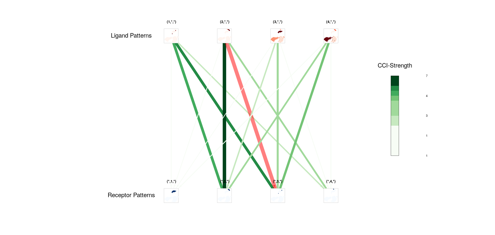
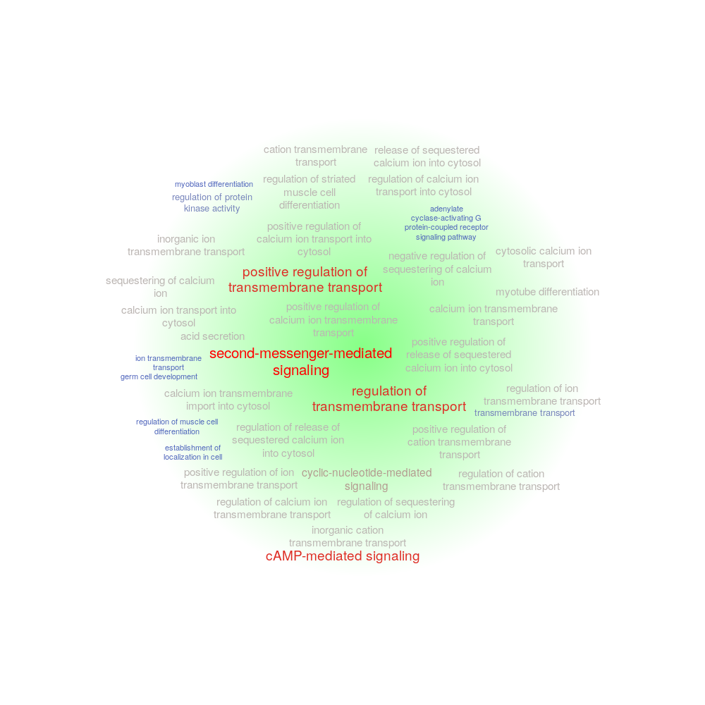

# <font color='#1881c2'>(2,3,:) Pattern</font>



# <font color='#1881c2'>(2,3,) -related L-R pairs (Top6 pairs)</font>

```{r}
library("scTensor")
load("reanalysis.RData")

col <- .setColor("many")[1]
scTensor:::.myvisNetwork(g, col)
```

|Rank|Ligand Gene|Receptor Gene|Ligand Expression (Log10(exp + 1))|Receptor Expression (Log10(exp + 1))|LR-pair factor value (Percentage)|P-value (Grubbs test)|Q-value (BH method)|PubMed|
|----|----|----|----|----|----|----|----|----|
|1|[SPARCL1](https://www.ncbi.nlm.nih.gov/gene/8404)<br>Description: SPARC like 1<br>GO: [1-13](http://amigo.geneontology.org/goose?query=SELECT+*+FROM+term+WHERE+acc%3D%27GO%3A0005509%27+OR+acc%3D%27GO%3A0005515%27+OR+acc%3D%27GO%3A0005518%27+OR+acc%3D%27GO%3A0005576%27+OR+acc%3D%27GO%3A0005615%27+OR+acc%3D%27GO%3A0005788%27+OR+acc%3D%27GO%3A0007165%27+OR+acc%3D%27GO%3A0043687%27+OR+acc%3D%27GO%3A0044267%27+OR+acc%3D%27GO%3A0050840%27+OR+acc%3D%27GO%3A0062023%27+OR+acc%3D%27GO%3A0098978%27+OR+acc%3D%27GO%3A0099560%27%3B&mirror=bbop)<br>Reactome: [1-4](https://reactome.org/content/query?q=R-HSA-381426+R-HSA-392499+R-HSA-597592+R-HSA-8957275&types=Pathway&cluster=true)<br>UniProtKB: [1-4](https://www.uniprot.org/uniprot/?query=A0A024RDE1+OR+Q14515+OR+B7ZB68+OR+Q8N4S1&sort=score)<br>STRING: <br>RefEx: [SPARCL1](http://refex.dbcls.jp/genelist.php?gene_name%5B%5D=SPARCL1&lang=en&db=human)<br>Expression Atlas: [SPARCL1](https://www.ebi.ac.uk/gxa/genes/ensg00000283953)<br>Single Cell Expression Atlas: [SPARCL1](https://www.ebi.ac.uk/gxa/sc/search?species=&q=SPARCL1)<br>scRNASeqDB: [SPARCL1](https://bioinfo.uth.edu/scrnaseqdb/index.php?r=site/rankGene&gene=SPARCL1&check=0)<br>PanglaoDB: [SPARCL1](https://panglaodb.se/search.html?query=SPARCL1&species=3)<br>CMap: [SPARCL1](https://clue.io/command?q=SPARCL1)<br>MeSH: [1-93](https://www.ncbi.nlm.nih.gov/mesh?term=D000107%20OR%20D000230%20OR%20D000262%20OR%20D000293%20OR%20D000328%20OR%20D000344%20OR%20D000368%20OR%20D000369%20OR%20D000375%20OR%20D000465%20OR%20D000544%20OR%20D000595%20OR%20D000728%20OR%20D000818%20OR%20D000911%20OR%20D001253%20OR%20D001471%20OR%20D001483%20OR%20D001650%20OR%20D001665%20OR%20D001692%20OR%20D001798%20OR%20D001921%20OR%20D001923%20OR%20D001932%20OR%20D001933%20OR%20D002118%20OR%20D002135%20OR%20D002352%20OR%20D002448%20OR%20D002453%20OR%20D002455%20OR%20D002460%20OR%20D002462%20OR%20D002465%20OR%20D002471%20OR%20D002478%20OR%20D002490%20OR%20D002545%20OR%20D002560%20OR%20D002648%20OR%20D002675%20OR%20D002851%20OR%20D002852%20OR%20D002853%20OR%20D002942%20OR%20D003001%20OR%20D003071%20OR%20D003072%20OR%20D003094%20OR%20D003106%20OR%20D003126%20OR%20D003370%20OR%20D003432%20OR%20D003598%20OR%20D003599%20OR%20D004185%20OR%20D004195%20OR%20D004247%20OR%20D004252%20OR%20D004273%20OR%20D004591%20OR%20D004730%20OR%20D004847%20OR%20D004938%20OR%20D005091%20OR%20D005109%20OR%20D005136%20OR%20D005347%20OR%20D005434%20OR%20D005455%20OR%20D005500%20OR%20D005557%20OR%20D005753%20OR%20D005786%20OR%20D005787%20OR%20D005796%20OR%20D005810%20OR%20D005819%20OR%20D005820%20OR%20D005838%20OR%20D005909%20OR%20D006023%20OR%20D006031%20OR%20D006239%20OR%20D006348%20OR%20D006510%20OR%20D006528%20OR%20D006655%20OR%20D006657%20OR%20D006801%20OR%20D007071%20OR%20D007124) [94-186](https://www.ncbi.nlm.nih.gov/mesh?term=D007144%20OR%20D007147%20OR%20D007150%20OR%20D007163%20OR%20D007668%20OR%20D007768%20OR%20D007781%20OR%20D008113%20OR%20D008137%20OR%20D008168%20OR%20D008175%20OR%20D008207%20OR%20D008214%20OR%20D008279%20OR%20D008280%20OR%20D008562%20OR%20D008565%20OR%20D008808%20OR%20D008810%20OR%20D008817%20OR%20D008819%20OR%20D008822%20OR%20D008856%20OR%20D008875%20OR%20D008954%20OR%20D008969%20OR%20D008970%20OR%20D009103%20OR%20D009131%20OR%20D009361%20OR%20D009362%20OR%20D009363%20OR%20D009364%20OR%20D009367%20OR%20D009368%20OR%20D009369%20OR%20D009389%20OR%20D009419%20OR%20D009457%20OR%20D009474%20OR%20D009483%20OR%20D009928%20OR%20D010343%20OR%20D010450%20OR%20D010455%20OR%20D010477%20OR%20D010802%20OR%20D010920%20OR%20D011247%20OR%20D011379%20OR%20D011401%20OR%20D011446%20OR%20D011471%20OR%20D011485%20OR%20D011506%20OR%20D011509%20OR%20D011817%20OR%20D011993%20OR%20D011994%20OR%20D012004%20OR%20D012007%20OR%20D012307%20OR%20D012313%20OR%20D012333%20OR%20D012501%20OR%20D012516%20OR%20D012537%20OR%20D012559%20OR%20D012709%20OR%20D012720%20OR%20D012737%20OR%20D013050%20OR%20D013058%20OR%20D013116%20OR%20D013270%20OR%20D013274%20OR%20D013347%20OR%20D013569%20OR%20D013778%20OR%20D013997%20OR%20D014018%20OR%20D014066%20OR%20D014157%20OR%20D014158%20OR%20D014162%20OR%20D014183%20OR%20D014357%20OR%20D014404%20OR%20D014407%20OR%20D014408%20OR%20D014471%20OR%20D014611%20OR%20D014648) [187-279](https://www.ncbi.nlm.nih.gov/mesh?term=D014690%20OR%20D014699%20OR%20D014867%20OR%20D015151%20OR%20D015152%20OR%20D015153%20OR%20D015179%20OR%20D015201%20OR%20D015203%20OR%20D015398%20OR%20D015415%20OR%20D015534%20OR%20D015536%20OR%20D015676%20OR%20D015723%20OR%20D015810%20OR%20D015815%20OR%20D015820%20OR%20D015870%20OR%20D015972%20OR%20D015996%20OR%20D015999%20OR%20D016015%20OR%20D016016%20OR%20D016017%20OR%20D016022%20OR%20D016133%20OR%20D016147%20OR%20D016159%20OR%20D016212%20OR%20D016282%20OR%20D016326%20OR%20D016366%20OR%20D016415%20OR%20D016513%20OR%20D016678%20OR%20D016896%20OR%20D017261%20OR%20D017325%20OR%20D017386%20OR%20D017403%20OR%20D017422%20OR%20D017434%20OR%20D017550%20OR%20D017678%20OR%20D017931%20OR%20D017950%20OR%20D018076%20OR%20D018189%20OR%20D018279%20OR%20D018285%20OR%20D018345%20OR%20D018398%20OR%20D018450%20OR%20D018621%20OR%20D018899%20OR%20D019006%20OR%20D019032%20OR%20D019084%20OR%20D019169%20OR%20D019295%20OR%20D019573%20OR%20D019943%20OR%20D019950%20OR%20D020022%20OR%20D020133%20OR%20D020410%20OR%20D020521%20OR%20D020543%20OR%20D020641%20OR%20D020741%20OR%20D020798%20OR%20D020816%20OR%20D020869%20OR%20D020928%20OR%20D021241%20OR%20D022202%20OR%20D023281%20OR%20D023421%20OR%20D024042%20OR%20D025521%20OR%20D025941%20OR%20D030541%20OR%20D030562%20OR%20D032389%20OR%20D040641%20OR%20D043524%20OR%20D045744%20OR%20D046228%20OR%20D046888%20OR%20D046912%20OR%20D047468%20OR%20D048031) [280-369](https://www.ncbi.nlm.nih.gov/mesh?term=D048051%20OR%20D048052%20OR%20D048868%20OR%20D049029%20OR%20D049109%20OR%20D049268%20OR%20D050199%20OR%20D051379%20OR%20D051381%20OR%20D051718%20OR%20D053208%20OR%20D053519%20OR%20D053719%20OR%20D053764%20OR%20D053829%20OR%20D054592%20OR%20D055106%20OR%20D055815%20OR%20D056426%20OR%20D057187%20OR%20D058575%20OR%20D058750%20OR%20D058851%20OR%20D058977%20OR%20D059016%20OR%20D059748%20OR%20D060787%20OR%20D060888%20OR%20D061307%20OR%20D063646%20OR%20D064593%20OR%20D066246%20OR%20D066253%20OR%20D002894%20OR%20D003743%20OR%20D008099%20OR%20D011467%20OR%20D012867%20OR%20D020768%20OR%20D042783%20OR%20D002417%20OR%20D007313%20OR%20D014714%20OR%20D017207%20OR%20D002289%20OR%20D002532%20OR%20D003110%20OR%20D007249%20OR%20D010051%20OR%20D010190%20OR%20D014069%20OR%20D018262%20OR%20D018282%20OR%20D018284%20OR%20D021441%20OR%20D000511%20OR%20D000906%20OR%20D002412%20OR%20D003746%20OR%20D006020%20OR%20D006834%20OR%20D008024%20OR%20D009842%20OR%20D010750%20OR%20D011480%20OR%20D011510%20OR%20D011663%20OR%20D011971%20OR%20D012334%20OR%20D018797%20OR%20D018952%20OR%20D019041%20OR%20D019717%20OR%20D051927%20OR%20D053495%20OR%20D053523%20OR%20D002113%20OR%20D002454%20OR%20D002634%20OR%20D005075%20OR%20D007700%20OR%20D010641%20OR%20D012038%20OR%20D012689%20OR%20D014945%20OR%20D015854%20OR%20D016324%20OR%20D019143%20OR%20D020224%20OR%20D020440)|[APLNR](https://www.ncbi.nlm.nih.gov/gene/187)<br>Description: apelin receptor<br>GO: [1-20](http://amigo.geneontology.org/goose?query=SELECT+*+FROM+term+WHERE+acc%3D%27GO%3A0001525%27+OR+acc%3D%27GO%3A0001568%27+OR+acc%3D%27GO%3A0001570%27+OR+acc%3D%27GO%3A0004930%27+OR+acc%3D%27GO%3A0005886%27+OR+acc%3D%27GO%3A0005887%27+OR+acc%3D%27GO%3A0007186%27+OR+acc%3D%27GO%3A0007369%27+OR+acc%3D%27GO%3A0007507%27+OR+acc%3D%27GO%3A0007512%27+OR+acc%3D%27GO%3A0038023%27+OR+acc%3D%27GO%3A0043951%27+OR+acc%3D%27GO%3A0045766%27+OR+acc%3D%27GO%3A0050878%27+OR+acc%3D%27GO%3A0051281%27+OR+acc%3D%27GO%3A0060182%27+OR+acc%3D%27GO%3A0060183%27+OR+acc%3D%27GO%3A0060976%27+OR+acc%3D%27GO%3A1903589%27+OR+acc%3D%27GO%3A1904325%27%3B&mirror=bbop)<br>Reactome: [1-7](https://reactome.org/content/query?q=R-HSA-162582+R-HSA-372790+R-HSA-373076+R-HSA-375276+R-HSA-388396+R-HSA-418594+R-HSA-500792&types=Pathway&cluster=true)<br>UniProtKB: [1-3](https://www.uniprot.org/uniprot/?query=B2RDH3+OR+B3KQN4+OR+P35414&sort=score)<br>STRING: <br>RefEx: [APLNR](http://refex.dbcls.jp/genelist.php?gene_name%5B%5D=APLNR&lang=en&db=human)<br>Expression Atlas: [APLNR](https://www.ebi.ac.uk/gxa/genes/ensg00000186190)<br>Single Cell Expression Atlas: [APLNR](https://www.ebi.ac.uk/gxa/sc/search?species=&q=APLNR)<br>scRNASeqDB: [APLNR](https://bioinfo.uth.edu/scrnaseqdb/index.php?r=site/rankGene&gene=APLNR&check=0)<br>PanglaoDB: [APLNR](https://panglaodb.se/search.html?query=APLNR&species=3)<br>CMap: [APLNR](https://clue.io/command?q=APLNR)<br>MeSH: [1-91](https://www.ncbi.nlm.nih.gov/mesh?term=D000225%20OR%20D000242%20OR%20D000263%20OR%20D000273%20OR%20D000293%20OR%20D000311%20OR%20D000315%20OR%20D000328%20OR%20D000368%20OR%20D000369%20OR%20D000375%20OR%20D000409%20OR%20D000465%20OR%20D000483%20OR%20D000595%20OR%20D000596%20OR%20D000679%20OR%20D000690%20OR%20D000704%20OR%20D000792%20OR%20D000804%20OR%20D000818%20OR%20D000860%20OR%20D000911%20OR%20D000971%20OR%20D001021%20OR%20D001024%20OR%20D001158%20OR%20D001253%20OR%20D001343%20OR%20D001345%20OR%20D001483%20OR%20D001650%20OR%20D001665%20OR%20D001667%20OR%20D001696%20OR%20D001709%20OR%20D001794%20OR%20D001808%20OR%20D001833%20OR%20D001854%20OR%20D001920%20OR%20D001921%20OR%20D001932%20OR%20D001943%20OR%20D002114%20OR%20D002118%20OR%20D002294%20OR%20D002311%20OR%20D002318%20OR%20D002319%20OR%20D002320%20OR%20D002352%20OR%20D002417%20OR%20D002448%20OR%20D002458%20OR%20D002459%20OR%20D002460%20OR%20D002462%20OR%20D002465%20OR%20D002467%20OR%20D002468%20OR%20D002478%20OR%20D002490%20OR%20D002522%20OR%20D002531%20OR%20D002545%20OR%20D002633%20OR%20D002648%20OR%20D002675%20OR%20D002681%20OR%20D002784%20OR%20D002874%20OR%20D002880%20OR%20D002890%20OR%20D002904%20OR%20D002942%20OR%20D003001%20OR%20D003131%20OR%20D003198%20OR%20D003324%20OR%20D003412%20OR%20D003430%20OR%20D003593%20OR%20D003713%20OR%20D003921%20OR%20D003922%20OR%20D003924%20OR%20D003930%20OR%20D004194%20OR%20D004195) [92-182](https://www.ncbi.nlm.nih.gov/mesh?term=D004247%20OR%20D004252%20OR%20D004452%20OR%20D004622%20OR%20D004625%20OR%20D004705%20OR%20D004707%20OR%20D004721%20OR%20D004727%20OR%20D004730%20OR%20D004789%20OR%20D004791%20OR%20D004797%20OR%20D004843%20OR%20D004958%20OR%20D005006%20OR%20D005190%20OR%20D005227%20OR%20D005229%20OR%20D005234%20OR%20D005333%20OR%20D005470%20OR%20D005500%20OR%20D005699%20OR%20D005753%20OR%20D005775%20OR%20D005786%20OR%20D005787%20OR%20D005820%20OR%20D005821%20OR%20D005838%20OR%20D005910%20OR%20D005938%20OR%20D005947%20OR%20D005951%20OR%20D006023%20OR%20D006056%20OR%20D006107%20OR%20D006115%20OR%20D006153%20OR%20D006160%20OR%20D006224%20OR%20D006239%20OR%20D006332%20OR%20D006333%20OR%20D006410%20OR%20D006493%20OR%20D006528%20OR%20D006579%20OR%20D006706%20OR%20D006720%20OR%20D006801%20OR%20D006845%20OR%20D006973%20OR%20D006976%20OR%20D006984%20OR%20D007031%20OR%20D007150%20OR%20D007167%20OR%20D007333%20OR%20D007334%20OR%20D007457%20OR%20D007492%20OR%20D007564%20OR%20D007668%20OR%20D007703%20OR%20D007763%20OR%20D007814%20OR%20D007963%20OR%20D008051%20OR%20D008099%20OR%20D008113%20OR%20D008164%20OR%20D008168%20OR%20D008184%20OR%20D008251%20OR%20D008264%20OR%20D008390%20OR%20D008563%20OR%20D008565%20OR%20D008648%20OR%20D008807%20OR%20D008810%20OR%20D008817%20OR%20D008819%20OR%20D008856%20OR%20D008875%20OR%20D008928%20OR%20D008946%20OR%20D008954%20OR%20D008957) [183-273](https://www.ncbi.nlm.nih.gov/mesh?term=D008958%20OR%20D008962%20OR%20D008967%20OR%20D008969%20OR%20D009000%20OR%20D009062%20OR%20D009097%20OR%20D009103%20OR%20D009131%20OR%20D009154%20OR%20D009200%20OR%20D009206%20OR%20D009316%20OR%20D009361%20OR%20D009369%20OR%20D009389%20OR%20D009474%20OR%20D009569%20OR%20D009579%20OR%20D009682%20OR%20D009928%20OR%20D010286%20OR%20D010298%20OR%20D010446%20OR%20D010455%20OR%20D010456%20OR%20D010641%20OR%20D010649%20OR%20D010738%20OR%20D010766%20OR%20D010767%20OR%20D010802%20OR%20D010920%20OR%20D010957%20OR%20D011085%20OR%20D011110%20OR%20D011225%20OR%20D011247%20OR%20D011249%20OR%20D011262%20OR%20D011263%20OR%20D011323%20OR%20D011374%20OR%20D011375%20OR%20D011379%20OR%20D011401%20OR%20D011446%20OR%20D011471%20OR%20D011479%20OR%20D011485%20OR%20D011487%20OR%20D011493%20OR%20D011494%20OR%20D011498%20OR%20D011499%20OR%20D011506%20OR%20D011651%20OR%20D011667%20OR%20D011668%20OR%20D011869%20OR%20D011921%20OR%20D011940%20OR%20D011945%20OR%20D011991%20OR%20D011993%20OR%20D011994%20OR%20D011995%20OR%20D012008%20OR%20D012016%20OR%20D012084%20OR%20D012149%20OR%20D012150%20OR%20D012167%20OR%20D012171%20OR%20D012178%20OR%20D012307%20OR%20D012313%20OR%20D012333%20OR%20D012501%20OR%20D012550%20OR%20D012595%20OR%20D012680%20OR%20D012694%20OR%20D012720%20OR%20D012737%20OR%20D013045%20OR%20D013058%20OR%20D013116%20OR%20D013251%20OR%20D013274%20OR%20D013312) [274-364](https://www.ncbi.nlm.nih.gov/mesh?term=D013314%20OR%20D013329%20OR%20D013449%20OR%20D013552%20OR%20D013601%20OR%20D013997%20OR%20D014018%20OR%20D014020%20OR%20D014157%20OR%20D014158%20OR%20D014162%20OR%20D014364%20OR%20D014407%20OR%20D014471%20OR%20D014644%20OR%20D014662%20OR%20D014680%20OR%20D014759%20OR%20D014764%20OR%20D014779%20OR%20D014821%20OR%20D014822%20OR%20D014982%20OR%20D015027%20OR%20D015152%20OR%20D015153%20OR%20D015179%20OR%20D015302%20OR%20D015331%20OR%20D015398%20OR%20D015415%20OR%20D015428%20OR%20D015497%20OR%20D015513%20OR%20D015534%20OR%20D015536%20OR%20D015658%20OR%20D015687%20OR%20D015699%20OR%20D015704%20OR%20D015723%20OR%20D015728%20OR%20D015810%20OR%20D015854%20OR%20D015861%20OR%20D015870%20OR%20D015894%20OR%20D015972%20OR%20D015992%20OR%20D015999%20OR%20D016009%20OR%20D016016%20OR%20D016017%20OR%20D016019%20OR%20D016022%20OR%20D016040%20OR%20D016133%20OR%20D016208%20OR%20D016297%20OR%20D016329%20OR%20D016366%20OR%20D016415%20OR%20D016466%20OR%20D016640%20OR%20D016678%20OR%20D016764%20OR%20D016896%20OR%20D017023%20OR%20D017124%20OR%20D017136%20OR%20D017207%20OR%20D017208%20OR%20D017209%20OR%20D017353%20OR%20D017382%20OR%20D017386%20OR%20D017403%20OR%20D017404%20OR%20D017419%20OR%20D017422%20OR%20D017433%20OR%20D017434%20OR%20D017448%20OR%20D017668%20OR%20D017673%20OR%20D017690%20OR%20D017720%20OR%20D017725%20OR%20D017930%20OR%20D017931%20OR%20D018056) [365-455](https://www.ncbi.nlm.nih.gov/mesh?term=D018076%20OR%20D018121%20OR%20D018243%20OR%20D018281%20OR%20D018345%20OR%20D018360%20OR%20D018450%20OR%20D018507%20OR%20D018570%20OR%20D018613%20OR%20D018628%20OR%20D018716%20OR%20D018919%20OR%20D018920%20OR%20D018925%20OR%20D019001%20OR%20D019008%20OR%20D019084%20OR%20D019161%20OR%20D019204%20OR%20D019295%20OR%20D019331%20OR%20D019408%20OR%20D019426%20OR%20D019556%20OR%20D019698%20OR%20D019707%20OR%20D019713%20OR%20D019718%20OR%20D019773%20OR%20D019821%20OR%20D019898%20OR%20D019899%20OR%20D019943%20OR%20D019950%20OR%20D020013%20OR%20D020022%20OR%20D020033%20OR%20D020133%20OR%20D020224%20OR%20D020239%20OR%20D020520%20OR%20D020521%20OR%20D020533%20OR%20D020543%20OR%20D020641%20OR%20D020691%20OR%20D020695%20OR%20D020738%20OR%20D020869%20OR%20D020935%20OR%20D020962%20OR%20D021122%20OR%20D021381%20OR%20D021382%20OR%20D022142%20OR%20D022781%20OR%20D023041%20OR%20D023281%20OR%20D024506%20OR%20D025941%20OR%20D029867%20OR%20D029961%20OR%20D030541%20OR%20D030562%20OR%20D030801%20OR%20D031541%20OR%20D032383%20OR%20D034622%20OR%20D034741%20OR%20D036341%20OR%20D036361%20OR%20D037102%20OR%20D037342%20OR%20D040301%20OR%20D040681%20OR%20D041321%20OR%20D042461%20OR%20D042541%20OR%20D042783%20OR%20D043169%20OR%20D043562%20OR%20D043782%20OR%20D043783%20OR%20D043802%20OR%20D044042%20OR%20D044067%20OR%20D044139%20OR%20D044140%20OR%20D044466%20OR%20D045743) [456-546](https://www.ncbi.nlm.nih.gov/mesh?term=D045744%20OR%20D045745%20OR%20D046228%20OR%20D046912%20OR%20D047108%20OR%20D047368%20OR%20D047493%20OR%20D047908%20OR%20D048049%20OR%20D048051%20OR%20D048052%20OR%20D048053%20OR%20D049109%20OR%20D049452%20OR%20D050155%20OR%20D050356%20OR%20D050556%20OR%20D050778%20OR%20D051379%20OR%20D051381%20OR%20D051741%20OR%20D051780%20OR%20D051795%20OR%20D051960%20OR%20D052250%20OR%20D053208%20OR%20D053586%20OR%20D053595%20OR%20D054299%20OR%20D054390%20OR%20D054392%20OR%20D054411%20OR%20D054458%20OR%20D055018%20OR%20D055106%20OR%20D055114%20OR%20D055166%20OR%20D055372%20OR%20D055611%20OR%20D055815%20OR%20D056004%20OR%20D056189%20OR%20D056426%20OR%20D056726%20OR%20D057507%20OR%20D057809%20OR%20D058011%20OR%20D058186%20OR%20D058977%20OR%20D058990%20OR%20D059248%20OR%20D059865%20OR%20D060066%20OR%20D061251%20OR%20D061307%20OR%20D063306%20OR%20D063766%20OR%20D065127%20OR%20D066026%20OR%20D002461%20OR%20D002552%20OR%20D003331%20OR%20D004699%20OR%20D006321%20OR%20D006325%20OR%20D006352%20OR%20D006367%20OR%20D007032%20OR%20D009836%20OR%20D010006%20OR%20D010902%20OR%20D013234%20OR%20D013270%20OR%20D015726%20OR%20D016131%20OR%20D016475%20OR%20D017539%20OR%20D017628%20OR%20D017667%20OR%20D018878%20OR%20D019169%20OR%20D032386%20OR%20D052097%20OR%20D052436%20OR%20D004285%20OR%20D008822%20OR%20D011784%20OR%20D014981%20OR%20D015498%20OR%20D000163%20OR%20D002303) [547-632](https://www.ncbi.nlm.nih.gov/mesh?term=D002544%20OR%20D003327%20OR%20D009765%20OR%20D015431%20OR%20D015448%20OR%20D015458%20OR%20D017202%20OR%20D018487%20OR%20D019247%20OR%20D000109%20OR%20D000199%20OR%20D000276%20OR%20D000469%20OR%20D000808%20OR%20D000809%20OR%20D000906%20OR%20D000959%20OR%20D002021%20OR%20D002316%20OR%20D002795%20OR%20D002867%20OR%20D003345%20OR%20D003404%20OR%20D003596%20OR%20D003902%20OR%20D003907%20OR%20D005576%20OR%20D006147%20OR%20D007166%20OR%20D007328%20OR%20D008024%20OR%20D008156%20OR%20D009025%20OR%20D009566%20OR%20D009573%20OR%20D009841%20OR%20D009842%20OR%20D010566%20OR%20D011956%20OR%20D012194%20OR%20D012367%20OR%20D013501%20OR%20D014665%20OR%20D014667%20OR%20D014841%20OR%20D015342%20OR%20D015675%20OR%20D017466%20OR%20D017482%20OR%20D017978%20OR%20D018680%20OR%20D019440%20OR%20D019869%20OR%20D020365%20OR%20D020794%20OR%20D024042%20OR%20D040262%20OR%20D051057%20OR%20D051792%20OR%20D054303%20OR%20D054440%20OR%20D054703%20OR%20D001923%20OR%20D002302%20OR%20D002454%20OR%20D002940%20OR%20D003429%20OR%20D004305%20OR%20D004306%20OR%20D005453%20OR%20D006339%20OR%20D006439%20OR%20D006863%20OR%20D007700%20OR%20D008561%20OR%20D008833%20OR%20D009994%20OR%20D011489%20OR%20D013268%20OR%20D013816%20OR%20D014882%20OR%20D017398%20OR%20D019070%20OR%20D020128%20OR%20D044366%20OR%20D050528)|||0.558 (8.493%)|0.007|0.026|[1-11](https://www.ncbi.nlm.nih.gov/pubmed/?term=7600298%20OR%2014702039%20OR%2015815621%20OR%2016335952%20OR%2019838169%20OR%2023234360%20OR%208294032%20OR%2015489334%20OR%2011090199%20OR%2025639753%20OR%2028137936)|
|2|[CXCL10](https://www.ncbi.nlm.nih.gov/gene/3627)<br>Description: C-X-C motif chemokine ligand 10<br>GO: [1-48](http://amigo.geneontology.org/goose?query=SELECT+*+FROM+term+WHERE+acc%3D%27GO%3A0005102%27+OR+acc%3D%27GO%3A0005515%27+OR+acc%3D%27GO%3A0005576%27+OR+acc%3D%27GO%3A0005615%27+OR+acc%3D%27GO%3A0006935%27+OR+acc%3D%27GO%3A0006954%27+OR+acc%3D%27GO%3A0006955%27+OR+acc%3D%27GO%3A0007165%27+OR+acc%3D%27GO%3A0007166%27+OR+acc%3D%27GO%3A0007186%27+OR+acc%3D%27GO%3A0007189%27+OR+acc%3D%27GO%3A0007267%27+OR+acc%3D%27GO%3A0007517%27+OR+acc%3D%27GO%3A0008009%27+OR+acc%3D%27GO%3A0008015%27+OR+acc%3D%27GO%3A0008201%27+OR+acc%3D%27GO%3A0008284%27+OR+acc%3D%27GO%3A0008603%27+OR+acc%3D%27GO%3A0009409%27+OR+acc%3D%27GO%3A0009897%27+OR+acc%3D%27GO%3A0010332%27+OR+acc%3D%27GO%3A0010818%27+OR+acc%3D%27GO%3A0010819%27+OR+acc%3D%27GO%3A0010996%27+OR+acc%3D%27GO%3A0016525%27+OR+acc%3D%27GO%3A0019221%27+OR+acc%3D%27GO%3A0030593%27+OR+acc%3D%27GO%3A0030595%27+OR+acc%3D%27GO%3A0033280%27+OR+acc%3D%27GO%3A0034605%27+OR+acc%3D%27GO%3A0042056%27+OR+acc%3D%27GO%3A0042118%27+OR+acc%3D%27GO%3A0042127%27+OR+acc%3D%27GO%3A0042981%27+OR+acc%3D%27GO%3A0045662%27+OR+acc%3D%27GO%3A0045859%27+OR+acc%3D%27GO%3A0045944%27+OR+acc%3D%27GO%3A0048248%27+OR+acc%3D%27GO%3A0050918%27+OR+acc%3D%27GO%3A0051281%27+OR+acc%3D%27GO%3A0051607%27+OR+acc%3D%27GO%3A0061844%27+OR+acc%3D%27GO%3A0070098%27+OR+acc%3D%27GO%3A0071222%27+OR+acc%3D%27GO%3A0090026%27+OR+acc%3D%27GO%3A1901509%27+OR+acc%3D%27GO%3A1901740%27+OR+acc%3D%27GO%3A2000406%27%3B&mirror=bbop)<br>Reactome: [1-12](https://reactome.org/content/query?q=R-HSA-1280215+R-HSA-162582+R-HSA-168256+R-HSA-372790+R-HSA-373076+R-HSA-375276+R-HSA-380108+R-HSA-388396+R-HSA-418594+R-HSA-449147+R-HSA-500792+R-HSA-6783783&types=Pathway&cluster=true)<br>UniProtKB: [1-2](https://www.uniprot.org/uniprot/?query=A0A024RDA4+OR+P02778&sort=score)<br>STRING: [1](https://string-db.org/network/9606.ENSP00000305651)<br>RefEx: [CXCL10](http://refex.dbcls.jp/genelist.php?gene_name%5B%5D=CXCL10&lang=en&db=human)<br>Expression Atlas: [CXCL10](https://www.ebi.ac.uk/gxa/genes/ensg00000133116)<br>Single Cell Expression Atlas: [CXCL10](https://www.ebi.ac.uk/gxa/sc/search?species=&q=CXCL10)<br>scRNASeqDB: [CXCL10](https://bioinfo.uth.edu/scrnaseqdb/index.php?r=site/rankGene&gene=CXCL10&check=0)<br>PanglaoDB: [CXCL10](https://panglaodb.se/search.html?query=CXCL10&species=3)<br>CMap: [CXCL10](https://clue.io/command?q=CXCL10)<br>MeSH: [1-99](https://www.ncbi.nlm.nih.gov/mesh?term=D000107%20OR%20D000199%20OR%20D000208%20OR%20D000209%20OR%20D000210%20OR%20D000224%20OR%20D000230%20OR%20D000242%20OR%20D000243%20OR%20D000273%20OR%20D000293%20OR%20D000302%20OR%20D000305%20OR%20D000318%20OR%20D000324%20OR%20D000328%20OR%20D000367%20OR%20D000368%20OR%20D000369%20OR%20D000375%20OR%20D000403%20OR%20D000410%20OR%20D000420%20OR%20D000465%20OR%20D000483%20OR%20D000506%20OR%20D000510%20OR%20D000542%20OR%20D000544%20OR%20D000595%20OR%20D000653%20OR%20D000685%20OR%20D000704%20OR%20D000741%20OR%20D000755%20OR%20D000783%20OR%20D000800%20OR%20D000806%20OR%20D000818%20OR%20D000888%20OR%20D000890%20OR%20D000893%20OR%20D000900%20OR%20D000903%20OR%20D000907%20OR%20D000911%20OR%20D000912%20OR%20D000914%20OR%20D000918%20OR%20D000935%20OR%20D000938%20OR%20D000939%20OR%20D000941%20OR%20D000942%20OR%20D000943%20OR%20D000951%20OR%20D000954%20OR%20D000956%20OR%20D000962%20OR%20D000970%20OR%20D000971%20OR%20D000974%20OR%20D000995%20OR%20D000998%20OR%20D001011%20OR%20D001082%20OR%20D001095%20OR%20D001120%20OR%20D001158%20OR%20D001160%20OR%20D001171%20OR%20D001172%20OR%20D001202%20OR%20D001219%20OR%20D001228%20OR%20D001249%20OR%20D001253%20OR%20D001254%20OR%20D001324%20OR%20D001327%20OR%20D001343%20OR%20D001344%20OR%20D001402%20OR%20D001419%20OR%20D001424%20OR%20D001425%20OR%20D001426%20OR%20D001427%20OR%20D001437%20OR%20D001483%20OR%20D001500%20OR%20D001507%20OR%20D001528%20OR%20D001613%20OR%20D001620%20OR%20D001646%20OR%20D001652%20OR%20D001663%20OR%20D001665) [100-198](https://www.ncbi.nlm.nih.gov/mesh?term=D001667%20OR%20D001692%20OR%20D001696%20OR%20D001706%20OR%20D001707%20OR%20D001709%20OR%20D001739%20OR%20D001741%20OR%20D001768%20OR%20D001770%20OR%20D001773%20OR%20D001781%20OR%20D001792%20OR%20D001794%20OR%20D001798%20OR%20D001799%20OR%20D001808%20OR%20D001812%20OR%20D001835%20OR%20D001853%20OR%20D001859%20OR%20D001907%20OR%20D001921%20OR%20D001932%20OR%20D001940%20OR%20D001943%20OR%20D001980%20OR%20D001988%20OR%20D001989%20OR%20D001992%20OR%20D002097%20OR%20D002102%20OR%20D002117%20OR%20D002118%20OR%20D002122%20OR%20D002130%20OR%20D002154%20OR%20D002176%20OR%20D002199%20OR%20D002251%20OR%20D002252%20OR%20D002264%20OR%20D002277%20OR%20D002285%20OR%20D002289%20OR%20D002292%20OR%20D002294%20OR%20D002315%20OR%20D002318%20OR%20D002319%20OR%20D002339%20OR%20D002340%20OR%20D002349%20OR%20D002352%20OR%20D002353%20OR%20D002384%20OR%20D002417%20OR%20D002446%20OR%20D002448%20OR%20D002450%20OR%20D002451%20OR%20D002452%20OR%20D002454%20OR%20D002455%20OR%20D002458%20OR%20D002459%20OR%20D002460%20OR%20D002461%20OR%20D002462%20OR%20D002463%20OR%20D002464%20OR%20D002465%20OR%20D002467%20OR%20D002469%20OR%20D002470%20OR%20D002471%20OR%20D002478%20OR%20D002490%20OR%20D002522%20OR%20D002540%20OR%20D002583%20OR%20D002598%20OR%20D002630%20OR%20D002633%20OR%20D002634%20OR%20D002644%20OR%20D002648%20OR%20D002675%20OR%20D002679%20OR%20D002681%20OR%20D002690%20OR%20D002721%20OR%20D002762%20OR%20D002819%20OR%20D002821%20OR%20D002824%20OR%20D002843%20OR%20D002851%20OR%20D002868) [199-297](https://www.ncbi.nlm.nih.gov/mesh?term=D002874%20OR%20D002880%20OR%20D002894%20OR%20D002908%20OR%20D002945%20OR%20D002986%20OR%20D003001%20OR%20D003071%20OR%20D003092%20OR%20D003093%20OR%20D003094%20OR%20D003097%20OR%20D003106%20OR%20D003110%20OR%20D003113%20OR%20D003126%20OR%20D003131%20OR%20D003181%20OR%20D003225%20OR%20D003231%20OR%20D003324%20OR%20D003327%20OR%20D003402%20OR%20D003404%20OR%20D003412%20OR%20D003424%20OR%20D003430%20OR%20D003449%20OR%20D003470%20OR%20D003474%20OR%20D003509%20OR%20D003550%20OR%20D003586%20OR%20D003587%20OR%20D003593%20OR%20D003594%20OR%20D003598%20OR%20D003599%20OR%20D003602%20OR%20D003609%20OR%20D003656%20OR%20D003710%20OR%20D003712%20OR%20D003713%20OR%20D003715%20OR%20D003716%20OR%20D003731%20OR%20D003782%20OR%20D003871%20OR%20D003876%20OR%20D003882%20OR%20D003907%20OR%20D003922%20OR%20D003924%20OR%20D003930%20OR%20D003937%20OR%20D003971%20OR%20D004041%20OR%20D004062%20OR%20D004195%20OR%20D004196%20OR%20D004247%20OR%20D004262%20OR%20D004268%20OR%20D004273%20OR%20D004279%20OR%20D004285%20OR%20D004305%20OR%20D004317%20OR%20D004318%20OR%20D004334%20OR%20D004336%20OR%20D004338%20OR%20D004347%20OR%20D004351%20OR%20D004353%20OR%20D004357%20OR%20D004359%20OR%20D004475%20OR%20D004534%20OR%20D004591%20OR%20D004660%20OR%20D004675%20OR%20D004681%20OR%20D004705%20OR%20D004715%20OR%20D004717%20OR%20D004721%20OR%20D004724%20OR%20D004727%20OR%20D004728%20OR%20D004729%20OR%20D004730%20OR%20D004761%20OR%20D004769%20OR%20D004770%20OR%20D004789%20OR%20D004790%20OR%20D004791) [298-396](https://www.ncbi.nlm.nih.gov/mesh?term=D004797%20OR%20D004804%20OR%20D004815%20OR%20D004847%20OR%20D004848%20OR%20D004926%20OR%20D004938%20OR%20D004958%20OR%20D004965%20OR%20D005002%20OR%20D005006%20OR%20D005060%20OR%20D005067%20OR%20D005090%20OR%20D005091%20OR%20D005098%20OR%20D005190%20OR%20D005192%20OR%20D005215%20OR%20D005221%20OR%20D005230%20OR%20D005234%20OR%20D005263%20OR%20D005312%20OR%20D005313%20OR%20D005317%20OR%20D005333%20OR%20D005334%20OR%20D005337%20OR%20D005347%20OR%20D005355%20OR%20D005356%20OR%20D005434%20OR%20D005455%20OR%20D005456%20OR%20D005500%20OR%20D005512%20OR%20D005541%20OR%20D005640%20OR%20D005658%20OR%20D005674%20OR%20D005706%20OR%20D005727%20OR%20D005786%20OR%20D005787%20OR%20D005796%20OR%20D005810%20OR%20D005819%20OR%20D005822%20OR%20D005838%20OR%20D005854%20OR%20D005865%20OR%20D005869%20OR%20D005871%20OR%20D005881%20OR%20D005891%20OR%20D005910%20OR%20D005919%20OR%20D005920%20OR%20D005921%20OR%20D005922%20OR%20D005938%20OR%20D005947%20OR%20D005966%20OR%20D005968%20OR%20D006025%20OR%20D006044%20OR%20D006084%20OR%20D006085%20OR%20D006086%20OR%20D006098%20OR%20D006099%20OR%20D006111%20OR%20D006133%20OR%20D006152%20OR%20D006207%20OR%20D006224%20OR%20D006239%20OR%20D006258%20OR%20D006321%20OR%20D006327%20OR%20D006330%20OR%20D006333%20OR%20D006352%20OR%20D006367%20OR%20D006377%20OR%20D006388%20OR%20D006418%20OR%20D006476%20OR%20D006479%20OR%20D006480%20OR%20D006493%20OR%20D006497%20OR%20D006498%20OR%20D006509%20OR%20D006513%20OR%20D006514%20OR%20D006515%20OR%20D006526) [397-495](https://www.ncbi.nlm.nih.gov/mesh?term=D006528%20OR%20D006538%20OR%20D006558%20OR%20D006561%20OR%20D006562%20OR%20D006579%20OR%20D006614%20OR%20D006650%20OR%20D006655%20OR%20D006657%20OR%20D006678%20OR%20D006680%20OR%20D006681%20OR%20D006683%20OR%20D006684%20OR%20D006720%20OR%20D006723%20OR%20D006761%20OR%20D006786%20OR%20D006801%20OR%20D006820%20OR%20D006825%20OR%20D006845%20OR%20D006860%20OR%20D006862%20OR%20D006886%20OR%20D006943%20OR%20D006967%20OR%20D006973%20OR%20D006975%20OR%20D006976%20OR%20D006980%20OR%20D007004%20OR%20D007037%20OR%20D007070%20OR%20D007073%20OR%20D007075%20OR%20D007111%20OR%20D007113%20OR%20D007118%20OR%20D007124%20OR%20D007136%20OR%20D007150%20OR%20D007155%20OR%20D007156%20OR%20D007158%20OR%20D007159%20OR%20D007165%20OR%20D007166%20OR%20D007167%20OR%20D007213%20OR%20D007223%20OR%20D007231%20OR%20D007234%20OR%20D007238%20OR%20D007239%20OR%20D007249%20OR%20D007251%20OR%20D007297%20OR%20D007319%20OR%20D007328%20OR%20D007333%20OR%20D007369%20OR%20D007370%20OR%20D007371%20OR%20D007372%20OR%20D007375%20OR%20D007376%20OR%20D007378%20OR%20D007399%20OR%20D007403%20OR%20D007410%20OR%20D007413%20OR%20D007414%20OR%20D007420%20OR%20D007421%20OR%20D007424%20OR%20D007453%20OR%20D007457%20OR%20D007511%20OR%20D007515%20OR%20D007518%20OR%20D007558%20OR%20D007596%20OR%20D007610%20OR%20D007633%20OR%20D007668%20OR%20D007673%20OR%20D007674%20OR%20D007678%20OR%20D007680%20OR%20D007684%20OR%20D007687%20OR%20D007694%20OR%20D007752%20OR%20D007770%20OR%20D007797%20OR%20D007889%20OR%20D007891) [496-594](https://www.ncbi.nlm.nih.gov/mesh?term=D007892%20OR%20D007893%20OR%20D007918%20OR%20D007938%20OR%20D007948%20OR%20D007958%20OR%20D007962%20OR%20D007963%20OR%20D007964%20OR%20D007985%20OR%20D007986%20OR%20D008026%20OR%20D008058%20OR%20D008070%20OR%20D008074%20OR%20D008099%20OR%20D008103%20OR%20D008105%20OR%20D008111%20OR%20D008113%20OR%20D008115%20OR%20D008137%20OR%20D008156%20OR%20D008163%20OR%20D008168%20OR%20D008171%20OR%20D008175%20OR%20D008180%20OR%20D008181%20OR%20D008198%20OR%20D008207%20OR%20D008213%20OR%20D008214%20OR%20D008218%20OR%20D008221%20OR%20D008222%20OR%20D008228%20OR%20D008232%20OR%20D008233%20OR%20D008239%20OR%20D008244%20OR%20D008251%20OR%20D008253%20OR%20D008262%20OR%20D008264%20OR%20D008279%20OR%20D008296%20OR%20D008401%20OR%20D008407%20OR%20D008431%20OR%20D008545%20OR%20D008561%20OR%20D008562%20OR%20D008564%20OR%20D008565%20OR%20D008636%20OR%20D008687%20OR%20D008713%20OR%20D008745%20OR%20D008807%20OR%20D008809%20OR%20D008810%20OR%20D008815%20OR%20D008817%20OR%20D008819%20OR%20D008822%20OR%20D008856%20OR%20D008869%20OR%20D008875%20OR%20D008895%20OR%20D008928%20OR%20D008934%20OR%20D008954%20OR%20D008955%20OR%20D008957%20OR%20D008958%20OR%20D008959%20OR%20D008962%20OR%20D008967%20OR%20D008969%20OR%20D008970%20OR%20D009000%20OR%20D009025%20OR%20D009033%20OR%20D009055%20OR%20D009061%20OR%20D009062%20OR%20D009073%20OR%20D009080%20OR%20D009092%20OR%20D009101%20OR%20D009102%20OR%20D009103%20OR%20D009109%20OR%20D009130%20OR%20D009131%20OR%20D009133%20OR%20D009154%20OR%20D009157) [595-693](https://www.ncbi.nlm.nih.gov/mesh?term=D009163%20OR%20D009165%20OR%20D009169%20OR%20D009173%20OR%20D009190%20OR%20D009196%20OR%20D009202%20OR%20D009203%20OR%20D009220%20OR%20D009271%20OR%20D009298%20OR%20D009316%20OR%20D009336%20OR%20D009360%20OR%20D009361%20OR%20D009362%20OR%20D009363%20OR%20D009364%20OR%20D009367%20OR%20D009369%20OR%20D009375%20OR%20D009389%20OR%20D009392%20OR%20D009393%20OR%20D009395%20OR%20D009410%20OR%20D009414%20OR%20D009418%20OR%20D009421%20OR%20D009422%20OR%20D009433%20OR%20D009457%20OR%20D009468%20OR%20D009471%20OR%20D009473%20OR%20D009474%20OR%20D009478%20OR%20D009494%20OR%20D009498%20OR%20D009500%20OR%20D009504%20OR%20D009549%20OR%20D009569%20OR%20D009587%20OR%20D009664%20OR%20D009682%20OR%20D009687%20OR%20D009690%20OR%20D009693%20OR%20D009838%20OR%20D009856%20OR%20D009928%20OR%20D009929%20OR%20D009976%20OR%20D009980%20OR%20D009994%20OR%20D010003%20OR%20D010006%20OR%20D010010%20OR%20D010014%20OR%20D010047%20OR%20D010051%20OR%20D010064%20OR%20D010088%20OR%20D010190%20OR%20D010195%20OR%20D010253%20OR%20D010256%20OR%20D010300%20OR%20D010391%20OR%20D010444%20OR%20D010446%20OR%20D010455%20OR%20D010513%20OR%20D010518%20OR%20D010525%20OR%20D010535%20OR%20D010538%20OR%20D010597%20OR%20D010641%20OR%20D010679%20OR%20D010726%20OR%20D010766%20OR%20D010802%20OR%20D010835%20OR%20D010850%20OR%20D010865%20OR%20D010920%20OR%20D010950%20OR%20D010957%20OR%20D010978%20OR%20D010982%20OR%20D010996%20OR%20D011014%20OR%20D011024%20OR%20D011044%20OR%20D011070%20OR%20D011085%20OR%20D011092) [694-792](https://www.ncbi.nlm.nih.gov/mesh?term=D011110%20OR%20D011183%20OR%20D011223%20OR%20D011225%20OR%20D011233%20OR%20D011247%20OR%20D011248%20OR%20D011251%20OR%20D011261%20OR%20D011263%20OR%20D011300%20OR%20D011379%20OR%20D011388%20OR%20D011401%20OR%20D011446%20OR%20D011471%20OR%20D011484%20OR%20D011485%20OR%20D011487%20OR%20D011493%20OR%20D011494%20OR%20D011495%20OR%20D011499%20OR%20D011505%20OR%20D011506%20OR%20D011507%20OR%20D011508%20OR%20D011509%20OR%20D011518%20OR%20D011522%20OR%20D011559%20OR%20D011565%20OR%20D011650%20OR%20D011651%20OR%20D011658%20OR%20D011704%20OR%20D011786%20OR%20D011795%20OR%20D011817%20OR%20D011828%20OR%20D011859%20OR%20D011897%20OR%20D011905%20OR%20D011915%20OR%20D011917%20OR%20D011933%20OR%20D011956%20OR%20D011971%20OR%20D011978%20OR%20D011981%20OR%20D011991%20OR%20D011993%20OR%20D011994%20OR%20D012008%20OR%20D012016%20OR%20D012039%20OR%20D012042%20OR%20D012044%20OR%20D012074%20OR%20D012075%20OR%20D012097%20OR%20D012121%20OR%20D012128%20OR%20D012129%20OR%20D012130%20OR%20D012136%20OR%20D012137%20OR%20D012141%20OR%20D012163%20OR%20D012171%20OR%20D012189%20OR%20D012190%20OR%20D012194%20OR%20D012217%20OR%20D012220%20OR%20D012229%20OR%20D012243%20OR%20D012254%20OR%20D012260%20OR%20D012307%20OR%20D012313%20OR%20D012319%20OR%20D012326%20OR%20D012327%20OR%20D012330%20OR%20D012333%20OR%20D012334%20OR%20D012367%20OR%20D012372%20OR%20D012373%20OR%20D012469%20OR%20D012507%20OR%20D012516%20OR%20D012549%20OR%20D012552%20OR%20D012594%20OR%20D012595%20OR%20D012621%20OR%20D012680) [793-891](https://www.ncbi.nlm.nih.gov/mesh?term=D012697%20OR%20D012698%20OR%20D012704%20OR%20D012708%20OR%20D012720%20OR%20D012727%20OR%20D012737%20OR%20D012739%20OR%20D012771%20OR%20D012795%20OR%20D012822%20OR%20D012852%20OR%20D012859%20OR%20D012871%20OR%20D012878%20OR%20D012891%20OR%20D012907%20OR%20D012984%20OR%20D012995%20OR%20D013010%20OR%20D013030%20OR%20D013045%20OR%20D013048%20OR%20D013058%20OR%20D013090%20OR%20D013093%20OR%20D013131%20OR%20D013167%20OR%20D013183%20OR%20D013203%20OR%20D013207%20OR%20D013230%20OR%20D013234%20OR%20D013255%20OR%20D013256%20OR%20D013274%20OR%20D013296%20OR%20D013297%20OR%20D013312%20OR%20D013373%20OR%20D013379%20OR%20D013449%20OR%20D013481%20OR%20D013499%20OR%20D013569%20OR%20D013577%20OR%20D013582%20OR%20D013583%20OR%20D013599%20OR%20D013601%20OR%20D013602%20OR%20D013624%20OR%20D013629%20OR%20D013666%20OR%20D013696%20OR%20D013698%20OR%20D013737%20OR%20D013739%20OR%20D013755%20OR%20D013785%20OR%20D013816%20OR%20D013899%20OR%20D013936%20OR%20D013941%20OR%20D013950%20OR%20D013959%20OR%20D013961%20OR%20D013963%20OR%20D013964%20OR%20D013965%20OR%20D013966%20OR%20D013967%20OR%20D013972%20OR%20D013974%20OR%20D013997%20OR%20D014018%20OR%20D014019%20OR%20D014057%20OR%20D014062%20OR%20D014109%20OR%20D014122%20OR%20D014123%20OR%20D014132%20OR%20D014157%20OR%20D014158%20OR%20D014162%20OR%20D014176%20OR%20D014178%20OR%20D014184%20OR%20D014212%20OR%20D014280%20OR%20D014284%20OR%20D014327%20OR%20D014346%20OR%20D014347%20OR%20D014349%20OR%20D014353%20OR%20D014355%20OR%20D014374) [892-990](https://www.ncbi.nlm.nih.gov/mesh?term=D014376%20OR%20D014388%20OR%20D014396%20OR%20D014397%20OR%20D014407%20OR%20D014408%20OR%20D014409%20OR%20D014411%20OR%20D014443%20OR%20D014454%20OR%20D014463%20OR%20D014466%20OR%20D014471%20OR%20D014552%20OR%20D014594%20OR%20D014599%20OR%20D014605%20OR%20D014607%20OR%20D014611%20OR%20D014644%20OR%20D014645%20OR%20D014657%20OR%20D014699%20OR%20D014709%20OR%20D014764%20OR%20D014766%20OR%20D014774%20OR%20D014775%20OR%20D014777%20OR%20D014779%20OR%20D014780%20OR%20D014808%20OR%20D014815%20OR%20D014822%20OR%20D014916%20OR%20D014945%20OR%20D014947%20OR%20D014982%20OR%20D015009%20OR%20D015027%20OR%20D015088%20OR%20D015124%20OR%20D015151%20OR%20D015152%20OR%20D015153%20OR%20D015169%20OR%20D015179%20OR%20D015195%20OR%20D015203%20OR%20D015214%20OR%20D015227%20OR%20D015228%20OR%20D015232%20OR%20D015233%20OR%20D015269%20OR%20D015270%20OR%20D015292%20OR%20D015331%20OR%20D015352%20OR%20D015373%20OR%20D015375%20OR%20D015395%20OR%20D015398%20OR%20D015415%20OR%20D015427%20OR%20D015441%20OR%20D015452%20OR%20D015470%20OR%20D015496%20OR%20D015497%20OR%20D015519%20OR%20D015526%20OR%20D015533%20OR%20D015534%20OR%20D015535%20OR%20D015536%20OR%20D015551%20OR%20D015588%20OR%20D015603%20OR%20D015616%20OR%20D015658%20OR%20D015676%20OR%20D015687%20OR%20D015693%20OR%20D015696%20OR%20D015699%20OR%20D015700%20OR%20D015703%20OR%20D015723%20OR%20D015796%20OR%20D015810%20OR%20D015815%20OR%20D015820%20OR%20D015847%20OR%20D015848%20OR%20D015850%20OR%20D015851%20OR%20D015854%20OR%20D015870) [991-1089](https://www.ncbi.nlm.nih.gov/mesh?term=D015894%20OR%20D015928%20OR%20D015967%20OR%20D015971%20OR%20D015972%20OR%20D015992%20OR%20D015994%20OR%20D015995%20OR%20D015996%20OR%20D015999%20OR%20D016000%20OR%20D016009%20OR%20D016014%20OR%20D016015%20OR%20D016016%20OR%20D016017%20OR%20D016018%20OR%20D016019%20OR%20D016022%20OR%20D016026%20OR%20D016027%20OR%20D016030%20OR%20D016031%20OR%20D016037%20OR%20D016040%20OR%20D016086%20OR%20D016130%20OR%20D016131%20OR%20D016133%20OR%20D016159%20OR%20D016174%20OR%20D016176%20OR%20D016179%20OR%20D016208%20OR%20D016209%20OR%20D016212%20OR%20D016219%20OR%20D016222%20OR%20D016244%20OR%20D016246%20OR%20D016271%20OR%20D016277%20OR%20D016283%20OR%20D016296%20OR%20D016297%20OR%20D016325%20OR%20D016326%20OR%20D016328%20OR%20D016330%20OR%20D016366%20OR%20D016381%20OR%20D016384%20OR%20D016399%20OR%20D016415%20OR%20D016466%20OR%20D016470%20OR%20D016482%20OR%20D016491%20OR%20D016513%20OR%20D016548%20OR%20D016553%20OR%20D016555%20OR%20D016572%20OR%20D016601%20OR%20D016606%20OR%20D016608%20OR%20D016629%20OR%20D016650%20OR%20D016678%20OR%20D016688%20OR%20D016692%20OR%20D016693%20OR%20D016706%20OR%20D016753%20OR%20D016756%20OR%20D016764%20OR%20D016773%20OR%20D016778%20OR%20D016779%20OR%20D016827%20OR%20D016849%20OR%20D016850%20OR%20D016861%20OR%20D016866%20OR%20D016883%20OR%20D016889%20OR%20D016894%20OR%20D016896%20OR%20D016898%20OR%20D016899%20OR%20D016903%20OR%20D016906%20OR%20D016914%20OR%20D016915%20OR%20D016918%20OR%20D016923%20OR%20D016927%20OR%20D016966%20OR%20D017023) [1090-1188](https://www.ncbi.nlm.nih.gov/mesh?term=D017077%20OR%20D017078%20OR%20D017093%20OR%20D017097%20OR%20D017115%20OR%20D017124%20OR%20D017127%20OR%20D017154%20OR%20D017202%20OR%20D017207%20OR%20D017208%20OR%20D017209%20OR%20D017211%20OR%20D017228%20OR%20D017239%20OR%20D017252%20OR%20D017285%20OR%20D017325%20OR%20D017346%20OR%20D017353%20OR%20D017361%20OR%20D017362%20OR%20D017364%20OR%20D017382%20OR%20D017386%20OR%20D017398%20OR%20D017403%20OR%20D017422%20OR%20D017430%20OR%20D017433%20OR%20D017434%20OR%20D017496%20OR%20D017545%20OR%20D017563%20OR%20D017565%20OR%20D017667%20OR%20D017668%20OR%20D017676%20OR%20D017714%20OR%20D017735%20OR%20D017773%20OR%20D017774%20OR%20D017781%20OR%20D017809%20OR%20D017817%20OR%20D017868%20OR%20D017871%20OR%20D017930%20OR%20D017931%20OR%20D018000%20OR%20D018063%20OR%20D018076%20OR%20D018093%20OR%20D018106%20OR%20D018113%20OR%20D018121%20OR%20D018124%20OR%20D018167%20OR%20D018168%20OR%20D018183%20OR%20D018258%20OR%20D018259%20OR%20D018270%20OR%20D018271%20OR%20D018307%20OR%20D018320%20OR%20D018345%20OR%20D018357%20OR%20D018360%20OR%20D018380%20OR%20D018384%20OR%20D018414%20OR%20D018417%20OR%20D018418%20OR%20D018448%20OR%20D018450%20OR%20D018482%20OR%20D018501%20OR%20D018507%20OR%20D018570%20OR%20D018572%20OR%20D018613%20OR%20D018615%20OR%20D018655%20OR%20D018664%20OR%20D018696%20OR%20D018709%20OR%20D018778%20OR%20D018791%20OR%20D018792%20OR%20D018793%20OR%20D018797%20OR%20D018799%20OR%20D018805%20OR%20D018808%20OR%20D018819%20OR%20D018821%20OR%20D018828%20OR%20D018829) [1189-1287](https://www.ncbi.nlm.nih.gov/mesh?term=D018832%20OR%20D018836%20OR%20D018859%20OR%20D018874%20OR%20D018893%20OR%20D018919%20OR%20D018920%20OR%20D018922%20OR%20D018925%20OR%20D018927%20OR%20D018929%20OR%20D018931%20OR%20D018932%20OR%20D018937%20OR%20D018938%20OR%20D018945%20OR%20D018946%20OR%20D018950%20OR%20D018952%20OR%20D018960%20OR%20D018969%20OR%20D018987%20OR%20D019000%20OR%20D019001%20OR%20D019002%20OR%20D019008%20OR%20D019010%20OR%20D019012%20OR%20D019013%20OR%20D019030%20OR%20D019032%20OR%20D019040%20OR%20D019073%20OR%20D019076%20OR%20D019084%20OR%20D019095%20OR%20D019139%20OR%20D019143%20OR%20D019169%20OR%20D019172%20OR%20D019175%20OR%20D019204%20OR%20D019206%20OR%20D019253%20OR%20D019255%20OR%20D019264%20OR%20D019278%20OR%20D019281%20OR%20D019286%20OR%20D019295%20OR%20D019301%20OR%20D019308%20OR%20D019332%20OR%20D019337%20OR%20D019380%20OR%20D019402%20OR%20D019496%20OR%20D019540%20OR%20D019562%20OR%20D019573%20OR%20D019595%20OR%20D019650%20OR%20D019693%20OR%20D019694%20OR%20D019698%20OR%20D019699%20OR%20D019703%20OR%20D019706%20OR%20D019707%20OR%20D019713%20OR%20D019715%20OR%20D019718%20OR%20D019737%20OR%20D019742%20OR%20D019743%20OR%20D019744%20OR%20D019787%20OR%20D019869%20OR%20D019894%20OR%20D019898%20OR%20D019899%20OR%20D019906%20OR%20D019908%20OR%20D020013%20OR%20D020014%20OR%20D020022%20OR%20D020030%20OR%20D020033%20OR%20D020097%20OR%20D020121%20OR%20D020123%20OR%20D020125%20OR%20D020128%20OR%20D020133%20OR%20D020200%20OR%20D020218%20OR%20D020274%20OR%20D020287%20OR%20D020298) [1288-1386](https://www.ncbi.nlm.nih.gov/mesh?term=D020381%20OR%20D020382%20OR%20D020405%20OR%20D020411%20OR%20D020413%20OR%20D020419%20OR%20D020523%20OR%20D020528%20OR%20D020529%20OR%20D020533%20OR%20D020545%20OR%20D020556%20OR%20D020559%20OR%20D020574%20OR%20D020641%20OR%20D020672%20OR%20D020720%20OR%20D020738%20OR%20D020778%20OR%20D020780%20OR%20D020781%20OR%20D020782%20OR%20D020796%20OR%20D020816%20OR%20D020825%20OR%20D020830%20OR%20D020852%20OR%20D020862%20OR%20D020868%20OR%20D020869%20OR%20D020889%20OR%20D020928%20OR%20D020929%20OR%20D020930%20OR%20D020935%20OR%20D021122%20OR%20D021241%20OR%20D021381%20OR%20D021441%20OR%20D021581%20OR%20D021983%20OR%20D022223%20OR%20D022423%20OR%20D022781%20OR%20D023041%20OR%20D023083%20OR%20D023181%20OR%20D023201%20OR%20D023241%20OR%20D023281%20OR%20D023903%20OR%20D023921%20OR%20D024101%20OR%20D024201%20OR%20D024202%20OR%20D024642%20OR%20D024821%20OR%20D024901%20OR%20D025341%20OR%20D025521%20OR%20D025941%20OR%20D027601%20OR%20D028861%20OR%20D029082%20OR%20D029424%20OR%20D029721%20OR%20D029821%20OR%20D029822%20OR%20D030481%20OR%20D030541%20OR%20D030801%20OR%20D032389%20OR%20D033581%20OR%20D033862%20OR%20D033942%20OR%20D034281%20OR%20D034622%20OR%20D034641%20OR%20D034741%20OR%20D035683%20OR%20D035781%20OR%20D036022%20OR%20D036341%20OR%20D037161%20OR%20D037181%20OR%20D037601%20OR%20D039221%20OR%20D039421%20OR%20D039563%20OR%20D040081%20OR%20D040501%20OR%20D040502%20OR%20D041721%20OR%20D042002%20OR%20D042241%20OR%20D042282%20OR%20D042461%20OR%20D042501%20OR%20D042783) [1387-1485](https://www.ncbi.nlm.nih.gov/mesh?term=D043303%20OR%20D043424%20OR%20D043562%20OR%20D043885%20OR%20D043925%20OR%20D044042%20OR%20D044127%20OR%20D044465%20OR%20D044466%20OR%20D044966%20OR%20D044967%20OR%20D045162%20OR%20D045169%20OR%20D045405%20OR%20D045424%20OR%20D045464%20OR%20D045473%20OR%20D045683%20OR%20D045726%20OR%20D045744%20OR%20D046228%20OR%20D046508%20OR%20D046509%20OR%20D046888%20OR%20D047091%20OR%20D047150%20OR%20D047368%20OR%20D047369%20OR%20D047390%20OR%20D047428%20OR%20D047468%20OR%20D047495%20OR%20D047888%20OR%20D047889%20OR%20D047908%20OR%20D047928%20OR%20D048029%20OR%20D048031%20OR%20D048049%20OR%20D048051%20OR%20D048069%20OR%20D048369%20OR%20D048370%20OR%20D048371%20OR%20D048429%20OR%20D048430%20OR%20D048490%20OR%20D048493%20OR%20D048550%20OR%20D048588%20OR%20D048669%20OR%20D048670%20OR%20D048868%20OR%20D049109%20OR%20D049970%20OR%20D050031%20OR%20D050152%20OR%20D050197%20OR%20D050378%20OR%20D050417%20OR%20D050483%20OR%20D050500%20OR%20D050527%20OR%20D050759%20OR%20D050760%20OR%20D050778%20OR%20D050791%20OR%20D050794%20OR%20D050796%20OR%20D050800%20OR%20D050826%20OR%20D050828%20OR%20D050832%20OR%20D050835%20OR%20D050838%20OR%20D050839%20OR%20D050856%20OR%20D050882%20OR%20D050990%20OR%20D051017%20OR%20D051028%20OR%20D051034%20OR%20D051047%20OR%20D051057%20OR%20D051116%20OR%20D051176%20OR%20D051192%20OR%20D051193%20OR%20D051195%20OR%20D051196%20OR%20D051197%20OR%20D051199%20OR%20D051216%20OR%20D051217%20OR%20D051359%20OR%20D051379%20OR%20D051381%20OR%20D051437%20OR%20D051546) [1486-1584](https://www.ncbi.nlm.nih.gov/mesh?term=D051547%20OR%20D051548%20OR%20D051550%20OR%20D051567%20OR%20D051702%20OR%20D051746%20OR%20D051844%20OR%20D051858%20OR%20D051960%20OR%20D051996%20OR%20D052243%20OR%20D052244%20OR%20D052247%20OR%20D052248%20OR%20D052279%20OR%20D053078%20OR%20D053118%20OR%20D053124%20OR%20D053127%20OR%20D053148%20OR%20D053208%20OR%20D053221%20OR%20D053240%20OR%20D053245%20OR%20D053246%20OR%20D053259%20OR%20D053264%20OR%20D053284%20OR%20D053326%20OR%20D053473%20OR%20D053474%20OR%20D053487%20OR%20D053495%20OR%20D053578%20OR%20D053582%20OR%20D053583%20OR%20D053586%20OR%20D053590%20OR%20D053592%20OR%20D053594%20OR%20D053612%20OR%20D053613%20OR%20D053614%20OR%20D053633%20OR%20D053675%20OR%20D053759%20OR%20D053773%20OR%20D053804%20OR%20D053938%20OR%20D054198%20OR%20D054311%20OR%20D054316%20OR%20D054322%20OR%20D054325%20OR%20D054337%20OR%20D054357%20OR%20D054360%20OR%20D054365%20OR%20D054367%20OR%20D054370%20OR%20D054371%20OR%20D054377%20OR%20D054380%20OR%20D054382%20OR%20D054387%20OR%20D054390%20OR%20D054397%20OR%20D054398%20OR%20D054399%20OR%20D054400%20OR%20D054402%20OR%20D054405%20OR%20D054407%20OR%20D054412%20OR%20D054413%20OR%20D054414%20OR%20D054418%20OR%20D054421%20OR%20D054422%20OR%20D054423%20OR%20D054425%20OR%20D054426%20OR%20D054428%20OR%20D054460%20OR%20D054502%20OR%20D054638%20OR%20D054703%20OR%20D054732%20OR%20D054834%20OR%20D054875%20OR%20D054884%20OR%20D054990%20OR%20D055099%20OR%20D055106%20OR%20D055166%20OR%20D055370%20OR%20D055371%20OR%20D055397%20OR%20D055503) [1585-1683](https://www.ncbi.nlm.nih.gov/mesh?term=D055550%20OR%20D055785%20OR%20D055786%20OR%20D055806%20OR%20D055815%20OR%20D055963%20OR%20D055985%20OR%20D056486%20OR%20D056572%20OR%20D056704%20OR%20D056726%20OR%20D056811%20OR%20D056825%20OR%20D056945%20OR%20D056970%20OR%20D056971%20OR%20D057093%20OR%20D057131%20OR%20D057132%20OR%20D057134%20OR%20D057170%20OR%20D057234%20OR%20D057809%20OR%20D057900%20OR%20D058070%20OR%20D058186%20OR%20D058408%20OR%20D058501%20OR%20D058750%20OR%20D058872%20OR%20D058889%20OR%20D058953%20OR%20D058954%20OR%20D058977%20OR%20D058988%20OR%20D059016%20OR%20D059290%20OR%20D059425%20OR%20D059467%20OR%20D059472%20OR%20D059630%20OR%20D059748%20OR%20D059788%20OR%20D059848%20OR%20D059865%20OR%20D059866%20OR%20D060005%20OR%20D060085%20OR%20D060467%20OR%20D060737%20OR%20D060787%20OR%20D060888%20OR%20D061026%20OR%20D061067%20OR%20D061251%20OR%20D061307%20OR%20D061346%20OR%20D061349%20OR%20D061354%20OR%20D061986%20OR%20D062793%20OR%20D062826%20OR%20D063267%20OR%20D063388%20OR%20D063646%20OR%20D063766%20OR%20D063928%20OR%20D064094%20OR%20D064368%20OR%20D064451%20OR%20D064568%20OR%20D064591%20OR%20D065288%20OR%20D065290%20OR%20D065626%20OR%20D066298%20OR%20D000311%20OR%20D001013%20OR%20D001769%20OR%20D001933%20OR%20D003228%20OR%20D003315%20OR%20D003600%20OR%20D004699%20OR%20D004817%20OR%20D006412%20OR%20D007422%20OR%20D007801%20OR%20D009206%20OR%20D009804%20OR%20D009852%20OR%20D010519%20OR%20D010614%20OR%20D010857%20OR%20D012583%20OR%20D012584%20OR%20D012867%20OR%20D013154%20OR%20D013347) [1684-1782](https://www.ncbi.nlm.nih.gov/mesh?term=D013977%20OR%20D014066%20OR%20D014470%20OR%20D015622%20OR%20D015726%20OR%20D016175%20OR%20D016676%20OR%20D017628%20OR%20D017737%20OR%20D019108%20OR%20D019556%20OR%20D022001%20OR%20D050151%20OR%20D053687%20OR%20D000256%20OR%20D000260%20OR%20D001232%20OR%20D001439%20OR%20D001891%20OR%20D001898%20OR%20D002645%20OR%20D002646%20OR%20D003058%20OR%20D004669%20OR%20D004854%20OR%20D008089%20OR%20D009345%20OR%20D013211%20OR%20D014721%20OR%20D016123%20OR%20D018139%20OR%20D018515%20OR%20D019779%20OR%20D020114%20OR%20D028941%20OR%20D028962%20OR%20D031601%20OR%20D000015%20OR%20D000163%20OR%20D000169%20OR%20D000743%20OR%20D001161%20OR%20D001890%20OR%20D001927%20OR%20D002051%20OR%20D002114%20OR%20D002493%20OR%20D003920%20OR%20D004198%20OR%20D004342%20OR%20D004890%20OR%20D005128%20OR%20D005911%20OR%20D007592%20OR%20D007922%20OR%20D007951%20OR%20D008088%20OR%20D008178%20OR%20D008179%20OR%20D008193%20OR%20D008546%20OR%20D008587%20OR%20D008589%20OR%20D008654%20OR%20D009182%20OR%20D009303%20OR%20D009447%20OR%20D009765%20OR%20D010392%20OR%20D010612%20OR%20D010997%20OR%20D011180%20OR%20D011657%20OR%20D012173%20OR%20D012216%20OR%20D012514%20OR%20D013290%20OR%20D013585%20OR%20D014901%20OR%20D015459%20OR%20D015769%20OR%20D016511%20OR%20D016535%20OR%20D018149%20OR%20D018243%20OR%20D018354%20OR%20D018459%20OR%20D018979%20OR%20D019310%20OR%20D020031%20OR%20D020426%20OR%20D020945%20OR%20D045743%20OR%20D045745%20OR%20D000081%20OR%20D000119%20OR%20D000276%20OR%20D000431%20OR%20D000469) [1783-1881](https://www.ncbi.nlm.nih.gov/mesh?term=D000481%20OR%20D000485%20OR%20D000536%20OR%20D000637%20OR%20D000730%20OR%20D000804%20OR%20D000814%20OR%20D000906%20OR%20D000945%20OR%20D000949%20OR%20D000963%20OR%20D001093%20OR%20D001205%20OR%20D001323%20OR%20D001619%20OR%20D002166%20OR%20D002374%20OR%20D002492%20OR%20D002556%20OR%20D002738%20OR%20D002956%20OR%20D003513%20OR%20D003546%20OR%20D003596%20OR%20D003841%20OR%20D004150%20OR%20D004533%20OR%20D004731%20OR%20D004768%20OR%20D004983%20OR%20D005343%20OR%20D005346%20OR%20D005404%20OR%20D005408%20OR%20D005472%20OR%20D005557%20OR%20D005620%20OR%20D005765%20OR%20D005978%20OR%20D005979%20OR%20D006023%20OR%20D006046%20OR%20D006052%20OR%20D006147%20OR%20D006632%20OR%20D006634%20OR%20D006649%20OR%20D006834%20OR%20D006854%20OR%20D006867%20OR%20D007074%20OR%20D007093%20OR%20D007381%20OR%20D007444%20OR%20D007703%20OR%20D008024%20OR%20D008148%20OR%20D008567%20OR%20D008775%20OR%20D009281%20OR%20D009320%20OR%20D009419%20OR%20D009532%20OR%20D009570%20OR%20D009841%20OR%20D009842%20OR%20D009944%20OR%20D010738%20OR%20D010750%20OR%20D010959%20OR%20D011108%20OR%20D011239%20OR%20D011458%20OR%20D011720%20OR%20D011725%20OR%20D011743%20OR%20D011744%20OR%20D011804%20OR%20D011948%20OR%20D011969%20OR%20D011970%20OR%20D012643%20OR%20D012808%20OR%20D013450%20OR%20D013682%20OR%20D013844%20OR%20D013912%20OR%20D013954%20OR%20D014166%20OR%20D014532%20OR%20D014759%20OR%20D014763%20OR%20D014966%20OR%20D015335%20OR%20D015379%20OR%20D015380%20OR%20D015381%20OR%20D015382%20OR%20D015513) [1882-1966](https://www.ncbi.nlm.nih.gov/mesh?term=D015514%20OR%20D015704%20OR%20D015843%20OR%20D015846%20OR%20D015935%20OR%20D016023%20OR%20D016173%20OR%20D016207%20OR%20D016211%20OR%20D017336%20OR%20D017395%20OR%20D017471%20OR%20D017493%20OR%20D017874%20OR%20D018003%20OR%20D018048%20OR%20D018078%20OR%20D018396%20OR%20D018631%20OR%20D018951%20OR%20D019014%20OR%20D019041%20OR%20D019061%20OR%20D019161%20OR%20D019284%20OR%20D019319%20OR%20D019390%20OR%20D019394%20OR%20D019408%20OR%20D019821%20OR%20D019883%20OR%20D019892%20OR%20D019950%20OR%20D020169%20OR%20D020170%20OR%20D020365%20OR%20D020729%20OR%20D023062%20OR%20D023063%20OR%20D023084%20OR%20D024042%20OR%20D034502%20OR%20D037241%20OR%20D037342%20OR%20D039481%20OR%20D039503%20OR%20D039663%20OR%20D039842%20OR%20D043165%20OR%20D044140%20OR%20D048052%20OR%20D050761%20OR%20D050795%20OR%20D050836%20OR%20D051198%20OR%20D051231%20OR%20D051722%20OR%20D051766%20OR%20D051792%20OR%20D052246%20OR%20D053607%20OR%20D053667%20OR%20D053668%20OR%20D053762%20OR%20D054392%20OR%20D054410%20OR%20D055666%20OR%20D001682%20OR%20D002940%20OR%20D005089%20OR%20D007700%20OR%20D008833%20OR%20D010587%20OR%20D012084%20OR%20D012306%20OR%20D014161%20OR%20D016147%20OR%20D016758%20OR%20D016762%20OR%20D017368%20OR%20D017951%20OR%20D018899%20OR%20D020714%20OR%20D020871%20OR%20D033081)|[APLNR](https://www.ncbi.nlm.nih.gov/gene/187)<br>Description: apelin receptor<br>GO: [1-20](http://amigo.geneontology.org/goose?query=SELECT+*+FROM+term+WHERE+acc%3D%27GO%3A0001525%27+OR+acc%3D%27GO%3A0001568%27+OR+acc%3D%27GO%3A0001570%27+OR+acc%3D%27GO%3A0004930%27+OR+acc%3D%27GO%3A0005886%27+OR+acc%3D%27GO%3A0005887%27+OR+acc%3D%27GO%3A0007186%27+OR+acc%3D%27GO%3A0007369%27+OR+acc%3D%27GO%3A0007507%27+OR+acc%3D%27GO%3A0007512%27+OR+acc%3D%27GO%3A0038023%27+OR+acc%3D%27GO%3A0043951%27+OR+acc%3D%27GO%3A0045766%27+OR+acc%3D%27GO%3A0050878%27+OR+acc%3D%27GO%3A0051281%27+OR+acc%3D%27GO%3A0060182%27+OR+acc%3D%27GO%3A0060183%27+OR+acc%3D%27GO%3A0060976%27+OR+acc%3D%27GO%3A1903589%27+OR+acc%3D%27GO%3A1904325%27%3B&mirror=bbop)<br>Reactome: [1-7](https://reactome.org/content/query?q=R-HSA-162582+R-HSA-372790+R-HSA-373076+R-HSA-375276+R-HSA-388396+R-HSA-418594+R-HSA-500792&types=Pathway&cluster=true)<br>UniProtKB: [1-3](https://www.uniprot.org/uniprot/?query=B2RDH3+OR+B3KQN4+OR+P35414&sort=score)<br>STRING: <br>RefEx: [APLNR](http://refex.dbcls.jp/genelist.php?gene_name%5B%5D=APLNR&lang=en&db=human)<br>Expression Atlas: [APLNR](https://www.ebi.ac.uk/gxa/genes/ensg00000186190)<br>Single Cell Expression Atlas: [APLNR](https://www.ebi.ac.uk/gxa/sc/search?species=&q=APLNR)<br>scRNASeqDB: [APLNR](https://bioinfo.uth.edu/scrnaseqdb/index.php?r=site/rankGene&gene=APLNR&check=0)<br>PanglaoDB: [APLNR](https://panglaodb.se/search.html?query=APLNR&species=3)<br>CMap: [APLNR](https://clue.io/command?q=APLNR)<br>MeSH: [1-91](https://www.ncbi.nlm.nih.gov/mesh?term=D000225%20OR%20D000242%20OR%20D000263%20OR%20D000273%20OR%20D000293%20OR%20D000311%20OR%20D000315%20OR%20D000328%20OR%20D000368%20OR%20D000369%20OR%20D000375%20OR%20D000409%20OR%20D000465%20OR%20D000483%20OR%20D000595%20OR%20D000596%20OR%20D000679%20OR%20D000690%20OR%20D000704%20OR%20D000792%20OR%20D000804%20OR%20D000818%20OR%20D000860%20OR%20D000911%20OR%20D000971%20OR%20D001021%20OR%20D001024%20OR%20D001158%20OR%20D001253%20OR%20D001343%20OR%20D001345%20OR%20D001483%20OR%20D001650%20OR%20D001665%20OR%20D001667%20OR%20D001696%20OR%20D001709%20OR%20D001794%20OR%20D001808%20OR%20D001833%20OR%20D001854%20OR%20D001920%20OR%20D001921%20OR%20D001932%20OR%20D001943%20OR%20D002114%20OR%20D002118%20OR%20D002294%20OR%20D002311%20OR%20D002318%20OR%20D002319%20OR%20D002320%20OR%20D002352%20OR%20D002417%20OR%20D002448%20OR%20D002458%20OR%20D002459%20OR%20D002460%20OR%20D002462%20OR%20D002465%20OR%20D002467%20OR%20D002468%20OR%20D002478%20OR%20D002490%20OR%20D002522%20OR%20D002531%20OR%20D002545%20OR%20D002633%20OR%20D002648%20OR%20D002675%20OR%20D002681%20OR%20D002784%20OR%20D002874%20OR%20D002880%20OR%20D002890%20OR%20D002904%20OR%20D002942%20OR%20D003001%20OR%20D003131%20OR%20D003198%20OR%20D003324%20OR%20D003412%20OR%20D003430%20OR%20D003593%20OR%20D003713%20OR%20D003921%20OR%20D003922%20OR%20D003924%20OR%20D003930%20OR%20D004194%20OR%20D004195) [92-182](https://www.ncbi.nlm.nih.gov/mesh?term=D004247%20OR%20D004252%20OR%20D004452%20OR%20D004622%20OR%20D004625%20OR%20D004705%20OR%20D004707%20OR%20D004721%20OR%20D004727%20OR%20D004730%20OR%20D004789%20OR%20D004791%20OR%20D004797%20OR%20D004843%20OR%20D004958%20OR%20D005006%20OR%20D005190%20OR%20D005227%20OR%20D005229%20OR%20D005234%20OR%20D005333%20OR%20D005470%20OR%20D005500%20OR%20D005699%20OR%20D005753%20OR%20D005775%20OR%20D005786%20OR%20D005787%20OR%20D005820%20OR%20D005821%20OR%20D005838%20OR%20D005910%20OR%20D005938%20OR%20D005947%20OR%20D005951%20OR%20D006023%20OR%20D006056%20OR%20D006107%20OR%20D006115%20OR%20D006153%20OR%20D006160%20OR%20D006224%20OR%20D006239%20OR%20D006332%20OR%20D006333%20OR%20D006410%20OR%20D006493%20OR%20D006528%20OR%20D006579%20OR%20D006706%20OR%20D006720%20OR%20D006801%20OR%20D006845%20OR%20D006973%20OR%20D006976%20OR%20D006984%20OR%20D007031%20OR%20D007150%20OR%20D007167%20OR%20D007333%20OR%20D007334%20OR%20D007457%20OR%20D007492%20OR%20D007564%20OR%20D007668%20OR%20D007703%20OR%20D007763%20OR%20D007814%20OR%20D007963%20OR%20D008051%20OR%20D008099%20OR%20D008113%20OR%20D008164%20OR%20D008168%20OR%20D008184%20OR%20D008251%20OR%20D008264%20OR%20D008390%20OR%20D008563%20OR%20D008565%20OR%20D008648%20OR%20D008807%20OR%20D008810%20OR%20D008817%20OR%20D008819%20OR%20D008856%20OR%20D008875%20OR%20D008928%20OR%20D008946%20OR%20D008954%20OR%20D008957) [183-273](https://www.ncbi.nlm.nih.gov/mesh?term=D008958%20OR%20D008962%20OR%20D008967%20OR%20D008969%20OR%20D009000%20OR%20D009062%20OR%20D009097%20OR%20D009103%20OR%20D009131%20OR%20D009154%20OR%20D009200%20OR%20D009206%20OR%20D009316%20OR%20D009361%20OR%20D009369%20OR%20D009389%20OR%20D009474%20OR%20D009569%20OR%20D009579%20OR%20D009682%20OR%20D009928%20OR%20D010286%20OR%20D010298%20OR%20D010446%20OR%20D010455%20OR%20D010456%20OR%20D010641%20OR%20D010649%20OR%20D010738%20OR%20D010766%20OR%20D010767%20OR%20D010802%20OR%20D010920%20OR%20D010957%20OR%20D011085%20OR%20D011110%20OR%20D011225%20OR%20D011247%20OR%20D011249%20OR%20D011262%20OR%20D011263%20OR%20D011323%20OR%20D011374%20OR%20D011375%20OR%20D011379%20OR%20D011401%20OR%20D011446%20OR%20D011471%20OR%20D011479%20OR%20D011485%20OR%20D011487%20OR%20D011493%20OR%20D011494%20OR%20D011498%20OR%20D011499%20OR%20D011506%20OR%20D011651%20OR%20D011667%20OR%20D011668%20OR%20D011869%20OR%20D011921%20OR%20D011940%20OR%20D011945%20OR%20D011991%20OR%20D011993%20OR%20D011994%20OR%20D011995%20OR%20D012008%20OR%20D012016%20OR%20D012084%20OR%20D012149%20OR%20D012150%20OR%20D012167%20OR%20D012171%20OR%20D012178%20OR%20D012307%20OR%20D012313%20OR%20D012333%20OR%20D012501%20OR%20D012550%20OR%20D012595%20OR%20D012680%20OR%20D012694%20OR%20D012720%20OR%20D012737%20OR%20D013045%20OR%20D013058%20OR%20D013116%20OR%20D013251%20OR%20D013274%20OR%20D013312) [274-364](https://www.ncbi.nlm.nih.gov/mesh?term=D013314%20OR%20D013329%20OR%20D013449%20OR%20D013552%20OR%20D013601%20OR%20D013997%20OR%20D014018%20OR%20D014020%20OR%20D014157%20OR%20D014158%20OR%20D014162%20OR%20D014364%20OR%20D014407%20OR%20D014471%20OR%20D014644%20OR%20D014662%20OR%20D014680%20OR%20D014759%20OR%20D014764%20OR%20D014779%20OR%20D014821%20OR%20D014822%20OR%20D014982%20OR%20D015027%20OR%20D015152%20OR%20D015153%20OR%20D015179%20OR%20D015302%20OR%20D015331%20OR%20D015398%20OR%20D015415%20OR%20D015428%20OR%20D015497%20OR%20D015513%20OR%20D015534%20OR%20D015536%20OR%20D015658%20OR%20D015687%20OR%20D015699%20OR%20D015704%20OR%20D015723%20OR%20D015728%20OR%20D015810%20OR%20D015854%20OR%20D015861%20OR%20D015870%20OR%20D015894%20OR%20D015972%20OR%20D015992%20OR%20D015999%20OR%20D016009%20OR%20D016016%20OR%20D016017%20OR%20D016019%20OR%20D016022%20OR%20D016040%20OR%20D016133%20OR%20D016208%20OR%20D016297%20OR%20D016329%20OR%20D016366%20OR%20D016415%20OR%20D016466%20OR%20D016640%20OR%20D016678%20OR%20D016764%20OR%20D016896%20OR%20D017023%20OR%20D017124%20OR%20D017136%20OR%20D017207%20OR%20D017208%20OR%20D017209%20OR%20D017353%20OR%20D017382%20OR%20D017386%20OR%20D017403%20OR%20D017404%20OR%20D017419%20OR%20D017422%20OR%20D017433%20OR%20D017434%20OR%20D017448%20OR%20D017668%20OR%20D017673%20OR%20D017690%20OR%20D017720%20OR%20D017725%20OR%20D017930%20OR%20D017931%20OR%20D018056) [365-455](https://www.ncbi.nlm.nih.gov/mesh?term=D018076%20OR%20D018121%20OR%20D018243%20OR%20D018281%20OR%20D018345%20OR%20D018360%20OR%20D018450%20OR%20D018507%20OR%20D018570%20OR%20D018613%20OR%20D018628%20OR%20D018716%20OR%20D018919%20OR%20D018920%20OR%20D018925%20OR%20D019001%20OR%20D019008%20OR%20D019084%20OR%20D019161%20OR%20D019204%20OR%20D019295%20OR%20D019331%20OR%20D019408%20OR%20D019426%20OR%20D019556%20OR%20D019698%20OR%20D019707%20OR%20D019713%20OR%20D019718%20OR%20D019773%20OR%20D019821%20OR%20D019898%20OR%20D019899%20OR%20D019943%20OR%20D019950%20OR%20D020013%20OR%20D020022%20OR%20D020033%20OR%20D020133%20OR%20D020224%20OR%20D020239%20OR%20D020520%20OR%20D020521%20OR%20D020533%20OR%20D020543%20OR%20D020641%20OR%20D020691%20OR%20D020695%20OR%20D020738%20OR%20D020869%20OR%20D020935%20OR%20D020962%20OR%20D021122%20OR%20D021381%20OR%20D021382%20OR%20D022142%20OR%20D022781%20OR%20D023041%20OR%20D023281%20OR%20D024506%20OR%20D025941%20OR%20D029867%20OR%20D029961%20OR%20D030541%20OR%20D030562%20OR%20D030801%20OR%20D031541%20OR%20D032383%20OR%20D034622%20OR%20D034741%20OR%20D036341%20OR%20D036361%20OR%20D037102%20OR%20D037342%20OR%20D040301%20OR%20D040681%20OR%20D041321%20OR%20D042461%20OR%20D042541%20OR%20D042783%20OR%20D043169%20OR%20D043562%20OR%20D043782%20OR%20D043783%20OR%20D043802%20OR%20D044042%20OR%20D044067%20OR%20D044139%20OR%20D044140%20OR%20D044466%20OR%20D045743) [456-546](https://www.ncbi.nlm.nih.gov/mesh?term=D045744%20OR%20D045745%20OR%20D046228%20OR%20D046912%20OR%20D047108%20OR%20D047368%20OR%20D047493%20OR%20D047908%20OR%20D048049%20OR%20D048051%20OR%20D048052%20OR%20D048053%20OR%20D049109%20OR%20D049452%20OR%20D050155%20OR%20D050356%20OR%20D050556%20OR%20D050778%20OR%20D051379%20OR%20D051381%20OR%20D051741%20OR%20D051780%20OR%20D051795%20OR%20D051960%20OR%20D052250%20OR%20D053208%20OR%20D053586%20OR%20D053595%20OR%20D054299%20OR%20D054390%20OR%20D054392%20OR%20D054411%20OR%20D054458%20OR%20D055018%20OR%20D055106%20OR%20D055114%20OR%20D055166%20OR%20D055372%20OR%20D055611%20OR%20D055815%20OR%20D056004%20OR%20D056189%20OR%20D056426%20OR%20D056726%20OR%20D057507%20OR%20D057809%20OR%20D058011%20OR%20D058186%20OR%20D058977%20OR%20D058990%20OR%20D059248%20OR%20D059865%20OR%20D060066%20OR%20D061251%20OR%20D061307%20OR%20D063306%20OR%20D063766%20OR%20D065127%20OR%20D066026%20OR%20D002461%20OR%20D002552%20OR%20D003331%20OR%20D004699%20OR%20D006321%20OR%20D006325%20OR%20D006352%20OR%20D006367%20OR%20D007032%20OR%20D009836%20OR%20D010006%20OR%20D010902%20OR%20D013234%20OR%20D013270%20OR%20D015726%20OR%20D016131%20OR%20D016475%20OR%20D017539%20OR%20D017628%20OR%20D017667%20OR%20D018878%20OR%20D019169%20OR%20D032386%20OR%20D052097%20OR%20D052436%20OR%20D004285%20OR%20D008822%20OR%20D011784%20OR%20D014981%20OR%20D015498%20OR%20D000163%20OR%20D002303) [547-632](https://www.ncbi.nlm.nih.gov/mesh?term=D002544%20OR%20D003327%20OR%20D009765%20OR%20D015431%20OR%20D015448%20OR%20D015458%20OR%20D017202%20OR%20D018487%20OR%20D019247%20OR%20D000109%20OR%20D000199%20OR%20D000276%20OR%20D000469%20OR%20D000808%20OR%20D000809%20OR%20D000906%20OR%20D000959%20OR%20D002021%20OR%20D002316%20OR%20D002795%20OR%20D002867%20OR%20D003345%20OR%20D003404%20OR%20D003596%20OR%20D003902%20OR%20D003907%20OR%20D005576%20OR%20D006147%20OR%20D007166%20OR%20D007328%20OR%20D008024%20OR%20D008156%20OR%20D009025%20OR%20D009566%20OR%20D009573%20OR%20D009841%20OR%20D009842%20OR%20D010566%20OR%20D011956%20OR%20D012194%20OR%20D012367%20OR%20D013501%20OR%20D014665%20OR%20D014667%20OR%20D014841%20OR%20D015342%20OR%20D015675%20OR%20D017466%20OR%20D017482%20OR%20D017978%20OR%20D018680%20OR%20D019440%20OR%20D019869%20OR%20D020365%20OR%20D020794%20OR%20D024042%20OR%20D040262%20OR%20D051057%20OR%20D051792%20OR%20D054303%20OR%20D054440%20OR%20D054703%20OR%20D001923%20OR%20D002302%20OR%20D002454%20OR%20D002940%20OR%20D003429%20OR%20D004305%20OR%20D004306%20OR%20D005453%20OR%20D006339%20OR%20D006439%20OR%20D006863%20OR%20D007700%20OR%20D008561%20OR%20D008833%20OR%20D009994%20OR%20D011489%20OR%20D013268%20OR%20D013816%20OR%20D014882%20OR%20D017398%20OR%20D019070%20OR%20D020128%20OR%20D044366%20OR%20D050528)|||0.443 (6.741%)|0|0.001|[1-20](https://www.ncbi.nlm.nih.gov/pubmed/?term=3925348%20OR%2015489334%20OR%208423327%20OR%207540647%20OR%209064356%20OR%2010233762%20OR%2011559369%20OR%2011157474%20OR%2012750173%20OR%2012663757%20OR%2018645041%20OR%2019151743%20OR%2021183794%20OR%2022652417%20OR%2012173928%20OR%2012737818%20OR%208294032%20OR%2011090199%20OR%2025639753%20OR%2028137936)|
|3|[CXCL10](https://www.ncbi.nlm.nih.gov/gene/3627)<br>Description: C-X-C motif chemokine ligand 10<br>GO: [1-48](http://amigo.geneontology.org/goose?query=SELECT+*+FROM+term+WHERE+acc%3D%27GO%3A0005102%27+OR+acc%3D%27GO%3A0005515%27+OR+acc%3D%27GO%3A0005576%27+OR+acc%3D%27GO%3A0005615%27+OR+acc%3D%27GO%3A0006935%27+OR+acc%3D%27GO%3A0006954%27+OR+acc%3D%27GO%3A0006955%27+OR+acc%3D%27GO%3A0007165%27+OR+acc%3D%27GO%3A0007166%27+OR+acc%3D%27GO%3A0007186%27+OR+acc%3D%27GO%3A0007189%27+OR+acc%3D%27GO%3A0007267%27+OR+acc%3D%27GO%3A0007517%27+OR+acc%3D%27GO%3A0008009%27+OR+acc%3D%27GO%3A0008015%27+OR+acc%3D%27GO%3A0008201%27+OR+acc%3D%27GO%3A0008284%27+OR+acc%3D%27GO%3A0008603%27+OR+acc%3D%27GO%3A0009409%27+OR+acc%3D%27GO%3A0009897%27+OR+acc%3D%27GO%3A0010332%27+OR+acc%3D%27GO%3A0010818%27+OR+acc%3D%27GO%3A0010819%27+OR+acc%3D%27GO%3A0010996%27+OR+acc%3D%27GO%3A0016525%27+OR+acc%3D%27GO%3A0019221%27+OR+acc%3D%27GO%3A0030593%27+OR+acc%3D%27GO%3A0030595%27+OR+acc%3D%27GO%3A0033280%27+OR+acc%3D%27GO%3A0034605%27+OR+acc%3D%27GO%3A0042056%27+OR+acc%3D%27GO%3A0042118%27+OR+acc%3D%27GO%3A0042127%27+OR+acc%3D%27GO%3A0042981%27+OR+acc%3D%27GO%3A0045662%27+OR+acc%3D%27GO%3A0045859%27+OR+acc%3D%27GO%3A0045944%27+OR+acc%3D%27GO%3A0048248%27+OR+acc%3D%27GO%3A0050918%27+OR+acc%3D%27GO%3A0051281%27+OR+acc%3D%27GO%3A0051607%27+OR+acc%3D%27GO%3A0061844%27+OR+acc%3D%27GO%3A0070098%27+OR+acc%3D%27GO%3A0071222%27+OR+acc%3D%27GO%3A0090026%27+OR+acc%3D%27GO%3A1901509%27+OR+acc%3D%27GO%3A1901740%27+OR+acc%3D%27GO%3A2000406%27%3B&mirror=bbop)<br>Reactome: [1-12](https://reactome.org/content/query?q=R-HSA-1280215+R-HSA-162582+R-HSA-168256+R-HSA-372790+R-HSA-373076+R-HSA-375276+R-HSA-380108+R-HSA-388396+R-HSA-418594+R-HSA-449147+R-HSA-500792+R-HSA-6783783&types=Pathway&cluster=true)<br>UniProtKB: [1-2](https://www.uniprot.org/uniprot/?query=A0A024RDA4+OR+P02778&sort=score)<br>STRING: [1](https://string-db.org/network/9606.ENSP00000305651)<br>RefEx: [CXCL10](http://refex.dbcls.jp/genelist.php?gene_name%5B%5D=CXCL10&lang=en&db=human)<br>Expression Atlas: [CXCL10](https://www.ebi.ac.uk/gxa/genes/ensg00000133116)<br>Single Cell Expression Atlas: [CXCL10](https://www.ebi.ac.uk/gxa/sc/search?species=&q=CXCL10)<br>scRNASeqDB: [CXCL10](https://bioinfo.uth.edu/scrnaseqdb/index.php?r=site/rankGene&gene=CXCL10&check=0)<br>PanglaoDB: [CXCL10](https://panglaodb.se/search.html?query=CXCL10&species=3)<br>CMap: [CXCL10](https://clue.io/command?q=CXCL10)<br>MeSH: [1-99](https://www.ncbi.nlm.nih.gov/mesh?term=D000107%20OR%20D000199%20OR%20D000208%20OR%20D000209%20OR%20D000210%20OR%20D000224%20OR%20D000230%20OR%20D000242%20OR%20D000243%20OR%20D000273%20OR%20D000293%20OR%20D000302%20OR%20D000305%20OR%20D000318%20OR%20D000324%20OR%20D000328%20OR%20D000367%20OR%20D000368%20OR%20D000369%20OR%20D000375%20OR%20D000403%20OR%20D000410%20OR%20D000420%20OR%20D000465%20OR%20D000483%20OR%20D000506%20OR%20D000510%20OR%20D000542%20OR%20D000544%20OR%20D000595%20OR%20D000653%20OR%20D000685%20OR%20D000704%20OR%20D000741%20OR%20D000755%20OR%20D000783%20OR%20D000800%20OR%20D000806%20OR%20D000818%20OR%20D000888%20OR%20D000890%20OR%20D000893%20OR%20D000900%20OR%20D000903%20OR%20D000907%20OR%20D000911%20OR%20D000912%20OR%20D000914%20OR%20D000918%20OR%20D000935%20OR%20D000938%20OR%20D000939%20OR%20D000941%20OR%20D000942%20OR%20D000943%20OR%20D000951%20OR%20D000954%20OR%20D000956%20OR%20D000962%20OR%20D000970%20OR%20D000971%20OR%20D000974%20OR%20D000995%20OR%20D000998%20OR%20D001011%20OR%20D001082%20OR%20D001095%20OR%20D001120%20OR%20D001158%20OR%20D001160%20OR%20D001171%20OR%20D001172%20OR%20D001202%20OR%20D001219%20OR%20D001228%20OR%20D001249%20OR%20D001253%20OR%20D001254%20OR%20D001324%20OR%20D001327%20OR%20D001343%20OR%20D001344%20OR%20D001402%20OR%20D001419%20OR%20D001424%20OR%20D001425%20OR%20D001426%20OR%20D001427%20OR%20D001437%20OR%20D001483%20OR%20D001500%20OR%20D001507%20OR%20D001528%20OR%20D001613%20OR%20D001620%20OR%20D001646%20OR%20D001652%20OR%20D001663%20OR%20D001665) [100-198](https://www.ncbi.nlm.nih.gov/mesh?term=D001667%20OR%20D001692%20OR%20D001696%20OR%20D001706%20OR%20D001707%20OR%20D001709%20OR%20D001739%20OR%20D001741%20OR%20D001768%20OR%20D001770%20OR%20D001773%20OR%20D001781%20OR%20D001792%20OR%20D001794%20OR%20D001798%20OR%20D001799%20OR%20D001808%20OR%20D001812%20OR%20D001835%20OR%20D001853%20OR%20D001859%20OR%20D001907%20OR%20D001921%20OR%20D001932%20OR%20D001940%20OR%20D001943%20OR%20D001980%20OR%20D001988%20OR%20D001989%20OR%20D001992%20OR%20D002097%20OR%20D002102%20OR%20D002117%20OR%20D002118%20OR%20D002122%20OR%20D002130%20OR%20D002154%20OR%20D002176%20OR%20D002199%20OR%20D002251%20OR%20D002252%20OR%20D002264%20OR%20D002277%20OR%20D002285%20OR%20D002289%20OR%20D002292%20OR%20D002294%20OR%20D002315%20OR%20D002318%20OR%20D002319%20OR%20D002339%20OR%20D002340%20OR%20D002349%20OR%20D002352%20OR%20D002353%20OR%20D002384%20OR%20D002417%20OR%20D002446%20OR%20D002448%20OR%20D002450%20OR%20D002451%20OR%20D002452%20OR%20D002454%20OR%20D002455%20OR%20D002458%20OR%20D002459%20OR%20D002460%20OR%20D002461%20OR%20D002462%20OR%20D002463%20OR%20D002464%20OR%20D002465%20OR%20D002467%20OR%20D002469%20OR%20D002470%20OR%20D002471%20OR%20D002478%20OR%20D002490%20OR%20D002522%20OR%20D002540%20OR%20D002583%20OR%20D002598%20OR%20D002630%20OR%20D002633%20OR%20D002634%20OR%20D002644%20OR%20D002648%20OR%20D002675%20OR%20D002679%20OR%20D002681%20OR%20D002690%20OR%20D002721%20OR%20D002762%20OR%20D002819%20OR%20D002821%20OR%20D002824%20OR%20D002843%20OR%20D002851%20OR%20D002868) [199-297](https://www.ncbi.nlm.nih.gov/mesh?term=D002874%20OR%20D002880%20OR%20D002894%20OR%20D002908%20OR%20D002945%20OR%20D002986%20OR%20D003001%20OR%20D003071%20OR%20D003092%20OR%20D003093%20OR%20D003094%20OR%20D003097%20OR%20D003106%20OR%20D003110%20OR%20D003113%20OR%20D003126%20OR%20D003131%20OR%20D003181%20OR%20D003225%20OR%20D003231%20OR%20D003324%20OR%20D003327%20OR%20D003402%20OR%20D003404%20OR%20D003412%20OR%20D003424%20OR%20D003430%20OR%20D003449%20OR%20D003470%20OR%20D003474%20OR%20D003509%20OR%20D003550%20OR%20D003586%20OR%20D003587%20OR%20D003593%20OR%20D003594%20OR%20D003598%20OR%20D003599%20OR%20D003602%20OR%20D003609%20OR%20D003656%20OR%20D003710%20OR%20D003712%20OR%20D003713%20OR%20D003715%20OR%20D003716%20OR%20D003731%20OR%20D003782%20OR%20D003871%20OR%20D003876%20OR%20D003882%20OR%20D003907%20OR%20D003922%20OR%20D003924%20OR%20D003930%20OR%20D003937%20OR%20D003971%20OR%20D004041%20OR%20D004062%20OR%20D004195%20OR%20D004196%20OR%20D004247%20OR%20D004262%20OR%20D004268%20OR%20D004273%20OR%20D004279%20OR%20D004285%20OR%20D004305%20OR%20D004317%20OR%20D004318%20OR%20D004334%20OR%20D004336%20OR%20D004338%20OR%20D004347%20OR%20D004351%20OR%20D004353%20OR%20D004357%20OR%20D004359%20OR%20D004475%20OR%20D004534%20OR%20D004591%20OR%20D004660%20OR%20D004675%20OR%20D004681%20OR%20D004705%20OR%20D004715%20OR%20D004717%20OR%20D004721%20OR%20D004724%20OR%20D004727%20OR%20D004728%20OR%20D004729%20OR%20D004730%20OR%20D004761%20OR%20D004769%20OR%20D004770%20OR%20D004789%20OR%20D004790%20OR%20D004791) [298-396](https://www.ncbi.nlm.nih.gov/mesh?term=D004797%20OR%20D004804%20OR%20D004815%20OR%20D004847%20OR%20D004848%20OR%20D004926%20OR%20D004938%20OR%20D004958%20OR%20D004965%20OR%20D005002%20OR%20D005006%20OR%20D005060%20OR%20D005067%20OR%20D005090%20OR%20D005091%20OR%20D005098%20OR%20D005190%20OR%20D005192%20OR%20D005215%20OR%20D005221%20OR%20D005230%20OR%20D005234%20OR%20D005263%20OR%20D005312%20OR%20D005313%20OR%20D005317%20OR%20D005333%20OR%20D005334%20OR%20D005337%20OR%20D005347%20OR%20D005355%20OR%20D005356%20OR%20D005434%20OR%20D005455%20OR%20D005456%20OR%20D005500%20OR%20D005512%20OR%20D005541%20OR%20D005640%20OR%20D005658%20OR%20D005674%20OR%20D005706%20OR%20D005727%20OR%20D005786%20OR%20D005787%20OR%20D005796%20OR%20D005810%20OR%20D005819%20OR%20D005822%20OR%20D005838%20OR%20D005854%20OR%20D005865%20OR%20D005869%20OR%20D005871%20OR%20D005881%20OR%20D005891%20OR%20D005910%20OR%20D005919%20OR%20D005920%20OR%20D005921%20OR%20D005922%20OR%20D005938%20OR%20D005947%20OR%20D005966%20OR%20D005968%20OR%20D006025%20OR%20D006044%20OR%20D006084%20OR%20D006085%20OR%20D006086%20OR%20D006098%20OR%20D006099%20OR%20D006111%20OR%20D006133%20OR%20D006152%20OR%20D006207%20OR%20D006224%20OR%20D006239%20OR%20D006258%20OR%20D006321%20OR%20D006327%20OR%20D006330%20OR%20D006333%20OR%20D006352%20OR%20D006367%20OR%20D006377%20OR%20D006388%20OR%20D006418%20OR%20D006476%20OR%20D006479%20OR%20D006480%20OR%20D006493%20OR%20D006497%20OR%20D006498%20OR%20D006509%20OR%20D006513%20OR%20D006514%20OR%20D006515%20OR%20D006526) [397-495](https://www.ncbi.nlm.nih.gov/mesh?term=D006528%20OR%20D006538%20OR%20D006558%20OR%20D006561%20OR%20D006562%20OR%20D006579%20OR%20D006614%20OR%20D006650%20OR%20D006655%20OR%20D006657%20OR%20D006678%20OR%20D006680%20OR%20D006681%20OR%20D006683%20OR%20D006684%20OR%20D006720%20OR%20D006723%20OR%20D006761%20OR%20D006786%20OR%20D006801%20OR%20D006820%20OR%20D006825%20OR%20D006845%20OR%20D006860%20OR%20D006862%20OR%20D006886%20OR%20D006943%20OR%20D006967%20OR%20D006973%20OR%20D006975%20OR%20D006976%20OR%20D006980%20OR%20D007004%20OR%20D007037%20OR%20D007070%20OR%20D007073%20OR%20D007075%20OR%20D007111%20OR%20D007113%20OR%20D007118%20OR%20D007124%20OR%20D007136%20OR%20D007150%20OR%20D007155%20OR%20D007156%20OR%20D007158%20OR%20D007159%20OR%20D007165%20OR%20D007166%20OR%20D007167%20OR%20D007213%20OR%20D007223%20OR%20D007231%20OR%20D007234%20OR%20D007238%20OR%20D007239%20OR%20D007249%20OR%20D007251%20OR%20D007297%20OR%20D007319%20OR%20D007328%20OR%20D007333%20OR%20D007369%20OR%20D007370%20OR%20D007371%20OR%20D007372%20OR%20D007375%20OR%20D007376%20OR%20D007378%20OR%20D007399%20OR%20D007403%20OR%20D007410%20OR%20D007413%20OR%20D007414%20OR%20D007420%20OR%20D007421%20OR%20D007424%20OR%20D007453%20OR%20D007457%20OR%20D007511%20OR%20D007515%20OR%20D007518%20OR%20D007558%20OR%20D007596%20OR%20D007610%20OR%20D007633%20OR%20D007668%20OR%20D007673%20OR%20D007674%20OR%20D007678%20OR%20D007680%20OR%20D007684%20OR%20D007687%20OR%20D007694%20OR%20D007752%20OR%20D007770%20OR%20D007797%20OR%20D007889%20OR%20D007891) [496-594](https://www.ncbi.nlm.nih.gov/mesh?term=D007892%20OR%20D007893%20OR%20D007918%20OR%20D007938%20OR%20D007948%20OR%20D007958%20OR%20D007962%20OR%20D007963%20OR%20D007964%20OR%20D007985%20OR%20D007986%20OR%20D008026%20OR%20D008058%20OR%20D008070%20OR%20D008074%20OR%20D008099%20OR%20D008103%20OR%20D008105%20OR%20D008111%20OR%20D008113%20OR%20D008115%20OR%20D008137%20OR%20D008156%20OR%20D008163%20OR%20D008168%20OR%20D008171%20OR%20D008175%20OR%20D008180%20OR%20D008181%20OR%20D008198%20OR%20D008207%20OR%20D008213%20OR%20D008214%20OR%20D008218%20OR%20D008221%20OR%20D008222%20OR%20D008228%20OR%20D008232%20OR%20D008233%20OR%20D008239%20OR%20D008244%20OR%20D008251%20OR%20D008253%20OR%20D008262%20OR%20D008264%20OR%20D008279%20OR%20D008296%20OR%20D008401%20OR%20D008407%20OR%20D008431%20OR%20D008545%20OR%20D008561%20OR%20D008562%20OR%20D008564%20OR%20D008565%20OR%20D008636%20OR%20D008687%20OR%20D008713%20OR%20D008745%20OR%20D008807%20OR%20D008809%20OR%20D008810%20OR%20D008815%20OR%20D008817%20OR%20D008819%20OR%20D008822%20OR%20D008856%20OR%20D008869%20OR%20D008875%20OR%20D008895%20OR%20D008928%20OR%20D008934%20OR%20D008954%20OR%20D008955%20OR%20D008957%20OR%20D008958%20OR%20D008959%20OR%20D008962%20OR%20D008967%20OR%20D008969%20OR%20D008970%20OR%20D009000%20OR%20D009025%20OR%20D009033%20OR%20D009055%20OR%20D009061%20OR%20D009062%20OR%20D009073%20OR%20D009080%20OR%20D009092%20OR%20D009101%20OR%20D009102%20OR%20D009103%20OR%20D009109%20OR%20D009130%20OR%20D009131%20OR%20D009133%20OR%20D009154%20OR%20D009157) [595-693](https://www.ncbi.nlm.nih.gov/mesh?term=D009163%20OR%20D009165%20OR%20D009169%20OR%20D009173%20OR%20D009190%20OR%20D009196%20OR%20D009202%20OR%20D009203%20OR%20D009220%20OR%20D009271%20OR%20D009298%20OR%20D009316%20OR%20D009336%20OR%20D009360%20OR%20D009361%20OR%20D009362%20OR%20D009363%20OR%20D009364%20OR%20D009367%20OR%20D009369%20OR%20D009375%20OR%20D009389%20OR%20D009392%20OR%20D009393%20OR%20D009395%20OR%20D009410%20OR%20D009414%20OR%20D009418%20OR%20D009421%20OR%20D009422%20OR%20D009433%20OR%20D009457%20OR%20D009468%20OR%20D009471%20OR%20D009473%20OR%20D009474%20OR%20D009478%20OR%20D009494%20OR%20D009498%20OR%20D009500%20OR%20D009504%20OR%20D009549%20OR%20D009569%20OR%20D009587%20OR%20D009664%20OR%20D009682%20OR%20D009687%20OR%20D009690%20OR%20D009693%20OR%20D009838%20OR%20D009856%20OR%20D009928%20OR%20D009929%20OR%20D009976%20OR%20D009980%20OR%20D009994%20OR%20D010003%20OR%20D010006%20OR%20D010010%20OR%20D010014%20OR%20D010047%20OR%20D010051%20OR%20D010064%20OR%20D010088%20OR%20D010190%20OR%20D010195%20OR%20D010253%20OR%20D010256%20OR%20D010300%20OR%20D010391%20OR%20D010444%20OR%20D010446%20OR%20D010455%20OR%20D010513%20OR%20D010518%20OR%20D010525%20OR%20D010535%20OR%20D010538%20OR%20D010597%20OR%20D010641%20OR%20D010679%20OR%20D010726%20OR%20D010766%20OR%20D010802%20OR%20D010835%20OR%20D010850%20OR%20D010865%20OR%20D010920%20OR%20D010950%20OR%20D010957%20OR%20D010978%20OR%20D010982%20OR%20D010996%20OR%20D011014%20OR%20D011024%20OR%20D011044%20OR%20D011070%20OR%20D011085%20OR%20D011092) [694-792](https://www.ncbi.nlm.nih.gov/mesh?term=D011110%20OR%20D011183%20OR%20D011223%20OR%20D011225%20OR%20D011233%20OR%20D011247%20OR%20D011248%20OR%20D011251%20OR%20D011261%20OR%20D011263%20OR%20D011300%20OR%20D011379%20OR%20D011388%20OR%20D011401%20OR%20D011446%20OR%20D011471%20OR%20D011484%20OR%20D011485%20OR%20D011487%20OR%20D011493%20OR%20D011494%20OR%20D011495%20OR%20D011499%20OR%20D011505%20OR%20D011506%20OR%20D011507%20OR%20D011508%20OR%20D011509%20OR%20D011518%20OR%20D011522%20OR%20D011559%20OR%20D011565%20OR%20D011650%20OR%20D011651%20OR%20D011658%20OR%20D011704%20OR%20D011786%20OR%20D011795%20OR%20D011817%20OR%20D011828%20OR%20D011859%20OR%20D011897%20OR%20D011905%20OR%20D011915%20OR%20D011917%20OR%20D011933%20OR%20D011956%20OR%20D011971%20OR%20D011978%20OR%20D011981%20OR%20D011991%20OR%20D011993%20OR%20D011994%20OR%20D012008%20OR%20D012016%20OR%20D012039%20OR%20D012042%20OR%20D012044%20OR%20D012074%20OR%20D012075%20OR%20D012097%20OR%20D012121%20OR%20D012128%20OR%20D012129%20OR%20D012130%20OR%20D012136%20OR%20D012137%20OR%20D012141%20OR%20D012163%20OR%20D012171%20OR%20D012189%20OR%20D012190%20OR%20D012194%20OR%20D012217%20OR%20D012220%20OR%20D012229%20OR%20D012243%20OR%20D012254%20OR%20D012260%20OR%20D012307%20OR%20D012313%20OR%20D012319%20OR%20D012326%20OR%20D012327%20OR%20D012330%20OR%20D012333%20OR%20D012334%20OR%20D012367%20OR%20D012372%20OR%20D012373%20OR%20D012469%20OR%20D012507%20OR%20D012516%20OR%20D012549%20OR%20D012552%20OR%20D012594%20OR%20D012595%20OR%20D012621%20OR%20D012680) [793-891](https://www.ncbi.nlm.nih.gov/mesh?term=D012697%20OR%20D012698%20OR%20D012704%20OR%20D012708%20OR%20D012720%20OR%20D012727%20OR%20D012737%20OR%20D012739%20OR%20D012771%20OR%20D012795%20OR%20D012822%20OR%20D012852%20OR%20D012859%20OR%20D012871%20OR%20D012878%20OR%20D012891%20OR%20D012907%20OR%20D012984%20OR%20D012995%20OR%20D013010%20OR%20D013030%20OR%20D013045%20OR%20D013048%20OR%20D013058%20OR%20D013090%20OR%20D013093%20OR%20D013131%20OR%20D013167%20OR%20D013183%20OR%20D013203%20OR%20D013207%20OR%20D013230%20OR%20D013234%20OR%20D013255%20OR%20D013256%20OR%20D013274%20OR%20D013296%20OR%20D013297%20OR%20D013312%20OR%20D013373%20OR%20D013379%20OR%20D013449%20OR%20D013481%20OR%20D013499%20OR%20D013569%20OR%20D013577%20OR%20D013582%20OR%20D013583%20OR%20D013599%20OR%20D013601%20OR%20D013602%20OR%20D013624%20OR%20D013629%20OR%20D013666%20OR%20D013696%20OR%20D013698%20OR%20D013737%20OR%20D013739%20OR%20D013755%20OR%20D013785%20OR%20D013816%20OR%20D013899%20OR%20D013936%20OR%20D013941%20OR%20D013950%20OR%20D013959%20OR%20D013961%20OR%20D013963%20OR%20D013964%20OR%20D013965%20OR%20D013966%20OR%20D013967%20OR%20D013972%20OR%20D013974%20OR%20D013997%20OR%20D014018%20OR%20D014019%20OR%20D014057%20OR%20D014062%20OR%20D014109%20OR%20D014122%20OR%20D014123%20OR%20D014132%20OR%20D014157%20OR%20D014158%20OR%20D014162%20OR%20D014176%20OR%20D014178%20OR%20D014184%20OR%20D014212%20OR%20D014280%20OR%20D014284%20OR%20D014327%20OR%20D014346%20OR%20D014347%20OR%20D014349%20OR%20D014353%20OR%20D014355%20OR%20D014374) [892-990](https://www.ncbi.nlm.nih.gov/mesh?term=D014376%20OR%20D014388%20OR%20D014396%20OR%20D014397%20OR%20D014407%20OR%20D014408%20OR%20D014409%20OR%20D014411%20OR%20D014443%20OR%20D014454%20OR%20D014463%20OR%20D014466%20OR%20D014471%20OR%20D014552%20OR%20D014594%20OR%20D014599%20OR%20D014605%20OR%20D014607%20OR%20D014611%20OR%20D014644%20OR%20D014645%20OR%20D014657%20OR%20D014699%20OR%20D014709%20OR%20D014764%20OR%20D014766%20OR%20D014774%20OR%20D014775%20OR%20D014777%20OR%20D014779%20OR%20D014780%20OR%20D014808%20OR%20D014815%20OR%20D014822%20OR%20D014916%20OR%20D014945%20OR%20D014947%20OR%20D014982%20OR%20D015009%20OR%20D015027%20OR%20D015088%20OR%20D015124%20OR%20D015151%20OR%20D015152%20OR%20D015153%20OR%20D015169%20OR%20D015179%20OR%20D015195%20OR%20D015203%20OR%20D015214%20OR%20D015227%20OR%20D015228%20OR%20D015232%20OR%20D015233%20OR%20D015269%20OR%20D015270%20OR%20D015292%20OR%20D015331%20OR%20D015352%20OR%20D015373%20OR%20D015375%20OR%20D015395%20OR%20D015398%20OR%20D015415%20OR%20D015427%20OR%20D015441%20OR%20D015452%20OR%20D015470%20OR%20D015496%20OR%20D015497%20OR%20D015519%20OR%20D015526%20OR%20D015533%20OR%20D015534%20OR%20D015535%20OR%20D015536%20OR%20D015551%20OR%20D015588%20OR%20D015603%20OR%20D015616%20OR%20D015658%20OR%20D015676%20OR%20D015687%20OR%20D015693%20OR%20D015696%20OR%20D015699%20OR%20D015700%20OR%20D015703%20OR%20D015723%20OR%20D015796%20OR%20D015810%20OR%20D015815%20OR%20D015820%20OR%20D015847%20OR%20D015848%20OR%20D015850%20OR%20D015851%20OR%20D015854%20OR%20D015870) [991-1089](https://www.ncbi.nlm.nih.gov/mesh?term=D015894%20OR%20D015928%20OR%20D015967%20OR%20D015971%20OR%20D015972%20OR%20D015992%20OR%20D015994%20OR%20D015995%20OR%20D015996%20OR%20D015999%20OR%20D016000%20OR%20D016009%20OR%20D016014%20OR%20D016015%20OR%20D016016%20OR%20D016017%20OR%20D016018%20OR%20D016019%20OR%20D016022%20OR%20D016026%20OR%20D016027%20OR%20D016030%20OR%20D016031%20OR%20D016037%20OR%20D016040%20OR%20D016086%20OR%20D016130%20OR%20D016131%20OR%20D016133%20OR%20D016159%20OR%20D016174%20OR%20D016176%20OR%20D016179%20OR%20D016208%20OR%20D016209%20OR%20D016212%20OR%20D016219%20OR%20D016222%20OR%20D016244%20OR%20D016246%20OR%20D016271%20OR%20D016277%20OR%20D016283%20OR%20D016296%20OR%20D016297%20OR%20D016325%20OR%20D016326%20OR%20D016328%20OR%20D016330%20OR%20D016366%20OR%20D016381%20OR%20D016384%20OR%20D016399%20OR%20D016415%20OR%20D016466%20OR%20D016470%20OR%20D016482%20OR%20D016491%20OR%20D016513%20OR%20D016548%20OR%20D016553%20OR%20D016555%20OR%20D016572%20OR%20D016601%20OR%20D016606%20OR%20D016608%20OR%20D016629%20OR%20D016650%20OR%20D016678%20OR%20D016688%20OR%20D016692%20OR%20D016693%20OR%20D016706%20OR%20D016753%20OR%20D016756%20OR%20D016764%20OR%20D016773%20OR%20D016778%20OR%20D016779%20OR%20D016827%20OR%20D016849%20OR%20D016850%20OR%20D016861%20OR%20D016866%20OR%20D016883%20OR%20D016889%20OR%20D016894%20OR%20D016896%20OR%20D016898%20OR%20D016899%20OR%20D016903%20OR%20D016906%20OR%20D016914%20OR%20D016915%20OR%20D016918%20OR%20D016923%20OR%20D016927%20OR%20D016966%20OR%20D017023) [1090-1188](https://www.ncbi.nlm.nih.gov/mesh?term=D017077%20OR%20D017078%20OR%20D017093%20OR%20D017097%20OR%20D017115%20OR%20D017124%20OR%20D017127%20OR%20D017154%20OR%20D017202%20OR%20D017207%20OR%20D017208%20OR%20D017209%20OR%20D017211%20OR%20D017228%20OR%20D017239%20OR%20D017252%20OR%20D017285%20OR%20D017325%20OR%20D017346%20OR%20D017353%20OR%20D017361%20OR%20D017362%20OR%20D017364%20OR%20D017382%20OR%20D017386%20OR%20D017398%20OR%20D017403%20OR%20D017422%20OR%20D017430%20OR%20D017433%20OR%20D017434%20OR%20D017496%20OR%20D017545%20OR%20D017563%20OR%20D017565%20OR%20D017667%20OR%20D017668%20OR%20D017676%20OR%20D017714%20OR%20D017735%20OR%20D017773%20OR%20D017774%20OR%20D017781%20OR%20D017809%20OR%20D017817%20OR%20D017868%20OR%20D017871%20OR%20D017930%20OR%20D017931%20OR%20D018000%20OR%20D018063%20OR%20D018076%20OR%20D018093%20OR%20D018106%20OR%20D018113%20OR%20D018121%20OR%20D018124%20OR%20D018167%20OR%20D018168%20OR%20D018183%20OR%20D018258%20OR%20D018259%20OR%20D018270%20OR%20D018271%20OR%20D018307%20OR%20D018320%20OR%20D018345%20OR%20D018357%20OR%20D018360%20OR%20D018380%20OR%20D018384%20OR%20D018414%20OR%20D018417%20OR%20D018418%20OR%20D018448%20OR%20D018450%20OR%20D018482%20OR%20D018501%20OR%20D018507%20OR%20D018570%20OR%20D018572%20OR%20D018613%20OR%20D018615%20OR%20D018655%20OR%20D018664%20OR%20D018696%20OR%20D018709%20OR%20D018778%20OR%20D018791%20OR%20D018792%20OR%20D018793%20OR%20D018797%20OR%20D018799%20OR%20D018805%20OR%20D018808%20OR%20D018819%20OR%20D018821%20OR%20D018828%20OR%20D018829) [1189-1287](https://www.ncbi.nlm.nih.gov/mesh?term=D018832%20OR%20D018836%20OR%20D018859%20OR%20D018874%20OR%20D018893%20OR%20D018919%20OR%20D018920%20OR%20D018922%20OR%20D018925%20OR%20D018927%20OR%20D018929%20OR%20D018931%20OR%20D018932%20OR%20D018937%20OR%20D018938%20OR%20D018945%20OR%20D018946%20OR%20D018950%20OR%20D018952%20OR%20D018960%20OR%20D018969%20OR%20D018987%20OR%20D019000%20OR%20D019001%20OR%20D019002%20OR%20D019008%20OR%20D019010%20OR%20D019012%20OR%20D019013%20OR%20D019030%20OR%20D019032%20OR%20D019040%20OR%20D019073%20OR%20D019076%20OR%20D019084%20OR%20D019095%20OR%20D019139%20OR%20D019143%20OR%20D019169%20OR%20D019172%20OR%20D019175%20OR%20D019204%20OR%20D019206%20OR%20D019253%20OR%20D019255%20OR%20D019264%20OR%20D019278%20OR%20D019281%20OR%20D019286%20OR%20D019295%20OR%20D019301%20OR%20D019308%20OR%20D019332%20OR%20D019337%20OR%20D019380%20OR%20D019402%20OR%20D019496%20OR%20D019540%20OR%20D019562%20OR%20D019573%20OR%20D019595%20OR%20D019650%20OR%20D019693%20OR%20D019694%20OR%20D019698%20OR%20D019699%20OR%20D019703%20OR%20D019706%20OR%20D019707%20OR%20D019713%20OR%20D019715%20OR%20D019718%20OR%20D019737%20OR%20D019742%20OR%20D019743%20OR%20D019744%20OR%20D019787%20OR%20D019869%20OR%20D019894%20OR%20D019898%20OR%20D019899%20OR%20D019906%20OR%20D019908%20OR%20D020013%20OR%20D020014%20OR%20D020022%20OR%20D020030%20OR%20D020033%20OR%20D020097%20OR%20D020121%20OR%20D020123%20OR%20D020125%20OR%20D020128%20OR%20D020133%20OR%20D020200%20OR%20D020218%20OR%20D020274%20OR%20D020287%20OR%20D020298) [1288-1386](https://www.ncbi.nlm.nih.gov/mesh?term=D020381%20OR%20D020382%20OR%20D020405%20OR%20D020411%20OR%20D020413%20OR%20D020419%20OR%20D020523%20OR%20D020528%20OR%20D020529%20OR%20D020533%20OR%20D020545%20OR%20D020556%20OR%20D020559%20OR%20D020574%20OR%20D020641%20OR%20D020672%20OR%20D020720%20OR%20D020738%20OR%20D020778%20OR%20D020780%20OR%20D020781%20OR%20D020782%20OR%20D020796%20OR%20D020816%20OR%20D020825%20OR%20D020830%20OR%20D020852%20OR%20D020862%20OR%20D020868%20OR%20D020869%20OR%20D020889%20OR%20D020928%20OR%20D020929%20OR%20D020930%20OR%20D020935%20OR%20D021122%20OR%20D021241%20OR%20D021381%20OR%20D021441%20OR%20D021581%20OR%20D021983%20OR%20D022223%20OR%20D022423%20OR%20D022781%20OR%20D023041%20OR%20D023083%20OR%20D023181%20OR%20D023201%20OR%20D023241%20OR%20D023281%20OR%20D023903%20OR%20D023921%20OR%20D024101%20OR%20D024201%20OR%20D024202%20OR%20D024642%20OR%20D024821%20OR%20D024901%20OR%20D025341%20OR%20D025521%20OR%20D025941%20OR%20D027601%20OR%20D028861%20OR%20D029082%20OR%20D029424%20OR%20D029721%20OR%20D029821%20OR%20D029822%20OR%20D030481%20OR%20D030541%20OR%20D030801%20OR%20D032389%20OR%20D033581%20OR%20D033862%20OR%20D033942%20OR%20D034281%20OR%20D034622%20OR%20D034641%20OR%20D034741%20OR%20D035683%20OR%20D035781%20OR%20D036022%20OR%20D036341%20OR%20D037161%20OR%20D037181%20OR%20D037601%20OR%20D039221%20OR%20D039421%20OR%20D039563%20OR%20D040081%20OR%20D040501%20OR%20D040502%20OR%20D041721%20OR%20D042002%20OR%20D042241%20OR%20D042282%20OR%20D042461%20OR%20D042501%20OR%20D042783) [1387-1485](https://www.ncbi.nlm.nih.gov/mesh?term=D043303%20OR%20D043424%20OR%20D043562%20OR%20D043885%20OR%20D043925%20OR%20D044042%20OR%20D044127%20OR%20D044465%20OR%20D044466%20OR%20D044966%20OR%20D044967%20OR%20D045162%20OR%20D045169%20OR%20D045405%20OR%20D045424%20OR%20D045464%20OR%20D045473%20OR%20D045683%20OR%20D045726%20OR%20D045744%20OR%20D046228%20OR%20D046508%20OR%20D046509%20OR%20D046888%20OR%20D047091%20OR%20D047150%20OR%20D047368%20OR%20D047369%20OR%20D047390%20OR%20D047428%20OR%20D047468%20OR%20D047495%20OR%20D047888%20OR%20D047889%20OR%20D047908%20OR%20D047928%20OR%20D048029%20OR%20D048031%20OR%20D048049%20OR%20D048051%20OR%20D048069%20OR%20D048369%20OR%20D048370%20OR%20D048371%20OR%20D048429%20OR%20D048430%20OR%20D048490%20OR%20D048493%20OR%20D048550%20OR%20D048588%20OR%20D048669%20OR%20D048670%20OR%20D048868%20OR%20D049109%20OR%20D049970%20OR%20D050031%20OR%20D050152%20OR%20D050197%20OR%20D050378%20OR%20D050417%20OR%20D050483%20OR%20D050500%20OR%20D050527%20OR%20D050759%20OR%20D050760%20OR%20D050778%20OR%20D050791%20OR%20D050794%20OR%20D050796%20OR%20D050800%20OR%20D050826%20OR%20D050828%20OR%20D050832%20OR%20D050835%20OR%20D050838%20OR%20D050839%20OR%20D050856%20OR%20D050882%20OR%20D050990%20OR%20D051017%20OR%20D051028%20OR%20D051034%20OR%20D051047%20OR%20D051057%20OR%20D051116%20OR%20D051176%20OR%20D051192%20OR%20D051193%20OR%20D051195%20OR%20D051196%20OR%20D051197%20OR%20D051199%20OR%20D051216%20OR%20D051217%20OR%20D051359%20OR%20D051379%20OR%20D051381%20OR%20D051437%20OR%20D051546) [1486-1584](https://www.ncbi.nlm.nih.gov/mesh?term=D051547%20OR%20D051548%20OR%20D051550%20OR%20D051567%20OR%20D051702%20OR%20D051746%20OR%20D051844%20OR%20D051858%20OR%20D051960%20OR%20D051996%20OR%20D052243%20OR%20D052244%20OR%20D052247%20OR%20D052248%20OR%20D052279%20OR%20D053078%20OR%20D053118%20OR%20D053124%20OR%20D053127%20OR%20D053148%20OR%20D053208%20OR%20D053221%20OR%20D053240%20OR%20D053245%20OR%20D053246%20OR%20D053259%20OR%20D053264%20OR%20D053284%20OR%20D053326%20OR%20D053473%20OR%20D053474%20OR%20D053487%20OR%20D053495%20OR%20D053578%20OR%20D053582%20OR%20D053583%20OR%20D053586%20OR%20D053590%20OR%20D053592%20OR%20D053594%20OR%20D053612%20OR%20D053613%20OR%20D053614%20OR%20D053633%20OR%20D053675%20OR%20D053759%20OR%20D053773%20OR%20D053804%20OR%20D053938%20OR%20D054198%20OR%20D054311%20OR%20D054316%20OR%20D054322%20OR%20D054325%20OR%20D054337%20OR%20D054357%20OR%20D054360%20OR%20D054365%20OR%20D054367%20OR%20D054370%20OR%20D054371%20OR%20D054377%20OR%20D054380%20OR%20D054382%20OR%20D054387%20OR%20D054390%20OR%20D054397%20OR%20D054398%20OR%20D054399%20OR%20D054400%20OR%20D054402%20OR%20D054405%20OR%20D054407%20OR%20D054412%20OR%20D054413%20OR%20D054414%20OR%20D054418%20OR%20D054421%20OR%20D054422%20OR%20D054423%20OR%20D054425%20OR%20D054426%20OR%20D054428%20OR%20D054460%20OR%20D054502%20OR%20D054638%20OR%20D054703%20OR%20D054732%20OR%20D054834%20OR%20D054875%20OR%20D054884%20OR%20D054990%20OR%20D055099%20OR%20D055106%20OR%20D055166%20OR%20D055370%20OR%20D055371%20OR%20D055397%20OR%20D055503) [1585-1683](https://www.ncbi.nlm.nih.gov/mesh?term=D055550%20OR%20D055785%20OR%20D055786%20OR%20D055806%20OR%20D055815%20OR%20D055963%20OR%20D055985%20OR%20D056486%20OR%20D056572%20OR%20D056704%20OR%20D056726%20OR%20D056811%20OR%20D056825%20OR%20D056945%20OR%20D056970%20OR%20D056971%20OR%20D057093%20OR%20D057131%20OR%20D057132%20OR%20D057134%20OR%20D057170%20OR%20D057234%20OR%20D057809%20OR%20D057900%20OR%20D058070%20OR%20D058186%20OR%20D058408%20OR%20D058501%20OR%20D058750%20OR%20D058872%20OR%20D058889%20OR%20D058953%20OR%20D058954%20OR%20D058977%20OR%20D058988%20OR%20D059016%20OR%20D059290%20OR%20D059425%20OR%20D059467%20OR%20D059472%20OR%20D059630%20OR%20D059748%20OR%20D059788%20OR%20D059848%20OR%20D059865%20OR%20D059866%20OR%20D060005%20OR%20D060085%20OR%20D060467%20OR%20D060737%20OR%20D060787%20OR%20D060888%20OR%20D061026%20OR%20D061067%20OR%20D061251%20OR%20D061307%20OR%20D061346%20OR%20D061349%20OR%20D061354%20OR%20D061986%20OR%20D062793%20OR%20D062826%20OR%20D063267%20OR%20D063388%20OR%20D063646%20OR%20D063766%20OR%20D063928%20OR%20D064094%20OR%20D064368%20OR%20D064451%20OR%20D064568%20OR%20D064591%20OR%20D065288%20OR%20D065290%20OR%20D065626%20OR%20D066298%20OR%20D000311%20OR%20D001013%20OR%20D001769%20OR%20D001933%20OR%20D003228%20OR%20D003315%20OR%20D003600%20OR%20D004699%20OR%20D004817%20OR%20D006412%20OR%20D007422%20OR%20D007801%20OR%20D009206%20OR%20D009804%20OR%20D009852%20OR%20D010519%20OR%20D010614%20OR%20D010857%20OR%20D012583%20OR%20D012584%20OR%20D012867%20OR%20D013154%20OR%20D013347) [1684-1782](https://www.ncbi.nlm.nih.gov/mesh?term=D013977%20OR%20D014066%20OR%20D014470%20OR%20D015622%20OR%20D015726%20OR%20D016175%20OR%20D016676%20OR%20D017628%20OR%20D017737%20OR%20D019108%20OR%20D019556%20OR%20D022001%20OR%20D050151%20OR%20D053687%20OR%20D000256%20OR%20D000260%20OR%20D001232%20OR%20D001439%20OR%20D001891%20OR%20D001898%20OR%20D002645%20OR%20D002646%20OR%20D003058%20OR%20D004669%20OR%20D004854%20OR%20D008089%20OR%20D009345%20OR%20D013211%20OR%20D014721%20OR%20D016123%20OR%20D018139%20OR%20D018515%20OR%20D019779%20OR%20D020114%20OR%20D028941%20OR%20D028962%20OR%20D031601%20OR%20D000015%20OR%20D000163%20OR%20D000169%20OR%20D000743%20OR%20D001161%20OR%20D001890%20OR%20D001927%20OR%20D002051%20OR%20D002114%20OR%20D002493%20OR%20D003920%20OR%20D004198%20OR%20D004342%20OR%20D004890%20OR%20D005128%20OR%20D005911%20OR%20D007592%20OR%20D007922%20OR%20D007951%20OR%20D008088%20OR%20D008178%20OR%20D008179%20OR%20D008193%20OR%20D008546%20OR%20D008587%20OR%20D008589%20OR%20D008654%20OR%20D009182%20OR%20D009303%20OR%20D009447%20OR%20D009765%20OR%20D010392%20OR%20D010612%20OR%20D010997%20OR%20D011180%20OR%20D011657%20OR%20D012173%20OR%20D012216%20OR%20D012514%20OR%20D013290%20OR%20D013585%20OR%20D014901%20OR%20D015459%20OR%20D015769%20OR%20D016511%20OR%20D016535%20OR%20D018149%20OR%20D018243%20OR%20D018354%20OR%20D018459%20OR%20D018979%20OR%20D019310%20OR%20D020031%20OR%20D020426%20OR%20D020945%20OR%20D045743%20OR%20D045745%20OR%20D000081%20OR%20D000119%20OR%20D000276%20OR%20D000431%20OR%20D000469) [1783-1881](https://www.ncbi.nlm.nih.gov/mesh?term=D000481%20OR%20D000485%20OR%20D000536%20OR%20D000637%20OR%20D000730%20OR%20D000804%20OR%20D000814%20OR%20D000906%20OR%20D000945%20OR%20D000949%20OR%20D000963%20OR%20D001093%20OR%20D001205%20OR%20D001323%20OR%20D001619%20OR%20D002166%20OR%20D002374%20OR%20D002492%20OR%20D002556%20OR%20D002738%20OR%20D002956%20OR%20D003513%20OR%20D003546%20OR%20D003596%20OR%20D003841%20OR%20D004150%20OR%20D004533%20OR%20D004731%20OR%20D004768%20OR%20D004983%20OR%20D005343%20OR%20D005346%20OR%20D005404%20OR%20D005408%20OR%20D005472%20OR%20D005557%20OR%20D005620%20OR%20D005765%20OR%20D005978%20OR%20D005979%20OR%20D006023%20OR%20D006046%20OR%20D006052%20OR%20D006147%20OR%20D006632%20OR%20D006634%20OR%20D006649%20OR%20D006834%20OR%20D006854%20OR%20D006867%20OR%20D007074%20OR%20D007093%20OR%20D007381%20OR%20D007444%20OR%20D007703%20OR%20D008024%20OR%20D008148%20OR%20D008567%20OR%20D008775%20OR%20D009281%20OR%20D009320%20OR%20D009419%20OR%20D009532%20OR%20D009570%20OR%20D009841%20OR%20D009842%20OR%20D009944%20OR%20D010738%20OR%20D010750%20OR%20D010959%20OR%20D011108%20OR%20D011239%20OR%20D011458%20OR%20D011720%20OR%20D011725%20OR%20D011743%20OR%20D011744%20OR%20D011804%20OR%20D011948%20OR%20D011969%20OR%20D011970%20OR%20D012643%20OR%20D012808%20OR%20D013450%20OR%20D013682%20OR%20D013844%20OR%20D013912%20OR%20D013954%20OR%20D014166%20OR%20D014532%20OR%20D014759%20OR%20D014763%20OR%20D014966%20OR%20D015335%20OR%20D015379%20OR%20D015380%20OR%20D015381%20OR%20D015382%20OR%20D015513) [1882-1966](https://www.ncbi.nlm.nih.gov/mesh?term=D015514%20OR%20D015704%20OR%20D015843%20OR%20D015846%20OR%20D015935%20OR%20D016023%20OR%20D016173%20OR%20D016207%20OR%20D016211%20OR%20D017336%20OR%20D017395%20OR%20D017471%20OR%20D017493%20OR%20D017874%20OR%20D018003%20OR%20D018048%20OR%20D018078%20OR%20D018396%20OR%20D018631%20OR%20D018951%20OR%20D019014%20OR%20D019041%20OR%20D019061%20OR%20D019161%20OR%20D019284%20OR%20D019319%20OR%20D019390%20OR%20D019394%20OR%20D019408%20OR%20D019821%20OR%20D019883%20OR%20D019892%20OR%20D019950%20OR%20D020169%20OR%20D020170%20OR%20D020365%20OR%20D020729%20OR%20D023062%20OR%20D023063%20OR%20D023084%20OR%20D024042%20OR%20D034502%20OR%20D037241%20OR%20D037342%20OR%20D039481%20OR%20D039503%20OR%20D039663%20OR%20D039842%20OR%20D043165%20OR%20D044140%20OR%20D048052%20OR%20D050761%20OR%20D050795%20OR%20D050836%20OR%20D051198%20OR%20D051231%20OR%20D051722%20OR%20D051766%20OR%20D051792%20OR%20D052246%20OR%20D053607%20OR%20D053667%20OR%20D053668%20OR%20D053762%20OR%20D054392%20OR%20D054410%20OR%20D055666%20OR%20D001682%20OR%20D002940%20OR%20D005089%20OR%20D007700%20OR%20D008833%20OR%20D010587%20OR%20D012084%20OR%20D012306%20OR%20D014161%20OR%20D016147%20OR%20D016758%20OR%20D016762%20OR%20D017368%20OR%20D017951%20OR%20D018899%20OR%20D020714%20OR%20D020871%20OR%20D033081)|[PTGER3](https://www.ncbi.nlm.nih.gov/gene/5733)<br>Description: prostaglandin E receptor 3<br>GO: [1-14](http://amigo.geneontology.org/goose?query=SELECT+*+FROM+term+WHERE+acc%3D%27GO%3A0004957%27+OR+acc%3D%27GO%3A0005635%27+OR+acc%3D%27GO%3A0005886%27+OR+acc%3D%27GO%3A0005887%27+OR+acc%3D%27GO%3A0006954%27+OR+acc%3D%27GO%3A0007186%27+OR+acc%3D%27GO%3A0007189%27+OR+acc%3D%27GO%3A0007200%27+OR+acc%3D%27GO%3A0007204%27+OR+acc%3D%27GO%3A0008219%27+OR+acc%3D%27GO%3A0014827%27+OR+acc%3D%27GO%3A0016021%27+OR+acc%3D%27GO%3A0031622%27+OR+acc%3D%27GO%3A0060455%27%3B&mirror=bbop)<br>Reactome: [1-8](https://reactome.org/content/query?q=R-HSA-162582+R-HSA-372790+R-HSA-373076+R-HSA-388396+R-HSA-391903+R-HSA-391908+R-HSA-418594+R-HSA-500792&types=Pathway&cluster=true)<br>UniProtKB: [1-2](https://www.uniprot.org/uniprot/?query=P43115+OR+O00325&sort=score)<br>STRING: <br>RefEx: [PTGER3](http://refex.dbcls.jp/genelist.php?gene_name%5B%5D=PTGER3&lang=en&db=human)<br>Expression Atlas: [PTGER3](https://www.ebi.ac.uk/gxa/genes/ensg00000104499)<br>Single Cell Expression Atlas: [PTGER3](https://www.ebi.ac.uk/gxa/sc/search?species=&q=PTGER3)<br>scRNASeqDB: [PTGER3](https://bioinfo.uth.edu/scrnaseqdb/index.php?r=site/rankGene&gene=PTGER3&check=0)<br>PanglaoDB: [PTGER3](https://panglaodb.se/search.html?query=PTGER3&species=3)<br>CMap: [PTGER3](https://clue.io/command?q=PTGER3)<br>MeSH: [1-90](https://www.ncbi.nlm.nih.gov/mesh?term=D000020%20OR%20D000135%20OR%20D000199%20OR%20D000230%20OR%20D000242%20OR%20D000249%20OR%20D000262%20OR%20D000263%20OR%20D000273%20OR%20D000276%20OR%20D000279%20OR%20D000287%20OR%20D000293%20OR%20D000324%20OR%20D000328%20OR%20D000367%20OR%20D000368%20OR%20D000369%20OR%20D000375%20OR%20D000465%20OR%20D000483%20OR%20D000527%20OR%20D000544%20OR%20D000595%20OR%20D000690%20OR%20D000704%20OR%20D000806%20OR%20D000818%20OR%20D000831%20OR%20D000903%20OR%20D000949%20OR%20D000960%20OR%20D000970%20OR%20D001053%20OR%20D001054%20OR%20D001055%20OR%20D001057%20OR%20D001093%20OR%20D001120%20OR%20D001141%20OR%20D001158%20OR%20D001169%20OR%20D001241%20OR%20D001249%20OR%20D001324%20OR%20D001327%20OR%20D001424%20OR%20D001483%20OR%20D001499%20OR%20D001665%20OR%20D001667%20OR%20D001706%20OR%20D001713%20OR%20D001741%20OR%20D001743%20OR%20D001777%20OR%20D001792%20OR%20D001854%20OR%20D001921%20OR%20D001930%20OR%20D001943%20OR%20D001980%20OR%20D002070%20OR%20D002118%20OR%20D002211%20OR%20D002248%20OR%20D002294%20OR%20D002318%20OR%20D002369%20OR%20D002417%20OR%20D002454%20OR%20D002460%20OR%20D002465%20OR%20D002467%20OR%20D002468%20OR%20D002470%20OR%20D002478%20OR%20D002490%20OR%20D002583%20OR%20D002584%20OR%20D002648%20OR%20D002675%20OR%20D002821%20OR%20D002874%20OR%20D002877%20OR%20D002878%20OR%20D002881%20OR%20D002884%20OR%20D002888%20OR%20D002895) [91-180](https://www.ncbi.nlm.nih.gov/mesh?term=D003001%20OR%20D003094%20OR%20D003198%20OR%20D003228%20OR%20D003229%20OR%20D003240%20OR%20D003346%20OR%20D003371%20OR%20D003412%20OR%20D003433%20OR%20D003599%20OR%20D003655%20OR%20D003692%20OR%20D003713%20OR%20D003924%20OR%20D004075%20OR%20D004194%20OR%20D004195%20OR%20D004247%20OR%20D004252%20OR%20D004262%20OR%20D004268%20OR%20D004274%20OR%20D004305%20OR%20D004311%20OR%20D004317%20OR%20D004338%20OR%20D004347%20OR%20D004361%20OR%20D004487%20OR%20D004660%20OR%20D004715%20OR%20D004789%20OR%20D004790%20OR%20D004797%20OR%20D004804%20OR%20D004827%20OR%20D004843%20OR%20D004847%20OR%20D004848%20OR%20D004915%20OR%20D005109%20OR%20D005126%20OR%20D005128%20OR%20D005165%20OR%20D005315%20OR%20D005322%20OR%20D005333%20OR%20D005334%20OR%20D005347%20OR%20D005576%20OR%20D005748%20OR%20D005753%20OR%20D005786%20OR%20D005787%20OR%20D005796%20OR%20D005810%20OR%20D005819%20OR%20D005838%20OR%20D005865%20OR%20D005891%20OR%20D005904%20OR%20D005947%20OR%20D006031%20OR%20D006097%20OR%20D006153%20OR%20D006160%20OR%20D006224%20OR%20D006239%20OR%20D006321%20OR%20D006339%20OR%20D006412%20OR%20D006510%20OR%20D006624%20OR%20D006629%20OR%20D006727%20OR%20D006801%20OR%20D006860%20OR%20D006973%20OR%20D007004%20OR%20D007030%20OR%20D007074%20OR%20D007108%20OR%20D007150%20OR%20D007166%20OR%20D007172%20OR%20D007223%20OR%20D007231%20OR%20D007239%20OR%20D007249) [181-270](https://www.ncbi.nlm.nih.gov/mesh?term=D007276%20OR%20D007278%20OR%20D007328%20OR%20D007375%20OR%20D007515%20OR%20D007527%20OR%20D007596%20OR%20D007668%20OR%20D007680%20OR%20D007743%20OR%20D007751%20OR%20D007752%20OR%20D007797%20OR%20D008070%20OR%20D008076%20OR%20D008077%20OR%20D008078%20OR%20D008099%20OR%20D008175%20OR%20D008264%20OR%20D008323%20OR%20D008325%20OR%20D008390%20OR%20D008407%20OR%20D008423%20OR%20D008565%20OR%20D008593%20OR%20D008807%20OR%20D008810%20OR%20D008815%20OR%20D008819%20OR%20D008822%20OR%20D008869%20OR%20D008875%20OR%20D008954%20OR%20D008957%20OR%20D008958%20OR%20D008968%20OR%20D008969%20OR%20D008970%20OR%20D009010%20OR%20D009035%20OR%20D009103%20OR%20D009119%20OR%20D009131%20OR%20D009140%20OR%20D009154%20OR%20D009215%20OR%20D009316%20OR%20D009336%20OR%20D009361%20OR%20D009362%20OR%20D009367%20OR%20D009368%20OR%20D009369%20OR%20D009375%20OR%20D009389%20OR%20D009435%20OR%20D009447%20OR%20D009473%20OR%20D009474%20OR%20D009479%20OR%20D009504%20OR%20D009525%20OR%20D009538%20OR%20D009619%20OR%20D009664%20OR%20D009682%20OR%20D009685%20OR%20D009710%20OR%20D009910%20OR%20D009928%20OR%20D010003%20OR%20D010010%20OR%20D010051%20OR%20D010286%20OR%20D010298%20OR%20D010410%20OR%20D010413%20OR%20D010446%20OR%20D010455%20OR%20D010510%20OR%20D010512%20OR%20D010518%20OR%20D010566%20OR%20D010597%20OR%20D010641%20OR%20D010738%20OR%20D010766%20OR%20D010802) [271-360](https://www.ncbi.nlm.nih.gov/mesh?term=D010913%20OR%20D010957%20OR%20D010959%20OR%20D010974%20OR%20D010975%20OR%20D011110%20OR%20D011225%20OR%20D011247%20OR%20D011250%20OR%20D011256%20OR%20D011263%20OR%20D011273%20OR%20D011336%20OR%20D011347%20OR%20D011379%20OR%20D011388%20OR%20D011401%20OR%20D011446%20OR%20D011451%20OR%20D011453%20OR%20D011458%20OR%20D011459%20OR%20D011464%20OR%20D011471%20OR%20D011485%20OR%20D011487%20OR%20D011506%20OR%20D011509%20OR%20D011544%20OR%20D011651%20OR%20D011667%20OR%20D011869%20OR%20D011917%20OR%20D011944%20OR%20D011971%20OR%20D011982%20OR%20D011993%20OR%20D011994%20OR%20D011995%20OR%20D012044%20OR%20D012150%20OR%20D012189%20OR%20D012212%20OR%20D012307%20OR%20D012333%20OR%20D012422%20OR%20D012516%20OR%20D012534%20OR%20D012535%20OR%20D012559%20OR%20D012641%20OR%20D012668%20OR%20D012680%20OR%20D012689%20OR%20D012737%20OR%20D012871%20OR%20D013045%20OR%20D013050%20OR%20D013058%20OR%20D013262%20OR%20D013314%20OR%20D013449%20OR%20D013552%20OR%20D013564%20OR%20D013569%20OR%20D013583%20OR%20D013601%20OR%20D013610%20OR%20D013755%20OR%20D013917%20OR%20D013927%20OR%20D014018%20OR%20D014029%20OR%20D014150%20OR%20D014158%20OR%20D014162%20OR%20D014183%20OR%20D014280%20OR%20D014316%20OR%20D014407%20OR%20D014408%20OR%20D014554%20OR%20D014590%20OR%20D014599%20OR%20D014611%20OR%20D014644%20OR%20D014661%20OR%20D014662%20OR%20D014982%20OR%20D015027) [361-450](https://www.ncbi.nlm.nih.gov/mesh?term=D015064%20OR%20D015139%20OR%20D015152%20OR%20D015153%20OR%20D015183%20OR%20D015230%20OR%20D015232%20OR%20D015290%20OR%20D015331%20OR%20D015342%20OR%20D015398%20OR%20D015534%20OR%20D015536%20OR%20D015544%20OR%20D015603%20OR%20D015703%20OR%20D015723%20OR%20D015810%20OR%20D015815%20OR%20D015850%20OR%20D015854%20OR%20D015870%20OR%20D015894%20OR%20D015972%20OR%20D015995%20OR%20D016009%20OR%20D016014%20OR%20D016015%20OR%20D016017%20OR%20D016019%20OR%20D016022%20OR%20D016133%20OR%20D016209%20OR%20D016229%20OR%20D016244%20OR%20D016282%20OR%20D016285%20OR%20D016297%20OR%20D016328%20OR%20D016366%20OR%20D016376%20OR%20D016415%20OR%20D016466%20OR%20D016540%20OR%20D016564%20OR%20D016632%20OR%20D016678%20OR%20D016695%20OR%20D016718%20OR%20D016745%20OR%20D016753%20OR%20D016755%20OR%20D016762%20OR%20D016861%20OR%20D016893%20OR%20D016896%20OR%20D016922%20OR%20D016923%20OR%20D017124%20OR%20D017154%20OR%20D017207%20OR%20D017208%20OR%20D017209%20OR%20D017257%20OR%20D017325%20OR%20D017354%20OR%20D017386%20OR%20D017398%20OR%20D017403%20OR%20D017421%20OR%20D017422%20OR%20D017430%20OR%20D017434%20OR%20D017482%20OR%20D017622%20OR%20D017697%20OR%20D017774%20OR%20D017868%20OR%20D017930%20OR%20D017931%20OR%20D018019%20OR%20D018027%20OR%20D018076%20OR%20D018078%20OR%20D018192%20OR%20D018207%20OR%20D018281%20OR%20D018343%20OR%20D018345%20OR%20D018360) [451-540](https://www.ncbi.nlm.nih.gov/mesh?term=D018384%20OR%20D018390%20OR%20D018408%20OR%20D018417%20OR%20D018450%20OR%20D018572%20OR%20D018613%20OR%20D018859%20OR%20D019001%20OR%20D019007%20OR%20D019008%20OR%20D019039%20OR%20D019169%20OR%20D019204%20OR%20D019205%20OR%20D019295%20OR%20D019332%20OR%20D019337%20OR%20D019408%20OR%20D019716%20OR%20D019718%20OR%20D019796%20OR%20D019869%20OR%20D019898%20OR%20D019902%20OR%20D019906%20OR%20D019947%20OR%20D019950%20OR%20D020013%20OR%20D020022%20OR%20D020033%20OR%20D020070%20OR%20D020133%20OR%20D020218%20OR%20D020382%20OR%20D020407%20OR%20D020411%20OR%20D020413%20OR%20D020440%20OR%20D020543%20OR%20D020641%20OR%20D020741%20OR%20D020778%20OR%20D020780%20OR%20D020869%20OR%20D020871%20OR%20D020928%20OR%20D020962%20OR%20D021122%20OR%20D021381%20OR%20D022762%20OR%20D023084%20OR%20D023281%20OR%20D024042%20OR%20D024141%20OR%20D024322%20OR%20D025461%20OR%20D025521%20OR%20D025941%20OR%20D030541%20OR%20D030561%20OR%20D030562%20OR%20D031541%20OR%20D034622%20OR%20D037342%20OR%20D037361%20OR%20D038362%20OR%20D040281%20OR%20D040502%20OR%20D042461%20OR%20D042522%20OR%20D042541%20OR%20D043303%20OR%20D043562%20OR%20D044006%20OR%20D044244%20OR%20D044465%20OR%20D045162%20OR%20D045683%20OR%20D045744%20OR%20D046911%20OR%20D047495%20OR%20D047908%20OR%20D047928%20OR%20D048052%20OR%20D048056%20OR%20D048429%20OR%20D049109%20OR%20D050156%20OR%20D050171) [541-630](https://www.ncbi.nlm.nih.gov/mesh?term=D050197%20OR%20D050417%20OR%20D050759%20OR%20D050778%20OR%20D050796%20OR%20D050825%20OR%20D050916%20OR%20D050988%20OR%20D051034%20OR%20D051176%20OR%20D051196%20OR%20D051379%20OR%20D051381%20OR%20D051545%20OR%20D051546%20OR%20D051722%20OR%20D052246%20OR%20D052247%20OR%20D053208%20OR%20D053709%20OR%20D053719%20OR%20D053829%20OR%20D054357%20OR%20D054377%20OR%20D054400%20OR%20D054440%20OR%20D054460%20OR%20D055106%20OR%20D055513%20OR%20D055815%20OR%20D056726%20OR%20D056910%20OR%20D057134%20OR%20D057285%20OR%20D057809%20OR%20D058226%20OR%20D058306%20OR%20D058307%20OR%20D058308%20OR%20D058309%20OR%20D058504%20OR%20D058685%20OR%20D058919%20OR%20D058925%20OR%20D058977%20OR%20D058990%20OR%20D059225%20OR%20D060066%20OR%20D060825%20OR%20D063646%20OR%20D064026%20OR%20D064030%20OR%20D066246%20OR%20D066298%20OR%20D000650%20OR%20D001011%20OR%20D002196%20OR%20D002823%20OR%20D003106%20OR%20D003656%20OR%20D004373%20OR%20D004525%20OR%20D004717%20OR%20D004817%20OR%20D005744%20OR%20D007031%20OR%20D007413%20OR%20D009130%20OR%20D010920%20OR%20D012125%20OR%20D012249%20OR%20D013116%20OR%20D014132%20OR%20D014666%20OR%20D018938%20OR%20D019073%20OR%20D042783%20OR%20D002522%20OR%20D006168%20OR%20D010215%20OR%20D010946%20OR%20D012756%20OR%20D032904%20OR%20D001049%20OR%20D003110%20OR%20D005317%20OR%20D005923%20OR%20D006967%20OR%20D009404%20OR%20D012131) [631-718](https://www.ncbi.nlm.nih.gov/mesh?term=D015179%20OR%20D015427%20OR%20D016481%20OR%20D020567%20OR%20D000178%20OR%20D000241%20OR%20D000244%20OR%20D000730%20OR%20D000894%20OR%20D000941%20OR%20D001095%20OR%20D001920%20OR%20D002217%20OR%20D002352%20OR%20D002518%20OR%20D002934%20OR%20D003598%20OR%20D004273%20OR%20D004365%20OR%20D004731%20OR%20D004791%20OR%20D005136%20OR%20D005905%20OR%20D006632%20OR%20D007213%20OR%20D007473%20OR%20D008024%20OR%20D008840%20OR%20D009294%20OR%20D009419%20OR%20D009569%20OR%20D009570%20OR%20D009599%20OR%20D010120%20OR%20D010750%20OR%20D011448%20OR%20D011493%20OR%20D011505%20OR%20D011749%20OR%20D012334%20OR%20D012969%20OR%20D013450%20OR%20D013873%20OR%20D013928%20OR%20D014157%20OR%20D014532%20OR%20D015105%20OR%20D015124%20OR%20D015221%20OR%20D016222%20OR%20D017450%20OR%20D017871%20OR%20D018048%20OR%20D018679%20OR%20D018712%20OR%20D018719%20OR%20D018797%20OR%20D018926%20OR%20D018927%20OR%20D019206%20OR%20D019331%20OR%20D043782%20OR%20D044385%20OR%20D050807%20OR%20D051496%20OR%20D051525%20OR%20D051745%20OR%20D051858%20OR%20D054703%20OR%20D000200%20OR%20D002455%20OR%20D005089%20OR%20D007537%20OR%20D007700%20OR%20D009126%20OR%20D010599%20OR%20D010976%20OR%20D012018%20OR%20D012143%20OR%20D013329%20OR%20D013997%20OR%20D016084%20OR%20D016391%20OR%20D018507%20OR%20D018919%20OR%20D019899%20OR%20D020935%20OR%20D048708)|||0.394 (6.003%)|0|0|[1-28](https://www.ncbi.nlm.nih.gov/pubmed/?term=3925348%20OR%2015489334%20OR%208423327%20OR%207540647%20OR%209064356%20OR%2010233762%20OR%2011559369%20OR%2011157474%20OR%2012750173%20OR%2012663757%20OR%2018645041%20OR%2019151743%20OR%2021183794%20OR%2022652417%20OR%2012173928%20OR%2012737818%20OR%208307176%20OR%207883006%20OR%208117308%20OR%208135729%20OR%207981210%20OR%207476918%20OR%208075855%20OR%209073510%20OR%2014702039%20OR%2019054851%20OR%2016710414%20OR%2018023986)|
|4|[IGF1](https://www.ncbi.nlm.nih.gov/gene/3479)<br>Description: insulin like growth factor 1<br>GO: [1-82](http://amigo.geneontology.org/goose?query=SELECT+*+FROM+term+WHERE+acc%3D%27GO%3A0000187%27+OR+acc%3D%27GO%3A0001501%27+OR+acc%3D%27GO%3A0001775%27+OR+acc%3D%27GO%3A0002576%27+OR+acc%3D%27GO%3A0005158%27+OR+acc%3D%27GO%3A0005159%27+OR+acc%3D%27GO%3A0005178%27+OR+acc%3D%27GO%3A0005179%27+OR+acc%3D%27GO%3A0005515%27+OR+acc%3D%27GO%3A0005576%27+OR+acc%3D%27GO%3A0005615%27+OR+acc%3D%27GO%3A0007165%27+OR+acc%3D%27GO%3A0007265%27+OR+acc%3D%27GO%3A0007517%27+OR+acc%3D%27GO%3A0008083%27+OR+acc%3D%27GO%3A0008283%27+OR+acc%3D%27GO%3A0008284%27+OR+acc%3D%27GO%3A0009408%27+OR+acc%3D%27GO%3A0009441%27+OR+acc%3D%27GO%3A0010468%27+OR+acc%3D%27GO%3A0010560%27+OR+acc%3D%27GO%3A0010613%27+OR+acc%3D%27GO%3A0010628%27+OR+acc%3D%27GO%3A0010629%27+OR+acc%3D%27GO%3A0014065%27+OR+acc%3D%27GO%3A0014068%27+OR+acc%3D%27GO%3A0014834%27+OR+acc%3D%27GO%3A0014896%27+OR+acc%3D%27GO%3A0014904%27+OR+acc%3D%27GO%3A0014911%27+OR+acc%3D%27GO%3A0016942%27+OR+acc%3D%27GO%3A0030166%27+OR+acc%3D%27GO%3A0030335%27+OR+acc%3D%27GO%3A0031093%27+OR+acc%3D%27GO%3A0032148%27+OR+acc%3D%27GO%3A0032691%27+OR+acc%3D%27GO%3A0032720%27+OR+acc%3D%27GO%3A0034392%27+OR+acc%3D%27GO%3A0035630%27+OR+acc%3D%27GO%3A0035867%27+OR+acc%3D%27GO%3A0040014%27+OR+acc%3D%27GO%3A0042104%27+OR+acc%3D%27GO%3A0042531%27+OR+acc%3D%27GO%3A0042567%27+OR+acc%3D%27GO%3A0043066%27+OR+acc%3D%27GO%3A0043388%27+OR+acc%3D%27GO%3A0043410%27+OR+acc%3D%27GO%3A0043491%27+OR+acc%3D%27GO%3A0043568%27+OR+acc%3D%27GO%3A0044267%27+OR+acc%3D%27GO%3A0045445%27+OR+acc%3D%27GO%3A0045669%27+OR+acc%3D%27GO%3A0045725%27+OR+acc%3D%27GO%3A0045821%27+OR+acc%3D%27GO%3A0045840%27+OR+acc%3D%27GO%3A0045893%27+OR+acc%3D%27GO%3A0045944%27+OR+acc%3D%27GO%3A0046326%27+OR+acc%3D%27GO%3A0046579%27+OR+acc%3D%27GO%3A0048009%27+OR+acc%3D%27GO%3A0048015%27+OR+acc%3D%27GO%3A0048146%27+OR+acc%3D%27GO%3A0048661%27+OR+acc%3D%27GO%3A0050679%27+OR+acc%3D%27GO%3A0050714%27+OR+acc%3D%27GO%3A0050731%27+OR+acc%3D%27GO%3A0050821%27+OR+acc%3D%27GO%3A0051450%27+OR+acc%3D%27GO%3A0060283%27+OR+acc%3D%27GO%3A0061051%27+OR+acc%3D%27GO%3A0070371%27+OR+acc%3D%27GO%3A0070382%27+OR+acc%3D%27GO%3A0070886%27+OR+acc%3D%27GO%3A0090201%27+OR+acc%3D%27GO%3A0150079%27+OR+acc%3D%27GO%3A1902430%27+OR+acc%3D%27GO%3A1904075%27+OR+acc%3D%27GO%3A1904646%27+OR+acc%3D%27GO%3A1904707%27+OR+acc%3D%27GO%3A1905460%27+OR+acc%3D%27GO%3A2000679%27+OR+acc%3D%27GO%3A2001237%27%3B&mirror=bbop)<br>Reactome: [1-14](https://reactome.org/content/query?q=R-HSA-109582+R-HSA-114608+R-HSA-162582+R-HSA-2404192+R-HSA-2428924+R-HSA-2428928+R-HSA-2428933+R-HSA-2980736+R-HSA-381426+R-HSA-392499+R-HSA-422085+R-HSA-76002+R-HSA-76005+R-HSA-9006934&types=Pathway&cluster=true)<br>UniProtKB: [1-4](https://www.uniprot.org/uniprot/?query=P05019+OR+Q59GC5+OR+Q5U743+OR+Q13429&sort=score)<br>STRING: <br>RefEx: [IGF1](http://refex.dbcls.jp/genelist.php?gene_name%5B%5D=IGF1&lang=en&db=human)<br>Expression Atlas: [IGF1](https://www.ebi.ac.uk/gxa/genes/ensg00000101144)<br>Single Cell Expression Atlas: [IGF1](https://www.ebi.ac.uk/gxa/sc/search?species=&q=IGF1)<br>scRNASeqDB: [IGF1](https://bioinfo.uth.edu/scrnaseqdb/index.php?r=site/rankGene&gene=IGF1&check=0)<br>PanglaoDB: [IGF1](https://panglaodb.se/search.html?query=IGF1&species=3)<br>CMap: [IGF1](https://clue.io/command?q=IGF1)<br>MeSH: [1-98](https://www.ncbi.nlm.nih.gov/mesh?term=D000001%20OR%20D000015%20OR%20D000022%20OR%20D000037%20OR%20D000058%20OR%20D000103%20OR%20D000107%20OR%20D000109%20OR%20D000111%20OR%20D000117%20OR%20D000138%20OR%20D000152%20OR%20D000171%20OR%20D000172%20OR%20D000199%20OR%20D000200%20OR%20D000203%20OR%20D000208%20OR%20D000222%20OR%20D000225%20OR%20D000229%20OR%20D000230%20OR%20D000234%20OR%20D000236%20OR%20D000241%20OR%20D000242%20OR%20D000254%20OR%20D000256%20OR%20D000267%20OR%20D000273%20OR%20D000279%20OR%20D000281%20OR%20D000284%20OR%20D000293%20OR%20D000311%20OR%20D000312%20OR%20D000318%20OR%20D000324%20OR%20D000328%20OR%20D000339%20OR%20D000342%20OR%20D000365%20OR%20D000367%20OR%20D000368%20OR%20D000369%20OR%20D000375%20OR%20D000409%20OR%20D000410%20OR%20D000419%20OR%20D000428%20OR%20D000431%20OR%20D000437%20OR%20D000450%20OR%20D000464%20OR%20D000465%20OR%20D000477%20OR%20D000483%20OR%20D000493%20OR%20D000495%20OR%20D000505%20OR%20D000509%20OR%20D000514%20OR%20D000515%20OR%20D000544%20OR%20D000595%20OR%20D000596%20OR%20D000620%20OR%20D000637%20OR%20D000653%20OR%20D000690%20OR%20D000704%20OR%20D000726%20OR%20D000728%20OR%20D000735%20OR%20D000740%20OR%20D000755%20OR%20D000783%20OR%20D000787%20OR%20D000789%20OR%20D000804%20OR%20D000806%20OR%20D000818%20OR%20D000821%20OR%20D000824%20OR%20D000831%20OR%20D000833%20OR%20D000852%20OR%20D000856%20OR%20D000858%20OR%20D000860%20OR%20D000873%20OR%20D000880%20OR%20D000893%20OR%20D000894%20OR%20D000903%20OR%20D000911%20OR%20D000924%20OR%20D000927) [99-196](https://www.ncbi.nlm.nih.gov/mesh?term=D000928%20OR%20D000936%20OR%20D000939%20OR%20D000943%20OR%20D000951%20OR%20D000954%20OR%20D000959%20OR%20D000964%20OR%20D000970%20OR%20D000971%20OR%20D000972%20OR%20D000975%20OR%20D000998%20OR%20D001007%20OR%20D001011%20OR%20D001012%20OR%20D001018%20OR%20D001026%20OR%20D001034%20OR%20D001053%20OR%20D001054%20OR%20D001055%20OR%20D001057%20OR%20D001059%20OR%20D001066%20OR%20D001069%20OR%20D001092%20OR%20D001093%20OR%20D001120%20OR%20D001132%20OR%20D001141%20OR%20D001158%20OR%20D001160%20OR%20D001161%20OR%20D001166%20OR%20D001169%20OR%20D001171%20OR%20D001172%20OR%20D001191%20OR%20D001202%20OR%20D001205%20OR%20D001213%20OR%20D001216%20OR%20D001219%20OR%20D001241%20OR%20D001253%20OR%20D001254%20OR%20D001281%20OR%20D001288%20OR%20D001290%20OR%20D001315%20OR%20D001321%20OR%20D001324%20OR%20D001343%20OR%20D001344%20OR%20D001345%20OR%20D001369%20OR%20D001402%20OR%20D001471%20OR%20D001483%20OR%20D001485%20OR%20D001491%20OR%20D001499%20OR%20D001521%20OR%20D001522%20OR%20D001564%20OR%20D001569%20OR%20D001615%20OR%20D001616%20OR%20D001623%20OR%20D001639%20OR%20D001650%20OR%20D001652%20OR%20D001663%20OR%20D001665%20OR%20D001667%20OR%20D001669%20OR%20D001681%20OR%20D001682%20OR%20D001692%20OR%20D001696%20OR%20D001706%20OR%20D001707%20OR%20D001710%20OR%20D001714%20OR%20D001724%20OR%20D001741%20OR%20D001749%20OR%20D001752%20OR%20D001755%20OR%20D001761%20OR%20D001772%20OR%20D001775%20OR%20D001783%20OR%20D001784%20OR%20D001786%20OR%20D001790%20OR%20D001792) [197-294](https://www.ncbi.nlm.nih.gov/mesh?term=D001794%20OR%20D001798%20OR%20D001799%20OR%20D001803%20OR%20D001806%20OR%20D001808%20OR%20D001812%20OR%20D001823%20OR%20D001824%20OR%20D001826%20OR%20D001827%20OR%20D001831%20OR%20D001835%20OR%20D001837%20OR%20D001842%20OR%20D001846%20OR%20D001847%20OR%20D001851%20OR%20D001853%20OR%20D001854%20OR%20D001857%20OR%20D001859%20OR%20D001862%20OR%20D001916%20OR%20D001921%20OR%20D001923%20OR%20D001930%20OR%20D001932%20OR%20D001940%20OR%20D001941%20OR%20D001942%20OR%20D001943%20OR%20D001971%20OR%20D001973%20OR%20D001997%20OR%20D002020%20OR%20D002032%20OR%20D002056%20OR%20D002070%20OR%20D002094%20OR%20D002096%20OR%20D002097%20OR%20D002102%20OR%20D002107%20OR%20D002110%20OR%20D002111%20OR%20D002112%20OR%20D002113%20OR%20D002114%20OR%20D002117%20OR%20D002118%20OR%20D002136%20OR%20D002147%20OR%20D002149%20OR%20D002166%20OR%20D002196%20OR%20D002199%20OR%20D002211%20OR%20D002248%20OR%20D002251%20OR%20D002276%20OR%20D002277%20OR%20D002278%20OR%20D002280%20OR%20D002288%20OR%20D002289%20OR%20D002291%20OR%20D002292%20OR%20D002294%20OR%20D002302%20OR%20D002303%20OR%20D002311%20OR%20D002312%20OR%20D002316%20OR%20D002318%20OR%20D002338%20OR%20D002339%20OR%20D002340%20OR%20D002347%20OR%20D002352%20OR%20D002356%20OR%20D002358%20OR%20D002374%20OR%20D002384%20OR%20D002401%20OR%20D002403%20OR%20D002413%20OR%20D002417%20OR%20D002423%20OR%20D002446%20OR%20D002448%20OR%20D002449%20OR%20D002450%20OR%20D002452%20OR%20D002453%20OR%20D002454%20OR%20D002455%20OR%20D002460) [295-392](https://www.ncbi.nlm.nih.gov/mesh?term=D002461%20OR%20D002462%20OR%20D002465%20OR%20D002466%20OR%20D002467%20OR%20D002469%20OR%20D002470%20OR%20D002471%20OR%20D002474%20OR%20D002477%20OR%20D002478%20OR%20D002479%20OR%20D002490%20OR%20D002508%20OR%20D002522%20OR%20D002531%20OR%20D002532%20OR%20D002540%20OR%20D002543%20OR%20D002544%20OR%20D002545%20OR%20D002547%20OR%20D002555%20OR%20D002560%20OR%20D002561%20OR%20D002574%20OR%20D002583%20OR%20D002630%20OR%20D002633%20OR%20D002634%20OR%20D002642%20OR%20D002645%20OR%20D002648%20OR%20D002653%20OR%20D002657%20OR%20D002659%20OR%20D002664%20OR%20D002675%20OR%20D002681%20OR%20D002779%20OR%20D002784%20OR%20D002786%20OR%20D002802%20OR%20D002813%20OR%20D002817%20OR%20D002821%20OR%20D002828%20OR%20D002839%20OR%20D002843%20OR%20D002846%20OR%20D002850%20OR%20D002851%20OR%20D002852%20OR%20D002864%20OR%20D002867%20OR%20D002874%20OR%20D002882%20OR%20D002883%20OR%20D002889%20OR%20D002894%20OR%20D002897%20OR%20D002906%20OR%20D002908%20OR%20D002940%20OR%20D002942%20OR%20D002945%20OR%20D002955%20OR%20D002976%20OR%20D002999%20OR%20D003001%20OR%20D003031%20OR%20D003062%20OR%20D003071%20OR%20D003072%20OR%20D003080%20OR%20D003093%20OR%20D003094%20OR%20D003097%20OR%20D003106%20OR%20D003110%20OR%20D003111%20OR%20D003113%20OR%20D003114%20OR%20D003123%20OR%20D003131%20OR%20D003140%20OR%20D003165%20OR%20D003188%20OR%20D003198%20OR%20D003240%20OR%20D003241%20OR%20D003251%20OR%20D003276%20OR%20D003278%20OR%20D003285%20OR%20D003289%20OR%20D003300%20OR%20D003315) [393-490](https://www.ncbi.nlm.nih.gov/mesh?term=D003324%20OR%20D003326%20OR%20D003327%20OR%20D003331%20OR%20D003342%20OR%20D003367%20OR%20D003402%20OR%20D003404%20OR%20D003412%20OR%20D003424%20OR%20D003429%20OR%20D003430%20OR%20D003432%20OR%20D003470%20OR%20D003474%20OR%20D003513%20OR%20D003520%20OR%20D003545%20OR%20D003550%20OR%20D003553%20OR%20D003560%20OR%20D003561%20OR%20D003577%20OR%20D003587%20OR%20D003593%20OR%20D003594%20OR%20D003595%20OR%20D003598%20OR%20D003599%20OR%20D003600%20OR%20D003602%20OR%20D003606%20OR%20D003609%20OR%20D003611%20OR%20D003625%20OR%20D003627%20OR%20D003633%20OR%20D003638%20OR%20D003656%20OR%20D003687%20OR%20D003692%20OR%20D003693%20OR%20D003704%20OR%20D003710%20OR%20D003712%20OR%20D003713%20OR%20D003718%20OR%20D003720%20OR%20D003771%20OR%20D003782%20OR%20D003847%20OR%20D003863%20OR%20D003865%20OR%20D003866%20OR%20D003893%20OR%20D003907%20OR%20D003921%20OR%20D003922%20OR%20D003924%20OR%20D003925%20OR%20D003928%20OR%20D003929%20OR%20D003930%20OR%20D003937%20OR%20D003940%20OR%20D003967%20OR%20D003971%20OR%20D004032%20OR%20D004034%20OR%20D004038%20OR%20D004040%20OR%20D004041%20OR%20D004044%20OR%20D004108%20OR%20D004164%20OR%20D004185%20OR%20D004195%20OR%20D004198%20OR%20D004200%20OR%20D004219%20OR%20D004229%20OR%20D004245%20OR%20D004247%20OR%20D004248%20OR%20D004249%20OR%20D004252%20OR%20D004260%20OR%20D004261%20OR%20D004262%20OR%20D004265%20OR%20D004268%20OR%20D004272%20OR%20D004273%20OR%20D004274%20OR%20D004279%20OR%20D004285%20OR%20D004298%20OR%20D004305) [491-588](https://www.ncbi.nlm.nih.gov/mesh?term=D004306%20OR%20D004311%20OR%20D004317%20OR%20D004330%20OR%20D004334%20OR%20D004338%20OR%20D004347%20OR%20D004351%20OR%20D004353%20OR%20D004354%20OR%20D004357%20OR%20D004359%20OR%20D004374%20OR%20D004392%20OR%20D004393%20OR%20D004396%20OR%20D004435%20OR%20D004440%20OR%20D004444%20OR%20D004452%20OR%20D004475%20OR%20D004484%20OR%20D004487%20OR%20D004500%20OR%20D004533%20OR%20D004534%20OR%20D004558%20OR%20D004562%20OR%20D004563%20OR%20D004566%20OR%20D004569%20OR%20D004579%20OR%20D004587%20OR%20D004591%20OR%20D004622%20OR%20D004625%20OR%20D004632%20OR%20D004641%20OR%20D004645%20OR%20D004656%20OR%20D004660%20OR%20D004702%20OR%20D004703%20OR%20D004704%20OR%20D004705%20OR%20D004715%20OR%20D004717%20OR%20D004719%20OR%20D004721%20OR%20D004730%20OR%20D004734%20OR%20D004742%20OR%20D004777%20OR%20D004781%20OR%20D004784%20OR%20D004785%20OR%20D004789%20OR%20D004790%20OR%20D004791%20OR%20D004797%20OR%20D004812%20OR%20D004815%20OR%20D004827%20OR%20D004833%20OR%20D004847%20OR%20D004848%20OR%20D004854%20OR%20D004856%20OR%20D004910%20OR%20D004912%20OR%20D004915%20OR%20D004920%20OR%20D004926%20OR%20D004938%20OR%20D004941%20OR%20D004958%20OR%20D004965%20OR%20D004966%20OR%20D004967%20OR%20D004970%20OR%20D004997%20OR%20D005006%20OR%20D005047%20OR%20D005060%20OR%20D005075%20OR%20D005080%20OR%20D005081%20OR%20D005082%20OR%20D005088%20OR%20D005090%20OR%20D005091%20OR%20D005092%20OR%20D005109%20OR%20D005110%20OR%20D005121%20OR%20D005123%20OR%20D005143%20OR%20D005147) [589-686](https://www.ncbi.nlm.nih.gov/mesh?term=D005163%20OR%20D005165%20OR%20D005174%20OR%20D005187%20OR%20D005188%20OR%20D005189%20OR%20D005190%20OR%20D005191%20OR%20D005192%20OR%20D005196%20OR%20D005202%20OR%20D005215%20OR%20D005221%20OR%20D005227%20OR%20D005230%20OR%20D005234%20OR%20D005246%20OR%20D005263%20OR%20D005268%20OR%20D005269%20OR%20D005270%20OR%20D005271%20OR%20D005272%20OR%20D005293%20OR%20D005298%20OR%20D005300%20OR%20D005306%20OR%20D005307%20OR%20D005312%20OR%20D005314%20OR%20D005315%20OR%20D005317%20OR%20D005320%20OR%20D005322%20OR%20D005333%20OR%20D005340%20OR%20D005342%20OR%20D005346%20OR%20D005347%20OR%20D005353%20OR%20D005355%20OR%20D005356%20OR%20D005387%20OR%20D005414%20OR%20D005419%20OR%20D005434%20OR%20D005455%20OR%20D005456%20OR%20D005472%20OR%20D005485%20OR%20D005487%20OR%20D005492%20OR%20D005494%20OR%20D005498%20OR%20D005500%20OR%20D005502%20OR%20D005508%20OR%20D005544%20OR%20D005590%20OR%20D005592%20OR%20D005599%20OR%20D005602%20OR%20D005609%20OR%20D005632%20OR%20D005640%20OR%20D005684%20OR%20D005693%20OR%20D005720%20OR%20D005743%20OR%20D005753%20OR%20D005764%20OR%20D005770%20OR%20D005786%20OR%20D005787%20OR%20D005796%20OR%20D005799%20OR%20D005810%20OR%20D005819%20OR%20D005820%20OR%20D005822%20OR%20D005828%20OR%20D005831%20OR%20D005837%20OR%20D005838%20OR%20D005843%20OR%20D005849%20OR%20D005865%20OR%20D005877%20OR%20D005901%20OR%20D005904%20OR%20D005909%20OR%20D005910%20OR%20D005911%20OR%20D005919%20OR%20D005920%20OR%20D005922%20OR%20D005934%20OR%20D005938) [687-784](https://www.ncbi.nlm.nih.gov/mesh?term=D005942%20OR%20D005947%20OR%20D005951%20OR%20D005966%20OR%20D005973%20OR%20D005978%20OR%20D005979%20OR%20D005982%20OR%20D005987%20OR%20D005993%20OR%20D005998%20OR%20D006009%20OR%20D006019%20OR%20D006023%20OR%20D006025%20OR%20D006031%20OR%20D006041%20OR%20D006042%20OR%20D006044%20OR%20D006056%20OR%20D006062%20OR%20D006063%20OR%20D006080%20OR%20D006085%20OR%20D006098%20OR%20D006107%20OR%20D006111%20OR%20D006113%20OR%20D006115%20OR%20D006130%20OR%20D006131%20OR%20D006132%20OR%20D006133%20OR%20D006173%20OR%20D006177%20OR%20D006179%20OR%20D006197%20OR%20D006207%20OR%20D006224%20OR%20D006233%20OR%20D006239%20OR%20D006254%20OR%20D006257%20OR%20D006258%20OR%20D006262%20OR%20D006293%20OR%20D006304%20OR%20D006305%20OR%20D006306%20OR%20D006319%20OR%20D006321%20OR%20D006325%20OR%20D006330%20OR%20D006331%20OR%20D006332%20OR%20D006333%20OR%20D006334%20OR%20D006338%20OR%20D006339%20OR%20D006345%20OR%20D006351%20OR%20D006352%20OR%20D006353%20OR%20D006358%20OR%20D006360%20OR%20D006367%20OR%20D006400%20OR%20D006410%20OR%20D006411%20OR%20D006412%20OR%20D006418%20OR%20D006427%20OR%20D006435%20OR%20D006442%20OR%20D006454%20OR%20D006493%20OR%20D006495%20OR%20D006498%20OR%20D006509%20OR%20D006525%20OR%20D006526%20OR%20D006528%20OR%20D006538%20OR%20D006540%20OR%20D006579%20OR%20D006580%20OR%20D006603%20OR%20D006614%20OR%20D006615%20OR%20D006620%20OR%20D006624%20OR%20D006630%20OR%20D006655%20OR%20D006657%20OR%20D006683%20OR%20D006684%20OR%20D006689%20OR%20D006706) [785-882](https://www.ncbi.nlm.nih.gov/mesh?term=D006720%20OR%20D006723%20OR%20D006728%20OR%20D006736%20OR%20D006760%20OR%20D006771%20OR%20D006776%20OR%20D006779%20OR%20D006785%20OR%20D006786%20OR%20D006790%20OR%20D006801%20OR%20D006816%20OR%20D006820%20OR%20D006822%20OR%20D006850%20OR%20D006852%20OR%20D006854%20OR%20D006860%20OR%20D006861%20OR%20D006877%20OR%20D006899%20OR%20D006903%20OR%20D006931%20OR%20D006937%20OR%20D006943%20OR%20D006946%20OR%20D006949%20OR%20D006965%20OR%20D006973%20OR%20D006976%20OR%20D006980%20OR%20D006984%20OR%20D007003%20OR%20D007004%20OR%20D007016%20OR%20D007018%20OR%20D007027%20OR%20D007030%20OR%20D007031%20OR%20D007036%20OR%20D007037%20OR%20D007044%20OR%20D007052%20OR%20D007074%20OR%20D007101%20OR%20D007106%20OR%20D007107%20OR%20D007111%20OR%20D007113%20OR%20D007118%20OR%20D007124%20OR%20D007150%20OR%20D007163%20OR%20D007194%20OR%20D007197%20OR%20D007202%20OR%20D007223%20OR%20D007225%20OR%20D007227%20OR%20D007230%20OR%20D007231%20OR%20D007234%20OR%20D007239%20OR%20D007247%20OR%20D007248%20OR%20D007249%20OR%20D007262%20OR%20D007265%20OR%20D007267%20OR%20D007269%20OR%20D007270%20OR%20D007273%20OR%20D007275%20OR%20D007276%20OR%20D007278%20OR%20D007279%20OR%20D007295%20OR%20D007297%20OR%20D007303%20OR%20D007313%20OR%20D007319%20OR%20D007328%20OR%20D007329%20OR%20D007333%20OR%20D007334%20OR%20D007335%20OR%20D007339%20OR%20D007361%20OR%20D007363%20OR%20D007365%20OR%20D007371%20OR%20D007375%20OR%20D007376%20OR%20D007377%20OR%20D007378%20OR%20D007381%20OR%20D007383) [883-980](https://www.ncbi.nlm.nih.gov/mesh?term=D007403%20OR%20D007407%20OR%20D007413%20OR%20D007414%20OR%20D007415%20OR%20D007421%20OR%20D007422%20OR%20D007425%20OR%20D007438%20OR%20D007455%20OR%20D007457%20OR%20D007473%20OR%20D007492%20OR%20D007494%20OR%20D007515%20OR%20D007527%20OR%20D007529%20OR%20D007531%20OR%20D007536%20OR%20D007537%20OR%20D007544%20OR%20D007553%20OR%20D007558%20OR%20D007564%20OR%20D007583%20OR%20D007585%20OR%20D007593%20OR%20D007610%20OR%20D007621%20OR%20D007627%20OR%20D007641%20OR%20D007668%20OR%20D007674%20OR%20D007676%20OR%20D007677%20OR%20D007678%20OR%20D007680%20OR%20D007684%20OR%20D007687%20OR%20D007694%20OR%20D007703%20OR%20D007718%20OR%20D007752%20OR%20D007758%20OR%20D007763%20OR%20D007774%20OR%20D007797%20OR%20D007834%20OR%20D007866%20OR%20D007889%20OR%20D007891%20OR%20D007902%20OR%20D007908%20OR%20D007930%20OR%20D007938%20OR%20D007951%20OR%20D007955%20OR%20D007962%20OR%20D007963%20OR%20D007969%20OR%20D007985%20OR%20D007986%20OR%20D007987%20OR%20D008019%20OR%20D008027%20OR%20D008040%20OR%20D008049%20OR%20D008054%20OR%20D008066%20OR%20D008070%20OR%20D008074%20OR%20D008075%20OR%20D008076%20OR%20D008077%20OR%20D008078%20OR%20D008081%20OR%20D008099%20OR%20D008103%20OR%20D008105%20OR%20D008106%20OR%20D008107%20OR%20D008111%20OR%20D008113%20OR%20D008115%20OR%20D008136%20OR%20D008137%20OR%20D008156%20OR%20D008159%20OR%20D008163%20OR%20D008168%20OR%20D008173%20OR%20D008175%20OR%20D008180%20OR%20D008183%20OR%20D008184%20OR%20D008207%20OR%20D008213%20OR%20D008214) [981-1078](https://www.ncbi.nlm.nih.gov/mesh?term=D008222%20OR%20D008223%20OR%20D008228%20OR%20D008239%20OR%20D008246%20OR%20D008251%20OR%20D008264%20OR%20D008268%20OR%20D008279%20OR%20D008312%20OR%20D008313%20OR%20D008315%20OR%20D008321%20OR%20D008327%20OR%20D008334%20OR%20D008353%20OR%20D008403%20OR%20D008406%20OR%20D008423%20OR%20D008425%20OR%20D008431%20OR%20D008443%20OR%20D008457%20OR%20D008459%20OR%20D008498%20OR%20D008499%20OR%20D008533%20OR%20D008545%20OR%20D008558%20OR%20D008561%20OR%20D008562%20OR%20D008564%20OR%20D008565%20OR%20D008569%20OR%20D008577%20OR%20D008579%20OR%20D008592%20OR%20D008593%20OR%20D008596%20OR%20D008597%20OR%20D008607%20OR%20D008623%20OR%20D008647%20OR%20D008648%20OR%20D008654%20OR%20D008657%20OR%20D008659%20OR%20D008660%20OR%20D008666%20OR%20D008682%20OR%20D008687%20OR%20D008715%20OR%20D008716%20OR%20D008745%20OR%20D008807%20OR%20D008809%20OR%20D008810%20OR%20D008811%20OR%20D008813%20OR%20D008815%20OR%20D008817%20OR%20D008819%20OR%20D008822%20OR%20D008831%20OR%20D008840%20OR%20D008845%20OR%20D008856%20OR%20D008858%20OR%20D008869%20OR%20D008875%20OR%20D008889%20OR%20D008894%20OR%20D008895%20OR%20D008928%20OR%20D008930%20OR%20D008934%20OR%20D008938%20OR%20D008940%20OR%20D008953%20OR%20D008954%20OR%20D008955%20OR%20D008957%20OR%20D008958%20OR%20D008959%20OR%20D008963%20OR%20D008964%20OR%20D008967%20OR%20D008969%20OR%20D008970%20OR%20D008991%20OR%20D008995%20OR%20D009000%20OR%20D009004%20OR%20D009025%20OR%20D009026%20OR%20D009034%20OR%20D009035%20OR%20D009043) [1079-1176](https://www.ncbi.nlm.nih.gov/mesh?term=D009046%20OR%20D009048%20OR%20D009062%20OR%20D009077%20OR%20D009097%20OR%20D009101%20OR%20D009103%20OR%20D009119%20OR%20D009121%20OR%20D009124%20OR%20D009130%20OR%20D009131%20OR%20D009132%20OR%20D009133%20OR%20D009135%20OR%20D009136%20OR%20D009140%20OR%20D009154%20OR%20D009161%20OR%20D009200%20OR%20D009203%20OR%20D009206%20OR%20D009215%20OR%20D009216%20OR%20D009232%20OR%20D009293%20OR%20D009298%20OR%20D009303%20OR%20D009336%20OR%20D009348%20OR%20D009360%20OR%20D009361%20OR%20D009362%20OR%20D009363%20OR%20D009364%20OR%20D009367%20OR%20D009368%20OR%20D009369%20OR%20D009373%20OR%20D009374%20OR%20D009375%20OR%20D009376%20OR%20D009385%20OR%20D009389%20OR%20D009392%20OR%20D009396%20OR%20D009410%20OR%20D009414%20OR%20D009415%20OR%20D009416%20OR%20D009418%20OR%20D009419%20OR%20D009422%20OR%20D009426%20OR%20D009442%20OR%20D009447%20OR%20D009457%20OR%20D009460%20OR%20D009464%20OR%20D009473%20OR%20D009474%20OR%20D009478%20OR%20D009479%20OR%20D009483%20OR%20D009490%20OR%20D009498%20OR%20D009504%20OR%20D009511%20OR%20D009536%20OR%20D009538%20OR%20D009569%20OR%20D009599%20OR%20D009603%20OR%20D009626%20OR%20D009634%20OR%20D009637%20OR%20D009640%20OR%20D009656%20OR%20D009682%20OR%20D009687%20OR%20D009693%20OR%20D009726%20OR%20D009747%20OR%20D009748%20OR%20D009749%20OR%20D009752%20OR%20D009767%20OR%20D009771%20OR%20D009805%20OR%20D009830%20OR%20D009836%20OR%20D009857%20OR%20D009865%20OR%20D009866%20OR%20D009915%20OR%20D009916%20OR%20D009919%20OR%20D009924) [1177-1274](https://www.ncbi.nlm.nih.gov/mesh?term=D009926%20OR%20D009928%20OR%20D009929%20OR%20D009944%20OR%20D009994%20OR%20D010003%20OR%20D010006%20OR%20D010009%20OR%20D010010%20OR%20D010011%20OR%20D010012%20OR%20D010013%20OR%20D010024%20OR%20D010042%20OR%20D010044%20OR%20D010045%20OR%20D010051%20OR%20D010052%20OR%20D010053%20OR%20D010062%20OR%20D010084%20OR%20D010085%20OR%20D010088%20OR%20D010100%20OR%20D010101%20OR%20D010121%20OR%20D010146%20OR%20D010147%20OR%20D010168%20OR%20D010190%20OR%20D010196%20OR%20D010269%20OR%20D010280%20OR%20D010281%20OR%20D010282%20OR%20D010288%20OR%20D010290%20OR%20D010298%20OR%20D010300%20OR%20D010314%20OR%20D010349%20OR%20D010351%20OR%20D010375%20OR%20D010384%20OR%20D010411%20OR%20D010433%20OR%20D010446%20OR%20D010447%20OR%20D010449%20OR%20D010450%20OR%20D010455%20OR%20D010456%20OR%20D010477%20OR%20D010496%20OR%20D010507%20OR%20D010513%20OR%20D010518%20OR%20D010525%20OR%20D010532%20OR%20D010535%20OR%20D010537%20OR%20D010582%20OR%20D010637%20OR%20D010641%20OR%20D010664%20OR%20D010671%20OR%20D010679%20OR%20D010710%20OR%20D010716%20OR%20D010727%20OR%20D010744%20OR%20D010749%20OR%20D010751%20OR%20D010766%20OR%20D010768%20OR%20D010770%20OR%20D010802%20OR%20D010805%20OR%20D010806%20OR%20D010807%20OR%20D010809%20OR%20D010812%20OR%20D010835%20OR%20D010857%20OR%20D010862%20OR%20D010865%20OR%20D010900%20OR%20D010901%20OR%20D010902%20OR%20D010903%20OR%20D010911%20OR%20D010913%20OR%20D010919%20OR%20D010920%20OR%20D010926%20OR%20D010927%20OR%20D010936%20OR%20D010940) [1275-1372](https://www.ncbi.nlm.nih.gov/mesh?term=D010949%20OR%20D010957%20OR%20D010958%20OR%20D010959%20OR%20D010963%20OR%20D010976%20OR%20D010982%20OR%20D010996%20OR%20D011003%20OR%20D011014%20OR%20D011034%20OR%20D011044%20OR%20D011061%20OR%20D011065%20OR%20D011085%20OR%20D011086%20OR%20D011092%20OR%20D011110%20OR%20D011127%20OR%20D011134%20OR%20D011153%20OR%20D011159%20OR%20D011169%20OR%20D011183%20OR%20D011184%20OR%20D011225%20OR%20D011228%20OR%20D011230%20OR%20D011233%20OR%20D011236%20OR%20D011247%20OR%20D011248%20OR%20D011250%20OR%20D011252%20OR%20D011254%20OR%20D011256%20OR%20D011257%20OR%20D011261%20OR%20D011262%20OR%20D011263%20OR%20D011266%20OR%20D011293%20OR%20D011297%20OR%20D011320%20OR%20D011333%20OR%20D011336%20OR%20D011347%20OR%20D011372%20OR%20D011374%20OR%20D011378%20OR%20D011379%20OR%20D011388%20OR%20D011392%20OR%20D011401%20OR%20D011419%20OR%20D011422%20OR%20D011425%20OR%20D011446%20OR%20D011460%20OR%20D011467%20OR%20D011468%20OR%20D011470%20OR%20D011471%20OR%20D011480%20OR%20D011485%20OR%20D011487%20OR%20D011493%20OR%20D011494%20OR%20D011495%20OR%20D011498%20OR%20D011499%20OR%20D011500%20OR%20D011503%20OR%20D011505%20OR%20D011506%20OR%20D011509%20OR%20D011518%20OR%20D011522%20OR%20D011544%20OR%20D011550%20OR%20D011552%20OR%20D011554%20OR%20D011565%20OR%20D011569%20OR%20D011584%20OR%20D011596%20OR%20D011597%20OR%20D011616%20OR%20D011627%20OR%20D011628%20OR%20D011629%20OR%20D011651%20OR%20D011658%20OR%20D011663%20OR%20D011673%20OR%20D011695%20OR%20D011708%20OR%20D011740) [1373-1470](https://www.ncbi.nlm.nih.gov/mesh?term=D011756%20OR%20D011786%20OR%20D011788%20OR%20D011794%20OR%20D011795%20OR%20D011802%20OR%20D011817%20OR%20D011827%20OR%20D011836%20OR%20D011839%20OR%20D011846%20OR%20D011859%20OR%20D011863%20OR%20D011869%20OR%20D011874%20OR%20D011885%20OR%20D011887%20OR%20D011897%20OR%20D011905%20OR%20D011915%20OR%20D011916%20OR%20D011918%20OR%20D011921%20OR%20D011922%20OR%20D011923%20OR%20D011924%20OR%20D011944%20OR%20D011956%20OR%20D011960%20OR%20D011962%20OR%20D011964%20OR%20D011971%20OR%20D011972%20OR%20D011980%20OR%20D011986%20OR%20D011990%20OR%20D011992%20OR%20D011993%20OR%20D011994%20OR%20D012004%20OR%20D012007%20OR%20D012008%20OR%20D012015%20OR%20D012016%20OR%20D012038%20OR%20D012042%20OR%20D012044%20OR%20D012045%20OR%20D012054%20OR%20D012057%20OR%20D012065%20OR%20D012074%20OR%20D012091%20OR%20D012097%20OR%20D012098%20OR%20D012107%20OR%20D012128%20OR%20D012129%20OR%20D012146%20OR%20D012150%20OR%20D012160%20OR%20D012165%20OR%20D012171%20OR%20D012178%20OR%20D012186%20OR%20D012189%20OR%20D012194%20OR%20D012208%20OR%20D012217%20OR%20D012260%20OR%20D012261%20OR%20D012262%20OR%20D012265%20OR%20D012269%20OR%20D012306%20OR%20D012307%20OR%20D012313%20OR%20D012315%20OR%20D012326%20OR%20D012333%20OR%20D012334%20OR%20D012337%20OR%20D012359%20OR%20D012367%20OR%20D012372%20OR%20D012377%20OR%20D012383%20OR%20D012441%20OR%20D012463%20OR%20D012512%20OR%20D012514%20OR%20D012516%20OR%20D012529%20OR%20D012552%20OR%20D012559%20OR%20D012598%20OR%20D012600%20OR%20D012604) [1471-1568](https://www.ncbi.nlm.nih.gov/mesh?term=D012627%20OR%20D012629%20OR%20D012643%20OR%20D012661%20OR%20D012669%20OR%20D012680%20OR%20D012689%20OR%20D012694%20OR%20D012697%20OR%20D012709%20OR%20D012720%20OR%20D012727%20OR%20D012735%20OR%20D012737%20OR%20D012738%20OR%20D012739%20OR%20D012741%20OR%20D012744%20OR%20D012756%20OR%20D012784%20OR%20D012831%20OR%20D012862%20OR%20D012871%20OR%20D012878%20OR%20D012879%20OR%20D012885%20OR%20D012886%20OR%20D012892%20OR%20D012893%20OR%20D012895%20OR%20D012907%20OR%20D012919%20OR%20D012923%20OR%20D012931%20OR%20D012934%20OR%20D012938%20OR%20D012955%20OR%20D012959%20OR%20D012983%20OR%20D012995%20OR%20D013002%20OR%20D013004%20OR%20D013006%20OR%20D013007%20OR%20D013019%20OR%20D013025%20OR%20D013030%20OR%20D013036%20OR%20D013045%20OR%20D013056%20OR%20D013058%20OR%20D013075%20OR%20D013093%20OR%20D013108%20OR%20D013110%20OR%20D013113%20OR%20D013116%20OR%20D013119%20OR%20D013122%20OR%20D013125%20OR%20D013131%20OR%20D013141%20OR%20D013160%20OR%20D013163%20OR%20D013167%20OR%20D013177%20OR%20D013188%20OR%20D013194%20OR%20D013196%20OR%20D013223%20OR%20D013234%20OR%20D013250%20OR%20D013252%20OR%20D013254%20OR%20D013255%20OR%20D013256%20OR%20D013264%20OR%20D013268%20OR%20D013270%20OR%20D013274%20OR%20D013311%20OR%20D013312%20OR%20D013314%20OR%20D013315%20OR%20D013318%20OR%20D013329%20OR%20D013334%20OR%20D013344%20OR%20D013345%20OR%20D013347%20OR%20D013375%20OR%20D013379%20OR%20D013388%20OR%20D013431%20OR%20D013438%20OR%20D013449%20OR%20D013480%20OR%20D013481) [1569-1666](https://www.ncbi.nlm.nih.gov/mesh?term=D013482%20OR%20D013498%20OR%20D013499%20OR%20D013549%20OR%20D013552%20OR%20D013569%20OR%20D013577%20OR%20D013582%20OR%20D013601%20OR%20D013624%20OR%20D013629%20OR%20D013662%20OR%20D013666%20OR%20D013687%20OR%20D013696%20OR%20D013710%20OR%20D013736%20OR%20D013737%20OR%20D013739%20OR%20D013741%20OR%20D013744%20OR%20D013755%20OR%20D013778%20OR%20D013816%20OR%20D013851%20OR%20D013912%20OR%20D013917%20OR%20D013920%20OR%20D013936%20OR%20D013939%20OR%20D013941%20OR%20D013950%20OR%20D013953%20OR%20D013959%20OR%20D013960%20OR%20D013961%20OR%20D013963%20OR%20D013964%20OR%20D013972%20OR%20D013974%20OR%20D013977%20OR%20D013997%20OR%20D014013%20OR%20D014018%20OR%20D014019%20OR%20D014029%20OR%20D014040%20OR%20D014057%20OR%20D014062%20OR%20D014066%20OR%20D014070%20OR%20D014092%20OR%20D014095%20OR%20D014105%20OR%20D014142%20OR%20D014157%20OR%20D014158%20OR%20D014161%20OR%20D014162%20OR%20D014168%20OR%20D014176%20OR%20D014178%20OR%20D014183%20OR%20D014184%20OR%20D014212%20OR%20D014280%20OR%20D014284%20OR%20D014327%20OR%20D014337%20OR%20D014357%20OR%20D014358%20OR%20D014364%20OR%20D014365%20OR%20D014407%20OR%20D014408%20OR%20D014409%20OR%20D014411%20OR%20D014427%20OR%20D014429%20OR%20D014430%20OR%20D014443%20OR%20D014451%20OR%20D014463%20OR%20D014466%20OR%20D014469%20OR%20D014470%20OR%20D014471%20OR%20D014511%20OR%20D014527%20OR%20D014544%20OR%20D014555%20OR%20D014568%20OR%20D014571%20OR%20D014594%20OR%20D014599%20OR%20D014633%20OR%20D014644%20OR%20D014646) [1667-1764](https://www.ncbi.nlm.nih.gov/mesh?term=D014652%20OR%20D014655%20OR%20D014661%20OR%20D014662%20OR%20D014664%20OR%20D014699%20OR%20D014704%20OR%20D014738%20OR%20D014741%20OR%20D014763%20OR%20D014766%20OR%20D014808%20OR%20D014822%20OR%20D014841%20OR%20D014855%20OR%20D014891%20OR%20D014916%20OR%20D014945%20OR%20D014947%20OR%20D014954%20OR%20D014975%20OR%20D015003%20OR%20D015027%20OR%20D015053%20OR%20D015090%20OR%20D015096%20OR%20D015139%20OR%20D015140%20OR%20D015144%20OR%20D015151%20OR%20D015152%20OR%20D015153%20OR%20D015179%20OR%20D015180%20OR%20D015183%20OR%20D015200%20OR%20D015201%20OR%20D015203%20OR%20D015206%20OR%20D015207%20OR%20D015208%20OR%20D015212%20OR%20D015213%20OR%20D015214%20OR%20D015220%20OR%20D015221%20OR%20D015227%20OR%20D015228%20OR%20D015232%20OR%20D015233%20OR%20D015237%20OR%20D015251%20OR%20D015282%20OR%20D015290%20OR%20D015309%20OR%20D015316%20OR%20D015331%20OR%20D015345%20OR%20D015347%20OR%20D015352%20OR%20D015362%20OR%20D015374%20OR%20D015391%20OR%20D015394%20OR%20D015395%20OR%20D015398%20OR%20D015408%20OR%20D015415%20OR%20D015427%20OR%20D015428%20OR%20D015430%20OR%20D015431%20OR%20D015438%20OR%20D015444%20OR%20D015451%20OR%20D015458%20OR%20D015464%20OR%20D015470%20OR%20D015473%20OR%20D015496%20OR%20D015497%20OR%20D015500%20OR%20D015502%20OR%20D015513%20OR%20D015514%20OR%20D015518%20OR%20D015519%20OR%20D015533%20OR%20D015534%20OR%20D015536%20OR%20D015539%20OR%20D015551%20OR%20D015571%20OR%20D015577%20OR%20D015588%20OR%20D015592%20OR%20D015595%20OR%20D015596) [1765-1862](https://www.ncbi.nlm.nih.gov/mesh?term=D015597%20OR%20D015600%20OR%20D015603%20OR%20D015607%20OR%20D015640%20OR%20D015655%20OR%20D015658%20OR%20D015663%20OR%20D015675%20OR%20D015687%20OR%20D015696%20OR%20D015699%20OR%20D015703%20OR%20D015704%20OR%20D015723%20OR%20D015740%20OR%20D015741%20OR%20D015746%20OR%20D015810%20OR%20D015816%20OR%20D015820%20OR%20D015842%20OR%20D015847%20OR%20D015850%20OR%20D015852%20OR%20D015853%20OR%20D015854%20OR%20D015870%20OR%20D015894%20OR%20D015906%20OR%20D015914%20OR%20D015931%20OR%20D015938%20OR%20D015967%20OR%20D015971%20OR%20D015972%20OR%20D015973%20OR%20D015987%20OR%20D015990%20OR%20D015992%20OR%20D015994%20OR%20D015995%20OR%20D015996%20OR%20D015999%20OR%20D016000%20OR%20D016001%20OR%20D016009%20OR%20D016011%20OR%20D016013%20OR%20D016014%20OR%20D016015%20OR%20D016016%20OR%20D016017%20OR%20D016018%20OR%20D016019%20OR%20D016022%20OR%20D016026%20OR%20D016027%20OR%20D016030%20OR%20D016031%20OR%20D016032%20OR%20D016037%20OR%20D016044%20OR%20D016086%20OR%20D016114%20OR%20D016130%20OR%20D016131%20OR%20D016133%20OR%20D016138%20OR%20D016139%20OR%20D016147%20OR%20D016158%20OR%20D016159%20OR%20D016160%20OR%20D016172%20OR%20D016174%20OR%20D016175%20OR%20D016176%20OR%20D016178%20OR%20D016179%20OR%20D016193%20OR%20D016195%20OR%20D016196%20OR%20D016202%20OR%20D016203%20OR%20D016206%20OR%20D016208%20OR%20D016209%20OR%20D016212%20OR%20D016213%20OR%20D016216%20OR%20D016222%20OR%20D016227%20OR%20D016228%20OR%20D016229%20OR%20D016239%20OR%20D016253%20OR%20D016256) [1863-1960](https://www.ncbi.nlm.nih.gov/mesh?term=D016271%20OR%20D016277%20OR%20D016283%20OR%20D016296%20OR%20D016297%20OR%20D016315%20OR%20D016324%20OR%20D016325%20OR%20D016326%20OR%20D016328%20OR%20D016329%20OR%20D016330%20OR%20D016350%20OR%20D016366%20OR%20D016367%20OR%20D016368%20OR%20D016372%20OR%20D016376%20OR%20D016384%20OR%20D016387%20OR%20D016388%20OR%20D016392%20OR%20D016415%20OR%20D016466%20OR%20D016472%20OR%20D016474%20OR%20D016475%20OR%20D016491%20OR%20D016501%20OR%20D016503%20OR%20D016513%20OR%20D016540%20OR%20D016555%20OR%20D016564%20OR%20D016589%20OR%20D016606%20OR%20D016612%20OR%20D016615%20OR%20D016632%20OR%20D016634%20OR%20D016638%20OR%20D016640%20OR%20D016649%20OR%20D016676%20OR%20D016678%20OR%20D016688%20OR%20D016707%20OR%20D016716%20OR%20D016723%20OR%20D016729%20OR%20D016736%20OR%20D016739%20OR%20D016753%20OR%20D016755%20OR%20D016758%20OR%20D016759%20OR%20D016760%20OR%20D016762%20OR%20D016773%20OR%20D016778%20OR%20D016874%20OR%20D016875%20OR%20D016877%20OR%20D016880%20OR%20D016883%20OR%20D016889%20OR%20D016891%20OR%20D016893%20OR%20D016895%20OR%20D016896%20OR%20D016902%20OR%20D016908%20OR%20D016922%20OR%20D016923%20OR%20D017023%20OR%20D017024%20OR%20D017027%20OR%20D017063%20OR%20D017077%20OR%20D017079%20OR%20D017086%20OR%20D017093%20OR%20D017102%20OR%20D017104%20OR%20D017124%20OR%20D017154%20OR%20D017202%20OR%20D017207%20OR%20D017208%20OR%20D017209%20OR%20D017211%20OR%20D017218%20OR%20D017228%20OR%20D017241%20OR%20D017252%20OR%20D017257%20OR%20D017270%20OR%20D017273) [1961-2058](https://www.ncbi.nlm.nih.gov/mesh?term=D017286%20OR%20D017304%20OR%20D017322%20OR%20D017346%20OR%20D017353%20OR%20D017354%20OR%20D017362%20OR%20D017364%20OR%20D017367%20OR%20D017370%20OR%20D017379%20OR%20D017380%20OR%20D017382%20OR%20D017384%20OR%20D017386%20OR%20D017395%20OR%20D017398%20OR%20D017403%20OR%20D017404%20OR%20D017410%20OR%20D017422%20OR%20D017423%20OR%20D017430%20OR%20D017433%20OR%20D017434%20OR%20D017450%20OR%20D017451%20OR%20D017471%20OR%20D017475%20OR%20D017481%20OR%20D017493%20OR%20D017510%20OR%20D017526%20OR%20D017527%20OR%20D017536%20OR%20D017539%20OR%20D017540%20OR%20D017544%20OR%20D017545%20OR%20D017558%20OR%20D017570%20OR%20D017594%20OR%20D017622%20OR%20D017630%20OR%20D017667%20OR%20D017668%20OR%20D017677%20OR%20D017678%20OR%20D017686%20OR%20D017697%20OR%20D017698%20OR%20D017725%20OR%20D017737%20OR%20D017741%20OR%20D017868%20OR%20D017874%20OR%20D017930%20OR%20D017931%20OR%20D017951%20OR%20D018006%20OR%20D018013%20OR%20D018017%20OR%20D018019%20OR%20D018020%20OR%20D018021%20OR%20D018031%20OR%20D018048%20OR%20D018076%20OR%20D018078%20OR%20D018095%20OR%20D018101%20OR%20D018106%20OR%20D018110%20OR%20D018118%20OR%20D018122%20OR%20D018124%20OR%20D018125%20OR%20D018129%20OR%20D018149%20OR%20D018160%20OR%20D018167%20OR%20D018181%20OR%20D018189%20OR%20D018241%20OR%20D018249%20OR%20D018256%20OR%20D018260%20OR%20D018262%20OR%20D018263%20OR%20D018269%20OR%20D018270%20OR%20D018275%20OR%20D018281%20OR%20D018317%20OR%20D018340%20OR%20D018341%20OR%20D018345%20OR%20D018360) [2059-2156](https://www.ncbi.nlm.nih.gov/mesh?term=D018365%20OR%20D018384%20OR%20D018387%20OR%20D018388%20OR%20D018389%20OR%20D018390%20OR%20D018394%20OR%20D018398%20OR%20D018401%20OR%20D018408%20OR%20D018411%20OR%20D018414%20OR%20D018417%20OR%20D018418%20OR%20D018426%20OR%20D018450%20OR%20D018482%20OR%20D018485%20OR%20D018487%20OR%20D018501%20OR%20D018507%20OR%20D018528%20OR%20D018529%20OR%20D018570%20OR%20D018572%20OR%20D018579%20OR%20D018592%20OR%20D018598%20OR%20D018613%20OR%20D018615%20OR%20D018616%20OR%20D018617%20OR%20D018628%20OR%20D018630%20OR%20D018631%20OR%20D018656%20OR%20D018657%20OR%20D018660%20OR%20D018692%20OR%20D018696%20OR%20D018697%20OR%20D018698%20OR%20D018703%20OR%20D018709%20OR%20D018719%20OR%20D018730%20OR%20D018737%20OR%20D018740%20OR%20D018752%20OR%20D018763%20OR%20D018791%20OR%20D018797%20OR%20D018805%20OR%20D018806%20OR%20D018807%20OR%20D018808%20OR%20D018809%20OR%20D018832%20OR%20D018836%20OR%20D018841%20OR%20D018844%20OR%20D018859%20OR%20D018873%20OR%20D018882%20OR%20D018893%20OR%20D018895%20OR%20D018899%20OR%20D018900%20OR%20D018909%20OR%20D018919%20OR%20D018920%20OR%20D018922%20OR%20D018925%20OR%20D018929%20OR%20D018931%20OR%20D018932%20OR%20D018950%20OR%20D018952%20OR%20D018955%20OR%20D018960%20OR%20D018969%20OR%20D018970%20OR%20D018971%20OR%20D018972%20OR%20D018974%20OR%20D018975%20OR%20D018976%20OR%20D018977%20OR%20D018981%20OR%20D018994%20OR%20D018995%20OR%20D019000%20OR%20D019001%20OR%20D019002%20OR%20D019005%20OR%20D019006%20OR%20D019008%20OR%20D019009) [2157-2254](https://www.ncbi.nlm.nih.gov/mesh?term=D019012%20OR%20D019014%20OR%20D019032%20OR%20D019043%20OR%20D019061%20OR%20D019070%20OR%20D019073%20OR%20D019076%20OR%20D019089%20OR%20D019098%20OR%20D019102%20OR%20D019108%20OR%20D019143%20OR%20D019161%20OR%20D019169%20OR%20D019175%20OR%20D019188%20OR%20D019190%20OR%20D019204%20OR%20D019206%20OR%20D019208%20OR%20D019253%20OR%20D019255%20OR%20D019281%20OR%20D019295%20OR%20D019313%20OR%20D019314%20OR%20D019328%20OR%20D019331%20OR%20D019332%20OR%20D019344%20OR%20D019380%20OR%20D019382%20OR%20D019384%20OR%20D019389%20OR%20D019394%20OR%20D019398%20OR%20D019412%20OR%20D019415%20OR%20D019417%20OR%20D019440%20OR%20D019476%20OR%20D019485%20OR%20D019518%20OR%20D019520%20OR%20D019540%20OR%20D019556%20OR%20D019562%20OR%20D019573%20OR%20D019587%20OR%20D019636%20OR%20D019637%20OR%20D019644%20OR%20D019647%20OR%20D019650%20OR%20D019655%20OR%20D019696%20OR%20D019698%20OR%20D019699%20OR%20D019700%20OR%20D019703%20OR%20D019706%20OR%20D019707%20OR%20D019716%20OR%20D019718%20OR%20D019742%20OR%20D019743%20OR%20D019746%20OR%20D019773%20OR%20D019821%20OR%20D019851%20OR%20D019852%20OR%20D019859%20OR%20D019869%20OR%20D019898%20OR%20D019899%20OR%20D019901%20OR%20D019902%20OR%20D019906%20OR%20D019908%20OR%20D019913%20OR%20D019920%20OR%20D019921%20OR%20D019925%20OR%20D019934%20OR%20D019938%20OR%20D019940%20OR%20D019941%20OR%20D019942%20OR%20D019943%20OR%20D019947%20OR%20D019950%20OR%20D019964%20OR%20D019973%20OR%20D019976%20OR%20D019990%20OR%20D020014%20OR%20D020022) [2255-2352](https://www.ncbi.nlm.nih.gov/mesh?term=D020033%20OR%20D020073%20OR%20D020080%20OR%20D020097%20OR%20D020121%20OR%20D020123%20OR%20D020125%20OR%20D020127%20OR%20D020128%20OR%20D020133%20OR%20D020134%20OR%20D020170%20OR%20D020181%20OR%20D020218%20OR%20D020239%20OR%20D020249%20OR%20D020256%20OR%20D020257%20OR%20D020287%20OR%20D020298%20OR%20D020342%20OR%20D020349%20OR%20D020365%20OR%20D020370%20OR%20D020382%20OR%20D020388%20OR%20D020405%20OR%20D020409%20OR%20D020411%20OR%20D020413%20OR%20D020440%20OR%20D020447%20OR%20D020449%20OR%20D020521%20OR%20D020528%20OR%20D020529%20OR%20D020539%20OR%20D020543%20OR%20D020545%20OR%20D020554%20OR%20D020574%20OR%20D020641%20OR%20D020672%20OR%20D020690%20OR%20D020703%20OR%20D020723%20OR%20D020725%20OR%20D020735%20OR%20D020738%20OR%20D020741%20OR%20D020772%20OR%20D020778%20OR%20D020780%20OR%20D020782%20OR%20D020783%20OR%20D020794%20OR%20D020797%20OR%20D020798%20OR%20D020816%20OR%20D020817%20OR%20D020823%20OR%20D020827%20OR%20D020830%20OR%20D020836%20OR%20D020837%20OR%20D020840%20OR%20D020847%20OR%20D020849%20OR%20D020868%20OR%20D020869%20OR%20D020871%20OR%20D020880%20OR%20D020895%20OR%20D020917%20OR%20D020925%20OR%20D020928%20OR%20D020929%20OR%20D020930%20OR%20D020932%20OR%20D020935%20OR%20D020964%20OR%20D021122%20OR%20D021241%20OR%20D021381%20OR%20D021382%20OR%20D021441%20OR%20D021541%20OR%20D021581%20OR%20D021621%20OR%20D021701%20OR%20D021941%20OR%20D021961%20OR%20D021962%20OR%20D022081%20OR%20D022763%20OR%20D022781%20OR%20D022782%20OR%20D023041) [2353-2450](https://www.ncbi.nlm.nih.gov/mesh?term=D023081%20OR%20D023084%20OR%20D023181%20OR%20D023241%20OR%20D023261%20OR%20D023281%20OR%20D023421%20OR%20D023822%20OR%20D023903%20OR%20D023921%20OR%20D024042%20OR%20D024043%20OR%20D024061%20OR%20D024101%20OR%20D024141%20OR%20D024202%20OR%20D024510%20OR%20D024522%20OR%20D024642%20OR%20D024682%20OR%20D024821%20OR%20D025261%20OR%20D025461%20OR%20D025521%20OR%20D025801%20OR%20D025941%20OR%20D026122%20OR%20D026362%20OR%20D026723%20OR%20D026902%20OR%20D027182%20OR%20D027383%20OR%20D027682%20OR%20D027981%20OR%20D027982%20OR%20D028361%20OR%20D029424%20OR%20D029681%20OR%20D030342%20OR%20D030541%20OR%20D030562%20OR%20D030801%20OR%20D031204%20OR%20D032342%20OR%20D032383%20OR%20D032389%20OR%20D032446%20OR%20D032448%20OR%20D032496%20OR%20D033581%20OR%20D033942%20OR%20D034061%20OR%20D034421%20OR%20D034622%20OR%20D034702%20OR%20D034741%20OR%20D034802%20OR%20D035002%20OR%20D035061%20OR%20D035683%20OR%20D035781%20OR%20D036122%20OR%20D036341%20OR%20D036361%20OR%20D036641%20OR%20D036801%20OR%20D037021%20OR%20D037042%20OR%20D037102%20OR%20D037601%20OR%20D037742%20OR%20D037761%20OR%20D038301%20OR%20D038321%20OR%20D038362%20OR%20D038601%20OR%20D038622%20OR%20D038744%20OR%20D038762%20OR%20D038982%20OR%20D039041%20OR%20D039081%20OR%20D039161%20OR%20D039302%20OR%20D039381%20OR%20D039382%20OR%20D039422%20OR%20D039562%20OR%20D039564%20OR%20D039661%20OR%20D039902%20OR%20D039904%20OR%20D039961%20OR%20D040081%20OR%20D040281%20OR%20D040301%20OR%20D040521%20OR%20D040542) [2451-2548](https://www.ncbi.nlm.nih.gov/mesh?term=D040641%20OR%20D041321%20OR%20D041681%20OR%20D041721%20OR%20D041923%20OR%20D041943%20OR%20D041961%20OR%20D042241%20OR%20D042282%20OR%20D042361%20OR%20D042442%20OR%20D042461%20OR%20D042541%20OR%20D042583%20OR%20D042622%20OR%20D042662%20OR%20D042683%20OR%20D042702%20OR%20D042783%20OR%20D042822%20OR%20D042846%20OR%20D042965%20OR%20D043303%20OR%20D043322%20OR%20D043343%20OR%20D043562%20OR%20D043802%20OR%20D043925%20OR%20D044123%20OR%20D044127%20OR%20D044140%20OR%20D044162%20OR%20D044342%20OR%20D044382%20OR%20D044383%20OR%20D044465%20OR%20D044466%20OR%20D044469%20OR%20D044584%20OR%20D044763%20OR%20D044767%20OR%20D044843%20OR%20D044882%20OR%20D044943%20OR%20D044950%20OR%20D044967%20OR%20D044968%20OR%20D045162%20OR%20D045304%20OR%20D045325%20OR%20D045604%20OR%20D045643%20OR%20D045743%20OR%20D045744%20OR%20D045745%20OR%20D046149%20OR%20D046150%20OR%20D046152%20OR%20D046248%20OR%20D046468%20OR%20D046508%20OR%20D046509%20OR%20D046529%20OR%20D046569%20OR%20D046888%20OR%20D046911%20OR%20D046912%20OR%20D046988%20OR%20D047029%20OR%20D047108%20OR%20D047109%20OR%20D047368%20OR%20D047369%20OR%20D047390%20OR%20D047428%20OR%20D047468%20OR%20D047493%20OR%20D047495%20OR%20D047628%20OR%20D047629%20OR%20D047630%20OR%20D047728%20OR%20D047748%20OR%20D047888%20OR%20D047908%20OR%20D047928%20OR%20D047929%20OR%20D047990%20OR%20D048031%20OR%20D048049%20OR%20D048051%20OR%20D048052%20OR%20D048053%20OR%20D048054%20OR%20D048369%20OR%20D048370%20OR%20D048429%20OR%20D048430) [2549-2646](https://www.ncbi.nlm.nih.gov/mesh?term=D048490%20OR%20D048493%20OR%20D048708%20OR%20D048728%20OR%20D048788%20OR%20D048868%20OR%20D048909%20OR%20D048948%20OR%20D049031%20OR%20D049108%20OR%20D049109%20OR%20D049449%20OR%20D049452%20OR%20D049590%20OR%20D049628%20OR%20D049629%20OR%20D049912%20OR%20D049950%20OR%20D049970%20OR%20D050071%20OR%20D050110%20OR%20D050151%20OR%20D050152%20OR%20D050155%20OR%20D050156%20OR%20D050197%20OR%20D050260%20OR%20D050356%20OR%20D050377%20OR%20D050378%20OR%20D050396%20OR%20D050417%20OR%20D050656%20OR%20D050659%20OR%20D050684%20OR%20D050687%20OR%20D050721%20OR%20D050723%20OR%20D050737%20OR%20D050759%20OR%20D050760%20OR%20D050778%20OR%20D050794%20OR%20D050796%20OR%20D050799%20OR%20D050800%20OR%20D050807%20OR%20D050814%20OR%20D050817%20OR%20D050826%20OR%20D050835%20OR%20D050856%20OR%20D050862%20OR%20D050916%20OR%20D050980%20OR%20D050986%20OR%20D050989%20OR%20D050991%20OR%20D051017%20OR%20D051020%20OR%20D051025%20OR%20D051028%20OR%20D051034%20OR%20D051057%20OR%20D051058%20OR%20D051059%20OR%20D051116%20OR%20D051122%20OR%20D051152%20OR%20D051153%20OR%20D051176%20OR%20D051178%20OR%20D051180%20OR%20D051197%20OR%20D051242%20OR%20D051246%20OR%20D051267%20OR%20D051269%20OR%20D051272%20OR%20D051273%20OR%20D051274%20OR%20D051275%20OR%20D051357%20OR%20D051358%20OR%20D051360%20OR%20D051361%20OR%20D051379%20OR%20D051380%20OR%20D051381%20OR%20D051416%20OR%20D051417%20OR%20D051418%20OR%20D051436%20OR%20D051437%20OR%20D051473%20OR%20D051496%20OR%20D051541%20OR%20D051544) [2647-2744](https://www.ncbi.nlm.nih.gov/mesh?term=D051547%20OR%20D051550%20OR%20D051552%20OR%20D051556%20OR%20D051572%20OR%20D051638%20OR%20D051664%20OR%20D051701%20OR%20D051718%20OR%20D051722%20OR%20D051736%20OR%20D051741%20OR%20D051742%20OR%20D051743%20OR%20D051745%20OR%20D051761%20OR%20D051766%20OR%20D051778%20OR%20D051780%20OR%20D051783%20OR%20D051785%20OR%20D051789%20OR%20D051793%20OR%20D051794%20OR%20D051795%20OR%20D051797%20OR%20D051820%20OR%20D051840%20OR%20D051844%20OR%20D051845%20OR%20D051858%20OR%20D051879%20OR%20D051899%20OR%20D051926%20OR%20D051928%20OR%20D051996%20OR%20D052097%20OR%20D052242%20OR%20D052243%20OR%20D052247%20OR%20D052250%20OR%20D052283%20OR%20D052683%20OR%20D052756%20OR%20D052816%20OR%20D053078%20OR%20D053148%20OR%20D053179%20OR%20D053200%20OR%20D053208%20OR%20D053220%20OR%20D053221%20OR%20D053222%20OR%20D053244%20OR%20D053245%20OR%20D053246%20OR%20D053263%20OR%20D053300%20OR%20D053323%20OR%20D053327%20OR%20D053379%20OR%20D053446%20OR%20D053453%20OR%20D053480%20OR%20D053495%20OR%20D053505%20OR%20D053509%20OR%20D053580%20OR%20D053581%20OR%20D053582%20OR%20D053583%20OR%20D053590%20OR%20D053595%20OR%20D053605%20OR%20D053614%20OR%20D053645%20OR%20D053650%20OR%20D053667%20OR%20D053668%20OR%20D053674%20OR%20D053687%20OR%20D053699%20OR%20D053709%20OR%20D053773%20OR%20D053781%20OR%20D053823%20OR%20D053829%20OR%20D053838%20OR%20D053842%20OR%20D053858%20OR%20D053938%20OR%20D054058%20OR%20D054198%20OR%20D054303%20OR%20D054304%20OR%20D054315%20OR%20D054322%20OR%20D054377) [2745-2842](https://www.ncbi.nlm.nih.gov/mesh?term=D054392%20OR%20D054397%20OR%20D054409%20OR%20D054410%20OR%20D054411%20OR%20D054413%20OR%20D054425%20OR%20D054439%20OR%20D054440%20OR%20D054457%20OR%20D054458%20OR%20D054460%20OR%20D054462%20OR%20D054547%20OR%20D054562%20OR%20D054589%20OR%20D054592%20OR%20D054633%20OR%20D054647%20OR%20D054648%20OR%20D054730%20OR%20D054769%20OR%20D054799%20OR%20D054852%20OR%20D054874%20OR%20D054875%20OR%20D054884%20OR%20D054885%20OR%20D054990%20OR%20D055070%20OR%20D055088%20OR%20D055099%20OR%20D055105%20OR%20D055106%20OR%20D055109%20OR%20D055114%20OR%20D055119%20OR%20D055153%20OR%20D055213%20OR%20D055257%20OR%20D055293%20OR%20D055312%20OR%20D055372%20OR%20D055419%20OR%20D055427%20OR%20D055435%20OR%20D055442%20OR%20D055495%20OR%20D055500%20OR%20D055503%20OR%20D055504%20OR%20D055511%20OR%20D055513%20OR%20D055514%20OR%20D055533%20OR%20D055550%20OR%20D055598%20OR%20D055623%20OR%20D055647%20OR%20D055677%20OR%20D055751%20OR%20D055758%20OR%20D055765%20OR%20D055785%20OR%20D055806%20OR%20D055815%20OR%20D055948%20OR%20D055959%20OR%20D056004%20OR%20D056284%20OR%20D056324%20OR%20D056344%20OR%20D056352%20OR%20D056426%20OR%20D056464%20OR%20D056486%20OR%20D056564%20OR%20D056572%20OR%20D056726%20OR%20D056809%20OR%20D056827%20OR%20D056910%20OR%20D056915%20OR%20D056921%20OR%20D056945%20OR%20D056947%20OR%20D057026%20OR%20D057093%20OR%20D057134%20OR%20D057149%20OR%20D057170%20OR%20D057205%20OR%20D057234%20OR%20D057238%20OR%20D057285%20OR%20D057286%20OR%20D057507%20OR%20D057566) [2843-2940](https://www.ncbi.nlm.nih.gov/mesh?term=D057809%20OR%20D057872%20OR%20D057895%20OR%20D057927%20OR%20D058065%20OR%20D058070%20OR%20D058118%20OR%20D058186%20OR%20D058225%20OR%20D058226%20OR%20D058256%20OR%20D058258%20OR%20D058306%20OR%20D058452%20OR%20D058473%20OR%20D058534%20OR%20D058539%20OR%20D058543%20OR%20D058546%20OR%20D058570%20OR%20D058575%20OR%20D058620%20OR%20D058625%20OR%20D058666%20OR%20D058729%20OR%20D058732%20OR%20D058748%20OR%20D058750%20OR%20D058866%20OR%20D058953%20OR%20D058990%20OR%20D059014%20OR%20D059016%20OR%20D059165%20OR%20D059168%20OR%20D059289%20OR%20D059305%20OR%20D059348%20OR%20D059368%20OR%20D059447%20OR%20D059467%20OR%20D059472%20OR%20D059506%20OR%20D059585%20OR%20D059630%20OR%20D059748%20OR%20D059805%20OR%20D059848%20OR%20D059865%20OR%20D059906%20OR%20D060005%20OR%20D060050%20OR%20D060066%20OR%20D060185%20OR%20D060526%20OR%20D060787%20OR%20D060825%20OR%20D060833%20OR%20D060850%20OR%20D060888%20OR%20D061067%20OR%20D061251%20OR%20D061307%20OR%20D061352%20OR%20D061945%20OR%20D061986%20OR%20D061987%20OR%20D061988%20OR%20D062071%20OR%20D062085%20OR%20D062186%20OR%20D063154%20OR%20D063173%20OR%20D063306%20OR%20D063646%20OR%20D063766%20OR%20D063868%20OR%20D064007%20OR%20D064113%20OR%20D064129%20OR%20D064170%20OR%20D064211%20OR%20D064231%20OR%20D064235%20OR%20D064236%20OR%20D064286%20OR%20D064326%20OR%20D064368%20OR%20D064413%20OR%20D064420%20OR%20D064448%20OR%20D064568%20OR%20D064570%20OR%20D064726%20OR%20D064797%20OR%20D064987%20OR%20D065095%20OR%20D065171) [2941-3038](https://www.ncbi.nlm.nih.gov/mesh?term=D065426%20OR%20D065626%20OR%20D065630%20OR%20D065840%20OR%20D065886%20OR%20D066026%20OR%20D066027%20OR%20D066127%20OR%20D066246%20OR%20D066253%20OR%20D066255%20OR%20D066257%20OR%20D066258%20OR%20D066298%20OR%20D000005%20OR%20D001743%20OR%20D002875%20OR%20D002878%20OR%20D002881%20OR%20D003739%20OR%20D004817%20OR%20D005552%20OR%20D006499%20OR%20D007082%20OR%20D008861%20OR%20D008892%20OR%20D009186%20OR%20D009420%20OR%20D009831%20OR%20D012867%20OR%20D014083%20OR%20D014709%20OR%20D014781%20OR%20D014935%20OR%20D018891%20OR%20D019582%20OR%20D044982%20OR%20D000811%20OR%20D001029%20OR%20D002024%20OR%20D002427%20OR%20D005399%20OR%20D007708%20OR%20D008253%20OR%20D008820%20OR%20D010215%20OR%20D011919%20OR%20D017684%20OR%20D018397%20OR%20D001238%20OR%20D001249%20OR%20D002100%20OR%20D002872%20OR%20D003920%20OR%20D004283%20OR%20D004802%20OR%20D006261%20OR%20D006523%20OR%20D006963%20OR%20D007024%20OR%20D007675%20OR%20D007873%20OR%20D009765%20OR%20D010661%20OR%20D011087%20OR%20D011371%20OR%20D012182%20OR%20D012183%20OR%20D015861%20OR%20D017588%20OR%20D017719%20OR%20D017887%20OR%20D018496%20OR%20D018856%20OR%20D050177%20OR%20D000255%20OR%20D000362%20OR%20D000418%20OR%20D000469%20OR%20D000485%20OR%20D000511%20OR%20D000577%20OR%20D000685%20OR%20D000730%20OR%20D000813%20OR%20D000906%20OR%20D000945%20OR%20D001323%20OR%20D001386%20OR%20D001426%20OR%20D002116%20OR%20D002130%20OR%20D002186%20OR%20D002227%20OR%20D002250%20OR%20D002330%20OR%20D002364%20OR%20D002518) [3039-3136](https://www.ncbi.nlm.nih.gov/mesh?term=D002614%20OR%20D002857%20OR%20D003301%20OR%20D003345%20OR%20D003349%20OR%20D003459%20OR%20D003596%20OR%20D004151%20OR%20D004220%20OR%20D004276%20OR%20D004720%20OR%20D004745%20OR%20D004921%20OR%20D005223%20OR%20D005452%20OR%20D005576%20OR%20D005656%20OR%20D005971%20OR%20D006003%20OR%20D006027%20OR%20D006389%20OR%20D006573%20OR%20D006609%20OR%20D006882%20OR%20D006909%20OR%20D007093%20OR%20D007211%20OR%20D007306%20OR%20D007633%20OR%20D007773%20OR%20D007854%20OR%20D007976%20OR%20D008024%20OR%20D008055%20OR%20D008071%20OR%20D008240%20OR%20D008249%20OR%20D008301%20OR%20D008345%20OR%20D009088%20OR%20D009185%20OR%20D009211%20OR%20D009281%20OR%20D009439%20OR%20D009570%20OR%20D009584%20OR%20D009793%20OR%20D009838%20OR%20D009841%20OR%20D009842%20OR%20D009856%20OR%20D009952%20OR%20D010047%20OR%20D010566%20OR%20D010651%20OR%20D010733%20OR%20D010750%20OR%20D010879%20OR%20D010907%20OR%20D011108%20OR%20D011188%20OR%20D011239%20OR%20D011384%20OR%20D011725%20OR%20D011743%20OR%20D011755%20OR%20D011758%20OR%20D011799%20OR%20D011809%20OR%20D011958%20OR%20D011959%20OR%20D011967%20OR%20D011974%20OR%20D011979%20OR%20D011991%20OR%20D012177%20OR%20D012204%20OR%20D012263%20OR%20D012335%20OR%20D012964%20OR%20D012996%20OR%20D013230%20OR%20D013667%20OR%20D013806%20OR%20D013844%20OR%20D013956%20OR%20D014230%20OR%20D014305%20OR%20D014807%20OR%20D015056%20OR%20D015252%20OR%20D015291%20OR%20D015815%20OR%20D016023%20OR%20D016207%20OR%20D016220%20OR%20D016601%20OR%20D016633) [3137-3226](https://www.ncbi.nlm.nih.gov/mesh?term=D017556%20OR%20D017853%20OR%20D017871%20OR%20D017920%20OR%20D018008%20OR%20D018343%20OR%20D018626%20OR%20D018786%20OR%20D018834%20OR%20D018942%20OR%20D018996%20OR%20D019096%20OR%20D019209%20OR%20D019275%20OR%20D019278%20OR%20D019284%20OR%20D019311%20OR%20D019390%20OR%20D019402%20OR%20D019715%20OR%20D019793%20OR%20D019833%20OR%20D019893%20OR%20D019927%20OR%20D020032%20OR%20D020099%20OR%20D020135%20OR%20D020169%20OR%20D020662%20OR%20D020747%20OR%20D020781%20OR%20D020784%20OR%20D020813%20OR%20D024722%20OR%20D025743%20OR%20D029701%20OR%20D037342%20OR%20D038341%20OR%20D039201%20OR%20D039881%20OR%20D043823%20OR%20D044089%20OR%20D045222%20OR%20D047488%20OR%20D047492%20OR%20D048068%20OR%20D050556%20OR%20D051219%20OR%20D051383%20OR%20D051542%20OR%20D051546%20OR%20D051571%20OR%20D051744%20OR%20D051792%20OR%20D051916%20OR%20D053613%20OR%20D053634%20OR%20D053683%20OR%20D054405%20OR%20D054407%20OR%20D054423%20OR%20D054645%20OR%20D054839%20OR%20D055396%20OR%20D055415%20OR%20D055429%20OR%20D055430%20OR%20D001693%20OR%20D004553%20OR%20D005804%20OR%20D006128%20OR%20D006863%20OR%20D007109%20OR%20D007700%20OR%20D008572%20OR%20D009691%20OR%20D011187%20OR%20D011995%20OR%20D012621%20OR%20D012636%20OR%20D012890%20OR%20D013550%20OR%20D013599%20OR%20D014676%20OR%20D017136%20OR%20D018716%20OR%20D020219%20OR%20D030762%20OR%20D034461%20OR%20D050154)|[APLNR](https://www.ncbi.nlm.nih.gov/gene/187)<br>Description: apelin receptor<br>GO: [1-20](http://amigo.geneontology.org/goose?query=SELECT+*+FROM+term+WHERE+acc%3D%27GO%3A0001525%27+OR+acc%3D%27GO%3A0001568%27+OR+acc%3D%27GO%3A0001570%27+OR+acc%3D%27GO%3A0004930%27+OR+acc%3D%27GO%3A0005886%27+OR+acc%3D%27GO%3A0005887%27+OR+acc%3D%27GO%3A0007186%27+OR+acc%3D%27GO%3A0007369%27+OR+acc%3D%27GO%3A0007507%27+OR+acc%3D%27GO%3A0007512%27+OR+acc%3D%27GO%3A0038023%27+OR+acc%3D%27GO%3A0043951%27+OR+acc%3D%27GO%3A0045766%27+OR+acc%3D%27GO%3A0050878%27+OR+acc%3D%27GO%3A0051281%27+OR+acc%3D%27GO%3A0060182%27+OR+acc%3D%27GO%3A0060183%27+OR+acc%3D%27GO%3A0060976%27+OR+acc%3D%27GO%3A1903589%27+OR+acc%3D%27GO%3A1904325%27%3B&mirror=bbop)<br>Reactome: [1-7](https://reactome.org/content/query?q=R-HSA-162582+R-HSA-372790+R-HSA-373076+R-HSA-375276+R-HSA-388396+R-HSA-418594+R-HSA-500792&types=Pathway&cluster=true)<br>UniProtKB: [1-3](https://www.uniprot.org/uniprot/?query=B2RDH3+OR+B3KQN4+OR+P35414&sort=score)<br>STRING: <br>RefEx: [APLNR](http://refex.dbcls.jp/genelist.php?gene_name%5B%5D=APLNR&lang=en&db=human)<br>Expression Atlas: [APLNR](https://www.ebi.ac.uk/gxa/genes/ensg00000186190)<br>Single Cell Expression Atlas: [APLNR](https://www.ebi.ac.uk/gxa/sc/search?species=&q=APLNR)<br>scRNASeqDB: [APLNR](https://bioinfo.uth.edu/scrnaseqdb/index.php?r=site/rankGene&gene=APLNR&check=0)<br>PanglaoDB: [APLNR](https://panglaodb.se/search.html?query=APLNR&species=3)<br>CMap: [APLNR](https://clue.io/command?q=APLNR)<br>MeSH: [1-91](https://www.ncbi.nlm.nih.gov/mesh?term=D000225%20OR%20D000242%20OR%20D000263%20OR%20D000273%20OR%20D000293%20OR%20D000311%20OR%20D000315%20OR%20D000328%20OR%20D000368%20OR%20D000369%20OR%20D000375%20OR%20D000409%20OR%20D000465%20OR%20D000483%20OR%20D000595%20OR%20D000596%20OR%20D000679%20OR%20D000690%20OR%20D000704%20OR%20D000792%20OR%20D000804%20OR%20D000818%20OR%20D000860%20OR%20D000911%20OR%20D000971%20OR%20D001021%20OR%20D001024%20OR%20D001158%20OR%20D001253%20OR%20D001343%20OR%20D001345%20OR%20D001483%20OR%20D001650%20OR%20D001665%20OR%20D001667%20OR%20D001696%20OR%20D001709%20OR%20D001794%20OR%20D001808%20OR%20D001833%20OR%20D001854%20OR%20D001920%20OR%20D001921%20OR%20D001932%20OR%20D001943%20OR%20D002114%20OR%20D002118%20OR%20D002294%20OR%20D002311%20OR%20D002318%20OR%20D002319%20OR%20D002320%20OR%20D002352%20OR%20D002417%20OR%20D002448%20OR%20D002458%20OR%20D002459%20OR%20D002460%20OR%20D002462%20OR%20D002465%20OR%20D002467%20OR%20D002468%20OR%20D002478%20OR%20D002490%20OR%20D002522%20OR%20D002531%20OR%20D002545%20OR%20D002633%20OR%20D002648%20OR%20D002675%20OR%20D002681%20OR%20D002784%20OR%20D002874%20OR%20D002880%20OR%20D002890%20OR%20D002904%20OR%20D002942%20OR%20D003001%20OR%20D003131%20OR%20D003198%20OR%20D003324%20OR%20D003412%20OR%20D003430%20OR%20D003593%20OR%20D003713%20OR%20D003921%20OR%20D003922%20OR%20D003924%20OR%20D003930%20OR%20D004194%20OR%20D004195) [92-182](https://www.ncbi.nlm.nih.gov/mesh?term=D004247%20OR%20D004252%20OR%20D004452%20OR%20D004622%20OR%20D004625%20OR%20D004705%20OR%20D004707%20OR%20D004721%20OR%20D004727%20OR%20D004730%20OR%20D004789%20OR%20D004791%20OR%20D004797%20OR%20D004843%20OR%20D004958%20OR%20D005006%20OR%20D005190%20OR%20D005227%20OR%20D005229%20OR%20D005234%20OR%20D005333%20OR%20D005470%20OR%20D005500%20OR%20D005699%20OR%20D005753%20OR%20D005775%20OR%20D005786%20OR%20D005787%20OR%20D005820%20OR%20D005821%20OR%20D005838%20OR%20D005910%20OR%20D005938%20OR%20D005947%20OR%20D005951%20OR%20D006023%20OR%20D006056%20OR%20D006107%20OR%20D006115%20OR%20D006153%20OR%20D006160%20OR%20D006224%20OR%20D006239%20OR%20D006332%20OR%20D006333%20OR%20D006410%20OR%20D006493%20OR%20D006528%20OR%20D006579%20OR%20D006706%20OR%20D006720%20OR%20D006801%20OR%20D006845%20OR%20D006973%20OR%20D006976%20OR%20D006984%20OR%20D007031%20OR%20D007150%20OR%20D007167%20OR%20D007333%20OR%20D007334%20OR%20D007457%20OR%20D007492%20OR%20D007564%20OR%20D007668%20OR%20D007703%20OR%20D007763%20OR%20D007814%20OR%20D007963%20OR%20D008051%20OR%20D008099%20OR%20D008113%20OR%20D008164%20OR%20D008168%20OR%20D008184%20OR%20D008251%20OR%20D008264%20OR%20D008390%20OR%20D008563%20OR%20D008565%20OR%20D008648%20OR%20D008807%20OR%20D008810%20OR%20D008817%20OR%20D008819%20OR%20D008856%20OR%20D008875%20OR%20D008928%20OR%20D008946%20OR%20D008954%20OR%20D008957) [183-273](https://www.ncbi.nlm.nih.gov/mesh?term=D008958%20OR%20D008962%20OR%20D008967%20OR%20D008969%20OR%20D009000%20OR%20D009062%20OR%20D009097%20OR%20D009103%20OR%20D009131%20OR%20D009154%20OR%20D009200%20OR%20D009206%20OR%20D009316%20OR%20D009361%20OR%20D009369%20OR%20D009389%20OR%20D009474%20OR%20D009569%20OR%20D009579%20OR%20D009682%20OR%20D009928%20OR%20D010286%20OR%20D010298%20OR%20D010446%20OR%20D010455%20OR%20D010456%20OR%20D010641%20OR%20D010649%20OR%20D010738%20OR%20D010766%20OR%20D010767%20OR%20D010802%20OR%20D010920%20OR%20D010957%20OR%20D011085%20OR%20D011110%20OR%20D011225%20OR%20D011247%20OR%20D011249%20OR%20D011262%20OR%20D011263%20OR%20D011323%20OR%20D011374%20OR%20D011375%20OR%20D011379%20OR%20D011401%20OR%20D011446%20OR%20D011471%20OR%20D011479%20OR%20D011485%20OR%20D011487%20OR%20D011493%20OR%20D011494%20OR%20D011498%20OR%20D011499%20OR%20D011506%20OR%20D011651%20OR%20D011667%20OR%20D011668%20OR%20D011869%20OR%20D011921%20OR%20D011940%20OR%20D011945%20OR%20D011991%20OR%20D011993%20OR%20D011994%20OR%20D011995%20OR%20D012008%20OR%20D012016%20OR%20D012084%20OR%20D012149%20OR%20D012150%20OR%20D012167%20OR%20D012171%20OR%20D012178%20OR%20D012307%20OR%20D012313%20OR%20D012333%20OR%20D012501%20OR%20D012550%20OR%20D012595%20OR%20D012680%20OR%20D012694%20OR%20D012720%20OR%20D012737%20OR%20D013045%20OR%20D013058%20OR%20D013116%20OR%20D013251%20OR%20D013274%20OR%20D013312) [274-364](https://www.ncbi.nlm.nih.gov/mesh?term=D013314%20OR%20D013329%20OR%20D013449%20OR%20D013552%20OR%20D013601%20OR%20D013997%20OR%20D014018%20OR%20D014020%20OR%20D014157%20OR%20D014158%20OR%20D014162%20OR%20D014364%20OR%20D014407%20OR%20D014471%20OR%20D014644%20OR%20D014662%20OR%20D014680%20OR%20D014759%20OR%20D014764%20OR%20D014779%20OR%20D014821%20OR%20D014822%20OR%20D014982%20OR%20D015027%20OR%20D015152%20OR%20D015153%20OR%20D015179%20OR%20D015302%20OR%20D015331%20OR%20D015398%20OR%20D015415%20OR%20D015428%20OR%20D015497%20OR%20D015513%20OR%20D015534%20OR%20D015536%20OR%20D015658%20OR%20D015687%20OR%20D015699%20OR%20D015704%20OR%20D015723%20OR%20D015728%20OR%20D015810%20OR%20D015854%20OR%20D015861%20OR%20D015870%20OR%20D015894%20OR%20D015972%20OR%20D015992%20OR%20D015999%20OR%20D016009%20OR%20D016016%20OR%20D016017%20OR%20D016019%20OR%20D016022%20OR%20D016040%20OR%20D016133%20OR%20D016208%20OR%20D016297%20OR%20D016329%20OR%20D016366%20OR%20D016415%20OR%20D016466%20OR%20D016640%20OR%20D016678%20OR%20D016764%20OR%20D016896%20OR%20D017023%20OR%20D017124%20OR%20D017136%20OR%20D017207%20OR%20D017208%20OR%20D017209%20OR%20D017353%20OR%20D017382%20OR%20D017386%20OR%20D017403%20OR%20D017404%20OR%20D017419%20OR%20D017422%20OR%20D017433%20OR%20D017434%20OR%20D017448%20OR%20D017668%20OR%20D017673%20OR%20D017690%20OR%20D017720%20OR%20D017725%20OR%20D017930%20OR%20D017931%20OR%20D018056) [365-455](https://www.ncbi.nlm.nih.gov/mesh?term=D018076%20OR%20D018121%20OR%20D018243%20OR%20D018281%20OR%20D018345%20OR%20D018360%20OR%20D018450%20OR%20D018507%20OR%20D018570%20OR%20D018613%20OR%20D018628%20OR%20D018716%20OR%20D018919%20OR%20D018920%20OR%20D018925%20OR%20D019001%20OR%20D019008%20OR%20D019084%20OR%20D019161%20OR%20D019204%20OR%20D019295%20OR%20D019331%20OR%20D019408%20OR%20D019426%20OR%20D019556%20OR%20D019698%20OR%20D019707%20OR%20D019713%20OR%20D019718%20OR%20D019773%20OR%20D019821%20OR%20D019898%20OR%20D019899%20OR%20D019943%20OR%20D019950%20OR%20D020013%20OR%20D020022%20OR%20D020033%20OR%20D020133%20OR%20D020224%20OR%20D020239%20OR%20D020520%20OR%20D020521%20OR%20D020533%20OR%20D020543%20OR%20D020641%20OR%20D020691%20OR%20D020695%20OR%20D020738%20OR%20D020869%20OR%20D020935%20OR%20D020962%20OR%20D021122%20OR%20D021381%20OR%20D021382%20OR%20D022142%20OR%20D022781%20OR%20D023041%20OR%20D023281%20OR%20D024506%20OR%20D025941%20OR%20D029867%20OR%20D029961%20OR%20D030541%20OR%20D030562%20OR%20D030801%20OR%20D031541%20OR%20D032383%20OR%20D034622%20OR%20D034741%20OR%20D036341%20OR%20D036361%20OR%20D037102%20OR%20D037342%20OR%20D040301%20OR%20D040681%20OR%20D041321%20OR%20D042461%20OR%20D042541%20OR%20D042783%20OR%20D043169%20OR%20D043562%20OR%20D043782%20OR%20D043783%20OR%20D043802%20OR%20D044042%20OR%20D044067%20OR%20D044139%20OR%20D044140%20OR%20D044466%20OR%20D045743) [456-546](https://www.ncbi.nlm.nih.gov/mesh?term=D045744%20OR%20D045745%20OR%20D046228%20OR%20D046912%20OR%20D047108%20OR%20D047368%20OR%20D047493%20OR%20D047908%20OR%20D048049%20OR%20D048051%20OR%20D048052%20OR%20D048053%20OR%20D049109%20OR%20D049452%20OR%20D050155%20OR%20D050356%20OR%20D050556%20OR%20D050778%20OR%20D051379%20OR%20D051381%20OR%20D051741%20OR%20D051780%20OR%20D051795%20OR%20D051960%20OR%20D052250%20OR%20D053208%20OR%20D053586%20OR%20D053595%20OR%20D054299%20OR%20D054390%20OR%20D054392%20OR%20D054411%20OR%20D054458%20OR%20D055018%20OR%20D055106%20OR%20D055114%20OR%20D055166%20OR%20D055372%20OR%20D055611%20OR%20D055815%20OR%20D056004%20OR%20D056189%20OR%20D056426%20OR%20D056726%20OR%20D057507%20OR%20D057809%20OR%20D058011%20OR%20D058186%20OR%20D058977%20OR%20D058990%20OR%20D059248%20OR%20D059865%20OR%20D060066%20OR%20D061251%20OR%20D061307%20OR%20D063306%20OR%20D063766%20OR%20D065127%20OR%20D066026%20OR%20D002461%20OR%20D002552%20OR%20D003331%20OR%20D004699%20OR%20D006321%20OR%20D006325%20OR%20D006352%20OR%20D006367%20OR%20D007032%20OR%20D009836%20OR%20D010006%20OR%20D010902%20OR%20D013234%20OR%20D013270%20OR%20D015726%20OR%20D016131%20OR%20D016475%20OR%20D017539%20OR%20D017628%20OR%20D017667%20OR%20D018878%20OR%20D019169%20OR%20D032386%20OR%20D052097%20OR%20D052436%20OR%20D004285%20OR%20D008822%20OR%20D011784%20OR%20D014981%20OR%20D015498%20OR%20D000163%20OR%20D002303) [547-632](https://www.ncbi.nlm.nih.gov/mesh?term=D002544%20OR%20D003327%20OR%20D009765%20OR%20D015431%20OR%20D015448%20OR%20D015458%20OR%20D017202%20OR%20D018487%20OR%20D019247%20OR%20D000109%20OR%20D000199%20OR%20D000276%20OR%20D000469%20OR%20D000808%20OR%20D000809%20OR%20D000906%20OR%20D000959%20OR%20D002021%20OR%20D002316%20OR%20D002795%20OR%20D002867%20OR%20D003345%20OR%20D003404%20OR%20D003596%20OR%20D003902%20OR%20D003907%20OR%20D005576%20OR%20D006147%20OR%20D007166%20OR%20D007328%20OR%20D008024%20OR%20D008156%20OR%20D009025%20OR%20D009566%20OR%20D009573%20OR%20D009841%20OR%20D009842%20OR%20D010566%20OR%20D011956%20OR%20D012194%20OR%20D012367%20OR%20D013501%20OR%20D014665%20OR%20D014667%20OR%20D014841%20OR%20D015342%20OR%20D015675%20OR%20D017466%20OR%20D017482%20OR%20D017978%20OR%20D018680%20OR%20D019440%20OR%20D019869%20OR%20D020365%20OR%20D020794%20OR%20D024042%20OR%20D040262%20OR%20D051057%20OR%20D051792%20OR%20D054303%20OR%20D054440%20OR%20D054703%20OR%20D001923%20OR%20D002302%20OR%20D002454%20OR%20D002940%20OR%20D003429%20OR%20D004305%20OR%20D004306%20OR%20D005453%20OR%20D006339%20OR%20D006439%20OR%20D006863%20OR%20D007700%20OR%20D008561%20OR%20D008833%20OR%20D009994%20OR%20D011489%20OR%20D013268%20OR%20D013816%20OR%20D014882%20OR%20D017398%20OR%20D019070%20OR%20D020128%20OR%20D044366%20OR%20D050528)|||0.297 (4.514%)|1|1|[1-30](https://www.ncbi.nlm.nih.gov/pubmed/?term=6358902%20OR%203002851%20OR%202935423%20OR%202937782%20OR%203455760%20OR%202082190%20OR%202018498%20OR%201372070%20OR%208495408%20OR%2016541075%20OR%2015489334%20OR%206382022%20OR%20632300%20OR%203242681%20OR%2019578119%20OR%2021076856%20OR%2022351760%20OR%2023243309%20OR%2023696648%20OR%2024132240%20OR%206189745%20OR%202036417%20OR%201319992%20OR%208857020%20OR%2010391209%20OR%2024389050%20OR%208294032%20OR%2011090199%20OR%2025639753%20OR%2028137936)|
|5|[SPARCL1](https://www.ncbi.nlm.nih.gov/gene/8404)<br>Description: SPARC like 1<br>GO: [1-13](http://amigo.geneontology.org/goose?query=SELECT+*+FROM+term+WHERE+acc%3D%27GO%3A0005509%27+OR+acc%3D%27GO%3A0005515%27+OR+acc%3D%27GO%3A0005518%27+OR+acc%3D%27GO%3A0005576%27+OR+acc%3D%27GO%3A0005615%27+OR+acc%3D%27GO%3A0005788%27+OR+acc%3D%27GO%3A0007165%27+OR+acc%3D%27GO%3A0043687%27+OR+acc%3D%27GO%3A0044267%27+OR+acc%3D%27GO%3A0050840%27+OR+acc%3D%27GO%3A0062023%27+OR+acc%3D%27GO%3A0098978%27+OR+acc%3D%27GO%3A0099560%27%3B&mirror=bbop)<br>Reactome: [1-4](https://reactome.org/content/query?q=R-HSA-381426+R-HSA-392499+R-HSA-597592+R-HSA-8957275&types=Pathway&cluster=true)<br>UniProtKB: [1-4](https://www.uniprot.org/uniprot/?query=A0A024RDE1+OR+Q14515+OR+B7ZB68+OR+Q8N4S1&sort=score)<br>STRING: <br>RefEx: [SPARCL1](http://refex.dbcls.jp/genelist.php?gene_name%5B%5D=SPARCL1&lang=en&db=human)<br>Expression Atlas: [SPARCL1](https://www.ebi.ac.uk/gxa/genes/ensg00000283953)<br>Single Cell Expression Atlas: [SPARCL1](https://www.ebi.ac.uk/gxa/sc/search?species=&q=SPARCL1)<br>scRNASeqDB: [SPARCL1](https://bioinfo.uth.edu/scrnaseqdb/index.php?r=site/rankGene&gene=SPARCL1&check=0)<br>PanglaoDB: [SPARCL1](https://panglaodb.se/search.html?query=SPARCL1&species=3)<br>CMap: [SPARCL1](https://clue.io/command?q=SPARCL1)<br>MeSH: [1-93](https://www.ncbi.nlm.nih.gov/mesh?term=D000107%20OR%20D000230%20OR%20D000262%20OR%20D000293%20OR%20D000328%20OR%20D000344%20OR%20D000368%20OR%20D000369%20OR%20D000375%20OR%20D000465%20OR%20D000544%20OR%20D000595%20OR%20D000728%20OR%20D000818%20OR%20D000911%20OR%20D001253%20OR%20D001471%20OR%20D001483%20OR%20D001650%20OR%20D001665%20OR%20D001692%20OR%20D001798%20OR%20D001921%20OR%20D001923%20OR%20D001932%20OR%20D001933%20OR%20D002118%20OR%20D002135%20OR%20D002352%20OR%20D002448%20OR%20D002453%20OR%20D002455%20OR%20D002460%20OR%20D002462%20OR%20D002465%20OR%20D002471%20OR%20D002478%20OR%20D002490%20OR%20D002545%20OR%20D002560%20OR%20D002648%20OR%20D002675%20OR%20D002851%20OR%20D002852%20OR%20D002853%20OR%20D002942%20OR%20D003001%20OR%20D003071%20OR%20D003072%20OR%20D003094%20OR%20D003106%20OR%20D003126%20OR%20D003370%20OR%20D003432%20OR%20D003598%20OR%20D003599%20OR%20D004185%20OR%20D004195%20OR%20D004247%20OR%20D004252%20OR%20D004273%20OR%20D004591%20OR%20D004730%20OR%20D004847%20OR%20D004938%20OR%20D005091%20OR%20D005109%20OR%20D005136%20OR%20D005347%20OR%20D005434%20OR%20D005455%20OR%20D005500%20OR%20D005557%20OR%20D005753%20OR%20D005786%20OR%20D005787%20OR%20D005796%20OR%20D005810%20OR%20D005819%20OR%20D005820%20OR%20D005838%20OR%20D005909%20OR%20D006023%20OR%20D006031%20OR%20D006239%20OR%20D006348%20OR%20D006510%20OR%20D006528%20OR%20D006655%20OR%20D006657%20OR%20D006801%20OR%20D007071%20OR%20D007124) [94-186](https://www.ncbi.nlm.nih.gov/mesh?term=D007144%20OR%20D007147%20OR%20D007150%20OR%20D007163%20OR%20D007668%20OR%20D007768%20OR%20D007781%20OR%20D008113%20OR%20D008137%20OR%20D008168%20OR%20D008175%20OR%20D008207%20OR%20D008214%20OR%20D008279%20OR%20D008280%20OR%20D008562%20OR%20D008565%20OR%20D008808%20OR%20D008810%20OR%20D008817%20OR%20D008819%20OR%20D008822%20OR%20D008856%20OR%20D008875%20OR%20D008954%20OR%20D008969%20OR%20D008970%20OR%20D009103%20OR%20D009131%20OR%20D009361%20OR%20D009362%20OR%20D009363%20OR%20D009364%20OR%20D009367%20OR%20D009368%20OR%20D009369%20OR%20D009389%20OR%20D009419%20OR%20D009457%20OR%20D009474%20OR%20D009483%20OR%20D009928%20OR%20D010343%20OR%20D010450%20OR%20D010455%20OR%20D010477%20OR%20D010802%20OR%20D010920%20OR%20D011247%20OR%20D011379%20OR%20D011401%20OR%20D011446%20OR%20D011471%20OR%20D011485%20OR%20D011506%20OR%20D011509%20OR%20D011817%20OR%20D011993%20OR%20D011994%20OR%20D012004%20OR%20D012007%20OR%20D012307%20OR%20D012313%20OR%20D012333%20OR%20D012501%20OR%20D012516%20OR%20D012537%20OR%20D012559%20OR%20D012709%20OR%20D012720%20OR%20D012737%20OR%20D013050%20OR%20D013058%20OR%20D013116%20OR%20D013270%20OR%20D013274%20OR%20D013347%20OR%20D013569%20OR%20D013778%20OR%20D013997%20OR%20D014018%20OR%20D014066%20OR%20D014157%20OR%20D014158%20OR%20D014162%20OR%20D014183%20OR%20D014357%20OR%20D014404%20OR%20D014407%20OR%20D014408%20OR%20D014471%20OR%20D014611%20OR%20D014648) [187-279](https://www.ncbi.nlm.nih.gov/mesh?term=D014690%20OR%20D014699%20OR%20D014867%20OR%20D015151%20OR%20D015152%20OR%20D015153%20OR%20D015179%20OR%20D015201%20OR%20D015203%20OR%20D015398%20OR%20D015415%20OR%20D015534%20OR%20D015536%20OR%20D015676%20OR%20D015723%20OR%20D015810%20OR%20D015815%20OR%20D015820%20OR%20D015870%20OR%20D015972%20OR%20D015996%20OR%20D015999%20OR%20D016015%20OR%20D016016%20OR%20D016017%20OR%20D016022%20OR%20D016133%20OR%20D016147%20OR%20D016159%20OR%20D016212%20OR%20D016282%20OR%20D016326%20OR%20D016366%20OR%20D016415%20OR%20D016513%20OR%20D016678%20OR%20D016896%20OR%20D017261%20OR%20D017325%20OR%20D017386%20OR%20D017403%20OR%20D017422%20OR%20D017434%20OR%20D017550%20OR%20D017678%20OR%20D017931%20OR%20D017950%20OR%20D018076%20OR%20D018189%20OR%20D018279%20OR%20D018285%20OR%20D018345%20OR%20D018398%20OR%20D018450%20OR%20D018621%20OR%20D018899%20OR%20D019006%20OR%20D019032%20OR%20D019084%20OR%20D019169%20OR%20D019295%20OR%20D019573%20OR%20D019943%20OR%20D019950%20OR%20D020022%20OR%20D020133%20OR%20D020410%20OR%20D020521%20OR%20D020543%20OR%20D020641%20OR%20D020741%20OR%20D020798%20OR%20D020816%20OR%20D020869%20OR%20D020928%20OR%20D021241%20OR%20D022202%20OR%20D023281%20OR%20D023421%20OR%20D024042%20OR%20D025521%20OR%20D025941%20OR%20D030541%20OR%20D030562%20OR%20D032389%20OR%20D040641%20OR%20D043524%20OR%20D045744%20OR%20D046228%20OR%20D046888%20OR%20D046912%20OR%20D047468%20OR%20D048031) [280-369](https://www.ncbi.nlm.nih.gov/mesh?term=D048051%20OR%20D048052%20OR%20D048868%20OR%20D049029%20OR%20D049109%20OR%20D049268%20OR%20D050199%20OR%20D051379%20OR%20D051381%20OR%20D051718%20OR%20D053208%20OR%20D053519%20OR%20D053719%20OR%20D053764%20OR%20D053829%20OR%20D054592%20OR%20D055106%20OR%20D055815%20OR%20D056426%20OR%20D057187%20OR%20D058575%20OR%20D058750%20OR%20D058851%20OR%20D058977%20OR%20D059016%20OR%20D059748%20OR%20D060787%20OR%20D060888%20OR%20D061307%20OR%20D063646%20OR%20D064593%20OR%20D066246%20OR%20D066253%20OR%20D002894%20OR%20D003743%20OR%20D008099%20OR%20D011467%20OR%20D012867%20OR%20D020768%20OR%20D042783%20OR%20D002417%20OR%20D007313%20OR%20D014714%20OR%20D017207%20OR%20D002289%20OR%20D002532%20OR%20D003110%20OR%20D007249%20OR%20D010051%20OR%20D010190%20OR%20D014069%20OR%20D018262%20OR%20D018282%20OR%20D018284%20OR%20D021441%20OR%20D000511%20OR%20D000906%20OR%20D002412%20OR%20D003746%20OR%20D006020%20OR%20D006834%20OR%20D008024%20OR%20D009842%20OR%20D010750%20OR%20D011480%20OR%20D011510%20OR%20D011663%20OR%20D011971%20OR%20D012334%20OR%20D018797%20OR%20D018952%20OR%20D019041%20OR%20D019717%20OR%20D051927%20OR%20D053495%20OR%20D053523%20OR%20D002113%20OR%20D002454%20OR%20D002634%20OR%20D005075%20OR%20D007700%20OR%20D010641%20OR%20D012038%20OR%20D012689%20OR%20D014945%20OR%20D015854%20OR%20D016324%20OR%20D019143%20OR%20D020224%20OR%20D020440)|[NTRK2](https://www.ncbi.nlm.nih.gov/gene/4915)<br>Description: neurotrophic receptor tyrosine kinase 2<br>GO: [1-67](http://amigo.geneontology.org/goose?query=SELECT+*+FROM+term+WHERE+acc%3D%27GO%3A0000139%27+OR+acc%3D%27GO%3A0001570%27+OR+acc%3D%27GO%3A0001764%27+OR+acc%3D%27GO%3A0001934%27+OR+acc%3D%27GO%3A0004713%27+OR+acc%3D%27GO%3A0004714%27+OR+acc%3D%27GO%3A0005030%27+OR+acc%3D%27GO%3A0005515%27+OR+acc%3D%27GO%3A0005524%27+OR+acc%3D%27GO%3A0005769%27+OR+acc%3D%27GO%3A0005829%27+OR+acc%3D%27GO%3A0005886%27+OR+acc%3D%27GO%3A0005887%27+OR+acc%3D%27GO%3A0007169%27+OR+acc%3D%27GO%3A0007202%27+OR+acc%3D%27GO%3A0007399%27+OR+acc%3D%27GO%3A0007612%27+OR+acc%3D%27GO%3A0007623%27+OR+acc%3D%27GO%3A0007631%27+OR+acc%3D%27GO%3A0008284%27+OR+acc%3D%27GO%3A0010628%27+OR+acc%3D%27GO%3A0010976%27+OR+acc%3D%27GO%3A0014047%27+OR+acc%3D%27GO%3A0014068%27+OR+acc%3D%27GO%3A0014069%27+OR+acc%3D%27GO%3A0018108%27+OR+acc%3D%27GO%3A0019227%27+OR+acc%3D%27GO%3A0021954%27+OR+acc%3D%27GO%3A0021987%27+OR+acc%3D%27GO%3A0022011%27+OR+acc%3D%27GO%3A0030182%27+OR+acc%3D%27GO%3A0030424%27+OR+acc%3D%27GO%3A0030425%27+OR+acc%3D%27GO%3A0031547%27+OR+acc%3D%27GO%3A0031901%27+OR+acc%3D%27GO%3A0033138%27+OR+acc%3D%27GO%3A0042490%27+OR+acc%3D%27GO%3A0042803%27+OR+acc%3D%27GO%3A0043087%27+OR+acc%3D%27GO%3A0043121%27+OR+acc%3D%27GO%3A0043195%27+OR+acc%3D%27GO%3A0043197%27+OR+acc%3D%27GO%3A0043235%27+OR+acc%3D%27GO%3A0043408%27+OR+acc%3D%27GO%3A0043410%27+OR+acc%3D%27GO%3A0043524%27+OR+acc%3D%27GO%3A0043679%27+OR+acc%3D%27GO%3A0046548%27+OR+acc%3D%27GO%3A0046777%27+OR+acc%3D%27GO%3A0048011%27+OR+acc%3D%27GO%3A0048403%27+OR+acc%3D%27GO%3A0048471%27+OR+acc%3D%27GO%3A0048709%27+OR+acc%3D%27GO%3A0048935%27+OR+acc%3D%27GO%3A0050772%27+OR+acc%3D%27GO%3A0051896%27+OR+acc%3D%27GO%3A0051965%27+OR+acc%3D%27GO%3A0060041%27+OR+acc%3D%27GO%3A0060175%27+OR+acc%3D%27GO%3A0060291%27+OR+acc%3D%27GO%3A0071230%27+OR+acc%3D%27GO%3A0099183%27+OR+acc%3D%27GO%3A0099551%27+OR+acc%3D%27GO%3A1903997%27+OR+acc%3D%27GO%3A1990090%27+OR+acc%3D%27GO%3A1990416%27+OR+acc%3D%27GO%3A2000811%27%3B&mirror=bbop)<br>Reactome: [1-17](https://reactome.org/content/query?q=R-HSA-162582+R-HSA-166520+R-HSA-187015+R-HSA-187024+R-HSA-187037+R-HSA-9006115+R-HSA-9006934+R-HSA-9024909+R-HSA-9025046+R-HSA-9026357+R-HSA-9026519+R-HSA-9026527+R-HSA-9028335+R-HSA-9028731+R-HSA-9032500+R-HSA-9032759+R-HSA-9032845&types=Pathway&cluster=true)<br>UniProtKB: [1-4](https://www.uniprot.org/uniprot/?query=Q16620+OR+Q5VWE5+OR+Q548C2+OR+A0A024R230&sort=score)<br>STRING: <br>RefEx: [NTRK2](http://refex.dbcls.jp/genelist.php?gene_name%5B%5D=NTRK2&lang=en&db=human)<br>Expression Atlas: [NTRK2](https://www.ebi.ac.uk/gxa/genes/ensg00000142627)<br>Single Cell Expression Atlas: [NTRK2](https://www.ebi.ac.uk/gxa/sc/search?species=&q=NTRK2)<br>scRNASeqDB: [NTRK2](https://bioinfo.uth.edu/scrnaseqdb/index.php?r=site/rankGene&gene=NTRK2&check=0)<br>PanglaoDB: [NTRK2](https://panglaodb.se/search.html?query=NTRK2&species=3)<br>CMap: [NTRK2](https://clue.io/command?q=NTRK2)<br>MeSH: [1-94](https://www.ncbi.nlm.nih.gov/mesh?term=D000230%20OR%20D000236%20OR%20D000241%20OR%20D000255%20OR%20D000279%20OR%20D000293%20OR%20D000310%20OR%20D000328%20OR%20D000339%20OR%20D000367%20OR%20D000368%20OR%20D000369%20OR%20D000375%20OR%20D000428%20OR%20D000431%20OR%20D000437%20OR%20D000465%20OR%20D000483%20OR%20D000544%20OR%20D000553%20OR%20D000595%20OR%20D000679%20OR%20D000697%20OR%20D000701%20OR%20D000704%20OR%20D000818%20OR%20D000831%20OR%20D000856%20OR%20D000911%20OR%20D000928%20OR%20D000939%20OR%20D000943%20OR%20D000964%20OR%20D000970%20OR%20D000971%20OR%20D000987%20OR%20D001007%20OR%20D001051%20OR%20D001053%20OR%20D001054%20OR%20D001055%20OR%20D001057%20OR%20D001068%20OR%20D001114%20OR%20D001141%20OR%20D001143%20OR%20D001253%20OR%20D001254%20OR%20D001289%20OR%20D001321%20OR%20D001342%20OR%20D001343%20OR%20D001344%20OR%20D001362%20OR%20D001369%20OR%20D001374%20OR%20D001483%20OR%20D001486%20OR%20D001522%20OR%20D001523%20OR%20D001559%20OR%20D001565%20OR%20D001590%20OR%20D001665%20OR%20D001667%20OR%20D001681%20OR%20D001692%20OR%20D001706%20OR%20D001714%20OR%20D001724%20OR%20D001741%20OR%20D001749%20OR%20D001761%20OR%20D001792%20OR%20D001798%20OR%20D001808%20OR%20D001835%20OR%20D001842%20OR%20D001846%20OR%20D001897%20OR%20D001921%20OR%20D001923%20OR%20D001930%20OR%20D001931%20OR%20D001932%20OR%20D001933%20OR%20D001943%20OR%20D001980%20OR%20D002032%20OR%20D002135%20OR%20D002149%20OR%20D002166%20OR%20D002199%20OR%20D002248) [95-188](https://www.ncbi.nlm.nih.gov/mesh?term=D002277%20OR%20D002289%20OR%20D002292%20OR%20D002294%20OR%20D002295%20OR%20D002318%20OR%20D002352%20OR%20D002384%20OR%20D002394%20OR%20D002421%20OR%20D002423%20OR%20D002448%20OR%20D002449%20OR%20D002450%20OR%20D002452%20OR%20D002453%20OR%20D002454%20OR%20D002455%20OR%20D002460%20OR%20D002461%20OR%20D002462%20OR%20D002465%20OR%20D002469%20OR%20D002470%20OR%20D002471%20OR%20D002472%20OR%20D002474%20OR%20D002478%20OR%20D002490%20OR%20D002522%20OR%20D002525%20OR%20D002531%20OR%20D002540%20OR%20D002545%20OR%20D002583%20OR%20D002633%20OR%20D002642%20OR%20D002648%20OR%20D002658%20OR%20D002675%20OR%20D002681%20OR%20D002822%20OR%20D002824%20OR%20D002846%20OR%20D002850%20OR%20D002852%20OR%20D002853%20OR%20D002869%20OR%20D002874%20OR%20D002878%20OR%20D002884%20OR%20D002890%20OR%20D002899%20OR%20D002904%20OR%20D002908%20OR%20D002923%20OR%20D002942%20OR%20D002945%20OR%20D002986%20OR%20D003001%20OR%20D003024%20OR%20D003051%20OR%20D003071%20OR%20D003072%20OR%20D003094%20OR%20D003110%20OR%20D003198%20OR%20D003213%20OR%20D003331%20OR%20D003342%20OR%20D003412%20OR%20D003432%20OR%20D003460%20OR%20D003528%20OR%20D003545%20OR%20D003593%20OR%20D003598%20OR%20D003600%20OR%20D003606%20OR%20D003692%20OR%20D003704%20OR%20D003710%20OR%20D003712%20OR%20D003863%20OR%20D003865%20OR%20D003866%20OR%20D003907%20OR%20D003924%20OR%20D003930%20OR%20D004195%20OR%20D004247%20OR%20D004252%20OR%20D004260%20OR%20D004268) [189-282](https://www.ncbi.nlm.nih.gov/mesh?term=D004273%20OR%20D004274%20OR%20D004285%20OR%20D004298%20OR%20D004305%20OR%20D004311%20OR%20D004338%20OR%20D004351%20OR%20D004357%20OR%20D004412%20OR%20D004435%20OR%20D004487%20OR%20D004569%20OR%20D004591%20OR%20D004597%20OR%20D004622%20OR%20D004644%20OR%20D004645%20OR%20D004681%20OR%20D004705%20OR%20D004715%20OR%20D004717%20OR%20D004789%20OR%20D004791%20OR%20D004797%20OR%20D004815%20OR%20D004827%20OR%20D004833%20OR%20D004843%20OR%20D004847%20OR%20D004854%20OR%20D004926%20OR%20D004938%20OR%20D005006%20OR%20D005047%20OR%20D005060%20OR%20D005091%20OR%20D005109%20OR%20D005110%20OR%20D005154%20OR%20D005190%20OR%20D005192%20OR%20D005239%20OR%20D005240%20OR%20D005269%20OR%20D005317%20OR%20D005320%20OR%20D005333%20OR%20D005347%20OR%20D005385%20OR%20D005387%20OR%20D005434%20OR%20D005455%20OR%20D005500%20OR%20D005518%20OR%20D005602%20OR%20D005625%20OR%20D005680%20OR%20D005706%20OR%20D005727%20OR%20D005753%20OR%20D005773%20OR%20D005784%20OR%20D005786%20OR%20D005787%20OR%20D005796%20OR%20D005799%20OR%20D005808%20OR%20D005810%20OR%20D005819%20OR%20D005838%20OR%20D005849%20OR%20D005902%20OR%20D005909%20OR%20D005910%20OR%20D005947%20OR%20D005968%20OR%20D005971%20OR%20D006023%20OR%20D006031%20OR%20D006080%20OR%20D006107%20OR%20D006113%20OR%20D006168%20OR%20D006179%20OR%20D006220%20OR%20D006224%20OR%20D006239%20OR%20D006258%20OR%20D006304%20OR%20D006330%20OR%20D006360%20OR%20D006367%20OR%20D006528) [283-376](https://www.ncbi.nlm.nih.gov/mesh?term=D006579%20OR%20D006607%20OR%20D006624%20OR%20D006630%20OR%20D006720%20OR%20D006801%20OR%20D006816%20OR%20D006822%20OR%20D006828%20OR%20D006965%20OR%20D006976%20OR%20D007004%20OR%20D007030%20OR%20D007031%20OR%20D007074%20OR%20D007085%20OR%20D007091%20OR%20D007124%20OR%20D007128%20OR%20D007143%20OR%20D007150%20OR%20D007163%20OR%20D007194%20OR%20D007223%20OR%20D007231%20OR%20D007313%20OR%20D007334%20OR%20D007395%20OR%20D007403%20OR%20D007413%20OR%20D007422%20OR%20D007424%20OR%20D007438%20OR%20D007527%20OR%20D007558%20OR%20D007564%20OR%20D007633%20OR%20D007668%20OR%20D007797%20OR%20D007858%20OR%20D007987%20OR%20D008016%20OR%20D008026%20OR%20D008040%20OR%20D008074%20OR%20D008076%20OR%20D008078%20OR%20D008099%20OR%20D008113%20OR%20D008126%20OR%20D008137%20OR%20D008156%20OR%20D008159%20OR%20D008168%20OR%20D008175%20OR%20D008198%20OR%20D008207%20OR%20D008214%20OR%20D008239%20OR%20D008252%20OR%20D008264%20OR%20D008279%20OR%20D008407%20OR%20D008415%20OR%20D008465%20OR%20D008495%20OR%20D008545%20OR%20D008562%20OR%20D008565%20OR%20D008569%20OR%20D008648%20OR%20D008745%20OR%20D008807%20OR%20D008810%20OR%20D008811%20OR%20D008817%20OR%20D008818%20OR%20D008819%20OR%20D008822%20OR%20D008856%20OR%20D008868%20OR%20D008869%20OR%20D008875%20OR%20D008928%20OR%20D008954%20OR%20D008957%20OR%20D008958%20OR%20D008968%20OR%20D008969%20OR%20D008970%20OR%20D008995%20OR%20D009020%20OR%20D009043%20OR%20D009046) [377-470](https://www.ncbi.nlm.nih.gov/mesh?term=D009062%20OR%20D009101%20OR%20D009103%20OR%20D009130%20OR%20D009153%20OR%20D009154%20OR%20D009206%20OR%20D009303%20OR%20D009316%20OR%20D009361%20OR%20D009362%20OR%20D009363%20OR%20D009364%20OR%20D009367%20OR%20D009368%20OR%20D009369%20OR%20D009374%20OR%20D009389%20OR%20D009410%20OR%20D009413%20OR%20D009414%20OR%20D009415%20OR%20D009419%20OR%20D009421%20OR%20D009433%20OR%20D009435%20OR%20D009437%20OR%20D009447%20OR%20D009473%20OR%20D009474%20OR%20D009475%20OR%20D009479%20OR%20D009483%20OR%20D009536%20OR%20D009538%20OR%20D009569%20OR%20D009661%20OR%20D009679%20OR%20D009687%20OR%20D009714%20OR%20D009771%20OR%20D009857%20OR%20D009865%20OR%20D009924%20OR%20D009928%20OR%20D010006%20OR%20D010010%20OR%20D010014%20OR%20D010049%20OR%20D010051%20OR%20D010053%20OR%20D010147%20OR%20D010290%20OR%20D010300%20OR%20D010349%20OR%20D010446%20OR%20D010449%20OR%20D010455%20OR%20D010534%20OR%20D010537%20OR%20D010552%20OR%20D010597%20OR%20D010641%20OR%20D010649%20OR%20D010671%20OR%20D010673%20OR%20D010738%20OR%20D010744%20OR%20D010751%20OR%20D010766%20OR%20D010768%20OR%20D010802%20OR%20D010857%20OR%20D010865%20OR%20D010902%20OR%20D010911%20OR%20D010913%20OR%20D010920%20OR%20D010957%20OR%20D010982%20OR%20D011110%20OR%20D011233%20OR%20D011247%20OR%20D011271%20OR%20D011336%20OR%20D011379%20OR%20D011401%20OR%20D011446%20OR%20D011485%20OR%20D011487%20OR%20D011493%20OR%20D011494%20OR%20D011505%20OR%20D011506) [471-564](https://www.ncbi.nlm.nih.gov/mesh?term=D011508%20OR%20D011509%20OR%20D011518%20OR%20D011569%20OR%20D011658%20OR%20D011689%20OR%20D011699%20OR%20D011784%20OR%20D011788%20OR%20D011795%20OR%20D011897%20OR%20D011919%20OR%20D011954%20OR%20D011956%20OR%20D011965%20OR%20D011971%20OR%20D011972%20OR%20D011973%20OR%20D011978%20OR%20D011987%20OR%20D011992%20OR%20D011993%20OR%20D011994%20OR%20D011995%20OR%20D012016%20OR%20D012044%20OR%20D012097%20OR%20D012160%20OR%20D012165%20OR%20D012175%20OR%20D012189%20OR%20D012191%20OR%20D012261%20OR%20D012306%20OR%20D012307%20OR%20D012309%20OR%20D012313%20OR%20D012333%20OR%20D012334%20OR%20D012374%20OR%20D012441%20OR%20D012468%20OR%20D012559%20OR%20D012563%20OR%20D012565%20OR%20D012577%20OR%20D012584%20OR%20D012683%20OR%20D012694%20OR%20D012701%20OR%20D012720%20OR%20D012737%20OR%20D012878%20OR%20D012893%20OR%20D012907%20OR%20D012919%20OR%20D012938%20OR%20D012984%20OR%20D012995%20OR%20D013030%20OR%20D013037%20OR%20D013045%20OR%20D013058%20OR%20D013122%20OR%20D013136%20OR%20D013216%20OR%20D013223%20OR%20D013226%20OR%20D013252%20OR%20D013254%20OR%20D013268%20OR%20D013274%20OR%20D013287%20OR%20D013313%20OR%20D013329%20OR%20D013347%20OR%20D013373%20OR%20D013375%20OR%20D013378%20OR%20D013379%20OR%20D013398%20OR%20D013405%20OR%20D013406%20OR%20D013477%20OR%20D013544%20OR%20D013569%20OR%20D013601%20OR%20D013696%20OR%20D013702%20OR%20D013764%20OR%20D013816%20OR%20D013997%20OR%20D014018%20OR%20D014026) [565-658](https://www.ncbi.nlm.nih.gov/mesh?term=D014028%20OR%20D014029%20OR%20D014066%20OR%20D014150%20OR%20D014157%20OR%20D014158%20OR%20D014161%20OR%20D014162%20OR%20D014183%20OR%20D014212%20OR%20D014280%20OR%20D014327%20OR%20D014335%20OR%20D014365%20OR%20D014407%20OR%20D014408%20OR%20D014409%20OR%20D014410%20OR%20D014411%20OR%20D014427%20OR%20D014429%20OR%20D014430%20OR%20D014443%20OR%20D014475%20OR%20D014495%20OR%20D014568%20OR%20D014591%20OR%20D014604%20OR%20D014644%20OR%20D014764%20OR%20D014785%20OR%20D014793%20OR%20D014795%20OR%20D014982%20OR%20D015027%20OR%20D015151%20OR%20D015152%20OR%20D015153%20OR%20D015175%20OR%20D015179%20OR%20D015203%20OR%20D015233%20OR%20D015283%20OR%20D015321%20OR%20D015331%20OR%20D015335%20OR%20D015342%20OR%20D015345%20OR%20D015368%20OR%20D015394%20OR%20D015398%20OR%20D015415%20OR%20D015430%20OR%20D015514%20OR%20D015519%20OR%20D015533%20OR%20D015536%20OR%20D015658%20OR%20D015682%20OR%20D015687%20OR%20D015699%20OR%20D015703%20OR%20D015723%20OR%20D015810%20OR%20D015815%20OR%20D015816%20OR%20D015820%20OR%20D015850%20OR%20D015854%20OR%20D015870%20OR%20D015894%20OR%20D015971%20OR%20D015972%20OR%20D015992%20OR%20D015996%20OR%20D015999%20OR%20D016000%20OR%20D016015%20OR%20D016016%20OR%20D016019%20OR%20D016022%20OR%20D016066%20OR%20D016086%20OR%20D016133%20OR%20D016147%20OR%20D016159%20OR%20D016194%20OR%20D016202%20OR%20D016208%20OR%20D016213%20OR%20D016229%20OR%20D016271%20OR%20D016283%20OR%20D016296) [659-752](https://www.ncbi.nlm.nih.gov/mesh?term=D016297%20OR%20D016328%20OR%20D016366%20OR%20D016367%20OR%20D016384%20OR%20D016387%20OR%20D016415%20OR%20D016466%20OR%20D016475%20OR%20D016501%20OR%20D016503%20OR%20D016513%20OR%20D016540%20OR%20D016564%20OR%20D016601%20OR%20D016622%20OR%20D016632%20OR%20D016651%20OR%20D016678%20OR%20D016684%20OR%20D016686%20OR%20D016688%20OR%20D016708%20OR%20D016716%20OR%20D016760%20OR%20D016764%20OR%20D016875%20OR%20D016880%20OR%20D016889%20OR%20D016895%20OR%20D016896%20OR%20D016923%20OR%20D017027%20OR%20D017058%20OR%20D017102%20OR%20D017124%20OR%20D017154%20OR%20D017207%20OR%20D017208%20OR%20D017209%20OR%20D017228%20OR%20D017231%20OR%20D017239%20OR%20D017257%20OR%20D017281%20OR%20D017346%20OR%20D017353%20OR%20D017354%20OR%20D017362%20OR%20D017367%20OR%20D017382%20OR%20D017384%20OR%20D017386%20OR%20D017397%20OR%20D017398%20OR%20D017403%20OR%20D017404%20OR%20D017421%20OR%20D017422%20OR%20D017433%20OR%20D017434%20OR%20D017450%20OR%20D017470%20OR%20D017473%20OR%20D017475%20OR%20D017487%20OR%20D017550%20OR%20D017661%20OR%20D017668%20OR%20D017690%20OR%20D017698%20OR%20D017720%20OR%20D017774%20OR%20D017871%20OR%20D017874%20OR%20D017930%20OR%20D017931%20OR%20D017933%20OR%20D018019%20OR%20D018020%20OR%20D018076%20OR%20D018080%20OR%20D018092%20OR%20D018168%20OR%20D018257%20OR%20D018284%20OR%20D018295%20OR%20D018304%20OR%20D018341%20OR%20D018345%20OR%20D018358%20OR%20D018360%20OR%20D018377%20OR%20D018384) [753-846](https://www.ncbi.nlm.nih.gov/mesh?term=D018389%20OR%20D018392%20OR%20D018394%20OR%20D018398%20OR%20D018411%20OR%20D018450%20OR%20D018482%20OR%20D018507%20OR%20D018528%20OR%20D018570%20OR%20D018572%20OR%20D018625%20OR%20D018628%20OR%20D018631%20OR%20D018691%20OR%20D018692%20OR%20D018696%20OR%20D018698%20OR%20D018719%20OR%20D018726%20OR%20D018782%20OR%20D018793%20OR%20D018797%20OR%20D018807%20OR%20D018833%20OR%20D018841%20OR%20D018874%20OR%20D018899%20OR%20D018909%20OR%20D018919%20OR%20D018920%20OR%20D018929%20OR%20D018938%20OR%20D018997%20OR%20D019000%20OR%20D019006%20OR%20D019008%20OR%20D019009%20OR%20D019032%20OR%20D019061%20OR%20D019073%20OR%20D019151%20OR%20D019175%20OR%20D019204%20OR%20D019208%20OR%20D019255%20OR%20D019281%20OR%20D019295%20OR%20D019319%20OR%20D019394%20OR%20D019426%20OR%20D019556%20OR%20D019655%20OR%20D019706%20OR%20D019751%20OR%20D019859%20OR%20D019869%20OR%20D019893%20OR%20D019898%20OR%20D019899%20OR%20D019902%20OR%20D019908%20OR%20D019922%20OR%20D019941%20OR%20D019943%20OR%20D019950%20OR%20D019964%20OR%20D019966%20OR%20D020022%20OR%20D020033%20OR%20D020121%20OR%20D020125%20OR%20D020128%20OR%20D020133%20OR%20D020134%20OR%20D020224%20OR%20D020239%20OR%20D020258%20OR%20D020285%20OR%20D020286%20OR%20D020287%20OR%20D020349%20OR%20D020405%20OR%20D020409%20OR%20D020411%20OR%20D020413%20OR%20D020521%20OR%20D020543%20OR%20D020547%20OR%20D020559%20OR%20D020641%20OR%20D020662%20OR%20D020666%20OR%20D020672) [847-940](https://www.ncbi.nlm.nih.gov/mesh?term=D020690%20OR%20D020696%20OR%20D020780%20OR%20D020782%20OR%20D020794%20OR%20D020797%20OR%20D020798%20OR%20D020800%20OR%20D020801%20OR%20D020812%20OR%20D020813%20OR%20D020816%20OR%20D020817%20OR%20D020823%20OR%20D020830%20OR%20D020836%20OR%20D020868%20OR%20D020869%20OR%20D020875%20OR%20D020890%20OR%20D020917%20OR%20D020928%20OR%20D020930%20OR%20D020932%20OR%20D020933%20OR%20D020934%20OR%20D020935%20OR%20D021381%20OR%20D021581%20OR%20D022021%20OR%20D022821%20OR%20D023041%20OR%20D023281%20OR%20D023921%20OR%20D024202%20OR%20D024506%20OR%20D024581%20OR%20D024683%20OR%20D025521%20OR%20D025801%20OR%20D025941%20OR%20D026121%20OR%20D026502%20OR%20D026723%20OR%20D026901%20OR%20D027341%20OR%20D027361%20OR%20D029961%20OR%20D030541%20OR%20D030561%20OR%20D030562%20OR%20D032389%20OR%20D033942%20OR%20D034622%20OR%20D034741%20OR%20D035683%20OR%20D036081%20OR%20D036341%20OR%20D036386%20OR%20D037483%20OR%20D039382%20OR%20D039721%20OR%20D039842%20OR%20D040081%20OR%20D040301%20OR%20D040321%20OR%20D040641%20OR%20D040681%20OR%20D041681%20OR%20D041981%20OR%20D042461%20OR%20D042583%20OR%20D042601%20OR%20D042783%20OR%20D043524%20OR%20D043562%20OR%20D043782%20OR%20D044127%20OR%20D044302%20OR%20D044342%20OR%20D044383%20OR%20D044402%20OR%20D044465%20OR%20D044466%20OR%20D044767%20OR%20D044950%20OR%20D045162%20OR%20D045744%20OR%20D046228%20OR%20D046529%20OR%20D046888%20OR%20D046911%20OR%20D047309%20OR%20D047368) [941-1034](https://www.ncbi.nlm.nih.gov/mesh?term=D047369%20OR%20D047428%20OR%20D047468%20OR%20D047629%20OR%20D047908%20OR%20D048029%20OR%20D048031%20OR%20D048049%20OR%20D048051%20OR%20D048052%20OR%20D048054%20OR%20D048430%20OR%20D048670%20OR%20D048708%20OR%20D048868%20OR%20D049033%20OR%20D049108%20OR%20D049109%20OR%20D049229%20OR%20D049410%20OR%20D049452%20OR%20D049490%20OR%20D049629%20OR%20D049912%20OR%20D049913%20OR%20D050197%20OR%20D050483%20OR%20D050484%20OR%20D050485%20OR%20D050486%20OR%20D050491%20OR%20D050676%20OR%20D050677%20OR%20D050722%20OR%20D050759%20OR%20D050778%20OR%20D050784%20OR%20D050796%20OR%20D050939%20OR%20D050976%20OR%20D051020%20OR%20D051025%20OR%20D051028%20OR%20D051034%20OR%20D051057%20OR%20D051058%20OR%20D051076%20OR%20D051096%20OR%20D051100%20OR%20D051153%20OR%20D051155%20OR%20D051176%20OR%20D051344%20OR%20D051360%20OR%20D051379%20OR%20D051380%20OR%20D051381%20OR%20D051496%20OR%20D051497%20OR%20D051528%20OR%20D051552%20OR%20D051676%20OR%20D051766%20OR%20D051783%20OR%20D051792%20OR%20D051793%20OR%20D051795%20OR%20D051797%20OR%20D051820%20OR%20D051844%20OR%20D051860%20OR%20D051879%20OR%20D051883%20OR%20D051966%20OR%20D053078%20OR%20D053148%20OR%20D053179%20OR%20D053208%20OR%20D053244%20OR%20D053245%20OR%20D053263%20OR%20D053583%20OR%20D053614%20OR%20D053739%20OR%20D053764%20OR%20D053823%20OR%20D053824%20OR%20D053903%20OR%20D054460%20OR%20D054461%20OR%20D054468%20OR%20D054562%20OR%20D054592%20OR%20D054645) [1035-1127](https://www.ncbi.nlm.nih.gov/mesh?term=D054730%20OR%20D054732%20OR%20D054734%20OR%20D054770%20OR%20D054852%20OR%20D054875%20OR%20D054884%20OR%20D054990%20OR%20D055028%20OR%20D055106%20OR%20D055153%20OR%20D055213%20OR%20D055293%20OR%20D055495%20OR%20D055502%20OR%20D055503%20OR%20D055550%20OR%20D055592%20OR%20D055752%20OR%20D055765%20OR%20D055785%20OR%20D055815%20OR%20D055879%20OR%20D055959%20OR%20D056324%20OR%20D056426%20OR%20D056427%20OR%20D056726%20OR%20D056809%20OR%20D056827%20OR%20D056915%20OR%20D056970%20OR%20D057134%20OR%20D057166%20OR%20D057225%20OR%20D057285%20OR%20D057507%20OR%20D057567%20OR%20D057809%20OR%20D057890%20OR%20D058068%20OR%20D058125%20OR%20D058305%20OR%20D058750%20OR%20D058953%20OR%20D058977%20OR%20D059014%20OR%20D059020%20OR%20D059290%20OR%20D059372%20OR%20D059647%20OR%20D059906%20OR%20D060005%20OR%20D060066%20OR%20D060449%20OR%20D060787%20OR%20D060888%20OR%20D061067%20OR%20D061218%20OR%20D061251%20OR%20D061346%20OR%20D061985%20OR%20D061987%20OR%20D062105%20OR%20D062565%20OR%20D064096%20OR%20D064249%20OR%20D064286%20OR%20D064368%20OR%20D064652%20OR%20D064726%20OR%20D065813%20OR%20D065840%20OR%20D066127%20OR%20D066246%20OR%20D066247%20OR%20D066298%20OR%20D013154%20OR%20D009765%20OR%20D000906%20OR%20D002227%20OR%20D002412%20OR%20D004220%20OR%20D006020%20OR%20D006834%20OR%20D008024%20OR%20D010748%20OR%20D010750%20OR%20D011719%20OR%20D011958%20OR%20D020169%20OR%20D007700%20OR%20D023102)|||0.274 (4.175%)|0.004|0.019|[1-22](https://www.ncbi.nlm.nih.gov/pubmed/?term=7600298%20OR%2014702039%20OR%2015815621%20OR%2016335952%20OR%2019838169%20OR%2023234360%20OR%207789988%20OR%207823156%20OR%207936202%20OR%2011798182%20OR%2015164053%20OR%2015489334%20OR%207574684%20OR%2010092678%20OR%2020193039%20OR%2010388563%20OR%2011738045%20OR%2015494731%20OR%2017344846%20OR%2018293376%20OR%2027884935%20OR%2029100083)|
|6|[ANGPT2](https://www.ncbi.nlm.nih.gov/gene/285)<br>Description: angiopoietin 2<br>GO: [1-29](http://amigo.geneontology.org/goose?query=SELECT+*+FROM+term+WHERE+acc%3D%27GO%3A0001525%27+OR+acc%3D%27GO%3A0001666%27+OR+acc%3D%27GO%3A0005102%27+OR+acc%3D%27GO%3A0005515%27+OR+acc%3D%27GO%3A0005576%27+OR+acc%3D%27GO%3A0005615%27+OR+acc%3D%27GO%3A0005634%27+OR+acc%3D%27GO%3A0005886%27+OR+acc%3D%27GO%3A0007165%27+OR+acc%3D%27GO%3A0007281%27+OR+acc%3D%27GO%3A0009314%27+OR+acc%3D%27GO%3A0009612%27+OR+acc%3D%27GO%3A0009749%27+OR+acc%3D%27GO%3A0010812%27+OR+acc%3D%27GO%3A0014070%27+OR+acc%3D%27GO%3A0014823%27+OR+acc%3D%27GO%3A0016525%27+OR+acc%3D%27GO%3A0030971%27+OR+acc%3D%27GO%3A0031100%27+OR+acc%3D%27GO%3A0042995%27+OR+acc%3D%27GO%3A0043537%27+OR+acc%3D%27GO%3A0045766%27+OR+acc%3D%27GO%3A0046872%27+OR+acc%3D%27GO%3A0048014%27+OR+acc%3D%27GO%3A0050900%27+OR+acc%3D%27GO%3A0050928%27+OR+acc%3D%27GO%3A0060135%27+OR+acc%3D%27GO%3A0071363%27+OR+acc%3D%27GO%3A0072012%27%3B&mirror=bbop)<br>Reactome: [1-3](https://reactome.org/content/query?q=R-HSA-109582+R-HSA-202733+R-HSA-210993&types=Pathway&cluster=true)<br>UniProtKB: [1-1](https://www.uniprot.org/uniprot/?query=O15123&sort=score)<br>STRING: <br>RefEx: [ANGPT2](http://refex.dbcls.jp/genelist.php?gene_name%5B%5D=ANGPT2&lang=en&db=human)<br>Expression Atlas: [ANGPT2](https://www.ebi.ac.uk/gxa/genes/ensg00000139269)<br>Single Cell Expression Atlas: [ANGPT2](https://www.ebi.ac.uk/gxa/sc/search?species=&q=ANGPT2)<br>scRNASeqDB: [ANGPT2](https://bioinfo.uth.edu/scrnaseqdb/index.php?r=site/rankGene&gene=ANGPT2&check=0)<br>PanglaoDB: [ANGPT2](https://panglaodb.se/search.html?query=ANGPT2&species=3)<br>CMap: [ANGPT2](https://clue.io/command?q=ANGPT2)<br>MeSH: [1-94](https://www.ncbi.nlm.nih.gov/mesh?term=D000026%20OR%20D000030%20OR%20D000199%20OR%20D000208%20OR%20D000229%20OR%20D000230%20OR%20D000236%20OR%20D000241%20OR%20D000242%20OR%20D000256%20OR%20D000279%20OR%20D000293%20OR%20D000310%20OR%20D000311%20OR%20D000328%20OR%20D000367%20OR%20D000368%20OR%20D000369%20OR%20D000375%20OR%20D000419%20OR%20D000465%20OR%20D000483%20OR%20D000505%20OR%20D000542%20OR%20D000595%20OR%20D000653%20OR%20D000671%20OR%20D000704%20OR%20D000789%20OR%20D000804%20OR%20D000818%20OR%20D000860%20OR%20D000894%20OR%20D000911%20OR%20D000943%20OR%20D000951%20OR%20D000970%20OR%20D000971%20OR%20D000998%20OR%20D001011%20OR%20D001012%20OR%20D001120%20OR%20D001158%20OR%20D001161%20OR%20D001165%20OR%20D001169%20OR%20D001171%20OR%20D001172%20OR%20D001249%20OR%20D001253%20OR%20D001254%20OR%20D001315%20OR%20D001324%20OR%20D001327%20OR%20D001343%20OR%20D001424%20OR%20D001474%20OR%20D001483%20OR%20D001499%20OR%20D001507%20OR%20D001592%20OR%20D001613%20OR%20D001646%20OR%20D001650%20OR%20D001653%20OR%20D001656%20OR%20D001665%20OR%20D001704%20OR%20D001706%20OR%20D001707%20OR%20D001713%20OR%20D001724%20OR%20D001749%20OR%20D001768%20OR%20D001772%20OR%20D001773%20OR%20D001774%20OR%20D001778%20OR%20D001781%20OR%20D001783%20OR%20D001784%20OR%20D001786%20OR%20D001794%20OR%20D001798%20OR%20D001799%20OR%20D001808%20OR%20D001812%20OR%20D001831%20OR%20D001853%20OR%20D001854%20OR%20D001859%20OR%20D001916%20OR%20D001921%20OR%20D001929) [95-188](https://www.ncbi.nlm.nih.gov/mesh?term=D001932%20OR%20D001940%20OR%20D001943%20OR%20D001984%20OR%20D001992%20OR%20D001997%20OR%20D002096%20OR%20D002097%20OR%20D002118%20OR%20D002166%20OR%20D002196%20OR%20D002199%20OR%20D002248%20OR%20D002256%20OR%20D002273%20OR%20D002277%20OR%20D002285%20OR%20D002289%20OR%20D002291%20OR%20D002292%20OR%20D002294%20OR%20D002315%20OR%20D002318%20OR%20D002339%20OR%20D002340%20OR%20D002386%20OR%20D002417%20OR%20D002448%20OR%20D002450%20OR%20D002453%20OR%20D002454%20OR%20D002455%20OR%20D002460%20OR%20D002461%20OR%20D002462%20OR%20D002463%20OR%20D002465%20OR%20D002467%20OR%20D002468%20OR%20D002470%20OR%20D002471%20OR%20D002473%20OR%20D002478%20OR%20D002531%20OR%20D002543%20OR%20D002583%20OR%20D002585%20OR%20D002633%20OR%20D002634%20OR%20D002642%20OR%20D002645%20OR%20D002648%20OR%20D002675%20OR%20D002681%20OR%20D002781%20OR%20D002821%20OR%20D002829%20OR%20D002867%20OR%20D002871%20OR%20D002874%20OR%20D002890%20OR%20D002898%20OR%20D002908%20OR%20D002923%20OR%20D002925%20OR%20D002945%20OR%20D002955%20OR%20D003001%20OR%20D003035%20OR%20D003074%20OR%20D003093%20OR%20D003094%20OR%20D003095%20OR%20D003097%20OR%20D003110%20OR%20D003114%20OR%20D003131%20OR%20D003276%20OR%20D003289%20OR%20D003315%20OR%20D003324%20OR%20D003326%20OR%20D003327%20OR%20D003331%20OR%20D003338%20OR%20D003404%20OR%20D003412%20OR%20D003422%20OR%20D003424%20OR%20D003430%20OR%20D003461%20OR%20D003520%20OR%20D003545%20OR%20D003561) [189-282](https://www.ncbi.nlm.nih.gov/mesh?term=D003609%20OR%20D003656%20OR%20D003661%20OR%20D003676%20OR%20D003692%20OR%20D003713%20OR%20D003715%20OR%20D003716%20OR%20D003841%20OR%20D003922%20OR%20D003924%20OR%20D003925%20OR%20D003928%20OR%20D003930%20OR%20D003964%20OR%20D004067%20OR%20D004185%20OR%20D004194%20OR%20D004195%20OR%20D004210%20OR%20D004247%20OR%20D004252%20OR%20D004261%20OR%20D004268%20OR%20D004273%20OR%20D004305%20OR%20D004311%20OR%20D004334%20OR%20D004338%20OR%20D004354%20OR%20D004357%20OR%20D004487%20OR%20D004534%20OR%20D004591%20OR%20D004622%20OR%20D004624%20OR%20D004625%20OR%20D004677%20OR%20D004715%20OR%20D004717%20OR%20D004727%20OR%20D004729%20OR%20D004730%20OR%20D004789%20OR%20D004791%20OR%20D004797%20OR%20D004804%20OR%20D004815%20OR%20D004847%20OR%20D004926%20OR%20D004927%20OR%20D004958%20OR%20D004965%20OR%20D004967%20OR%20D005047%20OR%20D005091%20OR%20D005109%20OR%20D005192%20OR%20D005263%20OR%20D005300%20OR%20D005307%20OR%20D005312%20OR%20D005313%20OR%20D005317%20OR%20D005322%20OR%20D005333%20OR%20D005334%20OR%20D005337%20OR%20D005338%20OR%20D005340%20OR%20D005342%20OR%20D005347%20OR%20D005355%20OR%20D005387%20OR%20D005434%20OR%20D005444%20OR%20D005451%20OR%20D005455%20OR%20D005472%20OR%20D005500%20OR%20D005528%20OR%20D005541%20OR%20D005710%20OR%20D005753%20OR%20D005770%20OR%20D005784%20OR%20D005786%20OR%20D005787%20OR%20D005810%20OR%20D005819%20OR%20D005820%20OR%20D005821%20OR%20D005822%20OR%20D005838) [283-376](https://www.ncbi.nlm.nih.gov/mesh?term=D005865%20OR%20D005902%20OR%20D005909%20OR%20D005910%20OR%20D005914%20OR%20D005919%20OR%20D005921%20OR%20D005951%20OR%20D005966%20OR%20D005973%20OR%20D006031%20OR%20D006063%20OR%20D006080%20OR%20D006084%20OR%20D006086%20OR%20D006094%20OR%20D006098%20OR%20D006107%20OR%20D006131%20OR%20D006133%20OR%20D006224%20OR%20D006225%20OR%20D006239%20OR%20D006258%20OR%20D006279%20OR%20D006328%20OR%20D006330%20OR%20D006333%20OR%20D006334%20OR%20D006348%20OR%20D006352%20OR%20D006353%20OR%20D006367%20OR%20D006391%20OR%20D006412%20OR%20D006435%20OR%20D006439%20OR%20D006442%20OR%20D006463%20OR%20D006464%20OR%20D006470%20OR%20D006476%20OR%20D006480%20OR%20D006497%20OR%20D006498%20OR%20D006499%20OR%20D006500%20OR%20D006503%20OR%20D006515%20OR%20D006519%20OR%20D006528%20OR%20D006538%20OR%20D006564%20OR%20D006706%20OR%20D006723%20OR%20D006728%20OR%20D006776%20OR%20D006784%20OR%20D006785%20OR%20D006801%20OR%20D006822%20OR%20D006877%20OR%20D006897%20OR%20D006931%20OR%20D006937%20OR%20D006943%20OR%20D006965%20OR%20D006973%20OR%20D007004%20OR%20D007073%20OR%20D007074%20OR%20D007078%20OR%20D007118%20OR%20D007124%20OR%20D007135%20OR%20D007136%20OR%20D007143%20OR%20D007150%20OR%20D007166%20OR%20D007194%20OR%20D007223%20OR%20D007230%20OR%20D007231%20OR%20D007232%20OR%20D007246%20OR%20D007249%20OR%20D007271%20OR%20D007274%20OR%20D007328%20OR%20D007333%20OR%20D007334%20OR%20D007362%20OR%20D007378%20OR%20D007410) [377-470](https://www.ncbi.nlm.nih.gov/mesh?term=D007438%20OR%20D007502%20OR%20D007511%20OR%20D007521%20OR%20D007527%20OR%20D007558%20OR%20D007564%20OR%20D007630%20OR%20D007668%20OR%20D007674%20OR%20D007678%20OR%20D007680%20OR%20D007687%20OR%20D007690%20OR%20D007743%20OR%20D007752%20OR%20D007763%20OR%20D007770%20OR%20D007797%20OR%20D007822%20OR%20D007889%20OR%20D007902%20OR%20D007951%20OR%20D007963%20OR%20D007986%20OR%20D007987%20OR%20D008040%20OR%20D008070%20OR%20D008077%20OR%20D008099%20OR%20D008103%20OR%20D008104%20OR%20D008106%20OR%20D008107%20OR%20D008108%20OR%20D008113%20OR%20D008137%20OR%20D008156%20OR%20D008168%20OR%20D008175%20OR%20D008180%20OR%20D008181%20OR%20D008184%20OR%20D008198%20OR%20D008207%20OR%20D008208%20OR%20D008209%20OR%20D008213%20OR%20D008222%20OR%20D008223%20OR%20D008228%20OR%20D008246%20OR%20D008247%20OR%20D008253%20OR%20D008262%20OR%20D008264%20OR%20D008279%20OR%20D008288%20OR%20D008325%20OR%20D008365%20OR%20D008390%20OR%20D008479%20OR%20D008545%20OR%20D008562%20OR%20D008565%20OR%20D008597%20OR%20D008666%20OR%20D008727%20OR%20D008807%20OR%20D008810%20OR%20D008811%20OR%20D008819%20OR%20D008822%20OR%20D008853%20OR%20D008854%20OR%20D008855%20OR%20D008856%20OR%20D008875%20OR%20D008894%20OR%20D008954%20OR%20D008957%20OR%20D008969%20OR%20D009000%20OR%20D009025%20OR%20D009035%20OR%20D009061%20OR%20D009062%20OR%20D009080%20OR%20D009097%20OR%20D009101%20OR%20D009102%20OR%20D009104%20OR%20D009131%20OR%20D009154) [471-564](https://www.ncbi.nlm.nih.gov/mesh?term=D009190%20OR%20D009203%20OR%20D009205%20OR%20D009206%20OR%20D009262%20OR%20D009316%20OR%20D009336%20OR%20D009361%20OR%20D009362%20OR%20D009363%20OR%20D009364%20OR%20D009367%20OR%20D009368%20OR%20D009369%20OR%20D009374%20OR%20D009375%20OR%20D009389%20OR%20D009392%20OR%20D009414%20OR%20D009418%20OR%20D009419%20OR%20D009442%20OR%20D009447%20OR%20D009479%20OR%20D009500%20OR%20D009504%20OR%20D009538%20OR%20D009569%20OR%20D009687%20OR%20D009919%20OR%20D009928%20OR%20D009929%20OR%20D009942%20OR%20D009994%20OR%20D010012%20OR%20D010051%20OR%20D010052%20OR%20D010053%20OR%20D010060%20OR%20D010062%20OR%20D010100%20OR%20D010101%20OR%20D010108%20OR%20D010190%20OR%20D010195%20OR%20D010265%20OR%20D010269%20OR%20D010298%20OR%20D010307%20OR%20D010388%20OR%20D010410%20OR%20D010413%20OR%20D010445%20OR%20D010446%20OR%20D010455%20OR%20D010457%20OR%20D010518%20OR%20D010530%20OR%20D010539%20OR%20D010641%20OR%20D010738%20OR%20D010766%20OR%20D010770%20OR%20D010865%20OR%20D010920%20OR%20D010921%20OR%20D010929%20OR%20D010947%20OR%20D010951%20OR%20D010957%20OR%20D010962%20OR%20D010963%20OR%20D010966%20OR%20D010972%20OR%20D010976%20OR%20D010982%20OR%20D011014%20OR%20D011110%20OR%20D011112%20OR%20D011130%20OR%20D011169%20OR%20D011174%20OR%20D011183%20OR%20D011225%20OR%20D011230%20OR%20D011233%20OR%20D011247%20OR%20D011248%20OR%20D011256%20OR%20D011257%20OR%20D011261%20OR%20D011262%20OR%20D011263%20OR%20D011271) [565-658](https://www.ncbi.nlm.nih.gov/mesh?term=D011347%20OR%20D011372%20OR%20D011379%20OR%20D011401%20OR%20D011446%20OR%20D011451%20OR%20D011453%20OR%20D011464%20OR%20D011467%20OR%20D011471%20OR%20D011485%20OR%20D011487%20OR%20D011493%20OR%20D011494%20OR%20D011499%20OR%20D011500%20OR%20D011506%20OR%20D011507%20OR%20D011509%20OR%20D011518%20OR%20D011550%20OR%20D011565%20OR%20D011651%20OR%20D011658%20OR%20D011659%20OR%20D011704%20OR%20D011765%20OR%20D011770%20OR%20D011795%20OR%20D011817%20OR%20D011859%20OR%20D011919%20OR%20D011956%20OR%20D011960%20OR%20D011961%20OR%20D011974%20OR%20D011980%20OR%20D011993%20OR%20D011994%20OR%20D012008%20OR%20D012016%20OR%20D012044%20OR%20D012074%20OR%20D012093%20OR%20D012097%20OR%20D012119%20OR%20D012121%20OR%20D012128%20OR%20D012129%20OR%20D012131%20OR%20D012140%20OR%20D012150%20OR%20D012160%20OR%20D012164%20OR%20D012167%20OR%20D012170%20OR%20D012171%20OR%20D012174%20OR%20D012178%20OR%20D012189%20OR%20D012259%20OR%20D012260%20OR%20D012306%20OR%20D012307%20OR%20D012315%20OR%20D012333%20OR%20D012334%20OR%20D012372%20OR%20D012424%20OR%20D012507%20OR%20D012514%20OR%20D012595%20OR%20D012680%20OR%20D012697%20OR%20D012720%20OR%20D012739%20OR%20D012772%20OR%20D012871%20OR%20D012878%20OR%20D012882%20OR%20D012891%20OR%20D012907%20OR%20D012995%20OR%20D013019%20OR%20D013030%20OR%20D013045%20OR%20D013058%20OR%20D013110%20OR%20D013131%20OR%20D013147%20OR%20D013183%20OR%20D013194%20OR%20D013223%20OR%20D013234) [659-752](https://www.ncbi.nlm.nih.gov/mesh?term=D013274%20OR%20D013312%20OR%20D013314%20OR%20D013315%20OR%20D013318%20OR%20D013345%20OR%20D013347%20OR%20D013449%20OR%20D013482%20OR%20D013583%20OR%20D013636%20OR%20D013682%20OR%20D013683%20OR%20D013737%20OR%20D013755%20OR%20D013762%20OR%20D013785%20OR%20D013917%20OR%20D013920%20OR%20D013921%20OR%20D013959%20OR%20D013961%20OR%20D013964%20OR%20D013965%20OR%20D013977%20OR%20D013997%20OR%20D014018%20OR%20D014019%20OR%20D014026%20OR%20D014029%20OR%20D014057%20OR%20D014062%20OR%20D014157%20OR%20D014158%20OR%20D014161%20OR%20D014162%20OR%20D014168%20OR%20D014176%20OR%20D014183%20OR%20D014184%20OR%20D014327%20OR%20D014407%20OR%20D014408%20OR%20D014409%20OR%20D014466%20OR%20D014469%20OR%20D014470%20OR%20D014471%20OR%20D014505%20OR%20D014507%20OR%20D014527%20OR%20D014594%20OR%20D014644%20OR%20D014652%20OR%20D014657%20OR%20D014664%20OR%20D014764%20OR%20D014821%20OR%20D014822%20OR%20D014841%20OR%20D014860%20OR%20D014882%20OR%20D014945%20OR%20D014982%20OR%20D015027%20OR%20D015124%20OR%20D015139%20OR%20D015151%20OR%20D015153%20OR%20D015179%20OR%20D015203%20OR%20D015232%20OR%20D015278%20OR%20D015331%20OR%20D015398%20OR%20D015415%20OR%20D015427%20OR%20D015444%20OR%20D015451%20OR%20D015464%20OR%20D015470%20OR%20D015497%20OR%20D015533%20OR%20D015534%20OR%20D015535%20OR%20D015536%20OR%20D015571%20OR%20D015597%20OR%20D015599%20OR%20D015603%20OR%20D015658%20OR%20D015687%20OR%20D015703%20OR%20D015723) [753-846](https://www.ncbi.nlm.nih.gov/mesh?term=D015800%20OR%20D015810%20OR%20D015815%20OR%20D015820%20OR%20D015843%20OR%20D015850%20OR%20D015854%20OR%20D015861%20OR%20D015870%20OR%20D015894%20OR%20D015906%20OR%20D015971%20OR%20D015972%20OR%20D015973%20OR%20D015992%20OR%20D015994%20OR%20D015995%20OR%20D015996%20OR%20D015999%20OR%20D016002%20OR%20D016009%20OR%20D016014%20OR%20D016015%20OR%20D016016%20OR%20D016017%20OR%20D016019%20OR%20D016022%20OR%20D016027%20OR%20D016030%20OR%20D016037%20OR%20D016040%20OR%20D016066%20OR%20D016086%20OR%20D016131%20OR%20D016133%20OR%20D016158%20OR%20D016159%20OR%20D016174%20OR%20D016179%20OR%20D016193%20OR%20D016209%20OR%20D016212%20OR%20D016216%20OR%20D016222%20OR%20D016228%20OR%20D016277%20OR%20D016296%20OR%20D016319%20OR%20D016326%20OR%20D016328%20OR%20D016366%20OR%20D016376%20OR%20D016393%20OR%20D016415%20OR%20D016466%20OR%20D016471%20OR%20D016510%20OR%20D016513%20OR%20D016535%20OR%20D016540%20OR%20D016566%20OR%20D016601%20OR%20D016638%20OR%20D016688%20OR%20D016753%20OR%20D016778%20OR%20D016779%20OR%20D016780%20OR%20D016861%20OR%20D016866%20OR%20D016889%20OR%20D016895%20OR%20D016896%20OR%20D016903%20OR%20D016922%20OR%20D016923%20OR%20D016966%20OR%20D017023%20OR%20D017035%20OR%20D017052%20OR%20D017077%20OR%20D017097%20OR%20D017122%20OR%20D017124%20OR%20D017125%20OR%20D017154%20OR%20D017207%20OR%20D017208%20OR%20D017209%20OR%20D017228%20OR%20D017239%20OR%20D017242%20OR%20D017326%20OR%20D017329) [847-940](https://www.ncbi.nlm.nih.gov/mesh?term=D017346%20OR%20D017353%20OR%20D017359%20OR%20D017379%20OR%20D017382%20OR%20D017386%20OR%20D017395%20OR%20D017398%20OR%20D017403%20OR%20D017404%20OR%20D017422%20OR%20D017430%20OR%20D017434%20OR%20D017451%20OR%20D017526%20OR%20D017539%20OR%20D017544%20OR%20D017563%20OR%20D017567%20OR%20D017679%20OR%20D017705%20OR%20D017741%20OR%20D017868%20OR%20D017930%20OR%20D017931%20OR%20D017978%20OR%20D018014%20OR%20D018019%20OR%20D018056%20OR%20D018076%20OR%20D018078%20OR%20D018079%20OR%20D018095%20OR%20D018149%20OR%20D018262%20OR%20D018270%20OR%20D018277%20OR%20D018278%20OR%20D018279%20OR%20D018281%20OR%20D018285%20OR%20D018287%20OR%20D018288%20OR%20D018345%20OR%20D018358%20OR%20D018375%20OR%20D018380%20OR%20D018384%20OR%20D018385%20OR%20D018392%20OR%20D018394%20OR%20D018398%20OR%20D018450%20OR%20D018482%20OR%20D018507%20OR%20D018570%20OR%20D018572%20OR%20D018587%20OR%20D018608%20OR%20D018613%20OR%20D018616%20OR%20D018625%20OR%20D018628%20OR%20D018709%20OR%20D018719%20OR%20D018746%20OR%20D018778%20OR%20D018783%20OR%20D018796%20OR%20D018797%20OR%20D018799%20OR%20D018805%20OR%20D018806%20OR%20D018808%20OR%20D018809%20OR%20D018821%20OR%20D018827%20OR%20D018829%20OR%20D018836%20OR%20D018859%20OR%20D018899%20OR%20D018919%20OR%20D018920%20OR%20D018927%20OR%20D018931%20OR%20D018932%20OR%20D018950%20OR%20D018952%20OR%20D019001%20OR%20D019007%20OR%20D019008%20OR%20D019010%20OR%20D019012%20OR%20D019020) [941-1034](https://www.ncbi.nlm.nih.gov/mesh?term=D019030%20OR%20D019040%20OR%20D019042%20OR%20D019061%20OR%20D019073%20OR%20D019098%20OR%20D019102%20OR%20D019108%20OR%20D019138%20OR%20D019143%20OR%20D019161%20OR%20D019175%20OR%20D019253%20OR%20D019255%20OR%20D019268%20OR%20D019276%20OR%20D019281%20OR%20D019283%20OR%20D019288%20OR%20D019295%20OR%20D019313%20OR%20D019332%20OR%20D019337%20OR%20D019384%20OR%20D019394%20OR%20D019408%20OR%20D019446%20OR%20D019520%20OR%20D019540%20OR%20D019635%20OR%20D019650%20OR%20D019659%20OR%20D019694%20OR%20D019698%20OR%20D019699%20OR%20D019700%20OR%20D019716%20OR%20D019867%20OR%20D019869%20OR%20D019898%20OR%20D019899%20OR%20D019936%20OR%20D019947%20OR%20D019950%20OR%20D020013%20OR%20D020022%20OR%20D020033%20OR%20D020073%20OR%20D020097%20OR%20D020107%20OR%20D020123%20OR%20D020128%20OR%20D020133%20OR%20D020181%20OR%20D020218%20OR%20D020246%20OR%20D020256%20OR%20D020286%20OR%20D020298%20OR%20D020300%20OR%20D020302%20OR%20D020360%20OR%20D020382%20OR%20D020405%20OR%20D020411%20OR%20D020413%20OR%20D020518%20OR%20D020520%20OR%20D020521%20OR%20D020533%20OR%20D020543%20OR%20D020545%20OR%20D020554%20OR%20D020556%20OR%20D020574%20OR%20D020641%20OR%20D020648%20OR%20D020690%20OR%20D020732%20OR%20D020738%20OR%20D020742%20OR%20D020744%20OR%20D020775%20OR%20D020778%20OR%20D020780%20OR%20D020782%20OR%20D020783%20OR%20D020786%20OR%20D020794%20OR%20D020797%20OR%20D020798%20OR%20D020806%20OR%20D020830%20OR%20D020836) [1035-1128](https://www.ncbi.nlm.nih.gov/mesh?term=D020869%20OR%20D020928%20OR%20D020935%20OR%20D021041%20OR%20D021381%20OR%20D021581%20OR%20D022005%20OR%20D022781%20OR%20D022821%20OR%20D023041%20OR%20D023084%20OR%20D023241%20OR%20D023281%20OR%20D023421%20OR%20D024042%20OR%20D024101%20OR%20D024141%20OR%20D024363%20OR%20D024506%20OR%20D024510%20OR%20D024682%20OR%20D024821%20OR%20D025521%20OR%20D025801%20OR%20D025941%20OR%20D027724%20OR%20D029424%20OR%20D030562%20OR%20D032389%20OR%20D032446%20OR%20D033081%20OR%20D033581%20OR%20D033921%20OR%20D034622%20OR%20D034741%20OR%20D035002%20OR%20D035683%20OR%20D036341%20OR%20D036388%20OR%20D036801%20OR%20D037181%20OR%20D037241%20OR%20D037342%20OR%20D037841%20OR%20D039081%20OR%20D039302%20OR%20D039481%20OR%20D040081%20OR%20D040262%20OR%20D040281%20OR%20D040301%20OR%20D040321%20OR%20D040641%20OR%20D041681%20OR%20D041721%20OR%20D041981%20OR%20D042442%20OR%20D042461%20OR%20D042501%20OR%20D042541%20OR%20D042582%20OR%20D042583%20OR%20D042601%20OR%20D042643%20OR%20D042662%20OR%20D042683%20OR%20D042702%20OR%20D042764%20OR%20D042783%20OR%20D042787%20OR%20D042810%20OR%20D043168%20OR%20D043169%20OR%20D043244%20OR%20D043684%20OR%20D043925%20OR%20D044383%20OR%20D044463%20OR%20D044466%20OR%20D044963%20OR%20D044966%20OR%20D045162%20OR%20D045325%20OR%20D045726%20OR%20D045744%20OR%20D045787%20OR%20D046110%20OR%20D046152%20OR%20D046228%20OR%20D046509%20OR%20D046888%20OR%20D046911%20OR%20D047228%20OR%20D047368) [1129-1222](https://www.ncbi.nlm.nih.gov/mesh?term=D047369%20OR%20D047428%20OR%20D047468%20OR%20D047908%20OR%20D047928%20OR%20D048049%20OR%20D048051%20OR%20D048052%20OR%20D048429%20OR%20D048670%20OR%20D048868%20OR%20D048909%20OR%20D049033%20OR%20D049109%20OR%20D049349%20OR%20D050171%20OR%20D050197%20OR%20D050378%20OR%20D050436%20OR%20D050438%20OR%20D050527%20OR%20D050719%20OR%20D050759%20OR%20D050783%20OR%20D050784%20OR%20D050791%20OR%20D050799%20OR%20D050822%20OR%20D050989%20OR%20D051017%20OR%20D051028%20OR%20D051034%20OR%20D051040%20OR%20D051057%20OR%20D051197%20OR%20D051272%20OR%20D051359%20OR%20D051379%20OR%20D051381%20OR%20D051416%20OR%20D051417%20OR%20D051436%20OR%20D051437%20OR%20D051545%20OR%20D051546%20OR%20D051550%20OR%20D051741%20OR%20D051767%20OR%20D051792%20OR%20D051793%20OR%20D051794%20OR%20D051795%20OR%20D051858%20OR%20D051937%20OR%20D051997%20OR%20D052097%20OR%20D052177%20OR%20D052216%20OR%20D052246%20OR%20D052250%20OR%20D052577%20OR%20D053148%20OR%20D053208%20OR%20D053222%20OR%20D053379%20OR%20D053487%20OR%20D053495%20OR%20D053504%20OR%20D053511%20OR%20D053538%20OR%20D053552%20OR%20D053595%20OR%20D053612%20OR%20D053681%20OR%20D053773%20OR%20D053823%20OR%20D054198%20OR%20D054315%20OR%20D054323%20OR%20D054339%20OR%20D054377%20OR%20D054405%20OR%20D054460%20OR%20D054592%20OR%20D054631%20OR%20D054884%20OR%20D055031%20OR%20D055088%20OR%20D055106%20OR%20D055109%20OR%20D055114%20OR%20D055153%20OR%20D055213%20OR%20D055293) [1223-1312](https://www.ncbi.nlm.nih.gov/mesh?term=D055316%20OR%20D055370%20OR%20D055371%20OR%20D055372%20OR%20D055397%20OR%20D055501%20OR%20D055502%20OR%20D055513%20OR%20D055550%20OR%20D055607%20OR%20D055752%20OR%20D055785%20OR%20D055806%20OR%20D055808%20OR%20D055815%20OR%20D055959%20OR%20D056128%20OR%20D056151%20OR%20D056566%20OR%20D056648%20OR%20D056726%20OR%20D057049%20OR%20D057134%20OR%20D057135%20OR%20D057234%20OR%20D057285%20OR%20D057510%20OR%20D057809%20OR%20D057900%20OR%20D058186%20OR%20D058306%20OR%20D058750%20OR%20D058977%20OR%20D058990%20OR%20D059014%20OR%20D059016%20OR%20D059168%20OR%20D059289%20OR%20D059467%20OR%20D059630%20OR%20D060066%20OR%20D060787%20OR%20D060888%20OR%20D061067%20OR%20D061307%20OR%20D062085%20OR%20D062109%20OR%20D062645%20OR%20D062826%20OR%20D063177%20OR%20D063646%20OR%20D063868%20OR%20D064147%20OR%20D064420%20OR%20D064568%20OR%20D064592%20OR%20D064593%20OR%20D064726%20OR%20D066253%20OR%20D066298%20OR%20D001402%20OR%20D004817%20OR%20D003920%20OR%20D016606%20OR%20D018263%20OR%20D018265%20OR%20D000730%20OR%20D000906%20OR%20D002227%20OR%20D003029%20OR%20D004398%20OR%20D004798%20OR%20D007783%20OR%20D008024%20OR%20D009843%20OR%20D011720%20OR%20D011755%20OR%20D011958%20OR%20D013450%20OR%20D013873%20OR%20D016023%20OR%20D016207%20OR%20D019715%20OR%20D042682%20OR%20D051562%20OR%20D051746%20OR%20D007700%20OR%20D008833%20OR%20D012689%20OR%20D052138)|[NTRK2](https://www.ncbi.nlm.nih.gov/gene/4915)<br>Description: neurotrophic receptor tyrosine kinase 2<br>GO: [1-67](http://amigo.geneontology.org/goose?query=SELECT+*+FROM+term+WHERE+acc%3D%27GO%3A0000139%27+OR+acc%3D%27GO%3A0001570%27+OR+acc%3D%27GO%3A0001764%27+OR+acc%3D%27GO%3A0001934%27+OR+acc%3D%27GO%3A0004713%27+OR+acc%3D%27GO%3A0004714%27+OR+acc%3D%27GO%3A0005030%27+OR+acc%3D%27GO%3A0005515%27+OR+acc%3D%27GO%3A0005524%27+OR+acc%3D%27GO%3A0005769%27+OR+acc%3D%27GO%3A0005829%27+OR+acc%3D%27GO%3A0005886%27+OR+acc%3D%27GO%3A0005887%27+OR+acc%3D%27GO%3A0007169%27+OR+acc%3D%27GO%3A0007202%27+OR+acc%3D%27GO%3A0007399%27+OR+acc%3D%27GO%3A0007612%27+OR+acc%3D%27GO%3A0007623%27+OR+acc%3D%27GO%3A0007631%27+OR+acc%3D%27GO%3A0008284%27+OR+acc%3D%27GO%3A0010628%27+OR+acc%3D%27GO%3A0010976%27+OR+acc%3D%27GO%3A0014047%27+OR+acc%3D%27GO%3A0014068%27+OR+acc%3D%27GO%3A0014069%27+OR+acc%3D%27GO%3A0018108%27+OR+acc%3D%27GO%3A0019227%27+OR+acc%3D%27GO%3A0021954%27+OR+acc%3D%27GO%3A0021987%27+OR+acc%3D%27GO%3A0022011%27+OR+acc%3D%27GO%3A0030182%27+OR+acc%3D%27GO%3A0030424%27+OR+acc%3D%27GO%3A0030425%27+OR+acc%3D%27GO%3A0031547%27+OR+acc%3D%27GO%3A0031901%27+OR+acc%3D%27GO%3A0033138%27+OR+acc%3D%27GO%3A0042490%27+OR+acc%3D%27GO%3A0042803%27+OR+acc%3D%27GO%3A0043087%27+OR+acc%3D%27GO%3A0043121%27+OR+acc%3D%27GO%3A0043195%27+OR+acc%3D%27GO%3A0043197%27+OR+acc%3D%27GO%3A0043235%27+OR+acc%3D%27GO%3A0043408%27+OR+acc%3D%27GO%3A0043410%27+OR+acc%3D%27GO%3A0043524%27+OR+acc%3D%27GO%3A0043679%27+OR+acc%3D%27GO%3A0046548%27+OR+acc%3D%27GO%3A0046777%27+OR+acc%3D%27GO%3A0048011%27+OR+acc%3D%27GO%3A0048403%27+OR+acc%3D%27GO%3A0048471%27+OR+acc%3D%27GO%3A0048709%27+OR+acc%3D%27GO%3A0048935%27+OR+acc%3D%27GO%3A0050772%27+OR+acc%3D%27GO%3A0051896%27+OR+acc%3D%27GO%3A0051965%27+OR+acc%3D%27GO%3A0060041%27+OR+acc%3D%27GO%3A0060175%27+OR+acc%3D%27GO%3A0060291%27+OR+acc%3D%27GO%3A0071230%27+OR+acc%3D%27GO%3A0099183%27+OR+acc%3D%27GO%3A0099551%27+OR+acc%3D%27GO%3A1903997%27+OR+acc%3D%27GO%3A1990090%27+OR+acc%3D%27GO%3A1990416%27+OR+acc%3D%27GO%3A2000811%27%3B&mirror=bbop)<br>Reactome: [1-17](https://reactome.org/content/query?q=R-HSA-162582+R-HSA-166520+R-HSA-187015+R-HSA-187024+R-HSA-187037+R-HSA-9006115+R-HSA-9006934+R-HSA-9024909+R-HSA-9025046+R-HSA-9026357+R-HSA-9026519+R-HSA-9026527+R-HSA-9028335+R-HSA-9028731+R-HSA-9032500+R-HSA-9032759+R-HSA-9032845&types=Pathway&cluster=true)<br>UniProtKB: [1-4](https://www.uniprot.org/uniprot/?query=Q16620+OR+Q5VWE5+OR+Q548C2+OR+A0A024R230&sort=score)<br>STRING: <br>RefEx: [NTRK2](http://refex.dbcls.jp/genelist.php?gene_name%5B%5D=NTRK2&lang=en&db=human)<br>Expression Atlas: [NTRK2](https://www.ebi.ac.uk/gxa/genes/ensg00000142627)<br>Single Cell Expression Atlas: [NTRK2](https://www.ebi.ac.uk/gxa/sc/search?species=&q=NTRK2)<br>scRNASeqDB: [NTRK2](https://bioinfo.uth.edu/scrnaseqdb/index.php?r=site/rankGene&gene=NTRK2&check=0)<br>PanglaoDB: [NTRK2](https://panglaodb.se/search.html?query=NTRK2&species=3)<br>CMap: [NTRK2](https://clue.io/command?q=NTRK2)<br>MeSH: [1-94](https://www.ncbi.nlm.nih.gov/mesh?term=D000230%20OR%20D000236%20OR%20D000241%20OR%20D000255%20OR%20D000279%20OR%20D000293%20OR%20D000310%20OR%20D000328%20OR%20D000339%20OR%20D000367%20OR%20D000368%20OR%20D000369%20OR%20D000375%20OR%20D000428%20OR%20D000431%20OR%20D000437%20OR%20D000465%20OR%20D000483%20OR%20D000544%20OR%20D000553%20OR%20D000595%20OR%20D000679%20OR%20D000697%20OR%20D000701%20OR%20D000704%20OR%20D000818%20OR%20D000831%20OR%20D000856%20OR%20D000911%20OR%20D000928%20OR%20D000939%20OR%20D000943%20OR%20D000964%20OR%20D000970%20OR%20D000971%20OR%20D000987%20OR%20D001007%20OR%20D001051%20OR%20D001053%20OR%20D001054%20OR%20D001055%20OR%20D001057%20OR%20D001068%20OR%20D001114%20OR%20D001141%20OR%20D001143%20OR%20D001253%20OR%20D001254%20OR%20D001289%20OR%20D001321%20OR%20D001342%20OR%20D001343%20OR%20D001344%20OR%20D001362%20OR%20D001369%20OR%20D001374%20OR%20D001483%20OR%20D001486%20OR%20D001522%20OR%20D001523%20OR%20D001559%20OR%20D001565%20OR%20D001590%20OR%20D001665%20OR%20D001667%20OR%20D001681%20OR%20D001692%20OR%20D001706%20OR%20D001714%20OR%20D001724%20OR%20D001741%20OR%20D001749%20OR%20D001761%20OR%20D001792%20OR%20D001798%20OR%20D001808%20OR%20D001835%20OR%20D001842%20OR%20D001846%20OR%20D001897%20OR%20D001921%20OR%20D001923%20OR%20D001930%20OR%20D001931%20OR%20D001932%20OR%20D001933%20OR%20D001943%20OR%20D001980%20OR%20D002032%20OR%20D002135%20OR%20D002149%20OR%20D002166%20OR%20D002199%20OR%20D002248) [95-188](https://www.ncbi.nlm.nih.gov/mesh?term=D002277%20OR%20D002289%20OR%20D002292%20OR%20D002294%20OR%20D002295%20OR%20D002318%20OR%20D002352%20OR%20D002384%20OR%20D002394%20OR%20D002421%20OR%20D002423%20OR%20D002448%20OR%20D002449%20OR%20D002450%20OR%20D002452%20OR%20D002453%20OR%20D002454%20OR%20D002455%20OR%20D002460%20OR%20D002461%20OR%20D002462%20OR%20D002465%20OR%20D002469%20OR%20D002470%20OR%20D002471%20OR%20D002472%20OR%20D002474%20OR%20D002478%20OR%20D002490%20OR%20D002522%20OR%20D002525%20OR%20D002531%20OR%20D002540%20OR%20D002545%20OR%20D002583%20OR%20D002633%20OR%20D002642%20OR%20D002648%20OR%20D002658%20OR%20D002675%20OR%20D002681%20OR%20D002822%20OR%20D002824%20OR%20D002846%20OR%20D002850%20OR%20D002852%20OR%20D002853%20OR%20D002869%20OR%20D002874%20OR%20D002878%20OR%20D002884%20OR%20D002890%20OR%20D002899%20OR%20D002904%20OR%20D002908%20OR%20D002923%20OR%20D002942%20OR%20D002945%20OR%20D002986%20OR%20D003001%20OR%20D003024%20OR%20D003051%20OR%20D003071%20OR%20D003072%20OR%20D003094%20OR%20D003110%20OR%20D003198%20OR%20D003213%20OR%20D003331%20OR%20D003342%20OR%20D003412%20OR%20D003432%20OR%20D003460%20OR%20D003528%20OR%20D003545%20OR%20D003593%20OR%20D003598%20OR%20D003600%20OR%20D003606%20OR%20D003692%20OR%20D003704%20OR%20D003710%20OR%20D003712%20OR%20D003863%20OR%20D003865%20OR%20D003866%20OR%20D003907%20OR%20D003924%20OR%20D003930%20OR%20D004195%20OR%20D004247%20OR%20D004252%20OR%20D004260%20OR%20D004268) [189-282](https://www.ncbi.nlm.nih.gov/mesh?term=D004273%20OR%20D004274%20OR%20D004285%20OR%20D004298%20OR%20D004305%20OR%20D004311%20OR%20D004338%20OR%20D004351%20OR%20D004357%20OR%20D004412%20OR%20D004435%20OR%20D004487%20OR%20D004569%20OR%20D004591%20OR%20D004597%20OR%20D004622%20OR%20D004644%20OR%20D004645%20OR%20D004681%20OR%20D004705%20OR%20D004715%20OR%20D004717%20OR%20D004789%20OR%20D004791%20OR%20D004797%20OR%20D004815%20OR%20D004827%20OR%20D004833%20OR%20D004843%20OR%20D004847%20OR%20D004854%20OR%20D004926%20OR%20D004938%20OR%20D005006%20OR%20D005047%20OR%20D005060%20OR%20D005091%20OR%20D005109%20OR%20D005110%20OR%20D005154%20OR%20D005190%20OR%20D005192%20OR%20D005239%20OR%20D005240%20OR%20D005269%20OR%20D005317%20OR%20D005320%20OR%20D005333%20OR%20D005347%20OR%20D005385%20OR%20D005387%20OR%20D005434%20OR%20D005455%20OR%20D005500%20OR%20D005518%20OR%20D005602%20OR%20D005625%20OR%20D005680%20OR%20D005706%20OR%20D005727%20OR%20D005753%20OR%20D005773%20OR%20D005784%20OR%20D005786%20OR%20D005787%20OR%20D005796%20OR%20D005799%20OR%20D005808%20OR%20D005810%20OR%20D005819%20OR%20D005838%20OR%20D005849%20OR%20D005902%20OR%20D005909%20OR%20D005910%20OR%20D005947%20OR%20D005968%20OR%20D005971%20OR%20D006023%20OR%20D006031%20OR%20D006080%20OR%20D006107%20OR%20D006113%20OR%20D006168%20OR%20D006179%20OR%20D006220%20OR%20D006224%20OR%20D006239%20OR%20D006258%20OR%20D006304%20OR%20D006330%20OR%20D006360%20OR%20D006367%20OR%20D006528) [283-376](https://www.ncbi.nlm.nih.gov/mesh?term=D006579%20OR%20D006607%20OR%20D006624%20OR%20D006630%20OR%20D006720%20OR%20D006801%20OR%20D006816%20OR%20D006822%20OR%20D006828%20OR%20D006965%20OR%20D006976%20OR%20D007004%20OR%20D007030%20OR%20D007031%20OR%20D007074%20OR%20D007085%20OR%20D007091%20OR%20D007124%20OR%20D007128%20OR%20D007143%20OR%20D007150%20OR%20D007163%20OR%20D007194%20OR%20D007223%20OR%20D007231%20OR%20D007313%20OR%20D007334%20OR%20D007395%20OR%20D007403%20OR%20D007413%20OR%20D007422%20OR%20D007424%20OR%20D007438%20OR%20D007527%20OR%20D007558%20OR%20D007564%20OR%20D007633%20OR%20D007668%20OR%20D007797%20OR%20D007858%20OR%20D007987%20OR%20D008016%20OR%20D008026%20OR%20D008040%20OR%20D008074%20OR%20D008076%20OR%20D008078%20OR%20D008099%20OR%20D008113%20OR%20D008126%20OR%20D008137%20OR%20D008156%20OR%20D008159%20OR%20D008168%20OR%20D008175%20OR%20D008198%20OR%20D008207%20OR%20D008214%20OR%20D008239%20OR%20D008252%20OR%20D008264%20OR%20D008279%20OR%20D008407%20OR%20D008415%20OR%20D008465%20OR%20D008495%20OR%20D008545%20OR%20D008562%20OR%20D008565%20OR%20D008569%20OR%20D008648%20OR%20D008745%20OR%20D008807%20OR%20D008810%20OR%20D008811%20OR%20D008817%20OR%20D008818%20OR%20D008819%20OR%20D008822%20OR%20D008856%20OR%20D008868%20OR%20D008869%20OR%20D008875%20OR%20D008928%20OR%20D008954%20OR%20D008957%20OR%20D008958%20OR%20D008968%20OR%20D008969%20OR%20D008970%20OR%20D008995%20OR%20D009020%20OR%20D009043%20OR%20D009046) [377-470](https://www.ncbi.nlm.nih.gov/mesh?term=D009062%20OR%20D009101%20OR%20D009103%20OR%20D009130%20OR%20D009153%20OR%20D009154%20OR%20D009206%20OR%20D009303%20OR%20D009316%20OR%20D009361%20OR%20D009362%20OR%20D009363%20OR%20D009364%20OR%20D009367%20OR%20D009368%20OR%20D009369%20OR%20D009374%20OR%20D009389%20OR%20D009410%20OR%20D009413%20OR%20D009414%20OR%20D009415%20OR%20D009419%20OR%20D009421%20OR%20D009433%20OR%20D009435%20OR%20D009437%20OR%20D009447%20OR%20D009473%20OR%20D009474%20OR%20D009475%20OR%20D009479%20OR%20D009483%20OR%20D009536%20OR%20D009538%20OR%20D009569%20OR%20D009661%20OR%20D009679%20OR%20D009687%20OR%20D009714%20OR%20D009771%20OR%20D009857%20OR%20D009865%20OR%20D009924%20OR%20D009928%20OR%20D010006%20OR%20D010010%20OR%20D010014%20OR%20D010049%20OR%20D010051%20OR%20D010053%20OR%20D010147%20OR%20D010290%20OR%20D010300%20OR%20D010349%20OR%20D010446%20OR%20D010449%20OR%20D010455%20OR%20D010534%20OR%20D010537%20OR%20D010552%20OR%20D010597%20OR%20D010641%20OR%20D010649%20OR%20D010671%20OR%20D010673%20OR%20D010738%20OR%20D010744%20OR%20D010751%20OR%20D010766%20OR%20D010768%20OR%20D010802%20OR%20D010857%20OR%20D010865%20OR%20D010902%20OR%20D010911%20OR%20D010913%20OR%20D010920%20OR%20D010957%20OR%20D010982%20OR%20D011110%20OR%20D011233%20OR%20D011247%20OR%20D011271%20OR%20D011336%20OR%20D011379%20OR%20D011401%20OR%20D011446%20OR%20D011485%20OR%20D011487%20OR%20D011493%20OR%20D011494%20OR%20D011505%20OR%20D011506) [471-564](https://www.ncbi.nlm.nih.gov/mesh?term=D011508%20OR%20D011509%20OR%20D011518%20OR%20D011569%20OR%20D011658%20OR%20D011689%20OR%20D011699%20OR%20D011784%20OR%20D011788%20OR%20D011795%20OR%20D011897%20OR%20D011919%20OR%20D011954%20OR%20D011956%20OR%20D011965%20OR%20D011971%20OR%20D011972%20OR%20D011973%20OR%20D011978%20OR%20D011987%20OR%20D011992%20OR%20D011993%20OR%20D011994%20OR%20D011995%20OR%20D012016%20OR%20D012044%20OR%20D012097%20OR%20D012160%20OR%20D012165%20OR%20D012175%20OR%20D012189%20OR%20D012191%20OR%20D012261%20OR%20D012306%20OR%20D012307%20OR%20D012309%20OR%20D012313%20OR%20D012333%20OR%20D012334%20OR%20D012374%20OR%20D012441%20OR%20D012468%20OR%20D012559%20OR%20D012563%20OR%20D012565%20OR%20D012577%20OR%20D012584%20OR%20D012683%20OR%20D012694%20OR%20D012701%20OR%20D012720%20OR%20D012737%20OR%20D012878%20OR%20D012893%20OR%20D012907%20OR%20D012919%20OR%20D012938%20OR%20D012984%20OR%20D012995%20OR%20D013030%20OR%20D013037%20OR%20D013045%20OR%20D013058%20OR%20D013122%20OR%20D013136%20OR%20D013216%20OR%20D013223%20OR%20D013226%20OR%20D013252%20OR%20D013254%20OR%20D013268%20OR%20D013274%20OR%20D013287%20OR%20D013313%20OR%20D013329%20OR%20D013347%20OR%20D013373%20OR%20D013375%20OR%20D013378%20OR%20D013379%20OR%20D013398%20OR%20D013405%20OR%20D013406%20OR%20D013477%20OR%20D013544%20OR%20D013569%20OR%20D013601%20OR%20D013696%20OR%20D013702%20OR%20D013764%20OR%20D013816%20OR%20D013997%20OR%20D014018%20OR%20D014026) [565-658](https://www.ncbi.nlm.nih.gov/mesh?term=D014028%20OR%20D014029%20OR%20D014066%20OR%20D014150%20OR%20D014157%20OR%20D014158%20OR%20D014161%20OR%20D014162%20OR%20D014183%20OR%20D014212%20OR%20D014280%20OR%20D014327%20OR%20D014335%20OR%20D014365%20OR%20D014407%20OR%20D014408%20OR%20D014409%20OR%20D014410%20OR%20D014411%20OR%20D014427%20OR%20D014429%20OR%20D014430%20OR%20D014443%20OR%20D014475%20OR%20D014495%20OR%20D014568%20OR%20D014591%20OR%20D014604%20OR%20D014644%20OR%20D014764%20OR%20D014785%20OR%20D014793%20OR%20D014795%20OR%20D014982%20OR%20D015027%20OR%20D015151%20OR%20D015152%20OR%20D015153%20OR%20D015175%20OR%20D015179%20OR%20D015203%20OR%20D015233%20OR%20D015283%20OR%20D015321%20OR%20D015331%20OR%20D015335%20OR%20D015342%20OR%20D015345%20OR%20D015368%20OR%20D015394%20OR%20D015398%20OR%20D015415%20OR%20D015430%20OR%20D015514%20OR%20D015519%20OR%20D015533%20OR%20D015536%20OR%20D015658%20OR%20D015682%20OR%20D015687%20OR%20D015699%20OR%20D015703%20OR%20D015723%20OR%20D015810%20OR%20D015815%20OR%20D015816%20OR%20D015820%20OR%20D015850%20OR%20D015854%20OR%20D015870%20OR%20D015894%20OR%20D015971%20OR%20D015972%20OR%20D015992%20OR%20D015996%20OR%20D015999%20OR%20D016000%20OR%20D016015%20OR%20D016016%20OR%20D016019%20OR%20D016022%20OR%20D016066%20OR%20D016086%20OR%20D016133%20OR%20D016147%20OR%20D016159%20OR%20D016194%20OR%20D016202%20OR%20D016208%20OR%20D016213%20OR%20D016229%20OR%20D016271%20OR%20D016283%20OR%20D016296) [659-752](https://www.ncbi.nlm.nih.gov/mesh?term=D016297%20OR%20D016328%20OR%20D016366%20OR%20D016367%20OR%20D016384%20OR%20D016387%20OR%20D016415%20OR%20D016466%20OR%20D016475%20OR%20D016501%20OR%20D016503%20OR%20D016513%20OR%20D016540%20OR%20D016564%20OR%20D016601%20OR%20D016622%20OR%20D016632%20OR%20D016651%20OR%20D016678%20OR%20D016684%20OR%20D016686%20OR%20D016688%20OR%20D016708%20OR%20D016716%20OR%20D016760%20OR%20D016764%20OR%20D016875%20OR%20D016880%20OR%20D016889%20OR%20D016895%20OR%20D016896%20OR%20D016923%20OR%20D017027%20OR%20D017058%20OR%20D017102%20OR%20D017124%20OR%20D017154%20OR%20D017207%20OR%20D017208%20OR%20D017209%20OR%20D017228%20OR%20D017231%20OR%20D017239%20OR%20D017257%20OR%20D017281%20OR%20D017346%20OR%20D017353%20OR%20D017354%20OR%20D017362%20OR%20D017367%20OR%20D017382%20OR%20D017384%20OR%20D017386%20OR%20D017397%20OR%20D017398%20OR%20D017403%20OR%20D017404%20OR%20D017421%20OR%20D017422%20OR%20D017433%20OR%20D017434%20OR%20D017450%20OR%20D017470%20OR%20D017473%20OR%20D017475%20OR%20D017487%20OR%20D017550%20OR%20D017661%20OR%20D017668%20OR%20D017690%20OR%20D017698%20OR%20D017720%20OR%20D017774%20OR%20D017871%20OR%20D017874%20OR%20D017930%20OR%20D017931%20OR%20D017933%20OR%20D018019%20OR%20D018020%20OR%20D018076%20OR%20D018080%20OR%20D018092%20OR%20D018168%20OR%20D018257%20OR%20D018284%20OR%20D018295%20OR%20D018304%20OR%20D018341%20OR%20D018345%20OR%20D018358%20OR%20D018360%20OR%20D018377%20OR%20D018384) [753-846](https://www.ncbi.nlm.nih.gov/mesh?term=D018389%20OR%20D018392%20OR%20D018394%20OR%20D018398%20OR%20D018411%20OR%20D018450%20OR%20D018482%20OR%20D018507%20OR%20D018528%20OR%20D018570%20OR%20D018572%20OR%20D018625%20OR%20D018628%20OR%20D018631%20OR%20D018691%20OR%20D018692%20OR%20D018696%20OR%20D018698%20OR%20D018719%20OR%20D018726%20OR%20D018782%20OR%20D018793%20OR%20D018797%20OR%20D018807%20OR%20D018833%20OR%20D018841%20OR%20D018874%20OR%20D018899%20OR%20D018909%20OR%20D018919%20OR%20D018920%20OR%20D018929%20OR%20D018938%20OR%20D018997%20OR%20D019000%20OR%20D019006%20OR%20D019008%20OR%20D019009%20OR%20D019032%20OR%20D019061%20OR%20D019073%20OR%20D019151%20OR%20D019175%20OR%20D019204%20OR%20D019208%20OR%20D019255%20OR%20D019281%20OR%20D019295%20OR%20D019319%20OR%20D019394%20OR%20D019426%20OR%20D019556%20OR%20D019655%20OR%20D019706%20OR%20D019751%20OR%20D019859%20OR%20D019869%20OR%20D019893%20OR%20D019898%20OR%20D019899%20OR%20D019902%20OR%20D019908%20OR%20D019922%20OR%20D019941%20OR%20D019943%20OR%20D019950%20OR%20D019964%20OR%20D019966%20OR%20D020022%20OR%20D020033%20OR%20D020121%20OR%20D020125%20OR%20D020128%20OR%20D020133%20OR%20D020134%20OR%20D020224%20OR%20D020239%20OR%20D020258%20OR%20D020285%20OR%20D020286%20OR%20D020287%20OR%20D020349%20OR%20D020405%20OR%20D020409%20OR%20D020411%20OR%20D020413%20OR%20D020521%20OR%20D020543%20OR%20D020547%20OR%20D020559%20OR%20D020641%20OR%20D020662%20OR%20D020666%20OR%20D020672) [847-940](https://www.ncbi.nlm.nih.gov/mesh?term=D020690%20OR%20D020696%20OR%20D020780%20OR%20D020782%20OR%20D020794%20OR%20D020797%20OR%20D020798%20OR%20D020800%20OR%20D020801%20OR%20D020812%20OR%20D020813%20OR%20D020816%20OR%20D020817%20OR%20D020823%20OR%20D020830%20OR%20D020836%20OR%20D020868%20OR%20D020869%20OR%20D020875%20OR%20D020890%20OR%20D020917%20OR%20D020928%20OR%20D020930%20OR%20D020932%20OR%20D020933%20OR%20D020934%20OR%20D020935%20OR%20D021381%20OR%20D021581%20OR%20D022021%20OR%20D022821%20OR%20D023041%20OR%20D023281%20OR%20D023921%20OR%20D024202%20OR%20D024506%20OR%20D024581%20OR%20D024683%20OR%20D025521%20OR%20D025801%20OR%20D025941%20OR%20D026121%20OR%20D026502%20OR%20D026723%20OR%20D026901%20OR%20D027341%20OR%20D027361%20OR%20D029961%20OR%20D030541%20OR%20D030561%20OR%20D030562%20OR%20D032389%20OR%20D033942%20OR%20D034622%20OR%20D034741%20OR%20D035683%20OR%20D036081%20OR%20D036341%20OR%20D036386%20OR%20D037483%20OR%20D039382%20OR%20D039721%20OR%20D039842%20OR%20D040081%20OR%20D040301%20OR%20D040321%20OR%20D040641%20OR%20D040681%20OR%20D041681%20OR%20D041981%20OR%20D042461%20OR%20D042583%20OR%20D042601%20OR%20D042783%20OR%20D043524%20OR%20D043562%20OR%20D043782%20OR%20D044127%20OR%20D044302%20OR%20D044342%20OR%20D044383%20OR%20D044402%20OR%20D044465%20OR%20D044466%20OR%20D044767%20OR%20D044950%20OR%20D045162%20OR%20D045744%20OR%20D046228%20OR%20D046529%20OR%20D046888%20OR%20D046911%20OR%20D047309%20OR%20D047368) [941-1034](https://www.ncbi.nlm.nih.gov/mesh?term=D047369%20OR%20D047428%20OR%20D047468%20OR%20D047629%20OR%20D047908%20OR%20D048029%20OR%20D048031%20OR%20D048049%20OR%20D048051%20OR%20D048052%20OR%20D048054%20OR%20D048430%20OR%20D048670%20OR%20D048708%20OR%20D048868%20OR%20D049033%20OR%20D049108%20OR%20D049109%20OR%20D049229%20OR%20D049410%20OR%20D049452%20OR%20D049490%20OR%20D049629%20OR%20D049912%20OR%20D049913%20OR%20D050197%20OR%20D050483%20OR%20D050484%20OR%20D050485%20OR%20D050486%20OR%20D050491%20OR%20D050676%20OR%20D050677%20OR%20D050722%20OR%20D050759%20OR%20D050778%20OR%20D050784%20OR%20D050796%20OR%20D050939%20OR%20D050976%20OR%20D051020%20OR%20D051025%20OR%20D051028%20OR%20D051034%20OR%20D051057%20OR%20D051058%20OR%20D051076%20OR%20D051096%20OR%20D051100%20OR%20D051153%20OR%20D051155%20OR%20D051176%20OR%20D051344%20OR%20D051360%20OR%20D051379%20OR%20D051380%20OR%20D051381%20OR%20D051496%20OR%20D051497%20OR%20D051528%20OR%20D051552%20OR%20D051676%20OR%20D051766%20OR%20D051783%20OR%20D051792%20OR%20D051793%20OR%20D051795%20OR%20D051797%20OR%20D051820%20OR%20D051844%20OR%20D051860%20OR%20D051879%20OR%20D051883%20OR%20D051966%20OR%20D053078%20OR%20D053148%20OR%20D053179%20OR%20D053208%20OR%20D053244%20OR%20D053245%20OR%20D053263%20OR%20D053583%20OR%20D053614%20OR%20D053739%20OR%20D053764%20OR%20D053823%20OR%20D053824%20OR%20D053903%20OR%20D054460%20OR%20D054461%20OR%20D054468%20OR%20D054562%20OR%20D054592%20OR%20D054645) [1035-1127](https://www.ncbi.nlm.nih.gov/mesh?term=D054730%20OR%20D054732%20OR%20D054734%20OR%20D054770%20OR%20D054852%20OR%20D054875%20OR%20D054884%20OR%20D054990%20OR%20D055028%20OR%20D055106%20OR%20D055153%20OR%20D055213%20OR%20D055293%20OR%20D055495%20OR%20D055502%20OR%20D055503%20OR%20D055550%20OR%20D055592%20OR%20D055752%20OR%20D055765%20OR%20D055785%20OR%20D055815%20OR%20D055879%20OR%20D055959%20OR%20D056324%20OR%20D056426%20OR%20D056427%20OR%20D056726%20OR%20D056809%20OR%20D056827%20OR%20D056915%20OR%20D056970%20OR%20D057134%20OR%20D057166%20OR%20D057225%20OR%20D057285%20OR%20D057507%20OR%20D057567%20OR%20D057809%20OR%20D057890%20OR%20D058068%20OR%20D058125%20OR%20D058305%20OR%20D058750%20OR%20D058953%20OR%20D058977%20OR%20D059014%20OR%20D059020%20OR%20D059290%20OR%20D059372%20OR%20D059647%20OR%20D059906%20OR%20D060005%20OR%20D060066%20OR%20D060449%20OR%20D060787%20OR%20D060888%20OR%20D061067%20OR%20D061218%20OR%20D061251%20OR%20D061346%20OR%20D061985%20OR%20D061987%20OR%20D062105%20OR%20D062565%20OR%20D064096%20OR%20D064249%20OR%20D064286%20OR%20D064368%20OR%20D064652%20OR%20D064726%20OR%20D065813%20OR%20D065840%20OR%20D066127%20OR%20D066246%20OR%20D066247%20OR%20D066298%20OR%20D013154%20OR%20D009765%20OR%20D000906%20OR%20D002227%20OR%20D002412%20OR%20D004220%20OR%20D006020%20OR%20D006834%20OR%20D008024%20OR%20D010748%20OR%20D010750%20OR%20D011719%20OR%20D011958%20OR%20D020169%20OR%20D007700%20OR%20D023102)|||0.257 (3.908%)|0.356|0.879|[1-29](https://www.ncbi.nlm.nih.gov/pubmed/?term=9204896%20OR%209927494%20OR%2010766762%20OR%2014702039%20OR%2016421571%20OR%2015489334%20OR%2012427764%20OR%2015284220%20OR%2019116766%20OR%2019223473%20OR%2019234476%20OR%2015893672%20OR%2016732286%20OR%207789988%20OR%207823156%20OR%207936202%20OR%2011798182%20OR%2015164053%20OR%207574684%20OR%2010092678%20OR%2016335952%20OR%2020193039%20OR%2010388563%20OR%2011738045%20OR%2015494731%20OR%2017344846%20OR%2018293376%20OR%2027884935%20OR%2029100083)|
# <font color='#1881c2'>(2,3,) -related Enrichment Analysis</font>

```{r}
load("reanalysis.RData")
library("plotly")
```

## <font color='#1881c2'>GO-Enrichment Analysis (BP : Biological Process)</font>

```{r}
negLogPval <- -log10(out.vecLR[['pattern_2_3']]$Enrich$GO_BP$Pvalue + 1E-10)
term <- out.vecLR[['pattern_2_3']]$Enrich$GO_BP$Term
target <- seq_len(min(100, length(negLogPval)))
negLogPval <- negLogPval[target]
term <- term[target]
p <- plot_ly(x=seq_along(negLogPval), y=~negLogPval,
type="bar", color=~negLogPval, text=term,
colors=c("#4b61ba", "gray", "#a87963", "red"))
layout(p, title="GO-Enrichment Analysis (BP)",
   xaxis=list(title="Term"),
   yaxis=list(title="-Log(P-value)"),
   legend=list(name=""))
```



## <font color='#1881c2'>GO-Enrichment Analysis (MF : Molecular Function)</font>

```{r}
negLogPval <- -log10(out.vecLR[['pattern_2_3']]$Enrich$GO_MF$Pvalue + 1E-10)
term <- out.vecLR[['pattern_2_3']]$Enrich$GO_MF$Term
target <- seq_len(min(100, length(negLogPval)))
negLogPval <- negLogPval[target]
term <- term[target]
p <- plot_ly(x=seq_along(negLogPval), y=~negLogPval,
type="bar", color=~negLogPval, text=term,
colors=c("#4b61ba", "gray", "#a87963", "red"))
layout(p, title="GO-Enrichment Analysis (MF)",
   xaxis=list(title="Term"),
   yaxis=list(title="-Log(P-value)"),
   legend=list(name=""))
```


## <font color='#1881c2'>GO-Enrichment Analysis (CC : Cellular Component)</font>

```{r}
negLogPval <- -log10(out.vecLR[['pattern_2_3']]$Enrich$GO_CC$Pvalue + 1E-10)
term <- out.vecLR[['pattern_2_3']]$Enrich$GO_CC$Term
target <- seq_len(min(100, length(negLogPval)))
negLogPval <- negLogPval[target]
term <- term[target]
p <- plot_ly(x=seq_along(negLogPval), y=~negLogPval,
type="bar", color=~negLogPval, text=term,
colors=c("#4b61ba", "gray", "#a87963", "red"))
layout(p, title="GO-Enrichment Analysis (CC)",
   xaxis=list(title="Term"),
   yaxis=list(title="-Log(P-value)"),
   legend=list(name=""))
```


## <font color='#1881c2'>MeSH-Enrichment Analysis (A : Anatomy)</font>

```{r}
negLogPval <- -log10(out.vecLR[['pattern_2_3']]$Enrich$MeSH_A$Pvalue + 1E-10)
term <- out.vecLR[['pattern_2_3']]$Enrich$MeSH_A$Term
target <- seq_len(min(100, length(negLogPval)))
negLogPval <- negLogPval[target]
term <- term[target]
p <- plot_ly(x=seq_along(negLogPval), y=~negLogPval,
type="bar", color=~negLogPval, text=term,
colors=c("#4b61ba", "gray", "#a87963", "red"))
layout(p, title="MeSH-Enrichment Analysis (A)",
   xaxis=list(title="Term"),
   yaxis=list(title="-Log(P-value)"),
   legend=list(name=""))
```


## <font color='#1881c2'>MeSH-Enrichment Analysis (B : Organisms)</font>

```{r}
negLogPval <- -log10(out.vecLR[['pattern_2_3']]$Enrich$MeSH_B$Pvalue + 1E-10)
term <- out.vecLR[['pattern_2_3']]$Enrich$MeSH_B$Term
target <- seq_len(min(100, length(negLogPval)))
negLogPval <- negLogPval[target]
term <- term[target]
p <- plot_ly(x=seq_along(negLogPval), y=~negLogPval,
type="bar", color=~negLogPval, text=term,
colors=c("#4b61ba", "gray", "#a87963", "red"))
layout(p, title="MeSH-Enrichment Analysis (B)",
   xaxis=list(title="Term"),
   yaxis=list(title="-Log(P-value)"),
   legend=list(name=""))
```


## <font color='#1881c2'>MeSH-Enrichment Analysis (C : Diseases)</font>

```{r}
negLogPval <- -log10(out.vecLR[['pattern_2_3']]$Enrich$MeSH_C$Pvalue + 1E-10)
term <- out.vecLR[['pattern_2_3']]$Enrich$MeSH_C$Term
target <- seq_len(min(100, length(negLogPval)))
negLogPval <- negLogPval[target]
term <- term[target]
p <- plot_ly(x=seq_along(negLogPval), y=~negLogPval,
type="bar", color=~negLogPval, text=term,
colors=c("#4b61ba", "gray", "#a87963", "red"))
layout(p, title="MeSH-Enrichment Analysis (C)",
   xaxis=list(title="Term"),
   yaxis=list(title="-Log(P-value)"),
   legend=list(name=""))
```


## <font color='#1881c2'>MeSH-Enrichment Analysis (D : Drugs)</font>

```{r}
negLogPval <- -log10(out.vecLR[['pattern_2_3']]$Enrich$MeSH_D$Pvalue + 1E-10)
term <- out.vecLR[['pattern_2_3']]$Enrich$MeSH_D$Term
target <- seq_len(min(100, length(negLogPval)))
negLogPval <- negLogPval[target]
term <- term[target]
p <- plot_ly(x=seq_along(negLogPval), y=~negLogPval,
type="bar", color=~negLogPval, text=term,
colors=c("#4b61ba", "gray", "#a87963", "red"))
layout(p, title="MeSH-Enrichment Analysis (D)",
   xaxis=list(title="Term"),
   yaxis=list(title="-Log(P-value)"),
   legend=list(name=""))
```


## <font color='#1881c2'>MeSH-Enrichment Analysis (E : Analytical, Diagnostic and Therapeutic Techniques and Equipment)</font>

```{r}
negLogPval <- -log10(out.vecLR[['pattern_2_3']]$Enrich$MeSH_E$Pvalue + 1E-10)
term <- out.vecLR[['pattern_2_3']]$Enrich$MeSH_E$Term
target <- seq_len(min(100, length(negLogPval)))
negLogPval <- negLogPval[target]
term <- term[target]
p <- plot_ly(x=seq_along(negLogPval), y=~negLogPval,
type="bar", color=~negLogPval, text=term,
colors=c("#4b61ba", "gray", "#a87963", "red"))
layout(p, title="MeSH-Enrichment Analysis (E)",
   xaxis=list(title="Term"),
   yaxis=list(title="-Log(P-value)"),
   legend=list(name=""))
```


## <font color='#1881c2'>MeSH-Enrichment Analysis (F : Psychiatry and Psychology)</font>

```{r}
negLogPval <- -log10(out.vecLR[['pattern_2_3']]$Enrich$MeSH_F$Pvalue + 1E-10)
term <- out.vecLR[['pattern_2_3']]$Enrich$MeSH_F$Term
target <- seq_len(min(100, length(negLogPval)))
negLogPval <- negLogPval[target]
term <- term[target]
p <- plot_ly(x=seq_along(negLogPval), y=~negLogPval,
type="bar", color=~negLogPval, text=term,
colors=c("#4b61ba", "gray", "#a87963", "red"))
layout(p, title="MeSH-Enrichment Analysis (F)",
   xaxis=list(title="Term"),
   yaxis=list(title="-Log(P-value)"),
   legend=list(name=""))
```


## <font color='#1881c2'>MeSH-Enrichment Analysis (G : Phenomena and Processes)</font>

```{r}
negLogPval <- -log10(out.vecLR[['pattern_2_3']]$Enrich$MeSH_G$Pvalue + 1E-10)
term <- out.vecLR[['pattern_2_3']]$Enrich$MeSH_G$Term
target <- seq_len(min(100, length(negLogPval)))
negLogPval <- negLogPval[target]
term <- term[target]
p <- plot_ly(x=seq_along(negLogPval), y=~negLogPval,
type="bar", color=~negLogPval, text=term,
colors=c("#4b61ba", "gray", "#a87963", "red"))
layout(p, title="MeSH-Enrichment Analysis (G)",
   xaxis=list(title="Term"),
   yaxis=list(title="-Log(P-value)"),
   legend=list(name=""))
```


## <font color='#1881c2'>MeSH-Enrichment Analysis (H : Disciplines and Occupations)</font>

```{r}
negLogPval <- -log10(out.vecLR[['pattern_2_3']]$Enrich$MeSH_H$Pvalue + 1E-10)
term <- out.vecLR[['pattern_2_3']]$Enrich$MeSH_H$Term
target <- seq_len(min(100, length(negLogPval)))
negLogPval <- negLogPval[target]
term <- term[target]
p <- plot_ly(x=seq_along(negLogPval), y=~negLogPval,
type="bar", color=~negLogPval, text=term,
colors=c("#4b61ba", "gray", "#a87963", "red"))
layout(p, title="MeSH-Enrichment Analysis (H)",
   xaxis=list(title="Term"),
   yaxis=list(title="-Log(P-value)"),
   legend=list(name=""))
```


## <font color='#1881c2'>MeSH-Enrichment Analysis (I : Anthropology, Education, Sociology and Social Phenomena)</font>

```{r}
negLogPval <- -log10(out.vecLR[['pattern_2_3']]$Enrich$MeSH_I$Pvalue + 1E-10)
term <- out.vecLR[['pattern_2_3']]$Enrich$MeSH_I$Term
target <- seq_len(min(100, length(negLogPval)))
negLogPval <- negLogPval[target]
term <- term[target]
p <- plot_ly(x=seq_along(negLogPval), y=~negLogPval,
type="bar", color=~negLogPval, text=term,
colors=c("#4b61ba", "gray", "#a87963", "red"))
layout(p, title="MeSH-Enrichment Analysis (I)",
   xaxis=list(title="Term"),
   yaxis=list(title="-Log(P-value)"),
   legend=list(name=""))
```


## <font color='#1881c2'>MeSH-Enrichment Analysis (J : Technology and Food and Beverages)</font>

```{r}
negLogPval <- -log10(out.vecLR[['pattern_2_3']]$Enrich$MeSH_J$Pvalue + 1E-10)
term <- out.vecLR[['pattern_2_3']]$Enrich$MeSH_J$Term
target <- seq_len(min(100, length(negLogPval)))
negLogPval <- negLogPval[target]
term <- term[target]
p <- plot_ly(x=seq_along(negLogPval), y=~negLogPval,
type="bar", color=~negLogPval, text=term,
colors=c("#4b61ba", "gray", "#a87963", "red"))
layout(p, title="MeSH-Enrichment Analysis (J)",
   xaxis=list(title="Term"),
   yaxis=list(title="-Log(P-value)"),
   legend=list(name=""))
```


## <font color='#1881c2'>MeSH-Enrichment Analysis (K : Humanities)</font>

```{r}
negLogPval <- -log10(out.vecLR[['pattern_2_3']]$Enrich$MeSH_K$Pvalue + 1E-10)
term <- out.vecLR[['pattern_2_3']]$Enrich$MeSH_K$Term
target <- seq_len(min(100, length(negLogPval)))
negLogPval <- negLogPval[target]
term <- term[target]
p <- plot_ly(x=seq_along(negLogPval), y=~negLogPval,
type="bar", color=~negLogPval, text=term,
colors=c("#4b61ba", "gray", "#a87963", "red"))
layout(p, title="MeSH-Enrichment Analysis (K)",
   xaxis=list(title="Term"),
   yaxis=list(title="-Log(P-value)"),
   legend=list(name=""))
```


## <font color='#1881c2'>MeSH-Enrichment Analysis (L : Information Science)</font>

```{r}
negLogPval <- -log10(out.vecLR[['pattern_2_3']]$Enrich$MeSH_L$Pvalue + 1E-10)
term <- out.vecLR[['pattern_2_3']]$Enrich$MeSH_L$Term
target <- seq_len(min(100, length(negLogPval)))
negLogPval <- negLogPval[target]
term <- term[target]
p <- plot_ly(x=seq_along(negLogPval), y=~negLogPval,
type="bar", color=~negLogPval, text=term,
colors=c("#4b61ba", "gray", "#a87963", "red"))
layout(p, title="MeSH-Enrichment Analysis (L)",
   xaxis=list(title="Term"),
   yaxis=list(title="-Log(P-value)"),
   legend=list(name=""))
```


## <font color='#1881c2'>MeSH-Enrichment Analysis (M : Persons)</font>

```{r}
negLogPval <- -log10(out.vecLR[['pattern_2_3']]$Enrich$MeSH_M$Pvalue + 1E-10)
term <- out.vecLR[['pattern_2_3']]$Enrich$MeSH_M$Term
target <- seq_len(min(100, length(negLogPval)))
negLogPval <- negLogPval[target]
term <- term[target]
p <- plot_ly(x=seq_along(negLogPval), y=~negLogPval,
type="bar", color=~negLogPval, text=term,
colors=c("#4b61ba", "gray", "#a87963", "red"))
layout(p, title="MeSH-Enrichment Analysis (M)",
   xaxis=list(title="Term"),
   yaxis=list(title="-Log(P-value)"),
   legend=list(name=""))
```


## <font color='#1881c2'>MeSH-Enrichment Analysis (N : Health Care)</font>

```{r}
negLogPval <- -log10(out.vecLR[['pattern_2_3']]$Enrich$MeSH_N$Pvalue + 1E-10)
term <- out.vecLR[['pattern_2_3']]$Enrich$MeSH_N$Term
target <- seq_len(min(100, length(negLogPval)))
negLogPval <- negLogPval[target]
term <- term[target]
p <- plot_ly(x=seq_along(negLogPval), y=~negLogPval,
type="bar", color=~negLogPval, text=term,
colors=c("#4b61ba", "gray", "#a87963", "red"))
layout(p, title="MeSH-Enrichment Analysis (N)",
   xaxis=list(title="Term"),
   yaxis=list(title="-Log(P-value)"),
   legend=list(name=""))
```


## <font color='#1881c2'>MeSH-Enrichment Analysis (V : Publication Type)</font>

```{r}
negLogPval <- -log10(out.vecLR[['pattern_2_3']]$Enrich$MeSH_V$Pvalue + 1E-10)
term <- out.vecLR[['pattern_2_3']]$Enrich$MeSH_V$Term
target <- seq_len(min(100, length(negLogPval)))
negLogPval <- negLogPval[target]
term <- term[target]
p <- plot_ly(x=seq_along(negLogPval), y=~negLogPval,
type="bar", color=~negLogPval, text=term,
colors=c("#4b61ba", "gray", "#a87963", "red"))
layout(p, title="MeSH-Enrichment Analysis (V)",
   xaxis=list(title="Term"),
   yaxis=list(title="-Log(P-value)"),
   legend=list(name=""))
```


## <font color='#1881c2'>MeSH-Enrichment Analysis (Z : Geographical Locations)</font>

```{r}
negLogPval <- -log10(out.vecLR[['pattern_2_3']]$Enrich$MeSH_Z$Pvalue + 1E-10)
term <- out.vecLR[['pattern_2_3']]$Enrich$MeSH_Z$Term
target <- seq_len(min(100, length(negLogPval)))
negLogPval <- negLogPval[target]
term <- term[target]
p <- plot_ly(x=seq_along(negLogPval), y=~negLogPval,
type="bar", color=~negLogPval, text=term,
colors=c("#4b61ba", "gray", "#a87963", "red"))
layout(p, title="MeSH-Enrichment Analysis (Z)",
   xaxis=list(title="Term"),
   yaxis=list(title="-Log(P-value)"),
   legend=list(name=""))
```


## <font color='#1881c2'>Reactome Pathway-Enrichment Analysis</font>

```{r}
negLogPval <- -log10(out.vecLR[['pattern_2_3']]$Enrich$Reactome$Pvalue + 1E-10)
term <- out.vecLR[['pattern_2_3']]$Enrich$Reactome$Term
target <- seq_len(min(100, length(negLogPval)))
negLogPval <- negLogPval[target]
term <- term[target]
p <- plot_ly(x=seq_along(negLogPval), y=~negLogPval,
type="bar", color=~negLogPval, text=term,
colors=c("#4b61ba", "gray", "#a87963", "red"))
layout(p, title="Reactome-Enrichment Analysis",
   xaxis=list(title="Term"),
   yaxis=list(title="-Log(P-value)"),
   legend=list(name=""))
```


## <font color='#1881c2'>DO-Enrichment Analysis</font>

```{r}
negLogPval <- -log10(out.vecLR[['pattern_2_3']]$Enrich$DO$Pvalue + 1E-10)
term <- out.vecLR[['pattern_2_3']]$Enrich$DO$Term
target <- seq_len(min(100, length(negLogPval)))
negLogPval <- negLogPval[target]
term <- term[target]
p <- plot_ly(x=seq_along(negLogPval), y=~negLogPval,
type="bar", color=~negLogPval, text=term,
colors=c("#4b61ba", "gray", "#a87963", "red"))
layout(p, title="DO-Enrichment Analysis",
   xaxis=list(title="Term"),
   yaxis=list(title="-Log(P-value)"),
   legend=list(name=""))
```


## <font color='#1881c2'>NCG-Enrichment Analysis</font>

```{r}
negLogPval <- -log10(out.vecLR[['pattern_2_3']]$Enrich$NCG$Pvalue + 1E-10)
term <- out.vecLR[['pattern_2_3']]$Enrich$NCG$Term
target <- seq_len(min(100, length(negLogPval)))
negLogPval <- negLogPval[target]
term <- term[target]
p <- plot_ly(x=seq_along(negLogPval), y=~negLogPval,
type="bar", color=~negLogPval, text=term,
colors=c("#4b61ba", "gray", "#a87963", "red"))
layout(p, title="NCG-Enrichment Analysis",
   xaxis=list(title="Term"),
   yaxis=list(title="-Log(P-value)"),
   legend=list(name=""))
```


## <font color='#1881c2'>DGN-Enrichment Analysis</font>

```{r}
negLogPval <- -log10(out.vecLR[['pattern_2_3']]$Enrich$DGN$Pvalue + 1E-10)
term <- out.vecLR[['pattern_2_3']]$Enrich$DGN$Term
target <- seq_len(min(100, length(negLogPval)))
negLogPval <- negLogPval[target]
term <- term[target]
p <- plot_ly(x=seq_along(negLogPval), y=~negLogPval,
type="bar", color=~negLogPval, text=term,
colors=c("#4b61ba", "gray", "#a87963", "red"))
layout(p, title="DGN-Enrichment Analysis",
   xaxis=list(title="Term"),
   yaxis=list(title="-Log(P-value)"),
   legend=list(name=""))
```


