# Details of Receptor Gene-centric Overview (all)

|Receptor Gene|Ligand Gene|
|---------------------------------|---------------------------------|
|[AAK1](https://www.ncbi.nlm.nih.gov/gene/22848)|[AVP](https://www.ncbi.nlm.nih.gov/gene/551) [EGFR](https://www.ncbi.nlm.nih.gov/gene/1956) [IL7R](https://www.ncbi.nlm.nih.gov/gene/3575) [TF](https://www.ncbi.nlm.nih.gov/gene/7018) [WNT5A](https://www.ncbi.nlm.nih.gov/gene/7474) [FGF22](https://www.ncbi.nlm.nih.gov/gene/27006)|
|[AAMP](https://www.ncbi.nlm.nih.gov/gene/14)|[LOXL1](https://www.ncbi.nlm.nih.gov/gene/4016) [AADACL2](https://www.ncbi.nlm.nih.gov/gene/344752)|
|[ABCA8](https://www.ncbi.nlm.nih.gov/gene/10351)|[CBLN2](https://www.ncbi.nlm.nih.gov/gene/147381) [FAM24B](https://www.ncbi.nlm.nih.gov/gene/196792)|
|[ABCB1](https://www.ncbi.nlm.nih.gov/gene/5243)|[ALB](https://www.ncbi.nlm.nih.gov/gene/213) [ANXA2](https://www.ncbi.nlm.nih.gov/gene/302) [EGFR](https://www.ncbi.nlm.nih.gov/gene/1956) [FGF2](https://www.ncbi.nlm.nih.gov/gene/2247) [IL2](https://www.ncbi.nlm.nih.gov/gene/3558) [IL6](https://www.ncbi.nlm.nih.gov/gene/3569) [INS](https://www.ncbi.nlm.nih.gov/gene/3630) [KDR](https://www.ncbi.nlm.nih.gov/gene/3791) [LGALS3](https://www.ncbi.nlm.nih.gov/gene/3958) [PON1](https://www.ncbi.nlm.nih.gov/gene/5444) [PTEN](https://www.ncbi.nlm.nih.gov/gene/5728) [CCL25](https://www.ncbi.nlm.nih.gov/gene/6370) [TNF](https://www.ncbi.nlm.nih.gov/gene/7124) [VEGFA](https://www.ncbi.nlm.nih.gov/gene/7422) [WNT5A](https://www.ncbi.nlm.nih.gov/gene/7474) [GGH](https://www.ncbi.nlm.nih.gov/gene/8836)|
|[ABCB4](https://www.ncbi.nlm.nih.gov/gene/5244)|[AHSG](https://www.ncbi.nlm.nih.gov/gene/197) [FGF19](https://www.ncbi.nlm.nih.gov/gene/9965)|
|[ABCB5](https://www.ncbi.nlm.nih.gov/gene/340273)|[ALCAM](https://www.ncbi.nlm.nih.gov/gene/214)|
|[ABCB6](https://www.ncbi.nlm.nih.gov/gene/10058)|[KDR](https://www.ncbi.nlm.nih.gov/gene/3791) [OPRPN](https://www.ncbi.nlm.nih.gov/gene/58503) [SMOC1](https://www.ncbi.nlm.nih.gov/gene/64093) [SSC4D](https://www.ncbi.nlm.nih.gov/gene/136853) [GDF6](https://www.ncbi.nlm.nih.gov/gene/392255)|
|[ABCC1](https://www.ncbi.nlm.nih.gov/gene/4363)|[EGFR](https://www.ncbi.nlm.nih.gov/gene/1956) [VWA3A](https://www.ncbi.nlm.nih.gov/gene/146177)|
|[ABCC11](https://www.ncbi.nlm.nih.gov/gene/85320)|[LIPK](https://www.ncbi.nlm.nih.gov/gene/643414)|
|[ABCC8](https://www.ncbi.nlm.nih.gov/gene/6833)|[CHGA](https://www.ncbi.nlm.nih.gov/gene/1113) [CHGB](https://www.ncbi.nlm.nih.gov/gene/1114) [GCG](https://www.ncbi.nlm.nih.gov/gene/2641) [GIP](https://www.ncbi.nlm.nih.gov/gene/2695) [IAPP](https://www.ncbi.nlm.nih.gov/gene/3375) [INS](https://www.ncbi.nlm.nih.gov/gene/3630) [NUCB2](https://www.ncbi.nlm.nih.gov/gene/4925) [PPY](https://www.ncbi.nlm.nih.gov/gene/5539) [SST](https://www.ncbi.nlm.nih.gov/gene/6750) [STX1A](https://www.ncbi.nlm.nih.gov/gene/6804) [UCN3](https://www.ncbi.nlm.nih.gov/gene/114131)|
|[ABCG2](https://www.ncbi.nlm.nih.gov/gene/9429)|[ALB](https://www.ncbi.nlm.nih.gov/gene/213) [ALCAM](https://www.ncbi.nlm.nih.gov/gene/214) [EGFR](https://www.ncbi.nlm.nih.gov/gene/1956) [FGF2](https://www.ncbi.nlm.nih.gov/gene/2247) [FN1](https://www.ncbi.nlm.nih.gov/gene/2335) [GAST](https://www.ncbi.nlm.nih.gov/gene/2520) [CXCL1](https://www.ncbi.nlm.nih.gov/gene/2919) [IGF2](https://www.ncbi.nlm.nih.gov/gene/3481) [CXCL8](https://www.ncbi.nlm.nih.gov/gene/3576) [INS](https://www.ncbi.nlm.nih.gov/gene/3630) [KDR](https://www.ncbi.nlm.nih.gov/gene/3791) [MET](https://www.ncbi.nlm.nih.gov/gene/4233) [PRL](https://www.ncbi.nlm.nih.gov/gene/5617) [PTEN](https://www.ncbi.nlm.nih.gov/gene/5728) [PTH](https://www.ncbi.nlm.nih.gov/gene/5741) [CCL5](https://www.ncbi.nlm.nih.gov/gene/6352) [SPP1](https://www.ncbi.nlm.nih.gov/gene/6696) [VEGFA](https://www.ncbi.nlm.nih.gov/gene/7422)|
|[ABCG8](https://www.ncbi.nlm.nih.gov/gene/64241)|[APOA1](https://www.ncbi.nlm.nih.gov/gene/335) [APOC2](https://www.ncbi.nlm.nih.gov/gene/344) [APOC3](https://www.ncbi.nlm.nih.gov/gene/345) [APOE](https://www.ncbi.nlm.nih.gov/gene/348) [CD5L](https://www.ncbi.nlm.nih.gov/gene/922) [CETP](https://www.ncbi.nlm.nih.gov/gene/1071) [COL4A1](https://www.ncbi.nlm.nih.gov/gene/1282) [CSN1S1](https://www.ncbi.nlm.nih.gov/gene/1446) [INS](https://www.ncbi.nlm.nih.gov/gene/3630) [LCAT](https://www.ncbi.nlm.nih.gov/gene/3931) [PLTP](https://www.ncbi.nlm.nih.gov/gene/5360) [APOA5](https://www.ncbi.nlm.nih.gov/gene/116519) [PCSK9](https://www.ncbi.nlm.nih.gov/gene/255738)|
|[ABHD17A](https://www.ncbi.nlm.nih.gov/gene/81926)|[NRTN](https://www.ncbi.nlm.nih.gov/gene/4902) [ADAMTS10](https://www.ncbi.nlm.nih.gov/gene/81794) [ABHD15](https://www.ncbi.nlm.nih.gov/gene/116236) [LIPM](https://www.ncbi.nlm.nih.gov/gene/340654)|
|[ABHD17B](https://www.ncbi.nlm.nih.gov/gene/51104)|[ABHD15](https://www.ncbi.nlm.nih.gov/gene/116236)|
|[ACE](https://www.ncbi.nlm.nih.gov/gene/1636)|[ADM](https://www.ncbi.nlm.nih.gov/gene/133) [AGER](https://www.ncbi.nlm.nih.gov/gene/177) [AGT](https://www.ncbi.nlm.nih.gov/gene/183) [ALB](https://www.ncbi.nlm.nih.gov/gene/213) [APOA1](https://www.ncbi.nlm.nih.gov/gene/335) [APOE](https://www.ncbi.nlm.nih.gov/gene/348) [SERPINC1](https://www.ncbi.nlm.nih.gov/gene/462) [AVP](https://www.ncbi.nlm.nih.gov/gene/551) [BCHE](https://www.ncbi.nlm.nih.gov/gene/590) [SERPING1](https://www.ncbi.nlm.nih.gov/gene/710) [C3](https://www.ncbi.nlm.nih.gov/gene/718) [CALCA](https://www.ncbi.nlm.nih.gov/gene/796) [CETP](https://www.ncbi.nlm.nih.gov/gene/1071) [CHIT1](https://www.ncbi.nlm.nih.gov/gene/1118) [CMA1](https://www.ncbi.nlm.nih.gov/gene/1215) [CPN1](https://www.ncbi.nlm.nih.gov/gene/1369) [CRH](https://www.ncbi.nlm.nih.gov/gene/1392) [CRP](https://www.ncbi.nlm.nih.gov/gene/1401) [CSN2](https://www.ncbi.nlm.nih.gov/gene/1447) [CST3](https://www.ncbi.nlm.nih.gov/gene/1471) [CCN2](https://www.ncbi.nlm.nih.gov/gene/1490) [CTSD](https://www.ncbi.nlm.nih.gov/gene/1509) [EDA](https://www.ncbi.nlm.nih.gov/gene/1896) [EDN1](https://www.ncbi.nlm.nih.gov/gene/1906) [ELN](https://www.ncbi.nlm.nih.gov/gene/2006) [EPO](https://www.ncbi.nlm.nih.gov/gene/2056) [F2](https://www.ncbi.nlm.nih.gov/gene/2147) [F3](https://www.ncbi.nlm.nih.gov/gene/2152) [F12](https://www.ncbi.nlm.nih.gov/gene/2161) [FBN1](https://www.ncbi.nlm.nih.gov/gene/2200) [FGF2](https://www.ncbi.nlm.nih.gov/gene/2247) [FN1](https://www.ncbi.nlm.nih.gov/gene/2335) [GCG](https://www.ncbi.nlm.nih.gov/gene/2641) [MSTN](https://www.ncbi.nlm.nih.gov/gene/2660) [IGF1](https://www.ncbi.nlm.nih.gov/gene/3479) [IL2](https://www.ncbi.nlm.nih.gov/gene/3558) [IL6](https://www.ncbi.nlm.nih.gov/gene/3569) [CXCL8](https://www.ncbi.nlm.nih.gov/gene/3576) [IL10](https://www.ncbi.nlm.nih.gov/gene/3586) [INS](https://www.ncbi.nlm.nih.gov/gene/3630) [KDR](https://www.ncbi.nlm.nih.gov/gene/3791) [KLKB1](https://www.ncbi.nlm.nih.gov/gene/3818) [LCN2](https://www.ncbi.nlm.nih.gov/gene/3934) [LEP](https://www.ncbi.nlm.nih.gov/gene/3952) [LYZ](https://www.ncbi.nlm.nih.gov/gene/4069) [MDK](https://www.ncbi.nlm.nih.gov/gene/4192) [MMP1](https://www.ncbi.nlm.nih.gov/gene/4312) [MMP3](https://www.ncbi.nlm.nih.gov/gene/4314) [MMP9](https://www.ncbi.nlm.nih.gov/gene/4318) [NPY](https://www.ncbi.nlm.nih.gov/gene/4852) [NPPA](https://www.ncbi.nlm.nih.gov/gene/4878) [NPPB](https://www.ncbi.nlm.nih.gov/gene/4879) [NPPC](https://www.ncbi.nlm.nih.gov/gene/4880) [NTS](https://www.ncbi.nlm.nih.gov/gene/4922) [SERPINE1](https://www.ncbi.nlm.nih.gov/gene/5054) [PDYN](https://www.ncbi.nlm.nih.gov/gene/5173) [PLA2G1B](https://www.ncbi.nlm.nih.gov/gene/5319) [PLAT](https://www.ncbi.nlm.nih.gov/gene/5327) [PLG](https://www.ncbi.nlm.nih.gov/gene/5340) [POMC](https://www.ncbi.nlm.nih.gov/gene/5443) [PON1](https://www.ncbi.nlm.nih.gov/gene/5444) [PTH](https://www.ncbi.nlm.nih.gov/gene/5741) [REN](https://www.ncbi.nlm.nih.gov/gene/5972) [CCL2](https://www.ncbi.nlm.nih.gov/gene/6347) [SPP1](https://www.ncbi.nlm.nih.gov/gene/6696) [TAC1](https://www.ncbi.nlm.nih.gov/gene/6863) [TGFB1](https://www.ncbi.nlm.nih.gov/gene/7040) [TIMP1](https://www.ncbi.nlm.nih.gov/gene/7076) [TIMP2](https://www.ncbi.nlm.nih.gov/gene/7077) [TLL1](https://www.ncbi.nlm.nih.gov/gene/7092) [TLL2](https://www.ncbi.nlm.nih.gov/gene/7093) [TNF](https://www.ncbi.nlm.nih.gov/gene/7124) [TNFRSF1B](https://www.ncbi.nlm.nih.gov/gene/7133) [TTR](https://www.ncbi.nlm.nih.gov/gene/7276) [UMOD](https://www.ncbi.nlm.nih.gov/gene/7369) [VEGFA](https://www.ncbi.nlm.nih.gov/gene/7422) [VWF](https://www.ncbi.nlm.nih.gov/gene/7450) [FGF23](https://www.ncbi.nlm.nih.gov/gene/8074) [APOL1](https://www.ncbi.nlm.nih.gov/gene/8542) [APLN](https://www.ncbi.nlm.nih.gov/gene/8862) [KL](https://www.ncbi.nlm.nih.gov/gene/9365) [ADIPOQ](https://www.ncbi.nlm.nih.gov/gene/9370) [KLK4](https://www.ncbi.nlm.nih.gov/gene/9622) [FGF21](https://www.ncbi.nlm.nih.gov/gene/26291) [SRPX2](https://www.ncbi.nlm.nih.gov/gene/27286) [RETN](https://www.ncbi.nlm.nih.gov/gene/56729) [NPS](https://www.ncbi.nlm.nih.gov/gene/594857) [APELA](https://www.ncbi.nlm.nih.gov/gene/100506013)|
|[ACE2](https://www.ncbi.nlm.nih.gov/gene/59272)|[AGT](https://www.ncbi.nlm.nih.gov/gene/183) [ALB](https://www.ncbi.nlm.nih.gov/gene/213) [APOE](https://www.ncbi.nlm.nih.gov/gene/348) [CMA1](https://www.ncbi.nlm.nih.gov/gene/1215) [CRP](https://www.ncbi.nlm.nih.gov/gene/1401) [EDN1](https://www.ncbi.nlm.nih.gov/gene/1906) [IL6](https://www.ncbi.nlm.nih.gov/gene/3569) [INS](https://www.ncbi.nlm.nih.gov/gene/3630) [NTS](https://www.ncbi.nlm.nih.gov/gene/4922) [PTN](https://www.ncbi.nlm.nih.gov/gene/5764) [REN](https://www.ncbi.nlm.nih.gov/gene/5972) [RNPEP](https://www.ncbi.nlm.nih.gov/gene/6051) [APLN](https://www.ncbi.nlm.nih.gov/gene/8862) [CLEC4M](https://www.ncbi.nlm.nih.gov/gene/10332) [GHRL](https://www.ncbi.nlm.nih.gov/gene/51738) [ENPP5](https://www.ncbi.nlm.nih.gov/gene/59084)|
|[ACHE](https://www.ncbi.nlm.nih.gov/gene/43)|[AFP](https://www.ncbi.nlm.nih.gov/gene/174) [ALB](https://www.ncbi.nlm.nih.gov/gene/213) [APOE](https://www.ncbi.nlm.nih.gov/gene/348) [BDNF](https://www.ncbi.nlm.nih.gov/gene/627) [CALCA](https://www.ncbi.nlm.nih.gov/gene/796) [CCK](https://www.ncbi.nlm.nih.gov/gene/885) [F2](https://www.ncbi.nlm.nih.gov/gene/2147) [FBN1](https://www.ncbi.nlm.nih.gov/gene/2200) [GPX5](https://www.ncbi.nlm.nih.gov/gene/2880) [GPX7](https://www.ncbi.nlm.nih.gov/gene/2882) [HSPG2](https://www.ncbi.nlm.nih.gov/gene/3339) [IL6](https://www.ncbi.nlm.nih.gov/gene/3569) [INS](https://www.ncbi.nlm.nih.gov/gene/3630) [KDR](https://www.ncbi.nlm.nih.gov/gene/3791) [LAMB1](https://www.ncbi.nlm.nih.gov/gene/3912) [LAMB2](https://www.ncbi.nlm.nih.gov/gene/3913) [NGF](https://www.ncbi.nlm.nih.gov/gene/4803) [NPY](https://www.ncbi.nlm.nih.gov/gene/4852) [NTF3](https://www.ncbi.nlm.nih.gov/gene/4908) [NTS](https://www.ncbi.nlm.nih.gov/gene/4922) [PDYN](https://www.ncbi.nlm.nih.gov/gene/5173) [PIP](https://www.ncbi.nlm.nih.gov/gene/5304) [PON1](https://www.ncbi.nlm.nih.gov/gene/5444) [SST](https://www.ncbi.nlm.nih.gov/gene/6750) [TAC1](https://www.ncbi.nlm.nih.gov/gene/6863) [TNF](https://www.ncbi.nlm.nih.gov/gene/7124) [VIP](https://www.ncbi.nlm.nih.gov/gene/7432) [VWF](https://www.ncbi.nlm.nih.gov/gene/7450) [MANF](https://www.ncbi.nlm.nih.gov/gene/7873) [GAL](https://www.ncbi.nlm.nih.gov/gene/51083) [LAMA1](https://www.ncbi.nlm.nih.gov/gene/284217) [NPS](https://www.ncbi.nlm.nih.gov/gene/594857)|
|[ACKR3](https://www.ncbi.nlm.nih.gov/gene/57007)|[AGT](https://www.ncbi.nlm.nih.gov/gene/183) [C3](https://www.ncbi.nlm.nih.gov/gene/718) [C5](https://www.ncbi.nlm.nih.gov/gene/727) [CORT](https://www.ncbi.nlm.nih.gov/gene/1325) [EGFR](https://www.ncbi.nlm.nih.gov/gene/1956) [GABBR1](https://www.ncbi.nlm.nih.gov/gene/2550) [CXCL1](https://www.ncbi.nlm.nih.gov/gene/2919) [CXCL2](https://www.ncbi.nlm.nih.gov/gene/2920) [CXCL3](https://www.ncbi.nlm.nih.gov/gene/2921) [CXCL8](https://www.ncbi.nlm.nih.gov/gene/3576) [CXCL10](https://www.ncbi.nlm.nih.gov/gene/3627) [CXCL9](https://www.ncbi.nlm.nih.gov/gene/4283) [NPY](https://www.ncbi.nlm.nih.gov/gene/4852) [NTS](https://www.ncbi.nlm.nih.gov/gene/4922) [PDYN](https://www.ncbi.nlm.nih.gov/gene/5173) [PENK](https://www.ncbi.nlm.nih.gov/gene/5179) [PF4](https://www.ncbi.nlm.nih.gov/gene/5196) [PMCH](https://www.ncbi.nlm.nih.gov/gene/5367) [PNOC](https://www.ncbi.nlm.nih.gov/gene/5368) [POMC](https://www.ncbi.nlm.nih.gov/gene/5443) [PPBP](https://www.ncbi.nlm.nih.gov/gene/5473) [PPY](https://www.ncbi.nlm.nih.gov/gene/5539) [PSAP](https://www.ncbi.nlm.nih.gov/gene/5660) [PYY](https://www.ncbi.nlm.nih.gov/gene/5697) [SAA1](https://www.ncbi.nlm.nih.gov/gene/6288) [CCL1](https://www.ncbi.nlm.nih.gov/gene/6346) [CCL2](https://www.ncbi.nlm.nih.gov/gene/6347) [CCL5](https://www.ncbi.nlm.nih.gov/gene/6352) [CCL13](https://www.ncbi.nlm.nih.gov/gene/6357) [CCL16](https://www.ncbi.nlm.nih.gov/gene/6360) [CCL19](https://www.ncbi.nlm.nih.gov/gene/6363) [CCL20](https://www.ncbi.nlm.nih.gov/gene/6364) [CCL21](https://www.ncbi.nlm.nih.gov/gene/6366) [CCL25](https://www.ncbi.nlm.nih.gov/gene/6370) [CXCL6](https://www.ncbi.nlm.nih.gov/gene/6372) [CXCL11](https://www.ncbi.nlm.nih.gov/gene/6373) [CXCL5](https://www.ncbi.nlm.nih.gov/gene/6374) [CX3CL1](https://www.ncbi.nlm.nih.gov/gene/6376) [CXCL12](https://www.ncbi.nlm.nih.gov/gene/6387) [SST](https://www.ncbi.nlm.nih.gov/gene/6750) [TNF](https://www.ncbi.nlm.nih.gov/gene/7124) [VEGFA](https://www.ncbi.nlm.nih.gov/gene/7422) [CD164](https://www.ncbi.nlm.nih.gov/gene/8763) [APLN](https://www.ncbi.nlm.nih.gov/gene/8862) [CXCL14](https://www.ncbi.nlm.nih.gov/gene/9547) [INSL5](https://www.ncbi.nlm.nih.gov/gene/10022) [CXCL13](https://www.ncbi.nlm.nih.gov/gene/10563) [CCL27](https://www.ncbi.nlm.nih.gov/gene/10850) [NMU](https://www.ncbi.nlm.nih.gov/gene/10874) [FGF20](https://www.ncbi.nlm.nih.gov/gene/26281) [GAL](https://www.ncbi.nlm.nih.gov/gene/51083) [CCL28](https://www.ncbi.nlm.nih.gov/gene/56477) [RLN3](https://www.ncbi.nlm.nih.gov/gene/117579) [NMS](https://www.ncbi.nlm.nih.gov/gene/129521) [NPB](https://www.ncbi.nlm.nih.gov/gene/256933) [NPW](https://www.ncbi.nlm.nih.gov/gene/283869) [C9orf47](https://www.ncbi.nlm.nih.gov/gene/286223) [CCL4L1](https://www.ncbi.nlm.nih.gov/gene/388372)|
|[ACKR4](https://www.ncbi.nlm.nih.gov/gene/51554)|[CCL19](https://www.ncbi.nlm.nih.gov/gene/6363) [CCL21](https://www.ncbi.nlm.nih.gov/gene/6366) [CCL25](https://www.ncbi.nlm.nih.gov/gene/6370)|
|[ACPP](https://www.ncbi.nlm.nih.gov/gene/55)|[KLK3](https://www.ncbi.nlm.nih.gov/gene/354) [AZGP1](https://www.ncbi.nlm.nih.gov/gene/563) [C7](https://www.ncbi.nlm.nih.gov/gene/730) [KLKB1](https://www.ncbi.nlm.nih.gov/gene/3818) [MSMB](https://www.ncbi.nlm.nih.gov/gene/4477) [PIGR](https://www.ncbi.nlm.nih.gov/gene/5284) [PSAP](https://www.ncbi.nlm.nih.gov/gene/5660) [SEMG1](https://www.ncbi.nlm.nih.gov/gene/6406) [SEMG2](https://www.ncbi.nlm.nih.gov/gene/6407) [UMOD](https://www.ncbi.nlm.nih.gov/gene/7369)|
|[ACVR1](https://www.ncbi.nlm.nih.gov/gene/90)|[BMP8B](https://www.ncbi.nlm.nih.gov/gene/656) [BMP8A](https://www.ncbi.nlm.nih.gov/gene/353500) [BMP7](https://www.ncbi.nlm.nih.gov/gene/655) [BMP4](https://www.ncbi.nlm.nih.gov/gene/652) [BMP5](https://www.ncbi.nlm.nih.gov/gene/653) [AMH](https://www.ncbi.nlm.nih.gov/gene/268) [BMP10](https://www.ncbi.nlm.nih.gov/gene/27302) [BMP6](https://www.ncbi.nlm.nih.gov/gene/654) [GDF2](https://www.ncbi.nlm.nih.gov/gene/2658) [BMP2](https://www.ncbi.nlm.nih.gov/gene/650) [BMP3](https://www.ncbi.nlm.nih.gov/gene/651) [INHA](https://www.ncbi.nlm.nih.gov/gene/3623) [INHBB](https://www.ncbi.nlm.nih.gov/gene/3625) [INHBC](https://www.ncbi.nlm.nih.gov/gene/3626) [INHBA](https://www.ncbi.nlm.nih.gov/gene/3624) [BMP15](https://www.ncbi.nlm.nih.gov/gene/9210)|
|[ACVR1B](https://www.ncbi.nlm.nih.gov/gene/91)|[AMH](https://www.ncbi.nlm.nih.gov/gene/268) [BMP2](https://www.ncbi.nlm.nih.gov/gene/650) [BMP3](https://www.ncbi.nlm.nih.gov/gene/651) [BMP4](https://www.ncbi.nlm.nih.gov/gene/652) [BMP5](https://www.ncbi.nlm.nih.gov/gene/653) [BMP6](https://www.ncbi.nlm.nih.gov/gene/654) [BMP7](https://www.ncbi.nlm.nih.gov/gene/655) [BMP8B](https://www.ncbi.nlm.nih.gov/gene/656) [EGFR](https://www.ncbi.nlm.nih.gov/gene/1956) [FN1](https://www.ncbi.nlm.nih.gov/gene/2335) [GDF1](https://www.ncbi.nlm.nih.gov/gene/2657) [GDF2](https://www.ncbi.nlm.nih.gov/gene/2658) [MSTN](https://www.ncbi.nlm.nih.gov/gene/2660) [GDF9](https://www.ncbi.nlm.nih.gov/gene/2661) [GDF10](https://www.ncbi.nlm.nih.gov/gene/2662) [GPC1](https://www.ncbi.nlm.nih.gov/gene/2817) [IGF1](https://www.ncbi.nlm.nih.gov/gene/3479) [IGSF1](https://www.ncbi.nlm.nih.gov/gene/3547) [INHA](https://www.ncbi.nlm.nih.gov/gene/3623) [INHBA](https://www.ncbi.nlm.nih.gov/gene/3624) [INHBB](https://www.ncbi.nlm.nih.gov/gene/3625) [INHBC](https://www.ncbi.nlm.nih.gov/gene/3626) [INS](https://www.ncbi.nlm.nih.gov/gene/3630) [NODAL](https://www.ncbi.nlm.nih.gov/gene/4838) [TGFB1](https://www.ncbi.nlm.nih.gov/gene/7040) [TGFB2](https://www.ncbi.nlm.nih.gov/gene/7042) [TGFB3](https://www.ncbi.nlm.nih.gov/gene/7043) [LEFTY2](https://www.ncbi.nlm.nih.gov/gene/7044) [TGFBR3](https://www.ncbi.nlm.nih.gov/gene/7049) [MANF](https://www.ncbi.nlm.nih.gov/gene/7873) [GDF5](https://www.ncbi.nlm.nih.gov/gene/8200) [CHRD](https://www.ncbi.nlm.nih.gov/gene/8646) [BMP15](https://www.ncbi.nlm.nih.gov/gene/9210) [NOG](https://www.ncbi.nlm.nih.gov/gene/9241) [CER1](https://www.ncbi.nlm.nih.gov/gene/9350) [GDF15](https://www.ncbi.nlm.nih.gov/gene/9518) [GDF3](https://www.ncbi.nlm.nih.gov/gene/9573) [GDF11](https://www.ncbi.nlm.nih.gov/gene/10220) [FSTL3](https://www.ncbi.nlm.nih.gov/gene/10272) [FST](https://www.ncbi.nlm.nih.gov/gene/10468) [LEFTY1](https://www.ncbi.nlm.nih.gov/gene/10637) [BMP10](https://www.ncbi.nlm.nih.gov/gene/27302) [INHBE](https://www.ncbi.nlm.nih.gov/gene/83729) [GDF7](https://www.ncbi.nlm.nih.gov/gene/151449) [DAND5](https://www.ncbi.nlm.nih.gov/gene/199699) [BMP8A](https://www.ncbi.nlm.nih.gov/gene/353500) [GDF6](https://www.ncbi.nlm.nih.gov/gene/392255)|
|[ACVR1C](https://www.ncbi.nlm.nih.gov/gene/130399)|[GDF7](https://www.ncbi.nlm.nih.gov/gene/151449) [INHBB](https://www.ncbi.nlm.nih.gov/gene/3625) [GDF3](https://www.ncbi.nlm.nih.gov/gene/9573) [INHBA](https://www.ncbi.nlm.nih.gov/gene/3624) [GDF9](https://www.ncbi.nlm.nih.gov/gene/2661) [GDF1](https://www.ncbi.nlm.nih.gov/gene/2657) [GDF10](https://www.ncbi.nlm.nih.gov/gene/2662) [INHA](https://www.ncbi.nlm.nih.gov/gene/3623)|
|[ACVR2A](https://www.ncbi.nlm.nih.gov/gene/92)|[BMP5](https://www.ncbi.nlm.nih.gov/gene/653) [GDF10](https://www.ncbi.nlm.nih.gov/gene/2662) [GDF2](https://www.ncbi.nlm.nih.gov/gene/2658) [BMP6](https://www.ncbi.nlm.nih.gov/gene/654) [BMP10](https://www.ncbi.nlm.nih.gov/gene/27302) [GDF7](https://www.ncbi.nlm.nih.gov/gene/151449) [BMP7](https://www.ncbi.nlm.nih.gov/gene/655) [INHBB](https://www.ncbi.nlm.nih.gov/gene/3625) [BMP8B](https://www.ncbi.nlm.nih.gov/gene/656) [INHA](https://www.ncbi.nlm.nih.gov/gene/3623) [INHBA](https://www.ncbi.nlm.nih.gov/gene/3624) [BMP2](https://www.ncbi.nlm.nih.gov/gene/650) [GDF3](https://www.ncbi.nlm.nih.gov/gene/9573) [BMP8A](https://www.ncbi.nlm.nih.gov/gene/353500) [GDF9](https://www.ncbi.nlm.nih.gov/gene/2661) [GDF1](https://www.ncbi.nlm.nih.gov/gene/2657) [BMP4](https://www.ncbi.nlm.nih.gov/gene/652)|
|[ACVR2B](https://www.ncbi.nlm.nih.gov/gene/93)|[ALCAM](https://www.ncbi.nlm.nih.gov/gene/214) [AMH](https://www.ncbi.nlm.nih.gov/gene/268) [BMP2](https://www.ncbi.nlm.nih.gov/gene/650) [BMP3](https://www.ncbi.nlm.nih.gov/gene/651) [BMP4](https://www.ncbi.nlm.nih.gov/gene/652) [BMP5](https://www.ncbi.nlm.nih.gov/gene/653) [BMP6](https://www.ncbi.nlm.nih.gov/gene/654) [BMP7](https://www.ncbi.nlm.nih.gov/gene/655) [BMP8B](https://www.ncbi.nlm.nih.gov/gene/656) [GDF1](https://www.ncbi.nlm.nih.gov/gene/2657) [GDF2](https://www.ncbi.nlm.nih.gov/gene/2658) [MSTN](https://www.ncbi.nlm.nih.gov/gene/2660) [GDF9](https://www.ncbi.nlm.nih.gov/gene/2661) [GDF10](https://www.ncbi.nlm.nih.gov/gene/2662) [IGF1](https://www.ncbi.nlm.nih.gov/gene/3479) [IGSF1](https://www.ncbi.nlm.nih.gov/gene/3547) [INHA](https://www.ncbi.nlm.nih.gov/gene/3623) [INHBA](https://www.ncbi.nlm.nih.gov/gene/3624) [INHBB](https://www.ncbi.nlm.nih.gov/gene/3625) [INHBC](https://www.ncbi.nlm.nih.gov/gene/3626) [INS](https://www.ncbi.nlm.nih.gov/gene/3630) [NODAL](https://www.ncbi.nlm.nih.gov/gene/4838) [PAEP](https://www.ncbi.nlm.nih.gov/gene/5047) [TGFB1](https://www.ncbi.nlm.nih.gov/gene/7040) [TGFB2](https://www.ncbi.nlm.nih.gov/gene/7042) [TGFB3](https://www.ncbi.nlm.nih.gov/gene/7043) [LEFTY2](https://www.ncbi.nlm.nih.gov/gene/7044) [TGFBR3](https://www.ncbi.nlm.nih.gov/gene/7049) [GDF5](https://www.ncbi.nlm.nih.gov/gene/8200) [CHRD](https://www.ncbi.nlm.nih.gov/gene/8646) [BMP15](https://www.ncbi.nlm.nih.gov/gene/9210) [NOG](https://www.ncbi.nlm.nih.gov/gene/9241) [CER1](https://www.ncbi.nlm.nih.gov/gene/9350) [GDF15](https://www.ncbi.nlm.nih.gov/gene/9518) [GDF3](https://www.ncbi.nlm.nih.gov/gene/9573) [GDF11](https://www.ncbi.nlm.nih.gov/gene/10220) [FSTL3](https://www.ncbi.nlm.nih.gov/gene/10272) [FST](https://www.ncbi.nlm.nih.gov/gene/10468) [LEFTY1](https://www.ncbi.nlm.nih.gov/gene/10637) [FSTL1](https://www.ncbi.nlm.nih.gov/gene/11167) [BMP10](https://www.ncbi.nlm.nih.gov/gene/27302) [INHBE](https://www.ncbi.nlm.nih.gov/gene/83729) [GDF7](https://www.ncbi.nlm.nih.gov/gene/151449) [BMPER](https://www.ncbi.nlm.nih.gov/gene/168667) [DAND5](https://www.ncbi.nlm.nih.gov/gene/199699) [VWCE](https://www.ncbi.nlm.nih.gov/gene/220001) [BMP8A](https://www.ncbi.nlm.nih.gov/gene/353500) [GDF6](https://www.ncbi.nlm.nih.gov/gene/392255)|
|[ACVRL1](https://www.ncbi.nlm.nih.gov/gene/94)|[ALCAM](https://www.ncbi.nlm.nih.gov/gene/214) [AMH](https://www.ncbi.nlm.nih.gov/gene/268) [ANGPT2](https://www.ncbi.nlm.nih.gov/gene/285) [BMP2](https://www.ncbi.nlm.nih.gov/gene/650) [BMP3](https://www.ncbi.nlm.nih.gov/gene/651) [BMP4](https://www.ncbi.nlm.nih.gov/gene/652) [BMP5](https://www.ncbi.nlm.nih.gov/gene/653) [BMP6](https://www.ncbi.nlm.nih.gov/gene/654) [BMP7](https://www.ncbi.nlm.nih.gov/gene/655) [DPT](https://www.ncbi.nlm.nih.gov/gene/1805) [FN1](https://www.ncbi.nlm.nih.gov/gene/2335) [GDF2](https://www.ncbi.nlm.nih.gov/gene/2658) [MSTN](https://www.ncbi.nlm.nih.gov/gene/2660) [IL6ST](https://www.ncbi.nlm.nih.gov/gene/3572) [INHBA](https://www.ncbi.nlm.nih.gov/gene/3624) [INHBB](https://www.ncbi.nlm.nih.gov/gene/3625) [INHBC](https://www.ncbi.nlm.nih.gov/gene/3626) [KDR](https://www.ncbi.nlm.nih.gov/gene/3791) [MGP](https://www.ncbi.nlm.nih.gov/gene/4256) [NODAL](https://www.ncbi.nlm.nih.gov/gene/4838) [TGFB1](https://www.ncbi.nlm.nih.gov/gene/7040) [TGFB2](https://www.ncbi.nlm.nih.gov/gene/7042) [TGFB3](https://www.ncbi.nlm.nih.gov/gene/7043) [TGFBR3](https://www.ncbi.nlm.nih.gov/gene/7049) [VEGFA](https://www.ncbi.nlm.nih.gov/gene/7422) [GDF5](https://www.ncbi.nlm.nih.gov/gene/8200) [BMP10](https://www.ncbi.nlm.nih.gov/gene/27302) [JAM3](https://www.ncbi.nlm.nih.gov/gene/83700) [LRG1](https://www.ncbi.nlm.nih.gov/gene/116844) [ADAMTSL5](https://www.ncbi.nlm.nih.gov/gene/339366) [GDF6](https://www.ncbi.nlm.nih.gov/gene/392255) [BMP8B](https://www.ncbi.nlm.nih.gov/gene/656) [BMP8A](https://www.ncbi.nlm.nih.gov/gene/353500)|
|[ADA](https://www.ncbi.nlm.nih.gov/gene/100)|[AHSG](https://www.ncbi.nlm.nih.gov/gene/197) [ALB](https://www.ncbi.nlm.nih.gov/gene/213) [CRP](https://www.ncbi.nlm.nih.gov/gene/1401) [GPC5](https://www.ncbi.nlm.nih.gov/gene/2262) [GCG](https://www.ncbi.nlm.nih.gov/gene/2641) [IFNG](https://www.ncbi.nlm.nih.gov/gene/3458) [IL2](https://www.ncbi.nlm.nih.gov/gene/3558) [IL6](https://www.ncbi.nlm.nih.gov/gene/3569) [INS](https://www.ncbi.nlm.nih.gov/gene/3630) [SERPINB5](https://www.ncbi.nlm.nih.gov/gene/5268) [TNF](https://www.ncbi.nlm.nih.gov/gene/7124) [ADA2](https://www.ncbi.nlm.nih.gov/gene/51816)|
|[ADAM10](https://www.ncbi.nlm.nih.gov/gene/102)|[AFP](https://www.ncbi.nlm.nih.gov/gene/174) [AGER](https://www.ncbi.nlm.nih.gov/gene/177) [AHSG](https://www.ncbi.nlm.nih.gov/gene/197) [ALB](https://www.ncbi.nlm.nih.gov/gene/213) [AMBN](https://www.ncbi.nlm.nih.gov/gene/258) [AMELX](https://www.ncbi.nlm.nih.gov/gene/265) [AMELY](https://www.ncbi.nlm.nih.gov/gene/266) [APOA1](https://www.ncbi.nlm.nih.gov/gene/335) [APOA2](https://www.ncbi.nlm.nih.gov/gene/336) [APOE](https://www.ncbi.nlm.nih.gov/gene/348) [SERPINC1](https://www.ncbi.nlm.nih.gov/gene/462) [BMP4](https://www.ncbi.nlm.nih.gov/gene/652) [BTC](https://www.ncbi.nlm.nih.gov/gene/685) [C3](https://www.ncbi.nlm.nih.gov/gene/718) [C4A](https://www.ncbi.nlm.nih.gov/gene/720) [DDR1](https://www.ncbi.nlm.nih.gov/gene/780) [CHGB](https://www.ncbi.nlm.nih.gov/gene/1114) [CP](https://www.ncbi.nlm.nih.gov/gene/1356) [VCAN](https://www.ncbi.nlm.nih.gov/gene/1462) [CST3](https://www.ncbi.nlm.nih.gov/gene/1471) [CTF1](https://www.ncbi.nlm.nih.gov/gene/1489) [CXADR](https://www.ncbi.nlm.nih.gov/gene/1525) [EFNA1](https://www.ncbi.nlm.nih.gov/gene/1942) [EFNA4](https://www.ncbi.nlm.nih.gov/gene/1945) [EGFR](https://www.ncbi.nlm.nih.gov/gene/1956) [EPHA3](https://www.ncbi.nlm.nih.gov/gene/2042) [F5](https://www.ncbi.nlm.nih.gov/gene/2153) [FBN1](https://www.ncbi.nlm.nih.gov/gene/2200) [FCAR](https://www.ncbi.nlm.nih.gov/gene/2204) [FGG](https://www.ncbi.nlm.nih.gov/gene/2266) [FN1](https://www.ncbi.nlm.nih.gov/gene/2335) [FUCA2](https://www.ncbi.nlm.nih.gov/gene/2519) [GAS6](https://www.ncbi.nlm.nih.gov/gene/2621) [TNC](https://www.ncbi.nlm.nih.gov/gene/3371) [IGFBP1](https://www.ncbi.nlm.nih.gov/gene/3484) [IGFBP3](https://www.ncbi.nlm.nih.gov/gene/3486) [IGFBP4](https://www.ncbi.nlm.nih.gov/gene/3487) [IGFBP5](https://www.ncbi.nlm.nih.gov/gene/3488) [IGFBP7](https://www.ncbi.nlm.nih.gov/gene/3490) [CCN1](https://www.ncbi.nlm.nih.gov/gene/3491) [IL6](https://www.ncbi.nlm.nih.gov/gene/3569) [IL6R](https://www.ncbi.nlm.nih.gov/gene/3570) [INS](https://www.ncbi.nlm.nih.gov/gene/3630) [ITIH2](https://www.ncbi.nlm.nih.gov/gene/3698) [LAMB1](https://www.ncbi.nlm.nih.gov/gene/3912) [LAMB2](https://www.ncbi.nlm.nih.gov/gene/3913) [LAMC1](https://www.ncbi.nlm.nih.gov/gene/3915) [LGALS1](https://www.ncbi.nlm.nih.gov/gene/3956) [LTBP1](https://www.ncbi.nlm.nih.gov/gene/4052) [MATN3](https://www.ncbi.nlm.nih.gov/gene/4148) [MMP3](https://www.ncbi.nlm.nih.gov/gene/4314) [MMP7](https://www.ncbi.nlm.nih.gov/gene/4316) [MMP9](https://www.ncbi.nlm.nih.gov/gene/4318) [PENK](https://www.ncbi.nlm.nih.gov/gene/5179) [SERPINA1](https://www.ncbi.nlm.nih.gov/gene/5265) [PLAU](https://www.ncbi.nlm.nih.gov/gene/5328) [PLAUR](https://www.ncbi.nlm.nih.gov/gene/5329) [PROC](https://www.ncbi.nlm.nih.gov/gene/5624) [QSOX1](https://www.ncbi.nlm.nih.gov/gene/5768) [CX3CL1](https://www.ncbi.nlm.nih.gov/gene/6376) [SPP2](https://www.ncbi.nlm.nih.gov/gene/6694) [SPP1](https://www.ncbi.nlm.nih.gov/gene/6696) [TF](https://www.ncbi.nlm.nih.gov/gene/7018) [TIMP1](https://www.ncbi.nlm.nih.gov/gene/7076) [TIMP2](https://www.ncbi.nlm.nih.gov/gene/7077) [TIMP3](https://www.ncbi.nlm.nih.gov/gene/7078) [TIMP4](https://www.ncbi.nlm.nih.gov/gene/7079) [TNF](https://www.ncbi.nlm.nih.gov/gene/7124) [TNFRSF1B](https://www.ncbi.nlm.nih.gov/gene/7133) [VGF](https://www.ncbi.nlm.nih.gov/gene/7425) [SCG2](https://www.ncbi.nlm.nih.gov/gene/7857) [FGF23](https://www.ncbi.nlm.nih.gov/gene/8074) [SPARCL1](https://www.ncbi.nlm.nih.gov/gene/8404) [APOL1](https://www.ncbi.nlm.nih.gov/gene/8542) [STC2](https://www.ncbi.nlm.nih.gov/gene/8614) [ADAM9](https://www.ncbi.nlm.nih.gov/gene/8754) [BMP15](https://www.ncbi.nlm.nih.gov/gene/9210) [KL](https://www.ncbi.nlm.nih.gov/gene/9365) [ADAMTS4](https://www.ncbi.nlm.nih.gov/gene/9507) [ADAMTS3](https://www.ncbi.nlm.nih.gov/gene/9508) [ADAMTS1](https://www.ncbi.nlm.nih.gov/gene/9510) [ENAM](https://www.ncbi.nlm.nih.gov/gene/10117) [MSLN](https://www.ncbi.nlm.nih.gov/gene/10232) [FSTL3](https://www.ncbi.nlm.nih.gov/gene/10272) [ADAMTS5](https://www.ncbi.nlm.nih.gov/gene/11096) [PRSS23](https://www.ncbi.nlm.nih.gov/gene/11098) [FSTL1](https://www.ncbi.nlm.nih.gov/gene/11167) [CRB1](https://www.ncbi.nlm.nih.gov/gene/23418) [SERPINA10](https://www.ncbi.nlm.nih.gov/gene/51156) [FAM20A](https://www.ncbi.nlm.nih.gov/gene/54757) [MEPE](https://www.ncbi.nlm.nih.gov/gene/56955) [FAM20C](https://www.ncbi.nlm.nih.gov/gene/56975) [VWA1](https://www.ncbi.nlm.nih.gov/gene/64856) [BPIFB2](https://www.ncbi.nlm.nih.gov/gene/80341) [WNT3A](https://www.ncbi.nlm.nih.gov/gene/89780) [CHRDL1](https://www.ncbi.nlm.nih.gov/gene/91851) [APOA5](https://www.ncbi.nlm.nih.gov/gene/116519) [NOTUM](https://www.ncbi.nlm.nih.gov/gene/147111) [PCSK9](https://www.ncbi.nlm.nih.gov/gene/255738) [EPHA10](https://www.ncbi.nlm.nih.gov/gene/284656) [CRB2](https://www.ncbi.nlm.nih.gov/gene/286204) [AMTN](https://www.ncbi.nlm.nih.gov/gene/401138)|
|[ADAM22](https://www.ncbi.nlm.nih.gov/gene/53616)|[ADAM23](https://www.ncbi.nlm.nih.gov/gene/8745) [LGI1](https://www.ncbi.nlm.nih.gov/gene/9211) [LGI2](https://www.ncbi.nlm.nih.gov/gene/55203) [ADAMTSL3](https://www.ncbi.nlm.nih.gov/gene/57188) [LGI4](https://www.ncbi.nlm.nih.gov/gene/163175) [LGI3](https://www.ncbi.nlm.nih.gov/gene/203190) [GLDN](https://www.ncbi.nlm.nih.gov/gene/342035)|
|[ADCY10](https://www.ncbi.nlm.nih.gov/gene/55811)|[ALB](https://www.ncbi.nlm.nih.gov/gene/213) [CA6](https://www.ncbi.nlm.nih.gov/gene/765) [CSF2RA](https://www.ncbi.nlm.nih.gov/gene/1438) [GCG](https://www.ncbi.nlm.nih.gov/gene/2641) [GUCA2A](https://www.ncbi.nlm.nih.gov/gene/2980) [PNLIP](https://www.ncbi.nlm.nih.gov/gene/5406) [SERPINA7](https://www.ncbi.nlm.nih.gov/gene/6906) [TFPI](https://www.ncbi.nlm.nih.gov/gene/7035) [LIPF](https://www.ncbi.nlm.nih.gov/gene/8513) [GDF15](https://www.ncbi.nlm.nih.gov/gene/9518) [BPIFA1](https://www.ncbi.nlm.nih.gov/gene/51297)|
|[ADCY3](https://www.ncbi.nlm.nih.gov/gene/109)|[ADCYAP1](https://www.ncbi.nlm.nih.gov/gene/116) [ADM](https://www.ncbi.nlm.nih.gov/gene/133) [AGT](https://www.ncbi.nlm.nih.gov/gene/183) [AVP](https://www.ncbi.nlm.nih.gov/gene/551) [C3](https://www.ncbi.nlm.nih.gov/gene/718) [C5](https://www.ncbi.nlm.nih.gov/gene/727) [CALCA](https://www.ncbi.nlm.nih.gov/gene/796) [CALCB](https://www.ncbi.nlm.nih.gov/gene/797) [CGA](https://www.ncbi.nlm.nih.gov/gene/1081) [CORT](https://www.ncbi.nlm.nih.gov/gene/1325) [CRH](https://www.ncbi.nlm.nih.gov/gene/1392) [EDN1](https://www.ncbi.nlm.nih.gov/gene/1906) [FSHB](https://www.ncbi.nlm.nih.gov/gene/2488) [GABBR1](https://www.ncbi.nlm.nih.gov/gene/2550) [GCG](https://www.ncbi.nlm.nih.gov/gene/2641) [GHRH](https://www.ncbi.nlm.nih.gov/gene/2691) [GIP](https://www.ncbi.nlm.nih.gov/gene/2695) [CXCL1](https://www.ncbi.nlm.nih.gov/gene/2919) [CXCL2](https://www.ncbi.nlm.nih.gov/gene/2920) [CXCL3](https://www.ncbi.nlm.nih.gov/gene/2921) [IAPP](https://www.ncbi.nlm.nih.gov/gene/3375) [CXCL8](https://www.ncbi.nlm.nih.gov/gene/3576) [CXCL10](https://www.ncbi.nlm.nih.gov/gene/3627) [INSL3](https://www.ncbi.nlm.nih.gov/gene/3640) [CXCL9](https://www.ncbi.nlm.nih.gov/gene/4283) [NPY](https://www.ncbi.nlm.nih.gov/gene/4852) [PDYN](https://www.ncbi.nlm.nih.gov/gene/5173) [PENK](https://www.ncbi.nlm.nih.gov/gene/5179) [PF4](https://www.ncbi.nlm.nih.gov/gene/5196) [PMCH](https://www.ncbi.nlm.nih.gov/gene/5367) [PNOC](https://www.ncbi.nlm.nih.gov/gene/5368) [POMC](https://www.ncbi.nlm.nih.gov/gene/5443) [PPBP](https://www.ncbi.nlm.nih.gov/gene/5473) [PPY](https://www.ncbi.nlm.nih.gov/gene/5539) [PSAP](https://www.ncbi.nlm.nih.gov/gene/5660) [PYY](https://www.ncbi.nlm.nih.gov/gene/5697) [PTH](https://www.ncbi.nlm.nih.gov/gene/5741) [PTHLH](https://www.ncbi.nlm.nih.gov/gene/5744) [RLN1](https://www.ncbi.nlm.nih.gov/gene/6013) [RLN2](https://www.ncbi.nlm.nih.gov/gene/6019) [SAA1](https://www.ncbi.nlm.nih.gov/gene/6288) [SCT](https://www.ncbi.nlm.nih.gov/gene/6343) [CCL1](https://www.ncbi.nlm.nih.gov/gene/6346) [CCL5](https://www.ncbi.nlm.nih.gov/gene/6352) [CCL13](https://www.ncbi.nlm.nih.gov/gene/6357) [CCL16](https://www.ncbi.nlm.nih.gov/gene/6360) [CCL19](https://www.ncbi.nlm.nih.gov/gene/6363) [CCL20](https://www.ncbi.nlm.nih.gov/gene/6364) [CCL21](https://www.ncbi.nlm.nih.gov/gene/6366) [CCL25](https://www.ncbi.nlm.nih.gov/gene/6370) [CXCL6](https://www.ncbi.nlm.nih.gov/gene/6372) [CXCL11](https://www.ncbi.nlm.nih.gov/gene/6373) [CXCL5](https://www.ncbi.nlm.nih.gov/gene/6374) [CX3CL1](https://www.ncbi.nlm.nih.gov/gene/6376) [CXCL12](https://www.ncbi.nlm.nih.gov/gene/6387) [SST](https://www.ncbi.nlm.nih.gov/gene/6750) [TAC3](https://www.ncbi.nlm.nih.gov/gene/6866) [TSHB](https://www.ncbi.nlm.nih.gov/gene/7252) [VIP](https://www.ncbi.nlm.nih.gov/gene/7432) [APLN](https://www.ncbi.nlm.nih.gov/gene/8862) [INSL5](https://www.ncbi.nlm.nih.gov/gene/10022) [CXCL13](https://www.ncbi.nlm.nih.gov/gene/10563) [CCL27](https://www.ncbi.nlm.nih.gov/gene/10850) [NMU](https://www.ncbi.nlm.nih.gov/gene/10874) [GAL](https://www.ncbi.nlm.nih.gov/gene/51083) [CCL28](https://www.ncbi.nlm.nih.gov/gene/56477) [PROK2](https://www.ncbi.nlm.nih.gov/gene/60675) [ADM2](https://www.ncbi.nlm.nih.gov/gene/79924) [PROK1](https://www.ncbi.nlm.nih.gov/gene/84432) [PTH2](https://www.ncbi.nlm.nih.gov/gene/113091) [RLN3](https://www.ncbi.nlm.nih.gov/gene/117579) [GPHB5](https://www.ncbi.nlm.nih.gov/gene/122876) [NMS](https://www.ncbi.nlm.nih.gov/gene/129521) [GPHA2](https://www.ncbi.nlm.nih.gov/gene/170589) [NPB](https://www.ncbi.nlm.nih.gov/gene/256933) [GPX6](https://www.ncbi.nlm.nih.gov/gene/257202) [NPW](https://www.ncbi.nlm.nih.gov/gene/283869) [C9orf47](https://www.ncbi.nlm.nih.gov/gene/286223) [CCL4L1](https://www.ncbi.nlm.nih.gov/gene/388372) [NPS](https://www.ncbi.nlm.nih.gov/gene/594857)|
|[ADCY4](https://www.ncbi.nlm.nih.gov/gene/196883)|[ADCYAP1](https://www.ncbi.nlm.nih.gov/gene/116) [ADM](https://www.ncbi.nlm.nih.gov/gene/133) [AGT](https://www.ncbi.nlm.nih.gov/gene/183) [AVP](https://www.ncbi.nlm.nih.gov/gene/551) [C3](https://www.ncbi.nlm.nih.gov/gene/718) [C5](https://www.ncbi.nlm.nih.gov/gene/727) [CALCA](https://www.ncbi.nlm.nih.gov/gene/796) [CALCB](https://www.ncbi.nlm.nih.gov/gene/797) [CGA](https://www.ncbi.nlm.nih.gov/gene/1081) [CORT](https://www.ncbi.nlm.nih.gov/gene/1325) [CRH](https://www.ncbi.nlm.nih.gov/gene/1392) [EDN1](https://www.ncbi.nlm.nih.gov/gene/1906) [FSHB](https://www.ncbi.nlm.nih.gov/gene/2488) [GABBR1](https://www.ncbi.nlm.nih.gov/gene/2550) [GCG](https://www.ncbi.nlm.nih.gov/gene/2641) [GHRH](https://www.ncbi.nlm.nih.gov/gene/2691) [GIP](https://www.ncbi.nlm.nih.gov/gene/2695) [CXCL1](https://www.ncbi.nlm.nih.gov/gene/2919) [CXCL2](https://www.ncbi.nlm.nih.gov/gene/2920) [CXCL3](https://www.ncbi.nlm.nih.gov/gene/2921) [GUCA2A](https://www.ncbi.nlm.nih.gov/gene/2980) [IAPP](https://www.ncbi.nlm.nih.gov/gene/3375) [CXCL8](https://www.ncbi.nlm.nih.gov/gene/3576) [CXCL10](https://www.ncbi.nlm.nih.gov/gene/3627) [INSL3](https://www.ncbi.nlm.nih.gov/gene/3640) [CXCL9](https://www.ncbi.nlm.nih.gov/gene/4283) [NPY](https://www.ncbi.nlm.nih.gov/gene/4852) [PDYN](https://www.ncbi.nlm.nih.gov/gene/5173) [PENK](https://www.ncbi.nlm.nih.gov/gene/5179) [PF4](https://www.ncbi.nlm.nih.gov/gene/5196) [PMCH](https://www.ncbi.nlm.nih.gov/gene/5367) [PNOC](https://www.ncbi.nlm.nih.gov/gene/5368) [POMC](https://www.ncbi.nlm.nih.gov/gene/5443) [PPBP](https://www.ncbi.nlm.nih.gov/gene/5473) [PPY](https://www.ncbi.nlm.nih.gov/gene/5539) [PSAP](https://www.ncbi.nlm.nih.gov/gene/5660) [PYY](https://www.ncbi.nlm.nih.gov/gene/5697) [PTH](https://www.ncbi.nlm.nih.gov/gene/5741) [PTHLH](https://www.ncbi.nlm.nih.gov/gene/5744) [RLN1](https://www.ncbi.nlm.nih.gov/gene/6013) [RLN2](https://www.ncbi.nlm.nih.gov/gene/6019) [SAA1](https://www.ncbi.nlm.nih.gov/gene/6288) [SCT](https://www.ncbi.nlm.nih.gov/gene/6343) [CCL1](https://www.ncbi.nlm.nih.gov/gene/6346) [CCL5](https://www.ncbi.nlm.nih.gov/gene/6352) [CCL13](https://www.ncbi.nlm.nih.gov/gene/6357) [CCL16](https://www.ncbi.nlm.nih.gov/gene/6360) [CCL19](https://www.ncbi.nlm.nih.gov/gene/6363) [CCL20](https://www.ncbi.nlm.nih.gov/gene/6364) [CCL21](https://www.ncbi.nlm.nih.gov/gene/6366) [CCL25](https://www.ncbi.nlm.nih.gov/gene/6370) [CXCL6](https://www.ncbi.nlm.nih.gov/gene/6372) [CXCL11](https://www.ncbi.nlm.nih.gov/gene/6373) [CXCL5](https://www.ncbi.nlm.nih.gov/gene/6374) [CX3CL1](https://www.ncbi.nlm.nih.gov/gene/6376) [CXCL12](https://www.ncbi.nlm.nih.gov/gene/6387) [SST](https://www.ncbi.nlm.nih.gov/gene/6750) [TSHB](https://www.ncbi.nlm.nih.gov/gene/7252) [VIP](https://www.ncbi.nlm.nih.gov/gene/7432) [APLN](https://www.ncbi.nlm.nih.gov/gene/8862) [INSL5](https://www.ncbi.nlm.nih.gov/gene/10022) [CXCL13](https://www.ncbi.nlm.nih.gov/gene/10563) [CCL27](https://www.ncbi.nlm.nih.gov/gene/10850) [NMU](https://www.ncbi.nlm.nih.gov/gene/10874) [GAL](https://www.ncbi.nlm.nih.gov/gene/51083) [ASPN](https://www.ncbi.nlm.nih.gov/gene/54829) [CCL28](https://www.ncbi.nlm.nih.gov/gene/56477) [ADM2](https://www.ncbi.nlm.nih.gov/gene/79924) [CCDC3](https://www.ncbi.nlm.nih.gov/gene/83643) [PTH2](https://www.ncbi.nlm.nih.gov/gene/113091) [RLN3](https://www.ncbi.nlm.nih.gov/gene/117579) [GPHB5](https://www.ncbi.nlm.nih.gov/gene/122876) [NMS](https://www.ncbi.nlm.nih.gov/gene/129521) [GPHA2](https://www.ncbi.nlm.nih.gov/gene/170589) [NPB](https://www.ncbi.nlm.nih.gov/gene/256933) [NPW](https://www.ncbi.nlm.nih.gov/gene/283869) [C9orf47](https://www.ncbi.nlm.nih.gov/gene/286223) [CCL4L1](https://www.ncbi.nlm.nih.gov/gene/388372) [NPS](https://www.ncbi.nlm.nih.gov/gene/594857)|
|[ADCY5](https://www.ncbi.nlm.nih.gov/gene/111)|[ADCYAP1](https://www.ncbi.nlm.nih.gov/gene/116) [ADM](https://www.ncbi.nlm.nih.gov/gene/133) [AGT](https://www.ncbi.nlm.nih.gov/gene/183) [AVP](https://www.ncbi.nlm.nih.gov/gene/551) [C3](https://www.ncbi.nlm.nih.gov/gene/718) [C5](https://www.ncbi.nlm.nih.gov/gene/727) [CALCA](https://www.ncbi.nlm.nih.gov/gene/796) [CALCB](https://www.ncbi.nlm.nih.gov/gene/797) [CGA](https://www.ncbi.nlm.nih.gov/gene/1081) [CORT](https://www.ncbi.nlm.nih.gov/gene/1325) [CRH](https://www.ncbi.nlm.nih.gov/gene/1392) [EDN1](https://www.ncbi.nlm.nih.gov/gene/1906) [FSHB](https://www.ncbi.nlm.nih.gov/gene/2488) [GABBR1](https://www.ncbi.nlm.nih.gov/gene/2550) [GCG](https://www.ncbi.nlm.nih.gov/gene/2641) [GHRH](https://www.ncbi.nlm.nih.gov/gene/2691) [GIP](https://www.ncbi.nlm.nih.gov/gene/2695) [CXCL1](https://www.ncbi.nlm.nih.gov/gene/2919) [CXCL2](https://www.ncbi.nlm.nih.gov/gene/2920) [CXCL3](https://www.ncbi.nlm.nih.gov/gene/2921) [GUCA2A](https://www.ncbi.nlm.nih.gov/gene/2980) [IAPP](https://www.ncbi.nlm.nih.gov/gene/3375) [CXCL8](https://www.ncbi.nlm.nih.gov/gene/3576) [CXCL10](https://www.ncbi.nlm.nih.gov/gene/3627) [INS](https://www.ncbi.nlm.nih.gov/gene/3630) [INSL3](https://www.ncbi.nlm.nih.gov/gene/3640) [CXCL9](https://www.ncbi.nlm.nih.gov/gene/4283) [NPY](https://www.ncbi.nlm.nih.gov/gene/4852) [PDYN](https://www.ncbi.nlm.nih.gov/gene/5173) [PENK](https://www.ncbi.nlm.nih.gov/gene/5179) [PF4](https://www.ncbi.nlm.nih.gov/gene/5196) [PMCH](https://www.ncbi.nlm.nih.gov/gene/5367) [PNOC](https://www.ncbi.nlm.nih.gov/gene/5368) [POMC](https://www.ncbi.nlm.nih.gov/gene/5443) [PPBP](https://www.ncbi.nlm.nih.gov/gene/5473) [PPY](https://www.ncbi.nlm.nih.gov/gene/5539) [PSAP](https://www.ncbi.nlm.nih.gov/gene/5660) [PYY](https://www.ncbi.nlm.nih.gov/gene/5697) [PTH](https://www.ncbi.nlm.nih.gov/gene/5741) [PTHLH](https://www.ncbi.nlm.nih.gov/gene/5744) [RLN1](https://www.ncbi.nlm.nih.gov/gene/6013) [RLN2](https://www.ncbi.nlm.nih.gov/gene/6019) [SAA1](https://www.ncbi.nlm.nih.gov/gene/6288) [SCT](https://www.ncbi.nlm.nih.gov/gene/6343) [CCL1](https://www.ncbi.nlm.nih.gov/gene/6346) [CCL5](https://www.ncbi.nlm.nih.gov/gene/6352) [CCL13](https://www.ncbi.nlm.nih.gov/gene/6357) [CCL16](https://www.ncbi.nlm.nih.gov/gene/6360) [CCL19](https://www.ncbi.nlm.nih.gov/gene/6363) [CCL20](https://www.ncbi.nlm.nih.gov/gene/6364) [CCL21](https://www.ncbi.nlm.nih.gov/gene/6366) [CCL25](https://www.ncbi.nlm.nih.gov/gene/6370) [CXCL6](https://www.ncbi.nlm.nih.gov/gene/6372) [CXCL11](https://www.ncbi.nlm.nih.gov/gene/6373) [CXCL5](https://www.ncbi.nlm.nih.gov/gene/6374) [CX3CL1](https://www.ncbi.nlm.nih.gov/gene/6376) [CXCL12](https://www.ncbi.nlm.nih.gov/gene/6387) [SST](https://www.ncbi.nlm.nih.gov/gene/6750) [TSHB](https://www.ncbi.nlm.nih.gov/gene/7252) [VIP](https://www.ncbi.nlm.nih.gov/gene/7432) [APLN](https://www.ncbi.nlm.nih.gov/gene/8862) [INSL5](https://www.ncbi.nlm.nih.gov/gene/10022) [CXCL13](https://www.ncbi.nlm.nih.gov/gene/10563) [CCL27](https://www.ncbi.nlm.nih.gov/gene/10850) [NMU](https://www.ncbi.nlm.nih.gov/gene/10874) [GAL](https://www.ncbi.nlm.nih.gov/gene/51083) [CCL28](https://www.ncbi.nlm.nih.gov/gene/56477) [ADM2](https://www.ncbi.nlm.nih.gov/gene/79924) [PTH2](https://www.ncbi.nlm.nih.gov/gene/113091) [RLN3](https://www.ncbi.nlm.nih.gov/gene/117579) [GPHB5](https://www.ncbi.nlm.nih.gov/gene/122876) [NMS](https://www.ncbi.nlm.nih.gov/gene/129521) [GPHA2](https://www.ncbi.nlm.nih.gov/gene/170589) [NPB](https://www.ncbi.nlm.nih.gov/gene/256933) [NPW](https://www.ncbi.nlm.nih.gov/gene/283869) [C9orf47](https://www.ncbi.nlm.nih.gov/gene/286223) [CCL4L1](https://www.ncbi.nlm.nih.gov/gene/388372) [NPS](https://www.ncbi.nlm.nih.gov/gene/594857)|
|[ADCY6](https://www.ncbi.nlm.nih.gov/gene/112)|[ADCYAP1](https://www.ncbi.nlm.nih.gov/gene/116) [ADM](https://www.ncbi.nlm.nih.gov/gene/133) [AGT](https://www.ncbi.nlm.nih.gov/gene/183) [AVP](https://www.ncbi.nlm.nih.gov/gene/551) [C3](https://www.ncbi.nlm.nih.gov/gene/718) [C5](https://www.ncbi.nlm.nih.gov/gene/727) [CALCA](https://www.ncbi.nlm.nih.gov/gene/796) [CALCB](https://www.ncbi.nlm.nih.gov/gene/797) [CGA](https://www.ncbi.nlm.nih.gov/gene/1081) [CORT](https://www.ncbi.nlm.nih.gov/gene/1325) [CRH](https://www.ncbi.nlm.nih.gov/gene/1392) [EDN1](https://www.ncbi.nlm.nih.gov/gene/1906) [FSHB](https://www.ncbi.nlm.nih.gov/gene/2488) [GABBR1](https://www.ncbi.nlm.nih.gov/gene/2550) [GCG](https://www.ncbi.nlm.nih.gov/gene/2641) [GHRH](https://www.ncbi.nlm.nih.gov/gene/2691) [GIP](https://www.ncbi.nlm.nih.gov/gene/2695) [CXCL1](https://www.ncbi.nlm.nih.gov/gene/2919) [CXCL2](https://www.ncbi.nlm.nih.gov/gene/2920) [CXCL3](https://www.ncbi.nlm.nih.gov/gene/2921) [IAPP](https://www.ncbi.nlm.nih.gov/gene/3375) [CXCL8](https://www.ncbi.nlm.nih.gov/gene/3576) [CXCL10](https://www.ncbi.nlm.nih.gov/gene/3627) [INSL3](https://www.ncbi.nlm.nih.gov/gene/3640) [CXCL9](https://www.ncbi.nlm.nih.gov/gene/4283) [NPY](https://www.ncbi.nlm.nih.gov/gene/4852) [PDYN](https://www.ncbi.nlm.nih.gov/gene/5173) [PENK](https://www.ncbi.nlm.nih.gov/gene/5179) [PF4](https://www.ncbi.nlm.nih.gov/gene/5196) [PMCH](https://www.ncbi.nlm.nih.gov/gene/5367) [PNOC](https://www.ncbi.nlm.nih.gov/gene/5368) [POMC](https://www.ncbi.nlm.nih.gov/gene/5443) [PPBP](https://www.ncbi.nlm.nih.gov/gene/5473) [PPY](https://www.ncbi.nlm.nih.gov/gene/5539) [PSAP](https://www.ncbi.nlm.nih.gov/gene/5660) [PYY](https://www.ncbi.nlm.nih.gov/gene/5697) [PTH](https://www.ncbi.nlm.nih.gov/gene/5741) [PTHLH](https://www.ncbi.nlm.nih.gov/gene/5744) [RLN1](https://www.ncbi.nlm.nih.gov/gene/6013) [RLN2](https://www.ncbi.nlm.nih.gov/gene/6019) [SAA1](https://www.ncbi.nlm.nih.gov/gene/6288) [SCT](https://www.ncbi.nlm.nih.gov/gene/6343) [CCL1](https://www.ncbi.nlm.nih.gov/gene/6346) [CCL5](https://www.ncbi.nlm.nih.gov/gene/6352) [CCL13](https://www.ncbi.nlm.nih.gov/gene/6357) [CCL16](https://www.ncbi.nlm.nih.gov/gene/6360) [CCL19](https://www.ncbi.nlm.nih.gov/gene/6363) [CCL20](https://www.ncbi.nlm.nih.gov/gene/6364) [CCL21](https://www.ncbi.nlm.nih.gov/gene/6366) [CCL25](https://www.ncbi.nlm.nih.gov/gene/6370) [CXCL6](https://www.ncbi.nlm.nih.gov/gene/6372) [CXCL11](https://www.ncbi.nlm.nih.gov/gene/6373) [CXCL5](https://www.ncbi.nlm.nih.gov/gene/6374) [CX3CL1](https://www.ncbi.nlm.nih.gov/gene/6376) [CXCL12](https://www.ncbi.nlm.nih.gov/gene/6387) [SST](https://www.ncbi.nlm.nih.gov/gene/6750) [TSHB](https://www.ncbi.nlm.nih.gov/gene/7252) [VIP](https://www.ncbi.nlm.nih.gov/gene/7432) [APLN](https://www.ncbi.nlm.nih.gov/gene/8862) [INSL5](https://www.ncbi.nlm.nih.gov/gene/10022) [CXCL13](https://www.ncbi.nlm.nih.gov/gene/10563) [CCL27](https://www.ncbi.nlm.nih.gov/gene/10850) [NMU](https://www.ncbi.nlm.nih.gov/gene/10874) [GAL](https://www.ncbi.nlm.nih.gov/gene/51083) [CCL28](https://www.ncbi.nlm.nih.gov/gene/56477) [ADM2](https://www.ncbi.nlm.nih.gov/gene/79924) [PTH2](https://www.ncbi.nlm.nih.gov/gene/113091) [RLN3](https://www.ncbi.nlm.nih.gov/gene/117579) [GPHB5](https://www.ncbi.nlm.nih.gov/gene/122876) [NMS](https://www.ncbi.nlm.nih.gov/gene/129521) [GPHA2](https://www.ncbi.nlm.nih.gov/gene/170589) [NPB](https://www.ncbi.nlm.nih.gov/gene/256933) [NPW](https://www.ncbi.nlm.nih.gov/gene/283869) [C9orf47](https://www.ncbi.nlm.nih.gov/gene/286223) [CCL4L1](https://www.ncbi.nlm.nih.gov/gene/388372) [NPS](https://www.ncbi.nlm.nih.gov/gene/594857)|
|[ADCY8](https://www.ncbi.nlm.nih.gov/gene/114)|[ADCYAP1](https://www.ncbi.nlm.nih.gov/gene/116) [ADM](https://www.ncbi.nlm.nih.gov/gene/133) [AGT](https://www.ncbi.nlm.nih.gov/gene/183) [AVP](https://www.ncbi.nlm.nih.gov/gene/551) [BDNF](https://www.ncbi.nlm.nih.gov/gene/627) [C3](https://www.ncbi.nlm.nih.gov/gene/718) [C5](https://www.ncbi.nlm.nih.gov/gene/727) [CALCA](https://www.ncbi.nlm.nih.gov/gene/796) [CALCB](https://www.ncbi.nlm.nih.gov/gene/797) [CBLN1](https://www.ncbi.nlm.nih.gov/gene/869) [CGA](https://www.ncbi.nlm.nih.gov/gene/1081) [CORT](https://www.ncbi.nlm.nih.gov/gene/1325) [CRH](https://www.ncbi.nlm.nih.gov/gene/1392) [EDN1](https://www.ncbi.nlm.nih.gov/gene/1906) [FSHB](https://www.ncbi.nlm.nih.gov/gene/2488) [GABBR1](https://www.ncbi.nlm.nih.gov/gene/2550) [GCG](https://www.ncbi.nlm.nih.gov/gene/2641) [GHRH](https://www.ncbi.nlm.nih.gov/gene/2691) [GIP](https://www.ncbi.nlm.nih.gov/gene/2695) [CXCL1](https://www.ncbi.nlm.nih.gov/gene/2919) [CXCL2](https://www.ncbi.nlm.nih.gov/gene/2920) [CXCL3](https://www.ncbi.nlm.nih.gov/gene/2921) [IAPP](https://www.ncbi.nlm.nih.gov/gene/3375) [CXCL8](https://www.ncbi.nlm.nih.gov/gene/3576) [CXCL10](https://www.ncbi.nlm.nih.gov/gene/3627) [INS](https://www.ncbi.nlm.nih.gov/gene/3630) [INSL3](https://www.ncbi.nlm.nih.gov/gene/3640) [CXCL9](https://www.ncbi.nlm.nih.gov/gene/4283) [NPY](https://www.ncbi.nlm.nih.gov/gene/4852) [PDYN](https://www.ncbi.nlm.nih.gov/gene/5173) [PENK](https://www.ncbi.nlm.nih.gov/gene/5179) [PF4](https://www.ncbi.nlm.nih.gov/gene/5196) [PMCH](https://www.ncbi.nlm.nih.gov/gene/5367) [PNOC](https://www.ncbi.nlm.nih.gov/gene/5368) [POMC](https://www.ncbi.nlm.nih.gov/gene/5443) [PPBP](https://www.ncbi.nlm.nih.gov/gene/5473) [PPY](https://www.ncbi.nlm.nih.gov/gene/5539) [PSAP](https://www.ncbi.nlm.nih.gov/gene/5660) [PYY](https://www.ncbi.nlm.nih.gov/gene/5697) [PTH](https://www.ncbi.nlm.nih.gov/gene/5741) [PTHLH](https://www.ncbi.nlm.nih.gov/gene/5744) [RLN1](https://www.ncbi.nlm.nih.gov/gene/6013) [RLN2](https://www.ncbi.nlm.nih.gov/gene/6019) [SAA1](https://www.ncbi.nlm.nih.gov/gene/6288) [SCT](https://www.ncbi.nlm.nih.gov/gene/6343) [CCL1](https://www.ncbi.nlm.nih.gov/gene/6346) [CCL5](https://www.ncbi.nlm.nih.gov/gene/6352) [CCL13](https://www.ncbi.nlm.nih.gov/gene/6357) [CCL16](https://www.ncbi.nlm.nih.gov/gene/6360) [CCL19](https://www.ncbi.nlm.nih.gov/gene/6363) [CCL20](https://www.ncbi.nlm.nih.gov/gene/6364) [CCL21](https://www.ncbi.nlm.nih.gov/gene/6366) [CCL25](https://www.ncbi.nlm.nih.gov/gene/6370) [CXCL6](https://www.ncbi.nlm.nih.gov/gene/6372) [CXCL11](https://www.ncbi.nlm.nih.gov/gene/6373) [CXCL5](https://www.ncbi.nlm.nih.gov/gene/6374) [CX3CL1](https://www.ncbi.nlm.nih.gov/gene/6376) [CXCL12](https://www.ncbi.nlm.nih.gov/gene/6387) [SST](https://www.ncbi.nlm.nih.gov/gene/6750) [TSHB](https://www.ncbi.nlm.nih.gov/gene/7252) [VIP](https://www.ncbi.nlm.nih.gov/gene/7432) [APLN](https://www.ncbi.nlm.nih.gov/gene/8862) [INSL5](https://www.ncbi.nlm.nih.gov/gene/10022) [CXCL13](https://www.ncbi.nlm.nih.gov/gene/10563) [CGREF1](https://www.ncbi.nlm.nih.gov/gene/10669) [CCL27](https://www.ncbi.nlm.nih.gov/gene/10850) [NMU](https://www.ncbi.nlm.nih.gov/gene/10874) [GAL](https://www.ncbi.nlm.nih.gov/gene/51083) [CCL28](https://www.ncbi.nlm.nih.gov/gene/56477) [PROK2](https://www.ncbi.nlm.nih.gov/gene/60675) [ADM2](https://www.ncbi.nlm.nih.gov/gene/79924) [PROK1](https://www.ncbi.nlm.nih.gov/gene/84432) [PTH2](https://www.ncbi.nlm.nih.gov/gene/113091) [RLN3](https://www.ncbi.nlm.nih.gov/gene/117579) [GPHB5](https://www.ncbi.nlm.nih.gov/gene/122876) [NMS](https://www.ncbi.nlm.nih.gov/gene/129521) [GPHA2](https://www.ncbi.nlm.nih.gov/gene/170589) [NPB](https://www.ncbi.nlm.nih.gov/gene/256933) [NPW](https://www.ncbi.nlm.nih.gov/gene/283869) [C9orf47](https://www.ncbi.nlm.nih.gov/gene/286223) [CCL4L1](https://www.ncbi.nlm.nih.gov/gene/388372) [NPS](https://www.ncbi.nlm.nih.gov/gene/594857)|
|[ADCY9](https://www.ncbi.nlm.nih.gov/gene/115)|[ADCYAP1](https://www.ncbi.nlm.nih.gov/gene/116) [ADM](https://www.ncbi.nlm.nih.gov/gene/133) [AGT](https://www.ncbi.nlm.nih.gov/gene/183) [AVP](https://www.ncbi.nlm.nih.gov/gene/551) [C3](https://www.ncbi.nlm.nih.gov/gene/718) [C5](https://www.ncbi.nlm.nih.gov/gene/727) [CALCA](https://www.ncbi.nlm.nih.gov/gene/796) [CALCB](https://www.ncbi.nlm.nih.gov/gene/797) [CGA](https://www.ncbi.nlm.nih.gov/gene/1081) [CORT](https://www.ncbi.nlm.nih.gov/gene/1325) [CRH](https://www.ncbi.nlm.nih.gov/gene/1392) [EDN1](https://www.ncbi.nlm.nih.gov/gene/1906) [FSHB](https://www.ncbi.nlm.nih.gov/gene/2488) [GABBR1](https://www.ncbi.nlm.nih.gov/gene/2550) [GCG](https://www.ncbi.nlm.nih.gov/gene/2641) [GHRH](https://www.ncbi.nlm.nih.gov/gene/2691) [GIP](https://www.ncbi.nlm.nih.gov/gene/2695) [CXCL1](https://www.ncbi.nlm.nih.gov/gene/2919) [CXCL2](https://www.ncbi.nlm.nih.gov/gene/2920) [CXCL3](https://www.ncbi.nlm.nih.gov/gene/2921) [GUCA2A](https://www.ncbi.nlm.nih.gov/gene/2980) [IAPP](https://www.ncbi.nlm.nih.gov/gene/3375) [CXCL8](https://www.ncbi.nlm.nih.gov/gene/3576) [CXCL10](https://www.ncbi.nlm.nih.gov/gene/3627) [INSL3](https://www.ncbi.nlm.nih.gov/gene/3640) [CXCL9](https://www.ncbi.nlm.nih.gov/gene/4283) [NPY](https://www.ncbi.nlm.nih.gov/gene/4852) [PDYN](https://www.ncbi.nlm.nih.gov/gene/5173) [PENK](https://www.ncbi.nlm.nih.gov/gene/5179) [PF4](https://www.ncbi.nlm.nih.gov/gene/5196) [PMCH](https://www.ncbi.nlm.nih.gov/gene/5367) [PNOC](https://www.ncbi.nlm.nih.gov/gene/5368) [POMC](https://www.ncbi.nlm.nih.gov/gene/5443) [PPBP](https://www.ncbi.nlm.nih.gov/gene/5473) [PPY](https://www.ncbi.nlm.nih.gov/gene/5539) [PSAP](https://www.ncbi.nlm.nih.gov/gene/5660) [PYY](https://www.ncbi.nlm.nih.gov/gene/5697) [PTH](https://www.ncbi.nlm.nih.gov/gene/5741) [PTHLH](https://www.ncbi.nlm.nih.gov/gene/5744) [RLN1](https://www.ncbi.nlm.nih.gov/gene/6013) [RLN2](https://www.ncbi.nlm.nih.gov/gene/6019) [SAA1](https://www.ncbi.nlm.nih.gov/gene/6288) [SCT](https://www.ncbi.nlm.nih.gov/gene/6343) [CCL1](https://www.ncbi.nlm.nih.gov/gene/6346) [CCL5](https://www.ncbi.nlm.nih.gov/gene/6352) [CCL13](https://www.ncbi.nlm.nih.gov/gene/6357) [CCL16](https://www.ncbi.nlm.nih.gov/gene/6360) [CCL19](https://www.ncbi.nlm.nih.gov/gene/6363) [CCL20](https://www.ncbi.nlm.nih.gov/gene/6364) [CCL21](https://www.ncbi.nlm.nih.gov/gene/6366) [CCL25](https://www.ncbi.nlm.nih.gov/gene/6370) [CXCL6](https://www.ncbi.nlm.nih.gov/gene/6372) [CXCL11](https://www.ncbi.nlm.nih.gov/gene/6373) [CXCL5](https://www.ncbi.nlm.nih.gov/gene/6374) [CX3CL1](https://www.ncbi.nlm.nih.gov/gene/6376) [CXCL12](https://www.ncbi.nlm.nih.gov/gene/6387) [SST](https://www.ncbi.nlm.nih.gov/gene/6750) [TSHB](https://www.ncbi.nlm.nih.gov/gene/7252) [VIP](https://www.ncbi.nlm.nih.gov/gene/7432) [APLN](https://www.ncbi.nlm.nih.gov/gene/8862) [INSL5](https://www.ncbi.nlm.nih.gov/gene/10022) [CXCL13](https://www.ncbi.nlm.nih.gov/gene/10563) [CCL27](https://www.ncbi.nlm.nih.gov/gene/10850) [NMU](https://www.ncbi.nlm.nih.gov/gene/10874) [GAL](https://www.ncbi.nlm.nih.gov/gene/51083) [LY6K](https://www.ncbi.nlm.nih.gov/gene/54742) [CCL28](https://www.ncbi.nlm.nih.gov/gene/56477) [ADM2](https://www.ncbi.nlm.nih.gov/gene/79924) [PTH2](https://www.ncbi.nlm.nih.gov/gene/113091) [RLN3](https://www.ncbi.nlm.nih.gov/gene/117579) [GPHB5](https://www.ncbi.nlm.nih.gov/gene/122876) [NMS](https://www.ncbi.nlm.nih.gov/gene/129521) [GPHA2](https://www.ncbi.nlm.nih.gov/gene/170589) [NPB](https://www.ncbi.nlm.nih.gov/gene/256933) [NPW](https://www.ncbi.nlm.nih.gov/gene/283869) [C9orf47](https://www.ncbi.nlm.nih.gov/gene/286223) [CCL4L1](https://www.ncbi.nlm.nih.gov/gene/388372) [NPS](https://www.ncbi.nlm.nih.gov/gene/594857)|
|[ADCYAP1R1](https://www.ncbi.nlm.nih.gov/gene/117)|[ADCYAP1](https://www.ncbi.nlm.nih.gov/gene/116) [ADM](https://www.ncbi.nlm.nih.gov/gene/133) [AVP](https://www.ncbi.nlm.nih.gov/gene/551) [CALCA](https://www.ncbi.nlm.nih.gov/gene/796) [CALCB](https://www.ncbi.nlm.nih.gov/gene/797) [CGA](https://www.ncbi.nlm.nih.gov/gene/1081) [CRH](https://www.ncbi.nlm.nih.gov/gene/1392) [FSHB](https://www.ncbi.nlm.nih.gov/gene/2488) [GCG](https://www.ncbi.nlm.nih.gov/gene/2641) [GHRH](https://www.ncbi.nlm.nih.gov/gene/2691) [GIP](https://www.ncbi.nlm.nih.gov/gene/2695) [GNRH1](https://www.ncbi.nlm.nih.gov/gene/2796) [IAPP](https://www.ncbi.nlm.nih.gov/gene/3375) [INSL3](https://www.ncbi.nlm.nih.gov/gene/3640) [NGF](https://www.ncbi.nlm.nih.gov/gene/4803) [PLXNB1](https://www.ncbi.nlm.nih.gov/gene/5364) [POMC](https://www.ncbi.nlm.nih.gov/gene/5443) [PTH](https://www.ncbi.nlm.nih.gov/gene/5741) [PTHLH](https://www.ncbi.nlm.nih.gov/gene/5744) [RLN1](https://www.ncbi.nlm.nih.gov/gene/6013) [RLN2](https://www.ncbi.nlm.nih.gov/gene/6019) [SCT](https://www.ncbi.nlm.nih.gov/gene/6343) [TSHB](https://www.ncbi.nlm.nih.gov/gene/7252) [VIP](https://www.ncbi.nlm.nih.gov/gene/7432) [ADM2](https://www.ncbi.nlm.nih.gov/gene/79924) [PTH2](https://www.ncbi.nlm.nih.gov/gene/113091) [RLN3](https://www.ncbi.nlm.nih.gov/gene/117579) [GPHB5](https://www.ncbi.nlm.nih.gov/gene/122876) [GPHA2](https://www.ncbi.nlm.nih.gov/gene/170589) [NPS](https://www.ncbi.nlm.nih.gov/gene/594857)|
|[ADD1](https://www.ncbi.nlm.nih.gov/gene/118)|[ADCYAP1](https://www.ncbi.nlm.nih.gov/gene/116) [AGT](https://www.ncbi.nlm.nih.gov/gene/183) [ALB](https://www.ncbi.nlm.nih.gov/gene/213) [INS](https://www.ncbi.nlm.nih.gov/gene/3630) [REN](https://www.ncbi.nlm.nih.gov/gene/5972)|
|[ADD2](https://www.ncbi.nlm.nih.gov/gene/119)|[ALB](https://www.ncbi.nlm.nih.gov/gene/213) [PTPRZ1](https://www.ncbi.nlm.nih.gov/gene/5803) [REN](https://www.ncbi.nlm.nih.gov/gene/5972)|
|[ADD3](https://www.ncbi.nlm.nih.gov/gene/120)|[ALB](https://www.ncbi.nlm.nih.gov/gene/213) [REN](https://www.ncbi.nlm.nih.gov/gene/5972) [GGH](https://www.ncbi.nlm.nih.gov/gene/8836)|
|[ADGRA2](https://www.ncbi.nlm.nih.gov/gene/25960)|[WNT7A](https://www.ncbi.nlm.nih.gov/gene/7476) [WNT7B](https://www.ncbi.nlm.nih.gov/gene/7477) [PLXDC1](https://www.ncbi.nlm.nih.gov/gene/57125) [ISM1](https://www.ncbi.nlm.nih.gov/gene/140862) [ADGRF1](https://www.ncbi.nlm.nih.gov/gene/266977)|
|[ADGRB2](https://www.ncbi.nlm.nih.gov/gene/576)|[VEGFA](https://www.ncbi.nlm.nih.gov/gene/7422) [ANGPTL1](https://www.ncbi.nlm.nih.gov/gene/9068) [ISM1](https://www.ncbi.nlm.nih.gov/gene/140862)|
|[ADGRB3](https://www.ncbi.nlm.nih.gov/gene/577)|[C1QL1](https://www.ncbi.nlm.nih.gov/gene/10882) [PI15](https://www.ncbi.nlm.nih.gov/gene/51050) [C1QL3](https://www.ncbi.nlm.nih.gov/gene/389941)|
|[ADGRD1](https://www.ncbi.nlm.nih.gov/gene/283383)|[NPPC](https://www.ncbi.nlm.nih.gov/gene/4880) [MFAP5](https://www.ncbi.nlm.nih.gov/gene/8076)|
|[ADGRE1](https://www.ncbi.nlm.nih.gov/gene/2015)|[ALB](https://www.ncbi.nlm.nih.gov/gene/213) [C1QB](https://www.ncbi.nlm.nih.gov/gene/713) [C1QC](https://www.ncbi.nlm.nih.gov/gene/714) [CD40](https://www.ncbi.nlm.nih.gov/gene/958) [CSF2](https://www.ncbi.nlm.nih.gov/gene/1437) [DNASE1](https://www.ncbi.nlm.nih.gov/gene/1773) [IFNG](https://www.ncbi.nlm.nih.gov/gene/3458) [IL2](https://www.ncbi.nlm.nih.gov/gene/3558) [IL4](https://www.ncbi.nlm.nih.gov/gene/3565) [IL6](https://www.ncbi.nlm.nih.gov/gene/3569) [IL10](https://www.ncbi.nlm.nih.gov/gene/3586) [IL13](https://www.ncbi.nlm.nih.gov/gene/3596) [CXCL10](https://www.ncbi.nlm.nih.gov/gene/3627) [LEP](https://www.ncbi.nlm.nih.gov/gene/3952) [LGALS3](https://www.ncbi.nlm.nih.gov/gene/3958) [LYZ](https://www.ncbi.nlm.nih.gov/gene/4069) [MMP9](https://www.ncbi.nlm.nih.gov/gene/4318) [MUC5AC](https://www.ncbi.nlm.nih.gov/gene/4586) [SERPINB2](https://www.ncbi.nlm.nih.gov/gene/5055) [SERPINB5](https://www.ncbi.nlm.nih.gov/gene/5268) [SCT](https://www.ncbi.nlm.nih.gov/gene/6343) [CCL2](https://www.ncbi.nlm.nih.gov/gene/6347) [CCL5](https://www.ncbi.nlm.nih.gov/gene/6352) [SIGLEC1](https://www.ncbi.nlm.nih.gov/gene/6614) [TNF](https://www.ncbi.nlm.nih.gov/gene/7124) [CRISP2](https://www.ncbi.nlm.nih.gov/gene/7180) [ADIPOQ](https://www.ncbi.nlm.nih.gov/gene/9370) [LY86](https://www.ncbi.nlm.nih.gov/gene/9450) [JAM3](https://www.ncbi.nlm.nih.gov/gene/83700)|
|[ADGRE2](https://www.ncbi.nlm.nih.gov/gene/30817)|[MLN](https://www.ncbi.nlm.nih.gov/gene/4295) [MUC5AC](https://www.ncbi.nlm.nih.gov/gene/4586) [PILRA](https://www.ncbi.nlm.nih.gov/gene/29992) [JAM3](https://www.ncbi.nlm.nih.gov/gene/83700)|
|[ADGRE5](https://www.ncbi.nlm.nih.gov/gene/976)|[CXADR](https://www.ncbi.nlm.nih.gov/gene/1525) [PROC](https://www.ncbi.nlm.nih.gov/gene/5624) [SCT](https://www.ncbi.nlm.nih.gov/gene/6343) [SDC4](https://www.ncbi.nlm.nih.gov/gene/6385) [PILRA](https://www.ncbi.nlm.nih.gov/gene/29992) [JAM3](https://www.ncbi.nlm.nih.gov/gene/83700)|
|[ADGRF5](https://www.ncbi.nlm.nih.gov/gene/221395)|[SFTPB](https://www.ncbi.nlm.nih.gov/gene/6439) [SFTPC](https://www.ncbi.nlm.nih.gov/gene/6440) [EMCN](https://www.ncbi.nlm.nih.gov/gene/51705)|
|[ADGRG2](https://www.ncbi.nlm.nih.gov/gene/10149)|[SCT](https://www.ncbi.nlm.nih.gov/gene/6343) [WFDC2](https://www.ncbi.nlm.nih.gov/gene/10406) [C1orf56](https://www.ncbi.nlm.nih.gov/gene/54964) [LY6G5C](https://www.ncbi.nlm.nih.gov/gene/80741) [LCN8](https://www.ncbi.nlm.nih.gov/gene/138307) [VSTM2A](https://www.ncbi.nlm.nih.gov/gene/222008)|
|[ADGRG3](https://www.ncbi.nlm.nih.gov/gene/222487)|[FCAR](https://www.ncbi.nlm.nih.gov/gene/2204) [PLAU](https://www.ncbi.nlm.nih.gov/gene/5328) [PLAUR](https://www.ncbi.nlm.nih.gov/gene/5329) [TNFRSF1B](https://www.ncbi.nlm.nih.gov/gene/7133)|
|[ADGRG6](https://www.ncbi.nlm.nih.gov/gene/57211)|[AMBP](https://www.ncbi.nlm.nih.gov/gene/259) [IL7R](https://www.ncbi.nlm.nih.gov/gene/3575) [NCAM1](https://www.ncbi.nlm.nih.gov/gene/4684) [NPPC](https://www.ncbi.nlm.nih.gov/gene/4880) [REN](https://www.ncbi.nlm.nih.gov/gene/5972) [ODAM](https://www.ncbi.nlm.nih.gov/gene/54959) [ADAMTSL3](https://www.ncbi.nlm.nih.gov/gene/57188) [THSD4](https://www.ncbi.nlm.nih.gov/gene/79875) [C17orf67](https://www.ncbi.nlm.nih.gov/gene/339210)|
|[ADGRL1](https://www.ncbi.nlm.nih.gov/gene/22859)|[BGN](https://www.ncbi.nlm.nih.gov/gene/633) [CHAD](https://www.ncbi.nlm.nih.gov/gene/1101) [CPN2](https://www.ncbi.nlm.nih.gov/gene/1370) [DCN](https://www.ncbi.nlm.nih.gov/gene/1634) [EPYC](https://www.ncbi.nlm.nih.gov/gene/1833) [ECM2](https://www.ncbi.nlm.nih.gov/gene/1842) [FMOD](https://www.ncbi.nlm.nih.gov/gene/2331) [IGFALS](https://www.ncbi.nlm.nih.gov/gene/3483) [ISLR](https://www.ncbi.nlm.nih.gov/gene/3671) [LUM](https://www.ncbi.nlm.nih.gov/gene/4060) [OMD](https://www.ncbi.nlm.nih.gov/gene/4958) [OGN](https://www.ncbi.nlm.nih.gov/gene/4969) [PRELP](https://www.ncbi.nlm.nih.gov/gene/5549) [CCL16](https://www.ncbi.nlm.nih.gov/gene/6360) [SLIT1](https://www.ncbi.nlm.nih.gov/gene/6585) [SLIT3](https://www.ncbi.nlm.nih.gov/gene/6586) [SLIT2](https://www.ncbi.nlm.nih.gov/gene/9353) [LRRC17](https://www.ncbi.nlm.nih.gov/gene/10234) [KERA](https://www.ncbi.nlm.nih.gov/gene/11081) [NXPH4](https://www.ncbi.nlm.nih.gov/gene/11247) [NXPH2](https://www.ncbi.nlm.nih.gov/gene/11249) [MXRA5](https://www.ncbi.nlm.nih.gov/gene/25878) [TSKU](https://www.ncbi.nlm.nih.gov/gene/25987) [OPTC](https://www.ncbi.nlm.nih.gov/gene/26254) [NXPH1](https://www.ncbi.nlm.nih.gov/gene/30010) [NXPE4](https://www.ncbi.nlm.nih.gov/gene/54827) [ASPN](https://www.ncbi.nlm.nih.gov/gene/54829) [NYX](https://www.ncbi.nlm.nih.gov/gene/60506) [PODNL1](https://www.ncbi.nlm.nih.gov/gene/79883) [LRG1](https://www.ncbi.nlm.nih.gov/gene/116844) [CHADL](https://www.ncbi.nlm.nih.gov/gene/150356) [IGSF10](https://www.ncbi.nlm.nih.gov/gene/285313)|
|[ADGRL3](https://www.ncbi.nlm.nih.gov/gene/23284)|[BGN](https://www.ncbi.nlm.nih.gov/gene/633) [CHAD](https://www.ncbi.nlm.nih.gov/gene/1101) [CPN2](https://www.ncbi.nlm.nih.gov/gene/1370) [DCN](https://www.ncbi.nlm.nih.gov/gene/1634) [EPYC](https://www.ncbi.nlm.nih.gov/gene/1833) [ECM2](https://www.ncbi.nlm.nih.gov/gene/1842) [F2](https://www.ncbi.nlm.nih.gov/gene/2147) [FMOD](https://www.ncbi.nlm.nih.gov/gene/2331) [IGFALS](https://www.ncbi.nlm.nih.gov/gene/3483) [IL3](https://www.ncbi.nlm.nih.gov/gene/3562) [ISLR](https://www.ncbi.nlm.nih.gov/gene/3671) [LUM](https://www.ncbi.nlm.nih.gov/gene/4060) [OMD](https://www.ncbi.nlm.nih.gov/gene/4958) [OGN](https://www.ncbi.nlm.nih.gov/gene/4969) [PRELP](https://www.ncbi.nlm.nih.gov/gene/5549) [CCL16](https://www.ncbi.nlm.nih.gov/gene/6360) [SLIT1](https://www.ncbi.nlm.nih.gov/gene/6585) [SLIT3](https://www.ncbi.nlm.nih.gov/gene/6586) [TCN2](https://www.ncbi.nlm.nih.gov/gene/6948) [TG](https://www.ncbi.nlm.nih.gov/gene/7038) [SLIT2](https://www.ncbi.nlm.nih.gov/gene/9353) [LRRC17](https://www.ncbi.nlm.nih.gov/gene/10234) [KERA](https://www.ncbi.nlm.nih.gov/gene/11081) [MXRA5](https://www.ncbi.nlm.nih.gov/gene/25878) [TSKU](https://www.ncbi.nlm.nih.gov/gene/25987) [OPTC](https://www.ncbi.nlm.nih.gov/gene/26254) [ASPN](https://www.ncbi.nlm.nih.gov/gene/54829) [NYX](https://www.ncbi.nlm.nih.gov/gene/60506) [PODNL1](https://www.ncbi.nlm.nih.gov/gene/79883) [LRG1](https://www.ncbi.nlm.nih.gov/gene/116844) [CHADL](https://www.ncbi.nlm.nih.gov/gene/150356) [IGSF10](https://www.ncbi.nlm.nih.gov/gene/285313)|
|[ADGRL4](https://www.ncbi.nlm.nih.gov/gene/64123)|[EDN1](https://www.ncbi.nlm.nih.gov/gene/1906) [EMCN](https://www.ncbi.nlm.nih.gov/gene/51705) [MMRN2](https://www.ncbi.nlm.nih.gov/gene/79812) [NPB](https://www.ncbi.nlm.nih.gov/gene/256933)|
|[ADGRV1](https://www.ncbi.nlm.nih.gov/gene/84059)|[USH2A](https://www.ncbi.nlm.nih.gov/gene/7399) [LGI1](https://www.ncbi.nlm.nih.gov/gene/9211) [PCDH15](https://www.ncbi.nlm.nih.gov/gene/65217) [EGFLAM](https://www.ncbi.nlm.nih.gov/gene/133584) [LGI3](https://www.ncbi.nlm.nih.gov/gene/203190)|
|[ADI1](https://www.ncbi.nlm.nih.gov/gene/55256)|[COLEC11](https://www.ncbi.nlm.nih.gov/gene/78989)|
|[ADIPOR1](https://www.ncbi.nlm.nih.gov/gene/51094)|[AGT](https://www.ncbi.nlm.nih.gov/gene/183) [CRP](https://www.ncbi.nlm.nih.gov/gene/1401) [IGF1](https://www.ncbi.nlm.nih.gov/gene/3479) [IL6](https://www.ncbi.nlm.nih.gov/gene/3569) [INS](https://www.ncbi.nlm.nih.gov/gene/3630) [LEP](https://www.ncbi.nlm.nih.gov/gene/3952) [LEPR](https://www.ncbi.nlm.nih.gov/gene/3953) [MMP3](https://www.ncbi.nlm.nih.gov/gene/4314) [PRL](https://www.ncbi.nlm.nih.gov/gene/5617) [RARRES2](https://www.ncbi.nlm.nih.gov/gene/5919) [CCL2](https://www.ncbi.nlm.nih.gov/gene/6347) [TNF](https://www.ncbi.nlm.nih.gov/gene/7124) [ADIPOQ](https://www.ncbi.nlm.nih.gov/gene/9370) [RETN](https://www.ncbi.nlm.nih.gov/gene/56729) [C1QTNF2](https://www.ncbi.nlm.nih.gov/gene/114898) [C1QTNF9](https://www.ncbi.nlm.nih.gov/gene/338872)|
|[ADIPOR2](https://www.ncbi.nlm.nih.gov/gene/79602)|[CRP](https://www.ncbi.nlm.nih.gov/gene/1401) [IGF1](https://www.ncbi.nlm.nih.gov/gene/3479) [IL6](https://www.ncbi.nlm.nih.gov/gene/3569) [INS](https://www.ncbi.nlm.nih.gov/gene/3630) [LAMB1](https://www.ncbi.nlm.nih.gov/gene/3912) [LEP](https://www.ncbi.nlm.nih.gov/gene/3952) [LEPR](https://www.ncbi.nlm.nih.gov/gene/3953) [PTN](https://www.ncbi.nlm.nih.gov/gene/5764) [RARRES2](https://www.ncbi.nlm.nih.gov/gene/5919) [CCL2](https://www.ncbi.nlm.nih.gov/gene/6347) [TNF](https://www.ncbi.nlm.nih.gov/gene/7124) [ADIPOQ](https://www.ncbi.nlm.nih.gov/gene/9370) [PRG4](https://www.ncbi.nlm.nih.gov/gene/10216) [RETN](https://www.ncbi.nlm.nih.gov/gene/56729) [C1QTNF9](https://www.ncbi.nlm.nih.gov/gene/338872)|
|[ADORA1](https://www.ncbi.nlm.nih.gov/gene/134)|[AGT](https://www.ncbi.nlm.nih.gov/gene/183) [ALB](https://www.ncbi.nlm.nih.gov/gene/213) [BDNF](https://www.ncbi.nlm.nih.gov/gene/627) [C3](https://www.ncbi.nlm.nih.gov/gene/718) [C5](https://www.ncbi.nlm.nih.gov/gene/727) [CORT](https://www.ncbi.nlm.nih.gov/gene/1325) [EDN1](https://www.ncbi.nlm.nih.gov/gene/1906) [GABBR1](https://www.ncbi.nlm.nih.gov/gene/2550) [CXCL1](https://www.ncbi.nlm.nih.gov/gene/2919) [CXCL2](https://www.ncbi.nlm.nih.gov/gene/2920) [CXCL3](https://www.ncbi.nlm.nih.gov/gene/2921) [CFI](https://www.ncbi.nlm.nih.gov/gene/3426) [IL6](https://www.ncbi.nlm.nih.gov/gene/3569) [CXCL8](https://www.ncbi.nlm.nih.gov/gene/3576) [IL10](https://www.ncbi.nlm.nih.gov/gene/3586) [CXCL10](https://www.ncbi.nlm.nih.gov/gene/3627) [INS](https://www.ncbi.nlm.nih.gov/gene/3630) [LTBP1](https://www.ncbi.nlm.nih.gov/gene/4052) [LTBP2](https://www.ncbi.nlm.nih.gov/gene/4053) [LTBP3](https://www.ncbi.nlm.nih.gov/gene/4054) [CXCL9](https://www.ncbi.nlm.nih.gov/gene/4283) [NPY](https://www.ncbi.nlm.nih.gov/gene/4852) [NTS](https://www.ncbi.nlm.nih.gov/gene/4922) [PDYN](https://www.ncbi.nlm.nih.gov/gene/5173) [PENK](https://www.ncbi.nlm.nih.gov/gene/5179) [PF4](https://www.ncbi.nlm.nih.gov/gene/5196) [PMCH](https://www.ncbi.nlm.nih.gov/gene/5367) [PNOC](https://www.ncbi.nlm.nih.gov/gene/5368) [POMC](https://www.ncbi.nlm.nih.gov/gene/5443) [PPBP](https://www.ncbi.nlm.nih.gov/gene/5473) [PPY](https://www.ncbi.nlm.nih.gov/gene/5539) [PSAP](https://www.ncbi.nlm.nih.gov/gene/5660) [PYY](https://www.ncbi.nlm.nih.gov/gene/5697) [REN](https://www.ncbi.nlm.nih.gov/gene/5972) [SAA1](https://www.ncbi.nlm.nih.gov/gene/6288) [CCL1](https://www.ncbi.nlm.nih.gov/gene/6346) [CCL3](https://www.ncbi.nlm.nih.gov/gene/6348) [CCL5](https://www.ncbi.nlm.nih.gov/gene/6352) [CCL13](https://www.ncbi.nlm.nih.gov/gene/6357) [CCL16](https://www.ncbi.nlm.nih.gov/gene/6360) [CCL19](https://www.ncbi.nlm.nih.gov/gene/6363) [CCL20](https://www.ncbi.nlm.nih.gov/gene/6364) [CCL21](https://www.ncbi.nlm.nih.gov/gene/6366) [CCL25](https://www.ncbi.nlm.nih.gov/gene/6370) [CXCL6](https://www.ncbi.nlm.nih.gov/gene/6372) [CXCL11](https://www.ncbi.nlm.nih.gov/gene/6373) [CXCL5](https://www.ncbi.nlm.nih.gov/gene/6374) [CX3CL1](https://www.ncbi.nlm.nih.gov/gene/6376) [CXCL12](https://www.ncbi.nlm.nih.gov/gene/6387) [SST](https://www.ncbi.nlm.nih.gov/gene/6750) [TAC1](https://www.ncbi.nlm.nih.gov/gene/6863) [TFF1](https://www.ncbi.nlm.nih.gov/gene/7031) [TNF](https://www.ncbi.nlm.nih.gov/gene/7124) [VEGFA](https://www.ncbi.nlm.nih.gov/gene/7422) [APLN](https://www.ncbi.nlm.nih.gov/gene/8862) [INSL5](https://www.ncbi.nlm.nih.gov/gene/10022) [CXCL13](https://www.ncbi.nlm.nih.gov/gene/10563) [CCL27](https://www.ncbi.nlm.nih.gov/gene/10850) [NMU](https://www.ncbi.nlm.nih.gov/gene/10874) [GAL](https://www.ncbi.nlm.nih.gov/gene/51083) [GHRL](https://www.ncbi.nlm.nih.gov/gene/51738) [ADA2](https://www.ncbi.nlm.nih.gov/gene/51816) [CCL28](https://www.ncbi.nlm.nih.gov/gene/56477) [RLN3](https://www.ncbi.nlm.nih.gov/gene/117579) [NMS](https://www.ncbi.nlm.nih.gov/gene/129521) [NPB](https://www.ncbi.nlm.nih.gov/gene/256933) [NPW](https://www.ncbi.nlm.nih.gov/gene/283869) [C9orf47](https://www.ncbi.nlm.nih.gov/gene/286223) [CCL4L1](https://www.ncbi.nlm.nih.gov/gene/388372)|
|[ADORA2A](https://www.ncbi.nlm.nih.gov/gene/135)|[ALB](https://www.ncbi.nlm.nih.gov/gene/213) [BDNF](https://www.ncbi.nlm.nih.gov/gene/627) [EDN1](https://www.ncbi.nlm.nih.gov/gene/1906) [FSHB](https://www.ncbi.nlm.nih.gov/gene/2488) [GABBR1](https://www.ncbi.nlm.nih.gov/gene/2550) [GDNF](https://www.ncbi.nlm.nih.gov/gene/2668) [IL2](https://www.ncbi.nlm.nih.gov/gene/3558) [IL6](https://www.ncbi.nlm.nih.gov/gene/3569) [CXCL8](https://www.ncbi.nlm.nih.gov/gene/3576) [IL10](https://www.ncbi.nlm.nih.gov/gene/3586) [INS](https://www.ncbi.nlm.nih.gov/gene/3630) [LAG3](https://www.ncbi.nlm.nih.gov/gene/3902) [LTBP1](https://www.ncbi.nlm.nih.gov/gene/4052) [LTBP2](https://www.ncbi.nlm.nih.gov/gene/4053) [LTBP3](https://www.ncbi.nlm.nih.gov/gene/4054) [NGF](https://www.ncbi.nlm.nih.gov/gene/4803) [NPY](https://www.ncbi.nlm.nih.gov/gene/4852) [NTS](https://www.ncbi.nlm.nih.gov/gene/4922) [TNFRSF11B](https://www.ncbi.nlm.nih.gov/gene/4982) [PDYN](https://www.ncbi.nlm.nih.gov/gene/5173) [REN](https://www.ncbi.nlm.nih.gov/gene/5972) [CCL3](https://www.ncbi.nlm.nih.gov/gene/6348) [TAC1](https://www.ncbi.nlm.nih.gov/gene/6863) [TNF](https://www.ncbi.nlm.nih.gov/gene/7124) [VEGFA](https://www.ncbi.nlm.nih.gov/gene/7422) [CST7](https://www.ncbi.nlm.nih.gov/gene/8530) [ADA2](https://www.ncbi.nlm.nih.gov/gene/51816) [NPS](https://www.ncbi.nlm.nih.gov/gene/594857)|
|[ADORA2B](https://www.ncbi.nlm.nih.gov/gene/136)|[ADCYAP1](https://www.ncbi.nlm.nih.gov/gene/116) [ADM](https://www.ncbi.nlm.nih.gov/gene/133) [AVP](https://www.ncbi.nlm.nih.gov/gene/551) [BDNF](https://www.ncbi.nlm.nih.gov/gene/627) [CALCA](https://www.ncbi.nlm.nih.gov/gene/796) [CALCB](https://www.ncbi.nlm.nih.gov/gene/797) [CGA](https://www.ncbi.nlm.nih.gov/gene/1081) [CRH](https://www.ncbi.nlm.nih.gov/gene/1392) [CSF2RA](https://www.ncbi.nlm.nih.gov/gene/1438) [EDN1](https://www.ncbi.nlm.nih.gov/gene/1906) [FSHB](https://www.ncbi.nlm.nih.gov/gene/2488) [GCG](https://www.ncbi.nlm.nih.gov/gene/2641) [GHRH](https://www.ncbi.nlm.nih.gov/gene/2691) [GIP](https://www.ncbi.nlm.nih.gov/gene/2695) [IAPP](https://www.ncbi.nlm.nih.gov/gene/3375) [IL6](https://www.ncbi.nlm.nih.gov/gene/3569) [IL10](https://www.ncbi.nlm.nih.gov/gene/3586) [INS](https://www.ncbi.nlm.nih.gov/gene/3630) [INSL3](https://www.ncbi.nlm.nih.gov/gene/3640) [LTBP1](https://www.ncbi.nlm.nih.gov/gene/4052) [LTBP2](https://www.ncbi.nlm.nih.gov/gene/4053) [LTBP3](https://www.ncbi.nlm.nih.gov/gene/4054) [NTS](https://www.ncbi.nlm.nih.gov/gene/4922) [POMC](https://www.ncbi.nlm.nih.gov/gene/5443) [PTH](https://www.ncbi.nlm.nih.gov/gene/5741) [PTHLH](https://www.ncbi.nlm.nih.gov/gene/5744) [REN](https://www.ncbi.nlm.nih.gov/gene/5972) [RLN1](https://www.ncbi.nlm.nih.gov/gene/6013) [RLN2](https://www.ncbi.nlm.nih.gov/gene/6019) [SCT](https://www.ncbi.nlm.nih.gov/gene/6343) [CCL3](https://www.ncbi.nlm.nih.gov/gene/6348) [SFTPB](https://www.ncbi.nlm.nih.gov/gene/6439) [SFTPC](https://www.ncbi.nlm.nih.gov/gene/6440) [SFTPD](https://www.ncbi.nlm.nih.gov/gene/6441) [TAC1](https://www.ncbi.nlm.nih.gov/gene/6863) [TNF](https://www.ncbi.nlm.nih.gov/gene/7124) [TSHB](https://www.ncbi.nlm.nih.gov/gene/7252) [VEGFA](https://www.ncbi.nlm.nih.gov/gene/7422) [VIP](https://www.ncbi.nlm.nih.gov/gene/7432) [NTN1](https://www.ncbi.nlm.nih.gov/gene/9423) [ADA2](https://www.ncbi.nlm.nih.gov/gene/51816) [SEMA3G](https://www.ncbi.nlm.nih.gov/gene/56920) [NTN4](https://www.ncbi.nlm.nih.gov/gene/59277) [ADM2](https://www.ncbi.nlm.nih.gov/gene/79924) [PTH2](https://www.ncbi.nlm.nih.gov/gene/113091) [RLN3](https://www.ncbi.nlm.nih.gov/gene/117579) [GPHB5](https://www.ncbi.nlm.nih.gov/gene/122876) [GPHA2](https://www.ncbi.nlm.nih.gov/gene/170589) [SEMA3D](https://www.ncbi.nlm.nih.gov/gene/223117) [NPS](https://www.ncbi.nlm.nih.gov/gene/594857) [SFTPA1](https://www.ncbi.nlm.nih.gov/gene/653509) [SFTPA2](https://www.ncbi.nlm.nih.gov/gene/729238)|
|[ADRA1A](https://www.ncbi.nlm.nih.gov/gene/148)|[CCK](https://www.ncbi.nlm.nih.gov/gene/885) [GAST](https://www.ncbi.nlm.nih.gov/gene/2520) [INS](https://www.ncbi.nlm.nih.gov/gene/3630) [NPY](https://www.ncbi.nlm.nih.gov/gene/4852) [PRL](https://www.ncbi.nlm.nih.gov/gene/5617) [TAC1](https://www.ncbi.nlm.nih.gov/gene/6863) [UTS2](https://www.ncbi.nlm.nih.gov/gene/10911)|
|[ADRA1D](https://www.ncbi.nlm.nih.gov/gene/146)|[AGT](https://www.ncbi.nlm.nih.gov/gene/183) [AMBP](https://www.ncbi.nlm.nih.gov/gene/259) [APOC3](https://www.ncbi.nlm.nih.gov/gene/345) [AVP](https://www.ncbi.nlm.nih.gov/gene/551) [BCHE](https://www.ncbi.nlm.nih.gov/gene/590) [BDNF](https://www.ncbi.nlm.nih.gov/gene/627) [CALCA](https://www.ncbi.nlm.nih.gov/gene/796) [CCK](https://www.ncbi.nlm.nih.gov/gene/885) [CRH](https://www.ncbi.nlm.nih.gov/gene/1392) [EDN1](https://www.ncbi.nlm.nih.gov/gene/1906) [EDN2](https://www.ncbi.nlm.nih.gov/gene/1907) [EDN3](https://www.ncbi.nlm.nih.gov/gene/1908) [F2](https://www.ncbi.nlm.nih.gov/gene/2147) [GAST](https://www.ncbi.nlm.nih.gov/gene/2520) [GABBR1](https://www.ncbi.nlm.nih.gov/gene/2550) [GCG](https://www.ncbi.nlm.nih.gov/gene/2641) [GNRH1](https://www.ncbi.nlm.nih.gov/gene/2796) [GNRH2](https://www.ncbi.nlm.nih.gov/gene/2797) [GRP](https://www.ncbi.nlm.nih.gov/gene/2922) [INS](https://www.ncbi.nlm.nih.gov/gene/3630) [KISS1](https://www.ncbi.nlm.nih.gov/gene/3814) [MLN](https://www.ncbi.nlm.nih.gov/gene/4295) [NMB](https://www.ncbi.nlm.nih.gov/gene/4828) [NPY](https://www.ncbi.nlm.nih.gov/gene/4852) [NTS](https://www.ncbi.nlm.nih.gov/gene/4922) [OXT](https://www.ncbi.nlm.nih.gov/gene/5020) [PMCH](https://www.ncbi.nlm.nih.gov/gene/5367) [POMC](https://www.ncbi.nlm.nih.gov/gene/5443) [PRL](https://www.ncbi.nlm.nih.gov/gene/5617) [REN](https://www.ncbi.nlm.nih.gov/gene/5972) [SAA1](https://www.ncbi.nlm.nih.gov/gene/6288) [XCL1](https://www.ncbi.nlm.nih.gov/gene/6375) [SST](https://www.ncbi.nlm.nih.gov/gene/6750) [XCL2](https://www.ncbi.nlm.nih.gov/gene/6846) [TAC1](https://www.ncbi.nlm.nih.gov/gene/6863) [TAC3](https://www.ncbi.nlm.nih.gov/gene/6866) [TRH](https://www.ncbi.nlm.nih.gov/gene/7200) [VIP](https://www.ncbi.nlm.nih.gov/gene/7432) [NPFF](https://www.ncbi.nlm.nih.gov/gene/8620) [NMU](https://www.ncbi.nlm.nih.gov/gene/10874) [UTS2](https://www.ncbi.nlm.nih.gov/gene/10911) [GAL](https://www.ncbi.nlm.nih.gov/gene/51083) [PROK2](https://www.ncbi.nlm.nih.gov/gene/60675) [PROK1](https://www.ncbi.nlm.nih.gov/gene/84432) [NMS](https://www.ncbi.nlm.nih.gov/gene/129521) [UTS2B](https://www.ncbi.nlm.nih.gov/gene/257313) [QRFP](https://www.ncbi.nlm.nih.gov/gene/347148) [NPS](https://www.ncbi.nlm.nih.gov/gene/594857)|
|[ADRA2A](https://www.ncbi.nlm.nih.gov/gene/150)|[AGT](https://www.ncbi.nlm.nih.gov/gene/183) [AVP](https://www.ncbi.nlm.nih.gov/gene/551) [BCHE](https://www.ncbi.nlm.nih.gov/gene/590) [BDNF](https://www.ncbi.nlm.nih.gov/gene/627) [C3](https://www.ncbi.nlm.nih.gov/gene/718) [C5](https://www.ncbi.nlm.nih.gov/gene/727) [CALCA](https://www.ncbi.nlm.nih.gov/gene/796) [CCK](https://www.ncbi.nlm.nih.gov/gene/885) [CORT](https://www.ncbi.nlm.nih.gov/gene/1325) [CRH](https://www.ncbi.nlm.nih.gov/gene/1392) [EDN1](https://www.ncbi.nlm.nih.gov/gene/1906) [GABBR1](https://www.ncbi.nlm.nih.gov/gene/2550) [GCG](https://www.ncbi.nlm.nih.gov/gene/2641) [CXCL1](https://www.ncbi.nlm.nih.gov/gene/2919) [CXCL2](https://www.ncbi.nlm.nih.gov/gene/2920) [CXCL3](https://www.ncbi.nlm.nih.gov/gene/2921) [CXCL8](https://www.ncbi.nlm.nih.gov/gene/3576) [CXCL10](https://www.ncbi.nlm.nih.gov/gene/3627) [INS](https://www.ncbi.nlm.nih.gov/gene/3630) [CXCL9](https://www.ncbi.nlm.nih.gov/gene/4283) [NPY](https://www.ncbi.nlm.nih.gov/gene/4852) [NTS](https://www.ncbi.nlm.nih.gov/gene/4922) [OXT](https://www.ncbi.nlm.nih.gov/gene/5020) [PDYN](https://www.ncbi.nlm.nih.gov/gene/5173) [PENK](https://www.ncbi.nlm.nih.gov/gene/5179) [PF4](https://www.ncbi.nlm.nih.gov/gene/5196) [SERPINF2](https://www.ncbi.nlm.nih.gov/gene/5345) [PMCH](https://www.ncbi.nlm.nih.gov/gene/5367) [PNOC](https://www.ncbi.nlm.nih.gov/gene/5368) [POMC](https://www.ncbi.nlm.nih.gov/gene/5443) [PPBP](https://www.ncbi.nlm.nih.gov/gene/5473) [PPY](https://www.ncbi.nlm.nih.gov/gene/5539) [PRL](https://www.ncbi.nlm.nih.gov/gene/5617) [PSAP](https://www.ncbi.nlm.nih.gov/gene/5660) [PYY](https://www.ncbi.nlm.nih.gov/gene/5697) [REN](https://www.ncbi.nlm.nih.gov/gene/5972) [SAA1](https://www.ncbi.nlm.nih.gov/gene/6288) [CCL1](https://www.ncbi.nlm.nih.gov/gene/6346) [CCL5](https://www.ncbi.nlm.nih.gov/gene/6352) [CCL13](https://www.ncbi.nlm.nih.gov/gene/6357) [CCL16](https://www.ncbi.nlm.nih.gov/gene/6360) [CCL19](https://www.ncbi.nlm.nih.gov/gene/6363) [CCL20](https://www.ncbi.nlm.nih.gov/gene/6364) [CCL21](https://www.ncbi.nlm.nih.gov/gene/6366) [CCL25](https://www.ncbi.nlm.nih.gov/gene/6370) [CXCL6](https://www.ncbi.nlm.nih.gov/gene/6372) [CXCL11](https://www.ncbi.nlm.nih.gov/gene/6373) [CXCL5](https://www.ncbi.nlm.nih.gov/gene/6374) [CX3CL1](https://www.ncbi.nlm.nih.gov/gene/6376) [CXCL12](https://www.ncbi.nlm.nih.gov/gene/6387) [SFTPB](https://www.ncbi.nlm.nih.gov/gene/6439) [SFTPC](https://www.ncbi.nlm.nih.gov/gene/6440) [SST](https://www.ncbi.nlm.nih.gov/gene/6750) [TAC1](https://www.ncbi.nlm.nih.gov/gene/6863) [VIP](https://www.ncbi.nlm.nih.gov/gene/7432) [APLN](https://www.ncbi.nlm.nih.gov/gene/8862) [INSL5](https://www.ncbi.nlm.nih.gov/gene/10022) [CXCL13](https://www.ncbi.nlm.nih.gov/gene/10563) [CCL27](https://www.ncbi.nlm.nih.gov/gene/10850) [NMU](https://www.ncbi.nlm.nih.gov/gene/10874) [GAL](https://www.ncbi.nlm.nih.gov/gene/51083) [CCL28](https://www.ncbi.nlm.nih.gov/gene/56477) [RLN3](https://www.ncbi.nlm.nih.gov/gene/117579) [NMS](https://www.ncbi.nlm.nih.gov/gene/129521) [NPB](https://www.ncbi.nlm.nih.gov/gene/256933) [NPW](https://www.ncbi.nlm.nih.gov/gene/283869) [C9orf47](https://www.ncbi.nlm.nih.gov/gene/286223) [CCL4L1](https://www.ncbi.nlm.nih.gov/gene/388372) [NPS](https://www.ncbi.nlm.nih.gov/gene/594857)|
|[ADRA2B](https://www.ncbi.nlm.nih.gov/gene/151)|[AGT](https://www.ncbi.nlm.nih.gov/gene/183) [AVP](https://www.ncbi.nlm.nih.gov/gene/551) [BCHE](https://www.ncbi.nlm.nih.gov/gene/590) [C3](https://www.ncbi.nlm.nih.gov/gene/718) [C5](https://www.ncbi.nlm.nih.gov/gene/727) [CALCA](https://www.ncbi.nlm.nih.gov/gene/796) [CCK](https://www.ncbi.nlm.nih.gov/gene/885) [CORT](https://www.ncbi.nlm.nih.gov/gene/1325) [CRH](https://www.ncbi.nlm.nih.gov/gene/1392) [EDN1](https://www.ncbi.nlm.nih.gov/gene/1906) [GABBR1](https://www.ncbi.nlm.nih.gov/gene/2550) [GCG](https://www.ncbi.nlm.nih.gov/gene/2641) [CXCL1](https://www.ncbi.nlm.nih.gov/gene/2919) [CXCL2](https://www.ncbi.nlm.nih.gov/gene/2920) [CXCL3](https://www.ncbi.nlm.nih.gov/gene/2921) [CXCL8](https://www.ncbi.nlm.nih.gov/gene/3576) [CXCL10](https://www.ncbi.nlm.nih.gov/gene/3627) [INS](https://www.ncbi.nlm.nih.gov/gene/3630) [CXCL9](https://www.ncbi.nlm.nih.gov/gene/4283) [NPY](https://www.ncbi.nlm.nih.gov/gene/4852) [NTS](https://www.ncbi.nlm.nih.gov/gene/4922) [OXT](https://www.ncbi.nlm.nih.gov/gene/5020) [PDYN](https://www.ncbi.nlm.nih.gov/gene/5173) [PENK](https://www.ncbi.nlm.nih.gov/gene/5179) [PF4](https://www.ncbi.nlm.nih.gov/gene/5196) [PMCH](https://www.ncbi.nlm.nih.gov/gene/5367) [PNOC](https://www.ncbi.nlm.nih.gov/gene/5368) [POMC](https://www.ncbi.nlm.nih.gov/gene/5443) [PPBP](https://www.ncbi.nlm.nih.gov/gene/5473) [PPY](https://www.ncbi.nlm.nih.gov/gene/5539) [PRL](https://www.ncbi.nlm.nih.gov/gene/5617) [PSAP](https://www.ncbi.nlm.nih.gov/gene/5660) [PYY](https://www.ncbi.nlm.nih.gov/gene/5697) [RBP3](https://www.ncbi.nlm.nih.gov/gene/5949) [REN](https://www.ncbi.nlm.nih.gov/gene/5972) [SAA1](https://www.ncbi.nlm.nih.gov/gene/6288) [CCL1](https://www.ncbi.nlm.nih.gov/gene/6346) [CCL5](https://www.ncbi.nlm.nih.gov/gene/6352) [CCL13](https://www.ncbi.nlm.nih.gov/gene/6357) [CCL16](https://www.ncbi.nlm.nih.gov/gene/6360) [CCL19](https://www.ncbi.nlm.nih.gov/gene/6363) [CCL20](https://www.ncbi.nlm.nih.gov/gene/6364) [CCL21](https://www.ncbi.nlm.nih.gov/gene/6366) [CCL25](https://www.ncbi.nlm.nih.gov/gene/6370) [CXCL6](https://www.ncbi.nlm.nih.gov/gene/6372) [CXCL11](https://www.ncbi.nlm.nih.gov/gene/6373) [CXCL5](https://www.ncbi.nlm.nih.gov/gene/6374) [CX3CL1](https://www.ncbi.nlm.nih.gov/gene/6376) [CXCL12](https://www.ncbi.nlm.nih.gov/gene/6387) [SST](https://www.ncbi.nlm.nih.gov/gene/6750) [TAC1](https://www.ncbi.nlm.nih.gov/gene/6863) [VIP](https://www.ncbi.nlm.nih.gov/gene/7432) [VWF](https://www.ncbi.nlm.nih.gov/gene/7450) [APLN](https://www.ncbi.nlm.nih.gov/gene/8862) [INSL5](https://www.ncbi.nlm.nih.gov/gene/10022) [CXCL13](https://www.ncbi.nlm.nih.gov/gene/10563) [CCL27](https://www.ncbi.nlm.nih.gov/gene/10850) [NMU](https://www.ncbi.nlm.nih.gov/gene/10874) [GAL](https://www.ncbi.nlm.nih.gov/gene/51083) [CCL28](https://www.ncbi.nlm.nih.gov/gene/56477) [RLN3](https://www.ncbi.nlm.nih.gov/gene/117579) [NMS](https://www.ncbi.nlm.nih.gov/gene/129521) [LYG2](https://www.ncbi.nlm.nih.gov/gene/254773) [NPB](https://www.ncbi.nlm.nih.gov/gene/256933) [NPW](https://www.ncbi.nlm.nih.gov/gene/283869) [C9orf47](https://www.ncbi.nlm.nih.gov/gene/286223) [CCL4L1](https://www.ncbi.nlm.nih.gov/gene/388372) [NPS](https://www.ncbi.nlm.nih.gov/gene/594857)|
|[ADRA2C](https://www.ncbi.nlm.nih.gov/gene/152)|[AGT](https://www.ncbi.nlm.nih.gov/gene/183) [AVP](https://www.ncbi.nlm.nih.gov/gene/551) [BCHE](https://www.ncbi.nlm.nih.gov/gene/590) [BDNF](https://www.ncbi.nlm.nih.gov/gene/627) [C3](https://www.ncbi.nlm.nih.gov/gene/718) [C5](https://www.ncbi.nlm.nih.gov/gene/727) [CALCA](https://www.ncbi.nlm.nih.gov/gene/796) [CCK](https://www.ncbi.nlm.nih.gov/gene/885) [CORT](https://www.ncbi.nlm.nih.gov/gene/1325) [CRH](https://www.ncbi.nlm.nih.gov/gene/1392) [EDN1](https://www.ncbi.nlm.nih.gov/gene/1906) [GABBR1](https://www.ncbi.nlm.nih.gov/gene/2550) [GCG](https://www.ncbi.nlm.nih.gov/gene/2641) [CXCL1](https://www.ncbi.nlm.nih.gov/gene/2919) [CXCL2](https://www.ncbi.nlm.nih.gov/gene/2920) [CXCL3](https://www.ncbi.nlm.nih.gov/gene/2921) [CXCL8](https://www.ncbi.nlm.nih.gov/gene/3576) [CXCL10](https://www.ncbi.nlm.nih.gov/gene/3627) [INS](https://www.ncbi.nlm.nih.gov/gene/3630) [CXCL9](https://www.ncbi.nlm.nih.gov/gene/4283) [NPY](https://www.ncbi.nlm.nih.gov/gene/4852) [NTS](https://www.ncbi.nlm.nih.gov/gene/4922) [OXT](https://www.ncbi.nlm.nih.gov/gene/5020) [PDYN](https://www.ncbi.nlm.nih.gov/gene/5173) [PENK](https://www.ncbi.nlm.nih.gov/gene/5179) [PF4](https://www.ncbi.nlm.nih.gov/gene/5196) [PMCH](https://www.ncbi.nlm.nih.gov/gene/5367) [PNOC](https://www.ncbi.nlm.nih.gov/gene/5368) [POMC](https://www.ncbi.nlm.nih.gov/gene/5443) [PPBP](https://www.ncbi.nlm.nih.gov/gene/5473) [PPY](https://www.ncbi.nlm.nih.gov/gene/5539) [PRL](https://www.ncbi.nlm.nih.gov/gene/5617) [PSAP](https://www.ncbi.nlm.nih.gov/gene/5660) [PYY](https://www.ncbi.nlm.nih.gov/gene/5697) [REN](https://www.ncbi.nlm.nih.gov/gene/5972) [SAA1](https://www.ncbi.nlm.nih.gov/gene/6288) [CCL1](https://www.ncbi.nlm.nih.gov/gene/6346) [CCL5](https://www.ncbi.nlm.nih.gov/gene/6352) [CCL13](https://www.ncbi.nlm.nih.gov/gene/6357) [CCL16](https://www.ncbi.nlm.nih.gov/gene/6360) [CCL19](https://www.ncbi.nlm.nih.gov/gene/6363) [CCL20](https://www.ncbi.nlm.nih.gov/gene/6364) [CCL21](https://www.ncbi.nlm.nih.gov/gene/6366) [CCL25](https://www.ncbi.nlm.nih.gov/gene/6370) [CXCL6](https://www.ncbi.nlm.nih.gov/gene/6372) [CXCL11](https://www.ncbi.nlm.nih.gov/gene/6373) [CXCL5](https://www.ncbi.nlm.nih.gov/gene/6374) [CX3CL1](https://www.ncbi.nlm.nih.gov/gene/6376) [CXCL12](https://www.ncbi.nlm.nih.gov/gene/6387) [SFTPB](https://www.ncbi.nlm.nih.gov/gene/6439) [SFTPC](https://www.ncbi.nlm.nih.gov/gene/6440) [SST](https://www.ncbi.nlm.nih.gov/gene/6750) [TAC1](https://www.ncbi.nlm.nih.gov/gene/6863) [VIP](https://www.ncbi.nlm.nih.gov/gene/7432) [APLN](https://www.ncbi.nlm.nih.gov/gene/8862) [INSL5](https://www.ncbi.nlm.nih.gov/gene/10022) [CXCL13](https://www.ncbi.nlm.nih.gov/gene/10563) [CCL27](https://www.ncbi.nlm.nih.gov/gene/10850) [NMU](https://www.ncbi.nlm.nih.gov/gene/10874) [GAL](https://www.ncbi.nlm.nih.gov/gene/51083) [CCL28](https://www.ncbi.nlm.nih.gov/gene/56477) [RLN3](https://www.ncbi.nlm.nih.gov/gene/117579) [NMS](https://www.ncbi.nlm.nih.gov/gene/129521) [NPB](https://www.ncbi.nlm.nih.gov/gene/256933) [NPW](https://www.ncbi.nlm.nih.gov/gene/283869) [C9orf47](https://www.ncbi.nlm.nih.gov/gene/286223) [CCL4L1](https://www.ncbi.nlm.nih.gov/gene/388372) [NPS](https://www.ncbi.nlm.nih.gov/gene/594857)|
|[ADRB1](https://www.ncbi.nlm.nih.gov/gene/153)|[ADCYAP1](https://www.ncbi.nlm.nih.gov/gene/116) [ADM](https://www.ncbi.nlm.nih.gov/gene/133) [AGT](https://www.ncbi.nlm.nih.gov/gene/183) [AVP](https://www.ncbi.nlm.nih.gov/gene/551) [BCHE](https://www.ncbi.nlm.nih.gov/gene/590) [CALCA](https://www.ncbi.nlm.nih.gov/gene/796) [CALCB](https://www.ncbi.nlm.nih.gov/gene/797) [CCK](https://www.ncbi.nlm.nih.gov/gene/885) [CGA](https://www.ncbi.nlm.nih.gov/gene/1081) [CRH](https://www.ncbi.nlm.nih.gov/gene/1392) [EDN1](https://www.ncbi.nlm.nih.gov/gene/1906) [FBN1](https://www.ncbi.nlm.nih.gov/gene/2200) [FSHB](https://www.ncbi.nlm.nih.gov/gene/2488) [GABBR1](https://www.ncbi.nlm.nih.gov/gene/2550) [GCG](https://www.ncbi.nlm.nih.gov/gene/2641) [GHRH](https://www.ncbi.nlm.nih.gov/gene/2691) [GIP](https://www.ncbi.nlm.nih.gov/gene/2695) [HABP2](https://www.ncbi.nlm.nih.gov/gene/3026) [IAPP](https://www.ncbi.nlm.nih.gov/gene/3375) [INS](https://www.ncbi.nlm.nih.gov/gene/3630) [INSL3](https://www.ncbi.nlm.nih.gov/gene/3640) [LEP](https://www.ncbi.nlm.nih.gov/gene/3952) [NPY](https://www.ncbi.nlm.nih.gov/gene/4852) [NPPA](https://www.ncbi.nlm.nih.gov/gene/4878) [NTS](https://www.ncbi.nlm.nih.gov/gene/4922) [OXT](https://www.ncbi.nlm.nih.gov/gene/5020) [POMC](https://www.ncbi.nlm.nih.gov/gene/5443) [PTH](https://www.ncbi.nlm.nih.gov/gene/5741) [PTHLH](https://www.ncbi.nlm.nih.gov/gene/5744) [REN](https://www.ncbi.nlm.nih.gov/gene/5972) [RLN1](https://www.ncbi.nlm.nih.gov/gene/6013) [RLN2](https://www.ncbi.nlm.nih.gov/gene/6019) [SCT](https://www.ncbi.nlm.nih.gov/gene/6343) [SST](https://www.ncbi.nlm.nih.gov/gene/6750) [TAC1](https://www.ncbi.nlm.nih.gov/gene/6863) [TSHB](https://www.ncbi.nlm.nih.gov/gene/7252) [VGF](https://www.ncbi.nlm.nih.gov/gene/7425) [VIP](https://www.ncbi.nlm.nih.gov/gene/7432) [VWF](https://www.ncbi.nlm.nih.gov/gene/7450) [ENAM](https://www.ncbi.nlm.nih.gov/gene/10117) [PLXDC1](https://www.ncbi.nlm.nih.gov/gene/57125) [ADM2](https://www.ncbi.nlm.nih.gov/gene/79924) [PTH2](https://www.ncbi.nlm.nih.gov/gene/113091) [RLN3](https://www.ncbi.nlm.nih.gov/gene/117579) [GPHB5](https://www.ncbi.nlm.nih.gov/gene/122876) [GPHA2](https://www.ncbi.nlm.nih.gov/gene/170589) [VWA2](https://www.ncbi.nlm.nih.gov/gene/340706) [NPS](https://www.ncbi.nlm.nih.gov/gene/594857)|
|[ADRB2](https://www.ncbi.nlm.nih.gov/gene/154)|[ADCYAP1](https://www.ncbi.nlm.nih.gov/gene/116) [ADM](https://www.ncbi.nlm.nih.gov/gene/133) [AGT](https://www.ncbi.nlm.nih.gov/gene/183) [ALB](https://www.ncbi.nlm.nih.gov/gene/213) [AVP](https://www.ncbi.nlm.nih.gov/gene/551) [BCHE](https://www.ncbi.nlm.nih.gov/gene/590) [BDNF](https://www.ncbi.nlm.nih.gov/gene/627) [CALCA](https://www.ncbi.nlm.nih.gov/gene/796) [CALCB](https://www.ncbi.nlm.nih.gov/gene/797) [CCK](https://www.ncbi.nlm.nih.gov/gene/885) [CGA](https://www.ncbi.nlm.nih.gov/gene/1081) [CRH](https://www.ncbi.nlm.nih.gov/gene/1392) [EDN1](https://www.ncbi.nlm.nih.gov/gene/1906) [EGFR](https://www.ncbi.nlm.nih.gov/gene/1956) [F2](https://www.ncbi.nlm.nih.gov/gene/2147) [FBN1](https://www.ncbi.nlm.nih.gov/gene/2200) [FSHB](https://www.ncbi.nlm.nih.gov/gene/2488) [GABBR1](https://www.ncbi.nlm.nih.gov/gene/2550) [GCG](https://www.ncbi.nlm.nih.gov/gene/2641) [GHRH](https://www.ncbi.nlm.nih.gov/gene/2691) [GIP](https://www.ncbi.nlm.nih.gov/gene/2695) [IAPP](https://www.ncbi.nlm.nih.gov/gene/3375) [IL4R](https://www.ncbi.nlm.nih.gov/gene/3566) [IL6](https://www.ncbi.nlm.nih.gov/gene/3569) [IL7R](https://www.ncbi.nlm.nih.gov/gene/3575) [IL13](https://www.ncbi.nlm.nih.gov/gene/3596) [INS](https://www.ncbi.nlm.nih.gov/gene/3630) [INSL3](https://www.ncbi.nlm.nih.gov/gene/3640) [LEP](https://www.ncbi.nlm.nih.gov/gene/3952) [NPY](https://www.ncbi.nlm.nih.gov/gene/4852) [NTS](https://www.ncbi.nlm.nih.gov/gene/4922) [OXT](https://www.ncbi.nlm.nih.gov/gene/5020) [POMC](https://www.ncbi.nlm.nih.gov/gene/5443) [PTH](https://www.ncbi.nlm.nih.gov/gene/5741) [PTHLH](https://www.ncbi.nlm.nih.gov/gene/5744) [REN](https://www.ncbi.nlm.nih.gov/gene/5972) [RLN1](https://www.ncbi.nlm.nih.gov/gene/6013) [RLN2](https://www.ncbi.nlm.nih.gov/gene/6019) [SCT](https://www.ncbi.nlm.nih.gov/gene/6343) [CCL11](https://www.ncbi.nlm.nih.gov/gene/6356) [CXCL12](https://www.ncbi.nlm.nih.gov/gene/6387) [SST](https://www.ncbi.nlm.nih.gov/gene/6750) [TAC1](https://www.ncbi.nlm.nih.gov/gene/6863) [TF](https://www.ncbi.nlm.nih.gov/gene/7018) [TNF](https://www.ncbi.nlm.nih.gov/gene/7124) [TSHB](https://www.ncbi.nlm.nih.gov/gene/7252) [VIP](https://www.ncbi.nlm.nih.gov/gene/7432) [VWF](https://www.ncbi.nlm.nih.gov/gene/7450) [WNT5A](https://www.ncbi.nlm.nih.gov/gene/7474) [CARTPT](https://www.ncbi.nlm.nih.gov/gene/9607) [ENAM](https://www.ncbi.nlm.nih.gov/gene/10117) [GHRL](https://www.ncbi.nlm.nih.gov/gene/51738) [ADM2](https://www.ncbi.nlm.nih.gov/gene/79924) [PTH2](https://www.ncbi.nlm.nih.gov/gene/113091) [RLN3](https://www.ncbi.nlm.nih.gov/gene/117579) [GPHB5](https://www.ncbi.nlm.nih.gov/gene/122876) [GPHA2](https://www.ncbi.nlm.nih.gov/gene/170589) [NPS](https://www.ncbi.nlm.nih.gov/gene/594857)|
|[ADRB3](https://www.ncbi.nlm.nih.gov/gene/155)|[ADCYAP1](https://www.ncbi.nlm.nih.gov/gene/116) [ADM](https://www.ncbi.nlm.nih.gov/gene/133) [AVP](https://www.ncbi.nlm.nih.gov/gene/551) [AZGP1](https://www.ncbi.nlm.nih.gov/gene/563) [BCHE](https://www.ncbi.nlm.nih.gov/gene/590) [CALCA](https://www.ncbi.nlm.nih.gov/gene/796) [CALCB](https://www.ncbi.nlm.nih.gov/gene/797) [CCK](https://www.ncbi.nlm.nih.gov/gene/885) [CGA](https://www.ncbi.nlm.nih.gov/gene/1081) [CRH](https://www.ncbi.nlm.nih.gov/gene/1392) [EDN1](https://www.ncbi.nlm.nih.gov/gene/1906) [FSHB](https://www.ncbi.nlm.nih.gov/gene/2488) [GABBR1](https://www.ncbi.nlm.nih.gov/gene/2550) [GCG](https://www.ncbi.nlm.nih.gov/gene/2641) [GHRH](https://www.ncbi.nlm.nih.gov/gene/2691) [GIP](https://www.ncbi.nlm.nih.gov/gene/2695) [IAPP](https://www.ncbi.nlm.nih.gov/gene/3375) [IL6](https://www.ncbi.nlm.nih.gov/gene/3569) [INS](https://www.ncbi.nlm.nih.gov/gene/3630) [INSL3](https://www.ncbi.nlm.nih.gov/gene/3640) [LEP](https://www.ncbi.nlm.nih.gov/gene/3952) [NPY](https://www.ncbi.nlm.nih.gov/gene/4852) [NTS](https://www.ncbi.nlm.nih.gov/gene/4922) [OXT](https://www.ncbi.nlm.nih.gov/gene/5020) [PDYN](https://www.ncbi.nlm.nih.gov/gene/5173) [POMC](https://www.ncbi.nlm.nih.gov/gene/5443) [PTH](https://www.ncbi.nlm.nih.gov/gene/5741) [PTHLH](https://www.ncbi.nlm.nih.gov/gene/5744) [REN](https://www.ncbi.nlm.nih.gov/gene/5972) [RLN1](https://www.ncbi.nlm.nih.gov/gene/6013) [RLN2](https://www.ncbi.nlm.nih.gov/gene/6019) [SCT](https://www.ncbi.nlm.nih.gov/gene/6343) [SST](https://www.ncbi.nlm.nih.gov/gene/6750) [TAC1](https://www.ncbi.nlm.nih.gov/gene/6863) [TSHB](https://www.ncbi.nlm.nih.gov/gene/7252) [VGF](https://www.ncbi.nlm.nih.gov/gene/7425) [VIP](https://www.ncbi.nlm.nih.gov/gene/7432) [ADIPOQ](https://www.ncbi.nlm.nih.gov/gene/9370) [ADM2](https://www.ncbi.nlm.nih.gov/gene/79924) [PTH2](https://www.ncbi.nlm.nih.gov/gene/113091) [RLN3](https://www.ncbi.nlm.nih.gov/gene/117579) [GPHB5](https://www.ncbi.nlm.nih.gov/gene/122876) [GPHA2](https://www.ncbi.nlm.nih.gov/gene/170589) [VWA2](https://www.ncbi.nlm.nih.gov/gene/340706) [NPS](https://www.ncbi.nlm.nih.gov/gene/594857)|
|[ADTRP](https://www.ncbi.nlm.nih.gov/gene/84830)|[TFPI](https://www.ncbi.nlm.nih.gov/gene/7035) [ADAMTS7](https://www.ncbi.nlm.nih.gov/gene/11173) [DKKL1](https://www.ncbi.nlm.nih.gov/gene/27120) [SERPINA10](https://www.ncbi.nlm.nih.gov/gene/51156) [GDF6](https://www.ncbi.nlm.nih.gov/gene/392255)|
|[AGER](https://www.ncbi.nlm.nih.gov/gene/177)|[ALB](https://www.ncbi.nlm.nih.gov/gene/213) [APOE](https://www.ncbi.nlm.nih.gov/gene/348) [CRP](https://www.ncbi.nlm.nih.gov/gene/1401) [EGFR](https://www.ncbi.nlm.nih.gov/gene/1956) [FGF2](https://www.ncbi.nlm.nih.gov/gene/2247) [IL6](https://www.ncbi.nlm.nih.gov/gene/3569) [CXCL8](https://www.ncbi.nlm.nih.gov/gene/3576) [IL10](https://www.ncbi.nlm.nih.gov/gene/3586) [INS](https://www.ncbi.nlm.nih.gov/gene/3630) [MLN](https://www.ncbi.nlm.nih.gov/gene/4295) [MMP9](https://www.ncbi.nlm.nih.gov/gene/4318) [MUC5AC](https://www.ncbi.nlm.nih.gov/gene/4586) [SERPINE1](https://www.ncbi.nlm.nih.gov/gene/5054) [PIGR](https://www.ncbi.nlm.nih.gov/gene/5284) [S100A9](https://www.ncbi.nlm.nih.gov/gene/6280) [S100A12](https://www.ncbi.nlm.nih.gov/gene/6283) [SAA1](https://www.ncbi.nlm.nih.gov/gene/6288) [CCL2](https://www.ncbi.nlm.nih.gov/gene/6347) [SFTPB](https://www.ncbi.nlm.nih.gov/gene/6439) [SFTPC](https://www.ncbi.nlm.nih.gov/gene/6440) [SFTPD](https://www.ncbi.nlm.nih.gov/gene/6441) [TNF](https://www.ncbi.nlm.nih.gov/gene/7124) [TTR](https://www.ncbi.nlm.nih.gov/gene/7276) [SCGB1A1](https://www.ncbi.nlm.nih.gov/gene/7356) [VEGFA](https://www.ncbi.nlm.nih.gov/gene/7422) [VWF](https://www.ncbi.nlm.nih.gov/gene/7450) [EGFL6](https://www.ncbi.nlm.nih.gov/gene/25975) [NDNF](https://www.ncbi.nlm.nih.gov/gene/79625) [THSD4](https://www.ncbi.nlm.nih.gov/gene/79875) [SCGB3A2](https://www.ncbi.nlm.nih.gov/gene/117156)|
|[AGTR1](https://www.ncbi.nlm.nih.gov/gene/185)|[AGT](https://www.ncbi.nlm.nih.gov/gene/183) [ALB](https://www.ncbi.nlm.nih.gov/gene/213) [APOE](https://www.ncbi.nlm.nih.gov/gene/348) [AVP](https://www.ncbi.nlm.nih.gov/gene/551) [C3](https://www.ncbi.nlm.nih.gov/gene/718) [C5](https://www.ncbi.nlm.nih.gov/gene/727) [CCK](https://www.ncbi.nlm.nih.gov/gene/885) [CMA1](https://www.ncbi.nlm.nih.gov/gene/1215) [CORT](https://www.ncbi.nlm.nih.gov/gene/1325) [CRP](https://www.ncbi.nlm.nih.gov/gene/1401) [CCN2](https://www.ncbi.nlm.nih.gov/gene/1490) [EDN1](https://www.ncbi.nlm.nih.gov/gene/1906) [EDN2](https://www.ncbi.nlm.nih.gov/gene/1907) [EDN3](https://www.ncbi.nlm.nih.gov/gene/1908) [EGFR](https://www.ncbi.nlm.nih.gov/gene/1956) [ELN](https://www.ncbi.nlm.nih.gov/gene/2006) [F2](https://www.ncbi.nlm.nih.gov/gene/2147) [FBN1](https://www.ncbi.nlm.nih.gov/gene/2200) [FN1](https://www.ncbi.nlm.nih.gov/gene/2335) [GAST](https://www.ncbi.nlm.nih.gov/gene/2520) [GCG](https://www.ncbi.nlm.nih.gov/gene/2641) [GNRH1](https://www.ncbi.nlm.nih.gov/gene/2796) [GNRH2](https://www.ncbi.nlm.nih.gov/gene/2797) [GRP](https://www.ncbi.nlm.nih.gov/gene/2922) [IGF1](https://www.ncbi.nlm.nih.gov/gene/3479) [IGFBP5](https://www.ncbi.nlm.nih.gov/gene/3488) [IL6](https://www.ncbi.nlm.nih.gov/gene/3569) [IL7R](https://www.ncbi.nlm.nih.gov/gene/3575) [CXCL8](https://www.ncbi.nlm.nih.gov/gene/3576) [INS](https://www.ncbi.nlm.nih.gov/gene/3630) [KISS1](https://www.ncbi.nlm.nih.gov/gene/3814) [LEP](https://www.ncbi.nlm.nih.gov/gene/3952) [MLN](https://www.ncbi.nlm.nih.gov/gene/4295) [MMP9](https://www.ncbi.nlm.nih.gov/gene/4318) [NMB](https://www.ncbi.nlm.nih.gov/gene/4828) [NPY](https://www.ncbi.nlm.nih.gov/gene/4852) [NPPA](https://www.ncbi.nlm.nih.gov/gene/4878) [NTS](https://www.ncbi.nlm.nih.gov/gene/4922) [OXT](https://www.ncbi.nlm.nih.gov/gene/5020) [SERPINE1](https://www.ncbi.nlm.nih.gov/gene/5054) [PDYN](https://www.ncbi.nlm.nih.gov/gene/5173) [PENK](https://www.ncbi.nlm.nih.gov/gene/5179) [PLG](https://www.ncbi.nlm.nih.gov/gene/5340) [PMCH](https://www.ncbi.nlm.nih.gov/gene/5367) [PNOC](https://www.ncbi.nlm.nih.gov/gene/5368) [POMC](https://www.ncbi.nlm.nih.gov/gene/5443) [PPY](https://www.ncbi.nlm.nih.gov/gene/5539) [PSAP](https://www.ncbi.nlm.nih.gov/gene/5660) [PYY](https://www.ncbi.nlm.nih.gov/gene/5697) [REN](https://www.ncbi.nlm.nih.gov/gene/5972) [SAA1](https://www.ncbi.nlm.nih.gov/gene/6288) [CCL2](https://www.ncbi.nlm.nih.gov/gene/6347) [XCL1](https://www.ncbi.nlm.nih.gov/gene/6375) [SST](https://www.ncbi.nlm.nih.gov/gene/6750) [XCL2](https://www.ncbi.nlm.nih.gov/gene/6846) [TAC1](https://www.ncbi.nlm.nih.gov/gene/6863) [TAC3](https://www.ncbi.nlm.nih.gov/gene/6866) [TF](https://www.ncbi.nlm.nih.gov/gene/7018) [TGFB1](https://www.ncbi.nlm.nih.gov/gene/7040) [TNF](https://www.ncbi.nlm.nih.gov/gene/7124) [TRH](https://www.ncbi.nlm.nih.gov/gene/7200) [VEGFA](https://www.ncbi.nlm.nih.gov/gene/7422) [WNT5A](https://www.ncbi.nlm.nih.gov/gene/7474) [NPFF](https://www.ncbi.nlm.nih.gov/gene/8620) [APLN](https://www.ncbi.nlm.nih.gov/gene/8862) [ADIPOQ](https://www.ncbi.nlm.nih.gov/gene/9370) [NMU](https://www.ncbi.nlm.nih.gov/gene/10874) [UTS2](https://www.ncbi.nlm.nih.gov/gene/10911) [ANGPTL2](https://www.ncbi.nlm.nih.gov/gene/23452) [GAL](https://www.ncbi.nlm.nih.gov/gene/51083) [PROK2](https://www.ncbi.nlm.nih.gov/gene/60675) [PROK1](https://www.ncbi.nlm.nih.gov/gene/84432) [RLN3](https://www.ncbi.nlm.nih.gov/gene/117579) [NMS](https://www.ncbi.nlm.nih.gov/gene/129521) [NPB](https://www.ncbi.nlm.nih.gov/gene/256933) [UTS2B](https://www.ncbi.nlm.nih.gov/gene/257313) [NPW](https://www.ncbi.nlm.nih.gov/gene/283869) [QRFP](https://www.ncbi.nlm.nih.gov/gene/347148) [NPS](https://www.ncbi.nlm.nih.gov/gene/594857)|
|[AGTR2](https://www.ncbi.nlm.nih.gov/gene/186)|[AGT](https://www.ncbi.nlm.nih.gov/gene/183) [ALB](https://www.ncbi.nlm.nih.gov/gene/213) [C3](https://www.ncbi.nlm.nih.gov/gene/718) [C5](https://www.ncbi.nlm.nih.gov/gene/727) [CCK](https://www.ncbi.nlm.nih.gov/gene/885) [CMA1](https://www.ncbi.nlm.nih.gov/gene/1215) [CORT](https://www.ncbi.nlm.nih.gov/gene/1325) [EDN1](https://www.ncbi.nlm.nih.gov/gene/1906) [EDN2](https://www.ncbi.nlm.nih.gov/gene/1907) [EDN3](https://www.ncbi.nlm.nih.gov/gene/1908) [ERBB3](https://www.ncbi.nlm.nih.gov/gene/2065) [F2](https://www.ncbi.nlm.nih.gov/gene/2147) [F5](https://www.ncbi.nlm.nih.gov/gene/2153) [GABBR1](https://www.ncbi.nlm.nih.gov/gene/2550) [CXCL1](https://www.ncbi.nlm.nih.gov/gene/2919) [CXCL2](https://www.ncbi.nlm.nih.gov/gene/2920) [CXCL3](https://www.ncbi.nlm.nih.gov/gene/2921) [GRP](https://www.ncbi.nlm.nih.gov/gene/2922) [CXCL8](https://www.ncbi.nlm.nih.gov/gene/3576) [CXCL10](https://www.ncbi.nlm.nih.gov/gene/3627) [INS](https://www.ncbi.nlm.nih.gov/gene/3630) [KISS1](https://www.ncbi.nlm.nih.gov/gene/3814) [CXCL9](https://www.ncbi.nlm.nih.gov/gene/4283) [MLN](https://www.ncbi.nlm.nih.gov/gene/4295) [NMB](https://www.ncbi.nlm.nih.gov/gene/4828) [NPY](https://www.ncbi.nlm.nih.gov/gene/4852) [NTS](https://www.ncbi.nlm.nih.gov/gene/4922) [PDYN](https://www.ncbi.nlm.nih.gov/gene/5173) [PENK](https://www.ncbi.nlm.nih.gov/gene/5179) [PF4](https://www.ncbi.nlm.nih.gov/gene/5196) [PMCH](https://www.ncbi.nlm.nih.gov/gene/5367) [PNOC](https://www.ncbi.nlm.nih.gov/gene/5368) [POMC](https://www.ncbi.nlm.nih.gov/gene/5443) [PPBP](https://www.ncbi.nlm.nih.gov/gene/5473) [PPY](https://www.ncbi.nlm.nih.gov/gene/5539) [PSAP](https://www.ncbi.nlm.nih.gov/gene/5660) [PYY](https://www.ncbi.nlm.nih.gov/gene/5697) [REN](https://www.ncbi.nlm.nih.gov/gene/5972) [SAA1](https://www.ncbi.nlm.nih.gov/gene/6288) [CCL1](https://www.ncbi.nlm.nih.gov/gene/6346) [CCL5](https://www.ncbi.nlm.nih.gov/gene/6352) [CCL11](https://www.ncbi.nlm.nih.gov/gene/6356) [CCL13](https://www.ncbi.nlm.nih.gov/gene/6357) [CCL16](https://www.ncbi.nlm.nih.gov/gene/6360) [CCL19](https://www.ncbi.nlm.nih.gov/gene/6363) [CCL20](https://www.ncbi.nlm.nih.gov/gene/6364) [CCL21](https://www.ncbi.nlm.nih.gov/gene/6366) [CCL25](https://www.ncbi.nlm.nih.gov/gene/6370) [CXCL6](https://www.ncbi.nlm.nih.gov/gene/6372) [CXCL11](https://www.ncbi.nlm.nih.gov/gene/6373) [CXCL5](https://www.ncbi.nlm.nih.gov/gene/6374) [CX3CL1](https://www.ncbi.nlm.nih.gov/gene/6376) [CXCL12](https://www.ncbi.nlm.nih.gov/gene/6387) [SFTPC](https://www.ncbi.nlm.nih.gov/gene/6440) [SST](https://www.ncbi.nlm.nih.gov/gene/6750) [TIMP3](https://www.ncbi.nlm.nih.gov/gene/7078) [TRH](https://www.ncbi.nlm.nih.gov/gene/7200) [SCGB1A1](https://www.ncbi.nlm.nih.gov/gene/7356) [VEGFA](https://www.ncbi.nlm.nih.gov/gene/7422) [APLN](https://www.ncbi.nlm.nih.gov/gene/8862) [INSL5](https://www.ncbi.nlm.nih.gov/gene/10022) [CXCL13](https://www.ncbi.nlm.nih.gov/gene/10563) [CCL27](https://www.ncbi.nlm.nih.gov/gene/10850) [NMU](https://www.ncbi.nlm.nih.gov/gene/10874) [UTS2](https://www.ncbi.nlm.nih.gov/gene/10911) [GAL](https://www.ncbi.nlm.nih.gov/gene/51083) [CCL28](https://www.ncbi.nlm.nih.gov/gene/56477) [PROK2](https://www.ncbi.nlm.nih.gov/gene/60675) [PROK1](https://www.ncbi.nlm.nih.gov/gene/84432) [RLN3](https://www.ncbi.nlm.nih.gov/gene/117579) [NMS](https://www.ncbi.nlm.nih.gov/gene/129521) [NPB](https://www.ncbi.nlm.nih.gov/gene/256933) [UTS2B](https://www.ncbi.nlm.nih.gov/gene/257313) [NPW](https://www.ncbi.nlm.nih.gov/gene/283869) [C9orf47](https://www.ncbi.nlm.nih.gov/gene/286223) [CCL4L1](https://www.ncbi.nlm.nih.gov/gene/388372) [NPS](https://www.ncbi.nlm.nih.gov/gene/594857)|
|[AIG1](https://www.ncbi.nlm.nih.gov/gene/51390)|[GFER](https://www.ncbi.nlm.nih.gov/gene/2671) [CPA5](https://www.ncbi.nlm.nih.gov/gene/93979) [FNDC7](https://www.ncbi.nlm.nih.gov/gene/163479)|
|[AJAP1](https://www.ncbi.nlm.nih.gov/gene/55966)|[CBLN1](https://www.ncbi.nlm.nih.gov/gene/869) [MMP16](https://www.ncbi.nlm.nih.gov/gene/4325) [LYZL2](https://www.ncbi.nlm.nih.gov/gene/119180)|
|[AKAP7](https://www.ncbi.nlm.nih.gov/gene/9465)|[IL9](https://www.ncbi.nlm.nih.gov/gene/3578) [NELL2](https://www.ncbi.nlm.nih.gov/gene/4753) [SPOCK1](https://www.ncbi.nlm.nih.gov/gene/6695) [SPX](https://www.ncbi.nlm.nih.gov/gene/80763) [CNDP1](https://www.ncbi.nlm.nih.gov/gene/84735) [LGI4](https://www.ncbi.nlm.nih.gov/gene/163175)|
|[AKT2](https://www.ncbi.nlm.nih.gov/gene/208)|[EGFR](https://www.ncbi.nlm.nih.gov/gene/1956) [ERBB3](https://www.ncbi.nlm.nih.gov/gene/2065) [FN1](https://www.ncbi.nlm.nih.gov/gene/2335) [IGF1](https://www.ncbi.nlm.nih.gov/gene/3479) [IGF2](https://www.ncbi.nlm.nih.gov/gene/3481) [INS](https://www.ncbi.nlm.nih.gov/gene/3630) [MMP9](https://www.ncbi.nlm.nih.gov/gene/4318) [PI3](https://www.ncbi.nlm.nih.gov/gene/5266) [PTEN](https://www.ncbi.nlm.nih.gov/gene/5728) [VEGFA](https://www.ncbi.nlm.nih.gov/gene/7422) [WNT1](https://www.ncbi.nlm.nih.gov/gene/7471) [ADIPOQ](https://www.ncbi.nlm.nih.gov/gene/9370) [SCGB1D4](https://www.ncbi.nlm.nih.gov/gene/404552)|
|[ALDH3B1](https://www.ncbi.nlm.nih.gov/gene/221)|[FCAR](https://www.ncbi.nlm.nih.gov/gene/2204) [PLAU](https://www.ncbi.nlm.nih.gov/gene/5328) [PLAUR](https://www.ncbi.nlm.nih.gov/gene/5329) [TNFRSF1B](https://www.ncbi.nlm.nih.gov/gene/7133) [CNDP1](https://www.ncbi.nlm.nih.gov/gene/84735)|
|[ALK](https://www.ncbi.nlm.nih.gov/gene/238)|[ALB](https://www.ncbi.nlm.nih.gov/gene/213) [FAS](https://www.ncbi.nlm.nih.gov/gene/355) [BMP2](https://www.ncbi.nlm.nih.gov/gene/650) [BMP3](https://www.ncbi.nlm.nih.gov/gene/651) [BMP4](https://www.ncbi.nlm.nih.gov/gene/652) [BMP6](https://www.ncbi.nlm.nih.gov/gene/654) [BMP7](https://www.ncbi.nlm.nih.gov/gene/655) [EGFR](https://www.ncbi.nlm.nih.gov/gene/1956) [FN1](https://www.ncbi.nlm.nih.gov/gene/2335) [GDF2](https://www.ncbi.nlm.nih.gov/gene/2658) [MSTN](https://www.ncbi.nlm.nih.gov/gene/2660) [IGF1](https://www.ncbi.nlm.nih.gov/gene/3479) [IGF2](https://www.ncbi.nlm.nih.gov/gene/3481) [INS](https://www.ncbi.nlm.nih.gov/gene/3630) [MDK](https://www.ncbi.nlm.nih.gov/gene/4192) [NCAM1](https://www.ncbi.nlm.nih.gov/gene/4684) [PTEN](https://www.ncbi.nlm.nih.gov/gene/5728) [PTN](https://www.ncbi.nlm.nih.gov/gene/5764) [PTPRZ1](https://www.ncbi.nlm.nih.gov/gene/5803) [UCN](https://www.ncbi.nlm.nih.gov/gene/7349) [VEGFA](https://www.ncbi.nlm.nih.gov/gene/7422) [NAPSA](https://www.ncbi.nlm.nih.gov/gene/9476) [FGF19](https://www.ncbi.nlm.nih.gov/gene/9965) [PCSK9](https://www.ncbi.nlm.nih.gov/gene/255738) [ALKAL2](https://www.ncbi.nlm.nih.gov/gene/285016) [ALKAL1](https://www.ncbi.nlm.nih.gov/gene/389658)|
|[ALOX15](https://www.ncbi.nlm.nih.gov/gene/246)|[GPX3](https://www.ncbi.nlm.nih.gov/gene/2878) [GPX5](https://www.ncbi.nlm.nih.gov/gene/2880) [GPX7](https://www.ncbi.nlm.nih.gov/gene/2882) [IL4](https://www.ncbi.nlm.nih.gov/gene/3565) [IL6](https://www.ncbi.nlm.nih.gov/gene/3569) [IL10](https://www.ncbi.nlm.nih.gov/gene/3586) [IL13](https://www.ncbi.nlm.nih.gov/gene/3596) [LOX](https://www.ncbi.nlm.nih.gov/gene/4015) [MMP9](https://www.ncbi.nlm.nih.gov/gene/4318) [PLA2G1B](https://www.ncbi.nlm.nih.gov/gene/5319) [PLA2G5](https://www.ncbi.nlm.nih.gov/gene/5322) [CCL2](https://www.ncbi.nlm.nih.gov/gene/6347) [TNF](https://www.ncbi.nlm.nih.gov/gene/7124) [VEGFA](https://www.ncbi.nlm.nih.gov/gene/7422) [PLA2G10](https://www.ncbi.nlm.nih.gov/gene/8399) [PLA2G2D](https://www.ncbi.nlm.nih.gov/gene/26279) [PLA2G2E](https://www.ncbi.nlm.nih.gov/gene/30814) [PLA2G3](https://www.ncbi.nlm.nih.gov/gene/50487) [PLA2G2F](https://www.ncbi.nlm.nih.gov/gene/64600) [PLA2G12A](https://www.ncbi.nlm.nih.gov/gene/81579) [PLA2G12B](https://www.ncbi.nlm.nih.gov/gene/84647) [GPX6](https://www.ncbi.nlm.nih.gov/gene/257202)|
|[ALOX15B](https://www.ncbi.nlm.nih.gov/gene/247)|[CTF1](https://www.ncbi.nlm.nih.gov/gene/1489) [GPX3](https://www.ncbi.nlm.nih.gov/gene/2878) [GPX5](https://www.ncbi.nlm.nih.gov/gene/2880) [GPX7](https://www.ncbi.nlm.nih.gov/gene/2882) [IGF1](https://www.ncbi.nlm.nih.gov/gene/3479) [LIF](https://www.ncbi.nlm.nih.gov/gene/3976) [LOX](https://www.ncbi.nlm.nih.gov/gene/4015) [PLA2G1B](https://www.ncbi.nlm.nih.gov/gene/5319) [PLA2G5](https://www.ncbi.nlm.nih.gov/gene/5322) [VEGFA](https://www.ncbi.nlm.nih.gov/gene/7422) [PLA2G10](https://www.ncbi.nlm.nih.gov/gene/8399) [PLA2G2D](https://www.ncbi.nlm.nih.gov/gene/26279) [PLA2G2E](https://www.ncbi.nlm.nih.gov/gene/30814) [PLA2G3](https://www.ncbi.nlm.nih.gov/gene/50487) [PLA2G2F](https://www.ncbi.nlm.nih.gov/gene/64600) [PLA2G12A](https://www.ncbi.nlm.nih.gov/gene/81579) [PLA2G12B](https://www.ncbi.nlm.nih.gov/gene/84647) [GPX6](https://www.ncbi.nlm.nih.gov/gene/257202) [FAM180B](https://www.ncbi.nlm.nih.gov/gene/399888)|
|[ALOX5](https://www.ncbi.nlm.nih.gov/gene/240)|[ALOX5AP](https://www.ncbi.nlm.nih.gov/gene/241)|
|[ALPG](https://www.ncbi.nlm.nih.gov/gene/251)|[ALB](https://www.ncbi.nlm.nih.gov/gene/213) [AMY1A](https://www.ncbi.nlm.nih.gov/gene/276) [AMY2B](https://www.ncbi.nlm.nih.gov/gene/280) [BCHE](https://www.ncbi.nlm.nih.gov/gene/590) [BGLAP](https://www.ncbi.nlm.nih.gov/gene/632) [BMP2](https://www.ncbi.nlm.nih.gov/gene/650) [F2](https://www.ncbi.nlm.nih.gov/gene/2147) [GPLD1](https://www.ncbi.nlm.nih.gov/gene/2822) [INS](https://www.ncbi.nlm.nih.gov/gene/3630) [PTH](https://www.ncbi.nlm.nih.gov/gene/5741) [SPP1](https://www.ncbi.nlm.nih.gov/gene/6696) [MSLN](https://www.ncbi.nlm.nih.gov/gene/10232) [LY6K](https://www.ncbi.nlm.nih.gov/gene/54742) [CES5A](https://www.ncbi.nlm.nih.gov/gene/221223) [RAET1G](https://www.ncbi.nlm.nih.gov/gene/353091)|
|[ALPI](https://www.ncbi.nlm.nih.gov/gene/248)|[AFP](https://www.ncbi.nlm.nih.gov/gene/174) [ALB](https://www.ncbi.nlm.nih.gov/gene/213) [AMY1A](https://www.ncbi.nlm.nih.gov/gene/276) [AMY2B](https://www.ncbi.nlm.nih.gov/gene/280) [BCHE](https://www.ncbi.nlm.nih.gov/gene/590) [BGLAP](https://www.ncbi.nlm.nih.gov/gene/632) [BMP2](https://www.ncbi.nlm.nih.gov/gene/650) [COL4A3](https://www.ncbi.nlm.nih.gov/gene/1285) [DEFA6](https://www.ncbi.nlm.nih.gov/gene/1671) [F2](https://www.ncbi.nlm.nih.gov/gene/2147) [GPLD1](https://www.ncbi.nlm.nih.gov/gene/2822) [INHA](https://www.ncbi.nlm.nih.gov/gene/3623) [INS](https://www.ncbi.nlm.nih.gov/gene/3630) [PTH](https://www.ncbi.nlm.nih.gov/gene/5741) [SPP1](https://www.ncbi.nlm.nih.gov/gene/6696) [MSLN](https://www.ncbi.nlm.nih.gov/gene/10232) [LY6K](https://www.ncbi.nlm.nih.gov/gene/54742) [CES5A](https://www.ncbi.nlm.nih.gov/gene/221223) [RAET1G](https://www.ncbi.nlm.nih.gov/gene/353091)|
|[ALPL](https://www.ncbi.nlm.nih.gov/gene/249)|[AFP](https://www.ncbi.nlm.nih.gov/gene/174) [ACAN](https://www.ncbi.nlm.nih.gov/gene/176) [ALB](https://www.ncbi.nlm.nih.gov/gene/213) [BCHE](https://www.ncbi.nlm.nih.gov/gene/590) [BGLAP](https://www.ncbi.nlm.nih.gov/gene/632) [BMP2](https://www.ncbi.nlm.nih.gov/gene/650) [BMP4](https://www.ncbi.nlm.nih.gov/gene/652) [CHIT1](https://www.ncbi.nlm.nih.gov/gene/1118) [COL1A1](https://www.ncbi.nlm.nih.gov/gene/1277) [COL1A2](https://www.ncbi.nlm.nih.gov/gene/1278) [COL2A1](https://www.ncbi.nlm.nih.gov/gene/1280) [COL4A1](https://www.ncbi.nlm.nih.gov/gene/1282) [COL4A2](https://www.ncbi.nlm.nih.gov/gene/1284) [COL4A3](https://www.ncbi.nlm.nih.gov/gene/1285) [COL4A4](https://www.ncbi.nlm.nih.gov/gene/1286) [COL4A5](https://www.ncbi.nlm.nih.gov/gene/1287) [COL4A6](https://www.ncbi.nlm.nih.gov/gene/1288) [COL10A1](https://www.ncbi.nlm.nih.gov/gene/1300) [CRP](https://www.ncbi.nlm.nih.gov/gene/1401) [F2](https://www.ncbi.nlm.nih.gov/gene/2147) [FGF2](https://www.ncbi.nlm.nih.gov/gene/2247) [FGF4](https://www.ncbi.nlm.nih.gov/gene/2249) [FGF5](https://www.ncbi.nlm.nih.gov/gene/2250) [FGF6](https://www.ncbi.nlm.nih.gov/gene/2251) [FGF7](https://www.ncbi.nlm.nih.gov/gene/2252) [FGF9](https://www.ncbi.nlm.nih.gov/gene/2254) [FGF10](https://www.ncbi.nlm.nih.gov/gene/2255) [FN1](https://www.ncbi.nlm.nih.gov/gene/2335) [GPLD1](https://www.ncbi.nlm.nih.gov/gene/2822) [IBSP](https://www.ncbi.nlm.nih.gov/gene/3381) [IGF1](https://www.ncbi.nlm.nih.gov/gene/3479) [IL6](https://www.ncbi.nlm.nih.gov/gene/3569) [IL10](https://www.ncbi.nlm.nih.gov/gene/3586) [INS](https://www.ncbi.nlm.nih.gov/gene/3630) [LIF](https://www.ncbi.nlm.nih.gov/gene/3976) [LYZ](https://www.ncbi.nlm.nih.gov/gene/4069) [MGP](https://www.ncbi.nlm.nih.gov/gene/4256) [MMP13](https://www.ncbi.nlm.nih.gov/gene/4322) [OMD](https://www.ncbi.nlm.nih.gov/gene/4958) [TNFRSF11B](https://www.ncbi.nlm.nih.gov/gene/4982) [PTH](https://www.ncbi.nlm.nih.gov/gene/5741) [RNASE1](https://www.ncbi.nlm.nih.gov/gene/6035) [SPARC](https://www.ncbi.nlm.nih.gov/gene/6678) [SPP1](https://www.ncbi.nlm.nih.gov/gene/6696) [TNF](https://www.ncbi.nlm.nih.gov/gene/7124) [VWF](https://www.ncbi.nlm.nih.gov/gene/7450) [FGF23](https://www.ncbi.nlm.nih.gov/gene/8074) [FGF18](https://www.ncbi.nlm.nih.gov/gene/8817) [FGF16](https://www.ncbi.nlm.nih.gov/gene/8823) [MSLN](https://www.ncbi.nlm.nih.gov/gene/10232) [DKK1](https://www.ncbi.nlm.nih.gov/gene/22943) [FGF20](https://www.ncbi.nlm.nih.gov/gene/26281) [FGF21](https://www.ncbi.nlm.nih.gov/gene/26291) [SOST](https://www.ncbi.nlm.nih.gov/gene/50964) [LY6K](https://www.ncbi.nlm.nih.gov/gene/54742) [MEPE](https://www.ncbi.nlm.nih.gov/gene/56955) [WNT3A](https://www.ncbi.nlm.nih.gov/gene/89780) [RAET1G](https://www.ncbi.nlm.nih.gov/gene/353091)|
|[ALPP](https://www.ncbi.nlm.nih.gov/gene/250)|[AFP](https://www.ncbi.nlm.nih.gov/gene/174) [ALB](https://www.ncbi.nlm.nih.gov/gene/213) [BCHE](https://www.ncbi.nlm.nih.gov/gene/590) [BGLAP](https://www.ncbi.nlm.nih.gov/gene/632) [BMP2](https://www.ncbi.nlm.nih.gov/gene/650) [F2](https://www.ncbi.nlm.nih.gov/gene/2147) [GPLD1](https://www.ncbi.nlm.nih.gov/gene/2822) [IBSP](https://www.ncbi.nlm.nih.gov/gene/3381) [INS](https://www.ncbi.nlm.nih.gov/gene/3630) [PTH](https://www.ncbi.nlm.nih.gov/gene/5741) [SPP1](https://www.ncbi.nlm.nih.gov/gene/6696) [CES5A](https://www.ncbi.nlm.nih.gov/gene/221223) [C6orf58](https://www.ncbi.nlm.nih.gov/gene/352999)|
|[AMER2](https://www.ncbi.nlm.nih.gov/gene/219287)|[ADAM23](https://www.ncbi.nlm.nih.gov/gene/8745) [OLFM4](https://www.ncbi.nlm.nih.gov/gene/10562) [ADAM28](https://www.ncbi.nlm.nih.gov/gene/10863)|
|[AMER3](https://www.ncbi.nlm.nih.gov/gene/205147)|[VSTM2A](https://www.ncbi.nlm.nih.gov/gene/222008) [TAFA1](https://www.ncbi.nlm.nih.gov/gene/407738)|
|[AMHR2](https://www.ncbi.nlm.nih.gov/gene/269)|[AMH](https://www.ncbi.nlm.nih.gov/gene/268)|
|[AMIGO1](https://www.ncbi.nlm.nih.gov/gene/57463)|[FN1](https://www.ncbi.nlm.nih.gov/gene/2335)|
|[AMIGO2](https://www.ncbi.nlm.nih.gov/gene/347902)|[PON3](https://www.ncbi.nlm.nih.gov/gene/5446)|
|[ANKRD13A](https://www.ncbi.nlm.nih.gov/gene/88455)|[EGFR](https://www.ncbi.nlm.nih.gov/gene/1956)|
|[ANKRD13D](https://www.ncbi.nlm.nih.gov/gene/338692)|[NID2](https://www.ncbi.nlm.nih.gov/gene/22795) [CRISPLD2](https://www.ncbi.nlm.nih.gov/gene/83716)|
|[ANO1](https://www.ncbi.nlm.nih.gov/gene/55107)|[CLCA1](https://www.ncbi.nlm.nih.gov/gene/1179) [EGFR](https://www.ncbi.nlm.nih.gov/gene/1956) [FGF3](https://www.ncbi.nlm.nih.gov/gene/2248) [IL4](https://www.ncbi.nlm.nih.gov/gene/3565) [MMP9](https://www.ncbi.nlm.nih.gov/gene/4318) [NELL2](https://www.ncbi.nlm.nih.gov/gene/4753) [FGF19](https://www.ncbi.nlm.nih.gov/gene/9965) [MUC15](https://www.ncbi.nlm.nih.gov/gene/143662) [MUC20](https://www.ncbi.nlm.nih.gov/gene/200958)|
|[ANO10](https://www.ncbi.nlm.nih.gov/gene/55129)|[CLCA1](https://www.ncbi.nlm.nih.gov/gene/1179)|
|[ANO2](https://www.ncbi.nlm.nih.gov/gene/57101)|[C2](https://www.ncbi.nlm.nih.gov/gene/717) [CLCA1](https://www.ncbi.nlm.nih.gov/gene/1179) [STC1](https://www.ncbi.nlm.nih.gov/gene/6781)|
|[ANO4](https://www.ncbi.nlm.nih.gov/gene/121601)|[C1QL1](https://www.ncbi.nlm.nih.gov/gene/10882)|
|[ANO6](https://www.ncbi.nlm.nih.gov/gene/196527)|[CLCA1](https://www.ncbi.nlm.nih.gov/gene/1179) [HAPLN1](https://www.ncbi.nlm.nih.gov/gene/1404) [FCAR](https://www.ncbi.nlm.nih.gov/gene/2204) [NELL2](https://www.ncbi.nlm.nih.gov/gene/4753) [PLAU](https://www.ncbi.nlm.nih.gov/gene/5328) [PLAUR](https://www.ncbi.nlm.nih.gov/gene/5329) [TNFRSF1B](https://www.ncbi.nlm.nih.gov/gene/7133) [EDIL3](https://www.ncbi.nlm.nih.gov/gene/10085) [ANTXR2](https://www.ncbi.nlm.nih.gov/gene/118429)|
|[ANO8](https://www.ncbi.nlm.nih.gov/gene/57719)|[AFP](https://www.ncbi.nlm.nih.gov/gene/174) [AHSG](https://www.ncbi.nlm.nih.gov/gene/197) [ALB](https://www.ncbi.nlm.nih.gov/gene/213) [AMBN](https://www.ncbi.nlm.nih.gov/gene/258) [AMELX](https://www.ncbi.nlm.nih.gov/gene/265) [AMELY](https://www.ncbi.nlm.nih.gov/gene/266) [APOA1](https://www.ncbi.nlm.nih.gov/gene/335) [APOA2](https://www.ncbi.nlm.nih.gov/gene/336) [APOE](https://www.ncbi.nlm.nih.gov/gene/348) [SERPINC1](https://www.ncbi.nlm.nih.gov/gene/462) [BMP4](https://www.ncbi.nlm.nih.gov/gene/652) [C3](https://www.ncbi.nlm.nih.gov/gene/718) [C4A](https://www.ncbi.nlm.nih.gov/gene/720) [CHGB](https://www.ncbi.nlm.nih.gov/gene/1114) [CP](https://www.ncbi.nlm.nih.gov/gene/1356) [VCAN](https://www.ncbi.nlm.nih.gov/gene/1462) [CST3](https://www.ncbi.nlm.nih.gov/gene/1471) [F5](https://www.ncbi.nlm.nih.gov/gene/2153) [FBN1](https://www.ncbi.nlm.nih.gov/gene/2200) [FGG](https://www.ncbi.nlm.nih.gov/gene/2266) [FN1](https://www.ncbi.nlm.nih.gov/gene/2335) [FUCA2](https://www.ncbi.nlm.nih.gov/gene/2519) [GAS6](https://www.ncbi.nlm.nih.gov/gene/2621) [TNC](https://www.ncbi.nlm.nih.gov/gene/3371) [IGFBP1](https://www.ncbi.nlm.nih.gov/gene/3484) [IGFBP3](https://www.ncbi.nlm.nih.gov/gene/3486) [IGFBP4](https://www.ncbi.nlm.nih.gov/gene/3487) [IGFBP5](https://www.ncbi.nlm.nih.gov/gene/3488) [IGFBP7](https://www.ncbi.nlm.nih.gov/gene/3490) [CCN1](https://www.ncbi.nlm.nih.gov/gene/3491) [IL6](https://www.ncbi.nlm.nih.gov/gene/3569) [ITIH2](https://www.ncbi.nlm.nih.gov/gene/3698) [LAMB1](https://www.ncbi.nlm.nih.gov/gene/3912) [LAMB2](https://www.ncbi.nlm.nih.gov/gene/3913) [LAMC1](https://www.ncbi.nlm.nih.gov/gene/3915) [LGALS1](https://www.ncbi.nlm.nih.gov/gene/3956) [LTBP1](https://www.ncbi.nlm.nih.gov/gene/4052) [MATN3](https://www.ncbi.nlm.nih.gov/gene/4148) [PENK](https://www.ncbi.nlm.nih.gov/gene/5179) [SERPINA1](https://www.ncbi.nlm.nih.gov/gene/5265) [PROC](https://www.ncbi.nlm.nih.gov/gene/5624) [QSOX1](https://www.ncbi.nlm.nih.gov/gene/5768) [SPP2](https://www.ncbi.nlm.nih.gov/gene/6694) [SPP1](https://www.ncbi.nlm.nih.gov/gene/6696) [TF](https://www.ncbi.nlm.nih.gov/gene/7018) [TIMP1](https://www.ncbi.nlm.nih.gov/gene/7076) [VGF](https://www.ncbi.nlm.nih.gov/gene/7425) [SCG2](https://www.ncbi.nlm.nih.gov/gene/7857) [FGF23](https://www.ncbi.nlm.nih.gov/gene/8074) [SPARCL1](https://www.ncbi.nlm.nih.gov/gene/8404) [APOL1](https://www.ncbi.nlm.nih.gov/gene/8542) [STC2](https://www.ncbi.nlm.nih.gov/gene/8614) [BMP15](https://www.ncbi.nlm.nih.gov/gene/9210) [ENAM](https://www.ncbi.nlm.nih.gov/gene/10117) [MSLN](https://www.ncbi.nlm.nih.gov/gene/10232) [FSTL3](https://www.ncbi.nlm.nih.gov/gene/10272) [PRSS23](https://www.ncbi.nlm.nih.gov/gene/11098) [FSTL1](https://www.ncbi.nlm.nih.gov/gene/11167) [SERPINA10](https://www.ncbi.nlm.nih.gov/gene/51156) [FAM20A](https://www.ncbi.nlm.nih.gov/gene/54757) [MEPE](https://www.ncbi.nlm.nih.gov/gene/56955) [FAM20C](https://www.ncbi.nlm.nih.gov/gene/56975) [VWA1](https://www.ncbi.nlm.nih.gov/gene/64856) [BPIFB2](https://www.ncbi.nlm.nih.gov/gene/80341) [GFOD2](https://www.ncbi.nlm.nih.gov/gene/81577) [CHRDL1](https://www.ncbi.nlm.nih.gov/gene/91851) [APOA5](https://www.ncbi.nlm.nih.gov/gene/116519) [NOTUM](https://www.ncbi.nlm.nih.gov/gene/147111) [PCSK9](https://www.ncbi.nlm.nih.gov/gene/255738) [BTBD17](https://www.ncbi.nlm.nih.gov/gene/388419) [AMTN](https://www.ncbi.nlm.nih.gov/gene/401138)|
|[ANOS1](https://www.ncbi.nlm.nih.gov/gene/3730)|[AMELX](https://www.ncbi.nlm.nih.gov/gene/265) [AMELY](https://www.ncbi.nlm.nih.gov/gene/266) [APOE](https://www.ncbi.nlm.nih.gov/gene/348) [CGA](https://www.ncbi.nlm.nih.gov/gene/1081) [FGF1](https://www.ncbi.nlm.nih.gov/gene/2246) [FGF2](https://www.ncbi.nlm.nih.gov/gene/2247) [FGF4](https://www.ncbi.nlm.nih.gov/gene/2249) [FGF6](https://www.ncbi.nlm.nih.gov/gene/2251) [FGF8](https://www.ncbi.nlm.nih.gov/gene/2253) [FGF9](https://www.ncbi.nlm.nih.gov/gene/2254) [FGFR3](https://www.ncbi.nlm.nih.gov/gene/2261) [FGFR2](https://www.ncbi.nlm.nih.gov/gene/2263) [FGFR4](https://www.ncbi.nlm.nih.gov/gene/2264) [GNRH1](https://www.ncbi.nlm.nih.gov/gene/2796) [KISS1](https://www.ncbi.nlm.nih.gov/gene/3814) [TAC3](https://www.ncbi.nlm.nih.gov/gene/6866) [FGF23](https://www.ncbi.nlm.nih.gov/gene/8074) [SEMA3A](https://www.ncbi.nlm.nih.gov/gene/10371) [FGF20](https://www.ncbi.nlm.nih.gov/gene/26281) [PROK2](https://www.ncbi.nlm.nih.gov/gene/60675) [NPS](https://www.ncbi.nlm.nih.gov/gene/594857)|
|[ANPEP](https://www.ncbi.nlm.nih.gov/gene/290)|[AGT](https://www.ncbi.nlm.nih.gov/gene/183) [ALB](https://www.ncbi.nlm.nih.gov/gene/213) [ALCAM](https://www.ncbi.nlm.nih.gov/gene/214) [CPB1](https://www.ncbi.nlm.nih.gov/gene/1360) [CSF2](https://www.ncbi.nlm.nih.gov/gene/1437) [CSF3](https://www.ncbi.nlm.nih.gov/gene/1440) [DPT](https://www.ncbi.nlm.nih.gov/gene/1805) [FGF2](https://www.ncbi.nlm.nih.gov/gene/2247) [FN1](https://www.ncbi.nlm.nih.gov/gene/2335) [SFN](https://www.ncbi.nlm.nih.gov/gene/2810) [CXCL1](https://www.ncbi.nlm.nih.gov/gene/2919) [CXCL2](https://www.ncbi.nlm.nih.gov/gene/2920) [IL3](https://www.ncbi.nlm.nih.gov/gene/3562) [IL6](https://www.ncbi.nlm.nih.gov/gene/3569) [CXCL8](https://www.ncbi.nlm.nih.gov/gene/3576) [INS](https://www.ncbi.nlm.nih.gov/gene/3630) [KDR](https://www.ncbi.nlm.nih.gov/gene/3791) [LGALS3](https://www.ncbi.nlm.nih.gov/gene/3958) [NCAM1](https://www.ncbi.nlm.nih.gov/gene/4684) [REN](https://www.ncbi.nlm.nih.gov/gene/5972) [RNPEP](https://www.ncbi.nlm.nih.gov/gene/6051) [TNF](https://www.ncbi.nlm.nih.gov/gene/7124) [VEGFA](https://www.ncbi.nlm.nih.gov/gene/7422) [CD164](https://www.ncbi.nlm.nih.gov/gene/8763) [GGH](https://www.ncbi.nlm.nih.gov/gene/8836) [CLEC4M](https://www.ncbi.nlm.nih.gov/gene/10332) [CHRDL2](https://www.ncbi.nlm.nih.gov/gene/25884) [OPRPN](https://www.ncbi.nlm.nih.gov/gene/58503)|
|[ANTXR1](https://www.ncbi.nlm.nih.gov/gene/84168)|[COL6A1](https://www.ncbi.nlm.nih.gov/gene/1291) [KDR](https://www.ncbi.nlm.nih.gov/gene/3791) [PCOLCE](https://www.ncbi.nlm.nih.gov/gene/5118) [VWF](https://www.ncbi.nlm.nih.gov/gene/7450) [DKK2](https://www.ncbi.nlm.nih.gov/gene/27123) [SOST](https://www.ncbi.nlm.nih.gov/gene/50964) [PLXDC1](https://www.ncbi.nlm.nih.gov/gene/57125) [ANTXR2](https://www.ncbi.nlm.nih.gov/gene/118429)|
|[ANXA13](https://www.ncbi.nlm.nih.gov/gene/312)|[ANXA2](https://www.ncbi.nlm.nih.gov/gene/302)|
|[AOC3](https://www.ncbi.nlm.nih.gov/gene/8639)|[ELN](https://www.ncbi.nlm.nih.gov/gene/2006) [INS](https://www.ncbi.nlm.nih.gov/gene/3630) [LOX](https://www.ncbi.nlm.nih.gov/gene/4015) [VEGFA](https://www.ncbi.nlm.nih.gov/gene/7422) [SIGLEC10](https://www.ncbi.nlm.nih.gov/gene/89790)|
|[AP2A1](https://www.ncbi.nlm.nih.gov/gene/160)|[AGT](https://www.ncbi.nlm.nih.gov/gene/183) [AVP](https://www.ncbi.nlm.nih.gov/gene/551) [COPA](https://www.ncbi.nlm.nih.gov/gene/1314) [EDN1](https://www.ncbi.nlm.nih.gov/gene/1906) [EGFR](https://www.ncbi.nlm.nih.gov/gene/1956) [EPHB6](https://www.ncbi.nlm.nih.gov/gene/2051) [F2](https://www.ncbi.nlm.nih.gov/gene/2147) [IL7R](https://www.ncbi.nlm.nih.gov/gene/3575) [NGF](https://www.ncbi.nlm.nih.gov/gene/4803) [NTF4](https://www.ncbi.nlm.nih.gov/gene/4909) [CCL11](https://www.ncbi.nlm.nih.gov/gene/6356) [CXCL12](https://www.ncbi.nlm.nih.gov/gene/6387) [TF](https://www.ncbi.nlm.nih.gov/gene/7018) [WNT5A](https://www.ncbi.nlm.nih.gov/gene/7474) [CILP](https://www.ncbi.nlm.nih.gov/gene/8483) [PCSK9](https://www.ncbi.nlm.nih.gov/gene/255738)|
|[AP2A2](https://www.ncbi.nlm.nih.gov/gene/161)|[AVP](https://www.ncbi.nlm.nih.gov/gene/551) [COPA](https://www.ncbi.nlm.nih.gov/gene/1314) [EGFR](https://www.ncbi.nlm.nih.gov/gene/1956) [EPHB6](https://www.ncbi.nlm.nih.gov/gene/2051) [IL7R](https://www.ncbi.nlm.nih.gov/gene/3575) [LAMB1](https://www.ncbi.nlm.nih.gov/gene/3912) [NGF](https://www.ncbi.nlm.nih.gov/gene/4803) [NTF4](https://www.ncbi.nlm.nih.gov/gene/4909) [TF](https://www.ncbi.nlm.nih.gov/gene/7018) [WNT5A](https://www.ncbi.nlm.nih.gov/gene/7474) [CHID1](https://www.ncbi.nlm.nih.gov/gene/66005) [PCSK9](https://www.ncbi.nlm.nih.gov/gene/255738)|
|[AP2B1](https://www.ncbi.nlm.nih.gov/gene/163)|[AVP](https://www.ncbi.nlm.nih.gov/gene/551) [COL3A1](https://www.ncbi.nlm.nih.gov/gene/1281) [COPA](https://www.ncbi.nlm.nih.gov/gene/1314) [EGFR](https://www.ncbi.nlm.nih.gov/gene/1956) [EPHB6](https://www.ncbi.nlm.nih.gov/gene/2051) [IL7R](https://www.ncbi.nlm.nih.gov/gene/3575) [NGF](https://www.ncbi.nlm.nih.gov/gene/4803) [TF](https://www.ncbi.nlm.nih.gov/gene/7018) [WNT5A](https://www.ncbi.nlm.nih.gov/gene/7474) [PCSK9](https://www.ncbi.nlm.nih.gov/gene/255738) [BTBD17](https://www.ncbi.nlm.nih.gov/gene/388419)|
|[AP2M1](https://www.ncbi.nlm.nih.gov/gene/1173)|[AGT](https://www.ncbi.nlm.nih.gov/gene/183) [AVP](https://www.ncbi.nlm.nih.gov/gene/551) [COPA](https://www.ncbi.nlm.nih.gov/gene/1314) [EDN1](https://www.ncbi.nlm.nih.gov/gene/1906) [EGFR](https://www.ncbi.nlm.nih.gov/gene/1956) [EPHB6](https://www.ncbi.nlm.nih.gov/gene/2051) [F2](https://www.ncbi.nlm.nih.gov/gene/2147) [IL7R](https://www.ncbi.nlm.nih.gov/gene/3575) [MBL2](https://www.ncbi.nlm.nih.gov/gene/4153) [NGF](https://www.ncbi.nlm.nih.gov/gene/4803) [CFP](https://www.ncbi.nlm.nih.gov/gene/5199) [CCL11](https://www.ncbi.nlm.nih.gov/gene/6356) [CXCL12](https://www.ncbi.nlm.nih.gov/gene/6387) [SIGLEC1](https://www.ncbi.nlm.nih.gov/gene/6614) [TF](https://www.ncbi.nlm.nih.gov/gene/7018) [WNT5A](https://www.ncbi.nlm.nih.gov/gene/7474) [CLEC4M](https://www.ncbi.nlm.nih.gov/gene/10332) [PCSK9](https://www.ncbi.nlm.nih.gov/gene/255738)|
|[AP2S1](https://www.ncbi.nlm.nih.gov/gene/1175)|[AVP](https://www.ncbi.nlm.nih.gov/gene/551) [COPA](https://www.ncbi.nlm.nih.gov/gene/1314) [EGFR](https://www.ncbi.nlm.nih.gov/gene/1956) [EPHB6](https://www.ncbi.nlm.nih.gov/gene/2051) [IL7R](https://www.ncbi.nlm.nih.gov/gene/3575) [NGF](https://www.ncbi.nlm.nih.gov/gene/4803) [PTH](https://www.ncbi.nlm.nih.gov/gene/5741) [TF](https://www.ncbi.nlm.nih.gov/gene/7018) [WNT5A](https://www.ncbi.nlm.nih.gov/gene/7474) [PCSK9](https://www.ncbi.nlm.nih.gov/gene/255738)|
|[APBB1](https://www.ncbi.nlm.nih.gov/gene/322)|[APOE](https://www.ncbi.nlm.nih.gov/gene/348) [SPON1](https://www.ncbi.nlm.nih.gov/gene/10418)|
|[APBB1IP](https://www.ncbi.nlm.nih.gov/gene/54518)|[FGB](https://www.ncbi.nlm.nih.gov/gene/2244) [FGG](https://www.ncbi.nlm.nih.gov/gene/2266) [FN1](https://www.ncbi.nlm.nih.gov/gene/2335) [MST1](https://www.ncbi.nlm.nih.gov/gene/4485) [VWF](https://www.ncbi.nlm.nih.gov/gene/7450) [NTN1](https://www.ncbi.nlm.nih.gov/gene/9423)|
|[APCDD1](https://www.ncbi.nlm.nih.gov/gene/147495)|[ITIH5](https://www.ncbi.nlm.nih.gov/gene/80760) [WNT3A](https://www.ncbi.nlm.nih.gov/gene/89780)|
|[APLNR](https://www.ncbi.nlm.nih.gov/gene/187) |[AGT](https://www.ncbi.nlm.nih.gov/gene/183) [ANGPT1](https://www.ncbi.nlm.nih.gov/gene/284) [C3](https://www.ncbi.nlm.nih.gov/gene/718) [C5](https://www.ncbi.nlm.nih.gov/gene/727) [CORT](https://www.ncbi.nlm.nih.gov/gene/1325) [EDN1](https://www.ncbi.nlm.nih.gov/gene/1906) [F13A1](https://www.ncbi.nlm.nih.gov/gene/2162) [GABBR1](https://www.ncbi.nlm.nih.gov/gene/2550) [CXCL1](https://www.ncbi.nlm.nih.gov/gene/2919) [CXCL2](https://www.ncbi.nlm.nih.gov/gene/2920) [CXCL3](https://www.ncbi.nlm.nih.gov/gene/2921) [IGF1](https://www.ncbi.nlm.nih.gov/gene/3479) [CXCL8](https://www.ncbi.nlm.nih.gov/gene/3576) [CXCL10](https://www.ncbi.nlm.nih.gov/gene/3627) [INS](https://www.ncbi.nlm.nih.gov/gene/3630) [KDR](https://www.ncbi.nlm.nih.gov/gene/3791) [CXCL9](https://www.ncbi.nlm.nih.gov/gene/4283) [NPY](https://www.ncbi.nlm.nih.gov/gene/4852) [PDYN](https://www.ncbi.nlm.nih.gov/gene/5173) [PENK](https://www.ncbi.nlm.nih.gov/gene/5179) [PF4](https://www.ncbi.nlm.nih.gov/gene/5196) [PMCH](https://www.ncbi.nlm.nih.gov/gene/5367) [PNOC](https://www.ncbi.nlm.nih.gov/gene/5368) [POMC](https://www.ncbi.nlm.nih.gov/gene/5443) [PPBP](https://www.ncbi.nlm.nih.gov/gene/5473) [PPY](https://www.ncbi.nlm.nih.gov/gene/5539) [PSAP](https://www.ncbi.nlm.nih.gov/gene/5660) [PYY](https://www.ncbi.nlm.nih.gov/gene/5697) [REN](https://www.ncbi.nlm.nih.gov/gene/5972) [SAA1](https://www.ncbi.nlm.nih.gov/gene/6288) [CCL1](https://www.ncbi.nlm.nih.gov/gene/6346) [CCL5](https://www.ncbi.nlm.nih.gov/gene/6352) [CCL13](https://www.ncbi.nlm.nih.gov/gene/6357) [CCL16](https://www.ncbi.nlm.nih.gov/gene/6360) [CCL19](https://www.ncbi.nlm.nih.gov/gene/6363) [CCL20](https://www.ncbi.nlm.nih.gov/gene/6364) [CCL21](https://www.ncbi.nlm.nih.gov/gene/6366) [CCL25](https://www.ncbi.nlm.nih.gov/gene/6370) [CXCL6](https://www.ncbi.nlm.nih.gov/gene/6372) [CXCL11](https://www.ncbi.nlm.nih.gov/gene/6373) [CXCL5](https://www.ncbi.nlm.nih.gov/gene/6374) [CX3CL1](https://www.ncbi.nlm.nih.gov/gene/6376) [CXCL12](https://www.ncbi.nlm.nih.gov/gene/6387) [SST](https://www.ncbi.nlm.nih.gov/gene/6750) [VEGFA](https://www.ncbi.nlm.nih.gov/gene/7422) [VWF](https://www.ncbi.nlm.nih.gov/gene/7450) [SPARCL1](https://www.ncbi.nlm.nih.gov/gene/8404) [APLN](https://www.ncbi.nlm.nih.gov/gene/8862) [INSL5](https://www.ncbi.nlm.nih.gov/gene/10022) [CXCL13](https://www.ncbi.nlm.nih.gov/gene/10563) [CCL27](https://www.ncbi.nlm.nih.gov/gene/10850) [NMU](https://www.ncbi.nlm.nih.gov/gene/10874) [GAL](https://www.ncbi.nlm.nih.gov/gene/51083) [CCL28](https://www.ncbi.nlm.nih.gov/gene/56477) [RLN3](https://www.ncbi.nlm.nih.gov/gene/117579) [NMS](https://www.ncbi.nlm.nih.gov/gene/129521) [NPB](https://www.ncbi.nlm.nih.gov/gene/256933) [NPW](https://www.ncbi.nlm.nih.gov/gene/283869) [C9orf47](https://www.ncbi.nlm.nih.gov/gene/286223) [CCL4L1](https://www.ncbi.nlm.nih.gov/gene/388372) [APELA](https://www.ncbi.nlm.nih.gov/gene/100506013)|
|[APLP2](https://www.ncbi.nlm.nih.gov/gene/334)|[AFP](https://www.ncbi.nlm.nih.gov/gene/174) [AHSG](https://www.ncbi.nlm.nih.gov/gene/197) [ALB](https://www.ncbi.nlm.nih.gov/gene/213) [AMBN](https://www.ncbi.nlm.nih.gov/gene/258) [AMELX](https://www.ncbi.nlm.nih.gov/gene/265) [AMELY](https://www.ncbi.nlm.nih.gov/gene/266) [APOA1](https://www.ncbi.nlm.nih.gov/gene/335) [APOA2](https://www.ncbi.nlm.nih.gov/gene/336) [APOE](https://www.ncbi.nlm.nih.gov/gene/348) [SERPINC1](https://www.ncbi.nlm.nih.gov/gene/462) [BMP4](https://www.ncbi.nlm.nih.gov/gene/652) [C3](https://www.ncbi.nlm.nih.gov/gene/718) [C4A](https://www.ncbi.nlm.nih.gov/gene/720) [CHGB](https://www.ncbi.nlm.nih.gov/gene/1114) [CP](https://www.ncbi.nlm.nih.gov/gene/1356) [VCAN](https://www.ncbi.nlm.nih.gov/gene/1462) [CST3](https://www.ncbi.nlm.nih.gov/gene/1471) [F5](https://www.ncbi.nlm.nih.gov/gene/2153) [F11](https://www.ncbi.nlm.nih.gov/gene/2160) [FBN1](https://www.ncbi.nlm.nih.gov/gene/2200) [FGG](https://www.ncbi.nlm.nih.gov/gene/2266) [FN1](https://www.ncbi.nlm.nih.gov/gene/2335) [FUCA2](https://www.ncbi.nlm.nih.gov/gene/2519) [GAS6](https://www.ncbi.nlm.nih.gov/gene/2621) [TNC](https://www.ncbi.nlm.nih.gov/gene/3371) [IGFBP1](https://www.ncbi.nlm.nih.gov/gene/3484) [IGFBP3](https://www.ncbi.nlm.nih.gov/gene/3486) [IGFBP4](https://www.ncbi.nlm.nih.gov/gene/3487) [IGFBP5](https://www.ncbi.nlm.nih.gov/gene/3488) [IGFBP7](https://www.ncbi.nlm.nih.gov/gene/3490) [CCN1](https://www.ncbi.nlm.nih.gov/gene/3491) [IL6](https://www.ncbi.nlm.nih.gov/gene/3569) [ITIH2](https://www.ncbi.nlm.nih.gov/gene/3698) [LAMB1](https://www.ncbi.nlm.nih.gov/gene/3912) [LAMB2](https://www.ncbi.nlm.nih.gov/gene/3913) [LAMC1](https://www.ncbi.nlm.nih.gov/gene/3915) [LGALS1](https://www.ncbi.nlm.nih.gov/gene/3956) [LTBP1](https://www.ncbi.nlm.nih.gov/gene/4052) [MATN3](https://www.ncbi.nlm.nih.gov/gene/4148) [PENK](https://www.ncbi.nlm.nih.gov/gene/5179) [PGA5](https://www.ncbi.nlm.nih.gov/gene/5222) [SERPINA1](https://www.ncbi.nlm.nih.gov/gene/5265) [PROC](https://www.ncbi.nlm.nih.gov/gene/5624) [PRSS1](https://www.ncbi.nlm.nih.gov/gene/5644) [PRSS3](https://www.ncbi.nlm.nih.gov/gene/5646) [QSOX1](https://www.ncbi.nlm.nih.gov/gene/5768) [SPP2](https://www.ncbi.nlm.nih.gov/gene/6694) [SPP1](https://www.ncbi.nlm.nih.gov/gene/6696) [TF](https://www.ncbi.nlm.nih.gov/gene/7018) [TIMP1](https://www.ncbi.nlm.nih.gov/gene/7076) [VGF](https://www.ncbi.nlm.nih.gov/gene/7425) [SCG2](https://www.ncbi.nlm.nih.gov/gene/7857) [FGF23](https://www.ncbi.nlm.nih.gov/gene/8074) [SPARCL1](https://www.ncbi.nlm.nih.gov/gene/8404) [APOL1](https://www.ncbi.nlm.nih.gov/gene/8542) [STC2](https://www.ncbi.nlm.nih.gov/gene/8614) [BMP15](https://www.ncbi.nlm.nih.gov/gene/9210) [ENAM](https://www.ncbi.nlm.nih.gov/gene/10117) [MSLN](https://www.ncbi.nlm.nih.gov/gene/10232) [FSTL3](https://www.ncbi.nlm.nih.gov/gene/10272) [SPON1](https://www.ncbi.nlm.nih.gov/gene/10418) [PRSS23](https://www.ncbi.nlm.nih.gov/gene/11098) [FSTL1](https://www.ncbi.nlm.nih.gov/gene/11167) [SERPINA10](https://www.ncbi.nlm.nih.gov/gene/51156) [FAM20A](https://www.ncbi.nlm.nih.gov/gene/54757) [MEPE](https://www.ncbi.nlm.nih.gov/gene/56955) [FAM20C](https://www.ncbi.nlm.nih.gov/gene/56975) [VWA1](https://www.ncbi.nlm.nih.gov/gene/64856) [BPIFB2](https://www.ncbi.nlm.nih.gov/gene/80341) [CHRDL1](https://www.ncbi.nlm.nih.gov/gene/91851) [APOA5](https://www.ncbi.nlm.nih.gov/gene/116519) [NOTUM](https://www.ncbi.nlm.nih.gov/gene/147111) [PCSK9](https://www.ncbi.nlm.nih.gov/gene/255738) [AMTN](https://www.ncbi.nlm.nih.gov/gene/401138) [PGA3](https://www.ncbi.nlm.nih.gov/gene/643834) [PGA4](https://www.ncbi.nlm.nih.gov/gene/643847)|
|[APOBR](https://www.ncbi.nlm.nih.gov/gene/55911)|[APOF](https://www.ncbi.nlm.nih.gov/gene/319) [APOA1](https://www.ncbi.nlm.nih.gov/gene/335) [APOA2](https://www.ncbi.nlm.nih.gov/gene/336) [APOC1](https://www.ncbi.nlm.nih.gov/gene/341) [APOC2](https://www.ncbi.nlm.nih.gov/gene/344) [APOC3](https://www.ncbi.nlm.nih.gov/gene/345) [APOC4](https://www.ncbi.nlm.nih.gov/gene/346) [APOE](https://www.ncbi.nlm.nih.gov/gene/348) [APOH](https://www.ncbi.nlm.nih.gov/gene/350) [CETP](https://www.ncbi.nlm.nih.gov/gene/1071) [HP](https://www.ncbi.nlm.nih.gov/gene/3240) [HPR](https://www.ncbi.nlm.nih.gov/gene/3250) [LCAT](https://www.ncbi.nlm.nih.gov/gene/3931) [LIPC](https://www.ncbi.nlm.nih.gov/gene/3990) [PLTP](https://www.ncbi.nlm.nih.gov/gene/5360) [PON1](https://www.ncbi.nlm.nih.gov/gene/5444) [SAA1](https://www.ncbi.nlm.nih.gov/gene/6288) [SAA2](https://www.ncbi.nlm.nih.gov/gene/6289) [SAA4](https://www.ncbi.nlm.nih.gov/gene/6291) [PLA2G7](https://www.ncbi.nlm.nih.gov/gene/7941) [APOL1](https://www.ncbi.nlm.nih.gov/gene/8542) [APOM](https://www.ncbi.nlm.nih.gov/gene/55937) [APOA5](https://www.ncbi.nlm.nih.gov/gene/116519) [IGSF10](https://www.ncbi.nlm.nih.gov/gene/285313)|
|[APOLD1](https://www.ncbi.nlm.nih.gov/gene/81575) 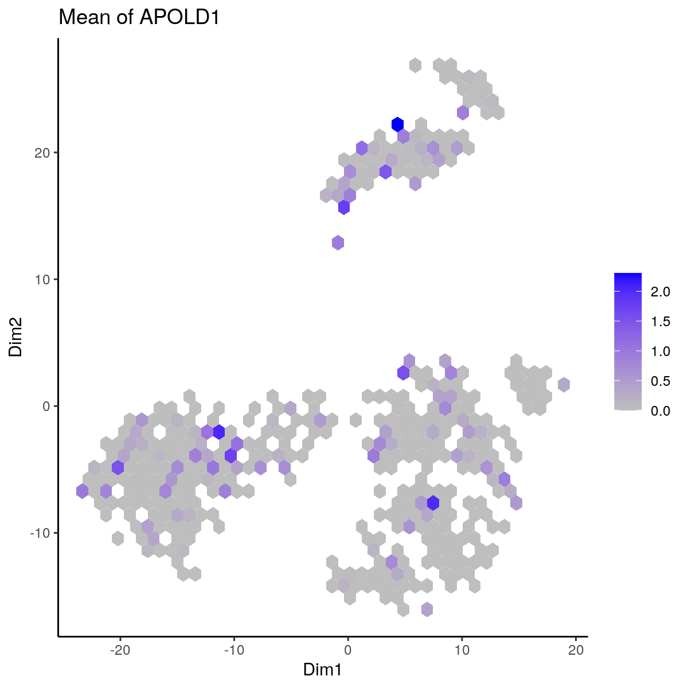|[FGF2](https://www.ncbi.nlm.nih.gov/gene/2247) [ARSK](https://www.ncbi.nlm.nih.gov/gene/153642)|
|[AQP1](https://www.ncbi.nlm.nih.gov/gene/358)|[AGT](https://www.ncbi.nlm.nih.gov/gene/183) [ALB](https://www.ncbi.nlm.nih.gov/gene/213) [AVP](https://www.ncbi.nlm.nih.gov/gene/551) [EPO](https://www.ncbi.nlm.nih.gov/gene/2056) [IFNG](https://www.ncbi.nlm.nih.gov/gene/3458) [IL10](https://www.ncbi.nlm.nih.gov/gene/3586) [MYOC](https://www.ncbi.nlm.nih.gov/gene/4653) [SCT](https://www.ncbi.nlm.nih.gov/gene/6343) [UMOD](https://www.ncbi.nlm.nih.gov/gene/7369) [VEGFA](https://www.ncbi.nlm.nih.gov/gene/7422) [VWF](https://www.ncbi.nlm.nih.gov/gene/7450)|
|[AQP2](https://www.ncbi.nlm.nih.gov/gene/359)|[AGT](https://www.ncbi.nlm.nih.gov/gene/183) [ALB](https://www.ncbi.nlm.nih.gov/gene/213) [AVP](https://www.ncbi.nlm.nih.gov/gene/551) [GCG](https://www.ncbi.nlm.nih.gov/gene/2641) [INS](https://www.ncbi.nlm.nih.gov/gene/3630) [OXT](https://www.ncbi.nlm.nih.gov/gene/5020) [REN](https://www.ncbi.nlm.nih.gov/gene/5972) [SCT](https://www.ncbi.nlm.nih.gov/gene/6343) [STX1A](https://www.ncbi.nlm.nih.gov/gene/6804) [UMOD](https://www.ncbi.nlm.nih.gov/gene/7369) [WNT5A](https://www.ncbi.nlm.nih.gov/gene/7474)|
|[AQP3](https://www.ncbi.nlm.nih.gov/gene/360)|[ANXA2](https://www.ncbi.nlm.nih.gov/gene/302) [AVP](https://www.ncbi.nlm.nih.gov/gene/551) [FGF2](https://www.ncbi.nlm.nih.gov/gene/2247) [INS](https://www.ncbi.nlm.nih.gov/gene/3630) [MET](https://www.ncbi.nlm.nih.gov/gene/4233) [MMP3](https://www.ncbi.nlm.nih.gov/gene/4314) [TNF](https://www.ncbi.nlm.nih.gov/gene/7124)|
|[AQP4](https://www.ncbi.nlm.nih.gov/gene/361)|[AGT](https://www.ncbi.nlm.nih.gov/gene/183) [ALB](https://www.ncbi.nlm.nih.gov/gene/213) [APOE](https://www.ncbi.nlm.nih.gov/gene/348) [AVP](https://www.ncbi.nlm.nih.gov/gene/551) [BDNF](https://www.ncbi.nlm.nih.gov/gene/627) [CCK](https://www.ncbi.nlm.nih.gov/gene/885) [NCAN](https://www.ncbi.nlm.nih.gov/gene/1463) [EPO](https://www.ncbi.nlm.nih.gov/gene/2056) [FBLN2](https://www.ncbi.nlm.nih.gov/gene/2199) [IFNB1](https://www.ncbi.nlm.nih.gov/gene/3456) [IL6](https://www.ncbi.nlm.nih.gov/gene/3569) [MMP9](https://www.ncbi.nlm.nih.gov/gene/4318) [SCT](https://www.ncbi.nlm.nih.gov/gene/6343) [VEGFA](https://www.ncbi.nlm.nih.gov/gene/7422) [ADAM12](https://www.ncbi.nlm.nih.gov/gene/8038) [SPARCL1](https://www.ncbi.nlm.nih.gov/gene/8404) [LGI1](https://www.ncbi.nlm.nih.gov/gene/9211) [HAPLN2](https://www.ncbi.nlm.nih.gov/gene/60484) [LGI3](https://www.ncbi.nlm.nih.gov/gene/203190) [IGLON5](https://www.ncbi.nlm.nih.gov/gene/402665) [TAFA1](https://www.ncbi.nlm.nih.gov/gene/407738)|
|[AQP5](https://www.ncbi.nlm.nih.gov/gene/362)|[ALB](https://www.ncbi.nlm.nih.gov/gene/213) [AVP](https://www.ncbi.nlm.nih.gov/gene/551) [BMP6](https://www.ncbi.nlm.nih.gov/gene/654) [FGF7](https://www.ncbi.nlm.nih.gov/gene/2252) [IFNA1](https://www.ncbi.nlm.nih.gov/gene/3439) [MUC5AC](https://www.ncbi.nlm.nih.gov/gene/4586) [OXT](https://www.ncbi.nlm.nih.gov/gene/5020) [SFTPB](https://www.ncbi.nlm.nih.gov/gene/6439) [SFTPC](https://www.ncbi.nlm.nih.gov/gene/6440) [SFTPD](https://www.ncbi.nlm.nih.gov/gene/6441) [SCGB1A1](https://www.ncbi.nlm.nih.gov/gene/7356) [BPIFA2](https://www.ncbi.nlm.nih.gov/gene/140683) [SFTPA1](https://www.ncbi.nlm.nih.gov/gene/653509) [SFTPA2](https://www.ncbi.nlm.nih.gov/gene/729238)|
|[AQP7](https://www.ncbi.nlm.nih.gov/gene/364)|[INS](https://www.ncbi.nlm.nih.gov/gene/3630) [LEP](https://www.ncbi.nlm.nih.gov/gene/3952)|
|[AQP9](https://www.ncbi.nlm.nih.gov/gene/366)|[HABP2](https://www.ncbi.nlm.nih.gov/gene/3026) [IL1RN](https://www.ncbi.nlm.nih.gov/gene/3557) [IL7](https://www.ncbi.nlm.nih.gov/gene/3574) [INS](https://www.ncbi.nlm.nih.gov/gene/3630) [LEP](https://www.ncbi.nlm.nih.gov/gene/3952) [S100A8](https://www.ncbi.nlm.nih.gov/gene/6279) [S100A9](https://www.ncbi.nlm.nih.gov/gene/6280) [S100A12](https://www.ncbi.nlm.nih.gov/gene/6283) [TREM1](https://www.ncbi.nlm.nih.gov/gene/54210) [PROK2](https://www.ncbi.nlm.nih.gov/gene/60675)|
|[ARHGEF25](https://www.ncbi.nlm.nih.gov/gene/115557)|[AGT](https://www.ncbi.nlm.nih.gov/gene/183) [AVP](https://www.ncbi.nlm.nih.gov/gene/551) [CCK](https://www.ncbi.nlm.nih.gov/gene/885) [EDN1](https://www.ncbi.nlm.nih.gov/gene/1906) [EDN2](https://www.ncbi.nlm.nih.gov/gene/1907) [EDN3](https://www.ncbi.nlm.nih.gov/gene/1908) [MEGF6](https://www.ncbi.nlm.nih.gov/gene/1953) [F2](https://www.ncbi.nlm.nih.gov/gene/2147) [GAST](https://www.ncbi.nlm.nih.gov/gene/2520) [GCG](https://www.ncbi.nlm.nih.gov/gene/2641) [GNRH1](https://www.ncbi.nlm.nih.gov/gene/2796) [GNRH2](https://www.ncbi.nlm.nih.gov/gene/2797) [GRP](https://www.ncbi.nlm.nih.gov/gene/2922) [KISS1](https://www.ncbi.nlm.nih.gov/gene/3814) [MLN](https://www.ncbi.nlm.nih.gov/gene/4295) [NMB](https://www.ncbi.nlm.nih.gov/gene/4828) [NTS](https://www.ncbi.nlm.nih.gov/gene/4922) [OXT](https://www.ncbi.nlm.nih.gov/gene/5020) [PMCH](https://www.ncbi.nlm.nih.gov/gene/5367) [SAA1](https://www.ncbi.nlm.nih.gov/gene/6288) [XCL1](https://www.ncbi.nlm.nih.gov/gene/6375) [XCL2](https://www.ncbi.nlm.nih.gov/gene/6846) [TAC1](https://www.ncbi.nlm.nih.gov/gene/6863) [TAC3](https://www.ncbi.nlm.nih.gov/gene/6866) [TRH](https://www.ncbi.nlm.nih.gov/gene/7200) [NPFF](https://www.ncbi.nlm.nih.gov/gene/8620) [NMU](https://www.ncbi.nlm.nih.gov/gene/10874) [UTS2](https://www.ncbi.nlm.nih.gov/gene/10911) [PROK2](https://www.ncbi.nlm.nih.gov/gene/60675) [PROK1](https://www.ncbi.nlm.nih.gov/gene/84432) [NMS](https://www.ncbi.nlm.nih.gov/gene/129521) [UTS2B](https://www.ncbi.nlm.nih.gov/gene/257313) [QRFP](https://www.ncbi.nlm.nih.gov/gene/347148) [NPS](https://www.ncbi.nlm.nih.gov/gene/594857)|
|[ARHGEF39](https://www.ncbi.nlm.nih.gov/gene/84904)|[EDIL3](https://www.ncbi.nlm.nih.gov/gene/10085) [LRRC17](https://www.ncbi.nlm.nih.gov/gene/10234) [CREG2](https://www.ncbi.nlm.nih.gov/gene/200407)|
|[ARL4A](https://www.ncbi.nlm.nih.gov/gene/10124)|[LAMB1](https://www.ncbi.nlm.nih.gov/gene/3912)|
|[ARL4C](https://www.ncbi.nlm.nih.gov/gene/10123)|[CLPS](https://www.ncbi.nlm.nih.gov/gene/1208) [CPB2](https://www.ncbi.nlm.nih.gov/gene/1361) [SPP2](https://www.ncbi.nlm.nih.gov/gene/6694)|
|[ARRB1](https://www.ncbi.nlm.nih.gov/gene/408)|[AGT](https://www.ncbi.nlm.nih.gov/gene/183) [AVP](https://www.ncbi.nlm.nih.gov/gene/551) [EDN1](https://www.ncbi.nlm.nih.gov/gene/1906) [EGFR](https://www.ncbi.nlm.nih.gov/gene/1956) [F2](https://www.ncbi.nlm.nih.gov/gene/2147) [FGB](https://www.ncbi.nlm.nih.gov/gene/2244) [FGG](https://www.ncbi.nlm.nih.gov/gene/2266) [FN1](https://www.ncbi.nlm.nih.gov/gene/2335) [IL7R](https://www.ncbi.nlm.nih.gov/gene/3575) [CXCL8](https://www.ncbi.nlm.nih.gov/gene/3576) [CXCL10](https://www.ncbi.nlm.nih.gov/gene/3627) [INS](https://www.ncbi.nlm.nih.gov/gene/3630) [PTH](https://www.ncbi.nlm.nih.gov/gene/5741) [PTHLH](https://www.ncbi.nlm.nih.gov/gene/5744) [CCL11](https://www.ncbi.nlm.nih.gov/gene/6356) [CXCL12](https://www.ncbi.nlm.nih.gov/gene/6387) [SST](https://www.ncbi.nlm.nih.gov/gene/6750) [TF](https://www.ncbi.nlm.nih.gov/gene/7018) [VWF](https://www.ncbi.nlm.nih.gov/gene/7450) [WNT5A](https://www.ncbi.nlm.nih.gov/gene/7474)|
|[ARRB2](https://www.ncbi.nlm.nih.gov/gene/409)|[AVP](https://www.ncbi.nlm.nih.gov/gene/551) [EGFR](https://www.ncbi.nlm.nih.gov/gene/1956) [FGB](https://www.ncbi.nlm.nih.gov/gene/2244) [FGG](https://www.ncbi.nlm.nih.gov/gene/2266) [FN1](https://www.ncbi.nlm.nih.gov/gene/2335) [GCG](https://www.ncbi.nlm.nih.gov/gene/2641) [GDF1](https://www.ncbi.nlm.nih.gov/gene/2657) [GNRH1](https://www.ncbi.nlm.nih.gov/gene/2796) [IGFALS](https://www.ncbi.nlm.nih.gov/gene/3483) [IL7R](https://www.ncbi.nlm.nih.gov/gene/3575) [CXCL8](https://www.ncbi.nlm.nih.gov/gene/3576) [NTS](https://www.ncbi.nlm.nih.gov/gene/4922) [CXCL12](https://www.ncbi.nlm.nih.gov/gene/6387) [TF](https://www.ncbi.nlm.nih.gov/gene/7018) [TGFBR3](https://www.ncbi.nlm.nih.gov/gene/7049) [TRH](https://www.ncbi.nlm.nih.gov/gene/7200) [VWF](https://www.ncbi.nlm.nih.gov/gene/7450) [WNT5A](https://www.ncbi.nlm.nih.gov/gene/7474) [ISM1](https://www.ncbi.nlm.nih.gov/gene/140862)|
|[ART3](https://www.ncbi.nlm.nih.gov/gene/419)|[GPLD1](https://www.ncbi.nlm.nih.gov/gene/2822) [MSLN](https://www.ncbi.nlm.nih.gov/gene/10232) [LY6K](https://www.ncbi.nlm.nih.gov/gene/54742) [RAET1G](https://www.ncbi.nlm.nih.gov/gene/353091)|
|[ART4](https://www.ncbi.nlm.nih.gov/gene/420)|[GPLD1](https://www.ncbi.nlm.nih.gov/gene/2822) [MSLN](https://www.ncbi.nlm.nih.gov/gene/10232) [LY6K](https://www.ncbi.nlm.nih.gov/gene/54742) [RAET1G](https://www.ncbi.nlm.nih.gov/gene/353091)|
|[ASIC1](https://www.ncbi.nlm.nih.gov/gene/41)|[BMP8B](https://www.ncbi.nlm.nih.gov/gene/656) [SCG2](https://www.ncbi.nlm.nih.gov/gene/7857)|
|[ASIC2](https://www.ncbi.nlm.nih.gov/gene/40)|[GALP](https://www.ncbi.nlm.nih.gov/gene/85569)|
|[ASIC3](https://www.ncbi.nlm.nih.gov/gene/9311)|[CALCA](https://www.ncbi.nlm.nih.gov/gene/796) [NGF](https://www.ncbi.nlm.nih.gov/gene/4803) [TAC1](https://www.ncbi.nlm.nih.gov/gene/6863) [NPS](https://www.ncbi.nlm.nih.gov/gene/594857)|
|[ASTL](https://www.ncbi.nlm.nih.gov/gene/431705)|[NTS](https://www.ncbi.nlm.nih.gov/gene/4922) [PAPPA](https://www.ncbi.nlm.nih.gov/gene/5069) [PRSS8](https://www.ncbi.nlm.nih.gov/gene/5652) [TIMP1](https://www.ncbi.nlm.nih.gov/gene/7076) [CHRD](https://www.ncbi.nlm.nih.gov/gene/8646) [FETUB](https://www.ncbi.nlm.nih.gov/gene/26998) [LYZL6](https://www.ncbi.nlm.nih.gov/gene/57151) [PAPPA2](https://www.ncbi.nlm.nih.gov/gene/60676) [LYZL1](https://www.ncbi.nlm.nih.gov/gene/84569) [LYZL2](https://www.ncbi.nlm.nih.gov/gene/119180) [SPACA3](https://www.ncbi.nlm.nih.gov/gene/124912) [LYZL4](https://www.ncbi.nlm.nih.gov/gene/131375)|
|[ASTN1](https://www.ncbi.nlm.nih.gov/gene/460)|[NCAN](https://www.ncbi.nlm.nih.gov/gene/1463) [NCAM1](https://www.ncbi.nlm.nih.gov/gene/4684) [RELN](https://www.ncbi.nlm.nih.gov/gene/5649) [NXPH1](https://www.ncbi.nlm.nih.gov/gene/30010) [BRINP2](https://www.ncbi.nlm.nih.gov/gene/57795) [NETO1](https://www.ncbi.nlm.nih.gov/gene/81832) [BRINP3](https://www.ncbi.nlm.nih.gov/gene/339479)|
|[ATP10A](https://www.ncbi.nlm.nih.gov/gene/57194)|[BMP8B](https://www.ncbi.nlm.nih.gov/gene/656) [SCG2](https://www.ncbi.nlm.nih.gov/gene/7857) [PTX4](https://www.ncbi.nlm.nih.gov/gene/390667)|
|[ATP10D](https://www.ncbi.nlm.nih.gov/gene/57205)|[ASGR1](https://www.ncbi.nlm.nih.gov/gene/432) [NMU](https://www.ncbi.nlm.nih.gov/gene/10874) [SMPDL3A](https://www.ncbi.nlm.nih.gov/gene/10924)|
|[ATP11A](https://www.ncbi.nlm.nih.gov/gene/23250)|[ALB](https://www.ncbi.nlm.nih.gov/gene/213) [FCAR](https://www.ncbi.nlm.nih.gov/gene/2204) [PLAU](https://www.ncbi.nlm.nih.gov/gene/5328) [PLAUR](https://www.ncbi.nlm.nih.gov/gene/5329) [TNFRSF1B](https://www.ncbi.nlm.nih.gov/gene/7133)|
|[ATP11C](https://www.ncbi.nlm.nih.gov/gene/286410)|[F9](https://www.ncbi.nlm.nih.gov/gene/2158) [LAMA3](https://www.ncbi.nlm.nih.gov/gene/3909) [ITGBL1](https://www.ncbi.nlm.nih.gov/gene/9358)|
|[ATP1A1](https://www.ncbi.nlm.nih.gov/gene/476)|[AMY2A](https://www.ncbi.nlm.nih.gov/gene/279) [AMY2B](https://www.ncbi.nlm.nih.gov/gene/280) [CGA](https://www.ncbi.nlm.nih.gov/gene/1081) [CSN2](https://www.ncbi.nlm.nih.gov/gene/1447) [CSN3](https://www.ncbi.nlm.nih.gov/gene/1448) [PSAP](https://www.ncbi.nlm.nih.gov/gene/5660) [RS1](https://www.ncbi.nlm.nih.gov/gene/6247) [SHBG](https://www.ncbi.nlm.nih.gov/gene/6462) [TSHB](https://www.ncbi.nlm.nih.gov/gene/7252)|
|[ATP1A3](https://www.ncbi.nlm.nih.gov/gene/478)|[APOC2](https://www.ncbi.nlm.nih.gov/gene/344) [RS1](https://www.ncbi.nlm.nih.gov/gene/6247) [SHBG](https://www.ncbi.nlm.nih.gov/gene/6462) [CEACAM16](https://www.ncbi.nlm.nih.gov/gene/388551)|
|[ATP1A4](https://www.ncbi.nlm.nih.gov/gene/480)|[AMY2A](https://www.ncbi.nlm.nih.gov/gene/279) [AMY2B](https://www.ncbi.nlm.nih.gov/gene/280) [CGA](https://www.ncbi.nlm.nih.gov/gene/1081) [RS1](https://www.ncbi.nlm.nih.gov/gene/6247) [SHBG](https://www.ncbi.nlm.nih.gov/gene/6462) [TSHB](https://www.ncbi.nlm.nih.gov/gene/7252) [PRSS22](https://www.ncbi.nlm.nih.gov/gene/64063) [COL24A1](https://www.ncbi.nlm.nih.gov/gene/255631)|
|[ATP1B1](https://www.ncbi.nlm.nih.gov/gene/481)|[GABBR1](https://www.ncbi.nlm.nih.gov/gene/2550) [RS1](https://www.ncbi.nlm.nih.gov/gene/6247)|
|[ATP1B2](https://www.ncbi.nlm.nih.gov/gene/482)|[ASGR1](https://www.ncbi.nlm.nih.gov/gene/432) [GABBR1](https://www.ncbi.nlm.nih.gov/gene/2550) [NPPC](https://www.ncbi.nlm.nih.gov/gene/4880) [RS1](https://www.ncbi.nlm.nih.gov/gene/6247) [GFOD1](https://www.ncbi.nlm.nih.gov/gene/54438) [C11orf94](https://www.ncbi.nlm.nih.gov/gene/143678)|
|[ATP1B3](https://www.ncbi.nlm.nih.gov/gene/483)|[COL8A1](https://www.ncbi.nlm.nih.gov/gene/1295) [GABBR1](https://www.ncbi.nlm.nih.gov/gene/2550) [RS1](https://www.ncbi.nlm.nih.gov/gene/6247)|
|[ATP2B1](https://www.ncbi.nlm.nih.gov/gene/490)|[FGF5](https://www.ncbi.nlm.nih.gov/gene/2250)|
|[ATP2B3](https://www.ncbi.nlm.nih.gov/gene/492)|[CCK](https://www.ncbi.nlm.nih.gov/gene/885) [PDYN](https://www.ncbi.nlm.nih.gov/gene/5173) [VTN](https://www.ncbi.nlm.nih.gov/gene/7448) [FGF17](https://www.ncbi.nlm.nih.gov/gene/8822) [SCGN](https://www.ncbi.nlm.nih.gov/gene/10590) [HAPLN2](https://www.ncbi.nlm.nih.gov/gene/60484) [OLFM3](https://www.ncbi.nlm.nih.gov/gene/118427) [LGI3](https://www.ncbi.nlm.nih.gov/gene/203190)|
|[ATP2B4](https://www.ncbi.nlm.nih.gov/gene/493)|[HSPG2](https://www.ncbi.nlm.nih.gov/gene/3339) [SFRP2](https://www.ncbi.nlm.nih.gov/gene/6423) [RNLS](https://www.ncbi.nlm.nih.gov/gene/55328) [PCDH15](https://www.ncbi.nlm.nih.gov/gene/65217) [FREM3](https://www.ncbi.nlm.nih.gov/gene/166752) [OC90](https://www.ncbi.nlm.nih.gov/gene/729330)|
|[ATP4A](https://www.ncbi.nlm.nih.gov/gene/495)|[ALB](https://www.ncbi.nlm.nih.gov/gene/213) [CALCA](https://www.ncbi.nlm.nih.gov/gene/796) [CCK](https://www.ncbi.nlm.nih.gov/gene/885) [CHGA](https://www.ncbi.nlm.nih.gov/gene/1113) [CRP](https://www.ncbi.nlm.nih.gov/gene/1401) [EGFR](https://www.ncbi.nlm.nih.gov/gene/1956) [F2](https://www.ncbi.nlm.nih.gov/gene/2147) [F3](https://www.ncbi.nlm.nih.gov/gene/2152) [GAST](https://www.ncbi.nlm.nih.gov/gene/2520) [GCG](https://www.ncbi.nlm.nih.gov/gene/2641) [CBLIF](https://www.ncbi.nlm.nih.gov/gene/2694) [IL6](https://www.ncbi.nlm.nih.gov/gene/3569) [CXCL8](https://www.ncbi.nlm.nih.gov/gene/3576) [INS](https://www.ncbi.nlm.nih.gov/gene/3630) [MUC5AC](https://www.ncbi.nlm.nih.gov/gene/4586) [PTH](https://www.ncbi.nlm.nih.gov/gene/5741) [REN](https://www.ncbi.nlm.nih.gov/gene/5972) [RS1](https://www.ncbi.nlm.nih.gov/gene/6247) [S100A8](https://www.ncbi.nlm.nih.gov/gene/6279) [SCT](https://www.ncbi.nlm.nih.gov/gene/6343) [SHBG](https://www.ncbi.nlm.nih.gov/gene/6462) [SST](https://www.ncbi.nlm.nih.gov/gene/6750) [TFF2](https://www.ncbi.nlm.nih.gov/gene/7032) [TNF](https://www.ncbi.nlm.nih.gov/gene/7124) [CCL26](https://www.ncbi.nlm.nih.gov/gene/10344) [EFEMP2](https://www.ncbi.nlm.nih.gov/gene/30008) [GHRL](https://www.ncbi.nlm.nih.gov/gene/51738)|
|[ATP4B](https://www.ncbi.nlm.nih.gov/gene/496)|[GAST](https://www.ncbi.nlm.nih.gov/gene/2520) [GABBR1](https://www.ncbi.nlm.nih.gov/gene/2550) [CBLIF](https://www.ncbi.nlm.nih.gov/gene/2694) [MUC5AC](https://www.ncbi.nlm.nih.gov/gene/4586) [MUC6](https://www.ncbi.nlm.nih.gov/gene/4588) [PGA5](https://www.ncbi.nlm.nih.gov/gene/5222) [PGC](https://www.ncbi.nlm.nih.gov/gene/5225) [TCN2](https://www.ncbi.nlm.nih.gov/gene/6948) [TFF1](https://www.ncbi.nlm.nih.gov/gene/7031) [TFF2](https://www.ncbi.nlm.nih.gov/gene/7032) [PGA4](https://www.ncbi.nlm.nih.gov/gene/643847)|
|[ATP6V0A2](https://www.ncbi.nlm.nih.gov/gene/23545)|[CP](https://www.ncbi.nlm.nih.gov/gene/1356) [EGFR](https://www.ncbi.nlm.nih.gov/gene/1956) [ELN](https://www.ncbi.nlm.nih.gov/gene/2006) [F3](https://www.ncbi.nlm.nih.gov/gene/2152) [INS](https://www.ncbi.nlm.nih.gov/gene/3630) [LOX](https://www.ncbi.nlm.nih.gov/gene/4015) [MUC1](https://www.ncbi.nlm.nih.gov/gene/4582) [TF](https://www.ncbi.nlm.nih.gov/gene/7018) [ADAMTS4](https://www.ncbi.nlm.nih.gov/gene/9507) [ADAMTS2](https://www.ncbi.nlm.nih.gov/gene/9509) [FBLN5](https://www.ncbi.nlm.nih.gov/gene/10516) [EFEMP2](https://www.ncbi.nlm.nih.gov/gene/30008)|
|[ATP6V0A4](https://www.ncbi.nlm.nih.gov/gene/50617)|[EGFR](https://www.ncbi.nlm.nih.gov/gene/1956) [INS](https://www.ncbi.nlm.nih.gov/gene/3630) [TF](https://www.ncbi.nlm.nih.gov/gene/7018)|
|[ATP8B4](https://www.ncbi.nlm.nih.gov/gene/79895)|[APOC1](https://www.ncbi.nlm.nih.gov/gene/341) [FCAR](https://www.ncbi.nlm.nih.gov/gene/2204) [PLAU](https://www.ncbi.nlm.nih.gov/gene/5328) [PLAUR](https://www.ncbi.nlm.nih.gov/gene/5329) [TNFRSF1B](https://www.ncbi.nlm.nih.gov/gene/7133)|
|[AVPR1A](https://www.ncbi.nlm.nih.gov/gene/552)|[AGT](https://www.ncbi.nlm.nih.gov/gene/183) [AVP](https://www.ncbi.nlm.nih.gov/gene/551) [CCK](https://www.ncbi.nlm.nih.gov/gene/885) [COL4A1](https://www.ncbi.nlm.nih.gov/gene/1282) [CRH](https://www.ncbi.nlm.nih.gov/gene/1392) [EDN1](https://www.ncbi.nlm.nih.gov/gene/1906) [EDN2](https://www.ncbi.nlm.nih.gov/gene/1907) [EDN3](https://www.ncbi.nlm.nih.gov/gene/1908) [F2](https://www.ncbi.nlm.nih.gov/gene/2147) [GAST](https://www.ncbi.nlm.nih.gov/gene/2520) [GCG](https://www.ncbi.nlm.nih.gov/gene/2641) [GHRH](https://www.ncbi.nlm.nih.gov/gene/2691) [GIP](https://www.ncbi.nlm.nih.gov/gene/2695) [GNRH1](https://www.ncbi.nlm.nih.gov/gene/2796) [GNRH2](https://www.ncbi.nlm.nih.gov/gene/2797) [GRP](https://www.ncbi.nlm.nih.gov/gene/2922) [CXCL8](https://www.ncbi.nlm.nih.gov/gene/3576) [KISS1](https://www.ncbi.nlm.nih.gov/gene/3814) [MLN](https://www.ncbi.nlm.nih.gov/gene/4295) [NMB](https://www.ncbi.nlm.nih.gov/gene/4828) [NTS](https://www.ncbi.nlm.nih.gov/gene/4922) [OXT](https://www.ncbi.nlm.nih.gov/gene/5020) [PMCH](https://www.ncbi.nlm.nih.gov/gene/5367) [POMC](https://www.ncbi.nlm.nih.gov/gene/5443) [SAA1](https://www.ncbi.nlm.nih.gov/gene/6288) [XCL1](https://www.ncbi.nlm.nih.gov/gene/6375) [XCL2](https://www.ncbi.nlm.nih.gov/gene/6846) [TAC1](https://www.ncbi.nlm.nih.gov/gene/6863) [TAC3](https://www.ncbi.nlm.nih.gov/gene/6866) [TRH](https://www.ncbi.nlm.nih.gov/gene/7200) [VIP](https://www.ncbi.nlm.nih.gov/gene/7432) [NPFF](https://www.ncbi.nlm.nih.gov/gene/8620) [NMU](https://www.ncbi.nlm.nih.gov/gene/10874) [UTS2](https://www.ncbi.nlm.nih.gov/gene/10911) [PROK2](https://www.ncbi.nlm.nih.gov/gene/60675) [PROK1](https://www.ncbi.nlm.nih.gov/gene/84432) [NMS](https://www.ncbi.nlm.nih.gov/gene/129521) [RAET1E](https://www.ncbi.nlm.nih.gov/gene/135250) [UTS2B](https://www.ncbi.nlm.nih.gov/gene/257313) [QRFP](https://www.ncbi.nlm.nih.gov/gene/347148) [NPS](https://www.ncbi.nlm.nih.gov/gene/594857)|
|[AVPR1B](https://www.ncbi.nlm.nih.gov/gene/553)|[AGT](https://www.ncbi.nlm.nih.gov/gene/183) [AVP](https://www.ncbi.nlm.nih.gov/gene/551) [CCK](https://www.ncbi.nlm.nih.gov/gene/885) [CGA](https://www.ncbi.nlm.nih.gov/gene/1081) [CORT](https://www.ncbi.nlm.nih.gov/gene/1325) [CRH](https://www.ncbi.nlm.nih.gov/gene/1392) [EDN1](https://www.ncbi.nlm.nih.gov/gene/1906) [EDN2](https://www.ncbi.nlm.nih.gov/gene/1907) [EDN3](https://www.ncbi.nlm.nih.gov/gene/1908) [F2](https://www.ncbi.nlm.nih.gov/gene/2147) [FSHB](https://www.ncbi.nlm.nih.gov/gene/2488) [GAST](https://www.ncbi.nlm.nih.gov/gene/2520) [GCG](https://www.ncbi.nlm.nih.gov/gene/2641) [GIP](https://www.ncbi.nlm.nih.gov/gene/2695) [GNRH1](https://www.ncbi.nlm.nih.gov/gene/2796) [GNRH2](https://www.ncbi.nlm.nih.gov/gene/2797) [GRP](https://www.ncbi.nlm.nih.gov/gene/2922) [CXCL8](https://www.ncbi.nlm.nih.gov/gene/3576) [KISS1](https://www.ncbi.nlm.nih.gov/gene/3814) [MLN](https://www.ncbi.nlm.nih.gov/gene/4295) [NMB](https://www.ncbi.nlm.nih.gov/gene/4828) [NTS](https://www.ncbi.nlm.nih.gov/gene/4922) [OXT](https://www.ncbi.nlm.nih.gov/gene/5020) [PMCH](https://www.ncbi.nlm.nih.gov/gene/5367) [POMC](https://www.ncbi.nlm.nih.gov/gene/5443) [PRL](https://www.ncbi.nlm.nih.gov/gene/5617) [SAA1](https://www.ncbi.nlm.nih.gov/gene/6288) [XCL1](https://www.ncbi.nlm.nih.gov/gene/6375) [XCL2](https://www.ncbi.nlm.nih.gov/gene/6846) [TAC1](https://www.ncbi.nlm.nih.gov/gene/6863) [TAC3](https://www.ncbi.nlm.nih.gov/gene/6866) [TRH](https://www.ncbi.nlm.nih.gov/gene/7200) [TSHB](https://www.ncbi.nlm.nih.gov/gene/7252) [NPFF](https://www.ncbi.nlm.nih.gov/gene/8620) [NMU](https://www.ncbi.nlm.nih.gov/gene/10874) [UTS2](https://www.ncbi.nlm.nih.gov/gene/10911) [PROK2](https://www.ncbi.nlm.nih.gov/gene/60675) [PROK1](https://www.ncbi.nlm.nih.gov/gene/84432) [NMS](https://www.ncbi.nlm.nih.gov/gene/129521) [UTS2B](https://www.ncbi.nlm.nih.gov/gene/257313) [QRFP](https://www.ncbi.nlm.nih.gov/gene/347148) [NPS](https://www.ncbi.nlm.nih.gov/gene/594857)|
|[AVPR2](https://www.ncbi.nlm.nih.gov/gene/554)|[AVP](https://www.ncbi.nlm.nih.gov/gene/551) [OXT](https://www.ncbi.nlm.nih.gov/gene/5020)|
|[AXL](https://www.ncbi.nlm.nih.gov/gene/558)|[ADGRB1](https://www.ncbi.nlm.nih.gov/gene/575) [CSF2](https://www.ncbi.nlm.nih.gov/gene/1437) [NCAN](https://www.ncbi.nlm.nih.gov/gene/1463) [CCN2](https://www.ncbi.nlm.nih.gov/gene/1490) [EGFR](https://www.ncbi.nlm.nih.gov/gene/1956) [FN1](https://www.ncbi.nlm.nih.gov/gene/2335) [GAS6](https://www.ncbi.nlm.nih.gov/gene/2621) [IFNA1](https://www.ncbi.nlm.nih.gov/gene/3439) [IFNB1](https://www.ncbi.nlm.nih.gov/gene/3456) [IGF1](https://www.ncbi.nlm.nih.gov/gene/3479) [IGF2](https://www.ncbi.nlm.nih.gov/gene/3481) [CCN1](https://www.ncbi.nlm.nih.gov/gene/3491) [IL6](https://www.ncbi.nlm.nih.gov/gene/3569) [INS](https://www.ncbi.nlm.nih.gov/gene/3630) [KDR](https://www.ncbi.nlm.nih.gov/gene/3791) [PROS1](https://www.ncbi.nlm.nih.gov/gene/5627) [PTEN](https://www.ncbi.nlm.nih.gov/gene/5728) [TGFB1](https://www.ncbi.nlm.nih.gov/gene/7040) [VEGFA](https://www.ncbi.nlm.nih.gov/gene/7422) [CLEC4M](https://www.ncbi.nlm.nih.gov/gene/10332) [CD209](https://www.ncbi.nlm.nih.gov/gene/30835) [PCSK9](https://www.ncbi.nlm.nih.gov/gene/255738)|
|[BACE1](https://www.ncbi.nlm.nih.gov/gene/23621)|[AGER](https://www.ncbi.nlm.nih.gov/gene/177) [ALB](https://www.ncbi.nlm.nih.gov/gene/213) [APOE](https://www.ncbi.nlm.nih.gov/gene/348) [BCHE](https://www.ncbi.nlm.nih.gov/gene/590) [BDNF](https://www.ncbi.nlm.nih.gov/gene/627) [EGFR](https://www.ncbi.nlm.nih.gov/gene/1956) [FGF2](https://www.ncbi.nlm.nih.gov/gene/2247) [IGF1](https://www.ncbi.nlm.nih.gov/gene/3479) [IL6](https://www.ncbi.nlm.nih.gov/gene/3569) [INS](https://www.ncbi.nlm.nih.gov/gene/3630) [LEP](https://www.ncbi.nlm.nih.gov/gene/3952) [MMP8](https://www.ncbi.nlm.nih.gov/gene/4317) [NGF](https://www.ncbi.nlm.nih.gov/gene/4803) [TNF](https://www.ncbi.nlm.nih.gov/gene/7124) [ADAM9](https://www.ncbi.nlm.nih.gov/gene/8754) [NRG3](https://www.ncbi.nlm.nih.gov/gene/10718) [MPEG1](https://www.ncbi.nlm.nih.gov/gene/219972) [PCSK9](https://www.ncbi.nlm.nih.gov/gene/255738)|
|[BACE2](https://www.ncbi.nlm.nih.gov/gene/25825)|[APOE](https://www.ncbi.nlm.nih.gov/gene/348) [GZMM](https://www.ncbi.nlm.nih.gov/gene/3004) [PMEL](https://www.ncbi.nlm.nih.gov/gene/6490) [ADAM9](https://www.ncbi.nlm.nih.gov/gene/8754) [PRG4](https://www.ncbi.nlm.nih.gov/gene/10216) [FAM3B](https://www.ncbi.nlm.nih.gov/gene/54097)|
|[BAIAP2L2](https://www.ncbi.nlm.nih.gov/gene/80115)|[PM20D1](https://www.ncbi.nlm.nih.gov/gene/148811) [RSPO4](https://www.ncbi.nlm.nih.gov/gene/343637)|
|[BASP1](https://www.ncbi.nlm.nih.gov/gene/10409)|[ALB](https://www.ncbi.nlm.nih.gov/gene/213)|
|[BDKRB1](https://www.ncbi.nlm.nih.gov/gene/623)|[AGT](https://www.ncbi.nlm.nih.gov/gene/183) [AVP](https://www.ncbi.nlm.nih.gov/gene/551) [C3](https://www.ncbi.nlm.nih.gov/gene/718) [C5](https://www.ncbi.nlm.nih.gov/gene/727) [CCK](https://www.ncbi.nlm.nih.gov/gene/885) [CORT](https://www.ncbi.nlm.nih.gov/gene/1325) [CPN1](https://www.ncbi.nlm.nih.gov/gene/1369) [EDN1](https://www.ncbi.nlm.nih.gov/gene/1906) [EDN2](https://www.ncbi.nlm.nih.gov/gene/1907) [EDN3](https://www.ncbi.nlm.nih.gov/gene/1908) [F2](https://www.ncbi.nlm.nih.gov/gene/2147) [F12](https://www.ncbi.nlm.nih.gov/gene/2161) [GAST](https://www.ncbi.nlm.nih.gov/gene/2520) [GABBR1](https://www.ncbi.nlm.nih.gov/gene/2550) [GCG](https://www.ncbi.nlm.nih.gov/gene/2641) [GNRH1](https://www.ncbi.nlm.nih.gov/gene/2796) [GNRH2](https://www.ncbi.nlm.nih.gov/gene/2797) [CXCL1](https://www.ncbi.nlm.nih.gov/gene/2919) [CXCL2](https://www.ncbi.nlm.nih.gov/gene/2920) [CXCL3](https://www.ncbi.nlm.nih.gov/gene/2921) [GRP](https://www.ncbi.nlm.nih.gov/gene/2922) [CXCL8](https://www.ncbi.nlm.nih.gov/gene/3576) [CXCL10](https://www.ncbi.nlm.nih.gov/gene/3627) [KISS1](https://www.ncbi.nlm.nih.gov/gene/3814) [KLKB1](https://www.ncbi.nlm.nih.gov/gene/3818) [CXCL9](https://www.ncbi.nlm.nih.gov/gene/4283) [MLN](https://www.ncbi.nlm.nih.gov/gene/4295) [NMB](https://www.ncbi.nlm.nih.gov/gene/4828) [NPY](https://www.ncbi.nlm.nih.gov/gene/4852) [NTS](https://www.ncbi.nlm.nih.gov/gene/4922) [OXT](https://www.ncbi.nlm.nih.gov/gene/5020) [PDYN](https://www.ncbi.nlm.nih.gov/gene/5173) [PENK](https://www.ncbi.nlm.nih.gov/gene/5179) [PF4](https://www.ncbi.nlm.nih.gov/gene/5196) [PMCH](https://www.ncbi.nlm.nih.gov/gene/5367) [PNOC](https://www.ncbi.nlm.nih.gov/gene/5368) [POMC](https://www.ncbi.nlm.nih.gov/gene/5443) [PPBP](https://www.ncbi.nlm.nih.gov/gene/5473) [PPY](https://www.ncbi.nlm.nih.gov/gene/5539) [MASP1](https://www.ncbi.nlm.nih.gov/gene/5648) [PSAP](https://www.ncbi.nlm.nih.gov/gene/5660) [PYY](https://www.ncbi.nlm.nih.gov/gene/5697) [SAA1](https://www.ncbi.nlm.nih.gov/gene/6288) [CCL1](https://www.ncbi.nlm.nih.gov/gene/6346) [CCL5](https://www.ncbi.nlm.nih.gov/gene/6352) [CCL13](https://www.ncbi.nlm.nih.gov/gene/6357) [CCL16](https://www.ncbi.nlm.nih.gov/gene/6360) [CCL19](https://www.ncbi.nlm.nih.gov/gene/6363) [CCL20](https://www.ncbi.nlm.nih.gov/gene/6364) [CCL21](https://www.ncbi.nlm.nih.gov/gene/6366) [CCL25](https://www.ncbi.nlm.nih.gov/gene/6370) [CXCL6](https://www.ncbi.nlm.nih.gov/gene/6372) [CXCL11](https://www.ncbi.nlm.nih.gov/gene/6373) [CXCL5](https://www.ncbi.nlm.nih.gov/gene/6374) [XCL1](https://www.ncbi.nlm.nih.gov/gene/6375) [CX3CL1](https://www.ncbi.nlm.nih.gov/gene/6376) [CXCL12](https://www.ncbi.nlm.nih.gov/gene/6387) [SST](https://www.ncbi.nlm.nih.gov/gene/6750) [XCL2](https://www.ncbi.nlm.nih.gov/gene/6846) [TAC1](https://www.ncbi.nlm.nih.gov/gene/6863) [TAC3](https://www.ncbi.nlm.nih.gov/gene/6866) [TRH](https://www.ncbi.nlm.nih.gov/gene/7200) [NPFF](https://www.ncbi.nlm.nih.gov/gene/8620) [APLN](https://www.ncbi.nlm.nih.gov/gene/8862) [KLK4](https://www.ncbi.nlm.nih.gov/gene/9622) [INSL5](https://www.ncbi.nlm.nih.gov/gene/10022) [CXCL13](https://www.ncbi.nlm.nih.gov/gene/10563) [CCL27](https://www.ncbi.nlm.nih.gov/gene/10850) [NMU](https://www.ncbi.nlm.nih.gov/gene/10874) [UTS2](https://www.ncbi.nlm.nih.gov/gene/10911) [GAL](https://www.ncbi.nlm.nih.gov/gene/51083) [CCL28](https://www.ncbi.nlm.nih.gov/gene/56477) [PROK2](https://www.ncbi.nlm.nih.gov/gene/60675) [HHIPL2](https://www.ncbi.nlm.nih.gov/gene/79802) [PROK1](https://www.ncbi.nlm.nih.gov/gene/84432) [HHIPL1](https://www.ncbi.nlm.nih.gov/gene/84439) [RLN3](https://www.ncbi.nlm.nih.gov/gene/117579) [NMS](https://www.ncbi.nlm.nih.gov/gene/129521) [NPB](https://www.ncbi.nlm.nih.gov/gene/256933) [UTS2B](https://www.ncbi.nlm.nih.gov/gene/257313) [NPW](https://www.ncbi.nlm.nih.gov/gene/283869) [KLK9](https://www.ncbi.nlm.nih.gov/gene/284366) [C9orf47](https://www.ncbi.nlm.nih.gov/gene/286223) [QRFP](https://www.ncbi.nlm.nih.gov/gene/347148) [CCL4L1](https://www.ncbi.nlm.nih.gov/gene/388372) [NPS](https://www.ncbi.nlm.nih.gov/gene/594857) [KNG1](https://www.ncbi.nlm.nih.gov/gene/3827)|
|[BDKRB2](https://www.ncbi.nlm.nih.gov/gene/624)|[AGT](https://www.ncbi.nlm.nih.gov/gene/183) [AVP](https://www.ncbi.nlm.nih.gov/gene/551) [SERPING1](https://www.ncbi.nlm.nih.gov/gene/710) [C3](https://www.ncbi.nlm.nih.gov/gene/718) [C5](https://www.ncbi.nlm.nih.gov/gene/727) [CCK](https://www.ncbi.nlm.nih.gov/gene/885) [CORT](https://www.ncbi.nlm.nih.gov/gene/1325) [CPN1](https://www.ncbi.nlm.nih.gov/gene/1369) [EDN1](https://www.ncbi.nlm.nih.gov/gene/1906) [EDN2](https://www.ncbi.nlm.nih.gov/gene/1907) [EDN3](https://www.ncbi.nlm.nih.gov/gene/1908) [F2](https://www.ncbi.nlm.nih.gov/gene/2147) [F12](https://www.ncbi.nlm.nih.gov/gene/2161) [GAST](https://www.ncbi.nlm.nih.gov/gene/2520) [GABBR1](https://www.ncbi.nlm.nih.gov/gene/2550) [GCG](https://www.ncbi.nlm.nih.gov/gene/2641) [GNRH1](https://www.ncbi.nlm.nih.gov/gene/2796) [GNRH2](https://www.ncbi.nlm.nih.gov/gene/2797) [CXCL1](https://www.ncbi.nlm.nih.gov/gene/2919) [CXCL2](https://www.ncbi.nlm.nih.gov/gene/2920) [CXCL3](https://www.ncbi.nlm.nih.gov/gene/2921) [GRP](https://www.ncbi.nlm.nih.gov/gene/2922) [CXCL8](https://www.ncbi.nlm.nih.gov/gene/3576) [CXCL10](https://www.ncbi.nlm.nih.gov/gene/3627) [KISS1](https://www.ncbi.nlm.nih.gov/gene/3814) [KLKB1](https://www.ncbi.nlm.nih.gov/gene/3818) [CXCL9](https://www.ncbi.nlm.nih.gov/gene/4283) [MLN](https://www.ncbi.nlm.nih.gov/gene/4295) [NMB](https://www.ncbi.nlm.nih.gov/gene/4828) [NPY](https://www.ncbi.nlm.nih.gov/gene/4852) [NTS](https://www.ncbi.nlm.nih.gov/gene/4922) [OXT](https://www.ncbi.nlm.nih.gov/gene/5020) [PDYN](https://www.ncbi.nlm.nih.gov/gene/5173) [PENK](https://www.ncbi.nlm.nih.gov/gene/5179) [PF4](https://www.ncbi.nlm.nih.gov/gene/5196) [PMCH](https://www.ncbi.nlm.nih.gov/gene/5367) [PNOC](https://www.ncbi.nlm.nih.gov/gene/5368) [POMC](https://www.ncbi.nlm.nih.gov/gene/5443) [PPBP](https://www.ncbi.nlm.nih.gov/gene/5473) [PPY](https://www.ncbi.nlm.nih.gov/gene/5539) [PSAP](https://www.ncbi.nlm.nih.gov/gene/5660) [PYY](https://www.ncbi.nlm.nih.gov/gene/5697) [REN](https://www.ncbi.nlm.nih.gov/gene/5972) [SAA1](https://www.ncbi.nlm.nih.gov/gene/6288) [CCL1](https://www.ncbi.nlm.nih.gov/gene/6346) [CCL5](https://www.ncbi.nlm.nih.gov/gene/6352) [CCL13](https://www.ncbi.nlm.nih.gov/gene/6357) [CCL16](https://www.ncbi.nlm.nih.gov/gene/6360) [CCL19](https://www.ncbi.nlm.nih.gov/gene/6363) [CCL20](https://www.ncbi.nlm.nih.gov/gene/6364) [CCL21](https://www.ncbi.nlm.nih.gov/gene/6366) [CCL25](https://www.ncbi.nlm.nih.gov/gene/6370) [CXCL6](https://www.ncbi.nlm.nih.gov/gene/6372) [CXCL11](https://www.ncbi.nlm.nih.gov/gene/6373) [CXCL5](https://www.ncbi.nlm.nih.gov/gene/6374) [XCL1](https://www.ncbi.nlm.nih.gov/gene/6375) [CX3CL1](https://www.ncbi.nlm.nih.gov/gene/6376) [CXCL12](https://www.ncbi.nlm.nih.gov/gene/6387) [SST](https://www.ncbi.nlm.nih.gov/gene/6750) [XCL2](https://www.ncbi.nlm.nih.gov/gene/6846) [TAC1](https://www.ncbi.nlm.nih.gov/gene/6863) [TAC3](https://www.ncbi.nlm.nih.gov/gene/6866) [TRH](https://www.ncbi.nlm.nih.gov/gene/7200) [NPFF](https://www.ncbi.nlm.nih.gov/gene/8620) [APLN](https://www.ncbi.nlm.nih.gov/gene/8862) [KLK4](https://www.ncbi.nlm.nih.gov/gene/9622) [INSL5](https://www.ncbi.nlm.nih.gov/gene/10022) [CXCL13](https://www.ncbi.nlm.nih.gov/gene/10563) [CCL27](https://www.ncbi.nlm.nih.gov/gene/10850) [NMU](https://www.ncbi.nlm.nih.gov/gene/10874) [UTS2](https://www.ncbi.nlm.nih.gov/gene/10911) [KLK11](https://www.ncbi.nlm.nih.gov/gene/11012) [KLK8](https://www.ncbi.nlm.nih.gov/gene/11202) [KLK5](https://www.ncbi.nlm.nih.gov/gene/25818) [KLK13](https://www.ncbi.nlm.nih.gov/gene/26085) [KLK14](https://www.ncbi.nlm.nih.gov/gene/43847) [KLK12](https://www.ncbi.nlm.nih.gov/gene/43849) [GAL](https://www.ncbi.nlm.nih.gov/gene/51083) [KLK15](https://www.ncbi.nlm.nih.gov/gene/55554) [CCL28](https://www.ncbi.nlm.nih.gov/gene/56477) [HAMP](https://www.ncbi.nlm.nih.gov/gene/57817) [OPRPN](https://www.ncbi.nlm.nih.gov/gene/58503) [PROK2](https://www.ncbi.nlm.nih.gov/gene/60675) [PROK1](https://www.ncbi.nlm.nih.gov/gene/84432) [RLN3](https://www.ncbi.nlm.nih.gov/gene/117579) [NMS](https://www.ncbi.nlm.nih.gov/gene/129521) [NPB](https://www.ncbi.nlm.nih.gov/gene/256933) [UTS2B](https://www.ncbi.nlm.nih.gov/gene/257313) [NPW](https://www.ncbi.nlm.nih.gov/gene/283869) [KLK9](https://www.ncbi.nlm.nih.gov/gene/284366) [C9orf47](https://www.ncbi.nlm.nih.gov/gene/286223) [QRFP](https://www.ncbi.nlm.nih.gov/gene/347148) [CCL4L1](https://www.ncbi.nlm.nih.gov/gene/388372) [NPS](https://www.ncbi.nlm.nih.gov/gene/594857) [KNG1](https://www.ncbi.nlm.nih.gov/gene/3827)|
|[BEST1](https://www.ncbi.nlm.nih.gov/gene/7439)|[AGT](https://www.ncbi.nlm.nih.gov/gene/183) [CLCA1](https://www.ncbi.nlm.nih.gov/gene/1179) [EFEMP1](https://www.ncbi.nlm.nih.gov/gene/2202) [IMPG1](https://www.ncbi.nlm.nih.gov/gene/3617) [SERPINF1](https://www.ncbi.nlm.nih.gov/gene/5176) [REN](https://www.ncbi.nlm.nih.gov/gene/5972) [PMEL](https://www.ncbi.nlm.nih.gov/gene/6490) [USH2A](https://www.ncbi.nlm.nih.gov/gene/7399) [ADAM9](https://www.ncbi.nlm.nih.gov/gene/8754) [CRB1](https://www.ncbi.nlm.nih.gov/gene/23418)|
|[BEST2](https://www.ncbi.nlm.nih.gov/gene/54831)|[AGT](https://www.ncbi.nlm.nih.gov/gene/183) [CLCA1](https://www.ncbi.nlm.nih.gov/gene/1179) [REN](https://www.ncbi.nlm.nih.gov/gene/5972) [CLCF1](https://www.ncbi.nlm.nih.gov/gene/23529)|
|[BEST3](https://www.ncbi.nlm.nih.gov/gene/144453)|[CLCA1](https://www.ncbi.nlm.nih.gov/gene/1179) [CLCF1](https://www.ncbi.nlm.nih.gov/gene/23529)|
|[BEST4](https://www.ncbi.nlm.nih.gov/gene/266675)|[CLCA1](https://www.ncbi.nlm.nih.gov/gene/1179) [CLCF1](https://www.ncbi.nlm.nih.gov/gene/23529) [NPB](https://www.ncbi.nlm.nih.gov/gene/256933)|
|[BFSP2](https://www.ncbi.nlm.nih.gov/gene/8419)|[CPA1](https://www.ncbi.nlm.nih.gov/gene/1357) [IMPG1](https://www.ncbi.nlm.nih.gov/gene/3617) [SPX](https://www.ncbi.nlm.nih.gov/gene/80763)|
|[BLK](https://www.ncbi.nlm.nih.gov/gene/640)|[CD40](https://www.ncbi.nlm.nih.gov/gene/958) [EFNA1](https://www.ncbi.nlm.nih.gov/gene/1942) [EGFR](https://www.ncbi.nlm.nih.gov/gene/1956) [EPHA3](https://www.ncbi.nlm.nih.gov/gene/2042) [FN1](https://www.ncbi.nlm.nih.gov/gene/2335) [GPC1](https://www.ncbi.nlm.nih.gov/gene/2817) [INS](https://www.ncbi.nlm.nih.gov/gene/3630) [PDGFB](https://www.ncbi.nlm.nih.gov/gene/5155) [IGLL5](https://www.ncbi.nlm.nih.gov/gene/100423062)|
|[BMPR1A](https://www.ncbi.nlm.nih.gov/gene/657)|[AHSG](https://www.ncbi.nlm.nih.gov/gene/197) [AMH](https://www.ncbi.nlm.nih.gov/gene/268) [ANGPT1](https://www.ncbi.nlm.nih.gov/gene/284) [BMP2](https://www.ncbi.nlm.nih.gov/gene/650) [BMP3](https://www.ncbi.nlm.nih.gov/gene/651) [BMP4](https://www.ncbi.nlm.nih.gov/gene/652) [BMP5](https://www.ncbi.nlm.nih.gov/gene/653) [BMP6](https://www.ncbi.nlm.nih.gov/gene/654) [BMP7](https://www.ncbi.nlm.nih.gov/gene/655) [BMP8B](https://www.ncbi.nlm.nih.gov/gene/656) [FGF2](https://www.ncbi.nlm.nih.gov/gene/2247) [FGF8](https://www.ncbi.nlm.nih.gov/gene/2253) [FGF10](https://www.ncbi.nlm.nih.gov/gene/2255) [FN1](https://www.ncbi.nlm.nih.gov/gene/2335) [GDF1](https://www.ncbi.nlm.nih.gov/gene/2657) [GDF2](https://www.ncbi.nlm.nih.gov/gene/2658) [MSTN](https://www.ncbi.nlm.nih.gov/gene/2660) [GDF9](https://www.ncbi.nlm.nih.gov/gene/2661) [GDF10](https://www.ncbi.nlm.nih.gov/gene/2662) [IGF1](https://www.ncbi.nlm.nih.gov/gene/3479) [IGSF1](https://www.ncbi.nlm.nih.gov/gene/3547) [INHA](https://www.ncbi.nlm.nih.gov/gene/3623) [INHBA](https://www.ncbi.nlm.nih.gov/gene/3624) [INHBB](https://www.ncbi.nlm.nih.gov/gene/3625) [INHBC](https://www.ncbi.nlm.nih.gov/gene/3626) [INS](https://www.ncbi.nlm.nih.gov/gene/3630) [KDR](https://www.ncbi.nlm.nih.gov/gene/3791) [NODAL](https://www.ncbi.nlm.nih.gov/gene/4838) [PTEN](https://www.ncbi.nlm.nih.gov/gene/5728) [TF](https://www.ncbi.nlm.nih.gov/gene/7018) [TGFB1](https://www.ncbi.nlm.nih.gov/gene/7040) [TGFB2](https://www.ncbi.nlm.nih.gov/gene/7042) [TGFB3](https://www.ncbi.nlm.nih.gov/gene/7043) [TGFBR3](https://www.ncbi.nlm.nih.gov/gene/7049) [TLL1](https://www.ncbi.nlm.nih.gov/gene/7092) [WNT1](https://www.ncbi.nlm.nih.gov/gene/7471) [WNT2](https://www.ncbi.nlm.nih.gov/gene/7472) [GDF5](https://www.ncbi.nlm.nih.gov/gene/8200) [CHRD](https://www.ncbi.nlm.nih.gov/gene/8646) [BMP15](https://www.ncbi.nlm.nih.gov/gene/9210) [NOG](https://www.ncbi.nlm.nih.gov/gene/9241) [CER1](https://www.ncbi.nlm.nih.gov/gene/9350) [GDF11](https://www.ncbi.nlm.nih.gov/gene/10220) [FST](https://www.ncbi.nlm.nih.gov/gene/10468) [LEFTY1](https://www.ncbi.nlm.nih.gov/gene/10637) [FSTL1](https://www.ncbi.nlm.nih.gov/gene/11167) [DKK1](https://www.ncbi.nlm.nih.gov/gene/22943) [CHRDL2](https://www.ncbi.nlm.nih.gov/gene/25884) [SOSTDC1](https://www.ncbi.nlm.nih.gov/gene/25928) [BMP10](https://www.ncbi.nlm.nih.gov/gene/27302) [SOST](https://www.ncbi.nlm.nih.gov/gene/50964) [TWSG1](https://www.ncbi.nlm.nih.gov/gene/57045) [HAMP](https://www.ncbi.nlm.nih.gov/gene/57817) [INHBE](https://www.ncbi.nlm.nih.gov/gene/83729) [WNT3A](https://www.ncbi.nlm.nih.gov/gene/89780) [CHRDL1](https://www.ncbi.nlm.nih.gov/gene/91851) [GDF7](https://www.ncbi.nlm.nih.gov/gene/151449) [BMPER](https://www.ncbi.nlm.nih.gov/gene/168667) [VWCE](https://www.ncbi.nlm.nih.gov/gene/220001) [BMP8A](https://www.ncbi.nlm.nih.gov/gene/353500) [GDF6](https://www.ncbi.nlm.nih.gov/gene/392255) [IGLL5](https://www.ncbi.nlm.nih.gov/gene/100423062) [GDF3](https://www.ncbi.nlm.nih.gov/gene/9573)|
|[BMPR1B](https://www.ncbi.nlm.nih.gov/gene/658)|[AHSG](https://www.ncbi.nlm.nih.gov/gene/197) [AMH](https://www.ncbi.nlm.nih.gov/gene/268) [BMP2](https://www.ncbi.nlm.nih.gov/gene/650) [BMP3](https://www.ncbi.nlm.nih.gov/gene/651) [BMP4](https://www.ncbi.nlm.nih.gov/gene/652) [BMP5](https://www.ncbi.nlm.nih.gov/gene/653) [BMP6](https://www.ncbi.nlm.nih.gov/gene/654) [BMP7](https://www.ncbi.nlm.nih.gov/gene/655) [BMP8B](https://www.ncbi.nlm.nih.gov/gene/656) [GDF2](https://www.ncbi.nlm.nih.gov/gene/2658) [MSTN](https://www.ncbi.nlm.nih.gov/gene/2660) [GDF9](https://www.ncbi.nlm.nih.gov/gene/2661) [GDF10](https://www.ncbi.nlm.nih.gov/gene/2662) [IGF1](https://www.ncbi.nlm.nih.gov/gene/3479) [INHA](https://www.ncbi.nlm.nih.gov/gene/3623) [INHBA](https://www.ncbi.nlm.nih.gov/gene/3624) [INHBB](https://www.ncbi.nlm.nih.gov/gene/3625) [INHBC](https://www.ncbi.nlm.nih.gov/gene/3626) [NODAL](https://www.ncbi.nlm.nih.gov/gene/4838) [PAEP](https://www.ncbi.nlm.nih.gov/gene/5047) [TF](https://www.ncbi.nlm.nih.gov/gene/7018) [TGFB1](https://www.ncbi.nlm.nih.gov/gene/7040) [TGFB2](https://www.ncbi.nlm.nih.gov/gene/7042) [TGFB3](https://www.ncbi.nlm.nih.gov/gene/7043) [TGFBR3](https://www.ncbi.nlm.nih.gov/gene/7049) [GDF5](https://www.ncbi.nlm.nih.gov/gene/8200) [CHRD](https://www.ncbi.nlm.nih.gov/gene/8646) [BMP15](https://www.ncbi.nlm.nih.gov/gene/9210) [NOG](https://www.ncbi.nlm.nih.gov/gene/9241) [CER1](https://www.ncbi.nlm.nih.gov/gene/9350) [GDF11](https://www.ncbi.nlm.nih.gov/gene/10220) [FST](https://www.ncbi.nlm.nih.gov/gene/10468) [CHRDL2](https://www.ncbi.nlm.nih.gov/gene/25884) [SOSTDC1](https://www.ncbi.nlm.nih.gov/gene/25928) [BMP10](https://www.ncbi.nlm.nih.gov/gene/27302) [SOST](https://www.ncbi.nlm.nih.gov/gene/50964) [FSTL5](https://www.ncbi.nlm.nih.gov/gene/56884) [GREM2](https://www.ncbi.nlm.nih.gov/gene/64388) [INHBE](https://www.ncbi.nlm.nih.gov/gene/83729) [CHRDL1](https://www.ncbi.nlm.nih.gov/gene/91851) [GDF7](https://www.ncbi.nlm.nih.gov/gene/151449) [BMPER](https://www.ncbi.nlm.nih.gov/gene/168667) [BMP8A](https://www.ncbi.nlm.nih.gov/gene/353500) [GDF6](https://www.ncbi.nlm.nih.gov/gene/392255) [IGLL5](https://www.ncbi.nlm.nih.gov/gene/100423062) [GDF1](https://www.ncbi.nlm.nih.gov/gene/2657) [GDF3](https://www.ncbi.nlm.nih.gov/gene/9573)|
|[BMPR2](https://www.ncbi.nlm.nih.gov/gene/659)|[AHSG](https://www.ncbi.nlm.nih.gov/gene/197) [AMH](https://www.ncbi.nlm.nih.gov/gene/268) [BMP2](https://www.ncbi.nlm.nih.gov/gene/650) [BMP3](https://www.ncbi.nlm.nih.gov/gene/651) [BMP4](https://www.ncbi.nlm.nih.gov/gene/652) [BMP5](https://www.ncbi.nlm.nih.gov/gene/653) [BMP6](https://www.ncbi.nlm.nih.gov/gene/654) [BMP7](https://www.ncbi.nlm.nih.gov/gene/655) [BMP8B](https://www.ncbi.nlm.nih.gov/gene/656) [CSF2](https://www.ncbi.nlm.nih.gov/gene/1437) [EDN1](https://www.ncbi.nlm.nih.gov/gene/1906) [FN1](https://www.ncbi.nlm.nih.gov/gene/2335) [GDF1](https://www.ncbi.nlm.nih.gov/gene/2657) [GDF2](https://www.ncbi.nlm.nih.gov/gene/2658) [MSTN](https://www.ncbi.nlm.nih.gov/gene/2660) [GDF9](https://www.ncbi.nlm.nih.gov/gene/2661) [GDF10](https://www.ncbi.nlm.nih.gov/gene/2662) [IGF1](https://www.ncbi.nlm.nih.gov/gene/3479) [IL6](https://www.ncbi.nlm.nih.gov/gene/3569) [INHA](https://www.ncbi.nlm.nih.gov/gene/3623) [INHBA](https://www.ncbi.nlm.nih.gov/gene/3624) [INHBB](https://www.ncbi.nlm.nih.gov/gene/3625) [INHBC](https://www.ncbi.nlm.nih.gov/gene/3626) [INS](https://www.ncbi.nlm.nih.gov/gene/3630) [NODAL](https://www.ncbi.nlm.nih.gov/gene/4838) [PAEP](https://www.ncbi.nlm.nih.gov/gene/5047) [PTH](https://www.ncbi.nlm.nih.gov/gene/5741) [TGFB1](https://www.ncbi.nlm.nih.gov/gene/7040) [TGFB2](https://www.ncbi.nlm.nih.gov/gene/7042) [TGFB3](https://www.ncbi.nlm.nih.gov/gene/7043) [LEFTY2](https://www.ncbi.nlm.nih.gov/gene/7044) [TGFBR3](https://www.ncbi.nlm.nih.gov/gene/7049) [TLL1](https://www.ncbi.nlm.nih.gov/gene/7092) [VEGFA](https://www.ncbi.nlm.nih.gov/gene/7422) [VEGFC](https://www.ncbi.nlm.nih.gov/gene/7424) [GDF5](https://www.ncbi.nlm.nih.gov/gene/8200) [CHRD](https://www.ncbi.nlm.nih.gov/gene/8646) [BMP15](https://www.ncbi.nlm.nih.gov/gene/9210) [NOG](https://www.ncbi.nlm.nih.gov/gene/9241) [CER1](https://www.ncbi.nlm.nih.gov/gene/9350) [GDF15](https://www.ncbi.nlm.nih.gov/gene/9518) [GDF3](https://www.ncbi.nlm.nih.gov/gene/9573) [GDF11](https://www.ncbi.nlm.nih.gov/gene/10220) [FST](https://www.ncbi.nlm.nih.gov/gene/10468) [LEFTY1](https://www.ncbi.nlm.nih.gov/gene/10637) [CHRDL2](https://www.ncbi.nlm.nih.gov/gene/25884) [SOSTDC1](https://www.ncbi.nlm.nih.gov/gene/25928) [BMP10](https://www.ncbi.nlm.nih.gov/gene/27302) [TWSG1](https://www.ncbi.nlm.nih.gov/gene/57045) [CHRDL1](https://www.ncbi.nlm.nih.gov/gene/91851) [CBLN2](https://www.ncbi.nlm.nih.gov/gene/147381) [GDF7](https://www.ncbi.nlm.nih.gov/gene/151449) [BMPER](https://www.ncbi.nlm.nih.gov/gene/168667) [VWCE](https://www.ncbi.nlm.nih.gov/gene/220001) [BMP8A](https://www.ncbi.nlm.nih.gov/gene/353500) [GDF6](https://www.ncbi.nlm.nih.gov/gene/392255)|
|[BOC](https://www.ncbi.nlm.nih.gov/gene/91653)|[DCN](https://www.ncbi.nlm.nih.gov/gene/1634) [EPYC](https://www.ncbi.nlm.nih.gov/gene/1833) [FGFR2](https://www.ncbi.nlm.nih.gov/gene/2263) [PDGFRL](https://www.ncbi.nlm.nih.gov/gene/5157) [HAPLN2](https://www.ncbi.nlm.nih.gov/gene/60484) [NOTUM](https://www.ncbi.nlm.nih.gov/gene/147111)|
|[BRS3](https://www.ncbi.nlm.nih.gov/gene/680)|[AGT](https://www.ncbi.nlm.nih.gov/gene/183) [AVP](https://www.ncbi.nlm.nih.gov/gene/551) [CCK](https://www.ncbi.nlm.nih.gov/gene/885) [EDN1](https://www.ncbi.nlm.nih.gov/gene/1906) [EDN2](https://www.ncbi.nlm.nih.gov/gene/1907) [EDN3](https://www.ncbi.nlm.nih.gov/gene/1908) [EGFR](https://www.ncbi.nlm.nih.gov/gene/1956) [F2](https://www.ncbi.nlm.nih.gov/gene/2147) [GAST](https://www.ncbi.nlm.nih.gov/gene/2520) [GCG](https://www.ncbi.nlm.nih.gov/gene/2641) [GNRH1](https://www.ncbi.nlm.nih.gov/gene/2796) [GNRH2](https://www.ncbi.nlm.nih.gov/gene/2797) [GRP](https://www.ncbi.nlm.nih.gov/gene/2922) [KISS1](https://www.ncbi.nlm.nih.gov/gene/3814) [MLN](https://www.ncbi.nlm.nih.gov/gene/4295) [NMB](https://www.ncbi.nlm.nih.gov/gene/4828) [NTS](https://www.ncbi.nlm.nih.gov/gene/4922) [OXT](https://www.ncbi.nlm.nih.gov/gene/5020) [PMCH](https://www.ncbi.nlm.nih.gov/gene/5367) [SAA1](https://www.ncbi.nlm.nih.gov/gene/6288) [XCL1](https://www.ncbi.nlm.nih.gov/gene/6375) [SST](https://www.ncbi.nlm.nih.gov/gene/6750) [XCL2](https://www.ncbi.nlm.nih.gov/gene/6846) [TAC1](https://www.ncbi.nlm.nih.gov/gene/6863) [TAC3](https://www.ncbi.nlm.nih.gov/gene/6866) [TRH](https://www.ncbi.nlm.nih.gov/gene/7200) [NPFF](https://www.ncbi.nlm.nih.gov/gene/8620) [NMU](https://www.ncbi.nlm.nih.gov/gene/10874) [UTS2](https://www.ncbi.nlm.nih.gov/gene/10911) [PROK2](https://www.ncbi.nlm.nih.gov/gene/60675) [PROK1](https://www.ncbi.nlm.nih.gov/gene/84432) [NMS](https://www.ncbi.nlm.nih.gov/gene/129521) [CCDC80](https://www.ncbi.nlm.nih.gov/gene/151887) [UTS2B](https://www.ncbi.nlm.nih.gov/gene/257313) [QRFP](https://www.ncbi.nlm.nih.gov/gene/347148) [NPS](https://www.ncbi.nlm.nih.gov/gene/594857)|
|[BSG](https://www.ncbi.nlm.nih.gov/gene/682)|[ALB](https://www.ncbi.nlm.nih.gov/gene/213) [ANXA2](https://www.ncbi.nlm.nih.gov/gene/302) [CTSD](https://www.ncbi.nlm.nih.gov/gene/1509) [EGFR](https://www.ncbi.nlm.nih.gov/gene/1956) [FGF2](https://www.ncbi.nlm.nih.gov/gene/2247) [FN1](https://www.ncbi.nlm.nih.gov/gene/2335) [IGF1](https://www.ncbi.nlm.nih.gov/gene/3479) [IGF2](https://www.ncbi.nlm.nih.gov/gene/3481) [IL13](https://www.ncbi.nlm.nih.gov/gene/3596) [IL18](https://www.ncbi.nlm.nih.gov/gene/3606) [INS](https://www.ncbi.nlm.nih.gov/gene/3630) [KDR](https://www.ncbi.nlm.nih.gov/gene/3791) [LGALS3](https://www.ncbi.nlm.nih.gov/gene/3958) [MMP1](https://www.ncbi.nlm.nih.gov/gene/4312) [MMP3](https://www.ncbi.nlm.nih.gov/gene/4314) [MMP7](https://www.ncbi.nlm.nih.gov/gene/4316) [MMP9](https://www.ncbi.nlm.nih.gov/gene/4318) [MMP11](https://www.ncbi.nlm.nih.gov/gene/4320) [PLAUR](https://www.ncbi.nlm.nih.gov/gene/5329) [PLG](https://www.ncbi.nlm.nih.gov/gene/5340) [TIMP1](https://www.ncbi.nlm.nih.gov/gene/7076) [TIMP2](https://www.ncbi.nlm.nih.gov/gene/7077) [VEGFA](https://www.ncbi.nlm.nih.gov/gene/7422) [FSTL3](https://www.ncbi.nlm.nih.gov/gene/10272) [CRTAP](https://www.ncbi.nlm.nih.gov/gene/10491) [P3H1](https://www.ncbi.nlm.nih.gov/gene/64175) [GNPTG](https://www.ncbi.nlm.nih.gov/gene/84572)|
|[BST1](https://www.ncbi.nlm.nih.gov/gene/683)|[C4BPA](https://www.ncbi.nlm.nih.gov/gene/722) [FCAR](https://www.ncbi.nlm.nih.gov/gene/2204) [FN1](https://www.ncbi.nlm.nih.gov/gene/2335) [GPLD1](https://www.ncbi.nlm.nih.gov/gene/2822) [PLAU](https://www.ncbi.nlm.nih.gov/gene/5328) [PLAUR](https://www.ncbi.nlm.nih.gov/gene/5329) [S100A9](https://www.ncbi.nlm.nih.gov/gene/6280) [TNFRSF1B](https://www.ncbi.nlm.nih.gov/gene/7133) [MSLN](https://www.ncbi.nlm.nih.gov/gene/10232) [SCRG1](https://www.ncbi.nlm.nih.gov/gene/11341) [LY6K](https://www.ncbi.nlm.nih.gov/gene/54742) [RAET1G](https://www.ncbi.nlm.nih.gov/gene/353091)|
|[BTC](https://www.ncbi.nlm.nih.gov/gene/685)|[BCHE](https://www.ncbi.nlm.nih.gov/gene/590) [CGA](https://www.ncbi.nlm.nih.gov/gene/1081) [COL1A2](https://www.ncbi.nlm.nih.gov/gene/1278) [EGFR](https://www.ncbi.nlm.nih.gov/gene/1956) [ERBB3](https://www.ncbi.nlm.nih.gov/gene/2065) [GCG](https://www.ncbi.nlm.nih.gov/gene/2641) [INS](https://www.ncbi.nlm.nih.gov/gene/3630) [MMP9](https://www.ncbi.nlm.nih.gov/gene/4318) [PPBP](https://www.ncbi.nlm.nih.gov/gene/5473) [NRG2](https://www.ncbi.nlm.nih.gov/gene/9542) [ENOX2](https://www.ncbi.nlm.nih.gov/gene/10495) [NRG3](https://www.ncbi.nlm.nih.gov/gene/10718) [QPCT](https://www.ncbi.nlm.nih.gov/gene/25797) [ANGPTL4](https://www.ncbi.nlm.nih.gov/gene/51129) [CGB1](https://www.ncbi.nlm.nih.gov/gene/114335) [NRG4](https://www.ncbi.nlm.nih.gov/gene/145957) [EPGN](https://www.ncbi.nlm.nih.gov/gene/255324)|
|[BTK](https://www.ncbi.nlm.nih.gov/gene/695)|[FAS](https://www.ncbi.nlm.nih.gov/gene/355) [CD40](https://www.ncbi.nlm.nih.gov/gene/958) [CD40LG](https://www.ncbi.nlm.nih.gov/gene/959) [EPO](https://www.ncbi.nlm.nih.gov/gene/2056) [EPOR](https://www.ncbi.nlm.nih.gov/gene/2057) [F8](https://www.ncbi.nlm.nih.gov/gene/2157) [FN1](https://www.ncbi.nlm.nih.gov/gene/2335) [IGLL1](https://www.ncbi.nlm.nih.gov/gene/3543) [IL2](https://www.ncbi.nlm.nih.gov/gene/3558) [IL4](https://www.ncbi.nlm.nih.gov/gene/3565) [IL6](https://www.ncbi.nlm.nih.gov/gene/3569) [IL10](https://www.ncbi.nlm.nih.gov/gene/3586) [INS](https://www.ncbi.nlm.nih.gov/gene/3630) [MMP9](https://www.ncbi.nlm.nih.gov/gene/4318) [PI3](https://www.ncbi.nlm.nih.gov/gene/5266) [PTEN](https://www.ncbi.nlm.nih.gov/gene/5728) [RNASE6](https://www.ncbi.nlm.nih.gov/gene/6039) [CCL3](https://www.ncbi.nlm.nih.gov/gene/6348) [CXCL12](https://www.ncbi.nlm.nih.gov/gene/6387) [TNF](https://www.ncbi.nlm.nih.gov/gene/7124) [LY86](https://www.ncbi.nlm.nih.gov/gene/9450) [CXCL13](https://www.ncbi.nlm.nih.gov/gene/10563) [TREM2](https://www.ncbi.nlm.nih.gov/gene/54209) [PINLYP](https://www.ncbi.nlm.nih.gov/gene/390940) [IGLL5](https://www.ncbi.nlm.nih.gov/gene/100423062)|
|[BTLA](https://www.ncbi.nlm.nih.gov/gene/151888)|[CD40](https://www.ncbi.nlm.nih.gov/gene/958) [CD40LG](https://www.ncbi.nlm.nih.gov/gene/959) [IL2](https://www.ncbi.nlm.nih.gov/gene/3558) [IL4](https://www.ncbi.nlm.nih.gov/gene/3565) [IL7](https://www.ncbi.nlm.nih.gov/gene/3574) [IL7R](https://www.ncbi.nlm.nih.gov/gene/3575) [IL10](https://www.ncbi.nlm.nih.gov/gene/3586) [IL15](https://www.ncbi.nlm.nih.gov/gene/3600) [LAG3](https://www.ncbi.nlm.nih.gov/gene/3902) [LGALS9](https://www.ncbi.nlm.nih.gov/gene/3965) [PRF1](https://www.ncbi.nlm.nih.gov/gene/5551) [PVR](https://www.ncbi.nlm.nih.gov/gene/5817) [TNF](https://www.ncbi.nlm.nih.gov/gene/7124) [TNFRSF1A](https://www.ncbi.nlm.nih.gov/gene/7132) [TNFRSF18](https://www.ncbi.nlm.nih.gov/gene/8784) [CD160](https://www.ncbi.nlm.nih.gov/gene/11126) [ICOS](https://www.ncbi.nlm.nih.gov/gene/29851)|
|[BTN3A1](https://www.ncbi.nlm.nih.gov/gene/11119)|[MUC3A](https://www.ncbi.nlm.nih.gov/gene/4584) [IL1F10](https://www.ncbi.nlm.nih.gov/gene/84639)|
|[BVES](https://www.ncbi.nlm.nih.gov/gene/11149)|[COL7A1](https://www.ncbi.nlm.nih.gov/gene/1294) [EGFR](https://www.ncbi.nlm.nih.gov/gene/1956) [COLEC10](https://www.ncbi.nlm.nih.gov/gene/10584) [GFOD2](https://www.ncbi.nlm.nih.gov/gene/81577)|
|[C14orf180](https://www.ncbi.nlm.nih.gov/gene/400258)|[DNASE1](https://www.ncbi.nlm.nih.gov/gene/1773) [EGFLAM](https://www.ncbi.nlm.nih.gov/gene/133584)|
|[C3AR1](https://www.ncbi.nlm.nih.gov/gene/719)|[AGT](https://www.ncbi.nlm.nih.gov/gene/183) [CFB](https://www.ncbi.nlm.nih.gov/gene/629) [SERPING1](https://www.ncbi.nlm.nih.gov/gene/710) [C1QA](https://www.ncbi.nlm.nih.gov/gene/712) [C1QB](https://www.ncbi.nlm.nih.gov/gene/713) [C1QC](https://www.ncbi.nlm.nih.gov/gene/714) [C2](https://www.ncbi.nlm.nih.gov/gene/717) [C3](https://www.ncbi.nlm.nih.gov/gene/718) [C4A](https://www.ncbi.nlm.nih.gov/gene/720) [C5](https://www.ncbi.nlm.nih.gov/gene/727) [CORT](https://www.ncbi.nlm.nih.gov/gene/1325) [CSF3R](https://www.ncbi.nlm.nih.gov/gene/1441) [CFD](https://www.ncbi.nlm.nih.gov/gene/1675) [FCAR](https://www.ncbi.nlm.nih.gov/gene/2204) [GABBR1](https://www.ncbi.nlm.nih.gov/gene/2550) [GPX3](https://www.ncbi.nlm.nih.gov/gene/2878) [CXCL1](https://www.ncbi.nlm.nih.gov/gene/2919) [CXCL2](https://www.ncbi.nlm.nih.gov/gene/2920) [CXCL3](https://www.ncbi.nlm.nih.gov/gene/2921) [CFH](https://www.ncbi.nlm.nih.gov/gene/3075) [IL1RN](https://www.ncbi.nlm.nih.gov/gene/3557) [IL6](https://www.ncbi.nlm.nih.gov/gene/3569) [CXCL8](https://www.ncbi.nlm.nih.gov/gene/3576) [IL10](https://www.ncbi.nlm.nih.gov/gene/3586) [CXCL10](https://www.ncbi.nlm.nih.gov/gene/3627) [MBL2](https://www.ncbi.nlm.nih.gov/gene/4153) [CXCL9](https://www.ncbi.nlm.nih.gov/gene/4283) [NPY](https://www.ncbi.nlm.nih.gov/gene/4852) [PDYN](https://www.ncbi.nlm.nih.gov/gene/5173) [PENK](https://www.ncbi.nlm.nih.gov/gene/5179) [PF4](https://www.ncbi.nlm.nih.gov/gene/5196) [CFP](https://www.ncbi.nlm.nih.gov/gene/5199) [PIGR](https://www.ncbi.nlm.nih.gov/gene/5284) [PLAU](https://www.ncbi.nlm.nih.gov/gene/5328) [PLAUR](https://www.ncbi.nlm.nih.gov/gene/5329) [PMCH](https://www.ncbi.nlm.nih.gov/gene/5367) [PNOC](https://www.ncbi.nlm.nih.gov/gene/5368) [POMC](https://www.ncbi.nlm.nih.gov/gene/5443) [PPBP](https://www.ncbi.nlm.nih.gov/gene/5473) [PPY](https://www.ncbi.nlm.nih.gov/gene/5539) [MASP1](https://www.ncbi.nlm.nih.gov/gene/5648) [PSAP](https://www.ncbi.nlm.nih.gov/gene/5660) [PYY](https://www.ncbi.nlm.nih.gov/gene/5697) [PTX3](https://www.ncbi.nlm.nih.gov/gene/5806) [RNASE3](https://www.ncbi.nlm.nih.gov/gene/6037) [SAA1](https://www.ncbi.nlm.nih.gov/gene/6288) [CCL1](https://www.ncbi.nlm.nih.gov/gene/6346) [CCL2](https://www.ncbi.nlm.nih.gov/gene/6347) [CCL3](https://www.ncbi.nlm.nih.gov/gene/6348) [CCL5](https://www.ncbi.nlm.nih.gov/gene/6352) [CCL13](https://www.ncbi.nlm.nih.gov/gene/6357) [CCL16](https://www.ncbi.nlm.nih.gov/gene/6360) [CCL19](https://www.ncbi.nlm.nih.gov/gene/6363) [CCL20](https://www.ncbi.nlm.nih.gov/gene/6364) [CCL21](https://www.ncbi.nlm.nih.gov/gene/6366) [CCL25](https://www.ncbi.nlm.nih.gov/gene/6370) [CXCL6](https://www.ncbi.nlm.nih.gov/gene/6372) [CXCL11](https://www.ncbi.nlm.nih.gov/gene/6373) [CXCL5](https://www.ncbi.nlm.nih.gov/gene/6374) [CX3CL1](https://www.ncbi.nlm.nih.gov/gene/6376) [CXCL12](https://www.ncbi.nlm.nih.gov/gene/6387) [SST](https://www.ncbi.nlm.nih.gov/gene/6750) [TNF](https://www.ncbi.nlm.nih.gov/gene/7124) [TNFRSF1B](https://www.ncbi.nlm.nih.gov/gene/7133) [VGF](https://www.ncbi.nlm.nih.gov/gene/7425) [APLN](https://www.ncbi.nlm.nih.gov/gene/8862) [LY86](https://www.ncbi.nlm.nih.gov/gene/9450) [INSL5](https://www.ncbi.nlm.nih.gov/gene/10022) [CXCL13](https://www.ncbi.nlm.nih.gov/gene/10563) [MASP2](https://www.ncbi.nlm.nih.gov/gene/10747) [CCL27](https://www.ncbi.nlm.nih.gov/gene/10850) [NMU](https://www.ncbi.nlm.nih.gov/gene/10874) [FGL2](https://www.ncbi.nlm.nih.gov/gene/10875) [GAL](https://www.ncbi.nlm.nih.gov/gene/51083) [TREM2](https://www.ncbi.nlm.nih.gov/gene/54209) [TREM1](https://www.ncbi.nlm.nih.gov/gene/54210) [CCL28](https://www.ncbi.nlm.nih.gov/gene/56477) [C1QTNF7](https://www.ncbi.nlm.nih.gov/gene/114905) [RLN3](https://www.ncbi.nlm.nih.gov/gene/117579) [NMS](https://www.ncbi.nlm.nih.gov/gene/129521) [MPEG1](https://www.ncbi.nlm.nih.gov/gene/219972) [NPB](https://www.ncbi.nlm.nih.gov/gene/256933) [NPW](https://www.ncbi.nlm.nih.gov/gene/283869) [C9orf47](https://www.ncbi.nlm.nih.gov/gene/286223) [CCL4L1](https://www.ncbi.nlm.nih.gov/gene/388372)|
|[C5AR1](https://www.ncbi.nlm.nih.gov/gene/728)|[AGT](https://www.ncbi.nlm.nih.gov/gene/183) [CFB](https://www.ncbi.nlm.nih.gov/gene/629) [SERPING1](https://www.ncbi.nlm.nih.gov/gene/710) [C1QA](https://www.ncbi.nlm.nih.gov/gene/712) [C1QB](https://www.ncbi.nlm.nih.gov/gene/713) [C1QC](https://www.ncbi.nlm.nih.gov/gene/714) [C2](https://www.ncbi.nlm.nih.gov/gene/717) [C3](https://www.ncbi.nlm.nih.gov/gene/718) [C4A](https://www.ncbi.nlm.nih.gov/gene/720) [C5](https://www.ncbi.nlm.nih.gov/gene/727) [C8A](https://www.ncbi.nlm.nih.gov/gene/731) [CORT](https://www.ncbi.nlm.nih.gov/gene/1325) [CSF2RA](https://www.ncbi.nlm.nih.gov/gene/1438) [CSF3R](https://www.ncbi.nlm.nih.gov/gene/1441) [FCN1](https://www.ncbi.nlm.nih.gov/gene/2219) [FCN2](https://www.ncbi.nlm.nih.gov/gene/2220) [GABBR1](https://www.ncbi.nlm.nih.gov/gene/2550) [GIP](https://www.ncbi.nlm.nih.gov/gene/2695) [CXCL1](https://www.ncbi.nlm.nih.gov/gene/2919) [CXCL2](https://www.ncbi.nlm.nih.gov/gene/2920) [CXCL3](https://www.ncbi.nlm.nih.gov/gene/2921) [CFH](https://www.ncbi.nlm.nih.gov/gene/3075) [IL1A](https://www.ncbi.nlm.nih.gov/gene/3552) [IL4](https://www.ncbi.nlm.nih.gov/gene/3565) [IL6](https://www.ncbi.nlm.nih.gov/gene/3569) [CXCL8](https://www.ncbi.nlm.nih.gov/gene/3576) [IL10](https://www.ncbi.nlm.nih.gov/gene/3586) [CXCL10](https://www.ncbi.nlm.nih.gov/gene/3627) [MBL2](https://www.ncbi.nlm.nih.gov/gene/4153) [CXCL9](https://www.ncbi.nlm.nih.gov/gene/4283) [NPY](https://www.ncbi.nlm.nih.gov/gene/4852) [PDYN](https://www.ncbi.nlm.nih.gov/gene/5173) [PENK](https://www.ncbi.nlm.nih.gov/gene/5179) [PF4](https://www.ncbi.nlm.nih.gov/gene/5196) [CFP](https://www.ncbi.nlm.nih.gov/gene/5199) [PMCH](https://www.ncbi.nlm.nih.gov/gene/5367) [PNOC](https://www.ncbi.nlm.nih.gov/gene/5368) [POMC](https://www.ncbi.nlm.nih.gov/gene/5443) [PPBP](https://www.ncbi.nlm.nih.gov/gene/5473) [PPY](https://www.ncbi.nlm.nih.gov/gene/5539) [MASP1](https://www.ncbi.nlm.nih.gov/gene/5648) [PSAP](https://www.ncbi.nlm.nih.gov/gene/5660) [PYY](https://www.ncbi.nlm.nih.gov/gene/5697) [SAA1](https://www.ncbi.nlm.nih.gov/gene/6288) [CCL1](https://www.ncbi.nlm.nih.gov/gene/6346) [CCL2](https://www.ncbi.nlm.nih.gov/gene/6347) [CCL5](https://www.ncbi.nlm.nih.gov/gene/6352) [CCL13](https://www.ncbi.nlm.nih.gov/gene/6357) [CCL16](https://www.ncbi.nlm.nih.gov/gene/6360) [CCL19](https://www.ncbi.nlm.nih.gov/gene/6363) [CCL20](https://www.ncbi.nlm.nih.gov/gene/6364) [CCL21](https://www.ncbi.nlm.nih.gov/gene/6366) [CCL25](https://www.ncbi.nlm.nih.gov/gene/6370) [CXCL6](https://www.ncbi.nlm.nih.gov/gene/6372) [CXCL11](https://www.ncbi.nlm.nih.gov/gene/6373) [CXCL5](https://www.ncbi.nlm.nih.gov/gene/6374) [CX3CL1](https://www.ncbi.nlm.nih.gov/gene/6376) [CXCL12](https://www.ncbi.nlm.nih.gov/gene/6387) [SST](https://www.ncbi.nlm.nih.gov/gene/6750) [TNF](https://www.ncbi.nlm.nih.gov/gene/7124) [FCN3](https://www.ncbi.nlm.nih.gov/gene/8547) [APLN](https://www.ncbi.nlm.nih.gov/gene/8862) [INSL5](https://www.ncbi.nlm.nih.gov/gene/10022) [CCL26](https://www.ncbi.nlm.nih.gov/gene/10344) [CXCL13](https://www.ncbi.nlm.nih.gov/gene/10563) [MASP2](https://www.ncbi.nlm.nih.gov/gene/10747) [CCL27](https://www.ncbi.nlm.nih.gov/gene/10850) [NMU](https://www.ncbi.nlm.nih.gov/gene/10874) [LY96](https://www.ncbi.nlm.nih.gov/gene/23643) [GAL](https://www.ncbi.nlm.nih.gov/gene/51083) [TREM1](https://www.ncbi.nlm.nih.gov/gene/54210) [CCL28](https://www.ncbi.nlm.nih.gov/gene/56477) [RLN3](https://www.ncbi.nlm.nih.gov/gene/117579) [NMS](https://www.ncbi.nlm.nih.gov/gene/129521) [MPEG1](https://www.ncbi.nlm.nih.gov/gene/219972) [NPB](https://www.ncbi.nlm.nih.gov/gene/256933) [NPW](https://www.ncbi.nlm.nih.gov/gene/283869) [C9orf47](https://www.ncbi.nlm.nih.gov/gene/286223) [CCL4L1](https://www.ncbi.nlm.nih.gov/gene/388372) [RPS19](https://www.ncbi.nlm.nih.gov/gene/6223)|
|[C5AR2](https://www.ncbi.nlm.nih.gov/gene/27202)|[C2](https://www.ncbi.nlm.nih.gov/gene/717) [C3](https://www.ncbi.nlm.nih.gov/gene/718) [C4A](https://www.ncbi.nlm.nih.gov/gene/720) [C5](https://www.ncbi.nlm.nih.gov/gene/727) [CFD](https://www.ncbi.nlm.nih.gov/gene/1675) [IL4](https://www.ncbi.nlm.nih.gov/gene/3565) [IL6](https://www.ncbi.nlm.nih.gov/gene/3569) [MBL2](https://www.ncbi.nlm.nih.gov/gene/4153) [CFP](https://www.ncbi.nlm.nih.gov/gene/5199) [MASP2](https://www.ncbi.nlm.nih.gov/gene/10747)|
|[C8A](https://www.ncbi.nlm.nih.gov/gene/731)|[AFM](https://www.ncbi.nlm.nih.gov/gene/173) [AHSG](https://www.ncbi.nlm.nih.gov/gene/197) [ALB](https://www.ncbi.nlm.nih.gov/gene/213) [AMBP](https://www.ncbi.nlm.nih.gov/gene/259) [APOA1](https://www.ncbi.nlm.nih.gov/gene/335) [APOC3](https://www.ncbi.nlm.nih.gov/gene/345) [SERPINC1](https://www.ncbi.nlm.nih.gov/gene/462) [C1QC](https://www.ncbi.nlm.nih.gov/gene/714) [C3](https://www.ncbi.nlm.nih.gov/gene/718) [C4A](https://www.ncbi.nlm.nih.gov/gene/720) [C4BPA](https://www.ncbi.nlm.nih.gov/gene/722) [C4BPB](https://www.ncbi.nlm.nih.gov/gene/725) [C5](https://www.ncbi.nlm.nih.gov/gene/727) [C6](https://www.ncbi.nlm.nih.gov/gene/729) [C7](https://www.ncbi.nlm.nih.gov/gene/730) [C8B](https://www.ncbi.nlm.nih.gov/gene/732) [C9](https://www.ncbi.nlm.nih.gov/gene/735) [CPB2](https://www.ncbi.nlm.nih.gov/gene/1361) [F2](https://www.ncbi.nlm.nih.gov/gene/2147) [F7](https://www.ncbi.nlm.nih.gov/gene/2155) [F9](https://www.ncbi.nlm.nih.gov/gene/2158) [F11](https://www.ncbi.nlm.nih.gov/gene/2160) [F12](https://www.ncbi.nlm.nih.gov/gene/2161) [F13B](https://www.ncbi.nlm.nih.gov/gene/2165) [FGB](https://www.ncbi.nlm.nih.gov/gene/2244) [FGG](https://www.ncbi.nlm.nih.gov/gene/2266) [GC](https://www.ncbi.nlm.nih.gov/gene/2638) [HABP2](https://www.ncbi.nlm.nih.gov/gene/3026) [CFH](https://www.ncbi.nlm.nih.gov/gene/3075) [CFHR2](https://www.ncbi.nlm.nih.gov/gene/3080) [HGFAC](https://www.ncbi.nlm.nih.gov/gene/3083) [HRG](https://www.ncbi.nlm.nih.gov/gene/3273) [CFI](https://www.ncbi.nlm.nih.gov/gene/3426) [ITIH2](https://www.ncbi.nlm.nih.gov/gene/3698) [ITIH3](https://www.ncbi.nlm.nih.gov/gene/3699) [KLKB1](https://www.ncbi.nlm.nih.gov/gene/3818) [MBL2](https://www.ncbi.nlm.nih.gov/gene/4153) [ORM1](https://www.ncbi.nlm.nih.gov/gene/5004) [ORM2](https://www.ncbi.nlm.nih.gov/gene/5005) [SERPINA4](https://www.ncbi.nlm.nih.gov/gene/5267) [PROC](https://www.ncbi.nlm.nih.gov/gene/5624) [MASP1](https://www.ncbi.nlm.nih.gov/gene/5648) [RNASE3](https://www.ncbi.nlm.nih.gov/gene/6037) [SPP2](https://www.ncbi.nlm.nih.gov/gene/6694) [SERPINA7](https://www.ncbi.nlm.nih.gov/gene/6906) [TTR](https://www.ncbi.nlm.nih.gov/gene/7276) [VTN](https://www.ncbi.nlm.nih.gov/gene/7448) [PROZ](https://www.ncbi.nlm.nih.gov/gene/8858) [MASP2](https://www.ncbi.nlm.nih.gov/gene/10747) [CFHR4](https://www.ncbi.nlm.nih.gov/gene/10877) [FETUB](https://www.ncbi.nlm.nih.gov/gene/26998) [ANGPTL3](https://www.ncbi.nlm.nih.gov/gene/27329) [SERPINA10](https://www.ncbi.nlm.nih.gov/gene/51156) [C1RL](https://www.ncbi.nlm.nih.gov/gene/51279) [CFHR5](https://www.ncbi.nlm.nih.gov/gene/81494) [PLA2G12B](https://www.ncbi.nlm.nih.gov/gene/84647) [APOA5](https://www.ncbi.nlm.nih.gov/gene/116519) [SERPINA11](https://www.ncbi.nlm.nih.gov/gene/256394)|
|[C9orf135](https://www.ncbi.nlm.nih.gov/gene/138255)|[ODAPH](https://www.ncbi.nlm.nih.gov/gene/152816)|
|[CA4](https://www.ncbi.nlm.nih.gov/gene/762)|[ALB](https://www.ncbi.nlm.nih.gov/gene/213) [BDNF](https://www.ncbi.nlm.nih.gov/gene/627) [CCN2](https://www.ncbi.nlm.nih.gov/gene/1490) [SCGB1A1](https://www.ncbi.nlm.nih.gov/gene/7356) [VEGFA](https://www.ncbi.nlm.nih.gov/gene/7422) [PRSS12](https://www.ncbi.nlm.nih.gov/gene/8492)|
|[CACNA1A](https://www.ncbi.nlm.nih.gov/gene/773)|[GABBR1](https://www.ncbi.nlm.nih.gov/gene/2550) [INS](https://www.ncbi.nlm.nih.gov/gene/3630) [LPO](https://www.ncbi.nlm.nih.gov/gene/4025) [PDYN](https://www.ncbi.nlm.nih.gov/gene/5173) [STX1A](https://www.ncbi.nlm.nih.gov/gene/6804) [PXDN](https://www.ncbi.nlm.nih.gov/gene/7837) [LGI1](https://www.ncbi.nlm.nih.gov/gene/9211) [PXDNL](https://www.ncbi.nlm.nih.gov/gene/137902)|
|[CACNA1C](https://www.ncbi.nlm.nih.gov/gene/775)|[BDNF](https://www.ncbi.nlm.nih.gov/gene/627) [BMP3](https://www.ncbi.nlm.nih.gov/gene/651) [COL6A3](https://www.ncbi.nlm.nih.gov/gene/1293) [NCAN](https://www.ncbi.nlm.nih.gov/gene/1463) [INS](https://www.ncbi.nlm.nih.gov/gene/3630) [ITIH3](https://www.ncbi.nlm.nih.gov/gene/3699) [NCAM1](https://www.ncbi.nlm.nih.gov/gene/4684) [STX1A](https://www.ncbi.nlm.nih.gov/gene/6804)|
|[CACNA1G](https://www.ncbi.nlm.nih.gov/gene/8913)|[A2M](https://www.ncbi.nlm.nih.gov/gene/2) [GABBR1](https://www.ncbi.nlm.nih.gov/gene/2550) [IGF2](https://www.ncbi.nlm.nih.gov/gene/3481) [INS](https://www.ncbi.nlm.nih.gov/gene/3630) [NCAM1](https://www.ncbi.nlm.nih.gov/gene/4684) [A2ML1](https://www.ncbi.nlm.nih.gov/gene/144568)|
|[CACNA1H](https://www.ncbi.nlm.nih.gov/gene/8912)|[NCAM1](https://www.ncbi.nlm.nih.gov/gene/4684) [POMC](https://www.ncbi.nlm.nih.gov/gene/5443) [STX1A](https://www.ncbi.nlm.nih.gov/gene/6804)|
|[CACNA1S](https://www.ncbi.nlm.nih.gov/gene/779)|[BMP3](https://www.ncbi.nlm.nih.gov/gene/651) [COL6A3](https://www.ncbi.nlm.nih.gov/gene/1293) [NCAM1](https://www.ncbi.nlm.nih.gov/gene/4684) [PGC](https://www.ncbi.nlm.nih.gov/gene/5225)|
|[CACNB1](https://www.ncbi.nlm.nih.gov/gene/782)|[NCAM1](https://www.ncbi.nlm.nih.gov/gene/4684)|
|[CACNB2](https://www.ncbi.nlm.nih.gov/gene/783)|[INS](https://www.ncbi.nlm.nih.gov/gene/3630) [ITIH3](https://www.ncbi.nlm.nih.gov/gene/3699) [NCAM1](https://www.ncbi.nlm.nih.gov/gene/4684) [STX1A](https://www.ncbi.nlm.nih.gov/gene/6804)|
|[CACNG4](https://www.ncbi.nlm.nih.gov/gene/27092)|[ADAM23](https://www.ncbi.nlm.nih.gov/gene/8745) [LGI1](https://www.ncbi.nlm.nih.gov/gene/9211) [OLFM2](https://www.ncbi.nlm.nih.gov/gene/93145)|
|[CACNG7](https://www.ncbi.nlm.nih.gov/gene/59284)|[NCAN](https://www.ncbi.nlm.nih.gov/gene/1463) [NXPH1](https://www.ncbi.nlm.nih.gov/gene/30010) [OLFM2](https://www.ncbi.nlm.nih.gov/gene/93145) [OLFM3](https://www.ncbi.nlm.nih.gov/gene/118427) [VWC2](https://www.ncbi.nlm.nih.gov/gene/375567) [VWC2L](https://www.ncbi.nlm.nih.gov/gene/402117)|
|[CACNG8](https://www.ncbi.nlm.nih.gov/gene/59283)|[ADAM23](https://www.ncbi.nlm.nih.gov/gene/8745) [LGI1](https://www.ncbi.nlm.nih.gov/gene/9211) [TINAGL1](https://www.ncbi.nlm.nih.gov/gene/64129) [OLFM2](https://www.ncbi.nlm.nih.gov/gene/93145) [ABHD15](https://www.ncbi.nlm.nih.gov/gene/116236) [OLFM3](https://www.ncbi.nlm.nih.gov/gene/118427)|
|[CADM1](https://www.ncbi.nlm.nih.gov/gene/23705)|[CRP](https://www.ncbi.nlm.nih.gov/gene/1401) [IL6](https://www.ncbi.nlm.nih.gov/gene/3569) [CXCL8](https://www.ncbi.nlm.nih.gov/gene/3576) [CCN3](https://www.ncbi.nlm.nih.gov/gene/4856) [CCL2](https://www.ncbi.nlm.nih.gov/gene/6347) [TNF](https://www.ncbi.nlm.nih.gov/gene/7124) [IL24](https://www.ncbi.nlm.nih.gov/gene/11009) [IL20](https://www.ncbi.nlm.nih.gov/gene/50604) [MTRNR2L4](https://www.ncbi.nlm.nih.gov/gene/100463285) [MTRNR2L5](https://www.ncbi.nlm.nih.gov/gene/100463289)|
|[CADM2](https://www.ncbi.nlm.nih.gov/gene/253559)|[COLEC10](https://www.ncbi.nlm.nih.gov/gene/10584) [PRSS22](https://www.ncbi.nlm.nih.gov/gene/64063)|
|[CADM3](https://www.ncbi.nlm.nih.gov/gene/57863)|[NCAN](https://www.ncbi.nlm.nih.gov/gene/1463) [NECTIN1](https://www.ncbi.nlm.nih.gov/gene/5818)|
|[CALCR](https://www.ncbi.nlm.nih.gov/gene/799)|[ADCYAP1](https://www.ncbi.nlm.nih.gov/gene/116) [ADM](https://www.ncbi.nlm.nih.gov/gene/133) [AMY2B](https://www.ncbi.nlm.nih.gov/gene/280) [AVP](https://www.ncbi.nlm.nih.gov/gene/551) [BGLAP](https://www.ncbi.nlm.nih.gov/gene/632) [CALCA](https://www.ncbi.nlm.nih.gov/gene/796) [CALCB](https://www.ncbi.nlm.nih.gov/gene/797) [CGA](https://www.ncbi.nlm.nih.gov/gene/1081) [CRH](https://www.ncbi.nlm.nih.gov/gene/1392) [FSHB](https://www.ncbi.nlm.nih.gov/gene/2488) [GABBR1](https://www.ncbi.nlm.nih.gov/gene/2550) [GCG](https://www.ncbi.nlm.nih.gov/gene/2641) [GHRH](https://www.ncbi.nlm.nih.gov/gene/2691) [GIP](https://www.ncbi.nlm.nih.gov/gene/2695) [IAPP](https://www.ncbi.nlm.nih.gov/gene/3375) [IL6](https://www.ncbi.nlm.nih.gov/gene/3569) [INS](https://www.ncbi.nlm.nih.gov/gene/3630) [INSL3](https://www.ncbi.nlm.nih.gov/gene/3640) [MMP9](https://www.ncbi.nlm.nih.gov/gene/4318) [TNFRSF11B](https://www.ncbi.nlm.nih.gov/gene/4982) [POMC](https://www.ncbi.nlm.nih.gov/gene/5443) [PTH](https://www.ncbi.nlm.nih.gov/gene/5741) [PTHLH](https://www.ncbi.nlm.nih.gov/gene/5744) [RLN1](https://www.ncbi.nlm.nih.gov/gene/6013) [RLN2](https://www.ncbi.nlm.nih.gov/gene/6019) [SCT](https://www.ncbi.nlm.nih.gov/gene/6343) [THBS1](https://www.ncbi.nlm.nih.gov/gene/7057) [TSHB](https://www.ncbi.nlm.nih.gov/gene/7252) [VIP](https://www.ncbi.nlm.nih.gov/gene/7432) [ADM2](https://www.ncbi.nlm.nih.gov/gene/79924) [PTH2](https://www.ncbi.nlm.nih.gov/gene/113091) [RLN3](https://www.ncbi.nlm.nih.gov/gene/117579) [GPHB5](https://www.ncbi.nlm.nih.gov/gene/122876) [OSCAR](https://www.ncbi.nlm.nih.gov/gene/126014) [GPHA2](https://www.ncbi.nlm.nih.gov/gene/170589) [NPS](https://www.ncbi.nlm.nih.gov/gene/594857)|
|[CALCRL](https://www.ncbi.nlm.nih.gov/gene/10203)|[ADCYAP1](https://www.ncbi.nlm.nih.gov/gene/116) [ADM](https://www.ncbi.nlm.nih.gov/gene/133) [AVP](https://www.ncbi.nlm.nih.gov/gene/551) [CALCA](https://www.ncbi.nlm.nih.gov/gene/796) [CALCB](https://www.ncbi.nlm.nih.gov/gene/797) [CGA](https://www.ncbi.nlm.nih.gov/gene/1081) [CRH](https://www.ncbi.nlm.nih.gov/gene/1392) [FSHB](https://www.ncbi.nlm.nih.gov/gene/2488) [GABBR1](https://www.ncbi.nlm.nih.gov/gene/2550) [GCG](https://www.ncbi.nlm.nih.gov/gene/2641) [GHRH](https://www.ncbi.nlm.nih.gov/gene/2691) [GIP](https://www.ncbi.nlm.nih.gov/gene/2695) [IAPP](https://www.ncbi.nlm.nih.gov/gene/3375) [INSL3](https://www.ncbi.nlm.nih.gov/gene/3640) [PAM](https://www.ncbi.nlm.nih.gov/gene/5066) [PLA2G1B](https://www.ncbi.nlm.nih.gov/gene/5319) [POMC](https://www.ncbi.nlm.nih.gov/gene/5443) [PTH](https://www.ncbi.nlm.nih.gov/gene/5741) [PTHLH](https://www.ncbi.nlm.nih.gov/gene/5744) [RLN1](https://www.ncbi.nlm.nih.gov/gene/6013) [RLN2](https://www.ncbi.nlm.nih.gov/gene/6019) [SCT](https://www.ncbi.nlm.nih.gov/gene/6343) [TAC1](https://www.ncbi.nlm.nih.gov/gene/6863) [TSHB](https://www.ncbi.nlm.nih.gov/gene/7252) [VEGFA](https://www.ncbi.nlm.nih.gov/gene/7422) [VIP](https://www.ncbi.nlm.nih.gov/gene/7432) [PLA2G2D](https://www.ncbi.nlm.nih.gov/gene/26279) [ADM2](https://www.ncbi.nlm.nih.gov/gene/79924) [PTH2](https://www.ncbi.nlm.nih.gov/gene/113091) [RLN3](https://www.ncbi.nlm.nih.gov/gene/117579) [GPHB5](https://www.ncbi.nlm.nih.gov/gene/122876) [GPHA2](https://www.ncbi.nlm.nih.gov/gene/170589) [NPS](https://www.ncbi.nlm.nih.gov/gene/594857)|
|[CALHM1](https://www.ncbi.nlm.nih.gov/gene/255022)|[APOE](https://www.ncbi.nlm.nih.gov/gene/348) [PLAU](https://www.ncbi.nlm.nih.gov/gene/5328) [SPX](https://www.ncbi.nlm.nih.gov/gene/80763)|
|[CAMK2D](https://www.ncbi.nlm.nih.gov/gene/817)|[IFNG](https://www.ncbi.nlm.nih.gov/gene/3458)|
|[CAP1](https://www.ncbi.nlm.nih.gov/gene/10487)|[ANXA2](https://www.ncbi.nlm.nih.gov/gene/302) [BPI](https://www.ncbi.nlm.nih.gov/gene/671) [C3](https://www.ncbi.nlm.nih.gov/gene/718) [FUCA2](https://www.ncbi.nlm.nih.gov/gene/2519) [GRN](https://www.ncbi.nlm.nih.gov/gene/2896) [LYZ](https://www.ncbi.nlm.nih.gov/gene/4069) [ORM2](https://www.ncbi.nlm.nih.gov/gene/5005) [RNASE3](https://www.ncbi.nlm.nih.gov/gene/6037) [TTR](https://www.ncbi.nlm.nih.gov/gene/7276) [RNASET2](https://www.ncbi.nlm.nih.gov/gene/8635) [CREG1](https://www.ncbi.nlm.nih.gov/gene/8804) [GGH](https://www.ncbi.nlm.nih.gov/gene/8836) [SLIT2](https://www.ncbi.nlm.nih.gov/gene/9353) [NPC2](https://www.ncbi.nlm.nih.gov/gene/10577) [ADA2](https://www.ncbi.nlm.nih.gov/gene/51816) [RETN](https://www.ncbi.nlm.nih.gov/gene/56729) [C6orf120](https://www.ncbi.nlm.nih.gov/gene/387263) [NHLRC3](https://www.ncbi.nlm.nih.gov/gene/387921)|
|[CAP2](https://www.ncbi.nlm.nih.gov/gene/10486)|[PTHLH](https://www.ncbi.nlm.nih.gov/gene/5744) [SLIT2](https://www.ncbi.nlm.nih.gov/gene/9353)|
|[CAPN2](https://www.ncbi.nlm.nih.gov/gene/824)|[BDNF](https://www.ncbi.nlm.nih.gov/gene/627) [CTSD](https://www.ncbi.nlm.nih.gov/gene/1509) [IL1A](https://www.ncbi.nlm.nih.gov/gene/3552) [INS](https://www.ncbi.nlm.nih.gov/gene/3630) [PLAU](https://www.ncbi.nlm.nih.gov/gene/5328) [WNT8A](https://www.ncbi.nlm.nih.gov/gene/7478) [WNT8B](https://www.ncbi.nlm.nih.gov/gene/7479) [WNT9B](https://www.ncbi.nlm.nih.gov/gene/7484) [WNT5B](https://www.ncbi.nlm.nih.gov/gene/81029)|
|[CAPNS1](https://www.ncbi.nlm.nih.gov/gene/826)|[CLPS](https://www.ncbi.nlm.nih.gov/gene/1208) [HAPLN1](https://www.ncbi.nlm.nih.gov/gene/1404) [FLT3LG](https://www.ncbi.nlm.nih.gov/gene/2323) [LGALS3BP](https://www.ncbi.nlm.nih.gov/gene/3959) [SCGB2A1](https://www.ncbi.nlm.nih.gov/gene/4246) [LAMA1](https://www.ncbi.nlm.nih.gov/gene/284217)|
|[CAPNS2](https://www.ncbi.nlm.nih.gov/gene/84290)|[NETO1](https://www.ncbi.nlm.nih.gov/gene/81832)|
|[CAPRIN2](https://www.ncbi.nlm.nih.gov/gene/65981)|[AVP](https://www.ncbi.nlm.nih.gov/gene/551) [C1QTNF12](https://www.ncbi.nlm.nih.gov/gene/388581)|
|[CASR](https://www.ncbi.nlm.nih.gov/gene/846)|[AGT](https://www.ncbi.nlm.nih.gov/gene/183) [ALB](https://www.ncbi.nlm.nih.gov/gene/213) [AVP](https://www.ncbi.nlm.nih.gov/gene/551) [BGLAP](https://www.ncbi.nlm.nih.gov/gene/632) [BMP2](https://www.ncbi.nlm.nih.gov/gene/650) [C3](https://www.ncbi.nlm.nih.gov/gene/718) [C5](https://www.ncbi.nlm.nih.gov/gene/727) [CALCA](https://www.ncbi.nlm.nih.gov/gene/796) [CCK](https://www.ncbi.nlm.nih.gov/gene/885) [CORT](https://www.ncbi.nlm.nih.gov/gene/1325) [EDN1](https://www.ncbi.nlm.nih.gov/gene/1906) [EDN2](https://www.ncbi.nlm.nih.gov/gene/1907) [EDN3](https://www.ncbi.nlm.nih.gov/gene/1908) [F2](https://www.ncbi.nlm.nih.gov/gene/2147) [FLT4](https://www.ncbi.nlm.nih.gov/gene/2324) [GAST](https://www.ncbi.nlm.nih.gov/gene/2520) [GABBR1](https://www.ncbi.nlm.nih.gov/gene/2550) [GC](https://www.ncbi.nlm.nih.gov/gene/2638) [GCG](https://www.ncbi.nlm.nih.gov/gene/2641) [GHRH](https://www.ncbi.nlm.nih.gov/gene/2691) [GNRH1](https://www.ncbi.nlm.nih.gov/gene/2796) [GNRH2](https://www.ncbi.nlm.nih.gov/gene/2797) [CXCL1](https://www.ncbi.nlm.nih.gov/gene/2919) [CXCL2](https://www.ncbi.nlm.nih.gov/gene/2920) [CXCL3](https://www.ncbi.nlm.nih.gov/gene/2921) [GRP](https://www.ncbi.nlm.nih.gov/gene/2922) [IL6](https://www.ncbi.nlm.nih.gov/gene/3569) [CXCL8](https://www.ncbi.nlm.nih.gov/gene/3576) [CXCL10](https://www.ncbi.nlm.nih.gov/gene/3627) [INS](https://www.ncbi.nlm.nih.gov/gene/3630) [KISS1](https://www.ncbi.nlm.nih.gov/gene/3814) [MGP](https://www.ncbi.nlm.nih.gov/gene/4256) [CXCL9](https://www.ncbi.nlm.nih.gov/gene/4283) [MLN](https://www.ncbi.nlm.nih.gov/gene/4295) [NMB](https://www.ncbi.nlm.nih.gov/gene/4828) [NPY](https://www.ncbi.nlm.nih.gov/gene/4852) [NTS](https://www.ncbi.nlm.nih.gov/gene/4922) [TNFRSF11B](https://www.ncbi.nlm.nih.gov/gene/4982) [OXT](https://www.ncbi.nlm.nih.gov/gene/5020) [PDYN](https://www.ncbi.nlm.nih.gov/gene/5173) [PENK](https://www.ncbi.nlm.nih.gov/gene/5179) [PF4](https://www.ncbi.nlm.nih.gov/gene/5196) [PMCH](https://www.ncbi.nlm.nih.gov/gene/5367) [PNOC](https://www.ncbi.nlm.nih.gov/gene/5368) [POMC](https://www.ncbi.nlm.nih.gov/gene/5443) [PPBP](https://www.ncbi.nlm.nih.gov/gene/5473) [PPY](https://www.ncbi.nlm.nih.gov/gene/5539) [PRSS1](https://www.ncbi.nlm.nih.gov/gene/5644) [PSAP](https://www.ncbi.nlm.nih.gov/gene/5660) [PYY](https://www.ncbi.nlm.nih.gov/gene/5697) [PTH](https://www.ncbi.nlm.nih.gov/gene/5741) [PTHLH](https://www.ncbi.nlm.nih.gov/gene/5744) [REN](https://www.ncbi.nlm.nih.gov/gene/5972) [SAA1](https://www.ncbi.nlm.nih.gov/gene/6288) [CCL1](https://www.ncbi.nlm.nih.gov/gene/6346) [CCL5](https://www.ncbi.nlm.nih.gov/gene/6352) [CCL13](https://www.ncbi.nlm.nih.gov/gene/6357) [CCL16](https://www.ncbi.nlm.nih.gov/gene/6360) [CCL19](https://www.ncbi.nlm.nih.gov/gene/6363) [CCL20](https://www.ncbi.nlm.nih.gov/gene/6364) [CCL21](https://www.ncbi.nlm.nih.gov/gene/6366) [CCL25](https://www.ncbi.nlm.nih.gov/gene/6370) [CXCL6](https://www.ncbi.nlm.nih.gov/gene/6372) [CXCL11](https://www.ncbi.nlm.nih.gov/gene/6373) [CXCL5](https://www.ncbi.nlm.nih.gov/gene/6374) [XCL1](https://www.ncbi.nlm.nih.gov/gene/6375) [CX3CL1](https://www.ncbi.nlm.nih.gov/gene/6376) [CXCL12](https://www.ncbi.nlm.nih.gov/gene/6387) [SPINK1](https://www.ncbi.nlm.nih.gov/gene/6690) [SPP1](https://www.ncbi.nlm.nih.gov/gene/6696) [SST](https://www.ncbi.nlm.nih.gov/gene/6750) [STC1](https://www.ncbi.nlm.nih.gov/gene/6781) [XCL2](https://www.ncbi.nlm.nih.gov/gene/6846) [TAC1](https://www.ncbi.nlm.nih.gov/gene/6863) [TAC3](https://www.ncbi.nlm.nih.gov/gene/6866) [TRH](https://www.ncbi.nlm.nih.gov/gene/7200) [VEGFA](https://www.ncbi.nlm.nih.gov/gene/7422) [FGF23](https://www.ncbi.nlm.nih.gov/gene/8074) [NPFF](https://www.ncbi.nlm.nih.gov/gene/8620) [APLN](https://www.ncbi.nlm.nih.gov/gene/8862) [KL](https://www.ncbi.nlm.nih.gov/gene/9365) [INSL5](https://www.ncbi.nlm.nih.gov/gene/10022) [SPON1](https://www.ncbi.nlm.nih.gov/gene/10418) [CXCL13](https://www.ncbi.nlm.nih.gov/gene/10563) [CCL27](https://www.ncbi.nlm.nih.gov/gene/10850) [NMU](https://www.ncbi.nlm.nih.gov/gene/10874) [UTS2](https://www.ncbi.nlm.nih.gov/gene/10911) [SOST](https://www.ncbi.nlm.nih.gov/gene/50964) [GAL](https://www.ncbi.nlm.nih.gov/gene/51083) [CCL28](https://www.ncbi.nlm.nih.gov/gene/56477) [PROK2](https://www.ncbi.nlm.nih.gov/gene/60675) [PROK1](https://www.ncbi.nlm.nih.gov/gene/84432) [RLN3](https://www.ncbi.nlm.nih.gov/gene/117579) [NMS](https://www.ncbi.nlm.nih.gov/gene/129521) [NPB](https://www.ncbi.nlm.nih.gov/gene/256933) [UTS2B](https://www.ncbi.nlm.nih.gov/gene/257313) [NPW](https://www.ncbi.nlm.nih.gov/gene/283869) [C9orf47](https://www.ncbi.nlm.nih.gov/gene/286223) [QRFP](https://www.ncbi.nlm.nih.gov/gene/347148) [CCL4L1](https://www.ncbi.nlm.nih.gov/gene/388372) [NPS](https://www.ncbi.nlm.nih.gov/gene/594857)|
|[CAV1](https://www.ncbi.nlm.nih.gov/gene/857)|[APOA1](https://www.ncbi.nlm.nih.gov/gene/335) [APOE](https://www.ncbi.nlm.nih.gov/gene/348) [CCN2](https://www.ncbi.nlm.nih.gov/gene/1490) [IGF1](https://www.ncbi.nlm.nih.gov/gene/3479) [CCN1](https://www.ncbi.nlm.nih.gov/gene/3491) [CXCL8](https://www.ncbi.nlm.nih.gov/gene/3576) [INS](https://www.ncbi.nlm.nih.gov/gene/3630) [LEP](https://www.ncbi.nlm.nih.gov/gene/3952) [PLAU](https://www.ncbi.nlm.nih.gov/gene/5328) [PRL](https://www.ncbi.nlm.nih.gov/gene/5617) [TGFB1](https://www.ncbi.nlm.nih.gov/gene/7040) [TGFB3](https://www.ncbi.nlm.nih.gov/gene/7043) [TNF](https://www.ncbi.nlm.nih.gov/gene/7124) [WNT6](https://www.ncbi.nlm.nih.gov/gene/7475)|
|[CAV2](https://www.ncbi.nlm.nih.gov/gene/858)|[INS](https://www.ncbi.nlm.nih.gov/gene/3630)|
|[CAV3](https://www.ncbi.nlm.nih.gov/gene/859)|[MSTN](https://www.ncbi.nlm.nih.gov/gene/2660) [INS](https://www.ncbi.nlm.nih.gov/gene/3630)|
|[CBL](https://www.ncbi.nlm.nih.gov/gene/867)|[AVP](https://www.ncbi.nlm.nih.gov/gene/551) [CD8A](https://www.ncbi.nlm.nih.gov/gene/925) [CD8B](https://www.ncbi.nlm.nih.gov/gene/926) [CD40](https://www.ncbi.nlm.nih.gov/gene/958) [EFNA1](https://www.ncbi.nlm.nih.gov/gene/1942) [EGFR](https://www.ncbi.nlm.nih.gov/gene/1956) [EPHA3](https://www.ncbi.nlm.nih.gov/gene/2042) [EPHB6](https://www.ncbi.nlm.nih.gov/gene/2051) [EPO](https://www.ncbi.nlm.nih.gov/gene/2056) [EPOR](https://www.ncbi.nlm.nih.gov/gene/2057) [ERBB3](https://www.ncbi.nlm.nih.gov/gene/2065) [FGF1](https://www.ncbi.nlm.nih.gov/gene/2246) [FGF2](https://www.ncbi.nlm.nih.gov/gene/2247) [FGF3](https://www.ncbi.nlm.nih.gov/gene/2248) [FGF4](https://www.ncbi.nlm.nih.gov/gene/2249) [FGF6](https://www.ncbi.nlm.nih.gov/gene/2251) [FGF7](https://www.ncbi.nlm.nih.gov/gene/2252) [FGF9](https://www.ncbi.nlm.nih.gov/gene/2254) [FGF10](https://www.ncbi.nlm.nih.gov/gene/2255) [FGFR3](https://www.ncbi.nlm.nih.gov/gene/2261) [FGFR2](https://www.ncbi.nlm.nih.gov/gene/2263) [FGFR4](https://www.ncbi.nlm.nih.gov/gene/2264) [FLT1](https://www.ncbi.nlm.nih.gov/gene/2321) [IFNG](https://www.ncbi.nlm.nih.gov/gene/3458) [IL2](https://www.ncbi.nlm.nih.gov/gene/3558) [IL4](https://www.ncbi.nlm.nih.gov/gene/3565) [IL4R](https://www.ncbi.nlm.nih.gov/gene/3566) [IL6](https://www.ncbi.nlm.nih.gov/gene/3569) [IL6R](https://www.ncbi.nlm.nih.gov/gene/3570) [IL7R](https://www.ncbi.nlm.nih.gov/gene/3575) [INS](https://www.ncbi.nlm.nih.gov/gene/3630) [KDR](https://www.ncbi.nlm.nih.gov/gene/3791) [MET](https://www.ncbi.nlm.nih.gov/gene/4233) [SERPINA5](https://www.ncbi.nlm.nih.gov/gene/5104) [PDGFB](https://www.ncbi.nlm.nih.gov/gene/5155) [PI3](https://www.ncbi.nlm.nih.gov/gene/5266) [PTEN](https://www.ncbi.nlm.nih.gov/gene/5728) [TCN2](https://www.ncbi.nlm.nih.gov/gene/6948) [TF](https://www.ncbi.nlm.nih.gov/gene/7018) [TNFRSF1A](https://www.ncbi.nlm.nih.gov/gene/7132) [VEGFA](https://www.ncbi.nlm.nih.gov/gene/7422) [WNT5A](https://www.ncbi.nlm.nih.gov/gene/7474) [FGF23](https://www.ncbi.nlm.nih.gov/gene/8074) [FGF18](https://www.ncbi.nlm.nih.gov/gene/8817) [FGF16](https://www.ncbi.nlm.nih.gov/gene/8823) [FGF19](https://www.ncbi.nlm.nih.gov/gene/9965) [FGF20](https://www.ncbi.nlm.nih.gov/gene/26281) [FGF22](https://www.ncbi.nlm.nih.gov/gene/27006) [IGLL5](https://www.ncbi.nlm.nih.gov/gene/100423062)|
|[CCKAR](https://www.ncbi.nlm.nih.gov/gene/886)|[AGT](https://www.ncbi.nlm.nih.gov/gene/183) [AVP](https://www.ncbi.nlm.nih.gov/gene/551) [CCK](https://www.ncbi.nlm.nih.gov/gene/885) [CRH](https://www.ncbi.nlm.nih.gov/gene/1392) [COCH](https://www.ncbi.nlm.nih.gov/gene/1690) [EDN1](https://www.ncbi.nlm.nih.gov/gene/1906) [EDN2](https://www.ncbi.nlm.nih.gov/gene/1907) [EDN3](https://www.ncbi.nlm.nih.gov/gene/1908) [F2](https://www.ncbi.nlm.nih.gov/gene/2147) [GAST](https://www.ncbi.nlm.nih.gov/gene/2520) [GCG](https://www.ncbi.nlm.nih.gov/gene/2641) [GIP](https://www.ncbi.nlm.nih.gov/gene/2695) [GNRH1](https://www.ncbi.nlm.nih.gov/gene/2796) [GNRH2](https://www.ncbi.nlm.nih.gov/gene/2797) [GRP](https://www.ncbi.nlm.nih.gov/gene/2922) [INS](https://www.ncbi.nlm.nih.gov/gene/3630) [KISS1](https://www.ncbi.nlm.nih.gov/gene/3814) [LEP](https://www.ncbi.nlm.nih.gov/gene/3952) [MLN](https://www.ncbi.nlm.nih.gov/gene/4295) [NMB](https://www.ncbi.nlm.nih.gov/gene/4828) [NPY](https://www.ncbi.nlm.nih.gov/gene/4852) [NTS](https://www.ncbi.nlm.nih.gov/gene/4922) [NUCB2](https://www.ncbi.nlm.nih.gov/gene/4925) [OXT](https://www.ncbi.nlm.nih.gov/gene/5020) [VIT](https://www.ncbi.nlm.nih.gov/gene/5212) [PMCH](https://www.ncbi.nlm.nih.gov/gene/5367) [PYY](https://www.ncbi.nlm.nih.gov/gene/5697) [SAA1](https://www.ncbi.nlm.nih.gov/gene/6288) [SCT](https://www.ncbi.nlm.nih.gov/gene/6343) [XCL1](https://www.ncbi.nlm.nih.gov/gene/6375) [SST](https://www.ncbi.nlm.nih.gov/gene/6750) [XCL2](https://www.ncbi.nlm.nih.gov/gene/6846) [TAC1](https://www.ncbi.nlm.nih.gov/gene/6863) [TAC3](https://www.ncbi.nlm.nih.gov/gene/6866) [TRH](https://www.ncbi.nlm.nih.gov/gene/7200) [NPFF](https://www.ncbi.nlm.nih.gov/gene/8620) [NMU](https://www.ncbi.nlm.nih.gov/gene/10874) [UTS2](https://www.ncbi.nlm.nih.gov/gene/10911) [GHRL](https://www.ncbi.nlm.nih.gov/gene/51738) [CCL28](https://www.ncbi.nlm.nih.gov/gene/56477) [PROK2](https://www.ncbi.nlm.nih.gov/gene/60675) [PROK1](https://www.ncbi.nlm.nih.gov/gene/84432) [NMS](https://www.ncbi.nlm.nih.gov/gene/129521) [UTS2B](https://www.ncbi.nlm.nih.gov/gene/257313) [QRFP](https://www.ncbi.nlm.nih.gov/gene/347148) [NPS](https://www.ncbi.nlm.nih.gov/gene/594857)|
|[CCKBR](https://www.ncbi.nlm.nih.gov/gene/887)|[AGT](https://www.ncbi.nlm.nih.gov/gene/183) [AVP](https://www.ncbi.nlm.nih.gov/gene/551) [CCK](https://www.ncbi.nlm.nih.gov/gene/885) [CHGA](https://www.ncbi.nlm.nih.gov/gene/1113) [CRH](https://www.ncbi.nlm.nih.gov/gene/1392) [EDN1](https://www.ncbi.nlm.nih.gov/gene/1906) [EDN2](https://www.ncbi.nlm.nih.gov/gene/1907) [EDN3](https://www.ncbi.nlm.nih.gov/gene/1908) [F2](https://www.ncbi.nlm.nih.gov/gene/2147) [GAST](https://www.ncbi.nlm.nih.gov/gene/2520) [GCG](https://www.ncbi.nlm.nih.gov/gene/2641) [GIP](https://www.ncbi.nlm.nih.gov/gene/2695) [GNRH1](https://www.ncbi.nlm.nih.gov/gene/2796) [GNRH2](https://www.ncbi.nlm.nih.gov/gene/2797) [GRP](https://www.ncbi.nlm.nih.gov/gene/2922) [KISS1](https://www.ncbi.nlm.nih.gov/gene/3814) [MLN](https://www.ncbi.nlm.nih.gov/gene/4295) [NMB](https://www.ncbi.nlm.nih.gov/gene/4828) [NPY](https://www.ncbi.nlm.nih.gov/gene/4852) [NTS](https://www.ncbi.nlm.nih.gov/gene/4922) [OXT](https://www.ncbi.nlm.nih.gov/gene/5020) [PMCH](https://www.ncbi.nlm.nih.gov/gene/5367) [PYY](https://www.ncbi.nlm.nih.gov/gene/5697) [SAA1](https://www.ncbi.nlm.nih.gov/gene/6288) [SCT](https://www.ncbi.nlm.nih.gov/gene/6343) [XCL1](https://www.ncbi.nlm.nih.gov/gene/6375) [SST](https://www.ncbi.nlm.nih.gov/gene/6750) [XCL2](https://www.ncbi.nlm.nih.gov/gene/6846) [TAC1](https://www.ncbi.nlm.nih.gov/gene/6863) [TAC3](https://www.ncbi.nlm.nih.gov/gene/6866) [TRH](https://www.ncbi.nlm.nih.gov/gene/7200) [NPFF](https://www.ncbi.nlm.nih.gov/gene/8620) [NMU](https://www.ncbi.nlm.nih.gov/gene/10874) [UTS2](https://www.ncbi.nlm.nih.gov/gene/10911) [GHRL](https://www.ncbi.nlm.nih.gov/gene/51738) [CCL28](https://www.ncbi.nlm.nih.gov/gene/56477) [PROK2](https://www.ncbi.nlm.nih.gov/gene/60675) [PROK1](https://www.ncbi.nlm.nih.gov/gene/84432) [NMS](https://www.ncbi.nlm.nih.gov/gene/129521) [UTS2B](https://www.ncbi.nlm.nih.gov/gene/257313) [QRFP](https://www.ncbi.nlm.nih.gov/gene/347148) [NPS](https://www.ncbi.nlm.nih.gov/gene/594857)|
|[CCR1](https://www.ncbi.nlm.nih.gov/gene/1230)|[AGT](https://www.ncbi.nlm.nih.gov/gene/183) [C1QA](https://www.ncbi.nlm.nih.gov/gene/712) [C1QB](https://www.ncbi.nlm.nih.gov/gene/713) [C1QC](https://www.ncbi.nlm.nih.gov/gene/714) [C3](https://www.ncbi.nlm.nih.gov/gene/718) [C5](https://www.ncbi.nlm.nih.gov/gene/727) [CD40](https://www.ncbi.nlm.nih.gov/gene/958) [CD40LG](https://www.ncbi.nlm.nih.gov/gene/959) [CORT](https://www.ncbi.nlm.nih.gov/gene/1325) [CSF2](https://www.ncbi.nlm.nih.gov/gene/1437) [FN1](https://www.ncbi.nlm.nih.gov/gene/2335) [GABBR1](https://www.ncbi.nlm.nih.gov/gene/2550) [CXCL1](https://www.ncbi.nlm.nih.gov/gene/2919) [CXCL2](https://www.ncbi.nlm.nih.gov/gene/2920) [CXCL3](https://www.ncbi.nlm.nih.gov/gene/2921) [IFNG](https://www.ncbi.nlm.nih.gov/gene/3458) [IL1RN](https://www.ncbi.nlm.nih.gov/gene/3557) [IL2](https://www.ncbi.nlm.nih.gov/gene/3558) [IL4](https://www.ncbi.nlm.nih.gov/gene/3565) [IL5](https://www.ncbi.nlm.nih.gov/gene/3567) [IL6](https://www.ncbi.nlm.nih.gov/gene/3569) [CXCL8](https://www.ncbi.nlm.nih.gov/gene/3576) [IL10](https://www.ncbi.nlm.nih.gov/gene/3586) [IL13](https://www.ncbi.nlm.nih.gov/gene/3596) [IL15](https://www.ncbi.nlm.nih.gov/gene/3600) [IL16](https://www.ncbi.nlm.nih.gov/gene/3603) [IL18](https://www.ncbi.nlm.nih.gov/gene/3606) [CXCL10](https://www.ncbi.nlm.nih.gov/gene/3627) [LGALS9](https://www.ncbi.nlm.nih.gov/gene/3965) [CXCL9](https://www.ncbi.nlm.nih.gov/gene/4283) [MMP9](https://www.ncbi.nlm.nih.gov/gene/4318) [NPY](https://www.ncbi.nlm.nih.gov/gene/4852) [PDYN](https://www.ncbi.nlm.nih.gov/gene/5173) [PENK](https://www.ncbi.nlm.nih.gov/gene/5179) [PF4](https://www.ncbi.nlm.nih.gov/gene/5196) [PF4V1](https://www.ncbi.nlm.nih.gov/gene/5197) [PMCH](https://www.ncbi.nlm.nih.gov/gene/5367) [PNOC](https://www.ncbi.nlm.nih.gov/gene/5368) [POMC](https://www.ncbi.nlm.nih.gov/gene/5443) [PPBP](https://www.ncbi.nlm.nih.gov/gene/5473) [PPY](https://www.ncbi.nlm.nih.gov/gene/5539) [PSAP](https://www.ncbi.nlm.nih.gov/gene/5660) [PYY](https://www.ncbi.nlm.nih.gov/gene/5697) [RNASE6](https://www.ncbi.nlm.nih.gov/gene/6039) [S100A9](https://www.ncbi.nlm.nih.gov/gene/6280) [SAA1](https://www.ncbi.nlm.nih.gov/gene/6288) [CCL1](https://www.ncbi.nlm.nih.gov/gene/6346) [CCL2](https://www.ncbi.nlm.nih.gov/gene/6347) [CCL3](https://www.ncbi.nlm.nih.gov/gene/6348) [CCL5](https://www.ncbi.nlm.nih.gov/gene/6352) [CCL7](https://www.ncbi.nlm.nih.gov/gene/6354) [CCL8](https://www.ncbi.nlm.nih.gov/gene/6355) [CCL11](https://www.ncbi.nlm.nih.gov/gene/6356) [CCL13](https://www.ncbi.nlm.nih.gov/gene/6357) [CCL14](https://www.ncbi.nlm.nih.gov/gene/6358) [CCL15](https://www.ncbi.nlm.nih.gov/gene/6359) [CCL16](https://www.ncbi.nlm.nih.gov/gene/6360) [CCL17](https://www.ncbi.nlm.nih.gov/gene/6361) [CCL18](https://www.ncbi.nlm.nih.gov/gene/6362) [CCL19](https://www.ncbi.nlm.nih.gov/gene/6363) [CCL20](https://www.ncbi.nlm.nih.gov/gene/6364) [CCL21](https://www.ncbi.nlm.nih.gov/gene/6366) [CCL22](https://www.ncbi.nlm.nih.gov/gene/6367) [CCL23](https://www.ncbi.nlm.nih.gov/gene/6368) [CCL24](https://www.ncbi.nlm.nih.gov/gene/6369) [CCL25](https://www.ncbi.nlm.nih.gov/gene/6370) [CXCL6](https://www.ncbi.nlm.nih.gov/gene/6372) [CXCL11](https://www.ncbi.nlm.nih.gov/gene/6373) [CXCL5](https://www.ncbi.nlm.nih.gov/gene/6374) [XCL1](https://www.ncbi.nlm.nih.gov/gene/6375) [CX3CL1](https://www.ncbi.nlm.nih.gov/gene/6376) [CXCL12](https://www.ncbi.nlm.nih.gov/gene/6387) [SIGLEC1](https://www.ncbi.nlm.nih.gov/gene/6614) [SPP1](https://www.ncbi.nlm.nih.gov/gene/6696) [SST](https://www.ncbi.nlm.nih.gov/gene/6750) [XCL2](https://www.ncbi.nlm.nih.gov/gene/6846) [TNF](https://www.ncbi.nlm.nih.gov/gene/7124) [TNFRSF1B](https://www.ncbi.nlm.nih.gov/gene/7133) [VEGFA](https://www.ncbi.nlm.nih.gov/gene/7422) [APLN](https://www.ncbi.nlm.nih.gov/gene/8862) [LY86](https://www.ncbi.nlm.nih.gov/gene/9450) [CXCL14](https://www.ncbi.nlm.nih.gov/gene/9547) [INSL5](https://www.ncbi.nlm.nih.gov/gene/10022) [CCL26](https://www.ncbi.nlm.nih.gov/gene/10344) [CXCL13](https://www.ncbi.nlm.nih.gov/gene/10563) [CCL27](https://www.ncbi.nlm.nih.gov/gene/10850) [NMU](https://www.ncbi.nlm.nih.gov/gene/10874) [GAL](https://www.ncbi.nlm.nih.gov/gene/51083) [TREM1](https://www.ncbi.nlm.nih.gov/gene/54210) [CCL28](https://www.ncbi.nlm.nih.gov/gene/56477) [RLN3](https://www.ncbi.nlm.nih.gov/gene/117579) [NMS](https://www.ncbi.nlm.nih.gov/gene/129521) [MPEG1](https://www.ncbi.nlm.nih.gov/gene/219972) [NPB](https://www.ncbi.nlm.nih.gov/gene/256933) [NPW](https://www.ncbi.nlm.nih.gov/gene/283869) [C9orf47](https://www.ncbi.nlm.nih.gov/gene/286223) [CCL4L1](https://www.ncbi.nlm.nih.gov/gene/388372) [CCL3L3](https://www.ncbi.nlm.nih.gov/gene/414062) [CCL4](https://www.ncbi.nlm.nih.gov/gene/6351)|
|[CCR10](https://www.ncbi.nlm.nih.gov/gene/2826)|[AGT](https://www.ncbi.nlm.nih.gov/gene/183) [ANXA2](https://www.ncbi.nlm.nih.gov/gene/302) [C3](https://www.ncbi.nlm.nih.gov/gene/718) [C5](https://www.ncbi.nlm.nih.gov/gene/727) [CORT](https://www.ncbi.nlm.nih.gov/gene/1325) [GABBR1](https://www.ncbi.nlm.nih.gov/gene/2550) [CXCL1](https://www.ncbi.nlm.nih.gov/gene/2919) [CXCL2](https://www.ncbi.nlm.nih.gov/gene/2920) [CXCL3](https://www.ncbi.nlm.nih.gov/gene/2921) [CXCL8](https://www.ncbi.nlm.nih.gov/gene/3576) [CXCL10](https://www.ncbi.nlm.nih.gov/gene/3627) [CXCL9](https://www.ncbi.nlm.nih.gov/gene/4283) [NPY](https://www.ncbi.nlm.nih.gov/gene/4852) [PDYN](https://www.ncbi.nlm.nih.gov/gene/5173) [PENK](https://www.ncbi.nlm.nih.gov/gene/5179) [PF4](https://www.ncbi.nlm.nih.gov/gene/5196) [PF4V1](https://www.ncbi.nlm.nih.gov/gene/5197) [PMCH](https://www.ncbi.nlm.nih.gov/gene/5367) [PNOC](https://www.ncbi.nlm.nih.gov/gene/5368) [POMC](https://www.ncbi.nlm.nih.gov/gene/5443) [PPBP](https://www.ncbi.nlm.nih.gov/gene/5473) [PPY](https://www.ncbi.nlm.nih.gov/gene/5539) [PSAP](https://www.ncbi.nlm.nih.gov/gene/5660) [PYY](https://www.ncbi.nlm.nih.gov/gene/5697) [SAA1](https://www.ncbi.nlm.nih.gov/gene/6288) [CCL1](https://www.ncbi.nlm.nih.gov/gene/6346) [CCL2](https://www.ncbi.nlm.nih.gov/gene/6347) [CCL3](https://www.ncbi.nlm.nih.gov/gene/6348) [CCL5](https://www.ncbi.nlm.nih.gov/gene/6352) [CCL7](https://www.ncbi.nlm.nih.gov/gene/6354) [CCL8](https://www.ncbi.nlm.nih.gov/gene/6355) [CCL11](https://www.ncbi.nlm.nih.gov/gene/6356) [CCL13](https://www.ncbi.nlm.nih.gov/gene/6357) [CCL15](https://www.ncbi.nlm.nih.gov/gene/6359) [CCL16](https://www.ncbi.nlm.nih.gov/gene/6360) [CCL17](https://www.ncbi.nlm.nih.gov/gene/6361) [CCL18](https://www.ncbi.nlm.nih.gov/gene/6362) [CCL19](https://www.ncbi.nlm.nih.gov/gene/6363) [CCL20](https://www.ncbi.nlm.nih.gov/gene/6364) [CCL21](https://www.ncbi.nlm.nih.gov/gene/6366) [CCL22](https://www.ncbi.nlm.nih.gov/gene/6367) [CCL24](https://www.ncbi.nlm.nih.gov/gene/6369) [CCL25](https://www.ncbi.nlm.nih.gov/gene/6370) [CXCL6](https://www.ncbi.nlm.nih.gov/gene/6372) [CXCL11](https://www.ncbi.nlm.nih.gov/gene/6373) [CXCL5](https://www.ncbi.nlm.nih.gov/gene/6374) [XCL1](https://www.ncbi.nlm.nih.gov/gene/6375) [CX3CL1](https://www.ncbi.nlm.nih.gov/gene/6376) [CXCL12](https://www.ncbi.nlm.nih.gov/gene/6387) [SST](https://www.ncbi.nlm.nih.gov/gene/6750) [XCL2](https://www.ncbi.nlm.nih.gov/gene/6846) [APLN](https://www.ncbi.nlm.nih.gov/gene/8862) [ADAMTS1](https://www.ncbi.nlm.nih.gov/gene/9510) [CXCL14](https://www.ncbi.nlm.nih.gov/gene/9547) [INSL5](https://www.ncbi.nlm.nih.gov/gene/10022) [CCL26](https://www.ncbi.nlm.nih.gov/gene/10344) [CXCL13](https://www.ncbi.nlm.nih.gov/gene/10563) [CCL27](https://www.ncbi.nlm.nih.gov/gene/10850) [NMU](https://www.ncbi.nlm.nih.gov/gene/10874) [IL22](https://www.ncbi.nlm.nih.gov/gene/50616) [GAL](https://www.ncbi.nlm.nih.gov/gene/51083) [CCL28](https://www.ncbi.nlm.nih.gov/gene/56477) [RLN3](https://www.ncbi.nlm.nih.gov/gene/117579) [NMS](https://www.ncbi.nlm.nih.gov/gene/129521) [NPB](https://www.ncbi.nlm.nih.gov/gene/256933) [NPW](https://www.ncbi.nlm.nih.gov/gene/283869) [C9orf47](https://www.ncbi.nlm.nih.gov/gene/286223) [CCL4L1](https://www.ncbi.nlm.nih.gov/gene/388372) [CCL3L3](https://www.ncbi.nlm.nih.gov/gene/414062)|
|[CCR2](https://www.ncbi.nlm.nih.gov/gene/729230)|[AGT](https://www.ncbi.nlm.nih.gov/gene/183) [ALB](https://www.ncbi.nlm.nih.gov/gene/213) [APOE](https://www.ncbi.nlm.nih.gov/gene/348) [C3](https://www.ncbi.nlm.nih.gov/gene/718) [C5](https://www.ncbi.nlm.nih.gov/gene/727) [CD40](https://www.ncbi.nlm.nih.gov/gene/958) [CD40LG](https://www.ncbi.nlm.nih.gov/gene/959) [CORT](https://www.ncbi.nlm.nih.gov/gene/1325) [CRP](https://www.ncbi.nlm.nih.gov/gene/1401) [CSF2](https://www.ncbi.nlm.nih.gov/gene/1437) [CSF3](https://www.ncbi.nlm.nih.gov/gene/1440) [FLT3LG](https://www.ncbi.nlm.nih.gov/gene/2323) [FN1](https://www.ncbi.nlm.nih.gov/gene/2335) [GABBR1](https://www.ncbi.nlm.nih.gov/gene/2550) [CXCL1](https://www.ncbi.nlm.nih.gov/gene/2919) [CXCL2](https://www.ncbi.nlm.nih.gov/gene/2920) [CXCL3](https://www.ncbi.nlm.nih.gov/gene/2921) [GZMA](https://www.ncbi.nlm.nih.gov/gene/3001) [IFNG](https://www.ncbi.nlm.nih.gov/gene/3458) [IL1A](https://www.ncbi.nlm.nih.gov/gene/3552) [IL1RN](https://www.ncbi.nlm.nih.gov/gene/3557) [IL2](https://www.ncbi.nlm.nih.gov/gene/3558) [IL4](https://www.ncbi.nlm.nih.gov/gene/3565) [IL4R](https://www.ncbi.nlm.nih.gov/gene/3566) [IL5](https://www.ncbi.nlm.nih.gov/gene/3567) [IL6](https://www.ncbi.nlm.nih.gov/gene/3569) [IL6R](https://www.ncbi.nlm.nih.gov/gene/3570) [IL7](https://www.ncbi.nlm.nih.gov/gene/3574) [CXCL8](https://www.ncbi.nlm.nih.gov/gene/3576) [IL10](https://www.ncbi.nlm.nih.gov/gene/3586) [IL13](https://www.ncbi.nlm.nih.gov/gene/3596) [IL15](https://www.ncbi.nlm.nih.gov/gene/3600) [IL16](https://www.ncbi.nlm.nih.gov/gene/3603) [IL18](https://www.ncbi.nlm.nih.gov/gene/3606) [CXCL10](https://www.ncbi.nlm.nih.gov/gene/3627) [INS](https://www.ncbi.nlm.nih.gov/gene/3630) [ITIH4](https://www.ncbi.nlm.nih.gov/gene/3700) [LGALS3](https://www.ncbi.nlm.nih.gov/gene/3958) [LYZ](https://www.ncbi.nlm.nih.gov/gene/4069) [CXCL9](https://www.ncbi.nlm.nih.gov/gene/4283) [MMP9](https://www.ncbi.nlm.nih.gov/gene/4318) [MMP12](https://www.ncbi.nlm.nih.gov/gene/4321) [NCAM1](https://www.ncbi.nlm.nih.gov/gene/4684) [NPY](https://www.ncbi.nlm.nih.gov/gene/4852) [PDYN](https://www.ncbi.nlm.nih.gov/gene/5173) [PENK](https://www.ncbi.nlm.nih.gov/gene/5179) [PF4](https://www.ncbi.nlm.nih.gov/gene/5196) [PF4V1](https://www.ncbi.nlm.nih.gov/gene/5197) [PMCH](https://www.ncbi.nlm.nih.gov/gene/5367) [PNOC](https://www.ncbi.nlm.nih.gov/gene/5368) [POMC](https://www.ncbi.nlm.nih.gov/gene/5443) [PPBP](https://www.ncbi.nlm.nih.gov/gene/5473) [PPY](https://www.ncbi.nlm.nih.gov/gene/5539) [PRF1](https://www.ncbi.nlm.nih.gov/gene/5551) [PSAP](https://www.ncbi.nlm.nih.gov/gene/5660) [PYY](https://www.ncbi.nlm.nih.gov/gene/5697) [RNASE6](https://www.ncbi.nlm.nih.gov/gene/6039) [S100A9](https://www.ncbi.nlm.nih.gov/gene/6280) [S100A12](https://www.ncbi.nlm.nih.gov/gene/6283) [SAA1](https://www.ncbi.nlm.nih.gov/gene/6288) [CCL1](https://www.ncbi.nlm.nih.gov/gene/6346) [CCL2](https://www.ncbi.nlm.nih.gov/gene/6347) [CCL3](https://www.ncbi.nlm.nih.gov/gene/6348) [CCL5](https://www.ncbi.nlm.nih.gov/gene/6352) [CCL7](https://www.ncbi.nlm.nih.gov/gene/6354) [CCL8](https://www.ncbi.nlm.nih.gov/gene/6355) [CCL11](https://www.ncbi.nlm.nih.gov/gene/6356) [CCL13](https://www.ncbi.nlm.nih.gov/gene/6357) [CCL14](https://www.ncbi.nlm.nih.gov/gene/6358) [CCL15](https://www.ncbi.nlm.nih.gov/gene/6359) [CCL16](https://www.ncbi.nlm.nih.gov/gene/6360) [CCL17](https://www.ncbi.nlm.nih.gov/gene/6361) [CCL18](https://www.ncbi.nlm.nih.gov/gene/6362) [CCL19](https://www.ncbi.nlm.nih.gov/gene/6363) [CCL20](https://www.ncbi.nlm.nih.gov/gene/6364) [CCL21](https://www.ncbi.nlm.nih.gov/gene/6366) [CCL22](https://www.ncbi.nlm.nih.gov/gene/6367) [CCL23](https://www.ncbi.nlm.nih.gov/gene/6368) [CCL24](https://www.ncbi.nlm.nih.gov/gene/6369) [CCL25](https://www.ncbi.nlm.nih.gov/gene/6370) [CXCL6](https://www.ncbi.nlm.nih.gov/gene/6372) [CXCL11](https://www.ncbi.nlm.nih.gov/gene/6373) [CXCL5](https://www.ncbi.nlm.nih.gov/gene/6374) [XCL1](https://www.ncbi.nlm.nih.gov/gene/6375) [CX3CL1](https://www.ncbi.nlm.nih.gov/gene/6376) [CXCL12](https://www.ncbi.nlm.nih.gov/gene/6387) [SIGLEC1](https://www.ncbi.nlm.nih.gov/gene/6614) [SPP1](https://www.ncbi.nlm.nih.gov/gene/6696) [SST](https://www.ncbi.nlm.nih.gov/gene/6750) [XCL2](https://www.ncbi.nlm.nih.gov/gene/6846) [TIMP1](https://www.ncbi.nlm.nih.gov/gene/7076) [TNF](https://www.ncbi.nlm.nih.gov/gene/7124) [TNFRSF1A](https://www.ncbi.nlm.nih.gov/gene/7132) [TNFRSF1B](https://www.ncbi.nlm.nih.gov/gene/7133) [VEGFA](https://www.ncbi.nlm.nih.gov/gene/7422) [APLN](https://www.ncbi.nlm.nih.gov/gene/8862) [ADIPOQ](https://www.ncbi.nlm.nih.gov/gene/9370) [CXCL14](https://www.ncbi.nlm.nih.gov/gene/9547) [INSL5](https://www.ncbi.nlm.nih.gov/gene/10022) [CCL26](https://www.ncbi.nlm.nih.gov/gene/10344) [CXCL13](https://www.ncbi.nlm.nih.gov/gene/10563) [CCL27](https://www.ncbi.nlm.nih.gov/gene/10850) [NMU](https://www.ncbi.nlm.nih.gov/gene/10874) [CD209](https://www.ncbi.nlm.nih.gov/gene/30835) [GAL](https://www.ncbi.nlm.nih.gov/gene/51083) [TREM2](https://www.ncbi.nlm.nih.gov/gene/54209) [TREM1](https://www.ncbi.nlm.nih.gov/gene/54210) [CCL28](https://www.ncbi.nlm.nih.gov/gene/56477) [RETNLB](https://www.ncbi.nlm.nih.gov/gene/84666) [RLN3](https://www.ncbi.nlm.nih.gov/gene/117579) [NMS](https://www.ncbi.nlm.nih.gov/gene/129521) [CD200R1](https://www.ncbi.nlm.nih.gov/gene/131450) [IL34](https://www.ncbi.nlm.nih.gov/gene/146433) [MPEG1](https://www.ncbi.nlm.nih.gov/gene/219972) [NPB](https://www.ncbi.nlm.nih.gov/gene/256933) [NPW](https://www.ncbi.nlm.nih.gov/gene/283869) [C9orf47](https://www.ncbi.nlm.nih.gov/gene/286223) [CCL4L1](https://www.ncbi.nlm.nih.gov/gene/388372) [CCL3L3](https://www.ncbi.nlm.nih.gov/gene/414062) [DEFB103A](https://www.ncbi.nlm.nih.gov/gene/414325)|
|[CCR3](https://www.ncbi.nlm.nih.gov/gene/1232)|[AGT](https://www.ncbi.nlm.nih.gov/gene/183) [C3](https://www.ncbi.nlm.nih.gov/gene/718) [C5](https://www.ncbi.nlm.nih.gov/gene/727) [CD40](https://www.ncbi.nlm.nih.gov/gene/958) [CD40LG](https://www.ncbi.nlm.nih.gov/gene/959) [CORT](https://www.ncbi.nlm.nih.gov/gene/1325) [CSF2](https://www.ncbi.nlm.nih.gov/gene/1437) [EDN1](https://www.ncbi.nlm.nih.gov/gene/1906) [F2](https://www.ncbi.nlm.nih.gov/gene/2147) [GABBR1](https://www.ncbi.nlm.nih.gov/gene/2550) [CXCL1](https://www.ncbi.nlm.nih.gov/gene/2919) [CXCL2](https://www.ncbi.nlm.nih.gov/gene/2920) [CXCL3](https://www.ncbi.nlm.nih.gov/gene/2921) [IFNG](https://www.ncbi.nlm.nih.gov/gene/3458) [IL2](https://www.ncbi.nlm.nih.gov/gene/3558) [IL3](https://www.ncbi.nlm.nih.gov/gene/3562) [IL4](https://www.ncbi.nlm.nih.gov/gene/3565) [IL5](https://www.ncbi.nlm.nih.gov/gene/3567) [IL6](https://www.ncbi.nlm.nih.gov/gene/3569) [CXCL8](https://www.ncbi.nlm.nih.gov/gene/3576) [IL9](https://www.ncbi.nlm.nih.gov/gene/3578) [IL10](https://www.ncbi.nlm.nih.gov/gene/3586) [IL13](https://www.ncbi.nlm.nih.gov/gene/3596) [IL15](https://www.ncbi.nlm.nih.gov/gene/3600) [IL16](https://www.ncbi.nlm.nih.gov/gene/3603) [IL18](https://www.ncbi.nlm.nih.gov/gene/3606) [CXCL10](https://www.ncbi.nlm.nih.gov/gene/3627) [ITIH4](https://www.ncbi.nlm.nih.gov/gene/3700) [CXCL9](https://www.ncbi.nlm.nih.gov/gene/4283) [MMP9](https://www.ncbi.nlm.nih.gov/gene/4318) [NPY](https://www.ncbi.nlm.nih.gov/gene/4852) [PDYN](https://www.ncbi.nlm.nih.gov/gene/5173) [PENK](https://www.ncbi.nlm.nih.gov/gene/5179) [PF4](https://www.ncbi.nlm.nih.gov/gene/5196) [PF4V1](https://www.ncbi.nlm.nih.gov/gene/5197) [PMCH](https://www.ncbi.nlm.nih.gov/gene/5367) [PNOC](https://www.ncbi.nlm.nih.gov/gene/5368) [POMC](https://www.ncbi.nlm.nih.gov/gene/5443) [PPBP](https://www.ncbi.nlm.nih.gov/gene/5473) [PPY](https://www.ncbi.nlm.nih.gov/gene/5539) [PSAP](https://www.ncbi.nlm.nih.gov/gene/5660) [PYY](https://www.ncbi.nlm.nih.gov/gene/5697) [RNASE3](https://www.ncbi.nlm.nih.gov/gene/6037) [SAA1](https://www.ncbi.nlm.nih.gov/gene/6288) [CCL1](https://www.ncbi.nlm.nih.gov/gene/6346) [CCL2](https://www.ncbi.nlm.nih.gov/gene/6347) [CCL3](https://www.ncbi.nlm.nih.gov/gene/6348) [CCL5](https://www.ncbi.nlm.nih.gov/gene/6352) [CCL7](https://www.ncbi.nlm.nih.gov/gene/6354) [CCL8](https://www.ncbi.nlm.nih.gov/gene/6355) [CCL11](https://www.ncbi.nlm.nih.gov/gene/6356) [CCL13](https://www.ncbi.nlm.nih.gov/gene/6357) [CCL14](https://www.ncbi.nlm.nih.gov/gene/6358) [CCL15](https://www.ncbi.nlm.nih.gov/gene/6359) [CCL16](https://www.ncbi.nlm.nih.gov/gene/6360) [CCL17](https://www.ncbi.nlm.nih.gov/gene/6361) [CCL18](https://www.ncbi.nlm.nih.gov/gene/6362) [CCL19](https://www.ncbi.nlm.nih.gov/gene/6363) [CCL20](https://www.ncbi.nlm.nih.gov/gene/6364) [CCL21](https://www.ncbi.nlm.nih.gov/gene/6366) [CCL22](https://www.ncbi.nlm.nih.gov/gene/6367) [CCL23](https://www.ncbi.nlm.nih.gov/gene/6368) [CCL24](https://www.ncbi.nlm.nih.gov/gene/6369) [CCL25](https://www.ncbi.nlm.nih.gov/gene/6370) [CXCL6](https://www.ncbi.nlm.nih.gov/gene/6372) [CXCL11](https://www.ncbi.nlm.nih.gov/gene/6373) [CXCL5](https://www.ncbi.nlm.nih.gov/gene/6374) [XCL1](https://www.ncbi.nlm.nih.gov/gene/6375) [CX3CL1](https://www.ncbi.nlm.nih.gov/gene/6376) [CXCL12](https://www.ncbi.nlm.nih.gov/gene/6387) [SST](https://www.ncbi.nlm.nih.gov/gene/6750) [XCL2](https://www.ncbi.nlm.nih.gov/gene/6846) [TNF](https://www.ncbi.nlm.nih.gov/gene/7124) [VEGFA](https://www.ncbi.nlm.nih.gov/gene/7422) [APLN](https://www.ncbi.nlm.nih.gov/gene/8862) [CXCL14](https://www.ncbi.nlm.nih.gov/gene/9547) [INSL5](https://www.ncbi.nlm.nih.gov/gene/10022) [CCL26](https://www.ncbi.nlm.nih.gov/gene/10344) [CXCL13](https://www.ncbi.nlm.nih.gov/gene/10563) [CCL27](https://www.ncbi.nlm.nih.gov/gene/10850) [NMU](https://www.ncbi.nlm.nih.gov/gene/10874) [GAL](https://www.ncbi.nlm.nih.gov/gene/51083) [CCL28](https://www.ncbi.nlm.nih.gov/gene/56477) [TSLP](https://www.ncbi.nlm.nih.gov/gene/85480) [RLN3](https://www.ncbi.nlm.nih.gov/gene/117579) [NMS](https://www.ncbi.nlm.nih.gov/gene/129521) [NPB](https://www.ncbi.nlm.nih.gov/gene/256933) [NPW](https://www.ncbi.nlm.nih.gov/gene/283869) [C9orf47](https://www.ncbi.nlm.nih.gov/gene/286223) [CCL4L1](https://www.ncbi.nlm.nih.gov/gene/388372) [CCL3L3](https://www.ncbi.nlm.nih.gov/gene/414062)|
|[CCR4](https://www.ncbi.nlm.nih.gov/gene/1233)|[AGT](https://www.ncbi.nlm.nih.gov/gene/183) [C3](https://www.ncbi.nlm.nih.gov/gene/718) [C5](https://www.ncbi.nlm.nih.gov/gene/727) [CORT](https://www.ncbi.nlm.nih.gov/gene/1325) [GABBR1](https://www.ncbi.nlm.nih.gov/gene/2550) [CXCL1](https://www.ncbi.nlm.nih.gov/gene/2919) [CXCL2](https://www.ncbi.nlm.nih.gov/gene/2920) [CXCL3](https://www.ncbi.nlm.nih.gov/gene/2921) [IL4](https://www.ncbi.nlm.nih.gov/gene/3565) [CXCL8](https://www.ncbi.nlm.nih.gov/gene/3576) [IL10](https://www.ncbi.nlm.nih.gov/gene/3586) [CXCL10](https://www.ncbi.nlm.nih.gov/gene/3627) [CXCL9](https://www.ncbi.nlm.nih.gov/gene/4283) [MMP9](https://www.ncbi.nlm.nih.gov/gene/4318) [NPY](https://www.ncbi.nlm.nih.gov/gene/4852) [PDYN](https://www.ncbi.nlm.nih.gov/gene/5173) [PENK](https://www.ncbi.nlm.nih.gov/gene/5179) [PF4](https://www.ncbi.nlm.nih.gov/gene/5196) [PF4V1](https://www.ncbi.nlm.nih.gov/gene/5197) [PMCH](https://www.ncbi.nlm.nih.gov/gene/5367) [PNOC](https://www.ncbi.nlm.nih.gov/gene/5368) [POMC](https://www.ncbi.nlm.nih.gov/gene/5443) [PPBP](https://www.ncbi.nlm.nih.gov/gene/5473) [PPY](https://www.ncbi.nlm.nih.gov/gene/5539) [PSAP](https://www.ncbi.nlm.nih.gov/gene/5660) [PYY](https://www.ncbi.nlm.nih.gov/gene/5697) [SAA1](https://www.ncbi.nlm.nih.gov/gene/6288) [CCL1](https://www.ncbi.nlm.nih.gov/gene/6346) [CCL2](https://www.ncbi.nlm.nih.gov/gene/6347) [CCL3](https://www.ncbi.nlm.nih.gov/gene/6348) [CCL5](https://www.ncbi.nlm.nih.gov/gene/6352) [CCL7](https://www.ncbi.nlm.nih.gov/gene/6354) [CCL8](https://www.ncbi.nlm.nih.gov/gene/6355) [CCL11](https://www.ncbi.nlm.nih.gov/gene/6356) [CCL13](https://www.ncbi.nlm.nih.gov/gene/6357) [CCL15](https://www.ncbi.nlm.nih.gov/gene/6359) [CCL16](https://www.ncbi.nlm.nih.gov/gene/6360) [CCL17](https://www.ncbi.nlm.nih.gov/gene/6361) [CCL18](https://www.ncbi.nlm.nih.gov/gene/6362) [CCL19](https://www.ncbi.nlm.nih.gov/gene/6363) [CCL20](https://www.ncbi.nlm.nih.gov/gene/6364) [CCL21](https://www.ncbi.nlm.nih.gov/gene/6366) [CCL22](https://www.ncbi.nlm.nih.gov/gene/6367) [CCL24](https://www.ncbi.nlm.nih.gov/gene/6369) [CCL25](https://www.ncbi.nlm.nih.gov/gene/6370) [CXCL6](https://www.ncbi.nlm.nih.gov/gene/6372) [CXCL11](https://www.ncbi.nlm.nih.gov/gene/6373) [CXCL5](https://www.ncbi.nlm.nih.gov/gene/6374) [XCL1](https://www.ncbi.nlm.nih.gov/gene/6375) [CX3CL1](https://www.ncbi.nlm.nih.gov/gene/6376) [CXCL12](https://www.ncbi.nlm.nih.gov/gene/6387) [SST](https://www.ncbi.nlm.nih.gov/gene/6750) [XCL2](https://www.ncbi.nlm.nih.gov/gene/6846) [VEGFA](https://www.ncbi.nlm.nih.gov/gene/7422) [APLN](https://www.ncbi.nlm.nih.gov/gene/8862) [CXCL14](https://www.ncbi.nlm.nih.gov/gene/9547) [INSL5](https://www.ncbi.nlm.nih.gov/gene/10022) [CCL26](https://www.ncbi.nlm.nih.gov/gene/10344) [CXCL13](https://www.ncbi.nlm.nih.gov/gene/10563) [CCL27](https://www.ncbi.nlm.nih.gov/gene/10850) [NMU](https://www.ncbi.nlm.nih.gov/gene/10874) [GAL](https://www.ncbi.nlm.nih.gov/gene/51083) [CCL28](https://www.ncbi.nlm.nih.gov/gene/56477) [RLN3](https://www.ncbi.nlm.nih.gov/gene/117579) [NMS](https://www.ncbi.nlm.nih.gov/gene/129521) [NPB](https://www.ncbi.nlm.nih.gov/gene/256933) [NPW](https://www.ncbi.nlm.nih.gov/gene/283869) [C9orf47](https://www.ncbi.nlm.nih.gov/gene/286223) [CCL4L1](https://www.ncbi.nlm.nih.gov/gene/388372) [CCL3L3](https://www.ncbi.nlm.nih.gov/gene/414062)|
|[CCR5](https://www.ncbi.nlm.nih.gov/gene/1234)|[AFP](https://www.ncbi.nlm.nih.gov/gene/174) [AGT](https://www.ncbi.nlm.nih.gov/gene/183) [ALB](https://www.ncbi.nlm.nih.gov/gene/213) [APOE](https://www.ncbi.nlm.nih.gov/gene/348) [FAS](https://www.ncbi.nlm.nih.gov/gene/355) [C1QA](https://www.ncbi.nlm.nih.gov/gene/712) [C1QB](https://www.ncbi.nlm.nih.gov/gene/713) [C1QC](https://www.ncbi.nlm.nih.gov/gene/714) [C3](https://www.ncbi.nlm.nih.gov/gene/718) [C5](https://www.ncbi.nlm.nih.gov/gene/727) [CD8A](https://www.ncbi.nlm.nih.gov/gene/925) [CD40](https://www.ncbi.nlm.nih.gov/gene/958) [CD40LG](https://www.ncbi.nlm.nih.gov/gene/959) [CORT](https://www.ncbi.nlm.nih.gov/gene/1325) [CSF2](https://www.ncbi.nlm.nih.gov/gene/1437) [CSF3](https://www.ncbi.nlm.nih.gov/gene/1440) [DEFA3](https://www.ncbi.nlm.nih.gov/gene/1668) [EDN1](https://www.ncbi.nlm.nih.gov/gene/1906) [F2](https://www.ncbi.nlm.nih.gov/gene/2147) [FN1](https://www.ncbi.nlm.nih.gov/gene/2335) [GABBR1](https://www.ncbi.nlm.nih.gov/gene/2550) [CXCL1](https://www.ncbi.nlm.nih.gov/gene/2919) [CXCL2](https://www.ncbi.nlm.nih.gov/gene/2920) [CXCL3](https://www.ncbi.nlm.nih.gov/gene/2921) [GZMA](https://www.ncbi.nlm.nih.gov/gene/3001) [GZMK](https://www.ncbi.nlm.nih.gov/gene/3003) [IFNG](https://www.ncbi.nlm.nih.gov/gene/3458) [IL1RN](https://www.ncbi.nlm.nih.gov/gene/3557) [IL2](https://www.ncbi.nlm.nih.gov/gene/3558) [IL4](https://www.ncbi.nlm.nih.gov/gene/3565) [IL5](https://www.ncbi.nlm.nih.gov/gene/3567) [IL6](https://www.ncbi.nlm.nih.gov/gene/3569) [IL7](https://www.ncbi.nlm.nih.gov/gene/3574) [IL7R](https://www.ncbi.nlm.nih.gov/gene/3575) [CXCL8](https://www.ncbi.nlm.nih.gov/gene/3576) [IL10](https://www.ncbi.nlm.nih.gov/gene/3586) [IL13](https://www.ncbi.nlm.nih.gov/gene/3596) [IL15](https://www.ncbi.nlm.nih.gov/gene/3600) [IL16](https://www.ncbi.nlm.nih.gov/gene/3603) [IL18](https://www.ncbi.nlm.nih.gov/gene/3606) [CXCL10](https://www.ncbi.nlm.nih.gov/gene/3627) [INS](https://www.ncbi.nlm.nih.gov/gene/3630) [ITIH4](https://www.ncbi.nlm.nih.gov/gene/3700) [LAG3](https://www.ncbi.nlm.nih.gov/gene/3902) [CXCL9](https://www.ncbi.nlm.nih.gov/gene/4283) [MMP9](https://www.ncbi.nlm.nih.gov/gene/4318) [NCAM1](https://www.ncbi.nlm.nih.gov/gene/4684) [NPY](https://www.ncbi.nlm.nih.gov/gene/4852) [ORM1](https://www.ncbi.nlm.nih.gov/gene/5004) [OSM](https://www.ncbi.nlm.nih.gov/gene/5008) [PDYN](https://www.ncbi.nlm.nih.gov/gene/5173) [PENK](https://www.ncbi.nlm.nih.gov/gene/5179) [PF4](https://www.ncbi.nlm.nih.gov/gene/5196) [PF4V1](https://www.ncbi.nlm.nih.gov/gene/5197) [PMCH](https://www.ncbi.nlm.nih.gov/gene/5367) [PNOC](https://www.ncbi.nlm.nih.gov/gene/5368) [POMC](https://www.ncbi.nlm.nih.gov/gene/5443) [PPBP](https://www.ncbi.nlm.nih.gov/gene/5473) [PPY](https://www.ncbi.nlm.nih.gov/gene/5539) [PRF1](https://www.ncbi.nlm.nih.gov/gene/5551) [PSAP](https://www.ncbi.nlm.nih.gov/gene/5660) [PYY](https://www.ncbi.nlm.nih.gov/gene/5697) [S100A9](https://www.ncbi.nlm.nih.gov/gene/6280) [SAA1](https://www.ncbi.nlm.nih.gov/gene/6288) [CCL1](https://www.ncbi.nlm.nih.gov/gene/6346) [CCL2](https://www.ncbi.nlm.nih.gov/gene/6347) [CCL3](https://www.ncbi.nlm.nih.gov/gene/6348) [CCL5](https://www.ncbi.nlm.nih.gov/gene/6352) [CCL7](https://www.ncbi.nlm.nih.gov/gene/6354) [CCL8](https://www.ncbi.nlm.nih.gov/gene/6355) [CCL11](https://www.ncbi.nlm.nih.gov/gene/6356) [CCL13](https://www.ncbi.nlm.nih.gov/gene/6357) [CCL14](https://www.ncbi.nlm.nih.gov/gene/6358) [CCL15](https://www.ncbi.nlm.nih.gov/gene/6359) [CCL16](https://www.ncbi.nlm.nih.gov/gene/6360) [CCL17](https://www.ncbi.nlm.nih.gov/gene/6361) [CCL18](https://www.ncbi.nlm.nih.gov/gene/6362) [CCL19](https://www.ncbi.nlm.nih.gov/gene/6363) [CCL20](https://www.ncbi.nlm.nih.gov/gene/6364) [CCL21](https://www.ncbi.nlm.nih.gov/gene/6366) [CCL22](https://www.ncbi.nlm.nih.gov/gene/6367) [CCL23](https://www.ncbi.nlm.nih.gov/gene/6368) [CCL24](https://www.ncbi.nlm.nih.gov/gene/6369) [CCL25](https://www.ncbi.nlm.nih.gov/gene/6370) [CXCL6](https://www.ncbi.nlm.nih.gov/gene/6372) [CXCL11](https://www.ncbi.nlm.nih.gov/gene/6373) [CXCL5](https://www.ncbi.nlm.nih.gov/gene/6374) [XCL1](https://www.ncbi.nlm.nih.gov/gene/6375) [CX3CL1](https://www.ncbi.nlm.nih.gov/gene/6376) [CXCL12](https://www.ncbi.nlm.nih.gov/gene/6387) [SLPI](https://www.ncbi.nlm.nih.gov/gene/6590) [SIGLEC1](https://www.ncbi.nlm.nih.gov/gene/6614) [SST](https://www.ncbi.nlm.nih.gov/gene/6750) [XCL2](https://www.ncbi.nlm.nih.gov/gene/6846) [TNF](https://www.ncbi.nlm.nih.gov/gene/7124) [TNFRSF1A](https://www.ncbi.nlm.nih.gov/gene/7132) [TNFRSF1B](https://www.ncbi.nlm.nih.gov/gene/7133) [VEGFA](https://www.ncbi.nlm.nih.gov/gene/7422) [TNFRSF18](https://www.ncbi.nlm.nih.gov/gene/8784) [APLN](https://www.ncbi.nlm.nih.gov/gene/8862) [NOG](https://www.ncbi.nlm.nih.gov/gene/9241) [LY86](https://www.ncbi.nlm.nih.gov/gene/9450) [CXCL14](https://www.ncbi.nlm.nih.gov/gene/9547) [INSL5](https://www.ncbi.nlm.nih.gov/gene/10022) [CCL26](https://www.ncbi.nlm.nih.gov/gene/10344) [CXCL13](https://www.ncbi.nlm.nih.gov/gene/10563) [CCL27](https://www.ncbi.nlm.nih.gov/gene/10850) [NMU](https://www.ncbi.nlm.nih.gov/gene/10874) [FGL2](https://www.ncbi.nlm.nih.gov/gene/10875) [ADAMDEC1](https://www.ncbi.nlm.nih.gov/gene/27299) [ICOS](https://www.ncbi.nlm.nih.gov/gene/29851) [CD209](https://www.ncbi.nlm.nih.gov/gene/30835) [GAL](https://www.ncbi.nlm.nih.gov/gene/51083) [TREM1](https://www.ncbi.nlm.nih.gov/gene/54210) [CCL28](https://www.ncbi.nlm.nih.gov/gene/56477) [RLN3](https://www.ncbi.nlm.nih.gov/gene/117579) [NMS](https://www.ncbi.nlm.nih.gov/gene/129521) [MPEG1](https://www.ncbi.nlm.nih.gov/gene/219972) [NPB](https://www.ncbi.nlm.nih.gov/gene/256933) [NPW](https://www.ncbi.nlm.nih.gov/gene/283869) [C9orf47](https://www.ncbi.nlm.nih.gov/gene/286223) [CCL4L1](https://www.ncbi.nlm.nih.gov/gene/388372) [CCL3L3](https://www.ncbi.nlm.nih.gov/gene/414062) [CCL4](https://www.ncbi.nlm.nih.gov/gene/6351)|
|[CCR6](https://www.ncbi.nlm.nih.gov/gene/1235)|[FAS](https://www.ncbi.nlm.nih.gov/gene/355) [CAMP](https://www.ncbi.nlm.nih.gov/gene/820) [CD40](https://www.ncbi.nlm.nih.gov/gene/958) [CD40LG](https://www.ncbi.nlm.nih.gov/gene/959) [CSF2](https://www.ncbi.nlm.nih.gov/gene/1437) [DEFB1](https://www.ncbi.nlm.nih.gov/gene/1672) [CXCL1](https://www.ncbi.nlm.nih.gov/gene/2919) [CXCL2](https://www.ncbi.nlm.nih.gov/gene/2920) [CXCL3](https://www.ncbi.nlm.nih.gov/gene/2921) [IFNG](https://www.ncbi.nlm.nih.gov/gene/3458) [IL2](https://www.ncbi.nlm.nih.gov/gene/3558) [IL3](https://www.ncbi.nlm.nih.gov/gene/3562) [IL4](https://www.ncbi.nlm.nih.gov/gene/3565) [IL5](https://www.ncbi.nlm.nih.gov/gene/3567) [IL6](https://www.ncbi.nlm.nih.gov/gene/3569) [IL6R](https://www.ncbi.nlm.nih.gov/gene/3570) [IL7](https://www.ncbi.nlm.nih.gov/gene/3574) [IL7R](https://www.ncbi.nlm.nih.gov/gene/3575) [CXCL8](https://www.ncbi.nlm.nih.gov/gene/3576) [IL9](https://www.ncbi.nlm.nih.gov/gene/3578) [IL10](https://www.ncbi.nlm.nih.gov/gene/3586) [IL13](https://www.ncbi.nlm.nih.gov/gene/3596) [IL15](https://www.ncbi.nlm.nih.gov/gene/3600) [IL18](https://www.ncbi.nlm.nih.gov/gene/3606) [CXCL10](https://www.ncbi.nlm.nih.gov/gene/3627) [LAG3](https://www.ncbi.nlm.nih.gov/gene/3902) [CXCL9](https://www.ncbi.nlm.nih.gov/gene/4283) [MMP9](https://www.ncbi.nlm.nih.gov/gene/4318) [NCAM1](https://www.ncbi.nlm.nih.gov/gene/4684) [PF4](https://www.ncbi.nlm.nih.gov/gene/5196) [PF4V1](https://www.ncbi.nlm.nih.gov/gene/5197) [PPBP](https://www.ncbi.nlm.nih.gov/gene/5473) [PRF1](https://www.ncbi.nlm.nih.gov/gene/5551) [CCL1](https://www.ncbi.nlm.nih.gov/gene/6346) [CCL2](https://www.ncbi.nlm.nih.gov/gene/6347) [CCL3](https://www.ncbi.nlm.nih.gov/gene/6348) [CCL5](https://www.ncbi.nlm.nih.gov/gene/6352) [CCL7](https://www.ncbi.nlm.nih.gov/gene/6354) [CCL8](https://www.ncbi.nlm.nih.gov/gene/6355) [CCL11](https://www.ncbi.nlm.nih.gov/gene/6356) [CCL13](https://www.ncbi.nlm.nih.gov/gene/6357) [CCL15](https://www.ncbi.nlm.nih.gov/gene/6359) [CCL16](https://www.ncbi.nlm.nih.gov/gene/6360) [CCL17](https://www.ncbi.nlm.nih.gov/gene/6361) [CCL18](https://www.ncbi.nlm.nih.gov/gene/6362) [CCL19](https://www.ncbi.nlm.nih.gov/gene/6363) [CCL20](https://www.ncbi.nlm.nih.gov/gene/6364) [CCL21](https://www.ncbi.nlm.nih.gov/gene/6366) [CCL22](https://www.ncbi.nlm.nih.gov/gene/6367) [CCL23](https://www.ncbi.nlm.nih.gov/gene/6368) [CCL24](https://www.ncbi.nlm.nih.gov/gene/6369) [CCL25](https://www.ncbi.nlm.nih.gov/gene/6370) [CXCL6](https://www.ncbi.nlm.nih.gov/gene/6372) [CXCL11](https://www.ncbi.nlm.nih.gov/gene/6373) [CXCL5](https://www.ncbi.nlm.nih.gov/gene/6374) [XCL1](https://www.ncbi.nlm.nih.gov/gene/6375) [CX3CL1](https://www.ncbi.nlm.nih.gov/gene/6376) [CXCL12](https://www.ncbi.nlm.nih.gov/gene/6387) [XCL2](https://www.ncbi.nlm.nih.gov/gene/6846) [TGFB1](https://www.ncbi.nlm.nih.gov/gene/7040) [TNF](https://www.ncbi.nlm.nih.gov/gene/7124) [TNFRSF18](https://www.ncbi.nlm.nih.gov/gene/8784) [CXCL14](https://www.ncbi.nlm.nih.gov/gene/9547) [CCL26](https://www.ncbi.nlm.nih.gov/gene/10344) [CXCL13](https://www.ncbi.nlm.nih.gov/gene/10563) [CCL27](https://www.ncbi.nlm.nih.gov/gene/10850) [IL17RA](https://www.ncbi.nlm.nih.gov/gene/23765) [ICOS](https://www.ncbi.nlm.nih.gov/gene/29851) [IL22](https://www.ncbi.nlm.nih.gov/gene/50616) [IL23A](https://www.ncbi.nlm.nih.gov/gene/51561) [IL17RB](https://www.ncbi.nlm.nih.gov/gene/55540) [IL26](https://www.ncbi.nlm.nih.gov/gene/55801) [CCL28](https://www.ncbi.nlm.nih.gov/gene/56477) [TSLP](https://www.ncbi.nlm.nih.gov/gene/85480) [IL17F](https://www.ncbi.nlm.nih.gov/gene/112744) [CCL4L1](https://www.ncbi.nlm.nih.gov/gene/388372) [CCL3L3](https://www.ncbi.nlm.nih.gov/gene/414062) [DEFB103A](https://www.ncbi.nlm.nih.gov/gene/414325) [DEFB4B](https://www.ncbi.nlm.nih.gov/gene/100289462) [DEFB4A](https://www.ncbi.nlm.nih.gov/gene/1673)|
|[CCR7](https://www.ncbi.nlm.nih.gov/gene/1236)|[AGT](https://www.ncbi.nlm.nih.gov/gene/183) [ALB](https://www.ncbi.nlm.nih.gov/gene/213) [FAS](https://www.ncbi.nlm.nih.gov/gene/355) [C3](https://www.ncbi.nlm.nih.gov/gene/718) [C5](https://www.ncbi.nlm.nih.gov/gene/727) [CD8A](https://www.ncbi.nlm.nih.gov/gene/925) [CD40](https://www.ncbi.nlm.nih.gov/gene/958) [CD40LG](https://www.ncbi.nlm.nih.gov/gene/959) [CORT](https://www.ncbi.nlm.nih.gov/gene/1325) [CSF2](https://www.ncbi.nlm.nih.gov/gene/1437) [FLT3LG](https://www.ncbi.nlm.nih.gov/gene/2323) [FN1](https://www.ncbi.nlm.nih.gov/gene/2335) [GABBR1](https://www.ncbi.nlm.nih.gov/gene/2550) [CXCL1](https://www.ncbi.nlm.nih.gov/gene/2919) [CXCL2](https://www.ncbi.nlm.nih.gov/gene/2920) [CXCL3](https://www.ncbi.nlm.nih.gov/gene/2921) [GZMA](https://www.ncbi.nlm.nih.gov/gene/3001) [GZMK](https://www.ncbi.nlm.nih.gov/gene/3003) [IFNB1](https://www.ncbi.nlm.nih.gov/gene/3456) [IFNG](https://www.ncbi.nlm.nih.gov/gene/3458) [IL2](https://www.ncbi.nlm.nih.gov/gene/3558) [IL4](https://www.ncbi.nlm.nih.gov/gene/3565) [IL5](https://www.ncbi.nlm.nih.gov/gene/3567) [IL6](https://www.ncbi.nlm.nih.gov/gene/3569) [IL7](https://www.ncbi.nlm.nih.gov/gene/3574) [IL7R](https://www.ncbi.nlm.nih.gov/gene/3575) [CXCL8](https://www.ncbi.nlm.nih.gov/gene/3576) [IL10](https://www.ncbi.nlm.nih.gov/gene/3586) [IL13](https://www.ncbi.nlm.nih.gov/gene/3596) [IL15](https://www.ncbi.nlm.nih.gov/gene/3600) [IL18](https://www.ncbi.nlm.nih.gov/gene/3606) [CXCL10](https://www.ncbi.nlm.nih.gov/gene/3627) [LAG3](https://www.ncbi.nlm.nih.gov/gene/3902) [LEP](https://www.ncbi.nlm.nih.gov/gene/3952) [LTA](https://www.ncbi.nlm.nih.gov/gene/4049) [CXCL9](https://www.ncbi.nlm.nih.gov/gene/4283) [MMP9](https://www.ncbi.nlm.nih.gov/gene/4318) [NCAM1](https://www.ncbi.nlm.nih.gov/gene/4684) [NPY](https://www.ncbi.nlm.nih.gov/gene/4852) [PDYN](https://www.ncbi.nlm.nih.gov/gene/5173) [PENK](https://www.ncbi.nlm.nih.gov/gene/5179) [PF4](https://www.ncbi.nlm.nih.gov/gene/5196) [PF4V1](https://www.ncbi.nlm.nih.gov/gene/5197) [PMCH](https://www.ncbi.nlm.nih.gov/gene/5367) [PNOC](https://www.ncbi.nlm.nih.gov/gene/5368) [POMC](https://www.ncbi.nlm.nih.gov/gene/5443) [PPBP](https://www.ncbi.nlm.nih.gov/gene/5473) [PPY](https://www.ncbi.nlm.nih.gov/gene/5539) [PRF1](https://www.ncbi.nlm.nih.gov/gene/5551) [PSAP](https://www.ncbi.nlm.nih.gov/gene/5660) [PYY](https://www.ncbi.nlm.nih.gov/gene/5697) [SAA1](https://www.ncbi.nlm.nih.gov/gene/6288) [CCL1](https://www.ncbi.nlm.nih.gov/gene/6346) [CCL2](https://www.ncbi.nlm.nih.gov/gene/6347) [CCL3](https://www.ncbi.nlm.nih.gov/gene/6348) [CCL5](https://www.ncbi.nlm.nih.gov/gene/6352) [CCL7](https://www.ncbi.nlm.nih.gov/gene/6354) [CCL8](https://www.ncbi.nlm.nih.gov/gene/6355) [CCL11](https://www.ncbi.nlm.nih.gov/gene/6356) [CCL13](https://www.ncbi.nlm.nih.gov/gene/6357) [CCL15](https://www.ncbi.nlm.nih.gov/gene/6359) [CCL16](https://www.ncbi.nlm.nih.gov/gene/6360) [CCL17](https://www.ncbi.nlm.nih.gov/gene/6361) [CCL18](https://www.ncbi.nlm.nih.gov/gene/6362) [CCL19](https://www.ncbi.nlm.nih.gov/gene/6363) [CCL20](https://www.ncbi.nlm.nih.gov/gene/6364) [CCL21](https://www.ncbi.nlm.nih.gov/gene/6366) [CCL22](https://www.ncbi.nlm.nih.gov/gene/6367) [CCL23](https://www.ncbi.nlm.nih.gov/gene/6368) [CCL24](https://www.ncbi.nlm.nih.gov/gene/6369) [CCL25](https://www.ncbi.nlm.nih.gov/gene/6370) [CXCL6](https://www.ncbi.nlm.nih.gov/gene/6372) [CXCL11](https://www.ncbi.nlm.nih.gov/gene/6373) [CXCL5](https://www.ncbi.nlm.nih.gov/gene/6374) [XCL1](https://www.ncbi.nlm.nih.gov/gene/6375) [CX3CL1](https://www.ncbi.nlm.nih.gov/gene/6376) [CXCL12](https://www.ncbi.nlm.nih.gov/gene/6387) [PMEL](https://www.ncbi.nlm.nih.gov/gene/6490) [SST](https://www.ncbi.nlm.nih.gov/gene/6750) [XCL2](https://www.ncbi.nlm.nih.gov/gene/6846) [THBS1](https://www.ncbi.nlm.nih.gov/gene/7057) [TNF](https://www.ncbi.nlm.nih.gov/gene/7124) [VEGFA](https://www.ncbi.nlm.nih.gov/gene/7422) [VEGFC](https://www.ncbi.nlm.nih.gov/gene/7424) [TNFRSF18](https://www.ncbi.nlm.nih.gov/gene/8784) [APLN](https://www.ncbi.nlm.nih.gov/gene/8862) [GDF15](https://www.ncbi.nlm.nih.gov/gene/9518) [CXCL14](https://www.ncbi.nlm.nih.gov/gene/9547) [INSL5](https://www.ncbi.nlm.nih.gov/gene/10022) [CCL26](https://www.ncbi.nlm.nih.gov/gene/10344) [CXCL13](https://www.ncbi.nlm.nih.gov/gene/10563) [CCL27](https://www.ncbi.nlm.nih.gov/gene/10850) [LILRB1](https://www.ncbi.nlm.nih.gov/gene/10859) [NMU](https://www.ncbi.nlm.nih.gov/gene/10874) [CD160](https://www.ncbi.nlm.nih.gov/gene/11126) [ICOS](https://www.ncbi.nlm.nih.gov/gene/29851) [CD209](https://www.ncbi.nlm.nih.gov/gene/30835) [IL22](https://www.ncbi.nlm.nih.gov/gene/50616) [GAL](https://www.ncbi.nlm.nih.gov/gene/51083) [CCL28](https://www.ncbi.nlm.nih.gov/gene/56477) [TSLP](https://www.ncbi.nlm.nih.gov/gene/85480) [RLN3](https://www.ncbi.nlm.nih.gov/gene/117579) [NMS](https://www.ncbi.nlm.nih.gov/gene/129521) [NPB](https://www.ncbi.nlm.nih.gov/gene/256933) [NPW](https://www.ncbi.nlm.nih.gov/gene/283869) [C9orf47](https://www.ncbi.nlm.nih.gov/gene/286223) [CCL4L1](https://www.ncbi.nlm.nih.gov/gene/388372) [CCL3L3](https://www.ncbi.nlm.nih.gov/gene/414062) [DEFB103A](https://www.ncbi.nlm.nih.gov/gene/414325)|
|[CCR8](https://www.ncbi.nlm.nih.gov/gene/1237)|[AGT](https://www.ncbi.nlm.nih.gov/gene/183) [C3](https://www.ncbi.nlm.nih.gov/gene/718) [C5](https://www.ncbi.nlm.nih.gov/gene/727) [CORT](https://www.ncbi.nlm.nih.gov/gene/1325) [CSF2](https://www.ncbi.nlm.nih.gov/gene/1437) [GABBR1](https://www.ncbi.nlm.nih.gov/gene/2550) [CXCL1](https://www.ncbi.nlm.nih.gov/gene/2919) [CXCL2](https://www.ncbi.nlm.nih.gov/gene/2920) [CXCL3](https://www.ncbi.nlm.nih.gov/gene/2921) [IL2](https://www.ncbi.nlm.nih.gov/gene/3558) [IL4](https://www.ncbi.nlm.nih.gov/gene/3565) [IL5](https://www.ncbi.nlm.nih.gov/gene/3567) [CXCL8](https://www.ncbi.nlm.nih.gov/gene/3576) [IL10](https://www.ncbi.nlm.nih.gov/gene/3586) [IL13](https://www.ncbi.nlm.nih.gov/gene/3596) [CXCL10](https://www.ncbi.nlm.nih.gov/gene/3627) [LTA](https://www.ncbi.nlm.nih.gov/gene/4049) [CXCL9](https://www.ncbi.nlm.nih.gov/gene/4283) [NPY](https://www.ncbi.nlm.nih.gov/gene/4852) [PDYN](https://www.ncbi.nlm.nih.gov/gene/5173) [PENK](https://www.ncbi.nlm.nih.gov/gene/5179) [PF4](https://www.ncbi.nlm.nih.gov/gene/5196) [PF4V1](https://www.ncbi.nlm.nih.gov/gene/5197) [PMCH](https://www.ncbi.nlm.nih.gov/gene/5367) [PNOC](https://www.ncbi.nlm.nih.gov/gene/5368) [POMC](https://www.ncbi.nlm.nih.gov/gene/5443) [PPBP](https://www.ncbi.nlm.nih.gov/gene/5473) [PPY](https://www.ncbi.nlm.nih.gov/gene/5539) [PSAP](https://www.ncbi.nlm.nih.gov/gene/5660) [PYY](https://www.ncbi.nlm.nih.gov/gene/5697) [SAA1](https://www.ncbi.nlm.nih.gov/gene/6288) [CCL1](https://www.ncbi.nlm.nih.gov/gene/6346) [CCL2](https://www.ncbi.nlm.nih.gov/gene/6347) [CCL3](https://www.ncbi.nlm.nih.gov/gene/6348) [CCL5](https://www.ncbi.nlm.nih.gov/gene/6352) [CCL7](https://www.ncbi.nlm.nih.gov/gene/6354) [CCL8](https://www.ncbi.nlm.nih.gov/gene/6355) [CCL11](https://www.ncbi.nlm.nih.gov/gene/6356) [CCL13](https://www.ncbi.nlm.nih.gov/gene/6357) [CCL15](https://www.ncbi.nlm.nih.gov/gene/6359) [CCL16](https://www.ncbi.nlm.nih.gov/gene/6360) [CCL17](https://www.ncbi.nlm.nih.gov/gene/6361) [CCL18](https://www.ncbi.nlm.nih.gov/gene/6362) [CCL19](https://www.ncbi.nlm.nih.gov/gene/6363) [CCL20](https://www.ncbi.nlm.nih.gov/gene/6364) [CCL21](https://www.ncbi.nlm.nih.gov/gene/6366) [CCL22](https://www.ncbi.nlm.nih.gov/gene/6367) [CCL24](https://www.ncbi.nlm.nih.gov/gene/6369) [CCL25](https://www.ncbi.nlm.nih.gov/gene/6370) [CXCL6](https://www.ncbi.nlm.nih.gov/gene/6372) [CXCL11](https://www.ncbi.nlm.nih.gov/gene/6373) [CXCL5](https://www.ncbi.nlm.nih.gov/gene/6374) [XCL1](https://www.ncbi.nlm.nih.gov/gene/6375) [CX3CL1](https://www.ncbi.nlm.nih.gov/gene/6376) [CXCL12](https://www.ncbi.nlm.nih.gov/gene/6387) [SST](https://www.ncbi.nlm.nih.gov/gene/6750) [XCL2](https://www.ncbi.nlm.nih.gov/gene/6846) [TNF](https://www.ncbi.nlm.nih.gov/gene/7124) [TNFRSF18](https://www.ncbi.nlm.nih.gov/gene/8784) [APLN](https://www.ncbi.nlm.nih.gov/gene/8862) [CXCL14](https://www.ncbi.nlm.nih.gov/gene/9547) [INSL5](https://www.ncbi.nlm.nih.gov/gene/10022) [CCL26](https://www.ncbi.nlm.nih.gov/gene/10344) [CXCL13](https://www.ncbi.nlm.nih.gov/gene/10563) [CCL27](https://www.ncbi.nlm.nih.gov/gene/10850) [NMU](https://www.ncbi.nlm.nih.gov/gene/10874) [GAL](https://www.ncbi.nlm.nih.gov/gene/51083) [CCL28](https://www.ncbi.nlm.nih.gov/gene/56477) [RLN3](https://www.ncbi.nlm.nih.gov/gene/117579) [NMS](https://www.ncbi.nlm.nih.gov/gene/129521) [NPB](https://www.ncbi.nlm.nih.gov/gene/256933) [NPW](https://www.ncbi.nlm.nih.gov/gene/283869) [C9orf47](https://www.ncbi.nlm.nih.gov/gene/286223) [CCL4L1](https://www.ncbi.nlm.nih.gov/gene/388372) [CCL3L3](https://www.ncbi.nlm.nih.gov/gene/414062)|
|[CCR9](https://www.ncbi.nlm.nih.gov/gene/10803)|[AGT](https://www.ncbi.nlm.nih.gov/gene/183) [C3](https://www.ncbi.nlm.nih.gov/gene/718) [C5](https://www.ncbi.nlm.nih.gov/gene/727) [CD40](https://www.ncbi.nlm.nih.gov/gene/958) [CD40LG](https://www.ncbi.nlm.nih.gov/gene/959) [CLPS](https://www.ncbi.nlm.nih.gov/gene/1208) [CORT](https://www.ncbi.nlm.nih.gov/gene/1325) [FLT3LG](https://www.ncbi.nlm.nih.gov/gene/2323) [GABBR1](https://www.ncbi.nlm.nih.gov/gene/2550) [CXCL1](https://www.ncbi.nlm.nih.gov/gene/2919) [CXCL2](https://www.ncbi.nlm.nih.gov/gene/2920) [CXCL3](https://www.ncbi.nlm.nih.gov/gene/2921) [IL2](https://www.ncbi.nlm.nih.gov/gene/3558) [IL4](https://www.ncbi.nlm.nih.gov/gene/3565) [IL5](https://www.ncbi.nlm.nih.gov/gene/3567) [IL6](https://www.ncbi.nlm.nih.gov/gene/3569) [IL7](https://www.ncbi.nlm.nih.gov/gene/3574) [IL7R](https://www.ncbi.nlm.nih.gov/gene/3575) [CXCL8](https://www.ncbi.nlm.nih.gov/gene/3576) [IL10](https://www.ncbi.nlm.nih.gov/gene/3586) [IL13](https://www.ncbi.nlm.nih.gov/gene/3596) [IL15](https://www.ncbi.nlm.nih.gov/gene/3600) [IL16](https://www.ncbi.nlm.nih.gov/gene/3603) [CXCL10](https://www.ncbi.nlm.nih.gov/gene/3627) [CXCL9](https://www.ncbi.nlm.nih.gov/gene/4283) [NPY](https://www.ncbi.nlm.nih.gov/gene/4852) [PDYN](https://www.ncbi.nlm.nih.gov/gene/5173) [PENK](https://www.ncbi.nlm.nih.gov/gene/5179) [PF4](https://www.ncbi.nlm.nih.gov/gene/5196) [PF4V1](https://www.ncbi.nlm.nih.gov/gene/5197) [PMCH](https://www.ncbi.nlm.nih.gov/gene/5367) [PNOC](https://www.ncbi.nlm.nih.gov/gene/5368) [POMC](https://www.ncbi.nlm.nih.gov/gene/5443) [PPBP](https://www.ncbi.nlm.nih.gov/gene/5473) [PPY](https://www.ncbi.nlm.nih.gov/gene/5539) [PSAP](https://www.ncbi.nlm.nih.gov/gene/5660) [PYY](https://www.ncbi.nlm.nih.gov/gene/5697) [SAA1](https://www.ncbi.nlm.nih.gov/gene/6288) [CCL1](https://www.ncbi.nlm.nih.gov/gene/6346) [CCL2](https://www.ncbi.nlm.nih.gov/gene/6347) [CCL3](https://www.ncbi.nlm.nih.gov/gene/6348) [CCL5](https://www.ncbi.nlm.nih.gov/gene/6352) [CCL7](https://www.ncbi.nlm.nih.gov/gene/6354) [CCL8](https://www.ncbi.nlm.nih.gov/gene/6355) [CCL11](https://www.ncbi.nlm.nih.gov/gene/6356) [CCL13](https://www.ncbi.nlm.nih.gov/gene/6357) [CCL15](https://www.ncbi.nlm.nih.gov/gene/6359) [CCL16](https://www.ncbi.nlm.nih.gov/gene/6360) [CCL17](https://www.ncbi.nlm.nih.gov/gene/6361) [CCL18](https://www.ncbi.nlm.nih.gov/gene/6362) [CCL19](https://www.ncbi.nlm.nih.gov/gene/6363) [CCL20](https://www.ncbi.nlm.nih.gov/gene/6364) [CCL21](https://www.ncbi.nlm.nih.gov/gene/6366) [CCL22](https://www.ncbi.nlm.nih.gov/gene/6367) [CCL24](https://www.ncbi.nlm.nih.gov/gene/6369) [CCL25](https://www.ncbi.nlm.nih.gov/gene/6370) [CXCL6](https://www.ncbi.nlm.nih.gov/gene/6372) [CXCL11](https://www.ncbi.nlm.nih.gov/gene/6373) [CXCL5](https://www.ncbi.nlm.nih.gov/gene/6374) [XCL1](https://www.ncbi.nlm.nih.gov/gene/6375) [CX3CL1](https://www.ncbi.nlm.nih.gov/gene/6376) [CXCL12](https://www.ncbi.nlm.nih.gov/gene/6387) [SST](https://www.ncbi.nlm.nih.gov/gene/6750) [XCL2](https://www.ncbi.nlm.nih.gov/gene/6846) [TNF](https://www.ncbi.nlm.nih.gov/gene/7124) [APLN](https://www.ncbi.nlm.nih.gov/gene/8862) [CXCL14](https://www.ncbi.nlm.nih.gov/gene/9547) [INSL5](https://www.ncbi.nlm.nih.gov/gene/10022) [CCL26](https://www.ncbi.nlm.nih.gov/gene/10344) [CXCL13](https://www.ncbi.nlm.nih.gov/gene/10563) [CCL27](https://www.ncbi.nlm.nih.gov/gene/10850) [NMU](https://www.ncbi.nlm.nih.gov/gene/10874) [GAL](https://www.ncbi.nlm.nih.gov/gene/51083) [CCL28](https://www.ncbi.nlm.nih.gov/gene/56477) [RLN3](https://www.ncbi.nlm.nih.gov/gene/117579) [NMS](https://www.ncbi.nlm.nih.gov/gene/129521) [NPB](https://www.ncbi.nlm.nih.gov/gene/256933) [NPW](https://www.ncbi.nlm.nih.gov/gene/283869) [C9orf47](https://www.ncbi.nlm.nih.gov/gene/286223) [CCL4L1](https://www.ncbi.nlm.nih.gov/gene/388372) [CCL3L3](https://www.ncbi.nlm.nih.gov/gene/414062)|
|[CCRL2](https://www.ncbi.nlm.nih.gov/gene/9034)|[FAS](https://www.ncbi.nlm.nih.gov/gene/355) [CAMP](https://www.ncbi.nlm.nih.gov/gene/820) [CD40](https://www.ncbi.nlm.nih.gov/gene/958) [CD40LG](https://www.ncbi.nlm.nih.gov/gene/959) [CSF2](https://www.ncbi.nlm.nih.gov/gene/1437) [CST1](https://www.ncbi.nlm.nih.gov/gene/1469) [CST4](https://www.ncbi.nlm.nih.gov/gene/1472) [DEFB1](https://www.ncbi.nlm.nih.gov/gene/1672) [CXCL1](https://www.ncbi.nlm.nih.gov/gene/2919) [CXCL2](https://www.ncbi.nlm.nih.gov/gene/2920) [CXCL3](https://www.ncbi.nlm.nih.gov/gene/2921) [IFNG](https://www.ncbi.nlm.nih.gov/gene/3458) [IL1RN](https://www.ncbi.nlm.nih.gov/gene/3557) [IL2](https://www.ncbi.nlm.nih.gov/gene/3558) [IL3](https://www.ncbi.nlm.nih.gov/gene/3562) [IL4](https://www.ncbi.nlm.nih.gov/gene/3565) [IL5](https://www.ncbi.nlm.nih.gov/gene/3567) [IL6](https://www.ncbi.nlm.nih.gov/gene/3569) [IL6R](https://www.ncbi.nlm.nih.gov/gene/3570) [IL7](https://www.ncbi.nlm.nih.gov/gene/3574) [IL7R](https://www.ncbi.nlm.nih.gov/gene/3575) [CXCL8](https://www.ncbi.nlm.nih.gov/gene/3576) [IL9](https://www.ncbi.nlm.nih.gov/gene/3578) [IL10](https://www.ncbi.nlm.nih.gov/gene/3586) [IL13](https://www.ncbi.nlm.nih.gov/gene/3596) [IL15](https://www.ncbi.nlm.nih.gov/gene/3600) [IL18](https://www.ncbi.nlm.nih.gov/gene/3606) [CXCL10](https://www.ncbi.nlm.nih.gov/gene/3627) [CXCL9](https://www.ncbi.nlm.nih.gov/gene/4283) [NCAM1](https://www.ncbi.nlm.nih.gov/gene/4684) [PRF1](https://www.ncbi.nlm.nih.gov/gene/5551) [RARRES2](https://www.ncbi.nlm.nih.gov/gene/5919) [CCL1](https://www.ncbi.nlm.nih.gov/gene/6346) [CCL2](https://www.ncbi.nlm.nih.gov/gene/6347) [CCL3](https://www.ncbi.nlm.nih.gov/gene/6348) [CCL5](https://www.ncbi.nlm.nih.gov/gene/6352) [CCL7](https://www.ncbi.nlm.nih.gov/gene/6354) [CCL8](https://www.ncbi.nlm.nih.gov/gene/6355) [CCL11](https://www.ncbi.nlm.nih.gov/gene/6356) [CCL13](https://www.ncbi.nlm.nih.gov/gene/6357) [CCL17](https://www.ncbi.nlm.nih.gov/gene/6361) [CCL18](https://www.ncbi.nlm.nih.gov/gene/6362) [CCL19](https://www.ncbi.nlm.nih.gov/gene/6363) [CCL20](https://www.ncbi.nlm.nih.gov/gene/6364) [CCL21](https://www.ncbi.nlm.nih.gov/gene/6366) [CCL22](https://www.ncbi.nlm.nih.gov/gene/6367) [CCL23](https://www.ncbi.nlm.nih.gov/gene/6368) [CCL24](https://www.ncbi.nlm.nih.gov/gene/6369) [CCL25](https://www.ncbi.nlm.nih.gov/gene/6370) [CXCL11](https://www.ncbi.nlm.nih.gov/gene/6373) [CXCL5](https://www.ncbi.nlm.nih.gov/gene/6374) [XCL1](https://www.ncbi.nlm.nih.gov/gene/6375) [CX3CL1](https://www.ncbi.nlm.nih.gov/gene/6376) [CXCL12](https://www.ncbi.nlm.nih.gov/gene/6387) [TGFB1](https://www.ncbi.nlm.nih.gov/gene/7040) [TNF](https://www.ncbi.nlm.nih.gov/gene/7124) [TNFRSF1B](https://www.ncbi.nlm.nih.gov/gene/7133) [RNASET2](https://www.ncbi.nlm.nih.gov/gene/8635) [TNFRSF18](https://www.ncbi.nlm.nih.gov/gene/8784) [CXCL13](https://www.ncbi.nlm.nih.gov/gene/10563) [CCL27](https://www.ncbi.nlm.nih.gov/gene/10850) [IL17RA](https://www.ncbi.nlm.nih.gov/gene/23765) [ICOS](https://www.ncbi.nlm.nih.gov/gene/29851) [IL22](https://www.ncbi.nlm.nih.gov/gene/50616) [IL23A](https://www.ncbi.nlm.nih.gov/gene/51561) [IL26](https://www.ncbi.nlm.nih.gov/gene/55801) [TSLP](https://www.ncbi.nlm.nih.gov/gene/85480) [IL17F](https://www.ncbi.nlm.nih.gov/gene/112744) [DEFB103A](https://www.ncbi.nlm.nih.gov/gene/414325) [DEFB4B](https://www.ncbi.nlm.nih.gov/gene/100289462)|
|[CD109](https://www.ncbi.nlm.nih.gov/gene/135228)|[GPLD1](https://www.ncbi.nlm.nih.gov/gene/2822) [CXCL8](https://www.ncbi.nlm.nih.gov/gene/3576) [LBP](https://www.ncbi.nlm.nih.gov/gene/3929) [CD164](https://www.ncbi.nlm.nih.gov/gene/8763) [ANGPTL7](https://www.ncbi.nlm.nih.gov/gene/10218) [MSLN](https://www.ncbi.nlm.nih.gov/gene/10232) [LY6K](https://www.ncbi.nlm.nih.gov/gene/54742) [RAET1G](https://www.ncbi.nlm.nih.gov/gene/353091)|
|[CD14](https://www.ncbi.nlm.nih.gov/gene/929)|[AOAH](https://www.ncbi.nlm.nih.gov/gene/313) [BGN](https://www.ncbi.nlm.nih.gov/gene/633) [C1QA](https://www.ncbi.nlm.nih.gov/gene/712) [C1QB](https://www.ncbi.nlm.nih.gov/gene/713) [C1QC](https://www.ncbi.nlm.nih.gov/gene/714) [CD8A](https://www.ncbi.nlm.nih.gov/gene/925) [CD40](https://www.ncbi.nlm.nih.gov/gene/958) [CSF2](https://www.ncbi.nlm.nih.gov/gene/1437) [VCAN](https://www.ncbi.nlm.nih.gov/gene/1462) [F13A1](https://www.ncbi.nlm.nih.gov/gene/2162) [FCN1](https://www.ncbi.nlm.nih.gov/gene/2219) [FGF1](https://www.ncbi.nlm.nih.gov/gene/2246) [IL1RN](https://www.ncbi.nlm.nih.gov/gene/3557) [IL4](https://www.ncbi.nlm.nih.gov/gene/3565) [IL6](https://www.ncbi.nlm.nih.gov/gene/3569) [CXCL8](https://www.ncbi.nlm.nih.gov/gene/3576) [IL10](https://www.ncbi.nlm.nih.gov/gene/3586) [LBP](https://www.ncbi.nlm.nih.gov/gene/3929) [NCAM1](https://www.ncbi.nlm.nih.gov/gene/4684) [S100A8](https://www.ncbi.nlm.nih.gov/gene/6279) [S100A9](https://www.ncbi.nlm.nih.gov/gene/6280) [S100A12](https://www.ncbi.nlm.nih.gov/gene/6283) [SIGLEC1](https://www.ncbi.nlm.nih.gov/gene/6614) [TNF](https://www.ncbi.nlm.nih.gov/gene/7124) [LY86](https://www.ncbi.nlm.nih.gov/gene/9450) [FGL2](https://www.ncbi.nlm.nih.gov/gene/10875) [FSTL1](https://www.ncbi.nlm.nih.gov/gene/11167) [LY96](https://www.ncbi.nlm.nih.gov/gene/23643) [TREM1](https://www.ncbi.nlm.nih.gov/gene/54210) [SFTPA1](https://www.ncbi.nlm.nih.gov/gene/653509)|
|[CD163](https://www.ncbi.nlm.nih.gov/gene/9332)|[ALB](https://www.ncbi.nlm.nih.gov/gene/213) [C1QA](https://www.ncbi.nlm.nih.gov/gene/712) [C1QB](https://www.ncbi.nlm.nih.gov/gene/713) [C1QC](https://www.ncbi.nlm.nih.gov/gene/714) [CD40](https://www.ncbi.nlm.nih.gov/gene/958) [CHI3L1](https://www.ncbi.nlm.nih.gov/gene/1116) [CRP](https://www.ncbi.nlm.nih.gov/gene/1401) [CSF2](https://www.ncbi.nlm.nih.gov/gene/1437) [EDA](https://www.ncbi.nlm.nih.gov/gene/1896) [F13A1](https://www.ncbi.nlm.nih.gov/gene/2162) [HP](https://www.ncbi.nlm.nih.gov/gene/3240) [HPX](https://www.ncbi.nlm.nih.gov/gene/3263) [IFNG](https://www.ncbi.nlm.nih.gov/gene/3458) [IL1A](https://www.ncbi.nlm.nih.gov/gene/3552) [IL1RN](https://www.ncbi.nlm.nih.gov/gene/3557) [IL2](https://www.ncbi.nlm.nih.gov/gene/3558) [IL4](https://www.ncbi.nlm.nih.gov/gene/3565) [IL6](https://www.ncbi.nlm.nih.gov/gene/3569) [CXCL8](https://www.ncbi.nlm.nih.gov/gene/3576) [IL10](https://www.ncbi.nlm.nih.gov/gene/3586) [IL13](https://www.ncbi.nlm.nih.gov/gene/3596) [IL18](https://www.ncbi.nlm.nih.gov/gene/3606) [CXCL10](https://www.ncbi.nlm.nih.gov/gene/3627) [INS](https://www.ncbi.nlm.nih.gov/gene/3630) [LCAT](https://www.ncbi.nlm.nih.gov/gene/3931) [LGALS3](https://www.ncbi.nlm.nih.gov/gene/3958) [CXCL9](https://www.ncbi.nlm.nih.gov/gene/4283) [MMP9](https://www.ncbi.nlm.nih.gov/gene/4318) [NCAM1](https://www.ncbi.nlm.nih.gov/gene/4684) [PF4](https://www.ncbi.nlm.nih.gov/gene/5196) [S100A9](https://www.ncbi.nlm.nih.gov/gene/6280) [CCL2](https://www.ncbi.nlm.nih.gov/gene/6347) [CCL3](https://www.ncbi.nlm.nih.gov/gene/6348) [CCL5](https://www.ncbi.nlm.nih.gov/gene/6352) [CCL8](https://www.ncbi.nlm.nih.gov/gene/6355) [CCL17](https://www.ncbi.nlm.nih.gov/gene/6361) [CCL18](https://www.ncbi.nlm.nih.gov/gene/6362) [CCL22](https://www.ncbi.nlm.nih.gov/gene/6367) [CXCL11](https://www.ncbi.nlm.nih.gov/gene/6373) [CXCL12](https://www.ncbi.nlm.nih.gov/gene/6387) [SIGLEC1](https://www.ncbi.nlm.nih.gov/gene/6614) [TAC1](https://www.ncbi.nlm.nih.gov/gene/6863) [TNF](https://www.ncbi.nlm.nih.gov/gene/7124) [TNFRSF1B](https://www.ncbi.nlm.nih.gov/gene/7133) [VEGFA](https://www.ncbi.nlm.nih.gov/gene/7422) [VWF](https://www.ncbi.nlm.nih.gov/gene/7450) [PLA2G7](https://www.ncbi.nlm.nih.gov/gene/7941) [APOL1](https://www.ncbi.nlm.nih.gov/gene/8542) [FGL2](https://www.ncbi.nlm.nih.gov/gene/10875) [CD209](https://www.ncbi.nlm.nih.gov/gene/30835) [C1RL](https://www.ncbi.nlm.nih.gov/gene/51279) [TREM2](https://www.ncbi.nlm.nih.gov/gene/54209) [TREM1](https://www.ncbi.nlm.nih.gov/gene/54210) [RETNLB](https://www.ncbi.nlm.nih.gov/gene/84666) [CD200R1](https://www.ncbi.nlm.nih.gov/gene/131450) [IL34](https://www.ncbi.nlm.nih.gov/gene/146433) [CEACAM16](https://www.ncbi.nlm.nih.gov/gene/388551)|
|[CD177](https://www.ncbi.nlm.nih.gov/gene/57126)|[SERPINC1](https://www.ncbi.nlm.nih.gov/gene/462) [CSF3](https://www.ncbi.nlm.nih.gov/gene/1440) [FCAR](https://www.ncbi.nlm.nih.gov/gene/2204) [MMP8](https://www.ncbi.nlm.nih.gov/gene/4317) [PLAU](https://www.ncbi.nlm.nih.gov/gene/5328) [PLAUR](https://www.ncbi.nlm.nih.gov/gene/5329) [TNFRSF1B](https://www.ncbi.nlm.nih.gov/gene/7133) [OLFM4](https://www.ncbi.nlm.nih.gov/gene/10562) [IL17C](https://www.ncbi.nlm.nih.gov/gene/27189)|
|[CD180](https://www.ncbi.nlm.nih.gov/gene/4064)|[CD40](https://www.ncbi.nlm.nih.gov/gene/958) [GZMA](https://www.ncbi.nlm.nih.gov/gene/3001) [IL1A](https://www.ncbi.nlm.nih.gov/gene/3552) [S100A9](https://www.ncbi.nlm.nih.gov/gene/6280) [LY86](https://www.ncbi.nlm.nih.gov/gene/9450) [FGL2](https://www.ncbi.nlm.nih.gov/gene/10875) [LY96](https://www.ncbi.nlm.nih.gov/gene/23643) [CD163L1](https://www.ncbi.nlm.nih.gov/gene/283316)|
|[CD19](https://www.ncbi.nlm.nih.gov/gene/930)|[ALB](https://www.ncbi.nlm.nih.gov/gene/213) [ALCAM](https://www.ncbi.nlm.nih.gov/gene/214) [AMBP](https://www.ncbi.nlm.nih.gov/gene/259) [FAS](https://www.ncbi.nlm.nih.gov/gene/355) [C3](https://www.ncbi.nlm.nih.gov/gene/718) [CD6](https://www.ncbi.nlm.nih.gov/gene/923) [CD8A](https://www.ncbi.nlm.nih.gov/gene/925) [CD8B](https://www.ncbi.nlm.nih.gov/gene/926) [CD40](https://www.ncbi.nlm.nih.gov/gene/958) [CD40LG](https://www.ncbi.nlm.nih.gov/gene/959) [CLPS](https://www.ncbi.nlm.nih.gov/gene/1208) [CRP](https://www.ncbi.nlm.nih.gov/gene/1401) [CSF2](https://www.ncbi.nlm.nih.gov/gene/1437) [CSF3](https://www.ncbi.nlm.nih.gov/gene/1440) [DNASE1](https://www.ncbi.nlm.nih.gov/gene/1773) [EGFR](https://www.ncbi.nlm.nih.gov/gene/1956) [FLT3LG](https://www.ncbi.nlm.nih.gov/gene/2323) [FN1](https://www.ncbi.nlm.nih.gov/gene/2335) [CXCL1](https://www.ncbi.nlm.nih.gov/gene/2919) [GZMA](https://www.ncbi.nlm.nih.gov/gene/3001) [IFNG](https://www.ncbi.nlm.nih.gov/gene/3458) [JCHAIN](https://www.ncbi.nlm.nih.gov/gene/3512) [IGLL1](https://www.ncbi.nlm.nih.gov/gene/3543) [IL2](https://www.ncbi.nlm.nih.gov/gene/3558) [IL3](https://www.ncbi.nlm.nih.gov/gene/3562) [IL4](https://www.ncbi.nlm.nih.gov/gene/3565) [IL4R](https://www.ncbi.nlm.nih.gov/gene/3566) [IL5](https://www.ncbi.nlm.nih.gov/gene/3567) [IL6](https://www.ncbi.nlm.nih.gov/gene/3569) [IL6R](https://www.ncbi.nlm.nih.gov/gene/3570) [IL7](https://www.ncbi.nlm.nih.gov/gene/3574) [IL7R](https://www.ncbi.nlm.nih.gov/gene/3575) [CXCL8](https://www.ncbi.nlm.nih.gov/gene/3576) [IL9](https://www.ncbi.nlm.nih.gov/gene/3578) [IL10](https://www.ncbi.nlm.nih.gov/gene/3586) [IL13](https://www.ncbi.nlm.nih.gov/gene/3596) [IL15](https://www.ncbi.nlm.nih.gov/gene/3600) [IL18](https://www.ncbi.nlm.nih.gov/gene/3606) [CXCL10](https://www.ncbi.nlm.nih.gov/gene/3627) [INS](https://www.ncbi.nlm.nih.gov/gene/3630) [LAG3](https://www.ncbi.nlm.nih.gov/gene/3902) [CXCL9](https://www.ncbi.nlm.nih.gov/gene/4283) [NCAM1](https://www.ncbi.nlm.nih.gov/gene/4684) [SERPINB2](https://www.ncbi.nlm.nih.gov/gene/5055) [SERPINB5](https://www.ncbi.nlm.nih.gov/gene/5268) [PRF1](https://www.ncbi.nlm.nih.gov/gene/5551) [CCL2](https://www.ncbi.nlm.nih.gov/gene/6347) [CCL3](https://www.ncbi.nlm.nih.gov/gene/6348) [CCL5](https://www.ncbi.nlm.nih.gov/gene/6352) [CCL19](https://www.ncbi.nlm.nih.gov/gene/6363) [CCL21](https://www.ncbi.nlm.nih.gov/gene/6366) [CXCL12](https://www.ncbi.nlm.nih.gov/gene/6387) [PMEL](https://www.ncbi.nlm.nih.gov/gene/6490) [SIGLEC1](https://www.ncbi.nlm.nih.gov/gene/6614) [TNF](https://www.ncbi.nlm.nih.gov/gene/7124) [TNFRSF1A](https://www.ncbi.nlm.nih.gov/gene/7132) [TNFRSF1B](https://www.ncbi.nlm.nih.gov/gene/7133) [VEGFA](https://www.ncbi.nlm.nih.gov/gene/7422) [TNFRSF18](https://www.ncbi.nlm.nih.gov/gene/8784) [NRP1](https://www.ncbi.nlm.nih.gov/gene/8829) [FCMR](https://www.ncbi.nlm.nih.gov/gene/9214) [CARTPT](https://www.ncbi.nlm.nih.gov/gene/9607) [MSLN](https://www.ncbi.nlm.nih.gov/gene/10232) [CXCL13](https://www.ncbi.nlm.nih.gov/gene/10563) [LILRB1](https://www.ncbi.nlm.nih.gov/gene/10859) [ADAM28](https://www.ncbi.nlm.nih.gov/gene/10863) [TSKU](https://www.ncbi.nlm.nih.gov/gene/25987) [ICOS](https://www.ncbi.nlm.nih.gov/gene/29851) [CD209](https://www.ncbi.nlm.nih.gov/gene/30835) [TSLP](https://www.ncbi.nlm.nih.gov/gene/85480) [IGLL5](https://www.ncbi.nlm.nih.gov/gene/100423062)|
|[CD1A](https://www.ncbi.nlm.nih.gov/gene/909)|[ALB](https://www.ncbi.nlm.nih.gov/gene/213) [CAMP](https://www.ncbi.nlm.nih.gov/gene/820) [CD40](https://www.ncbi.nlm.nih.gov/gene/958) [CD40LG](https://www.ncbi.nlm.nih.gov/gene/959) [CRP](https://www.ncbi.nlm.nih.gov/gene/1401) [CSF2](https://www.ncbi.nlm.nih.gov/gene/1437) [IFNG](https://www.ncbi.nlm.nih.gov/gene/3458) [IL2](https://www.ncbi.nlm.nih.gov/gene/3558) [IL4](https://www.ncbi.nlm.nih.gov/gene/3565) [IL6](https://www.ncbi.nlm.nih.gov/gene/3569) [IL7](https://www.ncbi.nlm.nih.gov/gene/3574) [CXCL8](https://www.ncbi.nlm.nih.gov/gene/3576) [IL10](https://www.ncbi.nlm.nih.gov/gene/3586) [IL13](https://www.ncbi.nlm.nih.gov/gene/3596) [IL15](https://www.ncbi.nlm.nih.gov/gene/3600) [NCAM1](https://www.ncbi.nlm.nih.gov/gene/4684) [S100A9](https://www.ncbi.nlm.nih.gov/gene/6280) [CCL19](https://www.ncbi.nlm.nih.gov/gene/6363) [CCL20](https://www.ncbi.nlm.nih.gov/gene/6364) [TNF](https://www.ncbi.nlm.nih.gov/gene/7124) [TPSAB1](https://www.ncbi.nlm.nih.gov/gene/7177) [CD209](https://www.ncbi.nlm.nih.gov/gene/30835) [TSLP](https://www.ncbi.nlm.nih.gov/gene/85480)|
|[CD1B](https://www.ncbi.nlm.nih.gov/gene/910)|[ALB](https://www.ncbi.nlm.nih.gov/gene/213) [CD40](https://www.ncbi.nlm.nih.gov/gene/958) [CD40LG](https://www.ncbi.nlm.nih.gov/gene/959) [CSF2](https://www.ncbi.nlm.nih.gov/gene/1437) [IFNG](https://www.ncbi.nlm.nih.gov/gene/3458) [IL2](https://www.ncbi.nlm.nih.gov/gene/3558) [IL4](https://www.ncbi.nlm.nih.gov/gene/3565) [IL5](https://www.ncbi.nlm.nih.gov/gene/3567) [IL6](https://www.ncbi.nlm.nih.gov/gene/3569) [IL7](https://www.ncbi.nlm.nih.gov/gene/3574) [CXCL8](https://www.ncbi.nlm.nih.gov/gene/3576) [IL10](https://www.ncbi.nlm.nih.gov/gene/3586) [IL13](https://www.ncbi.nlm.nih.gov/gene/3596) [IL15](https://www.ncbi.nlm.nih.gov/gene/3600) [NCAM1](https://www.ncbi.nlm.nih.gov/gene/4684) [PSAP](https://www.ncbi.nlm.nih.gov/gene/5660) [CCL19](https://www.ncbi.nlm.nih.gov/gene/6363) [CCL20](https://www.ncbi.nlm.nih.gov/gene/6364) [TNF](https://www.ncbi.nlm.nih.gov/gene/7124) [CD209](https://www.ncbi.nlm.nih.gov/gene/30835) [TSLP](https://www.ncbi.nlm.nih.gov/gene/85480)|
|[CD1C](https://www.ncbi.nlm.nih.gov/gene/911)|[ALB](https://www.ncbi.nlm.nih.gov/gene/213) [CD40](https://www.ncbi.nlm.nih.gov/gene/958) [CD40LG](https://www.ncbi.nlm.nih.gov/gene/959) [CSF2](https://www.ncbi.nlm.nih.gov/gene/1437) [CSF2RA](https://www.ncbi.nlm.nih.gov/gene/1438) [FLT3LG](https://www.ncbi.nlm.nih.gov/gene/2323) [IFNG](https://www.ncbi.nlm.nih.gov/gene/3458) [IL2](https://www.ncbi.nlm.nih.gov/gene/3558) [IL3](https://www.ncbi.nlm.nih.gov/gene/3562) [IL4](https://www.ncbi.nlm.nih.gov/gene/3565) [IL5](https://www.ncbi.nlm.nih.gov/gene/3567) [IL6](https://www.ncbi.nlm.nih.gov/gene/3569) [IL7](https://www.ncbi.nlm.nih.gov/gene/3574) [IL7R](https://www.ncbi.nlm.nih.gov/gene/3575) [CXCL8](https://www.ncbi.nlm.nih.gov/gene/3576) [IL10](https://www.ncbi.nlm.nih.gov/gene/3586) [IL13](https://www.ncbi.nlm.nih.gov/gene/3596) [IL15](https://www.ncbi.nlm.nih.gov/gene/3600) [IL18](https://www.ncbi.nlm.nih.gov/gene/3606) [CXCL10](https://www.ncbi.nlm.nih.gov/gene/3627) [CXCL9](https://www.ncbi.nlm.nih.gov/gene/4283) [NCAM1](https://www.ncbi.nlm.nih.gov/gene/4684) [PRF1](https://www.ncbi.nlm.nih.gov/gene/5551) [S100A9](https://www.ncbi.nlm.nih.gov/gene/6280) [CCL2](https://www.ncbi.nlm.nih.gov/gene/6347) [CCL3](https://www.ncbi.nlm.nih.gov/gene/6348) [CCL5](https://www.ncbi.nlm.nih.gov/gene/6352) [CCL17](https://www.ncbi.nlm.nih.gov/gene/6361) [CCL19](https://www.ncbi.nlm.nih.gov/gene/6363) [CCL20](https://www.ncbi.nlm.nih.gov/gene/6364) [CCL21](https://www.ncbi.nlm.nih.gov/gene/6366) [CCL22](https://www.ncbi.nlm.nih.gov/gene/6367) [TNF](https://www.ncbi.nlm.nih.gov/gene/7124) [NRP1](https://www.ncbi.nlm.nih.gov/gene/8829) [LY86](https://www.ncbi.nlm.nih.gov/gene/9450) [CD209](https://www.ncbi.nlm.nih.gov/gene/30835) [TSLP](https://www.ncbi.nlm.nih.gov/gene/85480)|
|[CD1D](https://www.ncbi.nlm.nih.gov/gene/912)|[ALB](https://www.ncbi.nlm.nih.gov/gene/213) [FAS](https://www.ncbi.nlm.nih.gov/gene/355) [CD40](https://www.ncbi.nlm.nih.gov/gene/958) [CD40LG](https://www.ncbi.nlm.nih.gov/gene/959) [CSF2](https://www.ncbi.nlm.nih.gov/gene/1437) [IFNG](https://www.ncbi.nlm.nih.gov/gene/3458) [IL2](https://www.ncbi.nlm.nih.gov/gene/3558) [IL3](https://www.ncbi.nlm.nih.gov/gene/3562) [IL4](https://www.ncbi.nlm.nih.gov/gene/3565) [IL5](https://www.ncbi.nlm.nih.gov/gene/3567) [IL6](https://www.ncbi.nlm.nih.gov/gene/3569) [IL7](https://www.ncbi.nlm.nih.gov/gene/3574) [IL7R](https://www.ncbi.nlm.nih.gov/gene/3575) [CXCL8](https://www.ncbi.nlm.nih.gov/gene/3576) [IL10](https://www.ncbi.nlm.nih.gov/gene/3586) [IL13](https://www.ncbi.nlm.nih.gov/gene/3596) [IL15](https://www.ncbi.nlm.nih.gov/gene/3600) [IL18](https://www.ncbi.nlm.nih.gov/gene/3606) [CXCL10](https://www.ncbi.nlm.nih.gov/gene/3627) [NCAM1](https://www.ncbi.nlm.nih.gov/gene/4684) [PRF1](https://www.ncbi.nlm.nih.gov/gene/5551) [PSAP](https://www.ncbi.nlm.nih.gov/gene/5660) [S100A9](https://www.ncbi.nlm.nih.gov/gene/6280) [CCL2](https://www.ncbi.nlm.nih.gov/gene/6347) [CCL5](https://www.ncbi.nlm.nih.gov/gene/6352) [CCL19](https://www.ncbi.nlm.nih.gov/gene/6363) [CCL20](https://www.ncbi.nlm.nih.gov/gene/6364) [CCL21](https://www.ncbi.nlm.nih.gov/gene/6366) [SIGLEC1](https://www.ncbi.nlm.nih.gov/gene/6614) [TNF](https://www.ncbi.nlm.nih.gov/gene/7124) [USH2A](https://www.ncbi.nlm.nih.gov/gene/7399) [CD209](https://www.ncbi.nlm.nih.gov/gene/30835) [IL17RB](https://www.ncbi.nlm.nih.gov/gene/55540) [TSLP](https://www.ncbi.nlm.nih.gov/gene/85480)|
|[CD2](https://www.ncbi.nlm.nih.gov/gene/914)|[AMY2A](https://www.ncbi.nlm.nih.gov/gene/279) [AMY2B](https://www.ncbi.nlm.nih.gov/gene/280) [FAS](https://www.ncbi.nlm.nih.gov/gene/355) [CD6](https://www.ncbi.nlm.nih.gov/gene/923) [CD8A](https://www.ncbi.nlm.nih.gov/gene/925) [CD8B](https://www.ncbi.nlm.nih.gov/gene/926) [CD40](https://www.ncbi.nlm.nih.gov/gene/958) [CD40LG](https://www.ncbi.nlm.nih.gov/gene/959) [CSF2](https://www.ncbi.nlm.nih.gov/gene/1437) [GZMA](https://www.ncbi.nlm.nih.gov/gene/3001) [GZMK](https://www.ncbi.nlm.nih.gov/gene/3003) [IFNG](https://www.ncbi.nlm.nih.gov/gene/3458) [IL2](https://www.ncbi.nlm.nih.gov/gene/3558) [IL3](https://www.ncbi.nlm.nih.gov/gene/3562) [IL4](https://www.ncbi.nlm.nih.gov/gene/3565) [IL5](https://www.ncbi.nlm.nih.gov/gene/3567) [IL6](https://www.ncbi.nlm.nih.gov/gene/3569) [IL7](https://www.ncbi.nlm.nih.gov/gene/3574) [IL7R](https://www.ncbi.nlm.nih.gov/gene/3575) [IL10](https://www.ncbi.nlm.nih.gov/gene/3586) [IL13](https://www.ncbi.nlm.nih.gov/gene/3596) [IL15](https://www.ncbi.nlm.nih.gov/gene/3600) [INS](https://www.ncbi.nlm.nih.gov/gene/3630) [LAG3](https://www.ncbi.nlm.nih.gov/gene/3902) [CXCL9](https://www.ncbi.nlm.nih.gov/gene/4283) [NCAM1](https://www.ncbi.nlm.nih.gov/gene/4684) [PRF1](https://www.ncbi.nlm.nih.gov/gene/5551) [CCL5](https://www.ncbi.nlm.nih.gov/gene/6352) [CCL19](https://www.ncbi.nlm.nih.gov/gene/6363) [TNF](https://www.ncbi.nlm.nih.gov/gene/7124) [TNFRSF1B](https://www.ncbi.nlm.nih.gov/gene/7133) [TSHB](https://www.ncbi.nlm.nih.gov/gene/7252) [CST7](https://www.ncbi.nlm.nih.gov/gene/8530) [GNLY](https://www.ncbi.nlm.nih.gov/gene/10578) [ICOS](https://www.ncbi.nlm.nih.gov/gene/29851) [IGLL5](https://www.ncbi.nlm.nih.gov/gene/100423062)|
|[CD200](https://www.ncbi.nlm.nih.gov/gene/4345)|[ALB](https://www.ncbi.nlm.nih.gov/gene/213) [CD40](https://www.ncbi.nlm.nih.gov/gene/958) [F11](https://www.ncbi.nlm.nih.gov/gene/2160) [GDNF](https://www.ncbi.nlm.nih.gov/gene/2668) [IL4](https://www.ncbi.nlm.nih.gov/gene/3565) [IL6](https://www.ncbi.nlm.nih.gov/gene/3569) [IL10](https://www.ncbi.nlm.nih.gov/gene/3586) [NCAM1](https://www.ncbi.nlm.nih.gov/gene/4684) [CX3CL1](https://www.ncbi.nlm.nih.gov/gene/6376) [TNF](https://www.ncbi.nlm.nih.gov/gene/7124) [TREM2](https://www.ncbi.nlm.nih.gov/gene/54209) [CD200R1](https://www.ncbi.nlm.nih.gov/gene/131450)|
|[CD22](https://www.ncbi.nlm.nih.gov/gene/933)|[FAS](https://www.ncbi.nlm.nih.gov/gene/355) [CD40](https://www.ncbi.nlm.nih.gov/gene/958) [CD40LG](https://www.ncbi.nlm.nih.gov/gene/959) [HP](https://www.ncbi.nlm.nih.gov/gene/3240) [IL2](https://www.ncbi.nlm.nih.gov/gene/3558) [IL4](https://www.ncbi.nlm.nih.gov/gene/3565) [IL6](https://www.ncbi.nlm.nih.gov/gene/3569) [IL10](https://www.ncbi.nlm.nih.gov/gene/3586) [TNF](https://www.ncbi.nlm.nih.gov/gene/7124) [CARTPT](https://www.ncbi.nlm.nih.gov/gene/9607) [MSLN](https://www.ncbi.nlm.nih.gov/gene/10232) [LILRB1](https://www.ncbi.nlm.nih.gov/gene/10859) [CD209](https://www.ncbi.nlm.nih.gov/gene/30835) [GAL](https://www.ncbi.nlm.nih.gov/gene/51083) [SIAE](https://www.ncbi.nlm.nih.gov/gene/54414) [CD200R1](https://www.ncbi.nlm.nih.gov/gene/131450) [IGLL5](https://www.ncbi.nlm.nih.gov/gene/100423062)|
|[CD226](https://www.ncbi.nlm.nih.gov/gene/10666)|[C9](https://www.ncbi.nlm.nih.gov/gene/735) [GZMA](https://www.ncbi.nlm.nih.gov/gene/3001) [IL2](https://www.ncbi.nlm.nih.gov/gene/3558) [IL10](https://www.ncbi.nlm.nih.gov/gene/3586) [IL15](https://www.ncbi.nlm.nih.gov/gene/3600) [IL18](https://www.ncbi.nlm.nih.gov/gene/3606) [LAG3](https://www.ncbi.nlm.nih.gov/gene/3902) [NCAM1](https://www.ncbi.nlm.nih.gov/gene/4684) [PRF1](https://www.ncbi.nlm.nih.gov/gene/5551) [PVR](https://www.ncbi.nlm.nih.gov/gene/5817) [TNF](https://www.ncbi.nlm.nih.gov/gene/7124) [LILRB1](https://www.ncbi.nlm.nih.gov/gene/10859) [CD160](https://www.ncbi.nlm.nih.gov/gene/11126) [RAET1E](https://www.ncbi.nlm.nih.gov/gene/135250) [RAET1G](https://www.ncbi.nlm.nih.gov/gene/353091)|
|[CD24](https://www.ncbi.nlm.nih.gov/gene/100133941)|[AFP](https://www.ncbi.nlm.nih.gov/gene/174) [ALB](https://www.ncbi.nlm.nih.gov/gene/213) [ALCAM](https://www.ncbi.nlm.nih.gov/gene/214) [FAS](https://www.ncbi.nlm.nih.gov/gene/355) [CD40](https://www.ncbi.nlm.nih.gov/gene/958) [CD40LG](https://www.ncbi.nlm.nih.gov/gene/959) [EGFR](https://www.ncbi.nlm.nih.gov/gene/1956) [FGF2](https://www.ncbi.nlm.nih.gov/gene/2247) [FLT3LG](https://www.ncbi.nlm.nih.gov/gene/2323) [FN1](https://www.ncbi.nlm.nih.gov/gene/2335) [IGF2](https://www.ncbi.nlm.nih.gov/gene/3481) [IL2](https://www.ncbi.nlm.nih.gov/gene/3558) [IL4](https://www.ncbi.nlm.nih.gov/gene/3565) [IL6](https://www.ncbi.nlm.nih.gov/gene/3569) [IL7](https://www.ncbi.nlm.nih.gov/gene/3574) [IL7R](https://www.ncbi.nlm.nih.gov/gene/3575) [IL10](https://www.ncbi.nlm.nih.gov/gene/3586) [INS](https://www.ncbi.nlm.nih.gov/gene/3630) [MET](https://www.ncbi.nlm.nih.gov/gene/4233) [MUC1](https://www.ncbi.nlm.nih.gov/gene/4582) [NCAM1](https://www.ncbi.nlm.nih.gov/gene/4684) [PTEN](https://www.ncbi.nlm.nih.gov/gene/5728) [CXCL12](https://www.ncbi.nlm.nih.gov/gene/6387) [TNF](https://www.ncbi.nlm.nih.gov/gene/7124) [VEGFA](https://www.ncbi.nlm.nih.gov/gene/7422) [VEGFC](https://www.ncbi.nlm.nih.gov/gene/7424) [WNT1](https://www.ncbi.nlm.nih.gov/gene/7471) [ARTN](https://www.ncbi.nlm.nih.gov/gene/9048) [SIGLEC10](https://www.ncbi.nlm.nih.gov/gene/89790)|
|[CD27](https://www.ncbi.nlm.nih.gov/gene/939)|[CD70](https://www.ncbi.nlm.nih.gov/gene/970)|
|[CD300A](https://www.ncbi.nlm.nih.gov/gene/11314)|[AGER](https://www.ncbi.nlm.nih.gov/gene/177) [FCAR](https://www.ncbi.nlm.nih.gov/gene/2204) [NCAM1](https://www.ncbi.nlm.nih.gov/gene/4684) [PLAU](https://www.ncbi.nlm.nih.gov/gene/5328) [RNASE6](https://www.ncbi.nlm.nih.gov/gene/6039) [LY86](https://www.ncbi.nlm.nih.gov/gene/9450) [LILRB1](https://www.ncbi.nlm.nih.gov/gene/10859) [PILRA](https://www.ncbi.nlm.nih.gov/gene/29992) [TREM2](https://www.ncbi.nlm.nih.gov/gene/54209) [TREM1](https://www.ncbi.nlm.nih.gov/gene/54210) [CD200R1](https://www.ncbi.nlm.nih.gov/gene/131450) [LILRA5](https://www.ncbi.nlm.nih.gov/gene/353514)|
|[CD300C](https://www.ncbi.nlm.nih.gov/gene/10871)|[FCAR](https://www.ncbi.nlm.nih.gov/gene/2204) [IL2](https://www.ncbi.nlm.nih.gov/gene/3558) [LAIR2](https://www.ncbi.nlm.nih.gov/gene/3904) [LILRB1](https://www.ncbi.nlm.nih.gov/gene/10859) [LILRA2](https://www.ncbi.nlm.nih.gov/gene/11027) [PILRA](https://www.ncbi.nlm.nih.gov/gene/29992) [TREM1](https://www.ncbi.nlm.nih.gov/gene/54210) [OSCAR](https://www.ncbi.nlm.nih.gov/gene/126014) [LILRA5](https://www.ncbi.nlm.nih.gov/gene/353514)|
|[CD300E](https://www.ncbi.nlm.nih.gov/gene/342510)|[PILRA](https://www.ncbi.nlm.nih.gov/gene/29992) [TREM1](https://www.ncbi.nlm.nih.gov/gene/54210) [LILRA5](https://www.ncbi.nlm.nih.gov/gene/353514)|
|[CD300LB](https://www.ncbi.nlm.nih.gov/gene/124599)|[NCAM1](https://www.ncbi.nlm.nih.gov/gene/4684) [S100A8](https://www.ncbi.nlm.nih.gov/gene/6279) [S100A9](https://www.ncbi.nlm.nih.gov/gene/6280) [S100A12](https://www.ncbi.nlm.nih.gov/gene/6283) [LY86](https://www.ncbi.nlm.nih.gov/gene/9450) [TREM2](https://www.ncbi.nlm.nih.gov/gene/54209) [TREM1](https://www.ncbi.nlm.nih.gov/gene/54210) [SIRPD](https://www.ncbi.nlm.nih.gov/gene/128646) [CD200R1](https://www.ncbi.nlm.nih.gov/gene/131450) [MPEG1](https://www.ncbi.nlm.nih.gov/gene/219972) [TREML4](https://www.ncbi.nlm.nih.gov/gene/285852)|
|[CD300LF](https://www.ncbi.nlm.nih.gov/gene/146722)|[CXADR](https://www.ncbi.nlm.nih.gov/gene/1525) [IL5](https://www.ncbi.nlm.nih.gov/gene/3567) [NCAM1](https://www.ncbi.nlm.nih.gov/gene/4684) [NECTIN1](https://www.ncbi.nlm.nih.gov/gene/5818) [S100A8](https://www.ncbi.nlm.nih.gov/gene/6279) [S100A9](https://www.ncbi.nlm.nih.gov/gene/6280) [S100A12](https://www.ncbi.nlm.nih.gov/gene/6283) [CST7](https://www.ncbi.nlm.nih.gov/gene/8530) [LY86](https://www.ncbi.nlm.nih.gov/gene/9450) [LILRB1](https://www.ncbi.nlm.nih.gov/gene/10859) [PILRA](https://www.ncbi.nlm.nih.gov/gene/29992) [TREM2](https://www.ncbi.nlm.nih.gov/gene/54209) [TREM1](https://www.ncbi.nlm.nih.gov/gene/54210) [CD200R1](https://www.ncbi.nlm.nih.gov/gene/131450) [MPEG1](https://www.ncbi.nlm.nih.gov/gene/219972)|
|[CD300LG](https://www.ncbi.nlm.nih.gov/gene/146894)|[EMCN](https://www.ncbi.nlm.nih.gov/gene/51705) [NHLRC3](https://www.ncbi.nlm.nih.gov/gene/387921)|
|[CD320](https://www.ncbi.nlm.nih.gov/gene/51293)|[CBLIF](https://www.ncbi.nlm.nih.gov/gene/2694) [TCN1](https://www.ncbi.nlm.nih.gov/gene/6947) [TCN2](https://www.ncbi.nlm.nih.gov/gene/6948) [AMN](https://www.ncbi.nlm.nih.gov/gene/81693) [ACRBP](https://www.ncbi.nlm.nih.gov/gene/84519)|
|[CD36](https://www.ncbi.nlm.nih.gov/gene/948)|[ALB](https://www.ncbi.nlm.nih.gov/gene/213) [APOA1](https://www.ncbi.nlm.nih.gov/gene/335) [COL1A1](https://www.ncbi.nlm.nih.gov/gene/1277) [COMP](https://www.ncbi.nlm.nih.gov/gene/1311) [FCAR](https://www.ncbi.nlm.nih.gov/gene/2204) [GZMA](https://www.ncbi.nlm.nih.gov/gene/3001) [IL4](https://www.ncbi.nlm.nih.gov/gene/3565) [IL13](https://www.ncbi.nlm.nih.gov/gene/3596) [IL15](https://www.ncbi.nlm.nih.gov/gene/3600) [INS](https://www.ncbi.nlm.nih.gov/gene/3630) [LEP](https://www.ncbi.nlm.nih.gov/gene/3952) [PIP](https://www.ncbi.nlm.nih.gov/gene/5304) [PLAU](https://www.ncbi.nlm.nih.gov/gene/5328) [PLAUR](https://www.ncbi.nlm.nih.gov/gene/5329) [PLTP](https://www.ncbi.nlm.nih.gov/gene/5360) [SIGLEC1](https://www.ncbi.nlm.nih.gov/gene/6614) [THBS1](https://www.ncbi.nlm.nih.gov/gene/7057) [TNFRSF1B](https://www.ncbi.nlm.nih.gov/gene/7133) [UMOD](https://www.ncbi.nlm.nih.gov/gene/7369) [VWF](https://www.ncbi.nlm.nih.gov/gene/7450) [ADIPOQ](https://www.ncbi.nlm.nih.gov/gene/9370) [LAMB4](https://www.ncbi.nlm.nih.gov/gene/22798) [AMN](https://www.ncbi.nlm.nih.gov/gene/81693) [C1QTNF7](https://www.ncbi.nlm.nih.gov/gene/114905)|
|[CD3D](https://www.ncbi.nlm.nih.gov/gene/915)|[APOA1](https://www.ncbi.nlm.nih.gov/gene/335) [AVP](https://www.ncbi.nlm.nih.gov/gene/551) [CD6](https://www.ncbi.nlm.nih.gov/gene/923) [CD8A](https://www.ncbi.nlm.nih.gov/gene/925) [CD8B](https://www.ncbi.nlm.nih.gov/gene/926) [MEGF6](https://www.ncbi.nlm.nih.gov/gene/1953) [EGFR](https://www.ncbi.nlm.nih.gov/gene/1956) [GZMA](https://www.ncbi.nlm.nih.gov/gene/3001) [GZMK](https://www.ncbi.nlm.nih.gov/gene/3003) [GZMM](https://www.ncbi.nlm.nih.gov/gene/3004) [JCHAIN](https://www.ncbi.nlm.nih.gov/gene/3512) [IL2](https://www.ncbi.nlm.nih.gov/gene/3558) [IL7R](https://www.ncbi.nlm.nih.gov/gene/3575) [TF](https://www.ncbi.nlm.nih.gov/gene/7018) [WNT5A](https://www.ncbi.nlm.nih.gov/gene/7474) [ICOS](https://www.ncbi.nlm.nih.gov/gene/29851)|
|[CD3E](https://www.ncbi.nlm.nih.gov/gene/916)|[ALB](https://www.ncbi.nlm.nih.gov/gene/213) [CD6](https://www.ncbi.nlm.nih.gov/gene/923) [CD8A](https://www.ncbi.nlm.nih.gov/gene/925) [CD8B](https://www.ncbi.nlm.nih.gov/gene/926) [CD40](https://www.ncbi.nlm.nih.gov/gene/958) [CD40LG](https://www.ncbi.nlm.nih.gov/gene/959) [CSF2](https://www.ncbi.nlm.nih.gov/gene/1437) [GZMA](https://www.ncbi.nlm.nih.gov/gene/3001) [GZMK](https://www.ncbi.nlm.nih.gov/gene/3003) [GZMM](https://www.ncbi.nlm.nih.gov/gene/3004) [IFNG](https://www.ncbi.nlm.nih.gov/gene/3458) [IL2](https://www.ncbi.nlm.nih.gov/gene/3558) [IL4](https://www.ncbi.nlm.nih.gov/gene/3565) [IL5](https://www.ncbi.nlm.nih.gov/gene/3567) [IL6](https://www.ncbi.nlm.nih.gov/gene/3569) [IL7](https://www.ncbi.nlm.nih.gov/gene/3574) [IL7R](https://www.ncbi.nlm.nih.gov/gene/3575) [IL10](https://www.ncbi.nlm.nih.gov/gene/3586) [PRF1](https://www.ncbi.nlm.nih.gov/gene/5551) [TNF](https://www.ncbi.nlm.nih.gov/gene/7124) [SCGB1D1](https://www.ncbi.nlm.nih.gov/gene/10648) [ICOS](https://www.ncbi.nlm.nih.gov/gene/29851)|
|[CD3G](https://www.ncbi.nlm.nih.gov/gene/917)|[AVP](https://www.ncbi.nlm.nih.gov/gene/551) [CD8A](https://www.ncbi.nlm.nih.gov/gene/925) [CD8B](https://www.ncbi.nlm.nih.gov/gene/926) [COL6A3](https://www.ncbi.nlm.nih.gov/gene/1293) [EGFR](https://www.ncbi.nlm.nih.gov/gene/1956) [GZMA](https://www.ncbi.nlm.nih.gov/gene/3001) [GZMK](https://www.ncbi.nlm.nih.gov/gene/3003) [JCHAIN](https://www.ncbi.nlm.nih.gov/gene/3512) [IL2](https://www.ncbi.nlm.nih.gov/gene/3558) [IL4R](https://www.ncbi.nlm.nih.gov/gene/3566) [IL7R](https://www.ncbi.nlm.nih.gov/gene/3575) [TF](https://www.ncbi.nlm.nih.gov/gene/7018) [WNT5A](https://www.ncbi.nlm.nih.gov/gene/7474) [IGLL5](https://www.ncbi.nlm.nih.gov/gene/100423062)|
|[CD4](https://www.ncbi.nlm.nih.gov/gene/920)|[AVP](https://www.ncbi.nlm.nih.gov/gene/551) [C1QA](https://www.ncbi.nlm.nih.gov/gene/712) [CD6](https://www.ncbi.nlm.nih.gov/gene/923) [CD8A](https://www.ncbi.nlm.nih.gov/gene/925) [CD8B](https://www.ncbi.nlm.nih.gov/gene/926) [CD40](https://www.ncbi.nlm.nih.gov/gene/958) [CD40LG](https://www.ncbi.nlm.nih.gov/gene/959) [CMA1](https://www.ncbi.nlm.nih.gov/gene/1215) [COPA](https://www.ncbi.nlm.nih.gov/gene/1314) [CSF2](https://www.ncbi.nlm.nih.gov/gene/1437) [DEFA3](https://www.ncbi.nlm.nih.gov/gene/1668) [EGFR](https://www.ncbi.nlm.nih.gov/gene/1956) [IFNG](https://www.ncbi.nlm.nih.gov/gene/3458) [IL2](https://www.ncbi.nlm.nih.gov/gene/3558) [IL4](https://www.ncbi.nlm.nih.gov/gene/3565) [IL5](https://www.ncbi.nlm.nih.gov/gene/3567) [IL6](https://www.ncbi.nlm.nih.gov/gene/3569) [IL7](https://www.ncbi.nlm.nih.gov/gene/3574) [IL7R](https://www.ncbi.nlm.nih.gov/gene/3575) [IL10](https://www.ncbi.nlm.nih.gov/gene/3586) [IL13](https://www.ncbi.nlm.nih.gov/gene/3596) [IL15](https://www.ncbi.nlm.nih.gov/gene/3600) [IL16](https://www.ncbi.nlm.nih.gov/gene/3603) [ITIH4](https://www.ncbi.nlm.nih.gov/gene/3700) [LGALS1](https://www.ncbi.nlm.nih.gov/gene/3956) [PLAT](https://www.ncbi.nlm.nih.gov/gene/5327) [PRF1](https://www.ncbi.nlm.nih.gov/gene/5551) [CCL2](https://www.ncbi.nlm.nih.gov/gene/6347) [CCL5](https://www.ncbi.nlm.nih.gov/gene/6352) [CXCL12](https://www.ncbi.nlm.nih.gov/gene/6387) [SIGLEC1](https://www.ncbi.nlm.nih.gov/gene/6614) [TF](https://www.ncbi.nlm.nih.gov/gene/7018) [TNF](https://www.ncbi.nlm.nih.gov/gene/7124) [WNT5A](https://www.ncbi.nlm.nih.gov/gene/7474) [LY86](https://www.ncbi.nlm.nih.gov/gene/9450) [IL17RA](https://www.ncbi.nlm.nih.gov/gene/23765) [ICOS](https://www.ncbi.nlm.nih.gov/gene/29851) [CD209](https://www.ncbi.nlm.nih.gov/gene/30835)|
|[CD40](https://www.ncbi.nlm.nih.gov/gene/958)|[CD40LG](https://www.ncbi.nlm.nih.gov/gene/959)|
|[CD44](https://www.ncbi.nlm.nih.gov/gene/960)|[AFP](https://www.ncbi.nlm.nih.gov/gene/174) [ACAN](https://www.ncbi.nlm.nih.gov/gene/176) [ALB](https://www.ncbi.nlm.nih.gov/gene/213) [ALCAM](https://www.ncbi.nlm.nih.gov/gene/214) [AMBP](https://www.ncbi.nlm.nih.gov/gene/259) [ANXA2](https://www.ncbi.nlm.nih.gov/gene/302) [APOE](https://www.ncbi.nlm.nih.gov/gene/348) [KLK3](https://www.ncbi.nlm.nih.gov/gene/354) [FAS](https://www.ncbi.nlm.nih.gov/gene/355) [BGLAP](https://www.ncbi.nlm.nih.gov/gene/632) [BGN](https://www.ncbi.nlm.nih.gov/gene/633) [BMP2](https://www.ncbi.nlm.nih.gov/gene/650) [BMP4](https://www.ncbi.nlm.nih.gov/gene/652) [BMP7](https://www.ncbi.nlm.nih.gov/gene/655) [CD8A](https://www.ncbi.nlm.nih.gov/gene/925) [CD8B](https://www.ncbi.nlm.nih.gov/gene/926) [CD40](https://www.ncbi.nlm.nih.gov/gene/958) [CD40LG](https://www.ncbi.nlm.nih.gov/gene/959) [COL1A1](https://www.ncbi.nlm.nih.gov/gene/1277) [COL1A2](https://www.ncbi.nlm.nih.gov/gene/1278) [COL2A1](https://www.ncbi.nlm.nih.gov/gene/1280) [COL4A1](https://www.ncbi.nlm.nih.gov/gene/1282) [COL4A2](https://www.ncbi.nlm.nih.gov/gene/1284) [COL4A3](https://www.ncbi.nlm.nih.gov/gene/1285) [COL4A4](https://www.ncbi.nlm.nih.gov/gene/1286) [COL4A5](https://www.ncbi.nlm.nih.gov/gene/1287) [COL4A6](https://www.ncbi.nlm.nih.gov/gene/1288) [COL6A1](https://www.ncbi.nlm.nih.gov/gene/1291) [COL6A2](https://www.ncbi.nlm.nih.gov/gene/1292) [COL6A3](https://www.ncbi.nlm.nih.gov/gene/1293) [COL9A1](https://www.ncbi.nlm.nih.gov/gene/1297) [COL9A2](https://www.ncbi.nlm.nih.gov/gene/1298) [CSF2](https://www.ncbi.nlm.nih.gov/gene/1437) [CSF3](https://www.ncbi.nlm.nih.gov/gene/1440) [VCAN](https://www.ncbi.nlm.nih.gov/gene/1462) [NCAN](https://www.ncbi.nlm.nih.gov/gene/1463) [CCN2](https://www.ncbi.nlm.nih.gov/gene/1490) [DCN](https://www.ncbi.nlm.nih.gov/gene/1634) [DNASE1](https://www.ncbi.nlm.nih.gov/gene/1773) [EGFR](https://www.ncbi.nlm.nih.gov/gene/1956) [ELN](https://www.ncbi.nlm.nih.gov/gene/2006) [ERBB3](https://www.ncbi.nlm.nih.gov/gene/2065) [GPC4](https://www.ncbi.nlm.nih.gov/gene/2239) [FGF1](https://www.ncbi.nlm.nih.gov/gene/2246) [FGF2](https://www.ncbi.nlm.nih.gov/gene/2247) [FGF3](https://www.ncbi.nlm.nih.gov/gene/2248) [FGF7](https://www.ncbi.nlm.nih.gov/gene/2252) [GPC5](https://www.ncbi.nlm.nih.gov/gene/2262) [FGFR2](https://www.ncbi.nlm.nih.gov/gene/2263) [FLT1](https://www.ncbi.nlm.nih.gov/gene/2321) [FN1](https://www.ncbi.nlm.nih.gov/gene/2335) [GPC1](https://www.ncbi.nlm.nih.gov/gene/2817) [CXCL1](https://www.ncbi.nlm.nih.gov/gene/2919) [HABP2](https://www.ncbi.nlm.nih.gov/gene/3026) [HSPG2](https://www.ncbi.nlm.nih.gov/gene/3339) [HYAL1](https://www.ncbi.nlm.nih.gov/gene/3373) [IBSP](https://www.ncbi.nlm.nih.gov/gene/3381) [IFNG](https://www.ncbi.nlm.nih.gov/gene/3458) [IGF1](https://www.ncbi.nlm.nih.gov/gene/3479) [IGF2](https://www.ncbi.nlm.nih.gov/gene/3481) [IGFBP3](https://www.ncbi.nlm.nih.gov/gene/3486) [IL2](https://www.ncbi.nlm.nih.gov/gene/3558) [IL3](https://www.ncbi.nlm.nih.gov/gene/3562) [IL4](https://www.ncbi.nlm.nih.gov/gene/3565) [IL5](https://www.ncbi.nlm.nih.gov/gene/3567) [IL6](https://www.ncbi.nlm.nih.gov/gene/3569) [IL6R](https://www.ncbi.nlm.nih.gov/gene/3570) [IL7](https://www.ncbi.nlm.nih.gov/gene/3574) [IL7R](https://www.ncbi.nlm.nih.gov/gene/3575) [CXCL8](https://www.ncbi.nlm.nih.gov/gene/3576) [IL10](https://www.ncbi.nlm.nih.gov/gene/3586) [IL13](https://www.ncbi.nlm.nih.gov/gene/3596) [IL15](https://www.ncbi.nlm.nih.gov/gene/3600) [IL18](https://www.ncbi.nlm.nih.gov/gene/3606) [CXCL10](https://www.ncbi.nlm.nih.gov/gene/3627) [INS](https://www.ncbi.nlm.nih.gov/gene/3630) [KDR](https://www.ncbi.nlm.nih.gov/gene/3791) [LAG3](https://www.ncbi.nlm.nih.gov/gene/3902) [LAMA2](https://www.ncbi.nlm.nih.gov/gene/3908) [LAMA3](https://www.ncbi.nlm.nih.gov/gene/3909) [LAMA4](https://www.ncbi.nlm.nih.gov/gene/3910) [LAMA5](https://www.ncbi.nlm.nih.gov/gene/3911) [LAMB1](https://www.ncbi.nlm.nih.gov/gene/3912) [LAMB2](https://www.ncbi.nlm.nih.gov/gene/3913) [LAMB3](https://www.ncbi.nlm.nih.gov/gene/3914) [LAMC1](https://www.ncbi.nlm.nih.gov/gene/3915) [LAMC2](https://www.ncbi.nlm.nih.gov/gene/3918) [LGALS1](https://www.ncbi.nlm.nih.gov/gene/3956) [LGALS3](https://www.ncbi.nlm.nih.gov/gene/3958) [LGALS9](https://www.ncbi.nlm.nih.gov/gene/3965) [LIF](https://www.ncbi.nlm.nih.gov/gene/3976) [LOX](https://www.ncbi.nlm.nih.gov/gene/4015) [LUM](https://www.ncbi.nlm.nih.gov/gene/4060) [MET](https://www.ncbi.nlm.nih.gov/gene/4233) [MIF](https://www.ncbi.nlm.nih.gov/gene/4282) [CXCL9](https://www.ncbi.nlm.nih.gov/gene/4283) [MMP1](https://www.ncbi.nlm.nih.gov/gene/4312) [MMP3](https://www.ncbi.nlm.nih.gov/gene/4314) [MMP7](https://www.ncbi.nlm.nih.gov/gene/4316) [MMP8](https://www.ncbi.nlm.nih.gov/gene/4317) [MMP9](https://www.ncbi.nlm.nih.gov/gene/4318) [MMP12](https://www.ncbi.nlm.nih.gov/gene/4321) [MMP13](https://www.ncbi.nlm.nih.gov/gene/4322) [MUC1](https://www.ncbi.nlm.nih.gov/gene/4582) [NCAM1](https://www.ncbi.nlm.nih.gov/gene/4684) [NGF](https://www.ncbi.nlm.nih.gov/gene/4803) [NID1](https://www.ncbi.nlm.nih.gov/gene/4811) [SERPINE1](https://www.ncbi.nlm.nih.gov/gene/5054) [SERPINB2](https://www.ncbi.nlm.nih.gov/gene/5055) [PI3](https://www.ncbi.nlm.nih.gov/gene/5266) [SERPINB5](https://www.ncbi.nlm.nih.gov/gene/5268) [PLAU](https://www.ncbi.nlm.nih.gov/gene/5328) [PLAUR](https://www.ncbi.nlm.nih.gov/gene/5329) [PLG](https://www.ncbi.nlm.nih.gov/gene/5340) [PRF1](https://www.ncbi.nlm.nih.gov/gene/5551) [PTEN](https://www.ncbi.nlm.nih.gov/gene/5728) [CCL2](https://www.ncbi.nlm.nih.gov/gene/6347) [CCL3](https://www.ncbi.nlm.nih.gov/gene/6348) [CCL5](https://www.ncbi.nlm.nih.gov/gene/6352) [CCL19](https://www.ncbi.nlm.nih.gov/gene/6363) [CCL21](https://www.ncbi.nlm.nih.gov/gene/6366) [SDC4](https://www.ncbi.nlm.nih.gov/gene/6385) [CXCL12](https://www.ncbi.nlm.nih.gov/gene/6387) [PMEL](https://www.ncbi.nlm.nih.gov/gene/6490) [SPARC](https://www.ncbi.nlm.nih.gov/gene/6678) [SPP1](https://www.ncbi.nlm.nih.gov/gene/6696) [TGFB1](https://www.ncbi.nlm.nih.gov/gene/7040) [THBS1](https://www.ncbi.nlm.nih.gov/gene/7057) [TIMP1](https://www.ncbi.nlm.nih.gov/gene/7076) [TIMP2](https://www.ncbi.nlm.nih.gov/gene/7077) [TIMP3](https://www.ncbi.nlm.nih.gov/gene/7078) [TNF](https://www.ncbi.nlm.nih.gov/gene/7124) [TNFRSF1A](https://www.ncbi.nlm.nih.gov/gene/7132) [COL14A1](https://www.ncbi.nlm.nih.gov/gene/7373) [VEGFA](https://www.ncbi.nlm.nih.gov/gene/7422) [VEGFC](https://www.ncbi.nlm.nih.gov/gene/7424) [VTN](https://www.ncbi.nlm.nih.gov/gene/7448) [VWF](https://www.ncbi.nlm.nih.gov/gene/7450) [WNT1](https://www.ncbi.nlm.nih.gov/gene/7471) [WNT2](https://www.ncbi.nlm.nih.gov/gene/7472) [WNT5A](https://www.ncbi.nlm.nih.gov/gene/7474) [TNFRSF18](https://www.ncbi.nlm.nih.gov/gene/8784) [CREG1](https://www.ncbi.nlm.nih.gov/gene/8804) [NRP1](https://www.ncbi.nlm.nih.gov/gene/8829) [FGF19](https://www.ncbi.nlm.nih.gov/gene/9965) [GPC6](https://www.ncbi.nlm.nih.gov/gene/10082) [PRG4](https://www.ncbi.nlm.nih.gov/gene/10216) [LAMC3](https://www.ncbi.nlm.nih.gov/gene/10319) [IFI30](https://www.ncbi.nlm.nih.gov/gene/10437) [LAMB4](https://www.ncbi.nlm.nih.gov/gene/22798) [DKK1](https://www.ncbi.nlm.nih.gov/gene/22943) [ICOS](https://www.ncbi.nlm.nih.gov/gene/29851) [WNT3A](https://www.ncbi.nlm.nih.gov/gene/89780) [COL6A6](https://www.ncbi.nlm.nih.gov/gene/131873) [GPC2](https://www.ncbi.nlm.nih.gov/gene/221914) [COL6A5](https://www.ncbi.nlm.nih.gov/gene/256076) [LAMA1](https://www.ncbi.nlm.nih.gov/gene/284217)|
|[CD47](https://www.ncbi.nlm.nih.gov/gene/961)|[FAS](https://www.ncbi.nlm.nih.gov/gene/355) [CD6](https://www.ncbi.nlm.nih.gov/gene/923) [CD40](https://www.ncbi.nlm.nih.gov/gene/958) [ADGRE5](https://www.ncbi.nlm.nih.gov/gene/976) [COL4A1](https://www.ncbi.nlm.nih.gov/gene/1282) [COL4A2](https://www.ncbi.nlm.nih.gov/gene/1284) [COL4A3](https://www.ncbi.nlm.nih.gov/gene/1285) [COL4A4](https://www.ncbi.nlm.nih.gov/gene/1286) [COL4A5](https://www.ncbi.nlm.nih.gov/gene/1287) [COL4A6](https://www.ncbi.nlm.nih.gov/gene/1288) [COMP](https://www.ncbi.nlm.nih.gov/gene/1311) [CSF2](https://www.ncbi.nlm.nih.gov/gene/1437) [FCAR](https://www.ncbi.nlm.nih.gov/gene/2204) [FN1](https://www.ncbi.nlm.nih.gov/gene/2335) [ICAM4](https://www.ncbi.nlm.nih.gov/gene/3386) [IL2](https://www.ncbi.nlm.nih.gov/gene/3558) [IL4](https://www.ncbi.nlm.nih.gov/gene/3565) [IL6](https://www.ncbi.nlm.nih.gov/gene/3569) [IL10](https://www.ncbi.nlm.nih.gov/gene/3586) [KDR](https://www.ncbi.nlm.nih.gov/gene/3791) [PLAU](https://www.ncbi.nlm.nih.gov/gene/5328) [PLAUR](https://www.ncbi.nlm.nih.gov/gene/5329) [CCL2](https://www.ncbi.nlm.nih.gov/gene/6347) [CX3CL1](https://www.ncbi.nlm.nih.gov/gene/6376) [THBS1](https://www.ncbi.nlm.nih.gov/gene/7057) [TNF](https://www.ncbi.nlm.nih.gov/gene/7124) [TNFRSF1B](https://www.ncbi.nlm.nih.gov/gene/7133) [VEGFA](https://www.ncbi.nlm.nih.gov/gene/7422) [VTN](https://www.ncbi.nlm.nih.gov/gene/7448) [NOG](https://www.ncbi.nlm.nih.gov/gene/9241) [COLEC10](https://www.ncbi.nlm.nih.gov/gene/10584) [TREM2](https://www.ncbi.nlm.nih.gov/gene/54209) [JAM3](https://www.ncbi.nlm.nih.gov/gene/83700) [CD200R1](https://www.ncbi.nlm.nih.gov/gene/131450)|
|[CD48](https://www.ncbi.nlm.nih.gov/gene/962)|[CD40](https://www.ncbi.nlm.nih.gov/gene/958) [CLPS](https://www.ncbi.nlm.nih.gov/gene/1208) [GZMA](https://www.ncbi.nlm.nih.gov/gene/3001) [IL2](https://www.ncbi.nlm.nih.gov/gene/3558) [IL3](https://www.ncbi.nlm.nih.gov/gene/3562) [IL7R](https://www.ncbi.nlm.nih.gov/gene/3575) [PRF1](https://www.ncbi.nlm.nih.gov/gene/5551) [PVR](https://www.ncbi.nlm.nih.gov/gene/5817) [RNASE6](https://www.ncbi.nlm.nih.gov/gene/6039) [CCL3](https://www.ncbi.nlm.nih.gov/gene/6348) [TNF](https://www.ncbi.nlm.nih.gov/gene/7124) [LY86](https://www.ncbi.nlm.nih.gov/gene/9450) [LILRB1](https://www.ncbi.nlm.nih.gov/gene/10859) [PRAP1](https://www.ncbi.nlm.nih.gov/gene/118471)|
|[CD5](https://www.ncbi.nlm.nih.gov/gene/921)|[ALB](https://www.ncbi.nlm.nih.gov/gene/213) [FAS](https://www.ncbi.nlm.nih.gov/gene/355) [SERPING1](https://www.ncbi.nlm.nih.gov/gene/710) [CD5L](https://www.ncbi.nlm.nih.gov/gene/922) [CD6](https://www.ncbi.nlm.nih.gov/gene/923) [CD8A](https://www.ncbi.nlm.nih.gov/gene/925) [CD8B](https://www.ncbi.nlm.nih.gov/gene/926) [CD40](https://www.ncbi.nlm.nih.gov/gene/958) [CD40LG](https://www.ncbi.nlm.nih.gov/gene/959) [CSF2](https://www.ncbi.nlm.nih.gov/gene/1437) [IFNG](https://www.ncbi.nlm.nih.gov/gene/3458) [IL2](https://www.ncbi.nlm.nih.gov/gene/3558) [IL3](https://www.ncbi.nlm.nih.gov/gene/3562) [IL4](https://www.ncbi.nlm.nih.gov/gene/3565) [IL5](https://www.ncbi.nlm.nih.gov/gene/3567) [IL6](https://www.ncbi.nlm.nih.gov/gene/3569) [IL7](https://www.ncbi.nlm.nih.gov/gene/3574) [IL7R](https://www.ncbi.nlm.nih.gov/gene/3575) [IL10](https://www.ncbi.nlm.nih.gov/gene/3586) [IL13](https://www.ncbi.nlm.nih.gov/gene/3596) [IL15](https://www.ncbi.nlm.nih.gov/gene/3600) [NCAM1](https://www.ncbi.nlm.nih.gov/gene/4684) [PRF1](https://www.ncbi.nlm.nih.gov/gene/5551) [TG](https://www.ncbi.nlm.nih.gov/gene/7038) [TNF](https://www.ncbi.nlm.nih.gov/gene/7124) [CXCL13](https://www.ncbi.nlm.nih.gov/gene/10563) [ICOS](https://www.ncbi.nlm.nih.gov/gene/29851) [SERPINA9](https://www.ncbi.nlm.nih.gov/gene/327657) [PGA4](https://www.ncbi.nlm.nih.gov/gene/643847) [IGLL5](https://www.ncbi.nlm.nih.gov/gene/100423062)|
|[CD52](https://www.ncbi.nlm.nih.gov/gene/1043)|[CD40](https://www.ncbi.nlm.nih.gov/gene/958) [CD40LG](https://www.ncbi.nlm.nih.gov/gene/959) [GPLD1](https://www.ncbi.nlm.nih.gov/gene/2822) [GZMA](https://www.ncbi.nlm.nih.gov/gene/3001) [IFNB1](https://www.ncbi.nlm.nih.gov/gene/3456) [IL2](https://www.ncbi.nlm.nih.gov/gene/3558) [NCAM1](https://www.ncbi.nlm.nih.gov/gene/4684) [PRF1](https://www.ncbi.nlm.nih.gov/gene/5551) [TNF](https://www.ncbi.nlm.nih.gov/gene/7124) [TNFRSF1B](https://www.ncbi.nlm.nih.gov/gene/7133) [LY86](https://www.ncbi.nlm.nih.gov/gene/9450) [MSLN](https://www.ncbi.nlm.nih.gov/gene/10232) [WFDC2](https://www.ncbi.nlm.nih.gov/gene/10406) [NPC2](https://www.ncbi.nlm.nih.gov/gene/10577) [LY6K](https://www.ncbi.nlm.nih.gov/gene/54742) [MPEG1](https://www.ncbi.nlm.nih.gov/gene/219972) [RAET1G](https://www.ncbi.nlm.nih.gov/gene/353091)|
|[CD53](https://www.ncbi.nlm.nih.gov/gene/963)|[C1QA](https://www.ncbi.nlm.nih.gov/gene/712) [C1QB](https://www.ncbi.nlm.nih.gov/gene/713) [ADGRE5](https://www.ncbi.nlm.nih.gov/gene/976) [FCAR](https://www.ncbi.nlm.nih.gov/gene/2204) [IL2](https://www.ncbi.nlm.nih.gov/gene/3558) [IL4](https://www.ncbi.nlm.nih.gov/gene/3565) [IL16](https://www.ncbi.nlm.nih.gov/gene/3603) [LYZ](https://www.ncbi.nlm.nih.gov/gene/4069) [PLAU](https://www.ncbi.nlm.nih.gov/gene/5328) [PLAUR](https://www.ncbi.nlm.nih.gov/gene/5329) [RNASE6](https://www.ncbi.nlm.nih.gov/gene/6039) [TNFRSF1B](https://www.ncbi.nlm.nih.gov/gene/7133) [LY86](https://www.ncbi.nlm.nih.gov/gene/9450)|
|[CD55](https://www.ncbi.nlm.nih.gov/gene/1604)|[ALB](https://www.ncbi.nlm.nih.gov/gene/213) [CFB](https://www.ncbi.nlm.nih.gov/gene/629) [SERPING1](https://www.ncbi.nlm.nih.gov/gene/710) [C2](https://www.ncbi.nlm.nih.gov/gene/717) [C3](https://www.ncbi.nlm.nih.gov/gene/718) [C4A](https://www.ncbi.nlm.nih.gov/gene/720) [C5](https://www.ncbi.nlm.nih.gov/gene/727) [C8B](https://www.ncbi.nlm.nih.gov/gene/732) [ADGRE5](https://www.ncbi.nlm.nih.gov/gene/976) [CHI3L1](https://www.ncbi.nlm.nih.gov/gene/1116) [COPA](https://www.ncbi.nlm.nih.gov/gene/1314) [CXADR](https://www.ncbi.nlm.nih.gov/gene/1525) [F3](https://www.ncbi.nlm.nih.gov/gene/2152) [FCN2](https://www.ncbi.nlm.nih.gov/gene/2220) [GPLD1](https://www.ncbi.nlm.nih.gov/gene/2822) [CFI](https://www.ncbi.nlm.nih.gov/gene/3426) [IL4](https://www.ncbi.nlm.nih.gov/gene/3565) [IL6](https://www.ncbi.nlm.nih.gov/gene/3569) [CXCL8](https://www.ncbi.nlm.nih.gov/gene/3576) [IL10](https://www.ncbi.nlm.nih.gov/gene/3586) [INS](https://www.ncbi.nlm.nih.gov/gene/3630) [MBL2](https://www.ncbi.nlm.nih.gov/gene/4153) [MUC1](https://www.ncbi.nlm.nih.gov/gene/4582) [CFP](https://www.ncbi.nlm.nih.gov/gene/5199) [MASP1](https://www.ncbi.nlm.nih.gov/gene/5648) [TFF3](https://www.ncbi.nlm.nih.gov/gene/7033) [TNF](https://www.ncbi.nlm.nih.gov/gene/7124) [VEGFA](https://www.ncbi.nlm.nih.gov/gene/7422) [VTN](https://www.ncbi.nlm.nih.gov/gene/7448) [MASP2](https://www.ncbi.nlm.nih.gov/gene/10747) [ARSJ](https://www.ncbi.nlm.nih.gov/gene/79642) [ADGRE3](https://www.ncbi.nlm.nih.gov/gene/84658) [C6orf120](https://www.ncbi.nlm.nih.gov/gene/387263) [SCGB1D4](https://www.ncbi.nlm.nih.gov/gene/404552)|
|[CD58](https://www.ncbi.nlm.nih.gov/gene/965)|[ALCAM](https://www.ncbi.nlm.nih.gov/gene/214) [KLK3](https://www.ncbi.nlm.nih.gov/gene/354) [FAS](https://www.ncbi.nlm.nih.gov/gene/355) [CD6](https://www.ncbi.nlm.nih.gov/gene/923) [CD40](https://www.ncbi.nlm.nih.gov/gene/958) [CD40LG](https://www.ncbi.nlm.nih.gov/gene/959) [CSF2](https://www.ncbi.nlm.nih.gov/gene/1437) [IFNG](https://www.ncbi.nlm.nih.gov/gene/3458) [IL2](https://www.ncbi.nlm.nih.gov/gene/3558) [IL4](https://www.ncbi.nlm.nih.gov/gene/3565) [IL6](https://www.ncbi.nlm.nih.gov/gene/3569) [IL7](https://www.ncbi.nlm.nih.gov/gene/3574) [IL7R](https://www.ncbi.nlm.nih.gov/gene/3575) [IL10](https://www.ncbi.nlm.nih.gov/gene/3586) [IL15](https://www.ncbi.nlm.nih.gov/gene/3600) [MUC1](https://www.ncbi.nlm.nih.gov/gene/4582) [NCAM1](https://www.ncbi.nlm.nih.gov/gene/4684) [TNF](https://www.ncbi.nlm.nih.gov/gene/7124)|
|[CD59](https://www.ncbi.nlm.nih.gov/gene/966)|[ALB](https://www.ncbi.nlm.nih.gov/gene/213) [ALCAM](https://www.ncbi.nlm.nih.gov/gene/214) [CFB](https://www.ncbi.nlm.nih.gov/gene/629) [SERPING1](https://www.ncbi.nlm.nih.gov/gene/710) [C3](https://www.ncbi.nlm.nih.gov/gene/718) [C4A](https://www.ncbi.nlm.nih.gov/gene/720) [C5](https://www.ncbi.nlm.nih.gov/gene/727) [C6](https://www.ncbi.nlm.nih.gov/gene/729) [C7](https://www.ncbi.nlm.nih.gov/gene/730) [C8A](https://www.ncbi.nlm.nih.gov/gene/731) [C8B](https://www.ncbi.nlm.nih.gov/gene/732) [C9](https://www.ncbi.nlm.nih.gov/gene/735) [ADGRE5](https://www.ncbi.nlm.nih.gov/gene/976) [COL7A1](https://www.ncbi.nlm.nih.gov/gene/1294) [COPA](https://www.ncbi.nlm.nih.gov/gene/1314) [CRP](https://www.ncbi.nlm.nih.gov/gene/1401) [CXADR](https://www.ncbi.nlm.nih.gov/gene/1525) [F3](https://www.ncbi.nlm.nih.gov/gene/2152) [F5](https://www.ncbi.nlm.nih.gov/gene/2153) [F8](https://www.ncbi.nlm.nih.gov/gene/2157) [FCAR](https://www.ncbi.nlm.nih.gov/gene/2204) [GPC1](https://www.ncbi.nlm.nih.gov/gene/2817) [CFH](https://www.ncbi.nlm.nih.gov/gene/3075) [CFHR1](https://www.ncbi.nlm.nih.gov/gene/3078) [CFI](https://www.ncbi.nlm.nih.gov/gene/3426) [IFNG](https://www.ncbi.nlm.nih.gov/gene/3458) [IL6](https://www.ncbi.nlm.nih.gov/gene/3569) [INS](https://www.ncbi.nlm.nih.gov/gene/3630) [LOX](https://www.ncbi.nlm.nih.gov/gene/4015) [MBL2](https://www.ncbi.nlm.nih.gov/gene/4153) [CFP](https://www.ncbi.nlm.nih.gov/gene/5199) [SERPINA1](https://www.ncbi.nlm.nih.gov/gene/5265) [PLAU](https://www.ncbi.nlm.nih.gov/gene/5328) [PLAUR](https://www.ncbi.nlm.nih.gov/gene/5329) [MASP1](https://www.ncbi.nlm.nih.gov/gene/5648) [TFPI](https://www.ncbi.nlm.nih.gov/gene/7035) [TNF](https://www.ncbi.nlm.nih.gov/gene/7124) [TNFRSF1B](https://www.ncbi.nlm.nih.gov/gene/7133) [VTN](https://www.ncbi.nlm.nih.gov/gene/7448) [TFPI2](https://www.ncbi.nlm.nih.gov/gene/7980) [CREG1](https://www.ncbi.nlm.nih.gov/gene/8804) [AGR2](https://www.ncbi.nlm.nih.gov/gene/10551) [MASP2](https://www.ncbi.nlm.nih.gov/gene/10747) [C1RL](https://www.ncbi.nlm.nih.gov/gene/51279) [TINAGL1](https://www.ncbi.nlm.nih.gov/gene/64129)|
|[CD63](https://www.ncbi.nlm.nih.gov/gene/967)|[ALB](https://www.ncbi.nlm.nih.gov/gene/213) [ALCAM](https://www.ncbi.nlm.nih.gov/gene/214) [AMELX](https://www.ncbi.nlm.nih.gov/gene/265) [AMELY](https://www.ncbi.nlm.nih.gov/gene/266) [ANXA2](https://www.ncbi.nlm.nih.gov/gene/302) [CD40LG](https://www.ncbi.nlm.nih.gov/gene/959) [CTSD](https://www.ncbi.nlm.nih.gov/gene/1509) [EGFR](https://www.ncbi.nlm.nih.gov/gene/1956) [F3](https://www.ncbi.nlm.nih.gov/gene/2152) [FN1](https://www.ncbi.nlm.nih.gov/gene/2335) [IL3](https://www.ncbi.nlm.nih.gov/gene/3562) [LGALS3](https://www.ncbi.nlm.nih.gov/gene/3958) [LGALS9](https://www.ncbi.nlm.nih.gov/gene/3965) [MMP9](https://www.ncbi.nlm.nih.gov/gene/4318) [VIT](https://www.ncbi.nlm.nih.gov/gene/5212) [PIGR](https://www.ncbi.nlm.nih.gov/gene/5284) [PSAP](https://www.ncbi.nlm.nih.gov/gene/5660) [PMEL](https://www.ncbi.nlm.nih.gov/gene/6490) [TIMP1](https://www.ncbi.nlm.nih.gov/gene/7076) [TIMP4](https://www.ncbi.nlm.nih.gov/gene/7079) [VEGFA](https://www.ncbi.nlm.nih.gov/gene/7422) [VWF](https://www.ncbi.nlm.nih.gov/gene/7450) [CD164](https://www.ncbi.nlm.nih.gov/gene/8763) [MYDGF](https://www.ncbi.nlm.nih.gov/gene/56005) [MEPE](https://www.ncbi.nlm.nih.gov/gene/56955)|
|[CD74](https://www.ncbi.nlm.nih.gov/gene/972) 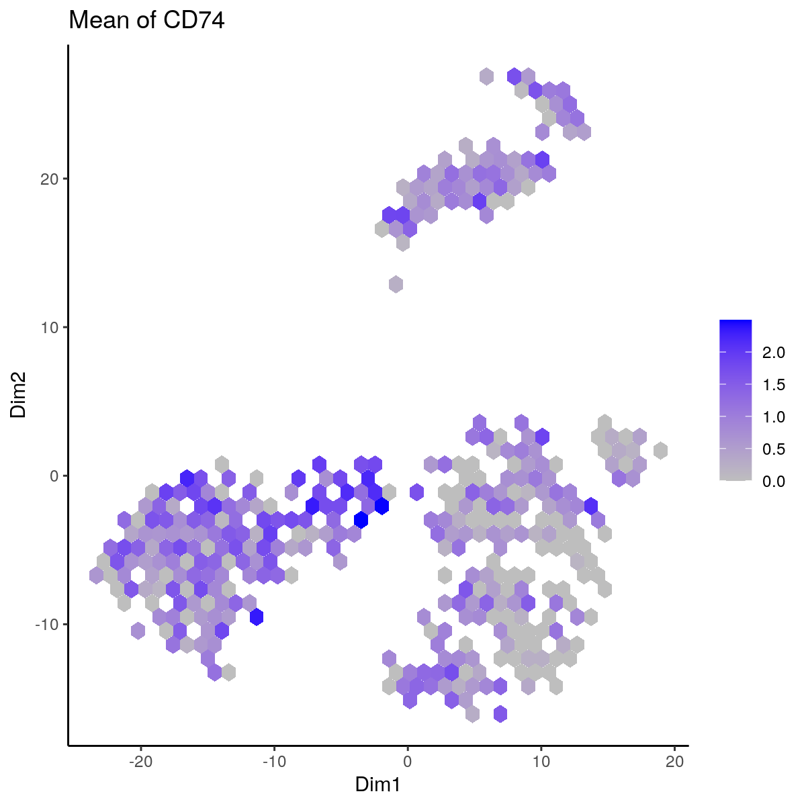|[C1QA](https://www.ncbi.nlm.nih.gov/gene/712) [C1QB](https://www.ncbi.nlm.nih.gov/gene/713) [C1QC](https://www.ncbi.nlm.nih.gov/gene/714) [CD40](https://www.ncbi.nlm.nih.gov/gene/958) [CTSD](https://www.ncbi.nlm.nih.gov/gene/1509) [EGFR](https://www.ncbi.nlm.nih.gov/gene/1956) [GPX3](https://www.ncbi.nlm.nih.gov/gene/2878) [MR1](https://www.ncbi.nlm.nih.gov/gene/3140) [IFNG](https://www.ncbi.nlm.nih.gov/gene/3458) [IL6](https://www.ncbi.nlm.nih.gov/gene/3569) [CXCL8](https://www.ncbi.nlm.nih.gov/gene/3576) [MET](https://www.ncbi.nlm.nih.gov/gene/4233) [MIF](https://www.ncbi.nlm.nih.gov/gene/4282) [CXCL9](https://www.ncbi.nlm.nih.gov/gene/4283) [CCL2](https://www.ncbi.nlm.nih.gov/gene/6347) [CCL5](https://www.ncbi.nlm.nih.gov/gene/6352) [SDC4](https://www.ncbi.nlm.nih.gov/gene/6385) [TNF](https://www.ncbi.nlm.nih.gov/gene/7124) [LY86](https://www.ncbi.nlm.nih.gov/gene/9450) [IFI30](https://www.ncbi.nlm.nih.gov/gene/10437) [MPEG1](https://www.ncbi.nlm.nih.gov/gene/219972)|
|[CD79A](https://www.ncbi.nlm.nih.gov/gene/973)|[AMBP](https://www.ncbi.nlm.nih.gov/gene/259) [CD40](https://www.ncbi.nlm.nih.gov/gene/958) [CHGA](https://www.ncbi.nlm.nih.gov/gene/1113) [FN1](https://www.ncbi.nlm.nih.gov/gene/2335) [JCHAIN](https://www.ncbi.nlm.nih.gov/gene/3512) [IGLL1](https://www.ncbi.nlm.nih.gov/gene/3543) [CXCL9](https://www.ncbi.nlm.nih.gov/gene/4283) [NCAM1](https://www.ncbi.nlm.nih.gov/gene/4684) [PIGR](https://www.ncbi.nlm.nih.gov/gene/5284) [PTEN](https://www.ncbi.nlm.nih.gov/gene/5728) [PVR](https://www.ncbi.nlm.nih.gov/gene/5817) [CREG1](https://www.ncbi.nlm.nih.gov/gene/8804) [CEACAM16](https://www.ncbi.nlm.nih.gov/gene/388551) [IGLL5](https://www.ncbi.nlm.nih.gov/gene/100423062)|
|[CD79B](https://www.ncbi.nlm.nih.gov/gene/974)|[C9](https://www.ncbi.nlm.nih.gov/gene/735) [CD8B](https://www.ncbi.nlm.nih.gov/gene/926) [CD40](https://www.ncbi.nlm.nih.gov/gene/958) [CD40LG](https://www.ncbi.nlm.nih.gov/gene/959) [GH1](https://www.ncbi.nlm.nih.gov/gene/2688) [GH2](https://www.ncbi.nlm.nih.gov/gene/2689) [JCHAIN](https://www.ncbi.nlm.nih.gov/gene/3512) [IGLL1](https://www.ncbi.nlm.nih.gov/gene/3543) [IL4](https://www.ncbi.nlm.nih.gov/gene/3565) [CXCL9](https://www.ncbi.nlm.nih.gov/gene/4283) [PI3](https://www.ncbi.nlm.nih.gov/gene/5266) [PTEN](https://www.ncbi.nlm.nih.gov/gene/5728) [CREG1](https://www.ncbi.nlm.nih.gov/gene/8804) [GDF15](https://www.ncbi.nlm.nih.gov/gene/9518) [IGLL5](https://www.ncbi.nlm.nih.gov/gene/100423062)|
|[CD81](https://www.ncbi.nlm.nih.gov/gene/975)|[ALB](https://www.ncbi.nlm.nih.gov/gene/213) [ANXA2](https://www.ncbi.nlm.nih.gov/gene/302) [APOE](https://www.ncbi.nlm.nih.gov/gene/348) [C3](https://www.ncbi.nlm.nih.gov/gene/718) [CD40](https://www.ncbi.nlm.nih.gov/gene/958) [EGFR](https://www.ncbi.nlm.nih.gov/gene/1956) [FN1](https://www.ncbi.nlm.nih.gov/gene/2335) [IL2](https://www.ncbi.nlm.nih.gov/gene/3558) [ITIH4](https://www.ncbi.nlm.nih.gov/gene/3700) [NCAM1](https://www.ncbi.nlm.nih.gov/gene/4684) [CLEC4M](https://www.ncbi.nlm.nih.gov/gene/10332) [ICOS](https://www.ncbi.nlm.nih.gov/gene/29851) [CD209](https://www.ncbi.nlm.nih.gov/gene/30835) [HAMP](https://www.ncbi.nlm.nih.gov/gene/57817) [PCSK9](https://www.ncbi.nlm.nih.gov/gene/255738)|
|[CD82](https://www.ncbi.nlm.nih.gov/gene/3732) 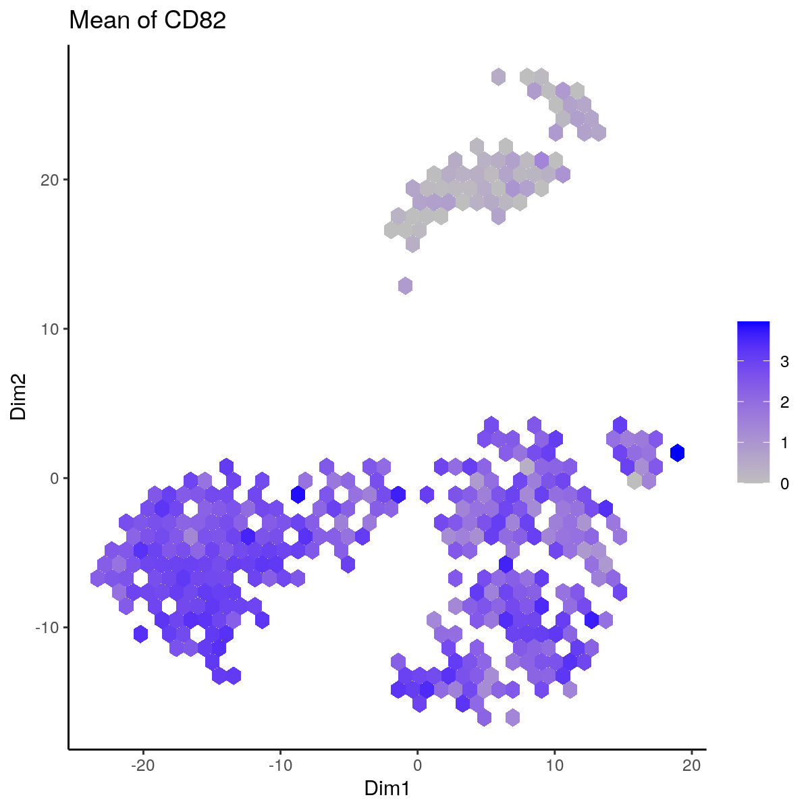|[ANXA2](https://www.ncbi.nlm.nih.gov/gene/302) [EGFR](https://www.ncbi.nlm.nih.gov/gene/1956) [ERBB3](https://www.ncbi.nlm.nih.gov/gene/2065) [FN1](https://www.ncbi.nlm.nih.gov/gene/2335) [IL6](https://www.ncbi.nlm.nih.gov/gene/3569) [KISS1](https://www.ncbi.nlm.nih.gov/gene/3814) [LGALS3BP](https://www.ncbi.nlm.nih.gov/gene/3959) [MET](https://www.ncbi.nlm.nih.gov/gene/4233) [MMP11](https://www.ncbi.nlm.nih.gov/gene/4320) [TIMP1](https://www.ncbi.nlm.nih.gov/gene/7076) [VEGFA](https://www.ncbi.nlm.nih.gov/gene/7422) [IL17RA](https://www.ncbi.nlm.nih.gov/gene/23765) [LIPN](https://www.ncbi.nlm.nih.gov/gene/643418) [MTRNR2L4](https://www.ncbi.nlm.nih.gov/gene/100463285) [MTRNR2L5](https://www.ncbi.nlm.nih.gov/gene/100463289)|
|[CD84](https://www.ncbi.nlm.nih.gov/gene/8832)|[CD40LG](https://www.ncbi.nlm.nih.gov/gene/959) [MPEG1](https://www.ncbi.nlm.nih.gov/gene/219972)|
|[CD86](https://www.ncbi.nlm.nih.gov/gene/942)|[ALB](https://www.ncbi.nlm.nih.gov/gene/213) [FAS](https://www.ncbi.nlm.nih.gov/gene/355) [C1QA](https://www.ncbi.nlm.nih.gov/gene/712) [C1QB](https://www.ncbi.nlm.nih.gov/gene/713) [CAMP](https://www.ncbi.nlm.nih.gov/gene/820) [CD8A](https://www.ncbi.nlm.nih.gov/gene/925) [CD8B](https://www.ncbi.nlm.nih.gov/gene/926) [CD40](https://www.ncbi.nlm.nih.gov/gene/958) [CD40LG](https://www.ncbi.nlm.nih.gov/gene/959) [CSF2](https://www.ncbi.nlm.nih.gov/gene/1437) [CSF3](https://www.ncbi.nlm.nih.gov/gene/1440) [SERPINB1](https://www.ncbi.nlm.nih.gov/gene/1992) [FLT3LG](https://www.ncbi.nlm.nih.gov/gene/2323) [FN1](https://www.ncbi.nlm.nih.gov/gene/2335) [CXCL1](https://www.ncbi.nlm.nih.gov/gene/2919) [CXCL2](https://www.ncbi.nlm.nih.gov/gene/2920) [GZMA](https://www.ncbi.nlm.nih.gov/gene/3001) [IFNA1](https://www.ncbi.nlm.nih.gov/gene/3439) [IFNAR2](https://www.ncbi.nlm.nih.gov/gene/3455) [IFNB1](https://www.ncbi.nlm.nih.gov/gene/3456) [IFNG](https://www.ncbi.nlm.nih.gov/gene/3458) [IL1A](https://www.ncbi.nlm.nih.gov/gene/3552) [IL1RN](https://www.ncbi.nlm.nih.gov/gene/3557) [IL2](https://www.ncbi.nlm.nih.gov/gene/3558) [IL3](https://www.ncbi.nlm.nih.gov/gene/3562) [IL4](https://www.ncbi.nlm.nih.gov/gene/3565) [IL4R](https://www.ncbi.nlm.nih.gov/gene/3566) [IL5](https://www.ncbi.nlm.nih.gov/gene/3567) [IL6](https://www.ncbi.nlm.nih.gov/gene/3569) [IL7](https://www.ncbi.nlm.nih.gov/gene/3574) [IL7R](https://www.ncbi.nlm.nih.gov/gene/3575) [CXCL8](https://www.ncbi.nlm.nih.gov/gene/3576) [IL9](https://www.ncbi.nlm.nih.gov/gene/3578) [IL10](https://www.ncbi.nlm.nih.gov/gene/3586) [IL12A](https://www.ncbi.nlm.nih.gov/gene/3592) [IL12B](https://www.ncbi.nlm.nih.gov/gene/3593) [IL13](https://www.ncbi.nlm.nih.gov/gene/3596) [IL15](https://www.ncbi.nlm.nih.gov/gene/3600) [IL16](https://www.ncbi.nlm.nih.gov/gene/3603) [IL18](https://www.ncbi.nlm.nih.gov/gene/3606) [CXCL10](https://www.ncbi.nlm.nih.gov/gene/3627) [INS](https://www.ncbi.nlm.nih.gov/gene/3630) [LAG3](https://www.ncbi.nlm.nih.gov/gene/3902) [LGALS9](https://www.ncbi.nlm.nih.gov/gene/3965) [LYZ](https://www.ncbi.nlm.nih.gov/gene/4069) [CXCL9](https://www.ncbi.nlm.nih.gov/gene/4283) [MMP9](https://www.ncbi.nlm.nih.gov/gene/4318) [MUC1](https://www.ncbi.nlm.nih.gov/gene/4582) [NCAM1](https://www.ncbi.nlm.nih.gov/gene/4684) [OSM](https://www.ncbi.nlm.nih.gov/gene/5008) [SERPINB2](https://www.ncbi.nlm.nih.gov/gene/5055) [SERPINB5](https://www.ncbi.nlm.nih.gov/gene/5268) [PRF1](https://www.ncbi.nlm.nih.gov/gene/5551) [RNASE6](https://www.ncbi.nlm.nih.gov/gene/6039) [S100A9](https://www.ncbi.nlm.nih.gov/gene/6280) [CCL2](https://www.ncbi.nlm.nih.gov/gene/6347) [CCL3](https://www.ncbi.nlm.nih.gov/gene/6348) [CCL5](https://www.ncbi.nlm.nih.gov/gene/6352) [CCL7](https://www.ncbi.nlm.nih.gov/gene/6354) [CCL8](https://www.ncbi.nlm.nih.gov/gene/6355) [CCL11](https://www.ncbi.nlm.nih.gov/gene/6356) [CCL17](https://www.ncbi.nlm.nih.gov/gene/6361) [CCL18](https://www.ncbi.nlm.nih.gov/gene/6362) [CCL19](https://www.ncbi.nlm.nih.gov/gene/6363) [CCL20](https://www.ncbi.nlm.nih.gov/gene/6364) [CCL21](https://www.ncbi.nlm.nih.gov/gene/6366) [CCL22](https://www.ncbi.nlm.nih.gov/gene/6367) [CXCL11](https://www.ncbi.nlm.nih.gov/gene/6373) [CX3CL1](https://www.ncbi.nlm.nih.gov/gene/6376) [CXCL12](https://www.ncbi.nlm.nih.gov/gene/6387) [PMEL](https://www.ncbi.nlm.nih.gov/gene/6490) [SIGLEC1](https://www.ncbi.nlm.nih.gov/gene/6614) [TNF](https://www.ncbi.nlm.nih.gov/gene/7124) [TNFRSF1A](https://www.ncbi.nlm.nih.gov/gene/7132) [TNFRSF1B](https://www.ncbi.nlm.nih.gov/gene/7133) [VEGFA](https://www.ncbi.nlm.nih.gov/gene/7422) [VIP](https://www.ncbi.nlm.nih.gov/gene/7432) [TNFRSF18](https://www.ncbi.nlm.nih.gov/gene/8784) [NRP1](https://www.ncbi.nlm.nih.gov/gene/8829) [LY86](https://www.ncbi.nlm.nih.gov/gene/9450) [IFI30](https://www.ncbi.nlm.nih.gov/gene/10437) [CXCL13](https://www.ncbi.nlm.nih.gov/gene/10563) [LILRB1](https://www.ncbi.nlm.nih.gov/gene/10859) [FGL2](https://www.ncbi.nlm.nih.gov/gene/10875) [FSTL1](https://www.ncbi.nlm.nih.gov/gene/11167) [LY96](https://www.ncbi.nlm.nih.gov/gene/23643) [ICOS](https://www.ncbi.nlm.nih.gov/gene/29851) [CD209](https://www.ncbi.nlm.nih.gov/gene/30835) [IL23A](https://www.ncbi.nlm.nih.gov/gene/51561) [TREM2](https://www.ncbi.nlm.nih.gov/gene/54209) [TREM1](https://www.ncbi.nlm.nih.gov/gene/54210) [RETNLB](https://www.ncbi.nlm.nih.gov/gene/84666) [TSLP](https://www.ncbi.nlm.nih.gov/gene/85480) [REG3G](https://www.ncbi.nlm.nih.gov/gene/130120) [CD200R1](https://www.ncbi.nlm.nih.gov/gene/131450) [MPEG1](https://www.ncbi.nlm.nih.gov/gene/219972)|
|[CD9](https://www.ncbi.nlm.nih.gov/gene/928)|[ALB](https://www.ncbi.nlm.nih.gov/gene/213) [ALCAM](https://www.ncbi.nlm.nih.gov/gene/214) [ANXA2](https://www.ncbi.nlm.nih.gov/gene/302) [CD40](https://www.ncbi.nlm.nih.gov/gene/958) [EGFR](https://www.ncbi.nlm.nih.gov/gene/1956) [FN1](https://www.ncbi.nlm.nih.gov/gene/2335) [LGALS3BP](https://www.ncbi.nlm.nih.gov/gene/3959) [NCAM1](https://www.ncbi.nlm.nih.gov/gene/4684) [CXCL12](https://www.ncbi.nlm.nih.gov/gene/6387) [VEGFA](https://www.ncbi.nlm.nih.gov/gene/7422) [GDF3](https://www.ncbi.nlm.nih.gov/gene/9573) [IL17RA](https://www.ncbi.nlm.nih.gov/gene/23765) [IZUMO4](https://www.ncbi.nlm.nih.gov/gene/113177)|
|[CD99L2](https://www.ncbi.nlm.nih.gov/gene/83692)|[JAM3](https://www.ncbi.nlm.nih.gov/gene/83700)|
|[CDC42](https://www.ncbi.nlm.nih.gov/gene/998)|[A2M](https://www.ncbi.nlm.nih.gov/gene/2) [ALB](https://www.ncbi.nlm.nih.gov/gene/213) [ANXA2](https://www.ncbi.nlm.nih.gov/gene/302) [BDNF](https://www.ncbi.nlm.nih.gov/gene/627) [ADGRE5](https://www.ncbi.nlm.nih.gov/gene/976) [CCN2](https://www.ncbi.nlm.nih.gov/gene/1490) [EDN1](https://www.ncbi.nlm.nih.gov/gene/1906) [EGFR](https://www.ncbi.nlm.nih.gov/gene/1956) [EPHA3](https://www.ncbi.nlm.nih.gov/gene/2042) [ERBB3](https://www.ncbi.nlm.nih.gov/gene/2065) [FGF2](https://www.ncbi.nlm.nih.gov/gene/2247) [FLT1](https://www.ncbi.nlm.nih.gov/gene/2321) [FN1](https://www.ncbi.nlm.nih.gov/gene/2335) [GSN](https://www.ncbi.nlm.nih.gov/gene/2934) [IGF1](https://www.ncbi.nlm.nih.gov/gene/3479) [IL6](https://www.ncbi.nlm.nih.gov/gene/3569) [CXCL8](https://www.ncbi.nlm.nih.gov/gene/3576) [INS](https://www.ncbi.nlm.nih.gov/gene/3630) [KDR](https://www.ncbi.nlm.nih.gov/gene/3791) [LAMA2](https://www.ncbi.nlm.nih.gov/gene/3908) [LAMA3](https://www.ncbi.nlm.nih.gov/gene/3909) [LAMA4](https://www.ncbi.nlm.nih.gov/gene/3910) [LAMA5](https://www.ncbi.nlm.nih.gov/gene/3911) [LAMB1](https://www.ncbi.nlm.nih.gov/gene/3912) [LAMB2](https://www.ncbi.nlm.nih.gov/gene/3913) [LAMB3](https://www.ncbi.nlm.nih.gov/gene/3914) [LAMC1](https://www.ncbi.nlm.nih.gov/gene/3915) [LAMC2](https://www.ncbi.nlm.nih.gov/gene/3918) [MET](https://www.ncbi.nlm.nih.gov/gene/4233) [MMP1](https://www.ncbi.nlm.nih.gov/gene/4312) [MMP9](https://www.ncbi.nlm.nih.gov/gene/4318) [NGF](https://www.ncbi.nlm.nih.gov/gene/4803) [PI3](https://www.ncbi.nlm.nih.gov/gene/5266) [SERPINA4](https://www.ncbi.nlm.nih.gov/gene/5267) [PLAU](https://www.ncbi.nlm.nih.gov/gene/5328) [PLAUR](https://www.ncbi.nlm.nih.gov/gene/5329) [PLXNB1](https://www.ncbi.nlm.nih.gov/gene/5364) [PTEN](https://www.ncbi.nlm.nih.gov/gene/5728) [CXCL12](https://www.ncbi.nlm.nih.gov/gene/6387) [SLIT1](https://www.ncbi.nlm.nih.gov/gene/6585) [SLIT3](https://www.ncbi.nlm.nih.gov/gene/6586) [SPP1](https://www.ncbi.nlm.nih.gov/gene/6696) [STX1A](https://www.ncbi.nlm.nih.gov/gene/6804) [TNF](https://www.ncbi.nlm.nih.gov/gene/7124) [VEGFA](https://www.ncbi.nlm.nih.gov/gene/7422) [VTN](https://www.ncbi.nlm.nih.gov/gene/7448) [WNT1](https://www.ncbi.nlm.nih.gov/gene/7471) [WNT2](https://www.ncbi.nlm.nih.gov/gene/7472) [WNT5A](https://www.ncbi.nlm.nih.gov/gene/7474) [WNT9B](https://www.ncbi.nlm.nih.gov/gene/7484) [NRP1](https://www.ncbi.nlm.nih.gov/gene/8829) [SLIT2](https://www.ncbi.nlm.nih.gov/gene/9353) [NTN1](https://www.ncbi.nlm.nih.gov/gene/9423) [LAMC3](https://www.ncbi.nlm.nih.gov/gene/10319) [SEMA3A](https://www.ncbi.nlm.nih.gov/gene/10371) [CRB1](https://www.ncbi.nlm.nih.gov/gene/23418) [WNT3A](https://www.ncbi.nlm.nih.gov/gene/89780) [LAMA1](https://www.ncbi.nlm.nih.gov/gene/284217) [EPHA10](https://www.ncbi.nlm.nih.gov/gene/284656) [CRB2](https://www.ncbi.nlm.nih.gov/gene/286204) [IGLL5](https://www.ncbi.nlm.nih.gov/gene/100423062)|
|[CDC42BPB](https://www.ncbi.nlm.nih.gov/gene/9578)|[CBLIF](https://www.ncbi.nlm.nih.gov/gene/2694) [CHRD](https://www.ncbi.nlm.nih.gov/gene/8646) [AMN](https://www.ncbi.nlm.nih.gov/gene/81693)|
|[CDH1](https://www.ncbi.nlm.nih.gov/gene/999)|[BMP2](https://www.ncbi.nlm.nih.gov/gene/650) [BMP4](https://www.ncbi.nlm.nih.gov/gene/652) [BMP6](https://www.ncbi.nlm.nih.gov/gene/654) [BMP7](https://www.ncbi.nlm.nih.gov/gene/655) [CCN2](https://www.ncbi.nlm.nih.gov/gene/1490) [GDNF](https://www.ncbi.nlm.nih.gov/gene/2668) [IGF1](https://www.ncbi.nlm.nih.gov/gene/3479) [IGF2](https://www.ncbi.nlm.nih.gov/gene/3481) [IL4](https://www.ncbi.nlm.nih.gov/gene/3565) [CXCL8](https://www.ncbi.nlm.nih.gov/gene/3576) [INS](https://www.ncbi.nlm.nih.gov/gene/3630) [LEP](https://www.ncbi.nlm.nih.gov/gene/3952) [PLAU](https://www.ncbi.nlm.nih.gov/gene/5328) [SFRP2](https://www.ncbi.nlm.nih.gov/gene/6423) [TGFB1](https://www.ncbi.nlm.nih.gov/gene/7040) [TGFB3](https://www.ncbi.nlm.nih.gov/gene/7043) [TIMP1](https://www.ncbi.nlm.nih.gov/gene/7076) [TIMP2](https://www.ncbi.nlm.nih.gov/gene/7077) [TNF](https://www.ncbi.nlm.nih.gov/gene/7124) [WNT2](https://www.ncbi.nlm.nih.gov/gene/7472) [WNT5A](https://www.ncbi.nlm.nih.gov/gene/7474) [WNT6](https://www.ncbi.nlm.nih.gov/gene/7475) [WNT7B](https://www.ncbi.nlm.nih.gov/gene/7477) [WNT8A](https://www.ncbi.nlm.nih.gov/gene/7478) [WNT2B](https://www.ncbi.nlm.nih.gov/gene/7482) [WNT9A](https://www.ncbi.nlm.nih.gov/gene/7483) [WNT9B](https://www.ncbi.nlm.nih.gov/gene/7484) [CCN6](https://www.ncbi.nlm.nih.gov/gene/8838) [LIPG](https://www.ncbi.nlm.nih.gov/gene/9388) [WNT10A](https://www.ncbi.nlm.nih.gov/gene/80326)|
|[CDH11](https://www.ncbi.nlm.nih.gov/gene/1009)|[BGN](https://www.ncbi.nlm.nih.gov/gene/633) [COL1A1](https://www.ncbi.nlm.nih.gov/gene/1277) [COL1A2](https://www.ncbi.nlm.nih.gov/gene/1278) [COL3A1](https://www.ncbi.nlm.nih.gov/gene/1281) [COL5A1](https://www.ncbi.nlm.nih.gov/gene/1289) [COL5A2](https://www.ncbi.nlm.nih.gov/gene/1290) [COL6A3](https://www.ncbi.nlm.nih.gov/gene/1293) [COL12A1](https://www.ncbi.nlm.nih.gov/gene/1303) [VCAN](https://www.ncbi.nlm.nih.gov/gene/1462) [CCN2](https://www.ncbi.nlm.nih.gov/gene/1490) [DCN](https://www.ncbi.nlm.nih.gov/gene/1634) [FBN1](https://www.ncbi.nlm.nih.gov/gene/2200) [FN1](https://www.ncbi.nlm.nih.gov/gene/2335) [LUM](https://www.ncbi.nlm.nih.gov/gene/4060) [MFAP4](https://www.ncbi.nlm.nih.gov/gene/4239) [CXCL12](https://www.ncbi.nlm.nih.gov/gene/6387) [SPARC](https://www.ncbi.nlm.nih.gov/gene/6678) [ITGBL1](https://www.ncbi.nlm.nih.gov/gene/9358) [ASPN](https://www.ncbi.nlm.nih.gov/gene/54829) [CTHRC1](https://www.ncbi.nlm.nih.gov/gene/115908)|
|[CDH12](https://www.ncbi.nlm.nih.gov/gene/1010)|[SUSD4](https://www.ncbi.nlm.nih.gov/gene/55061)|
|[CDH13](https://www.ncbi.nlm.nih.gov/gene/1012)|[IL16](https://www.ncbi.nlm.nih.gov/gene/3603) [SFRP1](https://www.ncbi.nlm.nih.gov/gene/6422) [TIMP3](https://www.ncbi.nlm.nih.gov/gene/7078) [ADIPOQ](https://www.ncbi.nlm.nih.gov/gene/9370) [WIF1](https://www.ncbi.nlm.nih.gov/gene/11197) [TMEFF2](https://www.ncbi.nlm.nih.gov/gene/23671) [GFOD1](https://www.ncbi.nlm.nih.gov/gene/54438) [WFDC1](https://www.ncbi.nlm.nih.gov/gene/58189) [SCGB3A1](https://www.ncbi.nlm.nih.gov/gene/92304)|
|[CDH15](https://www.ncbi.nlm.nih.gov/gene/1013)|[MET](https://www.ncbi.nlm.nih.gov/gene/4233) [NCAM1](https://www.ncbi.nlm.nih.gov/gene/4684)|
|[CDH16](https://www.ncbi.nlm.nih.gov/gene/1014)|[LOXL2](https://www.ncbi.nlm.nih.gov/gene/4017) [UMOD](https://www.ncbi.nlm.nih.gov/gene/7369) [TINAG](https://www.ncbi.nlm.nih.gov/gene/27283) [LOXL4](https://www.ncbi.nlm.nih.gov/gene/84171)|
|[CDH17](https://www.ncbi.nlm.nih.gov/gene/1015)|[ALB](https://www.ncbi.nlm.nih.gov/gene/213) [EGFR](https://www.ncbi.nlm.nih.gov/gene/1956) [FGF2](https://www.ncbi.nlm.nih.gov/gene/2247) [FN1](https://www.ncbi.nlm.nih.gov/gene/2335) [INS](https://www.ncbi.nlm.nih.gov/gene/3630) [KDR](https://www.ncbi.nlm.nih.gov/gene/3791) [LTBP3](https://www.ncbi.nlm.nih.gov/gene/4054) [MET](https://www.ncbi.nlm.nih.gov/gene/4233) [MMP7](https://www.ncbi.nlm.nih.gov/gene/4316) [MMP9](https://www.ncbi.nlm.nih.gov/gene/4318) [NCAM1](https://www.ncbi.nlm.nih.gov/gene/4684) [PTEN](https://www.ncbi.nlm.nih.gov/gene/5728) [NECTIN1](https://www.ncbi.nlm.nih.gov/gene/5818) [TNF](https://www.ncbi.nlm.nih.gov/gene/7124) [VEGFA](https://www.ncbi.nlm.nih.gov/gene/7422) [VTN](https://www.ncbi.nlm.nih.gov/gene/7448) [VWF](https://www.ncbi.nlm.nih.gov/gene/7450) [WNT1](https://www.ncbi.nlm.nih.gov/gene/7471) [WNT5A](https://www.ncbi.nlm.nih.gov/gene/7474) [NTN1](https://www.ncbi.nlm.nih.gov/gene/9423) [OLFM4](https://www.ncbi.nlm.nih.gov/gene/10562) [SRPX2](https://www.ncbi.nlm.nih.gov/gene/27286) [WNT3A](https://www.ncbi.nlm.nih.gov/gene/89780)|
|[CDH18](https://www.ncbi.nlm.nih.gov/gene/1016)|[CLEC3A](https://www.ncbi.nlm.nih.gov/gene/10143) [NETO1](https://www.ncbi.nlm.nih.gov/gene/81832)|
|[CDH19](https://www.ncbi.nlm.nih.gov/gene/28513)|[AVP](https://www.ncbi.nlm.nih.gov/gene/551) [COL10A1](https://www.ncbi.nlm.nih.gov/gene/1300) [SERPINF2](https://www.ncbi.nlm.nih.gov/gene/5345) [TNR](https://www.ncbi.nlm.nih.gov/gene/7143) [SCRG1](https://www.ncbi.nlm.nih.gov/gene/11341) [HAPLN2](https://www.ncbi.nlm.nih.gov/gene/60484) [GPHA2](https://www.ncbi.nlm.nih.gov/gene/170589)|
|[CDH2](https://www.ncbi.nlm.nih.gov/gene/1000)|[AFP](https://www.ncbi.nlm.nih.gov/gene/174) [ACAN](https://www.ncbi.nlm.nih.gov/gene/176) [AHSG](https://www.ncbi.nlm.nih.gov/gene/197) [ALB](https://www.ncbi.nlm.nih.gov/gene/213) [ALCAM](https://www.ncbi.nlm.nih.gov/gene/214) [AMBN](https://www.ncbi.nlm.nih.gov/gene/258) [AMELX](https://www.ncbi.nlm.nih.gov/gene/265) [AMELY](https://www.ncbi.nlm.nih.gov/gene/266) [ANGPT1](https://www.ncbi.nlm.nih.gov/gene/284) [APOA1](https://www.ncbi.nlm.nih.gov/gene/335) [APOA2](https://www.ncbi.nlm.nih.gov/gene/336) [APOE](https://www.ncbi.nlm.nih.gov/gene/348) [SERPINC1](https://www.ncbi.nlm.nih.gov/gene/462) [BDNF](https://www.ncbi.nlm.nih.gov/gene/627) [BMP2](https://www.ncbi.nlm.nih.gov/gene/650) [BMP4](https://www.ncbi.nlm.nih.gov/gene/652) [BMP7](https://www.ncbi.nlm.nih.gov/gene/655) [C3](https://www.ncbi.nlm.nih.gov/gene/718) [C4A](https://www.ncbi.nlm.nih.gov/gene/720) [DDR1](https://www.ncbi.nlm.nih.gov/gene/780) [CHGB](https://www.ncbi.nlm.nih.gov/gene/1114) [CORT](https://www.ncbi.nlm.nih.gov/gene/1325) [CP](https://www.ncbi.nlm.nih.gov/gene/1356) [CRP](https://www.ncbi.nlm.nih.gov/gene/1401) [VCAN](https://www.ncbi.nlm.nih.gov/gene/1462) [CST3](https://www.ncbi.nlm.nih.gov/gene/1471) [CCN2](https://www.ncbi.nlm.nih.gov/gene/1490) [EFNA1](https://www.ncbi.nlm.nih.gov/gene/1942) [EFNA4](https://www.ncbi.nlm.nih.gov/gene/1945) [EGFR](https://www.ncbi.nlm.nih.gov/gene/1956) [F5](https://www.ncbi.nlm.nih.gov/gene/2153) [FBN1](https://www.ncbi.nlm.nih.gov/gene/2200) [FGF2](https://www.ncbi.nlm.nih.gov/gene/2247) [FGFR4](https://www.ncbi.nlm.nih.gov/gene/2264) [FGG](https://www.ncbi.nlm.nih.gov/gene/2266) [FN1](https://www.ncbi.nlm.nih.gov/gene/2335) [FUCA2](https://www.ncbi.nlm.nih.gov/gene/2519) [GAS6](https://www.ncbi.nlm.nih.gov/gene/2621) [TNC](https://www.ncbi.nlm.nih.gov/gene/3371) [IGF1](https://www.ncbi.nlm.nih.gov/gene/3479) [IGFBP1](https://www.ncbi.nlm.nih.gov/gene/3484) [IGFBP3](https://www.ncbi.nlm.nih.gov/gene/3486) [IGFBP4](https://www.ncbi.nlm.nih.gov/gene/3487) [IGFBP5](https://www.ncbi.nlm.nih.gov/gene/3488) [IGFBP7](https://www.ncbi.nlm.nih.gov/gene/3490) [CCN1](https://www.ncbi.nlm.nih.gov/gene/3491) [IL6](https://www.ncbi.nlm.nih.gov/gene/3569) [INS](https://www.ncbi.nlm.nih.gov/gene/3630) [ITIH2](https://www.ncbi.nlm.nih.gov/gene/3698) [KDR](https://www.ncbi.nlm.nih.gov/gene/3791) [LAMB1](https://www.ncbi.nlm.nih.gov/gene/3912) [LAMB2](https://www.ncbi.nlm.nih.gov/gene/3913) [LAMC1](https://www.ncbi.nlm.nih.gov/gene/3915) [LGALS1](https://www.ncbi.nlm.nih.gov/gene/3956) [LTBP1](https://www.ncbi.nlm.nih.gov/gene/4052) [LTBP3](https://www.ncbi.nlm.nih.gov/gene/4054) [MATN3](https://www.ncbi.nlm.nih.gov/gene/4148) [MET](https://www.ncbi.nlm.nih.gov/gene/4233) [MMP3](https://www.ncbi.nlm.nih.gov/gene/4314) [MMP7](https://www.ncbi.nlm.nih.gov/gene/4316) [MMP9](https://www.ncbi.nlm.nih.gov/gene/4318) [MUC1](https://www.ncbi.nlm.nih.gov/gene/4582) [MUC4](https://www.ncbi.nlm.nih.gov/gene/4585) [NCAM1](https://www.ncbi.nlm.nih.gov/gene/4684) [NGF](https://www.ncbi.nlm.nih.gov/gene/4803) [SERPINE1](https://www.ncbi.nlm.nih.gov/gene/5054) [PENK](https://www.ncbi.nlm.nih.gov/gene/5179) [SERPINA1](https://www.ncbi.nlm.nih.gov/gene/5265) [PROC](https://www.ncbi.nlm.nih.gov/gene/5624) [RELN](https://www.ncbi.nlm.nih.gov/gene/5649) [PTEN](https://www.ncbi.nlm.nih.gov/gene/5728) [QSOX1](https://www.ncbi.nlm.nih.gov/gene/5768) [NECTIN1](https://www.ncbi.nlm.nih.gov/gene/5818) [CXCL12](https://www.ncbi.nlm.nih.gov/gene/6387) [SLIT1](https://www.ncbi.nlm.nih.gov/gene/6585) [SPARC](https://www.ncbi.nlm.nih.gov/gene/6678) [SPP2](https://www.ncbi.nlm.nih.gov/gene/6694) [SPP1](https://www.ncbi.nlm.nih.gov/gene/6696) [TF](https://www.ncbi.nlm.nih.gov/gene/7018) [TGFB1](https://www.ncbi.nlm.nih.gov/gene/7040) [TIMP1](https://www.ncbi.nlm.nih.gov/gene/7076) [TNF](https://www.ncbi.nlm.nih.gov/gene/7124) [VEGFA](https://www.ncbi.nlm.nih.gov/gene/7422) [VGF](https://www.ncbi.nlm.nih.gov/gene/7425) [VTN](https://www.ncbi.nlm.nih.gov/gene/7448) [WNT1](https://www.ncbi.nlm.nih.gov/gene/7471) [WNT2](https://www.ncbi.nlm.nih.gov/gene/7472) [WNT3](https://www.ncbi.nlm.nih.gov/gene/7473) [WNT5A](https://www.ncbi.nlm.nih.gov/gene/7474) [WNT7A](https://www.ncbi.nlm.nih.gov/gene/7476) [WNT11](https://www.ncbi.nlm.nih.gov/gene/7481) [WNT2B](https://www.ncbi.nlm.nih.gov/gene/7482) [SCG2](https://www.ncbi.nlm.nih.gov/gene/7857) [FGF23](https://www.ncbi.nlm.nih.gov/gene/8074) [SPARCL1](https://www.ncbi.nlm.nih.gov/gene/8404) [APOL1](https://www.ncbi.nlm.nih.gov/gene/8542) [STC2](https://www.ncbi.nlm.nih.gov/gene/8614) [BMP15](https://www.ncbi.nlm.nih.gov/gene/9210) [ENAM](https://www.ncbi.nlm.nih.gov/gene/10117) [MSLN](https://www.ncbi.nlm.nih.gov/gene/10232) [FSTL3](https://www.ncbi.nlm.nih.gov/gene/10272) [SEMA3A](https://www.ncbi.nlm.nih.gov/gene/10371) [PRSS23](https://www.ncbi.nlm.nih.gov/gene/11098) [FSTL1](https://www.ncbi.nlm.nih.gov/gene/11167) [DKK1](https://www.ncbi.nlm.nih.gov/gene/22943) [NENF](https://www.ncbi.nlm.nih.gov/gene/29937) [SERPINA10](https://www.ncbi.nlm.nih.gov/gene/51156) [WNT4](https://www.ncbi.nlm.nih.gov/gene/54361) [FAM20A](https://www.ncbi.nlm.nih.gov/gene/54757) [MEPE](https://www.ncbi.nlm.nih.gov/gene/56955) [FAM20C](https://www.ncbi.nlm.nih.gov/gene/56975) [VWA1](https://www.ncbi.nlm.nih.gov/gene/64856) [BPIFB2](https://www.ncbi.nlm.nih.gov/gene/80341) [WNT5B](https://www.ncbi.nlm.nih.gov/gene/81029) [JAM3](https://www.ncbi.nlm.nih.gov/gene/83700) [WNT3A](https://www.ncbi.nlm.nih.gov/gene/89780) [CHRDL1](https://www.ncbi.nlm.nih.gov/gene/91851) [APOA5](https://www.ncbi.nlm.nih.gov/gene/116519) [OLFM3](https://www.ncbi.nlm.nih.gov/gene/118427) [NOTUM](https://www.ncbi.nlm.nih.gov/gene/147111) [PCSK9](https://www.ncbi.nlm.nih.gov/gene/255738) [AMTN](https://www.ncbi.nlm.nih.gov/gene/401138)|
|[CDH20](https://www.ncbi.nlm.nih.gov/gene/28316)|[C17orf67](https://www.ncbi.nlm.nih.gov/gene/339210)|
|[CDH22](https://www.ncbi.nlm.nih.gov/gene/64405)|[CD164](https://www.ncbi.nlm.nih.gov/gene/8763) [HAPLN2](https://www.ncbi.nlm.nih.gov/gene/60484) [NETO1](https://www.ncbi.nlm.nih.gov/gene/81832) [CST9L](https://www.ncbi.nlm.nih.gov/gene/128821) [CST9](https://www.ncbi.nlm.nih.gov/gene/128822) [LGI3](https://www.ncbi.nlm.nih.gov/gene/203190) [LUZP2](https://www.ncbi.nlm.nih.gov/gene/338645)|
|[CDH23](https://www.ncbi.nlm.nih.gov/gene/64072)|[COL11A2](https://www.ncbi.nlm.nih.gov/gene/1302) [COCH](https://www.ncbi.nlm.nih.gov/gene/1690) [IGFALS](https://www.ncbi.nlm.nih.gov/gene/3483) [USH2A](https://www.ncbi.nlm.nih.gov/gene/7399) [WNT8A](https://www.ncbi.nlm.nih.gov/gene/7478) [SRPX2](https://www.ncbi.nlm.nih.gov/gene/27286) [ADAMTS9](https://www.ncbi.nlm.nih.gov/gene/56999) [PCDH15](https://www.ncbi.nlm.nih.gov/gene/65217) [ADAMTS20](https://www.ncbi.nlm.nih.gov/gene/80070) [OSTN](https://www.ncbi.nlm.nih.gov/gene/344901)|
|[CDH26](https://www.ncbi.nlm.nih.gov/gene/60437)|[CCL26](https://www.ncbi.nlm.nih.gov/gene/10344) [C6orf15](https://www.ncbi.nlm.nih.gov/gene/29113) [BMPER](https://www.ncbi.nlm.nih.gov/gene/168667)|
|[CDH3](https://www.ncbi.nlm.nih.gov/gene/1001)|[ECM1](https://www.ncbi.nlm.nih.gov/gene/1893) [EGFR](https://www.ncbi.nlm.nih.gov/gene/1956) [FN1](https://www.ncbi.nlm.nih.gov/gene/2335) [CDCP1](https://www.ncbi.nlm.nih.gov/gene/64866)|
|[CDH4](https://www.ncbi.nlm.nih.gov/gene/1002)|[LTBP3](https://www.ncbi.nlm.nih.gov/gene/4054)|
|[CDH5](https://www.ncbi.nlm.nih.gov/gene/1003)|[BDNF](https://www.ncbi.nlm.nih.gov/gene/627) [BMP4](https://www.ncbi.nlm.nih.gov/gene/652) [FGF1](https://www.ncbi.nlm.nih.gov/gene/2246) [IGF1](https://www.ncbi.nlm.nih.gov/gene/3479) [IL4](https://www.ncbi.nlm.nih.gov/gene/3565) [CXCL8](https://www.ncbi.nlm.nih.gov/gene/3576) [INS](https://www.ncbi.nlm.nih.gov/gene/3630) [TNF](https://www.ncbi.nlm.nih.gov/gene/7124) [WNT2](https://www.ncbi.nlm.nih.gov/gene/7472)|
|[CDH6](https://www.ncbi.nlm.nih.gov/gene/1004)|[LAD1](https://www.ncbi.nlm.nih.gov/gene/3898) [SFRP1](https://www.ncbi.nlm.nih.gov/gene/6422)|
|[CDH7](https://www.ncbi.nlm.nih.gov/gene/1005)|[MIA](https://www.ncbi.nlm.nih.gov/gene/8190) [SIAE](https://www.ncbi.nlm.nih.gov/gene/54414) [LCN6](https://www.ncbi.nlm.nih.gov/gene/158062) [C17orf67](https://www.ncbi.nlm.nih.gov/gene/339210) [LCN10](https://www.ncbi.nlm.nih.gov/gene/414332)|
|[CDH8](https://www.ncbi.nlm.nih.gov/gene/1006)|[CCN2](https://www.ncbi.nlm.nih.gov/gene/1490) [DSCAM](https://www.ncbi.nlm.nih.gov/gene/1826) [NCAM1](https://www.ncbi.nlm.nih.gov/gene/4684) [NELL2](https://www.ncbi.nlm.nih.gov/gene/4753) [CTHRC1](https://www.ncbi.nlm.nih.gov/gene/115908) [OLFM3](https://www.ncbi.nlm.nih.gov/gene/118427)|
|[CDHR1](https://www.ncbi.nlm.nih.gov/gene/92211)|[USH2A](https://www.ncbi.nlm.nih.gov/gene/7399) [CRB1](https://www.ncbi.nlm.nih.gov/gene/23418) [WFDC5](https://www.ncbi.nlm.nih.gov/gene/149708) [C5orf46](https://www.ncbi.nlm.nih.gov/gene/389336)|
|[CDHR5](https://www.ncbi.nlm.nih.gov/gene/53841)|[MUC3A](https://www.ncbi.nlm.nih.gov/gene/4584) [GATD1](https://www.ncbi.nlm.nih.gov/gene/347862)|
|[CDK14](https://www.ncbi.nlm.nih.gov/gene/5218)|[SFN](https://www.ncbi.nlm.nih.gov/gene/2810) [TWSG1](https://www.ncbi.nlm.nih.gov/gene/57045) [RSPRY1](https://www.ncbi.nlm.nih.gov/gene/89970) [SERPINA11](https://www.ncbi.nlm.nih.gov/gene/256394)|
|[CDK5R2](https://www.ncbi.nlm.nih.gov/gene/8941)|[CHGA](https://www.ncbi.nlm.nih.gov/gene/1113) [CHGB](https://www.ncbi.nlm.nih.gov/gene/1114) [BPIFB6](https://www.ncbi.nlm.nih.gov/gene/128859) [LGI3](https://www.ncbi.nlm.nih.gov/gene/203190)|
|[CDON](https://www.ncbi.nlm.nih.gov/gene/50937)|[COL19A1](https://www.ncbi.nlm.nih.gov/gene/1310) [NTN3](https://www.ncbi.nlm.nih.gov/gene/4917)|
|[CEACAM5](https://www.ncbi.nlm.nih.gov/gene/1048)|[SERPINA3](https://www.ncbi.nlm.nih.gov/gene/12) [AFP](https://www.ncbi.nlm.nih.gov/gene/174) [ALB](https://www.ncbi.nlm.nih.gov/gene/213) [KLK3](https://www.ncbi.nlm.nih.gov/gene/354) [CALCA](https://www.ncbi.nlm.nih.gov/gene/796) [CHGA](https://www.ncbi.nlm.nih.gov/gene/1113) [CRP](https://www.ncbi.nlm.nih.gov/gene/1401) [CSF2](https://www.ncbi.nlm.nih.gov/gene/1437) [CSH1](https://www.ncbi.nlm.nih.gov/gene/1442) [EGFR](https://www.ncbi.nlm.nih.gov/gene/1956) [F2](https://www.ncbi.nlm.nih.gov/gene/2147) [FN1](https://www.ncbi.nlm.nih.gov/gene/2335) [GAST](https://www.ncbi.nlm.nih.gov/gene/2520) [GPLD1](https://www.ncbi.nlm.nih.gov/gene/2822) [GRP](https://www.ncbi.nlm.nih.gov/gene/2922) [HP](https://www.ncbi.nlm.nih.gov/gene/3240) [IFNG](https://www.ncbi.nlm.nih.gov/gene/3458) [IGFBP7](https://www.ncbi.nlm.nih.gov/gene/3490) [IL2](https://www.ncbi.nlm.nih.gov/gene/3558) [IL6](https://www.ncbi.nlm.nih.gov/gene/3569) [INS](https://www.ncbi.nlm.nih.gov/gene/3630) [SCGB2A2](https://www.ncbi.nlm.nih.gov/gene/4250) [MUC1](https://www.ncbi.nlm.nih.gov/gene/4582) [MUC5AC](https://www.ncbi.nlm.nih.gov/gene/4586) [MUC6](https://www.ncbi.nlm.nih.gov/gene/4588) [SERPINA1](https://www.ncbi.nlm.nih.gov/gene/5265) [PIP](https://www.ncbi.nlm.nih.gov/gene/5304) [PMEL](https://www.ncbi.nlm.nih.gov/gene/6490) [SST](https://www.ncbi.nlm.nih.gov/gene/6750) [TG](https://www.ncbi.nlm.nih.gov/gene/7038) [VEGFA](https://www.ncbi.nlm.nih.gov/gene/7422) [NAPSA](https://www.ncbi.nlm.nih.gov/gene/9476) [CARTPT](https://www.ncbi.nlm.nih.gov/gene/9607) [MSLN](https://www.ncbi.nlm.nih.gov/gene/10232) [CD209](https://www.ncbi.nlm.nih.gov/gene/30835) [LY6K](https://www.ncbi.nlm.nih.gov/gene/54742) [RAET1G](https://www.ncbi.nlm.nih.gov/gene/353091)|
|[CEACAM6](https://www.ncbi.nlm.nih.gov/gene/4680)|[A1BG](https://www.ncbi.nlm.nih.gov/gene/1) [DEFA4](https://www.ncbi.nlm.nih.gov/gene/1669) [FN1](https://www.ncbi.nlm.nih.gov/gene/2335) [LCN2](https://www.ncbi.nlm.nih.gov/gene/3934) [MUC1](https://www.ncbi.nlm.nih.gov/gene/4582) [PIGR](https://www.ncbi.nlm.nih.gov/gene/5284) [PSAP](https://www.ncbi.nlm.nih.gov/gene/5660) [S100A8](https://www.ncbi.nlm.nih.gov/gene/6279) [AGR2](https://www.ncbi.nlm.nih.gov/gene/10551) [OLFM4](https://www.ncbi.nlm.nih.gov/gene/10562) [MUC5B](https://www.ncbi.nlm.nih.gov/gene/727897)|
|[CEACAM7](https://www.ncbi.nlm.nih.gov/gene/1087)|[GPLD1](https://www.ncbi.nlm.nih.gov/gene/2822) [FCGBP](https://www.ncbi.nlm.nih.gov/gene/8857) [MSLN](https://www.ncbi.nlm.nih.gov/gene/10232) [LY6K](https://www.ncbi.nlm.nih.gov/gene/54742) [RAET1G](https://www.ncbi.nlm.nih.gov/gene/353091)|
|[CEACAM8](https://www.ncbi.nlm.nih.gov/gene/1088)|[AMBP](https://www.ncbi.nlm.nih.gov/gene/259) [BPI](https://www.ncbi.nlm.nih.gov/gene/671) [CAMP](https://www.ncbi.nlm.nih.gov/gene/820) [CSF2](https://www.ncbi.nlm.nih.gov/gene/1437) [CSF3](https://www.ncbi.nlm.nih.gov/gene/1440) [DEFA4](https://www.ncbi.nlm.nih.gov/gene/1669) [FCAR](https://www.ncbi.nlm.nih.gov/gene/2204) [FN1](https://www.ncbi.nlm.nih.gov/gene/2335) [IL6](https://www.ncbi.nlm.nih.gov/gene/3569) [CXCL8](https://www.ncbi.nlm.nih.gov/gene/3576) [MMP8](https://www.ncbi.nlm.nih.gov/gene/4317) [NCAM1](https://www.ncbi.nlm.nih.gov/gene/4684) [PIGR](https://www.ncbi.nlm.nih.gov/gene/5284) [PLAU](https://www.ncbi.nlm.nih.gov/gene/5328) [PLAUR](https://www.ncbi.nlm.nih.gov/gene/5329) [PSAP](https://www.ncbi.nlm.nih.gov/gene/5660) [RNASE3](https://www.ncbi.nlm.nih.gov/gene/6037) [TNFRSF1B](https://www.ncbi.nlm.nih.gov/gene/7133) [OLFM4](https://www.ncbi.nlm.nih.gov/gene/10562)|
|[CELSR1](https://www.ncbi.nlm.nih.gov/gene/9620)|[ASGR1](https://www.ncbi.nlm.nih.gov/gene/432) [WNT5A](https://www.ncbi.nlm.nih.gov/gene/7474) [WNT11](https://www.ncbi.nlm.nih.gov/gene/7481) [FJX1](https://www.ncbi.nlm.nih.gov/gene/24147) [WNT16](https://www.ncbi.nlm.nih.gov/gene/51384) [WNT5B](https://www.ncbi.nlm.nih.gov/gene/81029)|
|[CELSR2](https://www.ncbi.nlm.nih.gov/gene/1952)|[APOA1](https://www.ncbi.nlm.nih.gov/gene/335) [APOC1](https://www.ncbi.nlm.nih.gov/gene/341) [APOC3](https://www.ncbi.nlm.nih.gov/gene/345) [APOE](https://www.ncbi.nlm.nih.gov/gene/348) [CETP](https://www.ncbi.nlm.nih.gov/gene/1071) [MEGF6](https://www.ncbi.nlm.nih.gov/gene/1953) [LIPC](https://www.ncbi.nlm.nih.gov/gene/3990) [WNT11](https://www.ncbi.nlm.nih.gov/gene/7481) [LIPG](https://www.ncbi.nlm.nih.gov/gene/9388) [FJX1](https://www.ncbi.nlm.nih.gov/gene/24147) [EGFL6](https://www.ncbi.nlm.nih.gov/gene/25975) [DKKL1](https://www.ncbi.nlm.nih.gov/gene/27120) [ANGPTL3](https://www.ncbi.nlm.nih.gov/gene/27329) [WNT5B](https://www.ncbi.nlm.nih.gov/gene/81029) [APOA5](https://www.ncbi.nlm.nih.gov/gene/116519) [CILP2](https://www.ncbi.nlm.nih.gov/gene/148113) [PCSK9](https://www.ncbi.nlm.nih.gov/gene/255738) [NPNT](https://www.ncbi.nlm.nih.gov/gene/255743)|
|[CELSR3](https://www.ncbi.nlm.nih.gov/gene/1951)|[PSG1](https://www.ncbi.nlm.nih.gov/gene/5669) [PSG9](https://www.ncbi.nlm.nih.gov/gene/5678) [WNT5A](https://www.ncbi.nlm.nih.gov/gene/7474) [WNT11](https://www.ncbi.nlm.nih.gov/gene/7481) [FJX1](https://www.ncbi.nlm.nih.gov/gene/24147) [WNT5B](https://www.ncbi.nlm.nih.gov/gene/81029)|
|[CEMIP2](https://www.ncbi.nlm.nih.gov/gene/23670)|[ASGR1](https://www.ncbi.nlm.nih.gov/gene/432) [IGFALS](https://www.ncbi.nlm.nih.gov/gene/3483) [ADAMTS4](https://www.ncbi.nlm.nih.gov/gene/9507) [SIAE](https://www.ncbi.nlm.nih.gov/gene/54414) [NYX](https://www.ncbi.nlm.nih.gov/gene/60506) [OLFM3](https://www.ncbi.nlm.nih.gov/gene/118427)|
|[CFC1](https://www.ncbi.nlm.nih.gov/gene/55997)|[GDF1](https://www.ncbi.nlm.nih.gov/gene/2657) [NODAL](https://www.ncbi.nlm.nih.gov/gene/4838) [LEFTY2](https://www.ncbi.nlm.nih.gov/gene/7044) [CER1](https://www.ncbi.nlm.nih.gov/gene/9350) [LEFTY1](https://www.ncbi.nlm.nih.gov/gene/10637) [DAND5](https://www.ncbi.nlm.nih.gov/gene/199699)|
|[CFTR](https://www.ncbi.nlm.nih.gov/gene/1080)|[AGT](https://www.ncbi.nlm.nih.gov/gene/183) [ALB](https://www.ncbi.nlm.nih.gov/gene/213) [APOA2](https://www.ncbi.nlm.nih.gov/gene/336) [AVP](https://www.ncbi.nlm.nih.gov/gene/551) [CLCA1](https://www.ncbi.nlm.nih.gov/gene/1179) [CPA1](https://www.ncbi.nlm.nih.gov/gene/1357) [EDN1](https://www.ncbi.nlm.nih.gov/gene/1906) [EGFR](https://www.ncbi.nlm.nih.gov/gene/1956) [F2](https://www.ncbi.nlm.nih.gov/gene/2147) [GUCA2A](https://www.ncbi.nlm.nih.gov/gene/2980) [GUCA2B](https://www.ncbi.nlm.nih.gov/gene/2981) [IFNG](https://www.ncbi.nlm.nih.gov/gene/3458) [IGF1](https://www.ncbi.nlm.nih.gov/gene/3479) [IGFBP1](https://www.ncbi.nlm.nih.gov/gene/3484) [IL4](https://www.ncbi.nlm.nih.gov/gene/3565) [IL6](https://www.ncbi.nlm.nih.gov/gene/3569) [IL7R](https://www.ncbi.nlm.nih.gov/gene/3575) [CXCL8](https://www.ncbi.nlm.nih.gov/gene/3576) [INS](https://www.ncbi.nlm.nih.gov/gene/3630) [MUC4](https://www.ncbi.nlm.nih.gov/gene/4585) [MUC5AC](https://www.ncbi.nlm.nih.gov/gene/4586) [SERPINA1](https://www.ncbi.nlm.nih.gov/gene/5265) [PRSS1](https://www.ncbi.nlm.nih.gov/gene/5644) [PTEN](https://www.ncbi.nlm.nih.gov/gene/5728) [SCT](https://www.ncbi.nlm.nih.gov/gene/6343) [CCL5](https://www.ncbi.nlm.nih.gov/gene/6352) [CCL11](https://www.ncbi.nlm.nih.gov/gene/6356) [CXCL12](https://www.ncbi.nlm.nih.gov/gene/6387) [SFTPC](https://www.ncbi.nlm.nih.gov/gene/6440) [SPINK1](https://www.ncbi.nlm.nih.gov/gene/6690) [STX1A](https://www.ncbi.nlm.nih.gov/gene/6804) [TAC1](https://www.ncbi.nlm.nih.gov/gene/6863) [TF](https://www.ncbi.nlm.nih.gov/gene/7018) [TNF](https://www.ncbi.nlm.nih.gov/gene/7124) [VIP](https://www.ncbi.nlm.nih.gov/gene/7432) [WNT5A](https://www.ncbi.nlm.nih.gov/gene/7474) [PRSS58](https://www.ncbi.nlm.nih.gov/gene/136541) [MUC5B](https://www.ncbi.nlm.nih.gov/gene/727897)|
|[CHIC2](https://www.ncbi.nlm.nih.gov/gene/26511)|[MDK](https://www.ncbi.nlm.nih.gov/gene/4192) [SPINK2](https://www.ncbi.nlm.nih.gov/gene/6691)|
|[CHRM1](https://www.ncbi.nlm.nih.gov/gene/1128)|[AGT](https://www.ncbi.nlm.nih.gov/gene/183) [AVP](https://www.ncbi.nlm.nih.gov/gene/551) [CCK](https://www.ncbi.nlm.nih.gov/gene/885) [EDN1](https://www.ncbi.nlm.nih.gov/gene/1906) [EDN2](https://www.ncbi.nlm.nih.gov/gene/1907) [EDN3](https://www.ncbi.nlm.nih.gov/gene/1908) [F2](https://www.ncbi.nlm.nih.gov/gene/2147) [GAST](https://www.ncbi.nlm.nih.gov/gene/2520) [GABBR1](https://www.ncbi.nlm.nih.gov/gene/2550) [GCG](https://www.ncbi.nlm.nih.gov/gene/2641) [GNRH1](https://www.ncbi.nlm.nih.gov/gene/2796) [GNRH2](https://www.ncbi.nlm.nih.gov/gene/2797) [GRP](https://www.ncbi.nlm.nih.gov/gene/2922) [KISS1](https://www.ncbi.nlm.nih.gov/gene/3814) [LAMA2](https://www.ncbi.nlm.nih.gov/gene/3908) [LAMA3](https://www.ncbi.nlm.nih.gov/gene/3909) [LAMA4](https://www.ncbi.nlm.nih.gov/gene/3910) [LAMA5](https://www.ncbi.nlm.nih.gov/gene/3911) [LAMB1](https://www.ncbi.nlm.nih.gov/gene/3912) [LAMB2](https://www.ncbi.nlm.nih.gov/gene/3913) [LAMB3](https://www.ncbi.nlm.nih.gov/gene/3914) [LAMC1](https://www.ncbi.nlm.nih.gov/gene/3915) [LAMC2](https://www.ncbi.nlm.nih.gov/gene/3918) [MLN](https://www.ncbi.nlm.nih.gov/gene/4295) [NMB](https://www.ncbi.nlm.nih.gov/gene/4828) [NPY](https://www.ncbi.nlm.nih.gov/gene/4852) [NTS](https://www.ncbi.nlm.nih.gov/gene/4922) [OXT](https://www.ncbi.nlm.nih.gov/gene/5020) [PMCH](https://www.ncbi.nlm.nih.gov/gene/5367) [SAA1](https://www.ncbi.nlm.nih.gov/gene/6288) [CCL11](https://www.ncbi.nlm.nih.gov/gene/6356) [XCL1](https://www.ncbi.nlm.nih.gov/gene/6375) [CXCL12](https://www.ncbi.nlm.nih.gov/gene/6387) [XCL2](https://www.ncbi.nlm.nih.gov/gene/6846) [TAC1](https://www.ncbi.nlm.nih.gov/gene/6863) [TAC3](https://www.ncbi.nlm.nih.gov/gene/6866) [TRH](https://www.ncbi.nlm.nih.gov/gene/7200) [SCGB1A1](https://www.ncbi.nlm.nih.gov/gene/7356) [VIP](https://www.ncbi.nlm.nih.gov/gene/7432) [NPFF](https://www.ncbi.nlm.nih.gov/gene/8620) [LAMC3](https://www.ncbi.nlm.nih.gov/gene/10319) [NMU](https://www.ncbi.nlm.nih.gov/gene/10874) [UTS2](https://www.ncbi.nlm.nih.gov/gene/10911) [GHRL](https://www.ncbi.nlm.nih.gov/gene/51738) [PROK2](https://www.ncbi.nlm.nih.gov/gene/60675) [PROK1](https://www.ncbi.nlm.nih.gov/gene/84432) [NMS](https://www.ncbi.nlm.nih.gov/gene/129521) [CBLN4](https://www.ncbi.nlm.nih.gov/gene/140689) [UTS2B](https://www.ncbi.nlm.nih.gov/gene/257313) [LAMA1](https://www.ncbi.nlm.nih.gov/gene/284217) [QRFP](https://www.ncbi.nlm.nih.gov/gene/347148) [NPS](https://www.ncbi.nlm.nih.gov/gene/594857)|
|[CHRM2](https://www.ncbi.nlm.nih.gov/gene/1129)|[AGT](https://www.ncbi.nlm.nih.gov/gene/183) [AVP](https://www.ncbi.nlm.nih.gov/gene/551) [C3](https://www.ncbi.nlm.nih.gov/gene/718) [C5](https://www.ncbi.nlm.nih.gov/gene/727) [CORT](https://www.ncbi.nlm.nih.gov/gene/1325) [EGFR](https://www.ncbi.nlm.nih.gov/gene/1956) [GABBR1](https://www.ncbi.nlm.nih.gov/gene/2550) [CXCL1](https://www.ncbi.nlm.nih.gov/gene/2919) [CXCL2](https://www.ncbi.nlm.nih.gov/gene/2920) [CXCL3](https://www.ncbi.nlm.nih.gov/gene/2921) [IL7R](https://www.ncbi.nlm.nih.gov/gene/3575) [CXCL8](https://www.ncbi.nlm.nih.gov/gene/3576) [CXCL10](https://www.ncbi.nlm.nih.gov/gene/3627) [CXCL9](https://www.ncbi.nlm.nih.gov/gene/4283) [NPY](https://www.ncbi.nlm.nih.gov/gene/4852) [PDYN](https://www.ncbi.nlm.nih.gov/gene/5173) [PENK](https://www.ncbi.nlm.nih.gov/gene/5179) [PF4](https://www.ncbi.nlm.nih.gov/gene/5196) [PMCH](https://www.ncbi.nlm.nih.gov/gene/5367) [PNOC](https://www.ncbi.nlm.nih.gov/gene/5368) [POMC](https://www.ncbi.nlm.nih.gov/gene/5443) [PPBP](https://www.ncbi.nlm.nih.gov/gene/5473) [PPY](https://www.ncbi.nlm.nih.gov/gene/5539) [PSAP](https://www.ncbi.nlm.nih.gov/gene/5660) [PYY](https://www.ncbi.nlm.nih.gov/gene/5697) [SAA1](https://www.ncbi.nlm.nih.gov/gene/6288) [CCL1](https://www.ncbi.nlm.nih.gov/gene/6346) [CCL5](https://www.ncbi.nlm.nih.gov/gene/6352) [CCL13](https://www.ncbi.nlm.nih.gov/gene/6357) [CCL16](https://www.ncbi.nlm.nih.gov/gene/6360) [CCL19](https://www.ncbi.nlm.nih.gov/gene/6363) [CCL20](https://www.ncbi.nlm.nih.gov/gene/6364) [CCL21](https://www.ncbi.nlm.nih.gov/gene/6366) [CCL25](https://www.ncbi.nlm.nih.gov/gene/6370) [CXCL6](https://www.ncbi.nlm.nih.gov/gene/6372) [CXCL11](https://www.ncbi.nlm.nih.gov/gene/6373) [CXCL5](https://www.ncbi.nlm.nih.gov/gene/6374) [CX3CL1](https://www.ncbi.nlm.nih.gov/gene/6376) [CXCL12](https://www.ncbi.nlm.nih.gov/gene/6387) [SST](https://www.ncbi.nlm.nih.gov/gene/6750) [TF](https://www.ncbi.nlm.nih.gov/gene/7018) [WNT5A](https://www.ncbi.nlm.nih.gov/gene/7474) [APLN](https://www.ncbi.nlm.nih.gov/gene/8862) [INSL5](https://www.ncbi.nlm.nih.gov/gene/10022) [CXCL13](https://www.ncbi.nlm.nih.gov/gene/10563) [CCL27](https://www.ncbi.nlm.nih.gov/gene/10850) [NMU](https://www.ncbi.nlm.nih.gov/gene/10874) [GAL](https://www.ncbi.nlm.nih.gov/gene/51083) [GHRL](https://www.ncbi.nlm.nih.gov/gene/51738) [CCL28](https://www.ncbi.nlm.nih.gov/gene/56477) [RLN3](https://www.ncbi.nlm.nih.gov/gene/117579) [NMS](https://www.ncbi.nlm.nih.gov/gene/129521) [NPB](https://www.ncbi.nlm.nih.gov/gene/256933) [NPW](https://www.ncbi.nlm.nih.gov/gene/283869) [C9orf47](https://www.ncbi.nlm.nih.gov/gene/286223) [CCL4L1](https://www.ncbi.nlm.nih.gov/gene/388372)|
|[CHRM3](https://www.ncbi.nlm.nih.gov/gene/1131)|[AGT](https://www.ncbi.nlm.nih.gov/gene/183) [AVP](https://www.ncbi.nlm.nih.gov/gene/551) [CCK](https://www.ncbi.nlm.nih.gov/gene/885) [EDN1](https://www.ncbi.nlm.nih.gov/gene/1906) [EDN2](https://www.ncbi.nlm.nih.gov/gene/1907) [EDN3](https://www.ncbi.nlm.nih.gov/gene/1908) [F2](https://www.ncbi.nlm.nih.gov/gene/2147) [GAST](https://www.ncbi.nlm.nih.gov/gene/2520) [GCG](https://www.ncbi.nlm.nih.gov/gene/2641) [GNRH1](https://www.ncbi.nlm.nih.gov/gene/2796) [GNRH2](https://www.ncbi.nlm.nih.gov/gene/2797) [GRP](https://www.ncbi.nlm.nih.gov/gene/2922) [KISS1](https://www.ncbi.nlm.nih.gov/gene/3814) [MLN](https://www.ncbi.nlm.nih.gov/gene/4295) [NMB](https://www.ncbi.nlm.nih.gov/gene/4828) [NTS](https://www.ncbi.nlm.nih.gov/gene/4922) [OXT](https://www.ncbi.nlm.nih.gov/gene/5020) [PMCH](https://www.ncbi.nlm.nih.gov/gene/5367) [SAA1](https://www.ncbi.nlm.nih.gov/gene/6288) [XCL1](https://www.ncbi.nlm.nih.gov/gene/6375) [SFTPB](https://www.ncbi.nlm.nih.gov/gene/6439) [XCL2](https://www.ncbi.nlm.nih.gov/gene/6846) [TAC1](https://www.ncbi.nlm.nih.gov/gene/6863) [TAC3](https://www.ncbi.nlm.nih.gov/gene/6866) [TRH](https://www.ncbi.nlm.nih.gov/gene/7200) [NPFF](https://www.ncbi.nlm.nih.gov/gene/8620) [NMU](https://www.ncbi.nlm.nih.gov/gene/10874) [UTS2](https://www.ncbi.nlm.nih.gov/gene/10911) [PROK2](https://www.ncbi.nlm.nih.gov/gene/60675) [PROK1](https://www.ncbi.nlm.nih.gov/gene/84432) [NMS](https://www.ncbi.nlm.nih.gov/gene/129521) [UTS2B](https://www.ncbi.nlm.nih.gov/gene/257313) [QRFP](https://www.ncbi.nlm.nih.gov/gene/347148) [NPS](https://www.ncbi.nlm.nih.gov/gene/594857)|
|[CHRM4](https://www.ncbi.nlm.nih.gov/gene/1132)|[AGT](https://www.ncbi.nlm.nih.gov/gene/183) [C3](https://www.ncbi.nlm.nih.gov/gene/718) [C5](https://www.ncbi.nlm.nih.gov/gene/727) [CORT](https://www.ncbi.nlm.nih.gov/gene/1325) [GABBR1](https://www.ncbi.nlm.nih.gov/gene/2550) [CXCL1](https://www.ncbi.nlm.nih.gov/gene/2919) [CXCL2](https://www.ncbi.nlm.nih.gov/gene/2920) [CXCL3](https://www.ncbi.nlm.nih.gov/gene/2921) [CXCL8](https://www.ncbi.nlm.nih.gov/gene/3576) [CXCL10](https://www.ncbi.nlm.nih.gov/gene/3627) [CXCL9](https://www.ncbi.nlm.nih.gov/gene/4283) [NPY](https://www.ncbi.nlm.nih.gov/gene/4852) [PDYN](https://www.ncbi.nlm.nih.gov/gene/5173) [PENK](https://www.ncbi.nlm.nih.gov/gene/5179) [PF4](https://www.ncbi.nlm.nih.gov/gene/5196) [PMCH](https://www.ncbi.nlm.nih.gov/gene/5367) [PNOC](https://www.ncbi.nlm.nih.gov/gene/5368) [POMC](https://www.ncbi.nlm.nih.gov/gene/5443) [PPBP](https://www.ncbi.nlm.nih.gov/gene/5473) [PPY](https://www.ncbi.nlm.nih.gov/gene/5539) [PSAP](https://www.ncbi.nlm.nih.gov/gene/5660) [PYY](https://www.ncbi.nlm.nih.gov/gene/5697) [SAA1](https://www.ncbi.nlm.nih.gov/gene/6288) [CCL1](https://www.ncbi.nlm.nih.gov/gene/6346) [CCL5](https://www.ncbi.nlm.nih.gov/gene/6352) [CCL13](https://www.ncbi.nlm.nih.gov/gene/6357) [CCL16](https://www.ncbi.nlm.nih.gov/gene/6360) [CCL19](https://www.ncbi.nlm.nih.gov/gene/6363) [CCL20](https://www.ncbi.nlm.nih.gov/gene/6364) [CCL21](https://www.ncbi.nlm.nih.gov/gene/6366) [CCL25](https://www.ncbi.nlm.nih.gov/gene/6370) [CXCL6](https://www.ncbi.nlm.nih.gov/gene/6372) [CXCL11](https://www.ncbi.nlm.nih.gov/gene/6373) [CXCL5](https://www.ncbi.nlm.nih.gov/gene/6374) [CX3CL1](https://www.ncbi.nlm.nih.gov/gene/6376) [CXCL12](https://www.ncbi.nlm.nih.gov/gene/6387) [SST](https://www.ncbi.nlm.nih.gov/gene/6750) [APLN](https://www.ncbi.nlm.nih.gov/gene/8862) [INSL5](https://www.ncbi.nlm.nih.gov/gene/10022) [CXCL13](https://www.ncbi.nlm.nih.gov/gene/10563) [CCL27](https://www.ncbi.nlm.nih.gov/gene/10850) [NMU](https://www.ncbi.nlm.nih.gov/gene/10874) [GAL](https://www.ncbi.nlm.nih.gov/gene/51083) [CCL28](https://www.ncbi.nlm.nih.gov/gene/56477) [APOL4](https://www.ncbi.nlm.nih.gov/gene/80832) [RLN3](https://www.ncbi.nlm.nih.gov/gene/117579) [NMS](https://www.ncbi.nlm.nih.gov/gene/129521) [NPB](https://www.ncbi.nlm.nih.gov/gene/256933) [NPW](https://www.ncbi.nlm.nih.gov/gene/283869) [C9orf47](https://www.ncbi.nlm.nih.gov/gene/286223) [CCL4L1](https://www.ncbi.nlm.nih.gov/gene/388372)|
|[CHRM5](https://www.ncbi.nlm.nih.gov/gene/1133)|[AGT](https://www.ncbi.nlm.nih.gov/gene/183) [AVP](https://www.ncbi.nlm.nih.gov/gene/551) [CCK](https://www.ncbi.nlm.nih.gov/gene/885) [EDN1](https://www.ncbi.nlm.nih.gov/gene/1906) [EDN2](https://www.ncbi.nlm.nih.gov/gene/1907) [EDN3](https://www.ncbi.nlm.nih.gov/gene/1908) [F2](https://www.ncbi.nlm.nih.gov/gene/2147) [GAST](https://www.ncbi.nlm.nih.gov/gene/2520) [GCG](https://www.ncbi.nlm.nih.gov/gene/2641) [GNRH1](https://www.ncbi.nlm.nih.gov/gene/2796) [GNRH2](https://www.ncbi.nlm.nih.gov/gene/2797) [GRP](https://www.ncbi.nlm.nih.gov/gene/2922) [KISS1](https://www.ncbi.nlm.nih.gov/gene/3814) [MLN](https://www.ncbi.nlm.nih.gov/gene/4295) [NMB](https://www.ncbi.nlm.nih.gov/gene/4828) [NTS](https://www.ncbi.nlm.nih.gov/gene/4922) [OXT](https://www.ncbi.nlm.nih.gov/gene/5020) [PMCH](https://www.ncbi.nlm.nih.gov/gene/5367) [SAA1](https://www.ncbi.nlm.nih.gov/gene/6288) [XCL1](https://www.ncbi.nlm.nih.gov/gene/6375) [XCL2](https://www.ncbi.nlm.nih.gov/gene/6846) [TAC1](https://www.ncbi.nlm.nih.gov/gene/6863) [TAC3](https://www.ncbi.nlm.nih.gov/gene/6866) [TRH](https://www.ncbi.nlm.nih.gov/gene/7200) [NPFF](https://www.ncbi.nlm.nih.gov/gene/8620) [NMU](https://www.ncbi.nlm.nih.gov/gene/10874) [UTS2](https://www.ncbi.nlm.nih.gov/gene/10911) [PROK2](https://www.ncbi.nlm.nih.gov/gene/60675) [PROK1](https://www.ncbi.nlm.nih.gov/gene/84432) [NMS](https://www.ncbi.nlm.nih.gov/gene/129521) [UTS2B](https://www.ncbi.nlm.nih.gov/gene/257313) [QRFP](https://www.ncbi.nlm.nih.gov/gene/347148) [NPS](https://www.ncbi.nlm.nih.gov/gene/594857)|
|[CLCA4](https://www.ncbi.nlm.nih.gov/gene/22802)|[CLCA1](https://www.ncbi.nlm.nih.gov/gene/1179) [GUCA2A](https://www.ncbi.nlm.nih.gov/gene/2980) [GUCA2B](https://www.ncbi.nlm.nih.gov/gene/2981) [IGFBP1](https://www.ncbi.nlm.nih.gov/gene/3484) [PLA2G10](https://www.ncbi.nlm.nih.gov/gene/8399) [FCGBP](https://www.ncbi.nlm.nih.gov/gene/8857) [EDIL3](https://www.ncbi.nlm.nih.gov/gene/10085) [NXPE4](https://www.ncbi.nlm.nih.gov/gene/54827) [ZG16](https://www.ncbi.nlm.nih.gov/gene/653808)|
|[CLCN1](https://www.ncbi.nlm.nih.gov/gene/1180)|[AOC1](https://www.ncbi.nlm.nih.gov/gene/26) [CLCF1](https://www.ncbi.nlm.nih.gov/gene/23529)|
|[CLCN2](https://www.ncbi.nlm.nih.gov/gene/1181)|[CHRD](https://www.ncbi.nlm.nih.gov/gene/8646) [CLCF1](https://www.ncbi.nlm.nih.gov/gene/23529)|
|[CLCNKB](https://www.ncbi.nlm.nih.gov/gene/1188)|[REN](https://www.ncbi.nlm.nih.gov/gene/5972)|
|[CLDN11](https://www.ncbi.nlm.nih.gov/gene/5010)|[AMH](https://www.ncbi.nlm.nih.gov/gene/268) [JAM3](https://www.ncbi.nlm.nih.gov/gene/83700) [EPPIN-WFDC6](https://www.ncbi.nlm.nih.gov/gene/100526773)|
|[CLDN12](https://www.ncbi.nlm.nih.gov/gene/9069)|[FUCA2](https://www.ncbi.nlm.nih.gov/gene/2519) [ANGPTL7](https://www.ncbi.nlm.nih.gov/gene/10218) [JAM3](https://www.ncbi.nlm.nih.gov/gene/83700) [LEAP2](https://www.ncbi.nlm.nih.gov/gene/116842)|
|[CLDN5](https://www.ncbi.nlm.nih.gov/gene/7122) 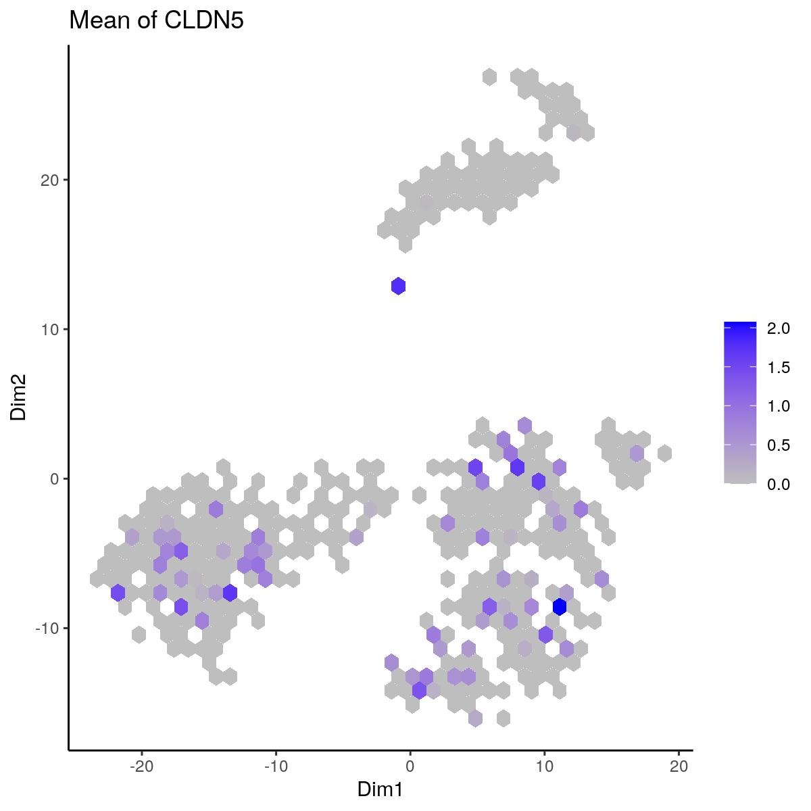|[CXCL8](https://www.ncbi.nlm.nih.gov/gene/3576) [TNF](https://www.ncbi.nlm.nih.gov/gene/7124)|
|[CLDN7](https://www.ncbi.nlm.nih.gov/gene/1366)|[MUC1](https://www.ncbi.nlm.nih.gov/gene/4582) [PRSS8](https://www.ncbi.nlm.nih.gov/gene/5652) [SPINT1](https://www.ncbi.nlm.nih.gov/gene/6692) [HHIPL1](https://www.ncbi.nlm.nih.gov/gene/84439) [MUC15](https://www.ncbi.nlm.nih.gov/gene/143662) [FREM1](https://www.ncbi.nlm.nih.gov/gene/158326) [MUC20](https://www.ncbi.nlm.nih.gov/gene/200958)|
|[CLEC12A](https://www.ncbi.nlm.nih.gov/gene/160364)|[FCAR](https://www.ncbi.nlm.nih.gov/gene/2204) [FCN1](https://www.ncbi.nlm.nih.gov/gene/2219) [FCN2](https://www.ncbi.nlm.nih.gov/gene/2220) [PLAU](https://www.ncbi.nlm.nih.gov/gene/5328) [PLAUR](https://www.ncbi.nlm.nih.gov/gene/5329) [S100A12](https://www.ncbi.nlm.nih.gov/gene/6283) [SIGLEC1](https://www.ncbi.nlm.nih.gov/gene/6614) [TNFRSF1B](https://www.ncbi.nlm.nih.gov/gene/7133) [TREM1](https://www.ncbi.nlm.nih.gov/gene/54210) [COLEC11](https://www.ncbi.nlm.nih.gov/gene/78989)|
|[CLEC12B](https://www.ncbi.nlm.nih.gov/gene/387837)|[SIGLEC1](https://www.ncbi.nlm.nih.gov/gene/6614)|
|[CLEC2A](https://www.ncbi.nlm.nih.gov/gene/387836)|[MET](https://www.ncbi.nlm.nih.gov/gene/4233) [WNT10A](https://www.ncbi.nlm.nih.gov/gene/80326)|
|[CLEC4A](https://www.ncbi.nlm.nih.gov/gene/50856)|[CD40](https://www.ncbi.nlm.nih.gov/gene/958) [FCN1](https://www.ncbi.nlm.nih.gov/gene/2219) [SIGLEC1](https://www.ncbi.nlm.nih.gov/gene/6614) [TNF](https://www.ncbi.nlm.nih.gov/gene/7124) [CLEC3A](https://www.ncbi.nlm.nih.gov/gene/10143) [FGL2](https://www.ncbi.nlm.nih.gov/gene/10875) [PILRA](https://www.ncbi.nlm.nih.gov/gene/29992)|
|[CLEC4C](https://www.ncbi.nlm.nih.gov/gene/170482)|[CD40](https://www.ncbi.nlm.nih.gov/gene/958) [CD40LG](https://www.ncbi.nlm.nih.gov/gene/959) [CSF2](https://www.ncbi.nlm.nih.gov/gene/1437) [FCAR](https://www.ncbi.nlm.nih.gov/gene/2204) [FLT3LG](https://www.ncbi.nlm.nih.gov/gene/2323) [IFNA1](https://www.ncbi.nlm.nih.gov/gene/3439) [IL3](https://www.ncbi.nlm.nih.gov/gene/3562) [IL4](https://www.ncbi.nlm.nih.gov/gene/3565) [IL6](https://www.ncbi.nlm.nih.gov/gene/3569) [IL10](https://www.ncbi.nlm.nih.gov/gene/3586) [NCAM1](https://www.ncbi.nlm.nih.gov/gene/4684) [PLAU](https://www.ncbi.nlm.nih.gov/gene/5328) [SEMA3F](https://www.ncbi.nlm.nih.gov/gene/6405) [TNF](https://www.ncbi.nlm.nih.gov/gene/7124) [NRP2](https://www.ncbi.nlm.nih.gov/gene/8828) [NRP1](https://www.ncbi.nlm.nih.gov/gene/8829) [TREM2](https://www.ncbi.nlm.nih.gov/gene/54209) [LAMA1](https://www.ncbi.nlm.nih.gov/gene/284217)|
|[CLEC4G](https://www.ncbi.nlm.nih.gov/gene/339390)|[LAG3](https://www.ncbi.nlm.nih.gov/gene/3902) [LGALS3](https://www.ncbi.nlm.nih.gov/gene/3958) [PILRA](https://www.ncbi.nlm.nih.gov/gene/29992)|
|[CLEC5A](https://www.ncbi.nlm.nih.gov/gene/23601)|[FCAR](https://www.ncbi.nlm.nih.gov/gene/2204) [PLAU](https://www.ncbi.nlm.nih.gov/gene/5328) [PLAUR](https://www.ncbi.nlm.nih.gov/gene/5329) [SIGLEC1](https://www.ncbi.nlm.nih.gov/gene/6614) [TNF](https://www.ncbi.nlm.nih.gov/gene/7124) [TNFRSF1B](https://www.ncbi.nlm.nih.gov/gene/7133) [LY86](https://www.ncbi.nlm.nih.gov/gene/9450) [TREM2](https://www.ncbi.nlm.nih.gov/gene/54209) [TREM1](https://www.ncbi.nlm.nih.gov/gene/54210) [OSCAR](https://www.ncbi.nlm.nih.gov/gene/126014) [TREML4](https://www.ncbi.nlm.nih.gov/gene/285852)|
|[CLECL1](https://www.ncbi.nlm.nih.gov/gene/160365)|[CD40](https://www.ncbi.nlm.nih.gov/gene/958) [RETNLB](https://www.ncbi.nlm.nih.gov/gene/84666)|
|[CLIC6](https://www.ncbi.nlm.nih.gov/gene/54102)|[ITGBL1](https://www.ncbi.nlm.nih.gov/gene/9358) [ENPP5](https://www.ncbi.nlm.nih.gov/gene/59084)|
|[CLIP3](https://www.ncbi.nlm.nih.gov/gene/25999)|[TNF](https://www.ncbi.nlm.nih.gov/gene/7124) [TNFRSF1A](https://www.ncbi.nlm.nih.gov/gene/7132)|
|[CLRN1](https://www.ncbi.nlm.nih.gov/gene/7401)|[COCH](https://www.ncbi.nlm.nih.gov/gene/1690) [USH2A](https://www.ncbi.nlm.nih.gov/gene/7399) [CRB1](https://www.ncbi.nlm.nih.gov/gene/23418) [PCDH15](https://www.ncbi.nlm.nih.gov/gene/65217)|
|[CLSTN2](https://www.ncbi.nlm.nih.gov/gene/64084)|[ACAN](https://www.ncbi.nlm.nih.gov/gene/176) [COL2A1](https://www.ncbi.nlm.nih.gov/gene/1280) [CCN2](https://www.ncbi.nlm.nih.gov/gene/1490) [GUCA2A](https://www.ncbi.nlm.nih.gov/gene/2980)|
|[CLSTN3](https://www.ncbi.nlm.nih.gov/gene/9746)|[HAPLN4](https://www.ncbi.nlm.nih.gov/gene/404037)|
|[CLTRN](https://www.ncbi.nlm.nih.gov/gene/57393)|[INS](https://www.ncbi.nlm.nih.gov/gene/3630) [REN](https://www.ncbi.nlm.nih.gov/gene/5972) [UMOD](https://www.ncbi.nlm.nih.gov/gene/7369) [SCGB1C1](https://www.ncbi.nlm.nih.gov/gene/147199) [C1QTNF12](https://www.ncbi.nlm.nih.gov/gene/388581) [SCGB1C2](https://www.ncbi.nlm.nih.gov/gene/653486)|
|[CMKLR1](https://www.ncbi.nlm.nih.gov/gene/1240)|[IL6](https://www.ncbi.nlm.nih.gov/gene/3569) [RARRES2](https://www.ncbi.nlm.nih.gov/gene/5919) [CCL19](https://www.ncbi.nlm.nih.gov/gene/6363) [CXCL12](https://www.ncbi.nlm.nih.gov/gene/6387) [TNF](https://www.ncbi.nlm.nih.gov/gene/7124) [ADIPOQ](https://www.ncbi.nlm.nih.gov/gene/9370) [SERPINA12](https://www.ncbi.nlm.nih.gov/gene/145264) [ADAMTSL5](https://www.ncbi.nlm.nih.gov/gene/339366)|
|[CMTM6](https://www.ncbi.nlm.nih.gov/gene/54918)|[FCAR](https://www.ncbi.nlm.nih.gov/gene/2204) [PIGR](https://www.ncbi.nlm.nih.gov/gene/5284) [PLAU](https://www.ncbi.nlm.nih.gov/gene/5328) [PLAUR](https://www.ncbi.nlm.nih.gov/gene/5329) [PSAP](https://www.ncbi.nlm.nih.gov/gene/5660) [TNFRSF1B](https://www.ncbi.nlm.nih.gov/gene/7133)|
|[CNNM1](https://www.ncbi.nlm.nih.gov/gene/26507)|[HPSE2](https://www.ncbi.nlm.nih.gov/gene/60495) [HHIPL1](https://www.ncbi.nlm.nih.gov/gene/84439) [DEFB127](https://www.ncbi.nlm.nih.gov/gene/140850) [LIPK](https://www.ncbi.nlm.nih.gov/gene/643414)|
|[CNNM2](https://www.ncbi.nlm.nih.gov/gene/54805)|[FBN2](https://www.ncbi.nlm.nih.gov/gene/2201) [FGF1](https://www.ncbi.nlm.nih.gov/gene/2246) [ITIH3](https://www.ncbi.nlm.nih.gov/gene/3699) [MMP16](https://www.ncbi.nlm.nih.gov/gene/4325) [HPSE2](https://www.ncbi.nlm.nih.gov/gene/60495) [HHIPL1](https://www.ncbi.nlm.nih.gov/gene/84439)|
|[CNNM3](https://www.ncbi.nlm.nih.gov/gene/26505)|[HPSE2](https://www.ncbi.nlm.nih.gov/gene/60495)|
|[CNNM4](https://www.ncbi.nlm.nih.gov/gene/26504)|[AMELX](https://www.ncbi.nlm.nih.gov/gene/265) [AMELY](https://www.ncbi.nlm.nih.gov/gene/266) [MMP20](https://www.ncbi.nlm.nih.gov/gene/9313) [ENAM](https://www.ncbi.nlm.nih.gov/gene/10117) [FAM20A](https://www.ncbi.nlm.nih.gov/gene/54757) [HPSE2](https://www.ncbi.nlm.nih.gov/gene/60495) [ODAPH](https://www.ncbi.nlm.nih.gov/gene/152816)|
|[CNR1](https://www.ncbi.nlm.nih.gov/gene/1268)|[AGRP](https://www.ncbi.nlm.nih.gov/gene/181) [AGT](https://www.ncbi.nlm.nih.gov/gene/183) [ALB](https://www.ncbi.nlm.nih.gov/gene/213) [BDNF](https://www.ncbi.nlm.nih.gov/gene/627) [C3](https://www.ncbi.nlm.nih.gov/gene/718) [C5](https://www.ncbi.nlm.nih.gov/gene/727) [CALCA](https://www.ncbi.nlm.nih.gov/gene/796) [SERPINA6](https://www.ncbi.nlm.nih.gov/gene/866) [CCK](https://www.ncbi.nlm.nih.gov/gene/885) [COL1A1](https://www.ncbi.nlm.nih.gov/gene/1277) [CORT](https://www.ncbi.nlm.nih.gov/gene/1325) [CRH](https://www.ncbi.nlm.nih.gov/gene/1392) [GABBR1](https://www.ncbi.nlm.nih.gov/gene/2550) [GCG](https://www.ncbi.nlm.nih.gov/gene/2641) [CXCL1](https://www.ncbi.nlm.nih.gov/gene/2919) [CXCL2](https://www.ncbi.nlm.nih.gov/gene/2920) [CXCL3](https://www.ncbi.nlm.nih.gov/gene/2921) [IL4](https://www.ncbi.nlm.nih.gov/gene/3565) [IL6](https://www.ncbi.nlm.nih.gov/gene/3569) [CXCL8](https://www.ncbi.nlm.nih.gov/gene/3576) [CXCL10](https://www.ncbi.nlm.nih.gov/gene/3627) [INS](https://www.ncbi.nlm.nih.gov/gene/3630) [LEP](https://www.ncbi.nlm.nih.gov/gene/3952) [CXCL9](https://www.ncbi.nlm.nih.gov/gene/4283) [NGF](https://www.ncbi.nlm.nih.gov/gene/4803) [NPY](https://www.ncbi.nlm.nih.gov/gene/4852) [NTS](https://www.ncbi.nlm.nih.gov/gene/4922) [OXT](https://www.ncbi.nlm.nih.gov/gene/5020) [PDYN](https://www.ncbi.nlm.nih.gov/gene/5173) [PENK](https://www.ncbi.nlm.nih.gov/gene/5179) [PF4](https://www.ncbi.nlm.nih.gov/gene/5196) [PI3](https://www.ncbi.nlm.nih.gov/gene/5266) [PMCH](https://www.ncbi.nlm.nih.gov/gene/5367) [PNOC](https://www.ncbi.nlm.nih.gov/gene/5368) [POMC](https://www.ncbi.nlm.nih.gov/gene/5443) [PPBP](https://www.ncbi.nlm.nih.gov/gene/5473) [PPY](https://www.ncbi.nlm.nih.gov/gene/5539) [PSAP](https://www.ncbi.nlm.nih.gov/gene/5660) [PYY](https://www.ncbi.nlm.nih.gov/gene/5697) [SAA1](https://www.ncbi.nlm.nih.gov/gene/6288) [CCL1](https://www.ncbi.nlm.nih.gov/gene/6346) [CCL5](https://www.ncbi.nlm.nih.gov/gene/6352) [CCL13](https://www.ncbi.nlm.nih.gov/gene/6357) [CCL16](https://www.ncbi.nlm.nih.gov/gene/6360) [CCL19](https://www.ncbi.nlm.nih.gov/gene/6363) [CCL20](https://www.ncbi.nlm.nih.gov/gene/6364) [CCL21](https://www.ncbi.nlm.nih.gov/gene/6366) [CCL25](https://www.ncbi.nlm.nih.gov/gene/6370) [CXCL6](https://www.ncbi.nlm.nih.gov/gene/6372) [CXCL11](https://www.ncbi.nlm.nih.gov/gene/6373) [CXCL5](https://www.ncbi.nlm.nih.gov/gene/6374) [CX3CL1](https://www.ncbi.nlm.nih.gov/gene/6376) [CXCL12](https://www.ncbi.nlm.nih.gov/gene/6387) [SST](https://www.ncbi.nlm.nih.gov/gene/6750) [TAC1](https://www.ncbi.nlm.nih.gov/gene/6863) [TCN2](https://www.ncbi.nlm.nih.gov/gene/6948) [TIMP1](https://www.ncbi.nlm.nih.gov/gene/7076) [TNF](https://www.ncbi.nlm.nih.gov/gene/7124) [CPZ](https://www.ncbi.nlm.nih.gov/gene/8532) [APLN](https://www.ncbi.nlm.nih.gov/gene/8862) [ADIPOQ](https://www.ncbi.nlm.nih.gov/gene/9370) [CARTPT](https://www.ncbi.nlm.nih.gov/gene/9607) [INSL5](https://www.ncbi.nlm.nih.gov/gene/10022) [CXCL13](https://www.ncbi.nlm.nih.gov/gene/10563) [CCL27](https://www.ncbi.nlm.nih.gov/gene/10850) [NMU](https://www.ncbi.nlm.nih.gov/gene/10874) [GAL](https://www.ncbi.nlm.nih.gov/gene/51083) [GHRL](https://www.ncbi.nlm.nih.gov/gene/51738) [CCL28](https://www.ncbi.nlm.nih.gov/gene/56477) [RLN3](https://www.ncbi.nlm.nih.gov/gene/117579) [NMS](https://www.ncbi.nlm.nih.gov/gene/129521) [CCDC80](https://www.ncbi.nlm.nih.gov/gene/151887) [NPB](https://www.ncbi.nlm.nih.gov/gene/256933) [NPW](https://www.ncbi.nlm.nih.gov/gene/283869) [C9orf47](https://www.ncbi.nlm.nih.gov/gene/286223) [CCL4L1](https://www.ncbi.nlm.nih.gov/gene/388372) [NPS](https://www.ncbi.nlm.nih.gov/gene/594857)|
|[CNR2](https://www.ncbi.nlm.nih.gov/gene/1269)|[AGT](https://www.ncbi.nlm.nih.gov/gene/183) [ALB](https://www.ncbi.nlm.nih.gov/gene/213) [C3](https://www.ncbi.nlm.nih.gov/gene/718) [C5](https://www.ncbi.nlm.nih.gov/gene/727) [CCK](https://www.ncbi.nlm.nih.gov/gene/885) [CORT](https://www.ncbi.nlm.nih.gov/gene/1325) [GABBR1](https://www.ncbi.nlm.nih.gov/gene/2550) [CXCL1](https://www.ncbi.nlm.nih.gov/gene/2919) [CXCL2](https://www.ncbi.nlm.nih.gov/gene/2920) [CXCL3](https://www.ncbi.nlm.nih.gov/gene/2921) [IL6](https://www.ncbi.nlm.nih.gov/gene/3569) [CXCL8](https://www.ncbi.nlm.nih.gov/gene/3576) [CXCL10](https://www.ncbi.nlm.nih.gov/gene/3627) [INS](https://www.ncbi.nlm.nih.gov/gene/3630) [LAMA4](https://www.ncbi.nlm.nih.gov/gene/3910) [CXCL9](https://www.ncbi.nlm.nih.gov/gene/4283) [NPY](https://www.ncbi.nlm.nih.gov/gene/4852) [PDYN](https://www.ncbi.nlm.nih.gov/gene/5173) [PENK](https://www.ncbi.nlm.nih.gov/gene/5179) [PF4](https://www.ncbi.nlm.nih.gov/gene/5196) [PMCH](https://www.ncbi.nlm.nih.gov/gene/5367) [PNOC](https://www.ncbi.nlm.nih.gov/gene/5368) [POMC](https://www.ncbi.nlm.nih.gov/gene/5443) [PPBP](https://www.ncbi.nlm.nih.gov/gene/5473) [PPY](https://www.ncbi.nlm.nih.gov/gene/5539) [PSAP](https://www.ncbi.nlm.nih.gov/gene/5660) [PYY](https://www.ncbi.nlm.nih.gov/gene/5697) [SAA1](https://www.ncbi.nlm.nih.gov/gene/6288) [CCL1](https://www.ncbi.nlm.nih.gov/gene/6346) [CCL5](https://www.ncbi.nlm.nih.gov/gene/6352) [CCL13](https://www.ncbi.nlm.nih.gov/gene/6357) [CCL16](https://www.ncbi.nlm.nih.gov/gene/6360) [CCL19](https://www.ncbi.nlm.nih.gov/gene/6363) [CCL20](https://www.ncbi.nlm.nih.gov/gene/6364) [CCL21](https://www.ncbi.nlm.nih.gov/gene/6366) [CCL25](https://www.ncbi.nlm.nih.gov/gene/6370) [CXCL6](https://www.ncbi.nlm.nih.gov/gene/6372) [CXCL11](https://www.ncbi.nlm.nih.gov/gene/6373) [CXCL5](https://www.ncbi.nlm.nih.gov/gene/6374) [CX3CL1](https://www.ncbi.nlm.nih.gov/gene/6376) [CXCL12](https://www.ncbi.nlm.nih.gov/gene/6387) [SST](https://www.ncbi.nlm.nih.gov/gene/6750) [TAC1](https://www.ncbi.nlm.nih.gov/gene/6863) [APLN](https://www.ncbi.nlm.nih.gov/gene/8862) [INSL5](https://www.ncbi.nlm.nih.gov/gene/10022) [CXCL13](https://www.ncbi.nlm.nih.gov/gene/10563) [CCL27](https://www.ncbi.nlm.nih.gov/gene/10850) [NMU](https://www.ncbi.nlm.nih.gov/gene/10874) [IL17C](https://www.ncbi.nlm.nih.gov/gene/27189) [GAL](https://www.ncbi.nlm.nih.gov/gene/51083) [CCL28](https://www.ncbi.nlm.nih.gov/gene/56477) [RLN3](https://www.ncbi.nlm.nih.gov/gene/117579) [NMS](https://www.ncbi.nlm.nih.gov/gene/129521) [NPB](https://www.ncbi.nlm.nih.gov/gene/256933) [NPW](https://www.ncbi.nlm.nih.gov/gene/283869) [C9orf47](https://www.ncbi.nlm.nih.gov/gene/286223) [CCL4L1](https://www.ncbi.nlm.nih.gov/gene/388372) [NPS](https://www.ncbi.nlm.nih.gov/gene/594857)|
|[CNTFR](https://www.ncbi.nlm.nih.gov/gene/1271)|[CCK](https://www.ncbi.nlm.nih.gov/gene/885) [CSF2](https://www.ncbi.nlm.nih.gov/gene/1437) [CSF3](https://www.ncbi.nlm.nih.gov/gene/1440) [CSH1](https://www.ncbi.nlm.nih.gov/gene/1442) [CTF1](https://www.ncbi.nlm.nih.gov/gene/1489) [EPO](https://www.ncbi.nlm.nih.gov/gene/2056) [GDNF](https://www.ncbi.nlm.nih.gov/gene/2668) [GH1](https://www.ncbi.nlm.nih.gov/gene/2688) [IFNA1](https://www.ncbi.nlm.nih.gov/gene/3439) [IFNA2](https://www.ncbi.nlm.nih.gov/gene/3440) [IFNA4](https://www.ncbi.nlm.nih.gov/gene/3441) [IFNA5](https://www.ncbi.nlm.nih.gov/gene/3442) [IFNA6](https://www.ncbi.nlm.nih.gov/gene/3443) [IFNA7](https://www.ncbi.nlm.nih.gov/gene/3444) [IFNA8](https://www.ncbi.nlm.nih.gov/gene/3445) [IFNA10](https://www.ncbi.nlm.nih.gov/gene/3446) [IFNA14](https://www.ncbi.nlm.nih.gov/gene/3448) [IFNA16](https://www.ncbi.nlm.nih.gov/gene/3449) [IFNA17](https://www.ncbi.nlm.nih.gov/gene/3451) [IFNA21](https://www.ncbi.nlm.nih.gov/gene/3452) [IFNB1](https://www.ncbi.nlm.nih.gov/gene/3456) [IFNG](https://www.ncbi.nlm.nih.gov/gene/3458) [IFNW1](https://www.ncbi.nlm.nih.gov/gene/3467) [IL2](https://www.ncbi.nlm.nih.gov/gene/3558) [IL3](https://www.ncbi.nlm.nih.gov/gene/3562) [IL4](https://www.ncbi.nlm.nih.gov/gene/3565) [IL5](https://www.ncbi.nlm.nih.gov/gene/3567) [IL6](https://www.ncbi.nlm.nih.gov/gene/3569) [IL6R](https://www.ncbi.nlm.nih.gov/gene/3570) [IL6ST](https://www.ncbi.nlm.nih.gov/gene/3572) [IL7](https://www.ncbi.nlm.nih.gov/gene/3574) [IL9](https://www.ncbi.nlm.nih.gov/gene/3578) [IL10](https://www.ncbi.nlm.nih.gov/gene/3586) [IL11](https://www.ncbi.nlm.nih.gov/gene/3589) [IL12A](https://www.ncbi.nlm.nih.gov/gene/3592) [IL12B](https://www.ncbi.nlm.nih.gov/gene/3593) [IL13](https://www.ncbi.nlm.nih.gov/gene/3596) [IL15](https://www.ncbi.nlm.nih.gov/gene/3600) [LEP](https://www.ncbi.nlm.nih.gov/gene/3952) [LEPR](https://www.ncbi.nlm.nih.gov/gene/3953) [LIF](https://www.ncbi.nlm.nih.gov/gene/3976) [LIFR](https://www.ncbi.nlm.nih.gov/gene/3977) [OSM](https://www.ncbi.nlm.nih.gov/gene/5008) [PDGFA](https://www.ncbi.nlm.nih.gov/gene/5154) [PDGFB](https://www.ncbi.nlm.nih.gov/gene/5155) [PRL](https://www.ncbi.nlm.nih.gov/gene/5617) [CRLF1](https://www.ncbi.nlm.nih.gov/gene/9244) [IL24](https://www.ncbi.nlm.nih.gov/gene/11009) [CLCF1](https://www.ncbi.nlm.nih.gov/gene/23529) [IL19](https://www.ncbi.nlm.nih.gov/gene/29949) [IL20](https://www.ncbi.nlm.nih.gov/gene/50604) [IL22](https://www.ncbi.nlm.nih.gov/gene/50616) [IL23A](https://www.ncbi.nlm.nih.gov/gene/51561) [IL17D](https://www.ncbi.nlm.nih.gov/gene/53342) [IFNK](https://www.ncbi.nlm.nih.gov/gene/56832) [TSLP](https://www.ncbi.nlm.nih.gov/gene/85480) [IFNL2](https://www.ncbi.nlm.nih.gov/gene/282616) [IFNL3](https://www.ncbi.nlm.nih.gov/gene/282617) [IFNL1](https://www.ncbi.nlm.nih.gov/gene/282618) [IFNE](https://www.ncbi.nlm.nih.gov/gene/338376) [CNTF](https://www.ncbi.nlm.nih.gov/gene/1270)|
|[CNTN1](https://www.ncbi.nlm.nih.gov/gene/1272) 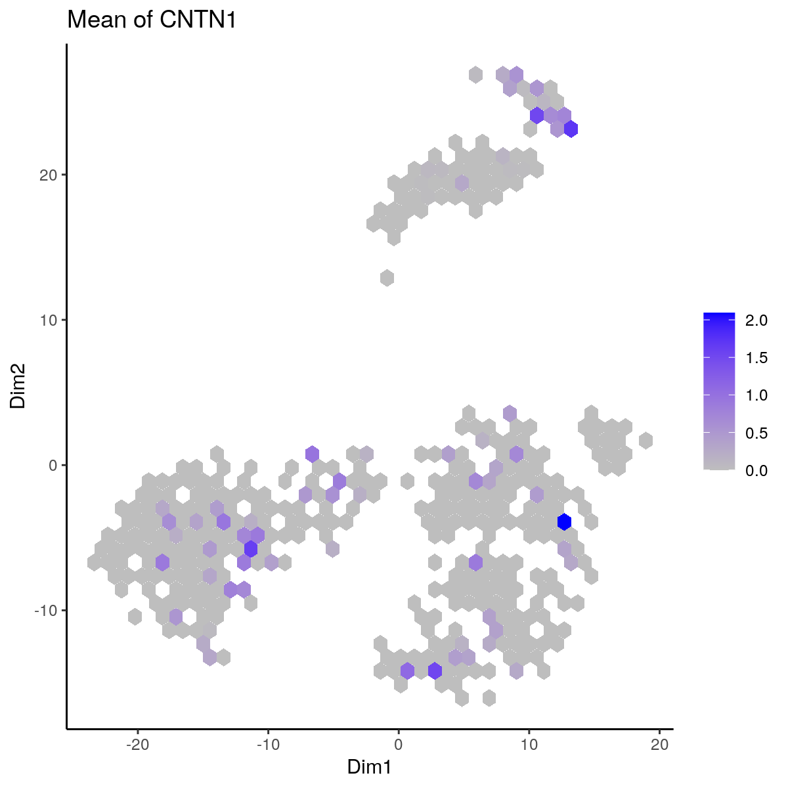|[NCAN](https://www.ncbi.nlm.nih.gov/gene/1463) [TNC](https://www.ncbi.nlm.nih.gov/gene/3371) [NCAM1](https://www.ncbi.nlm.nih.gov/gene/4684) [PTPRZ1](https://www.ncbi.nlm.nih.gov/gene/5803) [TNR](https://www.ncbi.nlm.nih.gov/gene/7143) [HAPLN2](https://www.ncbi.nlm.nih.gov/gene/60484) [CNTNAP3](https://www.ncbi.nlm.nih.gov/gene/79937) [GLDN](https://www.ncbi.nlm.nih.gov/gene/342035)|
|[CNTN2](https://www.ncbi.nlm.nih.gov/gene/6900)|[CBLN1](https://www.ncbi.nlm.nih.gov/gene/869) [NCAN](https://www.ncbi.nlm.nih.gov/gene/1463) [EGFR](https://www.ncbi.nlm.nih.gov/gene/1956) [FN1](https://www.ncbi.nlm.nih.gov/gene/2335) [IL2](https://www.ncbi.nlm.nih.gov/gene/3558) [NCAM1](https://www.ncbi.nlm.nih.gov/gene/4684) [RELN](https://www.ncbi.nlm.nih.gov/gene/5649) [PTPRZ1](https://www.ncbi.nlm.nih.gov/gene/5803) [SLIT1](https://www.ncbi.nlm.nih.gov/gene/6585) [VEGFA](https://www.ncbi.nlm.nih.gov/gene/7422) [WNT7A](https://www.ncbi.nlm.nih.gov/gene/7476) [NRP1](https://www.ncbi.nlm.nih.gov/gene/8829) [LGI1](https://www.ncbi.nlm.nih.gov/gene/9211) [NTN1](https://www.ncbi.nlm.nih.gov/gene/9423) [SEMA3A](https://www.ncbi.nlm.nih.gov/gene/10371) [NXPH1](https://www.ncbi.nlm.nih.gov/gene/30010) [HAPLN2](https://www.ncbi.nlm.nih.gov/gene/60484) [CNTNAP3](https://www.ncbi.nlm.nih.gov/gene/79937) [C1QL2](https://www.ncbi.nlm.nih.gov/gene/165257) [LGI3](https://www.ncbi.nlm.nih.gov/gene/203190) [SEMA3D](https://www.ncbi.nlm.nih.gov/gene/223117) [GLDN](https://www.ncbi.nlm.nih.gov/gene/342035)|
|[CNTN3](https://www.ncbi.nlm.nih.gov/gene/5067)|[EPHB6](https://www.ncbi.nlm.nih.gov/gene/2051) [GPLD1](https://www.ncbi.nlm.nih.gov/gene/2822) [PTPRZ1](https://www.ncbi.nlm.nih.gov/gene/5803) [WNT7A](https://www.ncbi.nlm.nih.gov/gene/7476) [MSLN](https://www.ncbi.nlm.nih.gov/gene/10232) [QPCT](https://www.ncbi.nlm.nih.gov/gene/25797) [LY6K](https://www.ncbi.nlm.nih.gov/gene/54742) [CNTNAP3](https://www.ncbi.nlm.nih.gov/gene/79937) [NTN5](https://www.ncbi.nlm.nih.gov/gene/126147) [FBLN7](https://www.ncbi.nlm.nih.gov/gene/129804) [RAET1G](https://www.ncbi.nlm.nih.gov/gene/353091)|
|[CNTN4](https://www.ncbi.nlm.nih.gov/gene/152330)|[GPLD1](https://www.ncbi.nlm.nih.gov/gene/2822) [PTPRZ1](https://www.ncbi.nlm.nih.gov/gene/5803) [MSLN](https://www.ncbi.nlm.nih.gov/gene/10232) [LY6K](https://www.ncbi.nlm.nih.gov/gene/54742) [CNTNAP3](https://www.ncbi.nlm.nih.gov/gene/79937) [RAET1G](https://www.ncbi.nlm.nih.gov/gene/353091)|
|[CNTN5](https://www.ncbi.nlm.nih.gov/gene/53942)|[CSH1](https://www.ncbi.nlm.nih.gov/gene/1442) [CSN2](https://www.ncbi.nlm.nih.gov/gene/1447) [FMOD](https://www.ncbi.nlm.nih.gov/gene/2331) [GH1](https://www.ncbi.nlm.nih.gov/gene/2688) [GH2](https://www.ncbi.nlm.nih.gov/gene/2689) [GHR](https://www.ncbi.nlm.nih.gov/gene/2690) [GPLD1](https://www.ncbi.nlm.nih.gov/gene/2822) [PRL](https://www.ncbi.nlm.nih.gov/gene/5617) [PRLR](https://www.ncbi.nlm.nih.gov/gene/5618) [PTPRZ1](https://www.ncbi.nlm.nih.gov/gene/5803) [EDIL3](https://www.ncbi.nlm.nih.gov/gene/10085) [MSLN](https://www.ncbi.nlm.nih.gov/gene/10232) [PAMR1](https://www.ncbi.nlm.nih.gov/gene/25891) [LY6K](https://www.ncbi.nlm.nih.gov/gene/54742) [CNTNAP3](https://www.ncbi.nlm.nih.gov/gene/79937) [RAET1G](https://www.ncbi.nlm.nih.gov/gene/353091)|
|[CNTN6](https://www.ncbi.nlm.nih.gov/gene/27255)|[ALCAM](https://www.ncbi.nlm.nih.gov/gene/214) [CD6](https://www.ncbi.nlm.nih.gov/gene/923) [NCAM1](https://www.ncbi.nlm.nih.gov/gene/4684) [PTPRZ1](https://www.ncbi.nlm.nih.gov/gene/5803) [DEFB113](https://www.ncbi.nlm.nih.gov/gene/245927)|
|[COBL](https://www.ncbi.nlm.nih.gov/gene/23242)|[VWC2](https://www.ncbi.nlm.nih.gov/gene/375567)|
|[COL13A1](https://www.ncbi.nlm.nih.gov/gene/1305)|[COL1A1](https://www.ncbi.nlm.nih.gov/gene/1277) [COL1A2](https://www.ncbi.nlm.nih.gov/gene/1278) [COL2A1](https://www.ncbi.nlm.nih.gov/gene/1280) [COL3A1](https://www.ncbi.nlm.nih.gov/gene/1281) [COL4A1](https://www.ncbi.nlm.nih.gov/gene/1282) [COL4A2](https://www.ncbi.nlm.nih.gov/gene/1284) [COL4A3](https://www.ncbi.nlm.nih.gov/gene/1285) [COL4A4](https://www.ncbi.nlm.nih.gov/gene/1286) [COL4A5](https://www.ncbi.nlm.nih.gov/gene/1287) [COL4A6](https://www.ncbi.nlm.nih.gov/gene/1288) [COL5A1](https://www.ncbi.nlm.nih.gov/gene/1289) [COL5A2](https://www.ncbi.nlm.nih.gov/gene/1290) [COL6A1](https://www.ncbi.nlm.nih.gov/gene/1291) [COL6A2](https://www.ncbi.nlm.nih.gov/gene/1292) [COL6A3](https://www.ncbi.nlm.nih.gov/gene/1293) [COL7A1](https://www.ncbi.nlm.nih.gov/gene/1294) [COL8A1](https://www.ncbi.nlm.nih.gov/gene/1295) [COL8A2](https://www.ncbi.nlm.nih.gov/gene/1296) [COL9A1](https://www.ncbi.nlm.nih.gov/gene/1297) [COL9A2](https://www.ncbi.nlm.nih.gov/gene/1298) [COL10A1](https://www.ncbi.nlm.nih.gov/gene/1300) [COL11A1](https://www.ncbi.nlm.nih.gov/gene/1301) [COL11A2](https://www.ncbi.nlm.nih.gov/gene/1302) [COL12A1](https://www.ncbi.nlm.nih.gov/gene/1303) [COL15A1](https://www.ncbi.nlm.nih.gov/gene/1306) [COL16A1](https://www.ncbi.nlm.nih.gov/gene/1307) [COL19A1](https://www.ncbi.nlm.nih.gov/gene/1310) [FN1](https://www.ncbi.nlm.nih.gov/gene/2335) [HSPG2](https://www.ncbi.nlm.nih.gov/gene/3339) [COL14A1](https://www.ncbi.nlm.nih.gov/gene/7373) [CRTAP](https://www.ncbi.nlm.nih.gov/gene/10491) [NID2](https://www.ncbi.nlm.nih.gov/gene/22795) [COL5A3](https://www.ncbi.nlm.nih.gov/gene/50509) [COL20A1](https://www.ncbi.nlm.nih.gov/gene/57642) [P3H1](https://www.ncbi.nlm.nih.gov/gene/64175) [COL18A1](https://www.ncbi.nlm.nih.gov/gene/80781) [COL21A1](https://www.ncbi.nlm.nih.gov/gene/81578) [COL27A1](https://www.ncbi.nlm.nih.gov/gene/85301) [COL6A6](https://www.ncbi.nlm.nih.gov/gene/131873) [COL26A1](https://www.ncbi.nlm.nih.gov/gene/136227) [COL22A1](https://www.ncbi.nlm.nih.gov/gene/169044) [COL24A1](https://www.ncbi.nlm.nih.gov/gene/255631) [COL6A5](https://www.ncbi.nlm.nih.gov/gene/256076) [COL28A1](https://www.ncbi.nlm.nih.gov/gene/340267)|
|[COL23A1](https://www.ncbi.nlm.nih.gov/gene/91522)|[COL1A1](https://www.ncbi.nlm.nih.gov/gene/1277) [COL1A2](https://www.ncbi.nlm.nih.gov/gene/1278) [COL2A1](https://www.ncbi.nlm.nih.gov/gene/1280) [COL3A1](https://www.ncbi.nlm.nih.gov/gene/1281) [COL4A1](https://www.ncbi.nlm.nih.gov/gene/1282) [COL4A2](https://www.ncbi.nlm.nih.gov/gene/1284) [COL4A3](https://www.ncbi.nlm.nih.gov/gene/1285) [COL4A4](https://www.ncbi.nlm.nih.gov/gene/1286) [COL4A5](https://www.ncbi.nlm.nih.gov/gene/1287) [COL4A6](https://www.ncbi.nlm.nih.gov/gene/1288) [COL5A1](https://www.ncbi.nlm.nih.gov/gene/1289) [COL5A2](https://www.ncbi.nlm.nih.gov/gene/1290) [COL6A1](https://www.ncbi.nlm.nih.gov/gene/1291) [COL6A2](https://www.ncbi.nlm.nih.gov/gene/1292) [COL6A3](https://www.ncbi.nlm.nih.gov/gene/1293) [COL7A1](https://www.ncbi.nlm.nih.gov/gene/1294) [COL8A1](https://www.ncbi.nlm.nih.gov/gene/1295) [COL8A2](https://www.ncbi.nlm.nih.gov/gene/1296) [COL9A1](https://www.ncbi.nlm.nih.gov/gene/1297) [COL9A2](https://www.ncbi.nlm.nih.gov/gene/1298) [COL10A1](https://www.ncbi.nlm.nih.gov/gene/1300) [COL11A1](https://www.ncbi.nlm.nih.gov/gene/1301) [COL11A2](https://www.ncbi.nlm.nih.gov/gene/1302) [COL12A1](https://www.ncbi.nlm.nih.gov/gene/1303) [COL15A1](https://www.ncbi.nlm.nih.gov/gene/1306) [COL16A1](https://www.ncbi.nlm.nih.gov/gene/1307) [COL19A1](https://www.ncbi.nlm.nih.gov/gene/1310) [ECM2](https://www.ncbi.nlm.nih.gov/gene/1842) [COL14A1](https://www.ncbi.nlm.nih.gov/gene/7373) [ADAM23](https://www.ncbi.nlm.nih.gov/gene/8745) [CRTAP](https://www.ncbi.nlm.nih.gov/gene/10491) [EFEMP2](https://www.ncbi.nlm.nih.gov/gene/30008) [COL5A3](https://www.ncbi.nlm.nih.gov/gene/50509) [COL20A1](https://www.ncbi.nlm.nih.gov/gene/57642) [P3H1](https://www.ncbi.nlm.nih.gov/gene/64175) [COL18A1](https://www.ncbi.nlm.nih.gov/gene/80781) [COL21A1](https://www.ncbi.nlm.nih.gov/gene/81578) [COL27A1](https://www.ncbi.nlm.nih.gov/gene/85301) [COL6A6](https://www.ncbi.nlm.nih.gov/gene/131873) [COL26A1](https://www.ncbi.nlm.nih.gov/gene/136227) [COL22A1](https://www.ncbi.nlm.nih.gov/gene/169044) [COL24A1](https://www.ncbi.nlm.nih.gov/gene/255631) [COL6A5](https://www.ncbi.nlm.nih.gov/gene/256076) [COL28A1](https://www.ncbi.nlm.nih.gov/gene/340267)|
|[COMT](https://www.ncbi.nlm.nih.gov/gene/1312)|[APOE](https://www.ncbi.nlm.nih.gov/gene/348) [BCHE](https://www.ncbi.nlm.nih.gov/gene/590) [BDNF](https://www.ncbi.nlm.nih.gov/gene/627) [CRH](https://www.ncbi.nlm.nih.gov/gene/1392) [FGF2](https://www.ncbi.nlm.nih.gov/gene/2247) [LEP](https://www.ncbi.nlm.nih.gov/gene/3952) [NPY](https://www.ncbi.nlm.nih.gov/gene/4852) [OMD](https://www.ncbi.nlm.nih.gov/gene/4958) [OXT](https://www.ncbi.nlm.nih.gov/gene/5020) [PRL](https://www.ncbi.nlm.nih.gov/gene/5617) [RELN](https://www.ncbi.nlm.nih.gov/gene/5649) [CCL1](https://www.ncbi.nlm.nih.gov/gene/6346) [SHBG](https://www.ncbi.nlm.nih.gov/gene/6462) [APOL1](https://www.ncbi.nlm.nih.gov/gene/8542) [CYTL1](https://www.ncbi.nlm.nih.gov/gene/54360) [APOL4](https://www.ncbi.nlm.nih.gov/gene/80832)|
|[CORO1C](https://www.ncbi.nlm.nih.gov/gene/23603)|[FGB](https://www.ncbi.nlm.nih.gov/gene/2244) [GSN](https://www.ncbi.nlm.nih.gov/gene/2934) [CST7](https://www.ncbi.nlm.nih.gov/gene/8530) [ISM1](https://www.ncbi.nlm.nih.gov/gene/140862)|
|[CPD](https://www.ncbi.nlm.nih.gov/gene/1362)|[SCG5](https://www.ncbi.nlm.nih.gov/gene/6447) [PRSS36](https://www.ncbi.nlm.nih.gov/gene/146547)|
|[CPM](https://www.ncbi.nlm.nih.gov/gene/1368)|[CPB2](https://www.ncbi.nlm.nih.gov/gene/1361) [GPLD1](https://www.ncbi.nlm.nih.gov/gene/2822) [LYZ](https://www.ncbi.nlm.nih.gov/gene/4069) [MSLN](https://www.ncbi.nlm.nih.gov/gene/10232) [LY6K](https://www.ncbi.nlm.nih.gov/gene/54742) [LYZL6](https://www.ncbi.nlm.nih.gov/gene/57151) [LYZL4](https://www.ncbi.nlm.nih.gov/gene/131375) [RAET1G](https://www.ncbi.nlm.nih.gov/gene/353091) [SPACA5](https://www.ncbi.nlm.nih.gov/gene/389852)|
|[CPO](https://www.ncbi.nlm.nih.gov/gene/130749)|[TINAG](https://www.ncbi.nlm.nih.gov/gene/27283) [CBLN2](https://www.ncbi.nlm.nih.gov/gene/147381)|
|[CR2](https://www.ncbi.nlm.nih.gov/gene/1380)|[ALB](https://www.ncbi.nlm.nih.gov/gene/213) [FAS](https://www.ncbi.nlm.nih.gov/gene/355) [C3](https://www.ncbi.nlm.nih.gov/gene/718) [C4A](https://www.ncbi.nlm.nih.gov/gene/720) [CD6](https://www.ncbi.nlm.nih.gov/gene/923) [CD40](https://www.ncbi.nlm.nih.gov/gene/958) [CD40LG](https://www.ncbi.nlm.nih.gov/gene/959) [IFNA1](https://www.ncbi.nlm.nih.gov/gene/3439) [IFNA2](https://www.ncbi.nlm.nih.gov/gene/3440) [IFNA17](https://www.ncbi.nlm.nih.gov/gene/3451) [IFNA21](https://www.ncbi.nlm.nih.gov/gene/3452) [IL2](https://www.ncbi.nlm.nih.gov/gene/3558) [IL4](https://www.ncbi.nlm.nih.gov/gene/3565) [IL6](https://www.ncbi.nlm.nih.gov/gene/3569) [IL7](https://www.ncbi.nlm.nih.gov/gene/3574) [IL10](https://www.ncbi.nlm.nih.gov/gene/3586) [NCAM1](https://www.ncbi.nlm.nih.gov/gene/4684) [PGC](https://www.ncbi.nlm.nih.gov/gene/5225) [CCL19](https://www.ncbi.nlm.nih.gov/gene/6363) [CCL21](https://www.ncbi.nlm.nih.gov/gene/6366) [SIGLEC1](https://www.ncbi.nlm.nih.gov/gene/6614) [TNF](https://www.ncbi.nlm.nih.gov/gene/7124) [CXCL13](https://www.ncbi.nlm.nih.gov/gene/10563) [IGLL5](https://www.ncbi.nlm.nih.gov/gene/100423062)|
|[CRB3](https://www.ncbi.nlm.nih.gov/gene/92359)|[CRB1](https://www.ncbi.nlm.nih.gov/gene/23418) [CRB2](https://www.ncbi.nlm.nih.gov/gene/286204)|
|[CRCP](https://www.ncbi.nlm.nih.gov/gene/27297)|[ADM](https://www.ncbi.nlm.nih.gov/gene/133) [CALCA](https://www.ncbi.nlm.nih.gov/gene/796) [IL24](https://www.ncbi.nlm.nih.gov/gene/11009)|
|[CRHR1](https://www.ncbi.nlm.nih.gov/gene/1394)|[CRH](https://www.ncbi.nlm.nih.gov/gene/1392) [UCN](https://www.ncbi.nlm.nih.gov/gene/7349) [UCN2](https://www.ncbi.nlm.nih.gov/gene/90226)|
|[CRHR2](https://www.ncbi.nlm.nih.gov/gene/1395)|[ADCYAP1](https://www.ncbi.nlm.nih.gov/gene/116) [ADM](https://www.ncbi.nlm.nih.gov/gene/133) [AVP](https://www.ncbi.nlm.nih.gov/gene/551) [BDNF](https://www.ncbi.nlm.nih.gov/gene/627) [CALCA](https://www.ncbi.nlm.nih.gov/gene/796) [CALCB](https://www.ncbi.nlm.nih.gov/gene/797) [CCK](https://www.ncbi.nlm.nih.gov/gene/885) [CGA](https://www.ncbi.nlm.nih.gov/gene/1081) [CORT](https://www.ncbi.nlm.nih.gov/gene/1325) [CRH](https://www.ncbi.nlm.nih.gov/gene/1392) [CRHBP](https://www.ncbi.nlm.nih.gov/gene/1393) [FSHB](https://www.ncbi.nlm.nih.gov/gene/2488) [GCG](https://www.ncbi.nlm.nih.gov/gene/2641) [GHRH](https://www.ncbi.nlm.nih.gov/gene/2691) [GIP](https://www.ncbi.nlm.nih.gov/gene/2695) [IAPP](https://www.ncbi.nlm.nih.gov/gene/3375) [IFNAR2](https://www.ncbi.nlm.nih.gov/gene/3455) [INSL3](https://www.ncbi.nlm.nih.gov/gene/3640) [LEP](https://www.ncbi.nlm.nih.gov/gene/3952) [NPY](https://www.ncbi.nlm.nih.gov/gene/4852) [OXT](https://www.ncbi.nlm.nih.gov/gene/5020) [PDYN](https://www.ncbi.nlm.nih.gov/gene/5173) [POMC](https://www.ncbi.nlm.nih.gov/gene/5443) [PTH](https://www.ncbi.nlm.nih.gov/gene/5741) [PTHLH](https://www.ncbi.nlm.nih.gov/gene/5744) [RLN1](https://www.ncbi.nlm.nih.gov/gene/6013) [RLN2](https://www.ncbi.nlm.nih.gov/gene/6019) [SCT](https://www.ncbi.nlm.nih.gov/gene/6343) [TSHB](https://www.ncbi.nlm.nih.gov/gene/7252) [UCN](https://www.ncbi.nlm.nih.gov/gene/7349) [VIP](https://www.ncbi.nlm.nih.gov/gene/7432) [IL22](https://www.ncbi.nlm.nih.gov/gene/50616) [GHRL](https://www.ncbi.nlm.nih.gov/gene/51738) [ADM2](https://www.ncbi.nlm.nih.gov/gene/79924) [RSPRY1](https://www.ncbi.nlm.nih.gov/gene/89970) [UCN2](https://www.ncbi.nlm.nih.gov/gene/90226) [PTH2](https://www.ncbi.nlm.nih.gov/gene/113091) [UCN3](https://www.ncbi.nlm.nih.gov/gene/114131) [IL22RA2](https://www.ncbi.nlm.nih.gov/gene/116379) [RLN3](https://www.ncbi.nlm.nih.gov/gene/117579) [GPHB5](https://www.ncbi.nlm.nih.gov/gene/122876) [GPHA2](https://www.ncbi.nlm.nih.gov/gene/170589) [IFNL2](https://www.ncbi.nlm.nih.gov/gene/282616) [IFNL3](https://www.ncbi.nlm.nih.gov/gene/282617) [IFNL1](https://www.ncbi.nlm.nih.gov/gene/282618) [NPS](https://www.ncbi.nlm.nih.gov/gene/594857)|
|[CRIM1](https://www.ncbi.nlm.nih.gov/gene/51232)|[BMP4](https://www.ncbi.nlm.nih.gov/gene/652) [CCN1](https://www.ncbi.nlm.nih.gov/gene/3491) [SEMA3G](https://www.ncbi.nlm.nih.gov/gene/56920) [C1QL3](https://www.ncbi.nlm.nih.gov/gene/389941)|
|[CRK](https://www.ncbi.nlm.nih.gov/gene/1398)|[A1BG](https://www.ncbi.nlm.nih.gov/gene/1) [ANGPT1](https://www.ncbi.nlm.nih.gov/gene/284) [ADGRB1](https://www.ncbi.nlm.nih.gov/gene/575) [BDNF](https://www.ncbi.nlm.nih.gov/gene/627) [EGFR](https://www.ncbi.nlm.nih.gov/gene/1956) [EPHA3](https://www.ncbi.nlm.nih.gov/gene/2042) [EPHB6](https://www.ncbi.nlm.nih.gov/gene/2051) [ERBB3](https://www.ncbi.nlm.nih.gov/gene/2065) [FGB](https://www.ncbi.nlm.nih.gov/gene/2244) [FGFR3](https://www.ncbi.nlm.nih.gov/gene/2261) [FGFR2](https://www.ncbi.nlm.nih.gov/gene/2263) [FGFR4](https://www.ncbi.nlm.nih.gov/gene/2264) [FGG](https://www.ncbi.nlm.nih.gov/gene/2266) [VEGFD](https://www.ncbi.nlm.nih.gov/gene/2277) [FLT1](https://www.ncbi.nlm.nih.gov/gene/2321) [FLT4](https://www.ncbi.nlm.nih.gov/gene/2324) [FN1](https://www.ncbi.nlm.nih.gov/gene/2335) [GDNF](https://www.ncbi.nlm.nih.gov/gene/2668) [IGF1](https://www.ncbi.nlm.nih.gov/gene/3479) [INS](https://www.ncbi.nlm.nih.gov/gene/3630) [KDR](https://www.ncbi.nlm.nih.gov/gene/3791) [MET](https://www.ncbi.nlm.nih.gov/gene/4233) [NGF](https://www.ncbi.nlm.nih.gov/gene/4803) [NTF3](https://www.ncbi.nlm.nih.gov/gene/4908) [NTF4](https://www.ncbi.nlm.nih.gov/gene/4909) [PDGFB](https://www.ncbi.nlm.nih.gov/gene/5155) [PI3](https://www.ncbi.nlm.nih.gov/gene/5266) [RELN](https://www.ncbi.nlm.nih.gov/gene/5649) [S100A8](https://www.ncbi.nlm.nih.gov/gene/6279) [VEGFC](https://www.ncbi.nlm.nih.gov/gene/7424) [VWF](https://www.ncbi.nlm.nih.gov/gene/7450) [EGFL7](https://www.ncbi.nlm.nih.gov/gene/51162) [EPHA10](https://www.ncbi.nlm.nih.gov/gene/284656) [IGLL5](https://www.ncbi.nlm.nih.gov/gene/100423062)|
|[CRLF2](https://www.ncbi.nlm.nih.gov/gene/64109)|[TSLP](https://www.ncbi.nlm.nih.gov/gene/85480)|
|[CSF1R](https://www.ncbi.nlm.nih.gov/gene/1436)|[ALB](https://www.ncbi.nlm.nih.gov/gene/213) [ANGPT1](https://www.ncbi.nlm.nih.gov/gene/284) [ANGPT2](https://www.ncbi.nlm.nih.gov/gene/285) [AOAH](https://www.ncbi.nlm.nih.gov/gene/313) [APOA1](https://www.ncbi.nlm.nih.gov/gene/335) [APOA2](https://www.ncbi.nlm.nih.gov/gene/336) [APOE](https://www.ncbi.nlm.nih.gov/gene/348) [BDNF](https://www.ncbi.nlm.nih.gov/gene/627) [C1QA](https://www.ncbi.nlm.nih.gov/gene/712) [C1QB](https://www.ncbi.nlm.nih.gov/gene/713) [C1QC](https://www.ncbi.nlm.nih.gov/gene/714) [CD40](https://www.ncbi.nlm.nih.gov/gene/958) [CETP](https://www.ncbi.nlm.nih.gov/gene/1071) [CSF2](https://www.ncbi.nlm.nih.gov/gene/1437) [CSF2RA](https://www.ncbi.nlm.nih.gov/gene/1438) [CSF3](https://www.ncbi.nlm.nih.gov/gene/1440) [CSF3R](https://www.ncbi.nlm.nih.gov/gene/1441) [EFNA1](https://www.ncbi.nlm.nih.gov/gene/1942) [EFNA4](https://www.ncbi.nlm.nih.gov/gene/1945) [EPOR](https://www.ncbi.nlm.nih.gov/gene/2057) [F13A1](https://www.ncbi.nlm.nih.gov/gene/2162) [FGF1](https://www.ncbi.nlm.nih.gov/gene/2246) [FGF2](https://www.ncbi.nlm.nih.gov/gene/2247) [FGF3](https://www.ncbi.nlm.nih.gov/gene/2248) [FGF4](https://www.ncbi.nlm.nih.gov/gene/2249) [FGF5](https://www.ncbi.nlm.nih.gov/gene/2250) [FGF6](https://www.ncbi.nlm.nih.gov/gene/2251) [FGF7](https://www.ncbi.nlm.nih.gov/gene/2252) [FGF8](https://www.ncbi.nlm.nih.gov/gene/2253) [FGF9](https://www.ncbi.nlm.nih.gov/gene/2254) [FGF10](https://www.ncbi.nlm.nih.gov/gene/2255) [VEGFD](https://www.ncbi.nlm.nih.gov/gene/2277) [FLT3LG](https://www.ncbi.nlm.nih.gov/gene/2323) [FN1](https://www.ncbi.nlm.nih.gov/gene/2335) [CXCL1](https://www.ncbi.nlm.nih.gov/gene/2919) [CFH](https://www.ncbi.nlm.nih.gov/gene/3075) [IGF1](https://www.ncbi.nlm.nih.gov/gene/3479) [IGF2](https://www.ncbi.nlm.nih.gov/gene/3481) [IL2](https://www.ncbi.nlm.nih.gov/gene/3558) [IL3](https://www.ncbi.nlm.nih.gov/gene/3562) [IL4](https://www.ncbi.nlm.nih.gov/gene/3565) [IL4R](https://www.ncbi.nlm.nih.gov/gene/3566) [IL6](https://www.ncbi.nlm.nih.gov/gene/3569) [IL7](https://www.ncbi.nlm.nih.gov/gene/3574) [CXCL8](https://www.ncbi.nlm.nih.gov/gene/3576) [IL10](https://www.ncbi.nlm.nih.gov/gene/3586) [IL13](https://www.ncbi.nlm.nih.gov/gene/3596) [IL15](https://www.ncbi.nlm.nih.gov/gene/3600) [CXCL10](https://www.ncbi.nlm.nih.gov/gene/3627) [INS](https://www.ncbi.nlm.nih.gov/gene/3630) [LCAT](https://www.ncbi.nlm.nih.gov/gene/3931) [LCN2](https://www.ncbi.nlm.nih.gov/gene/3934) [LYZ](https://www.ncbi.nlm.nih.gov/gene/4069) [CXCL9](https://www.ncbi.nlm.nih.gov/gene/4283) [MMP9](https://www.ncbi.nlm.nih.gov/gene/4318) [NGF](https://www.ncbi.nlm.nih.gov/gene/4803) [NTF3](https://www.ncbi.nlm.nih.gov/gene/4908) [NTF4](https://www.ncbi.nlm.nih.gov/gene/4909) [TNFRSF11B](https://www.ncbi.nlm.nih.gov/gene/4982) [PDGFA](https://www.ncbi.nlm.nih.gov/gene/5154) [PDGFB](https://www.ncbi.nlm.nih.gov/gene/5155) [CFP](https://www.ncbi.nlm.nih.gov/gene/5199) [PGF](https://www.ncbi.nlm.nih.gov/gene/5228) [PLTP](https://www.ncbi.nlm.nih.gov/gene/5360) [PON1](https://www.ncbi.nlm.nih.gov/gene/5444) [PTEN](https://www.ncbi.nlm.nih.gov/gene/5728) [CCL2](https://www.ncbi.nlm.nih.gov/gene/6347) [CCL3](https://www.ncbi.nlm.nih.gov/gene/6348) [CCL5](https://www.ncbi.nlm.nih.gov/gene/6352) [CCL18](https://www.ncbi.nlm.nih.gov/gene/6362) [CCL19](https://www.ncbi.nlm.nih.gov/gene/6363) [CX3CL1](https://www.ncbi.nlm.nih.gov/gene/6376) [CXCL12](https://www.ncbi.nlm.nih.gov/gene/6387) [SIGLEC1](https://www.ncbi.nlm.nih.gov/gene/6614) [TNF](https://www.ncbi.nlm.nih.gov/gene/7124) [VEGFA](https://www.ncbi.nlm.nih.gov/gene/7422) [VEGFB](https://www.ncbi.nlm.nih.gov/gene/7423) [VEGFC](https://www.ncbi.nlm.nih.gov/gene/7424) [VWF](https://www.ncbi.nlm.nih.gov/gene/7450) [FGF23](https://www.ncbi.nlm.nih.gov/gene/8074) [FGF18](https://www.ncbi.nlm.nih.gov/gene/8817) [FGF17](https://www.ncbi.nlm.nih.gov/gene/8822) [FGF16](https://www.ncbi.nlm.nih.gov/gene/8823) [NRP1](https://www.ncbi.nlm.nih.gov/gene/8829) [LY86](https://www.ncbi.nlm.nih.gov/gene/9450) [FGF19](https://www.ncbi.nlm.nih.gov/gene/9965) [FGL2](https://www.ncbi.nlm.nih.gov/gene/10875) [FGF20](https://www.ncbi.nlm.nih.gov/gene/26281) [FGF21](https://www.ncbi.nlm.nih.gov/gene/26291) [FGF22](https://www.ncbi.nlm.nih.gov/gene/27006) [CD209](https://www.ncbi.nlm.nih.gov/gene/30835) [ANGPT4](https://www.ncbi.nlm.nih.gov/gene/51378) [TREM2](https://www.ncbi.nlm.nih.gov/gene/54209) [PDGFD](https://www.ncbi.nlm.nih.gov/gene/80310) [OSCAR](https://www.ncbi.nlm.nih.gov/gene/126014) [IL34](https://www.ncbi.nlm.nih.gov/gene/146433) [MPEG1](https://www.ncbi.nlm.nih.gov/gene/219972) [CSF1](https://www.ncbi.nlm.nih.gov/gene/1435)|
|[CSF2RA](https://www.ncbi.nlm.nih.gov/gene/1438)|[CSF2](https://www.ncbi.nlm.nih.gov/gene/1437) [CSF3](https://www.ncbi.nlm.nih.gov/gene/1440)|
|[CSF2RB](https://www.ncbi.nlm.nih.gov/gene/1439)|[IL5](https://www.ncbi.nlm.nih.gov/gene/3567) [CSF2](https://www.ncbi.nlm.nih.gov/gene/1437) [CSF3](https://www.ncbi.nlm.nih.gov/gene/1440) [IL3](https://www.ncbi.nlm.nih.gov/gene/3562)|
|[CSF3R](https://www.ncbi.nlm.nih.gov/gene/1441)|[C1QA](https://www.ncbi.nlm.nih.gov/gene/712) [C1QC](https://www.ncbi.nlm.nih.gov/gene/714) [CSF2](https://www.ncbi.nlm.nih.gov/gene/1437) [CSF2RA](https://www.ncbi.nlm.nih.gov/gene/1438) [CSF3](https://www.ncbi.nlm.nih.gov/gene/1440) [CSH1](https://www.ncbi.nlm.nih.gov/gene/1442) [CTF1](https://www.ncbi.nlm.nih.gov/gene/1489) [EPO](https://www.ncbi.nlm.nih.gov/gene/2056) [EPOR](https://www.ncbi.nlm.nih.gov/gene/2057) [FCN1](https://www.ncbi.nlm.nih.gov/gene/2219) [GH1](https://www.ncbi.nlm.nih.gov/gene/2688) [IFNA1](https://www.ncbi.nlm.nih.gov/gene/3439) [IFNA2](https://www.ncbi.nlm.nih.gov/gene/3440) [IFNA4](https://www.ncbi.nlm.nih.gov/gene/3441) [IFNA5](https://www.ncbi.nlm.nih.gov/gene/3442) [IFNA6](https://www.ncbi.nlm.nih.gov/gene/3443) [IFNA7](https://www.ncbi.nlm.nih.gov/gene/3444) [IFNA8](https://www.ncbi.nlm.nih.gov/gene/3445) [IFNA10](https://www.ncbi.nlm.nih.gov/gene/3446) [IFNA14](https://www.ncbi.nlm.nih.gov/gene/3448) [IFNA16](https://www.ncbi.nlm.nih.gov/gene/3449) [IFNA17](https://www.ncbi.nlm.nih.gov/gene/3451) [IFNA21](https://www.ncbi.nlm.nih.gov/gene/3452) [IFNB1](https://www.ncbi.nlm.nih.gov/gene/3456) [IFNG](https://www.ncbi.nlm.nih.gov/gene/3458) [IFNW1](https://www.ncbi.nlm.nih.gov/gene/3467) [IL2](https://www.ncbi.nlm.nih.gov/gene/3558) [IL3](https://www.ncbi.nlm.nih.gov/gene/3562) [IL4](https://www.ncbi.nlm.nih.gov/gene/3565) [IL5](https://www.ncbi.nlm.nih.gov/gene/3567) [IL6](https://www.ncbi.nlm.nih.gov/gene/3569) [IL6R](https://www.ncbi.nlm.nih.gov/gene/3570) [IL7](https://www.ncbi.nlm.nih.gov/gene/3574) [IL9](https://www.ncbi.nlm.nih.gov/gene/3578) [IL10](https://www.ncbi.nlm.nih.gov/gene/3586) [IL11](https://www.ncbi.nlm.nih.gov/gene/3589) [IL12A](https://www.ncbi.nlm.nih.gov/gene/3592) [IL12B](https://www.ncbi.nlm.nih.gov/gene/3593) [IL13](https://www.ncbi.nlm.nih.gov/gene/3596) [IL15](https://www.ncbi.nlm.nih.gov/gene/3600) [LEP](https://www.ncbi.nlm.nih.gov/gene/3952) [LIF](https://www.ncbi.nlm.nih.gov/gene/3976) [OSM](https://www.ncbi.nlm.nih.gov/gene/5008) [PDGFA](https://www.ncbi.nlm.nih.gov/gene/5154) [PDGFB](https://www.ncbi.nlm.nih.gov/gene/5155) [PRL](https://www.ncbi.nlm.nih.gov/gene/5617) [S100A8](https://www.ncbi.nlm.nih.gov/gene/6279) [S100A9](https://www.ncbi.nlm.nih.gov/gene/6280) [S100A12](https://www.ncbi.nlm.nih.gov/gene/6283) [LY86](https://www.ncbi.nlm.nih.gov/gene/9450) [FGL2](https://www.ncbi.nlm.nih.gov/gene/10875) [IL24](https://www.ncbi.nlm.nih.gov/gene/11009) [IL19](https://www.ncbi.nlm.nih.gov/gene/29949) [IL20](https://www.ncbi.nlm.nih.gov/gene/50604) [IL22](https://www.ncbi.nlm.nih.gov/gene/50616) [IL23A](https://www.ncbi.nlm.nih.gov/gene/51561) [IL17D](https://www.ncbi.nlm.nih.gov/gene/53342) [TREM1](https://www.ncbi.nlm.nih.gov/gene/54210) [IFNK](https://www.ncbi.nlm.nih.gov/gene/56832) [TSLP](https://www.ncbi.nlm.nih.gov/gene/85480) [MPEG1](https://www.ncbi.nlm.nih.gov/gene/219972) [IFNL2](https://www.ncbi.nlm.nih.gov/gene/282616) [IFNL3](https://www.ncbi.nlm.nih.gov/gene/282617) [IFNL1](https://www.ncbi.nlm.nih.gov/gene/282618) [IFNE](https://www.ncbi.nlm.nih.gov/gene/338376)|
|[CSK](https://www.ncbi.nlm.nih.gov/gene/1445)|[CD8A](https://www.ncbi.nlm.nih.gov/gene/925) [CD8B](https://www.ncbi.nlm.nih.gov/gene/926) [EGFR](https://www.ncbi.nlm.nih.gov/gene/1956) [ERBB3](https://www.ncbi.nlm.nih.gov/gene/2065) [FGB](https://www.ncbi.nlm.nih.gov/gene/2244) [FGG](https://www.ncbi.nlm.nih.gov/gene/2266) [FLT1](https://www.ncbi.nlm.nih.gov/gene/2321) [FLT4](https://www.ncbi.nlm.nih.gov/gene/2324) [FN1](https://www.ncbi.nlm.nih.gov/gene/2335) [GSN](https://www.ncbi.nlm.nih.gov/gene/2934) [IGF1](https://www.ncbi.nlm.nih.gov/gene/3479) [INS](https://www.ncbi.nlm.nih.gov/gene/3630) [KDR](https://www.ncbi.nlm.nih.gov/gene/3791) [PLAUR](https://www.ncbi.nlm.nih.gov/gene/5329) [PTEN](https://www.ncbi.nlm.nih.gov/gene/5728) [S100A8](https://www.ncbi.nlm.nih.gov/gene/6279) [TAC1](https://www.ncbi.nlm.nih.gov/gene/6863) [VEGFA](https://www.ncbi.nlm.nih.gov/gene/7422) [VWF](https://www.ncbi.nlm.nih.gov/gene/7450) [LILRB1](https://www.ncbi.nlm.nih.gov/gene/10859)|
|[CSMD2](https://www.ncbi.nlm.nih.gov/gene/114784)|[HMCN1](https://www.ncbi.nlm.nih.gov/gene/83872)|
|[CSMD3](https://www.ncbi.nlm.nih.gov/gene/114788)|[GPC6](https://www.ncbi.nlm.nih.gov/gene/10082) [GDF6](https://www.ncbi.nlm.nih.gov/gene/392255)|
|[CSPG4](https://www.ncbi.nlm.nih.gov/gene/1464)|[ACAN](https://www.ncbi.nlm.nih.gov/gene/176) [BGN](https://www.ncbi.nlm.nih.gov/gene/633) [COL4A2](https://www.ncbi.nlm.nih.gov/gene/1284) [COL6A1](https://www.ncbi.nlm.nih.gov/gene/1291) [COL6A3](https://www.ncbi.nlm.nih.gov/gene/1293) [COL8A1](https://www.ncbi.nlm.nih.gov/gene/1295) [VCAN](https://www.ncbi.nlm.nih.gov/gene/1462) [NCAN](https://www.ncbi.nlm.nih.gov/gene/1463) [DCN](https://www.ncbi.nlm.nih.gov/gene/1634) [EGFR](https://www.ncbi.nlm.nih.gov/gene/1956) [GPC4](https://www.ncbi.nlm.nih.gov/gene/2239) [FGF2](https://www.ncbi.nlm.nih.gov/gene/2247) [GPC5](https://www.ncbi.nlm.nih.gov/gene/2262) [FN1](https://www.ncbi.nlm.nih.gov/gene/2335) [GPC1](https://www.ncbi.nlm.nih.gov/gene/2817) [HSPG2](https://www.ncbi.nlm.nih.gov/gene/3339) [LAMB2](https://www.ncbi.nlm.nih.gov/gene/3913) [LAMC1](https://www.ncbi.nlm.nih.gov/gene/3915) [LGALS3](https://www.ncbi.nlm.nih.gov/gene/3958) [LOX](https://www.ncbi.nlm.nih.gov/gene/4015) [MMP16](https://www.ncbi.nlm.nih.gov/gene/4325) [PTPRZ1](https://www.ncbi.nlm.nih.gov/gene/5803) [SDC4](https://www.ncbi.nlm.nih.gov/gene/6385) [PMEL](https://www.ncbi.nlm.nih.gov/gene/6490) [GPC6](https://www.ncbi.nlm.nih.gov/gene/10082) [PRG4](https://www.ncbi.nlm.nih.gov/gene/10216) [VWA1](https://www.ncbi.nlm.nih.gov/gene/64856) [C1QTNF1](https://www.ncbi.nlm.nih.gov/gene/114897) [GPC2](https://www.ncbi.nlm.nih.gov/gene/221914)|
|[CSPG5](https://www.ncbi.nlm.nih.gov/gene/10675)|[BGN](https://www.ncbi.nlm.nih.gov/gene/633) [BTC](https://www.ncbi.nlm.nih.gov/gene/685) [CCK](https://www.ncbi.nlm.nih.gov/gene/885) [CLCA1](https://www.ncbi.nlm.nih.gov/gene/1179) [COL9A2](https://www.ncbi.nlm.nih.gov/gene/1298) [VCAN](https://www.ncbi.nlm.nih.gov/gene/1462) [NCAN](https://www.ncbi.nlm.nih.gov/gene/1463) [DCN](https://www.ncbi.nlm.nih.gov/gene/1634) [MEGF6](https://www.ncbi.nlm.nih.gov/gene/1953) [ERBB3](https://www.ncbi.nlm.nih.gov/gene/2065) [FBLN2](https://www.ncbi.nlm.nih.gov/gene/2199) [GPC4](https://www.ncbi.nlm.nih.gov/gene/2239) [GPC5](https://www.ncbi.nlm.nih.gov/gene/2262) [GPC1](https://www.ncbi.nlm.nih.gov/gene/2817) [HSPG2](https://www.ncbi.nlm.nih.gov/gene/3339) [LGALS1](https://www.ncbi.nlm.nih.gov/gene/3956) [PTN](https://www.ncbi.nlm.nih.gov/gene/5764) [PTPRZ1](https://www.ncbi.nlm.nih.gov/gene/5803) [SDC4](https://www.ncbi.nlm.nih.gov/gene/6385) [PLA2G10](https://www.ncbi.nlm.nih.gov/gene/8399) [GPC6](https://www.ncbi.nlm.nih.gov/gene/10082) [ADAMTS8](https://www.ncbi.nlm.nih.gov/gene/11095) [LACRT](https://www.ncbi.nlm.nih.gov/gene/90070) [GPC2](https://www.ncbi.nlm.nih.gov/gene/221914)|
|[CT83](https://www.ncbi.nlm.nih.gov/gene/203413)|[PLAC1](https://www.ncbi.nlm.nih.gov/gene/10761) [SPACA3](https://www.ncbi.nlm.nih.gov/gene/124912)|
|[CTNNA1](https://www.ncbi.nlm.nih.gov/gene/1495)|[BDNF](https://www.ncbi.nlm.nih.gov/gene/627) [EFNA1](https://www.ncbi.nlm.nih.gov/gene/1942) [EGFR](https://www.ncbi.nlm.nih.gov/gene/1956) [GDNF](https://www.ncbi.nlm.nih.gov/gene/2668) [IGF1](https://www.ncbi.nlm.nih.gov/gene/3479) [IGF2](https://www.ncbi.nlm.nih.gov/gene/3481) [KDR](https://www.ncbi.nlm.nih.gov/gene/3791) [MET](https://www.ncbi.nlm.nih.gov/gene/4233) [MMP3](https://www.ncbi.nlm.nih.gov/gene/4314) [MMP7](https://www.ncbi.nlm.nih.gov/gene/4316) [NECTIN1](https://www.ncbi.nlm.nih.gov/gene/5818) [SLIT1](https://www.ncbi.nlm.nih.gov/gene/6585) [VEGFA](https://www.ncbi.nlm.nih.gov/gene/7422) [GLT1D1](https://www.ncbi.nlm.nih.gov/gene/144423)|
|[CTNNA2](https://www.ncbi.nlm.nih.gov/gene/1496)|[SERPINI1](https://www.ncbi.nlm.nih.gov/gene/5274) [GFOD1](https://www.ncbi.nlm.nih.gov/gene/54438) [PCDH15](https://www.ncbi.nlm.nih.gov/gene/65217) [APOA5](https://www.ncbi.nlm.nih.gov/gene/116519)|
|[CUBN](https://www.ncbi.nlm.nih.gov/gene/8029)|[ALB](https://www.ncbi.nlm.nih.gov/gene/213) [APOA1](https://www.ncbi.nlm.nih.gov/gene/335) [APOA2](https://www.ncbi.nlm.nih.gov/gene/336) [GC](https://www.ncbi.nlm.nih.gov/gene/2638) [CBLIF](https://www.ncbi.nlm.nih.gov/gene/2694) [LCN2](https://www.ncbi.nlm.nih.gov/gene/3934) [LGALS3](https://www.ncbi.nlm.nih.gov/gene/3958) [TCN1](https://www.ncbi.nlm.nih.gov/gene/6947) [TCN2](https://www.ncbi.nlm.nih.gov/gene/6948) [SCGB1A1](https://www.ncbi.nlm.nih.gov/gene/7356) [ADAMTS2](https://www.ncbi.nlm.nih.gov/gene/9509) [ADAMTS13](https://www.ncbi.nlm.nih.gov/gene/11093) [CYTL1](https://www.ncbi.nlm.nih.gov/gene/54360) [AMN](https://www.ncbi.nlm.nih.gov/gene/81693)|
|[CX3CR1](https://www.ncbi.nlm.nih.gov/gene/1524)|[AGT](https://www.ncbi.nlm.nih.gov/gene/183) [ALB](https://www.ncbi.nlm.nih.gov/gene/213) [APOE](https://www.ncbi.nlm.nih.gov/gene/348) [BDNF](https://www.ncbi.nlm.nih.gov/gene/627) [C3](https://www.ncbi.nlm.nih.gov/gene/718) [C5](https://www.ncbi.nlm.nih.gov/gene/727) [CD40](https://www.ncbi.nlm.nih.gov/gene/958) [CD40LG](https://www.ncbi.nlm.nih.gov/gene/959) [CORT](https://www.ncbi.nlm.nih.gov/gene/1325) [CSF2](https://www.ncbi.nlm.nih.gov/gene/1437) [FLT3LG](https://www.ncbi.nlm.nih.gov/gene/2323) [GABBR1](https://www.ncbi.nlm.nih.gov/gene/2550) [CXCL1](https://www.ncbi.nlm.nih.gov/gene/2919) [CXCL2](https://www.ncbi.nlm.nih.gov/gene/2920) [CXCL3](https://www.ncbi.nlm.nih.gov/gene/2921) [CFH](https://www.ncbi.nlm.nih.gov/gene/3075) [IFNG](https://www.ncbi.nlm.nih.gov/gene/3458) [IL2](https://www.ncbi.nlm.nih.gov/gene/3558) [IL4](https://www.ncbi.nlm.nih.gov/gene/3565) [IL6](https://www.ncbi.nlm.nih.gov/gene/3569) [CXCL8](https://www.ncbi.nlm.nih.gov/gene/3576) [IL10](https://www.ncbi.nlm.nih.gov/gene/3586) [IL13](https://www.ncbi.nlm.nih.gov/gene/3596) [IL15](https://www.ncbi.nlm.nih.gov/gene/3600) [IL18](https://www.ncbi.nlm.nih.gov/gene/3606) [CXCL10](https://www.ncbi.nlm.nih.gov/gene/3627) [CXCL9](https://www.ncbi.nlm.nih.gov/gene/4283) [MMP9](https://www.ncbi.nlm.nih.gov/gene/4318) [NCAM1](https://www.ncbi.nlm.nih.gov/gene/4684) [NPY](https://www.ncbi.nlm.nih.gov/gene/4852) [PDYN](https://www.ncbi.nlm.nih.gov/gene/5173) [PENK](https://www.ncbi.nlm.nih.gov/gene/5179) [PF4](https://www.ncbi.nlm.nih.gov/gene/5196) [PF4V1](https://www.ncbi.nlm.nih.gov/gene/5197) [PMCH](https://www.ncbi.nlm.nih.gov/gene/5367) [PNOC](https://www.ncbi.nlm.nih.gov/gene/5368) [POMC](https://www.ncbi.nlm.nih.gov/gene/5443) [PPBP](https://www.ncbi.nlm.nih.gov/gene/5473) [PPY](https://www.ncbi.nlm.nih.gov/gene/5539) [PRF1](https://www.ncbi.nlm.nih.gov/gene/5551) [PSAP](https://www.ncbi.nlm.nih.gov/gene/5660) [PYY](https://www.ncbi.nlm.nih.gov/gene/5697) [SAA1](https://www.ncbi.nlm.nih.gov/gene/6288) [CCL1](https://www.ncbi.nlm.nih.gov/gene/6346) [CCL2](https://www.ncbi.nlm.nih.gov/gene/6347) [CCL3](https://www.ncbi.nlm.nih.gov/gene/6348) [CCL5](https://www.ncbi.nlm.nih.gov/gene/6352) [CCL7](https://www.ncbi.nlm.nih.gov/gene/6354) [CCL8](https://www.ncbi.nlm.nih.gov/gene/6355) [CCL11](https://www.ncbi.nlm.nih.gov/gene/6356) [CCL13](https://www.ncbi.nlm.nih.gov/gene/6357) [CCL15](https://www.ncbi.nlm.nih.gov/gene/6359) [CCL16](https://www.ncbi.nlm.nih.gov/gene/6360) [CCL17](https://www.ncbi.nlm.nih.gov/gene/6361) [CCL18](https://www.ncbi.nlm.nih.gov/gene/6362) [CCL19](https://www.ncbi.nlm.nih.gov/gene/6363) [CCL20](https://www.ncbi.nlm.nih.gov/gene/6364) [CCL21](https://www.ncbi.nlm.nih.gov/gene/6366) [CCL22](https://www.ncbi.nlm.nih.gov/gene/6367) [CCL24](https://www.ncbi.nlm.nih.gov/gene/6369) [CCL25](https://www.ncbi.nlm.nih.gov/gene/6370) [CXCL6](https://www.ncbi.nlm.nih.gov/gene/6372) [CXCL11](https://www.ncbi.nlm.nih.gov/gene/6373) [CXCL5](https://www.ncbi.nlm.nih.gov/gene/6374) [XCL1](https://www.ncbi.nlm.nih.gov/gene/6375) [CX3CL1](https://www.ncbi.nlm.nih.gov/gene/6376) [CXCL12](https://www.ncbi.nlm.nih.gov/gene/6387) [SIGLEC1](https://www.ncbi.nlm.nih.gov/gene/6614) [SST](https://www.ncbi.nlm.nih.gov/gene/6750) [XCL2](https://www.ncbi.nlm.nih.gov/gene/6846) [TNF](https://www.ncbi.nlm.nih.gov/gene/7124) [VEGFA](https://www.ncbi.nlm.nih.gov/gene/7422) [APLN](https://www.ncbi.nlm.nih.gov/gene/8862) [CXCL14](https://www.ncbi.nlm.nih.gov/gene/9547) [INSL5](https://www.ncbi.nlm.nih.gov/gene/10022) [CCL26](https://www.ncbi.nlm.nih.gov/gene/10344) [CXCL13](https://www.ncbi.nlm.nih.gov/gene/10563) [CCL27](https://www.ncbi.nlm.nih.gov/gene/10850) [NMU](https://www.ncbi.nlm.nih.gov/gene/10874) [CRB1](https://www.ncbi.nlm.nih.gov/gene/23418) [GAL](https://www.ncbi.nlm.nih.gov/gene/51083) [TREM2](https://www.ncbi.nlm.nih.gov/gene/54209) [CCL28](https://www.ncbi.nlm.nih.gov/gene/56477) [RLN3](https://www.ncbi.nlm.nih.gov/gene/117579) [NMS](https://www.ncbi.nlm.nih.gov/gene/129521) [CD200R1](https://www.ncbi.nlm.nih.gov/gene/131450) [IL34](https://www.ncbi.nlm.nih.gov/gene/146433) [NPB](https://www.ncbi.nlm.nih.gov/gene/256933) [NPW](https://www.ncbi.nlm.nih.gov/gene/283869) [C9orf47](https://www.ncbi.nlm.nih.gov/gene/286223) [CCL4L1](https://www.ncbi.nlm.nih.gov/gene/388372) [CCL3L3](https://www.ncbi.nlm.nih.gov/gene/414062)|
|[CXCL16](https://www.ncbi.nlm.nih.gov/gene/58191)|[AGT](https://www.ncbi.nlm.nih.gov/gene/183) [ALB](https://www.ncbi.nlm.nih.gov/gene/213) [APOA1](https://www.ncbi.nlm.nih.gov/gene/335) [APOC3](https://www.ncbi.nlm.nih.gov/gene/345) [APOE](https://www.ncbi.nlm.nih.gov/gene/348) [C3](https://www.ncbi.nlm.nih.gov/gene/718) [C5](https://www.ncbi.nlm.nih.gov/gene/727) [CORT](https://www.ncbi.nlm.nih.gov/gene/1325) [CSF2](https://www.ncbi.nlm.nih.gov/gene/1437) [GABBR1](https://www.ncbi.nlm.nih.gov/gene/2550) [CXCL1](https://www.ncbi.nlm.nih.gov/gene/2919) [CXCL2](https://www.ncbi.nlm.nih.gov/gene/2920) [CXCL3](https://www.ncbi.nlm.nih.gov/gene/2921) [GZMA](https://www.ncbi.nlm.nih.gov/gene/3001) [HP](https://www.ncbi.nlm.nih.gov/gene/3240) [HPR](https://www.ncbi.nlm.nih.gov/gene/3250) [IFNG](https://www.ncbi.nlm.nih.gov/gene/3458) [IL4](https://www.ncbi.nlm.nih.gov/gene/3565) [IL6](https://www.ncbi.nlm.nih.gov/gene/3569) [CXCL8](https://www.ncbi.nlm.nih.gov/gene/3576) [IL10](https://www.ncbi.nlm.nih.gov/gene/3586) [IL18](https://www.ncbi.nlm.nih.gov/gene/3606) [CXCL10](https://www.ncbi.nlm.nih.gov/gene/3627) [LCAT](https://www.ncbi.nlm.nih.gov/gene/3931) [CXCL9](https://www.ncbi.nlm.nih.gov/gene/4283) [MMP3](https://www.ncbi.nlm.nih.gov/gene/4314) [MMP9](https://www.ncbi.nlm.nih.gov/gene/4318) [NPY](https://www.ncbi.nlm.nih.gov/gene/4852) [PDYN](https://www.ncbi.nlm.nih.gov/gene/5173) [PENK](https://www.ncbi.nlm.nih.gov/gene/5179) [PF4](https://www.ncbi.nlm.nih.gov/gene/5196) [PMCH](https://www.ncbi.nlm.nih.gov/gene/5367) [PNOC](https://www.ncbi.nlm.nih.gov/gene/5368) [POMC](https://www.ncbi.nlm.nih.gov/gene/5443) [PPBP](https://www.ncbi.nlm.nih.gov/gene/5473) [PPY](https://www.ncbi.nlm.nih.gov/gene/5539) [PSAP](https://www.ncbi.nlm.nih.gov/gene/5660) [PYY](https://www.ncbi.nlm.nih.gov/gene/5697) [SAA1](https://www.ncbi.nlm.nih.gov/gene/6288) [CCL1](https://www.ncbi.nlm.nih.gov/gene/6346) [CCL2](https://www.ncbi.nlm.nih.gov/gene/6347) [CCL3](https://www.ncbi.nlm.nih.gov/gene/6348) [CCL5](https://www.ncbi.nlm.nih.gov/gene/6352) [CCL7](https://www.ncbi.nlm.nih.gov/gene/6354) [CCL8](https://www.ncbi.nlm.nih.gov/gene/6355) [CCL11](https://www.ncbi.nlm.nih.gov/gene/6356) [CCL13](https://www.ncbi.nlm.nih.gov/gene/6357) [CCL14](https://www.ncbi.nlm.nih.gov/gene/6358) [CCL15](https://www.ncbi.nlm.nih.gov/gene/6359) [CCL16](https://www.ncbi.nlm.nih.gov/gene/6360) [CCL17](https://www.ncbi.nlm.nih.gov/gene/6361) [CCL18](https://www.ncbi.nlm.nih.gov/gene/6362) [CCL19](https://www.ncbi.nlm.nih.gov/gene/6363) [CCL20](https://www.ncbi.nlm.nih.gov/gene/6364) [CCL21](https://www.ncbi.nlm.nih.gov/gene/6366) [CCL22](https://www.ncbi.nlm.nih.gov/gene/6367) [CCL23](https://www.ncbi.nlm.nih.gov/gene/6368) [CCL24](https://www.ncbi.nlm.nih.gov/gene/6369) [CCL25](https://www.ncbi.nlm.nih.gov/gene/6370) [CXCL6](https://www.ncbi.nlm.nih.gov/gene/6372) [CXCL11](https://www.ncbi.nlm.nih.gov/gene/6373) [CXCL5](https://www.ncbi.nlm.nih.gov/gene/6374) [XCL1](https://www.ncbi.nlm.nih.gov/gene/6375) [CX3CL1](https://www.ncbi.nlm.nih.gov/gene/6376) [CXCL12](https://www.ncbi.nlm.nih.gov/gene/6387) [SST](https://www.ncbi.nlm.nih.gov/gene/6750) [XCL2](https://www.ncbi.nlm.nih.gov/gene/6846) [TIMP1](https://www.ncbi.nlm.nih.gov/gene/7076) [TNF](https://www.ncbi.nlm.nih.gov/gene/7124) [VEGFA](https://www.ncbi.nlm.nih.gov/gene/7422) [APLN](https://www.ncbi.nlm.nih.gov/gene/8862) [ADIPOQ](https://www.ncbi.nlm.nih.gov/gene/9370) [CXCL14](https://www.ncbi.nlm.nih.gov/gene/9547) [INSL5](https://www.ncbi.nlm.nih.gov/gene/10022) [CCL26](https://www.ncbi.nlm.nih.gov/gene/10344) [CXCL13](https://www.ncbi.nlm.nih.gov/gene/10563) [CCL27](https://www.ncbi.nlm.nih.gov/gene/10850) [NMU](https://www.ncbi.nlm.nih.gov/gene/10874) [GAL](https://www.ncbi.nlm.nih.gov/gene/51083) [CCL28](https://www.ncbi.nlm.nih.gov/gene/56477) [RLN3](https://www.ncbi.nlm.nih.gov/gene/117579) [NMS](https://www.ncbi.nlm.nih.gov/gene/129521) [NPB](https://www.ncbi.nlm.nih.gov/gene/256933) [NPW](https://www.ncbi.nlm.nih.gov/gene/283869) [CXCL17](https://www.ncbi.nlm.nih.gov/gene/284340) [C9orf47](https://www.ncbi.nlm.nih.gov/gene/286223) [CCL4L1](https://www.ncbi.nlm.nih.gov/gene/388372)|
|[CXCR1](https://www.ncbi.nlm.nih.gov/gene/3577)|[AGT](https://www.ncbi.nlm.nih.gov/gene/183) [ALB](https://www.ncbi.nlm.nih.gov/gene/213) [AVP](https://www.ncbi.nlm.nih.gov/gene/551) [C3](https://www.ncbi.nlm.nih.gov/gene/718) [C5](https://www.ncbi.nlm.nih.gov/gene/727) [CORT](https://www.ncbi.nlm.nih.gov/gene/1325) [CSF2](https://www.ncbi.nlm.nih.gov/gene/1437) [CSF3R](https://www.ncbi.nlm.nih.gov/gene/1441) [EGFR](https://www.ncbi.nlm.nih.gov/gene/1956) [FN1](https://www.ncbi.nlm.nih.gov/gene/2335) [GABBR1](https://www.ncbi.nlm.nih.gov/gene/2550) [CXCL1](https://www.ncbi.nlm.nih.gov/gene/2919) [CXCL2](https://www.ncbi.nlm.nih.gov/gene/2920) [CXCL3](https://www.ncbi.nlm.nih.gov/gene/2921) [IL1RN](https://www.ncbi.nlm.nih.gov/gene/3557) [IL4](https://www.ncbi.nlm.nih.gov/gene/3565) [IL6](https://www.ncbi.nlm.nih.gov/gene/3569) [IL6R](https://www.ncbi.nlm.nih.gov/gene/3570) [CXCL8](https://www.ncbi.nlm.nih.gov/gene/3576) [IL10](https://www.ncbi.nlm.nih.gov/gene/3586) [IL13](https://www.ncbi.nlm.nih.gov/gene/3596) [CXCL10](https://www.ncbi.nlm.nih.gov/gene/3627) [MIF](https://www.ncbi.nlm.nih.gov/gene/4282) [CXCL9](https://www.ncbi.nlm.nih.gov/gene/4283) [MMP8](https://www.ncbi.nlm.nih.gov/gene/4317) [MMP9](https://www.ncbi.nlm.nih.gov/gene/4318) [NPY](https://www.ncbi.nlm.nih.gov/gene/4852) [NTS](https://www.ncbi.nlm.nih.gov/gene/4922) [PDYN](https://www.ncbi.nlm.nih.gov/gene/5173) [PENK](https://www.ncbi.nlm.nih.gov/gene/5179) [PF4](https://www.ncbi.nlm.nih.gov/gene/5196) [PF4V1](https://www.ncbi.nlm.nih.gov/gene/5197) [PMCH](https://www.ncbi.nlm.nih.gov/gene/5367) [PNOC](https://www.ncbi.nlm.nih.gov/gene/5368) [POMC](https://www.ncbi.nlm.nih.gov/gene/5443) [PPBP](https://www.ncbi.nlm.nih.gov/gene/5473) [PPY](https://www.ncbi.nlm.nih.gov/gene/5539) [PSAP](https://www.ncbi.nlm.nih.gov/gene/5660) [PYY](https://www.ncbi.nlm.nih.gov/gene/5697) [S100A8](https://www.ncbi.nlm.nih.gov/gene/6279) [S100A9](https://www.ncbi.nlm.nih.gov/gene/6280) [S100A12](https://www.ncbi.nlm.nih.gov/gene/6283) [SAA1](https://www.ncbi.nlm.nih.gov/gene/6288) [CCL1](https://www.ncbi.nlm.nih.gov/gene/6346) [CCL2](https://www.ncbi.nlm.nih.gov/gene/6347) [CCL3](https://www.ncbi.nlm.nih.gov/gene/6348) [CCL5](https://www.ncbi.nlm.nih.gov/gene/6352) [CCL7](https://www.ncbi.nlm.nih.gov/gene/6354) [CCL8](https://www.ncbi.nlm.nih.gov/gene/6355) [CCL11](https://www.ncbi.nlm.nih.gov/gene/6356) [CCL13](https://www.ncbi.nlm.nih.gov/gene/6357) [CCL15](https://www.ncbi.nlm.nih.gov/gene/6359) [CCL16](https://www.ncbi.nlm.nih.gov/gene/6360) [CCL17](https://www.ncbi.nlm.nih.gov/gene/6361) [CCL18](https://www.ncbi.nlm.nih.gov/gene/6362) [CCL19](https://www.ncbi.nlm.nih.gov/gene/6363) [CCL20](https://www.ncbi.nlm.nih.gov/gene/6364) [CCL21](https://www.ncbi.nlm.nih.gov/gene/6366) [CCL22](https://www.ncbi.nlm.nih.gov/gene/6367) [CCL24](https://www.ncbi.nlm.nih.gov/gene/6369) [CCL25](https://www.ncbi.nlm.nih.gov/gene/6370) [CXCL6](https://www.ncbi.nlm.nih.gov/gene/6372) [CXCL11](https://www.ncbi.nlm.nih.gov/gene/6373) [CXCL5](https://www.ncbi.nlm.nih.gov/gene/6374) [XCL1](https://www.ncbi.nlm.nih.gov/gene/6375) [CX3CL1](https://www.ncbi.nlm.nih.gov/gene/6376) [CXCL12](https://www.ncbi.nlm.nih.gov/gene/6387) [SST](https://www.ncbi.nlm.nih.gov/gene/6750) [XCL2](https://www.ncbi.nlm.nih.gov/gene/6846) [TNF](https://www.ncbi.nlm.nih.gov/gene/7124) [VEGFA](https://www.ncbi.nlm.nih.gov/gene/7422) [APLN](https://www.ncbi.nlm.nih.gov/gene/8862) [CXCL14](https://www.ncbi.nlm.nih.gov/gene/9547) [INSL5](https://www.ncbi.nlm.nih.gov/gene/10022) [CCL26](https://www.ncbi.nlm.nih.gov/gene/10344) [CXCL13](https://www.ncbi.nlm.nih.gov/gene/10563) [CCL27](https://www.ncbi.nlm.nih.gov/gene/10850) [NMU](https://www.ncbi.nlm.nih.gov/gene/10874) [GAL](https://www.ncbi.nlm.nih.gov/gene/51083) [TREM1](https://www.ncbi.nlm.nih.gov/gene/54210) [CCL28](https://www.ncbi.nlm.nih.gov/gene/56477) [RLN3](https://www.ncbi.nlm.nih.gov/gene/117579) [NMS](https://www.ncbi.nlm.nih.gov/gene/129521) [NPB](https://www.ncbi.nlm.nih.gov/gene/256933) [NPW](https://www.ncbi.nlm.nih.gov/gene/283869) [C9orf47](https://www.ncbi.nlm.nih.gov/gene/286223) [CCL4L1](https://www.ncbi.nlm.nih.gov/gene/388372) [CCL3L3](https://www.ncbi.nlm.nih.gov/gene/414062)|
|[CXCR2](https://www.ncbi.nlm.nih.gov/gene/3579)|[AGT](https://www.ncbi.nlm.nih.gov/gene/183) [ALB](https://www.ncbi.nlm.nih.gov/gene/213) [AVP](https://www.ncbi.nlm.nih.gov/gene/551) [C3](https://www.ncbi.nlm.nih.gov/gene/718) [C5](https://www.ncbi.nlm.nih.gov/gene/727) [CAMP](https://www.ncbi.nlm.nih.gov/gene/820) [CORT](https://www.ncbi.nlm.nih.gov/gene/1325) [CSF2](https://www.ncbi.nlm.nih.gov/gene/1437) [CSF3](https://www.ncbi.nlm.nih.gov/gene/1440) [CSF3R](https://www.ncbi.nlm.nih.gov/gene/1441) [EGFR](https://www.ncbi.nlm.nih.gov/gene/1956) [FN1](https://www.ncbi.nlm.nih.gov/gene/2335) [GABBR1](https://www.ncbi.nlm.nih.gov/gene/2550) [CXCL1](https://www.ncbi.nlm.nih.gov/gene/2919) [CXCL2](https://www.ncbi.nlm.nih.gov/gene/2920) [CXCL3](https://www.ncbi.nlm.nih.gov/gene/2921) [IFNG](https://www.ncbi.nlm.nih.gov/gene/3458) [IL1A](https://www.ncbi.nlm.nih.gov/gene/3552) [IL1RN](https://www.ncbi.nlm.nih.gov/gene/3557) [IL2](https://www.ncbi.nlm.nih.gov/gene/3558) [IL4](https://www.ncbi.nlm.nih.gov/gene/3565) [IL5](https://www.ncbi.nlm.nih.gov/gene/3567) [IL6](https://www.ncbi.nlm.nih.gov/gene/3569) [IL6R](https://www.ncbi.nlm.nih.gov/gene/3570) [CXCL8](https://www.ncbi.nlm.nih.gov/gene/3576) [IL10](https://www.ncbi.nlm.nih.gov/gene/3586) [IL13](https://www.ncbi.nlm.nih.gov/gene/3596) [IL18](https://www.ncbi.nlm.nih.gov/gene/3606) [CXCL10](https://www.ncbi.nlm.nih.gov/gene/3627) [INS](https://www.ncbi.nlm.nih.gov/gene/3630) [KDR](https://www.ncbi.nlm.nih.gov/gene/3791) [MIF](https://www.ncbi.nlm.nih.gov/gene/4282) [CXCL9](https://www.ncbi.nlm.nih.gov/gene/4283) [MMP8](https://www.ncbi.nlm.nih.gov/gene/4317) [MMP9](https://www.ncbi.nlm.nih.gov/gene/4318) [NPY](https://www.ncbi.nlm.nih.gov/gene/4852) [PDYN](https://www.ncbi.nlm.nih.gov/gene/5173) [PENK](https://www.ncbi.nlm.nih.gov/gene/5179) [PF4](https://www.ncbi.nlm.nih.gov/gene/5196) [PF4V1](https://www.ncbi.nlm.nih.gov/gene/5197) [PMCH](https://www.ncbi.nlm.nih.gov/gene/5367) [PNOC](https://www.ncbi.nlm.nih.gov/gene/5368) [POMC](https://www.ncbi.nlm.nih.gov/gene/5443) [PPBP](https://www.ncbi.nlm.nih.gov/gene/5473) [PPY](https://www.ncbi.nlm.nih.gov/gene/5539) [PSAP](https://www.ncbi.nlm.nih.gov/gene/5660) [PYY](https://www.ncbi.nlm.nih.gov/gene/5697) [S100A12](https://www.ncbi.nlm.nih.gov/gene/6283) [SAA1](https://www.ncbi.nlm.nih.gov/gene/6288) [CCL1](https://www.ncbi.nlm.nih.gov/gene/6346) [CCL2](https://www.ncbi.nlm.nih.gov/gene/6347) [CCL3](https://www.ncbi.nlm.nih.gov/gene/6348) [CCL5](https://www.ncbi.nlm.nih.gov/gene/6352) [CCL7](https://www.ncbi.nlm.nih.gov/gene/6354) [CCL8](https://www.ncbi.nlm.nih.gov/gene/6355) [CCL11](https://www.ncbi.nlm.nih.gov/gene/6356) [CCL13](https://www.ncbi.nlm.nih.gov/gene/6357) [CCL15](https://www.ncbi.nlm.nih.gov/gene/6359) [CCL16](https://www.ncbi.nlm.nih.gov/gene/6360) [CCL17](https://www.ncbi.nlm.nih.gov/gene/6361) [CCL18](https://www.ncbi.nlm.nih.gov/gene/6362) [CCL19](https://www.ncbi.nlm.nih.gov/gene/6363) [CCL20](https://www.ncbi.nlm.nih.gov/gene/6364) [CCL21](https://www.ncbi.nlm.nih.gov/gene/6366) [CCL22](https://www.ncbi.nlm.nih.gov/gene/6367) [CCL24](https://www.ncbi.nlm.nih.gov/gene/6369) [CCL25](https://www.ncbi.nlm.nih.gov/gene/6370) [CXCL6](https://www.ncbi.nlm.nih.gov/gene/6372) [CXCL11](https://www.ncbi.nlm.nih.gov/gene/6373) [CXCL5](https://www.ncbi.nlm.nih.gov/gene/6374) [XCL1](https://www.ncbi.nlm.nih.gov/gene/6375) [CX3CL1](https://www.ncbi.nlm.nih.gov/gene/6376) [CXCL12](https://www.ncbi.nlm.nih.gov/gene/6387) [SST](https://www.ncbi.nlm.nih.gov/gene/6750) [XCL2](https://www.ncbi.nlm.nih.gov/gene/6846) [TNF](https://www.ncbi.nlm.nih.gov/gene/7124) [VEGFA](https://www.ncbi.nlm.nih.gov/gene/7422) [APLN](https://www.ncbi.nlm.nih.gov/gene/8862) [CXCL14](https://www.ncbi.nlm.nih.gov/gene/9547) [INSL5](https://www.ncbi.nlm.nih.gov/gene/10022) [CCL26](https://www.ncbi.nlm.nih.gov/gene/10344) [CXCL13](https://www.ncbi.nlm.nih.gov/gene/10563) [CCL27](https://www.ncbi.nlm.nih.gov/gene/10850) [NMU](https://www.ncbi.nlm.nih.gov/gene/10874) [IL17RA](https://www.ncbi.nlm.nih.gov/gene/23765) [GAL](https://www.ncbi.nlm.nih.gov/gene/51083) [TREM1](https://www.ncbi.nlm.nih.gov/gene/54210) [CCL28](https://www.ncbi.nlm.nih.gov/gene/56477) [PROK2](https://www.ncbi.nlm.nih.gov/gene/60675) [RLN3](https://www.ncbi.nlm.nih.gov/gene/117579) [NMS](https://www.ncbi.nlm.nih.gov/gene/129521) [NPB](https://www.ncbi.nlm.nih.gov/gene/256933) [NPW](https://www.ncbi.nlm.nih.gov/gene/283869) [C9orf47](https://www.ncbi.nlm.nih.gov/gene/286223) [CCL4L1](https://www.ncbi.nlm.nih.gov/gene/388372) [CCL3L3](https://www.ncbi.nlm.nih.gov/gene/414062)|
|[CXCR3](https://www.ncbi.nlm.nih.gov/gene/2833)|[AGT](https://www.ncbi.nlm.nih.gov/gene/183) [ALB](https://www.ncbi.nlm.nih.gov/gene/213) [FAS](https://www.ncbi.nlm.nih.gov/gene/355) [C3](https://www.ncbi.nlm.nih.gov/gene/718) [C5](https://www.ncbi.nlm.nih.gov/gene/727) [CD8A](https://www.ncbi.nlm.nih.gov/gene/925) [CD40](https://www.ncbi.nlm.nih.gov/gene/958) [CD40LG](https://www.ncbi.nlm.nih.gov/gene/959) [CORT](https://www.ncbi.nlm.nih.gov/gene/1325) [CSF2](https://www.ncbi.nlm.nih.gov/gene/1437) [GABBR1](https://www.ncbi.nlm.nih.gov/gene/2550) [GRN](https://www.ncbi.nlm.nih.gov/gene/2896) [CXCL1](https://www.ncbi.nlm.nih.gov/gene/2919) [CXCL2](https://www.ncbi.nlm.nih.gov/gene/2920) [CXCL3](https://www.ncbi.nlm.nih.gov/gene/2921) [GZMA](https://www.ncbi.nlm.nih.gov/gene/3001) [GZMK](https://www.ncbi.nlm.nih.gov/gene/3003) [IFNG](https://www.ncbi.nlm.nih.gov/gene/3458) [IL2](https://www.ncbi.nlm.nih.gov/gene/3558) [IL4](https://www.ncbi.nlm.nih.gov/gene/3565) [IL5](https://www.ncbi.nlm.nih.gov/gene/3567) [IL6](https://www.ncbi.nlm.nih.gov/gene/3569) [IL6R](https://www.ncbi.nlm.nih.gov/gene/3570) [IL7](https://www.ncbi.nlm.nih.gov/gene/3574) [IL7R](https://www.ncbi.nlm.nih.gov/gene/3575) [CXCL8](https://www.ncbi.nlm.nih.gov/gene/3576) [IL9](https://www.ncbi.nlm.nih.gov/gene/3578) [IL10](https://www.ncbi.nlm.nih.gov/gene/3586) [IL13](https://www.ncbi.nlm.nih.gov/gene/3596) [IL15](https://www.ncbi.nlm.nih.gov/gene/3600) [IL16](https://www.ncbi.nlm.nih.gov/gene/3603) [IL18](https://www.ncbi.nlm.nih.gov/gene/3606) [CXCL10](https://www.ncbi.nlm.nih.gov/gene/3627) [LAG3](https://www.ncbi.nlm.nih.gov/gene/3902) [CXCL9](https://www.ncbi.nlm.nih.gov/gene/4283) [MMP9](https://www.ncbi.nlm.nih.gov/gene/4318) [MMP19](https://www.ncbi.nlm.nih.gov/gene/4327) [NCAM1](https://www.ncbi.nlm.nih.gov/gene/4684) [NPY](https://www.ncbi.nlm.nih.gov/gene/4852) [PDYN](https://www.ncbi.nlm.nih.gov/gene/5173) [PENK](https://www.ncbi.nlm.nih.gov/gene/5179) [PF4](https://www.ncbi.nlm.nih.gov/gene/5196) [PF4V1](https://www.ncbi.nlm.nih.gov/gene/5197) [PMCH](https://www.ncbi.nlm.nih.gov/gene/5367) [PNOC](https://www.ncbi.nlm.nih.gov/gene/5368) [POMC](https://www.ncbi.nlm.nih.gov/gene/5443) [PPBP](https://www.ncbi.nlm.nih.gov/gene/5473) [PPY](https://www.ncbi.nlm.nih.gov/gene/5539) [PRF1](https://www.ncbi.nlm.nih.gov/gene/5551) [PSAP](https://www.ncbi.nlm.nih.gov/gene/5660) [PYY](https://www.ncbi.nlm.nih.gov/gene/5697) [SAA1](https://www.ncbi.nlm.nih.gov/gene/6288) [CCL1](https://www.ncbi.nlm.nih.gov/gene/6346) [CCL2](https://www.ncbi.nlm.nih.gov/gene/6347) [CCL3](https://www.ncbi.nlm.nih.gov/gene/6348) [CCL5](https://www.ncbi.nlm.nih.gov/gene/6352) [CCL7](https://www.ncbi.nlm.nih.gov/gene/6354) [CCL8](https://www.ncbi.nlm.nih.gov/gene/6355) [CCL11](https://www.ncbi.nlm.nih.gov/gene/6356) [CCL13](https://www.ncbi.nlm.nih.gov/gene/6357) [CCL14](https://www.ncbi.nlm.nih.gov/gene/6358) [CCL15](https://www.ncbi.nlm.nih.gov/gene/6359) [CCL16](https://www.ncbi.nlm.nih.gov/gene/6360) [CCL17](https://www.ncbi.nlm.nih.gov/gene/6361) [CCL18](https://www.ncbi.nlm.nih.gov/gene/6362) [CCL19](https://www.ncbi.nlm.nih.gov/gene/6363) [CCL20](https://www.ncbi.nlm.nih.gov/gene/6364) [CCL21](https://www.ncbi.nlm.nih.gov/gene/6366) [CCL22](https://www.ncbi.nlm.nih.gov/gene/6367) [CCL24](https://www.ncbi.nlm.nih.gov/gene/6369) [CCL25](https://www.ncbi.nlm.nih.gov/gene/6370) [CXCL6](https://www.ncbi.nlm.nih.gov/gene/6372) [CXCL11](https://www.ncbi.nlm.nih.gov/gene/6373) [CXCL5](https://www.ncbi.nlm.nih.gov/gene/6374) [XCL1](https://www.ncbi.nlm.nih.gov/gene/6375) [CX3CL1](https://www.ncbi.nlm.nih.gov/gene/6376) [CXCL12](https://www.ncbi.nlm.nih.gov/gene/6387) [SST](https://www.ncbi.nlm.nih.gov/gene/6750) [XCL2](https://www.ncbi.nlm.nih.gov/gene/6846) [TNF](https://www.ncbi.nlm.nih.gov/gene/7124) [VEGFA](https://www.ncbi.nlm.nih.gov/gene/7422) [TNFRSF18](https://www.ncbi.nlm.nih.gov/gene/8784) [APLN](https://www.ncbi.nlm.nih.gov/gene/8862) [CXCL14](https://www.ncbi.nlm.nih.gov/gene/9547) [INSL5](https://www.ncbi.nlm.nih.gov/gene/10022) [CCL26](https://www.ncbi.nlm.nih.gov/gene/10344) [CXCL13](https://www.ncbi.nlm.nih.gov/gene/10563) [GNLY](https://www.ncbi.nlm.nih.gov/gene/10578) [CCL27](https://www.ncbi.nlm.nih.gov/gene/10850) [NMU](https://www.ncbi.nlm.nih.gov/gene/10874) [ICOS](https://www.ncbi.nlm.nih.gov/gene/29851) [IL22](https://www.ncbi.nlm.nih.gov/gene/50616) [GAL](https://www.ncbi.nlm.nih.gov/gene/51083) [CCL28](https://www.ncbi.nlm.nih.gov/gene/56477) [IL17F](https://www.ncbi.nlm.nih.gov/gene/112744) [RLN3](https://www.ncbi.nlm.nih.gov/gene/117579) [NMS](https://www.ncbi.nlm.nih.gov/gene/129521) [NPB](https://www.ncbi.nlm.nih.gov/gene/256933) [NPW](https://www.ncbi.nlm.nih.gov/gene/283869) [C9orf47](https://www.ncbi.nlm.nih.gov/gene/286223) [CCL4L1](https://www.ncbi.nlm.nih.gov/gene/388372) [CCL3L3](https://www.ncbi.nlm.nih.gov/gene/414062)|
|[CXCR4](https://www.ncbi.nlm.nih.gov/gene/7852)|[AFP](https://www.ncbi.nlm.nih.gov/gene/174) [AGT](https://www.ncbi.nlm.nih.gov/gene/183) [ALB](https://www.ncbi.nlm.nih.gov/gene/213) [ALCAM](https://www.ncbi.nlm.nih.gov/gene/214) [ANGPT1](https://www.ncbi.nlm.nih.gov/gene/284) [ANGPT2](https://www.ncbi.nlm.nih.gov/gene/285) [ANXA2](https://www.ncbi.nlm.nih.gov/gene/302) [FAS](https://www.ncbi.nlm.nih.gov/gene/355) [BDNF](https://www.ncbi.nlm.nih.gov/gene/627) [BMP2](https://www.ncbi.nlm.nih.gov/gene/650) [BMP4](https://www.ncbi.nlm.nih.gov/gene/652) [C3](https://www.ncbi.nlm.nih.gov/gene/718) [C5](https://www.ncbi.nlm.nih.gov/gene/727) [CAMP](https://www.ncbi.nlm.nih.gov/gene/820) [CD40](https://www.ncbi.nlm.nih.gov/gene/958) [CD40LG](https://www.ncbi.nlm.nih.gov/gene/959) [CORT](https://www.ncbi.nlm.nih.gov/gene/1325) [CSF2](https://www.ncbi.nlm.nih.gov/gene/1437) [CSF3](https://www.ncbi.nlm.nih.gov/gene/1440) [CSF3R](https://www.ncbi.nlm.nih.gov/gene/1441) [CCN2](https://www.ncbi.nlm.nih.gov/gene/1490) [DEFA3](https://www.ncbi.nlm.nih.gov/gene/1668) [EDN1](https://www.ncbi.nlm.nih.gov/gene/1906) [EGFR](https://www.ncbi.nlm.nih.gov/gene/1956) [EPO](https://www.ncbi.nlm.nih.gov/gene/2056) [F2](https://www.ncbi.nlm.nih.gov/gene/2147) [FGF2](https://www.ncbi.nlm.nih.gov/gene/2247) [FLT1](https://www.ncbi.nlm.nih.gov/gene/2321) [FLT4](https://www.ncbi.nlm.nih.gov/gene/2324) [FN1](https://www.ncbi.nlm.nih.gov/gene/2335) [GABBR1](https://www.ncbi.nlm.nih.gov/gene/2550) [CXCL1](https://www.ncbi.nlm.nih.gov/gene/2919) [CXCL2](https://www.ncbi.nlm.nih.gov/gene/2920) [CXCL3](https://www.ncbi.nlm.nih.gov/gene/2921) [IFNA1](https://www.ncbi.nlm.nih.gov/gene/3439) [IFNG](https://www.ncbi.nlm.nih.gov/gene/3458) [IGF1](https://www.ncbi.nlm.nih.gov/gene/3479) [IL2](https://www.ncbi.nlm.nih.gov/gene/3558) [IL3](https://www.ncbi.nlm.nih.gov/gene/3562) [IL4](https://www.ncbi.nlm.nih.gov/gene/3565) [IL5](https://www.ncbi.nlm.nih.gov/gene/3567) [IL6](https://www.ncbi.nlm.nih.gov/gene/3569) [IL6R](https://www.ncbi.nlm.nih.gov/gene/3570) [IL7](https://www.ncbi.nlm.nih.gov/gene/3574) [IL7R](https://www.ncbi.nlm.nih.gov/gene/3575) [CXCL8](https://www.ncbi.nlm.nih.gov/gene/3576) [IL10](https://www.ncbi.nlm.nih.gov/gene/3586) [IL11](https://www.ncbi.nlm.nih.gov/gene/3589) [IL13](https://www.ncbi.nlm.nih.gov/gene/3596) [IL15](https://www.ncbi.nlm.nih.gov/gene/3600) [IL18](https://www.ncbi.nlm.nih.gov/gene/3606) [CXCL10](https://www.ncbi.nlm.nih.gov/gene/3627) [INS](https://www.ncbi.nlm.nih.gov/gene/3630) [ITIH4](https://www.ncbi.nlm.nih.gov/gene/3700) [KDR](https://www.ncbi.nlm.nih.gov/gene/3791) [LOX](https://www.ncbi.nlm.nih.gov/gene/4015) [MDK](https://www.ncbi.nlm.nih.gov/gene/4192) [MET](https://www.ncbi.nlm.nih.gov/gene/4233) [MIF](https://www.ncbi.nlm.nih.gov/gene/4282) [CXCL9](https://www.ncbi.nlm.nih.gov/gene/4283) [MMP1](https://www.ncbi.nlm.nih.gov/gene/4312) [MMP3](https://www.ncbi.nlm.nih.gov/gene/4314) [MMP7](https://www.ncbi.nlm.nih.gov/gene/4316) [MMP9](https://www.ncbi.nlm.nih.gov/gene/4318) [MMP10](https://www.ncbi.nlm.nih.gov/gene/4319) [MMP12](https://www.ncbi.nlm.nih.gov/gene/4321) [MMP13](https://www.ncbi.nlm.nih.gov/gene/4322) [MUC1](https://www.ncbi.nlm.nih.gov/gene/4582) [NCAM1](https://www.ncbi.nlm.nih.gov/gene/4684) [NGF](https://www.ncbi.nlm.nih.gov/gene/4803) [NPY](https://www.ncbi.nlm.nih.gov/gene/4852) [NTS](https://www.ncbi.nlm.nih.gov/gene/4922) [PDGFB](https://www.ncbi.nlm.nih.gov/gene/5155) [PDYN](https://www.ncbi.nlm.nih.gov/gene/5173) [PENK](https://www.ncbi.nlm.nih.gov/gene/5179) [PF4](https://www.ncbi.nlm.nih.gov/gene/5196) [PF4V1](https://www.ncbi.nlm.nih.gov/gene/5197) [PGF](https://www.ncbi.nlm.nih.gov/gene/5228) [PI3](https://www.ncbi.nlm.nih.gov/gene/5266) [PLAU](https://www.ncbi.nlm.nih.gov/gene/5328) [PLAUR](https://www.ncbi.nlm.nih.gov/gene/5329) [PLG](https://www.ncbi.nlm.nih.gov/gene/5340) [PMCH](https://www.ncbi.nlm.nih.gov/gene/5367) [PNOC](https://www.ncbi.nlm.nih.gov/gene/5368) [POMC](https://www.ncbi.nlm.nih.gov/gene/5443) [PPBP](https://www.ncbi.nlm.nih.gov/gene/5473) [PPY](https://www.ncbi.nlm.nih.gov/gene/5539) [PRF1](https://www.ncbi.nlm.nih.gov/gene/5551) [PSAP](https://www.ncbi.nlm.nih.gov/gene/5660) [PYY](https://www.ncbi.nlm.nih.gov/gene/5697) [PTEN](https://www.ncbi.nlm.nih.gov/gene/5728) [PTHLH](https://www.ncbi.nlm.nih.gov/gene/5744) [SAA1](https://www.ncbi.nlm.nih.gov/gene/6288) [CCL1](https://www.ncbi.nlm.nih.gov/gene/6346) [CCL2](https://www.ncbi.nlm.nih.gov/gene/6347) [CCL3](https://www.ncbi.nlm.nih.gov/gene/6348) [CCL5](https://www.ncbi.nlm.nih.gov/gene/6352) [CCL7](https://www.ncbi.nlm.nih.gov/gene/6354) [CCL8](https://www.ncbi.nlm.nih.gov/gene/6355) [CCL11](https://www.ncbi.nlm.nih.gov/gene/6356) [CCL13](https://www.ncbi.nlm.nih.gov/gene/6357) [CCL14](https://www.ncbi.nlm.nih.gov/gene/6358) [CCL15](https://www.ncbi.nlm.nih.gov/gene/6359) [CCL16](https://www.ncbi.nlm.nih.gov/gene/6360) [CCL17](https://www.ncbi.nlm.nih.gov/gene/6361) [CCL18](https://www.ncbi.nlm.nih.gov/gene/6362) [CCL19](https://www.ncbi.nlm.nih.gov/gene/6363) [CCL20](https://www.ncbi.nlm.nih.gov/gene/6364) [CCL21](https://www.ncbi.nlm.nih.gov/gene/6366) [CCL22](https://www.ncbi.nlm.nih.gov/gene/6367) [CCL24](https://www.ncbi.nlm.nih.gov/gene/6369) [CCL25](https://www.ncbi.nlm.nih.gov/gene/6370) [CXCL6](https://www.ncbi.nlm.nih.gov/gene/6372) [CXCL11](https://www.ncbi.nlm.nih.gov/gene/6373) [CXCL5](https://www.ncbi.nlm.nih.gov/gene/6374) [XCL1](https://www.ncbi.nlm.nih.gov/gene/6375) [CX3CL1](https://www.ncbi.nlm.nih.gov/gene/6376) [SDC4](https://www.ncbi.nlm.nih.gov/gene/6385) [CXCL12](https://www.ncbi.nlm.nih.gov/gene/6387) [SFRP5](https://www.ncbi.nlm.nih.gov/gene/6425) [SLIT3](https://www.ncbi.nlm.nih.gov/gene/6586) [SPP1](https://www.ncbi.nlm.nih.gov/gene/6696) [SST](https://www.ncbi.nlm.nih.gov/gene/6750) [XCL2](https://www.ncbi.nlm.nih.gov/gene/6846) [TGFB1](https://www.ncbi.nlm.nih.gov/gene/7040) [TIMP1](https://www.ncbi.nlm.nih.gov/gene/7076) [TNF](https://www.ncbi.nlm.nih.gov/gene/7124) [TNFRSF1A](https://www.ncbi.nlm.nih.gov/gene/7132) [VEGFA](https://www.ncbi.nlm.nih.gov/gene/7422) [VEGFC](https://www.ncbi.nlm.nih.gov/gene/7424) [VWF](https://www.ncbi.nlm.nih.gov/gene/7450) [WNT2](https://www.ncbi.nlm.nih.gov/gene/7472) [WNT5A](https://www.ncbi.nlm.nih.gov/gene/7474) [CD164](https://www.ncbi.nlm.nih.gov/gene/8763) [CCN5](https://www.ncbi.nlm.nih.gov/gene/8839) [APLN](https://www.ncbi.nlm.nih.gov/gene/8862) [ARTN](https://www.ncbi.nlm.nih.gov/gene/9048) [NOG](https://www.ncbi.nlm.nih.gov/gene/9241) [SLIT2](https://www.ncbi.nlm.nih.gov/gene/9353) [CXCL14](https://www.ncbi.nlm.nih.gov/gene/9547) [INSL5](https://www.ncbi.nlm.nih.gov/gene/10022) [CCL26](https://www.ncbi.nlm.nih.gov/gene/10344) [CXCL13](https://www.ncbi.nlm.nih.gov/gene/10563) [CCL27](https://www.ncbi.nlm.nih.gov/gene/10850) [NMU](https://www.ncbi.nlm.nih.gov/gene/10874) [ANGPTL2](https://www.ncbi.nlm.nih.gov/gene/23452) [CD209](https://www.ncbi.nlm.nih.gov/gene/30835) [GAL](https://www.ncbi.nlm.nih.gov/gene/51083) [ANGPTL4](https://www.ncbi.nlm.nih.gov/gene/51129) [CCL28](https://www.ncbi.nlm.nih.gov/gene/56477) [PDGFD](https://www.ncbi.nlm.nih.gov/gene/80310) [WNT3A](https://www.ncbi.nlm.nih.gov/gene/89780) [RLN3](https://www.ncbi.nlm.nih.gov/gene/117579) [ZG16B](https://www.ncbi.nlm.nih.gov/gene/124220) [NMS](https://www.ncbi.nlm.nih.gov/gene/129521) [NPB](https://www.ncbi.nlm.nih.gov/gene/256933) [NPW](https://www.ncbi.nlm.nih.gov/gene/283869) [C9orf47](https://www.ncbi.nlm.nih.gov/gene/286223) [CCL4L1](https://www.ncbi.nlm.nih.gov/gene/388372) [CCL3L3](https://www.ncbi.nlm.nih.gov/gene/414062) [DEFB103A](https://www.ncbi.nlm.nih.gov/gene/414325)|
|[CXCR5](https://www.ncbi.nlm.nih.gov/gene/643)|[AGT](https://www.ncbi.nlm.nih.gov/gene/183) [FAS](https://www.ncbi.nlm.nih.gov/gene/355) [C3](https://www.ncbi.nlm.nih.gov/gene/718) [C5](https://www.ncbi.nlm.nih.gov/gene/727) [CD40](https://www.ncbi.nlm.nih.gov/gene/958) [CD40LG](https://www.ncbi.nlm.nih.gov/gene/959) [CORT](https://www.ncbi.nlm.nih.gov/gene/1325) [CSF2](https://www.ncbi.nlm.nih.gov/gene/1437) [GABBR1](https://www.ncbi.nlm.nih.gov/gene/2550) [GIP](https://www.ncbi.nlm.nih.gov/gene/2695) [CXCL1](https://www.ncbi.nlm.nih.gov/gene/2919) [CXCL2](https://www.ncbi.nlm.nih.gov/gene/2920) [CXCL3](https://www.ncbi.nlm.nih.gov/gene/2921) [IFNG](https://www.ncbi.nlm.nih.gov/gene/3458) [IL2](https://www.ncbi.nlm.nih.gov/gene/3558) [IL4](https://www.ncbi.nlm.nih.gov/gene/3565) [IL5](https://www.ncbi.nlm.nih.gov/gene/3567) [IL6](https://www.ncbi.nlm.nih.gov/gene/3569) [IL6R](https://www.ncbi.nlm.nih.gov/gene/3570) [IL7](https://www.ncbi.nlm.nih.gov/gene/3574) [IL7R](https://www.ncbi.nlm.nih.gov/gene/3575) [CXCL8](https://www.ncbi.nlm.nih.gov/gene/3576) [IL10](https://www.ncbi.nlm.nih.gov/gene/3586) [IL13](https://www.ncbi.nlm.nih.gov/gene/3596) [IL15](https://www.ncbi.nlm.nih.gov/gene/3600) [IL18](https://www.ncbi.nlm.nih.gov/gene/3606) [CXCL10](https://www.ncbi.nlm.nih.gov/gene/3627) [LAG3](https://www.ncbi.nlm.nih.gov/gene/3902) [LTA](https://www.ncbi.nlm.nih.gov/gene/4049) [CXCL9](https://www.ncbi.nlm.nih.gov/gene/4283) [NPY](https://www.ncbi.nlm.nih.gov/gene/4852) [PDYN](https://www.ncbi.nlm.nih.gov/gene/5173) [PENK](https://www.ncbi.nlm.nih.gov/gene/5179) [PF4](https://www.ncbi.nlm.nih.gov/gene/5196) [PF4V1](https://www.ncbi.nlm.nih.gov/gene/5197) [PMCH](https://www.ncbi.nlm.nih.gov/gene/5367) [PNOC](https://www.ncbi.nlm.nih.gov/gene/5368) [POMC](https://www.ncbi.nlm.nih.gov/gene/5443) [PPBP](https://www.ncbi.nlm.nih.gov/gene/5473) [PPY](https://www.ncbi.nlm.nih.gov/gene/5539) [PRF1](https://www.ncbi.nlm.nih.gov/gene/5551) [PSAP](https://www.ncbi.nlm.nih.gov/gene/5660) [PYY](https://www.ncbi.nlm.nih.gov/gene/5697) [SAA1](https://www.ncbi.nlm.nih.gov/gene/6288) [CCL1](https://www.ncbi.nlm.nih.gov/gene/6346) [CCL2](https://www.ncbi.nlm.nih.gov/gene/6347) [CCL3](https://www.ncbi.nlm.nih.gov/gene/6348) [CCL5](https://www.ncbi.nlm.nih.gov/gene/6352) [CCL7](https://www.ncbi.nlm.nih.gov/gene/6354) [CCL8](https://www.ncbi.nlm.nih.gov/gene/6355) [CCL11](https://www.ncbi.nlm.nih.gov/gene/6356) [CCL13](https://www.ncbi.nlm.nih.gov/gene/6357) [CCL15](https://www.ncbi.nlm.nih.gov/gene/6359) [CCL16](https://www.ncbi.nlm.nih.gov/gene/6360) [CCL17](https://www.ncbi.nlm.nih.gov/gene/6361) [CCL18](https://www.ncbi.nlm.nih.gov/gene/6362) [CCL19](https://www.ncbi.nlm.nih.gov/gene/6363) [CCL20](https://www.ncbi.nlm.nih.gov/gene/6364) [CCL21](https://www.ncbi.nlm.nih.gov/gene/6366) [CCL22](https://www.ncbi.nlm.nih.gov/gene/6367) [CCL24](https://www.ncbi.nlm.nih.gov/gene/6369) [CCL25](https://www.ncbi.nlm.nih.gov/gene/6370) [CXCL6](https://www.ncbi.nlm.nih.gov/gene/6372) [CXCL11](https://www.ncbi.nlm.nih.gov/gene/6373) [CXCL5](https://www.ncbi.nlm.nih.gov/gene/6374) [XCL1](https://www.ncbi.nlm.nih.gov/gene/6375) [CX3CL1](https://www.ncbi.nlm.nih.gov/gene/6376) [CXCL12](https://www.ncbi.nlm.nih.gov/gene/6387) [SST](https://www.ncbi.nlm.nih.gov/gene/6750) [XCL2](https://www.ncbi.nlm.nih.gov/gene/6846) [TNF](https://www.ncbi.nlm.nih.gov/gene/7124) [TNFRSF18](https://www.ncbi.nlm.nih.gov/gene/8784) [APLN](https://www.ncbi.nlm.nih.gov/gene/8862) [CXCL14](https://www.ncbi.nlm.nih.gov/gene/9547) [INSL5](https://www.ncbi.nlm.nih.gov/gene/10022) [CCL26](https://www.ncbi.nlm.nih.gov/gene/10344) [CXCL13](https://www.ncbi.nlm.nih.gov/gene/10563) [CCL27](https://www.ncbi.nlm.nih.gov/gene/10850) [NMU](https://www.ncbi.nlm.nih.gov/gene/10874) [ICOS](https://www.ncbi.nlm.nih.gov/gene/29851) [IL22](https://www.ncbi.nlm.nih.gov/gene/50616) [GAL](https://www.ncbi.nlm.nih.gov/gene/51083) [CCL28](https://www.ncbi.nlm.nih.gov/gene/56477) [RLN3](https://www.ncbi.nlm.nih.gov/gene/117579) [NMS](https://www.ncbi.nlm.nih.gov/gene/129521) [NPB](https://www.ncbi.nlm.nih.gov/gene/256933) [NPW](https://www.ncbi.nlm.nih.gov/gene/283869) [C9orf47](https://www.ncbi.nlm.nih.gov/gene/286223) [CCL4L1](https://www.ncbi.nlm.nih.gov/gene/388372) [CCL3L3](https://www.ncbi.nlm.nih.gov/gene/414062)|
|[CXCR6](https://www.ncbi.nlm.nih.gov/gene/10663)|[AGT](https://www.ncbi.nlm.nih.gov/gene/183) [C3](https://www.ncbi.nlm.nih.gov/gene/718) [C5](https://www.ncbi.nlm.nih.gov/gene/727) [CD8A](https://www.ncbi.nlm.nih.gov/gene/925) [CORT](https://www.ncbi.nlm.nih.gov/gene/1325) [GABBR1](https://www.ncbi.nlm.nih.gov/gene/2550) [CXCL1](https://www.ncbi.nlm.nih.gov/gene/2919) [CXCL2](https://www.ncbi.nlm.nih.gov/gene/2920) [CXCL3](https://www.ncbi.nlm.nih.gov/gene/2921) [GZMA](https://www.ncbi.nlm.nih.gov/gene/3001) [GZMK](https://www.ncbi.nlm.nih.gov/gene/3003) [IFNG](https://www.ncbi.nlm.nih.gov/gene/3458) [IL2](https://www.ncbi.nlm.nih.gov/gene/3558) [IL4](https://www.ncbi.nlm.nih.gov/gene/3565) [IL7R](https://www.ncbi.nlm.nih.gov/gene/3575) [CXCL8](https://www.ncbi.nlm.nih.gov/gene/3576) [IL10](https://www.ncbi.nlm.nih.gov/gene/3586) [IL15](https://www.ncbi.nlm.nih.gov/gene/3600) [IL18](https://www.ncbi.nlm.nih.gov/gene/3606) [CXCL10](https://www.ncbi.nlm.nih.gov/gene/3627) [CXCL9](https://www.ncbi.nlm.nih.gov/gene/4283) [NPY](https://www.ncbi.nlm.nih.gov/gene/4852) [PDYN](https://www.ncbi.nlm.nih.gov/gene/5173) [PENK](https://www.ncbi.nlm.nih.gov/gene/5179) [PF4](https://www.ncbi.nlm.nih.gov/gene/5196) [PF4V1](https://www.ncbi.nlm.nih.gov/gene/5197) [PMCH](https://www.ncbi.nlm.nih.gov/gene/5367) [PNOC](https://www.ncbi.nlm.nih.gov/gene/5368) [POMC](https://www.ncbi.nlm.nih.gov/gene/5443) [PPBP](https://www.ncbi.nlm.nih.gov/gene/5473) [PPY](https://www.ncbi.nlm.nih.gov/gene/5539) [PRF1](https://www.ncbi.nlm.nih.gov/gene/5551) [PSAP](https://www.ncbi.nlm.nih.gov/gene/5660) [PYY](https://www.ncbi.nlm.nih.gov/gene/5697) [SAA1](https://www.ncbi.nlm.nih.gov/gene/6288) [CCL1](https://www.ncbi.nlm.nih.gov/gene/6346) [CCL2](https://www.ncbi.nlm.nih.gov/gene/6347) [CCL3](https://www.ncbi.nlm.nih.gov/gene/6348) [CCL5](https://www.ncbi.nlm.nih.gov/gene/6352) [CCL7](https://www.ncbi.nlm.nih.gov/gene/6354) [CCL8](https://www.ncbi.nlm.nih.gov/gene/6355) [CCL11](https://www.ncbi.nlm.nih.gov/gene/6356) [CCL13](https://www.ncbi.nlm.nih.gov/gene/6357) [CCL15](https://www.ncbi.nlm.nih.gov/gene/6359) [CCL16](https://www.ncbi.nlm.nih.gov/gene/6360) [CCL17](https://www.ncbi.nlm.nih.gov/gene/6361) [CCL18](https://www.ncbi.nlm.nih.gov/gene/6362) [CCL19](https://www.ncbi.nlm.nih.gov/gene/6363) [CCL20](https://www.ncbi.nlm.nih.gov/gene/6364) [CCL21](https://www.ncbi.nlm.nih.gov/gene/6366) [CCL22](https://www.ncbi.nlm.nih.gov/gene/6367) [CCL24](https://www.ncbi.nlm.nih.gov/gene/6369) [CCL25](https://www.ncbi.nlm.nih.gov/gene/6370) [CXCL6](https://www.ncbi.nlm.nih.gov/gene/6372) [CXCL11](https://www.ncbi.nlm.nih.gov/gene/6373) [CXCL5](https://www.ncbi.nlm.nih.gov/gene/6374) [XCL1](https://www.ncbi.nlm.nih.gov/gene/6375) [CX3CL1](https://www.ncbi.nlm.nih.gov/gene/6376) [CXCL12](https://www.ncbi.nlm.nih.gov/gene/6387) [SST](https://www.ncbi.nlm.nih.gov/gene/6750) [XCL2](https://www.ncbi.nlm.nih.gov/gene/6846) [TNF](https://www.ncbi.nlm.nih.gov/gene/7124) [APLN](https://www.ncbi.nlm.nih.gov/gene/8862) [CXCL14](https://www.ncbi.nlm.nih.gov/gene/9547) [INSL5](https://www.ncbi.nlm.nih.gov/gene/10022) [CCL26](https://www.ncbi.nlm.nih.gov/gene/10344) [CXCL13](https://www.ncbi.nlm.nih.gov/gene/10563) [CCL27](https://www.ncbi.nlm.nih.gov/gene/10850) [NMU](https://www.ncbi.nlm.nih.gov/gene/10874) [GAL](https://www.ncbi.nlm.nih.gov/gene/51083) [CCL28](https://www.ncbi.nlm.nih.gov/gene/56477) [RLN3](https://www.ncbi.nlm.nih.gov/gene/117579) [NMS](https://www.ncbi.nlm.nih.gov/gene/129521) [NPB](https://www.ncbi.nlm.nih.gov/gene/256933) [NPW](https://www.ncbi.nlm.nih.gov/gene/283869) [C9orf47](https://www.ncbi.nlm.nih.gov/gene/286223) [CCL4L1](https://www.ncbi.nlm.nih.gov/gene/388372) [CCL3L3](https://www.ncbi.nlm.nih.gov/gene/414062) [CXCL16](https://www.ncbi.nlm.nih.gov/gene/58191)|
|[CYBA](https://www.ncbi.nlm.nih.gov/gene/1535)|[AGT](https://www.ncbi.nlm.nih.gov/gene/183) [APOE](https://www.ncbi.nlm.nih.gov/gene/348) [EDN1](https://www.ncbi.nlm.nih.gov/gene/1906) [FCAR](https://www.ncbi.nlm.nih.gov/gene/2204) [IL6](https://www.ncbi.nlm.nih.gov/gene/3569) [INS](https://www.ncbi.nlm.nih.gov/gene/3630) [MMP9](https://www.ncbi.nlm.nih.gov/gene/4318) [PLAU](https://www.ncbi.nlm.nih.gov/gene/5328) [PLAUR](https://www.ncbi.nlm.nih.gov/gene/5329) [REN](https://www.ncbi.nlm.nih.gov/gene/5972) [CCL2](https://www.ncbi.nlm.nih.gov/gene/6347) [SOD3](https://www.ncbi.nlm.nih.gov/gene/6649) [TNF](https://www.ncbi.nlm.nih.gov/gene/7124) [TNFRSF1A](https://www.ncbi.nlm.nih.gov/gene/7132) [TNFRSF1B](https://www.ncbi.nlm.nih.gov/gene/7133) [VEGFA](https://www.ncbi.nlm.nih.gov/gene/7422)|
|[CYBB](https://www.ncbi.nlm.nih.gov/gene/1536)|[AGER](https://www.ncbi.nlm.nih.gov/gene/177) [AGT](https://www.ncbi.nlm.nih.gov/gene/183) [ALB](https://www.ncbi.nlm.nih.gov/gene/213) [APOE](https://www.ncbi.nlm.nih.gov/gene/348) [C1QA](https://www.ncbi.nlm.nih.gov/gene/712) [C1QB](https://www.ncbi.nlm.nih.gov/gene/713) [C1QC](https://www.ncbi.nlm.nih.gov/gene/714) [CP](https://www.ncbi.nlm.nih.gov/gene/1356) [CSF2](https://www.ncbi.nlm.nih.gov/gene/1437) [CCN2](https://www.ncbi.nlm.nih.gov/gene/1490) [EDN1](https://www.ncbi.nlm.nih.gov/gene/1906) [F13A1](https://www.ncbi.nlm.nih.gov/gene/2162) [FCAR](https://www.ncbi.nlm.nih.gov/gene/2204) [FN1](https://www.ncbi.nlm.nih.gov/gene/2335) [GPX3](https://www.ncbi.nlm.nih.gov/gene/2878) [GPX5](https://www.ncbi.nlm.nih.gov/gene/2880) [GPX7](https://www.ncbi.nlm.nih.gov/gene/2882) [IFNG](https://www.ncbi.nlm.nih.gov/gene/3458) [IL4](https://www.ncbi.nlm.nih.gov/gene/3565) [IL6](https://www.ncbi.nlm.nih.gov/gene/3569) [CXCL8](https://www.ncbi.nlm.nih.gov/gene/3576) [IL10](https://www.ncbi.nlm.nih.gov/gene/3586) [IL18](https://www.ncbi.nlm.nih.gov/gene/3606) [INS](https://www.ncbi.nlm.nih.gov/gene/3630) [LPO](https://www.ncbi.nlm.nih.gov/gene/4025) [LYZ](https://www.ncbi.nlm.nih.gov/gene/4069) [MMP9](https://www.ncbi.nlm.nih.gov/gene/4318) [PLAU](https://www.ncbi.nlm.nih.gov/gene/5328) [PLAUR](https://www.ncbi.nlm.nih.gov/gene/5329) [REN](https://www.ncbi.nlm.nih.gov/gene/5972) [RNASE6](https://www.ncbi.nlm.nih.gov/gene/6039) [S100A8](https://www.ncbi.nlm.nih.gov/gene/6279) [S100A9](https://www.ncbi.nlm.nih.gov/gene/6280) [CCL2](https://www.ncbi.nlm.nih.gov/gene/6347) [CCL5](https://www.ncbi.nlm.nih.gov/gene/6352) [SOD3](https://www.ncbi.nlm.nih.gov/gene/6649) [TNF](https://www.ncbi.nlm.nih.gov/gene/7124) [TNFRSF1A](https://www.ncbi.nlm.nih.gov/gene/7132) [TNFRSF1B](https://www.ncbi.nlm.nih.gov/gene/7133) [VEGFA](https://www.ncbi.nlm.nih.gov/gene/7422) [PXDN](https://www.ncbi.nlm.nih.gov/gene/7837) [KL](https://www.ncbi.nlm.nih.gov/gene/9365) [LY86](https://www.ncbi.nlm.nih.gov/gene/9450) [IFI30](https://www.ncbi.nlm.nih.gov/gene/10437) [MPEG1](https://www.ncbi.nlm.nih.gov/gene/219972) [FNDC5](https://www.ncbi.nlm.nih.gov/gene/252995) [GPX6](https://www.ncbi.nlm.nih.gov/gene/257202)|
|[CYSLTR1](https://www.ncbi.nlm.nih.gov/gene/10800)|[AGT](https://www.ncbi.nlm.nih.gov/gene/183) [AVP](https://www.ncbi.nlm.nih.gov/gene/551) [CCK](https://www.ncbi.nlm.nih.gov/gene/885) [EDN1](https://www.ncbi.nlm.nih.gov/gene/1906) [EDN2](https://www.ncbi.nlm.nih.gov/gene/1907) [EDN3](https://www.ncbi.nlm.nih.gov/gene/1908) [F2](https://www.ncbi.nlm.nih.gov/gene/2147) [GAST](https://www.ncbi.nlm.nih.gov/gene/2520) [GCG](https://www.ncbi.nlm.nih.gov/gene/2641) [GNRH1](https://www.ncbi.nlm.nih.gov/gene/2796) [GNRH2](https://www.ncbi.nlm.nih.gov/gene/2797) [GRP](https://www.ncbi.nlm.nih.gov/gene/2922) [IL4](https://www.ncbi.nlm.nih.gov/gene/3565) [IL5](https://www.ncbi.nlm.nih.gov/gene/3567) [IL6](https://www.ncbi.nlm.nih.gov/gene/3569) [IL10](https://www.ncbi.nlm.nih.gov/gene/3586) [IL13](https://www.ncbi.nlm.nih.gov/gene/3596) [KISS1](https://www.ncbi.nlm.nih.gov/gene/3814) [MLN](https://www.ncbi.nlm.nih.gov/gene/4295) [NMB](https://www.ncbi.nlm.nih.gov/gene/4828) [NTS](https://www.ncbi.nlm.nih.gov/gene/4922) [OXT](https://www.ncbi.nlm.nih.gov/gene/5020) [PLA2G1B](https://www.ncbi.nlm.nih.gov/gene/5319) [PMCH](https://www.ncbi.nlm.nih.gov/gene/5367) [RNASE3](https://www.ncbi.nlm.nih.gov/gene/6037) [SAA1](https://www.ncbi.nlm.nih.gov/gene/6288) [CCL11](https://www.ncbi.nlm.nih.gov/gene/6356) [XCL1](https://www.ncbi.nlm.nih.gov/gene/6375) [XCL2](https://www.ncbi.nlm.nih.gov/gene/6846) [TAC1](https://www.ncbi.nlm.nih.gov/gene/6863) [TAC3](https://www.ncbi.nlm.nih.gov/gene/6866) [TNF](https://www.ncbi.nlm.nih.gov/gene/7124) [TRH](https://www.ncbi.nlm.nih.gov/gene/7200) [PLA2G10](https://www.ncbi.nlm.nih.gov/gene/8399) [NPFF](https://www.ncbi.nlm.nih.gov/gene/8620) [NMU](https://www.ncbi.nlm.nih.gov/gene/10874) [UTS2](https://www.ncbi.nlm.nih.gov/gene/10911) [PLA2G2D](https://www.ncbi.nlm.nih.gov/gene/26279) [PROK2](https://www.ncbi.nlm.nih.gov/gene/60675) [PROK1](https://www.ncbi.nlm.nih.gov/gene/84432) [NMS](https://www.ncbi.nlm.nih.gov/gene/129521) [UTS2B](https://www.ncbi.nlm.nih.gov/gene/257313) [QRFP](https://www.ncbi.nlm.nih.gov/gene/347148) [NPS](https://www.ncbi.nlm.nih.gov/gene/594857)|
|[CYSLTR2](https://www.ncbi.nlm.nih.gov/gene/57105)|[AGT](https://www.ncbi.nlm.nih.gov/gene/183) [AVP](https://www.ncbi.nlm.nih.gov/gene/551) [CCK](https://www.ncbi.nlm.nih.gov/gene/885) [EDN1](https://www.ncbi.nlm.nih.gov/gene/1906) [EDN2](https://www.ncbi.nlm.nih.gov/gene/1907) [EDN3](https://www.ncbi.nlm.nih.gov/gene/1908) [F2](https://www.ncbi.nlm.nih.gov/gene/2147) [GAST](https://www.ncbi.nlm.nih.gov/gene/2520) [GCG](https://www.ncbi.nlm.nih.gov/gene/2641) [GNRH1](https://www.ncbi.nlm.nih.gov/gene/2796) [GNRH2](https://www.ncbi.nlm.nih.gov/gene/2797) [GRP](https://www.ncbi.nlm.nih.gov/gene/2922) [KISS1](https://www.ncbi.nlm.nih.gov/gene/3814) [MLN](https://www.ncbi.nlm.nih.gov/gene/4295) [NMB](https://www.ncbi.nlm.nih.gov/gene/4828) [NTS](https://www.ncbi.nlm.nih.gov/gene/4922) [OXT](https://www.ncbi.nlm.nih.gov/gene/5020) [PMCH](https://www.ncbi.nlm.nih.gov/gene/5367) [SAA1](https://www.ncbi.nlm.nih.gov/gene/6288) [XCL1](https://www.ncbi.nlm.nih.gov/gene/6375) [XCL2](https://www.ncbi.nlm.nih.gov/gene/6846) [TAC1](https://www.ncbi.nlm.nih.gov/gene/6863) [TAC3](https://www.ncbi.nlm.nih.gov/gene/6866) [TRH](https://www.ncbi.nlm.nih.gov/gene/7200) [NPFF](https://www.ncbi.nlm.nih.gov/gene/8620) [NMU](https://www.ncbi.nlm.nih.gov/gene/10874) [UTS2](https://www.ncbi.nlm.nih.gov/gene/10911) [PROK2](https://www.ncbi.nlm.nih.gov/gene/60675) [PROK1](https://www.ncbi.nlm.nih.gov/gene/84432) [NMS](https://www.ncbi.nlm.nih.gov/gene/129521) [UTS2B](https://www.ncbi.nlm.nih.gov/gene/257313) [QRFP](https://www.ncbi.nlm.nih.gov/gene/347148) [NPS](https://www.ncbi.nlm.nih.gov/gene/594857)|
|[CYTH1](https://www.ncbi.nlm.nih.gov/gene/9267)|[SERPINA4](https://www.ncbi.nlm.nih.gov/gene/5267)|
|[CYTH2](https://www.ncbi.nlm.nih.gov/gene/9266)|[EGFR](https://www.ncbi.nlm.nih.gov/gene/1956)|
|[CYTH3](https://www.ncbi.nlm.nih.gov/gene/9265)|[GRP](https://www.ncbi.nlm.nih.gov/gene/2922)|
|[CYTH4](https://www.ncbi.nlm.nih.gov/gene/27128)|[C1QA](https://www.ncbi.nlm.nih.gov/gene/712) [C1QB](https://www.ncbi.nlm.nih.gov/gene/713) [C1QC](https://www.ncbi.nlm.nih.gov/gene/714) [MPEG1](https://www.ncbi.nlm.nih.gov/gene/219972) [SCGB2B2](https://www.ncbi.nlm.nih.gov/gene/284402)|
|[DAB2IP](https://www.ncbi.nlm.nih.gov/gene/153090)|[AOC1](https://www.ncbi.nlm.nih.gov/gene/26) [MSMB](https://www.ncbi.nlm.nih.gov/gene/4477) [TNFRSF1A](https://www.ncbi.nlm.nih.gov/gene/7132) [TNFRSF1B](https://www.ncbi.nlm.nih.gov/gene/7133) [SLIT2](https://www.ncbi.nlm.nih.gov/gene/9353)|
|[DAG1](https://www.ncbi.nlm.nih.gov/gene/1605)|[AZGP1](https://www.ncbi.nlm.nih.gov/gene/563) [BGN](https://www.ncbi.nlm.nih.gov/gene/633) [HSPG2](https://www.ncbi.nlm.nih.gov/gene/3339) [LAMA2](https://www.ncbi.nlm.nih.gov/gene/3908) [LAMA3](https://www.ncbi.nlm.nih.gov/gene/3909) [LAMA4](https://www.ncbi.nlm.nih.gov/gene/3910) [LAMA5](https://www.ncbi.nlm.nih.gov/gene/3911) [LAMB1](https://www.ncbi.nlm.nih.gov/gene/3912) [LAMB2](https://www.ncbi.nlm.nih.gov/gene/3913) [LAMB3](https://www.ncbi.nlm.nih.gov/gene/3914) [LAMC1](https://www.ncbi.nlm.nih.gov/gene/3915) [LAMC2](https://www.ncbi.nlm.nih.gov/gene/3918) [USH2A](https://www.ncbi.nlm.nih.gov/gene/7399) [TFPI2](https://www.ncbi.nlm.nih.gov/gene/7980) [ADAM12](https://www.ncbi.nlm.nih.gov/gene/8038) [SLIT2](https://www.ncbi.nlm.nih.gov/gene/9353) [LAMC3](https://www.ncbi.nlm.nih.gov/gene/10319) [AGR2](https://www.ncbi.nlm.nih.gov/gene/10551) [LAMB4](https://www.ncbi.nlm.nih.gov/gene/22798) [EGFLAM](https://www.ncbi.nlm.nih.gov/gene/133584) [EPGN](https://www.ncbi.nlm.nih.gov/gene/255324) [LAMA1](https://www.ncbi.nlm.nih.gov/gene/284217)|
|[DAGLB](https://www.ncbi.nlm.nih.gov/gene/221955)|[MFAP5](https://www.ncbi.nlm.nih.gov/gene/8076) [IFI30](https://www.ncbi.nlm.nih.gov/gene/10437) [TXNDC16](https://www.ncbi.nlm.nih.gov/gene/57544) [PAPPA2](https://www.ncbi.nlm.nih.gov/gene/60676)|
|[DCHS1](https://www.ncbi.nlm.nih.gov/gene/8642)|[FJX1](https://www.ncbi.nlm.nih.gov/gene/24147) [PCDH15](https://www.ncbi.nlm.nih.gov/gene/65217)|
|[DCSTAMP](https://www.ncbi.nlm.nih.gov/gene/81501)|[CD40LG](https://www.ncbi.nlm.nih.gov/gene/959) [CCN2](https://www.ncbi.nlm.nih.gov/gene/1490) [IL4](https://www.ncbi.nlm.nih.gov/gene/3565) [MMP9](https://www.ncbi.nlm.nih.gov/gene/4318) [TNFRSF11B](https://www.ncbi.nlm.nih.gov/gene/4982) [CCL2](https://www.ncbi.nlm.nih.gov/gene/6347) [TREM2](https://www.ncbi.nlm.nih.gov/gene/54209) [OSCAR](https://www.ncbi.nlm.nih.gov/gene/126014)|
|[DDR1](https://www.ncbi.nlm.nih.gov/gene/780)|[COL1A1](https://www.ncbi.nlm.nih.gov/gene/1277) [COL2A1](https://www.ncbi.nlm.nih.gov/gene/1280) [COL3A1](https://www.ncbi.nlm.nih.gov/gene/1281) [COL4A1](https://www.ncbi.nlm.nih.gov/gene/1282) [COL5A1](https://www.ncbi.nlm.nih.gov/gene/1289) [COL5A2](https://www.ncbi.nlm.nih.gov/gene/1290) [COL8A1](https://www.ncbi.nlm.nih.gov/gene/1295) [COL11A1](https://www.ncbi.nlm.nih.gov/gene/1301) [LIPC](https://www.ncbi.nlm.nih.gov/gene/3990) [CCN3](https://www.ncbi.nlm.nih.gov/gene/4856) [TGFBI](https://www.ncbi.nlm.nih.gov/gene/7045) [APOM](https://www.ncbi.nlm.nih.gov/gene/55937)|
|[DDR2](https://www.ncbi.nlm.nih.gov/gene/4921)|[BGN](https://www.ncbi.nlm.nih.gov/gene/633) [COL1A1](https://www.ncbi.nlm.nih.gov/gene/1277) [COL1A2](https://www.ncbi.nlm.nih.gov/gene/1278) [COL2A1](https://www.ncbi.nlm.nih.gov/gene/1280) [COL3A1](https://www.ncbi.nlm.nih.gov/gene/1281) [COL4A1](https://www.ncbi.nlm.nih.gov/gene/1282) [COL5A1](https://www.ncbi.nlm.nih.gov/gene/1289) [COL5A2](https://www.ncbi.nlm.nih.gov/gene/1290) [COL11A2](https://www.ncbi.nlm.nih.gov/gene/1302) [DCN](https://www.ncbi.nlm.nih.gov/gene/1634) [FMOD](https://www.ncbi.nlm.nih.gov/gene/2331) [FN1](https://www.ncbi.nlm.nih.gov/gene/2335) [LOX](https://www.ncbi.nlm.nih.gov/gene/4015) [MMP1](https://www.ncbi.nlm.nih.gov/gene/4312) [MMP13](https://www.ncbi.nlm.nih.gov/gene/4322) [PTEN](https://www.ncbi.nlm.nih.gov/gene/5728) [ADAMTS5](https://www.ncbi.nlm.nih.gov/gene/11096)|
|[DIAPH1](https://www.ncbi.nlm.nih.gov/gene/1729)|[AGER](https://www.ncbi.nlm.nih.gov/gene/177) [BTC](https://www.ncbi.nlm.nih.gov/gene/685) [EGFR](https://www.ncbi.nlm.nih.gov/gene/1956) [NRG2](https://www.ncbi.nlm.nih.gov/gene/9542) [NRG3](https://www.ncbi.nlm.nih.gov/gene/10718) [CBLN4](https://www.ncbi.nlm.nih.gov/gene/140689) [NRG4](https://www.ncbi.nlm.nih.gov/gene/145957) [PCSK9](https://www.ncbi.nlm.nih.gov/gene/255738)|
|[DIO3](https://www.ncbi.nlm.nih.gov/gene/1735)|[GPX3](https://www.ncbi.nlm.nih.gov/gene/2878) [GPX5](https://www.ncbi.nlm.nih.gov/gene/2880) [IGF2](https://www.ncbi.nlm.nih.gov/gene/3481) [SELENOP](https://www.ncbi.nlm.nih.gov/gene/6414) [SERPINA7](https://www.ncbi.nlm.nih.gov/gene/6906) [TG](https://www.ncbi.nlm.nih.gov/gene/7038) [TRH](https://www.ncbi.nlm.nih.gov/gene/7200) [TSHB](https://www.ncbi.nlm.nih.gov/gene/7252) [GPX6](https://www.ncbi.nlm.nih.gov/gene/257202)|
|[DIRAS2](https://www.ncbi.nlm.nih.gov/gene/54769)|[NELL2](https://www.ncbi.nlm.nih.gov/gene/4753) [SPOCK3](https://www.ncbi.nlm.nih.gov/gene/50859)|
|[DIRAS3](https://www.ncbi.nlm.nih.gov/gene/9077)|[TG](https://www.ncbi.nlm.nih.gov/gene/7038)|
|[DLG2](https://www.ncbi.nlm.nih.gov/gene/1740)|[AOAH](https://www.ncbi.nlm.nih.gov/gene/313) [NCAM1](https://www.ncbi.nlm.nih.gov/gene/4684) [PTPRZ1](https://www.ncbi.nlm.nih.gov/gene/5803) [HAPLN2](https://www.ncbi.nlm.nih.gov/gene/60484) [NETO1](https://www.ncbi.nlm.nih.gov/gene/81832) [GLDN](https://www.ncbi.nlm.nih.gov/gene/342035)|
|[DLG4](https://www.ncbi.nlm.nih.gov/gene/1742)|[ALB](https://www.ncbi.nlm.nih.gov/gene/213) [APOE](https://www.ncbi.nlm.nih.gov/gene/348) [ADGRB1](https://www.ncbi.nlm.nih.gov/gene/575) [BDNF](https://www.ncbi.nlm.nih.gov/gene/627) [GABBR1](https://www.ncbi.nlm.nih.gov/gene/2550) [INS](https://www.ncbi.nlm.nih.gov/gene/3630) [NCAM1](https://www.ncbi.nlm.nih.gov/gene/4684) [NGF](https://www.ncbi.nlm.nih.gov/gene/4803) [NTF3](https://www.ncbi.nlm.nih.gov/gene/4908) [RELN](https://www.ncbi.nlm.nih.gov/gene/5649) [PTEN](https://www.ncbi.nlm.nih.gov/gene/5728) [PTPRZ1](https://www.ncbi.nlm.nih.gov/gene/5803) [STX1A](https://www.ncbi.nlm.nih.gov/gene/6804) [USH2A](https://www.ncbi.nlm.nih.gov/gene/7399) [ADAM23](https://www.ncbi.nlm.nih.gov/gene/8745) [LGI1](https://www.ncbi.nlm.nih.gov/gene/9211) [NRG2](https://www.ncbi.nlm.nih.gov/gene/9542) [NRG3](https://www.ncbi.nlm.nih.gov/gene/10718) [TINAGL1](https://www.ncbi.nlm.nih.gov/gene/64129) [NETO1](https://www.ncbi.nlm.nih.gov/gene/81832) [WNT3A](https://www.ncbi.nlm.nih.gov/gene/89780) [OLFM2](https://www.ncbi.nlm.nih.gov/gene/93145) [OLFM3](https://www.ncbi.nlm.nih.gov/gene/118427) [NRG4](https://www.ncbi.nlm.nih.gov/gene/145957) [LAMA1](https://www.ncbi.nlm.nih.gov/gene/284217)|
|[DLGAP1](https://www.ncbi.nlm.nih.gov/gene/9229)|[NRG3](https://www.ncbi.nlm.nih.gov/gene/10718) [CLUL1](https://www.ncbi.nlm.nih.gov/gene/27098) [BTBD17](https://www.ncbi.nlm.nih.gov/gene/388419)|
|[DLGAP3](https://www.ncbi.nlm.nih.gov/gene/58512)|[ITIH3](https://www.ncbi.nlm.nih.gov/gene/3699)|
|[DLL1](https://www.ncbi.nlm.nih.gov/gene/28514)|[ALB](https://www.ncbi.nlm.nih.gov/gene/213) [BMP4](https://www.ncbi.nlm.nih.gov/gene/652) [CLPS](https://www.ncbi.nlm.nih.gov/gene/1208) [EGFR](https://www.ncbi.nlm.nih.gov/gene/1956) [FGF2](https://www.ncbi.nlm.nih.gov/gene/2247) [FGF8](https://www.ncbi.nlm.nih.gov/gene/2253) [FLT3LG](https://www.ncbi.nlm.nih.gov/gene/2323) [IL7](https://www.ncbi.nlm.nih.gov/gene/3574) [IL7R](https://www.ncbi.nlm.nih.gov/gene/3575) [INS](https://www.ncbi.nlm.nih.gov/gene/3630) [KDR](https://www.ncbi.nlm.nih.gov/gene/3791) [CCN3](https://www.ncbi.nlm.nih.gov/gene/4856) [VEGFA](https://www.ncbi.nlm.nih.gov/gene/7422) [ADAM12](https://www.ncbi.nlm.nih.gov/gene/8038) [GNLY](https://www.ncbi.nlm.nih.gov/gene/10578) [WNT3A](https://www.ncbi.nlm.nih.gov/gene/89780)|
|[DLL4](https://www.ncbi.nlm.nih.gov/gene/54567)|[ANGPT1](https://www.ncbi.nlm.nih.gov/gene/284) [ANGPT2](https://www.ncbi.nlm.nih.gov/gene/285) [FGF2](https://www.ncbi.nlm.nih.gov/gene/2247) [FLT1](https://www.ncbi.nlm.nih.gov/gene/2321) [FLT4](https://www.ncbi.nlm.nih.gov/gene/2324) [IL7](https://www.ncbi.nlm.nih.gov/gene/3574) [KDR](https://www.ncbi.nlm.nih.gov/gene/3791) [MMP9](https://www.ncbi.nlm.nih.gov/gene/4318) [PDGFB](https://www.ncbi.nlm.nih.gov/gene/5155) [PGF](https://www.ncbi.nlm.nih.gov/gene/5228) [CCL2](https://www.ncbi.nlm.nih.gov/gene/6347) [CCL25](https://www.ncbi.nlm.nih.gov/gene/6370) [CXCL12](https://www.ncbi.nlm.nih.gov/gene/6387) [TNF](https://www.ncbi.nlm.nih.gov/gene/7124) [VEGFA](https://www.ncbi.nlm.nih.gov/gene/7422) [VEGFB](https://www.ncbi.nlm.nih.gov/gene/7423) [VEGFC](https://www.ncbi.nlm.nih.gov/gene/7424) [VWF](https://www.ncbi.nlm.nih.gov/gene/7450) [NRP1](https://www.ncbi.nlm.nih.gov/gene/8829) [GNLY](https://www.ncbi.nlm.nih.gov/gene/10578) [ESM1](https://www.ncbi.nlm.nih.gov/gene/11082) [EGFL7](https://www.ncbi.nlm.nih.gov/gene/51162)|
|[DMD](https://www.ncbi.nlm.nih.gov/gene/1756)|[ALB](https://www.ncbi.nlm.nih.gov/gene/213) [COL6A1](https://www.ncbi.nlm.nih.gov/gene/1291) [COL6A2](https://www.ncbi.nlm.nih.gov/gene/1292) [COL6A3](https://www.ncbi.nlm.nih.gov/gene/1293) [F8](https://www.ncbi.nlm.nih.gov/gene/2157) [F9](https://www.ncbi.nlm.nih.gov/gene/2158) [FN1](https://www.ncbi.nlm.nih.gov/gene/2335) [MSTN](https://www.ncbi.nlm.nih.gov/gene/2660) [HSPG2](https://www.ncbi.nlm.nih.gov/gene/3339) [LAMA2](https://www.ncbi.nlm.nih.gov/gene/3908) [LAMA3](https://www.ncbi.nlm.nih.gov/gene/3909) [LAMA4](https://www.ncbi.nlm.nih.gov/gene/3910) [LAMA5](https://www.ncbi.nlm.nih.gov/gene/3911) [LAMB1](https://www.ncbi.nlm.nih.gov/gene/3912) [LAMB2](https://www.ncbi.nlm.nih.gov/gene/3913) [LAMB3](https://www.ncbi.nlm.nih.gov/gene/3914) [LAMC1](https://www.ncbi.nlm.nih.gov/gene/3915) [LAMC2](https://www.ncbi.nlm.nih.gov/gene/3918) [RS1](https://www.ncbi.nlm.nih.gov/gene/6247) [TG](https://www.ncbi.nlm.nih.gov/gene/7038) [ADAM12](https://www.ncbi.nlm.nih.gov/gene/8038) [LTBP4](https://www.ncbi.nlm.nih.gov/gene/8425) [LAMC3](https://www.ncbi.nlm.nih.gov/gene/10319) [FST](https://www.ncbi.nlm.nih.gov/gene/10468) [EGFLAM](https://www.ncbi.nlm.nih.gov/gene/133584) [LAMA1](https://www.ncbi.nlm.nih.gov/gene/284217)|
|[DNER](https://www.ncbi.nlm.nih.gov/gene/92737)|[MFAP2](https://www.ncbi.nlm.nih.gov/gene/4237) [LGI1](https://www.ncbi.nlm.nih.gov/gene/9211) [IGLON5](https://www.ncbi.nlm.nih.gov/gene/402665)|
|[DOCK4](https://www.ncbi.nlm.nih.gov/gene/9732)|[EGFR](https://www.ncbi.nlm.nih.gov/gene/1956) [PDGFB](https://www.ncbi.nlm.nih.gov/gene/5155) [HAMP](https://www.ncbi.nlm.nih.gov/gene/57817)|
|[DOK3](https://www.ncbi.nlm.nih.gov/gene/79930)|[EPHA3](https://www.ncbi.nlm.nih.gov/gene/2042)|
|[DOK7](https://www.ncbi.nlm.nih.gov/gene/285489)|[BCHE](https://www.ncbi.nlm.nih.gov/gene/590)|
|[DPEP1](https://www.ncbi.nlm.nih.gov/gene/1800)|[PTH](https://www.ncbi.nlm.nih.gov/gene/5741) [FGF23](https://www.ncbi.nlm.nih.gov/gene/8074) [CNDP1](https://www.ncbi.nlm.nih.gov/gene/84735) [LEAP2](https://www.ncbi.nlm.nih.gov/gene/116842)|
|[DPP10](https://www.ncbi.nlm.nih.gov/gene/57628)|[PRSS12](https://www.ncbi.nlm.nih.gov/gene/8492) [LGI1](https://www.ncbi.nlm.nih.gov/gene/9211) [SPINK5](https://www.ncbi.nlm.nih.gov/gene/11005) [IGLON5](https://www.ncbi.nlm.nih.gov/gene/402665) [TAFA1](https://www.ncbi.nlm.nih.gov/gene/407738)|
|[DPP4](https://www.ncbi.nlm.nih.gov/gene/1803)|[ADCYAP1](https://www.ncbi.nlm.nih.gov/gene/116) [ALB](https://www.ncbi.nlm.nih.gov/gene/213) [ALCAM](https://www.ncbi.nlm.nih.gov/gene/214) [APOE](https://www.ncbi.nlm.nih.gov/gene/348) [C9](https://www.ncbi.nlm.nih.gov/gene/735) [CCK](https://www.ncbi.nlm.nih.gov/gene/885) [CHAD](https://www.ncbi.nlm.nih.gov/gene/1101) [CRP](https://www.ncbi.nlm.nih.gov/gene/1401) [CSF3](https://www.ncbi.nlm.nih.gov/gene/1440) [FN1](https://www.ncbi.nlm.nih.gov/gene/2335) [GCG](https://www.ncbi.nlm.nih.gov/gene/2641) [GHRH](https://www.ncbi.nlm.nih.gov/gene/2691) [GIP](https://www.ncbi.nlm.nih.gov/gene/2695) [GRP](https://www.ncbi.nlm.nih.gov/gene/2922) [IAPP](https://www.ncbi.nlm.nih.gov/gene/3375) [IL1A](https://www.ncbi.nlm.nih.gov/gene/3552) [IL2](https://www.ncbi.nlm.nih.gov/gene/3558) [IL6](https://www.ncbi.nlm.nih.gov/gene/3569) [IL10](https://www.ncbi.nlm.nih.gov/gene/3586) [IL13](https://www.ncbi.nlm.nih.gov/gene/3596) [CXCL10](https://www.ncbi.nlm.nih.gov/gene/3627) [INS](https://www.ncbi.nlm.nih.gov/gene/3630) [ITIH4](https://www.ncbi.nlm.nih.gov/gene/3700) [LAD1](https://www.ncbi.nlm.nih.gov/gene/3898) [LEP](https://www.ncbi.nlm.nih.gov/gene/3952) [CXCL9](https://www.ncbi.nlm.nih.gov/gene/4283) [MMP9](https://www.ncbi.nlm.nih.gov/gene/4318) [NPY](https://www.ncbi.nlm.nih.gov/gene/4852) [NPPB](https://www.ncbi.nlm.nih.gov/gene/4879) [SERPINE1](https://www.ncbi.nlm.nih.gov/gene/5054) [PPY](https://www.ncbi.nlm.nih.gov/gene/5539) [PYY](https://www.ncbi.nlm.nih.gov/gene/5697) [REG1A](https://www.ncbi.nlm.nih.gov/gene/5967) [REN](https://www.ncbi.nlm.nih.gov/gene/5972) [CCL2](https://www.ncbi.nlm.nih.gov/gene/6347) [CCL5](https://www.ncbi.nlm.nih.gov/gene/6352) [CCL11](https://www.ncbi.nlm.nih.gov/gene/6356) [CCL22](https://www.ncbi.nlm.nih.gov/gene/6367) [CXCL11](https://www.ncbi.nlm.nih.gov/gene/6373) [CXCL12](https://www.ncbi.nlm.nih.gov/gene/6387) [SPINT1](https://www.ncbi.nlm.nih.gov/gene/6692) [SST](https://www.ncbi.nlm.nih.gov/gene/6750) [TAC1](https://www.ncbi.nlm.nih.gov/gene/6863) [TNF](https://www.ncbi.nlm.nih.gov/gene/7124) [VEGFA](https://www.ncbi.nlm.nih.gov/gene/7422) [VIP](https://www.ncbi.nlm.nih.gov/gene/7432) [ATRN](https://www.ncbi.nlm.nih.gov/gene/8455) [ADIPOQ](https://www.ncbi.nlm.nih.gov/gene/9370) [IL17RA](https://www.ncbi.nlm.nih.gov/gene/23765) [GHRL](https://www.ncbi.nlm.nih.gov/gene/51738) [CCL3L3](https://www.ncbi.nlm.nih.gov/gene/414062) [NPS](https://www.ncbi.nlm.nih.gov/gene/594857)|
|[DPP6](https://www.ncbi.nlm.nih.gov/gene/1804)|[CBLN1](https://www.ncbi.nlm.nih.gov/gene/869) [GABBR1](https://www.ncbi.nlm.nih.gov/gene/2550) [LOX](https://www.ncbi.nlm.nih.gov/gene/4015) [PTPRZ1](https://www.ncbi.nlm.nih.gov/gene/5803) [LGI1](https://www.ncbi.nlm.nih.gov/gene/9211) [TAFA5](https://www.ncbi.nlm.nih.gov/gene/25817) [CBLN4](https://www.ncbi.nlm.nih.gov/gene/140689) [IGLON5](https://www.ncbi.nlm.nih.gov/gene/402665)|
|[DRD1](https://www.ncbi.nlm.nih.gov/gene/1812)|[ADCYAP1](https://www.ncbi.nlm.nih.gov/gene/116) [ADM](https://www.ncbi.nlm.nih.gov/gene/133) [AVP](https://www.ncbi.nlm.nih.gov/gene/551) [BCHE](https://www.ncbi.nlm.nih.gov/gene/590) [BDNF](https://www.ncbi.nlm.nih.gov/gene/627) [CALCA](https://www.ncbi.nlm.nih.gov/gene/796) [CALCB](https://www.ncbi.nlm.nih.gov/gene/797) [CCK](https://www.ncbi.nlm.nih.gov/gene/885) [CGA](https://www.ncbi.nlm.nih.gov/gene/1081) [COL9A2](https://www.ncbi.nlm.nih.gov/gene/1298) [CRH](https://www.ncbi.nlm.nih.gov/gene/1392) [FSHB](https://www.ncbi.nlm.nih.gov/gene/2488) [GAST](https://www.ncbi.nlm.nih.gov/gene/2520) [GABBR1](https://www.ncbi.nlm.nih.gov/gene/2550) [GCG](https://www.ncbi.nlm.nih.gov/gene/2641) [GHRH](https://www.ncbi.nlm.nih.gov/gene/2691) [GIP](https://www.ncbi.nlm.nih.gov/gene/2695) [IAPP](https://www.ncbi.nlm.nih.gov/gene/3375) [INS](https://www.ncbi.nlm.nih.gov/gene/3630) [INSL3](https://www.ncbi.nlm.nih.gov/gene/3640) [MUC5AC](https://www.ncbi.nlm.nih.gov/gene/4586) [NPY](https://www.ncbi.nlm.nih.gov/gene/4852) [NTS](https://www.ncbi.nlm.nih.gov/gene/4922) [OXT](https://www.ncbi.nlm.nih.gov/gene/5020) [PDYN](https://www.ncbi.nlm.nih.gov/gene/5173) [PENK](https://www.ncbi.nlm.nih.gov/gene/5179) [POMC](https://www.ncbi.nlm.nih.gov/gene/5443) [PRL](https://www.ncbi.nlm.nih.gov/gene/5617) [PTH](https://www.ncbi.nlm.nih.gov/gene/5741) [PTHLH](https://www.ncbi.nlm.nih.gov/gene/5744) [REN](https://www.ncbi.nlm.nih.gov/gene/5972) [RLN1](https://www.ncbi.nlm.nih.gov/gene/6013) [RLN2](https://www.ncbi.nlm.nih.gov/gene/6019) [RNPEP](https://www.ncbi.nlm.nih.gov/gene/6051) [SCT](https://www.ncbi.nlm.nih.gov/gene/6343) [SST](https://www.ncbi.nlm.nih.gov/gene/6750) [TAC1](https://www.ncbi.nlm.nih.gov/gene/6863) [TRH](https://www.ncbi.nlm.nih.gov/gene/7200) [TSHB](https://www.ncbi.nlm.nih.gov/gene/7252) [VIP](https://www.ncbi.nlm.nih.gov/gene/7432) [CARTPT](https://www.ncbi.nlm.nih.gov/gene/9607) [GHRL](https://www.ncbi.nlm.nih.gov/gene/51738) [ADM2](https://www.ncbi.nlm.nih.gov/gene/79924) [PTH2](https://www.ncbi.nlm.nih.gov/gene/113091) [RLN3](https://www.ncbi.nlm.nih.gov/gene/117579) [GPHB5](https://www.ncbi.nlm.nih.gov/gene/122876) [GPHA2](https://www.ncbi.nlm.nih.gov/gene/170589) [NPS](https://www.ncbi.nlm.nih.gov/gene/594857)|
|[DRD2](https://www.ncbi.nlm.nih.gov/gene/1813)|[AGT](https://www.ncbi.nlm.nih.gov/gene/183) [ALB](https://www.ncbi.nlm.nih.gov/gene/213) [APOE](https://www.ncbi.nlm.nih.gov/gene/348) [AVP](https://www.ncbi.nlm.nih.gov/gene/551) [BCHE](https://www.ncbi.nlm.nih.gov/gene/590) [BDNF](https://www.ncbi.nlm.nih.gov/gene/627) [C3](https://www.ncbi.nlm.nih.gov/gene/718) [C5](https://www.ncbi.nlm.nih.gov/gene/727) [CAMP](https://www.ncbi.nlm.nih.gov/gene/820) [CCK](https://www.ncbi.nlm.nih.gov/gene/885) [CORT](https://www.ncbi.nlm.nih.gov/gene/1325) [CRH](https://www.ncbi.nlm.nih.gov/gene/1392) [GAST](https://www.ncbi.nlm.nih.gov/gene/2520) [GABBR1](https://www.ncbi.nlm.nih.gov/gene/2550) [GDNF](https://www.ncbi.nlm.nih.gov/gene/2668) [GNRH1](https://www.ncbi.nlm.nih.gov/gene/2796) [CXCL1](https://www.ncbi.nlm.nih.gov/gene/2919) [CXCL2](https://www.ncbi.nlm.nih.gov/gene/2920) [CXCL3](https://www.ncbi.nlm.nih.gov/gene/2921) [CXCL8](https://www.ncbi.nlm.nih.gov/gene/3576) [CXCL10](https://www.ncbi.nlm.nih.gov/gene/3627) [INS](https://www.ncbi.nlm.nih.gov/gene/3630) [ITIH4](https://www.ncbi.nlm.nih.gov/gene/3700) [LEP](https://www.ncbi.nlm.nih.gov/gene/3952) [CXCL9](https://www.ncbi.nlm.nih.gov/gene/4283) [NGF](https://www.ncbi.nlm.nih.gov/gene/4803) [NPY](https://www.ncbi.nlm.nih.gov/gene/4852) [NTS](https://www.ncbi.nlm.nih.gov/gene/4922) [OXT](https://www.ncbi.nlm.nih.gov/gene/5020) [PDYN](https://www.ncbi.nlm.nih.gov/gene/5173) [PENK](https://www.ncbi.nlm.nih.gov/gene/5179) [PF4](https://www.ncbi.nlm.nih.gov/gene/5196) [PMCH](https://www.ncbi.nlm.nih.gov/gene/5367) [PNOC](https://www.ncbi.nlm.nih.gov/gene/5368) [POMC](https://www.ncbi.nlm.nih.gov/gene/5443) [PPBP](https://www.ncbi.nlm.nih.gov/gene/5473) [PPY](https://www.ncbi.nlm.nih.gov/gene/5539) [PRL](https://www.ncbi.nlm.nih.gov/gene/5617) [PSAP](https://www.ncbi.nlm.nih.gov/gene/5660) [PYY](https://www.ncbi.nlm.nih.gov/gene/5697) [REN](https://www.ncbi.nlm.nih.gov/gene/5972) [SAA1](https://www.ncbi.nlm.nih.gov/gene/6288) [CCL1](https://www.ncbi.nlm.nih.gov/gene/6346) [CCL5](https://www.ncbi.nlm.nih.gov/gene/6352) [CCL13](https://www.ncbi.nlm.nih.gov/gene/6357) [CCL16](https://www.ncbi.nlm.nih.gov/gene/6360) [CCL19](https://www.ncbi.nlm.nih.gov/gene/6363) [CCL20](https://www.ncbi.nlm.nih.gov/gene/6364) [CCL21](https://www.ncbi.nlm.nih.gov/gene/6366) [CCL25](https://www.ncbi.nlm.nih.gov/gene/6370) [CXCL6](https://www.ncbi.nlm.nih.gov/gene/6372) [CXCL11](https://www.ncbi.nlm.nih.gov/gene/6373) [CXCL5](https://www.ncbi.nlm.nih.gov/gene/6374) [CX3CL1](https://www.ncbi.nlm.nih.gov/gene/6376) [CXCL12](https://www.ncbi.nlm.nih.gov/gene/6387) [SST](https://www.ncbi.nlm.nih.gov/gene/6750) [TAC1](https://www.ncbi.nlm.nih.gov/gene/6863) [TRH](https://www.ncbi.nlm.nih.gov/gene/7200) [APLN](https://www.ncbi.nlm.nih.gov/gene/8862) [INSL5](https://www.ncbi.nlm.nih.gov/gene/10022) [CXCL13](https://www.ncbi.nlm.nih.gov/gene/10563) [CCL27](https://www.ncbi.nlm.nih.gov/gene/10850) [NMU](https://www.ncbi.nlm.nih.gov/gene/10874) [GAL](https://www.ncbi.nlm.nih.gov/gene/51083) [GHRL](https://www.ncbi.nlm.nih.gov/gene/51738) [CCL28](https://www.ncbi.nlm.nih.gov/gene/56477) [RLN3](https://www.ncbi.nlm.nih.gov/gene/117579) [NMS](https://www.ncbi.nlm.nih.gov/gene/129521) [NPB](https://www.ncbi.nlm.nih.gov/gene/256933) [NPW](https://www.ncbi.nlm.nih.gov/gene/283869) [C9orf47](https://www.ncbi.nlm.nih.gov/gene/286223) [CCL4L1](https://www.ncbi.nlm.nih.gov/gene/388372) [NPS](https://www.ncbi.nlm.nih.gov/gene/594857)|
|[DRD3](https://www.ncbi.nlm.nih.gov/gene/1814)|[AGT](https://www.ncbi.nlm.nih.gov/gene/183) [BCHE](https://www.ncbi.nlm.nih.gov/gene/590) [BDNF](https://www.ncbi.nlm.nih.gov/gene/627) [C3](https://www.ncbi.nlm.nih.gov/gene/718) [C5](https://www.ncbi.nlm.nih.gov/gene/727) [CCK](https://www.ncbi.nlm.nih.gov/gene/885) [CORT](https://www.ncbi.nlm.nih.gov/gene/1325) [CRH](https://www.ncbi.nlm.nih.gov/gene/1392) [GAST](https://www.ncbi.nlm.nih.gov/gene/2520) [GABBR1](https://www.ncbi.nlm.nih.gov/gene/2550) [CXCL1](https://www.ncbi.nlm.nih.gov/gene/2919) [CXCL2](https://www.ncbi.nlm.nih.gov/gene/2920) [CXCL3](https://www.ncbi.nlm.nih.gov/gene/2921) [CXCL8](https://www.ncbi.nlm.nih.gov/gene/3576) [CXCL10](https://www.ncbi.nlm.nih.gov/gene/3627) [INS](https://www.ncbi.nlm.nih.gov/gene/3630) [CXCL9](https://www.ncbi.nlm.nih.gov/gene/4283) [NPY](https://www.ncbi.nlm.nih.gov/gene/4852) [NTS](https://www.ncbi.nlm.nih.gov/gene/4922) [OXT](https://www.ncbi.nlm.nih.gov/gene/5020) [PDYN](https://www.ncbi.nlm.nih.gov/gene/5173) [PENK](https://www.ncbi.nlm.nih.gov/gene/5179) [PF4](https://www.ncbi.nlm.nih.gov/gene/5196) [PMCH](https://www.ncbi.nlm.nih.gov/gene/5367) [PNOC](https://www.ncbi.nlm.nih.gov/gene/5368) [POMC](https://www.ncbi.nlm.nih.gov/gene/5443) [PPBP](https://www.ncbi.nlm.nih.gov/gene/5473) [PPY](https://www.ncbi.nlm.nih.gov/gene/5539) [PRL](https://www.ncbi.nlm.nih.gov/gene/5617) [PSAP](https://www.ncbi.nlm.nih.gov/gene/5660) [PYY](https://www.ncbi.nlm.nih.gov/gene/5697) [REN](https://www.ncbi.nlm.nih.gov/gene/5972) [SAA1](https://www.ncbi.nlm.nih.gov/gene/6288) [CCL1](https://www.ncbi.nlm.nih.gov/gene/6346) [CCL5](https://www.ncbi.nlm.nih.gov/gene/6352) [CCL13](https://www.ncbi.nlm.nih.gov/gene/6357) [CCL16](https://www.ncbi.nlm.nih.gov/gene/6360) [CCL19](https://www.ncbi.nlm.nih.gov/gene/6363) [CCL20](https://www.ncbi.nlm.nih.gov/gene/6364) [CCL21](https://www.ncbi.nlm.nih.gov/gene/6366) [CCL25](https://www.ncbi.nlm.nih.gov/gene/6370) [CXCL6](https://www.ncbi.nlm.nih.gov/gene/6372) [CXCL11](https://www.ncbi.nlm.nih.gov/gene/6373) [CXCL5](https://www.ncbi.nlm.nih.gov/gene/6374) [CX3CL1](https://www.ncbi.nlm.nih.gov/gene/6376) [CXCL12](https://www.ncbi.nlm.nih.gov/gene/6387) [SST](https://www.ncbi.nlm.nih.gov/gene/6750) [TAC1](https://www.ncbi.nlm.nih.gov/gene/6863) [TRH](https://www.ncbi.nlm.nih.gov/gene/7200) [APLN](https://www.ncbi.nlm.nih.gov/gene/8862) [INSL5](https://www.ncbi.nlm.nih.gov/gene/10022) [SPON1](https://www.ncbi.nlm.nih.gov/gene/10418) [CXCL13](https://www.ncbi.nlm.nih.gov/gene/10563) [CCL27](https://www.ncbi.nlm.nih.gov/gene/10850) [NMU](https://www.ncbi.nlm.nih.gov/gene/10874) [GAL](https://www.ncbi.nlm.nih.gov/gene/51083) [GHRL](https://www.ncbi.nlm.nih.gov/gene/51738) [CCL28](https://www.ncbi.nlm.nih.gov/gene/56477) [RLN3](https://www.ncbi.nlm.nih.gov/gene/117579) [NMS](https://www.ncbi.nlm.nih.gov/gene/129521) [VWA3A](https://www.ncbi.nlm.nih.gov/gene/146177) [NPB](https://www.ncbi.nlm.nih.gov/gene/256933) [NPW](https://www.ncbi.nlm.nih.gov/gene/283869) [C9orf47](https://www.ncbi.nlm.nih.gov/gene/286223) [CCL4L1](https://www.ncbi.nlm.nih.gov/gene/388372) [NPS](https://www.ncbi.nlm.nih.gov/gene/594857)|
|[DRD4](https://www.ncbi.nlm.nih.gov/gene/1815)|[ADCYAP1](https://www.ncbi.nlm.nih.gov/gene/116) [AGT](https://www.ncbi.nlm.nih.gov/gene/183) [BDNF](https://www.ncbi.nlm.nih.gov/gene/627) [C3](https://www.ncbi.nlm.nih.gov/gene/718) [C5](https://www.ncbi.nlm.nih.gov/gene/727) [CCK](https://www.ncbi.nlm.nih.gov/gene/885) [CORT](https://www.ncbi.nlm.nih.gov/gene/1325) [CRH](https://www.ncbi.nlm.nih.gov/gene/1392) [GAST](https://www.ncbi.nlm.nih.gov/gene/2520) [GABBR1](https://www.ncbi.nlm.nih.gov/gene/2550) [GNRH1](https://www.ncbi.nlm.nih.gov/gene/2796) [CXCL1](https://www.ncbi.nlm.nih.gov/gene/2919) [CXCL2](https://www.ncbi.nlm.nih.gov/gene/2920) [CXCL3](https://www.ncbi.nlm.nih.gov/gene/2921) [CXCL8](https://www.ncbi.nlm.nih.gov/gene/3576) [CXCL10](https://www.ncbi.nlm.nih.gov/gene/3627) [INS](https://www.ncbi.nlm.nih.gov/gene/3630) [CXCL9](https://www.ncbi.nlm.nih.gov/gene/4283) [NPY](https://www.ncbi.nlm.nih.gov/gene/4852) [NTS](https://www.ncbi.nlm.nih.gov/gene/4922) [OXT](https://www.ncbi.nlm.nih.gov/gene/5020) [PDYN](https://www.ncbi.nlm.nih.gov/gene/5173) [PENK](https://www.ncbi.nlm.nih.gov/gene/5179) [PF4](https://www.ncbi.nlm.nih.gov/gene/5196) [PMCH](https://www.ncbi.nlm.nih.gov/gene/5367) [PNOC](https://www.ncbi.nlm.nih.gov/gene/5368) [POMC](https://www.ncbi.nlm.nih.gov/gene/5443) [PPBP](https://www.ncbi.nlm.nih.gov/gene/5473) [PPY](https://www.ncbi.nlm.nih.gov/gene/5539) [PRL](https://www.ncbi.nlm.nih.gov/gene/5617) [PSAP](https://www.ncbi.nlm.nih.gov/gene/5660) [PYY](https://www.ncbi.nlm.nih.gov/gene/5697) [REN](https://www.ncbi.nlm.nih.gov/gene/5972) [SAA1](https://www.ncbi.nlm.nih.gov/gene/6288) [CCL1](https://www.ncbi.nlm.nih.gov/gene/6346) [CCL5](https://www.ncbi.nlm.nih.gov/gene/6352) [CCL13](https://www.ncbi.nlm.nih.gov/gene/6357) [CCL16](https://www.ncbi.nlm.nih.gov/gene/6360) [CCL19](https://www.ncbi.nlm.nih.gov/gene/6363) [CCL20](https://www.ncbi.nlm.nih.gov/gene/6364) [CCL21](https://www.ncbi.nlm.nih.gov/gene/6366) [CCL25](https://www.ncbi.nlm.nih.gov/gene/6370) [CXCL6](https://www.ncbi.nlm.nih.gov/gene/6372) [CXCL11](https://www.ncbi.nlm.nih.gov/gene/6373) [CXCL5](https://www.ncbi.nlm.nih.gov/gene/6374) [CX3CL1](https://www.ncbi.nlm.nih.gov/gene/6376) [CXCL12](https://www.ncbi.nlm.nih.gov/gene/6387) [SST](https://www.ncbi.nlm.nih.gov/gene/6750) [TAC1](https://www.ncbi.nlm.nih.gov/gene/6863) [TRH](https://www.ncbi.nlm.nih.gov/gene/7200) [APLN](https://www.ncbi.nlm.nih.gov/gene/8862) [INSL5](https://www.ncbi.nlm.nih.gov/gene/10022) [CXCL13](https://www.ncbi.nlm.nih.gov/gene/10563) [CCL27](https://www.ncbi.nlm.nih.gov/gene/10850) [NMU](https://www.ncbi.nlm.nih.gov/gene/10874) [GAL](https://www.ncbi.nlm.nih.gov/gene/51083) [GHRL](https://www.ncbi.nlm.nih.gov/gene/51738) [CCL28](https://www.ncbi.nlm.nih.gov/gene/56477) [RLN3](https://www.ncbi.nlm.nih.gov/gene/117579) [WFIKKN2](https://www.ncbi.nlm.nih.gov/gene/124857) [NMS](https://www.ncbi.nlm.nih.gov/gene/129521) [VWA3A](https://www.ncbi.nlm.nih.gov/gene/146177) [NPB](https://www.ncbi.nlm.nih.gov/gene/256933) [NPW](https://www.ncbi.nlm.nih.gov/gene/283869) [C9orf47](https://www.ncbi.nlm.nih.gov/gene/286223) [GATD1](https://www.ncbi.nlm.nih.gov/gene/347862) [CCL4L1](https://www.ncbi.nlm.nih.gov/gene/388372) [NPS](https://www.ncbi.nlm.nih.gov/gene/594857)|
|[DRD5](https://www.ncbi.nlm.nih.gov/gene/1816)|[ADCYAP1](https://www.ncbi.nlm.nih.gov/gene/116) [ADM](https://www.ncbi.nlm.nih.gov/gene/133) [AVP](https://www.ncbi.nlm.nih.gov/gene/551) [BCHE](https://www.ncbi.nlm.nih.gov/gene/590) [BDNF](https://www.ncbi.nlm.nih.gov/gene/627) [CALCA](https://www.ncbi.nlm.nih.gov/gene/796) [CALCB](https://www.ncbi.nlm.nih.gov/gene/797) [CCK](https://www.ncbi.nlm.nih.gov/gene/885) [CGA](https://www.ncbi.nlm.nih.gov/gene/1081) [CRH](https://www.ncbi.nlm.nih.gov/gene/1392) [FSHB](https://www.ncbi.nlm.nih.gov/gene/2488) [GAST](https://www.ncbi.nlm.nih.gov/gene/2520) [GABBR1](https://www.ncbi.nlm.nih.gov/gene/2550) [GCG](https://www.ncbi.nlm.nih.gov/gene/2641) [GHRH](https://www.ncbi.nlm.nih.gov/gene/2691) [GIP](https://www.ncbi.nlm.nih.gov/gene/2695) [IAPP](https://www.ncbi.nlm.nih.gov/gene/3375) [INS](https://www.ncbi.nlm.nih.gov/gene/3630) [INSL3](https://www.ncbi.nlm.nih.gov/gene/3640) [NPY](https://www.ncbi.nlm.nih.gov/gene/4852) [NTS](https://www.ncbi.nlm.nih.gov/gene/4922) [OXT](https://www.ncbi.nlm.nih.gov/gene/5020) [PDYN](https://www.ncbi.nlm.nih.gov/gene/5173) [PENK](https://www.ncbi.nlm.nih.gov/gene/5179) [POMC](https://www.ncbi.nlm.nih.gov/gene/5443) [PRL](https://www.ncbi.nlm.nih.gov/gene/5617) [PTH](https://www.ncbi.nlm.nih.gov/gene/5741) [PTHLH](https://www.ncbi.nlm.nih.gov/gene/5744) [REN](https://www.ncbi.nlm.nih.gov/gene/5972) [RLN1](https://www.ncbi.nlm.nih.gov/gene/6013) [RLN2](https://www.ncbi.nlm.nih.gov/gene/6019) [SCT](https://www.ncbi.nlm.nih.gov/gene/6343) [SST](https://www.ncbi.nlm.nih.gov/gene/6750) [TAC1](https://www.ncbi.nlm.nih.gov/gene/6863) [TRH](https://www.ncbi.nlm.nih.gov/gene/7200) [TSHB](https://www.ncbi.nlm.nih.gov/gene/7252) [VIP](https://www.ncbi.nlm.nih.gov/gene/7432) [GHRL](https://www.ncbi.nlm.nih.gov/gene/51738) [ADM2](https://www.ncbi.nlm.nih.gov/gene/79924) [PTH2](https://www.ncbi.nlm.nih.gov/gene/113091) [RLN3](https://www.ncbi.nlm.nih.gov/gene/117579) [GPHB5](https://www.ncbi.nlm.nih.gov/gene/122876) [GPHA2](https://www.ncbi.nlm.nih.gov/gene/170589) [NPS](https://www.ncbi.nlm.nih.gov/gene/594857)|
|[DSC1](https://www.ncbi.nlm.nih.gov/gene/1823)|[CDSN](https://www.ncbi.nlm.nih.gov/gene/1041) [KRT10](https://www.ncbi.nlm.nih.gov/gene/3858) [PI3](https://www.ncbi.nlm.nih.gov/gene/5266) [KLK7](https://www.ncbi.nlm.nih.gov/gene/5650) [KLK6](https://www.ncbi.nlm.nih.gov/gene/5653) [SPINK5](https://www.ncbi.nlm.nih.gov/gene/11005) [KLK5](https://www.ncbi.nlm.nih.gov/gene/25818) [KLK14](https://www.ncbi.nlm.nih.gov/gene/43847) [CELA2A](https://www.ncbi.nlm.nih.gov/gene/63036) [RPTN](https://www.ncbi.nlm.nih.gov/gene/126638) [SERPINA12](https://www.ncbi.nlm.nih.gov/gene/145264) [DHRS7C](https://www.ncbi.nlm.nih.gov/gene/201140)|
|[DSC2](https://www.ncbi.nlm.nih.gov/gene/1824)|[CDSN](https://www.ncbi.nlm.nih.gov/gene/1041) [LIPC](https://www.ncbi.nlm.nih.gov/gene/3990) [PI3](https://www.ncbi.nlm.nih.gov/gene/5266) [TGFB3](https://www.ncbi.nlm.nih.gov/gene/7043) [NAPSA](https://www.ncbi.nlm.nih.gov/gene/9476) [KLK5](https://www.ncbi.nlm.nih.gov/gene/25818) [CELA2A](https://www.ncbi.nlm.nih.gov/gene/63036) [RPTN](https://www.ncbi.nlm.nih.gov/gene/126638) [LIPH](https://www.ncbi.nlm.nih.gov/gene/200879)|
|[DSC3](https://www.ncbi.nlm.nih.gov/gene/1825)|[CDSN](https://www.ncbi.nlm.nih.gov/gene/1041) [LIPC](https://www.ncbi.nlm.nih.gov/gene/3990) [PI3](https://www.ncbi.nlm.nih.gov/gene/5266) [KLK7](https://www.ncbi.nlm.nih.gov/gene/5650) [NAPSA](https://www.ncbi.nlm.nih.gov/gene/9476) [KLK5](https://www.ncbi.nlm.nih.gov/gene/25818) [CELA2A](https://www.ncbi.nlm.nih.gov/gene/63036) [RPTN](https://www.ncbi.nlm.nih.gov/gene/126638) [LIPH](https://www.ncbi.nlm.nih.gov/gene/200879)|
|[DSCAM](https://www.ncbi.nlm.nih.gov/gene/1826)|[ALCAM](https://www.ncbi.nlm.nih.gov/gene/214) [CPA1](https://www.ncbi.nlm.nih.gov/gene/1357) [SEMA3F](https://www.ncbi.nlm.nih.gov/gene/6405) [SLIT1](https://www.ncbi.nlm.nih.gov/gene/6585) [SLIT3](https://www.ncbi.nlm.nih.gov/gene/6586) [SEMA3B](https://www.ncbi.nlm.nih.gov/gene/7869) [PGLYRP1](https://www.ncbi.nlm.nih.gov/gene/8993) [NTN1](https://www.ncbi.nlm.nih.gov/gene/9423) [SEMA3A](https://www.ncbi.nlm.nih.gov/gene/10371) [SEMA3C](https://www.ncbi.nlm.nih.gov/gene/10512) [SEMA3G](https://www.ncbi.nlm.nih.gov/gene/56920) [NTN4](https://www.ncbi.nlm.nih.gov/gene/59277) [NTN5](https://www.ncbi.nlm.nih.gov/gene/126147) [SEMA3D](https://www.ncbi.nlm.nih.gov/gene/223117) [DRAXIN](https://www.ncbi.nlm.nih.gov/gene/374946)|
|[DSCAML1](https://www.ncbi.nlm.nih.gov/gene/57453)|[APOC3](https://www.ncbi.nlm.nih.gov/gene/345) [COL1A1](https://www.ncbi.nlm.nih.gov/gene/1277) [CPA1](https://www.ncbi.nlm.nih.gov/gene/1357) [NTN1](https://www.ncbi.nlm.nih.gov/gene/9423) [APOA5](https://www.ncbi.nlm.nih.gov/gene/116519) [NTN5](https://www.ncbi.nlm.nih.gov/gene/126147) [CREG2](https://www.ncbi.nlm.nih.gov/gene/200407)|
|[DSG1](https://www.ncbi.nlm.nih.gov/gene/1828)|[C7](https://www.ncbi.nlm.nih.gov/gene/730) [CDSN](https://www.ncbi.nlm.nih.gov/gene/1041) [IL13](https://www.ncbi.nlm.nih.gov/gene/3596) [KRT10](https://www.ncbi.nlm.nih.gov/gene/3858) [MET](https://www.ncbi.nlm.nih.gov/gene/4233) [PI3](https://www.ncbi.nlm.nih.gov/gene/5266) [SERPINA4](https://www.ncbi.nlm.nih.gov/gene/5267) [KLK7](https://www.ncbi.nlm.nih.gov/gene/5650) [KLK6](https://www.ncbi.nlm.nih.gov/gene/5653) [SPINK2](https://www.ncbi.nlm.nih.gov/gene/6691) [KLK4](https://www.ncbi.nlm.nih.gov/gene/9622) [CCL26](https://www.ncbi.nlm.nih.gov/gene/10344) [SPINK5](https://www.ncbi.nlm.nih.gov/gene/11005) [KLK5](https://www.ncbi.nlm.nih.gov/gene/25818) [KLK13](https://www.ncbi.nlm.nih.gov/gene/26085) [KLK14](https://www.ncbi.nlm.nih.gov/gene/43847) [KLK12](https://www.ncbi.nlm.nih.gov/gene/43849) [CELA2A](https://www.ncbi.nlm.nih.gov/gene/63036) [SPINK7](https://www.ncbi.nlm.nih.gov/gene/84651) [TSLP](https://www.ncbi.nlm.nih.gov/gene/85480) [RPTN](https://www.ncbi.nlm.nih.gov/gene/126638) [SERPINA12](https://www.ncbi.nlm.nih.gov/gene/145264) [SBSN](https://www.ncbi.nlm.nih.gov/gene/374897) [KRTDAP](https://www.ncbi.nlm.nih.gov/gene/388533) [SPINK6](https://www.ncbi.nlm.nih.gov/gene/404203)|
|[DSG2](https://www.ncbi.nlm.nih.gov/gene/1829)|[CXADR](https://www.ncbi.nlm.nih.gov/gene/1525) [EGFR](https://www.ncbi.nlm.nih.gov/gene/1956) [F10](https://www.ncbi.nlm.nih.gov/gene/2159) [PI3](https://www.ncbi.nlm.nih.gov/gene/5266) [SERPINA4](https://www.ncbi.nlm.nih.gov/gene/5267) [PLAUR](https://www.ncbi.nlm.nih.gov/gene/5329) [TGFB3](https://www.ncbi.nlm.nih.gov/gene/7043) [SCG2](https://www.ncbi.nlm.nih.gov/gene/7857) [KLK5](https://www.ncbi.nlm.nih.gov/gene/25818) [HEG1](https://www.ncbi.nlm.nih.gov/gene/57493) [CELA2A](https://www.ncbi.nlm.nih.gov/gene/63036) [RPTN](https://www.ncbi.nlm.nih.gov/gene/126638)|
|[DSG3](https://www.ncbi.nlm.nih.gov/gene/1830) 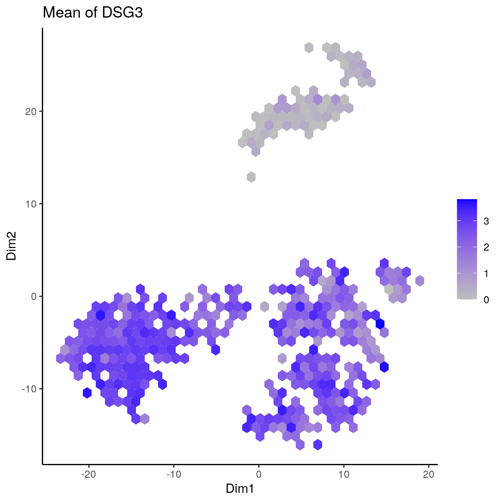|[CDSN](https://www.ncbi.nlm.nih.gov/gene/1041) [IL4](https://www.ncbi.nlm.nih.gov/gene/3565) [KRT10](https://www.ncbi.nlm.nih.gov/gene/3858) [PI3](https://www.ncbi.nlm.nih.gov/gene/5266) [SERPINA4](https://www.ncbi.nlm.nih.gov/gene/5267) [KLK7](https://www.ncbi.nlm.nih.gov/gene/5650) [NAPSA](https://www.ncbi.nlm.nih.gov/gene/9476) [ADAMTS13](https://www.ncbi.nlm.nih.gov/gene/11093) [KLK5](https://www.ncbi.nlm.nih.gov/gene/25818) [CELA2A](https://www.ncbi.nlm.nih.gov/gene/63036) [RPTN](https://www.ncbi.nlm.nih.gov/gene/126638) [A2ML1](https://www.ncbi.nlm.nih.gov/gene/144568) [IGLON5](https://www.ncbi.nlm.nih.gov/gene/402665)|
|[DSG4](https://www.ncbi.nlm.nih.gov/gene/147409)|[BMP2](https://www.ncbi.nlm.nih.gov/gene/650) [CDSN](https://www.ncbi.nlm.nih.gov/gene/1041) [PI3](https://www.ncbi.nlm.nih.gov/gene/5266) [SERPINA4](https://www.ncbi.nlm.nih.gov/gene/5267) [KLK5](https://www.ncbi.nlm.nih.gov/gene/25818) [CELA2A](https://www.ncbi.nlm.nih.gov/gene/63036) [RPTN](https://www.ncbi.nlm.nih.gov/gene/126638) [LIPH](https://www.ncbi.nlm.nih.gov/gene/200879)|
|[DUOX1](https://www.ncbi.nlm.nih.gov/gene/53905)|[CP](https://www.ncbi.nlm.nih.gov/gene/1356) [IL4](https://www.ncbi.nlm.nih.gov/gene/3565) [IL6](https://www.ncbi.nlm.nih.gov/gene/3569) [CXCL8](https://www.ncbi.nlm.nih.gov/gene/3576) [IL13](https://www.ncbi.nlm.nih.gov/gene/3596) [INS](https://www.ncbi.nlm.nih.gov/gene/3630) [REN](https://www.ncbi.nlm.nih.gov/gene/5972) [CCL2](https://www.ncbi.nlm.nih.gov/gene/6347) [SOD3](https://www.ncbi.nlm.nih.gov/gene/6649) [TG](https://www.ncbi.nlm.nih.gov/gene/7038) [TNF](https://www.ncbi.nlm.nih.gov/gene/7124) [VEGFA](https://www.ncbi.nlm.nih.gov/gene/7422)|
|[DUOX2](https://www.ncbi.nlm.nih.gov/gene/50506)|[CP](https://www.ncbi.nlm.nih.gov/gene/1356) [DMBT1](https://www.ncbi.nlm.nih.gov/gene/1755) [IL6](https://www.ncbi.nlm.nih.gov/gene/3569) [INS](https://www.ncbi.nlm.nih.gov/gene/3630) [LCN2](https://www.ncbi.nlm.nih.gov/gene/3934) [REN](https://www.ncbi.nlm.nih.gov/gene/5972) [CCL2](https://www.ncbi.nlm.nih.gov/gene/6347) [SOD3](https://www.ncbi.nlm.nih.gov/gene/6649) [TG](https://www.ncbi.nlm.nih.gov/gene/7038) [SBSN](https://www.ncbi.nlm.nih.gov/gene/374897)|
|[DUSP15](https://www.ncbi.nlm.nih.gov/gene/128853)|[ZG16B](https://www.ncbi.nlm.nih.gov/gene/124220)|
|[DVL1](https://www.ncbi.nlm.nih.gov/gene/1855)|[FRZB](https://www.ncbi.nlm.nih.gov/gene/2487) [PROC](https://www.ncbi.nlm.nih.gov/gene/5624) [PTEN](https://www.ncbi.nlm.nih.gov/gene/5728) [SDC4](https://www.ncbi.nlm.nih.gov/gene/6385) [SFRP1](https://www.ncbi.nlm.nih.gov/gene/6422) [SFRP2](https://www.ncbi.nlm.nih.gov/gene/6423) [SFRP4](https://www.ncbi.nlm.nih.gov/gene/6424) [SFRP5](https://www.ncbi.nlm.nih.gov/gene/6425) [WNT1](https://www.ncbi.nlm.nih.gov/gene/7471) [WNT2](https://www.ncbi.nlm.nih.gov/gene/7472) [WNT3](https://www.ncbi.nlm.nih.gov/gene/7473) [WNT5A](https://www.ncbi.nlm.nih.gov/gene/7474) [WNT6](https://www.ncbi.nlm.nih.gov/gene/7475) [WNT7A](https://www.ncbi.nlm.nih.gov/gene/7476) [WNT7B](https://www.ncbi.nlm.nih.gov/gene/7477) [WNT8A](https://www.ncbi.nlm.nih.gov/gene/7478) [WNT8B](https://www.ncbi.nlm.nih.gov/gene/7479) [WNT10B](https://www.ncbi.nlm.nih.gov/gene/7480) [WNT11](https://www.ncbi.nlm.nih.gov/gene/7481) [WNT2B](https://www.ncbi.nlm.nih.gov/gene/7482) [WNT9A](https://www.ncbi.nlm.nih.gov/gene/7483) [WNT9B](https://www.ncbi.nlm.nih.gov/gene/7484) [WIF1](https://www.ncbi.nlm.nih.gov/gene/11197) [DKK1](https://www.ncbi.nlm.nih.gov/gene/22943) [DKK3](https://www.ncbi.nlm.nih.gov/gene/27122) [WNT16](https://www.ncbi.nlm.nih.gov/gene/51384) [WNT4](https://www.ncbi.nlm.nih.gov/gene/54361) [WNT10A](https://www.ncbi.nlm.nih.gov/gene/80326) [WNT5B](https://www.ncbi.nlm.nih.gov/gene/81029) [RSPO3](https://www.ncbi.nlm.nih.gov/gene/84870) [WNT3A](https://www.ncbi.nlm.nih.gov/gene/89780) [CTHRC1](https://www.ncbi.nlm.nih.gov/gene/115908) [RSPO1](https://www.ncbi.nlm.nih.gov/gene/284654)|
|[DVL2](https://www.ncbi.nlm.nih.gov/gene/1856)|[AVP](https://www.ncbi.nlm.nih.gov/gene/551) [EGFR](https://www.ncbi.nlm.nih.gov/gene/1956) [FRZB](https://www.ncbi.nlm.nih.gov/gene/2487) [IL7R](https://www.ncbi.nlm.nih.gov/gene/3575) [SFRP1](https://www.ncbi.nlm.nih.gov/gene/6422) [SFRP2](https://www.ncbi.nlm.nih.gov/gene/6423) [SFRP4](https://www.ncbi.nlm.nih.gov/gene/6424) [SFRP5](https://www.ncbi.nlm.nih.gov/gene/6425) [TF](https://www.ncbi.nlm.nih.gov/gene/7018) [TGFBR3](https://www.ncbi.nlm.nih.gov/gene/7049) [WNT1](https://www.ncbi.nlm.nih.gov/gene/7471) [WNT2](https://www.ncbi.nlm.nih.gov/gene/7472) [WNT3](https://www.ncbi.nlm.nih.gov/gene/7473) [WNT5A](https://www.ncbi.nlm.nih.gov/gene/7474) [WNT6](https://www.ncbi.nlm.nih.gov/gene/7475) [WNT7A](https://www.ncbi.nlm.nih.gov/gene/7476) [WNT7B](https://www.ncbi.nlm.nih.gov/gene/7477) [WNT8A](https://www.ncbi.nlm.nih.gov/gene/7478) [WNT8B](https://www.ncbi.nlm.nih.gov/gene/7479) [WNT10B](https://www.ncbi.nlm.nih.gov/gene/7480) [WNT11](https://www.ncbi.nlm.nih.gov/gene/7481) [WNT2B](https://www.ncbi.nlm.nih.gov/gene/7482) [WNT9A](https://www.ncbi.nlm.nih.gov/gene/7483) [WNT9B](https://www.ncbi.nlm.nih.gov/gene/7484) [WIF1](https://www.ncbi.nlm.nih.gov/gene/11197) [DKK1](https://www.ncbi.nlm.nih.gov/gene/22943) [WNT16](https://www.ncbi.nlm.nih.gov/gene/51384) [WNT4](https://www.ncbi.nlm.nih.gov/gene/54361) [WNT10A](https://www.ncbi.nlm.nih.gov/gene/80326) [WNT5B](https://www.ncbi.nlm.nih.gov/gene/81029) [WNT3A](https://www.ncbi.nlm.nih.gov/gene/89780) [CTHRC1](https://www.ncbi.nlm.nih.gov/gene/115908)|
|[DYSF](https://www.ncbi.nlm.nih.gov/gene/8291)|[ANXA2](https://www.ncbi.nlm.nih.gov/gene/302) [LAMA2](https://www.ncbi.nlm.nih.gov/gene/3908) [HSD11B1L](https://www.ncbi.nlm.nih.gov/gene/374875)|
|[DYTN](https://www.ncbi.nlm.nih.gov/gene/391475)|[ADAM23](https://www.ncbi.nlm.nih.gov/gene/8745) [ADAM28](https://www.ncbi.nlm.nih.gov/gene/10863)|
|[ECE1](https://www.ncbi.nlm.nih.gov/gene/1889)|[AGT](https://www.ncbi.nlm.nih.gov/gene/183) [CALCA](https://www.ncbi.nlm.nih.gov/gene/796) [EDN1](https://www.ncbi.nlm.nih.gov/gene/1906) [EDN2](https://www.ncbi.nlm.nih.gov/gene/1907) [EDN3](https://www.ncbi.nlm.nih.gov/gene/1908) [GNRH1](https://www.ncbi.nlm.nih.gov/gene/2796) [INS](https://www.ncbi.nlm.nih.gov/gene/3630) [NRTN](https://www.ncbi.nlm.nih.gov/gene/4902) [PIP](https://www.ncbi.nlm.nih.gov/gene/5304) [SPINT1](https://www.ncbi.nlm.nih.gov/gene/6692) [VEGFA](https://www.ncbi.nlm.nih.gov/gene/7422) [GATD1](https://www.ncbi.nlm.nih.gov/gene/347862)|
|[ECSCR](https://www.ncbi.nlm.nih.gov/gene/641700)|[KDR](https://www.ncbi.nlm.nih.gov/gene/3791) [PTEN](https://www.ncbi.nlm.nih.gov/gene/5728) [MMRN1](https://www.ncbi.nlm.nih.gov/gene/22915)|
|[EDA2R](https://www.ncbi.nlm.nih.gov/gene/60401)|[EDA](https://www.ncbi.nlm.nih.gov/gene/1896)|
|[EDAR](https://www.ncbi.nlm.nih.gov/gene/10913)|[EDA](https://www.ncbi.nlm.nih.gov/gene/1896)|
|[EDNRA](https://www.ncbi.nlm.nih.gov/gene/1909)|[AGT](https://www.ncbi.nlm.nih.gov/gene/183) [AVP](https://www.ncbi.nlm.nih.gov/gene/551) [CCK](https://www.ncbi.nlm.nih.gov/gene/885) [COL3A1](https://www.ncbi.nlm.nih.gov/gene/1281) [EDN1](https://www.ncbi.nlm.nih.gov/gene/1906) [EDN2](https://www.ncbi.nlm.nih.gov/gene/1907) [EDN3](https://www.ncbi.nlm.nih.gov/gene/1908) [EGFR](https://www.ncbi.nlm.nih.gov/gene/1956) [F2](https://www.ncbi.nlm.nih.gov/gene/2147) [FN1](https://www.ncbi.nlm.nih.gov/gene/2335) [GAST](https://www.ncbi.nlm.nih.gov/gene/2520) [GCG](https://www.ncbi.nlm.nih.gov/gene/2641) [GNRH1](https://www.ncbi.nlm.nih.gov/gene/2796) [GNRH2](https://www.ncbi.nlm.nih.gov/gene/2797) [GRP](https://www.ncbi.nlm.nih.gov/gene/2922) [CXCL10](https://www.ncbi.nlm.nih.gov/gene/3627) [KISS1](https://www.ncbi.nlm.nih.gov/gene/3814) [MLN](https://www.ncbi.nlm.nih.gov/gene/4295) [NMB](https://www.ncbi.nlm.nih.gov/gene/4828) [NPY](https://www.ncbi.nlm.nih.gov/gene/4852) [NTS](https://www.ncbi.nlm.nih.gov/gene/4922) [OXT](https://www.ncbi.nlm.nih.gov/gene/5020) [PMCH](https://www.ncbi.nlm.nih.gov/gene/5367) [REN](https://www.ncbi.nlm.nih.gov/gene/5972) [SAA1](https://www.ncbi.nlm.nih.gov/gene/6288) [XCL1](https://www.ncbi.nlm.nih.gov/gene/6375) [XCL2](https://www.ncbi.nlm.nih.gov/gene/6846) [TAC1](https://www.ncbi.nlm.nih.gov/gene/6863) [TAC3](https://www.ncbi.nlm.nih.gov/gene/6866) [TRH](https://www.ncbi.nlm.nih.gov/gene/7200) [VEGFA](https://www.ncbi.nlm.nih.gov/gene/7422) [NPFF](https://www.ncbi.nlm.nih.gov/gene/8620) [NMU](https://www.ncbi.nlm.nih.gov/gene/10874) [UTS2](https://www.ncbi.nlm.nih.gov/gene/10911) [PILRA](https://www.ncbi.nlm.nih.gov/gene/29992) [GHRL](https://www.ncbi.nlm.nih.gov/gene/51738) [ADA2](https://www.ncbi.nlm.nih.gov/gene/51816) [HEG1](https://www.ncbi.nlm.nih.gov/gene/57493) [PROK2](https://www.ncbi.nlm.nih.gov/gene/60675) [PROK1](https://www.ncbi.nlm.nih.gov/gene/84432) [NMS](https://www.ncbi.nlm.nih.gov/gene/129521) [BMPER](https://www.ncbi.nlm.nih.gov/gene/168667) [UTS2B](https://www.ncbi.nlm.nih.gov/gene/257313) [QRFP](https://www.ncbi.nlm.nih.gov/gene/347148) [NPS](https://www.ncbi.nlm.nih.gov/gene/594857)|
|[EDNRB](https://www.ncbi.nlm.nih.gov/gene/1910) |[AGT](https://www.ncbi.nlm.nih.gov/gene/183) [ALB](https://www.ncbi.nlm.nih.gov/gene/213) [AVP](https://www.ncbi.nlm.nih.gov/gene/551) [CCK](https://www.ncbi.nlm.nih.gov/gene/885) [EDN1](https://www.ncbi.nlm.nih.gov/gene/1906) [EDN2](https://www.ncbi.nlm.nih.gov/gene/1907) [EDN3](https://www.ncbi.nlm.nih.gov/gene/1908) [F2](https://www.ncbi.nlm.nih.gov/gene/2147) [FGF2](https://www.ncbi.nlm.nih.gov/gene/2247) [GAST](https://www.ncbi.nlm.nih.gov/gene/2520) [GCG](https://www.ncbi.nlm.nih.gov/gene/2641) [GDNF](https://www.ncbi.nlm.nih.gov/gene/2668) [GNRH1](https://www.ncbi.nlm.nih.gov/gene/2796) [GNRH2](https://www.ncbi.nlm.nih.gov/gene/2797) [GRP](https://www.ncbi.nlm.nih.gov/gene/2922) [IGF1](https://www.ncbi.nlm.nih.gov/gene/3479) [INS](https://www.ncbi.nlm.nih.gov/gene/3630) [KISS1](https://www.ncbi.nlm.nih.gov/gene/3814) [MLN](https://www.ncbi.nlm.nih.gov/gene/4295) [MMP9](https://www.ncbi.nlm.nih.gov/gene/4318) [NMB](https://www.ncbi.nlm.nih.gov/gene/4828) [NRTN](https://www.ncbi.nlm.nih.gov/gene/4902) [NTS](https://www.ncbi.nlm.nih.gov/gene/4922) [OXT](https://www.ncbi.nlm.nih.gov/gene/5020) [PMCH](https://www.ncbi.nlm.nih.gov/gene/5367) [REN](https://www.ncbi.nlm.nih.gov/gene/5972) [SAA1](https://www.ncbi.nlm.nih.gov/gene/6288) [XCL1](https://www.ncbi.nlm.nih.gov/gene/6375) [PMEL](https://www.ncbi.nlm.nih.gov/gene/6490) [XCL2](https://www.ncbi.nlm.nih.gov/gene/6846) [TAC1](https://www.ncbi.nlm.nih.gov/gene/6863) [TAC3](https://www.ncbi.nlm.nih.gov/gene/6866) [TNF](https://www.ncbi.nlm.nih.gov/gene/7124) [TRH](https://www.ncbi.nlm.nih.gov/gene/7200) [VEGFA](https://www.ncbi.nlm.nih.gov/gene/7422) [NPFF](https://www.ncbi.nlm.nih.gov/gene/8620) [KL](https://www.ncbi.nlm.nih.gov/gene/9365) [NMU](https://www.ncbi.nlm.nih.gov/gene/10874) [UTS2](https://www.ncbi.nlm.nih.gov/gene/10911) [PROK2](https://www.ncbi.nlm.nih.gov/gene/60675) [PROK1](https://www.ncbi.nlm.nih.gov/gene/84432) [NMS](https://www.ncbi.nlm.nih.gov/gene/129521) [UTS2B](https://www.ncbi.nlm.nih.gov/gene/257313) [QRFP](https://www.ncbi.nlm.nih.gov/gene/347148) [NPS](https://www.ncbi.nlm.nih.gov/gene/594857)|
|[EFNA2](https://www.ncbi.nlm.nih.gov/gene/1943)|[BDNF](https://www.ncbi.nlm.nih.gov/gene/627) [EFNA1](https://www.ncbi.nlm.nih.gov/gene/1942) [EFNA4](https://www.ncbi.nlm.nih.gov/gene/1945) [EGFR](https://www.ncbi.nlm.nih.gov/gene/1956) [EPHA3](https://www.ncbi.nlm.nih.gov/gene/2042) [EPHB6](https://www.ncbi.nlm.nih.gov/gene/2051) [EPO](https://www.ncbi.nlm.nih.gov/gene/2056) [ERBB3](https://www.ncbi.nlm.nih.gov/gene/2065) [FGFR3](https://www.ncbi.nlm.nih.gov/gene/2261) [FGFR2](https://www.ncbi.nlm.nih.gov/gene/2263) [FGFR4](https://www.ncbi.nlm.nih.gov/gene/2264) [FLT1](https://www.ncbi.nlm.nih.gov/gene/2321) [FLT4](https://www.ncbi.nlm.nih.gov/gene/2324) [FN1](https://www.ncbi.nlm.nih.gov/gene/2335) [KDR](https://www.ncbi.nlm.nih.gov/gene/3791) [MET](https://www.ncbi.nlm.nih.gov/gene/4233) [NGF](https://www.ncbi.nlm.nih.gov/gene/4803) [NTF3](https://www.ncbi.nlm.nih.gov/gene/4908) [NTF4](https://www.ncbi.nlm.nih.gov/gene/4909) [PLXNB1](https://www.ncbi.nlm.nih.gov/gene/5364) [RELN](https://www.ncbi.nlm.nih.gov/gene/5649) [SEMA3F](https://www.ncbi.nlm.nih.gov/gene/6405) [SLIT1](https://www.ncbi.nlm.nih.gov/gene/6585) [SLIT3](https://www.ncbi.nlm.nih.gov/gene/6586) [VEGFA](https://www.ncbi.nlm.nih.gov/gene/7422) [SEMA3B](https://www.ncbi.nlm.nih.gov/gene/7869) [SLIT2](https://www.ncbi.nlm.nih.gov/gene/9353) [KL](https://www.ncbi.nlm.nih.gov/gene/9365) [NTN1](https://www.ncbi.nlm.nih.gov/gene/9423) [SEMA3A](https://www.ncbi.nlm.nih.gov/gene/10371) [SEMA3C](https://www.ncbi.nlm.nih.gov/gene/10512) [SEMA3G](https://www.ncbi.nlm.nih.gov/gene/56920) [SEMA3D](https://www.ncbi.nlm.nih.gov/gene/223117) [EPHA10](https://www.ncbi.nlm.nih.gov/gene/284656) [DRAXIN](https://www.ncbi.nlm.nih.gov/gene/374946)|
|[EFNA3](https://www.ncbi.nlm.nih.gov/gene/1944)|[BDNF](https://www.ncbi.nlm.nih.gov/gene/627) [EFNA1](https://www.ncbi.nlm.nih.gov/gene/1942) [EFNA4](https://www.ncbi.nlm.nih.gov/gene/1945) [EGFR](https://www.ncbi.nlm.nih.gov/gene/1956) [EPHA3](https://www.ncbi.nlm.nih.gov/gene/2042) [EPHB6](https://www.ncbi.nlm.nih.gov/gene/2051) [EPO](https://www.ncbi.nlm.nih.gov/gene/2056) [ERBB3](https://www.ncbi.nlm.nih.gov/gene/2065) [FGFR3](https://www.ncbi.nlm.nih.gov/gene/2261) [FGFR2](https://www.ncbi.nlm.nih.gov/gene/2263) [FGFR4](https://www.ncbi.nlm.nih.gov/gene/2264) [FLT1](https://www.ncbi.nlm.nih.gov/gene/2321) [FLT4](https://www.ncbi.nlm.nih.gov/gene/2324) [FN1](https://www.ncbi.nlm.nih.gov/gene/2335) [KDR](https://www.ncbi.nlm.nih.gov/gene/3791) [MET](https://www.ncbi.nlm.nih.gov/gene/4233) [NGF](https://www.ncbi.nlm.nih.gov/gene/4803) [NTF3](https://www.ncbi.nlm.nih.gov/gene/4908) [NTF4](https://www.ncbi.nlm.nih.gov/gene/4909) [PLXNB1](https://www.ncbi.nlm.nih.gov/gene/5364) [RELN](https://www.ncbi.nlm.nih.gov/gene/5649) [SEMA3F](https://www.ncbi.nlm.nih.gov/gene/6405) [SLIT1](https://www.ncbi.nlm.nih.gov/gene/6585) [SLIT3](https://www.ncbi.nlm.nih.gov/gene/6586) [VEGFA](https://www.ncbi.nlm.nih.gov/gene/7422) [SEMA3B](https://www.ncbi.nlm.nih.gov/gene/7869) [NRP1](https://www.ncbi.nlm.nih.gov/gene/8829) [SLIT2](https://www.ncbi.nlm.nih.gov/gene/9353) [NTN1](https://www.ncbi.nlm.nih.gov/gene/9423) [SEMA3A](https://www.ncbi.nlm.nih.gov/gene/10371) [SEMA3C](https://www.ncbi.nlm.nih.gov/gene/10512) [SEMA3G](https://www.ncbi.nlm.nih.gov/gene/56920) [SEMA3D](https://www.ncbi.nlm.nih.gov/gene/223117) [EPHA10](https://www.ncbi.nlm.nih.gov/gene/284656)|
|[EFNA5](https://www.ncbi.nlm.nih.gov/gene/1946)|[BDNF](https://www.ncbi.nlm.nih.gov/gene/627) [EFNA1](https://www.ncbi.nlm.nih.gov/gene/1942) [EFNA4](https://www.ncbi.nlm.nih.gov/gene/1945) [EGFR](https://www.ncbi.nlm.nih.gov/gene/1956) [EPHA3](https://www.ncbi.nlm.nih.gov/gene/2042) [EPHB6](https://www.ncbi.nlm.nih.gov/gene/2051) [EPO](https://www.ncbi.nlm.nih.gov/gene/2056) [ERBB3](https://www.ncbi.nlm.nih.gov/gene/2065) [FGFR3](https://www.ncbi.nlm.nih.gov/gene/2261) [FGFR2](https://www.ncbi.nlm.nih.gov/gene/2263) [FGFR4](https://www.ncbi.nlm.nih.gov/gene/2264) [FLT1](https://www.ncbi.nlm.nih.gov/gene/2321) [FLT4](https://www.ncbi.nlm.nih.gov/gene/2324) [FN1](https://www.ncbi.nlm.nih.gov/gene/2335) [KDR](https://www.ncbi.nlm.nih.gov/gene/3791) [MET](https://www.ncbi.nlm.nih.gov/gene/4233) [MYOC](https://www.ncbi.nlm.nih.gov/gene/4653) [NGF](https://www.ncbi.nlm.nih.gov/gene/4803) [NTF3](https://www.ncbi.nlm.nih.gov/gene/4908) [NTF4](https://www.ncbi.nlm.nih.gov/gene/4909) [PLXNB1](https://www.ncbi.nlm.nih.gov/gene/5364) [RELN](https://www.ncbi.nlm.nih.gov/gene/5649) [SEMA3F](https://www.ncbi.nlm.nih.gov/gene/6405) [SLIT1](https://www.ncbi.nlm.nih.gov/gene/6585) [SLIT3](https://www.ncbi.nlm.nih.gov/gene/6586) [VEGFA](https://www.ncbi.nlm.nih.gov/gene/7422) [SEMA3B](https://www.ncbi.nlm.nih.gov/gene/7869) [NRP1](https://www.ncbi.nlm.nih.gov/gene/8829) [SLIT2](https://www.ncbi.nlm.nih.gov/gene/9353) [NTN1](https://www.ncbi.nlm.nih.gov/gene/9423) [SEMA3A](https://www.ncbi.nlm.nih.gov/gene/10371) [SEMA3C](https://www.ncbi.nlm.nih.gov/gene/10512) [SEMA3G](https://www.ncbi.nlm.nih.gov/gene/56920) [SEMA3D](https://www.ncbi.nlm.nih.gov/gene/223117) [EPHA10](https://www.ncbi.nlm.nih.gov/gene/284656)|
|[EFR3A](https://www.ncbi.nlm.nih.gov/gene/23167)|[COL5A2](https://www.ncbi.nlm.nih.gov/gene/1290) [LGALS1](https://www.ncbi.nlm.nih.gov/gene/3956)|
|[EFR3B](https://www.ncbi.nlm.nih.gov/gene/22979)|[FCAR](https://www.ncbi.nlm.nih.gov/gene/2204) [MATN4](https://www.ncbi.nlm.nih.gov/gene/8785) [C6orf120](https://www.ncbi.nlm.nih.gov/gene/387263)|
|[EGFR](https://www.ncbi.nlm.nih.gov/gene/1956)|[HBEGF](https://www.ncbi.nlm.nih.gov/gene/1839) [TGFA](https://www.ncbi.nlm.nih.gov/gene/7039) [EPGN](https://www.ncbi.nlm.nih.gov/gene/255324) [BTC](https://www.ncbi.nlm.nih.gov/gene/685) [EGF](https://www.ncbi.nlm.nih.gov/gene/1950) [AREG](https://www.ncbi.nlm.nih.gov/gene/374) [EREG](https://www.ncbi.nlm.nih.gov/gene/2069)|
|[ELMO1](https://www.ncbi.nlm.nih.gov/gene/9844)|[ADGRB1](https://www.ncbi.nlm.nih.gov/gene/575) [KDR](https://www.ncbi.nlm.nih.gov/gene/3791) [PON1](https://www.ncbi.nlm.nih.gov/gene/5444) [CCL2](https://www.ncbi.nlm.nih.gov/gene/6347) [NTN1](https://www.ncbi.nlm.nih.gov/gene/9423) [TMEFF2](https://www.ncbi.nlm.nih.gov/gene/23671) [CNDP1](https://www.ncbi.nlm.nih.gov/gene/84735) [IGLL5](https://www.ncbi.nlm.nih.gov/gene/100423062)|
|[EMB](https://www.ncbi.nlm.nih.gov/gene/133418)|[ITIH4](https://www.ncbi.nlm.nih.gov/gene/3700)|
|[ENG](https://www.ncbi.nlm.nih.gov/gene/2022) |[ACAN](https://www.ncbi.nlm.nih.gov/gene/176) [AGT](https://www.ncbi.nlm.nih.gov/gene/183) [ALB](https://www.ncbi.nlm.nih.gov/gene/213) [ALCAM](https://www.ncbi.nlm.nih.gov/gene/214) [AMBP](https://www.ncbi.nlm.nih.gov/gene/259) [ANGPT1](https://www.ncbi.nlm.nih.gov/gene/284) [ANGPT2](https://www.ncbi.nlm.nih.gov/gene/285) [BGLAP](https://www.ncbi.nlm.nih.gov/gene/632) [BGN](https://www.ncbi.nlm.nih.gov/gene/633) [BMP2](https://www.ncbi.nlm.nih.gov/gene/650) [BMP4](https://www.ncbi.nlm.nih.gov/gene/652) [BMP6](https://www.ncbi.nlm.nih.gov/gene/654) [BMP7](https://www.ncbi.nlm.nih.gov/gene/655) [CD40](https://www.ncbi.nlm.nih.gov/gene/958) [COL1A1](https://www.ncbi.nlm.nih.gov/gene/1277) [COL2A1](https://www.ncbi.nlm.nih.gov/gene/1280) [COL5A1](https://www.ncbi.nlm.nih.gov/gene/1289) [CSF2](https://www.ncbi.nlm.nih.gov/gene/1437) [CSF3](https://www.ncbi.nlm.nih.gov/gene/1440) [CCN2](https://www.ncbi.nlm.nih.gov/gene/1490) [EDN1](https://www.ncbi.nlm.nih.gov/gene/1906) [ELN](https://www.ncbi.nlm.nih.gov/gene/2006) [FGF1](https://www.ncbi.nlm.nih.gov/gene/2246) [FGF2](https://www.ncbi.nlm.nih.gov/gene/2247) [FGF7](https://www.ncbi.nlm.nih.gov/gene/2252) [FLT1](https://www.ncbi.nlm.nih.gov/gene/2321) [FLT4](https://www.ncbi.nlm.nih.gov/gene/2324) [FN1](https://www.ncbi.nlm.nih.gov/gene/2335) [GDF2](https://www.ncbi.nlm.nih.gov/gene/2658) [IBSP](https://www.ncbi.nlm.nih.gov/gene/3381) [IGF1](https://www.ncbi.nlm.nih.gov/gene/3479) [IL6](https://www.ncbi.nlm.nih.gov/gene/3569) [CXCL8](https://www.ncbi.nlm.nih.gov/gene/3576) [IL10](https://www.ncbi.nlm.nih.gov/gene/3586) [INHBA](https://www.ncbi.nlm.nih.gov/gene/3624) [INS](https://www.ncbi.nlm.nih.gov/gene/3630) [KDR](https://www.ncbi.nlm.nih.gov/gene/3791) [LEP](https://www.ncbi.nlm.nih.gov/gene/3952) [MMP9](https://www.ncbi.nlm.nih.gov/gene/4318) [NCAM1](https://www.ncbi.nlm.nih.gov/gene/4684) [SERPINE1](https://www.ncbi.nlm.nih.gov/gene/5054) [PAPPA](https://www.ncbi.nlm.nih.gov/gene/5069) [PDGFB](https://www.ncbi.nlm.nih.gov/gene/5155) [PGF](https://www.ncbi.nlm.nih.gov/gene/5228) [CCL2](https://www.ncbi.nlm.nih.gov/gene/6347) [CXCL12](https://www.ncbi.nlm.nih.gov/gene/6387) [SPARC](https://www.ncbi.nlm.nih.gov/gene/6678) [SPP1](https://www.ncbi.nlm.nih.gov/gene/6696) [TGFB1](https://www.ncbi.nlm.nih.gov/gene/7040) [TGFB2](https://www.ncbi.nlm.nih.gov/gene/7042) [TGFB3](https://www.ncbi.nlm.nih.gov/gene/7043) [TGFBR3](https://www.ncbi.nlm.nih.gov/gene/7049) [THBS1](https://www.ncbi.nlm.nih.gov/gene/7057) [TIMP1](https://www.ncbi.nlm.nih.gov/gene/7076) [TNF](https://www.ncbi.nlm.nih.gov/gene/7124) [VEGFA](https://www.ncbi.nlm.nih.gov/gene/7422) [VEGFC](https://www.ncbi.nlm.nih.gov/gene/7424) [VWF](https://www.ncbi.nlm.nih.gov/gene/7450) [BMP10](https://www.ncbi.nlm.nih.gov/gene/27302) [COL18A1](https://www.ncbi.nlm.nih.gov/gene/80781) [LRG1](https://www.ncbi.nlm.nih.gov/gene/116844)|
|[ENO2](https://www.ncbi.nlm.nih.gov/gene/2026)|[SERPINA3](https://www.ncbi.nlm.nih.gov/gene/12) [AFP](https://www.ncbi.nlm.nih.gov/gene/174) [ALB](https://www.ncbi.nlm.nih.gov/gene/213) [KLK3](https://www.ncbi.nlm.nih.gov/gene/354) [AVP](https://www.ncbi.nlm.nih.gov/gene/551) [BDNF](https://www.ncbi.nlm.nih.gov/gene/627) [CALCA](https://www.ncbi.nlm.nih.gov/gene/796) [CHGA](https://www.ncbi.nlm.nih.gov/gene/1113) [CHGB](https://www.ncbi.nlm.nih.gov/gene/1114) [CRP](https://www.ncbi.nlm.nih.gov/gene/1401) [EGFR](https://www.ncbi.nlm.nih.gov/gene/1956) [FGF2](https://www.ncbi.nlm.nih.gov/gene/2247) [GAST](https://www.ncbi.nlm.nih.gov/gene/2520) [GCG](https://www.ncbi.nlm.nih.gov/gene/2641) [GRP](https://www.ncbi.nlm.nih.gov/gene/2922) [IL6](https://www.ncbi.nlm.nih.gov/gene/3569) [CXCL8](https://www.ncbi.nlm.nih.gov/gene/3576) [INS](https://www.ncbi.nlm.nih.gov/gene/3630) [MUC1](https://www.ncbi.nlm.nih.gov/gene/4582) [NCAM1](https://www.ncbi.nlm.nih.gov/gene/4684) [NGF](https://www.ncbi.nlm.nih.gov/gene/4803) [NPY](https://www.ncbi.nlm.nih.gov/gene/4852) [NTS](https://www.ncbi.nlm.nih.gov/gene/4922) [PDYN](https://www.ncbi.nlm.nih.gov/gene/5173) [SERPINA1](https://www.ncbi.nlm.nih.gov/gene/5265) [POMC](https://www.ncbi.nlm.nih.gov/gene/5443) [PPY](https://www.ncbi.nlm.nih.gov/gene/5539) [SST](https://www.ncbi.nlm.nih.gov/gene/6750) [TAC1](https://www.ncbi.nlm.nih.gov/gene/6863) [TG](https://www.ncbi.nlm.nih.gov/gene/7038) [VEGFA](https://www.ncbi.nlm.nih.gov/gene/7422) [VIP](https://www.ncbi.nlm.nih.gov/gene/7432) [WNT11](https://www.ncbi.nlm.nih.gov/gene/7481) [DAND5](https://www.ncbi.nlm.nih.gov/gene/199699) [NPS](https://www.ncbi.nlm.nih.gov/gene/594857)|
|[ENOX1](https://www.ncbi.nlm.nih.gov/gene/55068)|[BTC](https://www.ncbi.nlm.nih.gov/gene/685) [ENOX2](https://www.ncbi.nlm.nih.gov/gene/10495) [BRINP2](https://www.ncbi.nlm.nih.gov/gene/57795)|
|[ENOX2](https://www.ncbi.nlm.nih.gov/gene/10495)|[BTC](https://www.ncbi.nlm.nih.gov/gene/685)|
|[ENPEP](https://www.ncbi.nlm.nih.gov/gene/2028)|[AGT](https://www.ncbi.nlm.nih.gov/gene/183) [APOH](https://www.ncbi.nlm.nih.gov/gene/350) [CCK](https://www.ncbi.nlm.nih.gov/gene/885) [CMA1](https://www.ncbi.nlm.nih.gov/gene/1215) [GRN](https://www.ncbi.nlm.nih.gov/gene/2896) [CFI](https://www.ncbi.nlm.nih.gov/gene/3426) [IL2](https://www.ncbi.nlm.nih.gov/gene/3558) [ITIH4](https://www.ncbi.nlm.nih.gov/gene/3700) [REN](https://www.ncbi.nlm.nih.gov/gene/5972) [RNPEP](https://www.ncbi.nlm.nih.gov/gene/6051) [SLPI](https://www.ncbi.nlm.nih.gov/gene/6590) [CHRDL2](https://www.ncbi.nlm.nih.gov/gene/25884) [CPA5](https://www.ncbi.nlm.nih.gov/gene/93979)|
|[ENPP3](https://www.ncbi.nlm.nih.gov/gene/5169)|[ALB](https://www.ncbi.nlm.nih.gov/gene/213) [IL3](https://www.ncbi.nlm.nih.gov/gene/3562) [LAMA3](https://www.ncbi.nlm.nih.gov/gene/3909) [LAMA5](https://www.ncbi.nlm.nih.gov/gene/3911) [VTN](https://www.ncbi.nlm.nih.gov/gene/7448) [CD164](https://www.ncbi.nlm.nih.gov/gene/8763)|
|[ENPP4](https://www.ncbi.nlm.nih.gov/gene/22875)|[F13A1](https://www.ncbi.nlm.nih.gov/gene/2162) [OTOR](https://www.ncbi.nlm.nih.gov/gene/56914) [CRISPLD2](https://www.ncbi.nlm.nih.gov/gene/83716)|
|[ENPP6](https://www.ncbi.nlm.nih.gov/gene/133121)|[CA6](https://www.ncbi.nlm.nih.gov/gene/765) [ENPP2](https://www.ncbi.nlm.nih.gov/gene/5168) [PLA2G1B](https://www.ncbi.nlm.nih.gov/gene/5319) [PLA2G5](https://www.ncbi.nlm.nih.gov/gene/5322) [PLA2G10](https://www.ncbi.nlm.nih.gov/gene/8399) [PLA2G2D](https://www.ncbi.nlm.nih.gov/gene/26279) [PLA2G2E](https://www.ncbi.nlm.nih.gov/gene/30814) [PLA2G3](https://www.ncbi.nlm.nih.gov/gene/50487) [PLA2G2F](https://www.ncbi.nlm.nih.gov/gene/64600) [PLA2G12A](https://www.ncbi.nlm.nih.gov/gene/81579) [PLA2G12B](https://www.ncbi.nlm.nih.gov/gene/84647)|
|[ENPP7](https://www.ncbi.nlm.nih.gov/gene/339221)|[ASAH2](https://www.ncbi.nlm.nih.gov/gene/56624) [ADGRE3](https://www.ncbi.nlm.nih.gov/gene/84658)|
|[ENTPD8](https://www.ncbi.nlm.nih.gov/gene/377841)|[CRP](https://www.ncbi.nlm.nih.gov/gene/1401) [IL2](https://www.ncbi.nlm.nih.gov/gene/3558) [TFPI2](https://www.ncbi.nlm.nih.gov/gene/7980) [MTRNR2L8](https://www.ncbi.nlm.nih.gov/gene/100463486)|
|[EPCAM](https://www.ncbi.nlm.nih.gov/gene/4072)|[AFP](https://www.ncbi.nlm.nih.gov/gene/174) [ALB](https://www.ncbi.nlm.nih.gov/gene/213) [ALCAM](https://www.ncbi.nlm.nih.gov/gene/214) [AMBP](https://www.ncbi.nlm.nih.gov/gene/259) [KLK3](https://www.ncbi.nlm.nih.gov/gene/354) [BMP4](https://www.ncbi.nlm.nih.gov/gene/652) [EGFR](https://www.ncbi.nlm.nih.gov/gene/1956) [ERBB3](https://www.ncbi.nlm.nih.gov/gene/2065) [FGF2](https://www.ncbi.nlm.nih.gov/gene/2247) [FN1](https://www.ncbi.nlm.nih.gov/gene/2335) [GDNF](https://www.ncbi.nlm.nih.gov/gene/2668) [IGF2](https://www.ncbi.nlm.nih.gov/gene/3481) [IL2](https://www.ncbi.nlm.nih.gov/gene/3558) [IL6](https://www.ncbi.nlm.nih.gov/gene/3569) [CXCL8](https://www.ncbi.nlm.nih.gov/gene/3576) [INS](https://www.ncbi.nlm.nih.gov/gene/3630) [KDR](https://www.ncbi.nlm.nih.gov/gene/3791) [MET](https://www.ncbi.nlm.nih.gov/gene/4233) [SCGB2A2](https://www.ncbi.nlm.nih.gov/gene/4250) [MMP9](https://www.ncbi.nlm.nih.gov/gene/4318) [MUC1](https://www.ncbi.nlm.nih.gov/gene/4582) [NCAM1](https://www.ncbi.nlm.nih.gov/gene/4684) [PRSS8](https://www.ncbi.nlm.nih.gov/gene/5652) [PTEN](https://www.ncbi.nlm.nih.gov/gene/5728) [SFTPC](https://www.ncbi.nlm.nih.gov/gene/6440) [SPINT1](https://www.ncbi.nlm.nih.gov/gene/6692) [TNF](https://www.ncbi.nlm.nih.gov/gene/7124) [SCGB1A1](https://www.ncbi.nlm.nih.gov/gene/7356) [VEGFA](https://www.ncbi.nlm.nih.gov/gene/7422) [WNT2](https://www.ncbi.nlm.nih.gov/gene/7472) [MSLN](https://www.ncbi.nlm.nih.gov/gene/10232) [AGR2](https://www.ncbi.nlm.nih.gov/gene/10551) [WNT3A](https://www.ncbi.nlm.nih.gov/gene/89780)|
|[EPHA1](https://www.ncbi.nlm.nih.gov/gene/2041)|[APOE](https://www.ncbi.nlm.nih.gov/gene/348) [BDNF](https://www.ncbi.nlm.nih.gov/gene/627) [EFNA1](https://www.ncbi.nlm.nih.gov/gene/1942) [EFNA4](https://www.ncbi.nlm.nih.gov/gene/1945) [EPHA3](https://www.ncbi.nlm.nih.gov/gene/2042) [EPHB6](https://www.ncbi.nlm.nih.gov/gene/2051) [EPO](https://www.ncbi.nlm.nih.gov/gene/2056) [FN1](https://www.ncbi.nlm.nih.gov/gene/2335) [IGF1](https://www.ncbi.nlm.nih.gov/gene/3479) [INS](https://www.ncbi.nlm.nih.gov/gene/3630) [NGF](https://www.ncbi.nlm.nih.gov/gene/4803) [NTF3](https://www.ncbi.nlm.nih.gov/gene/4908) [NTF4](https://www.ncbi.nlm.nih.gov/gene/4909) [PLXNB1](https://www.ncbi.nlm.nih.gov/gene/5364) [PTEN](https://www.ncbi.nlm.nih.gov/gene/5728) [CXCL12](https://www.ncbi.nlm.nih.gov/gene/6387) [SEMA3F](https://www.ncbi.nlm.nih.gov/gene/6405) [SLIT3](https://www.ncbi.nlm.nih.gov/gene/6586) [VEGFA](https://www.ncbi.nlm.nih.gov/gene/7422) [SEMA3B](https://www.ncbi.nlm.nih.gov/gene/7869) [SLIT2](https://www.ncbi.nlm.nih.gov/gene/9353) [NTN1](https://www.ncbi.nlm.nih.gov/gene/9423) [SEMA3A](https://www.ncbi.nlm.nih.gov/gene/10371) [SEMA3C](https://www.ncbi.nlm.nih.gov/gene/10512) [TREM2](https://www.ncbi.nlm.nih.gov/gene/54209) [SEMA3G](https://www.ncbi.nlm.nih.gov/gene/56920) [SCUBE3](https://www.ncbi.nlm.nih.gov/gene/222663) [SEMA3D](https://www.ncbi.nlm.nih.gov/gene/223117) [EPHA10](https://www.ncbi.nlm.nih.gov/gene/284656) [EFNA2](https://www.ncbi.nlm.nih.gov/gene/1943) [EFNA3](https://www.ncbi.nlm.nih.gov/gene/1944) [EFNA5](https://www.ncbi.nlm.nih.gov/gene/1946)|
|[EPHA2](https://www.ncbi.nlm.nih.gov/gene/1969)|[ANGPT1](https://www.ncbi.nlm.nih.gov/gene/284) [ANGPT2](https://www.ncbi.nlm.nih.gov/gene/285) [BDNF](https://www.ncbi.nlm.nih.gov/gene/627) [EFNA1](https://www.ncbi.nlm.nih.gov/gene/1942) [EFNA4](https://www.ncbi.nlm.nih.gov/gene/1945) [EGFR](https://www.ncbi.nlm.nih.gov/gene/1956) [EPHA3](https://www.ncbi.nlm.nih.gov/gene/2042) [EPHB6](https://www.ncbi.nlm.nih.gov/gene/2051) [EPO](https://www.ncbi.nlm.nih.gov/gene/2056) [FGF1](https://www.ncbi.nlm.nih.gov/gene/2246) [FGF2](https://www.ncbi.nlm.nih.gov/gene/2247) [FGF3](https://www.ncbi.nlm.nih.gov/gene/2248) [FGF4](https://www.ncbi.nlm.nih.gov/gene/2249) [FGF5](https://www.ncbi.nlm.nih.gov/gene/2250) [FGF6](https://www.ncbi.nlm.nih.gov/gene/2251) [FGF7](https://www.ncbi.nlm.nih.gov/gene/2252) [FGF8](https://www.ncbi.nlm.nih.gov/gene/2253) [FGF9](https://www.ncbi.nlm.nih.gov/gene/2254) [FGF10](https://www.ncbi.nlm.nih.gov/gene/2255) [VEGFD](https://www.ncbi.nlm.nih.gov/gene/2277) [FLT3LG](https://www.ncbi.nlm.nih.gov/gene/2323) [FN1](https://www.ncbi.nlm.nih.gov/gene/2335) [GRN](https://www.ncbi.nlm.nih.gov/gene/2896) [IGF1](https://www.ncbi.nlm.nih.gov/gene/3479) [IGF2](https://www.ncbi.nlm.nih.gov/gene/3481) [INS](https://www.ncbi.nlm.nih.gov/gene/3630) [LGALS3](https://www.ncbi.nlm.nih.gov/gene/3958) [MET](https://www.ncbi.nlm.nih.gov/gene/4233) [MMP9](https://www.ncbi.nlm.nih.gov/gene/4318) [MMP10](https://www.ncbi.nlm.nih.gov/gene/4319) [NGF](https://www.ncbi.nlm.nih.gov/gene/4803) [NTF3](https://www.ncbi.nlm.nih.gov/gene/4908) [NTF4](https://www.ncbi.nlm.nih.gov/gene/4909) [PDGFA](https://www.ncbi.nlm.nih.gov/gene/5154) [PDGFB](https://www.ncbi.nlm.nih.gov/gene/5155) [PGF](https://www.ncbi.nlm.nih.gov/gene/5228) [PLXNB1](https://www.ncbi.nlm.nih.gov/gene/5364) [PTEN](https://www.ncbi.nlm.nih.gov/gene/5728) [SEMA3F](https://www.ncbi.nlm.nih.gov/gene/6405) [PMEL](https://www.ncbi.nlm.nih.gov/gene/6490) [SLIT3](https://www.ncbi.nlm.nih.gov/gene/6586) [VEGFA](https://www.ncbi.nlm.nih.gov/gene/7422) [VEGFB](https://www.ncbi.nlm.nih.gov/gene/7423) [VEGFC](https://www.ncbi.nlm.nih.gov/gene/7424) [SEMA3B](https://www.ncbi.nlm.nih.gov/gene/7869) [FGF23](https://www.ncbi.nlm.nih.gov/gene/8074) [FGF18](https://www.ncbi.nlm.nih.gov/gene/8817) [FGF17](https://www.ncbi.nlm.nih.gov/gene/8822) [FGF16](https://www.ncbi.nlm.nih.gov/gene/8823) [SLIT2](https://www.ncbi.nlm.nih.gov/gene/9353) [FGF19](https://www.ncbi.nlm.nih.gov/gene/9965) [SEMA3A](https://www.ncbi.nlm.nih.gov/gene/10371) [SEMA3C](https://www.ncbi.nlm.nih.gov/gene/10512) [FGF20](https://www.ncbi.nlm.nih.gov/gene/26281) [FGF21](https://www.ncbi.nlm.nih.gov/gene/26291) [FGF22](https://www.ncbi.nlm.nih.gov/gene/27006) [ANGPT4](https://www.ncbi.nlm.nih.gov/gene/51378) [SEMA3G](https://www.ncbi.nlm.nih.gov/gene/56920) [CDCP1](https://www.ncbi.nlm.nih.gov/gene/64866) [PDGFD](https://www.ncbi.nlm.nih.gov/gene/80310) [SEMA3D](https://www.ncbi.nlm.nih.gov/gene/223117) [EPHA10](https://www.ncbi.nlm.nih.gov/gene/284656) [EFNA3](https://www.ncbi.nlm.nih.gov/gene/1944) [EFNA2](https://www.ncbi.nlm.nih.gov/gene/1943) [EFNA5](https://www.ncbi.nlm.nih.gov/gene/1946)|
|[EPHA3](https://www.ncbi.nlm.nih.gov/gene/2042)|[EFNA1](https://www.ncbi.nlm.nih.gov/gene/1942) [EFNA4](https://www.ncbi.nlm.nih.gov/gene/1945) [EFNA5](https://www.ncbi.nlm.nih.gov/gene/1946) [EFNA2](https://www.ncbi.nlm.nih.gov/gene/1943) [EFNA3](https://www.ncbi.nlm.nih.gov/gene/1944)|
|[EPHA4](https://www.ncbi.nlm.nih.gov/gene/2043)|[BDNF](https://www.ncbi.nlm.nih.gov/gene/627) [EFNA1](https://www.ncbi.nlm.nih.gov/gene/1942) [EFNA4](https://www.ncbi.nlm.nih.gov/gene/1945) [EPHA3](https://www.ncbi.nlm.nih.gov/gene/2042) [EPHB6](https://www.ncbi.nlm.nih.gov/gene/2051) [EPO](https://www.ncbi.nlm.nih.gov/gene/2056) [FGFR3](https://www.ncbi.nlm.nih.gov/gene/2261) [FGFR2](https://www.ncbi.nlm.nih.gov/gene/2263) [FGFR4](https://www.ncbi.nlm.nih.gov/gene/2264) [FN1](https://www.ncbi.nlm.nih.gov/gene/2335) [IGF1](https://www.ncbi.nlm.nih.gov/gene/3479) [INS](https://www.ncbi.nlm.nih.gov/gene/3630) [NCAM1](https://www.ncbi.nlm.nih.gov/gene/4684) [NGF](https://www.ncbi.nlm.nih.gov/gene/4803) [NTF3](https://www.ncbi.nlm.nih.gov/gene/4908) [NTF4](https://www.ncbi.nlm.nih.gov/gene/4909) [PLXNB1](https://www.ncbi.nlm.nih.gov/gene/5364) [PTEN](https://www.ncbi.nlm.nih.gov/gene/5728) [SEMA3F](https://www.ncbi.nlm.nih.gov/gene/6405) [SLIT1](https://www.ncbi.nlm.nih.gov/gene/6585) [SLIT3](https://www.ncbi.nlm.nih.gov/gene/6586) [SEMA3B](https://www.ncbi.nlm.nih.gov/gene/7869) [SLIT2](https://www.ncbi.nlm.nih.gov/gene/9353) [NTN1](https://www.ncbi.nlm.nih.gov/gene/9423) [SEMA3A](https://www.ncbi.nlm.nih.gov/gene/10371) [SEMA3C](https://www.ncbi.nlm.nih.gov/gene/10512) [SEMA3G](https://www.ncbi.nlm.nih.gov/gene/56920) [SEMA3D](https://www.ncbi.nlm.nih.gov/gene/223117) [EPHA10](https://www.ncbi.nlm.nih.gov/gene/284656) [EFNB3](https://www.ncbi.nlm.nih.gov/gene/1949) [EFNB1](https://www.ncbi.nlm.nih.gov/gene/1947) [EFNA5](https://www.ncbi.nlm.nih.gov/gene/1946) [EFNA2](https://www.ncbi.nlm.nih.gov/gene/1943) [EFNB2](https://www.ncbi.nlm.nih.gov/gene/1948) [EFNA3](https://www.ncbi.nlm.nih.gov/gene/1944)|
|[EPHA5](https://www.ncbi.nlm.nih.gov/gene/2044)|[BDNF](https://www.ncbi.nlm.nih.gov/gene/627) [EFNA1](https://www.ncbi.nlm.nih.gov/gene/1942) [EFNA4](https://www.ncbi.nlm.nih.gov/gene/1945) [EPHA3](https://www.ncbi.nlm.nih.gov/gene/2042) [EPHB6](https://www.ncbi.nlm.nih.gov/gene/2051) [FN1](https://www.ncbi.nlm.nih.gov/gene/2335) [INS](https://www.ncbi.nlm.nih.gov/gene/3630) [PLXNB1](https://www.ncbi.nlm.nih.gov/gene/5364) [PTEN](https://www.ncbi.nlm.nih.gov/gene/5728) [SEMA3F](https://www.ncbi.nlm.nih.gov/gene/6405) [SLIT1](https://www.ncbi.nlm.nih.gov/gene/6585) [SLIT3](https://www.ncbi.nlm.nih.gov/gene/6586) [SEMA3B](https://www.ncbi.nlm.nih.gov/gene/7869) [SLIT2](https://www.ncbi.nlm.nih.gov/gene/9353) [NTN1](https://www.ncbi.nlm.nih.gov/gene/9423) [ADAMTS3](https://www.ncbi.nlm.nih.gov/gene/9508) [SEMA3A](https://www.ncbi.nlm.nih.gov/gene/10371) [SEMA3C](https://www.ncbi.nlm.nih.gov/gene/10512) [TSPEAR](https://www.ncbi.nlm.nih.gov/gene/54084) [SEMA3G](https://www.ncbi.nlm.nih.gov/gene/56920) [SEMA3D](https://www.ncbi.nlm.nih.gov/gene/223117) [EPHA10](https://www.ncbi.nlm.nih.gov/gene/284656) [EFNA5](https://www.ncbi.nlm.nih.gov/gene/1946) [EFNA2](https://www.ncbi.nlm.nih.gov/gene/1943) [EFNA3](https://www.ncbi.nlm.nih.gov/gene/1944)|
|[EPHA7](https://www.ncbi.nlm.nih.gov/gene/2045)|[BDNF](https://www.ncbi.nlm.nih.gov/gene/627) [EFNA1](https://www.ncbi.nlm.nih.gov/gene/1942) [EFNA4](https://www.ncbi.nlm.nih.gov/gene/1945) [EPHA3](https://www.ncbi.nlm.nih.gov/gene/2042) [EPHB6](https://www.ncbi.nlm.nih.gov/gene/2051) [FN1](https://www.ncbi.nlm.nih.gov/gene/2335) [INS](https://www.ncbi.nlm.nih.gov/gene/3630) [PLXNB1](https://www.ncbi.nlm.nih.gov/gene/5364) [PTEN](https://www.ncbi.nlm.nih.gov/gene/5728) [SEMA3F](https://www.ncbi.nlm.nih.gov/gene/6405) [SLIT3](https://www.ncbi.nlm.nih.gov/gene/6586) [SEMA3B](https://www.ncbi.nlm.nih.gov/gene/7869) [SLIT2](https://www.ncbi.nlm.nih.gov/gene/9353) [NTN1](https://www.ncbi.nlm.nih.gov/gene/9423) [SEMA3A](https://www.ncbi.nlm.nih.gov/gene/10371) [SEMA3C](https://www.ncbi.nlm.nih.gov/gene/10512) [SEMA3G](https://www.ncbi.nlm.nih.gov/gene/56920) [SEMA3D](https://www.ncbi.nlm.nih.gov/gene/223117) [EPHA10](https://www.ncbi.nlm.nih.gov/gene/284656) [EFNA2](https://www.ncbi.nlm.nih.gov/gene/1943) [EFNA5](https://www.ncbi.nlm.nih.gov/gene/1946) [EFNA3](https://www.ncbi.nlm.nih.gov/gene/1944)|
|[EPHA8](https://www.ncbi.nlm.nih.gov/gene/2046)|[BDNF](https://www.ncbi.nlm.nih.gov/gene/627) [EFNA1](https://www.ncbi.nlm.nih.gov/gene/1942) [EFNA4](https://www.ncbi.nlm.nih.gov/gene/1945) [EPHA3](https://www.ncbi.nlm.nih.gov/gene/2042) [EPHB6](https://www.ncbi.nlm.nih.gov/gene/2051) [FN1](https://www.ncbi.nlm.nih.gov/gene/2335) [PLXNB1](https://www.ncbi.nlm.nih.gov/gene/5364) [SEMA3F](https://www.ncbi.nlm.nih.gov/gene/6405) [SEMA3B](https://www.ncbi.nlm.nih.gov/gene/7869) [NTN1](https://www.ncbi.nlm.nih.gov/gene/9423) [SEMA3A](https://www.ncbi.nlm.nih.gov/gene/10371) [SEMA3C](https://www.ncbi.nlm.nih.gov/gene/10512) [SEMA3G](https://www.ncbi.nlm.nih.gov/gene/56920) [SEMA3D](https://www.ncbi.nlm.nih.gov/gene/223117) [EPHA10](https://www.ncbi.nlm.nih.gov/gene/284656) [EFNA2](https://www.ncbi.nlm.nih.gov/gene/1943) [EFNA5](https://www.ncbi.nlm.nih.gov/gene/1946) [EFNA3](https://www.ncbi.nlm.nih.gov/gene/1944)|
|[EPHB1](https://www.ncbi.nlm.nih.gov/gene/2047)|[AGT](https://www.ncbi.nlm.nih.gov/gene/183) [BDNF](https://www.ncbi.nlm.nih.gov/gene/627) [EFNA1](https://www.ncbi.nlm.nih.gov/gene/1942) [EFNA4](https://www.ncbi.nlm.nih.gov/gene/1945) [EPHA3](https://www.ncbi.nlm.nih.gov/gene/2042) [EPHB6](https://www.ncbi.nlm.nih.gov/gene/2051) [FN1](https://www.ncbi.nlm.nih.gov/gene/2335) [IGF1](https://www.ncbi.nlm.nih.gov/gene/3479) [IL6](https://www.ncbi.nlm.nih.gov/gene/3569) [MMP9](https://www.ncbi.nlm.nih.gov/gene/4318) [NGF](https://www.ncbi.nlm.nih.gov/gene/4803) [PLXNB1](https://www.ncbi.nlm.nih.gov/gene/5364) [PTEN](https://www.ncbi.nlm.nih.gov/gene/5728) [SEMA3F](https://www.ncbi.nlm.nih.gov/gene/6405) [SLIT1](https://www.ncbi.nlm.nih.gov/gene/6585) [SLIT3](https://www.ncbi.nlm.nih.gov/gene/6586) [WNT2](https://www.ncbi.nlm.nih.gov/gene/7472) [SEMA3B](https://www.ncbi.nlm.nih.gov/gene/7869) [SLIT2](https://www.ncbi.nlm.nih.gov/gene/9353) [NTN1](https://www.ncbi.nlm.nih.gov/gene/9423) [SEMA3A](https://www.ncbi.nlm.nih.gov/gene/10371) [SEMA3C](https://www.ncbi.nlm.nih.gov/gene/10512) [SEMA3G](https://www.ncbi.nlm.nih.gov/gene/56920) [SEMA3D](https://www.ncbi.nlm.nih.gov/gene/223117) [EPHA10](https://www.ncbi.nlm.nih.gov/gene/284656) [EFNB3](https://www.ncbi.nlm.nih.gov/gene/1949) [EFNB1](https://www.ncbi.nlm.nih.gov/gene/1947) [EFNB2](https://www.ncbi.nlm.nih.gov/gene/1948)|
|[EPHB2](https://www.ncbi.nlm.nih.gov/gene/2048)|[BDNF](https://www.ncbi.nlm.nih.gov/gene/627) [EFNA1](https://www.ncbi.nlm.nih.gov/gene/1942) [EFNA4](https://www.ncbi.nlm.nih.gov/gene/1945) [EPHA3](https://www.ncbi.nlm.nih.gov/gene/2042) [EPHB6](https://www.ncbi.nlm.nih.gov/gene/2051) [EPO](https://www.ncbi.nlm.nih.gov/gene/2056) [FGF5](https://www.ncbi.nlm.nih.gov/gene/2250) [FN1](https://www.ncbi.nlm.nih.gov/gene/2335) [IGF1](https://www.ncbi.nlm.nih.gov/gene/3479) [INS](https://www.ncbi.nlm.nih.gov/gene/3630) [MMP9](https://www.ncbi.nlm.nih.gov/gene/4318) [PLXNB1](https://www.ncbi.nlm.nih.gov/gene/5364) [PTEN](https://www.ncbi.nlm.nih.gov/gene/5728) [SEMA3F](https://www.ncbi.nlm.nih.gov/gene/6405) [SLIT1](https://www.ncbi.nlm.nih.gov/gene/6585) [SLIT3](https://www.ncbi.nlm.nih.gov/gene/6586) [VEGFA](https://www.ncbi.nlm.nih.gov/gene/7422) [SEMA3B](https://www.ncbi.nlm.nih.gov/gene/7869) [SLIT2](https://www.ncbi.nlm.nih.gov/gene/9353) [NTN1](https://www.ncbi.nlm.nih.gov/gene/9423) [SEMA3A](https://www.ncbi.nlm.nih.gov/gene/10371) [SEMA3C](https://www.ncbi.nlm.nih.gov/gene/10512) [OLFM4](https://www.ncbi.nlm.nih.gov/gene/10562) [SEMA3G](https://www.ncbi.nlm.nih.gov/gene/56920) [SEMA3D](https://www.ncbi.nlm.nih.gov/gene/223117) [EPHA10](https://www.ncbi.nlm.nih.gov/gene/284656) [EFNB3](https://www.ncbi.nlm.nih.gov/gene/1949) [EFNB2](https://www.ncbi.nlm.nih.gov/gene/1948) [EFNB1](https://www.ncbi.nlm.nih.gov/gene/1947)|
|[EPHB3](https://www.ncbi.nlm.nih.gov/gene/2049)|[BDNF](https://www.ncbi.nlm.nih.gov/gene/627) [BMP2](https://www.ncbi.nlm.nih.gov/gene/650) [EFNA1](https://www.ncbi.nlm.nih.gov/gene/1942) [EFNA4](https://www.ncbi.nlm.nih.gov/gene/1945) [EPHA3](https://www.ncbi.nlm.nih.gov/gene/2042) [EPHB6](https://www.ncbi.nlm.nih.gov/gene/2051) [FN1](https://www.ncbi.nlm.nih.gov/gene/2335) [MMP9](https://www.ncbi.nlm.nih.gov/gene/4318) [PLXNB1](https://www.ncbi.nlm.nih.gov/gene/5364) [PTEN](https://www.ncbi.nlm.nih.gov/gene/5728) [SEMA3F](https://www.ncbi.nlm.nih.gov/gene/6405) [SLIT1](https://www.ncbi.nlm.nih.gov/gene/6585) [SLIT3](https://www.ncbi.nlm.nih.gov/gene/6586) [SEMA3B](https://www.ncbi.nlm.nih.gov/gene/7869) [NTN1](https://www.ncbi.nlm.nih.gov/gene/9423) [SEMA3A](https://www.ncbi.nlm.nih.gov/gene/10371) [SEMA3C](https://www.ncbi.nlm.nih.gov/gene/10512) [SEMA3G](https://www.ncbi.nlm.nih.gov/gene/56920) [SEMA3D](https://www.ncbi.nlm.nih.gov/gene/223117) [EPHA10](https://www.ncbi.nlm.nih.gov/gene/284656) [EFNB3](https://www.ncbi.nlm.nih.gov/gene/1949) [EFNB1](https://www.ncbi.nlm.nih.gov/gene/1947) [EFNB2](https://www.ncbi.nlm.nih.gov/gene/1948)|
|[EPHB4](https://www.ncbi.nlm.nih.gov/gene/2050)|[EFNA1](https://www.ncbi.nlm.nih.gov/gene/1942) [EFNA4](https://www.ncbi.nlm.nih.gov/gene/1945) [EGFR](https://www.ncbi.nlm.nih.gov/gene/1956) [EPHA3](https://www.ncbi.nlm.nih.gov/gene/2042) [EPHB6](https://www.ncbi.nlm.nih.gov/gene/2051) [EPO](https://www.ncbi.nlm.nih.gov/gene/2056) [FN1](https://www.ncbi.nlm.nih.gov/gene/2335) [IGF1](https://www.ncbi.nlm.nih.gov/gene/3479) [IL6](https://www.ncbi.nlm.nih.gov/gene/3569) [INS](https://www.ncbi.nlm.nih.gov/gene/3630) [MMP9](https://www.ncbi.nlm.nih.gov/gene/4318) [PLXNB1](https://www.ncbi.nlm.nih.gov/gene/5364) [PTEN](https://www.ncbi.nlm.nih.gov/gene/5728) [SEMA3F](https://www.ncbi.nlm.nih.gov/gene/6405) [SLIT3](https://www.ncbi.nlm.nih.gov/gene/6586) [VEGFA](https://www.ncbi.nlm.nih.gov/gene/7422) [WNT2](https://www.ncbi.nlm.nih.gov/gene/7472) [SEMA3B](https://www.ncbi.nlm.nih.gov/gene/7869) [NRP1](https://www.ncbi.nlm.nih.gov/gene/8829) [NTN1](https://www.ncbi.nlm.nih.gov/gene/9423) [SEMA3A](https://www.ncbi.nlm.nih.gov/gene/10371) [SEMA3C](https://www.ncbi.nlm.nih.gov/gene/10512) [SEMA3G](https://www.ncbi.nlm.nih.gov/gene/56920) [SEMA3D](https://www.ncbi.nlm.nih.gov/gene/223117) [EPHA10](https://www.ncbi.nlm.nih.gov/gene/284656) [EFNB1](https://www.ncbi.nlm.nih.gov/gene/1947) [EFNB2](https://www.ncbi.nlm.nih.gov/gene/1948) [EFNB3](https://www.ncbi.nlm.nih.gov/gene/1949)|
|[EPHB6](https://www.ncbi.nlm.nih.gov/gene/2051)|[EFNB1](https://www.ncbi.nlm.nih.gov/gene/1947) [EFNB3](https://www.ncbi.nlm.nih.gov/gene/1949) [EFNB2](https://www.ncbi.nlm.nih.gov/gene/1948)|
|[EPN1](https://www.ncbi.nlm.nih.gov/gene/29924)|[AVP](https://www.ncbi.nlm.nih.gov/gene/551) [EGFR](https://www.ncbi.nlm.nih.gov/gene/1956) [ERBB3](https://www.ncbi.nlm.nih.gov/gene/2065) [FGFR3](https://www.ncbi.nlm.nih.gov/gene/2261) [FGFR2](https://www.ncbi.nlm.nih.gov/gene/2263) [FGFR4](https://www.ncbi.nlm.nih.gov/gene/2264) [FLT1](https://www.ncbi.nlm.nih.gov/gene/2321) [FLT4](https://www.ncbi.nlm.nih.gov/gene/2324) [IL7R](https://www.ncbi.nlm.nih.gov/gene/3575) [KDR](https://www.ncbi.nlm.nih.gov/gene/3791) [TF](https://www.ncbi.nlm.nih.gov/gene/7018) [WNT5A](https://www.ncbi.nlm.nih.gov/gene/7474)|
|[EPOR](https://www.ncbi.nlm.nih.gov/gene/2057)|[EPO](https://www.ncbi.nlm.nih.gov/gene/2056)|
|[EPS15L1](https://www.ncbi.nlm.nih.gov/gene/58513)|[AVP](https://www.ncbi.nlm.nih.gov/gene/551) [EGFR](https://www.ncbi.nlm.nih.gov/gene/1956) [FGFR3](https://www.ncbi.nlm.nih.gov/gene/2261) [FGFR2](https://www.ncbi.nlm.nih.gov/gene/2263) [FGFR4](https://www.ncbi.nlm.nih.gov/gene/2264) [IL7R](https://www.ncbi.nlm.nih.gov/gene/3575) [TF](https://www.ncbi.nlm.nih.gov/gene/7018) [WNT5A](https://www.ncbi.nlm.nih.gov/gene/7474)|
|[ERAS](https://www.ncbi.nlm.nih.gov/gene/3266)|[KLK3](https://www.ncbi.nlm.nih.gov/gene/354) [EDN1](https://www.ncbi.nlm.nih.gov/gene/1906) [FGF4](https://www.ncbi.nlm.nih.gov/gene/2249) [OGN](https://www.ncbi.nlm.nih.gov/gene/4969) [GDF3](https://www.ncbi.nlm.nih.gov/gene/9573)|
|[ERBB2](https://www.ncbi.nlm.nih.gov/gene/2064)|[NRG1](https://www.ncbi.nlm.nih.gov/gene/3084)|
|[ERBB3](https://www.ncbi.nlm.nih.gov/gene/2065)|[NRG2](https://www.ncbi.nlm.nih.gov/gene/9542) [NRG1](https://www.ncbi.nlm.nih.gov/gene/3084) [BTC](https://www.ncbi.nlm.nih.gov/gene/685)|
|[ERBB4](https://www.ncbi.nlm.nih.gov/gene/2066)|[NRG3](https://www.ncbi.nlm.nih.gov/gene/10718) [NRG1](https://www.ncbi.nlm.nih.gov/gene/3084) [HBEGF](https://www.ncbi.nlm.nih.gov/gene/1839) [BTC](https://www.ncbi.nlm.nih.gov/gene/685) [NRG4](https://www.ncbi.nlm.nih.gov/gene/145957) [NRG2](https://www.ncbi.nlm.nih.gov/gene/9542) [EREG](https://www.ncbi.nlm.nih.gov/gene/2069)|
|[EREG](https://www.ncbi.nlm.nih.gov/gene/2069)|[BTC](https://www.ncbi.nlm.nih.gov/gene/685) [CGB3](https://www.ncbi.nlm.nih.gov/gene/1082) [COPA](https://www.ncbi.nlm.nih.gov/gene/1314) [EGFR](https://www.ncbi.nlm.nih.gov/gene/1956) [ERBB3](https://www.ncbi.nlm.nih.gov/gene/2065) [FGFR3](https://www.ncbi.nlm.nih.gov/gene/2261) [FGFR2](https://www.ncbi.nlm.nih.gov/gene/2263) [FGFR4](https://www.ncbi.nlm.nih.gov/gene/2264) [FLT1](https://www.ncbi.nlm.nih.gov/gene/2321) [FLT4](https://www.ncbi.nlm.nih.gov/gene/2324) [CXCL1](https://www.ncbi.nlm.nih.gov/gene/2919) [IL6](https://www.ncbi.nlm.nih.gov/gene/3569) [CXCL8](https://www.ncbi.nlm.nih.gov/gene/3576) [KDR](https://www.ncbi.nlm.nih.gov/gene/3791) [MET](https://www.ncbi.nlm.nih.gov/gene/4233) [MMP1](https://www.ncbi.nlm.nih.gov/gene/4312) [CX3CL1](https://www.ncbi.nlm.nih.gov/gene/6376) [VEGFA](https://www.ncbi.nlm.nih.gov/gene/7422) [NRG2](https://www.ncbi.nlm.nih.gov/gene/9542) [NRG3](https://www.ncbi.nlm.nih.gov/gene/10718) [ANGPTL4](https://www.ncbi.nlm.nih.gov/gene/51129) [CGB7](https://www.ncbi.nlm.nih.gov/gene/94027) [CGB1](https://www.ncbi.nlm.nih.gov/gene/114335) [NRG4](https://www.ncbi.nlm.nih.gov/gene/145957)|
|[ERVFRD-1](https://www.ncbi.nlm.nih.gov/gene/405754)|[CGB3](https://www.ncbi.nlm.nih.gov/gene/1082) [CSH1](https://www.ncbi.nlm.nih.gov/gene/1442)|
|[ESR1](https://www.ncbi.nlm.nih.gov/gene/2099)|[AFP](https://www.ncbi.nlm.nih.gov/gene/174) [ALB](https://www.ncbi.nlm.nih.gov/gene/213) [AMH](https://www.ncbi.nlm.nih.gov/gene/268) [APOE](https://www.ncbi.nlm.nih.gov/gene/348) [KLK3](https://www.ncbi.nlm.nih.gov/gene/354) [BDNF](https://www.ncbi.nlm.nih.gov/gene/627) [BGLAP](https://www.ncbi.nlm.nih.gov/gene/632) [BMP2](https://www.ncbi.nlm.nih.gov/gene/650) [C4A](https://www.ncbi.nlm.nih.gov/gene/720) [CALCA](https://www.ncbi.nlm.nih.gov/gene/796) [COL1A1](https://www.ncbi.nlm.nih.gov/gene/1277) [CRH](https://www.ncbi.nlm.nih.gov/gene/1392) [CRP](https://www.ncbi.nlm.nih.gov/gene/1401) [CTSD](https://www.ncbi.nlm.nih.gov/gene/1509) [EDN1](https://www.ncbi.nlm.nih.gov/gene/1906) [EGFR](https://www.ncbi.nlm.nih.gov/gene/1956) [ERBB3](https://www.ncbi.nlm.nih.gov/gene/2065) [FGF2](https://www.ncbi.nlm.nih.gov/gene/2247) [FGF7](https://www.ncbi.nlm.nih.gov/gene/2252) [FGFR2](https://www.ncbi.nlm.nih.gov/gene/2263) [FLT1](https://www.ncbi.nlm.nih.gov/gene/2321) [FN1](https://www.ncbi.nlm.nih.gov/gene/2335) [GNRH1](https://www.ncbi.nlm.nih.gov/gene/2796) [IGF1](https://www.ncbi.nlm.nih.gov/gene/3479) [IGF2](https://www.ncbi.nlm.nih.gov/gene/3481) [IGFBP1](https://www.ncbi.nlm.nih.gov/gene/3484) [IGFBP2](https://www.ncbi.nlm.nih.gov/gene/3485) [IGFBP3](https://www.ncbi.nlm.nih.gov/gene/3486) [IL6](https://www.ncbi.nlm.nih.gov/gene/3569) [CXCL8](https://www.ncbi.nlm.nih.gov/gene/3576) [IL10](https://www.ncbi.nlm.nih.gov/gene/3586) [INS](https://www.ncbi.nlm.nih.gov/gene/3630) [KDR](https://www.ncbi.nlm.nih.gov/gene/3791) [KISS1](https://www.ncbi.nlm.nih.gov/gene/3814) [LEP](https://www.ncbi.nlm.nih.gov/gene/3952) [LEPR](https://www.ncbi.nlm.nih.gov/gene/3953) [LOX](https://www.ncbi.nlm.nih.gov/gene/4015) [MET](https://www.ncbi.nlm.nih.gov/gene/4233) [MMP1](https://www.ncbi.nlm.nih.gov/gene/4312) [MMP3](https://www.ncbi.nlm.nih.gov/gene/4314) [MMP7](https://www.ncbi.nlm.nih.gov/gene/4316) [MMP9](https://www.ncbi.nlm.nih.gov/gene/4318) [MUC1](https://www.ncbi.nlm.nih.gov/gene/4582) [NGF](https://www.ncbi.nlm.nih.gov/gene/4803) [NPY](https://www.ncbi.nlm.nih.gov/gene/4852) [TNFRSF11B](https://www.ncbi.nlm.nih.gov/gene/4982) [OXT](https://www.ncbi.nlm.nih.gov/gene/5020) [SERPINE1](https://www.ncbi.nlm.nih.gov/gene/5054) [PGC](https://www.ncbi.nlm.nih.gov/gene/5225) [PI3](https://www.ncbi.nlm.nih.gov/gene/5266) [SERPINB5](https://www.ncbi.nlm.nih.gov/gene/5268) [PIP](https://www.ncbi.nlm.nih.gov/gene/5304) [PLAU](https://www.ncbi.nlm.nih.gov/gene/5328) [PLG](https://www.ncbi.nlm.nih.gov/gene/5340) [POMC](https://www.ncbi.nlm.nih.gov/gene/5443) [PRL](https://www.ncbi.nlm.nih.gov/gene/5617) [PRLR](https://www.ncbi.nlm.nih.gov/gene/5618) [PSAP](https://www.ncbi.nlm.nih.gov/gene/5660) [PTEN](https://www.ncbi.nlm.nih.gov/gene/5728) [PTH](https://www.ncbi.nlm.nih.gov/gene/5741) [PTHLH](https://www.ncbi.nlm.nih.gov/gene/5744) [REN](https://www.ncbi.nlm.nih.gov/gene/5972) [CCL2](https://www.ncbi.nlm.nih.gov/gene/6347) [CXCL12](https://www.ncbi.nlm.nih.gov/gene/6387) [SFRP1](https://www.ncbi.nlm.nih.gov/gene/6422) [SHBG](https://www.ncbi.nlm.nih.gov/gene/6462) [SPP1](https://www.ncbi.nlm.nih.gov/gene/6696) [TFF1](https://www.ncbi.nlm.nih.gov/gene/7031) [TFF3](https://www.ncbi.nlm.nih.gov/gene/7033) [TG](https://www.ncbi.nlm.nih.gov/gene/7038) [TGFB1](https://www.ncbi.nlm.nih.gov/gene/7040) [TIMP1](https://www.ncbi.nlm.nih.gov/gene/7076) [TIMP3](https://www.ncbi.nlm.nih.gov/gene/7078) [TNF](https://www.ncbi.nlm.nih.gov/gene/7124) [VEGFA](https://www.ncbi.nlm.nih.gov/gene/7422) [WNT1](https://www.ncbi.nlm.nih.gov/gene/7471) [WNT2](https://www.ncbi.nlm.nih.gov/gene/7472) [WNT5A](https://www.ncbi.nlm.nih.gov/gene/7474) [CCN5](https://www.ncbi.nlm.nih.gov/gene/8839) [ADIPOQ](https://www.ncbi.nlm.nih.gov/gene/9370) [NAPSA](https://www.ncbi.nlm.nih.gov/gene/9476) [AGR2](https://www.ncbi.nlm.nih.gov/gene/10551) [SOST](https://www.ncbi.nlm.nih.gov/gene/50964) [WNT4](https://www.ncbi.nlm.nih.gov/gene/54361) [MMP26](https://www.ncbi.nlm.nih.gov/gene/56547) [SCUBE2](https://www.ncbi.nlm.nih.gov/gene/57758) [DHRS11](https://www.ncbi.nlm.nih.gov/gene/79154) [NPS](https://www.ncbi.nlm.nih.gov/gene/594857)|
|[ESYT2](https://www.ncbi.nlm.nih.gov/gene/57488)|[VWC2L](https://www.ncbi.nlm.nih.gov/gene/402117)|
|[EVC](https://www.ncbi.nlm.nih.gov/gene/2121)|[CA6](https://www.ncbi.nlm.nih.gov/gene/765)|
|[EZR](https://www.ncbi.nlm.nih.gov/gene/7430)|[AGT](https://www.ncbi.nlm.nih.gov/gene/183) [ALB](https://www.ncbi.nlm.nih.gov/gene/213) [ANXA2](https://www.ncbi.nlm.nih.gov/gene/302) [FAS](https://www.ncbi.nlm.nih.gov/gene/355) [EDN1](https://www.ncbi.nlm.nih.gov/gene/1906) [EGFR](https://www.ncbi.nlm.nih.gov/gene/1956) [F2](https://www.ncbi.nlm.nih.gov/gene/2147) [FN1](https://www.ncbi.nlm.nih.gov/gene/2335) [GAST](https://www.ncbi.nlm.nih.gov/gene/2520) [GSN](https://www.ncbi.nlm.nih.gov/gene/2934) [GZMM](https://www.ncbi.nlm.nih.gov/gene/3004) [IL11](https://www.ncbi.nlm.nih.gov/gene/3589) [MET](https://www.ncbi.nlm.nih.gov/gene/4233) [MUC1](https://www.ncbi.nlm.nih.gov/gene/4582) [CCL11](https://www.ncbi.nlm.nih.gov/gene/6356) [SDC4](https://www.ncbi.nlm.nih.gov/gene/6385) [CXCL12](https://www.ncbi.nlm.nih.gov/gene/6387) [SLPI](https://www.ncbi.nlm.nih.gov/gene/6590) [TNFRSF1A](https://www.ncbi.nlm.nih.gov/gene/7132) [CRB1](https://www.ncbi.nlm.nih.gov/gene/23418) [CRB2](https://www.ncbi.nlm.nih.gov/gene/286204)|
|[F2R](https://www.ncbi.nlm.nih.gov/gene/2149)|[AGT](https://www.ncbi.nlm.nih.gov/gene/183) [ALB](https://www.ncbi.nlm.nih.gov/gene/213) [SERPINC1](https://www.ncbi.nlm.nih.gov/gene/462) [AVP](https://www.ncbi.nlm.nih.gov/gene/551) [C1QB](https://www.ncbi.nlm.nih.gov/gene/713) [CCK](https://www.ncbi.nlm.nih.gov/gene/885) [CD40LG](https://www.ncbi.nlm.nih.gov/gene/959) [CPB2](https://www.ncbi.nlm.nih.gov/gene/1361) [CRP](https://www.ncbi.nlm.nih.gov/gene/1401) [EDN1](https://www.ncbi.nlm.nih.gov/gene/1906) [EDN2](https://www.ncbi.nlm.nih.gov/gene/1907) [EDN3](https://www.ncbi.nlm.nih.gov/gene/1908) [F2](https://www.ncbi.nlm.nih.gov/gene/2147) [F3](https://www.ncbi.nlm.nih.gov/gene/2152) [F7](https://www.ncbi.nlm.nih.gov/gene/2155) [F10](https://www.ncbi.nlm.nih.gov/gene/2159) [F11](https://www.ncbi.nlm.nih.gov/gene/2160) [F12](https://www.ncbi.nlm.nih.gov/gene/2161) [FGG](https://www.ncbi.nlm.nih.gov/gene/2266) [FN1](https://www.ncbi.nlm.nih.gov/gene/2335) [GAST](https://www.ncbi.nlm.nih.gov/gene/2520) [GCG](https://www.ncbi.nlm.nih.gov/gene/2641) [GNRH1](https://www.ncbi.nlm.nih.gov/gene/2796) [GNRH2](https://www.ncbi.nlm.nih.gov/gene/2797) [GRP](https://www.ncbi.nlm.nih.gov/gene/2922) [GZMA](https://www.ncbi.nlm.nih.gov/gene/3001) [IL6](https://www.ncbi.nlm.nih.gov/gene/3569) [CXCL8](https://www.ncbi.nlm.nih.gov/gene/3576) [KISS1](https://www.ncbi.nlm.nih.gov/gene/3814) [LGALS3](https://www.ncbi.nlm.nih.gov/gene/3958) [MLN](https://www.ncbi.nlm.nih.gov/gene/4295) [MMP1](https://www.ncbi.nlm.nih.gov/gene/4312) [MMP9](https://www.ncbi.nlm.nih.gov/gene/4318) [NMB](https://www.ncbi.nlm.nih.gov/gene/4828) [NTS](https://www.ncbi.nlm.nih.gov/gene/4922) [OXT](https://www.ncbi.nlm.nih.gov/gene/5020) [SERPINE1](https://www.ncbi.nlm.nih.gov/gene/5054) [PF4](https://www.ncbi.nlm.nih.gov/gene/5196) [SERPINB5](https://www.ncbi.nlm.nih.gov/gene/5268) [SERPINE2](https://www.ncbi.nlm.nih.gov/gene/5270) [PLAT](https://www.ncbi.nlm.nih.gov/gene/5327) [PLAU](https://www.ncbi.nlm.nih.gov/gene/5328) [PLG](https://www.ncbi.nlm.nih.gov/gene/5340) [PMCH](https://www.ncbi.nlm.nih.gov/gene/5367) [PROC](https://www.ncbi.nlm.nih.gov/gene/5624) [PROS1](https://www.ncbi.nlm.nih.gov/gene/5627) [PRSS1](https://www.ncbi.nlm.nih.gov/gene/5644) [PRSS3](https://www.ncbi.nlm.nih.gov/gene/5646) [MASP1](https://www.ncbi.nlm.nih.gov/gene/5648) [KLK6](https://www.ncbi.nlm.nih.gov/gene/5653) [SAA1](https://www.ncbi.nlm.nih.gov/gene/6288) [CCL2](https://www.ncbi.nlm.nih.gov/gene/6347) [CCL5](https://www.ncbi.nlm.nih.gov/gene/6352) [XCL1](https://www.ncbi.nlm.nih.gov/gene/6375) [XCL2](https://www.ncbi.nlm.nih.gov/gene/6846) [TAC1](https://www.ncbi.nlm.nih.gov/gene/6863) [TAC3](https://www.ncbi.nlm.nih.gov/gene/6866) [TFPI](https://www.ncbi.nlm.nih.gov/gene/7035) [TRH](https://www.ncbi.nlm.nih.gov/gene/7200) [VEGFA](https://www.ncbi.nlm.nih.gov/gene/7422) [VWF](https://www.ncbi.nlm.nih.gov/gene/7450) [NPFF](https://www.ncbi.nlm.nih.gov/gene/8620) [KLK4](https://www.ncbi.nlm.nih.gov/gene/9622) [NMU](https://www.ncbi.nlm.nih.gov/gene/10874) [UTS2](https://www.ncbi.nlm.nih.gov/gene/10911) [ANGPTL4](https://www.ncbi.nlm.nih.gov/gene/51129) [PROK2](https://www.ncbi.nlm.nih.gov/gene/60675) [PROK1](https://www.ncbi.nlm.nih.gov/gene/84432) [NMS](https://www.ncbi.nlm.nih.gov/gene/129521) [UTS2B](https://www.ncbi.nlm.nih.gov/gene/257313) [IFNL1](https://www.ncbi.nlm.nih.gov/gene/282618) [C9orf47](https://www.ncbi.nlm.nih.gov/gene/286223) [QRFP](https://www.ncbi.nlm.nih.gov/gene/347148) [NPS](https://www.ncbi.nlm.nih.gov/gene/594857)|
|[F2RL1](https://www.ncbi.nlm.nih.gov/gene/2150)|[AGT](https://www.ncbi.nlm.nih.gov/gene/183) [AVP](https://www.ncbi.nlm.nih.gov/gene/551) [CALCA](https://www.ncbi.nlm.nih.gov/gene/796) [CCK](https://www.ncbi.nlm.nih.gov/gene/885) [CSF2](https://www.ncbi.nlm.nih.gov/gene/1437) [EDN1](https://www.ncbi.nlm.nih.gov/gene/1906) [EDN2](https://www.ncbi.nlm.nih.gov/gene/1907) [EDN3](https://www.ncbi.nlm.nih.gov/gene/1908) [F2](https://www.ncbi.nlm.nih.gov/gene/2147) [F3](https://www.ncbi.nlm.nih.gov/gene/2152) [F7](https://www.ncbi.nlm.nih.gov/gene/2155) [GAST](https://www.ncbi.nlm.nih.gov/gene/2520) [GCG](https://www.ncbi.nlm.nih.gov/gene/2641) [GNRH1](https://www.ncbi.nlm.nih.gov/gene/2796) [GNRH2](https://www.ncbi.nlm.nih.gov/gene/2797) [GRP](https://www.ncbi.nlm.nih.gov/gene/2922) [GZMA](https://www.ncbi.nlm.nih.gov/gene/3001) [IL6](https://www.ncbi.nlm.nih.gov/gene/3569) [KISS1](https://www.ncbi.nlm.nih.gov/gene/3814) [MLN](https://www.ncbi.nlm.nih.gov/gene/4295) [NMB](https://www.ncbi.nlm.nih.gov/gene/4828) [NTS](https://www.ncbi.nlm.nih.gov/gene/4922) [OXT](https://www.ncbi.nlm.nih.gov/gene/5020) [PLG](https://www.ncbi.nlm.nih.gov/gene/5340) [PMCH](https://www.ncbi.nlm.nih.gov/gene/5367) [PRSS1](https://www.ncbi.nlm.nih.gov/gene/5644) [PRSS3](https://www.ncbi.nlm.nih.gov/gene/5646) [SAA1](https://www.ncbi.nlm.nih.gov/gene/6288) [CCL11](https://www.ncbi.nlm.nih.gov/gene/6356) [XCL1](https://www.ncbi.nlm.nih.gov/gene/6375) [XCL2](https://www.ncbi.nlm.nih.gov/gene/6846) [TAC1](https://www.ncbi.nlm.nih.gov/gene/6863) [TAC3](https://www.ncbi.nlm.nih.gov/gene/6866) [TRH](https://www.ncbi.nlm.nih.gov/gene/7200) [NPFF](https://www.ncbi.nlm.nih.gov/gene/8620) [NMU](https://www.ncbi.nlm.nih.gov/gene/10874) [FGL2](https://www.ncbi.nlm.nih.gov/gene/10875) [UTS2](https://www.ncbi.nlm.nih.gov/gene/10911) [PROK2](https://www.ncbi.nlm.nih.gov/gene/60675) [PROK1](https://www.ncbi.nlm.nih.gov/gene/84432) [TSLP](https://www.ncbi.nlm.nih.gov/gene/85480) [NMS](https://www.ncbi.nlm.nih.gov/gene/129521) [UTS2B](https://www.ncbi.nlm.nih.gov/gene/257313) [C9orf47](https://www.ncbi.nlm.nih.gov/gene/286223) [QRFP](https://www.ncbi.nlm.nih.gov/gene/347148) [NPS](https://www.ncbi.nlm.nih.gov/gene/594857)|
|[F2RL2](https://www.ncbi.nlm.nih.gov/gene/2151)|[AGT](https://www.ncbi.nlm.nih.gov/gene/183) [AVP](https://www.ncbi.nlm.nih.gov/gene/551) [CCK](https://www.ncbi.nlm.nih.gov/gene/885) [CSF3R](https://www.ncbi.nlm.nih.gov/gene/1441) [EDN1](https://www.ncbi.nlm.nih.gov/gene/1906) [EDN2](https://www.ncbi.nlm.nih.gov/gene/1907) [EDN3](https://www.ncbi.nlm.nih.gov/gene/1908) [F2](https://www.ncbi.nlm.nih.gov/gene/2147) [GAST](https://www.ncbi.nlm.nih.gov/gene/2520) [GCG](https://www.ncbi.nlm.nih.gov/gene/2641) [GNRH1](https://www.ncbi.nlm.nih.gov/gene/2796) [GNRH2](https://www.ncbi.nlm.nih.gov/gene/2797) [GRP](https://www.ncbi.nlm.nih.gov/gene/2922) [GZMA](https://www.ncbi.nlm.nih.gov/gene/3001) [KISS1](https://www.ncbi.nlm.nih.gov/gene/3814) [MLN](https://www.ncbi.nlm.nih.gov/gene/4295) [NMB](https://www.ncbi.nlm.nih.gov/gene/4828) [NPTX2](https://www.ncbi.nlm.nih.gov/gene/4885) [NTS](https://www.ncbi.nlm.nih.gov/gene/4922) [OXT](https://www.ncbi.nlm.nih.gov/gene/5020) [PLG](https://www.ncbi.nlm.nih.gov/gene/5340) [PMCH](https://www.ncbi.nlm.nih.gov/gene/5367) [PRSS1](https://www.ncbi.nlm.nih.gov/gene/5644) [PRSS3](https://www.ncbi.nlm.nih.gov/gene/5646) [SAA1](https://www.ncbi.nlm.nih.gov/gene/6288) [XCL1](https://www.ncbi.nlm.nih.gov/gene/6375) [SFTPC](https://www.ncbi.nlm.nih.gov/gene/6440) [XCL2](https://www.ncbi.nlm.nih.gov/gene/6846) [TAC1](https://www.ncbi.nlm.nih.gov/gene/6863) [TAC3](https://www.ncbi.nlm.nih.gov/gene/6866) [TRH](https://www.ncbi.nlm.nih.gov/gene/7200) [NPFF](https://www.ncbi.nlm.nih.gov/gene/8620) [EDIL3](https://www.ncbi.nlm.nih.gov/gene/10085) [NMU](https://www.ncbi.nlm.nih.gov/gene/10874) [UTS2](https://www.ncbi.nlm.nih.gov/gene/10911) [IL17B](https://www.ncbi.nlm.nih.gov/gene/27190) [PROK2](https://www.ncbi.nlm.nih.gov/gene/60675) [PROK1](https://www.ncbi.nlm.nih.gov/gene/84432) [NMS](https://www.ncbi.nlm.nih.gov/gene/129521) [UTS2B](https://www.ncbi.nlm.nih.gov/gene/257313) [QRFP](https://www.ncbi.nlm.nih.gov/gene/347148) [NPS](https://www.ncbi.nlm.nih.gov/gene/594857)|
|[F2RL3](https://www.ncbi.nlm.nih.gov/gene/9002)|[AGT](https://www.ncbi.nlm.nih.gov/gene/183) [AVP](https://www.ncbi.nlm.nih.gov/gene/551) [CCK](https://www.ncbi.nlm.nih.gov/gene/885) [CRHBP](https://www.ncbi.nlm.nih.gov/gene/1393) [EDN1](https://www.ncbi.nlm.nih.gov/gene/1906) [EDN2](https://www.ncbi.nlm.nih.gov/gene/1907) [EDN3](https://www.ncbi.nlm.nih.gov/gene/1908) [F2](https://www.ncbi.nlm.nih.gov/gene/2147) [GAST](https://www.ncbi.nlm.nih.gov/gene/2520) [GCG](https://www.ncbi.nlm.nih.gov/gene/2641) [GNRH1](https://www.ncbi.nlm.nih.gov/gene/2796) [GNRH2](https://www.ncbi.nlm.nih.gov/gene/2797) [GRP](https://www.ncbi.nlm.nih.gov/gene/2922) [GZMA](https://www.ncbi.nlm.nih.gov/gene/3001) [KISS1](https://www.ncbi.nlm.nih.gov/gene/3814) [MLN](https://www.ncbi.nlm.nih.gov/gene/4295) [NMB](https://www.ncbi.nlm.nih.gov/gene/4828) [NTS](https://www.ncbi.nlm.nih.gov/gene/4922) [OXT](https://www.ncbi.nlm.nih.gov/gene/5020) [PLG](https://www.ncbi.nlm.nih.gov/gene/5340) [PMCH](https://www.ncbi.nlm.nih.gov/gene/5367) [PRSS1](https://www.ncbi.nlm.nih.gov/gene/5644) [PRSS3](https://www.ncbi.nlm.nih.gov/gene/5646) [SAA1](https://www.ncbi.nlm.nih.gov/gene/6288) [XCL1](https://www.ncbi.nlm.nih.gov/gene/6375) [XCL2](https://www.ncbi.nlm.nih.gov/gene/6846) [TAC1](https://www.ncbi.nlm.nih.gov/gene/6863) [TAC3](https://www.ncbi.nlm.nih.gov/gene/6866) [TRH](https://www.ncbi.nlm.nih.gov/gene/7200) [NPFF](https://www.ncbi.nlm.nih.gov/gene/8620) [NMU](https://www.ncbi.nlm.nih.gov/gene/10874) [UTS2](https://www.ncbi.nlm.nih.gov/gene/10911) [PROK2](https://www.ncbi.nlm.nih.gov/gene/60675) [PROK1](https://www.ncbi.nlm.nih.gov/gene/84432) [NMS](https://www.ncbi.nlm.nih.gov/gene/129521) [UTS2B](https://www.ncbi.nlm.nih.gov/gene/257313) [QRFP](https://www.ncbi.nlm.nih.gov/gene/347148) [NPS](https://www.ncbi.nlm.nih.gov/gene/594857)|
|[FAIM2](https://www.ncbi.nlm.nih.gov/gene/23017)|[APOD](https://www.ncbi.nlm.nih.gov/gene/347) [FAS](https://www.ncbi.nlm.nih.gov/gene/355) [BDNF](https://www.ncbi.nlm.nih.gov/gene/627) [CCK](https://www.ncbi.nlm.nih.gov/gene/885) [OLFM1](https://www.ncbi.nlm.nih.gov/gene/10439) [OLFM4](https://www.ncbi.nlm.nih.gov/gene/10562) [HAPLN2](https://www.ncbi.nlm.nih.gov/gene/60484) [LGI3](https://www.ncbi.nlm.nih.gov/gene/203190)|
|[FAM171A1](https://www.ncbi.nlm.nih.gov/gene/221061)|[TULP2](https://www.ncbi.nlm.nih.gov/gene/7288) [CCDC3](https://www.ncbi.nlm.nih.gov/gene/83643)|
|[FARP1](https://www.ncbi.nlm.nih.gov/gene/10160)|[ALCAM](https://www.ncbi.nlm.nih.gov/gene/214) [DSCAM](https://www.ncbi.nlm.nih.gov/gene/1826) [SPINT3](https://www.ncbi.nlm.nih.gov/gene/10816)|
|[FAS](https://www.ncbi.nlm.nih.gov/gene/355)|[FASLG](https://www.ncbi.nlm.nih.gov/gene/356)|
|[FAT1](https://www.ncbi.nlm.nih.gov/gene/2195)|[COL12A1](https://www.ncbi.nlm.nih.gov/gene/1303) [EGFR](https://www.ncbi.nlm.nih.gov/gene/1956) [LAMC1](https://www.ncbi.nlm.nih.gov/gene/3915) [TNF](https://www.ncbi.nlm.nih.gov/gene/7124) [FJX1](https://www.ncbi.nlm.nih.gov/gene/24147)|
|[FAT2](https://www.ncbi.nlm.nih.gov/gene/2196)|[LAMC1](https://www.ncbi.nlm.nih.gov/gene/3915) [SPARC](https://www.ncbi.nlm.nih.gov/gene/6678) [FJX1](https://www.ncbi.nlm.nih.gov/gene/24147) [COL27A1](https://www.ncbi.nlm.nih.gov/gene/85301)|
|[FCAMR](https://www.ncbi.nlm.nih.gov/gene/83953)|[FCAR](https://www.ncbi.nlm.nih.gov/gene/2204) [JCHAIN](https://www.ncbi.nlm.nih.gov/gene/3512) [IL24](https://www.ncbi.nlm.nih.gov/gene/11009) [IL19](https://www.ncbi.nlm.nih.gov/gene/29949) [IGLL5](https://www.ncbi.nlm.nih.gov/gene/100423062)|
|[FCER1A](https://www.ncbi.nlm.nih.gov/gene/2205)|[CMA1](https://www.ncbi.nlm.nih.gov/gene/1215) [FCAR](https://www.ncbi.nlm.nih.gov/gene/2204) [GPLD1](https://www.ncbi.nlm.nih.gov/gene/2822) [IL3](https://www.ncbi.nlm.nih.gov/gene/3562) [IL4](https://www.ncbi.nlm.nih.gov/gene/3565) [IL4R](https://www.ncbi.nlm.nih.gov/gene/3566) [IL5](https://www.ncbi.nlm.nih.gov/gene/3567) [IL9](https://www.ncbi.nlm.nih.gov/gene/3578) [IL13](https://www.ncbi.nlm.nih.gov/gene/3596) [PIGR](https://www.ncbi.nlm.nih.gov/gene/5284) [RNASE3](https://www.ncbi.nlm.nih.gov/gene/6037) [RNASE6](https://www.ncbi.nlm.nih.gov/gene/6039) [TPSAB1](https://www.ncbi.nlm.nih.gov/gene/7177) [FGL2](https://www.ncbi.nlm.nih.gov/gene/10875) [CPA4](https://www.ncbi.nlm.nih.gov/gene/51200) [IGLL5](https://www.ncbi.nlm.nih.gov/gene/100423062)|
|[FCER1G](https://www.ncbi.nlm.nih.gov/gene/2207)|[C1QA](https://www.ncbi.nlm.nih.gov/gene/712) [C1QB](https://www.ncbi.nlm.nih.gov/gene/713) [C1QC](https://www.ncbi.nlm.nih.gov/gene/714) [CSF3R](https://www.ncbi.nlm.nih.gov/gene/1441) [FCAR](https://www.ncbi.nlm.nih.gov/gene/2204) [FCN1](https://www.ncbi.nlm.nih.gov/gene/2219) [IL4R](https://www.ncbi.nlm.nih.gov/gene/3566) [PLAU](https://www.ncbi.nlm.nih.gov/gene/5328) [RNASE6](https://www.ncbi.nlm.nih.gov/gene/6039) [S100A8](https://www.ncbi.nlm.nih.gov/gene/6279) [S100A9](https://www.ncbi.nlm.nih.gov/gene/6280) [LY86](https://www.ncbi.nlm.nih.gov/gene/9450) [IFI30](https://www.ncbi.nlm.nih.gov/gene/10437) [FGL2](https://www.ncbi.nlm.nih.gov/gene/10875) [LILRA2](https://www.ncbi.nlm.nih.gov/gene/11027) [TREM2](https://www.ncbi.nlm.nih.gov/gene/54209) [OSCAR](https://www.ncbi.nlm.nih.gov/gene/126014) [MPEG1](https://www.ncbi.nlm.nih.gov/gene/219972) [IGLL5](https://www.ncbi.nlm.nih.gov/gene/100423062)|
|[FCER2](https://www.ncbi.nlm.nih.gov/gene/2208)|[EPHA3](https://www.ncbi.nlm.nih.gov/gene/2042) [IL4](https://www.ncbi.nlm.nih.gov/gene/3565) [IL10](https://www.ncbi.nlm.nih.gov/gene/3586) [IL13](https://www.ncbi.nlm.nih.gov/gene/3596) [LGALS3](https://www.ncbi.nlm.nih.gov/gene/3958) [TNF](https://www.ncbi.nlm.nih.gov/gene/7124) [ADAM9](https://www.ncbi.nlm.nih.gov/gene/8754) [LY86](https://www.ncbi.nlm.nih.gov/gene/9450) [PRSS33](https://www.ncbi.nlm.nih.gov/gene/260429)|
|[FCGR1A](https://www.ncbi.nlm.nih.gov/gene/2209)|[ALB](https://www.ncbi.nlm.nih.gov/gene/213) [APCS](https://www.ncbi.nlm.nih.gov/gene/325) [C1QA](https://www.ncbi.nlm.nih.gov/gene/712) [C1QB](https://www.ncbi.nlm.nih.gov/gene/713) [C1QC](https://www.ncbi.nlm.nih.gov/gene/714) [C3](https://www.ncbi.nlm.nih.gov/gene/718) [CD40](https://www.ncbi.nlm.nih.gov/gene/958) [CRP](https://www.ncbi.nlm.nih.gov/gene/1401) [CSF2](https://www.ncbi.nlm.nih.gov/gene/1437) [CSF3](https://www.ncbi.nlm.nih.gov/gene/1440) [EGFR](https://www.ncbi.nlm.nih.gov/gene/1956) [FCAR](https://www.ncbi.nlm.nih.gov/gene/2204) [FLT3LG](https://www.ncbi.nlm.nih.gov/gene/2323) [HRG](https://www.ncbi.nlm.nih.gov/gene/3273) [IFNG](https://www.ncbi.nlm.nih.gov/gene/3458) [IGF1](https://www.ncbi.nlm.nih.gov/gene/3479) [IGF2](https://www.ncbi.nlm.nih.gov/gene/3481) [IL1RN](https://www.ncbi.nlm.nih.gov/gene/3557) [IL2](https://www.ncbi.nlm.nih.gov/gene/3558) [IL4](https://www.ncbi.nlm.nih.gov/gene/3565) [IL6](https://www.ncbi.nlm.nih.gov/gene/3569) [CXCL8](https://www.ncbi.nlm.nih.gov/gene/3576) [IL10](https://www.ncbi.nlm.nih.gov/gene/3586) [IL13](https://www.ncbi.nlm.nih.gov/gene/3596) [CXCL10](https://www.ncbi.nlm.nih.gov/gene/3627) [INS](https://www.ncbi.nlm.nih.gov/gene/3630) [NCAM1](https://www.ncbi.nlm.nih.gov/gene/4684) [PIGR](https://www.ncbi.nlm.nih.gov/gene/5284) [S100A9](https://www.ncbi.nlm.nih.gov/gene/6280) [S100A12](https://www.ncbi.nlm.nih.gov/gene/6283) [CCL2](https://www.ncbi.nlm.nih.gov/gene/6347) [CCL3](https://www.ncbi.nlm.nih.gov/gene/6348) [SIGLEC1](https://www.ncbi.nlm.nih.gov/gene/6614) [TNF](https://www.ncbi.nlm.nih.gov/gene/7124) [LY86](https://www.ncbi.nlm.nih.gov/gene/9450) [IFI30](https://www.ncbi.nlm.nih.gov/gene/10437) [LILRB1](https://www.ncbi.nlm.nih.gov/gene/10859) [LILRA2](https://www.ncbi.nlm.nih.gov/gene/11027) [CD209](https://www.ncbi.nlm.nih.gov/gene/30835) [PCDH12](https://www.ncbi.nlm.nih.gov/gene/51294) [TREM2](https://www.ncbi.nlm.nih.gov/gene/54209) [TREM1](https://www.ncbi.nlm.nih.gov/gene/54210) [OSCAR](https://www.ncbi.nlm.nih.gov/gene/126014) [CD200R1](https://www.ncbi.nlm.nih.gov/gene/131450) [LILRA5](https://www.ncbi.nlm.nih.gov/gene/353514) [IGLL5](https://www.ncbi.nlm.nih.gov/gene/100423062)|
|[FCGR1B](https://www.ncbi.nlm.nih.gov/gene/2210)|[C1QA](https://www.ncbi.nlm.nih.gov/gene/712) [C1QC](https://www.ncbi.nlm.nih.gov/gene/714) [EGFR](https://www.ncbi.nlm.nih.gov/gene/1956) [IGF1](https://www.ncbi.nlm.nih.gov/gene/3479) [IGF2](https://www.ncbi.nlm.nih.gov/gene/3481) [IGFBP3](https://www.ncbi.nlm.nih.gov/gene/3486) [IGFBP4](https://www.ncbi.nlm.nih.gov/gene/3487) [INS](https://www.ncbi.nlm.nih.gov/gene/3630) [MET](https://www.ncbi.nlm.nih.gov/gene/4233) [NCAM1](https://www.ncbi.nlm.nih.gov/gene/4684) [PTEN](https://www.ncbi.nlm.nih.gov/gene/5728) [LY86](https://www.ncbi.nlm.nih.gov/gene/9450) [IFI30](https://www.ncbi.nlm.nih.gov/gene/10437)|
|[FCGR2A](https://www.ncbi.nlm.nih.gov/gene/2212)|[ALB](https://www.ncbi.nlm.nih.gov/gene/213) [APCS](https://www.ncbi.nlm.nih.gov/gene/325) [C1QA](https://www.ncbi.nlm.nih.gov/gene/712) [C1QB](https://www.ncbi.nlm.nih.gov/gene/713) [C1QC](https://www.ncbi.nlm.nih.gov/gene/714) [CD40](https://www.ncbi.nlm.nih.gov/gene/958) [CD40LG](https://www.ncbi.nlm.nih.gov/gene/959) [CRP](https://www.ncbi.nlm.nih.gov/gene/1401) [CSF2](https://www.ncbi.nlm.nih.gov/gene/1437) [CSF2RA](https://www.ncbi.nlm.nih.gov/gene/1438) [CSF3](https://www.ncbi.nlm.nih.gov/gene/1440) [FCAR](https://www.ncbi.nlm.nih.gov/gene/2204) [CXCL1](https://www.ncbi.nlm.nih.gov/gene/2919) [GZMA](https://www.ncbi.nlm.nih.gov/gene/3001) [IFNG](https://www.ncbi.nlm.nih.gov/gene/3458) [IL1RN](https://www.ncbi.nlm.nih.gov/gene/3557) [IL2](https://www.ncbi.nlm.nih.gov/gene/3558) [IL3](https://www.ncbi.nlm.nih.gov/gene/3562) [IL4](https://www.ncbi.nlm.nih.gov/gene/3565) [IL5](https://www.ncbi.nlm.nih.gov/gene/3567) [IL6](https://www.ncbi.nlm.nih.gov/gene/3569) [IL7R](https://www.ncbi.nlm.nih.gov/gene/3575) [CXCL8](https://www.ncbi.nlm.nih.gov/gene/3576) [IL10](https://www.ncbi.nlm.nih.gov/gene/3586) [IL13](https://www.ncbi.nlm.nih.gov/gene/3596) [IL15](https://www.ncbi.nlm.nih.gov/gene/3600) [IL18](https://www.ncbi.nlm.nih.gov/gene/3606) [CXCL10](https://www.ncbi.nlm.nih.gov/gene/3627) [LGALS3](https://www.ncbi.nlm.nih.gov/gene/3958) [CXCL9](https://www.ncbi.nlm.nih.gov/gene/4283) [NCAM1](https://www.ncbi.nlm.nih.gov/gene/4684) [PF4](https://www.ncbi.nlm.nih.gov/gene/5196) [PIGR](https://www.ncbi.nlm.nih.gov/gene/5284) [PRF1](https://www.ncbi.nlm.nih.gov/gene/5551) [CCL2](https://www.ncbi.nlm.nih.gov/gene/6347) [CCL3](https://www.ncbi.nlm.nih.gov/gene/6348) [CCL5](https://www.ncbi.nlm.nih.gov/gene/6352) [TNF](https://www.ncbi.nlm.nih.gov/gene/7124) [TNFRSF1B](https://www.ncbi.nlm.nih.gov/gene/7133) [LY86](https://www.ncbi.nlm.nih.gov/gene/9450) [LILRB1](https://www.ncbi.nlm.nih.gov/gene/10859) [LILRA2](https://www.ncbi.nlm.nih.gov/gene/11027) [CD209](https://www.ncbi.nlm.nih.gov/gene/30835) [OSCAR](https://www.ncbi.nlm.nih.gov/gene/126014) [CD200R1](https://www.ncbi.nlm.nih.gov/gene/131450) [LILRA5](https://www.ncbi.nlm.nih.gov/gene/353514) [IGLL5](https://www.ncbi.nlm.nih.gov/gene/100423062)|
|[FCGR2B](https://www.ncbi.nlm.nih.gov/gene/2213)|[ALB](https://www.ncbi.nlm.nih.gov/gene/213) [APCS](https://www.ncbi.nlm.nih.gov/gene/325) [FAS](https://www.ncbi.nlm.nih.gov/gene/355) [C1QA](https://www.ncbi.nlm.nih.gov/gene/712) [C1QB](https://www.ncbi.nlm.nih.gov/gene/713) [C1QC](https://www.ncbi.nlm.nih.gov/gene/714) [C3](https://www.ncbi.nlm.nih.gov/gene/718) [CD40](https://www.ncbi.nlm.nih.gov/gene/958) [CD40LG](https://www.ncbi.nlm.nih.gov/gene/959) [COL4A5](https://www.ncbi.nlm.nih.gov/gene/1287) [CRP](https://www.ncbi.nlm.nih.gov/gene/1401) [CSF2](https://www.ncbi.nlm.nih.gov/gene/1437) [CSF3](https://www.ncbi.nlm.nih.gov/gene/1440) [DNASE1](https://www.ncbi.nlm.nih.gov/gene/1773) [FCAR](https://www.ncbi.nlm.nih.gov/gene/2204) [GPLD1](https://www.ncbi.nlm.nih.gov/gene/2822) [CXCL1](https://www.ncbi.nlm.nih.gov/gene/2919) [GZMA](https://www.ncbi.nlm.nih.gov/gene/3001) [IFNG](https://www.ncbi.nlm.nih.gov/gene/3458) [IL2](https://www.ncbi.nlm.nih.gov/gene/3558) [IL3](https://www.ncbi.nlm.nih.gov/gene/3562) [IL4](https://www.ncbi.nlm.nih.gov/gene/3565) [IL5](https://www.ncbi.nlm.nih.gov/gene/3567) [IL6](https://www.ncbi.nlm.nih.gov/gene/3569) [IL7](https://www.ncbi.nlm.nih.gov/gene/3574) [IL7R](https://www.ncbi.nlm.nih.gov/gene/3575) [CXCL8](https://www.ncbi.nlm.nih.gov/gene/3576) [IL10](https://www.ncbi.nlm.nih.gov/gene/3586) [IL13](https://www.ncbi.nlm.nih.gov/gene/3596) [IL15](https://www.ncbi.nlm.nih.gov/gene/3600) [IL18](https://www.ncbi.nlm.nih.gov/gene/3606) [CXCL10](https://www.ncbi.nlm.nih.gov/gene/3627) [LGALS3](https://www.ncbi.nlm.nih.gov/gene/3958) [LGALS9](https://www.ncbi.nlm.nih.gov/gene/3965) [CXCL9](https://www.ncbi.nlm.nih.gov/gene/4283) [NCAM1](https://www.ncbi.nlm.nih.gov/gene/4684) [PRF1](https://www.ncbi.nlm.nih.gov/gene/5551) [CCL2](https://www.ncbi.nlm.nih.gov/gene/6347) [CCL3](https://www.ncbi.nlm.nih.gov/gene/6348) [CCL5](https://www.ncbi.nlm.nih.gov/gene/6352) [SIGLEC1](https://www.ncbi.nlm.nih.gov/gene/6614) [TNF](https://www.ncbi.nlm.nih.gov/gene/7124) [LY86](https://www.ncbi.nlm.nih.gov/gene/9450) [LILRB1](https://www.ncbi.nlm.nih.gov/gene/10859) [FGL2](https://www.ncbi.nlm.nih.gov/gene/10875) [LILRA2](https://www.ncbi.nlm.nih.gov/gene/11027) [CD209](https://www.ncbi.nlm.nih.gov/gene/30835) [TREM2](https://www.ncbi.nlm.nih.gov/gene/54209) [OSCAR](https://www.ncbi.nlm.nih.gov/gene/126014) [CD200R1](https://www.ncbi.nlm.nih.gov/gene/131450) [MPEG1](https://www.ncbi.nlm.nih.gov/gene/219972) [LILRA5](https://www.ncbi.nlm.nih.gov/gene/353514) [IGLL5](https://www.ncbi.nlm.nih.gov/gene/100423062)|
|[FCGR2C](https://www.ncbi.nlm.nih.gov/gene/9103)|[ALB](https://www.ncbi.nlm.nih.gov/gene/213) [APCS](https://www.ncbi.nlm.nih.gov/gene/325) [C1QA](https://www.ncbi.nlm.nih.gov/gene/712) [C1QB](https://www.ncbi.nlm.nih.gov/gene/713) [C1QC](https://www.ncbi.nlm.nih.gov/gene/714) [CD40](https://www.ncbi.nlm.nih.gov/gene/958) [CD40LG](https://www.ncbi.nlm.nih.gov/gene/959) [CRP](https://www.ncbi.nlm.nih.gov/gene/1401) [CSF2](https://www.ncbi.nlm.nih.gov/gene/1437) [CSF2RA](https://www.ncbi.nlm.nih.gov/gene/1438) [CSF3](https://www.ncbi.nlm.nih.gov/gene/1440) [FCAR](https://www.ncbi.nlm.nih.gov/gene/2204) [CXCL1](https://www.ncbi.nlm.nih.gov/gene/2919) [GZMA](https://www.ncbi.nlm.nih.gov/gene/3001) [IFNG](https://www.ncbi.nlm.nih.gov/gene/3458) [IL1RN](https://www.ncbi.nlm.nih.gov/gene/3557) [IL2](https://www.ncbi.nlm.nih.gov/gene/3558) [IL3](https://www.ncbi.nlm.nih.gov/gene/3562) [IL4](https://www.ncbi.nlm.nih.gov/gene/3565) [IL5](https://www.ncbi.nlm.nih.gov/gene/3567) [IL6](https://www.ncbi.nlm.nih.gov/gene/3569) [IL7R](https://www.ncbi.nlm.nih.gov/gene/3575) [CXCL8](https://www.ncbi.nlm.nih.gov/gene/3576) [IL10](https://www.ncbi.nlm.nih.gov/gene/3586) [IL13](https://www.ncbi.nlm.nih.gov/gene/3596) [IL15](https://www.ncbi.nlm.nih.gov/gene/3600) [IL18](https://www.ncbi.nlm.nih.gov/gene/3606) [CXCL10](https://www.ncbi.nlm.nih.gov/gene/3627) [LGALS3](https://www.ncbi.nlm.nih.gov/gene/3958) [CXCL9](https://www.ncbi.nlm.nih.gov/gene/4283) [NCAM1](https://www.ncbi.nlm.nih.gov/gene/4684) [PF4](https://www.ncbi.nlm.nih.gov/gene/5196) [PIGR](https://www.ncbi.nlm.nih.gov/gene/5284) [PRF1](https://www.ncbi.nlm.nih.gov/gene/5551) [CCL2](https://www.ncbi.nlm.nih.gov/gene/6347) [CCL3](https://www.ncbi.nlm.nih.gov/gene/6348) [CCL5](https://www.ncbi.nlm.nih.gov/gene/6352) [TNF](https://www.ncbi.nlm.nih.gov/gene/7124) [TNFRSF1B](https://www.ncbi.nlm.nih.gov/gene/7133) [LY86](https://www.ncbi.nlm.nih.gov/gene/9450) [LILRB1](https://www.ncbi.nlm.nih.gov/gene/10859) [LILRA2](https://www.ncbi.nlm.nih.gov/gene/11027) [CD209](https://www.ncbi.nlm.nih.gov/gene/30835) [OSCAR](https://www.ncbi.nlm.nih.gov/gene/126014) [CD200R1](https://www.ncbi.nlm.nih.gov/gene/131450) [LILRA5](https://www.ncbi.nlm.nih.gov/gene/353514) [IGLL5](https://www.ncbi.nlm.nih.gov/gene/100423062)|
|[FCGR3A](https://www.ncbi.nlm.nih.gov/gene/2214)|[AOAH](https://www.ncbi.nlm.nih.gov/gene/313) [APCS](https://www.ncbi.nlm.nih.gov/gene/325) [C1QA](https://www.ncbi.nlm.nih.gov/gene/712) [C1QB](https://www.ncbi.nlm.nih.gov/gene/713) [C1QC](https://www.ncbi.nlm.nih.gov/gene/714) [CD8A](https://www.ncbi.nlm.nih.gov/gene/925) [F13A1](https://www.ncbi.nlm.nih.gov/gene/2162) [GZMA](https://www.ncbi.nlm.nih.gov/gene/3001) [IL1RN](https://www.ncbi.nlm.nih.gov/gene/3557) [IL2](https://www.ncbi.nlm.nih.gov/gene/3558) [IL10](https://www.ncbi.nlm.nih.gov/gene/3586) [ITIH2](https://www.ncbi.nlm.nih.gov/gene/3698) [NCAM1](https://www.ncbi.nlm.nih.gov/gene/4684) [PIGR](https://www.ncbi.nlm.nih.gov/gene/5284) [PRF1](https://www.ncbi.nlm.nih.gov/gene/5551) [RNASE6](https://www.ncbi.nlm.nih.gov/gene/6039) [S100A8](https://www.ncbi.nlm.nih.gov/gene/6279) [S100A9](https://www.ncbi.nlm.nih.gov/gene/6280) [S100A12](https://www.ncbi.nlm.nih.gov/gene/6283) [SIGLEC1](https://www.ncbi.nlm.nih.gov/gene/6614) [TNF](https://www.ncbi.nlm.nih.gov/gene/7124) [TNFRSF1B](https://www.ncbi.nlm.nih.gov/gene/7133) [LY86](https://www.ncbi.nlm.nih.gov/gene/9450) [LILRB1](https://www.ncbi.nlm.nih.gov/gene/10859) [FGL2](https://www.ncbi.nlm.nih.gov/gene/10875) [LILRA2](https://www.ncbi.nlm.nih.gov/gene/11027) [TREM2](https://www.ncbi.nlm.nih.gov/gene/54209) [TREM1](https://www.ncbi.nlm.nih.gov/gene/54210) [OSCAR](https://www.ncbi.nlm.nih.gov/gene/126014) [MPEG1](https://www.ncbi.nlm.nih.gov/gene/219972) [LILRA5](https://www.ncbi.nlm.nih.gov/gene/353514) [CCL3L3](https://www.ncbi.nlm.nih.gov/gene/414062) [IGLL5](https://www.ncbi.nlm.nih.gov/gene/100423062)|
|[FCGR3B](https://www.ncbi.nlm.nih.gov/gene/2215)|[C1QA](https://www.ncbi.nlm.nih.gov/gene/712) [C1QB](https://www.ncbi.nlm.nih.gov/gene/713) [C1QC](https://www.ncbi.nlm.nih.gov/gene/714) [CD8A](https://www.ncbi.nlm.nih.gov/gene/925) [CSF3R](https://www.ncbi.nlm.nih.gov/gene/1441) [FCAR](https://www.ncbi.nlm.nih.gov/gene/2204) [GPLD1](https://www.ncbi.nlm.nih.gov/gene/2822) [GZMA](https://www.ncbi.nlm.nih.gov/gene/3001) [IL2](https://www.ncbi.nlm.nih.gov/gene/3558) [NCAM1](https://www.ncbi.nlm.nih.gov/gene/4684) [PRF1](https://www.ncbi.nlm.nih.gov/gene/5551) [S100A8](https://www.ncbi.nlm.nih.gov/gene/6279) [S100A9](https://www.ncbi.nlm.nih.gov/gene/6280) [S100A12](https://www.ncbi.nlm.nih.gov/gene/6283) [TNF](https://www.ncbi.nlm.nih.gov/gene/7124) [UMOD](https://www.ncbi.nlm.nih.gov/gene/7369) [LY86](https://www.ncbi.nlm.nih.gov/gene/9450) [MSLN](https://www.ncbi.nlm.nih.gov/gene/10232) [LILRB1](https://www.ncbi.nlm.nih.gov/gene/10859) [LILRA2](https://www.ncbi.nlm.nih.gov/gene/11027) [LY6K](https://www.ncbi.nlm.nih.gov/gene/54742) [OSCAR](https://www.ncbi.nlm.nih.gov/gene/126014) [MPEG1](https://www.ncbi.nlm.nih.gov/gene/219972) [RAET1G](https://www.ncbi.nlm.nih.gov/gene/353091) [LILRA5](https://www.ncbi.nlm.nih.gov/gene/353514) [CCL3L3](https://www.ncbi.nlm.nih.gov/gene/414062)|
|[FCGRT](https://www.ncbi.nlm.nih.gov/gene/2217) 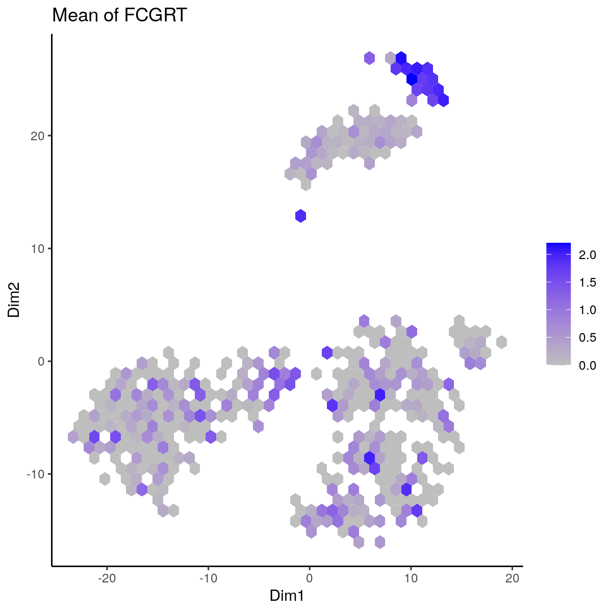|[ALB](https://www.ncbi.nlm.nih.gov/gene/213) [EGFR](https://www.ncbi.nlm.nih.gov/gene/1956) [EPO](https://www.ncbi.nlm.nih.gov/gene/2056) [F8](https://www.ncbi.nlm.nih.gov/gene/2157) [F9](https://www.ncbi.nlm.nih.gov/gene/2158) [FCAR](https://www.ncbi.nlm.nih.gov/gene/2204) [JCHAIN](https://www.ncbi.nlm.nih.gov/gene/3512) [ITIH4](https://www.ncbi.nlm.nih.gov/gene/3700) [PIGR](https://www.ncbi.nlm.nih.gov/gene/5284) [TNFRSF1B](https://www.ncbi.nlm.nih.gov/gene/7133) [PRSS22](https://www.ncbi.nlm.nih.gov/gene/64063) [OSCAR](https://www.ncbi.nlm.nih.gov/gene/126014)|
|[FCRL1](https://www.ncbi.nlm.nih.gov/gene/115350)|[MUC1](https://www.ncbi.nlm.nih.gov/gene/4582) [PIGR](https://www.ncbi.nlm.nih.gov/gene/5284) [FAM3C](https://www.ncbi.nlm.nih.gov/gene/10447) [MUC15](https://www.ncbi.nlm.nih.gov/gene/143662)|
|[FCRL2](https://www.ncbi.nlm.nih.gov/gene/79368)|[CD5L](https://www.ncbi.nlm.nih.gov/gene/922) [MUC1](https://www.ncbi.nlm.nih.gov/gene/4582) [PIGR](https://www.ncbi.nlm.nih.gov/gene/5284) [PNOC](https://www.ncbi.nlm.nih.gov/gene/5368) [OLFML3](https://www.ncbi.nlm.nih.gov/gene/56944)|
|[FCRL3](https://www.ncbi.nlm.nih.gov/gene/115352)|[CD40](https://www.ncbi.nlm.nih.gov/gene/958) [MUC1](https://www.ncbi.nlm.nih.gov/gene/4582) [PIGR](https://www.ncbi.nlm.nih.gov/gene/5284) [RNASET2](https://www.ncbi.nlm.nih.gov/gene/8635) [SCGB3A2](https://www.ncbi.nlm.nih.gov/gene/117156)|
|[FCRL4](https://www.ncbi.nlm.nih.gov/gene/83417)|[SIGLEC6](https://www.ncbi.nlm.nih.gov/gene/946) [ITIH4](https://www.ncbi.nlm.nih.gov/gene/3700) [MUC1](https://www.ncbi.nlm.nih.gov/gene/4582) [PIGR](https://www.ncbi.nlm.nih.gov/gene/5284) [ADGRE3](https://www.ncbi.nlm.nih.gov/gene/84658) [MUC15](https://www.ncbi.nlm.nih.gov/gene/143662)|
|[FCRL5](https://www.ncbi.nlm.nih.gov/gene/83416)|[MUC1](https://www.ncbi.nlm.nih.gov/gene/4582) [PIGR](https://www.ncbi.nlm.nih.gov/gene/5284) [PINLYP](https://www.ncbi.nlm.nih.gov/gene/390940)|
|[FCRL6](https://www.ncbi.nlm.nih.gov/gene/343413)|[JCHAIN](https://www.ncbi.nlm.nih.gov/gene/3512) [PIGR](https://www.ncbi.nlm.nih.gov/gene/5284)|
|[FFAR1](https://www.ncbi.nlm.nih.gov/gene/2864)|[AGT](https://www.ncbi.nlm.nih.gov/gene/183) [AVP](https://www.ncbi.nlm.nih.gov/gene/551) [CCK](https://www.ncbi.nlm.nih.gov/gene/885) [EDN1](https://www.ncbi.nlm.nih.gov/gene/1906) [EDN2](https://www.ncbi.nlm.nih.gov/gene/1907) [EDN3](https://www.ncbi.nlm.nih.gov/gene/1908) [F2](https://www.ncbi.nlm.nih.gov/gene/2147) [GAST](https://www.ncbi.nlm.nih.gov/gene/2520) [GCG](https://www.ncbi.nlm.nih.gov/gene/2641) [GIP](https://www.ncbi.nlm.nih.gov/gene/2695) [GNRH1](https://www.ncbi.nlm.nih.gov/gene/2796) [GNRH2](https://www.ncbi.nlm.nih.gov/gene/2797) [GRP](https://www.ncbi.nlm.nih.gov/gene/2922) [INS](https://www.ncbi.nlm.nih.gov/gene/3630) [KISS1](https://www.ncbi.nlm.nih.gov/gene/3814) [MLN](https://www.ncbi.nlm.nih.gov/gene/4295) [NMB](https://www.ncbi.nlm.nih.gov/gene/4828) [NTS](https://www.ncbi.nlm.nih.gov/gene/4922) [OXT](https://www.ncbi.nlm.nih.gov/gene/5020) [PMCH](https://www.ncbi.nlm.nih.gov/gene/5367) [PYY](https://www.ncbi.nlm.nih.gov/gene/5697) [SAA1](https://www.ncbi.nlm.nih.gov/gene/6288) [XCL1](https://www.ncbi.nlm.nih.gov/gene/6375) [STC1](https://www.ncbi.nlm.nih.gov/gene/6781) [XCL2](https://www.ncbi.nlm.nih.gov/gene/6846) [TAC1](https://www.ncbi.nlm.nih.gov/gene/6863) [TAC3](https://www.ncbi.nlm.nih.gov/gene/6866) [TRH](https://www.ncbi.nlm.nih.gov/gene/7200) [NPFF](https://www.ncbi.nlm.nih.gov/gene/8620) [NMU](https://www.ncbi.nlm.nih.gov/gene/10874) [UTS2](https://www.ncbi.nlm.nih.gov/gene/10911) [GAL](https://www.ncbi.nlm.nih.gov/gene/51083) [GHRL](https://www.ncbi.nlm.nih.gov/gene/51738) [PROK2](https://www.ncbi.nlm.nih.gov/gene/60675) [PROK1](https://www.ncbi.nlm.nih.gov/gene/84432) [NMS](https://www.ncbi.nlm.nih.gov/gene/129521) [UTS2B](https://www.ncbi.nlm.nih.gov/gene/257313) [QRFP](https://www.ncbi.nlm.nih.gov/gene/347148) [NPS](https://www.ncbi.nlm.nih.gov/gene/594857)|
|[FFAR2](https://www.ncbi.nlm.nih.gov/gene/2867)|[AGT](https://www.ncbi.nlm.nih.gov/gene/183) [AVP](https://www.ncbi.nlm.nih.gov/gene/551) [CCK](https://www.ncbi.nlm.nih.gov/gene/885) [EDN1](https://www.ncbi.nlm.nih.gov/gene/1906) [EDN2](https://www.ncbi.nlm.nih.gov/gene/1907) [EDN3](https://www.ncbi.nlm.nih.gov/gene/1908) [F2](https://www.ncbi.nlm.nih.gov/gene/2147) [GAST](https://www.ncbi.nlm.nih.gov/gene/2520) [GCG](https://www.ncbi.nlm.nih.gov/gene/2641) [GIP](https://www.ncbi.nlm.nih.gov/gene/2695) [GNRH1](https://www.ncbi.nlm.nih.gov/gene/2796) [GNRH2](https://www.ncbi.nlm.nih.gov/gene/2797) [GRP](https://www.ncbi.nlm.nih.gov/gene/2922) [IL10](https://www.ncbi.nlm.nih.gov/gene/3586) [INS](https://www.ncbi.nlm.nih.gov/gene/3630) [KISS1](https://www.ncbi.nlm.nih.gov/gene/3814) [LEP](https://www.ncbi.nlm.nih.gov/gene/3952) [MLN](https://www.ncbi.nlm.nih.gov/gene/4295) [NMB](https://www.ncbi.nlm.nih.gov/gene/4828) [NPY](https://www.ncbi.nlm.nih.gov/gene/4852) [NTS](https://www.ncbi.nlm.nih.gov/gene/4922) [OXT](https://www.ncbi.nlm.nih.gov/gene/5020) [PMCH](https://www.ncbi.nlm.nih.gov/gene/5367) [PYY](https://www.ncbi.nlm.nih.gov/gene/5697) [SAA1](https://www.ncbi.nlm.nih.gov/gene/6288) [XCL1](https://www.ncbi.nlm.nih.gov/gene/6375) [STC1](https://www.ncbi.nlm.nih.gov/gene/6781) [XCL2](https://www.ncbi.nlm.nih.gov/gene/6846) [TAC1](https://www.ncbi.nlm.nih.gov/gene/6863) [TAC3](https://www.ncbi.nlm.nih.gov/gene/6866) [TRH](https://www.ncbi.nlm.nih.gov/gene/7200) [NPFF](https://www.ncbi.nlm.nih.gov/gene/8620) [NMU](https://www.ncbi.nlm.nih.gov/gene/10874) [UTS2](https://www.ncbi.nlm.nih.gov/gene/10911) [GAL](https://www.ncbi.nlm.nih.gov/gene/51083) [ANGPTL4](https://www.ncbi.nlm.nih.gov/gene/51129) [GHRL](https://www.ncbi.nlm.nih.gov/gene/51738) [PROK2](https://www.ncbi.nlm.nih.gov/gene/60675) [PROK1](https://www.ncbi.nlm.nih.gov/gene/84432) [NMS](https://www.ncbi.nlm.nih.gov/gene/129521) [UTS2B](https://www.ncbi.nlm.nih.gov/gene/257313) [QRFP](https://www.ncbi.nlm.nih.gov/gene/347148) [NPS](https://www.ncbi.nlm.nih.gov/gene/594857)|
|[FFAR3](https://www.ncbi.nlm.nih.gov/gene/2865)|[AGT](https://www.ncbi.nlm.nih.gov/gene/183) [AVP](https://www.ncbi.nlm.nih.gov/gene/551) [CCK](https://www.ncbi.nlm.nih.gov/gene/885) [EDN1](https://www.ncbi.nlm.nih.gov/gene/1906) [EDN2](https://www.ncbi.nlm.nih.gov/gene/1907) [EDN3](https://www.ncbi.nlm.nih.gov/gene/1908) [F2](https://www.ncbi.nlm.nih.gov/gene/2147) [GAST](https://www.ncbi.nlm.nih.gov/gene/2520) [GCG](https://www.ncbi.nlm.nih.gov/gene/2641) [GIP](https://www.ncbi.nlm.nih.gov/gene/2695) [GNRH1](https://www.ncbi.nlm.nih.gov/gene/2796) [GNRH2](https://www.ncbi.nlm.nih.gov/gene/2797) [GRP](https://www.ncbi.nlm.nih.gov/gene/2922) [INS](https://www.ncbi.nlm.nih.gov/gene/3630) [KISS1](https://www.ncbi.nlm.nih.gov/gene/3814) [LEP](https://www.ncbi.nlm.nih.gov/gene/3952) [MLN](https://www.ncbi.nlm.nih.gov/gene/4295) [NMB](https://www.ncbi.nlm.nih.gov/gene/4828) [NTS](https://www.ncbi.nlm.nih.gov/gene/4922) [OXT](https://www.ncbi.nlm.nih.gov/gene/5020) [PMCH](https://www.ncbi.nlm.nih.gov/gene/5367) [PYY](https://www.ncbi.nlm.nih.gov/gene/5697) [SAA1](https://www.ncbi.nlm.nih.gov/gene/6288) [XCL1](https://www.ncbi.nlm.nih.gov/gene/6375) [XCL2](https://www.ncbi.nlm.nih.gov/gene/6846) [TAC1](https://www.ncbi.nlm.nih.gov/gene/6863) [TAC3](https://www.ncbi.nlm.nih.gov/gene/6866) [TRH](https://www.ncbi.nlm.nih.gov/gene/7200) [NPFF](https://www.ncbi.nlm.nih.gov/gene/8620) [NMU](https://www.ncbi.nlm.nih.gov/gene/10874) [UTS2](https://www.ncbi.nlm.nih.gov/gene/10911) [GAL](https://www.ncbi.nlm.nih.gov/gene/51083) [ANGPTL4](https://www.ncbi.nlm.nih.gov/gene/51129) [GHRL](https://www.ncbi.nlm.nih.gov/gene/51738) [PROK2](https://www.ncbi.nlm.nih.gov/gene/60675) [PROK1](https://www.ncbi.nlm.nih.gov/gene/84432) [NMS](https://www.ncbi.nlm.nih.gov/gene/129521) [UTS2B](https://www.ncbi.nlm.nih.gov/gene/257313) [QRFP](https://www.ncbi.nlm.nih.gov/gene/347148) [NPS](https://www.ncbi.nlm.nih.gov/gene/594857)|
|[FFAR4](https://www.ncbi.nlm.nih.gov/gene/338557)|[AGT](https://www.ncbi.nlm.nih.gov/gene/183) [AHSG](https://www.ncbi.nlm.nih.gov/gene/197) [AVP](https://www.ncbi.nlm.nih.gov/gene/551) [CCK](https://www.ncbi.nlm.nih.gov/gene/885) [CPB2](https://www.ncbi.nlm.nih.gov/gene/1361) [EDN1](https://www.ncbi.nlm.nih.gov/gene/1906) [EDN2](https://www.ncbi.nlm.nih.gov/gene/1907) [EDN3](https://www.ncbi.nlm.nih.gov/gene/1908) [F2](https://www.ncbi.nlm.nih.gov/gene/2147) [GAST](https://www.ncbi.nlm.nih.gov/gene/2520) [GCG](https://www.ncbi.nlm.nih.gov/gene/2641) [GIP](https://www.ncbi.nlm.nih.gov/gene/2695) [GNRH1](https://www.ncbi.nlm.nih.gov/gene/2796) [GNRH2](https://www.ncbi.nlm.nih.gov/gene/2797) [GRP](https://www.ncbi.nlm.nih.gov/gene/2922) [INS](https://www.ncbi.nlm.nih.gov/gene/3630) [KISS1](https://www.ncbi.nlm.nih.gov/gene/3814) [LEP](https://www.ncbi.nlm.nih.gov/gene/3952) [MLN](https://www.ncbi.nlm.nih.gov/gene/4295) [NMB](https://www.ncbi.nlm.nih.gov/gene/4828) [NTS](https://www.ncbi.nlm.nih.gov/gene/4922) [OXT](https://www.ncbi.nlm.nih.gov/gene/5020) [PMCH](https://www.ncbi.nlm.nih.gov/gene/5367) [PYY](https://www.ncbi.nlm.nih.gov/gene/5697) [SAA1](https://www.ncbi.nlm.nih.gov/gene/6288) [XCL1](https://www.ncbi.nlm.nih.gov/gene/6375) [STC1](https://www.ncbi.nlm.nih.gov/gene/6781) [XCL2](https://www.ncbi.nlm.nih.gov/gene/6846) [TAC1](https://www.ncbi.nlm.nih.gov/gene/6863) [TAC3](https://www.ncbi.nlm.nih.gov/gene/6866) [TRH](https://www.ncbi.nlm.nih.gov/gene/7200) [NPFF](https://www.ncbi.nlm.nih.gov/gene/8620) [ADIPOQ](https://www.ncbi.nlm.nih.gov/gene/9370) [NMU](https://www.ncbi.nlm.nih.gov/gene/10874) [UTS2](https://www.ncbi.nlm.nih.gov/gene/10911) [FGF21](https://www.ncbi.nlm.nih.gov/gene/26291) [GHRL](https://www.ncbi.nlm.nih.gov/gene/51738) [PROK2](https://www.ncbi.nlm.nih.gov/gene/60675) [PROK1](https://www.ncbi.nlm.nih.gov/gene/84432) [NMS](https://www.ncbi.nlm.nih.gov/gene/129521) [UTS2B](https://www.ncbi.nlm.nih.gov/gene/257313) [QRFP](https://www.ncbi.nlm.nih.gov/gene/347148) [NPS](https://www.ncbi.nlm.nih.gov/gene/594857)|
|[FGFR1](https://www.ncbi.nlm.nih.gov/gene/2260)|[ALB](https://www.ncbi.nlm.nih.gov/gene/213) [ANGPT1](https://www.ncbi.nlm.nih.gov/gene/284) [ANGPT2](https://www.ncbi.nlm.nih.gov/gene/285) [BDNF](https://www.ncbi.nlm.nih.gov/gene/627) [BMP2](https://www.ncbi.nlm.nih.gov/gene/650) [BMP4](https://www.ncbi.nlm.nih.gov/gene/652) [BMP7](https://www.ncbi.nlm.nih.gov/gene/655) [COL1A1](https://www.ncbi.nlm.nih.gov/gene/1277) [COL6A3](https://www.ncbi.nlm.nih.gov/gene/1293) [EFNA1](https://www.ncbi.nlm.nih.gov/gene/1942) [EFNA4](https://www.ncbi.nlm.nih.gov/gene/1945) [EGFR](https://www.ncbi.nlm.nih.gov/gene/1956) [ERBB3](https://www.ncbi.nlm.nih.gov/gene/2065) [FGF1](https://www.ncbi.nlm.nih.gov/gene/2246) [FGF2](https://www.ncbi.nlm.nih.gov/gene/2247) [FGF3](https://www.ncbi.nlm.nih.gov/gene/2248) [FGF4](https://www.ncbi.nlm.nih.gov/gene/2249) [FGF5](https://www.ncbi.nlm.nih.gov/gene/2250) [FGF6](https://www.ncbi.nlm.nih.gov/gene/2251) [FGF7](https://www.ncbi.nlm.nih.gov/gene/2252) [FGF8](https://www.ncbi.nlm.nih.gov/gene/2253) [FGF9](https://www.ncbi.nlm.nih.gov/gene/2254) [FGF10](https://www.ncbi.nlm.nih.gov/gene/2255) [VEGFD](https://www.ncbi.nlm.nih.gov/gene/2277) [FLT1](https://www.ncbi.nlm.nih.gov/gene/2321) [FLT3LG](https://www.ncbi.nlm.nih.gov/gene/2323) [FLT4](https://www.ncbi.nlm.nih.gov/gene/2324) [FN1](https://www.ncbi.nlm.nih.gov/gene/2335) [GNRH1](https://www.ncbi.nlm.nih.gov/gene/2796) [GPC1](https://www.ncbi.nlm.nih.gov/gene/2817) [HSPG2](https://www.ncbi.nlm.nih.gov/gene/3339) [IGF1](https://www.ncbi.nlm.nih.gov/gene/3479) [IGF2](https://www.ncbi.nlm.nih.gov/gene/3481) [INS](https://www.ncbi.nlm.nih.gov/gene/3630) [KDR](https://www.ncbi.nlm.nih.gov/gene/3791) [KISS1](https://www.ncbi.nlm.nih.gov/gene/3814) [MMP13](https://www.ncbi.nlm.nih.gov/gene/4322) [NCAM1](https://www.ncbi.nlm.nih.gov/gene/4684) [NGF](https://www.ncbi.nlm.nih.gov/gene/4803) [NTF3](https://www.ncbi.nlm.nih.gov/gene/4908) [NTF4](https://www.ncbi.nlm.nih.gov/gene/4909) [PDGFA](https://www.ncbi.nlm.nih.gov/gene/5154) [PDGFB](https://www.ncbi.nlm.nih.gov/gene/5155) [PGF](https://www.ncbi.nlm.nih.gov/gene/5228) [PTEN](https://www.ncbi.nlm.nih.gov/gene/5728) [PTH](https://www.ncbi.nlm.nih.gov/gene/5741) [NECTIN1](https://www.ncbi.nlm.nih.gov/gene/5818) [SDC4](https://www.ncbi.nlm.nih.gov/gene/6385) [SPP1](https://www.ncbi.nlm.nih.gov/gene/6696) [TAC3](https://www.ncbi.nlm.nih.gov/gene/6866) [TGFBR3](https://www.ncbi.nlm.nih.gov/gene/7049) [VEGFA](https://www.ncbi.nlm.nih.gov/gene/7422) [VEGFB](https://www.ncbi.nlm.nih.gov/gene/7423) [VEGFC](https://www.ncbi.nlm.nih.gov/gene/7424) [WNT1](https://www.ncbi.nlm.nih.gov/gene/7471) [WNT5A](https://www.ncbi.nlm.nih.gov/gene/7474) [FGF23](https://www.ncbi.nlm.nih.gov/gene/8074) [FGF18](https://www.ncbi.nlm.nih.gov/gene/8817) [FGF17](https://www.ncbi.nlm.nih.gov/gene/8822) [FGF16](https://www.ncbi.nlm.nih.gov/gene/8823) [NRP1](https://www.ncbi.nlm.nih.gov/gene/8829) [KL](https://www.ncbi.nlm.nih.gov/gene/9365) [FGF19](https://www.ncbi.nlm.nih.gov/gene/9965) [FGF20](https://www.ncbi.nlm.nih.gov/gene/26281) [FGF21](https://www.ncbi.nlm.nih.gov/gene/26291) [FGF22](https://www.ncbi.nlm.nih.gov/gene/27006) [ANGPT4](https://www.ncbi.nlm.nih.gov/gene/51378) [PROK2](https://www.ncbi.nlm.nih.gov/gene/60675) [PDGFD](https://www.ncbi.nlm.nih.gov/gene/80310) [WNT3A](https://www.ncbi.nlm.nih.gov/gene/89780) [C5orf38](https://www.ncbi.nlm.nih.gov/gene/153571) [PCSK9](https://www.ncbi.nlm.nih.gov/gene/255738) [FGF11](https://www.ncbi.nlm.nih.gov/gene/2256) [FGF12](https://www.ncbi.nlm.nih.gov/gene/2257) [FGF14](https://www.ncbi.nlm.nih.gov/gene/2259) [FGF13](https://www.ncbi.nlm.nih.gov/gene/2258)|
|[FGFR2](https://www.ncbi.nlm.nih.gov/gene/2263)|[FGF7](https://www.ncbi.nlm.nih.gov/gene/2252) [FGF6](https://www.ncbi.nlm.nih.gov/gene/2251) [FGF13](https://www.ncbi.nlm.nih.gov/gene/2258) [FGF18](https://www.ncbi.nlm.nih.gov/gene/8817) [FGF11](https://www.ncbi.nlm.nih.gov/gene/2256) [FGF19](https://www.ncbi.nlm.nih.gov/gene/9965) [FGF12](https://www.ncbi.nlm.nih.gov/gene/2257) [FGF10](https://www.ncbi.nlm.nih.gov/gene/2255) [FGF17](https://www.ncbi.nlm.nih.gov/gene/8822) [FGF16](https://www.ncbi.nlm.nih.gov/gene/8823) [FGF3](https://www.ncbi.nlm.nih.gov/gene/2248) [FGF1](https://www.ncbi.nlm.nih.gov/gene/2246) [FGF2](https://www.ncbi.nlm.nih.gov/gene/2247) [FGF8](https://www.ncbi.nlm.nih.gov/gene/2253) [FGF4](https://www.ncbi.nlm.nih.gov/gene/2249) [FGF14](https://www.ncbi.nlm.nih.gov/gene/2259) [FGF5](https://www.ncbi.nlm.nih.gov/gene/2250) [FGF9](https://www.ncbi.nlm.nih.gov/gene/2254)|
|[FGFR3](https://www.ncbi.nlm.nih.gov/gene/2261)|[ACAN](https://www.ncbi.nlm.nih.gov/gene/176) [ANGPT1](https://www.ncbi.nlm.nih.gov/gene/284) [ANGPT2](https://www.ncbi.nlm.nih.gov/gene/285) [BDNF](https://www.ncbi.nlm.nih.gov/gene/627) [BMP2](https://www.ncbi.nlm.nih.gov/gene/650) [BMP4](https://www.ncbi.nlm.nih.gov/gene/652) [BMP7](https://www.ncbi.nlm.nih.gov/gene/655) [COL2A1](https://www.ncbi.nlm.nih.gov/gene/1280) [COL10A1](https://www.ncbi.nlm.nih.gov/gene/1300) [CCN2](https://www.ncbi.nlm.nih.gov/gene/1490) [EFNA1](https://www.ncbi.nlm.nih.gov/gene/1942) [EFNA4](https://www.ncbi.nlm.nih.gov/gene/1945) [EGFR](https://www.ncbi.nlm.nih.gov/gene/1956) [ERBB3](https://www.ncbi.nlm.nih.gov/gene/2065) [FGF1](https://www.ncbi.nlm.nih.gov/gene/2246) [FGF2](https://www.ncbi.nlm.nih.gov/gene/2247) [FGF3](https://www.ncbi.nlm.nih.gov/gene/2248) [FGF4](https://www.ncbi.nlm.nih.gov/gene/2249) [FGF5](https://www.ncbi.nlm.nih.gov/gene/2250) [FGF6](https://www.ncbi.nlm.nih.gov/gene/2251) [FGF7](https://www.ncbi.nlm.nih.gov/gene/2252) [FGF8](https://www.ncbi.nlm.nih.gov/gene/2253) [FGF9](https://www.ncbi.nlm.nih.gov/gene/2254) [FGF10](https://www.ncbi.nlm.nih.gov/gene/2255) [FGFR2](https://www.ncbi.nlm.nih.gov/gene/2263) [FGFR4](https://www.ncbi.nlm.nih.gov/gene/2264) [VEGFD](https://www.ncbi.nlm.nih.gov/gene/2277) [FLT3LG](https://www.ncbi.nlm.nih.gov/gene/2323) [FLT4](https://www.ncbi.nlm.nih.gov/gene/2324) [HSPG2](https://www.ncbi.nlm.nih.gov/gene/3339) [IGF1](https://www.ncbi.nlm.nih.gov/gene/3479) [IGF2](https://www.ncbi.nlm.nih.gov/gene/3481) [INS](https://www.ncbi.nlm.nih.gov/gene/3630) [KDR](https://www.ncbi.nlm.nih.gov/gene/3791) [NGF](https://www.ncbi.nlm.nih.gov/gene/4803) [NPPC](https://www.ncbi.nlm.nih.gov/gene/4880) [NTF3](https://www.ncbi.nlm.nih.gov/gene/4908) [NTF4](https://www.ncbi.nlm.nih.gov/gene/4909) [PDGFA](https://www.ncbi.nlm.nih.gov/gene/5154) [PDGFB](https://www.ncbi.nlm.nih.gov/gene/5155) [PGF](https://www.ncbi.nlm.nih.gov/gene/5228) [PTEN](https://www.ncbi.nlm.nih.gov/gene/5728) [PTH](https://www.ncbi.nlm.nih.gov/gene/5741) [PTHLH](https://www.ncbi.nlm.nih.gov/gene/5744) [NECTIN1](https://www.ncbi.nlm.nih.gov/gene/5818) [CCL3](https://www.ncbi.nlm.nih.gov/gene/6348) [VEGFA](https://www.ncbi.nlm.nih.gov/gene/7422) [VEGFB](https://www.ncbi.nlm.nih.gov/gene/7423) [VEGFC](https://www.ncbi.nlm.nih.gov/gene/7424) [WNT1](https://www.ncbi.nlm.nih.gov/gene/7471) [FGF23](https://www.ncbi.nlm.nih.gov/gene/8074) [FGF18](https://www.ncbi.nlm.nih.gov/gene/8817) [FGF17](https://www.ncbi.nlm.nih.gov/gene/8822) [FGF16](https://www.ncbi.nlm.nih.gov/gene/8823) [KL](https://www.ncbi.nlm.nih.gov/gene/9365) [FGF19](https://www.ncbi.nlm.nih.gov/gene/9965) [FGF20](https://www.ncbi.nlm.nih.gov/gene/26281) [FGF21](https://www.ncbi.nlm.nih.gov/gene/26291) [FGF22](https://www.ncbi.nlm.nih.gov/gene/27006) [ANGPT4](https://www.ncbi.nlm.nih.gov/gene/51378) [PDGFD](https://www.ncbi.nlm.nih.gov/gene/80310) [FGF13](https://www.ncbi.nlm.nih.gov/gene/2258) [FGF14](https://www.ncbi.nlm.nih.gov/gene/2259) [FGF12](https://www.ncbi.nlm.nih.gov/gene/2257) [FGF11](https://www.ncbi.nlm.nih.gov/gene/2256)|
|[FGFR4](https://www.ncbi.nlm.nih.gov/gene/2264)|[FGF6](https://www.ncbi.nlm.nih.gov/gene/2251) [FGF8](https://www.ncbi.nlm.nih.gov/gene/2253) [FGF2](https://www.ncbi.nlm.nih.gov/gene/2247) [FGF10](https://www.ncbi.nlm.nih.gov/gene/2255) [FGF16](https://www.ncbi.nlm.nih.gov/gene/8823) [FGF4](https://www.ncbi.nlm.nih.gov/gene/2249) [FGF11](https://www.ncbi.nlm.nih.gov/gene/2256) [FGF18](https://www.ncbi.nlm.nih.gov/gene/8817) [FGF1](https://www.ncbi.nlm.nih.gov/gene/2246) [FGF9](https://www.ncbi.nlm.nih.gov/gene/2254) [FGF13](https://www.ncbi.nlm.nih.gov/gene/2258) [FGF19](https://www.ncbi.nlm.nih.gov/gene/9965) [FGF17](https://www.ncbi.nlm.nih.gov/gene/8822) [FGF14](https://www.ncbi.nlm.nih.gov/gene/2259) [FGF12](https://www.ncbi.nlm.nih.gov/gene/2257)|
|[FGR](https://www.ncbi.nlm.nih.gov/gene/2268)|[AGT](https://www.ncbi.nlm.nih.gov/gene/183) [AOAH](https://www.ncbi.nlm.nih.gov/gene/313) [EDN1](https://www.ncbi.nlm.nih.gov/gene/1906) [EFNA1](https://www.ncbi.nlm.nih.gov/gene/1942) [EGFR](https://www.ncbi.nlm.nih.gov/gene/1956) [EPHA3](https://www.ncbi.nlm.nih.gov/gene/2042) [F2](https://www.ncbi.nlm.nih.gov/gene/2147) [FCN1](https://www.ncbi.nlm.nih.gov/gene/2219) [FN1](https://www.ncbi.nlm.nih.gov/gene/2335) [GPC1](https://www.ncbi.nlm.nih.gov/gene/2817) [IGF1](https://www.ncbi.nlm.nih.gov/gene/3479) [CXCL8](https://www.ncbi.nlm.nih.gov/gene/3576) [INS](https://www.ncbi.nlm.nih.gov/gene/3630) [PDGFB](https://www.ncbi.nlm.nih.gov/gene/5155) [S100A8](https://www.ncbi.nlm.nih.gov/gene/6279) [S100A9](https://www.ncbi.nlm.nih.gov/gene/6280) [CCL11](https://www.ncbi.nlm.nih.gov/gene/6356) [CXCL12](https://www.ncbi.nlm.nih.gov/gene/6387) [TNF](https://www.ncbi.nlm.nih.gov/gene/7124) [LY86](https://www.ncbi.nlm.nih.gov/gene/9450) [LILRB1](https://www.ncbi.nlm.nih.gov/gene/10859) [FGL2](https://www.ncbi.nlm.nih.gov/gene/10875) [MPEG1](https://www.ncbi.nlm.nih.gov/gene/219972) [IGLL5](https://www.ncbi.nlm.nih.gov/gene/100423062)|
|[FLOT1](https://www.ncbi.nlm.nih.gov/gene/10211)|[ANXA2](https://www.ncbi.nlm.nih.gov/gene/302) [MYOC](https://www.ncbi.nlm.nih.gov/gene/4653) [NGF](https://www.ncbi.nlm.nih.gov/gene/4803) [S100A9](https://www.ncbi.nlm.nih.gov/gene/6280) [FAM3C](https://www.ncbi.nlm.nih.gov/gene/10447) [OLFM3](https://www.ncbi.nlm.nih.gov/gene/118427) [LGI3](https://www.ncbi.nlm.nih.gov/gene/203190)|
|[FLOT2](https://www.ncbi.nlm.nih.gov/gene/2319)|[SDF2](https://www.ncbi.nlm.nih.gov/gene/6388) [LLCFC1](https://www.ncbi.nlm.nih.gov/gene/135927) [DHRS13](https://www.ncbi.nlm.nih.gov/gene/147015)|
|[FLRT1](https://www.ncbi.nlm.nih.gov/gene/23769)|[FGF1](https://www.ncbi.nlm.nih.gov/gene/2246) [FGF2](https://www.ncbi.nlm.nih.gov/gene/2247) [FGF3](https://www.ncbi.nlm.nih.gov/gene/2248) [FGF4](https://www.ncbi.nlm.nih.gov/gene/2249) [FGF6](https://www.ncbi.nlm.nih.gov/gene/2251) [FGF9](https://www.ncbi.nlm.nih.gov/gene/2254) [FGF10](https://www.ncbi.nlm.nih.gov/gene/2255) [NID1](https://www.ncbi.nlm.nih.gov/gene/4811) [FGF23](https://www.ncbi.nlm.nih.gov/gene/8074) [FGF20](https://www.ncbi.nlm.nih.gov/gene/26281) [FGF22](https://www.ncbi.nlm.nih.gov/gene/27006) [NTN5](https://www.ncbi.nlm.nih.gov/gene/126147) [OLFML1](https://www.ncbi.nlm.nih.gov/gene/283298) [ARSI](https://www.ncbi.nlm.nih.gov/gene/340075)|
|[FLRT2](https://www.ncbi.nlm.nih.gov/gene/23768)|[FGF1](https://www.ncbi.nlm.nih.gov/gene/2246) [FGF2](https://www.ncbi.nlm.nih.gov/gene/2247) [FGF3](https://www.ncbi.nlm.nih.gov/gene/2248) [FGF4](https://www.ncbi.nlm.nih.gov/gene/2249) [FGF6](https://www.ncbi.nlm.nih.gov/gene/2251) [FGF9](https://www.ncbi.nlm.nih.gov/gene/2254) [FGF10](https://www.ncbi.nlm.nih.gov/gene/2255) [FGFR2](https://www.ncbi.nlm.nih.gov/gene/2263) [FN1](https://www.ncbi.nlm.nih.gov/gene/2335) [NID1](https://www.ncbi.nlm.nih.gov/gene/4811) [FGF23](https://www.ncbi.nlm.nih.gov/gene/8074) [FGF20](https://www.ncbi.nlm.nih.gov/gene/26281) [FGF22](https://www.ncbi.nlm.nih.gov/gene/27006) [ARSJ](https://www.ncbi.nlm.nih.gov/gene/79642) [OLFML1](https://www.ncbi.nlm.nih.gov/gene/283298)|
|[FLRT3](https://www.ncbi.nlm.nih.gov/gene/23767)|[FGF1](https://www.ncbi.nlm.nih.gov/gene/2246) [FGF2](https://www.ncbi.nlm.nih.gov/gene/2247) [FGF3](https://www.ncbi.nlm.nih.gov/gene/2248) [FGF4](https://www.ncbi.nlm.nih.gov/gene/2249) [FGF6](https://www.ncbi.nlm.nih.gov/gene/2251) [FGF8](https://www.ncbi.nlm.nih.gov/gene/2253) [FGF9](https://www.ncbi.nlm.nih.gov/gene/2254) [FGF10](https://www.ncbi.nlm.nih.gov/gene/2255) [FN1](https://www.ncbi.nlm.nih.gov/gene/2335) [IGFBP7](https://www.ncbi.nlm.nih.gov/gene/3490) [KDR](https://www.ncbi.nlm.nih.gov/gene/3791) [LAMA2](https://www.ncbi.nlm.nih.gov/gene/3908) [MYOC](https://www.ncbi.nlm.nih.gov/gene/4653) [NID1](https://www.ncbi.nlm.nih.gov/gene/4811) [PDGFRL](https://www.ncbi.nlm.nih.gov/gene/5157) [SLIT1](https://www.ncbi.nlm.nih.gov/gene/6585) [FGF23](https://www.ncbi.nlm.nih.gov/gene/8074) [FGF17](https://www.ncbi.nlm.nih.gov/gene/8822) [OLFM1](https://www.ncbi.nlm.nih.gov/gene/10439) [OLFM4](https://www.ncbi.nlm.nih.gov/gene/10562) [OLFML2B](https://www.ncbi.nlm.nih.gov/gene/25903) [FGF20](https://www.ncbi.nlm.nih.gov/gene/26281) [FGF22](https://www.ncbi.nlm.nih.gov/gene/27006) [OLFML3](https://www.ncbi.nlm.nih.gov/gene/56944) [PROK2](https://www.ncbi.nlm.nih.gov/gene/60675) [OLFM2](https://www.ncbi.nlm.nih.gov/gene/93145) [OLFM3](https://www.ncbi.nlm.nih.gov/gene/118427) [OLFML2A](https://www.ncbi.nlm.nih.gov/gene/169611) [OLFML1](https://www.ncbi.nlm.nih.gov/gene/283298) [LAMA1](https://www.ncbi.nlm.nih.gov/gene/284217) [GLDN](https://www.ncbi.nlm.nih.gov/gene/342035)|
|[FLT1](https://www.ncbi.nlm.nih.gov/gene/2321)|[VEGFB](https://www.ncbi.nlm.nih.gov/gene/7423) [VEGFA](https://www.ncbi.nlm.nih.gov/gene/7422) [PGF](https://www.ncbi.nlm.nih.gov/gene/5228)|
|[FLT3](https://www.ncbi.nlm.nih.gov/gene/2322)|[FLT3LG](https://www.ncbi.nlm.nih.gov/gene/2323)|
|[FLT4](https://www.ncbi.nlm.nih.gov/gene/2324)|[VEGFD](https://www.ncbi.nlm.nih.gov/gene/2277) [PDGFC](https://www.ncbi.nlm.nih.gov/gene/56034) [VEGFC](https://www.ncbi.nlm.nih.gov/gene/7424)|
|[FLVCR2](https://www.ncbi.nlm.nih.gov/gene/55640)|[CALCA](https://www.ncbi.nlm.nih.gov/gene/796) [CGA](https://www.ncbi.nlm.nih.gov/gene/1081) [GCG](https://www.ncbi.nlm.nih.gov/gene/2641) [HPX](https://www.ncbi.nlm.nih.gov/gene/3263) [SERPINA1](https://www.ncbi.nlm.nih.gov/gene/5265)|
|[FOLR1](https://www.ncbi.nlm.nih.gov/gene/2348)|[COL7A1](https://www.ncbi.nlm.nih.gov/gene/1294) [COPA](https://www.ncbi.nlm.nih.gov/gene/1314) [EGFR](https://www.ncbi.nlm.nih.gov/gene/1956) [F5](https://www.ncbi.nlm.nih.gov/gene/2153) [F8](https://www.ncbi.nlm.nih.gov/gene/2157) [FGF3](https://www.ncbi.nlm.nih.gov/gene/2248) [INS](https://www.ncbi.nlm.nih.gov/gene/3630) [SERPINA1](https://www.ncbi.nlm.nih.gov/gene/5265) [TCN2](https://www.ncbi.nlm.nih.gov/gene/6948) [GGH](https://www.ncbi.nlm.nih.gov/gene/8836) [MSLN](https://www.ncbi.nlm.nih.gov/gene/10232) [SPON1](https://www.ncbi.nlm.nih.gov/gene/10418) [CRISPLD2](https://www.ncbi.nlm.nih.gov/gene/83716) [IZUMO4](https://www.ncbi.nlm.nih.gov/gene/113177)|
|[FOLR2](https://www.ncbi.nlm.nih.gov/gene/2350)|[C1QA](https://www.ncbi.nlm.nih.gov/gene/712) [C1QB](https://www.ncbi.nlm.nih.gov/gene/713) [C1QC](https://www.ncbi.nlm.nih.gov/gene/714) [F13A1](https://www.ncbi.nlm.nih.gov/gene/2162) [FGF3](https://www.ncbi.nlm.nih.gov/gene/2248) [GPLD1](https://www.ncbi.nlm.nih.gov/gene/2822) [SIGLEC1](https://www.ncbi.nlm.nih.gov/gene/6614) [MSLN](https://www.ncbi.nlm.nih.gov/gene/10232) [LY6K](https://www.ncbi.nlm.nih.gov/gene/54742) [LEAP2](https://www.ncbi.nlm.nih.gov/gene/116842) [RAET1G](https://www.ncbi.nlm.nih.gov/gene/353091)|
|[FPR1](https://www.ncbi.nlm.nih.gov/gene/2357)|[AGT](https://www.ncbi.nlm.nih.gov/gene/183) [C3](https://www.ncbi.nlm.nih.gov/gene/718) [C5](https://www.ncbi.nlm.nih.gov/gene/727) [CAMP](https://www.ncbi.nlm.nih.gov/gene/820) [CORT](https://www.ncbi.nlm.nih.gov/gene/1325) [CSF3R](https://www.ncbi.nlm.nih.gov/gene/1441) [EDN1](https://www.ncbi.nlm.nih.gov/gene/1906) [F2](https://www.ncbi.nlm.nih.gov/gene/2147) [FCN1](https://www.ncbi.nlm.nih.gov/gene/2219) [GABBR1](https://www.ncbi.nlm.nih.gov/gene/2550) [CXCL1](https://www.ncbi.nlm.nih.gov/gene/2919) [CXCL2](https://www.ncbi.nlm.nih.gov/gene/2920) [CXCL3](https://www.ncbi.nlm.nih.gov/gene/2921) [CFH](https://www.ncbi.nlm.nih.gov/gene/3075) [HPR](https://www.ncbi.nlm.nih.gov/gene/3250) [CXCL8](https://www.ncbi.nlm.nih.gov/gene/3576) [IL10](https://www.ncbi.nlm.nih.gov/gene/3586) [IL13](https://www.ncbi.nlm.nih.gov/gene/3596) [CXCL10](https://www.ncbi.nlm.nih.gov/gene/3627) [CXCL9](https://www.ncbi.nlm.nih.gov/gene/4283) [NPY](https://www.ncbi.nlm.nih.gov/gene/4852) [PDYN](https://www.ncbi.nlm.nih.gov/gene/5173) [PENK](https://www.ncbi.nlm.nih.gov/gene/5179) [PF4](https://www.ncbi.nlm.nih.gov/gene/5196) [PIGR](https://www.ncbi.nlm.nih.gov/gene/5284) [PLAUR](https://www.ncbi.nlm.nih.gov/gene/5329) [PMCH](https://www.ncbi.nlm.nih.gov/gene/5367) [PNOC](https://www.ncbi.nlm.nih.gov/gene/5368) [POMC](https://www.ncbi.nlm.nih.gov/gene/5443) [PPBP](https://www.ncbi.nlm.nih.gov/gene/5473) [PPY](https://www.ncbi.nlm.nih.gov/gene/5539) [PSAP](https://www.ncbi.nlm.nih.gov/gene/5660) [PYY](https://www.ncbi.nlm.nih.gov/gene/5697) [RARRES2](https://www.ncbi.nlm.nih.gov/gene/5919) [S100A8](https://www.ncbi.nlm.nih.gov/gene/6279) [S100A9](https://www.ncbi.nlm.nih.gov/gene/6280) [S100A12](https://www.ncbi.nlm.nih.gov/gene/6283) [SAA1](https://www.ncbi.nlm.nih.gov/gene/6288) [CCL1](https://www.ncbi.nlm.nih.gov/gene/6346) [CCL5](https://www.ncbi.nlm.nih.gov/gene/6352) [CCL11](https://www.ncbi.nlm.nih.gov/gene/6356) [CCL13](https://www.ncbi.nlm.nih.gov/gene/6357) [CCL16](https://www.ncbi.nlm.nih.gov/gene/6360) [CCL19](https://www.ncbi.nlm.nih.gov/gene/6363) [CCL20](https://www.ncbi.nlm.nih.gov/gene/6364) [CCL21](https://www.ncbi.nlm.nih.gov/gene/6366) [CCL25](https://www.ncbi.nlm.nih.gov/gene/6370) [CXCL6](https://www.ncbi.nlm.nih.gov/gene/6372) [CXCL11](https://www.ncbi.nlm.nih.gov/gene/6373) [CXCL5](https://www.ncbi.nlm.nih.gov/gene/6374) [CX3CL1](https://www.ncbi.nlm.nih.gov/gene/6376) [CXCL12](https://www.ncbi.nlm.nih.gov/gene/6387) [SST](https://www.ncbi.nlm.nih.gov/gene/6750) [APLN](https://www.ncbi.nlm.nih.gov/gene/8862) [INSL5](https://www.ncbi.nlm.nih.gov/gene/10022) [CXCL13](https://www.ncbi.nlm.nih.gov/gene/10563) [CCL27](https://www.ncbi.nlm.nih.gov/gene/10850) [NMU](https://www.ncbi.nlm.nih.gov/gene/10874) [GAL](https://www.ncbi.nlm.nih.gov/gene/51083) [TREM2](https://www.ncbi.nlm.nih.gov/gene/54209) [TREM1](https://www.ncbi.nlm.nih.gov/gene/54210) [CCL28](https://www.ncbi.nlm.nih.gov/gene/56477) [RLN3](https://www.ncbi.nlm.nih.gov/gene/117579) [NMS](https://www.ncbi.nlm.nih.gov/gene/129521) [NPB](https://www.ncbi.nlm.nih.gov/gene/256933) [NPW](https://www.ncbi.nlm.nih.gov/gene/283869) [C9orf47](https://www.ncbi.nlm.nih.gov/gene/286223) [CCL4L1](https://www.ncbi.nlm.nih.gov/gene/388372) [ANXA1](https://www.ncbi.nlm.nih.gov/gene/301)|
|[FPR2](https://www.ncbi.nlm.nih.gov/gene/2358)|[AGER](https://www.ncbi.nlm.nih.gov/gene/177) [AGT](https://www.ncbi.nlm.nih.gov/gene/183) [AVP](https://www.ncbi.nlm.nih.gov/gene/551) [C3](https://www.ncbi.nlm.nih.gov/gene/718) [C5](https://www.ncbi.nlm.nih.gov/gene/727) [CAMP](https://www.ncbi.nlm.nih.gov/gene/820) [CCK](https://www.ncbi.nlm.nih.gov/gene/885) [CORT](https://www.ncbi.nlm.nih.gov/gene/1325) [CSF3R](https://www.ncbi.nlm.nih.gov/gene/1441) [EDN1](https://www.ncbi.nlm.nih.gov/gene/1906) [EDN2](https://www.ncbi.nlm.nih.gov/gene/1907) [EDN3](https://www.ncbi.nlm.nih.gov/gene/1908) [F2](https://www.ncbi.nlm.nih.gov/gene/2147) [FCAR](https://www.ncbi.nlm.nih.gov/gene/2204) [GAST](https://www.ncbi.nlm.nih.gov/gene/2520) [GABBR1](https://www.ncbi.nlm.nih.gov/gene/2550) [GCG](https://www.ncbi.nlm.nih.gov/gene/2641) [GNRH1](https://www.ncbi.nlm.nih.gov/gene/2796) [GNRH2](https://www.ncbi.nlm.nih.gov/gene/2797) [CXCL1](https://www.ncbi.nlm.nih.gov/gene/2919) [CXCL2](https://www.ncbi.nlm.nih.gov/gene/2920) [CXCL3](https://www.ncbi.nlm.nih.gov/gene/2921) [GRP](https://www.ncbi.nlm.nih.gov/gene/2922) [IL6](https://www.ncbi.nlm.nih.gov/gene/3569) [CXCL8](https://www.ncbi.nlm.nih.gov/gene/3576) [IL10](https://www.ncbi.nlm.nih.gov/gene/3586) [CXCL10](https://www.ncbi.nlm.nih.gov/gene/3627) [KISS1](https://www.ncbi.nlm.nih.gov/gene/3814) [CXCL9](https://www.ncbi.nlm.nih.gov/gene/4283) [MLN](https://www.ncbi.nlm.nih.gov/gene/4295) [NMB](https://www.ncbi.nlm.nih.gov/gene/4828) [NPY](https://www.ncbi.nlm.nih.gov/gene/4852) [NTS](https://www.ncbi.nlm.nih.gov/gene/4922) [OXT](https://www.ncbi.nlm.nih.gov/gene/5020) [PDYN](https://www.ncbi.nlm.nih.gov/gene/5173) [PENK](https://www.ncbi.nlm.nih.gov/gene/5179) [PF4](https://www.ncbi.nlm.nih.gov/gene/5196) [PLAU](https://www.ncbi.nlm.nih.gov/gene/5328) [PLAUR](https://www.ncbi.nlm.nih.gov/gene/5329) [PMCH](https://www.ncbi.nlm.nih.gov/gene/5367) [PNOC](https://www.ncbi.nlm.nih.gov/gene/5368) [POMC](https://www.ncbi.nlm.nih.gov/gene/5443) [PPBP](https://www.ncbi.nlm.nih.gov/gene/5473) [PPY](https://www.ncbi.nlm.nih.gov/gene/5539) [PSAP](https://www.ncbi.nlm.nih.gov/gene/5660) [PYY](https://www.ncbi.nlm.nih.gov/gene/5697) [RARRES2](https://www.ncbi.nlm.nih.gov/gene/5919) [S100A12](https://www.ncbi.nlm.nih.gov/gene/6283) [SAA1](https://www.ncbi.nlm.nih.gov/gene/6288) [CCL1](https://www.ncbi.nlm.nih.gov/gene/6346) [CCL2](https://www.ncbi.nlm.nih.gov/gene/6347) [CCL5](https://www.ncbi.nlm.nih.gov/gene/6352) [CCL13](https://www.ncbi.nlm.nih.gov/gene/6357) [CCL16](https://www.ncbi.nlm.nih.gov/gene/6360) [CCL19](https://www.ncbi.nlm.nih.gov/gene/6363) [CCL20](https://www.ncbi.nlm.nih.gov/gene/6364) [CCL21](https://www.ncbi.nlm.nih.gov/gene/6366) [CCL25](https://www.ncbi.nlm.nih.gov/gene/6370) [CXCL6](https://www.ncbi.nlm.nih.gov/gene/6372) [CXCL11](https://www.ncbi.nlm.nih.gov/gene/6373) [CXCL5](https://www.ncbi.nlm.nih.gov/gene/6374) [XCL1](https://www.ncbi.nlm.nih.gov/gene/6375) [CX3CL1](https://www.ncbi.nlm.nih.gov/gene/6376) [CXCL12](https://www.ncbi.nlm.nih.gov/gene/6387) [SST](https://www.ncbi.nlm.nih.gov/gene/6750) [XCL2](https://www.ncbi.nlm.nih.gov/gene/6846) [TAC1](https://www.ncbi.nlm.nih.gov/gene/6863) [TAC3](https://www.ncbi.nlm.nih.gov/gene/6866) [TNF](https://www.ncbi.nlm.nih.gov/gene/7124) [TNFRSF1B](https://www.ncbi.nlm.nih.gov/gene/7133) [TRH](https://www.ncbi.nlm.nih.gov/gene/7200) [NPFF](https://www.ncbi.nlm.nih.gov/gene/8620) [APLN](https://www.ncbi.nlm.nih.gov/gene/8862) [INSL5](https://www.ncbi.nlm.nih.gov/gene/10022) [CXCL13](https://www.ncbi.nlm.nih.gov/gene/10563) [CCL27](https://www.ncbi.nlm.nih.gov/gene/10850) [NMU](https://www.ncbi.nlm.nih.gov/gene/10874) [UTS2](https://www.ncbi.nlm.nih.gov/gene/10911) [SPINK5](https://www.ncbi.nlm.nih.gov/gene/11005) [KLK5](https://www.ncbi.nlm.nih.gov/gene/25818) [GAL](https://www.ncbi.nlm.nih.gov/gene/51083) [TREM1](https://www.ncbi.nlm.nih.gov/gene/54210) [CCL28](https://www.ncbi.nlm.nih.gov/gene/56477) [PROK2](https://www.ncbi.nlm.nih.gov/gene/60675) [PROK1](https://www.ncbi.nlm.nih.gov/gene/84432) [RLN3](https://www.ncbi.nlm.nih.gov/gene/117579) [NMS](https://www.ncbi.nlm.nih.gov/gene/129521) [NPB](https://www.ncbi.nlm.nih.gov/gene/256933) [UTS2B](https://www.ncbi.nlm.nih.gov/gene/257313) [NPW](https://www.ncbi.nlm.nih.gov/gene/283869) [C9orf47](https://www.ncbi.nlm.nih.gov/gene/286223) [QRFP](https://www.ncbi.nlm.nih.gov/gene/347148) [CCL4L1](https://www.ncbi.nlm.nih.gov/gene/388372) [DEFB103A](https://www.ncbi.nlm.nih.gov/gene/414325) [NPS](https://www.ncbi.nlm.nih.gov/gene/594857) [DEFB4B](https://www.ncbi.nlm.nih.gov/gene/100289462) [APP](https://www.ncbi.nlm.nih.gov/gene/351) [ANXA1](https://www.ncbi.nlm.nih.gov/gene/301)|
|[FPR3](https://www.ncbi.nlm.nih.gov/gene/2359)|[AGT](https://www.ncbi.nlm.nih.gov/gene/183) [C1QA](https://www.ncbi.nlm.nih.gov/gene/712) [C1QB](https://www.ncbi.nlm.nih.gov/gene/713) [C1QC](https://www.ncbi.nlm.nih.gov/gene/714) [C3](https://www.ncbi.nlm.nih.gov/gene/718) [C5](https://www.ncbi.nlm.nih.gov/gene/727) [CAMP](https://www.ncbi.nlm.nih.gov/gene/820) [CORT](https://www.ncbi.nlm.nih.gov/gene/1325) [GABBR1](https://www.ncbi.nlm.nih.gov/gene/2550) [CXCL1](https://www.ncbi.nlm.nih.gov/gene/2919) [CXCL2](https://www.ncbi.nlm.nih.gov/gene/2920) [CXCL3](https://www.ncbi.nlm.nih.gov/gene/2921) [CXCL8](https://www.ncbi.nlm.nih.gov/gene/3576) [CXCL10](https://www.ncbi.nlm.nih.gov/gene/3627) [CXCL9](https://www.ncbi.nlm.nih.gov/gene/4283) [NPY](https://www.ncbi.nlm.nih.gov/gene/4852) [PDYN](https://www.ncbi.nlm.nih.gov/gene/5173) [PENK](https://www.ncbi.nlm.nih.gov/gene/5179) [PF4](https://www.ncbi.nlm.nih.gov/gene/5196) [PLAUR](https://www.ncbi.nlm.nih.gov/gene/5329) [PMCH](https://www.ncbi.nlm.nih.gov/gene/5367) [PNOC](https://www.ncbi.nlm.nih.gov/gene/5368) [POMC](https://www.ncbi.nlm.nih.gov/gene/5443) [PPBP](https://www.ncbi.nlm.nih.gov/gene/5473) [PPY](https://www.ncbi.nlm.nih.gov/gene/5539) [PSAP](https://www.ncbi.nlm.nih.gov/gene/5660) [PYY](https://www.ncbi.nlm.nih.gov/gene/5697) [RARRES2](https://www.ncbi.nlm.nih.gov/gene/5919) [SAA1](https://www.ncbi.nlm.nih.gov/gene/6288) [CCL1](https://www.ncbi.nlm.nih.gov/gene/6346) [CCL5](https://www.ncbi.nlm.nih.gov/gene/6352) [CCL8](https://www.ncbi.nlm.nih.gov/gene/6355) [CCL13](https://www.ncbi.nlm.nih.gov/gene/6357) [CCL16](https://www.ncbi.nlm.nih.gov/gene/6360) [CCL19](https://www.ncbi.nlm.nih.gov/gene/6363) [CCL20](https://www.ncbi.nlm.nih.gov/gene/6364) [CCL21](https://www.ncbi.nlm.nih.gov/gene/6366) [CCL25](https://www.ncbi.nlm.nih.gov/gene/6370) [CXCL6](https://www.ncbi.nlm.nih.gov/gene/6372) [CXCL11](https://www.ncbi.nlm.nih.gov/gene/6373) [CXCL5](https://www.ncbi.nlm.nih.gov/gene/6374) [CX3CL1](https://www.ncbi.nlm.nih.gov/gene/6376) [CXCL12](https://www.ncbi.nlm.nih.gov/gene/6387) [SIGLEC1](https://www.ncbi.nlm.nih.gov/gene/6614) [SST](https://www.ncbi.nlm.nih.gov/gene/6750) [APLN](https://www.ncbi.nlm.nih.gov/gene/8862) [INSL5](https://www.ncbi.nlm.nih.gov/gene/10022) [CXCL13](https://www.ncbi.nlm.nih.gov/gene/10563) [CCL27](https://www.ncbi.nlm.nih.gov/gene/10850) [NMU](https://www.ncbi.nlm.nih.gov/gene/10874) [GAL](https://www.ncbi.nlm.nih.gov/gene/51083) [CCL28](https://www.ncbi.nlm.nih.gov/gene/56477) [RLN3](https://www.ncbi.nlm.nih.gov/gene/117579) [NMS](https://www.ncbi.nlm.nih.gov/gene/129521) [NPB](https://www.ncbi.nlm.nih.gov/gene/256933) [NPW](https://www.ncbi.nlm.nih.gov/gene/283869) [C9orf47](https://www.ncbi.nlm.nih.gov/gene/286223) [CCL4L1](https://www.ncbi.nlm.nih.gov/gene/388372) [ANXA1](https://www.ncbi.nlm.nih.gov/gene/301) [HEBP1](https://www.ncbi.nlm.nih.gov/gene/50865)|
|[FRAS1](https://www.ncbi.nlm.nih.gov/gene/80144)|[MEGF6](https://www.ncbi.nlm.nih.gov/gene/1953) [LAMA5](https://www.ncbi.nlm.nih.gov/gene/3911) [LAMC1](https://www.ncbi.nlm.nih.gov/gene/3915) [VWF](https://www.ncbi.nlm.nih.gov/gene/7450) [HMCN1](https://www.ncbi.nlm.nih.gov/gene/83872) [FREM1](https://www.ncbi.nlm.nih.gov/gene/158326) [FREM3](https://www.ncbi.nlm.nih.gov/gene/166752) [NPNT](https://www.ncbi.nlm.nih.gov/gene/255743) [LAMA1](https://www.ncbi.nlm.nih.gov/gene/284217) [VWA2](https://www.ncbi.nlm.nih.gov/gene/340706)|
|[FREM2](https://www.ncbi.nlm.nih.gov/gene/341640)|[EGFR](https://www.ncbi.nlm.nih.gov/gene/1956) [ERBB3](https://www.ncbi.nlm.nih.gov/gene/2065) [IGFBP7](https://www.ncbi.nlm.nih.gov/gene/3490) [VWF](https://www.ncbi.nlm.nih.gov/gene/7450) [EGFL6](https://www.ncbi.nlm.nih.gov/gene/25975) [HMCN1](https://www.ncbi.nlm.nih.gov/gene/83872) [RSPO3](https://www.ncbi.nlm.nih.gov/gene/84870) [FREM1](https://www.ncbi.nlm.nih.gov/gene/158326) [FREM3](https://www.ncbi.nlm.nih.gov/gene/166752) [PRSS35](https://www.ncbi.nlm.nih.gov/gene/167681) [NPNT](https://www.ncbi.nlm.nih.gov/gene/255743) [RSPO2](https://www.ncbi.nlm.nih.gov/gene/340419) [VWA2](https://www.ncbi.nlm.nih.gov/gene/340706)|
|[FRRS1L](https://www.ncbi.nlm.nih.gov/gene/23732)|[VSTM2A](https://www.ncbi.nlm.nih.gov/gene/222008) [LIPK](https://www.ncbi.nlm.nih.gov/gene/643414)|
|[FSHR](https://www.ncbi.nlm.nih.gov/gene/2492)|[ADCYAP1](https://www.ncbi.nlm.nih.gov/gene/116) [ADM](https://www.ncbi.nlm.nih.gov/gene/133) [AMH](https://www.ncbi.nlm.nih.gov/gene/268) [AVP](https://www.ncbi.nlm.nih.gov/gene/551) [BDNF](https://www.ncbi.nlm.nih.gov/gene/627) [BMP6](https://www.ncbi.nlm.nih.gov/gene/654) [BMP7](https://www.ncbi.nlm.nih.gov/gene/655) [BTC](https://www.ncbi.nlm.nih.gov/gene/685) [CALCA](https://www.ncbi.nlm.nih.gov/gene/796) [CALCB](https://www.ncbi.nlm.nih.gov/gene/797) [CGA](https://www.ncbi.nlm.nih.gov/gene/1081) [CGB3](https://www.ncbi.nlm.nih.gov/gene/1082) [CRH](https://www.ncbi.nlm.nih.gov/gene/1392) [FSHB](https://www.ncbi.nlm.nih.gov/gene/2488) [GCG](https://www.ncbi.nlm.nih.gov/gene/2641) [GDF9](https://www.ncbi.nlm.nih.gov/gene/2661) [GHRH](https://www.ncbi.nlm.nih.gov/gene/2691) [GIP](https://www.ncbi.nlm.nih.gov/gene/2695) [GNRH1](https://www.ncbi.nlm.nih.gov/gene/2796) [GNRH2](https://www.ncbi.nlm.nih.gov/gene/2797) [IAPP](https://www.ncbi.nlm.nih.gov/gene/3375) [IGF1](https://www.ncbi.nlm.nih.gov/gene/3479) [IL1A](https://www.ncbi.nlm.nih.gov/gene/3552) [INHA](https://www.ncbi.nlm.nih.gov/gene/3623) [INHBA](https://www.ncbi.nlm.nih.gov/gene/3624) [INHBB](https://www.ncbi.nlm.nih.gov/gene/3625) [INS](https://www.ncbi.nlm.nih.gov/gene/3630) [INSL3](https://www.ncbi.nlm.nih.gov/gene/3640) [KISS1](https://www.ncbi.nlm.nih.gov/gene/3814) [POMC](https://www.ncbi.nlm.nih.gov/gene/5443) [PRLR](https://www.ncbi.nlm.nih.gov/gene/5618) [PTH](https://www.ncbi.nlm.nih.gov/gene/5741) [PTHLH](https://www.ncbi.nlm.nih.gov/gene/5744) [RLN1](https://www.ncbi.nlm.nih.gov/gene/6013) [RLN2](https://www.ncbi.nlm.nih.gov/gene/6019) [SCT](https://www.ncbi.nlm.nih.gov/gene/6343) [SHBG](https://www.ncbi.nlm.nih.gov/gene/6462) [TSHB](https://www.ncbi.nlm.nih.gov/gene/7252) [VIP](https://www.ncbi.nlm.nih.gov/gene/7432) [BMP15](https://www.ncbi.nlm.nih.gov/gene/9210) [FST](https://www.ncbi.nlm.nih.gov/gene/10468) [ADM2](https://www.ncbi.nlm.nih.gov/gene/79924) [CGB7](https://www.ncbi.nlm.nih.gov/gene/94027) [PTH2](https://www.ncbi.nlm.nih.gov/gene/113091) [CGB1](https://www.ncbi.nlm.nih.gov/gene/114335) [RLN3](https://www.ncbi.nlm.nih.gov/gene/117579) [GPHB5](https://www.ncbi.nlm.nih.gov/gene/122876) [GPHA2](https://www.ncbi.nlm.nih.gov/gene/170589) [RSPO1](https://www.ncbi.nlm.nih.gov/gene/284654) [NPS](https://www.ncbi.nlm.nih.gov/gene/594857)|
|[FXYD1](https://www.ncbi.nlm.nih.gov/gene/5348)|[PAM](https://www.ncbi.nlm.nih.gov/gene/5066) [TAC1](https://www.ncbi.nlm.nih.gov/gene/6863) [LGI4](https://www.ncbi.nlm.nih.gov/gene/163175)|
|[FXYD3](https://www.ncbi.nlm.nih.gov/gene/5349)|[LAMC1](https://www.ncbi.nlm.nih.gov/gene/3915) [PRSS8](https://www.ncbi.nlm.nih.gov/gene/5652) [AGR2](https://www.ncbi.nlm.nih.gov/gene/10551)|
|[FYN](https://www.ncbi.nlm.nih.gov/gene/2534)|[AGT](https://www.ncbi.nlm.nih.gov/gene/183) [ALB](https://www.ncbi.nlm.nih.gov/gene/213) [ANGPT2](https://www.ncbi.nlm.nih.gov/gene/285) [FAS](https://www.ncbi.nlm.nih.gov/gene/355) [BDNF](https://www.ncbi.nlm.nih.gov/gene/627) [BTC](https://www.ncbi.nlm.nih.gov/gene/685) [CD8A](https://www.ncbi.nlm.nih.gov/gene/925) [CD8B](https://www.ncbi.nlm.nih.gov/gene/926) [CMA1](https://www.ncbi.nlm.nih.gov/gene/1215) [DSCAM](https://www.ncbi.nlm.nih.gov/gene/1826) [EFNA1](https://www.ncbi.nlm.nih.gov/gene/1942) [EFNA4](https://www.ncbi.nlm.nih.gov/gene/1945) [EGFR](https://www.ncbi.nlm.nih.gov/gene/1956) [EPHA3](https://www.ncbi.nlm.nih.gov/gene/2042) [EPHB6](https://www.ncbi.nlm.nih.gov/gene/2051) [F2](https://www.ncbi.nlm.nih.gov/gene/2147) [FGFR2](https://www.ncbi.nlm.nih.gov/gene/2263) [FLT1](https://www.ncbi.nlm.nih.gov/gene/2321) [FN1](https://www.ncbi.nlm.nih.gov/gene/2335) [GPC1](https://www.ncbi.nlm.nih.gov/gene/2817) [GZMA](https://www.ncbi.nlm.nih.gov/gene/3001) [IGF1](https://www.ncbi.nlm.nih.gov/gene/3479) [IL2](https://www.ncbi.nlm.nih.gov/gene/3558) [IL4](https://www.ncbi.nlm.nih.gov/gene/3565) [IL6](https://www.ncbi.nlm.nih.gov/gene/3569) [IL7R](https://www.ncbi.nlm.nih.gov/gene/3575) [IL10](https://www.ncbi.nlm.nih.gov/gene/3586) [INS](https://www.ncbi.nlm.nih.gov/gene/3630) [KDR](https://www.ncbi.nlm.nih.gov/gene/3791) [NCAM1](https://www.ncbi.nlm.nih.gov/gene/4684) [NGF](https://www.ncbi.nlm.nih.gov/gene/4803) [PDGFB](https://www.ncbi.nlm.nih.gov/gene/5155) [PI3](https://www.ncbi.nlm.nih.gov/gene/5266) [PLAUR](https://www.ncbi.nlm.nih.gov/gene/5329) [RELN](https://www.ncbi.nlm.nih.gov/gene/5649) [PTEN](https://www.ncbi.nlm.nih.gov/gene/5728) [PTN](https://www.ncbi.nlm.nih.gov/gene/5764) [PTPRZ1](https://www.ncbi.nlm.nih.gov/gene/5803) [TNF](https://www.ncbi.nlm.nih.gov/gene/7124) [TNFRSF1A](https://www.ncbi.nlm.nih.gov/gene/7132) [VEGFA](https://www.ncbi.nlm.nih.gov/gene/7422) [NRP1](https://www.ncbi.nlm.nih.gov/gene/8829) [NTN1](https://www.ncbi.nlm.nih.gov/gene/9423) [NRG2](https://www.ncbi.nlm.nih.gov/gene/9542) [SEMA3A](https://www.ncbi.nlm.nih.gov/gene/10371) [NRG3](https://www.ncbi.nlm.nih.gov/gene/10718) [TREM2](https://www.ncbi.nlm.nih.gov/gene/54209) [CDCP1](https://www.ncbi.nlm.nih.gov/gene/64866) [NRG4](https://www.ncbi.nlm.nih.gov/gene/145957) [IGLL5](https://www.ncbi.nlm.nih.gov/gene/100423062)|
|[FZD1](https://www.ncbi.nlm.nih.gov/gene/8321)|[BMP2](https://www.ncbi.nlm.nih.gov/gene/650) [BMP4](https://www.ncbi.nlm.nih.gov/gene/652) [EGFR](https://www.ncbi.nlm.nih.gov/gene/1956) [GPC4](https://www.ncbi.nlm.nih.gov/gene/2239) [IGFBP4](https://www.ncbi.nlm.nih.gov/gene/3487) [IGFBP5](https://www.ncbi.nlm.nih.gov/gene/3488) [IGFBP6](https://www.ncbi.nlm.nih.gov/gene/3489) [SDC4](https://www.ncbi.nlm.nih.gov/gene/6385) [SFRP1](https://www.ncbi.nlm.nih.gov/gene/6422) [SFRP2](https://www.ncbi.nlm.nih.gov/gene/6423) [SFRP4](https://www.ncbi.nlm.nih.gov/gene/6424) [SFRP5](https://www.ncbi.nlm.nih.gov/gene/6425) [WNT1](https://www.ncbi.nlm.nih.gov/gene/7471) [WNT2](https://www.ncbi.nlm.nih.gov/gene/7472) [WNT3](https://www.ncbi.nlm.nih.gov/gene/7473) [WNT5A](https://www.ncbi.nlm.nih.gov/gene/7474) [WNT6](https://www.ncbi.nlm.nih.gov/gene/7475) [WNT7A](https://www.ncbi.nlm.nih.gov/gene/7476) [WNT7B](https://www.ncbi.nlm.nih.gov/gene/7477) [WNT8A](https://www.ncbi.nlm.nih.gov/gene/7478) [WNT8B](https://www.ncbi.nlm.nih.gov/gene/7479) [WNT10B](https://www.ncbi.nlm.nih.gov/gene/7480) [WNT11](https://www.ncbi.nlm.nih.gov/gene/7481) [WNT2B](https://www.ncbi.nlm.nih.gov/gene/7482) [WNT9A](https://www.ncbi.nlm.nih.gov/gene/7483) [WNT9B](https://www.ncbi.nlm.nih.gov/gene/7484) [CCN4](https://www.ncbi.nlm.nih.gov/gene/8840) [WIF1](https://www.ncbi.nlm.nih.gov/gene/11197) [DKK1](https://www.ncbi.nlm.nih.gov/gene/22943) [DKK4](https://www.ncbi.nlm.nih.gov/gene/27121) [DKK3](https://www.ncbi.nlm.nih.gov/gene/27122) [DKK2](https://www.ncbi.nlm.nih.gov/gene/27123) [SOST](https://www.ncbi.nlm.nih.gov/gene/50964) [WNT16](https://www.ncbi.nlm.nih.gov/gene/51384) [WNT4](https://www.ncbi.nlm.nih.gov/gene/54361) [WNT10A](https://www.ncbi.nlm.nih.gov/gene/80326) [WNT5B](https://www.ncbi.nlm.nih.gov/gene/81029) [RSPO3](https://www.ncbi.nlm.nih.gov/gene/84870) [WNT3A](https://www.ncbi.nlm.nih.gov/gene/89780) [RSPO1](https://www.ncbi.nlm.nih.gov/gene/284654) [RSPO2](https://www.ncbi.nlm.nih.gov/gene/340419) [RSPO4](https://www.ncbi.nlm.nih.gov/gene/343637)|
|[FZD10](https://www.ncbi.nlm.nih.gov/gene/11211)|[GPC4](https://www.ncbi.nlm.nih.gov/gene/2239) [SFRP1](https://www.ncbi.nlm.nih.gov/gene/6422) [SFRP2](https://www.ncbi.nlm.nih.gov/gene/6423) [SFRP4](https://www.ncbi.nlm.nih.gov/gene/6424) [SFRP5](https://www.ncbi.nlm.nih.gov/gene/6425) [WNT1](https://www.ncbi.nlm.nih.gov/gene/7471) [WNT2](https://www.ncbi.nlm.nih.gov/gene/7472) [WNT3](https://www.ncbi.nlm.nih.gov/gene/7473) [WNT5A](https://www.ncbi.nlm.nih.gov/gene/7474) [WNT6](https://www.ncbi.nlm.nih.gov/gene/7475) [WNT7A](https://www.ncbi.nlm.nih.gov/gene/7476) [WNT7B](https://www.ncbi.nlm.nih.gov/gene/7477) [WNT8A](https://www.ncbi.nlm.nih.gov/gene/7478) [WNT8B](https://www.ncbi.nlm.nih.gov/gene/7479) [WNT10B](https://www.ncbi.nlm.nih.gov/gene/7480) [WNT11](https://www.ncbi.nlm.nih.gov/gene/7481) [WNT2B](https://www.ncbi.nlm.nih.gov/gene/7482) [WNT9A](https://www.ncbi.nlm.nih.gov/gene/7483) [WNT9B](https://www.ncbi.nlm.nih.gov/gene/7484) [WIF1](https://www.ncbi.nlm.nih.gov/gene/11197) [DKK1](https://www.ncbi.nlm.nih.gov/gene/22943) [DKK4](https://www.ncbi.nlm.nih.gov/gene/27121) [DKK3](https://www.ncbi.nlm.nih.gov/gene/27122) [DKK2](https://www.ncbi.nlm.nih.gov/gene/27123) [HILPDA](https://www.ncbi.nlm.nih.gov/gene/29923) [WNT16](https://www.ncbi.nlm.nih.gov/gene/51384) [WNT4](https://www.ncbi.nlm.nih.gov/gene/54361) [WNT10A](https://www.ncbi.nlm.nih.gov/gene/80326) [WNT5B](https://www.ncbi.nlm.nih.gov/gene/81029) [WNT3A](https://www.ncbi.nlm.nih.gov/gene/89780) [FBLN7](https://www.ncbi.nlm.nih.gov/gene/129804)|
|[FZD5](https://www.ncbi.nlm.nih.gov/gene/7855)|[GPC4](https://www.ncbi.nlm.nih.gov/gene/2239) [SFRP1](https://www.ncbi.nlm.nih.gov/gene/6422) [SFRP2](https://www.ncbi.nlm.nih.gov/gene/6423) [SFRP4](https://www.ncbi.nlm.nih.gov/gene/6424) [SFRP5](https://www.ncbi.nlm.nih.gov/gene/6425) [WNT1](https://www.ncbi.nlm.nih.gov/gene/7471) [WNT2](https://www.ncbi.nlm.nih.gov/gene/7472) [WNT3](https://www.ncbi.nlm.nih.gov/gene/7473) [WNT5A](https://www.ncbi.nlm.nih.gov/gene/7474) [WNT6](https://www.ncbi.nlm.nih.gov/gene/7475) [WNT7A](https://www.ncbi.nlm.nih.gov/gene/7476) [WNT7B](https://www.ncbi.nlm.nih.gov/gene/7477) [WNT8A](https://www.ncbi.nlm.nih.gov/gene/7478) [WNT8B](https://www.ncbi.nlm.nih.gov/gene/7479) [WNT10B](https://www.ncbi.nlm.nih.gov/gene/7480) [WNT11](https://www.ncbi.nlm.nih.gov/gene/7481) [WNT2B](https://www.ncbi.nlm.nih.gov/gene/7482) [WNT9A](https://www.ncbi.nlm.nih.gov/gene/7483) [WNT9B](https://www.ncbi.nlm.nih.gov/gene/7484) [WIF1](https://www.ncbi.nlm.nih.gov/gene/11197) [DKK1](https://www.ncbi.nlm.nih.gov/gene/22943) [WNT16](https://www.ncbi.nlm.nih.gov/gene/51384) [WNT4](https://www.ncbi.nlm.nih.gov/gene/54361) [WNT10A](https://www.ncbi.nlm.nih.gov/gene/80326) [WNT5B](https://www.ncbi.nlm.nih.gov/gene/81029) [WNT3A](https://www.ncbi.nlm.nih.gov/gene/89780) [CTHRC1](https://www.ncbi.nlm.nih.gov/gene/115908) [CCBE1](https://www.ncbi.nlm.nih.gov/gene/147372) [RSPO1](https://www.ncbi.nlm.nih.gov/gene/284654)|
|[FZD6](https://www.ncbi.nlm.nih.gov/gene/8323)|[WNT3A](https://www.ncbi.nlm.nih.gov/gene/89780) [WNT4](https://www.ncbi.nlm.nih.gov/gene/54361) [WNT5A](https://www.ncbi.nlm.nih.gov/gene/7474)|
|[FZD7](https://www.ncbi.nlm.nih.gov/gene/8324)|[GPC4](https://www.ncbi.nlm.nih.gov/gene/2239) [FN1](https://www.ncbi.nlm.nih.gov/gene/2335) [SDC4](https://www.ncbi.nlm.nih.gov/gene/6385) [SFRP1](https://www.ncbi.nlm.nih.gov/gene/6422) [SFRP2](https://www.ncbi.nlm.nih.gov/gene/6423) [SFRP4](https://www.ncbi.nlm.nih.gov/gene/6424) [SFRP5](https://www.ncbi.nlm.nih.gov/gene/6425) [WNT1](https://www.ncbi.nlm.nih.gov/gene/7471) [WNT2](https://www.ncbi.nlm.nih.gov/gene/7472) [WNT3](https://www.ncbi.nlm.nih.gov/gene/7473) [WNT5A](https://www.ncbi.nlm.nih.gov/gene/7474) [WNT6](https://www.ncbi.nlm.nih.gov/gene/7475) [WNT7A](https://www.ncbi.nlm.nih.gov/gene/7476) [WNT7B](https://www.ncbi.nlm.nih.gov/gene/7477) [WNT8A](https://www.ncbi.nlm.nih.gov/gene/7478) [WNT8B](https://www.ncbi.nlm.nih.gov/gene/7479) [WNT10B](https://www.ncbi.nlm.nih.gov/gene/7480) [WNT11](https://www.ncbi.nlm.nih.gov/gene/7481) [WNT2B](https://www.ncbi.nlm.nih.gov/gene/7482) [WNT9A](https://www.ncbi.nlm.nih.gov/gene/7483) [WNT9B](https://www.ncbi.nlm.nih.gov/gene/7484) [OLFM4](https://www.ncbi.nlm.nih.gov/gene/10562) [WIF1](https://www.ncbi.nlm.nih.gov/gene/11197) [DKK1](https://www.ncbi.nlm.nih.gov/gene/22943) [DKK3](https://www.ncbi.nlm.nih.gov/gene/27122) [WNT16](https://www.ncbi.nlm.nih.gov/gene/51384) [WNT4](https://www.ncbi.nlm.nih.gov/gene/54361) [WNT10A](https://www.ncbi.nlm.nih.gov/gene/80326) [WNT5B](https://www.ncbi.nlm.nih.gov/gene/81029) [RSPO3](https://www.ncbi.nlm.nih.gov/gene/84870) [WNT3A](https://www.ncbi.nlm.nih.gov/gene/89780) [CTHRC1](https://www.ncbi.nlm.nih.gov/gene/115908) [RSPO1](https://www.ncbi.nlm.nih.gov/gene/284654) [RSPO2](https://www.ncbi.nlm.nih.gov/gene/340419)|
|[FZD9](https://www.ncbi.nlm.nih.gov/gene/8326)|[GPC4](https://www.ncbi.nlm.nih.gov/gene/2239) [SFRP1](https://www.ncbi.nlm.nih.gov/gene/6422) [SFRP2](https://www.ncbi.nlm.nih.gov/gene/6423) [SFRP4](https://www.ncbi.nlm.nih.gov/gene/6424) [SFRP5](https://www.ncbi.nlm.nih.gov/gene/6425) [SPP1](https://www.ncbi.nlm.nih.gov/gene/6696) [WNT1](https://www.ncbi.nlm.nih.gov/gene/7471) [WNT2](https://www.ncbi.nlm.nih.gov/gene/7472) [WNT3](https://www.ncbi.nlm.nih.gov/gene/7473) [WNT5A](https://www.ncbi.nlm.nih.gov/gene/7474) [WNT6](https://www.ncbi.nlm.nih.gov/gene/7475) [WNT7A](https://www.ncbi.nlm.nih.gov/gene/7476) [WNT7B](https://www.ncbi.nlm.nih.gov/gene/7477) [WNT8A](https://www.ncbi.nlm.nih.gov/gene/7478) [WNT8B](https://www.ncbi.nlm.nih.gov/gene/7479) [WNT10B](https://www.ncbi.nlm.nih.gov/gene/7480) [WNT11](https://www.ncbi.nlm.nih.gov/gene/7481) [WNT2B](https://www.ncbi.nlm.nih.gov/gene/7482) [WNT9A](https://www.ncbi.nlm.nih.gov/gene/7483) [WNT9B](https://www.ncbi.nlm.nih.gov/gene/7484) [WIF1](https://www.ncbi.nlm.nih.gov/gene/11197) [DKK1](https://www.ncbi.nlm.nih.gov/gene/22943) [WNT16](https://www.ncbi.nlm.nih.gov/gene/51384) [WNT4](https://www.ncbi.nlm.nih.gov/gene/54361) [WNT10A](https://www.ncbi.nlm.nih.gov/gene/80326) [WNT5B](https://www.ncbi.nlm.nih.gov/gene/81029) [WNT3A](https://www.ncbi.nlm.nih.gov/gene/89780) [CTHRC1](https://www.ncbi.nlm.nih.gov/gene/115908) [FBLN7](https://www.ncbi.nlm.nih.gov/gene/129804)|
|[GABBR2](https://www.ncbi.nlm.nih.gov/gene/9568)|[AGT](https://www.ncbi.nlm.nih.gov/gene/183) [C3](https://www.ncbi.nlm.nih.gov/gene/718) [C5](https://www.ncbi.nlm.nih.gov/gene/727) [CORT](https://www.ncbi.nlm.nih.gov/gene/1325) [GABBR1](https://www.ncbi.nlm.nih.gov/gene/2550) [CXCL1](https://www.ncbi.nlm.nih.gov/gene/2919) [CXCL2](https://www.ncbi.nlm.nih.gov/gene/2920) [CXCL3](https://www.ncbi.nlm.nih.gov/gene/2921) [CXCL8](https://www.ncbi.nlm.nih.gov/gene/3576) [CXCL10](https://www.ncbi.nlm.nih.gov/gene/3627) [CXCL9](https://www.ncbi.nlm.nih.gov/gene/4283) [NPY](https://www.ncbi.nlm.nih.gov/gene/4852) [PDYN](https://www.ncbi.nlm.nih.gov/gene/5173) [PENK](https://www.ncbi.nlm.nih.gov/gene/5179) [PF4](https://www.ncbi.nlm.nih.gov/gene/5196) [PMCH](https://www.ncbi.nlm.nih.gov/gene/5367) [PNOC](https://www.ncbi.nlm.nih.gov/gene/5368) [POMC](https://www.ncbi.nlm.nih.gov/gene/5443) [PPBP](https://www.ncbi.nlm.nih.gov/gene/5473) [PPY](https://www.ncbi.nlm.nih.gov/gene/5539) [PSAP](https://www.ncbi.nlm.nih.gov/gene/5660) [PYY](https://www.ncbi.nlm.nih.gov/gene/5697) [SAA1](https://www.ncbi.nlm.nih.gov/gene/6288) [CCL1](https://www.ncbi.nlm.nih.gov/gene/6346) [CCL5](https://www.ncbi.nlm.nih.gov/gene/6352) [CCL13](https://www.ncbi.nlm.nih.gov/gene/6357) [CCL16](https://www.ncbi.nlm.nih.gov/gene/6360) [CCL19](https://www.ncbi.nlm.nih.gov/gene/6363) [CCL20](https://www.ncbi.nlm.nih.gov/gene/6364) [CCL21](https://www.ncbi.nlm.nih.gov/gene/6366) [CCL25](https://www.ncbi.nlm.nih.gov/gene/6370) [CXCL6](https://www.ncbi.nlm.nih.gov/gene/6372) [CXCL11](https://www.ncbi.nlm.nih.gov/gene/6373) [CXCL5](https://www.ncbi.nlm.nih.gov/gene/6374) [CX3CL1](https://www.ncbi.nlm.nih.gov/gene/6376) [CXCL12](https://www.ncbi.nlm.nih.gov/gene/6387) [SHBG](https://www.ncbi.nlm.nih.gov/gene/6462) [SST](https://www.ncbi.nlm.nih.gov/gene/6750) [APLN](https://www.ncbi.nlm.nih.gov/gene/8862) [INSL5](https://www.ncbi.nlm.nih.gov/gene/10022) [CXCL13](https://www.ncbi.nlm.nih.gov/gene/10563) [CCL27](https://www.ncbi.nlm.nih.gov/gene/10850) [NMU](https://www.ncbi.nlm.nih.gov/gene/10874) [GAL](https://www.ncbi.nlm.nih.gov/gene/51083) [GHRL](https://www.ncbi.nlm.nih.gov/gene/51738) [CCL28](https://www.ncbi.nlm.nih.gov/gene/56477) [RLN3](https://www.ncbi.nlm.nih.gov/gene/117579) [NMS](https://www.ncbi.nlm.nih.gov/gene/129521) [NPB](https://www.ncbi.nlm.nih.gov/gene/256933) [NPW](https://www.ncbi.nlm.nih.gov/gene/283869) [C9orf47](https://www.ncbi.nlm.nih.gov/gene/286223) [CCL4L1](https://www.ncbi.nlm.nih.gov/gene/388372)|
|[GALR1](https://www.ncbi.nlm.nih.gov/gene/2587)|[AGT](https://www.ncbi.nlm.nih.gov/gene/183) [C3](https://www.ncbi.nlm.nih.gov/gene/718) [C5](https://www.ncbi.nlm.nih.gov/gene/727) [CORT](https://www.ncbi.nlm.nih.gov/gene/1325) [GABBR1](https://www.ncbi.nlm.nih.gov/gene/2550) [GAS6](https://www.ncbi.nlm.nih.gov/gene/2621) [CXCL1](https://www.ncbi.nlm.nih.gov/gene/2919) [CXCL2](https://www.ncbi.nlm.nih.gov/gene/2920) [CXCL3](https://www.ncbi.nlm.nih.gov/gene/2921) [CXCL8](https://www.ncbi.nlm.nih.gov/gene/3576) [CXCL10](https://www.ncbi.nlm.nih.gov/gene/3627) [KISS1](https://www.ncbi.nlm.nih.gov/gene/3814) [CXCL9](https://www.ncbi.nlm.nih.gov/gene/4283) [NPY](https://www.ncbi.nlm.nih.gov/gene/4852) [NTS](https://www.ncbi.nlm.nih.gov/gene/4922) [PDYN](https://www.ncbi.nlm.nih.gov/gene/5173) [PENK](https://www.ncbi.nlm.nih.gov/gene/5179) [PF4](https://www.ncbi.nlm.nih.gov/gene/5196) [PMCH](https://www.ncbi.nlm.nih.gov/gene/5367) [PNOC](https://www.ncbi.nlm.nih.gov/gene/5368) [POMC](https://www.ncbi.nlm.nih.gov/gene/5443) [PPBP](https://www.ncbi.nlm.nih.gov/gene/5473) [PPY](https://www.ncbi.nlm.nih.gov/gene/5539) [PSAP](https://www.ncbi.nlm.nih.gov/gene/5660) [PYY](https://www.ncbi.nlm.nih.gov/gene/5697) [SAA1](https://www.ncbi.nlm.nih.gov/gene/6288) [CCL1](https://www.ncbi.nlm.nih.gov/gene/6346) [CCL5](https://www.ncbi.nlm.nih.gov/gene/6352) [CCL13](https://www.ncbi.nlm.nih.gov/gene/6357) [CCL16](https://www.ncbi.nlm.nih.gov/gene/6360) [CCL19](https://www.ncbi.nlm.nih.gov/gene/6363) [CCL20](https://www.ncbi.nlm.nih.gov/gene/6364) [CCL21](https://www.ncbi.nlm.nih.gov/gene/6366) [CCL25](https://www.ncbi.nlm.nih.gov/gene/6370) [CXCL6](https://www.ncbi.nlm.nih.gov/gene/6372) [CXCL11](https://www.ncbi.nlm.nih.gov/gene/6373) [CXCL5](https://www.ncbi.nlm.nih.gov/gene/6374) [CX3CL1](https://www.ncbi.nlm.nih.gov/gene/6376) [CXCL12](https://www.ncbi.nlm.nih.gov/gene/6387) [SST](https://www.ncbi.nlm.nih.gov/gene/6750) [TAC1](https://www.ncbi.nlm.nih.gov/gene/6863) [APLN](https://www.ncbi.nlm.nih.gov/gene/8862) [INSL5](https://www.ncbi.nlm.nih.gov/gene/10022) [CXCL13](https://www.ncbi.nlm.nih.gov/gene/10563) [CCL27](https://www.ncbi.nlm.nih.gov/gene/10850) [NMU](https://www.ncbi.nlm.nih.gov/gene/10874) [GAL](https://www.ncbi.nlm.nih.gov/gene/51083) [CCL28](https://www.ncbi.nlm.nih.gov/gene/56477) [SPX](https://www.ncbi.nlm.nih.gov/gene/80763) [GALP](https://www.ncbi.nlm.nih.gov/gene/85569) [RLN3](https://www.ncbi.nlm.nih.gov/gene/117579) [NMS](https://www.ncbi.nlm.nih.gov/gene/129521) [NPB](https://www.ncbi.nlm.nih.gov/gene/256933) [NPW](https://www.ncbi.nlm.nih.gov/gene/283869) [C9orf47](https://www.ncbi.nlm.nih.gov/gene/286223) [QRFP](https://www.ncbi.nlm.nih.gov/gene/347148) [CCL4L1](https://www.ncbi.nlm.nih.gov/gene/388372) [NPS](https://www.ncbi.nlm.nih.gov/gene/594857)|
|[GALR2](https://www.ncbi.nlm.nih.gov/gene/8811)|[AGT](https://www.ncbi.nlm.nih.gov/gene/183) [C3](https://www.ncbi.nlm.nih.gov/gene/718) [C5](https://www.ncbi.nlm.nih.gov/gene/727) [CORT](https://www.ncbi.nlm.nih.gov/gene/1325) [GABBR1](https://www.ncbi.nlm.nih.gov/gene/2550) [CXCL1](https://www.ncbi.nlm.nih.gov/gene/2919) [CXCL2](https://www.ncbi.nlm.nih.gov/gene/2920) [CXCL3](https://www.ncbi.nlm.nih.gov/gene/2921) [CXCL8](https://www.ncbi.nlm.nih.gov/gene/3576) [CXCL10](https://www.ncbi.nlm.nih.gov/gene/3627) [KISS1](https://www.ncbi.nlm.nih.gov/gene/3814) [CXCL9](https://www.ncbi.nlm.nih.gov/gene/4283) [NPY](https://www.ncbi.nlm.nih.gov/gene/4852) [NTS](https://www.ncbi.nlm.nih.gov/gene/4922) [PDYN](https://www.ncbi.nlm.nih.gov/gene/5173) [PENK](https://www.ncbi.nlm.nih.gov/gene/5179) [PF4](https://www.ncbi.nlm.nih.gov/gene/5196) [PMCH](https://www.ncbi.nlm.nih.gov/gene/5367) [PNOC](https://www.ncbi.nlm.nih.gov/gene/5368) [POMC](https://www.ncbi.nlm.nih.gov/gene/5443) [PPBP](https://www.ncbi.nlm.nih.gov/gene/5473) [PPY](https://www.ncbi.nlm.nih.gov/gene/5539) [PSAP](https://www.ncbi.nlm.nih.gov/gene/5660) [PYY](https://www.ncbi.nlm.nih.gov/gene/5697) [SAA1](https://www.ncbi.nlm.nih.gov/gene/6288) [CCL1](https://www.ncbi.nlm.nih.gov/gene/6346) [CCL5](https://www.ncbi.nlm.nih.gov/gene/6352) [CCL13](https://www.ncbi.nlm.nih.gov/gene/6357) [CCL16](https://www.ncbi.nlm.nih.gov/gene/6360) [CCL19](https://www.ncbi.nlm.nih.gov/gene/6363) [CCL20](https://www.ncbi.nlm.nih.gov/gene/6364) [CCL21](https://www.ncbi.nlm.nih.gov/gene/6366) [CCL25](https://www.ncbi.nlm.nih.gov/gene/6370) [CXCL6](https://www.ncbi.nlm.nih.gov/gene/6372) [CXCL11](https://www.ncbi.nlm.nih.gov/gene/6373) [CXCL5](https://www.ncbi.nlm.nih.gov/gene/6374) [CX3CL1](https://www.ncbi.nlm.nih.gov/gene/6376) [CXCL12](https://www.ncbi.nlm.nih.gov/gene/6387) [SST](https://www.ncbi.nlm.nih.gov/gene/6750) [TAC1](https://www.ncbi.nlm.nih.gov/gene/6863) [APLN](https://www.ncbi.nlm.nih.gov/gene/8862) [INSL5](https://www.ncbi.nlm.nih.gov/gene/10022) [CXCL13](https://www.ncbi.nlm.nih.gov/gene/10563) [CCL27](https://www.ncbi.nlm.nih.gov/gene/10850) [NMU](https://www.ncbi.nlm.nih.gov/gene/10874) [GAL](https://www.ncbi.nlm.nih.gov/gene/51083) [CCL28](https://www.ncbi.nlm.nih.gov/gene/56477) [SPX](https://www.ncbi.nlm.nih.gov/gene/80763) [GALP](https://www.ncbi.nlm.nih.gov/gene/85569) [PKDCC](https://www.ncbi.nlm.nih.gov/gene/91461) [RLN3](https://www.ncbi.nlm.nih.gov/gene/117579) [NMS](https://www.ncbi.nlm.nih.gov/gene/129521) [NPB](https://www.ncbi.nlm.nih.gov/gene/256933) [NPW](https://www.ncbi.nlm.nih.gov/gene/283869) [C9orf47](https://www.ncbi.nlm.nih.gov/gene/286223) [CCL4L1](https://www.ncbi.nlm.nih.gov/gene/388372) [NPS](https://www.ncbi.nlm.nih.gov/gene/594857)|
|[GALR3](https://www.ncbi.nlm.nih.gov/gene/8484)|[AGT](https://www.ncbi.nlm.nih.gov/gene/183) [C3](https://www.ncbi.nlm.nih.gov/gene/718) [C5](https://www.ncbi.nlm.nih.gov/gene/727) [CORT](https://www.ncbi.nlm.nih.gov/gene/1325) [GABBR1](https://www.ncbi.nlm.nih.gov/gene/2550) [CXCL1](https://www.ncbi.nlm.nih.gov/gene/2919) [CXCL2](https://www.ncbi.nlm.nih.gov/gene/2920) [CXCL3](https://www.ncbi.nlm.nih.gov/gene/2921) [CXCL8](https://www.ncbi.nlm.nih.gov/gene/3576) [CXCL10](https://www.ncbi.nlm.nih.gov/gene/3627) [KISS1](https://www.ncbi.nlm.nih.gov/gene/3814) [CXCL9](https://www.ncbi.nlm.nih.gov/gene/4283) [NPY](https://www.ncbi.nlm.nih.gov/gene/4852) [NTS](https://www.ncbi.nlm.nih.gov/gene/4922) [PDYN](https://www.ncbi.nlm.nih.gov/gene/5173) [PENK](https://www.ncbi.nlm.nih.gov/gene/5179) [PF4](https://www.ncbi.nlm.nih.gov/gene/5196) [PMCH](https://www.ncbi.nlm.nih.gov/gene/5367) [PNOC](https://www.ncbi.nlm.nih.gov/gene/5368) [POMC](https://www.ncbi.nlm.nih.gov/gene/5443) [PPBP](https://www.ncbi.nlm.nih.gov/gene/5473) [PPY](https://www.ncbi.nlm.nih.gov/gene/5539) [PSAP](https://www.ncbi.nlm.nih.gov/gene/5660) [PYY](https://www.ncbi.nlm.nih.gov/gene/5697) [SAA1](https://www.ncbi.nlm.nih.gov/gene/6288) [CCL1](https://www.ncbi.nlm.nih.gov/gene/6346) [CCL5](https://www.ncbi.nlm.nih.gov/gene/6352) [CCL13](https://www.ncbi.nlm.nih.gov/gene/6357) [CCL16](https://www.ncbi.nlm.nih.gov/gene/6360) [CCL19](https://www.ncbi.nlm.nih.gov/gene/6363) [CCL20](https://www.ncbi.nlm.nih.gov/gene/6364) [CCL21](https://www.ncbi.nlm.nih.gov/gene/6366) [CCL25](https://www.ncbi.nlm.nih.gov/gene/6370) [CXCL6](https://www.ncbi.nlm.nih.gov/gene/6372) [CXCL11](https://www.ncbi.nlm.nih.gov/gene/6373) [CXCL5](https://www.ncbi.nlm.nih.gov/gene/6374) [CX3CL1](https://www.ncbi.nlm.nih.gov/gene/6376) [CXCL12](https://www.ncbi.nlm.nih.gov/gene/6387) [SST](https://www.ncbi.nlm.nih.gov/gene/6750) [TAC1](https://www.ncbi.nlm.nih.gov/gene/6863) [APLN](https://www.ncbi.nlm.nih.gov/gene/8862) [INSL5](https://www.ncbi.nlm.nih.gov/gene/10022) [CXCL13](https://www.ncbi.nlm.nih.gov/gene/10563) [CCL27](https://www.ncbi.nlm.nih.gov/gene/10850) [NMU](https://www.ncbi.nlm.nih.gov/gene/10874) [GAL](https://www.ncbi.nlm.nih.gov/gene/51083) [CCL28](https://www.ncbi.nlm.nih.gov/gene/56477) [SPX](https://www.ncbi.nlm.nih.gov/gene/80763) [GALP](https://www.ncbi.nlm.nih.gov/gene/85569) [RLN3](https://www.ncbi.nlm.nih.gov/gene/117579) [NMS](https://www.ncbi.nlm.nih.gov/gene/129521) [NPB](https://www.ncbi.nlm.nih.gov/gene/256933) [NPW](https://www.ncbi.nlm.nih.gov/gene/283869) [C9orf47](https://www.ncbi.nlm.nih.gov/gene/286223) [CCL4L1](https://www.ncbi.nlm.nih.gov/gene/388372) [NPS](https://www.ncbi.nlm.nih.gov/gene/594857)|
|[GAP43](https://www.ncbi.nlm.nih.gov/gene/2596)|[ADCYAP1](https://www.ncbi.nlm.nih.gov/gene/116) [ALB](https://www.ncbi.nlm.nih.gov/gene/213) [BDNF](https://www.ncbi.nlm.nih.gov/gene/627) [CALCA](https://www.ncbi.nlm.nih.gov/gene/796) [NCAN](https://www.ncbi.nlm.nih.gov/gene/1463) [EPO](https://www.ncbi.nlm.nih.gov/gene/2056) [FGF2](https://www.ncbi.nlm.nih.gov/gene/2247) [GDF10](https://www.ncbi.nlm.nih.gov/gene/2662) [GDNF](https://www.ncbi.nlm.nih.gov/gene/2668) [ITIH4](https://www.ncbi.nlm.nih.gov/gene/3700) [NCAM1](https://www.ncbi.nlm.nih.gov/gene/4684) [NGF](https://www.ncbi.nlm.nih.gov/gene/4803) [NPY](https://www.ncbi.nlm.nih.gov/gene/4852) [NTF3](https://www.ncbi.nlm.nih.gov/gene/4908) [NTF4](https://www.ncbi.nlm.nih.gov/gene/4909) [SERPINF2](https://www.ncbi.nlm.nih.gov/gene/5345) [PTN](https://www.ncbi.nlm.nih.gov/gene/5764) [PTPRZ1](https://www.ncbi.nlm.nih.gov/gene/5803) [SST](https://www.ncbi.nlm.nih.gov/gene/6750) [STX1A](https://www.ncbi.nlm.nih.gov/gene/6804) [TAC1](https://www.ncbi.nlm.nih.gov/gene/6863) [MANF](https://www.ncbi.nlm.nih.gov/gene/7873) [SEMA3A](https://www.ncbi.nlm.nih.gov/gene/10371) [NXPH1](https://www.ncbi.nlm.nih.gov/gene/30010) [OPRPN](https://www.ncbi.nlm.nih.gov/gene/58503) [NYX](https://www.ncbi.nlm.nih.gov/gene/60506)|
|[GAPT](https://www.ncbi.nlm.nih.gov/gene/202309)|[CELA2B](https://www.ncbi.nlm.nih.gov/gene/51032) [CELA2A](https://www.ncbi.nlm.nih.gov/gene/63036)|
|[GCGR](https://www.ncbi.nlm.nih.gov/gene/2642)|[ADCYAP1](https://www.ncbi.nlm.nih.gov/gene/116) [ADM](https://www.ncbi.nlm.nih.gov/gene/133) [AGT](https://www.ncbi.nlm.nih.gov/gene/183) [AVP](https://www.ncbi.nlm.nih.gov/gene/551) [CALCA](https://www.ncbi.nlm.nih.gov/gene/796) [CALCB](https://www.ncbi.nlm.nih.gov/gene/797) [CCK](https://www.ncbi.nlm.nih.gov/gene/885) [CGA](https://www.ncbi.nlm.nih.gov/gene/1081) [CRH](https://www.ncbi.nlm.nih.gov/gene/1392) [EDN1](https://www.ncbi.nlm.nih.gov/gene/1906) [EDN2](https://www.ncbi.nlm.nih.gov/gene/1907) [EDN3](https://www.ncbi.nlm.nih.gov/gene/1908) [F2](https://www.ncbi.nlm.nih.gov/gene/2147) [FSHB](https://www.ncbi.nlm.nih.gov/gene/2488) [GAST](https://www.ncbi.nlm.nih.gov/gene/2520) [GCG](https://www.ncbi.nlm.nih.gov/gene/2641) [GHRH](https://www.ncbi.nlm.nih.gov/gene/2691) [GIP](https://www.ncbi.nlm.nih.gov/gene/2695) [GNRH1](https://www.ncbi.nlm.nih.gov/gene/2796) [GNRH2](https://www.ncbi.nlm.nih.gov/gene/2797) [GRP](https://www.ncbi.nlm.nih.gov/gene/2922) [IAPP](https://www.ncbi.nlm.nih.gov/gene/3375) [INS](https://www.ncbi.nlm.nih.gov/gene/3630) [INSL3](https://www.ncbi.nlm.nih.gov/gene/3640) [KISS1](https://www.ncbi.nlm.nih.gov/gene/3814) [LEP](https://www.ncbi.nlm.nih.gov/gene/3952) [MLN](https://www.ncbi.nlm.nih.gov/gene/4295) [NMB](https://www.ncbi.nlm.nih.gov/gene/4828) [NTS](https://www.ncbi.nlm.nih.gov/gene/4922) [OXT](https://www.ncbi.nlm.nih.gov/gene/5020) [PMCH](https://www.ncbi.nlm.nih.gov/gene/5367) [POMC](https://www.ncbi.nlm.nih.gov/gene/5443) [PTH](https://www.ncbi.nlm.nih.gov/gene/5741) [PTHLH](https://www.ncbi.nlm.nih.gov/gene/5744) [RLN1](https://www.ncbi.nlm.nih.gov/gene/6013) [RLN2](https://www.ncbi.nlm.nih.gov/gene/6019) [SAA1](https://www.ncbi.nlm.nih.gov/gene/6288) [SCT](https://www.ncbi.nlm.nih.gov/gene/6343) [XCL1](https://www.ncbi.nlm.nih.gov/gene/6375) [SST](https://www.ncbi.nlm.nih.gov/gene/6750) [XCL2](https://www.ncbi.nlm.nih.gov/gene/6846) [TAC1](https://www.ncbi.nlm.nih.gov/gene/6863) [TAC3](https://www.ncbi.nlm.nih.gov/gene/6866) [TRH](https://www.ncbi.nlm.nih.gov/gene/7200) [TSHB](https://www.ncbi.nlm.nih.gov/gene/7252) [VIP](https://www.ncbi.nlm.nih.gov/gene/7432) [NPFF](https://www.ncbi.nlm.nih.gov/gene/8620) [NMU](https://www.ncbi.nlm.nih.gov/gene/10874) [UTS2](https://www.ncbi.nlm.nih.gov/gene/10911) [FGF21](https://www.ncbi.nlm.nih.gov/gene/26291) [GHRL](https://www.ncbi.nlm.nih.gov/gene/51738) [PROK2](https://www.ncbi.nlm.nih.gov/gene/60675) [ADM2](https://www.ncbi.nlm.nih.gov/gene/79924) [PROK1](https://www.ncbi.nlm.nih.gov/gene/84432) [PTH2](https://www.ncbi.nlm.nih.gov/gene/113091) [RLN3](https://www.ncbi.nlm.nih.gov/gene/117579) [GPHB5](https://www.ncbi.nlm.nih.gov/gene/122876) [NMS](https://www.ncbi.nlm.nih.gov/gene/129521) [GPHA2](https://www.ncbi.nlm.nih.gov/gene/170589) [VWCE](https://www.ncbi.nlm.nih.gov/gene/220001) [UTS2B](https://www.ncbi.nlm.nih.gov/gene/257313) [QRFP](https://www.ncbi.nlm.nih.gov/gene/347148) [NPS](https://www.ncbi.nlm.nih.gov/gene/594857)|
|[GCSAM](https://www.ncbi.nlm.nih.gov/gene/257144)|[IL4](https://www.ncbi.nlm.nih.gov/gene/3565) [LGALS1](https://www.ncbi.nlm.nih.gov/gene/3956) [SPON1](https://www.ncbi.nlm.nih.gov/gene/10418) [GAL](https://www.ncbi.nlm.nih.gov/gene/51083) [NOTUM](https://www.ncbi.nlm.nih.gov/gene/147111) [SERPINA9](https://www.ncbi.nlm.nih.gov/gene/327657)|
|[GDE1](https://www.ncbi.nlm.nih.gov/gene/51573)|[SPX](https://www.ncbi.nlm.nih.gov/gene/80763)|
|[GFRA1](https://www.ncbi.nlm.nih.gov/gene/2674)|[BDNF](https://www.ncbi.nlm.nih.gov/gene/627) [CBLN1](https://www.ncbi.nlm.nih.gov/gene/869) [EDN3](https://www.ncbi.nlm.nih.gov/gene/1908) [FGF2](https://www.ncbi.nlm.nih.gov/gene/2247) [GDNF](https://www.ncbi.nlm.nih.gov/gene/2668) [NCAM1](https://www.ncbi.nlm.nih.gov/gene/4684) [NGF](https://www.ncbi.nlm.nih.gov/gene/4803) [NRTN](https://www.ncbi.nlm.nih.gov/gene/4902) [NTF3](https://www.ncbi.nlm.nih.gov/gene/4908) [NTF4](https://www.ncbi.nlm.nih.gov/gene/4909) [PSPN](https://www.ncbi.nlm.nih.gov/gene/5623) [ARTN](https://www.ncbi.nlm.nih.gov/gene/9048) [GFRA4](https://www.ncbi.nlm.nih.gov/gene/64096)|
|[GFRA2](https://www.ncbi.nlm.nih.gov/gene/2675)|[GDNF](https://www.ncbi.nlm.nih.gov/gene/2668) [NCAM1](https://www.ncbi.nlm.nih.gov/gene/4684) [NRTN](https://www.ncbi.nlm.nih.gov/gene/4902) [PSPN](https://www.ncbi.nlm.nih.gov/gene/5623) [PTN](https://www.ncbi.nlm.nih.gov/gene/5764) [TAC1](https://www.ncbi.nlm.nih.gov/gene/6863) [ARTN](https://www.ncbi.nlm.nih.gov/gene/9048) [GFRA4](https://www.ncbi.nlm.nih.gov/gene/64096)|
|[GFRA3](https://www.ncbi.nlm.nih.gov/gene/2676)|[GDNF](https://www.ncbi.nlm.nih.gov/gene/2668) [NRTN](https://www.ncbi.nlm.nih.gov/gene/4902) [PSPN](https://www.ncbi.nlm.nih.gov/gene/5623) [ARTN](https://www.ncbi.nlm.nih.gov/gene/9048) [GFRA4](https://www.ncbi.nlm.nih.gov/gene/64096)|
|[GFRAL](https://www.ncbi.nlm.nih.gov/gene/389400)|[GDNF](https://www.ncbi.nlm.nih.gov/gene/2668) [NRTN](https://www.ncbi.nlm.nih.gov/gene/4902) [PSPN](https://www.ncbi.nlm.nih.gov/gene/5623) [GDF15](https://www.ncbi.nlm.nih.gov/gene/9518)|
|[GGT1](https://www.ncbi.nlm.nih.gov/gene/2678)|[SERPINA3](https://www.ncbi.nlm.nih.gov/gene/12) [AFP](https://www.ncbi.nlm.nih.gov/gene/174) [ALB](https://www.ncbi.nlm.nih.gov/gene/213) [APOA1](https://www.ncbi.nlm.nih.gov/gene/335) [BCHE](https://www.ncbi.nlm.nih.gov/gene/590) [BGLAP](https://www.ncbi.nlm.nih.gov/gene/632) [C8A](https://www.ncbi.nlm.nih.gov/gene/731) [C8B](https://www.ncbi.nlm.nih.gov/gene/732) [CGA](https://www.ncbi.nlm.nih.gov/gene/1081) [CP](https://www.ncbi.nlm.nih.gov/gene/1356) [CRP](https://www.ncbi.nlm.nih.gov/gene/1401) [DNASE1](https://www.ncbi.nlm.nih.gov/gene/1773) [EGFR](https://www.ncbi.nlm.nih.gov/gene/1956) [F2](https://www.ncbi.nlm.nih.gov/gene/2147) [F3](https://www.ncbi.nlm.nih.gov/gene/2152) [FN1](https://www.ncbi.nlm.nih.gov/gene/2335) [GCG](https://www.ncbi.nlm.nih.gov/gene/2641) [GPX3](https://www.ncbi.nlm.nih.gov/gene/2878) [GPX5](https://www.ncbi.nlm.nih.gov/gene/2880) [GPX7](https://www.ncbi.nlm.nih.gov/gene/2882) [HP](https://www.ncbi.nlm.nih.gov/gene/3240) [IL2](https://www.ncbi.nlm.nih.gov/gene/3558) [IL4](https://www.ncbi.nlm.nih.gov/gene/3565) [IL6](https://www.ncbi.nlm.nih.gov/gene/3569) [CXCL8](https://www.ncbi.nlm.nih.gov/gene/3576) [IL10](https://www.ncbi.nlm.nih.gov/gene/3586) [INS](https://www.ncbi.nlm.nih.gov/gene/3630) [LEP](https://www.ncbi.nlm.nih.gov/gene/3952) [LOXL1](https://www.ncbi.nlm.nih.gov/gene/4016) [MMP9](https://www.ncbi.nlm.nih.gov/gene/4318) [SERPINA1](https://www.ncbi.nlm.nih.gov/gene/5265) [S100A8](https://www.ncbi.nlm.nih.gov/gene/6279) [S100A12](https://www.ncbi.nlm.nih.gov/gene/6283) [CCL1](https://www.ncbi.nlm.nih.gov/gene/6346) [CCL2](https://www.ncbi.nlm.nih.gov/gene/6347) [TAC3](https://www.ncbi.nlm.nih.gov/gene/6866) [TNF](https://www.ncbi.nlm.nih.gov/gene/7124) [TTR](https://www.ncbi.nlm.nih.gov/gene/7276) [VEGFA](https://www.ncbi.nlm.nih.gov/gene/7422) [ADIPOQ](https://www.ncbi.nlm.nih.gov/gene/9370) [GPX6](https://www.ncbi.nlm.nih.gov/gene/257202) [IGLL5](https://www.ncbi.nlm.nih.gov/gene/100423062)|
|[GHR](https://www.ncbi.nlm.nih.gov/gene/2690)|[GH2](https://www.ncbi.nlm.nih.gov/gene/2689) [GH1](https://www.ncbi.nlm.nih.gov/gene/2688)|
|[GHRHR](https://www.ncbi.nlm.nih.gov/gene/2692)|[ADCYAP1](https://www.ncbi.nlm.nih.gov/gene/116) [ADM](https://www.ncbi.nlm.nih.gov/gene/133) [AVP](https://www.ncbi.nlm.nih.gov/gene/551) [CALCA](https://www.ncbi.nlm.nih.gov/gene/796) [CALCB](https://www.ncbi.nlm.nih.gov/gene/797) [CGA](https://www.ncbi.nlm.nih.gov/gene/1081) [CRH](https://www.ncbi.nlm.nih.gov/gene/1392) [CSH1](https://www.ncbi.nlm.nih.gov/gene/1442) [FSHB](https://www.ncbi.nlm.nih.gov/gene/2488) [GCG](https://www.ncbi.nlm.nih.gov/gene/2641) [GH1](https://www.ncbi.nlm.nih.gov/gene/2688) [GH2](https://www.ncbi.nlm.nih.gov/gene/2689) [GHR](https://www.ncbi.nlm.nih.gov/gene/2690) [GHRH](https://www.ncbi.nlm.nih.gov/gene/2691) [GIP](https://www.ncbi.nlm.nih.gov/gene/2695) [GNRH1](https://www.ncbi.nlm.nih.gov/gene/2796) [GNRH2](https://www.ncbi.nlm.nih.gov/gene/2797) [IAPP](https://www.ncbi.nlm.nih.gov/gene/3375) [IGF1](https://www.ncbi.nlm.nih.gov/gene/3479) [IGF2](https://www.ncbi.nlm.nih.gov/gene/3481) [IGFALS](https://www.ncbi.nlm.nih.gov/gene/3483) [IGFBP3](https://www.ncbi.nlm.nih.gov/gene/3486) [INSL3](https://www.ncbi.nlm.nih.gov/gene/3640) [KISS1](https://www.ncbi.nlm.nih.gov/gene/3814) [POMC](https://www.ncbi.nlm.nih.gov/gene/5443) [PRL](https://www.ncbi.nlm.nih.gov/gene/5617) [PTH](https://www.ncbi.nlm.nih.gov/gene/5741) [PTHLH](https://www.ncbi.nlm.nih.gov/gene/5744) [RLN1](https://www.ncbi.nlm.nih.gov/gene/6013) [RLN2](https://www.ncbi.nlm.nih.gov/gene/6019) [SCT](https://www.ncbi.nlm.nih.gov/gene/6343) [SST](https://www.ncbi.nlm.nih.gov/gene/6750) [TSHB](https://www.ncbi.nlm.nih.gov/gene/7252) [VIP](https://www.ncbi.nlm.nih.gov/gene/7432) [GHRL](https://www.ncbi.nlm.nih.gov/gene/51738) [ADM2](https://www.ncbi.nlm.nih.gov/gene/79924) [PTH2](https://www.ncbi.nlm.nih.gov/gene/113091) [RLN3](https://www.ncbi.nlm.nih.gov/gene/117579) [GPHB5](https://www.ncbi.nlm.nih.gov/gene/122876) [BPIFB6](https://www.ncbi.nlm.nih.gov/gene/128859) [GPHA2](https://www.ncbi.nlm.nih.gov/gene/170589) [NPS](https://www.ncbi.nlm.nih.gov/gene/594857)|
|[GHSR](https://www.ncbi.nlm.nih.gov/gene/2693)|[AGRP](https://www.ncbi.nlm.nih.gov/gene/181) [AGT](https://www.ncbi.nlm.nih.gov/gene/183) [AVP](https://www.ncbi.nlm.nih.gov/gene/551) [CCK](https://www.ncbi.nlm.nih.gov/gene/885) [CORT](https://www.ncbi.nlm.nih.gov/gene/1325) [CRH](https://www.ncbi.nlm.nih.gov/gene/1392) [EDN1](https://www.ncbi.nlm.nih.gov/gene/1906) [EDN2](https://www.ncbi.nlm.nih.gov/gene/1907) [EDN3](https://www.ncbi.nlm.nih.gov/gene/1908) [F2](https://www.ncbi.nlm.nih.gov/gene/2147) [GAST](https://www.ncbi.nlm.nih.gov/gene/2520) [GCG](https://www.ncbi.nlm.nih.gov/gene/2641) [GH1](https://www.ncbi.nlm.nih.gov/gene/2688) [GHR](https://www.ncbi.nlm.nih.gov/gene/2690) [GHRH](https://www.ncbi.nlm.nih.gov/gene/2691) [GNRH1](https://www.ncbi.nlm.nih.gov/gene/2796) [GNRH2](https://www.ncbi.nlm.nih.gov/gene/2797) [GRP](https://www.ncbi.nlm.nih.gov/gene/2922) [IGF1](https://www.ncbi.nlm.nih.gov/gene/3479) [INS](https://www.ncbi.nlm.nih.gov/gene/3630) [KISS1](https://www.ncbi.nlm.nih.gov/gene/3814) [LEP](https://www.ncbi.nlm.nih.gov/gene/3952) [LEPR](https://www.ncbi.nlm.nih.gov/gene/3953) [MLN](https://www.ncbi.nlm.nih.gov/gene/4295) [NMB](https://www.ncbi.nlm.nih.gov/gene/4828) [NPY](https://www.ncbi.nlm.nih.gov/gene/4852) [NTS](https://www.ncbi.nlm.nih.gov/gene/4922) [OXT](https://www.ncbi.nlm.nih.gov/gene/5020) [PMCH](https://www.ncbi.nlm.nih.gov/gene/5367) [POMC](https://www.ncbi.nlm.nih.gov/gene/5443) [PYY](https://www.ncbi.nlm.nih.gov/gene/5697) [SAA1](https://www.ncbi.nlm.nih.gov/gene/6288) [XCL1](https://www.ncbi.nlm.nih.gov/gene/6375) [SST](https://www.ncbi.nlm.nih.gov/gene/6750) [XCL2](https://www.ncbi.nlm.nih.gov/gene/6846) [TAC1](https://www.ncbi.nlm.nih.gov/gene/6863) [TAC3](https://www.ncbi.nlm.nih.gov/gene/6866) [TRH](https://www.ncbi.nlm.nih.gov/gene/7200) [NPFF](https://www.ncbi.nlm.nih.gov/gene/8620) [CARTPT](https://www.ncbi.nlm.nih.gov/gene/9607) [NMU](https://www.ncbi.nlm.nih.gov/gene/10874) [UTS2](https://www.ncbi.nlm.nih.gov/gene/10911) [GHRL](https://www.ncbi.nlm.nih.gov/gene/51738) [PROK2](https://www.ncbi.nlm.nih.gov/gene/60675) [PROK1](https://www.ncbi.nlm.nih.gov/gene/84432) [NMS](https://www.ncbi.nlm.nih.gov/gene/129521) [UTS2B](https://www.ncbi.nlm.nih.gov/gene/257313) [QRFP](https://www.ncbi.nlm.nih.gov/gene/347148) [NPS](https://www.ncbi.nlm.nih.gov/gene/594857) [LEAP2](https://www.ncbi.nlm.nih.gov/gene/116842)|
|[GIPR](https://www.ncbi.nlm.nih.gov/gene/2696)|[ADCYAP1](https://www.ncbi.nlm.nih.gov/gene/116) [ADM](https://www.ncbi.nlm.nih.gov/gene/133) [AVP](https://www.ncbi.nlm.nih.gov/gene/551) [CALCA](https://www.ncbi.nlm.nih.gov/gene/796) [CALCB](https://www.ncbi.nlm.nih.gov/gene/797) [CGA](https://www.ncbi.nlm.nih.gov/gene/1081) [CRH](https://www.ncbi.nlm.nih.gov/gene/1392) [FSHB](https://www.ncbi.nlm.nih.gov/gene/2488) [GCG](https://www.ncbi.nlm.nih.gov/gene/2641) [GHRH](https://www.ncbi.nlm.nih.gov/gene/2691) [GIP](https://www.ncbi.nlm.nih.gov/gene/2695) [IAPP](https://www.ncbi.nlm.nih.gov/gene/3375) [INS](https://www.ncbi.nlm.nih.gov/gene/3630) [INSL3](https://www.ncbi.nlm.nih.gov/gene/3640) [POMC](https://www.ncbi.nlm.nih.gov/gene/5443) [PYY](https://www.ncbi.nlm.nih.gov/gene/5697) [PTH](https://www.ncbi.nlm.nih.gov/gene/5741) [PTHLH](https://www.ncbi.nlm.nih.gov/gene/5744) [RLN1](https://www.ncbi.nlm.nih.gov/gene/6013) [RLN2](https://www.ncbi.nlm.nih.gov/gene/6019) [SCT](https://www.ncbi.nlm.nih.gov/gene/6343) [SST](https://www.ncbi.nlm.nih.gov/gene/6750) [TSHB](https://www.ncbi.nlm.nih.gov/gene/7252) [VIP](https://www.ncbi.nlm.nih.gov/gene/7432) [RETN](https://www.ncbi.nlm.nih.gov/gene/56729) [ADM2](https://www.ncbi.nlm.nih.gov/gene/79924) [PTH2](https://www.ncbi.nlm.nih.gov/gene/113091) [RLN3](https://www.ncbi.nlm.nih.gov/gene/117579) [GPHB5](https://www.ncbi.nlm.nih.gov/gene/122876) [GPHA2](https://www.ncbi.nlm.nih.gov/gene/170589) [NPS](https://www.ncbi.nlm.nih.gov/gene/594857)|
|[GJA1](https://www.ncbi.nlm.nih.gov/gene/2697)|[AGT](https://www.ncbi.nlm.nih.gov/gene/183) [ALB](https://www.ncbi.nlm.nih.gov/gene/213) [BGLAP](https://www.ncbi.nlm.nih.gov/gene/632) [BMP2](https://www.ncbi.nlm.nih.gov/gene/650) [BMP4](https://www.ncbi.nlm.nih.gov/gene/652) [BMP7](https://www.ncbi.nlm.nih.gov/gene/655) [COL1A1](https://www.ncbi.nlm.nih.gov/gene/1277) [COL4A1](https://www.ncbi.nlm.nih.gov/gene/1282) [CCN2](https://www.ncbi.nlm.nih.gov/gene/1490) [EDN1](https://www.ncbi.nlm.nih.gov/gene/1906) [EGFR](https://www.ncbi.nlm.nih.gov/gene/1956) [FGF2](https://www.ncbi.nlm.nih.gov/gene/2247) [FN1](https://www.ncbi.nlm.nih.gov/gene/2335) [GDF9](https://www.ncbi.nlm.nih.gov/gene/2661) [IGF1](https://www.ncbi.nlm.nih.gov/gene/3479) [IL6](https://www.ncbi.nlm.nih.gov/gene/3569) [INS](https://www.ncbi.nlm.nih.gov/gene/3630) [KDR](https://www.ncbi.nlm.nih.gov/gene/3791) [MDK](https://www.ncbi.nlm.nih.gov/gene/4192) [MMP9](https://www.ncbi.nlm.nih.gov/gene/4318) [CCN3](https://www.ncbi.nlm.nih.gov/gene/4856) [NPPA](https://www.ncbi.nlm.nih.gov/gene/4878) [OXT](https://www.ncbi.nlm.nih.gov/gene/5020) [PTEN](https://www.ncbi.nlm.nih.gov/gene/5728) [PTH](https://www.ncbi.nlm.nih.gov/gene/5741) [PTN](https://www.ncbi.nlm.nih.gov/gene/5764) [REN](https://www.ncbi.nlm.nih.gov/gene/5972) [CCL2](https://www.ncbi.nlm.nih.gov/gene/6347) [CXCL12](https://www.ncbi.nlm.nih.gov/gene/6387) [SPARC](https://www.ncbi.nlm.nih.gov/gene/6678) [SPP1](https://www.ncbi.nlm.nih.gov/gene/6696) [TGFB1](https://www.ncbi.nlm.nih.gov/gene/7040) [LEFTY2](https://www.ncbi.nlm.nih.gov/gene/7044) [TNF](https://www.ncbi.nlm.nih.gov/gene/7124) [VEGFA](https://www.ncbi.nlm.nih.gov/gene/7422) [VWF](https://www.ncbi.nlm.nih.gov/gene/7450) [WNT2](https://www.ncbi.nlm.nih.gov/gene/7472) [FSTL1](https://www.ncbi.nlm.nih.gov/gene/11167) [WIF1](https://www.ncbi.nlm.nih.gov/gene/11197) [SOST](https://www.ncbi.nlm.nih.gov/gene/50964) [GHRL](https://www.ncbi.nlm.nih.gov/gene/51738) [SEMA3D](https://www.ncbi.nlm.nih.gov/gene/223117)|
|[GJA3](https://www.ncbi.nlm.nih.gov/gene/2700)|[BGLAP](https://www.ncbi.nlm.nih.gov/gene/632) [FGF2](https://www.ncbi.nlm.nih.gov/gene/2247) [NPPA](https://www.ncbi.nlm.nih.gov/gene/4878)|
|[GJA4](https://www.ncbi.nlm.nih.gov/gene/2701)|[BGLAP](https://www.ncbi.nlm.nih.gov/gene/632) [GDF9](https://www.ncbi.nlm.nih.gov/gene/2661) [MMP3](https://www.ncbi.nlm.nih.gov/gene/4314) [SERPINE1](https://www.ncbi.nlm.nih.gov/gene/5054) [REN](https://www.ncbi.nlm.nih.gov/gene/5972) [VWF](https://www.ncbi.nlm.nih.gov/gene/7450) [BMP15](https://www.ncbi.nlm.nih.gov/gene/9210) [BRINP2](https://www.ncbi.nlm.nih.gov/gene/57795)|
|[GJA5](https://www.ncbi.nlm.nih.gov/gene/2702)|[NPPA](https://www.ncbi.nlm.nih.gov/gene/4878) [REN](https://www.ncbi.nlm.nih.gov/gene/5972)|
|[GJA8](https://www.ncbi.nlm.nih.gov/gene/2703)|[BCHE](https://www.ncbi.nlm.nih.gov/gene/590) [COL1A2](https://www.ncbi.nlm.nih.gov/gene/1278) [PPY](https://www.ncbi.nlm.nih.gov/gene/5539) [PRG4](https://www.ncbi.nlm.nih.gov/gene/10216) [CES5A](https://www.ncbi.nlm.nih.gov/gene/221223) [CES4A](https://www.ncbi.nlm.nih.gov/gene/283848)|
|[GJB2](https://www.ncbi.nlm.nih.gov/gene/2706)|[COL11A2](https://www.ncbi.nlm.nih.gov/gene/1302) [COCH](https://www.ncbi.nlm.nih.gov/gene/1690) [UCN](https://www.ncbi.nlm.nih.gov/gene/7349) [USH2A](https://www.ncbi.nlm.nih.gov/gene/7399) [TSPEAR](https://www.ncbi.nlm.nih.gov/gene/54084) [PCDH15](https://www.ncbi.nlm.nih.gov/gene/65217) [CEACAM16](https://www.ncbi.nlm.nih.gov/gene/388551)|
|[GJB3](https://www.ncbi.nlm.nih.gov/gene/2707)|[COL11A2](https://www.ncbi.nlm.nih.gov/gene/1302) [COCH](https://www.ncbi.nlm.nih.gov/gene/1690) [PCDH12](https://www.ncbi.nlm.nih.gov/gene/51294) [PCDH15](https://www.ncbi.nlm.nih.gov/gene/65217)|
|[GJB4](https://www.ncbi.nlm.nih.gov/gene/127534)|[WNT4](https://www.ncbi.nlm.nih.gov/gene/54361)|
|[GJC1](https://www.ncbi.nlm.nih.gov/gene/10052)|[EXTL2](https://www.ncbi.nlm.nih.gov/gene/2135) [BMP10](https://www.ncbi.nlm.nih.gov/gene/27302)|
|[GJC2](https://www.ncbi.nlm.nih.gov/gene/57165)|[FLT4](https://www.ncbi.nlm.nih.gov/gene/2324) [CCBE1](https://www.ncbi.nlm.nih.gov/gene/147372)|
|[GJD2](https://www.ncbi.nlm.nih.gov/gene/57369)|[INS](https://www.ncbi.nlm.nih.gov/gene/3630) [LAMA2](https://www.ncbi.nlm.nih.gov/gene/3908) [VSTM2A](https://www.ncbi.nlm.nih.gov/gene/222008)|
|[GJD4](https://www.ncbi.nlm.nih.gov/gene/219770)|[FSTL5](https://www.ncbi.nlm.nih.gov/gene/56884)|
|[GLP1R](https://www.ncbi.nlm.nih.gov/gene/2740)|[ADCYAP1](https://www.ncbi.nlm.nih.gov/gene/116) [ADM](https://www.ncbi.nlm.nih.gov/gene/133) [AGRP](https://www.ncbi.nlm.nih.gov/gene/181) [ALB](https://www.ncbi.nlm.nih.gov/gene/213) [AVP](https://www.ncbi.nlm.nih.gov/gene/551) [CALCA](https://www.ncbi.nlm.nih.gov/gene/796) [CALCB](https://www.ncbi.nlm.nih.gov/gene/797) [CCK](https://www.ncbi.nlm.nih.gov/gene/885) [CGA](https://www.ncbi.nlm.nih.gov/gene/1081) [CRH](https://www.ncbi.nlm.nih.gov/gene/1392) [FSHB](https://www.ncbi.nlm.nih.gov/gene/2488) [GCG](https://www.ncbi.nlm.nih.gov/gene/2641) [GHRH](https://www.ncbi.nlm.nih.gov/gene/2691) [GIP](https://www.ncbi.nlm.nih.gov/gene/2695) [IAPP](https://www.ncbi.nlm.nih.gov/gene/3375) [INS](https://www.ncbi.nlm.nih.gov/gene/3630) [INSL3](https://www.ncbi.nlm.nih.gov/gene/3640) [LEP](https://www.ncbi.nlm.nih.gov/gene/3952) [LEPR](https://www.ncbi.nlm.nih.gov/gene/3953) [NPY](https://www.ncbi.nlm.nih.gov/gene/4852) [POMC](https://www.ncbi.nlm.nih.gov/gene/5443) [PPY](https://www.ncbi.nlm.nih.gov/gene/5539) [PYY](https://www.ncbi.nlm.nih.gov/gene/5697) [PTH](https://www.ncbi.nlm.nih.gov/gene/5741) [PTHLH](https://www.ncbi.nlm.nih.gov/gene/5744) [REG1A](https://www.ncbi.nlm.nih.gov/gene/5967) [RLN1](https://www.ncbi.nlm.nih.gov/gene/6013) [RLN2](https://www.ncbi.nlm.nih.gov/gene/6019) [SCT](https://www.ncbi.nlm.nih.gov/gene/6343) [SST](https://www.ncbi.nlm.nih.gov/gene/6750) [TSHB](https://www.ncbi.nlm.nih.gov/gene/7252) [VIP](https://www.ncbi.nlm.nih.gov/gene/7432) [ADIPOQ](https://www.ncbi.nlm.nih.gov/gene/9370) [GHRL](https://www.ncbi.nlm.nih.gov/gene/51738) [ADM2](https://www.ncbi.nlm.nih.gov/gene/79924) [LACRT](https://www.ncbi.nlm.nih.gov/gene/90070) [PTH2](https://www.ncbi.nlm.nih.gov/gene/113091) [UCN3](https://www.ncbi.nlm.nih.gov/gene/114131) [RLN3](https://www.ncbi.nlm.nih.gov/gene/117579) [GPHB5](https://www.ncbi.nlm.nih.gov/gene/122876) [GPHA2](https://www.ncbi.nlm.nih.gov/gene/170589) [NPS](https://www.ncbi.nlm.nih.gov/gene/594857)|
|[GLP2R](https://www.ncbi.nlm.nih.gov/gene/9340)|[ADCYAP1](https://www.ncbi.nlm.nih.gov/gene/116) [ADM](https://www.ncbi.nlm.nih.gov/gene/133) [AVP](https://www.ncbi.nlm.nih.gov/gene/551) [CALCA](https://www.ncbi.nlm.nih.gov/gene/796) [CALCB](https://www.ncbi.nlm.nih.gov/gene/797) [CGA](https://www.ncbi.nlm.nih.gov/gene/1081) [CRH](https://www.ncbi.nlm.nih.gov/gene/1392) [FSHB](https://www.ncbi.nlm.nih.gov/gene/2488) [GCG](https://www.ncbi.nlm.nih.gov/gene/2641) [GHRH](https://www.ncbi.nlm.nih.gov/gene/2691) [GIP](https://www.ncbi.nlm.nih.gov/gene/2695) [IAPP](https://www.ncbi.nlm.nih.gov/gene/3375) [IGF1](https://www.ncbi.nlm.nih.gov/gene/3479) [INSL3](https://www.ncbi.nlm.nih.gov/gene/3640) [LGALS9](https://www.ncbi.nlm.nih.gov/gene/3965) [POMC](https://www.ncbi.nlm.nih.gov/gene/5443) [PTH](https://www.ncbi.nlm.nih.gov/gene/5741) [PTHLH](https://www.ncbi.nlm.nih.gov/gene/5744) [RLN1](https://www.ncbi.nlm.nih.gov/gene/6013) [RLN2](https://www.ncbi.nlm.nih.gov/gene/6019) [SCT](https://www.ncbi.nlm.nih.gov/gene/6343) [TSHB](https://www.ncbi.nlm.nih.gov/gene/7252) [VIP](https://www.ncbi.nlm.nih.gov/gene/7432) [ADM2](https://www.ncbi.nlm.nih.gov/gene/79924) [PTH2](https://www.ncbi.nlm.nih.gov/gene/113091) [RLN3](https://www.ncbi.nlm.nih.gov/gene/117579) [GPHB5](https://www.ncbi.nlm.nih.gov/gene/122876) [GPHA2](https://www.ncbi.nlm.nih.gov/gene/170589) [NPS](https://www.ncbi.nlm.nih.gov/gene/594857) [PSAPL1](https://www.ncbi.nlm.nih.gov/gene/768239)|
|[GML](https://www.ncbi.nlm.nih.gov/gene/2765)|[ALB](https://www.ncbi.nlm.nih.gov/gene/213) [GSN](https://www.ncbi.nlm.nih.gov/gene/2934) [SLURP1](https://www.ncbi.nlm.nih.gov/gene/57152) [LYPD6](https://www.ncbi.nlm.nih.gov/gene/130574) [PINLYP](https://www.ncbi.nlm.nih.gov/gene/390940) [PATE3](https://www.ncbi.nlm.nih.gov/gene/100169851)|
|[GNA11](https://www.ncbi.nlm.nih.gov/gene/2767)|[AGT](https://www.ncbi.nlm.nih.gov/gene/183) [AVP](https://www.ncbi.nlm.nih.gov/gene/551) [CCK](https://www.ncbi.nlm.nih.gov/gene/885) [EDN1](https://www.ncbi.nlm.nih.gov/gene/1906) [EDN2](https://www.ncbi.nlm.nih.gov/gene/1907) [EDN3](https://www.ncbi.nlm.nih.gov/gene/1908) [EGFR](https://www.ncbi.nlm.nih.gov/gene/1956) [F2](https://www.ncbi.nlm.nih.gov/gene/2147) [FGFR3](https://www.ncbi.nlm.nih.gov/gene/2261) [FGFR2](https://www.ncbi.nlm.nih.gov/gene/2263) [GAST](https://www.ncbi.nlm.nih.gov/gene/2520) [GCG](https://www.ncbi.nlm.nih.gov/gene/2641) [GNRH1](https://www.ncbi.nlm.nih.gov/gene/2796) [GNRH2](https://www.ncbi.nlm.nih.gov/gene/2797) [GRP](https://www.ncbi.nlm.nih.gov/gene/2922) [KDR](https://www.ncbi.nlm.nih.gov/gene/3791) [KISS1](https://www.ncbi.nlm.nih.gov/gene/3814) [MLN](https://www.ncbi.nlm.nih.gov/gene/4295) [NMB](https://www.ncbi.nlm.nih.gov/gene/4828) [NTS](https://www.ncbi.nlm.nih.gov/gene/4922) [OXT](https://www.ncbi.nlm.nih.gov/gene/5020) [PLA2G1B](https://www.ncbi.nlm.nih.gov/gene/5319) [PLA2G5](https://www.ncbi.nlm.nih.gov/gene/5322) [PMCH](https://www.ncbi.nlm.nih.gov/gene/5367) [PTEN](https://www.ncbi.nlm.nih.gov/gene/5728) [PTH](https://www.ncbi.nlm.nih.gov/gene/5741) [SAA1](https://www.ncbi.nlm.nih.gov/gene/6288) [XCL1](https://www.ncbi.nlm.nih.gov/gene/6375) [XCL2](https://www.ncbi.nlm.nih.gov/gene/6846) [TAC1](https://www.ncbi.nlm.nih.gov/gene/6863) [TAC3](https://www.ncbi.nlm.nih.gov/gene/6866) [TRH](https://www.ncbi.nlm.nih.gov/gene/7200) [PLA2G10](https://www.ncbi.nlm.nih.gov/gene/8399) [NPFF](https://www.ncbi.nlm.nih.gov/gene/8620) [NMU](https://www.ncbi.nlm.nih.gov/gene/10874) [UTS2](https://www.ncbi.nlm.nih.gov/gene/10911) [PLA2G2D](https://www.ncbi.nlm.nih.gov/gene/26279) [PLA2G2E](https://www.ncbi.nlm.nih.gov/gene/30814) [PLA2G3](https://www.ncbi.nlm.nih.gov/gene/50487) [PROK2](https://www.ncbi.nlm.nih.gov/gene/60675) [PLA2G2F](https://www.ncbi.nlm.nih.gov/gene/64600) [PLA2G12A](https://www.ncbi.nlm.nih.gov/gene/81579) [PROK1](https://www.ncbi.nlm.nih.gov/gene/84432) [PLA2G12B](https://www.ncbi.nlm.nih.gov/gene/84647) [NMS](https://www.ncbi.nlm.nih.gov/gene/129521) [UTS2B](https://www.ncbi.nlm.nih.gov/gene/257313) [C9orf47](https://www.ncbi.nlm.nih.gov/gene/286223) [QRFP](https://www.ncbi.nlm.nih.gov/gene/347148) [NPS](https://www.ncbi.nlm.nih.gov/gene/594857)|
|[GNA12](https://www.ncbi.nlm.nih.gov/gene/2768)|[EDN1](https://www.ncbi.nlm.nih.gov/gene/1906) [LAMB1](https://www.ncbi.nlm.nih.gov/gene/3912) [PLXNB1](https://www.ncbi.nlm.nih.gov/gene/5364) [C9orf47](https://www.ncbi.nlm.nih.gov/gene/286223)|
|[GNA13](https://www.ncbi.nlm.nih.gov/gene/10672)|[PLXNB1](https://www.ncbi.nlm.nih.gov/gene/5364) [CXCL12](https://www.ncbi.nlm.nih.gov/gene/6387) [C9orf47](https://www.ncbi.nlm.nih.gov/gene/286223) [TAFA1](https://www.ncbi.nlm.nih.gov/gene/407738)|
|[GNAO1](https://www.ncbi.nlm.nih.gov/gene/2775)|[EDN1](https://www.ncbi.nlm.nih.gov/gene/1906) [GABBR1](https://www.ncbi.nlm.nih.gov/gene/2550) [PDYN](https://www.ncbi.nlm.nih.gov/gene/5173) [PF4](https://www.ncbi.nlm.nih.gov/gene/5196) [POMC](https://www.ncbi.nlm.nih.gov/gene/5443) [CXCL12](https://www.ncbi.nlm.nih.gov/gene/6387) [WNT5A](https://www.ncbi.nlm.nih.gov/gene/7474) [WNT11](https://www.ncbi.nlm.nih.gov/gene/7481) [C9orf47](https://www.ncbi.nlm.nih.gov/gene/286223)|
|[GNAS](https://www.ncbi.nlm.nih.gov/gene/2778)|[ADCYAP1](https://www.ncbi.nlm.nih.gov/gene/116) [ADM](https://www.ncbi.nlm.nih.gov/gene/133) [AGT](https://www.ncbi.nlm.nih.gov/gene/183) [AVP](https://www.ncbi.nlm.nih.gov/gene/551) [CALCA](https://www.ncbi.nlm.nih.gov/gene/796) [CALCB](https://www.ncbi.nlm.nih.gov/gene/797) [CGA](https://www.ncbi.nlm.nih.gov/gene/1081) [COL11A1](https://www.ncbi.nlm.nih.gov/gene/1301) [CRH](https://www.ncbi.nlm.nih.gov/gene/1392) [EDN1](https://www.ncbi.nlm.nih.gov/gene/1906) [EGFR](https://www.ncbi.nlm.nih.gov/gene/1956) [F2](https://www.ncbi.nlm.nih.gov/gene/2147) [FGFR3](https://www.ncbi.nlm.nih.gov/gene/2261) [FGFR2](https://www.ncbi.nlm.nih.gov/gene/2263) [FSHB](https://www.ncbi.nlm.nih.gov/gene/2488) [GCG](https://www.ncbi.nlm.nih.gov/gene/2641) [GHRH](https://www.ncbi.nlm.nih.gov/gene/2691) [GIP](https://www.ncbi.nlm.nih.gov/gene/2695) [IAPP](https://www.ncbi.nlm.nih.gov/gene/3375) [IGF2](https://www.ncbi.nlm.nih.gov/gene/3481) [IL1A](https://www.ncbi.nlm.nih.gov/gene/3552) [INSL3](https://www.ncbi.nlm.nih.gov/gene/3640) [POMC](https://www.ncbi.nlm.nih.gov/gene/5443) [PTEN](https://www.ncbi.nlm.nih.gov/gene/5728) [PTH](https://www.ncbi.nlm.nih.gov/gene/5741) [PTHLH](https://www.ncbi.nlm.nih.gov/gene/5744) [RLN1](https://www.ncbi.nlm.nih.gov/gene/6013) [RLN2](https://www.ncbi.nlm.nih.gov/gene/6019) [SCT](https://www.ncbi.nlm.nih.gov/gene/6343) [CCL11](https://www.ncbi.nlm.nih.gov/gene/6356) [CXCL12](https://www.ncbi.nlm.nih.gov/gene/6387) [SCG5](https://www.ncbi.nlm.nih.gov/gene/6447) [SST](https://www.ncbi.nlm.nih.gov/gene/6750) [TSHB](https://www.ncbi.nlm.nih.gov/gene/7252) [VGF](https://www.ncbi.nlm.nih.gov/gene/7425) [VIP](https://www.ncbi.nlm.nih.gov/gene/7432) [SCG2](https://www.ncbi.nlm.nih.gov/gene/7857) [FGF23](https://www.ncbi.nlm.nih.gov/gene/8074) [QPCT](https://www.ncbi.nlm.nih.gov/gene/25797) [ADM2](https://www.ncbi.nlm.nih.gov/gene/79924) [FNDC1](https://www.ncbi.nlm.nih.gov/gene/84624) [PTH2](https://www.ncbi.nlm.nih.gov/gene/113091) [RLN3](https://www.ncbi.nlm.nih.gov/gene/117579) [GPHB5](https://www.ncbi.nlm.nih.gov/gene/122876) [GPHA2](https://www.ncbi.nlm.nih.gov/gene/170589) [COL24A1](https://www.ncbi.nlm.nih.gov/gene/255631) [METRNL](https://www.ncbi.nlm.nih.gov/gene/284207) [NPS](https://www.ncbi.nlm.nih.gov/gene/594857)|
|[GNG10](https://www.ncbi.nlm.nih.gov/gene/2790)|[ADCYAP1](https://www.ncbi.nlm.nih.gov/gene/116) [ADM](https://www.ncbi.nlm.nih.gov/gene/133) [AGT](https://www.ncbi.nlm.nih.gov/gene/183) [AVP](https://www.ncbi.nlm.nih.gov/gene/551) [C3](https://www.ncbi.nlm.nih.gov/gene/718) [C5](https://www.ncbi.nlm.nih.gov/gene/727) [CALCA](https://www.ncbi.nlm.nih.gov/gene/796) [CALCB](https://www.ncbi.nlm.nih.gov/gene/797) [CCK](https://www.ncbi.nlm.nih.gov/gene/885) [CGA](https://www.ncbi.nlm.nih.gov/gene/1081) [CORT](https://www.ncbi.nlm.nih.gov/gene/1325) [CRH](https://www.ncbi.nlm.nih.gov/gene/1392) [EDN1](https://www.ncbi.nlm.nih.gov/gene/1906) [EDN2](https://www.ncbi.nlm.nih.gov/gene/1907) [EDN3](https://www.ncbi.nlm.nih.gov/gene/1908) [F2](https://www.ncbi.nlm.nih.gov/gene/2147) [FSHB](https://www.ncbi.nlm.nih.gov/gene/2488) [GAST](https://www.ncbi.nlm.nih.gov/gene/2520) [GABBR1](https://www.ncbi.nlm.nih.gov/gene/2550) [GCG](https://www.ncbi.nlm.nih.gov/gene/2641) [GHRH](https://www.ncbi.nlm.nih.gov/gene/2691) [GIP](https://www.ncbi.nlm.nih.gov/gene/2695) [GNRH1](https://www.ncbi.nlm.nih.gov/gene/2796) [GNRH2](https://www.ncbi.nlm.nih.gov/gene/2797) [CXCL1](https://www.ncbi.nlm.nih.gov/gene/2919) [CXCL2](https://www.ncbi.nlm.nih.gov/gene/2920) [CXCL3](https://www.ncbi.nlm.nih.gov/gene/2921) [GRP](https://www.ncbi.nlm.nih.gov/gene/2922) [IAPP](https://www.ncbi.nlm.nih.gov/gene/3375) [CXCL8](https://www.ncbi.nlm.nih.gov/gene/3576) [CXCL10](https://www.ncbi.nlm.nih.gov/gene/3627) [INSL3](https://www.ncbi.nlm.nih.gov/gene/3640) [KISS1](https://www.ncbi.nlm.nih.gov/gene/3814) [CXCL9](https://www.ncbi.nlm.nih.gov/gene/4283) [MLN](https://www.ncbi.nlm.nih.gov/gene/4295) [NMB](https://www.ncbi.nlm.nih.gov/gene/4828) [NPY](https://www.ncbi.nlm.nih.gov/gene/4852) [NTS](https://www.ncbi.nlm.nih.gov/gene/4922) [OXT](https://www.ncbi.nlm.nih.gov/gene/5020) [PDYN](https://www.ncbi.nlm.nih.gov/gene/5173) [PENK](https://www.ncbi.nlm.nih.gov/gene/5179) [PF4](https://www.ncbi.nlm.nih.gov/gene/5196) [PMCH](https://www.ncbi.nlm.nih.gov/gene/5367) [PNOC](https://www.ncbi.nlm.nih.gov/gene/5368) [POMC](https://www.ncbi.nlm.nih.gov/gene/5443) [PPBP](https://www.ncbi.nlm.nih.gov/gene/5473) [PPY](https://www.ncbi.nlm.nih.gov/gene/5539) [PSAP](https://www.ncbi.nlm.nih.gov/gene/5660) [PYY](https://www.ncbi.nlm.nih.gov/gene/5697) [PTH](https://www.ncbi.nlm.nih.gov/gene/5741) [PTHLH](https://www.ncbi.nlm.nih.gov/gene/5744) [RLN1](https://www.ncbi.nlm.nih.gov/gene/6013) [RLN2](https://www.ncbi.nlm.nih.gov/gene/6019) [SAA1](https://www.ncbi.nlm.nih.gov/gene/6288) [SCT](https://www.ncbi.nlm.nih.gov/gene/6343) [CCL1](https://www.ncbi.nlm.nih.gov/gene/6346) [CCL5](https://www.ncbi.nlm.nih.gov/gene/6352) [CCL13](https://www.ncbi.nlm.nih.gov/gene/6357) [CCL16](https://www.ncbi.nlm.nih.gov/gene/6360) [CCL19](https://www.ncbi.nlm.nih.gov/gene/6363) [CCL20](https://www.ncbi.nlm.nih.gov/gene/6364) [CCL21](https://www.ncbi.nlm.nih.gov/gene/6366) [CCL25](https://www.ncbi.nlm.nih.gov/gene/6370) [CXCL6](https://www.ncbi.nlm.nih.gov/gene/6372) [CXCL11](https://www.ncbi.nlm.nih.gov/gene/6373) [CXCL5](https://www.ncbi.nlm.nih.gov/gene/6374) [XCL1](https://www.ncbi.nlm.nih.gov/gene/6375) [CX3CL1](https://www.ncbi.nlm.nih.gov/gene/6376) [CXCL12](https://www.ncbi.nlm.nih.gov/gene/6387) [SST](https://www.ncbi.nlm.nih.gov/gene/6750) [XCL2](https://www.ncbi.nlm.nih.gov/gene/6846) [TAC1](https://www.ncbi.nlm.nih.gov/gene/6863) [TAC3](https://www.ncbi.nlm.nih.gov/gene/6866) [TRH](https://www.ncbi.nlm.nih.gov/gene/7200) [TSHB](https://www.ncbi.nlm.nih.gov/gene/7252) [VIP](https://www.ncbi.nlm.nih.gov/gene/7432) [WNT5A](https://www.ncbi.nlm.nih.gov/gene/7474) [WNT11](https://www.ncbi.nlm.nih.gov/gene/7481) [NPFF](https://www.ncbi.nlm.nih.gov/gene/8620) [APLN](https://www.ncbi.nlm.nih.gov/gene/8862) [INSL5](https://www.ncbi.nlm.nih.gov/gene/10022) [CXCL13](https://www.ncbi.nlm.nih.gov/gene/10563) [CCL27](https://www.ncbi.nlm.nih.gov/gene/10850) [NMU](https://www.ncbi.nlm.nih.gov/gene/10874) [UTS2](https://www.ncbi.nlm.nih.gov/gene/10911) [GAL](https://www.ncbi.nlm.nih.gov/gene/51083) [CCL28](https://www.ncbi.nlm.nih.gov/gene/56477) [PROK2](https://www.ncbi.nlm.nih.gov/gene/60675) [ADM2](https://www.ncbi.nlm.nih.gov/gene/79924) [PROK1](https://www.ncbi.nlm.nih.gov/gene/84432) [PTH2](https://www.ncbi.nlm.nih.gov/gene/113091) [RLN3](https://www.ncbi.nlm.nih.gov/gene/117579) [GPHB5](https://www.ncbi.nlm.nih.gov/gene/122876) [NMS](https://www.ncbi.nlm.nih.gov/gene/129521) [GPHA2](https://www.ncbi.nlm.nih.gov/gene/170589) [NPB](https://www.ncbi.nlm.nih.gov/gene/256933) [UTS2B](https://www.ncbi.nlm.nih.gov/gene/257313) [NPW](https://www.ncbi.nlm.nih.gov/gene/283869) [C9orf47](https://www.ncbi.nlm.nih.gov/gene/286223) [QRFP](https://www.ncbi.nlm.nih.gov/gene/347148) [CCL4L1](https://www.ncbi.nlm.nih.gov/gene/388372) [NPS](https://www.ncbi.nlm.nih.gov/gene/594857)|
|[GNG11](https://www.ncbi.nlm.nih.gov/gene/2791) 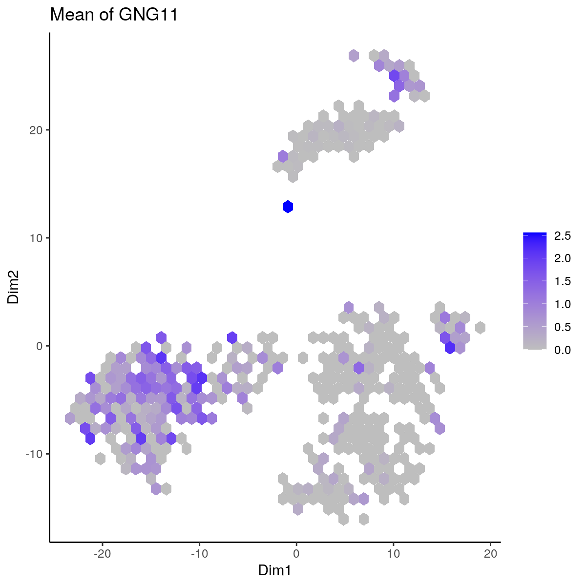|[ADCYAP1](https://www.ncbi.nlm.nih.gov/gene/116) [ADM](https://www.ncbi.nlm.nih.gov/gene/133) [AGT](https://www.ncbi.nlm.nih.gov/gene/183) [AVP](https://www.ncbi.nlm.nih.gov/gene/551) [BMP4](https://www.ncbi.nlm.nih.gov/gene/652) [C3](https://www.ncbi.nlm.nih.gov/gene/718) [C5](https://www.ncbi.nlm.nih.gov/gene/727) [CALCA](https://www.ncbi.nlm.nih.gov/gene/796) [CALCB](https://www.ncbi.nlm.nih.gov/gene/797) [CCK](https://www.ncbi.nlm.nih.gov/gene/885) [CGA](https://www.ncbi.nlm.nih.gov/gene/1081) [CORT](https://www.ncbi.nlm.nih.gov/gene/1325) [CRH](https://www.ncbi.nlm.nih.gov/gene/1392) [EDN1](https://www.ncbi.nlm.nih.gov/gene/1906) [EDN2](https://www.ncbi.nlm.nih.gov/gene/1907) [EDN3](https://www.ncbi.nlm.nih.gov/gene/1908) [F2](https://www.ncbi.nlm.nih.gov/gene/2147) [FSHB](https://www.ncbi.nlm.nih.gov/gene/2488) [GAST](https://www.ncbi.nlm.nih.gov/gene/2520) [GABBR1](https://www.ncbi.nlm.nih.gov/gene/2550) [GCG](https://www.ncbi.nlm.nih.gov/gene/2641) [GHRH](https://www.ncbi.nlm.nih.gov/gene/2691) [GIP](https://www.ncbi.nlm.nih.gov/gene/2695) [GNRH1](https://www.ncbi.nlm.nih.gov/gene/2796) [GNRH2](https://www.ncbi.nlm.nih.gov/gene/2797) [CXCL1](https://www.ncbi.nlm.nih.gov/gene/2919) [CXCL2](https://www.ncbi.nlm.nih.gov/gene/2920) [CXCL3](https://www.ncbi.nlm.nih.gov/gene/2921) [GRP](https://www.ncbi.nlm.nih.gov/gene/2922) [IAPP](https://www.ncbi.nlm.nih.gov/gene/3375) [CXCL8](https://www.ncbi.nlm.nih.gov/gene/3576) [CXCL10](https://www.ncbi.nlm.nih.gov/gene/3627) [INSL3](https://www.ncbi.nlm.nih.gov/gene/3640) [KISS1](https://www.ncbi.nlm.nih.gov/gene/3814) [CXCL9](https://www.ncbi.nlm.nih.gov/gene/4283) [MLN](https://www.ncbi.nlm.nih.gov/gene/4295) [NMB](https://www.ncbi.nlm.nih.gov/gene/4828) [NPY](https://www.ncbi.nlm.nih.gov/gene/4852) [NTS](https://www.ncbi.nlm.nih.gov/gene/4922) [OXT](https://www.ncbi.nlm.nih.gov/gene/5020) [PDYN](https://www.ncbi.nlm.nih.gov/gene/5173) [PENK](https://www.ncbi.nlm.nih.gov/gene/5179) [PF4](https://www.ncbi.nlm.nih.gov/gene/5196) [PMCH](https://www.ncbi.nlm.nih.gov/gene/5367) [PNOC](https://www.ncbi.nlm.nih.gov/gene/5368) [POMC](https://www.ncbi.nlm.nih.gov/gene/5443) [PPBP](https://www.ncbi.nlm.nih.gov/gene/5473) [PPY](https://www.ncbi.nlm.nih.gov/gene/5539) [PSAP](https://www.ncbi.nlm.nih.gov/gene/5660) [PYY](https://www.ncbi.nlm.nih.gov/gene/5697) [PTH](https://www.ncbi.nlm.nih.gov/gene/5741) [PTHLH](https://www.ncbi.nlm.nih.gov/gene/5744) [RBP3](https://www.ncbi.nlm.nih.gov/gene/5949) [RLN1](https://www.ncbi.nlm.nih.gov/gene/6013) [RLN2](https://www.ncbi.nlm.nih.gov/gene/6019) [SAA1](https://www.ncbi.nlm.nih.gov/gene/6288) [SCT](https://www.ncbi.nlm.nih.gov/gene/6343) [CCL1](https://www.ncbi.nlm.nih.gov/gene/6346) [CCL5](https://www.ncbi.nlm.nih.gov/gene/6352) [CCL13](https://www.ncbi.nlm.nih.gov/gene/6357) [CCL16](https://www.ncbi.nlm.nih.gov/gene/6360) [CCL19](https://www.ncbi.nlm.nih.gov/gene/6363) [CCL20](https://www.ncbi.nlm.nih.gov/gene/6364) [CCL21](https://www.ncbi.nlm.nih.gov/gene/6366) [CCL25](https://www.ncbi.nlm.nih.gov/gene/6370) [CXCL6](https://www.ncbi.nlm.nih.gov/gene/6372) [CXCL11](https://www.ncbi.nlm.nih.gov/gene/6373) [CXCL5](https://www.ncbi.nlm.nih.gov/gene/6374) [XCL1](https://www.ncbi.nlm.nih.gov/gene/6375) [CX3CL1](https://www.ncbi.nlm.nih.gov/gene/6376) [CXCL12](https://www.ncbi.nlm.nih.gov/gene/6387) [SLIT1](https://www.ncbi.nlm.nih.gov/gene/6585) [SST](https://www.ncbi.nlm.nih.gov/gene/6750) [XCL2](https://www.ncbi.nlm.nih.gov/gene/6846) [TAC1](https://www.ncbi.nlm.nih.gov/gene/6863) [TAC3](https://www.ncbi.nlm.nih.gov/gene/6866) [TRH](https://www.ncbi.nlm.nih.gov/gene/7200) [TSHB](https://www.ncbi.nlm.nih.gov/gene/7252) [VIP](https://www.ncbi.nlm.nih.gov/gene/7432) [WNT5A](https://www.ncbi.nlm.nih.gov/gene/7474) [WNT11](https://www.ncbi.nlm.nih.gov/gene/7481) [NPFF](https://www.ncbi.nlm.nih.gov/gene/8620) [APLN](https://www.ncbi.nlm.nih.gov/gene/8862) [INSL5](https://www.ncbi.nlm.nih.gov/gene/10022) [CXCL13](https://www.ncbi.nlm.nih.gov/gene/10563) [CCL27](https://www.ncbi.nlm.nih.gov/gene/10850) [NMU](https://www.ncbi.nlm.nih.gov/gene/10874) [UTS2](https://www.ncbi.nlm.nih.gov/gene/10911) [GAL](https://www.ncbi.nlm.nih.gov/gene/51083) [CCL28](https://www.ncbi.nlm.nih.gov/gene/56477) [PROK2](https://www.ncbi.nlm.nih.gov/gene/60675) [ADM2](https://www.ncbi.nlm.nih.gov/gene/79924) [PROK1](https://www.ncbi.nlm.nih.gov/gene/84432) [PTH2](https://www.ncbi.nlm.nih.gov/gene/113091) [RLN3](https://www.ncbi.nlm.nih.gov/gene/117579) [GPHB5](https://www.ncbi.nlm.nih.gov/gene/122876) [NMS](https://www.ncbi.nlm.nih.gov/gene/129521) [GPHA2](https://www.ncbi.nlm.nih.gov/gene/170589) [NPB](https://www.ncbi.nlm.nih.gov/gene/256933) [UTS2B](https://www.ncbi.nlm.nih.gov/gene/257313) [NPW](https://www.ncbi.nlm.nih.gov/gene/283869) [C9orf47](https://www.ncbi.nlm.nih.gov/gene/286223) [QRFP](https://www.ncbi.nlm.nih.gov/gene/347148) [CCL4L1](https://www.ncbi.nlm.nih.gov/gene/388372) [NPS](https://www.ncbi.nlm.nih.gov/gene/594857)|
|[GNG12](https://www.ncbi.nlm.nih.gov/gene/55970)|[ADCYAP1](https://www.ncbi.nlm.nih.gov/gene/116) [ADM](https://www.ncbi.nlm.nih.gov/gene/133) [AGT](https://www.ncbi.nlm.nih.gov/gene/183) [AVP](https://www.ncbi.nlm.nih.gov/gene/551) [C3](https://www.ncbi.nlm.nih.gov/gene/718) [C5](https://www.ncbi.nlm.nih.gov/gene/727) [CALCA](https://www.ncbi.nlm.nih.gov/gene/796) [CALCB](https://www.ncbi.nlm.nih.gov/gene/797) [CCK](https://www.ncbi.nlm.nih.gov/gene/885) [CGA](https://www.ncbi.nlm.nih.gov/gene/1081) [CORT](https://www.ncbi.nlm.nih.gov/gene/1325) [CRH](https://www.ncbi.nlm.nih.gov/gene/1392) [EDN1](https://www.ncbi.nlm.nih.gov/gene/1906) [EDN2](https://www.ncbi.nlm.nih.gov/gene/1907) [EDN3](https://www.ncbi.nlm.nih.gov/gene/1908) [EGFR](https://www.ncbi.nlm.nih.gov/gene/1956) [F2](https://www.ncbi.nlm.nih.gov/gene/2147) [FSHB](https://www.ncbi.nlm.nih.gov/gene/2488) [GAST](https://www.ncbi.nlm.nih.gov/gene/2520) [GABBR1](https://www.ncbi.nlm.nih.gov/gene/2550) [GCG](https://www.ncbi.nlm.nih.gov/gene/2641) [GHRH](https://www.ncbi.nlm.nih.gov/gene/2691) [GIP](https://www.ncbi.nlm.nih.gov/gene/2695) [GNRH1](https://www.ncbi.nlm.nih.gov/gene/2796) [GNRH2](https://www.ncbi.nlm.nih.gov/gene/2797) [CXCL1](https://www.ncbi.nlm.nih.gov/gene/2919) [CXCL2](https://www.ncbi.nlm.nih.gov/gene/2920) [CXCL3](https://www.ncbi.nlm.nih.gov/gene/2921) [GRP](https://www.ncbi.nlm.nih.gov/gene/2922) [IAPP](https://www.ncbi.nlm.nih.gov/gene/3375) [CXCL8](https://www.ncbi.nlm.nih.gov/gene/3576) [CXCL10](https://www.ncbi.nlm.nih.gov/gene/3627) [INSL3](https://www.ncbi.nlm.nih.gov/gene/3640) [KISS1](https://www.ncbi.nlm.nih.gov/gene/3814) [MET](https://www.ncbi.nlm.nih.gov/gene/4233) [CXCL9](https://www.ncbi.nlm.nih.gov/gene/4283) [MLN](https://www.ncbi.nlm.nih.gov/gene/4295) [NMB](https://www.ncbi.nlm.nih.gov/gene/4828) [NPY](https://www.ncbi.nlm.nih.gov/gene/4852) [NTS](https://www.ncbi.nlm.nih.gov/gene/4922) [OXT](https://www.ncbi.nlm.nih.gov/gene/5020) [PDYN](https://www.ncbi.nlm.nih.gov/gene/5173) [PENK](https://www.ncbi.nlm.nih.gov/gene/5179) [PF4](https://www.ncbi.nlm.nih.gov/gene/5196) [PMCH](https://www.ncbi.nlm.nih.gov/gene/5367) [PNOC](https://www.ncbi.nlm.nih.gov/gene/5368) [POMC](https://www.ncbi.nlm.nih.gov/gene/5443) [PPBP](https://www.ncbi.nlm.nih.gov/gene/5473) [PPY](https://www.ncbi.nlm.nih.gov/gene/5539) [PSAP](https://www.ncbi.nlm.nih.gov/gene/5660) [PYY](https://www.ncbi.nlm.nih.gov/gene/5697) [PTH](https://www.ncbi.nlm.nih.gov/gene/5741) [PTHLH](https://www.ncbi.nlm.nih.gov/gene/5744) [RLN1](https://www.ncbi.nlm.nih.gov/gene/6013) [RLN2](https://www.ncbi.nlm.nih.gov/gene/6019) [SAA1](https://www.ncbi.nlm.nih.gov/gene/6288) [SCT](https://www.ncbi.nlm.nih.gov/gene/6343) [CCL1](https://www.ncbi.nlm.nih.gov/gene/6346) [CCL5](https://www.ncbi.nlm.nih.gov/gene/6352) [CCL13](https://www.ncbi.nlm.nih.gov/gene/6357) [CCL16](https://www.ncbi.nlm.nih.gov/gene/6360) [CCL19](https://www.ncbi.nlm.nih.gov/gene/6363) [CCL20](https://www.ncbi.nlm.nih.gov/gene/6364) [CCL21](https://www.ncbi.nlm.nih.gov/gene/6366) [CCL25](https://www.ncbi.nlm.nih.gov/gene/6370) [CXCL6](https://www.ncbi.nlm.nih.gov/gene/6372) [CXCL11](https://www.ncbi.nlm.nih.gov/gene/6373) [CXCL5](https://www.ncbi.nlm.nih.gov/gene/6374) [XCL1](https://www.ncbi.nlm.nih.gov/gene/6375) [CX3CL1](https://www.ncbi.nlm.nih.gov/gene/6376) [CXCL12](https://www.ncbi.nlm.nih.gov/gene/6387) [SST](https://www.ncbi.nlm.nih.gov/gene/6750) [XCL2](https://www.ncbi.nlm.nih.gov/gene/6846) [TAC1](https://www.ncbi.nlm.nih.gov/gene/6863) [TAC3](https://www.ncbi.nlm.nih.gov/gene/6866) [TRH](https://www.ncbi.nlm.nih.gov/gene/7200) [TSHB](https://www.ncbi.nlm.nih.gov/gene/7252) [VIP](https://www.ncbi.nlm.nih.gov/gene/7432) [WNT5A](https://www.ncbi.nlm.nih.gov/gene/7474) [WNT11](https://www.ncbi.nlm.nih.gov/gene/7481) [NPFF](https://www.ncbi.nlm.nih.gov/gene/8620) [APLN](https://www.ncbi.nlm.nih.gov/gene/8862) [INSL5](https://www.ncbi.nlm.nih.gov/gene/10022) [CXCL13](https://www.ncbi.nlm.nih.gov/gene/10563) [CCL27](https://www.ncbi.nlm.nih.gov/gene/10850) [NMU](https://www.ncbi.nlm.nih.gov/gene/10874) [UTS2](https://www.ncbi.nlm.nih.gov/gene/10911) [GAL](https://www.ncbi.nlm.nih.gov/gene/51083) [CCL28](https://www.ncbi.nlm.nih.gov/gene/56477) [PROK2](https://www.ncbi.nlm.nih.gov/gene/60675) [ADM2](https://www.ncbi.nlm.nih.gov/gene/79924) [PROK1](https://www.ncbi.nlm.nih.gov/gene/84432) [PTH2](https://www.ncbi.nlm.nih.gov/gene/113091) [RLN3](https://www.ncbi.nlm.nih.gov/gene/117579) [GPHB5](https://www.ncbi.nlm.nih.gov/gene/122876) [NMS](https://www.ncbi.nlm.nih.gov/gene/129521) [GPHA2](https://www.ncbi.nlm.nih.gov/gene/170589) [NPB](https://www.ncbi.nlm.nih.gov/gene/256933) [UTS2B](https://www.ncbi.nlm.nih.gov/gene/257313) [NPW](https://www.ncbi.nlm.nih.gov/gene/283869) [C9orf47](https://www.ncbi.nlm.nih.gov/gene/286223) [QRFP](https://www.ncbi.nlm.nih.gov/gene/347148) [CCL4L1](https://www.ncbi.nlm.nih.gov/gene/388372) [NPS](https://www.ncbi.nlm.nih.gov/gene/594857)|
|[GNG13](https://www.ncbi.nlm.nih.gov/gene/51764)|[ADCYAP1](https://www.ncbi.nlm.nih.gov/gene/116) [ADM](https://www.ncbi.nlm.nih.gov/gene/133) [AGT](https://www.ncbi.nlm.nih.gov/gene/183) [AVP](https://www.ncbi.nlm.nih.gov/gene/551) [C3](https://www.ncbi.nlm.nih.gov/gene/718) [C5](https://www.ncbi.nlm.nih.gov/gene/727) [CALCA](https://www.ncbi.nlm.nih.gov/gene/796) [CALCB](https://www.ncbi.nlm.nih.gov/gene/797) [CCK](https://www.ncbi.nlm.nih.gov/gene/885) [CGA](https://www.ncbi.nlm.nih.gov/gene/1081) [CORT](https://www.ncbi.nlm.nih.gov/gene/1325) [CRH](https://www.ncbi.nlm.nih.gov/gene/1392) [EDN1](https://www.ncbi.nlm.nih.gov/gene/1906) [EDN2](https://www.ncbi.nlm.nih.gov/gene/1907) [EDN3](https://www.ncbi.nlm.nih.gov/gene/1908) [F2](https://www.ncbi.nlm.nih.gov/gene/2147) [FSHB](https://www.ncbi.nlm.nih.gov/gene/2488) [GAST](https://www.ncbi.nlm.nih.gov/gene/2520) [GABBR1](https://www.ncbi.nlm.nih.gov/gene/2550) [GCG](https://www.ncbi.nlm.nih.gov/gene/2641) [GFER](https://www.ncbi.nlm.nih.gov/gene/2671) [GHRH](https://www.ncbi.nlm.nih.gov/gene/2691) [GIP](https://www.ncbi.nlm.nih.gov/gene/2695) [GNRH1](https://www.ncbi.nlm.nih.gov/gene/2796) [GNRH2](https://www.ncbi.nlm.nih.gov/gene/2797) [CXCL1](https://www.ncbi.nlm.nih.gov/gene/2919) [CXCL2](https://www.ncbi.nlm.nih.gov/gene/2920) [CXCL3](https://www.ncbi.nlm.nih.gov/gene/2921) [GRP](https://www.ncbi.nlm.nih.gov/gene/2922) [IAPP](https://www.ncbi.nlm.nih.gov/gene/3375) [CXCL8](https://www.ncbi.nlm.nih.gov/gene/3576) [CXCL10](https://www.ncbi.nlm.nih.gov/gene/3627) [INSL3](https://www.ncbi.nlm.nih.gov/gene/3640) [KISS1](https://www.ncbi.nlm.nih.gov/gene/3814) [CXCL9](https://www.ncbi.nlm.nih.gov/gene/4283) [MLN](https://www.ncbi.nlm.nih.gov/gene/4295) [NMB](https://www.ncbi.nlm.nih.gov/gene/4828) [NPY](https://www.ncbi.nlm.nih.gov/gene/4852) [NTS](https://www.ncbi.nlm.nih.gov/gene/4922) [OXT](https://www.ncbi.nlm.nih.gov/gene/5020) [PDYN](https://www.ncbi.nlm.nih.gov/gene/5173) [PENK](https://www.ncbi.nlm.nih.gov/gene/5179) [PF4](https://www.ncbi.nlm.nih.gov/gene/5196) [PMCH](https://www.ncbi.nlm.nih.gov/gene/5367) [PNOC](https://www.ncbi.nlm.nih.gov/gene/5368) [POMC](https://www.ncbi.nlm.nih.gov/gene/5443) [PPBP](https://www.ncbi.nlm.nih.gov/gene/5473) [PPY](https://www.ncbi.nlm.nih.gov/gene/5539) [PSAP](https://www.ncbi.nlm.nih.gov/gene/5660) [PYY](https://www.ncbi.nlm.nih.gov/gene/5697) [PTH](https://www.ncbi.nlm.nih.gov/gene/5741) [PTHLH](https://www.ncbi.nlm.nih.gov/gene/5744) [RLN1](https://www.ncbi.nlm.nih.gov/gene/6013) [RLN2](https://www.ncbi.nlm.nih.gov/gene/6019) [SAA1](https://www.ncbi.nlm.nih.gov/gene/6288) [SCT](https://www.ncbi.nlm.nih.gov/gene/6343) [CCL1](https://www.ncbi.nlm.nih.gov/gene/6346) [CCL5](https://www.ncbi.nlm.nih.gov/gene/6352) [CCL13](https://www.ncbi.nlm.nih.gov/gene/6357) [CCL16](https://www.ncbi.nlm.nih.gov/gene/6360) [CCL19](https://www.ncbi.nlm.nih.gov/gene/6363) [CCL20](https://www.ncbi.nlm.nih.gov/gene/6364) [CCL21](https://www.ncbi.nlm.nih.gov/gene/6366) [CCL25](https://www.ncbi.nlm.nih.gov/gene/6370) [CXCL6](https://www.ncbi.nlm.nih.gov/gene/6372) [CXCL11](https://www.ncbi.nlm.nih.gov/gene/6373) [CXCL5](https://www.ncbi.nlm.nih.gov/gene/6374) [XCL1](https://www.ncbi.nlm.nih.gov/gene/6375) [CX3CL1](https://www.ncbi.nlm.nih.gov/gene/6376) [CXCL12](https://www.ncbi.nlm.nih.gov/gene/6387) [SST](https://www.ncbi.nlm.nih.gov/gene/6750) [XCL2](https://www.ncbi.nlm.nih.gov/gene/6846) [TAC1](https://www.ncbi.nlm.nih.gov/gene/6863) [TAC3](https://www.ncbi.nlm.nih.gov/gene/6866) [TRH](https://www.ncbi.nlm.nih.gov/gene/7200) [TSHB](https://www.ncbi.nlm.nih.gov/gene/7252) [VIP](https://www.ncbi.nlm.nih.gov/gene/7432) [WNT5A](https://www.ncbi.nlm.nih.gov/gene/7474) [WNT11](https://www.ncbi.nlm.nih.gov/gene/7481) [NPFF](https://www.ncbi.nlm.nih.gov/gene/8620) [APLN](https://www.ncbi.nlm.nih.gov/gene/8862) [INSL5](https://www.ncbi.nlm.nih.gov/gene/10022) [CXCL13](https://www.ncbi.nlm.nih.gov/gene/10563) [CCL27](https://www.ncbi.nlm.nih.gov/gene/10850) [NMU](https://www.ncbi.nlm.nih.gov/gene/10874) [UTS2](https://www.ncbi.nlm.nih.gov/gene/10911) [GAL](https://www.ncbi.nlm.nih.gov/gene/51083) [CCL28](https://www.ncbi.nlm.nih.gov/gene/56477) [PROK2](https://www.ncbi.nlm.nih.gov/gene/60675) [ADM2](https://www.ncbi.nlm.nih.gov/gene/79924) [PROK1](https://www.ncbi.nlm.nih.gov/gene/84432) [PTH2](https://www.ncbi.nlm.nih.gov/gene/113091) [RLN3](https://www.ncbi.nlm.nih.gov/gene/117579) [GPHB5](https://www.ncbi.nlm.nih.gov/gene/122876) [NMS](https://www.ncbi.nlm.nih.gov/gene/129521) [GPHA2](https://www.ncbi.nlm.nih.gov/gene/170589) [NPB](https://www.ncbi.nlm.nih.gov/gene/256933) [UTS2B](https://www.ncbi.nlm.nih.gov/gene/257313) [NPW](https://www.ncbi.nlm.nih.gov/gene/283869) [C9orf47](https://www.ncbi.nlm.nih.gov/gene/286223) [QRFP](https://www.ncbi.nlm.nih.gov/gene/347148) [CCL4L1](https://www.ncbi.nlm.nih.gov/gene/388372) [NPS](https://www.ncbi.nlm.nih.gov/gene/594857)|
|[GNG2](https://www.ncbi.nlm.nih.gov/gene/54331)|[ADCYAP1](https://www.ncbi.nlm.nih.gov/gene/116) [ADM](https://www.ncbi.nlm.nih.gov/gene/133) [AGT](https://www.ncbi.nlm.nih.gov/gene/183) [AVP](https://www.ncbi.nlm.nih.gov/gene/551) [C3](https://www.ncbi.nlm.nih.gov/gene/718) [C5](https://www.ncbi.nlm.nih.gov/gene/727) [CALCA](https://www.ncbi.nlm.nih.gov/gene/796) [CALCB](https://www.ncbi.nlm.nih.gov/gene/797) [CCK](https://www.ncbi.nlm.nih.gov/gene/885) [CGA](https://www.ncbi.nlm.nih.gov/gene/1081) [CORT](https://www.ncbi.nlm.nih.gov/gene/1325) [CRH](https://www.ncbi.nlm.nih.gov/gene/1392) [EDN1](https://www.ncbi.nlm.nih.gov/gene/1906) [EDN2](https://www.ncbi.nlm.nih.gov/gene/1907) [EDN3](https://www.ncbi.nlm.nih.gov/gene/1908) [F2](https://www.ncbi.nlm.nih.gov/gene/2147) [FSHB](https://www.ncbi.nlm.nih.gov/gene/2488) [GAST](https://www.ncbi.nlm.nih.gov/gene/2520) [GABBR1](https://www.ncbi.nlm.nih.gov/gene/2550) [GCG](https://www.ncbi.nlm.nih.gov/gene/2641) [GHRH](https://www.ncbi.nlm.nih.gov/gene/2691) [GIP](https://www.ncbi.nlm.nih.gov/gene/2695) [GNRH1](https://www.ncbi.nlm.nih.gov/gene/2796) [GNRH2](https://www.ncbi.nlm.nih.gov/gene/2797) [CXCL1](https://www.ncbi.nlm.nih.gov/gene/2919) [CXCL2](https://www.ncbi.nlm.nih.gov/gene/2920) [CXCL3](https://www.ncbi.nlm.nih.gov/gene/2921) [GRP](https://www.ncbi.nlm.nih.gov/gene/2922) [IAPP](https://www.ncbi.nlm.nih.gov/gene/3375) [CXCL8](https://www.ncbi.nlm.nih.gov/gene/3576) [CXCL10](https://www.ncbi.nlm.nih.gov/gene/3627) [INSL3](https://www.ncbi.nlm.nih.gov/gene/3640) [KISS1](https://www.ncbi.nlm.nih.gov/gene/3814) [CXCL9](https://www.ncbi.nlm.nih.gov/gene/4283) [MLN](https://www.ncbi.nlm.nih.gov/gene/4295) [NMB](https://www.ncbi.nlm.nih.gov/gene/4828) [NPY](https://www.ncbi.nlm.nih.gov/gene/4852) [NTS](https://www.ncbi.nlm.nih.gov/gene/4922) [OXT](https://www.ncbi.nlm.nih.gov/gene/5020) [PDYN](https://www.ncbi.nlm.nih.gov/gene/5173) [PENK](https://www.ncbi.nlm.nih.gov/gene/5179) [PF4](https://www.ncbi.nlm.nih.gov/gene/5196) [PMCH](https://www.ncbi.nlm.nih.gov/gene/5367) [PNOC](https://www.ncbi.nlm.nih.gov/gene/5368) [POMC](https://www.ncbi.nlm.nih.gov/gene/5443) [PPBP](https://www.ncbi.nlm.nih.gov/gene/5473) [PPY](https://www.ncbi.nlm.nih.gov/gene/5539) [PSAP](https://www.ncbi.nlm.nih.gov/gene/5660) [PYY](https://www.ncbi.nlm.nih.gov/gene/5697) [PTH](https://www.ncbi.nlm.nih.gov/gene/5741) [PTHLH](https://www.ncbi.nlm.nih.gov/gene/5744) [RLN1](https://www.ncbi.nlm.nih.gov/gene/6013) [RLN2](https://www.ncbi.nlm.nih.gov/gene/6019) [SAA1](https://www.ncbi.nlm.nih.gov/gene/6288) [SCT](https://www.ncbi.nlm.nih.gov/gene/6343) [CCL1](https://www.ncbi.nlm.nih.gov/gene/6346) [CCL5](https://www.ncbi.nlm.nih.gov/gene/6352) [CCL11](https://www.ncbi.nlm.nih.gov/gene/6356) [CCL13](https://www.ncbi.nlm.nih.gov/gene/6357) [CCL16](https://www.ncbi.nlm.nih.gov/gene/6360) [CCL19](https://www.ncbi.nlm.nih.gov/gene/6363) [CCL20](https://www.ncbi.nlm.nih.gov/gene/6364) [CCL21](https://www.ncbi.nlm.nih.gov/gene/6366) [CCL25](https://www.ncbi.nlm.nih.gov/gene/6370) [CXCL6](https://www.ncbi.nlm.nih.gov/gene/6372) [CXCL11](https://www.ncbi.nlm.nih.gov/gene/6373) [CXCL5](https://www.ncbi.nlm.nih.gov/gene/6374) [XCL1](https://www.ncbi.nlm.nih.gov/gene/6375) [CX3CL1](https://www.ncbi.nlm.nih.gov/gene/6376) [CXCL12](https://www.ncbi.nlm.nih.gov/gene/6387) [SST](https://www.ncbi.nlm.nih.gov/gene/6750) [XCL2](https://www.ncbi.nlm.nih.gov/gene/6846) [TAC1](https://www.ncbi.nlm.nih.gov/gene/6863) [TAC3](https://www.ncbi.nlm.nih.gov/gene/6866) [TRH](https://www.ncbi.nlm.nih.gov/gene/7200) [TSHB](https://www.ncbi.nlm.nih.gov/gene/7252) [VIP](https://www.ncbi.nlm.nih.gov/gene/7432) [WNT5A](https://www.ncbi.nlm.nih.gov/gene/7474) [WNT11](https://www.ncbi.nlm.nih.gov/gene/7481) [NPFF](https://www.ncbi.nlm.nih.gov/gene/8620) [APLN](https://www.ncbi.nlm.nih.gov/gene/8862) [INSL5](https://www.ncbi.nlm.nih.gov/gene/10022) [CXCL13](https://www.ncbi.nlm.nih.gov/gene/10563) [CCL27](https://www.ncbi.nlm.nih.gov/gene/10850) [NMU](https://www.ncbi.nlm.nih.gov/gene/10874) [UTS2](https://www.ncbi.nlm.nih.gov/gene/10911) [NID2](https://www.ncbi.nlm.nih.gov/gene/22795) [GAL](https://www.ncbi.nlm.nih.gov/gene/51083) [CCL28](https://www.ncbi.nlm.nih.gov/gene/56477) [TXNDC16](https://www.ncbi.nlm.nih.gov/gene/57544) [PROK2](https://www.ncbi.nlm.nih.gov/gene/60675) [ADM2](https://www.ncbi.nlm.nih.gov/gene/79924) [PROK1](https://www.ncbi.nlm.nih.gov/gene/84432) [FNDC1](https://www.ncbi.nlm.nih.gov/gene/84624) [PTH2](https://www.ncbi.nlm.nih.gov/gene/113091) [RLN3](https://www.ncbi.nlm.nih.gov/gene/117579) [GPHB5](https://www.ncbi.nlm.nih.gov/gene/122876) [NMS](https://www.ncbi.nlm.nih.gov/gene/129521) [GPHA2](https://www.ncbi.nlm.nih.gov/gene/170589) [NPB](https://www.ncbi.nlm.nih.gov/gene/256933) [UTS2B](https://www.ncbi.nlm.nih.gov/gene/257313) [NPW](https://www.ncbi.nlm.nih.gov/gene/283869) [C9orf47](https://www.ncbi.nlm.nih.gov/gene/286223) [QRFP](https://www.ncbi.nlm.nih.gov/gene/347148) [CCL4L1](https://www.ncbi.nlm.nih.gov/gene/388372) [NPS](https://www.ncbi.nlm.nih.gov/gene/594857)|
|[GNG3](https://www.ncbi.nlm.nih.gov/gene/2785)|[ADCYAP1](https://www.ncbi.nlm.nih.gov/gene/116) [ADM](https://www.ncbi.nlm.nih.gov/gene/133) [AGT](https://www.ncbi.nlm.nih.gov/gene/183) [AVP](https://www.ncbi.nlm.nih.gov/gene/551) [C3](https://www.ncbi.nlm.nih.gov/gene/718) [C5](https://www.ncbi.nlm.nih.gov/gene/727) [CALCA](https://www.ncbi.nlm.nih.gov/gene/796) [CALCB](https://www.ncbi.nlm.nih.gov/gene/797) [CCK](https://www.ncbi.nlm.nih.gov/gene/885) [CGA](https://www.ncbi.nlm.nih.gov/gene/1081) [CORT](https://www.ncbi.nlm.nih.gov/gene/1325) [CRH](https://www.ncbi.nlm.nih.gov/gene/1392) [EDN1](https://www.ncbi.nlm.nih.gov/gene/1906) [EDN2](https://www.ncbi.nlm.nih.gov/gene/1907) [EDN3](https://www.ncbi.nlm.nih.gov/gene/1908) [EFNA4](https://www.ncbi.nlm.nih.gov/gene/1945) [F2](https://www.ncbi.nlm.nih.gov/gene/2147) [FSHB](https://www.ncbi.nlm.nih.gov/gene/2488) [GAST](https://www.ncbi.nlm.nih.gov/gene/2520) [GABBR1](https://www.ncbi.nlm.nih.gov/gene/2550) [GCG](https://www.ncbi.nlm.nih.gov/gene/2641) [GHRH](https://www.ncbi.nlm.nih.gov/gene/2691) [GIP](https://www.ncbi.nlm.nih.gov/gene/2695) [GNRH1](https://www.ncbi.nlm.nih.gov/gene/2796) [GNRH2](https://www.ncbi.nlm.nih.gov/gene/2797) [CXCL1](https://www.ncbi.nlm.nih.gov/gene/2919) [CXCL2](https://www.ncbi.nlm.nih.gov/gene/2920) [CXCL3](https://www.ncbi.nlm.nih.gov/gene/2921) [GRP](https://www.ncbi.nlm.nih.gov/gene/2922) [IAPP](https://www.ncbi.nlm.nih.gov/gene/3375) [CXCL8](https://www.ncbi.nlm.nih.gov/gene/3576) [CXCL10](https://www.ncbi.nlm.nih.gov/gene/3627) [INSL3](https://www.ncbi.nlm.nih.gov/gene/3640) [KISS1](https://www.ncbi.nlm.nih.gov/gene/3814) [CXCL9](https://www.ncbi.nlm.nih.gov/gene/4283) [MLN](https://www.ncbi.nlm.nih.gov/gene/4295) [NMB](https://www.ncbi.nlm.nih.gov/gene/4828) [NPY](https://www.ncbi.nlm.nih.gov/gene/4852) [NTS](https://www.ncbi.nlm.nih.gov/gene/4922) [OXT](https://www.ncbi.nlm.nih.gov/gene/5020) [PDYN](https://www.ncbi.nlm.nih.gov/gene/5173) [PENK](https://www.ncbi.nlm.nih.gov/gene/5179) [PF4](https://www.ncbi.nlm.nih.gov/gene/5196) [PMCH](https://www.ncbi.nlm.nih.gov/gene/5367) [PNOC](https://www.ncbi.nlm.nih.gov/gene/5368) [POMC](https://www.ncbi.nlm.nih.gov/gene/5443) [PPBP](https://www.ncbi.nlm.nih.gov/gene/5473) [PPY](https://www.ncbi.nlm.nih.gov/gene/5539) [PSAP](https://www.ncbi.nlm.nih.gov/gene/5660) [PYY](https://www.ncbi.nlm.nih.gov/gene/5697) [PTH](https://www.ncbi.nlm.nih.gov/gene/5741) [PTHLH](https://www.ncbi.nlm.nih.gov/gene/5744) [RLN1](https://www.ncbi.nlm.nih.gov/gene/6013) [RLN2](https://www.ncbi.nlm.nih.gov/gene/6019) [SAA1](https://www.ncbi.nlm.nih.gov/gene/6288) [SCT](https://www.ncbi.nlm.nih.gov/gene/6343) [CCL1](https://www.ncbi.nlm.nih.gov/gene/6346) [CCL5](https://www.ncbi.nlm.nih.gov/gene/6352) [CCL13](https://www.ncbi.nlm.nih.gov/gene/6357) [CCL16](https://www.ncbi.nlm.nih.gov/gene/6360) [CCL19](https://www.ncbi.nlm.nih.gov/gene/6363) [CCL20](https://www.ncbi.nlm.nih.gov/gene/6364) [CCL21](https://www.ncbi.nlm.nih.gov/gene/6366) [CCL25](https://www.ncbi.nlm.nih.gov/gene/6370) [CXCL6](https://www.ncbi.nlm.nih.gov/gene/6372) [CXCL11](https://www.ncbi.nlm.nih.gov/gene/6373) [CXCL5](https://www.ncbi.nlm.nih.gov/gene/6374) [XCL1](https://www.ncbi.nlm.nih.gov/gene/6375) [CX3CL1](https://www.ncbi.nlm.nih.gov/gene/6376) [CXCL12](https://www.ncbi.nlm.nih.gov/gene/6387) [SST](https://www.ncbi.nlm.nih.gov/gene/6750) [XCL2](https://www.ncbi.nlm.nih.gov/gene/6846) [TAC1](https://www.ncbi.nlm.nih.gov/gene/6863) [TAC3](https://www.ncbi.nlm.nih.gov/gene/6866) [TRH](https://www.ncbi.nlm.nih.gov/gene/7200) [TSHB](https://www.ncbi.nlm.nih.gov/gene/7252) [VIP](https://www.ncbi.nlm.nih.gov/gene/7432) [WNT5A](https://www.ncbi.nlm.nih.gov/gene/7474) [WNT11](https://www.ncbi.nlm.nih.gov/gene/7481) [NPFF](https://www.ncbi.nlm.nih.gov/gene/8620) [APLN](https://www.ncbi.nlm.nih.gov/gene/8862) [CARTPT](https://www.ncbi.nlm.nih.gov/gene/9607) [INSL5](https://www.ncbi.nlm.nih.gov/gene/10022) [CXCL13](https://www.ncbi.nlm.nih.gov/gene/10563) [CCL27](https://www.ncbi.nlm.nih.gov/gene/10850) [NMU](https://www.ncbi.nlm.nih.gov/gene/10874) [UTS2](https://www.ncbi.nlm.nih.gov/gene/10911) [TMEFF2](https://www.ncbi.nlm.nih.gov/gene/23671) [GAL](https://www.ncbi.nlm.nih.gov/gene/51083) [CCL28](https://www.ncbi.nlm.nih.gov/gene/56477) [PROK2](https://www.ncbi.nlm.nih.gov/gene/60675) [ADM2](https://www.ncbi.nlm.nih.gov/gene/79924) [PROK1](https://www.ncbi.nlm.nih.gov/gene/84432) [PTH2](https://www.ncbi.nlm.nih.gov/gene/113091) [RLN3](https://www.ncbi.nlm.nih.gov/gene/117579) [GPHB5](https://www.ncbi.nlm.nih.gov/gene/122876) [NMS](https://www.ncbi.nlm.nih.gov/gene/129521) [GPHA2](https://www.ncbi.nlm.nih.gov/gene/170589) [NPB](https://www.ncbi.nlm.nih.gov/gene/256933) [UTS2B](https://www.ncbi.nlm.nih.gov/gene/257313) [NPW](https://www.ncbi.nlm.nih.gov/gene/283869) [C9orf47](https://www.ncbi.nlm.nih.gov/gene/286223) [QRFP](https://www.ncbi.nlm.nih.gov/gene/347148) [CCL4L1](https://www.ncbi.nlm.nih.gov/gene/388372) [NPS](https://www.ncbi.nlm.nih.gov/gene/594857)|
|[GNG4](https://www.ncbi.nlm.nih.gov/gene/2786)|[ADCYAP1](https://www.ncbi.nlm.nih.gov/gene/116) [ADM](https://www.ncbi.nlm.nih.gov/gene/133) [AGT](https://www.ncbi.nlm.nih.gov/gene/183) [AVP](https://www.ncbi.nlm.nih.gov/gene/551) [C3](https://www.ncbi.nlm.nih.gov/gene/718) [C5](https://www.ncbi.nlm.nih.gov/gene/727) [CALCA](https://www.ncbi.nlm.nih.gov/gene/796) [CALCB](https://www.ncbi.nlm.nih.gov/gene/797) [CCK](https://www.ncbi.nlm.nih.gov/gene/885) [CGA](https://www.ncbi.nlm.nih.gov/gene/1081) [CORT](https://www.ncbi.nlm.nih.gov/gene/1325) [CRH](https://www.ncbi.nlm.nih.gov/gene/1392) [EDN1](https://www.ncbi.nlm.nih.gov/gene/1906) [EDN2](https://www.ncbi.nlm.nih.gov/gene/1907) [EDN3](https://www.ncbi.nlm.nih.gov/gene/1908) [F2](https://www.ncbi.nlm.nih.gov/gene/2147) [FSHB](https://www.ncbi.nlm.nih.gov/gene/2488) [GAST](https://www.ncbi.nlm.nih.gov/gene/2520) [GABBR1](https://www.ncbi.nlm.nih.gov/gene/2550) [GCG](https://www.ncbi.nlm.nih.gov/gene/2641) [GHRH](https://www.ncbi.nlm.nih.gov/gene/2691) [GIP](https://www.ncbi.nlm.nih.gov/gene/2695) [GNRH1](https://www.ncbi.nlm.nih.gov/gene/2796) [GNRH2](https://www.ncbi.nlm.nih.gov/gene/2797) [CXCL1](https://www.ncbi.nlm.nih.gov/gene/2919) [CXCL2](https://www.ncbi.nlm.nih.gov/gene/2920) [CXCL3](https://www.ncbi.nlm.nih.gov/gene/2921) [GRP](https://www.ncbi.nlm.nih.gov/gene/2922) [IAPP](https://www.ncbi.nlm.nih.gov/gene/3375) [CXCL8](https://www.ncbi.nlm.nih.gov/gene/3576) [CXCL10](https://www.ncbi.nlm.nih.gov/gene/3627) [INSL3](https://www.ncbi.nlm.nih.gov/gene/3640) [KISS1](https://www.ncbi.nlm.nih.gov/gene/3814) [CXCL9](https://www.ncbi.nlm.nih.gov/gene/4283) [MLN](https://www.ncbi.nlm.nih.gov/gene/4295) [NMB](https://www.ncbi.nlm.nih.gov/gene/4828) [NPY](https://www.ncbi.nlm.nih.gov/gene/4852) [NTS](https://www.ncbi.nlm.nih.gov/gene/4922) [OXT](https://www.ncbi.nlm.nih.gov/gene/5020) [PDYN](https://www.ncbi.nlm.nih.gov/gene/5173) [PENK](https://www.ncbi.nlm.nih.gov/gene/5179) [PF4](https://www.ncbi.nlm.nih.gov/gene/5196) [PMCH](https://www.ncbi.nlm.nih.gov/gene/5367) [PNOC](https://www.ncbi.nlm.nih.gov/gene/5368) [POMC](https://www.ncbi.nlm.nih.gov/gene/5443) [PPBP](https://www.ncbi.nlm.nih.gov/gene/5473) [PPY](https://www.ncbi.nlm.nih.gov/gene/5539) [PSAP](https://www.ncbi.nlm.nih.gov/gene/5660) [PYY](https://www.ncbi.nlm.nih.gov/gene/5697) [PTH](https://www.ncbi.nlm.nih.gov/gene/5741) [PTHLH](https://www.ncbi.nlm.nih.gov/gene/5744) [RLN1](https://www.ncbi.nlm.nih.gov/gene/6013) [RLN2](https://www.ncbi.nlm.nih.gov/gene/6019) [SAA1](https://www.ncbi.nlm.nih.gov/gene/6288) [SCT](https://www.ncbi.nlm.nih.gov/gene/6343) [CCL1](https://www.ncbi.nlm.nih.gov/gene/6346) [CCL5](https://www.ncbi.nlm.nih.gov/gene/6352) [CCL13](https://www.ncbi.nlm.nih.gov/gene/6357) [CCL16](https://www.ncbi.nlm.nih.gov/gene/6360) [CCL19](https://www.ncbi.nlm.nih.gov/gene/6363) [CCL20](https://www.ncbi.nlm.nih.gov/gene/6364) [CCL21](https://www.ncbi.nlm.nih.gov/gene/6366) [CCL25](https://www.ncbi.nlm.nih.gov/gene/6370) [CXCL6](https://www.ncbi.nlm.nih.gov/gene/6372) [CXCL11](https://www.ncbi.nlm.nih.gov/gene/6373) [CXCL5](https://www.ncbi.nlm.nih.gov/gene/6374) [XCL1](https://www.ncbi.nlm.nih.gov/gene/6375) [CX3CL1](https://www.ncbi.nlm.nih.gov/gene/6376) [CXCL12](https://www.ncbi.nlm.nih.gov/gene/6387) [SST](https://www.ncbi.nlm.nih.gov/gene/6750) [XCL2](https://www.ncbi.nlm.nih.gov/gene/6846) [TAC1](https://www.ncbi.nlm.nih.gov/gene/6863) [TAC3](https://www.ncbi.nlm.nih.gov/gene/6866) [TRH](https://www.ncbi.nlm.nih.gov/gene/7200) [TSHB](https://www.ncbi.nlm.nih.gov/gene/7252) [VIP](https://www.ncbi.nlm.nih.gov/gene/7432) [WNT5A](https://www.ncbi.nlm.nih.gov/gene/7474) [WNT11](https://www.ncbi.nlm.nih.gov/gene/7481) [NPFF](https://www.ncbi.nlm.nih.gov/gene/8620) [APLN](https://www.ncbi.nlm.nih.gov/gene/8862) [INSL5](https://www.ncbi.nlm.nih.gov/gene/10022) [CXCL13](https://www.ncbi.nlm.nih.gov/gene/10563) [CCL27](https://www.ncbi.nlm.nih.gov/gene/10850) [NMU](https://www.ncbi.nlm.nih.gov/gene/10874) [UTS2](https://www.ncbi.nlm.nih.gov/gene/10911) [GAL](https://www.ncbi.nlm.nih.gov/gene/51083) [CCL28](https://www.ncbi.nlm.nih.gov/gene/56477) [PROK2](https://www.ncbi.nlm.nih.gov/gene/60675) [ADM2](https://www.ncbi.nlm.nih.gov/gene/79924) [PROK1](https://www.ncbi.nlm.nih.gov/gene/84432) [PTH2](https://www.ncbi.nlm.nih.gov/gene/113091) [RLN3](https://www.ncbi.nlm.nih.gov/gene/117579) [GPHB5](https://www.ncbi.nlm.nih.gov/gene/122876) [NMS](https://www.ncbi.nlm.nih.gov/gene/129521) [GPHA2](https://www.ncbi.nlm.nih.gov/gene/170589) [NPB](https://www.ncbi.nlm.nih.gov/gene/256933) [UTS2B](https://www.ncbi.nlm.nih.gov/gene/257313) [NPW](https://www.ncbi.nlm.nih.gov/gene/283869) [C9orf47](https://www.ncbi.nlm.nih.gov/gene/286223) [QRFP](https://www.ncbi.nlm.nih.gov/gene/347148) [CCL4L1](https://www.ncbi.nlm.nih.gov/gene/388372) [NPS](https://www.ncbi.nlm.nih.gov/gene/594857)|
|[GNG5](https://www.ncbi.nlm.nih.gov/gene/2787)|[ADCYAP1](https://www.ncbi.nlm.nih.gov/gene/116) [ADM](https://www.ncbi.nlm.nih.gov/gene/133) [AGT](https://www.ncbi.nlm.nih.gov/gene/183) [AVP](https://www.ncbi.nlm.nih.gov/gene/551) [C3](https://www.ncbi.nlm.nih.gov/gene/718) [C5](https://www.ncbi.nlm.nih.gov/gene/727) [CALCA](https://www.ncbi.nlm.nih.gov/gene/796) [CALCB](https://www.ncbi.nlm.nih.gov/gene/797) [CCK](https://www.ncbi.nlm.nih.gov/gene/885) [CGA](https://www.ncbi.nlm.nih.gov/gene/1081) [CORT](https://www.ncbi.nlm.nih.gov/gene/1325) [CRH](https://www.ncbi.nlm.nih.gov/gene/1392) [EDN1](https://www.ncbi.nlm.nih.gov/gene/1906) [EDN2](https://www.ncbi.nlm.nih.gov/gene/1907) [EDN3](https://www.ncbi.nlm.nih.gov/gene/1908) [F2](https://www.ncbi.nlm.nih.gov/gene/2147) [FSHB](https://www.ncbi.nlm.nih.gov/gene/2488) [GAST](https://www.ncbi.nlm.nih.gov/gene/2520) [GABBR1](https://www.ncbi.nlm.nih.gov/gene/2550) [GCG](https://www.ncbi.nlm.nih.gov/gene/2641) [GHRH](https://www.ncbi.nlm.nih.gov/gene/2691) [GIP](https://www.ncbi.nlm.nih.gov/gene/2695) [GNRH1](https://www.ncbi.nlm.nih.gov/gene/2796) [GNRH2](https://www.ncbi.nlm.nih.gov/gene/2797) [CXCL1](https://www.ncbi.nlm.nih.gov/gene/2919) [CXCL2](https://www.ncbi.nlm.nih.gov/gene/2920) [CXCL3](https://www.ncbi.nlm.nih.gov/gene/2921) [GRP](https://www.ncbi.nlm.nih.gov/gene/2922) [IAPP](https://www.ncbi.nlm.nih.gov/gene/3375) [CXCL8](https://www.ncbi.nlm.nih.gov/gene/3576) [CXCL10](https://www.ncbi.nlm.nih.gov/gene/3627) [INSL3](https://www.ncbi.nlm.nih.gov/gene/3640) [KISS1](https://www.ncbi.nlm.nih.gov/gene/3814) [CXCL9](https://www.ncbi.nlm.nih.gov/gene/4283) [MLN](https://www.ncbi.nlm.nih.gov/gene/4295) [NMB](https://www.ncbi.nlm.nih.gov/gene/4828) [NPY](https://www.ncbi.nlm.nih.gov/gene/4852) [NTS](https://www.ncbi.nlm.nih.gov/gene/4922) [OXT](https://www.ncbi.nlm.nih.gov/gene/5020) [PDYN](https://www.ncbi.nlm.nih.gov/gene/5173) [PENK](https://www.ncbi.nlm.nih.gov/gene/5179) [PF4](https://www.ncbi.nlm.nih.gov/gene/5196) [PMCH](https://www.ncbi.nlm.nih.gov/gene/5367) [PNOC](https://www.ncbi.nlm.nih.gov/gene/5368) [POMC](https://www.ncbi.nlm.nih.gov/gene/5443) [PPBP](https://www.ncbi.nlm.nih.gov/gene/5473) [PPY](https://www.ncbi.nlm.nih.gov/gene/5539) [PSAP](https://www.ncbi.nlm.nih.gov/gene/5660) [PYY](https://www.ncbi.nlm.nih.gov/gene/5697) [PTH](https://www.ncbi.nlm.nih.gov/gene/5741) [PTHLH](https://www.ncbi.nlm.nih.gov/gene/5744) [RLN1](https://www.ncbi.nlm.nih.gov/gene/6013) [RLN2](https://www.ncbi.nlm.nih.gov/gene/6019) [SAA1](https://www.ncbi.nlm.nih.gov/gene/6288) [SCT](https://www.ncbi.nlm.nih.gov/gene/6343) [CCL1](https://www.ncbi.nlm.nih.gov/gene/6346) [CCL5](https://www.ncbi.nlm.nih.gov/gene/6352) [CCL13](https://www.ncbi.nlm.nih.gov/gene/6357) [CCL16](https://www.ncbi.nlm.nih.gov/gene/6360) [CCL19](https://www.ncbi.nlm.nih.gov/gene/6363) [CCL20](https://www.ncbi.nlm.nih.gov/gene/6364) [CCL21](https://www.ncbi.nlm.nih.gov/gene/6366) [CCL25](https://www.ncbi.nlm.nih.gov/gene/6370) [CXCL6](https://www.ncbi.nlm.nih.gov/gene/6372) [CXCL11](https://www.ncbi.nlm.nih.gov/gene/6373) [CXCL5](https://www.ncbi.nlm.nih.gov/gene/6374) [XCL1](https://www.ncbi.nlm.nih.gov/gene/6375) [CX3CL1](https://www.ncbi.nlm.nih.gov/gene/6376) [CXCL12](https://www.ncbi.nlm.nih.gov/gene/6387) [SST](https://www.ncbi.nlm.nih.gov/gene/6750) [XCL2](https://www.ncbi.nlm.nih.gov/gene/6846) [TAC1](https://www.ncbi.nlm.nih.gov/gene/6863) [TAC3](https://www.ncbi.nlm.nih.gov/gene/6866) [TRH](https://www.ncbi.nlm.nih.gov/gene/7200) [TSHB](https://www.ncbi.nlm.nih.gov/gene/7252) [VIP](https://www.ncbi.nlm.nih.gov/gene/7432) [WNT5A](https://www.ncbi.nlm.nih.gov/gene/7474) [WNT11](https://www.ncbi.nlm.nih.gov/gene/7481) [NPFF](https://www.ncbi.nlm.nih.gov/gene/8620) [APLN](https://www.ncbi.nlm.nih.gov/gene/8862) [INSL5](https://www.ncbi.nlm.nih.gov/gene/10022) [CXCL13](https://www.ncbi.nlm.nih.gov/gene/10563) [CCL27](https://www.ncbi.nlm.nih.gov/gene/10850) [NMU](https://www.ncbi.nlm.nih.gov/gene/10874) [UTS2](https://www.ncbi.nlm.nih.gov/gene/10911) [GAL](https://www.ncbi.nlm.nih.gov/gene/51083) [CCL28](https://www.ncbi.nlm.nih.gov/gene/56477) [PROK2](https://www.ncbi.nlm.nih.gov/gene/60675) [ADM2](https://www.ncbi.nlm.nih.gov/gene/79924) [PROK1](https://www.ncbi.nlm.nih.gov/gene/84432) [PTH2](https://www.ncbi.nlm.nih.gov/gene/113091) [RLN3](https://www.ncbi.nlm.nih.gov/gene/117579) [GPHB5](https://www.ncbi.nlm.nih.gov/gene/122876) [NMS](https://www.ncbi.nlm.nih.gov/gene/129521) [GPHA2](https://www.ncbi.nlm.nih.gov/gene/170589) [NPB](https://www.ncbi.nlm.nih.gov/gene/256933) [UTS2B](https://www.ncbi.nlm.nih.gov/gene/257313) [NPW](https://www.ncbi.nlm.nih.gov/gene/283869) [C9orf47](https://www.ncbi.nlm.nih.gov/gene/286223) [QRFP](https://www.ncbi.nlm.nih.gov/gene/347148) [CCL4L1](https://www.ncbi.nlm.nih.gov/gene/388372) [NPS](https://www.ncbi.nlm.nih.gov/gene/594857)|
|[GNG7](https://www.ncbi.nlm.nih.gov/gene/2788)|[ADCYAP1](https://www.ncbi.nlm.nih.gov/gene/116) [ADM](https://www.ncbi.nlm.nih.gov/gene/133) [AGT](https://www.ncbi.nlm.nih.gov/gene/183) [AVP](https://www.ncbi.nlm.nih.gov/gene/551) [C3](https://www.ncbi.nlm.nih.gov/gene/718) [C5](https://www.ncbi.nlm.nih.gov/gene/727) [CALCA](https://www.ncbi.nlm.nih.gov/gene/796) [CALCB](https://www.ncbi.nlm.nih.gov/gene/797) [CCK](https://www.ncbi.nlm.nih.gov/gene/885) [CGA](https://www.ncbi.nlm.nih.gov/gene/1081) [CORT](https://www.ncbi.nlm.nih.gov/gene/1325) [CRH](https://www.ncbi.nlm.nih.gov/gene/1392) [EDN1](https://www.ncbi.nlm.nih.gov/gene/1906) [EDN2](https://www.ncbi.nlm.nih.gov/gene/1907) [EDN3](https://www.ncbi.nlm.nih.gov/gene/1908) [F2](https://www.ncbi.nlm.nih.gov/gene/2147) [FSHB](https://www.ncbi.nlm.nih.gov/gene/2488) [GAST](https://www.ncbi.nlm.nih.gov/gene/2520) [GABBR1](https://www.ncbi.nlm.nih.gov/gene/2550) [GCG](https://www.ncbi.nlm.nih.gov/gene/2641) [GHRH](https://www.ncbi.nlm.nih.gov/gene/2691) [GIP](https://www.ncbi.nlm.nih.gov/gene/2695) [GNRH1](https://www.ncbi.nlm.nih.gov/gene/2796) [GNRH2](https://www.ncbi.nlm.nih.gov/gene/2797) [CXCL1](https://www.ncbi.nlm.nih.gov/gene/2919) [CXCL2](https://www.ncbi.nlm.nih.gov/gene/2920) [CXCL3](https://www.ncbi.nlm.nih.gov/gene/2921) [GRP](https://www.ncbi.nlm.nih.gov/gene/2922) [IAPP](https://www.ncbi.nlm.nih.gov/gene/3375) [CXCL8](https://www.ncbi.nlm.nih.gov/gene/3576) [CXCL10](https://www.ncbi.nlm.nih.gov/gene/3627) [INSL3](https://www.ncbi.nlm.nih.gov/gene/3640) [KISS1](https://www.ncbi.nlm.nih.gov/gene/3814) [CXCL9](https://www.ncbi.nlm.nih.gov/gene/4283) [MLN](https://www.ncbi.nlm.nih.gov/gene/4295) [NMB](https://www.ncbi.nlm.nih.gov/gene/4828) [NPY](https://www.ncbi.nlm.nih.gov/gene/4852) [NTS](https://www.ncbi.nlm.nih.gov/gene/4922) [OXT](https://www.ncbi.nlm.nih.gov/gene/5020) [PDYN](https://www.ncbi.nlm.nih.gov/gene/5173) [PENK](https://www.ncbi.nlm.nih.gov/gene/5179) [PF4](https://www.ncbi.nlm.nih.gov/gene/5196) [PMCH](https://www.ncbi.nlm.nih.gov/gene/5367) [PNOC](https://www.ncbi.nlm.nih.gov/gene/5368) [POMC](https://www.ncbi.nlm.nih.gov/gene/5443) [PPBP](https://www.ncbi.nlm.nih.gov/gene/5473) [PPY](https://www.ncbi.nlm.nih.gov/gene/5539) [PSAP](https://www.ncbi.nlm.nih.gov/gene/5660) [PYY](https://www.ncbi.nlm.nih.gov/gene/5697) [PTH](https://www.ncbi.nlm.nih.gov/gene/5741) [PTHLH](https://www.ncbi.nlm.nih.gov/gene/5744) [RLN1](https://www.ncbi.nlm.nih.gov/gene/6013) [RLN2](https://www.ncbi.nlm.nih.gov/gene/6019) [SAA1](https://www.ncbi.nlm.nih.gov/gene/6288) [SCT](https://www.ncbi.nlm.nih.gov/gene/6343) [CCL1](https://www.ncbi.nlm.nih.gov/gene/6346) [CCL5](https://www.ncbi.nlm.nih.gov/gene/6352) [CCL13](https://www.ncbi.nlm.nih.gov/gene/6357) [CCL16](https://www.ncbi.nlm.nih.gov/gene/6360) [CCL19](https://www.ncbi.nlm.nih.gov/gene/6363) [CCL20](https://www.ncbi.nlm.nih.gov/gene/6364) [CCL21](https://www.ncbi.nlm.nih.gov/gene/6366) [CCL25](https://www.ncbi.nlm.nih.gov/gene/6370) [CXCL6](https://www.ncbi.nlm.nih.gov/gene/6372) [CXCL11](https://www.ncbi.nlm.nih.gov/gene/6373) [CXCL5](https://www.ncbi.nlm.nih.gov/gene/6374) [XCL1](https://www.ncbi.nlm.nih.gov/gene/6375) [CX3CL1](https://www.ncbi.nlm.nih.gov/gene/6376) [CXCL12](https://www.ncbi.nlm.nih.gov/gene/6387) [SST](https://www.ncbi.nlm.nih.gov/gene/6750) [XCL2](https://www.ncbi.nlm.nih.gov/gene/6846) [TAC1](https://www.ncbi.nlm.nih.gov/gene/6863) [TAC3](https://www.ncbi.nlm.nih.gov/gene/6866) [TRH](https://www.ncbi.nlm.nih.gov/gene/7200) [TSHB](https://www.ncbi.nlm.nih.gov/gene/7252) [VIP](https://www.ncbi.nlm.nih.gov/gene/7432) [WNT5A](https://www.ncbi.nlm.nih.gov/gene/7474) [WNT11](https://www.ncbi.nlm.nih.gov/gene/7481) [NPFF](https://www.ncbi.nlm.nih.gov/gene/8620) [APLN](https://www.ncbi.nlm.nih.gov/gene/8862) [INSL5](https://www.ncbi.nlm.nih.gov/gene/10022) [CXCL13](https://www.ncbi.nlm.nih.gov/gene/10563) [CCL27](https://www.ncbi.nlm.nih.gov/gene/10850) [NMU](https://www.ncbi.nlm.nih.gov/gene/10874) [UTS2](https://www.ncbi.nlm.nih.gov/gene/10911) [GAL](https://www.ncbi.nlm.nih.gov/gene/51083) [CCL28](https://www.ncbi.nlm.nih.gov/gene/56477) [PROK2](https://www.ncbi.nlm.nih.gov/gene/60675) [ADM2](https://www.ncbi.nlm.nih.gov/gene/79924) [PROK1](https://www.ncbi.nlm.nih.gov/gene/84432) [PTH2](https://www.ncbi.nlm.nih.gov/gene/113091) [RLN3](https://www.ncbi.nlm.nih.gov/gene/117579) [GPHB5](https://www.ncbi.nlm.nih.gov/gene/122876) [NMS](https://www.ncbi.nlm.nih.gov/gene/129521) [GPHA2](https://www.ncbi.nlm.nih.gov/gene/170589) [NPB](https://www.ncbi.nlm.nih.gov/gene/256933) [UTS2B](https://www.ncbi.nlm.nih.gov/gene/257313) [NPW](https://www.ncbi.nlm.nih.gov/gene/283869) [C9orf47](https://www.ncbi.nlm.nih.gov/gene/286223) [QRFP](https://www.ncbi.nlm.nih.gov/gene/347148) [CCL4L1](https://www.ncbi.nlm.nih.gov/gene/388372) [NPS](https://www.ncbi.nlm.nih.gov/gene/594857)|
|[GNG8](https://www.ncbi.nlm.nih.gov/gene/94235)|[AOC1](https://www.ncbi.nlm.nih.gov/gene/26) [ADCYAP1](https://www.ncbi.nlm.nih.gov/gene/116) [ADM](https://www.ncbi.nlm.nih.gov/gene/133) [AGT](https://www.ncbi.nlm.nih.gov/gene/183) [AVP](https://www.ncbi.nlm.nih.gov/gene/551) [C3](https://www.ncbi.nlm.nih.gov/gene/718) [C5](https://www.ncbi.nlm.nih.gov/gene/727) [CALCA](https://www.ncbi.nlm.nih.gov/gene/796) [CALCB](https://www.ncbi.nlm.nih.gov/gene/797) [CCK](https://www.ncbi.nlm.nih.gov/gene/885) [CGA](https://www.ncbi.nlm.nih.gov/gene/1081) [CORT](https://www.ncbi.nlm.nih.gov/gene/1325) [CRH](https://www.ncbi.nlm.nih.gov/gene/1392) [EDN1](https://www.ncbi.nlm.nih.gov/gene/1906) [EDN2](https://www.ncbi.nlm.nih.gov/gene/1907) [EDN3](https://www.ncbi.nlm.nih.gov/gene/1908) [F2](https://www.ncbi.nlm.nih.gov/gene/2147) [FSHB](https://www.ncbi.nlm.nih.gov/gene/2488) [GAST](https://www.ncbi.nlm.nih.gov/gene/2520) [GABBR1](https://www.ncbi.nlm.nih.gov/gene/2550) [GCG](https://www.ncbi.nlm.nih.gov/gene/2641) [GHRH](https://www.ncbi.nlm.nih.gov/gene/2691) [GIP](https://www.ncbi.nlm.nih.gov/gene/2695) [GNRH1](https://www.ncbi.nlm.nih.gov/gene/2796) [GNRH2](https://www.ncbi.nlm.nih.gov/gene/2797) [CXCL1](https://www.ncbi.nlm.nih.gov/gene/2919) [CXCL2](https://www.ncbi.nlm.nih.gov/gene/2920) [CXCL3](https://www.ncbi.nlm.nih.gov/gene/2921) [GRP](https://www.ncbi.nlm.nih.gov/gene/2922) [IAPP](https://www.ncbi.nlm.nih.gov/gene/3375) [IL2](https://www.ncbi.nlm.nih.gov/gene/3558) [CXCL8](https://www.ncbi.nlm.nih.gov/gene/3576) [CXCL10](https://www.ncbi.nlm.nih.gov/gene/3627) [INSL3](https://www.ncbi.nlm.nih.gov/gene/3640) [KISS1](https://www.ncbi.nlm.nih.gov/gene/3814) [CXCL9](https://www.ncbi.nlm.nih.gov/gene/4283) [MLN](https://www.ncbi.nlm.nih.gov/gene/4295) [NMB](https://www.ncbi.nlm.nih.gov/gene/4828) [NPY](https://www.ncbi.nlm.nih.gov/gene/4852) [NTS](https://www.ncbi.nlm.nih.gov/gene/4922) [OXT](https://www.ncbi.nlm.nih.gov/gene/5020) [PDYN](https://www.ncbi.nlm.nih.gov/gene/5173) [PENK](https://www.ncbi.nlm.nih.gov/gene/5179) [PF4](https://www.ncbi.nlm.nih.gov/gene/5196) [PMCH](https://www.ncbi.nlm.nih.gov/gene/5367) [PNOC](https://www.ncbi.nlm.nih.gov/gene/5368) [POMC](https://www.ncbi.nlm.nih.gov/gene/5443) [PPBP](https://www.ncbi.nlm.nih.gov/gene/5473) [PPY](https://www.ncbi.nlm.nih.gov/gene/5539) [PSAP](https://www.ncbi.nlm.nih.gov/gene/5660) [PYY](https://www.ncbi.nlm.nih.gov/gene/5697) [PTH](https://www.ncbi.nlm.nih.gov/gene/5741) [PTHLH](https://www.ncbi.nlm.nih.gov/gene/5744) [RLN1](https://www.ncbi.nlm.nih.gov/gene/6013) [RLN2](https://www.ncbi.nlm.nih.gov/gene/6019) [SAA1](https://www.ncbi.nlm.nih.gov/gene/6288) [SCT](https://www.ncbi.nlm.nih.gov/gene/6343) [CCL1](https://www.ncbi.nlm.nih.gov/gene/6346) [CCL5](https://www.ncbi.nlm.nih.gov/gene/6352) [CCL13](https://www.ncbi.nlm.nih.gov/gene/6357) [CCL16](https://www.ncbi.nlm.nih.gov/gene/6360) [CCL19](https://www.ncbi.nlm.nih.gov/gene/6363) [CCL20](https://www.ncbi.nlm.nih.gov/gene/6364) [CCL21](https://www.ncbi.nlm.nih.gov/gene/6366) [CCL25](https://www.ncbi.nlm.nih.gov/gene/6370) [CXCL6](https://www.ncbi.nlm.nih.gov/gene/6372) [CXCL11](https://www.ncbi.nlm.nih.gov/gene/6373) [CXCL5](https://www.ncbi.nlm.nih.gov/gene/6374) [XCL1](https://www.ncbi.nlm.nih.gov/gene/6375) [CX3CL1](https://www.ncbi.nlm.nih.gov/gene/6376) [CXCL12](https://www.ncbi.nlm.nih.gov/gene/6387) [SST](https://www.ncbi.nlm.nih.gov/gene/6750) [XCL2](https://www.ncbi.nlm.nih.gov/gene/6846) [TAC1](https://www.ncbi.nlm.nih.gov/gene/6863) [TAC3](https://www.ncbi.nlm.nih.gov/gene/6866) [TRH](https://www.ncbi.nlm.nih.gov/gene/7200) [TSHB](https://www.ncbi.nlm.nih.gov/gene/7252) [VIP](https://www.ncbi.nlm.nih.gov/gene/7432) [WNT5A](https://www.ncbi.nlm.nih.gov/gene/7474) [WNT11](https://www.ncbi.nlm.nih.gov/gene/7481) [NPFF](https://www.ncbi.nlm.nih.gov/gene/8620) [APLN](https://www.ncbi.nlm.nih.gov/gene/8862) [INSL5](https://www.ncbi.nlm.nih.gov/gene/10022) [CXCL13](https://www.ncbi.nlm.nih.gov/gene/10563) [CCL27](https://www.ncbi.nlm.nih.gov/gene/10850) [NMU](https://www.ncbi.nlm.nih.gov/gene/10874) [UTS2](https://www.ncbi.nlm.nih.gov/gene/10911) [GAL](https://www.ncbi.nlm.nih.gov/gene/51083) [CCL28](https://www.ncbi.nlm.nih.gov/gene/56477) [PROK2](https://www.ncbi.nlm.nih.gov/gene/60675) [ADM2](https://www.ncbi.nlm.nih.gov/gene/79924) [PROK1](https://www.ncbi.nlm.nih.gov/gene/84432) [PTH2](https://www.ncbi.nlm.nih.gov/gene/113091) [RLN3](https://www.ncbi.nlm.nih.gov/gene/117579) [GPHB5](https://www.ncbi.nlm.nih.gov/gene/122876) [NMS](https://www.ncbi.nlm.nih.gov/gene/129521) [GPHA2](https://www.ncbi.nlm.nih.gov/gene/170589) [NPB](https://www.ncbi.nlm.nih.gov/gene/256933) [UTS2B](https://www.ncbi.nlm.nih.gov/gene/257313) [NPW](https://www.ncbi.nlm.nih.gov/gene/283869) [C9orf47](https://www.ncbi.nlm.nih.gov/gene/286223) [QRFP](https://www.ncbi.nlm.nih.gov/gene/347148) [CCL4L1](https://www.ncbi.nlm.nih.gov/gene/388372) [NPS](https://www.ncbi.nlm.nih.gov/gene/594857)|
|[GNGT1](https://www.ncbi.nlm.nih.gov/gene/2792)|[ADCYAP1](https://www.ncbi.nlm.nih.gov/gene/116) [ADM](https://www.ncbi.nlm.nih.gov/gene/133) [AGT](https://www.ncbi.nlm.nih.gov/gene/183) [AVP](https://www.ncbi.nlm.nih.gov/gene/551) [C3](https://www.ncbi.nlm.nih.gov/gene/718) [C5](https://www.ncbi.nlm.nih.gov/gene/727) [CALCA](https://www.ncbi.nlm.nih.gov/gene/796) [CALCB](https://www.ncbi.nlm.nih.gov/gene/797) [CCK](https://www.ncbi.nlm.nih.gov/gene/885) [CGA](https://www.ncbi.nlm.nih.gov/gene/1081) [CORT](https://www.ncbi.nlm.nih.gov/gene/1325) [CRH](https://www.ncbi.nlm.nih.gov/gene/1392) [EDN1](https://www.ncbi.nlm.nih.gov/gene/1906) [EDN2](https://www.ncbi.nlm.nih.gov/gene/1907) [EDN3](https://www.ncbi.nlm.nih.gov/gene/1908) [F2](https://www.ncbi.nlm.nih.gov/gene/2147) [FSHB](https://www.ncbi.nlm.nih.gov/gene/2488) [GAST](https://www.ncbi.nlm.nih.gov/gene/2520) [GABBR1](https://www.ncbi.nlm.nih.gov/gene/2550) [GCG](https://www.ncbi.nlm.nih.gov/gene/2641) [GHRH](https://www.ncbi.nlm.nih.gov/gene/2691) [GIP](https://www.ncbi.nlm.nih.gov/gene/2695) [GNRH1](https://www.ncbi.nlm.nih.gov/gene/2796) [GNRH2](https://www.ncbi.nlm.nih.gov/gene/2797) [CXCL1](https://www.ncbi.nlm.nih.gov/gene/2919) [CXCL2](https://www.ncbi.nlm.nih.gov/gene/2920) [CXCL3](https://www.ncbi.nlm.nih.gov/gene/2921) [GRP](https://www.ncbi.nlm.nih.gov/gene/2922) [IAPP](https://www.ncbi.nlm.nih.gov/gene/3375) [IL6R](https://www.ncbi.nlm.nih.gov/gene/3570) [CXCL8](https://www.ncbi.nlm.nih.gov/gene/3576) [CXCL10](https://www.ncbi.nlm.nih.gov/gene/3627) [INSL3](https://www.ncbi.nlm.nih.gov/gene/3640) [KISS1](https://www.ncbi.nlm.nih.gov/gene/3814) [CXCL9](https://www.ncbi.nlm.nih.gov/gene/4283) [MLN](https://www.ncbi.nlm.nih.gov/gene/4295) [NMB](https://www.ncbi.nlm.nih.gov/gene/4828) [NPY](https://www.ncbi.nlm.nih.gov/gene/4852) [NTS](https://www.ncbi.nlm.nih.gov/gene/4922) [OXT](https://www.ncbi.nlm.nih.gov/gene/5020) [PDYN](https://www.ncbi.nlm.nih.gov/gene/5173) [PENK](https://www.ncbi.nlm.nih.gov/gene/5179) [PF4](https://www.ncbi.nlm.nih.gov/gene/5196) [PMCH](https://www.ncbi.nlm.nih.gov/gene/5367) [PNOC](https://www.ncbi.nlm.nih.gov/gene/5368) [POMC](https://www.ncbi.nlm.nih.gov/gene/5443) [PPBP](https://www.ncbi.nlm.nih.gov/gene/5473) [PPY](https://www.ncbi.nlm.nih.gov/gene/5539) [PSAP](https://www.ncbi.nlm.nih.gov/gene/5660) [PYY](https://www.ncbi.nlm.nih.gov/gene/5697) [PTH](https://www.ncbi.nlm.nih.gov/gene/5741) [PTHLH](https://www.ncbi.nlm.nih.gov/gene/5744) [RBP3](https://www.ncbi.nlm.nih.gov/gene/5949) [RLN1](https://www.ncbi.nlm.nih.gov/gene/6013) [RLN2](https://www.ncbi.nlm.nih.gov/gene/6019) [SAA1](https://www.ncbi.nlm.nih.gov/gene/6288) [SCT](https://www.ncbi.nlm.nih.gov/gene/6343) [CCL1](https://www.ncbi.nlm.nih.gov/gene/6346) [CCL5](https://www.ncbi.nlm.nih.gov/gene/6352) [CCL11](https://www.ncbi.nlm.nih.gov/gene/6356) [CCL13](https://www.ncbi.nlm.nih.gov/gene/6357) [CCL16](https://www.ncbi.nlm.nih.gov/gene/6360) [CCL19](https://www.ncbi.nlm.nih.gov/gene/6363) [CCL20](https://www.ncbi.nlm.nih.gov/gene/6364) [CCL21](https://www.ncbi.nlm.nih.gov/gene/6366) [CCL25](https://www.ncbi.nlm.nih.gov/gene/6370) [CXCL6](https://www.ncbi.nlm.nih.gov/gene/6372) [CXCL11](https://www.ncbi.nlm.nih.gov/gene/6373) [CXCL5](https://www.ncbi.nlm.nih.gov/gene/6374) [XCL1](https://www.ncbi.nlm.nih.gov/gene/6375) [CX3CL1](https://www.ncbi.nlm.nih.gov/gene/6376) [CXCL12](https://www.ncbi.nlm.nih.gov/gene/6387) [SST](https://www.ncbi.nlm.nih.gov/gene/6750) [XCL2](https://www.ncbi.nlm.nih.gov/gene/6846) [TAC1](https://www.ncbi.nlm.nih.gov/gene/6863) [TAC3](https://www.ncbi.nlm.nih.gov/gene/6866) [TRH](https://www.ncbi.nlm.nih.gov/gene/7200) [TSHB](https://www.ncbi.nlm.nih.gov/gene/7252) [VIP](https://www.ncbi.nlm.nih.gov/gene/7432) [WNT5A](https://www.ncbi.nlm.nih.gov/gene/7474) [WNT11](https://www.ncbi.nlm.nih.gov/gene/7481) [NPFF](https://www.ncbi.nlm.nih.gov/gene/8620) [APLN](https://www.ncbi.nlm.nih.gov/gene/8862) [INSL5](https://www.ncbi.nlm.nih.gov/gene/10022) [CXCL13](https://www.ncbi.nlm.nih.gov/gene/10563) [SCGN](https://www.ncbi.nlm.nih.gov/gene/10590) [CCL27](https://www.ncbi.nlm.nih.gov/gene/10850) [NMU](https://www.ncbi.nlm.nih.gov/gene/10874) [UTS2](https://www.ncbi.nlm.nih.gov/gene/10911) [GAL](https://www.ncbi.nlm.nih.gov/gene/51083) [CCL28](https://www.ncbi.nlm.nih.gov/gene/56477) [PROK2](https://www.ncbi.nlm.nih.gov/gene/60675) [ADM2](https://www.ncbi.nlm.nih.gov/gene/79924) [PROK1](https://www.ncbi.nlm.nih.gov/gene/84432) [PTH2](https://www.ncbi.nlm.nih.gov/gene/113091) [RLN3](https://www.ncbi.nlm.nih.gov/gene/117579) [GPHB5](https://www.ncbi.nlm.nih.gov/gene/122876) [NMS](https://www.ncbi.nlm.nih.gov/gene/129521) [GPHA2](https://www.ncbi.nlm.nih.gov/gene/170589) [NPB](https://www.ncbi.nlm.nih.gov/gene/256933) [UTS2B](https://www.ncbi.nlm.nih.gov/gene/257313) [NPW](https://www.ncbi.nlm.nih.gov/gene/283869) [C9orf47](https://www.ncbi.nlm.nih.gov/gene/286223) [QRFP](https://www.ncbi.nlm.nih.gov/gene/347148) [CCL4L1](https://www.ncbi.nlm.nih.gov/gene/388372) [NPS](https://www.ncbi.nlm.nih.gov/gene/594857)|
|[GNGT2](https://www.ncbi.nlm.nih.gov/gene/2793)|[ADCYAP1](https://www.ncbi.nlm.nih.gov/gene/116) [ADM](https://www.ncbi.nlm.nih.gov/gene/133) [AGT](https://www.ncbi.nlm.nih.gov/gene/183) [AVP](https://www.ncbi.nlm.nih.gov/gene/551) [C3](https://www.ncbi.nlm.nih.gov/gene/718) [C5](https://www.ncbi.nlm.nih.gov/gene/727) [CALCA](https://www.ncbi.nlm.nih.gov/gene/796) [CALCB](https://www.ncbi.nlm.nih.gov/gene/797) [CCK](https://www.ncbi.nlm.nih.gov/gene/885) [CGA](https://www.ncbi.nlm.nih.gov/gene/1081) [CORT](https://www.ncbi.nlm.nih.gov/gene/1325) [CRH](https://www.ncbi.nlm.nih.gov/gene/1392) [EDN1](https://www.ncbi.nlm.nih.gov/gene/1906) [EDN2](https://www.ncbi.nlm.nih.gov/gene/1907) [EDN3](https://www.ncbi.nlm.nih.gov/gene/1908) [F2](https://www.ncbi.nlm.nih.gov/gene/2147) [FSHB](https://www.ncbi.nlm.nih.gov/gene/2488) [GAST](https://www.ncbi.nlm.nih.gov/gene/2520) [GABBR1](https://www.ncbi.nlm.nih.gov/gene/2550) [GCG](https://www.ncbi.nlm.nih.gov/gene/2641) [GHRH](https://www.ncbi.nlm.nih.gov/gene/2691) [GIP](https://www.ncbi.nlm.nih.gov/gene/2695) [GNRH1](https://www.ncbi.nlm.nih.gov/gene/2796) [GNRH2](https://www.ncbi.nlm.nih.gov/gene/2797) [CXCL1](https://www.ncbi.nlm.nih.gov/gene/2919) [CXCL2](https://www.ncbi.nlm.nih.gov/gene/2920) [CXCL3](https://www.ncbi.nlm.nih.gov/gene/2921) [GRP](https://www.ncbi.nlm.nih.gov/gene/2922) [IAPP](https://www.ncbi.nlm.nih.gov/gene/3375) [CXCL8](https://www.ncbi.nlm.nih.gov/gene/3576) [CXCL10](https://www.ncbi.nlm.nih.gov/gene/3627) [INSL3](https://www.ncbi.nlm.nih.gov/gene/3640) [KISS1](https://www.ncbi.nlm.nih.gov/gene/3814) [CXCL9](https://www.ncbi.nlm.nih.gov/gene/4283) [MLN](https://www.ncbi.nlm.nih.gov/gene/4295) [NMB](https://www.ncbi.nlm.nih.gov/gene/4828) [NPY](https://www.ncbi.nlm.nih.gov/gene/4852) [NTS](https://www.ncbi.nlm.nih.gov/gene/4922) [OXT](https://www.ncbi.nlm.nih.gov/gene/5020) [PDYN](https://www.ncbi.nlm.nih.gov/gene/5173) [PENK](https://www.ncbi.nlm.nih.gov/gene/5179) [PF4](https://www.ncbi.nlm.nih.gov/gene/5196) [PMCH](https://www.ncbi.nlm.nih.gov/gene/5367) [PNOC](https://www.ncbi.nlm.nih.gov/gene/5368) [POMC](https://www.ncbi.nlm.nih.gov/gene/5443) [PPBP](https://www.ncbi.nlm.nih.gov/gene/5473) [PPY](https://www.ncbi.nlm.nih.gov/gene/5539) [PSAP](https://www.ncbi.nlm.nih.gov/gene/5660) [PYY](https://www.ncbi.nlm.nih.gov/gene/5697) [PTH](https://www.ncbi.nlm.nih.gov/gene/5741) [PTHLH](https://www.ncbi.nlm.nih.gov/gene/5744) [RLN1](https://www.ncbi.nlm.nih.gov/gene/6013) [RLN2](https://www.ncbi.nlm.nih.gov/gene/6019) [SAA1](https://www.ncbi.nlm.nih.gov/gene/6288) [SCT](https://www.ncbi.nlm.nih.gov/gene/6343) [CCL1](https://www.ncbi.nlm.nih.gov/gene/6346) [CCL5](https://www.ncbi.nlm.nih.gov/gene/6352) [CCL13](https://www.ncbi.nlm.nih.gov/gene/6357) [CCL16](https://www.ncbi.nlm.nih.gov/gene/6360) [CCL19](https://www.ncbi.nlm.nih.gov/gene/6363) [CCL20](https://www.ncbi.nlm.nih.gov/gene/6364) [CCL21](https://www.ncbi.nlm.nih.gov/gene/6366) [CCL25](https://www.ncbi.nlm.nih.gov/gene/6370) [CXCL6](https://www.ncbi.nlm.nih.gov/gene/6372) [CXCL11](https://www.ncbi.nlm.nih.gov/gene/6373) [CXCL5](https://www.ncbi.nlm.nih.gov/gene/6374) [XCL1](https://www.ncbi.nlm.nih.gov/gene/6375) [CX3CL1](https://www.ncbi.nlm.nih.gov/gene/6376) [CXCL12](https://www.ncbi.nlm.nih.gov/gene/6387) [SST](https://www.ncbi.nlm.nih.gov/gene/6750) [XCL2](https://www.ncbi.nlm.nih.gov/gene/6846) [TAC1](https://www.ncbi.nlm.nih.gov/gene/6863) [TAC3](https://www.ncbi.nlm.nih.gov/gene/6866) [TIMP2](https://www.ncbi.nlm.nih.gov/gene/7077) [TRH](https://www.ncbi.nlm.nih.gov/gene/7200) [TSHB](https://www.ncbi.nlm.nih.gov/gene/7252) [VIP](https://www.ncbi.nlm.nih.gov/gene/7432) [WNT5A](https://www.ncbi.nlm.nih.gov/gene/7474) [WNT11](https://www.ncbi.nlm.nih.gov/gene/7481) [NPFF](https://www.ncbi.nlm.nih.gov/gene/8620) [APLN](https://www.ncbi.nlm.nih.gov/gene/8862) [INSL5](https://www.ncbi.nlm.nih.gov/gene/10022) [CXCL13](https://www.ncbi.nlm.nih.gov/gene/10563) [CCL27](https://www.ncbi.nlm.nih.gov/gene/10850) [NMU](https://www.ncbi.nlm.nih.gov/gene/10874) [UTS2](https://www.ncbi.nlm.nih.gov/gene/10911) [GAL](https://www.ncbi.nlm.nih.gov/gene/51083) [CCL28](https://www.ncbi.nlm.nih.gov/gene/56477) [PROK2](https://www.ncbi.nlm.nih.gov/gene/60675) [ADM2](https://www.ncbi.nlm.nih.gov/gene/79924) [PROK1](https://www.ncbi.nlm.nih.gov/gene/84432) [PTH2](https://www.ncbi.nlm.nih.gov/gene/113091) [RLN3](https://www.ncbi.nlm.nih.gov/gene/117579) [GPHB5](https://www.ncbi.nlm.nih.gov/gene/122876) [NMS](https://www.ncbi.nlm.nih.gov/gene/129521) [GPHA2](https://www.ncbi.nlm.nih.gov/gene/170589) [NPB](https://www.ncbi.nlm.nih.gov/gene/256933) [UTS2B](https://www.ncbi.nlm.nih.gov/gene/257313) [NPW](https://www.ncbi.nlm.nih.gov/gene/283869) [C9orf47](https://www.ncbi.nlm.nih.gov/gene/286223) [QRFP](https://www.ncbi.nlm.nih.gov/gene/347148) [CCL4L1](https://www.ncbi.nlm.nih.gov/gene/388372) [NPS](https://www.ncbi.nlm.nih.gov/gene/594857)|
|[GNRHR](https://www.ncbi.nlm.nih.gov/gene/2798)|[ADCYAP1](https://www.ncbi.nlm.nih.gov/gene/116) [AGT](https://www.ncbi.nlm.nih.gov/gene/183) [AVP](https://www.ncbi.nlm.nih.gov/gene/551) [BMP4](https://www.ncbi.nlm.nih.gov/gene/652) [CCK](https://www.ncbi.nlm.nih.gov/gene/885) [CGA](https://www.ncbi.nlm.nih.gov/gene/1081) [CRH](https://www.ncbi.nlm.nih.gov/gene/1392) [EDN1](https://www.ncbi.nlm.nih.gov/gene/1906) [EDN2](https://www.ncbi.nlm.nih.gov/gene/1907) [EDN3](https://www.ncbi.nlm.nih.gov/gene/1908) [F2](https://www.ncbi.nlm.nih.gov/gene/2147) [FGF8](https://www.ncbi.nlm.nih.gov/gene/2253) [FSHB](https://www.ncbi.nlm.nih.gov/gene/2488) [GAST](https://www.ncbi.nlm.nih.gov/gene/2520) [GCG](https://www.ncbi.nlm.nih.gov/gene/2641) [GNRH1](https://www.ncbi.nlm.nih.gov/gene/2796) [GNRH2](https://www.ncbi.nlm.nih.gov/gene/2797) [GRP](https://www.ncbi.nlm.nih.gov/gene/2922) [INS](https://www.ncbi.nlm.nih.gov/gene/3630) [KISS1](https://www.ncbi.nlm.nih.gov/gene/3814) [MLN](https://www.ncbi.nlm.nih.gov/gene/4295) [NMB](https://www.ncbi.nlm.nih.gov/gene/4828) [NTS](https://www.ncbi.nlm.nih.gov/gene/4922) [OXT](https://www.ncbi.nlm.nih.gov/gene/5020) [PMCH](https://www.ncbi.nlm.nih.gov/gene/5367) [POMC](https://www.ncbi.nlm.nih.gov/gene/5443) [PRL](https://www.ncbi.nlm.nih.gov/gene/5617) [PRLR](https://www.ncbi.nlm.nih.gov/gene/5618) [PTEN](https://www.ncbi.nlm.nih.gov/gene/5728) [SAA1](https://www.ncbi.nlm.nih.gov/gene/6288) [XCL1](https://www.ncbi.nlm.nih.gov/gene/6375) [STC1](https://www.ncbi.nlm.nih.gov/gene/6781) [XCL2](https://www.ncbi.nlm.nih.gov/gene/6846) [TAC1](https://www.ncbi.nlm.nih.gov/gene/6863) [TAC3](https://www.ncbi.nlm.nih.gov/gene/6866) [TRH](https://www.ncbi.nlm.nih.gov/gene/7200) [TSHB](https://www.ncbi.nlm.nih.gov/gene/7252) [NPFF](https://www.ncbi.nlm.nih.gov/gene/8620) [FGF17](https://www.ncbi.nlm.nih.gov/gene/8822) [FST](https://www.ncbi.nlm.nih.gov/gene/10468) [NMU](https://www.ncbi.nlm.nih.gov/gene/10874) [UTS2](https://www.ncbi.nlm.nih.gov/gene/10911) [PROK2](https://www.ncbi.nlm.nih.gov/gene/60675) [NPVF](https://www.ncbi.nlm.nih.gov/gene/64111) [PROK1](https://www.ncbi.nlm.nih.gov/gene/84432) [GPHB5](https://www.ncbi.nlm.nih.gov/gene/122876) [BPIFB6](https://www.ncbi.nlm.nih.gov/gene/128859) [NMS](https://www.ncbi.nlm.nih.gov/gene/129521) [UTS2B](https://www.ncbi.nlm.nih.gov/gene/257313) [QRFP](https://www.ncbi.nlm.nih.gov/gene/347148) [NPS](https://www.ncbi.nlm.nih.gov/gene/594857)|
|[GP2](https://www.ncbi.nlm.nih.gov/gene/2813)|[AMY2A](https://www.ncbi.nlm.nih.gov/gene/279) [COL4A5](https://www.ncbi.nlm.nih.gov/gene/1287) [CPA1](https://www.ncbi.nlm.nih.gov/gene/1357) [GPLD1](https://www.ncbi.nlm.nih.gov/gene/2822) [PIP](https://www.ncbi.nlm.nih.gov/gene/5304) [MSLN](https://www.ncbi.nlm.nih.gov/gene/10232) [CLEC4M](https://www.ncbi.nlm.nih.gov/gene/10332) [LY6K](https://www.ncbi.nlm.nih.gov/gene/54742) [RAET1G](https://www.ncbi.nlm.nih.gov/gene/353091) [ZG16](https://www.ncbi.nlm.nih.gov/gene/653808)|
|[GP6](https://www.ncbi.nlm.nih.gov/gene/51206)|[SERPINC1](https://www.ncbi.nlm.nih.gov/gene/462) [COL1A1](https://www.ncbi.nlm.nih.gov/gene/1277) [COL1A2](https://www.ncbi.nlm.nih.gov/gene/1278) [COL2A1](https://www.ncbi.nlm.nih.gov/gene/1280) [COL3A1](https://www.ncbi.nlm.nih.gov/gene/1281) [COL4A1](https://www.ncbi.nlm.nih.gov/gene/1282) [COL4A2](https://www.ncbi.nlm.nih.gov/gene/1284) [COL4A3](https://www.ncbi.nlm.nih.gov/gene/1285) [COL4A4](https://www.ncbi.nlm.nih.gov/gene/1286) [COL4A5](https://www.ncbi.nlm.nih.gov/gene/1287) [COL4A6](https://www.ncbi.nlm.nih.gov/gene/1288) [COL6A1](https://www.ncbi.nlm.nih.gov/gene/1291) [COL6A2](https://www.ncbi.nlm.nih.gov/gene/1292) [COL6A3](https://www.ncbi.nlm.nih.gov/gene/1293) [COL9A1](https://www.ncbi.nlm.nih.gov/gene/1297) [COL9A2](https://www.ncbi.nlm.nih.gov/gene/1298) [CRP](https://www.ncbi.nlm.nih.gov/gene/1401) [F3](https://www.ncbi.nlm.nih.gov/gene/2152) [FN1](https://www.ncbi.nlm.nih.gov/gene/2335) [PF4](https://www.ncbi.nlm.nih.gov/gene/5196) [PIP](https://www.ncbi.nlm.nih.gov/gene/5304) [VTN](https://www.ncbi.nlm.nih.gov/gene/7448) [VWF](https://www.ncbi.nlm.nih.gov/gene/7450) [COL6A6](https://www.ncbi.nlm.nih.gov/gene/131873) [COL6A5](https://www.ncbi.nlm.nih.gov/gene/256076)|
|[GPBAR1](https://www.ncbi.nlm.nih.gov/gene/151306)|[ADCYAP1](https://www.ncbi.nlm.nih.gov/gene/116) [ADM](https://www.ncbi.nlm.nih.gov/gene/133) [AVP](https://www.ncbi.nlm.nih.gov/gene/551) [CALCA](https://www.ncbi.nlm.nih.gov/gene/796) [CALCB](https://www.ncbi.nlm.nih.gov/gene/797) [CCK](https://www.ncbi.nlm.nih.gov/gene/885) [CGA](https://www.ncbi.nlm.nih.gov/gene/1081) [CRH](https://www.ncbi.nlm.nih.gov/gene/1392) [FGFR4](https://www.ncbi.nlm.nih.gov/gene/2264) [FSHB](https://www.ncbi.nlm.nih.gov/gene/2488) [GCG](https://www.ncbi.nlm.nih.gov/gene/2641) [GHRH](https://www.ncbi.nlm.nih.gov/gene/2691) [GIP](https://www.ncbi.nlm.nih.gov/gene/2695) [IAPP](https://www.ncbi.nlm.nih.gov/gene/3375) [INS](https://www.ncbi.nlm.nih.gov/gene/3630) [INSL3](https://www.ncbi.nlm.nih.gov/gene/3640) [POMC](https://www.ncbi.nlm.nih.gov/gene/5443) [PYY](https://www.ncbi.nlm.nih.gov/gene/5697) [PTH](https://www.ncbi.nlm.nih.gov/gene/5741) [PTHLH](https://www.ncbi.nlm.nih.gov/gene/5744) [RLN1](https://www.ncbi.nlm.nih.gov/gene/6013) [RLN2](https://www.ncbi.nlm.nih.gov/gene/6019) [SCT](https://www.ncbi.nlm.nih.gov/gene/6343) [STC1](https://www.ncbi.nlm.nih.gov/gene/6781) [TSHB](https://www.ncbi.nlm.nih.gov/gene/7252) [VIP](https://www.ncbi.nlm.nih.gov/gene/7432) [FGF19](https://www.ncbi.nlm.nih.gov/gene/9965) [FGF21](https://www.ncbi.nlm.nih.gov/gene/26291) [ADM2](https://www.ncbi.nlm.nih.gov/gene/79924) [PTH2](https://www.ncbi.nlm.nih.gov/gene/113091) [RLN3](https://www.ncbi.nlm.nih.gov/gene/117579) [GPHB5](https://www.ncbi.nlm.nih.gov/gene/122876) [GPHA2](https://www.ncbi.nlm.nih.gov/gene/170589) [ALKAL2](https://www.ncbi.nlm.nih.gov/gene/285016) [ALKAL1](https://www.ncbi.nlm.nih.gov/gene/389658) [NPS](https://www.ncbi.nlm.nih.gov/gene/594857)|
|[GPC1](https://www.ncbi.nlm.nih.gov/gene/2817)|[APOA1](https://www.ncbi.nlm.nih.gov/gene/335) [APOE](https://www.ncbi.nlm.nih.gov/gene/348) [BGN](https://www.ncbi.nlm.nih.gov/gene/633) [DCN](https://www.ncbi.nlm.nih.gov/gene/1634) [FGF1](https://www.ncbi.nlm.nih.gov/gene/2246) [GDF1](https://www.ncbi.nlm.nih.gov/gene/2657) [PLA2G2A](https://www.ncbi.nlm.nih.gov/gene/5320) [SLIT1](https://www.ncbi.nlm.nih.gov/gene/6585) [TGFB1](https://www.ncbi.nlm.nih.gov/gene/7040) [TGFB3](https://www.ncbi.nlm.nih.gov/gene/7043) [TGFBR3](https://www.ncbi.nlm.nih.gov/gene/7049) [WNT2](https://www.ncbi.nlm.nih.gov/gene/7472) [WNT5A](https://www.ncbi.nlm.nih.gov/gene/7474) [WNT6](https://www.ncbi.nlm.nih.gov/gene/7475) [WNT7B](https://www.ncbi.nlm.nih.gov/gene/7477) [WNT8A](https://www.ncbi.nlm.nih.gov/gene/7478) [WNT8B](https://www.ncbi.nlm.nih.gov/gene/7479) [WNT2B](https://www.ncbi.nlm.nih.gov/gene/7482) [WNT9A](https://www.ncbi.nlm.nih.gov/gene/7483) [WNT9B](https://www.ncbi.nlm.nih.gov/gene/7484) [WNT16](https://www.ncbi.nlm.nih.gov/gene/51384) [WNT10A](https://www.ncbi.nlm.nih.gov/gene/80326)|
|[GPC3](https://www.ncbi.nlm.nih.gov/gene/2719) |[AFP](https://www.ncbi.nlm.nih.gov/gene/174) [AHSG](https://www.ncbi.nlm.nih.gov/gene/197) [ALB](https://www.ncbi.nlm.nih.gov/gene/213) [AMBN](https://www.ncbi.nlm.nih.gov/gene/258) [AMELX](https://www.ncbi.nlm.nih.gov/gene/265) [AMELY](https://www.ncbi.nlm.nih.gov/gene/266) [APOA1](https://www.ncbi.nlm.nih.gov/gene/335) [APOA2](https://www.ncbi.nlm.nih.gov/gene/336) [APOC2](https://www.ncbi.nlm.nih.gov/gene/344) [APOC3](https://www.ncbi.nlm.nih.gov/gene/345) [APOE](https://www.ncbi.nlm.nih.gov/gene/348) [SERPINC1](https://www.ncbi.nlm.nih.gov/gene/462) [BGN](https://www.ncbi.nlm.nih.gov/gene/633) [BMP2](https://www.ncbi.nlm.nih.gov/gene/650) [BMP4](https://www.ncbi.nlm.nih.gov/gene/652) [C3](https://www.ncbi.nlm.nih.gov/gene/718) [C4A](https://www.ncbi.nlm.nih.gov/gene/720) [CHGB](https://www.ncbi.nlm.nih.gov/gene/1114) [CP](https://www.ncbi.nlm.nih.gov/gene/1356) [VCAN](https://www.ncbi.nlm.nih.gov/gene/1462) [NCAN](https://www.ncbi.nlm.nih.gov/gene/1463) [CST3](https://www.ncbi.nlm.nih.gov/gene/1471) [DCN](https://www.ncbi.nlm.nih.gov/gene/1634) [F2](https://www.ncbi.nlm.nih.gov/gene/2147) [F5](https://www.ncbi.nlm.nih.gov/gene/2153) [FBN1](https://www.ncbi.nlm.nih.gov/gene/2200) [GPC4](https://www.ncbi.nlm.nih.gov/gene/2239) [FGF2](https://www.ncbi.nlm.nih.gov/gene/2247) [FGFR3](https://www.ncbi.nlm.nih.gov/gene/2261) [GPC5](https://www.ncbi.nlm.nih.gov/gene/2262) [FGG](https://www.ncbi.nlm.nih.gov/gene/2266) [FN1](https://www.ncbi.nlm.nih.gov/gene/2335) [FUCA2](https://www.ncbi.nlm.nih.gov/gene/2519) [GAS6](https://www.ncbi.nlm.nih.gov/gene/2621) [GDF1](https://www.ncbi.nlm.nih.gov/gene/2657) [GPC1](https://www.ncbi.nlm.nih.gov/gene/2817) [HSPG2](https://www.ncbi.nlm.nih.gov/gene/3339) [TNC](https://www.ncbi.nlm.nih.gov/gene/3371) [IGF2](https://www.ncbi.nlm.nih.gov/gene/3481) [IGFBP1](https://www.ncbi.nlm.nih.gov/gene/3484) [IGFBP3](https://www.ncbi.nlm.nih.gov/gene/3486) [IGFBP4](https://www.ncbi.nlm.nih.gov/gene/3487) [IGFBP5](https://www.ncbi.nlm.nih.gov/gene/3488) [IGFBP7](https://www.ncbi.nlm.nih.gov/gene/3490) [CCN1](https://www.ncbi.nlm.nih.gov/gene/3491) [IL6](https://www.ncbi.nlm.nih.gov/gene/3569) [INS](https://www.ncbi.nlm.nih.gov/gene/3630) [ITIH2](https://www.ncbi.nlm.nih.gov/gene/3698) [LAMB1](https://www.ncbi.nlm.nih.gov/gene/3912) [LAMB2](https://www.ncbi.nlm.nih.gov/gene/3913) [LAMC1](https://www.ncbi.nlm.nih.gov/gene/3915) [LGALS1](https://www.ncbi.nlm.nih.gov/gene/3956) [LTBP1](https://www.ncbi.nlm.nih.gov/gene/4052) [LUM](https://www.ncbi.nlm.nih.gov/gene/4060) [MATN3](https://www.ncbi.nlm.nih.gov/gene/4148) [MDK](https://www.ncbi.nlm.nih.gov/gene/4192) [PENK](https://www.ncbi.nlm.nih.gov/gene/5179) [SERPINA1](https://www.ncbi.nlm.nih.gov/gene/5265) [PROC](https://www.ncbi.nlm.nih.gov/gene/5624) [QSOX1](https://www.ncbi.nlm.nih.gov/gene/5768) [SDC4](https://www.ncbi.nlm.nih.gov/gene/6385) [SPP2](https://www.ncbi.nlm.nih.gov/gene/6694) [SPP1](https://www.ncbi.nlm.nih.gov/gene/6696) [TF](https://www.ncbi.nlm.nih.gov/gene/7018) [TIMP1](https://www.ncbi.nlm.nih.gov/gene/7076) [VEGFA](https://www.ncbi.nlm.nih.gov/gene/7422) [VGF](https://www.ncbi.nlm.nih.gov/gene/7425) [WNT1](https://www.ncbi.nlm.nih.gov/gene/7471) [WNT2](https://www.ncbi.nlm.nih.gov/gene/7472) [WNT3](https://www.ncbi.nlm.nih.gov/gene/7473) [WNT5A](https://www.ncbi.nlm.nih.gov/gene/7474) [WNT6](https://www.ncbi.nlm.nih.gov/gene/7475) [WNT7A](https://www.ncbi.nlm.nih.gov/gene/7476) [WNT7B](https://www.ncbi.nlm.nih.gov/gene/7477) [WNT8A](https://www.ncbi.nlm.nih.gov/gene/7478) [WNT8B](https://www.ncbi.nlm.nih.gov/gene/7479) [WNT10B](https://www.ncbi.nlm.nih.gov/gene/7480) [WNT11](https://www.ncbi.nlm.nih.gov/gene/7481) [WNT2B](https://www.ncbi.nlm.nih.gov/gene/7482) [WNT9A](https://www.ncbi.nlm.nih.gov/gene/7483) [WNT9B](https://www.ncbi.nlm.nih.gov/gene/7484) [SCG2](https://www.ncbi.nlm.nih.gov/gene/7857) [FGF23](https://www.ncbi.nlm.nih.gov/gene/8074) [SPARCL1](https://www.ncbi.nlm.nih.gov/gene/8404) [APOL1](https://www.ncbi.nlm.nih.gov/gene/8542) [STC2](https://www.ncbi.nlm.nih.gov/gene/8614) [BMP15](https://www.ncbi.nlm.nih.gov/gene/9210) [GPC6](https://www.ncbi.nlm.nih.gov/gene/10082) [ENAM](https://www.ncbi.nlm.nih.gov/gene/10117) [MSLN](https://www.ncbi.nlm.nih.gov/gene/10232) [FSTL3](https://www.ncbi.nlm.nih.gov/gene/10272) [PRSS23](https://www.ncbi.nlm.nih.gov/gene/11098) [FSTL1](https://www.ncbi.nlm.nih.gov/gene/11167) [DKK1](https://www.ncbi.nlm.nih.gov/gene/22943) [SERPINA10](https://www.ncbi.nlm.nih.gov/gene/51156) [WNT16](https://www.ncbi.nlm.nih.gov/gene/51384) [WNT4](https://www.ncbi.nlm.nih.gov/gene/54361) [FAM20A](https://www.ncbi.nlm.nih.gov/gene/54757) [MEPE](https://www.ncbi.nlm.nih.gov/gene/56955) [FAM20C](https://www.ncbi.nlm.nih.gov/gene/56975) [BRINP2](https://www.ncbi.nlm.nih.gov/gene/57795) [HPSE2](https://www.ncbi.nlm.nih.gov/gene/60495) [VWA1](https://www.ncbi.nlm.nih.gov/gene/64856) [WNT10A](https://www.ncbi.nlm.nih.gov/gene/80326) [BPIFB2](https://www.ncbi.nlm.nih.gov/gene/80341) [COL18A1](https://www.ncbi.nlm.nih.gov/gene/80781) [WNT5B](https://www.ncbi.nlm.nih.gov/gene/81029) [WNT3A](https://www.ncbi.nlm.nih.gov/gene/89780) [CHRDL1](https://www.ncbi.nlm.nih.gov/gene/91851) [APOA5](https://www.ncbi.nlm.nih.gov/gene/116519) [NOTUM](https://www.ncbi.nlm.nih.gov/gene/147111) [ARSK](https://www.ncbi.nlm.nih.gov/gene/153642) [GPC2](https://www.ncbi.nlm.nih.gov/gene/221914) [PCSK9](https://www.ncbi.nlm.nih.gov/gene/255738) [AMTN](https://www.ncbi.nlm.nih.gov/gene/401138)|
|[GPIHBP1](https://www.ncbi.nlm.nih.gov/gene/338328)|[APOF](https://www.ncbi.nlm.nih.gov/gene/319) [APOA1](https://www.ncbi.nlm.nih.gov/gene/335) [APOA2](https://www.ncbi.nlm.nih.gov/gene/336) [APOC1](https://www.ncbi.nlm.nih.gov/gene/341) [APOC2](https://www.ncbi.nlm.nih.gov/gene/344) [APOC3](https://www.ncbi.nlm.nih.gov/gene/345) [APOC4](https://www.ncbi.nlm.nih.gov/gene/346) [APOE](https://www.ncbi.nlm.nih.gov/gene/348) [APOH](https://www.ncbi.nlm.nih.gov/gene/350) [ASIP](https://www.ncbi.nlm.nih.gov/gene/434) [CETP](https://www.ncbi.nlm.nih.gov/gene/1071) [GPLD1](https://www.ncbi.nlm.nih.gov/gene/2822) [HP](https://www.ncbi.nlm.nih.gov/gene/3240) [HPR](https://www.ncbi.nlm.nih.gov/gene/3250) [HSPG2](https://www.ncbi.nlm.nih.gov/gene/3339) [LCAT](https://www.ncbi.nlm.nih.gov/gene/3931) [LIPC](https://www.ncbi.nlm.nih.gov/gene/3990) [PCSK6](https://www.ncbi.nlm.nih.gov/gene/5046) [PLAT](https://www.ncbi.nlm.nih.gov/gene/5327) [PLTP](https://www.ncbi.nlm.nih.gov/gene/5360) [PON1](https://www.ncbi.nlm.nih.gov/gene/5444) [SAA1](https://www.ncbi.nlm.nih.gov/gene/6288) [SAA2](https://www.ncbi.nlm.nih.gov/gene/6289) [SAA4](https://www.ncbi.nlm.nih.gov/gene/6291) [VWF](https://www.ncbi.nlm.nih.gov/gene/7450) [PLA2G7](https://www.ncbi.nlm.nih.gov/gene/7941) [APOL1](https://www.ncbi.nlm.nih.gov/gene/8542) [LIPG](https://www.ncbi.nlm.nih.gov/gene/9388) [ANGPTL7](https://www.ncbi.nlm.nih.gov/gene/10218) [MSLN](https://www.ncbi.nlm.nih.gov/gene/10232) [ANGPTL3](https://www.ncbi.nlm.nih.gov/gene/27329) [ANGPTL4](https://www.ncbi.nlm.nih.gov/gene/51129) [LY6K](https://www.ncbi.nlm.nih.gov/gene/54742) [ANGPTL8](https://www.ncbi.nlm.nih.gov/gene/55908) [APOM](https://www.ncbi.nlm.nih.gov/gene/55937) [SLURP1](https://www.ncbi.nlm.nih.gov/gene/57152) [APOA5](https://www.ncbi.nlm.nih.gov/gene/116519) [LYPD6](https://www.ncbi.nlm.nih.gov/gene/130574) [ANGPTL5](https://www.ncbi.nlm.nih.gov/gene/253935) [RAET1G](https://www.ncbi.nlm.nih.gov/gene/353091)|
|[GPM6A](https://www.ncbi.nlm.nih.gov/gene/2823)|[NCAN](https://www.ncbi.nlm.nih.gov/gene/1463) [PSAPL1](https://www.ncbi.nlm.nih.gov/gene/768239)|
|[GPM6B](https://www.ncbi.nlm.nih.gov/gene/2824)|[PTPRZ1](https://www.ncbi.nlm.nih.gov/gene/5803) [CLEC3A](https://www.ncbi.nlm.nih.gov/gene/10143) [ADM5](https://www.ncbi.nlm.nih.gov/gene/199800)|
|[GPNMB](https://www.ncbi.nlm.nih.gov/gene/10457)|[EGFR](https://www.ncbi.nlm.nih.gov/gene/1956) [LGALS3](https://www.ncbi.nlm.nih.gov/gene/3958) [LTBP2](https://www.ncbi.nlm.nih.gov/gene/4053) [MMP3](https://www.ncbi.nlm.nih.gov/gene/4314) [MMP12](https://www.ncbi.nlm.nih.gov/gene/4321) [SPP1](https://www.ncbi.nlm.nih.gov/gene/6696) [TAC1](https://www.ncbi.nlm.nih.gov/gene/6863) [TGFBI](https://www.ncbi.nlm.nih.gov/gene/7045) [FGF20](https://www.ncbi.nlm.nih.gov/gene/26281) [COL18A1](https://www.ncbi.nlm.nih.gov/gene/80781)|
|[GPR1](https://www.ncbi.nlm.nih.gov/gene/2825)|[EDN1](https://www.ncbi.nlm.nih.gov/gene/1906) [EDN3](https://www.ncbi.nlm.nih.gov/gene/1908) [GRP](https://www.ncbi.nlm.nih.gov/gene/2922) [RARRES2](https://www.ncbi.nlm.nih.gov/gene/5919) [GPHA2](https://www.ncbi.nlm.nih.gov/gene/170589) [TAFA1](https://www.ncbi.nlm.nih.gov/gene/407738)|
|[GPR101](https://www.ncbi.nlm.nih.gov/gene/83550)|[GHRH](https://www.ncbi.nlm.nih.gov/gene/2691) [SERPINB5](https://www.ncbi.nlm.nih.gov/gene/5268) [SERPINI1](https://www.ncbi.nlm.nih.gov/gene/5274)|
|[GPR119](https://www.ncbi.nlm.nih.gov/gene/139760)|[CCK](https://www.ncbi.nlm.nih.gov/gene/885) [FSHB](https://www.ncbi.nlm.nih.gov/gene/2488) [GCG](https://www.ncbi.nlm.nih.gov/gene/2641) [GIP](https://www.ncbi.nlm.nih.gov/gene/2695) [INS](https://www.ncbi.nlm.nih.gov/gene/3630) [VIT](https://www.ncbi.nlm.nih.gov/gene/5212) [PYY](https://www.ncbi.nlm.nih.gov/gene/5697) [STC1](https://www.ncbi.nlm.nih.gov/gene/6781)|
|[GPR12](https://www.ncbi.nlm.nih.gov/gene/2835)|[NPPC](https://www.ncbi.nlm.nih.gov/gene/4880)|
|[GPR132](https://www.ncbi.nlm.nih.gov/gene/29933)|[AGT](https://www.ncbi.nlm.nih.gov/gene/183) [ALB](https://www.ncbi.nlm.nih.gov/gene/213) [AVP](https://www.ncbi.nlm.nih.gov/gene/551) [CCK](https://www.ncbi.nlm.nih.gov/gene/885) [EDN1](https://www.ncbi.nlm.nih.gov/gene/1906) [EDN2](https://www.ncbi.nlm.nih.gov/gene/1907) [EDN3](https://www.ncbi.nlm.nih.gov/gene/1908) [F2](https://www.ncbi.nlm.nih.gov/gene/2147) [FCAR](https://www.ncbi.nlm.nih.gov/gene/2204) [GAST](https://www.ncbi.nlm.nih.gov/gene/2520) [GCG](https://www.ncbi.nlm.nih.gov/gene/2641) [GNRH1](https://www.ncbi.nlm.nih.gov/gene/2796) [GNRH2](https://www.ncbi.nlm.nih.gov/gene/2797) [GRP](https://www.ncbi.nlm.nih.gov/gene/2922) [IFNG](https://www.ncbi.nlm.nih.gov/gene/3458) [IL4](https://www.ncbi.nlm.nih.gov/gene/3565) [KISS1](https://www.ncbi.nlm.nih.gov/gene/3814) [MLN](https://www.ncbi.nlm.nih.gov/gene/4295) [NMB](https://www.ncbi.nlm.nih.gov/gene/4828) [NTS](https://www.ncbi.nlm.nih.gov/gene/4922) [OXT](https://www.ncbi.nlm.nih.gov/gene/5020) [PMCH](https://www.ncbi.nlm.nih.gov/gene/5367) [SAA1](https://www.ncbi.nlm.nih.gov/gene/6288) [XCL1](https://www.ncbi.nlm.nih.gov/gene/6375) [XCL2](https://www.ncbi.nlm.nih.gov/gene/6846) [TAC1](https://www.ncbi.nlm.nih.gov/gene/6863) [TAC3](https://www.ncbi.nlm.nih.gov/gene/6866) [TRH](https://www.ncbi.nlm.nih.gov/gene/7200) [NPFF](https://www.ncbi.nlm.nih.gov/gene/8620) [NMU](https://www.ncbi.nlm.nih.gov/gene/10874) [UTS2](https://www.ncbi.nlm.nih.gov/gene/10911) [APOM](https://www.ncbi.nlm.nih.gov/gene/55937) [PROK2](https://www.ncbi.nlm.nih.gov/gene/60675) [PROK1](https://www.ncbi.nlm.nih.gov/gene/84432) [NMS](https://www.ncbi.nlm.nih.gov/gene/129521) [UTS2B](https://www.ncbi.nlm.nih.gov/gene/257313) [QRFP](https://www.ncbi.nlm.nih.gov/gene/347148) [NPS](https://www.ncbi.nlm.nih.gov/gene/594857)|
|[GPR135](https://www.ncbi.nlm.nih.gov/gene/64582)|[RLN3](https://www.ncbi.nlm.nih.gov/gene/117579) [ADGRF1](https://www.ncbi.nlm.nih.gov/gene/266977)|
|[GPR139](https://www.ncbi.nlm.nih.gov/gene/124274)|[NPFF](https://www.ncbi.nlm.nih.gov/gene/8620) [NPVF](https://www.ncbi.nlm.nih.gov/gene/64111) [NMS](https://www.ncbi.nlm.nih.gov/gene/129521) [ADGRF1](https://www.ncbi.nlm.nih.gov/gene/266977) [QRFP](https://www.ncbi.nlm.nih.gov/gene/347148)|
|[GPR141](https://www.ncbi.nlm.nih.gov/gene/353345)|[ADGRF1](https://www.ncbi.nlm.nih.gov/gene/266977)|
|[GPR142](https://www.ncbi.nlm.nih.gov/gene/350383)|[POMC](https://www.ncbi.nlm.nih.gov/gene/5443) [QRFP](https://www.ncbi.nlm.nih.gov/gene/347148)|
|[GPR148](https://www.ncbi.nlm.nih.gov/gene/344561)|[ALB](https://www.ncbi.nlm.nih.gov/gene/213) [TTR](https://www.ncbi.nlm.nih.gov/gene/7276) [ADGRF1](https://www.ncbi.nlm.nih.gov/gene/266977)|
|[GPR15](https://www.ncbi.nlm.nih.gov/gene/2838)|[ADCYAP1](https://www.ncbi.nlm.nih.gov/gene/116) [ADM](https://www.ncbi.nlm.nih.gov/gene/133) [AVP](https://www.ncbi.nlm.nih.gov/gene/551) [CALCA](https://www.ncbi.nlm.nih.gov/gene/796) [CALCB](https://www.ncbi.nlm.nih.gov/gene/797) [CGA](https://www.ncbi.nlm.nih.gov/gene/1081) [CRH](https://www.ncbi.nlm.nih.gov/gene/1392) [FSHB](https://www.ncbi.nlm.nih.gov/gene/2488) [GCG](https://www.ncbi.nlm.nih.gov/gene/2641) [GHRH](https://www.ncbi.nlm.nih.gov/gene/2691) [GIP](https://www.ncbi.nlm.nih.gov/gene/2695) [IAPP](https://www.ncbi.nlm.nih.gov/gene/3375) [INSL3](https://www.ncbi.nlm.nih.gov/gene/3640) [ITIH4](https://www.ncbi.nlm.nih.gov/gene/3700) [POMC](https://www.ncbi.nlm.nih.gov/gene/5443) [PTH](https://www.ncbi.nlm.nih.gov/gene/5741) [PTHLH](https://www.ncbi.nlm.nih.gov/gene/5744) [RLN1](https://www.ncbi.nlm.nih.gov/gene/6013) [RLN2](https://www.ncbi.nlm.nih.gov/gene/6019) [SCT](https://www.ncbi.nlm.nih.gov/gene/6343) [TSHB](https://www.ncbi.nlm.nih.gov/gene/7252) [VIP](https://www.ncbi.nlm.nih.gov/gene/7432) [ADM2](https://www.ncbi.nlm.nih.gov/gene/79924) [PTH2](https://www.ncbi.nlm.nih.gov/gene/113091) [RLN3](https://www.ncbi.nlm.nih.gov/gene/117579) [GPHB5](https://www.ncbi.nlm.nih.gov/gene/122876) [GPHA2](https://www.ncbi.nlm.nih.gov/gene/170589) [C10orf99](https://www.ncbi.nlm.nih.gov/gene/387695) [NPS](https://www.ncbi.nlm.nih.gov/gene/594857)|
|[GPR150](https://www.ncbi.nlm.nih.gov/gene/285601)|[ADCYAP1](https://www.ncbi.nlm.nih.gov/gene/116) [ADM](https://www.ncbi.nlm.nih.gov/gene/133) [AVP](https://www.ncbi.nlm.nih.gov/gene/551) [CALCA](https://www.ncbi.nlm.nih.gov/gene/796) [CALCB](https://www.ncbi.nlm.nih.gov/gene/797) [CGA](https://www.ncbi.nlm.nih.gov/gene/1081) [CRH](https://www.ncbi.nlm.nih.gov/gene/1392) [FSHB](https://www.ncbi.nlm.nih.gov/gene/2488) [GCG](https://www.ncbi.nlm.nih.gov/gene/2641) [GHRH](https://www.ncbi.nlm.nih.gov/gene/2691) [GIP](https://www.ncbi.nlm.nih.gov/gene/2695) [IAPP](https://www.ncbi.nlm.nih.gov/gene/3375) [INSL3](https://www.ncbi.nlm.nih.gov/gene/3640) [SCGB2A2](https://www.ncbi.nlm.nih.gov/gene/4250) [POMC](https://www.ncbi.nlm.nih.gov/gene/5443) [PTH](https://www.ncbi.nlm.nih.gov/gene/5741) [PTHLH](https://www.ncbi.nlm.nih.gov/gene/5744) [RLN1](https://www.ncbi.nlm.nih.gov/gene/6013) [RLN2](https://www.ncbi.nlm.nih.gov/gene/6019) [SCT](https://www.ncbi.nlm.nih.gov/gene/6343) [TSHB](https://www.ncbi.nlm.nih.gov/gene/7252) [VIP](https://www.ncbi.nlm.nih.gov/gene/7432) [ADM2](https://www.ncbi.nlm.nih.gov/gene/79924) [PTH2](https://www.ncbi.nlm.nih.gov/gene/113091) [RLN3](https://www.ncbi.nlm.nih.gov/gene/117579) [GPHB5](https://www.ncbi.nlm.nih.gov/gene/122876) [GPHA2](https://www.ncbi.nlm.nih.gov/gene/170589) [QRFP](https://www.ncbi.nlm.nih.gov/gene/347148) [NPS](https://www.ncbi.nlm.nih.gov/gene/594857)|
|[GPR151](https://www.ncbi.nlm.nih.gov/gene/134391)|[NAPSA](https://www.ncbi.nlm.nih.gov/gene/9476) [GAL](https://www.ncbi.nlm.nih.gov/gene/51083) [SCUBE1](https://www.ncbi.nlm.nih.gov/gene/80274) [LIPN](https://www.ncbi.nlm.nih.gov/gene/643418)|
|[GPR152](https://www.ncbi.nlm.nih.gov/gene/390212)|[SPX](https://www.ncbi.nlm.nih.gov/gene/80763)|
|[GPR156](https://www.ncbi.nlm.nih.gov/gene/165829)|[GABBR1](https://www.ncbi.nlm.nih.gov/gene/2550) [SHBG](https://www.ncbi.nlm.nih.gov/gene/6462) [SPON1](https://www.ncbi.nlm.nih.gov/gene/10418)|
|[GPR160](https://www.ncbi.nlm.nih.gov/gene/26996)|[CFI](https://www.ncbi.nlm.nih.gov/gene/3426)|
|[GPR162](https://www.ncbi.nlm.nih.gov/gene/27239)|[EDA](https://www.ncbi.nlm.nih.gov/gene/1896)|
|[GPR17](https://www.ncbi.nlm.nih.gov/gene/2840) 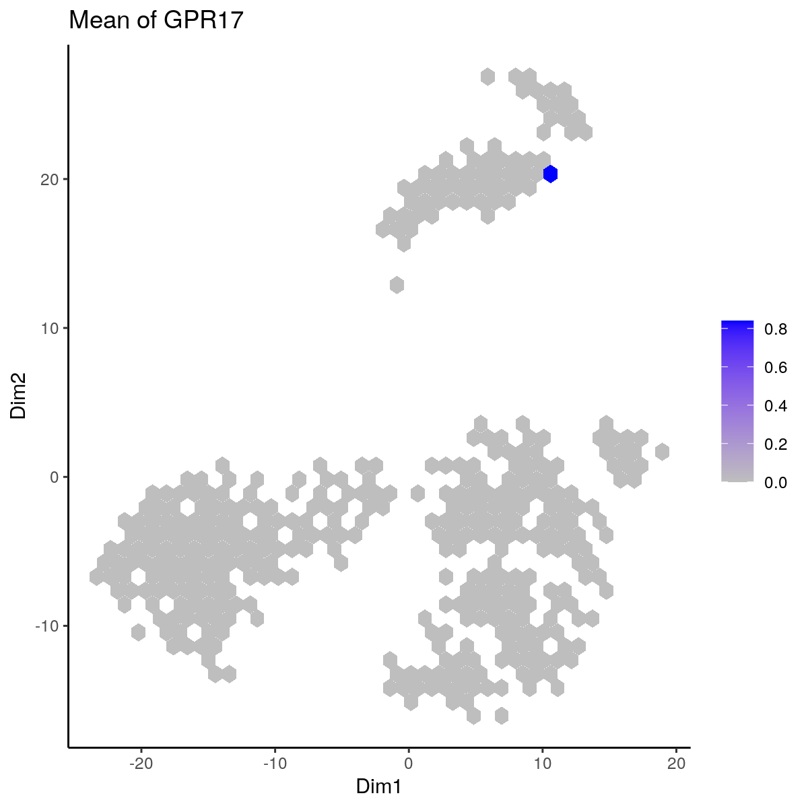|[AGT](https://www.ncbi.nlm.nih.gov/gene/183) [AVP](https://www.ncbi.nlm.nih.gov/gene/551) [C3](https://www.ncbi.nlm.nih.gov/gene/718) [C5](https://www.ncbi.nlm.nih.gov/gene/727) [CCK](https://www.ncbi.nlm.nih.gov/gene/885) [CORT](https://www.ncbi.nlm.nih.gov/gene/1325) [EDN1](https://www.ncbi.nlm.nih.gov/gene/1906) [EDN2](https://www.ncbi.nlm.nih.gov/gene/1907) [EDN3](https://www.ncbi.nlm.nih.gov/gene/1908) [F2](https://www.ncbi.nlm.nih.gov/gene/2147) [GAST](https://www.ncbi.nlm.nih.gov/gene/2520) [GABBR1](https://www.ncbi.nlm.nih.gov/gene/2550) [GCG](https://www.ncbi.nlm.nih.gov/gene/2641) [GNRH1](https://www.ncbi.nlm.nih.gov/gene/2796) [GNRH2](https://www.ncbi.nlm.nih.gov/gene/2797) [CXCL1](https://www.ncbi.nlm.nih.gov/gene/2919) [CXCL2](https://www.ncbi.nlm.nih.gov/gene/2920) [CXCL3](https://www.ncbi.nlm.nih.gov/gene/2921) [GRP](https://www.ncbi.nlm.nih.gov/gene/2922) [CXCL8](https://www.ncbi.nlm.nih.gov/gene/3576) [CXCL10](https://www.ncbi.nlm.nih.gov/gene/3627) [KISS1](https://www.ncbi.nlm.nih.gov/gene/3814) [CXCL9](https://www.ncbi.nlm.nih.gov/gene/4283) [MLN](https://www.ncbi.nlm.nih.gov/gene/4295) [NMB](https://www.ncbi.nlm.nih.gov/gene/4828) [NPY](https://www.ncbi.nlm.nih.gov/gene/4852) [NTS](https://www.ncbi.nlm.nih.gov/gene/4922) [OXT](https://www.ncbi.nlm.nih.gov/gene/5020) [PDYN](https://www.ncbi.nlm.nih.gov/gene/5173) [PENK](https://www.ncbi.nlm.nih.gov/gene/5179) [PF4](https://www.ncbi.nlm.nih.gov/gene/5196) [PMCH](https://www.ncbi.nlm.nih.gov/gene/5367) [PNOC](https://www.ncbi.nlm.nih.gov/gene/5368) [POMC](https://www.ncbi.nlm.nih.gov/gene/5443) [PPBP](https://www.ncbi.nlm.nih.gov/gene/5473) [PPY](https://www.ncbi.nlm.nih.gov/gene/5539) [PSAP](https://www.ncbi.nlm.nih.gov/gene/5660) [PYY](https://www.ncbi.nlm.nih.gov/gene/5697) [SAA1](https://www.ncbi.nlm.nih.gov/gene/6288) [CCL1](https://www.ncbi.nlm.nih.gov/gene/6346) [CCL5](https://www.ncbi.nlm.nih.gov/gene/6352) [CCL13](https://www.ncbi.nlm.nih.gov/gene/6357) [CCL16](https://www.ncbi.nlm.nih.gov/gene/6360) [CCL19](https://www.ncbi.nlm.nih.gov/gene/6363) [CCL20](https://www.ncbi.nlm.nih.gov/gene/6364) [CCL21](https://www.ncbi.nlm.nih.gov/gene/6366) [CCL25](https://www.ncbi.nlm.nih.gov/gene/6370) [CXCL6](https://www.ncbi.nlm.nih.gov/gene/6372) [CXCL11](https://www.ncbi.nlm.nih.gov/gene/6373) [CXCL5](https://www.ncbi.nlm.nih.gov/gene/6374) [XCL1](https://www.ncbi.nlm.nih.gov/gene/6375) [CX3CL1](https://www.ncbi.nlm.nih.gov/gene/6376) [CXCL12](https://www.ncbi.nlm.nih.gov/gene/6387) [SST](https://www.ncbi.nlm.nih.gov/gene/6750) [XCL2](https://www.ncbi.nlm.nih.gov/gene/6846) [TAC1](https://www.ncbi.nlm.nih.gov/gene/6863) [TAC3](https://www.ncbi.nlm.nih.gov/gene/6866) [TRH](https://www.ncbi.nlm.nih.gov/gene/7200) [NPFF](https://www.ncbi.nlm.nih.gov/gene/8620) [APLN](https://www.ncbi.nlm.nih.gov/gene/8862) [INSL5](https://www.ncbi.nlm.nih.gov/gene/10022) [CXCL13](https://www.ncbi.nlm.nih.gov/gene/10563) [CCL27](https://www.ncbi.nlm.nih.gov/gene/10850) [NMU](https://www.ncbi.nlm.nih.gov/gene/10874) [UTS2](https://www.ncbi.nlm.nih.gov/gene/10911) [GAL](https://www.ncbi.nlm.nih.gov/gene/51083) [CCL28](https://www.ncbi.nlm.nih.gov/gene/56477) [PROK2](https://www.ncbi.nlm.nih.gov/gene/60675) [PROK1](https://www.ncbi.nlm.nih.gov/gene/84432) [RLN3](https://www.ncbi.nlm.nih.gov/gene/117579) [NMS](https://www.ncbi.nlm.nih.gov/gene/129521) [NPB](https://www.ncbi.nlm.nih.gov/gene/256933) [UTS2B](https://www.ncbi.nlm.nih.gov/gene/257313) [NPW](https://www.ncbi.nlm.nih.gov/gene/283869) [C9orf47](https://www.ncbi.nlm.nih.gov/gene/286223) [QRFP](https://www.ncbi.nlm.nih.gov/gene/347148) [CCL4L1](https://www.ncbi.nlm.nih.gov/gene/388372) [NPS](https://www.ncbi.nlm.nih.gov/gene/594857)|
|[GPR171](https://www.ncbi.nlm.nih.gov/gene/29909)|[GABBR1](https://www.ncbi.nlm.nih.gov/gene/2550) [PCSK1N](https://www.ncbi.nlm.nih.gov/gene/27344) [C16orf89](https://www.ncbi.nlm.nih.gov/gene/146556)|
|[GPR174](https://www.ncbi.nlm.nih.gov/gene/84636)|[ADGRB1](https://www.ncbi.nlm.nih.gov/gene/575) [CD40LG](https://www.ncbi.nlm.nih.gov/gene/959) [IL7R](https://www.ncbi.nlm.nih.gov/gene/3575) [XCL1](https://www.ncbi.nlm.nih.gov/gene/6375) [XCL2](https://www.ncbi.nlm.nih.gov/gene/6846) [CST7](https://www.ncbi.nlm.nih.gov/gene/8530) [ICOS](https://www.ncbi.nlm.nih.gov/gene/29851) [ADGRF1](https://www.ncbi.nlm.nih.gov/gene/266977)|
|[GPR176](https://www.ncbi.nlm.nih.gov/gene/11245)|[ADCYAP1](https://www.ncbi.nlm.nih.gov/gene/116) [ADM](https://www.ncbi.nlm.nih.gov/gene/133) [AVP](https://www.ncbi.nlm.nih.gov/gene/551) [CALCA](https://www.ncbi.nlm.nih.gov/gene/796) [CALCB](https://www.ncbi.nlm.nih.gov/gene/797) [CGA](https://www.ncbi.nlm.nih.gov/gene/1081) [CRH](https://www.ncbi.nlm.nih.gov/gene/1392) [FSHB](https://www.ncbi.nlm.nih.gov/gene/2488) [GCG](https://www.ncbi.nlm.nih.gov/gene/2641) [GHRH](https://www.ncbi.nlm.nih.gov/gene/2691) [GIP](https://www.ncbi.nlm.nih.gov/gene/2695) [IAPP](https://www.ncbi.nlm.nih.gov/gene/3375) [INSL3](https://www.ncbi.nlm.nih.gov/gene/3640) [POMC](https://www.ncbi.nlm.nih.gov/gene/5443) [PTH](https://www.ncbi.nlm.nih.gov/gene/5741) [PTHLH](https://www.ncbi.nlm.nih.gov/gene/5744) [RLN1](https://www.ncbi.nlm.nih.gov/gene/6013) [RLN2](https://www.ncbi.nlm.nih.gov/gene/6019) [SCT](https://www.ncbi.nlm.nih.gov/gene/6343) [TSHB](https://www.ncbi.nlm.nih.gov/gene/7252) [VIP](https://www.ncbi.nlm.nih.gov/gene/7432) [ADM2](https://www.ncbi.nlm.nih.gov/gene/79924) [ITFG1](https://www.ncbi.nlm.nih.gov/gene/81533) [PTH2](https://www.ncbi.nlm.nih.gov/gene/113091) [RLN3](https://www.ncbi.nlm.nih.gov/gene/117579) [GPHB5](https://www.ncbi.nlm.nih.gov/gene/122876) [GPHA2](https://www.ncbi.nlm.nih.gov/gene/170589) [NPS](https://www.ncbi.nlm.nih.gov/gene/594857)|
|[GPR179](https://www.ncbi.nlm.nih.gov/gene/440435)|[NYX](https://www.ncbi.nlm.nih.gov/gene/60506)|
|[GPR18](https://www.ncbi.nlm.nih.gov/gene/2841)|[AGT](https://www.ncbi.nlm.nih.gov/gene/183) [C3](https://www.ncbi.nlm.nih.gov/gene/718) [C5](https://www.ncbi.nlm.nih.gov/gene/727) [CORT](https://www.ncbi.nlm.nih.gov/gene/1325) [GABBR1](https://www.ncbi.nlm.nih.gov/gene/2550) [CXCL1](https://www.ncbi.nlm.nih.gov/gene/2919) [CXCL2](https://www.ncbi.nlm.nih.gov/gene/2920) [CXCL3](https://www.ncbi.nlm.nih.gov/gene/2921) [CXCL8](https://www.ncbi.nlm.nih.gov/gene/3576) [CXCL10](https://www.ncbi.nlm.nih.gov/gene/3627) [CXCL9](https://www.ncbi.nlm.nih.gov/gene/4283) [NPY](https://www.ncbi.nlm.nih.gov/gene/4852) [PDYN](https://www.ncbi.nlm.nih.gov/gene/5173) [PENK](https://www.ncbi.nlm.nih.gov/gene/5179) [PF4](https://www.ncbi.nlm.nih.gov/gene/5196) [PMCH](https://www.ncbi.nlm.nih.gov/gene/5367) [PNOC](https://www.ncbi.nlm.nih.gov/gene/5368) [POMC](https://www.ncbi.nlm.nih.gov/gene/5443) [PPBP](https://www.ncbi.nlm.nih.gov/gene/5473) [PPY](https://www.ncbi.nlm.nih.gov/gene/5539) [PSAP](https://www.ncbi.nlm.nih.gov/gene/5660) [PYY](https://www.ncbi.nlm.nih.gov/gene/5697) [SAA1](https://www.ncbi.nlm.nih.gov/gene/6288) [CCL1](https://www.ncbi.nlm.nih.gov/gene/6346) [CCL5](https://www.ncbi.nlm.nih.gov/gene/6352) [CCL13](https://www.ncbi.nlm.nih.gov/gene/6357) [CCL16](https://www.ncbi.nlm.nih.gov/gene/6360) [CCL19](https://www.ncbi.nlm.nih.gov/gene/6363) [CCL20](https://www.ncbi.nlm.nih.gov/gene/6364) [CCL21](https://www.ncbi.nlm.nih.gov/gene/6366) [CCL25](https://www.ncbi.nlm.nih.gov/gene/6370) [CXCL6](https://www.ncbi.nlm.nih.gov/gene/6372) [CXCL11](https://www.ncbi.nlm.nih.gov/gene/6373) [CXCL5](https://www.ncbi.nlm.nih.gov/gene/6374) [CX3CL1](https://www.ncbi.nlm.nih.gov/gene/6376) [CXCL12](https://www.ncbi.nlm.nih.gov/gene/6387) [SST](https://www.ncbi.nlm.nih.gov/gene/6750) [APLN](https://www.ncbi.nlm.nih.gov/gene/8862) [INSL5](https://www.ncbi.nlm.nih.gov/gene/10022) [CXCL13](https://www.ncbi.nlm.nih.gov/gene/10563) [CCL27](https://www.ncbi.nlm.nih.gov/gene/10850) [NMU](https://www.ncbi.nlm.nih.gov/gene/10874) [GAL](https://www.ncbi.nlm.nih.gov/gene/51083) [CCL28](https://www.ncbi.nlm.nih.gov/gene/56477) [AMN](https://www.ncbi.nlm.nih.gov/gene/81693) [RLN3](https://www.ncbi.nlm.nih.gov/gene/117579) [NMS](https://www.ncbi.nlm.nih.gov/gene/129521) [NPB](https://www.ncbi.nlm.nih.gov/gene/256933) [NPW](https://www.ncbi.nlm.nih.gov/gene/283869) [C9orf47](https://www.ncbi.nlm.nih.gov/gene/286223) [CCL4L1](https://www.ncbi.nlm.nih.gov/gene/388372)|
|[GPR182](https://www.ncbi.nlm.nih.gov/gene/11318)|[ADM](https://www.ncbi.nlm.nih.gov/gene/133) [NPS](https://www.ncbi.nlm.nih.gov/gene/594857)|
|[GPR183](https://www.ncbi.nlm.nih.gov/gene/1880)|[AGT](https://www.ncbi.nlm.nih.gov/gene/183) [C3](https://www.ncbi.nlm.nih.gov/gene/718) [C5](https://www.ncbi.nlm.nih.gov/gene/727) [CORT](https://www.ncbi.nlm.nih.gov/gene/1325) [GPC4](https://www.ncbi.nlm.nih.gov/gene/2239) [GABBR1](https://www.ncbi.nlm.nih.gov/gene/2550) [CXCL1](https://www.ncbi.nlm.nih.gov/gene/2919) [CXCL2](https://www.ncbi.nlm.nih.gov/gene/2920) [CXCL3](https://www.ncbi.nlm.nih.gov/gene/2921) [GZMK](https://www.ncbi.nlm.nih.gov/gene/3003) [CXCL8](https://www.ncbi.nlm.nih.gov/gene/3576) [CXCL10](https://www.ncbi.nlm.nih.gov/gene/3627) [CXCL9](https://www.ncbi.nlm.nih.gov/gene/4283) [NPY](https://www.ncbi.nlm.nih.gov/gene/4852) [PDYN](https://www.ncbi.nlm.nih.gov/gene/5173) [PENK](https://www.ncbi.nlm.nih.gov/gene/5179) [PF4](https://www.ncbi.nlm.nih.gov/gene/5196) [PMCH](https://www.ncbi.nlm.nih.gov/gene/5367) [PNOC](https://www.ncbi.nlm.nih.gov/gene/5368) [POMC](https://www.ncbi.nlm.nih.gov/gene/5443) [PPBP](https://www.ncbi.nlm.nih.gov/gene/5473) [PPY](https://www.ncbi.nlm.nih.gov/gene/5539) [PSAP](https://www.ncbi.nlm.nih.gov/gene/5660) [PYY](https://www.ncbi.nlm.nih.gov/gene/5697) [RNASE6](https://www.ncbi.nlm.nih.gov/gene/6039) [SAA1](https://www.ncbi.nlm.nih.gov/gene/6288) [CCL1](https://www.ncbi.nlm.nih.gov/gene/6346) [CCL5](https://www.ncbi.nlm.nih.gov/gene/6352) [CCL13](https://www.ncbi.nlm.nih.gov/gene/6357) [CCL16](https://www.ncbi.nlm.nih.gov/gene/6360) [CCL19](https://www.ncbi.nlm.nih.gov/gene/6363) [CCL20](https://www.ncbi.nlm.nih.gov/gene/6364) [CCL21](https://www.ncbi.nlm.nih.gov/gene/6366) [CCL25](https://www.ncbi.nlm.nih.gov/gene/6370) [CXCL6](https://www.ncbi.nlm.nih.gov/gene/6372) [CXCL11](https://www.ncbi.nlm.nih.gov/gene/6373) [CXCL5](https://www.ncbi.nlm.nih.gov/gene/6374) [CX3CL1](https://www.ncbi.nlm.nih.gov/gene/6376) [CXCL12](https://www.ncbi.nlm.nih.gov/gene/6387) [SST](https://www.ncbi.nlm.nih.gov/gene/6750) [APLN](https://www.ncbi.nlm.nih.gov/gene/8862) [ITGBL1](https://www.ncbi.nlm.nih.gov/gene/9358) [LY86](https://www.ncbi.nlm.nih.gov/gene/9450) [INSL5](https://www.ncbi.nlm.nih.gov/gene/10022) [GPC6](https://www.ncbi.nlm.nih.gov/gene/10082) [CXCL13](https://www.ncbi.nlm.nih.gov/gene/10563) [CCL27](https://www.ncbi.nlm.nih.gov/gene/10850) [NMU](https://www.ncbi.nlm.nih.gov/gene/10874) [GAL](https://www.ncbi.nlm.nih.gov/gene/51083) [CCL28](https://www.ncbi.nlm.nih.gov/gene/56477) [RLN3](https://www.ncbi.nlm.nih.gov/gene/117579) [NMS](https://www.ncbi.nlm.nih.gov/gene/129521) [LYPD6](https://www.ncbi.nlm.nih.gov/gene/130574) [NPB](https://www.ncbi.nlm.nih.gov/gene/256933) [NPW](https://www.ncbi.nlm.nih.gov/gene/283869) [C9orf47](https://www.ncbi.nlm.nih.gov/gene/286223) [CCL4L1](https://www.ncbi.nlm.nih.gov/gene/388372)|
|[GPR19](https://www.ncbi.nlm.nih.gov/gene/2842)|[ENHO](https://www.ncbi.nlm.nih.gov/gene/375704)|
|[GPR20](https://www.ncbi.nlm.nih.gov/gene/2843)|[ADCYAP1](https://www.ncbi.nlm.nih.gov/gene/116) [ADM](https://www.ncbi.nlm.nih.gov/gene/133) [AVP](https://www.ncbi.nlm.nih.gov/gene/551) [CALCA](https://www.ncbi.nlm.nih.gov/gene/796) [CALCB](https://www.ncbi.nlm.nih.gov/gene/797) [CGA](https://www.ncbi.nlm.nih.gov/gene/1081) [CRH](https://www.ncbi.nlm.nih.gov/gene/1392) [FSHB](https://www.ncbi.nlm.nih.gov/gene/2488) [GCG](https://www.ncbi.nlm.nih.gov/gene/2641) [GHRH](https://www.ncbi.nlm.nih.gov/gene/2691) [GIP](https://www.ncbi.nlm.nih.gov/gene/2695) [IAPP](https://www.ncbi.nlm.nih.gov/gene/3375) [INSL3](https://www.ncbi.nlm.nih.gov/gene/3640) [POMC](https://www.ncbi.nlm.nih.gov/gene/5443) [PTH](https://www.ncbi.nlm.nih.gov/gene/5741) [PTHLH](https://www.ncbi.nlm.nih.gov/gene/5744) [RLN1](https://www.ncbi.nlm.nih.gov/gene/6013) [RLN2](https://www.ncbi.nlm.nih.gov/gene/6019) [SCT](https://www.ncbi.nlm.nih.gov/gene/6343) [SST](https://www.ncbi.nlm.nih.gov/gene/6750) [TSHB](https://www.ncbi.nlm.nih.gov/gene/7252) [VIP](https://www.ncbi.nlm.nih.gov/gene/7432) [ADM2](https://www.ncbi.nlm.nih.gov/gene/79924) [PTH2](https://www.ncbi.nlm.nih.gov/gene/113091) [RLN3](https://www.ncbi.nlm.nih.gov/gene/117579) [GPHB5](https://www.ncbi.nlm.nih.gov/gene/122876) [GPHA2](https://www.ncbi.nlm.nih.gov/gene/170589) [PINLYP](https://www.ncbi.nlm.nih.gov/gene/390940) [NPS](https://www.ncbi.nlm.nih.gov/gene/594857)|
|[GPR21](https://www.ncbi.nlm.nih.gov/gene/2844)|[TUFT1](https://www.ncbi.nlm.nih.gov/gene/7286) [CRB2](https://www.ncbi.nlm.nih.gov/gene/286204)|
|[GPR22](https://www.ncbi.nlm.nih.gov/gene/2845)|[SST](https://www.ncbi.nlm.nih.gov/gene/6750) [GDF5](https://www.ncbi.nlm.nih.gov/gene/8200) [CHST9](https://www.ncbi.nlm.nih.gov/gene/83539)|
|[GPR25](https://www.ncbi.nlm.nih.gov/gene/2848)|[ADCYAP1](https://www.ncbi.nlm.nih.gov/gene/116) [ADM](https://www.ncbi.nlm.nih.gov/gene/133) [AVP](https://www.ncbi.nlm.nih.gov/gene/551) [CALCA](https://www.ncbi.nlm.nih.gov/gene/796) [CALCB](https://www.ncbi.nlm.nih.gov/gene/797) [CGA](https://www.ncbi.nlm.nih.gov/gene/1081) [CRH](https://www.ncbi.nlm.nih.gov/gene/1392) [FSHB](https://www.ncbi.nlm.nih.gov/gene/2488) [GCG](https://www.ncbi.nlm.nih.gov/gene/2641) [GHRH](https://www.ncbi.nlm.nih.gov/gene/2691) [GIP](https://www.ncbi.nlm.nih.gov/gene/2695) [IAPP](https://www.ncbi.nlm.nih.gov/gene/3375) [INSL3](https://www.ncbi.nlm.nih.gov/gene/3640) [POMC](https://www.ncbi.nlm.nih.gov/gene/5443) [PTH](https://www.ncbi.nlm.nih.gov/gene/5741) [PTHLH](https://www.ncbi.nlm.nih.gov/gene/5744) [RLN1](https://www.ncbi.nlm.nih.gov/gene/6013) [RLN2](https://www.ncbi.nlm.nih.gov/gene/6019) [SCT](https://www.ncbi.nlm.nih.gov/gene/6343) [TSHB](https://www.ncbi.nlm.nih.gov/gene/7252) [VIP](https://www.ncbi.nlm.nih.gov/gene/7432) [RETN](https://www.ncbi.nlm.nih.gov/gene/56729) [SMOC1](https://www.ncbi.nlm.nih.gov/gene/64093) [ADM2](https://www.ncbi.nlm.nih.gov/gene/79924) [PTH2](https://www.ncbi.nlm.nih.gov/gene/113091) [RLN3](https://www.ncbi.nlm.nih.gov/gene/117579) [GPHB5](https://www.ncbi.nlm.nih.gov/gene/122876) [GPHA2](https://www.ncbi.nlm.nih.gov/gene/170589) [PRSS54](https://www.ncbi.nlm.nih.gov/gene/221191) [NPS](https://www.ncbi.nlm.nih.gov/gene/594857)|
|[GPR26](https://www.ncbi.nlm.nih.gov/gene/2849)|[GAST](https://www.ncbi.nlm.nih.gov/gene/2520) [CPZ](https://www.ncbi.nlm.nih.gov/gene/8532) [CPXM2](https://www.ncbi.nlm.nih.gov/gene/119587) [CBLN4](https://www.ncbi.nlm.nih.gov/gene/140689)|
|[GPR27](https://www.ncbi.nlm.nih.gov/gene/2850)|[ADCYAP1](https://www.ncbi.nlm.nih.gov/gene/116) [ADM](https://www.ncbi.nlm.nih.gov/gene/133) [AVP](https://www.ncbi.nlm.nih.gov/gene/551) [CALCA](https://www.ncbi.nlm.nih.gov/gene/796) [CALCB](https://www.ncbi.nlm.nih.gov/gene/797) [CGA](https://www.ncbi.nlm.nih.gov/gene/1081) [CRH](https://www.ncbi.nlm.nih.gov/gene/1392) [FSHB](https://www.ncbi.nlm.nih.gov/gene/2488) [GCG](https://www.ncbi.nlm.nih.gov/gene/2641) [GHRH](https://www.ncbi.nlm.nih.gov/gene/2691) [GIP](https://www.ncbi.nlm.nih.gov/gene/2695) [IAPP](https://www.ncbi.nlm.nih.gov/gene/3375) [INSL3](https://www.ncbi.nlm.nih.gov/gene/3640) [POMC](https://www.ncbi.nlm.nih.gov/gene/5443) [PTH](https://www.ncbi.nlm.nih.gov/gene/5741) [PTHLH](https://www.ncbi.nlm.nih.gov/gene/5744) [RLN1](https://www.ncbi.nlm.nih.gov/gene/6013) [RLN2](https://www.ncbi.nlm.nih.gov/gene/6019) [SCT](https://www.ncbi.nlm.nih.gov/gene/6343) [TSHB](https://www.ncbi.nlm.nih.gov/gene/7252) [VIP](https://www.ncbi.nlm.nih.gov/gene/7432) [PROK2](https://www.ncbi.nlm.nih.gov/gene/60675) [ADM2](https://www.ncbi.nlm.nih.gov/gene/79924) [PTH2](https://www.ncbi.nlm.nih.gov/gene/113091) [RLN3](https://www.ncbi.nlm.nih.gov/gene/117579) [GPHB5](https://www.ncbi.nlm.nih.gov/gene/122876) [GPHA2](https://www.ncbi.nlm.nih.gov/gene/170589) [NPS](https://www.ncbi.nlm.nih.gov/gene/594857)|
|[GPR3](https://www.ncbi.nlm.nih.gov/gene/2827)|[NPPC](https://www.ncbi.nlm.nih.gov/gene/4880) [BMP15](https://www.ncbi.nlm.nih.gov/gene/9210)|
|[GPR31](https://www.ncbi.nlm.nih.gov/gene/2853)|[AGT](https://www.ncbi.nlm.nih.gov/gene/183) [C3](https://www.ncbi.nlm.nih.gov/gene/718) [C5](https://www.ncbi.nlm.nih.gov/gene/727) [CORT](https://www.ncbi.nlm.nih.gov/gene/1325) [GABBR1](https://www.ncbi.nlm.nih.gov/gene/2550) [CXCL1](https://www.ncbi.nlm.nih.gov/gene/2919) [CXCL2](https://www.ncbi.nlm.nih.gov/gene/2920) [CXCL3](https://www.ncbi.nlm.nih.gov/gene/2921) [CXCL8](https://www.ncbi.nlm.nih.gov/gene/3576) [CXCL10](https://www.ncbi.nlm.nih.gov/gene/3627) [CXCL9](https://www.ncbi.nlm.nih.gov/gene/4283) [NODAL](https://www.ncbi.nlm.nih.gov/gene/4838) [NPY](https://www.ncbi.nlm.nih.gov/gene/4852) [PDYN](https://www.ncbi.nlm.nih.gov/gene/5173) [PENK](https://www.ncbi.nlm.nih.gov/gene/5179) [PF4](https://www.ncbi.nlm.nih.gov/gene/5196) [PMCH](https://www.ncbi.nlm.nih.gov/gene/5367) [PNOC](https://www.ncbi.nlm.nih.gov/gene/5368) [POMC](https://www.ncbi.nlm.nih.gov/gene/5443) [PPBP](https://www.ncbi.nlm.nih.gov/gene/5473) [PPY](https://www.ncbi.nlm.nih.gov/gene/5539) [PSAP](https://www.ncbi.nlm.nih.gov/gene/5660) [PYY](https://www.ncbi.nlm.nih.gov/gene/5697) [SAA1](https://www.ncbi.nlm.nih.gov/gene/6288) [CCL1](https://www.ncbi.nlm.nih.gov/gene/6346) [CCL5](https://www.ncbi.nlm.nih.gov/gene/6352) [CCL13](https://www.ncbi.nlm.nih.gov/gene/6357) [CCL16](https://www.ncbi.nlm.nih.gov/gene/6360) [CCL19](https://www.ncbi.nlm.nih.gov/gene/6363) [CCL20](https://www.ncbi.nlm.nih.gov/gene/6364) [CCL21](https://www.ncbi.nlm.nih.gov/gene/6366) [CCL25](https://www.ncbi.nlm.nih.gov/gene/6370) [CXCL6](https://www.ncbi.nlm.nih.gov/gene/6372) [CXCL11](https://www.ncbi.nlm.nih.gov/gene/6373) [CXCL5](https://www.ncbi.nlm.nih.gov/gene/6374) [CX3CL1](https://www.ncbi.nlm.nih.gov/gene/6376) [CXCL12](https://www.ncbi.nlm.nih.gov/gene/6387) [SST](https://www.ncbi.nlm.nih.gov/gene/6750) [APLN](https://www.ncbi.nlm.nih.gov/gene/8862) [INSL5](https://www.ncbi.nlm.nih.gov/gene/10022) [CXCL13](https://www.ncbi.nlm.nih.gov/gene/10563) [CCL27](https://www.ncbi.nlm.nih.gov/gene/10850) [NMU](https://www.ncbi.nlm.nih.gov/gene/10874) [GAL](https://www.ncbi.nlm.nih.gov/gene/51083) [CCL28](https://www.ncbi.nlm.nih.gov/gene/56477) [RLN3](https://www.ncbi.nlm.nih.gov/gene/117579) [NMS](https://www.ncbi.nlm.nih.gov/gene/129521) [NPB](https://www.ncbi.nlm.nih.gov/gene/256933) [NPW](https://www.ncbi.nlm.nih.gov/gene/283869) [C9orf47](https://www.ncbi.nlm.nih.gov/gene/286223) [C6orf120](https://www.ncbi.nlm.nih.gov/gene/387263) [CCL4L1](https://www.ncbi.nlm.nih.gov/gene/388372)|
|[GPR32](https://www.ncbi.nlm.nih.gov/gene/2854)|[ADCYAP1](https://www.ncbi.nlm.nih.gov/gene/116) [ADM](https://www.ncbi.nlm.nih.gov/gene/133) [AVP](https://www.ncbi.nlm.nih.gov/gene/551) [CALCA](https://www.ncbi.nlm.nih.gov/gene/796) [CALCB](https://www.ncbi.nlm.nih.gov/gene/797) [CGA](https://www.ncbi.nlm.nih.gov/gene/1081) [CRH](https://www.ncbi.nlm.nih.gov/gene/1392) [FSHB](https://www.ncbi.nlm.nih.gov/gene/2488) [GCG](https://www.ncbi.nlm.nih.gov/gene/2641) [GHRH](https://www.ncbi.nlm.nih.gov/gene/2691) [GIP](https://www.ncbi.nlm.nih.gov/gene/2695) [IAPP](https://www.ncbi.nlm.nih.gov/gene/3375) [INSL3](https://www.ncbi.nlm.nih.gov/gene/3640) [POMC](https://www.ncbi.nlm.nih.gov/gene/5443) [PTH](https://www.ncbi.nlm.nih.gov/gene/5741) [PTHLH](https://www.ncbi.nlm.nih.gov/gene/5744) [RARRES2](https://www.ncbi.nlm.nih.gov/gene/5919) [RLN1](https://www.ncbi.nlm.nih.gov/gene/6013) [RLN2](https://www.ncbi.nlm.nih.gov/gene/6019) [SCT](https://www.ncbi.nlm.nih.gov/gene/6343) [TSHB](https://www.ncbi.nlm.nih.gov/gene/7252) [VIP](https://www.ncbi.nlm.nih.gov/gene/7432) [ADM2](https://www.ncbi.nlm.nih.gov/gene/79924) [PTH2](https://www.ncbi.nlm.nih.gov/gene/113091) [RLN3](https://www.ncbi.nlm.nih.gov/gene/117579) [GPHB5](https://www.ncbi.nlm.nih.gov/gene/122876) [GPHA2](https://www.ncbi.nlm.nih.gov/gene/170589) [NPS](https://www.ncbi.nlm.nih.gov/gene/594857)|
|[GPR34](https://www.ncbi.nlm.nih.gov/gene/2857)|[C1QA](https://www.ncbi.nlm.nih.gov/gene/712) [C1QB](https://www.ncbi.nlm.nih.gov/gene/713) [C1QC](https://www.ncbi.nlm.nih.gov/gene/714) [GAS6](https://www.ncbi.nlm.nih.gov/gene/2621) [PROS1](https://www.ncbi.nlm.nih.gov/gene/5627) [SST](https://www.ncbi.nlm.nih.gov/gene/6750) [LY86](https://www.ncbi.nlm.nih.gov/gene/9450) [TREM2](https://www.ncbi.nlm.nih.gov/gene/54209) [OLFML3](https://www.ncbi.nlm.nih.gov/gene/56944)|
|[GPR35](https://www.ncbi.nlm.nih.gov/gene/2859)|[CXCL17](https://www.ncbi.nlm.nih.gov/gene/284340)|
|[GPR37](https://www.ncbi.nlm.nih.gov/gene/2861)|[AGT](https://www.ncbi.nlm.nih.gov/gene/183) [C3](https://www.ncbi.nlm.nih.gov/gene/718) [C5](https://www.ncbi.nlm.nih.gov/gene/727) [CORT](https://www.ncbi.nlm.nih.gov/gene/1325) [EDN3](https://www.ncbi.nlm.nih.gov/gene/1908) [GABBR1](https://www.ncbi.nlm.nih.gov/gene/2550) [CXCL1](https://www.ncbi.nlm.nih.gov/gene/2919) [CXCL2](https://www.ncbi.nlm.nih.gov/gene/2920) [CXCL3](https://www.ncbi.nlm.nih.gov/gene/2921) [GRP](https://www.ncbi.nlm.nih.gov/gene/2922) [CXCL8](https://www.ncbi.nlm.nih.gov/gene/3576) [CXCL10](https://www.ncbi.nlm.nih.gov/gene/3627) [LUM](https://www.ncbi.nlm.nih.gov/gene/4060) [CXCL9](https://www.ncbi.nlm.nih.gov/gene/4283) [NPY](https://www.ncbi.nlm.nih.gov/gene/4852) [PDYN](https://www.ncbi.nlm.nih.gov/gene/5173) [PENK](https://www.ncbi.nlm.nih.gov/gene/5179) [PF4](https://www.ncbi.nlm.nih.gov/gene/5196) [PMCH](https://www.ncbi.nlm.nih.gov/gene/5367) [PNOC](https://www.ncbi.nlm.nih.gov/gene/5368) [POMC](https://www.ncbi.nlm.nih.gov/gene/5443) [PPBP](https://www.ncbi.nlm.nih.gov/gene/5473) [PPY](https://www.ncbi.nlm.nih.gov/gene/5539) [PSAP](https://www.ncbi.nlm.nih.gov/gene/5660) [PYY](https://www.ncbi.nlm.nih.gov/gene/5697) [SAA1](https://www.ncbi.nlm.nih.gov/gene/6288) [CCL1](https://www.ncbi.nlm.nih.gov/gene/6346) [CCL5](https://www.ncbi.nlm.nih.gov/gene/6352) [CCL13](https://www.ncbi.nlm.nih.gov/gene/6357) [CCL16](https://www.ncbi.nlm.nih.gov/gene/6360) [CCL19](https://www.ncbi.nlm.nih.gov/gene/6363) [CCL20](https://www.ncbi.nlm.nih.gov/gene/6364) [CCL21](https://www.ncbi.nlm.nih.gov/gene/6366) [CCL25](https://www.ncbi.nlm.nih.gov/gene/6370) [CXCL6](https://www.ncbi.nlm.nih.gov/gene/6372) [CXCL11](https://www.ncbi.nlm.nih.gov/gene/6373) [CXCL5](https://www.ncbi.nlm.nih.gov/gene/6374) [CX3CL1](https://www.ncbi.nlm.nih.gov/gene/6376) [CXCL12](https://www.ncbi.nlm.nih.gov/gene/6387) [SST](https://www.ncbi.nlm.nih.gov/gene/6750) [APLN](https://www.ncbi.nlm.nih.gov/gene/8862) [INSL5](https://www.ncbi.nlm.nih.gov/gene/10022) [CXCL13](https://www.ncbi.nlm.nih.gov/gene/10563) [CCL27](https://www.ncbi.nlm.nih.gov/gene/10850) [NMU](https://www.ncbi.nlm.nih.gov/gene/10874) [GAL](https://www.ncbi.nlm.nih.gov/gene/51083) [CCL28](https://www.ncbi.nlm.nih.gov/gene/56477) [BRINP2](https://www.ncbi.nlm.nih.gov/gene/57795) [HAPLN2](https://www.ncbi.nlm.nih.gov/gene/60484) [RLN3](https://www.ncbi.nlm.nih.gov/gene/117579) [NMS](https://www.ncbi.nlm.nih.gov/gene/129521) [NPB](https://www.ncbi.nlm.nih.gov/gene/256933) [NPW](https://www.ncbi.nlm.nih.gov/gene/283869) [C9orf47](https://www.ncbi.nlm.nih.gov/gene/286223) [CCL4L1](https://www.ncbi.nlm.nih.gov/gene/388372)|
|[GPR37L1](https://www.ncbi.nlm.nih.gov/gene/9283)|[AGT](https://www.ncbi.nlm.nih.gov/gene/183) [C3](https://www.ncbi.nlm.nih.gov/gene/718) [C5](https://www.ncbi.nlm.nih.gov/gene/727) [CORT](https://www.ncbi.nlm.nih.gov/gene/1325) [GABBR1](https://www.ncbi.nlm.nih.gov/gene/2550) [CXCL1](https://www.ncbi.nlm.nih.gov/gene/2919) [CXCL2](https://www.ncbi.nlm.nih.gov/gene/2920) [CXCL3](https://www.ncbi.nlm.nih.gov/gene/2921) [CXCL8](https://www.ncbi.nlm.nih.gov/gene/3576) [CXCL10](https://www.ncbi.nlm.nih.gov/gene/3627) [CXCL9](https://www.ncbi.nlm.nih.gov/gene/4283) [NPY](https://www.ncbi.nlm.nih.gov/gene/4852) [PDYN](https://www.ncbi.nlm.nih.gov/gene/5173) [PENK](https://www.ncbi.nlm.nih.gov/gene/5179) [PF4](https://www.ncbi.nlm.nih.gov/gene/5196) [PMCH](https://www.ncbi.nlm.nih.gov/gene/5367) [PNOC](https://www.ncbi.nlm.nih.gov/gene/5368) [POMC](https://www.ncbi.nlm.nih.gov/gene/5443) [PPBP](https://www.ncbi.nlm.nih.gov/gene/5473) [PPY](https://www.ncbi.nlm.nih.gov/gene/5539) [PSAP](https://www.ncbi.nlm.nih.gov/gene/5660) [PYY](https://www.ncbi.nlm.nih.gov/gene/5697) [SAA1](https://www.ncbi.nlm.nih.gov/gene/6288) [CCL1](https://www.ncbi.nlm.nih.gov/gene/6346) [CCL5](https://www.ncbi.nlm.nih.gov/gene/6352) [CCL13](https://www.ncbi.nlm.nih.gov/gene/6357) [CCL16](https://www.ncbi.nlm.nih.gov/gene/6360) [CCL19](https://www.ncbi.nlm.nih.gov/gene/6363) [CCL20](https://www.ncbi.nlm.nih.gov/gene/6364) [CCL21](https://www.ncbi.nlm.nih.gov/gene/6366) [CCL25](https://www.ncbi.nlm.nih.gov/gene/6370) [CXCL6](https://www.ncbi.nlm.nih.gov/gene/6372) [CXCL11](https://www.ncbi.nlm.nih.gov/gene/6373) [CXCL5](https://www.ncbi.nlm.nih.gov/gene/6374) [CX3CL1](https://www.ncbi.nlm.nih.gov/gene/6376) [CXCL12](https://www.ncbi.nlm.nih.gov/gene/6387) [SST](https://www.ncbi.nlm.nih.gov/gene/6750) [APLN](https://www.ncbi.nlm.nih.gov/gene/8862) [INSL5](https://www.ncbi.nlm.nih.gov/gene/10022) [CXCL13](https://www.ncbi.nlm.nih.gov/gene/10563) [CCL27](https://www.ncbi.nlm.nih.gov/gene/10850) [NMU](https://www.ncbi.nlm.nih.gov/gene/10874) [GAL](https://www.ncbi.nlm.nih.gov/gene/51083) [CCL28](https://www.ncbi.nlm.nih.gov/gene/56477) [RLN3](https://www.ncbi.nlm.nih.gov/gene/117579) [NMS](https://www.ncbi.nlm.nih.gov/gene/129521) [NPB](https://www.ncbi.nlm.nih.gov/gene/256933) [NPW](https://www.ncbi.nlm.nih.gov/gene/283869) [C9orf47](https://www.ncbi.nlm.nih.gov/gene/286223) [CCL4L1](https://www.ncbi.nlm.nih.gov/gene/388372)|
|[GPR39](https://www.ncbi.nlm.nih.gov/gene/2863)|[ADCYAP1](https://www.ncbi.nlm.nih.gov/gene/116) [ADM](https://www.ncbi.nlm.nih.gov/gene/133) [AGT](https://www.ncbi.nlm.nih.gov/gene/183) [AVP](https://www.ncbi.nlm.nih.gov/gene/551) [CALCA](https://www.ncbi.nlm.nih.gov/gene/796) [CALCB](https://www.ncbi.nlm.nih.gov/gene/797) [CCK](https://www.ncbi.nlm.nih.gov/gene/885) [CGA](https://www.ncbi.nlm.nih.gov/gene/1081) [CRH](https://www.ncbi.nlm.nih.gov/gene/1392) [EDN1](https://www.ncbi.nlm.nih.gov/gene/1906) [EDN2](https://www.ncbi.nlm.nih.gov/gene/1907) [EDN3](https://www.ncbi.nlm.nih.gov/gene/1908) [F2](https://www.ncbi.nlm.nih.gov/gene/2147) [FSHB](https://www.ncbi.nlm.nih.gov/gene/2488) [GAST](https://www.ncbi.nlm.nih.gov/gene/2520) [GCG](https://www.ncbi.nlm.nih.gov/gene/2641) [GHRH](https://www.ncbi.nlm.nih.gov/gene/2691) [GIP](https://www.ncbi.nlm.nih.gov/gene/2695) [GNRH1](https://www.ncbi.nlm.nih.gov/gene/2796) [GNRH2](https://www.ncbi.nlm.nih.gov/gene/2797) [GRP](https://www.ncbi.nlm.nih.gov/gene/2922) [IAPP](https://www.ncbi.nlm.nih.gov/gene/3375) [INSL3](https://www.ncbi.nlm.nih.gov/gene/3640) [KISS1](https://www.ncbi.nlm.nih.gov/gene/3814) [MLN](https://www.ncbi.nlm.nih.gov/gene/4295) [NMB](https://www.ncbi.nlm.nih.gov/gene/4828) [NTS](https://www.ncbi.nlm.nih.gov/gene/4922) [OXT](https://www.ncbi.nlm.nih.gov/gene/5020) [PMCH](https://www.ncbi.nlm.nih.gov/gene/5367) [POMC](https://www.ncbi.nlm.nih.gov/gene/5443) [PTH](https://www.ncbi.nlm.nih.gov/gene/5741) [PTHLH](https://www.ncbi.nlm.nih.gov/gene/5744) [RLN1](https://www.ncbi.nlm.nih.gov/gene/6013) [RLN2](https://www.ncbi.nlm.nih.gov/gene/6019) [SAA1](https://www.ncbi.nlm.nih.gov/gene/6288) [SCT](https://www.ncbi.nlm.nih.gov/gene/6343) [XCL1](https://www.ncbi.nlm.nih.gov/gene/6375) [XCL2](https://www.ncbi.nlm.nih.gov/gene/6846) [TAC1](https://www.ncbi.nlm.nih.gov/gene/6863) [TAC3](https://www.ncbi.nlm.nih.gov/gene/6866) [TRH](https://www.ncbi.nlm.nih.gov/gene/7200) [TSHB](https://www.ncbi.nlm.nih.gov/gene/7252) [VIP](https://www.ncbi.nlm.nih.gov/gene/7432) [NPFF](https://www.ncbi.nlm.nih.gov/gene/8620) [NMU](https://www.ncbi.nlm.nih.gov/gene/10874) [UTS2](https://www.ncbi.nlm.nih.gov/gene/10911) [GHRL](https://www.ncbi.nlm.nih.gov/gene/51738) [PROK2](https://www.ncbi.nlm.nih.gov/gene/60675) [ADM2](https://www.ncbi.nlm.nih.gov/gene/79924) [AMN](https://www.ncbi.nlm.nih.gov/gene/81693) [PROK1](https://www.ncbi.nlm.nih.gov/gene/84432) [PTH2](https://www.ncbi.nlm.nih.gov/gene/113091) [RLN3](https://www.ncbi.nlm.nih.gov/gene/117579) [GPHB5](https://www.ncbi.nlm.nih.gov/gene/122876) [NMS](https://www.ncbi.nlm.nih.gov/gene/129521) [GPHA2](https://www.ncbi.nlm.nih.gov/gene/170589) [UTS2B](https://www.ncbi.nlm.nih.gov/gene/257313) [QRFP](https://www.ncbi.nlm.nih.gov/gene/347148) [NPS](https://www.ncbi.nlm.nih.gov/gene/594857)|
|[GPR4](https://www.ncbi.nlm.nih.gov/gene/2828)|[AGT](https://www.ncbi.nlm.nih.gov/gene/183) [AVP](https://www.ncbi.nlm.nih.gov/gene/551) [CCK](https://www.ncbi.nlm.nih.gov/gene/885) [EDN1](https://www.ncbi.nlm.nih.gov/gene/1906) [EDN2](https://www.ncbi.nlm.nih.gov/gene/1907) [EDN3](https://www.ncbi.nlm.nih.gov/gene/1908) [F2](https://www.ncbi.nlm.nih.gov/gene/2147) [GAST](https://www.ncbi.nlm.nih.gov/gene/2520) [GCG](https://www.ncbi.nlm.nih.gov/gene/2641) [GNRH1](https://www.ncbi.nlm.nih.gov/gene/2796) [GNRH2](https://www.ncbi.nlm.nih.gov/gene/2797) [GRP](https://www.ncbi.nlm.nih.gov/gene/2922) [KISS1](https://www.ncbi.nlm.nih.gov/gene/3814) [MLN](https://www.ncbi.nlm.nih.gov/gene/4295) [NMB](https://www.ncbi.nlm.nih.gov/gene/4828) [NTS](https://www.ncbi.nlm.nih.gov/gene/4922) [OXT](https://www.ncbi.nlm.nih.gov/gene/5020) [PMCH](https://www.ncbi.nlm.nih.gov/gene/5367) [SAA1](https://www.ncbi.nlm.nih.gov/gene/6288) [XCL1](https://www.ncbi.nlm.nih.gov/gene/6375) [XCL2](https://www.ncbi.nlm.nih.gov/gene/6846) [TAC1](https://www.ncbi.nlm.nih.gov/gene/6863) [TAC3](https://www.ncbi.nlm.nih.gov/gene/6866) [TRH](https://www.ncbi.nlm.nih.gov/gene/7200) [NPFF](https://www.ncbi.nlm.nih.gov/gene/8620) [NMU](https://www.ncbi.nlm.nih.gov/gene/10874) [UTS2](https://www.ncbi.nlm.nih.gov/gene/10911) [PROK2](https://www.ncbi.nlm.nih.gov/gene/60675) [PROK1](https://www.ncbi.nlm.nih.gov/gene/84432) [NMS](https://www.ncbi.nlm.nih.gov/gene/129521) [UTS2B](https://www.ncbi.nlm.nih.gov/gene/257313) [QRFP](https://www.ncbi.nlm.nih.gov/gene/347148) [NPS](https://www.ncbi.nlm.nih.gov/gene/594857)|
|[GPR42](https://www.ncbi.nlm.nih.gov/gene/2866)|[GAL](https://www.ncbi.nlm.nih.gov/gene/51083)|
|[GPR45](https://www.ncbi.nlm.nih.gov/gene/11250)|[ADCYAP1](https://www.ncbi.nlm.nih.gov/gene/116) [ADM](https://www.ncbi.nlm.nih.gov/gene/133) [AVP](https://www.ncbi.nlm.nih.gov/gene/551) [CALCA](https://www.ncbi.nlm.nih.gov/gene/796) [CALCB](https://www.ncbi.nlm.nih.gov/gene/797) [CGA](https://www.ncbi.nlm.nih.gov/gene/1081) [CRH](https://www.ncbi.nlm.nih.gov/gene/1392) [FSHB](https://www.ncbi.nlm.nih.gov/gene/2488) [GCG](https://www.ncbi.nlm.nih.gov/gene/2641) [GHRH](https://www.ncbi.nlm.nih.gov/gene/2691) [GIP](https://www.ncbi.nlm.nih.gov/gene/2695) [IAPP](https://www.ncbi.nlm.nih.gov/gene/3375) [INSL3](https://www.ncbi.nlm.nih.gov/gene/3640) [POMC](https://www.ncbi.nlm.nih.gov/gene/5443) [PTH](https://www.ncbi.nlm.nih.gov/gene/5741) [PTHLH](https://www.ncbi.nlm.nih.gov/gene/5744) [RLN1](https://www.ncbi.nlm.nih.gov/gene/6013) [RLN2](https://www.ncbi.nlm.nih.gov/gene/6019) [SCT](https://www.ncbi.nlm.nih.gov/gene/6343) [TSHB](https://www.ncbi.nlm.nih.gov/gene/7252) [VIP](https://www.ncbi.nlm.nih.gov/gene/7432) [ADM2](https://www.ncbi.nlm.nih.gov/gene/79924) [ANGPTL6](https://www.ncbi.nlm.nih.gov/gene/83854) [PTH2](https://www.ncbi.nlm.nih.gov/gene/113091) [RLN3](https://www.ncbi.nlm.nih.gov/gene/117579) [GPHB5](https://www.ncbi.nlm.nih.gov/gene/122876) [GPHA2](https://www.ncbi.nlm.nih.gov/gene/170589) [NPS](https://www.ncbi.nlm.nih.gov/gene/594857)|
|[GPR50](https://www.ncbi.nlm.nih.gov/gene/9248)|[F9](https://www.ncbi.nlm.nih.gov/gene/2158) [RARRES2](https://www.ncbi.nlm.nih.gov/gene/5919) [NPFF](https://www.ncbi.nlm.nih.gov/gene/8620) [SNED1](https://www.ncbi.nlm.nih.gov/gene/25992) [NPVF](https://www.ncbi.nlm.nih.gov/gene/64111) [OSTN](https://www.ncbi.nlm.nih.gov/gene/344901)|
|[GPR55](https://www.ncbi.nlm.nih.gov/gene/9290)|[AGT](https://www.ncbi.nlm.nih.gov/gene/183) [C3](https://www.ncbi.nlm.nih.gov/gene/718) [C5](https://www.ncbi.nlm.nih.gov/gene/727) [CORT](https://www.ncbi.nlm.nih.gov/gene/1325) [GABBR1](https://www.ncbi.nlm.nih.gov/gene/2550) [CXCL1](https://www.ncbi.nlm.nih.gov/gene/2919) [CXCL2](https://www.ncbi.nlm.nih.gov/gene/2920) [CXCL3](https://www.ncbi.nlm.nih.gov/gene/2921) [CXCL8](https://www.ncbi.nlm.nih.gov/gene/3576) [CXCL10](https://www.ncbi.nlm.nih.gov/gene/3627) [CXCL9](https://www.ncbi.nlm.nih.gov/gene/4283) [NPY](https://www.ncbi.nlm.nih.gov/gene/4852) [PDYN](https://www.ncbi.nlm.nih.gov/gene/5173) [PENK](https://www.ncbi.nlm.nih.gov/gene/5179) [PF4](https://www.ncbi.nlm.nih.gov/gene/5196) [PMCH](https://www.ncbi.nlm.nih.gov/gene/5367) [PNOC](https://www.ncbi.nlm.nih.gov/gene/5368) [POMC](https://www.ncbi.nlm.nih.gov/gene/5443) [PPBP](https://www.ncbi.nlm.nih.gov/gene/5473) [PPY](https://www.ncbi.nlm.nih.gov/gene/5539) [PSAP](https://www.ncbi.nlm.nih.gov/gene/5660) [PYY](https://www.ncbi.nlm.nih.gov/gene/5697) [SAA1](https://www.ncbi.nlm.nih.gov/gene/6288) [CCL1](https://www.ncbi.nlm.nih.gov/gene/6346) [CCL5](https://www.ncbi.nlm.nih.gov/gene/6352) [CCL13](https://www.ncbi.nlm.nih.gov/gene/6357) [CCL16](https://www.ncbi.nlm.nih.gov/gene/6360) [CCL19](https://www.ncbi.nlm.nih.gov/gene/6363) [CCL20](https://www.ncbi.nlm.nih.gov/gene/6364) [CCL21](https://www.ncbi.nlm.nih.gov/gene/6366) [CCL25](https://www.ncbi.nlm.nih.gov/gene/6370) [CXCL6](https://www.ncbi.nlm.nih.gov/gene/6372) [CXCL11](https://www.ncbi.nlm.nih.gov/gene/6373) [CXCL5](https://www.ncbi.nlm.nih.gov/gene/6374) [CX3CL1](https://www.ncbi.nlm.nih.gov/gene/6376) [CXCL12](https://www.ncbi.nlm.nih.gov/gene/6387) [SST](https://www.ncbi.nlm.nih.gov/gene/6750) [APLN](https://www.ncbi.nlm.nih.gov/gene/8862) [INSL5](https://www.ncbi.nlm.nih.gov/gene/10022) [CXCL13](https://www.ncbi.nlm.nih.gov/gene/10563) [CCL27](https://www.ncbi.nlm.nih.gov/gene/10850) [NMU](https://www.ncbi.nlm.nih.gov/gene/10874) [GAL](https://www.ncbi.nlm.nih.gov/gene/51083) [CCL28](https://www.ncbi.nlm.nih.gov/gene/56477) [RLN3](https://www.ncbi.nlm.nih.gov/gene/117579) [NMS](https://www.ncbi.nlm.nih.gov/gene/129521) [NPB](https://www.ncbi.nlm.nih.gov/gene/256933) [NPW](https://www.ncbi.nlm.nih.gov/gene/283869) [C9orf47](https://www.ncbi.nlm.nih.gov/gene/286223) [CCL4L1](https://www.ncbi.nlm.nih.gov/gene/388372)|
|[GPR6](https://www.ncbi.nlm.nih.gov/gene/2830)|[PDYN](https://www.ncbi.nlm.nih.gov/gene/5173) [CBLN4](https://www.ncbi.nlm.nih.gov/gene/140689) [METTL24](https://www.ncbi.nlm.nih.gov/gene/728464)|
|[GPR63](https://www.ncbi.nlm.nih.gov/gene/81491)|[AMN](https://www.ncbi.nlm.nih.gov/gene/81693)|
|[GPR65](https://www.ncbi.nlm.nih.gov/gene/8477)|[AGT](https://www.ncbi.nlm.nih.gov/gene/183) [AVP](https://www.ncbi.nlm.nih.gov/gene/551) [CCK](https://www.ncbi.nlm.nih.gov/gene/885) [EDN1](https://www.ncbi.nlm.nih.gov/gene/1906) [EDN2](https://www.ncbi.nlm.nih.gov/gene/1907) [EDN3](https://www.ncbi.nlm.nih.gov/gene/1908) [F2](https://www.ncbi.nlm.nih.gov/gene/2147) [GAST](https://www.ncbi.nlm.nih.gov/gene/2520) [GCG](https://www.ncbi.nlm.nih.gov/gene/2641) [GNRH1](https://www.ncbi.nlm.nih.gov/gene/2796) [GNRH2](https://www.ncbi.nlm.nih.gov/gene/2797) [GRP](https://www.ncbi.nlm.nih.gov/gene/2922) [KISS1](https://www.ncbi.nlm.nih.gov/gene/3814) [MLN](https://www.ncbi.nlm.nih.gov/gene/4295) [NMB](https://www.ncbi.nlm.nih.gov/gene/4828) [NTS](https://www.ncbi.nlm.nih.gov/gene/4922) [OXT](https://www.ncbi.nlm.nih.gov/gene/5020) [PMCH](https://www.ncbi.nlm.nih.gov/gene/5367) [SAA1](https://www.ncbi.nlm.nih.gov/gene/6288) [XCL1](https://www.ncbi.nlm.nih.gov/gene/6375) [XCL2](https://www.ncbi.nlm.nih.gov/gene/6846) [TAC1](https://www.ncbi.nlm.nih.gov/gene/6863) [TAC3](https://www.ncbi.nlm.nih.gov/gene/6866) [TRH](https://www.ncbi.nlm.nih.gov/gene/7200) [NPFF](https://www.ncbi.nlm.nih.gov/gene/8620) [NMU](https://www.ncbi.nlm.nih.gov/gene/10874) [FGL2](https://www.ncbi.nlm.nih.gov/gene/10875) [UTS2](https://www.ncbi.nlm.nih.gov/gene/10911) [PROK2](https://www.ncbi.nlm.nih.gov/gene/60675) [PROK1](https://www.ncbi.nlm.nih.gov/gene/84432) [NMS](https://www.ncbi.nlm.nih.gov/gene/129521) [UTS2B](https://www.ncbi.nlm.nih.gov/gene/257313) [QRFP](https://www.ncbi.nlm.nih.gov/gene/347148) [PINLYP](https://www.ncbi.nlm.nih.gov/gene/390940) [NPS](https://www.ncbi.nlm.nih.gov/gene/594857)|
|[GPR68](https://www.ncbi.nlm.nih.gov/gene/8111)|[AGT](https://www.ncbi.nlm.nih.gov/gene/183) [AVP](https://www.ncbi.nlm.nih.gov/gene/551) [CCK](https://www.ncbi.nlm.nih.gov/gene/885) [EDN1](https://www.ncbi.nlm.nih.gov/gene/1906) [EDN2](https://www.ncbi.nlm.nih.gov/gene/1907) [EDN3](https://www.ncbi.nlm.nih.gov/gene/1908) [F2](https://www.ncbi.nlm.nih.gov/gene/2147) [GAST](https://www.ncbi.nlm.nih.gov/gene/2520) [GCG](https://www.ncbi.nlm.nih.gov/gene/2641) [GNRH1](https://www.ncbi.nlm.nih.gov/gene/2796) [GNRH2](https://www.ncbi.nlm.nih.gov/gene/2797) [GRP](https://www.ncbi.nlm.nih.gov/gene/2922) [IL6](https://www.ncbi.nlm.nih.gov/gene/3569) [CXCL8](https://www.ncbi.nlm.nih.gov/gene/3576) [KISS1](https://www.ncbi.nlm.nih.gov/gene/3814) [MLN](https://www.ncbi.nlm.nih.gov/gene/4295) [NMB](https://www.ncbi.nlm.nih.gov/gene/4828) [NTS](https://www.ncbi.nlm.nih.gov/gene/4922) [OXT](https://www.ncbi.nlm.nih.gov/gene/5020) [PMCH](https://www.ncbi.nlm.nih.gov/gene/5367) [SAA1](https://www.ncbi.nlm.nih.gov/gene/6288) [XCL1](https://www.ncbi.nlm.nih.gov/gene/6375) [XCL2](https://www.ncbi.nlm.nih.gov/gene/6846) [TAC1](https://www.ncbi.nlm.nih.gov/gene/6863) [TAC3](https://www.ncbi.nlm.nih.gov/gene/6866) [TRH](https://www.ncbi.nlm.nih.gov/gene/7200) [NPFF](https://www.ncbi.nlm.nih.gov/gene/8620) [KLK4](https://www.ncbi.nlm.nih.gov/gene/9622) [ENAM](https://www.ncbi.nlm.nih.gov/gene/10117) [NMU](https://www.ncbi.nlm.nih.gov/gene/10874) [UTS2](https://www.ncbi.nlm.nih.gov/gene/10911) [FAM20A](https://www.ncbi.nlm.nih.gov/gene/54757) [PROK2](https://www.ncbi.nlm.nih.gov/gene/60675) [PROK1](https://www.ncbi.nlm.nih.gov/gene/84432) [NMS](https://www.ncbi.nlm.nih.gov/gene/129521) [ODAPH](https://www.ncbi.nlm.nih.gov/gene/152816) [UTS2B](https://www.ncbi.nlm.nih.gov/gene/257313) [QRFP](https://www.ncbi.nlm.nih.gov/gene/347148) [C1QL3](https://www.ncbi.nlm.nih.gov/gene/389941) [AMTN](https://www.ncbi.nlm.nih.gov/gene/401138) [NPS](https://www.ncbi.nlm.nih.gov/gene/594857)|
|[GPR75](https://www.ncbi.nlm.nih.gov/gene/10936)|[F10](https://www.ncbi.nlm.nih.gov/gene/2159) [CCL5](https://www.ncbi.nlm.nih.gov/gene/6352)|
|[GPR82](https://www.ncbi.nlm.nih.gov/gene/27197)|[SST](https://www.ncbi.nlm.nih.gov/gene/6750) [LIPM](https://www.ncbi.nlm.nih.gov/gene/340654)|
|[GPR83](https://www.ncbi.nlm.nih.gov/gene/10888)|[ADCYAP1](https://www.ncbi.nlm.nih.gov/gene/116) [ADM](https://www.ncbi.nlm.nih.gov/gene/133) [AVP](https://www.ncbi.nlm.nih.gov/gene/551) [CALCA](https://www.ncbi.nlm.nih.gov/gene/796) [CALCB](https://www.ncbi.nlm.nih.gov/gene/797) [CGA](https://www.ncbi.nlm.nih.gov/gene/1081) [CRH](https://www.ncbi.nlm.nih.gov/gene/1392) [FSHB](https://www.ncbi.nlm.nih.gov/gene/2488) [GCG](https://www.ncbi.nlm.nih.gov/gene/2641) [GHRH](https://www.ncbi.nlm.nih.gov/gene/2691) [GIP](https://www.ncbi.nlm.nih.gov/gene/2695) [IAPP](https://www.ncbi.nlm.nih.gov/gene/3375) [INS](https://www.ncbi.nlm.nih.gov/gene/3630) [INSL3](https://www.ncbi.nlm.nih.gov/gene/3640) [NPY](https://www.ncbi.nlm.nih.gov/gene/4852) [POMC](https://www.ncbi.nlm.nih.gov/gene/5443) [PTH](https://www.ncbi.nlm.nih.gov/gene/5741) [PTHLH](https://www.ncbi.nlm.nih.gov/gene/5744) [RLN1](https://www.ncbi.nlm.nih.gov/gene/6013) [RLN2](https://www.ncbi.nlm.nih.gov/gene/6019) [SCT](https://www.ncbi.nlm.nih.gov/gene/6343) [TSHB](https://www.ncbi.nlm.nih.gov/gene/7252) [VIP](https://www.ncbi.nlm.nih.gov/gene/7432) [PROK2](https://www.ncbi.nlm.nih.gov/gene/60675) [ADM2](https://www.ncbi.nlm.nih.gov/gene/79924) [PROK1](https://www.ncbi.nlm.nih.gov/gene/84432) [PTH2](https://www.ncbi.nlm.nih.gov/gene/113091) [RLN3](https://www.ncbi.nlm.nih.gov/gene/117579) [GPHB5](https://www.ncbi.nlm.nih.gov/gene/122876) [GPHA2](https://www.ncbi.nlm.nih.gov/gene/170589) [NPS](https://www.ncbi.nlm.nih.gov/gene/594857)|
|[GPR84](https://www.ncbi.nlm.nih.gov/gene/53831)|[ADCYAP1](https://www.ncbi.nlm.nih.gov/gene/116) [ADM](https://www.ncbi.nlm.nih.gov/gene/133) [AVP](https://www.ncbi.nlm.nih.gov/gene/551) [CALCA](https://www.ncbi.nlm.nih.gov/gene/796) [CALCB](https://www.ncbi.nlm.nih.gov/gene/797) [CGA](https://www.ncbi.nlm.nih.gov/gene/1081) [CRH](https://www.ncbi.nlm.nih.gov/gene/1392) [FCAR](https://www.ncbi.nlm.nih.gov/gene/2204) [FSHB](https://www.ncbi.nlm.nih.gov/gene/2488) [GCG](https://www.ncbi.nlm.nih.gov/gene/2641) [GHRH](https://www.ncbi.nlm.nih.gov/gene/2691) [GIP](https://www.ncbi.nlm.nih.gov/gene/2695) [IAPP](https://www.ncbi.nlm.nih.gov/gene/3375) [IL1RN](https://www.ncbi.nlm.nih.gov/gene/3557) [INSL3](https://www.ncbi.nlm.nih.gov/gene/3640) [PLAU](https://www.ncbi.nlm.nih.gov/gene/5328) [PLAUR](https://www.ncbi.nlm.nih.gov/gene/5329) [POMC](https://www.ncbi.nlm.nih.gov/gene/5443) [PTH](https://www.ncbi.nlm.nih.gov/gene/5741) [PTHLH](https://www.ncbi.nlm.nih.gov/gene/5744) [RLN1](https://www.ncbi.nlm.nih.gov/gene/6013) [RLN2](https://www.ncbi.nlm.nih.gov/gene/6019) [SCT](https://www.ncbi.nlm.nih.gov/gene/6343) [CCL3](https://www.ncbi.nlm.nih.gov/gene/6348) [STC1](https://www.ncbi.nlm.nih.gov/gene/6781) [TNF](https://www.ncbi.nlm.nih.gov/gene/7124) [TNFRSF1B](https://www.ncbi.nlm.nih.gov/gene/7133) [TSHB](https://www.ncbi.nlm.nih.gov/gene/7252) [VIP](https://www.ncbi.nlm.nih.gov/gene/7432) [ADM2](https://www.ncbi.nlm.nih.gov/gene/79924) [AMN](https://www.ncbi.nlm.nih.gov/gene/81693) [PTH2](https://www.ncbi.nlm.nih.gov/gene/113091) [RLN3](https://www.ncbi.nlm.nih.gov/gene/117579) [GPHB5](https://www.ncbi.nlm.nih.gov/gene/122876) [GPHA2](https://www.ncbi.nlm.nih.gov/gene/170589) [TREML4](https://www.ncbi.nlm.nih.gov/gene/285852) [NPS](https://www.ncbi.nlm.nih.gov/gene/594857)|
|[GPR85](https://www.ncbi.nlm.nih.gov/gene/54329)|[ITGBL1](https://www.ncbi.nlm.nih.gov/gene/9358)|
|[GPR87](https://www.ncbi.nlm.nih.gov/gene/53836)|[ENPP2](https://www.ncbi.nlm.nih.gov/gene/5168) [WFDC5](https://www.ncbi.nlm.nih.gov/gene/149708) [ADGRF1](https://www.ncbi.nlm.nih.gov/gene/266977) [C5orf46](https://www.ncbi.nlm.nih.gov/gene/389336)|
|[GPR88](https://www.ncbi.nlm.nih.gov/gene/54112)|[GABBR1](https://www.ncbi.nlm.nih.gov/gene/2550)|
|[GPRC5A](https://www.ncbi.nlm.nih.gov/gene/9052)|[EGFR](https://www.ncbi.nlm.nih.gov/gene/1956) [TSPEAR](https://www.ncbi.nlm.nih.gov/gene/54084)|
|[GPRC5B](https://www.ncbi.nlm.nih.gov/gene/51704)|[ADGRE5](https://www.ncbi.nlm.nih.gov/gene/976) [HHIPL2](https://www.ncbi.nlm.nih.gov/gene/79802)|
|[GPRC5C](https://www.ncbi.nlm.nih.gov/gene/55890)|[COL21A1](https://www.ncbi.nlm.nih.gov/gene/81578)|
|[GPRC6A](https://www.ncbi.nlm.nih.gov/gene/222545)|[AGT](https://www.ncbi.nlm.nih.gov/gene/183) [AVP](https://www.ncbi.nlm.nih.gov/gene/551) [BGLAP](https://www.ncbi.nlm.nih.gov/gene/632) [CCK](https://www.ncbi.nlm.nih.gov/gene/885) [EDN1](https://www.ncbi.nlm.nih.gov/gene/1906) [EDN2](https://www.ncbi.nlm.nih.gov/gene/1907) [EDN3](https://www.ncbi.nlm.nih.gov/gene/1908) [F2](https://www.ncbi.nlm.nih.gov/gene/2147) [GAST](https://www.ncbi.nlm.nih.gov/gene/2520) [GABBR1](https://www.ncbi.nlm.nih.gov/gene/2550) [GCG](https://www.ncbi.nlm.nih.gov/gene/2641) [GNRH1](https://www.ncbi.nlm.nih.gov/gene/2796) [GNRH2](https://www.ncbi.nlm.nih.gov/gene/2797) [GRP](https://www.ncbi.nlm.nih.gov/gene/2922) [INS](https://www.ncbi.nlm.nih.gov/gene/3630) [KISS1](https://www.ncbi.nlm.nih.gov/gene/3814) [MLN](https://www.ncbi.nlm.nih.gov/gene/4295) [NMB](https://www.ncbi.nlm.nih.gov/gene/4828) [NTS](https://www.ncbi.nlm.nih.gov/gene/4922) [OXT](https://www.ncbi.nlm.nih.gov/gene/5020) [PMCH](https://www.ncbi.nlm.nih.gov/gene/5367) [PTH](https://www.ncbi.nlm.nih.gov/gene/5741) [SAA1](https://www.ncbi.nlm.nih.gov/gene/6288) [XCL1](https://www.ncbi.nlm.nih.gov/gene/6375) [XCL2](https://www.ncbi.nlm.nih.gov/gene/6846) [TAC1](https://www.ncbi.nlm.nih.gov/gene/6863) [TAC3](https://www.ncbi.nlm.nih.gov/gene/6866) [TRH](https://www.ncbi.nlm.nih.gov/gene/7200) [FGF23](https://www.ncbi.nlm.nih.gov/gene/8074) [NPFF](https://www.ncbi.nlm.nih.gov/gene/8620) [NMU](https://www.ncbi.nlm.nih.gov/gene/10874) [UTS2](https://www.ncbi.nlm.nih.gov/gene/10911) [PROK2](https://www.ncbi.nlm.nih.gov/gene/60675) [PROK1](https://www.ncbi.nlm.nih.gov/gene/84432) [NMS](https://www.ncbi.nlm.nih.gov/gene/129521) [UTS2B](https://www.ncbi.nlm.nih.gov/gene/257313) [QRFP](https://www.ncbi.nlm.nih.gov/gene/347148) [NPS](https://www.ncbi.nlm.nih.gov/gene/594857)|
|[GRIA1](https://www.ncbi.nlm.nih.gov/gene/2890)|[ALB](https://www.ncbi.nlm.nih.gov/gene/213) [BDNF](https://www.ncbi.nlm.nih.gov/gene/627) [COL7A1](https://www.ncbi.nlm.nih.gov/gene/1294) [CRH](https://www.ncbi.nlm.nih.gov/gene/1392) [F5](https://www.ncbi.nlm.nih.gov/gene/2153) [F8](https://www.ncbi.nlm.nih.gov/gene/2157) [GABBR1](https://www.ncbi.nlm.nih.gov/gene/2550) [NPTX2](https://www.ncbi.nlm.nih.gov/gene/4885) [PDYN](https://www.ncbi.nlm.nih.gov/gene/5173) [SERPINA1](https://www.ncbi.nlm.nih.gov/gene/5265) [RELN](https://www.ncbi.nlm.nih.gov/gene/5649) [TAC1](https://www.ncbi.nlm.nih.gov/gene/6863) [NRP2](https://www.ncbi.nlm.nih.gov/gene/8828) [LGI1](https://www.ncbi.nlm.nih.gov/gene/9211) [TINAGL1](https://www.ncbi.nlm.nih.gov/gene/64129) [NETO1](https://www.ncbi.nlm.nih.gov/gene/81832) [OLFM2](https://www.ncbi.nlm.nih.gov/gene/93145) [OLFM3](https://www.ncbi.nlm.nih.gov/gene/118427) [VWC2](https://www.ncbi.nlm.nih.gov/gene/375567) [VWC2L](https://www.ncbi.nlm.nih.gov/gene/402117)|
|[GRIA2](https://www.ncbi.nlm.nih.gov/gene/2891)|[BDNF](https://www.ncbi.nlm.nih.gov/gene/627) [CBLN1](https://www.ncbi.nlm.nih.gov/gene/869) [CCK](https://www.ncbi.nlm.nih.gov/gene/885) [CHGA](https://www.ncbi.nlm.nih.gov/gene/1113) [NCAN](https://www.ncbi.nlm.nih.gov/gene/1463) [GABBR1](https://www.ncbi.nlm.nih.gov/gene/2550) [NCAM1](https://www.ncbi.nlm.nih.gov/gene/4684) [NPTX2](https://www.ncbi.nlm.nih.gov/gene/4885) [SPARCL1](https://www.ncbi.nlm.nih.gov/gene/8404) [SEMA3A](https://www.ncbi.nlm.nih.gov/gene/10371) [SCGN](https://www.ncbi.nlm.nih.gov/gene/10590) [NXPH1](https://www.ncbi.nlm.nih.gov/gene/30010) [SPOCK3](https://www.ncbi.nlm.nih.gov/gene/50859) [PRLH](https://www.ncbi.nlm.nih.gov/gene/51052) [TINAGL1](https://www.ncbi.nlm.nih.gov/gene/64129) [NETO1](https://www.ncbi.nlm.nih.gov/gene/81832) [OLFM2](https://www.ncbi.nlm.nih.gov/gene/93145) [OLFM3](https://www.ncbi.nlm.nih.gov/gene/118427) [VSTM2A](https://www.ncbi.nlm.nih.gov/gene/222008) [VWC2](https://www.ncbi.nlm.nih.gov/gene/375567) [VWC2L](https://www.ncbi.nlm.nih.gov/gene/402117)|
|[GRIA3](https://www.ncbi.nlm.nih.gov/gene/2892)|[BDNF](https://www.ncbi.nlm.nih.gov/gene/627) [OLFM2](https://www.ncbi.nlm.nih.gov/gene/93145) [OLFM3](https://www.ncbi.nlm.nih.gov/gene/118427) [VWC2](https://www.ncbi.nlm.nih.gov/gene/375567) [VWC2L](https://www.ncbi.nlm.nih.gov/gene/402117)|
|[GRIA4](https://www.ncbi.nlm.nih.gov/gene/2893)|[BDNF](https://www.ncbi.nlm.nih.gov/gene/627) [GABBR1](https://www.ncbi.nlm.nih.gov/gene/2550) [NPTX2](https://www.ncbi.nlm.nih.gov/gene/4885) [TAC1](https://www.ncbi.nlm.nih.gov/gene/6863) [TINAGL1](https://www.ncbi.nlm.nih.gov/gene/64129) [NETO1](https://www.ncbi.nlm.nih.gov/gene/81832) [OLFM2](https://www.ncbi.nlm.nih.gov/gene/93145) [OLFM3](https://www.ncbi.nlm.nih.gov/gene/118427) [VWC2](https://www.ncbi.nlm.nih.gov/gene/375567) [VWC2L](https://www.ncbi.nlm.nih.gov/gene/402117)|
|[GRID1](https://www.ncbi.nlm.nih.gov/gene/2894)|[CBLN1](https://www.ncbi.nlm.nih.gov/gene/869) [NRG3](https://www.ncbi.nlm.nih.gov/gene/10718) [CBLN2](https://www.ncbi.nlm.nih.gov/gene/147381)|
|[GRID2](https://www.ncbi.nlm.nih.gov/gene/2895)|[CBLN1](https://www.ncbi.nlm.nih.gov/gene/869) [GPC4](https://www.ncbi.nlm.nih.gov/gene/2239) [PTPRZ1](https://www.ncbi.nlm.nih.gov/gene/5803) [GPC6](https://www.ncbi.nlm.nih.gov/gene/10082) [OLFM2](https://www.ncbi.nlm.nih.gov/gene/93145) [OLFM3](https://www.ncbi.nlm.nih.gov/gene/118427) [CBLN4](https://www.ncbi.nlm.nih.gov/gene/140689) [CBLN2](https://www.ncbi.nlm.nih.gov/gene/147381) [CREG2](https://www.ncbi.nlm.nih.gov/gene/200407) [VWC2](https://www.ncbi.nlm.nih.gov/gene/375567) [VWC2L](https://www.ncbi.nlm.nih.gov/gene/402117)|
|[GRIK1](https://www.ncbi.nlm.nih.gov/gene/2897)|[GABBR1](https://www.ncbi.nlm.nih.gov/gene/2550) [NETO1](https://www.ncbi.nlm.nih.gov/gene/81832)|
|[GRIK2](https://www.ncbi.nlm.nih.gov/gene/2898)|[BDNF](https://www.ncbi.nlm.nih.gov/gene/627) [PRSS12](https://www.ncbi.nlm.nih.gov/gene/8492) [NETO1](https://www.ncbi.nlm.nih.gov/gene/81832) [OLFM3](https://www.ncbi.nlm.nih.gov/gene/118427) [VWC2](https://www.ncbi.nlm.nih.gov/gene/375567) [VWC2L](https://www.ncbi.nlm.nih.gov/gene/402117)|
|[GRIK3](https://www.ncbi.nlm.nih.gov/gene/2899)|[RS1](https://www.ncbi.nlm.nih.gov/gene/6247) [LAMC3](https://www.ncbi.nlm.nih.gov/gene/10319) [NRG3](https://www.ncbi.nlm.nih.gov/gene/10718) [NETO1](https://www.ncbi.nlm.nih.gov/gene/81832)|
|[GRIK4](https://www.ncbi.nlm.nih.gov/gene/2900)|[NETO1](https://www.ncbi.nlm.nih.gov/gene/81832) [OLFM3](https://www.ncbi.nlm.nih.gov/gene/118427)|
|[GRIK5](https://www.ncbi.nlm.nih.gov/gene/2901)|[NETO1](https://www.ncbi.nlm.nih.gov/gene/81832) [OLFM2](https://www.ncbi.nlm.nih.gov/gene/93145) [OLFM3](https://www.ncbi.nlm.nih.gov/gene/118427)|
|[GRIN1](https://www.ncbi.nlm.nih.gov/gene/2902)|[BDNF](https://www.ncbi.nlm.nih.gov/gene/627) [CBLN1](https://www.ncbi.nlm.nih.gov/gene/869) [CCK](https://www.ncbi.nlm.nih.gov/gene/885) [CHGA](https://www.ncbi.nlm.nih.gov/gene/1113) [GABBR1](https://www.ncbi.nlm.nih.gov/gene/2550) [PLAT](https://www.ncbi.nlm.nih.gov/gene/5327) [RELN](https://www.ncbi.nlm.nih.gov/gene/5649) [SST](https://www.ncbi.nlm.nih.gov/gene/6750) [STX1A](https://www.ncbi.nlm.nih.gov/gene/6804) [TAC1](https://www.ncbi.nlm.nih.gov/gene/6863) [ATRN](https://www.ncbi.nlm.nih.gov/gene/8455) [LGI1](https://www.ncbi.nlm.nih.gov/gene/9211) [SCGN](https://www.ncbi.nlm.nih.gov/gene/10590) [SNED1](https://www.ncbi.nlm.nih.gov/gene/25992) [HAPLN2](https://www.ncbi.nlm.nih.gov/gene/60484) [NETO1](https://www.ncbi.nlm.nih.gov/gene/81832) [OLFM2](https://www.ncbi.nlm.nih.gov/gene/93145) [OLFM3](https://www.ncbi.nlm.nih.gov/gene/118427) [LGI3](https://www.ncbi.nlm.nih.gov/gene/203190) [VWC2](https://www.ncbi.nlm.nih.gov/gene/375567) [VWC2L](https://www.ncbi.nlm.nih.gov/gene/402117)|
|[GRIN2B](https://www.ncbi.nlm.nih.gov/gene/2904)|[ALB](https://www.ncbi.nlm.nih.gov/gene/213) [BDNF](https://www.ncbi.nlm.nih.gov/gene/627) [CRH](https://www.ncbi.nlm.nih.gov/gene/1392) [GABBR1](https://www.ncbi.nlm.nih.gov/gene/2550) [NGF](https://www.ncbi.nlm.nih.gov/gene/4803) [PDYN](https://www.ncbi.nlm.nih.gov/gene/5173) [PLAT](https://www.ncbi.nlm.nih.gov/gene/5327) [RELN](https://www.ncbi.nlm.nih.gov/gene/5649) [CXCL12](https://www.ncbi.nlm.nih.gov/gene/6387) [TAC1](https://www.ncbi.nlm.nih.gov/gene/6863) [LGI1](https://www.ncbi.nlm.nih.gov/gene/9211) [LAMC3](https://www.ncbi.nlm.nih.gov/gene/10319) [ADAMTS13](https://www.ncbi.nlm.nih.gov/gene/11093) [GHRL](https://www.ncbi.nlm.nih.gov/gene/51738) [NETO1](https://www.ncbi.nlm.nih.gov/gene/81832) [OLFM2](https://www.ncbi.nlm.nih.gov/gene/93145) [OLFM3](https://www.ncbi.nlm.nih.gov/gene/118427) [VWC2](https://www.ncbi.nlm.nih.gov/gene/375567) [VWC2L](https://www.ncbi.nlm.nih.gov/gene/402117)|
|[GRIN2C](https://www.ncbi.nlm.nih.gov/gene/2905)|[BDNF](https://www.ncbi.nlm.nih.gov/gene/627) [CBLN1](https://www.ncbi.nlm.nih.gov/gene/869) [CRHBP](https://www.ncbi.nlm.nih.gov/gene/1393) [IL16](https://www.ncbi.nlm.nih.gov/gene/3603) [NPPB](https://www.ncbi.nlm.nih.gov/gene/4879) [NRG2](https://www.ncbi.nlm.nih.gov/gene/9542) [NRG3](https://www.ncbi.nlm.nih.gov/gene/10718) [OLFM2](https://www.ncbi.nlm.nih.gov/gene/93145) [OLFM3](https://www.ncbi.nlm.nih.gov/gene/118427) [NRG4](https://www.ncbi.nlm.nih.gov/gene/145957) [VWC2](https://www.ncbi.nlm.nih.gov/gene/375567) [VWC2L](https://www.ncbi.nlm.nih.gov/gene/402117)|
|[GRIN2D](https://www.ncbi.nlm.nih.gov/gene/2906)|[BDNF](https://www.ncbi.nlm.nih.gov/gene/627) [VGF](https://www.ncbi.nlm.nih.gov/gene/7425) [OLFM2](https://www.ncbi.nlm.nih.gov/gene/93145) [NTN5](https://www.ncbi.nlm.nih.gov/gene/126147) [VWC2](https://www.ncbi.nlm.nih.gov/gene/375567)|
|[GRIN3A](https://www.ncbi.nlm.nih.gov/gene/116443)|[BDNF](https://www.ncbi.nlm.nih.gov/gene/627) [LUM](https://www.ncbi.nlm.nih.gov/gene/4060) [LGI1](https://www.ncbi.nlm.nih.gov/gene/9211) [OLFM2](https://www.ncbi.nlm.nih.gov/gene/93145) [VWC2L](https://www.ncbi.nlm.nih.gov/gene/402117)|
|[GRIN3B](https://www.ncbi.nlm.nih.gov/gene/116444)|[LUM](https://www.ncbi.nlm.nih.gov/gene/4060) [OLFM2](https://www.ncbi.nlm.nih.gov/gene/93145)|
|[GRK5](https://www.ncbi.nlm.nih.gov/gene/2869)|[AGT](https://www.ncbi.nlm.nih.gov/gene/183) [AVP](https://www.ncbi.nlm.nih.gov/gene/551) [CCK](https://www.ncbi.nlm.nih.gov/gene/885) [EDN1](https://www.ncbi.nlm.nih.gov/gene/1906) [EDN2](https://www.ncbi.nlm.nih.gov/gene/1907) [EDN3](https://www.ncbi.nlm.nih.gov/gene/1908) [F2](https://www.ncbi.nlm.nih.gov/gene/2147) [GAST](https://www.ncbi.nlm.nih.gov/gene/2520) [GCG](https://www.ncbi.nlm.nih.gov/gene/2641) [GNRH1](https://www.ncbi.nlm.nih.gov/gene/2796) [GNRH2](https://www.ncbi.nlm.nih.gov/gene/2797) [GRP](https://www.ncbi.nlm.nih.gov/gene/2922) [KISS1](https://www.ncbi.nlm.nih.gov/gene/3814) [MLN](https://www.ncbi.nlm.nih.gov/gene/4295) [NMB](https://www.ncbi.nlm.nih.gov/gene/4828) [NTS](https://www.ncbi.nlm.nih.gov/gene/4922) [OXT](https://www.ncbi.nlm.nih.gov/gene/5020) [PMCH](https://www.ncbi.nlm.nih.gov/gene/5367) [SAA1](https://www.ncbi.nlm.nih.gov/gene/6288) [XCL1](https://www.ncbi.nlm.nih.gov/gene/6375) [XCL2](https://www.ncbi.nlm.nih.gov/gene/6846) [TAC1](https://www.ncbi.nlm.nih.gov/gene/6863) [TAC3](https://www.ncbi.nlm.nih.gov/gene/6866) [TRH](https://www.ncbi.nlm.nih.gov/gene/7200) [NPFF](https://www.ncbi.nlm.nih.gov/gene/8620) [NMU](https://www.ncbi.nlm.nih.gov/gene/10874) [UTS2](https://www.ncbi.nlm.nih.gov/gene/10911) [PROK2](https://www.ncbi.nlm.nih.gov/gene/60675) [PROK1](https://www.ncbi.nlm.nih.gov/gene/84432) [WNT3A](https://www.ncbi.nlm.nih.gov/gene/89780) [NMS](https://www.ncbi.nlm.nih.gov/gene/129521) [SOGA1](https://www.ncbi.nlm.nih.gov/gene/140710) [UTS2B](https://www.ncbi.nlm.nih.gov/gene/257313) [QRFP](https://www.ncbi.nlm.nih.gov/gene/347148) [NPS](https://www.ncbi.nlm.nih.gov/gene/594857)|
|[GRM1](https://www.ncbi.nlm.nih.gov/gene/2911)|[AGT](https://www.ncbi.nlm.nih.gov/gene/183) [AVP](https://www.ncbi.nlm.nih.gov/gene/551) [BDNF](https://www.ncbi.nlm.nih.gov/gene/627) [CBLN1](https://www.ncbi.nlm.nih.gov/gene/869) [CCK](https://www.ncbi.nlm.nih.gov/gene/885) [EDN1](https://www.ncbi.nlm.nih.gov/gene/1906) [EDN2](https://www.ncbi.nlm.nih.gov/gene/1907) [EDN3](https://www.ncbi.nlm.nih.gov/gene/1908) [F2](https://www.ncbi.nlm.nih.gov/gene/2147) [GAST](https://www.ncbi.nlm.nih.gov/gene/2520) [GABBR1](https://www.ncbi.nlm.nih.gov/gene/2550) [GCG](https://www.ncbi.nlm.nih.gov/gene/2641) [GNRH1](https://www.ncbi.nlm.nih.gov/gene/2796) [GNRH2](https://www.ncbi.nlm.nih.gov/gene/2797) [GRP](https://www.ncbi.nlm.nih.gov/gene/2922) [CXCL8](https://www.ncbi.nlm.nih.gov/gene/3576) [KISS1](https://www.ncbi.nlm.nih.gov/gene/3814) [MLN](https://www.ncbi.nlm.nih.gov/gene/4295) [NMB](https://www.ncbi.nlm.nih.gov/gene/4828) [NTS](https://www.ncbi.nlm.nih.gov/gene/4922) [OXT](https://www.ncbi.nlm.nih.gov/gene/5020) [PMCH](https://www.ncbi.nlm.nih.gov/gene/5367) [SAA1](https://www.ncbi.nlm.nih.gov/gene/6288) [XCL1](https://www.ncbi.nlm.nih.gov/gene/6375) [XCL2](https://www.ncbi.nlm.nih.gov/gene/6846) [TAC1](https://www.ncbi.nlm.nih.gov/gene/6863) [TAC3](https://www.ncbi.nlm.nih.gov/gene/6866) [TRH](https://www.ncbi.nlm.nih.gov/gene/7200) [NPFF](https://www.ncbi.nlm.nih.gov/gene/8620) [LGI1](https://www.ncbi.nlm.nih.gov/gene/9211) [CARTPT](https://www.ncbi.nlm.nih.gov/gene/9607) [NMU](https://www.ncbi.nlm.nih.gov/gene/10874) [UTS2](https://www.ncbi.nlm.nih.gov/gene/10911) [PROK2](https://www.ncbi.nlm.nih.gov/gene/60675) [PROK1](https://www.ncbi.nlm.nih.gov/gene/84432) [NMS](https://www.ncbi.nlm.nih.gov/gene/129521) [UTS2B](https://www.ncbi.nlm.nih.gov/gene/257313) [QRFP](https://www.ncbi.nlm.nih.gov/gene/347148) [VWC2L](https://www.ncbi.nlm.nih.gov/gene/402117) [IGLON5](https://www.ncbi.nlm.nih.gov/gene/402665) [NPS](https://www.ncbi.nlm.nih.gov/gene/594857)|
|[GRM2](https://www.ncbi.nlm.nih.gov/gene/2912)|[AGT](https://www.ncbi.nlm.nih.gov/gene/183) [AVP](https://www.ncbi.nlm.nih.gov/gene/551) [BDNF](https://www.ncbi.nlm.nih.gov/gene/627) [C3](https://www.ncbi.nlm.nih.gov/gene/718) [C5](https://www.ncbi.nlm.nih.gov/gene/727) [CORT](https://www.ncbi.nlm.nih.gov/gene/1325) [GABBR1](https://www.ncbi.nlm.nih.gov/gene/2550) [CXCL1](https://www.ncbi.nlm.nih.gov/gene/2919) [CXCL2](https://www.ncbi.nlm.nih.gov/gene/2920) [CXCL3](https://www.ncbi.nlm.nih.gov/gene/2921) [CXCL8](https://www.ncbi.nlm.nih.gov/gene/3576) [CXCL10](https://www.ncbi.nlm.nih.gov/gene/3627) [CXCL9](https://www.ncbi.nlm.nih.gov/gene/4283) [NPY](https://www.ncbi.nlm.nih.gov/gene/4852) [PDYN](https://www.ncbi.nlm.nih.gov/gene/5173) [PENK](https://www.ncbi.nlm.nih.gov/gene/5179) [PF4](https://www.ncbi.nlm.nih.gov/gene/5196) [PMCH](https://www.ncbi.nlm.nih.gov/gene/5367) [PNOC](https://www.ncbi.nlm.nih.gov/gene/5368) [POMC](https://www.ncbi.nlm.nih.gov/gene/5443) [PPBP](https://www.ncbi.nlm.nih.gov/gene/5473) [PPY](https://www.ncbi.nlm.nih.gov/gene/5539) [PSAP](https://www.ncbi.nlm.nih.gov/gene/5660) [PYY](https://www.ncbi.nlm.nih.gov/gene/5697) [SAA1](https://www.ncbi.nlm.nih.gov/gene/6288) [CCL1](https://www.ncbi.nlm.nih.gov/gene/6346) [CCL5](https://www.ncbi.nlm.nih.gov/gene/6352) [CCL13](https://www.ncbi.nlm.nih.gov/gene/6357) [CCL16](https://www.ncbi.nlm.nih.gov/gene/6360) [CCL19](https://www.ncbi.nlm.nih.gov/gene/6363) [CCL20](https://www.ncbi.nlm.nih.gov/gene/6364) [CCL21](https://www.ncbi.nlm.nih.gov/gene/6366) [CCL25](https://www.ncbi.nlm.nih.gov/gene/6370) [CXCL6](https://www.ncbi.nlm.nih.gov/gene/6372) [CXCL11](https://www.ncbi.nlm.nih.gov/gene/6373) [CXCL5](https://www.ncbi.nlm.nih.gov/gene/6374) [CX3CL1](https://www.ncbi.nlm.nih.gov/gene/6376) [CXCL12](https://www.ncbi.nlm.nih.gov/gene/6387) [SST](https://www.ncbi.nlm.nih.gov/gene/6750) [APLN](https://www.ncbi.nlm.nih.gov/gene/8862) [INSL5](https://www.ncbi.nlm.nih.gov/gene/10022) [CXCL13](https://www.ncbi.nlm.nih.gov/gene/10563) [CCL27](https://www.ncbi.nlm.nih.gov/gene/10850) [NMU](https://www.ncbi.nlm.nih.gov/gene/10874) [GAL](https://www.ncbi.nlm.nih.gov/gene/51083) [CCL28](https://www.ncbi.nlm.nih.gov/gene/56477) [RLN3](https://www.ncbi.nlm.nih.gov/gene/117579) [NMS](https://www.ncbi.nlm.nih.gov/gene/129521) [NPB](https://www.ncbi.nlm.nih.gov/gene/256933) [NPW](https://www.ncbi.nlm.nih.gov/gene/283869) [C9orf47](https://www.ncbi.nlm.nih.gov/gene/286223) [CCL4L1](https://www.ncbi.nlm.nih.gov/gene/388372)|
|[GRM3](https://www.ncbi.nlm.nih.gov/gene/2913)|[AGT](https://www.ncbi.nlm.nih.gov/gene/183) [AVP](https://www.ncbi.nlm.nih.gov/gene/551) [BDNF](https://www.ncbi.nlm.nih.gov/gene/627) [C3](https://www.ncbi.nlm.nih.gov/gene/718) [C5](https://www.ncbi.nlm.nih.gov/gene/727) [CORT](https://www.ncbi.nlm.nih.gov/gene/1325) [GABBR1](https://www.ncbi.nlm.nih.gov/gene/2550) [CXCL1](https://www.ncbi.nlm.nih.gov/gene/2919) [CXCL2](https://www.ncbi.nlm.nih.gov/gene/2920) [CXCL3](https://www.ncbi.nlm.nih.gov/gene/2921) [CXCL8](https://www.ncbi.nlm.nih.gov/gene/3576) [CXCL10](https://www.ncbi.nlm.nih.gov/gene/3627) [CXCL9](https://www.ncbi.nlm.nih.gov/gene/4283) [NPY](https://www.ncbi.nlm.nih.gov/gene/4852) [PDYN](https://www.ncbi.nlm.nih.gov/gene/5173) [PENK](https://www.ncbi.nlm.nih.gov/gene/5179) [PF4](https://www.ncbi.nlm.nih.gov/gene/5196) [PMCH](https://www.ncbi.nlm.nih.gov/gene/5367) [PNOC](https://www.ncbi.nlm.nih.gov/gene/5368) [POMC](https://www.ncbi.nlm.nih.gov/gene/5443) [PPBP](https://www.ncbi.nlm.nih.gov/gene/5473) [PPY](https://www.ncbi.nlm.nih.gov/gene/5539) [PSAP](https://www.ncbi.nlm.nih.gov/gene/5660) [PYY](https://www.ncbi.nlm.nih.gov/gene/5697) [SAA1](https://www.ncbi.nlm.nih.gov/gene/6288) [CCL1](https://www.ncbi.nlm.nih.gov/gene/6346) [CCL5](https://www.ncbi.nlm.nih.gov/gene/6352) [CCL13](https://www.ncbi.nlm.nih.gov/gene/6357) [CCL16](https://www.ncbi.nlm.nih.gov/gene/6360) [CCL19](https://www.ncbi.nlm.nih.gov/gene/6363) [CCL20](https://www.ncbi.nlm.nih.gov/gene/6364) [CCL21](https://www.ncbi.nlm.nih.gov/gene/6366) [CCL25](https://www.ncbi.nlm.nih.gov/gene/6370) [CXCL6](https://www.ncbi.nlm.nih.gov/gene/6372) [CXCL11](https://www.ncbi.nlm.nih.gov/gene/6373) [CXCL5](https://www.ncbi.nlm.nih.gov/gene/6374) [CX3CL1](https://www.ncbi.nlm.nih.gov/gene/6376) [CXCL12](https://www.ncbi.nlm.nih.gov/gene/6387) [SST](https://www.ncbi.nlm.nih.gov/gene/6750) [TRH](https://www.ncbi.nlm.nih.gov/gene/7200) [APLN](https://www.ncbi.nlm.nih.gov/gene/8862) [INSL5](https://www.ncbi.nlm.nih.gov/gene/10022) [CXCL13](https://www.ncbi.nlm.nih.gov/gene/10563) [CCL27](https://www.ncbi.nlm.nih.gov/gene/10850) [NMU](https://www.ncbi.nlm.nih.gov/gene/10874) [GAL](https://www.ncbi.nlm.nih.gov/gene/51083) [CCL28](https://www.ncbi.nlm.nih.gov/gene/56477) [RLN3](https://www.ncbi.nlm.nih.gov/gene/117579) [NMS](https://www.ncbi.nlm.nih.gov/gene/129521) [NPB](https://www.ncbi.nlm.nih.gov/gene/256933) [NPW](https://www.ncbi.nlm.nih.gov/gene/283869) [C9orf47](https://www.ncbi.nlm.nih.gov/gene/286223) [CCL4L1](https://www.ncbi.nlm.nih.gov/gene/388372)|
|[GRM4](https://www.ncbi.nlm.nih.gov/gene/2914)|[AGT](https://www.ncbi.nlm.nih.gov/gene/183) [AVP](https://www.ncbi.nlm.nih.gov/gene/551) [C3](https://www.ncbi.nlm.nih.gov/gene/718) [C5](https://www.ncbi.nlm.nih.gov/gene/727) [CORT](https://www.ncbi.nlm.nih.gov/gene/1325) [GABBR1](https://www.ncbi.nlm.nih.gov/gene/2550) [CXCL1](https://www.ncbi.nlm.nih.gov/gene/2919) [CXCL2](https://www.ncbi.nlm.nih.gov/gene/2920) [CXCL3](https://www.ncbi.nlm.nih.gov/gene/2921) [CXCL8](https://www.ncbi.nlm.nih.gov/gene/3576) [CXCL10](https://www.ncbi.nlm.nih.gov/gene/3627) [CXCL9](https://www.ncbi.nlm.nih.gov/gene/4283) [NPY](https://www.ncbi.nlm.nih.gov/gene/4852) [PDYN](https://www.ncbi.nlm.nih.gov/gene/5173) [PENK](https://www.ncbi.nlm.nih.gov/gene/5179) [PF4](https://www.ncbi.nlm.nih.gov/gene/5196) [PMCH](https://www.ncbi.nlm.nih.gov/gene/5367) [PNOC](https://www.ncbi.nlm.nih.gov/gene/5368) [POMC](https://www.ncbi.nlm.nih.gov/gene/5443) [PPBP](https://www.ncbi.nlm.nih.gov/gene/5473) [PPY](https://www.ncbi.nlm.nih.gov/gene/5539) [PSAP](https://www.ncbi.nlm.nih.gov/gene/5660) [PYY](https://www.ncbi.nlm.nih.gov/gene/5697) [SAA1](https://www.ncbi.nlm.nih.gov/gene/6288) [CCL1](https://www.ncbi.nlm.nih.gov/gene/6346) [CCL5](https://www.ncbi.nlm.nih.gov/gene/6352) [CCL13](https://www.ncbi.nlm.nih.gov/gene/6357) [CCL16](https://www.ncbi.nlm.nih.gov/gene/6360) [CCL19](https://www.ncbi.nlm.nih.gov/gene/6363) [CCL20](https://www.ncbi.nlm.nih.gov/gene/6364) [CCL21](https://www.ncbi.nlm.nih.gov/gene/6366) [CCL25](https://www.ncbi.nlm.nih.gov/gene/6370) [CXCL6](https://www.ncbi.nlm.nih.gov/gene/6372) [CXCL11](https://www.ncbi.nlm.nih.gov/gene/6373) [CXCL5](https://www.ncbi.nlm.nih.gov/gene/6374) [CX3CL1](https://www.ncbi.nlm.nih.gov/gene/6376) [CXCL12](https://www.ncbi.nlm.nih.gov/gene/6387) [SST](https://www.ncbi.nlm.nih.gov/gene/6750) [APLN](https://www.ncbi.nlm.nih.gov/gene/8862) [INSL5](https://www.ncbi.nlm.nih.gov/gene/10022) [CXCL13](https://www.ncbi.nlm.nih.gov/gene/10563) [CCL27](https://www.ncbi.nlm.nih.gov/gene/10850) [NMU](https://www.ncbi.nlm.nih.gov/gene/10874) [GAL](https://www.ncbi.nlm.nih.gov/gene/51083) [CCL28](https://www.ncbi.nlm.nih.gov/gene/56477) [RLN3](https://www.ncbi.nlm.nih.gov/gene/117579) [NMS](https://www.ncbi.nlm.nih.gov/gene/129521) [NPB](https://www.ncbi.nlm.nih.gov/gene/256933) [NPW](https://www.ncbi.nlm.nih.gov/gene/283869) [C9orf47](https://www.ncbi.nlm.nih.gov/gene/286223) [CCL4L1](https://www.ncbi.nlm.nih.gov/gene/388372)|
|[GRM5](https://www.ncbi.nlm.nih.gov/gene/2915)|[AGT](https://www.ncbi.nlm.nih.gov/gene/183) [AVP](https://www.ncbi.nlm.nih.gov/gene/551) [BDNF](https://www.ncbi.nlm.nih.gov/gene/627) [CCK](https://www.ncbi.nlm.nih.gov/gene/885) [EDN1](https://www.ncbi.nlm.nih.gov/gene/1906) [EDN2](https://www.ncbi.nlm.nih.gov/gene/1907) [EDN3](https://www.ncbi.nlm.nih.gov/gene/1908) [F2](https://www.ncbi.nlm.nih.gov/gene/2147) [GAST](https://www.ncbi.nlm.nih.gov/gene/2520) [GABBR1](https://www.ncbi.nlm.nih.gov/gene/2550) [GCG](https://www.ncbi.nlm.nih.gov/gene/2641) [GNRH1](https://www.ncbi.nlm.nih.gov/gene/2796) [GNRH2](https://www.ncbi.nlm.nih.gov/gene/2797) [GRP](https://www.ncbi.nlm.nih.gov/gene/2922) [CXCL8](https://www.ncbi.nlm.nih.gov/gene/3576) [KISS1](https://www.ncbi.nlm.nih.gov/gene/3814) [MLN](https://www.ncbi.nlm.nih.gov/gene/4295) [NMB](https://www.ncbi.nlm.nih.gov/gene/4828) [NTS](https://www.ncbi.nlm.nih.gov/gene/4922) [OXT](https://www.ncbi.nlm.nih.gov/gene/5020) [PDYN](https://www.ncbi.nlm.nih.gov/gene/5173) [PENK](https://www.ncbi.nlm.nih.gov/gene/5179) [PI3](https://www.ncbi.nlm.nih.gov/gene/5266) [PMCH](https://www.ncbi.nlm.nih.gov/gene/5367) [PRLR](https://www.ncbi.nlm.nih.gov/gene/5618) [RELN](https://www.ncbi.nlm.nih.gov/gene/5649) [SAA1](https://www.ncbi.nlm.nih.gov/gene/6288) [XCL1](https://www.ncbi.nlm.nih.gov/gene/6375) [XCL2](https://www.ncbi.nlm.nih.gov/gene/6846) [TAC1](https://www.ncbi.nlm.nih.gov/gene/6863) [TAC3](https://www.ncbi.nlm.nih.gov/gene/6866) [TRH](https://www.ncbi.nlm.nih.gov/gene/7200) [NPFF](https://www.ncbi.nlm.nih.gov/gene/8620) [LGI1](https://www.ncbi.nlm.nih.gov/gene/9211) [CARTPT](https://www.ncbi.nlm.nih.gov/gene/9607) [NMU](https://www.ncbi.nlm.nih.gov/gene/10874) [UTS2](https://www.ncbi.nlm.nih.gov/gene/10911) [PROK2](https://www.ncbi.nlm.nih.gov/gene/60675) [PROK1](https://www.ncbi.nlm.nih.gov/gene/84432) [NMS](https://www.ncbi.nlm.nih.gov/gene/129521) [UTS2B](https://www.ncbi.nlm.nih.gov/gene/257313) [QRFP](https://www.ncbi.nlm.nih.gov/gene/347148) [IGLON5](https://www.ncbi.nlm.nih.gov/gene/402665) [NPS](https://www.ncbi.nlm.nih.gov/gene/594857)|
|[GRM6](https://www.ncbi.nlm.nih.gov/gene/2916)|[AGT](https://www.ncbi.nlm.nih.gov/gene/183) [AVP](https://www.ncbi.nlm.nih.gov/gene/551) [C3](https://www.ncbi.nlm.nih.gov/gene/718) [C5](https://www.ncbi.nlm.nih.gov/gene/727) [CORT](https://www.ncbi.nlm.nih.gov/gene/1325) [GABBR1](https://www.ncbi.nlm.nih.gov/gene/2550) [CXCL1](https://www.ncbi.nlm.nih.gov/gene/2919) [CXCL2](https://www.ncbi.nlm.nih.gov/gene/2920) [CXCL3](https://www.ncbi.nlm.nih.gov/gene/2921) [CXCL8](https://www.ncbi.nlm.nih.gov/gene/3576) [CXCL10](https://www.ncbi.nlm.nih.gov/gene/3627) [CXCL9](https://www.ncbi.nlm.nih.gov/gene/4283) [NPY](https://www.ncbi.nlm.nih.gov/gene/4852) [PDYN](https://www.ncbi.nlm.nih.gov/gene/5173) [PENK](https://www.ncbi.nlm.nih.gov/gene/5179) [PF4](https://www.ncbi.nlm.nih.gov/gene/5196) [PMCH](https://www.ncbi.nlm.nih.gov/gene/5367) [PNOC](https://www.ncbi.nlm.nih.gov/gene/5368) [POMC](https://www.ncbi.nlm.nih.gov/gene/5443) [PPBP](https://www.ncbi.nlm.nih.gov/gene/5473) [PPY](https://www.ncbi.nlm.nih.gov/gene/5539) [PSAP](https://www.ncbi.nlm.nih.gov/gene/5660) [PYY](https://www.ncbi.nlm.nih.gov/gene/5697) [RNPEP](https://www.ncbi.nlm.nih.gov/gene/6051) [RS1](https://www.ncbi.nlm.nih.gov/gene/6247) [SAA1](https://www.ncbi.nlm.nih.gov/gene/6288) [CCL1](https://www.ncbi.nlm.nih.gov/gene/6346) [CCL5](https://www.ncbi.nlm.nih.gov/gene/6352) [CCL13](https://www.ncbi.nlm.nih.gov/gene/6357) [CCL16](https://www.ncbi.nlm.nih.gov/gene/6360) [CCL19](https://www.ncbi.nlm.nih.gov/gene/6363) [CCL20](https://www.ncbi.nlm.nih.gov/gene/6364) [CCL21](https://www.ncbi.nlm.nih.gov/gene/6366) [CCL25](https://www.ncbi.nlm.nih.gov/gene/6370) [CXCL6](https://www.ncbi.nlm.nih.gov/gene/6372) [CXCL11](https://www.ncbi.nlm.nih.gov/gene/6373) [CXCL5](https://www.ncbi.nlm.nih.gov/gene/6374) [CX3CL1](https://www.ncbi.nlm.nih.gov/gene/6376) [CXCL12](https://www.ncbi.nlm.nih.gov/gene/6387) [SST](https://www.ncbi.nlm.nih.gov/gene/6750) [APLN](https://www.ncbi.nlm.nih.gov/gene/8862) [INSL5](https://www.ncbi.nlm.nih.gov/gene/10022) [CXCL13](https://www.ncbi.nlm.nih.gov/gene/10563) [NPC2](https://www.ncbi.nlm.nih.gov/gene/10577) [CCL27](https://www.ncbi.nlm.nih.gov/gene/10850) [NMU](https://www.ncbi.nlm.nih.gov/gene/10874) [GAL](https://www.ncbi.nlm.nih.gov/gene/51083) [CCL28](https://www.ncbi.nlm.nih.gov/gene/56477) [NYX](https://www.ncbi.nlm.nih.gov/gene/60506) [RLN3](https://www.ncbi.nlm.nih.gov/gene/117579) [CYB5D2](https://www.ncbi.nlm.nih.gov/gene/124936) [NMS](https://www.ncbi.nlm.nih.gov/gene/129521) [EGFLAM](https://www.ncbi.nlm.nih.gov/gene/133584) [NPB](https://www.ncbi.nlm.nih.gov/gene/256933) [NPW](https://www.ncbi.nlm.nih.gov/gene/283869) [C9orf47](https://www.ncbi.nlm.nih.gov/gene/286223) [CCL4L1](https://www.ncbi.nlm.nih.gov/gene/388372)|
|[GRM7](https://www.ncbi.nlm.nih.gov/gene/2917)|[AGT](https://www.ncbi.nlm.nih.gov/gene/183) [AVP](https://www.ncbi.nlm.nih.gov/gene/551) [BDNF](https://www.ncbi.nlm.nih.gov/gene/627) [C3](https://www.ncbi.nlm.nih.gov/gene/718) [C5](https://www.ncbi.nlm.nih.gov/gene/727) [CORT](https://www.ncbi.nlm.nih.gov/gene/1325) [GABBR1](https://www.ncbi.nlm.nih.gov/gene/2550) [CXCL1](https://www.ncbi.nlm.nih.gov/gene/2919) [CXCL2](https://www.ncbi.nlm.nih.gov/gene/2920) [CXCL3](https://www.ncbi.nlm.nih.gov/gene/2921) [CXCL8](https://www.ncbi.nlm.nih.gov/gene/3576) [CXCL10](https://www.ncbi.nlm.nih.gov/gene/3627) [CXCL9](https://www.ncbi.nlm.nih.gov/gene/4283) [NPY](https://www.ncbi.nlm.nih.gov/gene/4852) [PDYN](https://www.ncbi.nlm.nih.gov/gene/5173) [PENK](https://www.ncbi.nlm.nih.gov/gene/5179) [PF4](https://www.ncbi.nlm.nih.gov/gene/5196) [PMCH](https://www.ncbi.nlm.nih.gov/gene/5367) [PNOC](https://www.ncbi.nlm.nih.gov/gene/5368) [POMC](https://www.ncbi.nlm.nih.gov/gene/5443) [PPBP](https://www.ncbi.nlm.nih.gov/gene/5473) [PPY](https://www.ncbi.nlm.nih.gov/gene/5539) [PSAP](https://www.ncbi.nlm.nih.gov/gene/5660) [PYY](https://www.ncbi.nlm.nih.gov/gene/5697) [SAA1](https://www.ncbi.nlm.nih.gov/gene/6288) [CCL1](https://www.ncbi.nlm.nih.gov/gene/6346) [CCL5](https://www.ncbi.nlm.nih.gov/gene/6352) [CCL13](https://www.ncbi.nlm.nih.gov/gene/6357) [CCL16](https://www.ncbi.nlm.nih.gov/gene/6360) [CCL19](https://www.ncbi.nlm.nih.gov/gene/6363) [CCL20](https://www.ncbi.nlm.nih.gov/gene/6364) [CCL21](https://www.ncbi.nlm.nih.gov/gene/6366) [CCL25](https://www.ncbi.nlm.nih.gov/gene/6370) [CXCL6](https://www.ncbi.nlm.nih.gov/gene/6372) [CXCL11](https://www.ncbi.nlm.nih.gov/gene/6373) [CXCL5](https://www.ncbi.nlm.nih.gov/gene/6374) [CX3CL1](https://www.ncbi.nlm.nih.gov/gene/6376) [CXCL12](https://www.ncbi.nlm.nih.gov/gene/6387) [SST](https://www.ncbi.nlm.nih.gov/gene/6750) [APLN](https://www.ncbi.nlm.nih.gov/gene/8862) [INSL5](https://www.ncbi.nlm.nih.gov/gene/10022) [CXCL13](https://www.ncbi.nlm.nih.gov/gene/10563) [CCL27](https://www.ncbi.nlm.nih.gov/gene/10850) [NMU](https://www.ncbi.nlm.nih.gov/gene/10874) [GAL](https://www.ncbi.nlm.nih.gov/gene/51083) [CCL28](https://www.ncbi.nlm.nih.gov/gene/56477) [RLN3](https://www.ncbi.nlm.nih.gov/gene/117579) [NMS](https://www.ncbi.nlm.nih.gov/gene/129521) [NPB](https://www.ncbi.nlm.nih.gov/gene/256933) [NPW](https://www.ncbi.nlm.nih.gov/gene/283869) [C9orf47](https://www.ncbi.nlm.nih.gov/gene/286223) [CCL4L1](https://www.ncbi.nlm.nih.gov/gene/388372)|
|[GRM8](https://www.ncbi.nlm.nih.gov/gene/2918)|[AGT](https://www.ncbi.nlm.nih.gov/gene/183) [AVP](https://www.ncbi.nlm.nih.gov/gene/551) [BDNF](https://www.ncbi.nlm.nih.gov/gene/627) [C3](https://www.ncbi.nlm.nih.gov/gene/718) [C5](https://www.ncbi.nlm.nih.gov/gene/727) [CORT](https://www.ncbi.nlm.nih.gov/gene/1325) [GABBR1](https://www.ncbi.nlm.nih.gov/gene/2550) [CXCL1](https://www.ncbi.nlm.nih.gov/gene/2919) [CXCL2](https://www.ncbi.nlm.nih.gov/gene/2920) [CXCL3](https://www.ncbi.nlm.nih.gov/gene/2921) [CXCL8](https://www.ncbi.nlm.nih.gov/gene/3576) [CXCL10](https://www.ncbi.nlm.nih.gov/gene/3627) [CXCL9](https://www.ncbi.nlm.nih.gov/gene/4283) [NPY](https://www.ncbi.nlm.nih.gov/gene/4852) [PDYN](https://www.ncbi.nlm.nih.gov/gene/5173) [PENK](https://www.ncbi.nlm.nih.gov/gene/5179) [PF4](https://www.ncbi.nlm.nih.gov/gene/5196) [PMCH](https://www.ncbi.nlm.nih.gov/gene/5367) [PNOC](https://www.ncbi.nlm.nih.gov/gene/5368) [POMC](https://www.ncbi.nlm.nih.gov/gene/5443) [PPBP](https://www.ncbi.nlm.nih.gov/gene/5473) [PPY](https://www.ncbi.nlm.nih.gov/gene/5539) [PSAP](https://www.ncbi.nlm.nih.gov/gene/5660) [PYY](https://www.ncbi.nlm.nih.gov/gene/5697) [SAA1](https://www.ncbi.nlm.nih.gov/gene/6288) [CCL1](https://www.ncbi.nlm.nih.gov/gene/6346) [CCL5](https://www.ncbi.nlm.nih.gov/gene/6352) [CCL13](https://www.ncbi.nlm.nih.gov/gene/6357) [CCL16](https://www.ncbi.nlm.nih.gov/gene/6360) [CCL19](https://www.ncbi.nlm.nih.gov/gene/6363) [CCL20](https://www.ncbi.nlm.nih.gov/gene/6364) [CCL21](https://www.ncbi.nlm.nih.gov/gene/6366) [CCL25](https://www.ncbi.nlm.nih.gov/gene/6370) [CXCL6](https://www.ncbi.nlm.nih.gov/gene/6372) [CXCL11](https://www.ncbi.nlm.nih.gov/gene/6373) [CXCL5](https://www.ncbi.nlm.nih.gov/gene/6374) [CX3CL1](https://www.ncbi.nlm.nih.gov/gene/6376) [CXCL12](https://www.ncbi.nlm.nih.gov/gene/6387) [SST](https://www.ncbi.nlm.nih.gov/gene/6750) [APLN](https://www.ncbi.nlm.nih.gov/gene/8862) [INSL5](https://www.ncbi.nlm.nih.gov/gene/10022) [CXCL13](https://www.ncbi.nlm.nih.gov/gene/10563) [CCL27](https://www.ncbi.nlm.nih.gov/gene/10850) [NMU](https://www.ncbi.nlm.nih.gov/gene/10874) [GAL](https://www.ncbi.nlm.nih.gov/gene/51083) [CCL28](https://www.ncbi.nlm.nih.gov/gene/56477) [RLN3](https://www.ncbi.nlm.nih.gov/gene/117579) [NMS](https://www.ncbi.nlm.nih.gov/gene/129521) [NPB](https://www.ncbi.nlm.nih.gov/gene/256933) [NPW](https://www.ncbi.nlm.nih.gov/gene/283869) [C9orf47](https://www.ncbi.nlm.nih.gov/gene/286223) [CCL4L1](https://www.ncbi.nlm.nih.gov/gene/388372)|
|[GRPR](https://www.ncbi.nlm.nih.gov/gene/2925)|[AGT](https://www.ncbi.nlm.nih.gov/gene/183) [AVP](https://www.ncbi.nlm.nih.gov/gene/551) [CCK](https://www.ncbi.nlm.nih.gov/gene/885) [EDN1](https://www.ncbi.nlm.nih.gov/gene/1906) [EDN2](https://www.ncbi.nlm.nih.gov/gene/1907) [EDN3](https://www.ncbi.nlm.nih.gov/gene/1908) [EGFR](https://www.ncbi.nlm.nih.gov/gene/1956) [F2](https://www.ncbi.nlm.nih.gov/gene/2147) [GAST](https://www.ncbi.nlm.nih.gov/gene/2520) [GCG](https://www.ncbi.nlm.nih.gov/gene/2641) [GNRH1](https://www.ncbi.nlm.nih.gov/gene/2796) [GNRH2](https://www.ncbi.nlm.nih.gov/gene/2797) [GRP](https://www.ncbi.nlm.nih.gov/gene/2922) [KISS1](https://www.ncbi.nlm.nih.gov/gene/3814) [MLN](https://www.ncbi.nlm.nih.gov/gene/4295) [NMB](https://www.ncbi.nlm.nih.gov/gene/4828) [NPPB](https://www.ncbi.nlm.nih.gov/gene/4879) [NTS](https://www.ncbi.nlm.nih.gov/gene/4922) [OXT](https://www.ncbi.nlm.nih.gov/gene/5020) [PMCH](https://www.ncbi.nlm.nih.gov/gene/5367) [PTEN](https://www.ncbi.nlm.nih.gov/gene/5728) [SAA1](https://www.ncbi.nlm.nih.gov/gene/6288) [XCL1](https://www.ncbi.nlm.nih.gov/gene/6375) [SST](https://www.ncbi.nlm.nih.gov/gene/6750) [XCL2](https://www.ncbi.nlm.nih.gov/gene/6846) [TAC1](https://www.ncbi.nlm.nih.gov/gene/6863) [TAC3](https://www.ncbi.nlm.nih.gov/gene/6866) [TRH](https://www.ncbi.nlm.nih.gov/gene/7200) [NPFF](https://www.ncbi.nlm.nih.gov/gene/8620) [CLEC3A](https://www.ncbi.nlm.nih.gov/gene/10143) [NMU](https://www.ncbi.nlm.nih.gov/gene/10874) [UTS2](https://www.ncbi.nlm.nih.gov/gene/10911) [PROK2](https://www.ncbi.nlm.nih.gov/gene/60675) [PROK1](https://www.ncbi.nlm.nih.gov/gene/84432) [NMS](https://www.ncbi.nlm.nih.gov/gene/129521) [UTS2B](https://www.ncbi.nlm.nih.gov/gene/257313) [QRFP](https://www.ncbi.nlm.nih.gov/gene/347148) [NPS](https://www.ncbi.nlm.nih.gov/gene/594857)|
|[GSDMD](https://www.ncbi.nlm.nih.gov/gene/79792)|[AOC1](https://www.ncbi.nlm.nih.gov/gene/26) [BPI](https://www.ncbi.nlm.nih.gov/gene/671) [CAMP](https://www.ncbi.nlm.nih.gov/gene/820) [CHI3L1](https://www.ncbi.nlm.nih.gov/gene/1116) [CHIT1](https://www.ncbi.nlm.nih.gov/gene/1118) [CST3](https://www.ncbi.nlm.nih.gov/gene/1471) [CTSD](https://www.ncbi.nlm.nih.gov/gene/1509) [DEFA4](https://www.ncbi.nlm.nih.gov/gene/1669) [FOLR3](https://www.ncbi.nlm.nih.gov/gene/2352) [CXCL1](https://www.ncbi.nlm.nih.gov/gene/2919) [HP](https://www.ncbi.nlm.nih.gov/gene/3240) [IL18](https://www.ncbi.nlm.nih.gov/gene/3606) [LCN2](https://www.ncbi.nlm.nih.gov/gene/3934) [LYZ](https://www.ncbi.nlm.nih.gov/gene/4069) [MMP8](https://www.ncbi.nlm.nih.gov/gene/4317) [MMP9](https://www.ncbi.nlm.nih.gov/gene/4318) [ORM1](https://www.ncbi.nlm.nih.gov/gene/5004) [ORM2](https://www.ncbi.nlm.nih.gov/gene/5005) [CFP](https://www.ncbi.nlm.nih.gov/gene/5199) [PPBP](https://www.ncbi.nlm.nih.gov/gene/5473) [PRSS3](https://www.ncbi.nlm.nih.gov/gene/5646) [QSOX1](https://www.ncbi.nlm.nih.gov/gene/5768) [PTX3](https://www.ncbi.nlm.nih.gov/gene/5806) [SLPI](https://www.ncbi.nlm.nih.gov/gene/6590) [TCN1](https://www.ncbi.nlm.nih.gov/gene/6947) [TIMP2](https://www.ncbi.nlm.nih.gov/gene/7077) [GGH](https://www.ncbi.nlm.nih.gov/gene/8836) [PGLYRP1](https://www.ncbi.nlm.nih.gov/gene/8993) [CRISP3](https://www.ncbi.nlm.nih.gov/gene/10321) [OLFM4](https://www.ncbi.nlm.nih.gov/gene/10562) [QPCT](https://www.ncbi.nlm.nih.gov/gene/25797) [RETN](https://www.ncbi.nlm.nih.gov/gene/56729) [LRG1](https://www.ncbi.nlm.nih.gov/gene/116844) [OSCAR](https://www.ncbi.nlm.nih.gov/gene/126014)|
|[GSG1L](https://www.ncbi.nlm.nih.gov/gene/146395)|[TINAGL1](https://www.ncbi.nlm.nih.gov/gene/64129) [VWC2](https://www.ncbi.nlm.nih.gov/gene/375567)|
|[GUCY2C](https://www.ncbi.nlm.nih.gov/gene/2984)|[ACAN](https://www.ncbi.nlm.nih.gov/gene/176) [CGA](https://www.ncbi.nlm.nih.gov/gene/1081) [EDN1](https://www.ncbi.nlm.nih.gov/gene/1906) [GCG](https://www.ncbi.nlm.nih.gov/gene/2641) [GUCA2A](https://www.ncbi.nlm.nih.gov/gene/2980) [GUCA2B](https://www.ncbi.nlm.nih.gov/gene/2981) [NPPA](https://www.ncbi.nlm.nih.gov/gene/4878) [NPPC](https://www.ncbi.nlm.nih.gov/gene/4880) [SERPINA1](https://www.ncbi.nlm.nih.gov/gene/5265) [S100A12](https://www.ncbi.nlm.nih.gov/gene/6283)|
|[GUCY2D](https://www.ncbi.nlm.nih.gov/gene/3000)|[GUCA1A](https://www.ncbi.nlm.nih.gov/gene/2978) [GUCA1B](https://www.ncbi.nlm.nih.gov/gene/2979)|
|[GUCY2F](https://www.ncbi.nlm.nih.gov/gene/2986)|[GUCA1A](https://www.ncbi.nlm.nih.gov/gene/2978) [GUCA1B](https://www.ncbi.nlm.nih.gov/gene/2979)|
|[GYPA](https://www.ncbi.nlm.nih.gov/gene/2993)|[ALB](https://www.ncbi.nlm.nih.gov/gene/213) [AMBP](https://www.ncbi.nlm.nih.gov/gene/259) [CPB2](https://www.ncbi.nlm.nih.gov/gene/1361) [CSF2](https://www.ncbi.nlm.nih.gov/gene/1437) [CSF3](https://www.ncbi.nlm.nih.gov/gene/1440) [EPO](https://www.ncbi.nlm.nih.gov/gene/2056) [EPOR](https://www.ncbi.nlm.nih.gov/gene/2057) [FLT3LG](https://www.ncbi.nlm.nih.gov/gene/2323) [ICAM4](https://www.ncbi.nlm.nih.gov/gene/3386) [IL2](https://www.ncbi.nlm.nih.gov/gene/3558) [IL3](https://www.ncbi.nlm.nih.gov/gene/3562) [NCAM1](https://www.ncbi.nlm.nih.gov/gene/4684)|
|[GYPB](https://www.ncbi.nlm.nih.gov/gene/2994)|[HAMP](https://www.ncbi.nlm.nih.gov/gene/57817) [FREM3](https://www.ncbi.nlm.nih.gov/gene/166752)|
|[GYPC](https://www.ncbi.nlm.nih.gov/gene/2995)|[C8B](https://www.ncbi.nlm.nih.gov/gene/732) [GABBR1](https://www.ncbi.nlm.nih.gov/gene/2550) [NECTIN1](https://www.ncbi.nlm.nih.gov/gene/5818) [IFI30](https://www.ncbi.nlm.nih.gov/gene/10437) [PILRA](https://www.ncbi.nlm.nih.gov/gene/29992)|
|[HCAR1](https://www.ncbi.nlm.nih.gov/gene/27198)|[AGT](https://www.ncbi.nlm.nih.gov/gene/183) [C3](https://www.ncbi.nlm.nih.gov/gene/718) [C5](https://www.ncbi.nlm.nih.gov/gene/727) [CORT](https://www.ncbi.nlm.nih.gov/gene/1325) [GABBR1](https://www.ncbi.nlm.nih.gov/gene/2550) [CXCL1](https://www.ncbi.nlm.nih.gov/gene/2919) [CXCL2](https://www.ncbi.nlm.nih.gov/gene/2920) [CXCL3](https://www.ncbi.nlm.nih.gov/gene/2921) [CXCL8](https://www.ncbi.nlm.nih.gov/gene/3576) [CXCL10](https://www.ncbi.nlm.nih.gov/gene/3627) [CXCL9](https://www.ncbi.nlm.nih.gov/gene/4283) [NPY](https://www.ncbi.nlm.nih.gov/gene/4852) [PDYN](https://www.ncbi.nlm.nih.gov/gene/5173) [PENK](https://www.ncbi.nlm.nih.gov/gene/5179) [PF4](https://www.ncbi.nlm.nih.gov/gene/5196) [PMCH](https://www.ncbi.nlm.nih.gov/gene/5367) [PNOC](https://www.ncbi.nlm.nih.gov/gene/5368) [POMC](https://www.ncbi.nlm.nih.gov/gene/5443) [PPBP](https://www.ncbi.nlm.nih.gov/gene/5473) [PPY](https://www.ncbi.nlm.nih.gov/gene/5539) [PSAP](https://www.ncbi.nlm.nih.gov/gene/5660) [PYY](https://www.ncbi.nlm.nih.gov/gene/5697) [SAA1](https://www.ncbi.nlm.nih.gov/gene/6288) [CCL1](https://www.ncbi.nlm.nih.gov/gene/6346) [CCL5](https://www.ncbi.nlm.nih.gov/gene/6352) [CCL13](https://www.ncbi.nlm.nih.gov/gene/6357) [CCL16](https://www.ncbi.nlm.nih.gov/gene/6360) [CCL19](https://www.ncbi.nlm.nih.gov/gene/6363) [CCL20](https://www.ncbi.nlm.nih.gov/gene/6364) [CCL21](https://www.ncbi.nlm.nih.gov/gene/6366) [CCL25](https://www.ncbi.nlm.nih.gov/gene/6370) [CXCL6](https://www.ncbi.nlm.nih.gov/gene/6372) [CXCL11](https://www.ncbi.nlm.nih.gov/gene/6373) [CXCL5](https://www.ncbi.nlm.nih.gov/gene/6374) [CX3CL1](https://www.ncbi.nlm.nih.gov/gene/6376) [CXCL12](https://www.ncbi.nlm.nih.gov/gene/6387) [SST](https://www.ncbi.nlm.nih.gov/gene/6750) [APLN](https://www.ncbi.nlm.nih.gov/gene/8862) [INSL5](https://www.ncbi.nlm.nih.gov/gene/10022) [CXCL13](https://www.ncbi.nlm.nih.gov/gene/10563) [CCL27](https://www.ncbi.nlm.nih.gov/gene/10850) [NMU](https://www.ncbi.nlm.nih.gov/gene/10874) [GAL](https://www.ncbi.nlm.nih.gov/gene/51083) [GHRL](https://www.ncbi.nlm.nih.gov/gene/51738) [CCL28](https://www.ncbi.nlm.nih.gov/gene/56477) [RLN3](https://www.ncbi.nlm.nih.gov/gene/117579) [NMS](https://www.ncbi.nlm.nih.gov/gene/129521) [NPB](https://www.ncbi.nlm.nih.gov/gene/256933) [NPW](https://www.ncbi.nlm.nih.gov/gene/283869) [C9orf47](https://www.ncbi.nlm.nih.gov/gene/286223) [CCL4L1](https://www.ncbi.nlm.nih.gov/gene/388372)|
|[HCAR2](https://www.ncbi.nlm.nih.gov/gene/338442)|[AGT](https://www.ncbi.nlm.nih.gov/gene/183) [C3](https://www.ncbi.nlm.nih.gov/gene/718) [C5](https://www.ncbi.nlm.nih.gov/gene/727) [CETP](https://www.ncbi.nlm.nih.gov/gene/1071) [CORT](https://www.ncbi.nlm.nih.gov/gene/1325) [GABBR1](https://www.ncbi.nlm.nih.gov/gene/2550) [CXCL1](https://www.ncbi.nlm.nih.gov/gene/2919) [CXCL2](https://www.ncbi.nlm.nih.gov/gene/2920) [CXCL3](https://www.ncbi.nlm.nih.gov/gene/2921) [IL1RN](https://www.ncbi.nlm.nih.gov/gene/3557) [CXCL8](https://www.ncbi.nlm.nih.gov/gene/3576) [IL10](https://www.ncbi.nlm.nih.gov/gene/3586) [CXCL10](https://www.ncbi.nlm.nih.gov/gene/3627) [INS](https://www.ncbi.nlm.nih.gov/gene/3630) [CXCL9](https://www.ncbi.nlm.nih.gov/gene/4283) [NPY](https://www.ncbi.nlm.nih.gov/gene/4852) [PDYN](https://www.ncbi.nlm.nih.gov/gene/5173) [PENK](https://www.ncbi.nlm.nih.gov/gene/5179) [PF4](https://www.ncbi.nlm.nih.gov/gene/5196) [PMCH](https://www.ncbi.nlm.nih.gov/gene/5367) [PNOC](https://www.ncbi.nlm.nih.gov/gene/5368) [POMC](https://www.ncbi.nlm.nih.gov/gene/5443) [PPBP](https://www.ncbi.nlm.nih.gov/gene/5473) [PPY](https://www.ncbi.nlm.nih.gov/gene/5539) [PSAP](https://www.ncbi.nlm.nih.gov/gene/5660) [PYY](https://www.ncbi.nlm.nih.gov/gene/5697) [SAA1](https://www.ncbi.nlm.nih.gov/gene/6288) [CCL1](https://www.ncbi.nlm.nih.gov/gene/6346) [CCL5](https://www.ncbi.nlm.nih.gov/gene/6352) [CCL13](https://www.ncbi.nlm.nih.gov/gene/6357) [CCL16](https://www.ncbi.nlm.nih.gov/gene/6360) [CCL19](https://www.ncbi.nlm.nih.gov/gene/6363) [CCL20](https://www.ncbi.nlm.nih.gov/gene/6364) [CCL21](https://www.ncbi.nlm.nih.gov/gene/6366) [CCL25](https://www.ncbi.nlm.nih.gov/gene/6370) [CXCL6](https://www.ncbi.nlm.nih.gov/gene/6372) [CXCL11](https://www.ncbi.nlm.nih.gov/gene/6373) [CXCL5](https://www.ncbi.nlm.nih.gov/gene/6374) [CX3CL1](https://www.ncbi.nlm.nih.gov/gene/6376) [CXCL12](https://www.ncbi.nlm.nih.gov/gene/6387) [SST](https://www.ncbi.nlm.nih.gov/gene/6750) [APLN](https://www.ncbi.nlm.nih.gov/gene/8862) [ADIPOQ](https://www.ncbi.nlm.nih.gov/gene/9370) [INSL5](https://www.ncbi.nlm.nih.gov/gene/10022) [CXCL13](https://www.ncbi.nlm.nih.gov/gene/10563) [CCL27](https://www.ncbi.nlm.nih.gov/gene/10850) [NMU](https://www.ncbi.nlm.nih.gov/gene/10874) [GAL](https://www.ncbi.nlm.nih.gov/gene/51083) [GHRL](https://www.ncbi.nlm.nih.gov/gene/51738) [CCL28](https://www.ncbi.nlm.nih.gov/gene/56477) [RLN3](https://www.ncbi.nlm.nih.gov/gene/117579) [NMS](https://www.ncbi.nlm.nih.gov/gene/129521) [NPB](https://www.ncbi.nlm.nih.gov/gene/256933) [NPW](https://www.ncbi.nlm.nih.gov/gene/283869) [C9orf47](https://www.ncbi.nlm.nih.gov/gene/286223) [CCL4L1](https://www.ncbi.nlm.nih.gov/gene/388372)|
|[HCAR3](https://www.ncbi.nlm.nih.gov/gene/8843)|[AGT](https://www.ncbi.nlm.nih.gov/gene/183) [C3](https://www.ncbi.nlm.nih.gov/gene/718) [C5](https://www.ncbi.nlm.nih.gov/gene/727) [CORT](https://www.ncbi.nlm.nih.gov/gene/1325) [GABBR1](https://www.ncbi.nlm.nih.gov/gene/2550) [CXCL1](https://www.ncbi.nlm.nih.gov/gene/2919) [CXCL2](https://www.ncbi.nlm.nih.gov/gene/2920) [CXCL3](https://www.ncbi.nlm.nih.gov/gene/2921) [CXCL8](https://www.ncbi.nlm.nih.gov/gene/3576) [CXCL10](https://www.ncbi.nlm.nih.gov/gene/3627) [CXCL9](https://www.ncbi.nlm.nih.gov/gene/4283) [NPY](https://www.ncbi.nlm.nih.gov/gene/4852) [PDYN](https://www.ncbi.nlm.nih.gov/gene/5173) [PENK](https://www.ncbi.nlm.nih.gov/gene/5179) [PF4](https://www.ncbi.nlm.nih.gov/gene/5196) [PMCH](https://www.ncbi.nlm.nih.gov/gene/5367) [PNOC](https://www.ncbi.nlm.nih.gov/gene/5368) [POMC](https://www.ncbi.nlm.nih.gov/gene/5443) [PPBP](https://www.ncbi.nlm.nih.gov/gene/5473) [PPY](https://www.ncbi.nlm.nih.gov/gene/5539) [PSAP](https://www.ncbi.nlm.nih.gov/gene/5660) [PYY](https://www.ncbi.nlm.nih.gov/gene/5697) [SAA1](https://www.ncbi.nlm.nih.gov/gene/6288) [CCL1](https://www.ncbi.nlm.nih.gov/gene/6346) [CCL5](https://www.ncbi.nlm.nih.gov/gene/6352) [CCL13](https://www.ncbi.nlm.nih.gov/gene/6357) [CCL16](https://www.ncbi.nlm.nih.gov/gene/6360) [CCL19](https://www.ncbi.nlm.nih.gov/gene/6363) [CCL20](https://www.ncbi.nlm.nih.gov/gene/6364) [CCL21](https://www.ncbi.nlm.nih.gov/gene/6366) [CCL25](https://www.ncbi.nlm.nih.gov/gene/6370) [CXCL6](https://www.ncbi.nlm.nih.gov/gene/6372) [CXCL11](https://www.ncbi.nlm.nih.gov/gene/6373) [CXCL5](https://www.ncbi.nlm.nih.gov/gene/6374) [CX3CL1](https://www.ncbi.nlm.nih.gov/gene/6376) [CXCL12](https://www.ncbi.nlm.nih.gov/gene/6387) [SST](https://www.ncbi.nlm.nih.gov/gene/6750) [APLN](https://www.ncbi.nlm.nih.gov/gene/8862) [INSL5](https://www.ncbi.nlm.nih.gov/gene/10022) [CXCL13](https://www.ncbi.nlm.nih.gov/gene/10563) [CCL27](https://www.ncbi.nlm.nih.gov/gene/10850) [NMU](https://www.ncbi.nlm.nih.gov/gene/10874) [GAL](https://www.ncbi.nlm.nih.gov/gene/51083) [GHRL](https://www.ncbi.nlm.nih.gov/gene/51738) [TREM1](https://www.ncbi.nlm.nih.gov/gene/54210) [CCL28](https://www.ncbi.nlm.nih.gov/gene/56477) [RLN3](https://www.ncbi.nlm.nih.gov/gene/117579) [NMS](https://www.ncbi.nlm.nih.gov/gene/129521) [NPB](https://www.ncbi.nlm.nih.gov/gene/256933) [NPW](https://www.ncbi.nlm.nih.gov/gene/283869) [C9orf47](https://www.ncbi.nlm.nih.gov/gene/286223) [CCL4L1](https://www.ncbi.nlm.nih.gov/gene/388372)|
|[HCN2](https://www.ncbi.nlm.nih.gov/gene/610)|[FGF22](https://www.ncbi.nlm.nih.gov/gene/27006)|
|[HCN4](https://www.ncbi.nlm.nih.gov/gene/10021)|[NPPA](https://www.ncbi.nlm.nih.gov/gene/4878) [LEFTY1](https://www.ncbi.nlm.nih.gov/gene/10637) [BMP10](https://www.ncbi.nlm.nih.gov/gene/27302)|
|[HCRTR1](https://www.ncbi.nlm.nih.gov/gene/3061)|[AGRP](https://www.ncbi.nlm.nih.gov/gene/181) [AGT](https://www.ncbi.nlm.nih.gov/gene/183) [AVP](https://www.ncbi.nlm.nih.gov/gene/551) [CCK](https://www.ncbi.nlm.nih.gov/gene/885) [CRH](https://www.ncbi.nlm.nih.gov/gene/1392) [HAPLN1](https://www.ncbi.nlm.nih.gov/gene/1404) [EDN1](https://www.ncbi.nlm.nih.gov/gene/1906) [EDN2](https://www.ncbi.nlm.nih.gov/gene/1907) [EDN3](https://www.ncbi.nlm.nih.gov/gene/1908) [F2](https://www.ncbi.nlm.nih.gov/gene/2147) [GAST](https://www.ncbi.nlm.nih.gov/gene/2520) [GCG](https://www.ncbi.nlm.nih.gov/gene/2641) [GNRH1](https://www.ncbi.nlm.nih.gov/gene/2796) [GNRH2](https://www.ncbi.nlm.nih.gov/gene/2797) [GRP](https://www.ncbi.nlm.nih.gov/gene/2922) [KISS1](https://www.ncbi.nlm.nih.gov/gene/3814) [LEP](https://www.ncbi.nlm.nih.gov/gene/3952) [MLN](https://www.ncbi.nlm.nih.gov/gene/4295) [NMB](https://www.ncbi.nlm.nih.gov/gene/4828) [NPY](https://www.ncbi.nlm.nih.gov/gene/4852) [NPTX2](https://www.ncbi.nlm.nih.gov/gene/4885) [NTS](https://www.ncbi.nlm.nih.gov/gene/4922) [OXT](https://www.ncbi.nlm.nih.gov/gene/5020) [PDYN](https://www.ncbi.nlm.nih.gov/gene/5173) [PMCH](https://www.ncbi.nlm.nih.gov/gene/5367) [POMC](https://www.ncbi.nlm.nih.gov/gene/5443) [SAA1](https://www.ncbi.nlm.nih.gov/gene/6288) [XCL1](https://www.ncbi.nlm.nih.gov/gene/6375) [XCL2](https://www.ncbi.nlm.nih.gov/gene/6846) [TAC1](https://www.ncbi.nlm.nih.gov/gene/6863) [TAC3](https://www.ncbi.nlm.nih.gov/gene/6866) [TRH](https://www.ncbi.nlm.nih.gov/gene/7200) [NPFF](https://www.ncbi.nlm.nih.gov/gene/8620) [NMU](https://www.ncbi.nlm.nih.gov/gene/10874) [UTS2](https://www.ncbi.nlm.nih.gov/gene/10911) [GHRL](https://www.ncbi.nlm.nih.gov/gene/51738) [PROK2](https://www.ncbi.nlm.nih.gov/gene/60675) [PROK1](https://www.ncbi.nlm.nih.gov/gene/84432) [NMS](https://www.ncbi.nlm.nih.gov/gene/129521) [UTS2B](https://www.ncbi.nlm.nih.gov/gene/257313) [QRFP](https://www.ncbi.nlm.nih.gov/gene/347148) [C1QL3](https://www.ncbi.nlm.nih.gov/gene/389941) [NPS](https://www.ncbi.nlm.nih.gov/gene/594857) [HCRT](https://www.ncbi.nlm.nih.gov/gene/3060)|
|[HCRTR2](https://www.ncbi.nlm.nih.gov/gene/3062)|[AGT](https://www.ncbi.nlm.nih.gov/gene/183) [AVP](https://www.ncbi.nlm.nih.gov/gene/551) [CA6](https://www.ncbi.nlm.nih.gov/gene/765) [CCK](https://www.ncbi.nlm.nih.gov/gene/885) [HAPLN1](https://www.ncbi.nlm.nih.gov/gene/1404) [EDN1](https://www.ncbi.nlm.nih.gov/gene/1906) [EDN2](https://www.ncbi.nlm.nih.gov/gene/1907) [EDN3](https://www.ncbi.nlm.nih.gov/gene/1908) [F2](https://www.ncbi.nlm.nih.gov/gene/2147) [GAST](https://www.ncbi.nlm.nih.gov/gene/2520) [GCG](https://www.ncbi.nlm.nih.gov/gene/2641) [GNRH1](https://www.ncbi.nlm.nih.gov/gene/2796) [GNRH2](https://www.ncbi.nlm.nih.gov/gene/2797) [GRP](https://www.ncbi.nlm.nih.gov/gene/2922) [KISS1](https://www.ncbi.nlm.nih.gov/gene/3814) [MLN](https://www.ncbi.nlm.nih.gov/gene/4295) [NMB](https://www.ncbi.nlm.nih.gov/gene/4828) [NPY](https://www.ncbi.nlm.nih.gov/gene/4852) [NTS](https://www.ncbi.nlm.nih.gov/gene/4922) [OXT](https://www.ncbi.nlm.nih.gov/gene/5020) [PMCH](https://www.ncbi.nlm.nih.gov/gene/5367) [POMC](https://www.ncbi.nlm.nih.gov/gene/5443) [SAA1](https://www.ncbi.nlm.nih.gov/gene/6288) [XCL1](https://www.ncbi.nlm.nih.gov/gene/6375) [PMEL](https://www.ncbi.nlm.nih.gov/gene/6490) [XCL2](https://www.ncbi.nlm.nih.gov/gene/6846) [TAC1](https://www.ncbi.nlm.nih.gov/gene/6863) [TAC3](https://www.ncbi.nlm.nih.gov/gene/6866) [TRH](https://www.ncbi.nlm.nih.gov/gene/7200) [NPFF](https://www.ncbi.nlm.nih.gov/gene/8620) [NMU](https://www.ncbi.nlm.nih.gov/gene/10874) [UTS2](https://www.ncbi.nlm.nih.gov/gene/10911) [PROK2](https://www.ncbi.nlm.nih.gov/gene/60675) [PROK1](https://www.ncbi.nlm.nih.gov/gene/84432) [NMS](https://www.ncbi.nlm.nih.gov/gene/129521) [UTS2B](https://www.ncbi.nlm.nih.gov/gene/257313) [QRFP](https://www.ncbi.nlm.nih.gov/gene/347148) [NPS](https://www.ncbi.nlm.nih.gov/gene/594857) [HCRT](https://www.ncbi.nlm.nih.gov/gene/3060)|
|[HFE](https://www.ncbi.nlm.nih.gov/gene/3077)|[APOE](https://www.ncbi.nlm.nih.gov/gene/348) [BMP6](https://www.ncbi.nlm.nih.gov/gene/654) [CP](https://www.ncbi.nlm.nih.gov/gene/1356) [CRP](https://www.ncbi.nlm.nih.gov/gene/1401) [EPO](https://www.ncbi.nlm.nih.gov/gene/2056) [HP](https://www.ncbi.nlm.nih.gov/gene/3240) [IL6](https://www.ncbi.nlm.nih.gov/gene/3569) [INS](https://www.ncbi.nlm.nih.gov/gene/3630) [SERPINA1](https://www.ncbi.nlm.nih.gov/gene/5265) [TF](https://www.ncbi.nlm.nih.gov/gene/7018) [GDF15](https://www.ncbi.nlm.nih.gov/gene/9518) [TWSG1](https://www.ncbi.nlm.nih.gov/gene/57045) [HAMP](https://www.ncbi.nlm.nih.gov/gene/57817) [ERFE](https://www.ncbi.nlm.nih.gov/gene/151176)|
|[HJV](https://www.ncbi.nlm.nih.gov/gene/148738)|[AHSG](https://www.ncbi.nlm.nih.gov/gene/197) [BMP2](https://www.ncbi.nlm.nih.gov/gene/650) [BMP3](https://www.ncbi.nlm.nih.gov/gene/651) [BMP4](https://www.ncbi.nlm.nih.gov/gene/652) [BMP5](https://www.ncbi.nlm.nih.gov/gene/653) [BMP6](https://www.ncbi.nlm.nih.gov/gene/654) [BMP7](https://www.ncbi.nlm.nih.gov/gene/655) [CP](https://www.ncbi.nlm.nih.gov/gene/1356) [EPO](https://www.ncbi.nlm.nih.gov/gene/2056) [GDF2](https://www.ncbi.nlm.nih.gov/gene/2658) [IL6](https://www.ncbi.nlm.nih.gov/gene/3569) [TF](https://www.ncbi.nlm.nih.gov/gene/7018) [TGFB1](https://www.ncbi.nlm.nih.gov/gene/7040) [TGFB3](https://www.ncbi.nlm.nih.gov/gene/7043) [CHRD](https://www.ncbi.nlm.nih.gov/gene/8646) [NOG](https://www.ncbi.nlm.nih.gov/gene/9241) [CER1](https://www.ncbi.nlm.nih.gov/gene/9350) [GDF15](https://www.ncbi.nlm.nih.gov/gene/9518) [FST](https://www.ncbi.nlm.nih.gov/gene/10468) [SOSTDC1](https://www.ncbi.nlm.nih.gov/gene/25928) [TWSG1](https://www.ncbi.nlm.nih.gov/gene/57045) [HAMP](https://www.ncbi.nlm.nih.gov/gene/57817) [CHRDL1](https://www.ncbi.nlm.nih.gov/gene/91851) [ERFE](https://www.ncbi.nlm.nih.gov/gene/151176)|
|[HLA-A](https://www.ncbi.nlm.nih.gov/gene/3105)|[CFB](https://www.ncbi.nlm.nih.gov/gene/629) [C4A](https://www.ncbi.nlm.nih.gov/gene/720) [CD8A](https://www.ncbi.nlm.nih.gov/gene/925) [CD8B](https://www.ncbi.nlm.nih.gov/gene/926) [CD40](https://www.ncbi.nlm.nih.gov/gene/958) [CDSN](https://www.ncbi.nlm.nih.gov/gene/1041) [CSF2](https://www.ncbi.nlm.nih.gov/gene/1437) [CSF3](https://www.ncbi.nlm.nih.gov/gene/1440) [MR1](https://www.ncbi.nlm.nih.gov/gene/3140) [IFNG](https://www.ncbi.nlm.nih.gov/gene/3458) [IL2](https://www.ncbi.nlm.nih.gov/gene/3558) [IL4](https://www.ncbi.nlm.nih.gov/gene/3565) [IL10](https://www.ncbi.nlm.nih.gov/gene/3586) [IL15](https://www.ncbi.nlm.nih.gov/gene/3600) [INS](https://www.ncbi.nlm.nih.gov/gene/3630) [NCAM1](https://www.ncbi.nlm.nih.gov/gene/4684) [PRF1](https://www.ncbi.nlm.nih.gov/gene/5551) [PMEL](https://www.ncbi.nlm.nih.gov/gene/6490) [TNF](https://www.ncbi.nlm.nih.gov/gene/7124) [USH2A](https://www.ncbi.nlm.nih.gov/gene/7399) [TNFRSF25](https://www.ncbi.nlm.nih.gov/gene/8718) [CREG1](https://www.ncbi.nlm.nih.gov/gene/8804) [IFI30](https://www.ncbi.nlm.nih.gov/gene/10437) [LILRB1](https://www.ncbi.nlm.nih.gov/gene/10859) [LILRA2](https://www.ncbi.nlm.nih.gov/gene/11027) [CD160](https://www.ncbi.nlm.nih.gov/gene/11126) [LILRA5](https://www.ncbi.nlm.nih.gov/gene/353514)|
|[HLA-DPA1](https://www.ncbi.nlm.nih.gov/gene/3113)|[C1QB](https://www.ncbi.nlm.nih.gov/gene/713) [C1QC](https://www.ncbi.nlm.nih.gov/gene/714) [CAMP](https://www.ncbi.nlm.nih.gov/gene/820) [COL11A1](https://www.ncbi.nlm.nih.gov/gene/1301) [CTSD](https://www.ncbi.nlm.nih.gov/gene/1509) [MR1](https://www.ncbi.nlm.nih.gov/gene/3140) [IFNAR2](https://www.ncbi.nlm.nih.gov/gene/3455) [LAG3](https://www.ncbi.nlm.nih.gov/gene/3902) [NCAM1](https://www.ncbi.nlm.nih.gov/gene/4684) [FCGBP](https://www.ncbi.nlm.nih.gov/gene/8857) [IFI30](https://www.ncbi.nlm.nih.gov/gene/10437)|
|[HLA-DPB1](https://www.ncbi.nlm.nih.gov/gene/3115)|[CD6](https://www.ncbi.nlm.nih.gov/gene/923) [COL11A2](https://www.ncbi.nlm.nih.gov/gene/1302) [CTSD](https://www.ncbi.nlm.nih.gov/gene/1509) [MR1](https://www.ncbi.nlm.nih.gov/gene/3140) [LAG3](https://www.ncbi.nlm.nih.gov/gene/3902) [NCAM1](https://www.ncbi.nlm.nih.gov/gene/4684) [TNFRSF25](https://www.ncbi.nlm.nih.gov/gene/8718) [IFI30](https://www.ncbi.nlm.nih.gov/gene/10437)|
|[HLA-DQA1](https://www.ncbi.nlm.nih.gov/gene/3117)|[C4A](https://www.ncbi.nlm.nih.gov/gene/720) [CAMP](https://www.ncbi.nlm.nih.gov/gene/820) [CD40](https://www.ncbi.nlm.nih.gov/gene/958) [CTSD](https://www.ncbi.nlm.nih.gov/gene/1509) [MR1](https://www.ncbi.nlm.nih.gov/gene/3140) [IFNG](https://www.ncbi.nlm.nih.gov/gene/3458) [IL2](https://www.ncbi.nlm.nih.gov/gene/3558) [IL3](https://www.ncbi.nlm.nih.gov/gene/3562) [IL4](https://www.ncbi.nlm.nih.gov/gene/3565) [IL6](https://www.ncbi.nlm.nih.gov/gene/3569) [IL10](https://www.ncbi.nlm.nih.gov/gene/3586) [INS](https://www.ncbi.nlm.nih.gov/gene/3630) [LAG3](https://www.ncbi.nlm.nih.gov/gene/3902) [NCAM1](https://www.ncbi.nlm.nih.gov/gene/4684) [TG](https://www.ncbi.nlm.nih.gov/gene/7038) [TNF](https://www.ncbi.nlm.nih.gov/gene/7124) [RNASET2](https://www.ncbi.nlm.nih.gov/gene/8635) [TNFRSF25](https://www.ncbi.nlm.nih.gov/gene/8718) [IFI30](https://www.ncbi.nlm.nih.gov/gene/10437) [PLA2R1](https://www.ncbi.nlm.nih.gov/gene/22925)|
|[HLA-DQA2](https://www.ncbi.nlm.nih.gov/gene/3118)|[CAMP](https://www.ncbi.nlm.nih.gov/gene/820) [CTSD](https://www.ncbi.nlm.nih.gov/gene/1509) [MR1](https://www.ncbi.nlm.nih.gov/gene/3140) [INS](https://www.ncbi.nlm.nih.gov/gene/3630) [LAG3](https://www.ncbi.nlm.nih.gov/gene/3902) [NCAM1](https://www.ncbi.nlm.nih.gov/gene/4684) [RNASET2](https://www.ncbi.nlm.nih.gov/gene/8635) [TNFRSF25](https://www.ncbi.nlm.nih.gov/gene/8718) [IFI30](https://www.ncbi.nlm.nih.gov/gene/10437) [PLA2R1](https://www.ncbi.nlm.nih.gov/gene/22925)|
|[HLA-DQB1](https://www.ncbi.nlm.nih.gov/gene/3119)|[CD40](https://www.ncbi.nlm.nih.gov/gene/958) [CTSD](https://www.ncbi.nlm.nih.gov/gene/1509) [MR1](https://www.ncbi.nlm.nih.gov/gene/3140) [IFNG](https://www.ncbi.nlm.nih.gov/gene/3458) [IL2](https://www.ncbi.nlm.nih.gov/gene/3558) [IL10](https://www.ncbi.nlm.nih.gov/gene/3586) [INS](https://www.ncbi.nlm.nih.gov/gene/3630) [LAD1](https://www.ncbi.nlm.nih.gov/gene/3898) [LAG3](https://www.ncbi.nlm.nih.gov/gene/3902) [NCAM1](https://www.ncbi.nlm.nih.gov/gene/4684) [SERPINB2](https://www.ncbi.nlm.nih.gov/gene/5055) [SERPINB5](https://www.ncbi.nlm.nih.gov/gene/5268) [PMEL](https://www.ncbi.nlm.nih.gov/gene/6490) [TNF](https://www.ncbi.nlm.nih.gov/gene/7124) [TNFRSF25](https://www.ncbi.nlm.nih.gov/gene/8718) [IFI30](https://www.ncbi.nlm.nih.gov/gene/10437)|
|[HLA-DQB2](https://www.ncbi.nlm.nih.gov/gene/3120)|[CD40](https://www.ncbi.nlm.nih.gov/gene/958) [CTSD](https://www.ncbi.nlm.nih.gov/gene/1509) [MR1](https://www.ncbi.nlm.nih.gov/gene/3140) [IL2](https://www.ncbi.nlm.nih.gov/gene/3558) [INS](https://www.ncbi.nlm.nih.gov/gene/3630) [LAG3](https://www.ncbi.nlm.nih.gov/gene/3902) [NCAM1](https://www.ncbi.nlm.nih.gov/gene/4684) [SERPINB2](https://www.ncbi.nlm.nih.gov/gene/5055) [SERPINB5](https://www.ncbi.nlm.nih.gov/gene/5268) [PRL](https://www.ncbi.nlm.nih.gov/gene/5617) [PMEL](https://www.ncbi.nlm.nih.gov/gene/6490) [TNF](https://www.ncbi.nlm.nih.gov/gene/7124) [IFI30](https://www.ncbi.nlm.nih.gov/gene/10437) [FAM24B](https://www.ncbi.nlm.nih.gov/gene/196792)|
|[HLA-DRA](https://www.ncbi.nlm.nih.gov/gene/3122)|[C1QA](https://www.ncbi.nlm.nih.gov/gene/712) [C1QB](https://www.ncbi.nlm.nih.gov/gene/713) [C1QC](https://www.ncbi.nlm.nih.gov/gene/714) [CAMP](https://www.ncbi.nlm.nih.gov/gene/820) [CTSD](https://www.ncbi.nlm.nih.gov/gene/1509) [MR1](https://www.ncbi.nlm.nih.gov/gene/3140) [IFNG](https://www.ncbi.nlm.nih.gov/gene/3458) [CXCL10](https://www.ncbi.nlm.nih.gov/gene/3627) [INS](https://www.ncbi.nlm.nih.gov/gene/3630) [LAG3](https://www.ncbi.nlm.nih.gov/gene/3902) [CXCL9](https://www.ncbi.nlm.nih.gov/gene/4283) [NCAM1](https://www.ncbi.nlm.nih.gov/gene/4684) [PMEL](https://www.ncbi.nlm.nih.gov/gene/6490) [TNFRSF25](https://www.ncbi.nlm.nih.gov/gene/8718) [LY86](https://www.ncbi.nlm.nih.gov/gene/9450) [KLK4](https://www.ncbi.nlm.nih.gov/gene/9622) [IFI30](https://www.ncbi.nlm.nih.gov/gene/10437) [PI16](https://www.ncbi.nlm.nih.gov/gene/221476)|
|[HLA-DRB1](https://www.ncbi.nlm.nih.gov/gene/3123)|[C1QA](https://www.ncbi.nlm.nih.gov/gene/712) [C1QB](https://www.ncbi.nlm.nih.gov/gene/713) [C4A](https://www.ncbi.nlm.nih.gov/gene/720) [CD40](https://www.ncbi.nlm.nih.gov/gene/958) [CRP](https://www.ncbi.nlm.nih.gov/gene/1401) [CTSD](https://www.ncbi.nlm.nih.gov/gene/1509) [MR1](https://www.ncbi.nlm.nih.gov/gene/3140) [IFNG](https://www.ncbi.nlm.nih.gov/gene/3458) [IL2](https://www.ncbi.nlm.nih.gov/gene/3558) [IL4](https://www.ncbi.nlm.nih.gov/gene/3565) [IL6](https://www.ncbi.nlm.nih.gov/gene/3569) [IL10](https://www.ncbi.nlm.nih.gov/gene/3586) [INS](https://www.ncbi.nlm.nih.gov/gene/3630) [LAD1](https://www.ncbi.nlm.nih.gov/gene/3898) [LAG3](https://www.ncbi.nlm.nih.gov/gene/3902) [LTA](https://www.ncbi.nlm.nih.gov/gene/4049) [NCAM1](https://www.ncbi.nlm.nih.gov/gene/4684) [PIP](https://www.ncbi.nlm.nih.gov/gene/5304) [S100A8](https://www.ncbi.nlm.nih.gov/gene/6279) [PMEL](https://www.ncbi.nlm.nih.gov/gene/6490) [TG](https://www.ncbi.nlm.nih.gov/gene/7038) [TNF](https://www.ncbi.nlm.nih.gov/gene/7124) [TNFRSF1B](https://www.ncbi.nlm.nih.gov/gene/7133) [TNFRSF25](https://www.ncbi.nlm.nih.gov/gene/8718) [LY86](https://www.ncbi.nlm.nih.gov/gene/9450) [MSLN](https://www.ncbi.nlm.nih.gov/gene/10232) [IFI30](https://www.ncbi.nlm.nih.gov/gene/10437)|
|[HLA-DRB5](https://www.ncbi.nlm.nih.gov/gene/3127)|[APOE](https://www.ncbi.nlm.nih.gov/gene/348) [C8A](https://www.ncbi.nlm.nih.gov/gene/731) [C8B](https://www.ncbi.nlm.nih.gov/gene/732) [CTSD](https://www.ncbi.nlm.nih.gov/gene/1509) [MR1](https://www.ncbi.nlm.nih.gov/gene/3140) [INS](https://www.ncbi.nlm.nih.gov/gene/3630) [LAG3](https://www.ncbi.nlm.nih.gov/gene/3902) [NCAM1](https://www.ncbi.nlm.nih.gov/gene/4684) [PMEL](https://www.ncbi.nlm.nih.gov/gene/6490) [TNFRSF25](https://www.ncbi.nlm.nih.gov/gene/8718) [IFI30](https://www.ncbi.nlm.nih.gov/gene/10437) [TREM2](https://www.ncbi.nlm.nih.gov/gene/54209)|
|[HLA-F](https://www.ncbi.nlm.nih.gov/gene/3134)|[CD8A](https://www.ncbi.nlm.nih.gov/gene/925) [CD8B](https://www.ncbi.nlm.nih.gov/gene/926) [GABBR1](https://www.ncbi.nlm.nih.gov/gene/2550) [MR1](https://www.ncbi.nlm.nih.gov/gene/3140) [NCAM1](https://www.ncbi.nlm.nih.gov/gene/4684) [IFI30](https://www.ncbi.nlm.nih.gov/gene/10437) [LILRB1](https://www.ncbi.nlm.nih.gov/gene/10859) [LILRA2](https://www.ncbi.nlm.nih.gov/gene/11027) [CD160](https://www.ncbi.nlm.nih.gov/gene/11126) [LILRA5](https://www.ncbi.nlm.nih.gov/gene/353514)|
|[HM13](https://www.ncbi.nlm.nih.gov/gene/81502)|[TAC1](https://www.ncbi.nlm.nih.gov/gene/6863) [TAC3](https://www.ncbi.nlm.nih.gov/gene/6866) [USH2A](https://www.ncbi.nlm.nih.gov/gene/7399) [MANF](https://www.ncbi.nlm.nih.gov/gene/7873) [DIPK2B](https://www.ncbi.nlm.nih.gov/gene/79742)|
|[HPN](https://www.ncbi.nlm.nih.gov/gene/3249)|[AZGP1](https://www.ncbi.nlm.nih.gov/gene/563) [EGFR](https://www.ncbi.nlm.nih.gov/gene/1956) [F7](https://www.ncbi.nlm.nih.gov/gene/2155) [HPX](https://www.ncbi.nlm.nih.gov/gene/3263) [IL6](https://www.ncbi.nlm.nih.gov/gene/3569) [MST1](https://www.ncbi.nlm.nih.gov/gene/4485) [NELL2](https://www.ncbi.nlm.nih.gov/gene/4753) [SPINT1](https://www.ncbi.nlm.nih.gov/gene/6692) [CRISP3](https://www.ncbi.nlm.nih.gov/gene/10321)|
|[HRH1](https://www.ncbi.nlm.nih.gov/gene/3269)|[AOC1](https://www.ncbi.nlm.nih.gov/gene/26) [AGT](https://www.ncbi.nlm.nih.gov/gene/183) [AVP](https://www.ncbi.nlm.nih.gov/gene/551) [CCK](https://www.ncbi.nlm.nih.gov/gene/885) [EDN1](https://www.ncbi.nlm.nih.gov/gene/1906) [EDN2](https://www.ncbi.nlm.nih.gov/gene/1907) [EDN3](https://www.ncbi.nlm.nih.gov/gene/1908) [F2](https://www.ncbi.nlm.nih.gov/gene/2147) [GAST](https://www.ncbi.nlm.nih.gov/gene/2520) [GCG](https://www.ncbi.nlm.nih.gov/gene/2641) [GNRH1](https://www.ncbi.nlm.nih.gov/gene/2796) [GNRH2](https://www.ncbi.nlm.nih.gov/gene/2797) [GRP](https://www.ncbi.nlm.nih.gov/gene/2922) [IL6](https://www.ncbi.nlm.nih.gov/gene/3569) [KISS1](https://www.ncbi.nlm.nih.gov/gene/3814) [MLN](https://www.ncbi.nlm.nih.gov/gene/4295) [NMB](https://www.ncbi.nlm.nih.gov/gene/4828) [NTS](https://www.ncbi.nlm.nih.gov/gene/4922) [OXT](https://www.ncbi.nlm.nih.gov/gene/5020) [PMCH](https://www.ncbi.nlm.nih.gov/gene/5367) [SAA1](https://www.ncbi.nlm.nih.gov/gene/6288) [XCL1](https://www.ncbi.nlm.nih.gov/gene/6375) [XCL2](https://www.ncbi.nlm.nih.gov/gene/6846) [TAC1](https://www.ncbi.nlm.nih.gov/gene/6863) [TAC3](https://www.ncbi.nlm.nih.gov/gene/6866) [TRH](https://www.ncbi.nlm.nih.gov/gene/7200) [NPFF](https://www.ncbi.nlm.nih.gov/gene/8620) [NMU](https://www.ncbi.nlm.nih.gov/gene/10874) [UTS2](https://www.ncbi.nlm.nih.gov/gene/10911) [PROK2](https://www.ncbi.nlm.nih.gov/gene/60675) [PROK1](https://www.ncbi.nlm.nih.gov/gene/84432) [NMS](https://www.ncbi.nlm.nih.gov/gene/129521) [UTS2B](https://www.ncbi.nlm.nih.gov/gene/257313) [QRFP](https://www.ncbi.nlm.nih.gov/gene/347148) [NPS](https://www.ncbi.nlm.nih.gov/gene/594857)|
|[HRH2](https://www.ncbi.nlm.nih.gov/gene/3274)|[AOC1](https://www.ncbi.nlm.nih.gov/gene/26) [ADCYAP1](https://www.ncbi.nlm.nih.gov/gene/116) [ADM](https://www.ncbi.nlm.nih.gov/gene/133) [AVP](https://www.ncbi.nlm.nih.gov/gene/551) [CALCA](https://www.ncbi.nlm.nih.gov/gene/796) [CALCB](https://www.ncbi.nlm.nih.gov/gene/797) [CGA](https://www.ncbi.nlm.nih.gov/gene/1081) [CRH](https://www.ncbi.nlm.nih.gov/gene/1392) [FSHB](https://www.ncbi.nlm.nih.gov/gene/2488) [GAST](https://www.ncbi.nlm.nih.gov/gene/2520) [GCG](https://www.ncbi.nlm.nih.gov/gene/2641) [GHRH](https://www.ncbi.nlm.nih.gov/gene/2691) [GIP](https://www.ncbi.nlm.nih.gov/gene/2695) [IAPP](https://www.ncbi.nlm.nih.gov/gene/3375) [IL3](https://www.ncbi.nlm.nih.gov/gene/3562) [IL13](https://www.ncbi.nlm.nih.gov/gene/3596) [INSL3](https://www.ncbi.nlm.nih.gov/gene/3640) [POMC](https://www.ncbi.nlm.nih.gov/gene/5443) [PTH](https://www.ncbi.nlm.nih.gov/gene/5741) [PTHLH](https://www.ncbi.nlm.nih.gov/gene/5744) [RBP3](https://www.ncbi.nlm.nih.gov/gene/5949) [RLN1](https://www.ncbi.nlm.nih.gov/gene/6013) [RLN2](https://www.ncbi.nlm.nih.gov/gene/6019) [SCT](https://www.ncbi.nlm.nih.gov/gene/6343) [SST](https://www.ncbi.nlm.nih.gov/gene/6750) [TSHB](https://www.ncbi.nlm.nih.gov/gene/7252) [VIP](https://www.ncbi.nlm.nih.gov/gene/7432) [ADM2](https://www.ncbi.nlm.nih.gov/gene/79924) [PTH2](https://www.ncbi.nlm.nih.gov/gene/113091) [RLN3](https://www.ncbi.nlm.nih.gov/gene/117579) [GPHB5](https://www.ncbi.nlm.nih.gov/gene/122876) [GPHA2](https://www.ncbi.nlm.nih.gov/gene/170589) [NPS](https://www.ncbi.nlm.nih.gov/gene/594857)|
|[HRH3](https://www.ncbi.nlm.nih.gov/gene/11255)|[AGT](https://www.ncbi.nlm.nih.gov/gene/183) [C3](https://www.ncbi.nlm.nih.gov/gene/718) [C5](https://www.ncbi.nlm.nih.gov/gene/727) [CORT](https://www.ncbi.nlm.nih.gov/gene/1325) [GABBR1](https://www.ncbi.nlm.nih.gov/gene/2550) [CXCL1](https://www.ncbi.nlm.nih.gov/gene/2919) [CXCL2](https://www.ncbi.nlm.nih.gov/gene/2920) [CXCL3](https://www.ncbi.nlm.nih.gov/gene/2921) [CXCL8](https://www.ncbi.nlm.nih.gov/gene/3576) [CXCL10](https://www.ncbi.nlm.nih.gov/gene/3627) [CXCL9](https://www.ncbi.nlm.nih.gov/gene/4283) [NPY](https://www.ncbi.nlm.nih.gov/gene/4852) [NTS](https://www.ncbi.nlm.nih.gov/gene/4922) [PDYN](https://www.ncbi.nlm.nih.gov/gene/5173) [PENK](https://www.ncbi.nlm.nih.gov/gene/5179) [PF4](https://www.ncbi.nlm.nih.gov/gene/5196) [PMCH](https://www.ncbi.nlm.nih.gov/gene/5367) [PNOC](https://www.ncbi.nlm.nih.gov/gene/5368) [POMC](https://www.ncbi.nlm.nih.gov/gene/5443) [PPBP](https://www.ncbi.nlm.nih.gov/gene/5473) [PPY](https://www.ncbi.nlm.nih.gov/gene/5539) [PSAP](https://www.ncbi.nlm.nih.gov/gene/5660) [PYY](https://www.ncbi.nlm.nih.gov/gene/5697) [SAA1](https://www.ncbi.nlm.nih.gov/gene/6288) [CCL1](https://www.ncbi.nlm.nih.gov/gene/6346) [CCL5](https://www.ncbi.nlm.nih.gov/gene/6352) [CCL13](https://www.ncbi.nlm.nih.gov/gene/6357) [CCL16](https://www.ncbi.nlm.nih.gov/gene/6360) [CCL19](https://www.ncbi.nlm.nih.gov/gene/6363) [CCL20](https://www.ncbi.nlm.nih.gov/gene/6364) [CCL21](https://www.ncbi.nlm.nih.gov/gene/6366) [CCL25](https://www.ncbi.nlm.nih.gov/gene/6370) [CXCL6](https://www.ncbi.nlm.nih.gov/gene/6372) [CXCL11](https://www.ncbi.nlm.nih.gov/gene/6373) [CXCL5](https://www.ncbi.nlm.nih.gov/gene/6374) [CX3CL1](https://www.ncbi.nlm.nih.gov/gene/6376) [CXCL12](https://www.ncbi.nlm.nih.gov/gene/6387) [SST](https://www.ncbi.nlm.nih.gov/gene/6750) [TAC1](https://www.ncbi.nlm.nih.gov/gene/6863) [VGF](https://www.ncbi.nlm.nih.gov/gene/7425) [APLN](https://www.ncbi.nlm.nih.gov/gene/8862) [CARTPT](https://www.ncbi.nlm.nih.gov/gene/9607) [INSL5](https://www.ncbi.nlm.nih.gov/gene/10022) [CXCL13](https://www.ncbi.nlm.nih.gov/gene/10563) [CCL27](https://www.ncbi.nlm.nih.gov/gene/10850) [NMU](https://www.ncbi.nlm.nih.gov/gene/10874) [GAL](https://www.ncbi.nlm.nih.gov/gene/51083) [CCL28](https://www.ncbi.nlm.nih.gov/gene/56477) [RLN3](https://www.ncbi.nlm.nih.gov/gene/117579) [NMS](https://www.ncbi.nlm.nih.gov/gene/129521) [CBLN4](https://www.ncbi.nlm.nih.gov/gene/140689) [NPB](https://www.ncbi.nlm.nih.gov/gene/256933) [NPW](https://www.ncbi.nlm.nih.gov/gene/283869) [C9orf47](https://www.ncbi.nlm.nih.gov/gene/286223) [CCL4L1](https://www.ncbi.nlm.nih.gov/gene/388372)|
|[HRH4](https://www.ncbi.nlm.nih.gov/gene/59340)|[AGT](https://www.ncbi.nlm.nih.gov/gene/183) [C3](https://www.ncbi.nlm.nih.gov/gene/718) [C5](https://www.ncbi.nlm.nih.gov/gene/727) [CORT](https://www.ncbi.nlm.nih.gov/gene/1325) [GABBR1](https://www.ncbi.nlm.nih.gov/gene/2550) [CXCL1](https://www.ncbi.nlm.nih.gov/gene/2919) [CXCL2](https://www.ncbi.nlm.nih.gov/gene/2920) [CXCL3](https://www.ncbi.nlm.nih.gov/gene/2921) [CXCL8](https://www.ncbi.nlm.nih.gov/gene/3576) [CXCL10](https://www.ncbi.nlm.nih.gov/gene/3627) [CXCL9](https://www.ncbi.nlm.nih.gov/gene/4283) [NPY](https://www.ncbi.nlm.nih.gov/gene/4852) [PDYN](https://www.ncbi.nlm.nih.gov/gene/5173) [PENK](https://www.ncbi.nlm.nih.gov/gene/5179) [PF4](https://www.ncbi.nlm.nih.gov/gene/5196) [PMCH](https://www.ncbi.nlm.nih.gov/gene/5367) [PNOC](https://www.ncbi.nlm.nih.gov/gene/5368) [POMC](https://www.ncbi.nlm.nih.gov/gene/5443) [PPBP](https://www.ncbi.nlm.nih.gov/gene/5473) [PPY](https://www.ncbi.nlm.nih.gov/gene/5539) [PSAP](https://www.ncbi.nlm.nih.gov/gene/5660) [PYY](https://www.ncbi.nlm.nih.gov/gene/5697) [SAA1](https://www.ncbi.nlm.nih.gov/gene/6288) [CCL1](https://www.ncbi.nlm.nih.gov/gene/6346) [CCL5](https://www.ncbi.nlm.nih.gov/gene/6352) [CCL13](https://www.ncbi.nlm.nih.gov/gene/6357) [CCL16](https://www.ncbi.nlm.nih.gov/gene/6360) [CCL19](https://www.ncbi.nlm.nih.gov/gene/6363) [CCL20](https://www.ncbi.nlm.nih.gov/gene/6364) [CCL21](https://www.ncbi.nlm.nih.gov/gene/6366) [CCL25](https://www.ncbi.nlm.nih.gov/gene/6370) [CXCL6](https://www.ncbi.nlm.nih.gov/gene/6372) [CXCL11](https://www.ncbi.nlm.nih.gov/gene/6373) [CXCL5](https://www.ncbi.nlm.nih.gov/gene/6374) [CX3CL1](https://www.ncbi.nlm.nih.gov/gene/6376) [CXCL12](https://www.ncbi.nlm.nih.gov/gene/6387) [SST](https://www.ncbi.nlm.nih.gov/gene/6750) [SCGB1A1](https://www.ncbi.nlm.nih.gov/gene/7356) [APLN](https://www.ncbi.nlm.nih.gov/gene/8862) [INSL5](https://www.ncbi.nlm.nih.gov/gene/10022) [CXCL13](https://www.ncbi.nlm.nih.gov/gene/10563) [CCL27](https://www.ncbi.nlm.nih.gov/gene/10850) [NMU](https://www.ncbi.nlm.nih.gov/gene/10874) [IL22](https://www.ncbi.nlm.nih.gov/gene/50616) [GAL](https://www.ncbi.nlm.nih.gov/gene/51083) [CCL28](https://www.ncbi.nlm.nih.gov/gene/56477) [RLN3](https://www.ncbi.nlm.nih.gov/gene/117579) [NMS](https://www.ncbi.nlm.nih.gov/gene/129521) [NPB](https://www.ncbi.nlm.nih.gov/gene/256933) [NPW](https://www.ncbi.nlm.nih.gov/gene/283869) [C9orf47](https://www.ncbi.nlm.nih.gov/gene/286223) [IL31](https://www.ncbi.nlm.nih.gov/gene/386653) [CCL4L1](https://www.ncbi.nlm.nih.gov/gene/388372)|
|[HSD17B7](https://www.ncbi.nlm.nih.gov/gene/51478)|[PRLR](https://www.ncbi.nlm.nih.gov/gene/5618) [DHRS11](https://www.ncbi.nlm.nih.gov/gene/79154)|
|[HTR1A](https://www.ncbi.nlm.nih.gov/gene/3350)|[AGT](https://www.ncbi.nlm.nih.gov/gene/183) [AVP](https://www.ncbi.nlm.nih.gov/gene/551) [BCHE](https://www.ncbi.nlm.nih.gov/gene/590) [BDNF](https://www.ncbi.nlm.nih.gov/gene/627) [C3](https://www.ncbi.nlm.nih.gov/gene/718) [C5](https://www.ncbi.nlm.nih.gov/gene/727) [CCK](https://www.ncbi.nlm.nih.gov/gene/885) [CORT](https://www.ncbi.nlm.nih.gov/gene/1325) [CRH](https://www.ncbi.nlm.nih.gov/gene/1392) [GABBR1](https://www.ncbi.nlm.nih.gov/gene/2550) [CXCL1](https://www.ncbi.nlm.nih.gov/gene/2919) [CXCL2](https://www.ncbi.nlm.nih.gov/gene/2920) [CXCL3](https://www.ncbi.nlm.nih.gov/gene/2921) [CXCL8](https://www.ncbi.nlm.nih.gov/gene/3576) [CXCL10](https://www.ncbi.nlm.nih.gov/gene/3627) [CXCL9](https://www.ncbi.nlm.nih.gov/gene/4283) [NPY](https://www.ncbi.nlm.nih.gov/gene/4852) [NTS](https://www.ncbi.nlm.nih.gov/gene/4922) [OXT](https://www.ncbi.nlm.nih.gov/gene/5020) [PDYN](https://www.ncbi.nlm.nih.gov/gene/5173) [PENK](https://www.ncbi.nlm.nih.gov/gene/5179) [PF4](https://www.ncbi.nlm.nih.gov/gene/5196) [PMCH](https://www.ncbi.nlm.nih.gov/gene/5367) [PNOC](https://www.ncbi.nlm.nih.gov/gene/5368) [POMC](https://www.ncbi.nlm.nih.gov/gene/5443) [PPBP](https://www.ncbi.nlm.nih.gov/gene/5473) [PPY](https://www.ncbi.nlm.nih.gov/gene/5539) [PRL](https://www.ncbi.nlm.nih.gov/gene/5617) [PSAP](https://www.ncbi.nlm.nih.gov/gene/5660) [PYY](https://www.ncbi.nlm.nih.gov/gene/5697) [SAA1](https://www.ncbi.nlm.nih.gov/gene/6288) [CCL1](https://www.ncbi.nlm.nih.gov/gene/6346) [CCL5](https://www.ncbi.nlm.nih.gov/gene/6352) [CCL13](https://www.ncbi.nlm.nih.gov/gene/6357) [CCL16](https://www.ncbi.nlm.nih.gov/gene/6360) [CCL19](https://www.ncbi.nlm.nih.gov/gene/6363) [CCL20](https://www.ncbi.nlm.nih.gov/gene/6364) [CCL21](https://www.ncbi.nlm.nih.gov/gene/6366) [CCL25](https://www.ncbi.nlm.nih.gov/gene/6370) [CXCL6](https://www.ncbi.nlm.nih.gov/gene/6372) [CXCL11](https://www.ncbi.nlm.nih.gov/gene/6373) [CXCL5](https://www.ncbi.nlm.nih.gov/gene/6374) [CX3CL1](https://www.ncbi.nlm.nih.gov/gene/6376) [CXCL12](https://www.ncbi.nlm.nih.gov/gene/6387) [SST](https://www.ncbi.nlm.nih.gov/gene/6750) [TAC1](https://www.ncbi.nlm.nih.gov/gene/6863) [APLN](https://www.ncbi.nlm.nih.gov/gene/8862) [INSL5](https://www.ncbi.nlm.nih.gov/gene/10022) [CXCL13](https://www.ncbi.nlm.nih.gov/gene/10563) [CCL27](https://www.ncbi.nlm.nih.gov/gene/10850) [NMU](https://www.ncbi.nlm.nih.gov/gene/10874) [GAL](https://www.ncbi.nlm.nih.gov/gene/51083) [GHRL](https://www.ncbi.nlm.nih.gov/gene/51738) [CCL28](https://www.ncbi.nlm.nih.gov/gene/56477) [RLN3](https://www.ncbi.nlm.nih.gov/gene/117579) [NMS](https://www.ncbi.nlm.nih.gov/gene/129521) [NPB](https://www.ncbi.nlm.nih.gov/gene/256933) [NPW](https://www.ncbi.nlm.nih.gov/gene/283869) [C9orf47](https://www.ncbi.nlm.nih.gov/gene/286223) [CCL4L1](https://www.ncbi.nlm.nih.gov/gene/388372) [NPS](https://www.ncbi.nlm.nih.gov/gene/594857)|
|[HTR1B](https://www.ncbi.nlm.nih.gov/gene/3351)|[AGT](https://www.ncbi.nlm.nih.gov/gene/183) [BDNF](https://www.ncbi.nlm.nih.gov/gene/627) [C3](https://www.ncbi.nlm.nih.gov/gene/718) [C5](https://www.ncbi.nlm.nih.gov/gene/727) [CALCA](https://www.ncbi.nlm.nih.gov/gene/796) [CCK](https://www.ncbi.nlm.nih.gov/gene/885) [CORT](https://www.ncbi.nlm.nih.gov/gene/1325) [CRH](https://www.ncbi.nlm.nih.gov/gene/1392) [CSN2](https://www.ncbi.nlm.nih.gov/gene/1447) [GABBR1](https://www.ncbi.nlm.nih.gov/gene/2550) [CXCL1](https://www.ncbi.nlm.nih.gov/gene/2919) [CXCL2](https://www.ncbi.nlm.nih.gov/gene/2920) [CXCL3](https://www.ncbi.nlm.nih.gov/gene/2921) [CXCL8](https://www.ncbi.nlm.nih.gov/gene/3576) [CXCL10](https://www.ncbi.nlm.nih.gov/gene/3627) [CXCL9](https://www.ncbi.nlm.nih.gov/gene/4283) [NPY](https://www.ncbi.nlm.nih.gov/gene/4852) [NTS](https://www.ncbi.nlm.nih.gov/gene/4922) [OXT](https://www.ncbi.nlm.nih.gov/gene/5020) [PDYN](https://www.ncbi.nlm.nih.gov/gene/5173) [PENK](https://www.ncbi.nlm.nih.gov/gene/5179) [PF4](https://www.ncbi.nlm.nih.gov/gene/5196) [PMCH](https://www.ncbi.nlm.nih.gov/gene/5367) [PNOC](https://www.ncbi.nlm.nih.gov/gene/5368) [POMC](https://www.ncbi.nlm.nih.gov/gene/5443) [PPBP](https://www.ncbi.nlm.nih.gov/gene/5473) [PPY](https://www.ncbi.nlm.nih.gov/gene/5539) [PSAP](https://www.ncbi.nlm.nih.gov/gene/5660) [PYY](https://www.ncbi.nlm.nih.gov/gene/5697) [SAA1](https://www.ncbi.nlm.nih.gov/gene/6288) [CCL1](https://www.ncbi.nlm.nih.gov/gene/6346) [CCL5](https://www.ncbi.nlm.nih.gov/gene/6352) [CCL13](https://www.ncbi.nlm.nih.gov/gene/6357) [CCL16](https://www.ncbi.nlm.nih.gov/gene/6360) [CCL19](https://www.ncbi.nlm.nih.gov/gene/6363) [CCL20](https://www.ncbi.nlm.nih.gov/gene/6364) [CCL21](https://www.ncbi.nlm.nih.gov/gene/6366) [CCL25](https://www.ncbi.nlm.nih.gov/gene/6370) [CXCL6](https://www.ncbi.nlm.nih.gov/gene/6372) [CXCL11](https://www.ncbi.nlm.nih.gov/gene/6373) [CXCL5](https://www.ncbi.nlm.nih.gov/gene/6374) [CX3CL1](https://www.ncbi.nlm.nih.gov/gene/6376) [CXCL12](https://www.ncbi.nlm.nih.gov/gene/6387) [SST](https://www.ncbi.nlm.nih.gov/gene/6750) [TAC1](https://www.ncbi.nlm.nih.gov/gene/6863) [APLN](https://www.ncbi.nlm.nih.gov/gene/8862) [INSL5](https://www.ncbi.nlm.nih.gov/gene/10022) [CXCL13](https://www.ncbi.nlm.nih.gov/gene/10563) [CCL27](https://www.ncbi.nlm.nih.gov/gene/10850) [NMU](https://www.ncbi.nlm.nih.gov/gene/10874) [CD209](https://www.ncbi.nlm.nih.gov/gene/30835) [GAL](https://www.ncbi.nlm.nih.gov/gene/51083) [GHRL](https://www.ncbi.nlm.nih.gov/gene/51738) [CCL28](https://www.ncbi.nlm.nih.gov/gene/56477) [RLN3](https://www.ncbi.nlm.nih.gov/gene/117579) [NMS](https://www.ncbi.nlm.nih.gov/gene/129521) [NPB](https://www.ncbi.nlm.nih.gov/gene/256933) [NPW](https://www.ncbi.nlm.nih.gov/gene/283869) [C9orf47](https://www.ncbi.nlm.nih.gov/gene/286223) [CCL4L1](https://www.ncbi.nlm.nih.gov/gene/388372) [NPS](https://www.ncbi.nlm.nih.gov/gene/594857)|
|[HTR1D](https://www.ncbi.nlm.nih.gov/gene/3352)|[AGT](https://www.ncbi.nlm.nih.gov/gene/183) [C3](https://www.ncbi.nlm.nih.gov/gene/718) [C5](https://www.ncbi.nlm.nih.gov/gene/727) [CALCA](https://www.ncbi.nlm.nih.gov/gene/796) [CORT](https://www.ncbi.nlm.nih.gov/gene/1325) [GABBR1](https://www.ncbi.nlm.nih.gov/gene/2550) [CXCL1](https://www.ncbi.nlm.nih.gov/gene/2919) [CXCL2](https://www.ncbi.nlm.nih.gov/gene/2920) [CXCL3](https://www.ncbi.nlm.nih.gov/gene/2921) [CXCL8](https://www.ncbi.nlm.nih.gov/gene/3576) [CXCL10](https://www.ncbi.nlm.nih.gov/gene/3627) [CXCL9](https://www.ncbi.nlm.nih.gov/gene/4283) [NPY](https://www.ncbi.nlm.nih.gov/gene/4852) [PDYN](https://www.ncbi.nlm.nih.gov/gene/5173) [PENK](https://www.ncbi.nlm.nih.gov/gene/5179) [PF4](https://www.ncbi.nlm.nih.gov/gene/5196) [PMCH](https://www.ncbi.nlm.nih.gov/gene/5367) [PNOC](https://www.ncbi.nlm.nih.gov/gene/5368) [POMC](https://www.ncbi.nlm.nih.gov/gene/5443) [PPBP](https://www.ncbi.nlm.nih.gov/gene/5473) [PPY](https://www.ncbi.nlm.nih.gov/gene/5539) [PSAP](https://www.ncbi.nlm.nih.gov/gene/5660) [PYY](https://www.ncbi.nlm.nih.gov/gene/5697) [SAA1](https://www.ncbi.nlm.nih.gov/gene/6288) [CCL1](https://www.ncbi.nlm.nih.gov/gene/6346) [CCL5](https://www.ncbi.nlm.nih.gov/gene/6352) [CCL13](https://www.ncbi.nlm.nih.gov/gene/6357) [CCL16](https://www.ncbi.nlm.nih.gov/gene/6360) [CCL19](https://www.ncbi.nlm.nih.gov/gene/6363) [CCL20](https://www.ncbi.nlm.nih.gov/gene/6364) [CCL21](https://www.ncbi.nlm.nih.gov/gene/6366) [CCL25](https://www.ncbi.nlm.nih.gov/gene/6370) [CXCL6](https://www.ncbi.nlm.nih.gov/gene/6372) [CXCL11](https://www.ncbi.nlm.nih.gov/gene/6373) [CXCL5](https://www.ncbi.nlm.nih.gov/gene/6374) [CX3CL1](https://www.ncbi.nlm.nih.gov/gene/6376) [CXCL12](https://www.ncbi.nlm.nih.gov/gene/6387) [SST](https://www.ncbi.nlm.nih.gov/gene/6750) [TAC1](https://www.ncbi.nlm.nih.gov/gene/6863) [APLN](https://www.ncbi.nlm.nih.gov/gene/8862) [INSL5](https://www.ncbi.nlm.nih.gov/gene/10022) [CXCL13](https://www.ncbi.nlm.nih.gov/gene/10563) [CCL27](https://www.ncbi.nlm.nih.gov/gene/10850) [NMU](https://www.ncbi.nlm.nih.gov/gene/10874) [GAL](https://www.ncbi.nlm.nih.gov/gene/51083) [GHRL](https://www.ncbi.nlm.nih.gov/gene/51738) [CCL28](https://www.ncbi.nlm.nih.gov/gene/56477) [RLN3](https://www.ncbi.nlm.nih.gov/gene/117579) [NMS](https://www.ncbi.nlm.nih.gov/gene/129521) [NPB](https://www.ncbi.nlm.nih.gov/gene/256933) [NPW](https://www.ncbi.nlm.nih.gov/gene/283869) [C9orf47](https://www.ncbi.nlm.nih.gov/gene/286223) [CCL4L1](https://www.ncbi.nlm.nih.gov/gene/388372) [NPS](https://www.ncbi.nlm.nih.gov/gene/594857)|
|[HTR1E](https://www.ncbi.nlm.nih.gov/gene/3354)|[AGT](https://www.ncbi.nlm.nih.gov/gene/183) [C3](https://www.ncbi.nlm.nih.gov/gene/718) [C5](https://www.ncbi.nlm.nih.gov/gene/727) [CORT](https://www.ncbi.nlm.nih.gov/gene/1325) [GABBR1](https://www.ncbi.nlm.nih.gov/gene/2550) [CXCL1](https://www.ncbi.nlm.nih.gov/gene/2919) [CXCL2](https://www.ncbi.nlm.nih.gov/gene/2920) [CXCL3](https://www.ncbi.nlm.nih.gov/gene/2921) [CXCL8](https://www.ncbi.nlm.nih.gov/gene/3576) [CXCL10](https://www.ncbi.nlm.nih.gov/gene/3627) [CXCL9](https://www.ncbi.nlm.nih.gov/gene/4283) [NPY](https://www.ncbi.nlm.nih.gov/gene/4852) [PDYN](https://www.ncbi.nlm.nih.gov/gene/5173) [PENK](https://www.ncbi.nlm.nih.gov/gene/5179) [PF4](https://www.ncbi.nlm.nih.gov/gene/5196) [PMCH](https://www.ncbi.nlm.nih.gov/gene/5367) [PNOC](https://www.ncbi.nlm.nih.gov/gene/5368) [POMC](https://www.ncbi.nlm.nih.gov/gene/5443) [PPBP](https://www.ncbi.nlm.nih.gov/gene/5473) [PPY](https://www.ncbi.nlm.nih.gov/gene/5539) [PSAP](https://www.ncbi.nlm.nih.gov/gene/5660) [PYY](https://www.ncbi.nlm.nih.gov/gene/5697) [SAA1](https://www.ncbi.nlm.nih.gov/gene/6288) [CCL1](https://www.ncbi.nlm.nih.gov/gene/6346) [CCL5](https://www.ncbi.nlm.nih.gov/gene/6352) [CCL13](https://www.ncbi.nlm.nih.gov/gene/6357) [CCL16](https://www.ncbi.nlm.nih.gov/gene/6360) [CCL19](https://www.ncbi.nlm.nih.gov/gene/6363) [CCL20](https://www.ncbi.nlm.nih.gov/gene/6364) [CCL21](https://www.ncbi.nlm.nih.gov/gene/6366) [CCL25](https://www.ncbi.nlm.nih.gov/gene/6370) [CXCL6](https://www.ncbi.nlm.nih.gov/gene/6372) [CXCL11](https://www.ncbi.nlm.nih.gov/gene/6373) [CXCL5](https://www.ncbi.nlm.nih.gov/gene/6374) [CX3CL1](https://www.ncbi.nlm.nih.gov/gene/6376) [CXCL12](https://www.ncbi.nlm.nih.gov/gene/6387) [SST](https://www.ncbi.nlm.nih.gov/gene/6750) [APLN](https://www.ncbi.nlm.nih.gov/gene/8862) [INSL5](https://www.ncbi.nlm.nih.gov/gene/10022) [CXCL13](https://www.ncbi.nlm.nih.gov/gene/10563) [CCL27](https://www.ncbi.nlm.nih.gov/gene/10850) [NMU](https://www.ncbi.nlm.nih.gov/gene/10874) [GAL](https://www.ncbi.nlm.nih.gov/gene/51083) [GHRL](https://www.ncbi.nlm.nih.gov/gene/51738) [CCL28](https://www.ncbi.nlm.nih.gov/gene/56477) [RLN3](https://www.ncbi.nlm.nih.gov/gene/117579) [NMS](https://www.ncbi.nlm.nih.gov/gene/129521) [PRSS35](https://www.ncbi.nlm.nih.gov/gene/167681) [NPB](https://www.ncbi.nlm.nih.gov/gene/256933) [NPW](https://www.ncbi.nlm.nih.gov/gene/283869) [C9orf47](https://www.ncbi.nlm.nih.gov/gene/286223) [CCL4L1](https://www.ncbi.nlm.nih.gov/gene/388372)|
|[HTR1F](https://www.ncbi.nlm.nih.gov/gene/3355)|[AGT](https://www.ncbi.nlm.nih.gov/gene/183) [C3](https://www.ncbi.nlm.nih.gov/gene/718) [C5](https://www.ncbi.nlm.nih.gov/gene/727) [CALCA](https://www.ncbi.nlm.nih.gov/gene/796) [CORT](https://www.ncbi.nlm.nih.gov/gene/1325) [GABBR1](https://www.ncbi.nlm.nih.gov/gene/2550) [CXCL1](https://www.ncbi.nlm.nih.gov/gene/2919) [CXCL2](https://www.ncbi.nlm.nih.gov/gene/2920) [CXCL3](https://www.ncbi.nlm.nih.gov/gene/2921) [CXCL8](https://www.ncbi.nlm.nih.gov/gene/3576) [CXCL10](https://www.ncbi.nlm.nih.gov/gene/3627) [CXCL9](https://www.ncbi.nlm.nih.gov/gene/4283) [NPY](https://www.ncbi.nlm.nih.gov/gene/4852) [PDYN](https://www.ncbi.nlm.nih.gov/gene/5173) [PENK](https://www.ncbi.nlm.nih.gov/gene/5179) [PF4](https://www.ncbi.nlm.nih.gov/gene/5196) [PMCH](https://www.ncbi.nlm.nih.gov/gene/5367) [PNOC](https://www.ncbi.nlm.nih.gov/gene/5368) [POMC](https://www.ncbi.nlm.nih.gov/gene/5443) [PPBP](https://www.ncbi.nlm.nih.gov/gene/5473) [PPY](https://www.ncbi.nlm.nih.gov/gene/5539) [PSAP](https://www.ncbi.nlm.nih.gov/gene/5660) [PYY](https://www.ncbi.nlm.nih.gov/gene/5697) [SAA1](https://www.ncbi.nlm.nih.gov/gene/6288) [CCL1](https://www.ncbi.nlm.nih.gov/gene/6346) [CCL5](https://www.ncbi.nlm.nih.gov/gene/6352) [CCL13](https://www.ncbi.nlm.nih.gov/gene/6357) [CCL16](https://www.ncbi.nlm.nih.gov/gene/6360) [CCL19](https://www.ncbi.nlm.nih.gov/gene/6363) [CCL20](https://www.ncbi.nlm.nih.gov/gene/6364) [CCL21](https://www.ncbi.nlm.nih.gov/gene/6366) [CCL25](https://www.ncbi.nlm.nih.gov/gene/6370) [CXCL6](https://www.ncbi.nlm.nih.gov/gene/6372) [CXCL11](https://www.ncbi.nlm.nih.gov/gene/6373) [CXCL5](https://www.ncbi.nlm.nih.gov/gene/6374) [CX3CL1](https://www.ncbi.nlm.nih.gov/gene/6376) [CXCL12](https://www.ncbi.nlm.nih.gov/gene/6387) [SST](https://www.ncbi.nlm.nih.gov/gene/6750) [APLN](https://www.ncbi.nlm.nih.gov/gene/8862) [INSL5](https://www.ncbi.nlm.nih.gov/gene/10022) [CXCL13](https://www.ncbi.nlm.nih.gov/gene/10563) [CCL27](https://www.ncbi.nlm.nih.gov/gene/10850) [NMU](https://www.ncbi.nlm.nih.gov/gene/10874) [GAL](https://www.ncbi.nlm.nih.gov/gene/51083) [GHRL](https://www.ncbi.nlm.nih.gov/gene/51738) [CCL28](https://www.ncbi.nlm.nih.gov/gene/56477) [RLN3](https://www.ncbi.nlm.nih.gov/gene/117579) [NMS](https://www.ncbi.nlm.nih.gov/gene/129521) [NPB](https://www.ncbi.nlm.nih.gov/gene/256933) [NPW](https://www.ncbi.nlm.nih.gov/gene/283869) [C9orf47](https://www.ncbi.nlm.nih.gov/gene/286223) [CCL4L1](https://www.ncbi.nlm.nih.gov/gene/388372)|
|[HTR2A](https://www.ncbi.nlm.nih.gov/gene/3356)|[AGT](https://www.ncbi.nlm.nih.gov/gene/183) [AVP](https://www.ncbi.nlm.nih.gov/gene/551) [BDNF](https://www.ncbi.nlm.nih.gov/gene/627) [CCK](https://www.ncbi.nlm.nih.gov/gene/885) [CRH](https://www.ncbi.nlm.nih.gov/gene/1392) [EDN1](https://www.ncbi.nlm.nih.gov/gene/1906) [EDN2](https://www.ncbi.nlm.nih.gov/gene/1907) [EDN3](https://www.ncbi.nlm.nih.gov/gene/1908) [F2](https://www.ncbi.nlm.nih.gov/gene/2147) [GAST](https://www.ncbi.nlm.nih.gov/gene/2520) [GABBR1](https://www.ncbi.nlm.nih.gov/gene/2550) [GCG](https://www.ncbi.nlm.nih.gov/gene/2641) [GNRH1](https://www.ncbi.nlm.nih.gov/gene/2796) [GNRH2](https://www.ncbi.nlm.nih.gov/gene/2797) [GRP](https://www.ncbi.nlm.nih.gov/gene/2922) [KISS1](https://www.ncbi.nlm.nih.gov/gene/3814) [MLN](https://www.ncbi.nlm.nih.gov/gene/4295) [NMB](https://www.ncbi.nlm.nih.gov/gene/4828) [NPY](https://www.ncbi.nlm.nih.gov/gene/4852) [NTS](https://www.ncbi.nlm.nih.gov/gene/4922) [OXT](https://www.ncbi.nlm.nih.gov/gene/5020) [PMCH](https://www.ncbi.nlm.nih.gov/gene/5367) [POMC](https://www.ncbi.nlm.nih.gov/gene/5443) [PRL](https://www.ncbi.nlm.nih.gov/gene/5617) [RELN](https://www.ncbi.nlm.nih.gov/gene/5649) [SAA1](https://www.ncbi.nlm.nih.gov/gene/6288) [XCL1](https://www.ncbi.nlm.nih.gov/gene/6375) [SPOCK1](https://www.ncbi.nlm.nih.gov/gene/6695) [XCL2](https://www.ncbi.nlm.nih.gov/gene/6846) [TAC1](https://www.ncbi.nlm.nih.gov/gene/6863) [TAC3](https://www.ncbi.nlm.nih.gov/gene/6866) [TRH](https://www.ncbi.nlm.nih.gov/gene/7200) [NPFF](https://www.ncbi.nlm.nih.gov/gene/8620) [ADIPOQ](https://www.ncbi.nlm.nih.gov/gene/9370) [NMU](https://www.ncbi.nlm.nih.gov/gene/10874) [UTS2](https://www.ncbi.nlm.nih.gov/gene/10911) [PROK2](https://www.ncbi.nlm.nih.gov/gene/60675) [PROK1](https://www.ncbi.nlm.nih.gov/gene/84432) [UCN2](https://www.ncbi.nlm.nih.gov/gene/90226) [NMS](https://www.ncbi.nlm.nih.gov/gene/129521) [UTS2B](https://www.ncbi.nlm.nih.gov/gene/257313) [QRFP](https://www.ncbi.nlm.nih.gov/gene/347148) [NPS](https://www.ncbi.nlm.nih.gov/gene/594857)|
|[HTR2B](https://www.ncbi.nlm.nih.gov/gene/3357)|[AGT](https://www.ncbi.nlm.nih.gov/gene/183) [AVP](https://www.ncbi.nlm.nih.gov/gene/551) [CCK](https://www.ncbi.nlm.nih.gov/gene/885) [EDN1](https://www.ncbi.nlm.nih.gov/gene/1906) [EDN2](https://www.ncbi.nlm.nih.gov/gene/1907) [EDN3](https://www.ncbi.nlm.nih.gov/gene/1908) [F2](https://www.ncbi.nlm.nih.gov/gene/2147) [GAST](https://www.ncbi.nlm.nih.gov/gene/2520) [GCG](https://www.ncbi.nlm.nih.gov/gene/2641) [GNRH1](https://www.ncbi.nlm.nih.gov/gene/2796) [GNRH2](https://www.ncbi.nlm.nih.gov/gene/2797) [GRP](https://www.ncbi.nlm.nih.gov/gene/2922) [KISS1](https://www.ncbi.nlm.nih.gov/gene/3814) [MLN](https://www.ncbi.nlm.nih.gov/gene/4295) [NMB](https://www.ncbi.nlm.nih.gov/gene/4828) [NTS](https://www.ncbi.nlm.nih.gov/gene/4922) [OXT](https://www.ncbi.nlm.nih.gov/gene/5020) [PMCH](https://www.ncbi.nlm.nih.gov/gene/5367) [PNOC](https://www.ncbi.nlm.nih.gov/gene/5368) [SAA1](https://www.ncbi.nlm.nih.gov/gene/6288) [XCL1](https://www.ncbi.nlm.nih.gov/gene/6375) [XCL2](https://www.ncbi.nlm.nih.gov/gene/6846) [TAC1](https://www.ncbi.nlm.nih.gov/gene/6863) [TAC3](https://www.ncbi.nlm.nih.gov/gene/6866) [TRH](https://www.ncbi.nlm.nih.gov/gene/7200) [NPFF](https://www.ncbi.nlm.nih.gov/gene/8620) [NMU](https://www.ncbi.nlm.nih.gov/gene/10874) [UTS2](https://www.ncbi.nlm.nih.gov/gene/10911) [GHRL](https://www.ncbi.nlm.nih.gov/gene/51738) [PROK2](https://www.ncbi.nlm.nih.gov/gene/60675) [PROK1](https://www.ncbi.nlm.nih.gov/gene/84432) [NMS](https://www.ncbi.nlm.nih.gov/gene/129521) [UTS2B](https://www.ncbi.nlm.nih.gov/gene/257313) [QRFP](https://www.ncbi.nlm.nih.gov/gene/347148) [NPS](https://www.ncbi.nlm.nih.gov/gene/594857)|
|[HTR2C](https://www.ncbi.nlm.nih.gov/gene/3358)|[AGRP](https://www.ncbi.nlm.nih.gov/gene/181) [AGT](https://www.ncbi.nlm.nih.gov/gene/183) [AVP](https://www.ncbi.nlm.nih.gov/gene/551) [BDNF](https://www.ncbi.nlm.nih.gov/gene/627) [BMP8B](https://www.ncbi.nlm.nih.gov/gene/656) [CCK](https://www.ncbi.nlm.nih.gov/gene/885) [CRH](https://www.ncbi.nlm.nih.gov/gene/1392) [EDN1](https://www.ncbi.nlm.nih.gov/gene/1906) [EDN2](https://www.ncbi.nlm.nih.gov/gene/1907) [EDN3](https://www.ncbi.nlm.nih.gov/gene/1908) [F2](https://www.ncbi.nlm.nih.gov/gene/2147) [GAST](https://www.ncbi.nlm.nih.gov/gene/2520) [GABBR1](https://www.ncbi.nlm.nih.gov/gene/2550) [GCG](https://www.ncbi.nlm.nih.gov/gene/2641) [GNRH1](https://www.ncbi.nlm.nih.gov/gene/2796) [GNRH2](https://www.ncbi.nlm.nih.gov/gene/2797) [GRP](https://www.ncbi.nlm.nih.gov/gene/2922) [KISS1](https://www.ncbi.nlm.nih.gov/gene/3814) [LEP](https://www.ncbi.nlm.nih.gov/gene/3952) [MLN](https://www.ncbi.nlm.nih.gov/gene/4295) [NMB](https://www.ncbi.nlm.nih.gov/gene/4828) [NPY](https://www.ncbi.nlm.nih.gov/gene/4852) [NTS](https://www.ncbi.nlm.nih.gov/gene/4922) [OXT](https://www.ncbi.nlm.nih.gov/gene/5020) [PMCH](https://www.ncbi.nlm.nih.gov/gene/5367) [POMC](https://www.ncbi.nlm.nih.gov/gene/5443) [PRL](https://www.ncbi.nlm.nih.gov/gene/5617) [SAA1](https://www.ncbi.nlm.nih.gov/gene/6288) [CCL11](https://www.ncbi.nlm.nih.gov/gene/6356) [XCL1](https://www.ncbi.nlm.nih.gov/gene/6375) [CXCL12](https://www.ncbi.nlm.nih.gov/gene/6387) [XCL2](https://www.ncbi.nlm.nih.gov/gene/6846) [TAC1](https://www.ncbi.nlm.nih.gov/gene/6863) [TAC3](https://www.ncbi.nlm.nih.gov/gene/6866) [TRH](https://www.ncbi.nlm.nih.gov/gene/7200) [SCG2](https://www.ncbi.nlm.nih.gov/gene/7857) [NPFF](https://www.ncbi.nlm.nih.gov/gene/8620) [NMU](https://www.ncbi.nlm.nih.gov/gene/10874) [UTS2](https://www.ncbi.nlm.nih.gov/gene/10911) [GHRL](https://www.ncbi.nlm.nih.gov/gene/51738) [PROK2](https://www.ncbi.nlm.nih.gov/gene/60675) [NETO1](https://www.ncbi.nlm.nih.gov/gene/81832) [PROK1](https://www.ncbi.nlm.nih.gov/gene/84432) [NMS](https://www.ncbi.nlm.nih.gov/gene/129521) [UTS2B](https://www.ncbi.nlm.nih.gov/gene/257313) [QRFP](https://www.ncbi.nlm.nih.gov/gene/347148) [NPS](https://www.ncbi.nlm.nih.gov/gene/594857)|
|[HTR3B](https://www.ncbi.nlm.nih.gov/gene/9177)|[OLFM2](https://www.ncbi.nlm.nih.gov/gene/93145) [OLFM3](https://www.ncbi.nlm.nih.gov/gene/118427)|
|[HTR4](https://www.ncbi.nlm.nih.gov/gene/3360)|[ADCYAP1](https://www.ncbi.nlm.nih.gov/gene/116) [ADM](https://www.ncbi.nlm.nih.gov/gene/133) [AVP](https://www.ncbi.nlm.nih.gov/gene/551) [CALCA](https://www.ncbi.nlm.nih.gov/gene/796) [CALCB](https://www.ncbi.nlm.nih.gov/gene/797) [CGA](https://www.ncbi.nlm.nih.gov/gene/1081) [CRH](https://www.ncbi.nlm.nih.gov/gene/1392) [FSHB](https://www.ncbi.nlm.nih.gov/gene/2488) [GCG](https://www.ncbi.nlm.nih.gov/gene/2641) [GHRH](https://www.ncbi.nlm.nih.gov/gene/2691) [GIP](https://www.ncbi.nlm.nih.gov/gene/2695) [IAPP](https://www.ncbi.nlm.nih.gov/gene/3375) [INSL3](https://www.ncbi.nlm.nih.gov/gene/3640) [POMC](https://www.ncbi.nlm.nih.gov/gene/5443) [PTH](https://www.ncbi.nlm.nih.gov/gene/5741) [PTHLH](https://www.ncbi.nlm.nih.gov/gene/5744) [RLN1](https://www.ncbi.nlm.nih.gov/gene/6013) [RLN2](https://www.ncbi.nlm.nih.gov/gene/6019) [SCT](https://www.ncbi.nlm.nih.gov/gene/6343) [TSHB](https://www.ncbi.nlm.nih.gov/gene/7252) [VIP](https://www.ncbi.nlm.nih.gov/gene/7432) [TSPEAR](https://www.ncbi.nlm.nih.gov/gene/54084) [ADM2](https://www.ncbi.nlm.nih.gov/gene/79924) [PTH2](https://www.ncbi.nlm.nih.gov/gene/113091) [RLN3](https://www.ncbi.nlm.nih.gov/gene/117579) [GPHB5](https://www.ncbi.nlm.nih.gov/gene/122876) [GPHA2](https://www.ncbi.nlm.nih.gov/gene/170589) [NPS](https://www.ncbi.nlm.nih.gov/gene/594857)|
|[HTR5A](https://www.ncbi.nlm.nih.gov/gene/3361)|[AGT](https://www.ncbi.nlm.nih.gov/gene/183) [C3](https://www.ncbi.nlm.nih.gov/gene/718) [C5](https://www.ncbi.nlm.nih.gov/gene/727) [CCK](https://www.ncbi.nlm.nih.gov/gene/885) [CORT](https://www.ncbi.nlm.nih.gov/gene/1325) [GAST](https://www.ncbi.nlm.nih.gov/gene/2520) [GABBR1](https://www.ncbi.nlm.nih.gov/gene/2550) [CXCL1](https://www.ncbi.nlm.nih.gov/gene/2919) [CXCL2](https://www.ncbi.nlm.nih.gov/gene/2920) [CXCL3](https://www.ncbi.nlm.nih.gov/gene/2921) [CXCL8](https://www.ncbi.nlm.nih.gov/gene/3576) [CXCL10](https://www.ncbi.nlm.nih.gov/gene/3627) [LUM](https://www.ncbi.nlm.nih.gov/gene/4060) [CXCL9](https://www.ncbi.nlm.nih.gov/gene/4283) [NPY](https://www.ncbi.nlm.nih.gov/gene/4852) [NTS](https://www.ncbi.nlm.nih.gov/gene/4922) [PDYN](https://www.ncbi.nlm.nih.gov/gene/5173) [PENK](https://www.ncbi.nlm.nih.gov/gene/5179) [PF4](https://www.ncbi.nlm.nih.gov/gene/5196) [PMCH](https://www.ncbi.nlm.nih.gov/gene/5367) [PNOC](https://www.ncbi.nlm.nih.gov/gene/5368) [POMC](https://www.ncbi.nlm.nih.gov/gene/5443) [PPBP](https://www.ncbi.nlm.nih.gov/gene/5473) [PPY](https://www.ncbi.nlm.nih.gov/gene/5539) [PSAP](https://www.ncbi.nlm.nih.gov/gene/5660) [PYY](https://www.ncbi.nlm.nih.gov/gene/5697) [PTPRZ1](https://www.ncbi.nlm.nih.gov/gene/5803) [SAA1](https://www.ncbi.nlm.nih.gov/gene/6288) [CCL1](https://www.ncbi.nlm.nih.gov/gene/6346) [CCL5](https://www.ncbi.nlm.nih.gov/gene/6352) [CCL13](https://www.ncbi.nlm.nih.gov/gene/6357) [CCL16](https://www.ncbi.nlm.nih.gov/gene/6360) [CCL19](https://www.ncbi.nlm.nih.gov/gene/6363) [CCL20](https://www.ncbi.nlm.nih.gov/gene/6364) [CCL21](https://www.ncbi.nlm.nih.gov/gene/6366) [CCL25](https://www.ncbi.nlm.nih.gov/gene/6370) [CXCL6](https://www.ncbi.nlm.nih.gov/gene/6372) [CXCL11](https://www.ncbi.nlm.nih.gov/gene/6373) [CXCL5](https://www.ncbi.nlm.nih.gov/gene/6374) [CX3CL1](https://www.ncbi.nlm.nih.gov/gene/6376) [CXCL12](https://www.ncbi.nlm.nih.gov/gene/6387) [SST](https://www.ncbi.nlm.nih.gov/gene/6750) [APLN](https://www.ncbi.nlm.nih.gov/gene/8862) [CARTPT](https://www.ncbi.nlm.nih.gov/gene/9607) [INSL5](https://www.ncbi.nlm.nih.gov/gene/10022) [CXCL13](https://www.ncbi.nlm.nih.gov/gene/10563) [CCL27](https://www.ncbi.nlm.nih.gov/gene/10850) [NMU](https://www.ncbi.nlm.nih.gov/gene/10874) [NXPH1](https://www.ncbi.nlm.nih.gov/gene/30010) [GAL](https://www.ncbi.nlm.nih.gov/gene/51083) [CCL28](https://www.ncbi.nlm.nih.gov/gene/56477) [HAPLN2](https://www.ncbi.nlm.nih.gov/gene/60484) [SPX](https://www.ncbi.nlm.nih.gov/gene/80763) [RLN3](https://www.ncbi.nlm.nih.gov/gene/117579) [OLFM3](https://www.ncbi.nlm.nih.gov/gene/118427) [NMS](https://www.ncbi.nlm.nih.gov/gene/129521) [CBLN4](https://www.ncbi.nlm.nih.gov/gene/140689) [LGI3](https://www.ncbi.nlm.nih.gov/gene/203190) [NPB](https://www.ncbi.nlm.nih.gov/gene/256933) [NPW](https://www.ncbi.nlm.nih.gov/gene/283869) [C9orf47](https://www.ncbi.nlm.nih.gov/gene/286223) [CCL4L1](https://www.ncbi.nlm.nih.gov/gene/388372)|
|[HTR6](https://www.ncbi.nlm.nih.gov/gene/3362)|[ADCYAP1](https://www.ncbi.nlm.nih.gov/gene/116) [ADM](https://www.ncbi.nlm.nih.gov/gene/133) [AVP](https://www.ncbi.nlm.nih.gov/gene/551) [CALCA](https://www.ncbi.nlm.nih.gov/gene/796) [CALCB](https://www.ncbi.nlm.nih.gov/gene/797) [CGA](https://www.ncbi.nlm.nih.gov/gene/1081) [CRH](https://www.ncbi.nlm.nih.gov/gene/1392) [FSHB](https://www.ncbi.nlm.nih.gov/gene/2488) [GCG](https://www.ncbi.nlm.nih.gov/gene/2641) [GHRH](https://www.ncbi.nlm.nih.gov/gene/2691) [GIP](https://www.ncbi.nlm.nih.gov/gene/2695) [IAPP](https://www.ncbi.nlm.nih.gov/gene/3375) [INSL3](https://www.ncbi.nlm.nih.gov/gene/3640) [POMC](https://www.ncbi.nlm.nih.gov/gene/5443) [PTH](https://www.ncbi.nlm.nih.gov/gene/5741) [PTHLH](https://www.ncbi.nlm.nih.gov/gene/5744) [RLN1](https://www.ncbi.nlm.nih.gov/gene/6013) [RLN2](https://www.ncbi.nlm.nih.gov/gene/6019) [SCT](https://www.ncbi.nlm.nih.gov/gene/6343) [TSHB](https://www.ncbi.nlm.nih.gov/gene/7252) [VIP](https://www.ncbi.nlm.nih.gov/gene/7432) [ADM2](https://www.ncbi.nlm.nih.gov/gene/79924) [PTH2](https://www.ncbi.nlm.nih.gov/gene/113091) [RLN3](https://www.ncbi.nlm.nih.gov/gene/117579) [GPHB5](https://www.ncbi.nlm.nih.gov/gene/122876) [GPHA2](https://www.ncbi.nlm.nih.gov/gene/170589) [NPS](https://www.ncbi.nlm.nih.gov/gene/594857)|
|[HTR7](https://www.ncbi.nlm.nih.gov/gene/3363)|[ADCYAP1](https://www.ncbi.nlm.nih.gov/gene/116) [ADM](https://www.ncbi.nlm.nih.gov/gene/133) [ALB](https://www.ncbi.nlm.nih.gov/gene/213) [AVP](https://www.ncbi.nlm.nih.gov/gene/551) [BCHE](https://www.ncbi.nlm.nih.gov/gene/590) [BDNF](https://www.ncbi.nlm.nih.gov/gene/627) [CALCA](https://www.ncbi.nlm.nih.gov/gene/796) [CALCB](https://www.ncbi.nlm.nih.gov/gene/797) [CCK](https://www.ncbi.nlm.nih.gov/gene/885) [CGA](https://www.ncbi.nlm.nih.gov/gene/1081) [CHGA](https://www.ncbi.nlm.nih.gov/gene/1113) [CORT](https://www.ncbi.nlm.nih.gov/gene/1325) [CRH](https://www.ncbi.nlm.nih.gov/gene/1392) [EDN1](https://www.ncbi.nlm.nih.gov/gene/1906) [FSHB](https://www.ncbi.nlm.nih.gov/gene/2488) [GAST](https://www.ncbi.nlm.nih.gov/gene/2520) [GABBR1](https://www.ncbi.nlm.nih.gov/gene/2550) [GCG](https://www.ncbi.nlm.nih.gov/gene/2641) [GHRH](https://www.ncbi.nlm.nih.gov/gene/2691) [GIP](https://www.ncbi.nlm.nih.gov/gene/2695) [GRP](https://www.ncbi.nlm.nih.gov/gene/2922) [IAPP](https://www.ncbi.nlm.nih.gov/gene/3375) [IL6](https://www.ncbi.nlm.nih.gov/gene/3569) [INS](https://www.ncbi.nlm.nih.gov/gene/3630) [INSL3](https://www.ncbi.nlm.nih.gov/gene/3640) [LEP](https://www.ncbi.nlm.nih.gov/gene/3952) [MLN](https://www.ncbi.nlm.nih.gov/gene/4295) [NGF](https://www.ncbi.nlm.nih.gov/gene/4803) [NPY](https://www.ncbi.nlm.nih.gov/gene/4852) [NTS](https://www.ncbi.nlm.nih.gov/gene/4922) [OXT](https://www.ncbi.nlm.nih.gov/gene/5020) [PDYN](https://www.ncbi.nlm.nih.gov/gene/5173) [POMC](https://www.ncbi.nlm.nih.gov/gene/5443) [PPY](https://www.ncbi.nlm.nih.gov/gene/5539) [PRL](https://www.ncbi.nlm.nih.gov/gene/5617) [PYY](https://www.ncbi.nlm.nih.gov/gene/5697) [PTH](https://www.ncbi.nlm.nih.gov/gene/5741) [PTHLH](https://www.ncbi.nlm.nih.gov/gene/5744) [RLN1](https://www.ncbi.nlm.nih.gov/gene/6013) [RLN2](https://www.ncbi.nlm.nih.gov/gene/6019) [SCT](https://www.ncbi.nlm.nih.gov/gene/6343) [SST](https://www.ncbi.nlm.nih.gov/gene/6750) [TAC1](https://www.ncbi.nlm.nih.gov/gene/6863) [TRH](https://www.ncbi.nlm.nih.gov/gene/7200) [TSHB](https://www.ncbi.nlm.nih.gov/gene/7252) [VEGFA](https://www.ncbi.nlm.nih.gov/gene/7422) [VIP](https://www.ncbi.nlm.nih.gov/gene/7432) [GAL](https://www.ncbi.nlm.nih.gov/gene/51083) [GHRL](https://www.ncbi.nlm.nih.gov/gene/51738) [ADM2](https://www.ncbi.nlm.nih.gov/gene/79924) [PTH2](https://www.ncbi.nlm.nih.gov/gene/113091) [RLN3](https://www.ncbi.nlm.nih.gov/gene/117579) [GPHB5](https://www.ncbi.nlm.nih.gov/gene/122876) [GPHA2](https://www.ncbi.nlm.nih.gov/gene/170589) [NPS](https://www.ncbi.nlm.nih.gov/gene/594857)|
|[HTRA1](https://www.ncbi.nlm.nih.gov/gene/5654)|[ACAN](https://www.ncbi.nlm.nih.gov/gene/176) [CFB](https://www.ncbi.nlm.nih.gov/gene/629) [BGN](https://www.ncbi.nlm.nih.gov/gene/633) [BMP4](https://www.ncbi.nlm.nih.gov/gene/652) [C2](https://www.ncbi.nlm.nih.gov/gene/717) [C3](https://www.ncbi.nlm.nih.gov/gene/718) [COL1A1](https://www.ncbi.nlm.nih.gov/gene/1277) [COL2A1](https://www.ncbi.nlm.nih.gov/gene/1280) [COL3A1](https://www.ncbi.nlm.nih.gov/gene/1281) [COL4A1](https://www.ncbi.nlm.nih.gov/gene/1282) [COL4A2](https://www.ncbi.nlm.nih.gov/gene/1284) [CSN2](https://www.ncbi.nlm.nih.gov/gene/1447) [DCN](https://www.ncbi.nlm.nih.gov/gene/1634) [FMOD](https://www.ncbi.nlm.nih.gov/gene/2331) [FN1](https://www.ncbi.nlm.nih.gov/gene/2335) [CFH](https://www.ncbi.nlm.nih.gov/gene/3075) [CFI](https://www.ncbi.nlm.nih.gov/gene/3426) [IGFBP4](https://www.ncbi.nlm.nih.gov/gene/3487) [IGFBP5](https://www.ncbi.nlm.nih.gov/gene/3488) [PRSS1](https://www.ncbi.nlm.nih.gov/gene/5644) [PRSS3](https://www.ncbi.nlm.nih.gov/gene/5646) [S100A8](https://www.ncbi.nlm.nih.gov/gene/6279) [SPARC](https://www.ncbi.nlm.nih.gov/gene/6678) [SPINK1](https://www.ncbi.nlm.nih.gov/gene/6690) [STATH](https://www.ncbi.nlm.nih.gov/gene/6779) [TGFB1](https://www.ncbi.nlm.nih.gov/gene/7040) [TIMP3](https://www.ncbi.nlm.nih.gov/gene/7078) [MANF](https://www.ncbi.nlm.nih.gov/gene/7873) [GDF5](https://www.ncbi.nlm.nih.gov/gene/8200) [KLK11](https://www.ncbi.nlm.nih.gov/gene/11012) [PRSS23](https://www.ncbi.nlm.nih.gov/gene/11098) [ADAMTS6](https://www.ncbi.nlm.nih.gov/gene/11174) [FGFBP2](https://www.ncbi.nlm.nih.gov/gene/83888) [CILP2](https://www.ncbi.nlm.nih.gov/gene/148113)|
|[HYAL2](https://www.ncbi.nlm.nih.gov/gene/8692)|[ACAN](https://www.ncbi.nlm.nih.gov/gene/176) [ALB](https://www.ncbi.nlm.nih.gov/gene/213) [VCAN](https://www.ncbi.nlm.nih.gov/gene/1462) [ELN](https://www.ncbi.nlm.nih.gov/gene/2006) [FN1](https://www.ncbi.nlm.nih.gov/gene/2335) [HABP2](https://www.ncbi.nlm.nih.gov/gene/3026) [INS](https://www.ncbi.nlm.nih.gov/gene/3630) [PLA2G2D](https://www.ncbi.nlm.nih.gov/gene/26279)|
|[ICOSLG](https://www.ncbi.nlm.nih.gov/gene/23308)|[CD40](https://www.ncbi.nlm.nih.gov/gene/958) [CD40LG](https://www.ncbi.nlm.nih.gov/gene/959) [CSF2](https://www.ncbi.nlm.nih.gov/gene/1437) [IL2](https://www.ncbi.nlm.nih.gov/gene/3558) [IL4](https://www.ncbi.nlm.nih.gov/gene/3565) [IL5](https://www.ncbi.nlm.nih.gov/gene/3567) [IL6](https://www.ncbi.nlm.nih.gov/gene/3569) [IL6ST](https://www.ncbi.nlm.nih.gov/gene/3572) [IL7R](https://www.ncbi.nlm.nih.gov/gene/3575) [IL10](https://www.ncbi.nlm.nih.gov/gene/3586) [IL13](https://www.ncbi.nlm.nih.gov/gene/3596) [IL15](https://www.ncbi.nlm.nih.gov/gene/3600) [LAG3](https://www.ncbi.nlm.nih.gov/gene/3902) [CXCL12](https://www.ncbi.nlm.nih.gov/gene/6387) [TNF](https://www.ncbi.nlm.nih.gov/gene/7124) [TNFRSF1A](https://www.ncbi.nlm.nih.gov/gene/7132) [TNFRSF18](https://www.ncbi.nlm.nih.gov/gene/8784) [CXCL13](https://www.ncbi.nlm.nih.gov/gene/10563) [ICOS](https://www.ncbi.nlm.nih.gov/gene/29851)|
|[IFITM1](https://www.ncbi.nlm.nih.gov/gene/8519)|[C3](https://www.ncbi.nlm.nih.gov/gene/718) [GRP](https://www.ncbi.nlm.nih.gov/gene/2922) [CXCL8](https://www.ncbi.nlm.nih.gov/gene/3576) [CXCL10](https://www.ncbi.nlm.nih.gov/gene/3627) [MLN](https://www.ncbi.nlm.nih.gov/gene/4295) [NMB](https://www.ncbi.nlm.nih.gov/gene/4828) [IFI30](https://www.ncbi.nlm.nih.gov/gene/10437)|
|[IFITM10](https://www.ncbi.nlm.nih.gov/gene/402778)|[APOD](https://www.ncbi.nlm.nih.gov/gene/347) [IL18](https://www.ncbi.nlm.nih.gov/gene/3606)|
|[IFITM2](https://www.ncbi.nlm.nih.gov/gene/10581) 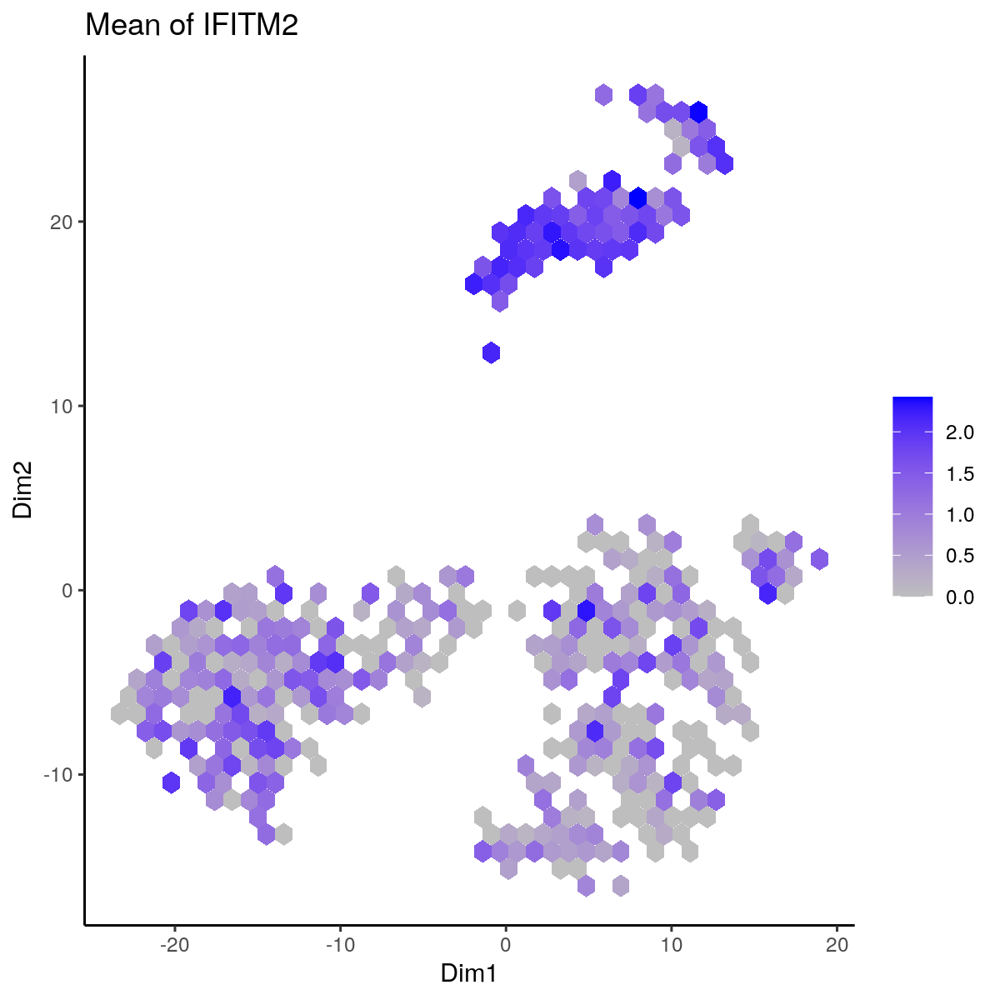|[IFNA2](https://www.ncbi.nlm.nih.gov/gene/3440) [IFNA17](https://www.ncbi.nlm.nih.gov/gene/3451) [IFNA21](https://www.ncbi.nlm.nih.gov/gene/3452) [IFNB1](https://www.ncbi.nlm.nih.gov/gene/3456) [IL6](https://www.ncbi.nlm.nih.gov/gene/3569)|
|[IFITM3](https://www.ncbi.nlm.nih.gov/gene/10410) 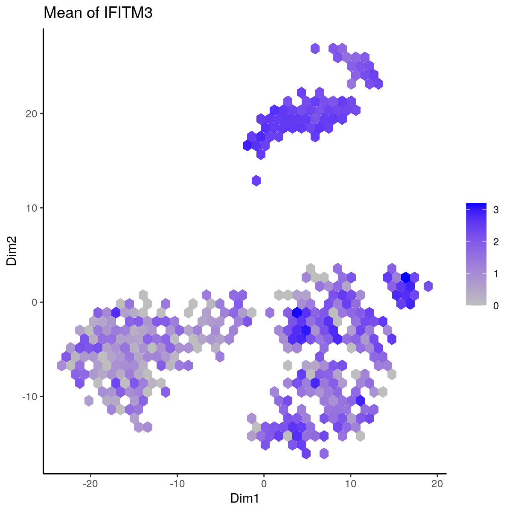|[IFNA2](https://www.ncbi.nlm.nih.gov/gene/3440) [IFNA17](https://www.ncbi.nlm.nih.gov/gene/3451) [IFNA21](https://www.ncbi.nlm.nih.gov/gene/3452) [IFNB1](https://www.ncbi.nlm.nih.gov/gene/3456) [CXCL10](https://www.ncbi.nlm.nih.gov/gene/3627) [SPP1](https://www.ncbi.nlm.nih.gov/gene/6696) [IFI30](https://www.ncbi.nlm.nih.gov/gene/10437)|
|[IFITM5](https://www.ncbi.nlm.nih.gov/gene/387733)|[COL1A1](https://www.ncbi.nlm.nih.gov/gene/1277) [COL1A2](https://www.ncbi.nlm.nih.gov/gene/1278) [COL10A1](https://www.ncbi.nlm.nih.gov/gene/1300) [SERPINF1](https://www.ncbi.nlm.nih.gov/gene/5176) [WNT1](https://www.ncbi.nlm.nih.gov/gene/7471) [CRTAP](https://www.ncbi.nlm.nih.gov/gene/10491) [SUSD4](https://www.ncbi.nlm.nih.gov/gene/55061) [P3H1](https://www.ncbi.nlm.nih.gov/gene/64175)|
|[IFNAR1](https://www.ncbi.nlm.nih.gov/gene/3454)|[CD40](https://www.ncbi.nlm.nih.gov/gene/958) [CSF2](https://www.ncbi.nlm.nih.gov/gene/1437) [CSF3](https://www.ncbi.nlm.nih.gov/gene/1440) [CSH1](https://www.ncbi.nlm.nih.gov/gene/1442) [CTF1](https://www.ncbi.nlm.nih.gov/gene/1489) [EPO](https://www.ncbi.nlm.nih.gov/gene/2056) [GAS6](https://www.ncbi.nlm.nih.gov/gene/2621) [GH1](https://www.ncbi.nlm.nih.gov/gene/2688) [IFNA1](https://www.ncbi.nlm.nih.gov/gene/3439) [IFNA2](https://www.ncbi.nlm.nih.gov/gene/3440) [IFNA4](https://www.ncbi.nlm.nih.gov/gene/3441) [IFNA5](https://www.ncbi.nlm.nih.gov/gene/3442) [IFNA6](https://www.ncbi.nlm.nih.gov/gene/3443) [IFNA7](https://www.ncbi.nlm.nih.gov/gene/3444) [IFNA8](https://www.ncbi.nlm.nih.gov/gene/3445) [IFNA10](https://www.ncbi.nlm.nih.gov/gene/3446) [IFNA14](https://www.ncbi.nlm.nih.gov/gene/3448) [IFNA16](https://www.ncbi.nlm.nih.gov/gene/3449) [IFNA17](https://www.ncbi.nlm.nih.gov/gene/3451) [IFNA21](https://www.ncbi.nlm.nih.gov/gene/3452) [IFNAR2](https://www.ncbi.nlm.nih.gov/gene/3455) [IFNB1](https://www.ncbi.nlm.nih.gov/gene/3456) [IFNG](https://www.ncbi.nlm.nih.gov/gene/3458) [IFNW1](https://www.ncbi.nlm.nih.gov/gene/3467) [IL2](https://www.ncbi.nlm.nih.gov/gene/3558) [IL3](https://www.ncbi.nlm.nih.gov/gene/3562) [IL4](https://www.ncbi.nlm.nih.gov/gene/3565) [IL5](https://www.ncbi.nlm.nih.gov/gene/3567) [IL6](https://www.ncbi.nlm.nih.gov/gene/3569) [IL7](https://www.ncbi.nlm.nih.gov/gene/3574) [IL9](https://www.ncbi.nlm.nih.gov/gene/3578) [IL10](https://www.ncbi.nlm.nih.gov/gene/3586) [IL11](https://www.ncbi.nlm.nih.gov/gene/3589) [IL12A](https://www.ncbi.nlm.nih.gov/gene/3592) [IL12B](https://www.ncbi.nlm.nih.gov/gene/3593) [IL13](https://www.ncbi.nlm.nih.gov/gene/3596) [IL15](https://www.ncbi.nlm.nih.gov/gene/3600) [IL18](https://www.ncbi.nlm.nih.gov/gene/3606) [CXCL10](https://www.ncbi.nlm.nih.gov/gene/3627) [LEP](https://www.ncbi.nlm.nih.gov/gene/3952) [LIF](https://www.ncbi.nlm.nih.gov/gene/3976) [CXCL9](https://www.ncbi.nlm.nih.gov/gene/4283) [MMP9](https://www.ncbi.nlm.nih.gov/gene/4318) [OSM](https://www.ncbi.nlm.nih.gov/gene/5008) [PDGFA](https://www.ncbi.nlm.nih.gov/gene/5154) [PDGFB](https://www.ncbi.nlm.nih.gov/gene/5155) [PRL](https://www.ncbi.nlm.nih.gov/gene/5617) [CCL2](https://www.ncbi.nlm.nih.gov/gene/6347) [CCL5](https://www.ncbi.nlm.nih.gov/gene/6352) [TNF](https://www.ncbi.nlm.nih.gov/gene/7124) [IL24](https://www.ncbi.nlm.nih.gov/gene/11009) [IL19](https://www.ncbi.nlm.nih.gov/gene/29949) [IL20](https://www.ncbi.nlm.nih.gov/gene/50604) [IL22](https://www.ncbi.nlm.nih.gov/gene/50616) [IL23A](https://www.ncbi.nlm.nih.gov/gene/51561) [IL17D](https://www.ncbi.nlm.nih.gov/gene/53342) [IFNK](https://www.ncbi.nlm.nih.gov/gene/56832) [TSLP](https://www.ncbi.nlm.nih.gov/gene/85480) [IFNL2](https://www.ncbi.nlm.nih.gov/gene/282616) [IFNL3](https://www.ncbi.nlm.nih.gov/gene/282617) [IFNL1](https://www.ncbi.nlm.nih.gov/gene/282618) [IFNE](https://www.ncbi.nlm.nih.gov/gene/338376) [IFNA13](https://www.ncbi.nlm.nih.gov/gene/3447)|
|[IFNAR2](https://www.ncbi.nlm.nih.gov/gene/3455)|[IFNA21](https://www.ncbi.nlm.nih.gov/gene/3452) [IFNA13](https://www.ncbi.nlm.nih.gov/gene/3447) [IFNK](https://www.ncbi.nlm.nih.gov/gene/56832) [IFNA2](https://www.ncbi.nlm.nih.gov/gene/3440) [IFNA10](https://www.ncbi.nlm.nih.gov/gene/3446) [IFNA7](https://www.ncbi.nlm.nih.gov/gene/3444) [IFNA6](https://www.ncbi.nlm.nih.gov/gene/3443) [IFNA17](https://www.ncbi.nlm.nih.gov/gene/3451) [IFNA5](https://www.ncbi.nlm.nih.gov/gene/3442) [IFNA16](https://www.ncbi.nlm.nih.gov/gene/3449) [IFNA1](https://www.ncbi.nlm.nih.gov/gene/3439) [IFNW1](https://www.ncbi.nlm.nih.gov/gene/3467) [IFNA8](https://www.ncbi.nlm.nih.gov/gene/3445) [IFNB1](https://www.ncbi.nlm.nih.gov/gene/3456) [IFNA4](https://www.ncbi.nlm.nih.gov/gene/3441) [IFNA14](https://www.ncbi.nlm.nih.gov/gene/3448)|
|[IFNGR1](https://www.ncbi.nlm.nih.gov/gene/3459)|[CSF2](https://www.ncbi.nlm.nih.gov/gene/1437) [CSF3](https://www.ncbi.nlm.nih.gov/gene/1440) [CSH1](https://www.ncbi.nlm.nih.gov/gene/1442) [CTF1](https://www.ncbi.nlm.nih.gov/gene/1489) [EPO](https://www.ncbi.nlm.nih.gov/gene/2056) [GH1](https://www.ncbi.nlm.nih.gov/gene/2688) [IFNA1](https://www.ncbi.nlm.nih.gov/gene/3439) [IFNA2](https://www.ncbi.nlm.nih.gov/gene/3440) [IFNA4](https://www.ncbi.nlm.nih.gov/gene/3441) [IFNA5](https://www.ncbi.nlm.nih.gov/gene/3442) [IFNA6](https://www.ncbi.nlm.nih.gov/gene/3443) [IFNA7](https://www.ncbi.nlm.nih.gov/gene/3444) [IFNA8](https://www.ncbi.nlm.nih.gov/gene/3445) [IFNA10](https://www.ncbi.nlm.nih.gov/gene/3446) [IFNA14](https://www.ncbi.nlm.nih.gov/gene/3448) [IFNA16](https://www.ncbi.nlm.nih.gov/gene/3449) [IFNA17](https://www.ncbi.nlm.nih.gov/gene/3451) [IFNA21](https://www.ncbi.nlm.nih.gov/gene/3452) [IFNAR2](https://www.ncbi.nlm.nih.gov/gene/3455) [IFNB1](https://www.ncbi.nlm.nih.gov/gene/3456) [IFNG](https://www.ncbi.nlm.nih.gov/gene/3458) [IFNW1](https://www.ncbi.nlm.nih.gov/gene/3467) [IL2](https://www.ncbi.nlm.nih.gov/gene/3558) [IL3](https://www.ncbi.nlm.nih.gov/gene/3562) [IL4](https://www.ncbi.nlm.nih.gov/gene/3565) [IL4R](https://www.ncbi.nlm.nih.gov/gene/3566) [IL5](https://www.ncbi.nlm.nih.gov/gene/3567) [IL6](https://www.ncbi.nlm.nih.gov/gene/3569) [IL6R](https://www.ncbi.nlm.nih.gov/gene/3570) [IL6ST](https://www.ncbi.nlm.nih.gov/gene/3572) [IL7](https://www.ncbi.nlm.nih.gov/gene/3574) [IL9](https://www.ncbi.nlm.nih.gov/gene/3578) [IL10](https://www.ncbi.nlm.nih.gov/gene/3586) [IL11](https://www.ncbi.nlm.nih.gov/gene/3589) [IL12A](https://www.ncbi.nlm.nih.gov/gene/3592) [IL12B](https://www.ncbi.nlm.nih.gov/gene/3593) [IL13](https://www.ncbi.nlm.nih.gov/gene/3596) [IL15](https://www.ncbi.nlm.nih.gov/gene/3600) [IL18](https://www.ncbi.nlm.nih.gov/gene/3606) [CXCL10](https://www.ncbi.nlm.nih.gov/gene/3627) [LEP](https://www.ncbi.nlm.nih.gov/gene/3952) [LIF](https://www.ncbi.nlm.nih.gov/gene/3976) [OSM](https://www.ncbi.nlm.nih.gov/gene/5008) [PDGFA](https://www.ncbi.nlm.nih.gov/gene/5154) [PDGFB](https://www.ncbi.nlm.nih.gov/gene/5155) [PRL](https://www.ncbi.nlm.nih.gov/gene/5617) [TGFB1](https://www.ncbi.nlm.nih.gov/gene/7040) [TNF](https://www.ncbi.nlm.nih.gov/gene/7124) [TNFRSF1A](https://www.ncbi.nlm.nih.gov/gene/7132) [IL24](https://www.ncbi.nlm.nih.gov/gene/11009) [IL19](https://www.ncbi.nlm.nih.gov/gene/29949) [IL20](https://www.ncbi.nlm.nih.gov/gene/50604) [IL22](https://www.ncbi.nlm.nih.gov/gene/50616) [IL23A](https://www.ncbi.nlm.nih.gov/gene/51561) [IL17D](https://www.ncbi.nlm.nih.gov/gene/53342) [IL26](https://www.ncbi.nlm.nih.gov/gene/55801) [IFNK](https://www.ncbi.nlm.nih.gov/gene/56832) [TSLP](https://www.ncbi.nlm.nih.gov/gene/85480) [IL22RA2](https://www.ncbi.nlm.nih.gov/gene/116379) [IL27](https://www.ncbi.nlm.nih.gov/gene/246778) [IFNL2](https://www.ncbi.nlm.nih.gov/gene/282616) [IFNL3](https://www.ncbi.nlm.nih.gov/gene/282617) [IFNL1](https://www.ncbi.nlm.nih.gov/gene/282618) [IFNE](https://www.ncbi.nlm.nih.gov/gene/338376)|
|[IFNGR2](https://www.ncbi.nlm.nih.gov/gene/3460)|[CSF2](https://www.ncbi.nlm.nih.gov/gene/1437) [CSF3](https://www.ncbi.nlm.nih.gov/gene/1440) [CSH1](https://www.ncbi.nlm.nih.gov/gene/1442) [CTF1](https://www.ncbi.nlm.nih.gov/gene/1489) [EPO](https://www.ncbi.nlm.nih.gov/gene/2056) [GH1](https://www.ncbi.nlm.nih.gov/gene/2688) [GZMA](https://www.ncbi.nlm.nih.gov/gene/3001) [IFNA1](https://www.ncbi.nlm.nih.gov/gene/3439) [IFNA2](https://www.ncbi.nlm.nih.gov/gene/3440) [IFNA4](https://www.ncbi.nlm.nih.gov/gene/3441) [IFNA5](https://www.ncbi.nlm.nih.gov/gene/3442) [IFNA6](https://www.ncbi.nlm.nih.gov/gene/3443) [IFNA7](https://www.ncbi.nlm.nih.gov/gene/3444) [IFNA8](https://www.ncbi.nlm.nih.gov/gene/3445) [IFNA10](https://www.ncbi.nlm.nih.gov/gene/3446) [IFNA14](https://www.ncbi.nlm.nih.gov/gene/3448) [IFNA16](https://www.ncbi.nlm.nih.gov/gene/3449) [IFNA17](https://www.ncbi.nlm.nih.gov/gene/3451) [IFNA21](https://www.ncbi.nlm.nih.gov/gene/3452) [IFNAR2](https://www.ncbi.nlm.nih.gov/gene/3455) [IFNB1](https://www.ncbi.nlm.nih.gov/gene/3456) [IFNG](https://www.ncbi.nlm.nih.gov/gene/3458) [IFNW1](https://www.ncbi.nlm.nih.gov/gene/3467) [IL2](https://www.ncbi.nlm.nih.gov/gene/3558) [IL3](https://www.ncbi.nlm.nih.gov/gene/3562) [IL4](https://www.ncbi.nlm.nih.gov/gene/3565) [IL4R](https://www.ncbi.nlm.nih.gov/gene/3566) [IL5](https://www.ncbi.nlm.nih.gov/gene/3567) [IL6](https://www.ncbi.nlm.nih.gov/gene/3569) [IL7](https://www.ncbi.nlm.nih.gov/gene/3574) [IL9](https://www.ncbi.nlm.nih.gov/gene/3578) [IL10](https://www.ncbi.nlm.nih.gov/gene/3586) [IL11](https://www.ncbi.nlm.nih.gov/gene/3589) [IL12A](https://www.ncbi.nlm.nih.gov/gene/3592) [IL12B](https://www.ncbi.nlm.nih.gov/gene/3593) [IL13](https://www.ncbi.nlm.nih.gov/gene/3596) [IL15](https://www.ncbi.nlm.nih.gov/gene/3600) [LEP](https://www.ncbi.nlm.nih.gov/gene/3952) [LIF](https://www.ncbi.nlm.nih.gov/gene/3976) [OSM](https://www.ncbi.nlm.nih.gov/gene/5008) [PDGFA](https://www.ncbi.nlm.nih.gov/gene/5154) [PDGFB](https://www.ncbi.nlm.nih.gov/gene/5155) [PRL](https://www.ncbi.nlm.nih.gov/gene/5617) [CCL5](https://www.ncbi.nlm.nih.gov/gene/6352) [TNF](https://www.ncbi.nlm.nih.gov/gene/7124) [IL24](https://www.ncbi.nlm.nih.gov/gene/11009) [IL19](https://www.ncbi.nlm.nih.gov/gene/29949) [IL20](https://www.ncbi.nlm.nih.gov/gene/50604) [IL22](https://www.ncbi.nlm.nih.gov/gene/50616) [IL23A](https://www.ncbi.nlm.nih.gov/gene/51561) [IL17D](https://www.ncbi.nlm.nih.gov/gene/53342) [IFNK](https://www.ncbi.nlm.nih.gov/gene/56832) [TSLP](https://www.ncbi.nlm.nih.gov/gene/85480) [IFNL2](https://www.ncbi.nlm.nih.gov/gene/282616) [IFNL3](https://www.ncbi.nlm.nih.gov/gene/282617) [IFNL1](https://www.ncbi.nlm.nih.gov/gene/282618) [IFNE](https://www.ncbi.nlm.nih.gov/gene/338376)|
|[IFNLR1](https://www.ncbi.nlm.nih.gov/gene/163702)|[IFNL3](https://www.ncbi.nlm.nih.gov/gene/282617) [IFNL2](https://www.ncbi.nlm.nih.gov/gene/282616) [IFNL1](https://www.ncbi.nlm.nih.gov/gene/282618)|
|[IGDCC4](https://www.ncbi.nlm.nih.gov/gene/57722)|[ADAMTSL5](https://www.ncbi.nlm.nih.gov/gene/339366)|
|[IGF1R](https://www.ncbi.nlm.nih.gov/gene/3480)|[IGF2](https://www.ncbi.nlm.nih.gov/gene/3481) [IGF1](https://www.ncbi.nlm.nih.gov/gene/3479)|
|[IGF2R](https://www.ncbi.nlm.nih.gov/gene/3482)|[IGF2](https://www.ncbi.nlm.nih.gov/gene/3481)|
|[IGFLR1](https://www.ncbi.nlm.nih.gov/gene/79713)|[IGFBPL1](https://www.ncbi.nlm.nih.gov/gene/347252)|
|[IGSF11](https://www.ncbi.nlm.nih.gov/gene/152404)|[SPON1](https://www.ncbi.nlm.nih.gov/gene/10418)|
|[IGSF5](https://www.ncbi.nlm.nih.gov/gene/150084)|[CXADR](https://www.ncbi.nlm.nih.gov/gene/1525) [JAM3](https://www.ncbi.nlm.nih.gov/gene/83700)|
|[IGSF8](https://www.ncbi.nlm.nih.gov/gene/93185)|[CD8A](https://www.ncbi.nlm.nih.gov/gene/925) [COL14A1](https://www.ncbi.nlm.nih.gov/gene/7373) [FCGBP](https://www.ncbi.nlm.nih.gov/gene/8857) [LGI1](https://www.ncbi.nlm.nih.gov/gene/9211)|
|[IHH](https://www.ncbi.nlm.nih.gov/gene/3549)|[ACAN](https://www.ncbi.nlm.nih.gov/gene/176) [BGLAP](https://www.ncbi.nlm.nih.gov/gene/632) [BMP2](https://www.ncbi.nlm.nih.gov/gene/650) [BMP4](https://www.ncbi.nlm.nih.gov/gene/652) [BMP5](https://www.ncbi.nlm.nih.gov/gene/653) [BMP6](https://www.ncbi.nlm.nih.gov/gene/654) [BMP7](https://www.ncbi.nlm.nih.gov/gene/655) [COL1A1](https://www.ncbi.nlm.nih.gov/gene/1277) [COL2A1](https://www.ncbi.nlm.nih.gov/gene/1280) [COL10A1](https://www.ncbi.nlm.nih.gov/gene/1300) [EGFR](https://www.ncbi.nlm.nih.gov/gene/1956) [GPC4](https://www.ncbi.nlm.nih.gov/gene/2239) [FGF2](https://www.ncbi.nlm.nih.gov/gene/2247) [FGF4](https://www.ncbi.nlm.nih.gov/gene/2249) [FGF8](https://www.ncbi.nlm.nih.gov/gene/2253) [FGF9](https://www.ncbi.nlm.nih.gov/gene/2254) [FGF10](https://www.ncbi.nlm.nih.gov/gene/2255) [FGFR3](https://www.ncbi.nlm.nih.gov/gene/2261) [GPC5](https://www.ncbi.nlm.nih.gov/gene/2262) [FGFR2](https://www.ncbi.nlm.nih.gov/gene/2263) [FRZB](https://www.ncbi.nlm.nih.gov/gene/2487) [GDF1](https://www.ncbi.nlm.nih.gov/gene/2657) [GNRH1](https://www.ncbi.nlm.nih.gov/gene/2796) [GNRH2](https://www.ncbi.nlm.nih.gov/gene/2797) [HSPG2](https://www.ncbi.nlm.nih.gov/gene/3339) [IBSP](https://www.ncbi.nlm.nih.gov/gene/3381) [IGF1](https://www.ncbi.nlm.nih.gov/gene/3479) [MATN1](https://www.ncbi.nlm.nih.gov/gene/4146) [MMP13](https://www.ncbi.nlm.nih.gov/gene/4322) [PAEP](https://www.ncbi.nlm.nih.gov/gene/5047) [PTH](https://www.ncbi.nlm.nih.gov/gene/5741) [PTHLH](https://www.ncbi.nlm.nih.gov/gene/5744) [SFRP1](https://www.ncbi.nlm.nih.gov/gene/6422) [SFRP2](https://www.ncbi.nlm.nih.gov/gene/6423) [SFRP5](https://www.ncbi.nlm.nih.gov/gene/6425) [SPP1](https://www.ncbi.nlm.nih.gov/gene/6696) [VEGFA](https://www.ncbi.nlm.nih.gov/gene/7422) [WNT1](https://www.ncbi.nlm.nih.gov/gene/7471) [WNT2](https://www.ncbi.nlm.nih.gov/gene/7472) [WNT3](https://www.ncbi.nlm.nih.gov/gene/7473) [WNT5A](https://www.ncbi.nlm.nih.gov/gene/7474) [WNT6](https://www.ncbi.nlm.nih.gov/gene/7475) [WNT7A](https://www.ncbi.nlm.nih.gov/gene/7476) [WNT7B](https://www.ncbi.nlm.nih.gov/gene/7477) [WNT8A](https://www.ncbi.nlm.nih.gov/gene/7478) [WNT8B](https://www.ncbi.nlm.nih.gov/gene/7479) [WNT10B](https://www.ncbi.nlm.nih.gov/gene/7480) [WNT11](https://www.ncbi.nlm.nih.gov/gene/7481) [WNT2B](https://www.ncbi.nlm.nih.gov/gene/7482) [WNT9A](https://www.ncbi.nlm.nih.gov/gene/7483) [WNT9B](https://www.ncbi.nlm.nih.gov/gene/7484) [GDF5](https://www.ncbi.nlm.nih.gov/gene/8200) [CHRD](https://www.ncbi.nlm.nih.gov/gene/8646) [FGF18](https://www.ncbi.nlm.nih.gov/gene/8817) [NOG](https://www.ncbi.nlm.nih.gov/gene/9241) [ADAMTS4](https://www.ncbi.nlm.nih.gov/gene/9507) [ADAMTS3](https://www.ncbi.nlm.nih.gov/gene/9508) [GPC6](https://www.ncbi.nlm.nih.gov/gene/10082) [ADAMTS5](https://www.ncbi.nlm.nih.gov/gene/11096) [WIF1](https://www.ncbi.nlm.nih.gov/gene/11197) [DKK1](https://www.ncbi.nlm.nih.gov/gene/22943) [SOST](https://www.ncbi.nlm.nih.gov/gene/50964) [WNT16](https://www.ncbi.nlm.nih.gov/gene/51384) [WNT4](https://www.ncbi.nlm.nih.gov/gene/54361) [SCUBE2](https://www.ncbi.nlm.nih.gov/gene/57758) [PROK2](https://www.ncbi.nlm.nih.gov/gene/60675) [WNT10A](https://www.ncbi.nlm.nih.gov/gene/80326) [WNT5B](https://www.ncbi.nlm.nih.gov/gene/81029) [WNT3A](https://www.ncbi.nlm.nih.gov/gene/89780) [NOTUM](https://www.ncbi.nlm.nih.gov/gene/147111) [GPC2](https://www.ncbi.nlm.nih.gov/gene/221914)|
|[IL10RA](https://www.ncbi.nlm.nih.gov/gene/3587)|[C1QA](https://www.ncbi.nlm.nih.gov/gene/712) [C1QB](https://www.ncbi.nlm.nih.gov/gene/713) [CD40](https://www.ncbi.nlm.nih.gov/gene/958) [CD40LG](https://www.ncbi.nlm.nih.gov/gene/959) [CSF2](https://www.ncbi.nlm.nih.gov/gene/1437) [CSF3](https://www.ncbi.nlm.nih.gov/gene/1440) [CSF3R](https://www.ncbi.nlm.nih.gov/gene/1441) [CSH1](https://www.ncbi.nlm.nih.gov/gene/1442) [CTF1](https://www.ncbi.nlm.nih.gov/gene/1489) [EPO](https://www.ncbi.nlm.nih.gov/gene/2056) [GH1](https://www.ncbi.nlm.nih.gov/gene/2688) [GZMA](https://www.ncbi.nlm.nih.gov/gene/3001) [GZMK](https://www.ncbi.nlm.nih.gov/gene/3003) [IFNA1](https://www.ncbi.nlm.nih.gov/gene/3439) [IFNA2](https://www.ncbi.nlm.nih.gov/gene/3440) [IFNA4](https://www.ncbi.nlm.nih.gov/gene/3441) [IFNA5](https://www.ncbi.nlm.nih.gov/gene/3442) [IFNA6](https://www.ncbi.nlm.nih.gov/gene/3443) [IFNA7](https://www.ncbi.nlm.nih.gov/gene/3444) [IFNA8](https://www.ncbi.nlm.nih.gov/gene/3445) [IFNA10](https://www.ncbi.nlm.nih.gov/gene/3446) [IFNA14](https://www.ncbi.nlm.nih.gov/gene/3448) [IFNA16](https://www.ncbi.nlm.nih.gov/gene/3449) [IFNA17](https://www.ncbi.nlm.nih.gov/gene/3451) [IFNA21](https://www.ncbi.nlm.nih.gov/gene/3452) [IFNAR2](https://www.ncbi.nlm.nih.gov/gene/3455) [IFNB1](https://www.ncbi.nlm.nih.gov/gene/3456) [IFNG](https://www.ncbi.nlm.nih.gov/gene/3458) [IFNW1](https://www.ncbi.nlm.nih.gov/gene/3467) [IL1RN](https://www.ncbi.nlm.nih.gov/gene/3557) [IL2](https://www.ncbi.nlm.nih.gov/gene/3558) [IL3](https://www.ncbi.nlm.nih.gov/gene/3562) [IL4](https://www.ncbi.nlm.nih.gov/gene/3565) [IL4R](https://www.ncbi.nlm.nih.gov/gene/3566) [IL5](https://www.ncbi.nlm.nih.gov/gene/3567) [IL6](https://www.ncbi.nlm.nih.gov/gene/3569) [IL6R](https://www.ncbi.nlm.nih.gov/gene/3570) [IL6ST](https://www.ncbi.nlm.nih.gov/gene/3572) [IL7](https://www.ncbi.nlm.nih.gov/gene/3574) [IL7R](https://www.ncbi.nlm.nih.gov/gene/3575) [CXCL8](https://www.ncbi.nlm.nih.gov/gene/3576) [IL9](https://www.ncbi.nlm.nih.gov/gene/3578) [IL10](https://www.ncbi.nlm.nih.gov/gene/3586) [IL11](https://www.ncbi.nlm.nih.gov/gene/3589) [IL12A](https://www.ncbi.nlm.nih.gov/gene/3592) [IL12B](https://www.ncbi.nlm.nih.gov/gene/3593) [IL13](https://www.ncbi.nlm.nih.gov/gene/3596) [IL15](https://www.ncbi.nlm.nih.gov/gene/3600) [IL16](https://www.ncbi.nlm.nih.gov/gene/3603) [IL18](https://www.ncbi.nlm.nih.gov/gene/3606) [CXCL10](https://www.ncbi.nlm.nih.gov/gene/3627) [LAG3](https://www.ncbi.nlm.nih.gov/gene/3902) [LEP](https://www.ncbi.nlm.nih.gov/gene/3952) [LIF](https://www.ncbi.nlm.nih.gov/gene/3976) [CXCL9](https://www.ncbi.nlm.nih.gov/gene/4283) [OSM](https://www.ncbi.nlm.nih.gov/gene/5008) [PDGFA](https://www.ncbi.nlm.nih.gov/gene/5154) [PDGFB](https://www.ncbi.nlm.nih.gov/gene/5155) [PRF1](https://www.ncbi.nlm.nih.gov/gene/5551) [PRL](https://www.ncbi.nlm.nih.gov/gene/5617) [RNASE6](https://www.ncbi.nlm.nih.gov/gene/6039) [CCL2](https://www.ncbi.nlm.nih.gov/gene/6347) [CCL3](https://www.ncbi.nlm.nih.gov/gene/6348) [CCL5](https://www.ncbi.nlm.nih.gov/gene/6352) [SIGLEC1](https://www.ncbi.nlm.nih.gov/gene/6614) [TNF](https://www.ncbi.nlm.nih.gov/gene/7124) [TNFRSF1A](https://www.ncbi.nlm.nih.gov/gene/7132) [TNFRSF1B](https://www.ncbi.nlm.nih.gov/gene/7133) [TNFRSF18](https://www.ncbi.nlm.nih.gov/gene/8784) [LY86](https://www.ncbi.nlm.nih.gov/gene/9450) [FGL2](https://www.ncbi.nlm.nih.gov/gene/10875) [IL24](https://www.ncbi.nlm.nih.gov/gene/11009) [IL17RA](https://www.ncbi.nlm.nih.gov/gene/23765) [IL19](https://www.ncbi.nlm.nih.gov/gene/29949) [IL20](https://www.ncbi.nlm.nih.gov/gene/50604) [IL22](https://www.ncbi.nlm.nih.gov/gene/50616) [IL23A](https://www.ncbi.nlm.nih.gov/gene/51561) [IL17D](https://www.ncbi.nlm.nih.gov/gene/53342) [IL26](https://www.ncbi.nlm.nih.gov/gene/55801) [IFNK](https://www.ncbi.nlm.nih.gov/gene/56832) [TSLP](https://www.ncbi.nlm.nih.gov/gene/85480) [IL22RA2](https://www.ncbi.nlm.nih.gov/gene/116379) [IFNL2](https://www.ncbi.nlm.nih.gov/gene/282616) [IFNL3](https://www.ncbi.nlm.nih.gov/gene/282617) [IFNL1](https://www.ncbi.nlm.nih.gov/gene/282618) [IFNE](https://www.ncbi.nlm.nih.gov/gene/338376)|
|[IL10RB](https://www.ncbi.nlm.nih.gov/gene/3588)|[IFNL2](https://www.ncbi.nlm.nih.gov/gene/282616) [IFNL3](https://www.ncbi.nlm.nih.gov/gene/282617) [IL22](https://www.ncbi.nlm.nih.gov/gene/50616) [IFNL1](https://www.ncbi.nlm.nih.gov/gene/282618) [IL10](https://www.ncbi.nlm.nih.gov/gene/3586)|
|[IL11RA](https://www.ncbi.nlm.nih.gov/gene/3590)|[IL11](https://www.ncbi.nlm.nih.gov/gene/3589)|
|[IL12RB1](https://www.ncbi.nlm.nih.gov/gene/3594)|[IL12A](https://www.ncbi.nlm.nih.gov/gene/3592) [IL23A](https://www.ncbi.nlm.nih.gov/gene/51561) [IL12B](https://www.ncbi.nlm.nih.gov/gene/3593)|
|[IL12RB2](https://www.ncbi.nlm.nih.gov/gene/3595)|[IL12A](https://www.ncbi.nlm.nih.gov/gene/3592) [IL12B](https://www.ncbi.nlm.nih.gov/gene/3593)|
|[IL13RA1](https://www.ncbi.nlm.nih.gov/gene/3597)|[IL4](https://www.ncbi.nlm.nih.gov/gene/3565) [IL13](https://www.ncbi.nlm.nih.gov/gene/3596)|
|[IL13RA2](https://www.ncbi.nlm.nih.gov/gene/3598)|[IL13](https://www.ncbi.nlm.nih.gov/gene/3596)|
|[IL15RA](https://www.ncbi.nlm.nih.gov/gene/3601)|[IL15](https://www.ncbi.nlm.nih.gov/gene/3600)|
|[IL17RA](https://www.ncbi.nlm.nih.gov/gene/23765)|[IL25](https://www.ncbi.nlm.nih.gov/gene/64806) [IL17F](https://www.ncbi.nlm.nih.gov/gene/112744) [IL17C](https://www.ncbi.nlm.nih.gov/gene/27189) [IL17B](https://www.ncbi.nlm.nih.gov/gene/27190) [IL17A](https://www.ncbi.nlm.nih.gov/gene/3605)|
|[IL17RB](https://www.ncbi.nlm.nih.gov/gene/55540)|[IL25](https://www.ncbi.nlm.nih.gov/gene/64806) [IL17B](https://www.ncbi.nlm.nih.gov/gene/27190)|
|[IL17RC](https://www.ncbi.nlm.nih.gov/gene/84818)|[CSF3](https://www.ncbi.nlm.nih.gov/gene/1440) [CXCL1](https://www.ncbi.nlm.nih.gov/gene/2919) [CXCL2](https://www.ncbi.nlm.nih.gov/gene/2920) [IL4](https://www.ncbi.nlm.nih.gov/gene/3565) [IL6](https://www.ncbi.nlm.nih.gov/gene/3569) [CXCL8](https://www.ncbi.nlm.nih.gov/gene/3576) [IL13](https://www.ncbi.nlm.nih.gov/gene/3596) [CCL20](https://www.ncbi.nlm.nih.gov/gene/6364) [CXCL5](https://www.ncbi.nlm.nih.gov/gene/6374) [TNF](https://www.ncbi.nlm.nih.gov/gene/7124) [TNFRSF1B](https://www.ncbi.nlm.nih.gov/gene/7133) [FSTL1](https://www.ncbi.nlm.nih.gov/gene/11167) [IL17RA](https://www.ncbi.nlm.nih.gov/gene/23765) [IL17C](https://www.ncbi.nlm.nih.gov/gene/27189) [IL17B](https://www.ncbi.nlm.nih.gov/gene/27190) [IL22](https://www.ncbi.nlm.nih.gov/gene/50616) [IL23A](https://www.ncbi.nlm.nih.gov/gene/51561) [IL17D](https://www.ncbi.nlm.nih.gov/gene/53342) [IL17RB](https://www.ncbi.nlm.nih.gov/gene/55540) [IL25](https://www.ncbi.nlm.nih.gov/gene/64806) [IL17F](https://www.ncbi.nlm.nih.gov/gene/112744) [IL17A](https://www.ncbi.nlm.nih.gov/gene/3605)|
|[IL17RE](https://www.ncbi.nlm.nih.gov/gene/132014)|[IL17C](https://www.ncbi.nlm.nih.gov/gene/27189)|
|[IL18R1](https://www.ncbi.nlm.nih.gov/gene/8809)|[IL18](https://www.ncbi.nlm.nih.gov/gene/3606) [IL37](https://www.ncbi.nlm.nih.gov/gene/27178)|
|[IL18RAP](https://www.ncbi.nlm.nih.gov/gene/8807)|[C8B](https://www.ncbi.nlm.nih.gov/gene/732) [GZMA](https://www.ncbi.nlm.nih.gov/gene/3001) [IFNG](https://www.ncbi.nlm.nih.gov/gene/3458) [IL1RN](https://www.ncbi.nlm.nih.gov/gene/3557) [IL18](https://www.ncbi.nlm.nih.gov/gene/3606) [S100A12](https://www.ncbi.nlm.nih.gov/gene/6283) [CST7](https://www.ncbi.nlm.nih.gov/gene/8530) [IL32](https://www.ncbi.nlm.nih.gov/gene/9235) [IL18BP](https://www.ncbi.nlm.nih.gov/gene/10068) [TSKU](https://www.ncbi.nlm.nih.gov/gene/25987) [IL36RN](https://www.ncbi.nlm.nih.gov/gene/26525) [IL36B](https://www.ncbi.nlm.nih.gov/gene/27177) [PROK2](https://www.ncbi.nlm.nih.gov/gene/60675) [IL1F10](https://www.ncbi.nlm.nih.gov/gene/84639) [IL37](https://www.ncbi.nlm.nih.gov/gene/27178)|
|[IL1R1](https://www.ncbi.nlm.nih.gov/gene/3554)|[IL1B](https://www.ncbi.nlm.nih.gov/gene/3553) [IL1RN](https://www.ncbi.nlm.nih.gov/gene/3557) [IL1A](https://www.ncbi.nlm.nih.gov/gene/3552)|
|[IL1R2](https://www.ncbi.nlm.nih.gov/gene/7850)|[CSF3R](https://www.ncbi.nlm.nih.gov/gene/1441) [CXCL1](https://www.ncbi.nlm.nih.gov/gene/2919) [CXCL2](https://www.ncbi.nlm.nih.gov/gene/2920) [IL1A](https://www.ncbi.nlm.nih.gov/gene/3552) [IL1RAP](https://www.ncbi.nlm.nih.gov/gene/3556) [IL1RN](https://www.ncbi.nlm.nih.gov/gene/3557) [IL4](https://www.ncbi.nlm.nih.gov/gene/3565) [IL4R](https://www.ncbi.nlm.nih.gov/gene/3566) [IL6](https://www.ncbi.nlm.nih.gov/gene/3569) [IL6R](https://www.ncbi.nlm.nih.gov/gene/3570) [CXCL8](https://www.ncbi.nlm.nih.gov/gene/3576) [IL10](https://www.ncbi.nlm.nih.gov/gene/3586) [IL13](https://www.ncbi.nlm.nih.gov/gene/3596) [IL18](https://www.ncbi.nlm.nih.gov/gene/3606) [CXCL10](https://www.ncbi.nlm.nih.gov/gene/3627) [MMP9](https://www.ncbi.nlm.nih.gov/gene/4318) [S100A8](https://www.ncbi.nlm.nih.gov/gene/6279) [S100A12](https://www.ncbi.nlm.nih.gov/gene/6283) [CCL2](https://www.ncbi.nlm.nih.gov/gene/6347) [CCL3](https://www.ncbi.nlm.nih.gov/gene/6348) [CCL20](https://www.ncbi.nlm.nih.gov/gene/6364) [TNF](https://www.ncbi.nlm.nih.gov/gene/7124) [TNFRSF1A](https://www.ncbi.nlm.nih.gov/gene/7132) [TNFRSF1B](https://www.ncbi.nlm.nih.gov/gene/7133) [IL18BP](https://www.ncbi.nlm.nih.gov/gene/10068) [IL17RA](https://www.ncbi.nlm.nih.gov/gene/23765) [IL36RN](https://www.ncbi.nlm.nih.gov/gene/26525) [IL36B](https://www.ncbi.nlm.nih.gov/gene/27177) [IL36A](https://www.ncbi.nlm.nih.gov/gene/27179) [IL19](https://www.ncbi.nlm.nih.gov/gene/29949) [TREM1](https://www.ncbi.nlm.nih.gov/gene/54210) [IL36G](https://www.ncbi.nlm.nih.gov/gene/56300) [IL1F10](https://www.ncbi.nlm.nih.gov/gene/84639) [ANTXR2](https://www.ncbi.nlm.nih.gov/gene/118429) [IL1R1](https://www.ncbi.nlm.nih.gov/gene/3554) [IL1B](https://www.ncbi.nlm.nih.gov/gene/3553)|
|[IL1RAP](https://www.ncbi.nlm.nih.gov/gene/3556)|[IL36A](https://www.ncbi.nlm.nih.gov/gene/27179) [IL1A](https://www.ncbi.nlm.nih.gov/gene/3552) [IL33](https://www.ncbi.nlm.nih.gov/gene/90865) [IL36RN](https://www.ncbi.nlm.nih.gov/gene/26525) [IL36B](https://www.ncbi.nlm.nih.gov/gene/27177) [IL1RN](https://www.ncbi.nlm.nih.gov/gene/3557) [IL1B](https://www.ncbi.nlm.nih.gov/gene/3553) [IL36G](https://www.ncbi.nlm.nih.gov/gene/56300)|
|[IL1RAPL1](https://www.ncbi.nlm.nih.gov/gene/11141)|[ARSF](https://www.ncbi.nlm.nih.gov/gene/416) [IL1F10](https://www.ncbi.nlm.nih.gov/gene/84639) [FREM1](https://www.ncbi.nlm.nih.gov/gene/158326)|
|[IL1RL1](https://www.ncbi.nlm.nih.gov/gene/9173)|[IL1RAP](https://www.ncbi.nlm.nih.gov/gene/3556) [IL1RN](https://www.ncbi.nlm.nih.gov/gene/3557) [IL2](https://www.ncbi.nlm.nih.gov/gene/3558) [IL4](https://www.ncbi.nlm.nih.gov/gene/3565) [IL4R](https://www.ncbi.nlm.nih.gov/gene/3566) [IL5](https://www.ncbi.nlm.nih.gov/gene/3567) [IL6](https://www.ncbi.nlm.nih.gov/gene/3569) [IL7](https://www.ncbi.nlm.nih.gov/gene/3574) [IL7R](https://www.ncbi.nlm.nih.gov/gene/3575) [CXCL8](https://www.ncbi.nlm.nih.gov/gene/3576) [IL9](https://www.ncbi.nlm.nih.gov/gene/3578) [IL10](https://www.ncbi.nlm.nih.gov/gene/3586) [IL13](https://www.ncbi.nlm.nih.gov/gene/3596) [IL18](https://www.ncbi.nlm.nih.gov/gene/3606) [TNF](https://www.ncbi.nlm.nih.gov/gene/7124) [VEGFA](https://www.ncbi.nlm.nih.gov/gene/7422) [CCL27](https://www.ncbi.nlm.nih.gov/gene/10850) [IL36RN](https://www.ncbi.nlm.nih.gov/gene/26525) [IL36B](https://www.ncbi.nlm.nih.gov/gene/27177) [IL36A](https://www.ncbi.nlm.nih.gov/gene/27179) [IL17RB](https://www.ncbi.nlm.nih.gov/gene/55540) [IL36G](https://www.ncbi.nlm.nih.gov/gene/56300) [CRLF2](https://www.ncbi.nlm.nih.gov/gene/64109) [IL1F10](https://www.ncbi.nlm.nih.gov/gene/84639) [TSLP](https://www.ncbi.nlm.nih.gov/gene/85480) [IL33](https://www.ncbi.nlm.nih.gov/gene/90865)|
|[IL1RL2](https://www.ncbi.nlm.nih.gov/gene/8808)|[IL36G](https://www.ncbi.nlm.nih.gov/gene/56300) [IL36A](https://www.ncbi.nlm.nih.gov/gene/27179) [IL36B](https://www.ncbi.nlm.nih.gov/gene/27177) [IL36RN](https://www.ncbi.nlm.nih.gov/gene/26525)|
|[IL20RA](https://www.ncbi.nlm.nih.gov/gene/53832)|[IL24](https://www.ncbi.nlm.nih.gov/gene/11009) [IL20](https://www.ncbi.nlm.nih.gov/gene/50604) [IL19](https://www.ncbi.nlm.nih.gov/gene/29949)|
|[IL20RB](https://www.ncbi.nlm.nih.gov/gene/53833)|[IL19](https://www.ncbi.nlm.nih.gov/gene/29949) [IL20](https://www.ncbi.nlm.nih.gov/gene/50604) [IL24](https://www.ncbi.nlm.nih.gov/gene/11009)|
|[IL21R](https://www.ncbi.nlm.nih.gov/gene/50615)|[IL21](https://www.ncbi.nlm.nih.gov/gene/59067)|
|[IL22RA1](https://www.ncbi.nlm.nih.gov/gene/58985)|[IL20](https://www.ncbi.nlm.nih.gov/gene/50604) [IL22](https://www.ncbi.nlm.nih.gov/gene/50616) [IL24](https://www.ncbi.nlm.nih.gov/gene/11009)|
|[IL23R](https://www.ncbi.nlm.nih.gov/gene/149233)|[CD40](https://www.ncbi.nlm.nih.gov/gene/958) [CSF2](https://www.ncbi.nlm.nih.gov/gene/1437) [CSF3](https://www.ncbi.nlm.nih.gov/gene/1440) [CSH1](https://www.ncbi.nlm.nih.gov/gene/1442) [CTF1](https://www.ncbi.nlm.nih.gov/gene/1489) [EPO](https://www.ncbi.nlm.nih.gov/gene/2056) [GH1](https://www.ncbi.nlm.nih.gov/gene/2688) [IFNA1](https://www.ncbi.nlm.nih.gov/gene/3439) [IFNA2](https://www.ncbi.nlm.nih.gov/gene/3440) [IFNA4](https://www.ncbi.nlm.nih.gov/gene/3441) [IFNA5](https://www.ncbi.nlm.nih.gov/gene/3442) [IFNA6](https://www.ncbi.nlm.nih.gov/gene/3443) [IFNA7](https://www.ncbi.nlm.nih.gov/gene/3444) [IFNA8](https://www.ncbi.nlm.nih.gov/gene/3445) [IFNA10](https://www.ncbi.nlm.nih.gov/gene/3446) [IFNA14](https://www.ncbi.nlm.nih.gov/gene/3448) [IFNA16](https://www.ncbi.nlm.nih.gov/gene/3449) [IFNA17](https://www.ncbi.nlm.nih.gov/gene/3451) [IFNA21](https://www.ncbi.nlm.nih.gov/gene/3452) [IFNB1](https://www.ncbi.nlm.nih.gov/gene/3456) [IFNG](https://www.ncbi.nlm.nih.gov/gene/3458) [IFNW1](https://www.ncbi.nlm.nih.gov/gene/3467) [IL2](https://www.ncbi.nlm.nih.gov/gene/3558) [IL3](https://www.ncbi.nlm.nih.gov/gene/3562) [IL4](https://www.ncbi.nlm.nih.gov/gene/3565) [IL5](https://www.ncbi.nlm.nih.gov/gene/3567) [IL6](https://www.ncbi.nlm.nih.gov/gene/3569) [IL6R](https://www.ncbi.nlm.nih.gov/gene/3570) [IL7](https://www.ncbi.nlm.nih.gov/gene/3574) [IL7R](https://www.ncbi.nlm.nih.gov/gene/3575) [CXCL8](https://www.ncbi.nlm.nih.gov/gene/3576) [IL9](https://www.ncbi.nlm.nih.gov/gene/3578) [IL10](https://www.ncbi.nlm.nih.gov/gene/3586) [IL11](https://www.ncbi.nlm.nih.gov/gene/3589) [IL12A](https://www.ncbi.nlm.nih.gov/gene/3592) [IL12B](https://www.ncbi.nlm.nih.gov/gene/3593) [IL13](https://www.ncbi.nlm.nih.gov/gene/3596) [IL15](https://www.ncbi.nlm.nih.gov/gene/3600) [IL18](https://www.ncbi.nlm.nih.gov/gene/3606) [LEP](https://www.ncbi.nlm.nih.gov/gene/3952) [LIF](https://www.ncbi.nlm.nih.gov/gene/3976) [OSM](https://www.ncbi.nlm.nih.gov/gene/5008) [PDGFA](https://www.ncbi.nlm.nih.gov/gene/5154) [PDGFB](https://www.ncbi.nlm.nih.gov/gene/5155) [PRL](https://www.ncbi.nlm.nih.gov/gene/5617) [CCL20](https://www.ncbi.nlm.nih.gov/gene/6364) [TNF](https://www.ncbi.nlm.nih.gov/gene/7124) [TNFRSF1A](https://www.ncbi.nlm.nih.gov/gene/7132) [TNFRSF1B](https://www.ncbi.nlm.nih.gov/gene/7133) [CCL27](https://www.ncbi.nlm.nih.gov/gene/10850) [IL24](https://www.ncbi.nlm.nih.gov/gene/11009) [IL17RA](https://www.ncbi.nlm.nih.gov/gene/23765) [IL17C](https://www.ncbi.nlm.nih.gov/gene/27189) [IL19](https://www.ncbi.nlm.nih.gov/gene/29949) [IL20](https://www.ncbi.nlm.nih.gov/gene/50604) [IL22](https://www.ncbi.nlm.nih.gov/gene/50616) [IL23A](https://www.ncbi.nlm.nih.gov/gene/51561) [IL17D](https://www.ncbi.nlm.nih.gov/gene/53342) [IL17RB](https://www.ncbi.nlm.nih.gov/gene/55540) [IL26](https://www.ncbi.nlm.nih.gov/gene/55801) [IFNK](https://www.ncbi.nlm.nih.gov/gene/56832) [IL25](https://www.ncbi.nlm.nih.gov/gene/64806) [TSLP](https://www.ncbi.nlm.nih.gov/gene/85480) [IL17F](https://www.ncbi.nlm.nih.gov/gene/112744) [ANTXR2](https://www.ncbi.nlm.nih.gov/gene/118429) [IL17RE](https://www.ncbi.nlm.nih.gov/gene/132014) [IFNL2](https://www.ncbi.nlm.nih.gov/gene/282616) [IFNL3](https://www.ncbi.nlm.nih.gov/gene/282617) [IFNL1](https://www.ncbi.nlm.nih.gov/gene/282618) [IFNE](https://www.ncbi.nlm.nih.gov/gene/338376)|
|[IL27RA](https://www.ncbi.nlm.nih.gov/gene/9466)|[IL27](https://www.ncbi.nlm.nih.gov/gene/246778) [EBI3](https://www.ncbi.nlm.nih.gov/gene/10148)|
|[IL2RA](https://www.ncbi.nlm.nih.gov/gene/3559)|[IL2](https://www.ncbi.nlm.nih.gov/gene/3558) [IL1RN](https://www.ncbi.nlm.nih.gov/gene/3557)|
|[IL2RB](https://www.ncbi.nlm.nih.gov/gene/3560)|[FAS](https://www.ncbi.nlm.nih.gov/gene/355) [CD8A](https://www.ncbi.nlm.nih.gov/gene/925) [CD8B](https://www.ncbi.nlm.nih.gov/gene/926) [CD40](https://www.ncbi.nlm.nih.gov/gene/958) [CD40LG](https://www.ncbi.nlm.nih.gov/gene/959) [CLPS](https://www.ncbi.nlm.nih.gov/gene/1208) [CSF2](https://www.ncbi.nlm.nih.gov/gene/1437) [CSF2RA](https://www.ncbi.nlm.nih.gov/gene/1438) [CSF3](https://www.ncbi.nlm.nih.gov/gene/1440) [CSH1](https://www.ncbi.nlm.nih.gov/gene/1442) [CTF1](https://www.ncbi.nlm.nih.gov/gene/1489) [ECM1](https://www.ncbi.nlm.nih.gov/gene/1893) [EPO](https://www.ncbi.nlm.nih.gov/gene/2056) [GH1](https://www.ncbi.nlm.nih.gov/gene/2688) [GZMA](https://www.ncbi.nlm.nih.gov/gene/3001) [GZMK](https://www.ncbi.nlm.nih.gov/gene/3003) [IFNA1](https://www.ncbi.nlm.nih.gov/gene/3439) [IFNA2](https://www.ncbi.nlm.nih.gov/gene/3440) [IFNA4](https://www.ncbi.nlm.nih.gov/gene/3441) [IFNA5](https://www.ncbi.nlm.nih.gov/gene/3442) [IFNA6](https://www.ncbi.nlm.nih.gov/gene/3443) [IFNA7](https://www.ncbi.nlm.nih.gov/gene/3444) [IFNA8](https://www.ncbi.nlm.nih.gov/gene/3445) [IFNA10](https://www.ncbi.nlm.nih.gov/gene/3446) [IFNA14](https://www.ncbi.nlm.nih.gov/gene/3448) [IFNA16](https://www.ncbi.nlm.nih.gov/gene/3449) [IFNA17](https://www.ncbi.nlm.nih.gov/gene/3451) [IFNA21](https://www.ncbi.nlm.nih.gov/gene/3452) [IFNB1](https://www.ncbi.nlm.nih.gov/gene/3456) [IFNG](https://www.ncbi.nlm.nih.gov/gene/3458) [IFNW1](https://www.ncbi.nlm.nih.gov/gene/3467) [IL2](https://www.ncbi.nlm.nih.gov/gene/3558) [IL3](https://www.ncbi.nlm.nih.gov/gene/3562) [IL4](https://www.ncbi.nlm.nih.gov/gene/3565) [IL4R](https://www.ncbi.nlm.nih.gov/gene/3566) [IL5](https://www.ncbi.nlm.nih.gov/gene/3567) [IL6](https://www.ncbi.nlm.nih.gov/gene/3569) [IL6R](https://www.ncbi.nlm.nih.gov/gene/3570) [IL7](https://www.ncbi.nlm.nih.gov/gene/3574) [IL7R](https://www.ncbi.nlm.nih.gov/gene/3575) [IL9](https://www.ncbi.nlm.nih.gov/gene/3578) [IL10](https://www.ncbi.nlm.nih.gov/gene/3586) [IL11](https://www.ncbi.nlm.nih.gov/gene/3589) [IL12A](https://www.ncbi.nlm.nih.gov/gene/3592) [IL12B](https://www.ncbi.nlm.nih.gov/gene/3593) [IL13](https://www.ncbi.nlm.nih.gov/gene/3596) [IL15](https://www.ncbi.nlm.nih.gov/gene/3600) [IL16](https://www.ncbi.nlm.nih.gov/gene/3603) [IL18](https://www.ncbi.nlm.nih.gov/gene/3606) [LAG3](https://www.ncbi.nlm.nih.gov/gene/3902) [LEP](https://www.ncbi.nlm.nih.gov/gene/3952) [LIF](https://www.ncbi.nlm.nih.gov/gene/3976) [NCAM1](https://www.ncbi.nlm.nih.gov/gene/4684) [OSM](https://www.ncbi.nlm.nih.gov/gene/5008) [PDGFA](https://www.ncbi.nlm.nih.gov/gene/5154) [PDGFB](https://www.ncbi.nlm.nih.gov/gene/5155) [PRF1](https://www.ncbi.nlm.nih.gov/gene/5551) [PRL](https://www.ncbi.nlm.nih.gov/gene/5617) [CCL2](https://www.ncbi.nlm.nih.gov/gene/6347) [CCL5](https://www.ncbi.nlm.nih.gov/gene/6352) [CCL19](https://www.ncbi.nlm.nih.gov/gene/6363) [XCL1](https://www.ncbi.nlm.nih.gov/gene/6375) [XCL2](https://www.ncbi.nlm.nih.gov/gene/6846) [TNF](https://www.ncbi.nlm.nih.gov/gene/7124) [TNFRSF1B](https://www.ncbi.nlm.nih.gov/gene/7133) [CST7](https://www.ncbi.nlm.nih.gov/gene/8530) [TNFRSF18](https://www.ncbi.nlm.nih.gov/gene/8784) [IL1RL1](https://www.ncbi.nlm.nih.gov/gene/9173) [GNLY](https://www.ncbi.nlm.nih.gov/gene/10578) [IL24](https://www.ncbi.nlm.nih.gov/gene/11009) [CD160](https://www.ncbi.nlm.nih.gov/gene/11126) [ICOS](https://www.ncbi.nlm.nih.gov/gene/29851) [IL19](https://www.ncbi.nlm.nih.gov/gene/29949) [IL20](https://www.ncbi.nlm.nih.gov/gene/50604) [IL22](https://www.ncbi.nlm.nih.gov/gene/50616) [IL23A](https://www.ncbi.nlm.nih.gov/gene/51561) [IL17D](https://www.ncbi.nlm.nih.gov/gene/53342) [IFNK](https://www.ncbi.nlm.nih.gov/gene/56832) [TSLP](https://www.ncbi.nlm.nih.gov/gene/85480) [IL17RE](https://www.ncbi.nlm.nih.gov/gene/132014) [IFNL2](https://www.ncbi.nlm.nih.gov/gene/282616) [IFNL3](https://www.ncbi.nlm.nih.gov/gene/282617) [IFNL1](https://www.ncbi.nlm.nih.gov/gene/282618) [IFNE](https://www.ncbi.nlm.nih.gov/gene/338376) [IL1RN](https://www.ncbi.nlm.nih.gov/gene/3557)|
|[IL2RG](https://www.ncbi.nlm.nih.gov/gene/3561)|[C1QB](https://www.ncbi.nlm.nih.gov/gene/713) [CD8A](https://www.ncbi.nlm.nih.gov/gene/925) [CD8B](https://www.ncbi.nlm.nih.gov/gene/926) [CD40LG](https://www.ncbi.nlm.nih.gov/gene/959) [CSF2](https://www.ncbi.nlm.nih.gov/gene/1437) [CSF2RA](https://www.ncbi.nlm.nih.gov/gene/1438) [CSF3](https://www.ncbi.nlm.nih.gov/gene/1440) [CSH1](https://www.ncbi.nlm.nih.gov/gene/1442) [CTF1](https://www.ncbi.nlm.nih.gov/gene/1489) [EPO](https://www.ncbi.nlm.nih.gov/gene/2056) [FGF2](https://www.ncbi.nlm.nih.gov/gene/2247) [GH1](https://www.ncbi.nlm.nih.gov/gene/2688) [GZMA](https://www.ncbi.nlm.nih.gov/gene/3001) [IFNA1](https://www.ncbi.nlm.nih.gov/gene/3439) [IFNA2](https://www.ncbi.nlm.nih.gov/gene/3440) [IFNA4](https://www.ncbi.nlm.nih.gov/gene/3441) [IFNA5](https://www.ncbi.nlm.nih.gov/gene/3442) [IFNA6](https://www.ncbi.nlm.nih.gov/gene/3443) [IFNA7](https://www.ncbi.nlm.nih.gov/gene/3444) [IFNA8](https://www.ncbi.nlm.nih.gov/gene/3445) [IFNA10](https://www.ncbi.nlm.nih.gov/gene/3446) [IFNA14](https://www.ncbi.nlm.nih.gov/gene/3448) [IFNA16](https://www.ncbi.nlm.nih.gov/gene/3449) [IFNA17](https://www.ncbi.nlm.nih.gov/gene/3451) [IFNA21](https://www.ncbi.nlm.nih.gov/gene/3452) [IFNB1](https://www.ncbi.nlm.nih.gov/gene/3456) [IFNG](https://www.ncbi.nlm.nih.gov/gene/3458) [IFNW1](https://www.ncbi.nlm.nih.gov/gene/3467) [IL2](https://www.ncbi.nlm.nih.gov/gene/3558) [IL3](https://www.ncbi.nlm.nih.gov/gene/3562) [IL4](https://www.ncbi.nlm.nih.gov/gene/3565) [IL4R](https://www.ncbi.nlm.nih.gov/gene/3566) [IL5](https://www.ncbi.nlm.nih.gov/gene/3567) [IL6](https://www.ncbi.nlm.nih.gov/gene/3569) [IL6R](https://www.ncbi.nlm.nih.gov/gene/3570) [IL7](https://www.ncbi.nlm.nih.gov/gene/3574) [IL7R](https://www.ncbi.nlm.nih.gov/gene/3575) [IL9](https://www.ncbi.nlm.nih.gov/gene/3578) [IL10](https://www.ncbi.nlm.nih.gov/gene/3586) [IL11](https://www.ncbi.nlm.nih.gov/gene/3589) [IL12A](https://www.ncbi.nlm.nih.gov/gene/3592) [IL12B](https://www.ncbi.nlm.nih.gov/gene/3593) [IL13](https://www.ncbi.nlm.nih.gov/gene/3596) [IL15](https://www.ncbi.nlm.nih.gov/gene/3600) [IL16](https://www.ncbi.nlm.nih.gov/gene/3603) [LEP](https://www.ncbi.nlm.nih.gov/gene/3952) [LIF](https://www.ncbi.nlm.nih.gov/gene/3976) [OSM](https://www.ncbi.nlm.nih.gov/gene/5008) [PDGFA](https://www.ncbi.nlm.nih.gov/gene/5154) [PDGFB](https://www.ncbi.nlm.nih.gov/gene/5155) [PRF1](https://www.ncbi.nlm.nih.gov/gene/5551) [PRL](https://www.ncbi.nlm.nih.gov/gene/5617) [TNF](https://www.ncbi.nlm.nih.gov/gene/7124) [TNFRSF18](https://www.ncbi.nlm.nih.gov/gene/8784) [NOG](https://www.ncbi.nlm.nih.gov/gene/9241) [IL24](https://www.ncbi.nlm.nih.gov/gene/11009) [IL19](https://www.ncbi.nlm.nih.gov/gene/29949) [IL20](https://www.ncbi.nlm.nih.gov/gene/50604) [IL22](https://www.ncbi.nlm.nih.gov/gene/50616) [IL23A](https://www.ncbi.nlm.nih.gov/gene/51561) [IL17D](https://www.ncbi.nlm.nih.gov/gene/53342) [IFNK](https://www.ncbi.nlm.nih.gov/gene/56832) [TSLP](https://www.ncbi.nlm.nih.gov/gene/85480) [MPEG1](https://www.ncbi.nlm.nih.gov/gene/219972) [IFNL2](https://www.ncbi.nlm.nih.gov/gene/282616) [IFNL3](https://www.ncbi.nlm.nih.gov/gene/282617) [IFNL1](https://www.ncbi.nlm.nih.gov/gene/282618) [HMSD](https://www.ncbi.nlm.nih.gov/gene/284293) [IFNE](https://www.ncbi.nlm.nih.gov/gene/338376) [IL21](https://www.ncbi.nlm.nih.gov/gene/59067) [IL1RN](https://www.ncbi.nlm.nih.gov/gene/3557)|
|[IL31RA](https://www.ncbi.nlm.nih.gov/gene/133396)|[IL31](https://www.ncbi.nlm.nih.gov/gene/386653)|
|[IL3RA](https://www.ncbi.nlm.nih.gov/gene/3563)|[IL3](https://www.ncbi.nlm.nih.gov/gene/3562)|
|[IL4R](https://www.ncbi.nlm.nih.gov/gene/3566)|[IL4](https://www.ncbi.nlm.nih.gov/gene/3565) [IL13](https://www.ncbi.nlm.nih.gov/gene/3596)|
|[IL5RA](https://www.ncbi.nlm.nih.gov/gene/3568)|[IL5](https://www.ncbi.nlm.nih.gov/gene/3567)|
|[IL6R](https://www.ncbi.nlm.nih.gov/gene/3570)|[IL6](https://www.ncbi.nlm.nih.gov/gene/3569)|
|[IL6ST](https://www.ncbi.nlm.nih.gov/gene/3572)|[OSM](https://www.ncbi.nlm.nih.gov/gene/5008) [CLCF1](https://www.ncbi.nlm.nih.gov/gene/23529) [IL27](https://www.ncbi.nlm.nih.gov/gene/246778) [EBI3](https://www.ncbi.nlm.nih.gov/gene/10148) [CNTF](https://www.ncbi.nlm.nih.gov/gene/1270) [CTF1](https://www.ncbi.nlm.nih.gov/gene/1489) [IL6](https://www.ncbi.nlm.nih.gov/gene/3569) [LIF](https://www.ncbi.nlm.nih.gov/gene/3976) [IL11](https://www.ncbi.nlm.nih.gov/gene/3589) [CRLF1](https://www.ncbi.nlm.nih.gov/gene/9244)|
|[IL7R](https://www.ncbi.nlm.nih.gov/gene/3575)|[TSLP](https://www.ncbi.nlm.nih.gov/gene/85480) [IL7](https://www.ncbi.nlm.nih.gov/gene/3574)|
|[IL9R](https://www.ncbi.nlm.nih.gov/gene/3581)|[CSF2](https://www.ncbi.nlm.nih.gov/gene/1437) [CSF3](https://www.ncbi.nlm.nih.gov/gene/1440) [CSH1](https://www.ncbi.nlm.nih.gov/gene/1442) [CTF1](https://www.ncbi.nlm.nih.gov/gene/1489) [EPO](https://www.ncbi.nlm.nih.gov/gene/2056) [GH1](https://www.ncbi.nlm.nih.gov/gene/2688) [IFNA1](https://www.ncbi.nlm.nih.gov/gene/3439) [IFNA2](https://www.ncbi.nlm.nih.gov/gene/3440) [IFNA4](https://www.ncbi.nlm.nih.gov/gene/3441) [IFNA5](https://www.ncbi.nlm.nih.gov/gene/3442) [IFNA6](https://www.ncbi.nlm.nih.gov/gene/3443) [IFNA7](https://www.ncbi.nlm.nih.gov/gene/3444) [IFNA8](https://www.ncbi.nlm.nih.gov/gene/3445) [IFNA10](https://www.ncbi.nlm.nih.gov/gene/3446) [IFNA14](https://www.ncbi.nlm.nih.gov/gene/3448) [IFNA16](https://www.ncbi.nlm.nih.gov/gene/3449) [IFNA17](https://www.ncbi.nlm.nih.gov/gene/3451) [IFNA21](https://www.ncbi.nlm.nih.gov/gene/3452) [IFNB1](https://www.ncbi.nlm.nih.gov/gene/3456) [IFNG](https://www.ncbi.nlm.nih.gov/gene/3458) [IFNW1](https://www.ncbi.nlm.nih.gov/gene/3467) [IL2](https://www.ncbi.nlm.nih.gov/gene/3558) [IL3](https://www.ncbi.nlm.nih.gov/gene/3562) [IL4](https://www.ncbi.nlm.nih.gov/gene/3565) [IL4R](https://www.ncbi.nlm.nih.gov/gene/3566) [IL5](https://www.ncbi.nlm.nih.gov/gene/3567) [IL6](https://www.ncbi.nlm.nih.gov/gene/3569) [IL7](https://www.ncbi.nlm.nih.gov/gene/3574) [IL9](https://www.ncbi.nlm.nih.gov/gene/3578) [IL10](https://www.ncbi.nlm.nih.gov/gene/3586) [IL11](https://www.ncbi.nlm.nih.gov/gene/3589) [IL12A](https://www.ncbi.nlm.nih.gov/gene/3592) [IL12B](https://www.ncbi.nlm.nih.gov/gene/3593) [IL13](https://www.ncbi.nlm.nih.gov/gene/3596) [IL15](https://www.ncbi.nlm.nih.gov/gene/3600) [LEP](https://www.ncbi.nlm.nih.gov/gene/3952) [LIF](https://www.ncbi.nlm.nih.gov/gene/3976) [OSM](https://www.ncbi.nlm.nih.gov/gene/5008) [PDGFA](https://www.ncbi.nlm.nih.gov/gene/5154) [PDGFB](https://www.ncbi.nlm.nih.gov/gene/5155) [PRL](https://www.ncbi.nlm.nih.gov/gene/5617) [CCL11](https://www.ncbi.nlm.nih.gov/gene/6356) [CCL17](https://www.ncbi.nlm.nih.gov/gene/6361) [IL1RL1](https://www.ncbi.nlm.nih.gov/gene/9173) [IL24](https://www.ncbi.nlm.nih.gov/gene/11009) [IL19](https://www.ncbi.nlm.nih.gov/gene/29949) [IL20](https://www.ncbi.nlm.nih.gov/gene/50604) [IL22](https://www.ncbi.nlm.nih.gov/gene/50616) [IL23A](https://www.ncbi.nlm.nih.gov/gene/51561) [IL17D](https://www.ncbi.nlm.nih.gov/gene/53342) [IFNK](https://www.ncbi.nlm.nih.gov/gene/56832) [TSLP](https://www.ncbi.nlm.nih.gov/gene/85480) [IFNL2](https://www.ncbi.nlm.nih.gov/gene/282616) [IFNL3](https://www.ncbi.nlm.nih.gov/gene/282617) [IFNL1](https://www.ncbi.nlm.nih.gov/gene/282618) [IFNE](https://www.ncbi.nlm.nih.gov/gene/338376)|
|[INPP5A](https://www.ncbi.nlm.nih.gov/gene/3632)|[GPLD1](https://www.ncbi.nlm.nih.gov/gene/2822) [PTEN](https://www.ncbi.nlm.nih.gov/gene/5728) [RNLS](https://www.ncbi.nlm.nih.gov/gene/55328)|
|[INSR](https://www.ncbi.nlm.nih.gov/gene/3643)|[AHSG](https://www.ncbi.nlm.nih.gov/gene/197) [ANGPT1](https://www.ncbi.nlm.nih.gov/gene/284) [ANGPT2](https://www.ncbi.nlm.nih.gov/gene/285) [BDNF](https://www.ncbi.nlm.nih.gov/gene/627) [BGLAP](https://www.ncbi.nlm.nih.gov/gene/632) [BMP2](https://www.ncbi.nlm.nih.gov/gene/650) [BMP4](https://www.ncbi.nlm.nih.gov/gene/652) [DCN](https://www.ncbi.nlm.nih.gov/gene/1634) [EFNA1](https://www.ncbi.nlm.nih.gov/gene/1942) [EFNA4](https://www.ncbi.nlm.nih.gov/gene/1945) [FGF1](https://www.ncbi.nlm.nih.gov/gene/2246) [FGF2](https://www.ncbi.nlm.nih.gov/gene/2247) [FGF3](https://www.ncbi.nlm.nih.gov/gene/2248) [FGF4](https://www.ncbi.nlm.nih.gov/gene/2249) [FGF5](https://www.ncbi.nlm.nih.gov/gene/2250) [FGF6](https://www.ncbi.nlm.nih.gov/gene/2251) [FGF7](https://www.ncbi.nlm.nih.gov/gene/2252) [FGF8](https://www.ncbi.nlm.nih.gov/gene/2253) [FGF9](https://www.ncbi.nlm.nih.gov/gene/2254) [FGF10](https://www.ncbi.nlm.nih.gov/gene/2255) [VEGFD](https://www.ncbi.nlm.nih.gov/gene/2277) [FLT3LG](https://www.ncbi.nlm.nih.gov/gene/2323) [FN1](https://www.ncbi.nlm.nih.gov/gene/2335) [FSHB](https://www.ncbi.nlm.nih.gov/gene/2488) [MSTN](https://www.ncbi.nlm.nih.gov/gene/2660) [GHR](https://www.ncbi.nlm.nih.gov/gene/2690) [IGF1](https://www.ncbi.nlm.nih.gov/gene/3479) [IGF2](https://www.ncbi.nlm.nih.gov/gene/3481) [IGFBP1](https://www.ncbi.nlm.nih.gov/gene/3484) [IGFBP3](https://www.ncbi.nlm.nih.gov/gene/3486) [INS](https://www.ncbi.nlm.nih.gov/gene/3630) [ITIH4](https://www.ncbi.nlm.nih.gov/gene/3700) [LEP](https://www.ncbi.nlm.nih.gov/gene/3952) [LEPR](https://www.ncbi.nlm.nih.gov/gene/3953) [MET](https://www.ncbi.nlm.nih.gov/gene/4233) [NELL2](https://www.ncbi.nlm.nih.gov/gene/4753) [NGF](https://www.ncbi.nlm.nih.gov/gene/4803) [NTF3](https://www.ncbi.nlm.nih.gov/gene/4908) [NTF4](https://www.ncbi.nlm.nih.gov/gene/4909) [PDGFA](https://www.ncbi.nlm.nih.gov/gene/5154) [PDGFB](https://www.ncbi.nlm.nih.gov/gene/5155) [PGF](https://www.ncbi.nlm.nih.gov/gene/5228) [PTEN](https://www.ncbi.nlm.nih.gov/gene/5728) [VEGFA](https://www.ncbi.nlm.nih.gov/gene/7422) [VEGFB](https://www.ncbi.nlm.nih.gov/gene/7423) [VEGFC](https://www.ncbi.nlm.nih.gov/gene/7424) [FGF23](https://www.ncbi.nlm.nih.gov/gene/8074) [FGF18](https://www.ncbi.nlm.nih.gov/gene/8817) [FGF17](https://www.ncbi.nlm.nih.gov/gene/8822) [FGF16](https://www.ncbi.nlm.nih.gov/gene/8823) [KL](https://www.ncbi.nlm.nih.gov/gene/9365) [ADIPOQ](https://www.ncbi.nlm.nih.gov/gene/9370) [FGF19](https://www.ncbi.nlm.nih.gov/gene/9965) [FGF20](https://www.ncbi.nlm.nih.gov/gene/26281) [FGF21](https://www.ncbi.nlm.nih.gov/gene/26291) [FGF22](https://www.ncbi.nlm.nih.gov/gene/27006) [ANGPT4](https://www.ncbi.nlm.nih.gov/gene/51378) [PDGFD](https://www.ncbi.nlm.nih.gov/gene/80310) [FBN3](https://www.ncbi.nlm.nih.gov/gene/84467)|
|[IPCEF1](https://www.ncbi.nlm.nih.gov/gene/26034)|[EGFR](https://www.ncbi.nlm.nih.gov/gene/1956) [LIPH](https://www.ncbi.nlm.nih.gov/gene/200879)|
|[IQGAP1](https://www.ncbi.nlm.nih.gov/gene/8826)|[ANXA2](https://www.ncbi.nlm.nih.gov/gene/302) [EGFR](https://www.ncbi.nlm.nih.gov/gene/1956) [FGB](https://www.ncbi.nlm.nih.gov/gene/2244) [FGG](https://www.ncbi.nlm.nih.gov/gene/2266) [FN1](https://www.ncbi.nlm.nih.gov/gene/2335) [GSN](https://www.ncbi.nlm.nih.gov/gene/2934) [KDR](https://www.ncbi.nlm.nih.gov/gene/3791) [MMP9](https://www.ncbi.nlm.nih.gov/gene/4318) [PTEN](https://www.ncbi.nlm.nih.gov/gene/5728) [VEGFA](https://www.ncbi.nlm.nih.gov/gene/7422) [VWF](https://www.ncbi.nlm.nih.gov/gene/7450)|
|[IRS4](https://www.ncbi.nlm.nih.gov/gene/8471)|[COL4A4](https://www.ncbi.nlm.nih.gov/gene/1286) [COL4A6](https://www.ncbi.nlm.nih.gov/gene/1288) [IGF1](https://www.ncbi.nlm.nih.gov/gene/3479) [IGF2](https://www.ncbi.nlm.nih.gov/gene/3481) [INS](https://www.ncbi.nlm.nih.gov/gene/3630) [KL](https://www.ncbi.nlm.nih.gov/gene/9365)|
|[ISLR2](https://www.ncbi.nlm.nih.gov/gene/57611)|[NELL2](https://www.ncbi.nlm.nih.gov/gene/4753) [C1QL2](https://www.ncbi.nlm.nih.gov/gene/165257)|
|[ITGA3](https://www.ncbi.nlm.nih.gov/gene/3675)|[ALCAM](https://www.ncbi.nlm.nih.gov/gene/214) [CHAD](https://www.ncbi.nlm.nih.gov/gene/1101) [COL1A1](https://www.ncbi.nlm.nih.gov/gene/1277) [COL1A2](https://www.ncbi.nlm.nih.gov/gene/1278) [COL2A1](https://www.ncbi.nlm.nih.gov/gene/1280) [COL4A1](https://www.ncbi.nlm.nih.gov/gene/1282) [COL4A2](https://www.ncbi.nlm.nih.gov/gene/1284) [COL4A3](https://www.ncbi.nlm.nih.gov/gene/1285) [COL4A4](https://www.ncbi.nlm.nih.gov/gene/1286) [COL4A5](https://www.ncbi.nlm.nih.gov/gene/1287) [COL4A6](https://www.ncbi.nlm.nih.gov/gene/1288) [COL6A1](https://www.ncbi.nlm.nih.gov/gene/1291) [COL6A2](https://www.ncbi.nlm.nih.gov/gene/1292) [COL6A3](https://www.ncbi.nlm.nih.gov/gene/1293) [COL7A1](https://www.ncbi.nlm.nih.gov/gene/1294) [COL9A1](https://www.ncbi.nlm.nih.gov/gene/1297) [COL9A2](https://www.ncbi.nlm.nih.gov/gene/1298) [COMP](https://www.ncbi.nlm.nih.gov/gene/1311) [EGFR](https://www.ncbi.nlm.nih.gov/gene/1956) [FN1](https://www.ncbi.nlm.nih.gov/gene/2335) [TNC](https://www.ncbi.nlm.nih.gov/gene/3371) [IBSP](https://www.ncbi.nlm.nih.gov/gene/3381) [LAMA2](https://www.ncbi.nlm.nih.gov/gene/3908) [LAMA3](https://www.ncbi.nlm.nih.gov/gene/3909) [LAMA4](https://www.ncbi.nlm.nih.gov/gene/3910) [LAMA5](https://www.ncbi.nlm.nih.gov/gene/3911) [LAMB1](https://www.ncbi.nlm.nih.gov/gene/3912) [LAMB2](https://www.ncbi.nlm.nih.gov/gene/3913) [LAMB3](https://www.ncbi.nlm.nih.gov/gene/3914) [LAMC1](https://www.ncbi.nlm.nih.gov/gene/3915) [LAMC2](https://www.ncbi.nlm.nih.gov/gene/3918) [MET](https://www.ncbi.nlm.nih.gov/gene/4233) [NID1](https://www.ncbi.nlm.nih.gov/gene/4811) [PLAU](https://www.ncbi.nlm.nih.gov/gene/5328) [PLAUR](https://www.ncbi.nlm.nih.gov/gene/5329) [RELN](https://www.ncbi.nlm.nih.gov/gene/5649) [SPP1](https://www.ncbi.nlm.nih.gov/gene/6696) [TGFB1](https://www.ncbi.nlm.nih.gov/gene/7040) [TGFBI](https://www.ncbi.nlm.nih.gov/gene/7045) [THBS1](https://www.ncbi.nlm.nih.gov/gene/7057) [TIMP2](https://www.ncbi.nlm.nih.gov/gene/7077) [TNR](https://www.ncbi.nlm.nih.gov/gene/7143) [TNXB](https://www.ncbi.nlm.nih.gov/gene/7148) [VEGFA](https://www.ncbi.nlm.nih.gov/gene/7422) [VTN](https://www.ncbi.nlm.nih.gov/gene/7448) [VWF](https://www.ncbi.nlm.nih.gov/gene/7450) [ADAM9](https://www.ncbi.nlm.nih.gov/gene/8754) [CD164](https://www.ncbi.nlm.nih.gov/gene/8763) [ITGBL1](https://www.ncbi.nlm.nih.gov/gene/9358) [NTN1](https://www.ncbi.nlm.nih.gov/gene/9423) [LAMC3](https://www.ncbi.nlm.nih.gov/gene/10319) [SPON2](https://www.ncbi.nlm.nih.gov/gene/10417) [AGR2](https://www.ncbi.nlm.nih.gov/gene/10551) [EMILIN1](https://www.ncbi.nlm.nih.gov/gene/11117) [LAMB4](https://www.ncbi.nlm.nih.gov/gene/22798) [TNN](https://www.ncbi.nlm.nih.gov/gene/63923) [CDCP1](https://www.ncbi.nlm.nih.gov/gene/64866) [COL18A1](https://www.ncbi.nlm.nih.gov/gene/80781) [COL6A6](https://www.ncbi.nlm.nih.gov/gene/131873) [NPNT](https://www.ncbi.nlm.nih.gov/gene/255743) [COL6A5](https://www.ncbi.nlm.nih.gov/gene/256076) [LAMA1](https://www.ncbi.nlm.nih.gov/gene/284217)|
|[ITGA6](https://www.ncbi.nlm.nih.gov/gene/3655)|[ALCAM](https://www.ncbi.nlm.nih.gov/gene/214) [CHAD](https://www.ncbi.nlm.nih.gov/gene/1101) [COL1A1](https://www.ncbi.nlm.nih.gov/gene/1277) [COL1A2](https://www.ncbi.nlm.nih.gov/gene/1278) [COL2A1](https://www.ncbi.nlm.nih.gov/gene/1280) [COL4A1](https://www.ncbi.nlm.nih.gov/gene/1282) [COL4A2](https://www.ncbi.nlm.nih.gov/gene/1284) [COL4A3](https://www.ncbi.nlm.nih.gov/gene/1285) [COL4A4](https://www.ncbi.nlm.nih.gov/gene/1286) [COL4A5](https://www.ncbi.nlm.nih.gov/gene/1287) [COL4A6](https://www.ncbi.nlm.nih.gov/gene/1288) [COL6A1](https://www.ncbi.nlm.nih.gov/gene/1291) [COL6A2](https://www.ncbi.nlm.nih.gov/gene/1292) [COL6A3](https://www.ncbi.nlm.nih.gov/gene/1293) [COL7A1](https://www.ncbi.nlm.nih.gov/gene/1294) [COL9A1](https://www.ncbi.nlm.nih.gov/gene/1297) [COL9A2](https://www.ncbi.nlm.nih.gov/gene/1298) [COMP](https://www.ncbi.nlm.nih.gov/gene/1311) [EGFR](https://www.ncbi.nlm.nih.gov/gene/1956) [ERBB3](https://www.ncbi.nlm.nih.gov/gene/2065) [FGF2](https://www.ncbi.nlm.nih.gov/gene/2247) [FN1](https://www.ncbi.nlm.nih.gov/gene/2335) [FRZB](https://www.ncbi.nlm.nih.gov/gene/2487) [SFN](https://www.ncbi.nlm.nih.gov/gene/2810) [TNC](https://www.ncbi.nlm.nih.gov/gene/3371) [IBSP](https://www.ncbi.nlm.nih.gov/gene/3381) [INS](https://www.ncbi.nlm.nih.gov/gene/3630) [LAMA2](https://www.ncbi.nlm.nih.gov/gene/3908) [LAMA3](https://www.ncbi.nlm.nih.gov/gene/3909) [LAMA4](https://www.ncbi.nlm.nih.gov/gene/3910) [LAMA5](https://www.ncbi.nlm.nih.gov/gene/3911) [LAMB1](https://www.ncbi.nlm.nih.gov/gene/3912) [LAMB2](https://www.ncbi.nlm.nih.gov/gene/3913) [LAMB3](https://www.ncbi.nlm.nih.gov/gene/3914) [LAMC1](https://www.ncbi.nlm.nih.gov/gene/3915) [LAMC2](https://www.ncbi.nlm.nih.gov/gene/3918) [MDK](https://www.ncbi.nlm.nih.gov/gene/4192) [MET](https://www.ncbi.nlm.nih.gov/gene/4233) [MUC1](https://www.ncbi.nlm.nih.gov/gene/4582) [NCAM1](https://www.ncbi.nlm.nih.gov/gene/4684) [RELN](https://www.ncbi.nlm.nih.gov/gene/5649) [SPP1](https://www.ncbi.nlm.nih.gov/gene/6696) [THBS1](https://www.ncbi.nlm.nih.gov/gene/7057) [TNR](https://www.ncbi.nlm.nih.gov/gene/7143) [TNXB](https://www.ncbi.nlm.nih.gov/gene/7148) [VTN](https://www.ncbi.nlm.nih.gov/gene/7448) [VWF](https://www.ncbi.nlm.nih.gov/gene/7450) [ADAM9](https://www.ncbi.nlm.nih.gov/gene/8754) [ITGBL1](https://www.ncbi.nlm.nih.gov/gene/9358) [LAMC3](https://www.ncbi.nlm.nih.gov/gene/10319) [LAMB4](https://www.ncbi.nlm.nih.gov/gene/22798) [TNN](https://www.ncbi.nlm.nih.gov/gene/63923) [COL6A6](https://www.ncbi.nlm.nih.gov/gene/131873) [NPNT](https://www.ncbi.nlm.nih.gov/gene/255743) [COL6A5](https://www.ncbi.nlm.nih.gov/gene/256076) [LAMA1](https://www.ncbi.nlm.nih.gov/gene/284217)|
|[ITGAL](https://www.ncbi.nlm.nih.gov/gene/3683)|[ALB](https://www.ncbi.nlm.nih.gov/gene/213) [FAS](https://www.ncbi.nlm.nih.gov/gene/355) [C1QA](https://www.ncbi.nlm.nih.gov/gene/712) [C1QB](https://www.ncbi.nlm.nih.gov/gene/713) [CD40](https://www.ncbi.nlm.nih.gov/gene/958) [CD40LG](https://www.ncbi.nlm.nih.gov/gene/959) [CSF2](https://www.ncbi.nlm.nih.gov/gene/1437) [FCAR](https://www.ncbi.nlm.nih.gov/gene/2204) [FN1](https://www.ncbi.nlm.nih.gov/gene/2335) [GZMA](https://www.ncbi.nlm.nih.gov/gene/3001) [GZMK](https://www.ncbi.nlm.nih.gov/gene/3003) [ICAM4](https://www.ncbi.nlm.nih.gov/gene/3386) [IFNG](https://www.ncbi.nlm.nih.gov/gene/3458) [IL2](https://www.ncbi.nlm.nih.gov/gene/3558) [IL4](https://www.ncbi.nlm.nih.gov/gene/3565) [IL6](https://www.ncbi.nlm.nih.gov/gene/3569) [IL7](https://www.ncbi.nlm.nih.gov/gene/3574) [IL7R](https://www.ncbi.nlm.nih.gov/gene/3575) [CXCL8](https://www.ncbi.nlm.nih.gov/gene/3576) [IL10](https://www.ncbi.nlm.nih.gov/gene/3586) [IL15](https://www.ncbi.nlm.nih.gov/gene/3600) [NCAM1](https://www.ncbi.nlm.nih.gov/gene/4684) [PLAU](https://www.ncbi.nlm.nih.gov/gene/5328) [PLAUR](https://www.ncbi.nlm.nih.gov/gene/5329) [PRF1](https://www.ncbi.nlm.nih.gov/gene/5551) [CCL2](https://www.ncbi.nlm.nih.gov/gene/6347) [CCL3](https://www.ncbi.nlm.nih.gov/gene/6348) [CCL5](https://www.ncbi.nlm.nih.gov/gene/6352) [TNF](https://www.ncbi.nlm.nih.gov/gene/7124) [TNFRSF1B](https://www.ncbi.nlm.nih.gov/gene/7133) [ITGBL1](https://www.ncbi.nlm.nih.gov/gene/9358) [CCL27](https://www.ncbi.nlm.nih.gov/gene/10850) [ESM1](https://www.ncbi.nlm.nih.gov/gene/11082) [EMILIN1](https://www.ncbi.nlm.nih.gov/gene/11117)|
|[ITGAM](https://www.ncbi.nlm.nih.gov/gene/3684)|[AGER](https://www.ncbi.nlm.nih.gov/gene/177) [ALB](https://www.ncbi.nlm.nih.gov/gene/213) [ALCAM](https://www.ncbi.nlm.nih.gov/gene/214) [AMBP](https://www.ncbi.nlm.nih.gov/gene/259) [AOAH](https://www.ncbi.nlm.nih.gov/gene/313) [APOE](https://www.ncbi.nlm.nih.gov/gene/348) [FAS](https://www.ncbi.nlm.nih.gov/gene/355) [BDNF](https://www.ncbi.nlm.nih.gov/gene/627) [C1QA](https://www.ncbi.nlm.nih.gov/gene/712) [C3](https://www.ncbi.nlm.nih.gov/gene/718) [CD8A](https://www.ncbi.nlm.nih.gov/gene/925) [CD8B](https://www.ncbi.nlm.nih.gov/gene/926) [CD40](https://www.ncbi.nlm.nih.gov/gene/958) [CD40LG](https://www.ncbi.nlm.nih.gov/gene/959) [CLPS](https://www.ncbi.nlm.nih.gov/gene/1208) [CRP](https://www.ncbi.nlm.nih.gov/gene/1401) [CSF2](https://www.ncbi.nlm.nih.gov/gene/1437) [CSF2RA](https://www.ncbi.nlm.nih.gov/gene/1438) [CSF3](https://www.ncbi.nlm.nih.gov/gene/1440) [CSF3R](https://www.ncbi.nlm.nih.gov/gene/1441) [CCN2](https://www.ncbi.nlm.nih.gov/gene/1490) [DNASE1](https://www.ncbi.nlm.nih.gov/gene/1773) [EDA](https://www.ncbi.nlm.nih.gov/gene/1896) [EPO](https://www.ncbi.nlm.nih.gov/gene/2056) [F3](https://www.ncbi.nlm.nih.gov/gene/2152) [F10](https://www.ncbi.nlm.nih.gov/gene/2159) [F13A1](https://www.ncbi.nlm.nih.gov/gene/2162) [FCAR](https://www.ncbi.nlm.nih.gov/gene/2204) [FGB](https://www.ncbi.nlm.nih.gov/gene/2244) [FGF2](https://www.ncbi.nlm.nih.gov/gene/2247) [FGG](https://www.ncbi.nlm.nih.gov/gene/2266) [FLT1](https://www.ncbi.nlm.nih.gov/gene/2321) [FLT3LG](https://www.ncbi.nlm.nih.gov/gene/2323) [FLT4](https://www.ncbi.nlm.nih.gov/gene/2324) [FN1](https://www.ncbi.nlm.nih.gov/gene/2335) [CXCL1](https://www.ncbi.nlm.nih.gov/gene/2919) [CXCL2](https://www.ncbi.nlm.nih.gov/gene/2920) [GZMA](https://www.ncbi.nlm.nih.gov/gene/3001) [GZMK](https://www.ncbi.nlm.nih.gov/gene/3003) [CFH](https://www.ncbi.nlm.nih.gov/gene/3075) [HP](https://www.ncbi.nlm.nih.gov/gene/3240) [ICAM4](https://www.ncbi.nlm.nih.gov/gene/3386) [IFNA1](https://www.ncbi.nlm.nih.gov/gene/3439) [IFNB1](https://www.ncbi.nlm.nih.gov/gene/3456) [IFNG](https://www.ncbi.nlm.nih.gov/gene/3458) [IGF1](https://www.ncbi.nlm.nih.gov/gene/3479) [CCN1](https://www.ncbi.nlm.nih.gov/gene/3491) [IL1A](https://www.ncbi.nlm.nih.gov/gene/3552) [IL1RN](https://www.ncbi.nlm.nih.gov/gene/3557) [IL2](https://www.ncbi.nlm.nih.gov/gene/3558) [IL3](https://www.ncbi.nlm.nih.gov/gene/3562) [IL4](https://www.ncbi.nlm.nih.gov/gene/3565) [IL4R](https://www.ncbi.nlm.nih.gov/gene/3566) [IL5](https://www.ncbi.nlm.nih.gov/gene/3567) [IL6](https://www.ncbi.nlm.nih.gov/gene/3569) [IL6R](https://www.ncbi.nlm.nih.gov/gene/3570) [IL7](https://www.ncbi.nlm.nih.gov/gene/3574) [IL7R](https://www.ncbi.nlm.nih.gov/gene/3575) [CXCL8](https://www.ncbi.nlm.nih.gov/gene/3576) [IL9](https://www.ncbi.nlm.nih.gov/gene/3578) [IL10](https://www.ncbi.nlm.nih.gov/gene/3586) [IL13](https://www.ncbi.nlm.nih.gov/gene/3596) [IL15](https://www.ncbi.nlm.nih.gov/gene/3600) [IL18](https://www.ncbi.nlm.nih.gov/gene/3606) [CXCL10](https://www.ncbi.nlm.nih.gov/gene/3627) [INS](https://www.ncbi.nlm.nih.gov/gene/3630) [KDR](https://www.ncbi.nlm.nih.gov/gene/3791) [LAG3](https://www.ncbi.nlm.nih.gov/gene/3902) [LAMC2](https://www.ncbi.nlm.nih.gov/gene/3918) [LBP](https://www.ncbi.nlm.nih.gov/gene/3929) [LEP](https://www.ncbi.nlm.nih.gov/gene/3952) [LGALS3](https://www.ncbi.nlm.nih.gov/gene/3958) [LGALS9](https://www.ncbi.nlm.nih.gov/gene/3965) [LOX](https://www.ncbi.nlm.nih.gov/gene/4015) [LYZ](https://www.ncbi.nlm.nih.gov/gene/4069) [CXCL9](https://www.ncbi.nlm.nih.gov/gene/4283) [MMP9](https://www.ncbi.nlm.nih.gov/gene/4318) [MMP12](https://www.ncbi.nlm.nih.gov/gene/4321) [MST1](https://www.ncbi.nlm.nih.gov/gene/4485) [NCAM1](https://www.ncbi.nlm.nih.gov/gene/4684) [NGF](https://www.ncbi.nlm.nih.gov/gene/4803) [OSM](https://www.ncbi.nlm.nih.gov/gene/5008) [SERPINB2](https://www.ncbi.nlm.nih.gov/gene/5055) [PF4](https://www.ncbi.nlm.nih.gov/gene/5196) [SERPINB5](https://www.ncbi.nlm.nih.gov/gene/5268) [PLAT](https://www.ncbi.nlm.nih.gov/gene/5327) [PLAU](https://www.ncbi.nlm.nih.gov/gene/5328) [PLAUR](https://www.ncbi.nlm.nih.gov/gene/5329) [PLG](https://www.ncbi.nlm.nih.gov/gene/5340) [PPBP](https://www.ncbi.nlm.nih.gov/gene/5473) [PRF1](https://www.ncbi.nlm.nih.gov/gene/5551) [PROC](https://www.ncbi.nlm.nih.gov/gene/5624) [S100A8](https://www.ncbi.nlm.nih.gov/gene/6279) [S100A9](https://www.ncbi.nlm.nih.gov/gene/6280) [S100A12](https://www.ncbi.nlm.nih.gov/gene/6283) [CCL2](https://www.ncbi.nlm.nih.gov/gene/6347) [CCL3](https://www.ncbi.nlm.nih.gov/gene/6348) [CCL5](https://www.ncbi.nlm.nih.gov/gene/6352) [CCL7](https://www.ncbi.nlm.nih.gov/gene/6354) [CCL11](https://www.ncbi.nlm.nih.gov/gene/6356) [CCL17](https://www.ncbi.nlm.nih.gov/gene/6361) [CCL19](https://www.ncbi.nlm.nih.gov/gene/6363) [CCL20](https://www.ncbi.nlm.nih.gov/gene/6364) [CCL21](https://www.ncbi.nlm.nih.gov/gene/6366) [CCL22](https://www.ncbi.nlm.nih.gov/gene/6367) [CCL24](https://www.ncbi.nlm.nih.gov/gene/6369) [CXCL11](https://www.ncbi.nlm.nih.gov/gene/6373) [CXCL5](https://www.ncbi.nlm.nih.gov/gene/6374) [CX3CL1](https://www.ncbi.nlm.nih.gov/gene/6376) [CXCL12](https://www.ncbi.nlm.nih.gov/gene/6387) [PMEL](https://www.ncbi.nlm.nih.gov/gene/6490) [SIGLEC1](https://www.ncbi.nlm.nih.gov/gene/6614) [SPP1](https://www.ncbi.nlm.nih.gov/gene/6696) [TGFB1](https://www.ncbi.nlm.nih.gov/gene/7040) [TGFBI](https://www.ncbi.nlm.nih.gov/gene/7045) [TIMP1](https://www.ncbi.nlm.nih.gov/gene/7076) [TNF](https://www.ncbi.nlm.nih.gov/gene/7124) [TNFRSF1A](https://www.ncbi.nlm.nih.gov/gene/7132) [TNFRSF1B](https://www.ncbi.nlm.nih.gov/gene/7133) [VEGFA](https://www.ncbi.nlm.nih.gov/gene/7422) [VEGFC](https://www.ncbi.nlm.nih.gov/gene/7424) [FGF23](https://www.ncbi.nlm.nih.gov/gene/8074) [TNFRSF18](https://www.ncbi.nlm.nih.gov/gene/8784) [IL1RL1](https://www.ncbi.nlm.nih.gov/gene/9173) [ITGBL1](https://www.ncbi.nlm.nih.gov/gene/9358) [LY86](https://www.ncbi.nlm.nih.gov/gene/9450) [CLEC4M](https://www.ncbi.nlm.nih.gov/gene/10332) [SPON2](https://www.ncbi.nlm.nih.gov/gene/10417) [CXCL13](https://www.ncbi.nlm.nih.gov/gene/10563) [CCL27](https://www.ncbi.nlm.nih.gov/gene/10850) [EMILIN1](https://www.ncbi.nlm.nih.gov/gene/11117) [LY96](https://www.ncbi.nlm.nih.gov/gene/23643) [IL17RA](https://www.ncbi.nlm.nih.gov/gene/23765) [CD209](https://www.ncbi.nlm.nih.gov/gene/30835) [IL22](https://www.ncbi.nlm.nih.gov/gene/50616) [IL23A](https://www.ncbi.nlm.nih.gov/gene/51561) [TREM2](https://www.ncbi.nlm.nih.gov/gene/54209) [TREM1](https://www.ncbi.nlm.nih.gov/gene/54210) [RETN](https://www.ncbi.nlm.nih.gov/gene/56729) [PROK2](https://www.ncbi.nlm.nih.gov/gene/60675) [JAM3](https://www.ncbi.nlm.nih.gov/gene/83700) [RETNLB](https://www.ncbi.nlm.nih.gov/gene/84666) [TSLP](https://www.ncbi.nlm.nih.gov/gene/85480) [IL17F](https://www.ncbi.nlm.nih.gov/gene/112744) [CD200R1](https://www.ncbi.nlm.nih.gov/gene/131450) [IL34](https://www.ncbi.nlm.nih.gov/gene/146433) [MPEG1](https://www.ncbi.nlm.nih.gov/gene/219972) [IL27](https://www.ncbi.nlm.nih.gov/gene/246778)|
|[ITGAV](https://www.ncbi.nlm.nih.gov/gene/3685)|[ALCAM](https://www.ncbi.nlm.nih.gov/gene/214) [ANGPT2](https://www.ncbi.nlm.nih.gov/gene/285) [AZGP1](https://www.ncbi.nlm.nih.gov/gene/563) [CHAD](https://www.ncbi.nlm.nih.gov/gene/1101) [COL1A1](https://www.ncbi.nlm.nih.gov/gene/1277) [COL1A2](https://www.ncbi.nlm.nih.gov/gene/1278) [COL2A1](https://www.ncbi.nlm.nih.gov/gene/1280) [COL3A1](https://www.ncbi.nlm.nih.gov/gene/1281) [COL4A1](https://www.ncbi.nlm.nih.gov/gene/1282) [COL4A2](https://www.ncbi.nlm.nih.gov/gene/1284) [COL4A3](https://www.ncbi.nlm.nih.gov/gene/1285) [COL4A4](https://www.ncbi.nlm.nih.gov/gene/1286) [COL4A5](https://www.ncbi.nlm.nih.gov/gene/1287) [COL4A6](https://www.ncbi.nlm.nih.gov/gene/1288) [COL5A1](https://www.ncbi.nlm.nih.gov/gene/1289) [COL5A2](https://www.ncbi.nlm.nih.gov/gene/1290) [COL6A1](https://www.ncbi.nlm.nih.gov/gene/1291) [COL6A2](https://www.ncbi.nlm.nih.gov/gene/1292) [COL6A3](https://www.ncbi.nlm.nih.gov/gene/1293) [COL7A1](https://www.ncbi.nlm.nih.gov/gene/1294) [COL9A1](https://www.ncbi.nlm.nih.gov/gene/1297) [COL9A2](https://www.ncbi.nlm.nih.gov/gene/1298) [COL11A1](https://www.ncbi.nlm.nih.gov/gene/1301) [COL11A2](https://www.ncbi.nlm.nih.gov/gene/1302) [COMP](https://www.ncbi.nlm.nih.gov/gene/1311) [CCN2](https://www.ncbi.nlm.nih.gov/gene/1490) [FBN1](https://www.ncbi.nlm.nih.gov/gene/2200) [FBN2](https://www.ncbi.nlm.nih.gov/gene/2201) [FCAR](https://www.ncbi.nlm.nih.gov/gene/2204) [FGB](https://www.ncbi.nlm.nih.gov/gene/2244) [FGF2](https://www.ncbi.nlm.nih.gov/gene/2247) [FGG](https://www.ncbi.nlm.nih.gov/gene/2266) [FN1](https://www.ncbi.nlm.nih.gov/gene/2335) [HSPG2](https://www.ncbi.nlm.nih.gov/gene/3339) [TNC](https://www.ncbi.nlm.nih.gov/gene/3371) [IBSP](https://www.ncbi.nlm.nih.gov/gene/3381) [ICAM4](https://www.ncbi.nlm.nih.gov/gene/3386) [IGF1](https://www.ncbi.nlm.nih.gov/gene/3479) [CCN1](https://www.ncbi.nlm.nih.gov/gene/3491) [KDR](https://www.ncbi.nlm.nih.gov/gene/3791) [LAMA2](https://www.ncbi.nlm.nih.gov/gene/3908) [LAMA3](https://www.ncbi.nlm.nih.gov/gene/3909) [LAMA4](https://www.ncbi.nlm.nih.gov/gene/3910) [LAMA5](https://www.ncbi.nlm.nih.gov/gene/3911) [LAMB1](https://www.ncbi.nlm.nih.gov/gene/3912) [LAMB2](https://www.ncbi.nlm.nih.gov/gene/3913) [LAMB3](https://www.ncbi.nlm.nih.gov/gene/3914) [LAMC1](https://www.ncbi.nlm.nih.gov/gene/3915) [LAMC2](https://www.ncbi.nlm.nih.gov/gene/3918) [MMP9](https://www.ncbi.nlm.nih.gov/gene/4318) [NID1](https://www.ncbi.nlm.nih.gov/gene/4811) [CCN3](https://www.ncbi.nlm.nih.gov/gene/4856) [SERPINE1](https://www.ncbi.nlm.nih.gov/gene/5054) [PDGFB](https://www.ncbi.nlm.nih.gov/gene/5155) [PLAU](https://www.ncbi.nlm.nih.gov/gene/5328) [PLAUR](https://www.ncbi.nlm.nih.gov/gene/5329) [RELN](https://www.ncbi.nlm.nih.gov/gene/5649) [PTHLH](https://www.ncbi.nlm.nih.gov/gene/5744) [PTPRZ1](https://www.ncbi.nlm.nih.gov/gene/5803) [PVR](https://www.ncbi.nlm.nih.gov/gene/5817) [SDC4](https://www.ncbi.nlm.nih.gov/gene/6385) [SPARC](https://www.ncbi.nlm.nih.gov/gene/6678) [SPP1](https://www.ncbi.nlm.nih.gov/gene/6696) [TGFB1](https://www.ncbi.nlm.nih.gov/gene/7040) [TGFB3](https://www.ncbi.nlm.nih.gov/gene/7043) [TGFBI](https://www.ncbi.nlm.nih.gov/gene/7045) [THBS1](https://www.ncbi.nlm.nih.gov/gene/7057) [TNFRSF1B](https://www.ncbi.nlm.nih.gov/gene/7133) [TNR](https://www.ncbi.nlm.nih.gov/gene/7143) [TNXB](https://www.ncbi.nlm.nih.gov/gene/7148) [VEGFA](https://www.ncbi.nlm.nih.gov/gene/7422) [VTN](https://www.ncbi.nlm.nih.gov/gene/7448) [VWF](https://www.ncbi.nlm.nih.gov/gene/7450) [ADAM9](https://www.ncbi.nlm.nih.gov/gene/8754) [ITGBL1](https://www.ncbi.nlm.nih.gov/gene/9358) [EDIL3](https://www.ncbi.nlm.nih.gov/gene/10085) [LAMC3](https://www.ncbi.nlm.nih.gov/gene/10319) [EMILIN1](https://www.ncbi.nlm.nih.gov/gene/11117) [LAMB4](https://www.ncbi.nlm.nih.gov/gene/22798) [ANGPTL3](https://www.ncbi.nlm.nih.gov/gene/27329) [TNN](https://www.ncbi.nlm.nih.gov/gene/63923) [COL18A1](https://www.ncbi.nlm.nih.gov/gene/80781) [FBN3](https://www.ncbi.nlm.nih.gov/gene/84467) [COL6A6](https://www.ncbi.nlm.nih.gov/gene/131873) [NPNT](https://www.ncbi.nlm.nih.gov/gene/255743) [COL6A5](https://www.ncbi.nlm.nih.gov/gene/256076) [LAMA1](https://www.ncbi.nlm.nih.gov/gene/284217)|
|[ITGB1](https://www.ncbi.nlm.nih.gov/gene/3688)|[ACAN](https://www.ncbi.nlm.nih.gov/gene/176) [ALB](https://www.ncbi.nlm.nih.gov/gene/213) [ALCAM](https://www.ncbi.nlm.nih.gov/gene/214) [ANGPT1](https://www.ncbi.nlm.nih.gov/gene/284) [ANGPT2](https://www.ncbi.nlm.nih.gov/gene/285) [BGLAP](https://www.ncbi.nlm.nih.gov/gene/632) [BMP2](https://www.ncbi.nlm.nih.gov/gene/650) [BMP4](https://www.ncbi.nlm.nih.gov/gene/652) [CD40](https://www.ncbi.nlm.nih.gov/gene/958) [CHAD](https://www.ncbi.nlm.nih.gov/gene/1101) [COL1A1](https://www.ncbi.nlm.nih.gov/gene/1277) [COL1A2](https://www.ncbi.nlm.nih.gov/gene/1278) [COL2A1](https://www.ncbi.nlm.nih.gov/gene/1280) [COL3A1](https://www.ncbi.nlm.nih.gov/gene/1281) [COL4A1](https://www.ncbi.nlm.nih.gov/gene/1282) [COL4A2](https://www.ncbi.nlm.nih.gov/gene/1284) [COL4A3](https://www.ncbi.nlm.nih.gov/gene/1285) [COL4A4](https://www.ncbi.nlm.nih.gov/gene/1286) [COL4A5](https://www.ncbi.nlm.nih.gov/gene/1287) [COL4A6](https://www.ncbi.nlm.nih.gov/gene/1288) [COL5A1](https://www.ncbi.nlm.nih.gov/gene/1289) [COL5A2](https://www.ncbi.nlm.nih.gov/gene/1290) [COL6A1](https://www.ncbi.nlm.nih.gov/gene/1291) [COL6A2](https://www.ncbi.nlm.nih.gov/gene/1292) [COL6A3](https://www.ncbi.nlm.nih.gov/gene/1293) [COL7A1](https://www.ncbi.nlm.nih.gov/gene/1294) [COL9A1](https://www.ncbi.nlm.nih.gov/gene/1297) [COL9A2](https://www.ncbi.nlm.nih.gov/gene/1298) [COL11A1](https://www.ncbi.nlm.nih.gov/gene/1301) [COL11A2](https://www.ncbi.nlm.nih.gov/gene/1302) [COL16A1](https://www.ncbi.nlm.nih.gov/gene/1307) [COMP](https://www.ncbi.nlm.nih.gov/gene/1311) [CSF2](https://www.ncbi.nlm.nih.gov/gene/1437) [CSF2RA](https://www.ncbi.nlm.nih.gov/gene/1438) [CSF3](https://www.ncbi.nlm.nih.gov/gene/1440) [VCAN](https://www.ncbi.nlm.nih.gov/gene/1462) [EGFR](https://www.ncbi.nlm.nih.gov/gene/1956) [F13A1](https://www.ncbi.nlm.nih.gov/gene/2162) [FBLN1](https://www.ncbi.nlm.nih.gov/gene/2192) [FBN1](https://www.ncbi.nlm.nih.gov/gene/2200) [FBN2](https://www.ncbi.nlm.nih.gov/gene/2201) [FGB](https://www.ncbi.nlm.nih.gov/gene/2244) [FGF2](https://www.ncbi.nlm.nih.gov/gene/2247) [FGF7](https://www.ncbi.nlm.nih.gov/gene/2252) [FGG](https://www.ncbi.nlm.nih.gov/gene/2266) [VEGFD](https://www.ncbi.nlm.nih.gov/gene/2277) [FLT4](https://www.ncbi.nlm.nih.gov/gene/2324) [FN1](https://www.ncbi.nlm.nih.gov/gene/2335) [HSPG2](https://www.ncbi.nlm.nih.gov/gene/3339) [TNC](https://www.ncbi.nlm.nih.gov/gene/3371) [IBSP](https://www.ncbi.nlm.nih.gov/gene/3381) [ICAM4](https://www.ncbi.nlm.nih.gov/gene/3386) [IGF1](https://www.ncbi.nlm.nih.gov/gene/3479) [IL2](https://www.ncbi.nlm.nih.gov/gene/3558) [IL4](https://www.ncbi.nlm.nih.gov/gene/3565) [IL6](https://www.ncbi.nlm.nih.gov/gene/3569) [CXCL8](https://www.ncbi.nlm.nih.gov/gene/3576) [IL10](https://www.ncbi.nlm.nih.gov/gene/3586) [IL13](https://www.ncbi.nlm.nih.gov/gene/3596) [INS](https://www.ncbi.nlm.nih.gov/gene/3630) [KDR](https://www.ncbi.nlm.nih.gov/gene/3791) [LAMA2](https://www.ncbi.nlm.nih.gov/gene/3908) [LAMA3](https://www.ncbi.nlm.nih.gov/gene/3909) [LAMA4](https://www.ncbi.nlm.nih.gov/gene/3910) [LAMA5](https://www.ncbi.nlm.nih.gov/gene/3911) [LAMB1](https://www.ncbi.nlm.nih.gov/gene/3912) [LAMB2](https://www.ncbi.nlm.nih.gov/gene/3913) [LAMB3](https://www.ncbi.nlm.nih.gov/gene/3914) [LAMC1](https://www.ncbi.nlm.nih.gov/gene/3915) [LAMC2](https://www.ncbi.nlm.nih.gov/gene/3918) [LGALS1](https://www.ncbi.nlm.nih.gov/gene/3956) [LGALS3](https://www.ncbi.nlm.nih.gov/gene/3958) [LGALS3BP](https://www.ncbi.nlm.nih.gov/gene/3959) [LUM](https://www.ncbi.nlm.nih.gov/gene/4060) [MATN3](https://www.ncbi.nlm.nih.gov/gene/4148) [MDK](https://www.ncbi.nlm.nih.gov/gene/4192) [MET](https://www.ncbi.nlm.nih.gov/gene/4233) [MMP7](https://www.ncbi.nlm.nih.gov/gene/4316) [MMP9](https://www.ncbi.nlm.nih.gov/gene/4318) [NCAM1](https://www.ncbi.nlm.nih.gov/gene/4684) [NID1](https://www.ncbi.nlm.nih.gov/gene/4811) [PLAU](https://www.ncbi.nlm.nih.gov/gene/5328) [PLAUR](https://www.ncbi.nlm.nih.gov/gene/5329) [PRLR](https://www.ncbi.nlm.nih.gov/gene/5618) [RELN](https://www.ncbi.nlm.nih.gov/gene/5649) [PTEN](https://www.ncbi.nlm.nih.gov/gene/5728) [CCL2](https://www.ncbi.nlm.nih.gov/gene/6347) [CX3CL1](https://www.ncbi.nlm.nih.gov/gene/6376) [CXCL12](https://www.ncbi.nlm.nih.gov/gene/6387) [SPARC](https://www.ncbi.nlm.nih.gov/gene/6678) [SPP1](https://www.ncbi.nlm.nih.gov/gene/6696) [TGFB1](https://www.ncbi.nlm.nih.gov/gene/7040) [TGFB3](https://www.ncbi.nlm.nih.gov/gene/7043) [TGFBI](https://www.ncbi.nlm.nih.gov/gene/7045) [THBS1](https://www.ncbi.nlm.nih.gov/gene/7057) [TIMP1](https://www.ncbi.nlm.nih.gov/gene/7076) [TIMP2](https://www.ncbi.nlm.nih.gov/gene/7077) [TNF](https://www.ncbi.nlm.nih.gov/gene/7124) [TNR](https://www.ncbi.nlm.nih.gov/gene/7143) [TNXB](https://www.ncbi.nlm.nih.gov/gene/7148) [VEGFA](https://www.ncbi.nlm.nih.gov/gene/7422) [VEGFC](https://www.ncbi.nlm.nih.gov/gene/7424) [VTN](https://www.ncbi.nlm.nih.gov/gene/7448) [VWF](https://www.ncbi.nlm.nih.gov/gene/7450) [ADAM12](https://www.ncbi.nlm.nih.gov/gene/8038) [NRP1](https://www.ncbi.nlm.nih.gov/gene/8829) [LAMC3](https://www.ncbi.nlm.nih.gov/gene/10319) [ADAM28](https://www.ncbi.nlm.nih.gov/gene/10863) [EMILIN1](https://www.ncbi.nlm.nih.gov/gene/11117) [LAMB4](https://www.ncbi.nlm.nih.gov/gene/22798) [ANGPTL4](https://www.ncbi.nlm.nih.gov/gene/51129) [TNN](https://www.ncbi.nlm.nih.gov/gene/63923) [COL18A1](https://www.ncbi.nlm.nih.gov/gene/80781) [COL21A1](https://www.ncbi.nlm.nih.gov/gene/81578) [JAM3](https://www.ncbi.nlm.nih.gov/gene/83700) [FBN3](https://www.ncbi.nlm.nih.gov/gene/84467) [COL6A6](https://www.ncbi.nlm.nih.gov/gene/131873) [NPNT](https://www.ncbi.nlm.nih.gov/gene/255743) [COL6A5](https://www.ncbi.nlm.nih.gov/gene/256076) [LAMA1](https://www.ncbi.nlm.nih.gov/gene/284217)|
|[ITGB2](https://www.ncbi.nlm.nih.gov/gene/3689)|[AGER](https://www.ncbi.nlm.nih.gov/gene/177) [AOAH](https://www.ncbi.nlm.nih.gov/gene/313) [C1QA](https://www.ncbi.nlm.nih.gov/gene/712) [C1QB](https://www.ncbi.nlm.nih.gov/gene/713) [C1QC](https://www.ncbi.nlm.nih.gov/gene/714) [C3](https://www.ncbi.nlm.nih.gov/gene/718) [C8B](https://www.ncbi.nlm.nih.gov/gene/732) [CD40LG](https://www.ncbi.nlm.nih.gov/gene/959) [ADGRE5](https://www.ncbi.nlm.nih.gov/gene/976) [COL5A1](https://www.ncbi.nlm.nih.gov/gene/1289) [CCN2](https://www.ncbi.nlm.nih.gov/gene/1490) [EGFR](https://www.ncbi.nlm.nih.gov/gene/1956) [F10](https://www.ncbi.nlm.nih.gov/gene/2159) [FCAR](https://www.ncbi.nlm.nih.gov/gene/2204) [FGB](https://www.ncbi.nlm.nih.gov/gene/2244) [FGG](https://www.ncbi.nlm.nih.gov/gene/2266) [FN1](https://www.ncbi.nlm.nih.gov/gene/2335) [CXCL1](https://www.ncbi.nlm.nih.gov/gene/2919) [GZMA](https://www.ncbi.nlm.nih.gov/gene/3001) [ICAM4](https://www.ncbi.nlm.nih.gov/gene/3386) [CCN1](https://www.ncbi.nlm.nih.gov/gene/3491) [IL2](https://www.ncbi.nlm.nih.gov/gene/3558) [IL6](https://www.ncbi.nlm.nih.gov/gene/3569) [CXCL8](https://www.ncbi.nlm.nih.gov/gene/3576) [IL13](https://www.ncbi.nlm.nih.gov/gene/3596) [IL16](https://www.ncbi.nlm.nih.gov/gene/3603) [LAMA2](https://www.ncbi.nlm.nih.gov/gene/3908) [LAMB1](https://www.ncbi.nlm.nih.gov/gene/3912) [LAMC1](https://www.ncbi.nlm.nih.gov/gene/3915) [LBP](https://www.ncbi.nlm.nih.gov/gene/3929) [LGALS9](https://www.ncbi.nlm.nih.gov/gene/3965) [MMP9](https://www.ncbi.nlm.nih.gov/gene/4318) [MST1](https://www.ncbi.nlm.nih.gov/gene/4485) [NCAM1](https://www.ncbi.nlm.nih.gov/gene/4684) [PLAT](https://www.ncbi.nlm.nih.gov/gene/5327) [PLAU](https://www.ncbi.nlm.nih.gov/gene/5328) [PLAUR](https://www.ncbi.nlm.nih.gov/gene/5329) [PLG](https://www.ncbi.nlm.nih.gov/gene/5340) [PRF1](https://www.ncbi.nlm.nih.gov/gene/5551) [PRLR](https://www.ncbi.nlm.nih.gov/gene/5618) [PROC](https://www.ncbi.nlm.nih.gov/gene/5624) [RNASE6](https://www.ncbi.nlm.nih.gov/gene/6039) [S100A8](https://www.ncbi.nlm.nih.gov/gene/6279) [S100A9](https://www.ncbi.nlm.nih.gov/gene/6280) [S100A12](https://www.ncbi.nlm.nih.gov/gene/6283) [CCL2](https://www.ncbi.nlm.nih.gov/gene/6347) [CCL3](https://www.ncbi.nlm.nih.gov/gene/6348) [CCL5](https://www.ncbi.nlm.nih.gov/gene/6352) [CX3CL1](https://www.ncbi.nlm.nih.gov/gene/6376) [SIGLEC1](https://www.ncbi.nlm.nih.gov/gene/6614) [TGFB1](https://www.ncbi.nlm.nih.gov/gene/7040) [TGFBI](https://www.ncbi.nlm.nih.gov/gene/7045) [TNF](https://www.ncbi.nlm.nih.gov/gene/7124) [TNFRSF1B](https://www.ncbi.nlm.nih.gov/gene/7133) [VTN](https://www.ncbi.nlm.nih.gov/gene/7448) [CST7](https://www.ncbi.nlm.nih.gov/gene/8530) [LY86](https://www.ncbi.nlm.nih.gov/gene/9450) [EDIL3](https://www.ncbi.nlm.nih.gov/gene/10085) [SPON2](https://www.ncbi.nlm.nih.gov/gene/10417) [IFI30](https://www.ncbi.nlm.nih.gov/gene/10437) [FGL2](https://www.ncbi.nlm.nih.gov/gene/10875) [ESM1](https://www.ncbi.nlm.nih.gov/gene/11082) [EMILIN1](https://www.ncbi.nlm.nih.gov/gene/11117) [TREM1](https://www.ncbi.nlm.nih.gov/gene/54210) [JAM3](https://www.ncbi.nlm.nih.gov/gene/83700) [MPEG1](https://www.ncbi.nlm.nih.gov/gene/219972) [NPNT](https://www.ncbi.nlm.nih.gov/gene/255743) [LAMA1](https://www.ncbi.nlm.nih.gov/gene/284217)|
|[ITGB3](https://www.ncbi.nlm.nih.gov/gene/3690)|[ALB](https://www.ncbi.nlm.nih.gov/gene/213) [CHAD](https://www.ncbi.nlm.nih.gov/gene/1101) [COL1A1](https://www.ncbi.nlm.nih.gov/gene/1277) [COL1A2](https://www.ncbi.nlm.nih.gov/gene/1278) [COL2A1](https://www.ncbi.nlm.nih.gov/gene/1280) [COL3A1](https://www.ncbi.nlm.nih.gov/gene/1281) [COL4A1](https://www.ncbi.nlm.nih.gov/gene/1282) [COL4A2](https://www.ncbi.nlm.nih.gov/gene/1284) [COL4A3](https://www.ncbi.nlm.nih.gov/gene/1285) [COL4A4](https://www.ncbi.nlm.nih.gov/gene/1286) [COL4A5](https://www.ncbi.nlm.nih.gov/gene/1287) [COL4A6](https://www.ncbi.nlm.nih.gov/gene/1288) [COL5A1](https://www.ncbi.nlm.nih.gov/gene/1289) [COL5A2](https://www.ncbi.nlm.nih.gov/gene/1290) [COL6A1](https://www.ncbi.nlm.nih.gov/gene/1291) [COL6A2](https://www.ncbi.nlm.nih.gov/gene/1292) [COL6A3](https://www.ncbi.nlm.nih.gov/gene/1293) [COL7A1](https://www.ncbi.nlm.nih.gov/gene/1294) [COL9A1](https://www.ncbi.nlm.nih.gov/gene/1297) [COL9A2](https://www.ncbi.nlm.nih.gov/gene/1298) [COL11A1](https://www.ncbi.nlm.nih.gov/gene/1301) [COL11A2](https://www.ncbi.nlm.nih.gov/gene/1302) [COMP](https://www.ncbi.nlm.nih.gov/gene/1311) [EGFR](https://www.ncbi.nlm.nih.gov/gene/1956) [F2](https://www.ncbi.nlm.nih.gov/gene/2147) [F3](https://www.ncbi.nlm.nih.gov/gene/2152) [FBLN2](https://www.ncbi.nlm.nih.gov/gene/2199) [FBN1](https://www.ncbi.nlm.nih.gov/gene/2200) [FBN2](https://www.ncbi.nlm.nih.gov/gene/2201) [FGB](https://www.ncbi.nlm.nih.gov/gene/2244) [FGF2](https://www.ncbi.nlm.nih.gov/gene/2247) [FGG](https://www.ncbi.nlm.nih.gov/gene/2266) [FN1](https://www.ncbi.nlm.nih.gov/gene/2335) [GRN](https://www.ncbi.nlm.nih.gov/gene/2896) [HSPG2](https://www.ncbi.nlm.nih.gov/gene/3339) [TNC](https://www.ncbi.nlm.nih.gov/gene/3371) [IBSP](https://www.ncbi.nlm.nih.gov/gene/3381) [IGF1](https://www.ncbi.nlm.nih.gov/gene/3479) [CCN1](https://www.ncbi.nlm.nih.gov/gene/3491) [IL3](https://www.ncbi.nlm.nih.gov/gene/3562) [IL6](https://www.ncbi.nlm.nih.gov/gene/3569) [CXCL8](https://www.ncbi.nlm.nih.gov/gene/3576) [KDR](https://www.ncbi.nlm.nih.gov/gene/3791) [LAMA2](https://www.ncbi.nlm.nih.gov/gene/3908) [LAMA3](https://www.ncbi.nlm.nih.gov/gene/3909) [LAMA4](https://www.ncbi.nlm.nih.gov/gene/3910) [LAMA5](https://www.ncbi.nlm.nih.gov/gene/3911) [LAMB1](https://www.ncbi.nlm.nih.gov/gene/3912) [LAMB2](https://www.ncbi.nlm.nih.gov/gene/3913) [LAMB3](https://www.ncbi.nlm.nih.gov/gene/3914) [LAMC1](https://www.ncbi.nlm.nih.gov/gene/3915) [LAMC2](https://www.ncbi.nlm.nih.gov/gene/3918) [MMP9](https://www.ncbi.nlm.nih.gov/gene/4318) [NCAM1](https://www.ncbi.nlm.nih.gov/gene/4684) [NID1](https://www.ncbi.nlm.nih.gov/gene/4811) [SERPINE1](https://www.ncbi.nlm.nih.gov/gene/5054) [PDGFB](https://www.ncbi.nlm.nih.gov/gene/5155) [PF4](https://www.ncbi.nlm.nih.gov/gene/5196) [PLAU](https://www.ncbi.nlm.nih.gov/gene/5328) [PLAUR](https://www.ncbi.nlm.nih.gov/gene/5329) [RELN](https://www.ncbi.nlm.nih.gov/gene/5649) [PTPRZ1](https://www.ncbi.nlm.nih.gov/gene/5803) [PVR](https://www.ncbi.nlm.nih.gov/gene/5817) [CX3CL1](https://www.ncbi.nlm.nih.gov/gene/6376) [SDC4](https://www.ncbi.nlm.nih.gov/gene/6385) [SPP1](https://www.ncbi.nlm.nih.gov/gene/6696) [TGFB1](https://www.ncbi.nlm.nih.gov/gene/7040) [TGFB3](https://www.ncbi.nlm.nih.gov/gene/7043) [TGFBI](https://www.ncbi.nlm.nih.gov/gene/7045) [THBS1](https://www.ncbi.nlm.nih.gov/gene/7057) [TNR](https://www.ncbi.nlm.nih.gov/gene/7143) [TNXB](https://www.ncbi.nlm.nih.gov/gene/7148) [VEGFA](https://www.ncbi.nlm.nih.gov/gene/7422) [VTN](https://www.ncbi.nlm.nih.gov/gene/7448) [VWF](https://www.ncbi.nlm.nih.gov/gene/7450) [EDIL3](https://www.ncbi.nlm.nih.gov/gene/10085) [LAMC3](https://www.ncbi.nlm.nih.gov/gene/10319) [EMILIN1](https://www.ncbi.nlm.nih.gov/gene/11117) [LAMB4](https://www.ncbi.nlm.nih.gov/gene/22798) [ANGPTL3](https://www.ncbi.nlm.nih.gov/gene/27329) [OTOR](https://www.ncbi.nlm.nih.gov/gene/56914) [TNN](https://www.ncbi.nlm.nih.gov/gene/63923) [COL18A1](https://www.ncbi.nlm.nih.gov/gene/80781) [FBN3](https://www.ncbi.nlm.nih.gov/gene/84467) [COL6A6](https://www.ncbi.nlm.nih.gov/gene/131873) [WFDC5](https://www.ncbi.nlm.nih.gov/gene/149708) [COL6A5](https://www.ncbi.nlm.nih.gov/gene/256076) [LAMA1](https://www.ncbi.nlm.nih.gov/gene/284217)|
|[ITGB4](https://www.ncbi.nlm.nih.gov/gene/3691)|[CHAD](https://www.ncbi.nlm.nih.gov/gene/1101) [COL1A1](https://www.ncbi.nlm.nih.gov/gene/1277) [COL1A2](https://www.ncbi.nlm.nih.gov/gene/1278) [COL2A1](https://www.ncbi.nlm.nih.gov/gene/1280) [COL4A1](https://www.ncbi.nlm.nih.gov/gene/1282) [COL4A2](https://www.ncbi.nlm.nih.gov/gene/1284) [COL4A3](https://www.ncbi.nlm.nih.gov/gene/1285) [COL4A4](https://www.ncbi.nlm.nih.gov/gene/1286) [COL4A5](https://www.ncbi.nlm.nih.gov/gene/1287) [COL4A6](https://www.ncbi.nlm.nih.gov/gene/1288) [COL6A1](https://www.ncbi.nlm.nih.gov/gene/1291) [COL6A2](https://www.ncbi.nlm.nih.gov/gene/1292) [COL6A3](https://www.ncbi.nlm.nih.gov/gene/1293) [COL7A1](https://www.ncbi.nlm.nih.gov/gene/1294) [COL9A1](https://www.ncbi.nlm.nih.gov/gene/1297) [COL9A2](https://www.ncbi.nlm.nih.gov/gene/1298) [COMP](https://www.ncbi.nlm.nih.gov/gene/1311) [EGFR](https://www.ncbi.nlm.nih.gov/gene/1956) [ERBB3](https://www.ncbi.nlm.nih.gov/gene/2065) [SFN](https://www.ncbi.nlm.nih.gov/gene/2810) [TNC](https://www.ncbi.nlm.nih.gov/gene/3371) [IBSP](https://www.ncbi.nlm.nih.gov/gene/3381) [LAMA2](https://www.ncbi.nlm.nih.gov/gene/3908) [LAMA3](https://www.ncbi.nlm.nih.gov/gene/3909) [LAMA4](https://www.ncbi.nlm.nih.gov/gene/3910) [LAMA5](https://www.ncbi.nlm.nih.gov/gene/3911) [LAMB1](https://www.ncbi.nlm.nih.gov/gene/3912) [LAMB2](https://www.ncbi.nlm.nih.gov/gene/3913) [LAMB3](https://www.ncbi.nlm.nih.gov/gene/3914) [LAMC1](https://www.ncbi.nlm.nih.gov/gene/3915) [LAMC2](https://www.ncbi.nlm.nih.gov/gene/3918) [MET](https://www.ncbi.nlm.nih.gov/gene/4233) [MUC5AC](https://www.ncbi.nlm.nih.gov/gene/4586) [ENPP2](https://www.ncbi.nlm.nih.gov/gene/5168) [RELN](https://www.ncbi.nlm.nih.gov/gene/5649) [SPP1](https://www.ncbi.nlm.nih.gov/gene/6696) [THBS1](https://www.ncbi.nlm.nih.gov/gene/7057) [TNR](https://www.ncbi.nlm.nih.gov/gene/7143) [TNXB](https://www.ncbi.nlm.nih.gov/gene/7148) [VTN](https://www.ncbi.nlm.nih.gov/gene/7448) [VWF](https://www.ncbi.nlm.nih.gov/gene/7450) [LAMC3](https://www.ncbi.nlm.nih.gov/gene/10319) [EMILIN1](https://www.ncbi.nlm.nih.gov/gene/11117) [LAMB4](https://www.ncbi.nlm.nih.gov/gene/22798) [TNN](https://www.ncbi.nlm.nih.gov/gene/63923) [COL6A6](https://www.ncbi.nlm.nih.gov/gene/131873) [COL6A5](https://www.ncbi.nlm.nih.gov/gene/256076) [LAMA1](https://www.ncbi.nlm.nih.gov/gene/284217)|
|[ITGB8](https://www.ncbi.nlm.nih.gov/gene/3696)|[CHAD](https://www.ncbi.nlm.nih.gov/gene/1101) [COL1A1](https://www.ncbi.nlm.nih.gov/gene/1277) [COL1A2](https://www.ncbi.nlm.nih.gov/gene/1278) [COL2A1](https://www.ncbi.nlm.nih.gov/gene/1280) [COL4A1](https://www.ncbi.nlm.nih.gov/gene/1282) [COL4A2](https://www.ncbi.nlm.nih.gov/gene/1284) [COL4A3](https://www.ncbi.nlm.nih.gov/gene/1285) [COL4A4](https://www.ncbi.nlm.nih.gov/gene/1286) [COL4A5](https://www.ncbi.nlm.nih.gov/gene/1287) [COL4A6](https://www.ncbi.nlm.nih.gov/gene/1288) [COL6A1](https://www.ncbi.nlm.nih.gov/gene/1291) [COL6A2](https://www.ncbi.nlm.nih.gov/gene/1292) [COL6A3](https://www.ncbi.nlm.nih.gov/gene/1293) [COL9A1](https://www.ncbi.nlm.nih.gov/gene/1297) [COL9A2](https://www.ncbi.nlm.nih.gov/gene/1298) [COMP](https://www.ncbi.nlm.nih.gov/gene/1311) [TNC](https://www.ncbi.nlm.nih.gov/gene/3371) [IBSP](https://www.ncbi.nlm.nih.gov/gene/3381) [LAMA2](https://www.ncbi.nlm.nih.gov/gene/3908) [LAMA3](https://www.ncbi.nlm.nih.gov/gene/3909) [LAMA4](https://www.ncbi.nlm.nih.gov/gene/3910) [LAMA5](https://www.ncbi.nlm.nih.gov/gene/3911) [LAMB1](https://www.ncbi.nlm.nih.gov/gene/3912) [LAMB2](https://www.ncbi.nlm.nih.gov/gene/3913) [LAMB3](https://www.ncbi.nlm.nih.gov/gene/3914) [LAMC1](https://www.ncbi.nlm.nih.gov/gene/3915) [LAMC2](https://www.ncbi.nlm.nih.gov/gene/3918) [RELN](https://www.ncbi.nlm.nih.gov/gene/5649) [SPP1](https://www.ncbi.nlm.nih.gov/gene/6696) [TGFB1](https://www.ncbi.nlm.nih.gov/gene/7040) [TGFB3](https://www.ncbi.nlm.nih.gov/gene/7043) [THBS1](https://www.ncbi.nlm.nih.gov/gene/7057) [TNR](https://www.ncbi.nlm.nih.gov/gene/7143) [TNXB](https://www.ncbi.nlm.nih.gov/gene/7148) [VTN](https://www.ncbi.nlm.nih.gov/gene/7448) [VWF](https://www.ncbi.nlm.nih.gov/gene/7450) [LAMC3](https://www.ncbi.nlm.nih.gov/gene/10319) [EMILIN1](https://www.ncbi.nlm.nih.gov/gene/11117) [LAMB4](https://www.ncbi.nlm.nih.gov/gene/22798) [TNN](https://www.ncbi.nlm.nih.gov/gene/63923) [COL6A6](https://www.ncbi.nlm.nih.gov/gene/131873) [NPNT](https://www.ncbi.nlm.nih.gov/gene/255743) [COL6A5](https://www.ncbi.nlm.nih.gov/gene/256076) [LAMA1](https://www.ncbi.nlm.nih.gov/gene/284217)|
|[ITLN1](https://www.ncbi.nlm.nih.gov/gene/55600)|[AGT](https://www.ncbi.nlm.nih.gov/gene/183) [CLCA1](https://www.ncbi.nlm.nih.gov/gene/1179) [CRP](https://www.ncbi.nlm.nih.gov/gene/1401) [CFD](https://www.ncbi.nlm.nih.gov/gene/1675) [IL6](https://www.ncbi.nlm.nih.gov/gene/3569) [IL13](https://www.ncbi.nlm.nih.gov/gene/3596) [CXCL10](https://www.ncbi.nlm.nih.gov/gene/3627) [INS](https://www.ncbi.nlm.nih.gov/gene/3630) [LCN2](https://www.ncbi.nlm.nih.gov/gene/3934) [LEP](https://www.ncbi.nlm.nih.gov/gene/3952) [SERPINE1](https://www.ncbi.nlm.nih.gov/gene/5054) [RARRES2](https://www.ncbi.nlm.nih.gov/gene/5919) [RBP4](https://www.ncbi.nlm.nih.gov/gene/5950) [TNF](https://www.ncbi.nlm.nih.gov/gene/7124) [APLN](https://www.ncbi.nlm.nih.gov/gene/8862) [ADIPOQ](https://www.ncbi.nlm.nih.gov/gene/9370) [FGF21](https://www.ncbi.nlm.nih.gov/gene/26291) [RETN](https://www.ncbi.nlm.nih.gov/gene/56729) [TSLP](https://www.ncbi.nlm.nih.gov/gene/85480) [ITLN2](https://www.ncbi.nlm.nih.gov/gene/142683) [SERPINA12](https://www.ncbi.nlm.nih.gov/gene/145264)|
|[ITPRIP](https://www.ncbi.nlm.nih.gov/gene/85450)|[ITIH5](https://www.ncbi.nlm.nih.gov/gene/80760)|
|[IYD](https://www.ncbi.nlm.nih.gov/gene/389434)|[AHSG](https://www.ncbi.nlm.nih.gov/gene/197) [C6](https://www.ncbi.nlm.nih.gov/gene/729) [C8A](https://www.ncbi.nlm.nih.gov/gene/731) [F9](https://www.ncbi.nlm.nih.gov/gene/2158) [F13B](https://www.ncbi.nlm.nih.gov/gene/2165) [GC](https://www.ncbi.nlm.nih.gov/gene/2638) [HRG](https://www.ncbi.nlm.nih.gov/gene/3273) [SPP2](https://www.ncbi.nlm.nih.gov/gene/6694) [TG](https://www.ncbi.nlm.nih.gov/gene/7038) [FETUB](https://www.ncbi.nlm.nih.gov/gene/26998) [CCDC70](https://www.ncbi.nlm.nih.gov/gene/83446)|
|[IZUMO1](https://www.ncbi.nlm.nih.gov/gene/284359)|[DEFB126](https://www.ncbi.nlm.nih.gov/gene/81623) [ACRBP](https://www.ncbi.nlm.nih.gov/gene/84519) [IZUMO4](https://www.ncbi.nlm.nih.gov/gene/113177)|
|[IZUMO1R](https://www.ncbi.nlm.nih.gov/gene/390243)|[GPLD1](https://www.ncbi.nlm.nih.gov/gene/2822) [TNFRSF18](https://www.ncbi.nlm.nih.gov/gene/8784) [CARTPT](https://www.ncbi.nlm.nih.gov/gene/9607) [MSLN](https://www.ncbi.nlm.nih.gov/gene/10232) [LY6K](https://www.ncbi.nlm.nih.gov/gene/54742) [DEFB126](https://www.ncbi.nlm.nih.gov/gene/81623) [IZUMO4](https://www.ncbi.nlm.nih.gov/gene/113177) [RAET1G](https://www.ncbi.nlm.nih.gov/gene/353091)|
|[JAML](https://www.ncbi.nlm.nih.gov/gene/120425)|[CXADR](https://www.ncbi.nlm.nih.gov/gene/1525) [JAM3](https://www.ncbi.nlm.nih.gov/gene/83700)|
|[JOSD1](https://www.ncbi.nlm.nih.gov/gene/9929)|[IL12A](https://www.ncbi.nlm.nih.gov/gene/3592)|
|[JPH1](https://www.ncbi.nlm.nih.gov/gene/56704)|[CRISPLD1](https://www.ncbi.nlm.nih.gov/gene/83690)|
|[JPH3](https://www.ncbi.nlm.nih.gov/gene/57338)|[CHRDL1](https://www.ncbi.nlm.nih.gov/gene/91851) [DHRS7C](https://www.ncbi.nlm.nih.gov/gene/201140)|
|[JPH4](https://www.ncbi.nlm.nih.gov/gene/84502)|[CHRDL1](https://www.ncbi.nlm.nih.gov/gene/91851)|
|[KCNA1](https://www.ncbi.nlm.nih.gov/gene/3736)|[CCK](https://www.ncbi.nlm.nih.gov/gene/885) [CSN3](https://www.ncbi.nlm.nih.gov/gene/1448) [NCAN](https://www.ncbi.nlm.nih.gov/gene/1463) [STX1A](https://www.ncbi.nlm.nih.gov/gene/6804) [ADAM23](https://www.ncbi.nlm.nih.gov/gene/8745) [LGI1](https://www.ncbi.nlm.nih.gov/gene/9211) [ADAM28](https://www.ncbi.nlm.nih.gov/gene/10863) [HAPLN2](https://www.ncbi.nlm.nih.gov/gene/60484) [LGI3](https://www.ncbi.nlm.nih.gov/gene/203190) [GLDN](https://www.ncbi.nlm.nih.gov/gene/342035)|
|[KCNA2](https://www.ncbi.nlm.nih.gov/gene/3737)|[CSN3](https://www.ncbi.nlm.nih.gov/gene/1448) [STX1A](https://www.ncbi.nlm.nih.gov/gene/6804) [VEGFA](https://www.ncbi.nlm.nih.gov/gene/7422) [LGI1](https://www.ncbi.nlm.nih.gov/gene/9211) [BRINP2](https://www.ncbi.nlm.nih.gov/gene/57795) [HAPLN2](https://www.ncbi.nlm.nih.gov/gene/60484) [GLDN](https://www.ncbi.nlm.nih.gov/gene/342035)|
|[KCNA3](https://www.ncbi.nlm.nih.gov/gene/3738)|[CSN3](https://www.ncbi.nlm.nih.gov/gene/1448) [IL2](https://www.ncbi.nlm.nih.gov/gene/3558) [IL16](https://www.ncbi.nlm.nih.gov/gene/3603) [STX1A](https://www.ncbi.nlm.nih.gov/gene/6804) [DEFB4B](https://www.ncbi.nlm.nih.gov/gene/100289462)|
|[KCNA4](https://www.ncbi.nlm.nih.gov/gene/3739)|[ADCYAP1](https://www.ncbi.nlm.nih.gov/gene/116) [CSN3](https://www.ncbi.nlm.nih.gov/gene/1448) [FSHB](https://www.ncbi.nlm.nih.gov/gene/2488) [LGI1](https://www.ncbi.nlm.nih.gov/gene/9211)|
|[KCNA5](https://www.ncbi.nlm.nih.gov/gene/3741)|[AGT](https://www.ncbi.nlm.nih.gov/gene/183) [CSN3](https://www.ncbi.nlm.nih.gov/gene/1448) [EDN1](https://www.ncbi.nlm.nih.gov/gene/1906) [NPPA](https://www.ncbi.nlm.nih.gov/gene/4878) [TRH](https://www.ncbi.nlm.nih.gov/gene/7200) [VWF](https://www.ncbi.nlm.nih.gov/gene/7450) [LGI1](https://www.ncbi.nlm.nih.gov/gene/9211)|
|[KCNA6](https://www.ncbi.nlm.nih.gov/gene/3742)|[MUC1](https://www.ncbi.nlm.nih.gov/gene/4582) [MUC3A](https://www.ncbi.nlm.nih.gov/gene/4584) [MUC4](https://www.ncbi.nlm.nih.gov/gene/4585) [MUC5AC](https://www.ncbi.nlm.nih.gov/gene/4586) [MUC6](https://www.ncbi.nlm.nih.gov/gene/4588) [MUC7](https://www.ncbi.nlm.nih.gov/gene/4589) [MUCL1](https://www.ncbi.nlm.nih.gov/gene/118430) [MUC17](https://www.ncbi.nlm.nih.gov/gene/140453) [MUC15](https://www.ncbi.nlm.nih.gov/gene/143662) [MUC20](https://www.ncbi.nlm.nih.gov/gene/200958) [MUC5B](https://www.ncbi.nlm.nih.gov/gene/727897)|
|[KCNB1](https://www.ncbi.nlm.nih.gov/gene/3745)|[CSN3](https://www.ncbi.nlm.nih.gov/gene/1448) [INS](https://www.ncbi.nlm.nih.gov/gene/3630) [STX1A](https://www.ncbi.nlm.nih.gov/gene/6804) [GDF15](https://www.ncbi.nlm.nih.gov/gene/9518) [GALP](https://www.ncbi.nlm.nih.gov/gene/85569)|
|[KCNB2](https://www.ncbi.nlm.nih.gov/gene/9312)|[MAMDC2](https://www.ncbi.nlm.nih.gov/gene/256691)|
|[KCNC1](https://www.ncbi.nlm.nih.gov/gene/3746)|[CCK](https://www.ncbi.nlm.nih.gov/gene/885) [CSN3](https://www.ncbi.nlm.nih.gov/gene/1448) [NCAN](https://www.ncbi.nlm.nih.gov/gene/1463) [NUCB2](https://www.ncbi.nlm.nih.gov/gene/4925) [PDYN](https://www.ncbi.nlm.nih.gov/gene/5173) [SAA1](https://www.ncbi.nlm.nih.gov/gene/6288) [SAA4](https://www.ncbi.nlm.nih.gov/gene/6291) [SST](https://www.ncbi.nlm.nih.gov/gene/6750) [SPOCK3](https://www.ncbi.nlm.nih.gov/gene/50859) [HAPLN2](https://www.ncbi.nlm.nih.gov/gene/60484) [HAPLN4](https://www.ncbi.nlm.nih.gov/gene/404037)|
|[KCNC2](https://www.ncbi.nlm.nih.gov/gene/3747)|[CCK](https://www.ncbi.nlm.nih.gov/gene/885) [SST](https://www.ncbi.nlm.nih.gov/gene/6750) [SPON1](https://www.ncbi.nlm.nih.gov/gene/10418) [SPX](https://www.ncbi.nlm.nih.gov/gene/80763)|
|[KCNC3](https://www.ncbi.nlm.nih.gov/gene/3748)|[NTF4](https://www.ncbi.nlm.nih.gov/gene/4909) [PDYN](https://www.ncbi.nlm.nih.gov/gene/5173) [SPON1](https://www.ncbi.nlm.nih.gov/gene/10418)|
|[KCND2](https://www.ncbi.nlm.nih.gov/gene/3751)|[CSN3](https://www.ncbi.nlm.nih.gov/gene/1448) [IL16](https://www.ncbi.nlm.nih.gov/gene/3603) [LGI1](https://www.ncbi.nlm.nih.gov/gene/9211)|
|[KCND3](https://www.ncbi.nlm.nih.gov/gene/3752)|[CSN3](https://www.ncbi.nlm.nih.gov/gene/1448) [SEMA3A](https://www.ncbi.nlm.nih.gov/gene/10371)|
|[KCNE1](https://www.ncbi.nlm.nih.gov/gene/3753)|[ENPP5](https://www.ncbi.nlm.nih.gov/gene/59084)|
|[KCNE2](https://www.ncbi.nlm.nih.gov/gene/9992)|[HHIPL1](https://www.ncbi.nlm.nih.gov/gene/84439)|
|[KCNG1](https://www.ncbi.nlm.nih.gov/gene/3755)|[COL1A1](https://www.ncbi.nlm.nih.gov/gene/1277) [PROS1](https://www.ncbi.nlm.nih.gov/gene/5627)|
|[KCNG3](https://www.ncbi.nlm.nih.gov/gene/170850)|[NTN3](https://www.ncbi.nlm.nih.gov/gene/4917) [VIT](https://www.ncbi.nlm.nih.gov/gene/5212) [METRN](https://www.ncbi.nlm.nih.gov/gene/79006) [PKDCC](https://www.ncbi.nlm.nih.gov/gene/91461) [VWC2](https://www.ncbi.nlm.nih.gov/gene/375567)|
|[KCNG4](https://www.ncbi.nlm.nih.gov/gene/93107)|[CST1](https://www.ncbi.nlm.nih.gov/gene/1469) [CST4](https://www.ncbi.nlm.nih.gov/gene/1472) [NETO1](https://www.ncbi.nlm.nih.gov/gene/81832)|
|[KCNH1](https://www.ncbi.nlm.nih.gov/gene/3756)|[CSN3](https://www.ncbi.nlm.nih.gov/gene/1448) [LAMB3](https://www.ncbi.nlm.nih.gov/gene/3914)|
|[KCNH2](https://www.ncbi.nlm.nih.gov/gene/3757)|[CSN3](https://www.ncbi.nlm.nih.gov/gene/1448)|
|[KCNIP1](https://www.ncbi.nlm.nih.gov/gene/30820)|[HABP2](https://www.ncbi.nlm.nih.gov/gene/3026) [SPOCK3](https://www.ncbi.nlm.nih.gov/gene/50859) [OLFM3](https://www.ncbi.nlm.nih.gov/gene/118427)|
|[KCNIP2](https://www.ncbi.nlm.nih.gov/gene/30819)|[C1QTNF3](https://www.ncbi.nlm.nih.gov/gene/114899)|
|[KCNJ1](https://www.ncbi.nlm.nih.gov/gene/3758)|[REN](https://www.ncbi.nlm.nih.gov/gene/5972) [UMOD](https://www.ncbi.nlm.nih.gov/gene/7369) [KL](https://www.ncbi.nlm.nih.gov/gene/9365)|
|[KCNJ4](https://www.ncbi.nlm.nih.gov/gene/3761)|[GABBR1](https://www.ncbi.nlm.nih.gov/gene/2550) [IL16](https://www.ncbi.nlm.nih.gov/gene/3603) [HAPLN2](https://www.ncbi.nlm.nih.gov/gene/60484)|
|[KCNK1](https://www.ncbi.nlm.nih.gov/gene/3775)|[SMOC2](https://www.ncbi.nlm.nih.gov/gene/64094) [CBLN4](https://www.ncbi.nlm.nih.gov/gene/140689)|
|[KCNK18](https://www.ncbi.nlm.nih.gov/gene/338567)|[SPX](https://www.ncbi.nlm.nih.gov/gene/80763)|
|[KCNK3](https://www.ncbi.nlm.nih.gov/gene/3777)|[ANXA2](https://www.ncbi.nlm.nih.gov/gene/302) [CSN3](https://www.ncbi.nlm.nih.gov/gene/1448) [REN](https://www.ncbi.nlm.nih.gov/gene/5972) [CBLN2](https://www.ncbi.nlm.nih.gov/gene/147381)|
|[KCNK4](https://www.ncbi.nlm.nih.gov/gene/50801)|[CSN3](https://www.ncbi.nlm.nih.gov/gene/1448)|
|[KCNK9](https://www.ncbi.nlm.nih.gov/gene/51305)|[REN](https://www.ncbi.nlm.nih.gov/gene/5972)|
|[KCNMA1](https://www.ncbi.nlm.nih.gov/gene/3778)|[CSN3](https://www.ncbi.nlm.nih.gov/gene/1448) [IL7](https://www.ncbi.nlm.nih.gov/gene/3574) [PRF1](https://www.ncbi.nlm.nih.gov/gene/5551) [CCL21](https://www.ncbi.nlm.nih.gov/gene/6366) [STX1A](https://www.ncbi.nlm.nih.gov/gene/6804) [C1QTNF7](https://www.ncbi.nlm.nih.gov/gene/114905)|
|[KCNQ1](https://www.ncbi.nlm.nih.gov/gene/3784)|[IGF2](https://www.ncbi.nlm.nih.gov/gene/3481) [INS](https://www.ncbi.nlm.nih.gov/gene/3630) [CPA4](https://www.ncbi.nlm.nih.gov/gene/51200) [ADAMTS9](https://www.ncbi.nlm.nih.gov/gene/56999)|
|[KCNQ2](https://www.ncbi.nlm.nih.gov/gene/3785)|[NCAN](https://www.ncbi.nlm.nih.gov/gene/1463) [STX1A](https://www.ncbi.nlm.nih.gov/gene/6804) [LGI1](https://www.ncbi.nlm.nih.gov/gene/9211) [HAPLN2](https://www.ncbi.nlm.nih.gov/gene/60484) [GLDN](https://www.ncbi.nlm.nih.gov/gene/342035)|
|[KCNQ3](https://www.ncbi.nlm.nih.gov/gene/3786)|[CBLN1](https://www.ncbi.nlm.nih.gov/gene/869) [CSN3](https://www.ncbi.nlm.nih.gov/gene/1448) [LGI1](https://www.ncbi.nlm.nih.gov/gene/9211) [HAPLN2](https://www.ncbi.nlm.nih.gov/gene/60484) [CBLN4](https://www.ncbi.nlm.nih.gov/gene/140689) [OTOS](https://www.ncbi.nlm.nih.gov/gene/150677) [GLDN](https://www.ncbi.nlm.nih.gov/gene/342035)|
|[KCNQ4](https://www.ncbi.nlm.nih.gov/gene/9132)|[COL11A2](https://www.ncbi.nlm.nih.gov/gene/1302) [COCH](https://www.ncbi.nlm.nih.gov/gene/1690) [NTF3](https://www.ncbi.nlm.nih.gov/gene/4908) [PLXDC1](https://www.ncbi.nlm.nih.gov/gene/57125) [PCDH15](https://www.ncbi.nlm.nih.gov/gene/65217)|
|[KCNQ5](https://www.ncbi.nlm.nih.gov/gene/56479)|[COL6A1](https://www.ncbi.nlm.nih.gov/gene/1291) [LAMA2](https://www.ncbi.nlm.nih.gov/gene/3908)|
|[KCNS1](https://www.ncbi.nlm.nih.gov/gene/3787)|[CBLN1](https://www.ncbi.nlm.nih.gov/gene/869) [WFDC10A](https://www.ncbi.nlm.nih.gov/gene/140832) [C1QL3](https://www.ncbi.nlm.nih.gov/gene/389941)|
|[KCNS2](https://www.ncbi.nlm.nih.gov/gene/3788)|[HAPLN4](https://www.ncbi.nlm.nih.gov/gene/404037)|
|[KCNS3](https://www.ncbi.nlm.nih.gov/gene/3790)|[SCGB2A1](https://www.ncbi.nlm.nih.gov/gene/4246) [MUC7](https://www.ncbi.nlm.nih.gov/gene/4589) [PLA2G7](https://www.ncbi.nlm.nih.gov/gene/7941) [SCGB3A2](https://www.ncbi.nlm.nih.gov/gene/117156)|
|[KCNT1](https://www.ncbi.nlm.nih.gov/gene/57582)|[CRH](https://www.ncbi.nlm.nih.gov/gene/1392) [CSN3](https://www.ncbi.nlm.nih.gov/gene/1448) [LGI1](https://www.ncbi.nlm.nih.gov/gene/9211) [OLFM1](https://www.ncbi.nlm.nih.gov/gene/10439)|
|[KCNT2](https://www.ncbi.nlm.nih.gov/gene/343450)|[CSN3](https://www.ncbi.nlm.nih.gov/gene/1448)|
|[KCNU1](https://www.ncbi.nlm.nih.gov/gene/157855)|[CSN3](https://www.ncbi.nlm.nih.gov/gene/1448) [MMP8](https://www.ncbi.nlm.nih.gov/gene/4317)|
|[KCNV2](https://www.ncbi.nlm.nih.gov/gene/169522)|[PRSS33](https://www.ncbi.nlm.nih.gov/gene/260429)|
|[KCTD3](https://www.ncbi.nlm.nih.gov/gene/51133)|[USH2A](https://www.ncbi.nlm.nih.gov/gene/7399) [CHID1](https://www.ncbi.nlm.nih.gov/gene/66005)|
|[KCTD7](https://www.ncbi.nlm.nih.gov/gene/154881)|[APOD](https://www.ncbi.nlm.nih.gov/gene/347) [CTSD](https://www.ncbi.nlm.nih.gov/gene/1509)|
|[KDR](https://www.ncbi.nlm.nih.gov/gene/3791) 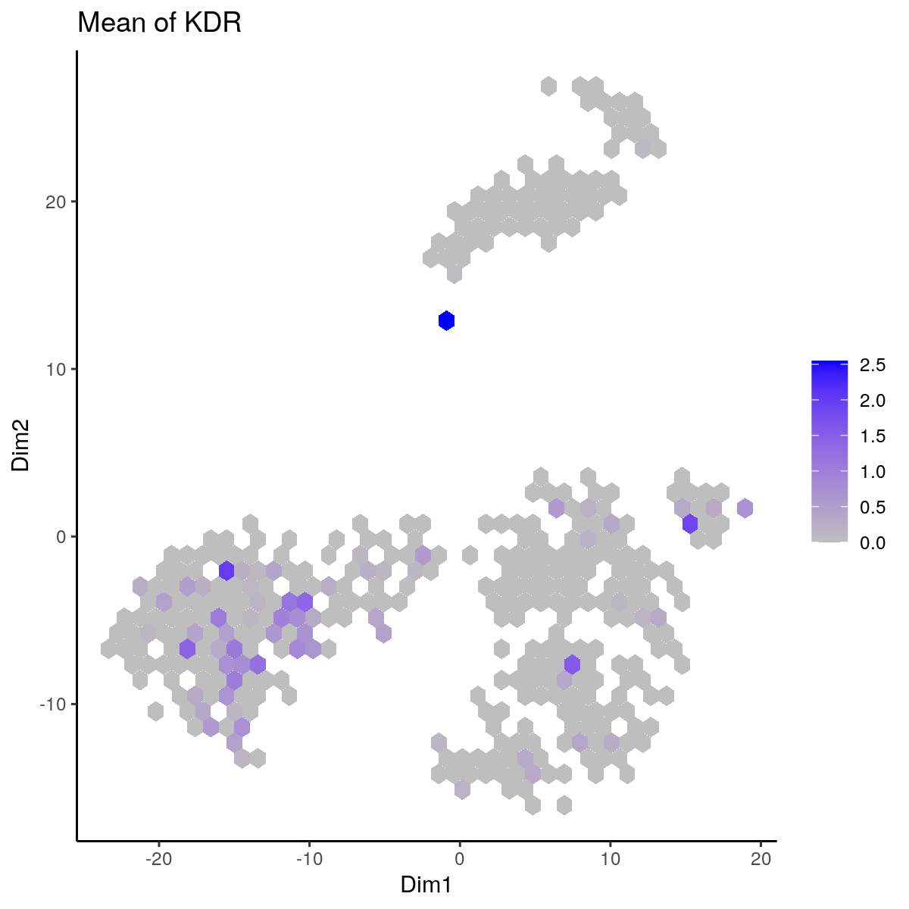|[VEGFC](https://www.ncbi.nlm.nih.gov/gene/7424) [PDGFC](https://www.ncbi.nlm.nih.gov/gene/56034) [VEGFA](https://www.ncbi.nlm.nih.gov/gene/7422)|
|[KEL](https://www.ncbi.nlm.nih.gov/gene/3792)|[EDN1](https://www.ncbi.nlm.nih.gov/gene/1906) [EDN2](https://www.ncbi.nlm.nih.gov/gene/1907) [EDN3](https://www.ncbi.nlm.nih.gov/gene/1908) [PIP](https://www.ncbi.nlm.nih.gov/gene/5304) [FGL2](https://www.ncbi.nlm.nih.gov/gene/10875)|
|[KIAA0319](https://www.ncbi.nlm.nih.gov/gene/9856)|[AVP](https://www.ncbi.nlm.nih.gov/gene/551) [EGFR](https://www.ncbi.nlm.nih.gov/gene/1956) [GPLD1](https://www.ncbi.nlm.nih.gov/gene/2822) [IL7R](https://www.ncbi.nlm.nih.gov/gene/3575) [TF](https://www.ncbi.nlm.nih.gov/gene/7018) [WNT5A](https://www.ncbi.nlm.nih.gov/gene/7474) [EPGN](https://www.ncbi.nlm.nih.gov/gene/255324)|
|[KIAA1324](https://www.ncbi.nlm.nih.gov/gene/57535) 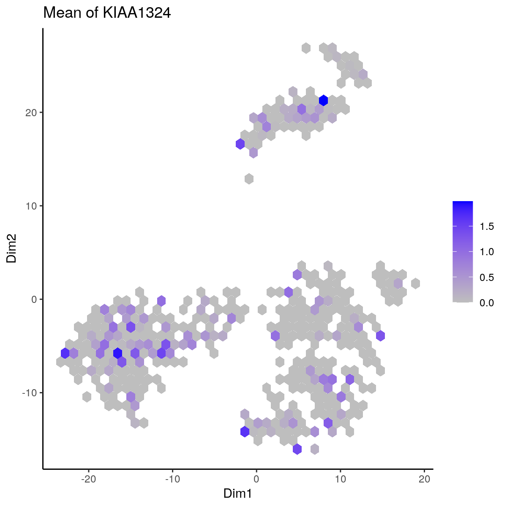|[TFF2](https://www.ncbi.nlm.nih.gov/gene/7032)|
|[KIR2DL1](https://www.ncbi.nlm.nih.gov/gene/3802)|[GZMA](https://www.ncbi.nlm.nih.gov/gene/3001) [IFNG](https://www.ncbi.nlm.nih.gov/gene/3458) [IL2](https://www.ncbi.nlm.nih.gov/gene/3558) [IL15](https://www.ncbi.nlm.nih.gov/gene/3600) [IL18](https://www.ncbi.nlm.nih.gov/gene/3606) [LTA](https://www.ncbi.nlm.nih.gov/gene/4049) [NCAM1](https://www.ncbi.nlm.nih.gov/gene/4684) [PRF1](https://www.ncbi.nlm.nih.gov/gene/5551) [PVR](https://www.ncbi.nlm.nih.gov/gene/5817) [TREM2](https://www.ncbi.nlm.nih.gov/gene/54209) [TREM1](https://www.ncbi.nlm.nih.gov/gene/54210)|
|[KIR2DL3](https://www.ncbi.nlm.nih.gov/gene/3804)|[GZMA](https://www.ncbi.nlm.nih.gov/gene/3001) [IFNG](https://www.ncbi.nlm.nih.gov/gene/3458) [IL2](https://www.ncbi.nlm.nih.gov/gene/3558) [IL15](https://www.ncbi.nlm.nih.gov/gene/3600) [IL18](https://www.ncbi.nlm.nih.gov/gene/3606) [NCAM1](https://www.ncbi.nlm.nih.gov/gene/4684) [PRF1](https://www.ncbi.nlm.nih.gov/gene/5551) [PVR](https://www.ncbi.nlm.nih.gov/gene/5817) [IFNL3](https://www.ncbi.nlm.nih.gov/gene/282617)|
|[KIR2DL4](https://www.ncbi.nlm.nih.gov/gene/3805)|[IL2](https://www.ncbi.nlm.nih.gov/gene/3558) [IL15](https://www.ncbi.nlm.nih.gov/gene/3600) [LAG3](https://www.ncbi.nlm.nih.gov/gene/3902) [LTA](https://www.ncbi.nlm.nih.gov/gene/4049) [NCAM1](https://www.ncbi.nlm.nih.gov/gene/4684) [PRF1](https://www.ncbi.nlm.nih.gov/gene/5551) [SDC4](https://www.ncbi.nlm.nih.gov/gene/6385) [GNLY](https://www.ncbi.nlm.nih.gov/gene/10578) [CD160](https://www.ncbi.nlm.nih.gov/gene/11126)|
|[KIR3DL1](https://www.ncbi.nlm.nih.gov/gene/3811)|[FCN1](https://www.ncbi.nlm.nih.gov/gene/2219) [FCN2](https://www.ncbi.nlm.nih.gov/gene/2220) [GZMA](https://www.ncbi.nlm.nih.gov/gene/3001) [IL2](https://www.ncbi.nlm.nih.gov/gene/3558) [IL15](https://www.ncbi.nlm.nih.gov/gene/3600) [IL18](https://www.ncbi.nlm.nih.gov/gene/3606) [LTA](https://www.ncbi.nlm.nih.gov/gene/4049) [NCAM1](https://www.ncbi.nlm.nih.gov/gene/4684) [PRF1](https://www.ncbi.nlm.nih.gov/gene/5551) [MASP1](https://www.ncbi.nlm.nih.gov/gene/5648) [PVR](https://www.ncbi.nlm.nih.gov/gene/5817) [FCN3](https://www.ncbi.nlm.nih.gov/gene/8547) [COLEC10](https://www.ncbi.nlm.nih.gov/gene/10584) [MASP2](https://www.ncbi.nlm.nih.gov/gene/10747) [COLEC11](https://www.ncbi.nlm.nih.gov/gene/78989)|
|[KIR3DL2](https://www.ncbi.nlm.nih.gov/gene/3812)|[CSF2](https://www.ncbi.nlm.nih.gov/gene/1437) [IGLL1](https://www.ncbi.nlm.nih.gov/gene/3543) [IL2](https://www.ncbi.nlm.nih.gov/gene/3558) [IL15](https://www.ncbi.nlm.nih.gov/gene/3600) [LTA](https://www.ncbi.nlm.nih.gov/gene/4049) [NCAM1](https://www.ncbi.nlm.nih.gov/gene/4684) [PRF1](https://www.ncbi.nlm.nih.gov/gene/5551) [TCN2](https://www.ncbi.nlm.nih.gov/gene/6948)|
|[KIRREL1](https://www.ncbi.nlm.nih.gov/gene/55243)|[CD5L](https://www.ncbi.nlm.nih.gov/gene/922) [COL12A1](https://www.ncbi.nlm.nih.gov/gene/1303) [FN1](https://www.ncbi.nlm.nih.gov/gene/2335) [LRRC17](https://www.ncbi.nlm.nih.gov/gene/10234) [FSTL1](https://www.ncbi.nlm.nih.gov/gene/11167) [ENDOD1](https://www.ncbi.nlm.nih.gov/gene/23052) [EGFLAM](https://www.ncbi.nlm.nih.gov/gene/133584)|
|[KIRREL2](https://www.ncbi.nlm.nih.gov/gene/84063)|[NRP1](https://www.ncbi.nlm.nih.gov/gene/8829) [SEMA3A](https://www.ncbi.nlm.nih.gov/gene/10371)|
|[KISS1R](https://www.ncbi.nlm.nih.gov/gene/84634)|[AGT](https://www.ncbi.nlm.nih.gov/gene/183) [AVP](https://www.ncbi.nlm.nih.gov/gene/551) [BMP7](https://www.ncbi.nlm.nih.gov/gene/655) [CCK](https://www.ncbi.nlm.nih.gov/gene/885) [EDN1](https://www.ncbi.nlm.nih.gov/gene/1906) [EDN2](https://www.ncbi.nlm.nih.gov/gene/1907) [EDN3](https://www.ncbi.nlm.nih.gov/gene/1908) [EGFR](https://www.ncbi.nlm.nih.gov/gene/1956) [F2](https://www.ncbi.nlm.nih.gov/gene/2147) [FGF8](https://www.ncbi.nlm.nih.gov/gene/2253) [FSHB](https://www.ncbi.nlm.nih.gov/gene/2488) [GAST](https://www.ncbi.nlm.nih.gov/gene/2520) [GCG](https://www.ncbi.nlm.nih.gov/gene/2641) [GNRH1](https://www.ncbi.nlm.nih.gov/gene/2796) [GNRH2](https://www.ncbi.nlm.nih.gov/gene/2797) [GRP](https://www.ncbi.nlm.nih.gov/gene/2922) [KISS1](https://www.ncbi.nlm.nih.gov/gene/3814) [LEP](https://www.ncbi.nlm.nih.gov/gene/3952) [LEPR](https://www.ncbi.nlm.nih.gov/gene/3953) [MLN](https://www.ncbi.nlm.nih.gov/gene/4295) [NMB](https://www.ncbi.nlm.nih.gov/gene/4828) [NPY](https://www.ncbi.nlm.nih.gov/gene/4852) [NTS](https://www.ncbi.nlm.nih.gov/gene/4922) [OXT](https://www.ncbi.nlm.nih.gov/gene/5020) [PDYN](https://www.ncbi.nlm.nih.gov/gene/5173) [PMCH](https://www.ncbi.nlm.nih.gov/gene/5367) [POMC](https://www.ncbi.nlm.nih.gov/gene/5443) [SAA1](https://www.ncbi.nlm.nih.gov/gene/6288) [XCL1](https://www.ncbi.nlm.nih.gov/gene/6375) [XCL2](https://www.ncbi.nlm.nih.gov/gene/6846) [TAC1](https://www.ncbi.nlm.nih.gov/gene/6863) [TAC3](https://www.ncbi.nlm.nih.gov/gene/6866) [TRH](https://www.ncbi.nlm.nih.gov/gene/7200) [NPFF](https://www.ncbi.nlm.nih.gov/gene/8620) [FGF17](https://www.ncbi.nlm.nih.gov/gene/8822) [SEMA3A](https://www.ncbi.nlm.nih.gov/gene/10371) [NMU](https://www.ncbi.nlm.nih.gov/gene/10874) [UTS2](https://www.ncbi.nlm.nih.gov/gene/10911) [PRLH](https://www.ncbi.nlm.nih.gov/gene/51052) [GAL](https://www.ncbi.nlm.nih.gov/gene/51083) [RETN](https://www.ncbi.nlm.nih.gov/gene/56729) [PROK2](https://www.ncbi.nlm.nih.gov/gene/60675) [NPVF](https://www.ncbi.nlm.nih.gov/gene/64111) [PROK1](https://www.ncbi.nlm.nih.gov/gene/84432) [GPHB5](https://www.ncbi.nlm.nih.gov/gene/122876) [NMS](https://www.ncbi.nlm.nih.gov/gene/129521) [UTS2B](https://www.ncbi.nlm.nih.gov/gene/257313) [QRFP](https://www.ncbi.nlm.nih.gov/gene/347148) [NPS](https://www.ncbi.nlm.nih.gov/gene/594857)|
|[KIT](https://www.ncbi.nlm.nih.gov/gene/3815)|[KITLG](https://www.ncbi.nlm.nih.gov/gene/4254)|
|[KLB](https://www.ncbi.nlm.nih.gov/gene/152831)|[FGF1](https://www.ncbi.nlm.nih.gov/gene/2246) [FGF2](https://www.ncbi.nlm.nih.gov/gene/2247) [FGF4](https://www.ncbi.nlm.nih.gov/gene/2249) [FGF6](https://www.ncbi.nlm.nih.gov/gene/2251) [FGF9](https://www.ncbi.nlm.nih.gov/gene/2254) [FGFR3](https://www.ncbi.nlm.nih.gov/gene/2261) [FGFR2](https://www.ncbi.nlm.nih.gov/gene/2263) [FGFR4](https://www.ncbi.nlm.nih.gov/gene/2264) [INS](https://www.ncbi.nlm.nih.gov/gene/3630) [FGF23](https://www.ncbi.nlm.nih.gov/gene/8074) [FGF18](https://www.ncbi.nlm.nih.gov/gene/8817) [FGF16](https://www.ncbi.nlm.nih.gov/gene/8823) [ADIPOQ](https://www.ncbi.nlm.nih.gov/gene/9370) [FGF19](https://www.ncbi.nlm.nih.gov/gene/9965) [FGF20](https://www.ncbi.nlm.nih.gov/gene/26281) [FGF21](https://www.ncbi.nlm.nih.gov/gene/26291)|
|[KLRC4-KLRK1](https://www.ncbi.nlm.nih.gov/gene/100528032)|[FAS](https://www.ncbi.nlm.nih.gov/gene/355) [CD40](https://www.ncbi.nlm.nih.gov/gene/958) [CD40LG](https://www.ncbi.nlm.nih.gov/gene/959) [CSF2](https://www.ncbi.nlm.nih.gov/gene/1437) [GZMA](https://www.ncbi.nlm.nih.gov/gene/3001) [IFNG](https://www.ncbi.nlm.nih.gov/gene/3458) [IL2](https://www.ncbi.nlm.nih.gov/gene/3558) [IL4](https://www.ncbi.nlm.nih.gov/gene/3565) [IL5](https://www.ncbi.nlm.nih.gov/gene/3567) [IL6](https://www.ncbi.nlm.nih.gov/gene/3569) [IL7](https://www.ncbi.nlm.nih.gov/gene/3574) [IL7R](https://www.ncbi.nlm.nih.gov/gene/3575) [CXCL8](https://www.ncbi.nlm.nih.gov/gene/3576) [IL10](https://www.ncbi.nlm.nih.gov/gene/3586) [IL13](https://www.ncbi.nlm.nih.gov/gene/3596) [IL15](https://www.ncbi.nlm.nih.gov/gene/3600) [IL18](https://www.ncbi.nlm.nih.gov/gene/3606) [CXCL10](https://www.ncbi.nlm.nih.gov/gene/3627) [LAG3](https://www.ncbi.nlm.nih.gov/gene/3902) [LTA](https://www.ncbi.nlm.nih.gov/gene/4049) [CXCL9](https://www.ncbi.nlm.nih.gov/gene/4283) [NCAM1](https://www.ncbi.nlm.nih.gov/gene/4684) [PRF1](https://www.ncbi.nlm.nih.gov/gene/5551) [PVR](https://www.ncbi.nlm.nih.gov/gene/5817) [CCL2](https://www.ncbi.nlm.nih.gov/gene/6347) [CCL3](https://www.ncbi.nlm.nih.gov/gene/6348) [CCL5](https://www.ncbi.nlm.nih.gov/gene/6352) [TGFB1](https://www.ncbi.nlm.nih.gov/gene/7040) [TNF](https://www.ncbi.nlm.nih.gov/gene/7124) [CARTPT](https://www.ncbi.nlm.nih.gov/gene/9607) [GNLY](https://www.ncbi.nlm.nih.gov/gene/10578) [LILRB1](https://www.ncbi.nlm.nih.gov/gene/10859) [CD160](https://www.ncbi.nlm.nih.gov/gene/11126) [RAET1E](https://www.ncbi.nlm.nih.gov/gene/135250) [RAET1G](https://www.ncbi.nlm.nih.gov/gene/353091)|
|[KLRD1](https://www.ncbi.nlm.nih.gov/gene/3824)|[CD8A](https://www.ncbi.nlm.nih.gov/gene/925) [CSF2](https://www.ncbi.nlm.nih.gov/gene/1437) [GZMA](https://www.ncbi.nlm.nih.gov/gene/3001) [GZMK](https://www.ncbi.nlm.nih.gov/gene/3003) [IFNG](https://www.ncbi.nlm.nih.gov/gene/3458) [IL2](https://www.ncbi.nlm.nih.gov/gene/3558) [IL4](https://www.ncbi.nlm.nih.gov/gene/3565) [IL7](https://www.ncbi.nlm.nih.gov/gene/3574) [IL7R](https://www.ncbi.nlm.nih.gov/gene/3575) [IL10](https://www.ncbi.nlm.nih.gov/gene/3586) [IL15](https://www.ncbi.nlm.nih.gov/gene/3600) [IL18](https://www.ncbi.nlm.nih.gov/gene/3606) [LAG3](https://www.ncbi.nlm.nih.gov/gene/3902) [NCAM1](https://www.ncbi.nlm.nih.gov/gene/4684) [PRF1](https://www.ncbi.nlm.nih.gov/gene/5551) [PVR](https://www.ncbi.nlm.nih.gov/gene/5817) [CCL5](https://www.ncbi.nlm.nih.gov/gene/6352) [TNF](https://www.ncbi.nlm.nih.gov/gene/7124) [GNLY](https://www.ncbi.nlm.nih.gov/gene/10578) [LILRB1](https://www.ncbi.nlm.nih.gov/gene/10859) [CD160](https://www.ncbi.nlm.nih.gov/gene/11126) [TREM2](https://www.ncbi.nlm.nih.gov/gene/54209) [LILRA5](https://www.ncbi.nlm.nih.gov/gene/353514)|
|[KLRG1](https://www.ncbi.nlm.nih.gov/gene/10219)|[CD8A](https://www.ncbi.nlm.nih.gov/gene/925) [GZMA](https://www.ncbi.nlm.nih.gov/gene/3001) [GZMK](https://www.ncbi.nlm.nih.gov/gene/3003) [IFNG](https://www.ncbi.nlm.nih.gov/gene/3458) [IL2](https://www.ncbi.nlm.nih.gov/gene/3558) [IL4](https://www.ncbi.nlm.nih.gov/gene/3565) [IL5](https://www.ncbi.nlm.nih.gov/gene/3567) [IL7](https://www.ncbi.nlm.nih.gov/gene/3574) [IL7R](https://www.ncbi.nlm.nih.gov/gene/3575) [IL10](https://www.ncbi.nlm.nih.gov/gene/3586) [IL13](https://www.ncbi.nlm.nih.gov/gene/3596) [IL15](https://www.ncbi.nlm.nih.gov/gene/3600) [LAG3](https://www.ncbi.nlm.nih.gov/gene/3902) [NCAM1](https://www.ncbi.nlm.nih.gov/gene/4684) [PRF1](https://www.ncbi.nlm.nih.gov/gene/5551) [TNF](https://www.ncbi.nlm.nih.gov/gene/7124) [TNFRSF18](https://www.ncbi.nlm.nih.gov/gene/8784) [IL1RL1](https://www.ncbi.nlm.nih.gov/gene/9173) [FCMR](https://www.ncbi.nlm.nih.gov/gene/9214) [CCL27](https://www.ncbi.nlm.nih.gov/gene/10850) [CD160](https://www.ncbi.nlm.nih.gov/gene/11126) [ICOS](https://www.ncbi.nlm.nih.gov/gene/29851) [PILRA](https://www.ncbi.nlm.nih.gov/gene/29992)|
|[KRAS](https://www.ncbi.nlm.nih.gov/gene/3845)|[ALB](https://www.ncbi.nlm.nih.gov/gene/213) [ANGPT1](https://www.ncbi.nlm.nih.gov/gene/284) [BDNF](https://www.ncbi.nlm.nih.gov/gene/627) [BMP3](https://www.ncbi.nlm.nih.gov/gene/651) [BMP4](https://www.ncbi.nlm.nih.gov/gene/652) [BTC](https://www.ncbi.nlm.nih.gov/gene/685) [CSF2](https://www.ncbi.nlm.nih.gov/gene/1437) [CSF2RA](https://www.ncbi.nlm.nih.gov/gene/1438) [CCN2](https://www.ncbi.nlm.nih.gov/gene/1490) [EGFR](https://www.ncbi.nlm.nih.gov/gene/1956) [EPHA3](https://www.ncbi.nlm.nih.gov/gene/2042) [ERBB3](https://www.ncbi.nlm.nih.gov/gene/2065) [FGB](https://www.ncbi.nlm.nih.gov/gene/2244) [FGF1](https://www.ncbi.nlm.nih.gov/gene/2246) [FGF2](https://www.ncbi.nlm.nih.gov/gene/2247) [FGF3](https://www.ncbi.nlm.nih.gov/gene/2248) [FGF4](https://www.ncbi.nlm.nih.gov/gene/2249) [FGF6](https://www.ncbi.nlm.nih.gov/gene/2251) [FGF7](https://www.ncbi.nlm.nih.gov/gene/2252) [FGF9](https://www.ncbi.nlm.nih.gov/gene/2254) [FGF10](https://www.ncbi.nlm.nih.gov/gene/2255) [FGFR3](https://www.ncbi.nlm.nih.gov/gene/2261) [FGFR2](https://www.ncbi.nlm.nih.gov/gene/2263) [FGFR4](https://www.ncbi.nlm.nih.gov/gene/2264) [FGG](https://www.ncbi.nlm.nih.gov/gene/2266) [FLT1](https://www.ncbi.nlm.nih.gov/gene/2321) [FLT3LG](https://www.ncbi.nlm.nih.gov/gene/2323) [FLT4](https://www.ncbi.nlm.nih.gov/gene/2324) [FN1](https://www.ncbi.nlm.nih.gov/gene/2335) [GAST](https://www.ncbi.nlm.nih.gov/gene/2520) [GDNF](https://www.ncbi.nlm.nih.gov/gene/2668) [SFN](https://www.ncbi.nlm.nih.gov/gene/2810) [CXCL1](https://www.ncbi.nlm.nih.gov/gene/2919) [IGF1](https://www.ncbi.nlm.nih.gov/gene/3479) [IGF2](https://www.ncbi.nlm.nih.gov/gene/3481) [IGFBP3](https://www.ncbi.nlm.nih.gov/gene/3486) [IL2](https://www.ncbi.nlm.nih.gov/gene/3558) [IL3](https://www.ncbi.nlm.nih.gov/gene/3562) [IL5](https://www.ncbi.nlm.nih.gov/gene/3567) [IL6](https://www.ncbi.nlm.nih.gov/gene/3569) [CXCL8](https://www.ncbi.nlm.nih.gov/gene/3576) [INS](https://www.ncbi.nlm.nih.gov/gene/3630) [KDR](https://www.ncbi.nlm.nih.gov/gene/3791) [LGALS3](https://www.ncbi.nlm.nih.gov/gene/3958) [LOX](https://www.ncbi.nlm.nih.gov/gene/4015) [MDK](https://www.ncbi.nlm.nih.gov/gene/4192) [MET](https://www.ncbi.nlm.nih.gov/gene/4233) [MMP7](https://www.ncbi.nlm.nih.gov/gene/4316) [MMP9](https://www.ncbi.nlm.nih.gov/gene/4318) [MUC1](https://www.ncbi.nlm.nih.gov/gene/4582) [MUC4](https://www.ncbi.nlm.nih.gov/gene/4585) [MUC5AC](https://www.ncbi.nlm.nih.gov/gene/4586) [MUC6](https://www.ncbi.nlm.nih.gov/gene/4588) [NCAM1](https://www.ncbi.nlm.nih.gov/gene/4684) [NGF](https://www.ncbi.nlm.nih.gov/gene/4803) [NRTN](https://www.ncbi.nlm.nih.gov/gene/4902) [NTF3](https://www.ncbi.nlm.nih.gov/gene/4908) [NTF4](https://www.ncbi.nlm.nih.gov/gene/4909) [PDGFB](https://www.ncbi.nlm.nih.gov/gene/5155) [PI3](https://www.ncbi.nlm.nih.gov/gene/5266) [PRH1](https://www.ncbi.nlm.nih.gov/gene/5554) [PSPN](https://www.ncbi.nlm.nih.gov/gene/5623) [PTEN](https://www.ncbi.nlm.nih.gov/gene/5728) [SFTPC](https://www.ncbi.nlm.nih.gov/gene/6440) [TIMP3](https://www.ncbi.nlm.nih.gov/gene/7078) [TNF](https://www.ncbi.nlm.nih.gov/gene/7124) [SCGB1A1](https://www.ncbi.nlm.nih.gov/gene/7356) [VEGFA](https://www.ncbi.nlm.nih.gov/gene/7422) [VWF](https://www.ncbi.nlm.nih.gov/gene/7450) [WNT1](https://www.ncbi.nlm.nih.gov/gene/7471) [WNT2](https://www.ncbi.nlm.nih.gov/gene/7472) [FGF23](https://www.ncbi.nlm.nih.gov/gene/8074) [CREG1](https://www.ncbi.nlm.nih.gov/gene/8804) [FGF18](https://www.ncbi.nlm.nih.gov/gene/8817) [FGF16](https://www.ncbi.nlm.nih.gov/gene/8823) [ARTN](https://www.ncbi.nlm.nih.gov/gene/9048) [NAPSA](https://www.ncbi.nlm.nih.gov/gene/9476) [NRG2](https://www.ncbi.nlm.nih.gov/gene/9542) [FGF19](https://www.ncbi.nlm.nih.gov/gene/9965) [MSLN](https://www.ncbi.nlm.nih.gov/gene/10232) [NRG3](https://www.ncbi.nlm.nih.gov/gene/10718) [FGF20](https://www.ncbi.nlm.nih.gov/gene/26281) [FGF22](https://www.ncbi.nlm.nih.gov/gene/27006) [CD209](https://www.ncbi.nlm.nih.gov/gene/30835) [GFRA4](https://www.ncbi.nlm.nih.gov/gene/64096) [NRG4](https://www.ncbi.nlm.nih.gov/gene/145957) [MUC20](https://www.ncbi.nlm.nih.gov/gene/200958) [PCSK9](https://www.ncbi.nlm.nih.gov/gene/255738)|
|[KREMEN1](https://www.ncbi.nlm.nih.gov/gene/83999)|[FRZB](https://www.ncbi.nlm.nih.gov/gene/2487) [SFRP1](https://www.ncbi.nlm.nih.gov/gene/6422) [SFRP2](https://www.ncbi.nlm.nih.gov/gene/6423) [SFRP4](https://www.ncbi.nlm.nih.gov/gene/6424) [SFRP5](https://www.ncbi.nlm.nih.gov/gene/6425) [WNT1](https://www.ncbi.nlm.nih.gov/gene/7471) [WNT2](https://www.ncbi.nlm.nih.gov/gene/7472) [WNT8A](https://www.ncbi.nlm.nih.gov/gene/7478) [WNT8B](https://www.ncbi.nlm.nih.gov/gene/7479) [WIF1](https://www.ncbi.nlm.nih.gov/gene/11197) [DKK1](https://www.ncbi.nlm.nih.gov/gene/22943) [DKKL1](https://www.ncbi.nlm.nih.gov/gene/27120) [DKK4](https://www.ncbi.nlm.nih.gov/gene/27121) [DKK3](https://www.ncbi.nlm.nih.gov/gene/27122) [DKK2](https://www.ncbi.nlm.nih.gov/gene/27123) [SOST](https://www.ncbi.nlm.nih.gov/gene/50964) [WNT4](https://www.ncbi.nlm.nih.gov/gene/54361) [RSPO3](https://www.ncbi.nlm.nih.gov/gene/84870) [WNT3A](https://www.ncbi.nlm.nih.gov/gene/89780) [RSPO1](https://www.ncbi.nlm.nih.gov/gene/284654)|
|[KRIT1](https://www.ncbi.nlm.nih.gov/gene/889)|[VEGFA](https://www.ncbi.nlm.nih.gov/gene/7422) [HEG1](https://www.ncbi.nlm.nih.gov/gene/57493)|
|[KRT1](https://www.ncbi.nlm.nih.gov/gene/3848)|[CDSN](https://www.ncbi.nlm.nih.gov/gene/1041) [EGFR](https://www.ncbi.nlm.nih.gov/gene/1956) [F12](https://www.ncbi.nlm.nih.gov/gene/2161) [FGF7](https://www.ncbi.nlm.nih.gov/gene/2252) [KLKB1](https://www.ncbi.nlm.nih.gov/gene/3818) [KRT10](https://www.ncbi.nlm.nih.gov/gene/3858) [MBL2](https://www.ncbi.nlm.nih.gov/gene/4153) [PRSS1](https://www.ncbi.nlm.nih.gov/gene/5644) [KLK4](https://www.ncbi.nlm.nih.gov/gene/9622)|
|[L1CAM](https://www.ncbi.nlm.nih.gov/gene/3897)|[ALB](https://www.ncbi.nlm.nih.gov/gene/213) [ALCAM](https://www.ncbi.nlm.nih.gov/gene/214) [NCAN](https://www.ncbi.nlm.nih.gov/gene/1463) [EGFR](https://www.ncbi.nlm.nih.gov/gene/1956) [ERBB3](https://www.ncbi.nlm.nih.gov/gene/2065) [F8](https://www.ncbi.nlm.nih.gov/gene/2157) [F9](https://www.ncbi.nlm.nih.gov/gene/2158) [LAMB1](https://www.ncbi.nlm.nih.gov/gene/3912) [LAMC1](https://www.ncbi.nlm.nih.gov/gene/3915) [NCAM1](https://www.ncbi.nlm.nih.gov/gene/4684) [PTPRZ1](https://www.ncbi.nlm.nih.gov/gene/5803) [NRP1](https://www.ncbi.nlm.nih.gov/gene/8829) [CARTPT](https://www.ncbi.nlm.nih.gov/gene/9607) [LAMA1](https://www.ncbi.nlm.nih.gov/gene/284217)|
|[LAIR1](https://www.ncbi.nlm.nih.gov/gene/3903)|[FCAR](https://www.ncbi.nlm.nih.gov/gene/2204) [PLAU](https://www.ncbi.nlm.nih.gov/gene/5328) [PLAUR](https://www.ncbi.nlm.nih.gov/gene/5329) [TNFRSF1B](https://www.ncbi.nlm.nih.gov/gene/7133) [PILRA](https://www.ncbi.nlm.nih.gov/gene/29992)|
|[LAMP1](https://www.ncbi.nlm.nih.gov/gene/3916)|[ALB](https://www.ncbi.nlm.nih.gov/gene/213) [AMELX](https://www.ncbi.nlm.nih.gov/gene/265) [AMELY](https://www.ncbi.nlm.nih.gov/gene/266) [FAS](https://www.ncbi.nlm.nih.gov/gene/355) [CD8A](https://www.ncbi.nlm.nih.gov/gene/925) [CD40](https://www.ncbi.nlm.nih.gov/gene/958) [CD40LG](https://www.ncbi.nlm.nih.gov/gene/959) [CSF2](https://www.ncbi.nlm.nih.gov/gene/1437) [CTSD](https://www.ncbi.nlm.nih.gov/gene/1509) [EGFR](https://www.ncbi.nlm.nih.gov/gene/1956) [GAS6](https://www.ncbi.nlm.nih.gov/gene/2621) [GRN](https://www.ncbi.nlm.nih.gov/gene/2896) [GZMA](https://www.ncbi.nlm.nih.gov/gene/3001) [IFNG](https://www.ncbi.nlm.nih.gov/gene/3458) [IL2](https://www.ncbi.nlm.nih.gov/gene/3558) [IL4](https://www.ncbi.nlm.nih.gov/gene/3565) [IL6](https://www.ncbi.nlm.nih.gov/gene/3569) [IL7](https://www.ncbi.nlm.nih.gov/gene/3574) [IL7R](https://www.ncbi.nlm.nih.gov/gene/3575) [IL10](https://www.ncbi.nlm.nih.gov/gene/3586) [IL15](https://www.ncbi.nlm.nih.gov/gene/3600) [IL18](https://www.ncbi.nlm.nih.gov/gene/3606) [ITIH4](https://www.ncbi.nlm.nih.gov/gene/3700) [LAG3](https://www.ncbi.nlm.nih.gov/gene/3902) [LGALS3](https://www.ncbi.nlm.nih.gov/gene/3958) [NCAM1](https://www.ncbi.nlm.nih.gov/gene/4684) [PIGR](https://www.ncbi.nlm.nih.gov/gene/5284) [PRF1](https://www.ncbi.nlm.nih.gov/gene/5551) [PSAP](https://www.ncbi.nlm.nih.gov/gene/5660) [PVR](https://www.ncbi.nlm.nih.gov/gene/5817) [PMEL](https://www.ncbi.nlm.nih.gov/gene/6490) [TNF](https://www.ncbi.nlm.nih.gov/gene/7124) [NPC2](https://www.ncbi.nlm.nih.gov/gene/10577) [LILRB1](https://www.ncbi.nlm.nih.gov/gene/10859) [CD160](https://www.ncbi.nlm.nih.gov/gene/11126) [CD209](https://www.ncbi.nlm.nih.gov/gene/30835) [CCL4L1](https://www.ncbi.nlm.nih.gov/gene/388372)|
|[LAMP2](https://www.ncbi.nlm.nih.gov/gene/3920)|[ALB](https://www.ncbi.nlm.nih.gov/gene/213) [COL4A5](https://www.ncbi.nlm.nih.gov/gene/1287) [CTSD](https://www.ncbi.nlm.nih.gov/gene/1509) [LGALS3](https://www.ncbi.nlm.nih.gov/gene/3958) [PIGR](https://www.ncbi.nlm.nih.gov/gene/5284) [PRF1](https://www.ncbi.nlm.nih.gov/gene/5551) [PSAP](https://www.ncbi.nlm.nih.gov/gene/5660) [PMEL](https://www.ncbi.nlm.nih.gov/gene/6490) [TNF](https://www.ncbi.nlm.nih.gov/gene/7124) [NPC2](https://www.ncbi.nlm.nih.gov/gene/10577) [IL22](https://www.ncbi.nlm.nih.gov/gene/50616)|
|[LAMP5](https://www.ncbi.nlm.nih.gov/gene/24141)|[CBLN2](https://www.ncbi.nlm.nih.gov/gene/147381)|
|[LAT](https://www.ncbi.nlm.nih.gov/gene/27040)|[CD8A](https://www.ncbi.nlm.nih.gov/gene/925) [CD8B](https://www.ncbi.nlm.nih.gov/gene/926) [EGFR](https://www.ncbi.nlm.nih.gov/gene/1956) [IL2](https://www.ncbi.nlm.nih.gov/gene/3558)|
|[LAT2](https://www.ncbi.nlm.nih.gov/gene/7462)|[IGLL5](https://www.ncbi.nlm.nih.gov/gene/100423062)|
|[LAX1](https://www.ncbi.nlm.nih.gov/gene/54900)|[ELSPBP1](https://www.ncbi.nlm.nih.gov/gene/64100)|
|[LCT](https://www.ncbi.nlm.nih.gov/gene/3938)|[AOC1](https://www.ncbi.nlm.nih.gov/gene/26) [ALB](https://www.ncbi.nlm.nih.gov/gene/213) [AMY1A](https://www.ncbi.nlm.nih.gov/gene/276) [AMY2A](https://www.ncbi.nlm.nih.gov/gene/279) [FGFR4](https://www.ncbi.nlm.nih.gov/gene/2264) [INS](https://www.ncbi.nlm.nih.gov/gene/3630) [LALBA](https://www.ncbi.nlm.nih.gov/gene/3906) [LEP](https://www.ncbi.nlm.nih.gov/gene/3952) [LEPR](https://www.ncbi.nlm.nih.gov/gene/3953) [MUC4](https://www.ncbi.nlm.nih.gov/gene/4585) [TFF3](https://www.ncbi.nlm.nih.gov/gene/7033) [CRLF1](https://www.ncbi.nlm.nih.gov/gene/9244)|
|[LDLR](https://www.ncbi.nlm.nih.gov/gene/3949)|[A2M](https://www.ncbi.nlm.nih.gov/gene/2) [AGT](https://www.ncbi.nlm.nih.gov/gene/183) [ALB](https://www.ncbi.nlm.nih.gov/gene/213) [APOF](https://www.ncbi.nlm.nih.gov/gene/319) [APOA1](https://www.ncbi.nlm.nih.gov/gene/335) [APOA2](https://www.ncbi.nlm.nih.gov/gene/336) [APOC1](https://www.ncbi.nlm.nih.gov/gene/341) [APOC2](https://www.ncbi.nlm.nih.gov/gene/344) [APOC3](https://www.ncbi.nlm.nih.gov/gene/345) [APOC4](https://www.ncbi.nlm.nih.gov/gene/346) [APOE](https://www.ncbi.nlm.nih.gov/gene/348) [APOH](https://www.ncbi.nlm.nih.gov/gene/350) [AVP](https://www.ncbi.nlm.nih.gov/gene/551) [C1QA](https://www.ncbi.nlm.nih.gov/gene/712) [CETP](https://www.ncbi.nlm.nih.gov/gene/1071) [CRP](https://www.ncbi.nlm.nih.gov/gene/1401) [EGFR](https://www.ncbi.nlm.nih.gov/gene/1956) [ELN](https://www.ncbi.nlm.nih.gov/gene/2006) [F8](https://www.ncbi.nlm.nih.gov/gene/2157) [FLT1](https://www.ncbi.nlm.nih.gov/gene/2321) [FN1](https://www.ncbi.nlm.nih.gov/gene/2335) [FRZB](https://www.ncbi.nlm.nih.gov/gene/2487) [CBLIF](https://www.ncbi.nlm.nih.gov/gene/2694) [HGFAC](https://www.ncbi.nlm.nih.gov/gene/3083) [HP](https://www.ncbi.nlm.nih.gov/gene/3240) [HPR](https://www.ncbi.nlm.nih.gov/gene/3250) [IL6](https://www.ncbi.nlm.nih.gov/gene/3569) [IL7R](https://www.ncbi.nlm.nih.gov/gene/3575) [IL10](https://www.ncbi.nlm.nih.gov/gene/3586) [INS](https://www.ncbi.nlm.nih.gov/gene/3630) [LCAT](https://www.ncbi.nlm.nih.gov/gene/3931) [LEP](https://www.ncbi.nlm.nih.gov/gene/3952) [LIPC](https://www.ncbi.nlm.nih.gov/gene/3990) [MMP9](https://www.ncbi.nlm.nih.gov/gene/4318) [OSM](https://www.ncbi.nlm.nih.gov/gene/5008) [SERPINE1](https://www.ncbi.nlm.nih.gov/gene/5054) [PF4](https://www.ncbi.nlm.nih.gov/gene/5196) [PLAT](https://www.ncbi.nlm.nih.gov/gene/5327) [PLAU](https://www.ncbi.nlm.nih.gov/gene/5328) [PLAUR](https://www.ncbi.nlm.nih.gov/gene/5329) [PLG](https://www.ncbi.nlm.nih.gov/gene/5340) [PLTP](https://www.ncbi.nlm.nih.gov/gene/5360) [PON1](https://www.ncbi.nlm.nih.gov/gene/5444) [PON3](https://www.ncbi.nlm.nih.gov/gene/5446) [RELN](https://www.ncbi.nlm.nih.gov/gene/5649) [SAA1](https://www.ncbi.nlm.nih.gov/gene/6288) [SAA2](https://www.ncbi.nlm.nih.gov/gene/6289) [SAA4](https://www.ncbi.nlm.nih.gov/gene/6291) [CCL2](https://www.ncbi.nlm.nih.gov/gene/6347) [SPINT1](https://www.ncbi.nlm.nih.gov/gene/6692) [TF](https://www.ncbi.nlm.nih.gov/gene/7018) [TNF](https://www.ncbi.nlm.nih.gov/gene/7124) [VEGFA](https://www.ncbi.nlm.nih.gov/gene/7422) [WNT1](https://www.ncbi.nlm.nih.gov/gene/7471) [WNT2](https://www.ncbi.nlm.nih.gov/gene/7472) [WNT3](https://www.ncbi.nlm.nih.gov/gene/7473) [WNT5A](https://www.ncbi.nlm.nih.gov/gene/7474) [WNT6](https://www.ncbi.nlm.nih.gov/gene/7475) [WNT7A](https://www.ncbi.nlm.nih.gov/gene/7476) [WNT7B](https://www.ncbi.nlm.nih.gov/gene/7477) [WNT10B](https://www.ncbi.nlm.nih.gov/gene/7480) [WNT11](https://www.ncbi.nlm.nih.gov/gene/7481) [WNT2B](https://www.ncbi.nlm.nih.gov/gene/7482) [WNT9A](https://www.ncbi.nlm.nih.gov/gene/7483) [WNT9B](https://www.ncbi.nlm.nih.gov/gene/7484) [PLA2G7](https://www.ncbi.nlm.nih.gov/gene/7941) [APOL1](https://www.ncbi.nlm.nih.gov/gene/8542) [ADIPOQ](https://www.ncbi.nlm.nih.gov/gene/9370) [LIPG](https://www.ncbi.nlm.nih.gov/gene/9388) [NPC2](https://www.ncbi.nlm.nih.gov/gene/10577) [DKK1](https://www.ncbi.nlm.nih.gov/gene/22943) [ANGPTL3](https://www.ncbi.nlm.nih.gov/gene/27329) [SOST](https://www.ncbi.nlm.nih.gov/gene/50964) [WNT4](https://www.ncbi.nlm.nih.gov/gene/54361) [APOM](https://www.ncbi.nlm.nih.gov/gene/55937) [WNT10A](https://www.ncbi.nlm.nih.gov/gene/80326) [WNT5B](https://www.ncbi.nlm.nih.gov/gene/81029) [WNT3A](https://www.ncbi.nlm.nih.gov/gene/89780) [APOA5](https://www.ncbi.nlm.nih.gov/gene/116519) [PCSK9](https://www.ncbi.nlm.nih.gov/gene/255738)|
|[LDLRAD3](https://www.ncbi.nlm.nih.gov/gene/143458)|[FJX1](https://www.ncbi.nlm.nih.gov/gene/24147) [PAMR1](https://www.ncbi.nlm.nih.gov/gene/25891)|
|[LEPR](https://www.ncbi.nlm.nih.gov/gene/3953)|[LEP](https://www.ncbi.nlm.nih.gov/gene/3952)|
|[LGR4](https://www.ncbi.nlm.nih.gov/gene/55366)|[BDNF](https://www.ncbi.nlm.nih.gov/gene/627) [BMP2](https://www.ncbi.nlm.nih.gov/gene/650) [PRLR](https://www.ncbi.nlm.nih.gov/gene/5618) [WNT2](https://www.ncbi.nlm.nih.gov/gene/7472) [WNT3](https://www.ncbi.nlm.nih.gov/gene/7473) [WNT5A](https://www.ncbi.nlm.nih.gov/gene/7474) [OLFM4](https://www.ncbi.nlm.nih.gov/gene/10562) [DKK1](https://www.ncbi.nlm.nih.gov/gene/22943) [PLA2G2D](https://www.ncbi.nlm.nih.gov/gene/26279) [WNT4](https://www.ncbi.nlm.nih.gov/gene/54361) [RSPO3](https://www.ncbi.nlm.nih.gov/gene/84870) [WNT3A](https://www.ncbi.nlm.nih.gov/gene/89780) [RSPO1](https://www.ncbi.nlm.nih.gov/gene/284654) [RSPO2](https://www.ncbi.nlm.nih.gov/gene/340419) [RSPO4](https://www.ncbi.nlm.nih.gov/gene/343637)|
|[LGR5](https://www.ncbi.nlm.nih.gov/gene/8549)|[ALCAM](https://www.ncbi.nlm.nih.gov/gene/214) [BMP4](https://www.ncbi.nlm.nih.gov/gene/652) [CGB3](https://www.ncbi.nlm.nih.gov/gene/1082) [CHGA](https://www.ncbi.nlm.nih.gov/gene/1113) [EGFR](https://www.ncbi.nlm.nih.gov/gene/1956) [GAST](https://www.ncbi.nlm.nih.gov/gene/2520) [MMP7](https://www.ncbi.nlm.nih.gov/gene/4316) [TFF2](https://www.ncbi.nlm.nih.gov/gene/7032) [VEGFA](https://www.ncbi.nlm.nih.gov/gene/7422) [WNT1](https://www.ncbi.nlm.nih.gov/gene/7471) [WNT2](https://www.ncbi.nlm.nih.gov/gene/7472) [WNT3](https://www.ncbi.nlm.nih.gov/gene/7473) [WNT5A](https://www.ncbi.nlm.nih.gov/gene/7474) [WNT2B](https://www.ncbi.nlm.nih.gov/gene/7482) [NOG](https://www.ncbi.nlm.nih.gov/gene/9241) [OLFM4](https://www.ncbi.nlm.nih.gov/gene/10562) [DKK1](https://www.ncbi.nlm.nih.gov/gene/22943) [WNT4](https://www.ncbi.nlm.nih.gov/gene/54361) [ADAMTS9](https://www.ncbi.nlm.nih.gov/gene/56999) [SMOC2](https://www.ncbi.nlm.nih.gov/gene/64094) [P3H1](https://www.ncbi.nlm.nih.gov/gene/64175) [REG4](https://www.ncbi.nlm.nih.gov/gene/83998) [RSPO3](https://www.ncbi.nlm.nih.gov/gene/84870) [WNT3A](https://www.ncbi.nlm.nih.gov/gene/89780) [RSPO1](https://www.ncbi.nlm.nih.gov/gene/284654) [RSPO2](https://www.ncbi.nlm.nih.gov/gene/340419) [RSPO4](https://www.ncbi.nlm.nih.gov/gene/343637)|
|[LGR6](https://www.ncbi.nlm.nih.gov/gene/59352)|[RLN1](https://www.ncbi.nlm.nih.gov/gene/6013) [OLFM4](https://www.ncbi.nlm.nih.gov/gene/10562) [RSPO3](https://www.ncbi.nlm.nih.gov/gene/84870) [WNT3A](https://www.ncbi.nlm.nih.gov/gene/89780) [RSPO1](https://www.ncbi.nlm.nih.gov/gene/284654) [RSPO2](https://www.ncbi.nlm.nih.gov/gene/340419) [RSPO4](https://www.ncbi.nlm.nih.gov/gene/343637)|
|[LHCGR](https://www.ncbi.nlm.nih.gov/gene/3973)|[ADCYAP1](https://www.ncbi.nlm.nih.gov/gene/116) [ADM](https://www.ncbi.nlm.nih.gov/gene/133) [AMH](https://www.ncbi.nlm.nih.gov/gene/268) [AVP](https://www.ncbi.nlm.nih.gov/gene/551) [CALCA](https://www.ncbi.nlm.nih.gov/gene/796) [CALCB](https://www.ncbi.nlm.nih.gov/gene/797) [CGA](https://www.ncbi.nlm.nih.gov/gene/1081) [CGB3](https://www.ncbi.nlm.nih.gov/gene/1082) [CRH](https://www.ncbi.nlm.nih.gov/gene/1392) [FGF2](https://www.ncbi.nlm.nih.gov/gene/2247) [FSHB](https://www.ncbi.nlm.nih.gov/gene/2488) [GCG](https://www.ncbi.nlm.nih.gov/gene/2641) [GDF9](https://www.ncbi.nlm.nih.gov/gene/2661) [GHRH](https://www.ncbi.nlm.nih.gov/gene/2691) [GIP](https://www.ncbi.nlm.nih.gov/gene/2695) [GNRH1](https://www.ncbi.nlm.nih.gov/gene/2796) [IAPP](https://www.ncbi.nlm.nih.gov/gene/3375) [IGF1](https://www.ncbi.nlm.nih.gov/gene/3479) [IGFBP1](https://www.ncbi.nlm.nih.gov/gene/3484) [INHA](https://www.ncbi.nlm.nih.gov/gene/3623) [INHBA](https://www.ncbi.nlm.nih.gov/gene/3624) [INHBB](https://www.ncbi.nlm.nih.gov/gene/3625) [INSL3](https://www.ncbi.nlm.nih.gov/gene/3640) [POMC](https://www.ncbi.nlm.nih.gov/gene/5443) [PRL](https://www.ncbi.nlm.nih.gov/gene/5617) [PRLR](https://www.ncbi.nlm.nih.gov/gene/5618) [PTH](https://www.ncbi.nlm.nih.gov/gene/5741) [PTHLH](https://www.ncbi.nlm.nih.gov/gene/5744) [RLN1](https://www.ncbi.nlm.nih.gov/gene/6013) [RLN2](https://www.ncbi.nlm.nih.gov/gene/6019) [SCT](https://www.ncbi.nlm.nih.gov/gene/6343) [TSHB](https://www.ncbi.nlm.nih.gov/gene/7252) [VIP](https://www.ncbi.nlm.nih.gov/gene/7432) [BMP15](https://www.ncbi.nlm.nih.gov/gene/9210) [ADM2](https://www.ncbi.nlm.nih.gov/gene/79924) [CGB7](https://www.ncbi.nlm.nih.gov/gene/94027) [PTH2](https://www.ncbi.nlm.nih.gov/gene/113091) [RLN3](https://www.ncbi.nlm.nih.gov/gene/117579) [GPHB5](https://www.ncbi.nlm.nih.gov/gene/122876) [GPHA2](https://www.ncbi.nlm.nih.gov/gene/170589) [RSPO1](https://www.ncbi.nlm.nih.gov/gene/284654) [NPS](https://www.ncbi.nlm.nih.gov/gene/594857) [LHB](https://www.ncbi.nlm.nih.gov/gene/3972)|
|[LHFPL5](https://www.ncbi.nlm.nih.gov/gene/222662)|[COL11A2](https://www.ncbi.nlm.nih.gov/gene/1302) [PCDH15](https://www.ncbi.nlm.nih.gov/gene/65217)|
|[LIFR](https://www.ncbi.nlm.nih.gov/gene/3977)|[LIF](https://www.ncbi.nlm.nih.gov/gene/3976) [CNTF](https://www.ncbi.nlm.nih.gov/gene/1270) [CLCF1](https://www.ncbi.nlm.nih.gov/gene/23529) [OSM](https://www.ncbi.nlm.nih.gov/gene/5008) [CTF1](https://www.ncbi.nlm.nih.gov/gene/1489) [CRLF1](https://www.ncbi.nlm.nih.gov/gene/9244)|
|[LILRA4](https://www.ncbi.nlm.nih.gov/gene/23547)|[NRP1](https://www.ncbi.nlm.nih.gov/gene/8829)|
|[LILRB4](https://www.ncbi.nlm.nih.gov/gene/11006) 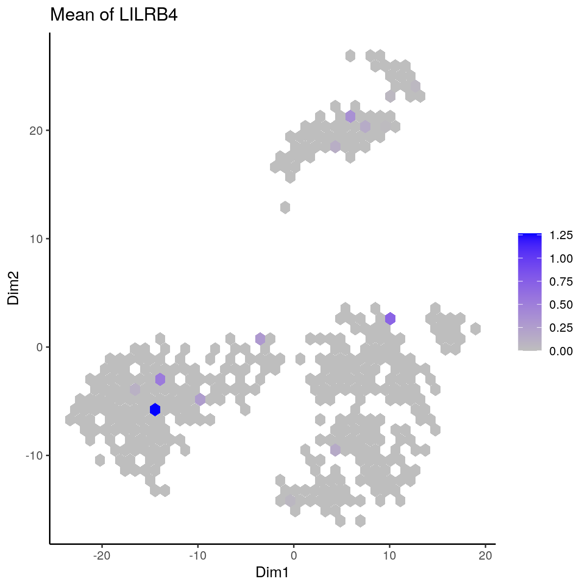|[CD40](https://www.ncbi.nlm.nih.gov/gene/958) [CD40LG](https://www.ncbi.nlm.nih.gov/gene/959) [IL10](https://www.ncbi.nlm.nih.gov/gene/3586) [CD209](https://www.ncbi.nlm.nih.gov/gene/30835)|
|[LIME1](https://www.ncbi.nlm.nih.gov/gene/54923)|[EGFL8](https://www.ncbi.nlm.nih.gov/gene/80864)|
|[LIN7A](https://www.ncbi.nlm.nih.gov/gene/8825)|[EGFR](https://www.ncbi.nlm.nih.gov/gene/1956) [ERBB3](https://www.ncbi.nlm.nih.gov/gene/2065) [STX1A](https://www.ncbi.nlm.nih.gov/gene/6804) [CRB1](https://www.ncbi.nlm.nih.gov/gene/23418) [CRB2](https://www.ncbi.nlm.nih.gov/gene/286204)|
|[LIN7B](https://www.ncbi.nlm.nih.gov/gene/64130)|[EGFR](https://www.ncbi.nlm.nih.gov/gene/1956) [ERBB3](https://www.ncbi.nlm.nih.gov/gene/2065) [STX1A](https://www.ncbi.nlm.nih.gov/gene/6804) [ACP7](https://www.ncbi.nlm.nih.gov/gene/390928)|
|[LIN7C](https://www.ncbi.nlm.nih.gov/gene/55327)|[C1QB](https://www.ncbi.nlm.nih.gov/gene/713) [EGFR](https://www.ncbi.nlm.nih.gov/gene/1956) [ERBB3](https://www.ncbi.nlm.nih.gov/gene/2065) [STX1A](https://www.ncbi.nlm.nih.gov/gene/6804) [CRB1](https://www.ncbi.nlm.nih.gov/gene/23418) [CRB2](https://www.ncbi.nlm.nih.gov/gene/286204)|
|[LINC02210-CRHR1](https://www.ncbi.nlm.nih.gov/gene/104909134)|[ADCYAP1](https://www.ncbi.nlm.nih.gov/gene/116) [ADM](https://www.ncbi.nlm.nih.gov/gene/133) [AVP](https://www.ncbi.nlm.nih.gov/gene/551) [BDNF](https://www.ncbi.nlm.nih.gov/gene/627) [CALCA](https://www.ncbi.nlm.nih.gov/gene/796) [CALCB](https://www.ncbi.nlm.nih.gov/gene/797) [CCK](https://www.ncbi.nlm.nih.gov/gene/885) [CGA](https://www.ncbi.nlm.nih.gov/gene/1081) [CHGB](https://www.ncbi.nlm.nih.gov/gene/1114) [CORT](https://www.ncbi.nlm.nih.gov/gene/1325) [CRH](https://www.ncbi.nlm.nih.gov/gene/1392) [CRHBP](https://www.ncbi.nlm.nih.gov/gene/1393) [FSHB](https://www.ncbi.nlm.nih.gov/gene/2488) [GABBR1](https://www.ncbi.nlm.nih.gov/gene/2550) [GCG](https://www.ncbi.nlm.nih.gov/gene/2641) [GHRH](https://www.ncbi.nlm.nih.gov/gene/2691) [GIP](https://www.ncbi.nlm.nih.gov/gene/2695) [IAPP](https://www.ncbi.nlm.nih.gov/gene/3375) [IFNAR2](https://www.ncbi.nlm.nih.gov/gene/3455) [INSL3](https://www.ncbi.nlm.nih.gov/gene/3640) [NPY](https://www.ncbi.nlm.nih.gov/gene/4852) [NTS](https://www.ncbi.nlm.nih.gov/gene/4922) [OXT](https://www.ncbi.nlm.nih.gov/gene/5020) [PDYN](https://www.ncbi.nlm.nih.gov/gene/5173) [PENK](https://www.ncbi.nlm.nih.gov/gene/5179) [PNOC](https://www.ncbi.nlm.nih.gov/gene/5368) [POMC](https://www.ncbi.nlm.nih.gov/gene/5443) [PTH](https://www.ncbi.nlm.nih.gov/gene/5741) [PTHLH](https://www.ncbi.nlm.nih.gov/gene/5744) [RLN1](https://www.ncbi.nlm.nih.gov/gene/6013) [RLN2](https://www.ncbi.nlm.nih.gov/gene/6019) [SCT](https://www.ncbi.nlm.nih.gov/gene/6343) [SST](https://www.ncbi.nlm.nih.gov/gene/6750) [TAC1](https://www.ncbi.nlm.nih.gov/gene/6863) [TSHB](https://www.ncbi.nlm.nih.gov/gene/7252) [UCN](https://www.ncbi.nlm.nih.gov/gene/7349) [VIP](https://www.ncbi.nlm.nih.gov/gene/7432) [WNT3](https://www.ncbi.nlm.nih.gov/gene/7473) [CARTPT](https://www.ncbi.nlm.nih.gov/gene/9607) [GHRL](https://www.ncbi.nlm.nih.gov/gene/51738) [LGI2](https://www.ncbi.nlm.nih.gov/gene/55203) [HAPLN2](https://www.ncbi.nlm.nih.gov/gene/60484) [ADM2](https://www.ncbi.nlm.nih.gov/gene/79924) [UCN2](https://www.ncbi.nlm.nih.gov/gene/90226) [PTH2](https://www.ncbi.nlm.nih.gov/gene/113091) [UCN3](https://www.ncbi.nlm.nih.gov/gene/114131) [RLN3](https://www.ncbi.nlm.nih.gov/gene/117579) [GPHB5](https://www.ncbi.nlm.nih.gov/gene/122876) [CBLN2](https://www.ncbi.nlm.nih.gov/gene/147381) [GPHA2](https://www.ncbi.nlm.nih.gov/gene/170589) [NPS](https://www.ncbi.nlm.nih.gov/gene/594857)|
|[LINGO1](https://www.ncbi.nlm.nih.gov/gene/84894)|[BDNF](https://www.ncbi.nlm.nih.gov/gene/627) [NCAN](https://www.ncbi.nlm.nih.gov/gene/1463) [EGFR](https://www.ncbi.nlm.nih.gov/gene/1956) [IGSF1](https://www.ncbi.nlm.nih.gov/gene/3547) [NCAM1](https://www.ncbi.nlm.nih.gov/gene/4684) [NGF](https://www.ncbi.nlm.nih.gov/gene/4803) [NTF3](https://www.ncbi.nlm.nih.gov/gene/4908) [NTF4](https://www.ncbi.nlm.nih.gov/gene/4909) [PTPRZ1](https://www.ncbi.nlm.nih.gov/gene/5803) [SEMA3F](https://www.ncbi.nlm.nih.gov/gene/6405) [SEMA3A](https://www.ncbi.nlm.nih.gov/gene/10371) [OLFM1](https://www.ncbi.nlm.nih.gov/gene/10439)|
|[LIPE](https://www.ncbi.nlm.nih.gov/gene/3991)|[ALB](https://www.ncbi.nlm.nih.gov/gene/213) [APOA2](https://www.ncbi.nlm.nih.gov/gene/336) [APOC3](https://www.ncbi.nlm.nih.gov/gene/345) [APOE](https://www.ncbi.nlm.nih.gov/gene/348) [AZGP1](https://www.ncbi.nlm.nih.gov/gene/563) [BTC](https://www.ncbi.nlm.nih.gov/gene/685) [CFD](https://www.ncbi.nlm.nih.gov/gene/1675) [GCG](https://www.ncbi.nlm.nih.gov/gene/2641) [IL6](https://www.ncbi.nlm.nih.gov/gene/3569) [INS](https://www.ncbi.nlm.nih.gov/gene/3630) [LEP](https://www.ncbi.nlm.nih.gov/gene/3952) [LEPR](https://www.ncbi.nlm.nih.gov/gene/3953) [LIPC](https://www.ncbi.nlm.nih.gov/gene/3990) [PLA2G1B](https://www.ncbi.nlm.nih.gov/gene/5319) [PNLIP](https://www.ncbi.nlm.nih.gov/gene/5406) [PNLIPRP1](https://www.ncbi.nlm.nih.gov/gene/5407) [POMC](https://www.ncbi.nlm.nih.gov/gene/5443) [CCL2](https://www.ncbi.nlm.nih.gov/gene/6347) [TNF](https://www.ncbi.nlm.nih.gov/gene/7124) [LIPF](https://www.ncbi.nlm.nih.gov/gene/8513) [ADAM9](https://www.ncbi.nlm.nih.gov/gene/8754) [ADIPOQ](https://www.ncbi.nlm.nih.gov/gene/9370) [LIPG](https://www.ncbi.nlm.nih.gov/gene/9388) [KIAA0100](https://www.ncbi.nlm.nih.gov/gene/9703) [FGF21](https://www.ncbi.nlm.nih.gov/gene/26291) [RETN](https://www.ncbi.nlm.nih.gov/gene/56729) [PNLIPRP3](https://www.ncbi.nlm.nih.gov/gene/119548) [CES5A](https://www.ncbi.nlm.nih.gov/gene/221223) [CES4A](https://www.ncbi.nlm.nih.gov/gene/283848) [METRNL](https://www.ncbi.nlm.nih.gov/gene/284207) [LIPM](https://www.ncbi.nlm.nih.gov/gene/340654) [CEACAM16](https://www.ncbi.nlm.nih.gov/gene/388551) [LIPK](https://www.ncbi.nlm.nih.gov/gene/643414) [LIPN](https://www.ncbi.nlm.nih.gov/gene/643418)|
|[LMBR1L](https://www.ncbi.nlm.nih.gov/gene/55716)|[LCN1](https://www.ncbi.nlm.nih.gov/gene/3933) [LUM](https://www.ncbi.nlm.nih.gov/gene/4060) [SCGB1A1](https://www.ncbi.nlm.nih.gov/gene/7356) [WNT8B](https://www.ncbi.nlm.nih.gov/gene/7479)|
|[LMBRD2](https://www.ncbi.nlm.nih.gov/gene/92255)|[ITIH5](https://www.ncbi.nlm.nih.gov/gene/80760)|
|[LOC102724488](https://www.ncbi.nlm.nih.gov/gene/102724488)|[GPLD1](https://www.ncbi.nlm.nih.gov/gene/2822) [GRN](https://www.ncbi.nlm.nih.gov/gene/2896) [STX1A](https://www.ncbi.nlm.nih.gov/gene/6804)|
|[LOC102725035](https://www.ncbi.nlm.nih.gov/gene/102725035)|[CD160](https://www.ncbi.nlm.nih.gov/gene/11126) [PILRA](https://www.ncbi.nlm.nih.gov/gene/29992)|
|[LPAR3](https://www.ncbi.nlm.nih.gov/gene/23566)|[AGT](https://www.ncbi.nlm.nih.gov/gene/183) [AVP](https://www.ncbi.nlm.nih.gov/gene/551) [C3](https://www.ncbi.nlm.nih.gov/gene/718) [C5](https://www.ncbi.nlm.nih.gov/gene/727) [CCK](https://www.ncbi.nlm.nih.gov/gene/885) [CORT](https://www.ncbi.nlm.nih.gov/gene/1325) [EDN1](https://www.ncbi.nlm.nih.gov/gene/1906) [EDN2](https://www.ncbi.nlm.nih.gov/gene/1907) [EDN3](https://www.ncbi.nlm.nih.gov/gene/1908) [EGFR](https://www.ncbi.nlm.nih.gov/gene/1956) [F2](https://www.ncbi.nlm.nih.gov/gene/2147) [GAST](https://www.ncbi.nlm.nih.gov/gene/2520) [GABBR1](https://www.ncbi.nlm.nih.gov/gene/2550) [GCG](https://www.ncbi.nlm.nih.gov/gene/2641) [GNRH1](https://www.ncbi.nlm.nih.gov/gene/2796) [GNRH2](https://www.ncbi.nlm.nih.gov/gene/2797) [CXCL1](https://www.ncbi.nlm.nih.gov/gene/2919) [CXCL2](https://www.ncbi.nlm.nih.gov/gene/2920) [CXCL3](https://www.ncbi.nlm.nih.gov/gene/2921) [GRP](https://www.ncbi.nlm.nih.gov/gene/2922) [CXCL8](https://www.ncbi.nlm.nih.gov/gene/3576) [CXCL10](https://www.ncbi.nlm.nih.gov/gene/3627) [KISS1](https://www.ncbi.nlm.nih.gov/gene/3814) [CXCL9](https://www.ncbi.nlm.nih.gov/gene/4283) [MLN](https://www.ncbi.nlm.nih.gov/gene/4295) [NMB](https://www.ncbi.nlm.nih.gov/gene/4828) [NPY](https://www.ncbi.nlm.nih.gov/gene/4852) [NTS](https://www.ncbi.nlm.nih.gov/gene/4922) [OXT](https://www.ncbi.nlm.nih.gov/gene/5020) [ENPP2](https://www.ncbi.nlm.nih.gov/gene/5168) [PDYN](https://www.ncbi.nlm.nih.gov/gene/5173) [PENK](https://www.ncbi.nlm.nih.gov/gene/5179) [PF4](https://www.ncbi.nlm.nih.gov/gene/5196) [PLAU](https://www.ncbi.nlm.nih.gov/gene/5328) [PMCH](https://www.ncbi.nlm.nih.gov/gene/5367) [PNOC](https://www.ncbi.nlm.nih.gov/gene/5368) [POMC](https://www.ncbi.nlm.nih.gov/gene/5443) [PPBP](https://www.ncbi.nlm.nih.gov/gene/5473) [PPY](https://www.ncbi.nlm.nih.gov/gene/5539) [PSAP](https://www.ncbi.nlm.nih.gov/gene/5660) [PYY](https://www.ncbi.nlm.nih.gov/gene/5697) [SAA1](https://www.ncbi.nlm.nih.gov/gene/6288) [CCL1](https://www.ncbi.nlm.nih.gov/gene/6346) [CCL5](https://www.ncbi.nlm.nih.gov/gene/6352) [CCL13](https://www.ncbi.nlm.nih.gov/gene/6357) [CCL16](https://www.ncbi.nlm.nih.gov/gene/6360) [CCL19](https://www.ncbi.nlm.nih.gov/gene/6363) [CCL20](https://www.ncbi.nlm.nih.gov/gene/6364) [CCL21](https://www.ncbi.nlm.nih.gov/gene/6366) [CCL25](https://www.ncbi.nlm.nih.gov/gene/6370) [CXCL6](https://www.ncbi.nlm.nih.gov/gene/6372) [CXCL11](https://www.ncbi.nlm.nih.gov/gene/6373) [CXCL5](https://www.ncbi.nlm.nih.gov/gene/6374) [XCL1](https://www.ncbi.nlm.nih.gov/gene/6375) [CX3CL1](https://www.ncbi.nlm.nih.gov/gene/6376) [CXCL12](https://www.ncbi.nlm.nih.gov/gene/6387) [SST](https://www.ncbi.nlm.nih.gov/gene/6750) [XCL2](https://www.ncbi.nlm.nih.gov/gene/6846) [TAC1](https://www.ncbi.nlm.nih.gov/gene/6863) [TAC3](https://www.ncbi.nlm.nih.gov/gene/6866) [TRH](https://www.ncbi.nlm.nih.gov/gene/7200) [VEGFC](https://www.ncbi.nlm.nih.gov/gene/7424) [NPFF](https://www.ncbi.nlm.nih.gov/gene/8620) [APLN](https://www.ncbi.nlm.nih.gov/gene/8862) [LIPG](https://www.ncbi.nlm.nih.gov/gene/9388) [INSL5](https://www.ncbi.nlm.nih.gov/gene/10022) [CXCL13](https://www.ncbi.nlm.nih.gov/gene/10563) [CCL27](https://www.ncbi.nlm.nih.gov/gene/10850) [NMU](https://www.ncbi.nlm.nih.gov/gene/10874) [UTS2](https://www.ncbi.nlm.nih.gov/gene/10911) [GAL](https://www.ncbi.nlm.nih.gov/gene/51083) [PLA1A](https://www.ncbi.nlm.nih.gov/gene/51365) [CCL28](https://www.ncbi.nlm.nih.gov/gene/56477) [PROK2](https://www.ncbi.nlm.nih.gov/gene/60675) [PROK1](https://www.ncbi.nlm.nih.gov/gene/84432) [RLN3](https://www.ncbi.nlm.nih.gov/gene/117579) [NMS](https://www.ncbi.nlm.nih.gov/gene/129521) [LIPH](https://www.ncbi.nlm.nih.gov/gene/200879) [NPB](https://www.ncbi.nlm.nih.gov/gene/256933) [UTS2B](https://www.ncbi.nlm.nih.gov/gene/257313) [NPW](https://www.ncbi.nlm.nih.gov/gene/283869) [C9orf47](https://www.ncbi.nlm.nih.gov/gene/286223) [QRFP](https://www.ncbi.nlm.nih.gov/gene/347148) [CCL4L1](https://www.ncbi.nlm.nih.gov/gene/388372) [NPS](https://www.ncbi.nlm.nih.gov/gene/594857)|
|[LPAR4](https://www.ncbi.nlm.nih.gov/gene/2846)|[AGT](https://www.ncbi.nlm.nih.gov/gene/183) [AVP](https://www.ncbi.nlm.nih.gov/gene/551) [CCK](https://www.ncbi.nlm.nih.gov/gene/885) [EDN1](https://www.ncbi.nlm.nih.gov/gene/1906) [EDN2](https://www.ncbi.nlm.nih.gov/gene/1907) [EDN3](https://www.ncbi.nlm.nih.gov/gene/1908) [F2](https://www.ncbi.nlm.nih.gov/gene/2147) [GAST](https://www.ncbi.nlm.nih.gov/gene/2520) [GCG](https://www.ncbi.nlm.nih.gov/gene/2641) [GNRH1](https://www.ncbi.nlm.nih.gov/gene/2796) [GNRH2](https://www.ncbi.nlm.nih.gov/gene/2797) [GRP](https://www.ncbi.nlm.nih.gov/gene/2922) [CXCL8](https://www.ncbi.nlm.nih.gov/gene/3576) [KISS1](https://www.ncbi.nlm.nih.gov/gene/3814) [MLN](https://www.ncbi.nlm.nih.gov/gene/4295) [NMB](https://www.ncbi.nlm.nih.gov/gene/4828) [NTS](https://www.ncbi.nlm.nih.gov/gene/4922) [OXT](https://www.ncbi.nlm.nih.gov/gene/5020) [ENPP2](https://www.ncbi.nlm.nih.gov/gene/5168) [PLG](https://www.ncbi.nlm.nih.gov/gene/5340) [PMCH](https://www.ncbi.nlm.nih.gov/gene/5367) [SAA1](https://www.ncbi.nlm.nih.gov/gene/6288) [XCL1](https://www.ncbi.nlm.nih.gov/gene/6375) [XCL2](https://www.ncbi.nlm.nih.gov/gene/6846) [TAC1](https://www.ncbi.nlm.nih.gov/gene/6863) [TAC3](https://www.ncbi.nlm.nih.gov/gene/6866) [TRH](https://www.ncbi.nlm.nih.gov/gene/7200) [FGF23](https://www.ncbi.nlm.nih.gov/gene/8074) [NPFF](https://www.ncbi.nlm.nih.gov/gene/8620) [NMU](https://www.ncbi.nlm.nih.gov/gene/10874) [UTS2](https://www.ncbi.nlm.nih.gov/gene/10911) [PROK2](https://www.ncbi.nlm.nih.gov/gene/60675) [PROK1](https://www.ncbi.nlm.nih.gov/gene/84432) [NMS](https://www.ncbi.nlm.nih.gov/gene/129521) [UTS2B](https://www.ncbi.nlm.nih.gov/gene/257313) [C9orf47](https://www.ncbi.nlm.nih.gov/gene/286223) [QRFP](https://www.ncbi.nlm.nih.gov/gene/347148) [NPS](https://www.ncbi.nlm.nih.gov/gene/594857)|
|[LPAR5](https://www.ncbi.nlm.nih.gov/gene/57121)|[AGT](https://www.ncbi.nlm.nih.gov/gene/183) [AVP](https://www.ncbi.nlm.nih.gov/gene/551) [C3](https://www.ncbi.nlm.nih.gov/gene/718) [C5](https://www.ncbi.nlm.nih.gov/gene/727) [CCK](https://www.ncbi.nlm.nih.gov/gene/885) [CORT](https://www.ncbi.nlm.nih.gov/gene/1325) [EDN1](https://www.ncbi.nlm.nih.gov/gene/1906) [EDN2](https://www.ncbi.nlm.nih.gov/gene/1907) [EDN3](https://www.ncbi.nlm.nih.gov/gene/1908) [F2](https://www.ncbi.nlm.nih.gov/gene/2147) [GAST](https://www.ncbi.nlm.nih.gov/gene/2520) [GABBR1](https://www.ncbi.nlm.nih.gov/gene/2550) [GCG](https://www.ncbi.nlm.nih.gov/gene/2641) [GNRH1](https://www.ncbi.nlm.nih.gov/gene/2796) [GNRH2](https://www.ncbi.nlm.nih.gov/gene/2797) [CXCL1](https://www.ncbi.nlm.nih.gov/gene/2919) [CXCL2](https://www.ncbi.nlm.nih.gov/gene/2920) [CXCL3](https://www.ncbi.nlm.nih.gov/gene/2921) [GRP](https://www.ncbi.nlm.nih.gov/gene/2922) [CXCL8](https://www.ncbi.nlm.nih.gov/gene/3576) [CXCL10](https://www.ncbi.nlm.nih.gov/gene/3627) [KISS1](https://www.ncbi.nlm.nih.gov/gene/3814) [CXCL9](https://www.ncbi.nlm.nih.gov/gene/4283) [MLN](https://www.ncbi.nlm.nih.gov/gene/4295) [NMB](https://www.ncbi.nlm.nih.gov/gene/4828) [NPY](https://www.ncbi.nlm.nih.gov/gene/4852) [NTS](https://www.ncbi.nlm.nih.gov/gene/4922) [OXT](https://www.ncbi.nlm.nih.gov/gene/5020) [ENPP2](https://www.ncbi.nlm.nih.gov/gene/5168) [PDYN](https://www.ncbi.nlm.nih.gov/gene/5173) [PENK](https://www.ncbi.nlm.nih.gov/gene/5179) [PF4](https://www.ncbi.nlm.nih.gov/gene/5196) [PMCH](https://www.ncbi.nlm.nih.gov/gene/5367) [PNOC](https://www.ncbi.nlm.nih.gov/gene/5368) [POMC](https://www.ncbi.nlm.nih.gov/gene/5443) [PPBP](https://www.ncbi.nlm.nih.gov/gene/5473) [PPY](https://www.ncbi.nlm.nih.gov/gene/5539) [PSAP](https://www.ncbi.nlm.nih.gov/gene/5660) [PYY](https://www.ncbi.nlm.nih.gov/gene/5697) [SAA1](https://www.ncbi.nlm.nih.gov/gene/6288) [CCL1](https://www.ncbi.nlm.nih.gov/gene/6346) [CCL5](https://www.ncbi.nlm.nih.gov/gene/6352) [CCL13](https://www.ncbi.nlm.nih.gov/gene/6357) [CCL16](https://www.ncbi.nlm.nih.gov/gene/6360) [CCL19](https://www.ncbi.nlm.nih.gov/gene/6363) [CCL20](https://www.ncbi.nlm.nih.gov/gene/6364) [CCL21](https://www.ncbi.nlm.nih.gov/gene/6366) [CCL25](https://www.ncbi.nlm.nih.gov/gene/6370) [CXCL6](https://www.ncbi.nlm.nih.gov/gene/6372) [CXCL11](https://www.ncbi.nlm.nih.gov/gene/6373) [CXCL5](https://www.ncbi.nlm.nih.gov/gene/6374) [XCL1](https://www.ncbi.nlm.nih.gov/gene/6375) [CX3CL1](https://www.ncbi.nlm.nih.gov/gene/6376) [CXCL12](https://www.ncbi.nlm.nih.gov/gene/6387) [SST](https://www.ncbi.nlm.nih.gov/gene/6750) [XCL2](https://www.ncbi.nlm.nih.gov/gene/6846) [TAC1](https://www.ncbi.nlm.nih.gov/gene/6863) [TAC3](https://www.ncbi.nlm.nih.gov/gene/6866) [TRH](https://www.ncbi.nlm.nih.gov/gene/7200) [FGF23](https://www.ncbi.nlm.nih.gov/gene/8074) [NPFF](https://www.ncbi.nlm.nih.gov/gene/8620) [APLN](https://www.ncbi.nlm.nih.gov/gene/8862) [INSL5](https://www.ncbi.nlm.nih.gov/gene/10022) [CXCL13](https://www.ncbi.nlm.nih.gov/gene/10563) [CCL27](https://www.ncbi.nlm.nih.gov/gene/10850) [NMU](https://www.ncbi.nlm.nih.gov/gene/10874) [UTS2](https://www.ncbi.nlm.nih.gov/gene/10911) [GAL](https://www.ncbi.nlm.nih.gov/gene/51083) [CCL28](https://www.ncbi.nlm.nih.gov/gene/56477) [PROK2](https://www.ncbi.nlm.nih.gov/gene/60675) [PROK1](https://www.ncbi.nlm.nih.gov/gene/84432) [RLN3](https://www.ncbi.nlm.nih.gov/gene/117579) [NMS](https://www.ncbi.nlm.nih.gov/gene/129521) [NPB](https://www.ncbi.nlm.nih.gov/gene/256933) [UTS2B](https://www.ncbi.nlm.nih.gov/gene/257313) [NPW](https://www.ncbi.nlm.nih.gov/gene/283869) [C9orf47](https://www.ncbi.nlm.nih.gov/gene/286223) [QRFP](https://www.ncbi.nlm.nih.gov/gene/347148) [CCL4L1](https://www.ncbi.nlm.nih.gov/gene/388372) [NPS](https://www.ncbi.nlm.nih.gov/gene/594857)|
|[LPAR6](https://www.ncbi.nlm.nih.gov/gene/10161)|[AGT](https://www.ncbi.nlm.nih.gov/gene/183) [AVP](https://www.ncbi.nlm.nih.gov/gene/551) [CCK](https://www.ncbi.nlm.nih.gov/gene/885) [EDN1](https://www.ncbi.nlm.nih.gov/gene/1906) [EDN2](https://www.ncbi.nlm.nih.gov/gene/1907) [EDN3](https://www.ncbi.nlm.nih.gov/gene/1908) [F2](https://www.ncbi.nlm.nih.gov/gene/2147) [GAST](https://www.ncbi.nlm.nih.gov/gene/2520) [GCG](https://www.ncbi.nlm.nih.gov/gene/2641) [GNRH1](https://www.ncbi.nlm.nih.gov/gene/2796) [GNRH2](https://www.ncbi.nlm.nih.gov/gene/2797) [GRP](https://www.ncbi.nlm.nih.gov/gene/2922) [CXCL8](https://www.ncbi.nlm.nih.gov/gene/3576) [KISS1](https://www.ncbi.nlm.nih.gov/gene/3814) [LIPC](https://www.ncbi.nlm.nih.gov/gene/3990) [MLN](https://www.ncbi.nlm.nih.gov/gene/4295) [NMB](https://www.ncbi.nlm.nih.gov/gene/4828) [NTS](https://www.ncbi.nlm.nih.gov/gene/4922) [OXT](https://www.ncbi.nlm.nih.gov/gene/5020) [ENPP2](https://www.ncbi.nlm.nih.gov/gene/5168) [PMCH](https://www.ncbi.nlm.nih.gov/gene/5367) [SAA1](https://www.ncbi.nlm.nih.gov/gene/6288) [XCL1](https://www.ncbi.nlm.nih.gov/gene/6375) [XCL2](https://www.ncbi.nlm.nih.gov/gene/6846) [TAC1](https://www.ncbi.nlm.nih.gov/gene/6863) [TAC3](https://www.ncbi.nlm.nih.gov/gene/6866) [TRH](https://www.ncbi.nlm.nih.gov/gene/7200) [NPFF](https://www.ncbi.nlm.nih.gov/gene/8620) [LIPG](https://www.ncbi.nlm.nih.gov/gene/9388) [NMU](https://www.ncbi.nlm.nih.gov/gene/10874) [UTS2](https://www.ncbi.nlm.nih.gov/gene/10911) [PLA1A](https://www.ncbi.nlm.nih.gov/gene/51365) [PROK2](https://www.ncbi.nlm.nih.gov/gene/60675) [PROK1](https://www.ncbi.nlm.nih.gov/gene/84432) [NMS](https://www.ncbi.nlm.nih.gov/gene/129521) [LIPH](https://www.ncbi.nlm.nih.gov/gene/200879) [UTS2B](https://www.ncbi.nlm.nih.gov/gene/257313) [QRFP](https://www.ncbi.nlm.nih.gov/gene/347148) [NPS](https://www.ncbi.nlm.nih.gov/gene/594857)|
|[LRBA](https://www.ncbi.nlm.nih.gov/gene/987)|[ALB](https://www.ncbi.nlm.nih.gov/gene/213) [EPYC](https://www.ncbi.nlm.nih.gov/gene/1833) [EGFR](https://www.ncbi.nlm.nih.gov/gene/1956) [OGN](https://www.ncbi.nlm.nih.gov/gene/4969) [PGC](https://www.ncbi.nlm.nih.gov/gene/5225) [RBP3](https://www.ncbi.nlm.nih.gov/gene/5949) [KERA](https://www.ncbi.nlm.nih.gov/gene/11081) [C6orf15](https://www.ncbi.nlm.nih.gov/gene/29113)|
|[LRIG1](https://www.ncbi.nlm.nih.gov/gene/26018)|[EGFR](https://www.ncbi.nlm.nih.gov/gene/1956) [ERBB3](https://www.ncbi.nlm.nih.gov/gene/2065) [MET](https://www.ncbi.nlm.nih.gov/gene/4233) [PTEN](https://www.ncbi.nlm.nih.gov/gene/5728) [OLFM4](https://www.ncbi.nlm.nih.gov/gene/10562) [ADAMTS9](https://www.ncbi.nlm.nih.gov/gene/56999) [SMOC2](https://www.ncbi.nlm.nih.gov/gene/64094) [ADAMTS20](https://www.ncbi.nlm.nih.gov/gene/80070) [HHIPL1](https://www.ncbi.nlm.nih.gov/gene/84439) [C1QTNF4](https://www.ncbi.nlm.nih.gov/gene/114900) [RSPO1](https://www.ncbi.nlm.nih.gov/gene/284654)|
|[LRIG2](https://www.ncbi.nlm.nih.gov/gene/9860)|[EGFR](https://www.ncbi.nlm.nih.gov/gene/1956) [HPSE2](https://www.ncbi.nlm.nih.gov/gene/60495) [CNPY4](https://www.ncbi.nlm.nih.gov/gene/245812)|
|[LRIG3](https://www.ncbi.nlm.nih.gov/gene/121227)|[EGFR](https://www.ncbi.nlm.nih.gov/gene/1956) [SDC4](https://www.ncbi.nlm.nih.gov/gene/6385) [NTN1](https://www.ncbi.nlm.nih.gov/gene/9423) [PCDH12](https://www.ncbi.nlm.nih.gov/gene/51294) [CNPY4](https://www.ncbi.nlm.nih.gov/gene/245812)|
|[LRP4](https://www.ncbi.nlm.nih.gov/gene/4038)|[WNT7A](https://www.ncbi.nlm.nih.gov/gene/7476) [SOSTDC1](https://www.ncbi.nlm.nih.gov/gene/25928) [SOST](https://www.ncbi.nlm.nih.gov/gene/50964) [EGFLAM](https://www.ncbi.nlm.nih.gov/gene/133584)|
|[LRP6](https://www.ncbi.nlm.nih.gov/gene/4040)|[A2M](https://www.ncbi.nlm.nih.gov/gene/2) [BGLAP](https://www.ncbi.nlm.nih.gov/gene/632) [BMP2](https://www.ncbi.nlm.nih.gov/gene/650) [BMP4](https://www.ncbi.nlm.nih.gov/gene/652) [CCN2](https://www.ncbi.nlm.nih.gov/gene/1490) [EFEMP1](https://www.ncbi.nlm.nih.gov/gene/2202) [FRZB](https://www.ncbi.nlm.nih.gov/gene/2487) [IGFBP4](https://www.ncbi.nlm.nih.gov/gene/3487) [TNFRSF11B](https://www.ncbi.nlm.nih.gov/gene/4982) [SERPINF1](https://www.ncbi.nlm.nih.gov/gene/5176) [SERPINA4](https://www.ncbi.nlm.nih.gov/gene/5267) [PTH](https://www.ncbi.nlm.nih.gov/gene/5741) [SFRP1](https://www.ncbi.nlm.nih.gov/gene/6422) [SFRP2](https://www.ncbi.nlm.nih.gov/gene/6423) [SFRP4](https://www.ncbi.nlm.nih.gov/gene/6424) [SFRP5](https://www.ncbi.nlm.nih.gov/gene/6425) [SPP1](https://www.ncbi.nlm.nih.gov/gene/6696) [WNT1](https://www.ncbi.nlm.nih.gov/gene/7471) [WNT2](https://www.ncbi.nlm.nih.gov/gene/7472) [WNT3](https://www.ncbi.nlm.nih.gov/gene/7473) [WNT5A](https://www.ncbi.nlm.nih.gov/gene/7474) [WNT6](https://www.ncbi.nlm.nih.gov/gene/7475) [WNT7A](https://www.ncbi.nlm.nih.gov/gene/7476) [WNT7B](https://www.ncbi.nlm.nih.gov/gene/7477) [WNT8A](https://www.ncbi.nlm.nih.gov/gene/7478) [WNT8B](https://www.ncbi.nlm.nih.gov/gene/7479) [WNT10B](https://www.ncbi.nlm.nih.gov/gene/7480) [WNT11](https://www.ncbi.nlm.nih.gov/gene/7481) [WNT2B](https://www.ncbi.nlm.nih.gov/gene/7482) [WNT9A](https://www.ncbi.nlm.nih.gov/gene/7483) [WNT9B](https://www.ncbi.nlm.nih.gov/gene/7484) [CCN6](https://www.ncbi.nlm.nih.gov/gene/8838) [CCN4](https://www.ncbi.nlm.nih.gov/gene/8840) [SEMA3C](https://www.ncbi.nlm.nih.gov/gene/10512) [WIF1](https://www.ncbi.nlm.nih.gov/gene/11197) [DKK1](https://www.ncbi.nlm.nih.gov/gene/22943) [SOSTDC1](https://www.ncbi.nlm.nih.gov/gene/25928) [DKK4](https://www.ncbi.nlm.nih.gov/gene/27121) [DKK3](https://www.ncbi.nlm.nih.gov/gene/27122) [DKK2](https://www.ncbi.nlm.nih.gov/gene/27123) [EFEMP2](https://www.ncbi.nlm.nih.gov/gene/30008) [SOST](https://www.ncbi.nlm.nih.gov/gene/50964) [WNT16](https://www.ncbi.nlm.nih.gov/gene/51384) [WNT4](https://www.ncbi.nlm.nih.gov/gene/54361) [WNT10A](https://www.ncbi.nlm.nih.gov/gene/80326) [WNT5B](https://www.ncbi.nlm.nih.gov/gene/81029) [RSPO3](https://www.ncbi.nlm.nih.gov/gene/84870) [WNT3A](https://www.ncbi.nlm.nih.gov/gene/89780) [ANTXR2](https://www.ncbi.nlm.nih.gov/gene/118429) [RSPO1](https://www.ncbi.nlm.nih.gov/gene/284654) [RSPO2](https://www.ncbi.nlm.nih.gov/gene/340419) [RSPO4](https://www.ncbi.nlm.nih.gov/gene/343637)|
|[LRP8](https://www.ncbi.nlm.nih.gov/gene/7804)|[A2M](https://www.ncbi.nlm.nih.gov/gene/2) [APOA1](https://www.ncbi.nlm.nih.gov/gene/335) [APOA2](https://www.ncbi.nlm.nih.gov/gene/336) [APOC2](https://www.ncbi.nlm.nih.gov/gene/344) [APOC3](https://www.ncbi.nlm.nih.gov/gene/345) [APOE](https://www.ncbi.nlm.nih.gov/gene/348) [APOH](https://www.ncbi.nlm.nih.gov/gene/350) [GPC4](https://www.ncbi.nlm.nih.gov/gene/2239) [GPC5](https://www.ncbi.nlm.nih.gov/gene/2262) [GPC1](https://www.ncbi.nlm.nih.gov/gene/2817) [HSPG2](https://www.ncbi.nlm.nih.gov/gene/3339) [RELN](https://www.ncbi.nlm.nih.gov/gene/5649) [SDC4](https://www.ncbi.nlm.nih.gov/gene/6385) [SELENOP](https://www.ncbi.nlm.nih.gov/gene/6414) [WNT1](https://www.ncbi.nlm.nih.gov/gene/7471) [WNT6](https://www.ncbi.nlm.nih.gov/gene/7475) [GPC6](https://www.ncbi.nlm.nih.gov/gene/10082) [SPON1](https://www.ncbi.nlm.nih.gov/gene/10418) [ANGPTL3](https://www.ncbi.nlm.nih.gov/gene/27329) [WNT4](https://www.ncbi.nlm.nih.gov/gene/54361) [INHBE](https://www.ncbi.nlm.nih.gov/gene/83729) [GPC2](https://www.ncbi.nlm.nih.gov/gene/221914) [PCSK9](https://www.ncbi.nlm.nih.gov/gene/255738)|
|[LRRC32](https://www.ncbi.nlm.nih.gov/gene/2615)|[IL2](https://www.ncbi.nlm.nih.gov/gene/3558) [TGFB1](https://www.ncbi.nlm.nih.gov/gene/7040) [TNFRSF18](https://www.ncbi.nlm.nih.gov/gene/8784) [PKDCC](https://www.ncbi.nlm.nih.gov/gene/91461)|
|[LRRC38](https://www.ncbi.nlm.nih.gov/gene/126755)|[PSG7](https://www.ncbi.nlm.nih.gov/gene/5676)|
|[LRRC55](https://www.ncbi.nlm.nih.gov/gene/219527)|[ITGBL1](https://www.ncbi.nlm.nih.gov/gene/9358) [PCYOX1L](https://www.ncbi.nlm.nih.gov/gene/78991)|
|[LRRC8A](https://www.ncbi.nlm.nih.gov/gene/56262)|[DEFA4](https://www.ncbi.nlm.nih.gov/gene/1669) [IGLL1](https://www.ncbi.nlm.nih.gov/gene/3543) [PIBF1](https://www.ncbi.nlm.nih.gov/gene/10464)|
|[LRRC8B](https://www.ncbi.nlm.nih.gov/gene/23507)|[TPSB2](https://www.ncbi.nlm.nih.gov/gene/64499)|
|[LRRC8D](https://www.ncbi.nlm.nih.gov/gene/55144)|[PROS1](https://www.ncbi.nlm.nih.gov/gene/5627) [KCP](https://www.ncbi.nlm.nih.gov/gene/375616) [GASK1A](https://www.ncbi.nlm.nih.gov/gene/729085)|
|[LRRC8E](https://www.ncbi.nlm.nih.gov/gene/80131)|[KCP](https://www.ncbi.nlm.nih.gov/gene/375616)|
|[LRRTM1](https://www.ncbi.nlm.nih.gov/gene/347730)|[BGN](https://www.ncbi.nlm.nih.gov/gene/633) [CBLN1](https://www.ncbi.nlm.nih.gov/gene/869) [EPYC](https://www.ncbi.nlm.nih.gov/gene/1833) [FGFR2](https://www.ncbi.nlm.nih.gov/gene/2263) [IGFBP7](https://www.ncbi.nlm.nih.gov/gene/3490) [PCSK6](https://www.ncbi.nlm.nih.gov/gene/5046) [PDGFRL](https://www.ncbi.nlm.nih.gov/gene/5157) [PTN](https://www.ncbi.nlm.nih.gov/gene/5764) [NXPH1](https://www.ncbi.nlm.nih.gov/gene/30010) [HAPLN2](https://www.ncbi.nlm.nih.gov/gene/60484) [OLFM3](https://www.ncbi.nlm.nih.gov/gene/118427)|
|[LRRTM2](https://www.ncbi.nlm.nih.gov/gene/26045)|[CBLN1](https://www.ncbi.nlm.nih.gov/gene/869) [GPC1](https://www.ncbi.nlm.nih.gov/gene/2817) [NXPH3](https://www.ncbi.nlm.nih.gov/gene/11248) [NXPH1](https://www.ncbi.nlm.nih.gov/gene/30010) [FSTL5](https://www.ncbi.nlm.nih.gov/gene/56884)|
|[LRRTM3](https://www.ncbi.nlm.nih.gov/gene/347731)|[GPC4](https://www.ncbi.nlm.nih.gov/gene/2239) [GPC1](https://www.ncbi.nlm.nih.gov/gene/2817) [PRSS12](https://www.ncbi.nlm.nih.gov/gene/8492) [GPC6](https://www.ncbi.nlm.nih.gov/gene/10082) [NXPH1](https://www.ncbi.nlm.nih.gov/gene/30010)|
|[LRRTM4](https://www.ncbi.nlm.nih.gov/gene/80059)|[GPC4](https://www.ncbi.nlm.nih.gov/gene/2239) [GPC1](https://www.ncbi.nlm.nih.gov/gene/2817) [GPC6](https://www.ncbi.nlm.nih.gov/gene/10082) [PILRA](https://www.ncbi.nlm.nih.gov/gene/29992) [CNTNAP3](https://www.ncbi.nlm.nih.gov/gene/79937)|
|[LSAMP](https://www.ncbi.nlm.nih.gov/gene/4045) 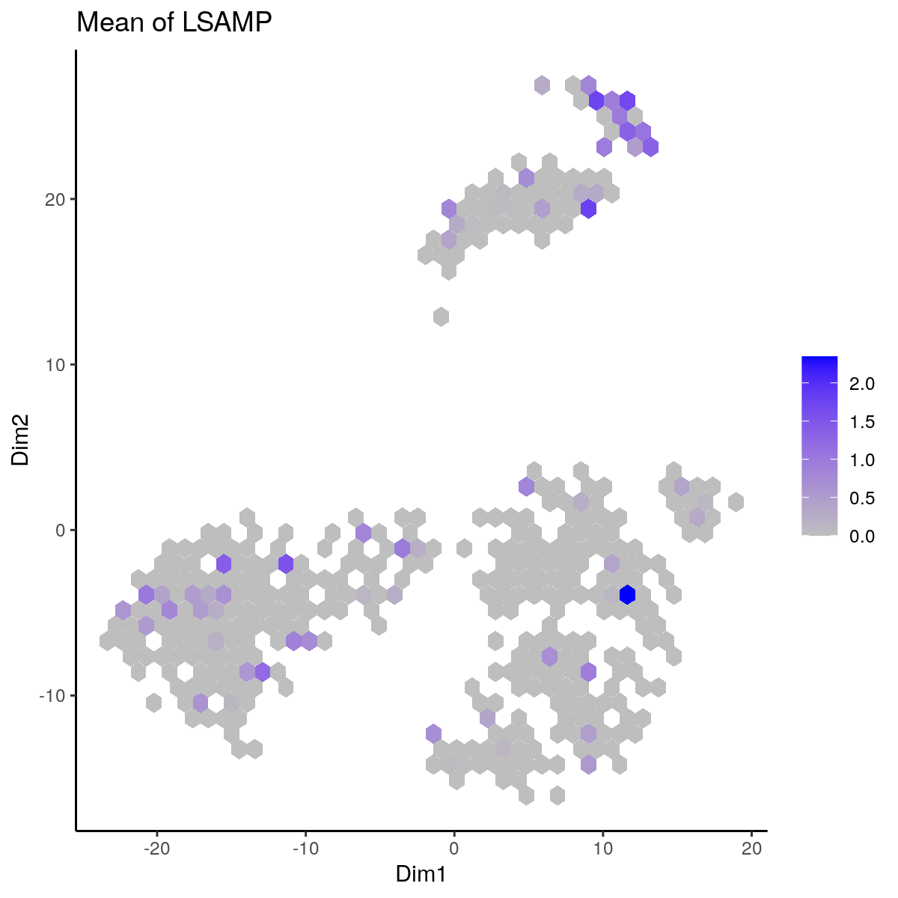|[GPLD1](https://www.ncbi.nlm.nih.gov/gene/2822) [NTS](https://www.ncbi.nlm.nih.gov/gene/4922) [MSLN](https://www.ncbi.nlm.nih.gov/gene/10232) [SPON1](https://www.ncbi.nlm.nih.gov/gene/10418) [LY6K](https://www.ncbi.nlm.nih.gov/gene/54742) [RAET1G](https://www.ncbi.nlm.nih.gov/gene/353091)|
|[LSP1](https://www.ncbi.nlm.nih.gov/gene/4046)|[FGFR2](https://www.ncbi.nlm.nih.gov/gene/2263) [GSN](https://www.ncbi.nlm.nih.gov/gene/2934) [IL6ST](https://www.ncbi.nlm.nih.gov/gene/3572) [CLEC4M](https://www.ncbi.nlm.nih.gov/gene/10332) [ANGPTL3](https://www.ncbi.nlm.nih.gov/gene/27329) [CD209](https://www.ncbi.nlm.nih.gov/gene/30835) [SMOC1](https://www.ncbi.nlm.nih.gov/gene/64093)|
|[LSR](https://www.ncbi.nlm.nih.gov/gene/51599)|[APOF](https://www.ncbi.nlm.nih.gov/gene/319) [APOA1](https://www.ncbi.nlm.nih.gov/gene/335) [APOA2](https://www.ncbi.nlm.nih.gov/gene/336) [APOC1](https://www.ncbi.nlm.nih.gov/gene/341) [APOC2](https://www.ncbi.nlm.nih.gov/gene/344) [APOC3](https://www.ncbi.nlm.nih.gov/gene/345) [APOC4](https://www.ncbi.nlm.nih.gov/gene/346) [APOE](https://www.ncbi.nlm.nih.gov/gene/348) [APOH](https://www.ncbi.nlm.nih.gov/gene/350) [CETP](https://www.ncbi.nlm.nih.gov/gene/1071) [HP](https://www.ncbi.nlm.nih.gov/gene/3240) [HPR](https://www.ncbi.nlm.nih.gov/gene/3250) [LCAT](https://www.ncbi.nlm.nih.gov/gene/3931) [LIPC](https://www.ncbi.nlm.nih.gov/gene/3990) [PLTP](https://www.ncbi.nlm.nih.gov/gene/5360) [PON1](https://www.ncbi.nlm.nih.gov/gene/5444) [SAA1](https://www.ncbi.nlm.nih.gov/gene/6288) [SAA2](https://www.ncbi.nlm.nih.gov/gene/6289) [SAA4](https://www.ncbi.nlm.nih.gov/gene/6291) [SPINT1](https://www.ncbi.nlm.nih.gov/gene/6692) [CLEC3B](https://www.ncbi.nlm.nih.gov/gene/7123) [PLA2G7](https://www.ncbi.nlm.nih.gov/gene/7941) [APOL1](https://www.ncbi.nlm.nih.gov/gene/8542) [APOM](https://www.ncbi.nlm.nih.gov/gene/55937) [APOA5](https://www.ncbi.nlm.nih.gov/gene/116519)|
|[LTB4R](https://www.ncbi.nlm.nih.gov/gene/1241)|[AGT](https://www.ncbi.nlm.nih.gov/gene/183) [AVP](https://www.ncbi.nlm.nih.gov/gene/551) [C5](https://www.ncbi.nlm.nih.gov/gene/727) [CCK](https://www.ncbi.nlm.nih.gov/gene/885) [EDN1](https://www.ncbi.nlm.nih.gov/gene/1906) [EDN2](https://www.ncbi.nlm.nih.gov/gene/1907) [EDN3](https://www.ncbi.nlm.nih.gov/gene/1908) [F2](https://www.ncbi.nlm.nih.gov/gene/2147) [F13A1](https://www.ncbi.nlm.nih.gov/gene/2162) [GAST](https://www.ncbi.nlm.nih.gov/gene/2520) [GCG](https://www.ncbi.nlm.nih.gov/gene/2641) [GNRH1](https://www.ncbi.nlm.nih.gov/gene/2796) [GNRH2](https://www.ncbi.nlm.nih.gov/gene/2797) [GRP](https://www.ncbi.nlm.nih.gov/gene/2922) [IL2](https://www.ncbi.nlm.nih.gov/gene/3558) [IL6](https://www.ncbi.nlm.nih.gov/gene/3569) [CXCL8](https://www.ncbi.nlm.nih.gov/gene/3576) [IL13](https://www.ncbi.nlm.nih.gov/gene/3596) [KISS1](https://www.ncbi.nlm.nih.gov/gene/3814) [LOX](https://www.ncbi.nlm.nih.gov/gene/4015) [MLN](https://www.ncbi.nlm.nih.gov/gene/4295) [MMP13](https://www.ncbi.nlm.nih.gov/gene/4322) [NMB](https://www.ncbi.nlm.nih.gov/gene/4828) [NTS](https://www.ncbi.nlm.nih.gov/gene/4922) [OXT](https://www.ncbi.nlm.nih.gov/gene/5020) [PMCH](https://www.ncbi.nlm.nih.gov/gene/5367) [RARRES2](https://www.ncbi.nlm.nih.gov/gene/5919) [SAA1](https://www.ncbi.nlm.nih.gov/gene/6288) [CCL2](https://www.ncbi.nlm.nih.gov/gene/6347) [XCL1](https://www.ncbi.nlm.nih.gov/gene/6375) [XCL2](https://www.ncbi.nlm.nih.gov/gene/6846) [TAC1](https://www.ncbi.nlm.nih.gov/gene/6863) [TAC3](https://www.ncbi.nlm.nih.gov/gene/6866) [TNF](https://www.ncbi.nlm.nih.gov/gene/7124) [TRH](https://www.ncbi.nlm.nih.gov/gene/7200) [NPFF](https://www.ncbi.nlm.nih.gov/gene/8620) [NMU](https://www.ncbi.nlm.nih.gov/gene/10874) [UTS2](https://www.ncbi.nlm.nih.gov/gene/10911) [PROK2](https://www.ncbi.nlm.nih.gov/gene/60675) [PROK1](https://www.ncbi.nlm.nih.gov/gene/84432) [NMS](https://www.ncbi.nlm.nih.gov/gene/129521) [UTS2B](https://www.ncbi.nlm.nih.gov/gene/257313) [QRFP](https://www.ncbi.nlm.nih.gov/gene/347148) [NPS](https://www.ncbi.nlm.nih.gov/gene/594857)|
|[LTB4R2](https://www.ncbi.nlm.nih.gov/gene/56413)|[AGT](https://www.ncbi.nlm.nih.gov/gene/183) [AVP](https://www.ncbi.nlm.nih.gov/gene/551) [C5](https://www.ncbi.nlm.nih.gov/gene/727) [CCK](https://www.ncbi.nlm.nih.gov/gene/885) [EDN1](https://www.ncbi.nlm.nih.gov/gene/1906) [EDN2](https://www.ncbi.nlm.nih.gov/gene/1907) [EDN3](https://www.ncbi.nlm.nih.gov/gene/1908) [F2](https://www.ncbi.nlm.nih.gov/gene/2147) [GAST](https://www.ncbi.nlm.nih.gov/gene/2520) [GCG](https://www.ncbi.nlm.nih.gov/gene/2641) [GNRH1](https://www.ncbi.nlm.nih.gov/gene/2796) [GNRH2](https://www.ncbi.nlm.nih.gov/gene/2797) [GRP](https://www.ncbi.nlm.nih.gov/gene/2922) [KISS1](https://www.ncbi.nlm.nih.gov/gene/3814) [MLN](https://www.ncbi.nlm.nih.gov/gene/4295) [NMB](https://www.ncbi.nlm.nih.gov/gene/4828) [NTS](https://www.ncbi.nlm.nih.gov/gene/4922) [OXT](https://www.ncbi.nlm.nih.gov/gene/5020) [PMCH](https://www.ncbi.nlm.nih.gov/gene/5367) [SAA1](https://www.ncbi.nlm.nih.gov/gene/6288) [CCL19](https://www.ncbi.nlm.nih.gov/gene/6363) [XCL1](https://www.ncbi.nlm.nih.gov/gene/6375) [XCL2](https://www.ncbi.nlm.nih.gov/gene/6846) [TAC1](https://www.ncbi.nlm.nih.gov/gene/6863) [TAC3](https://www.ncbi.nlm.nih.gov/gene/6866) [TRH](https://www.ncbi.nlm.nih.gov/gene/7200) [NPFF](https://www.ncbi.nlm.nih.gov/gene/8620) [NMU](https://www.ncbi.nlm.nih.gov/gene/10874) [UTS2](https://www.ncbi.nlm.nih.gov/gene/10911) [PROK2](https://www.ncbi.nlm.nih.gov/gene/60675) [PROK1](https://www.ncbi.nlm.nih.gov/gene/84432) [LACRT](https://www.ncbi.nlm.nih.gov/gene/90070) [NMS](https://www.ncbi.nlm.nih.gov/gene/129521) [UTS2B](https://www.ncbi.nlm.nih.gov/gene/257313) [QRFP](https://www.ncbi.nlm.nih.gov/gene/347148) [NPS](https://www.ncbi.nlm.nih.gov/gene/594857)|
|[LTBR](https://www.ncbi.nlm.nih.gov/gene/4055)|[TNFSF14](https://www.ncbi.nlm.nih.gov/gene/8740) [TNF](https://www.ncbi.nlm.nih.gov/gene/7124) [LTA](https://www.ncbi.nlm.nih.gov/gene/4049) [LTB](https://www.ncbi.nlm.nih.gov/gene/4050)|
|[LY6D](https://www.ncbi.nlm.nih.gov/gene/8581)|[CLPS](https://www.ncbi.nlm.nih.gov/gene/1208) [GPLD1](https://www.ncbi.nlm.nih.gov/gene/2822) [MSLN](https://www.ncbi.nlm.nih.gov/gene/10232) [LY6K](https://www.ncbi.nlm.nih.gov/gene/54742) [SLURP1](https://www.ncbi.nlm.nih.gov/gene/57152) [LRG1](https://www.ncbi.nlm.nih.gov/gene/116844) [RAET1G](https://www.ncbi.nlm.nih.gov/gene/353091)|
|[LY6E](https://www.ncbi.nlm.nih.gov/gene/4061)|[GPLD1](https://www.ncbi.nlm.nih.gov/gene/2822) [IFNA1](https://www.ncbi.nlm.nih.gov/gene/3439) [LGALS3BP](https://www.ncbi.nlm.nih.gov/gene/3959) [PRF1](https://www.ncbi.nlm.nih.gov/gene/5551) [SIGLEC1](https://www.ncbi.nlm.nih.gov/gene/6614) [MSLN](https://www.ncbi.nlm.nih.gov/gene/10232) [LY6K](https://www.ncbi.nlm.nih.gov/gene/54742) [MYDGF](https://www.ncbi.nlm.nih.gov/gene/56005) [SLURP1](https://www.ncbi.nlm.nih.gov/gene/57152) [LYPD6](https://www.ncbi.nlm.nih.gov/gene/130574) [RAET1G](https://www.ncbi.nlm.nih.gov/gene/353091)|
|[LY6G6C](https://www.ncbi.nlm.nih.gov/gene/80740)|[GPLD1](https://www.ncbi.nlm.nih.gov/gene/2822) [MSLN](https://www.ncbi.nlm.nih.gov/gene/10232) [LY6K](https://www.ncbi.nlm.nih.gov/gene/54742) [LY6G5B](https://www.ncbi.nlm.nih.gov/gene/58496) [VWA7](https://www.ncbi.nlm.nih.gov/gene/80737) [LY6G5C](https://www.ncbi.nlm.nih.gov/gene/80741) [EGFL8](https://www.ncbi.nlm.nih.gov/gene/80864) [RAET1G](https://www.ncbi.nlm.nih.gov/gene/353091) [PINLYP](https://www.ncbi.nlm.nih.gov/gene/390940) [PATE2](https://www.ncbi.nlm.nih.gov/gene/399967) [PATE3](https://www.ncbi.nlm.nih.gov/gene/100169851)|
|[LY6G6D](https://www.ncbi.nlm.nih.gov/gene/58530)|[GPLD1](https://www.ncbi.nlm.nih.gov/gene/2822) [PLG](https://www.ncbi.nlm.nih.gov/gene/5340) [MSLN](https://www.ncbi.nlm.nih.gov/gene/10232) [TEX264](https://www.ncbi.nlm.nih.gov/gene/51368) [LY6K](https://www.ncbi.nlm.nih.gov/gene/54742) [LY6G5B](https://www.ncbi.nlm.nih.gov/gene/58496) [LY6G5C](https://www.ncbi.nlm.nih.gov/gene/80741) [RAET1G](https://www.ncbi.nlm.nih.gov/gene/353091) [PINLYP](https://www.ncbi.nlm.nih.gov/gene/390940) [PATE3](https://www.ncbi.nlm.nih.gov/gene/100169851)|
|[LY6G6F](https://www.ncbi.nlm.nih.gov/gene/259215)|[TEX264](https://www.ncbi.nlm.nih.gov/gene/51368) [LY6G5B](https://www.ncbi.nlm.nih.gov/gene/58496) [LY6G5C](https://www.ncbi.nlm.nih.gov/gene/80741) [PINLYP](https://www.ncbi.nlm.nih.gov/gene/390940) [PATE3](https://www.ncbi.nlm.nih.gov/gene/100169851)|
|[LY6H](https://www.ncbi.nlm.nih.gov/gene/4062)|[CCK](https://www.ncbi.nlm.nih.gov/gene/885) [NCAN](https://www.ncbi.nlm.nih.gov/gene/1463) [GPLD1](https://www.ncbi.nlm.nih.gov/gene/2822) [PLAUR](https://www.ncbi.nlm.nih.gov/gene/5329) [MSLN](https://www.ncbi.nlm.nih.gov/gene/10232) [LY6K](https://www.ncbi.nlm.nih.gov/gene/54742) [SLURP1](https://www.ncbi.nlm.nih.gov/gene/57152) [HAPLN2](https://www.ncbi.nlm.nih.gov/gene/60484) [LYPD6](https://www.ncbi.nlm.nih.gov/gene/130574) [CBLN4](https://www.ncbi.nlm.nih.gov/gene/140689) [RSPO2](https://www.ncbi.nlm.nih.gov/gene/340419) [RAET1G](https://www.ncbi.nlm.nih.gov/gene/353091) [PINLYP](https://www.ncbi.nlm.nih.gov/gene/390940) [PATE2](https://www.ncbi.nlm.nih.gov/gene/399967) [PATE4](https://www.ncbi.nlm.nih.gov/gene/399968) [PATE3](https://www.ncbi.nlm.nih.gov/gene/100169851)|
|[LYN](https://www.ncbi.nlm.nih.gov/gene/4067)|[ANXA2](https://www.ncbi.nlm.nih.gov/gene/302) [CD40](https://www.ncbi.nlm.nih.gov/gene/958) [CD40LG](https://www.ncbi.nlm.nih.gov/gene/959) [CSF2](https://www.ncbi.nlm.nih.gov/gene/1437) [CSF2RA](https://www.ncbi.nlm.nih.gov/gene/1438) [CSF3R](https://www.ncbi.nlm.nih.gov/gene/1441) [EFNA1](https://www.ncbi.nlm.nih.gov/gene/1942) [EGFR](https://www.ncbi.nlm.nih.gov/gene/1956) [EPHA3](https://www.ncbi.nlm.nih.gov/gene/2042) [EPO](https://www.ncbi.nlm.nih.gov/gene/2056) [EPOR](https://www.ncbi.nlm.nih.gov/gene/2057) [FCAR](https://www.ncbi.nlm.nih.gov/gene/2204) [FGFR2](https://www.ncbi.nlm.nih.gov/gene/2263) [FN1](https://www.ncbi.nlm.nih.gov/gene/2335) [GH1](https://www.ncbi.nlm.nih.gov/gene/2688) [GH2](https://www.ncbi.nlm.nih.gov/gene/2689) [GHR](https://www.ncbi.nlm.nih.gov/gene/2690) [GPC1](https://www.ncbi.nlm.nih.gov/gene/2817) [GPLD1](https://www.ncbi.nlm.nih.gov/gene/2822) [IGF1](https://www.ncbi.nlm.nih.gov/gene/3479) [IL3](https://www.ncbi.nlm.nih.gov/gene/3562) [IL4](https://www.ncbi.nlm.nih.gov/gene/3565) [IL5](https://www.ncbi.nlm.nih.gov/gene/3567) [IL6](https://www.ncbi.nlm.nih.gov/gene/3569) [IL7R](https://www.ncbi.nlm.nih.gov/gene/3575) [CXCL8](https://www.ncbi.nlm.nih.gov/gene/3576) [IL10](https://www.ncbi.nlm.nih.gov/gene/3586) [INS](https://www.ncbi.nlm.nih.gov/gene/3630) [MUC1](https://www.ncbi.nlm.nih.gov/gene/4582) [MUC5AC](https://www.ncbi.nlm.nih.gov/gene/4586) [PDGFB](https://www.ncbi.nlm.nih.gov/gene/5155) [PI3](https://www.ncbi.nlm.nih.gov/gene/5266) [PLAUR](https://www.ncbi.nlm.nih.gov/gene/5329) [PTEN](https://www.ncbi.nlm.nih.gov/gene/5728) [TNF](https://www.ncbi.nlm.nih.gov/gene/7124) [LILRB1](https://www.ncbi.nlm.nih.gov/gene/10859) [TSKU](https://www.ncbi.nlm.nih.gov/gene/25987) [SIAE](https://www.ncbi.nlm.nih.gov/gene/54414) [IGLL5](https://www.ncbi.nlm.nih.gov/gene/100423062)|
|[LYNX1-SLURP2](https://www.ncbi.nlm.nih.gov/gene/111188157)|[PLA2G1B](https://www.ncbi.nlm.nih.gov/gene/5319) [PLAUR](https://www.ncbi.nlm.nih.gov/gene/5329) [LY6K](https://www.ncbi.nlm.nih.gov/gene/54742) [SLURP1](https://www.ncbi.nlm.nih.gov/gene/57152) [LYPD6](https://www.ncbi.nlm.nih.gov/gene/130574) [WFDC13](https://www.ncbi.nlm.nih.gov/gene/164237) [C5orf46](https://www.ncbi.nlm.nih.gov/gene/389336)|
|[LYPD1](https://www.ncbi.nlm.nih.gov/gene/116372)|[GPLD1](https://www.ncbi.nlm.nih.gov/gene/2822) [CFH](https://www.ncbi.nlm.nih.gov/gene/3075) [PLAUR](https://www.ncbi.nlm.nih.gov/gene/5329) [PTEN](https://www.ncbi.nlm.nih.gov/gene/5728) [WNT5A](https://www.ncbi.nlm.nih.gov/gene/7474) [MSLN](https://www.ncbi.nlm.nih.gov/gene/10232) [SMPDL3A](https://www.ncbi.nlm.nih.gov/gene/10924) [LY6K](https://www.ncbi.nlm.nih.gov/gene/54742) [SLURP1](https://www.ncbi.nlm.nih.gov/gene/57152) [NDNF](https://www.ncbi.nlm.nih.gov/gene/79625) [SPX](https://www.ncbi.nlm.nih.gov/gene/80763) [LYPD6](https://www.ncbi.nlm.nih.gov/gene/130574) [PLAC9](https://www.ncbi.nlm.nih.gov/gene/219348) [RAET1G](https://www.ncbi.nlm.nih.gov/gene/353091)|
|[LYPD2](https://www.ncbi.nlm.nih.gov/gene/137797)|[ADGRB1](https://www.ncbi.nlm.nih.gov/gene/575) [GPLD1](https://www.ncbi.nlm.nih.gov/gene/2822) [MSLN](https://www.ncbi.nlm.nih.gov/gene/10232) [LY6K](https://www.ncbi.nlm.nih.gov/gene/54742) [C1QTNF3](https://www.ncbi.nlm.nih.gov/gene/114899) [LYPD6](https://www.ncbi.nlm.nih.gov/gene/130574) [RAET1G](https://www.ncbi.nlm.nih.gov/gene/353091) [PINLYP](https://www.ncbi.nlm.nih.gov/gene/390940) [PATE2](https://www.ncbi.nlm.nih.gov/gene/399967) [PATE4](https://www.ncbi.nlm.nih.gov/gene/399968) [PATE3](https://www.ncbi.nlm.nih.gov/gene/100169851)|
|[LYPD3](https://www.ncbi.nlm.nih.gov/gene/27076)|[ADGRE5](https://www.ncbi.nlm.nih.gov/gene/976) [GPLD1](https://www.ncbi.nlm.nih.gov/gene/2822) [LGALS3](https://www.ncbi.nlm.nih.gov/gene/3958) [LOXL2](https://www.ncbi.nlm.nih.gov/gene/4017) [PLAU](https://www.ncbi.nlm.nih.gov/gene/5328) [PLAUR](https://www.ncbi.nlm.nih.gov/gene/5329) [QSOX1](https://www.ncbi.nlm.nih.gov/gene/5768) [MSLN](https://www.ncbi.nlm.nih.gov/gene/10232) [AGR2](https://www.ncbi.nlm.nih.gov/gene/10551) [FGF21](https://www.ncbi.nlm.nih.gov/gene/26291) [LY6K](https://www.ncbi.nlm.nih.gov/gene/54742) [SLURP1](https://www.ncbi.nlm.nih.gov/gene/57152) [ARSJ](https://www.ncbi.nlm.nih.gov/gene/79642) [RAET1G](https://www.ncbi.nlm.nih.gov/gene/353091) [PINLYP](https://www.ncbi.nlm.nih.gov/gene/390940) [BSPH1](https://www.ncbi.nlm.nih.gov/gene/100131137) [PATE3](https://www.ncbi.nlm.nih.gov/gene/100169851)|
|[LYPD4](https://www.ncbi.nlm.nih.gov/gene/147719)|[CSF2RA](https://www.ncbi.nlm.nih.gov/gene/1438) [GPLD1](https://www.ncbi.nlm.nih.gov/gene/2822) [PLAUR](https://www.ncbi.nlm.nih.gov/gene/5329) [MSLN](https://www.ncbi.nlm.nih.gov/gene/10232) [LY6K](https://www.ncbi.nlm.nih.gov/gene/54742) [RAET1G](https://www.ncbi.nlm.nih.gov/gene/353091) [PINLYP](https://www.ncbi.nlm.nih.gov/gene/390940) [PATE2](https://www.ncbi.nlm.nih.gov/gene/399967) [PATE3](https://www.ncbi.nlm.nih.gov/gene/100169851)|
|[LYPD5](https://www.ncbi.nlm.nih.gov/gene/284348)|[GPLD1](https://www.ncbi.nlm.nih.gov/gene/2822) [MSLN](https://www.ncbi.nlm.nih.gov/gene/10232) [LY6K](https://www.ncbi.nlm.nih.gov/gene/54742) [SLURP1](https://www.ncbi.nlm.nih.gov/gene/57152) [LY6G5B](https://www.ncbi.nlm.nih.gov/gene/58496) [LY6G5C](https://www.ncbi.nlm.nih.gov/gene/80741) [CGB1](https://www.ncbi.nlm.nih.gov/gene/114335) [LYPD6](https://www.ncbi.nlm.nih.gov/gene/130574) [SBSPON](https://www.ncbi.nlm.nih.gov/gene/157869) [RAET1G](https://www.ncbi.nlm.nih.gov/gene/353091) [PINLYP](https://www.ncbi.nlm.nih.gov/gene/390940) [PATE2](https://www.ncbi.nlm.nih.gov/gene/399967) [PATE4](https://www.ncbi.nlm.nih.gov/gene/399968) [PATE3](https://www.ncbi.nlm.nih.gov/gene/100169851)|
|[LYPD6B](https://www.ncbi.nlm.nih.gov/gene/130576)|[GPLD1](https://www.ncbi.nlm.nih.gov/gene/2822) [MSLN](https://www.ncbi.nlm.nih.gov/gene/10232) [LY6K](https://www.ncbi.nlm.nih.gov/gene/54742) [RAET1G](https://www.ncbi.nlm.nih.gov/gene/353091)|
|[LYPD8](https://www.ncbi.nlm.nih.gov/gene/646627)|[GPLD1](https://www.ncbi.nlm.nih.gov/gene/2822) [MSLN](https://www.ncbi.nlm.nih.gov/gene/10232) [LY6K](https://www.ncbi.nlm.nih.gov/gene/54742) [RAET1G](https://www.ncbi.nlm.nih.gov/gene/353091) [PINLYP](https://www.ncbi.nlm.nih.gov/gene/390940)|
|[LZTS1](https://www.ncbi.nlm.nih.gov/gene/11178)|[GFER](https://www.ncbi.nlm.nih.gov/gene/2671) [ADPGK](https://www.ncbi.nlm.nih.gov/gene/83440)|
|[MAG](https://www.ncbi.nlm.nih.gov/gene/4099)|[BDNF](https://www.ncbi.nlm.nih.gov/gene/627) [BGN](https://www.ncbi.nlm.nih.gov/gene/633) [CCK](https://www.ncbi.nlm.nih.gov/gene/885) [COL2A1](https://www.ncbi.nlm.nih.gov/gene/1280) [COL9A2](https://www.ncbi.nlm.nih.gov/gene/1298) [NCAN](https://www.ncbi.nlm.nih.gov/gene/1463) [EFNA1](https://www.ncbi.nlm.nih.gov/gene/1942) [EFNA4](https://www.ncbi.nlm.nih.gov/gene/1945) [FGF2](https://www.ncbi.nlm.nih.gov/gene/2247) [FN1](https://www.ncbi.nlm.nih.gov/gene/2335) [GDF10](https://www.ncbi.nlm.nih.gov/gene/2662) [NGF](https://www.ncbi.nlm.nih.gov/gene/4803) [NTF3](https://www.ncbi.nlm.nih.gov/gene/4908) [NTF4](https://www.ncbi.nlm.nih.gov/gene/4909) [PTPRZ1](https://www.ncbi.nlm.nih.gov/gene/5803) [SEMA3F](https://www.ncbi.nlm.nih.gov/gene/6405) [SEMA3B](https://www.ncbi.nlm.nih.gov/gene/7869) [NTN1](https://www.ncbi.nlm.nih.gov/gene/9423) [SEMA3A](https://www.ncbi.nlm.nih.gov/gene/10371) [SEMA3C](https://www.ncbi.nlm.nih.gov/gene/10512) [LILRB1](https://www.ncbi.nlm.nih.gov/gene/10859) [TSKU](https://www.ncbi.nlm.nih.gov/gene/25987) [PILRA](https://www.ncbi.nlm.nih.gov/gene/29992) [SEMA3G](https://www.ncbi.nlm.nih.gov/gene/56920) [OPRPN](https://www.ncbi.nlm.nih.gov/gene/58503) [HAPLN2](https://www.ncbi.nlm.nih.gov/gene/60484) [LGI3](https://www.ncbi.nlm.nih.gov/gene/203190) [SEMA3D](https://www.ncbi.nlm.nih.gov/gene/223117) [GLDN](https://www.ncbi.nlm.nih.gov/gene/342035)|
|[MAGED1](https://www.ncbi.nlm.nih.gov/gene/9500)|[BDNF](https://www.ncbi.nlm.nih.gov/gene/627) [NGF](https://www.ncbi.nlm.nih.gov/gene/4803) [CRISPLD2](https://www.ncbi.nlm.nih.gov/gene/83716)|
|[MAGI3](https://www.ncbi.nlm.nih.gov/gene/260425)|[ADGRB1](https://www.ncbi.nlm.nih.gov/gene/575) [PTEN](https://www.ncbi.nlm.nih.gov/gene/5728) [ADCK1](https://www.ncbi.nlm.nih.gov/gene/57143) [GLB1L2](https://www.ncbi.nlm.nih.gov/gene/89944)|
|[MAGT1](https://www.ncbi.nlm.nih.gov/gene/84061)|[PIGR](https://www.ncbi.nlm.nih.gov/gene/5284) [PSAP](https://www.ncbi.nlm.nih.gov/gene/5660) [MANF](https://www.ncbi.nlm.nih.gov/gene/7873) [SRPX2](https://www.ncbi.nlm.nih.gov/gene/27286) [CDNF](https://www.ncbi.nlm.nih.gov/gene/441549)|
|[MAL2](https://www.ncbi.nlm.nih.gov/gene/114569)|[COL4A6](https://www.ncbi.nlm.nih.gov/gene/1288) [DCN](https://www.ncbi.nlm.nih.gov/gene/1634) [PIGR](https://www.ncbi.nlm.nih.gov/gene/5284) [A2ML1](https://www.ncbi.nlm.nih.gov/gene/144568)|
|[MAPKAP1](https://www.ncbi.nlm.nih.gov/gene/79109)|[PTEN](https://www.ncbi.nlm.nih.gov/gene/5728) [TMEFF2](https://www.ncbi.nlm.nih.gov/gene/23671)|
|[MARCO](https://www.ncbi.nlm.nih.gov/gene/8685)|[C1QA](https://www.ncbi.nlm.nih.gov/gene/712) [C1QB](https://www.ncbi.nlm.nih.gov/gene/713) [C1QC](https://www.ncbi.nlm.nih.gov/gene/714) [LTA](https://www.ncbi.nlm.nih.gov/gene/4049) [S100A8](https://www.ncbi.nlm.nih.gov/gene/6279) [S100A9](https://www.ncbi.nlm.nih.gov/gene/6280) [CCL18](https://www.ncbi.nlm.nih.gov/gene/6362) [SIGLEC1](https://www.ncbi.nlm.nih.gov/gene/6614) [CXCL13](https://www.ncbi.nlm.nih.gov/gene/10563) [TREM2](https://www.ncbi.nlm.nih.gov/gene/54209) [TREM1](https://www.ncbi.nlm.nih.gov/gene/54210) [SCGB3A2](https://www.ncbi.nlm.nih.gov/gene/117156) [MPEG1](https://www.ncbi.nlm.nih.gov/gene/219972)|
|[MARK1](https://www.ncbi.nlm.nih.gov/gene/4139)|[NOTUM](https://www.ncbi.nlm.nih.gov/gene/147111)|
|[MARK2](https://www.ncbi.nlm.nih.gov/gene/2011)|[S100A8](https://www.ncbi.nlm.nih.gov/gene/6279) [SCGB1A1](https://www.ncbi.nlm.nih.gov/gene/7356) [SOGA1](https://www.ncbi.nlm.nih.gov/gene/140710)|
|[MARK3](https://www.ncbi.nlm.nih.gov/gene/4140)|[FGB](https://www.ncbi.nlm.nih.gov/gene/2244) [FGG](https://www.ncbi.nlm.nih.gov/gene/2266) [FN1](https://www.ncbi.nlm.nih.gov/gene/2335) [SFN](https://www.ncbi.nlm.nih.gov/gene/2810) [VWF](https://www.ncbi.nlm.nih.gov/gene/7450) [RSPO2](https://www.ncbi.nlm.nih.gov/gene/340419)|
|[MARVELD1](https://www.ncbi.nlm.nih.gov/gene/83742)|[GABBR1](https://www.ncbi.nlm.nih.gov/gene/2550) [LIPN](https://www.ncbi.nlm.nih.gov/gene/643418) [MTRNR2L4](https://www.ncbi.nlm.nih.gov/gene/100463285) [MTRNR2L5](https://www.ncbi.nlm.nih.gov/gene/100463289)|
|[MARVELD2](https://www.ncbi.nlm.nih.gov/gene/153562)|[IL13](https://www.ncbi.nlm.nih.gov/gene/3596) [PLG](https://www.ncbi.nlm.nih.gov/gene/5340)|
|[MAS1](https://www.ncbi.nlm.nih.gov/gene/4142)|[AGT](https://www.ncbi.nlm.nih.gov/gene/183) [NTS](https://www.ncbi.nlm.nih.gov/gene/4922) [REN](https://www.ncbi.nlm.nih.gov/gene/5972) [NPFF](https://www.ncbi.nlm.nih.gov/gene/8620) [APLN](https://www.ncbi.nlm.nih.gov/gene/8862) [SOGA1](https://www.ncbi.nlm.nih.gov/gene/140710) [NPS](https://www.ncbi.nlm.nih.gov/gene/594857)|
|[MAS1L](https://www.ncbi.nlm.nih.gov/gene/116511)|[NPFF](https://www.ncbi.nlm.nih.gov/gene/8620) [NPS](https://www.ncbi.nlm.nih.gov/gene/594857)|
|[MAST1](https://www.ncbi.nlm.nih.gov/gene/22983)|[PTEN](https://www.ncbi.nlm.nih.gov/gene/5728)|
|[MC1R](https://www.ncbi.nlm.nih.gov/gene/4157)|[ADCYAP1](https://www.ncbi.nlm.nih.gov/gene/116) [ADM](https://www.ncbi.nlm.nih.gov/gene/133) [AGRP](https://www.ncbi.nlm.nih.gov/gene/181) [ASIP](https://www.ncbi.nlm.nih.gov/gene/434) [AVP](https://www.ncbi.nlm.nih.gov/gene/551) [CALCA](https://www.ncbi.nlm.nih.gov/gene/796) [CALCB](https://www.ncbi.nlm.nih.gov/gene/797) [CGA](https://www.ncbi.nlm.nih.gov/gene/1081) [CRH](https://www.ncbi.nlm.nih.gov/gene/1392) [EDN1](https://www.ncbi.nlm.nih.gov/gene/1906) [EDN3](https://www.ncbi.nlm.nih.gov/gene/1908) [FSHB](https://www.ncbi.nlm.nih.gov/gene/2488) [GCG](https://www.ncbi.nlm.nih.gov/gene/2641) [GHRH](https://www.ncbi.nlm.nih.gov/gene/2691) [GIP](https://www.ncbi.nlm.nih.gov/gene/2695) [IAPP](https://www.ncbi.nlm.nih.gov/gene/3375) [INS](https://www.ncbi.nlm.nih.gov/gene/3630) [INSL3](https://www.ncbi.nlm.nih.gov/gene/3640) [LEP](https://www.ncbi.nlm.nih.gov/gene/3952) [LEPR](https://www.ncbi.nlm.nih.gov/gene/3953) [NPY](https://www.ncbi.nlm.nih.gov/gene/4852) [POMC](https://www.ncbi.nlm.nih.gov/gene/5443) [PTH](https://www.ncbi.nlm.nih.gov/gene/5741) [PTHLH](https://www.ncbi.nlm.nih.gov/gene/5744) [RLN1](https://www.ncbi.nlm.nih.gov/gene/6013) [RLN2](https://www.ncbi.nlm.nih.gov/gene/6019) [SCT](https://www.ncbi.nlm.nih.gov/gene/6343) [PMEL](https://www.ncbi.nlm.nih.gov/gene/6490) [TSHB](https://www.ncbi.nlm.nih.gov/gene/7252) [VIP](https://www.ncbi.nlm.nih.gov/gene/7432) [ATRN](https://www.ncbi.nlm.nih.gov/gene/8455) [GHRL](https://www.ncbi.nlm.nih.gov/gene/51738) [ADM2](https://www.ncbi.nlm.nih.gov/gene/79924) [PTH2](https://www.ncbi.nlm.nih.gov/gene/113091) [RLN3](https://www.ncbi.nlm.nih.gov/gene/117579) [GPHB5](https://www.ncbi.nlm.nih.gov/gene/122876) [GPHA2](https://www.ncbi.nlm.nih.gov/gene/170589) [DEFB103A](https://www.ncbi.nlm.nih.gov/gene/414325) [NPS](https://www.ncbi.nlm.nih.gov/gene/594857)|
|[MC2R](https://www.ncbi.nlm.nih.gov/gene/4158)|[ADCYAP1](https://www.ncbi.nlm.nih.gov/gene/116) [ADM](https://www.ncbi.nlm.nih.gov/gene/133) [AGRP](https://www.ncbi.nlm.nih.gov/gene/181) [ASIP](https://www.ncbi.nlm.nih.gov/gene/434) [AVP](https://www.ncbi.nlm.nih.gov/gene/551) [CALCA](https://www.ncbi.nlm.nih.gov/gene/796) [CALCB](https://www.ncbi.nlm.nih.gov/gene/797) [CGA](https://www.ncbi.nlm.nih.gov/gene/1081) [CORT](https://www.ncbi.nlm.nih.gov/gene/1325) [CRH](https://www.ncbi.nlm.nih.gov/gene/1392) [FSHB](https://www.ncbi.nlm.nih.gov/gene/2488) [GCG](https://www.ncbi.nlm.nih.gov/gene/2641) [GHRH](https://www.ncbi.nlm.nih.gov/gene/2691) [GIP](https://www.ncbi.nlm.nih.gov/gene/2695) [IAPP](https://www.ncbi.nlm.nih.gov/gene/3375) [INS](https://www.ncbi.nlm.nih.gov/gene/3630) [INSL3](https://www.ncbi.nlm.nih.gov/gene/3640) [LEP](https://www.ncbi.nlm.nih.gov/gene/3952) [LEPR](https://www.ncbi.nlm.nih.gov/gene/3953) [NPY](https://www.ncbi.nlm.nih.gov/gene/4852) [POMC](https://www.ncbi.nlm.nih.gov/gene/5443) [PTH](https://www.ncbi.nlm.nih.gov/gene/5741) [PTHLH](https://www.ncbi.nlm.nih.gov/gene/5744) [RLN1](https://www.ncbi.nlm.nih.gov/gene/6013) [RLN2](https://www.ncbi.nlm.nih.gov/gene/6019) [SCT](https://www.ncbi.nlm.nih.gov/gene/6343) [TSHB](https://www.ncbi.nlm.nih.gov/gene/7252) [VIP](https://www.ncbi.nlm.nih.gov/gene/7432) [ATRN](https://www.ncbi.nlm.nih.gov/gene/8455) [GHRL](https://www.ncbi.nlm.nih.gov/gene/51738) [ASPN](https://www.ncbi.nlm.nih.gov/gene/54829) [ADM2](https://www.ncbi.nlm.nih.gov/gene/79924) [PTH2](https://www.ncbi.nlm.nih.gov/gene/113091) [RLN3](https://www.ncbi.nlm.nih.gov/gene/117579) [GPHB5](https://www.ncbi.nlm.nih.gov/gene/122876) [GPHA2](https://www.ncbi.nlm.nih.gov/gene/170589) [DEFB103A](https://www.ncbi.nlm.nih.gov/gene/414325) [NPS](https://www.ncbi.nlm.nih.gov/gene/594857)|
|[MC3R](https://www.ncbi.nlm.nih.gov/gene/4159)|[ADCYAP1](https://www.ncbi.nlm.nih.gov/gene/116) [ADM](https://www.ncbi.nlm.nih.gov/gene/133) [AGRP](https://www.ncbi.nlm.nih.gov/gene/181) [ASIP](https://www.ncbi.nlm.nih.gov/gene/434) [AVP](https://www.ncbi.nlm.nih.gov/gene/551) [CALCA](https://www.ncbi.nlm.nih.gov/gene/796) [CALCB](https://www.ncbi.nlm.nih.gov/gene/797) [CCK](https://www.ncbi.nlm.nih.gov/gene/885) [CGA](https://www.ncbi.nlm.nih.gov/gene/1081) [CRH](https://www.ncbi.nlm.nih.gov/gene/1392) [FSHB](https://www.ncbi.nlm.nih.gov/gene/2488) [GCG](https://www.ncbi.nlm.nih.gov/gene/2641) [GHRH](https://www.ncbi.nlm.nih.gov/gene/2691) [GIP](https://www.ncbi.nlm.nih.gov/gene/2695) [IAPP](https://www.ncbi.nlm.nih.gov/gene/3375) [INS](https://www.ncbi.nlm.nih.gov/gene/3630) [INSL3](https://www.ncbi.nlm.nih.gov/gene/3640) [LEP](https://www.ncbi.nlm.nih.gov/gene/3952) [LEPR](https://www.ncbi.nlm.nih.gov/gene/3953) [NPY](https://www.ncbi.nlm.nih.gov/gene/4852) [NTS](https://www.ncbi.nlm.nih.gov/gene/4922) [OXT](https://www.ncbi.nlm.nih.gov/gene/5020) [POMC](https://www.ncbi.nlm.nih.gov/gene/5443) [PYY](https://www.ncbi.nlm.nih.gov/gene/5697) [PTH](https://www.ncbi.nlm.nih.gov/gene/5741) [PTHLH](https://www.ncbi.nlm.nih.gov/gene/5744) [RLN1](https://www.ncbi.nlm.nih.gov/gene/6013) [RLN2](https://www.ncbi.nlm.nih.gov/gene/6019) [SCT](https://www.ncbi.nlm.nih.gov/gene/6343) [TRH](https://www.ncbi.nlm.nih.gov/gene/7200) [TSHB](https://www.ncbi.nlm.nih.gov/gene/7252) [UCN](https://www.ncbi.nlm.nih.gov/gene/7349) [VIP](https://www.ncbi.nlm.nih.gov/gene/7432) [ATRN](https://www.ncbi.nlm.nih.gov/gene/8455) [CARTPT](https://www.ncbi.nlm.nih.gov/gene/9607) [GHRL](https://www.ncbi.nlm.nih.gov/gene/51738) [ADM2](https://www.ncbi.nlm.nih.gov/gene/79924) [PTH2](https://www.ncbi.nlm.nih.gov/gene/113091) [RLN3](https://www.ncbi.nlm.nih.gov/gene/117579) [GPHB5](https://www.ncbi.nlm.nih.gov/gene/122876) [CBLN4](https://www.ncbi.nlm.nih.gov/gene/140689) [GPHA2](https://www.ncbi.nlm.nih.gov/gene/170589) [DEFB103A](https://www.ncbi.nlm.nih.gov/gene/414325) [NPS](https://www.ncbi.nlm.nih.gov/gene/594857)|
|[MC4R](https://www.ncbi.nlm.nih.gov/gene/4160)|[ADCYAP1](https://www.ncbi.nlm.nih.gov/gene/116) [ADM](https://www.ncbi.nlm.nih.gov/gene/133) [AGRP](https://www.ncbi.nlm.nih.gov/gene/181) [AHSG](https://www.ncbi.nlm.nih.gov/gene/197) [ASIP](https://www.ncbi.nlm.nih.gov/gene/434) [AVP](https://www.ncbi.nlm.nih.gov/gene/551) [BDNF](https://www.ncbi.nlm.nih.gov/gene/627) [C4A](https://www.ncbi.nlm.nih.gov/gene/720) [CALCA](https://www.ncbi.nlm.nih.gov/gene/796) [CALCB](https://www.ncbi.nlm.nih.gov/gene/797) [CCK](https://www.ncbi.nlm.nih.gov/gene/885) [CGA](https://www.ncbi.nlm.nih.gov/gene/1081) [CRH](https://www.ncbi.nlm.nih.gov/gene/1392) [FSHB](https://www.ncbi.nlm.nih.gov/gene/2488) [GCG](https://www.ncbi.nlm.nih.gov/gene/2641) [GHRH](https://www.ncbi.nlm.nih.gov/gene/2691) [GIP](https://www.ncbi.nlm.nih.gov/gene/2695) [IAPP](https://www.ncbi.nlm.nih.gov/gene/3375) [IGF2](https://www.ncbi.nlm.nih.gov/gene/3481) [INS](https://www.ncbi.nlm.nih.gov/gene/3630) [INSL3](https://www.ncbi.nlm.nih.gov/gene/3640) [KISS1](https://www.ncbi.nlm.nih.gov/gene/3814) [LEP](https://www.ncbi.nlm.nih.gov/gene/3952) [LEPR](https://www.ncbi.nlm.nih.gov/gene/3953) [NPY](https://www.ncbi.nlm.nih.gov/gene/4852) [NTS](https://www.ncbi.nlm.nih.gov/gene/4922) [OXT](https://www.ncbi.nlm.nih.gov/gene/5020) [PMCH](https://www.ncbi.nlm.nih.gov/gene/5367) [POMC](https://www.ncbi.nlm.nih.gov/gene/5443) [PYY](https://www.ncbi.nlm.nih.gov/gene/5697) [PTH](https://www.ncbi.nlm.nih.gov/gene/5741) [PTHLH](https://www.ncbi.nlm.nih.gov/gene/5744) [RLN1](https://www.ncbi.nlm.nih.gov/gene/6013) [RLN2](https://www.ncbi.nlm.nih.gov/gene/6019) [SCT](https://www.ncbi.nlm.nih.gov/gene/6343) [TRH](https://www.ncbi.nlm.nih.gov/gene/7200) [TSHB](https://www.ncbi.nlm.nih.gov/gene/7252) [VIP](https://www.ncbi.nlm.nih.gov/gene/7432) [ATRN](https://www.ncbi.nlm.nih.gov/gene/8455) [ADIPOQ](https://www.ncbi.nlm.nih.gov/gene/9370) [CARTPT](https://www.ncbi.nlm.nih.gov/gene/9607) [NENF](https://www.ncbi.nlm.nih.gov/gene/29937) [GHRL](https://www.ncbi.nlm.nih.gov/gene/51738) [ADM2](https://www.ncbi.nlm.nih.gov/gene/79924) [PTH2](https://www.ncbi.nlm.nih.gov/gene/113091) [RLN3](https://www.ncbi.nlm.nih.gov/gene/117579) [GPHB5](https://www.ncbi.nlm.nih.gov/gene/122876) [GPHA2](https://www.ncbi.nlm.nih.gov/gene/170589) [DEFB103A](https://www.ncbi.nlm.nih.gov/gene/414325) [NPS](https://www.ncbi.nlm.nih.gov/gene/594857)|
|[MC5R](https://www.ncbi.nlm.nih.gov/gene/4161)|[ADCYAP1](https://www.ncbi.nlm.nih.gov/gene/116) [ADM](https://www.ncbi.nlm.nih.gov/gene/133) [AGRP](https://www.ncbi.nlm.nih.gov/gene/181) [ASIP](https://www.ncbi.nlm.nih.gov/gene/434) [AVP](https://www.ncbi.nlm.nih.gov/gene/551) [CALCA](https://www.ncbi.nlm.nih.gov/gene/796) [CALCB](https://www.ncbi.nlm.nih.gov/gene/797) [CGA](https://www.ncbi.nlm.nih.gov/gene/1081) [CRH](https://www.ncbi.nlm.nih.gov/gene/1392) [FSHB](https://www.ncbi.nlm.nih.gov/gene/2488) [GCG](https://www.ncbi.nlm.nih.gov/gene/2641) [GHRH](https://www.ncbi.nlm.nih.gov/gene/2691) [GIP](https://www.ncbi.nlm.nih.gov/gene/2695) [IAPP](https://www.ncbi.nlm.nih.gov/gene/3375) [INS](https://www.ncbi.nlm.nih.gov/gene/3630) [INSL3](https://www.ncbi.nlm.nih.gov/gene/3640) [LEP](https://www.ncbi.nlm.nih.gov/gene/3952) [LEPR](https://www.ncbi.nlm.nih.gov/gene/3953) [NPY](https://www.ncbi.nlm.nih.gov/gene/4852) [POMC](https://www.ncbi.nlm.nih.gov/gene/5443) [PTH](https://www.ncbi.nlm.nih.gov/gene/5741) [PTHLH](https://www.ncbi.nlm.nih.gov/gene/5744) [RLN1](https://www.ncbi.nlm.nih.gov/gene/6013) [RLN2](https://www.ncbi.nlm.nih.gov/gene/6019) [SCT](https://www.ncbi.nlm.nih.gov/gene/6343) [TSHB](https://www.ncbi.nlm.nih.gov/gene/7252) [VIP](https://www.ncbi.nlm.nih.gov/gene/7432) [ATRN](https://www.ncbi.nlm.nih.gov/gene/8455) [CARTPT](https://www.ncbi.nlm.nih.gov/gene/9607) [GHRL](https://www.ncbi.nlm.nih.gov/gene/51738) [MMRN2](https://www.ncbi.nlm.nih.gov/gene/79812) [ADM2](https://www.ncbi.nlm.nih.gov/gene/79924) [PTH2](https://www.ncbi.nlm.nih.gov/gene/113091) [RLN3](https://www.ncbi.nlm.nih.gov/gene/117579) [GPHB5](https://www.ncbi.nlm.nih.gov/gene/122876) [GPHA2](https://www.ncbi.nlm.nih.gov/gene/170589) [DEFB103A](https://www.ncbi.nlm.nih.gov/gene/414325) [NPS](https://www.ncbi.nlm.nih.gov/gene/594857)|
|[MCC](https://www.ncbi.nlm.nih.gov/gene/4163)|[ADAMTS15](https://www.ncbi.nlm.nih.gov/gene/170689)|
|[MCHR1](https://www.ncbi.nlm.nih.gov/gene/2847)|[AGRP](https://www.ncbi.nlm.nih.gov/gene/181) [AGT](https://www.ncbi.nlm.nih.gov/gene/183) [AVP](https://www.ncbi.nlm.nih.gov/gene/551) [C3](https://www.ncbi.nlm.nih.gov/gene/718) [C5](https://www.ncbi.nlm.nih.gov/gene/727) [CCK](https://www.ncbi.nlm.nih.gov/gene/885) [CORT](https://www.ncbi.nlm.nih.gov/gene/1325) [EDN1](https://www.ncbi.nlm.nih.gov/gene/1906) [EDN2](https://www.ncbi.nlm.nih.gov/gene/1907) [EDN3](https://www.ncbi.nlm.nih.gov/gene/1908) [F2](https://www.ncbi.nlm.nih.gov/gene/2147) [GAST](https://www.ncbi.nlm.nih.gov/gene/2520) [GABBR1](https://www.ncbi.nlm.nih.gov/gene/2550) [GCG](https://www.ncbi.nlm.nih.gov/gene/2641) [GNRH1](https://www.ncbi.nlm.nih.gov/gene/2796) [GNRH2](https://www.ncbi.nlm.nih.gov/gene/2797) [CXCL1](https://www.ncbi.nlm.nih.gov/gene/2919) [CXCL2](https://www.ncbi.nlm.nih.gov/gene/2920) [CXCL3](https://www.ncbi.nlm.nih.gov/gene/2921) [GRP](https://www.ncbi.nlm.nih.gov/gene/2922) [CXCL8](https://www.ncbi.nlm.nih.gov/gene/3576) [CXCL10](https://www.ncbi.nlm.nih.gov/gene/3627) [KISS1](https://www.ncbi.nlm.nih.gov/gene/3814) [LEP](https://www.ncbi.nlm.nih.gov/gene/3952) [LEPR](https://www.ncbi.nlm.nih.gov/gene/3953) [CXCL9](https://www.ncbi.nlm.nih.gov/gene/4283) [MLN](https://www.ncbi.nlm.nih.gov/gene/4295) [NMB](https://www.ncbi.nlm.nih.gov/gene/4828) [NPY](https://www.ncbi.nlm.nih.gov/gene/4852) [NTS](https://www.ncbi.nlm.nih.gov/gene/4922) [OXT](https://www.ncbi.nlm.nih.gov/gene/5020) [PDYN](https://www.ncbi.nlm.nih.gov/gene/5173) [PENK](https://www.ncbi.nlm.nih.gov/gene/5179) [PF4](https://www.ncbi.nlm.nih.gov/gene/5196) [PMCH](https://www.ncbi.nlm.nih.gov/gene/5367) [PNOC](https://www.ncbi.nlm.nih.gov/gene/5368) [POMC](https://www.ncbi.nlm.nih.gov/gene/5443) [PPBP](https://www.ncbi.nlm.nih.gov/gene/5473) [PPY](https://www.ncbi.nlm.nih.gov/gene/5539) [PSAP](https://www.ncbi.nlm.nih.gov/gene/5660) [PYY](https://www.ncbi.nlm.nih.gov/gene/5697) [SAA1](https://www.ncbi.nlm.nih.gov/gene/6288) [CCL1](https://www.ncbi.nlm.nih.gov/gene/6346) [CCL5](https://www.ncbi.nlm.nih.gov/gene/6352) [CCL13](https://www.ncbi.nlm.nih.gov/gene/6357) [CCL16](https://www.ncbi.nlm.nih.gov/gene/6360) [CCL19](https://www.ncbi.nlm.nih.gov/gene/6363) [CCL20](https://www.ncbi.nlm.nih.gov/gene/6364) [CCL21](https://www.ncbi.nlm.nih.gov/gene/6366) [CCL25](https://www.ncbi.nlm.nih.gov/gene/6370) [CXCL6](https://www.ncbi.nlm.nih.gov/gene/6372) [CXCL11](https://www.ncbi.nlm.nih.gov/gene/6373) [CXCL5](https://www.ncbi.nlm.nih.gov/gene/6374) [XCL1](https://www.ncbi.nlm.nih.gov/gene/6375) [CX3CL1](https://www.ncbi.nlm.nih.gov/gene/6376) [CXCL12](https://www.ncbi.nlm.nih.gov/gene/6387) [SST](https://www.ncbi.nlm.nih.gov/gene/6750) [XCL2](https://www.ncbi.nlm.nih.gov/gene/6846) [TAC1](https://www.ncbi.nlm.nih.gov/gene/6863) [TAC3](https://www.ncbi.nlm.nih.gov/gene/6866) [TRH](https://www.ncbi.nlm.nih.gov/gene/7200) [NPFF](https://www.ncbi.nlm.nih.gov/gene/8620) [APLN](https://www.ncbi.nlm.nih.gov/gene/8862) [CARTPT](https://www.ncbi.nlm.nih.gov/gene/9607) [INSL5](https://www.ncbi.nlm.nih.gov/gene/10022) [CXCL13](https://www.ncbi.nlm.nih.gov/gene/10563) [CCL27](https://www.ncbi.nlm.nih.gov/gene/10850) [NMU](https://www.ncbi.nlm.nih.gov/gene/10874) [UTS2](https://www.ncbi.nlm.nih.gov/gene/10911) [GAL](https://www.ncbi.nlm.nih.gov/gene/51083) [CCL28](https://www.ncbi.nlm.nih.gov/gene/56477) [PROK2](https://www.ncbi.nlm.nih.gov/gene/60675) [SPX](https://www.ncbi.nlm.nih.gov/gene/80763) [PROK1](https://www.ncbi.nlm.nih.gov/gene/84432) [RLN3](https://www.ncbi.nlm.nih.gov/gene/117579) [NMS](https://www.ncbi.nlm.nih.gov/gene/129521) [NPB](https://www.ncbi.nlm.nih.gov/gene/256933) [UTS2B](https://www.ncbi.nlm.nih.gov/gene/257313) [NPW](https://www.ncbi.nlm.nih.gov/gene/283869) [C9orf47](https://www.ncbi.nlm.nih.gov/gene/286223) [QRFP](https://www.ncbi.nlm.nih.gov/gene/347148) [CCL4L1](https://www.ncbi.nlm.nih.gov/gene/388372) [NPS](https://www.ncbi.nlm.nih.gov/gene/594857)|
|[MCHR2](https://www.ncbi.nlm.nih.gov/gene/84539)|[AGT](https://www.ncbi.nlm.nih.gov/gene/183) [AVP](https://www.ncbi.nlm.nih.gov/gene/551) [C3](https://www.ncbi.nlm.nih.gov/gene/718) [C5](https://www.ncbi.nlm.nih.gov/gene/727) [CCK](https://www.ncbi.nlm.nih.gov/gene/885) [CORT](https://www.ncbi.nlm.nih.gov/gene/1325) [EDN1](https://www.ncbi.nlm.nih.gov/gene/1906) [EDN2](https://www.ncbi.nlm.nih.gov/gene/1907) [EDN3](https://www.ncbi.nlm.nih.gov/gene/1908) [F2](https://www.ncbi.nlm.nih.gov/gene/2147) [GAST](https://www.ncbi.nlm.nih.gov/gene/2520) [GABBR1](https://www.ncbi.nlm.nih.gov/gene/2550) [GCG](https://www.ncbi.nlm.nih.gov/gene/2641) [GNRH1](https://www.ncbi.nlm.nih.gov/gene/2796) [GNRH2](https://www.ncbi.nlm.nih.gov/gene/2797) [CXCL1](https://www.ncbi.nlm.nih.gov/gene/2919) [CXCL2](https://www.ncbi.nlm.nih.gov/gene/2920) [CXCL3](https://www.ncbi.nlm.nih.gov/gene/2921) [GRP](https://www.ncbi.nlm.nih.gov/gene/2922) [CXCL8](https://www.ncbi.nlm.nih.gov/gene/3576) [CXCL10](https://www.ncbi.nlm.nih.gov/gene/3627) [KISS1](https://www.ncbi.nlm.nih.gov/gene/3814) [CXCL9](https://www.ncbi.nlm.nih.gov/gene/4283) [MLN](https://www.ncbi.nlm.nih.gov/gene/4295) [NMB](https://www.ncbi.nlm.nih.gov/gene/4828) [NPY](https://www.ncbi.nlm.nih.gov/gene/4852) [NTS](https://www.ncbi.nlm.nih.gov/gene/4922) [OXT](https://www.ncbi.nlm.nih.gov/gene/5020) [PDYN](https://www.ncbi.nlm.nih.gov/gene/5173) [PENK](https://www.ncbi.nlm.nih.gov/gene/5179) [PF4](https://www.ncbi.nlm.nih.gov/gene/5196) [PMCH](https://www.ncbi.nlm.nih.gov/gene/5367) [PNOC](https://www.ncbi.nlm.nih.gov/gene/5368) [POMC](https://www.ncbi.nlm.nih.gov/gene/5443) [PPBP](https://www.ncbi.nlm.nih.gov/gene/5473) [PPY](https://www.ncbi.nlm.nih.gov/gene/5539) [PSAP](https://www.ncbi.nlm.nih.gov/gene/5660) [PYY](https://www.ncbi.nlm.nih.gov/gene/5697) [SAA1](https://www.ncbi.nlm.nih.gov/gene/6288) [CCL1](https://www.ncbi.nlm.nih.gov/gene/6346) [CCL5](https://www.ncbi.nlm.nih.gov/gene/6352) [CCL13](https://www.ncbi.nlm.nih.gov/gene/6357) [CCL16](https://www.ncbi.nlm.nih.gov/gene/6360) [CCL19](https://www.ncbi.nlm.nih.gov/gene/6363) [CCL20](https://www.ncbi.nlm.nih.gov/gene/6364) [CCL21](https://www.ncbi.nlm.nih.gov/gene/6366) [CCL25](https://www.ncbi.nlm.nih.gov/gene/6370) [CXCL6](https://www.ncbi.nlm.nih.gov/gene/6372) [CXCL11](https://www.ncbi.nlm.nih.gov/gene/6373) [CXCL5](https://www.ncbi.nlm.nih.gov/gene/6374) [XCL1](https://www.ncbi.nlm.nih.gov/gene/6375) [CX3CL1](https://www.ncbi.nlm.nih.gov/gene/6376) [CXCL12](https://www.ncbi.nlm.nih.gov/gene/6387) [SST](https://www.ncbi.nlm.nih.gov/gene/6750) [XCL2](https://www.ncbi.nlm.nih.gov/gene/6846) [TAC1](https://www.ncbi.nlm.nih.gov/gene/6863) [TAC3](https://www.ncbi.nlm.nih.gov/gene/6866) [TRH](https://www.ncbi.nlm.nih.gov/gene/7200) [NPFF](https://www.ncbi.nlm.nih.gov/gene/8620) [APLN](https://www.ncbi.nlm.nih.gov/gene/8862) [INSL5](https://www.ncbi.nlm.nih.gov/gene/10022) [CXCL13](https://www.ncbi.nlm.nih.gov/gene/10563) [CCL27](https://www.ncbi.nlm.nih.gov/gene/10850) [NMU](https://www.ncbi.nlm.nih.gov/gene/10874) [UTS2](https://www.ncbi.nlm.nih.gov/gene/10911) [GAL](https://www.ncbi.nlm.nih.gov/gene/51083) [CCL28](https://www.ncbi.nlm.nih.gov/gene/56477) [PROK2](https://www.ncbi.nlm.nih.gov/gene/60675) [COL21A1](https://www.ncbi.nlm.nih.gov/gene/81578) [PROK1](https://www.ncbi.nlm.nih.gov/gene/84432) [RLN3](https://www.ncbi.nlm.nih.gov/gene/117579) [NMS](https://www.ncbi.nlm.nih.gov/gene/129521) [NPB](https://www.ncbi.nlm.nih.gov/gene/256933) [UTS2B](https://www.ncbi.nlm.nih.gov/gene/257313) [NPW](https://www.ncbi.nlm.nih.gov/gene/283869) [C9orf47](https://www.ncbi.nlm.nih.gov/gene/286223) [QRFP](https://www.ncbi.nlm.nih.gov/gene/347148) [CCL4L1](https://www.ncbi.nlm.nih.gov/gene/388372) [NPS](https://www.ncbi.nlm.nih.gov/gene/594857)|
|[MCOLN2](https://www.ncbi.nlm.nih.gov/gene/255231)|[FAM24B](https://www.ncbi.nlm.nih.gov/gene/196792)|
|[MCOLN3](https://www.ncbi.nlm.nih.gov/gene/55283)|[F2](https://www.ncbi.nlm.nih.gov/gene/2147) [FGL2](https://www.ncbi.nlm.nih.gov/gene/10875) [FAM24B](https://www.ncbi.nlm.nih.gov/gene/196792)|
|[MDGA1](https://www.ncbi.nlm.nih.gov/gene/266727)|[FN1](https://www.ncbi.nlm.nih.gov/gene/2335) [GPLD1](https://www.ncbi.nlm.nih.gov/gene/2822) [MSLN](https://www.ncbi.nlm.nih.gov/gene/10232) [LY6K](https://www.ncbi.nlm.nih.gov/gene/54742) [NTN5](https://www.ncbi.nlm.nih.gov/gene/126147) [RAET1G](https://www.ncbi.nlm.nih.gov/gene/353091)|
|[MDGA2](https://www.ncbi.nlm.nih.gov/gene/161357)|[FN1](https://www.ncbi.nlm.nih.gov/gene/2335) [GPLD1](https://www.ncbi.nlm.nih.gov/gene/2822) [MSLN](https://www.ncbi.nlm.nih.gov/gene/10232) [LY6K](https://www.ncbi.nlm.nih.gov/gene/54742) [RAET1G](https://www.ncbi.nlm.nih.gov/gene/353091)|
|[MEGF10](https://www.ncbi.nlm.nih.gov/gene/84466)|[ADGRB1](https://www.ncbi.nlm.nih.gov/gene/575) [SPARC](https://www.ncbi.nlm.nih.gov/gene/6678) [SPARCL1](https://www.ncbi.nlm.nih.gov/gene/8404)|
|[MEGF11](https://www.ncbi.nlm.nih.gov/gene/84465)|[GLT1D1](https://www.ncbi.nlm.nih.gov/gene/144423)|
|[MELK](https://www.ncbi.nlm.nih.gov/gene/9833)|[LRRC17](https://www.ncbi.nlm.nih.gov/gene/10234) [SCUBE2](https://www.ncbi.nlm.nih.gov/gene/57758)|
|[MELTF](https://www.ncbi.nlm.nih.gov/gene/4241)|[AFP](https://www.ncbi.nlm.nih.gov/gene/174) [AHSG](https://www.ncbi.nlm.nih.gov/gene/197) [ALB](https://www.ncbi.nlm.nih.gov/gene/213) [AMBN](https://www.ncbi.nlm.nih.gov/gene/258) [AMELX](https://www.ncbi.nlm.nih.gov/gene/265) [AMELY](https://www.ncbi.nlm.nih.gov/gene/266) [APOA1](https://www.ncbi.nlm.nih.gov/gene/335) [APOA2](https://www.ncbi.nlm.nih.gov/gene/336) [APOE](https://www.ncbi.nlm.nih.gov/gene/348) [SERPINC1](https://www.ncbi.nlm.nih.gov/gene/462) [BMP4](https://www.ncbi.nlm.nih.gov/gene/652) [C3](https://www.ncbi.nlm.nih.gov/gene/718) [C4A](https://www.ncbi.nlm.nih.gov/gene/720) [CHGB](https://www.ncbi.nlm.nih.gov/gene/1114) [CP](https://www.ncbi.nlm.nih.gov/gene/1356) [VCAN](https://www.ncbi.nlm.nih.gov/gene/1462) [CST3](https://www.ncbi.nlm.nih.gov/gene/1471) [F5](https://www.ncbi.nlm.nih.gov/gene/2153) [FBN1](https://www.ncbi.nlm.nih.gov/gene/2200) [FGG](https://www.ncbi.nlm.nih.gov/gene/2266) [FN1](https://www.ncbi.nlm.nih.gov/gene/2335) [FUCA2](https://www.ncbi.nlm.nih.gov/gene/2519) [GAS6](https://www.ncbi.nlm.nih.gov/gene/2621) [GPLD1](https://www.ncbi.nlm.nih.gov/gene/2822) [TNC](https://www.ncbi.nlm.nih.gov/gene/3371) [IGFBP1](https://www.ncbi.nlm.nih.gov/gene/3484) [IGFBP3](https://www.ncbi.nlm.nih.gov/gene/3486) [IGFBP4](https://www.ncbi.nlm.nih.gov/gene/3487) [IGFBP5](https://www.ncbi.nlm.nih.gov/gene/3488) [IGFBP7](https://www.ncbi.nlm.nih.gov/gene/3490) [CCN1](https://www.ncbi.nlm.nih.gov/gene/3491) [IL6](https://www.ncbi.nlm.nih.gov/gene/3569) [ITIH2](https://www.ncbi.nlm.nih.gov/gene/3698) [LAMB1](https://www.ncbi.nlm.nih.gov/gene/3912) [LAMB2](https://www.ncbi.nlm.nih.gov/gene/3913) [LAMC1](https://www.ncbi.nlm.nih.gov/gene/3915) [LGALS1](https://www.ncbi.nlm.nih.gov/gene/3956) [LTBP1](https://www.ncbi.nlm.nih.gov/gene/4052) [MATN3](https://www.ncbi.nlm.nih.gov/gene/4148) [PENK](https://www.ncbi.nlm.nih.gov/gene/5179) [SERPINA1](https://www.ncbi.nlm.nih.gov/gene/5265) [PROC](https://www.ncbi.nlm.nih.gov/gene/5624) [QSOX1](https://www.ncbi.nlm.nih.gov/gene/5768) [SPP2](https://www.ncbi.nlm.nih.gov/gene/6694) [SPP1](https://www.ncbi.nlm.nih.gov/gene/6696) [TF](https://www.ncbi.nlm.nih.gov/gene/7018) [TIMP1](https://www.ncbi.nlm.nih.gov/gene/7076) [VGF](https://www.ncbi.nlm.nih.gov/gene/7425) [SCG2](https://www.ncbi.nlm.nih.gov/gene/7857) [FGF23](https://www.ncbi.nlm.nih.gov/gene/8074) [SPARCL1](https://www.ncbi.nlm.nih.gov/gene/8404) [APOL1](https://www.ncbi.nlm.nih.gov/gene/8542) [STC2](https://www.ncbi.nlm.nih.gov/gene/8614) [BMP15](https://www.ncbi.nlm.nih.gov/gene/9210) [ENAM](https://www.ncbi.nlm.nih.gov/gene/10117) [MSLN](https://www.ncbi.nlm.nih.gov/gene/10232) [FSTL3](https://www.ncbi.nlm.nih.gov/gene/10272) [PRSS23](https://www.ncbi.nlm.nih.gov/gene/11098) [FSTL1](https://www.ncbi.nlm.nih.gov/gene/11167) [ICOS](https://www.ncbi.nlm.nih.gov/gene/29851) [KLK14](https://www.ncbi.nlm.nih.gov/gene/43847) [SERPINA10](https://www.ncbi.nlm.nih.gov/gene/51156) [LY6K](https://www.ncbi.nlm.nih.gov/gene/54742) [FAM20A](https://www.ncbi.nlm.nih.gov/gene/54757) [MEPE](https://www.ncbi.nlm.nih.gov/gene/56955) [FAM20C](https://www.ncbi.nlm.nih.gov/gene/56975) [VWA1](https://www.ncbi.nlm.nih.gov/gene/64856) [BPIFB2](https://www.ncbi.nlm.nih.gov/gene/80341) [CHRDL1](https://www.ncbi.nlm.nih.gov/gene/91851) [APOA5](https://www.ncbi.nlm.nih.gov/gene/116519) [NOTUM](https://www.ncbi.nlm.nih.gov/gene/147111) [PCSK9](https://www.ncbi.nlm.nih.gov/gene/255738) [RAET1G](https://www.ncbi.nlm.nih.gov/gene/353091) [AMTN](https://www.ncbi.nlm.nih.gov/gene/401138)|
|[MEP1B](https://www.ncbi.nlm.nih.gov/gene/4225)|[CPA1](https://www.ncbi.nlm.nih.gov/gene/1357) [CPB1](https://www.ncbi.nlm.nih.gov/gene/1360) [DEFA6](https://www.ncbi.nlm.nih.gov/gene/1671) [FN1](https://www.ncbi.nlm.nih.gov/gene/2335) [GPLD1](https://www.ncbi.nlm.nih.gov/gene/2822) [IGFBP1](https://www.ncbi.nlm.nih.gov/gene/3484) [MMP9](https://www.ncbi.nlm.nih.gov/gene/4318) [NTS](https://www.ncbi.nlm.nih.gov/gene/4922) [PAPPA](https://www.ncbi.nlm.nih.gov/gene/5069) [CHRD](https://www.ncbi.nlm.nih.gov/gene/8646) [FCGBP](https://www.ncbi.nlm.nih.gov/gene/8857) [PAPPA2](https://www.ncbi.nlm.nih.gov/gene/60676)|
|[MERTK](https://www.ncbi.nlm.nih.gov/gene/10461)|[GAS6](https://www.ncbi.nlm.nih.gov/gene/2621)|
|[MET](https://www.ncbi.nlm.nih.gov/gene/4233)|[HGF](https://www.ncbi.nlm.nih.gov/gene/3082)|
|[MFAP3](https://www.ncbi.nlm.nih.gov/gene/4238)|[ELN](https://www.ncbi.nlm.nih.gov/gene/2006) [FBLN1](https://www.ncbi.nlm.nih.gov/gene/2192) [FBLN2](https://www.ncbi.nlm.nih.gov/gene/2199) [FBN1](https://www.ncbi.nlm.nih.gov/gene/2200) [FBN2](https://www.ncbi.nlm.nih.gov/gene/2201) [EFEMP1](https://www.ncbi.nlm.nih.gov/gene/2202) [LOX](https://www.ncbi.nlm.nih.gov/gene/4015) [MFAP2](https://www.ncbi.nlm.nih.gov/gene/4237) [MFAP5](https://www.ncbi.nlm.nih.gov/gene/8076) [SLIT2](https://www.ncbi.nlm.nih.gov/gene/9353) [FBLN5](https://www.ncbi.nlm.nih.gov/gene/10516) [EFEMP2](https://www.ncbi.nlm.nih.gov/gene/30008)|
|[MFAP3L](https://www.ncbi.nlm.nih.gov/gene/9848)|[MFAP5](https://www.ncbi.nlm.nih.gov/gene/8076)|
|[MFRP](https://www.ncbi.nlm.nih.gov/gene/83552)|[COL7A1](https://www.ncbi.nlm.nih.gov/gene/1294) [COL10A1](https://www.ncbi.nlm.nih.gov/gene/1300) [ISLR](https://www.ncbi.nlm.nih.gov/gene/3671) [WNT1](https://www.ncbi.nlm.nih.gov/gene/7471) [WNT2](https://www.ncbi.nlm.nih.gov/gene/7472) [WNT3](https://www.ncbi.nlm.nih.gov/gene/7473) [WNT5A](https://www.ncbi.nlm.nih.gov/gene/7474) [WNT6](https://www.ncbi.nlm.nih.gov/gene/7475) [WNT7A](https://www.ncbi.nlm.nih.gov/gene/7476) [WNT7B](https://www.ncbi.nlm.nih.gov/gene/7477) [WNT8A](https://www.ncbi.nlm.nih.gov/gene/7478) [WNT8B](https://www.ncbi.nlm.nih.gov/gene/7479) [WNT10B](https://www.ncbi.nlm.nih.gov/gene/7480) [WNT11](https://www.ncbi.nlm.nih.gov/gene/7481) [WNT2B](https://www.ncbi.nlm.nih.gov/gene/7482) [WNT9A](https://www.ncbi.nlm.nih.gov/gene/7483) [WNT9B](https://www.ncbi.nlm.nih.gov/gene/7484) [GDF3](https://www.ncbi.nlm.nih.gov/gene/9573) [CRB1](https://www.ncbi.nlm.nih.gov/gene/23418) [WNT16](https://www.ncbi.nlm.nih.gov/gene/51384) [WNT4](https://www.ncbi.nlm.nih.gov/gene/54361) [WNT10A](https://www.ncbi.nlm.nih.gov/gene/80326) [WNT5B](https://www.ncbi.nlm.nih.gov/gene/81029) [WNT3A](https://www.ncbi.nlm.nih.gov/gene/89780) [C1QTNF5](https://www.ncbi.nlm.nih.gov/gene/114902) [GDF6](https://www.ncbi.nlm.nih.gov/gene/392255)|
|[MGAM](https://www.ncbi.nlm.nih.gov/gene/8972)|[ALB](https://www.ncbi.nlm.nih.gov/gene/213) [AMY1A](https://www.ncbi.nlm.nih.gov/gene/276) [AMY2A](https://www.ncbi.nlm.nih.gov/gene/279) [AMY2B](https://www.ncbi.nlm.nih.gov/gene/280) [BCHE](https://www.ncbi.nlm.nih.gov/gene/590) [BGLAP](https://www.ncbi.nlm.nih.gov/gene/632) [C3](https://www.ncbi.nlm.nih.gov/gene/718) [CALCA](https://www.ncbi.nlm.nih.gov/gene/796) [CLCA1](https://www.ncbi.nlm.nih.gov/gene/1179) [CRP](https://www.ncbi.nlm.nih.gov/gene/1401) [CSN3](https://www.ncbi.nlm.nih.gov/gene/1448) [F2](https://www.ncbi.nlm.nih.gov/gene/2147) [F9](https://www.ncbi.nlm.nih.gov/gene/2158) [FCAR](https://www.ncbi.nlm.nih.gov/gene/2204) [FN1](https://www.ncbi.nlm.nih.gov/gene/2335) [GABBR1](https://www.ncbi.nlm.nih.gov/gene/2550) [GCG](https://www.ncbi.nlm.nih.gov/gene/2641) [INS](https://www.ncbi.nlm.nih.gov/gene/3630) [SCGB2A1](https://www.ncbi.nlm.nih.gov/gene/4246) [MGP](https://www.ncbi.nlm.nih.gov/gene/4256) [MUC7](https://www.ncbi.nlm.nih.gov/gene/4589) [CFP](https://www.ncbi.nlm.nih.gov/gene/5199) [PGC](https://www.ncbi.nlm.nih.gov/gene/5225) [PLAU](https://www.ncbi.nlm.nih.gov/gene/5328) [PNLIP](https://www.ncbi.nlm.nih.gov/gene/5406) [PTH](https://www.ncbi.nlm.nih.gov/gene/5741) [REG1A](https://www.ncbi.nlm.nih.gov/gene/5967) [REN](https://www.ncbi.nlm.nih.gov/gene/5972) [RNPEP](https://www.ncbi.nlm.nih.gov/gene/6051) [TAC1](https://www.ncbi.nlm.nih.gov/gene/6863) [TCN1](https://www.ncbi.nlm.nih.gov/gene/6947) [TNF](https://www.ncbi.nlm.nih.gov/gene/7124) [PLA2G10](https://www.ncbi.nlm.nih.gov/gene/8399) [ATRN](https://www.ncbi.nlm.nih.gov/gene/8455) [ASAH2](https://www.ncbi.nlm.nih.gov/gene/56624) [GNPTG](https://www.ncbi.nlm.nih.gov/gene/84572) [PRSS58](https://www.ncbi.nlm.nih.gov/gene/136541) [DAND5](https://www.ncbi.nlm.nih.gov/gene/199699) [MUC5B](https://www.ncbi.nlm.nih.gov/gene/727897)|
|[MICA](https://www.ncbi.nlm.nih.gov/gene/100507436)|[IFNA1](https://www.ncbi.nlm.nih.gov/gene/3439) [IL2](https://www.ncbi.nlm.nih.gov/gene/3558) [IL10](https://www.ncbi.nlm.nih.gov/gene/3586) [IL15](https://www.ncbi.nlm.nih.gov/gene/3600) [IL18](https://www.ncbi.nlm.nih.gov/gene/3606) [LGALS3](https://www.ncbi.nlm.nih.gov/gene/3958) [LTA](https://www.ncbi.nlm.nih.gov/gene/4049) [NCAM1](https://www.ncbi.nlm.nih.gov/gene/4684) [PRF1](https://www.ncbi.nlm.nih.gov/gene/5551) [PVR](https://www.ncbi.nlm.nih.gov/gene/5817) [TNF](https://www.ncbi.nlm.nih.gov/gene/7124) [TNFRSF25](https://www.ncbi.nlm.nih.gov/gene/8718) [LILRB1](https://www.ncbi.nlm.nih.gov/gene/10859) [PSORS1C2](https://www.ncbi.nlm.nih.gov/gene/170680) [RAET1G](https://www.ncbi.nlm.nih.gov/gene/353091)|
|[MICB](https://www.ncbi.nlm.nih.gov/gene/4277)|[IL2](https://www.ncbi.nlm.nih.gov/gene/3558) [IL15](https://www.ncbi.nlm.nih.gov/gene/3600) [LTA](https://www.ncbi.nlm.nih.gov/gene/4049) [NCAM1](https://www.ncbi.nlm.nih.gov/gene/4684) [PRF1](https://www.ncbi.nlm.nih.gov/gene/5551) [PVR](https://www.ncbi.nlm.nih.gov/gene/5817) [TNF](https://www.ncbi.nlm.nih.gov/gene/7124) [LILRB1](https://www.ncbi.nlm.nih.gov/gene/10859) [PSORS1C2](https://www.ncbi.nlm.nih.gov/gene/170680) [RAET1G](https://www.ncbi.nlm.nih.gov/gene/353091)|
|[MIEN1](https://www.ncbi.nlm.nih.gov/gene/84299)|[ANXA2](https://www.ncbi.nlm.nih.gov/gene/302) [FLT3LG](https://www.ncbi.nlm.nih.gov/gene/2323)|
|[MILR1](https://www.ncbi.nlm.nih.gov/gene/284021)|[IGSF1](https://www.ncbi.nlm.nih.gov/gene/3547)|
|[MLNR](https://www.ncbi.nlm.nih.gov/gene/2862)|[AGT](https://www.ncbi.nlm.nih.gov/gene/183) [AVP](https://www.ncbi.nlm.nih.gov/gene/551) [CCK](https://www.ncbi.nlm.nih.gov/gene/885) [EDN1](https://www.ncbi.nlm.nih.gov/gene/1906) [EDN2](https://www.ncbi.nlm.nih.gov/gene/1907) [EDN3](https://www.ncbi.nlm.nih.gov/gene/1908) [F2](https://www.ncbi.nlm.nih.gov/gene/2147) [GAST](https://www.ncbi.nlm.nih.gov/gene/2520) [GCG](https://www.ncbi.nlm.nih.gov/gene/2641) [GNRH1](https://www.ncbi.nlm.nih.gov/gene/2796) [GNRH2](https://www.ncbi.nlm.nih.gov/gene/2797) [GRP](https://www.ncbi.nlm.nih.gov/gene/2922) [HP](https://www.ncbi.nlm.nih.gov/gene/3240) [HPR](https://www.ncbi.nlm.nih.gov/gene/3250) [KISS1](https://www.ncbi.nlm.nih.gov/gene/3814) [MLN](https://www.ncbi.nlm.nih.gov/gene/4295) [NMB](https://www.ncbi.nlm.nih.gov/gene/4828) [NTS](https://www.ncbi.nlm.nih.gov/gene/4922) [OXT](https://www.ncbi.nlm.nih.gov/gene/5020) [PMCH](https://www.ncbi.nlm.nih.gov/gene/5367) [PPY](https://www.ncbi.nlm.nih.gov/gene/5539) [SAA1](https://www.ncbi.nlm.nih.gov/gene/6288) [XCL1](https://www.ncbi.nlm.nih.gov/gene/6375) [XCL2](https://www.ncbi.nlm.nih.gov/gene/6846) [TAC1](https://www.ncbi.nlm.nih.gov/gene/6863) [TAC3](https://www.ncbi.nlm.nih.gov/gene/6866) [TCN2](https://www.ncbi.nlm.nih.gov/gene/6948) [TRH](https://www.ncbi.nlm.nih.gov/gene/7200) [NPFF](https://www.ncbi.nlm.nih.gov/gene/8620) [NMU](https://www.ncbi.nlm.nih.gov/gene/10874) [UTS2](https://www.ncbi.nlm.nih.gov/gene/10911) [GHRL](https://www.ncbi.nlm.nih.gov/gene/51738) [PROK2](https://www.ncbi.nlm.nih.gov/gene/60675) [PROK1](https://www.ncbi.nlm.nih.gov/gene/84432) [NMS](https://www.ncbi.nlm.nih.gov/gene/129521) [UTS2B](https://www.ncbi.nlm.nih.gov/gene/257313) [QRFP](https://www.ncbi.nlm.nih.gov/gene/347148) [NPS](https://www.ncbi.nlm.nih.gov/gene/594857)|
|[MME](https://www.ncbi.nlm.nih.gov/gene/4311)|[ADCYAP1](https://www.ncbi.nlm.nih.gov/gene/116) [ADM](https://www.ncbi.nlm.nih.gov/gene/133) [AFP](https://www.ncbi.nlm.nih.gov/gene/174) [AGT](https://www.ncbi.nlm.nih.gov/gene/183) [ALB](https://www.ncbi.nlm.nih.gov/gene/213) [ALCAM](https://www.ncbi.nlm.nih.gov/gene/214) [APOE](https://www.ncbi.nlm.nih.gov/gene/348) [CALCA](https://www.ncbi.nlm.nih.gov/gene/796) [CD40](https://www.ncbi.nlm.nih.gov/gene/958) [CHGA](https://www.ncbi.nlm.nih.gov/gene/1113) [CMA1](https://www.ncbi.nlm.nih.gov/gene/1215) [CPN1](https://www.ncbi.nlm.nih.gov/gene/1369) [CSF3](https://www.ncbi.nlm.nih.gov/gene/1440) [EDN1](https://www.ncbi.nlm.nih.gov/gene/1906) [EDN2](https://www.ncbi.nlm.nih.gov/gene/1907) [EDN3](https://www.ncbi.nlm.nih.gov/gene/1908) [GAST](https://www.ncbi.nlm.nih.gov/gene/2520) [GNRH1](https://www.ncbi.nlm.nih.gov/gene/2796) [GRP](https://www.ncbi.nlm.nih.gov/gene/2922) [IL2](https://www.ncbi.nlm.nih.gov/gene/3558) [IL6](https://www.ncbi.nlm.nih.gov/gene/3569) [IL7](https://www.ncbi.nlm.nih.gov/gene/3574) [INS](https://www.ncbi.nlm.nih.gov/gene/3630) [MUC1](https://www.ncbi.nlm.nih.gov/gene/4582) [MUC5AC](https://www.ncbi.nlm.nih.gov/gene/4586) [MUC6](https://www.ncbi.nlm.nih.gov/gene/4588) [NCAM1](https://www.ncbi.nlm.nih.gov/gene/4684) [NPPA](https://www.ncbi.nlm.nih.gov/gene/4878) [NPPB](https://www.ncbi.nlm.nih.gov/gene/4879) [NPPC](https://www.ncbi.nlm.nih.gov/gene/4880) [NTS](https://www.ncbi.nlm.nih.gov/gene/4922) [PDYN](https://www.ncbi.nlm.nih.gov/gene/5173) [PIP](https://www.ncbi.nlm.nih.gov/gene/5304) [PTEN](https://www.ncbi.nlm.nih.gov/gene/5728) [REN](https://www.ncbi.nlm.nih.gov/gene/5972) [RNPEP](https://www.ncbi.nlm.nih.gov/gene/6051) [SST](https://www.ncbi.nlm.nih.gov/gene/6750) [TAC1](https://www.ncbi.nlm.nih.gov/gene/6863) [TAC3](https://www.ncbi.nlm.nih.gov/gene/6866) [TG](https://www.ncbi.nlm.nih.gov/gene/7038) [TLL1](https://www.ncbi.nlm.nih.gov/gene/7092) [TLL2](https://www.ncbi.nlm.nih.gov/gene/7093) [VIP](https://www.ncbi.nlm.nih.gov/gene/7432) [CXCL13](https://www.ncbi.nlm.nih.gov/gene/10563) [PLA2R1](https://www.ncbi.nlm.nih.gov/gene/22925) [QPCT](https://www.ncbi.nlm.nih.gov/gene/25797) [OPRPN](https://www.ncbi.nlm.nih.gov/gene/58503) [SERPINA9](https://www.ncbi.nlm.nih.gov/gene/327657) [NPS](https://www.ncbi.nlm.nih.gov/gene/594857) [IGLL5](https://www.ncbi.nlm.nih.gov/gene/100423062)|
|[MMP17](https://www.ncbi.nlm.nih.gov/gene/4326)|[ACAN](https://www.ncbi.nlm.nih.gov/gene/176) [ALB](https://www.ncbi.nlm.nih.gov/gene/213) [CCN2](https://www.ncbi.nlm.nih.gov/gene/1490) [EDN1](https://www.ncbi.nlm.nih.gov/gene/1906) [EGFR](https://www.ncbi.nlm.nih.gov/gene/1956) [ELN](https://www.ncbi.nlm.nih.gov/gene/2006) [FGF2](https://www.ncbi.nlm.nih.gov/gene/2247) [FN1](https://www.ncbi.nlm.nih.gov/gene/2335) [IL6](https://www.ncbi.nlm.nih.gov/gene/3569) [IL10](https://www.ncbi.nlm.nih.gov/gene/3586) [INS](https://www.ncbi.nlm.nih.gov/gene/3630) [SERPINE1](https://www.ncbi.nlm.nih.gov/gene/5054) [PLAU](https://www.ncbi.nlm.nih.gov/gene/5328) [PLGLB2](https://www.ncbi.nlm.nih.gov/gene/5342) [REN](https://www.ncbi.nlm.nih.gov/gene/5972) [TIMP1](https://www.ncbi.nlm.nih.gov/gene/7076) [TIMP2](https://www.ncbi.nlm.nih.gov/gene/7077) [TIMP3](https://www.ncbi.nlm.nih.gov/gene/7078) [TIMP4](https://www.ncbi.nlm.nih.gov/gene/7079) [TNF](https://www.ncbi.nlm.nih.gov/gene/7124) [ADAMTS4](https://www.ncbi.nlm.nih.gov/gene/9507) [ADAMTS3](https://www.ncbi.nlm.nih.gov/gene/9508) [ADAMTS5](https://www.ncbi.nlm.nih.gov/gene/11096) [ADAMTS15](https://www.ncbi.nlm.nih.gov/gene/170689) [ADAMTS16](https://www.ncbi.nlm.nih.gov/gene/170690)|
|[MMP25](https://www.ncbi.nlm.nih.gov/gene/64386)|[ACAN](https://www.ncbi.nlm.nih.gov/gene/176) [ALB](https://www.ncbi.nlm.nih.gov/gene/213) [AMBN](https://www.ncbi.nlm.nih.gov/gene/258) [AMELX](https://www.ncbi.nlm.nih.gov/gene/265) [AMELY](https://www.ncbi.nlm.nih.gov/gene/266) [EGFR](https://www.ncbi.nlm.nih.gov/gene/1956) [ELN](https://www.ncbi.nlm.nih.gov/gene/2006) [FCAR](https://www.ncbi.nlm.nih.gov/gene/2204) [FGF2](https://www.ncbi.nlm.nih.gov/gene/2247) [FN1](https://www.ncbi.nlm.nih.gov/gene/2335) [HPX](https://www.ncbi.nlm.nih.gov/gene/3263) [IL10](https://www.ncbi.nlm.nih.gov/gene/3586) [INS](https://www.ncbi.nlm.nih.gov/gene/3630) [SERPINE1](https://www.ncbi.nlm.nih.gov/gene/5054) [PLAU](https://www.ncbi.nlm.nih.gov/gene/5328) [PLAUR](https://www.ncbi.nlm.nih.gov/gene/5329) [PLG](https://www.ncbi.nlm.nih.gov/gene/5340) [TIMP1](https://www.ncbi.nlm.nih.gov/gene/7076) [TIMP2](https://www.ncbi.nlm.nih.gov/gene/7077) [TIMP3](https://www.ncbi.nlm.nih.gov/gene/7078) [TIMP4](https://www.ncbi.nlm.nih.gov/gene/7079) [TNF](https://www.ncbi.nlm.nih.gov/gene/7124) [TNFRSF1B](https://www.ncbi.nlm.nih.gov/gene/7133) [TUFT1](https://www.ncbi.nlm.nih.gov/gene/7286) [ADAMTS4](https://www.ncbi.nlm.nih.gov/gene/9507) [KLK4](https://www.ncbi.nlm.nih.gov/gene/9622) [ENAM](https://www.ncbi.nlm.nih.gov/gene/10117) [ADAMTS5](https://www.ncbi.nlm.nih.gov/gene/11096) [FAM20A](https://www.ncbi.nlm.nih.gov/gene/54757) [PRSS22](https://www.ncbi.nlm.nih.gov/gene/64063) [ODAPH](https://www.ncbi.nlm.nih.gov/gene/152816) [AMTN](https://www.ncbi.nlm.nih.gov/gene/401138)|
|[MOG](https://www.ncbi.nlm.nih.gov/gene/4340)|[ALB](https://www.ncbi.nlm.nih.gov/gene/213) [BDNF](https://www.ncbi.nlm.nih.gov/gene/627) [CD40](https://www.ncbi.nlm.nih.gov/gene/958) [CD40LG](https://www.ncbi.nlm.nih.gov/gene/959) [CDSN](https://www.ncbi.nlm.nih.gov/gene/1041) [CSF2](https://www.ncbi.nlm.nih.gov/gene/1437) [IFNB1](https://www.ncbi.nlm.nih.gov/gene/3456) [IFNG](https://www.ncbi.nlm.nih.gov/gene/3458) [IL2](https://www.ncbi.nlm.nih.gov/gene/3558) [IL4](https://www.ncbi.nlm.nih.gov/gene/3565) [IL5](https://www.ncbi.nlm.nih.gov/gene/3567) [IL6](https://www.ncbi.nlm.nih.gov/gene/3569) [IL10](https://www.ncbi.nlm.nih.gov/gene/3586) [IL13](https://www.ncbi.nlm.nih.gov/gene/3596) [NGF](https://www.ncbi.nlm.nih.gov/gene/4803) [PRSS3](https://www.ncbi.nlm.nih.gov/gene/5646) [KLK6](https://www.ncbi.nlm.nih.gov/gene/5653) [PTPRZ1](https://www.ncbi.nlm.nih.gov/gene/5803) [CCL2](https://www.ncbi.nlm.nih.gov/gene/6347) [CCL5](https://www.ncbi.nlm.nih.gov/gene/6352) [TNF](https://www.ncbi.nlm.nih.gov/gene/7124) [LGI1](https://www.ncbi.nlm.nih.gov/gene/9211) [C6orf15](https://www.ncbi.nlm.nih.gov/gene/29113) [IL22](https://www.ncbi.nlm.nih.gov/gene/50616) [IL23A](https://www.ncbi.nlm.nih.gov/gene/51561) [IL17F](https://www.ncbi.nlm.nih.gov/gene/112744)|
|[MOSPD2](https://www.ncbi.nlm.nih.gov/gene/158747)|[FCAR](https://www.ncbi.nlm.nih.gov/gene/2204) [PLAU](https://www.ncbi.nlm.nih.gov/gene/5328) [PLAUR](https://www.ncbi.nlm.nih.gov/gene/5329) [TNFRSF1B](https://www.ncbi.nlm.nih.gov/gene/7133) [SPATA20](https://www.ncbi.nlm.nih.gov/gene/64847)|
|[MPDZ](https://www.ncbi.nlm.nih.gov/gene/8777)|[COL4A3](https://www.ncbi.nlm.nih.gov/gene/1285) [COL5A1](https://www.ncbi.nlm.nih.gov/gene/1289) [GABBR1](https://www.ncbi.nlm.nih.gov/gene/2550) [CRB1](https://www.ncbi.nlm.nih.gov/gene/23418) [FSTL5](https://www.ncbi.nlm.nih.gov/gene/56884) [JAM3](https://www.ncbi.nlm.nih.gov/gene/83700) [CRB2](https://www.ncbi.nlm.nih.gov/gene/286204) [LCN12](https://www.ncbi.nlm.nih.gov/gene/286256)|
|[MPL](https://www.ncbi.nlm.nih.gov/gene/4352)|[CSF2](https://www.ncbi.nlm.nih.gov/gene/1437) [CSF3](https://www.ncbi.nlm.nih.gov/gene/1440) [CSF3R](https://www.ncbi.nlm.nih.gov/gene/1441) [CSH1](https://www.ncbi.nlm.nih.gov/gene/1442) [CTF1](https://www.ncbi.nlm.nih.gov/gene/1489) [EPO](https://www.ncbi.nlm.nih.gov/gene/2056) [GH1](https://www.ncbi.nlm.nih.gov/gene/2688) [IFNA1](https://www.ncbi.nlm.nih.gov/gene/3439) [IFNA2](https://www.ncbi.nlm.nih.gov/gene/3440) [IFNA4](https://www.ncbi.nlm.nih.gov/gene/3441) [IFNA5](https://www.ncbi.nlm.nih.gov/gene/3442) [IFNA6](https://www.ncbi.nlm.nih.gov/gene/3443) [IFNA7](https://www.ncbi.nlm.nih.gov/gene/3444) [IFNA8](https://www.ncbi.nlm.nih.gov/gene/3445) [IFNA10](https://www.ncbi.nlm.nih.gov/gene/3446) [IFNA14](https://www.ncbi.nlm.nih.gov/gene/3448) [IFNA16](https://www.ncbi.nlm.nih.gov/gene/3449) [IFNA17](https://www.ncbi.nlm.nih.gov/gene/3451) [IFNA21](https://www.ncbi.nlm.nih.gov/gene/3452) [IFNB1](https://www.ncbi.nlm.nih.gov/gene/3456) [IFNG](https://www.ncbi.nlm.nih.gov/gene/3458) [IFNW1](https://www.ncbi.nlm.nih.gov/gene/3467) [IL2](https://www.ncbi.nlm.nih.gov/gene/3558) [IL3](https://www.ncbi.nlm.nih.gov/gene/3562) [IL4](https://www.ncbi.nlm.nih.gov/gene/3565) [IL5](https://www.ncbi.nlm.nih.gov/gene/3567) [IL6](https://www.ncbi.nlm.nih.gov/gene/3569) [IL7](https://www.ncbi.nlm.nih.gov/gene/3574) [IL9](https://www.ncbi.nlm.nih.gov/gene/3578) [IL10](https://www.ncbi.nlm.nih.gov/gene/3586) [IL11](https://www.ncbi.nlm.nih.gov/gene/3589) [IL12A](https://www.ncbi.nlm.nih.gov/gene/3592) [IL12B](https://www.ncbi.nlm.nih.gov/gene/3593) [IL13](https://www.ncbi.nlm.nih.gov/gene/3596) [IL15](https://www.ncbi.nlm.nih.gov/gene/3600) [LEP](https://www.ncbi.nlm.nih.gov/gene/3952) [LIF](https://www.ncbi.nlm.nih.gov/gene/3976) [OSM](https://www.ncbi.nlm.nih.gov/gene/5008) [PDGFA](https://www.ncbi.nlm.nih.gov/gene/5154) [PDGFB](https://www.ncbi.nlm.nih.gov/gene/5155) [PF4](https://www.ncbi.nlm.nih.gov/gene/5196) [PRL](https://www.ncbi.nlm.nih.gov/gene/5617) [VWF](https://www.ncbi.nlm.nih.gov/gene/7450) [IL24](https://www.ncbi.nlm.nih.gov/gene/11009) [IL19](https://www.ncbi.nlm.nih.gov/gene/29949) [IL20](https://www.ncbi.nlm.nih.gov/gene/50604) [IL22](https://www.ncbi.nlm.nih.gov/gene/50616) [IL23A](https://www.ncbi.nlm.nih.gov/gene/51561) [IL17D](https://www.ncbi.nlm.nih.gov/gene/53342) [IFNK](https://www.ncbi.nlm.nih.gov/gene/56832) [TSLP](https://www.ncbi.nlm.nih.gov/gene/85480) [IFNL2](https://www.ncbi.nlm.nih.gov/gene/282616) [IFNL3](https://www.ncbi.nlm.nih.gov/gene/282617) [IFNL1](https://www.ncbi.nlm.nih.gov/gene/282618) [IFNE](https://www.ncbi.nlm.nih.gov/gene/338376) [THPO](https://www.ncbi.nlm.nih.gov/gene/7066)|
|[MPP1](https://www.ncbi.nlm.nih.gov/gene/4354)|[F8](https://www.ncbi.nlm.nih.gov/gene/2157) [FCAR](https://www.ncbi.nlm.nih.gov/gene/2204) [TCN1](https://www.ncbi.nlm.nih.gov/gene/6947)|
|[MRAP](https://www.ncbi.nlm.nih.gov/gene/56246)|[AFP](https://www.ncbi.nlm.nih.gov/gene/174) [ALB](https://www.ncbi.nlm.nih.gov/gene/213) [FAS](https://www.ncbi.nlm.nih.gov/gene/355) [ASIP](https://www.ncbi.nlm.nih.gov/gene/434) [BDNF](https://www.ncbi.nlm.nih.gov/gene/627) [BMP4](https://www.ncbi.nlm.nih.gov/gene/652) [CRP](https://www.ncbi.nlm.nih.gov/gene/1401) [CTF1](https://www.ncbi.nlm.nih.gov/gene/1489) [DNASE1](https://www.ncbi.nlm.nih.gov/gene/1773) [EGFR](https://www.ncbi.nlm.nih.gov/gene/1956) [FGF2](https://www.ncbi.nlm.nih.gov/gene/2247) [FGF3](https://www.ncbi.nlm.nih.gov/gene/2248) [FGF4](https://www.ncbi.nlm.nih.gov/gene/2249) [FGF5](https://www.ncbi.nlm.nih.gov/gene/2250) [FGF6](https://www.ncbi.nlm.nih.gov/gene/2251) [FGF7](https://www.ncbi.nlm.nih.gov/gene/2252) [FGF8](https://www.ncbi.nlm.nih.gov/gene/2253) [FGF9](https://www.ncbi.nlm.nih.gov/gene/2254) [FGF10](https://www.ncbi.nlm.nih.gov/gene/2255) [FN1](https://www.ncbi.nlm.nih.gov/gene/2335) [GAST](https://www.ncbi.nlm.nih.gov/gene/2520) [GDNF](https://www.ncbi.nlm.nih.gov/gene/2668) [TNC](https://www.ncbi.nlm.nih.gov/gene/3371) [IGF1](https://www.ncbi.nlm.nih.gov/gene/3479) [IL2](https://www.ncbi.nlm.nih.gov/gene/3558) [IL6](https://www.ncbi.nlm.nih.gov/gene/3569) [IL10](https://www.ncbi.nlm.nih.gov/gene/3586) [INS](https://www.ncbi.nlm.nih.gov/gene/3630) [LIF](https://www.ncbi.nlm.nih.gov/gene/3976) [NCAM1](https://www.ncbi.nlm.nih.gov/gene/4684) [NGF](https://www.ncbi.nlm.nih.gov/gene/4803) [NTF3](https://www.ncbi.nlm.nih.gov/gene/4908) [NTF4](https://www.ncbi.nlm.nih.gov/gene/4909) [OSM](https://www.ncbi.nlm.nih.gov/gene/5008) [POMC](https://www.ncbi.nlm.nih.gov/gene/5443) [PTEN](https://www.ncbi.nlm.nih.gov/gene/5728) [TNF](https://www.ncbi.nlm.nih.gov/gene/7124) [TNFRSF1B](https://www.ncbi.nlm.nih.gov/gene/7133) [VEGFA](https://www.ncbi.nlm.nih.gov/gene/7422) [TNFRSF25](https://www.ncbi.nlm.nih.gov/gene/8718) [CREG1](https://www.ncbi.nlm.nih.gov/gene/8804) [FGF18](https://www.ncbi.nlm.nih.gov/gene/8817) [FGF17](https://www.ncbi.nlm.nih.gov/gene/8822) [FGF16](https://www.ncbi.nlm.nih.gov/gene/8823) [GGH](https://www.ncbi.nlm.nih.gov/gene/8836) [NOG](https://www.ncbi.nlm.nih.gov/gene/9241) [FGF19](https://www.ncbi.nlm.nih.gov/gene/9965) [SEMA3A](https://www.ncbi.nlm.nih.gov/gene/10371) [DKK1](https://www.ncbi.nlm.nih.gov/gene/22943) [FGF20](https://www.ncbi.nlm.nih.gov/gene/26281) [FGF21](https://www.ncbi.nlm.nih.gov/gene/26291) [FGF22](https://www.ncbi.nlm.nih.gov/gene/27006) [PROK1](https://www.ncbi.nlm.nih.gov/gene/84432) [WNT3A](https://www.ncbi.nlm.nih.gov/gene/89780) [RSPO1](https://www.ncbi.nlm.nih.gov/gene/284654)|
|[MRAP2](https://www.ncbi.nlm.nih.gov/gene/112609)|[AGRP](https://www.ncbi.nlm.nih.gov/gene/181) [ASIP](https://www.ncbi.nlm.nih.gov/gene/434) [POMC](https://www.ncbi.nlm.nih.gov/gene/5443) [CCN6](https://www.ncbi.nlm.nih.gov/gene/8838)|
|[MRAS](https://www.ncbi.nlm.nih.gov/gene/22808)|[IL9](https://www.ncbi.nlm.nih.gov/gene/3578) [PLXNB1](https://www.ncbi.nlm.nih.gov/gene/5364) [REN](https://www.ncbi.nlm.nih.gov/gene/5972) [ACP7](https://www.ncbi.nlm.nih.gov/gene/390928)|
|[MREG](https://www.ncbi.nlm.nih.gov/gene/55686)|[ALB](https://www.ncbi.nlm.nih.gov/gene/213) [SPACA5](https://www.ncbi.nlm.nih.gov/gene/389852)|
|[MRGPRD](https://www.ncbi.nlm.nih.gov/gene/116512)|[CALCA](https://www.ncbi.nlm.nih.gov/gene/796) [REN](https://www.ncbi.nlm.nih.gov/gene/5972) [TAC1](https://www.ncbi.nlm.nih.gov/gene/6863) [NPFF](https://www.ncbi.nlm.nih.gov/gene/8620) [TAFA4](https://www.ncbi.nlm.nih.gov/gene/151647) [NPS](https://www.ncbi.nlm.nih.gov/gene/594857)|
|[MRGPRE](https://www.ncbi.nlm.nih.gov/gene/116534)|[GHRH](https://www.ncbi.nlm.nih.gov/gene/2691) [NPFF](https://www.ncbi.nlm.nih.gov/gene/8620) [NPS](https://www.ncbi.nlm.nih.gov/gene/594857)|
|[MRGPRF](https://www.ncbi.nlm.nih.gov/gene/116535)|[COL16A1](https://www.ncbi.nlm.nih.gov/gene/1307) [NPFF](https://www.ncbi.nlm.nih.gov/gene/8620) [EFEMP2](https://www.ncbi.nlm.nih.gov/gene/30008) [C1orf56](https://www.ncbi.nlm.nih.gov/gene/54964) [NPS](https://www.ncbi.nlm.nih.gov/gene/594857)|
|[MRGPRG](https://www.ncbi.nlm.nih.gov/gene/386746)|[ATRN](https://www.ncbi.nlm.nih.gov/gene/8455) [NPFF](https://www.ncbi.nlm.nih.gov/gene/8620) [NPS](https://www.ncbi.nlm.nih.gov/gene/594857)|
|[MRGPRX1](https://www.ncbi.nlm.nih.gov/gene/259249)|[GRP](https://www.ncbi.nlm.nih.gov/gene/2922) [NMB](https://www.ncbi.nlm.nih.gov/gene/4828) [NPY](https://www.ncbi.nlm.nih.gov/gene/4852) [PDYN](https://www.ncbi.nlm.nih.gov/gene/5173) [PENK](https://www.ncbi.nlm.nih.gov/gene/5179) [NPFF](https://www.ncbi.nlm.nih.gov/gene/8620) [NPS](https://www.ncbi.nlm.nih.gov/gene/594857)|
|[MRGPRX2](https://www.ncbi.nlm.nih.gov/gene/117194)|[CAMP](https://www.ncbi.nlm.nih.gov/gene/820) [CMA1](https://www.ncbi.nlm.nih.gov/gene/1215) [CORT](https://www.ncbi.nlm.nih.gov/gene/1325) [SST](https://www.ncbi.nlm.nih.gov/gene/6750) [TAC1](https://www.ncbi.nlm.nih.gov/gene/6863) [NPFF](https://www.ncbi.nlm.nih.gov/gene/8620) [NPS](https://www.ncbi.nlm.nih.gov/gene/594857) [ADM](https://www.ncbi.nlm.nih.gov/gene/133)|
|[MRGPRX3](https://www.ncbi.nlm.nih.gov/gene/117195)|[NMB](https://www.ncbi.nlm.nih.gov/gene/4828) [NPFF](https://www.ncbi.nlm.nih.gov/gene/8620) [NPS](https://www.ncbi.nlm.nih.gov/gene/594857)|
|[MRGPRX4](https://www.ncbi.nlm.nih.gov/gene/117196)|[NPFF](https://www.ncbi.nlm.nih.gov/gene/8620) [GLT1D1](https://www.ncbi.nlm.nih.gov/gene/144423) [NPS](https://www.ncbi.nlm.nih.gov/gene/594857)|
|[MS4A1](https://www.ncbi.nlm.nih.gov/gene/931)|[CD40](https://www.ncbi.nlm.nih.gov/gene/958) [NCAM1](https://www.ncbi.nlm.nih.gov/gene/4684) [ICOS](https://www.ncbi.nlm.nih.gov/gene/29851) [PGA4](https://www.ncbi.nlm.nih.gov/gene/643847) [IGLL5](https://www.ncbi.nlm.nih.gov/gene/100423062)|
|[MSN](https://www.ncbi.nlm.nih.gov/gene/4478)|[ALB](https://www.ncbi.nlm.nih.gov/gene/213) [ANXA2](https://www.ncbi.nlm.nih.gov/gene/302) [FAS](https://www.ncbi.nlm.nih.gov/gene/355) [EGFR](https://www.ncbi.nlm.nih.gov/gene/1956) [FN1](https://www.ncbi.nlm.nih.gov/gene/2335) [GSN](https://www.ncbi.nlm.nih.gov/gene/2934) [TNFRSF1A](https://www.ncbi.nlm.nih.gov/gene/7132) [CRB1](https://www.ncbi.nlm.nih.gov/gene/23418) [LY96](https://www.ncbi.nlm.nih.gov/gene/23643) [CRB2](https://www.ncbi.nlm.nih.gov/gene/286204)|
|[MST1R](https://www.ncbi.nlm.nih.gov/gene/4486)|[MST1](https://www.ncbi.nlm.nih.gov/gene/4485)|
|[MTNR1A](https://www.ncbi.nlm.nih.gov/gene/4543)|[AGT](https://www.ncbi.nlm.nih.gov/gene/183) [C3](https://www.ncbi.nlm.nih.gov/gene/718) [C5](https://www.ncbi.nlm.nih.gov/gene/727) [CORT](https://www.ncbi.nlm.nih.gov/gene/1325) [GABBR1](https://www.ncbi.nlm.nih.gov/gene/2550) [GNRH1](https://www.ncbi.nlm.nih.gov/gene/2796) [CXCL1](https://www.ncbi.nlm.nih.gov/gene/2919) [CXCL2](https://www.ncbi.nlm.nih.gov/gene/2920) [CXCL3](https://www.ncbi.nlm.nih.gov/gene/2921) [CXCL8](https://www.ncbi.nlm.nih.gov/gene/3576) [CXCL10](https://www.ncbi.nlm.nih.gov/gene/3627) [INS](https://www.ncbi.nlm.nih.gov/gene/3630) [CXCL9](https://www.ncbi.nlm.nih.gov/gene/4283) [NPY](https://www.ncbi.nlm.nih.gov/gene/4852) [PDYN](https://www.ncbi.nlm.nih.gov/gene/5173) [PENK](https://www.ncbi.nlm.nih.gov/gene/5179) [PF4](https://www.ncbi.nlm.nih.gov/gene/5196) [PMCH](https://www.ncbi.nlm.nih.gov/gene/5367) [PNOC](https://www.ncbi.nlm.nih.gov/gene/5368) [POMC](https://www.ncbi.nlm.nih.gov/gene/5443) [PPBP](https://www.ncbi.nlm.nih.gov/gene/5473) [PPY](https://www.ncbi.nlm.nih.gov/gene/5539) [PRL](https://www.ncbi.nlm.nih.gov/gene/5617) [PSAP](https://www.ncbi.nlm.nih.gov/gene/5660) [PYY](https://www.ncbi.nlm.nih.gov/gene/5697) [SAA1](https://www.ncbi.nlm.nih.gov/gene/6288) [CCL1](https://www.ncbi.nlm.nih.gov/gene/6346) [CCL5](https://www.ncbi.nlm.nih.gov/gene/6352) [CCL13](https://www.ncbi.nlm.nih.gov/gene/6357) [CCL16](https://www.ncbi.nlm.nih.gov/gene/6360) [CCL19](https://www.ncbi.nlm.nih.gov/gene/6363) [CCL20](https://www.ncbi.nlm.nih.gov/gene/6364) [CCL21](https://www.ncbi.nlm.nih.gov/gene/6366) [CCL25](https://www.ncbi.nlm.nih.gov/gene/6370) [CXCL6](https://www.ncbi.nlm.nih.gov/gene/6372) [CXCL11](https://www.ncbi.nlm.nih.gov/gene/6373) [CXCL5](https://www.ncbi.nlm.nih.gov/gene/6374) [CX3CL1](https://www.ncbi.nlm.nih.gov/gene/6376) [CXCL12](https://www.ncbi.nlm.nih.gov/gene/6387) [SST](https://www.ncbi.nlm.nih.gov/gene/6750) [APLN](https://www.ncbi.nlm.nih.gov/gene/8862) [INSL5](https://www.ncbi.nlm.nih.gov/gene/10022) [CXCL13](https://www.ncbi.nlm.nih.gov/gene/10563) [CCL27](https://www.ncbi.nlm.nih.gov/gene/10850) [NMU](https://www.ncbi.nlm.nih.gov/gene/10874) [GAL](https://www.ncbi.nlm.nih.gov/gene/51083) [CCL28](https://www.ncbi.nlm.nih.gov/gene/56477) [NPVF](https://www.ncbi.nlm.nih.gov/gene/64111) [RLN3](https://www.ncbi.nlm.nih.gov/gene/117579) [NMS](https://www.ncbi.nlm.nih.gov/gene/129521) [NPB](https://www.ncbi.nlm.nih.gov/gene/256933) [NPW](https://www.ncbi.nlm.nih.gov/gene/283869) [C9orf47](https://www.ncbi.nlm.nih.gov/gene/286223) [CCL4L1](https://www.ncbi.nlm.nih.gov/gene/388372)|
|[MTNR1B](https://www.ncbi.nlm.nih.gov/gene/4544)|[AGT](https://www.ncbi.nlm.nih.gov/gene/183) [C3](https://www.ncbi.nlm.nih.gov/gene/718) [C5](https://www.ncbi.nlm.nih.gov/gene/727) [CORT](https://www.ncbi.nlm.nih.gov/gene/1325) [GABBR1](https://www.ncbi.nlm.nih.gov/gene/2550) [GNRH1](https://www.ncbi.nlm.nih.gov/gene/2796) [CXCL1](https://www.ncbi.nlm.nih.gov/gene/2919) [CXCL2](https://www.ncbi.nlm.nih.gov/gene/2920) [CXCL3](https://www.ncbi.nlm.nih.gov/gene/2921) [CXCL8](https://www.ncbi.nlm.nih.gov/gene/3576) [CXCL10](https://www.ncbi.nlm.nih.gov/gene/3627) [INS](https://www.ncbi.nlm.nih.gov/gene/3630) [CXCL9](https://www.ncbi.nlm.nih.gov/gene/4283) [NPY](https://www.ncbi.nlm.nih.gov/gene/4852) [PDYN](https://www.ncbi.nlm.nih.gov/gene/5173) [PENK](https://www.ncbi.nlm.nih.gov/gene/5179) [PF4](https://www.ncbi.nlm.nih.gov/gene/5196) [PMCH](https://www.ncbi.nlm.nih.gov/gene/5367) [PNOC](https://www.ncbi.nlm.nih.gov/gene/5368) [POMC](https://www.ncbi.nlm.nih.gov/gene/5443) [PPBP](https://www.ncbi.nlm.nih.gov/gene/5473) [PPY](https://www.ncbi.nlm.nih.gov/gene/5539) [PRL](https://www.ncbi.nlm.nih.gov/gene/5617) [PSAP](https://www.ncbi.nlm.nih.gov/gene/5660) [PYY](https://www.ncbi.nlm.nih.gov/gene/5697) [SAA1](https://www.ncbi.nlm.nih.gov/gene/6288) [CCL1](https://www.ncbi.nlm.nih.gov/gene/6346) [CCL5](https://www.ncbi.nlm.nih.gov/gene/6352) [CCL13](https://www.ncbi.nlm.nih.gov/gene/6357) [CCL16](https://www.ncbi.nlm.nih.gov/gene/6360) [CCL19](https://www.ncbi.nlm.nih.gov/gene/6363) [CCL20](https://www.ncbi.nlm.nih.gov/gene/6364) [CCL21](https://www.ncbi.nlm.nih.gov/gene/6366) [CCL25](https://www.ncbi.nlm.nih.gov/gene/6370) [CXCL6](https://www.ncbi.nlm.nih.gov/gene/6372) [CXCL11](https://www.ncbi.nlm.nih.gov/gene/6373) [CXCL5](https://www.ncbi.nlm.nih.gov/gene/6374) [CX3CL1](https://www.ncbi.nlm.nih.gov/gene/6376) [CXCL12](https://www.ncbi.nlm.nih.gov/gene/6387) [SST](https://www.ncbi.nlm.nih.gov/gene/6750) [APLN](https://www.ncbi.nlm.nih.gov/gene/8862) [INSL5](https://www.ncbi.nlm.nih.gov/gene/10022) [CXCL13](https://www.ncbi.nlm.nih.gov/gene/10563) [CCL27](https://www.ncbi.nlm.nih.gov/gene/10850) [NMU](https://www.ncbi.nlm.nih.gov/gene/10874) [GAL](https://www.ncbi.nlm.nih.gov/gene/51083) [CCL28](https://www.ncbi.nlm.nih.gov/gene/56477) [ADAMTS9](https://www.ncbi.nlm.nih.gov/gene/56999) [RLN3](https://www.ncbi.nlm.nih.gov/gene/117579) [NMS](https://www.ncbi.nlm.nih.gov/gene/129521) [NPB](https://www.ncbi.nlm.nih.gov/gene/256933) [NPW](https://www.ncbi.nlm.nih.gov/gene/283869) [C9orf47](https://www.ncbi.nlm.nih.gov/gene/286223) [CCL4L1](https://www.ncbi.nlm.nih.gov/gene/388372)|
|[MUC1](https://www.ncbi.nlm.nih.gov/gene/4582)|[AFP](https://www.ncbi.nlm.nih.gov/gene/174) [ALB](https://www.ncbi.nlm.nih.gov/gene/213) [KLK3](https://www.ncbi.nlm.nih.gov/gene/354) [CHGA](https://www.ncbi.nlm.nih.gov/gene/1113) [CRP](https://www.ncbi.nlm.nih.gov/gene/1401) [CSF2](https://www.ncbi.nlm.nih.gov/gene/1437) [CCN2](https://www.ncbi.nlm.nih.gov/gene/1490) [EGFR](https://www.ncbi.nlm.nih.gov/gene/1956) [ERBB3](https://www.ncbi.nlm.nih.gov/gene/2065) [FN1](https://www.ncbi.nlm.nih.gov/gene/2335) [IFNG](https://www.ncbi.nlm.nih.gov/gene/3458) [IGF1](https://www.ncbi.nlm.nih.gov/gene/3479) [IL2](https://www.ncbi.nlm.nih.gov/gene/3558) [IL4](https://www.ncbi.nlm.nih.gov/gene/3565) [IL6](https://www.ncbi.nlm.nih.gov/gene/3569) [IL7](https://www.ncbi.nlm.nih.gov/gene/3574) [CXCL8](https://www.ncbi.nlm.nih.gov/gene/3576) [IL10](https://www.ncbi.nlm.nih.gov/gene/3586) [INS](https://www.ncbi.nlm.nih.gov/gene/3630) [LGALS3](https://www.ncbi.nlm.nih.gov/gene/3958) [MET](https://www.ncbi.nlm.nih.gov/gene/4233) [SCGB2A2](https://www.ncbi.nlm.nih.gov/gene/4250) [MMP7](https://www.ncbi.nlm.nih.gov/gene/4316) [MMP9](https://www.ncbi.nlm.nih.gov/gene/4318) [MMP13](https://www.ncbi.nlm.nih.gov/gene/4322) [MUC3A](https://www.ncbi.nlm.nih.gov/gene/4584) [MUC4](https://www.ncbi.nlm.nih.gov/gene/4585) [MUC5AC](https://www.ncbi.nlm.nih.gov/gene/4586) [MUC6](https://www.ncbi.nlm.nih.gov/gene/4588) [MUC7](https://www.ncbi.nlm.nih.gov/gene/4589) [NCAM1](https://www.ncbi.nlm.nih.gov/gene/4684) [NGF](https://www.ncbi.nlm.nih.gov/gene/4803) [PDGFA](https://www.ncbi.nlm.nih.gov/gene/5154) [PIP](https://www.ncbi.nlm.nih.gov/gene/5304) [CCL18](https://www.ncbi.nlm.nih.gov/gene/6362) [CXCL12](https://www.ncbi.nlm.nih.gov/gene/6387) [SFTPD](https://www.ncbi.nlm.nih.gov/gene/6441) [PMEL](https://www.ncbi.nlm.nih.gov/gene/6490) [SIGLEC1](https://www.ncbi.nlm.nih.gov/gene/6614) [SPP1](https://www.ncbi.nlm.nih.gov/gene/6696) [TFF1](https://www.ncbi.nlm.nih.gov/gene/7031) [TFF3](https://www.ncbi.nlm.nih.gov/gene/7033) [TNF](https://www.ncbi.nlm.nih.gov/gene/7124) [TNFRSF1A](https://www.ncbi.nlm.nih.gov/gene/7132) [SCGB1A1](https://www.ncbi.nlm.nih.gov/gene/7356) [UMOD](https://www.ncbi.nlm.nih.gov/gene/7369) [VEGFA](https://www.ncbi.nlm.nih.gov/gene/7422) [CARTPT](https://www.ncbi.nlm.nih.gov/gene/9607) [MSLN](https://www.ncbi.nlm.nih.gov/gene/10232) [AGR2](https://www.ncbi.nlm.nih.gov/gene/10551) [EMCN](https://www.ncbi.nlm.nih.gov/gene/51705) [MUCL1](https://www.ncbi.nlm.nih.gov/gene/118430) [MUC17](https://www.ncbi.nlm.nih.gov/gene/140453) [MUC15](https://www.ncbi.nlm.nih.gov/gene/143662) [MUC20](https://www.ncbi.nlm.nih.gov/gene/200958) [MUC5B](https://www.ncbi.nlm.nih.gov/gene/727897)|
|[MUC13](https://www.ncbi.nlm.nih.gov/gene/56667)|[DEFA5](https://www.ncbi.nlm.nih.gov/gene/1670) [DEFA6](https://www.ncbi.nlm.nih.gov/gene/1671) [IL6](https://www.ncbi.nlm.nih.gov/gene/3569) [MUC1](https://www.ncbi.nlm.nih.gov/gene/4582) [MUC3A](https://www.ncbi.nlm.nih.gov/gene/4584) [MUC4](https://www.ncbi.nlm.nih.gov/gene/4585) [MUC5AC](https://www.ncbi.nlm.nih.gov/gene/4586) [MUC6](https://www.ncbi.nlm.nih.gov/gene/4588) [MUC7](https://www.ncbi.nlm.nih.gov/gene/4589) [REG1A](https://www.ncbi.nlm.nih.gov/gene/5967) [TFF2](https://www.ncbi.nlm.nih.gov/gene/7032) [TFF3](https://www.ncbi.nlm.nih.gov/gene/7033) [TNFRSF1A](https://www.ncbi.nlm.nih.gov/gene/7132) [NAPSA](https://www.ncbi.nlm.nih.gov/gene/9476) [TINAGL1](https://www.ncbi.nlm.nih.gov/gene/64129) [REG4](https://www.ncbi.nlm.nih.gov/gene/83998) [MUCL1](https://www.ncbi.nlm.nih.gov/gene/118430) [MUC17](https://www.ncbi.nlm.nih.gov/gene/140453) [MUC15](https://www.ncbi.nlm.nih.gov/gene/143662) [MUC20](https://www.ncbi.nlm.nih.gov/gene/200958) [MUC5B](https://www.ncbi.nlm.nih.gov/gene/727897)|
|[MUC16](https://www.ncbi.nlm.nih.gov/gene/94025)|[EGFR](https://www.ncbi.nlm.nih.gov/gene/1956) [LGALS1](https://www.ncbi.nlm.nih.gov/gene/3956) [LGALS3](https://www.ncbi.nlm.nih.gov/gene/3958) [MUC1](https://www.ncbi.nlm.nih.gov/gene/4582) [MUC3A](https://www.ncbi.nlm.nih.gov/gene/4584) [MUC4](https://www.ncbi.nlm.nih.gov/gene/4585) [MUC5AC](https://www.ncbi.nlm.nih.gov/gene/4586) [MUC6](https://www.ncbi.nlm.nih.gov/gene/4588) [MUC7](https://www.ncbi.nlm.nih.gov/gene/4589) [MSLN](https://www.ncbi.nlm.nih.gov/gene/10232) [WFDC2](https://www.ncbi.nlm.nih.gov/gene/10406) [HEG1](https://www.ncbi.nlm.nih.gov/gene/57493) [MUCL1](https://www.ncbi.nlm.nih.gov/gene/118430) [MUC17](https://www.ncbi.nlm.nih.gov/gene/140453) [MUC15](https://www.ncbi.nlm.nih.gov/gene/143662) [MUC20](https://www.ncbi.nlm.nih.gov/gene/200958) [MUC5B](https://www.ncbi.nlm.nih.gov/gene/727897)|
|[MUC20](https://www.ncbi.nlm.nih.gov/gene/200958)|[MET](https://www.ncbi.nlm.nih.gov/gene/4233) [MUC1](https://www.ncbi.nlm.nih.gov/gene/4582) [MUC3A](https://www.ncbi.nlm.nih.gov/gene/4584) [MUC4](https://www.ncbi.nlm.nih.gov/gene/4585) [MUC5AC](https://www.ncbi.nlm.nih.gov/gene/4586) [MUC6](https://www.ncbi.nlm.nih.gov/gene/4588) [MUC7](https://www.ncbi.nlm.nih.gov/gene/4589) [MUCL1](https://www.ncbi.nlm.nih.gov/gene/118430) [MUC17](https://www.ncbi.nlm.nih.gov/gene/140453) [MUC15](https://www.ncbi.nlm.nih.gov/gene/143662) [MUC5B](https://www.ncbi.nlm.nih.gov/gene/727897)|
|[MUC21](https://www.ncbi.nlm.nih.gov/gene/394263)|[MUC1](https://www.ncbi.nlm.nih.gov/gene/4582) [MUC3A](https://www.ncbi.nlm.nih.gov/gene/4584) [MUC4](https://www.ncbi.nlm.nih.gov/gene/4585) [MUC5AC](https://www.ncbi.nlm.nih.gov/gene/4586) [MUC6](https://www.ncbi.nlm.nih.gov/gene/4588) [MUC7](https://www.ncbi.nlm.nih.gov/gene/4589) [MUCL1](https://www.ncbi.nlm.nih.gov/gene/118430) [MUC17](https://www.ncbi.nlm.nih.gov/gene/140453) [MUC15](https://www.ncbi.nlm.nih.gov/gene/143662) [MUC20](https://www.ncbi.nlm.nih.gov/gene/200958) [IGFL3](https://www.ncbi.nlm.nih.gov/gene/388555) [MUC5B](https://www.ncbi.nlm.nih.gov/gene/727897)|
|[MUC4](https://www.ncbi.nlm.nih.gov/gene/4585)|[ASGR1](https://www.ncbi.nlm.nih.gov/gene/432) [EGFR](https://www.ncbi.nlm.nih.gov/gene/1956) [ERBB3](https://www.ncbi.nlm.nih.gov/gene/2065) [FBLN2](https://www.ncbi.nlm.nih.gov/gene/2199) [IL4](https://www.ncbi.nlm.nih.gov/gene/3565) [IL6](https://www.ncbi.nlm.nih.gov/gene/3569) [IL9](https://www.ncbi.nlm.nih.gov/gene/3578) [LCN2](https://www.ncbi.nlm.nih.gov/gene/3934) [LGALS3](https://www.ncbi.nlm.nih.gov/gene/3958) [MUC1](https://www.ncbi.nlm.nih.gov/gene/4582) [MUC3A](https://www.ncbi.nlm.nih.gov/gene/4584) [MUC5AC](https://www.ncbi.nlm.nih.gov/gene/4586) [MUC6](https://www.ncbi.nlm.nih.gov/gene/4588) [MUC7](https://www.ncbi.nlm.nih.gov/gene/4589) [REG1A](https://www.ncbi.nlm.nih.gov/gene/5967) [TFF2](https://www.ncbi.nlm.nih.gov/gene/7032) [TFF3](https://www.ncbi.nlm.nih.gov/gene/7033) [NTN1](https://www.ncbi.nlm.nih.gov/gene/9423) [MSLN](https://www.ncbi.nlm.nih.gov/gene/10232) [EMCN](https://www.ncbi.nlm.nih.gov/gene/51705) [MUCL1](https://www.ncbi.nlm.nih.gov/gene/118430) [MUC17](https://www.ncbi.nlm.nih.gov/gene/140453) [ISM1](https://www.ncbi.nlm.nih.gov/gene/140862) [MUC15](https://www.ncbi.nlm.nih.gov/gene/143662) [ISM2](https://www.ncbi.nlm.nih.gov/gene/145501) [MUC20](https://www.ncbi.nlm.nih.gov/gene/200958) [SBSN](https://www.ncbi.nlm.nih.gov/gene/374897) [MUC5B](https://www.ncbi.nlm.nih.gov/gene/727897)|
|[MUCL3](https://www.ncbi.nlm.nih.gov/gene/135656)|[SFTA2](https://www.ncbi.nlm.nih.gov/gene/389376)|
|[MXRA8](https://www.ncbi.nlm.nih.gov/gene/54587)|[AFP](https://www.ncbi.nlm.nih.gov/gene/174) [AHSG](https://www.ncbi.nlm.nih.gov/gene/197) [ALB](https://www.ncbi.nlm.nih.gov/gene/213) [AMBN](https://www.ncbi.nlm.nih.gov/gene/258) [AMELX](https://www.ncbi.nlm.nih.gov/gene/265) [AMELY](https://www.ncbi.nlm.nih.gov/gene/266) [APOA1](https://www.ncbi.nlm.nih.gov/gene/335) [APOA2](https://www.ncbi.nlm.nih.gov/gene/336) [APOE](https://www.ncbi.nlm.nih.gov/gene/348) [SERPINC1](https://www.ncbi.nlm.nih.gov/gene/462) [BGN](https://www.ncbi.nlm.nih.gov/gene/633) [BMP4](https://www.ncbi.nlm.nih.gov/gene/652) [C1QA](https://www.ncbi.nlm.nih.gov/gene/712) [C1QB](https://www.ncbi.nlm.nih.gov/gene/713) [C1QC](https://www.ncbi.nlm.nih.gov/gene/714) [C3](https://www.ncbi.nlm.nih.gov/gene/718) [C4A](https://www.ncbi.nlm.nih.gov/gene/720) [CHGB](https://www.ncbi.nlm.nih.gov/gene/1114) [COL1A1](https://www.ncbi.nlm.nih.gov/gene/1277) [COL3A1](https://www.ncbi.nlm.nih.gov/gene/1281) [COL6A1](https://www.ncbi.nlm.nih.gov/gene/1291) [CP](https://www.ncbi.nlm.nih.gov/gene/1356) [VCAN](https://www.ncbi.nlm.nih.gov/gene/1462) [CST3](https://www.ncbi.nlm.nih.gov/gene/1471) [DCN](https://www.ncbi.nlm.nih.gov/gene/1634) [F5](https://www.ncbi.nlm.nih.gov/gene/2153) [FBN1](https://www.ncbi.nlm.nih.gov/gene/2200) [FCN2](https://www.ncbi.nlm.nih.gov/gene/2220) [FGG](https://www.ncbi.nlm.nih.gov/gene/2266) [FMOD](https://www.ncbi.nlm.nih.gov/gene/2331) [FN1](https://www.ncbi.nlm.nih.gov/gene/2335) [FUCA2](https://www.ncbi.nlm.nih.gov/gene/2519) [GAS6](https://www.ncbi.nlm.nih.gov/gene/2621) [HSPG2](https://www.ncbi.nlm.nih.gov/gene/3339) [TNC](https://www.ncbi.nlm.nih.gov/gene/3371) [IBSP](https://www.ncbi.nlm.nih.gov/gene/3381) [IGFBP1](https://www.ncbi.nlm.nih.gov/gene/3484) [IGFBP3](https://www.ncbi.nlm.nih.gov/gene/3486) [IGFBP4](https://www.ncbi.nlm.nih.gov/gene/3487) [IGFBP5](https://www.ncbi.nlm.nih.gov/gene/3488) [IGFBP7](https://www.ncbi.nlm.nih.gov/gene/3490) [CCN1](https://www.ncbi.nlm.nih.gov/gene/3491) [IL6](https://www.ncbi.nlm.nih.gov/gene/3569) [ISLR](https://www.ncbi.nlm.nih.gov/gene/3671) [ITIH2](https://www.ncbi.nlm.nih.gov/gene/3698) [LAMB1](https://www.ncbi.nlm.nih.gov/gene/3912) [LAMB2](https://www.ncbi.nlm.nih.gov/gene/3913) [LAMC1](https://www.ncbi.nlm.nih.gov/gene/3915) [LGALS1](https://www.ncbi.nlm.nih.gov/gene/3956) [LTBP1](https://www.ncbi.nlm.nih.gov/gene/4052) [LTBP2](https://www.ncbi.nlm.nih.gov/gene/4053) [LTBP3](https://www.ncbi.nlm.nih.gov/gene/4054) [MATN3](https://www.ncbi.nlm.nih.gov/gene/4148) [OGN](https://www.ncbi.nlm.nih.gov/gene/4969) [PENK](https://www.ncbi.nlm.nih.gov/gene/5179) [SERPINA1](https://www.ncbi.nlm.nih.gov/gene/5265) [PROC](https://www.ncbi.nlm.nih.gov/gene/5624) [QSOX1](https://www.ncbi.nlm.nih.gov/gene/5768) [SPP2](https://www.ncbi.nlm.nih.gov/gene/6694) [SPP1](https://www.ncbi.nlm.nih.gov/gene/6696) [TF](https://www.ncbi.nlm.nih.gov/gene/7018) [TIMP1](https://www.ncbi.nlm.nih.gov/gene/7076) [VGF](https://www.ncbi.nlm.nih.gov/gene/7425) [SCG2](https://www.ncbi.nlm.nih.gov/gene/7857) [FGF23](https://www.ncbi.nlm.nih.gov/gene/8074) [SPARCL1](https://www.ncbi.nlm.nih.gov/gene/8404) [APOL1](https://www.ncbi.nlm.nih.gov/gene/8542) [STC2](https://www.ncbi.nlm.nih.gov/gene/8614) [BMP15](https://www.ncbi.nlm.nih.gov/gene/9210) [ENAM](https://www.ncbi.nlm.nih.gov/gene/10117) [MSLN](https://www.ncbi.nlm.nih.gov/gene/10232) [FSTL3](https://www.ncbi.nlm.nih.gov/gene/10272) [PRSS23](https://www.ncbi.nlm.nih.gov/gene/11098) [FSTL1](https://www.ncbi.nlm.nih.gov/gene/11167) [TMEFF2](https://www.ncbi.nlm.nih.gov/gene/23671) [MXRA5](https://www.ncbi.nlm.nih.gov/gene/25878) [ABI3BP](https://www.ncbi.nlm.nih.gov/gene/25890) [OPTC](https://www.ncbi.nlm.nih.gov/gene/26254) [EFEMP2](https://www.ncbi.nlm.nih.gov/gene/30008) [SERPINA10](https://www.ncbi.nlm.nih.gov/gene/51156) [FAM20A](https://www.ncbi.nlm.nih.gov/gene/54757) [MEPE](https://www.ncbi.nlm.nih.gov/gene/56955) [FAM20C](https://www.ncbi.nlm.nih.gov/gene/56975) [VWA1](https://www.ncbi.nlm.nih.gov/gene/64856) [BPIFB2](https://www.ncbi.nlm.nih.gov/gene/80341) [CHRDL1](https://www.ncbi.nlm.nih.gov/gene/91851) [APOA5](https://www.ncbi.nlm.nih.gov/gene/116519) [NOTUM](https://www.ncbi.nlm.nih.gov/gene/147111) [C1QL2](https://www.ncbi.nlm.nih.gov/gene/165257) [PCSK9](https://www.ncbi.nlm.nih.gov/gene/255738) [C1QL4](https://www.ncbi.nlm.nih.gov/gene/338761) [AMTN](https://www.ncbi.nlm.nih.gov/gene/401138)|
|[MYLK](https://www.ncbi.nlm.nih.gov/gene/4638)|[CALM1](https://www.ncbi.nlm.nih.gov/gene/801) [CALM2](https://www.ncbi.nlm.nih.gov/gene/805) [CALM3](https://www.ncbi.nlm.nih.gov/gene/808)|
|[MYLK2](https://www.ncbi.nlm.nih.gov/gene/85366)|[CALM1](https://www.ncbi.nlm.nih.gov/gene/801) [CALM3](https://www.ncbi.nlm.nih.gov/gene/808) [CALM2](https://www.ncbi.nlm.nih.gov/gene/805)|
|[MYMK](https://www.ncbi.nlm.nih.gov/gene/389827)|[ADGRB1](https://www.ncbi.nlm.nih.gov/gene/575) [PRELP](https://www.ncbi.nlm.nih.gov/gene/5549)|
|[MYO1G](https://www.ncbi.nlm.nih.gov/gene/64005)|[A2M](https://www.ncbi.nlm.nih.gov/gene/2) [HMSD](https://www.ncbi.nlm.nih.gov/gene/284293)|
|[MYOF](https://www.ncbi.nlm.nih.gov/gene/26509)|[ANXA2](https://www.ncbi.nlm.nih.gov/gene/302) [COL8A1](https://www.ncbi.nlm.nih.gov/gene/1295) [IL6R](https://www.ncbi.nlm.nih.gov/gene/3570) [KDR](https://www.ncbi.nlm.nih.gov/gene/3791) [TGFBI](https://www.ncbi.nlm.nih.gov/gene/7045) [VEGFA](https://www.ncbi.nlm.nih.gov/gene/7422)|
|[MYOT](https://www.ncbi.nlm.nih.gov/gene/9499)|[GSN](https://www.ncbi.nlm.nih.gov/gene/2934) [LAMA2](https://www.ncbi.nlm.nih.gov/gene/3908)|
|[NAALAD2](https://www.ncbi.nlm.nih.gov/gene/10003)|[DPT](https://www.ncbi.nlm.nih.gov/gene/1805) [MMP8](https://www.ncbi.nlm.nih.gov/gene/4317)|
|[NAALADL1](https://www.ncbi.nlm.nih.gov/gene/10004)|[AMBP](https://www.ncbi.nlm.nih.gov/gene/259) [IL2](https://www.ncbi.nlm.nih.gov/gene/3558) [IL4](https://www.ncbi.nlm.nih.gov/gene/3565) [IL7R](https://www.ncbi.nlm.nih.gov/gene/3575) [NCAM1](https://www.ncbi.nlm.nih.gov/gene/4684) [PRF1](https://www.ncbi.nlm.nih.gov/gene/5551)|
|[NAPA](https://www.ncbi.nlm.nih.gov/gene/8775)|[COL7A1](https://www.ncbi.nlm.nih.gov/gene/1294) [COPA](https://www.ncbi.nlm.nih.gov/gene/1314) [CRP](https://www.ncbi.nlm.nih.gov/gene/1401) [CTSD](https://www.ncbi.nlm.nih.gov/gene/1509) [F5](https://www.ncbi.nlm.nih.gov/gene/2153) [F8](https://www.ncbi.nlm.nih.gov/gene/2157) [INS](https://www.ncbi.nlm.nih.gov/gene/3630) [SERPINA1](https://www.ncbi.nlm.nih.gov/gene/5265) [STX1A](https://www.ncbi.nlm.nih.gov/gene/6804)|
|[NCAM2](https://www.ncbi.nlm.nih.gov/gene/4685)|[NCAM1](https://www.ncbi.nlm.nih.gov/gene/4684) [NECTIN1](https://www.ncbi.nlm.nih.gov/gene/5818) [PRSS12](https://www.ncbi.nlm.nih.gov/gene/8492) [EMILIN1](https://www.ncbi.nlm.nih.gov/gene/11117)|
|[NCKAP1](https://www.ncbi.nlm.nih.gov/gene/10787)|[KDR](https://www.ncbi.nlm.nih.gov/gene/3791) [PTEN](https://www.ncbi.nlm.nih.gov/gene/5728) [PCDH12](https://www.ncbi.nlm.nih.gov/gene/51294) [IGLL5](https://www.ncbi.nlm.nih.gov/gene/100423062)|
|[NCKAP1L](https://www.ncbi.nlm.nih.gov/gene/3071)|[KDR](https://www.ncbi.nlm.nih.gov/gene/3791) [LY86](https://www.ncbi.nlm.nih.gov/gene/9450) [IGLL5](https://www.ncbi.nlm.nih.gov/gene/100423062)|
|[NCMAP](https://www.ncbi.nlm.nih.gov/gene/400746)|[MYOC](https://www.ncbi.nlm.nih.gov/gene/4653) [KCP](https://www.ncbi.nlm.nih.gov/gene/375616)|
|[NCR1](https://www.ncbi.nlm.nih.gov/gene/9437)|[CD40](https://www.ncbi.nlm.nih.gov/gene/958) [CSF2](https://www.ncbi.nlm.nih.gov/gene/1437) [GZMA](https://www.ncbi.nlm.nih.gov/gene/3001) [IFNG](https://www.ncbi.nlm.nih.gov/gene/3458) [IL2](https://www.ncbi.nlm.nih.gov/gene/3558) [IL4](https://www.ncbi.nlm.nih.gov/gene/3565) [IL5](https://www.ncbi.nlm.nih.gov/gene/3567) [IL6](https://www.ncbi.nlm.nih.gov/gene/3569) [IL7](https://www.ncbi.nlm.nih.gov/gene/3574) [IL7R](https://www.ncbi.nlm.nih.gov/gene/3575) [IL10](https://www.ncbi.nlm.nih.gov/gene/3586) [IL13](https://www.ncbi.nlm.nih.gov/gene/3596) [IL15](https://www.ncbi.nlm.nih.gov/gene/3600) [IL18](https://www.ncbi.nlm.nih.gov/gene/3606) [CXCL10](https://www.ncbi.nlm.nih.gov/gene/3627) [INS](https://www.ncbi.nlm.nih.gov/gene/3630) [MFAP4](https://www.ncbi.nlm.nih.gov/gene/4239) [NCAM1](https://www.ncbi.nlm.nih.gov/gene/4684) [CFP](https://www.ncbi.nlm.nih.gov/gene/5199) [PRF1](https://www.ncbi.nlm.nih.gov/gene/5551) [PVR](https://www.ncbi.nlm.nih.gov/gene/5817) [CCL5](https://www.ncbi.nlm.nih.gov/gene/6352) [TNF](https://www.ncbi.nlm.nih.gov/gene/7124) [GNLY](https://www.ncbi.nlm.nih.gov/gene/10578) [CCL27](https://www.ncbi.nlm.nih.gov/gene/10850) [CD160](https://www.ncbi.nlm.nih.gov/gene/11126) [IL22](https://www.ncbi.nlm.nih.gov/gene/50616) [RAET1E](https://www.ncbi.nlm.nih.gov/gene/135250)|
|[NCR2](https://www.ncbi.nlm.nih.gov/gene/9436)|[CSF2](https://www.ncbi.nlm.nih.gov/gene/1437) [IFNG](https://www.ncbi.nlm.nih.gov/gene/3458) [IL2](https://www.ncbi.nlm.nih.gov/gene/3558) [IL3](https://www.ncbi.nlm.nih.gov/gene/3562) [IL7](https://www.ncbi.nlm.nih.gov/gene/3574) [IL7R](https://www.ncbi.nlm.nih.gov/gene/3575) [IL10](https://www.ncbi.nlm.nih.gov/gene/3586) [IL13](https://www.ncbi.nlm.nih.gov/gene/3596) [IL15](https://www.ncbi.nlm.nih.gov/gene/3600) [IL18](https://www.ncbi.nlm.nih.gov/gene/3606) [NCAM1](https://www.ncbi.nlm.nih.gov/gene/4684) [PRF1](https://www.ncbi.nlm.nih.gov/gene/5551) [PVR](https://www.ncbi.nlm.nih.gov/gene/5817) [TNF](https://www.ncbi.nlm.nih.gov/gene/7124) [CCL27](https://www.ncbi.nlm.nih.gov/gene/10850) [LILRB1](https://www.ncbi.nlm.nih.gov/gene/10859) [IL22](https://www.ncbi.nlm.nih.gov/gene/50616)|
|[NCR3](https://www.ncbi.nlm.nih.gov/gene/259197)|[CSF2](https://www.ncbi.nlm.nih.gov/gene/1437) [GZMA](https://www.ncbi.nlm.nih.gov/gene/3001) [IFNG](https://www.ncbi.nlm.nih.gov/gene/3458) [IL2](https://www.ncbi.nlm.nih.gov/gene/3558) [IL10](https://www.ncbi.nlm.nih.gov/gene/3586) [IL15](https://www.ncbi.nlm.nih.gov/gene/3600) [IL18](https://www.ncbi.nlm.nih.gov/gene/3606) [LGALS3](https://www.ncbi.nlm.nih.gov/gene/3958) [LTA](https://www.ncbi.nlm.nih.gov/gene/4049) [NCAM1](https://www.ncbi.nlm.nih.gov/gene/4684) [PRF1](https://www.ncbi.nlm.nih.gov/gene/5551) [PVR](https://www.ncbi.nlm.nih.gov/gene/5817) [TGFB1](https://www.ncbi.nlm.nih.gov/gene/7040) [TNF](https://www.ncbi.nlm.nih.gov/gene/7124) [LILRB1](https://www.ncbi.nlm.nih.gov/gene/10859) [PDZD11](https://www.ncbi.nlm.nih.gov/gene/51248) [LY6G5B](https://www.ncbi.nlm.nih.gov/gene/58496) [RAET1E](https://www.ncbi.nlm.nih.gov/gene/135250)|
|[NCR3LG1](https://www.ncbi.nlm.nih.gov/gene/374383)|[IL10](https://www.ncbi.nlm.nih.gov/gene/3586) [PVR](https://www.ncbi.nlm.nih.gov/gene/5817) [LILRB1](https://www.ncbi.nlm.nih.gov/gene/10859)|
|[NECTIN2](https://www.ncbi.nlm.nih.gov/gene/5819)|[APOC1](https://www.ncbi.nlm.nih.gov/gene/341) [APOC2](https://www.ncbi.nlm.nih.gov/gene/344) [APOE](https://www.ncbi.nlm.nih.gov/gene/348) [IGLL1](https://www.ncbi.nlm.nih.gov/gene/3543) [IL2](https://www.ncbi.nlm.nih.gov/gene/3558) [IL15](https://www.ncbi.nlm.nih.gov/gene/3600) [NCAM1](https://www.ncbi.nlm.nih.gov/gene/4684) [PRF1](https://www.ncbi.nlm.nih.gov/gene/5551) [NECTIN1](https://www.ncbi.nlm.nih.gov/gene/5818) [LILRB1](https://www.ncbi.nlm.nih.gov/gene/10859) [PILRA](https://www.ncbi.nlm.nih.gov/gene/29992) [JAM3](https://www.ncbi.nlm.nih.gov/gene/83700) [RNASE11](https://www.ncbi.nlm.nih.gov/gene/122651) [RAET1E](https://www.ncbi.nlm.nih.gov/gene/135250)|
|[NECTIN3](https://www.ncbi.nlm.nih.gov/gene/25945)|[PVR](https://www.ncbi.nlm.nih.gov/gene/5817) [NECTIN1](https://www.ncbi.nlm.nih.gov/gene/5818) [JAM3](https://www.ncbi.nlm.nih.gov/gene/83700)|
|[NEDD4](https://www.ncbi.nlm.nih.gov/gene/4734)|[EGFR](https://www.ncbi.nlm.nih.gov/gene/1956) [ERBB3](https://www.ncbi.nlm.nih.gov/gene/2065) [FGFR3](https://www.ncbi.nlm.nih.gov/gene/2261) [FGFR2](https://www.ncbi.nlm.nih.gov/gene/2263) [FGFR4](https://www.ncbi.nlm.nih.gov/gene/2264) [PRSS8](https://www.ncbi.nlm.nih.gov/gene/5652) [PTEN](https://www.ncbi.nlm.nih.gov/gene/5728) [SFTPC](https://www.ncbi.nlm.nih.gov/gene/6440) [IFI30](https://www.ncbi.nlm.nih.gov/gene/10437)|
|[NEGR1](https://www.ncbi.nlm.nih.gov/gene/257194)|[AHSG](https://www.ncbi.nlm.nih.gov/gene/197) [BDNF](https://www.ncbi.nlm.nih.gov/gene/627) [GPLD1](https://www.ncbi.nlm.nih.gov/gene/2822) [PYY](https://www.ncbi.nlm.nih.gov/gene/5697) [S100A8](https://www.ncbi.nlm.nih.gov/gene/6279) [S100A9](https://www.ncbi.nlm.nih.gov/gene/6280) [MSLN](https://www.ncbi.nlm.nih.gov/gene/10232) [NPC2](https://www.ncbi.nlm.nih.gov/gene/10577) [SPATA6](https://www.ncbi.nlm.nih.gov/gene/54558) [LY6K](https://www.ncbi.nlm.nih.gov/gene/54742) [COL24A1](https://www.ncbi.nlm.nih.gov/gene/255631) [RAET1G](https://www.ncbi.nlm.nih.gov/gene/353091)|
|[NEO1](https://www.ncbi.nlm.nih.gov/gene/4756)|[BMP2](https://www.ncbi.nlm.nih.gov/gene/650) [BMP3](https://www.ncbi.nlm.nih.gov/gene/651) [BMP4](https://www.ncbi.nlm.nih.gov/gene/652) [BMP6](https://www.ncbi.nlm.nih.gov/gene/654) [DSCAM](https://www.ncbi.nlm.nih.gov/gene/1826) [LGALS3](https://www.ncbi.nlm.nih.gov/gene/3958) [NTN3](https://www.ncbi.nlm.nih.gov/gene/4917) [SEMA3F](https://www.ncbi.nlm.nih.gov/gene/6405) [SLIT1](https://www.ncbi.nlm.nih.gov/gene/6585) [SLIT3](https://www.ncbi.nlm.nih.gov/gene/6586) [SEMA3B](https://www.ncbi.nlm.nih.gov/gene/7869) [SLIT2](https://www.ncbi.nlm.nih.gov/gene/9353) [NTN1](https://www.ncbi.nlm.nih.gov/gene/9423) [SEMA3A](https://www.ncbi.nlm.nih.gov/gene/10371) [SEMA3C](https://www.ncbi.nlm.nih.gov/gene/10512) [WNT16](https://www.ncbi.nlm.nih.gov/gene/51384) [SEMA3G](https://www.ncbi.nlm.nih.gov/gene/56920) [HAMP](https://www.ncbi.nlm.nih.gov/gene/57817) [NTN4](https://www.ncbi.nlm.nih.gov/gene/59277) [NTN5](https://www.ncbi.nlm.nih.gov/gene/126147) [SEMA3D](https://www.ncbi.nlm.nih.gov/gene/223117) [DRAXIN](https://www.ncbi.nlm.nih.gov/gene/374946)|
|[NEU3](https://www.ncbi.nlm.nih.gov/gene/10825)|[EGFR](https://www.ncbi.nlm.nih.gov/gene/1956) [FUCA2](https://www.ncbi.nlm.nih.gov/gene/2519) [GAST](https://www.ncbi.nlm.nih.gov/gene/2520) [MMP9](https://www.ncbi.nlm.nih.gov/gene/4318) [ADAM9](https://www.ncbi.nlm.nih.gov/gene/8754) [ADAM28](https://www.ncbi.nlm.nih.gov/gene/10863) [SIAE](https://www.ncbi.nlm.nih.gov/gene/54414) [DEFB126](https://www.ncbi.nlm.nih.gov/gene/81623) [CYB5D2](https://www.ncbi.nlm.nih.gov/gene/124936)|
|[NFAM1](https://www.ncbi.nlm.nih.gov/gene/150372)|[AOAH](https://www.ncbi.nlm.nih.gov/gene/313) [IL13](https://www.ncbi.nlm.nih.gov/gene/3596) [PIGR](https://www.ncbi.nlm.nih.gov/gene/5284) [PSAP](https://www.ncbi.nlm.nih.gov/gene/5660)|
|[NFASC](https://www.ncbi.nlm.nih.gov/gene/23114)|[NCAN](https://www.ncbi.nlm.nih.gov/gene/1463) [FN1](https://www.ncbi.nlm.nih.gov/gene/2335) [MYOC](https://www.ncbi.nlm.nih.gov/gene/4653) [NCAM1](https://www.ncbi.nlm.nih.gov/gene/4684) [PTPRZ1](https://www.ncbi.nlm.nih.gov/gene/5803) [TNR](https://www.ncbi.nlm.nih.gov/gene/7143) [SCGN](https://www.ncbi.nlm.nih.gov/gene/10590) [HAPLN2](https://www.ncbi.nlm.nih.gov/gene/60484) [CNTNAP3](https://www.ncbi.nlm.nih.gov/gene/79937) [GLDN](https://www.ncbi.nlm.nih.gov/gene/342035) [IGLON5](https://www.ncbi.nlm.nih.gov/gene/402665)|
|[NGFR](https://www.ncbi.nlm.nih.gov/gene/4804)|[ALB](https://www.ncbi.nlm.nih.gov/gene/213) [ALCAM](https://www.ncbi.nlm.nih.gov/gene/214) [ANGPT1](https://www.ncbi.nlm.nih.gov/gene/284) [ANGPT2](https://www.ncbi.nlm.nih.gov/gene/285) [FAS](https://www.ncbi.nlm.nih.gov/gene/355) [BDNF](https://www.ncbi.nlm.nih.gov/gene/627) [CALCA](https://www.ncbi.nlm.nih.gov/gene/796) [CD40](https://www.ncbi.nlm.nih.gov/gene/958) [EFNA1](https://www.ncbi.nlm.nih.gov/gene/1942) [EFNA4](https://www.ncbi.nlm.nih.gov/gene/1945) [EGFR](https://www.ncbi.nlm.nih.gov/gene/1956) [FGF1](https://www.ncbi.nlm.nih.gov/gene/2246) [FGF2](https://www.ncbi.nlm.nih.gov/gene/2247) [FGF3](https://www.ncbi.nlm.nih.gov/gene/2248) [FGF4](https://www.ncbi.nlm.nih.gov/gene/2249) [FGF5](https://www.ncbi.nlm.nih.gov/gene/2250) [FGF6](https://www.ncbi.nlm.nih.gov/gene/2251) [FGF7](https://www.ncbi.nlm.nih.gov/gene/2252) [FGF8](https://www.ncbi.nlm.nih.gov/gene/2253) [FGF9](https://www.ncbi.nlm.nih.gov/gene/2254) [FGF10](https://www.ncbi.nlm.nih.gov/gene/2255) [VEGFD](https://www.ncbi.nlm.nih.gov/gene/2277) [FLT3LG](https://www.ncbi.nlm.nih.gov/gene/2323) [FN1](https://www.ncbi.nlm.nih.gov/gene/2335) [GDNF](https://www.ncbi.nlm.nih.gov/gene/2668) [IGF1](https://www.ncbi.nlm.nih.gov/gene/3479) [IGF2](https://www.ncbi.nlm.nih.gov/gene/3481) [IL2](https://www.ncbi.nlm.nih.gov/gene/3558) [IL6ST](https://www.ncbi.nlm.nih.gov/gene/3572) [INS](https://www.ncbi.nlm.nih.gov/gene/3630) [NCAM1](https://www.ncbi.nlm.nih.gov/gene/4684) [NGF](https://www.ncbi.nlm.nih.gov/gene/4803) [NTF3](https://www.ncbi.nlm.nih.gov/gene/4908) [NTF4](https://www.ncbi.nlm.nih.gov/gene/4909) [NTS](https://www.ncbi.nlm.nih.gov/gene/4922) [SERPINE1](https://www.ncbi.nlm.nih.gov/gene/5054) [PDGFA](https://www.ncbi.nlm.nih.gov/gene/5154) [PDGFB](https://www.ncbi.nlm.nih.gov/gene/5155) [PGF](https://www.ncbi.nlm.nih.gov/gene/5228) [PTEN](https://www.ncbi.nlm.nih.gov/gene/5728) [TNF](https://www.ncbi.nlm.nih.gov/gene/7124) [VEGFA](https://www.ncbi.nlm.nih.gov/gene/7422) [VEGFB](https://www.ncbi.nlm.nih.gov/gene/7423) [VEGFC](https://www.ncbi.nlm.nih.gov/gene/7424) [FGF23](https://www.ncbi.nlm.nih.gov/gene/8074) [FGF18](https://www.ncbi.nlm.nih.gov/gene/8817) [FGF17](https://www.ncbi.nlm.nih.gov/gene/8822) [FGF16](https://www.ncbi.nlm.nih.gov/gene/8823) [FGF19](https://www.ncbi.nlm.nih.gov/gene/9965) [SEMA3A](https://www.ncbi.nlm.nih.gov/gene/10371) [ESM1](https://www.ncbi.nlm.nih.gov/gene/11082) [FGF20](https://www.ncbi.nlm.nih.gov/gene/26281) [FGF21](https://www.ncbi.nlm.nih.gov/gene/26291) [FGF22](https://www.ncbi.nlm.nih.gov/gene/27006) [ANGPT4](https://www.ncbi.nlm.nih.gov/gene/51378) [PDGFD](https://www.ncbi.nlm.nih.gov/gene/80310)|
|[NIPA1](https://www.ncbi.nlm.nih.gov/gene/123606)|[CFHR1](https://www.ncbi.nlm.nih.gov/gene/3078) [IGFBP2](https://www.ncbi.nlm.nih.gov/gene/3485) [CFHR3](https://www.ncbi.nlm.nih.gov/gene/10878)|
|[NIPA2](https://www.ncbi.nlm.nih.gov/gene/81614)|[CFHR1](https://www.ncbi.nlm.nih.gov/gene/3078) [IGFBP2](https://www.ncbi.nlm.nih.gov/gene/3485) [CFHR3](https://www.ncbi.nlm.nih.gov/gene/10878)|
|[NISCH](https://www.ncbi.nlm.nih.gov/gene/11188)|[INS](https://www.ncbi.nlm.nih.gov/gene/3630) [CFP](https://www.ncbi.nlm.nih.gov/gene/5199)|
|[NKAIN1](https://www.ncbi.nlm.nih.gov/gene/79570)|[IGFBPL1](https://www.ncbi.nlm.nih.gov/gene/347252) [IGFL1](https://www.ncbi.nlm.nih.gov/gene/374918)|
|[NKAIN2](https://www.ncbi.nlm.nih.gov/gene/154215)|[TAFA3](https://www.ncbi.nlm.nih.gov/gene/284467)|
|[NKAIN4](https://www.ncbi.nlm.nih.gov/gene/128414)|[FAM180A](https://www.ncbi.nlm.nih.gov/gene/389558)|
|[NKD1](https://www.ncbi.nlm.nih.gov/gene/85407)|[FRZB](https://www.ncbi.nlm.nih.gov/gene/2487) [SFRP1](https://www.ncbi.nlm.nih.gov/gene/6422) [SFRP2](https://www.ncbi.nlm.nih.gov/gene/6423) [SFRP4](https://www.ncbi.nlm.nih.gov/gene/6424) [SFRP5](https://www.ncbi.nlm.nih.gov/gene/6425) [WNT1](https://www.ncbi.nlm.nih.gov/gene/7471) [WNT2](https://www.ncbi.nlm.nih.gov/gene/7472) [WNT3](https://www.ncbi.nlm.nih.gov/gene/7473) [WNT5A](https://www.ncbi.nlm.nih.gov/gene/7474) [WNT6](https://www.ncbi.nlm.nih.gov/gene/7475) [WNT8A](https://www.ncbi.nlm.nih.gov/gene/7478) [WNT8B](https://www.ncbi.nlm.nih.gov/gene/7479) [WNT11](https://www.ncbi.nlm.nih.gov/gene/7481) [WNT2B](https://www.ncbi.nlm.nih.gov/gene/7482) [WNT9A](https://www.ncbi.nlm.nih.gov/gene/7483) [WNT9B](https://www.ncbi.nlm.nih.gov/gene/7484) [WIF1](https://www.ncbi.nlm.nih.gov/gene/11197) [DKK1](https://www.ncbi.nlm.nih.gov/gene/22943) [DKK3](https://www.ncbi.nlm.nih.gov/gene/27122) [WNT4](https://www.ncbi.nlm.nih.gov/gene/54361) [WNT10A](https://www.ncbi.nlm.nih.gov/gene/80326) [WNT5B](https://www.ncbi.nlm.nih.gov/gene/81029) [WNT3A](https://www.ncbi.nlm.nih.gov/gene/89780) [RSPRY1](https://www.ncbi.nlm.nih.gov/gene/89970) [NOTUM](https://www.ncbi.nlm.nih.gov/gene/147111)|
|[NKD2](https://www.ncbi.nlm.nih.gov/gene/85409)|[FGF2](https://www.ncbi.nlm.nih.gov/gene/2247) [WNT1](https://www.ncbi.nlm.nih.gov/gene/7471) [WNT3A](https://www.ncbi.nlm.nih.gov/gene/89780)|
|[NKG7](https://www.ncbi.nlm.nih.gov/gene/4818)|[CD8A](https://www.ncbi.nlm.nih.gov/gene/925) [CSF3](https://www.ncbi.nlm.nih.gov/gene/1440) [GZMA](https://www.ncbi.nlm.nih.gov/gene/3001) [GZMK](https://www.ncbi.nlm.nih.gov/gene/3003) [PRF1](https://www.ncbi.nlm.nih.gov/gene/5551) [CCL5](https://www.ncbi.nlm.nih.gov/gene/6352) [CST7](https://www.ncbi.nlm.nih.gov/gene/8530) [GNLY](https://www.ncbi.nlm.nih.gov/gene/10578)|
|[NKTR](https://www.ncbi.nlm.nih.gov/gene/4820)|[BDNF](https://www.ncbi.nlm.nih.gov/gene/627) [MXRA5](https://www.ncbi.nlm.nih.gov/gene/25878)|
|[NLGN1](https://www.ncbi.nlm.nih.gov/gene/22871)|[BDNF](https://www.ncbi.nlm.nih.gov/gene/627) [CBLN1](https://www.ncbi.nlm.nih.gov/gene/869) [DSCAM](https://www.ncbi.nlm.nih.gov/gene/1826) [EFNA1](https://www.ncbi.nlm.nih.gov/gene/1942) [EFNA4](https://www.ncbi.nlm.nih.gov/gene/1945) [RELN](https://www.ncbi.nlm.nih.gov/gene/5649) [THBS1](https://www.ncbi.nlm.nih.gov/gene/7057) [SPARCL1](https://www.ncbi.nlm.nih.gov/gene/8404) [FGF22](https://www.ncbi.nlm.nih.gov/gene/27006) [OLFM3](https://www.ncbi.nlm.nih.gov/gene/118427) [LAMA1](https://www.ncbi.nlm.nih.gov/gene/284217)|
|[NLGN2](https://www.ncbi.nlm.nih.gov/gene/57555)|[BDNF](https://www.ncbi.nlm.nih.gov/gene/627) [CBLN1](https://www.ncbi.nlm.nih.gov/gene/869) [DSCAM](https://www.ncbi.nlm.nih.gov/gene/1826) [EFNA1](https://www.ncbi.nlm.nih.gov/gene/1942) [EFNA4](https://www.ncbi.nlm.nih.gov/gene/1945) [SHBG](https://www.ncbi.nlm.nih.gov/gene/6462) [FGF22](https://www.ncbi.nlm.nih.gov/gene/27006) [LAMA1](https://www.ncbi.nlm.nih.gov/gene/284217)|
|[NLGN3](https://www.ncbi.nlm.nih.gov/gene/54413)|[BDNF](https://www.ncbi.nlm.nih.gov/gene/627) [CBLN1](https://www.ncbi.nlm.nih.gov/gene/869) [EFNA4](https://www.ncbi.nlm.nih.gov/gene/1945) [MET](https://www.ncbi.nlm.nih.gov/gene/4233) [OXT](https://www.ncbi.nlm.nih.gov/gene/5020) [SERPINI1](https://www.ncbi.nlm.nih.gov/gene/5274) [RELN](https://www.ncbi.nlm.nih.gov/gene/5649) [PTEN](https://www.ncbi.nlm.nih.gov/gene/5728) [NXPH1](https://www.ncbi.nlm.nih.gov/gene/30010)|
|[NLGN4X](https://www.ncbi.nlm.nih.gov/gene/57502)|[CBLN1](https://www.ncbi.nlm.nih.gov/gene/869) [DSCAM](https://www.ncbi.nlm.nih.gov/gene/1826) [EFNA1](https://www.ncbi.nlm.nih.gov/gene/1942) [EFNA4](https://www.ncbi.nlm.nih.gov/gene/1945) [HP](https://www.ncbi.nlm.nih.gov/gene/3240) [MET](https://www.ncbi.nlm.nih.gov/gene/4233) [OXT](https://www.ncbi.nlm.nih.gov/gene/5020) [RELN](https://www.ncbi.nlm.nih.gov/gene/5649) [PTEN](https://www.ncbi.nlm.nih.gov/gene/5728)|
|[NMBR](https://www.ncbi.nlm.nih.gov/gene/4829)|[AGT](https://www.ncbi.nlm.nih.gov/gene/183) [ASGR1](https://www.ncbi.nlm.nih.gov/gene/432) [AVP](https://www.ncbi.nlm.nih.gov/gene/551) [CCK](https://www.ncbi.nlm.nih.gov/gene/885) [EDN1](https://www.ncbi.nlm.nih.gov/gene/1906) [EDN2](https://www.ncbi.nlm.nih.gov/gene/1907) [EDN3](https://www.ncbi.nlm.nih.gov/gene/1908) [F2](https://www.ncbi.nlm.nih.gov/gene/2147) [GAST](https://www.ncbi.nlm.nih.gov/gene/2520) [GCG](https://www.ncbi.nlm.nih.gov/gene/2641) [GNRH1](https://www.ncbi.nlm.nih.gov/gene/2796) [GNRH2](https://www.ncbi.nlm.nih.gov/gene/2797) [GRP](https://www.ncbi.nlm.nih.gov/gene/2922) [KISS1](https://www.ncbi.nlm.nih.gov/gene/3814) [MLN](https://www.ncbi.nlm.nih.gov/gene/4295) [NMB](https://www.ncbi.nlm.nih.gov/gene/4828) [NTS](https://www.ncbi.nlm.nih.gov/gene/4922) [OXT](https://www.ncbi.nlm.nih.gov/gene/5020) [PMCH](https://www.ncbi.nlm.nih.gov/gene/5367) [SAA1](https://www.ncbi.nlm.nih.gov/gene/6288) [XCL1](https://www.ncbi.nlm.nih.gov/gene/6375) [SST](https://www.ncbi.nlm.nih.gov/gene/6750) [XCL2](https://www.ncbi.nlm.nih.gov/gene/6846) [TAC1](https://www.ncbi.nlm.nih.gov/gene/6863) [TAC3](https://www.ncbi.nlm.nih.gov/gene/6866) [TRH](https://www.ncbi.nlm.nih.gov/gene/7200) [NPFF](https://www.ncbi.nlm.nih.gov/gene/8620) [NMU](https://www.ncbi.nlm.nih.gov/gene/10874) [UTS2](https://www.ncbi.nlm.nih.gov/gene/10911) [PROK2](https://www.ncbi.nlm.nih.gov/gene/60675) [PROK1](https://www.ncbi.nlm.nih.gov/gene/84432) [NMS](https://www.ncbi.nlm.nih.gov/gene/129521) [UTS2B](https://www.ncbi.nlm.nih.gov/gene/257313) [QRFP](https://www.ncbi.nlm.nih.gov/gene/347148) [NPS](https://www.ncbi.nlm.nih.gov/gene/594857)|
|[NMUR1](https://www.ncbi.nlm.nih.gov/gene/10316)|[AGT](https://www.ncbi.nlm.nih.gov/gene/183) [AVP](https://www.ncbi.nlm.nih.gov/gene/551) [C3](https://www.ncbi.nlm.nih.gov/gene/718) [C5](https://www.ncbi.nlm.nih.gov/gene/727) [CCK](https://www.ncbi.nlm.nih.gov/gene/885) [CORT](https://www.ncbi.nlm.nih.gov/gene/1325) [EDN1](https://www.ncbi.nlm.nih.gov/gene/1906) [EDN2](https://www.ncbi.nlm.nih.gov/gene/1907) [EDN3](https://www.ncbi.nlm.nih.gov/gene/1908) [F2](https://www.ncbi.nlm.nih.gov/gene/2147) [FSHB](https://www.ncbi.nlm.nih.gov/gene/2488) [GAST](https://www.ncbi.nlm.nih.gov/gene/2520) [GABBR1](https://www.ncbi.nlm.nih.gov/gene/2550) [GCG](https://www.ncbi.nlm.nih.gov/gene/2641) [GNRH1](https://www.ncbi.nlm.nih.gov/gene/2796) [GNRH2](https://www.ncbi.nlm.nih.gov/gene/2797) [CXCL1](https://www.ncbi.nlm.nih.gov/gene/2919) [CXCL2](https://www.ncbi.nlm.nih.gov/gene/2920) [CXCL3](https://www.ncbi.nlm.nih.gov/gene/2921) [GRP](https://www.ncbi.nlm.nih.gov/gene/2922) [CXCL8](https://www.ncbi.nlm.nih.gov/gene/3576) [CXCL10](https://www.ncbi.nlm.nih.gov/gene/3627) [KISS1](https://www.ncbi.nlm.nih.gov/gene/3814) [CXCL9](https://www.ncbi.nlm.nih.gov/gene/4283) [MLN](https://www.ncbi.nlm.nih.gov/gene/4295) [NMB](https://www.ncbi.nlm.nih.gov/gene/4828) [NPY](https://www.ncbi.nlm.nih.gov/gene/4852) [NTS](https://www.ncbi.nlm.nih.gov/gene/4922) [OXT](https://www.ncbi.nlm.nih.gov/gene/5020) [PDYN](https://www.ncbi.nlm.nih.gov/gene/5173) [PENK](https://www.ncbi.nlm.nih.gov/gene/5179) [PF4](https://www.ncbi.nlm.nih.gov/gene/5196) [PMCH](https://www.ncbi.nlm.nih.gov/gene/5367) [PNOC](https://www.ncbi.nlm.nih.gov/gene/5368) [POMC](https://www.ncbi.nlm.nih.gov/gene/5443) [PPBP](https://www.ncbi.nlm.nih.gov/gene/5473) [PPY](https://www.ncbi.nlm.nih.gov/gene/5539) [PSAP](https://www.ncbi.nlm.nih.gov/gene/5660) [PYY](https://www.ncbi.nlm.nih.gov/gene/5697) [SAA1](https://www.ncbi.nlm.nih.gov/gene/6288) [CCL1](https://www.ncbi.nlm.nih.gov/gene/6346) [CCL5](https://www.ncbi.nlm.nih.gov/gene/6352) [CCL13](https://www.ncbi.nlm.nih.gov/gene/6357) [CCL16](https://www.ncbi.nlm.nih.gov/gene/6360) [CCL19](https://www.ncbi.nlm.nih.gov/gene/6363) [CCL20](https://www.ncbi.nlm.nih.gov/gene/6364) [CCL21](https://www.ncbi.nlm.nih.gov/gene/6366) [CCL25](https://www.ncbi.nlm.nih.gov/gene/6370) [CXCL6](https://www.ncbi.nlm.nih.gov/gene/6372) [CXCL11](https://www.ncbi.nlm.nih.gov/gene/6373) [CXCL5](https://www.ncbi.nlm.nih.gov/gene/6374) [XCL1](https://www.ncbi.nlm.nih.gov/gene/6375) [CX3CL1](https://www.ncbi.nlm.nih.gov/gene/6376) [CXCL12](https://www.ncbi.nlm.nih.gov/gene/6387) [SST](https://www.ncbi.nlm.nih.gov/gene/6750) [XCL2](https://www.ncbi.nlm.nih.gov/gene/6846) [TAC1](https://www.ncbi.nlm.nih.gov/gene/6863) [TAC3](https://www.ncbi.nlm.nih.gov/gene/6866) [TRH](https://www.ncbi.nlm.nih.gov/gene/7200) [NPFF](https://www.ncbi.nlm.nih.gov/gene/8620) [APLN](https://www.ncbi.nlm.nih.gov/gene/8862) [INSL5](https://www.ncbi.nlm.nih.gov/gene/10022) [CXCL13](https://www.ncbi.nlm.nih.gov/gene/10563) [CCL27](https://www.ncbi.nlm.nih.gov/gene/10850) [NMU](https://www.ncbi.nlm.nih.gov/gene/10874) [UTS2](https://www.ncbi.nlm.nih.gov/gene/10911) [GAL](https://www.ncbi.nlm.nih.gov/gene/51083) [CCL28](https://www.ncbi.nlm.nih.gov/gene/56477) [PROK2](https://www.ncbi.nlm.nih.gov/gene/60675) [PROK1](https://www.ncbi.nlm.nih.gov/gene/84432) [RLN3](https://www.ncbi.nlm.nih.gov/gene/117579) [NMS](https://www.ncbi.nlm.nih.gov/gene/129521) [NPB](https://www.ncbi.nlm.nih.gov/gene/256933) [UTS2B](https://www.ncbi.nlm.nih.gov/gene/257313) [NPW](https://www.ncbi.nlm.nih.gov/gene/283869) [C9orf47](https://www.ncbi.nlm.nih.gov/gene/286223) [QRFP](https://www.ncbi.nlm.nih.gov/gene/347148) [CCL4L1](https://www.ncbi.nlm.nih.gov/gene/388372) [NPS](https://www.ncbi.nlm.nih.gov/gene/594857)|
|[NMUR2](https://www.ncbi.nlm.nih.gov/gene/56923)|[AGT](https://www.ncbi.nlm.nih.gov/gene/183) [AVP](https://www.ncbi.nlm.nih.gov/gene/551) [C3](https://www.ncbi.nlm.nih.gov/gene/718) [C5](https://www.ncbi.nlm.nih.gov/gene/727) [CCK](https://www.ncbi.nlm.nih.gov/gene/885) [CORT](https://www.ncbi.nlm.nih.gov/gene/1325) [EDN1](https://www.ncbi.nlm.nih.gov/gene/1906) [EDN2](https://www.ncbi.nlm.nih.gov/gene/1907) [EDN3](https://www.ncbi.nlm.nih.gov/gene/1908) [F2](https://www.ncbi.nlm.nih.gov/gene/2147) [GAST](https://www.ncbi.nlm.nih.gov/gene/2520) [GABBR1](https://www.ncbi.nlm.nih.gov/gene/2550) [GCG](https://www.ncbi.nlm.nih.gov/gene/2641) [GNRH1](https://www.ncbi.nlm.nih.gov/gene/2796) [GNRH2](https://www.ncbi.nlm.nih.gov/gene/2797) [CXCL1](https://www.ncbi.nlm.nih.gov/gene/2919) [CXCL2](https://www.ncbi.nlm.nih.gov/gene/2920) [CXCL3](https://www.ncbi.nlm.nih.gov/gene/2921) [GRP](https://www.ncbi.nlm.nih.gov/gene/2922) [CXCL8](https://www.ncbi.nlm.nih.gov/gene/3576) [CXCL10](https://www.ncbi.nlm.nih.gov/gene/3627) [KISS1](https://www.ncbi.nlm.nih.gov/gene/3814) [CXCL9](https://www.ncbi.nlm.nih.gov/gene/4283) [MLN](https://www.ncbi.nlm.nih.gov/gene/4295) [NMB](https://www.ncbi.nlm.nih.gov/gene/4828) [NPY](https://www.ncbi.nlm.nih.gov/gene/4852) [NTS](https://www.ncbi.nlm.nih.gov/gene/4922) [OXT](https://www.ncbi.nlm.nih.gov/gene/5020) [PDYN](https://www.ncbi.nlm.nih.gov/gene/5173) [PENK](https://www.ncbi.nlm.nih.gov/gene/5179) [PF4](https://www.ncbi.nlm.nih.gov/gene/5196) [SERPINA4](https://www.ncbi.nlm.nih.gov/gene/5267) [PMCH](https://www.ncbi.nlm.nih.gov/gene/5367) [PNOC](https://www.ncbi.nlm.nih.gov/gene/5368) [POMC](https://www.ncbi.nlm.nih.gov/gene/5443) [PPBP](https://www.ncbi.nlm.nih.gov/gene/5473) [PPY](https://www.ncbi.nlm.nih.gov/gene/5539) [PSAP](https://www.ncbi.nlm.nih.gov/gene/5660) [PYY](https://www.ncbi.nlm.nih.gov/gene/5697) [SAA1](https://www.ncbi.nlm.nih.gov/gene/6288) [CCL1](https://www.ncbi.nlm.nih.gov/gene/6346) [CCL5](https://www.ncbi.nlm.nih.gov/gene/6352) [CCL13](https://www.ncbi.nlm.nih.gov/gene/6357) [CCL16](https://www.ncbi.nlm.nih.gov/gene/6360) [CCL19](https://www.ncbi.nlm.nih.gov/gene/6363) [CCL20](https://www.ncbi.nlm.nih.gov/gene/6364) [CCL21](https://www.ncbi.nlm.nih.gov/gene/6366) [CCL25](https://www.ncbi.nlm.nih.gov/gene/6370) [CXCL6](https://www.ncbi.nlm.nih.gov/gene/6372) [CXCL11](https://www.ncbi.nlm.nih.gov/gene/6373) [CXCL5](https://www.ncbi.nlm.nih.gov/gene/6374) [XCL1](https://www.ncbi.nlm.nih.gov/gene/6375) [CX3CL1](https://www.ncbi.nlm.nih.gov/gene/6376) [CXCL12](https://www.ncbi.nlm.nih.gov/gene/6387) [SST](https://www.ncbi.nlm.nih.gov/gene/6750) [XCL2](https://www.ncbi.nlm.nih.gov/gene/6846) [TAC1](https://www.ncbi.nlm.nih.gov/gene/6863) [TAC3](https://www.ncbi.nlm.nih.gov/gene/6866) [TRH](https://www.ncbi.nlm.nih.gov/gene/7200) [NPFF](https://www.ncbi.nlm.nih.gov/gene/8620) [APLN](https://www.ncbi.nlm.nih.gov/gene/8862) [INSL5](https://www.ncbi.nlm.nih.gov/gene/10022) [CXCL13](https://www.ncbi.nlm.nih.gov/gene/10563) [CCL27](https://www.ncbi.nlm.nih.gov/gene/10850) [NMU](https://www.ncbi.nlm.nih.gov/gene/10874) [UTS2](https://www.ncbi.nlm.nih.gov/gene/10911) [GAL](https://www.ncbi.nlm.nih.gov/gene/51083) [CCL28](https://www.ncbi.nlm.nih.gov/gene/56477) [PROK2](https://www.ncbi.nlm.nih.gov/gene/60675) [PROK1](https://www.ncbi.nlm.nih.gov/gene/84432) [RLN3](https://www.ncbi.nlm.nih.gov/gene/117579) [NMS](https://www.ncbi.nlm.nih.gov/gene/129521) [NPB](https://www.ncbi.nlm.nih.gov/gene/256933) [UTS2B](https://www.ncbi.nlm.nih.gov/gene/257313) [NPW](https://www.ncbi.nlm.nih.gov/gene/283869) [C9orf47](https://www.ncbi.nlm.nih.gov/gene/286223) [QRFP](https://www.ncbi.nlm.nih.gov/gene/347148) [CCL4L1](https://www.ncbi.nlm.nih.gov/gene/388372) [NPS](https://www.ncbi.nlm.nih.gov/gene/594857)|
|[NOD1](https://www.ncbi.nlm.nih.gov/gene/10392)|[CXCL1](https://www.ncbi.nlm.nih.gov/gene/2919) [CXCL2](https://www.ncbi.nlm.nih.gov/gene/2920) [IL6](https://www.ncbi.nlm.nih.gov/gene/3569) [CXCL8](https://www.ncbi.nlm.nih.gov/gene/3576) [IL10](https://www.ncbi.nlm.nih.gov/gene/3586) [IL18](https://www.ncbi.nlm.nih.gov/gene/3606) [S100A8](https://www.ncbi.nlm.nih.gov/gene/6279) [CCL2](https://www.ncbi.nlm.nih.gov/gene/6347) [CCL5](https://www.ncbi.nlm.nih.gov/gene/6352) [CCL24](https://www.ncbi.nlm.nih.gov/gene/6369) [TNF](https://www.ncbi.nlm.nih.gov/gene/7124) [PGLYRP1](https://www.ncbi.nlm.nih.gov/gene/8993) [OLFM4](https://www.ncbi.nlm.nih.gov/gene/10562) [LY96](https://www.ncbi.nlm.nih.gov/gene/23643) [PGLYRP2](https://www.ncbi.nlm.nih.gov/gene/114770) [DEFB4B](https://www.ncbi.nlm.nih.gov/gene/100289462)|
|[NOS1](https://www.ncbi.nlm.nih.gov/gene/4842)|[AGT](https://www.ncbi.nlm.nih.gov/gene/183) [ALB](https://www.ncbi.nlm.nih.gov/gene/213) [BDNF](https://www.ncbi.nlm.nih.gov/gene/627) [CALCA](https://www.ncbi.nlm.nih.gov/gene/796) [EDN1](https://www.ncbi.nlm.nih.gov/gene/1906) [GNRH1](https://www.ncbi.nlm.nih.gov/gene/2796) [IL6](https://www.ncbi.nlm.nih.gov/gene/3569) [INS](https://www.ncbi.nlm.nih.gov/gene/3630) [LEP](https://www.ncbi.nlm.nih.gov/gene/3952) [NGF](https://www.ncbi.nlm.nih.gov/gene/4803) [NPY](https://www.ncbi.nlm.nih.gov/gene/4852) [REN](https://www.ncbi.nlm.nih.gov/gene/5972) [SOD3](https://www.ncbi.nlm.nih.gov/gene/6649) [SST](https://www.ncbi.nlm.nih.gov/gene/6750) [TAC1](https://www.ncbi.nlm.nih.gov/gene/6863) [TNF](https://www.ncbi.nlm.nih.gov/gene/7124) [VEGFA](https://www.ncbi.nlm.nih.gov/gene/7422) [VIP](https://www.ncbi.nlm.nih.gov/gene/7432) [APLN](https://www.ncbi.nlm.nih.gov/gene/8862) [NPS](https://www.ncbi.nlm.nih.gov/gene/594857)|
|[NOS3](https://www.ncbi.nlm.nih.gov/gene/4846)|[ADM](https://www.ncbi.nlm.nih.gov/gene/133) [AGT](https://www.ncbi.nlm.nih.gov/gene/183) [ALB](https://www.ncbi.nlm.nih.gov/gene/213) [ANGPT1](https://www.ncbi.nlm.nih.gov/gene/284) [ANGPT2](https://www.ncbi.nlm.nih.gov/gene/285) [APOA1](https://www.ncbi.nlm.nih.gov/gene/335) [APOE](https://www.ncbi.nlm.nih.gov/gene/348) [BDNF](https://www.ncbi.nlm.nih.gov/gene/627) [BMP4](https://www.ncbi.nlm.nih.gov/gene/652) [CALCA](https://www.ncbi.nlm.nih.gov/gene/796) [CHGA](https://www.ncbi.nlm.nih.gov/gene/1113) [CRP](https://www.ncbi.nlm.nih.gov/gene/1401) [CSF3](https://www.ncbi.nlm.nih.gov/gene/1440) [CSN3](https://www.ncbi.nlm.nih.gov/gene/1448) [CCN2](https://www.ncbi.nlm.nih.gov/gene/1490) [EDN1](https://www.ncbi.nlm.nih.gov/gene/1906) [EGFR](https://www.ncbi.nlm.nih.gov/gene/1956) [ELN](https://www.ncbi.nlm.nih.gov/gene/2006) [EPO](https://www.ncbi.nlm.nih.gov/gene/2056) [EPOR](https://www.ncbi.nlm.nih.gov/gene/2057) [F3](https://www.ncbi.nlm.nih.gov/gene/2152) [FGF1](https://www.ncbi.nlm.nih.gov/gene/2246) [FGF2](https://www.ncbi.nlm.nih.gov/gene/2247) [FLT1](https://www.ncbi.nlm.nih.gov/gene/2321) [FLT4](https://www.ncbi.nlm.nih.gov/gene/2324) [FN1](https://www.ncbi.nlm.nih.gov/gene/2335) [GCG](https://www.ncbi.nlm.nih.gov/gene/2641) [GNRH1](https://www.ncbi.nlm.nih.gov/gene/2796) [GPX7](https://www.ncbi.nlm.nih.gov/gene/2882) [HSPG2](https://www.ncbi.nlm.nih.gov/gene/3339) [IFNG](https://www.ncbi.nlm.nih.gov/gene/3458) [IGF1](https://www.ncbi.nlm.nih.gov/gene/3479) [IGFBP3](https://www.ncbi.nlm.nih.gov/gene/3486) [IL6](https://www.ncbi.nlm.nih.gov/gene/3569) [CXCL8](https://www.ncbi.nlm.nih.gov/gene/3576) [IL10](https://www.ncbi.nlm.nih.gov/gene/3586) [INS](https://www.ncbi.nlm.nih.gov/gene/3630) [KDR](https://www.ncbi.nlm.nih.gov/gene/3791) [LEP](https://www.ncbi.nlm.nih.gov/gene/3952) [MMP9](https://www.ncbi.nlm.nih.gov/gene/4318) [NGF](https://www.ncbi.nlm.nih.gov/gene/4803) [NPPA](https://www.ncbi.nlm.nih.gov/gene/4878) [NPPB](https://www.ncbi.nlm.nih.gov/gene/4879) [NPPC](https://www.ncbi.nlm.nih.gov/gene/4880) [NTS](https://www.ncbi.nlm.nih.gov/gene/4922) [SERPINE1](https://www.ncbi.nlm.nih.gov/gene/5054) [PGF](https://www.ncbi.nlm.nih.gov/gene/5228) [PI3](https://www.ncbi.nlm.nih.gov/gene/5266) [SERPINA4](https://www.ncbi.nlm.nih.gov/gene/5267) [PLAT](https://www.ncbi.nlm.nih.gov/gene/5327) [PLG](https://www.ncbi.nlm.nih.gov/gene/5340) [PON1](https://www.ncbi.nlm.nih.gov/gene/5444) [PTEN](https://www.ncbi.nlm.nih.gov/gene/5728) [PTH](https://www.ncbi.nlm.nih.gov/gene/5741) [REN](https://www.ncbi.nlm.nih.gov/gene/5972) [CCL2](https://www.ncbi.nlm.nih.gov/gene/6347) [CXCL12](https://www.ncbi.nlm.nih.gov/gene/6387) [SOD3](https://www.ncbi.nlm.nih.gov/gene/6649) [SPP1](https://www.ncbi.nlm.nih.gov/gene/6696) [TAC1](https://www.ncbi.nlm.nih.gov/gene/6863) [TGFB1](https://www.ncbi.nlm.nih.gov/gene/7040) [THBS1](https://www.ncbi.nlm.nih.gov/gene/7057) [TIMP1](https://www.ncbi.nlm.nih.gov/gene/7076) [TNF](https://www.ncbi.nlm.nih.gov/gene/7124) [VEGFA](https://www.ncbi.nlm.nih.gov/gene/7422) [VEGFB](https://www.ncbi.nlm.nih.gov/gene/7423) [VEGFC](https://www.ncbi.nlm.nih.gov/gene/7424) [VWF](https://www.ncbi.nlm.nih.gov/gene/7450) [PXDN](https://www.ncbi.nlm.nih.gov/gene/7837) [FGF23](https://www.ncbi.nlm.nih.gov/gene/8074) [APLN](https://www.ncbi.nlm.nih.gov/gene/8862) [ADIPOQ](https://www.ncbi.nlm.nih.gov/gene/9370) [GHRL](https://www.ncbi.nlm.nih.gov/gene/51738) [RETN](https://www.ncbi.nlm.nih.gov/gene/56729) [COL18A1](https://www.ncbi.nlm.nih.gov/gene/80781) [UCN2](https://www.ncbi.nlm.nih.gov/gene/90226) [SERPINA12](https://www.ncbi.nlm.nih.gov/gene/145264) [BMPER](https://www.ncbi.nlm.nih.gov/gene/168667) [FNDC5](https://www.ncbi.nlm.nih.gov/gene/252995) [C9orf47](https://www.ncbi.nlm.nih.gov/gene/286223)|
|[NOTCH1](https://www.ncbi.nlm.nih.gov/gene/4851)|[DLL4](https://www.ncbi.nlm.nih.gov/gene/54567) [JAG2](https://www.ncbi.nlm.nih.gov/gene/3714) [DLL3](https://www.ncbi.nlm.nih.gov/gene/10683) [DLL1](https://www.ncbi.nlm.nih.gov/gene/28514) [DLK1](https://www.ncbi.nlm.nih.gov/gene/8788) [JAG1](https://www.ncbi.nlm.nih.gov/gene/182)|
|[NOTCH2](https://www.ncbi.nlm.nih.gov/gene/4853)|[DLK1](https://www.ncbi.nlm.nih.gov/gene/8788) [DLL1](https://www.ncbi.nlm.nih.gov/gene/28514) [JAG1](https://www.ncbi.nlm.nih.gov/gene/182) [DLL3](https://www.ncbi.nlm.nih.gov/gene/10683) [DLL4](https://www.ncbi.nlm.nih.gov/gene/54567) [JAG2](https://www.ncbi.nlm.nih.gov/gene/3714)|
|[NOTCH3](https://www.ncbi.nlm.nih.gov/gene/4854)|[JAG2](https://www.ncbi.nlm.nih.gov/gene/3714) [DLL4](https://www.ncbi.nlm.nih.gov/gene/54567) [DLK1](https://www.ncbi.nlm.nih.gov/gene/8788) [DLL1](https://www.ncbi.nlm.nih.gov/gene/28514) [JAG1](https://www.ncbi.nlm.nih.gov/gene/182) [DLL3](https://www.ncbi.nlm.nih.gov/gene/10683)|
|[NOTCH4](https://www.ncbi.nlm.nih.gov/gene/4855)|[DLK1](https://www.ncbi.nlm.nih.gov/gene/8788) [JAG1](https://www.ncbi.nlm.nih.gov/gene/182) [JAG2](https://www.ncbi.nlm.nih.gov/gene/3714) [DLL4](https://www.ncbi.nlm.nih.gov/gene/54567) [DLL3](https://www.ncbi.nlm.nih.gov/gene/10683) [DLL1](https://www.ncbi.nlm.nih.gov/gene/28514)|
|[NOXA1](https://www.ncbi.nlm.nih.gov/gene/10811)|[GFER](https://www.ncbi.nlm.nih.gov/gene/2671)|
|[NOXO1](https://www.ncbi.nlm.nih.gov/gene/124056)|[GFER](https://www.ncbi.nlm.nih.gov/gene/2671)|
|[NPBWR1](https://www.ncbi.nlm.nih.gov/gene/2831)|[AGT](https://www.ncbi.nlm.nih.gov/gene/183) [C3](https://www.ncbi.nlm.nih.gov/gene/718) [C5](https://www.ncbi.nlm.nih.gov/gene/727) [CALCA](https://www.ncbi.nlm.nih.gov/gene/796) [CCK](https://www.ncbi.nlm.nih.gov/gene/885) [CORT](https://www.ncbi.nlm.nih.gov/gene/1325) [CRH](https://www.ncbi.nlm.nih.gov/gene/1392) [GABBR1](https://www.ncbi.nlm.nih.gov/gene/2550) [CXCL1](https://www.ncbi.nlm.nih.gov/gene/2919) [CXCL2](https://www.ncbi.nlm.nih.gov/gene/2920) [CXCL3](https://www.ncbi.nlm.nih.gov/gene/2921) [GRP](https://www.ncbi.nlm.nih.gov/gene/2922) [CXCL8](https://www.ncbi.nlm.nih.gov/gene/3576) [CXCL10](https://www.ncbi.nlm.nih.gov/gene/3627) [CXCL9](https://www.ncbi.nlm.nih.gov/gene/4283) [NPY](https://www.ncbi.nlm.nih.gov/gene/4852) [NTS](https://www.ncbi.nlm.nih.gov/gene/4922) [OXT](https://www.ncbi.nlm.nih.gov/gene/5020) [PDYN](https://www.ncbi.nlm.nih.gov/gene/5173) [PENK](https://www.ncbi.nlm.nih.gov/gene/5179) [PF4](https://www.ncbi.nlm.nih.gov/gene/5196) [PMCH](https://www.ncbi.nlm.nih.gov/gene/5367) [PNOC](https://www.ncbi.nlm.nih.gov/gene/5368) [POMC](https://www.ncbi.nlm.nih.gov/gene/5443) [PPBP](https://www.ncbi.nlm.nih.gov/gene/5473) [PPY](https://www.ncbi.nlm.nih.gov/gene/5539) [PSAP](https://www.ncbi.nlm.nih.gov/gene/5660) [PYY](https://www.ncbi.nlm.nih.gov/gene/5697) [SAA1](https://www.ncbi.nlm.nih.gov/gene/6288) [CCL1](https://www.ncbi.nlm.nih.gov/gene/6346) [CCL5](https://www.ncbi.nlm.nih.gov/gene/6352) [CCL13](https://www.ncbi.nlm.nih.gov/gene/6357) [CCL16](https://www.ncbi.nlm.nih.gov/gene/6360) [CCL19](https://www.ncbi.nlm.nih.gov/gene/6363) [CCL20](https://www.ncbi.nlm.nih.gov/gene/6364) [CCL21](https://www.ncbi.nlm.nih.gov/gene/6366) [CCL25](https://www.ncbi.nlm.nih.gov/gene/6370) [CXCL6](https://www.ncbi.nlm.nih.gov/gene/6372) [CXCL11](https://www.ncbi.nlm.nih.gov/gene/6373) [CXCL5](https://www.ncbi.nlm.nih.gov/gene/6374) [CX3CL1](https://www.ncbi.nlm.nih.gov/gene/6376) [CXCL12](https://www.ncbi.nlm.nih.gov/gene/6387) [SST](https://www.ncbi.nlm.nih.gov/gene/6750) [TAC1](https://www.ncbi.nlm.nih.gov/gene/6863) [VIP](https://www.ncbi.nlm.nih.gov/gene/7432) [APLN](https://www.ncbi.nlm.nih.gov/gene/8862) [INSL5](https://www.ncbi.nlm.nih.gov/gene/10022) [CXCL13](https://www.ncbi.nlm.nih.gov/gene/10563) [CCL27](https://www.ncbi.nlm.nih.gov/gene/10850) [NMU](https://www.ncbi.nlm.nih.gov/gene/10874) [GAL](https://www.ncbi.nlm.nih.gov/gene/51083) [CCL28](https://www.ncbi.nlm.nih.gov/gene/56477) [RLN3](https://www.ncbi.nlm.nih.gov/gene/117579) [NMS](https://www.ncbi.nlm.nih.gov/gene/129521) [NPB](https://www.ncbi.nlm.nih.gov/gene/256933) [NPW](https://www.ncbi.nlm.nih.gov/gene/283869) [C9orf47](https://www.ncbi.nlm.nih.gov/gene/286223) [CCL4L1](https://www.ncbi.nlm.nih.gov/gene/388372) [NPS](https://www.ncbi.nlm.nih.gov/gene/594857)|
|[NPBWR2](https://www.ncbi.nlm.nih.gov/gene/2832)|[ADCYAP1](https://www.ncbi.nlm.nih.gov/gene/116) [AGT](https://www.ncbi.nlm.nih.gov/gene/183) [C3](https://www.ncbi.nlm.nih.gov/gene/718) [C5](https://www.ncbi.nlm.nih.gov/gene/727) [CALCA](https://www.ncbi.nlm.nih.gov/gene/796) [CCK](https://www.ncbi.nlm.nih.gov/gene/885) [CORT](https://www.ncbi.nlm.nih.gov/gene/1325) [CRH](https://www.ncbi.nlm.nih.gov/gene/1392) [GABBR1](https://www.ncbi.nlm.nih.gov/gene/2550) [CXCL1](https://www.ncbi.nlm.nih.gov/gene/2919) [CXCL2](https://www.ncbi.nlm.nih.gov/gene/2920) [CXCL3](https://www.ncbi.nlm.nih.gov/gene/2921) [GRP](https://www.ncbi.nlm.nih.gov/gene/2922) [CXCL8](https://www.ncbi.nlm.nih.gov/gene/3576) [CXCL10](https://www.ncbi.nlm.nih.gov/gene/3627) [INSL3](https://www.ncbi.nlm.nih.gov/gene/3640) [CXCL9](https://www.ncbi.nlm.nih.gov/gene/4283) [NPY](https://www.ncbi.nlm.nih.gov/gene/4852) [NTS](https://www.ncbi.nlm.nih.gov/gene/4922) [OXT](https://www.ncbi.nlm.nih.gov/gene/5020) [PDYN](https://www.ncbi.nlm.nih.gov/gene/5173) [PENK](https://www.ncbi.nlm.nih.gov/gene/5179) [PF4](https://www.ncbi.nlm.nih.gov/gene/5196) [PMCH](https://www.ncbi.nlm.nih.gov/gene/5367) [PNOC](https://www.ncbi.nlm.nih.gov/gene/5368) [POMC](https://www.ncbi.nlm.nih.gov/gene/5443) [PPBP](https://www.ncbi.nlm.nih.gov/gene/5473) [PPY](https://www.ncbi.nlm.nih.gov/gene/5539) [PSAP](https://www.ncbi.nlm.nih.gov/gene/5660) [PYY](https://www.ncbi.nlm.nih.gov/gene/5697) [SAA1](https://www.ncbi.nlm.nih.gov/gene/6288) [SCT](https://www.ncbi.nlm.nih.gov/gene/6343) [CCL1](https://www.ncbi.nlm.nih.gov/gene/6346) [CCL5](https://www.ncbi.nlm.nih.gov/gene/6352) [CCL13](https://www.ncbi.nlm.nih.gov/gene/6357) [CCL16](https://www.ncbi.nlm.nih.gov/gene/6360) [CCL19](https://www.ncbi.nlm.nih.gov/gene/6363) [CCL20](https://www.ncbi.nlm.nih.gov/gene/6364) [CCL21](https://www.ncbi.nlm.nih.gov/gene/6366) [CCL25](https://www.ncbi.nlm.nih.gov/gene/6370) [CXCL6](https://www.ncbi.nlm.nih.gov/gene/6372) [CXCL11](https://www.ncbi.nlm.nih.gov/gene/6373) [CXCL5](https://www.ncbi.nlm.nih.gov/gene/6374) [CX3CL1](https://www.ncbi.nlm.nih.gov/gene/6376) [CXCL12](https://www.ncbi.nlm.nih.gov/gene/6387) [SST](https://www.ncbi.nlm.nih.gov/gene/6750) [TAC1](https://www.ncbi.nlm.nih.gov/gene/6863) [VIP](https://www.ncbi.nlm.nih.gov/gene/7432) [APLN](https://www.ncbi.nlm.nih.gov/gene/8862) [INSL5](https://www.ncbi.nlm.nih.gov/gene/10022) [CXCL13](https://www.ncbi.nlm.nih.gov/gene/10563) [CCL27](https://www.ncbi.nlm.nih.gov/gene/10850) [NMU](https://www.ncbi.nlm.nih.gov/gene/10874) [GAL](https://www.ncbi.nlm.nih.gov/gene/51083) [CCL28](https://www.ncbi.nlm.nih.gov/gene/56477) [RLN3](https://www.ncbi.nlm.nih.gov/gene/117579) [NMS](https://www.ncbi.nlm.nih.gov/gene/129521) [NPB](https://www.ncbi.nlm.nih.gov/gene/256933) [NPW](https://www.ncbi.nlm.nih.gov/gene/283869) [C9orf47](https://www.ncbi.nlm.nih.gov/gene/286223) [CCL4L1](https://www.ncbi.nlm.nih.gov/gene/388372) [NPS](https://www.ncbi.nlm.nih.gov/gene/594857)|
|[NPC1L1](https://www.ncbi.nlm.nih.gov/gene/29881)|[APOA1](https://www.ncbi.nlm.nih.gov/gene/335) [APOC3](https://www.ncbi.nlm.nih.gov/gene/345) [APOE](https://www.ncbi.nlm.nih.gov/gene/348) [CETP](https://www.ncbi.nlm.nih.gov/gene/1071) [EGFR](https://www.ncbi.nlm.nih.gov/gene/1956) [INS](https://www.ncbi.nlm.nih.gov/gene/3630) [LCAT](https://www.ncbi.nlm.nih.gov/gene/3931) [PLTP](https://www.ncbi.nlm.nih.gov/gene/5360) [PTPRZ1](https://www.ncbi.nlm.nih.gov/gene/5803) [SIGLEC1](https://www.ncbi.nlm.nih.gov/gene/6614) [NPC2](https://www.ncbi.nlm.nih.gov/gene/10577) [HEG1](https://www.ncbi.nlm.nih.gov/gene/57493) [ADPGK](https://www.ncbi.nlm.nih.gov/gene/83440) [PCSK9](https://www.ncbi.nlm.nih.gov/gene/255738)|
|[NPFFR1](https://www.ncbi.nlm.nih.gov/gene/64106)|[AGT](https://www.ncbi.nlm.nih.gov/gene/183) [AVP](https://www.ncbi.nlm.nih.gov/gene/551) [CALCA](https://www.ncbi.nlm.nih.gov/gene/796) [CCK](https://www.ncbi.nlm.nih.gov/gene/885) [CRH](https://www.ncbi.nlm.nih.gov/gene/1392) [EDN1](https://www.ncbi.nlm.nih.gov/gene/1906) [EDN2](https://www.ncbi.nlm.nih.gov/gene/1907) [EDN3](https://www.ncbi.nlm.nih.gov/gene/1908) [F2](https://www.ncbi.nlm.nih.gov/gene/2147) [GAST](https://www.ncbi.nlm.nih.gov/gene/2520) [GCG](https://www.ncbi.nlm.nih.gov/gene/2641) [GNRH1](https://www.ncbi.nlm.nih.gov/gene/2796) [GNRH2](https://www.ncbi.nlm.nih.gov/gene/2797) [GRP](https://www.ncbi.nlm.nih.gov/gene/2922) [KISS1](https://www.ncbi.nlm.nih.gov/gene/3814) [MLN](https://www.ncbi.nlm.nih.gov/gene/4295) [NMB](https://www.ncbi.nlm.nih.gov/gene/4828) [NPY](https://www.ncbi.nlm.nih.gov/gene/4852) [NTS](https://www.ncbi.nlm.nih.gov/gene/4922) [OXT](https://www.ncbi.nlm.nih.gov/gene/5020) [PMCH](https://www.ncbi.nlm.nih.gov/gene/5367) [POMC](https://www.ncbi.nlm.nih.gov/gene/5443) [SAA1](https://www.ncbi.nlm.nih.gov/gene/6288) [XCL1](https://www.ncbi.nlm.nih.gov/gene/6375) [SST](https://www.ncbi.nlm.nih.gov/gene/6750) [XCL2](https://www.ncbi.nlm.nih.gov/gene/6846) [TAC1](https://www.ncbi.nlm.nih.gov/gene/6863) [TAC3](https://www.ncbi.nlm.nih.gov/gene/6866) [TRH](https://www.ncbi.nlm.nih.gov/gene/7200) [VIP](https://www.ncbi.nlm.nih.gov/gene/7432) [NPFF](https://www.ncbi.nlm.nih.gov/gene/8620) [NMU](https://www.ncbi.nlm.nih.gov/gene/10874) [UTS2](https://www.ncbi.nlm.nih.gov/gene/10911) [PRLH](https://www.ncbi.nlm.nih.gov/gene/51052) [GAL](https://www.ncbi.nlm.nih.gov/gene/51083) [PROK2](https://www.ncbi.nlm.nih.gov/gene/60675) [NPVF](https://www.ncbi.nlm.nih.gov/gene/64111) [PROK1](https://www.ncbi.nlm.nih.gov/gene/84432) [NMS](https://www.ncbi.nlm.nih.gov/gene/129521) [UTS2B](https://www.ncbi.nlm.nih.gov/gene/257313) [QRFP](https://www.ncbi.nlm.nih.gov/gene/347148) [NPS](https://www.ncbi.nlm.nih.gov/gene/594857)|
|[NPFFR2](https://www.ncbi.nlm.nih.gov/gene/10886)|[AGT](https://www.ncbi.nlm.nih.gov/gene/183) [AVP](https://www.ncbi.nlm.nih.gov/gene/551) [CALCA](https://www.ncbi.nlm.nih.gov/gene/796) [CCK](https://www.ncbi.nlm.nih.gov/gene/885) [CRH](https://www.ncbi.nlm.nih.gov/gene/1392) [EDN1](https://www.ncbi.nlm.nih.gov/gene/1906) [EDN2](https://www.ncbi.nlm.nih.gov/gene/1907) [EDN3](https://www.ncbi.nlm.nih.gov/gene/1908) [F2](https://www.ncbi.nlm.nih.gov/gene/2147) [GAST](https://www.ncbi.nlm.nih.gov/gene/2520) [GC](https://www.ncbi.nlm.nih.gov/gene/2638) [GCG](https://www.ncbi.nlm.nih.gov/gene/2641) [GNRH1](https://www.ncbi.nlm.nih.gov/gene/2796) [GNRH2](https://www.ncbi.nlm.nih.gov/gene/2797) [GRP](https://www.ncbi.nlm.nih.gov/gene/2922) [KISS1](https://www.ncbi.nlm.nih.gov/gene/3814) [MLN](https://www.ncbi.nlm.nih.gov/gene/4295) [NMB](https://www.ncbi.nlm.nih.gov/gene/4828) [NPY](https://www.ncbi.nlm.nih.gov/gene/4852) [NTS](https://www.ncbi.nlm.nih.gov/gene/4922) [OXT](https://www.ncbi.nlm.nih.gov/gene/5020) [PMCH](https://www.ncbi.nlm.nih.gov/gene/5367) [SAA1](https://www.ncbi.nlm.nih.gov/gene/6288) [XCL1](https://www.ncbi.nlm.nih.gov/gene/6375) [SST](https://www.ncbi.nlm.nih.gov/gene/6750) [XCL2](https://www.ncbi.nlm.nih.gov/gene/6846) [TAC1](https://www.ncbi.nlm.nih.gov/gene/6863) [TAC3](https://www.ncbi.nlm.nih.gov/gene/6866) [TRH](https://www.ncbi.nlm.nih.gov/gene/7200) [VIP](https://www.ncbi.nlm.nih.gov/gene/7432) [NPFF](https://www.ncbi.nlm.nih.gov/gene/8620) [ADAMTS3](https://www.ncbi.nlm.nih.gov/gene/9508) [NMU](https://www.ncbi.nlm.nih.gov/gene/10874) [UTS2](https://www.ncbi.nlm.nih.gov/gene/10911) [PRLH](https://www.ncbi.nlm.nih.gov/gene/51052) [GAL](https://www.ncbi.nlm.nih.gov/gene/51083) [PROK2](https://www.ncbi.nlm.nih.gov/gene/60675) [NPVF](https://www.ncbi.nlm.nih.gov/gene/64111) [ARSJ](https://www.ncbi.nlm.nih.gov/gene/79642) [PROK1](https://www.ncbi.nlm.nih.gov/gene/84432) [NMS](https://www.ncbi.nlm.nih.gov/gene/129521) [UTS2B](https://www.ncbi.nlm.nih.gov/gene/257313) [QRFP](https://www.ncbi.nlm.nih.gov/gene/347148) [NPS](https://www.ncbi.nlm.nih.gov/gene/594857)|
|[NPHS1](https://www.ncbi.nlm.nih.gov/gene/4868)|[AGT](https://www.ncbi.nlm.nih.gov/gene/183) [ALB](https://www.ncbi.nlm.nih.gov/gene/213) [COL4A3](https://www.ncbi.nlm.nih.gov/gene/1285) [COL4A4](https://www.ncbi.nlm.nih.gov/gene/1286) [COL4A5](https://www.ncbi.nlm.nih.gov/gene/1287) [CCN2](https://www.ncbi.nlm.nih.gov/gene/1490) [F2](https://www.ncbi.nlm.nih.gov/gene/2147) [FN1](https://www.ncbi.nlm.nih.gov/gene/2335) [INS](https://www.ncbi.nlm.nih.gov/gene/3630) [KDR](https://www.ncbi.nlm.nih.gov/gene/3791) [REN](https://www.ncbi.nlm.nih.gov/gene/5972) [CCL2](https://www.ncbi.nlm.nih.gov/gene/6347) [TNF](https://www.ncbi.nlm.nih.gov/gene/7124) [USH2A](https://www.ncbi.nlm.nih.gov/gene/7399) [VEGFA](https://www.ncbi.nlm.nih.gov/gene/7422) [APOL1](https://www.ncbi.nlm.nih.gov/gene/8542) [NTN1](https://www.ncbi.nlm.nih.gov/gene/9423) [PRG4](https://www.ncbi.nlm.nih.gov/gene/10216) [PLA2R1](https://www.ncbi.nlm.nih.gov/gene/22925) [CLCF1](https://www.ncbi.nlm.nih.gov/gene/23529) [SMPDL3B](https://www.ncbi.nlm.nih.gov/gene/27293) [PAPLN](https://www.ncbi.nlm.nih.gov/gene/89932) [CRB2](https://www.ncbi.nlm.nih.gov/gene/286204)|
|[NPR1](https://www.ncbi.nlm.nih.gov/gene/4881)|[NPPB](https://www.ncbi.nlm.nih.gov/gene/4879) [NPPA](https://www.ncbi.nlm.nih.gov/gene/4878)|
|[NPR2](https://www.ncbi.nlm.nih.gov/gene/4882)|[EDN1](https://www.ncbi.nlm.nih.gov/gene/1906) [GUCA2A](https://www.ncbi.nlm.nih.gov/gene/2980) [NPPA](https://www.ncbi.nlm.nih.gov/gene/4878) [NPPB](https://www.ncbi.nlm.nih.gov/gene/4879) [NPPC](https://www.ncbi.nlm.nih.gov/gene/4880) [PGC](https://www.ncbi.nlm.nih.gov/gene/5225) [REN](https://www.ncbi.nlm.nih.gov/gene/5972) [GDF5](https://www.ncbi.nlm.nih.gov/gene/8200) [SEMA3A](https://www.ncbi.nlm.nih.gov/gene/10371) [SEMA3C](https://www.ncbi.nlm.nih.gov/gene/10512) [OSTN](https://www.ncbi.nlm.nih.gov/gene/344901)|
|[NPR3](https://www.ncbi.nlm.nih.gov/gene/4883)|[OSTN](https://www.ncbi.nlm.nih.gov/gene/344901)|
|[NPSR1](https://www.ncbi.nlm.nih.gov/gene/387129)|[NPS](https://www.ncbi.nlm.nih.gov/gene/594857)|
|[NPTN](https://www.ncbi.nlm.nih.gov/gene/27020)|[EPO](https://www.ncbi.nlm.nih.gov/gene/2056) [EPOR](https://www.ncbi.nlm.nih.gov/gene/2057) [F8](https://www.ncbi.nlm.nih.gov/gene/2157) [NCAM1](https://www.ncbi.nlm.nih.gov/gene/4684) [LRRC17](https://www.ncbi.nlm.nih.gov/gene/10234) [EMILIN1](https://www.ncbi.nlm.nih.gov/gene/11117)|
|[NPY1R](https://www.ncbi.nlm.nih.gov/gene/4886)|[ADCYAP1](https://www.ncbi.nlm.nih.gov/gene/116) [AGRP](https://www.ncbi.nlm.nih.gov/gene/181) [AGT](https://www.ncbi.nlm.nih.gov/gene/183) [BDNF](https://www.ncbi.nlm.nih.gov/gene/627) [C3](https://www.ncbi.nlm.nih.gov/gene/718) [C5](https://www.ncbi.nlm.nih.gov/gene/727) [CALCA](https://www.ncbi.nlm.nih.gov/gene/796) [CCK](https://www.ncbi.nlm.nih.gov/gene/885) [CORT](https://www.ncbi.nlm.nih.gov/gene/1325) [CRH](https://www.ncbi.nlm.nih.gov/gene/1392) [GABBR1](https://www.ncbi.nlm.nih.gov/gene/2550) [GIP](https://www.ncbi.nlm.nih.gov/gene/2695) [GNRH1](https://www.ncbi.nlm.nih.gov/gene/2796) [CXCL1](https://www.ncbi.nlm.nih.gov/gene/2919) [CXCL2](https://www.ncbi.nlm.nih.gov/gene/2920) [CXCL3](https://www.ncbi.nlm.nih.gov/gene/2921) [GRP](https://www.ncbi.nlm.nih.gov/gene/2922) [CXCL8](https://www.ncbi.nlm.nih.gov/gene/3576) [CXCL10](https://www.ncbi.nlm.nih.gov/gene/3627) [LEP](https://www.ncbi.nlm.nih.gov/gene/3952) [CXCL9](https://www.ncbi.nlm.nih.gov/gene/4283) [NPY](https://www.ncbi.nlm.nih.gov/gene/4852) [NTS](https://www.ncbi.nlm.nih.gov/gene/4922) [OXT](https://www.ncbi.nlm.nih.gov/gene/5020) [PDYN](https://www.ncbi.nlm.nih.gov/gene/5173) [PENK](https://www.ncbi.nlm.nih.gov/gene/5179) [PF4](https://www.ncbi.nlm.nih.gov/gene/5196) [PMCH](https://www.ncbi.nlm.nih.gov/gene/5367) [PNOC](https://www.ncbi.nlm.nih.gov/gene/5368) [POMC](https://www.ncbi.nlm.nih.gov/gene/5443) [PPBP](https://www.ncbi.nlm.nih.gov/gene/5473) [PPY](https://www.ncbi.nlm.nih.gov/gene/5539) [PSAP](https://www.ncbi.nlm.nih.gov/gene/5660) [PYY](https://www.ncbi.nlm.nih.gov/gene/5697) [SAA1](https://www.ncbi.nlm.nih.gov/gene/6288) [CCL1](https://www.ncbi.nlm.nih.gov/gene/6346) [CCL5](https://www.ncbi.nlm.nih.gov/gene/6352) [CCL13](https://www.ncbi.nlm.nih.gov/gene/6357) [CCL16](https://www.ncbi.nlm.nih.gov/gene/6360) [CCL19](https://www.ncbi.nlm.nih.gov/gene/6363) [CCL20](https://www.ncbi.nlm.nih.gov/gene/6364) [CCL21](https://www.ncbi.nlm.nih.gov/gene/6366) [CCL25](https://www.ncbi.nlm.nih.gov/gene/6370) [CXCL6](https://www.ncbi.nlm.nih.gov/gene/6372) [CXCL11](https://www.ncbi.nlm.nih.gov/gene/6373) [CXCL5](https://www.ncbi.nlm.nih.gov/gene/6374) [CX3CL1](https://www.ncbi.nlm.nih.gov/gene/6376) [CXCL12](https://www.ncbi.nlm.nih.gov/gene/6387) [SFTPD](https://www.ncbi.nlm.nih.gov/gene/6441) [SST](https://www.ncbi.nlm.nih.gov/gene/6750) [TAC1](https://www.ncbi.nlm.nih.gov/gene/6863) [VIP](https://www.ncbi.nlm.nih.gov/gene/7432) [CPZ](https://www.ncbi.nlm.nih.gov/gene/8532) [NPFF](https://www.ncbi.nlm.nih.gov/gene/8620) [APLN](https://www.ncbi.nlm.nih.gov/gene/8862) [INSL5](https://www.ncbi.nlm.nih.gov/gene/10022) [CXCL13](https://www.ncbi.nlm.nih.gov/gene/10563) [CCL27](https://www.ncbi.nlm.nih.gov/gene/10850) [NMU](https://www.ncbi.nlm.nih.gov/gene/10874) [PRLH](https://www.ncbi.nlm.nih.gov/gene/51052) [GAL](https://www.ncbi.nlm.nih.gov/gene/51083) [EMCN](https://www.ncbi.nlm.nih.gov/gene/51705) [GHRL](https://www.ncbi.nlm.nih.gov/gene/51738) [CCL28](https://www.ncbi.nlm.nih.gov/gene/56477) [RLN3](https://www.ncbi.nlm.nih.gov/gene/117579) [NMS](https://www.ncbi.nlm.nih.gov/gene/129521) [NPB](https://www.ncbi.nlm.nih.gov/gene/256933) [NPW](https://www.ncbi.nlm.nih.gov/gene/283869) [C9orf47](https://www.ncbi.nlm.nih.gov/gene/286223) [QRFP](https://www.ncbi.nlm.nih.gov/gene/347148) [CCL4L1](https://www.ncbi.nlm.nih.gov/gene/388372) [NPS](https://www.ncbi.nlm.nih.gov/gene/594857)|
|[NPY2R](https://www.ncbi.nlm.nih.gov/gene/4887)|[ADCYAP1](https://www.ncbi.nlm.nih.gov/gene/116) [AGT](https://www.ncbi.nlm.nih.gov/gene/183) [C3](https://www.ncbi.nlm.nih.gov/gene/718) [C5](https://www.ncbi.nlm.nih.gov/gene/727) [CALCA](https://www.ncbi.nlm.nih.gov/gene/796) [CCK](https://www.ncbi.nlm.nih.gov/gene/885) [CHGB](https://www.ncbi.nlm.nih.gov/gene/1114) [CORT](https://www.ncbi.nlm.nih.gov/gene/1325) [CRH](https://www.ncbi.nlm.nih.gov/gene/1392) [GABBR1](https://www.ncbi.nlm.nih.gov/gene/2550) [GNRH1](https://www.ncbi.nlm.nih.gov/gene/2796) [CXCL1](https://www.ncbi.nlm.nih.gov/gene/2919) [CXCL2](https://www.ncbi.nlm.nih.gov/gene/2920) [CXCL3](https://www.ncbi.nlm.nih.gov/gene/2921) [GRP](https://www.ncbi.nlm.nih.gov/gene/2922) [CXCL8](https://www.ncbi.nlm.nih.gov/gene/3576) [CXCL10](https://www.ncbi.nlm.nih.gov/gene/3627) [CXCL9](https://www.ncbi.nlm.nih.gov/gene/4283) [NPY](https://www.ncbi.nlm.nih.gov/gene/4852) [NTS](https://www.ncbi.nlm.nih.gov/gene/4922) [OXT](https://www.ncbi.nlm.nih.gov/gene/5020) [PDYN](https://www.ncbi.nlm.nih.gov/gene/5173) [PENK](https://www.ncbi.nlm.nih.gov/gene/5179) [PF4](https://www.ncbi.nlm.nih.gov/gene/5196) [PMCH](https://www.ncbi.nlm.nih.gov/gene/5367) [PNOC](https://www.ncbi.nlm.nih.gov/gene/5368) [POMC](https://www.ncbi.nlm.nih.gov/gene/5443) [PPBP](https://www.ncbi.nlm.nih.gov/gene/5473) [PPY](https://www.ncbi.nlm.nih.gov/gene/5539) [PSAP](https://www.ncbi.nlm.nih.gov/gene/5660) [PYY](https://www.ncbi.nlm.nih.gov/gene/5697) [SAA1](https://www.ncbi.nlm.nih.gov/gene/6288) [CCL1](https://www.ncbi.nlm.nih.gov/gene/6346) [CCL5](https://www.ncbi.nlm.nih.gov/gene/6352) [CCL13](https://www.ncbi.nlm.nih.gov/gene/6357) [CCL16](https://www.ncbi.nlm.nih.gov/gene/6360) [CCL19](https://www.ncbi.nlm.nih.gov/gene/6363) [CCL20](https://www.ncbi.nlm.nih.gov/gene/6364) [CCL21](https://www.ncbi.nlm.nih.gov/gene/6366) [CCL25](https://www.ncbi.nlm.nih.gov/gene/6370) [CXCL6](https://www.ncbi.nlm.nih.gov/gene/6372) [CXCL11](https://www.ncbi.nlm.nih.gov/gene/6373) [CXCL5](https://www.ncbi.nlm.nih.gov/gene/6374) [CX3CL1](https://www.ncbi.nlm.nih.gov/gene/6376) [CXCL12](https://www.ncbi.nlm.nih.gov/gene/6387) [SST](https://www.ncbi.nlm.nih.gov/gene/6750) [TAC1](https://www.ncbi.nlm.nih.gov/gene/6863) [VIP](https://www.ncbi.nlm.nih.gov/gene/7432) [APLN](https://www.ncbi.nlm.nih.gov/gene/8862) [INSL5](https://www.ncbi.nlm.nih.gov/gene/10022) [CXCL13](https://www.ncbi.nlm.nih.gov/gene/10563) [CCL27](https://www.ncbi.nlm.nih.gov/gene/10850) [NMU](https://www.ncbi.nlm.nih.gov/gene/10874) [GAL](https://www.ncbi.nlm.nih.gov/gene/51083) [CCL28](https://www.ncbi.nlm.nih.gov/gene/56477) [RLN3](https://www.ncbi.nlm.nih.gov/gene/117579) [NMS](https://www.ncbi.nlm.nih.gov/gene/129521) [CBLN2](https://www.ncbi.nlm.nih.gov/gene/147381) [NPB](https://www.ncbi.nlm.nih.gov/gene/256933) [NPW](https://www.ncbi.nlm.nih.gov/gene/283869) [C9orf47](https://www.ncbi.nlm.nih.gov/gene/286223) [CCL4L1](https://www.ncbi.nlm.nih.gov/gene/388372) [NPS](https://www.ncbi.nlm.nih.gov/gene/594857)|
|[NPY4R](https://www.ncbi.nlm.nih.gov/gene/5540)|[PYY](https://www.ncbi.nlm.nih.gov/gene/5697) [PPY](https://www.ncbi.nlm.nih.gov/gene/5539) [NPY](https://www.ncbi.nlm.nih.gov/gene/4852)|
|[NPY5R](https://www.ncbi.nlm.nih.gov/gene/4889)|[ADCYAP1](https://www.ncbi.nlm.nih.gov/gene/116) [AGRP](https://www.ncbi.nlm.nih.gov/gene/181) [AGT](https://www.ncbi.nlm.nih.gov/gene/183) [C3](https://www.ncbi.nlm.nih.gov/gene/718) [C5](https://www.ncbi.nlm.nih.gov/gene/727) [CALCA](https://www.ncbi.nlm.nih.gov/gene/796) [CCK](https://www.ncbi.nlm.nih.gov/gene/885) [CORT](https://www.ncbi.nlm.nih.gov/gene/1325) [CRH](https://www.ncbi.nlm.nih.gov/gene/1392) [GABBR1](https://www.ncbi.nlm.nih.gov/gene/2550) [CXCL1](https://www.ncbi.nlm.nih.gov/gene/2919) [CXCL2](https://www.ncbi.nlm.nih.gov/gene/2920) [CXCL3](https://www.ncbi.nlm.nih.gov/gene/2921) [GRP](https://www.ncbi.nlm.nih.gov/gene/2922) [CXCL8](https://www.ncbi.nlm.nih.gov/gene/3576) [CXCL10](https://www.ncbi.nlm.nih.gov/gene/3627) [CXCL9](https://www.ncbi.nlm.nih.gov/gene/4283) [NPY](https://www.ncbi.nlm.nih.gov/gene/4852) [NTS](https://www.ncbi.nlm.nih.gov/gene/4922) [OXT](https://www.ncbi.nlm.nih.gov/gene/5020) [PDYN](https://www.ncbi.nlm.nih.gov/gene/5173) [PENK](https://www.ncbi.nlm.nih.gov/gene/5179) [PF4](https://www.ncbi.nlm.nih.gov/gene/5196) [PMCH](https://www.ncbi.nlm.nih.gov/gene/5367) [PNOC](https://www.ncbi.nlm.nih.gov/gene/5368) [POMC](https://www.ncbi.nlm.nih.gov/gene/5443) [PPBP](https://www.ncbi.nlm.nih.gov/gene/5473) [PPY](https://www.ncbi.nlm.nih.gov/gene/5539) [PSAP](https://www.ncbi.nlm.nih.gov/gene/5660) [PYY](https://www.ncbi.nlm.nih.gov/gene/5697) [SAA1](https://www.ncbi.nlm.nih.gov/gene/6288) [CCL1](https://www.ncbi.nlm.nih.gov/gene/6346) [CCL5](https://www.ncbi.nlm.nih.gov/gene/6352) [CCL13](https://www.ncbi.nlm.nih.gov/gene/6357) [CCL16](https://www.ncbi.nlm.nih.gov/gene/6360) [CCL19](https://www.ncbi.nlm.nih.gov/gene/6363) [CCL20](https://www.ncbi.nlm.nih.gov/gene/6364) [CCL21](https://www.ncbi.nlm.nih.gov/gene/6366) [CCL25](https://www.ncbi.nlm.nih.gov/gene/6370) [CXCL6](https://www.ncbi.nlm.nih.gov/gene/6372) [CXCL11](https://www.ncbi.nlm.nih.gov/gene/6373) [CXCL5](https://www.ncbi.nlm.nih.gov/gene/6374) [CX3CL1](https://www.ncbi.nlm.nih.gov/gene/6376) [CXCL12](https://www.ncbi.nlm.nih.gov/gene/6387) [SST](https://www.ncbi.nlm.nih.gov/gene/6750) [TAC1](https://www.ncbi.nlm.nih.gov/gene/6863) [VIP](https://www.ncbi.nlm.nih.gov/gene/7432) [APLN](https://www.ncbi.nlm.nih.gov/gene/8862) [INSL5](https://www.ncbi.nlm.nih.gov/gene/10022) [CXCL13](https://www.ncbi.nlm.nih.gov/gene/10563) [CCL27](https://www.ncbi.nlm.nih.gov/gene/10850) [NMU](https://www.ncbi.nlm.nih.gov/gene/10874) [GAL](https://www.ncbi.nlm.nih.gov/gene/51083) [CCL28](https://www.ncbi.nlm.nih.gov/gene/56477) [RLN3](https://www.ncbi.nlm.nih.gov/gene/117579) [NMS](https://www.ncbi.nlm.nih.gov/gene/129521) [NPB](https://www.ncbi.nlm.nih.gov/gene/256933) [NPW](https://www.ncbi.nlm.nih.gov/gene/283869) [C9orf47](https://www.ncbi.nlm.nih.gov/gene/286223) [CCL4L1](https://www.ncbi.nlm.nih.gov/gene/388372) [NPS](https://www.ncbi.nlm.nih.gov/gene/594857)|
|[NRAS](https://www.ncbi.nlm.nih.gov/gene/4893)|[AMY2A](https://www.ncbi.nlm.nih.gov/gene/279) [AMY2B](https://www.ncbi.nlm.nih.gov/gene/280) [ANGPT1](https://www.ncbi.nlm.nih.gov/gene/284) [BDNF](https://www.ncbi.nlm.nih.gov/gene/627) [BTC](https://www.ncbi.nlm.nih.gov/gene/685) [CSF2](https://www.ncbi.nlm.nih.gov/gene/1437) [CSF2RA](https://www.ncbi.nlm.nih.gov/gene/1438) [EGFR](https://www.ncbi.nlm.nih.gov/gene/1956) [ERBB3](https://www.ncbi.nlm.nih.gov/gene/2065) [FCAR](https://www.ncbi.nlm.nih.gov/gene/2204) [FGB](https://www.ncbi.nlm.nih.gov/gene/2244) [FGF1](https://www.ncbi.nlm.nih.gov/gene/2246) [FGF2](https://www.ncbi.nlm.nih.gov/gene/2247) [FGF3](https://www.ncbi.nlm.nih.gov/gene/2248) [FGF4](https://www.ncbi.nlm.nih.gov/gene/2249) [FGF6](https://www.ncbi.nlm.nih.gov/gene/2251) [FGF7](https://www.ncbi.nlm.nih.gov/gene/2252) [FGF9](https://www.ncbi.nlm.nih.gov/gene/2254) [FGF10](https://www.ncbi.nlm.nih.gov/gene/2255) [FGFR3](https://www.ncbi.nlm.nih.gov/gene/2261) [FGFR2](https://www.ncbi.nlm.nih.gov/gene/2263) [FGFR4](https://www.ncbi.nlm.nih.gov/gene/2264) [FGG](https://www.ncbi.nlm.nih.gov/gene/2266) [FLT3LG](https://www.ncbi.nlm.nih.gov/gene/2323) [FN1](https://www.ncbi.nlm.nih.gov/gene/2335) [GDNF](https://www.ncbi.nlm.nih.gov/gene/2668) [SFN](https://www.ncbi.nlm.nih.gov/gene/2810) [IL2](https://www.ncbi.nlm.nih.gov/gene/3558) [IL3](https://www.ncbi.nlm.nih.gov/gene/3562) [IL5](https://www.ncbi.nlm.nih.gov/gene/3567) [KDR](https://www.ncbi.nlm.nih.gov/gene/3791) [LGALS3](https://www.ncbi.nlm.nih.gov/gene/3958) [MDK](https://www.ncbi.nlm.nih.gov/gene/4192) [MET](https://www.ncbi.nlm.nih.gov/gene/4233) [NCAM1](https://www.ncbi.nlm.nih.gov/gene/4684) [NRTN](https://www.ncbi.nlm.nih.gov/gene/4902) [NTF3](https://www.ncbi.nlm.nih.gov/gene/4908) [NTF4](https://www.ncbi.nlm.nih.gov/gene/4909) [PDGFB](https://www.ncbi.nlm.nih.gov/gene/5155) [PLAU](https://www.ncbi.nlm.nih.gov/gene/5328) [PSPN](https://www.ncbi.nlm.nih.gov/gene/5623) [PTEN](https://www.ncbi.nlm.nih.gov/gene/5728) [PMEL](https://www.ncbi.nlm.nih.gov/gene/6490) [TSHB](https://www.ncbi.nlm.nih.gov/gene/7252) [VEGFA](https://www.ncbi.nlm.nih.gov/gene/7422) [VWF](https://www.ncbi.nlm.nih.gov/gene/7450) [FGF23](https://www.ncbi.nlm.nih.gov/gene/8074) [FGF18](https://www.ncbi.nlm.nih.gov/gene/8817) [FGF16](https://www.ncbi.nlm.nih.gov/gene/8823) [ARTN](https://www.ncbi.nlm.nih.gov/gene/9048) [NRG2](https://www.ncbi.nlm.nih.gov/gene/9542) [FGF19](https://www.ncbi.nlm.nih.gov/gene/9965) [NRG3](https://www.ncbi.nlm.nih.gov/gene/10718) [FGF20](https://www.ncbi.nlm.nih.gov/gene/26281) [FGF22](https://www.ncbi.nlm.nih.gov/gene/27006) [CD209](https://www.ncbi.nlm.nih.gov/gene/30835) [GFRA4](https://www.ncbi.nlm.nih.gov/gene/64096) [NRG4](https://www.ncbi.nlm.nih.gov/gene/145957) [MUC20](https://www.ncbi.nlm.nih.gov/gene/200958)|
|[NRCAM](https://www.ncbi.nlm.nih.gov/gene/4897)|[BDNF](https://www.ncbi.nlm.nih.gov/gene/627) [NCAN](https://www.ncbi.nlm.nih.gov/gene/1463) [LAMB1](https://www.ncbi.nlm.nih.gov/gene/3912) [NCAM1](https://www.ncbi.nlm.nih.gov/gene/4684) [PTN](https://www.ncbi.nlm.nih.gov/gene/5764) [PTPRZ1](https://www.ncbi.nlm.nih.gov/gene/5803) [SEMA3F](https://www.ncbi.nlm.nih.gov/gene/6405) [SLIT1](https://www.ncbi.nlm.nih.gov/gene/6585) [SEMA3B](https://www.ncbi.nlm.nih.gov/gene/7869) [NRP2](https://www.ncbi.nlm.nih.gov/gene/8828) [NTN1](https://www.ncbi.nlm.nih.gov/gene/9423) [SEMA3A](https://www.ncbi.nlm.nih.gov/gene/10371) [HAPLN2](https://www.ncbi.nlm.nih.gov/gene/60484) [GLDN](https://www.ncbi.nlm.nih.gov/gene/342035)|
|[NRG3](https://www.ncbi.nlm.nih.gov/gene/10718)|[BTC](https://www.ncbi.nlm.nih.gov/gene/685) [EGFR](https://www.ncbi.nlm.nih.gov/gene/1956) [ERBB3](https://www.ncbi.nlm.nih.gov/gene/2065) [SFRP2](https://www.ncbi.nlm.nih.gov/gene/6423) [NRG2](https://www.ncbi.nlm.nih.gov/gene/9542) [NRG4](https://www.ncbi.nlm.nih.gov/gene/145957) [EPGN](https://www.ncbi.nlm.nih.gov/gene/255324)|
|[NRN1](https://www.ncbi.nlm.nih.gov/gene/51299)|[ALCAM](https://www.ncbi.nlm.nih.gov/gene/214) [BDNF](https://www.ncbi.nlm.nih.gov/gene/627) [GPLD1](https://www.ncbi.nlm.nih.gov/gene/2822) [NGF](https://www.ncbi.nlm.nih.gov/gene/4803) [NTF3](https://www.ncbi.nlm.nih.gov/gene/4908) [TGFBI](https://www.ncbi.nlm.nih.gov/gene/7045) [VGF](https://www.ncbi.nlm.nih.gov/gene/7425) [MSLN](https://www.ncbi.nlm.nih.gov/gene/10232) [LY6K](https://www.ncbi.nlm.nih.gov/gene/54742) [RAET1G](https://www.ncbi.nlm.nih.gov/gene/353091) [VWC2](https://www.ncbi.nlm.nih.gov/gene/375567)|
|[NRN1L](https://www.ncbi.nlm.nih.gov/gene/123904)|[GPLD1](https://www.ncbi.nlm.nih.gov/gene/2822) [MSLN](https://www.ncbi.nlm.nih.gov/gene/10232) [PLAC1](https://www.ncbi.nlm.nih.gov/gene/10761) [LY6K](https://www.ncbi.nlm.nih.gov/gene/54742) [RAET1G](https://www.ncbi.nlm.nih.gov/gene/353091)|
|[NRP1](https://www.ncbi.nlm.nih.gov/gene/8829)|[VEGFB](https://www.ncbi.nlm.nih.gov/gene/7423) [PGF](https://www.ncbi.nlm.nih.gov/gene/5228)|
|[NRROS](https://www.ncbi.nlm.nih.gov/gene/375387)|[LY86](https://www.ncbi.nlm.nih.gov/gene/9450)|
|[NT5E](https://www.ncbi.nlm.nih.gov/gene/4907)|[ACAN](https://www.ncbi.nlm.nih.gov/gene/176) [ALB](https://www.ncbi.nlm.nih.gov/gene/213) [ALCAM](https://www.ncbi.nlm.nih.gov/gene/214) [AMBP](https://www.ncbi.nlm.nih.gov/gene/259) [ANGPT1](https://www.ncbi.nlm.nih.gov/gene/284) [BDNF](https://www.ncbi.nlm.nih.gov/gene/627) [BGLAP](https://www.ncbi.nlm.nih.gov/gene/632) [BMP2](https://www.ncbi.nlm.nih.gov/gene/650) [BMP4](https://www.ncbi.nlm.nih.gov/gene/652) [CD40](https://www.ncbi.nlm.nih.gov/gene/958) [COL2A1](https://www.ncbi.nlm.nih.gov/gene/1280) [CSF2](https://www.ncbi.nlm.nih.gov/gene/1437) [EGFR](https://www.ncbi.nlm.nih.gov/gene/1956) [FGF2](https://www.ncbi.nlm.nih.gov/gene/2247) [FGF7](https://www.ncbi.nlm.nih.gov/gene/2252) [FN1](https://www.ncbi.nlm.nih.gov/gene/2335) [IGF1](https://www.ncbi.nlm.nih.gov/gene/3479) [IL2](https://www.ncbi.nlm.nih.gov/gene/3558) [IL4](https://www.ncbi.nlm.nih.gov/gene/3565) [IL6](https://www.ncbi.nlm.nih.gov/gene/3569) [IL7R](https://www.ncbi.nlm.nih.gov/gene/3575) [CXCL8](https://www.ncbi.nlm.nih.gov/gene/3576) [IL10](https://www.ncbi.nlm.nih.gov/gene/3586) [INS](https://www.ncbi.nlm.nih.gov/gene/3630) [KDR](https://www.ncbi.nlm.nih.gov/gene/3791) [LAG3](https://www.ncbi.nlm.nih.gov/gene/3902) [NCAM1](https://www.ncbi.nlm.nih.gov/gene/4684) [PRF1](https://www.ncbi.nlm.nih.gov/gene/5551) [CCL2](https://www.ncbi.nlm.nih.gov/gene/6347) [CXCL12](https://www.ncbi.nlm.nih.gov/gene/6387) [SPP1](https://www.ncbi.nlm.nih.gov/gene/6696) [TNF](https://www.ncbi.nlm.nih.gov/gene/7124) [VEGFA](https://www.ncbi.nlm.nih.gov/gene/7422) [VWF](https://www.ncbi.nlm.nih.gov/gene/7450) [TNFRSF18](https://www.ncbi.nlm.nih.gov/gene/8784) [ADA2](https://www.ncbi.nlm.nih.gov/gene/51816) [PRSS35](https://www.ncbi.nlm.nih.gov/gene/167681)|
|[NTM](https://www.ncbi.nlm.nih.gov/gene/50863)|[GPLD1](https://www.ncbi.nlm.nih.gov/gene/2822) [MSMB](https://www.ncbi.nlm.nih.gov/gene/4477) [NTS](https://www.ncbi.nlm.nih.gov/gene/4922) [MSLN](https://www.ncbi.nlm.nih.gov/gene/10232) [LY6K](https://www.ncbi.nlm.nih.gov/gene/54742) [RAET1G](https://www.ncbi.nlm.nih.gov/gene/353091)|
|[NTNG1](https://www.ncbi.nlm.nih.gov/gene/22854)|[CCN2](https://www.ncbi.nlm.nih.gov/gene/1490) [DSCAM](https://www.ncbi.nlm.nih.gov/gene/1826) [GPLD1](https://www.ncbi.nlm.nih.gov/gene/2822) [NCAM1](https://www.ncbi.nlm.nih.gov/gene/4684) [SLIT1](https://www.ncbi.nlm.nih.gov/gene/6585) [SLIT3](https://www.ncbi.nlm.nih.gov/gene/6586) [SCG2](https://www.ncbi.nlm.nih.gov/gene/7857) [SLIT2](https://www.ncbi.nlm.nih.gov/gene/9353) [CLEC3A](https://www.ncbi.nlm.nih.gov/gene/10143) [MSLN](https://www.ncbi.nlm.nih.gov/gene/10232) [LY6K](https://www.ncbi.nlm.nih.gov/gene/54742) [SEMA3G](https://www.ncbi.nlm.nih.gov/gene/56920) [NTN4](https://www.ncbi.nlm.nih.gov/gene/59277) [FBLN7](https://www.ncbi.nlm.nih.gov/gene/129804) [SEMA3D](https://www.ncbi.nlm.nih.gov/gene/223117) [ADGRF1](https://www.ncbi.nlm.nih.gov/gene/266977) [RAET1G](https://www.ncbi.nlm.nih.gov/gene/353091) [DRAXIN](https://www.ncbi.nlm.nih.gov/gene/374946)|
|[NTNG2](https://www.ncbi.nlm.nih.gov/gene/84628)|[CCN2](https://www.ncbi.nlm.nih.gov/gene/1490) [GPLD1](https://www.ncbi.nlm.nih.gov/gene/2822) [SLIT1](https://www.ncbi.nlm.nih.gov/gene/6585) [SLIT3](https://www.ncbi.nlm.nih.gov/gene/6586) [VGF](https://www.ncbi.nlm.nih.gov/gene/7425) [CLEC3A](https://www.ncbi.nlm.nih.gov/gene/10143) [MSLN](https://www.ncbi.nlm.nih.gov/gene/10232) [SEMA3A](https://www.ncbi.nlm.nih.gov/gene/10371) [LY6K](https://www.ncbi.nlm.nih.gov/gene/54742) [SEMA3G](https://www.ncbi.nlm.nih.gov/gene/56920) [FBLN7](https://www.ncbi.nlm.nih.gov/gene/129804) [SEMA3D](https://www.ncbi.nlm.nih.gov/gene/223117) [ADGRF1](https://www.ncbi.nlm.nih.gov/gene/266977) [RAET1G](https://www.ncbi.nlm.nih.gov/gene/353091)|
|[NTRK1](https://www.ncbi.nlm.nih.gov/gene/4914)|[ADCYAP1](https://www.ncbi.nlm.nih.gov/gene/116) [ALB](https://www.ncbi.nlm.nih.gov/gene/213) [ANGPT1](https://www.ncbi.nlm.nih.gov/gene/284) [ANGPT2](https://www.ncbi.nlm.nih.gov/gene/285) [BDNF](https://www.ncbi.nlm.nih.gov/gene/627) [BMP4](https://www.ncbi.nlm.nih.gov/gene/652) [CALCA](https://www.ncbi.nlm.nih.gov/gene/796) [CCN2](https://www.ncbi.nlm.nih.gov/gene/1490) [EFNA1](https://www.ncbi.nlm.nih.gov/gene/1942) [EFNA4](https://www.ncbi.nlm.nih.gov/gene/1945) [FGF1](https://www.ncbi.nlm.nih.gov/gene/2246) [FGF2](https://www.ncbi.nlm.nih.gov/gene/2247) [FGF3](https://www.ncbi.nlm.nih.gov/gene/2248) [FGF4](https://www.ncbi.nlm.nih.gov/gene/2249) [FGF5](https://www.ncbi.nlm.nih.gov/gene/2250) [FGF6](https://www.ncbi.nlm.nih.gov/gene/2251) [FGF7](https://www.ncbi.nlm.nih.gov/gene/2252) [FGF8](https://www.ncbi.nlm.nih.gov/gene/2253) [FGF9](https://www.ncbi.nlm.nih.gov/gene/2254) [FGF10](https://www.ncbi.nlm.nih.gov/gene/2255) [VEGFD](https://www.ncbi.nlm.nih.gov/gene/2277) [FLT3LG](https://www.ncbi.nlm.nih.gov/gene/2323) [FN1](https://www.ncbi.nlm.nih.gov/gene/2335) [GDNF](https://www.ncbi.nlm.nih.gov/gene/2668) [IGF1](https://www.ncbi.nlm.nih.gov/gene/3479) [IGF2](https://www.ncbi.nlm.nih.gov/gene/3481) [INS](https://www.ncbi.nlm.nih.gov/gene/3630) [NCAM1](https://www.ncbi.nlm.nih.gov/gene/4684) [NGF](https://www.ncbi.nlm.nih.gov/gene/4803) [NRTN](https://www.ncbi.nlm.nih.gov/gene/4902) [NTF3](https://www.ncbi.nlm.nih.gov/gene/4908) [NTF4](https://www.ncbi.nlm.nih.gov/gene/4909) [NTS](https://www.ncbi.nlm.nih.gov/gene/4922) [PDGFA](https://www.ncbi.nlm.nih.gov/gene/5154) [PDGFB](https://www.ncbi.nlm.nih.gov/gene/5155) [PGF](https://www.ncbi.nlm.nih.gov/gene/5228) [PI3](https://www.ncbi.nlm.nih.gov/gene/5266) [PSPN](https://www.ncbi.nlm.nih.gov/gene/5623) [PTEN](https://www.ncbi.nlm.nih.gov/gene/5728) [TAC1](https://www.ncbi.nlm.nih.gov/gene/6863) [VEGFA](https://www.ncbi.nlm.nih.gov/gene/7422) [VEGFB](https://www.ncbi.nlm.nih.gov/gene/7423) [VEGFC](https://www.ncbi.nlm.nih.gov/gene/7424) [WNT1](https://www.ncbi.nlm.nih.gov/gene/7471) [FGF23](https://www.ncbi.nlm.nih.gov/gene/8074) [FGF18](https://www.ncbi.nlm.nih.gov/gene/8817) [FGF17](https://www.ncbi.nlm.nih.gov/gene/8822) [FGF16](https://www.ncbi.nlm.nih.gov/gene/8823) [ARTN](https://www.ncbi.nlm.nih.gov/gene/9048) [FGF19](https://www.ncbi.nlm.nih.gov/gene/9965) [SEMA3A](https://www.ncbi.nlm.nih.gov/gene/10371) [FGF20](https://www.ncbi.nlm.nih.gov/gene/26281) [FGF21](https://www.ncbi.nlm.nih.gov/gene/26291) [FGF22](https://www.ncbi.nlm.nih.gov/gene/27006) [ANGPT4](https://www.ncbi.nlm.nih.gov/gene/51378) [NYX](https://www.ncbi.nlm.nih.gov/gene/60506) [PDGFD](https://www.ncbi.nlm.nih.gov/gene/80310) [TAFA4](https://www.ncbi.nlm.nih.gov/gene/151647) [NPS](https://www.ncbi.nlm.nih.gov/gene/594857)|
|[NTRK2](https://www.ncbi.nlm.nih.gov/gene/4915) |[ADCYAP1](https://www.ncbi.nlm.nih.gov/gene/116) [ALB](https://www.ncbi.nlm.nih.gov/gene/213) [ANGPT1](https://www.ncbi.nlm.nih.gov/gene/284) [ANGPT2](https://www.ncbi.nlm.nih.gov/gene/285) [BDNF](https://www.ncbi.nlm.nih.gov/gene/627) [CALCA](https://www.ncbi.nlm.nih.gov/gene/796) [CCK](https://www.ncbi.nlm.nih.gov/gene/885) [CORT](https://www.ncbi.nlm.nih.gov/gene/1325) [CRH](https://www.ncbi.nlm.nih.gov/gene/1392) [NCAN](https://www.ncbi.nlm.nih.gov/gene/1463) [EFNA1](https://www.ncbi.nlm.nih.gov/gene/1942) [EFNA4](https://www.ncbi.nlm.nih.gov/gene/1945) [EGFR](https://www.ncbi.nlm.nih.gov/gene/1956) [FGF1](https://www.ncbi.nlm.nih.gov/gene/2246) [FGF2](https://www.ncbi.nlm.nih.gov/gene/2247) [FGF3](https://www.ncbi.nlm.nih.gov/gene/2248) [FGF4](https://www.ncbi.nlm.nih.gov/gene/2249) [FGF5](https://www.ncbi.nlm.nih.gov/gene/2250) [FGF6](https://www.ncbi.nlm.nih.gov/gene/2251) [FGF7](https://www.ncbi.nlm.nih.gov/gene/2252) [FGF8](https://www.ncbi.nlm.nih.gov/gene/2253) [FGF9](https://www.ncbi.nlm.nih.gov/gene/2254) [FGF10](https://www.ncbi.nlm.nih.gov/gene/2255) [VEGFD](https://www.ncbi.nlm.nih.gov/gene/2277) [FLT3LG](https://www.ncbi.nlm.nih.gov/gene/2323) [FN1](https://www.ncbi.nlm.nih.gov/gene/2335) [GDNF](https://www.ncbi.nlm.nih.gov/gene/2668) [IGF1](https://www.ncbi.nlm.nih.gov/gene/3479) [IGF2](https://www.ncbi.nlm.nih.gov/gene/3481) [INS](https://www.ncbi.nlm.nih.gov/gene/3630) [LEP](https://www.ncbi.nlm.nih.gov/gene/3952) [LEPR](https://www.ncbi.nlm.nih.gov/gene/3953) [MDK](https://www.ncbi.nlm.nih.gov/gene/4192) [NCAM1](https://www.ncbi.nlm.nih.gov/gene/4684) [NGF](https://www.ncbi.nlm.nih.gov/gene/4803) [NPY](https://www.ncbi.nlm.nih.gov/gene/4852) [NRTN](https://www.ncbi.nlm.nih.gov/gene/4902) [NTF3](https://www.ncbi.nlm.nih.gov/gene/4908) [NTF4](https://www.ncbi.nlm.nih.gov/gene/4909) [NTS](https://www.ncbi.nlm.nih.gov/gene/4922) [PDGFA](https://www.ncbi.nlm.nih.gov/gene/5154) [PDGFB](https://www.ncbi.nlm.nih.gov/gene/5155) [PDYN](https://www.ncbi.nlm.nih.gov/gene/5173) [PGF](https://www.ncbi.nlm.nih.gov/gene/5228) [PI3](https://www.ncbi.nlm.nih.gov/gene/5266) [PLXNB1](https://www.ncbi.nlm.nih.gov/gene/5364) [POMC](https://www.ncbi.nlm.nih.gov/gene/5443) [RELN](https://www.ncbi.nlm.nih.gov/gene/5649) [PTEN](https://www.ncbi.nlm.nih.gov/gene/5728) [PTN](https://www.ncbi.nlm.nih.gov/gene/5764) [SST](https://www.ncbi.nlm.nih.gov/gene/6750) [TAC1](https://www.ncbi.nlm.nih.gov/gene/6863) [VEGFA](https://www.ncbi.nlm.nih.gov/gene/7422) [VEGFB](https://www.ncbi.nlm.nih.gov/gene/7423) [VEGFC](https://www.ncbi.nlm.nih.gov/gene/7424) [VGF](https://www.ncbi.nlm.nih.gov/gene/7425) [WNT1](https://www.ncbi.nlm.nih.gov/gene/7471) [FGF23](https://www.ncbi.nlm.nih.gov/gene/8074) [SPARCL1](https://www.ncbi.nlm.nih.gov/gene/8404) [FGF18](https://www.ncbi.nlm.nih.gov/gene/8817) [FGF17](https://www.ncbi.nlm.nih.gov/gene/8822) [FGF16](https://www.ncbi.nlm.nih.gov/gene/8823) [ARTN](https://www.ncbi.nlm.nih.gov/gene/9048) [FGF19](https://www.ncbi.nlm.nih.gov/gene/9965) [SEMA3A](https://www.ncbi.nlm.nih.gov/gene/10371) [FGF20](https://www.ncbi.nlm.nih.gov/gene/26281) [FGF21](https://www.ncbi.nlm.nih.gov/gene/26291) [FGF22](https://www.ncbi.nlm.nih.gov/gene/27006) [ANGPT4](https://www.ncbi.nlm.nih.gov/gene/51378) [PDGFD](https://www.ncbi.nlm.nih.gov/gene/80310) [FBLN7](https://www.ncbi.nlm.nih.gov/gene/129804) [TAFA4](https://www.ncbi.nlm.nih.gov/gene/151647) [RSPO2](https://www.ncbi.nlm.nih.gov/gene/340419) [NPS](https://www.ncbi.nlm.nih.gov/gene/594857)|
|[NTRK3](https://www.ncbi.nlm.nih.gov/gene/4916)|[NTF3](https://www.ncbi.nlm.nih.gov/gene/4908)|
|[NTSR1](https://www.ncbi.nlm.nih.gov/gene/4923)|[AGT](https://www.ncbi.nlm.nih.gov/gene/183) [AVP](https://www.ncbi.nlm.nih.gov/gene/551) [BDNF](https://www.ncbi.nlm.nih.gov/gene/627) [CCK](https://www.ncbi.nlm.nih.gov/gene/885) [COPA](https://www.ncbi.nlm.nih.gov/gene/1314) [CRH](https://www.ncbi.nlm.nih.gov/gene/1392) [EDN1](https://www.ncbi.nlm.nih.gov/gene/1906) [EDN2](https://www.ncbi.nlm.nih.gov/gene/1907) [EDN3](https://www.ncbi.nlm.nih.gov/gene/1908) [F2](https://www.ncbi.nlm.nih.gov/gene/2147) [GAST](https://www.ncbi.nlm.nih.gov/gene/2520) [GCG](https://www.ncbi.nlm.nih.gov/gene/2641) [GNRH1](https://www.ncbi.nlm.nih.gov/gene/2796) [GNRH2](https://www.ncbi.nlm.nih.gov/gene/2797) [GRP](https://www.ncbi.nlm.nih.gov/gene/2922) [HPR](https://www.ncbi.nlm.nih.gov/gene/3250) [KISS1](https://www.ncbi.nlm.nih.gov/gene/3814) [MLN](https://www.ncbi.nlm.nih.gov/gene/4295) [NGF](https://www.ncbi.nlm.nih.gov/gene/4803) [NMB](https://www.ncbi.nlm.nih.gov/gene/4828) [NTF3](https://www.ncbi.nlm.nih.gov/gene/4908) [NTF4](https://www.ncbi.nlm.nih.gov/gene/4909) [NTS](https://www.ncbi.nlm.nih.gov/gene/4922) [OXT](https://www.ncbi.nlm.nih.gov/gene/5020) [PCOLCE](https://www.ncbi.nlm.nih.gov/gene/5118) [PMCH](https://www.ncbi.nlm.nih.gov/gene/5367) [S100A8](https://www.ncbi.nlm.nih.gov/gene/6279) [S100A9](https://www.ncbi.nlm.nih.gov/gene/6280) [SAA1](https://www.ncbi.nlm.nih.gov/gene/6288) [XCL1](https://www.ncbi.nlm.nih.gov/gene/6375) [XCL2](https://www.ncbi.nlm.nih.gov/gene/6846) [TAC1](https://www.ncbi.nlm.nih.gov/gene/6863) [TAC3](https://www.ncbi.nlm.nih.gov/gene/6866) [TRH](https://www.ncbi.nlm.nih.gov/gene/7200) [NPFF](https://www.ncbi.nlm.nih.gov/gene/8620) [FST](https://www.ncbi.nlm.nih.gov/gene/10468) [NMU](https://www.ncbi.nlm.nih.gov/gene/10874) [UTS2](https://www.ncbi.nlm.nih.gov/gene/10911) [PCOLCE2](https://www.ncbi.nlm.nih.gov/gene/26577) [PROK2](https://www.ncbi.nlm.nih.gov/gene/60675) [PROK1](https://www.ncbi.nlm.nih.gov/gene/84432) [WFIKKN1](https://www.ncbi.nlm.nih.gov/gene/117166) [WFIKKN2](https://www.ncbi.nlm.nih.gov/gene/124857) [NMS](https://www.ncbi.nlm.nih.gov/gene/129521) [UTS2B](https://www.ncbi.nlm.nih.gov/gene/257313) [QRFP](https://www.ncbi.nlm.nih.gov/gene/347148) [NPS](https://www.ncbi.nlm.nih.gov/gene/594857)|
|[NTSR2](https://www.ncbi.nlm.nih.gov/gene/23620)|[AGT](https://www.ncbi.nlm.nih.gov/gene/183) [AVP](https://www.ncbi.nlm.nih.gov/gene/551) [CCK](https://www.ncbi.nlm.nih.gov/gene/885) [EDN1](https://www.ncbi.nlm.nih.gov/gene/1906) [EDN2](https://www.ncbi.nlm.nih.gov/gene/1907) [EDN3](https://www.ncbi.nlm.nih.gov/gene/1908) [F2](https://www.ncbi.nlm.nih.gov/gene/2147) [GAST](https://www.ncbi.nlm.nih.gov/gene/2520) [GCG](https://www.ncbi.nlm.nih.gov/gene/2641) [GNRH1](https://www.ncbi.nlm.nih.gov/gene/2796) [GNRH2](https://www.ncbi.nlm.nih.gov/gene/2797) [GRP](https://www.ncbi.nlm.nih.gov/gene/2922) [KISS1](https://www.ncbi.nlm.nih.gov/gene/3814) [MLN](https://www.ncbi.nlm.nih.gov/gene/4295) [NMB](https://www.ncbi.nlm.nih.gov/gene/4828) [NTS](https://www.ncbi.nlm.nih.gov/gene/4922) [OXT](https://www.ncbi.nlm.nih.gov/gene/5020) [PMCH](https://www.ncbi.nlm.nih.gov/gene/5367) [SAA1](https://www.ncbi.nlm.nih.gov/gene/6288) [XCL1](https://www.ncbi.nlm.nih.gov/gene/6375) [XCL2](https://www.ncbi.nlm.nih.gov/gene/6846) [TAC1](https://www.ncbi.nlm.nih.gov/gene/6863) [TAC3](https://www.ncbi.nlm.nih.gov/gene/6866) [TRH](https://www.ncbi.nlm.nih.gov/gene/7200) [TUFT1](https://www.ncbi.nlm.nih.gov/gene/7286) [NPFF](https://www.ncbi.nlm.nih.gov/gene/8620) [NMU](https://www.ncbi.nlm.nih.gov/gene/10874) [UTS2](https://www.ncbi.nlm.nih.gov/gene/10911) [HAPLN2](https://www.ncbi.nlm.nih.gov/gene/60484) [PROK2](https://www.ncbi.nlm.nih.gov/gene/60675) [PROK1](https://www.ncbi.nlm.nih.gov/gene/84432) [NMS](https://www.ncbi.nlm.nih.gov/gene/129521) [CBLN4](https://www.ncbi.nlm.nih.gov/gene/140689) [LGI3](https://www.ncbi.nlm.nih.gov/gene/203190) [UTS2B](https://www.ncbi.nlm.nih.gov/gene/257313) [QRFP](https://www.ncbi.nlm.nih.gov/gene/347148) [NPS](https://www.ncbi.nlm.nih.gov/gene/594857)|
|[OCLN](https://www.ncbi.nlm.nih.gov/gene/100506658)|[AOC1](https://www.ncbi.nlm.nih.gov/gene/26) [ALB](https://www.ncbi.nlm.nih.gov/gene/213) [ANGPT1](https://www.ncbi.nlm.nih.gov/gene/284) [APOE](https://www.ncbi.nlm.nih.gov/gene/348) [CXADR](https://www.ncbi.nlm.nih.gov/gene/1525) [EGFR](https://www.ncbi.nlm.nih.gov/gene/1956) [FGF2](https://www.ncbi.nlm.nih.gov/gene/2247) [FN1](https://www.ncbi.nlm.nih.gov/gene/2335) [HP](https://www.ncbi.nlm.nih.gov/gene/3240) [IL6](https://www.ncbi.nlm.nih.gov/gene/3569) [CXCL8](https://www.ncbi.nlm.nih.gov/gene/3576) [IL10](https://www.ncbi.nlm.nih.gov/gene/3586) [INS](https://www.ncbi.nlm.nih.gov/gene/3630) [KDR](https://www.ncbi.nlm.nih.gov/gene/3791) [MMP3](https://www.ncbi.nlm.nih.gov/gene/4314) [MMP9](https://www.ncbi.nlm.nih.gov/gene/4318) [PLG](https://www.ncbi.nlm.nih.gov/gene/5340) [CCL2](https://www.ncbi.nlm.nih.gov/gene/6347) [TFF3](https://www.ncbi.nlm.nih.gov/gene/7033) [TGFB1](https://www.ncbi.nlm.nih.gov/gene/7040) [TGFB3](https://www.ncbi.nlm.nih.gov/gene/7043) [TGFBR3](https://www.ncbi.nlm.nih.gov/gene/7049) [TNF](https://www.ncbi.nlm.nih.gov/gene/7124) [VEGFA](https://www.ncbi.nlm.nih.gov/gene/7422) [VWF](https://www.ncbi.nlm.nih.gov/gene/7450) [JAM3](https://www.ncbi.nlm.nih.gov/gene/83700)|
|[OLR1](https://www.ncbi.nlm.nih.gov/gene/4973)|[A2M](https://www.ncbi.nlm.nih.gov/gene/2) [APOE](https://www.ncbi.nlm.nih.gov/gene/348) [CD40](https://www.ncbi.nlm.nih.gov/gene/958) [CRP](https://www.ncbi.nlm.nih.gov/gene/1401) [EDN1](https://www.ncbi.nlm.nih.gov/gene/1906) [F3](https://www.ncbi.nlm.nih.gov/gene/2152) [F5](https://www.ncbi.nlm.nih.gov/gene/2153) [FCAR](https://www.ncbi.nlm.nih.gov/gene/2204) [CXCL1](https://www.ncbi.nlm.nih.gov/gene/2919) [IL6](https://www.ncbi.nlm.nih.gov/gene/3569) [CXCL8](https://www.ncbi.nlm.nih.gov/gene/3576) [LOX](https://www.ncbi.nlm.nih.gov/gene/4015) [MMP3](https://www.ncbi.nlm.nih.gov/gene/4314) [MMP9](https://www.ncbi.nlm.nih.gov/gene/4318) [PLAU](https://www.ncbi.nlm.nih.gov/gene/5328) [PLAUR](https://www.ncbi.nlm.nih.gov/gene/5329) [PON1](https://www.ncbi.nlm.nih.gov/gene/5444) [CCL2](https://www.ncbi.nlm.nih.gov/gene/6347) [SPP1](https://www.ncbi.nlm.nih.gov/gene/6696) [TNF](https://www.ncbi.nlm.nih.gov/gene/7124) [TNFRSF1B](https://www.ncbi.nlm.nih.gov/gene/7133) [VEGFA](https://www.ncbi.nlm.nih.gov/gene/7422) [ADIPOQ](https://www.ncbi.nlm.nih.gov/gene/9370) [ECRG4](https://www.ncbi.nlm.nih.gov/gene/84417) [PCSK9](https://www.ncbi.nlm.nih.gov/gene/255738)|
|[OMG](https://www.ncbi.nlm.nih.gov/gene/4974)|[BDNF](https://www.ncbi.nlm.nih.gov/gene/627) [VCAN](https://www.ncbi.nlm.nih.gov/gene/1462) [NCAN](https://www.ncbi.nlm.nih.gov/gene/1463) [EFNA1](https://www.ncbi.nlm.nih.gov/gene/1942) [EFNA4](https://www.ncbi.nlm.nih.gov/gene/1945) [GDF10](https://www.ncbi.nlm.nih.gov/gene/2662) [LUM](https://www.ncbi.nlm.nih.gov/gene/4060) [NGF](https://www.ncbi.nlm.nih.gov/gene/4803) [NTF3](https://www.ncbi.nlm.nih.gov/gene/4908) [PTPRZ1](https://www.ncbi.nlm.nih.gov/gene/5803) [SEMA3F](https://www.ncbi.nlm.nih.gov/gene/6405) [TNR](https://www.ncbi.nlm.nih.gov/gene/7143) [SEMA3B](https://www.ncbi.nlm.nih.gov/gene/7869) [SEMA3A](https://www.ncbi.nlm.nih.gov/gene/10371) [SEMA3C](https://www.ncbi.nlm.nih.gov/gene/10512) [LILRB1](https://www.ncbi.nlm.nih.gov/gene/10859) [SCRG1](https://www.ncbi.nlm.nih.gov/gene/11341) [SEMA3G](https://www.ncbi.nlm.nih.gov/gene/56920) [OPRPN](https://www.ncbi.nlm.nih.gov/gene/58503) [HAPLN2](https://www.ncbi.nlm.nih.gov/gene/60484) [SEMA3D](https://www.ncbi.nlm.nih.gov/gene/223117) [GLDN](https://www.ncbi.nlm.nih.gov/gene/342035)|
|[OPALIN](https://www.ncbi.nlm.nih.gov/gene/93377)|[CCK](https://www.ncbi.nlm.nih.gov/gene/885) [COCH](https://www.ncbi.nlm.nih.gov/gene/1690) [KLK6](https://www.ncbi.nlm.nih.gov/gene/5653) [CARTPT](https://www.ncbi.nlm.nih.gov/gene/9607) [SPOCK3](https://www.ncbi.nlm.nih.gov/gene/50859) [HAPLN2](https://www.ncbi.nlm.nih.gov/gene/60484) [OLFM3](https://www.ncbi.nlm.nih.gov/gene/118427) [CBLN4](https://www.ncbi.nlm.nih.gov/gene/140689) [CBLN2](https://www.ncbi.nlm.nih.gov/gene/147381) [LGI3](https://www.ncbi.nlm.nih.gov/gene/203190)|
|[OPCML](https://www.ncbi.nlm.nih.gov/gene/4978)|[CBLN1](https://www.ncbi.nlm.nih.gov/gene/869) [NCAN](https://www.ncbi.nlm.nih.gov/gene/1463) [GPLD1](https://www.ncbi.nlm.nih.gov/gene/2822) [NCAM1](https://www.ncbi.nlm.nih.gov/gene/4684) [NTS](https://www.ncbi.nlm.nih.gov/gene/4922) [SFRP1](https://www.ncbi.nlm.nih.gov/gene/6422) [MSLN](https://www.ncbi.nlm.nih.gov/gene/10232) [TMEFF2](https://www.ncbi.nlm.nih.gov/gene/23671) [LY6K](https://www.ncbi.nlm.nih.gov/gene/54742) [FNDC1](https://www.ncbi.nlm.nih.gov/gene/84624) [OLFM3](https://www.ncbi.nlm.nih.gov/gene/118427) [RAET1G](https://www.ncbi.nlm.nih.gov/gene/353091)|
|[OPN1MW3](https://www.ncbi.nlm.nih.gov/gene/101060233)|[CAMP](https://www.ncbi.nlm.nih.gov/gene/820) [NYX](https://www.ncbi.nlm.nih.gov/gene/60506) [C11orf94](https://www.ncbi.nlm.nih.gov/gene/143678)|
|[OPN4](https://www.ncbi.nlm.nih.gov/gene/94233)|[ADCYAP1](https://www.ncbi.nlm.nih.gov/gene/116) [AGT](https://www.ncbi.nlm.nih.gov/gene/183) [AVP](https://www.ncbi.nlm.nih.gov/gene/551) [CCK](https://www.ncbi.nlm.nih.gov/gene/885) [DSCAM](https://www.ncbi.nlm.nih.gov/gene/1826) [EDN1](https://www.ncbi.nlm.nih.gov/gene/1906) [EDN2](https://www.ncbi.nlm.nih.gov/gene/1907) [EDN3](https://www.ncbi.nlm.nih.gov/gene/1908) [F2](https://www.ncbi.nlm.nih.gov/gene/2147) [GAST](https://www.ncbi.nlm.nih.gov/gene/2520) [GCG](https://www.ncbi.nlm.nih.gov/gene/2641) [GNRH1](https://www.ncbi.nlm.nih.gov/gene/2796) [GNRH2](https://www.ncbi.nlm.nih.gov/gene/2797) [GRP](https://www.ncbi.nlm.nih.gov/gene/2922) [KISS1](https://www.ncbi.nlm.nih.gov/gene/3814) [MLN](https://www.ncbi.nlm.nih.gov/gene/4295) [NMB](https://www.ncbi.nlm.nih.gov/gene/4828) [NTS](https://www.ncbi.nlm.nih.gov/gene/4922) [OXT](https://www.ncbi.nlm.nih.gov/gene/5020) [PMCH](https://www.ncbi.nlm.nih.gov/gene/5367) [SAA1](https://www.ncbi.nlm.nih.gov/gene/6288) [XCL1](https://www.ncbi.nlm.nih.gov/gene/6375) [XCL2](https://www.ncbi.nlm.nih.gov/gene/6846) [TAC1](https://www.ncbi.nlm.nih.gov/gene/6863) [TAC3](https://www.ncbi.nlm.nih.gov/gene/6866) [TRH](https://www.ncbi.nlm.nih.gov/gene/7200) [VIP](https://www.ncbi.nlm.nih.gov/gene/7432) [NPFF](https://www.ncbi.nlm.nih.gov/gene/8620) [NMU](https://www.ncbi.nlm.nih.gov/gene/10874) [UTS2](https://www.ncbi.nlm.nih.gov/gene/10911) [PROK2](https://www.ncbi.nlm.nih.gov/gene/60675) [PROK1](https://www.ncbi.nlm.nih.gov/gene/84432) [NMS](https://www.ncbi.nlm.nih.gov/gene/129521) [UTS2B](https://www.ncbi.nlm.nih.gov/gene/257313) [QRFP](https://www.ncbi.nlm.nih.gov/gene/347148) [NPS](https://www.ncbi.nlm.nih.gov/gene/594857) [IGLL5](https://www.ncbi.nlm.nih.gov/gene/100423062)|
|[OPRD1](https://www.ncbi.nlm.nih.gov/gene/4985)|[AGT](https://www.ncbi.nlm.nih.gov/gene/183) [BDNF](https://www.ncbi.nlm.nih.gov/gene/627) [C3](https://www.ncbi.nlm.nih.gov/gene/718) [C5](https://www.ncbi.nlm.nih.gov/gene/727) [CALCA](https://www.ncbi.nlm.nih.gov/gene/796) [CCK](https://www.ncbi.nlm.nih.gov/gene/885) [CORT](https://www.ncbi.nlm.nih.gov/gene/1325) [CRH](https://www.ncbi.nlm.nih.gov/gene/1392) [EDN3](https://www.ncbi.nlm.nih.gov/gene/1908) [GABBR1](https://www.ncbi.nlm.nih.gov/gene/2550) [GNRH1](https://www.ncbi.nlm.nih.gov/gene/2796) [CXCL1](https://www.ncbi.nlm.nih.gov/gene/2919) [CXCL2](https://www.ncbi.nlm.nih.gov/gene/2920) [CXCL3](https://www.ncbi.nlm.nih.gov/gene/2921) [IL6](https://www.ncbi.nlm.nih.gov/gene/3569) [CXCL8](https://www.ncbi.nlm.nih.gov/gene/3576) [CXCL10](https://www.ncbi.nlm.nih.gov/gene/3627) [INS](https://www.ncbi.nlm.nih.gov/gene/3630) [MGP](https://www.ncbi.nlm.nih.gov/gene/4256) [CXCL9](https://www.ncbi.nlm.nih.gov/gene/4283) [NGF](https://www.ncbi.nlm.nih.gov/gene/4803) [NPY](https://www.ncbi.nlm.nih.gov/gene/4852) [NTS](https://www.ncbi.nlm.nih.gov/gene/4922) [OXT](https://www.ncbi.nlm.nih.gov/gene/5020) [PDYN](https://www.ncbi.nlm.nih.gov/gene/5173) [PENK](https://www.ncbi.nlm.nih.gov/gene/5179) [PF4](https://www.ncbi.nlm.nih.gov/gene/5196) [PMCH](https://www.ncbi.nlm.nih.gov/gene/5367) [PNOC](https://www.ncbi.nlm.nih.gov/gene/5368) [POMC](https://www.ncbi.nlm.nih.gov/gene/5443) [PPBP](https://www.ncbi.nlm.nih.gov/gene/5473) [PPY](https://www.ncbi.nlm.nih.gov/gene/5539) [PRL](https://www.ncbi.nlm.nih.gov/gene/5617) [PSAP](https://www.ncbi.nlm.nih.gov/gene/5660) [PYY](https://www.ncbi.nlm.nih.gov/gene/5697) [SAA1](https://www.ncbi.nlm.nih.gov/gene/6288) [CCL1](https://www.ncbi.nlm.nih.gov/gene/6346) [CCL5](https://www.ncbi.nlm.nih.gov/gene/6352) [CCL13](https://www.ncbi.nlm.nih.gov/gene/6357) [CCL16](https://www.ncbi.nlm.nih.gov/gene/6360) [CCL19](https://www.ncbi.nlm.nih.gov/gene/6363) [CCL20](https://www.ncbi.nlm.nih.gov/gene/6364) [CCL21](https://www.ncbi.nlm.nih.gov/gene/6366) [CCL25](https://www.ncbi.nlm.nih.gov/gene/6370) [CXCL6](https://www.ncbi.nlm.nih.gov/gene/6372) [CXCL11](https://www.ncbi.nlm.nih.gov/gene/6373) [CXCL5](https://www.ncbi.nlm.nih.gov/gene/6374) [CX3CL1](https://www.ncbi.nlm.nih.gov/gene/6376) [CXCL12](https://www.ncbi.nlm.nih.gov/gene/6387) [SST](https://www.ncbi.nlm.nih.gov/gene/6750) [TAC1](https://www.ncbi.nlm.nih.gov/gene/6863) [NPFF](https://www.ncbi.nlm.nih.gov/gene/8620) [APLN](https://www.ncbi.nlm.nih.gov/gene/8862) [INSL5](https://www.ncbi.nlm.nih.gov/gene/10022) [CXCL13](https://www.ncbi.nlm.nih.gov/gene/10563) [CCL27](https://www.ncbi.nlm.nih.gov/gene/10850) [NMU](https://www.ncbi.nlm.nih.gov/gene/10874) [GAL](https://www.ncbi.nlm.nih.gov/gene/51083) [GHRL](https://www.ncbi.nlm.nih.gov/gene/51738) [CCL28](https://www.ncbi.nlm.nih.gov/gene/56477) [LOXL4](https://www.ncbi.nlm.nih.gov/gene/84171) [RLN3](https://www.ncbi.nlm.nih.gov/gene/117579) [NMS](https://www.ncbi.nlm.nih.gov/gene/129521) [NPB](https://www.ncbi.nlm.nih.gov/gene/256933) [NPW](https://www.ncbi.nlm.nih.gov/gene/283869) [RSPO1](https://www.ncbi.nlm.nih.gov/gene/284654) [C9orf47](https://www.ncbi.nlm.nih.gov/gene/286223) [CCL4L1](https://www.ncbi.nlm.nih.gov/gene/388372) [NPS](https://www.ncbi.nlm.nih.gov/gene/594857)|
|[OPRK1](https://www.ncbi.nlm.nih.gov/gene/4986)|[AGT](https://www.ncbi.nlm.nih.gov/gene/183) [ALB](https://www.ncbi.nlm.nih.gov/gene/213) [BDNF](https://www.ncbi.nlm.nih.gov/gene/627) [C3](https://www.ncbi.nlm.nih.gov/gene/718) [C5](https://www.ncbi.nlm.nih.gov/gene/727) [CALCA](https://www.ncbi.nlm.nih.gov/gene/796) [CCK](https://www.ncbi.nlm.nih.gov/gene/885) [CORT](https://www.ncbi.nlm.nih.gov/gene/1325) [CRH](https://www.ncbi.nlm.nih.gov/gene/1392) [EDN1](https://www.ncbi.nlm.nih.gov/gene/1906) [EDN3](https://www.ncbi.nlm.nih.gov/gene/1908) [GABBR1](https://www.ncbi.nlm.nih.gov/gene/2550) [GNRH1](https://www.ncbi.nlm.nih.gov/gene/2796) [CXCL1](https://www.ncbi.nlm.nih.gov/gene/2919) [CXCL2](https://www.ncbi.nlm.nih.gov/gene/2920) [CXCL3](https://www.ncbi.nlm.nih.gov/gene/2921) [IL6](https://www.ncbi.nlm.nih.gov/gene/3569) [CXCL8](https://www.ncbi.nlm.nih.gov/gene/3576) [CXCL10](https://www.ncbi.nlm.nih.gov/gene/3627) [INS](https://www.ncbi.nlm.nih.gov/gene/3630) [KISS1](https://www.ncbi.nlm.nih.gov/gene/3814) [MGP](https://www.ncbi.nlm.nih.gov/gene/4256) [CXCL9](https://www.ncbi.nlm.nih.gov/gene/4283) [NGF](https://www.ncbi.nlm.nih.gov/gene/4803) [NPY](https://www.ncbi.nlm.nih.gov/gene/4852) [NTS](https://www.ncbi.nlm.nih.gov/gene/4922) [OXT](https://www.ncbi.nlm.nih.gov/gene/5020) [PDYN](https://www.ncbi.nlm.nih.gov/gene/5173) [PENK](https://www.ncbi.nlm.nih.gov/gene/5179) [PF4](https://www.ncbi.nlm.nih.gov/gene/5196) [PMCH](https://www.ncbi.nlm.nih.gov/gene/5367) [PNOC](https://www.ncbi.nlm.nih.gov/gene/5368) [POMC](https://www.ncbi.nlm.nih.gov/gene/5443) [PPBP](https://www.ncbi.nlm.nih.gov/gene/5473) [PPY](https://www.ncbi.nlm.nih.gov/gene/5539) [PRL](https://www.ncbi.nlm.nih.gov/gene/5617) [PSAP](https://www.ncbi.nlm.nih.gov/gene/5660) [PYY](https://www.ncbi.nlm.nih.gov/gene/5697) [SAA1](https://www.ncbi.nlm.nih.gov/gene/6288) [CCL1](https://www.ncbi.nlm.nih.gov/gene/6346) [CCL5](https://www.ncbi.nlm.nih.gov/gene/6352) [CCL13](https://www.ncbi.nlm.nih.gov/gene/6357) [CCL16](https://www.ncbi.nlm.nih.gov/gene/6360) [CCL19](https://www.ncbi.nlm.nih.gov/gene/6363) [CCL20](https://www.ncbi.nlm.nih.gov/gene/6364) [CCL21](https://www.ncbi.nlm.nih.gov/gene/6366) [CCL25](https://www.ncbi.nlm.nih.gov/gene/6370) [CXCL6](https://www.ncbi.nlm.nih.gov/gene/6372) [CXCL11](https://www.ncbi.nlm.nih.gov/gene/6373) [CXCL5](https://www.ncbi.nlm.nih.gov/gene/6374) [CX3CL1](https://www.ncbi.nlm.nih.gov/gene/6376) [CXCL12](https://www.ncbi.nlm.nih.gov/gene/6387) [SST](https://www.ncbi.nlm.nih.gov/gene/6750) [TAC1](https://www.ncbi.nlm.nih.gov/gene/6863) [TAC3](https://www.ncbi.nlm.nih.gov/gene/6866) [NPFF](https://www.ncbi.nlm.nih.gov/gene/8620) [APLN](https://www.ncbi.nlm.nih.gov/gene/8862) [INSL5](https://www.ncbi.nlm.nih.gov/gene/10022) [CXCL13](https://www.ncbi.nlm.nih.gov/gene/10563) [CCL27](https://www.ncbi.nlm.nih.gov/gene/10850) [NMU](https://www.ncbi.nlm.nih.gov/gene/10874) [GAL](https://www.ncbi.nlm.nih.gov/gene/51083) [CCL28](https://www.ncbi.nlm.nih.gov/gene/56477) [RLN3](https://www.ncbi.nlm.nih.gov/gene/117579) [NMS](https://www.ncbi.nlm.nih.gov/gene/129521) [NPB](https://www.ncbi.nlm.nih.gov/gene/256933) [NPW](https://www.ncbi.nlm.nih.gov/gene/283869) [C9orf47](https://www.ncbi.nlm.nih.gov/gene/286223) [CCL4L1](https://www.ncbi.nlm.nih.gov/gene/388372) [NPS](https://www.ncbi.nlm.nih.gov/gene/594857)|
|[OPRL1](https://www.ncbi.nlm.nih.gov/gene/4987)|[ADM](https://www.ncbi.nlm.nih.gov/gene/133) [AGT](https://www.ncbi.nlm.nih.gov/gene/183) [ALB](https://www.ncbi.nlm.nih.gov/gene/213) [BDNF](https://www.ncbi.nlm.nih.gov/gene/627) [C3](https://www.ncbi.nlm.nih.gov/gene/718) [C5](https://www.ncbi.nlm.nih.gov/gene/727) [CALCA](https://www.ncbi.nlm.nih.gov/gene/796) [CCK](https://www.ncbi.nlm.nih.gov/gene/885) [CORT](https://www.ncbi.nlm.nih.gov/gene/1325) [CRH](https://www.ncbi.nlm.nih.gov/gene/1392) [EDN1](https://www.ncbi.nlm.nih.gov/gene/1906) [EDN3](https://www.ncbi.nlm.nih.gov/gene/1908) [GABBR1](https://www.ncbi.nlm.nih.gov/gene/2550) [GNRH1](https://www.ncbi.nlm.nih.gov/gene/2796) [CXCL1](https://www.ncbi.nlm.nih.gov/gene/2919) [CXCL2](https://www.ncbi.nlm.nih.gov/gene/2920) [CXCL3](https://www.ncbi.nlm.nih.gov/gene/2921) [IL6](https://www.ncbi.nlm.nih.gov/gene/3569) [CXCL8](https://www.ncbi.nlm.nih.gov/gene/3576) [CXCL10](https://www.ncbi.nlm.nih.gov/gene/3627) [INS](https://www.ncbi.nlm.nih.gov/gene/3630) [MGP](https://www.ncbi.nlm.nih.gov/gene/4256) [CXCL9](https://www.ncbi.nlm.nih.gov/gene/4283) [NGF](https://www.ncbi.nlm.nih.gov/gene/4803) [NPY](https://www.ncbi.nlm.nih.gov/gene/4852) [NTS](https://www.ncbi.nlm.nih.gov/gene/4922) [OXT](https://www.ncbi.nlm.nih.gov/gene/5020) [PDYN](https://www.ncbi.nlm.nih.gov/gene/5173) [PENK](https://www.ncbi.nlm.nih.gov/gene/5179) [PF4](https://www.ncbi.nlm.nih.gov/gene/5196) [PMCH](https://www.ncbi.nlm.nih.gov/gene/5367) [PNOC](https://www.ncbi.nlm.nih.gov/gene/5368) [POMC](https://www.ncbi.nlm.nih.gov/gene/5443) [PPBP](https://www.ncbi.nlm.nih.gov/gene/5473) [PPY](https://www.ncbi.nlm.nih.gov/gene/5539) [PRL](https://www.ncbi.nlm.nih.gov/gene/5617) [PRLR](https://www.ncbi.nlm.nih.gov/gene/5618) [PSAP](https://www.ncbi.nlm.nih.gov/gene/5660) [PYY](https://www.ncbi.nlm.nih.gov/gene/5697) [SAA1](https://www.ncbi.nlm.nih.gov/gene/6288) [CCL1](https://www.ncbi.nlm.nih.gov/gene/6346) [CCL5](https://www.ncbi.nlm.nih.gov/gene/6352) [CCL13](https://www.ncbi.nlm.nih.gov/gene/6357) [CCL16](https://www.ncbi.nlm.nih.gov/gene/6360) [CCL19](https://www.ncbi.nlm.nih.gov/gene/6363) [CCL20](https://www.ncbi.nlm.nih.gov/gene/6364) [CCL21](https://www.ncbi.nlm.nih.gov/gene/6366) [CCL25](https://www.ncbi.nlm.nih.gov/gene/6370) [CXCL6](https://www.ncbi.nlm.nih.gov/gene/6372) [CXCL11](https://www.ncbi.nlm.nih.gov/gene/6373) [CXCL5](https://www.ncbi.nlm.nih.gov/gene/6374) [CX3CL1](https://www.ncbi.nlm.nih.gov/gene/6376) [CXCL12](https://www.ncbi.nlm.nih.gov/gene/6387) [SST](https://www.ncbi.nlm.nih.gov/gene/6750) [TAC1](https://www.ncbi.nlm.nih.gov/gene/6863) [NPFF](https://www.ncbi.nlm.nih.gov/gene/8620) [APLN](https://www.ncbi.nlm.nih.gov/gene/8862) [INSL5](https://www.ncbi.nlm.nih.gov/gene/10022) [CXCL13](https://www.ncbi.nlm.nih.gov/gene/10563) [CCL27](https://www.ncbi.nlm.nih.gov/gene/10850) [NMU](https://www.ncbi.nlm.nih.gov/gene/10874) [GAL](https://www.ncbi.nlm.nih.gov/gene/51083) [GHRL](https://www.ncbi.nlm.nih.gov/gene/51738) [CCL28](https://www.ncbi.nlm.nih.gov/gene/56477) [RLN3](https://www.ncbi.nlm.nih.gov/gene/117579) [NMS](https://www.ncbi.nlm.nih.gov/gene/129521) [NPB](https://www.ncbi.nlm.nih.gov/gene/256933) [NPW](https://www.ncbi.nlm.nih.gov/gene/283869) [C9orf47](https://www.ncbi.nlm.nih.gov/gene/286223) [CCL4L1](https://www.ncbi.nlm.nih.gov/gene/388372) [NPS](https://www.ncbi.nlm.nih.gov/gene/594857)|
|[OPRM1](https://www.ncbi.nlm.nih.gov/gene/4988)|[PDYN](https://www.ncbi.nlm.nih.gov/gene/5173) [PENK](https://www.ncbi.nlm.nih.gov/gene/5179)|
|[OR10A3](https://www.ncbi.nlm.nih.gov/gene/26496)|[TNFRSF6B](https://www.ncbi.nlm.nih.gov/gene/8771) [CCDC80](https://www.ncbi.nlm.nih.gov/gene/151887) [OLFML1](https://www.ncbi.nlm.nih.gov/gene/283298)|
|[OR10H3](https://www.ncbi.nlm.nih.gov/gene/26532)|[COL7A1](https://www.ncbi.nlm.nih.gov/gene/1294) [COL5A3](https://www.ncbi.nlm.nih.gov/gene/50509) [COL21A1](https://www.ncbi.nlm.nih.gov/gene/81578)|
|[OR10H5](https://www.ncbi.nlm.nih.gov/gene/284433)|[GFRA4](https://www.ncbi.nlm.nih.gov/gene/64096)|
|[OR10J1](https://www.ncbi.nlm.nih.gov/gene/26476)|[OLFML2B](https://www.ncbi.nlm.nih.gov/gene/25903)|
|[OR10J3](https://www.ncbi.nlm.nih.gov/gene/441911)|[NXPH3](https://www.ncbi.nlm.nih.gov/gene/11248) [OLFML2B](https://www.ncbi.nlm.nih.gov/gene/25903)|
|[OR10J5](https://www.ncbi.nlm.nih.gov/gene/127385)|[OLFML2B](https://www.ncbi.nlm.nih.gov/gene/25903) [GPX6](https://www.ncbi.nlm.nih.gov/gene/257202)|
|[OR10R2](https://www.ncbi.nlm.nih.gov/gene/343406)|[RNASE1](https://www.ncbi.nlm.nih.gov/gene/6035)|
|[OR10S1](https://www.ncbi.nlm.nih.gov/gene/219873)|[IGLON5](https://www.ncbi.nlm.nih.gov/gene/402665)|
|[OR11A1](https://www.ncbi.nlm.nih.gov/gene/26531)|[THSD1](https://www.ncbi.nlm.nih.gov/gene/55901) [SFTA2](https://www.ncbi.nlm.nih.gov/gene/389376)|
|[OR11G2](https://www.ncbi.nlm.nih.gov/gene/390439)|[WFDC3](https://www.ncbi.nlm.nih.gov/gene/140686) [PRSS48](https://www.ncbi.nlm.nih.gov/gene/345062)|
|[OR11L1](https://www.ncbi.nlm.nih.gov/gene/391189)|[HMCN1](https://www.ncbi.nlm.nih.gov/gene/83872)|
|[OR13A1](https://www.ncbi.nlm.nih.gov/gene/79290)|[ADPGK](https://www.ncbi.nlm.nih.gov/gene/83440)|
|[OR13C4](https://www.ncbi.nlm.nih.gov/gene/138804)|[ADPGK](https://www.ncbi.nlm.nih.gov/gene/83440)|
|[OR13C8](https://www.ncbi.nlm.nih.gov/gene/138802)|[PMCH](https://www.ncbi.nlm.nih.gov/gene/5367) [MASP1](https://www.ncbi.nlm.nih.gov/gene/5648) [IGSF10](https://www.ncbi.nlm.nih.gov/gene/285313) [OTOGL](https://www.ncbi.nlm.nih.gov/gene/283310)|
|[OR13C9](https://www.ncbi.nlm.nih.gov/gene/286362) |[PLA2G7](https://www.ncbi.nlm.nih.gov/gene/7941)|
|[OR13H1](https://www.ncbi.nlm.nih.gov/gene/347468)|[IGSF1](https://www.ncbi.nlm.nih.gov/gene/3547)|
|[OR1D2](https://www.ncbi.nlm.nih.gov/gene/4991)|[LYG1](https://www.ncbi.nlm.nih.gov/gene/129530)|
|[OR1E1](https://www.ncbi.nlm.nih.gov/gene/8387)|[SPINK13](https://www.ncbi.nlm.nih.gov/gene/153218)|
|[OR1G1](https://www.ncbi.nlm.nih.gov/gene/8390)|[OBP2B](https://www.ncbi.nlm.nih.gov/gene/29989)|
|[OR1J2](https://www.ncbi.nlm.nih.gov/gene/26740)|[DEFB114](https://www.ncbi.nlm.nih.gov/gene/245928)|
|[OR1J4](https://www.ncbi.nlm.nih.gov/gene/26219)|[DEFB110](https://www.ncbi.nlm.nih.gov/gene/245913) [DEFB114](https://www.ncbi.nlm.nih.gov/gene/245928)|
|[OR1N2](https://www.ncbi.nlm.nih.gov/gene/138882)|[TREML4](https://www.ncbi.nlm.nih.gov/gene/285852)|
|[OR1Q1](https://www.ncbi.nlm.nih.gov/gene/158131)|[PROZ](https://www.ncbi.nlm.nih.gov/gene/8858) [SERPINA10](https://www.ncbi.nlm.nih.gov/gene/51156) [CRISPLD1](https://www.ncbi.nlm.nih.gov/gene/83690) [VWA3A](https://www.ncbi.nlm.nih.gov/gene/146177)|
|[OR2A14](https://www.ncbi.nlm.nih.gov/gene/135941)|[CFHR4](https://www.ncbi.nlm.nih.gov/gene/10877)|
|[OR2A2](https://www.ncbi.nlm.nih.gov/gene/442361)|[C11orf94](https://www.ncbi.nlm.nih.gov/gene/143678)|
|[OR2AE1](https://www.ncbi.nlm.nih.gov/gene/81392)|[PCOLCE](https://www.ncbi.nlm.nih.gov/gene/5118) [PILRA](https://www.ncbi.nlm.nih.gov/gene/29992) [GPC2](https://www.ncbi.nlm.nih.gov/gene/221914)|
|[OR2AK2](https://www.ncbi.nlm.nih.gov/gene/391191)|[CNDP1](https://www.ncbi.nlm.nih.gov/gene/84735)|
|[OR2B2](https://www.ncbi.nlm.nih.gov/gene/81697)|[BPIFB3](https://www.ncbi.nlm.nih.gov/gene/359710)|
|[OR2G3](https://www.ncbi.nlm.nih.gov/gene/81469)|[FGL1](https://www.ncbi.nlm.nih.gov/gene/2267)|
|[OR2H2](https://www.ncbi.nlm.nih.gov/gene/7932)|[IL2](https://www.ncbi.nlm.nih.gov/gene/3558) [IL4](https://www.ncbi.nlm.nih.gov/gene/3565) [IGLL5](https://www.ncbi.nlm.nih.gov/gene/100423062)|
|[OR2K2](https://www.ncbi.nlm.nih.gov/gene/26248)|[COL20A1](https://www.ncbi.nlm.nih.gov/gene/57642)|
|[OR2T2](https://www.ncbi.nlm.nih.gov/gene/401992)|[LCN10](https://www.ncbi.nlm.nih.gov/gene/414332)|
|[OR2T29](https://www.ncbi.nlm.nih.gov/gene/343563)|[COL21A1](https://www.ncbi.nlm.nih.gov/gene/81578)|
|[OR2T4](https://www.ncbi.nlm.nih.gov/gene/127074)|[TPSB2](https://www.ncbi.nlm.nih.gov/gene/64499) [COL6A6](https://www.ncbi.nlm.nih.gov/gene/131873)|
|[OR2T6](https://www.ncbi.nlm.nih.gov/gene/254879)|[LAIR2](https://www.ncbi.nlm.nih.gov/gene/3904)|
|[OR2W1](https://www.ncbi.nlm.nih.gov/gene/26692)|[ADAM9](https://www.ncbi.nlm.nih.gov/gene/8754) [THSD1](https://www.ncbi.nlm.nih.gov/gene/55901) [VWA3A](https://www.ncbi.nlm.nih.gov/gene/146177) [BPIFB3](https://www.ncbi.nlm.nih.gov/gene/359710)|
|[OR4C46](https://www.ncbi.nlm.nih.gov/gene/119749)|[FAM3D](https://www.ncbi.nlm.nih.gov/gene/131177)|
|[OR4D10](https://www.ncbi.nlm.nih.gov/gene/390197)|[ADPGK](https://www.ncbi.nlm.nih.gov/gene/83440)|
|[OR4D5](https://www.ncbi.nlm.nih.gov/gene/219875)|[NPNT](https://www.ncbi.nlm.nih.gov/gene/255743)|
|[OR4K1](https://www.ncbi.nlm.nih.gov/gene/79544)|[SCGB1C1](https://www.ncbi.nlm.nih.gov/gene/147199) [SCGB1C2](https://www.ncbi.nlm.nih.gov/gene/653486)|
|[OR4K15](https://www.ncbi.nlm.nih.gov/gene/81127)|[EDA](https://www.ncbi.nlm.nih.gov/gene/1896) [LAIR2](https://www.ncbi.nlm.nih.gov/gene/3904)|
|[OR4N5](https://www.ncbi.nlm.nih.gov/gene/390437)|[BTBD17](https://www.ncbi.nlm.nih.gov/gene/388419) [OC90](https://www.ncbi.nlm.nih.gov/gene/729330)|
|[OR4P4](https://www.ncbi.nlm.nih.gov/gene/81300)|[DHRSX](https://www.ncbi.nlm.nih.gov/gene/207063)|
|[OR4X1](https://www.ncbi.nlm.nih.gov/gene/390113)|[ADAMTS19](https://www.ncbi.nlm.nih.gov/gene/171019) [PRSS54](https://www.ncbi.nlm.nih.gov/gene/221191)|
|[OR51A2](https://www.ncbi.nlm.nih.gov/gene/401667)|[CPA4](https://www.ncbi.nlm.nih.gov/gene/51200)|
|[OR51A4](https://www.ncbi.nlm.nih.gov/gene/401666)|[CPA4](https://www.ncbi.nlm.nih.gov/gene/51200)|
|[OR51B4](https://www.ncbi.nlm.nih.gov/gene/79339)|[WFDC6](https://www.ncbi.nlm.nih.gov/gene/140870)|
|[OR51E1](https://www.ncbi.nlm.nih.gov/gene/143503)|[FNDC1](https://www.ncbi.nlm.nih.gov/gene/84624)|
|[OR51E2](https://www.ncbi.nlm.nih.gov/gene/81285)|[GPX6](https://www.ncbi.nlm.nih.gov/gene/257202)|
|[OR51F2](https://www.ncbi.nlm.nih.gov/gene/119694)|[CALCB](https://www.ncbi.nlm.nih.gov/gene/797)|
|[OR51G2](https://www.ncbi.nlm.nih.gov/gene/81282)|[ADAMTS12](https://www.ncbi.nlm.nih.gov/gene/81792)|
|[OR51L1](https://www.ncbi.nlm.nih.gov/gene/119682)|[OBP2B](https://www.ncbi.nlm.nih.gov/gene/29989) [CPA4](https://www.ncbi.nlm.nih.gov/gene/51200)|
|[OR51Q1](https://www.ncbi.nlm.nih.gov/gene/390061)|[FOLR3](https://www.ncbi.nlm.nih.gov/gene/2352)|
|[OR52A5](https://www.ncbi.nlm.nih.gov/gene/390054)|[C8B](https://www.ncbi.nlm.nih.gov/gene/732)|
|[OR52B2](https://www.ncbi.nlm.nih.gov/gene/255725)|[LAIR2](https://www.ncbi.nlm.nih.gov/gene/3904)|
|[OR52E4](https://www.ncbi.nlm.nih.gov/gene/390081)|[BRINP3](https://www.ncbi.nlm.nih.gov/gene/339479)|
|[OR52I1](https://www.ncbi.nlm.nih.gov/gene/390037)|[COL28A1](https://www.ncbi.nlm.nih.gov/gene/340267)|
|[OR52I2](https://www.ncbi.nlm.nih.gov/gene/143502)|[COL28A1](https://www.ncbi.nlm.nih.gov/gene/340267)|
|[OR52J3](https://www.ncbi.nlm.nih.gov/gene/119679)|[VWC2L](https://www.ncbi.nlm.nih.gov/gene/402117)|
|[OR52M1](https://www.ncbi.nlm.nih.gov/gene/119772)|[LAIR2](https://www.ncbi.nlm.nih.gov/gene/3904)|
|[OR52N4](https://www.ncbi.nlm.nih.gov/gene/390072)|[FUCA2](https://www.ncbi.nlm.nih.gov/gene/2519)|
|[OR5AK2](https://www.ncbi.nlm.nih.gov/gene/390181)|[IGSF1](https://www.ncbi.nlm.nih.gov/gene/3547)|
|[OR5B17](https://www.ncbi.nlm.nih.gov/gene/219965)|[TINAG](https://www.ncbi.nlm.nih.gov/gene/27283)|
|[OR5B3](https://www.ncbi.nlm.nih.gov/gene/441608)|[TINAG](https://www.ncbi.nlm.nih.gov/gene/27283)|
|[OR5C1](https://www.ncbi.nlm.nih.gov/gene/392391)|[LY6G5C](https://www.ncbi.nlm.nih.gov/gene/80741) [PRSS54](https://www.ncbi.nlm.nih.gov/gene/221191) [TAC4](https://www.ncbi.nlm.nih.gov/gene/255061)|
|[OR5D14](https://www.ncbi.nlm.nih.gov/gene/219436)|[PGLYRP4](https://www.ncbi.nlm.nih.gov/gene/57115)|
|[OR5I1](https://www.ncbi.nlm.nih.gov/gene/10798)|[BPIFB3](https://www.ncbi.nlm.nih.gov/gene/359710)|
|[OR5K4](https://www.ncbi.nlm.nih.gov/gene/403278)|[FBN2](https://www.ncbi.nlm.nih.gov/gene/2201)|
|[OR5M11](https://www.ncbi.nlm.nih.gov/gene/219487)|[AVP](https://www.ncbi.nlm.nih.gov/gene/551)|
|[OR5M3](https://www.ncbi.nlm.nih.gov/gene/219482)|[PSG4](https://www.ncbi.nlm.nih.gov/gene/5672) [TMEFF2](https://www.ncbi.nlm.nih.gov/gene/23671)|
|[OR5P2](https://www.ncbi.nlm.nih.gov/gene/120065)|[SPACA3](https://www.ncbi.nlm.nih.gov/gene/124912)|
|[OR5P3](https://www.ncbi.nlm.nih.gov/gene/120066)|[ADAM9](https://www.ncbi.nlm.nih.gov/gene/8754)|
|[OR5T2](https://www.ncbi.nlm.nih.gov/gene/219464)|[NDNF](https://www.ncbi.nlm.nih.gov/gene/79625)|
|[OR5T3](https://www.ncbi.nlm.nih.gov/gene/390154)|[THSD1](https://www.ncbi.nlm.nih.gov/gene/55901) [VWA3A](https://www.ncbi.nlm.nih.gov/gene/146177)|
|[OR5V1](https://www.ncbi.nlm.nih.gov/gene/81696)|[TNXB](https://www.ncbi.nlm.nih.gov/gene/7148) [COL24A1](https://www.ncbi.nlm.nih.gov/gene/255631)|
|[OR6C1](https://www.ncbi.nlm.nih.gov/gene/390321)|[TMEFF2](https://www.ncbi.nlm.nih.gov/gene/23671)|
|[OR6C2](https://www.ncbi.nlm.nih.gov/gene/341416)|[MUC20](https://www.ncbi.nlm.nih.gov/gene/200958)|
|[OR6C6](https://www.ncbi.nlm.nih.gov/gene/283365)|[ITIH2](https://www.ncbi.nlm.nih.gov/gene/3698) [ITIH6](https://www.ncbi.nlm.nih.gov/gene/347365)|
|[OR6C65](https://www.ncbi.nlm.nih.gov/gene/403282)|[ITIH2](https://www.ncbi.nlm.nih.gov/gene/3698) [MXRA5](https://www.ncbi.nlm.nih.gov/gene/25878) [ITIH6](https://www.ncbi.nlm.nih.gov/gene/347365)|
|[OR6C70](https://www.ncbi.nlm.nih.gov/gene/390327)|[KLK10](https://www.ncbi.nlm.nih.gov/gene/5655)|
|[OR6F1](https://www.ncbi.nlm.nih.gov/gene/343169)|[HMCN1](https://www.ncbi.nlm.nih.gov/gene/83872)|
|[OR6K2](https://www.ncbi.nlm.nih.gov/gene/81448)|[LAIR2](https://www.ncbi.nlm.nih.gov/gene/3904)|
|[OR6M1](https://www.ncbi.nlm.nih.gov/gene/390261)|[HTRA4](https://www.ncbi.nlm.nih.gov/gene/203100)|
|[OR6X1](https://www.ncbi.nlm.nih.gov/gene/390260)|[COL4A6](https://www.ncbi.nlm.nih.gov/gene/1288)|
|[OR7A10](https://www.ncbi.nlm.nih.gov/gene/390892)|[COL7A1](https://www.ncbi.nlm.nih.gov/gene/1294) [COL5A3](https://www.ncbi.nlm.nih.gov/gene/50509) [COL21A1](https://www.ncbi.nlm.nih.gov/gene/81578)|
|[OR7A17](https://www.ncbi.nlm.nih.gov/gene/26333)|[COL21A1](https://www.ncbi.nlm.nih.gov/gene/81578)|
|[OR7C1](https://www.ncbi.nlm.nih.gov/gene/26664)|[OPRPN](https://www.ncbi.nlm.nih.gov/gene/58503)|
|[OR7C2](https://www.ncbi.nlm.nih.gov/gene/26658)|[LY6G5C](https://www.ncbi.nlm.nih.gov/gene/80741) [PRSS54](https://www.ncbi.nlm.nih.gov/gene/221191) [TAC4](https://www.ncbi.nlm.nih.gov/gene/255061)|
|[OR8D4](https://www.ncbi.nlm.nih.gov/gene/338662)|[ADAMTSL1](https://www.ncbi.nlm.nih.gov/gene/92949)|
|[OR8G1](https://www.ncbi.nlm.nih.gov/gene/26494)|[MUC3A](https://www.ncbi.nlm.nih.gov/gene/4584)|
|[OR8H3](https://www.ncbi.nlm.nih.gov/gene/390152)|[HTRA4](https://www.ncbi.nlm.nih.gov/gene/203100)|
|[OR8U1](https://www.ncbi.nlm.nih.gov/gene/219417)|[GDF2](https://www.ncbi.nlm.nih.gov/gene/2658) [MUC6](https://www.ncbi.nlm.nih.gov/gene/4588) [NPVF](https://www.ncbi.nlm.nih.gov/gene/64111) [SCGB1C1](https://www.ncbi.nlm.nih.gov/gene/147199) [SCGB1C2](https://www.ncbi.nlm.nih.gov/gene/653486)|
|[OR9G1](https://www.ncbi.nlm.nih.gov/gene/390174)|[MTRNR2L1](https://www.ncbi.nlm.nih.gov/gene/100462977)|
|[OR9G4](https://www.ncbi.nlm.nih.gov/gene/283189)|[LAIR2](https://www.ncbi.nlm.nih.gov/gene/3904)|
|[OR9Q2](https://www.ncbi.nlm.nih.gov/gene/219957)|[CST7](https://www.ncbi.nlm.nih.gov/gene/8530) [ADAMTS19](https://www.ncbi.nlm.nih.gov/gene/171019)|
|[OSCAR](https://www.ncbi.nlm.nih.gov/gene/126014)|[AOC1](https://www.ncbi.nlm.nih.gov/gene/26) [BPI](https://www.ncbi.nlm.nih.gov/gene/671) [CAMP](https://www.ncbi.nlm.nih.gov/gene/820) [CHI3L1](https://www.ncbi.nlm.nih.gov/gene/1116) [CHIT1](https://www.ncbi.nlm.nih.gov/gene/1118) [CST3](https://www.ncbi.nlm.nih.gov/gene/1471) [CTSD](https://www.ncbi.nlm.nih.gov/gene/1509) [DEFA4](https://www.ncbi.nlm.nih.gov/gene/1669) [FCAR](https://www.ncbi.nlm.nih.gov/gene/2204) [FOLR3](https://www.ncbi.nlm.nih.gov/gene/2352) [CXCL1](https://www.ncbi.nlm.nih.gov/gene/2919) [HP](https://www.ncbi.nlm.nih.gov/gene/3240) [LCN2](https://www.ncbi.nlm.nih.gov/gene/3934) [LYZ](https://www.ncbi.nlm.nih.gov/gene/4069) [MMP8](https://www.ncbi.nlm.nih.gov/gene/4317) [MMP9](https://www.ncbi.nlm.nih.gov/gene/4318) [TNFRSF11B](https://www.ncbi.nlm.nih.gov/gene/4982) [ORM1](https://www.ncbi.nlm.nih.gov/gene/5004) [ORM2](https://www.ncbi.nlm.nih.gov/gene/5005) [PAPPA](https://www.ncbi.nlm.nih.gov/gene/5069) [CFP](https://www.ncbi.nlm.nih.gov/gene/5199) [PPBP](https://www.ncbi.nlm.nih.gov/gene/5473) [PRSS3](https://www.ncbi.nlm.nih.gov/gene/5646) [QSOX1](https://www.ncbi.nlm.nih.gov/gene/5768) [PTX3](https://www.ncbi.nlm.nih.gov/gene/5806) [SLPI](https://www.ncbi.nlm.nih.gov/gene/6590) [TCN1](https://www.ncbi.nlm.nih.gov/gene/6947) [TIMP2](https://www.ncbi.nlm.nih.gov/gene/7077) [GGH](https://www.ncbi.nlm.nih.gov/gene/8836) [PGLYRP1](https://www.ncbi.nlm.nih.gov/gene/8993) [CRISP3](https://www.ncbi.nlm.nih.gov/gene/10321) [OLFM4](https://www.ncbi.nlm.nih.gov/gene/10562) [QPCT](https://www.ncbi.nlm.nih.gov/gene/25797) [TREM2](https://www.ncbi.nlm.nih.gov/gene/54209) [TREM1](https://www.ncbi.nlm.nih.gov/gene/54210) [RETN](https://www.ncbi.nlm.nih.gov/gene/56729) [LRG1](https://www.ncbi.nlm.nih.gov/gene/116844)|
|[OSCP1](https://www.ncbi.nlm.nih.gov/gene/127700)|[C2orf69](https://www.ncbi.nlm.nih.gov/gene/205327)|
|[OSMR](https://www.ncbi.nlm.nih.gov/gene/9180)|[IL31](https://www.ncbi.nlm.nih.gov/gene/386653) [OSM](https://www.ncbi.nlm.nih.gov/gene/5008)|
|[OTOA](https://www.ncbi.nlm.nih.gov/gene/146183)|[COL11A2](https://www.ncbi.nlm.nih.gov/gene/1302) [COCH](https://www.ncbi.nlm.nih.gov/gene/1690) [GPLD1](https://www.ncbi.nlm.nih.gov/gene/2822) [TLL1](https://www.ncbi.nlm.nih.gov/gene/7092) [USH2A](https://www.ncbi.nlm.nih.gov/gene/7399) [MSLN](https://www.ncbi.nlm.nih.gov/gene/10232) [LY6K](https://www.ncbi.nlm.nih.gov/gene/54742) [PCDH15](https://www.ncbi.nlm.nih.gov/gene/65217) [OTOS](https://www.ncbi.nlm.nih.gov/gene/150677) [RAET1G](https://www.ncbi.nlm.nih.gov/gene/353091) [CEACAM16](https://www.ncbi.nlm.nih.gov/gene/388551)|
|[OTOG](https://www.ncbi.nlm.nih.gov/gene/340990)|[COL11A2](https://www.ncbi.nlm.nih.gov/gene/1302) [COCH](https://www.ncbi.nlm.nih.gov/gene/1690) [MUC4](https://www.ncbi.nlm.nih.gov/gene/4585) [NUCB2](https://www.ncbi.nlm.nih.gov/gene/4925) [SERPINI1](https://www.ncbi.nlm.nih.gov/gene/5274) [SCUBE2](https://www.ncbi.nlm.nih.gov/gene/57758) [OTOL1](https://www.ncbi.nlm.nih.gov/gene/131149) [CEACAM16](https://www.ncbi.nlm.nih.gov/gene/388551) [OC90](https://www.ncbi.nlm.nih.gov/gene/729330)|
|[OTOP1](https://www.ncbi.nlm.nih.gov/gene/133060)|[OTOL1](https://www.ncbi.nlm.nih.gov/gene/131149) [OC90](https://www.ncbi.nlm.nih.gov/gene/729330)|
|[OTOP2](https://www.ncbi.nlm.nih.gov/gene/92736)|[GUCA2B](https://www.ncbi.nlm.nih.gov/gene/2981) [TINAGL1](https://www.ncbi.nlm.nih.gov/gene/64129) [ADAMTS15](https://www.ncbi.nlm.nih.gov/gene/170689) [GPC2](https://www.ncbi.nlm.nih.gov/gene/221914) [ZG16](https://www.ncbi.nlm.nih.gov/gene/653808) [OC90](https://www.ncbi.nlm.nih.gov/gene/729330)|
|[OTOP3](https://www.ncbi.nlm.nih.gov/gene/347741)|[RARRES2](https://www.ncbi.nlm.nih.gov/gene/5919) [RBP3](https://www.ncbi.nlm.nih.gov/gene/5949) [OLFM1](https://www.ncbi.nlm.nih.gov/gene/10439) [OC90](https://www.ncbi.nlm.nih.gov/gene/729330)|
|[OXER1](https://www.ncbi.nlm.nih.gov/gene/165140)|[AGT](https://www.ncbi.nlm.nih.gov/gene/183) [C3](https://www.ncbi.nlm.nih.gov/gene/718) [C5](https://www.ncbi.nlm.nih.gov/gene/727) [CORT](https://www.ncbi.nlm.nih.gov/gene/1325) [GABBR1](https://www.ncbi.nlm.nih.gov/gene/2550) [CXCL1](https://www.ncbi.nlm.nih.gov/gene/2919) [CXCL2](https://www.ncbi.nlm.nih.gov/gene/2920) [CXCL3](https://www.ncbi.nlm.nih.gov/gene/2921) [CXCL8](https://www.ncbi.nlm.nih.gov/gene/3576) [CXCL10](https://www.ncbi.nlm.nih.gov/gene/3627) [CXCL9](https://www.ncbi.nlm.nih.gov/gene/4283) [NPY](https://www.ncbi.nlm.nih.gov/gene/4852) [PDYN](https://www.ncbi.nlm.nih.gov/gene/5173) [PENK](https://www.ncbi.nlm.nih.gov/gene/5179) [PF4](https://www.ncbi.nlm.nih.gov/gene/5196) [PMCH](https://www.ncbi.nlm.nih.gov/gene/5367) [PNOC](https://www.ncbi.nlm.nih.gov/gene/5368) [POMC](https://www.ncbi.nlm.nih.gov/gene/5443) [PPBP](https://www.ncbi.nlm.nih.gov/gene/5473) [PPY](https://www.ncbi.nlm.nih.gov/gene/5539) [PSAP](https://www.ncbi.nlm.nih.gov/gene/5660) [PYY](https://www.ncbi.nlm.nih.gov/gene/5697) [SAA1](https://www.ncbi.nlm.nih.gov/gene/6288) [CCL1](https://www.ncbi.nlm.nih.gov/gene/6346) [CCL5](https://www.ncbi.nlm.nih.gov/gene/6352) [CCL13](https://www.ncbi.nlm.nih.gov/gene/6357) [CCL16](https://www.ncbi.nlm.nih.gov/gene/6360) [CCL19](https://www.ncbi.nlm.nih.gov/gene/6363) [CCL20](https://www.ncbi.nlm.nih.gov/gene/6364) [CCL21](https://www.ncbi.nlm.nih.gov/gene/6366) [CCL25](https://www.ncbi.nlm.nih.gov/gene/6370) [CXCL6](https://www.ncbi.nlm.nih.gov/gene/6372) [CXCL11](https://www.ncbi.nlm.nih.gov/gene/6373) [CXCL5](https://www.ncbi.nlm.nih.gov/gene/6374) [CX3CL1](https://www.ncbi.nlm.nih.gov/gene/6376) [CXCL12](https://www.ncbi.nlm.nih.gov/gene/6387) [SST](https://www.ncbi.nlm.nih.gov/gene/6750) [APLN](https://www.ncbi.nlm.nih.gov/gene/8862) [INSL5](https://www.ncbi.nlm.nih.gov/gene/10022) [CXCL13](https://www.ncbi.nlm.nih.gov/gene/10563) [CCL27](https://www.ncbi.nlm.nih.gov/gene/10850) [NMU](https://www.ncbi.nlm.nih.gov/gene/10874) [GAL](https://www.ncbi.nlm.nih.gov/gene/51083) [CCL28](https://www.ncbi.nlm.nih.gov/gene/56477) [RLN3](https://www.ncbi.nlm.nih.gov/gene/117579) [NMS](https://www.ncbi.nlm.nih.gov/gene/129521) [NPB](https://www.ncbi.nlm.nih.gov/gene/256933) [NPW](https://www.ncbi.nlm.nih.gov/gene/283869) [C9orf47](https://www.ncbi.nlm.nih.gov/gene/286223) [CCL4L1](https://www.ncbi.nlm.nih.gov/gene/388372)|
|[OXGR1](https://www.ncbi.nlm.nih.gov/gene/27199)|[AGT](https://www.ncbi.nlm.nih.gov/gene/183) [C3](https://www.ncbi.nlm.nih.gov/gene/718) [C5](https://www.ncbi.nlm.nih.gov/gene/727) [CORT](https://www.ncbi.nlm.nih.gov/gene/1325) [GABBR1](https://www.ncbi.nlm.nih.gov/gene/2550) [CXCL1](https://www.ncbi.nlm.nih.gov/gene/2919) [CXCL2](https://www.ncbi.nlm.nih.gov/gene/2920) [CXCL3](https://www.ncbi.nlm.nih.gov/gene/2921) [CXCL8](https://www.ncbi.nlm.nih.gov/gene/3576) [CXCL10](https://www.ncbi.nlm.nih.gov/gene/3627) [CXCL9](https://www.ncbi.nlm.nih.gov/gene/4283) [NPY](https://www.ncbi.nlm.nih.gov/gene/4852) [PDYN](https://www.ncbi.nlm.nih.gov/gene/5173) [PENK](https://www.ncbi.nlm.nih.gov/gene/5179) [PF4](https://www.ncbi.nlm.nih.gov/gene/5196) [PMCH](https://www.ncbi.nlm.nih.gov/gene/5367) [PNOC](https://www.ncbi.nlm.nih.gov/gene/5368) [POMC](https://www.ncbi.nlm.nih.gov/gene/5443) [PPBP](https://www.ncbi.nlm.nih.gov/gene/5473) [PPY](https://www.ncbi.nlm.nih.gov/gene/5539) [PSAP](https://www.ncbi.nlm.nih.gov/gene/5660) [PYY](https://www.ncbi.nlm.nih.gov/gene/5697) [SAA1](https://www.ncbi.nlm.nih.gov/gene/6288) [CCL1](https://www.ncbi.nlm.nih.gov/gene/6346) [CCL5](https://www.ncbi.nlm.nih.gov/gene/6352) [CCL13](https://www.ncbi.nlm.nih.gov/gene/6357) [CCL16](https://www.ncbi.nlm.nih.gov/gene/6360) [CCL19](https://www.ncbi.nlm.nih.gov/gene/6363) [CCL20](https://www.ncbi.nlm.nih.gov/gene/6364) [CCL21](https://www.ncbi.nlm.nih.gov/gene/6366) [CCL25](https://www.ncbi.nlm.nih.gov/gene/6370) [CXCL6](https://www.ncbi.nlm.nih.gov/gene/6372) [CXCL11](https://www.ncbi.nlm.nih.gov/gene/6373) [CXCL5](https://www.ncbi.nlm.nih.gov/gene/6374) [CX3CL1](https://www.ncbi.nlm.nih.gov/gene/6376) [CXCL12](https://www.ncbi.nlm.nih.gov/gene/6387) [SST](https://www.ncbi.nlm.nih.gov/gene/6750) [APLN](https://www.ncbi.nlm.nih.gov/gene/8862) [INSL5](https://www.ncbi.nlm.nih.gov/gene/10022) [CXCL13](https://www.ncbi.nlm.nih.gov/gene/10563) [CCL27](https://www.ncbi.nlm.nih.gov/gene/10850) [NMU](https://www.ncbi.nlm.nih.gov/gene/10874) [GAL](https://www.ncbi.nlm.nih.gov/gene/51083) [CCL28](https://www.ncbi.nlm.nih.gov/gene/56477) [SPX](https://www.ncbi.nlm.nih.gov/gene/80763) [RLN3](https://www.ncbi.nlm.nih.gov/gene/117579) [NMS](https://www.ncbi.nlm.nih.gov/gene/129521) [NPB](https://www.ncbi.nlm.nih.gov/gene/256933) [NPW](https://www.ncbi.nlm.nih.gov/gene/283869) [C9orf47](https://www.ncbi.nlm.nih.gov/gene/286223) [CCL4L1](https://www.ncbi.nlm.nih.gov/gene/388372)|
|[OXTR](https://www.ncbi.nlm.nih.gov/gene/5021)|[AGT](https://www.ncbi.nlm.nih.gov/gene/183) [AVP](https://www.ncbi.nlm.nih.gov/gene/551) [BDNF](https://www.ncbi.nlm.nih.gov/gene/627) [CCK](https://www.ncbi.nlm.nih.gov/gene/885) [CRH](https://www.ncbi.nlm.nih.gov/gene/1392) [EDN1](https://www.ncbi.nlm.nih.gov/gene/1906) [EDN2](https://www.ncbi.nlm.nih.gov/gene/1907) [EDN3](https://www.ncbi.nlm.nih.gov/gene/1908) [F2](https://www.ncbi.nlm.nih.gov/gene/2147) [GAST](https://www.ncbi.nlm.nih.gov/gene/2520) [GCG](https://www.ncbi.nlm.nih.gov/gene/2641) [GNRH1](https://www.ncbi.nlm.nih.gov/gene/2796) [GNRH2](https://www.ncbi.nlm.nih.gov/gene/2797) [GRP](https://www.ncbi.nlm.nih.gov/gene/2922) [IFNW1](https://www.ncbi.nlm.nih.gov/gene/3467) [IL6](https://www.ncbi.nlm.nih.gov/gene/3569) [IL13](https://www.ncbi.nlm.nih.gov/gene/3596) [CXCL10](https://www.ncbi.nlm.nih.gov/gene/3627) [KISS1](https://www.ncbi.nlm.nih.gov/gene/3814) [MLN](https://www.ncbi.nlm.nih.gov/gene/4295) [NMB](https://www.ncbi.nlm.nih.gov/gene/4828) [NPY](https://www.ncbi.nlm.nih.gov/gene/4852) [NTS](https://www.ncbi.nlm.nih.gov/gene/4922) [OXT](https://www.ncbi.nlm.nih.gov/gene/5020) [PGF](https://www.ncbi.nlm.nih.gov/gene/5228) [PMCH](https://www.ncbi.nlm.nih.gov/gene/5367) [POMC](https://www.ncbi.nlm.nih.gov/gene/5443) [PRL](https://www.ncbi.nlm.nih.gov/gene/5617) [RELN](https://www.ncbi.nlm.nih.gov/gene/5649) [SAA1](https://www.ncbi.nlm.nih.gov/gene/6288) [CCL2](https://www.ncbi.nlm.nih.gov/gene/6347) [CCL8](https://www.ncbi.nlm.nih.gov/gene/6355) [XCL1](https://www.ncbi.nlm.nih.gov/gene/6375) [XCL2](https://www.ncbi.nlm.nih.gov/gene/6846) [TAC1](https://www.ncbi.nlm.nih.gov/gene/6863) [TAC3](https://www.ncbi.nlm.nih.gov/gene/6866) [TRH](https://www.ncbi.nlm.nih.gov/gene/7200) [USH2A](https://www.ncbi.nlm.nih.gov/gene/7399) [NPFF](https://www.ncbi.nlm.nih.gov/gene/8620) [FST](https://www.ncbi.nlm.nih.gov/gene/10468) [NMU](https://www.ncbi.nlm.nih.gov/gene/10874) [UTS2](https://www.ncbi.nlm.nih.gov/gene/10911) [GHRL](https://www.ncbi.nlm.nih.gov/gene/51738) [WNT4](https://www.ncbi.nlm.nih.gov/gene/54361) [KLK15](https://www.ncbi.nlm.nih.gov/gene/55554) [PROK2](https://www.ncbi.nlm.nih.gov/gene/60675) [PROK1](https://www.ncbi.nlm.nih.gov/gene/84432) [NMS](https://www.ncbi.nlm.nih.gov/gene/129521) [UTS2B](https://www.ncbi.nlm.nih.gov/gene/257313) [QRFP](https://www.ncbi.nlm.nih.gov/gene/347148) [NPS](https://www.ncbi.nlm.nih.gov/gene/594857)|
|[P2RX2](https://www.ncbi.nlm.nih.gov/gene/22953)|[CALCA](https://www.ncbi.nlm.nih.gov/gene/796) [NGF](https://www.ncbi.nlm.nih.gov/gene/4803) [TAC1](https://www.ncbi.nlm.nih.gov/gene/6863) [TSPEAR](https://www.ncbi.nlm.nih.gov/gene/54084) [NPS](https://www.ncbi.nlm.nih.gov/gene/594857)|
|[P2RX3](https://www.ncbi.nlm.nih.gov/gene/5024)|[BDNF](https://www.ncbi.nlm.nih.gov/gene/627) [CALCA](https://www.ncbi.nlm.nih.gov/gene/796) [GDNF](https://www.ncbi.nlm.nih.gov/gene/2668) [NGF](https://www.ncbi.nlm.nih.gov/gene/4803) [TAC1](https://www.ncbi.nlm.nih.gov/gene/6863) [NPS](https://www.ncbi.nlm.nih.gov/gene/594857)|
|[P2RX7](https://www.ncbi.nlm.nih.gov/gene/5027)|[AHSG](https://www.ncbi.nlm.nih.gov/gene/197) [BDNF](https://www.ncbi.nlm.nih.gov/gene/627) [CAMP](https://www.ncbi.nlm.nih.gov/gene/820) [DEFB1](https://www.ncbi.nlm.nih.gov/gene/1672) [IL6](https://www.ncbi.nlm.nih.gov/gene/3569) [IL7R](https://www.ncbi.nlm.nih.gov/gene/3575) [IL10](https://www.ncbi.nlm.nih.gov/gene/3586) [IL18](https://www.ncbi.nlm.nih.gov/gene/3606) [CCL2](https://www.ncbi.nlm.nih.gov/gene/6347) [CCL19](https://www.ncbi.nlm.nih.gov/gene/6363) [XCL1](https://www.ncbi.nlm.nih.gov/gene/6375) [XCL2](https://www.ncbi.nlm.nih.gov/gene/6846) [TNF](https://www.ncbi.nlm.nih.gov/gene/7124) [VEGFA](https://www.ncbi.nlm.nih.gov/gene/7422)|
|[P2RY1](https://www.ncbi.nlm.nih.gov/gene/5028)|[AGT](https://www.ncbi.nlm.nih.gov/gene/183) [AVP](https://www.ncbi.nlm.nih.gov/gene/551) [CCK](https://www.ncbi.nlm.nih.gov/gene/885) [EDN1](https://www.ncbi.nlm.nih.gov/gene/1906) [EDN2](https://www.ncbi.nlm.nih.gov/gene/1907) [EDN3](https://www.ncbi.nlm.nih.gov/gene/1908) [F2](https://www.ncbi.nlm.nih.gov/gene/2147) [FN1](https://www.ncbi.nlm.nih.gov/gene/2335) [GAST](https://www.ncbi.nlm.nih.gov/gene/2520) [GCG](https://www.ncbi.nlm.nih.gov/gene/2641) [GNRH1](https://www.ncbi.nlm.nih.gov/gene/2796) [GNRH2](https://www.ncbi.nlm.nih.gov/gene/2797) [GRP](https://www.ncbi.nlm.nih.gov/gene/2922) [KISS1](https://www.ncbi.nlm.nih.gov/gene/3814) [MLN](https://www.ncbi.nlm.nih.gov/gene/4295) [NMB](https://www.ncbi.nlm.nih.gov/gene/4828) [NTS](https://www.ncbi.nlm.nih.gov/gene/4922) [OXT](https://www.ncbi.nlm.nih.gov/gene/5020) [PMCH](https://www.ncbi.nlm.nih.gov/gene/5367) [SAA1](https://www.ncbi.nlm.nih.gov/gene/6288) [XCL1](https://www.ncbi.nlm.nih.gov/gene/6375) [XCL2](https://www.ncbi.nlm.nih.gov/gene/6846) [TAC1](https://www.ncbi.nlm.nih.gov/gene/6863) [TAC3](https://www.ncbi.nlm.nih.gov/gene/6866) [TRH](https://www.ncbi.nlm.nih.gov/gene/7200) [VWF](https://www.ncbi.nlm.nih.gov/gene/7450) [NPFF](https://www.ncbi.nlm.nih.gov/gene/8620) [NMU](https://www.ncbi.nlm.nih.gov/gene/10874) [UTS2](https://www.ncbi.nlm.nih.gov/gene/10911) [PROK2](https://www.ncbi.nlm.nih.gov/gene/60675) [PROK1](https://www.ncbi.nlm.nih.gov/gene/84432) [NMS](https://www.ncbi.nlm.nih.gov/gene/129521) [UTS2B](https://www.ncbi.nlm.nih.gov/gene/257313) [QRFP](https://www.ncbi.nlm.nih.gov/gene/347148) [NPS](https://www.ncbi.nlm.nih.gov/gene/594857)|
|[P2RY10](https://www.ncbi.nlm.nih.gov/gene/27334)|[AGT](https://www.ncbi.nlm.nih.gov/gene/183) [AVP](https://www.ncbi.nlm.nih.gov/gene/551) [CCK](https://www.ncbi.nlm.nih.gov/gene/885) [EDN1](https://www.ncbi.nlm.nih.gov/gene/1906) [EDN2](https://www.ncbi.nlm.nih.gov/gene/1907) [EDN3](https://www.ncbi.nlm.nih.gov/gene/1908) [F2](https://www.ncbi.nlm.nih.gov/gene/2147) [GAST](https://www.ncbi.nlm.nih.gov/gene/2520) [GCG](https://www.ncbi.nlm.nih.gov/gene/2641) [GNRH1](https://www.ncbi.nlm.nih.gov/gene/2796) [GNRH2](https://www.ncbi.nlm.nih.gov/gene/2797) [GRP](https://www.ncbi.nlm.nih.gov/gene/2922) [KISS1](https://www.ncbi.nlm.nih.gov/gene/3814) [MLN](https://www.ncbi.nlm.nih.gov/gene/4295) [NMB](https://www.ncbi.nlm.nih.gov/gene/4828) [NTS](https://www.ncbi.nlm.nih.gov/gene/4922) [OXT](https://www.ncbi.nlm.nih.gov/gene/5020) [ENPP2](https://www.ncbi.nlm.nih.gov/gene/5168) [PMCH](https://www.ncbi.nlm.nih.gov/gene/5367) [SAA1](https://www.ncbi.nlm.nih.gov/gene/6288) [XCL1](https://www.ncbi.nlm.nih.gov/gene/6375) [XCL2](https://www.ncbi.nlm.nih.gov/gene/6846) [TAC1](https://www.ncbi.nlm.nih.gov/gene/6863) [TAC3](https://www.ncbi.nlm.nih.gov/gene/6866) [TRH](https://www.ncbi.nlm.nih.gov/gene/7200) [NPFF](https://www.ncbi.nlm.nih.gov/gene/8620) [NMU](https://www.ncbi.nlm.nih.gov/gene/10874) [UTS2](https://www.ncbi.nlm.nih.gov/gene/10911) [PROK2](https://www.ncbi.nlm.nih.gov/gene/60675) [PROK1](https://www.ncbi.nlm.nih.gov/gene/84432) [NMS](https://www.ncbi.nlm.nih.gov/gene/129521) [UTS2B](https://www.ncbi.nlm.nih.gov/gene/257313) [QRFP](https://www.ncbi.nlm.nih.gov/gene/347148) [NPS](https://www.ncbi.nlm.nih.gov/gene/594857)|
|[P2RY11](https://www.ncbi.nlm.nih.gov/gene/5032)|[ADCYAP1](https://www.ncbi.nlm.nih.gov/gene/116) [ADM](https://www.ncbi.nlm.nih.gov/gene/133) [AGT](https://www.ncbi.nlm.nih.gov/gene/183) [AVP](https://www.ncbi.nlm.nih.gov/gene/551) [CALCA](https://www.ncbi.nlm.nih.gov/gene/796) [CALCB](https://www.ncbi.nlm.nih.gov/gene/797) [CCK](https://www.ncbi.nlm.nih.gov/gene/885) [CGA](https://www.ncbi.nlm.nih.gov/gene/1081) [CRH](https://www.ncbi.nlm.nih.gov/gene/1392) [CSF3](https://www.ncbi.nlm.nih.gov/gene/1440) [EDN1](https://www.ncbi.nlm.nih.gov/gene/1906) [EDN2](https://www.ncbi.nlm.nih.gov/gene/1907) [EDN3](https://www.ncbi.nlm.nih.gov/gene/1908) [F2](https://www.ncbi.nlm.nih.gov/gene/2147) [FSHB](https://www.ncbi.nlm.nih.gov/gene/2488) [GAST](https://www.ncbi.nlm.nih.gov/gene/2520) [GCG](https://www.ncbi.nlm.nih.gov/gene/2641) [GHRH](https://www.ncbi.nlm.nih.gov/gene/2691) [GIP](https://www.ncbi.nlm.nih.gov/gene/2695) [GNRH1](https://www.ncbi.nlm.nih.gov/gene/2796) [GNRH2](https://www.ncbi.nlm.nih.gov/gene/2797) [GRP](https://www.ncbi.nlm.nih.gov/gene/2922) [IAPP](https://www.ncbi.nlm.nih.gov/gene/3375) [INSL3](https://www.ncbi.nlm.nih.gov/gene/3640) [KISS1](https://www.ncbi.nlm.nih.gov/gene/3814) [MLN](https://www.ncbi.nlm.nih.gov/gene/4295) [NMB](https://www.ncbi.nlm.nih.gov/gene/4828) [NTS](https://www.ncbi.nlm.nih.gov/gene/4922) [OXT](https://www.ncbi.nlm.nih.gov/gene/5020) [PMCH](https://www.ncbi.nlm.nih.gov/gene/5367) [POMC](https://www.ncbi.nlm.nih.gov/gene/5443) [PTH](https://www.ncbi.nlm.nih.gov/gene/5741) [PTHLH](https://www.ncbi.nlm.nih.gov/gene/5744) [RLN1](https://www.ncbi.nlm.nih.gov/gene/6013) [RLN2](https://www.ncbi.nlm.nih.gov/gene/6019) [SAA1](https://www.ncbi.nlm.nih.gov/gene/6288) [SCT](https://www.ncbi.nlm.nih.gov/gene/6343) [XCL1](https://www.ncbi.nlm.nih.gov/gene/6375) [XCL2](https://www.ncbi.nlm.nih.gov/gene/6846) [TAC1](https://www.ncbi.nlm.nih.gov/gene/6863) [TAC3](https://www.ncbi.nlm.nih.gov/gene/6866) [TRH](https://www.ncbi.nlm.nih.gov/gene/7200) [TSHB](https://www.ncbi.nlm.nih.gov/gene/7252) [VIP](https://www.ncbi.nlm.nih.gov/gene/7432) [NPFF](https://www.ncbi.nlm.nih.gov/gene/8620) [NMU](https://www.ncbi.nlm.nih.gov/gene/10874) [UTS2](https://www.ncbi.nlm.nih.gov/gene/10911) [PROK2](https://www.ncbi.nlm.nih.gov/gene/60675) [ADM2](https://www.ncbi.nlm.nih.gov/gene/79924) [PROK1](https://www.ncbi.nlm.nih.gov/gene/84432) [PTH2](https://www.ncbi.nlm.nih.gov/gene/113091) [RLN3](https://www.ncbi.nlm.nih.gov/gene/117579) [GPHB5](https://www.ncbi.nlm.nih.gov/gene/122876) [NMS](https://www.ncbi.nlm.nih.gov/gene/129521) [GPHA2](https://www.ncbi.nlm.nih.gov/gene/170589) [UTS2B](https://www.ncbi.nlm.nih.gov/gene/257313) [QRFP](https://www.ncbi.nlm.nih.gov/gene/347148) [NPS](https://www.ncbi.nlm.nih.gov/gene/594857)|
|[P2RY12](https://www.ncbi.nlm.nih.gov/gene/64805)|[AGT](https://www.ncbi.nlm.nih.gov/gene/183) [SERPINC1](https://www.ncbi.nlm.nih.gov/gene/462) [C3](https://www.ncbi.nlm.nih.gov/gene/718) [C5](https://www.ncbi.nlm.nih.gov/gene/727) [CD40LG](https://www.ncbi.nlm.nih.gov/gene/959) [CORT](https://www.ncbi.nlm.nih.gov/gene/1325) [F2](https://www.ncbi.nlm.nih.gov/gene/2147) [F3](https://www.ncbi.nlm.nih.gov/gene/2152) [GABBR1](https://www.ncbi.nlm.nih.gov/gene/2550) [CXCL1](https://www.ncbi.nlm.nih.gov/gene/2919) [CXCL2](https://www.ncbi.nlm.nih.gov/gene/2920) [CXCL3](https://www.ncbi.nlm.nih.gov/gene/2921) [IL6](https://www.ncbi.nlm.nih.gov/gene/3569) [CXCL8](https://www.ncbi.nlm.nih.gov/gene/3576) [CXCL10](https://www.ncbi.nlm.nih.gov/gene/3627) [CXCL9](https://www.ncbi.nlm.nih.gov/gene/4283) [NPY](https://www.ncbi.nlm.nih.gov/gene/4852) [PDYN](https://www.ncbi.nlm.nih.gov/gene/5173) [PENK](https://www.ncbi.nlm.nih.gov/gene/5179) [PF4](https://www.ncbi.nlm.nih.gov/gene/5196) [PMCH](https://www.ncbi.nlm.nih.gov/gene/5367) [PNOC](https://www.ncbi.nlm.nih.gov/gene/5368) [POMC](https://www.ncbi.nlm.nih.gov/gene/5443) [PON1](https://www.ncbi.nlm.nih.gov/gene/5444) [PPBP](https://www.ncbi.nlm.nih.gov/gene/5473) [PPY](https://www.ncbi.nlm.nih.gov/gene/5539) [PSAP](https://www.ncbi.nlm.nih.gov/gene/5660) [PYY](https://www.ncbi.nlm.nih.gov/gene/5697) [SAA1](https://www.ncbi.nlm.nih.gov/gene/6288) [CCL1](https://www.ncbi.nlm.nih.gov/gene/6346) [CCL5](https://www.ncbi.nlm.nih.gov/gene/6352) [CCL13](https://www.ncbi.nlm.nih.gov/gene/6357) [CCL16](https://www.ncbi.nlm.nih.gov/gene/6360) [CCL19](https://www.ncbi.nlm.nih.gov/gene/6363) [CCL20](https://www.ncbi.nlm.nih.gov/gene/6364) [CCL21](https://www.ncbi.nlm.nih.gov/gene/6366) [CCL25](https://www.ncbi.nlm.nih.gov/gene/6370) [CXCL6](https://www.ncbi.nlm.nih.gov/gene/6372) [CXCL11](https://www.ncbi.nlm.nih.gov/gene/6373) [CXCL5](https://www.ncbi.nlm.nih.gov/gene/6374) [CX3CL1](https://www.ncbi.nlm.nih.gov/gene/6376) [CXCL12](https://www.ncbi.nlm.nih.gov/gene/6387) [SST](https://www.ncbi.nlm.nih.gov/gene/6750) [VWF](https://www.ncbi.nlm.nih.gov/gene/7450) [APLN](https://www.ncbi.nlm.nih.gov/gene/8862) [INSL5](https://www.ncbi.nlm.nih.gov/gene/10022) [CXCL13](https://www.ncbi.nlm.nih.gov/gene/10563) [CCL27](https://www.ncbi.nlm.nih.gov/gene/10850) [NMU](https://www.ncbi.nlm.nih.gov/gene/10874) [GAL](https://www.ncbi.nlm.nih.gov/gene/51083) [TREM2](https://www.ncbi.nlm.nih.gov/gene/54209) [CCL28](https://www.ncbi.nlm.nih.gov/gene/56477) [OLFML3](https://www.ncbi.nlm.nih.gov/gene/56944) [RLN3](https://www.ncbi.nlm.nih.gov/gene/117579) [NMS](https://www.ncbi.nlm.nih.gov/gene/129521) [NPB](https://www.ncbi.nlm.nih.gov/gene/256933) [NPW](https://www.ncbi.nlm.nih.gov/gene/283869) [C9orf47](https://www.ncbi.nlm.nih.gov/gene/286223) [CCL4L1](https://www.ncbi.nlm.nih.gov/gene/388372)|
|[P2RY13](https://www.ncbi.nlm.nih.gov/gene/53829)|[AGT](https://www.ncbi.nlm.nih.gov/gene/183) [C3](https://www.ncbi.nlm.nih.gov/gene/718) [C5](https://www.ncbi.nlm.nih.gov/gene/727) [CORT](https://www.ncbi.nlm.nih.gov/gene/1325) [GABBR1](https://www.ncbi.nlm.nih.gov/gene/2550) [CXCL1](https://www.ncbi.nlm.nih.gov/gene/2919) [CXCL2](https://www.ncbi.nlm.nih.gov/gene/2920) [CXCL3](https://www.ncbi.nlm.nih.gov/gene/2921) [CXCL8](https://www.ncbi.nlm.nih.gov/gene/3576) [CXCL10](https://www.ncbi.nlm.nih.gov/gene/3627) [CXCL9](https://www.ncbi.nlm.nih.gov/gene/4283) [NPY](https://www.ncbi.nlm.nih.gov/gene/4852) [PDYN](https://www.ncbi.nlm.nih.gov/gene/5173) [PENK](https://www.ncbi.nlm.nih.gov/gene/5179) [PF4](https://www.ncbi.nlm.nih.gov/gene/5196) [PMCH](https://www.ncbi.nlm.nih.gov/gene/5367) [PNOC](https://www.ncbi.nlm.nih.gov/gene/5368) [POMC](https://www.ncbi.nlm.nih.gov/gene/5443) [PPBP](https://www.ncbi.nlm.nih.gov/gene/5473) [PPY](https://www.ncbi.nlm.nih.gov/gene/5539) [PSAP](https://www.ncbi.nlm.nih.gov/gene/5660) [PYY](https://www.ncbi.nlm.nih.gov/gene/5697) [SAA1](https://www.ncbi.nlm.nih.gov/gene/6288) [CCL1](https://www.ncbi.nlm.nih.gov/gene/6346) [CCL5](https://www.ncbi.nlm.nih.gov/gene/6352) [CCL13](https://www.ncbi.nlm.nih.gov/gene/6357) [CCL16](https://www.ncbi.nlm.nih.gov/gene/6360) [CCL19](https://www.ncbi.nlm.nih.gov/gene/6363) [CCL20](https://www.ncbi.nlm.nih.gov/gene/6364) [CCL21](https://www.ncbi.nlm.nih.gov/gene/6366) [CCL25](https://www.ncbi.nlm.nih.gov/gene/6370) [CXCL6](https://www.ncbi.nlm.nih.gov/gene/6372) [CXCL11](https://www.ncbi.nlm.nih.gov/gene/6373) [CXCL5](https://www.ncbi.nlm.nih.gov/gene/6374) [CX3CL1](https://www.ncbi.nlm.nih.gov/gene/6376) [CXCL12](https://www.ncbi.nlm.nih.gov/gene/6387) [SST](https://www.ncbi.nlm.nih.gov/gene/6750) [APLN](https://www.ncbi.nlm.nih.gov/gene/8862) [INSL5](https://www.ncbi.nlm.nih.gov/gene/10022) [CXCL13](https://www.ncbi.nlm.nih.gov/gene/10563) [CCL27](https://www.ncbi.nlm.nih.gov/gene/10850) [NMU](https://www.ncbi.nlm.nih.gov/gene/10874) [FGL2](https://www.ncbi.nlm.nih.gov/gene/10875) [GAL](https://www.ncbi.nlm.nih.gov/gene/51083) [CCL28](https://www.ncbi.nlm.nih.gov/gene/56477) [OLFML3](https://www.ncbi.nlm.nih.gov/gene/56944) [RLN3](https://www.ncbi.nlm.nih.gov/gene/117579) [NMS](https://www.ncbi.nlm.nih.gov/gene/129521) [NPB](https://www.ncbi.nlm.nih.gov/gene/256933) [NPW](https://www.ncbi.nlm.nih.gov/gene/283869) [C9orf47](https://www.ncbi.nlm.nih.gov/gene/286223) [CCL4L1](https://www.ncbi.nlm.nih.gov/gene/388372)|
|[P2RY14](https://www.ncbi.nlm.nih.gov/gene/9934)|[AGT](https://www.ncbi.nlm.nih.gov/gene/183) [C3](https://www.ncbi.nlm.nih.gov/gene/718) [C5](https://www.ncbi.nlm.nih.gov/gene/727) [CORT](https://www.ncbi.nlm.nih.gov/gene/1325) [GABBR1](https://www.ncbi.nlm.nih.gov/gene/2550) [CXCL1](https://www.ncbi.nlm.nih.gov/gene/2919) [CXCL2](https://www.ncbi.nlm.nih.gov/gene/2920) [CXCL3](https://www.ncbi.nlm.nih.gov/gene/2921) [CXCL8](https://www.ncbi.nlm.nih.gov/gene/3576) [CXCL10](https://www.ncbi.nlm.nih.gov/gene/3627) [CXCL9](https://www.ncbi.nlm.nih.gov/gene/4283) [NPY](https://www.ncbi.nlm.nih.gov/gene/4852) [PDYN](https://www.ncbi.nlm.nih.gov/gene/5173) [PENK](https://www.ncbi.nlm.nih.gov/gene/5179) [PF4](https://www.ncbi.nlm.nih.gov/gene/5196) [PMCH](https://www.ncbi.nlm.nih.gov/gene/5367) [PNOC](https://www.ncbi.nlm.nih.gov/gene/5368) [POMC](https://www.ncbi.nlm.nih.gov/gene/5443) [PPBP](https://www.ncbi.nlm.nih.gov/gene/5473) [PPY](https://www.ncbi.nlm.nih.gov/gene/5539) [PSAP](https://www.ncbi.nlm.nih.gov/gene/5660) [PYY](https://www.ncbi.nlm.nih.gov/gene/5697) [SAA1](https://www.ncbi.nlm.nih.gov/gene/6288) [CCL1](https://www.ncbi.nlm.nih.gov/gene/6346) [CCL5](https://www.ncbi.nlm.nih.gov/gene/6352) [CCL13](https://www.ncbi.nlm.nih.gov/gene/6357) [CCL16](https://www.ncbi.nlm.nih.gov/gene/6360) [CCL19](https://www.ncbi.nlm.nih.gov/gene/6363) [CCL20](https://www.ncbi.nlm.nih.gov/gene/6364) [CCL21](https://www.ncbi.nlm.nih.gov/gene/6366) [CCL25](https://www.ncbi.nlm.nih.gov/gene/6370) [CXCL6](https://www.ncbi.nlm.nih.gov/gene/6372) [CXCL11](https://www.ncbi.nlm.nih.gov/gene/6373) [CXCL5](https://www.ncbi.nlm.nih.gov/gene/6374) [CX3CL1](https://www.ncbi.nlm.nih.gov/gene/6376) [CXCL12](https://www.ncbi.nlm.nih.gov/gene/6387) [SST](https://www.ncbi.nlm.nih.gov/gene/6750) [APLN](https://www.ncbi.nlm.nih.gov/gene/8862) [INSL5](https://www.ncbi.nlm.nih.gov/gene/10022) [CXCL13](https://www.ncbi.nlm.nih.gov/gene/10563) [CCL27](https://www.ncbi.nlm.nih.gov/gene/10850) [NMU](https://www.ncbi.nlm.nih.gov/gene/10874) [GAL](https://www.ncbi.nlm.nih.gov/gene/51083) [CCL28](https://www.ncbi.nlm.nih.gov/gene/56477) [RLN3](https://www.ncbi.nlm.nih.gov/gene/117579) [NMS](https://www.ncbi.nlm.nih.gov/gene/129521) [NPB](https://www.ncbi.nlm.nih.gov/gene/256933) [NPW](https://www.ncbi.nlm.nih.gov/gene/283869) [C9orf47](https://www.ncbi.nlm.nih.gov/gene/286223) [CCL4L1](https://www.ncbi.nlm.nih.gov/gene/388372)|
|[P2RY2](https://www.ncbi.nlm.nih.gov/gene/5029)|[AGT](https://www.ncbi.nlm.nih.gov/gene/183) [AVP](https://www.ncbi.nlm.nih.gov/gene/551) [CCK](https://www.ncbi.nlm.nih.gov/gene/885) [CSF3R](https://www.ncbi.nlm.nih.gov/gene/1441) [EDN1](https://www.ncbi.nlm.nih.gov/gene/1906) [EDN2](https://www.ncbi.nlm.nih.gov/gene/1907) [EDN3](https://www.ncbi.nlm.nih.gov/gene/1908) [F2](https://www.ncbi.nlm.nih.gov/gene/2147) [GAST](https://www.ncbi.nlm.nih.gov/gene/2520) [GCG](https://www.ncbi.nlm.nih.gov/gene/2641) [GNRH1](https://www.ncbi.nlm.nih.gov/gene/2796) [GNRH2](https://www.ncbi.nlm.nih.gov/gene/2797) [GRP](https://www.ncbi.nlm.nih.gov/gene/2922) [IL6](https://www.ncbi.nlm.nih.gov/gene/3569) [CXCL8](https://www.ncbi.nlm.nih.gov/gene/3576) [KDR](https://www.ncbi.nlm.nih.gov/gene/3791) [KISS1](https://www.ncbi.nlm.nih.gov/gene/3814) [MLN](https://www.ncbi.nlm.nih.gov/gene/4295) [NMB](https://www.ncbi.nlm.nih.gov/gene/4828) [NTS](https://www.ncbi.nlm.nih.gov/gene/4922) [OXT](https://www.ncbi.nlm.nih.gov/gene/5020) [PMCH](https://www.ncbi.nlm.nih.gov/gene/5367) [RNPEP](https://www.ncbi.nlm.nih.gov/gene/6051) [SAA1](https://www.ncbi.nlm.nih.gov/gene/6288) [CCL11](https://www.ncbi.nlm.nih.gov/gene/6356) [XCL1](https://www.ncbi.nlm.nih.gov/gene/6375) [CXCL12](https://www.ncbi.nlm.nih.gov/gene/6387) [SFTPB](https://www.ncbi.nlm.nih.gov/gene/6439) [SFTPC](https://www.ncbi.nlm.nih.gov/gene/6440) [XCL2](https://www.ncbi.nlm.nih.gov/gene/6846) [TAC1](https://www.ncbi.nlm.nih.gov/gene/6863) [TAC3](https://www.ncbi.nlm.nih.gov/gene/6866) [TRH](https://www.ncbi.nlm.nih.gov/gene/7200) [NPFF](https://www.ncbi.nlm.nih.gov/gene/8620) [LY86](https://www.ncbi.nlm.nih.gov/gene/9450) [NMU](https://www.ncbi.nlm.nih.gov/gene/10874) [UTS2](https://www.ncbi.nlm.nih.gov/gene/10911) [TSKU](https://www.ncbi.nlm.nih.gov/gene/25987) [PROK2](https://www.ncbi.nlm.nih.gov/gene/60675) [PROK1](https://www.ncbi.nlm.nih.gov/gene/84432) [NMS](https://www.ncbi.nlm.nih.gov/gene/129521) [UTS2B](https://www.ncbi.nlm.nih.gov/gene/257313) [QRFP](https://www.ncbi.nlm.nih.gov/gene/347148) [NPS](https://www.ncbi.nlm.nih.gov/gene/594857)|
|[P2RY4](https://www.ncbi.nlm.nih.gov/gene/5030)|[AGT](https://www.ncbi.nlm.nih.gov/gene/183) [ARSF](https://www.ncbi.nlm.nih.gov/gene/416) [C3](https://www.ncbi.nlm.nih.gov/gene/718) [C5](https://www.ncbi.nlm.nih.gov/gene/727) [CORT](https://www.ncbi.nlm.nih.gov/gene/1325) [GABBR1](https://www.ncbi.nlm.nih.gov/gene/2550) [CXCL1](https://www.ncbi.nlm.nih.gov/gene/2919) [CXCL2](https://www.ncbi.nlm.nih.gov/gene/2920) [CXCL3](https://www.ncbi.nlm.nih.gov/gene/2921) [GUCA2B](https://www.ncbi.nlm.nih.gov/gene/2981) [CXCL8](https://www.ncbi.nlm.nih.gov/gene/3576) [CXCL10](https://www.ncbi.nlm.nih.gov/gene/3627) [CXCL9](https://www.ncbi.nlm.nih.gov/gene/4283) [NPY](https://www.ncbi.nlm.nih.gov/gene/4852) [PDYN](https://www.ncbi.nlm.nih.gov/gene/5173) [PENK](https://www.ncbi.nlm.nih.gov/gene/5179) [PF4](https://www.ncbi.nlm.nih.gov/gene/5196) [PMCH](https://www.ncbi.nlm.nih.gov/gene/5367) [PNOC](https://www.ncbi.nlm.nih.gov/gene/5368) [POMC](https://www.ncbi.nlm.nih.gov/gene/5443) [PPBP](https://www.ncbi.nlm.nih.gov/gene/5473) [PPY](https://www.ncbi.nlm.nih.gov/gene/5539) [PSAP](https://www.ncbi.nlm.nih.gov/gene/5660) [PYY](https://www.ncbi.nlm.nih.gov/gene/5697) [SAA1](https://www.ncbi.nlm.nih.gov/gene/6288) [CCL1](https://www.ncbi.nlm.nih.gov/gene/6346) [CCL5](https://www.ncbi.nlm.nih.gov/gene/6352) [CCL13](https://www.ncbi.nlm.nih.gov/gene/6357) [CCL16](https://www.ncbi.nlm.nih.gov/gene/6360) [CCL19](https://www.ncbi.nlm.nih.gov/gene/6363) [CCL20](https://www.ncbi.nlm.nih.gov/gene/6364) [CCL21](https://www.ncbi.nlm.nih.gov/gene/6366) [CCL25](https://www.ncbi.nlm.nih.gov/gene/6370) [CXCL6](https://www.ncbi.nlm.nih.gov/gene/6372) [CXCL11](https://www.ncbi.nlm.nih.gov/gene/6373) [CXCL5](https://www.ncbi.nlm.nih.gov/gene/6374) [CX3CL1](https://www.ncbi.nlm.nih.gov/gene/6376) [CXCL12](https://www.ncbi.nlm.nih.gov/gene/6387) [SST](https://www.ncbi.nlm.nih.gov/gene/6750) [APLN](https://www.ncbi.nlm.nih.gov/gene/8862) [INSL5](https://www.ncbi.nlm.nih.gov/gene/10022) [CXCL13](https://www.ncbi.nlm.nih.gov/gene/10563) [CCL27](https://www.ncbi.nlm.nih.gov/gene/10850) [NMU](https://www.ncbi.nlm.nih.gov/gene/10874) [TSKU](https://www.ncbi.nlm.nih.gov/gene/25987) [GAL](https://www.ncbi.nlm.nih.gov/gene/51083) [CCL28](https://www.ncbi.nlm.nih.gov/gene/56477) [RLN3](https://www.ncbi.nlm.nih.gov/gene/117579) [NMS](https://www.ncbi.nlm.nih.gov/gene/129521) [NPB](https://www.ncbi.nlm.nih.gov/gene/256933) [NPW](https://www.ncbi.nlm.nih.gov/gene/283869) [C9orf47](https://www.ncbi.nlm.nih.gov/gene/286223) [CCL4L1](https://www.ncbi.nlm.nih.gov/gene/388372)|
|[P2RY6](https://www.ncbi.nlm.nih.gov/gene/5031)|[AGT](https://www.ncbi.nlm.nih.gov/gene/183) [AVP](https://www.ncbi.nlm.nih.gov/gene/551) [SERPING1](https://www.ncbi.nlm.nih.gov/gene/710) [CCK](https://www.ncbi.nlm.nih.gov/gene/885) [EDN1](https://www.ncbi.nlm.nih.gov/gene/1906) [EDN2](https://www.ncbi.nlm.nih.gov/gene/1907) [EDN3](https://www.ncbi.nlm.nih.gov/gene/1908) [F2](https://www.ncbi.nlm.nih.gov/gene/2147) [GAST](https://www.ncbi.nlm.nih.gov/gene/2520) [GCG](https://www.ncbi.nlm.nih.gov/gene/2641) [GNRH1](https://www.ncbi.nlm.nih.gov/gene/2796) [GNRH2](https://www.ncbi.nlm.nih.gov/gene/2797) [GRP](https://www.ncbi.nlm.nih.gov/gene/2922) [CXCL8](https://www.ncbi.nlm.nih.gov/gene/3576) [KISS1](https://www.ncbi.nlm.nih.gov/gene/3814) [MLN](https://www.ncbi.nlm.nih.gov/gene/4295) [NMB](https://www.ncbi.nlm.nih.gov/gene/4828) [NTS](https://www.ncbi.nlm.nih.gov/gene/4922) [OXT](https://www.ncbi.nlm.nih.gov/gene/5020) [PMCH](https://www.ncbi.nlm.nih.gov/gene/5367) [SAA1](https://www.ncbi.nlm.nih.gov/gene/6288) [XCL1](https://www.ncbi.nlm.nih.gov/gene/6375) [XCL2](https://www.ncbi.nlm.nih.gov/gene/6846) [TAC1](https://www.ncbi.nlm.nih.gov/gene/6863) [TAC3](https://www.ncbi.nlm.nih.gov/gene/6866) [TRH](https://www.ncbi.nlm.nih.gov/gene/7200) [NPFF](https://www.ncbi.nlm.nih.gov/gene/8620) [NMU](https://www.ncbi.nlm.nih.gov/gene/10874) [UTS2](https://www.ncbi.nlm.nih.gov/gene/10911) [TREM2](https://www.ncbi.nlm.nih.gov/gene/54209) [PROK2](https://www.ncbi.nlm.nih.gov/gene/60675) [PROK1](https://www.ncbi.nlm.nih.gov/gene/84432) [NMS](https://www.ncbi.nlm.nih.gov/gene/129521) [UTS2B](https://www.ncbi.nlm.nih.gov/gene/257313) [QRFP](https://www.ncbi.nlm.nih.gov/gene/347148) [NPS](https://www.ncbi.nlm.nih.gov/gene/594857)|
|[P2RY8](https://www.ncbi.nlm.nih.gov/gene/286530)|[CSF2RA](https://www.ncbi.nlm.nih.gov/gene/1438) [IL7](https://www.ncbi.nlm.nih.gov/gene/3574) [IL7R](https://www.ncbi.nlm.nih.gov/gene/3575) [CRLF2](https://www.ncbi.nlm.nih.gov/gene/64109) [TSLP](https://www.ncbi.nlm.nih.gov/gene/85480) [DHRSX](https://www.ncbi.nlm.nih.gov/gene/207063) [MPEG1](https://www.ncbi.nlm.nih.gov/gene/219972)|
|[PAG1](https://www.ncbi.nlm.nih.gov/gene/55824)|[CD8A](https://www.ncbi.nlm.nih.gov/gene/925) [CD8B](https://www.ncbi.nlm.nih.gov/gene/926) [EGFR](https://www.ncbi.nlm.nih.gov/gene/1956) [PDGFB](https://www.ncbi.nlm.nih.gov/gene/5155) [SERPINF2](https://www.ncbi.nlm.nih.gov/gene/5345)|
|[PALM](https://www.ncbi.nlm.nih.gov/gene/5064)|[F10](https://www.ncbi.nlm.nih.gov/gene/2159) [NPY](https://www.ncbi.nlm.nih.gov/gene/4852) [PAM](https://www.ncbi.nlm.nih.gov/gene/5066)|
|[PALM2AKAP2](https://www.ncbi.nlm.nih.gov/gene/445815)|[DKKL1](https://www.ncbi.nlm.nih.gov/gene/27120)|
|[PALM3](https://www.ncbi.nlm.nih.gov/gene/342979)|[PODNL1](https://www.ncbi.nlm.nih.gov/gene/79883) [PM20D1](https://www.ncbi.nlm.nih.gov/gene/148811)|
|[PANX1](https://www.ncbi.nlm.nih.gov/gene/24145)|[BTD](https://www.ncbi.nlm.nih.gov/gene/686) [IL6ST](https://www.ncbi.nlm.nih.gov/gene/3572) [IL18](https://www.ncbi.nlm.nih.gov/gene/3606)|
|[PAQR5](https://www.ncbi.nlm.nih.gov/gene/54852)|[HABP2](https://www.ncbi.nlm.nih.gov/gene/3026) [ADIPOQ](https://www.ncbi.nlm.nih.gov/gene/9370) [NENF](https://www.ncbi.nlm.nih.gov/gene/29937) [CYB5D2](https://www.ncbi.nlm.nih.gov/gene/124936)|
|[PAQR6](https://www.ncbi.nlm.nih.gov/gene/79957)|[ADIPOQ](https://www.ncbi.nlm.nih.gov/gene/9370) [NENF](https://www.ncbi.nlm.nih.gov/gene/29937) [CYB5D2](https://www.ncbi.nlm.nih.gov/gene/124936)|
|[PAQR7](https://www.ncbi.nlm.nih.gov/gene/164091)|[LIPF](https://www.ncbi.nlm.nih.gov/gene/8513) [ADIPOQ](https://www.ncbi.nlm.nih.gov/gene/9370) [NENF](https://www.ncbi.nlm.nih.gov/gene/29937) [CYB5D2](https://www.ncbi.nlm.nih.gov/gene/124936)|
|[PAQR8](https://www.ncbi.nlm.nih.gov/gene/85315)|[CTSD](https://www.ncbi.nlm.nih.gov/gene/1509) [ADIPOQ](https://www.ncbi.nlm.nih.gov/gene/9370) [NENF](https://www.ncbi.nlm.nih.gov/gene/29937) [CYB5D2](https://www.ncbi.nlm.nih.gov/gene/124936)|
|[PAQR9](https://www.ncbi.nlm.nih.gov/gene/344838)|[ADIPOQ](https://www.ncbi.nlm.nih.gov/gene/9370) [NENF](https://www.ncbi.nlm.nih.gov/gene/29937) [CYB5D2](https://www.ncbi.nlm.nih.gov/gene/124936)|
|[PARD6A](https://www.ncbi.nlm.nih.gov/gene/50855)|[BDNF](https://www.ncbi.nlm.nih.gov/gene/627) [PTEN](https://www.ncbi.nlm.nih.gov/gene/5728) [TGFB1](https://www.ncbi.nlm.nih.gov/gene/7040) [TGFB3](https://www.ncbi.nlm.nih.gov/gene/7043) [TGFBR3](https://www.ncbi.nlm.nih.gov/gene/7049) [WNT5A](https://www.ncbi.nlm.nih.gov/gene/7474) [CRB1](https://www.ncbi.nlm.nih.gov/gene/23418) [CRB2](https://www.ncbi.nlm.nih.gov/gene/286204)|
|[PARD6B](https://www.ncbi.nlm.nih.gov/gene/84612)|[ASIP](https://www.ncbi.nlm.nih.gov/gene/434) [PTEN](https://www.ncbi.nlm.nih.gov/gene/5728) [CRB1](https://www.ncbi.nlm.nih.gov/gene/23418) [WNT4](https://www.ncbi.nlm.nih.gov/gene/54361) [CRB2](https://www.ncbi.nlm.nih.gov/gene/286204)|
|[PARD6G](https://www.ncbi.nlm.nih.gov/gene/84552)|[ANXA2](https://www.ncbi.nlm.nih.gov/gene/302) [PTEN](https://www.ncbi.nlm.nih.gov/gene/5728) [CRB1](https://www.ncbi.nlm.nih.gov/gene/23418) [DEFB115](https://www.ncbi.nlm.nih.gov/gene/245929) [CRB2](https://www.ncbi.nlm.nih.gov/gene/286204) [MTRNR2L2](https://www.ncbi.nlm.nih.gov/gene/100462981)|
|[PARK7](https://www.ncbi.nlm.nih.gov/gene/11315)|[APOD](https://www.ncbi.nlm.nih.gov/gene/347) [APOE](https://www.ncbi.nlm.nih.gov/gene/348) [CCK](https://www.ncbi.nlm.nih.gov/gene/885) [ERBB3](https://www.ncbi.nlm.nih.gov/gene/2065) [GPX3](https://www.ncbi.nlm.nih.gov/gene/2878) [GPX7](https://www.ncbi.nlm.nih.gov/gene/2882) [IL6](https://www.ncbi.nlm.nih.gov/gene/3569) [MIF](https://www.ncbi.nlm.nih.gov/gene/4282) [PTEN](https://www.ncbi.nlm.nih.gov/gene/5728) [CXCL11](https://www.ncbi.nlm.nih.gov/gene/6373) [SOD3](https://www.ncbi.nlm.nih.gov/gene/6649) [CLCF1](https://www.ncbi.nlm.nih.gov/gene/23529)|
|[PARM1](https://www.ncbi.nlm.nih.gov/gene/25849)|[BMP2](https://www.ncbi.nlm.nih.gov/gene/650) [PAPPA2](https://www.ncbi.nlm.nih.gov/gene/60676) [NDNF](https://www.ncbi.nlm.nih.gov/gene/79625) [BRINP3](https://www.ncbi.nlm.nih.gov/gene/339479) [C1QL3](https://www.ncbi.nlm.nih.gov/gene/389941)|
|[PARVG](https://www.ncbi.nlm.nih.gov/gene/64098)|[MFAP4](https://www.ncbi.nlm.nih.gov/gene/4239) [LY86](https://www.ncbi.nlm.nih.gov/gene/9450) [OLFML2A](https://www.ncbi.nlm.nih.gov/gene/169611)|
|[PCDH1](https://www.ncbi.nlm.nih.gov/gene/5097)|[MUC15](https://www.ncbi.nlm.nih.gov/gene/143662) [MUC20](https://www.ncbi.nlm.nih.gov/gene/200958)|
|[PCDH10](https://www.ncbi.nlm.nih.gov/gene/57575)|[DSCAM](https://www.ncbi.nlm.nih.gov/gene/1826)|
|[PCDH11X](https://www.ncbi.nlm.nih.gov/gene/27328)|[DSCAM](https://www.ncbi.nlm.nih.gov/gene/1826) [FN1](https://www.ncbi.nlm.nih.gov/gene/2335) [SRPX2](https://www.ncbi.nlm.nih.gov/gene/27286) [DHRSX](https://www.ncbi.nlm.nih.gov/gene/207063)|
|[PCDH17](https://www.ncbi.nlm.nih.gov/gene/27253)|[C1QC](https://www.ncbi.nlm.nih.gov/gene/714) [NPTX2](https://www.ncbi.nlm.nih.gov/gene/4885) [FCGBP](https://www.ncbi.nlm.nih.gov/gene/8857) [OLFM4](https://www.ncbi.nlm.nih.gov/gene/10562) [PCDH12](https://www.ncbi.nlm.nih.gov/gene/51294) [C1orf54](https://www.ncbi.nlm.nih.gov/gene/79630)|
|[PCDH18](https://www.ncbi.nlm.nih.gov/gene/54510)|[COL19A1](https://www.ncbi.nlm.nih.gov/gene/1310)|
|[PCDH19](https://www.ncbi.nlm.nih.gov/gene/57526)|[SERPINI2](https://www.ncbi.nlm.nih.gov/gene/5276) [SPP2](https://www.ncbi.nlm.nih.gov/gene/6694) [LGI1](https://www.ncbi.nlm.nih.gov/gene/9211) [SRPX2](https://www.ncbi.nlm.nih.gov/gene/27286)|
|[PCDH7](https://www.ncbi.nlm.nih.gov/gene/5099)|[MGAT5](https://www.ncbi.nlm.nih.gov/gene/4249) [NID1](https://www.ncbi.nlm.nih.gov/gene/4811) [NRP1](https://www.ncbi.nlm.nih.gov/gene/8829) [WIF1](https://www.ncbi.nlm.nih.gov/gene/11197) [PI15](https://www.ncbi.nlm.nih.gov/gene/51050) [PCDH12](https://www.ncbi.nlm.nih.gov/gene/51294) [ADAMTS16](https://www.ncbi.nlm.nih.gov/gene/170690)|
|[PCDH8](https://www.ncbi.nlm.nih.gov/gene/5100)|[REG3A](https://www.ncbi.nlm.nih.gov/gene/5068) [STX1A](https://www.ncbi.nlm.nih.gov/gene/6804)|
|[PCDHA11](https://www.ncbi.nlm.nih.gov/gene/56138)|[PCDHA10](https://www.ncbi.nlm.nih.gov/gene/56139)|
|[PCDHA12](https://www.ncbi.nlm.nih.gov/gene/56137)|[PCDHA10](https://www.ncbi.nlm.nih.gov/gene/56139)|
|[PCDHA2](https://www.ncbi.nlm.nih.gov/gene/56146) |[PRSS54](https://www.ncbi.nlm.nih.gov/gene/221191)|
|[PCDHA3](https://www.ncbi.nlm.nih.gov/gene/56145)|[PCDHA10](https://www.ncbi.nlm.nih.gov/gene/56139) [PCDHA6](https://www.ncbi.nlm.nih.gov/gene/56142)|
|[PCDHA4](https://www.ncbi.nlm.nih.gov/gene/56144)|[PCDHA10](https://www.ncbi.nlm.nih.gov/gene/56139)|
|[PCDHA7](https://www.ncbi.nlm.nih.gov/gene/56141)|[PCDHA10](https://www.ncbi.nlm.nih.gov/gene/56139)|
|[PCDHA9](https://www.ncbi.nlm.nih.gov/gene/9752)|[PCDHA10](https://www.ncbi.nlm.nih.gov/gene/56139)|
|[PCDHAC1](https://www.ncbi.nlm.nih.gov/gene/56135)|[PCDHA10](https://www.ncbi.nlm.nih.gov/gene/56139) [TXNDC16](https://www.ncbi.nlm.nih.gov/gene/57544) [ALKAL1](https://www.ncbi.nlm.nih.gov/gene/389658)|
|[PCDHB12](https://www.ncbi.nlm.nih.gov/gene/56124)|[ADAM23](https://www.ncbi.nlm.nih.gov/gene/8745) [SERPINA11](https://www.ncbi.nlm.nih.gov/gene/256394)|
|[PCDHB14](https://www.ncbi.nlm.nih.gov/gene/56122)|[SNED1](https://www.ncbi.nlm.nih.gov/gene/25992)|
|[PCDHB5](https://www.ncbi.nlm.nih.gov/gene/26167)|[EFEMP1](https://www.ncbi.nlm.nih.gov/gene/2202) [LAMC2](https://www.ncbi.nlm.nih.gov/gene/3918)|
|[PCDHB6](https://www.ncbi.nlm.nih.gov/gene/56130)|[BPIFB3](https://www.ncbi.nlm.nih.gov/gene/359710)|
|[PCDHGA12](https://www.ncbi.nlm.nih.gov/gene/26025)|[EFEMP1](https://www.ncbi.nlm.nih.gov/gene/2202)|
|[PCDHGA5](https://www.ncbi.nlm.nih.gov/gene/56110)|[OLFML1](https://www.ncbi.nlm.nih.gov/gene/283298)|
|[PCDHGB4](https://www.ncbi.nlm.nih.gov/gene/8641)|[ADPGK](https://www.ncbi.nlm.nih.gov/gene/83440)|
|[PCDHGB5](https://www.ncbi.nlm.nih.gov/gene/56101)|[LAMC3](https://www.ncbi.nlm.nih.gov/gene/10319) [ITIH5](https://www.ncbi.nlm.nih.gov/gene/80760)|
|[PCDHGC5](https://www.ncbi.nlm.nih.gov/gene/56097)|[DSCAM](https://www.ncbi.nlm.nih.gov/gene/1826) [FAM24A](https://www.ncbi.nlm.nih.gov/gene/118670) [MUC17](https://www.ncbi.nlm.nih.gov/gene/140453) [LGI3](https://www.ncbi.nlm.nih.gov/gene/203190)|
|[PDCD1](https://www.ncbi.nlm.nih.gov/gene/5133)|[FAS](https://www.ncbi.nlm.nih.gov/gene/355) [CD8A](https://www.ncbi.nlm.nih.gov/gene/925) [CD40](https://www.ncbi.nlm.nih.gov/gene/958) [CD40LG](https://www.ncbi.nlm.nih.gov/gene/959) [CSF2](https://www.ncbi.nlm.nih.gov/gene/1437) [EGFR](https://www.ncbi.nlm.nih.gov/gene/1956) [GZMA](https://www.ncbi.nlm.nih.gov/gene/3001) [IFNG](https://www.ncbi.nlm.nih.gov/gene/3458) [IL2](https://www.ncbi.nlm.nih.gov/gene/3558) [IL4](https://www.ncbi.nlm.nih.gov/gene/3565) [IL6](https://www.ncbi.nlm.nih.gov/gene/3569) [IL7](https://www.ncbi.nlm.nih.gov/gene/3574) [IL7R](https://www.ncbi.nlm.nih.gov/gene/3575) [IL10](https://www.ncbi.nlm.nih.gov/gene/3586) [IL13](https://www.ncbi.nlm.nih.gov/gene/3596) [IL15](https://www.ncbi.nlm.nih.gov/gene/3600) [LAG3](https://www.ncbi.nlm.nih.gov/gene/3902) [LGALS9](https://www.ncbi.nlm.nih.gov/gene/3965) [CXCL9](https://www.ncbi.nlm.nih.gov/gene/4283) [NCAM1](https://www.ncbi.nlm.nih.gov/gene/4684) [PAEP](https://www.ncbi.nlm.nih.gov/gene/5047) [PRF1](https://www.ncbi.nlm.nih.gov/gene/5551) [PTEN](https://www.ncbi.nlm.nih.gov/gene/5728) [PMEL](https://www.ncbi.nlm.nih.gov/gene/6490) [TNF](https://www.ncbi.nlm.nih.gov/gene/7124) [VEGFA](https://www.ncbi.nlm.nih.gov/gene/7422) [TNFRSF18](https://www.ncbi.nlm.nih.gov/gene/8784) [CARTPT](https://www.ncbi.nlm.nih.gov/gene/9607) [MSLN](https://www.ncbi.nlm.nih.gov/gene/10232) [CXCL13](https://www.ncbi.nlm.nih.gov/gene/10563) [CD160](https://www.ncbi.nlm.nih.gov/gene/11126) [ICOS](https://www.ncbi.nlm.nih.gov/gene/29851) [CD274](https://www.ncbi.nlm.nih.gov/gene/29126)|
|[PDCD1LG2](https://www.ncbi.nlm.nih.gov/gene/80380)|[FAS](https://www.ncbi.nlm.nih.gov/gene/355) [CD40](https://www.ncbi.nlm.nih.gov/gene/958) [CD40LG](https://www.ncbi.nlm.nih.gov/gene/959) [CSF2](https://www.ncbi.nlm.nih.gov/gene/1437) [EGFR](https://www.ncbi.nlm.nih.gov/gene/1956) [IFNG](https://www.ncbi.nlm.nih.gov/gene/3458) [IL2](https://www.ncbi.nlm.nih.gov/gene/3558) [IL4](https://www.ncbi.nlm.nih.gov/gene/3565) [IL4R](https://www.ncbi.nlm.nih.gov/gene/3566) [IL5](https://www.ncbi.nlm.nih.gov/gene/3567) [IL6](https://www.ncbi.nlm.nih.gov/gene/3569) [IL7](https://www.ncbi.nlm.nih.gov/gene/3574) [IL7R](https://www.ncbi.nlm.nih.gov/gene/3575) [IL10](https://www.ncbi.nlm.nih.gov/gene/3586) [IL13](https://www.ncbi.nlm.nih.gov/gene/3596) [IL15](https://www.ncbi.nlm.nih.gov/gene/3600) [CXCL10](https://www.ncbi.nlm.nih.gov/gene/3627) [LAG3](https://www.ncbi.nlm.nih.gov/gene/3902) [LGALS9](https://www.ncbi.nlm.nih.gov/gene/3965) [CXCL9](https://www.ncbi.nlm.nih.gov/gene/4283) [PRF1](https://www.ncbi.nlm.nih.gov/gene/5551) [CCL2](https://www.ncbi.nlm.nih.gov/gene/6347) [PMEL](https://www.ncbi.nlm.nih.gov/gene/6490) [TNF](https://www.ncbi.nlm.nih.gov/gene/7124) [VEGFA](https://www.ncbi.nlm.nih.gov/gene/7422) [TNFRSF18](https://www.ncbi.nlm.nih.gov/gene/8784) [CARTPT](https://www.ncbi.nlm.nih.gov/gene/9607) [CD160](https://www.ncbi.nlm.nih.gov/gene/11126) [ICOS](https://www.ncbi.nlm.nih.gov/gene/29851) [TSLP](https://www.ncbi.nlm.nih.gov/gene/85480)|
|[PDE1A](https://www.ncbi.nlm.nih.gov/gene/5136)|[CALM1](https://www.ncbi.nlm.nih.gov/gene/801) [CALM3](https://www.ncbi.nlm.nih.gov/gene/808) [CALM2](https://www.ncbi.nlm.nih.gov/gene/805)|
|[PDE1B](https://www.ncbi.nlm.nih.gov/gene/5153)|[CALM1](https://www.ncbi.nlm.nih.gov/gene/801) [CALM2](https://www.ncbi.nlm.nih.gov/gene/805) [CALM3](https://www.ncbi.nlm.nih.gov/gene/808)|
|[PDE1C](https://www.ncbi.nlm.nih.gov/gene/5137)|[CALM2](https://www.ncbi.nlm.nih.gov/gene/805) [CALM3](https://www.ncbi.nlm.nih.gov/gene/808) [CALM1](https://www.ncbi.nlm.nih.gov/gene/801)|
|[PDE4D](https://www.ncbi.nlm.nih.gov/gene/5144)|[CST3](https://www.ncbi.nlm.nih.gov/gene/1471) [NRP1](https://www.ncbi.nlm.nih.gov/gene/8829) [CST8](https://www.ncbi.nlm.nih.gov/gene/10047)|
|[PDE6A](https://www.ncbi.nlm.nih.gov/gene/5145)|[USH2A](https://www.ncbi.nlm.nih.gov/gene/7399) [WNT5A](https://www.ncbi.nlm.nih.gov/gene/7474) [WNT11](https://www.ncbi.nlm.nih.gov/gene/7481) [CRB1](https://www.ncbi.nlm.nih.gov/gene/23418)|
|[PDE6C](https://www.ncbi.nlm.nih.gov/gene/5146)|[CFI](https://www.ncbi.nlm.nih.gov/gene/3426) [RBP3](https://www.ncbi.nlm.nih.gov/gene/5949) [LGI1](https://www.ncbi.nlm.nih.gov/gene/9211) [SERPINE3](https://www.ncbi.nlm.nih.gov/gene/647174)|
|[PDGFRA](https://www.ncbi.nlm.nih.gov/gene/5156) |[ANGPT1](https://www.ncbi.nlm.nih.gov/gene/284) [ANGPT2](https://www.ncbi.nlm.nih.gov/gene/285) [BDNF](https://www.ncbi.nlm.nih.gov/gene/627) [BMP4](https://www.ncbi.nlm.nih.gov/gene/652) [COL1A1](https://www.ncbi.nlm.nih.gov/gene/1277) [COL1A2](https://www.ncbi.nlm.nih.gov/gene/1278) [COL3A1](https://www.ncbi.nlm.nih.gov/gene/1281) [CSF2](https://www.ncbi.nlm.nih.gov/gene/1437) [CSF3](https://www.ncbi.nlm.nih.gov/gene/1440) [CSH1](https://www.ncbi.nlm.nih.gov/gene/1442) [CTF1](https://www.ncbi.nlm.nih.gov/gene/1489) [DCN](https://www.ncbi.nlm.nih.gov/gene/1634) [EFNA1](https://www.ncbi.nlm.nih.gov/gene/1942) [EFNA4](https://www.ncbi.nlm.nih.gov/gene/1945) [EGFR](https://www.ncbi.nlm.nih.gov/gene/1956) [EPO](https://www.ncbi.nlm.nih.gov/gene/2056) [FGF1](https://www.ncbi.nlm.nih.gov/gene/2246) [FGF2](https://www.ncbi.nlm.nih.gov/gene/2247) [FGF3](https://www.ncbi.nlm.nih.gov/gene/2248) [FGF4](https://www.ncbi.nlm.nih.gov/gene/2249) [FGF5](https://www.ncbi.nlm.nih.gov/gene/2250) [FGF6](https://www.ncbi.nlm.nih.gov/gene/2251) [FGF7](https://www.ncbi.nlm.nih.gov/gene/2252) [FGF8](https://www.ncbi.nlm.nih.gov/gene/2253) [FGF9](https://www.ncbi.nlm.nih.gov/gene/2254) [FGF10](https://www.ncbi.nlm.nih.gov/gene/2255) [VEGFD](https://www.ncbi.nlm.nih.gov/gene/2277) [FLT3LG](https://www.ncbi.nlm.nih.gov/gene/2323) [FN1](https://www.ncbi.nlm.nih.gov/gene/2335) [GH1](https://www.ncbi.nlm.nih.gov/gene/2688) [IFNA1](https://www.ncbi.nlm.nih.gov/gene/3439) [IFNA2](https://www.ncbi.nlm.nih.gov/gene/3440) [IFNA4](https://www.ncbi.nlm.nih.gov/gene/3441) [IFNA5](https://www.ncbi.nlm.nih.gov/gene/3442) [IFNA6](https://www.ncbi.nlm.nih.gov/gene/3443) [IFNA7](https://www.ncbi.nlm.nih.gov/gene/3444) [IFNA8](https://www.ncbi.nlm.nih.gov/gene/3445) [IFNA10](https://www.ncbi.nlm.nih.gov/gene/3446) [IFNA14](https://www.ncbi.nlm.nih.gov/gene/3448) [IFNA16](https://www.ncbi.nlm.nih.gov/gene/3449) [IFNA17](https://www.ncbi.nlm.nih.gov/gene/3451) [IFNA21](https://www.ncbi.nlm.nih.gov/gene/3452) [IFNB1](https://www.ncbi.nlm.nih.gov/gene/3456) [IFNG](https://www.ncbi.nlm.nih.gov/gene/3458) [IFNW1](https://www.ncbi.nlm.nih.gov/gene/3467) [IGF1](https://www.ncbi.nlm.nih.gov/gene/3479) [IGF2](https://www.ncbi.nlm.nih.gov/gene/3481) [IL2](https://www.ncbi.nlm.nih.gov/gene/3558) [IL3](https://www.ncbi.nlm.nih.gov/gene/3562) [IL4](https://www.ncbi.nlm.nih.gov/gene/3565) [IL5](https://www.ncbi.nlm.nih.gov/gene/3567) [IL6](https://www.ncbi.nlm.nih.gov/gene/3569) [IL7](https://www.ncbi.nlm.nih.gov/gene/3574) [IL9](https://www.ncbi.nlm.nih.gov/gene/3578) [IL10](https://www.ncbi.nlm.nih.gov/gene/3586) [IL11](https://www.ncbi.nlm.nih.gov/gene/3589) [IL12A](https://www.ncbi.nlm.nih.gov/gene/3592) [IL12B](https://www.ncbi.nlm.nih.gov/gene/3593) [IL13](https://www.ncbi.nlm.nih.gov/gene/3596) [IL15](https://www.ncbi.nlm.nih.gov/gene/3600) [INS](https://www.ncbi.nlm.nih.gov/gene/3630) [LEP](https://www.ncbi.nlm.nih.gov/gene/3952) [LIF](https://www.ncbi.nlm.nih.gov/gene/3976) [LUM](https://www.ncbi.nlm.nih.gov/gene/4060) [NGF](https://www.ncbi.nlm.nih.gov/gene/4803) [NTF3](https://www.ncbi.nlm.nih.gov/gene/4908) [NTF4](https://www.ncbi.nlm.nih.gov/gene/4909) [OSM](https://www.ncbi.nlm.nih.gov/gene/5008) [PDGFA](https://www.ncbi.nlm.nih.gov/gene/5154) [PDGFB](https://www.ncbi.nlm.nih.gov/gene/5155) [PGF](https://www.ncbi.nlm.nih.gov/gene/5228) [PRL](https://www.ncbi.nlm.nih.gov/gene/5617) [PTEN](https://www.ncbi.nlm.nih.gov/gene/5728) [CXCL12](https://www.ncbi.nlm.nih.gov/gene/6387) [VEGFA](https://www.ncbi.nlm.nih.gov/gene/7422) [VEGFB](https://www.ncbi.nlm.nih.gov/gene/7423) [VEGFC](https://www.ncbi.nlm.nih.gov/gene/7424) [FGF23](https://www.ncbi.nlm.nih.gov/gene/8074) [FGF18](https://www.ncbi.nlm.nih.gov/gene/8817) [FGF17](https://www.ncbi.nlm.nih.gov/gene/8822) [FGF16](https://www.ncbi.nlm.nih.gov/gene/8823) [FGF19](https://www.ncbi.nlm.nih.gov/gene/9965) [IL24](https://www.ncbi.nlm.nih.gov/gene/11009) [FGF20](https://www.ncbi.nlm.nih.gov/gene/26281) [FGF21](https://www.ncbi.nlm.nih.gov/gene/26291) [FGF22](https://www.ncbi.nlm.nih.gov/gene/27006) [IL19](https://www.ncbi.nlm.nih.gov/gene/29949) [IL20](https://www.ncbi.nlm.nih.gov/gene/50604) [IL22](https://www.ncbi.nlm.nih.gov/gene/50616) [ANGPT4](https://www.ncbi.nlm.nih.gov/gene/51378) [IL23A](https://www.ncbi.nlm.nih.gov/gene/51561) [IL17D](https://www.ncbi.nlm.nih.gov/gene/53342) [IFNK](https://www.ncbi.nlm.nih.gov/gene/56832) [PDGFD](https://www.ncbi.nlm.nih.gov/gene/80310) [TSLP](https://www.ncbi.nlm.nih.gov/gene/85480) [IFNL2](https://www.ncbi.nlm.nih.gov/gene/282616) [IFNL3](https://www.ncbi.nlm.nih.gov/gene/282617) [IFNL1](https://www.ncbi.nlm.nih.gov/gene/282618) [IFNE](https://www.ncbi.nlm.nih.gov/gene/338376)|
|[PDGFRB](https://www.ncbi.nlm.nih.gov/gene/5159) |[ALB](https://www.ncbi.nlm.nih.gov/gene/213) [ALCAM](https://www.ncbi.nlm.nih.gov/gene/214) [ANGPT1](https://www.ncbi.nlm.nih.gov/gene/284) [ANGPT2](https://www.ncbi.nlm.nih.gov/gene/285) [BDNF](https://www.ncbi.nlm.nih.gov/gene/627) [BGN](https://www.ncbi.nlm.nih.gov/gene/633) [COL1A1](https://www.ncbi.nlm.nih.gov/gene/1277) [COL1A2](https://www.ncbi.nlm.nih.gov/gene/1278) [COL3A1](https://www.ncbi.nlm.nih.gov/gene/1281) [COL4A1](https://www.ncbi.nlm.nih.gov/gene/1282) [COL4A2](https://www.ncbi.nlm.nih.gov/gene/1284) [COL5A2](https://www.ncbi.nlm.nih.gov/gene/1290) [COL6A2](https://www.ncbi.nlm.nih.gov/gene/1292) [COL6A3](https://www.ncbi.nlm.nih.gov/gene/1293) [CSF2](https://www.ncbi.nlm.nih.gov/gene/1437) [CSF3](https://www.ncbi.nlm.nih.gov/gene/1440) [CSH1](https://www.ncbi.nlm.nih.gov/gene/1442) [CTF1](https://www.ncbi.nlm.nih.gov/gene/1489) [CCN2](https://www.ncbi.nlm.nih.gov/gene/1490) [DCN](https://www.ncbi.nlm.nih.gov/gene/1634) [EDN1](https://www.ncbi.nlm.nih.gov/gene/1906) [EFNA1](https://www.ncbi.nlm.nih.gov/gene/1942) [EFNA4](https://www.ncbi.nlm.nih.gov/gene/1945) [EGFR](https://www.ncbi.nlm.nih.gov/gene/1956) [ELN](https://www.ncbi.nlm.nih.gov/gene/2006) [EPO](https://www.ncbi.nlm.nih.gov/gene/2056) [EPOR](https://www.ncbi.nlm.nih.gov/gene/2057) [FGF1](https://www.ncbi.nlm.nih.gov/gene/2246) [FGF2](https://www.ncbi.nlm.nih.gov/gene/2247) [FGF3](https://www.ncbi.nlm.nih.gov/gene/2248) [FGF4](https://www.ncbi.nlm.nih.gov/gene/2249) [FGF5](https://www.ncbi.nlm.nih.gov/gene/2250) [FGF6](https://www.ncbi.nlm.nih.gov/gene/2251) [FGF7](https://www.ncbi.nlm.nih.gov/gene/2252) [FGF8](https://www.ncbi.nlm.nih.gov/gene/2253) [FGF9](https://www.ncbi.nlm.nih.gov/gene/2254) [FGF10](https://www.ncbi.nlm.nih.gov/gene/2255) [VEGFD](https://www.ncbi.nlm.nih.gov/gene/2277) [FLT3LG](https://www.ncbi.nlm.nih.gov/gene/2323) [FN1](https://www.ncbi.nlm.nih.gov/gene/2335) [GDNF](https://www.ncbi.nlm.nih.gov/gene/2668) [GH1](https://www.ncbi.nlm.nih.gov/gene/2688) [IFNA1](https://www.ncbi.nlm.nih.gov/gene/3439) [IFNA2](https://www.ncbi.nlm.nih.gov/gene/3440) [IFNA4](https://www.ncbi.nlm.nih.gov/gene/3441) [IFNA5](https://www.ncbi.nlm.nih.gov/gene/3442) [IFNA6](https://www.ncbi.nlm.nih.gov/gene/3443) [IFNA7](https://www.ncbi.nlm.nih.gov/gene/3444) [IFNA8](https://www.ncbi.nlm.nih.gov/gene/3445) [IFNA10](https://www.ncbi.nlm.nih.gov/gene/3446) [IFNA14](https://www.ncbi.nlm.nih.gov/gene/3448) [IFNA16](https://www.ncbi.nlm.nih.gov/gene/3449) [IFNA17](https://www.ncbi.nlm.nih.gov/gene/3451) [IFNA21](https://www.ncbi.nlm.nih.gov/gene/3452) [IFNB1](https://www.ncbi.nlm.nih.gov/gene/3456) [IFNG](https://www.ncbi.nlm.nih.gov/gene/3458) [IFNW1](https://www.ncbi.nlm.nih.gov/gene/3467) [IGF1](https://www.ncbi.nlm.nih.gov/gene/3479) [IGF2](https://www.ncbi.nlm.nih.gov/gene/3481) [IGFBP7](https://www.ncbi.nlm.nih.gov/gene/3490) [IL2](https://www.ncbi.nlm.nih.gov/gene/3558) [IL3](https://www.ncbi.nlm.nih.gov/gene/3562) [IL4](https://www.ncbi.nlm.nih.gov/gene/3565) [IL5](https://www.ncbi.nlm.nih.gov/gene/3567) [IL6](https://www.ncbi.nlm.nih.gov/gene/3569) [IL7](https://www.ncbi.nlm.nih.gov/gene/3574) [CXCL8](https://www.ncbi.nlm.nih.gov/gene/3576) [IL9](https://www.ncbi.nlm.nih.gov/gene/3578) [IL10](https://www.ncbi.nlm.nih.gov/gene/3586) [IL11](https://www.ncbi.nlm.nih.gov/gene/3589) [IL12A](https://www.ncbi.nlm.nih.gov/gene/3592) [IL12B](https://www.ncbi.nlm.nih.gov/gene/3593) [IL13](https://www.ncbi.nlm.nih.gov/gene/3596) [IL15](https://www.ncbi.nlm.nih.gov/gene/3600) [INS](https://www.ncbi.nlm.nih.gov/gene/3630) [ISLR](https://www.ncbi.nlm.nih.gov/gene/3671) [KDR](https://www.ncbi.nlm.nih.gov/gene/3791) [LEP](https://www.ncbi.nlm.nih.gov/gene/3952) [LIF](https://www.ncbi.nlm.nih.gov/gene/3976) [LOX](https://www.ncbi.nlm.nih.gov/gene/4015) [LUM](https://www.ncbi.nlm.nih.gov/gene/4060) [MMP3](https://www.ncbi.nlm.nih.gov/gene/4314) [MMP9](https://www.ncbi.nlm.nih.gov/gene/4318) [NGF](https://www.ncbi.nlm.nih.gov/gene/4803) [NTF3](https://www.ncbi.nlm.nih.gov/gene/4908) [NTF4](https://www.ncbi.nlm.nih.gov/gene/4909) [OSM](https://www.ncbi.nlm.nih.gov/gene/5008) [PDGFA](https://www.ncbi.nlm.nih.gov/gene/5154) [PDGFB](https://www.ncbi.nlm.nih.gov/gene/5155) [PGF](https://www.ncbi.nlm.nih.gov/gene/5228) [PI3](https://www.ncbi.nlm.nih.gov/gene/5266) [PLAU](https://www.ncbi.nlm.nih.gov/gene/5328) [PLAUR](https://www.ncbi.nlm.nih.gov/gene/5329) [PRL](https://www.ncbi.nlm.nih.gov/gene/5617) [PTEN](https://www.ncbi.nlm.nih.gov/gene/5728) [CCL2](https://www.ncbi.nlm.nih.gov/gene/6347) [CXCL12](https://www.ncbi.nlm.nih.gov/gene/6387) [SPARC](https://www.ncbi.nlm.nih.gov/gene/6678) [TGFB1](https://www.ncbi.nlm.nih.gov/gene/7040) [TGFB3](https://www.ncbi.nlm.nih.gov/gene/7043) [THBS1](https://www.ncbi.nlm.nih.gov/gene/7057) [TIMP1](https://www.ncbi.nlm.nih.gov/gene/7076) [TIMP3](https://www.ncbi.nlm.nih.gov/gene/7078) [TNF](https://www.ncbi.nlm.nih.gov/gene/7124) [VEGFA](https://www.ncbi.nlm.nih.gov/gene/7422) [VEGFB](https://www.ncbi.nlm.nih.gov/gene/7423) [VEGFC](https://www.ncbi.nlm.nih.gov/gene/7424) [VWF](https://www.ncbi.nlm.nih.gov/gene/7450) [WNT2](https://www.ncbi.nlm.nih.gov/gene/7472) [FGF23](https://www.ncbi.nlm.nih.gov/gene/8074) [FGF18](https://www.ncbi.nlm.nih.gov/gene/8817) [FGF17](https://www.ncbi.nlm.nih.gov/gene/8822) [FGF16](https://www.ncbi.nlm.nih.gov/gene/8823) [NRP1](https://www.ncbi.nlm.nih.gov/gene/8829) [FGF19](https://www.ncbi.nlm.nih.gov/gene/9965) [IL24](https://www.ncbi.nlm.nih.gov/gene/11009) [FGF20](https://www.ncbi.nlm.nih.gov/gene/26281) [FGF21](https://www.ncbi.nlm.nih.gov/gene/26291) [FGF22](https://www.ncbi.nlm.nih.gov/gene/27006) [IL19](https://www.ncbi.nlm.nih.gov/gene/29949) [IL20](https://www.ncbi.nlm.nih.gov/gene/50604) [IL22](https://www.ncbi.nlm.nih.gov/gene/50616) [ANGPT4](https://www.ncbi.nlm.nih.gov/gene/51378) [IL23A](https://www.ncbi.nlm.nih.gov/gene/51561) [IL17D](https://www.ncbi.nlm.nih.gov/gene/53342) [ASPN](https://www.ncbi.nlm.nih.gov/gene/54829) [IFNK](https://www.ncbi.nlm.nih.gov/gene/56832) [PDGFD](https://www.ncbi.nlm.nih.gov/gene/80310) [TSLP](https://www.ncbi.nlm.nih.gov/gene/85480) [IFNL2](https://www.ncbi.nlm.nih.gov/gene/282616) [IFNL3](https://www.ncbi.nlm.nih.gov/gene/282617) [IFNL1](https://www.ncbi.nlm.nih.gov/gene/282618) [IFNE](https://www.ncbi.nlm.nih.gov/gene/338376)|
|[PDPK1](https://www.ncbi.nlm.nih.gov/gene/5170)|[IGF1](https://www.ncbi.nlm.nih.gov/gene/3479) [INS](https://www.ncbi.nlm.nih.gov/gene/3630) [PI3](https://www.ncbi.nlm.nih.gov/gene/5266) [PTEN](https://www.ncbi.nlm.nih.gov/gene/5728) [TGFB1](https://www.ncbi.nlm.nih.gov/gene/7040) [TGFB3](https://www.ncbi.nlm.nih.gov/gene/7043)|
|[PDZD3](https://www.ncbi.nlm.nih.gov/gene/79849)|[GUCA2A](https://www.ncbi.nlm.nih.gov/gene/2980) [GUCA2B](https://www.ncbi.nlm.nih.gov/gene/2981)|
|[PGAP6](https://www.ncbi.nlm.nih.gov/gene/58986)|[TPSD1](https://www.ncbi.nlm.nih.gov/gene/23430) [BRINP2](https://www.ncbi.nlm.nih.gov/gene/57795) [VSTM1](https://www.ncbi.nlm.nih.gov/gene/284415) [ENHO](https://www.ncbi.nlm.nih.gov/gene/375704)|
|[PHEX](https://www.ncbi.nlm.nih.gov/gene/5251)|[ALB](https://www.ncbi.nlm.nih.gov/gene/213) [BGLAP](https://www.ncbi.nlm.nih.gov/gene/632) [COL1A1](https://www.ncbi.nlm.nih.gov/gene/1277) [ELN](https://www.ncbi.nlm.nih.gov/gene/2006) [HPX](https://www.ncbi.nlm.nih.gov/gene/3263) [IBSP](https://www.ncbi.nlm.nih.gov/gene/3381) [LOXL1](https://www.ncbi.nlm.nih.gov/gene/4016) [LTBP2](https://www.ncbi.nlm.nih.gov/gene/4053) [LTBP3](https://www.ncbi.nlm.nih.gov/gene/4054) [PIP](https://www.ncbi.nlm.nih.gov/gene/5304) [PTH](https://www.ncbi.nlm.nih.gov/gene/5741) [SFRP4](https://www.ncbi.nlm.nih.gov/gene/6424) [SPP1](https://www.ncbi.nlm.nih.gov/gene/6696) [TAC3](https://www.ncbi.nlm.nih.gov/gene/6866) [TIMP1](https://www.ncbi.nlm.nih.gov/gene/7076) [TIMP2](https://www.ncbi.nlm.nih.gov/gene/7077) [TNF](https://www.ncbi.nlm.nih.gov/gene/7124) [FGF23](https://www.ncbi.nlm.nih.gov/gene/8074) [KL](https://www.ncbi.nlm.nih.gov/gene/9365) [ADAMTS13](https://www.ncbi.nlm.nih.gov/gene/11093) [SOST](https://www.ncbi.nlm.nih.gov/gene/50964) [MEPE](https://www.ncbi.nlm.nih.gov/gene/56955) [FAM20C](https://www.ncbi.nlm.nih.gov/gene/56975)|
|[PHKA1](https://www.ncbi.nlm.nih.gov/gene/5255)|[LEAP2](https://www.ncbi.nlm.nih.gov/gene/116842) [LIPH](https://www.ncbi.nlm.nih.gov/gene/200879)|
|[PHKA2](https://www.ncbi.nlm.nih.gov/gene/5256)|[COL21A1](https://www.ncbi.nlm.nih.gov/gene/81578) [LEAP2](https://www.ncbi.nlm.nih.gov/gene/116842)|
|[PHLPP1](https://www.ncbi.nlm.nih.gov/gene/23239)|[PTEN](https://www.ncbi.nlm.nih.gov/gene/5728)|
|[PICALM](https://www.ncbi.nlm.nih.gov/gene/8301)|[APOE](https://www.ncbi.nlm.nih.gov/gene/348) [AVP](https://www.ncbi.nlm.nih.gov/gene/551) [EGFR](https://www.ncbi.nlm.nih.gov/gene/1956) [IL7R](https://www.ncbi.nlm.nih.gov/gene/3575) [TF](https://www.ncbi.nlm.nih.gov/gene/7018) [WNT5A](https://www.ncbi.nlm.nih.gov/gene/7474) [TREM2](https://www.ncbi.nlm.nih.gov/gene/54209)|
|[PIK3AP1](https://www.ncbi.nlm.nih.gov/gene/118788)|[FGFR3](https://www.ncbi.nlm.nih.gov/gene/2261) [FGFR2](https://www.ncbi.nlm.nih.gov/gene/2263) [FGFR4](https://www.ncbi.nlm.nih.gov/gene/2264) [HTN3](https://www.ncbi.nlm.nih.gov/gene/3347) [IGLL5](https://www.ncbi.nlm.nih.gov/gene/100423062)|
|[PIK3C2A](https://www.ncbi.nlm.nih.gov/gene/5286)|[ALB](https://www.ncbi.nlm.nih.gov/gene/213) [AVP](https://www.ncbi.nlm.nih.gov/gene/551) [BCHE](https://www.ncbi.nlm.nih.gov/gene/590) [CRP](https://www.ncbi.nlm.nih.gov/gene/1401) [EGFR](https://www.ncbi.nlm.nih.gov/gene/1956) [F2](https://www.ncbi.nlm.nih.gov/gene/2147) [F3](https://www.ncbi.nlm.nih.gov/gene/2152) [IL7R](https://www.ncbi.nlm.nih.gov/gene/3575) [INS](https://www.ncbi.nlm.nih.gov/gene/3630) [NPPB](https://www.ncbi.nlm.nih.gov/gene/4879) [NUCB2](https://www.ncbi.nlm.nih.gov/gene/4925) [PTEN](https://www.ncbi.nlm.nih.gov/gene/5728) [TF](https://www.ncbi.nlm.nih.gov/gene/7018) [VTN](https://www.ncbi.nlm.nih.gov/gene/7448) [WNT5A](https://www.ncbi.nlm.nih.gov/gene/7474)|
|[PIK3IP1](https://www.ncbi.nlm.nih.gov/gene/113791)|[HILPDA](https://www.ncbi.nlm.nih.gov/gene/29923) [VSTM1](https://www.ncbi.nlm.nih.gov/gene/284415)|
|[PIM1](https://www.ncbi.nlm.nih.gov/gene/5292)|[EGFR](https://www.ncbi.nlm.nih.gov/gene/1956) [IL6](https://www.ncbi.nlm.nih.gov/gene/3569) [SERPINA1](https://www.ncbi.nlm.nih.gov/gene/5265) [CCL5](https://www.ncbi.nlm.nih.gov/gene/6352) [CLUL1](https://www.ncbi.nlm.nih.gov/gene/27098)|
|[PIP4K2A](https://www.ncbi.nlm.nih.gov/gene/5305)|[GSN](https://www.ncbi.nlm.nih.gov/gene/2934) [ITIH2](https://www.ncbi.nlm.nih.gov/gene/3698) [SERPINA4](https://www.ncbi.nlm.nih.gov/gene/5267) [SERPINB5](https://www.ncbi.nlm.nih.gov/gene/5268) [PTEN](https://www.ncbi.nlm.nih.gov/gene/5728) [DIPK2B](https://www.ncbi.nlm.nih.gov/gene/79742)|
|[PIP5K1A](https://www.ncbi.nlm.nih.gov/gene/8394)|[GSN](https://www.ncbi.nlm.nih.gov/gene/2934) [MET](https://www.ncbi.nlm.nih.gov/gene/4233) [SERPINA4](https://www.ncbi.nlm.nih.gov/gene/5267) [PTEN](https://www.ncbi.nlm.nih.gov/gene/5728)|
|[PKD1](https://www.ncbi.nlm.nih.gov/gene/5310)|[CFB](https://www.ncbi.nlm.nih.gov/gene/629) [COL1A1](https://www.ncbi.nlm.nih.gov/gene/1277) [COL2A1](https://www.ncbi.nlm.nih.gov/gene/1280) [FN1](https://www.ncbi.nlm.nih.gov/gene/2335) [PLAT](https://www.ncbi.nlm.nih.gov/gene/5327)|
|[PKD1L3](https://www.ncbi.nlm.nih.gov/gene/342372)|[PLAT](https://www.ncbi.nlm.nih.gov/gene/5327)|
|[PKHD1](https://www.ncbi.nlm.nih.gov/gene/5314)|[PLXNB1](https://www.ncbi.nlm.nih.gov/gene/5364) [LY6G5B](https://www.ncbi.nlm.nih.gov/gene/58496) [LY6G5C](https://www.ncbi.nlm.nih.gov/gene/80741)|
|[PLA2G2A](https://www.ncbi.nlm.nih.gov/gene/5320)|[ALB](https://www.ncbi.nlm.nih.gov/gene/213) [CRP](https://www.ncbi.nlm.nih.gov/gene/1401) [VCAN](https://www.ncbi.nlm.nih.gov/gene/1462) [DCN](https://www.ncbi.nlm.nih.gov/gene/1634) [DEFA5](https://www.ncbi.nlm.nih.gov/gene/1670) [DEFA6](https://www.ncbi.nlm.nih.gov/gene/1671) [GPC1](https://www.ncbi.nlm.nih.gov/gene/2817) [IL6](https://www.ncbi.nlm.nih.gov/gene/3569) [LCAT](https://www.ncbi.nlm.nih.gov/gene/3931) [LOX](https://www.ncbi.nlm.nih.gov/gene/4015) [REG3A](https://www.ncbi.nlm.nih.gov/gene/5068) [ENPP2](https://www.ncbi.nlm.nih.gov/gene/5168) [PLA2G1B](https://www.ncbi.nlm.nih.gov/gene/5319) [TNF](https://www.ncbi.nlm.nih.gov/gene/7124) [PLA2G7](https://www.ncbi.nlm.nih.gov/gene/7941) [HHLA1](https://www.ncbi.nlm.nih.gov/gene/10086) [PLA2R1](https://www.ncbi.nlm.nih.gov/gene/22925) [PLA2G3](https://www.ncbi.nlm.nih.gov/gene/50487) [PLA2G12A](https://www.ncbi.nlm.nih.gov/gene/81579) [PLA2G12B](https://www.ncbi.nlm.nih.gov/gene/84647) [CTHRC1](https://www.ncbi.nlm.nih.gov/gene/115908) [REG3G](https://www.ncbi.nlm.nih.gov/gene/130120)|
|[PLA2G3](https://www.ncbi.nlm.nih.gov/gene/50487)|[ENPP2](https://www.ncbi.nlm.nih.gov/gene/5168) [PLA2G1B](https://www.ncbi.nlm.nih.gov/gene/5319) [PLA2G5](https://www.ncbi.nlm.nih.gov/gene/5322) [SDF2](https://www.ncbi.nlm.nih.gov/gene/6388) [PLA2G7](https://www.ncbi.nlm.nih.gov/gene/7941) [PLA2G10](https://www.ncbi.nlm.nih.gov/gene/8399) [PLA2G2D](https://www.ncbi.nlm.nih.gov/gene/26279) [PLA2G2E](https://www.ncbi.nlm.nih.gov/gene/30814) [PLA2G2F](https://www.ncbi.nlm.nih.gov/gene/64600) [PLA2G12A](https://www.ncbi.nlm.nih.gov/gene/81579) [PLA2G12B](https://www.ncbi.nlm.nih.gov/gene/84647)|
|[PLAAT3](https://www.ncbi.nlm.nih.gov/gene/11145)|[LCAT](https://www.ncbi.nlm.nih.gov/gene/3931) [ENPP2](https://www.ncbi.nlm.nih.gov/gene/5168) [PLA2G1B](https://www.ncbi.nlm.nih.gov/gene/5319) [PLA2G5](https://www.ncbi.nlm.nih.gov/gene/5322) [SAA4](https://www.ncbi.nlm.nih.gov/gene/6291) [PLA2G7](https://www.ncbi.nlm.nih.gov/gene/7941) [PLA2G10](https://www.ncbi.nlm.nih.gov/gene/8399) [PLA2G2D](https://www.ncbi.nlm.nih.gov/gene/26279) [PLA2G2E](https://www.ncbi.nlm.nih.gov/gene/30814) [PLA2G3](https://www.ncbi.nlm.nih.gov/gene/50487) [PLA2G2F](https://www.ncbi.nlm.nih.gov/gene/64600) [PLA2G12A](https://www.ncbi.nlm.nih.gov/gene/81579) [PLA2G12B](https://www.ncbi.nlm.nih.gov/gene/84647)|
|[PLB1](https://www.ncbi.nlm.nih.gov/gene/151056)|[LCAT](https://www.ncbi.nlm.nih.gov/gene/3931) [ENPP2](https://www.ncbi.nlm.nih.gov/gene/5168) [PLA2G1B](https://www.ncbi.nlm.nih.gov/gene/5319) [PLA2G5](https://www.ncbi.nlm.nih.gov/gene/5322) [PLA2G7](https://www.ncbi.nlm.nih.gov/gene/7941) [PLA2G10](https://www.ncbi.nlm.nih.gov/gene/8399) [PLA2G2D](https://www.ncbi.nlm.nih.gov/gene/26279) [PLA2G2E](https://www.ncbi.nlm.nih.gov/gene/30814) [PLA2G3](https://www.ncbi.nlm.nih.gov/gene/50487) [PLA2G2F](https://www.ncbi.nlm.nih.gov/gene/64600) [PLA2G12A](https://www.ncbi.nlm.nih.gov/gene/81579) [PLA2G12B](https://www.ncbi.nlm.nih.gov/gene/84647) [OC90](https://www.ncbi.nlm.nih.gov/gene/729330)|
|[PLCE1](https://www.ncbi.nlm.nih.gov/gene/51196)|[COL4A4](https://www.ncbi.nlm.nih.gov/gene/1286) [FGFR2](https://www.ncbi.nlm.nih.gov/gene/2263) [PTEN](https://www.ncbi.nlm.nih.gov/gene/5728) [TNF](https://www.ncbi.nlm.nih.gov/gene/7124) [APOL1](https://www.ncbi.nlm.nih.gov/gene/8542)|
|[PLCH2](https://www.ncbi.nlm.nih.gov/gene/9651)|[MEGF6](https://www.ncbi.nlm.nih.gov/gene/1953) [PTEN](https://www.ncbi.nlm.nih.gov/gene/5728)|
|[PLD2](https://www.ncbi.nlm.nih.gov/gene/5338)|[ARF1](https://www.ncbi.nlm.nih.gov/gene/375)|
|[PLEKHA2](https://www.ncbi.nlm.nih.gov/gene/59339)|[NXPH4](https://www.ncbi.nlm.nih.gov/gene/11247) [HTRA4](https://www.ncbi.nlm.nih.gov/gene/203100)|
|[PLEKHO1](https://www.ncbi.nlm.nih.gov/gene/51177)|[TAC1](https://www.ncbi.nlm.nih.gov/gene/6863)|
|[PLET1](https://www.ncbi.nlm.nih.gov/gene/349633)|[GPLD1](https://www.ncbi.nlm.nih.gov/gene/2822) [MSLN](https://www.ncbi.nlm.nih.gov/gene/10232) [LY6K](https://www.ncbi.nlm.nih.gov/gene/54742) [RAET1G](https://www.ncbi.nlm.nih.gov/gene/353091)|
|[PLGRKT](https://www.ncbi.nlm.nih.gov/gene/55848)|[ANXA2](https://www.ncbi.nlm.nih.gov/gene/302) [CPB1](https://www.ncbi.nlm.nih.gov/gene/1360) [PLAT](https://www.ncbi.nlm.nih.gov/gene/5327) [PLAUR](https://www.ncbi.nlm.nih.gov/gene/5329) [PLG](https://www.ncbi.nlm.nih.gov/gene/5340) [RLN1](https://www.ncbi.nlm.nih.gov/gene/6013) [INSL5](https://www.ncbi.nlm.nih.gov/gene/10022) [INSL6](https://www.ncbi.nlm.nih.gov/gene/11172) [CDCP1](https://www.ncbi.nlm.nih.gov/gene/64866)|
|[PLP1](https://www.ncbi.nlm.nih.gov/gene/5354)|[NCAN](https://www.ncbi.nlm.nih.gov/gene/1463) [TNR](https://www.ncbi.nlm.nih.gov/gene/7143) [SCRG1](https://www.ncbi.nlm.nih.gov/gene/11341) [TXNDC16](https://www.ncbi.nlm.nih.gov/gene/57544) [HAPLN2](https://www.ncbi.nlm.nih.gov/gene/60484) [LGI4](https://www.ncbi.nlm.nih.gov/gene/163175)|
|[PLPP1](https://www.ncbi.nlm.nih.gov/gene/8611)|[GPLD1](https://www.ncbi.nlm.nih.gov/gene/2822) [ENPP2](https://www.ncbi.nlm.nih.gov/gene/5168) [MSMP](https://www.ncbi.nlm.nih.gov/gene/692094)|
|[PLPPR5](https://www.ncbi.nlm.nih.gov/gene/163404)|[SCRG1](https://www.ncbi.nlm.nih.gov/gene/11341) [TMEM25](https://www.ncbi.nlm.nih.gov/gene/84866)|
|[PLSCR1](https://www.ncbi.nlm.nih.gov/gene/5359)|[ADGRB1](https://www.ncbi.nlm.nih.gov/gene/575) [EGFR](https://www.ncbi.nlm.nih.gov/gene/1956) [MDK](https://www.ncbi.nlm.nih.gov/gene/4192) [MUC4](https://www.ncbi.nlm.nih.gov/gene/4585) [SLPI](https://www.ncbi.nlm.nih.gov/gene/6590) [MUC20](https://www.ncbi.nlm.nih.gov/gene/200958)|
|[PLVAP](https://www.ncbi.nlm.nih.gov/gene/83483) 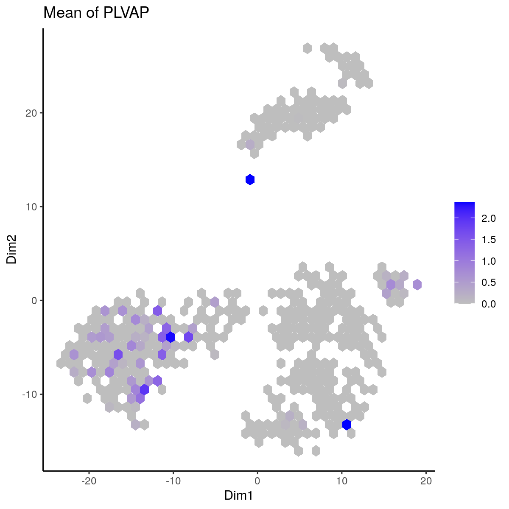|[FLT4](https://www.ncbi.nlm.nih.gov/gene/2324) [VWF](https://www.ncbi.nlm.nih.gov/gene/7450) [NRP1](https://www.ncbi.nlm.nih.gov/gene/8829) [EMCN](https://www.ncbi.nlm.nih.gov/gene/51705)|
|[PLXNA1](https://www.ncbi.nlm.nih.gov/gene/5361)|[EFNA1](https://www.ncbi.nlm.nih.gov/gene/1942) [EFNA4](https://www.ncbi.nlm.nih.gov/gene/1945) [EPHA3](https://www.ncbi.nlm.nih.gov/gene/2042) [EPHB6](https://www.ncbi.nlm.nih.gov/gene/2051) [FLT1](https://www.ncbi.nlm.nih.gov/gene/2321) [KDR](https://www.ncbi.nlm.nih.gov/gene/3791) [CCN3](https://www.ncbi.nlm.nih.gov/gene/4856) [PLXNB1](https://www.ncbi.nlm.nih.gov/gene/5364) [SEMA3F](https://www.ncbi.nlm.nih.gov/gene/6405) [SLIT1](https://www.ncbi.nlm.nih.gov/gene/6585) [SLIT3](https://www.ncbi.nlm.nih.gov/gene/6586) [VEGFA](https://www.ncbi.nlm.nih.gov/gene/7422) [SEMA3B](https://www.ncbi.nlm.nih.gov/gene/7869) [NRP2](https://www.ncbi.nlm.nih.gov/gene/8828) [NRP1](https://www.ncbi.nlm.nih.gov/gene/8829) [SLIT2](https://www.ncbi.nlm.nih.gov/gene/9353) [NTN1](https://www.ncbi.nlm.nih.gov/gene/9423) [SEMA3A](https://www.ncbi.nlm.nih.gov/gene/10371) [SEMA3C](https://www.ncbi.nlm.nih.gov/gene/10512) [TREM2](https://www.ncbi.nlm.nih.gov/gene/54209) [SEMA3G](https://www.ncbi.nlm.nih.gov/gene/56920) [SEMA3D](https://www.ncbi.nlm.nih.gov/gene/223117) [LAMA1](https://www.ncbi.nlm.nih.gov/gene/284217) [EPHA10](https://www.ncbi.nlm.nih.gov/gene/284656)|
|[PLXNA2](https://www.ncbi.nlm.nih.gov/gene/5362)|[EFNA1](https://www.ncbi.nlm.nih.gov/gene/1942) [EFNA4](https://www.ncbi.nlm.nih.gov/gene/1945) [EPHA3](https://www.ncbi.nlm.nih.gov/gene/2042) [KDR](https://www.ncbi.nlm.nih.gov/gene/3791) [NPPA](https://www.ncbi.nlm.nih.gov/gene/4878) [PLXNB1](https://www.ncbi.nlm.nih.gov/gene/5364) [SEMA3F](https://www.ncbi.nlm.nih.gov/gene/6405) [SLIT3](https://www.ncbi.nlm.nih.gov/gene/6586) [VEGFA](https://www.ncbi.nlm.nih.gov/gene/7422) [SEMA3B](https://www.ncbi.nlm.nih.gov/gene/7869) [CPZ](https://www.ncbi.nlm.nih.gov/gene/8532) [NRP2](https://www.ncbi.nlm.nih.gov/gene/8828) [NRP1](https://www.ncbi.nlm.nih.gov/gene/8829) [SLIT2](https://www.ncbi.nlm.nih.gov/gene/9353) [NTN1](https://www.ncbi.nlm.nih.gov/gene/9423) [SEMA3A](https://www.ncbi.nlm.nih.gov/gene/10371) [SEMA3C](https://www.ncbi.nlm.nih.gov/gene/10512) [SEMA3G](https://www.ncbi.nlm.nih.gov/gene/56920) [SEMA3D](https://www.ncbi.nlm.nih.gov/gene/223117) [ALKAL2](https://www.ncbi.nlm.nih.gov/gene/285016)|
|[PLXNA3](https://www.ncbi.nlm.nih.gov/gene/55558)|[EFNA1](https://www.ncbi.nlm.nih.gov/gene/1942) [EFNA4](https://www.ncbi.nlm.nih.gov/gene/1945) [EPHA3](https://www.ncbi.nlm.nih.gov/gene/2042) [EPHB6](https://www.ncbi.nlm.nih.gov/gene/2051) [KDR](https://www.ncbi.nlm.nih.gov/gene/3791) [PLXNB1](https://www.ncbi.nlm.nih.gov/gene/5364) [SEMA3F](https://www.ncbi.nlm.nih.gov/gene/6405) [VEGFA](https://www.ncbi.nlm.nih.gov/gene/7422) [SEMA3B](https://www.ncbi.nlm.nih.gov/gene/7869) [NRP2](https://www.ncbi.nlm.nih.gov/gene/8828) [NRP1](https://www.ncbi.nlm.nih.gov/gene/8829) [NTN1](https://www.ncbi.nlm.nih.gov/gene/9423) [SEMA3A](https://www.ncbi.nlm.nih.gov/gene/10371) [SEMA3C](https://www.ncbi.nlm.nih.gov/gene/10512) [SEMA3G](https://www.ncbi.nlm.nih.gov/gene/56920) [SEMA3D](https://www.ncbi.nlm.nih.gov/gene/223117) [LAMA1](https://www.ncbi.nlm.nih.gov/gene/284217) [EPHA10](https://www.ncbi.nlm.nih.gov/gene/284656)|
|[PLXNA4](https://www.ncbi.nlm.nih.gov/gene/91584)|[DSCAM](https://www.ncbi.nlm.nih.gov/gene/1826) [EFNA1](https://www.ncbi.nlm.nih.gov/gene/1942) [EFNA4](https://www.ncbi.nlm.nih.gov/gene/1945) [EPHA3](https://www.ncbi.nlm.nih.gov/gene/2042) [EPHB6](https://www.ncbi.nlm.nih.gov/gene/2051) [KDR](https://www.ncbi.nlm.nih.gov/gene/3791) [PLXNB1](https://www.ncbi.nlm.nih.gov/gene/5364) [SEMA3F](https://www.ncbi.nlm.nih.gov/gene/6405) [SLIT1](https://www.ncbi.nlm.nih.gov/gene/6585) [SLIT3](https://www.ncbi.nlm.nih.gov/gene/6586) [VEGFA](https://www.ncbi.nlm.nih.gov/gene/7422) [SEMA3B](https://www.ncbi.nlm.nih.gov/gene/7869) [NRP2](https://www.ncbi.nlm.nih.gov/gene/8828) [NRP1](https://www.ncbi.nlm.nih.gov/gene/8829) [SLIT2](https://www.ncbi.nlm.nih.gov/gene/9353) [NTN1](https://www.ncbi.nlm.nih.gov/gene/9423) [SEMA3A](https://www.ncbi.nlm.nih.gov/gene/10371) [SEMA3C](https://www.ncbi.nlm.nih.gov/gene/10512) [SEMA3G](https://www.ncbi.nlm.nih.gov/gene/56920) [SEMA3D](https://www.ncbi.nlm.nih.gov/gene/223117) [LAMA1](https://www.ncbi.nlm.nih.gov/gene/284217) [EPHA10](https://www.ncbi.nlm.nih.gov/gene/284656) [TAFA1](https://www.ncbi.nlm.nih.gov/gene/407738)|
|[PLXNB2](https://www.ncbi.nlm.nih.gov/gene/23654)|[EFNA1](https://www.ncbi.nlm.nih.gov/gene/1942) [EFNA4](https://www.ncbi.nlm.nih.gov/gene/1945) [EPHB6](https://www.ncbi.nlm.nih.gov/gene/2051) [KDR](https://www.ncbi.nlm.nih.gov/gene/3791) [MET](https://www.ncbi.nlm.nih.gov/gene/4233) [PLXNB1](https://www.ncbi.nlm.nih.gov/gene/5364) [SEMA3F](https://www.ncbi.nlm.nih.gov/gene/6405) [VEGFA](https://www.ncbi.nlm.nih.gov/gene/7422) [SEMA3B](https://www.ncbi.nlm.nih.gov/gene/7869) [NRP2](https://www.ncbi.nlm.nih.gov/gene/8828) [NRP1](https://www.ncbi.nlm.nih.gov/gene/8829) [SEMA3A](https://www.ncbi.nlm.nih.gov/gene/10371) [SEMA3C](https://www.ncbi.nlm.nih.gov/gene/10512) [SEMA3G](https://www.ncbi.nlm.nih.gov/gene/56920) [SEMA3D](https://www.ncbi.nlm.nih.gov/gene/223117) [EPHA10](https://www.ncbi.nlm.nih.gov/gene/284656)|
|[PLXNB3](https://www.ncbi.nlm.nih.gov/gene/5365)|[EFNA1](https://www.ncbi.nlm.nih.gov/gene/1942) [EFNA4](https://www.ncbi.nlm.nih.gov/gene/1945) [EPHA3](https://www.ncbi.nlm.nih.gov/gene/2042) [EPHB6](https://www.ncbi.nlm.nih.gov/gene/2051) [KDR](https://www.ncbi.nlm.nih.gov/gene/3791) [MET](https://www.ncbi.nlm.nih.gov/gene/4233) [PLXNB1](https://www.ncbi.nlm.nih.gov/gene/5364) [SDC4](https://www.ncbi.nlm.nih.gov/gene/6385) [SEMA3F](https://www.ncbi.nlm.nih.gov/gene/6405) [VEGFA](https://www.ncbi.nlm.nih.gov/gene/7422) [SEMA3B](https://www.ncbi.nlm.nih.gov/gene/7869) [NRP2](https://www.ncbi.nlm.nih.gov/gene/8828) [NRP1](https://www.ncbi.nlm.nih.gov/gene/8829) [NTN1](https://www.ncbi.nlm.nih.gov/gene/9423) [CARTPT](https://www.ncbi.nlm.nih.gov/gene/9607) [SEMA3A](https://www.ncbi.nlm.nih.gov/gene/10371) [SEMA3C](https://www.ncbi.nlm.nih.gov/gene/10512) [SEMA3G](https://www.ncbi.nlm.nih.gov/gene/56920) [NETO1](https://www.ncbi.nlm.nih.gov/gene/81832) [SEMA3D](https://www.ncbi.nlm.nih.gov/gene/223117) [EPHA10](https://www.ncbi.nlm.nih.gov/gene/284656)|
|[PLXND1](https://www.ncbi.nlm.nih.gov/gene/23129)|[EFNA1](https://www.ncbi.nlm.nih.gov/gene/1942) [EFNA4](https://www.ncbi.nlm.nih.gov/gene/1945) [EPHA3](https://www.ncbi.nlm.nih.gov/gene/2042) [EPHB6](https://www.ncbi.nlm.nih.gov/gene/2051) [FLT1](https://www.ncbi.nlm.nih.gov/gene/2321) [KDR](https://www.ncbi.nlm.nih.gov/gene/3791) [SEMA3F](https://www.ncbi.nlm.nih.gov/gene/6405) [VEGFA](https://www.ncbi.nlm.nih.gov/gene/7422) [SEMA3B](https://www.ncbi.nlm.nih.gov/gene/7869) [NRP2](https://www.ncbi.nlm.nih.gov/gene/8828) [NRP1](https://www.ncbi.nlm.nih.gov/gene/8829) [NTN1](https://www.ncbi.nlm.nih.gov/gene/9423) [SEMA3A](https://www.ncbi.nlm.nih.gov/gene/10371) [SEMA3C](https://www.ncbi.nlm.nih.gov/gene/10512) [SEMA3G](https://www.ncbi.nlm.nih.gov/gene/56920) [SEMA3D](https://www.ncbi.nlm.nih.gov/gene/223117) [EPHA10](https://www.ncbi.nlm.nih.gov/gene/284656)|
|[PMP22](https://www.ncbi.nlm.nih.gov/gene/5376)|[GAS6](https://www.ncbi.nlm.nih.gov/gene/2621) [LAMB1](https://www.ncbi.nlm.nih.gov/gene/3912) [LAMC2](https://www.ncbi.nlm.nih.gov/gene/3918) [LAMA1](https://www.ncbi.nlm.nih.gov/gene/284217) [GLDN](https://www.ncbi.nlm.nih.gov/gene/342035)|
|[PNPLA2](https://www.ncbi.nlm.nih.gov/gene/57104)|[AFP](https://www.ncbi.nlm.nih.gov/gene/174) [AHSG](https://www.ncbi.nlm.nih.gov/gene/197) [ALB](https://www.ncbi.nlm.nih.gov/gene/213) [AMBN](https://www.ncbi.nlm.nih.gov/gene/258) [AMELX](https://www.ncbi.nlm.nih.gov/gene/265) [AMELY](https://www.ncbi.nlm.nih.gov/gene/266) [APOA1](https://www.ncbi.nlm.nih.gov/gene/335) [APOA2](https://www.ncbi.nlm.nih.gov/gene/336) [APOE](https://www.ncbi.nlm.nih.gov/gene/348) [SERPINC1](https://www.ncbi.nlm.nih.gov/gene/462) [AZGP1](https://www.ncbi.nlm.nih.gov/gene/563) [BMP4](https://www.ncbi.nlm.nih.gov/gene/652) [C3](https://www.ncbi.nlm.nih.gov/gene/718) [C4A](https://www.ncbi.nlm.nih.gov/gene/720) [CHGB](https://www.ncbi.nlm.nih.gov/gene/1114) [CP](https://www.ncbi.nlm.nih.gov/gene/1356) [VCAN](https://www.ncbi.nlm.nih.gov/gene/1462) [CST3](https://www.ncbi.nlm.nih.gov/gene/1471) [F5](https://www.ncbi.nlm.nih.gov/gene/2153) [FBN1](https://www.ncbi.nlm.nih.gov/gene/2200) [FGG](https://www.ncbi.nlm.nih.gov/gene/2266) [FN1](https://www.ncbi.nlm.nih.gov/gene/2335) [FUCA2](https://www.ncbi.nlm.nih.gov/gene/2519) [GAS6](https://www.ncbi.nlm.nih.gov/gene/2621) [TNC](https://www.ncbi.nlm.nih.gov/gene/3371) [IGFBP1](https://www.ncbi.nlm.nih.gov/gene/3484) [IGFBP3](https://www.ncbi.nlm.nih.gov/gene/3486) [IGFBP4](https://www.ncbi.nlm.nih.gov/gene/3487) [IGFBP5](https://www.ncbi.nlm.nih.gov/gene/3488) [IGFBP7](https://www.ncbi.nlm.nih.gov/gene/3490) [CCN1](https://www.ncbi.nlm.nih.gov/gene/3491) [IL6](https://www.ncbi.nlm.nih.gov/gene/3569) [INS](https://www.ncbi.nlm.nih.gov/gene/3630) [ITIH2](https://www.ncbi.nlm.nih.gov/gene/3698) [LAMB1](https://www.ncbi.nlm.nih.gov/gene/3912) [LAMB2](https://www.ncbi.nlm.nih.gov/gene/3913) [LAMC1](https://www.ncbi.nlm.nih.gov/gene/3915) [LEP](https://www.ncbi.nlm.nih.gov/gene/3952) [LGALS1](https://www.ncbi.nlm.nih.gov/gene/3956) [LIPC](https://www.ncbi.nlm.nih.gov/gene/3990) [LTBP1](https://www.ncbi.nlm.nih.gov/gene/4052) [MATN3](https://www.ncbi.nlm.nih.gov/gene/4148) [SERPINF1](https://www.ncbi.nlm.nih.gov/gene/5176) [PENK](https://www.ncbi.nlm.nih.gov/gene/5179) [SERPINA1](https://www.ncbi.nlm.nih.gov/gene/5265) [PLA2G1B](https://www.ncbi.nlm.nih.gov/gene/5319) [PLA2G5](https://www.ncbi.nlm.nih.gov/gene/5322) [PNLIP](https://www.ncbi.nlm.nih.gov/gene/5406) [PNLIPRP1](https://www.ncbi.nlm.nih.gov/gene/5407) [PROC](https://www.ncbi.nlm.nih.gov/gene/5624) [QSOX1](https://www.ncbi.nlm.nih.gov/gene/5768) [RARRES2](https://www.ncbi.nlm.nih.gov/gene/5919) [SPP2](https://www.ncbi.nlm.nih.gov/gene/6694) [SPP1](https://www.ncbi.nlm.nih.gov/gene/6696) [TF](https://www.ncbi.nlm.nih.gov/gene/7018) [TIMP1](https://www.ncbi.nlm.nih.gov/gene/7076) [VEGFA](https://www.ncbi.nlm.nih.gov/gene/7422) [VGF](https://www.ncbi.nlm.nih.gov/gene/7425) [SCG2](https://www.ncbi.nlm.nih.gov/gene/7857) [FGF23](https://www.ncbi.nlm.nih.gov/gene/8074) [PLA2G10](https://www.ncbi.nlm.nih.gov/gene/8399) [SPARCL1](https://www.ncbi.nlm.nih.gov/gene/8404) [LIPF](https://www.ncbi.nlm.nih.gov/gene/8513) [APOL1](https://www.ncbi.nlm.nih.gov/gene/8542) [STC2](https://www.ncbi.nlm.nih.gov/gene/8614) [BMP15](https://www.ncbi.nlm.nih.gov/gene/9210) [ADIPOQ](https://www.ncbi.nlm.nih.gov/gene/9370) [LIPG](https://www.ncbi.nlm.nih.gov/gene/9388) [ENAM](https://www.ncbi.nlm.nih.gov/gene/10117) [MSLN](https://www.ncbi.nlm.nih.gov/gene/10232) [FSTL3](https://www.ncbi.nlm.nih.gov/gene/10272) [PRSS23](https://www.ncbi.nlm.nih.gov/gene/11098) [FSTL1](https://www.ncbi.nlm.nih.gov/gene/11167) [FGF21](https://www.ncbi.nlm.nih.gov/gene/26291) [HILPDA](https://www.ncbi.nlm.nih.gov/gene/29923) [ANGPTL4](https://www.ncbi.nlm.nih.gov/gene/51129) [SERPINA10](https://www.ncbi.nlm.nih.gov/gene/51156) [FAM20A](https://www.ncbi.nlm.nih.gov/gene/54757) [RETN](https://www.ncbi.nlm.nih.gov/gene/56729) [MEPE](https://www.ncbi.nlm.nih.gov/gene/56955) [FAM20C](https://www.ncbi.nlm.nih.gov/gene/56975) [VWA1](https://www.ncbi.nlm.nih.gov/gene/64856) [BPIFB2](https://www.ncbi.nlm.nih.gov/gene/80341) [CHRDL1](https://www.ncbi.nlm.nih.gov/gene/91851) [APOA5](https://www.ncbi.nlm.nih.gov/gene/116519) [PNLIPRP3](https://www.ncbi.nlm.nih.gov/gene/119548) [NOTUM](https://www.ncbi.nlm.nih.gov/gene/147111) [PCSK9](https://www.ncbi.nlm.nih.gov/gene/255738) [AMTN](https://www.ncbi.nlm.nih.gov/gene/401138)|
|[PODXL](https://www.ncbi.nlm.nih.gov/gene/5420)|[ALB](https://www.ncbi.nlm.nih.gov/gene/213) [ANXA2](https://www.ncbi.nlm.nih.gov/gene/302) [FGF2](https://www.ncbi.nlm.nih.gov/gene/2247) [FN1](https://www.ncbi.nlm.nih.gov/gene/2335) [VEGFA](https://www.ncbi.nlm.nih.gov/gene/7422) [GDF3](https://www.ncbi.nlm.nih.gov/gene/9573) [CRISP3](https://www.ncbi.nlm.nih.gov/gene/10321) [EMCN](https://www.ncbi.nlm.nih.gov/gene/51705)|
|[PRIMA1](https://www.ncbi.nlm.nih.gov/gene/145270)|[BCHE](https://www.ncbi.nlm.nih.gov/gene/590) [CRHBP](https://www.ncbi.nlm.nih.gov/gene/1393) [VEGFA](https://www.ncbi.nlm.nih.gov/gene/7422)|
|[PRKAR1A](https://www.ncbi.nlm.nih.gov/gene/5573)|[AGT](https://www.ncbi.nlm.nih.gov/gene/183) [EDN1](https://www.ncbi.nlm.nih.gov/gene/1906) [EGFR](https://www.ncbi.nlm.nih.gov/gene/1956) [F2](https://www.ncbi.nlm.nih.gov/gene/2147) [F10](https://www.ncbi.nlm.nih.gov/gene/2159) [FN1](https://www.ncbi.nlm.nih.gov/gene/2335) [POMC](https://www.ncbi.nlm.nih.gov/gene/5443) [PRL](https://www.ncbi.nlm.nih.gov/gene/5617) [CCL11](https://www.ncbi.nlm.nih.gov/gene/6356) [CXCL12](https://www.ncbi.nlm.nih.gov/gene/6387)|
|[PRKAR1B](https://www.ncbi.nlm.nih.gov/gene/5575)|[AGT](https://www.ncbi.nlm.nih.gov/gene/183) [EDN1](https://www.ncbi.nlm.nih.gov/gene/1906) [F2](https://www.ncbi.nlm.nih.gov/gene/2147) [FN1](https://www.ncbi.nlm.nih.gov/gene/2335) [CCL11](https://www.ncbi.nlm.nih.gov/gene/6356) [CXCL12](https://www.ncbi.nlm.nih.gov/gene/6387)|
|[PRKCQ](https://www.ncbi.nlm.nih.gov/gene/5588)|[CD8A](https://www.ncbi.nlm.nih.gov/gene/925) [CD8B](https://www.ncbi.nlm.nih.gov/gene/926) [IL2](https://www.ncbi.nlm.nih.gov/gene/3558) [ITIH2](https://www.ncbi.nlm.nih.gov/gene/3698) [ITIH5](https://www.ncbi.nlm.nih.gov/gene/80760) [C1QTNF6](https://www.ncbi.nlm.nih.gov/gene/114904) [ITIH6](https://www.ncbi.nlm.nih.gov/gene/347365) [IGLL5](https://www.ncbi.nlm.nih.gov/gene/100423062)|
|[PRKG2](https://www.ncbi.nlm.nih.gov/gene/5593)|[BMP3](https://www.ncbi.nlm.nih.gov/gene/651) [COL2A1](https://www.ncbi.nlm.nih.gov/gene/1280) [COL10A1](https://www.ncbi.nlm.nih.gov/gene/1300) [GUCA2A](https://www.ncbi.nlm.nih.gov/gene/2980) [GUCA2B](https://www.ncbi.nlm.nih.gov/gene/2981) [IBSP](https://www.ncbi.nlm.nih.gov/gene/3381) [MATN1](https://www.ncbi.nlm.nih.gov/gene/4146) [NPPC](https://www.ncbi.nlm.nih.gov/gene/4880) [LCN6](https://www.ncbi.nlm.nih.gov/gene/158062)|
|[PRLHR](https://www.ncbi.nlm.nih.gov/gene/2834)|[NPY](https://www.ncbi.nlm.nih.gov/gene/4852) [PRL](https://www.ncbi.nlm.nih.gov/gene/5617) [NPFF](https://www.ncbi.nlm.nih.gov/gene/8620) [TAFA5](https://www.ncbi.nlm.nih.gov/gene/25817) [PRLH](https://www.ncbi.nlm.nih.gov/gene/51052) [NPVF](https://www.ncbi.nlm.nih.gov/gene/64111) [QRFP](https://www.ncbi.nlm.nih.gov/gene/347148) [PTHLH](https://www.ncbi.nlm.nih.gov/gene/5744)|
|[PRLR](https://www.ncbi.nlm.nih.gov/gene/5618)|[CSH1](https://www.ncbi.nlm.nih.gov/gene/1442) [CSH2](https://www.ncbi.nlm.nih.gov/gene/1443) [CSHL1](https://www.ncbi.nlm.nih.gov/gene/1444)|
|[PRND](https://www.ncbi.nlm.nih.gov/gene/23627) 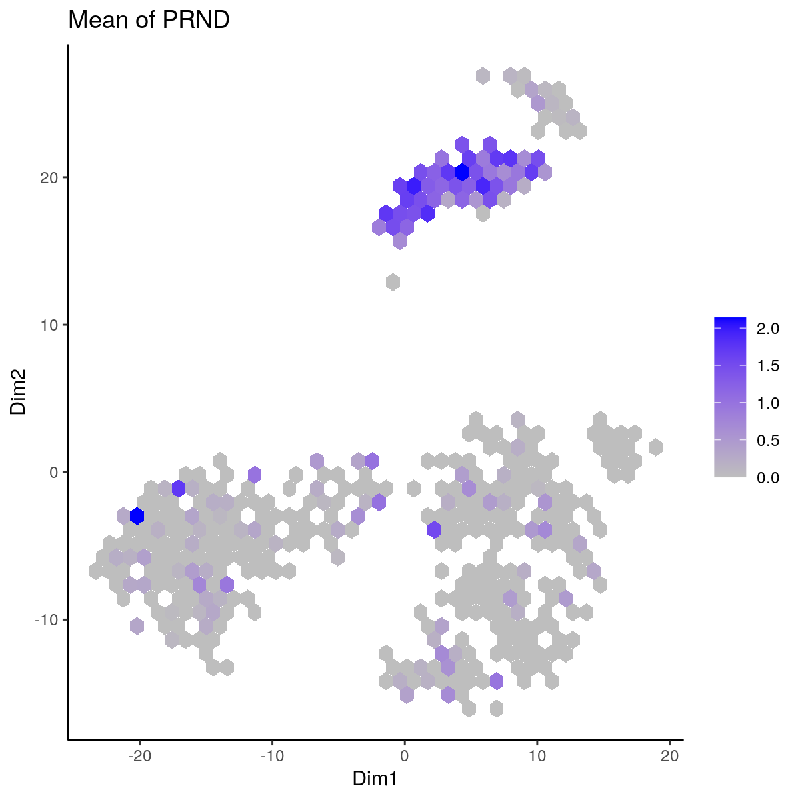|[A2M](https://www.ncbi.nlm.nih.gov/gene/2) [GPLD1](https://www.ncbi.nlm.nih.gov/gene/2822) [MSMB](https://www.ncbi.nlm.nih.gov/gene/4477) [PDYN](https://www.ncbi.nlm.nih.gov/gene/5173) [PRH1](https://www.ncbi.nlm.nih.gov/gene/5554) [MSLN](https://www.ncbi.nlm.nih.gov/gene/10232) [PRR4](https://www.ncbi.nlm.nih.gov/gene/11272) [LY6K](https://www.ncbi.nlm.nih.gov/gene/54742) [RAET1G](https://www.ncbi.nlm.nih.gov/gene/353091) [GP2](https://www.ncbi.nlm.nih.gov/gene/2813)|
|[PRNP](https://www.ncbi.nlm.nih.gov/gene/5621)|[ALB](https://www.ncbi.nlm.nih.gov/gene/213) [APOD](https://www.ncbi.nlm.nih.gov/gene/347) [APOE](https://www.ncbi.nlm.nih.gov/gene/348) [GPC1](https://www.ncbi.nlm.nih.gov/gene/2817) [GRN](https://www.ncbi.nlm.nih.gov/gene/2896) [IAPP](https://www.ncbi.nlm.nih.gov/gene/3375) [LAMA2](https://www.ncbi.nlm.nih.gov/gene/3908) [LAMA3](https://www.ncbi.nlm.nih.gov/gene/3909) [LAMA4](https://www.ncbi.nlm.nih.gov/gene/3910) [LAMA5](https://www.ncbi.nlm.nih.gov/gene/3911) [LAMB1](https://www.ncbi.nlm.nih.gov/gene/3912) [LAMB2](https://www.ncbi.nlm.nih.gov/gene/3913) [LAMB3](https://www.ncbi.nlm.nih.gov/gene/3914) [LAMC1](https://www.ncbi.nlm.nih.gov/gene/3915) [LAMC2](https://www.ncbi.nlm.nih.gov/gene/3918) [MET](https://www.ncbi.nlm.nih.gov/gene/4233) [MSMB](https://www.ncbi.nlm.nih.gov/gene/4477) [NCAM1](https://www.ncbi.nlm.nih.gov/gene/4684) [PLG](https://www.ncbi.nlm.nih.gov/gene/5340) [PRH1](https://www.ncbi.nlm.nih.gov/gene/5554) [TTR](https://www.ncbi.nlm.nih.gov/gene/7276) [ADAM23](https://www.ncbi.nlm.nih.gov/gene/8745) [LAMC3](https://www.ncbi.nlm.nih.gov/gene/10319) [PRR4](https://www.ncbi.nlm.nih.gov/gene/11272) [SPATA6](https://www.ncbi.nlm.nih.gov/gene/54558) [LAMA1](https://www.ncbi.nlm.nih.gov/gene/284217)|
|[PROKR1](https://www.ncbi.nlm.nih.gov/gene/10887)|[IGFBP7](https://www.ncbi.nlm.nih.gov/gene/3490) [PROK2](https://www.ncbi.nlm.nih.gov/gene/60675) [PROK1](https://www.ncbi.nlm.nih.gov/gene/84432) [FREM3](https://www.ncbi.nlm.nih.gov/gene/166752)|
|[PROKR2](https://www.ncbi.nlm.nih.gov/gene/128674)|[AGT](https://www.ncbi.nlm.nih.gov/gene/183) [AVP](https://www.ncbi.nlm.nih.gov/gene/551) [CCK](https://www.ncbi.nlm.nih.gov/gene/885) [EDN1](https://www.ncbi.nlm.nih.gov/gene/1906) [EDN2](https://www.ncbi.nlm.nih.gov/gene/1907) [EDN3](https://www.ncbi.nlm.nih.gov/gene/1908) [F2](https://www.ncbi.nlm.nih.gov/gene/2147) [FGF8](https://www.ncbi.nlm.nih.gov/gene/2253) [GAST](https://www.ncbi.nlm.nih.gov/gene/2520) [GCG](https://www.ncbi.nlm.nih.gov/gene/2641) [GNRH1](https://www.ncbi.nlm.nih.gov/gene/2796) [GNRH2](https://www.ncbi.nlm.nih.gov/gene/2797) [GRP](https://www.ncbi.nlm.nih.gov/gene/2922) [IGFBP7](https://www.ncbi.nlm.nih.gov/gene/3490) [KISS1](https://www.ncbi.nlm.nih.gov/gene/3814) [MLN](https://www.ncbi.nlm.nih.gov/gene/4295) [NMB](https://www.ncbi.nlm.nih.gov/gene/4828) [NTS](https://www.ncbi.nlm.nih.gov/gene/4922) [OXT](https://www.ncbi.nlm.nih.gov/gene/5020) [PMCH](https://www.ncbi.nlm.nih.gov/gene/5367) [PSPN](https://www.ncbi.nlm.nih.gov/gene/5623) [SAA1](https://www.ncbi.nlm.nih.gov/gene/6288) [XCL1](https://www.ncbi.nlm.nih.gov/gene/6375) [XCL2](https://www.ncbi.nlm.nih.gov/gene/6846) [TAC1](https://www.ncbi.nlm.nih.gov/gene/6863) [TAC3](https://www.ncbi.nlm.nih.gov/gene/6866) [TRH](https://www.ncbi.nlm.nih.gov/gene/7200) [NPFF](https://www.ncbi.nlm.nih.gov/gene/8620) [SEMA3A](https://www.ncbi.nlm.nih.gov/gene/10371) [NMU](https://www.ncbi.nlm.nih.gov/gene/10874) [UTS2](https://www.ncbi.nlm.nih.gov/gene/10911) [PROK2](https://www.ncbi.nlm.nih.gov/gene/60675) [PROK1](https://www.ncbi.nlm.nih.gov/gene/84432) [NMS](https://www.ncbi.nlm.nih.gov/gene/129521) [FREM3](https://www.ncbi.nlm.nih.gov/gene/166752) [UTS2B](https://www.ncbi.nlm.nih.gov/gene/257313) [QRFP](https://www.ncbi.nlm.nih.gov/gene/347148) [NPS](https://www.ncbi.nlm.nih.gov/gene/594857)|
|[PROM1](https://www.ncbi.nlm.nih.gov/gene/8842)|[AFP](https://www.ncbi.nlm.nih.gov/gene/174) [ALB](https://www.ncbi.nlm.nih.gov/gene/213) [ALCAM](https://www.ncbi.nlm.nih.gov/gene/214) [ANGPT1](https://www.ncbi.nlm.nih.gov/gene/284) [BMP4](https://www.ncbi.nlm.nih.gov/gene/652) [CSF2](https://www.ncbi.nlm.nih.gov/gene/1437) [CSF3](https://www.ncbi.nlm.nih.gov/gene/1440) [DSCAM](https://www.ncbi.nlm.nih.gov/gene/1826) [EGFR](https://www.ncbi.nlm.nih.gov/gene/1956) [EPO](https://www.ncbi.nlm.nih.gov/gene/2056) [FGF2](https://www.ncbi.nlm.nih.gov/gene/2247) [FGF3](https://www.ncbi.nlm.nih.gov/gene/2248) [FGF6](https://www.ncbi.nlm.nih.gov/gene/2251) [FGF7](https://www.ncbi.nlm.nih.gov/gene/2252) [FGF8](https://www.ncbi.nlm.nih.gov/gene/2253) [FGF9](https://www.ncbi.nlm.nih.gov/gene/2254) [FLT1](https://www.ncbi.nlm.nih.gov/gene/2321) [FN1](https://www.ncbi.nlm.nih.gov/gene/2335) [IGF1](https://www.ncbi.nlm.nih.gov/gene/3479) [IGF2](https://www.ncbi.nlm.nih.gov/gene/3481) [IL3](https://www.ncbi.nlm.nih.gov/gene/3562) [IL6](https://www.ncbi.nlm.nih.gov/gene/3569) [CXCL8](https://www.ncbi.nlm.nih.gov/gene/3576) [INS](https://www.ncbi.nlm.nih.gov/gene/3630) [KDR](https://www.ncbi.nlm.nih.gov/gene/3791) [LIF](https://www.ncbi.nlm.nih.gov/gene/3976) [MET](https://www.ncbi.nlm.nih.gov/gene/4233) [MMP9](https://www.ncbi.nlm.nih.gov/gene/4318) [MUC1](https://www.ncbi.nlm.nih.gov/gene/4582) [NCAM1](https://www.ncbi.nlm.nih.gov/gene/4684) [PTEN](https://www.ncbi.nlm.nih.gov/gene/5728) [CXCL12](https://www.ncbi.nlm.nih.gov/gene/6387) [SPP1](https://www.ncbi.nlm.nih.gov/gene/6696) [TNF](https://www.ncbi.nlm.nih.gov/gene/7124) [VEGFA](https://www.ncbi.nlm.nih.gov/gene/7422) [VWF](https://www.ncbi.nlm.nih.gov/gene/7450) [WNT2](https://www.ncbi.nlm.nih.gov/gene/7472) [CD164](https://www.ncbi.nlm.nih.gov/gene/8763) [FGF17](https://www.ncbi.nlm.nih.gov/gene/8822) [FGF16](https://www.ncbi.nlm.nih.gov/gene/8823) [NOG](https://www.ncbi.nlm.nih.gov/gene/9241) [FGF19](https://www.ncbi.nlm.nih.gov/gene/9965) [OLFM4](https://www.ncbi.nlm.nih.gov/gene/10562) [CRB1](https://www.ncbi.nlm.nih.gov/gene/23418) [FGF22](https://www.ncbi.nlm.nih.gov/gene/27006) [WNT3A](https://www.ncbi.nlm.nih.gov/gene/89780)|
|[PRRT1](https://www.ncbi.nlm.nih.gov/gene/80863)|[LY6G5C](https://www.ncbi.nlm.nih.gov/gene/80741) [EGFL8](https://www.ncbi.nlm.nih.gov/gene/80864) [CDCP2](https://www.ncbi.nlm.nih.gov/gene/200008)|
|[PRRT2](https://www.ncbi.nlm.nih.gov/gene/112476)|[CAMP](https://www.ncbi.nlm.nih.gov/gene/820) [VEGFD](https://www.ncbi.nlm.nih.gov/gene/2277) [FLT4](https://www.ncbi.nlm.nih.gov/gene/2324) [VEGFC](https://www.ncbi.nlm.nih.gov/gene/7424)|
|[PRSS21](https://www.ncbi.nlm.nih.gov/gene/10942)|[GPLD1](https://www.ncbi.nlm.nih.gov/gene/2822) [KRT10](https://www.ncbi.nlm.nih.gov/gene/3858) [SERPINA5](https://www.ncbi.nlm.nih.gov/gene/5104) [SERPINB5](https://www.ncbi.nlm.nih.gov/gene/5268) [MSLN](https://www.ncbi.nlm.nih.gov/gene/10232) [LY6K](https://www.ncbi.nlm.nih.gov/gene/54742) [RAET1G](https://www.ncbi.nlm.nih.gov/gene/353091)|
|[PRX](https://www.ncbi.nlm.nih.gov/gene/57716)|[ORM2](https://www.ncbi.nlm.nih.gov/gene/5005)|
|[PSCA](https://www.ncbi.nlm.nih.gov/gene/8000)|[KLK3](https://www.ncbi.nlm.nih.gov/gene/354) [GPLD1](https://www.ncbi.nlm.nih.gov/gene/2822) [IL6](https://www.ncbi.nlm.nih.gov/gene/3569) [MUC1](https://www.ncbi.nlm.nih.gov/gene/4582) [MUC6](https://www.ncbi.nlm.nih.gov/gene/4588) [CARTPT](https://www.ncbi.nlm.nih.gov/gene/9607) [MSLN](https://www.ncbi.nlm.nih.gov/gene/10232) [LY6K](https://www.ncbi.nlm.nih.gov/gene/54742) [SLURP1](https://www.ncbi.nlm.nih.gov/gene/57152) [RAET1G](https://www.ncbi.nlm.nih.gov/gene/353091)|
|[PSD](https://www.ncbi.nlm.nih.gov/gene/5662)|[A2M](https://www.ncbi.nlm.nih.gov/gene/2)|
|[PSD2](https://www.ncbi.nlm.nih.gov/gene/84249)|[NCAN](https://www.ncbi.nlm.nih.gov/gene/1463) [HAPLN2](https://www.ncbi.nlm.nih.gov/gene/60484)|
|[PSD3](https://www.ncbi.nlm.nih.gov/gene/23362)|[SERPINI1](https://www.ncbi.nlm.nih.gov/gene/5274)|
|[PSD4](https://www.ncbi.nlm.nih.gov/gene/23550)|[IL1RN](https://www.ncbi.nlm.nih.gov/gene/3557) [IL18](https://www.ncbi.nlm.nih.gov/gene/3606) [SFTPB](https://www.ncbi.nlm.nih.gov/gene/6439)|
|[PTAFR](https://www.ncbi.nlm.nih.gov/gene/5724)|[AGT](https://www.ncbi.nlm.nih.gov/gene/183) [AVP](https://www.ncbi.nlm.nih.gov/gene/551) [C6](https://www.ncbi.nlm.nih.gov/gene/729) [CCK](https://www.ncbi.nlm.nih.gov/gene/885) [EDN1](https://www.ncbi.nlm.nih.gov/gene/1906) [EDN2](https://www.ncbi.nlm.nih.gov/gene/1907) [EDN3](https://www.ncbi.nlm.nih.gov/gene/1908) [F2](https://www.ncbi.nlm.nih.gov/gene/2147) [FCAR](https://www.ncbi.nlm.nih.gov/gene/2204) [GAST](https://www.ncbi.nlm.nih.gov/gene/2520) [GCG](https://www.ncbi.nlm.nih.gov/gene/2641) [GNRH1](https://www.ncbi.nlm.nih.gov/gene/2796) [GNRH2](https://www.ncbi.nlm.nih.gov/gene/2797) [GRP](https://www.ncbi.nlm.nih.gov/gene/2922) [CXCL8](https://www.ncbi.nlm.nih.gov/gene/3576) [IL10](https://www.ncbi.nlm.nih.gov/gene/3586) [CXCL10](https://www.ncbi.nlm.nih.gov/gene/3627) [KISS1](https://www.ncbi.nlm.nih.gov/gene/3814) [MLN](https://www.ncbi.nlm.nih.gov/gene/4295) [MMP3](https://www.ncbi.nlm.nih.gov/gene/4314) [NCAM1](https://www.ncbi.nlm.nih.gov/gene/4684) [NMB](https://www.ncbi.nlm.nih.gov/gene/4828) [NTS](https://www.ncbi.nlm.nih.gov/gene/4922) [OXT](https://www.ncbi.nlm.nih.gov/gene/5020) [PIGR](https://www.ncbi.nlm.nih.gov/gene/5284) [PLAU](https://www.ncbi.nlm.nih.gov/gene/5328) [SERPINF2](https://www.ncbi.nlm.nih.gov/gene/5345) [PMCH](https://www.ncbi.nlm.nih.gov/gene/5367) [SAA1](https://www.ncbi.nlm.nih.gov/gene/6288) [CCL5](https://www.ncbi.nlm.nih.gov/gene/6352) [XCL1](https://www.ncbi.nlm.nih.gov/gene/6375) [XCL2](https://www.ncbi.nlm.nih.gov/gene/6846) [TAC1](https://www.ncbi.nlm.nih.gov/gene/6863) [TAC3](https://www.ncbi.nlm.nih.gov/gene/6866) [TNF](https://www.ncbi.nlm.nih.gov/gene/7124) [TRH](https://www.ncbi.nlm.nih.gov/gene/7200) [PLA2G7](https://www.ncbi.nlm.nih.gov/gene/7941) [NPFF](https://www.ncbi.nlm.nih.gov/gene/8620) [IFI30](https://www.ncbi.nlm.nih.gov/gene/10437) [NMU](https://www.ncbi.nlm.nih.gov/gene/10874) [UTS2](https://www.ncbi.nlm.nih.gov/gene/10911) [PROK2](https://www.ncbi.nlm.nih.gov/gene/60675) [PROK1](https://www.ncbi.nlm.nih.gov/gene/84432) [NMS](https://www.ncbi.nlm.nih.gov/gene/129521) [UTS2B](https://www.ncbi.nlm.nih.gov/gene/257313) [QRFP](https://www.ncbi.nlm.nih.gov/gene/347148) [NPS](https://www.ncbi.nlm.nih.gov/gene/594857)|
|[PTCH1](https://www.ncbi.nlm.nih.gov/gene/5727)|[BMP2](https://www.ncbi.nlm.nih.gov/gene/650) [BMP4](https://www.ncbi.nlm.nih.gov/gene/652) [BMP7](https://www.ncbi.nlm.nih.gov/gene/655) [EGFR](https://www.ncbi.nlm.nih.gov/gene/1956) [FGF2](https://www.ncbi.nlm.nih.gov/gene/2247) [FGF4](https://www.ncbi.nlm.nih.gov/gene/2249) [FGF8](https://www.ncbi.nlm.nih.gov/gene/2253) [FGF9](https://www.ncbi.nlm.nih.gov/gene/2254) [FGF10](https://www.ncbi.nlm.nih.gov/gene/2255) [FGFR3](https://www.ncbi.nlm.nih.gov/gene/2261) [GPC5](https://www.ncbi.nlm.nih.gov/gene/2262) [FGFR2](https://www.ncbi.nlm.nih.gov/gene/2263) [GDF1](https://www.ncbi.nlm.nih.gov/gene/2657) [GPX3](https://www.ncbi.nlm.nih.gov/gene/2878) [PTEN](https://www.ncbi.nlm.nih.gov/gene/5728) [PTHLH](https://www.ncbi.nlm.nih.gov/gene/5744) [SFRP1](https://www.ncbi.nlm.nih.gov/gene/6422) [VEGFA](https://www.ncbi.nlm.nih.gov/gene/7422) [WNT1](https://www.ncbi.nlm.nih.gov/gene/7471) [WNT2](https://www.ncbi.nlm.nih.gov/gene/7472) [WNT5A](https://www.ncbi.nlm.nih.gov/gene/7474) [WNT2B](https://www.ncbi.nlm.nih.gov/gene/7482) [WNT9A](https://www.ncbi.nlm.nih.gov/gene/7483) [WNT9B](https://www.ncbi.nlm.nih.gov/gene/7484) [NOG](https://www.ncbi.nlm.nih.gov/gene/9241) [GPC6](https://www.ncbi.nlm.nih.gov/gene/10082) [WIF1](https://www.ncbi.nlm.nih.gov/gene/11197) [WNT4](https://www.ncbi.nlm.nih.gov/gene/54361) [SCUBE2](https://www.ncbi.nlm.nih.gov/gene/57758) [WNT5B](https://www.ncbi.nlm.nih.gov/gene/81029) [WNT3A](https://www.ncbi.nlm.nih.gov/gene/89780)|
|[PTCHD1](https://www.ncbi.nlm.nih.gov/gene/139411)|[LAMB1](https://www.ncbi.nlm.nih.gov/gene/3912) [MET](https://www.ncbi.nlm.nih.gov/gene/4233)|
|[PTGDR](https://www.ncbi.nlm.nih.gov/gene/5729)|[ADCYAP1](https://www.ncbi.nlm.nih.gov/gene/116) [ADM](https://www.ncbi.nlm.nih.gov/gene/133) [AVP](https://www.ncbi.nlm.nih.gov/gene/551) [CALCA](https://www.ncbi.nlm.nih.gov/gene/796) [CALCB](https://www.ncbi.nlm.nih.gov/gene/797) [CGA](https://www.ncbi.nlm.nih.gov/gene/1081) [CRH](https://www.ncbi.nlm.nih.gov/gene/1392) [FSHB](https://www.ncbi.nlm.nih.gov/gene/2488) [GCG](https://www.ncbi.nlm.nih.gov/gene/2641) [GHRH](https://www.ncbi.nlm.nih.gov/gene/2691) [GIP](https://www.ncbi.nlm.nih.gov/gene/2695) [IAPP](https://www.ncbi.nlm.nih.gov/gene/3375) [INSL3](https://www.ncbi.nlm.nih.gov/gene/3640) [MMP7](https://www.ncbi.nlm.nih.gov/gene/4316) [POMC](https://www.ncbi.nlm.nih.gov/gene/5443) [PTH](https://www.ncbi.nlm.nih.gov/gene/5741) [PTHLH](https://www.ncbi.nlm.nih.gov/gene/5744) [RLN1](https://www.ncbi.nlm.nih.gov/gene/6013) [RLN2](https://www.ncbi.nlm.nih.gov/gene/6019) [SCT](https://www.ncbi.nlm.nih.gov/gene/6343) [TSHB](https://www.ncbi.nlm.nih.gov/gene/7252) [VIP](https://www.ncbi.nlm.nih.gov/gene/7432) [HAMP](https://www.ncbi.nlm.nih.gov/gene/57817) [ADM2](https://www.ncbi.nlm.nih.gov/gene/79924) [PTH2](https://www.ncbi.nlm.nih.gov/gene/113091) [RLN3](https://www.ncbi.nlm.nih.gov/gene/117579) [GPHB5](https://www.ncbi.nlm.nih.gov/gene/122876) [GPHA2](https://www.ncbi.nlm.nih.gov/gene/170589) [RSPO1](https://www.ncbi.nlm.nih.gov/gene/284654) [NPS](https://www.ncbi.nlm.nih.gov/gene/594857)|
|[PTGDR2](https://www.ncbi.nlm.nih.gov/gene/11251)|[AGT](https://www.ncbi.nlm.nih.gov/gene/183) [C3](https://www.ncbi.nlm.nih.gov/gene/718) [C5](https://www.ncbi.nlm.nih.gov/gene/727) [CORT](https://www.ncbi.nlm.nih.gov/gene/1325) [GABBR1](https://www.ncbi.nlm.nih.gov/gene/2550) [CXCL1](https://www.ncbi.nlm.nih.gov/gene/2919) [CXCL2](https://www.ncbi.nlm.nih.gov/gene/2920) [CXCL3](https://www.ncbi.nlm.nih.gov/gene/2921) [IL2](https://www.ncbi.nlm.nih.gov/gene/3558) [IL4](https://www.ncbi.nlm.nih.gov/gene/3565) [IL5](https://www.ncbi.nlm.nih.gov/gene/3567) [IL7](https://www.ncbi.nlm.nih.gov/gene/3574) [IL7R](https://www.ncbi.nlm.nih.gov/gene/3575) [CXCL8](https://www.ncbi.nlm.nih.gov/gene/3576) [IL9](https://www.ncbi.nlm.nih.gov/gene/3578) [IL13](https://www.ncbi.nlm.nih.gov/gene/3596) [CXCL10](https://www.ncbi.nlm.nih.gov/gene/3627) [SCGB2A1](https://www.ncbi.nlm.nih.gov/gene/4246) [CXCL9](https://www.ncbi.nlm.nih.gov/gene/4283) [MUC7](https://www.ncbi.nlm.nih.gov/gene/4589) [NCAM1](https://www.ncbi.nlm.nih.gov/gene/4684) [NPY](https://www.ncbi.nlm.nih.gov/gene/4852) [PDYN](https://www.ncbi.nlm.nih.gov/gene/5173) [PENK](https://www.ncbi.nlm.nih.gov/gene/5179) [PF4](https://www.ncbi.nlm.nih.gov/gene/5196) [PMCH](https://www.ncbi.nlm.nih.gov/gene/5367) [PNOC](https://www.ncbi.nlm.nih.gov/gene/5368) [POMC](https://www.ncbi.nlm.nih.gov/gene/5443) [PPBP](https://www.ncbi.nlm.nih.gov/gene/5473) [PPY](https://www.ncbi.nlm.nih.gov/gene/5539) [PSAP](https://www.ncbi.nlm.nih.gov/gene/5660) [PYY](https://www.ncbi.nlm.nih.gov/gene/5697) [SAA1](https://www.ncbi.nlm.nih.gov/gene/6288) [CCL1](https://www.ncbi.nlm.nih.gov/gene/6346) [CCL5](https://www.ncbi.nlm.nih.gov/gene/6352) [CCL11](https://www.ncbi.nlm.nih.gov/gene/6356) [CCL13](https://www.ncbi.nlm.nih.gov/gene/6357) [CCL16](https://www.ncbi.nlm.nih.gov/gene/6360) [CCL17](https://www.ncbi.nlm.nih.gov/gene/6361) [CCL19](https://www.ncbi.nlm.nih.gov/gene/6363) [CCL20](https://www.ncbi.nlm.nih.gov/gene/6364) [CCL21](https://www.ncbi.nlm.nih.gov/gene/6366) [CCL25](https://www.ncbi.nlm.nih.gov/gene/6370) [CXCL6](https://www.ncbi.nlm.nih.gov/gene/6372) [CXCL11](https://www.ncbi.nlm.nih.gov/gene/6373) [CXCL5](https://www.ncbi.nlm.nih.gov/gene/6374) [CX3CL1](https://www.ncbi.nlm.nih.gov/gene/6376) [CXCL12](https://www.ncbi.nlm.nih.gov/gene/6387) [SST](https://www.ncbi.nlm.nih.gov/gene/6750) [PLA2G7](https://www.ncbi.nlm.nih.gov/gene/7941) [APLN](https://www.ncbi.nlm.nih.gov/gene/8862) [IL1RL1](https://www.ncbi.nlm.nih.gov/gene/9173) [INSL5](https://www.ncbi.nlm.nih.gov/gene/10022) [CXCL13](https://www.ncbi.nlm.nih.gov/gene/10563) [CCL27](https://www.ncbi.nlm.nih.gov/gene/10850) [NMU](https://www.ncbi.nlm.nih.gov/gene/10874) [GAL](https://www.ncbi.nlm.nih.gov/gene/51083) [IL17RB](https://www.ncbi.nlm.nih.gov/gene/55540) [CCL28](https://www.ncbi.nlm.nih.gov/gene/56477) [CRLF2](https://www.ncbi.nlm.nih.gov/gene/64109) [TSLP](https://www.ncbi.nlm.nih.gov/gene/85480) [SCGB3A2](https://www.ncbi.nlm.nih.gov/gene/117156) [RLN3](https://www.ncbi.nlm.nih.gov/gene/117579) [NMS](https://www.ncbi.nlm.nih.gov/gene/129521) [NPB](https://www.ncbi.nlm.nih.gov/gene/256933) [NPW](https://www.ncbi.nlm.nih.gov/gene/283869) [C9orf47](https://www.ncbi.nlm.nih.gov/gene/286223) [CCL4L1](https://www.ncbi.nlm.nih.gov/gene/388372)|
|[PTGER1](https://www.ncbi.nlm.nih.gov/gene/5731)|[AGT](https://www.ncbi.nlm.nih.gov/gene/183) [AVP](https://www.ncbi.nlm.nih.gov/gene/551) [CCK](https://www.ncbi.nlm.nih.gov/gene/885) [CRH](https://www.ncbi.nlm.nih.gov/gene/1392) [EDN1](https://www.ncbi.nlm.nih.gov/gene/1906) [EDN2](https://www.ncbi.nlm.nih.gov/gene/1907) [EDN3](https://www.ncbi.nlm.nih.gov/gene/1908) [F2](https://www.ncbi.nlm.nih.gov/gene/2147) [GAST](https://www.ncbi.nlm.nih.gov/gene/2520) [GCG](https://www.ncbi.nlm.nih.gov/gene/2641) [GNRH1](https://www.ncbi.nlm.nih.gov/gene/2796) [GNRH2](https://www.ncbi.nlm.nih.gov/gene/2797) [GRP](https://www.ncbi.nlm.nih.gov/gene/2922) [KISS1](https://www.ncbi.nlm.nih.gov/gene/3814) [MLN](https://www.ncbi.nlm.nih.gov/gene/4295) [NMB](https://www.ncbi.nlm.nih.gov/gene/4828) [NTS](https://www.ncbi.nlm.nih.gov/gene/4922) [OXT](https://www.ncbi.nlm.nih.gov/gene/5020) [PGF](https://www.ncbi.nlm.nih.gov/gene/5228) [PMCH](https://www.ncbi.nlm.nih.gov/gene/5367) [SAA1](https://www.ncbi.nlm.nih.gov/gene/6288) [CCL11](https://www.ncbi.nlm.nih.gov/gene/6356) [XCL1](https://www.ncbi.nlm.nih.gov/gene/6375) [CXCL12](https://www.ncbi.nlm.nih.gov/gene/6387) [XCL2](https://www.ncbi.nlm.nih.gov/gene/6846) [TAC1](https://www.ncbi.nlm.nih.gov/gene/6863) [TAC3](https://www.ncbi.nlm.nih.gov/gene/6866) [TRH](https://www.ncbi.nlm.nih.gov/gene/7200) [NPFF](https://www.ncbi.nlm.nih.gov/gene/8620) [NMU](https://www.ncbi.nlm.nih.gov/gene/10874) [EDDM3A](https://www.ncbi.nlm.nih.gov/gene/10876) [UTS2](https://www.ncbi.nlm.nih.gov/gene/10911) [PROK2](https://www.ncbi.nlm.nih.gov/gene/60675) [PROK1](https://www.ncbi.nlm.nih.gov/gene/84432) [NMS](https://www.ncbi.nlm.nih.gov/gene/129521) [UTS2B](https://www.ncbi.nlm.nih.gov/gene/257313) [ADGRF1](https://www.ncbi.nlm.nih.gov/gene/266977) [QRFP](https://www.ncbi.nlm.nih.gov/gene/347148) [NPS](https://www.ncbi.nlm.nih.gov/gene/594857)|
|[PTGER2](https://www.ncbi.nlm.nih.gov/gene/5732)|[ADCYAP1](https://www.ncbi.nlm.nih.gov/gene/116) [ADM](https://www.ncbi.nlm.nih.gov/gene/133) [AVP](https://www.ncbi.nlm.nih.gov/gene/551) [CALCA](https://www.ncbi.nlm.nih.gov/gene/796) [CALCB](https://www.ncbi.nlm.nih.gov/gene/797) [CGA](https://www.ncbi.nlm.nih.gov/gene/1081) [CRH](https://www.ncbi.nlm.nih.gov/gene/1392) [FSHB](https://www.ncbi.nlm.nih.gov/gene/2488) [GCG](https://www.ncbi.nlm.nih.gov/gene/2641) [GHRH](https://www.ncbi.nlm.nih.gov/gene/2691) [GIP](https://www.ncbi.nlm.nih.gov/gene/2695) [IAPP](https://www.ncbi.nlm.nih.gov/gene/3375) [IL6](https://www.ncbi.nlm.nih.gov/gene/3569) [INSL3](https://www.ncbi.nlm.nih.gov/gene/3640) [POMC](https://www.ncbi.nlm.nih.gov/gene/5443) [PTH](https://www.ncbi.nlm.nih.gov/gene/5741) [PTHLH](https://www.ncbi.nlm.nih.gov/gene/5744) [PTX3](https://www.ncbi.nlm.nih.gov/gene/5806) [RLN1](https://www.ncbi.nlm.nih.gov/gene/6013) [RLN2](https://www.ncbi.nlm.nih.gov/gene/6019) [SCT](https://www.ncbi.nlm.nih.gov/gene/6343) [TSHB](https://www.ncbi.nlm.nih.gov/gene/7252) [VIP](https://www.ncbi.nlm.nih.gov/gene/7432) [CXCL14](https://www.ncbi.nlm.nih.gov/gene/9547) [TXNDC16](https://www.ncbi.nlm.nih.gov/gene/57544) [ADM2](https://www.ncbi.nlm.nih.gov/gene/79924) [PTH2](https://www.ncbi.nlm.nih.gov/gene/113091) [RLN3](https://www.ncbi.nlm.nih.gov/gene/117579) [GPHB5](https://www.ncbi.nlm.nih.gov/gene/122876) [GPHA2](https://www.ncbi.nlm.nih.gov/gene/170589) [NPS](https://www.ncbi.nlm.nih.gov/gene/594857)|
|[PTGER3](https://www.ncbi.nlm.nih.gov/gene/5733) |[AGT](https://www.ncbi.nlm.nih.gov/gene/183) [C3](https://www.ncbi.nlm.nih.gov/gene/718) [C5](https://www.ncbi.nlm.nih.gov/gene/727) [CORT](https://www.ncbi.nlm.nih.gov/gene/1325) [GABBR1](https://www.ncbi.nlm.nih.gov/gene/2550) [CXCL1](https://www.ncbi.nlm.nih.gov/gene/2919) [CXCL2](https://www.ncbi.nlm.nih.gov/gene/2920) [CXCL3](https://www.ncbi.nlm.nih.gov/gene/2921) [IL2](https://www.ncbi.nlm.nih.gov/gene/3558) [IL6](https://www.ncbi.nlm.nih.gov/gene/3569) [CXCL8](https://www.ncbi.nlm.nih.gov/gene/3576) [CXCL10](https://www.ncbi.nlm.nih.gov/gene/3627) [CXCL9](https://www.ncbi.nlm.nih.gov/gene/4283) [MMP9](https://www.ncbi.nlm.nih.gov/gene/4318) [NPY](https://www.ncbi.nlm.nih.gov/gene/4852) [PDYN](https://www.ncbi.nlm.nih.gov/gene/5173) [PENK](https://www.ncbi.nlm.nih.gov/gene/5179) [PF4](https://www.ncbi.nlm.nih.gov/gene/5196) [PGF](https://www.ncbi.nlm.nih.gov/gene/5228) [PMCH](https://www.ncbi.nlm.nih.gov/gene/5367) [PNOC](https://www.ncbi.nlm.nih.gov/gene/5368) [POMC](https://www.ncbi.nlm.nih.gov/gene/5443) [PPBP](https://www.ncbi.nlm.nih.gov/gene/5473) [PPY](https://www.ncbi.nlm.nih.gov/gene/5539) [PSAP](https://www.ncbi.nlm.nih.gov/gene/5660) [PYY](https://www.ncbi.nlm.nih.gov/gene/5697) [SAA1](https://www.ncbi.nlm.nih.gov/gene/6288) [CCL1](https://www.ncbi.nlm.nih.gov/gene/6346) [CCL5](https://www.ncbi.nlm.nih.gov/gene/6352) [CCL13](https://www.ncbi.nlm.nih.gov/gene/6357) [CCL16](https://www.ncbi.nlm.nih.gov/gene/6360) [CCL19](https://www.ncbi.nlm.nih.gov/gene/6363) [CCL20](https://www.ncbi.nlm.nih.gov/gene/6364) [CCL21](https://www.ncbi.nlm.nih.gov/gene/6366) [CCL25](https://www.ncbi.nlm.nih.gov/gene/6370) [CXCL6](https://www.ncbi.nlm.nih.gov/gene/6372) [CXCL11](https://www.ncbi.nlm.nih.gov/gene/6373) [CXCL5](https://www.ncbi.nlm.nih.gov/gene/6374) [CX3CL1](https://www.ncbi.nlm.nih.gov/gene/6376) [CXCL12](https://www.ncbi.nlm.nih.gov/gene/6387) [SST](https://www.ncbi.nlm.nih.gov/gene/6750) [VEGFA](https://www.ncbi.nlm.nih.gov/gene/7422) [APLN](https://www.ncbi.nlm.nih.gov/gene/8862) [INSL5](https://www.ncbi.nlm.nih.gov/gene/10022) [CXCL13](https://www.ncbi.nlm.nih.gov/gene/10563) [CCL27](https://www.ncbi.nlm.nih.gov/gene/10850) [NMU](https://www.ncbi.nlm.nih.gov/gene/10874) [EDDM3A](https://www.ncbi.nlm.nih.gov/gene/10876) [GAL](https://www.ncbi.nlm.nih.gov/gene/51083) [GHRL](https://www.ncbi.nlm.nih.gov/gene/51738) [CCL28](https://www.ncbi.nlm.nih.gov/gene/56477) [EDDM3B](https://www.ncbi.nlm.nih.gov/gene/64184) [CDCP1](https://www.ncbi.nlm.nih.gov/gene/64866) [TSLP](https://www.ncbi.nlm.nih.gov/gene/85480) [RLN3](https://www.ncbi.nlm.nih.gov/gene/117579) [NMS](https://www.ncbi.nlm.nih.gov/gene/129521) [NPB](https://www.ncbi.nlm.nih.gov/gene/256933) [NPW](https://www.ncbi.nlm.nih.gov/gene/283869) [C9orf47](https://www.ncbi.nlm.nih.gov/gene/286223) [CCL4L1](https://www.ncbi.nlm.nih.gov/gene/388372)|
|[PTGER4](https://www.ncbi.nlm.nih.gov/gene/5734)|[ADCYAP1](https://www.ncbi.nlm.nih.gov/gene/116) [ADM](https://www.ncbi.nlm.nih.gov/gene/133) [AVP](https://www.ncbi.nlm.nih.gov/gene/551) [CALCA](https://www.ncbi.nlm.nih.gov/gene/796) [CALCB](https://www.ncbi.nlm.nih.gov/gene/797) [CGA](https://www.ncbi.nlm.nih.gov/gene/1081) [CRH](https://www.ncbi.nlm.nih.gov/gene/1392) [EGFR](https://www.ncbi.nlm.nih.gov/gene/1956) [FSHB](https://www.ncbi.nlm.nih.gov/gene/2488) [GCG](https://www.ncbi.nlm.nih.gov/gene/2641) [GHRH](https://www.ncbi.nlm.nih.gov/gene/2691) [GIP](https://www.ncbi.nlm.nih.gov/gene/2695) [IAPP](https://www.ncbi.nlm.nih.gov/gene/3375) [IL6](https://www.ncbi.nlm.nih.gov/gene/3569) [CXCL8](https://www.ncbi.nlm.nih.gov/gene/3576) [IL10](https://www.ncbi.nlm.nih.gov/gene/3586) [INSL3](https://www.ncbi.nlm.nih.gov/gene/3640) [MMP9](https://www.ncbi.nlm.nih.gov/gene/4318) [SERPINI1](https://www.ncbi.nlm.nih.gov/gene/5274) [POMC](https://www.ncbi.nlm.nih.gov/gene/5443) [PTH](https://www.ncbi.nlm.nih.gov/gene/5741) [PTHLH](https://www.ncbi.nlm.nih.gov/gene/5744) [RLN1](https://www.ncbi.nlm.nih.gov/gene/6013) [RLN2](https://www.ncbi.nlm.nih.gov/gene/6019) [SCT](https://www.ncbi.nlm.nih.gov/gene/6343) [CCL2](https://www.ncbi.nlm.nih.gov/gene/6347) [TNF](https://www.ncbi.nlm.nih.gov/gene/7124) [TSHB](https://www.ncbi.nlm.nih.gov/gene/7252) [VEGFA](https://www.ncbi.nlm.nih.gov/gene/7422) [VIP](https://www.ncbi.nlm.nih.gov/gene/7432) [CXCL14](https://www.ncbi.nlm.nih.gov/gene/9547) [MSLN](https://www.ncbi.nlm.nih.gov/gene/10232) [EDDM3A](https://www.ncbi.nlm.nih.gov/gene/10876) [IL23A](https://www.ncbi.nlm.nih.gov/gene/51561) [ADM2](https://www.ncbi.nlm.nih.gov/gene/79924) [PTH2](https://www.ncbi.nlm.nih.gov/gene/113091) [RLN3](https://www.ncbi.nlm.nih.gov/gene/117579) [GPHB5](https://www.ncbi.nlm.nih.gov/gene/122876) [GPHA2](https://www.ncbi.nlm.nih.gov/gene/170589) [NPS](https://www.ncbi.nlm.nih.gov/gene/594857)|
|[PTGFR](https://www.ncbi.nlm.nih.gov/gene/5737)|[AGT](https://www.ncbi.nlm.nih.gov/gene/183) [AVP](https://www.ncbi.nlm.nih.gov/gene/551) [CCK](https://www.ncbi.nlm.nih.gov/gene/885) [EDN1](https://www.ncbi.nlm.nih.gov/gene/1906) [EDN2](https://www.ncbi.nlm.nih.gov/gene/1907) [EDN3](https://www.ncbi.nlm.nih.gov/gene/1908) [F2](https://www.ncbi.nlm.nih.gov/gene/2147) [GAST](https://www.ncbi.nlm.nih.gov/gene/2520) [GCG](https://www.ncbi.nlm.nih.gov/gene/2641) [GNRH1](https://www.ncbi.nlm.nih.gov/gene/2796) [GNRH2](https://www.ncbi.nlm.nih.gov/gene/2797) [GRP](https://www.ncbi.nlm.nih.gov/gene/2922) [CXCL8](https://www.ncbi.nlm.nih.gov/gene/3576) [KISS1](https://www.ncbi.nlm.nih.gov/gene/3814) [MLN](https://www.ncbi.nlm.nih.gov/gene/4295) [NMB](https://www.ncbi.nlm.nih.gov/gene/4828) [NTS](https://www.ncbi.nlm.nih.gov/gene/4922) [OXT](https://www.ncbi.nlm.nih.gov/gene/5020) [PGF](https://www.ncbi.nlm.nih.gov/gene/5228) [PMCH](https://www.ncbi.nlm.nih.gov/gene/5367) [SAA1](https://www.ncbi.nlm.nih.gov/gene/6288) [XCL1](https://www.ncbi.nlm.nih.gov/gene/6375) [XCL2](https://www.ncbi.nlm.nih.gov/gene/6846) [TAC1](https://www.ncbi.nlm.nih.gov/gene/6863) [TAC3](https://www.ncbi.nlm.nih.gov/gene/6866) [TRH](https://www.ncbi.nlm.nih.gov/gene/7200) [NPFF](https://www.ncbi.nlm.nih.gov/gene/8620) [NMU](https://www.ncbi.nlm.nih.gov/gene/10874) [UTS2](https://www.ncbi.nlm.nih.gov/gene/10911) [PROK2](https://www.ncbi.nlm.nih.gov/gene/60675) [PROK1](https://www.ncbi.nlm.nih.gov/gene/84432) [NMS](https://www.ncbi.nlm.nih.gov/gene/129521) [UTS2B](https://www.ncbi.nlm.nih.gov/gene/257313) [QRFP](https://www.ncbi.nlm.nih.gov/gene/347148) [NPS](https://www.ncbi.nlm.nih.gov/gene/594857)|
|[PTGIR](https://www.ncbi.nlm.nih.gov/gene/5739)|[ADCYAP1](https://www.ncbi.nlm.nih.gov/gene/116) [ADM](https://www.ncbi.nlm.nih.gov/gene/133) [AVP](https://www.ncbi.nlm.nih.gov/gene/551) [CALCA](https://www.ncbi.nlm.nih.gov/gene/796) [CALCB](https://www.ncbi.nlm.nih.gov/gene/797) [CGA](https://www.ncbi.nlm.nih.gov/gene/1081) [CRH](https://www.ncbi.nlm.nih.gov/gene/1392) [EDN1](https://www.ncbi.nlm.nih.gov/gene/1906) [FSHB](https://www.ncbi.nlm.nih.gov/gene/2488) [GCG](https://www.ncbi.nlm.nih.gov/gene/2641) [GHRH](https://www.ncbi.nlm.nih.gov/gene/2691) [GIP](https://www.ncbi.nlm.nih.gov/gene/2695) [IAPP](https://www.ncbi.nlm.nih.gov/gene/3375) [INSL3](https://www.ncbi.nlm.nih.gov/gene/3640) [PLA2G1B](https://www.ncbi.nlm.nih.gov/gene/5319) [POMC](https://www.ncbi.nlm.nih.gov/gene/5443) [PTH](https://www.ncbi.nlm.nih.gov/gene/5741) [PTHLH](https://www.ncbi.nlm.nih.gov/gene/5744) [REN](https://www.ncbi.nlm.nih.gov/gene/5972) [RLN1](https://www.ncbi.nlm.nih.gov/gene/6013) [RLN2](https://www.ncbi.nlm.nih.gov/gene/6019) [SCT](https://www.ncbi.nlm.nih.gov/gene/6343) [TSHB](https://www.ncbi.nlm.nih.gov/gene/7252) [VIP](https://www.ncbi.nlm.nih.gov/gene/7432) [VWF](https://www.ncbi.nlm.nih.gov/gene/7450) [GHRL](https://www.ncbi.nlm.nih.gov/gene/51738) [ADM2](https://www.ncbi.nlm.nih.gov/gene/79924) [PTH2](https://www.ncbi.nlm.nih.gov/gene/113091) [RLN3](https://www.ncbi.nlm.nih.gov/gene/117579) [GPHB5](https://www.ncbi.nlm.nih.gov/gene/122876) [GPHA2](https://www.ncbi.nlm.nih.gov/gene/170589) [C9orf47](https://www.ncbi.nlm.nih.gov/gene/286223) [NPS](https://www.ncbi.nlm.nih.gov/gene/594857)|
|[PTH1R](https://www.ncbi.nlm.nih.gov/gene/5745)|[ADCYAP1](https://www.ncbi.nlm.nih.gov/gene/116) [ADM](https://www.ncbi.nlm.nih.gov/gene/133) [AVP](https://www.ncbi.nlm.nih.gov/gene/551) [BGLAP](https://www.ncbi.nlm.nih.gov/gene/632) [CALCA](https://www.ncbi.nlm.nih.gov/gene/796) [CALCB](https://www.ncbi.nlm.nih.gov/gene/797) [CGA](https://www.ncbi.nlm.nih.gov/gene/1081) [COL1A1](https://www.ncbi.nlm.nih.gov/gene/1277) [COL2A1](https://www.ncbi.nlm.nih.gov/gene/1280) [COL10A1](https://www.ncbi.nlm.nih.gov/gene/1300) [CRH](https://www.ncbi.nlm.nih.gov/gene/1392) [FGFR3](https://www.ncbi.nlm.nih.gov/gene/2261) [FSHB](https://www.ncbi.nlm.nih.gov/gene/2488) [GCG](https://www.ncbi.nlm.nih.gov/gene/2641) [GHRH](https://www.ncbi.nlm.nih.gov/gene/2691) [GIP](https://www.ncbi.nlm.nih.gov/gene/2695) [IAPP](https://www.ncbi.nlm.nih.gov/gene/3375) [IBSP](https://www.ncbi.nlm.nih.gov/gene/3381) [IGF1](https://www.ncbi.nlm.nih.gov/gene/3479) [INSL3](https://www.ncbi.nlm.nih.gov/gene/3640) [TNFRSF11B](https://www.ncbi.nlm.nih.gov/gene/4982) [PCSK6](https://www.ncbi.nlm.nih.gov/gene/5046) [POMC](https://www.ncbi.nlm.nih.gov/gene/5443) [PTH](https://www.ncbi.nlm.nih.gov/gene/5741) [PTHLH](https://www.ncbi.nlm.nih.gov/gene/5744) [RLN1](https://www.ncbi.nlm.nih.gov/gene/6013) [RLN2](https://www.ncbi.nlm.nih.gov/gene/6019) [SCT](https://www.ncbi.nlm.nih.gov/gene/6343) [SPP1](https://www.ncbi.nlm.nih.gov/gene/6696) [TGFB2](https://www.ncbi.nlm.nih.gov/gene/7042) [TSHB](https://www.ncbi.nlm.nih.gov/gene/7252) [UCN](https://www.ncbi.nlm.nih.gov/gene/7349) [VIP](https://www.ncbi.nlm.nih.gov/gene/7432) [FGF23](https://www.ncbi.nlm.nih.gov/gene/8074) [DKK2](https://www.ncbi.nlm.nih.gov/gene/27123) [SOST](https://www.ncbi.nlm.nih.gov/gene/50964) [ADM2](https://www.ncbi.nlm.nih.gov/gene/79924) [PTH2](https://www.ncbi.nlm.nih.gov/gene/113091) [RLN3](https://www.ncbi.nlm.nih.gov/gene/117579) [ANTXR2](https://www.ncbi.nlm.nih.gov/gene/118429) [PRAP1](https://www.ncbi.nlm.nih.gov/gene/118471) [GPHB5](https://www.ncbi.nlm.nih.gov/gene/122876) [GPHA2](https://www.ncbi.nlm.nih.gov/gene/170589) [NPS](https://www.ncbi.nlm.nih.gov/gene/594857)|
|[PTH2R](https://www.ncbi.nlm.nih.gov/gene/5746)|[ADCYAP1](https://www.ncbi.nlm.nih.gov/gene/116) [ADM](https://www.ncbi.nlm.nih.gov/gene/133) [AVP](https://www.ncbi.nlm.nih.gov/gene/551) [CALCA](https://www.ncbi.nlm.nih.gov/gene/796) [CALCB](https://www.ncbi.nlm.nih.gov/gene/797) [CGA](https://www.ncbi.nlm.nih.gov/gene/1081) [CRH](https://www.ncbi.nlm.nih.gov/gene/1392) [FSHB](https://www.ncbi.nlm.nih.gov/gene/2488) [GCG](https://www.ncbi.nlm.nih.gov/gene/2641) [GHRH](https://www.ncbi.nlm.nih.gov/gene/2691) [GIP](https://www.ncbi.nlm.nih.gov/gene/2695) [IAPP](https://www.ncbi.nlm.nih.gov/gene/3375) [INSL3](https://www.ncbi.nlm.nih.gov/gene/3640) [POMC](https://www.ncbi.nlm.nih.gov/gene/5443) [PTH](https://www.ncbi.nlm.nih.gov/gene/5741) [PTHLH](https://www.ncbi.nlm.nih.gov/gene/5744) [RLN1](https://www.ncbi.nlm.nih.gov/gene/6013) [RLN2](https://www.ncbi.nlm.nih.gov/gene/6019) [SCT](https://www.ncbi.nlm.nih.gov/gene/6343) [TSHB](https://www.ncbi.nlm.nih.gov/gene/7252) [UCN](https://www.ncbi.nlm.nih.gov/gene/7349) [VIP](https://www.ncbi.nlm.nih.gov/gene/7432) [ADM2](https://www.ncbi.nlm.nih.gov/gene/79924) [PTH2](https://www.ncbi.nlm.nih.gov/gene/113091) [RLN3](https://www.ncbi.nlm.nih.gov/gene/117579) [GPHB5](https://www.ncbi.nlm.nih.gov/gene/122876) [GPHA2](https://www.ncbi.nlm.nih.gov/gene/170589) [NPS](https://www.ncbi.nlm.nih.gov/gene/594857)|
|[PTOV1](https://www.ncbi.nlm.nih.gov/gene/53635)|[ACAN](https://www.ncbi.nlm.nih.gov/gene/176) [ALB](https://www.ncbi.nlm.nih.gov/gene/213) [ALCAM](https://www.ncbi.nlm.nih.gov/gene/214) [BGLAP](https://www.ncbi.nlm.nih.gov/gene/632) [BMP2](https://www.ncbi.nlm.nih.gov/gene/650) [COL1A1](https://www.ncbi.nlm.nih.gov/gene/1277) [COL2A1](https://www.ncbi.nlm.nih.gov/gene/1280) [FGF2](https://www.ncbi.nlm.nih.gov/gene/2247) [FN1](https://www.ncbi.nlm.nih.gov/gene/2335) [IBSP](https://www.ncbi.nlm.nih.gov/gene/3381) [INS](https://www.ncbi.nlm.nih.gov/gene/3630) [SPP1](https://www.ncbi.nlm.nih.gov/gene/6696) [TGFB3](https://www.ncbi.nlm.nih.gov/gene/7043) [VWF](https://www.ncbi.nlm.nih.gov/gene/7450) [DKK1](https://www.ncbi.nlm.nih.gov/gene/22943)|
|[PTP4A3](https://www.ncbi.nlm.nih.gov/gene/11156)|[IL7](https://www.ncbi.nlm.nih.gov/gene/3574) [MMP7](https://www.ncbi.nlm.nih.gov/gene/4316) [VEGFA](https://www.ncbi.nlm.nih.gov/gene/7422) [CCL26](https://www.ncbi.nlm.nih.gov/gene/10344)|
|[PTPN3](https://www.ncbi.nlm.nih.gov/gene/5774)|[EGFR](https://www.ncbi.nlm.nih.gov/gene/1956) [FN1](https://www.ncbi.nlm.nih.gov/gene/2335) [GHR](https://www.ncbi.nlm.nih.gov/gene/2690)|
|[PTPN4](https://www.ncbi.nlm.nih.gov/gene/5775)|[EPHA3](https://www.ncbi.nlm.nih.gov/gene/2042) [LYZ](https://www.ncbi.nlm.nih.gov/gene/4069) [ITFG1](https://www.ncbi.nlm.nih.gov/gene/81533)|
|[PTPRB](https://www.ncbi.nlm.nih.gov/gene/5787)|[PTN](https://www.ncbi.nlm.nih.gov/gene/5764) [MDK](https://www.ncbi.nlm.nih.gov/gene/4192)|
|[PTPRC](https://www.ncbi.nlm.nih.gov/gene/5788)|[AFP](https://www.ncbi.nlm.nih.gov/gene/174) [ACAN](https://www.ncbi.nlm.nih.gov/gene/176) [ALB](https://www.ncbi.nlm.nih.gov/gene/213) [ALCAM](https://www.ncbi.nlm.nih.gov/gene/214) [AMBP](https://www.ncbi.nlm.nih.gov/gene/259) [ANGPT1](https://www.ncbi.nlm.nih.gov/gene/284) [APOE](https://www.ncbi.nlm.nih.gov/gene/348) [FAS](https://www.ncbi.nlm.nih.gov/gene/355) [BDNF](https://www.ncbi.nlm.nih.gov/gene/627) [BGLAP](https://www.ncbi.nlm.nih.gov/gene/632) [BMP2](https://www.ncbi.nlm.nih.gov/gene/650) [BMP4](https://www.ncbi.nlm.nih.gov/gene/652) [C1QA](https://www.ncbi.nlm.nih.gov/gene/712) [C1QB](https://www.ncbi.nlm.nih.gov/gene/713) [C1QC](https://www.ncbi.nlm.nih.gov/gene/714) [CD6](https://www.ncbi.nlm.nih.gov/gene/923) [CD8A](https://www.ncbi.nlm.nih.gov/gene/925) [CD8B](https://www.ncbi.nlm.nih.gov/gene/926) [CD40](https://www.ncbi.nlm.nih.gov/gene/958) [CD40LG](https://www.ncbi.nlm.nih.gov/gene/959) [ADGRE5](https://www.ncbi.nlm.nih.gov/gene/976) [CHGA](https://www.ncbi.nlm.nih.gov/gene/1113) [CLPS](https://www.ncbi.nlm.nih.gov/gene/1208) [COL1A1](https://www.ncbi.nlm.nih.gov/gene/1277) [CRP](https://www.ncbi.nlm.nih.gov/gene/1401) [CSF2](https://www.ncbi.nlm.nih.gov/gene/1437) [CSF2RA](https://www.ncbi.nlm.nih.gov/gene/1438) [CSF3](https://www.ncbi.nlm.nih.gov/gene/1440) [CSF3R](https://www.ncbi.nlm.nih.gov/gene/1441) [CCN2](https://www.ncbi.nlm.nih.gov/gene/1490) [DNASE1](https://www.ncbi.nlm.nih.gov/gene/1773) [EDA](https://www.ncbi.nlm.nih.gov/gene/1896) [EGFR](https://www.ncbi.nlm.nih.gov/gene/1956) [ELN](https://www.ncbi.nlm.nih.gov/gene/2006) [EPO](https://www.ncbi.nlm.nih.gov/gene/2056) [FGF2](https://www.ncbi.nlm.nih.gov/gene/2247) [FGF7](https://www.ncbi.nlm.nih.gov/gene/2252) [FGF9](https://www.ncbi.nlm.nih.gov/gene/2254) [FLT1](https://www.ncbi.nlm.nih.gov/gene/2321) [FLT3LG](https://www.ncbi.nlm.nih.gov/gene/2323) [FLT4](https://www.ncbi.nlm.nih.gov/gene/2324) [FN1](https://www.ncbi.nlm.nih.gov/gene/2335) [CXCL1](https://www.ncbi.nlm.nih.gov/gene/2919) [CXCL2](https://www.ncbi.nlm.nih.gov/gene/2920) [GZMA](https://www.ncbi.nlm.nih.gov/gene/3001) [CFH](https://www.ncbi.nlm.nih.gov/gene/3075) [HYAL1](https://www.ncbi.nlm.nih.gov/gene/3373) [IFNG](https://www.ncbi.nlm.nih.gov/gene/3458) [IGF1](https://www.ncbi.nlm.nih.gov/gene/3479) [IL2](https://www.ncbi.nlm.nih.gov/gene/3558) [IL3](https://www.ncbi.nlm.nih.gov/gene/3562) [IL4](https://www.ncbi.nlm.nih.gov/gene/3565) [IL4R](https://www.ncbi.nlm.nih.gov/gene/3566) [IL5](https://www.ncbi.nlm.nih.gov/gene/3567) [IL6](https://www.ncbi.nlm.nih.gov/gene/3569) [IL6R](https://www.ncbi.nlm.nih.gov/gene/3570) [IL7](https://www.ncbi.nlm.nih.gov/gene/3574) [IL7R](https://www.ncbi.nlm.nih.gov/gene/3575) [CXCL8](https://www.ncbi.nlm.nih.gov/gene/3576) [IL9](https://www.ncbi.nlm.nih.gov/gene/3578) [IL10](https://www.ncbi.nlm.nih.gov/gene/3586) [IL11](https://www.ncbi.nlm.nih.gov/gene/3589) [IL13](https://www.ncbi.nlm.nih.gov/gene/3596) [IL15](https://www.ncbi.nlm.nih.gov/gene/3600) [IL16](https://www.ncbi.nlm.nih.gov/gene/3603) [IL18](https://www.ncbi.nlm.nih.gov/gene/3606) [CXCL10](https://www.ncbi.nlm.nih.gov/gene/3627) [INS](https://www.ncbi.nlm.nih.gov/gene/3630) [KDR](https://www.ncbi.nlm.nih.gov/gene/3791) [LAG3](https://www.ncbi.nlm.nih.gov/gene/3902) [LEP](https://www.ncbi.nlm.nih.gov/gene/3952) [LGALS1](https://www.ncbi.nlm.nih.gov/gene/3956) [LGALS3](https://www.ncbi.nlm.nih.gov/gene/3958) [LGALS9](https://www.ncbi.nlm.nih.gov/gene/3965) [LIF](https://www.ncbi.nlm.nih.gov/gene/3976) [LOX](https://www.ncbi.nlm.nih.gov/gene/4015) [LTA](https://www.ncbi.nlm.nih.gov/gene/4049) [LYZ](https://www.ncbi.nlm.nih.gov/gene/4069) [MBL2](https://www.ncbi.nlm.nih.gov/gene/4153) [MET](https://www.ncbi.nlm.nih.gov/gene/4233) [CXCL9](https://www.ncbi.nlm.nih.gov/gene/4283) [MLN](https://www.ncbi.nlm.nih.gov/gene/4295) [MMP9](https://www.ncbi.nlm.nih.gov/gene/4318) [MUC1](https://www.ncbi.nlm.nih.gov/gene/4582) [NCAM1](https://www.ncbi.nlm.nih.gov/gene/4684) [NGF](https://www.ncbi.nlm.nih.gov/gene/4803) [OSM](https://www.ncbi.nlm.nih.gov/gene/5008) [PAEP](https://www.ncbi.nlm.nih.gov/gene/5047) [SERPINB2](https://www.ncbi.nlm.nih.gov/gene/5055) [PAPPA](https://www.ncbi.nlm.nih.gov/gene/5069) [SERPINB5](https://www.ncbi.nlm.nih.gov/gene/5268) [PRF1](https://www.ncbi.nlm.nih.gov/gene/5551) [PTEN](https://www.ncbi.nlm.nih.gov/gene/5728) [S100A9](https://www.ncbi.nlm.nih.gov/gene/6280) [CCL2](https://www.ncbi.nlm.nih.gov/gene/6347) [CCL3](https://www.ncbi.nlm.nih.gov/gene/6348) [CCL5](https://www.ncbi.nlm.nih.gov/gene/6352) [CCL7](https://www.ncbi.nlm.nih.gov/gene/6354) [CCL11](https://www.ncbi.nlm.nih.gov/gene/6356) [CCL19](https://www.ncbi.nlm.nih.gov/gene/6363) [CCL20](https://www.ncbi.nlm.nih.gov/gene/6364) [CCL21](https://www.ncbi.nlm.nih.gov/gene/6366) [CXCL5](https://www.ncbi.nlm.nih.gov/gene/6374) [CX3CL1](https://www.ncbi.nlm.nih.gov/gene/6376) [CXCL12](https://www.ncbi.nlm.nih.gov/gene/6387) [SFTPC](https://www.ncbi.nlm.nih.gov/gene/6440) [PMEL](https://www.ncbi.nlm.nih.gov/gene/6490) [SIGLEC1](https://www.ncbi.nlm.nih.gov/gene/6614) [SPP1](https://www.ncbi.nlm.nih.gov/gene/6696) [TGFB1](https://www.ncbi.nlm.nih.gov/gene/7040) [TNF](https://www.ncbi.nlm.nih.gov/gene/7124) [TNFRSF1A](https://www.ncbi.nlm.nih.gov/gene/7132) [TNFRSF1B](https://www.ncbi.nlm.nih.gov/gene/7133) [VEGFA](https://www.ncbi.nlm.nih.gov/gene/7422) [VWF](https://www.ncbi.nlm.nih.gov/gene/7450) [TNFRSF18](https://www.ncbi.nlm.nih.gov/gene/8784) [IL1RL1](https://www.ncbi.nlm.nih.gov/gene/9173) [NOG](https://www.ncbi.nlm.nih.gov/gene/9241) [LY86](https://www.ncbi.nlm.nih.gov/gene/9450) [FGF19](https://www.ncbi.nlm.nih.gov/gene/9965) [CXCL13](https://www.ncbi.nlm.nih.gov/gene/10563) [CCL27](https://www.ncbi.nlm.nih.gov/gene/10850) [LILRB1](https://www.ncbi.nlm.nih.gov/gene/10859) [FGL2](https://www.ncbi.nlm.nih.gov/gene/10875) [IL17RA](https://www.ncbi.nlm.nih.gov/gene/23765) [ICOS](https://www.ncbi.nlm.nih.gov/gene/29851) [CD209](https://www.ncbi.nlm.nih.gov/gene/30835) [TREM2](https://www.ncbi.nlm.nih.gov/gene/54209) [RETNLB](https://www.ncbi.nlm.nih.gov/gene/84666) [TSLP](https://www.ncbi.nlm.nih.gov/gene/85480) [IL17F](https://www.ncbi.nlm.nih.gov/gene/112744) [CD200R1](https://www.ncbi.nlm.nih.gov/gene/131450) [MPEG1](https://www.ncbi.nlm.nih.gov/gene/219972)|
|[PTPRJ](https://www.ncbi.nlm.nih.gov/gene/5795)|[CD6](https://www.ncbi.nlm.nih.gov/gene/923) [EGFR](https://www.ncbi.nlm.nih.gov/gene/1956) [FCAR](https://www.ncbi.nlm.nih.gov/gene/2204) [FLT1](https://www.ncbi.nlm.nih.gov/gene/2321) [FN1](https://www.ncbi.nlm.nih.gov/gene/2335) [CFH](https://www.ncbi.nlm.nih.gov/gene/3075) [KDR](https://www.ncbi.nlm.nih.gov/gene/3791) [LGALS9](https://www.ncbi.nlm.nih.gov/gene/3965) [MET](https://www.ncbi.nlm.nih.gov/gene/4233) [PAPPA](https://www.ncbi.nlm.nih.gov/gene/5069) [PDGFB](https://www.ncbi.nlm.nih.gov/gene/5155) [PLAU](https://www.ncbi.nlm.nih.gov/gene/5328) [PLAUR](https://www.ncbi.nlm.nih.gov/gene/5329) [THBS1](https://www.ncbi.nlm.nih.gov/gene/7057) [TNFRSF1B](https://www.ncbi.nlm.nih.gov/gene/7133) [VEGFA](https://www.ncbi.nlm.nih.gov/gene/7422) [HEG1](https://www.ncbi.nlm.nih.gov/gene/57493)|
|[PTPRZ1](https://www.ncbi.nlm.nih.gov/gene/5803) 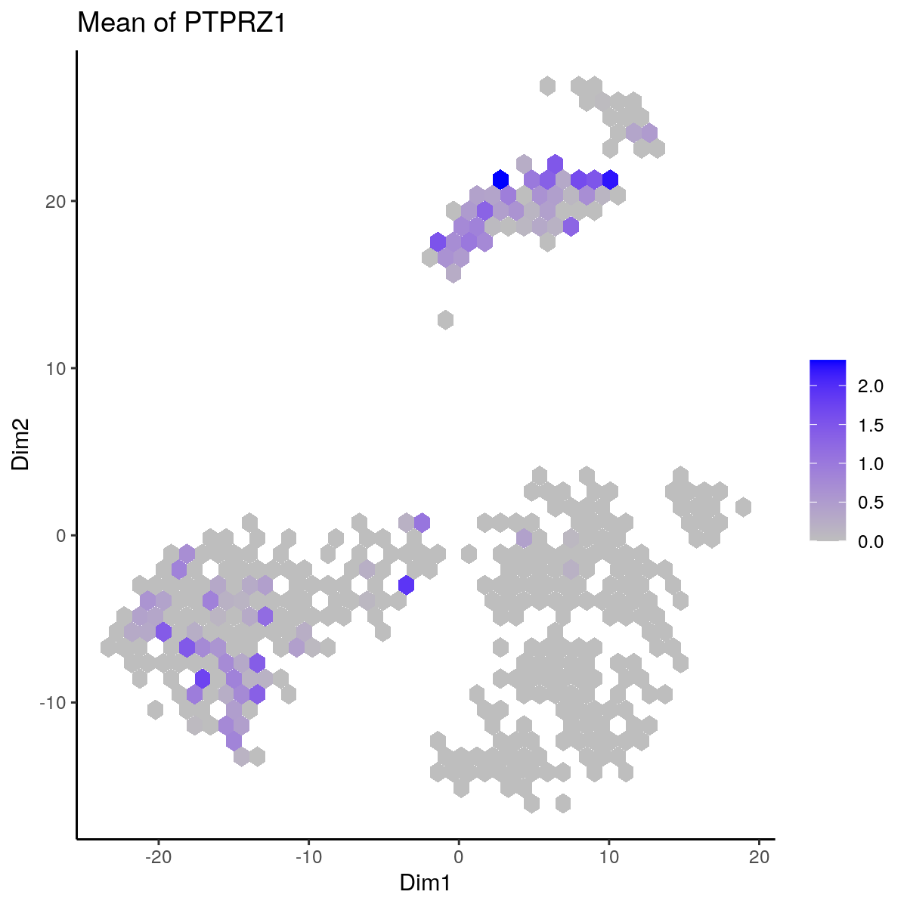|[PTN](https://www.ncbi.nlm.nih.gov/gene/5764) [MDK](https://www.ncbi.nlm.nih.gov/gene/4192)|
|[PVRIG](https://www.ncbi.nlm.nih.gov/gene/79037)|[PVR](https://www.ncbi.nlm.nih.gov/gene/5817) [PILRA](https://www.ncbi.nlm.nih.gov/gene/29992) [ADA2](https://www.ncbi.nlm.nih.gov/gene/51816) [GPC2](https://www.ncbi.nlm.nih.gov/gene/221914)|
|[QRFPR](https://www.ncbi.nlm.nih.gov/gene/84109)|[AGT](https://www.ncbi.nlm.nih.gov/gene/183) [AVP](https://www.ncbi.nlm.nih.gov/gene/551) [CCK](https://www.ncbi.nlm.nih.gov/gene/885) [EDN1](https://www.ncbi.nlm.nih.gov/gene/1906) [EDN2](https://www.ncbi.nlm.nih.gov/gene/1907) [EDN3](https://www.ncbi.nlm.nih.gov/gene/1908) [F2](https://www.ncbi.nlm.nih.gov/gene/2147) [GAST](https://www.ncbi.nlm.nih.gov/gene/2520) [GCG](https://www.ncbi.nlm.nih.gov/gene/2641) [GNRH1](https://www.ncbi.nlm.nih.gov/gene/2796) [GNRH2](https://www.ncbi.nlm.nih.gov/gene/2797) [GRP](https://www.ncbi.nlm.nih.gov/gene/2922) [KISS1](https://www.ncbi.nlm.nih.gov/gene/3814) [MLN](https://www.ncbi.nlm.nih.gov/gene/4295) [NMB](https://www.ncbi.nlm.nih.gov/gene/4828) [NPY](https://www.ncbi.nlm.nih.gov/gene/4852) [NTS](https://www.ncbi.nlm.nih.gov/gene/4922) [OXT](https://www.ncbi.nlm.nih.gov/gene/5020) [PMCH](https://www.ncbi.nlm.nih.gov/gene/5367) [SAA1](https://www.ncbi.nlm.nih.gov/gene/6288) [XCL1](https://www.ncbi.nlm.nih.gov/gene/6375) [XCL2](https://www.ncbi.nlm.nih.gov/gene/6846) [TAC1](https://www.ncbi.nlm.nih.gov/gene/6863) [TAC3](https://www.ncbi.nlm.nih.gov/gene/6866) [TRH](https://www.ncbi.nlm.nih.gov/gene/7200) [NPFF](https://www.ncbi.nlm.nih.gov/gene/8620) [NMU](https://www.ncbi.nlm.nih.gov/gene/10874) [UTS2](https://www.ncbi.nlm.nih.gov/gene/10911) [PRLH](https://www.ncbi.nlm.nih.gov/gene/51052) [GAL](https://www.ncbi.nlm.nih.gov/gene/51083) [PROK2](https://www.ncbi.nlm.nih.gov/gene/60675) [NPVF](https://www.ncbi.nlm.nih.gov/gene/64111) [SPX](https://www.ncbi.nlm.nih.gov/gene/80763) [PROK1](https://www.ncbi.nlm.nih.gov/gene/84432) [NMS](https://www.ncbi.nlm.nih.gov/gene/129521) [UTS2B](https://www.ncbi.nlm.nih.gov/gene/257313) [QRFP](https://www.ncbi.nlm.nih.gov/gene/347148) [NPS](https://www.ncbi.nlm.nih.gov/gene/594857)|
|[RAB11A](https://www.ncbi.nlm.nih.gov/gene/8766)|[ALB](https://www.ncbi.nlm.nih.gov/gene/213) [ANXA2](https://www.ncbi.nlm.nih.gov/gene/302) [APOE](https://www.ncbi.nlm.nih.gov/gene/348) [CTSD](https://www.ncbi.nlm.nih.gov/gene/1509) [EGFR](https://www.ncbi.nlm.nih.gov/gene/1956) [CXCL8](https://www.ncbi.nlm.nih.gov/gene/3576) [SERPINA4](https://www.ncbi.nlm.nih.gov/gene/5267) [PIGR](https://www.ncbi.nlm.nih.gov/gene/5284) [STX1A](https://www.ncbi.nlm.nih.gov/gene/6804) [CD164](https://www.ncbi.nlm.nih.gov/gene/8763) [NRP1](https://www.ncbi.nlm.nih.gov/gene/8829)|
|[RAB13](https://www.ncbi.nlm.nih.gov/gene/5872)|[SFN](https://www.ncbi.nlm.nih.gov/gene/2810) [SERPINA10](https://www.ncbi.nlm.nih.gov/gene/51156)|
|[RAB19](https://www.ncbi.nlm.nih.gov/gene/401409)|[VCAN](https://www.ncbi.nlm.nih.gov/gene/1462)|
|[RAB23](https://www.ncbi.nlm.nih.gov/gene/51715)|[EFNA4](https://www.ncbi.nlm.nih.gov/gene/1945) [TULP2](https://www.ncbi.nlm.nih.gov/gene/7288) [FREM1](https://www.ncbi.nlm.nih.gov/gene/158326)|
|[RAB25](https://www.ncbi.nlm.nih.gov/gene/57111)|[EGFR](https://www.ncbi.nlm.nih.gov/gene/1956) [LAD1](https://www.ncbi.nlm.nih.gov/gene/3898) [MUC1](https://www.ncbi.nlm.nih.gov/gene/4582) [PRSS8](https://www.ncbi.nlm.nih.gov/gene/5652) [SPINT1](https://www.ncbi.nlm.nih.gov/gene/6692)|
|[RAB28](https://www.ncbi.nlm.nih.gov/gene/9364)|[PPBP](https://www.ncbi.nlm.nih.gov/gene/5473)|
|[RAB29](https://www.ncbi.nlm.nih.gov/gene/8934)|[PM20D1](https://www.ncbi.nlm.nih.gov/gene/148811)|
|[RAB2B](https://www.ncbi.nlm.nih.gov/gene/84932)|[FCMR](https://www.ncbi.nlm.nih.gov/gene/9214) [CYB5D2](https://www.ncbi.nlm.nih.gov/gene/124936)|
|[RAB33A](https://www.ncbi.nlm.nih.gov/gene/9363)|[TEX264](https://www.ncbi.nlm.nih.gov/gene/51368)|
|[RAB35](https://www.ncbi.nlm.nih.gov/gene/11021)|[ANGPTL4](https://www.ncbi.nlm.nih.gov/gene/51129) [ANTXR2](https://www.ncbi.nlm.nih.gov/gene/118429) [CRB2](https://www.ncbi.nlm.nih.gov/gene/286204) [TEPP](https://www.ncbi.nlm.nih.gov/gene/374739)|
|[RAB38](https://www.ncbi.nlm.nih.gov/gene/23682)|[PMEL](https://www.ncbi.nlm.nih.gov/gene/6490) [VWA5B1](https://www.ncbi.nlm.nih.gov/gene/127731)|
|[RAB39A](https://www.ncbi.nlm.nih.gov/gene/54734)|[KLK8](https://www.ncbi.nlm.nih.gov/gene/11202)|
|[RAB39B](https://www.ncbi.nlm.nih.gov/gene/116442)|[ECM2](https://www.ncbi.nlm.nih.gov/gene/1842) [ISM2](https://www.ncbi.nlm.nih.gov/gene/145501)|
|[RAB3B](https://www.ncbi.nlm.nih.gov/gene/5865)|[IGFBP1](https://www.ncbi.nlm.nih.gov/gene/3484) [PIGR](https://www.ncbi.nlm.nih.gov/gene/5284)|
|[RAB3C](https://www.ncbi.nlm.nih.gov/gene/115827)|[STX1A](https://www.ncbi.nlm.nih.gov/gene/6804) [TIMP4](https://www.ncbi.nlm.nih.gov/gene/7079)|
|[RAB3D](https://www.ncbi.nlm.nih.gov/gene/9545)|[PIGR](https://www.ncbi.nlm.nih.gov/gene/5284) [PSAP](https://www.ncbi.nlm.nih.gov/gene/5660)|
|[RAB40B](https://www.ncbi.nlm.nih.gov/gene/10966)|[TIMP2](https://www.ncbi.nlm.nih.gov/gene/7077) [METRN](https://www.ncbi.nlm.nih.gov/gene/79006) [METRNL](https://www.ncbi.nlm.nih.gov/gene/284207)|
|[RAB40C](https://www.ncbi.nlm.nih.gov/gene/57799)|[PLXNB1](https://www.ncbi.nlm.nih.gov/gene/5364)|
|[RAB44](https://www.ncbi.nlm.nih.gov/gene/401258)|[FCAR](https://www.ncbi.nlm.nih.gov/gene/2204) [PIGR](https://www.ncbi.nlm.nih.gov/gene/5284) [PLAU](https://www.ncbi.nlm.nih.gov/gene/5328) [PLAUR](https://www.ncbi.nlm.nih.gov/gene/5329) [PSAP](https://www.ncbi.nlm.nih.gov/gene/5660) [TNFRSF1B](https://www.ncbi.nlm.nih.gov/gene/7133) [PILRA](https://www.ncbi.nlm.nih.gov/gene/29992)|
|[RAB4B](https://www.ncbi.nlm.nih.gov/gene/53916)|[MET](https://www.ncbi.nlm.nih.gov/gene/4233)|
|[RAB5A](https://www.ncbi.nlm.nih.gov/gene/5868)|[ALB](https://www.ncbi.nlm.nih.gov/gene/213) [AVP](https://www.ncbi.nlm.nih.gov/gene/551) [DDR1](https://www.ncbi.nlm.nih.gov/gene/780) [CTSD](https://www.ncbi.nlm.nih.gov/gene/1509) [EGFR](https://www.ncbi.nlm.nih.gov/gene/1956) [IL7R](https://www.ncbi.nlm.nih.gov/gene/3575) [CXCL8](https://www.ncbi.nlm.nih.gov/gene/3576) [INS](https://www.ncbi.nlm.nih.gov/gene/3630) [KDR](https://www.ncbi.nlm.nih.gov/gene/3791) [MET](https://www.ncbi.nlm.nih.gov/gene/4233) [NGF](https://www.ncbi.nlm.nih.gov/gene/4803) [PDGFB](https://www.ncbi.nlm.nih.gov/gene/5155) [PI3](https://www.ncbi.nlm.nih.gov/gene/5266) [SERPINA4](https://www.ncbi.nlm.nih.gov/gene/5267) [PMCH](https://www.ncbi.nlm.nih.gov/gene/5367) [TF](https://www.ncbi.nlm.nih.gov/gene/7018) [TNF](https://www.ncbi.nlm.nih.gov/gene/7124) [WNT5A](https://www.ncbi.nlm.nih.gov/gene/7474)|
|[RAB5B](https://www.ncbi.nlm.nih.gov/gene/5869)|[AVP](https://www.ncbi.nlm.nih.gov/gene/551) [CTSD](https://www.ncbi.nlm.nih.gov/gene/1509) [EGFR](https://www.ncbi.nlm.nih.gov/gene/1956) [IL7R](https://www.ncbi.nlm.nih.gov/gene/3575) [TF](https://www.ncbi.nlm.nih.gov/gene/7018) [WNT5A](https://www.ncbi.nlm.nih.gov/gene/7474) [FBLN5](https://www.ncbi.nlm.nih.gov/gene/10516) [PRLH](https://www.ncbi.nlm.nih.gov/gene/51052)|
|[RAB5C](https://www.ncbi.nlm.nih.gov/gene/5878)|[AVP](https://www.ncbi.nlm.nih.gov/gene/551) [COPA](https://www.ncbi.nlm.nih.gov/gene/1314) [EGFR](https://www.ncbi.nlm.nih.gov/gene/1956) [IL7R](https://www.ncbi.nlm.nih.gov/gene/3575) [LGALS1](https://www.ncbi.nlm.nih.gov/gene/3956) [PIGR](https://www.ncbi.nlm.nih.gov/gene/5284) [PSAP](https://www.ncbi.nlm.nih.gov/gene/5660) [TF](https://www.ncbi.nlm.nih.gov/gene/7018) [WNT5A](https://www.ncbi.nlm.nih.gov/gene/7474) [PRLH](https://www.ncbi.nlm.nih.gov/gene/51052)|
|[RAB8A](https://www.ncbi.nlm.nih.gov/gene/4218)|[SFN](https://www.ncbi.nlm.nih.gov/gene/2810) [STX1A](https://www.ncbi.nlm.nih.gov/gene/6804)|
|[RAB8B](https://www.ncbi.nlm.nih.gov/gene/51762)|[STX1A](https://www.ncbi.nlm.nih.gov/gene/6804)|
|[RAC1](https://www.ncbi.nlm.nih.gov/gene/5879)|[A2M](https://www.ncbi.nlm.nih.gov/gene/2) [BDNF](https://www.ncbi.nlm.nih.gov/gene/627) [DSCAM](https://www.ncbi.nlm.nih.gov/gene/1826) [EDN1](https://www.ncbi.nlm.nih.gov/gene/1906) [EFNA1](https://www.ncbi.nlm.nih.gov/gene/1942) [EGFR](https://www.ncbi.nlm.nih.gov/gene/1956) [EPHB6](https://www.ncbi.nlm.nih.gov/gene/2051) [FN1](https://www.ncbi.nlm.nih.gov/gene/2335) [IL15](https://www.ncbi.nlm.nih.gov/gene/3600) [KDR](https://www.ncbi.nlm.nih.gov/gene/3791) [LAMA2](https://www.ncbi.nlm.nih.gov/gene/3908) [LAMA3](https://www.ncbi.nlm.nih.gov/gene/3909) [LAMA4](https://www.ncbi.nlm.nih.gov/gene/3910) [LAMA5](https://www.ncbi.nlm.nih.gov/gene/3911) [LAMB1](https://www.ncbi.nlm.nih.gov/gene/3912) [LAMB2](https://www.ncbi.nlm.nih.gov/gene/3913) [LAMB3](https://www.ncbi.nlm.nih.gov/gene/3914) [LAMC1](https://www.ncbi.nlm.nih.gov/gene/3915) [LAMC2](https://www.ncbi.nlm.nih.gov/gene/3918) [LGALS1](https://www.ncbi.nlm.nih.gov/gene/3956) [MET](https://www.ncbi.nlm.nih.gov/gene/4233) [NGF](https://www.ncbi.nlm.nih.gov/gene/4803) [PDGFB](https://www.ncbi.nlm.nih.gov/gene/5155) [PLXNB1](https://www.ncbi.nlm.nih.gov/gene/5364) [PTEN](https://www.ncbi.nlm.nih.gov/gene/5728) [SDC4](https://www.ncbi.nlm.nih.gov/gene/6385) [CXCL12](https://www.ncbi.nlm.nih.gov/gene/6387) [SPP1](https://www.ncbi.nlm.nih.gov/gene/6696) [STX1A](https://www.ncbi.nlm.nih.gov/gene/6804) [TNF](https://www.ncbi.nlm.nih.gov/gene/7124) [WNT1](https://www.ncbi.nlm.nih.gov/gene/7471) [WNT5A](https://www.ncbi.nlm.nih.gov/gene/7474) [WNT11](https://www.ncbi.nlm.nih.gov/gene/7481) [NRP1](https://www.ncbi.nlm.nih.gov/gene/8829) [SLIT2](https://www.ncbi.nlm.nih.gov/gene/9353) [NTN1](https://www.ncbi.nlm.nih.gov/gene/9423) [LAMC3](https://www.ncbi.nlm.nih.gov/gene/10319) [SEMA3A](https://www.ncbi.nlm.nih.gov/gene/10371) [TREM2](https://www.ncbi.nlm.nih.gov/gene/54209) [WNT4](https://www.ncbi.nlm.nih.gov/gene/54361) [WNT5B](https://www.ncbi.nlm.nih.gov/gene/81029) [LAMA1](https://www.ncbi.nlm.nih.gov/gene/284217) [C9orf47](https://www.ncbi.nlm.nih.gov/gene/286223) [IGLL5](https://www.ncbi.nlm.nih.gov/gene/100423062)|
|[RACK1](https://www.ncbi.nlm.nih.gov/gene/10399)|[ANXA2](https://www.ncbi.nlm.nih.gov/gene/302) [EGFR](https://www.ncbi.nlm.nih.gov/gene/1956) [IFNAR2](https://www.ncbi.nlm.nih.gov/gene/3455) [IFNW1](https://www.ncbi.nlm.nih.gov/gene/3467) [IGF1](https://www.ncbi.nlm.nih.gov/gene/3479) [TNF](https://www.ncbi.nlm.nih.gov/gene/7124) [TNFRSF1A](https://www.ncbi.nlm.nih.gov/gene/7132) [PRLH](https://www.ncbi.nlm.nih.gov/gene/51052) [RNASE9](https://www.ncbi.nlm.nih.gov/gene/390443)|
|[RAET1L](https://www.ncbi.nlm.nih.gov/gene/154064)|[GPLD1](https://www.ncbi.nlm.nih.gov/gene/2822) [MSLN](https://www.ncbi.nlm.nih.gov/gene/10232) [LY6K](https://www.ncbi.nlm.nih.gov/gene/54742) [RAET1E](https://www.ncbi.nlm.nih.gov/gene/135250) [RAET1G](https://www.ncbi.nlm.nih.gov/gene/353091)|
|[RAF1](https://www.ncbi.nlm.nih.gov/gene/5894)|[AGT](https://www.ncbi.nlm.nih.gov/gene/183) [EDN1](https://www.ncbi.nlm.nih.gov/gene/1906) [EGFR](https://www.ncbi.nlm.nih.gov/gene/1956) [F2](https://www.ncbi.nlm.nih.gov/gene/2147) [FGB](https://www.ncbi.nlm.nih.gov/gene/2244) [FGF2](https://www.ncbi.nlm.nih.gov/gene/2247) [FGG](https://www.ncbi.nlm.nih.gov/gene/2266) [FN1](https://www.ncbi.nlm.nih.gov/gene/2335) [SFN](https://www.ncbi.nlm.nih.gov/gene/2810) [IGF1](https://www.ncbi.nlm.nih.gov/gene/3479) [INS](https://www.ncbi.nlm.nih.gov/gene/3630) [LOX](https://www.ncbi.nlm.nih.gov/gene/4015) [MDK](https://www.ncbi.nlm.nih.gov/gene/4192) [NGF](https://www.ncbi.nlm.nih.gov/gene/4803) [PI3](https://www.ncbi.nlm.nih.gov/gene/5266) [PTEN](https://www.ncbi.nlm.nih.gov/gene/5728) [CCL11](https://www.ncbi.nlm.nih.gov/gene/6356) [CXCL12](https://www.ncbi.nlm.nih.gov/gene/6387) [SPP1](https://www.ncbi.nlm.nih.gov/gene/6696) [TIMP4](https://www.ncbi.nlm.nih.gov/gene/7079) [VEGFA](https://www.ncbi.nlm.nih.gov/gene/7422) [VWF](https://www.ncbi.nlm.nih.gov/gene/7450) [CD209](https://www.ncbi.nlm.nih.gov/gene/30835)|
|[RALA](https://www.ncbi.nlm.nih.gov/gene/5898)|[INHBA](https://www.ncbi.nlm.nih.gov/gene/3624) [PAEP](https://www.ncbi.nlm.nih.gov/gene/5047) [MSLN](https://www.ncbi.nlm.nih.gov/gene/10232) [FAM3C](https://www.ncbi.nlm.nih.gov/gene/10447) [BMPER](https://www.ncbi.nlm.nih.gov/gene/168667) [RNASE13](https://www.ncbi.nlm.nih.gov/gene/440163)|
|[RALB](https://www.ncbi.nlm.nih.gov/gene/5899)|[PAEP](https://www.ncbi.nlm.nih.gov/gene/5047) [CXCL12](https://www.ncbi.nlm.nih.gov/gene/6387)|
|[RALGPS2](https://www.ncbi.nlm.nih.gov/gene/55103)|[IL6ST](https://www.ncbi.nlm.nih.gov/gene/3572) [ANGPTL1](https://www.ncbi.nlm.nih.gov/gene/9068) [FAM20A](https://www.ncbi.nlm.nih.gov/gene/54757)|
|[RAMP1](https://www.ncbi.nlm.nih.gov/gene/10267)|[ADM](https://www.ncbi.nlm.nih.gov/gene/133) [CALCA](https://www.ncbi.nlm.nih.gov/gene/796) [CALCB](https://www.ncbi.nlm.nih.gov/gene/797) [ADM2](https://www.ncbi.nlm.nih.gov/gene/79924) [IAPP](https://www.ncbi.nlm.nih.gov/gene/3375)|
|[RAMP2](https://www.ncbi.nlm.nih.gov/gene/10266)|[ADM](https://www.ncbi.nlm.nih.gov/gene/133) [CALCA](https://www.ncbi.nlm.nih.gov/gene/796) [CALCB](https://www.ncbi.nlm.nih.gov/gene/797) [ADM2](https://www.ncbi.nlm.nih.gov/gene/79924) [IAPP](https://www.ncbi.nlm.nih.gov/gene/3375)|
|[RAMP3](https://www.ncbi.nlm.nih.gov/gene/10268)|[ADCYAP1](https://www.ncbi.nlm.nih.gov/gene/116) [ADM](https://www.ncbi.nlm.nih.gov/gene/133) [AMY2B](https://www.ncbi.nlm.nih.gov/gene/280) [AVP](https://www.ncbi.nlm.nih.gov/gene/551) [CALCA](https://www.ncbi.nlm.nih.gov/gene/796) [CALCB](https://www.ncbi.nlm.nih.gov/gene/797) [CGA](https://www.ncbi.nlm.nih.gov/gene/1081) [CRH](https://www.ncbi.nlm.nih.gov/gene/1392) [ECM1](https://www.ncbi.nlm.nih.gov/gene/1893) [FSHB](https://www.ncbi.nlm.nih.gov/gene/2488) [GABBR1](https://www.ncbi.nlm.nih.gov/gene/2550) [GCG](https://www.ncbi.nlm.nih.gov/gene/2641) [GHRH](https://www.ncbi.nlm.nih.gov/gene/2691) [GIP](https://www.ncbi.nlm.nih.gov/gene/2695) [IAPP](https://www.ncbi.nlm.nih.gov/gene/3375) [INSL3](https://www.ncbi.nlm.nih.gov/gene/3640) [POMC](https://www.ncbi.nlm.nih.gov/gene/5443) [PTH](https://www.ncbi.nlm.nih.gov/gene/5741) [PTHLH](https://www.ncbi.nlm.nih.gov/gene/5744) [RLN1](https://www.ncbi.nlm.nih.gov/gene/6013) [RLN2](https://www.ncbi.nlm.nih.gov/gene/6019) [SCT](https://www.ncbi.nlm.nih.gov/gene/6343) [TSHB](https://www.ncbi.nlm.nih.gov/gene/7252) [VIP](https://www.ncbi.nlm.nih.gov/gene/7432) [CRTAC1](https://www.ncbi.nlm.nih.gov/gene/55118) [ADM2](https://www.ncbi.nlm.nih.gov/gene/79924) [PTH2](https://www.ncbi.nlm.nih.gov/gene/113091) [RLN3](https://www.ncbi.nlm.nih.gov/gene/117579) [GPHB5](https://www.ncbi.nlm.nih.gov/gene/122876) [GPHA2](https://www.ncbi.nlm.nih.gov/gene/170589) [NPS](https://www.ncbi.nlm.nih.gov/gene/594857)|
|[RAP1A](https://www.ncbi.nlm.nih.gov/gene/5906)|[FAS](https://www.ncbi.nlm.nih.gov/gene/355) [BDNF](https://www.ncbi.nlm.nih.gov/gene/627) [EPO](https://www.ncbi.nlm.nih.gov/gene/2056) [EPOR](https://www.ncbi.nlm.nih.gov/gene/2057) [FCAR](https://www.ncbi.nlm.nih.gov/gene/2204) [FGB](https://www.ncbi.nlm.nih.gov/gene/2244) [FGG](https://www.ncbi.nlm.nih.gov/gene/2266) [FN1](https://www.ncbi.nlm.nih.gov/gene/2335) [GDNF](https://www.ncbi.nlm.nih.gov/gene/2668) [MET](https://www.ncbi.nlm.nih.gov/gene/4233) [NGF](https://www.ncbi.nlm.nih.gov/gene/4803) [PLAU](https://www.ncbi.nlm.nih.gov/gene/5328) [PLAUR](https://www.ncbi.nlm.nih.gov/gene/5329) [TNFRSF1B](https://www.ncbi.nlm.nih.gov/gene/7133) [VWF](https://www.ncbi.nlm.nih.gov/gene/7450) [HEG1](https://www.ncbi.nlm.nih.gov/gene/57493)|
|[RAP1B](https://www.ncbi.nlm.nih.gov/gene/5908)|[BDNF](https://www.ncbi.nlm.nih.gov/gene/627) [FGB](https://www.ncbi.nlm.nih.gov/gene/2244) [FGG](https://www.ncbi.nlm.nih.gov/gene/2266) [FN1](https://www.ncbi.nlm.nih.gov/gene/2335) [GNRH1](https://www.ncbi.nlm.nih.gov/gene/2796) [MET](https://www.ncbi.nlm.nih.gov/gene/4233) [PIGR](https://www.ncbi.nlm.nih.gov/gene/5284) [PSAP](https://www.ncbi.nlm.nih.gov/gene/5660) [VWF](https://www.ncbi.nlm.nih.gov/gene/7450) [CD164](https://www.ncbi.nlm.nih.gov/gene/8763) [HEG1](https://www.ncbi.nlm.nih.gov/gene/57493)|
|[RAPH1](https://www.ncbi.nlm.nih.gov/gene/65059)|[EGFR](https://www.ncbi.nlm.nih.gov/gene/1956) [NTN1](https://www.ncbi.nlm.nih.gov/gene/9423)|
|[RAPSN](https://www.ncbi.nlm.nih.gov/gene/5913)|[BCHE](https://www.ncbi.nlm.nih.gov/gene/590) [LAMA2](https://www.ncbi.nlm.nih.gov/gene/3908) [LAMA3](https://www.ncbi.nlm.nih.gov/gene/3909) [LAMA4](https://www.ncbi.nlm.nih.gov/gene/3910) [LAMA5](https://www.ncbi.nlm.nih.gov/gene/3911) [LAMB1](https://www.ncbi.nlm.nih.gov/gene/3912) [LAMB2](https://www.ncbi.nlm.nih.gov/gene/3913) [LAMB3](https://www.ncbi.nlm.nih.gov/gene/3914) [LAMC1](https://www.ncbi.nlm.nih.gov/gene/3915) [LAMC2](https://www.ncbi.nlm.nih.gov/gene/3918) [PRSS12](https://www.ncbi.nlm.nih.gov/gene/8492) [LAMC3](https://www.ncbi.nlm.nih.gov/gene/10319) [LAMA1](https://www.ncbi.nlm.nih.gov/gene/284217)|
|[RASA3](https://www.ncbi.nlm.nih.gov/gene/22821)|[PLXNB1](https://www.ncbi.nlm.nih.gov/gene/5364)|
|[RASD1](https://www.ncbi.nlm.nih.gov/gene/51655)|[PRL](https://www.ncbi.nlm.nih.gov/gene/5617) [HEG1](https://www.ncbi.nlm.nih.gov/gene/57493) [CRISPLD1](https://www.ncbi.nlm.nih.gov/gene/83690) [HHIPL1](https://www.ncbi.nlm.nih.gov/gene/84439) [FNDC1](https://www.ncbi.nlm.nih.gov/gene/84624)|
|[RASD2](https://www.ncbi.nlm.nih.gov/gene/23551)|[PLXDC1](https://www.ncbi.nlm.nih.gov/gene/57125) [COL18A1](https://www.ncbi.nlm.nih.gov/gene/80781)|
|[RASGRF2](https://www.ncbi.nlm.nih.gov/gene/5924)|[HAPLN1](https://www.ncbi.nlm.nih.gov/gene/1404) [EDIL3](https://www.ncbi.nlm.nih.gov/gene/10085) [TMEFF2](https://www.ncbi.nlm.nih.gov/gene/23671)|
|[RASGRP1](https://www.ncbi.nlm.nih.gov/gene/10125)|[GSN](https://www.ncbi.nlm.nih.gov/gene/2934) [GUCA2A](https://www.ncbi.nlm.nih.gov/gene/2980) [CRLF1](https://www.ncbi.nlm.nih.gov/gene/9244)|
|[RASGRP4](https://www.ncbi.nlm.nih.gov/gene/115727)|[CMA1](https://www.ncbi.nlm.nih.gov/gene/1215)|
|[RASL10B](https://www.ncbi.nlm.nih.gov/gene/91608)|[NPPA](https://www.ncbi.nlm.nih.gov/gene/4878)|
|[RBSN](https://www.ncbi.nlm.nih.gov/gene/64145)|[PI3](https://www.ncbi.nlm.nih.gov/gene/5266)|
|[RECK](https://www.ncbi.nlm.nih.gov/gene/8434)|[ANGPT1](https://www.ncbi.nlm.nih.gov/gene/284) [GPLD1](https://www.ncbi.nlm.nih.gov/gene/2822) [MMP7](https://www.ncbi.nlm.nih.gov/gene/4316) [MMP9](https://www.ncbi.nlm.nih.gov/gene/4318) [SERPINB5](https://www.ncbi.nlm.nih.gov/gene/5268) [PTEN](https://www.ncbi.nlm.nih.gov/gene/5728) [SPARC](https://www.ncbi.nlm.nih.gov/gene/6678) [TIMP1](https://www.ncbi.nlm.nih.gov/gene/7076) [TIMP2](https://www.ncbi.nlm.nih.gov/gene/7077) [TIMP3](https://www.ncbi.nlm.nih.gov/gene/7078) [TIMP4](https://www.ncbi.nlm.nih.gov/gene/7079) [VEGFA](https://www.ncbi.nlm.nih.gov/gene/7422) [MSLN](https://www.ncbi.nlm.nih.gov/gene/10232) [IL20](https://www.ncbi.nlm.nih.gov/gene/50604) [LY6K](https://www.ncbi.nlm.nih.gov/gene/54742) [RAET1G](https://www.ncbi.nlm.nih.gov/gene/353091)|
|[RELL1](https://www.ncbi.nlm.nih.gov/gene/768211)|[CREG2](https://www.ncbi.nlm.nih.gov/gene/200407)|
|[RELT](https://www.ncbi.nlm.nih.gov/gene/84957)|[TSKU](https://www.ncbi.nlm.nih.gov/gene/25987) [REG4](https://www.ncbi.nlm.nih.gov/gene/83998)|
|[RET](https://www.ncbi.nlm.nih.gov/gene/5979)|[AOC1](https://www.ncbi.nlm.nih.gov/gene/26) [BDNF](https://www.ncbi.nlm.nih.gov/gene/627) [CALCA](https://www.ncbi.nlm.nih.gov/gene/796) [CHGA](https://www.ncbi.nlm.nih.gov/gene/1113) [EDN3](https://www.ncbi.nlm.nih.gov/gene/1908) [EGFR](https://www.ncbi.nlm.nih.gov/gene/1956) [FGF1](https://www.ncbi.nlm.nih.gov/gene/2246) [FGF2](https://www.ncbi.nlm.nih.gov/gene/2247) [FGF3](https://www.ncbi.nlm.nih.gov/gene/2248) [FGF4](https://www.ncbi.nlm.nih.gov/gene/2249) [FGF6](https://www.ncbi.nlm.nih.gov/gene/2251) [FGF8](https://www.ncbi.nlm.nih.gov/gene/2253) [FGF9](https://www.ncbi.nlm.nih.gov/gene/2254) [FGF10](https://www.ncbi.nlm.nih.gov/gene/2255) [FLT1](https://www.ncbi.nlm.nih.gov/gene/2321) [FLT4](https://www.ncbi.nlm.nih.gov/gene/2324) [GDNF](https://www.ncbi.nlm.nih.gov/gene/2668) [IL6](https://www.ncbi.nlm.nih.gov/gene/3569) [INS](https://www.ncbi.nlm.nih.gov/gene/3630) [KDR](https://www.ncbi.nlm.nih.gov/gene/3791) [LGALS3](https://www.ncbi.nlm.nih.gov/gene/3958) [NCAM1](https://www.ncbi.nlm.nih.gov/gene/4684) [NGF](https://www.ncbi.nlm.nih.gov/gene/4803) [NRTN](https://www.ncbi.nlm.nih.gov/gene/4902) [PDGFA](https://www.ncbi.nlm.nih.gov/gene/5154) [PDGFB](https://www.ncbi.nlm.nih.gov/gene/5155) [PSPN](https://www.ncbi.nlm.nih.gov/gene/5623) [PTEN](https://www.ncbi.nlm.nih.gov/gene/5728) [PTH](https://www.ncbi.nlm.nih.gov/gene/5741) [TG](https://www.ncbi.nlm.nih.gov/gene/7038) [VEGFA](https://www.ncbi.nlm.nih.gov/gene/7422) [FGF16](https://www.ncbi.nlm.nih.gov/gene/8823) [NRP2](https://www.ncbi.nlm.nih.gov/gene/8828) [ARTN](https://www.ncbi.nlm.nih.gov/gene/9048) [SLIT2](https://www.ncbi.nlm.nih.gov/gene/9353) [NTN1](https://www.ncbi.nlm.nih.gov/gene/9423) [FGF19](https://www.ncbi.nlm.nih.gov/gene/9965) [FGF20](https://www.ncbi.nlm.nih.gov/gene/26281) [GFRA4](https://www.ncbi.nlm.nih.gov/gene/64096) [CDNF](https://www.ncbi.nlm.nih.gov/gene/441549)|
|[RFFL](https://www.ncbi.nlm.nih.gov/gene/117584)|[CP](https://www.ncbi.nlm.nih.gov/gene/1356) [TNF](https://www.ncbi.nlm.nih.gov/gene/7124) [TNFRSF1A](https://www.ncbi.nlm.nih.gov/gene/7132) [ENDOD1](https://www.ncbi.nlm.nih.gov/gene/23052) [HAPLN2](https://www.ncbi.nlm.nih.gov/gene/60484) [NDNF](https://www.ncbi.nlm.nih.gov/gene/79625) [ADAMTS16](https://www.ncbi.nlm.nih.gov/gene/170690)|
|[RFTN1](https://www.ncbi.nlm.nih.gov/gene/23180)|[LAMA4](https://www.ncbi.nlm.nih.gov/gene/3910)|
|[RFTN2](https://www.ncbi.nlm.nih.gov/gene/130132)|[LRRC17](https://www.ncbi.nlm.nih.gov/gene/10234)|
|[RGMA](https://www.ncbi.nlm.nih.gov/gene/56963)|[AHSG](https://www.ncbi.nlm.nih.gov/gene/197) [AMH](https://www.ncbi.nlm.nih.gov/gene/268) [BMP2](https://www.ncbi.nlm.nih.gov/gene/650) [BMP4](https://www.ncbi.nlm.nih.gov/gene/652) [BMP5](https://www.ncbi.nlm.nih.gov/gene/653) [BMP6](https://www.ncbi.nlm.nih.gov/gene/654) [BMP7](https://www.ncbi.nlm.nih.gov/gene/655) [CSF2](https://www.ncbi.nlm.nih.gov/gene/1437) [GDF2](https://www.ncbi.nlm.nih.gov/gene/2658) [GDF10](https://www.ncbi.nlm.nih.gov/gene/2662) [IL3](https://www.ncbi.nlm.nih.gov/gene/3562) [IL4](https://www.ncbi.nlm.nih.gov/gene/3565) [VWF](https://www.ncbi.nlm.nih.gov/gene/7450) [GDF5](https://www.ncbi.nlm.nih.gov/gene/8200) [CHRD](https://www.ncbi.nlm.nih.gov/gene/8646) [NOG](https://www.ncbi.nlm.nih.gov/gene/9241) [CER1](https://www.ncbi.nlm.nih.gov/gene/9350) [NTN1](https://www.ncbi.nlm.nih.gov/gene/9423) [SEMA3A](https://www.ncbi.nlm.nih.gov/gene/10371) [FST](https://www.ncbi.nlm.nih.gov/gene/10468) [SOSTDC1](https://www.ncbi.nlm.nih.gov/gene/25928) [HAMP](https://www.ncbi.nlm.nih.gov/gene/57817) [CHRDL1](https://www.ncbi.nlm.nih.gov/gene/91851) [GDF7](https://www.ncbi.nlm.nih.gov/gene/151449)|
|[RGMB](https://www.ncbi.nlm.nih.gov/gene/285704)|[AHSG](https://www.ncbi.nlm.nih.gov/gene/197) [AMH](https://www.ncbi.nlm.nih.gov/gene/268) [BMP2](https://www.ncbi.nlm.nih.gov/gene/650) [BMP3](https://www.ncbi.nlm.nih.gov/gene/651) [BMP4](https://www.ncbi.nlm.nih.gov/gene/652) [BMP5](https://www.ncbi.nlm.nih.gov/gene/653) [BMP6](https://www.ncbi.nlm.nih.gov/gene/654) [BMP7](https://www.ncbi.nlm.nih.gov/gene/655) [GDF2](https://www.ncbi.nlm.nih.gov/gene/2658) [MSTN](https://www.ncbi.nlm.nih.gov/gene/2660) [GDF10](https://www.ncbi.nlm.nih.gov/gene/2662) [IL6](https://www.ncbi.nlm.nih.gov/gene/3569) [GDF5](https://www.ncbi.nlm.nih.gov/gene/8200) [CHRD](https://www.ncbi.nlm.nih.gov/gene/8646) [NOG](https://www.ncbi.nlm.nih.gov/gene/9241) [CER1](https://www.ncbi.nlm.nih.gov/gene/9350) [FST](https://www.ncbi.nlm.nih.gov/gene/10468) [SOSTDC1](https://www.ncbi.nlm.nih.gov/gene/25928) [BMP10](https://www.ncbi.nlm.nih.gov/gene/27302) [HAMP](https://www.ncbi.nlm.nih.gov/gene/57817) [HHIPL2](https://www.ncbi.nlm.nih.gov/gene/79802) [CHRDL1](https://www.ncbi.nlm.nih.gov/gene/91851) [GDF7](https://www.ncbi.nlm.nih.gov/gene/151449)|
|[RGS1](https://www.ncbi.nlm.nih.gov/gene/5996)|[C1QA](https://www.ncbi.nlm.nih.gov/gene/712) [C1QB](https://www.ncbi.nlm.nih.gov/gene/713) [FN1](https://www.ncbi.nlm.nih.gov/gene/2335) [CCL3](https://www.ncbi.nlm.nih.gov/gene/6348) [EMILIN1](https://www.ncbi.nlm.nih.gov/gene/11117) [IL17D](https://www.ncbi.nlm.nih.gov/gene/53342)|
|[RGS2](https://www.ncbi.nlm.nih.gov/gene/5997)|[EGFR](https://www.ncbi.nlm.nih.gov/gene/1956) [MSTN](https://www.ncbi.nlm.nih.gov/gene/2660) [MMP13](https://www.ncbi.nlm.nih.gov/gene/4322) [PTH](https://www.ncbi.nlm.nih.gov/gene/5741)|
|[RGS8](https://www.ncbi.nlm.nih.gov/gene/85397)|[ADCYAP1](https://www.ncbi.nlm.nih.gov/gene/116) [CBLN1](https://www.ncbi.nlm.nih.gov/gene/869) [PAPPA2](https://www.ncbi.nlm.nih.gov/gene/60676) [C1QL3](https://www.ncbi.nlm.nih.gov/gene/389941)|
|[RHBG](https://www.ncbi.nlm.nih.gov/gene/57127)|[FAM3B](https://www.ncbi.nlm.nih.gov/gene/54097) [LCN12](https://www.ncbi.nlm.nih.gov/gene/286256) [PRSS48](https://www.ncbi.nlm.nih.gov/gene/345062)|
|[RHCG](https://www.ncbi.nlm.nih.gov/gene/51458)|[ALB](https://www.ncbi.nlm.nih.gov/gene/213) [AMH](https://www.ncbi.nlm.nih.gov/gene/268) [GNRH1](https://www.ncbi.nlm.nih.gov/gene/2796) [HYAL1](https://www.ncbi.nlm.nih.gov/gene/3373) [MMP1](https://www.ncbi.nlm.nih.gov/gene/4312) [HYAL3](https://www.ncbi.nlm.nih.gov/gene/8372)|
|[RHD](https://www.ncbi.nlm.nih.gov/gene/6007)|[C4A](https://www.ncbi.nlm.nih.gov/gene/720)|
|[RHOA](https://www.ncbi.nlm.nih.gov/gene/387)|[A2M](https://www.ncbi.nlm.nih.gov/gene/2) [AGER](https://www.ncbi.nlm.nih.gov/gene/177) [ALB](https://www.ncbi.nlm.nih.gov/gene/213) [FAS](https://www.ncbi.nlm.nih.gov/gene/355) [BDNF](https://www.ncbi.nlm.nih.gov/gene/627) [BMP2](https://www.ncbi.nlm.nih.gov/gene/650) [BTC](https://www.ncbi.nlm.nih.gov/gene/685) [CCN2](https://www.ncbi.nlm.nih.gov/gene/1490) [EDN1](https://www.ncbi.nlm.nih.gov/gene/1906) [EFNA1](https://www.ncbi.nlm.nih.gov/gene/1942) [EFNA4](https://www.ncbi.nlm.nih.gov/gene/1945) [EGFR](https://www.ncbi.nlm.nih.gov/gene/1956) [EPHA3](https://www.ncbi.nlm.nih.gov/gene/2042) [EPHB6](https://www.ncbi.nlm.nih.gov/gene/2051) [ERBB3](https://www.ncbi.nlm.nih.gov/gene/2065) [F2](https://www.ncbi.nlm.nih.gov/gene/2147) [FGF2](https://www.ncbi.nlm.nih.gov/gene/2247) [FN1](https://www.ncbi.nlm.nih.gov/gene/2335) [GSN](https://www.ncbi.nlm.nih.gov/gene/2934) [IGF1](https://www.ncbi.nlm.nih.gov/gene/3479) [IL2](https://www.ncbi.nlm.nih.gov/gene/3558) [IL6](https://www.ncbi.nlm.nih.gov/gene/3569) [CXCL8](https://www.ncbi.nlm.nih.gov/gene/3576) [IL13](https://www.ncbi.nlm.nih.gov/gene/3596) [INS](https://www.ncbi.nlm.nih.gov/gene/3630) [KDR](https://www.ncbi.nlm.nih.gov/gene/3791) [MET](https://www.ncbi.nlm.nih.gov/gene/4233) [MMP8](https://www.ncbi.nlm.nih.gov/gene/4317) [MMP9](https://www.ncbi.nlm.nih.gov/gene/4318) [NGF](https://www.ncbi.nlm.nih.gov/gene/4803) [SERPINE1](https://www.ncbi.nlm.nih.gov/gene/5054) [PI3](https://www.ncbi.nlm.nih.gov/gene/5266) [PLAU](https://www.ncbi.nlm.nih.gov/gene/5328) [PLAUR](https://www.ncbi.nlm.nih.gov/gene/5329) [PLG](https://www.ncbi.nlm.nih.gov/gene/5340) [PLXNB1](https://www.ncbi.nlm.nih.gov/gene/5364) [PRLR](https://www.ncbi.nlm.nih.gov/gene/5618) [PTEN](https://www.ncbi.nlm.nih.gov/gene/5728) [CCL2](https://www.ncbi.nlm.nih.gov/gene/6347) [SDC4](https://www.ncbi.nlm.nih.gov/gene/6385) [CXCL12](https://www.ncbi.nlm.nih.gov/gene/6387) [SEMA3F](https://www.ncbi.nlm.nih.gov/gene/6405) [SLIT3](https://www.ncbi.nlm.nih.gov/gene/6586) [SPP1](https://www.ncbi.nlm.nih.gov/gene/6696) [TGFB1](https://www.ncbi.nlm.nih.gov/gene/7040) [TNF](https://www.ncbi.nlm.nih.gov/gene/7124) [TNFRSF1A](https://www.ncbi.nlm.nih.gov/gene/7132) [VEGFA](https://www.ncbi.nlm.nih.gov/gene/7422) [VTN](https://www.ncbi.nlm.nih.gov/gene/7448) [WNT1](https://www.ncbi.nlm.nih.gov/gene/7471) [WNT2](https://www.ncbi.nlm.nih.gov/gene/7472) [WNT5A](https://www.ncbi.nlm.nih.gov/gene/7474) [WNT11](https://www.ncbi.nlm.nih.gov/gene/7481) [WNT9A](https://www.ncbi.nlm.nih.gov/gene/7483) [WNT9B](https://www.ncbi.nlm.nih.gov/gene/7484) [SEMA3B](https://www.ncbi.nlm.nih.gov/gene/7869) [NOG](https://www.ncbi.nlm.nih.gov/gene/9241) [SLIT2](https://www.ncbi.nlm.nih.gov/gene/9353) [NTN1](https://www.ncbi.nlm.nih.gov/gene/9423) [NRG2](https://www.ncbi.nlm.nih.gov/gene/9542) [CLEC4M](https://www.ncbi.nlm.nih.gov/gene/10332) [SEMA3A](https://www.ncbi.nlm.nih.gov/gene/10371) [SEMA3C](https://www.ncbi.nlm.nih.gov/gene/10512) [NRG3](https://www.ncbi.nlm.nih.gov/gene/10718) [LY96](https://www.ncbi.nlm.nih.gov/gene/23643) [CD209](https://www.ncbi.nlm.nih.gov/gene/30835) [SEMA3G](https://www.ncbi.nlm.nih.gov/gene/56920) [HEG1](https://www.ncbi.nlm.nih.gov/gene/57493) [WNT3A](https://www.ncbi.nlm.nih.gov/gene/89780) [ANTXR2](https://www.ncbi.nlm.nih.gov/gene/118429) [NRG4](https://www.ncbi.nlm.nih.gov/gene/145957) [SEMA3D](https://www.ncbi.nlm.nih.gov/gene/223117) [EPHA10](https://www.ncbi.nlm.nih.gov/gene/284656) [C9orf47](https://www.ncbi.nlm.nih.gov/gene/286223)|
|[RHOC](https://www.ncbi.nlm.nih.gov/gene/389)|[A2M](https://www.ncbi.nlm.nih.gov/gene/2) [EGFR](https://www.ncbi.nlm.nih.gov/gene/1956) [ERBB3](https://www.ncbi.nlm.nih.gov/gene/2065) [FN1](https://www.ncbi.nlm.nih.gov/gene/2335) [IL15](https://www.ncbi.nlm.nih.gov/gene/3600) [MET](https://www.ncbi.nlm.nih.gov/gene/4233) [MMP9](https://www.ncbi.nlm.nih.gov/gene/4318) [NGF](https://www.ncbi.nlm.nih.gov/gene/4803) [PLAUR](https://www.ncbi.nlm.nih.gov/gene/5329) [PLXNB1](https://www.ncbi.nlm.nih.gov/gene/5364) [PTEN](https://www.ncbi.nlm.nih.gov/gene/5728) [VEGFA](https://www.ncbi.nlm.nih.gov/gene/7422) [WNT1](https://www.ncbi.nlm.nih.gov/gene/7471) [CCN6](https://www.ncbi.nlm.nih.gov/gene/8838) [ANTXR2](https://www.ncbi.nlm.nih.gov/gene/118429) [PCSK9](https://www.ncbi.nlm.nih.gov/gene/255738)|
|[RHOD](https://www.ncbi.nlm.nih.gov/gene/29984)|[A2M](https://www.ncbi.nlm.nih.gov/gene/2) [ALB](https://www.ncbi.nlm.nih.gov/gene/213) [EGFR](https://www.ncbi.nlm.nih.gov/gene/1956) [FN1](https://www.ncbi.nlm.nih.gov/gene/2335) [IL15](https://www.ncbi.nlm.nih.gov/gene/3600) [MET](https://www.ncbi.nlm.nih.gov/gene/4233) [PLXNB1](https://www.ncbi.nlm.nih.gov/gene/5364) [RNPEP](https://www.ncbi.nlm.nih.gov/gene/6051) [SEMA3F](https://www.ncbi.nlm.nih.gov/gene/6405)|
|[RHOF](https://www.ncbi.nlm.nih.gov/gene/54509)|[A2M](https://www.ncbi.nlm.nih.gov/gene/2) [FN1](https://www.ncbi.nlm.nih.gov/gene/2335) [IL15](https://www.ncbi.nlm.nih.gov/gene/3600)|
|[RHOG](https://www.ncbi.nlm.nih.gov/gene/391)|[A2M](https://www.ncbi.nlm.nih.gov/gene/2) [FN1](https://www.ncbi.nlm.nih.gov/gene/2335) [NGF](https://www.ncbi.nlm.nih.gov/gene/4803) [SDC4](https://www.ncbi.nlm.nih.gov/gene/6385) [TREML4](https://www.ncbi.nlm.nih.gov/gene/285852)|
|[RHOJ](https://www.ncbi.nlm.nih.gov/gene/57381)|[A2M](https://www.ncbi.nlm.nih.gov/gene/2) [FN1](https://www.ncbi.nlm.nih.gov/gene/2335) [ANGPTL1](https://www.ncbi.nlm.nih.gov/gene/9068) [MMRN2](https://www.ncbi.nlm.nih.gov/gene/79812) [ISM1](https://www.ncbi.nlm.nih.gov/gene/140862)|
|[RHOU](https://www.ncbi.nlm.nih.gov/gene/58480)|[A2M](https://www.ncbi.nlm.nih.gov/gene/2) [EGFR](https://www.ncbi.nlm.nih.gov/gene/1956) [GSN](https://www.ncbi.nlm.nih.gov/gene/2934) [IL15](https://www.ncbi.nlm.nih.gov/gene/3600) [WNT1](https://www.ncbi.nlm.nih.gov/gene/7471)|
|[RHOV](https://www.ncbi.nlm.nih.gov/gene/171177)|[A2M](https://www.ncbi.nlm.nih.gov/gene/2) [FN1](https://www.ncbi.nlm.nih.gov/gene/2335) [IL15](https://www.ncbi.nlm.nih.gov/gene/3600)|
|[RIC8A](https://www.ncbi.nlm.nih.gov/gene/60626)|[BCHE](https://www.ncbi.nlm.nih.gov/gene/590) [NUCB2](https://www.ncbi.nlm.nih.gov/gene/4925)|
|[RIMS1](https://www.ncbi.nlm.nih.gov/gene/22999)|[IMPG1](https://www.ncbi.nlm.nih.gov/gene/3617) [STX1A](https://www.ncbi.nlm.nih.gov/gene/6804)|
|[RIMS2](https://www.ncbi.nlm.nih.gov/gene/9699)|[STX1A](https://www.ncbi.nlm.nih.gov/gene/6804) [ADAM23](https://www.ncbi.nlm.nih.gov/gene/8745) [ADAM28](https://www.ncbi.nlm.nih.gov/gene/10863)|
|[RIPK1](https://www.ncbi.nlm.nih.gov/gene/8737)|[FAS](https://www.ncbi.nlm.nih.gov/gene/355) [CD40](https://www.ncbi.nlm.nih.gov/gene/958) [EGFR](https://www.ncbi.nlm.nih.gov/gene/1956) [IFNG](https://www.ncbi.nlm.nih.gov/gene/3458) [IL6](https://www.ncbi.nlm.nih.gov/gene/3569) [LTA](https://www.ncbi.nlm.nih.gov/gene/4049) [TNF](https://www.ncbi.nlm.nih.gov/gene/7124) [TNFRSF1A](https://www.ncbi.nlm.nih.gov/gene/7132) [TNFRSF1B](https://www.ncbi.nlm.nih.gov/gene/7133) [TNFRSF25](https://www.ncbi.nlm.nih.gov/gene/8718) [LY96](https://www.ncbi.nlm.nih.gov/gene/23643) [ANGPTL8](https://www.ncbi.nlm.nih.gov/gene/55908) [THSD4](https://www.ncbi.nlm.nih.gov/gene/79875)|
|[RIT1](https://www.ncbi.nlm.nih.gov/gene/6016)|[BDNF](https://www.ncbi.nlm.nih.gov/gene/627) [NGF](https://www.ncbi.nlm.nih.gov/gene/4803) [NTF3](https://www.ncbi.nlm.nih.gov/gene/4908) [NTF4](https://www.ncbi.nlm.nih.gov/gene/4909) [SERPINB5](https://www.ncbi.nlm.nih.gov/gene/5268) [A2ML1](https://www.ncbi.nlm.nih.gov/gene/144568)|
|[RND1](https://www.ncbi.nlm.nih.gov/gene/27289)|[FN1](https://www.ncbi.nlm.nih.gov/gene/2335) [MET](https://www.ncbi.nlm.nih.gov/gene/4233) [PLXNB1](https://www.ncbi.nlm.nih.gov/gene/5364) [SEMA3F](https://www.ncbi.nlm.nih.gov/gene/6405) [SEMA3B](https://www.ncbi.nlm.nih.gov/gene/7869) [NRP1](https://www.ncbi.nlm.nih.gov/gene/8829) [SEMA3A](https://www.ncbi.nlm.nih.gov/gene/10371) [SEMA3C](https://www.ncbi.nlm.nih.gov/gene/10512) [SEMA3G](https://www.ncbi.nlm.nih.gov/gene/56920) [SEMA3D](https://www.ncbi.nlm.nih.gov/gene/223117)|
|[RNF144A](https://www.ncbi.nlm.nih.gov/gene/9781)|[ISLR](https://www.ncbi.nlm.nih.gov/gene/3671) [OLFML2B](https://www.ncbi.nlm.nih.gov/gene/25903)|
|[RNF34](https://www.ncbi.nlm.nih.gov/gene/80196)|[CFI](https://www.ncbi.nlm.nih.gov/gene/3426)|
|[RNF43](https://www.ncbi.nlm.nih.gov/gene/54894)|[MUC6](https://www.ncbi.nlm.nih.gov/gene/4588) [TWSG1](https://www.ncbi.nlm.nih.gov/gene/57045) [RSPO3](https://www.ncbi.nlm.nih.gov/gene/84870) [WNT3A](https://www.ncbi.nlm.nih.gov/gene/89780) [RSPO1](https://www.ncbi.nlm.nih.gov/gene/284654) [RSPO2](https://www.ncbi.nlm.nih.gov/gene/340419) [RSPO4](https://www.ncbi.nlm.nih.gov/gene/343637)|
|[ROBO1](https://www.ncbi.nlm.nih.gov/gene/6091)|[EFNA1](https://www.ncbi.nlm.nih.gov/gene/1942) [EFNA4](https://www.ncbi.nlm.nih.gov/gene/1945) [EPHA3](https://www.ncbi.nlm.nih.gov/gene/2042) [MDK](https://www.ncbi.nlm.nih.gov/gene/4192) [PLXNB1](https://www.ncbi.nlm.nih.gov/gene/5364) [CXCL12](https://www.ncbi.nlm.nih.gov/gene/6387) [SEMA3F](https://www.ncbi.nlm.nih.gov/gene/6405) [SLIT1](https://www.ncbi.nlm.nih.gov/gene/6585) [SLIT3](https://www.ncbi.nlm.nih.gov/gene/6586) [SEMA3B](https://www.ncbi.nlm.nih.gov/gene/7869) [NRP1](https://www.ncbi.nlm.nih.gov/gene/8829) [SLIT2](https://www.ncbi.nlm.nih.gov/gene/9353) [NTN1](https://www.ncbi.nlm.nih.gov/gene/9423) [SEMA3A](https://www.ncbi.nlm.nih.gov/gene/10371) [SEMA3C](https://www.ncbi.nlm.nih.gov/gene/10512) [SEMA3G](https://www.ncbi.nlm.nih.gov/gene/56920) [NYX](https://www.ncbi.nlm.nih.gov/gene/60506) [SEMA3D](https://www.ncbi.nlm.nih.gov/gene/223117)|
|[ROCK2](https://www.ncbi.nlm.nih.gov/gene/9475)|[AGT](https://www.ncbi.nlm.nih.gov/gene/183) [ALCAM](https://www.ncbi.nlm.nih.gov/gene/214) [CCN2](https://www.ncbi.nlm.nih.gov/gene/1490) [EDN1](https://www.ncbi.nlm.nih.gov/gene/1906) [F2](https://www.ncbi.nlm.nih.gov/gene/2147) [FN1](https://www.ncbi.nlm.nih.gov/gene/2335) [KDR](https://www.ncbi.nlm.nih.gov/gene/3791) [PLXNB1](https://www.ncbi.nlm.nih.gov/gene/5364) [PTEN](https://www.ncbi.nlm.nih.gov/gene/5728)|
|[ROR2](https://www.ncbi.nlm.nih.gov/gene/4920)|[FRZB](https://www.ncbi.nlm.nih.gov/gene/2487) [NGF](https://www.ncbi.nlm.nih.gov/gene/4803) [NTF3](https://www.ncbi.nlm.nih.gov/gene/4908) [PDGFRL](https://www.ncbi.nlm.nih.gov/gene/5157) [SFRP1](https://www.ncbi.nlm.nih.gov/gene/6422) [SFRP2](https://www.ncbi.nlm.nih.gov/gene/6423) [WNT1](https://www.ncbi.nlm.nih.gov/gene/7471) [WNT2](https://www.ncbi.nlm.nih.gov/gene/7472) [WNT3](https://www.ncbi.nlm.nih.gov/gene/7473) [WNT5A](https://www.ncbi.nlm.nih.gov/gene/7474) [WNT7A](https://www.ncbi.nlm.nih.gov/gene/7476) [WNT7B](https://www.ncbi.nlm.nih.gov/gene/7477) [WNT8B](https://www.ncbi.nlm.nih.gov/gene/7479) [WNT10B](https://www.ncbi.nlm.nih.gov/gene/7480) [WNT11](https://www.ncbi.nlm.nih.gov/gene/7481) [WNT2B](https://www.ncbi.nlm.nih.gov/gene/7482) [WNT9A](https://www.ncbi.nlm.nih.gov/gene/7483) [WNT9B](https://www.ncbi.nlm.nih.gov/gene/7484) [GDF5](https://www.ncbi.nlm.nih.gov/gene/8200) [NOG](https://www.ncbi.nlm.nih.gov/gene/9241) [WNT16](https://www.ncbi.nlm.nih.gov/gene/51384) [WNT4](https://www.ncbi.nlm.nih.gov/gene/54361) [WNT5B](https://www.ncbi.nlm.nih.gov/gene/81029) [WNT3A](https://www.ncbi.nlm.nih.gov/gene/89780) [CTHRC1](https://www.ncbi.nlm.nih.gov/gene/115908)|
|[ROS1](https://www.ncbi.nlm.nih.gov/gene/6098)|[EGFR](https://www.ncbi.nlm.nih.gov/gene/1956) [FGFR4](https://www.ncbi.nlm.nih.gov/gene/2264) [INS](https://www.ncbi.nlm.nih.gov/gene/3630) [PTEN](https://www.ncbi.nlm.nih.gov/gene/5728) [SDC4](https://www.ncbi.nlm.nih.gov/gene/6385) [NAPSA](https://www.ncbi.nlm.nih.gov/gene/9476)|
|[RP2](https://www.ncbi.nlm.nih.gov/gene/6102)|[GNRH1](https://www.ncbi.nlm.nih.gov/gene/2796) [PAEP](https://www.ncbi.nlm.nih.gov/gene/5047) [NPVF](https://www.ncbi.nlm.nih.gov/gene/64111)|
|[RPSA](https://www.ncbi.nlm.nih.gov/gene/3921)|[KLK3](https://www.ncbi.nlm.nih.gov/gene/354) [CSF2RA](https://www.ncbi.nlm.nih.gov/gene/1438) [GNRH2](https://www.ncbi.nlm.nih.gov/gene/2797) [INS](https://www.ncbi.nlm.nih.gov/gene/3630) [LAD1](https://www.ncbi.nlm.nih.gov/gene/3898) [LAMA2](https://www.ncbi.nlm.nih.gov/gene/3908) [LAMA3](https://www.ncbi.nlm.nih.gov/gene/3909) [LAMA4](https://www.ncbi.nlm.nih.gov/gene/3910) [LAMA5](https://www.ncbi.nlm.nih.gov/gene/3911) [LAMB1](https://www.ncbi.nlm.nih.gov/gene/3912) [LAMB2](https://www.ncbi.nlm.nih.gov/gene/3913) [LAMB3](https://www.ncbi.nlm.nih.gov/gene/3914) [LAMC1](https://www.ncbi.nlm.nih.gov/gene/3915) [LAMC2](https://www.ncbi.nlm.nih.gov/gene/3918) [LGALS3](https://www.ncbi.nlm.nih.gov/gene/3958) [LOXL2](https://www.ncbi.nlm.nih.gov/gene/4017) [LAMC3](https://www.ncbi.nlm.nih.gov/gene/10319) [LAMA1](https://www.ncbi.nlm.nih.gov/gene/284217) [FASLG](https://www.ncbi.nlm.nih.gov/gene/356)|
|[RRAD](https://www.ncbi.nlm.nih.gov/gene/6236)|[EGFR](https://www.ncbi.nlm.nih.gov/gene/1956)|
|[RRAS](https://www.ncbi.nlm.nih.gov/gene/6237)|[EGFR](https://www.ncbi.nlm.nih.gov/gene/1956) [MET](https://www.ncbi.nlm.nih.gov/gene/4233) [PLXNB1](https://www.ncbi.nlm.nih.gov/gene/5364) [PTEN](https://www.ncbi.nlm.nih.gov/gene/5728) [REN](https://www.ncbi.nlm.nih.gov/gene/5972) [SEMA3F](https://www.ncbi.nlm.nih.gov/gene/6405) [SEMA3B](https://www.ncbi.nlm.nih.gov/gene/7869) [NRP1](https://www.ncbi.nlm.nih.gov/gene/8829) [SEMA3A](https://www.ncbi.nlm.nih.gov/gene/10371) [SEMA3C](https://www.ncbi.nlm.nih.gov/gene/10512) [SEMA3G](https://www.ncbi.nlm.nih.gov/gene/56920) [HEG1](https://www.ncbi.nlm.nih.gov/gene/57493) [A2ML1](https://www.ncbi.nlm.nih.gov/gene/144568) [SEMA3D](https://www.ncbi.nlm.nih.gov/gene/223117)|
|[RRAS2](https://www.ncbi.nlm.nih.gov/gene/22800)|[BCHE](https://www.ncbi.nlm.nih.gov/gene/590) [EGFR](https://www.ncbi.nlm.nih.gov/gene/1956) [ERBB3](https://www.ncbi.nlm.nih.gov/gene/2065) [PTEN](https://www.ncbi.nlm.nih.gov/gene/5728) [CRLF1](https://www.ncbi.nlm.nih.gov/gene/9244) [TREML4](https://www.ncbi.nlm.nih.gov/gene/285852)|
|[RTN4R](https://www.ncbi.nlm.nih.gov/gene/65078)|[BDNF](https://www.ncbi.nlm.nih.gov/gene/627) [NCAN](https://www.ncbi.nlm.nih.gov/gene/1463) [NGF](https://www.ncbi.nlm.nih.gov/gene/4803) [NTF3](https://www.ncbi.nlm.nih.gov/gene/4908) [NTF4](https://www.ncbi.nlm.nih.gov/gene/4909) [PTPRZ1](https://www.ncbi.nlm.nih.gov/gene/5803) [SEMA3F](https://www.ncbi.nlm.nih.gov/gene/6405) [SEMA3B](https://www.ncbi.nlm.nih.gov/gene/7869) [SEMA3A](https://www.ncbi.nlm.nih.gov/gene/10371) [LILRB1](https://www.ncbi.nlm.nih.gov/gene/10859) [SEMA3G](https://www.ncbi.nlm.nih.gov/gene/56920)|
|[RTN4RL1](https://www.ncbi.nlm.nih.gov/gene/146760)|[NCAN](https://www.ncbi.nlm.nih.gov/gene/1463) [GPLD1](https://www.ncbi.nlm.nih.gov/gene/2822) [SERPINE2](https://www.ncbi.nlm.nih.gov/gene/5270) [PTPRZ1](https://www.ncbi.nlm.nih.gov/gene/5803) [MSLN](https://www.ncbi.nlm.nih.gov/gene/10232) [OLFM1](https://www.ncbi.nlm.nih.gov/gene/10439) [NRG3](https://www.ncbi.nlm.nih.gov/gene/10718) [LY6K](https://www.ncbi.nlm.nih.gov/gene/54742) [RAET1G](https://www.ncbi.nlm.nih.gov/gene/353091)|
|[RTN4RL2](https://www.ncbi.nlm.nih.gov/gene/349667)|[GPLD1](https://www.ncbi.nlm.nih.gov/gene/2822) [MSLN](https://www.ncbi.nlm.nih.gov/gene/10232) [LILRB1](https://www.ncbi.nlm.nih.gov/gene/10859) [LY6K](https://www.ncbi.nlm.nih.gov/gene/54742) [RAET1G](https://www.ncbi.nlm.nih.gov/gene/353091)|
|[RTP2](https://www.ncbi.nlm.nih.gov/gene/344892)|[SERPINA5](https://www.ncbi.nlm.nih.gov/gene/5104)|
|[RXFP1](https://www.ncbi.nlm.nih.gov/gene/59350)|[ADCYAP1](https://www.ncbi.nlm.nih.gov/gene/116) [ADM](https://www.ncbi.nlm.nih.gov/gene/133) [AVP](https://www.ncbi.nlm.nih.gov/gene/551) [CALCA](https://www.ncbi.nlm.nih.gov/gene/796) [CALCB](https://www.ncbi.nlm.nih.gov/gene/797) [CGA](https://www.ncbi.nlm.nih.gov/gene/1081) [CRH](https://www.ncbi.nlm.nih.gov/gene/1392) [FSHB](https://www.ncbi.nlm.nih.gov/gene/2488) [GCG](https://www.ncbi.nlm.nih.gov/gene/2641) [GHRH](https://www.ncbi.nlm.nih.gov/gene/2691) [GIP](https://www.ncbi.nlm.nih.gov/gene/2695) [IAPP](https://www.ncbi.nlm.nih.gov/gene/3375) [INS](https://www.ncbi.nlm.nih.gov/gene/3630) [INSL3](https://www.ncbi.nlm.nih.gov/gene/3640) [INSL4](https://www.ncbi.nlm.nih.gov/gene/3641) [POMC](https://www.ncbi.nlm.nih.gov/gene/5443) [PTH](https://www.ncbi.nlm.nih.gov/gene/5741) [PTHLH](https://www.ncbi.nlm.nih.gov/gene/5744) [RLN1](https://www.ncbi.nlm.nih.gov/gene/6013) [RLN2](https://www.ncbi.nlm.nih.gov/gene/6019) [SCT](https://www.ncbi.nlm.nih.gov/gene/6343) [TSHB](https://www.ncbi.nlm.nih.gov/gene/7252) [VIP](https://www.ncbi.nlm.nih.gov/gene/7432) [INSL5](https://www.ncbi.nlm.nih.gov/gene/10022) [INSL6](https://www.ncbi.nlm.nih.gov/gene/11172) [NXPH3](https://www.ncbi.nlm.nih.gov/gene/11248) [ADM2](https://www.ncbi.nlm.nih.gov/gene/79924) [PTH2](https://www.ncbi.nlm.nih.gov/gene/113091) [RLN3](https://www.ncbi.nlm.nih.gov/gene/117579) [GPHB5](https://www.ncbi.nlm.nih.gov/gene/122876) [GPHA2](https://www.ncbi.nlm.nih.gov/gene/170589) [RSPO1](https://www.ncbi.nlm.nih.gov/gene/284654) [C1QTNF8](https://www.ncbi.nlm.nih.gov/gene/390664) [NPS](https://www.ncbi.nlm.nih.gov/gene/594857)|
|[RXFP2](https://www.ncbi.nlm.nih.gov/gene/122042)|[ADCYAP1](https://www.ncbi.nlm.nih.gov/gene/116) [ADM](https://www.ncbi.nlm.nih.gov/gene/133) [AHSG](https://www.ncbi.nlm.nih.gov/gene/197) [AVP](https://www.ncbi.nlm.nih.gov/gene/551) [CALCA](https://www.ncbi.nlm.nih.gov/gene/796) [CALCB](https://www.ncbi.nlm.nih.gov/gene/797) [CGA](https://www.ncbi.nlm.nih.gov/gene/1081) [CRH](https://www.ncbi.nlm.nih.gov/gene/1392) [FSHB](https://www.ncbi.nlm.nih.gov/gene/2488) [GCG](https://www.ncbi.nlm.nih.gov/gene/2641) [GHRH](https://www.ncbi.nlm.nih.gov/gene/2691) [GIP](https://www.ncbi.nlm.nih.gov/gene/2695) [IAPP](https://www.ncbi.nlm.nih.gov/gene/3375) [INS](https://www.ncbi.nlm.nih.gov/gene/3630) [INSL3](https://www.ncbi.nlm.nih.gov/gene/3640) [INSL4](https://www.ncbi.nlm.nih.gov/gene/3641) [CFP](https://www.ncbi.nlm.nih.gov/gene/5199) [POMC](https://www.ncbi.nlm.nih.gov/gene/5443) [PTH](https://www.ncbi.nlm.nih.gov/gene/5741) [PTHLH](https://www.ncbi.nlm.nih.gov/gene/5744) [RLN1](https://www.ncbi.nlm.nih.gov/gene/6013) [RLN2](https://www.ncbi.nlm.nih.gov/gene/6019) [SCT](https://www.ncbi.nlm.nih.gov/gene/6343) [TSHB](https://www.ncbi.nlm.nih.gov/gene/7252) [VIP](https://www.ncbi.nlm.nih.gov/gene/7432) [INSL5](https://www.ncbi.nlm.nih.gov/gene/10022) [SPON1](https://www.ncbi.nlm.nih.gov/gene/10418) [INSL6](https://www.ncbi.nlm.nih.gov/gene/11172) [ADM2](https://www.ncbi.nlm.nih.gov/gene/79924) [PTH2](https://www.ncbi.nlm.nih.gov/gene/113091) [RLN3](https://www.ncbi.nlm.nih.gov/gene/117579) [GPHB5](https://www.ncbi.nlm.nih.gov/gene/122876) [GPHA2](https://www.ncbi.nlm.nih.gov/gene/170589) [RSPO1](https://www.ncbi.nlm.nih.gov/gene/284654) [RSPO4](https://www.ncbi.nlm.nih.gov/gene/343637) [C1QTNF8](https://www.ncbi.nlm.nih.gov/gene/390664) [NPS](https://www.ncbi.nlm.nih.gov/gene/594857)|
|[RXFP3](https://www.ncbi.nlm.nih.gov/gene/51289)|[AGT](https://www.ncbi.nlm.nih.gov/gene/183) [C3](https://www.ncbi.nlm.nih.gov/gene/718) [C5](https://www.ncbi.nlm.nih.gov/gene/727) [CORT](https://www.ncbi.nlm.nih.gov/gene/1325) [CRH](https://www.ncbi.nlm.nih.gov/gene/1392) [GABBR1](https://www.ncbi.nlm.nih.gov/gene/2550) [CXCL1](https://www.ncbi.nlm.nih.gov/gene/2919) [CXCL2](https://www.ncbi.nlm.nih.gov/gene/2920) [CXCL3](https://www.ncbi.nlm.nih.gov/gene/2921) [CXCL8](https://www.ncbi.nlm.nih.gov/gene/3576) [CXCL10](https://www.ncbi.nlm.nih.gov/gene/3627) [INS](https://www.ncbi.nlm.nih.gov/gene/3630) [INSL3](https://www.ncbi.nlm.nih.gov/gene/3640) [INSL4](https://www.ncbi.nlm.nih.gov/gene/3641) [CXCL9](https://www.ncbi.nlm.nih.gov/gene/4283) [NPY](https://www.ncbi.nlm.nih.gov/gene/4852) [PDYN](https://www.ncbi.nlm.nih.gov/gene/5173) [PENK](https://www.ncbi.nlm.nih.gov/gene/5179) [PF4](https://www.ncbi.nlm.nih.gov/gene/5196) [PMCH](https://www.ncbi.nlm.nih.gov/gene/5367) [PNOC](https://www.ncbi.nlm.nih.gov/gene/5368) [POMC](https://www.ncbi.nlm.nih.gov/gene/5443) [PPBP](https://www.ncbi.nlm.nih.gov/gene/5473) [PPY](https://www.ncbi.nlm.nih.gov/gene/5539) [PSAP](https://www.ncbi.nlm.nih.gov/gene/5660) [PYY](https://www.ncbi.nlm.nih.gov/gene/5697) [RLN1](https://www.ncbi.nlm.nih.gov/gene/6013) [RLN2](https://www.ncbi.nlm.nih.gov/gene/6019) [SAA1](https://www.ncbi.nlm.nih.gov/gene/6288) [CCL1](https://www.ncbi.nlm.nih.gov/gene/6346) [CCL5](https://www.ncbi.nlm.nih.gov/gene/6352) [CCL13](https://www.ncbi.nlm.nih.gov/gene/6357) [CCL16](https://www.ncbi.nlm.nih.gov/gene/6360) [CCL19](https://www.ncbi.nlm.nih.gov/gene/6363) [CCL20](https://www.ncbi.nlm.nih.gov/gene/6364) [CCL21](https://www.ncbi.nlm.nih.gov/gene/6366) [CCL25](https://www.ncbi.nlm.nih.gov/gene/6370) [CXCL6](https://www.ncbi.nlm.nih.gov/gene/6372) [CXCL11](https://www.ncbi.nlm.nih.gov/gene/6373) [CXCL5](https://www.ncbi.nlm.nih.gov/gene/6374) [CX3CL1](https://www.ncbi.nlm.nih.gov/gene/6376) [CXCL12](https://www.ncbi.nlm.nih.gov/gene/6387) [SST](https://www.ncbi.nlm.nih.gov/gene/6750) [APLN](https://www.ncbi.nlm.nih.gov/gene/8862) [INSL5](https://www.ncbi.nlm.nih.gov/gene/10022) [CXCL13](https://www.ncbi.nlm.nih.gov/gene/10563) [CCL27](https://www.ncbi.nlm.nih.gov/gene/10850) [NMU](https://www.ncbi.nlm.nih.gov/gene/10874) [INSL6](https://www.ncbi.nlm.nih.gov/gene/11172) [GAL](https://www.ncbi.nlm.nih.gov/gene/51083) [CCL28](https://www.ncbi.nlm.nih.gov/gene/56477) [RLN3](https://www.ncbi.nlm.nih.gov/gene/117579) [NMS](https://www.ncbi.nlm.nih.gov/gene/129521) [NPB](https://www.ncbi.nlm.nih.gov/gene/256933) [NPW](https://www.ncbi.nlm.nih.gov/gene/283869) [C9orf47](https://www.ncbi.nlm.nih.gov/gene/286223) [CCL4L1](https://www.ncbi.nlm.nih.gov/gene/388372)|
|[RXFP4](https://www.ncbi.nlm.nih.gov/gene/339403)|[AGT](https://www.ncbi.nlm.nih.gov/gene/183) [C3](https://www.ncbi.nlm.nih.gov/gene/718) [C5](https://www.ncbi.nlm.nih.gov/gene/727) [CORT](https://www.ncbi.nlm.nih.gov/gene/1325) [GABBR1](https://www.ncbi.nlm.nih.gov/gene/2550) [CXCL1](https://www.ncbi.nlm.nih.gov/gene/2919) [CXCL2](https://www.ncbi.nlm.nih.gov/gene/2920) [CXCL3](https://www.ncbi.nlm.nih.gov/gene/2921) [CXCL8](https://www.ncbi.nlm.nih.gov/gene/3576) [CXCL10](https://www.ncbi.nlm.nih.gov/gene/3627) [INS](https://www.ncbi.nlm.nih.gov/gene/3630) [INSL3](https://www.ncbi.nlm.nih.gov/gene/3640) [INSL4](https://www.ncbi.nlm.nih.gov/gene/3641) [CXCL9](https://www.ncbi.nlm.nih.gov/gene/4283) [NPY](https://www.ncbi.nlm.nih.gov/gene/4852) [PDYN](https://www.ncbi.nlm.nih.gov/gene/5173) [PENK](https://www.ncbi.nlm.nih.gov/gene/5179) [PF4](https://www.ncbi.nlm.nih.gov/gene/5196) [PMCH](https://www.ncbi.nlm.nih.gov/gene/5367) [PNOC](https://www.ncbi.nlm.nih.gov/gene/5368) [POMC](https://www.ncbi.nlm.nih.gov/gene/5443) [PPBP](https://www.ncbi.nlm.nih.gov/gene/5473) [PPY](https://www.ncbi.nlm.nih.gov/gene/5539) [PSAP](https://www.ncbi.nlm.nih.gov/gene/5660) [PYY](https://www.ncbi.nlm.nih.gov/gene/5697) [RLN1](https://www.ncbi.nlm.nih.gov/gene/6013) [RLN2](https://www.ncbi.nlm.nih.gov/gene/6019) [SAA1](https://www.ncbi.nlm.nih.gov/gene/6288) [CCL1](https://www.ncbi.nlm.nih.gov/gene/6346) [CCL5](https://www.ncbi.nlm.nih.gov/gene/6352) [CCL13](https://www.ncbi.nlm.nih.gov/gene/6357) [CCL16](https://www.ncbi.nlm.nih.gov/gene/6360) [CCL19](https://www.ncbi.nlm.nih.gov/gene/6363) [CCL20](https://www.ncbi.nlm.nih.gov/gene/6364) [CCL21](https://www.ncbi.nlm.nih.gov/gene/6366) [CCL25](https://www.ncbi.nlm.nih.gov/gene/6370) [CXCL6](https://www.ncbi.nlm.nih.gov/gene/6372) [CXCL11](https://www.ncbi.nlm.nih.gov/gene/6373) [CXCL5](https://www.ncbi.nlm.nih.gov/gene/6374) [CX3CL1](https://www.ncbi.nlm.nih.gov/gene/6376) [CXCL12](https://www.ncbi.nlm.nih.gov/gene/6387) [SST](https://www.ncbi.nlm.nih.gov/gene/6750) [APLN](https://www.ncbi.nlm.nih.gov/gene/8862) [INSL5](https://www.ncbi.nlm.nih.gov/gene/10022) [CXCL13](https://www.ncbi.nlm.nih.gov/gene/10563) [CCL27](https://www.ncbi.nlm.nih.gov/gene/10850) [NMU](https://www.ncbi.nlm.nih.gov/gene/10874) [INSL6](https://www.ncbi.nlm.nih.gov/gene/11172) [GAL](https://www.ncbi.nlm.nih.gov/gene/51083) [CCL28](https://www.ncbi.nlm.nih.gov/gene/56477) [GALP](https://www.ncbi.nlm.nih.gov/gene/85569) [RLN3](https://www.ncbi.nlm.nih.gov/gene/117579) [NMS](https://www.ncbi.nlm.nih.gov/gene/129521) [NPB](https://www.ncbi.nlm.nih.gov/gene/256933) [NPW](https://www.ncbi.nlm.nih.gov/gene/283869) [C9orf47](https://www.ncbi.nlm.nih.gov/gene/286223) [CCL4L1](https://www.ncbi.nlm.nih.gov/gene/388372)|
|[S100A6](https://www.ncbi.nlm.nih.gov/gene/6277) 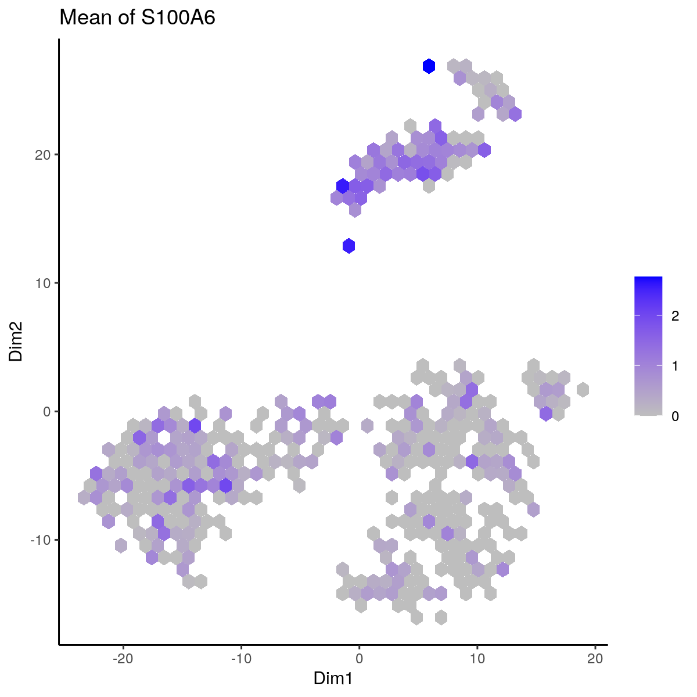|[AGER](https://www.ncbi.nlm.nih.gov/gene/177) [ANXA2](https://www.ncbi.nlm.nih.gov/gene/302) [C4BPA](https://www.ncbi.nlm.nih.gov/gene/722) [CRH](https://www.ncbi.nlm.nih.gov/gene/1392) [LGALS1](https://www.ncbi.nlm.nih.gov/gene/3956) [LGALS3](https://www.ncbi.nlm.nih.gov/gene/3958) [S100A8](https://www.ncbi.nlm.nih.gov/gene/6279) [NENF](https://www.ncbi.nlm.nih.gov/gene/29937)|
|[S1PR1](https://www.ncbi.nlm.nih.gov/gene/1901)|[AGT](https://www.ncbi.nlm.nih.gov/gene/183) [C3](https://www.ncbi.nlm.nih.gov/gene/718) [C5](https://www.ncbi.nlm.nih.gov/gene/727) [CORT](https://www.ncbi.nlm.nih.gov/gene/1325) [CCN2](https://www.ncbi.nlm.nih.gov/gene/1490) [EGFR](https://www.ncbi.nlm.nih.gov/gene/1956) [FGF2](https://www.ncbi.nlm.nih.gov/gene/2247) [GABBR1](https://www.ncbi.nlm.nih.gov/gene/2550) [CXCL1](https://www.ncbi.nlm.nih.gov/gene/2919) [CXCL2](https://www.ncbi.nlm.nih.gov/gene/2920) [CXCL3](https://www.ncbi.nlm.nih.gov/gene/2921) [IL2](https://www.ncbi.nlm.nih.gov/gene/3558) [IL6](https://www.ncbi.nlm.nih.gov/gene/3569) [IL7R](https://www.ncbi.nlm.nih.gov/gene/3575) [CXCL8](https://www.ncbi.nlm.nih.gov/gene/3576) [CXCL10](https://www.ncbi.nlm.nih.gov/gene/3627) [CXCL9](https://www.ncbi.nlm.nih.gov/gene/4283) [NPY](https://www.ncbi.nlm.nih.gov/gene/4852) [PDGFB](https://www.ncbi.nlm.nih.gov/gene/5155) [PDYN](https://www.ncbi.nlm.nih.gov/gene/5173) [PENK](https://www.ncbi.nlm.nih.gov/gene/5179) [PF4](https://www.ncbi.nlm.nih.gov/gene/5196) [PMCH](https://www.ncbi.nlm.nih.gov/gene/5367) [PNOC](https://www.ncbi.nlm.nih.gov/gene/5368) [POMC](https://www.ncbi.nlm.nih.gov/gene/5443) [PPBP](https://www.ncbi.nlm.nih.gov/gene/5473) [PPY](https://www.ncbi.nlm.nih.gov/gene/5539) [PSAP](https://www.ncbi.nlm.nih.gov/gene/5660) [PYY](https://www.ncbi.nlm.nih.gov/gene/5697) [SAA1](https://www.ncbi.nlm.nih.gov/gene/6288) [CCL1](https://www.ncbi.nlm.nih.gov/gene/6346) [CCL5](https://www.ncbi.nlm.nih.gov/gene/6352) [CCL13](https://www.ncbi.nlm.nih.gov/gene/6357) [CCL16](https://www.ncbi.nlm.nih.gov/gene/6360) [CCL19](https://www.ncbi.nlm.nih.gov/gene/6363) [CCL20](https://www.ncbi.nlm.nih.gov/gene/6364) [CCL21](https://www.ncbi.nlm.nih.gov/gene/6366) [CCL25](https://www.ncbi.nlm.nih.gov/gene/6370) [CXCL6](https://www.ncbi.nlm.nih.gov/gene/6372) [CXCL11](https://www.ncbi.nlm.nih.gov/gene/6373) [CXCL5](https://www.ncbi.nlm.nih.gov/gene/6374) [CX3CL1](https://www.ncbi.nlm.nih.gov/gene/6376) [CXCL12](https://www.ncbi.nlm.nih.gov/gene/6387) [SST](https://www.ncbi.nlm.nih.gov/gene/6750) [TNF](https://www.ncbi.nlm.nih.gov/gene/7124) [VEGFA](https://www.ncbi.nlm.nih.gov/gene/7422) [APLN](https://www.ncbi.nlm.nih.gov/gene/8862) [INSL5](https://www.ncbi.nlm.nih.gov/gene/10022) [CXCL13](https://www.ncbi.nlm.nih.gov/gene/10563) [CCL27](https://www.ncbi.nlm.nih.gov/gene/10850) [NMU](https://www.ncbi.nlm.nih.gov/gene/10874) [GAL](https://www.ncbi.nlm.nih.gov/gene/51083) [APOM](https://www.ncbi.nlm.nih.gov/gene/55937) [CCL28](https://www.ncbi.nlm.nih.gov/gene/56477) [RLN3](https://www.ncbi.nlm.nih.gov/gene/117579) [NMS](https://www.ncbi.nlm.nih.gov/gene/129521) [NPB](https://www.ncbi.nlm.nih.gov/gene/256933) [NPW](https://www.ncbi.nlm.nih.gov/gene/283869) [C9orf47](https://www.ncbi.nlm.nih.gov/gene/286223) [CCL4L1](https://www.ncbi.nlm.nih.gov/gene/388372)|
|[S1PR3](https://www.ncbi.nlm.nih.gov/gene/1903)|[AGT](https://www.ncbi.nlm.nih.gov/gene/183) [C3](https://www.ncbi.nlm.nih.gov/gene/718) [C5](https://www.ncbi.nlm.nih.gov/gene/727) [CORT](https://www.ncbi.nlm.nih.gov/gene/1325) [GABBR1](https://www.ncbi.nlm.nih.gov/gene/2550) [CXCL1](https://www.ncbi.nlm.nih.gov/gene/2919) [CXCL2](https://www.ncbi.nlm.nih.gov/gene/2920) [CXCL3](https://www.ncbi.nlm.nih.gov/gene/2921) [CXCL8](https://www.ncbi.nlm.nih.gov/gene/3576) [CXCL10](https://www.ncbi.nlm.nih.gov/gene/3627) [CXCL9](https://www.ncbi.nlm.nih.gov/gene/4283) [NPY](https://www.ncbi.nlm.nih.gov/gene/4852) [PDYN](https://www.ncbi.nlm.nih.gov/gene/5173) [PENK](https://www.ncbi.nlm.nih.gov/gene/5179) [PF4](https://www.ncbi.nlm.nih.gov/gene/5196) [PMCH](https://www.ncbi.nlm.nih.gov/gene/5367) [PNOC](https://www.ncbi.nlm.nih.gov/gene/5368) [POMC](https://www.ncbi.nlm.nih.gov/gene/5443) [PPBP](https://www.ncbi.nlm.nih.gov/gene/5473) [PPY](https://www.ncbi.nlm.nih.gov/gene/5539) [PSAP](https://www.ncbi.nlm.nih.gov/gene/5660) [PYY](https://www.ncbi.nlm.nih.gov/gene/5697) [SAA1](https://www.ncbi.nlm.nih.gov/gene/6288) [CCL1](https://www.ncbi.nlm.nih.gov/gene/6346) [CCL5](https://www.ncbi.nlm.nih.gov/gene/6352) [CCL13](https://www.ncbi.nlm.nih.gov/gene/6357) [CCL16](https://www.ncbi.nlm.nih.gov/gene/6360) [CCL19](https://www.ncbi.nlm.nih.gov/gene/6363) [CCL20](https://www.ncbi.nlm.nih.gov/gene/6364) [CCL21](https://www.ncbi.nlm.nih.gov/gene/6366) [CCL25](https://www.ncbi.nlm.nih.gov/gene/6370) [CXCL6](https://www.ncbi.nlm.nih.gov/gene/6372) [CXCL11](https://www.ncbi.nlm.nih.gov/gene/6373) [CXCL5](https://www.ncbi.nlm.nih.gov/gene/6374) [CX3CL1](https://www.ncbi.nlm.nih.gov/gene/6376) [CXCL12](https://www.ncbi.nlm.nih.gov/gene/6387) [SST](https://www.ncbi.nlm.nih.gov/gene/6750) [APLN](https://www.ncbi.nlm.nih.gov/gene/8862) [INSL5](https://www.ncbi.nlm.nih.gov/gene/10022) [CXCL13](https://www.ncbi.nlm.nih.gov/gene/10563) [CCL27](https://www.ncbi.nlm.nih.gov/gene/10850) [NMU](https://www.ncbi.nlm.nih.gov/gene/10874) [GAL](https://www.ncbi.nlm.nih.gov/gene/51083) [APOM](https://www.ncbi.nlm.nih.gov/gene/55937) [CCL28](https://www.ncbi.nlm.nih.gov/gene/56477) [RLN3](https://www.ncbi.nlm.nih.gov/gene/117579) [NMS](https://www.ncbi.nlm.nih.gov/gene/129521) [NPB](https://www.ncbi.nlm.nih.gov/gene/256933) [NPW](https://www.ncbi.nlm.nih.gov/gene/283869) [CCL4L1](https://www.ncbi.nlm.nih.gov/gene/388372)|
|[S1PR4](https://www.ncbi.nlm.nih.gov/gene/8698)|[AGT](https://www.ncbi.nlm.nih.gov/gene/183) [C3](https://www.ncbi.nlm.nih.gov/gene/718) [C5](https://www.ncbi.nlm.nih.gov/gene/727) [CORT](https://www.ncbi.nlm.nih.gov/gene/1325) [GABBR1](https://www.ncbi.nlm.nih.gov/gene/2550) [CXCL1](https://www.ncbi.nlm.nih.gov/gene/2919) [CXCL2](https://www.ncbi.nlm.nih.gov/gene/2920) [CXCL3](https://www.ncbi.nlm.nih.gov/gene/2921) [CXCL8](https://www.ncbi.nlm.nih.gov/gene/3576) [CXCL10](https://www.ncbi.nlm.nih.gov/gene/3627) [CXCL9](https://www.ncbi.nlm.nih.gov/gene/4283) [NPY](https://www.ncbi.nlm.nih.gov/gene/4852) [PDYN](https://www.ncbi.nlm.nih.gov/gene/5173) [PENK](https://www.ncbi.nlm.nih.gov/gene/5179) [PF4](https://www.ncbi.nlm.nih.gov/gene/5196) [CFP](https://www.ncbi.nlm.nih.gov/gene/5199) [PMCH](https://www.ncbi.nlm.nih.gov/gene/5367) [PNOC](https://www.ncbi.nlm.nih.gov/gene/5368) [POMC](https://www.ncbi.nlm.nih.gov/gene/5443) [PPBP](https://www.ncbi.nlm.nih.gov/gene/5473) [PPY](https://www.ncbi.nlm.nih.gov/gene/5539) [PSAP](https://www.ncbi.nlm.nih.gov/gene/5660) [PYY](https://www.ncbi.nlm.nih.gov/gene/5697) [SAA1](https://www.ncbi.nlm.nih.gov/gene/6288) [CCL1](https://www.ncbi.nlm.nih.gov/gene/6346) [CCL5](https://www.ncbi.nlm.nih.gov/gene/6352) [CCL13](https://www.ncbi.nlm.nih.gov/gene/6357) [CCL16](https://www.ncbi.nlm.nih.gov/gene/6360) [CCL19](https://www.ncbi.nlm.nih.gov/gene/6363) [CCL20](https://www.ncbi.nlm.nih.gov/gene/6364) [CCL21](https://www.ncbi.nlm.nih.gov/gene/6366) [CCL25](https://www.ncbi.nlm.nih.gov/gene/6370) [CXCL6](https://www.ncbi.nlm.nih.gov/gene/6372) [CXCL11](https://www.ncbi.nlm.nih.gov/gene/6373) [CXCL5](https://www.ncbi.nlm.nih.gov/gene/6374) [CX3CL1](https://www.ncbi.nlm.nih.gov/gene/6376) [CXCL12](https://www.ncbi.nlm.nih.gov/gene/6387) [SST](https://www.ncbi.nlm.nih.gov/gene/6750) [CST7](https://www.ncbi.nlm.nih.gov/gene/8530) [GGH](https://www.ncbi.nlm.nih.gov/gene/8836) [APLN](https://www.ncbi.nlm.nih.gov/gene/8862) [INSL5](https://www.ncbi.nlm.nih.gov/gene/10022) [CXCL13](https://www.ncbi.nlm.nih.gov/gene/10563) [CCL27](https://www.ncbi.nlm.nih.gov/gene/10850) [NMU](https://www.ncbi.nlm.nih.gov/gene/10874) [GAL](https://www.ncbi.nlm.nih.gov/gene/51083) [CCL28](https://www.ncbi.nlm.nih.gov/gene/56477) [RLN3](https://www.ncbi.nlm.nih.gov/gene/117579) [NMS](https://www.ncbi.nlm.nih.gov/gene/129521) [NPB](https://www.ncbi.nlm.nih.gov/gene/256933) [NPW](https://www.ncbi.nlm.nih.gov/gene/283869) [C9orf47](https://www.ncbi.nlm.nih.gov/gene/286223) [CCL4L1](https://www.ncbi.nlm.nih.gov/gene/388372)|
|[S1PR5](https://www.ncbi.nlm.nih.gov/gene/53637)|[AGT](https://www.ncbi.nlm.nih.gov/gene/183) [C3](https://www.ncbi.nlm.nih.gov/gene/718) [C5](https://www.ncbi.nlm.nih.gov/gene/727) [CORT](https://www.ncbi.nlm.nih.gov/gene/1325) [CCN2](https://www.ncbi.nlm.nih.gov/gene/1490) [GABBR1](https://www.ncbi.nlm.nih.gov/gene/2550) [CXCL1](https://www.ncbi.nlm.nih.gov/gene/2919) [CXCL2](https://www.ncbi.nlm.nih.gov/gene/2920) [CXCL3](https://www.ncbi.nlm.nih.gov/gene/2921) [CXCL8](https://www.ncbi.nlm.nih.gov/gene/3576) [CXCL10](https://www.ncbi.nlm.nih.gov/gene/3627) [CXCL9](https://www.ncbi.nlm.nih.gov/gene/4283) [NPY](https://www.ncbi.nlm.nih.gov/gene/4852) [PDYN](https://www.ncbi.nlm.nih.gov/gene/5173) [PENK](https://www.ncbi.nlm.nih.gov/gene/5179) [PF4](https://www.ncbi.nlm.nih.gov/gene/5196) [PMCH](https://www.ncbi.nlm.nih.gov/gene/5367) [PNOC](https://www.ncbi.nlm.nih.gov/gene/5368) [POMC](https://www.ncbi.nlm.nih.gov/gene/5443) [PPBP](https://www.ncbi.nlm.nih.gov/gene/5473) [PPY](https://www.ncbi.nlm.nih.gov/gene/5539) [PSAP](https://www.ncbi.nlm.nih.gov/gene/5660) [PYY](https://www.ncbi.nlm.nih.gov/gene/5697) [SAA1](https://www.ncbi.nlm.nih.gov/gene/6288) [CCL1](https://www.ncbi.nlm.nih.gov/gene/6346) [CCL5](https://www.ncbi.nlm.nih.gov/gene/6352) [CCL13](https://www.ncbi.nlm.nih.gov/gene/6357) [CCL16](https://www.ncbi.nlm.nih.gov/gene/6360) [CCL19](https://www.ncbi.nlm.nih.gov/gene/6363) [CCL20](https://www.ncbi.nlm.nih.gov/gene/6364) [CCL21](https://www.ncbi.nlm.nih.gov/gene/6366) [CCL25](https://www.ncbi.nlm.nih.gov/gene/6370) [CXCL6](https://www.ncbi.nlm.nih.gov/gene/6372) [CXCL11](https://www.ncbi.nlm.nih.gov/gene/6373) [CXCL5](https://www.ncbi.nlm.nih.gov/gene/6374) [CX3CL1](https://www.ncbi.nlm.nih.gov/gene/6376) [CXCL12](https://www.ncbi.nlm.nih.gov/gene/6387) [SST](https://www.ncbi.nlm.nih.gov/gene/6750) [APLN](https://www.ncbi.nlm.nih.gov/gene/8862) [INSL5](https://www.ncbi.nlm.nih.gov/gene/10022) [CXCL13](https://www.ncbi.nlm.nih.gov/gene/10563) [CCL27](https://www.ncbi.nlm.nih.gov/gene/10850) [NMU](https://www.ncbi.nlm.nih.gov/gene/10874) [GAL](https://www.ncbi.nlm.nih.gov/gene/51083) [CCL28](https://www.ncbi.nlm.nih.gov/gene/56477) [RLN3](https://www.ncbi.nlm.nih.gov/gene/117579) [NMS](https://www.ncbi.nlm.nih.gov/gene/129521) [NPB](https://www.ncbi.nlm.nih.gov/gene/256933) [NPW](https://www.ncbi.nlm.nih.gov/gene/283869) [C9orf47](https://www.ncbi.nlm.nih.gov/gene/286223) [CCL4L1](https://www.ncbi.nlm.nih.gov/gene/388372)|
|[SCAMP5](https://www.ncbi.nlm.nih.gov/gene/192683)|[ADPGK](https://www.ncbi.nlm.nih.gov/gene/83440)|
|[SCARA5](https://www.ncbi.nlm.nih.gov/gene/286133)|[FGF2](https://www.ncbi.nlm.nih.gov/gene/2247) [VTN](https://www.ncbi.nlm.nih.gov/gene/7448) [CLEC4M](https://www.ncbi.nlm.nih.gov/gene/10332) [NDNF](https://www.ncbi.nlm.nih.gov/gene/79625)|
|[SCARB1](https://www.ncbi.nlm.nih.gov/gene/949)|[ALB](https://www.ncbi.nlm.nih.gov/gene/213) [APOA1](https://www.ncbi.nlm.nih.gov/gene/335) [APOA2](https://www.ncbi.nlm.nih.gov/gene/336) [APOC1](https://www.ncbi.nlm.nih.gov/gene/341) [APOC2](https://www.ncbi.nlm.nih.gov/gene/344) [APOC3](https://www.ncbi.nlm.nih.gov/gene/345) [APOD](https://www.ncbi.nlm.nih.gov/gene/347) [APOE](https://www.ncbi.nlm.nih.gov/gene/348) [CETP](https://www.ncbi.nlm.nih.gov/gene/1071) [EGFR](https://www.ncbi.nlm.nih.gov/gene/1956) [EPO](https://www.ncbi.nlm.nih.gov/gene/2056) [IL6](https://www.ncbi.nlm.nih.gov/gene/3569) [INS](https://www.ncbi.nlm.nih.gov/gene/3630) [INSL3](https://www.ncbi.nlm.nih.gov/gene/3640) [LCAT](https://www.ncbi.nlm.nih.gov/gene/3931) [LIPC](https://www.ncbi.nlm.nih.gov/gene/3990) [PLTP](https://www.ncbi.nlm.nih.gov/gene/5360) [POMC](https://www.ncbi.nlm.nih.gov/gene/5443) [PON1](https://www.ncbi.nlm.nih.gov/gene/5444) [SAA1](https://www.ncbi.nlm.nih.gov/gene/6288) [CCL2](https://www.ncbi.nlm.nih.gov/gene/6347) [TNF](https://www.ncbi.nlm.nih.gov/gene/7124) [LIPG](https://www.ncbi.nlm.nih.gov/gene/9388) [CLEC4M](https://www.ncbi.nlm.nih.gov/gene/10332) [CD209](https://www.ncbi.nlm.nih.gov/gene/30835) [APOM](https://www.ncbi.nlm.nih.gov/gene/55937) [APOA5](https://www.ncbi.nlm.nih.gov/gene/116519) [PCSK9](https://www.ncbi.nlm.nih.gov/gene/255738)|
|[SCN10A](https://www.ncbi.nlm.nih.gov/gene/6336)|[ALB](https://www.ncbi.nlm.nih.gov/gene/213) [ANXA2](https://www.ncbi.nlm.nih.gov/gene/302) [BDNF](https://www.ncbi.nlm.nih.gov/gene/627) [CALCA](https://www.ncbi.nlm.nih.gov/gene/796) [CALCB](https://www.ncbi.nlm.nih.gov/gene/797) [GDNF](https://www.ncbi.nlm.nih.gov/gene/2668) [KDR](https://www.ncbi.nlm.nih.gov/gene/3791) [NGF](https://www.ncbi.nlm.nih.gov/gene/4803) [TAC1](https://www.ncbi.nlm.nih.gov/gene/6863) [NPS](https://www.ncbi.nlm.nih.gov/gene/594857)|
|[SCN11A](https://www.ncbi.nlm.nih.gov/gene/11280)|[CALCB](https://www.ncbi.nlm.nih.gov/gene/797) [NGF](https://www.ncbi.nlm.nih.gov/gene/4803) [TAC1](https://www.ncbi.nlm.nih.gov/gene/6863)|
|[SCN1A](https://www.ncbi.nlm.nih.gov/gene/6323)|[GABBR1](https://www.ncbi.nlm.nih.gov/gene/2550) [LGI1](https://www.ncbi.nlm.nih.gov/gene/9211) [LAMC3](https://www.ncbi.nlm.nih.gov/gene/10319)|
|[SCN2A](https://www.ncbi.nlm.nih.gov/gene/6326)|[NCAN](https://www.ncbi.nlm.nih.gov/gene/1463) [KDR](https://www.ncbi.nlm.nih.gov/gene/3791) [LGI1](https://www.ncbi.nlm.nih.gov/gene/9211) [HAPLN2](https://www.ncbi.nlm.nih.gov/gene/60484) [GLDN](https://www.ncbi.nlm.nih.gov/gene/342035)|
|[SCN3A](https://www.ncbi.nlm.nih.gov/gene/6328)|[KDR](https://www.ncbi.nlm.nih.gov/gene/3791)|
|[SCN5A](https://www.ncbi.nlm.nih.gov/gene/6331)|[CCN2](https://www.ncbi.nlm.nih.gov/gene/1490) [NPPA](https://www.ncbi.nlm.nih.gov/gene/4878) [VWA1](https://www.ncbi.nlm.nih.gov/gene/64856)|
|[SCN9A](https://www.ncbi.nlm.nih.gov/gene/6335)|[CALCA](https://www.ncbi.nlm.nih.gov/gene/796) [CORT](https://www.ncbi.nlm.nih.gov/gene/1325) [NGF](https://www.ncbi.nlm.nih.gov/gene/4803) [TAC1](https://www.ncbi.nlm.nih.gov/gene/6863)|
|[SCNN1A](https://www.ncbi.nlm.nih.gov/gene/6337)|[AGT](https://www.ncbi.nlm.nih.gov/gene/183) [INHBA](https://www.ncbi.nlm.nih.gov/gene/3624) [LCN2](https://www.ncbi.nlm.nih.gov/gene/3934) [MMP1](https://www.ncbi.nlm.nih.gov/gene/4312) [PRSS8](https://www.ncbi.nlm.nih.gov/gene/5652) [REN](https://www.ncbi.nlm.nih.gov/gene/5972) [SFTPB](https://www.ncbi.nlm.nih.gov/gene/6439) [SFTPA1](https://www.ncbi.nlm.nih.gov/gene/653509)|
|[SCNN1B](https://www.ncbi.nlm.nih.gov/gene/6338)|[REN](https://www.ncbi.nlm.nih.gov/gene/5972) [STX1A](https://www.ncbi.nlm.nih.gov/gene/6804) [BPIFA1](https://www.ncbi.nlm.nih.gov/gene/51297)|
|[SCNN1G](https://www.ncbi.nlm.nih.gov/gene/6340)|[AGT](https://www.ncbi.nlm.nih.gov/gene/183) [AVP](https://www.ncbi.nlm.nih.gov/gene/551) [COL6A3](https://www.ncbi.nlm.nih.gov/gene/1293) [CTSD](https://www.ncbi.nlm.nih.gov/gene/1509) [PRSS8](https://www.ncbi.nlm.nih.gov/gene/5652) [REN](https://www.ncbi.nlm.nih.gov/gene/5972) [STX1A](https://www.ncbi.nlm.nih.gov/gene/6804) [COL6A6](https://www.ncbi.nlm.nih.gov/gene/131873)|
|[SCRIB](https://www.ncbi.nlm.nih.gov/gene/23513)|[MST1](https://www.ncbi.nlm.nih.gov/gene/4485) [PDGFRL](https://www.ncbi.nlm.nih.gov/gene/5157) [PLXNB1](https://www.ncbi.nlm.nih.gov/gene/5364) [PTEN](https://www.ncbi.nlm.nih.gov/gene/5728) [PMEL](https://www.ncbi.nlm.nih.gov/gene/6490) [CRB2](https://www.ncbi.nlm.nih.gov/gene/286204)|
|[SCTR](https://www.ncbi.nlm.nih.gov/gene/6344)|[ADCYAP1](https://www.ncbi.nlm.nih.gov/gene/116) [ADM](https://www.ncbi.nlm.nih.gov/gene/133) [AVP](https://www.ncbi.nlm.nih.gov/gene/551) [CALCA](https://www.ncbi.nlm.nih.gov/gene/796) [CALCB](https://www.ncbi.nlm.nih.gov/gene/797) [CCK](https://www.ncbi.nlm.nih.gov/gene/885) [CGA](https://www.ncbi.nlm.nih.gov/gene/1081) [CRH](https://www.ncbi.nlm.nih.gov/gene/1392) [EDN1](https://www.ncbi.nlm.nih.gov/gene/1906) [FSHB](https://www.ncbi.nlm.nih.gov/gene/2488) [GAST](https://www.ncbi.nlm.nih.gov/gene/2520) [GCG](https://www.ncbi.nlm.nih.gov/gene/2641) [GHRH](https://www.ncbi.nlm.nih.gov/gene/2691) [GIP](https://www.ncbi.nlm.nih.gov/gene/2695) [IAPP](https://www.ncbi.nlm.nih.gov/gene/3375) [INSL3](https://www.ncbi.nlm.nih.gov/gene/3640) [POMC](https://www.ncbi.nlm.nih.gov/gene/5443) [PTH](https://www.ncbi.nlm.nih.gov/gene/5741) [PTHLH](https://www.ncbi.nlm.nih.gov/gene/5744) [RLN1](https://www.ncbi.nlm.nih.gov/gene/6013) [RLN2](https://www.ncbi.nlm.nih.gov/gene/6019) [SCT](https://www.ncbi.nlm.nih.gov/gene/6343) [TSHB](https://www.ncbi.nlm.nih.gov/gene/7252) [VIP](https://www.ncbi.nlm.nih.gov/gene/7432) [PRLH](https://www.ncbi.nlm.nih.gov/gene/51052) [ADM2](https://www.ncbi.nlm.nih.gov/gene/79924) [PTH2](https://www.ncbi.nlm.nih.gov/gene/113091) [RLN3](https://www.ncbi.nlm.nih.gov/gene/117579) [GPHB5](https://www.ncbi.nlm.nih.gov/gene/122876) [GPHA2](https://www.ncbi.nlm.nih.gov/gene/170589) [NPS](https://www.ncbi.nlm.nih.gov/gene/594857)|
|[SDC3](https://www.ncbi.nlm.nih.gov/gene/9672)|[AGRP](https://www.ncbi.nlm.nih.gov/gene/181) [APOA1](https://www.ncbi.nlm.nih.gov/gene/335) [APOA2](https://www.ncbi.nlm.nih.gov/gene/336) [APOC2](https://www.ncbi.nlm.nih.gov/gene/344) [APOC3](https://www.ncbi.nlm.nih.gov/gene/345) [APOE](https://www.ncbi.nlm.nih.gov/gene/348) [ASIP](https://www.ncbi.nlm.nih.gov/gene/434) [BGN](https://www.ncbi.nlm.nih.gov/gene/633) [COL5A1](https://www.ncbi.nlm.nih.gov/gene/1289) [VCAN](https://www.ncbi.nlm.nih.gov/gene/1462) [NCAN](https://www.ncbi.nlm.nih.gov/gene/1463) [DCN](https://www.ncbi.nlm.nih.gov/gene/1634) [EGFR](https://www.ncbi.nlm.nih.gov/gene/1956) [GPC4](https://www.ncbi.nlm.nih.gov/gene/2239) [FGF2](https://www.ncbi.nlm.nih.gov/gene/2247) [FGFR3](https://www.ncbi.nlm.nih.gov/gene/2261) [GPC5](https://www.ncbi.nlm.nih.gov/gene/2262) [FGFR2](https://www.ncbi.nlm.nih.gov/gene/2263) [FGFR4](https://www.ncbi.nlm.nih.gov/gene/2264) [FN1](https://www.ncbi.nlm.nih.gov/gene/2335) [GPC1](https://www.ncbi.nlm.nih.gov/gene/2817) [CXCL1](https://www.ncbi.nlm.nih.gov/gene/2919) [HSPG2](https://www.ncbi.nlm.nih.gov/gene/3339) [TNC](https://www.ncbi.nlm.nih.gov/gene/3371) [CXCL8](https://www.ncbi.nlm.nih.gov/gene/3576) [ITIH4](https://www.ncbi.nlm.nih.gov/gene/3700) [MDK](https://www.ncbi.nlm.nih.gov/gene/4192) [NCAM1](https://www.ncbi.nlm.nih.gov/gene/4684) [NRTN](https://www.ncbi.nlm.nih.gov/gene/4902) [POMC](https://www.ncbi.nlm.nih.gov/gene/5443) [PSPN](https://www.ncbi.nlm.nih.gov/gene/5623) [PSG1](https://www.ncbi.nlm.nih.gov/gene/5669) [PSG2](https://www.ncbi.nlm.nih.gov/gene/5670) [PSG3](https://www.ncbi.nlm.nih.gov/gene/5671) [PSG4](https://www.ncbi.nlm.nih.gov/gene/5672) [PSG5](https://www.ncbi.nlm.nih.gov/gene/5673) [PSG6](https://www.ncbi.nlm.nih.gov/gene/5675) [PSG7](https://www.ncbi.nlm.nih.gov/gene/5676) [PSG9](https://www.ncbi.nlm.nih.gov/gene/5678) [PSG11](https://www.ncbi.nlm.nih.gov/gene/5680) [PYY](https://www.ncbi.nlm.nih.gov/gene/5697) [PTN](https://www.ncbi.nlm.nih.gov/gene/5764) [PTPRZ1](https://www.ncbi.nlm.nih.gov/gene/5803) [SDC4](https://www.ncbi.nlm.nih.gov/gene/6385) [COL14A1](https://www.ncbi.nlm.nih.gov/gene/7373) [FGF23](https://www.ncbi.nlm.nih.gov/gene/8074) [ARTN](https://www.ncbi.nlm.nih.gov/gene/9048) [FGF19](https://www.ncbi.nlm.nih.gov/gene/9965) [GPC6](https://www.ncbi.nlm.nih.gov/gene/10082) [HPSE2](https://www.ncbi.nlm.nih.gov/gene/60495) [GPC2](https://www.ncbi.nlm.nih.gov/gene/221914) [PSG8](https://www.ncbi.nlm.nih.gov/gene/440533)|
|[SDK1](https://www.ncbi.nlm.nih.gov/gene/221935)|[DSCAM](https://www.ncbi.nlm.nih.gov/gene/1826) [SFRP5](https://www.ncbi.nlm.nih.gov/gene/6425) [NTN1](https://www.ncbi.nlm.nih.gov/gene/9423) [SCPEP1](https://www.ncbi.nlm.nih.gov/gene/59342) [NTN5](https://www.ncbi.nlm.nih.gov/gene/126147)|
|[SDK2](https://www.ncbi.nlm.nih.gov/gene/54549)|[DSCAM](https://www.ncbi.nlm.nih.gov/gene/1826) [NTN1](https://www.ncbi.nlm.nih.gov/gene/9423) [NTN5](https://www.ncbi.nlm.nih.gov/gene/126147)|
|[SECTM1](https://www.ncbi.nlm.nih.gov/gene/6398)|[IFNG](https://www.ncbi.nlm.nih.gov/gene/3458)|
|[SELE](https://www.ncbi.nlm.nih.gov/gene/6401)|[ALB](https://www.ncbi.nlm.nih.gov/gene/213) [ANGPT1](https://www.ncbi.nlm.nih.gov/gene/284) [ANGPT2](https://www.ncbi.nlm.nih.gov/gene/285) [APOE](https://www.ncbi.nlm.nih.gov/gene/348) [SERPINC1](https://www.ncbi.nlm.nih.gov/gene/462) [SERPING1](https://www.ncbi.nlm.nih.gov/gene/710) [CD40](https://www.ncbi.nlm.nih.gov/gene/958) [CD40LG](https://www.ncbi.nlm.nih.gov/gene/959) [CRP](https://www.ncbi.nlm.nih.gov/gene/1401) [CSF2](https://www.ncbi.nlm.nih.gov/gene/1437) [CSF3](https://www.ncbi.nlm.nih.gov/gene/1440) [EDN1](https://www.ncbi.nlm.nih.gov/gene/1906) [ELN](https://www.ncbi.nlm.nih.gov/gene/2006) [F2](https://www.ncbi.nlm.nih.gov/gene/2147) [F3](https://www.ncbi.nlm.nih.gov/gene/2152) [F5](https://www.ncbi.nlm.nih.gov/gene/2153) [FGF2](https://www.ncbi.nlm.nih.gov/gene/2247) [FLT1](https://www.ncbi.nlm.nih.gov/gene/2321) [FN1](https://www.ncbi.nlm.nih.gov/gene/2335) [CXCL1](https://www.ncbi.nlm.nih.gov/gene/2919) [CXCL2](https://www.ncbi.nlm.nih.gov/gene/2920) [IFNG](https://www.ncbi.nlm.nih.gov/gene/3458) [IL1A](https://www.ncbi.nlm.nih.gov/gene/3552) [IL2](https://www.ncbi.nlm.nih.gov/gene/3558) [IL4](https://www.ncbi.nlm.nih.gov/gene/3565) [IL5](https://www.ncbi.nlm.nih.gov/gene/3567) [IL6](https://www.ncbi.nlm.nih.gov/gene/3569) [CXCL8](https://www.ncbi.nlm.nih.gov/gene/3576) [IL10](https://www.ncbi.nlm.nih.gov/gene/3586) [IL13](https://www.ncbi.nlm.nih.gov/gene/3596) [IL18](https://www.ncbi.nlm.nih.gov/gene/3606) [CXCL10](https://www.ncbi.nlm.nih.gov/gene/3627) [INS](https://www.ncbi.nlm.nih.gov/gene/3630) [KDR](https://www.ncbi.nlm.nih.gov/gene/3791) [LEP](https://www.ncbi.nlm.nih.gov/gene/3952) [LGALS3](https://www.ncbi.nlm.nih.gov/gene/3958) [LGALS3BP](https://www.ncbi.nlm.nih.gov/gene/3959) [LGALS9](https://www.ncbi.nlm.nih.gov/gene/3965) [CXCL9](https://www.ncbi.nlm.nih.gov/gene/4283) [MMP1](https://www.ncbi.nlm.nih.gov/gene/4312) [MMP3](https://www.ncbi.nlm.nih.gov/gene/4314) [MMP9](https://www.ncbi.nlm.nih.gov/gene/4318) [MUC1](https://www.ncbi.nlm.nih.gov/gene/4582) [SERPINE1](https://www.ncbi.nlm.nih.gov/gene/5054) [PF4](https://www.ncbi.nlm.nih.gov/gene/5196) [PGF](https://www.ncbi.nlm.nih.gov/gene/5228) [PLA2G1B](https://www.ncbi.nlm.nih.gov/gene/5319) [PLAT](https://www.ncbi.nlm.nih.gov/gene/5327) [PLG](https://www.ncbi.nlm.nih.gov/gene/5340) [REN](https://www.ncbi.nlm.nih.gov/gene/5972) [CCL2](https://www.ncbi.nlm.nih.gov/gene/6347) [CCL3](https://www.ncbi.nlm.nih.gov/gene/6348) [CCL5](https://www.ncbi.nlm.nih.gov/gene/6352) [CCL11](https://www.ncbi.nlm.nih.gov/gene/6356) [CCL17](https://www.ncbi.nlm.nih.gov/gene/6361) [CCL19](https://www.ncbi.nlm.nih.gov/gene/6363) [CCL20](https://www.ncbi.nlm.nih.gov/gene/6364) [CCL21](https://www.ncbi.nlm.nih.gov/gene/6366) [CXCL11](https://www.ncbi.nlm.nih.gov/gene/6373) [CXCL5](https://www.ncbi.nlm.nih.gov/gene/6374) [CX3CL1](https://www.ncbi.nlm.nih.gov/gene/6376) [CXCL12](https://www.ncbi.nlm.nih.gov/gene/6387) [SPP1](https://www.ncbi.nlm.nih.gov/gene/6696) [TFPI](https://www.ncbi.nlm.nih.gov/gene/7035) [TIMP1](https://www.ncbi.nlm.nih.gov/gene/7076) [TNF](https://www.ncbi.nlm.nih.gov/gene/7124) [TNFRSF1A](https://www.ncbi.nlm.nih.gov/gene/7132) [TNFRSF1B](https://www.ncbi.nlm.nih.gov/gene/7133) [VEGFA](https://www.ncbi.nlm.nih.gov/gene/7422) [VWF](https://www.ncbi.nlm.nih.gov/gene/7450) [TNFRSF25](https://www.ncbi.nlm.nih.gov/gene/8718) [ADIPOQ](https://www.ncbi.nlm.nih.gov/gene/9370) [EMCN](https://www.ncbi.nlm.nih.gov/gene/51705) [RETN](https://www.ncbi.nlm.nih.gov/gene/56729)|
|[SELL](https://www.ncbi.nlm.nih.gov/gene/6402)|[ALB](https://www.ncbi.nlm.nih.gov/gene/213) [FAS](https://www.ncbi.nlm.nih.gov/gene/355) [CD8A](https://www.ncbi.nlm.nih.gov/gene/925) [CD8B](https://www.ncbi.nlm.nih.gov/gene/926) [CD40](https://www.ncbi.nlm.nih.gov/gene/958) [CD40LG](https://www.ncbi.nlm.nih.gov/gene/959) [CRP](https://www.ncbi.nlm.nih.gov/gene/1401) [CSF2](https://www.ncbi.nlm.nih.gov/gene/1437) [CSF3](https://www.ncbi.nlm.nih.gov/gene/1440) [VCAN](https://www.ncbi.nlm.nih.gov/gene/1462) [DPT](https://www.ncbi.nlm.nih.gov/gene/1805) [F3](https://www.ncbi.nlm.nih.gov/gene/2152) [F5](https://www.ncbi.nlm.nih.gov/gene/2153) [FLT3LG](https://www.ncbi.nlm.nih.gov/gene/2323) [FN1](https://www.ncbi.nlm.nih.gov/gene/2335) [CXCL1](https://www.ncbi.nlm.nih.gov/gene/2919) [CXCL2](https://www.ncbi.nlm.nih.gov/gene/2920) [GZMA](https://www.ncbi.nlm.nih.gov/gene/3001) [GZMK](https://www.ncbi.nlm.nih.gov/gene/3003) [CFH](https://www.ncbi.nlm.nih.gov/gene/3075) [IFNG](https://www.ncbi.nlm.nih.gov/gene/3458) [IL2](https://www.ncbi.nlm.nih.gov/gene/3558) [IL3](https://www.ncbi.nlm.nih.gov/gene/3562) [IL4](https://www.ncbi.nlm.nih.gov/gene/3565) [IL5](https://www.ncbi.nlm.nih.gov/gene/3567) [IL6](https://www.ncbi.nlm.nih.gov/gene/3569) [IL6R](https://www.ncbi.nlm.nih.gov/gene/3570) [IL7](https://www.ncbi.nlm.nih.gov/gene/3574) [IL7R](https://www.ncbi.nlm.nih.gov/gene/3575) [CXCL8](https://www.ncbi.nlm.nih.gov/gene/3576) [IL9](https://www.ncbi.nlm.nih.gov/gene/3578) [IL10](https://www.ncbi.nlm.nih.gov/gene/3586) [IL13](https://www.ncbi.nlm.nih.gov/gene/3596) [IL15](https://www.ncbi.nlm.nih.gov/gene/3600) [IL18](https://www.ncbi.nlm.nih.gov/gene/3606) [CXCL10](https://www.ncbi.nlm.nih.gov/gene/3627) [INS](https://www.ncbi.nlm.nih.gov/gene/3630) [LAG3](https://www.ncbi.nlm.nih.gov/gene/3902) [LGALS3](https://www.ncbi.nlm.nih.gov/gene/3958) [LGALS9](https://www.ncbi.nlm.nih.gov/gene/3965) [LTA](https://www.ncbi.nlm.nih.gov/gene/4049) [CXCL9](https://www.ncbi.nlm.nih.gov/gene/4283) [MMP9](https://www.ncbi.nlm.nih.gov/gene/4318) [MUC7](https://www.ncbi.nlm.nih.gov/gene/4589) [NCAM1](https://www.ncbi.nlm.nih.gov/gene/4684) [PAEP](https://www.ncbi.nlm.nih.gov/gene/5047) [SERPINB2](https://www.ncbi.nlm.nih.gov/gene/5055) [PAPPA](https://www.ncbi.nlm.nih.gov/gene/5069) [PENK](https://www.ncbi.nlm.nih.gov/gene/5179) [PF4](https://www.ncbi.nlm.nih.gov/gene/5196) [SERPINB5](https://www.ncbi.nlm.nih.gov/gene/5268) [PRF1](https://www.ncbi.nlm.nih.gov/gene/5551) [S100A12](https://www.ncbi.nlm.nih.gov/gene/6283) [CCL2](https://www.ncbi.nlm.nih.gov/gene/6347) [CCL3](https://www.ncbi.nlm.nih.gov/gene/6348) [CCL5](https://www.ncbi.nlm.nih.gov/gene/6352) [CCL11](https://www.ncbi.nlm.nih.gov/gene/6356) [CCL17](https://www.ncbi.nlm.nih.gov/gene/6361) [CCL19](https://www.ncbi.nlm.nih.gov/gene/6363) [CCL20](https://www.ncbi.nlm.nih.gov/gene/6364) [CCL21](https://www.ncbi.nlm.nih.gov/gene/6366) [CCL22](https://www.ncbi.nlm.nih.gov/gene/6367) [CCL25](https://www.ncbi.nlm.nih.gov/gene/6370) [CX3CL1](https://www.ncbi.nlm.nih.gov/gene/6376) [CXCL12](https://www.ncbi.nlm.nih.gov/gene/6387) [PMEL](https://www.ncbi.nlm.nih.gov/gene/6490) [SIGLEC1](https://www.ncbi.nlm.nih.gov/gene/6614) [TNF](https://www.ncbi.nlm.nih.gov/gene/7124) [TNFRSF1A](https://www.ncbi.nlm.nih.gov/gene/7132) [TNFRSF1B](https://www.ncbi.nlm.nih.gov/gene/7133) [VEGFA](https://www.ncbi.nlm.nih.gov/gene/7422) [VWF](https://www.ncbi.nlm.nih.gov/gene/7450) [TNFRSF18](https://www.ncbi.nlm.nih.gov/gene/8784) [CARTPT](https://www.ncbi.nlm.nih.gov/gene/9607) [CXCL13](https://www.ncbi.nlm.nih.gov/gene/10563) [FGL2](https://www.ncbi.nlm.nih.gov/gene/10875) [CD160](https://www.ncbi.nlm.nih.gov/gene/11126) [ICOS](https://www.ncbi.nlm.nih.gov/gene/29851) [IL22](https://www.ncbi.nlm.nih.gov/gene/50616) [EMCN](https://www.ncbi.nlm.nih.gov/gene/51705) [IL17F](https://www.ncbi.nlm.nih.gov/gene/112744)|
|[SELP](https://www.ncbi.nlm.nih.gov/gene/6403)|[ALB](https://www.ncbi.nlm.nih.gov/gene/213) [ANGPT1](https://www.ncbi.nlm.nih.gov/gene/284) [ANGPT2](https://www.ncbi.nlm.nih.gov/gene/285) [APOE](https://www.ncbi.nlm.nih.gov/gene/348) [SERPINC1](https://www.ncbi.nlm.nih.gov/gene/462) [SERPING1](https://www.ncbi.nlm.nih.gov/gene/710) [C3](https://www.ncbi.nlm.nih.gov/gene/718) [CD40](https://www.ncbi.nlm.nih.gov/gene/958) [CD40LG](https://www.ncbi.nlm.nih.gov/gene/959) [CRP](https://www.ncbi.nlm.nih.gov/gene/1401) [CSF2](https://www.ncbi.nlm.nih.gov/gene/1437) [CSF3](https://www.ncbi.nlm.nih.gov/gene/1440) [VCAN](https://www.ncbi.nlm.nih.gov/gene/1462) [EDN1](https://www.ncbi.nlm.nih.gov/gene/1906) [F2](https://www.ncbi.nlm.nih.gov/gene/2147) [F3](https://www.ncbi.nlm.nih.gov/gene/2152) [F5](https://www.ncbi.nlm.nih.gov/gene/2153) [F7](https://www.ncbi.nlm.nih.gov/gene/2155) [F8](https://www.ncbi.nlm.nih.gov/gene/2157) [F10](https://www.ncbi.nlm.nih.gov/gene/2159) [F13A1](https://www.ncbi.nlm.nih.gov/gene/2162) [FGF2](https://www.ncbi.nlm.nih.gov/gene/2247) [FLT1](https://www.ncbi.nlm.nih.gov/gene/2321) [FN1](https://www.ncbi.nlm.nih.gov/gene/2335) [CXCL1](https://www.ncbi.nlm.nih.gov/gene/2919) [CXCL2](https://www.ncbi.nlm.nih.gov/gene/2920) [IFNG](https://www.ncbi.nlm.nih.gov/gene/3458) [IL2](https://www.ncbi.nlm.nih.gov/gene/3558) [IL3](https://www.ncbi.nlm.nih.gov/gene/3562) [IL4](https://www.ncbi.nlm.nih.gov/gene/3565) [IL5](https://www.ncbi.nlm.nih.gov/gene/3567) [IL6](https://www.ncbi.nlm.nih.gov/gene/3569) [CXCL8](https://www.ncbi.nlm.nih.gov/gene/3576) [IL10](https://www.ncbi.nlm.nih.gov/gene/3586) [IL13](https://www.ncbi.nlm.nih.gov/gene/3596) [IL18](https://www.ncbi.nlm.nih.gov/gene/3606) [CXCL10](https://www.ncbi.nlm.nih.gov/gene/3627) [INS](https://www.ncbi.nlm.nih.gov/gene/3630) [KDR](https://www.ncbi.nlm.nih.gov/gene/3791) [LGALS3](https://www.ncbi.nlm.nih.gov/gene/3958) [LGALS9](https://www.ncbi.nlm.nih.gov/gene/3965) [CXCL9](https://www.ncbi.nlm.nih.gov/gene/4283) [MMP9](https://www.ncbi.nlm.nih.gov/gene/4318) [SERPINE1](https://www.ncbi.nlm.nih.gov/gene/5054) [PF4](https://www.ncbi.nlm.nih.gov/gene/5196) [PLA2G1B](https://www.ncbi.nlm.nih.gov/gene/5319) [PLAT](https://www.ncbi.nlm.nih.gov/gene/5327) [PLG](https://www.ncbi.nlm.nih.gov/gene/5340) [PPBP](https://www.ncbi.nlm.nih.gov/gene/5473) [PRF1](https://www.ncbi.nlm.nih.gov/gene/5551) [PRL](https://www.ncbi.nlm.nih.gov/gene/5617) [PTX3](https://www.ncbi.nlm.nih.gov/gene/5806) [CCL2](https://www.ncbi.nlm.nih.gov/gene/6347) [CCL3](https://www.ncbi.nlm.nih.gov/gene/6348) [CCL5](https://www.ncbi.nlm.nih.gov/gene/6352) [CCL11](https://www.ncbi.nlm.nih.gov/gene/6356) [CCL19](https://www.ncbi.nlm.nih.gov/gene/6363) [CCL21](https://www.ncbi.nlm.nih.gov/gene/6366) [CCL25](https://www.ncbi.nlm.nih.gov/gene/6370) [CXCL5](https://www.ncbi.nlm.nih.gov/gene/6374) [CX3CL1](https://www.ncbi.nlm.nih.gov/gene/6376) [CXCL12](https://www.ncbi.nlm.nih.gov/gene/6387) [SIGLEC1](https://www.ncbi.nlm.nih.gov/gene/6614) [TAC1](https://www.ncbi.nlm.nih.gov/gene/6863) [TFPI](https://www.ncbi.nlm.nih.gov/gene/7035) [THBS1](https://www.ncbi.nlm.nih.gov/gene/7057) [TIMP1](https://www.ncbi.nlm.nih.gov/gene/7076) [TNF](https://www.ncbi.nlm.nih.gov/gene/7124) [TNFRSF1B](https://www.ncbi.nlm.nih.gov/gene/7133) [VEGFA](https://www.ncbi.nlm.nih.gov/gene/7422) [VTN](https://www.ncbi.nlm.nih.gov/gene/7448) [VWF](https://www.ncbi.nlm.nih.gov/gene/7450) [ADIPOQ](https://www.ncbi.nlm.nih.gov/gene/9370) [FGL2](https://www.ncbi.nlm.nih.gov/gene/10875) [ADAMTS13](https://www.ncbi.nlm.nih.gov/gene/11093) [CD209](https://www.ncbi.nlm.nih.gov/gene/30835) [RETN](https://www.ncbi.nlm.nih.gov/gene/56729) [JAM3](https://www.ncbi.nlm.nih.gov/gene/83700)|
|[SEMA4A](https://www.ncbi.nlm.nih.gov/gene/64218)|[BDNF](https://www.ncbi.nlm.nih.gov/gene/627) [DSCAM](https://www.ncbi.nlm.nih.gov/gene/1826) [EFNA1](https://www.ncbi.nlm.nih.gov/gene/1942) [EFNA4](https://www.ncbi.nlm.nih.gov/gene/1945) [EPHA3](https://www.ncbi.nlm.nih.gov/gene/2042) [EPHB6](https://www.ncbi.nlm.nih.gov/gene/2051) [FLT1](https://www.ncbi.nlm.nih.gov/gene/2321) [IL2](https://www.ncbi.nlm.nih.gov/gene/3558) [KDR](https://www.ncbi.nlm.nih.gov/gene/3791) [LGALS9](https://www.ncbi.nlm.nih.gov/gene/3965) [MET](https://www.ncbi.nlm.nih.gov/gene/4233) [NGF](https://www.ncbi.nlm.nih.gov/gene/4803) [NTF3](https://www.ncbi.nlm.nih.gov/gene/4908) [NTF4](https://www.ncbi.nlm.nih.gov/gene/4909) [PLXNB1](https://www.ncbi.nlm.nih.gov/gene/5364) [PSAP](https://www.ncbi.nlm.nih.gov/gene/5660) [SLIT1](https://www.ncbi.nlm.nih.gov/gene/6585) [SLIT3](https://www.ncbi.nlm.nih.gov/gene/6586) [VEGFA](https://www.ncbi.nlm.nih.gov/gene/7422) [VEGFC](https://www.ncbi.nlm.nih.gov/gene/7424) [NRP2](https://www.ncbi.nlm.nih.gov/gene/8828) [NRP1](https://www.ncbi.nlm.nih.gov/gene/8829) [SLIT2](https://www.ncbi.nlm.nih.gov/gene/9353) [NTN1](https://www.ncbi.nlm.nih.gov/gene/9423) [EPHA10](https://www.ncbi.nlm.nih.gov/gene/284656)|
|[SEMA4D](https://www.ncbi.nlm.nih.gov/gene/10507)|[BDNF](https://www.ncbi.nlm.nih.gov/gene/627) [DSCAM](https://www.ncbi.nlm.nih.gov/gene/1826) [EFNA1](https://www.ncbi.nlm.nih.gov/gene/1942) [EFNA4](https://www.ncbi.nlm.nih.gov/gene/1945) [EPHA3](https://www.ncbi.nlm.nih.gov/gene/2042) [EPHB6](https://www.ncbi.nlm.nih.gov/gene/2051) [FLT1](https://www.ncbi.nlm.nih.gov/gene/2321) [IGF1](https://www.ncbi.nlm.nih.gov/gene/3479) [KDR](https://www.ncbi.nlm.nih.gov/gene/3791) [MET](https://www.ncbi.nlm.nih.gov/gene/4233) [NGF](https://www.ncbi.nlm.nih.gov/gene/4803) [NTF3](https://www.ncbi.nlm.nih.gov/gene/4908) [NTF4](https://www.ncbi.nlm.nih.gov/gene/4909) [PGF](https://www.ncbi.nlm.nih.gov/gene/5228) [PLXNB1](https://www.ncbi.nlm.nih.gov/gene/5364) [SLIT1](https://www.ncbi.nlm.nih.gov/gene/6585) [SLIT3](https://www.ncbi.nlm.nih.gov/gene/6586) [VEGFA](https://www.ncbi.nlm.nih.gov/gene/7422) [VEGFC](https://www.ncbi.nlm.nih.gov/gene/7424) [NRP2](https://www.ncbi.nlm.nih.gov/gene/8828) [NRP1](https://www.ncbi.nlm.nih.gov/gene/8829) [SLIT2](https://www.ncbi.nlm.nih.gov/gene/9353) [NTN1](https://www.ncbi.nlm.nih.gov/gene/9423) [EPHA10](https://www.ncbi.nlm.nih.gov/gene/284656)|
|[SEMA4F](https://www.ncbi.nlm.nih.gov/gene/10505)|[BDNF](https://www.ncbi.nlm.nih.gov/gene/627) [DSCAM](https://www.ncbi.nlm.nih.gov/gene/1826) [EFNA1](https://www.ncbi.nlm.nih.gov/gene/1942) [EFNA4](https://www.ncbi.nlm.nih.gov/gene/1945) [EPHA3](https://www.ncbi.nlm.nih.gov/gene/2042) [EPHB6](https://www.ncbi.nlm.nih.gov/gene/2051) [FN1](https://www.ncbi.nlm.nih.gov/gene/2335) [KDR](https://www.ncbi.nlm.nih.gov/gene/3791) [MET](https://www.ncbi.nlm.nih.gov/gene/4233) [NGF](https://www.ncbi.nlm.nih.gov/gene/4803) [NTF3](https://www.ncbi.nlm.nih.gov/gene/4908) [PLXNB1](https://www.ncbi.nlm.nih.gov/gene/5364) [SLIT1](https://www.ncbi.nlm.nih.gov/gene/6585) [SLIT3](https://www.ncbi.nlm.nih.gov/gene/6586) [VEGFA](https://www.ncbi.nlm.nih.gov/gene/7422) [VEGFC](https://www.ncbi.nlm.nih.gov/gene/7424) [NRP2](https://www.ncbi.nlm.nih.gov/gene/8828) [NRP1](https://www.ncbi.nlm.nih.gov/gene/8829) [SLIT2](https://www.ncbi.nlm.nih.gov/gene/9353) [NTN1](https://www.ncbi.nlm.nih.gov/gene/9423) [EPHA10](https://www.ncbi.nlm.nih.gov/gene/284656)|
|[SEMA4G](https://www.ncbi.nlm.nih.gov/gene/57715)|[BDNF](https://www.ncbi.nlm.nih.gov/gene/627) [CPN1](https://www.ncbi.nlm.nih.gov/gene/1369) [DSCAM](https://www.ncbi.nlm.nih.gov/gene/1826) [EFNA1](https://www.ncbi.nlm.nih.gov/gene/1942) [EFNA4](https://www.ncbi.nlm.nih.gov/gene/1945) [EPHA3](https://www.ncbi.nlm.nih.gov/gene/2042) [EPHB6](https://www.ncbi.nlm.nih.gov/gene/2051) [FLT1](https://www.ncbi.nlm.nih.gov/gene/2321) [KDR](https://www.ncbi.nlm.nih.gov/gene/3791) [MET](https://www.ncbi.nlm.nih.gov/gene/4233) [NGF](https://www.ncbi.nlm.nih.gov/gene/4803) [NTF3](https://www.ncbi.nlm.nih.gov/gene/4908) [NTF4](https://www.ncbi.nlm.nih.gov/gene/4909) [PLXNB1](https://www.ncbi.nlm.nih.gov/gene/5364) [SLIT1](https://www.ncbi.nlm.nih.gov/gene/6585) [SLIT3](https://www.ncbi.nlm.nih.gov/gene/6586) [VEGFA](https://www.ncbi.nlm.nih.gov/gene/7422) [VEGFC](https://www.ncbi.nlm.nih.gov/gene/7424) [NRP2](https://www.ncbi.nlm.nih.gov/gene/8828) [NRP1](https://www.ncbi.nlm.nih.gov/gene/8829) [SLIT2](https://www.ncbi.nlm.nih.gov/gene/9353) [NTN1](https://www.ncbi.nlm.nih.gov/gene/9423) [EPHA10](https://www.ncbi.nlm.nih.gov/gene/284656)|
|[SEMA6A](https://www.ncbi.nlm.nih.gov/gene/57556)|[BDNF](https://www.ncbi.nlm.nih.gov/gene/627) [DSCAM](https://www.ncbi.nlm.nih.gov/gene/1826) [EFNA1](https://www.ncbi.nlm.nih.gov/gene/1942) [EFNA4](https://www.ncbi.nlm.nih.gov/gene/1945) [EPHA3](https://www.ncbi.nlm.nih.gov/gene/2042) [EPHB6](https://www.ncbi.nlm.nih.gov/gene/2051) [FLT1](https://www.ncbi.nlm.nih.gov/gene/2321) [KDR](https://www.ncbi.nlm.nih.gov/gene/3791) [MET](https://www.ncbi.nlm.nih.gov/gene/4233) [NCAM1](https://www.ncbi.nlm.nih.gov/gene/4684) [NGF](https://www.ncbi.nlm.nih.gov/gene/4803) [NTF3](https://www.ncbi.nlm.nih.gov/gene/4908) [NTF4](https://www.ncbi.nlm.nih.gov/gene/4909) [PLXNB1](https://www.ncbi.nlm.nih.gov/gene/5364) [SLIT1](https://www.ncbi.nlm.nih.gov/gene/6585) [SLIT3](https://www.ncbi.nlm.nih.gov/gene/6586) [VEGFA](https://www.ncbi.nlm.nih.gov/gene/7422) [VEGFC](https://www.ncbi.nlm.nih.gov/gene/7424) [WNT11](https://www.ncbi.nlm.nih.gov/gene/7481) [NRP2](https://www.ncbi.nlm.nih.gov/gene/8828) [NRP1](https://www.ncbi.nlm.nih.gov/gene/8829) [SLIT2](https://www.ncbi.nlm.nih.gov/gene/9353) [NTN1](https://www.ncbi.nlm.nih.gov/gene/9423) [WNT5B](https://www.ncbi.nlm.nih.gov/gene/81029) [EPHA10](https://www.ncbi.nlm.nih.gov/gene/284656)|
|[SEMA6B](https://www.ncbi.nlm.nih.gov/gene/10501)|[BDNF](https://www.ncbi.nlm.nih.gov/gene/627) [DSCAM](https://www.ncbi.nlm.nih.gov/gene/1826) [EFNA1](https://www.ncbi.nlm.nih.gov/gene/1942) [EFNA4](https://www.ncbi.nlm.nih.gov/gene/1945) [EPHA3](https://www.ncbi.nlm.nih.gov/gene/2042) [EPHB6](https://www.ncbi.nlm.nih.gov/gene/2051) [FLT1](https://www.ncbi.nlm.nih.gov/gene/2321) [KDR](https://www.ncbi.nlm.nih.gov/gene/3791) [MET](https://www.ncbi.nlm.nih.gov/gene/4233) [NGF](https://www.ncbi.nlm.nih.gov/gene/4803) [NTF3](https://www.ncbi.nlm.nih.gov/gene/4908) [NTF4](https://www.ncbi.nlm.nih.gov/gene/4909) [PLXNB1](https://www.ncbi.nlm.nih.gov/gene/5364) [SLIT1](https://www.ncbi.nlm.nih.gov/gene/6585) [SLIT3](https://www.ncbi.nlm.nih.gov/gene/6586) [VEGFA](https://www.ncbi.nlm.nih.gov/gene/7422) [VEGFC](https://www.ncbi.nlm.nih.gov/gene/7424) [WNT11](https://www.ncbi.nlm.nih.gov/gene/7481) [NRP2](https://www.ncbi.nlm.nih.gov/gene/8828) [NRP1](https://www.ncbi.nlm.nih.gov/gene/8829) [SLIT2](https://www.ncbi.nlm.nih.gov/gene/9353) [NTN1](https://www.ncbi.nlm.nih.gov/gene/9423) [WNT5B](https://www.ncbi.nlm.nih.gov/gene/81029) [EPHA10](https://www.ncbi.nlm.nih.gov/gene/284656)|
|[SEMA6C](https://www.ncbi.nlm.nih.gov/gene/10500)|[BDNF](https://www.ncbi.nlm.nih.gov/gene/627) [DSCAM](https://www.ncbi.nlm.nih.gov/gene/1826) [EFNA1](https://www.ncbi.nlm.nih.gov/gene/1942) [EFNA4](https://www.ncbi.nlm.nih.gov/gene/1945) [EPHA3](https://www.ncbi.nlm.nih.gov/gene/2042) [EPHB6](https://www.ncbi.nlm.nih.gov/gene/2051) [FLT1](https://www.ncbi.nlm.nih.gov/gene/2321) [FLT4](https://www.ncbi.nlm.nih.gov/gene/2324) [KDR](https://www.ncbi.nlm.nih.gov/gene/3791) [MET](https://www.ncbi.nlm.nih.gov/gene/4233) [NCAM1](https://www.ncbi.nlm.nih.gov/gene/4684) [NGF](https://www.ncbi.nlm.nih.gov/gene/4803) [NTF3](https://www.ncbi.nlm.nih.gov/gene/4908) [NTF4](https://www.ncbi.nlm.nih.gov/gene/4909) [PLXNB1](https://www.ncbi.nlm.nih.gov/gene/5364) [SELENOP](https://www.ncbi.nlm.nih.gov/gene/6414) [SLIT1](https://www.ncbi.nlm.nih.gov/gene/6585) [SLIT3](https://www.ncbi.nlm.nih.gov/gene/6586) [VEGFA](https://www.ncbi.nlm.nih.gov/gene/7422) [VEGFC](https://www.ncbi.nlm.nih.gov/gene/7424) [WNT11](https://www.ncbi.nlm.nih.gov/gene/7481) [NRP2](https://www.ncbi.nlm.nih.gov/gene/8828) [NRP1](https://www.ncbi.nlm.nih.gov/gene/8829) [SLIT2](https://www.ncbi.nlm.nih.gov/gene/9353) [NTN1](https://www.ncbi.nlm.nih.gov/gene/9423) [WIF1](https://www.ncbi.nlm.nih.gov/gene/11197) [WNT5B](https://www.ncbi.nlm.nih.gov/gene/81029) [EPHA10](https://www.ncbi.nlm.nih.gov/gene/284656)|
|[SEMA7A](https://www.ncbi.nlm.nih.gov/gene/8482)|[BDNF](https://www.ncbi.nlm.nih.gov/gene/627) [CHI3L1](https://www.ncbi.nlm.nih.gov/gene/1116) [DSCAM](https://www.ncbi.nlm.nih.gov/gene/1826) [EFNA1](https://www.ncbi.nlm.nih.gov/gene/1942) [EFNA4](https://www.ncbi.nlm.nih.gov/gene/1945) [EPHA3](https://www.ncbi.nlm.nih.gov/gene/2042) [EPHB6](https://www.ncbi.nlm.nih.gov/gene/2051) [FLT1](https://www.ncbi.nlm.nih.gov/gene/2321) [KDR](https://www.ncbi.nlm.nih.gov/gene/3791) [MET](https://www.ncbi.nlm.nih.gov/gene/4233) [NGF](https://www.ncbi.nlm.nih.gov/gene/4803) [NTF3](https://www.ncbi.nlm.nih.gov/gene/4908) [NTF4](https://www.ncbi.nlm.nih.gov/gene/4909) [PLXNB1](https://www.ncbi.nlm.nih.gov/gene/5364) [SLIT1](https://www.ncbi.nlm.nih.gov/gene/6585) [SLIT3](https://www.ncbi.nlm.nih.gov/gene/6586) [TGFB1](https://www.ncbi.nlm.nih.gov/gene/7040) [VEGFA](https://www.ncbi.nlm.nih.gov/gene/7422) [VEGFC](https://www.ncbi.nlm.nih.gov/gene/7424) [NRP2](https://www.ncbi.nlm.nih.gov/gene/8828) [NRP1](https://www.ncbi.nlm.nih.gov/gene/8829) [SLIT2](https://www.ncbi.nlm.nih.gov/gene/9353) [NTN1](https://www.ncbi.nlm.nih.gov/gene/9423) [SMPDL3B](https://www.ncbi.nlm.nih.gov/gene/27293) [EPHA10](https://www.ncbi.nlm.nih.gov/gene/284656)|
|[SEPHS1](https://www.ncbi.nlm.nih.gov/gene/22929)|[GPX3](https://www.ncbi.nlm.nih.gov/gene/2878) [SELENOP](https://www.ncbi.nlm.nih.gov/gene/6414) [PLA2G12A](https://www.ncbi.nlm.nih.gov/gene/81579) [CCDC3](https://www.ncbi.nlm.nih.gov/gene/83643) [PLA2G12B](https://www.ncbi.nlm.nih.gov/gene/84647) [GPX6](https://www.ncbi.nlm.nih.gov/gene/257202)|
|[SEZ6](https://www.ncbi.nlm.nih.gov/gene/124925)|[CD6](https://www.ncbi.nlm.nih.gov/gene/923)|
|[SEZ6L2](https://www.ncbi.nlm.nih.gov/gene/26470)|[ENPP5](https://www.ncbi.nlm.nih.gov/gene/59084) [ZG16](https://www.ncbi.nlm.nih.gov/gene/653808)|
|[SFRP1](https://www.ncbi.nlm.nih.gov/gene/6422)|[BMP2](https://www.ncbi.nlm.nih.gov/gene/650) [BMP4](https://www.ncbi.nlm.nih.gov/gene/652) [EGFR](https://www.ncbi.nlm.nih.gov/gene/1956) [FGF2](https://www.ncbi.nlm.nih.gov/gene/2247) [IGF2](https://www.ncbi.nlm.nih.gov/gene/3481) [LCN1](https://www.ncbi.nlm.nih.gov/gene/3933) [SFRP2](https://www.ncbi.nlm.nih.gov/gene/6423) [THBS1](https://www.ncbi.nlm.nih.gov/gene/7057) [TIMP3](https://www.ncbi.nlm.nih.gov/gene/7078) [WNT1](https://www.ncbi.nlm.nih.gov/gene/7471) [WNT2](https://www.ncbi.nlm.nih.gov/gene/7472) [WNT3](https://www.ncbi.nlm.nih.gov/gene/7473) [WNT5A](https://www.ncbi.nlm.nih.gov/gene/7474) [WNT6](https://www.ncbi.nlm.nih.gov/gene/7475) [WNT7A](https://www.ncbi.nlm.nih.gov/gene/7476) [WNT7B](https://www.ncbi.nlm.nih.gov/gene/7477) [WNT8A](https://www.ncbi.nlm.nih.gov/gene/7478) [WNT8B](https://www.ncbi.nlm.nih.gov/gene/7479) [WNT10B](https://www.ncbi.nlm.nih.gov/gene/7480) [WNT11](https://www.ncbi.nlm.nih.gov/gene/7481) [WNT2B](https://www.ncbi.nlm.nih.gov/gene/7482) [WNT9A](https://www.ncbi.nlm.nih.gov/gene/7483) [WNT9B](https://www.ncbi.nlm.nih.gov/gene/7484) [TFPI2](https://www.ncbi.nlm.nih.gov/gene/7980) [CCN4](https://www.ncbi.nlm.nih.gov/gene/8840) [WIF1](https://www.ncbi.nlm.nih.gov/gene/11197) [DKK1](https://www.ncbi.nlm.nih.gov/gene/22943) [TMEFF2](https://www.ncbi.nlm.nih.gov/gene/23671) [DKK4](https://www.ncbi.nlm.nih.gov/gene/27121) [DKK3](https://www.ncbi.nlm.nih.gov/gene/27122) [DKK2](https://www.ncbi.nlm.nih.gov/gene/27123) [SOST](https://www.ncbi.nlm.nih.gov/gene/50964) [WNT16](https://www.ncbi.nlm.nih.gov/gene/51384) [WNT4](https://www.ncbi.nlm.nih.gov/gene/54361) [WNT10A](https://www.ncbi.nlm.nih.gov/gene/80326) [WNT5B](https://www.ncbi.nlm.nih.gov/gene/81029) [WNT3A](https://www.ncbi.nlm.nih.gov/gene/89780) [NOTUM](https://www.ncbi.nlm.nih.gov/gene/147111)|
|[SGCA](https://www.ncbi.nlm.nih.gov/gene/6442)|[BGN](https://www.ncbi.nlm.nih.gov/gene/633) [COL6A3](https://www.ncbi.nlm.nih.gov/gene/1293) [LAMA2](https://www.ncbi.nlm.nih.gov/gene/3908) [SMOC1](https://www.ncbi.nlm.nih.gov/gene/64093) [CRISPLD2](https://www.ncbi.nlm.nih.gov/gene/83716)|
|[SGCB](https://www.ncbi.nlm.nih.gov/gene/6443)|[COL6A3](https://www.ncbi.nlm.nih.gov/gene/1293) [LAMA2](https://www.ncbi.nlm.nih.gov/gene/3908) [LOX](https://www.ncbi.nlm.nih.gov/gene/4015)|
|[SGCD](https://www.ncbi.nlm.nih.gov/gene/6444)|[LAMA2](https://www.ncbi.nlm.nih.gov/gene/3908) [LAMA4](https://www.ncbi.nlm.nih.gov/gene/3910) [ADAM12](https://www.ncbi.nlm.nih.gov/gene/8038)|
|[SGCE](https://www.ncbi.nlm.nih.gov/gene/8910)|[CAMP](https://www.ncbi.nlm.nih.gov/gene/820) [IGF2](https://www.ncbi.nlm.nih.gov/gene/3481) [PON3](https://www.ncbi.nlm.nih.gov/gene/5446) [CPA4](https://www.ncbi.nlm.nih.gov/gene/51200)|
|[SGCG](https://www.ncbi.nlm.nih.gov/gene/6445)|[COL6A3](https://www.ncbi.nlm.nih.gov/gene/1293) [LAMA2](https://www.ncbi.nlm.nih.gov/gene/3908) [LTBP4](https://www.ncbi.nlm.nih.gov/gene/8425) [LCN12](https://www.ncbi.nlm.nih.gov/gene/286256)|
|[SGK1](https://www.ncbi.nlm.nih.gov/gene/6446)|[AGT](https://www.ncbi.nlm.nih.gov/gene/183) [CRH](https://www.ncbi.nlm.nih.gov/gene/1392) [CCN2](https://www.ncbi.nlm.nih.gov/gene/1490) [EDN1](https://www.ncbi.nlm.nih.gov/gene/1906) [IGF1](https://www.ncbi.nlm.nih.gov/gene/3479) [IL6](https://www.ncbi.nlm.nih.gov/gene/3569) [INS](https://www.ncbi.nlm.nih.gov/gene/3630) [NPTX2](https://www.ncbi.nlm.nih.gov/gene/4885) [PI3](https://www.ncbi.nlm.nih.gov/gene/5266) [PTEN](https://www.ncbi.nlm.nih.gov/gene/5728) [REN](https://www.ncbi.nlm.nih.gov/gene/5972) [SCGB1D4](https://www.ncbi.nlm.nih.gov/gene/404552)|
|[SGMS2](https://www.ncbi.nlm.nih.gov/gene/166929)|[ASAH2](https://www.ncbi.nlm.nih.gov/gene/56624)|
|[SHANK2](https://www.ncbi.nlm.nih.gov/gene/22941)|[MET](https://www.ncbi.nlm.nih.gov/gene/4233) [PTEN](https://www.ncbi.nlm.nih.gov/gene/5728) [EMC10](https://www.ncbi.nlm.nih.gov/gene/284361)|
|[SHB](https://www.ncbi.nlm.nih.gov/gene/6461)|[EGFR](https://www.ncbi.nlm.nih.gov/gene/1956) [KDR](https://www.ncbi.nlm.nih.gov/gene/3791) [VEGFA](https://www.ncbi.nlm.nih.gov/gene/7422)|
|[SHROOM2](https://www.ncbi.nlm.nih.gov/gene/357)|[AMELX](https://www.ncbi.nlm.nih.gov/gene/265) [AMELY](https://www.ncbi.nlm.nih.gov/gene/266) [NRG2](https://www.ncbi.nlm.nih.gov/gene/9542)|
|[SI](https://www.ncbi.nlm.nih.gov/gene/6476)|[ALB](https://www.ncbi.nlm.nih.gov/gene/213) [AMY1A](https://www.ncbi.nlm.nih.gov/gene/276) [AMY2A](https://www.ncbi.nlm.nih.gov/gene/279) [AMY2B](https://www.ncbi.nlm.nih.gov/gene/280) [CLCA1](https://www.ncbi.nlm.nih.gov/gene/1179) [CTSD](https://www.ncbi.nlm.nih.gov/gene/1509) [DEFA5](https://www.ncbi.nlm.nih.gov/gene/1670) [DEFA6](https://www.ncbi.nlm.nih.gov/gene/1671) [FUCA2](https://www.ncbi.nlm.nih.gov/gene/2519) [GCG](https://www.ncbi.nlm.nih.gov/gene/2641) [GIP](https://www.ncbi.nlm.nih.gov/gene/2695) [GUCA2A](https://www.ncbi.nlm.nih.gov/gene/2980) [IAPP](https://www.ncbi.nlm.nih.gov/gene/3375) [INS](https://www.ncbi.nlm.nih.gov/gene/3630) [PNLIP](https://www.ncbi.nlm.nih.gov/gene/5406) [TCN1](https://www.ncbi.nlm.nih.gov/gene/6947) [PLA2G10](https://www.ncbi.nlm.nih.gov/gene/8399) [GNPTG](https://www.ncbi.nlm.nih.gov/gene/84572) [PRSS58](https://www.ncbi.nlm.nih.gov/gene/136541)|
|[SIGIRR](https://www.ncbi.nlm.nih.gov/gene/59307)|[IL37](https://www.ncbi.nlm.nih.gov/gene/27178)|
|[SIGLEC14](https://www.ncbi.nlm.nih.gov/gene/100049587)|[FCAR](https://www.ncbi.nlm.nih.gov/gene/2204) [PLAU](https://www.ncbi.nlm.nih.gov/gene/5328) [CEACAM16](https://www.ncbi.nlm.nih.gov/gene/388551)|
|[SIRPB1](https://www.ncbi.nlm.nih.gov/gene/10326)|[IFNB1](https://www.ncbi.nlm.nih.gov/gene/3456) [TREM2](https://www.ncbi.nlm.nih.gov/gene/54209) [TREM1](https://www.ncbi.nlm.nih.gov/gene/54210)|
|[SKAP1](https://www.ncbi.nlm.nih.gov/gene/8631)|[CD6](https://www.ncbi.nlm.nih.gov/gene/923) [CD8A](https://www.ncbi.nlm.nih.gov/gene/925) [CD8B](https://www.ncbi.nlm.nih.gov/gene/926) [MST1](https://www.ncbi.nlm.nih.gov/gene/4485) [MASP1](https://www.ncbi.nlm.nih.gov/gene/5648) [APOM](https://www.ncbi.nlm.nih.gov/gene/55937)|
|[SLAMF1](https://www.ncbi.nlm.nih.gov/gene/6504)|[SIGLEC6](https://www.ncbi.nlm.nih.gov/gene/946) [CD40](https://www.ncbi.nlm.nih.gov/gene/958) [CD40LG](https://www.ncbi.nlm.nih.gov/gene/959) [CLPS](https://www.ncbi.nlm.nih.gov/gene/1208) [CSF2](https://www.ncbi.nlm.nih.gov/gene/1437) [CSF3](https://www.ncbi.nlm.nih.gov/gene/1440) [FLT3LG](https://www.ncbi.nlm.nih.gov/gene/2323) [IFNG](https://www.ncbi.nlm.nih.gov/gene/3458) [IL2](https://www.ncbi.nlm.nih.gov/gene/3558) [IL3](https://www.ncbi.nlm.nih.gov/gene/3562) [IL4](https://www.ncbi.nlm.nih.gov/gene/3565) [IL6](https://www.ncbi.nlm.nih.gov/gene/3569) [IL7](https://www.ncbi.nlm.nih.gov/gene/3574) [IL7R](https://www.ncbi.nlm.nih.gov/gene/3575) [IL10](https://www.ncbi.nlm.nih.gov/gene/3586) [PRF1](https://www.ncbi.nlm.nih.gov/gene/5551) [PVR](https://www.ncbi.nlm.nih.gov/gene/5817) [CCL3](https://www.ncbi.nlm.nih.gov/gene/6348) [CXCL12](https://www.ncbi.nlm.nih.gov/gene/6387) [SIGLEC1](https://www.ncbi.nlm.nih.gov/gene/6614) [TNF](https://www.ncbi.nlm.nih.gov/gene/7124) [ICOS](https://www.ncbi.nlm.nih.gov/gene/29851) [CD209](https://www.ncbi.nlm.nih.gov/gene/30835)|
|[SLAMF6](https://www.ncbi.nlm.nih.gov/gene/114836)|[GZMM](https://www.ncbi.nlm.nih.gov/gene/3004) [IL2](https://www.ncbi.nlm.nih.gov/gene/3558) [IL7R](https://www.ncbi.nlm.nih.gov/gene/3575) [IL15](https://www.ncbi.nlm.nih.gov/gene/3600) [NCAM1](https://www.ncbi.nlm.nih.gov/gene/4684) [PRF1](https://www.ncbi.nlm.nih.gov/gene/5551) [PVR](https://www.ncbi.nlm.nih.gov/gene/5817) [LILRB1](https://www.ncbi.nlm.nih.gov/gene/10859)|
|[SLC10A4](https://www.ncbi.nlm.nih.gov/gene/201780)|[PMCH](https://www.ncbi.nlm.nih.gov/gene/5367)|
|[SLC12A3](https://www.ncbi.nlm.nih.gov/gene/6559)|[PLAT](https://www.ncbi.nlm.nih.gov/gene/5327) [PLG](https://www.ncbi.nlm.nih.gov/gene/5340) [PRLR](https://www.ncbi.nlm.nih.gov/gene/5618) [REN](https://www.ncbi.nlm.nih.gov/gene/5972) [TIMP1](https://www.ncbi.nlm.nih.gov/gene/7076) [UMOD](https://www.ncbi.nlm.nih.gov/gene/7369)|
|[SLC12A6](https://www.ncbi.nlm.nih.gov/gene/9990)|[IGF1](https://www.ncbi.nlm.nih.gov/gene/3479) [LGALS9](https://www.ncbi.nlm.nih.gov/gene/3965)|
|[SLC12A7](https://www.ncbi.nlm.nih.gov/gene/10723)|[PLA2G5](https://www.ncbi.nlm.nih.gov/gene/5322)|
|[SLC13A3](https://www.ncbi.nlm.nih.gov/gene/64849)|[CBLN4](https://www.ncbi.nlm.nih.gov/gene/140689) [SPINK13](https://www.ncbi.nlm.nih.gov/gene/153218)|
|[SLC14A1](https://www.ncbi.nlm.nih.gov/gene/6563)|[CFB](https://www.ncbi.nlm.nih.gov/gene/629) [C1QTNF6](https://www.ncbi.nlm.nih.gov/gene/114904)|
|[SLC14A2](https://www.ncbi.nlm.nih.gov/gene/8170)|[AGT](https://www.ncbi.nlm.nih.gov/gene/183) [AVP](https://www.ncbi.nlm.nih.gov/gene/551) [REN](https://www.ncbi.nlm.nih.gov/gene/5972) [TTR](https://www.ncbi.nlm.nih.gov/gene/7276) [KLK4](https://www.ncbi.nlm.nih.gov/gene/9622) [ALKAL2](https://www.ncbi.nlm.nih.gov/gene/285016)|
|[SLC15A2](https://www.ncbi.nlm.nih.gov/gene/6565)|[SPON1](https://www.ncbi.nlm.nih.gov/gene/10418)|
|[SLC16A1](https://www.ncbi.nlm.nih.gov/gene/6566)|[AVP](https://www.ncbi.nlm.nih.gov/gene/551) [INS](https://www.ncbi.nlm.nih.gov/gene/3630) [PTHLH](https://www.ncbi.nlm.nih.gov/gene/5744) [VEGFA](https://www.ncbi.nlm.nih.gov/gene/7422)|
|[SLC16A10](https://www.ncbi.nlm.nih.gov/gene/117247)|[SERPINA7](https://www.ncbi.nlm.nih.gov/gene/6906) [TRH](https://www.ncbi.nlm.nih.gov/gene/7200) [TTR](https://www.ncbi.nlm.nih.gov/gene/7276)|
|[SLC16A12](https://www.ncbi.nlm.nih.gov/gene/387700) |[FAS](https://www.ncbi.nlm.nih.gov/gene/355) [SPOCK2](https://www.ncbi.nlm.nih.gov/gene/9806) [LIPM](https://www.ncbi.nlm.nih.gov/gene/340654) [TAFA1](https://www.ncbi.nlm.nih.gov/gene/407738) [LIPK](https://www.ncbi.nlm.nih.gov/gene/643414)|
|[SLC16A2](https://www.ncbi.nlm.nih.gov/gene/6567)|[LAMA5](https://www.ncbi.nlm.nih.gov/gene/3911) [SERPINA7](https://www.ncbi.nlm.nih.gov/gene/6906) [TG](https://www.ncbi.nlm.nih.gov/gene/7038) [TRH](https://www.ncbi.nlm.nih.gov/gene/7200) [TSHB](https://www.ncbi.nlm.nih.gov/gene/7252) [TTR](https://www.ncbi.nlm.nih.gov/gene/7276) [ASPN](https://www.ncbi.nlm.nih.gov/gene/54829)|
|[SLC16A3](https://www.ncbi.nlm.nih.gov/gene/9123)|[VEGFA](https://www.ncbi.nlm.nih.gov/gene/7422)|
|[SLC16A4](https://www.ncbi.nlm.nih.gov/gene/9122)|[AVP](https://www.ncbi.nlm.nih.gov/gene/551) [VEGFA](https://www.ncbi.nlm.nih.gov/gene/7422)|
|[SLC16A6](https://www.ncbi.nlm.nih.gov/gene/9120)|[TAFA3](https://www.ncbi.nlm.nih.gov/gene/284467) [TAFA1](https://www.ncbi.nlm.nih.gov/gene/407738)|
|[SLC16A7](https://www.ncbi.nlm.nih.gov/gene/9194)|[IGF1](https://www.ncbi.nlm.nih.gov/gene/3479) [IGFALS](https://www.ncbi.nlm.nih.gov/gene/3483) [TAFA1](https://www.ncbi.nlm.nih.gov/gene/407738)|
|[SLC16A8](https://www.ncbi.nlm.nih.gov/gene/23539)|[CFB](https://www.ncbi.nlm.nih.gov/gene/629) [DDR1](https://www.ncbi.nlm.nih.gov/gene/780) [COL8A1](https://www.ncbi.nlm.nih.gov/gene/1295) [COL10A1](https://www.ncbi.nlm.nih.gov/gene/1300) [CFH](https://www.ncbi.nlm.nih.gov/gene/3075) [CFI](https://www.ncbi.nlm.nih.gov/gene/3426) [LIPC](https://www.ncbi.nlm.nih.gov/gene/3990) [TIMP3](https://www.ncbi.nlm.nih.gov/gene/7078) [ADAMTS6](https://www.ncbi.nlm.nih.gov/gene/11174) [ADAMTS9](https://www.ncbi.nlm.nih.gov/gene/56999)|
|[SLC16A9](https://www.ncbi.nlm.nih.gov/gene/220963)|[INHBC](https://www.ncbi.nlm.nih.gov/gene/3626) [LIPC](https://www.ncbi.nlm.nih.gov/gene/3990) [ARSJ](https://www.ncbi.nlm.nih.gov/gene/79642)|
|[SLC17A1](https://www.ncbi.nlm.nih.gov/gene/6568)|[INHBC](https://www.ncbi.nlm.nih.gov/gene/3626) [SCGN](https://www.ncbi.nlm.nih.gov/gene/10590)|
|[SLC17A3](https://www.ncbi.nlm.nih.gov/gene/10786)|[BDNF](https://www.ncbi.nlm.nih.gov/gene/627) [CRHBP](https://www.ncbi.nlm.nih.gov/gene/1393) [LGI1](https://www.ncbi.nlm.nih.gov/gene/9211) [LGI2](https://www.ncbi.nlm.nih.gov/gene/55203) [PM20D1](https://www.ncbi.nlm.nih.gov/gene/148811)|
|[SLC17A4](https://www.ncbi.nlm.nih.gov/gene/10050)|[APOC1](https://www.ncbi.nlm.nih.gov/gene/341) [SCGN](https://www.ncbi.nlm.nih.gov/gene/10590) [HHIPL1](https://www.ncbi.nlm.nih.gov/gene/84439)|
|[SLC17A5](https://www.ncbi.nlm.nih.gov/gene/26503)|[PRL](https://www.ncbi.nlm.nih.gov/gene/5617)|
|[SLC19A1](https://www.ncbi.nlm.nih.gov/gene/6573)|[BTD](https://www.ncbi.nlm.nih.gov/gene/686) [FOLR3](https://www.ncbi.nlm.nih.gov/gene/2352) [TCN2](https://www.ncbi.nlm.nih.gov/gene/6948) [GGH](https://www.ncbi.nlm.nih.gov/gene/8836) [COL18A1](https://www.ncbi.nlm.nih.gov/gene/80781)|
|[SLC19A2](https://www.ncbi.nlm.nih.gov/gene/10560)|[BTD](https://www.ncbi.nlm.nih.gov/gene/686)|
|[SLC1A1](https://www.ncbi.nlm.nih.gov/gene/6505)|[BDNF](https://www.ncbi.nlm.nih.gov/gene/627) [INS](https://www.ncbi.nlm.nih.gov/gene/3630) [MICOS10-NBL1](https://www.ncbi.nlm.nih.gov/gene/100532736)|
|[SLC1A2](https://www.ncbi.nlm.nih.gov/gene/6506)|[ALB](https://www.ncbi.nlm.nih.gov/gene/213) [BDNF](https://www.ncbi.nlm.nih.gov/gene/627) [EGFR](https://www.ncbi.nlm.nih.gov/gene/1956) [GDNF](https://www.ncbi.nlm.nih.gov/gene/2668) [HGFAC](https://www.ncbi.nlm.nih.gov/gene/3083) [IL6](https://www.ncbi.nlm.nih.gov/gene/3569) [NGF](https://www.ncbi.nlm.nih.gov/gene/4803) [PAMR1](https://www.ncbi.nlm.nih.gov/gene/25891)|
|[SLC1A3](https://www.ncbi.nlm.nih.gov/gene/6507)|[ALB](https://www.ncbi.nlm.nih.gov/gene/213) [BDNF](https://www.ncbi.nlm.nih.gov/gene/627) [FGF2](https://www.ncbi.nlm.nih.gov/gene/2247) [FGFR3](https://www.ncbi.nlm.nih.gov/gene/2261) [GDNF](https://www.ncbi.nlm.nih.gov/gene/2668) [HGFAC](https://www.ncbi.nlm.nih.gov/gene/3083)|
|[SLC1A5](https://www.ncbi.nlm.nih.gov/gene/6510)|[INS](https://www.ncbi.nlm.nih.gov/gene/3630)|
|[SLC20A2](https://www.ncbi.nlm.nih.gov/gene/6575)|[LAMC1](https://www.ncbi.nlm.nih.gov/gene/3915) [PDGFB](https://www.ncbi.nlm.nih.gov/gene/5155) [PTH](https://www.ncbi.nlm.nih.gov/gene/5741) [TSHB](https://www.ncbi.nlm.nih.gov/gene/7252) [FGF23](https://www.ncbi.nlm.nih.gov/gene/8074) [KL](https://www.ncbi.nlm.nih.gov/gene/9365)|
|[SLC22A1](https://www.ncbi.nlm.nih.gov/gene/6580)|[ASGR1](https://www.ncbi.nlm.nih.gov/gene/432)|
|[SLC22A11](https://www.ncbi.nlm.nih.gov/gene/55867)|[INHBC](https://www.ncbi.nlm.nih.gov/gene/3626)|
|[SLC22A12](https://www.ncbi.nlm.nih.gov/gene/116085)|[INHBC](https://www.ncbi.nlm.nih.gov/gene/3626) [UMOD](https://www.ncbi.nlm.nih.gov/gene/7369) [FST](https://www.ncbi.nlm.nih.gov/gene/10468)|
|[SLC22A17](https://www.ncbi.nlm.nih.gov/gene/51310)|[COCH](https://www.ncbi.nlm.nih.gov/gene/1690) [LCN2](https://www.ncbi.nlm.nih.gov/gene/3934) [C11orf94](https://www.ncbi.nlm.nih.gov/gene/143678)|
|[SLC22A18](https://www.ncbi.nlm.nih.gov/gene/5002)|[F12](https://www.ncbi.nlm.nih.gov/gene/2161) [F13B](https://www.ncbi.nlm.nih.gov/gene/2165) [HGFAC](https://www.ncbi.nlm.nih.gov/gene/3083) [IGF2](https://www.ncbi.nlm.nih.gov/gene/3481) [PM20D1](https://www.ncbi.nlm.nih.gov/gene/148811)|
|[SLC22A6](https://www.ncbi.nlm.nih.gov/gene/9356)|[UMOD](https://www.ncbi.nlm.nih.gov/gene/7369) [FAM3B](https://www.ncbi.nlm.nih.gov/gene/54097)|
|[SLC22A7](https://www.ncbi.nlm.nih.gov/gene/10864)|[GNRH1](https://www.ncbi.nlm.nih.gov/gene/2796) [ITIH2](https://www.ncbi.nlm.nih.gov/gene/3698) [PROS1](https://www.ncbi.nlm.nih.gov/gene/5627) [PGLYRP2](https://www.ncbi.nlm.nih.gov/gene/114770)|
|[SLC23A1](https://www.ncbi.nlm.nih.gov/gene/9963)|[SFTPB](https://www.ncbi.nlm.nih.gov/gene/6439) [SNED1](https://www.ncbi.nlm.nih.gov/gene/25992)|
|[SLC23A2](https://www.ncbi.nlm.nih.gov/gene/9962)|[SFTPB](https://www.ncbi.nlm.nih.gov/gene/6439)|
|[SLC26A2](https://www.ncbi.nlm.nih.gov/gene/1836)|[COL9A1](https://www.ncbi.nlm.nih.gov/gene/1297) [COL9A2](https://www.ncbi.nlm.nih.gov/gene/1298) [COMP](https://www.ncbi.nlm.nih.gov/gene/1311) [GPX3](https://www.ncbi.nlm.nih.gov/gene/2878) [MATN3](https://www.ncbi.nlm.nih.gov/gene/4148) [WNT7A](https://www.ncbi.nlm.nih.gov/gene/7476) [GDF5](https://www.ncbi.nlm.nih.gov/gene/8200)|
|[SLC26A3](https://www.ncbi.nlm.nih.gov/gene/1811)|[CLCA1](https://www.ncbi.nlm.nih.gov/gene/1179) [GUCA2A](https://www.ncbi.nlm.nih.gov/gene/2980) [GUCA2B](https://www.ncbi.nlm.nih.gov/gene/2981) [LAMB1](https://www.ncbi.nlm.nih.gov/gene/3912) [LIPC](https://www.ncbi.nlm.nih.gov/gene/3990) [SOSTDC1](https://www.ncbi.nlm.nih.gov/gene/25928) [SPINK4](https://www.ncbi.nlm.nih.gov/gene/27290) [FSTL5](https://www.ncbi.nlm.nih.gov/gene/56884) [RETNLB](https://www.ncbi.nlm.nih.gov/gene/84666) [MUC17](https://www.ncbi.nlm.nih.gov/gene/140453) [ZG16](https://www.ncbi.nlm.nih.gov/gene/653808)|
|[SLC26A5](https://www.ncbi.nlm.nih.gov/gene/375611)|[ALB](https://www.ncbi.nlm.nih.gov/gene/213) [GPC5](https://www.ncbi.nlm.nih.gov/gene/2262) [SFN](https://www.ncbi.nlm.nih.gov/gene/2810) [PROS1](https://www.ncbi.nlm.nih.gov/gene/5627) [PCDH15](https://www.ncbi.nlm.nih.gov/gene/65217)|
|[SLC27A1](https://www.ncbi.nlm.nih.gov/gene/376497)|[INS](https://www.ncbi.nlm.nih.gov/gene/3630) [LEP](https://www.ncbi.nlm.nih.gov/gene/3952) [ADIPOQ](https://www.ncbi.nlm.nih.gov/gene/9370)|
|[SLC28A1](https://www.ncbi.nlm.nih.gov/gene/9154)|[MUC4](https://www.ncbi.nlm.nih.gov/gene/4585) [NTS](https://www.ncbi.nlm.nih.gov/gene/4922)|
|[SLC29A1](https://www.ncbi.nlm.nih.gov/gene/2030)|[FLT1](https://www.ncbi.nlm.nih.gov/gene/2321) [CCN1](https://www.ncbi.nlm.nih.gov/gene/3491) [NTS](https://www.ncbi.nlm.nih.gov/gene/4922)|
|[SLC29A2](https://www.ncbi.nlm.nih.gov/gene/3177)|[EDA](https://www.ncbi.nlm.nih.gov/gene/1896) [NTS](https://www.ncbi.nlm.nih.gov/gene/4922)|
|[SLC2A1](https://www.ncbi.nlm.nih.gov/gene/6513)|[ALB](https://www.ncbi.nlm.nih.gov/gene/213) [EDN1](https://www.ncbi.nlm.nih.gov/gene/1906) [EGFR](https://www.ncbi.nlm.nih.gov/gene/1956) [EPO](https://www.ncbi.nlm.nih.gov/gene/2056) [FGF2](https://www.ncbi.nlm.nih.gov/gene/2247) [FLT1](https://www.ncbi.nlm.nih.gov/gene/2321) [GCG](https://www.ncbi.nlm.nih.gov/gene/2641) [GNRH1](https://www.ncbi.nlm.nih.gov/gene/2796) [IGF1](https://www.ncbi.nlm.nih.gov/gene/3479) [IGF2](https://www.ncbi.nlm.nih.gov/gene/3481) [IL6](https://www.ncbi.nlm.nih.gov/gene/3569) [INS](https://www.ncbi.nlm.nih.gov/gene/3630) [KDR](https://www.ncbi.nlm.nih.gov/gene/3791) [LEP](https://www.ncbi.nlm.nih.gov/gene/3952) [MET](https://www.ncbi.nlm.nih.gov/gene/4233) [PI3](https://www.ncbi.nlm.nih.gov/gene/5266) [PTEN](https://www.ncbi.nlm.nih.gov/gene/5728) [TG](https://www.ncbi.nlm.nih.gov/gene/7038) [TNF](https://www.ncbi.nlm.nih.gov/gene/7124) [VEGFA](https://www.ncbi.nlm.nih.gov/gene/7422) [ADIPOQ](https://www.ncbi.nlm.nih.gov/gene/9370) [FGF21](https://www.ncbi.nlm.nih.gov/gene/26291) [ANGPTL4](https://www.ncbi.nlm.nih.gov/gene/51129) [SIAE](https://www.ncbi.nlm.nih.gov/gene/54414) [NPNT](https://www.ncbi.nlm.nih.gov/gene/255743)|
|[SLC2A12](https://www.ncbi.nlm.nih.gov/gene/154091)|[INS](https://www.ncbi.nlm.nih.gov/gene/3630)|
|[SLC2A13](https://www.ncbi.nlm.nih.gov/gene/114134)|[KIAA0100](https://www.ncbi.nlm.nih.gov/gene/9703)|
|[SLC2A14](https://www.ncbi.nlm.nih.gov/gene/144195)|[IGF1](https://www.ncbi.nlm.nih.gov/gene/3479) [INS](https://www.ncbi.nlm.nih.gov/gene/3630) [TG](https://www.ncbi.nlm.nih.gov/gene/7038) [VEGFA](https://www.ncbi.nlm.nih.gov/gene/7422)|
|[SLC2A2](https://www.ncbi.nlm.nih.gov/gene/6514)|[ALB](https://www.ncbi.nlm.nih.gov/gene/213) [APOA1](https://www.ncbi.nlm.nih.gov/gene/335) [APOC3](https://www.ncbi.nlm.nih.gov/gene/345) [SERPINC1](https://www.ncbi.nlm.nih.gov/gene/462) [C6](https://www.ncbi.nlm.nih.gov/gene/729) [C8A](https://www.ncbi.nlm.nih.gov/gene/731) [CPB2](https://www.ncbi.nlm.nih.gov/gene/1361) [F9](https://www.ncbi.nlm.nih.gov/gene/2158) [F11](https://www.ncbi.nlm.nih.gov/gene/2160) [F12](https://www.ncbi.nlm.nih.gov/gene/2161) [F13B](https://www.ncbi.nlm.nih.gov/gene/2165) [FGB](https://www.ncbi.nlm.nih.gov/gene/2244) [GC](https://www.ncbi.nlm.nih.gov/gene/2638) [GCG](https://www.ncbi.nlm.nih.gov/gene/2641) [GIP](https://www.ncbi.nlm.nih.gov/gene/2695) [HGFAC](https://www.ncbi.nlm.nih.gov/gene/3083) [HRG](https://www.ncbi.nlm.nih.gov/gene/3273) [IAPP](https://www.ncbi.nlm.nih.gov/gene/3375) [IGF1](https://www.ncbi.nlm.nih.gov/gene/3479) [INS](https://www.ncbi.nlm.nih.gov/gene/3630) [ITIH3](https://www.ncbi.nlm.nih.gov/gene/3699) [KLKB1](https://www.ncbi.nlm.nih.gov/gene/3818) [LEP](https://www.ncbi.nlm.nih.gov/gene/3952) [LEPR](https://www.ncbi.nlm.nih.gov/gene/3953) [NPY](https://www.ncbi.nlm.nih.gov/gene/4852) [PPY](https://www.ncbi.nlm.nih.gov/gene/5539) [PYY](https://www.ncbi.nlm.nih.gov/gene/5697) [SPP2](https://www.ncbi.nlm.nih.gov/gene/6694) [SST](https://www.ncbi.nlm.nih.gov/gene/6750) [TNF](https://www.ncbi.nlm.nih.gov/gene/7124) [ADIPOQ](https://www.ncbi.nlm.nih.gov/gene/9370) [FETUB](https://www.ncbi.nlm.nih.gov/gene/26998) [SERPINA10](https://www.ncbi.nlm.nih.gov/gene/51156) [GHRL](https://www.ncbi.nlm.nih.gov/gene/51738) [PLA2G12B](https://www.ncbi.nlm.nih.gov/gene/84647) [UCN3](https://www.ncbi.nlm.nih.gov/gene/114131)|
|[SLC2A3](https://www.ncbi.nlm.nih.gov/gene/6515)|[FCAR](https://www.ncbi.nlm.nih.gov/gene/2204) [IGF1](https://www.ncbi.nlm.nih.gov/gene/3479) [INS](https://www.ncbi.nlm.nih.gov/gene/3630) [PLAU](https://www.ncbi.nlm.nih.gov/gene/5328) [PLAUR](https://www.ncbi.nlm.nih.gov/gene/5329) [TNFRSF1B](https://www.ncbi.nlm.nih.gov/gene/7133) [VEGFA](https://www.ncbi.nlm.nih.gov/gene/7422)|
|[SLC2A4](https://www.ncbi.nlm.nih.gov/gene/6517)|[ALB](https://www.ncbi.nlm.nih.gov/gene/213) [ASIP](https://www.ncbi.nlm.nih.gov/gene/434) [SERPINC1](https://www.ncbi.nlm.nih.gov/gene/462) [AZGP1](https://www.ncbi.nlm.nih.gov/gene/563) [CRP](https://www.ncbi.nlm.nih.gov/gene/1401) [CFD](https://www.ncbi.nlm.nih.gov/gene/1675) [EDN1](https://www.ncbi.nlm.nih.gov/gene/1906) [GCG](https://www.ncbi.nlm.nih.gov/gene/2641) [MSTN](https://www.ncbi.nlm.nih.gov/gene/2660) [SFN](https://www.ncbi.nlm.nih.gov/gene/2810) [IGF1](https://www.ncbi.nlm.nih.gov/gene/3479) [IGF2](https://www.ncbi.nlm.nih.gov/gene/3481) [IGFBP2](https://www.ncbi.nlm.nih.gov/gene/3485) [IL6](https://www.ncbi.nlm.nih.gov/gene/3569) [INS](https://www.ncbi.nlm.nih.gov/gene/3630) [LEP](https://www.ncbi.nlm.nih.gov/gene/3952) [LEPR](https://www.ncbi.nlm.nih.gov/gene/3953) [MIF](https://www.ncbi.nlm.nih.gov/gene/4282) [SERPINE1](https://www.ncbi.nlm.nih.gov/gene/5054) [PI3](https://www.ncbi.nlm.nih.gov/gene/5266) [POMC](https://www.ncbi.nlm.nih.gov/gene/5443) [PTEN](https://www.ncbi.nlm.nih.gov/gene/5728) [RBP4](https://www.ncbi.nlm.nih.gov/gene/5950) [REN](https://www.ncbi.nlm.nih.gov/gene/5972) [CCL2](https://www.ncbi.nlm.nih.gov/gene/6347) [TNF](https://www.ncbi.nlm.nih.gov/gene/7124) [TRH](https://www.ncbi.nlm.nih.gov/gene/7200) [VEGFA](https://www.ncbi.nlm.nih.gov/gene/7422) [ADIPOQ](https://www.ncbi.nlm.nih.gov/gene/9370) [FGF21](https://www.ncbi.nlm.nih.gov/gene/26291) [GHRL](https://www.ncbi.nlm.nih.gov/gene/51738) [RETN](https://www.ncbi.nlm.nih.gov/gene/56729) [FNDC5](https://www.ncbi.nlm.nih.gov/gene/252995)|
|[SLC2A5](https://www.ncbi.nlm.nih.gov/gene/6518)|[CA6](https://www.ncbi.nlm.nih.gov/gene/765) [FCAR](https://www.ncbi.nlm.nih.gov/gene/2204) [GCG](https://www.ncbi.nlm.nih.gov/gene/2641) [INS](https://www.ncbi.nlm.nih.gov/gene/3630) [LEP](https://www.ncbi.nlm.nih.gov/gene/3952) [PLAU](https://www.ncbi.nlm.nih.gov/gene/5328) [PLAUR](https://www.ncbi.nlm.nih.gov/gene/5329) [PTX3](https://www.ncbi.nlm.nih.gov/gene/5806) [TNFRSF1B](https://www.ncbi.nlm.nih.gov/gene/7133) [VWCE](https://www.ncbi.nlm.nih.gov/gene/220001)|
|[SLC2A8](https://www.ncbi.nlm.nih.gov/gene/29988)|[AVP](https://www.ncbi.nlm.nih.gov/gene/551) [EGFR](https://www.ncbi.nlm.nih.gov/gene/1956) [IL7R](https://www.ncbi.nlm.nih.gov/gene/3575) [INS](https://www.ncbi.nlm.nih.gov/gene/3630) [TF](https://www.ncbi.nlm.nih.gov/gene/7018) [WNT5A](https://www.ncbi.nlm.nih.gov/gene/7474) [RNASET2](https://www.ncbi.nlm.nih.gov/gene/8635)|
|[SLC2A9](https://www.ncbi.nlm.nih.gov/gene/56606)|[INHBC](https://www.ncbi.nlm.nih.gov/gene/3626) [PTX3](https://www.ncbi.nlm.nih.gov/gene/5806) [UMOD](https://www.ncbi.nlm.nih.gov/gene/7369)|
|[SLC30A1](https://www.ncbi.nlm.nih.gov/gene/7779)|[BMP2](https://www.ncbi.nlm.nih.gov/gene/650)|
|[SLC30A10](https://www.ncbi.nlm.nih.gov/gene/55532)|[CHGA](https://www.ncbi.nlm.nih.gov/gene/1113) [CPB2](https://www.ncbi.nlm.nih.gov/gene/1361) [DPT](https://www.ncbi.nlm.nih.gov/gene/1805) [GCG](https://www.ncbi.nlm.nih.gov/gene/2641) [IAPP](https://www.ncbi.nlm.nih.gov/gene/3375) [INS](https://www.ncbi.nlm.nih.gov/gene/3630) [LAD1](https://www.ncbi.nlm.nih.gov/gene/3898) [TNFRSF25](https://www.ncbi.nlm.nih.gov/gene/8718) [SERPINA10](https://www.ncbi.nlm.nih.gov/gene/51156)|
|[SLC30A8](https://www.ncbi.nlm.nih.gov/gene/169026)|[CHGA](https://www.ncbi.nlm.nih.gov/gene/1113) [COL11A1](https://www.ncbi.nlm.nih.gov/gene/1301) [GCG](https://www.ncbi.nlm.nih.gov/gene/2641) [CFH](https://www.ncbi.nlm.nih.gov/gene/3075) [IAPP](https://www.ncbi.nlm.nih.gov/gene/3375) [INS](https://www.ncbi.nlm.nih.gov/gene/3630) [LAD1](https://www.ncbi.nlm.nih.gov/gene/3898) [PPY](https://www.ncbi.nlm.nih.gov/gene/5539) [TNFRSF25](https://www.ncbi.nlm.nih.gov/gene/8718) [ADAMTS9](https://www.ncbi.nlm.nih.gov/gene/56999) [UCN3](https://www.ncbi.nlm.nih.gov/gene/114131) [PCSK9](https://www.ncbi.nlm.nih.gov/gene/255738)|
|[SLC31A1](https://www.ncbi.nlm.nih.gov/gene/1317)|[CP](https://www.ncbi.nlm.nih.gov/gene/1356) [F2](https://www.ncbi.nlm.nih.gov/gene/2147) [SOD3](https://www.ncbi.nlm.nih.gov/gene/6649)|
|[SLC34A1](https://www.ncbi.nlm.nih.gov/gene/6569)|[PTH](https://www.ncbi.nlm.nih.gov/gene/5741) [STC1](https://www.ncbi.nlm.nih.gov/gene/6781) [UMOD](https://www.ncbi.nlm.nih.gov/gene/7369) [FGF23](https://www.ncbi.nlm.nih.gov/gene/8074) [STC2](https://www.ncbi.nlm.nih.gov/gene/8614) [KL](https://www.ncbi.nlm.nih.gov/gene/9365)|
|[SLC35G2](https://www.ncbi.nlm.nih.gov/gene/80723)|[TMEM25](https://www.ncbi.nlm.nih.gov/gene/84866)|
|[SLC36A2](https://www.ncbi.nlm.nih.gov/gene/153201)|[CLCA1](https://www.ncbi.nlm.nih.gov/gene/1179) [FMOD](https://www.ncbi.nlm.nih.gov/gene/2331) [IGFBP1](https://www.ncbi.nlm.nih.gov/gene/3484) [IGFBP4](https://www.ncbi.nlm.nih.gov/gene/3487) [SPARC](https://www.ncbi.nlm.nih.gov/gene/6678) [PLA2G10](https://www.ncbi.nlm.nih.gov/gene/8399) [ADAMTS2](https://www.ncbi.nlm.nih.gov/gene/9509)|
|[SLC38A1](https://www.ncbi.nlm.nih.gov/gene/81539)|[MMP9](https://www.ncbi.nlm.nih.gov/gene/4318) [ODAM](https://www.ncbi.nlm.nih.gov/gene/54959)|
|[SLC38A2](https://www.ncbi.nlm.nih.gov/gene/54407)|[MSTN](https://www.ncbi.nlm.nih.gov/gene/2660) [INS](https://www.ncbi.nlm.nih.gov/gene/3630)|
|[SLC38A3](https://www.ncbi.nlm.nih.gov/gene/10991)|[TGFBI](https://www.ncbi.nlm.nih.gov/gene/7045)|
|[SLC38A4](https://www.ncbi.nlm.nih.gov/gene/55089)|[AHSG](https://www.ncbi.nlm.nih.gov/gene/197) [HABP2](https://www.ncbi.nlm.nih.gov/gene/3026) [IGF2](https://www.ncbi.nlm.nih.gov/gene/3481) [ITIH2](https://www.ncbi.nlm.nih.gov/gene/3698) [PLAC1](https://www.ncbi.nlm.nih.gov/gene/10761) [PM20D1](https://www.ncbi.nlm.nih.gov/gene/148811)|
|[SLC38A5](https://www.ncbi.nlm.nih.gov/gene/92745)|[F2](https://www.ncbi.nlm.nih.gov/gene/2147) [PLA2G1B](https://www.ncbi.nlm.nih.gov/gene/5319) [PNLIP](https://www.ncbi.nlm.nih.gov/gene/5406)|
|[SLC38A6](https://www.ncbi.nlm.nih.gov/gene/145389)|[QPCT](https://www.ncbi.nlm.nih.gov/gene/25797) [ARSJ](https://www.ncbi.nlm.nih.gov/gene/79642)|
|[SLC39A1](https://www.ncbi.nlm.nih.gov/gene/27173)|[BMP7](https://www.ncbi.nlm.nih.gov/gene/655) [HAMP](https://www.ncbi.nlm.nih.gov/gene/57817)|
|[SLC39A14](https://www.ncbi.nlm.nih.gov/gene/23516)|[CP](https://www.ncbi.nlm.nih.gov/gene/1356) [IL6](https://www.ncbi.nlm.nih.gov/gene/3569) [MET](https://www.ncbi.nlm.nih.gov/gene/4233) [HAMP](https://www.ncbi.nlm.nih.gov/gene/57817)|
|[SLC39A4](https://www.ncbi.nlm.nih.gov/gene/55630)|[IL6](https://www.ncbi.nlm.nih.gov/gene/3569)|
|[SLC39A5](https://www.ncbi.nlm.nih.gov/gene/283375)|[PMCH](https://www.ncbi.nlm.nih.gov/gene/5367)|
|[SLC39A6](https://www.ncbi.nlm.nih.gov/gene/25800)|[TFF1](https://www.ncbi.nlm.nih.gov/gene/7031) [TFF3](https://www.ncbi.nlm.nih.gov/gene/7033) [SCUBE2](https://www.ncbi.nlm.nih.gov/gene/57758)|
|[SLC3A2](https://www.ncbi.nlm.nih.gov/gene/6520)|[CD8B](https://www.ncbi.nlm.nih.gov/gene/926) [FN1](https://www.ncbi.nlm.nih.gov/gene/2335) [IL2](https://www.ncbi.nlm.nih.gov/gene/3558) [ITIH1](https://www.ncbi.nlm.nih.gov/gene/3697) [ITIH2](https://www.ncbi.nlm.nih.gov/gene/3698) [ITIH3](https://www.ncbi.nlm.nih.gov/gene/3699) [ITIH4](https://www.ncbi.nlm.nih.gov/gene/3700) [SCGB1A1](https://www.ncbi.nlm.nih.gov/gene/7356) [ITIH5](https://www.ncbi.nlm.nih.gov/gene/80760)|
|[SLC40A1](https://www.ncbi.nlm.nih.gov/gene/30061)|[BMP6](https://www.ncbi.nlm.nih.gov/gene/654) [COL6A1](https://www.ncbi.nlm.nih.gov/gene/1291) [CP](https://www.ncbi.nlm.nih.gov/gene/1356) [EPO](https://www.ncbi.nlm.nih.gov/gene/2056) [HPX](https://www.ncbi.nlm.nih.gov/gene/3263) [IL6](https://www.ncbi.nlm.nih.gov/gene/3569) [LCN2](https://www.ncbi.nlm.nih.gov/gene/3934) [SERPINF2](https://www.ncbi.nlm.nih.gov/gene/5345) [GKN1](https://www.ncbi.nlm.nih.gov/gene/56287) [HAMP](https://www.ncbi.nlm.nih.gov/gene/57817) [ERFE](https://www.ncbi.nlm.nih.gov/gene/151176) [GKN2](https://www.ncbi.nlm.nih.gov/gene/200504)|
|[SLC41A1](https://www.ncbi.nlm.nih.gov/gene/254428)|[PM20D1](https://www.ncbi.nlm.nih.gov/gene/148811)|
|[SLC41A2](https://www.ncbi.nlm.nih.gov/gene/84102)|[C2orf66](https://www.ncbi.nlm.nih.gov/gene/401027)|
|[SLC44A1](https://www.ncbi.nlm.nih.gov/gene/23446)|[CBLIF](https://www.ncbi.nlm.nih.gov/gene/2694) [SOD3](https://www.ncbi.nlm.nih.gov/gene/6649)|
|[SLC46A1](https://www.ncbi.nlm.nih.gov/gene/113235)|[CP](https://www.ncbi.nlm.nih.gov/gene/1356) [FOLR3](https://www.ncbi.nlm.nih.gov/gene/2352) [HPX](https://www.ncbi.nlm.nih.gov/gene/3263) [GGH](https://www.ncbi.nlm.nih.gov/gene/8836) [HAMP](https://www.ncbi.nlm.nih.gov/gene/57817)|
|[SLC46A2](https://www.ncbi.nlm.nih.gov/gene/57864)|[GUCA2B](https://www.ncbi.nlm.nih.gov/gene/2981) [MR1](https://www.ncbi.nlm.nih.gov/gene/3140) [PRSS35](https://www.ncbi.nlm.nih.gov/gene/167681)|
|[SLC47A1](https://www.ncbi.nlm.nih.gov/gene/55244)|[C5orf46](https://www.ncbi.nlm.nih.gov/gene/389336)|
|[SLC4A1](https://www.ncbi.nlm.nih.gov/gene/6521)|[EDA](https://www.ncbi.nlm.nih.gov/gene/1896) [GRN](https://www.ncbi.nlm.nih.gov/gene/2896) [PPY](https://www.ncbi.nlm.nih.gov/gene/5539) [APELA](https://www.ncbi.nlm.nih.gov/gene/100506013)|
|[SLC4A10](https://www.ncbi.nlm.nih.gov/gene/57282)|[INHBC](https://www.ncbi.nlm.nih.gov/gene/3626) [INHBE](https://www.ncbi.nlm.nih.gov/gene/83729) [GATD1](https://www.ncbi.nlm.nih.gov/gene/347862)|
|[SLC4A11](https://www.ncbi.nlm.nih.gov/gene/83959)|[COL8A1](https://www.ncbi.nlm.nih.gov/gene/1295) [COL8A2](https://www.ncbi.nlm.nih.gov/gene/1296) [TGFBI](https://www.ncbi.nlm.nih.gov/gene/7045)|
|[SLC4A4](https://www.ncbi.nlm.nih.gov/gene/8671)|[CA6](https://www.ncbi.nlm.nih.gov/gene/765) [CA11](https://www.ncbi.nlm.nih.gov/gene/770) [COL8A2](https://www.ncbi.nlm.nih.gov/gene/1296) [TSKU](https://www.ncbi.nlm.nih.gov/gene/25987) [TSPEAR](https://www.ncbi.nlm.nih.gov/gene/54084) [FBLN7](https://www.ncbi.nlm.nih.gov/gene/129804)|
|[SLC4A5](https://www.ncbi.nlm.nih.gov/gene/57835)|[COL8A2](https://www.ncbi.nlm.nih.gov/gene/1296)|
|[SLC4A7](https://www.ncbi.nlm.nih.gov/gene/9497)|[FGFR2](https://www.ncbi.nlm.nih.gov/gene/2263) [USH2A](https://www.ncbi.nlm.nih.gov/gene/7399) [PCDH15](https://www.ncbi.nlm.nih.gov/gene/65217)|
|[SLC51A](https://www.ncbi.nlm.nih.gov/gene/200931)|[F12](https://www.ncbi.nlm.nih.gov/gene/2161) [F13B](https://www.ncbi.nlm.nih.gov/gene/2165) [HGFAC](https://www.ncbi.nlm.nih.gov/gene/3083) [HRG](https://www.ncbi.nlm.nih.gov/gene/3273) [FGF19](https://www.ncbi.nlm.nih.gov/gene/9965) [FETUB](https://www.ncbi.nlm.nih.gov/gene/26998) [PLA2G12B](https://www.ncbi.nlm.nih.gov/gene/84647) [TMEM25](https://www.ncbi.nlm.nih.gov/gene/84866)|
|[SLC51B](https://www.ncbi.nlm.nih.gov/gene/123264)|[FGFR4](https://www.ncbi.nlm.nih.gov/gene/2264) [FGF19](https://www.ncbi.nlm.nih.gov/gene/9965)|
|[SLC5A12](https://www.ncbi.nlm.nih.gov/gene/159963)|[TAFA3](https://www.ncbi.nlm.nih.gov/gene/284467) [TAFA1](https://www.ncbi.nlm.nih.gov/gene/407738)|
|[SLC5A4](https://www.ncbi.nlm.nih.gov/gene/6527)|[ALB](https://www.ncbi.nlm.nih.gov/gene/213) [GCG](https://www.ncbi.nlm.nih.gov/gene/2641) [GIP](https://www.ncbi.nlm.nih.gov/gene/2695) [IAPP](https://www.ncbi.nlm.nih.gov/gene/3375) [INS](https://www.ncbi.nlm.nih.gov/gene/3630) [LAD1](https://www.ncbi.nlm.nih.gov/gene/3898) [PYY](https://www.ncbi.nlm.nih.gov/gene/5697) [REG1A](https://www.ncbi.nlm.nih.gov/gene/5967) [REN](https://www.ncbi.nlm.nih.gov/gene/5972) [ADIPOQ](https://www.ncbi.nlm.nih.gov/gene/9370) [MICOS10-NBL1](https://www.ncbi.nlm.nih.gov/gene/100532736)|
|[SLC5A8](https://www.ncbi.nlm.nih.gov/gene/160728)|[TIMP3](https://www.ncbi.nlm.nih.gov/gene/7078)|
|[SLC6A1](https://www.ncbi.nlm.nih.gov/gene/6529)|[BDNF](https://www.ncbi.nlm.nih.gov/gene/627) [CBLN1](https://www.ncbi.nlm.nih.gov/gene/869) [CCK](https://www.ncbi.nlm.nih.gov/gene/885) [NCAN](https://www.ncbi.nlm.nih.gov/gene/1463) [GABBR1](https://www.ncbi.nlm.nih.gov/gene/2550) [NPY](https://www.ncbi.nlm.nih.gov/gene/4852) [PDYN](https://www.ncbi.nlm.nih.gov/gene/5173) [RELN](https://www.ncbi.nlm.nih.gov/gene/5649) [SST](https://www.ncbi.nlm.nih.gov/gene/6750) [STX1A](https://www.ncbi.nlm.nih.gov/gene/6804) [TNR](https://www.ncbi.nlm.nih.gov/gene/7143) [SPARCL1](https://www.ncbi.nlm.nih.gov/gene/8404) [HAPLN2](https://www.ncbi.nlm.nih.gov/gene/60484) [CBLN4](https://www.ncbi.nlm.nih.gov/gene/140689) [C1QL2](https://www.ncbi.nlm.nih.gov/gene/165257) [LGI3](https://www.ncbi.nlm.nih.gov/gene/203190)|
|[SLC6A13](https://www.ncbi.nlm.nih.gov/gene/6540)|[GABBR1](https://www.ncbi.nlm.nih.gov/gene/2550)|
|[SLC6A19](https://www.ncbi.nlm.nih.gov/gene/340024)|[REG4](https://www.ncbi.nlm.nih.gov/gene/83998)|
|[SLC6A2](https://www.ncbi.nlm.nih.gov/gene/6530)|[BDNF](https://www.ncbi.nlm.nih.gov/gene/627) [CRH](https://www.ncbi.nlm.nih.gov/gene/1392) [HP](https://www.ncbi.nlm.nih.gov/gene/3240) [STX1A](https://www.ncbi.nlm.nih.gov/gene/6804) [GFOD1](https://www.ncbi.nlm.nih.gov/gene/54438)|
|[SLC6A3](https://www.ncbi.nlm.nih.gov/gene/6531)|[ALB](https://www.ncbi.nlm.nih.gov/gene/213) [APOE](https://www.ncbi.nlm.nih.gov/gene/348) [BCHE](https://www.ncbi.nlm.nih.gov/gene/590) [BDNF](https://www.ncbi.nlm.nih.gov/gene/627) [CRH](https://www.ncbi.nlm.nih.gov/gene/1392) [GDNF](https://www.ncbi.nlm.nih.gov/gene/2668) [INS](https://www.ncbi.nlm.nih.gov/gene/3630) [NGF](https://www.ncbi.nlm.nih.gov/gene/4803) [NPY](https://www.ncbi.nlm.nih.gov/gene/4852) [PDYN](https://www.ncbi.nlm.nih.gov/gene/5173) [PENK](https://www.ncbi.nlm.nih.gov/gene/5179) [POMC](https://www.ncbi.nlm.nih.gov/gene/5443) [STX1A](https://www.ncbi.nlm.nih.gov/gene/6804) [NPS](https://www.ncbi.nlm.nih.gov/gene/594857) [APELA](https://www.ncbi.nlm.nih.gov/gene/100506013)|
|[SLC6A4](https://www.ncbi.nlm.nih.gov/gene/6532)|[ALB](https://www.ncbi.nlm.nih.gov/gene/213) [APOE](https://www.ncbi.nlm.nih.gov/gene/348) [BDNF](https://www.ncbi.nlm.nih.gov/gene/627) [CRH](https://www.ncbi.nlm.nih.gov/gene/1392) [CRHBP](https://www.ncbi.nlm.nih.gov/gene/1393) [GABBR1](https://www.ncbi.nlm.nih.gov/gene/2550) [IL6](https://www.ncbi.nlm.nih.gov/gene/3569) [NGF](https://www.ncbi.nlm.nih.gov/gene/4803) [NPY](https://www.ncbi.nlm.nih.gov/gene/4852) [OXT](https://www.ncbi.nlm.nih.gov/gene/5020) [PDYN](https://www.ncbi.nlm.nih.gov/gene/5173) [POMC](https://www.ncbi.nlm.nih.gov/gene/5443) [PRL](https://www.ncbi.nlm.nih.gov/gene/5617) [RELN](https://www.ncbi.nlm.nih.gov/gene/5649) [STX1A](https://www.ncbi.nlm.nih.gov/gene/6804) [TAC1](https://www.ncbi.nlm.nih.gov/gene/6863) [NPS](https://www.ncbi.nlm.nih.gov/gene/594857)|
|[SLC6A5](https://www.ncbi.nlm.nih.gov/gene/9152)|[NTS](https://www.ncbi.nlm.nih.gov/gene/4922) [STX1A](https://www.ncbi.nlm.nih.gov/gene/6804) [PKDCC](https://www.ncbi.nlm.nih.gov/gene/91461)|
|[SLC7A1](https://www.ncbi.nlm.nih.gov/gene/6541)|[IGFBP7](https://www.ncbi.nlm.nih.gov/gene/3490)|
|[SLC7A2](https://www.ncbi.nlm.nih.gov/gene/6542)|[HAPLN1](https://www.ncbi.nlm.nih.gov/gene/1404)|
|[SLC7A5](https://www.ncbi.nlm.nih.gov/gene/8140)|[EGFR](https://www.ncbi.nlm.nih.gov/gene/1956)|
|[SLC7A7](https://www.ncbi.nlm.nih.gov/gene/9056)|[C1QB](https://www.ncbi.nlm.nih.gov/gene/713) [CSF2](https://www.ncbi.nlm.nih.gov/gene/1437) [FGL2](https://www.ncbi.nlm.nih.gov/gene/10875)|
|[SLC7A8](https://www.ncbi.nlm.nih.gov/gene/23428)|[TRH](https://www.ncbi.nlm.nih.gov/gene/7200)|
|[SLC7A9](https://www.ncbi.nlm.nih.gov/gene/11136)|[UMOD](https://www.ncbi.nlm.nih.gov/gene/7369)|
|[SLC8A1](https://www.ncbi.nlm.nih.gov/gene/6546)|[FBN2](https://www.ncbi.nlm.nih.gov/gene/2201) [NPPA](https://www.ncbi.nlm.nih.gov/gene/4878)|
|[SLC8A2](https://www.ncbi.nlm.nih.gov/gene/6543)|[CCK](https://www.ncbi.nlm.nih.gov/gene/885)|
|[SLC9A3](https://www.ncbi.nlm.nih.gov/gene/6550)|[AGT](https://www.ncbi.nlm.nih.gov/gene/183) [ALB](https://www.ncbi.nlm.nih.gov/gene/213) [CA6](https://www.ncbi.nlm.nih.gov/gene/765) [CA11](https://www.ncbi.nlm.nih.gov/gene/770) [EDN1](https://www.ncbi.nlm.nih.gov/gene/1906) [GUCA2A](https://www.ncbi.nlm.nih.gov/gene/2980) [GUCA2B](https://www.ncbi.nlm.nih.gov/gene/2981) [PTH](https://www.ncbi.nlm.nih.gov/gene/5741) [REN](https://www.ncbi.nlm.nih.gov/gene/5972) [TAC1](https://www.ncbi.nlm.nih.gov/gene/6863)|
|[SLC9A4](https://www.ncbi.nlm.nih.gov/gene/389015)|[CPA2](https://www.ncbi.nlm.nih.gov/gene/1358)|
|[SLC9B2](https://www.ncbi.nlm.nih.gov/gene/133308)|[CPA1](https://www.ncbi.nlm.nih.gov/gene/1357) [CPA2](https://www.ncbi.nlm.nih.gov/gene/1358)|
|[SLCO1A2](https://www.ncbi.nlm.nih.gov/gene/6579)|[ALB](https://www.ncbi.nlm.nih.gov/gene/213) [CLCA1](https://www.ncbi.nlm.nih.gov/gene/1179) [LCAT](https://www.ncbi.nlm.nih.gov/gene/3931)|
|[SLCO1B1](https://www.ncbi.nlm.nih.gov/gene/10599)|[ALB](https://www.ncbi.nlm.nih.gov/gene/213) [C8A](https://www.ncbi.nlm.nih.gov/gene/731) [CCK](https://www.ncbi.nlm.nih.gov/gene/885) [F9](https://www.ncbi.nlm.nih.gov/gene/2158)|
|[SLCO1B3](https://www.ncbi.nlm.nih.gov/gene/28234)|[CCK](https://www.ncbi.nlm.nih.gov/gene/885)|
|[SLCO1B7](https://www.ncbi.nlm.nih.gov/gene/338821)|[TINAG](https://www.ncbi.nlm.nih.gov/gene/27283) [CLPSL1](https://www.ncbi.nlm.nih.gov/gene/340204)|
|[SLCO1C1](https://www.ncbi.nlm.nih.gov/gene/53919)|[SERPINA7](https://www.ncbi.nlm.nih.gov/gene/6906) [TRH](https://www.ncbi.nlm.nih.gov/gene/7200) [TTR](https://www.ncbi.nlm.nih.gov/gene/7276)|
|[SLCO2A1](https://www.ncbi.nlm.nih.gov/gene/6578)|[ITIH4](https://www.ncbi.nlm.nih.gov/gene/3700) [NPFF](https://www.ncbi.nlm.nih.gov/gene/8620)|
|[SLCO2B1](https://www.ncbi.nlm.nih.gov/gene/11309)|[C1QA](https://www.ncbi.nlm.nih.gov/gene/712) [C1QB](https://www.ncbi.nlm.nih.gov/gene/713) [C1QC](https://www.ncbi.nlm.nih.gov/gene/714)|
|[SLCO3A1](https://www.ncbi.nlm.nih.gov/gene/28232)|[EPHA3](https://www.ncbi.nlm.nih.gov/gene/2042)|
|[SLCO4A1](https://www.ncbi.nlm.nih.gov/gene/28231)|[RNASE3](https://www.ncbi.nlm.nih.gov/gene/6037)|
|[SLCO4C1](https://www.ncbi.nlm.nih.gov/gene/353189)|[SERPINA6](https://www.ncbi.nlm.nih.gov/gene/866) [FCAR](https://www.ncbi.nlm.nih.gov/gene/2204) [PIGR](https://www.ncbi.nlm.nih.gov/gene/5284) [PLAU](https://www.ncbi.nlm.nih.gov/gene/5328) [PLAUR](https://www.ncbi.nlm.nih.gov/gene/5329) [PSAP](https://www.ncbi.nlm.nih.gov/gene/5660) [TNFRSF1B](https://www.ncbi.nlm.nih.gov/gene/7133)|
|[SLCO5A1](https://www.ncbi.nlm.nih.gov/gene/81796)|[WFIKKN1](https://www.ncbi.nlm.nih.gov/gene/117166)|
|[SLCO6A1](https://www.ncbi.nlm.nih.gov/gene/133482)|[CRISP2](https://www.ncbi.nlm.nih.gov/gene/7180) [ADAM2](https://www.ncbi.nlm.nih.gov/gene/2515)|
|[SLMAP](https://www.ncbi.nlm.nih.gov/gene/7871)|[TG](https://www.ncbi.nlm.nih.gov/gene/7038)|
|[SMAGP](https://www.ncbi.nlm.nih.gov/gene/57228)|[PCDH12](https://www.ncbi.nlm.nih.gov/gene/51294) [COL26A1](https://www.ncbi.nlm.nih.gov/gene/136227)|
|[SMAP1](https://www.ncbi.nlm.nih.gov/gene/60682)|[TINAG](https://www.ncbi.nlm.nih.gov/gene/27283)|
|[SMPDL3B](https://www.ncbi.nlm.nih.gov/gene/27293)|[CELA1](https://www.ncbi.nlm.nih.gov/gene/1990) [IGSF1](https://www.ncbi.nlm.nih.gov/gene/3547) [PLTP](https://www.ncbi.nlm.nih.gov/gene/5360) [GGH](https://www.ncbi.nlm.nih.gov/gene/8836) [ASAH2](https://www.ncbi.nlm.nih.gov/gene/56624) [PM20D1](https://www.ncbi.nlm.nih.gov/gene/148811) [SCUBE3](https://www.ncbi.nlm.nih.gov/gene/222663)|
|[SNAP23](https://www.ncbi.nlm.nih.gov/gene/8773)|[FCAR](https://www.ncbi.nlm.nih.gov/gene/2204) [INS](https://www.ncbi.nlm.nih.gov/gene/3630) [NTS](https://www.ncbi.nlm.nih.gov/gene/4922) [PLAU](https://www.ncbi.nlm.nih.gov/gene/5328) [PLAUR](https://www.ncbi.nlm.nih.gov/gene/5329) [STX1A](https://www.ncbi.nlm.nih.gov/gene/6804) [TNFRSF1B](https://www.ncbi.nlm.nih.gov/gene/7133) [SCGN](https://www.ncbi.nlm.nih.gov/gene/10590)|
|[SNAP91](https://www.ncbi.nlm.nih.gov/gene/9892)|[AVP](https://www.ncbi.nlm.nih.gov/gene/551) [NCAN](https://www.ncbi.nlm.nih.gov/gene/1463) [EGFR](https://www.ncbi.nlm.nih.gov/gene/1956) [IL7R](https://www.ncbi.nlm.nih.gov/gene/3575) [STX1A](https://www.ncbi.nlm.nih.gov/gene/6804) [TF](https://www.ncbi.nlm.nih.gov/gene/7018) [WNT5A](https://www.ncbi.nlm.nih.gov/gene/7474) [LGI1](https://www.ncbi.nlm.nih.gov/gene/9211) [PRSS35](https://www.ncbi.nlm.nih.gov/gene/167681)|
|[SNTA1](https://www.ncbi.nlm.nih.gov/gene/6640)|[AZGP1](https://www.ncbi.nlm.nih.gov/gene/563) [FBLN1](https://www.ncbi.nlm.nih.gov/gene/2192) [ADAM12](https://www.ncbi.nlm.nih.gov/gene/8038) [BPIFB6](https://www.ncbi.nlm.nih.gov/gene/128859) [BPIFA3](https://www.ncbi.nlm.nih.gov/gene/128861)|
|[SNTB1](https://www.ncbi.nlm.nih.gov/gene/6641)|[C1QTNF9B](https://www.ncbi.nlm.nih.gov/gene/387911)|
|[SNTG2](https://www.ncbi.nlm.nih.gov/gene/54221)|[F9](https://www.ncbi.nlm.nih.gov/gene/2158) [PXDN](https://www.ncbi.nlm.nih.gov/gene/7837) [COLEC11](https://www.ncbi.nlm.nih.gov/gene/78989)|
|[SOCS7](https://www.ncbi.nlm.nih.gov/gene/30837)|[EGFR](https://www.ncbi.nlm.nih.gov/gene/1956) [GHR](https://www.ncbi.nlm.nih.gov/gene/2690) [IGF1](https://www.ncbi.nlm.nih.gov/gene/3479) [IL6](https://www.ncbi.nlm.nih.gov/gene/3569) [IL10](https://www.ncbi.nlm.nih.gov/gene/3586) [INS](https://www.ncbi.nlm.nih.gov/gene/3630) [KISS1](https://www.ncbi.nlm.nih.gov/gene/3814) [LEPR](https://www.ncbi.nlm.nih.gov/gene/3953)|
|[SORCS2](https://www.ncbi.nlm.nih.gov/gene/57537)|[BDNF](https://www.ncbi.nlm.nih.gov/gene/627) [NGF](https://www.ncbi.nlm.nih.gov/gene/4803) [NTF3](https://www.ncbi.nlm.nih.gov/gene/4908) [CPZ](https://www.ncbi.nlm.nih.gov/gene/8532) [BPIFC](https://www.ncbi.nlm.nih.gov/gene/254240) [PCSK9](https://www.ncbi.nlm.nih.gov/gene/255738) [PSAPL1](https://www.ncbi.nlm.nih.gov/gene/768239)|
|[SPACA4](https://www.ncbi.nlm.nih.gov/gene/171169)|[GPLD1](https://www.ncbi.nlm.nih.gov/gene/2822) [PLAUR](https://www.ncbi.nlm.nih.gov/gene/5329) [SCG5](https://www.ncbi.nlm.nih.gov/gene/6447) [TULP2](https://www.ncbi.nlm.nih.gov/gene/7288) [MSLN](https://www.ncbi.nlm.nih.gov/gene/10232) [LY6K](https://www.ncbi.nlm.nih.gov/gene/54742) [LYZL6](https://www.ncbi.nlm.nih.gov/gene/57151) [SLURP1](https://www.ncbi.nlm.nih.gov/gene/57152) [LY6G5B](https://www.ncbi.nlm.nih.gov/gene/58496) [LY6G5C](https://www.ncbi.nlm.nih.gov/gene/80741) [SPACA3](https://www.ncbi.nlm.nih.gov/gene/124912) [LYPD6](https://www.ncbi.nlm.nih.gov/gene/130574) [RAET1G](https://www.ncbi.nlm.nih.gov/gene/353091) [PINLYP](https://www.ncbi.nlm.nih.gov/gene/390940) [PATE2](https://www.ncbi.nlm.nih.gov/gene/399967) [PATE4](https://www.ncbi.nlm.nih.gov/gene/399968) [PATE3](https://www.ncbi.nlm.nih.gov/gene/100169851)|
|[SPAM1](https://www.ncbi.nlm.nih.gov/gene/6677)|[ACAN](https://www.ncbi.nlm.nih.gov/gene/176) [ALB](https://www.ncbi.nlm.nih.gov/gene/213) [VCAN](https://www.ncbi.nlm.nih.gov/gene/1462) [ELN](https://www.ncbi.nlm.nih.gov/gene/2006) [FGF2](https://www.ncbi.nlm.nih.gov/gene/2247) [HABP2](https://www.ncbi.nlm.nih.gov/gene/3026) [INS](https://www.ncbi.nlm.nih.gov/gene/3630) [NGF](https://www.ncbi.nlm.nih.gov/gene/4803) [SMPDL3A](https://www.ncbi.nlm.nih.gov/gene/10924) [PLA2G2D](https://www.ncbi.nlm.nih.gov/gene/26279)|
|[SPNS2](https://www.ncbi.nlm.nih.gov/gene/124976)|[ALB](https://www.ncbi.nlm.nih.gov/gene/213) [CTSD](https://www.ncbi.nlm.nih.gov/gene/1509) [ENPP2](https://www.ncbi.nlm.nih.gov/gene/5168) [APOM](https://www.ncbi.nlm.nih.gov/gene/55937) [C9orf47](https://www.ncbi.nlm.nih.gov/gene/286223)|
|[SPPL2B](https://www.ncbi.nlm.nih.gov/gene/56928)|[IGSF1](https://www.ncbi.nlm.nih.gov/gene/3547) [TNF](https://www.ncbi.nlm.nih.gov/gene/7124)|
|[SPRED1](https://www.ncbi.nlm.nih.gov/gene/161742)|[IL13](https://www.ncbi.nlm.nih.gov/gene/3596) [VEGFA](https://www.ncbi.nlm.nih.gov/gene/7422) [EGFL7](https://www.ncbi.nlm.nih.gov/gene/51162)|
|[SPRN](https://www.ncbi.nlm.nih.gov/gene/503542)|[GPLD1](https://www.ncbi.nlm.nih.gov/gene/2822) [MSMB](https://www.ncbi.nlm.nih.gov/gene/4477) [MSLN](https://www.ncbi.nlm.nih.gov/gene/10232) [LY6K](https://www.ncbi.nlm.nih.gov/gene/54742) [RAET1G](https://www.ncbi.nlm.nih.gov/gene/353091)|
|[SPTBN1](https://www.ncbi.nlm.nih.gov/gene/6711)|[COPA](https://www.ncbi.nlm.nih.gov/gene/1314) [INS](https://www.ncbi.nlm.nih.gov/gene/3630) [NCAM1](https://www.ncbi.nlm.nih.gov/gene/4684) [TGFB1](https://www.ncbi.nlm.nih.gov/gene/7040) [TGFB3](https://www.ncbi.nlm.nih.gov/gene/7043) [NENF](https://www.ncbi.nlm.nih.gov/gene/29937) [MEPE](https://www.ncbi.nlm.nih.gov/gene/56955)|
|[SRC](https://www.ncbi.nlm.nih.gov/gene/6714)|[A1BG](https://www.ncbi.nlm.nih.gov/gene/1) [AFP](https://www.ncbi.nlm.nih.gov/gene/174) [AGT](https://www.ncbi.nlm.nih.gov/gene/183) [ALB](https://www.ncbi.nlm.nih.gov/gene/213) [ANXA2](https://www.ncbi.nlm.nih.gov/gene/302) [APOE](https://www.ncbi.nlm.nih.gov/gene/348) [KLK3](https://www.ncbi.nlm.nih.gov/gene/354) [FAS](https://www.ncbi.nlm.nih.gov/gene/355) [BDNF](https://www.ncbi.nlm.nih.gov/gene/627) [BGLAP](https://www.ncbi.nlm.nih.gov/gene/632) [BMP2](https://www.ncbi.nlm.nih.gov/gene/650) [BMP4](https://www.ncbi.nlm.nih.gov/gene/652) [BTC](https://www.ncbi.nlm.nih.gov/gene/685) [CD40](https://www.ncbi.nlm.nih.gov/gene/958) [CSF2](https://www.ncbi.nlm.nih.gov/gene/1437) [CSF3](https://www.ncbi.nlm.nih.gov/gene/1440) [CSN2](https://www.ncbi.nlm.nih.gov/gene/1447) [CCN2](https://www.ncbi.nlm.nih.gov/gene/1490) [DSCAM](https://www.ncbi.nlm.nih.gov/gene/1826) [EDN1](https://www.ncbi.nlm.nih.gov/gene/1906) [EFNA1](https://www.ncbi.nlm.nih.gov/gene/1942) [EFNA4](https://www.ncbi.nlm.nih.gov/gene/1945) [EGFR](https://www.ncbi.nlm.nih.gov/gene/1956) [EPHA3](https://www.ncbi.nlm.nih.gov/gene/2042) [EPO](https://www.ncbi.nlm.nih.gov/gene/2056) [EPOR](https://www.ncbi.nlm.nih.gov/gene/2057) [ERBB3](https://www.ncbi.nlm.nih.gov/gene/2065) [F2](https://www.ncbi.nlm.nih.gov/gene/2147) [FGB](https://www.ncbi.nlm.nih.gov/gene/2244) [FGF1](https://www.ncbi.nlm.nih.gov/gene/2246) [FGF2](https://www.ncbi.nlm.nih.gov/gene/2247) [FGFR3](https://www.ncbi.nlm.nih.gov/gene/2261) [FGFR2](https://www.ncbi.nlm.nih.gov/gene/2263) [FGG](https://www.ncbi.nlm.nih.gov/gene/2266) [FLT1](https://www.ncbi.nlm.nih.gov/gene/2321) [FLT4](https://www.ncbi.nlm.nih.gov/gene/2324) [FN1](https://www.ncbi.nlm.nih.gov/gene/2335) [MSTN](https://www.ncbi.nlm.nih.gov/gene/2660) [GDNF](https://www.ncbi.nlm.nih.gov/gene/2668) [GPC1](https://www.ncbi.nlm.nih.gov/gene/2817) [GRN](https://www.ncbi.nlm.nih.gov/gene/2896) [GRP](https://www.ncbi.nlm.nih.gov/gene/2922) [GSN](https://www.ncbi.nlm.nih.gov/gene/2934) [TNC](https://www.ncbi.nlm.nih.gov/gene/3371) [IGF1](https://www.ncbi.nlm.nih.gov/gene/3479) [IGF2](https://www.ncbi.nlm.nih.gov/gene/3481) [IL2](https://www.ncbi.nlm.nih.gov/gene/3558) [IL3](https://www.ncbi.nlm.nih.gov/gene/3562) [IL4](https://www.ncbi.nlm.nih.gov/gene/3565) [IL6](https://www.ncbi.nlm.nih.gov/gene/3569) [IL6R](https://www.ncbi.nlm.nih.gov/gene/3570) [CXCL8](https://www.ncbi.nlm.nih.gov/gene/3576) [IL10](https://www.ncbi.nlm.nih.gov/gene/3586) [IL11](https://www.ncbi.nlm.nih.gov/gene/3589) [CXCL10](https://www.ncbi.nlm.nih.gov/gene/3627) [INS](https://www.ncbi.nlm.nih.gov/gene/3630) [KDR](https://www.ncbi.nlm.nih.gov/gene/3791) [KRT10](https://www.ncbi.nlm.nih.gov/gene/3858) [LAMA2](https://www.ncbi.nlm.nih.gov/gene/3908) [LAMA3](https://www.ncbi.nlm.nih.gov/gene/3909) [LAMA4](https://www.ncbi.nlm.nih.gov/gene/3910) [LAMA5](https://www.ncbi.nlm.nih.gov/gene/3911) [LAMB1](https://www.ncbi.nlm.nih.gov/gene/3912) [LAMB2](https://www.ncbi.nlm.nih.gov/gene/3913) [LAMB3](https://www.ncbi.nlm.nih.gov/gene/3914) [LAMC1](https://www.ncbi.nlm.nih.gov/gene/3915) [LAMC2](https://www.ncbi.nlm.nih.gov/gene/3918) [LEP](https://www.ncbi.nlm.nih.gov/gene/3952) [LOX](https://www.ncbi.nlm.nih.gov/gene/4015) [MDK](https://www.ncbi.nlm.nih.gov/gene/4192) [MET](https://www.ncbi.nlm.nih.gov/gene/4233) [MMP1](https://www.ncbi.nlm.nih.gov/gene/4312) [MMP3](https://www.ncbi.nlm.nih.gov/gene/4314) [MMP7](https://www.ncbi.nlm.nih.gov/gene/4316) [MMP9](https://www.ncbi.nlm.nih.gov/gene/4318) [MMP11](https://www.ncbi.nlm.nih.gov/gene/4320) [MUC1](https://www.ncbi.nlm.nih.gov/gene/4582) [NGF](https://www.ncbi.nlm.nih.gov/gene/4803) [NPPA](https://www.ncbi.nlm.nih.gov/gene/4878) [NTF3](https://www.ncbi.nlm.nih.gov/gene/4908) [NTF4](https://www.ncbi.nlm.nih.gov/gene/4909) [SERPINE1](https://www.ncbi.nlm.nih.gov/gene/5054) [PDGFB](https://www.ncbi.nlm.nih.gov/gene/5155) [PI3](https://www.ncbi.nlm.nih.gov/gene/5266) [SERPINA4](https://www.ncbi.nlm.nih.gov/gene/5267) [PLAU](https://www.ncbi.nlm.nih.gov/gene/5328) [PLAUR](https://www.ncbi.nlm.nih.gov/gene/5329) [PLG](https://www.ncbi.nlm.nih.gov/gene/5340) [PRL](https://www.ncbi.nlm.nih.gov/gene/5617) [RELN](https://www.ncbi.nlm.nih.gov/gene/5649) [PTEN](https://www.ncbi.nlm.nih.gov/gene/5728) [PTH](https://www.ncbi.nlm.nih.gov/gene/5741) [PTN](https://www.ncbi.nlm.nih.gov/gene/5764) [PVR](https://www.ncbi.nlm.nih.gov/gene/5817) [REN](https://www.ncbi.nlm.nih.gov/gene/5972) [S100A8](https://www.ncbi.nlm.nih.gov/gene/6279) [CCL2](https://www.ncbi.nlm.nih.gov/gene/6347) [CCL11](https://www.ncbi.nlm.nih.gov/gene/6356) [SDC4](https://www.ncbi.nlm.nih.gov/gene/6385) [CXCL12](https://www.ncbi.nlm.nih.gov/gene/6387) [SLIT3](https://www.ncbi.nlm.nih.gov/gene/6586) [SPP1](https://www.ncbi.nlm.nih.gov/gene/6696) [TAC1](https://www.ncbi.nlm.nih.gov/gene/6863) [TGFB1](https://www.ncbi.nlm.nih.gov/gene/7040) [THBS1](https://www.ncbi.nlm.nih.gov/gene/7057) [TNF](https://www.ncbi.nlm.nih.gov/gene/7124) [TNFRSF1A](https://www.ncbi.nlm.nih.gov/gene/7132) [TRH](https://www.ncbi.nlm.nih.gov/gene/7200) [VEGFA](https://www.ncbi.nlm.nih.gov/gene/7422) [VEGFC](https://www.ncbi.nlm.nih.gov/gene/7424) [VTN](https://www.ncbi.nlm.nih.gov/gene/7448) [VWF](https://www.ncbi.nlm.nih.gov/gene/7450) [WNT1](https://www.ncbi.nlm.nih.gov/gene/7471) [WNT2](https://www.ncbi.nlm.nih.gov/gene/7472) [WNT5A](https://www.ncbi.nlm.nih.gov/gene/7474) [ADAM12](https://www.ncbi.nlm.nih.gov/gene/8038) [SLIT2](https://www.ncbi.nlm.nih.gov/gene/9353) [NTN1](https://www.ncbi.nlm.nih.gov/gene/9423) [NRG2](https://www.ncbi.nlm.nih.gov/gene/9542) [LAMC3](https://www.ncbi.nlm.nih.gov/gene/10319) [SPAG11B](https://www.ncbi.nlm.nih.gov/gene/10407) [NRG3](https://www.ncbi.nlm.nih.gov/gene/10718) [CDCP1](https://www.ncbi.nlm.nih.gov/gene/64866) [WNT3A](https://www.ncbi.nlm.nih.gov/gene/89780) [PXDNL](https://www.ncbi.nlm.nih.gov/gene/137902) [NRG4](https://www.ncbi.nlm.nih.gov/gene/145957) [LAMA1](https://www.ncbi.nlm.nih.gov/gene/284217) [C9orf47](https://www.ncbi.nlm.nih.gov/gene/286223)|
|[SRGAP2](https://www.ncbi.nlm.nih.gov/gene/23380)|[SLIT1](https://www.ncbi.nlm.nih.gov/gene/6585) [SLIT3](https://www.ncbi.nlm.nih.gov/gene/6586) [SLIT2](https://www.ncbi.nlm.nih.gov/gene/9353) [METRNL](https://www.ncbi.nlm.nih.gov/gene/284207)|
|[SSPN](https://www.ncbi.nlm.nih.gov/gene/8082)|[IGSF1](https://www.ncbi.nlm.nih.gov/gene/3547) [LAMA2](https://www.ncbi.nlm.nih.gov/gene/3908) [LY86](https://www.ncbi.nlm.nih.gov/gene/9450) [EGFLAM](https://www.ncbi.nlm.nih.gov/gene/133584)|
|[SSTR1](https://www.ncbi.nlm.nih.gov/gene/6751)|[AGT](https://www.ncbi.nlm.nih.gov/gene/183) [C3](https://www.ncbi.nlm.nih.gov/gene/718) [C5](https://www.ncbi.nlm.nih.gov/gene/727) [CALCA](https://www.ncbi.nlm.nih.gov/gene/796) [CCK](https://www.ncbi.nlm.nih.gov/gene/885) [CHGA](https://www.ncbi.nlm.nih.gov/gene/1113) [CORT](https://www.ncbi.nlm.nih.gov/gene/1325) [CRH](https://www.ncbi.nlm.nih.gov/gene/1392) [GAST](https://www.ncbi.nlm.nih.gov/gene/2520) [GABBR1](https://www.ncbi.nlm.nih.gov/gene/2550) [GCG](https://www.ncbi.nlm.nih.gov/gene/2641) [GH1](https://www.ncbi.nlm.nih.gov/gene/2688) [GH2](https://www.ncbi.nlm.nih.gov/gene/2689) [GHRH](https://www.ncbi.nlm.nih.gov/gene/2691) [CXCL1](https://www.ncbi.nlm.nih.gov/gene/2919) [CXCL2](https://www.ncbi.nlm.nih.gov/gene/2920) [CXCL3](https://www.ncbi.nlm.nih.gov/gene/2921) [GRP](https://www.ncbi.nlm.nih.gov/gene/2922) [IGF1](https://www.ncbi.nlm.nih.gov/gene/3479) [CXCL8](https://www.ncbi.nlm.nih.gov/gene/3576) [CXCL10](https://www.ncbi.nlm.nih.gov/gene/3627) [INS](https://www.ncbi.nlm.nih.gov/gene/3630) [CXCL9](https://www.ncbi.nlm.nih.gov/gene/4283) [NPY](https://www.ncbi.nlm.nih.gov/gene/4852) [NTS](https://www.ncbi.nlm.nih.gov/gene/4922) [PDYN](https://www.ncbi.nlm.nih.gov/gene/5173) [PENK](https://www.ncbi.nlm.nih.gov/gene/5179) [PF4](https://www.ncbi.nlm.nih.gov/gene/5196) [PMCH](https://www.ncbi.nlm.nih.gov/gene/5367) [PNOC](https://www.ncbi.nlm.nih.gov/gene/5368) [POMC](https://www.ncbi.nlm.nih.gov/gene/5443) [PPBP](https://www.ncbi.nlm.nih.gov/gene/5473) [PPY](https://www.ncbi.nlm.nih.gov/gene/5539) [PRL](https://www.ncbi.nlm.nih.gov/gene/5617) [PSAP](https://www.ncbi.nlm.nih.gov/gene/5660) [PYY](https://www.ncbi.nlm.nih.gov/gene/5697) [SAA1](https://www.ncbi.nlm.nih.gov/gene/6288) [SCT](https://www.ncbi.nlm.nih.gov/gene/6343) [CCL1](https://www.ncbi.nlm.nih.gov/gene/6346) [CCL5](https://www.ncbi.nlm.nih.gov/gene/6352) [CCL13](https://www.ncbi.nlm.nih.gov/gene/6357) [CCL16](https://www.ncbi.nlm.nih.gov/gene/6360) [CCL19](https://www.ncbi.nlm.nih.gov/gene/6363) [CCL20](https://www.ncbi.nlm.nih.gov/gene/6364) [CCL21](https://www.ncbi.nlm.nih.gov/gene/6366) [CCL25](https://www.ncbi.nlm.nih.gov/gene/6370) [CXCL6](https://www.ncbi.nlm.nih.gov/gene/6372) [CXCL11](https://www.ncbi.nlm.nih.gov/gene/6373) [CXCL5](https://www.ncbi.nlm.nih.gov/gene/6374) [CX3CL1](https://www.ncbi.nlm.nih.gov/gene/6376) [CXCL12](https://www.ncbi.nlm.nih.gov/gene/6387) [SST](https://www.ncbi.nlm.nih.gov/gene/6750) [TAC1](https://www.ncbi.nlm.nih.gov/gene/6863) [TNF](https://www.ncbi.nlm.nih.gov/gene/7124) [VIP](https://www.ncbi.nlm.nih.gov/gene/7432) [APLN](https://www.ncbi.nlm.nih.gov/gene/8862) [INSL5](https://www.ncbi.nlm.nih.gov/gene/10022) [CXCL13](https://www.ncbi.nlm.nih.gov/gene/10563) [CCL27](https://www.ncbi.nlm.nih.gov/gene/10850) [NMU](https://www.ncbi.nlm.nih.gov/gene/10874) [SNED1](https://www.ncbi.nlm.nih.gov/gene/25992) [GAL](https://www.ncbi.nlm.nih.gov/gene/51083) [GHRL](https://www.ncbi.nlm.nih.gov/gene/51738) [CCL28](https://www.ncbi.nlm.nih.gov/gene/56477) [RLN3](https://www.ncbi.nlm.nih.gov/gene/117579) [NMS](https://www.ncbi.nlm.nih.gov/gene/129521) [NPB](https://www.ncbi.nlm.nih.gov/gene/256933) [NPW](https://www.ncbi.nlm.nih.gov/gene/283869) [C9orf47](https://www.ncbi.nlm.nih.gov/gene/286223) [CCL4L1](https://www.ncbi.nlm.nih.gov/gene/388372) [NPS](https://www.ncbi.nlm.nih.gov/gene/594857)|
|[SSTR2](https://www.ncbi.nlm.nih.gov/gene/6752)|[AGT](https://www.ncbi.nlm.nih.gov/gene/183) [C3](https://www.ncbi.nlm.nih.gov/gene/718) [C5](https://www.ncbi.nlm.nih.gov/gene/727) [CALCA](https://www.ncbi.nlm.nih.gov/gene/796) [CCK](https://www.ncbi.nlm.nih.gov/gene/885) [CHGA](https://www.ncbi.nlm.nih.gov/gene/1113) [CORT](https://www.ncbi.nlm.nih.gov/gene/1325) [CRH](https://www.ncbi.nlm.nih.gov/gene/1392) [GAST](https://www.ncbi.nlm.nih.gov/gene/2520) [GABBR1](https://www.ncbi.nlm.nih.gov/gene/2550) [GCG](https://www.ncbi.nlm.nih.gov/gene/2641) [GH1](https://www.ncbi.nlm.nih.gov/gene/2688) [GH2](https://www.ncbi.nlm.nih.gov/gene/2689) [GHRH](https://www.ncbi.nlm.nih.gov/gene/2691) [CXCL1](https://www.ncbi.nlm.nih.gov/gene/2919) [CXCL2](https://www.ncbi.nlm.nih.gov/gene/2920) [CXCL3](https://www.ncbi.nlm.nih.gov/gene/2921) [GRP](https://www.ncbi.nlm.nih.gov/gene/2922) [IGF1](https://www.ncbi.nlm.nih.gov/gene/3479) [IL1RAP](https://www.ncbi.nlm.nih.gov/gene/3556) [CXCL8](https://www.ncbi.nlm.nih.gov/gene/3576) [CXCL10](https://www.ncbi.nlm.nih.gov/gene/3627) [INS](https://www.ncbi.nlm.nih.gov/gene/3630) [CXCL9](https://www.ncbi.nlm.nih.gov/gene/4283) [MMP11](https://www.ncbi.nlm.nih.gov/gene/4320) [NPY](https://www.ncbi.nlm.nih.gov/gene/4852) [NTS](https://www.ncbi.nlm.nih.gov/gene/4922) [PDYN](https://www.ncbi.nlm.nih.gov/gene/5173) [PENK](https://www.ncbi.nlm.nih.gov/gene/5179) [PF4](https://www.ncbi.nlm.nih.gov/gene/5196) [PMCH](https://www.ncbi.nlm.nih.gov/gene/5367) [PNOC](https://www.ncbi.nlm.nih.gov/gene/5368) [POMC](https://www.ncbi.nlm.nih.gov/gene/5443) [PPBP](https://www.ncbi.nlm.nih.gov/gene/5473) [PPY](https://www.ncbi.nlm.nih.gov/gene/5539) [PRL](https://www.ncbi.nlm.nih.gov/gene/5617) [PSAP](https://www.ncbi.nlm.nih.gov/gene/5660) [PYY](https://www.ncbi.nlm.nih.gov/gene/5697) [SAA1](https://www.ncbi.nlm.nih.gov/gene/6288) [SCT](https://www.ncbi.nlm.nih.gov/gene/6343) [CCL1](https://www.ncbi.nlm.nih.gov/gene/6346) [CCL5](https://www.ncbi.nlm.nih.gov/gene/6352) [CCL13](https://www.ncbi.nlm.nih.gov/gene/6357) [CCL16](https://www.ncbi.nlm.nih.gov/gene/6360) [CCL19](https://www.ncbi.nlm.nih.gov/gene/6363) [CCL20](https://www.ncbi.nlm.nih.gov/gene/6364) [CCL21](https://www.ncbi.nlm.nih.gov/gene/6366) [CCL25](https://www.ncbi.nlm.nih.gov/gene/6370) [CXCL6](https://www.ncbi.nlm.nih.gov/gene/6372) [CXCL11](https://www.ncbi.nlm.nih.gov/gene/6373) [CXCL5](https://www.ncbi.nlm.nih.gov/gene/6374) [CX3CL1](https://www.ncbi.nlm.nih.gov/gene/6376) [CXCL12](https://www.ncbi.nlm.nih.gov/gene/6387) [SST](https://www.ncbi.nlm.nih.gov/gene/6750) [TAC1](https://www.ncbi.nlm.nih.gov/gene/6863) [TNF](https://www.ncbi.nlm.nih.gov/gene/7124) [TRH](https://www.ncbi.nlm.nih.gov/gene/7200) [VEGFA](https://www.ncbi.nlm.nih.gov/gene/7422) [VIP](https://www.ncbi.nlm.nih.gov/gene/7432) [APLN](https://www.ncbi.nlm.nih.gov/gene/8862) [IL1RL1](https://www.ncbi.nlm.nih.gov/gene/9173) [INSL5](https://www.ncbi.nlm.nih.gov/gene/10022) [CXCL13](https://www.ncbi.nlm.nih.gov/gene/10563) [CCL27](https://www.ncbi.nlm.nih.gov/gene/10850) [NMU](https://www.ncbi.nlm.nih.gov/gene/10874) [SNED1](https://www.ncbi.nlm.nih.gov/gene/25992) [GAL](https://www.ncbi.nlm.nih.gov/gene/51083) [GHRL](https://www.ncbi.nlm.nih.gov/gene/51738) [CCL28](https://www.ncbi.nlm.nih.gov/gene/56477) [RLN3](https://www.ncbi.nlm.nih.gov/gene/117579) [NMS](https://www.ncbi.nlm.nih.gov/gene/129521) [NPB](https://www.ncbi.nlm.nih.gov/gene/256933) [NPW](https://www.ncbi.nlm.nih.gov/gene/283869) [C9orf47](https://www.ncbi.nlm.nih.gov/gene/286223) [CCL4L1](https://www.ncbi.nlm.nih.gov/gene/388372) [NPS](https://www.ncbi.nlm.nih.gov/gene/594857)|
|[SSTR3](https://www.ncbi.nlm.nih.gov/gene/6753)|[AGT](https://www.ncbi.nlm.nih.gov/gene/183) [C3](https://www.ncbi.nlm.nih.gov/gene/718) [C5](https://www.ncbi.nlm.nih.gov/gene/727) [CALCA](https://www.ncbi.nlm.nih.gov/gene/796) [CCK](https://www.ncbi.nlm.nih.gov/gene/885) [CHGA](https://www.ncbi.nlm.nih.gov/gene/1113) [CORT](https://www.ncbi.nlm.nih.gov/gene/1325) [EDN2](https://www.ncbi.nlm.nih.gov/gene/1907) [GAST](https://www.ncbi.nlm.nih.gov/gene/2520) [GABBR1](https://www.ncbi.nlm.nih.gov/gene/2550) [GCG](https://www.ncbi.nlm.nih.gov/gene/2641) [GH1](https://www.ncbi.nlm.nih.gov/gene/2688) [GH2](https://www.ncbi.nlm.nih.gov/gene/2689) [GHRH](https://www.ncbi.nlm.nih.gov/gene/2691) [CXCL1](https://www.ncbi.nlm.nih.gov/gene/2919) [CXCL2](https://www.ncbi.nlm.nih.gov/gene/2920) [CXCL3](https://www.ncbi.nlm.nih.gov/gene/2921) [GRP](https://www.ncbi.nlm.nih.gov/gene/2922) [IGF1](https://www.ncbi.nlm.nih.gov/gene/3479) [CXCL8](https://www.ncbi.nlm.nih.gov/gene/3576) [CXCL10](https://www.ncbi.nlm.nih.gov/gene/3627) [INS](https://www.ncbi.nlm.nih.gov/gene/3630) [CXCL9](https://www.ncbi.nlm.nih.gov/gene/4283) [NPY](https://www.ncbi.nlm.nih.gov/gene/4852) [NTS](https://www.ncbi.nlm.nih.gov/gene/4922) [PDYN](https://www.ncbi.nlm.nih.gov/gene/5173) [PENK](https://www.ncbi.nlm.nih.gov/gene/5179) [PF4](https://www.ncbi.nlm.nih.gov/gene/5196) [PMCH](https://www.ncbi.nlm.nih.gov/gene/5367) [PNOC](https://www.ncbi.nlm.nih.gov/gene/5368) [POMC](https://www.ncbi.nlm.nih.gov/gene/5443) [PPBP](https://www.ncbi.nlm.nih.gov/gene/5473) [PPY](https://www.ncbi.nlm.nih.gov/gene/5539) [PRL](https://www.ncbi.nlm.nih.gov/gene/5617) [PSAP](https://www.ncbi.nlm.nih.gov/gene/5660) [PYY](https://www.ncbi.nlm.nih.gov/gene/5697) [SAA1](https://www.ncbi.nlm.nih.gov/gene/6288) [SCT](https://www.ncbi.nlm.nih.gov/gene/6343) [CCL1](https://www.ncbi.nlm.nih.gov/gene/6346) [CCL5](https://www.ncbi.nlm.nih.gov/gene/6352) [CCL13](https://www.ncbi.nlm.nih.gov/gene/6357) [CCL16](https://www.ncbi.nlm.nih.gov/gene/6360) [CCL19](https://www.ncbi.nlm.nih.gov/gene/6363) [CCL20](https://www.ncbi.nlm.nih.gov/gene/6364) [CCL21](https://www.ncbi.nlm.nih.gov/gene/6366) [CCL25](https://www.ncbi.nlm.nih.gov/gene/6370) [CXCL6](https://www.ncbi.nlm.nih.gov/gene/6372) [CXCL11](https://www.ncbi.nlm.nih.gov/gene/6373) [CXCL5](https://www.ncbi.nlm.nih.gov/gene/6374) [CX3CL1](https://www.ncbi.nlm.nih.gov/gene/6376) [CXCL12](https://www.ncbi.nlm.nih.gov/gene/6387) [SST](https://www.ncbi.nlm.nih.gov/gene/6750) [TAC1](https://www.ncbi.nlm.nih.gov/gene/6863) [TNF](https://www.ncbi.nlm.nih.gov/gene/7124) [VIP](https://www.ncbi.nlm.nih.gov/gene/7432) [APLN](https://www.ncbi.nlm.nih.gov/gene/8862) [INSL5](https://www.ncbi.nlm.nih.gov/gene/10022) [CXCL13](https://www.ncbi.nlm.nih.gov/gene/10563) [CCL27](https://www.ncbi.nlm.nih.gov/gene/10850) [NMU](https://www.ncbi.nlm.nih.gov/gene/10874) [SNED1](https://www.ncbi.nlm.nih.gov/gene/25992) [GAL](https://www.ncbi.nlm.nih.gov/gene/51083) [GHRL](https://www.ncbi.nlm.nih.gov/gene/51738) [CCL28](https://www.ncbi.nlm.nih.gov/gene/56477) [RLN3](https://www.ncbi.nlm.nih.gov/gene/117579) [NMS](https://www.ncbi.nlm.nih.gov/gene/129521) [NPB](https://www.ncbi.nlm.nih.gov/gene/256933) [NPW](https://www.ncbi.nlm.nih.gov/gene/283869) [C9orf47](https://www.ncbi.nlm.nih.gov/gene/286223) [CCL4L1](https://www.ncbi.nlm.nih.gov/gene/388372) [NPS](https://www.ncbi.nlm.nih.gov/gene/594857)|
|[SSTR4](https://www.ncbi.nlm.nih.gov/gene/6754)|[AGT](https://www.ncbi.nlm.nih.gov/gene/183) [C3](https://www.ncbi.nlm.nih.gov/gene/718) [C5](https://www.ncbi.nlm.nih.gov/gene/727) [CALCA](https://www.ncbi.nlm.nih.gov/gene/796) [CCK](https://www.ncbi.nlm.nih.gov/gene/885) [CHGA](https://www.ncbi.nlm.nih.gov/gene/1113) [CORT](https://www.ncbi.nlm.nih.gov/gene/1325) [GAST](https://www.ncbi.nlm.nih.gov/gene/2520) [GABBR1](https://www.ncbi.nlm.nih.gov/gene/2550) [GCG](https://www.ncbi.nlm.nih.gov/gene/2641) [GH1](https://www.ncbi.nlm.nih.gov/gene/2688) [GH2](https://www.ncbi.nlm.nih.gov/gene/2689) [GHRH](https://www.ncbi.nlm.nih.gov/gene/2691) [CXCL1](https://www.ncbi.nlm.nih.gov/gene/2919) [CXCL2](https://www.ncbi.nlm.nih.gov/gene/2920) [CXCL3](https://www.ncbi.nlm.nih.gov/gene/2921) [GRP](https://www.ncbi.nlm.nih.gov/gene/2922) [IGF1](https://www.ncbi.nlm.nih.gov/gene/3479) [CXCL8](https://www.ncbi.nlm.nih.gov/gene/3576) [CXCL10](https://www.ncbi.nlm.nih.gov/gene/3627) [INS](https://www.ncbi.nlm.nih.gov/gene/3630) [CXCL9](https://www.ncbi.nlm.nih.gov/gene/4283) [NPY](https://www.ncbi.nlm.nih.gov/gene/4852) [NTS](https://www.ncbi.nlm.nih.gov/gene/4922) [PDYN](https://www.ncbi.nlm.nih.gov/gene/5173) [PENK](https://www.ncbi.nlm.nih.gov/gene/5179) [PF4](https://www.ncbi.nlm.nih.gov/gene/5196) [PMCH](https://www.ncbi.nlm.nih.gov/gene/5367) [PNOC](https://www.ncbi.nlm.nih.gov/gene/5368) [POMC](https://www.ncbi.nlm.nih.gov/gene/5443) [PPBP](https://www.ncbi.nlm.nih.gov/gene/5473) [PPY](https://www.ncbi.nlm.nih.gov/gene/5539) [PRL](https://www.ncbi.nlm.nih.gov/gene/5617) [PSAP](https://www.ncbi.nlm.nih.gov/gene/5660) [PYY](https://www.ncbi.nlm.nih.gov/gene/5697) [SAA1](https://www.ncbi.nlm.nih.gov/gene/6288) [SCT](https://www.ncbi.nlm.nih.gov/gene/6343) [CCL1](https://www.ncbi.nlm.nih.gov/gene/6346) [CCL5](https://www.ncbi.nlm.nih.gov/gene/6352) [CCL13](https://www.ncbi.nlm.nih.gov/gene/6357) [CCL16](https://www.ncbi.nlm.nih.gov/gene/6360) [CCL19](https://www.ncbi.nlm.nih.gov/gene/6363) [CCL20](https://www.ncbi.nlm.nih.gov/gene/6364) [CCL21](https://www.ncbi.nlm.nih.gov/gene/6366) [CCL25](https://www.ncbi.nlm.nih.gov/gene/6370) [CXCL6](https://www.ncbi.nlm.nih.gov/gene/6372) [CXCL11](https://www.ncbi.nlm.nih.gov/gene/6373) [CXCL5](https://www.ncbi.nlm.nih.gov/gene/6374) [CX3CL1](https://www.ncbi.nlm.nih.gov/gene/6376) [CXCL12](https://www.ncbi.nlm.nih.gov/gene/6387) [SST](https://www.ncbi.nlm.nih.gov/gene/6750) [TAC1](https://www.ncbi.nlm.nih.gov/gene/6863) [TNF](https://www.ncbi.nlm.nih.gov/gene/7124) [VIP](https://www.ncbi.nlm.nih.gov/gene/7432) [APLN](https://www.ncbi.nlm.nih.gov/gene/8862) [INSL5](https://www.ncbi.nlm.nih.gov/gene/10022) [CXCL13](https://www.ncbi.nlm.nih.gov/gene/10563) [CCL27](https://www.ncbi.nlm.nih.gov/gene/10850) [NMU](https://www.ncbi.nlm.nih.gov/gene/10874) [SNED1](https://www.ncbi.nlm.nih.gov/gene/25992) [GAL](https://www.ncbi.nlm.nih.gov/gene/51083) [GHRL](https://www.ncbi.nlm.nih.gov/gene/51738) [CCL28](https://www.ncbi.nlm.nih.gov/gene/56477) [RLN3](https://www.ncbi.nlm.nih.gov/gene/117579) [NMS](https://www.ncbi.nlm.nih.gov/gene/129521) [NPB](https://www.ncbi.nlm.nih.gov/gene/256933) [ADGRF1](https://www.ncbi.nlm.nih.gov/gene/266977) [NPW](https://www.ncbi.nlm.nih.gov/gene/283869) [C9orf47](https://www.ncbi.nlm.nih.gov/gene/286223) [CCL4L1](https://www.ncbi.nlm.nih.gov/gene/388372) [NPS](https://www.ncbi.nlm.nih.gov/gene/594857)|
|[SSTR5](https://www.ncbi.nlm.nih.gov/gene/6755)|[AGT](https://www.ncbi.nlm.nih.gov/gene/183) [C3](https://www.ncbi.nlm.nih.gov/gene/718) [C5](https://www.ncbi.nlm.nih.gov/gene/727) [CALCA](https://www.ncbi.nlm.nih.gov/gene/796) [CCK](https://www.ncbi.nlm.nih.gov/gene/885) [CHGA](https://www.ncbi.nlm.nih.gov/gene/1113) [CORT](https://www.ncbi.nlm.nih.gov/gene/1325) [GAST](https://www.ncbi.nlm.nih.gov/gene/2520) [GABBR1](https://www.ncbi.nlm.nih.gov/gene/2550) [GCG](https://www.ncbi.nlm.nih.gov/gene/2641) [GH1](https://www.ncbi.nlm.nih.gov/gene/2688) [GH2](https://www.ncbi.nlm.nih.gov/gene/2689) [GHRH](https://www.ncbi.nlm.nih.gov/gene/2691) [CXCL1](https://www.ncbi.nlm.nih.gov/gene/2919) [CXCL2](https://www.ncbi.nlm.nih.gov/gene/2920) [CXCL3](https://www.ncbi.nlm.nih.gov/gene/2921) [GRP](https://www.ncbi.nlm.nih.gov/gene/2922) [IGF1](https://www.ncbi.nlm.nih.gov/gene/3479) [CXCL8](https://www.ncbi.nlm.nih.gov/gene/3576) [CXCL10](https://www.ncbi.nlm.nih.gov/gene/3627) [INS](https://www.ncbi.nlm.nih.gov/gene/3630) [CXCL9](https://www.ncbi.nlm.nih.gov/gene/4283) [NPY](https://www.ncbi.nlm.nih.gov/gene/4852) [NTS](https://www.ncbi.nlm.nih.gov/gene/4922) [PDYN](https://www.ncbi.nlm.nih.gov/gene/5173) [PENK](https://www.ncbi.nlm.nih.gov/gene/5179) [PF4](https://www.ncbi.nlm.nih.gov/gene/5196) [PMCH](https://www.ncbi.nlm.nih.gov/gene/5367) [PNOC](https://www.ncbi.nlm.nih.gov/gene/5368) [POMC](https://www.ncbi.nlm.nih.gov/gene/5443) [PPBP](https://www.ncbi.nlm.nih.gov/gene/5473) [PPY](https://www.ncbi.nlm.nih.gov/gene/5539) [PRL](https://www.ncbi.nlm.nih.gov/gene/5617) [PSAP](https://www.ncbi.nlm.nih.gov/gene/5660) [PYY](https://www.ncbi.nlm.nih.gov/gene/5697) [SAA1](https://www.ncbi.nlm.nih.gov/gene/6288) [SCT](https://www.ncbi.nlm.nih.gov/gene/6343) [CCL1](https://www.ncbi.nlm.nih.gov/gene/6346) [CCL5](https://www.ncbi.nlm.nih.gov/gene/6352) [CCL13](https://www.ncbi.nlm.nih.gov/gene/6357) [CCL16](https://www.ncbi.nlm.nih.gov/gene/6360) [CCL19](https://www.ncbi.nlm.nih.gov/gene/6363) [CCL20](https://www.ncbi.nlm.nih.gov/gene/6364) [CCL21](https://www.ncbi.nlm.nih.gov/gene/6366) [CCL25](https://www.ncbi.nlm.nih.gov/gene/6370) [CXCL6](https://www.ncbi.nlm.nih.gov/gene/6372) [CXCL11](https://www.ncbi.nlm.nih.gov/gene/6373) [CXCL5](https://www.ncbi.nlm.nih.gov/gene/6374) [CX3CL1](https://www.ncbi.nlm.nih.gov/gene/6376) [CXCL12](https://www.ncbi.nlm.nih.gov/gene/6387) [SST](https://www.ncbi.nlm.nih.gov/gene/6750) [TAC1](https://www.ncbi.nlm.nih.gov/gene/6863) [TNF](https://www.ncbi.nlm.nih.gov/gene/7124) [TRH](https://www.ncbi.nlm.nih.gov/gene/7200) [VIP](https://www.ncbi.nlm.nih.gov/gene/7432) [APLN](https://www.ncbi.nlm.nih.gov/gene/8862) [INSL5](https://www.ncbi.nlm.nih.gov/gene/10022) [CXCL13](https://www.ncbi.nlm.nih.gov/gene/10563) [CCL27](https://www.ncbi.nlm.nih.gov/gene/10850) [NMU](https://www.ncbi.nlm.nih.gov/gene/10874) [SNED1](https://www.ncbi.nlm.nih.gov/gene/25992) [GAL](https://www.ncbi.nlm.nih.gov/gene/51083) [GHRL](https://www.ncbi.nlm.nih.gov/gene/51738) [CCL28](https://www.ncbi.nlm.nih.gov/gene/56477) [RLN3](https://www.ncbi.nlm.nih.gov/gene/117579) [NMS](https://www.ncbi.nlm.nih.gov/gene/129521) [NPB](https://www.ncbi.nlm.nih.gov/gene/256933) [NPW](https://www.ncbi.nlm.nih.gov/gene/283869) [C9orf47](https://www.ncbi.nlm.nih.gov/gene/286223) [CCL4L1](https://www.ncbi.nlm.nih.gov/gene/388372) [NPS](https://www.ncbi.nlm.nih.gov/gene/594857)|
|[STAB2](https://www.ncbi.nlm.nih.gov/gene/55576)|[ALB](https://www.ncbi.nlm.nih.gov/gene/213) [ADGRB1](https://www.ncbi.nlm.nih.gov/gene/575) [CLEC4M](https://www.ncbi.nlm.nih.gov/gene/10332) [EGFLAM](https://www.ncbi.nlm.nih.gov/gene/133584) [LCN9](https://www.ncbi.nlm.nih.gov/gene/392399)|
|[STEAP4](https://www.ncbi.nlm.nih.gov/gene/79689)|[F13A1](https://www.ncbi.nlm.nih.gov/gene/2162) [IL6](https://www.ncbi.nlm.nih.gov/gene/3569) [KLKB1](https://www.ncbi.nlm.nih.gov/gene/3818) [LEP](https://www.ncbi.nlm.nih.gov/gene/3952) [MSMB](https://www.ncbi.nlm.nih.gov/gene/4477) [TNF](https://www.ncbi.nlm.nih.gov/gene/7124) [LRG1](https://www.ncbi.nlm.nih.gov/gene/116844) [MUC15](https://www.ncbi.nlm.nih.gov/gene/143662) [MUC20](https://www.ncbi.nlm.nih.gov/gene/200958) [IGLON5](https://www.ncbi.nlm.nih.gov/gene/402665)|
|[STIM1](https://www.ncbi.nlm.nih.gov/gene/6786)|[IGF1](https://www.ncbi.nlm.nih.gov/gene/3479) [RNPEP](https://www.ncbi.nlm.nih.gov/gene/6051) [THBS1](https://www.ncbi.nlm.nih.gov/gene/7057) [STC2](https://www.ncbi.nlm.nih.gov/gene/8614) [LACRT](https://www.ncbi.nlm.nih.gov/gene/90070)|
|[STK10](https://www.ncbi.nlm.nih.gov/gene/6793)|[FCAR](https://www.ncbi.nlm.nih.gov/gene/2204) [MATN3](https://www.ncbi.nlm.nih.gov/gene/4148) [PLAU](https://www.ncbi.nlm.nih.gov/gene/5328) [PLAUR](https://www.ncbi.nlm.nih.gov/gene/5329) [TNFRSF1B](https://www.ncbi.nlm.nih.gov/gene/7133)|
|[STK32A](https://www.ncbi.nlm.nih.gov/gene/202374)|[CST7](https://www.ncbi.nlm.nih.gov/gene/8530) [HHLA1](https://www.ncbi.nlm.nih.gov/gene/10086) [PCDH12](https://www.ncbi.nlm.nih.gov/gene/51294) [CHADL](https://www.ncbi.nlm.nih.gov/gene/150356)|
|[STOM](https://www.ncbi.nlm.nih.gov/gene/2040)|[FCAR](https://www.ncbi.nlm.nih.gov/gene/2204) [PIGR](https://www.ncbi.nlm.nih.gov/gene/5284) [PLAU](https://www.ncbi.nlm.nih.gov/gene/5328) [PLAUR](https://www.ncbi.nlm.nih.gov/gene/5329) [PSAP](https://www.ncbi.nlm.nih.gov/gene/5660) [TNFRSF1B](https://www.ncbi.nlm.nih.gov/gene/7133)|
|[STOML2](https://www.ncbi.nlm.nih.gov/gene/30968)|[PON3](https://www.ncbi.nlm.nih.gov/gene/5446) [IGFBPL1](https://www.ncbi.nlm.nih.gov/gene/347252)|
|[STOML3](https://www.ncbi.nlm.nih.gov/gene/161003)|[EDN2](https://www.ncbi.nlm.nih.gov/gene/1907) [F2](https://www.ncbi.nlm.nih.gov/gene/2147)|
|[STRA6](https://www.ncbi.nlm.nih.gov/gene/64220)|[BMP2](https://www.ncbi.nlm.nih.gov/gene/650) [BTD](https://www.ncbi.nlm.nih.gov/gene/686) [FGF10](https://www.ncbi.nlm.nih.gov/gene/2255) [FGFR2](https://www.ncbi.nlm.nih.gov/gene/2263) [RBP4](https://www.ncbi.nlm.nih.gov/gene/5950) [TTR](https://www.ncbi.nlm.nih.gov/gene/7276) [SMOC1](https://www.ncbi.nlm.nih.gov/gene/64093) [GDF6](https://www.ncbi.nlm.nih.gov/gene/392255)|
|[STX19](https://www.ncbi.nlm.nih.gov/gene/415117)|[CHGA](https://www.ncbi.nlm.nih.gov/gene/1113) [CHGB](https://www.ncbi.nlm.nih.gov/gene/1114) [STX1A](https://www.ncbi.nlm.nih.gov/gene/6804)|
|[STX4](https://www.ncbi.nlm.nih.gov/gene/6810)|[CHGA](https://www.ncbi.nlm.nih.gov/gene/1113) [CHGB](https://www.ncbi.nlm.nih.gov/gene/1114) [INS](https://www.ncbi.nlm.nih.gov/gene/3630) [NTS](https://www.ncbi.nlm.nih.gov/gene/4922) [STX1A](https://www.ncbi.nlm.nih.gov/gene/6804)|
|[STXBP5](https://www.ncbi.nlm.nih.gov/gene/134957)|[STX1A](https://www.ncbi.nlm.nih.gov/gene/6804) [VWF](https://www.ncbi.nlm.nih.gov/gene/7450) [CLEC4M](https://www.ncbi.nlm.nih.gov/gene/10332) [SCGN](https://www.ncbi.nlm.nih.gov/gene/10590)|
|[STXBP5L](https://www.ncbi.nlm.nih.gov/gene/9515)|[F11](https://www.ncbi.nlm.nih.gov/gene/2160) [HPX](https://www.ncbi.nlm.nih.gov/gene/3263) [STX1A](https://www.ncbi.nlm.nih.gov/gene/6804) [SPON1](https://www.ncbi.nlm.nih.gov/gene/10418) [FSTL5](https://www.ncbi.nlm.nih.gov/gene/56884)|
|[SUCNR1](https://www.ncbi.nlm.nih.gov/gene/56670)|[AGT](https://www.ncbi.nlm.nih.gov/gene/183) [C3](https://www.ncbi.nlm.nih.gov/gene/718) [C5](https://www.ncbi.nlm.nih.gov/gene/727) [CORT](https://www.ncbi.nlm.nih.gov/gene/1325) [GABBR1](https://www.ncbi.nlm.nih.gov/gene/2550) [CXCL1](https://www.ncbi.nlm.nih.gov/gene/2919) [CXCL2](https://www.ncbi.nlm.nih.gov/gene/2920) [CXCL3](https://www.ncbi.nlm.nih.gov/gene/2921) [CXCL8](https://www.ncbi.nlm.nih.gov/gene/3576) [CXCL10](https://www.ncbi.nlm.nih.gov/gene/3627) [CXCL9](https://www.ncbi.nlm.nih.gov/gene/4283) [NPY](https://www.ncbi.nlm.nih.gov/gene/4852) [PDYN](https://www.ncbi.nlm.nih.gov/gene/5173) [PENK](https://www.ncbi.nlm.nih.gov/gene/5179) [PF4](https://www.ncbi.nlm.nih.gov/gene/5196) [PMCH](https://www.ncbi.nlm.nih.gov/gene/5367) [PNOC](https://www.ncbi.nlm.nih.gov/gene/5368) [POMC](https://www.ncbi.nlm.nih.gov/gene/5443) [PPBP](https://www.ncbi.nlm.nih.gov/gene/5473) [PPY](https://www.ncbi.nlm.nih.gov/gene/5539) [PSAP](https://www.ncbi.nlm.nih.gov/gene/5660) [PYY](https://www.ncbi.nlm.nih.gov/gene/5697) [REN](https://www.ncbi.nlm.nih.gov/gene/5972) [SAA1](https://www.ncbi.nlm.nih.gov/gene/6288) [CCL1](https://www.ncbi.nlm.nih.gov/gene/6346) [CCL5](https://www.ncbi.nlm.nih.gov/gene/6352) [CCL13](https://www.ncbi.nlm.nih.gov/gene/6357) [CCL16](https://www.ncbi.nlm.nih.gov/gene/6360) [CCL19](https://www.ncbi.nlm.nih.gov/gene/6363) [CCL20](https://www.ncbi.nlm.nih.gov/gene/6364) [CCL21](https://www.ncbi.nlm.nih.gov/gene/6366) [CCL25](https://www.ncbi.nlm.nih.gov/gene/6370) [CXCL6](https://www.ncbi.nlm.nih.gov/gene/6372) [CXCL11](https://www.ncbi.nlm.nih.gov/gene/6373) [CXCL5](https://www.ncbi.nlm.nih.gov/gene/6374) [CX3CL1](https://www.ncbi.nlm.nih.gov/gene/6376) [CXCL12](https://www.ncbi.nlm.nih.gov/gene/6387) [SST](https://www.ncbi.nlm.nih.gov/gene/6750) [VEGFA](https://www.ncbi.nlm.nih.gov/gene/7422) [APLN](https://www.ncbi.nlm.nih.gov/gene/8862) [INSL5](https://www.ncbi.nlm.nih.gov/gene/10022) [CXCL13](https://www.ncbi.nlm.nih.gov/gene/10563) [CCL27](https://www.ncbi.nlm.nih.gov/gene/10850) [NMU](https://www.ncbi.nlm.nih.gov/gene/10874) [BMP10](https://www.ncbi.nlm.nih.gov/gene/27302) [GAL](https://www.ncbi.nlm.nih.gov/gene/51083) [GHRL](https://www.ncbi.nlm.nih.gov/gene/51738) [CCL28](https://www.ncbi.nlm.nih.gov/gene/56477) [RLN3](https://www.ncbi.nlm.nih.gov/gene/117579) [NMS](https://www.ncbi.nlm.nih.gov/gene/129521) [NPB](https://www.ncbi.nlm.nih.gov/gene/256933) [NPW](https://www.ncbi.nlm.nih.gov/gene/283869) [C9orf47](https://www.ncbi.nlm.nih.gov/gene/286223) [AADACL2](https://www.ncbi.nlm.nih.gov/gene/344752) [CCL4L1](https://www.ncbi.nlm.nih.gov/gene/388372)|
|[SUSD2](https://www.ncbi.nlm.nih.gov/gene/56241)|[F3](https://www.ncbi.nlm.nih.gov/gene/2152) [LGALS1](https://www.ncbi.nlm.nih.gov/gene/3956) [TFF1](https://www.ncbi.nlm.nih.gov/gene/7031) [ISM1](https://www.ncbi.nlm.nih.gov/gene/140862) [ISM2](https://www.ncbi.nlm.nih.gov/gene/145501) [C10orf99](https://www.ncbi.nlm.nih.gov/gene/387695)|
|[SUSD3](https://www.ncbi.nlm.nih.gov/gene/203328)|[STC2](https://www.ncbi.nlm.nih.gov/gene/8614) [SCUBE2](https://www.ncbi.nlm.nih.gov/gene/57758) [EGFLAM](https://www.ncbi.nlm.nih.gov/gene/133584) [SERPINA11](https://www.ncbi.nlm.nih.gov/gene/256394) [SERPINA9](https://www.ncbi.nlm.nih.gov/gene/327657)|
|[SVIL](https://www.ncbi.nlm.nih.gov/gene/6840)|[GSN](https://www.ncbi.nlm.nih.gov/gene/2934) [LYZL1](https://www.ncbi.nlm.nih.gov/gene/84569)|
|[SYK](https://www.ncbi.nlm.nih.gov/gene/6850)|[ALB](https://www.ncbi.nlm.nih.gov/gene/213) [FAS](https://www.ncbi.nlm.nih.gov/gene/355) [CD8A](https://www.ncbi.nlm.nih.gov/gene/925) [CD8B](https://www.ncbi.nlm.nih.gov/gene/926) [CD40](https://www.ncbi.nlm.nih.gov/gene/958) [CD40LG](https://www.ncbi.nlm.nih.gov/gene/959) [CSF2](https://www.ncbi.nlm.nih.gov/gene/1437) [CSF2RA](https://www.ncbi.nlm.nih.gov/gene/1438) [CSF3R](https://www.ncbi.nlm.nih.gov/gene/1441) [EPOR](https://www.ncbi.nlm.nih.gov/gene/2057) [FGB](https://www.ncbi.nlm.nih.gov/gene/2244) [FGG](https://www.ncbi.nlm.nih.gov/gene/2266) [FN1](https://www.ncbi.nlm.nih.gov/gene/2335) [GPLD1](https://www.ncbi.nlm.nih.gov/gene/2822) [CXCL1](https://www.ncbi.nlm.nih.gov/gene/2919) [CXCL2](https://www.ncbi.nlm.nih.gov/gene/2920) [GSN](https://www.ncbi.nlm.nih.gov/gene/2934) [JCHAIN](https://www.ncbi.nlm.nih.gov/gene/3512) [IGLL1](https://www.ncbi.nlm.nih.gov/gene/3543) [IL2](https://www.ncbi.nlm.nih.gov/gene/3558) [IL3](https://www.ncbi.nlm.nih.gov/gene/3562) [IL4](https://www.ncbi.nlm.nih.gov/gene/3565) [IL6](https://www.ncbi.nlm.nih.gov/gene/3569) [CXCL8](https://www.ncbi.nlm.nih.gov/gene/3576) [IL10](https://www.ncbi.nlm.nih.gov/gene/3586) [IL13](https://www.ncbi.nlm.nih.gov/gene/3596) [IL15](https://www.ncbi.nlm.nih.gov/gene/3600) [IL18](https://www.ncbi.nlm.nih.gov/gene/3606) [INS](https://www.ncbi.nlm.nih.gov/gene/3630) [MUC5AC](https://www.ncbi.nlm.nih.gov/gene/4586) [PI3](https://www.ncbi.nlm.nih.gov/gene/5266) [PTEN](https://www.ncbi.nlm.nih.gov/gene/5728) [CCL2](https://www.ncbi.nlm.nih.gov/gene/6347) [CCL3](https://www.ncbi.nlm.nih.gov/gene/6348) [CCL5](https://www.ncbi.nlm.nih.gov/gene/6352) [CXCL12](https://www.ncbi.nlm.nih.gov/gene/6387) [SPP1](https://www.ncbi.nlm.nih.gov/gene/6696) [TNF](https://www.ncbi.nlm.nih.gov/gene/7124) [TNFRSF1A](https://www.ncbi.nlm.nih.gov/gene/7132) [VEGFC](https://www.ncbi.nlm.nih.gov/gene/7424) [VWF](https://www.ncbi.nlm.nih.gov/gene/7450) [CPZ](https://www.ncbi.nlm.nih.gov/gene/8532) [LILRB1](https://www.ncbi.nlm.nih.gov/gene/10859) [LILRA2](https://www.ncbi.nlm.nih.gov/gene/11027) [IL17RA](https://www.ncbi.nlm.nih.gov/gene/23765) [CD209](https://www.ncbi.nlm.nih.gov/gene/30835) [TREM2](https://www.ncbi.nlm.nih.gov/gene/54209) [TREM1](https://www.ncbi.nlm.nih.gov/gene/54210) [OSCAR](https://www.ncbi.nlm.nih.gov/gene/126014) [LILRA5](https://www.ncbi.nlm.nih.gov/gene/353514) [IGLL5](https://www.ncbi.nlm.nih.gov/gene/100423062)|
|[SYNDIG1](https://www.ncbi.nlm.nih.gov/gene/79953)|[TINAGL1](https://www.ncbi.nlm.nih.gov/gene/64129) [NETO1](https://www.ncbi.nlm.nih.gov/gene/81832)|
|[SYT3](https://www.ncbi.nlm.nih.gov/gene/84258)|[CHGA](https://www.ncbi.nlm.nih.gov/gene/1113) [CHGB](https://www.ncbi.nlm.nih.gov/gene/1114) [STX1A](https://www.ncbi.nlm.nih.gov/gene/6804) [KLK4](https://www.ncbi.nlm.nih.gov/gene/9622) [KLK15](https://www.ncbi.nlm.nih.gov/gene/55554) [ELSPBP1](https://www.ncbi.nlm.nih.gov/gene/64100) [EMC10](https://www.ncbi.nlm.nih.gov/gene/284361) [NPS](https://www.ncbi.nlm.nih.gov/gene/594857) [BSPH1](https://www.ncbi.nlm.nih.gov/gene/100131137)|
|[SYT7](https://www.ncbi.nlm.nih.gov/gene/9066)|[CHGA](https://www.ncbi.nlm.nih.gov/gene/1113) [CHGB](https://www.ncbi.nlm.nih.gov/gene/1114) [KLKB1](https://www.ncbi.nlm.nih.gov/gene/3818) [MSMB](https://www.ncbi.nlm.nih.gov/gene/4477) [STX1A](https://www.ncbi.nlm.nih.gov/gene/6804)|
|[SYT8](https://www.ncbi.nlm.nih.gov/gene/90019)|[AVP](https://www.ncbi.nlm.nih.gov/gene/551) [EGFR](https://www.ncbi.nlm.nih.gov/gene/1956) [GUCA2A](https://www.ncbi.nlm.nih.gov/gene/2980) [IL7R](https://www.ncbi.nlm.nih.gov/gene/3575) [INS](https://www.ncbi.nlm.nih.gov/gene/3630) [PI3](https://www.ncbi.nlm.nih.gov/gene/5266) [STX1A](https://www.ncbi.nlm.nih.gov/gene/6804) [TF](https://www.ncbi.nlm.nih.gov/gene/7018) [WNT5A](https://www.ncbi.nlm.nih.gov/gene/7474) [OLFML1](https://www.ncbi.nlm.nih.gov/gene/283298)|
|[SYTL1](https://www.ncbi.nlm.nih.gov/gene/84958)|[STX1A](https://www.ncbi.nlm.nih.gov/gene/6804) [METRN](https://www.ncbi.nlm.nih.gov/gene/79006) [VWC2](https://www.ncbi.nlm.nih.gov/gene/375567)|
|[SYTL2](https://www.ncbi.nlm.nih.gov/gene/54843)|[PRF1](https://www.ncbi.nlm.nih.gov/gene/5551) [STX1A](https://www.ncbi.nlm.nih.gov/gene/6804)|
|[TAAR1](https://www.ncbi.nlm.nih.gov/gene/134864)|[ADCYAP1](https://www.ncbi.nlm.nih.gov/gene/116) [ADM](https://www.ncbi.nlm.nih.gov/gene/133) [AVP](https://www.ncbi.nlm.nih.gov/gene/551) [CALCA](https://www.ncbi.nlm.nih.gov/gene/796) [CALCB](https://www.ncbi.nlm.nih.gov/gene/797) [CGA](https://www.ncbi.nlm.nih.gov/gene/1081) [CRH](https://www.ncbi.nlm.nih.gov/gene/1392) [FSHB](https://www.ncbi.nlm.nih.gov/gene/2488) [GCG](https://www.ncbi.nlm.nih.gov/gene/2641) [GHRH](https://www.ncbi.nlm.nih.gov/gene/2691) [GIP](https://www.ncbi.nlm.nih.gov/gene/2695) [IAPP](https://www.ncbi.nlm.nih.gov/gene/3375) [INSL3](https://www.ncbi.nlm.nih.gov/gene/3640) [POMC](https://www.ncbi.nlm.nih.gov/gene/5443) [PTH](https://www.ncbi.nlm.nih.gov/gene/5741) [PTHLH](https://www.ncbi.nlm.nih.gov/gene/5744) [RLN1](https://www.ncbi.nlm.nih.gov/gene/6013) [RLN2](https://www.ncbi.nlm.nih.gov/gene/6019) [SCT](https://www.ncbi.nlm.nih.gov/gene/6343) [TSHB](https://www.ncbi.nlm.nih.gov/gene/7252) [VIP](https://www.ncbi.nlm.nih.gov/gene/7432) [ADM2](https://www.ncbi.nlm.nih.gov/gene/79924) [PTH2](https://www.ncbi.nlm.nih.gov/gene/113091) [RLN3](https://www.ncbi.nlm.nih.gov/gene/117579) [GPHB5](https://www.ncbi.nlm.nih.gov/gene/122876) [ISM2](https://www.ncbi.nlm.nih.gov/gene/145501) [GPHA2](https://www.ncbi.nlm.nih.gov/gene/170589) [NPS](https://www.ncbi.nlm.nih.gov/gene/594857)|
|[TAAR2](https://www.ncbi.nlm.nih.gov/gene/9287)|[ADCYAP1](https://www.ncbi.nlm.nih.gov/gene/116) [ADM](https://www.ncbi.nlm.nih.gov/gene/133) [AVP](https://www.ncbi.nlm.nih.gov/gene/551) [CALCA](https://www.ncbi.nlm.nih.gov/gene/796) [CALCB](https://www.ncbi.nlm.nih.gov/gene/797) [CGA](https://www.ncbi.nlm.nih.gov/gene/1081) [CRH](https://www.ncbi.nlm.nih.gov/gene/1392) [FSHB](https://www.ncbi.nlm.nih.gov/gene/2488) [GCG](https://www.ncbi.nlm.nih.gov/gene/2641) [GHRH](https://www.ncbi.nlm.nih.gov/gene/2691) [GIP](https://www.ncbi.nlm.nih.gov/gene/2695) [IAPP](https://www.ncbi.nlm.nih.gov/gene/3375) [INSL3](https://www.ncbi.nlm.nih.gov/gene/3640) [POMC](https://www.ncbi.nlm.nih.gov/gene/5443) [PTH](https://www.ncbi.nlm.nih.gov/gene/5741) [PTHLH](https://www.ncbi.nlm.nih.gov/gene/5744) [RLN1](https://www.ncbi.nlm.nih.gov/gene/6013) [RLN2](https://www.ncbi.nlm.nih.gov/gene/6019) [SCT](https://www.ncbi.nlm.nih.gov/gene/6343) [TSHB](https://www.ncbi.nlm.nih.gov/gene/7252) [VIP](https://www.ncbi.nlm.nih.gov/gene/7432) [ADM2](https://www.ncbi.nlm.nih.gov/gene/79924) [PTH2](https://www.ncbi.nlm.nih.gov/gene/113091) [RLN3](https://www.ncbi.nlm.nih.gov/gene/117579) [GPHB5](https://www.ncbi.nlm.nih.gov/gene/122876) [GPHA2](https://www.ncbi.nlm.nih.gov/gene/170589) [NPS](https://www.ncbi.nlm.nih.gov/gene/594857)|
|[TAAR5](https://www.ncbi.nlm.nih.gov/gene/9038)|[ADCYAP1](https://www.ncbi.nlm.nih.gov/gene/116) [ADM](https://www.ncbi.nlm.nih.gov/gene/133) [AVP](https://www.ncbi.nlm.nih.gov/gene/551) [CALCA](https://www.ncbi.nlm.nih.gov/gene/796) [CALCB](https://www.ncbi.nlm.nih.gov/gene/797) [CGA](https://www.ncbi.nlm.nih.gov/gene/1081) [CRH](https://www.ncbi.nlm.nih.gov/gene/1392) [FSHB](https://www.ncbi.nlm.nih.gov/gene/2488) [GCG](https://www.ncbi.nlm.nih.gov/gene/2641) [GHRH](https://www.ncbi.nlm.nih.gov/gene/2691) [GIP](https://www.ncbi.nlm.nih.gov/gene/2695) [GUCA2A](https://www.ncbi.nlm.nih.gov/gene/2980) [IAPP](https://www.ncbi.nlm.nih.gov/gene/3375) [INSL3](https://www.ncbi.nlm.nih.gov/gene/3640) [POMC](https://www.ncbi.nlm.nih.gov/gene/5443) [PTH](https://www.ncbi.nlm.nih.gov/gene/5741) [PTHLH](https://www.ncbi.nlm.nih.gov/gene/5744) [RLN1](https://www.ncbi.nlm.nih.gov/gene/6013) [RLN2](https://www.ncbi.nlm.nih.gov/gene/6019) [SCT](https://www.ncbi.nlm.nih.gov/gene/6343) [TSHB](https://www.ncbi.nlm.nih.gov/gene/7252) [VIP](https://www.ncbi.nlm.nih.gov/gene/7432) [NYX](https://www.ncbi.nlm.nih.gov/gene/60506) [ADM2](https://www.ncbi.nlm.nih.gov/gene/79924) [PTH2](https://www.ncbi.nlm.nih.gov/gene/113091) [RLN3](https://www.ncbi.nlm.nih.gov/gene/117579) [GPHB5](https://www.ncbi.nlm.nih.gov/gene/122876) [GPHA2](https://www.ncbi.nlm.nih.gov/gene/170589) [NPS](https://www.ncbi.nlm.nih.gov/gene/594857)|
|[TAAR6](https://www.ncbi.nlm.nih.gov/gene/319100)|[ADCYAP1](https://www.ncbi.nlm.nih.gov/gene/116) [ADM](https://www.ncbi.nlm.nih.gov/gene/133) [AVP](https://www.ncbi.nlm.nih.gov/gene/551) [CALCA](https://www.ncbi.nlm.nih.gov/gene/796) [CALCB](https://www.ncbi.nlm.nih.gov/gene/797) [CGA](https://www.ncbi.nlm.nih.gov/gene/1081) [CRH](https://www.ncbi.nlm.nih.gov/gene/1392) [FSHB](https://www.ncbi.nlm.nih.gov/gene/2488) [GCG](https://www.ncbi.nlm.nih.gov/gene/2641) [GHRH](https://www.ncbi.nlm.nih.gov/gene/2691) [GIP](https://www.ncbi.nlm.nih.gov/gene/2695) [IAPP](https://www.ncbi.nlm.nih.gov/gene/3375) [INSL3](https://www.ncbi.nlm.nih.gov/gene/3640) [POMC](https://www.ncbi.nlm.nih.gov/gene/5443) [PTH](https://www.ncbi.nlm.nih.gov/gene/5741) [PTHLH](https://www.ncbi.nlm.nih.gov/gene/5744) [RLN1](https://www.ncbi.nlm.nih.gov/gene/6013) [RLN2](https://www.ncbi.nlm.nih.gov/gene/6019) [SCT](https://www.ncbi.nlm.nih.gov/gene/6343) [TSHB](https://www.ncbi.nlm.nih.gov/gene/7252) [VIP](https://www.ncbi.nlm.nih.gov/gene/7432) [ADM2](https://www.ncbi.nlm.nih.gov/gene/79924) [PTH2](https://www.ncbi.nlm.nih.gov/gene/113091) [RLN3](https://www.ncbi.nlm.nih.gov/gene/117579) [GPHB5](https://www.ncbi.nlm.nih.gov/gene/122876) [GPHA2](https://www.ncbi.nlm.nih.gov/gene/170589) [NPS](https://www.ncbi.nlm.nih.gov/gene/594857)|
|[TAAR8](https://www.ncbi.nlm.nih.gov/gene/83551)|[ADCYAP1](https://www.ncbi.nlm.nih.gov/gene/116) [ADM](https://www.ncbi.nlm.nih.gov/gene/133) [AVP](https://www.ncbi.nlm.nih.gov/gene/551) [CALCA](https://www.ncbi.nlm.nih.gov/gene/796) [CALCB](https://www.ncbi.nlm.nih.gov/gene/797) [CGA](https://www.ncbi.nlm.nih.gov/gene/1081) [CRH](https://www.ncbi.nlm.nih.gov/gene/1392) [FSHB](https://www.ncbi.nlm.nih.gov/gene/2488) [GCG](https://www.ncbi.nlm.nih.gov/gene/2641) [GHRH](https://www.ncbi.nlm.nih.gov/gene/2691) [GIP](https://www.ncbi.nlm.nih.gov/gene/2695) [IAPP](https://www.ncbi.nlm.nih.gov/gene/3375) [INSL3](https://www.ncbi.nlm.nih.gov/gene/3640) [POMC](https://www.ncbi.nlm.nih.gov/gene/5443) [PTH](https://www.ncbi.nlm.nih.gov/gene/5741) [PTHLH](https://www.ncbi.nlm.nih.gov/gene/5744) [RLN1](https://www.ncbi.nlm.nih.gov/gene/6013) [RLN2](https://www.ncbi.nlm.nih.gov/gene/6019) [SCT](https://www.ncbi.nlm.nih.gov/gene/6343) [TSHB](https://www.ncbi.nlm.nih.gov/gene/7252) [VIP](https://www.ncbi.nlm.nih.gov/gene/7432) [ADM2](https://www.ncbi.nlm.nih.gov/gene/79924) [PTH2](https://www.ncbi.nlm.nih.gov/gene/113091) [RLN3](https://www.ncbi.nlm.nih.gov/gene/117579) [GPHB5](https://www.ncbi.nlm.nih.gov/gene/122876) [GPHA2](https://www.ncbi.nlm.nih.gov/gene/170589) [NPS](https://www.ncbi.nlm.nih.gov/gene/594857)|
|[TAAR9](https://www.ncbi.nlm.nih.gov/gene/134860)|[ADCYAP1](https://www.ncbi.nlm.nih.gov/gene/116) [ADM](https://www.ncbi.nlm.nih.gov/gene/133) [AVP](https://www.ncbi.nlm.nih.gov/gene/551) [CALCA](https://www.ncbi.nlm.nih.gov/gene/796) [CALCB](https://www.ncbi.nlm.nih.gov/gene/797) [CGA](https://www.ncbi.nlm.nih.gov/gene/1081) [CRH](https://www.ncbi.nlm.nih.gov/gene/1392) [FSHB](https://www.ncbi.nlm.nih.gov/gene/2488) [GCG](https://www.ncbi.nlm.nih.gov/gene/2641) [GHRH](https://www.ncbi.nlm.nih.gov/gene/2691) [GIP](https://www.ncbi.nlm.nih.gov/gene/2695) [IAPP](https://www.ncbi.nlm.nih.gov/gene/3375) [INSL3](https://www.ncbi.nlm.nih.gov/gene/3640) [POMC](https://www.ncbi.nlm.nih.gov/gene/5443) [PTH](https://www.ncbi.nlm.nih.gov/gene/5741) [PTHLH](https://www.ncbi.nlm.nih.gov/gene/5744) [RLN1](https://www.ncbi.nlm.nih.gov/gene/6013) [RLN2](https://www.ncbi.nlm.nih.gov/gene/6019) [SCT](https://www.ncbi.nlm.nih.gov/gene/6343) [TSHB](https://www.ncbi.nlm.nih.gov/gene/7252) [VIP](https://www.ncbi.nlm.nih.gov/gene/7432) [ADM2](https://www.ncbi.nlm.nih.gov/gene/79924) [PTH2](https://www.ncbi.nlm.nih.gov/gene/113091) [RLN3](https://www.ncbi.nlm.nih.gov/gene/117579) [GPHB5](https://www.ncbi.nlm.nih.gov/gene/122876) [GPHA2](https://www.ncbi.nlm.nih.gov/gene/170589) [NPS](https://www.ncbi.nlm.nih.gov/gene/594857)|
|[TACR1](https://www.ncbi.nlm.nih.gov/gene/6869)|[AGT](https://www.ncbi.nlm.nih.gov/gene/183) [AVP](https://www.ncbi.nlm.nih.gov/gene/551) [CALCA](https://www.ncbi.nlm.nih.gov/gene/796) [CCK](https://www.ncbi.nlm.nih.gov/gene/885) [CRH](https://www.ncbi.nlm.nih.gov/gene/1392) [EDN1](https://www.ncbi.nlm.nih.gov/gene/1906) [EDN2](https://www.ncbi.nlm.nih.gov/gene/1907) [EDN3](https://www.ncbi.nlm.nih.gov/gene/1908) [EGFR](https://www.ncbi.nlm.nih.gov/gene/1956) [F2](https://www.ncbi.nlm.nih.gov/gene/2147) [GAST](https://www.ncbi.nlm.nih.gov/gene/2520) [GCG](https://www.ncbi.nlm.nih.gov/gene/2641) [GH2](https://www.ncbi.nlm.nih.gov/gene/2689) [GNRH1](https://www.ncbi.nlm.nih.gov/gene/2796) [GNRH2](https://www.ncbi.nlm.nih.gov/gene/2797) [GRP](https://www.ncbi.nlm.nih.gov/gene/2922) [IL6](https://www.ncbi.nlm.nih.gov/gene/3569) [IL7R](https://www.ncbi.nlm.nih.gov/gene/3575) [KISS1](https://www.ncbi.nlm.nih.gov/gene/3814) [MLN](https://www.ncbi.nlm.nih.gov/gene/4295) [NGF](https://www.ncbi.nlm.nih.gov/gene/4803) [NMB](https://www.ncbi.nlm.nih.gov/gene/4828) [NPY](https://www.ncbi.nlm.nih.gov/gene/4852) [NTS](https://www.ncbi.nlm.nih.gov/gene/4922) [OXT](https://www.ncbi.nlm.nih.gov/gene/5020) [PDYN](https://www.ncbi.nlm.nih.gov/gene/5173) [PMCH](https://www.ncbi.nlm.nih.gov/gene/5367) [SAA1](https://www.ncbi.nlm.nih.gov/gene/6288) [XCL1](https://www.ncbi.nlm.nih.gov/gene/6375) [SST](https://www.ncbi.nlm.nih.gov/gene/6750) [XCL2](https://www.ncbi.nlm.nih.gov/gene/6846) [TAC1](https://www.ncbi.nlm.nih.gov/gene/6863) [TAC3](https://www.ncbi.nlm.nih.gov/gene/6866) [TF](https://www.ncbi.nlm.nih.gov/gene/7018) [TRH](https://www.ncbi.nlm.nih.gov/gene/7200) [VIP](https://www.ncbi.nlm.nih.gov/gene/7432) [WNT5A](https://www.ncbi.nlm.nih.gov/gene/7474) [NPFF](https://www.ncbi.nlm.nih.gov/gene/8620) [NMU](https://www.ncbi.nlm.nih.gov/gene/10874) [UTS2](https://www.ncbi.nlm.nih.gov/gene/10911) [GAL](https://www.ncbi.nlm.nih.gov/gene/51083) [PROK2](https://www.ncbi.nlm.nih.gov/gene/60675) [PROK1](https://www.ncbi.nlm.nih.gov/gene/84432) [NMS](https://www.ncbi.nlm.nih.gov/gene/129521) [TAC4](https://www.ncbi.nlm.nih.gov/gene/255061) [UTS2B](https://www.ncbi.nlm.nih.gov/gene/257313) [QRFP](https://www.ncbi.nlm.nih.gov/gene/347148) [NPS](https://www.ncbi.nlm.nih.gov/gene/594857)|
|[TACR2](https://www.ncbi.nlm.nih.gov/gene/6865)|[AGT](https://www.ncbi.nlm.nih.gov/gene/183) [AVP](https://www.ncbi.nlm.nih.gov/gene/551) [CALCA](https://www.ncbi.nlm.nih.gov/gene/796) [CCK](https://www.ncbi.nlm.nih.gov/gene/885) [EDN1](https://www.ncbi.nlm.nih.gov/gene/1906) [EDN2](https://www.ncbi.nlm.nih.gov/gene/1907) [EDN3](https://www.ncbi.nlm.nih.gov/gene/1908) [F2](https://www.ncbi.nlm.nih.gov/gene/2147) [GAST](https://www.ncbi.nlm.nih.gov/gene/2520) [GCG](https://www.ncbi.nlm.nih.gov/gene/2641) [GNRH1](https://www.ncbi.nlm.nih.gov/gene/2796) [GNRH2](https://www.ncbi.nlm.nih.gov/gene/2797) [GRP](https://www.ncbi.nlm.nih.gov/gene/2922) [KISS1](https://www.ncbi.nlm.nih.gov/gene/3814) [MLN](https://www.ncbi.nlm.nih.gov/gene/4295) [NMB](https://www.ncbi.nlm.nih.gov/gene/4828) [NTS](https://www.ncbi.nlm.nih.gov/gene/4922) [OXT](https://www.ncbi.nlm.nih.gov/gene/5020) [PDYN](https://www.ncbi.nlm.nih.gov/gene/5173) [VIT](https://www.ncbi.nlm.nih.gov/gene/5212) [PMCH](https://www.ncbi.nlm.nih.gov/gene/5367) [SAA1](https://www.ncbi.nlm.nih.gov/gene/6288) [XCL1](https://www.ncbi.nlm.nih.gov/gene/6375) [XCL2](https://www.ncbi.nlm.nih.gov/gene/6846) [TAC1](https://www.ncbi.nlm.nih.gov/gene/6863) [TAC3](https://www.ncbi.nlm.nih.gov/gene/6866) [TRH](https://www.ncbi.nlm.nih.gov/gene/7200) [NPFF](https://www.ncbi.nlm.nih.gov/gene/8620) [NMU](https://www.ncbi.nlm.nih.gov/gene/10874) [UTS2](https://www.ncbi.nlm.nih.gov/gene/10911) [PROK2](https://www.ncbi.nlm.nih.gov/gene/60675) [PROK1](https://www.ncbi.nlm.nih.gov/gene/84432) [NMS](https://www.ncbi.nlm.nih.gov/gene/129521) [TAC4](https://www.ncbi.nlm.nih.gov/gene/255061) [UTS2B](https://www.ncbi.nlm.nih.gov/gene/257313) [QRFP](https://www.ncbi.nlm.nih.gov/gene/347148) [NPS](https://www.ncbi.nlm.nih.gov/gene/594857)|
|[TACR3](https://www.ncbi.nlm.nih.gov/gene/6870)|[AGT](https://www.ncbi.nlm.nih.gov/gene/183) [AVP](https://www.ncbi.nlm.nih.gov/gene/551) [CALCA](https://www.ncbi.nlm.nih.gov/gene/796) [CCK](https://www.ncbi.nlm.nih.gov/gene/885) [EDN1](https://www.ncbi.nlm.nih.gov/gene/1906) [EDN2](https://www.ncbi.nlm.nih.gov/gene/1907) [EDN3](https://www.ncbi.nlm.nih.gov/gene/1908) [F2](https://www.ncbi.nlm.nih.gov/gene/2147) [FGF8](https://www.ncbi.nlm.nih.gov/gene/2253) [GAST](https://www.ncbi.nlm.nih.gov/gene/2520) [GCG](https://www.ncbi.nlm.nih.gov/gene/2641) [GNRH1](https://www.ncbi.nlm.nih.gov/gene/2796) [GNRH2](https://www.ncbi.nlm.nih.gov/gene/2797) [GRP](https://www.ncbi.nlm.nih.gov/gene/2922) [KISS1](https://www.ncbi.nlm.nih.gov/gene/3814) [MLN](https://www.ncbi.nlm.nih.gov/gene/4295) [NMB](https://www.ncbi.nlm.nih.gov/gene/4828) [NPY](https://www.ncbi.nlm.nih.gov/gene/4852) [NTS](https://www.ncbi.nlm.nih.gov/gene/4922) [OXT](https://www.ncbi.nlm.nih.gov/gene/5020) [PDYN](https://www.ncbi.nlm.nih.gov/gene/5173) [PMCH](https://www.ncbi.nlm.nih.gov/gene/5367) [SAA1](https://www.ncbi.nlm.nih.gov/gene/6288) [XCL1](https://www.ncbi.nlm.nih.gov/gene/6375) [XCL2](https://www.ncbi.nlm.nih.gov/gene/6846) [TAC1](https://www.ncbi.nlm.nih.gov/gene/6863) [TAC3](https://www.ncbi.nlm.nih.gov/gene/6866) [TRH](https://www.ncbi.nlm.nih.gov/gene/7200) [NPFF](https://www.ncbi.nlm.nih.gov/gene/8620) [NMU](https://www.ncbi.nlm.nih.gov/gene/10874) [UTS2](https://www.ncbi.nlm.nih.gov/gene/10911) [PROK2](https://www.ncbi.nlm.nih.gov/gene/60675) [NPVF](https://www.ncbi.nlm.nih.gov/gene/64111) [CRISPLD1](https://www.ncbi.nlm.nih.gov/gene/83690) [PROK1](https://www.ncbi.nlm.nih.gov/gene/84432) [NMS](https://www.ncbi.nlm.nih.gov/gene/129521) [TAC4](https://www.ncbi.nlm.nih.gov/gene/255061) [UTS2B](https://www.ncbi.nlm.nih.gov/gene/257313) [QRFP](https://www.ncbi.nlm.nih.gov/gene/347148) [NPS](https://www.ncbi.nlm.nih.gov/gene/594857)|
|[TAPBPL](https://www.ncbi.nlm.nih.gov/gene/55080)|[COL8A1](https://www.ncbi.nlm.nih.gov/gene/1295)|
|[TARM1](https://www.ncbi.nlm.nih.gov/gene/441864)|[FCAR](https://www.ncbi.nlm.nih.gov/gene/2204) [PLAU](https://www.ncbi.nlm.nih.gov/gene/5328) [PLAUR](https://www.ncbi.nlm.nih.gov/gene/5329) [TNFRSF1B](https://www.ncbi.nlm.nih.gov/gene/7133) [IL36G](https://www.ncbi.nlm.nih.gov/gene/56300)|
|[TAS1R1](https://www.ncbi.nlm.nih.gov/gene/80835)|[AGT](https://www.ncbi.nlm.nih.gov/gene/183) [C3](https://www.ncbi.nlm.nih.gov/gene/718) [C5](https://www.ncbi.nlm.nih.gov/gene/727) [CCK](https://www.ncbi.nlm.nih.gov/gene/885) [CORT](https://www.ncbi.nlm.nih.gov/gene/1325) [GABBR1](https://www.ncbi.nlm.nih.gov/gene/2550) [GCG](https://www.ncbi.nlm.nih.gov/gene/2641) [CXCL1](https://www.ncbi.nlm.nih.gov/gene/2919) [CXCL2](https://www.ncbi.nlm.nih.gov/gene/2920) [CXCL3](https://www.ncbi.nlm.nih.gov/gene/2921) [CXCL8](https://www.ncbi.nlm.nih.gov/gene/3576) [CXCL10](https://www.ncbi.nlm.nih.gov/gene/3627) [CXCL9](https://www.ncbi.nlm.nih.gov/gene/4283) [NPY](https://www.ncbi.nlm.nih.gov/gene/4852) [PDYN](https://www.ncbi.nlm.nih.gov/gene/5173) [PENK](https://www.ncbi.nlm.nih.gov/gene/5179) [PF4](https://www.ncbi.nlm.nih.gov/gene/5196) [PMCH](https://www.ncbi.nlm.nih.gov/gene/5367) [PNOC](https://www.ncbi.nlm.nih.gov/gene/5368) [POMC](https://www.ncbi.nlm.nih.gov/gene/5443) [PPBP](https://www.ncbi.nlm.nih.gov/gene/5473) [PPY](https://www.ncbi.nlm.nih.gov/gene/5539) [PSAP](https://www.ncbi.nlm.nih.gov/gene/5660) [PYY](https://www.ncbi.nlm.nih.gov/gene/5697) [SAA1](https://www.ncbi.nlm.nih.gov/gene/6288) [CCL1](https://www.ncbi.nlm.nih.gov/gene/6346) [CCL5](https://www.ncbi.nlm.nih.gov/gene/6352) [CCL13](https://www.ncbi.nlm.nih.gov/gene/6357) [CCL16](https://www.ncbi.nlm.nih.gov/gene/6360) [CCL19](https://www.ncbi.nlm.nih.gov/gene/6363) [CCL20](https://www.ncbi.nlm.nih.gov/gene/6364) [CCL21](https://www.ncbi.nlm.nih.gov/gene/6366) [CCL25](https://www.ncbi.nlm.nih.gov/gene/6370) [CXCL6](https://www.ncbi.nlm.nih.gov/gene/6372) [CXCL11](https://www.ncbi.nlm.nih.gov/gene/6373) [CXCL5](https://www.ncbi.nlm.nih.gov/gene/6374) [CX3CL1](https://www.ncbi.nlm.nih.gov/gene/6376) [CXCL12](https://www.ncbi.nlm.nih.gov/gene/6387) [SST](https://www.ncbi.nlm.nih.gov/gene/6750) [STC1](https://www.ncbi.nlm.nih.gov/gene/6781) [APLN](https://www.ncbi.nlm.nih.gov/gene/8862) [INSL5](https://www.ncbi.nlm.nih.gov/gene/10022) [CXCL13](https://www.ncbi.nlm.nih.gov/gene/10563) [CCL27](https://www.ncbi.nlm.nih.gov/gene/10850) [NMU](https://www.ncbi.nlm.nih.gov/gene/10874) [GAL](https://www.ncbi.nlm.nih.gov/gene/51083) [GHRL](https://www.ncbi.nlm.nih.gov/gene/51738) [KLK15](https://www.ncbi.nlm.nih.gov/gene/55554) [CCL28](https://www.ncbi.nlm.nih.gov/gene/56477) [RLN3](https://www.ncbi.nlm.nih.gov/gene/117579) [NMS](https://www.ncbi.nlm.nih.gov/gene/129521) [NPB](https://www.ncbi.nlm.nih.gov/gene/256933) [NPW](https://www.ncbi.nlm.nih.gov/gene/283869) [C9orf47](https://www.ncbi.nlm.nih.gov/gene/286223) [CCL4L1](https://www.ncbi.nlm.nih.gov/gene/388372)|
|[TAS1R2](https://www.ncbi.nlm.nih.gov/gene/80834)|[AGT](https://www.ncbi.nlm.nih.gov/gene/183) [C3](https://www.ncbi.nlm.nih.gov/gene/718) [C5](https://www.ncbi.nlm.nih.gov/gene/727) [C8B](https://www.ncbi.nlm.nih.gov/gene/732) [CCK](https://www.ncbi.nlm.nih.gov/gene/885) [CORT](https://www.ncbi.nlm.nih.gov/gene/1325) [GABBR1](https://www.ncbi.nlm.nih.gov/gene/2550) [GCG](https://www.ncbi.nlm.nih.gov/gene/2641) [GIP](https://www.ncbi.nlm.nih.gov/gene/2695) [CXCL1](https://www.ncbi.nlm.nih.gov/gene/2919) [CXCL2](https://www.ncbi.nlm.nih.gov/gene/2920) [CXCL3](https://www.ncbi.nlm.nih.gov/gene/2921) [CXCL8](https://www.ncbi.nlm.nih.gov/gene/3576) [CXCL10](https://www.ncbi.nlm.nih.gov/gene/3627) [INS](https://www.ncbi.nlm.nih.gov/gene/3630) [LEP](https://www.ncbi.nlm.nih.gov/gene/3952) [CXCL9](https://www.ncbi.nlm.nih.gov/gene/4283) [NPY](https://www.ncbi.nlm.nih.gov/gene/4852) [PDYN](https://www.ncbi.nlm.nih.gov/gene/5173) [PENK](https://www.ncbi.nlm.nih.gov/gene/5179) [PF4](https://www.ncbi.nlm.nih.gov/gene/5196) [PMCH](https://www.ncbi.nlm.nih.gov/gene/5367) [PNOC](https://www.ncbi.nlm.nih.gov/gene/5368) [POMC](https://www.ncbi.nlm.nih.gov/gene/5443) [PPBP](https://www.ncbi.nlm.nih.gov/gene/5473) [PPY](https://www.ncbi.nlm.nih.gov/gene/5539) [PSAP](https://www.ncbi.nlm.nih.gov/gene/5660) [PYY](https://www.ncbi.nlm.nih.gov/gene/5697) [SAA1](https://www.ncbi.nlm.nih.gov/gene/6288) [CCL1](https://www.ncbi.nlm.nih.gov/gene/6346) [CCL5](https://www.ncbi.nlm.nih.gov/gene/6352) [CCL13](https://www.ncbi.nlm.nih.gov/gene/6357) [CCL16](https://www.ncbi.nlm.nih.gov/gene/6360) [CCL19](https://www.ncbi.nlm.nih.gov/gene/6363) [CCL20](https://www.ncbi.nlm.nih.gov/gene/6364) [CCL21](https://www.ncbi.nlm.nih.gov/gene/6366) [CCL25](https://www.ncbi.nlm.nih.gov/gene/6370) [CXCL6](https://www.ncbi.nlm.nih.gov/gene/6372) [CXCL11](https://www.ncbi.nlm.nih.gov/gene/6373) [CXCL5](https://www.ncbi.nlm.nih.gov/gene/6374) [CX3CL1](https://www.ncbi.nlm.nih.gov/gene/6376) [CXCL12](https://www.ncbi.nlm.nih.gov/gene/6387) [SST](https://www.ncbi.nlm.nih.gov/gene/6750) [STC1](https://www.ncbi.nlm.nih.gov/gene/6781) [APLN](https://www.ncbi.nlm.nih.gov/gene/8862) [INSL5](https://www.ncbi.nlm.nih.gov/gene/10022) [CXCL13](https://www.ncbi.nlm.nih.gov/gene/10563) [CCL27](https://www.ncbi.nlm.nih.gov/gene/10850) [NMU](https://www.ncbi.nlm.nih.gov/gene/10874) [GAL](https://www.ncbi.nlm.nih.gov/gene/51083) [GHRL](https://www.ncbi.nlm.nih.gov/gene/51738) [CCL28](https://www.ncbi.nlm.nih.gov/gene/56477) [RLN3](https://www.ncbi.nlm.nih.gov/gene/117579) [NMS](https://www.ncbi.nlm.nih.gov/gene/129521) [PRSS58](https://www.ncbi.nlm.nih.gov/gene/136541) [NPB](https://www.ncbi.nlm.nih.gov/gene/256933) [NPW](https://www.ncbi.nlm.nih.gov/gene/283869) [C9orf47](https://www.ncbi.nlm.nih.gov/gene/286223) [CCL4L1](https://www.ncbi.nlm.nih.gov/gene/388372)|
|[TAS1R3](https://www.ncbi.nlm.nih.gov/gene/83756)|[AGT](https://www.ncbi.nlm.nih.gov/gene/183) [C3](https://www.ncbi.nlm.nih.gov/gene/718) [C5](https://www.ncbi.nlm.nih.gov/gene/727) [CCK](https://www.ncbi.nlm.nih.gov/gene/885) [CORT](https://www.ncbi.nlm.nih.gov/gene/1325) [GABBR1](https://www.ncbi.nlm.nih.gov/gene/2550) [GCG](https://www.ncbi.nlm.nih.gov/gene/2641) [GIP](https://www.ncbi.nlm.nih.gov/gene/2695) [CXCL1](https://www.ncbi.nlm.nih.gov/gene/2919) [CXCL2](https://www.ncbi.nlm.nih.gov/gene/2920) [CXCL3](https://www.ncbi.nlm.nih.gov/gene/2921) [CXCL8](https://www.ncbi.nlm.nih.gov/gene/3576) [CXCL10](https://www.ncbi.nlm.nih.gov/gene/3627) [INS](https://www.ncbi.nlm.nih.gov/gene/3630) [LEP](https://www.ncbi.nlm.nih.gov/gene/3952) [CXCL9](https://www.ncbi.nlm.nih.gov/gene/4283) [NPY](https://www.ncbi.nlm.nih.gov/gene/4852) [PDYN](https://www.ncbi.nlm.nih.gov/gene/5173) [PENK](https://www.ncbi.nlm.nih.gov/gene/5179) [PF4](https://www.ncbi.nlm.nih.gov/gene/5196) [PMCH](https://www.ncbi.nlm.nih.gov/gene/5367) [PNOC](https://www.ncbi.nlm.nih.gov/gene/5368) [POMC](https://www.ncbi.nlm.nih.gov/gene/5443) [PPBP](https://www.ncbi.nlm.nih.gov/gene/5473) [PPY](https://www.ncbi.nlm.nih.gov/gene/5539) [PSAP](https://www.ncbi.nlm.nih.gov/gene/5660) [PYY](https://www.ncbi.nlm.nih.gov/gene/5697) [SAA1](https://www.ncbi.nlm.nih.gov/gene/6288) [CCL1](https://www.ncbi.nlm.nih.gov/gene/6346) [CCL5](https://www.ncbi.nlm.nih.gov/gene/6352) [CCL13](https://www.ncbi.nlm.nih.gov/gene/6357) [CCL16](https://www.ncbi.nlm.nih.gov/gene/6360) [CCL19](https://www.ncbi.nlm.nih.gov/gene/6363) [CCL20](https://www.ncbi.nlm.nih.gov/gene/6364) [CCL21](https://www.ncbi.nlm.nih.gov/gene/6366) [CCL25](https://www.ncbi.nlm.nih.gov/gene/6370) [CXCL6](https://www.ncbi.nlm.nih.gov/gene/6372) [CXCL11](https://www.ncbi.nlm.nih.gov/gene/6373) [CXCL5](https://www.ncbi.nlm.nih.gov/gene/6374) [CX3CL1](https://www.ncbi.nlm.nih.gov/gene/6376) [CXCL12](https://www.ncbi.nlm.nih.gov/gene/6387) [SST](https://www.ncbi.nlm.nih.gov/gene/6750) [STC1](https://www.ncbi.nlm.nih.gov/gene/6781) [TFF2](https://www.ncbi.nlm.nih.gov/gene/7032) [UCN](https://www.ncbi.nlm.nih.gov/gene/7349) [APLN](https://www.ncbi.nlm.nih.gov/gene/8862) [INSL5](https://www.ncbi.nlm.nih.gov/gene/10022) [CXCL13](https://www.ncbi.nlm.nih.gov/gene/10563) [CCL27](https://www.ncbi.nlm.nih.gov/gene/10850) [NMU](https://www.ncbi.nlm.nih.gov/gene/10874) [GAL](https://www.ncbi.nlm.nih.gov/gene/51083) [GHRL](https://www.ncbi.nlm.nih.gov/gene/51738) [GKN1](https://www.ncbi.nlm.nih.gov/gene/56287) [CCL28](https://www.ncbi.nlm.nih.gov/gene/56477) [RLN3](https://www.ncbi.nlm.nih.gov/gene/117579) [NMS](https://www.ncbi.nlm.nih.gov/gene/129521) [PRSS58](https://www.ncbi.nlm.nih.gov/gene/136541) [NPB](https://www.ncbi.nlm.nih.gov/gene/256933) [NPW](https://www.ncbi.nlm.nih.gov/gene/283869) [C9orf47](https://www.ncbi.nlm.nih.gov/gene/286223) [CCL4L1](https://www.ncbi.nlm.nih.gov/gene/388372)|
|[TAS2R16](https://www.ncbi.nlm.nih.gov/gene/50833)|[AGT](https://www.ncbi.nlm.nih.gov/gene/183) [C3](https://www.ncbi.nlm.nih.gov/gene/718) [C5](https://www.ncbi.nlm.nih.gov/gene/727) [CORT](https://www.ncbi.nlm.nih.gov/gene/1325) [GABBR1](https://www.ncbi.nlm.nih.gov/gene/2550) [CXCL1](https://www.ncbi.nlm.nih.gov/gene/2919) [CXCL2](https://www.ncbi.nlm.nih.gov/gene/2920) [CXCL3](https://www.ncbi.nlm.nih.gov/gene/2921) [CXCL8](https://www.ncbi.nlm.nih.gov/gene/3576) [CXCL10](https://www.ncbi.nlm.nih.gov/gene/3627) [CXCL9](https://www.ncbi.nlm.nih.gov/gene/4283) [NPY](https://www.ncbi.nlm.nih.gov/gene/4852) [PDYN](https://www.ncbi.nlm.nih.gov/gene/5173) [PENK](https://www.ncbi.nlm.nih.gov/gene/5179) [PF4](https://www.ncbi.nlm.nih.gov/gene/5196) [PMCH](https://www.ncbi.nlm.nih.gov/gene/5367) [PNOC](https://www.ncbi.nlm.nih.gov/gene/5368) [POMC](https://www.ncbi.nlm.nih.gov/gene/5443) [PPBP](https://www.ncbi.nlm.nih.gov/gene/5473) [PPY](https://www.ncbi.nlm.nih.gov/gene/5539) [PSAP](https://www.ncbi.nlm.nih.gov/gene/5660) [PYY](https://www.ncbi.nlm.nih.gov/gene/5697) [SAA1](https://www.ncbi.nlm.nih.gov/gene/6288) [CCL1](https://www.ncbi.nlm.nih.gov/gene/6346) [CCL5](https://www.ncbi.nlm.nih.gov/gene/6352) [CCL13](https://www.ncbi.nlm.nih.gov/gene/6357) [CCL16](https://www.ncbi.nlm.nih.gov/gene/6360) [CCL19](https://www.ncbi.nlm.nih.gov/gene/6363) [CCL20](https://www.ncbi.nlm.nih.gov/gene/6364) [CCL21](https://www.ncbi.nlm.nih.gov/gene/6366) [CCL25](https://www.ncbi.nlm.nih.gov/gene/6370) [CXCL6](https://www.ncbi.nlm.nih.gov/gene/6372) [CXCL11](https://www.ncbi.nlm.nih.gov/gene/6373) [CXCL5](https://www.ncbi.nlm.nih.gov/gene/6374) [CX3CL1](https://www.ncbi.nlm.nih.gov/gene/6376) [CXCL12](https://www.ncbi.nlm.nih.gov/gene/6387) [SST](https://www.ncbi.nlm.nih.gov/gene/6750) [APLN](https://www.ncbi.nlm.nih.gov/gene/8862) [INSL5](https://www.ncbi.nlm.nih.gov/gene/10022) [CXCL13](https://www.ncbi.nlm.nih.gov/gene/10563) [CCL27](https://www.ncbi.nlm.nih.gov/gene/10850) [NMU](https://www.ncbi.nlm.nih.gov/gene/10874) [GAL](https://www.ncbi.nlm.nih.gov/gene/51083) [CCL28](https://www.ncbi.nlm.nih.gov/gene/56477) [RLN3](https://www.ncbi.nlm.nih.gov/gene/117579) [NMS](https://www.ncbi.nlm.nih.gov/gene/129521) [NPB](https://www.ncbi.nlm.nih.gov/gene/256933) [NPW](https://www.ncbi.nlm.nih.gov/gene/283869) [C9orf47](https://www.ncbi.nlm.nih.gov/gene/286223) [CCL4L1](https://www.ncbi.nlm.nih.gov/gene/388372)|
|[TAX1BP3](https://www.ncbi.nlm.nih.gov/gene/30851)|[GPC5](https://www.ncbi.nlm.nih.gov/gene/2262) [FN1](https://www.ncbi.nlm.nih.gov/gene/2335) [BRINP2](https://www.ncbi.nlm.nih.gov/gene/57795)|
|[TBC1D3C](https://www.ncbi.nlm.nih.gov/gene/414060)|[CCL3L3](https://www.ncbi.nlm.nih.gov/gene/414062)|
|[TBC1D3D](https://www.ncbi.nlm.nih.gov/gene/101060389)|[CCL3L3](https://www.ncbi.nlm.nih.gov/gene/414062)|
|[TBC1D3E](https://www.ncbi.nlm.nih.gov/gene/102723859)|[KIAA0100](https://www.ncbi.nlm.nih.gov/gene/9703)|
|[TBC1D3I](https://www.ncbi.nlm.nih.gov/gene/102724862)|[CFHR2](https://www.ncbi.nlm.nih.gov/gene/3080)|
|[TBXA2R](https://www.ncbi.nlm.nih.gov/gene/6915)|[AGT](https://www.ncbi.nlm.nih.gov/gene/183) [AVP](https://www.ncbi.nlm.nih.gov/gene/551) [CCK](https://www.ncbi.nlm.nih.gov/gene/885) [EDN1](https://www.ncbi.nlm.nih.gov/gene/1906) [EDN2](https://www.ncbi.nlm.nih.gov/gene/1907) [EDN3](https://www.ncbi.nlm.nih.gov/gene/1908) [F2](https://www.ncbi.nlm.nih.gov/gene/2147) [FBN2](https://www.ncbi.nlm.nih.gov/gene/2201) [GAST](https://www.ncbi.nlm.nih.gov/gene/2520) [GCG](https://www.ncbi.nlm.nih.gov/gene/2641) [GNRH1](https://www.ncbi.nlm.nih.gov/gene/2796) [GNRH2](https://www.ncbi.nlm.nih.gov/gene/2797) [GRP](https://www.ncbi.nlm.nih.gov/gene/2922) [KISS1](https://www.ncbi.nlm.nih.gov/gene/3814) [MLN](https://www.ncbi.nlm.nih.gov/gene/4295) [NMB](https://www.ncbi.nlm.nih.gov/gene/4828) [NTS](https://www.ncbi.nlm.nih.gov/gene/4922) [OXT](https://www.ncbi.nlm.nih.gov/gene/5020) [PMCH](https://www.ncbi.nlm.nih.gov/gene/5367) [SAA1](https://www.ncbi.nlm.nih.gov/gene/6288) [XCL1](https://www.ncbi.nlm.nih.gov/gene/6375) [XCL2](https://www.ncbi.nlm.nih.gov/gene/6846) [TAC1](https://www.ncbi.nlm.nih.gov/gene/6863) [TAC3](https://www.ncbi.nlm.nih.gov/gene/6866) [TGFB2](https://www.ncbi.nlm.nih.gov/gene/7042) [TRH](https://www.ncbi.nlm.nih.gov/gene/7200) [NPFF](https://www.ncbi.nlm.nih.gov/gene/8620) [NMU](https://www.ncbi.nlm.nih.gov/gene/10874) [UTS2](https://www.ncbi.nlm.nih.gov/gene/10911) [PROK2](https://www.ncbi.nlm.nih.gov/gene/60675) [PROK1](https://www.ncbi.nlm.nih.gov/gene/84432) [NMS](https://www.ncbi.nlm.nih.gov/gene/129521) [UTS2B](https://www.ncbi.nlm.nih.gov/gene/257313) [QRFP](https://www.ncbi.nlm.nih.gov/gene/347148) [FIBIN](https://www.ncbi.nlm.nih.gov/gene/387758) [NPS](https://www.ncbi.nlm.nih.gov/gene/594857)|
|[TCAF2](https://www.ncbi.nlm.nih.gov/gene/285966)|[GLB1L2](https://www.ncbi.nlm.nih.gov/gene/89944) [PNLIPRP3](https://www.ncbi.nlm.nih.gov/gene/119548)|
|[TDGF1](https://www.ncbi.nlm.nih.gov/gene/6997)|[AFP](https://www.ncbi.nlm.nih.gov/gene/174) [BMP4](https://www.ncbi.nlm.nih.gov/gene/652) [CSN2](https://www.ncbi.nlm.nih.gov/gene/1447) [FGF2](https://www.ncbi.nlm.nih.gov/gene/2247) [FGF4](https://www.ncbi.nlm.nih.gov/gene/2249) [FGF5](https://www.ncbi.nlm.nih.gov/gene/2250) [FGF8](https://www.ncbi.nlm.nih.gov/gene/2253) [GDF1](https://www.ncbi.nlm.nih.gov/gene/2657) [GPC1](https://www.ncbi.nlm.nih.gov/gene/2817) [NODAL](https://www.ncbi.nlm.nih.gov/gene/4838) [PCSK6](https://www.ncbi.nlm.nih.gov/gene/5046) [LEFTY2](https://www.ncbi.nlm.nih.gov/gene/7044) [CHRD](https://www.ncbi.nlm.nih.gov/gene/8646) [CER1](https://www.ncbi.nlm.nih.gov/gene/9350) [NTN1](https://www.ncbi.nlm.nih.gov/gene/9423) [GDF3](https://www.ncbi.nlm.nih.gov/gene/9573) [FST](https://www.ncbi.nlm.nih.gov/gene/10468) [LEFTY1](https://www.ncbi.nlm.nih.gov/gene/10637) [DKK1](https://www.ncbi.nlm.nih.gov/gene/22943) [DAND5](https://www.ncbi.nlm.nih.gov/gene/199699)|
|[TEC](https://www.ncbi.nlm.nih.gov/gene/7006)|[EPO](https://www.ncbi.nlm.nih.gov/gene/2056) [EPOR](https://www.ncbi.nlm.nih.gov/gene/2057) [TSKU](https://www.ncbi.nlm.nih.gov/gene/25987) [IGLL5](https://www.ncbi.nlm.nih.gov/gene/100423062)|
|[TECTA](https://www.ncbi.nlm.nih.gov/gene/7007)|[COCH](https://www.ncbi.nlm.nih.gov/gene/1690) [GPLD1](https://www.ncbi.nlm.nih.gov/gene/2822) [HABP2](https://www.ncbi.nlm.nih.gov/gene/3026) [MSLN](https://www.ncbi.nlm.nih.gov/gene/10232) [LY6K](https://www.ncbi.nlm.nih.gov/gene/54742) [OTOS](https://www.ncbi.nlm.nih.gov/gene/150677) [METRNL](https://www.ncbi.nlm.nih.gov/gene/284207) [RAET1G](https://www.ncbi.nlm.nih.gov/gene/353091) [CEACAM16](https://www.ncbi.nlm.nih.gov/gene/388551)|
|[TECTB](https://www.ncbi.nlm.nih.gov/gene/6975)|[COL2A1](https://www.ncbi.nlm.nih.gov/gene/1280) [COL11A2](https://www.ncbi.nlm.nih.gov/gene/1302) [COCH](https://www.ncbi.nlm.nih.gov/gene/1690) [GPLD1](https://www.ncbi.nlm.nih.gov/gene/2822) [HABP2](https://www.ncbi.nlm.nih.gov/gene/3026) [NID1](https://www.ncbi.nlm.nih.gov/gene/4811) [VWF](https://www.ncbi.nlm.nih.gov/gene/7450) [MSLN](https://www.ncbi.nlm.nih.gov/gene/10232) [OBP2B](https://www.ncbi.nlm.nih.gov/gene/29989) [LY6K](https://www.ncbi.nlm.nih.gov/gene/54742) [COL27A1](https://www.ncbi.nlm.nih.gov/gene/85301) [OTOL1](https://www.ncbi.nlm.nih.gov/gene/131149) [RAET1G](https://www.ncbi.nlm.nih.gov/gene/353091) [CEACAM16](https://www.ncbi.nlm.nih.gov/gene/388551) [OC90](https://www.ncbi.nlm.nih.gov/gene/729330)|
|[TEK](https://www.ncbi.nlm.nih.gov/gene/7010)|[ALB](https://www.ncbi.nlm.nih.gov/gene/213) [ANGPT1](https://www.ncbi.nlm.nih.gov/gene/284) [ANGPT2](https://www.ncbi.nlm.nih.gov/gene/285) [BDNF](https://www.ncbi.nlm.nih.gov/gene/627) [BMP4](https://www.ncbi.nlm.nih.gov/gene/652) [COMP](https://www.ncbi.nlm.nih.gov/gene/1311) [CSF3](https://www.ncbi.nlm.nih.gov/gene/1440) [EDN1](https://www.ncbi.nlm.nih.gov/gene/1906) [EFNA1](https://www.ncbi.nlm.nih.gov/gene/1942) [EFNA4](https://www.ncbi.nlm.nih.gov/gene/1945) [EPO](https://www.ncbi.nlm.nih.gov/gene/2056) [FGF1](https://www.ncbi.nlm.nih.gov/gene/2246) [FGF2](https://www.ncbi.nlm.nih.gov/gene/2247) [FGF3](https://www.ncbi.nlm.nih.gov/gene/2248) [FGF4](https://www.ncbi.nlm.nih.gov/gene/2249) [FGF5](https://www.ncbi.nlm.nih.gov/gene/2250) [FGF6](https://www.ncbi.nlm.nih.gov/gene/2251) [FGF7](https://www.ncbi.nlm.nih.gov/gene/2252) [FGF8](https://www.ncbi.nlm.nih.gov/gene/2253) [FGF9](https://www.ncbi.nlm.nih.gov/gene/2254) [FGF10](https://www.ncbi.nlm.nih.gov/gene/2255) [VEGFD](https://www.ncbi.nlm.nih.gov/gene/2277) [FLT1](https://www.ncbi.nlm.nih.gov/gene/2321) [FLT3LG](https://www.ncbi.nlm.nih.gov/gene/2323) [FN1](https://www.ncbi.nlm.nih.gov/gene/2335) [IGF1](https://www.ncbi.nlm.nih.gov/gene/3479) [IGF2](https://www.ncbi.nlm.nih.gov/gene/3481) [IL6](https://www.ncbi.nlm.nih.gov/gene/3569) [CXCL8](https://www.ncbi.nlm.nih.gov/gene/3576) [IL10](https://www.ncbi.nlm.nih.gov/gene/3586) [IL11](https://www.ncbi.nlm.nih.gov/gene/3589) [INS](https://www.ncbi.nlm.nih.gov/gene/3630) [KDR](https://www.ncbi.nlm.nih.gov/gene/3791) [LOX](https://www.ncbi.nlm.nih.gov/gene/4015) [MMP9](https://www.ncbi.nlm.nih.gov/gene/4318) [NGF](https://www.ncbi.nlm.nih.gov/gene/4803) [NTF3](https://www.ncbi.nlm.nih.gov/gene/4908) [NTF4](https://www.ncbi.nlm.nih.gov/gene/4909) [PDGFA](https://www.ncbi.nlm.nih.gov/gene/5154) [PDGFB](https://www.ncbi.nlm.nih.gov/gene/5155) [PGF](https://www.ncbi.nlm.nih.gov/gene/5228) [PI3](https://www.ncbi.nlm.nih.gov/gene/5266) [PLAUR](https://www.ncbi.nlm.nih.gov/gene/5329) [PLG](https://www.ncbi.nlm.nih.gov/gene/5340) [CCL2](https://www.ncbi.nlm.nih.gov/gene/6347) [CXCL12](https://www.ncbi.nlm.nih.gov/gene/6387) [SPP1](https://www.ncbi.nlm.nih.gov/gene/6696) [THBS1](https://www.ncbi.nlm.nih.gov/gene/7057) [TNF](https://www.ncbi.nlm.nih.gov/gene/7124) [VEGFA](https://www.ncbi.nlm.nih.gov/gene/7422) [VEGFB](https://www.ncbi.nlm.nih.gov/gene/7423) [VEGFC](https://www.ncbi.nlm.nih.gov/gene/7424) [VWF](https://www.ncbi.nlm.nih.gov/gene/7450) [WNT5A](https://www.ncbi.nlm.nih.gov/gene/7474) [FGF23](https://www.ncbi.nlm.nih.gov/gene/8074) [FGF18](https://www.ncbi.nlm.nih.gov/gene/8817) [FGF17](https://www.ncbi.nlm.nih.gov/gene/8822) [FGF16](https://www.ncbi.nlm.nih.gov/gene/8823) [NRP2](https://www.ncbi.nlm.nih.gov/gene/8828) [NRP1](https://www.ncbi.nlm.nih.gov/gene/8829) [ANGPTL1](https://www.ncbi.nlm.nih.gov/gene/9068) [FGF19](https://www.ncbi.nlm.nih.gov/gene/9965) [ANGPTL7](https://www.ncbi.nlm.nih.gov/gene/10218) [ANGPTL2](https://www.ncbi.nlm.nih.gov/gene/23452) [FGF20](https://www.ncbi.nlm.nih.gov/gene/26281) [FGF21](https://www.ncbi.nlm.nih.gov/gene/26291) [FGF22](https://www.ncbi.nlm.nih.gov/gene/27006) [ANGPTL3](https://www.ncbi.nlm.nih.gov/gene/27329) [ANGPTL4](https://www.ncbi.nlm.nih.gov/gene/51129) [ANGPT4](https://www.ncbi.nlm.nih.gov/gene/51378) [EMCN](https://www.ncbi.nlm.nih.gov/gene/51705) [PDGFD](https://www.ncbi.nlm.nih.gov/gene/80310) [COL18A1](https://www.ncbi.nlm.nih.gov/gene/80781) [ANGPTL6](https://www.ncbi.nlm.nih.gov/gene/83854) [ANGPTL5](https://www.ncbi.nlm.nih.gov/gene/253935)|
|[TENM3](https://www.ncbi.nlm.nih.gov/gene/55714)|[NYX](https://www.ncbi.nlm.nih.gov/gene/60506) [COL24A1](https://www.ncbi.nlm.nih.gov/gene/255631) [C1QL3](https://www.ncbi.nlm.nih.gov/gene/389941)|
|[TENM4](https://www.ncbi.nlm.nih.gov/gene/26011)|[NCAN](https://www.ncbi.nlm.nih.gov/gene/1463) [ITIH3](https://www.ncbi.nlm.nih.gov/gene/3699) [MFAP2](https://www.ncbi.nlm.nih.gov/gene/4237)|
|[TEX101](https://www.ncbi.nlm.nih.gov/gene/83639)|[ECM1](https://www.ncbi.nlm.nih.gov/gene/1893) [GPLD1](https://www.ncbi.nlm.nih.gov/gene/2822) [PLAUR](https://www.ncbi.nlm.nih.gov/gene/5329) [MSLN](https://www.ncbi.nlm.nih.gov/gene/10232) [SPAG11B](https://www.ncbi.nlm.nih.gov/gene/10407) [TEX264](https://www.ncbi.nlm.nih.gov/gene/51368) [LY6K](https://www.ncbi.nlm.nih.gov/gene/54742) [SLURP1](https://www.ncbi.nlm.nih.gov/gene/57152) [ELSPBP1](https://www.ncbi.nlm.nih.gov/gene/64100) [RAET1G](https://www.ncbi.nlm.nih.gov/gene/353091) [PINLYP](https://www.ncbi.nlm.nih.gov/gene/390940) [PATE4](https://www.ncbi.nlm.nih.gov/gene/399968) [PATE3](https://www.ncbi.nlm.nih.gov/gene/100169851)|
|[TGFBR1](https://www.ncbi.nlm.nih.gov/gene/7046)|[AMH](https://www.ncbi.nlm.nih.gov/gene/268) [BMP2](https://www.ncbi.nlm.nih.gov/gene/650) [BMP3](https://www.ncbi.nlm.nih.gov/gene/651) [BMP4](https://www.ncbi.nlm.nih.gov/gene/652) [BMP5](https://www.ncbi.nlm.nih.gov/gene/653) [BMP6](https://www.ncbi.nlm.nih.gov/gene/654) [BMP7](https://www.ncbi.nlm.nih.gov/gene/655) [COL1A1](https://www.ncbi.nlm.nih.gov/gene/1277) [COL1A2](https://www.ncbi.nlm.nih.gov/gene/1278) [COL3A1](https://www.ncbi.nlm.nih.gov/gene/1281) [CCN2](https://www.ncbi.nlm.nih.gov/gene/1490) [DCN](https://www.ncbi.nlm.nih.gov/gene/1634) [EGFR](https://www.ncbi.nlm.nih.gov/gene/1956) [ELN](https://www.ncbi.nlm.nih.gov/gene/2006) [FBN1](https://www.ncbi.nlm.nih.gov/gene/2200) [FBN2](https://www.ncbi.nlm.nih.gov/gene/2201) [FGF2](https://www.ncbi.nlm.nih.gov/gene/2247) [FN1](https://www.ncbi.nlm.nih.gov/gene/2335) [GDF1](https://www.ncbi.nlm.nih.gov/gene/2657) [GDF2](https://www.ncbi.nlm.nih.gov/gene/2658) [MSTN](https://www.ncbi.nlm.nih.gov/gene/2660) [GDF9](https://www.ncbi.nlm.nih.gov/gene/2661) [GDF10](https://www.ncbi.nlm.nih.gov/gene/2662) [GPC1](https://www.ncbi.nlm.nih.gov/gene/2817) [IGF1](https://www.ncbi.nlm.nih.gov/gene/3479) [IGF2](https://www.ncbi.nlm.nih.gov/gene/3481) [IL6](https://www.ncbi.nlm.nih.gov/gene/3569) [IL11](https://www.ncbi.nlm.nih.gov/gene/3589) [INHA](https://www.ncbi.nlm.nih.gov/gene/3623) [INHBA](https://www.ncbi.nlm.nih.gov/gene/3624) [INHBB](https://www.ncbi.nlm.nih.gov/gene/3625) [INS](https://www.ncbi.nlm.nih.gov/gene/3630) [KDR](https://www.ncbi.nlm.nih.gov/gene/3791) [LEP](https://www.ncbi.nlm.nih.gov/gene/3952) [LTBP1](https://www.ncbi.nlm.nih.gov/gene/4052) [LUM](https://www.ncbi.nlm.nih.gov/gene/4060) [MMP9](https://www.ncbi.nlm.nih.gov/gene/4318) [NODAL](https://www.ncbi.nlm.nih.gov/gene/4838) [SERPINE1](https://www.ncbi.nlm.nih.gov/gene/5054) [PTEN](https://www.ncbi.nlm.nih.gov/gene/5728) [S100A8](https://www.ncbi.nlm.nih.gov/gene/6279) [TGFB1](https://www.ncbi.nlm.nih.gov/gene/7040) [TGFB2](https://www.ncbi.nlm.nih.gov/gene/7042) [TGFB3](https://www.ncbi.nlm.nih.gov/gene/7043) [LEFTY2](https://www.ncbi.nlm.nih.gov/gene/7044) [TGFBR3](https://www.ncbi.nlm.nih.gov/gene/7049) [THBS1](https://www.ncbi.nlm.nih.gov/gene/7057) [TIMP1](https://www.ncbi.nlm.nih.gov/gene/7076) [VEGFA](https://www.ncbi.nlm.nih.gov/gene/7422) [WNT9B](https://www.ncbi.nlm.nih.gov/gene/7484) [GDF5](https://www.ncbi.nlm.nih.gov/gene/8200) [CHRD](https://www.ncbi.nlm.nih.gov/gene/8646) [NRP1](https://www.ncbi.nlm.nih.gov/gene/8829) [BMP15](https://www.ncbi.nlm.nih.gov/gene/9210) [NOG](https://www.ncbi.nlm.nih.gov/gene/9241) [GDF15](https://www.ncbi.nlm.nih.gov/gene/9518) [GDF3](https://www.ncbi.nlm.nih.gov/gene/9573) [GDF11](https://www.ncbi.nlm.nih.gov/gene/10220) [FST](https://www.ncbi.nlm.nih.gov/gene/10468) [LEFTY1](https://www.ncbi.nlm.nih.gov/gene/10637) [BMP10](https://www.ncbi.nlm.nih.gov/gene/27302) [INHBE](https://www.ncbi.nlm.nih.gov/gene/83729) [LRG1](https://www.ncbi.nlm.nih.gov/gene/116844) [PATE1](https://www.ncbi.nlm.nih.gov/gene/160065) [GDF6](https://www.ncbi.nlm.nih.gov/gene/392255) [GDF7](https://www.ncbi.nlm.nih.gov/gene/151449)|
|[TGFBR2](https://www.ncbi.nlm.nih.gov/gene/7048)|[AMH](https://www.ncbi.nlm.nih.gov/gene/268) [BMP2](https://www.ncbi.nlm.nih.gov/gene/650) [BMP3](https://www.ncbi.nlm.nih.gov/gene/651) [BMP4](https://www.ncbi.nlm.nih.gov/gene/652) [BMP5](https://www.ncbi.nlm.nih.gov/gene/653) [BMP6](https://www.ncbi.nlm.nih.gov/gene/654) [BMP7](https://www.ncbi.nlm.nih.gov/gene/655) [COL1A1](https://www.ncbi.nlm.nih.gov/gene/1277) [COL1A2](https://www.ncbi.nlm.nih.gov/gene/1278) [COL3A1](https://www.ncbi.nlm.nih.gov/gene/1281) [CCN2](https://www.ncbi.nlm.nih.gov/gene/1490) [EGFR](https://www.ncbi.nlm.nih.gov/gene/1956) [ELN](https://www.ncbi.nlm.nih.gov/gene/2006) [FBLN2](https://www.ncbi.nlm.nih.gov/gene/2199) [FBN1](https://www.ncbi.nlm.nih.gov/gene/2200) [FBN2](https://www.ncbi.nlm.nih.gov/gene/2201) [FN1](https://www.ncbi.nlm.nih.gov/gene/2335) [GDF2](https://www.ncbi.nlm.nih.gov/gene/2658) [MSTN](https://www.ncbi.nlm.nih.gov/gene/2660) [GDF9](https://www.ncbi.nlm.nih.gov/gene/2661) [GDF10](https://www.ncbi.nlm.nih.gov/gene/2662) [GPC1](https://www.ncbi.nlm.nih.gov/gene/2817) [IGF1](https://www.ncbi.nlm.nih.gov/gene/3479) [IGF2](https://www.ncbi.nlm.nih.gov/gene/3481) [IL6](https://www.ncbi.nlm.nih.gov/gene/3569) [INHBA](https://www.ncbi.nlm.nih.gov/gene/3624) [INHBB](https://www.ncbi.nlm.nih.gov/gene/3625) [INS](https://www.ncbi.nlm.nih.gov/gene/3630) [LOX](https://www.ncbi.nlm.nih.gov/gene/4015) [NODAL](https://www.ncbi.nlm.nih.gov/gene/4838) [SERPINE1](https://www.ncbi.nlm.nih.gov/gene/5054) [PTEN](https://www.ncbi.nlm.nih.gov/gene/5728) [CXCL12](https://www.ncbi.nlm.nih.gov/gene/6387) [TGFB1](https://www.ncbi.nlm.nih.gov/gene/7040) [TGFB2](https://www.ncbi.nlm.nih.gov/gene/7042) [TGFB3](https://www.ncbi.nlm.nih.gov/gene/7043) [LEFTY2](https://www.ncbi.nlm.nih.gov/gene/7044) [TGFBI](https://www.ncbi.nlm.nih.gov/gene/7045) [TGFBR3](https://www.ncbi.nlm.nih.gov/gene/7049) [THBS1](https://www.ncbi.nlm.nih.gov/gene/7057) [VEGFA](https://www.ncbi.nlm.nih.gov/gene/7422) [WNT1](https://www.ncbi.nlm.nih.gov/gene/7471) [WNT9A](https://www.ncbi.nlm.nih.gov/gene/7483) [WNT9B](https://www.ncbi.nlm.nih.gov/gene/7484) [GDF5](https://www.ncbi.nlm.nih.gov/gene/8200) [LTBP4](https://www.ncbi.nlm.nih.gov/gene/8425) [NRP1](https://www.ncbi.nlm.nih.gov/gene/8829) [BMP15](https://www.ncbi.nlm.nih.gov/gene/9210) [GDF15](https://www.ncbi.nlm.nih.gov/gene/9518) [GDF11](https://www.ncbi.nlm.nih.gov/gene/10220) [LEFTY1](https://www.ncbi.nlm.nih.gov/gene/10637) [FSTL1](https://www.ncbi.nlm.nih.gov/gene/11167) [BMP10](https://www.ncbi.nlm.nih.gov/gene/27302) [EFEMP2](https://www.ncbi.nlm.nih.gov/gene/30008) [INHBE](https://www.ncbi.nlm.nih.gov/gene/83729) [LRG1](https://www.ncbi.nlm.nih.gov/gene/116844) [SCUBE3](https://www.ncbi.nlm.nih.gov/gene/222663) [FNDC5](https://www.ncbi.nlm.nih.gov/gene/252995) [IGLL5](https://www.ncbi.nlm.nih.gov/gene/100423062)|
|[TGFBR3](https://www.ncbi.nlm.nih.gov/gene/7049)|[TGFB2](https://www.ncbi.nlm.nih.gov/gene/7042) [TGFB1](https://www.ncbi.nlm.nih.gov/gene/7040) [TGFB3](https://www.ncbi.nlm.nih.gov/gene/7043)|
|[TGOLN2](https://www.ncbi.nlm.nih.gov/gene/10618)|[AFP](https://www.ncbi.nlm.nih.gov/gene/174) [AHSG](https://www.ncbi.nlm.nih.gov/gene/197) [ALB](https://www.ncbi.nlm.nih.gov/gene/213) [AMBN](https://www.ncbi.nlm.nih.gov/gene/258) [AMELX](https://www.ncbi.nlm.nih.gov/gene/265) [AMELY](https://www.ncbi.nlm.nih.gov/gene/266) [APOA1](https://www.ncbi.nlm.nih.gov/gene/335) [APOA2](https://www.ncbi.nlm.nih.gov/gene/336) [APOE](https://www.ncbi.nlm.nih.gov/gene/348) [SERPINC1](https://www.ncbi.nlm.nih.gov/gene/462) [AVP](https://www.ncbi.nlm.nih.gov/gene/551) [BMP4](https://www.ncbi.nlm.nih.gov/gene/652) [C3](https://www.ncbi.nlm.nih.gov/gene/718) [C4A](https://www.ncbi.nlm.nih.gov/gene/720) [CHGB](https://www.ncbi.nlm.nih.gov/gene/1114) [CP](https://www.ncbi.nlm.nih.gov/gene/1356) [VCAN](https://www.ncbi.nlm.nih.gov/gene/1462) [CST3](https://www.ncbi.nlm.nih.gov/gene/1471) [CTSD](https://www.ncbi.nlm.nih.gov/gene/1509) [EGFR](https://www.ncbi.nlm.nih.gov/gene/1956) [F5](https://www.ncbi.nlm.nih.gov/gene/2153) [FBN1](https://www.ncbi.nlm.nih.gov/gene/2200) [FGG](https://www.ncbi.nlm.nih.gov/gene/2266) [FN1](https://www.ncbi.nlm.nih.gov/gene/2335) [FUCA2](https://www.ncbi.nlm.nih.gov/gene/2519) [GAS6](https://www.ncbi.nlm.nih.gov/gene/2621) [TNC](https://www.ncbi.nlm.nih.gov/gene/3371) [IGFBP1](https://www.ncbi.nlm.nih.gov/gene/3484) [IGFBP3](https://www.ncbi.nlm.nih.gov/gene/3486) [IGFBP4](https://www.ncbi.nlm.nih.gov/gene/3487) [IGFBP5](https://www.ncbi.nlm.nih.gov/gene/3488) [IGFBP7](https://www.ncbi.nlm.nih.gov/gene/3490) [CCN1](https://www.ncbi.nlm.nih.gov/gene/3491) [IL6](https://www.ncbi.nlm.nih.gov/gene/3569) [IL7R](https://www.ncbi.nlm.nih.gov/gene/3575) [ITIH2](https://www.ncbi.nlm.nih.gov/gene/3698) [LAMB1](https://www.ncbi.nlm.nih.gov/gene/3912) [LAMB2](https://www.ncbi.nlm.nih.gov/gene/3913) [LAMC1](https://www.ncbi.nlm.nih.gov/gene/3915) [LGALS1](https://www.ncbi.nlm.nih.gov/gene/3956) [LTBP1](https://www.ncbi.nlm.nih.gov/gene/4052) [MATN3](https://www.ncbi.nlm.nih.gov/gene/4148) [PENK](https://www.ncbi.nlm.nih.gov/gene/5179) [SERPINA1](https://www.ncbi.nlm.nih.gov/gene/5265) [SERPINA4](https://www.ncbi.nlm.nih.gov/gene/5267) [PROC](https://www.ncbi.nlm.nih.gov/gene/5624) [QSOX1](https://www.ncbi.nlm.nih.gov/gene/5768) [SPP2](https://www.ncbi.nlm.nih.gov/gene/6694) [SPP1](https://www.ncbi.nlm.nih.gov/gene/6696) [TF](https://www.ncbi.nlm.nih.gov/gene/7018) [TIMP1](https://www.ncbi.nlm.nih.gov/gene/7076) [VGF](https://www.ncbi.nlm.nih.gov/gene/7425) [WNT5A](https://www.ncbi.nlm.nih.gov/gene/7474) [SCG2](https://www.ncbi.nlm.nih.gov/gene/7857) [FGF23](https://www.ncbi.nlm.nih.gov/gene/8074) [SPARCL1](https://www.ncbi.nlm.nih.gov/gene/8404) [APOL1](https://www.ncbi.nlm.nih.gov/gene/8542) [STC2](https://www.ncbi.nlm.nih.gov/gene/8614) [BMP15](https://www.ncbi.nlm.nih.gov/gene/9210) [ENAM](https://www.ncbi.nlm.nih.gov/gene/10117) [MSLN](https://www.ncbi.nlm.nih.gov/gene/10232) [FSTL3](https://www.ncbi.nlm.nih.gov/gene/10272) [PRSS23](https://www.ncbi.nlm.nih.gov/gene/11098) [FSTL1](https://www.ncbi.nlm.nih.gov/gene/11167) [SERPINA10](https://www.ncbi.nlm.nih.gov/gene/51156) [FAM20A](https://www.ncbi.nlm.nih.gov/gene/54757) [MEPE](https://www.ncbi.nlm.nih.gov/gene/56955) [FAM20C](https://www.ncbi.nlm.nih.gov/gene/56975) [VWA1](https://www.ncbi.nlm.nih.gov/gene/64856) [BPIFB2](https://www.ncbi.nlm.nih.gov/gene/80341) [CHRDL1](https://www.ncbi.nlm.nih.gov/gene/91851) [APOA5](https://www.ncbi.nlm.nih.gov/gene/116519) [NOTUM](https://www.ncbi.nlm.nih.gov/gene/147111) [PCSK9](https://www.ncbi.nlm.nih.gov/gene/255738) [AMTN](https://www.ncbi.nlm.nih.gov/gene/401138)|
|[THEM4](https://www.ncbi.nlm.nih.gov/gene/117145)|[DHRS7C](https://www.ncbi.nlm.nih.gov/gene/201140)|
|[THY1](https://www.ncbi.nlm.nih.gov/gene/7070)|[AFP](https://www.ncbi.nlm.nih.gov/gene/174) [ACAN](https://www.ncbi.nlm.nih.gov/gene/176) [ALB](https://www.ncbi.nlm.nih.gov/gene/213) [ALCAM](https://www.ncbi.nlm.nih.gov/gene/214) [AMBP](https://www.ncbi.nlm.nih.gov/gene/259) [ANGPT1](https://www.ncbi.nlm.nih.gov/gene/284) [APOA1](https://www.ncbi.nlm.nih.gov/gene/335) [FAS](https://www.ncbi.nlm.nih.gov/gene/355) [BDNF](https://www.ncbi.nlm.nih.gov/gene/627) [BGLAP](https://www.ncbi.nlm.nih.gov/gene/632) [BGN](https://www.ncbi.nlm.nih.gov/gene/633) [BMP2](https://www.ncbi.nlm.nih.gov/gene/650) [BMP4](https://www.ncbi.nlm.nih.gov/gene/652) [CD8A](https://www.ncbi.nlm.nih.gov/gene/925) [CD40](https://www.ncbi.nlm.nih.gov/gene/958) [COL1A1](https://www.ncbi.nlm.nih.gov/gene/1277) [COL1A2](https://www.ncbi.nlm.nih.gov/gene/1278) [COL2A1](https://www.ncbi.nlm.nih.gov/gene/1280) [CSF2](https://www.ncbi.nlm.nih.gov/gene/1437) [CSF3](https://www.ncbi.nlm.nih.gov/gene/1440) [CCN2](https://www.ncbi.nlm.nih.gov/gene/1490) [DNASE1](https://www.ncbi.nlm.nih.gov/gene/1773) [FGF1](https://www.ncbi.nlm.nih.gov/gene/2246) [FGF2](https://www.ncbi.nlm.nih.gov/gene/2247) [FGF4](https://www.ncbi.nlm.nih.gov/gene/2249) [FGF7](https://www.ncbi.nlm.nih.gov/gene/2252) [FLT1](https://www.ncbi.nlm.nih.gov/gene/2321) [FLT3LG](https://www.ncbi.nlm.nih.gov/gene/2323) [FN1](https://www.ncbi.nlm.nih.gov/gene/2335) [GDNF](https://www.ncbi.nlm.nih.gov/gene/2668) [GPC1](https://www.ncbi.nlm.nih.gov/gene/2817) [GPLD1](https://www.ncbi.nlm.nih.gov/gene/2822) [IBSP](https://www.ncbi.nlm.nih.gov/gene/3381) [IFNG](https://www.ncbi.nlm.nih.gov/gene/3458) [IGF1](https://www.ncbi.nlm.nih.gov/gene/3479) [IL1A](https://www.ncbi.nlm.nih.gov/gene/3552) [IL2](https://www.ncbi.nlm.nih.gov/gene/3558) [IL3](https://www.ncbi.nlm.nih.gov/gene/3562) [IL4](https://www.ncbi.nlm.nih.gov/gene/3565) [IL5](https://www.ncbi.nlm.nih.gov/gene/3567) [IL6](https://www.ncbi.nlm.nih.gov/gene/3569) [IL7](https://www.ncbi.nlm.nih.gov/gene/3574) [IL7R](https://www.ncbi.nlm.nih.gov/gene/3575) [CXCL8](https://www.ncbi.nlm.nih.gov/gene/3576) [IL10](https://www.ncbi.nlm.nih.gov/gene/3586) [IL13](https://www.ncbi.nlm.nih.gov/gene/3596) [INS](https://www.ncbi.nlm.nih.gov/gene/3630) [KDR](https://www.ncbi.nlm.nih.gov/gene/3791) [NCAM1](https://www.ncbi.nlm.nih.gov/gene/4684) [NGF](https://www.ncbi.nlm.nih.gov/gene/4803) [SERPINB2](https://www.ncbi.nlm.nih.gov/gene/5055) [SERPINB5](https://www.ncbi.nlm.nih.gov/gene/5268) [CCL2](https://www.ncbi.nlm.nih.gov/gene/6347) [SDC4](https://www.ncbi.nlm.nih.gov/gene/6385) [CXCL12](https://www.ncbi.nlm.nih.gov/gene/6387) [SPARC](https://www.ncbi.nlm.nih.gov/gene/6678) [SPP1](https://www.ncbi.nlm.nih.gov/gene/6696) [TGFB1](https://www.ncbi.nlm.nih.gov/gene/7040) [TNF](https://www.ncbi.nlm.nih.gov/gene/7124) [VEGFA](https://www.ncbi.nlm.nih.gov/gene/7422) [VWF](https://www.ncbi.nlm.nih.gov/gene/7450) [MSLN](https://www.ncbi.nlm.nih.gov/gene/10232) [CCL27](https://www.ncbi.nlm.nih.gov/gene/10850) [FSTL1](https://www.ncbi.nlm.nih.gov/gene/11167) [LY6K](https://www.ncbi.nlm.nih.gov/gene/54742) [RAET1G](https://www.ncbi.nlm.nih.gov/gene/353091)|
|[TIAM1](https://www.ncbi.nlm.nih.gov/gene/7074)|[BDNF](https://www.ncbi.nlm.nih.gov/gene/627) [EFNA1](https://www.ncbi.nlm.nih.gov/gene/1942) [FN1](https://www.ncbi.nlm.nih.gov/gene/2335) [NTF3](https://www.ncbi.nlm.nih.gov/gene/4908) [SDC4](https://www.ncbi.nlm.nih.gov/gene/6385) [JAM3](https://www.ncbi.nlm.nih.gov/gene/83700) [WNT3A](https://www.ncbi.nlm.nih.gov/gene/89780)|
|[TIE1](https://www.ncbi.nlm.nih.gov/gene/7075)|[ALB](https://www.ncbi.nlm.nih.gov/gene/213) [ANGPT1](https://www.ncbi.nlm.nih.gov/gene/284) [ANGPT2](https://www.ncbi.nlm.nih.gov/gene/285) [F3](https://www.ncbi.nlm.nih.gov/gene/2152) [FGF1](https://www.ncbi.nlm.nih.gov/gene/2246) [FGF2](https://www.ncbi.nlm.nih.gov/gene/2247) [VEGFD](https://www.ncbi.nlm.nih.gov/gene/2277) [FN1](https://www.ncbi.nlm.nih.gov/gene/2335) [CFI](https://www.ncbi.nlm.nih.gov/gene/3426) [PDGFB](https://www.ncbi.nlm.nih.gov/gene/5155) [PGF](https://www.ncbi.nlm.nih.gov/gene/5228) [VEGFA](https://www.ncbi.nlm.nih.gov/gene/7422) [VEGFB](https://www.ncbi.nlm.nih.gov/gene/7423) [VEGFC](https://www.ncbi.nlm.nih.gov/gene/7424) [VWF](https://www.ncbi.nlm.nih.gov/gene/7450) [NRP2](https://www.ncbi.nlm.nih.gov/gene/8828) [NRP1](https://www.ncbi.nlm.nih.gov/gene/8829) [ANGPTL1](https://www.ncbi.nlm.nih.gov/gene/9068) [ANGPTL7](https://www.ncbi.nlm.nih.gov/gene/10218) [ANGPTL2](https://www.ncbi.nlm.nih.gov/gene/23452) [ANGPTL3](https://www.ncbi.nlm.nih.gov/gene/27329) [ANGPTL4](https://www.ncbi.nlm.nih.gov/gene/51129) [ANGPT4](https://www.ncbi.nlm.nih.gov/gene/51378) [ANGPTL6](https://www.ncbi.nlm.nih.gov/gene/83854) [ANGPTL5](https://www.ncbi.nlm.nih.gov/gene/253935)|
|[TIGIT](https://www.ncbi.nlm.nih.gov/gene/201633)|[IL2](https://www.ncbi.nlm.nih.gov/gene/3558) [IL7R](https://www.ncbi.nlm.nih.gov/gene/3575) [IL10](https://www.ncbi.nlm.nih.gov/gene/3586) [LAG3](https://www.ncbi.nlm.nih.gov/gene/3902) [LGALS9](https://www.ncbi.nlm.nih.gov/gene/3965) [PRF1](https://www.ncbi.nlm.nih.gov/gene/5551) [PVR](https://www.ncbi.nlm.nih.gov/gene/5817) [TNFRSF1B](https://www.ncbi.nlm.nih.gov/gene/7133) [TNFRSF18](https://www.ncbi.nlm.nih.gov/gene/8784) [FGL2](https://www.ncbi.nlm.nih.gov/gene/10875) [CD160](https://www.ncbi.nlm.nih.gov/gene/11126) [ICOS](https://www.ncbi.nlm.nih.gov/gene/29851)|
|[TJP1](https://www.ncbi.nlm.nih.gov/gene/7082)|[AOC1](https://www.ncbi.nlm.nih.gov/gene/26) [ALB](https://www.ncbi.nlm.nih.gov/gene/213) [ANGPT1](https://www.ncbi.nlm.nih.gov/gene/284) [CSF2](https://www.ncbi.nlm.nih.gov/gene/1437) [CCN2](https://www.ncbi.nlm.nih.gov/gene/1490) [CXADR](https://www.ncbi.nlm.nih.gov/gene/1525) [EGFR](https://www.ncbi.nlm.nih.gov/gene/1956) [FGF2](https://www.ncbi.nlm.nih.gov/gene/2247) [FN1](https://www.ncbi.nlm.nih.gov/gene/2335) [GCG](https://www.ncbi.nlm.nih.gov/gene/2641) [GSN](https://www.ncbi.nlm.nih.gov/gene/2934) [IL6](https://www.ncbi.nlm.nih.gov/gene/3569) [CXCL8](https://www.ncbi.nlm.nih.gov/gene/3576) [IL10](https://www.ncbi.nlm.nih.gov/gene/3586) [INS](https://www.ncbi.nlm.nih.gov/gene/3630) [KDR](https://www.ncbi.nlm.nih.gov/gene/3791) [KRT10](https://www.ncbi.nlm.nih.gov/gene/3858) [MMP9](https://www.ncbi.nlm.nih.gov/gene/4318) [PTEN](https://www.ncbi.nlm.nih.gov/gene/5728) [PVR](https://www.ncbi.nlm.nih.gov/gene/5817) [CCL2](https://www.ncbi.nlm.nih.gov/gene/6347) [TNF](https://www.ncbi.nlm.nih.gov/gene/7124) [VEGFA](https://www.ncbi.nlm.nih.gov/gene/7422) [VWF](https://www.ncbi.nlm.nih.gov/gene/7450) [CRB1](https://www.ncbi.nlm.nih.gov/gene/23418) [PCDH15](https://www.ncbi.nlm.nih.gov/gene/65217) [JAM3](https://www.ncbi.nlm.nih.gov/gene/83700) [CRB2](https://www.ncbi.nlm.nih.gov/gene/286204)|
|[TJP3](https://www.ncbi.nlm.nih.gov/gene/27134)|[F5](https://www.ncbi.nlm.nih.gov/gene/2153) [CRB1](https://www.ncbi.nlm.nih.gov/gene/23418) [JAM3](https://www.ncbi.nlm.nih.gov/gene/83700)|
|[TLCD3A](https://www.ncbi.nlm.nih.gov/gene/79850)|[CREG2](https://www.ncbi.nlm.nih.gov/gene/200407)|
|[TLR1](https://www.ncbi.nlm.nih.gov/gene/7096)|[AGER](https://www.ncbi.nlm.nih.gov/gene/177) [ALB](https://www.ncbi.nlm.nih.gov/gene/213) [APOE](https://www.ncbi.nlm.nih.gov/gene/348) [BGN](https://www.ncbi.nlm.nih.gov/gene/633) [C3](https://www.ncbi.nlm.nih.gov/gene/718) [CAMP](https://www.ncbi.nlm.nih.gov/gene/820) [CD40](https://www.ncbi.nlm.nih.gov/gene/958) [CD40LG](https://www.ncbi.nlm.nih.gov/gene/959) [CRP](https://www.ncbi.nlm.nih.gov/gene/1401) [CSF2](https://www.ncbi.nlm.nih.gov/gene/1437) [CSF3](https://www.ncbi.nlm.nih.gov/gene/1440) [VCAN](https://www.ncbi.nlm.nih.gov/gene/1462) [DEFB1](https://www.ncbi.nlm.nih.gov/gene/1672) [FN1](https://www.ncbi.nlm.nih.gov/gene/2335) [CXCL1](https://www.ncbi.nlm.nih.gov/gene/2919) [CXCL2](https://www.ncbi.nlm.nih.gov/gene/2920) [IFNA1](https://www.ncbi.nlm.nih.gov/gene/3439) [IFNAR2](https://www.ncbi.nlm.nih.gov/gene/3455) [IFNB1](https://www.ncbi.nlm.nih.gov/gene/3456) [IFNG](https://www.ncbi.nlm.nih.gov/gene/3458) [IL1A](https://www.ncbi.nlm.nih.gov/gene/3552) [IL1RN](https://www.ncbi.nlm.nih.gov/gene/3557) [IL2](https://www.ncbi.nlm.nih.gov/gene/3558) [IL3](https://www.ncbi.nlm.nih.gov/gene/3562) [IL4](https://www.ncbi.nlm.nih.gov/gene/3565) [IL5](https://www.ncbi.nlm.nih.gov/gene/3567) [IL6](https://www.ncbi.nlm.nih.gov/gene/3569) [IL7](https://www.ncbi.nlm.nih.gov/gene/3574) [CXCL8](https://www.ncbi.nlm.nih.gov/gene/3576) [IL10](https://www.ncbi.nlm.nih.gov/gene/3586) [IL13](https://www.ncbi.nlm.nih.gov/gene/3596) [IL15](https://www.ncbi.nlm.nih.gov/gene/3600) [IL18](https://www.ncbi.nlm.nih.gov/gene/3606) [CXCL10](https://www.ncbi.nlm.nih.gov/gene/3627) [INS](https://www.ncbi.nlm.nih.gov/gene/3630) [LBP](https://www.ncbi.nlm.nih.gov/gene/3929) [MBL2](https://www.ncbi.nlm.nih.gov/gene/4153) [CXCL9](https://www.ncbi.nlm.nih.gov/gene/4283) [MMP9](https://www.ncbi.nlm.nih.gov/gene/4318) [PRF1](https://www.ncbi.nlm.nih.gov/gene/5551) [S100A8](https://www.ncbi.nlm.nih.gov/gene/6279) [S100A9](https://www.ncbi.nlm.nih.gov/gene/6280) [S100A12](https://www.ncbi.nlm.nih.gov/gene/6283) [CCL2](https://www.ncbi.nlm.nih.gov/gene/6347) [CCL3](https://www.ncbi.nlm.nih.gov/gene/6348) [CCL5](https://www.ncbi.nlm.nih.gov/gene/6352) [CCL7](https://www.ncbi.nlm.nih.gov/gene/6354) [CCL11](https://www.ncbi.nlm.nih.gov/gene/6356) [CCL19](https://www.ncbi.nlm.nih.gov/gene/6363) [CCL20](https://www.ncbi.nlm.nih.gov/gene/6364) [CCL22](https://www.ncbi.nlm.nih.gov/gene/6367) [CX3CL1](https://www.ncbi.nlm.nih.gov/gene/6376) [CXCL12](https://www.ncbi.nlm.nih.gov/gene/6387) [SIGLEC1](https://www.ncbi.nlm.nih.gov/gene/6614) [TNF](https://www.ncbi.nlm.nih.gov/gene/7124) [TNFRSF1A](https://www.ncbi.nlm.nih.gov/gene/7132) [TNFRSF1B](https://www.ncbi.nlm.nih.gov/gene/7133) [VEGFA](https://www.ncbi.nlm.nih.gov/gene/7422) [PGLYRP1](https://www.ncbi.nlm.nih.gov/gene/8993) [LY86](https://www.ncbi.nlm.nih.gov/gene/9450) [CLEC3A](https://www.ncbi.nlm.nih.gov/gene/10143) [LILRA2](https://www.ncbi.nlm.nih.gov/gene/11027) [FSTL1](https://www.ncbi.nlm.nih.gov/gene/11167) [LY96](https://www.ncbi.nlm.nih.gov/gene/23643) [IL17RA](https://www.ncbi.nlm.nih.gov/gene/23765) [CD209](https://www.ncbi.nlm.nih.gov/gene/30835) [IL22](https://www.ncbi.nlm.nih.gov/gene/50616) [IL23A](https://www.ncbi.nlm.nih.gov/gene/51561) [TREM2](https://www.ncbi.nlm.nih.gov/gene/54209) [TREM1](https://www.ncbi.nlm.nih.gov/gene/54210) [TSLP](https://www.ncbi.nlm.nih.gov/gene/85480) [IL17F](https://www.ncbi.nlm.nih.gov/gene/112744) [MPEG1](https://www.ncbi.nlm.nih.gov/gene/219972) [IFNL1](https://www.ncbi.nlm.nih.gov/gene/282618) [DEFB103A](https://www.ncbi.nlm.nih.gov/gene/414325) [SFTPA1](https://www.ncbi.nlm.nih.gov/gene/653509) [DEFB4B](https://www.ncbi.nlm.nih.gov/gene/100289462)|
|[TLR4](https://www.ncbi.nlm.nih.gov/gene/7099)|[AGER](https://www.ncbi.nlm.nih.gov/gene/177) [AGT](https://www.ncbi.nlm.nih.gov/gene/183) [AHSG](https://www.ncbi.nlm.nih.gov/gene/197) [ALB](https://www.ncbi.nlm.nih.gov/gene/213) [ANXA2](https://www.ncbi.nlm.nih.gov/gene/302) [AOAH](https://www.ncbi.nlm.nih.gov/gene/313) [APOE](https://www.ncbi.nlm.nih.gov/gene/348) [FAS](https://www.ncbi.nlm.nih.gov/gene/355) [BDNF](https://www.ncbi.nlm.nih.gov/gene/627) [BGN](https://www.ncbi.nlm.nih.gov/gene/633) [BPI](https://www.ncbi.nlm.nih.gov/gene/671) [C1QA](https://www.ncbi.nlm.nih.gov/gene/712) [C1QB](https://www.ncbi.nlm.nih.gov/gene/713) [C1QC](https://www.ncbi.nlm.nih.gov/gene/714) [C3](https://www.ncbi.nlm.nih.gov/gene/718) [CAMP](https://www.ncbi.nlm.nih.gov/gene/820) [CD40](https://www.ncbi.nlm.nih.gov/gene/958) [CD40LG](https://www.ncbi.nlm.nih.gov/gene/959) [CRH](https://www.ncbi.nlm.nih.gov/gene/1392) [CRP](https://www.ncbi.nlm.nih.gov/gene/1401) [CSF2](https://www.ncbi.nlm.nih.gov/gene/1437) [CSF3](https://www.ncbi.nlm.nih.gov/gene/1440) [DCN](https://www.ncbi.nlm.nih.gov/gene/1634) [DEFB1](https://www.ncbi.nlm.nih.gov/gene/1672) [DPT](https://www.ncbi.nlm.nih.gov/gene/1805) [EDN1](https://www.ncbi.nlm.nih.gov/gene/1906) [EGFR](https://www.ncbi.nlm.nih.gov/gene/1956) [ELN](https://www.ncbi.nlm.nih.gov/gene/2006) [EPOR](https://www.ncbi.nlm.nih.gov/gene/2057) [F2](https://www.ncbi.nlm.nih.gov/gene/2147) [F3](https://www.ncbi.nlm.nih.gov/gene/2152) [FCN1](https://www.ncbi.nlm.nih.gov/gene/2219) [FGB](https://www.ncbi.nlm.nih.gov/gene/2244) [FGF2](https://www.ncbi.nlm.nih.gov/gene/2247) [FGF10](https://www.ncbi.nlm.nih.gov/gene/2255) [FGG](https://www.ncbi.nlm.nih.gov/gene/2266) [FLT3LG](https://www.ncbi.nlm.nih.gov/gene/2323) [FN1](https://www.ncbi.nlm.nih.gov/gene/2335) [GDF2](https://www.ncbi.nlm.nih.gov/gene/2658) [CXCL1](https://www.ncbi.nlm.nih.gov/gene/2919) [CXCL2](https://www.ncbi.nlm.nih.gov/gene/2920) [CXCL3](https://www.ncbi.nlm.nih.gov/gene/2921) [CFH](https://www.ncbi.nlm.nih.gov/gene/3075) [HP](https://www.ncbi.nlm.nih.gov/gene/3240) [TNC](https://www.ncbi.nlm.nih.gov/gene/3371) [IFNA1](https://www.ncbi.nlm.nih.gov/gene/3439) [IFNA2](https://www.ncbi.nlm.nih.gov/gene/3440) [IFNAR2](https://www.ncbi.nlm.nih.gov/gene/3455) [IFNB1](https://www.ncbi.nlm.nih.gov/gene/3456) [IFNG](https://www.ncbi.nlm.nih.gov/gene/3458) [IGF1](https://www.ncbi.nlm.nih.gov/gene/3479) [IL1A](https://www.ncbi.nlm.nih.gov/gene/3552) [IL1RAP](https://www.ncbi.nlm.nih.gov/gene/3556) [IL1RN](https://www.ncbi.nlm.nih.gov/gene/3557) [IL2](https://www.ncbi.nlm.nih.gov/gene/3558) [IL3](https://www.ncbi.nlm.nih.gov/gene/3562) [IL4](https://www.ncbi.nlm.nih.gov/gene/3565) [IL4R](https://www.ncbi.nlm.nih.gov/gene/3566) [IL5](https://www.ncbi.nlm.nih.gov/gene/3567) [IL6](https://www.ncbi.nlm.nih.gov/gene/3569) [IL6R](https://www.ncbi.nlm.nih.gov/gene/3570) [IL7](https://www.ncbi.nlm.nih.gov/gene/3574) [IL7R](https://www.ncbi.nlm.nih.gov/gene/3575) [CXCL8](https://www.ncbi.nlm.nih.gov/gene/3576) [IL9](https://www.ncbi.nlm.nih.gov/gene/3578) [IL10](https://www.ncbi.nlm.nih.gov/gene/3586) [IL12B](https://www.ncbi.nlm.nih.gov/gene/3593) [IL13](https://www.ncbi.nlm.nih.gov/gene/3596) [IL15](https://www.ncbi.nlm.nih.gov/gene/3600) [IL18](https://www.ncbi.nlm.nih.gov/gene/3606) [CXCL10](https://www.ncbi.nlm.nih.gov/gene/3627) [INS](https://www.ncbi.nlm.nih.gov/gene/3630) [ITIH4](https://www.ncbi.nlm.nih.gov/gene/3700) [KDR](https://www.ncbi.nlm.nih.gov/gene/3791) [LBP](https://www.ncbi.nlm.nih.gov/gene/3929) [LCN2](https://www.ncbi.nlm.nih.gov/gene/3934) [LEP](https://www.ncbi.nlm.nih.gov/gene/3952) [LGALS3](https://www.ncbi.nlm.nih.gov/gene/3958) [LGALS9](https://www.ncbi.nlm.nih.gov/gene/3965) [LTA](https://www.ncbi.nlm.nih.gov/gene/4049) [MBL2](https://www.ncbi.nlm.nih.gov/gene/4153) [MIF](https://www.ncbi.nlm.nih.gov/gene/4282) [CXCL9](https://www.ncbi.nlm.nih.gov/gene/4283) [MMP1](https://www.ncbi.nlm.nih.gov/gene/4312) [MMP3](https://www.ncbi.nlm.nih.gov/gene/4314) [MMP9](https://www.ncbi.nlm.nih.gov/gene/4318) [MMP13](https://www.ncbi.nlm.nih.gov/gene/4322) [MUC5AC](https://www.ncbi.nlm.nih.gov/gene/4586) [NCAM1](https://www.ncbi.nlm.nih.gov/gene/4684) [NGF](https://www.ncbi.nlm.nih.gov/gene/4803) [NMB](https://www.ncbi.nlm.nih.gov/gene/4828) [SERPINE1](https://www.ncbi.nlm.nih.gov/gene/5054) [SERPINB2](https://www.ncbi.nlm.nih.gov/gene/5055) [PF4](https://www.ncbi.nlm.nih.gov/gene/5196) [PI3](https://www.ncbi.nlm.nih.gov/gene/5266) [SERPINB5](https://www.ncbi.nlm.nih.gov/gene/5268) [PLA2G1B](https://www.ncbi.nlm.nih.gov/gene/5319) [PLG](https://www.ncbi.nlm.nih.gov/gene/5340) [PNLIP](https://www.ncbi.nlm.nih.gov/gene/5406) [PRF1](https://www.ncbi.nlm.nih.gov/gene/5551) [PTEN](https://www.ncbi.nlm.nih.gov/gene/5728) [PTX3](https://www.ncbi.nlm.nih.gov/gene/5806) [RARRES2](https://www.ncbi.nlm.nih.gov/gene/5919) [S100A8](https://www.ncbi.nlm.nih.gov/gene/6279) [S100A9](https://www.ncbi.nlm.nih.gov/gene/6280) [S100A12](https://www.ncbi.nlm.nih.gov/gene/6283) [SAA1](https://www.ncbi.nlm.nih.gov/gene/6288) [CCL2](https://www.ncbi.nlm.nih.gov/gene/6347) [CCL3](https://www.ncbi.nlm.nih.gov/gene/6348) [CCL5](https://www.ncbi.nlm.nih.gov/gene/6352) [CCL7](https://www.ncbi.nlm.nih.gov/gene/6354) [CCL8](https://www.ncbi.nlm.nih.gov/gene/6355) [CCL11](https://www.ncbi.nlm.nih.gov/gene/6356) [CCL17](https://www.ncbi.nlm.nih.gov/gene/6361) [CCL18](https://www.ncbi.nlm.nih.gov/gene/6362) [CCL19](https://www.ncbi.nlm.nih.gov/gene/6363) [CCL20](https://www.ncbi.nlm.nih.gov/gene/6364) [CCL21](https://www.ncbi.nlm.nih.gov/gene/6366) [CCL22](https://www.ncbi.nlm.nih.gov/gene/6367) [CCL24](https://www.ncbi.nlm.nih.gov/gene/6369) [CXCL6](https://www.ncbi.nlm.nih.gov/gene/6372) [CXCL11](https://www.ncbi.nlm.nih.gov/gene/6373) [CXCL5](https://www.ncbi.nlm.nih.gov/gene/6374) [CX3CL1](https://www.ncbi.nlm.nih.gov/gene/6376) [CXCL12](https://www.ncbi.nlm.nih.gov/gene/6387) [SFTPD](https://www.ncbi.nlm.nih.gov/gene/6441) [SLPI](https://www.ncbi.nlm.nih.gov/gene/6590) [SIGLEC1](https://www.ncbi.nlm.nih.gov/gene/6614) [SPP1](https://www.ncbi.nlm.nih.gov/gene/6696) [TGFB1](https://www.ncbi.nlm.nih.gov/gene/7040) [THBS1](https://www.ncbi.nlm.nih.gov/gene/7057) [TIMP1](https://www.ncbi.nlm.nih.gov/gene/7076) [TNF](https://www.ncbi.nlm.nih.gov/gene/7124) [TNFRSF1A](https://www.ncbi.nlm.nih.gov/gene/7132) [TNFRSF1B](https://www.ncbi.nlm.nih.gov/gene/7133) [VEGFA](https://www.ncbi.nlm.nih.gov/gene/7422) [VIP](https://www.ncbi.nlm.nih.gov/gene/7432) [VWF](https://www.ncbi.nlm.nih.gov/gene/7450) [PLA2G7](https://www.ncbi.nlm.nih.gov/gene/7941) [PGLYRP1](https://www.ncbi.nlm.nih.gov/gene/8993) [ADIPOQ](https://www.ncbi.nlm.nih.gov/gene/9370) [LY86](https://www.ncbi.nlm.nih.gov/gene/9450) [CLEC3A](https://www.ncbi.nlm.nih.gov/gene/10143) [CXCL13](https://www.ncbi.nlm.nih.gov/gene/10563) [FSTL1](https://www.ncbi.nlm.nih.gov/gene/11167) [LY96](https://www.ncbi.nlm.nih.gov/gene/23643) [IL17RA](https://www.ncbi.nlm.nih.gov/gene/23765) [IL36RN](https://www.ncbi.nlm.nih.gov/gene/26525) [IL36B](https://www.ncbi.nlm.nih.gov/gene/27177) [IL36A](https://www.ncbi.nlm.nih.gov/gene/27179) [CD209](https://www.ncbi.nlm.nih.gov/gene/30835) [IL22](https://www.ncbi.nlm.nih.gov/gene/50616) [GAL](https://www.ncbi.nlm.nih.gov/gene/51083) [IL23A](https://www.ncbi.nlm.nih.gov/gene/51561) [TREM2](https://www.ncbi.nlm.nih.gov/gene/54209) [TREM1](https://www.ncbi.nlm.nih.gov/gene/54210) [IL36G](https://www.ncbi.nlm.nih.gov/gene/56300) [RETN](https://www.ncbi.nlm.nih.gov/gene/56729) [TWSG1](https://www.ncbi.nlm.nih.gov/gene/57045) [HAMP](https://www.ncbi.nlm.nih.gov/gene/57817) [IL1F10](https://www.ncbi.nlm.nih.gov/gene/84639) [RETNLB](https://www.ncbi.nlm.nih.gov/gene/84666) [TSLP](https://www.ncbi.nlm.nih.gov/gene/85480) [SIGLEC10](https://www.ncbi.nlm.nih.gov/gene/89790) [IL17F](https://www.ncbi.nlm.nih.gov/gene/112744) [REG3G](https://www.ncbi.nlm.nih.gov/gene/130120) [CD200R1](https://www.ncbi.nlm.nih.gov/gene/131450) [MPEG1](https://www.ncbi.nlm.nih.gov/gene/219972) [CNPY4](https://www.ncbi.nlm.nih.gov/gene/245812) [IL27](https://www.ncbi.nlm.nih.gov/gene/246778) [PCSK9](https://www.ncbi.nlm.nih.gov/gene/255738) [IFNL1](https://www.ncbi.nlm.nih.gov/gene/282618) [CCL4L1](https://www.ncbi.nlm.nih.gov/gene/388372) [DEFB103A](https://www.ncbi.nlm.nih.gov/gene/414325) [SFTPA1](https://www.ncbi.nlm.nih.gov/gene/653509) [DEFB4B](https://www.ncbi.nlm.nih.gov/gene/100289462)|
|[TLR5](https://www.ncbi.nlm.nih.gov/gene/7100)|[AGER](https://www.ncbi.nlm.nih.gov/gene/177) [ALB](https://www.ncbi.nlm.nih.gov/gene/213) [APOE](https://www.ncbi.nlm.nih.gov/gene/348) [C3](https://www.ncbi.nlm.nih.gov/gene/718) [CAMP](https://www.ncbi.nlm.nih.gov/gene/820) [CD40](https://www.ncbi.nlm.nih.gov/gene/958) [CD40LG](https://www.ncbi.nlm.nih.gov/gene/959) [CRP](https://www.ncbi.nlm.nih.gov/gene/1401) [CSF2](https://www.ncbi.nlm.nih.gov/gene/1437) [CSF3](https://www.ncbi.nlm.nih.gov/gene/1440) [EGFR](https://www.ncbi.nlm.nih.gov/gene/1956) [FN1](https://www.ncbi.nlm.nih.gov/gene/2335) [CXCL1](https://www.ncbi.nlm.nih.gov/gene/2919) [CXCL2](https://www.ncbi.nlm.nih.gov/gene/2920) [IFNA1](https://www.ncbi.nlm.nih.gov/gene/3439) [IFNAR2](https://www.ncbi.nlm.nih.gov/gene/3455) [IFNB1](https://www.ncbi.nlm.nih.gov/gene/3456) [IFNG](https://www.ncbi.nlm.nih.gov/gene/3458) [IL1A](https://www.ncbi.nlm.nih.gov/gene/3552) [IL1RN](https://www.ncbi.nlm.nih.gov/gene/3557) [IL2](https://www.ncbi.nlm.nih.gov/gene/3558) [IL3](https://www.ncbi.nlm.nih.gov/gene/3562) [IL4](https://www.ncbi.nlm.nih.gov/gene/3565) [IL5](https://www.ncbi.nlm.nih.gov/gene/3567) [IL6](https://www.ncbi.nlm.nih.gov/gene/3569) [IL7](https://www.ncbi.nlm.nih.gov/gene/3574) [CXCL8](https://www.ncbi.nlm.nih.gov/gene/3576) [IL10](https://www.ncbi.nlm.nih.gov/gene/3586) [IL13](https://www.ncbi.nlm.nih.gov/gene/3596) [IL15](https://www.ncbi.nlm.nih.gov/gene/3600) [IL18](https://www.ncbi.nlm.nih.gov/gene/3606) [CXCL10](https://www.ncbi.nlm.nih.gov/gene/3627) [INS](https://www.ncbi.nlm.nih.gov/gene/3630) [LBP](https://www.ncbi.nlm.nih.gov/gene/3929) [LCN2](https://www.ncbi.nlm.nih.gov/gene/3934) [MBL2](https://www.ncbi.nlm.nih.gov/gene/4153) [CXCL9](https://www.ncbi.nlm.nih.gov/gene/4283) [MMP9](https://www.ncbi.nlm.nih.gov/gene/4318) [PRF1](https://www.ncbi.nlm.nih.gov/gene/5551) [CCL2](https://www.ncbi.nlm.nih.gov/gene/6347) [CCL3](https://www.ncbi.nlm.nih.gov/gene/6348) [CCL5](https://www.ncbi.nlm.nih.gov/gene/6352) [CCL20](https://www.ncbi.nlm.nih.gov/gene/6364) [CCL22](https://www.ncbi.nlm.nih.gov/gene/6367) [CXCL5](https://www.ncbi.nlm.nih.gov/gene/6374) [CXCL12](https://www.ncbi.nlm.nih.gov/gene/6387) [TNF](https://www.ncbi.nlm.nih.gov/gene/7124) [TNFRSF1A](https://www.ncbi.nlm.nih.gov/gene/7132) [TNFRSF1B](https://www.ncbi.nlm.nih.gov/gene/7133) [VEGFA](https://www.ncbi.nlm.nih.gov/gene/7422) [PGLYRP1](https://www.ncbi.nlm.nih.gov/gene/8993) [LY86](https://www.ncbi.nlm.nih.gov/gene/9450) [CLEC3A](https://www.ncbi.nlm.nih.gov/gene/10143) [FSTL1](https://www.ncbi.nlm.nih.gov/gene/11167) [LY96](https://www.ncbi.nlm.nih.gov/gene/23643) [IL17RA](https://www.ncbi.nlm.nih.gov/gene/23765) [CD209](https://www.ncbi.nlm.nih.gov/gene/30835) [IL22](https://www.ncbi.nlm.nih.gov/gene/50616) [TREM2](https://www.ncbi.nlm.nih.gov/gene/54209) [TREM1](https://www.ncbi.nlm.nih.gov/gene/54210) [TSLP](https://www.ncbi.nlm.nih.gov/gene/85480) [IL17F](https://www.ncbi.nlm.nih.gov/gene/112744) [REG3G](https://www.ncbi.nlm.nih.gov/gene/130120) [IFNL1](https://www.ncbi.nlm.nih.gov/gene/282618) [DEFB4B](https://www.ncbi.nlm.nih.gov/gene/100289462)|
|[TLR6](https://www.ncbi.nlm.nih.gov/gene/10333)|[AGER](https://www.ncbi.nlm.nih.gov/gene/177) [ALB](https://www.ncbi.nlm.nih.gov/gene/213) [APOE](https://www.ncbi.nlm.nih.gov/gene/348) [C3](https://www.ncbi.nlm.nih.gov/gene/718) [CAMP](https://www.ncbi.nlm.nih.gov/gene/820) [CD40](https://www.ncbi.nlm.nih.gov/gene/958) [CD40LG](https://www.ncbi.nlm.nih.gov/gene/959) [CRP](https://www.ncbi.nlm.nih.gov/gene/1401) [CSF2](https://www.ncbi.nlm.nih.gov/gene/1437) [CSF3](https://www.ncbi.nlm.nih.gov/gene/1440) [VCAN](https://www.ncbi.nlm.nih.gov/gene/1462) [FN1](https://www.ncbi.nlm.nih.gov/gene/2335) [CXCL1](https://www.ncbi.nlm.nih.gov/gene/2919) [CXCL2](https://www.ncbi.nlm.nih.gov/gene/2920) [IFNA1](https://www.ncbi.nlm.nih.gov/gene/3439) [IFNAR2](https://www.ncbi.nlm.nih.gov/gene/3455) [IFNB1](https://www.ncbi.nlm.nih.gov/gene/3456) [IFNG](https://www.ncbi.nlm.nih.gov/gene/3458) [IL1A](https://www.ncbi.nlm.nih.gov/gene/3552) [IL1RN](https://www.ncbi.nlm.nih.gov/gene/3557) [IL2](https://www.ncbi.nlm.nih.gov/gene/3558) [IL3](https://www.ncbi.nlm.nih.gov/gene/3562) [IL4](https://www.ncbi.nlm.nih.gov/gene/3565) [IL5](https://www.ncbi.nlm.nih.gov/gene/3567) [IL6](https://www.ncbi.nlm.nih.gov/gene/3569) [IL7](https://www.ncbi.nlm.nih.gov/gene/3574) [CXCL8](https://www.ncbi.nlm.nih.gov/gene/3576) [IL10](https://www.ncbi.nlm.nih.gov/gene/3586) [IL13](https://www.ncbi.nlm.nih.gov/gene/3596) [IL15](https://www.ncbi.nlm.nih.gov/gene/3600) [IL18](https://www.ncbi.nlm.nih.gov/gene/3606) [CXCL10](https://www.ncbi.nlm.nih.gov/gene/3627) [INS](https://www.ncbi.nlm.nih.gov/gene/3630) [LBP](https://www.ncbi.nlm.nih.gov/gene/3929) [MBL2](https://www.ncbi.nlm.nih.gov/gene/4153) [CXCL9](https://www.ncbi.nlm.nih.gov/gene/4283) [MMP9](https://www.ncbi.nlm.nih.gov/gene/4318) [PRF1](https://www.ncbi.nlm.nih.gov/gene/5551) [CCL2](https://www.ncbi.nlm.nih.gov/gene/6347) [CCL3](https://www.ncbi.nlm.nih.gov/gene/6348) [CCL5](https://www.ncbi.nlm.nih.gov/gene/6352) [CCL11](https://www.ncbi.nlm.nih.gov/gene/6356) [CCL20](https://www.ncbi.nlm.nih.gov/gene/6364) [CX3CL1](https://www.ncbi.nlm.nih.gov/gene/6376) [CXCL12](https://www.ncbi.nlm.nih.gov/gene/6387) [TNF](https://www.ncbi.nlm.nih.gov/gene/7124) [TNFRSF1A](https://www.ncbi.nlm.nih.gov/gene/7132) [TNFRSF1B](https://www.ncbi.nlm.nih.gov/gene/7133) [VEGFA](https://www.ncbi.nlm.nih.gov/gene/7422) [PGLYRP1](https://www.ncbi.nlm.nih.gov/gene/8993) [LY86](https://www.ncbi.nlm.nih.gov/gene/9450) [CLEC3A](https://www.ncbi.nlm.nih.gov/gene/10143) [LILRA2](https://www.ncbi.nlm.nih.gov/gene/11027) [FSTL1](https://www.ncbi.nlm.nih.gov/gene/11167) [LY96](https://www.ncbi.nlm.nih.gov/gene/23643) [IL17RA](https://www.ncbi.nlm.nih.gov/gene/23765) [IL36RN](https://www.ncbi.nlm.nih.gov/gene/26525) [IL36B](https://www.ncbi.nlm.nih.gov/gene/27177) [IL36A](https://www.ncbi.nlm.nih.gov/gene/27179) [CD209](https://www.ncbi.nlm.nih.gov/gene/30835) [IL22](https://www.ncbi.nlm.nih.gov/gene/50616) [TREM2](https://www.ncbi.nlm.nih.gov/gene/54209) [TREM1](https://www.ncbi.nlm.nih.gov/gene/54210) [IL1F10](https://www.ncbi.nlm.nih.gov/gene/84639) [ADGRE3](https://www.ncbi.nlm.nih.gov/gene/84658) [TSLP](https://www.ncbi.nlm.nih.gov/gene/85480) [IL17F](https://www.ncbi.nlm.nih.gov/gene/112744) [IFNL1](https://www.ncbi.nlm.nih.gov/gene/282618) [DEFB4B](https://www.ncbi.nlm.nih.gov/gene/100289462)|
|[TM7SF3](https://www.ncbi.nlm.nih.gov/gene/51768)|[ADGRB1](https://www.ncbi.nlm.nih.gov/gene/575) [TXNDC16](https://www.ncbi.nlm.nih.gov/gene/57544) [ITFG1](https://www.ncbi.nlm.nih.gov/gene/81533) [WFDC10B](https://www.ncbi.nlm.nih.gov/gene/280664)|
|[TMC1](https://www.ncbi.nlm.nih.gov/gene/117531)|[COL11A2](https://www.ncbi.nlm.nih.gov/gene/1302) [COCH](https://www.ncbi.nlm.nih.gov/gene/1690) [USH2A](https://www.ncbi.nlm.nih.gov/gene/7399) [TSPEAR](https://www.ncbi.nlm.nih.gov/gene/54084) [PCDH15](https://www.ncbi.nlm.nih.gov/gene/65217)|
|[TMC2](https://www.ncbi.nlm.nih.gov/gene/117532)|[NTS](https://www.ncbi.nlm.nih.gov/gene/4922) [PCDH15](https://www.ncbi.nlm.nih.gov/gene/65217)|
|[TMED1](https://www.ncbi.nlm.nih.gov/gene/11018)|[AZGP1](https://www.ncbi.nlm.nih.gov/gene/563) [IL1A](https://www.ncbi.nlm.nih.gov/gene/3552) [IL1RN](https://www.ncbi.nlm.nih.gov/gene/3557) [IL1RL1](https://www.ncbi.nlm.nih.gov/gene/9173)|
|[TMEM100](https://www.ncbi.nlm.nih.gov/gene/55273)|[ANXA2](https://www.ncbi.nlm.nih.gov/gene/302) [GDF2](https://www.ncbi.nlm.nih.gov/gene/2658) [PM20D1](https://www.ncbi.nlm.nih.gov/gene/148811)|
|[TMEM102](https://www.ncbi.nlm.nih.gov/gene/284114)|[EXTL2](https://www.ncbi.nlm.nih.gov/gene/2135) [GDF5](https://www.ncbi.nlm.nih.gov/gene/8200)|
|[TMEM114](https://www.ncbi.nlm.nih.gov/gene/283953)|[CTRB1](https://www.ncbi.nlm.nih.gov/gene/1504) [CTRB2](https://www.ncbi.nlm.nih.gov/gene/440387)|
|[TMEM119](https://www.ncbi.nlm.nih.gov/gene/338773)|[OGN](https://www.ncbi.nlm.nih.gov/gene/4969) [TREM2](https://www.ncbi.nlm.nih.gov/gene/54209) [OLFML3](https://www.ncbi.nlm.nih.gov/gene/56944) [IL34](https://www.ncbi.nlm.nih.gov/gene/146433) [BRINP3](https://www.ncbi.nlm.nih.gov/gene/339479)|
|[TMEM127](https://www.ncbi.nlm.nih.gov/gene/55654)|[CHGA](https://www.ncbi.nlm.nih.gov/gene/1113) [TMEM25](https://www.ncbi.nlm.nih.gov/gene/84866)|
|[TMEM150A](https://www.ncbi.nlm.nih.gov/gene/129303)|[KLK7](https://www.ncbi.nlm.nih.gov/gene/5650) [SFTPB](https://www.ncbi.nlm.nih.gov/gene/6439) [OLFML3](https://www.ncbi.nlm.nih.gov/gene/56944)|
|[TMEM184A](https://www.ncbi.nlm.nih.gov/gene/202915)|[TINAGL1](https://www.ncbi.nlm.nih.gov/gene/64129) [PGA3](https://www.ncbi.nlm.nih.gov/gene/643834) [ZG16](https://www.ncbi.nlm.nih.gov/gene/653808) [PSAPL1](https://www.ncbi.nlm.nih.gov/gene/768239)|
|[TMEM219](https://www.ncbi.nlm.nih.gov/gene/124446)|[CHI3L1](https://www.ncbi.nlm.nih.gov/gene/1116) [IGFBP3](https://www.ncbi.nlm.nih.gov/gene/3486) [ZG16](https://www.ncbi.nlm.nih.gov/gene/653808)|
|[TMEM30B](https://www.ncbi.nlm.nih.gov/gene/161291)|[KAZALD1](https://www.ncbi.nlm.nih.gov/gene/81621) [TMEM25](https://www.ncbi.nlm.nih.gov/gene/84866)|
|[TMEM65](https://www.ncbi.nlm.nih.gov/gene/157378)|[AOC1](https://www.ncbi.nlm.nih.gov/gene/26) [ADM5](https://www.ncbi.nlm.nih.gov/gene/199800)|
|[TMEM67](https://www.ncbi.nlm.nih.gov/gene/91147)|[BTD](https://www.ncbi.nlm.nih.gov/gene/686)|
|[TMEM8B](https://www.ncbi.nlm.nih.gov/gene/51754)|[BPIFA1](https://www.ncbi.nlm.nih.gov/gene/51297) [IL17D](https://www.ncbi.nlm.nih.gov/gene/53342)|
|[TMEM98](https://www.ncbi.nlm.nih.gov/gene/26022)|[SPACA3](https://www.ncbi.nlm.nih.gov/gene/124912)|
|[TMIGD1](https://www.ncbi.nlm.nih.gov/gene/388364)|[CLCA1](https://www.ncbi.nlm.nih.gov/gene/1179) [DEFA5](https://www.ncbi.nlm.nih.gov/gene/1670) [DEFA6](https://www.ncbi.nlm.nih.gov/gene/1671) [GUCA2A](https://www.ncbi.nlm.nih.gov/gene/2980) [GUCA2B](https://www.ncbi.nlm.nih.gov/gene/2981) [AMN](https://www.ncbi.nlm.nih.gov/gene/81693) [MUC17](https://www.ncbi.nlm.nih.gov/gene/140453) [ZG16](https://www.ncbi.nlm.nih.gov/gene/653808)|
|[TMIGD2](https://www.ncbi.nlm.nih.gov/gene/126259)|[ICOS](https://www.ncbi.nlm.nih.gov/gene/29851)|
|[TMPRSS5](https://www.ncbi.nlm.nih.gov/gene/80975)|[SPINT1](https://www.ncbi.nlm.nih.gov/gene/6692) [SCGB1C1](https://www.ncbi.nlm.nih.gov/gene/147199) [SCGB1C2](https://www.ncbi.nlm.nih.gov/gene/653486)|
|[TMPRSS6](https://www.ncbi.nlm.nih.gov/gene/164656)|[A2M](https://www.ncbi.nlm.nih.gov/gene/2) [AHSG](https://www.ncbi.nlm.nih.gov/gene/197) [SERPINC1](https://www.ncbi.nlm.nih.gov/gene/462) [BMP6](https://www.ncbi.nlm.nih.gov/gene/654) [C6](https://www.ncbi.nlm.nih.gov/gene/729) [C8A](https://www.ncbi.nlm.nih.gov/gene/731) [CPB2](https://www.ncbi.nlm.nih.gov/gene/1361) [DCN](https://www.ncbi.nlm.nih.gov/gene/1634) [EPO](https://www.ncbi.nlm.nih.gov/gene/2056) [F7](https://www.ncbi.nlm.nih.gov/gene/2155) [F9](https://www.ncbi.nlm.nih.gov/gene/2158) [F11](https://www.ncbi.nlm.nih.gov/gene/2160) [F12](https://www.ncbi.nlm.nih.gov/gene/2161) [F13B](https://www.ncbi.nlm.nih.gov/gene/2165) [FGB](https://www.ncbi.nlm.nih.gov/gene/2244) [FGG](https://www.ncbi.nlm.nih.gov/gene/2266) [FN1](https://www.ncbi.nlm.nih.gov/gene/2335) [GC](https://www.ncbi.nlm.nih.gov/gene/2638) [GFER](https://www.ncbi.nlm.nih.gov/gene/2671) [HABP2](https://www.ncbi.nlm.nih.gov/gene/3026) [HGFAC](https://www.ncbi.nlm.nih.gov/gene/3083) [HRG](https://www.ncbi.nlm.nih.gov/gene/3273) [IL6](https://www.ncbi.nlm.nih.gov/gene/3569) [ITIH2](https://www.ncbi.nlm.nih.gov/gene/3698) [ITIH3](https://www.ncbi.nlm.nih.gov/gene/3699) [KLKB1](https://www.ncbi.nlm.nih.gov/gene/3818) [LAMA3](https://www.ncbi.nlm.nih.gov/gene/3909) [LAMA5](https://www.ncbi.nlm.nih.gov/gene/3911) [LAMB1](https://www.ncbi.nlm.nih.gov/gene/3912) [LAMB3](https://www.ncbi.nlm.nih.gov/gene/3914) [LAMC1](https://www.ncbi.nlm.nih.gov/gene/3915) [LAMC2](https://www.ncbi.nlm.nih.gov/gene/3918) [LTBP1](https://www.ncbi.nlm.nih.gov/gene/4052) [LTBP2](https://www.ncbi.nlm.nih.gov/gene/4053) [MBL2](https://www.ncbi.nlm.nih.gov/gene/4153) [ORM1](https://www.ncbi.nlm.nih.gov/gene/5004) [ORM2](https://www.ncbi.nlm.nih.gov/gene/5005) [PROC](https://www.ncbi.nlm.nih.gov/gene/5624) [SPINT1](https://www.ncbi.nlm.nih.gov/gene/6692) [SPP2](https://www.ncbi.nlm.nih.gov/gene/6694) [TTR](https://www.ncbi.nlm.nih.gov/gene/7276) [PROZ](https://www.ncbi.nlm.nih.gov/gene/8858) [GDF15](https://www.ncbi.nlm.nih.gov/gene/9518) [FETUB](https://www.ncbi.nlm.nih.gov/gene/26998) [ANGPTL3](https://www.ncbi.nlm.nih.gov/gene/27329) [SERPINA10](https://www.ncbi.nlm.nih.gov/gene/51156) [TWSG1](https://www.ncbi.nlm.nih.gov/gene/57045) [HAMP](https://www.ncbi.nlm.nih.gov/gene/57817) [ADPGK](https://www.ncbi.nlm.nih.gov/gene/83440) [ERFE](https://www.ncbi.nlm.nih.gov/gene/151176) [LAMA1](https://www.ncbi.nlm.nih.gov/gene/284217) [C1QTNF12](https://www.ncbi.nlm.nih.gov/gene/388581)|
|[TMPRSS7](https://www.ncbi.nlm.nih.gov/gene/344805)|[SPINT1](https://www.ncbi.nlm.nih.gov/gene/6692)|
|[TNFRSF10A](https://www.ncbi.nlm.nih.gov/gene/8797)|[TNFSF10](https://www.ncbi.nlm.nih.gov/gene/8743)|
|[TNFRSF10B](https://www.ncbi.nlm.nih.gov/gene/8795)|[TNFSF10](https://www.ncbi.nlm.nih.gov/gene/8743)|
|[TNFRSF10C](https://www.ncbi.nlm.nih.gov/gene/8794)|[FAS](https://www.ncbi.nlm.nih.gov/gene/355) [TCN2](https://www.ncbi.nlm.nih.gov/gene/6948) [TNF](https://www.ncbi.nlm.nih.gov/gene/7124) [TNFRSF1A](https://www.ncbi.nlm.nih.gov/gene/7132) [TNFRSF6B](https://www.ncbi.nlm.nih.gov/gene/8771) [TNFSF10](https://www.ncbi.nlm.nih.gov/gene/8743)|
|[TNFRSF10D](https://www.ncbi.nlm.nih.gov/gene/8793)|[TNFSF10](https://www.ncbi.nlm.nih.gov/gene/8743)|
|[TNFRSF11A](https://www.ncbi.nlm.nih.gov/gene/8792)|[BGLAP](https://www.ncbi.nlm.nih.gov/gene/632) [CD40LG](https://www.ncbi.nlm.nih.gov/gene/959) [F2](https://www.ncbi.nlm.nih.gov/gene/2147) [IL6](https://www.ncbi.nlm.nih.gov/gene/3569) [LTA](https://www.ncbi.nlm.nih.gov/gene/4049) [TNFRSF11B](https://www.ncbi.nlm.nih.gov/gene/4982) [PTH](https://www.ncbi.nlm.nih.gov/gene/5741) [PTHLH](https://www.ncbi.nlm.nih.gov/gene/5744) [TNF](https://www.ncbi.nlm.nih.gov/gene/7124) [TNFRSF1A](https://www.ncbi.nlm.nih.gov/gene/7132) [TNFRSF1B](https://www.ncbi.nlm.nih.gov/gene/7133) [SOST](https://www.ncbi.nlm.nih.gov/gene/50964) [OSCAR](https://www.ncbi.nlm.nih.gov/gene/126014) [CD200R1](https://www.ncbi.nlm.nih.gov/gene/131450) [TNFSF11](https://www.ncbi.nlm.nih.gov/gene/8600)|
|[TNFRSF11B](https://www.ncbi.nlm.nih.gov/gene/4982)|[TNFSF10](https://www.ncbi.nlm.nih.gov/gene/8743) [TNFSF11](https://www.ncbi.nlm.nih.gov/gene/8600)|
|[TNFRSF12A](https://www.ncbi.nlm.nih.gov/gene/51330)|[TNFSF12](https://www.ncbi.nlm.nih.gov/gene/8742)|
|[TNFRSF13B](https://www.ncbi.nlm.nih.gov/gene/23495)|[TNFSF13B](https://www.ncbi.nlm.nih.gov/gene/10673)|
|[TNFRSF13C](https://www.ncbi.nlm.nih.gov/gene/115650)|[TNFSF13B](https://www.ncbi.nlm.nih.gov/gene/10673)|
|[TNFRSF14](https://www.ncbi.nlm.nih.gov/gene/8764)|[CD40LG](https://www.ncbi.nlm.nih.gov/gene/959) [IGLL1](https://www.ncbi.nlm.nih.gov/gene/3543) [IL2](https://www.ncbi.nlm.nih.gov/gene/3558) [IL10](https://www.ncbi.nlm.nih.gov/gene/3586) [LAG3](https://www.ncbi.nlm.nih.gov/gene/3902) [LGALS9](https://www.ncbi.nlm.nih.gov/gene/3965) [LTA](https://www.ncbi.nlm.nih.gov/gene/4049) [PVR](https://www.ncbi.nlm.nih.gov/gene/5817) [NECTIN1](https://www.ncbi.nlm.nih.gov/gene/5818) [CCL21](https://www.ncbi.nlm.nih.gov/gene/6366) [TNF](https://www.ncbi.nlm.nih.gov/gene/7124) [TNFRSF1A](https://www.ncbi.nlm.nih.gov/gene/7132) [TNFSF13](https://www.ncbi.nlm.nih.gov/gene/8741) [TNFRSF18](https://www.ncbi.nlm.nih.gov/gene/8784) [CD160](https://www.ncbi.nlm.nih.gov/gene/11126) [IL17RA](https://www.ncbi.nlm.nih.gov/gene/23765) [PILRA](https://www.ncbi.nlm.nih.gov/gene/29992) [TNFSF14](https://www.ncbi.nlm.nih.gov/gene/8740) [BTLA](https://www.ncbi.nlm.nih.gov/gene/151888)|
|[TNFRSF17](https://www.ncbi.nlm.nih.gov/gene/608)|[CD40](https://www.ncbi.nlm.nih.gov/gene/958) [CD40LG](https://www.ncbi.nlm.nih.gov/gene/959) [JCHAIN](https://www.ncbi.nlm.nih.gov/gene/3512) [TNF](https://www.ncbi.nlm.nih.gov/gene/7124) [TNFSF13](https://www.ncbi.nlm.nih.gov/gene/8741) [OOSP2](https://www.ncbi.nlm.nih.gov/gene/219990) [TNFSF13B](https://www.ncbi.nlm.nih.gov/gene/10673)|
|[TNFRSF18](https://www.ncbi.nlm.nih.gov/gene/8784)|[TNFSF18](https://www.ncbi.nlm.nih.gov/gene/8995)|
|[TNFRSF1A](https://www.ncbi.nlm.nih.gov/gene/7132)|[LTA](https://www.ncbi.nlm.nih.gov/gene/4049) [TNF](https://www.ncbi.nlm.nih.gov/gene/7124)|
|[TNFRSF1B](https://www.ncbi.nlm.nih.gov/gene/7133)|[TNF](https://www.ncbi.nlm.nih.gov/gene/7124) [LTA](https://www.ncbi.nlm.nih.gov/gene/4049)|
|[TNFRSF21](https://www.ncbi.nlm.nih.gov/gene/27242)|[FAS](https://www.ncbi.nlm.nih.gov/gene/355) [IL6](https://www.ncbi.nlm.nih.gov/gene/3569) [TNF](https://www.ncbi.nlm.nih.gov/gene/7124) [TNFRSF1A](https://www.ncbi.nlm.nih.gov/gene/7132) [TNFRSF25](https://www.ncbi.nlm.nih.gov/gene/8718)|
|[TNFRSF25](https://www.ncbi.nlm.nih.gov/gene/8718)|[TNFSF15](https://www.ncbi.nlm.nih.gov/gene/9966)|
|[TNFRSF4](https://www.ncbi.nlm.nih.gov/gene/7293)|[TNFSF4](https://www.ncbi.nlm.nih.gov/gene/7292)|
|[TNFRSF6B](https://www.ncbi.nlm.nih.gov/gene/8771)|[TNFSF14](https://www.ncbi.nlm.nih.gov/gene/8740)|
|[TNFRSF8](https://www.ncbi.nlm.nih.gov/gene/943)|[TNFSF8](https://www.ncbi.nlm.nih.gov/gene/944)|
|[TNFRSF9](https://www.ncbi.nlm.nih.gov/gene/3604)|[TNFSF9](https://www.ncbi.nlm.nih.gov/gene/8744)|
|[TNFSF10](https://www.ncbi.nlm.nih.gov/gene/8743)|[FAS](https://www.ncbi.nlm.nih.gov/gene/355) [CD40](https://www.ncbi.nlm.nih.gov/gene/958) [CD40LG](https://www.ncbi.nlm.nih.gov/gene/959) [CSF2](https://www.ncbi.nlm.nih.gov/gene/1437) [EGFR](https://www.ncbi.nlm.nih.gov/gene/1956) [GZMA](https://www.ncbi.nlm.nih.gov/gene/3001) [IFNB1](https://www.ncbi.nlm.nih.gov/gene/3456) [IFNG](https://www.ncbi.nlm.nih.gov/gene/3458) [IL2](https://www.ncbi.nlm.nih.gov/gene/3558) [IL4](https://www.ncbi.nlm.nih.gov/gene/3565) [IL6](https://www.ncbi.nlm.nih.gov/gene/3569) [CXCL8](https://www.ncbi.nlm.nih.gov/gene/3576) [IL10](https://www.ncbi.nlm.nih.gov/gene/3586) [IL15](https://www.ncbi.nlm.nih.gov/gene/3600) [IL18](https://www.ncbi.nlm.nih.gov/gene/3606) [CXCL10](https://www.ncbi.nlm.nih.gov/gene/3627) [ITIH4](https://www.ncbi.nlm.nih.gov/gene/3700) [LGALS9](https://www.ncbi.nlm.nih.gov/gene/3965) [CXCL9](https://www.ncbi.nlm.nih.gov/gene/4283) [TNFRSF11B](https://www.ncbi.nlm.nih.gov/gene/4982) [PRF1](https://www.ncbi.nlm.nih.gov/gene/5551) [PTEN](https://www.ncbi.nlm.nih.gov/gene/5728) [CCL2](https://www.ncbi.nlm.nih.gov/gene/6347) [CCL5](https://www.ncbi.nlm.nih.gov/gene/6352) [CXCL11](https://www.ncbi.nlm.nih.gov/gene/6373) [TNF](https://www.ncbi.nlm.nih.gov/gene/7124) [TNFRSF1A](https://www.ncbi.nlm.nih.gov/gene/7132) [TNFRSF1B](https://www.ncbi.nlm.nih.gov/gene/7133) [VEGFA](https://www.ncbi.nlm.nih.gov/gene/7422) [TNFRSF25](https://www.ncbi.nlm.nih.gov/gene/8718) [WFIKKN2](https://www.ncbi.nlm.nih.gov/gene/124857)|
|[TNFSF18](https://www.ncbi.nlm.nih.gov/gene/8995)|[CD40](https://www.ncbi.nlm.nih.gov/gene/958) [CD40LG](https://www.ncbi.nlm.nih.gov/gene/959) [IFNB1](https://www.ncbi.nlm.nih.gov/gene/3456) [IL2](https://www.ncbi.nlm.nih.gov/gene/3558) [IL4](https://www.ncbi.nlm.nih.gov/gene/3565) [IL10](https://www.ncbi.nlm.nih.gov/gene/3586) [TNF](https://www.ncbi.nlm.nih.gov/gene/7124) [TNFRSF1A](https://www.ncbi.nlm.nih.gov/gene/7132) [TNFRSF18](https://www.ncbi.nlm.nih.gov/gene/8784)|
|[TNK2](https://www.ncbi.nlm.nih.gov/gene/10188)|[EGFR](https://www.ncbi.nlm.nih.gov/gene/1956) [MUC4](https://www.ncbi.nlm.nih.gov/gene/4585) [MUC20](https://www.ncbi.nlm.nih.gov/gene/200958)|
|[TP53I13](https://www.ncbi.nlm.nih.gov/gene/90313)|[EFEMP2](https://www.ncbi.nlm.nih.gov/gene/30008) [ABHD15](https://www.ncbi.nlm.nih.gov/gene/116236)|
|[TPBG](https://www.ncbi.nlm.nih.gov/gene/7162)|[IL2](https://www.ncbi.nlm.nih.gov/gene/3558) [MUC1](https://www.ncbi.nlm.nih.gov/gene/4582)|
|[TRABD2A](https://www.ncbi.nlm.nih.gov/gene/129293)|[FRZB](https://www.ncbi.nlm.nih.gov/gene/2487) [SFRP5](https://www.ncbi.nlm.nih.gov/gene/6425) [SOST](https://www.ncbi.nlm.nih.gov/gene/50964) [RSPO1](https://www.ncbi.nlm.nih.gov/gene/284654)|
|[TRABD2B](https://www.ncbi.nlm.nih.gov/gene/388630)|[ITGBL1](https://www.ncbi.nlm.nih.gov/gene/9358) [VWA1](https://www.ncbi.nlm.nih.gov/gene/64856)|
|[TRARG1](https://www.ncbi.nlm.nih.gov/gene/286753)|[INS](https://www.ncbi.nlm.nih.gov/gene/3630) [LEP](https://www.ncbi.nlm.nih.gov/gene/3952) [PLXDC1](https://www.ncbi.nlm.nih.gov/gene/57125)|
|[TRAT1](https://www.ncbi.nlm.nih.gov/gene/50852)|[CD8A](https://www.ncbi.nlm.nih.gov/gene/925) [CD8B](https://www.ncbi.nlm.nih.gov/gene/926) [LGALS3](https://www.ncbi.nlm.nih.gov/gene/3958) [ICOS](https://www.ncbi.nlm.nih.gov/gene/29851)|
|[TRDN](https://www.ncbi.nlm.nih.gov/gene/10345)|[GRN](https://www.ncbi.nlm.nih.gov/gene/2896) [EMC10](https://www.ncbi.nlm.nih.gov/gene/284361)|
|[TREH](https://www.ncbi.nlm.nih.gov/gene/11181)|[AMY1A](https://www.ncbi.nlm.nih.gov/gene/276) [AMY2A](https://www.ncbi.nlm.nih.gov/gene/279) [AMY2B](https://www.ncbi.nlm.nih.gov/gene/280) [SFN](https://www.ncbi.nlm.nih.gov/gene/2810) [TPSAB1](https://www.ncbi.nlm.nih.gov/gene/7177)|
|[TREML1](https://www.ncbi.nlm.nih.gov/gene/340205)|[PF4](https://www.ncbi.nlm.nih.gov/gene/5196) [PPBP](https://www.ncbi.nlm.nih.gov/gene/5473) [PILRA](https://www.ncbi.nlm.nih.gov/gene/29992) [TREM2](https://www.ncbi.nlm.nih.gov/gene/54209) [TREM1](https://www.ncbi.nlm.nih.gov/gene/54210) [TREML4](https://www.ncbi.nlm.nih.gov/gene/285852)|
|[TREML2](https://www.ncbi.nlm.nih.gov/gene/79865)|[TREM2](https://www.ncbi.nlm.nih.gov/gene/54209) [TREM1](https://www.ncbi.nlm.nih.gov/gene/54210)|
|[TRHR](https://www.ncbi.nlm.nih.gov/gene/7201)|[AGT](https://www.ncbi.nlm.nih.gov/gene/183) [AVP](https://www.ncbi.nlm.nih.gov/gene/551) [CCK](https://www.ncbi.nlm.nih.gov/gene/885) [EDN1](https://www.ncbi.nlm.nih.gov/gene/1906) [EDN2](https://www.ncbi.nlm.nih.gov/gene/1907) [EDN3](https://www.ncbi.nlm.nih.gov/gene/1908) [F2](https://www.ncbi.nlm.nih.gov/gene/2147) [GAST](https://www.ncbi.nlm.nih.gov/gene/2520) [GCG](https://www.ncbi.nlm.nih.gov/gene/2641) [GNRH1](https://www.ncbi.nlm.nih.gov/gene/2796) [GNRH2](https://www.ncbi.nlm.nih.gov/gene/2797) [GRP](https://www.ncbi.nlm.nih.gov/gene/2922) [IGSF1](https://www.ncbi.nlm.nih.gov/gene/3547) [KISS1](https://www.ncbi.nlm.nih.gov/gene/3814) [MLN](https://www.ncbi.nlm.nih.gov/gene/4295) [NMB](https://www.ncbi.nlm.nih.gov/gene/4828) [NTS](https://www.ncbi.nlm.nih.gov/gene/4922) [OXT](https://www.ncbi.nlm.nih.gov/gene/5020) [PMCH](https://www.ncbi.nlm.nih.gov/gene/5367) [POMC](https://www.ncbi.nlm.nih.gov/gene/5443) [PRL](https://www.ncbi.nlm.nih.gov/gene/5617) [SAA1](https://www.ncbi.nlm.nih.gov/gene/6288) [XCL1](https://www.ncbi.nlm.nih.gov/gene/6375) [XCL2](https://www.ncbi.nlm.nih.gov/gene/6846) [TAC1](https://www.ncbi.nlm.nih.gov/gene/6863) [TAC3](https://www.ncbi.nlm.nih.gov/gene/6866) [TRH](https://www.ncbi.nlm.nih.gov/gene/7200) [TSHB](https://www.ncbi.nlm.nih.gov/gene/7252) [NPFF](https://www.ncbi.nlm.nih.gov/gene/8620) [NMU](https://www.ncbi.nlm.nih.gov/gene/10874) [UTS2](https://www.ncbi.nlm.nih.gov/gene/10911) [PROK2](https://www.ncbi.nlm.nih.gov/gene/60675) [PROK1](https://www.ncbi.nlm.nih.gov/gene/84432) [NMS](https://www.ncbi.nlm.nih.gov/gene/129521) [UTS2B](https://www.ncbi.nlm.nih.gov/gene/257313) [QRFP](https://www.ncbi.nlm.nih.gov/gene/347148) [NPS](https://www.ncbi.nlm.nih.gov/gene/594857)|
|[TRIM72](https://www.ncbi.nlm.nih.gov/gene/493829)|[ANXA2](https://www.ncbi.nlm.nih.gov/gene/302)|
|[TRPA1](https://www.ncbi.nlm.nih.gov/gene/8989)|[BDNF](https://www.ncbi.nlm.nih.gov/gene/627) [CALCA](https://www.ncbi.nlm.nih.gov/gene/796) [GDNF](https://www.ncbi.nlm.nih.gov/gene/2668) [NGF](https://www.ncbi.nlm.nih.gov/gene/4803) [RNPEP](https://www.ncbi.nlm.nih.gov/gene/6051) [TAC1](https://www.ncbi.nlm.nih.gov/gene/6863) [WNT8A](https://www.ncbi.nlm.nih.gov/gene/7478) [SCG2](https://www.ncbi.nlm.nih.gov/gene/7857) [ARTN](https://www.ncbi.nlm.nih.gov/gene/9048) [RETN](https://www.ncbi.nlm.nih.gov/gene/56729) [PCDH15](https://www.ncbi.nlm.nih.gov/gene/65217) [IL31](https://www.ncbi.nlm.nih.gov/gene/386653) [NPS](https://www.ncbi.nlm.nih.gov/gene/594857)|
|[TRPC5](https://www.ncbi.nlm.nih.gov/gene/7224)|[RNPEP](https://www.ncbi.nlm.nih.gov/gene/6051)|
|[TRPC6](https://www.ncbi.nlm.nih.gov/gene/7225)|[ALB](https://www.ncbi.nlm.nih.gov/gene/213) [BDNF](https://www.ncbi.nlm.nih.gov/gene/627) [BMP4](https://www.ncbi.nlm.nih.gov/gene/652) [COL4A4](https://www.ncbi.nlm.nih.gov/gene/1286) [EDN1](https://www.ncbi.nlm.nih.gov/gene/1906) [GNRH1](https://www.ncbi.nlm.nih.gov/gene/2796) [RNPEP](https://www.ncbi.nlm.nih.gov/gene/6051) [APOL1](https://www.ncbi.nlm.nih.gov/gene/8542) [KL](https://www.ncbi.nlm.nih.gov/gene/9365)|
|[TRPC7](https://www.ncbi.nlm.nih.gov/gene/57113)|[CALCA](https://www.ncbi.nlm.nih.gov/gene/796) [GNRH1](https://www.ncbi.nlm.nih.gov/gene/2796) [GNRH2](https://www.ncbi.nlm.nih.gov/gene/2797) [GRP](https://www.ncbi.nlm.nih.gov/gene/2922) [NMB](https://www.ncbi.nlm.nih.gov/gene/4828) [NTS](https://www.ncbi.nlm.nih.gov/gene/4922) [TAC1](https://www.ncbi.nlm.nih.gov/gene/6863) [TAC3](https://www.ncbi.nlm.nih.gov/gene/6866) [VIP](https://www.ncbi.nlm.nih.gov/gene/7432) [NPS](https://www.ncbi.nlm.nih.gov/gene/594857)|
|[TRPM1](https://www.ncbi.nlm.nih.gov/gene/4308)|[PMEL](https://www.ncbi.nlm.nih.gov/gene/6490) [ATRN](https://www.ncbi.nlm.nih.gov/gene/8455) [SCGN](https://www.ncbi.nlm.nih.gov/gene/10590) [NYX](https://www.ncbi.nlm.nih.gov/gene/60506)|
|[TRPM2](https://www.ncbi.nlm.nih.gov/gene/7226)|[FCAR](https://www.ncbi.nlm.nih.gov/gene/2204) [CXCL2](https://www.ncbi.nlm.nih.gov/gene/2920) [PLAU](https://www.ncbi.nlm.nih.gov/gene/5328) [PLAUR](https://www.ncbi.nlm.nih.gov/gene/5329) [RNPEP](https://www.ncbi.nlm.nih.gov/gene/6051) [TNFRSF1B](https://www.ncbi.nlm.nih.gov/gene/7133) [TSPEAR](https://www.ncbi.nlm.nih.gov/gene/54084)|
|[TRPM4](https://www.ncbi.nlm.nih.gov/gene/54795)|[CSN3](https://www.ncbi.nlm.nih.gov/gene/1448) [RNPEP](https://www.ncbi.nlm.nih.gov/gene/6051) [SFRP1](https://www.ncbi.nlm.nih.gov/gene/6422) [ASPN](https://www.ncbi.nlm.nih.gov/gene/54829)|
|[TRPM5](https://www.ncbi.nlm.nih.gov/gene/29850)|[ALB](https://www.ncbi.nlm.nih.gov/gene/213) [GCG](https://www.ncbi.nlm.nih.gov/gene/2641) [INS](https://www.ncbi.nlm.nih.gov/gene/3630) [PYY](https://www.ncbi.nlm.nih.gov/gene/5697) [STC1](https://www.ncbi.nlm.nih.gov/gene/6781) [GHRL](https://www.ncbi.nlm.nih.gov/gene/51738)|
|[TRPM6](https://www.ncbi.nlm.nih.gov/gene/140803)|[INS](https://www.ncbi.nlm.nih.gov/gene/3630) [PTH](https://www.ncbi.nlm.nih.gov/gene/5741) [RNPEP](https://www.ncbi.nlm.nih.gov/gene/6051) [ATRN](https://www.ncbi.nlm.nih.gov/gene/8455) [SLURP1](https://www.ncbi.nlm.nih.gov/gene/57152)|
|[TRPM8](https://www.ncbi.nlm.nih.gov/gene/79054)|[CALCA](https://www.ncbi.nlm.nih.gov/gene/796) [NGF](https://www.ncbi.nlm.nih.gov/gene/4803) [SERPINA4](https://www.ncbi.nlm.nih.gov/gene/5267) [RNPEP](https://www.ncbi.nlm.nih.gov/gene/6051) [TAC1](https://www.ncbi.nlm.nih.gov/gene/6863) [ARTN](https://www.ncbi.nlm.nih.gov/gene/9048) [NPS](https://www.ncbi.nlm.nih.gov/gene/594857)|
|[TRPV2](https://www.ncbi.nlm.nih.gov/gene/51393)|[CALCA](https://www.ncbi.nlm.nih.gov/gene/796) [IGF1](https://www.ncbi.nlm.nih.gov/gene/3479) [NGF](https://www.ncbi.nlm.nih.gov/gene/4803) [RNPEP](https://www.ncbi.nlm.nih.gov/gene/6051) [TAC1](https://www.ncbi.nlm.nih.gov/gene/6863) [ADAM12](https://www.ncbi.nlm.nih.gov/gene/8038)|
|[TRPV5](https://www.ncbi.nlm.nih.gov/gene/56302)|[ANXA2](https://www.ncbi.nlm.nih.gov/gene/302) [PTH](https://www.ncbi.nlm.nih.gov/gene/5741) [STC1](https://www.ncbi.nlm.nih.gov/gene/6781) [FGF23](https://www.ncbi.nlm.nih.gov/gene/8074) [KL](https://www.ncbi.nlm.nih.gov/gene/9365)|
|[TRPV6](https://www.ncbi.nlm.nih.gov/gene/55503)|[EPHB6](https://www.ncbi.nlm.nih.gov/gene/2051) [PTH](https://www.ncbi.nlm.nih.gov/gene/5741) [RNPEP](https://www.ncbi.nlm.nih.gov/gene/6051) [STC1](https://www.ncbi.nlm.nih.gov/gene/6781) [FGF23](https://www.ncbi.nlm.nih.gov/gene/8074) [KL](https://www.ncbi.nlm.nih.gov/gene/9365)|
|[TSHR](https://www.ncbi.nlm.nih.gov/gene/7253)|[ADCYAP1](https://www.ncbi.nlm.nih.gov/gene/116) [ADM](https://www.ncbi.nlm.nih.gov/gene/133) [AVP](https://www.ncbi.nlm.nih.gov/gene/551) [CALCA](https://www.ncbi.nlm.nih.gov/gene/796) [CALCB](https://www.ncbi.nlm.nih.gov/gene/797) [CD40](https://www.ncbi.nlm.nih.gov/gene/958) [CGA](https://www.ncbi.nlm.nih.gov/gene/1081) [CRH](https://www.ncbi.nlm.nih.gov/gene/1392) [FN1](https://www.ncbi.nlm.nih.gov/gene/2335) [FSHB](https://www.ncbi.nlm.nih.gov/gene/2488) [GCG](https://www.ncbi.nlm.nih.gov/gene/2641) [GHRH](https://www.ncbi.nlm.nih.gov/gene/2691) [GIP](https://www.ncbi.nlm.nih.gov/gene/2695) [IAPP](https://www.ncbi.nlm.nih.gov/gene/3375) [IGF1](https://www.ncbi.nlm.nih.gov/gene/3479) [IL6](https://www.ncbi.nlm.nih.gov/gene/3569) [INS](https://www.ncbi.nlm.nih.gov/gene/3630) [INSL3](https://www.ncbi.nlm.nih.gov/gene/3640) [LAMA2](https://www.ncbi.nlm.nih.gov/gene/3908) [POMC](https://www.ncbi.nlm.nih.gov/gene/5443) [PRLR](https://www.ncbi.nlm.nih.gov/gene/5618) [PTH](https://www.ncbi.nlm.nih.gov/gene/5741) [PTHLH](https://www.ncbi.nlm.nih.gov/gene/5744) [RLN1](https://www.ncbi.nlm.nih.gov/gene/6013) [RLN2](https://www.ncbi.nlm.nih.gov/gene/6019) [SCT](https://www.ncbi.nlm.nih.gov/gene/6343) [TG](https://www.ncbi.nlm.nih.gov/gene/7038) [TRH](https://www.ncbi.nlm.nih.gov/gene/7200) [TSHB](https://www.ncbi.nlm.nih.gov/gene/7252) [VIP](https://www.ncbi.nlm.nih.gov/gene/7432) [RNASET2](https://www.ncbi.nlm.nih.gov/gene/8635) [TNFRSF25](https://www.ncbi.nlm.nih.gov/gene/8718) [ADM2](https://www.ncbi.nlm.nih.gov/gene/79924) [PTH2](https://www.ncbi.nlm.nih.gov/gene/113091) [SCGB3A2](https://www.ncbi.nlm.nih.gov/gene/117156) [RLN3](https://www.ncbi.nlm.nih.gov/gene/117579) [GPHB5](https://www.ncbi.nlm.nih.gov/gene/122876) [GPHA2](https://www.ncbi.nlm.nih.gov/gene/170589) [LAMA1](https://www.ncbi.nlm.nih.gov/gene/284217) [NPS](https://www.ncbi.nlm.nih.gov/gene/594857)|
|[TSPAN12](https://www.ncbi.nlm.nih.gov/gene/23554)|[CFH](https://www.ncbi.nlm.nih.gov/gene/3075)|
|[TSPAN14](https://www.ncbi.nlm.nih.gov/gene/81619)|[FCAR](https://www.ncbi.nlm.nih.gov/gene/2204) [PLAU](https://www.ncbi.nlm.nih.gov/gene/5328) [PLAUR](https://www.ncbi.nlm.nih.gov/gene/5329) [TNFRSF1B](https://www.ncbi.nlm.nih.gov/gene/7133)|
|[TSPAN15](https://www.ncbi.nlm.nih.gov/gene/23555)|[ADAMTS4](https://www.ncbi.nlm.nih.gov/gene/9507)|
|[TSPAN33](https://www.ncbi.nlm.nih.gov/gene/340348)|[PLAT](https://www.ncbi.nlm.nih.gov/gene/5327) [PLG](https://www.ncbi.nlm.nih.gov/gene/5340) [TCN2](https://www.ncbi.nlm.nih.gov/gene/6948) [PDZD11](https://www.ncbi.nlm.nih.gov/gene/51248)|
|[TSPAN5](https://www.ncbi.nlm.nih.gov/gene/10098)|[CDSN](https://www.ncbi.nlm.nih.gov/gene/1041) [SERPINA12](https://www.ncbi.nlm.nih.gov/gene/145264) [SBSN](https://www.ncbi.nlm.nih.gov/gene/374897)|
|[TTYH1](https://www.ncbi.nlm.nih.gov/gene/57348)|[SERPINF1](https://www.ncbi.nlm.nih.gov/gene/5176) [PLA2G7](https://www.ncbi.nlm.nih.gov/gene/7941) [PRSS12](https://www.ncbi.nlm.nih.gov/gene/8492)|
|[TTYH2](https://www.ncbi.nlm.nih.gov/gene/94015)|[BTBD17](https://www.ncbi.nlm.nih.gov/gene/388419)|
|[TTYH3](https://www.ncbi.nlm.nih.gov/gene/80727)|[CBLN2](https://www.ncbi.nlm.nih.gov/gene/147381)|
|[TYRO3](https://www.ncbi.nlm.nih.gov/gene/7301)|[AGER](https://www.ncbi.nlm.nih.gov/gene/177) [ALB](https://www.ncbi.nlm.nih.gov/gene/213) [ADGRB1](https://www.ncbi.nlm.nih.gov/gene/575) [BDNF](https://www.ncbi.nlm.nih.gov/gene/627) [NCAN](https://www.ncbi.nlm.nih.gov/gene/1463) [FN1](https://www.ncbi.nlm.nih.gov/gene/2335) [GAS6](https://www.ncbi.nlm.nih.gov/gene/2621) [INS](https://www.ncbi.nlm.nih.gov/gene/3630) [PROS1](https://www.ncbi.nlm.nih.gov/gene/5627) [CLEC4M](https://www.ncbi.nlm.nih.gov/gene/10332) [CD209](https://www.ncbi.nlm.nih.gov/gene/30835) [NDNF](https://www.ncbi.nlm.nih.gov/gene/79625)|
|[TYROBP](https://www.ncbi.nlm.nih.gov/gene/7305)|[AOAH](https://www.ncbi.nlm.nih.gov/gene/313) [APOE](https://www.ncbi.nlm.nih.gov/gene/348) [C1QA](https://www.ncbi.nlm.nih.gov/gene/712) [C1QB](https://www.ncbi.nlm.nih.gov/gene/713) [C1QC](https://www.ncbi.nlm.nih.gov/gene/714) [CSF3R](https://www.ncbi.nlm.nih.gov/gene/1441) [F13A1](https://www.ncbi.nlm.nih.gov/gene/2162) [FCAR](https://www.ncbi.nlm.nih.gov/gene/2204) [FCN1](https://www.ncbi.nlm.nih.gov/gene/2219) [GZMA](https://www.ncbi.nlm.nih.gov/gene/3001) [IL2](https://www.ncbi.nlm.nih.gov/gene/3558) [IL6](https://www.ncbi.nlm.nih.gov/gene/3569) [IL10](https://www.ncbi.nlm.nih.gov/gene/3586) [IL15](https://www.ncbi.nlm.nih.gov/gene/3600) [IL18](https://www.ncbi.nlm.nih.gov/gene/3606) [LGALS9](https://www.ncbi.nlm.nih.gov/gene/3965) [LYZ](https://www.ncbi.nlm.nih.gov/gene/4069) [MMP9](https://www.ncbi.nlm.nih.gov/gene/4318) [PRF1](https://www.ncbi.nlm.nih.gov/gene/5551) [RNASE6](https://www.ncbi.nlm.nih.gov/gene/6039) [S100A8](https://www.ncbi.nlm.nih.gov/gene/6279) [S100A9](https://www.ncbi.nlm.nih.gov/gene/6280) [CCL3](https://www.ncbi.nlm.nih.gov/gene/6348) [SIGLEC1](https://www.ncbi.nlm.nih.gov/gene/6614) [TGFBI](https://www.ncbi.nlm.nih.gov/gene/7045) [TNF](https://www.ncbi.nlm.nih.gov/gene/7124) [LY86](https://www.ncbi.nlm.nih.gov/gene/9450) [IFI30](https://www.ncbi.nlm.nih.gov/gene/10437) [LILRB1](https://www.ncbi.nlm.nih.gov/gene/10859) [FGL2](https://www.ncbi.nlm.nih.gov/gene/10875) [LILRA2](https://www.ncbi.nlm.nih.gov/gene/11027) [PILRA](https://www.ncbi.nlm.nih.gov/gene/29992) [TREM2](https://www.ncbi.nlm.nih.gov/gene/54209) [TREM1](https://www.ncbi.nlm.nih.gov/gene/54210) [OSCAR](https://www.ncbi.nlm.nih.gov/gene/126014) [SIRPD](https://www.ncbi.nlm.nih.gov/gene/128646) [CD200R1](https://www.ncbi.nlm.nih.gov/gene/131450) [MPEG1](https://www.ncbi.nlm.nih.gov/gene/219972) [TREML4](https://www.ncbi.nlm.nih.gov/gene/285852)|
|[UBE2B](https://www.ncbi.nlm.nih.gov/gene/7320)|[GABBR1](https://www.ncbi.nlm.nih.gov/gene/2550) [SERPINB5](https://www.ncbi.nlm.nih.gov/gene/5268)|
|[UBE2D3](https://www.ncbi.nlm.nih.gov/gene/7323)|[CD40](https://www.ncbi.nlm.nih.gov/gene/958) [EGFR](https://www.ncbi.nlm.nih.gov/gene/1956) [LY96](https://www.ncbi.nlm.nih.gov/gene/23643)|
|[UBL3](https://www.ncbi.nlm.nih.gov/gene/5412)|[CREG2](https://www.ncbi.nlm.nih.gov/gene/200407)|
|[ULBP1](https://www.ncbi.nlm.nih.gov/gene/80329)|[IL2](https://www.ncbi.nlm.nih.gov/gene/3558) [IL15](https://www.ncbi.nlm.nih.gov/gene/3600) [LTA](https://www.ncbi.nlm.nih.gov/gene/4049) [NCAM1](https://www.ncbi.nlm.nih.gov/gene/4684) [PRF1](https://www.ncbi.nlm.nih.gov/gene/5551) [PVR](https://www.ncbi.nlm.nih.gov/gene/5817) [LILRB1](https://www.ncbi.nlm.nih.gov/gene/10859)|
|[ULBP2](https://www.ncbi.nlm.nih.gov/gene/80328)|[GPLD1](https://www.ncbi.nlm.nih.gov/gene/2822) [IL2](https://www.ncbi.nlm.nih.gov/gene/3558) [IL15](https://www.ncbi.nlm.nih.gov/gene/3600) [IL18](https://www.ncbi.nlm.nih.gov/gene/3606) [LTA](https://www.ncbi.nlm.nih.gov/gene/4049) [NCAM1](https://www.ncbi.nlm.nih.gov/gene/4684) [PRF1](https://www.ncbi.nlm.nih.gov/gene/5551) [PVR](https://www.ncbi.nlm.nih.gov/gene/5817) [MSLN](https://www.ncbi.nlm.nih.gov/gene/10232) [LILRB1](https://www.ncbi.nlm.nih.gov/gene/10859) [LY6K](https://www.ncbi.nlm.nih.gov/gene/54742) [RAET1G](https://www.ncbi.nlm.nih.gov/gene/353091)|
|[ULBP3](https://www.ncbi.nlm.nih.gov/gene/79465)|[IL2](https://www.ncbi.nlm.nih.gov/gene/3558) [LTA](https://www.ncbi.nlm.nih.gov/gene/4049) [NCAM1](https://www.ncbi.nlm.nih.gov/gene/4684) [PRF1](https://www.ncbi.nlm.nih.gov/gene/5551) [PVR](https://www.ncbi.nlm.nih.gov/gene/5817) [LILRB1](https://www.ncbi.nlm.nih.gov/gene/10859)|
|[UNC13A](https://www.ncbi.nlm.nih.gov/gene/23025)|[COL4A1](https://www.ncbi.nlm.nih.gov/gene/1282) [PON1](https://www.ncbi.nlm.nih.gov/gene/5444) [STX1A](https://www.ncbi.nlm.nih.gov/gene/6804)|
|[UNC5A](https://www.ncbi.nlm.nih.gov/gene/90249)|[DSCAM](https://www.ncbi.nlm.nih.gov/gene/1826) [NTN3](https://www.ncbi.nlm.nih.gov/gene/4917) [SEMA3F](https://www.ncbi.nlm.nih.gov/gene/6405) [SLIT1](https://www.ncbi.nlm.nih.gov/gene/6585) [SLIT3](https://www.ncbi.nlm.nih.gov/gene/6586) [SLIT2](https://www.ncbi.nlm.nih.gov/gene/9353) [NTN1](https://www.ncbi.nlm.nih.gov/gene/9423) [SEMA3A](https://www.ncbi.nlm.nih.gov/gene/10371) [NTN4](https://www.ncbi.nlm.nih.gov/gene/59277) [NTN5](https://www.ncbi.nlm.nih.gov/gene/126147) [LGI3](https://www.ncbi.nlm.nih.gov/gene/203190) [DRAXIN](https://www.ncbi.nlm.nih.gov/gene/374946)|
|[UNC5B](https://www.ncbi.nlm.nih.gov/gene/219699)|[DSCAM](https://www.ncbi.nlm.nih.gov/gene/1826) [FLT4](https://www.ncbi.nlm.nih.gov/gene/2324) [NTN3](https://www.ncbi.nlm.nih.gov/gene/4917) [PLXNB1](https://www.ncbi.nlm.nih.gov/gene/5364) [SEMA3F](https://www.ncbi.nlm.nih.gov/gene/6405) [SLIT1](https://www.ncbi.nlm.nih.gov/gene/6585) [SLIT3](https://www.ncbi.nlm.nih.gov/gene/6586) [VEGFA](https://www.ncbi.nlm.nih.gov/gene/7422) [SEMA3B](https://www.ncbi.nlm.nih.gov/gene/7869) [SLIT2](https://www.ncbi.nlm.nih.gov/gene/9353) [NTN1](https://www.ncbi.nlm.nih.gov/gene/9423) [SEMA3A](https://www.ncbi.nlm.nih.gov/gene/10371) [SEMA3C](https://www.ncbi.nlm.nih.gov/gene/10512) [SEMA3G](https://www.ncbi.nlm.nih.gov/gene/56920) [NTN4](https://www.ncbi.nlm.nih.gov/gene/59277) [NTN5](https://www.ncbi.nlm.nih.gov/gene/126147) [SEMA3D](https://www.ncbi.nlm.nih.gov/gene/223117) [DRAXIN](https://www.ncbi.nlm.nih.gov/gene/374946)|
|[UNC5C](https://www.ncbi.nlm.nih.gov/gene/8633)|[DSCAM](https://www.ncbi.nlm.nih.gov/gene/1826) [NTN3](https://www.ncbi.nlm.nih.gov/gene/4917) [PLXNB1](https://www.ncbi.nlm.nih.gov/gene/5364) [SLIT1](https://www.ncbi.nlm.nih.gov/gene/6585) [SLIT3](https://www.ncbi.nlm.nih.gov/gene/6586) [SLIT2](https://www.ncbi.nlm.nih.gov/gene/9353) [NTN1](https://www.ncbi.nlm.nih.gov/gene/9423) [SEMA3A](https://www.ncbi.nlm.nih.gov/gene/10371) [NTN4](https://www.ncbi.nlm.nih.gov/gene/59277) [NTN5](https://www.ncbi.nlm.nih.gov/gene/126147) [DRAXIN](https://www.ncbi.nlm.nih.gov/gene/374946)|
|[UNC5D](https://www.ncbi.nlm.nih.gov/gene/137970)|[DSCAM](https://www.ncbi.nlm.nih.gov/gene/1826) [NTN3](https://www.ncbi.nlm.nih.gov/gene/4917) [PLXNB1](https://www.ncbi.nlm.nih.gov/gene/5364) [NTN1](https://www.ncbi.nlm.nih.gov/gene/9423) [SEMA3A](https://www.ncbi.nlm.nih.gov/gene/10371) [SEMA3C](https://www.ncbi.nlm.nih.gov/gene/10512) [SEMA3G](https://www.ncbi.nlm.nih.gov/gene/56920) [NTN4](https://www.ncbi.nlm.nih.gov/gene/59277) [NTN5](https://www.ncbi.nlm.nih.gov/gene/126147)|
|[UNC93A](https://www.ncbi.nlm.nih.gov/gene/54346)|[DSCAM](https://www.ncbi.nlm.nih.gov/gene/1826) [C6orf120](https://www.ncbi.nlm.nih.gov/gene/387263)|
|[UPK2](https://www.ncbi.nlm.nih.gov/gene/7379)|[FGFR3](https://www.ncbi.nlm.nih.gov/gene/2261)|
|[UPK3B](https://www.ncbi.nlm.nih.gov/gene/105375355)|[MSLN](https://www.ncbi.nlm.nih.gov/gene/10232) [FAM180A](https://www.ncbi.nlm.nih.gov/gene/389558)|
|[USP6](https://www.ncbi.nlm.nih.gov/gene/9098)|[MMP9](https://www.ncbi.nlm.nih.gov/gene/4318) [OMD](https://www.ncbi.nlm.nih.gov/gene/4958)|
|[UTS2R](https://www.ncbi.nlm.nih.gov/gene/2837)|[AGT](https://www.ncbi.nlm.nih.gov/gene/183) [AVP](https://www.ncbi.nlm.nih.gov/gene/551) [CCK](https://www.ncbi.nlm.nih.gov/gene/885) [EDN1](https://www.ncbi.nlm.nih.gov/gene/1906) [EDN2](https://www.ncbi.nlm.nih.gov/gene/1907) [EDN3](https://www.ncbi.nlm.nih.gov/gene/1908) [F2](https://www.ncbi.nlm.nih.gov/gene/2147) [GAST](https://www.ncbi.nlm.nih.gov/gene/2520) [GCG](https://www.ncbi.nlm.nih.gov/gene/2641) [GNRH1](https://www.ncbi.nlm.nih.gov/gene/2796) [GNRH2](https://www.ncbi.nlm.nih.gov/gene/2797) [GRP](https://www.ncbi.nlm.nih.gov/gene/2922) [KISS1](https://www.ncbi.nlm.nih.gov/gene/3814) [MLN](https://www.ncbi.nlm.nih.gov/gene/4295) [NMB](https://www.ncbi.nlm.nih.gov/gene/4828) [NTS](https://www.ncbi.nlm.nih.gov/gene/4922) [OXT](https://www.ncbi.nlm.nih.gov/gene/5020) [PMCH](https://www.ncbi.nlm.nih.gov/gene/5367) [SAA1](https://www.ncbi.nlm.nih.gov/gene/6288) [XCL1](https://www.ncbi.nlm.nih.gov/gene/6375) [SST](https://www.ncbi.nlm.nih.gov/gene/6750) [XCL2](https://www.ncbi.nlm.nih.gov/gene/6846) [TAC1](https://www.ncbi.nlm.nih.gov/gene/6863) [TAC3](https://www.ncbi.nlm.nih.gov/gene/6866) [TRH](https://www.ncbi.nlm.nih.gov/gene/7200) [UCN](https://www.ncbi.nlm.nih.gov/gene/7349) [NPFF](https://www.ncbi.nlm.nih.gov/gene/8620) [NMU](https://www.ncbi.nlm.nih.gov/gene/10874) [UTS2](https://www.ncbi.nlm.nih.gov/gene/10911) [PROK2](https://www.ncbi.nlm.nih.gov/gene/60675) [PROK1](https://www.ncbi.nlm.nih.gov/gene/84432) [UCN3](https://www.ncbi.nlm.nih.gov/gene/114131) [NMS](https://www.ncbi.nlm.nih.gov/gene/129521) [UTS2B](https://www.ncbi.nlm.nih.gov/gene/257313) [QRFP](https://www.ncbi.nlm.nih.gov/gene/347148) [NPS](https://www.ncbi.nlm.nih.gov/gene/594857)|
|[VAMP5](https://www.ncbi.nlm.nih.gov/gene/10791)|[CXCL9](https://www.ncbi.nlm.nih.gov/gene/4283) [CXCL11](https://www.ncbi.nlm.nih.gov/gene/6373) [STX1A](https://www.ncbi.nlm.nih.gov/gene/6804)|
|[VANGL1](https://www.ncbi.nlm.nih.gov/gene/81839)|[SFRP1](https://www.ncbi.nlm.nih.gov/gene/6422) [SFRP2](https://www.ncbi.nlm.nih.gov/gene/6423) [TFF3](https://www.ncbi.nlm.nih.gov/gene/7033) [WNT1](https://www.ncbi.nlm.nih.gov/gene/7471) [WNT2](https://www.ncbi.nlm.nih.gov/gene/7472) [WNT3](https://www.ncbi.nlm.nih.gov/gene/7473) [WNT5A](https://www.ncbi.nlm.nih.gov/gene/7474) [WNT6](https://www.ncbi.nlm.nih.gov/gene/7475) [WNT7A](https://www.ncbi.nlm.nih.gov/gene/7476) [WNT7B](https://www.ncbi.nlm.nih.gov/gene/7477) [WNT8A](https://www.ncbi.nlm.nih.gov/gene/7478) [WNT8B](https://www.ncbi.nlm.nih.gov/gene/7479) [WNT10B](https://www.ncbi.nlm.nih.gov/gene/7480) [WNT11](https://www.ncbi.nlm.nih.gov/gene/7481) [WNT2B](https://www.ncbi.nlm.nih.gov/gene/7482) [WNT9A](https://www.ncbi.nlm.nih.gov/gene/7483) [WNT9B](https://www.ncbi.nlm.nih.gov/gene/7484) [FJX1](https://www.ncbi.nlm.nih.gov/gene/24147) [WNT16](https://www.ncbi.nlm.nih.gov/gene/51384) [WNT4](https://www.ncbi.nlm.nih.gov/gene/54361) [WNT10A](https://www.ncbi.nlm.nih.gov/gene/80326) [WNT5B](https://www.ncbi.nlm.nih.gov/gene/81029) [WNT3A](https://www.ncbi.nlm.nih.gov/gene/89780) [OLFM2](https://www.ncbi.nlm.nih.gov/gene/93145)|
|[VANGL2](https://www.ncbi.nlm.nih.gov/gene/57216)|[GPC4](https://www.ncbi.nlm.nih.gov/gene/2239) [FRZB](https://www.ncbi.nlm.nih.gov/gene/2487) [SFRP1](https://www.ncbi.nlm.nih.gov/gene/6422) [SFRP2](https://www.ncbi.nlm.nih.gov/gene/6423) [WNT1](https://www.ncbi.nlm.nih.gov/gene/7471) [WNT2](https://www.ncbi.nlm.nih.gov/gene/7472) [WNT3](https://www.ncbi.nlm.nih.gov/gene/7473) [WNT5A](https://www.ncbi.nlm.nih.gov/gene/7474) [WNT6](https://www.ncbi.nlm.nih.gov/gene/7475) [WNT7A](https://www.ncbi.nlm.nih.gov/gene/7476) [WNT7B](https://www.ncbi.nlm.nih.gov/gene/7477) [WNT8A](https://www.ncbi.nlm.nih.gov/gene/7478) [WNT8B](https://www.ncbi.nlm.nih.gov/gene/7479) [WNT10B](https://www.ncbi.nlm.nih.gov/gene/7480) [WNT11](https://www.ncbi.nlm.nih.gov/gene/7481) [WNT2B](https://www.ncbi.nlm.nih.gov/gene/7482) [WNT9A](https://www.ncbi.nlm.nih.gov/gene/7483) [WNT9B](https://www.ncbi.nlm.nih.gov/gene/7484) [FJX1](https://www.ncbi.nlm.nih.gov/gene/24147) [WNT16](https://www.ncbi.nlm.nih.gov/gene/51384) [WNT4](https://www.ncbi.nlm.nih.gov/gene/54361) [WNT10A](https://www.ncbi.nlm.nih.gov/gene/80326) [WNT5B](https://www.ncbi.nlm.nih.gov/gene/81029) [WNT3A](https://www.ncbi.nlm.nih.gov/gene/89780) [CTHRC1](https://www.ncbi.nlm.nih.gov/gene/115908) [C1QL2](https://www.ncbi.nlm.nih.gov/gene/165257) [C1QL4](https://www.ncbi.nlm.nih.gov/gene/338761) [C1QL3](https://www.ncbi.nlm.nih.gov/gene/389941)|
|[VCL](https://www.ncbi.nlm.nih.gov/gene/7414)|[AOC1](https://www.ncbi.nlm.nih.gov/gene/26) [ALB](https://www.ncbi.nlm.nih.gov/gene/213) [BGLAP](https://www.ncbi.nlm.nih.gov/gene/632) [BPI](https://www.ncbi.nlm.nih.gov/gene/671) [CAMP](https://www.ncbi.nlm.nih.gov/gene/820) [CHI3L1](https://www.ncbi.nlm.nih.gov/gene/1116) [CHIT1](https://www.ncbi.nlm.nih.gov/gene/1118) [CSN1S1](https://www.ncbi.nlm.nih.gov/gene/1446) [CTSD](https://www.ncbi.nlm.nih.gov/gene/1509) [DEFA4](https://www.ncbi.nlm.nih.gov/gene/1669) [EGFR](https://www.ncbi.nlm.nih.gov/gene/1956) [FGB](https://www.ncbi.nlm.nih.gov/gene/2244) [FGF2](https://www.ncbi.nlm.nih.gov/gene/2247) [FGG](https://www.ncbi.nlm.nih.gov/gene/2266) [FN1](https://www.ncbi.nlm.nih.gov/gene/2335) [FOLR3](https://www.ncbi.nlm.nih.gov/gene/2352) [CXCL1](https://www.ncbi.nlm.nih.gov/gene/2919) [GSN](https://www.ncbi.nlm.nih.gov/gene/2934) [HP](https://www.ncbi.nlm.nih.gov/gene/3240) [HSPG2](https://www.ncbi.nlm.nih.gov/gene/3339) [INS](https://www.ncbi.nlm.nih.gov/gene/3630) [LCN2](https://www.ncbi.nlm.nih.gov/gene/3934) [LYZ](https://www.ncbi.nlm.nih.gov/gene/4069) [MGP](https://www.ncbi.nlm.nih.gov/gene/4256) [MMP8](https://www.ncbi.nlm.nih.gov/gene/4317) [ORM1](https://www.ncbi.nlm.nih.gov/gene/5004) [ORM2](https://www.ncbi.nlm.nih.gov/gene/5005) [CFP](https://www.ncbi.nlm.nih.gov/gene/5199) [PTEN](https://www.ncbi.nlm.nih.gov/gene/5728) [QSOX1](https://www.ncbi.nlm.nih.gov/gene/5768) [PTX3](https://www.ncbi.nlm.nih.gov/gene/5806) [SDC4](https://www.ncbi.nlm.nih.gov/gene/6385) [SLPI](https://www.ncbi.nlm.nih.gov/gene/6590) [SPP1](https://www.ncbi.nlm.nih.gov/gene/6696) [TCN1](https://www.ncbi.nlm.nih.gov/gene/6947) [TIMP2](https://www.ncbi.nlm.nih.gov/gene/7077) [VEGFA](https://www.ncbi.nlm.nih.gov/gene/7422) [VTN](https://www.ncbi.nlm.nih.gov/gene/7448) [VWF](https://www.ncbi.nlm.nih.gov/gene/7450) [GGH](https://www.ncbi.nlm.nih.gov/gene/8836) [PGLYRP1](https://www.ncbi.nlm.nih.gov/gene/8993) [CRISP3](https://www.ncbi.nlm.nih.gov/gene/10321) [OLFM4](https://www.ncbi.nlm.nih.gov/gene/10562) [QPCT](https://www.ncbi.nlm.nih.gov/gene/25797) [RETN](https://www.ncbi.nlm.nih.gov/gene/56729) [LRG1](https://www.ncbi.nlm.nih.gov/gene/116844) [OSCAR](https://www.ncbi.nlm.nih.gov/gene/126014)|
|[VEPH1](https://www.ncbi.nlm.nih.gov/gene/79674)|[SCRG1](https://www.ncbi.nlm.nih.gov/gene/11341)|
|[VEZT](https://www.ncbi.nlm.nih.gov/gene/55591)|[USH2A](https://www.ncbi.nlm.nih.gov/gene/7399) [PCDH15](https://www.ncbi.nlm.nih.gov/gene/65217)|
|[VIPR1](https://www.ncbi.nlm.nih.gov/gene/7433)|[ADCYAP1](https://www.ncbi.nlm.nih.gov/gene/116) [ADM](https://www.ncbi.nlm.nih.gov/gene/133) [AVP](https://www.ncbi.nlm.nih.gov/gene/551) [CALCA](https://www.ncbi.nlm.nih.gov/gene/796) [CALCB](https://www.ncbi.nlm.nih.gov/gene/797) [CGA](https://www.ncbi.nlm.nih.gov/gene/1081) [CRH](https://www.ncbi.nlm.nih.gov/gene/1392) [FSHB](https://www.ncbi.nlm.nih.gov/gene/2488) [GCG](https://www.ncbi.nlm.nih.gov/gene/2641) [GHRH](https://www.ncbi.nlm.nih.gov/gene/2691) [GIP](https://www.ncbi.nlm.nih.gov/gene/2695) [IAPP](https://www.ncbi.nlm.nih.gov/gene/3375) [INSL3](https://www.ncbi.nlm.nih.gov/gene/3640) [NPY](https://www.ncbi.nlm.nih.gov/gene/4852) [POMC](https://www.ncbi.nlm.nih.gov/gene/5443) [PTH](https://www.ncbi.nlm.nih.gov/gene/5741) [PTHLH](https://www.ncbi.nlm.nih.gov/gene/5744) [RLN1](https://www.ncbi.nlm.nih.gov/gene/6013) [RLN2](https://www.ncbi.nlm.nih.gov/gene/6019) [SCT](https://www.ncbi.nlm.nih.gov/gene/6343) [TAC1](https://www.ncbi.nlm.nih.gov/gene/6863) [TSHB](https://www.ncbi.nlm.nih.gov/gene/7252) [VIP](https://www.ncbi.nlm.nih.gov/gene/7432) [ADAMTS3](https://www.ncbi.nlm.nih.gov/gene/9508) [ADAMTS2](https://www.ncbi.nlm.nih.gov/gene/9509) [ADM2](https://www.ncbi.nlm.nih.gov/gene/79924) [PTH2](https://www.ncbi.nlm.nih.gov/gene/113091) [RLN3](https://www.ncbi.nlm.nih.gov/gene/117579) [GPHB5](https://www.ncbi.nlm.nih.gov/gene/122876) [ADAMTS14](https://www.ncbi.nlm.nih.gov/gene/140766) [CHADL](https://www.ncbi.nlm.nih.gov/gene/150356) [C5orf38](https://www.ncbi.nlm.nih.gov/gene/153571) [GPHA2](https://www.ncbi.nlm.nih.gov/gene/170589) [NPS](https://www.ncbi.nlm.nih.gov/gene/594857)|
|[VIPR2](https://www.ncbi.nlm.nih.gov/gene/7434)|[ADCYAP1](https://www.ncbi.nlm.nih.gov/gene/116) [ADM](https://www.ncbi.nlm.nih.gov/gene/133) [AVP](https://www.ncbi.nlm.nih.gov/gene/551) [CALCA](https://www.ncbi.nlm.nih.gov/gene/796) [CALCB](https://www.ncbi.nlm.nih.gov/gene/797) [CGA](https://www.ncbi.nlm.nih.gov/gene/1081) [CRH](https://www.ncbi.nlm.nih.gov/gene/1392) [FSHB](https://www.ncbi.nlm.nih.gov/gene/2488) [GCG](https://www.ncbi.nlm.nih.gov/gene/2641) [GHRH](https://www.ncbi.nlm.nih.gov/gene/2691) [GIP](https://www.ncbi.nlm.nih.gov/gene/2695) [GRP](https://www.ncbi.nlm.nih.gov/gene/2922) [IAPP](https://www.ncbi.nlm.nih.gov/gene/3375) [INSL3](https://www.ncbi.nlm.nih.gov/gene/3640) [NPY](https://www.ncbi.nlm.nih.gov/gene/4852) [POMC](https://www.ncbi.nlm.nih.gov/gene/5443) [PRL](https://www.ncbi.nlm.nih.gov/gene/5617) [PTH](https://www.ncbi.nlm.nih.gov/gene/5741) [PTHLH](https://www.ncbi.nlm.nih.gov/gene/5744) [RLN1](https://www.ncbi.nlm.nih.gov/gene/6013) [RLN2](https://www.ncbi.nlm.nih.gov/gene/6019) [SCT](https://www.ncbi.nlm.nih.gov/gene/6343) [TSHB](https://www.ncbi.nlm.nih.gov/gene/7252) [VIP](https://www.ncbi.nlm.nih.gov/gene/7432) [PROK2](https://www.ncbi.nlm.nih.gov/gene/60675) [ADM2](https://www.ncbi.nlm.nih.gov/gene/79924) [PTH2](https://www.ncbi.nlm.nih.gov/gene/113091) [RLN3](https://www.ncbi.nlm.nih.gov/gene/117579) [GPHB5](https://www.ncbi.nlm.nih.gov/gene/122876) [GPHA2](https://www.ncbi.nlm.nih.gov/gene/170589) [NPS](https://www.ncbi.nlm.nih.gov/gene/594857)|
|[VN1R1](https://www.ncbi.nlm.nih.gov/gene/57191)|[SCT](https://www.ncbi.nlm.nih.gov/gene/6343)|
|[VN1R2](https://www.ncbi.nlm.nih.gov/gene/317701)|[SCT](https://www.ncbi.nlm.nih.gov/gene/6343)|
|[VN1R4](https://www.ncbi.nlm.nih.gov/gene/317703)|[SCT](https://www.ncbi.nlm.nih.gov/gene/6343)|
|[VNN1](https://www.ncbi.nlm.nih.gov/gene/8876)|[GPLD1](https://www.ncbi.nlm.nih.gov/gene/2822) [LCN2](https://www.ncbi.nlm.nih.gov/gene/3934) [SERPINE2](https://www.ncbi.nlm.nih.gov/gene/5270) [PIGR](https://www.ncbi.nlm.nih.gov/gene/5284) [PSAP](https://www.ncbi.nlm.nih.gov/gene/5660) [MSLN](https://www.ncbi.nlm.nih.gov/gene/10232) [LY6K](https://www.ncbi.nlm.nih.gov/gene/54742) [RAET1G](https://www.ncbi.nlm.nih.gov/gene/353091)|
|[VNN2](https://www.ncbi.nlm.nih.gov/gene/8875)|[GPLD1](https://www.ncbi.nlm.nih.gov/gene/2822) [SERPINE2](https://www.ncbi.nlm.nih.gov/gene/5270) [S100A8](https://www.ncbi.nlm.nih.gov/gene/6279) [S100A9](https://www.ncbi.nlm.nih.gov/gene/6280) [S100A12](https://www.ncbi.nlm.nih.gov/gene/6283) [MSLN](https://www.ncbi.nlm.nih.gov/gene/10232) [LY6K](https://www.ncbi.nlm.nih.gov/gene/54742) [PROK2](https://www.ncbi.nlm.nih.gov/gene/60675) [RAET1G](https://www.ncbi.nlm.nih.gov/gene/353091)|
|[VSIR](https://www.ncbi.nlm.nih.gov/gene/64115)|[CAMP](https://www.ncbi.nlm.nih.gov/gene/820) [LAG3](https://www.ncbi.nlm.nih.gov/gene/3902)|
|[VSTM4](https://www.ncbi.nlm.nih.gov/gene/196740)|[NOTUM](https://www.ncbi.nlm.nih.gov/gene/147111) [C2orf69](https://www.ncbi.nlm.nih.gov/gene/205327)|
|[VSTM5](https://www.ncbi.nlm.nih.gov/gene/387804)|[GRN](https://www.ncbi.nlm.nih.gov/gene/2896) [VWA5B1](https://www.ncbi.nlm.nih.gov/gene/127731) [IGLON5](https://www.ncbi.nlm.nih.gov/gene/402665)|
|[VTCN1](https://www.ncbi.nlm.nih.gov/gene/79679)|[CD40](https://www.ncbi.nlm.nih.gov/gene/958) [CSF2](https://www.ncbi.nlm.nih.gov/gene/1437) [IL2](https://www.ncbi.nlm.nih.gov/gene/3558) [IL4](https://www.ncbi.nlm.nih.gov/gene/3565) [IL6](https://www.ncbi.nlm.nih.gov/gene/3569) [IL10](https://www.ncbi.nlm.nih.gov/gene/3586) [LAG3](https://www.ncbi.nlm.nih.gov/gene/3902) [CCL22](https://www.ncbi.nlm.nih.gov/gene/6367) [ICOS](https://www.ncbi.nlm.nih.gov/gene/29851) [CD163L1](https://www.ncbi.nlm.nih.gov/gene/283316)|
|[VXN](https://www.ncbi.nlm.nih.gov/gene/254778)|[VSTM2A](https://www.ncbi.nlm.nih.gov/gene/222008) [LCN10](https://www.ncbi.nlm.nih.gov/gene/414332)|
|[WWP1](https://www.ncbi.nlm.nih.gov/gene/11059)|[EGFR](https://www.ncbi.nlm.nih.gov/gene/1956) [FGFR3](https://www.ncbi.nlm.nih.gov/gene/2261) [FGFR2](https://www.ncbi.nlm.nih.gov/gene/2263) [FGFR4](https://www.ncbi.nlm.nih.gov/gene/2264) [PTEN](https://www.ncbi.nlm.nih.gov/gene/5728) [TGFB1](https://www.ncbi.nlm.nih.gov/gene/7040) [TGFB3](https://www.ncbi.nlm.nih.gov/gene/7043)|
|[XCR1](https://www.ncbi.nlm.nih.gov/gene/2829)|[AGT](https://www.ncbi.nlm.nih.gov/gene/183) [AVP](https://www.ncbi.nlm.nih.gov/gene/551) [CCK](https://www.ncbi.nlm.nih.gov/gene/885) [EDN1](https://www.ncbi.nlm.nih.gov/gene/1906) [EDN2](https://www.ncbi.nlm.nih.gov/gene/1907) [EDN3](https://www.ncbi.nlm.nih.gov/gene/1908) [F2](https://www.ncbi.nlm.nih.gov/gene/2147) [FLT3LG](https://www.ncbi.nlm.nih.gov/gene/2323) [GAST](https://www.ncbi.nlm.nih.gov/gene/2520) [GCG](https://www.ncbi.nlm.nih.gov/gene/2641) [GNRH1](https://www.ncbi.nlm.nih.gov/gene/2796) [GNRH2](https://www.ncbi.nlm.nih.gov/gene/2797) [CXCL1](https://www.ncbi.nlm.nih.gov/gene/2919) [CXCL2](https://www.ncbi.nlm.nih.gov/gene/2920) [CXCL3](https://www.ncbi.nlm.nih.gov/gene/2921) [GRP](https://www.ncbi.nlm.nih.gov/gene/2922) [CXCL8](https://www.ncbi.nlm.nih.gov/gene/3576) [CXCL10](https://www.ncbi.nlm.nih.gov/gene/3627) [KISS1](https://www.ncbi.nlm.nih.gov/gene/3814) [CXCL9](https://www.ncbi.nlm.nih.gov/gene/4283) [MLN](https://www.ncbi.nlm.nih.gov/gene/4295) [NMB](https://www.ncbi.nlm.nih.gov/gene/4828) [NTS](https://www.ncbi.nlm.nih.gov/gene/4922) [OXT](https://www.ncbi.nlm.nih.gov/gene/5020) [PF4](https://www.ncbi.nlm.nih.gov/gene/5196) [PF4V1](https://www.ncbi.nlm.nih.gov/gene/5197) [PMCH](https://www.ncbi.nlm.nih.gov/gene/5367) [PPBP](https://www.ncbi.nlm.nih.gov/gene/5473) [SAA1](https://www.ncbi.nlm.nih.gov/gene/6288) [CCL1](https://www.ncbi.nlm.nih.gov/gene/6346) [CCL2](https://www.ncbi.nlm.nih.gov/gene/6347) [CCL3](https://www.ncbi.nlm.nih.gov/gene/6348) [CCL5](https://www.ncbi.nlm.nih.gov/gene/6352) [CCL7](https://www.ncbi.nlm.nih.gov/gene/6354) [CCL8](https://www.ncbi.nlm.nih.gov/gene/6355) [CCL11](https://www.ncbi.nlm.nih.gov/gene/6356) [CCL13](https://www.ncbi.nlm.nih.gov/gene/6357) [CCL15](https://www.ncbi.nlm.nih.gov/gene/6359) [CCL16](https://www.ncbi.nlm.nih.gov/gene/6360) [CCL17](https://www.ncbi.nlm.nih.gov/gene/6361) [CCL18](https://www.ncbi.nlm.nih.gov/gene/6362) [CCL19](https://www.ncbi.nlm.nih.gov/gene/6363) [CCL20](https://www.ncbi.nlm.nih.gov/gene/6364) [CCL21](https://www.ncbi.nlm.nih.gov/gene/6366) [CCL22](https://www.ncbi.nlm.nih.gov/gene/6367) [CCL24](https://www.ncbi.nlm.nih.gov/gene/6369) [CCL25](https://www.ncbi.nlm.nih.gov/gene/6370) [CXCL6](https://www.ncbi.nlm.nih.gov/gene/6372) [CXCL11](https://www.ncbi.nlm.nih.gov/gene/6373) [CXCL5](https://www.ncbi.nlm.nih.gov/gene/6374) [XCL1](https://www.ncbi.nlm.nih.gov/gene/6375) [CX3CL1](https://www.ncbi.nlm.nih.gov/gene/6376) [CXCL12](https://www.ncbi.nlm.nih.gov/gene/6387) [XCL2](https://www.ncbi.nlm.nih.gov/gene/6846) [TAC1](https://www.ncbi.nlm.nih.gov/gene/6863) [TAC3](https://www.ncbi.nlm.nih.gov/gene/6866) [TRH](https://www.ncbi.nlm.nih.gov/gene/7200) [NPFF](https://www.ncbi.nlm.nih.gov/gene/8620) [CXCL14](https://www.ncbi.nlm.nih.gov/gene/9547) [CCL26](https://www.ncbi.nlm.nih.gov/gene/10344) [CXCL13](https://www.ncbi.nlm.nih.gov/gene/10563) [CCL27](https://www.ncbi.nlm.nih.gov/gene/10850) [NMU](https://www.ncbi.nlm.nih.gov/gene/10874) [UTS2](https://www.ncbi.nlm.nih.gov/gene/10911) [CCL28](https://www.ncbi.nlm.nih.gov/gene/56477) [PROK2](https://www.ncbi.nlm.nih.gov/gene/60675) [PROK1](https://www.ncbi.nlm.nih.gov/gene/84432) [NMS](https://www.ncbi.nlm.nih.gov/gene/129521) [UTS2B](https://www.ncbi.nlm.nih.gov/gene/257313) [QRFP](https://www.ncbi.nlm.nih.gov/gene/347148) [CCL4L1](https://www.ncbi.nlm.nih.gov/gene/388372) [CCL3L3](https://www.ncbi.nlm.nih.gov/gene/414062) [NPS](https://www.ncbi.nlm.nih.gov/gene/594857)|
|[XG](https://www.ncbi.nlm.nih.gov/gene/7499)|[AMELX](https://www.ncbi.nlm.nih.gov/gene/265) [AMELY](https://www.ncbi.nlm.nih.gov/gene/266) [ARSF](https://www.ncbi.nlm.nih.gov/gene/416)|
|[XKR8](https://www.ncbi.nlm.nih.gov/gene/55113)|[ADGRB1](https://www.ncbi.nlm.nih.gov/gene/575)|
|[XKRX](https://www.ncbi.nlm.nih.gov/gene/402415)|[IGFL4](https://www.ncbi.nlm.nih.gov/gene/444882)|
|[XPNPEP2](https://www.ncbi.nlm.nih.gov/gene/7512)|[COL4A6](https://www.ncbi.nlm.nih.gov/gene/1288) [CPA2](https://www.ncbi.nlm.nih.gov/gene/1358) [F12](https://www.ncbi.nlm.nih.gov/gene/2161) [F13B](https://www.ncbi.nlm.nih.gov/gene/2165) [GPLD1](https://www.ncbi.nlm.nih.gov/gene/2822) [HGFAC](https://www.ncbi.nlm.nih.gov/gene/3083) [KLK4](https://www.ncbi.nlm.nih.gov/gene/9622) [MSLN](https://www.ncbi.nlm.nih.gov/gene/10232) [FETUB](https://www.ncbi.nlm.nih.gov/gene/26998) [LY6K](https://www.ncbi.nlm.nih.gov/gene/54742) [VSTM1](https://www.ncbi.nlm.nih.gov/gene/284415) [RAET1G](https://www.ncbi.nlm.nih.gov/gene/353091) [NPS](https://www.ncbi.nlm.nih.gov/gene/594857)|
|[XPR1](https://www.ncbi.nlm.nih.gov/gene/9213)|[LAMC1](https://www.ncbi.nlm.nih.gov/gene/3915) [PDGFB](https://www.ncbi.nlm.nih.gov/gene/5155) [IL17C](https://www.ncbi.nlm.nih.gov/gene/27189) [SPX](https://www.ncbi.nlm.nih.gov/gene/80763)|
|[YES1](https://www.ncbi.nlm.nih.gov/gene/7525)|[FAS](https://www.ncbi.nlm.nih.gov/gene/355) [BTC](https://www.ncbi.nlm.nih.gov/gene/685) [EFNA1](https://www.ncbi.nlm.nih.gov/gene/1942) [EGFR](https://www.ncbi.nlm.nih.gov/gene/1956) [EPHA3](https://www.ncbi.nlm.nih.gov/gene/2042) [FLT1](https://www.ncbi.nlm.nih.gov/gene/2321) [FN1](https://www.ncbi.nlm.nih.gov/gene/2335) [GPC1](https://www.ncbi.nlm.nih.gov/gene/2817) [INS](https://www.ncbi.nlm.nih.gov/gene/3630) [KDR](https://www.ncbi.nlm.nih.gov/gene/3791) [PDGFB](https://www.ncbi.nlm.nih.gov/gene/5155) [PTEN](https://www.ncbi.nlm.nih.gov/gene/5728) [WNT5A](https://www.ncbi.nlm.nih.gov/gene/7474) [NTN1](https://www.ncbi.nlm.nih.gov/gene/9423) [NRG2](https://www.ncbi.nlm.nih.gov/gene/9542) [NRG3](https://www.ncbi.nlm.nih.gov/gene/10718) [CLUL1](https://www.ncbi.nlm.nih.gov/gene/27098) [NRG4](https://www.ncbi.nlm.nih.gov/gene/145957) [IGLL5](https://www.ncbi.nlm.nih.gov/gene/100423062)|
|[ZAN](https://www.ncbi.nlm.nih.gov/gene/7455)|[NID1](https://www.ncbi.nlm.nih.gov/gene/4811) [PI3](https://www.ncbi.nlm.nih.gov/gene/5266) [SEMG2](https://www.ncbi.nlm.nih.gov/gene/6407) [CRISP2](https://www.ncbi.nlm.nih.gov/gene/7180) [USH2A](https://www.ncbi.nlm.nih.gov/gene/7399) [ACRBP](https://www.ncbi.nlm.nih.gov/gene/84519)|
|[ZNRF3](https://www.ncbi.nlm.nih.gov/gene/84133)|[DKK1](https://www.ncbi.nlm.nih.gov/gene/22943) [RSPO3](https://www.ncbi.nlm.nih.gov/gene/84870) [WNT3A](https://www.ncbi.nlm.nih.gov/gene/89780) [NOTUM](https://www.ncbi.nlm.nih.gov/gene/147111) [RSPO1](https://www.ncbi.nlm.nih.gov/gene/284654) [RSPO2](https://www.ncbi.nlm.nih.gov/gene/340419) [RSPO4](https://www.ncbi.nlm.nih.gov/gene/343637)|
|[ZP1](https://www.ncbi.nlm.nih.gov/gene/22917)|[C4BPA](https://www.ncbi.nlm.nih.gov/gene/722) [GDF9](https://www.ncbi.nlm.nih.gov/gene/2661) [TLL1](https://www.ncbi.nlm.nih.gov/gene/7092) [BMP15](https://www.ncbi.nlm.nih.gov/gene/9210)|
|[ZP2](https://www.ncbi.nlm.nih.gov/gene/7783)|[BMP4](https://www.ncbi.nlm.nih.gov/gene/652) [FGF4](https://www.ncbi.nlm.nih.gov/gene/2249) [FGF8](https://www.ncbi.nlm.nih.gov/gene/2253) [FGF10](https://www.ncbi.nlm.nih.gov/gene/2255) [GDF9](https://www.ncbi.nlm.nih.gov/gene/2661) [PRB1](https://www.ncbi.nlm.nih.gov/gene/5542) [WNT7A](https://www.ncbi.nlm.nih.gov/gene/7476) [BMP15](https://www.ncbi.nlm.nih.gov/gene/9210) [FETUB](https://www.ncbi.nlm.nih.gov/gene/26998) [OPRPN](https://www.ncbi.nlm.nih.gov/gene/58503) [SPACA3](https://www.ncbi.nlm.nih.gov/gene/124912)|
|[ZP3](https://www.ncbi.nlm.nih.gov/gene/7784)|[AMH](https://www.ncbi.nlm.nih.gov/gene/268) [BDNF](https://www.ncbi.nlm.nih.gov/gene/627) [BGN](https://www.ncbi.nlm.nih.gov/gene/633) [EGFR](https://www.ncbi.nlm.nih.gov/gene/1956) [GDF9](https://www.ncbi.nlm.nih.gov/gene/2661) [BMP15](https://www.ncbi.nlm.nih.gov/gene/9210) [PLAC1](https://www.ncbi.nlm.nih.gov/gene/10761) [SPACA3](https://www.ncbi.nlm.nih.gov/gene/124912)|
|[ZP4](https://www.ncbi.nlm.nih.gov/gene/57829)|[FRZB](https://www.ncbi.nlm.nih.gov/gene/2487) [GDF9](https://www.ncbi.nlm.nih.gov/gene/2661) [BMP15](https://www.ncbi.nlm.nih.gov/gene/9210) [PLAC1](https://www.ncbi.nlm.nih.gov/gene/10761)|

